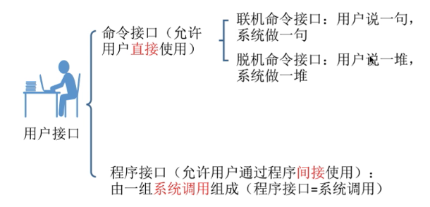
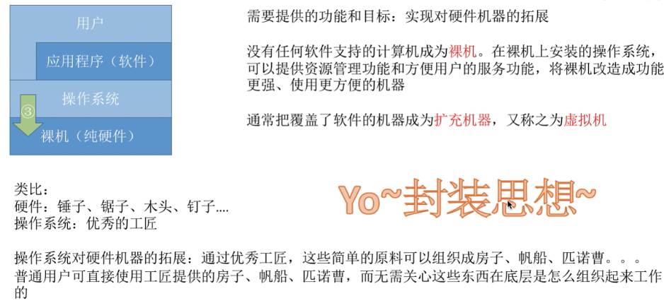
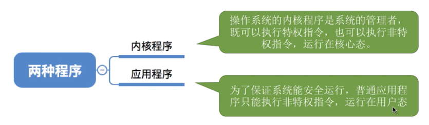
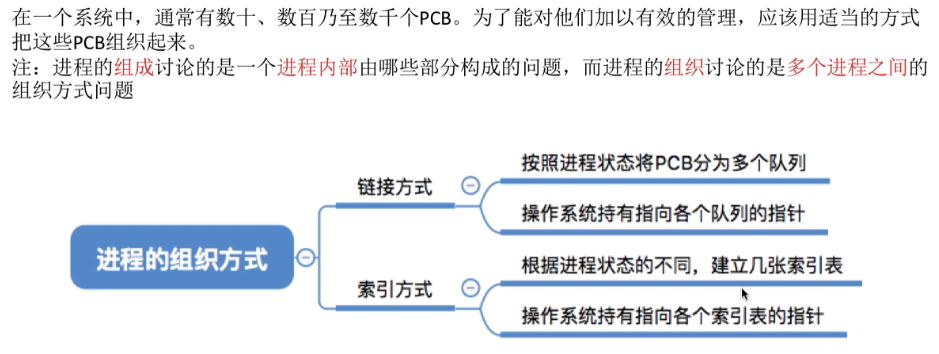
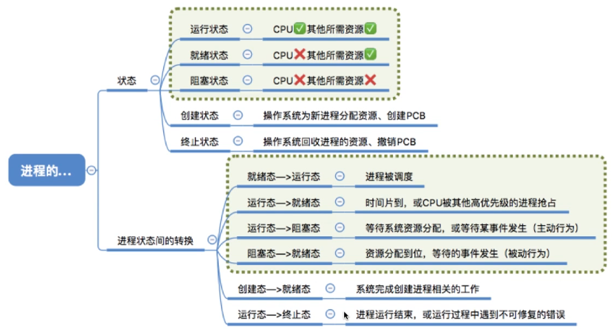
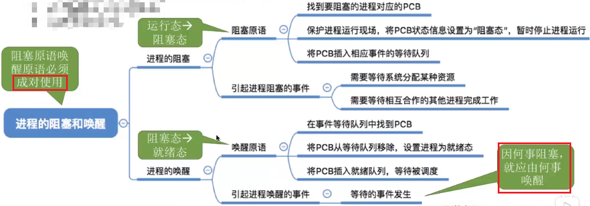
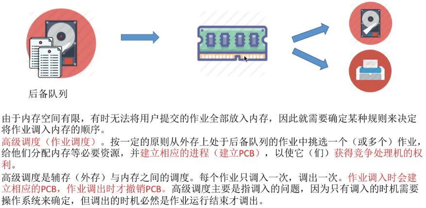
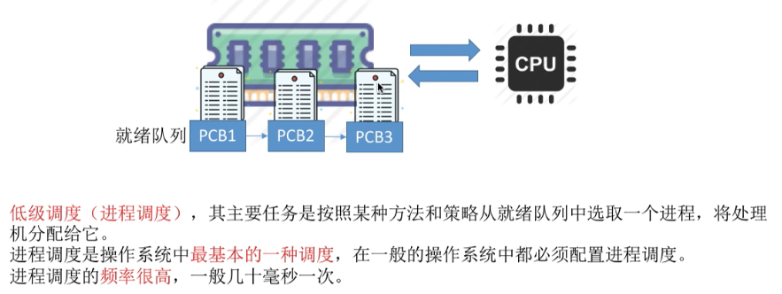
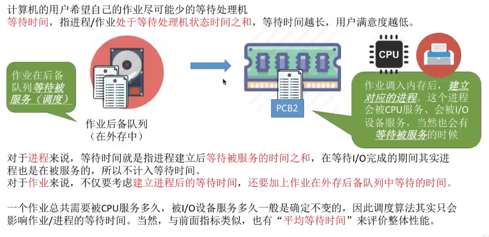
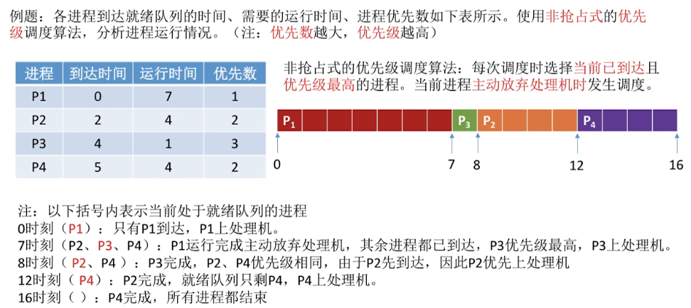

# os_wangdao

由于有ppt资源，并且ppt中包含了重点，所以本笔记打算不把大多数ppt都截图过来，而只是在听课过程中觉得ppt上无法良好体现和理解的地方在此做笔记。

QQ截图时无法控制图片质量，导致笔记过大；改用snipate截屏。

本笔记所说的重点，除非特意说明，否则默认就是考研的重点。

最开始的“总览”内容不全，是启发式，适合自己考自己；最后的“小结”内容是全的，适合快速阅读。

## 基础大纲

### 课程白嫖指南

本课程是官方的。

课程对应教材：王道408考研书；书中有习题，可以写一写。

### 操作系统的概念+功能+目标

#### 知识总览

#### 操作系统的概念

1，计算机系统的层次结构：

2，操作系统的定义：

- 定义的意群1：从中间往两边看
- 定义的意群2：从下往上看
- 定义的意群3：从上往下看

#### 操作系统的功能和目标

1，操作系统的各个角色分别要实现什么功能：

#### 操作系统作为系统管理者，要实现功能

1，功能：

#### 操作系统作为用户与计算机之间的接口，要实现功能

1，功能：

2，用户接口细说：

3，用户接口-联机命令接口：

- 体现了交互式，即用户说一句，系统做一句

4，用户接口-脱机命令接口：

- 双击.bat文件的时候，操作系统就会一条一条往下执行

5，用户接口-程序接口：

注意易混淆的概念：

6，图形用户界面细说：

7，总结：

#### 操作系统作为最接近硬件的层次，要实现功能

1，功能：

#### 小结

### 操作系统的四个特征

#### 总览

#### 并发

1，概念与实例：

- 注意并发与并行的区别。

2，多核CPU下，操作系统的“并发性”依然是必不可少的：

#### 共享

- 有的时候宏观上同时共享，在微观上也确实是同时共享；比如同时玩游戏+听歌，发现扬声器的声音输出设备，一边在播放游戏的音效，同时也在播放音乐；在这种情况下，扬声器这个声音输出设备，在微观上也是同时被音乐播放器和游戏这两个进程同时使用的。

#### 并发和共享的关系

- 并发性和共享性是互为存在条件的。

#### 虚拟

1，虚拟定义：

2，内存看似不够用，但又够用的原因：

3，单核CPU同时运行多个程序的原因：

4，有并发性才有虚拟性：

#### 异步

- 对于上面的约会方法，由于老渣的心只有一颗，在10~11点时，老渣的心被一号占了；2号的指令就没办法得到满足，所以2号的约会任务就会被阻塞，没办法继续往下推进；一直要等到一号使用完老渣的心把它归还给老渣，老渣才能把这颗心分配给2号，然后2号的约会进程才可以继续往下执行。

- 对于下面的约会方法，同样心也是被占用，而导致阻塞。
- 同时可以看出：“并发性是异步性存在的前提”。

#### 小结

### 操作系统的发展和分类

#### 总览

#### 手工操作阶段

#### 单道批处理系统

#### 多道批处理系统

1，概念：

- 网友说：“以前一个接口读取数据，现在多个接口读取，读取速度增加，cpu空闲时间少，但需要区分程序，引入中断”
- 注意：这里操作系统正式诞生！！！

2，为何说多道批处理系统中，资源利用率大幅提升了：

- 流水线思想：”输入，计算，输出“在做完上一个产品的自己负责的部分后，就会来下一个产品；不会等一个产品做完了才来下一个。

#### 分时操作系统

#### 实时操作系统

#### 其他几种操作系统

- 在考研的话，这三种操作系统有个印象即可，非重点。

#### 小结

- 绿色背景区是重点考察。

### 操作系统的运行机制与体系结构

#### 总览

#### 运行机制

1，什么是指令：

2，区分特权指令与非特权指令的必要性：

3，CPU如何判断当前是否可以执行特权指令：

4，运行两种程序，cpu分别处于不同的态：

#### 操作系统内核

1，思考：“操作系统·Hong Kong·哪些功能应该由内核程序实现？”。这就引入了操作系统内核的概念。

2，细分操作系统的层次，了解内核：

- 所有的进程切换还有进程调度，所有的管理工作，都是需要基于“计时”的功能才能实现；所以时钟管理很重要。

3，内核细节：

#### 大内核和微内核

1，不同的操作系统有不同的内核划分标准，所以有大内核操作系统和微内核操作系统：

2，大内核与微内核的特点与区别：

#### 小结

### 中断与异常

#### 总览

 #### 中断机制诞生

1，没有中断时：

2，引入中断机制。中断发生后，CPU切换到核心态，然后把CPU的使用权限交给系统；操作系统的内核就会对中断信号进行处理；操作系统的内核发现刚才的终端信号是告诉它时间片已到，操作系统就会决定进程1的时间片已用完，换进程2运行

- 如上就是操作系统开展的一系列工作，在完成一系列的工作之后，操作系统会把CPU的使用权交还给用户进程，接下来进程2就会在用户态下开始执行

#### 中断的概念和作用

#### 中断的分类

1，分类方式一：

2，分类方式二：

- 我感觉第二种分类和前一种分类区别不大，就记第一种吧。

#### 外中断的处理过程

- ”保护被中断进程的CPU环境“的具体操作，是计算机组成原理的内容，这不细说了。

#### 小结

### 系统调用

#### 总览

#### 系统调用的定义与作用

1，系统调用的定义：

2，思考：

3，系统调用的作用：

4，系统调用的分类：

- 简单了解，有个印象即可

5，系统调用相关处理涉及到对系统资源的管理、对进程的控制，这些功能需要执行一些**特权指令**才能完成，因此**系统调用的相关处理**需要在**核心态**下进行

#### 系统调用和库函数的区别

1，本小节最开始说过：系统调用可以理解为一种可以让应用程序来使用的一些特殊的函数，那么它和我们平时编程使用的库函数有什么区别？：

- 其实操作系统对上层会提供“系统调用”接口；应用程序理论上是可以通过汇编语言的形式来直接使用“系统调用”功能的；但是由于现代的软件工程开发过程中，大家其实使用的都是如“C，java”这样的高级语言，所以在现在的编程当中，我们一般在程序中使用高级语言提供的库函数；但是最后这些库函数的底层其实会为我们封装一些相应的系统调用功能，只不过这些细节被库函数屏蔽了，所以使用库函数是很方便的，不需要再用复杂的方式进行系统调用。

#### 系统调用背后的过程

1，过程实例：

- 注意的1，这里的”一个内中断”，即“一个interupt”

- 系统调用的背后会执行一个”int指令“（或称为“陷入指令”），这个陷入指令会发出一个内中断，从而使CPU从用户态进入核心态。

2，int x指令，不同的参数x对应什么意思：

- 这个了解即可，不需要记。

#### 小结

## 进程

### 进程的定义 组成 组成方式 特征

#### 总览

#### 进程的定义

1，只支持单道程序的早期计算机阶段：

- 早期计算机只支持单道程序，因此在该计算机当中，同一时间段内只能有一道程序正在运行；“CPU，内存，I/O设备”只为该唯一的正在运行的程序服务

2，支持多道程序的计算机阶段：

- 本阶段实际上就出现了”进程实体“，即”进程“

3，进程定义：

#### 进程的组成

1，进程的组成：

2，PCB细节：

3，进程的组成，树状图版：

#### 进程的组织

1，进程的组织方式有两种：

2，进程的组织方式-链接方式：

2，进程的组织方式-索引方式：

- 索引方式和链接方式很类似，区别就是这些指针指向的是索引表，而不是一个队列的队头；而这个索引表的各个表项又会指向处于本索引表对应状态的各个进程所对应的PCB。
- 简言之，操作系统会为不同状态的进程建立索引表，然后各个索引表的表项又指向处于该状态的各个进程的PCB。

#### 进程的特征

#### 小结

### 进程的状态与转换

#### 总览

#### 进程的状态-三种基本状态

#### 进程的状态-另外两种状态

#### ！进程状态的转换

#### 小结

- 绿色背景的为重点

### 进程控制

#### 总览

#### 进程控制定义

- 进程控制就是要实现绿色箭头表示的具体的过程

#### 如何实现进程控制

1，进程控制的方法：

- 就绪态->运行态：

  1. 修改PCB的内容就是把PCB中的状态标志位从“就绪态”改为“运行态”。

  2. 把该进程的PCB从就绪队列中摘出来，然后这个进程既可以被处理 运行。
  3. 这里的“恢复进程运行环境“，是因为这个进程之前可能运行到一半，然后被切换了，所以这个进程运行的一些中间结果其实是被保存在PCB中的，所以这个进程再次被调度的时候需要把它之前的运行环境给恢复过来。

- 运行态->阻塞态：
  1. 当进程在执行的过程当中，如果用系统调用的方式发出了一个等待某个事件的请求，那么就得把这个进程当前运行的环境给保存起来，用于之后这个进程还可以接着往下执行。
  2. 并且还需要把进程的PCB当中的标志位，从运行态改为阻塞态。
  3. 把进程的PCB放到相应时间的阻塞队列中

2，思考：假如对某个进程，把他的PCB从一个队列放到了另一个队列，但是并没有把PCB中的状态标志位改成相应的新的状态，那么是很危险的，可能会造成系统错误；因为PCB所处的队列和PCB当中的状态标志位，两个数据就不一致了。

- 为了防止这个问题出现，就使用了“原语”。

3，原语介绍：

- 执行”关中断“指令后，如果此时有外部中断信号进入，那么这个外部中断信号会被忽略而暂时不会被处理；所以这就保证了原语的一系列处理不会被中断。

- 在执行“开中断”指令后，再接收到一个外部中断信号，这个时候才换转入相应的中断处理程序开始处理。
- 可以看出使用“开中断和关中断”就可以实现原语这种一气呵成的操作；也就我们提到的，把PCB放到一个队列当中，并且还需要保证PCB中的数据也被修改，这样的事情就可以用“原语”来实现

#### 进程控制相关的原语

1，原语做的核心三类事情：

2，操作系统提供的“创建原语”在创建进程时的作用：

- ”创建原语“实现了一个进程从“无”到“创建态”，再从“创建态”进入到就绪队列进入“就绪态”的过程。

3，操作系统提供的“撤销原语”在终止进程时的作用：

- 网友说：“ppt有个地方错了，unix中，父进程结束，子进程会被守护进程收养”

- 外界干预：比如使用windows操作系统的任务管理器杀进程，就是一种外界干预

4，操作系统提供的“阻塞原语”和“唤醒原语”的作用：

- 网友评价进程阻塞和唤醒的关系：“解铃还须系铃人”

5，操作系统提供的“切换原语”在切换进程时的作用：

#### 小结

### 进程通信

#### 总览

#### 进程通信定义

#### 进程通信-共享存储

#### 进程通信-管道通信

- 互斥：
  - 和共享空间的访问一样；
  - 当进程1正在往管道中写的时候，进程2是不允许访问管道的；只有进程1把管道的访问释放了，进程2才可以开始读。

#### 进程通信-消息传递

- 间接通信方式：
  - 信箱中的消息可能是不同进程之间通信的消息；具体是由哪个进程发哪个进程收，这都是在消息头中指定了的，所以不需要担心消息会被取错。
  - 如果一个进程想给另外一个进程发送消息，这个消息会先用发送原语发送到信箱，之后读进程会用接收原语从信箱中取走属于自己的消息。

#### 小结

### 线程概念和多线程模型

#### 总览

#### 什么是线程，为何引入线程

1，

- 图左右对比：
  - 图左边是传统的进程机制；CPU会轮流地为各个进程提供服务，那么这些进程就可以并发地执行；并且每个进程会有它自己相应的一系列程序代码，被CPU服务的时候，这些代码就会**一句一句**(不能并发)往下执行；
  - 图右侧是引入了线程的进程机制；CPU的服务对象就不再是进程，而是进程当中的线程；每一个进程当中可能会包含多个线程，CPU会用一定的算法轮流地为这些线程进行服务；这样同一个进程当中被分为了多个线程，像”QQ视频聊天和QQ传送文件“这两件事情想要并发得执行的话，那我们就可以把”QQ视频聊天和QQ传送文件“对应的处理程序放到两个不同的线程下，那这两个线程可以并发得执行，自然这两件事就可以并发地完成。
- 进程对应着一个程序，而进程内部也需要实现并发所以进程内部引入线程这个概念；如果没有线程，并发执行也只能是进程之间的并发执行，而进程内部依然是顺序执行的。

2，

- 知乎总结进程和线程的对比：

  - 地址空间：线程共享本进程的地址空间，而进程之间是独立的地址空间。

  - 资源：线程共享本进程的资源如内存、I/O、cpu等，不利于资源的管理和保护；而进程之间的资源是独立的，能很好的进行资源管理和保护。计算机除CPU以外的系统资源是被分配给进程的，而不是分配给线程的。

  - 健壮性：多进程要比多线程健壮，一个进程崩溃后，在保护模式下不会对其他进程产生影响，但是一个线程崩溃整个进程都死掉。

  - 可并发性：两者均可并发执行。

  - 切换时：进程切换时，消耗的资源大，效率高。所以涉及到频繁的切换时，使用线程要好于进程。同样如果要求同时进行并且又要共享某些变量的并发操作，只能用线程不能用进程。

  - 其他：线程是处理器(CPU)调度的基本单位，但是进程不是。

    

#### 引入线程机制后，有什么变化

- 我理解：”线程是调度的基本单位“即线程是CPU资源分配的基本单位

#### 线程的属性

- ”线程控制块TCB“有点类似于之前学过的”PCB进程控制快“，TCB也是用于管理线程所创建的一个数据结构。
- 线程的三种基本状态“就绪，阻塞，运行”，进程也有。
- 线程几乎不拥有系统资源，这是因为资源都在进程那里；线程要资源的话，从自己所属进程那拿。

#### 线程的实现方式

1，用户级线程：

- 计算机中的透明：计算机中存在，但是你不需要了解

2，内核级线程：

- 本情形下，对用户来说，这个进程拥有三个线程；对操作系统来说，这个进程同样拥有三个线程。

3，有的操作系统只支持用户级线程，有的只支持内核级线程，也有的操作系统同时支持“用户级线程和内核级线程”。在同时支持“用户级线程和内核级线程”的系统中，可以采用二者组合的方式：

- 本图中，三个用户级线程映射到了两个内核级线程当中。

- 本图中进程只能被分配两个核，是因为操作系统只看见两个内核级线程。

#### 多线程模型

1，多对一模型：

- 线程切换在用户空间(用户态)就可以完成，由应用程序负责完成。
- 网友说：“因为内核级线程才是处理机分配的基本单位，多个用户级映射在一个内核级线程 ，内核认为仅有一个线程 ，当一个用户级线程被阻塞，内核认为所映射的内核级线程被阻塞，故所有映射到该内核级的用户级都被阻塞”

2，一对一模型：

- 一对一模型其实变成了纯粹的内核级线程。

3，多对多模型：

- 多对多模型是集二者所长。

#### 小结

- 一对一的优缺点写反了

### 处理机调度的概念 层次

#### 总览

#### 调度的基本概念

- 我疑问：”不是内核线程是调度的单位，怎么又是“选择进程分配给它”“
- 网友：“处理机就是cpu核”

#### 调度的三个层次-高级调度

- 作业的定义：
  - 网友：“作业：用户在处理某个作业或任务时要求计算机要求计算机所做事情的集合”
  - 网友：“作业（job）是计算机操作者（或是一个叫做作业调度器的程序）交给操作系统的执行单位。 作业包括程序、相应的数据和作业说明书”
  - 网友：“作业是静态的，而进程是动态的。进程是程序的一次执行过程。此外，一个作业可能需要创建多个进程。而一个进程只能对应一个作业，即作业和进程是多对一的关系。”
  - 赞最多的网友：“作业是你交给计算机干的那件事  进程是计算机为了完成你的作业它要干的几件事。。”
  - 网友：“作业是用户在一次事务处理过程中要求计算机系统所作工作的总和，它是用户向计算机系统提交一项工作的基本单位。个人理解是比进程更加全面的一项任务”。
- 网友：“建议跨考的同学先了解一下计算机组成原理后再来学习”-但面试一般不问机组。

#### 调度的三个层次-中级调度

1，中级调度定义：

- 网友问：“前面不是说每个作业只调一次，调出一次吗？为什么这里调入内存后还可以调出调入”。网友答：“前面的，只调一次的是高级调度，这是中级”

- 网友：“这只是页面置换算法，国人给起了个好听的名字中级调度”
- 挂起：挂起就是进程数据放外存，PCB留在内存。中级调度：决定将哪个处于挂起状态的进程重新调入内存。挂起和中级调度互逆。

2，补充知识--进程的挂起态与七状态模型：

- 注意图中“挂起”和“阻塞”的区别

#### 调度的三个层次-低级调度

- 网友：“高级调度是作业调度，中级调度是内存调度，低级调度是进程调度。高级调度主要是按照一定的调度算法把作业从外存调入内存并为作业分配相应的资源建立相应的进程。而中级调度主要是为了对内存空间进行逻辑扩充。”

- 为了实现进程的并发执行，进程调度的频率就可能很高；这样才能让进程在宏观上看是同时(并发)执行的，而微观上，他们是用很快的频率交替执行。
- 注意：本调度是操作系统**最基本的一种调度**。

#### 三层调度的联系和对比

- 作业定义：
  - 赞最多的网友：“作业是你交给计算机干的那件事  进程是计算机为了完成你的作业它要干的几件事。。”
- 高级调度和中级调度都是发生在外存和内存之间的调度；区别在于高级调度是面向作业的调度，中级调度是面向进程的调度。
- 低级调度是内存和cpu之间的调度。

#### 小结

### 。进程调度的时机 切换与过程 调度方式

#### 总览

#### 进程调度的时机

1，可以进程调度和不可以进程调度的情形：

- 网友：“应该这么理解： 关中断---->原语---->开中断”

2，注意区分“临界区”和“操作系统内核程序临界区”：

- 因为“临界区是访问临界资源的那段代码”，因此，各个进程只能互斥得进入临界区，互斥地执行访问临界资源的代码。
- 左右图解析：
  - 左图：如果还没退出临界区（还没解锁)就进行进程调度，但是进程调度相关的程序也需要访问就绪队列,但此时就绪队列被锁住了，因此又无法顺利进行进程调度
  - 右图：在打印机打印完成之前，进程一直处于临界区内，临界资源不会解锁。但打印机又是慢速设备，此时如果一直不允许进程调度的话就会导致CPU一直空闲。。。所以，访问普通临界区时，为了提高CPU的利用率，允许进行调度与切换。

- 网友：“进程在请求打印机这样的I/O设备的时候，由运行态变成阻塞态，因而需要用调度程序将就绪队列的进程变为活动态”
- 网友：“普通临界区就是一些IO设备，打印机，因为这类设备的处理会很慢，不可能一致等待打印机工作结束才使用CPU；内核程序临界区在本例是会给就绪队列上一个锁后独自占用资源，并且此时其他进程是无法进入就绪队列的”

3，有的系统中，只允许进程主动放弃处理机；有的系统中，进程可以主动放弃处理机，当有更紧急的任务需要处理时，也会强行剥夺处理机。但是注意，无论在什么系统中，进程在**普通**临界区中是可以进行调度切换的。

#### 进程调度的方式

#### 进程的切换与过程

- 不能简单的认为“进程切换越频繁，进程的并发度越高”，进程切换过于频繁反而会导致整个系统的效率降低。
  - 网友评价：“并发度高，但效率低”。

#### 小结

### 调度算法的评价指标

#### 总览

#### CPU利用率

#### 系统吞吐量

#### 周转时间

1，普通周转时间

- 等厕所的例子：
  - 张三排队10分钟，上厕所1分钟，感觉自己很亏
  - 李四排队1分钟，上厕所10分钟；李四的周转时间也是11分钟，只不过这11分钟只有1分钟是用来等待的，所以对于李四来说，这1分钟的等待对他来说没那么糟糕。
  - 如上就是周转时间相同的情况下，作业的实际运行时间长短不同所导致的对于用户的感受的区别

2，带权周转时间：

- 带权周转时间肯定是大于等于1的，因为周转时间包含了作业的实际运行时间，故周转时间肯定比作业的实际运行时间更大。
- 用户看重“带权周转时间”，操作系统看重“平均带权周转时间”

#### 等待时间

- 我理解：“I/O时，处理机在为I/O服务，虽然本等待进程不占用处理机，但为I/O服务实际上就是在为本作业服务”

#### 响应时间

#### 小结

- “带权周转时间”比较难理解，不过只要结合排队上厕所的例子就容易理解了。

### FCFS SJF HRRN调度算法

#### 总览

#### FCFS

1，FCFS特点：

- 排队买奶茶的例子：奶茶店一般都是先来先服务，假如现在你的前面有个人要买20杯奶茶，那这家店做20杯奶茶可能要半小时；虽然说你只买一杯奶茶，做你的奶茶的时间只需要1分钟，但是由于你的前面突然来了一个长进程/长进程，那么对你这个短作业/短进程体验就会很差。
- 不会导致饥饿，因为只要等着，前面的进程总能处理完。

2，FCFS实例讲解：

- 因为等待越久说明越早到。P1先到，所以比后面到的等待服务的时间长，可能p4都到了，P1还在等待服务
- 本例进程为纯计算型的进程，表示进程只需要CPU为它服务；所以一个进程到达以后只有两个状态，要么他就是等待被调度，要么它就是处于运行的状态。

- P3的带权周转时间为8，非常大的值；这意味着，这个进程本来只需要很少的时间为它服务，但是它需要等很长的时间才可以被处理完；因此对P3用户来说，可能他的体验很糟糕。

#### SJF

1，SJF特点：

- 网友：“说SJF有平均最短时间没啥不严谨的，说白了就是最短时间优先算法分为抢占式和非抢占式，其中抢占式的平均周转时间更短，自然就可以直接说最短时间优先算法是最短的，因为抢占式是它的子类罢了”

2，非抢占式的短作业优先调度算法：

- 最开始只有P1，所以P1最先被运行；等P1运行完毕后，其他所有进程也都到达了。

3，抢占式的短作业优先调度算法：

计算如下：

4，注意几个小细节：

- 操作系统这门课和“数学物理”这些基础理学的学科不一样，操作系统对很多算法和概念的说法和定义，不同版本的教材有所不同，并没有一个很严格的说法。考试时判断所有选项吗，选一个错误最少的。

#### HRRN

1，FCFS和SJF两种算法的思考，引入HRRN：

2，HRRN特点：

- 综合了FCFS和SJF的优点，做了一个折中。

3，HRRN实例：

- 本例中，进程都是纯计算型进程，所以并不会有I/O操作，也就是不会主动要求阻塞；因此“主动阻塞”的情况暂时不用考虑。
- 本图中，某时刻时，红色的Px代表此时刻会被处理的进程。
- 本图小错误：P3((3+1)/1=4)

#### 小结

- SJF的“最短的”平均等待时间，最短的打了双引号，因为非默认的抢占式的SJF才是最短的。
- 本节学的三种算法，对用户的交互性很差，一般用于早期的批处理系统。

### 调度算法：时间片轮转 优先级 多级反馈队列

#### 总览

#### 时间片轮转调度算法

1，时间片轮转调度算法特点：

- 时间片太大影响用户和进程交互(增加进程的响应时间)，时间片太小增大系统切换进程的耗时。

2，时间片轮转调度算法实例--时间片大小为2的情况：

0~5时刻：

- 网友：“不计算周转时间是因为这里根本就没法知道作业在外存后备队列等待的时间”

6~11时刻：

- 网友：“回去翻视频，主动放弃时也会发生调度”

12~16时刻：

3，时间片轮转调度算法实例--时间片大小为5的情况：

- 网友：“时间片多，进程切换所需的系统开销大，书里不都写着吗= =”

4，如果用FCFS算法，发现结果和时间片大小为5的情况很类似：

时间片较大的情况：

时间片较小的情况：

- 时间片大小问题：

  - 所以如果时间片太大的话，会增大进程的响应时间，失去了“时间片轮转调度算法”最大的一个优点。退化成FCFS。

  - 切换太频繁的话，系统会花大量时间来处理进程切换
  - 拓展知识，非重点：一般来说，设计时间片时要让切换进程的开销占比不超过1%；

#### 优先级调度算法

1，时间片轮转调度算法特点：

- 就算是动态调整进程优先级，也可能会导致饥饿；因为某个进程等待越久，有限级越高，但同时新到的进程的优先级也越来越高，故长时间等待的进程还是可能饥饿。

2，时间片轮转调度算法实例--非抢占式：

3，时间片轮转调度算法实例--抢占式：

4，补充：

- 我们可以认为“高响应比优先算法”是一种“动态优先级调度算法”。

#### 多级反馈队列调度算法

1，思考：

2，多级反馈队列调度算法特点：

- 优点解析：

  - 有FCFS优点：每个进程刚开始进来的时候，肯定都是被优先处理的，因为刚开始的时候进程的优先级是最高的。
  - 有RR的优点：因为新到达的进程优先级高，所以在第一级队列的话很快被调度，也即可以得到响应。

  - 有SPF的优点：短进程只需要经历过优先级比较高的那几个队列，即执行了几个较短的时间片后就可以完成了；所以这也会导致短进程的平均周转时间会比较理想。
  - 所谓“用户作假”，即一个长进程，把自己的时间说的很短，伪装成短进程。

- 算法可能导致饥饿，因为源源不断地有短进程到达的话，可能短进程在第一级队列被分配一个时间片之后，就可以被处理了；但是已经被降级为更低优先级的那些进程就可能长期得不到服务，从而导致饥饿。

3，多级反馈队列调度算法实例：

- 新进程到达时进入第1级队列的队尾；
- 课程的动画比较形象，记不清的话可以回看视频参考动画理解

#### 小结

### 进程同步 进程互斥

https://www.bilibili.com/video/BV1YE411D7nH?p=18&spm_id_from=pageDriver

