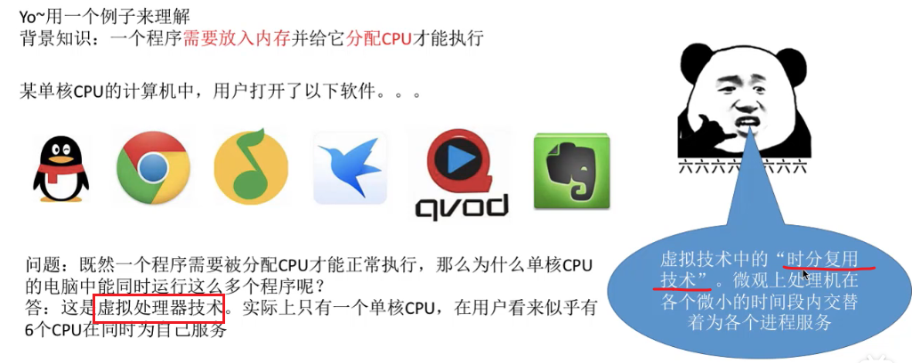
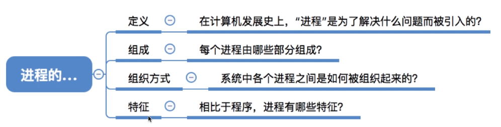
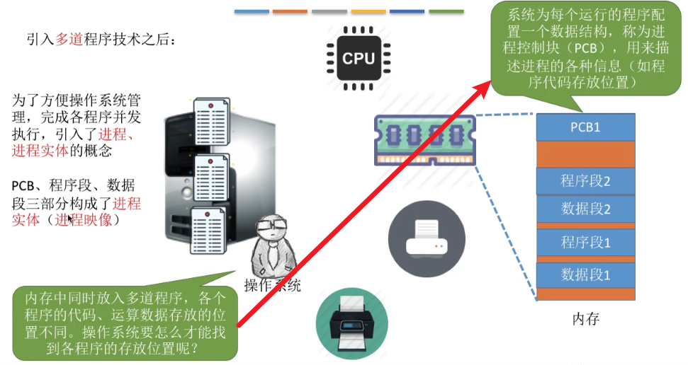
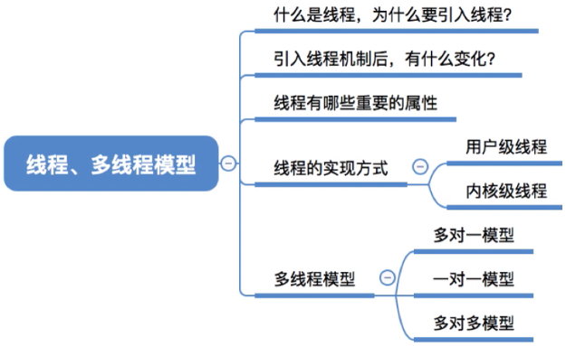
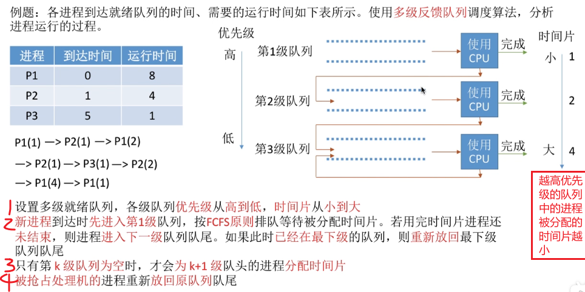

# os_wangdao

由于有ppt资源，并且ppt中包含了重点，所以本笔记打算不把大多数ppt都截图过来，而只是在听课过程中觉得ppt上无法良好体现和理解的地方在此做笔记。

QQ截图时无法控制图片质量，导致笔记过大；改用snipate截屏。

本笔记所说的重点，除非特意说明，否则默认就是考研的重点。

最开始的“总览”内容不全，是启发式，适合自己考自己；最后的“小结”内容是全的，适合快速阅读。

## 基础大纲

### 课程白嫖指南

本课程是官方的。

课程对应教材：王道408考研书；书中有习题，可以写一写。

### 操作系统的概念+功能+目标

#### 知识总览

#### 操作系统的概念

1，计算机系统的层次结构：

2，操作系统的定义：

- 定义的意群1：从中间往两边看
- 定义的意群2：从下往上看
- 定义的意群3：从上往下看

#### 操作系统的功能和目标

1，操作系统的各个角色分别要实现什么功能：

#### 操作系统作为系统管理者，要实现功能

1，功能：

#### 操作系统作为用户与计算机之间的接口，要实现功能

1，功能：

2，用户接口细说：

3，用户接口-联机命令接口：

- 体现了交互式，即用户说一句，系统做一句

4，用户接口-脱机命令接口：

- 双击.bat文件的时候，操作系统就会一条一条往下执行

5，用户接口-程序接口：

注意易混淆的概念：

6，图形用户界面细说：

7，总结：

#### 操作系统作为最接近硬件的层次，要实现功能

1，功能：

#### 小结

### 操作系统的四个特征

#### 总览

#### 并发

1，概念与实例：

- 注意并发与并行的区别。

2，多核CPU下，操作系统的“并发性”依然是必不可少的：

#### 共享

- 有的时候宏观上同时共享，在微观上也确实是同时共享；比如同时玩游戏+听歌，发现扬声器的声音输出设备，一边在播放游戏的音效，同时也在播放音乐；在这种情况下，扬声器这个声音输出设备，在微观上也是同时被音乐播放器和游戏这两个进程同时使用的。

#### 并发和共享的关系

- 并发性和共享性是互为存在条件的。

#### 虚拟

1，虚拟定义：

2，内存看似不够用，但又够用的原因：

3，单核CPU同时运行多个程序的原因：

4，有并发性才有虚拟性：

#### 异步

- 对于上面的约会方法，由于老渣的心只有一颗，在10~11点时，老渣的心被一号占了；2号的指令就没办法得到满足，所以2号的约会任务就会被阻塞，没办法继续往下推进；一直要等到一号使用完老渣的心把它归还给老渣，老渣才能把这颗心分配给2号，然后2号的约会进程才可以继续往下执行。

- 对于下面的约会方法，同样心也是被占用，而导致阻塞。
- 同时可以看出：“并发性是异步性存在的前提”。

#### 小结

### 操作系统的发展和分类

#### 总览

#### 手工操作阶段

#### 单道批处理系统

#### 多道批处理系统

1，概念：

- 网友说：“以前一个接口读取数据，现在多个接口读取，读取速度增加，cpu空闲时间少，但需要区分程序，引入中断”
- 注意：这里操作系统正式诞生！！！

2，为何说多道批处理系统中，资源利用率大幅提升了：

- 流水线思想：”输入，计算，输出“在做完上一个产品的自己负责的部分后，就会来下一个产品；不会等一个产品做完了才来下一个。

#### 分时操作系统

#### 实时操作系统

#### 其他几种操作系统

- 在考研的话，这三种操作系统有个印象即可，非重点。

#### 小结

- 绿色背景区是重点考察。

### 操作系统的运行机制与体系结构

#### 总览

#### 运行机制

1，什么是指令：

2，区分特权指令与非特权指令的必要性：

3，CPU如何判断当前是否可以执行特权指令：

4，运行两种程序，cpu分别处于不同的态：

#### 操作系统内核

1，思考：“操作系统·Hong Kong·哪些功能应该由内核程序实现？”。这就引入了操作系统内核的概念。

2，细分操作系统的层次，了解内核：

- 所有的进程切换还有进程调度，所有的管理工作，都是需要基于“计时”的功能才能实现；所以时钟管理很重要。

3，内核细节：

#### 大内核和微内核

1，不同的操作系统有不同的内核划分标准，所以有大内核操作系统和微内核操作系统：

2，大内核与微内核的特点与区别：

#### 小结

### 中断与异常

#### 总览

 #### 中断机制诞生

1，没有中断时：

2，引入中断机制。中断发生后，CPU切换到核心态，然后把CPU的使用权限交给系统；操作系统的内核就会对中断信号进行处理；操作系统的内核发现刚才的终端信号是告诉它时间片已到，操作系统就会决定进程1的时间片已用完，换进程2运行

- 如上就是操作系统开展的一系列工作，在完成一系列的工作之后，操作系统会把CPU的使用权交还给用户进程，接下来进程2就会在用户态下开始执行

#### 中断的概念和作用

#### 中断的分类

1，分类方式一：

2，分类方式二：

- 我感觉第二种分类和前一种分类区别不大，就记第一种吧。

#### 外中断的处理过程

- ”保护被中断进程的CPU环境“的具体操作，是计算机组成原理的内容，这不细说了。

#### 小结

### 系统调用

#### 总览

#### 系统调用的定义与作用

1，系统调用的定义：

2，思考：

3，系统调用的作用：

4，系统调用的分类：

- 简单了解，有个印象即可

5，系统调用相关处理涉及到对系统资源的管理、对进程的控制，这些功能需要执行一些**特权指令**才能完成，因此**系统调用的相关处理**需要在**核心态**下进行

#### 系统调用和库函数的区别

1，本小节最开始说过：系统调用可以理解为一种可以让应用程序来使用的一些特殊的函数，那么它和我们平时编程使用的库函数有什么区别？：

- 其实操作系统对上层会提供“系统调用”接口；应用程序理论上是可以通过汇编语言的形式来直接使用“系统调用”功能的；但是由于现代的软件工程开发过程中，大家其实使用的都是如“C，java”这样的高级语言，所以在现在的编程当中，我们一般在程序中使用高级语言提供的库函数；但是最后这些库函数的底层其实会为我们封装一些相应的系统调用功能，只不过这些细节被库函数屏蔽了，所以使用库函数是很方便的，不需要再用复杂的方式进行系统调用。

#### 系统调用背后的过程

1，过程实例：

- 注意的1，这里的”一个内中断”，即“一个interupt”

- 系统调用的背后会执行一个”int指令“（或称为“陷入指令”），这个陷入指令会发出一个内中断，从而使CPU从用户态进入核心态。

2，int x指令，不同的参数x对应什么意思：

- 这个了解即可，不需要记。

#### 小结

## 进程

### 进程的定义 组成 组成方式 特征

#### 总览

#### 进程的定义

1，只支持单道程序的早期计算机阶段：

- 早期计算机只支持单道程序，因此在该计算机当中，同一时间段内只能有一道程序正在运行；“CPU，内存，I/O设备”只为该唯一的正在运行的程序服务

2，支持多道程序的计算机阶段：

- 本阶段实际上就出现了”进程实体“，即”进程“

3，进程定义：

#### 进程的组成

1，进程的组成：

2，PCB细节：

3，进程的组成，树状图版：

#### 进程的组织

1，进程的组织方式有两种：

2，进程的组织方式-链接方式：

2，进程的组织方式-索引方式：

- 索引方式和链接方式很类似，区别就是这些指针指向的是索引表，而不是一个队列的队头；而这个索引表的各个表项又会指向处于本索引表对应状态的各个进程所对应的PCB。
- 简言之，操作系统会为不同状态的进程建立索引表，然后各个索引表的表项又指向处于该状态的各个进程的PCB。

#### 进程的特征

#### 小结

### 进程的状态与转换

#### 总览

#### 进程的状态-三种基本状态

#### 进程的状态-另外两种状态

#### ！进程状态的转换

#### 小结

- 绿色背景的为重点

### 进程控制

#### 总览

#### 进程控制定义

- 进程控制就是要实现绿色箭头表示的具体的过程

#### 如何实现进程控制

1，进程控制的方法：

- 就绪态->运行态：

  1. 修改PCB的内容就是把PCB中的状态标志位从“就绪态”改为“运行态”。

  2. 把该进程的PCB从就绪队列中摘出来，然后这个进程既可以被处理 运行。
  3. 这里的“恢复进程运行环境“，是因为这个进程之前可能运行到一半，然后被切换了，所以这个进程运行的一些中间结果其实是被保存在PCB中的，所以这个进程再次被调度的时候需要把它之前的运行环境给恢复过来。

- 运行态->阻塞态：
  1. 当进程在执行的过程当中，如果用系统调用的方式发出了一个等待某个事件的请求，那么就得把这个进程当前运行的环境给保存起来，用于之后这个进程还可以接着往下执行。
  2. 并且还需要把进程的PCB当中的标志位，从运行态改为阻塞态。
  3. 把进程的PCB放到相应时间的阻塞队列中

2，思考：假如对某个进程，把他的PCB从一个队列放到了另一个队列，但是并没有把PCB中的状态标志位改成相应的新的状态，那么是很危险的，可能会造成系统错误；因为PCB所处的队列和PCB当中的状态标志位，两个数据就不一致了。

- 为了防止这个问题出现，就使用了“原语”。

3，原语介绍：

- 执行”关中断“指令后，如果此时有外部中断信号进入，那么这个外部中断信号会被忽略而暂时不会被处理；所以这就保证了原语的一系列处理不会被中断。

- 在执行“开中断”指令后，再接收到一个外部中断信号，这个时候才换转入相应的中断处理程序开始处理。
- 可以看出使用“开中断和关中断”就可以实现原语这种一气呵成的操作；也就我们提到的，把PCB放到一个队列当中，并且还需要保证PCB中的数据也被修改，这样的事情就可以用“原语”来实现

#### 进程控制相关的原语

1，原语做的核心三类事情：

2，操作系统提供的“创建原语”在创建进程时的作用：

- ”创建原语“实现了一个进程从“无”到“创建态”，再从“创建态”进入到就绪队列进入“就绪态”的过程。

3，操作系统提供的“撤销原语”在终止进程时的作用：

- 网友说：“ppt有个地方错了，unix中，父进程结束，子进程会被守护进程收养”

- 外界干预：比如使用windows操作系统的任务管理器杀进程，就是一种外界干预

4，操作系统提供的“阻塞原语”和“唤醒原语”的作用：

- 网友评价进程阻塞和唤醒的关系：“解铃还须系铃人”

5，操作系统提供的“切换原语”在切换进程时的作用：

#### 小结

### 进程通信

#### 总览

#### 进程通信定义

#### 进程通信-共享存储

#### 进程通信-管道通信

- 互斥：
  - 和共享空间的访问一样；
  - 当进程1正在往管道中写的时候，进程2是不允许访问管道的；只有进程1把管道的访问释放了，进程2才可以开始读。

#### 进程通信-消息传递

- 间接通信方式：
  - 信箱中的消息可能是不同进程之间通信的消息；具体是由哪个进程发哪个进程收，这都是在消息头中指定了的，所以不需要担心消息会被取错。
  - 如果一个进程想给另外一个进程发送消息，这个消息会先用发送原语发送到信箱，之后读进程会用接收原语从信箱中取走属于自己的消息。

#### 小结

### 线程概念和多线程模型

#### 总览

#### 什么是线程，为何引入线程

1，

- 图左右对比：
  - 图左边是传统的进程机制；CPU会轮流地为各个进程提供服务，那么这些进程就可以并发地执行；并且每个进程会有它自己相应的一系列程序代码，被CPU服务的时候，这些代码就会**一句一句**(不能并发)往下执行；
  - 图右侧是引入了线程的进程机制；CPU的服务对象就不再是进程，而是进程当中的线程；每一个进程当中可能会包含多个线程，CPU会用一定的算法轮流地为这些线程进行服务；这样同一个进程当中被分为了多个线程，像”QQ视频聊天和QQ传送文件“这两件事情想要并发得执行的话，那我们就可以把”QQ视频聊天和QQ传送文件“对应的处理程序放到两个不同的线程下，那这两个线程可以并发得执行，自然这两件事就可以并发地完成。
- 进程对应着一个程序，而进程内部也需要实现并发所以进程内部引入线程这个概念；如果没有线程，并发执行也只能是进程之间的并发执行，而进程内部依然是顺序执行的。

2，

- 知乎总结进程和线程的对比：

  - 地址空间：线程共享本进程的地址空间，而进程之间是独立的地址空间。

  - 资源：线程共享本进程的资源如内存、I/O、cpu等，不利于资源的管理和保护；而进程之间的资源是独立的，能很好的进行资源管理和保护。计算机除CPU以外的系统资源是被分配给进程的，而不是分配给线程的。

  - 健壮性：多进程要比多线程健壮，一个进程崩溃后，在保护模式下不会对其他进程产生影响，但是一个线程崩溃整个进程都死掉。

  - 可并发性：两者均可并发执行。

  - 切换时：进程切换时，消耗的资源大，效率高。所以涉及到频繁的切换时，使用线程要好于进程。同样如果要求同时进行并且又要共享某些变量的并发操作，只能用线程不能用进程。

  - 其他：线程是处理器(CPU)调度的基本单位，但是进程不是。

    

#### 引入线程机制后，有什么变化

- 我理解：”线程是调度的基本单位“即线程是CPU资源分配的基本单位

#### 线程的属性

- ”线程控制块TCB“有点类似于之前学过的”PCB进程控制快“，TCB也是用于管理线程所创建的一个数据结构。
- 线程的三种基本状态“就绪，阻塞，运行”，进程也有。
- 线程几乎不拥有系统资源，这是因为资源都在进程那里；线程要资源的话，从自己所属进程那拿。

#### 线程的实现方式

1，用户级线程：

- 计算机中的透明：计算机中存在，但是你不需要了解

2，内核级线程：

- 本情形下，对用户来说，这个进程拥有三个线程；对操作系统来说，这个进程同样拥有三个线程。

3，有的操作系统只支持用户级线程，有的只支持内核级线程，也有的操作系统同时支持“用户级线程和内核级线程”。在同时支持“用户级线程和内核级线程”的系统中，可以采用二者组合的方式：

- 本图中，三个用户级线程映射到了两个内核级线程当中。

- 本图中进程只能被分配两个核，是因为操作系统只看见两个内核级线程。

#### 多线程模型

1，多对一模型：

- 线程切换在用户空间(用户态)就可以完成，由应用程序负责完成。
- 网友说：“因为内核级线程才是处理机分配的基本单位，多个用户级映射在一个内核级线程 ，内核认为仅有一个线程 ，当一个用户级线程被阻塞，内核认为所映射的内核级线程被阻塞，故所有映射到该内核级的用户级都被阻塞”

2，一对一模型：

- 一对一模型其实变成了纯粹的内核级线程。

3，多对多模型：

- 多对多模型是集二者所长。

#### 小结

- 一对一的优缺点写反了

### 处理机调度的概念 层次

#### 总览

#### 调度的基本概念

- 我疑问：”不是内核线程是调度的单位，怎么又是“选择进程分配给它”“
- 网友：“处理机就是cpu核”

#### 调度的三个层次-高级调度

- 作业的定义：
  - 网友：“作业：用户在处理某个作业或任务时要求计算机要求计算机所做事情的集合”
  - 网友：“作业（job）是计算机操作者（或是一个叫做作业调度器的程序）交给操作系统的执行单位。 作业包括程序、相应的数据和作业说明书”
  - 网友：“作业是静态的，而进程是动态的。进程是程序的一次执行过程。此外，一个作业可能需要创建多个进程。而一个进程只能对应一个作业，即作业和进程是多对一的关系。”
  - 赞最多的网友：“作业是你交给计算机干的那件事  进程是计算机为了完成你的作业它要干的几件事。。”
  - 网友：“作业是用户在一次事务处理过程中要求计算机系统所作工作的总和，它是用户向计算机系统提交一项工作的基本单位。个人理解是比进程更加全面的一项任务”。
- 网友：“建议跨考的同学先了解一下计算机组成原理后再来学习”-但面试一般不问机组。

#### 调度的三个层次-中级调度

1，中级调度定义：

- 网友问：“前面不是说每个作业只调一次，调出一次吗？为什么这里调入内存后还可以调出调入”。网友答：“前面的，只调一次的是高级调度，这是中级”

- 网友：“这只是页面置换算法，国人给起了个好听的名字中级调度”
- 挂起：挂起就是进程数据放外存，PCB留在内存。中级调度：决定将哪个处于挂起状态的进程重新调入内存。挂起和中级调度互逆。

2，补充知识--进程的挂起态与七状态模型：

- 注意图中“挂起”和“阻塞”的区别

#### 调度的三个层次-低级调度

- 网友：“高级调度是作业调度，中级调度是内存调度，低级调度是进程调度。高级调度主要是按照一定的调度算法把作业从外存调入内存并为作业分配相应的资源建立相应的进程。而中级调度主要是为了对内存空间进行逻辑扩充。”

- 为了实现进程的并发执行，进程调度的频率就可能很高；这样才能让进程在宏观上看是同时(并发)执行的，而微观上，他们是用很快的频率交替执行。
- 注意：本调度是操作系统**最基本的一种调度**。

#### 三层调度的联系和对比

- 作业定义：
  - 赞最多的网友：“作业是你交给计算机干的那件事  进程是计算机为了完成你的作业它要干的几件事。。”
- 高级调度和中级调度都是发生在外存和内存之间的调度；区别在于高级调度是面向作业的调度，中级调度是面向进程的调度。
- 低级调度是内存和cpu之间的调度。

#### 小结

### 。进程调度的时机 切换与过程 调度方式

#### 总览

#### 进程调度的时机

1，可以进程调度和不可以进程调度的情形：

- 网友：“应该这么理解： 关中断---->原语---->开中断”

2，注意区分“临界区”和“操作系统内核程序临界区”：

- 因为“临界区是访问临界资源的那段代码”，因此，各个进程只能互斥得进入临界区，互斥地执行访问临界资源的代码。
- 左右图解析：
  - 左图：如果还没退出临界区（还没解锁)就进行进程调度，但是进程调度相关的程序也需要访问就绪队列,但此时就绪队列被锁住了，因此又无法顺利进行进程调度
  - 右图：在打印机打印完成之前，进程一直处于临界区内，临界资源不会解锁。但打印机又是慢速设备，此时如果一直不允许进程调度的话就会导致CPU一直空闲。。。所以，访问普通临界区时，为了提高CPU的利用率，允许进行调度与切换。

- 网友：“进程在请求打印机这样的I/O设备的时候，由运行态变成阻塞态，因而需要用调度程序将就绪队列的进程变为活动态”
- 网友：“普通临界区就是一些IO设备，打印机，因为这类设备的处理会很慢，不可能一致等待打印机工作结束才使用CPU；内核程序临界区在本例是会给就绪队列上一个锁后独自占用资源，并且此时其他进程是无法进入就绪队列的”

3，有的系统中，只允许进程主动放弃处理机；有的系统中，进程可以主动放弃处理机，当有更紧急的任务需要处理时，也会强行剥夺处理机。但是注意，无论在什么系统中，进程在**普通**临界区中是可以进行调度切换的。

#### 进程调度的方式

#### 进程的切换与过程

- 不能简单的认为“进程切换越频繁，进程的并发度越高”，进程切换过于频繁反而会导致整个系统的效率降低。
  - 网友评价：“并发度高，但效率低”。

#### 小结

### 调度算法的评价指标

#### 总览

#### CPU利用率

#### 系统吞吐量

#### 周转时间

1，普通周转时间

- 等厕所的例子：
  - 张三排队10分钟，上厕所1分钟，感觉自己很亏
  - 李四排队1分钟，上厕所10分钟；李四的周转时间也是11分钟，只不过这11分钟只有1分钟是用来等待的，所以对于李四来说，这1分钟的等待对他来说没那么糟糕。
  - 如上就是周转时间相同的情况下，作业的实际运行时间长短不同所导致的对于用户的感受的区别

2，带权周转时间：

- 带权周转时间肯定是大于等于1的，因为周转时间包含了作业的实际运行时间，故周转时间肯定比作业的实际运行时间更大。
- 用户看重“带权周转时间”，操作系统看重“平均带权周转时间”

#### 等待时间

- 我理解：“I/O时，处理机在为I/O服务，虽然本等待进程不占用处理机，但为I/O服务实际上就是在为本作业服务”

#### 响应时间

#### 小结

- “带权周转时间”比较难理解，不过只要结合排队上厕所的例子就容易理解了。

### FCFS SJF HRRN调度算法

#### 总览

#### FCFS

1，FCFS特点：

- 排队买奶茶的例子：奶茶店一般都是先来先服务，假如现在你的前面有个人要买20杯奶茶，那这家店做20杯奶茶可能要半小时；虽然说你只买一杯奶茶，做你的奶茶的时间只需要1分钟，但是由于你的前面突然来了一个长进程/长进程，那么对你这个短作业/短进程体验就会很差。
- 不会导致饥饿，因为只要等着，前面的进程总能处理完。

2，FCFS实例讲解：

- 因为等待越久说明越早到。P1先到，所以比后面到的等待服务的时间长，可能p4都到了，P1还在等待服务
- 本例进程为纯计算型的进程，表示进程只需要CPU为它服务；所以一个进程到达以后只有两个状态，要么他就是等待被调度，要么它就是处于运行的状态。

- P3的带权周转时间为8，非常大的值；这意味着，这个进程本来只需要很少的时间为它服务，但是它需要等很长的时间才可以被处理完；因此对P3用户来说，可能他的体验很糟糕。

#### SJF

1，SJF特点：

- 网友：“说SJF有平均最短时间没啥不严谨的，说白了就是最短时间优先算法分为抢占式和非抢占式，其中抢占式的平均周转时间更短，自然就可以直接说最短时间优先算法是最短的，因为抢占式是它的子类罢了”

2，非抢占式的短作业优先调度算法：

- 最开始只有P1，所以P1最先被运行；等P1运行完毕后，其他所有进程也都到达了。

3，抢占式的短作业优先调度算法：

计算如下：

4，注意几个小细节：

- 操作系统这门课和“数学物理”这些基础理学的学科不一样，操作系统对很多算法和概念的说法和定义，不同版本的教材有所不同，并没有一个很严格的说法。考试时判断所有选项吗，选一个错误最少的。

#### HRRN

1，FCFS和SJF两种算法的思考，引入HRRN：

2，HRRN特点：

- 综合了FCFS和SJF的优点，做了一个折中。

3，HRRN实例：

- 本例中，进程都是纯计算型进程，所以并不会有I/O操作，也就是不会主动要求阻塞；因此“主动阻塞”的情况暂时不用考虑。
- 本图中，某时刻时，红色的Px代表此时刻会被处理的进程。
- 本图小错误：P3((3+1)/1=4)

#### 小结

- SJF的“最短的”平均等待时间，最短的打了双引号，因为非默认的抢占式的SJF才是最短的。
- 本节学的三种算法，对用户的交互性很差，一般用于早期的批处理系统。

### 调度算法：时间片轮转 优先级 多级反馈队列

#### 总览

#### 时间片轮转调度算法

1，时间片轮转调度算法特点：

- 时间片太大影响用户和进程交互(增加进程的响应时间)，时间片太小增大系统切换进程的耗时。

2，时间片轮转调度算法实例--时间片大小为2的情况：

0~5时刻：

- 网友：“不计算周转时间是因为这里根本就没法知道作业在外存后备队列等待的时间”

6~11时刻：

- 网友：“回去翻视频，主动放弃时也会发生调度”

12~16时刻：

3，时间片轮转调度算法实例--时间片大小为5的情况：

- 网友：“时间片多，进程切换所需的系统开销大，书里不都写着吗= =”

4，如果用FCFS算法，发现结果和时间片大小为5的情况很类似：

时间片较大的情况：

时间片较小的情况：

- 时间片大小问题：

  - 所以如果时间片太大的话，会增大进程的响应时间，失去了“时间片轮转调度算法”最大的一个优点。退化成FCFS。

  - 切换太频繁的话，系统会花大量时间来处理进程切换
  - 拓展知识，非重点：一般来说，设计时间片时要让切换进程的开销占比不超过1%；

#### 优先级调度算法

1，时间片轮转调度算法特点：

- 就算是动态调整进程优先级，也可能会导致饥饿；因为某个进程等待越久，有限级越高，但同时新到的进程的优先级也越来越高，故长时间等待的进程还是可能饥饿。

2，时间片轮转调度算法实例--非抢占式：

3，时间片轮转调度算法实例--抢占式：

4，补充：

- 我们可以认为“高响应比优先算法”是一种“动态优先级调度算法”。

#### 多级反馈队列调度算法

1，思考：

2，多级反馈队列调度算法特点：

- 优点解析：

  - 有FCFS优点：每个进程刚开始进来的时候，肯定都是被优先处理的，因为刚开始的时候进程的优先级是最高的。
  - 有RR的优点：因为新到达的进程优先级高，所以在第一级队列的话很快被调度，也即可以得到响应。

  - 有SPF的优点：短进程只需要经历过优先级比较高的那几个队列，即执行了几个较短的时间片后就可以完成了；所以这也会导致短进程的平均周转时间会比较理想。
  - 所谓“用户作假”，即一个长进程，把自己的时间说的很短，伪装成短进程。

- 算法可能导致饥饿，因为源源不断地有短进程到达的话，可能短进程在第一级队列被分配一个时间片之后，就可以被处理了；但是已经被降级为更低优先级的那些进程就可能长期得不到服务，从而导致饥饿。

3，多级反馈队列调度算法实例：

- 新进程到达时进入第1级队列的队尾；
- 课程的动画比较形象，记不清的话可以回看视频参考动画理解

#### 小结

### 进程同步 进程互斥

#### 总览

#### 进程同步

1，异步性定义：

2，同步定义：

#### 进程互斥

1，进程互斥定义：

2，互斥访问的四部分：

- 临界区：实际用来访问临界资源的那段代码；比如要通过打印机打印输出的话，对打印机执行写操作的代码就要写在临界区里。
- 退出区：负责解除在“进入区”设置的锁。可以把”进入区“和“退出区”理解为上锁和解锁。

3，为了实现互斥访问临界资源，应遵守的规则：

- 忙等待：这个进程暂时没办法往下推进，在等待；但是这个进程还一直占用着处理机，使处理机处于一个忙碌的状态而没有办法给别的进程服务。

#### 小结

- 厕所例子：
  - 进程同步：张三先上厕所，老八才能开饭；进程间存在顺序问题要解决。
  - 进程互斥：厕所只有一个坑，不能两个人同时用；进程间对临界资源的访问要互斥地进行。

### 进程互斥的软件实现方法

#### 总览

#### 单标志法

1，该算法的思想和优点：

- turn的初始值是0，表示刚开始只允许P0进入临界区。

- 网友：“while的作用是为了消耗时间片的吧，两个进程都处于就绪队列，就绪队列也是按照时间片进行调度的，进程之间会切换所有需要while语句在这里实现一个时间片的消耗”

2，单标志法的不足：

- 违背空闲让进：trun总要落在一个进程的头上，但是可能某时刻所有进程都不想访问(如初始状态)，就落在一个不想访问的进程上；后面如果有进程想访问临界资源，确因为trun落在一个不想访问资源的进程上，而一直等待。

#### 双标志先检查法

1，为了解决”空闲让进“的问题，引入双标志先检查法：

- 解决了“空闲让进”的问题：不需要某个进程顶着“要访问进程的帽子”；所以有进程想访问临界资源的话，就不会被其他不想访问临界资源但顶着“要访问临界资源的帽子”的进程所耽误。
- 违反“忙则等待”的原则：原因如图。

#### 双标志后检查法

- 我：“双标志后检查法是尝试解决双标志先检查法的问题，但是失败的一个愚蠢的算法”

#### Peterson算法

1，算法思想：

- trun用于孔融让梨的过程，让对方先进入临界区。
- 举例子如，P0和P1用①②③⑥⑦⑧的访问顺序：
  1. P0经过①②③进入临界区，先使用临界区；
  2. P1想进入临界区，但是临界区已经被P0使用，便等P0用完后释放临界区，P0经过⑥⑦⑧进入临界区；
  3. 相当于P0和P1串行地访问了临界区。
- 举例子如，P0和P1用①⑥②③⑦⑧③的访问顺序：
  1. P0先来，执行完①后P0时间片用完，P1被处理机服务；
  2. P1执行完⑥后P1的时间片用完，P0被处理机处理；
  3. P0执行②③后卡在③，然后P0的时间片用完，P1被处理机服务；
  4. P1执行完⑦⑧后卡在⑧，然后P1的时间片用完，P0被处理机服务；
  5. P0重新被处理机处理时在执行③循环，发现turn被P1进程改为0了，循环就不满足，于是跳出死循环同时进入临界区
  6. 由于临界区被P0使用，P1得等到P0使用完毕才能用。

2， 上厕所例子：

123：

162783：

- 本图中，香香相当于P0，臭臭相当于P1。

3，Peterson的问题：

- Peterson未遵循”让权等待“：即使P0暂时不能进入临界区，但是它依然会占用CPU，让CPU一直运行while循环，进入一个盲等的状态。

#### 小结

- peterson算法比较难理解，结合我记的例子理解。

### 进程互斥的硬件实现方法

#### 总览

#### 中断屏蔽方法

#### TestAndSet指令、

- 硬件实现本算法，看到C语言是为了描述算法。

#### Swap指令

#### 小结

### 信号量机制

#### 总览

#### 信号量定义

- （Prolaag 荷兰语，尝试减少）。（Verhoog 荷兰语，增加）。

#### 信号量机制-整型信号量

- 这里的`while(S<=0)和S=S-1`其实和双标志检查法中的“先检查后上锁”做的是一样的事情。不过这里是用原语实现，就避免了“并发 异步”导致的问题。

- 老师提出一个不解之处：“如果一个进程暂时进不了临界区，那就意味着它被卡在wait原语的while循环里，既然wait原语是不可被中断的，那么也就意味着当前正在执行while循环的进程是不是一直不会被切换呢？这个地方感觉是不太严谨的地方，但是很多经典教材中都是这么写的，所以我们姑且认为它没有问题，即不会导致一个进程一直占用处理器。”
  - 网友说：“原语：克服了进程异步的特性，使得进程同步。这里是原语，一般来说原语关中断了不会被时间片强制切换啊。原语不可被中断，切换进程肯定是要通过中断的。”
  - 网友说：“通过while不断循环来阻止其他进程访问临界区，在时间片轮回自己后再继续操作达到原子性”
  - 网友说：“老师说的这个问题不就是忙等吗？？？这就是忙等啊，看下让权等待的定义”。我理解：“确实是忙等，但是无法切换时间片导致一个处理机无法为别的进程服务；只在自己时间片内忙等可以接受，但是一直占用处理机忙等我个人感觉不可接受”
  - 网友说：“While这里是方便理解，资源不够进程会被睡眠”

#### 信号量机制-记录型信号量

刚才的“整形信号量”有一个很大的缺陷就是，如果一个进程暂时进不了临界区，即系统资源暂时不够的话，他会一直占用处理机循环检查，从而导致忙等的状态(不满足让权等待的原则)；所以人们又提出了“记录型信号量”：

- 注意这里左边是`<`，右边是`<=`。

#### 信号量机制-记录型信号量实例

1，初始状态如下：

2，假如说刚开始CPU是为P0服务，当他执行到wait原语的时候，首先会执行的事情是`value --`，所以S.value的值会由2减为1：

3，系统判断此时是有打印机资源的，所以把其中的一个打印机分配给P0进程，然后P0可以往下使用打印机：

4，之后时间片切换，CPU为P1进程服务；P1进程执行wait原语的时候就是申请一个打印机资源，首先会让S.value减1使之从1变为0：

5，之后系统会把打印机分配给P1进程，然后P1进程开始使用打印机：

- 我们可以看到，当**S.value=0**的时候，此时系统中所有的打印机刚好全部分配给了某一些进程，说明**资源恰好分配完毕**。

6，接下来时间片切换，CPU为P2进程服务；P2进程同样需要使用打印机资源，它在执行wait原语的时候，同样S.value减一使之从0变为-1；当S.value在减一后小于零说明此时系统当中没有多余的资源(打印机)可以分配给当前的P2进程，因此P2进程主动在wait原语当中执行block原语(把本进程阻塞的原语)，所以P2进程会被挂到打印机这种资源的等待队列里：

- 此时我们可以发现，当S.value=-1时，有1个(S.value的绝对值个数目)进程在等待打印机资源。

7，接下来P2时间片结束，CPU转向为P3进程服务；P3进程同样需要使用打印机资源，它在执行wait原语的时候，同样S.value减一使之从-1变为-2；当S.value在减一后小于零说明此时系统中的打印机资源已经分配完毕，所以P3进程也会主动执行block原语，因此P3进程也会被插入相应的等待队列的队尾：

8，由于P2和P3都执行了block原语被阻塞，因此P3时间片过后CPU只能为P0和P1服务。

9，假设接下来CPU是为P0进程服务的；P0在使用完打印机后执行了signal原语，即让S.value加1使之从-2变为-1；如果S.value在加一之后还是<=0，那么就说明此时在等待队列中依然有一些进程在等待，所以P0在signal原语当中会主动执行一个wakeup原语，用来唤醒信号量的等待队列的队头的进程即P2，所有P2进程会从阻塞队列放回就绪队列，并且会把P0刚释放的打印机资源分配给P2：

10，P0在执行完其他语句之后就执行完毕了，若P时间片过后CPU接着为P2进程服务；P2就可以开始使用打印机资源：

11，P2使用完打印机资源后，会执行signal原语对打印机资源释放；同样的，进程会对S.value的值加一使之从-1变为0；由于S.value加一后仍然是小于等于0的，所以说明此时在信号量的等待队列当中还是有进程在等待打印机资源，所以它也会执行一个wakeup原语来唤醒此时处于信号量的等待队列队头的进程即P3；因此执行完wakup原语后P3进程会从阻塞态变回就绪态，并且P2刚才释放的打印机资源会被分配给P3，同时P3的信息会从信号量的等待队列消失，这样等待队列就变为空了：

12，接下来P2在执行完剩余的代码就结束了，假设P1时间片结束后之后CPU又回到了为P1服务；那么P1使用打印机：

13，P1使用完打印机后又会对打印机资源进行释放，此时首先对S.value加一使之从0变为1；由于S.value加一后已经大于0了，所以此时在等待队列中没有进程在等待，所以P1进程在执行Signal操作的时候并不需要执行wakeup原语；接下来系统会回收分配给P1的打印机资源，然后P1得以继续往下执行：

14，最后还有P3进程没有结束，所以CPU为P3进程服务；P3使用打印机：

15，P3使用完打印机后对打印机资源进行释放；S.value加一使之从1变为2；之后系统回收打印机资源：

16，P3得以顺利地执行，最后结束。

17，记录型信号总结：

- 网友：“这已经是让权等待了啊。厕所门堵了，你进不去，那你就别站门口，去后面排队。等厕所里人出来了，等着的人再从队列里再按顺序进厕所。”

#### 小结

- 记录型信号量是操作系统中最重要的知识点！！

### 用信号量实现进程互斥 同步 前驱关系

#### 信号量机制实现进程互斥

1，

- 如果有两个进程都需要访问临界资源打印机的话，那么对打印机进行访问的代码就应该归属于临界区内。
- 信号量的初值表示系统中某种资源的数量。我们这提到的临界区，其实同一个时间段只允许一个进程对它进行访问；所以我们可以把临界区理解为一种特殊的资源，而这个资源只有一个，也就是说临界区只能被分配给一个进程使用；只有一个进程释放了临界区资源后，它才可以由另外的进程来使用；所以使用临界区资源之前要加P，使用临界区资源之后要加V
- 正规的信号量的值是卸载structure里的，但是可以如图形式简写信号量。

#### 信号量机制实现进程同步

1，进程同步的概念：

- 并发带来了异步性，所以P1和P2的相互切换和进程中代码的推进顺序是不可预知的。
  - 比如代码执行顺序可能是：145236

2，信号量机制实现进程同步：

- 本例中，代码4一定要在代码1和代码2后执行。
- “前操作”，表示进程同步问题中，必须在前面执行的操作；“后操作”，表示进程同步问题中，必须在后面执行的操作。

#### 信号量机制实现前驱关系

- 图中S2执行完了，才能执行S4和S5。

#### 小结

- 回忆：P V分别是wait(-- 且block)和signal(++ 且wakeup)
- 有多少系统资源，就要把信号量的初始值设置为多少。

### 生产者-消费者问题

#### 问题描述

1，前提：

、

2，缓冲区没满时，生产者才能把产品放入缓冲区中，否则必须等待；缓冲区满了后，生产者不能把产品放入缓冲区：

3，消费者从缓冲区取走一些产品，只要缓冲区中有大于等于1个的空间，就可以唤醒生产者进程(从阻塞态重新回到就绪队列)；这里的唤醒不意味着生产者进程就立即会上处理机运行，生产者只是回到了就绪队列而已，所以接下来的一个时间片可能是消费者进程继续执行：

4，消费者每一次执行都会从缓冲区中取走一个产品并使用；当缓冲区被取空了后，如果此时消费者进程继续尝试从缓冲区中取走产品的话，由于此时缓冲区已经为空了，这个取产品的行为应该是被阻止的，所以消费者进程应该被阻塞：

- 只有生产者进程再往缓冲区中放产品的时候，消费者进程才可以重新被唤醒又回到就绪队列：

5，缓冲区是临界资源，各进程必须互斥地访问；并发的情况下，两个生产者在检查到了缓冲区的一个空闲地址后，可能同时往可能往缓冲区的该同一位置填入数据，导致前者数据被后者数据覆盖：

- 因此我们必须保证缓冲区被互斥地访问。

#### 问题分析

1，总体分析

- 针对”分析步骤2“的解释：生产者每次要消耗（P）一个空闲缓冲区，并生产（V)一个产品；消费者每次要消耗（P)一个产品,并释放一个空闲缓冲区)；往缓冲区放入/取走产品需要互斥。

2，设置信号量的初始值：

#### 如何实现

- 网友说：“腾讯面试就让我写生产者消费者；微软面试也让我写生产消费” 

#### 思考-能否否改变PV操作的顺序

- ”生产产品和使用产品“放在PV之间在逻辑上没问题；以“使用产品”为例，可以让消费者从缓冲区取出一个产品后就立刻使用产品，但这会导致临界区的代码量变大，消费者在访问临界区的过程中就要耗费更长的时间，如果此时有别的进程也想访问临界区的话是会被阻塞的；所以说把非必要的代码也放入临界区内的话，就会导致进程之间的并发度降低；相当于占着厕所玩手机。所以对于”生产产品和使用产品“这两部分的代码最好不要放在PV之间。

#### 小结

- 图中empty和full表示本PV路关注的信号量；如生产者生产产品完毕后用V给full信号量的值加一，消费者消费产品前用P给full信号量的值减一，实现了利用full信号量即产品数量进行进程同步。
- ”前V后P“表示实现进程同步时，需要先(在前)执行的操作结束后用V，需要后执行的操作开始前用P
- 对于实现互斥和实现同步的两个P的操作顺序，实现互斥的操作一定要在实现同步的操作之后，否则会死锁。

### 多生产者-多消费者问题

#### 问题描述

- 本小节中，生产者生产的东西不一样，消费者消费的东西不一样；上一小节中所有生产者生产的是一种东西，所有的消费者也是消费同一种东西。所以把本小节的问题称为多生产者多消费者，这里的“多”不是多个而应该理解为多类。

#### 问题分析

1，

- 父亲，母亲，女儿，儿子各属于一类进程。
- 互斥关系，同步关系分析见图中。

2，

#### 如何实现

1，实现想法：

2，思考“能否不要互斥信号量mutex”：

本例中不设置互斥信号量mutex也可以：

- 网友：“主要是盘子只能放一个水果，所以可以不要互斥信号量”
- 网友：“我就觉得1、4两句明明重复了为什么都要写，想了半天”

原因如下：

3，如果把缓冲区的容量设置为2：

- 网友：”能会覆盖但不是一定覆盖，比如说把苹果放在橘子上面把橘子压碎，或橘子和苹果并排占满盘子。“

- 缓冲区大小等于1的话，即使不设置互斥信号量有可能也能实现互斥访问临界区，但得具体问题具体分析。

#### 小结

1，本节学的总结：

2，分析方法思考：

- 网友：”不关注具体过程是因为放了什么导致哪个能取，只关注事件结果他们会让盘子空，父母会让盘子满。只要把握有几个临界资源就可以了“

### 吸烟者问题

#### 问题描述

- 本问题是“生产者消费者模型”的变形，供应者相当于是生产者，而吸烟者相当于消费者；本问题和之前“生产者消费者模型”不同的是，这个生产者可能生产三种不同的产品，分别是绿人黄人黑人需要的

#### 问题分析

1，基本分析

- 不应该说桌子上能同时放两种材料，而应该说桌子上可以放三种组合之一的组合，我们把一个组合看做一个整体。
- 这里缓冲区的大小为1，说以不专门设置互斥变量也可以实现互斥访问临界区。

2，设置同步变量来实现进程同步：

 

- 刚开始桌子上是没东西的，所以同步信号量offer123的初始值都设置为0；
- 由于刚开始没有任何一个吸烟者进程发出了完成信号，所以同步信号量finish的初始值设置为0；

#### 如何实现

- PV位置讲解：
  - V(offer1)：当供应者在桌上放入某一种组合后(如组合一)，需要对组合一对应的同步信号量执行V操作，用来通知等待组合一的吸烟者；
  - P(finish)：供应者把材料放到桌上之后，供应者需要等待吸烟者向他发出”完成吸烟“的信号，所以在这我们需要对finish信号执行一个P操作。
  - P(offer1)：各个吸烟者从桌子上拿走材料之前需要检查此时桌子上放的是不是自己所需要的材料，P(英语为wait)。
  - V(finish)：当把材料拿走并卷烟抽掉后，又需要向供应者发送完成信号V(英语为signal)，来通知供应者可以放下一个材料了。
- 第一次阻塞的位置：由于刚开始finish信号量为0，所以供应者在放完组合一后，会在P(finish)被阻塞；一直等到第一个吸烟者从桌上拿走组合一并卷烟抽掉后，又会对finish执行V操作，从而重新让供应者进程从阻塞态回到就绪态，然后又可以进行下一轮的供给。
  - 另外两个吸烟者的情况和第一个吸烟者情况类似，这里不赘述。

- 不需要专门的互斥信号量，原因如图谈话框中解释。

#### 小结

- 随机让吸烟者吸烟的话，可以使用random随机函数。

- （前V后P）=（前signal后wait）=（前++ wakeup 后-- block）。

### 读者-写者问题

#### 问题描述

#### 问题分析

- count：第一个读进程要访问文件的话，就应该对文件加锁；第二到N个读进程要访问文件的话，则不应让该读进程再进行加锁的工作，应该让该读进程直接跳过P(rw)而直接开始访问文件。
- rw：表示readandwrite。

#### 如何实现

1，写进程和写进程之间是可以实现互斥的，因为第一个写进程可以跳过P操作；而第二个写进程会暂时被卡在P操作，直到第一个写进程执行了V操作之后，第二个写进程才可以被重新激活然后开始写文件：

2，在读文件之前，要检查此时是不是有别的读进程正在进行读文件操作；如果没有，也就是说count等于0的话，那它作为第一个想要读文件的读进程，它需要对共享文件进行加锁即对rw执行P操作，之后将count的值加一：

3，读文件之后，要将count的值减一，表示此时正在读这个文件的进程数减少了一个；之后还要对count的值进行检查，如果说它自己是最后一个读文件的读进程的话，那它就需要对共享文件执行解锁的操作：

4，思考：”读进程并发执行时，检查和上锁不能一气呵成，导致第二个读进程阻塞“：

- 对count访问前和访问后都对mutex执行P和V两个操作：
  1. 此时如果两个读进程并发执行，那么第一个读进程可以顺利通过P操作，对count检查，执行P(rw)并对count执行++的操作；如果在执行这些操作的过程中切换到第二个进程的话，第二个读进程会暂时被阻塞在P(mutex)，直到第一个读进程执行完V(mutex)后，第二个读进程才可有顺利的往下执行。
  2. 第二个读进程在执行if判断时，由于第一个读进程已经执行了count++，所以count的值已经变成了1，所以第二个读进程会发现此时已经有别的读进程正在读文件了，那么第二个进程就不会执行P(rw)而是跳过P(rw)，直接执行count++，然后执行V(mutex),然后开始读文件。
  3. 如此变实现了“写者和写者互斥，写者和读者也互斥，读者和读者之间不互斥”

5，存在潜在的问题“默认了读进程优先”：只要有读进程还在读，写进程就要一直阻塞等待，可能“饿死”。

6，解决写进程饿死：

- 网友：“其实原理就是让读写双方达到公平 一进代码就开始通过w平等获取锁，才不会造成饿。等原来正在读的读者读完后，写进程就可以执行写操作了。这里是解决了一个读进程会插队的问题吧。w就是为了不让读进程源源不断的进来，等到当前的读文件结束，就可以写了“
- 我和某网友认为：“两个读进程并发时，第二个读进程碰到P(w)也会堵塞一会，不过很快第一个读进程就V(w)就释放了，第二个读进程也就可以通过P(w)了。”
- 本算法实现了：如果一个读进程在读的过程中，有写进程到达了，那么之后会优先让写进程访问共享文件；而不是像之前的算法那样，只要有读进程到达，读进程就会插到写进程之前访问共享文件；解决了写进程一直饥饿的问题。

- 写者1在写时，读者1先来并阻塞，写者2后来并阻塞；当写者1V(w)后，优先唤醒的是先被P(w)阻塞的读者1，而不是写者2；所以所谓的写优先只是相对公平的说法，如图更合理的说法叫“读写公平法”。

#### 小结

### 哲学家进餐问题

#### 问题描述

#### 问题分析

1，初始的不合理分析：

- 思路：
  1. 吃饭之前，需要对左边筷子对应的互斥信号量执行P操作，还要对右边筷子对应的互斥信号量执行P操作，即申请占有左右两边的筷子资源。
  2. 之后吃饭
  3. 吃饭结束后，再一次用V操作对左右两边的筷子资源进行释放。

2，不合理的原因：“五个哲学家并发都拿左边的筷子时，大家都会被阻塞”：

#### 实现方式1+2

1，如何避免死锁，方式1+2：

- 实现提示：
  1. 第一个方案要实现最多允许4个哲学家同时进餐，我们可以设置一个初始值为4的同步信号量。
  2. 第二个方案更简单，在每个哲学家拿筷子之前判断一下他自身的序号是奇数号还是偶数号，然后根据自己的序号奇偶性来决定先拿左边还是右边的筷子。

#### 实现方式3

1，如何避免死锁，方式3：

2，算法如下：

- 网友：“一次分配到位”

3，下面具体分析一下各种情况

4，现在是0号哲学将想拿筷子；于是对mutex执行P操作，显然不会被阻塞；然后0号哲学家开始拿第一只筷子，对第一支筷子执行P操作，P操作结束后他就拥有了这支筷子；此时发生进程切换：

5，假设进程切换为2号哲学家进程；当2号哲学家对mutex执行P操作的时候，由于0号哲学家还没对mutex执行V操作，所以2号哲学家在执行mutex的时候暂时会被阻塞在P(mutex):

6，一直到处理机切换为为0号哲学家服务，并且0号哲学家顺利拿到第二支筷子，再对mutex执行V操作之后，2号哲学家才能被激活：

7，2号哲学家被激活后，他可以顺利得往下执行操作，即拿起左边和右边的两只筷子：

- 本图中，0号哲学家的筷子没放回去；没关系，因为筷子已经属于他了，他正在吃饭。

8，再来看第二种情况；假设初始只有第一个哲学家要吃饭，那他会顺利得通过第一个P操作，拿起左右两只筷子，再对mutex执行V操作，于是他可以顺利得开始吃饭：

9，1但是如果这时候，1号哲学家也想吃饭；P操作不会阻塞，而会顺利通过；但是当1号哲学家尝试拿左边这支筷子的时候，他就会发生阻塞卡在P(左筷子)：

10，此时若再发生调度，2号哲学家开始运行，他也想吃饭，2号哲学家尝试对mutex执行P操作；由于之前1号哲学家已经对mutex执行了P操作，且暂时没有释放吗，所以2号哲学家在执行mutex的P操作时会被阻塞在P(mutex)：

- 这种情况下来看，此时即使2号哲学家左右两边的筷子都能用，但是这个哲学家依然拿不起他左右两边的筷子，依然被阻塞。

11，再看第三种情况；刚开始是0号哲学家拿了左边的筷子和右边的筷子，然后开始吃饭：

12，之后4号哲学家尝试拿左边的筷子，由于左边的筷子没人拿，所以他可以拿起来；但是当他尝试拿右边的筷子的时候，此时右边的筷子已经被0号哲学家拿了，所以4号哲学家也会发生阻塞，阻塞在P(右筷子)：

- 在这种情况下，4号哲学家拿了一支筷子的同时在等待别的筷子。

13，通过刚才两种情况的分析，可以发现：

- 该算法，依然可能拿起一支筷子后阻塞，而不是两只都可用才拿。

#### 小结

### 管程

#### 总览

#### 引入管程的原因

#### 管程的定义和基本特征

1，管程和之前学过的PV操作一样，也是用于实现进程的互斥和同步的；而进程间要实现互斥和同步，是因为进程之间可能会共享某些数据资源，比如“生产者消费者问题“中，生产者和消费者都需要共享地访问缓冲区这一种资源；所以为了实现各个进程对共享资源的互斥或同步的访问，管程要有四个部分组成，具体部分参看下面的点。

2，管程的定义和基本特征

- 管程的定义类似于OOP中的”类“
- 网友：“PASCAL是区分 过程 和 函数的。”

#### 管程解决生产者消费者问题

1，如下类似伪代码：

- 用程序设计语言中的提供的特殊语法如“monitor和end monitor”来定义一个管程。管程的名字叫ProducerConsumer。

- 网友：“这里不要看full和empty的字面意思，应该理解成等待在empty后的的消费者队列和full后的生产者队列”

2，引入管程的核心目的：

- 网友说：“就是抽象了PV操作为一个函数，然后通过类给对象赋值。”

- 可以发现，在管程中实现了之前PV操作中的需要实现的“排队，阻塞，互斥等问题”，我们只需要调用一个简单的入口(即函数)，就可以很方便地使用了，这就是程序设计的“封装思想”。
  - 封装思想：把一些复杂的细节隐藏了，对外只需要提供简单易用的接口。

#### java中类似于管程的机制

- 网友说：“一个线程访问一个对象中的synchronized(this)同步代码块时，其他试图访问该对象的线程将被阻塞。”

#### 小结

### 死锁的概念

#### 总览

#### 什么是死锁

1，之前哲学家问题引出的死锁：

2，死锁概念：

#### 死锁 饥饿 死循环

- 网友说“饥饿就是理论上还是能得到的”

- 死循环的循环指while循环或for循环。

- 死循环可以在运行态，比如while死循环中打印一个信息，运行程序后可以在控制台上一直看到打印；但是死锁和饥饿是无法在运行态的

- 死循环是被管理者的问题：死循环是写程序的应用程序员来关心的问题。
  - 所以操作系统课程中，有的地方将怎么解决死锁，怎么解决饥饿，但是从来不讲怎么解决死循环；因为怎么解决死循环本身就不是操作系统应该负责处理的问题。

#### 死锁产生的必要条件

#### 何时发生死锁

#### 死锁的处理策略

#### 小结

### 死锁的处理策略-预防死锁

#### 总览

 #### 破坏互斥条件

- 网友：“所有的计算机问题都可以通过加一个中间件解决哈哈哈”

#### 破坏不剥夺条件

#### 破坏请求和保持条件

- 如图所示，A类进程需要资源1，B类进程需要资源2，C类资源需要资源1和资源2；如果A类和B类进程源源不断，就可能导致C类进程饥饿。

#### 破坏循环等待条件

- 网友说：“进程P3不会需要4号资源，因为按照条件来看，5号是她所需要的最小资源编号”

- 缺点2的资源浪费：5号资源实际上在7号资源之后用；但是由于编号递增的要求，P3进程又必须占有它暂时用不到的5号资源，5号资源会空闲很长的时间，直到7号资源被使用后才会回头使用5号资源；这造成了打印机资源的长时间空闲，造成系统资源的浪费。

- 缺点3的编程麻烦：以P3进程为例，编写代码时先编写使用5号资源的代码，再编写使用7号资源的代码；但如果换了一个系统，另一个系统中对5号资源和7号资源的编号刚好是次序相反的，那么用户程序就要发生改变，先编写原7号资源(即现5号资源)的代码，再编写使用原5号资源(即现7号资源)的代码；造成用户编程的极大不便。

#### 小结

### 死锁的处理策略-避免死锁

#### 总览

#### 什么是安全序列

1，借钱要不回来的情况：

- 所以给B借30亿是不安全的。

2，借钱能要回来的情况：

- 所以给A借20亿是安全的，因为按照TBA，ATB的顺序给他们借钱是可行的。

#### 安全序列 不安全序列 死锁 的联系  

- 处于不安全状态不一定发生死锁，如图，因为可能最后要借的钱还没伸手借。

#### 银行家算法

1，背景

#### 银行家算法实例-逐步法

1，P0最多还需要的资源，不能被剩余可用的资源满足，所以不分配给P0：

2，剩余可用资源和P1对比，可以满足：

3，接下来再进行第二轮的对比；此时的剩余资源数暂时无法满足P0的最大需求：

4，接下来是P2进程，发现此时的剩余资源数暂时无法满足P2的最大需求：

5，之后是P3进程，发现此时的剩余资源数可以满足P3的最大需求：

6，接下来进行第三轮的对比；接下来的对比和之前一样，就不赘述了；可以找到包含所有进程的安全序列如图：

#### 银行家算法实例-快速法

实际做题时常使用这种更快的方法。

1，之前系统中剩余的资源为332：

2，第二轮对比时，发现743已经可以满足P0P2P4所有进程的需求了：

- 网友问：“安全序列是不唯一的吗？”。网友答：“不唯一”。

#### 银行家算法找不到安全序列实例

1，

2，经过下一轮的对比发现，P0P2P4的需求都得不到满足：

#### 银行家算法代码实现

1，基本思想和背景

2，执行银行家算法的1234步：

- 第三步，根据P0进程的request0修改数据，修改后的结果如表格红框所示。
- 我理解：安全性算法中**不断比较**requesti和“最多还需要Need”；银行家算法中**比较一次**requesti和”最多还需要Need“以及requesti和“当前系统可用资源available”。

#### 小结

- 学习本算法时，要先理解算法的逻辑，然后再尝试用代码实现逻辑；而不是反过来，即先钻到代码里，再想代码的逻辑。

- 注意这里的”安全性算法“的定义，并和“银行家算法”区别开来。

### 死锁的处理策略-检测与解除

#### 总览

#### 死锁的检测

1，定义数据结构：

- 图中的矩形和圆的示意图，就是一个数据结构

2，怎么基于图中数据结构来分析系统是否处于死锁状态：

https://www.bilibili.com/video/BV1YE411D7nH?p=32&spm_id_from=pageDriver

3.00
