# os_wangdao

由于有ppt资源，并且ppt中包含了重点，所以本笔记打算不把大多数ppt都截图过来，而只是在听课过程中觉得ppt上无法良好体现和理解的地方在此做笔记。

QQ截图时无法控制图片质量，导致笔记过大；改用snipate截屏。

本笔记所说的重点，除非特意说明，否则默认就是考研的重点。

最开始的“总览”内容不全，是启发式，适合自己考自己；最后的“小结”内容是全的，适合快速阅读。

## 基础大纲

### 课程白嫖指南

本课程是官方的。

课程对应教材：王道408考研书；书中有习题，可以写一写。

### 操作系统的概念+功能+目标

#### 知识总览

#### 操作系统的概念

1，计算机系统的层次结构：

2，操作系统的定义：

- 定义的意群1：从中间往两边看
- 定义的意群2：从下往上看
- 定义的意群3：从上往下看

#### 操作系统的功能和目标

1，操作系统的各个角色分别要实现什么功能：

#### 操作系统作为系统管理者，要实现功能

1，功能：

#### 操作系统作为用户与计算机之间的接口，要实现功能

1，功能：

2，用户接口细说：

3，用户接口-联机命令接口：

- 体现了交互式，即用户说一句，系统做一句

4，用户接口-脱机命令接口：

- 双击.bat文件的时候，操作系统就会一条一条往下执行

5，用户接口-程序接口：

注意易混淆的概念：

6，图形用户界面细说：

7，总结：

#### 操作系统作为最接近硬件的层次，要实现功能

1，功能：

#### 小结

### 操作系统的四个特征

#### 总览

#### 并发

1，概念与实例：

- 注意并发与并行的区别。

2，多核CPU下，操作系统的“并发性”依然是必不可少的：

#### 共享

- 有的时候宏观上同时共享，在微观上也确实是同时共享；比如同时玩游戏+听歌，发现扬声器的声音输出设备，一边在播放游戏的音效，同时也在播放音乐；在这种情况下，扬声器这个声音输出设备，在微观上也是同时被音乐播放器和游戏这两个进程同时使用的。

#### 并发和共享的关系

- 并发性和共享性是互为存在条件的。

#### 虚拟

1，虚拟定义：

2，内存看似不够用，但又够用的原因：

3，单核CPU同时运行多个程序的原因：

4，有并发性才有虚拟性：

#### 异步

- 对于上面的约会方法，由于老渣的心只有一颗，在10~11点时，老渣的心被一号占了；2号的指令就没办法得到满足，所以2号的约会任务就会被阻塞，没办法继续往下推进；一直要等到一号使用完老渣的心把它归还给老渣，老渣才能把这颗心分配给2号，然后2号的约会进程才可以继续往下执行。

- 对于下面的约会方法，同样心也是被占用，而导致阻塞。
- 同时可以看出：“并发性是异步性存在的前提”。

#### 小结

### 操作系统的发展和分类

#### 总览

#### 手工操作阶段

#### 单道批处理系统

#### 多道批处理系统

1，概念：

- 网友说：“以前一个接口读取数据，现在多个接口读取，读取速度增加，cpu空闲时间少，但需要区分程序，引入中断”
- 注意：这里操作系统正式诞生！！！

2，为何说多道批处理系统中，资源利用率大幅提升了：

- 流水线思想：”输入，计算，输出“在做完上一个产品的自己负责的部分后，就会来下一个产品；不会等一个产品做完了才来下一个。

#### 分时操作系统

#### 实时操作系统

#### 其他几种操作系统

- 在考研的话，这三种操作系统有个印象即可，非重点。

#### 小结

- 绿色背景区是重点考察。

### 操作系统的运行机制与体系结构

#### 总览

#### 运行机制

1，什么是指令：

2，区分特权指令与非特权指令的必要性：

3，CPU如何判断当前是否可以执行特权指令：

4，运行两种程序，cpu分别处于不同的态：

#### 操作系统内核

1，思考：“操作系统·Hong Kong·哪些功能应该由内核程序实现？”。这就引入了操作系统内核的概念。

2，细分操作系统的层次，了解内核：

- 所有的进程切换还有进程调度，所有的管理工作，都是需要基于“计时”的功能才能实现；所以时钟管理很重要。

3，内核细节：

#### 大内核和微内核

1，不同的操作系统有不同的内核划分标准，所以有大内核操作系统和微内核操作系统：

2，大内核与微内核的特点与区别：

#### 小结

### 中断与异常

#### 总览

 #### 中断机制诞生

1，没有中断时：

2，引入中断机制。中断发生后，CPU切换到核心态，然后把CPU的使用权限交给系统；操作系统的内核就会对中断信号进行处理；操作系统的内核发现刚才的终端信号是告诉它时间片已到，操作系统就会决定进程1的时间片已用完，换进程2运行

- 如上就是操作系统开展的一系列工作，在完成一系列的工作之后，操作系统会把CPU的使用权交还给用户进程，接下来进程2就会在用户态下开始执行

#### 中断的概念和作用

#### 中断的分类

1，分类方式一：

2，分类方式二：

- 我感觉第二种分类和前一种分类区别不大，就记第一种吧。

#### 外中断的处理过程

- ”保护被中断进程的CPU环境“的具体操作，是计算机组成原理的内容，这不细说了。

#### 小结

### 系统调用

#### 总览

#### 系统调用的定义与作用

1，系统调用的定义：

2，思考：

3，系统调用的作用：

4，系统调用的分类：

- 简单了解，有个印象即可

5，系统调用相关处理涉及到对系统资源的管理、对进程的控制，这些功能需要执行一些**特权指令**才能完成，因此**系统调用的相关处理**需要在**核心态**下进行

#### 系统调用和库函数的区别

1，本小节最开始说过：系统调用可以理解为一种可以让应用程序来使用的一些特殊的函数，那么它和我们平时编程使用的库函数有什么区别？：

- 其实操作系统对上层会提供“系统调用”接口；应用程序理论上是可以通过汇编语言的形式来直接使用“系统调用”功能的；但是由于现代的软件工程开发过程中，大家其实使用的都是如“C，java”这样的高级语言，所以在现在的编程当中，我们一般在程序中使用高级语言提供的库函数；但是最后这些库函数的底层其实会为我们封装一些相应的系统调用功能，只不过这些细节被库函数屏蔽了，所以使用库函数是很方便的，不需要再用复杂的方式进行系统调用。

#### 系统调用背后的过程

1，过程实例：

- 注意的1，这里的”一个内中断”，即“一个interupt”

- 系统调用的背后会执行一个”int指令“（或称为“陷入指令”），这个陷入指令会发出一个内中断，从而使CPU从用户态进入核心态。

2，int x指令，不同的参数x对应什么意思：

- 这个了解即可，不需要记。

#### 小结

## 处理机管理

### 进程的定义 组成 组成方式 特征

#### 总览

#### 进程的定义

1，只支持单道程序的早期计算机阶段：

- 早期计算机只支持单道程序，因此在该计算机当中，同一时间段内只能有一道程序正在运行；“CPU，内存，I/O设备”只为该唯一的正在运行的程序服务

2，支持多道程序的计算机阶段：

- 本阶段实际上就出现了”进程实体“，即”进程“

3，进程定义：

#### 进程的组成

1，进程的组成：

2，PCB细节：

3，进程的组成，树状图版：

#### 进程的组织

1，进程的组织方式有两种：

2，进程的组织方式-链接方式：

2，进程的组织方式-索引方式：

- 索引方式和链接方式很类似，区别就是这些指针指向的是索引表，而不是一个队列的队头；而这个索引表的各个表项又会指向处于本索引表对应状态的各个进程所对应的PCB。
- 简言之，操作系统会为不同状态的进程建立索引表，然后各个索引表的表项又指向处于该状态的各个进程的PCB。

#### 进程的特征

#### 小结

### 进程的状态与转换

#### 总览

#### 进程的状态-三种基本状态

#### 进程的状态-另外两种状态

#### ！进程状态的转换

#### 小结

- 绿色背景的为重点

### 进程控制

#### 总览

#### 进程控制定义

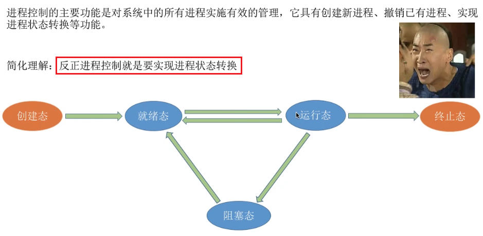

- 进程控制就是要实现绿色箭头表示的具体的过程

#### 如何实现进程控制

1，进程控制的方法：

- 就绪态->运行态：

  1. 修改PCB的内容就是把PCB中的状态标志位从“就绪态”改为“运行态”。

  2. 把该进程的PCB从就绪队列中摘出来，然后这个进程既可以被处理 运行。
  3. 这里的“恢复进程运行环境“，是因为这个进程之前可能运行到一半，然后被切换了，所以这个进程运行的一些中间结果其实是被保存在PCB中的，所以这个进程再次被调度的时候需要把它之前的运行环境给恢复过来。

- 运行态->阻塞态：
  1. 当进程在执行的过程当中，如果用系统调用的方式发出了一个等待某个事件的请求，那么就得把这个进程当前运行的环境给保存起来，用于之后这个进程还可以接着往下执行。
  2. 并且还需要把进程的PCB当中的标志位，从运行态改为阻塞态。
  3. 把进程的PCB放到相应时间的阻塞队列中

2，思考：假如对某个进程，把他的PCB从一个队列放到了另一个队列，但是并没有把PCB中的状态标志位改成相应的新的状态，那么是很危险的，可能会造成系统错误；因为PCB所处的队列和PCB当中的状态标志位，两个数据就不一致了。

- 为了防止这个问题出现，就使用了“原语”。

3，原语介绍：

- 执行”关中断“指令后，如果此时有外部中断信号进入，那么这个外部中断信号会被忽略而暂时不会被处理；所以这就保证了原语的一系列处理不会被中断。

- 在执行“开中断”指令后，再接收到一个外部中断信号，这个时候才换转入相应的中断处理程序开始处理。
- 可以看出使用“开中断和关中断”就可以实现原语这种一气呵成的操作；也就我们提到的，把PCB放到一个队列当中，并且还需要保证PCB中的数据也被修改，这样的事情就可以用“原语”来实现

#### 进程控制相关的原语

1，原语做的核心三类事情：

2，操作系统提供的“创建原语”在创建进程时的作用：

- ”创建原语“实现了一个进程从“无”到“创建态”，再从“创建态”进入到就绪队列进入“就绪态”的过程。

3，操作系统提供的“撤销原语”在终止进程时的作用：

- 网友说：“ppt有个地方错了，unix中，父进程结束，子进程会被守护进程收养”

- 外界干预：比如使用windows操作系统的任务管理器杀进程，就是一种外界干预

4，操作系统提供的“阻塞原语”和“唤醒原语”的作用：

- 网友评价进程阻塞和唤醒的关系：“解铃还须系铃人”

5，操作系统提供的“切换原语”在切换进程时的作用：

#### 小结

### 进程通信

#### 总览

#### 进程通信定义

#### 进程通信-共享存储

#### 进程通信-管道通信

- 互斥：
  - 和共享空间的访问一样；
  - 当进程1正在往管道中写的时候，进程2是不允许访问管道的；只有进程1把管道的访问释放了，进程2才可以开始读。

#### 进程通信-消息传递

- 间接通信方式：
  - 信箱中的消息可能是不同进程之间通信的消息；具体是由哪个进程发哪个进程收，这都是在消息头中指定了的，所以不需要担心消息会被取错。
  - 如果一个进程想给另外一个进程发送消息，这个消息会先用发送原语发送到信箱，之后读进程会用接收原语从信箱中取走属于自己的消息。

#### 小结

### 线程概念和多线程模型

#### 总览

#### 什么是线程，为何引入线程

1，

- 图左右对比：
  - 图左边是传统的进程机制；CPU会轮流地为各个进程提供服务，那么这些进程就可以并发地执行；并且每个进程会有它自己相应的一系列程序代码，被CPU服务的时候，这些代码就会**一句一句**(不能并发)往下执行；
  - 图右侧是引入了线程的进程机制；CPU的服务对象就不再是进程，而是进程当中的线程；每一个进程当中可能会包含多个线程，CPU会用一定的算法轮流地为这些线程进行服务；这样同一个进程当中被分为了多个线程，像”QQ视频聊天和QQ传送文件“这两件事情想要并发得执行的话，那我们就可以把”QQ视频聊天和QQ传送文件“对应的处理程序放到两个不同的线程下，那这两个线程可以并发得执行，自然这两件事就可以并发地完成。
- 进程对应着一个程序，而进程内部也需要实现并发所以进程内部引入线程这个概念；如果没有线程，并发执行也只能是进程之间的并发执行，而进程内部依然是顺序执行的。

2，

- 知乎总结进程和线程的对比：

  - 地址空间：线程共享本进程的地址空间，而进程之间是独立的地址空间。

  - 资源：线程共享本进程的资源如内存、I/O、cpu等，不利于资源的管理和保护；而进程之间的资源是独立的，能很好的进行资源管理和保护。计算机除CPU以外的系统资源是被分配给进程的，而不是分配给线程的。

  - 健壮性：多进程要比多线程健壮，一个进程崩溃后，在保护模式下不会对其他进程产生影响，但是一个线程崩溃整个进程都死掉。

  - 可并发性：两者均可并发执行。

  - 切换时：进程切换时，消耗的资源大，效率高。所以涉及到频繁的切换时，使用线程要好于进程。同样如果要求同时进行并且又要共享某些变量的并发操作，只能用线程不能用进程。

  - 其他：线程是处理器(CPU)调度的基本单位，但是进程不是。

    

#### 引入线程机制后，有什么变化

- 我理解：”线程是调度的基本单位“即线程是CPU资源分配的基本单位

#### 线程的属性

- ”线程控制块TCB“有点类似于之前学过的”PCB进程控制快“，TCB也是用于管理线程所创建的一个数据结构。
- 线程的三种基本状态“就绪，阻塞，运行”，进程也有。
- 线程几乎不拥有系统资源，这是因为资源都在进程那里；线程要资源的话，从自己所属进程那拿。

#### 线程的实现方式

1，用户级线程：

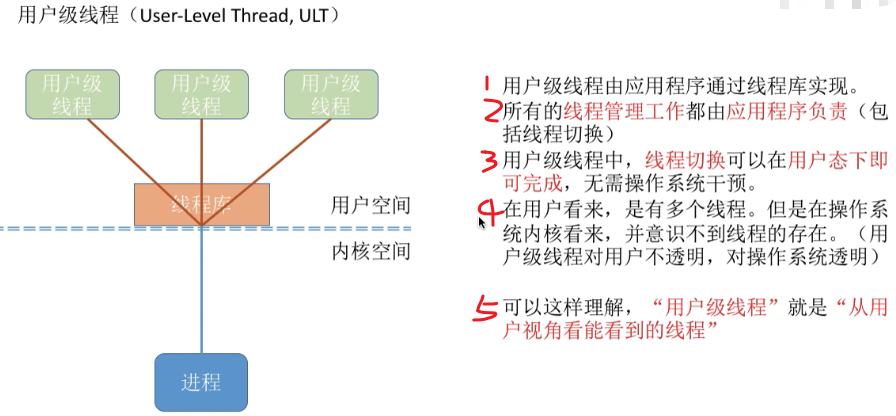

- 计算机中的透明：计算机中存在，但是你不需要了解

2，内核级线程：

- 本情形下，对用户来说，这个进程拥有三个线程；对操作系统来说，这个进程同样拥有三个线程。

3，有的操作系统只支持用户级线程，有的只支持内核级线程，也有的操作系统同时支持“用户级线程和内核级线程”。在同时支持“用户级线程和内核级线程”的系统中，可以采用二者组合的方式：

- 本图中，三个用户级线程映射到了两个内核级线程当中。

- 本图中进程只能被分配两个核，是因为操作系统只看见两个内核级线程。

#### 多线程模型

1，多对一模型：

- 线程切换在用户空间(用户态)就可以完成，由应用程序负责完成。
- 网友说：“因为内核级线程才是处理机分配的基本单位，多个用户级映射在一个内核级线程 ，内核认为仅有一个线程 ，当一个用户级线程被阻塞，内核认为所映射的内核级线程被阻塞，故所有映射到该内核级的用户级都被阻塞”

2，一对一模型：

- 一对一模型其实变成了纯粹的内核级线程。

3，多对多模型：

- 多对多模型是集二者所长。

#### 小结

- 一对一的优缺点写反了

### 处理机调度的概念 层次

#### 总览

#### 调度的基本概念

- 我疑问：”不是内核线程是调度的单位，怎么又是“选择进程分配给它”“
- 网友：“处理机就是cpu核”

#### 调度的三个层次-高级调度

- 作业的定义：
  - 网友：“作业：用户在处理某个作业或任务时要求计算机要求计算机所做事情的集合”
  - 网友：“作业（job）是计算机操作者（或是一个叫做作业调度器的程序）交给操作系统的执行单位。 作业包括程序、相应的数据和作业说明书”
  - 网友：“作业是静态的，而进程是动态的。进程是程序的一次执行过程。此外，一个作业可能需要创建多个进程。而一个进程只能对应一个作业，即作业和进程是多对一的关系。”
  - 赞最多的网友：“作业是你交给计算机干的那件事  进程是计算机为了完成你的作业它要干的几件事。。”
  - 网友：“作业是用户在一次事务处理过程中要求计算机系统所作工作的总和，它是用户向计算机系统提交一项工作的基本单位。个人理解是比进程更加全面的一项任务”。
- 网友：“建议跨考的同学先了解一下计算机组成原理后再来学习”-但面试一般不问机组。

#### 调度的三个层次-中级调度

1，中级调度定义：

- 网友问：“前面不是说每个作业只调一次，调出一次吗？为什么这里调入内存后还可以调出调入”。网友答：“前面的，只调一次的是高级调度，这是中级”

- 网友：“这只是页面置换算法，国人给起了个好听的名字中级调度”
- 挂起：挂起就是进程数据放外存，PCB留在内存。中级调度：决定将哪个处于挂起状态的进程重新调入内存。挂起和中级调度互逆。

2，补充知识--进程的挂起态与七状态模型：

- 注意图中“挂起”和“阻塞”的区别

#### 调度的三个层次-低级调度

- 网友：“高级调度是作业调度，中级调度是内存调度，低级调度是进程调度。高级调度主要是按照一定的调度算法把作业从外存调入内存并为作业分配相应的资源建立相应的进程。而中级调度主要是为了对内存空间进行逻辑扩充。”

- 为了实现进程的并发执行，进程调度的频率就可能很高；这样才能让进程在宏观上看是同时(并发)执行的，而微观上，他们是用很快的频率交替执行。
- 注意：本调度是操作系统**最基本的一种调度**。

#### 三层调度的联系和对比

- 作业定义：
  - 赞最多的网友：“作业是你交给计算机干的那件事  进程是计算机为了完成你的作业它要干的几件事。。”
- 高级调度和中级调度都是发生在外存和内存之间的调度；区别在于高级调度是面向作业的调度，中级调度是面向进程的调度。
- 低级调度是内存和cpu之间的调度。

#### 小结

### 。进程调度的时机 切换与过程 调度方式

#### 总览

#### 进程调度的时机

1，可以进程调度和不可以进程调度的情形：

- 网友：“应该这么理解： 关中断---->原语---->开中断”

2，注意区分“临界区”和“操作系统内核程序临界区”：

- 因为“临界区是访问临界资源的那段代码”，因此，各个进程只能互斥得进入临界区，互斥地执行访问临界资源的代码。
- 左右图解析：
  - 左图：如果还没退出临界区（还没解锁)就进行进程调度，但是进程调度相关的程序也需要访问就绪队列,但此时就绪队列被锁住了，因此又无法顺利进行进程调度
  - 右图：在打印机打印完成之前，进程一直处于临界区内，临界资源不会解锁。但打印机又是慢速设备，此时如果一直不允许进程调度的话就会导致CPU一直空闲。。。所以，访问普通临界区时，为了提高CPU的利用率，允许进行调度与切换。

- 网友：“进程在请求打印机这样的I/O设备的时候，由运行态变成阻塞态，因而需要用调度程序将就绪队列的进程变为活动态”
- 网友：“普通临界区就是一些IO设备，打印机，因为这类设备的处理会很慢，不可能一致等待打印机工作结束才使用CPU；内核程序临界区在本例是会给就绪队列上一个锁后独自占用资源，并且此时其他进程是无法进入就绪队列的”

3，有的系统中，只允许进程主动放弃处理机；有的系统中，进程可以主动放弃处理机，当有更紧急的任务需要处理时，也会强行剥夺处理机。但是注意，无论在什么系统中，进程在**普通**临界区中是可以进行调度切换的。

#### 进程调度的方式

#### 进程的切换与过程

- 不能简单的认为“进程切换越频繁，进程的并发度越高”，进程切换过于频繁反而会导致整个系统的效率降低。
  - 网友评价：“并发度高，但效率低”。

#### 小结

### 调度算法的评价指标

#### 总览

#### CPU利用率

#### 系统吞吐量

#### 周转时间

1，普通周转时间

- 等厕所的例子：
  - 张三排队10分钟，上厕所1分钟，感觉自己很亏
  - 李四排队1分钟，上厕所10分钟；李四的周转时间也是11分钟，只不过这11分钟只有1分钟是用来等待的，所以对于李四来说，这1分钟的等待对他来说没那么糟糕。
  - 如上就是周转时间相同的情况下，作业的实际运行时间长短不同所导致的对于用户的感受的区别

2，带权周转时间：

- 带权周转时间肯定是大于等于1的，因为周转时间包含了作业的实际运行时间，故周转时间肯定比作业的实际运行时间更大。
- 用户看重“带权周转时间”，操作系统看重“平均带权周转时间”

#### 等待时间

- 我理解：“I/O时，处理机在为I/O服务，虽然本等待进程不占用处理机，但为I/O服务实际上就是在为本作业服务”

#### 响应时间

#### 小结

- “带权周转时间”比较难理解，不过只要结合排队上厕所的例子就容易理解了。

### FCFS SJF HRRN调度算法

#### 总览

#### FCFS

1，FCFS特点：

- 排队买奶茶的例子：奶茶店一般都是先来先服务，假如现在你的前面有个人要买20杯奶茶，那这家店做20杯奶茶可能要半小时；虽然说你只买一杯奶茶，做你的奶茶的时间只需要1分钟，但是由于你的前面突然来了一个长进程/长进程，那么对你这个短作业/短进程体验就会很差。
- 不会导致饥饿，因为只要等着，前面的进程总能处理完。

2，FCFS实例讲解：

- 因为等待越久说明越早到。P1先到，所以比后面到的等待服务的时间长，可能p4都到了，P1还在等待服务
- 本例进程为纯计算型的进程，表示进程只需要CPU为它服务；所以一个进程到达以后只有两个状态，要么他就是等待被调度，要么它就是处于运行的状态。

- P3的带权周转时间为8，非常大的值；这意味着，这个进程本来只需要很少的时间为它服务，但是它需要等很长的时间才可以被处理完；因此对P3用户来说，可能他的体验很糟糕。

#### SJF

1，SJF特点：

- 网友：“说SJF有平均最短时间没啥不严谨的，说白了就是最短时间优先算法分为抢占式和非抢占式，其中抢占式的平均周转时间更短，自然就可以直接说最短时间优先算法是最短的，因为抢占式是它的子类罢了”

2，非抢占式的短作业优先调度算法：

- 最开始只有P1，所以P1最先被运行；等P1运行完毕后，其他所有进程也都到达了。

3，抢占式的短作业优先调度算法：

计算如下：

4，注意几个小细节：

- 操作系统这门课和“数学物理”这些基础理学的学科不一样，操作系统对很多算法和概念的说法和定义，不同版本的教材有所不同，并没有一个很严格的说法。考试时判断所有选项吗，选一个错误最少的。

#### HRRN

1，FCFS和SJF两种算法的思考，引入HRRN：

2，HRRN特点：

- 综合了FCFS和SJF的优点，做了一个折中。

3，HRRN实例：

- 本例中，进程都是纯计算型进程，所以并不会有I/O操作，也就是不会主动要求阻塞；因此“主动阻塞”的情况暂时不用考虑。
- 本图中，某时刻时，红色的Px代表此时刻会被处理的进程。
- 本图小错误：P3((3+1)/1=4)

#### 小结

- SJF的“最短的”平均等待时间，最短的打了双引号，因为非默认的抢占式的SJF才是最短的。
- 本节学的三种算法，对用户的交互性很差，一般用于早期的批处理系统。

### 调度算法：时间片轮转 优先级 多级反馈队列

#### 总览

#### 时间片轮转调度算法

1，时间片轮转调度算法特点：

- 时间片太大影响用户和进程交互(增加进程的响应时间)，时间片太小增大系统切换进程的耗时。

2，时间片轮转调度算法实例--时间片大小为2的情况：

0~5时刻：

- 网友：“不计算周转时间是因为这里根本就没法知道作业在外存后备队列等待的时间”

6~11时刻：

- 网友：“回去翻视频，主动放弃时也会发生调度”

12~16时刻：

3，时间片轮转调度算法实例--时间片大小为5的情况：

- 网友：“时间片多，进程切换所需的系统开销大，书里不都写着吗= =”

4，如果用FCFS算法，发现结果和时间片大小为5的情况很类似：

时间片较大的情况：

时间片较小的情况：

- 时间片大小问题：

  - 所以如果时间片太大的话，会增大进程的响应时间，失去了“时间片轮转调度算法”最大的一个优点。退化成FCFS。

  - 切换太频繁的话，系统会花大量时间来处理进程切换
  - 拓展知识，非重点：一般来说，设计时间片时要让切换进程的开销占比不超过1%；

#### 优先级调度算法

1，时间片轮转调度算法特点：

- 就算是动态调整进程优先级，也可能会导致饥饿；因为某个进程等待越久，有限级越高，但同时新到的进程的优先级也越来越高，故长时间等待的进程还是可能饥饿。

2，时间片轮转调度算法实例--非抢占式：

3，时间片轮转调度算法实例--抢占式：

4，补充：

- 我们可以认为“高响应比优先算法”是一种“动态优先级调度算法”。

#### 多级反馈队列调度算法

1，思考：

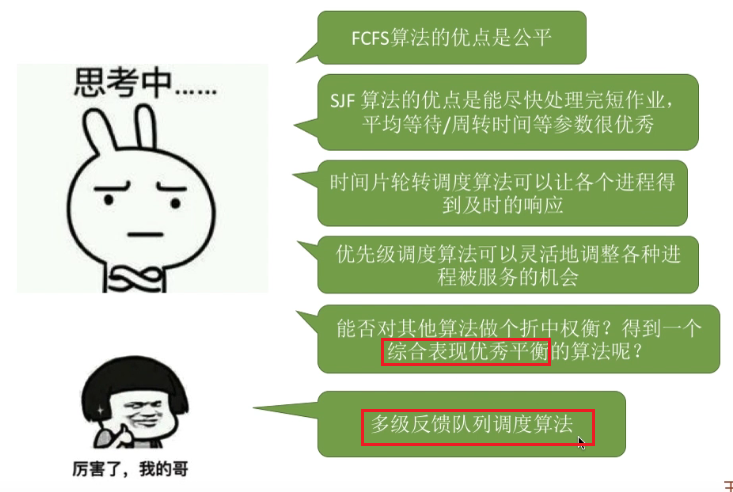

2，多级反馈队列调度算法特点：

- 优点解析：

  - 有FCFS优点：每个进程刚开始进来的时候，肯定都是被优先处理的，因为刚开始的时候进程的优先级是最高的。
  - 有RR的优点：因为新到达的进程优先级高，所以在第一级队列的话很快被调度，也即可以得到响应。

  - 有SPF的优点：短进程只需要经历过优先级比较高的那几个队列，即执行了几个较短的时间片后就可以完成了；所以这也会导致短进程的平均周转时间会比较理想。
  - 所谓“用户作假”，即一个长进程，把自己的时间说的很短，伪装成短进程。

- 算法可能导致饥饿，因为源源不断地有短进程到达的话，可能短进程在第一级队列被分配一个时间片之后，就可以被处理了；但是已经被降级为更低优先级的那些进程就可能长期得不到服务，从而导致饥饿。

3，多级反馈队列调度算法实例：

- 新进程到达时进入第1级队列的队尾；
- 课程的动画比较形象，记不清的话可以回看视频参考动画理解

#### 小结

### 进程同步 进程互斥

#### 总览

#### 进程同步

1，异步性定义：

2，同步定义：

#### 进程互斥

1，进程互斥定义：

2，互斥访问的四部分：

- 临界区：实际用来访问临界资源的那段代码；比如要通过打印机打印输出的话，对打印机执行写操作的代码就要写在临界区里。
- 退出区：负责解除在“进入区”设置的锁。可以把”进入区“和“退出区”理解为上锁和解锁。

3，为了实现互斥访问临界资源，应遵守的规则：

- 忙等待：这个进程暂时没办法往下推进，在等待；但是这个进程还一直占用着处理机，使处理机处于一个忙碌的状态而没有办法给别的进程服务。

#### 小结

- 厕所例子：
  - 进程同步：张三先上厕所，老八才能开饭；进程间存在顺序问题要解决。
  - 进程互斥：厕所只有一个坑，不能两个人同时用；进程间对临界资源的访问要互斥地进行。

### 进程互斥的软件实现方法

#### 总览

#### 单标志法

1，该算法的思想和优点：

- turn的初始值是0，表示刚开始只允许P0进入临界区。

- 网友：“while的作用是为了消耗时间片的吧，两个进程都处于就绪队列，就绪队列也是按照时间片进行调度的，进程之间会切换所有需要while语句在这里实现一个时间片的消耗”

2，单标志法的不足：

- 违背空闲让进：trun总要落在一个进程的头上，但是可能某时刻所有进程都不想访问(如初始状态)，就落在一个不想访问的进程上；后面如果有进程想访问临界资源，确因为trun落在一个不想访问资源的进程上，而一直等待。

#### 双标志先检查法

1，为了解决”空闲让进“的问题，引入双标志先检查法：

- 解决了“空闲让进”的问题：不需要某个进程顶着“要访问进程的帽子”；所以有进程想访问临界资源的话，就不会被其他不想访问临界资源但顶着“要访问临界资源的帽子”的进程所耽误。
- 违反“忙则等待”的原则：原因如图。

#### 双标志后检查法

- 我：“双标志后检查法是尝试解决双标志先检查法的问题，但是失败的一个愚蠢的算法”

#### Peterson算法

1，算法思想：

- trun用于孔融让梨的过程，让对方先进入临界区。
- 举例子如，P0和P1用①②③⑥⑦⑧的访问顺序：
  1. P0经过①②③进入临界区，先使用临界区；
  2. P1想进入临界区，但是临界区已经被P0使用，便等P0用完后释放临界区，P0经过⑥⑦⑧进入临界区；
  3. 相当于P0和P1串行地访问了临界区。
- 举例子如，P0和P1用①⑥②③⑦⑧③的访问顺序：
  1. P0先来，执行完①后P0时间片用完，P1被处理机服务；
  2. P1执行完⑥后P1的时间片用完，P0被处理机处理；
  3. P0执行②③后卡在③，然后P0的时间片用完，P1被处理机服务；
  4. P1执行完⑦⑧后卡在⑧，然后P1的时间片用完，P0被处理机服务；
  5. P0重新被处理机处理时在执行③循环，发现turn被P1进程改为0了，循环就不满足，于是跳出死循环同时进入临界区
  6. 由于临界区被P0使用，P1得等到P0使用完毕才能用。

2， 上厕所例子：

123：

162783：

- 本图中，香香相当于P0，臭臭相当于P1。

3，Peterson的问题：

- Peterson未遵循”让权等待“：即使P0暂时不能进入临界区，但是它依然会占用CPU，让CPU一直运行while循环，进入一个盲等的状态。

#### 小结

- peterson算法比较难理解，结合我记的例子理解。

### 进程互斥的硬件实现方法

#### 总览

#### 中断屏蔽方法

#### TestAndSet指令、

- 硬件实现本算法，看到C语言是为了描述算法。

#### Swap指令

#### 小结

### 信号量机制

#### 总览

#### 信号量定义

- （Prolaag 荷兰语，尝试减少）。（Verhoog 荷兰语，增加）。

#### 信号量机制-整型信号量

- 这里的`while(S<=0)和S=S-1`其实和双标志检查法中的“先检查后上锁”做的是一样的事情。不过这里是用原语实现，就避免了“并发 异步”导致的问题。

- 老师提出一个不解之处：“如果一个进程暂时进不了临界区，那就意味着它被卡在wait原语的while循环里，既然wait原语是不可被中断的，那么也就意味着当前正在执行while循环的进程是不是一直不会被切换呢？这个地方感觉是不太严谨的地方，但是很多经典教材中都是这么写的，所以我们姑且认为它没有问题，即不会导致一个进程一直占用处理器。”
  - 网友说：“原语：克服了进程异步的特性，使得进程同步。这里是原语，一般来说原语关中断了不会被时间片强制切换啊。原语不可被中断，切换进程肯定是要通过中断的。”
  - 网友说：“通过while不断循环来阻止其他进程访问临界区，在时间片轮回自己后再继续操作达到原子性”
  - 网友说：“老师说的这个问题不就是忙等吗？？？这就是忙等啊，看下让权等待的定义”。我理解：“确实是忙等，但是无法切换时间片导致一个处理机无法为别的进程服务；只在自己时间片内忙等可以接受，但是一直占用处理机忙等我个人感觉不可接受”
  - 网友说：“While这里是方便理解，资源不够进程会被睡眠”

#### 信号量机制-记录型信号量

刚才的“整形信号量”有一个很大的缺陷就是，如果一个进程暂时进不了临界区，即系统资源暂时不够的话，他会一直占用处理机循环检查，从而导致忙等的状态(不满足让权等待的原则)；所以人们又提出了“记录型信号量”：

- 注意这里左边是`<`，右边是`<=`。

#### 信号量机制-记录型信号量实例

1，初始状态如下：

2，假如说刚开始CPU是为P0服务，当他执行到wait原语的时候，首先会执行的事情是`value --`，所以S.value的值会由2减为1：

3，系统判断此时是有打印机资源的，所以把其中的一个打印机分配给P0进程，然后P0可以往下使用打印机：

4，之后时间片切换，CPU为P1进程服务；P1进程执行wait原语的时候就是申请一个打印机资源，首先会让S.value减1使之从1变为0：

5，之后系统会把打印机分配给P1进程，然后P1进程开始使用打印机：

- 我们可以看到，当**S.value=0**的时候，此时系统中所有的打印机刚好全部分配给了某一些进程，说明**资源恰好分配完毕**。

6，接下来时间片切换，CPU为P2进程服务；P2进程同样需要使用打印机资源，它在执行wait原语的时候，同样S.value减一使之从0变为-1；当S.value在减一后小于零说明此时系统当中没有多余的资源(打印机)可以分配给当前的P2进程，因此P2进程主动在wait原语当中执行block原语(把本进程阻塞的原语)，所以P2进程会被挂到打印机这种资源的等待队列里：

- 此时我们可以发现，当S.value=-1时，有1个(S.value的绝对值个数目)进程在等待打印机资源。

7，接下来P2时间片结束，CPU转向为P3进程服务；P3进程同样需要使用打印机资源，它在执行wait原语的时候，同样S.value减一使之从-1变为-2；当S.value在减一后小于零说明此时系统中的打印机资源已经分配完毕，所以P3进程也会主动执行block原语，因此P3进程也会被插入相应的等待队列的队尾：

8，由于P2和P3都执行了block原语被阻塞，因此P3时间片过后CPU只能为P0和P1服务。

9，假设接下来CPU是为P0进程服务的；P0在使用完打印机后执行了signal原语，即让S.value加1使之从-2变为-1；如果S.value在加一之后还是<=0，那么就说明此时在等待队列中依然有一些进程在等待，所以P0在signal原语当中会主动执行一个wakeup原语，用来唤醒信号量的等待队列的队头的进程即P2，所有P2进程会从阻塞队列放回就绪队列，并且会把P0刚释放的打印机资源分配给P2：

10，P0在执行完其他语句之后就执行完毕了，若P时间片过后CPU接着为P2进程服务；P2就可以开始使用打印机资源：

11，P2使用完打印机资源后，会执行signal原语对打印机资源释放；同样的，进程会对S.value的值加一使之从-1变为0；由于S.value加一后仍然是小于等于0的，所以说明此时在信号量的等待队列当中还是有进程在等待打印机资源，所以它也会执行一个wakeup原语来唤醒此时处于信号量的等待队列队头的进程即P3；因此执行完wakup原语后P3进程会从阻塞态变回就绪态，并且P2刚才释放的打印机资源会被分配给P3，同时P3的信息会从信号量的等待队列消失，这样等待队列就变为空了：

12，接下来P2在执行完剩余的代码就结束了，假设P1时间片结束后之后CPU又回到了为P1服务；那么P1使用打印机：

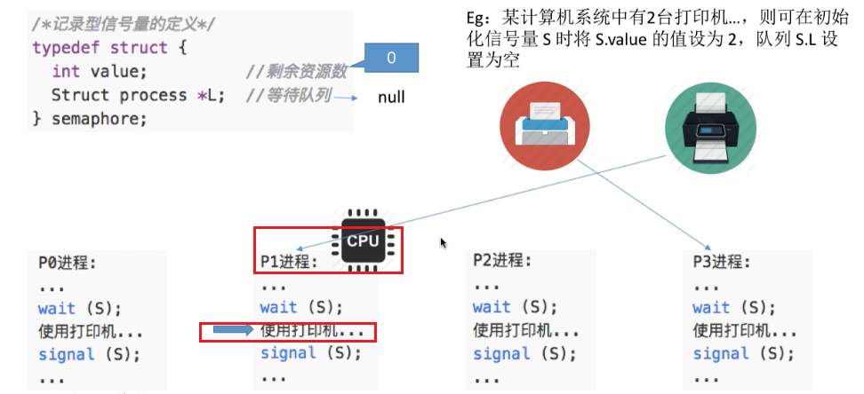

13，P1使用完打印机后又会对打印机资源进行释放，此时首先对S.value加一使之从0变为1；由于S.value加一后已经大于0了，所以此时在等待队列中没有进程在等待，所以P1进程在执行Signal操作的时候并不需要执行wakeup原语；接下来系统会回收分配给P1的打印机资源，然后P1得以继续往下执行：

14，最后还有P3进程没有结束，所以CPU为P3进程服务；P3使用打印机：

15，P3使用完打印机后对打印机资源进行释放；S.value加一使之从1变为2；之后系统回收打印机资源：

16，P3得以顺利地执行，最后结束。

17，记录型信号总结：

- 网友：“这已经是让权等待了啊。厕所门堵了，你进不去，那你就别站门口，去后面排队。等厕所里人出来了，等着的人再从队列里再按顺序进厕所。”

#### 小结

- 记录型信号量是操作系统中最重要的知识点！！

### 用信号量实现进程互斥 同步 前驱关系

#### 信号量机制实现进程互斥

1，

- 如果有两个进程都需要访问临界资源打印机的话，那么对打印机进行访问的代码就应该归属于临界区内。
- 信号量的初值表示系统中某种资源的数量。我们这提到的临界区，其实同一个时间段只允许一个进程对它进行访问；所以我们可以把临界区理解为一种特殊的资源，而这个资源只有一个，也就是说临界区只能被分配给一个进程使用；只有一个进程释放了临界区资源后，它才可以由另外的进程来使用；所以使用临界区资源之前要加P，使用临界区资源之后要加V
- 正规的信号量的值是卸载structure里的，但是可以如图形式简写信号量。

#### 信号量机制实现进程同步

1，进程同步的概念：

- 并发带来了异步性，所以P1和P2的相互切换和进程中代码的推进顺序是不可预知的。
  - 比如代码执行顺序可能是：145236

2，信号量机制实现进程同步：

- 本例中，代码4一定要在代码1和代码2后执行。
- “前操作”，表示进程同步问题中，必须在前面执行的操作；“后操作”，表示进程同步问题中，必须在后面执行的操作。

#### 信号量机制实现前驱关系

- 图中S2执行完了，才能执行S4和S5。

#### 小结

- 回忆：P V分别是wait(-- 且block)和signal(++ 且wakeup)
- 有多少系统资源，就要把信号量的初始值设置为多少。

### 生产者-消费者问题

#### 问题描述

1，前提：

、

2，缓冲区没满时，生产者才能把产品放入缓冲区中，否则必须等待；缓冲区满了后，生产者不能把产品放入缓冲区：

3，消费者从缓冲区取走一些产品，只要缓冲区中有大于等于1个的空间，就可以唤醒生产者进程(从阻塞态重新回到就绪队列)；这里的唤醒不意味着生产者进程就立即会上处理机运行，生产者只是回到了就绪队列而已，所以接下来的一个时间片可能是消费者进程继续执行：

4，消费者每一次执行都会从缓冲区中取走一个产品并使用；当缓冲区被取空了后，如果此时消费者进程继续尝试从缓冲区中取走产品的话，由于此时缓冲区已经为空了，这个取产品的行为应该是被阻止的，所以消费者进程应该被阻塞：

- 只有生产者进程再往缓冲区中放产品的时候，消费者进程才可以重新被唤醒又回到就绪队列：

5，缓冲区是临界资源，各进程必须互斥地访问；并发的情况下，两个生产者在检查到了缓冲区的一个空闲地址后，可能同时往可能往缓冲区的该同一位置填入数据，导致前者数据被后者数据覆盖：

- 因此我们必须保证缓冲区被互斥地访问。

#### 问题分析

1，总体分析

- 针对”分析步骤2“的解释：生产者每次要消耗（P）一个空闲缓冲区，并生产（V)一个产品；消费者每次要消耗（P)一个产品,并释放一个空闲缓冲区)；往缓冲区放入/取走产品需要互斥。

2，设置信号量的初始值：

#### 如何实现

- 网友说：“腾讯面试就让我写生产者消费者；微软面试也让我写生产消费” 

#### 思考-能否否改变PV操作的顺序

- ”生产产品和使用产品“放在PV之间在逻辑上没问题；以“使用产品”为例，可以让消费者从缓冲区取出一个产品后就立刻使用产品，但这会导致临界区的代码量变大，消费者在访问临界区的过程中就要耗费更长的时间，如果此时有别的进程也想访问临界区的话是会被阻塞的；所以说把非必要的代码也放入临界区内的话，就会导致进程之间的并发度降低；相当于占着厕所玩手机。所以对于”生产产品和使用产品“这两部分的代码最好不要放在PV之间。

#### 小结

- 图中empty和full表示本PV路关注的信号量；如生产者生产产品完毕后用V给full信号量的值加一，消费者消费产品前用P给full信号量的值减一，实现了利用full信号量即产品数量进行进程同步。
- ”前V后P“表示实现进程同步时，需要先(在前)执行的操作结束后用V，需要后执行的操作开始前用P
- 对于实现互斥和实现同步的两个P的操作顺序，实现互斥的操作一定要在实现同步的操作之后，否则会死锁。

### 多生产者-多消费者问题

#### 问题描述

- 本小节中，生产者生产的东西不一样，消费者消费的东西不一样；上一小节中所有生产者生产的是一种东西，所有的消费者也是消费同一种东西。所以把本小节的问题称为多生产者多消费者，这里的“多”不是多个而应该理解为多类。

#### 问题分析

1，

- 父亲，母亲，女儿，儿子各属于一类进程。
- 互斥关系，同步关系分析见图中。

2，

#### 如何实现

1，实现想法：

2，思考“能否不要互斥信号量mutex”：

本例中不设置互斥信号量mutex也可以：

- 网友：“主要是盘子只能放一个水果，所以可以不要互斥信号量”
- 网友：“我就觉得1、4两句明明重复了为什么都要写，想了半天”

原因如下：

3，如果把缓冲区的容量设置为2：

- 网友：”能会覆盖但不是一定覆盖，比如说把苹果放在橘子上面把橘子压碎，或橘子和苹果并排占满盘子。“

- 缓冲区大小等于1的话，即使不设置互斥信号量有可能也能实现互斥访问临界区，但得具体问题具体分析。

#### 小结

1，本节学的总结：

2，分析方法思考：

- 网友：”不关注具体过程是因为放了什么导致哪个能取，只关注事件结果他们会让盘子空，父母会让盘子满。只要把握有几个临界资源就可以了“

### 吸烟者问题

#### 问题描述

- 本问题是“生产者消费者模型”的变形，供应者相当于是生产者，而吸烟者相当于消费者；本问题和之前“生产者消费者模型”不同的是，这个生产者可能生产三种不同的产品，分别是绿人黄人黑人需要的

#### 问题分析

1，基本分析

- 不应该说桌子上能同时放两种材料，而应该说桌子上可以放三种组合之一的组合，我们把一个组合看做一个整体。
- 这里缓冲区的大小为1，说以不专门设置互斥变量也可以实现互斥访问临界区。

2，设置同步变量来实现进程同步：

 

- 刚开始桌子上是没东西的，所以同步信号量offer123的初始值都设置为0；
- 由于刚开始没有任何一个吸烟者进程发出了完成信号，所以同步信号量finish的初始值设置为0；

#### 如何实现

- PV位置讲解：
  - V(offer1)：当供应者在桌上放入某一种组合后(如组合一)，需要对组合一对应的同步信号量执行V操作，用来通知等待组合一的吸烟者；
  - P(finish)：供应者把材料放到桌上之后，供应者需要等待吸烟者向他发出”完成吸烟“的信号，所以在这我们需要对finish信号执行一个P操作。
  - P(offer1)：各个吸烟者从桌子上拿走材料之前需要检查此时桌子上放的是不是自己所需要的材料，P(英语为wait)。
  - V(finish)：当把材料拿走并卷烟抽掉后，又需要向供应者发送完成信号V(英语为signal)，来通知供应者可以放下一个材料了。
- 第一次阻塞的位置：由于刚开始finish信号量为0，所以供应者在放完组合一后，会在P(finish)被阻塞；一直等到第一个吸烟者从桌上拿走组合一并卷烟抽掉后，又会对finish执行V操作，从而重新让供应者进程从阻塞态回到就绪态，然后又可以进行下一轮的供给。
  - 另外两个吸烟者的情况和第一个吸烟者情况类似，这里不赘述。

- 不需要专门的互斥信号量，原因如图谈话框中解释。

#### 小结

- 随机让吸烟者吸烟的话，可以使用random随机函数。

- （前V后P）=（前signal后wait）=（前++ wakeup 后-- block）。

### 读者-写者问题

#### 问题描述

#### 问题分析

- count：第一个读进程要访问文件的话，就应该对文件加锁；第二到N个读进程要访问文件的话，则不应让该读进程再进行加锁的工作，应该让该读进程直接跳过P(rw)而直接开始访问文件。
- rw：表示readandwrite。

#### 如何实现

1，写进程和写进程之间是可以实现互斥的，因为第一个写进程可以跳过P操作；而第二个写进程会暂时被卡在P操作，直到第一个写进程执行了V操作之后，第二个写进程才可以被重新激活然后开始写文件：

2，在读文件之前，要检查此时是不是有别的读进程正在进行读文件操作；如果没有，也就是说count等于0的话，那它作为第一个想要读文件的读进程，它需要对共享文件进行加锁即对rw执行P操作，之后将count的值加一：

3，读文件之后，要将count的值减一，表示此时正在读这个文件的进程数减少了一个；之后还要对count的值进行检查，如果说它自己是最后一个读文件的读进程的话，那它就需要对共享文件执行解锁的操作：

4，思考：”读进程并发执行时，检查和上锁不能一气呵成，导致第二个读进程阻塞“：

- 对count访问前和访问后都对mutex执行P和V两个操作：
  1. 此时如果两个读进程并发执行，那么第一个读进程可以顺利通过P操作，对count检查，执行P(rw)并对count执行++的操作；如果在执行这些操作的过程中切换到第二个进程的话，第二个读进程会暂时被阻塞在P(mutex)，直到第一个读进程执行完V(mutex)后，第二个读进程才可有顺利的往下执行。
  2. 第二个读进程在执行if判断时，由于第一个读进程已经执行了count++，所以count的值已经变成了1，所以第二个读进程会发现此时已经有别的读进程正在读文件了，那么第二个进程就不会执行P(rw)而是跳过P(rw)，直接执行count++，然后执行V(mutex),然后开始读文件。
  3. 如此变实现了“写者和写者互斥，写者和读者也互斥，读者和读者之间不互斥”

5，存在潜在的问题“默认了读进程优先”：只要有读进程还在读，写进程就要一直阻塞等待，可能“饿死”。

6，解决写进程饿死：

- 网友：“其实原理就是让读写双方达到公平 一进代码就开始通过w平等获取锁，才不会造成饿。等原来正在读的读者读完后，写进程就可以执行写操作了。这里是解决了一个读进程会插队的问题吧。w就是为了不让读进程源源不断的进来，等到当前的读文件结束，就可以写了“
- 我和某网友认为：“两个读进程并发时，第二个读进程碰到P(w)也会堵塞一会，不过很快第一个读进程就V(w)就释放了，第二个读进程也就可以通过P(w)了。”
- 本算法实现了：如果一个读进程在读的过程中，有写进程到达了，那么之后会优先让写进程访问共享文件；而不是像之前的算法那样，只要有读进程到达，读进程就会插到写进程之前访问共享文件；解决了写进程一直饥饿的问题。

- 写者1在写时，读者1先来并阻塞，写者2后来并阻塞；当写者1V(w)后，优先唤醒的是先被P(w)阻塞的读者1，而不是写者2；所以所谓的写优先只是相对公平的说法，如图更合理的说法叫“读写公平法”。

#### 小结

### 哲学家进餐问题

#### 问题描述

#### 问题分析

1，初始的不合理分析：

- 思路：
  1. 吃饭之前，需要对左边筷子对应的互斥信号量执行P操作，还要对右边筷子对应的互斥信号量执行P操作，即申请占有左右两边的筷子资源。
  2. 之后吃饭
  3. 吃饭结束后，再一次用V操作对左右两边的筷子资源进行释放。

2，不合理的原因：“五个哲学家并发都拿左边的筷子时，大家都会被阻塞”：

#### 实现方式1+2

1，如何避免死锁，方式1+2：

- 实现提示：
  1. 第一个方案要实现最多允许4个哲学家同时进餐，我们可以设置一个初始值为4的同步信号量。
  2. 第二个方案更简单，在每个哲学家拿筷子之前判断一下他自身的序号是奇数号还是偶数号，然后根据自己的序号奇偶性来决定先拿左边还是右边的筷子。

#### 实现方式3

1，如何避免死锁，方式3：

2，算法如下：

- 网友：“一次分配到位”

3，下面具体分析一下各种情况

4，现在是0号哲学将想拿筷子；于是对mutex执行P操作，显然不会被阻塞；然后0号哲学家开始拿第一只筷子，对第一支筷子执行P操作，P操作结束后他就拥有了这支筷子；此时发生进程切换：

5，假设进程切换为2号哲学家进程；当2号哲学家对mutex执行P操作的时候，由于0号哲学家还没对mutex执行V操作，所以2号哲学家在执行mutex的时候暂时会被阻塞在P(mutex):

6，一直到处理机切换为为0号哲学家服务，并且0号哲学家顺利拿到第二支筷子，再对mutex执行V操作之后，2号哲学家才能被激活：

7，2号哲学家被激活后，他可以顺利得往下执行操作，即拿起左边和右边的两只筷子：

- 本图中，0号哲学家的筷子没放回去；没关系，因为筷子已经属于他了，他正在吃饭。

8，再来看第二种情况；假设初始只有第一个哲学家要吃饭，那他会顺利得通过第一个P操作，拿起左右两只筷子，再对mutex执行V操作，于是他可以顺利得开始吃饭：

9，1但是如果这时候，1号哲学家也想吃饭；P操作不会阻塞，而会顺利通过；但是当1号哲学家尝试拿左边这支筷子的时候，他就会发生阻塞卡在P(左筷子)：

10，此时若再发生调度，2号哲学家开始运行，他也想吃饭，2号哲学家尝试对mutex执行P操作；由于之前1号哲学家已经对mutex执行了P操作，且暂时没有释放吗，所以2号哲学家在执行mutex的P操作时会被阻塞在P(mutex)：

- 这种情况下来看，此时即使2号哲学家左右两边的筷子都能用，但是这个哲学家依然拿不起他左右两边的筷子，依然被阻塞。

11，再看第三种情况；刚开始是0号哲学家拿了左边的筷子和右边的筷子，然后开始吃饭：

12，之后4号哲学家尝试拿左边的筷子，由于左边的筷子没人拿，所以他可以拿起来；但是当他尝试拿右边的筷子的时候，此时右边的筷子已经被0号哲学家拿了，所以4号哲学家也会发生阻塞，阻塞在P(右筷子)：

- 在这种情况下，4号哲学家拿了一支筷子的同时在等待别的筷子。

13，通过刚才两种情况的分析，可以发现：

- 该算法，依然可能拿起一支筷子后阻塞，而不是两只都可用才拿。

#### 小结

### 管程

#### 总览

#### 引入管程的原因

#### 管程的定义和基本特征

1，管程和之前学过的PV操作一样，也是用于实现进程的互斥和同步的；而进程间要实现互斥和同步，是因为进程之间可能会共享某些数据资源，比如“生产者消费者问题“中，生产者和消费者都需要共享地访问缓冲区这一种资源；所以为了实现各个进程对共享资源的互斥或同步的访问，管程要有四个部分组成，具体部分参看下面的点。

2，管程的定义和基本特征

- 管程的定义类似于OOP中的”类“
- 网友：“PASCAL是区分 过程 和 函数的。”

#### 管程解决生产者消费者问题

1，如下类似伪代码：

- 用程序设计语言中的提供的特殊语法如“monitor和end monitor”来定义一个管程。管程的名字叫ProducerConsumer。

- 网友：“这里不要看full和empty的字面意思，应该理解成等待在empty后的的消费者队列和full后的生产者队列”

2，引入管程的核心目的：

- 网友说：“就是抽象了PV操作为一个函数，然后通过类给对象赋值。”

- 可以发现，在管程中实现了之前PV操作中的需要实现的“排队，阻塞，互斥等问题”，我们只需要调用一个简单的入口(即函数)，就可以很方便地使用了，这就是程序设计的“封装思想”。
  - 封装思想：把一些复杂的细节隐藏了，对外只需要提供简单易用的接口。

#### java中类似于管程的机制

- 网友说：“一个线程访问一个对象中的synchronized(this)同步代码块时，其他试图访问该对象的线程将被阻塞。”

#### 小结

### 死锁的概念

#### 总览

#### 什么是死锁

1，之前哲学家问题引出的死锁：

2，死锁概念：

#### 死锁 饥饿 死循环

- 网友说“饥饿就是理论上还是能得到的”

- 死循环的循环指while循环或for循环。

- 死循环可以在运行态，比如while死循环中打印一个信息，运行程序后可以在控制台上一直看到打印；但是死锁和饥饿是无法在运行态的

- 死循环是被管理者的问题：死循环是写程序的应用程序员来关心的问题。
  - 所以操作系统课程中，有的地方将怎么解决死锁，怎么解决饥饿，但是从来不讲怎么解决死循环；因为怎么解决死循环本身就不是操作系统应该负责处理的问题。

#### 死锁产生的必要条件

#### 何时发生死锁

#### 死锁的处理策略

#### 小结

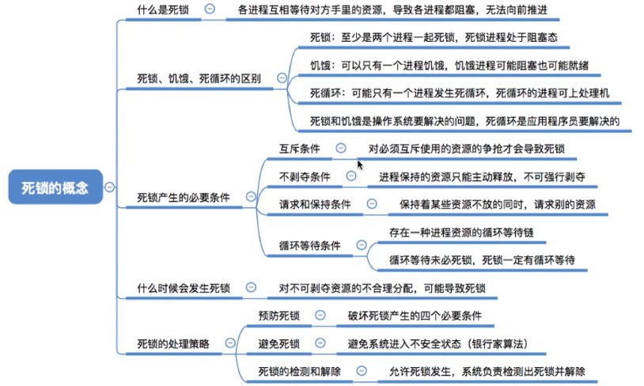

### 死锁的处理策略-预防死锁

#### 总览

 #### 破坏互斥条件

- 网友：“所有的计算机问题都可以通过加一个中间件解决哈哈哈”

#### 破坏不剥夺条件

#### 破坏请求和保持条件

- 如图所示，A类进程需要资源1，B类进程需要资源2，C类资源需要资源1和资源2；如果A类和B类进程源源不断，就可能导致C类进程饥饿。

#### 破坏循环等待条件

- 网友说：“进程P3不会需要4号资源，因为按照条件来看，5号是她所需要的最小资源编号”

- 缺点2的资源浪费：5号资源实际上在7号资源之后用；但是由于编号递增的要求，P3进程又必须占有它暂时用不到的5号资源，5号资源会空闲很长的时间，直到7号资源被使用后才会回头使用5号资源；这造成了打印机资源的长时间空闲，造成系统资源的浪费。

- 缺点3的编程麻烦：以P3进程为例，编写代码时先编写使用5号资源的代码，再编写使用7号资源的代码；但如果换了一个系统，另一个系统中对5号资源和7号资源的编号刚好是次序相反的，那么用户程序就要发生改变，先编写原7号资源(即现5号资源)的代码，再编写使用原5号资源(即现7号资源)的代码；造成用户编程的极大不便。

#### 小结

### 死锁的处理策略-避免死锁

#### 总览

#### 什么是安全序列

1，借钱要不回来的情况：

- 所以给B借30亿是不安全的。

2，借钱能要回来的情况：

- 所以给A借20亿是安全的，因为按照TBA，ATB的顺序给他们借钱是可行的。

#### 安全序列 不安全序列 死锁 的联系  

- 处于不安全状态不一定发生死锁，如图，因为可能最后要借的钱还没伸手借。

#### 银行家算法

1，背景

#### 银行家算法实例-逐步法

1，P0最多还需要的资源，不能被剩余可用的资源满足，所以不分配给P0：

2，剩余可用资源和P1对比，可以满足：

3，接下来再进行第二轮的对比；此时的剩余资源数暂时无法满足P0的最大需求：

4，接下来是P2进程，发现此时的剩余资源数暂时无法满足P2的最大需求：

5，之后是P3进程，发现此时的剩余资源数可以满足P3的最大需求：

6，接下来进行第三轮的对比；接下来的对比和之前一样，就不赘述了；可以找到包含所有进程的安全序列如图：

#### 银行家算法实例-快速法

实际做题时常使用这种更快的方法。

1，之前系统中剩余的资源为332：

2，第二轮对比时，发现743已经可以满足P0P2P4所有进程的需求了：

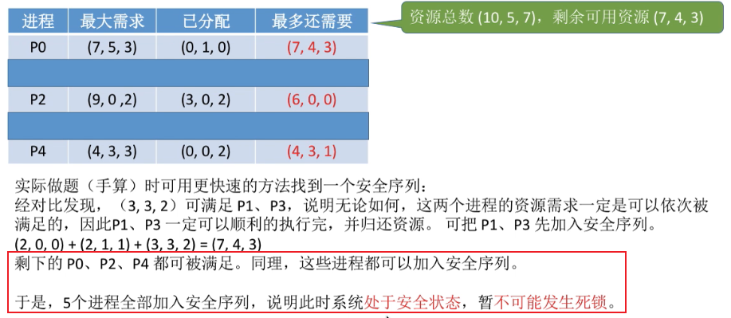

- 网友问：“安全序列是不唯一的吗？”。网友答：“不唯一”。

#### 银行家算法找不到安全序列实例

1，

2，经过下一轮的对比发现，P0P2P4的需求都得不到满足：

#### 银行家算法代码实现

1，基本思想和背景

2，执行银行家算法的1234步：

- 第三步，根据P0进程的request0修改数据，修改后的结果如表格红框所示。
- 我理解：安全性算法中**不断比较**requesti和“最多还需要Need”；银行家算法中**比较一次**requesti和”最多还需要Need“以及requesti和“当前系统可用资源available”。

#### 小结

- 学习本算法时，要先理解算法的逻辑，然后再尝试用代码实现逻辑；而不是反过来，即先钻到代码里，再想代码的逻辑。

- 注意这里的”安全性算法“的定义，并和“银行家算法”区别开来。

### 死锁的处理策略-检测与解除

#### 总览

#### 死锁的检测-资源分配图

1，定义数据结构“资源分配图”：

- 图中的矩形和圆的示意图即为“资源分配图”，是一个数据结构

#### 死锁的检测-不发生死锁的实例

1，怎么基于图中数据结构来分析系统是否处于死锁状态：

- P1进程请求一个单位的R2资源，而R2资源只被分配出去了1个，R2资源的总数是两个，所以R2资源现在剩余空闲的还有1个，所以P1进程的请求可以被满足，所以P1进程应该不会被阻塞，它可以顺利执行下去；
- P2进程此时请求1个单位的R1资源，而由于R1资源此时已经分配出去了3个，所以R1资源已经没有空闲了，因此P2进程的请求目前不能被满足；
- 但是P1进程顺利执行下去的话，等P1进程顺利执行完了，他就可以把自己手里的资源全部归还给R1，并且等P1结束之后，它应该也不会请求使用任何一种资源。

2，所以，假设P1顺利结束了，我们就可以把P1相邻的边全部删去：

- P1把R1资源归还后，现在R1资源空闲的还有两个，而P2只需要一个，所以P2进程的请求也可以被满足；所以P2本来是被阻塞的，那现在P2就可以被唤醒，然后正常地执行下去；
- 等P2执行完后，它也会归还所有的资源，并且不会再对任何一种资源提出请求

3，所以我们接下来把P2相邻的边删去：

- P2归还了这些进程后，也有可能有别的进程被唤醒，只不过在本图中只有两个进程。

4，所以到目前为止，我们就可以认为P1和P2进程实际上是可以一次性顺利执行结束的：

5，我们可以换个角度考虑，其实我们刚分析的这个过程相当于找到了一个安全序列；优先地把资源分配给P1，那么P1可以执行结束；等P1执行结束之后P2也可以执行结束；所以按照P1->P2这样的序列来依次执行的话，那么所有的进程是都可以顺利得执行结束的；这就和上一小节介绍的“安全序列”是一种原理，既然我们能找到一个安全序列，就说明此时系统是处于安全状态的在，既然处于安全状态就说明系统此时肯定没发生死锁；相反的，如果我们不能把所有边都消除的话，那么就说明系统此时已经发生了死锁。

#### 死锁的检测-发生死锁的实例

1，P1进程此时请求两个R2资源，而R2资源已经全部分配出去了，没有空闲了，所以P1进程应该被阻塞；而P2资源此时请求R1资源，R1资源已经全部分配出去了，没有空闲了，所以P2进程也需要被阻塞；此时可以顺利下去的只有P3进程：

2，当P3进程全部执行之后，他会归还所拥有的全部资源：

3，接下来，R2资源已经有1个空闲了，但是由于P1进程需要的是2个R2资源，所以此时R2资源的数量依然不够满足P1的需求，所以P1依然会被阻塞；P2进程也一样，此时没有空闲的R1资源，所以P2进程也会继续阻塞；所以我们不能像刚刚那样把P1和P2进程相邻的边干掉，所以到这一步为止我们就不能继续化简下去了，所以这种情况就是不能消除所有边的情况，这种情况下系统就发生了死锁：

- P3进程不是死锁状态，只有P1和P2是死锁状态的进程。

#### 死锁的检测-算法

#### 死锁的解除

- 对谁动手：

  - 进程优先级：优先级低的可以对他下手。

  - 已执行多长时间：执行时间越长，让它回退或撤销的话，我们付出的代价更大，毕竟之后还得重头再来；所以我们可以选择执行时间更少的进程，让它做出牺牲。

  - 还要多久能完成：优先让马上就能结束的进程获得资源，牺牲掉别的进程。

  - 进程已经使用了多少资源：进程有很多资源的话，牺牲掉它，死锁的局面就能尽快解除；所以拥有更多资源的进程，让它做出牺牲。

  - 交互or批处理：交互式意味着进程在和用户交互，如果把交互式进程干掉的话，对用户是很不爽的；而对于批处理的进程，它无非就是做一些计算，用户对于批处理进程的及时反馈不是那么在意；所以可以优先牺牲批处理式的进程。

    

#### 小结

 

- 死锁检测算法的一句话概括：参考图中红框内容。

## 存储器管理

### 内存的基础知识

#### 总览

#### 什么是内存 有何作用

1，

- 平时我们的软件都是存放在外存或辅存里的，像电脑就一般把软件存在硬盘里；但是**硬盘**是一种**慢速**的设备，**CPU**是一种**超快速**的设备，所以如果CPU要处理的程序数据直接从外存里存取的话，很显然CPU会有大量时间需要等待外存的存取操作的完成；所以显然CPU直接和慢速的外存进行数据的交互的话，是会有速度的矛盾的，所以人们就引入了内存；**内存**是一种更**快速**的存放数据的硬件，我们可以把要运行的程序软件各种数据先放到内存这个高速的存储设备里，然后CPU直接从内存存取这些数据，这样就可以缓和CPU和外存之间的速度矛盾了。

#### 补充知识-几个常用的数量单位

- 1Byte(字节) = 8bit(比特)

#### 进程的运行原理-指令

- 每个指令有一个操作码(红色部分)，告诉CPU此时它要做的是什么事情；并且不同的指令可能会对应一系列的参数，CPU会根据参数或指定的操作码来执行最后具体的操作。

- CPU会根据地址参数来决定到底要去内存的哪个地方去存数据或取数据。
- 本图中执行的数据传送指令，是`x=x+1`编译后的指令3；第一位是操作码；第二位是变量x的存放地址；第三位为寄存器地址。

#### 逻辑地址vs物理地址

- **注意**：相对地址相对的是“进程在内存中的起始地址”。

#### 从写程序到程序运行

- 网友说：“请描述一下编译，汇编和解释的区别？”

- 网友说：“JVM里因为引入了虚拟机 所以和C系列的过程已经完全不同了”

#### 装入的三种方式(装入模块装入内存)

- 如果把装入模块中的指令地址直接写入内存，即内存中的指令地址是“相对地址”的话；由于内存把自己存的指令的地址理解为绝对地址，故在内存中按照指令写数据时会出错；所以在”装入“的时候有三种方式完成相对地址到绝对地址的转换。
- 网友：“简单理解三种’装入方式’就是，分别在编译期间，装入时和运行期间把逻辑地址翻译成物理地址。”

1，装入的三种方式-绝对装入：

- 和之前讲的“编译后的地址为逻辑地址”不同，使用绝对装入的话，编译后的地址直接就成了绝对地址。
- 只适用于单道程序环境：因为在单道程序环境下，内存中同一时刻只有一个程序正在运行，所以每个程序要从什么位置开始存放，那么我们刚开始就能约定好。

2，装入的三种方式-静态重定位：

- 核心：由装入程序负责把逻辑地址变换为物理地址。

- 不能移动：因为内存中指令使用的地址在装入的时候就确定了，如果之后程序的位置(程序的头位置为本程序内逻辑地址的0)发生了改变，那么程序在内存中所存储的数据的相应位置也会发生改变，那内存中程序的那些指令当中所写的地址也就会变成错误的地址。

3，装入的三种方式-动态重定位方式：

- 动态重定位方式允许“程序在内存中发生移动”带来的一系列好处(学了“分页存储和分段存储”后好理解)：
  - 可将程序分配到不连续的存储区中;
  - 在程序运行前只需装入它的部分代码即可投入运行，然后在程序运行期间，根据需要动态申请分配内存;
  - 便于程序段的共享，可以向用户提供一个比存储空间大得多的地址空间。

#### 链接的三种方式

1，静态链接:在程序运行之前,先将各目标模块及它们所需的库函数连接成一个完整的可执行文件（装入模块),之后不再拆开：

2，装入时动态链接:将各目标模块装入内存时，边装入边链接的链接方式：

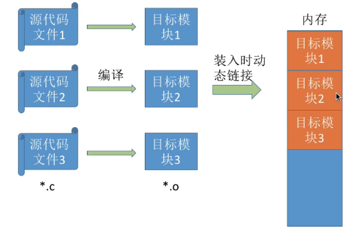

3，运行时动态链接:在程序执行中需要该目标模块时，才对它进行链接；其优点是便于修改和更新，便于实现对目标模块的共享。

- 比如刚开始目标模块1中写的是main函数，那么程序刚开始就要从目标模块1开始运行，所以目标模块1需要先放入内存；当运行了一段时间后，如果说调用了目标模块2中的某个函数，那么就需要把目标模块2也放入内存，并且进行链接的工作；如果说整个运行过程都用不到目标模块3中的那些功能，那么目标模块3就不需要放入内存。
- 本方式比起另外两种方式要灵活的多。

#### 小结

### 内存管理的概念

#### 总览

#### 内存空间的分配与回收

1，操作系统负责*内存空间的分配与回收*：

- 内容比较庞大，暂时不展开，之后有小节会展开

2，操作系统需要提供某种技术从逻辑上*对内存空间进行扩充*：

- 内容比较庞大，暂时不展开，之后有小节会展开。

- 虚拟性：把物理上很小的内存拓展为逻辑上很大的内存。

3，操作系统需要提供地址转换功能，负责程序的**逻辑地址**与**物理地址**的转换：

- 绝对装入：在编译的时候产生绝对地址，或者说在程序员写程序的时候直接就写绝对地址；由于单道程序阶段还没产生操作系统，所以“绝对装入”是由编译器完成的，而不是由操作系统完成的。

4，操作系统需要提供内存保护功能；保证各进程在各自存储空间内运行，互不干扰：

- 进程1只能访问本进程的内存空间
- 内存保护想要实现：让各个进程只能访问自己的那些内存空间，而不能访问操作系统的内存空间，也不能访问别的进程的内存空间。

内存保护的两种方法--方法1：

内存保护的两种方法--方法2：

#### 小结

### 覆盖与交换

#### 总览

#### 覆盖技术

1，覆盖技术思想：

2，覆盖技术例子：

- 对用户不透明：即用户能看到，即需要程序员声明覆盖结构。
- 注意：是**同一个程序内**的，不可能同时被访问的**不同程序段共享**一个覆盖区。

#### 交换技术

1，交换技术的设计思想：

- 中级调度就是为了实现交换技术而使用的一种调度策略。本来我们的内存中有很多进程在并发地运行，如果某一时刻突然发现内存空间紧张的时候，我们就可以把其中的某些进程暂时换出外存，而进程相关的PCB会保留在内存中，并且PCB会插入到所谓的挂起队列里；到之后内存空间不紧张了，又可以把进程相关的数据换入内存。
  - 为何进程PCB要常驻内存：因为进程被换出外存后，我们要通过某种方式记录下来进程被放在外存的什么位置；进程的存放位置这个信息就可以记录在它对应的PCB中，操作系统就可以根据PCB当中记录的信息对这些进程进行管理了，所以进程的PCB是需要常驻内存的。
- 中级调度，就是在交换技术中选择一个处于外存的进程，把它换入内存，这样一个过程。

- 网友说：“高级调度是作业调度，这个是内存调度，高级调度的频率只有一次，中级调度可以有很多次；高级调度是第一次把程序从外存放入内存，还要创建PCB呢；低级调度是进程调度，高级调度是作业调度”

2，既然提到了挂起，就回忆下和挂起相关的知识点：

- 所以采用了交换技术后，如果说某一时刻内存中的空间不够用了，那么我们可以把内存中的某些进程数据暂时换到外存里，再把某些更紧急的进程数据放回内存；所以交换技术也在逻辑上扩充了内存空间。
- 图中蓝色状态之间的转换是重点。

3，交换技术要解决的三个问题：

- 网友：“离散存储会比较少空间碎片，但要读取磁盘指针需要移动更多距离。连续存储会有用不上的空间碎片，但要读取，磁盘指针只需连续滑动就能读取完”。

- 网友说：“缺页就是指内存空间不够用了，需要想办法将暂时不需要内存的进程调度到外存来释放一部分的内存空间给需要的进程；缺页就是进城去找资源的时候没找到(被移出内存放入磁盘了)”

- 强调：PCB是常驻内存的，不会被换出至外存；所以其实所谓的换出进程并不是把进程相关的所有数据一个不漏的全部都调到外存里；操作系统为了保持对这些换出进程的管理，PCB信息还是得放在内存中。

#### 小结

### 连续分配管理方式

#### 总览

#### 单一连续分配

- 网友：“从后面回来的，这里没有外部碎片我理解了，就是即使进程A很小，占内存很小一部分，其余地方没用到，但是没用到的地方也没有分配，也就不存在外部碎片”。网友说：“失去了并发性”

- 内部碎片：如本例，本来整个用户区都是分配给用户进程A的，但是有下面一大半蓝色部分是空闲的没有利用起来；本来给这个进程分配了，但是这个进程没有用上蓝色部分的内存区，就是所谓的内部碎片。

#### 固定分区分配

1，两种固定分区分配方式：

- 网友说：“分区大小相等适合丰巢快递柜”

- 分区大小相等会缺少灵活性；比如小的进程只需要占用很小的一部分内存空间，但是由于每个分区只能装入一道作业，所以一个很小的进程会占用一个比较大的很多余的分区；如果有一个比较大的进程进入的话，如果分区的大小都不能满足大进程的需求，那么这个大进程就不能被装入这个系统，或者说只能采用覆盖技术在逻辑上拓展各个分区的大小，但这显然又会增加一些系统开销；

- 我：分区大小不等没说有什么缺点

2，操作系统如何记录内存中各个分区的空闲或者分配的情况：

- 图中有“固定分区分配”的优缺点。

#### 动态分区分配

为了解决固定分区分配的缺点，人们提出了“动态分区分配”。

1，动态分区分配概念：

2，动态分区要解决的三个问题：

#### 动态分区分配问题1

系统要用什么样的数据结构记录内存的使用情况？：

#### 动态分区问题2

当有很多个空闲分区都能满足需求时，应该选择哪个分区进行分配？：

#### 动态分区问题3

1.1，如何进行分区的分配操作？情况1：

- 这里以空闲分区表为例，其实空闲分区链的操作类似。

初始状态：

进程放入内存后：

- 只需要在分区对应的表项中修改“分区大小和起始地址”即可。

1.2，如何进行分区的分配操作？情况2：

初始状态：

进程正好插入内存的话，把空闲分区表中的表项删除：

2.1，如何进行分区的回收操作？情况1：

初始情况：

回收进程后，把空闲分区的大小和起始地址更新：

2.2，如何进行分区的回收操作？情况2：

初始情况：

和情况1类似，把两个空闲分区合二为一：

2.3，如何进行分区的回收操作？情况3：

初始状态：

进程回收后，把一整块的空间进行合并：

2.4，如何进行分区的回收操作？情况4：

初始状态：

进程回收后，在空闲分区表中增加一个表项：

2.5，虽然进程回收有四种情况，但是本质上可以用一句话总结：“在进行内存分区回收的时候，如果说回收后发现有一些空闲分区是相邻的，那么就需要把相邻的空闲分区合并”

#### 动态分区问题-内部碎片 外部碎片 紧凑技术

1，内部碎片，外部碎片的定义如图；外部碎片导致一些空闲分区太小难以利用：

2，解决外部碎片的问题：

- 网友：“小进程用多了就会产生大量的外部碎片，导致以后大进程进不来”

- 动态分区分配用哪种装入技术：之前讲过三种装入方式，”动态重定位“是最方便实现这些程序或者说进程在内存中移动位置；所以动态分区分配应该采用动态重定位的方式装入。

- ”紧凑“之后要做的处理：需要把各个进程的起始地址修改掉，进程的起始地址信息一般是存在在进程对应的PCB中；当进程要上CPU运行之前，会把进程起始地址信息放到重定位寄存器里。

#### 小结

### 动态分区分配

#### 总览

#### 首次适应算法

1，初始状态，本状态下要存入一个大小为15MB的进程：

2，以空闲分区链为例，在存入进程后，如下修改数据：

#### 最佳适应算法

1，初始状态如图，要存入一个大小为9MB的进程：

2，按照最佳适应算法的规则，从链头开始依次往后检索，找到第一个可以满足要求的空闲分区，也就是10MB的空闲分区；于是我们从10MB字节中拿出9MB分配给该进程；分配完毕后，修改空闲分区链相应节点的数据，并重新排序：

3，最佳适应算法的**明显缺点**：每次都选最小的分区进行分配，会留下越来越多的、很小的、难以利用的内存块。因此这种方法会产生很多的外部碎片。

- 比如本例留下了一个1MB的空闲分区，很难利用。
- 为了解决这个问题，人们提出了“最坏适应算法”

#### 最坏适应算法

1，初始状态如图所示，要存入一个3MB的进程：

2，存入3MB的进程后后，修改数据如下：

3，再存入9MB的进程后，修改数据如下，并重新排列空闲分区链：

4，最坏适应算法的**明显缺点**：每次都选最大的分区进行分配，虽然可以让分配后留下的空闲区更大，更可用，但是这种方式会导致较大的连续空闲区被迅速用完。如果之后有“大进程”到达，就没有内存分区可用了。

#### 临近适应算法

本算法是为了解决“首次适应算法”中的问题。

1，初始状态如下，要存入一个大小为5MB的进程：

2，刚开始我们从链头的位置开始查找；第一个4MB大小的空闲分区不满足；第二个6MB空闲分区满足，于是我们从6MB中拿出5MB分配给进程5；进程存入内存后，我们需要更新空闲分区链中对应的节点(包括分区的大小，还有分区的起始地址)：

- 但是发现：采用临近适应算法和首次适应算法，我们只需要按照地址递增的顺序进行排列；所以即使空闲分区链修改的当前节点的大小发生了比较大的变化，但是我们仍不用对整个链表进行重新排列；所以这也是“临近适应算法和首次适应算法”比“最佳适应算法和最坏适应算法“更好的一个地方，即**算法的开销比较小**，不需要我们花额外的时间对链表进行重新排列。

3，假如此时有一个新的进程6到达，它需要5MB的空间，按照临近使用算法的规则，我们只需要从上一次查找到的位置依次再往后查找即可；上一次查到的位置有1MB的空间，不满足；下一个，有10MB的空间，满足，于是从10MB中拿出5MB分配给进程6；进程存入内存后，更新空闲分区链：

- 此时发现：如果此时采用的是首次适应算法，并同样需要分配5MB的内存空间，那么我们会从链首的位置开始往后查找，第一个4MB不满足，第二个1MB不满足，第三个10MB才满足，就会有三次查找；如果采用临近适应算法，如本例，只需要查两次(1MB和10MB)即可；所以这是临近适应算法比首次适应算法更优秀的地方。
  - 首次适应算法会导致低地址部分留下比较小的碎片，但是我们每一次开始检索都需要从低地址部分的这些小碎片开始往后检索，所以这回导致首次适应算法多花时间。
  - 但这不代表“临近适应算法”比“首次适应算法”更优秀很多，因为“临近适应算法”带来了另外的问题。

- “临近适应算法”带来了另外的**缺点**：
  - 首次适应算法每次都要从头查找，每次都需要检索低地址的小分区。但是这种规则也决定了当低地址部分有更小的分区可以满足需求时，会更有可能用到低地址部分的小分区，也会更有可能把高地址部分的大分区保留下来（保留大分区也是最佳适应算法的优点)
  - 邻近适应算法的规则可能会导致无论低地址、高地址部分的空闲分区都有相同的概率被使用，也就导致了高地址部分的大分区更可能被使用，划分为小分区，最后导致无大分区可用(导致无大分区可用也是最坏[这里老师应该是笔误写成了“大”]适应算法的缺点)

4，综合来看，**四种算法中，首次适应算法的效果反而更好**

#### 小结

### 基本分页存储管理的基本概念

#### 总览

#### 连续分配方式的缺点

#### 把 固定分区分配 改造为 非连续分配版本

- 网友问：“那干脆每个分区1MB，不留任何碎片？“。网友答：”拆的越多，页表就越长，占内存，换进换出速度也慢“。

#### 分页存储管理的基本概念

- 由本图红色箭头可以看出：各个页面不必连续存放，也不必按先后顺序来，可以放到不相邻的各个页框中。

- 由本图粉色箭头可以看出：页框号和页号都是从0开始的。
- 注意：“页”与“页框”大小相等。

#### 思考：如何实现地址的转换

1，分页带来的最大的问题：

2，想一下，之前学过的地址转换的思想，能否被迁移到分页中；以动态重定位为例：

3，如果采用分页技术，应该额如何实现地址转换？：

分页+装入：

CPU执行指令1时：

- 想得到某一个逻辑地址对应的物理地址需要做的几件事在灰色框中。

如何手动计算：

4，为什么页面大小一般设为2的整数幂：

不同页用2进制表示：

- 前面红色是20位，后面黑色划线部分是12位，总共32位。
- 不同页前20位不同；不同页的后12位都是从全0到全1。
- 我理解：页面的内容按字节B存储，即页面的存储单元是字节；所以0号页有4096个字节，就能存4096个块地址；逻辑空间地址用位表示，一个逻辑空间地址代表存储于内存中的页表的一个页表项；页表项中存着块地址，占1字节；所以页面大小转换为2的幂次后，该幂的大小=页内地址要用多少位表示。
  - 找到内存的块地址后，根据页内偏移量找到内存中存的具体指令。

不同页计算物理地址：

- 第一个例子中，前20位是0，所以判断页号是0，
- 第二个例子中，前20位是1，所以判断页号是1，

得出结论，这十分适合基于2进制的计算机处理：

#### 逻辑地址结构

1，由“思考：如何实现地址的转换”，可得出合适的逻辑地址结构：

- 现在解决了地址转换的第13步(图中绿色勾)，接下来解决第2步(图中红色问号)

#### 页表

1，页表核心内容：

2，解释“每个页表项的长度是相同的，页号是“隐含”的”：

- 网友：“页号隐藏了。可以理解为数组，页号就是下标，每个数据3B”

#### 小结

### 基本地址变换机构

#### 总览

#### 基本地址变换机构

1，页表寄存器概念：

2，设页面大小为L，逻辑地址A到物理地址E的变换过程如下；注意页面大小是2的整数幂：

- 网友说：“是 P >= M 时产生越界中断   看书上下面的解释。因为页表存储在内存 你要先找到页表的物理地址 才能对页表进行操作。”。

3，文字方式，对2中的图片进行描述：

- 页表项长度：见上一小结“页表”处的讲解，每个页表项需要一定的大小来存储“块号”。

#### 基本地址变换机构实例

- 网友说：“放在第三页，因为前面两页放满了，三减一为2所以页号就是2了。”

#### 对页表项大小的进一步探究

1，之前讨论的是把进程存入内存，现在针对**把页表存入内存**的情况讨论；页表的一个页表项有3字节大小就够表示块号，但是3字节并不能整除页面大小，所以会造成页面内有内碎片：

- 注意：图中可以看出，一个页表项需要3字节。
- 注意：4KB=2的12次方字节=4096字节

2，解决内碎片的方法：

- 我和网友都认为：“我觉得这里应该写使得一个页框能刚好能装下整数个页表项，而不是页面装下，感觉这里老师写错了”。
- 解决内碎片后还有一个赠送的福利：实现了进程页表能装在连续的内存块中。

#### 小结

- 从CPU得到一个想要访问的逻辑地址之后，直到实际访问了该逻辑地址对应的内存单元的整个过程中，总共需要进行两次访问内存的操作，如图。

### 具有快表的地址变换机构

#### 总览

#### 局部性原理

- 循环代码对应的指令存在10号内存块；循环代码中需要访问的变量存在23号内存块中。

- 空间局部性：访问了a数组的第一个元素，那么不久的将来，a数组的第二个元素(即与a数组第一个元素相邻的那个元素)可能就被访问，同理第345..个。

- 时间局部性和空间局部性统称为“局部性原理”

#### 快表

1，快表定义：

- **快表**，又称**联想寄存器（TLB）**，是一种**访问速度比内存快很多**的高速缓冲存储器，用来存放当前访问的若干页表项，以加速地址变换的过程。与此对应，内存中的页表常称为**慢表**。

2，快表实例；执行第一条指令(0,0)，在执行第一条指令的时候，程序计数器“PC”中存放的应该是此时想要访问的那条指令对应的逻辑地址，也就是页号为0且页面偏移量为0的这个逻辑地址：

- 网友：“再说一次 快表就是cache”。网友说：“cache映射整个内存，快表是比较局限的”

- 指令存放在(0,4)：即页号为0，页面偏移量为4的地址。

3，这个逻辑地址会被拆分成页号和页面偏移量两个部分；之后会对页号页号进行合法性的检查，对页号和页表长度进行对比，看看有没有发生越级，这个对比的过程上一小节细说过所以这就不展开了：

4，确认了页号的合法性后，会用页号来查询快表，看看快表中有没有与当前页号对应的页表项；由于刚开始块表是空的，所以快表中根据页号没有找到内存块号；由于块表没命中，所以此时系统会用页表始址和页号计算出这个页号对应的页表项在内存中的位置：

5，在内存中查询到这个页号对应的页表项后，系统会把这个页表项自动地复制到快表当中，这样快表中就出现了与当前页表项相对应的副本：

6，找到页号对应的页表项后，我们当然可以知道页面存放的内存块号到底是多少，根据内存块号和页面偏移量我们就可以得到最终的物理地址：

7，最后根据这个物理地址，CPU就可以找到逻辑地址为(0,0)的那条指令存放的实际物理地址了：

8，执行第二条指令(0,4)，第二条指令在内存中存放的位置应该是页号为0页面偏移量为4的内存单元中：

9，同样对页号进行合法性检查，看页号是否越界：

10，如果页号没越界，接下来会查询快表；由于我们要查询的是0号页面，此时页表中已经有了0号页面对应的页表项，所以我们在查询快表的时候就已经命中了，所以我们通过快表就可以直接知道0号页面对应的物理内存块号到底是多少；既然已经知道了0号页存放的内存块，那么接下来就不需要查询内存中的页表了：

11，我们可以根据内存块号和页内偏移量得到最终想要访问的物理地址：

12，接下来CPU就会根据这个物理地址，从内存中取出它要执行的第2条指令：

13，所以从刚才的分析中我们可以发现，如果查询快表命中了就不需要再访问内存了，因为查询快表的速度要比查询内存中页表的速度快地多；所以查询快表命中的话，那么地址转换的过程就会快很多。

- 再次回忆并注意：
  - 最近使用过的页表项会放入快表；快表中存放的是页表的一部分副本。
  - 若快表命中就不需要再访问内存了。

#### 引入快表后，地址的变换过程

根据“快表”中分析的过程来总结一下，引入快表后，地址的变换过程是什么：

- ③中的两次访问内存：第一次是“访问内存中的页表”；第二次是”访问该物理地址对应的内存单元“
- **默认**是首先查询快表，快表查询失败后才查慢表，而不是快表和慢表同时查找；

#### 小结

### 两级页表

#### 总览

#### 单级页表存在的问题

1，第一个问题：页表本身就很大，占据内存：

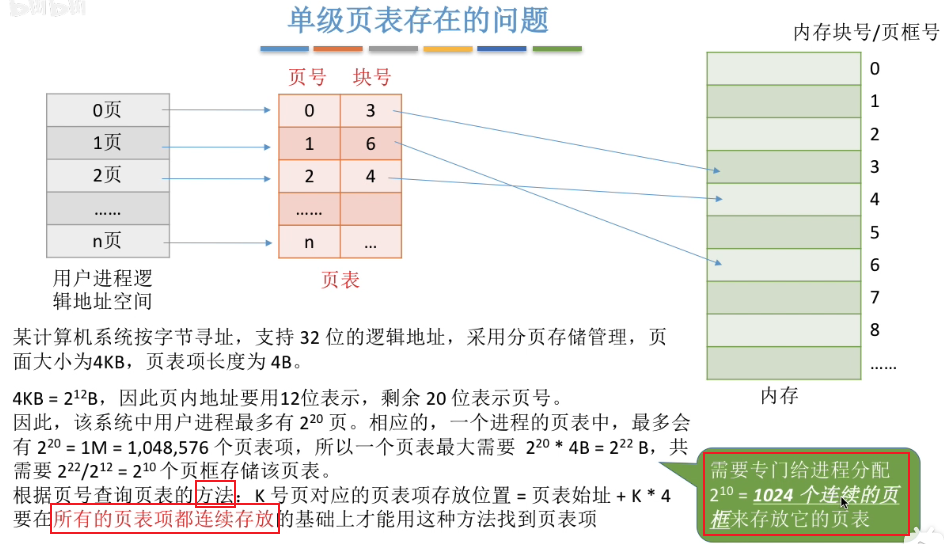

- 页内地址要用12位表示的[原因](# jump1)：全局搜索“得出结论，这十分适合基于2进制的计算机处理”

- 网友说：“进程看作一本书，页表是目录，页表项是其中一行；页框就是一页纸，纸中存满了切割进程后得到的一个页；这里的意思就是这本书的目录都有1024页”
- 网友：“也就是说，虽然页非连续分配了，但是页表还得用连续的内存空间。”
- 网友：“一个页表项（4B）指向一个页面（内存块，4kB）1:1024的关系；如果内存为4GB，那么页表就得4MB；因为内存由页面构成，页表由页表项构成”

- 我理解：
  1. 本进程分页最多可以分2的20次方个页，其中每个页的页号和对应块号都需要存进本进程对应的页表；
  2. 但是本页表也需要占据内存空间，需要占据2的22次方字节的空间
  3. 由于进程切割生成的单个页的大小，与内存的页框大小相等，所以知道承载本进程的页表需要的页框的大小；承载本进程的页表需要的页框个数，用页表大小除以页框大小(即页面大小)，可得到2的10次方个页框存储页表；
  4. 所以套娃了！页表存了“切割进程得到了页，每个页在内存中的存储位置的信息”；但是页表本身也要存入内存，并占用不小的内存。

2，第二个问题：没必要让进程的整个页表都常驻内存：

- 根据之前介绍过的局部性原理可知，很多时候，**进程在一段时间内只需要访问某几个特定的页面就可以正常运行了**，因此我们**没必要让进程的整个页表都常驻内存**；我们只需要让进程此时会用到的那些页面对应的页表项，在内存中保存即可

#### 如何解决单级页表的问题

#### 两级页表的原理，地址结构

1，以“单级页表存在的问题”中提出的背景为例；

- 可以把完整页表拆分成一个个小分组，每一个分组有1024个页表项；小分组内的页号从0开始，块号不变。

2，在把大的完整页表拆分成这样一个个完整页表(称为“二级页表”)后，由于每一个小页表的大小都是4KB，因此每一个小页表都可以依次放到不同的内存块中；所以为了纪录小页表的相对顺序和它们在内存中存放的块号和位置，我们需要为这些小页表再建立上一级的页表，这一级的页表就叫做“页目录表”：

- 从本图中可以很直观的看出，页目录表其实是建立了“二级页表的页号”和“二级页表在内存中存放的块号”之间的映射关系；此时如果我们想找到0号页表的话，我们可以通过页目录表就可以知道，0号页表始存放在3号内存块中，所以在3号内存块中可以得到0号页表的内容。

3，在采用了两级页表结构后，逻辑地址的结构也需要发生相应的变化；我们可以把以前20位的页号拆分成2个部分，第一个部分是10位的二进制用来表示一级页号，第二个部分也是10位的二进制用来表示二级页号；10位的一级页号正好可以表示0~1023的二级页表，10位的二级页号正好可以表示单个二级页表中的每个页表项：

#### 如何实现地址变换

1，结合上面的例子看一下，怎么实现地址的变换

2，由此解决了之前提出的第一个问题。

#### 虚拟内存技术

- 虚拟内存在后续课程讲解

- 缺页中断是我们在执行某一条指令，该指令想要访问到某一个暂时还没调入的页面时产生的，所以这个中断信号和当前执行的指令有关，因此这种中断应该是属于内中断。

#### 需要注意的几个细节

1，“各级页表的大小不能超过一个页面”，看一个例子：

- 注意：

  - 这里出现了“系统按字节编址。”

  - 每一级页号的位数不能超过10位，这是页面大小决定的(页面大小=页框大小)。

- 多级页表带来的“内存空间利用率的上升”付出的**代价**，以二级页表为例，就是逻辑地址变换的时候需要进行更多一次的访问内存，这样导致我们要访问某一逻辑地址的时候要花费更长的时间，所以这是两级页表相比于单级页表来说的一个很明显的缺点；如果我们继续分析三级页表四级页表结构中的访存次数的话，会发现，三级页表访问一个逻辑地址需要访存四次，四级页表访问一个逻辑地址需要访存五次。。

#### 小结

### 基本分段存储管理方式

本小节学习另一种离散分配的存储管理方式。

#### 总览

#### 分段

1，

2，

- 网友：“段就是放大的页”
- `LOAD 1,[D]|<A>`是编译语言写的。

- 我理解：段内地址有2的16次方个，每个地址会在内存中占用1字节，所以每个段的最大长度是64KB。

- 注意，本例的系统是按字节寻址的，相关[参考文章](https://www.cnblogs.com/fuliner/p/12019191.html)。
  - 注意文章的这句话“如果按照字节寻址，就是一个地址线表示的数（即状态）对应一个字节的地址”。

#### 段表

- 每个段都会对应段表中的一个段表项；相对于页表来说，段表中多了一个“段长”，因为每个分段的长度可能不一样；但分页存储管理中，每个页面的长度都是一样的，所以在分页存储管理中，页长是不需要显式地记录的；但是在分段存储管理中，段的长度是需要显式地记录在段表中。

- (1中)系统按字节寻址，段内地址16位：所以段的长度不可能超过2的16次方字节；所以在各个段表项中，用16位就肯定可以表示本段的最大段长了。
- (2中)32位可表示整个物理内存地址空间：2的32次方 字节=4*2的30次方 字节=4GB；即把4GB的内存按1字节为单位分开，符合字节按字节寻址的特点。

- (2中)16+32=48位，可以表示一个段表项：32位定位到内存中的一个字节，即为段的起始地址；16位段内地址，定位到段中的具体指令。
  - 48位中前16位，即前2字节，表示的是段长
  - 48位中后32位，即后4字节，表示的是这个段存放在内存中的基址

- 即使段号在段表中是隐含的没有显式给出，我们依然可以根据段号来查询这个段表；查询方式见图中黄框。

#### 地址变换

看看采用了分段存储管理后，地址变换的过程是怎样的；以刚才提过的指令为例。

1，

- 前面红色16位表示的是段号，后面黑色的16位表示的是段内地址。

2，我们以1中提到的逻辑地址(2,1024)为例，做一次完整的访存实例来介绍流程：

3，如果说此时要访问的段号是2，端内地址是1024的话，那么首先要用段号2和段表长度M进行一个检查；显然此时的本进程的段表长度是3，因为它有3个段，所以段号是小于段表长度的；因此段号合法，可以进行下一步：

- 网友：“段表长度多少就是有几个段；这里M叫段的个数会更好，段表长度勿和段表大小混淆”

4，用段号和段表始址计算查到本段号对应的段表项，这样就找到了2号段对应的段表项；接下来需要对段内地址的合法性进行检查，段内地址和段长对比，发现2号段的段长是6k，而段内地址是1024即2的10次方即1k，所以段内地址是小于段长的，因此在本处不会产生越界中断，可以继续执行下去：

- 分页和分段的流程的一个最大区别：分页不需要检查段内偏移量是否越界，分段需要检查段内偏移量是否越界；因为各段的长度不同，但是各页的长度相同。

5，接下来，通过段表项知道本段在内存中存放的起始地址是40K，所以用这个段的起始地址40K，再加上段内地址W即1024，即得到了最终想要访问的目标内存单元，也就是A变量存放的位置；这样就完成了对逻辑地址的访问：

#### 分段 分页管理的对比

1，

- 页和段的信息单位对比：在分页的时候吗，只考虑各个信息页面的物理大小，比如说每个页面是4KB；但是在分段的时候，必须考虑到信息的逻辑关系，比如说某一个具有完整逻辑的模块单独地划分成一个段。

- 关于地址空间是1维还是2维：
  - 网友：“一维就是因为分页是连续的，只需要给个起始地址就什么都知道了，二维就是分段是离散的，除了给出每个段的起始地址还要给出每个段的段名”。
  - 网友：“可不可以认为分页其实也是二维的，但是由于页号都是连续的，所以用了页号作为数组的下标，这样就省了一维空间，段名不能是下标，所以是二维的”。
  - 网友：“因为每个段的长度不一样，所以不能通过整除得到段号，也不能通过求余的到段内偏移，所以段号和偏移量得明确给出；其实就是分段要说清楚段号多少位，段内地址多少位”

2，分段相比分页的最大的优点：

- 纯代码才能共享：
  - 比如有个代码段只是简单地输出helloworld字符串，所有的进程并发地访问这个代码段是显然不会出问题的
  - 但是可修改的代码代码段是不可以共享的。

3，解释为何分页管理中不方便实现”信息共享“：

4，访问一个逻辑地址需要几次访存：

#### 小结

### 段页式管理方式

#### 总览

#### 分页 分段的优缺点分析

- 网友说：“段内连续，段间可以不连续，每个段号对应一个基址”

- 虽然空闲空间总量是20M字节，但是分段放不进内存空间，因为分段必须连续存放。所以分段管理会产生难以利用的外部碎片。
  - 产生外部碎片的原因和“动态分区分配”一样
  - 解决外部碎片的方式，也和动态分区分配一样：通过”紧凑“的方式合并小空闲空间为一个大的连续空间。

#### 分页+分段=段页式管理

段页式管理有分页管理和分段管理的优点。

- 网友：“内部碎片和信息共享的问题怎么解决呢？”

#### 段页式管理的逻辑地址结构

- 段页式管理的地址结构是2维的，段式管理的地址结构是2维的，页式管理的地址结构是1维的。

#### 段表 页表

- 段页式管理和段式管理中的段表结构是不一样的：
  - 段式管理的段表记录的是“段号，段的长度，段的起始地址”
  - 段页式管理的段表记录的是“段号，页表长度，页表存放块号”

- 段页式管理和页式管理中的页表结构是一样的，都是记录了页号到物理块号的映射关系。

- 各个段表项的长度是相等的，所以段号可以是隐含的；各个页表项的长度也是相等的，所以页号可以是隐含的

- 我理解：通过逻辑地址的前N位页/段号定位到页/段；通过逻辑地址的后M位(页内偏移量)，结合通过段页表知道的内存块号，定位到内存中具体的一个字节存储的数据(前提是系统是按字节寻址的系统)。

- 一个进程会对应一个段表，每个段(即段表项)会对应一个页表，因此一个进程可能会对应多个页表。

#### 逻辑地址转化为物理地址

- 首先需要知道的是，系统中也会有段表寄存器这么一个组件；这个进程上处理机运行之前，会从PCB中读出“段表始址”和“段表长度”这些信息，然后放到段表寄存器中，

- 段页式管理中，进行地址转换的过程一共需要三次访存；和分页or分段管理类似，这里可以引入快表机构来减少地址转换过程中访存的次数：
  1. 第一次访存是访问内存中的段表。
  2. 第二次访存是访问内存中的页表。
  3. 第三次访存是访问内存中的目标内存单元。

- 需要着重注意④检查页号是否越界，和段式存储中检查段的地址是否越界是类似的；需要检查的原因就在于，各个段的长度(我理解是一个段表项存的页表的长度即为一个段的长度)可能是不相等的，所以需要进行合法性检查。
  - 网友说：“也相当于分页检查页号是否越界”
  - 我理解：长度即项的数目，大小即整体所占的字节数；比如此处，段长度即页表长度即页表项的数目，段大小即页表大小即存储页表需要占据的内存中的字节数。

#### 小结

### 虚拟内存的基本概念

#### 总览

1，

2，

#### 传统存储管理方式的特征 缺点

- 对于“一次性”的①：一个需要60GB内存的游戏，如果采用传统存储管理方式的话，4GB的内存的电脑是不可能运行需要60GB内存的游戏的。

- 对于“驻留性”：比如吃鸡游戏，如果此时在游戏的防空洞场景，那么G港场景的资源就暂时不用加载到内存中，我们只要在内存中放入防空洞场景相关的资源，就可以保证游戏的正常运行；但是如果采用传统的存储方式的话，不管是G港还是防空洞场景的资源都要求一直驻留在内存中，无论此时是否需要这些数据；因此这导致内存中实际上驻留了大量用不到的数据，从而导致了内存资源的浪费。

- 传统存储管理方式的缺点，可以用虚拟存储技术解决。
  - 虚拟存储技术的提出，其实是基于著名的局部性原理。

#### 局部性原理

#### 虚拟内存的定义和特征

1，虚拟内存的定义：

2，虚拟内存的三个主要特征：

- 多次性：无需在作业运行时一次性全部装入内存，而是允许被分成多次调入内存。
- 对换性：在作业运行时无需一直常驻内存，而是允许在作业运行过程中，将作业换入、换出。
  - ”多次性和对换性“，刚好对应传统内村管理方案中的“一次性和驻留性”
- 虚拟性：从逻辑上扩充了内存的容量，使用户看到的内存容量，远大于实际的容量。

#### 如何实现虚拟内存技术

#### 小结

### 请求分页管理方式

#### 总览

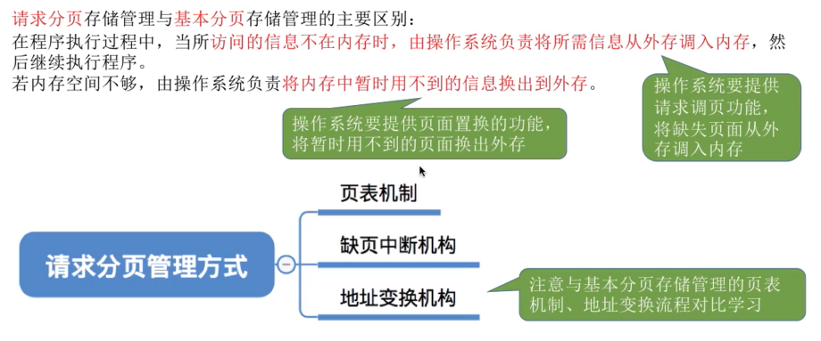

#### 页表机制

- 图中状态位为1则页已调入内存，且本页表项的内存块号不为空；图中状态位为0则页尚未调入内存，且本页表项的内存块号为空。

- 有的地方会把请求分页存储管理的页表称为“请求页表”；把基本分页存储管理的页表称为“基本页表”或简称为“页表”

#### 缺页中断机构

1，第一种情况，如果由于0号页面不在内存而发生缺页中断后，内存中有空闲的a号块，则将所缺页面装入该块：

- 缺页中断机构会根据对应的页表项来判断此时这个页面是否已经在内存中，如果说没有在内存中即**状态位为0**的话，那么会产生缺页中断信号。

2，并修改页表中相应的页表项：

3，第二种情况，如果由于0号页面不在内存而发生缺页中断后，内存中没有空闲的块，则需要选择一个页面淘汰，比如页面置换算法选中要淘汰2号页面；因为2号页面的内容在内存期间被修改过，则将2号页面的内容从内存写回外存，把外存中的旧数据覆盖掉：

4，这样2号页面之前在内存中占有的c号块，就可以空出来让0号页面使用了，于是可以把0号页面从外存调入内存中的c号块：

5，相应的，我们要把换入外存的页面和换入内存的页面的相应数据更改：

---

6，缺页中断属于内中断：

#### 地址变换机构

1，请求分页存储管理与基本分页存储管理的主要区别：

- 新增步骤1：在查找到页面对应的页表项的时候，一定是需要通过”状态位“，对页面是否在内存这个状态进行判断。

- 我理解：新增步骤3的“新增的表项”，应该不需要新增，有修改就行。

2，请求分页管理步骤图：

- 注意：快表中有的页面一定是在内存中的。若某个页面被换出外存,则快表中的相应表项也要删除,否则可能访问错误的页面
  - 我理解老师说的“换出外存”的意思是：把数据从内存取出并换入外存

3，课本中请求分页中的地址变换过程：

- 红框部分的内容，就是请求分页管理方式和基本分页管理方式相比，增加的一些步骤和内容。
- 一些补充细节如图。
  - 细节⑤详细内容：
    - 在具有快表机构的请求分页系统中，访问一个逻辑地址时，若发生缺页，则地址变换步骤是:
      查快表(未命中)――查慢表(发现未调入内存)――调页(调入的页面对应的表项会直接加入快表)――**查快表**(命中)――访问目标内存单元
- 左上角被水印挡住的字应该是“缺页中断处理”。

- 网友：“快表中的数据是最新的。慢表的是最全的。快表中有的他不会访问慢表的。是这样吗？”

#### 小结

### 页面置换算法

#### 总览

- 更少的缺页率：即页的换入换出的次数更少

#### 最佳置换算法 OPT

1，以一个实例介绍OPT；刚开始进程要访问7号页面，由于刚开始为进程分配的三个内存块都是空的，所以我们可以把7号页面放入内存块1中：

2，第二个要访问的页面是0号页，由于此时依然有空闲的内存块，我们可以把0号页放入内存块2中：

3，第三个要访问的页面是1号页，由于此时依然有一个空闲的内存块，我们可以把1号页放入内存块3中：

4，第四个要访问的是2号页面，但是由于此时给本进程分配的3个内存块都占满了，所以必须用页面置换算法选择淘汰已占用内存块的某一个页面，把那个页面先换出外存；我们发现已占用内存块的0 1 7三个页面中，7号页面是在之后最长时间段内不会被访问到的页面，因此我们选择淘汰7号页面，然后让2号页面放入到7号页面原先占有的内存块1中：

5，接下来要访问的0号页面已经在内存中了，所以此时不会发生缺页，可以正常访问：

6，再访问3号页面，也会发现此时3号页面并没有在内存中，所以我们依然需要用置换算法选择淘汰一个页面；我们从当前页面的后一位往后寻找，看看此时内存中存放的2 0 1页面出现的先后顺序；我们发现1号页面是最后一个出现的，因此1号页面是在今后最长时间内不会再被访问的页面；因此我们会选择把1号页面换出外存，再把3号页面换入1号页面之前占有的内存块3：

7，对于之后页面的访问就不再细细分析了：

- 网友说：“不可能实现的算法. 超前的预测.最低的缺页率；这个预判实际上实现不了，是一个理想算法，和现实有差距”
- 网友说：“最佳算法是用来评估其他算法的，别跟个傻子一样”

- 打钩的地方发生了缺页中断，共9次；
  - 刚开始访问7 0 1页面的时候，虽然他们都不在页面中，但是因为刚开始有空闲的内存块；所以访问7 0 1 页面时，虽然会发生缺页中断但不会发生页面置换。

- 最佳置换算法执行的前提条件是我们必须要知道之后会依次访问的页面序列到底是哪些，不过这是无法实现的：

8，最佳置换算法 OPT 总结：

#### 先进先出置换算法

1，程序使用3个内存块的话，实例：

2，程序使用4个内存块的话，可以观察到belady异常，实例：

#### 最近最久未使用置换算法 LRU

1，7号页面是访问到3号页面时，内存中的最近最久没出现的页面；因此会选择把7号页面淘汰，然后3号页就会放到以前7号页占有的内存块3中：

2，该算法的实现需要专门的硬件支持，虽然算法**性能好**，但是**实现困难，开销大**。

- 学习的几个算法中，LRU的性能是最接近最佳置换算法 OPT的。

#### 时钟置换算法 CLOCK

1，之前提到的几种算法都不能做到，算法效果和实际开销的平衡，因此人们提出了时钟置换算法；概念和实例初始状态如图：

2，五个内存块已经被填入了1 3 4 2 5页面，已经满了，所以要用clock算法来选择淘汰其中的某个页面；所以会从循环队列的队首(此时为1号页)开始扫描，尝试找到一个访问位为0得页面，并且被扫描过的页面需要把访问位由1改为0；所以听过第一轮的扫描后，所有页面的访问位都由1置为0：

3，在进行第二轮扫描的时候，1号页的访问位为0，所以会选择淘汰1号页面，于是6号页会装入到1号页以前占有的内存块中，并且6号页的访问位会被置为1，然后扫描的指针指向下一个页面即3号页：

4，接下来的访问中会依次访问到3号页和4号页，在访问3号页后，3号页的访问位需要由0置为1；在访问4号页后，同样的，4号页的访问位需要由0置为1：

- 网友：“只有需要换页时时钟指针才会动。因为3号页和4号页在内存中，不需要换页，所以访问3号页和4号页时指针不动，只修改3好耶和4号页的访问位”。

5，再之后需要访问7号页，由于此时7号页没在内存中，所以需要淘汰内存中的某个页面然后把7号页放在内存中；同样的需要从扫描到的位置依次扫描，找到第一个访问位为0的页面，并且扫描后的页面的访问位需要由1变为0；所以3号页和4号页在扫描后访问位会变为0；在扫描到2号页的时候发现2号页的访问位本来就是0了，因此本来会选择淘汰2号页面，然后让7号页放到这个位置并把访问位置为1，然后扫描的指针再指向下一个页面：

- 扫描的过程有点像时钟的时针在转圈，所以算法叫时钟置换算法。

- clock又称为最近未用算法：因为我们会为各个页面设置一个访问位，访问位为1表示最近用过，访问位为0表示最近没用过；但是我们在选择淘汰一个页面的时候，是选择最近没有被访问过的也就是访问位为0的页面，因此本算法可以称为最近未用算法。

#### 改进型的时钟置换算法

1，改进型的时钟置换算法概念如图；实例初始状态如图，假设系统为一个进程分配了5个进程块，当内存块被占满了后，各个页面会用链接的方式编成一个循环的队列，此时如果要淘汰一个页面的话要从这个队列的队头开始依次得扫描：

2，情况1-只需要一轮扫描。根据算法规则，在第一轮的扫描中不需要修改任何标志位，需要尝试找到访问位和修改位都为0的页面；所以往后寻找了后发现最下面的(0,0)页面是符合条件的，因此在第一轮扫描的时候就找到了一个页面用于替换，因此会淘汰该页面：

3，情况2-需要2轮扫描。假设此时页面状态如图：

4，如果需要淘汰一个页面的话，需要从第一个页面开始往后依次扫描，然后尝试找到(0,0)这样的页帧，并且第一轮的扫描是不改变任何标志位的，所以一轮扫描下来发现所有页面都不满足(0,0)状态。

5，因此会进行第二轮扫描，第二轮扫描会尝试找到原本就是(0,1)的页面，并且扫描过的页面会把访问位置为0；(1,1)被扫描后把访问位置为0；扫描到(0,1)页面的时候，发现它原先就是(0,1)所以淘汰它：

6，情况3-需要3轮扫描：初始状态如图：

7，第一轮扫描没发现(0,0)。

8，所以会开始第二轮扫描，寻找(0,1)页面，并把发扫描过的页面的访问位置为0；但是第二轮扫描依然没有发现原本就是(0,1)的页面：

9，所以开始第三轮的扫描，扫描到右上角的(0,0)即满足条件，于是淘汰掉它：

10，情况4-需要4轮扫描。假设初始状态如图：

11，第一轮没找到(0,0)

12，所以进行第二轮扫描，页面的访问位都被置为0，但是依然没找到原本就是(0,1)的页面：

13，于是进行第三轮扫描，没发现(0,0)。

14，于是进行第4轮扫描，会找到左上角的(0,1)，于是淘汰这个页面：

15，改进型的时钟置换总结

- 网友问：“他没有被访问是怎么被修改的啊？”。网友答：“这是最近访问，有可能很久之前访问的时候修改的页面啊，这有啥问题？”

- 第三第四优先级可以看出，其他条件相等时(都访问过)，优先淘汰没修改过的页面；第一第二优先级也可以看出，其他条件相等时(都没访问过)，优先淘汰没修改过的页面；

#### 小结

### 页面分配策略

#### 总览

#### 页面分配/置换策略

1，基本概念介绍：

- 针对”驻留集“，考虑两个极端情况：
  - 若某进程共有100个页面，则该进程的驻留集大小为100时进程可以全部放入内存,运行期间不可能再发生缺页。
  - 若驻留集大小为1，则进程运行期间必定会极频繁地缺页

- 驻留集太大导致系统资源利用率低：可以这么考虑，比如系统中的CPU和I/O设备这两种资源，理论上是可以**并行**工作的；如果说多道程序并发度下降，就意味着CPU和I/O设备这两种资源并行工作的几率就会小很多，所以资源利用率当然会有所降低。

- 分配策略和置换策略如图：
  - 分配策略有固定分配，可变分配；置换策略有局部置换，全局置换。

- 不存在“固定分配+全局置换”这种策略。接下来会详细介绍存在(图中表打钩的项)的三种策略。

2，各种分配置换策略：

- 非重点拓展：系统会锁定一些页面，这些页面中的内容不能置换出外存（如:重要的内核数据可以设为“锁定”)
- 最好的策略是“可变分配局部置换”

#### 何时调入页面

#### 从何处调入页面

1，如果系统拥有足够的兑换区空间：

2，系统缺少足够的对换区空间：

3，UNIX方式：

#### 抖动(颠簸)现象

- 如果发生了抖动现象，系统会用大量的时间来处理进程页面的换入换出，而实际用于进程执行的时间就变得很少；所以要尽量避免抖动的发生。
- 引入了“工作集”知识点。

#### 工作集

- 工作集确定：
  - 如果此时访问到23号页，并且窗口尺寸为4，那么就会从此时访问的这个页面开始，往前寻找之前访问过的四个页号，由此来确定工作集的内容；所以在这个时刻，本进程的工作集是“24 15 18 23”四个页面。
  - 如果此时访问到17号页，并且窗口尺寸为4，那么就会从此时访问的这个页面开始，往前寻找之前访问过的四个页号，由此来确定工作集的内容；所以在这个时刻，本进程的工作集是“18 24 17”三个页面。
    - 所以工作集的大小可能小于窗口的尺寸，因为18号页面在窗口中出现了两次。

#### 小结

- 注意：不存在“固定分配全局置换策略”，因为全局置换意味着一个进程所拥有的物理块数是可以改变的，而固定分配又要求一个进程所拥有的物理块数是不可以改变的；所以固定分配和全局置换这两个条件本身就就是相互矛盾的，因此并不存在“固定分配全局置换”这种方式。
- 网友说：“新版视频里有本节对应的‘地址翻译’，可以看看”。地址翻译[参考文章](https://zhuanlan.zhihu.com/p/38048773)。

## 文件管理

### 初识文件管理

#### 前情回顾

#### 文件的属性

#### 文件内部的数据的组织方式

1，实例：

2，组织方式逻辑图：

#### 文件之间该如何组织

1，windows系统的文件之间的组织形式，类似树状：

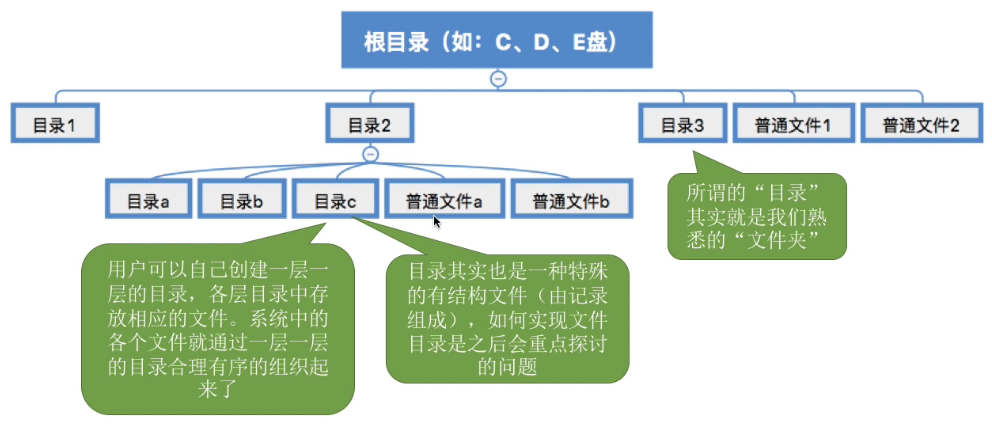

#### 操作系统应该向上提供哪些功能

1，平时肉眼可见的一系列对文件的操作功能：

- 写文件：平时编辑文件时，其实只是改变了文件在内存中的副本的数据；所以为了保存这个文件的内容，我们必须使用“写文件”的功能。

2，提供的最基本的功能逻辑图：

#### 从上往下看，文件应如何存放在外存

1，

- 本例中块内地址的位数为10位，因为一块包含2的10次方个地址。

2，文件是离散or连续地存放在磁盘块中：

- 文件的物理结构：探讨的是，文件这些数据在物理上应该怎么存放且怎么组织的问题。

- 文件的逻辑结构：探讨的是，文件的各个记录在逻辑上应该是什么样的一种组织关系的问题。

#### 其他需要由操作系统实现的文件管理功能

#### 小结

### 文件的逻辑结构

#### 总览

#### 无结构文件

#### 有结构文件

1，**有结构文件**：由一组相似的记录组成，又称“**记录式文件**”。每条记录由若干个数据项组成。如:数据库表文件。一般来说，每条记录有一个数据项可作为关键字。

2，有结构文件实例：

3，定长记录VS可变长记录：

定长记录：

可变长记录：

#### 有结构文件的逻辑结构

#### 逻辑结构-顺序文件

1，基本知识：

2，思考的结论：

- 网友：“结构决定了其性质”

- 网友：“学习顺序为，C语言-数据结构-计算机组成原理-操作系统-计算机网络”

- 顺序文件默认不考虑链式存储。

#### 逻辑结构-索引文件

- 网友：“空间换时间”
- 网友：“SQL建立索引：CREATR INDEX”

#### 逻辑结构-索引顺序文件

1，基本知识：

- 网友：“这不是二级索引，这是部分索引.....”

- 索引顺序文件的索引表，其实是一个定长记录的串结构的顺序文件。

2，检索效率分析：

- 网友：“索引顺序查找的查找流程，类似查新华字典”

3，查找次数还是很多时，可以建立“多级索引顺序文件”：

- 对10的6次方个记录的文件而言，每100个记录，对应低级索引表的一个表项；每100个低级索引表表项，对应高级索引表的一个表项；高级索引表本身有100个表项。
- 我：我理解，“多级索引顺序文件”中，对不同级别的索引表来说，单个表内部的所有表项的大小一致。

#### 小结

1，

2，

- ”顺序文件“-“跟据关键字快速找到记录”：顺序结构就是指各个记录按照关键字的顺序依次排列，所以由于这些记录的排列顺序是有规律可寻的，因此可以使用如“折半查找”之类的算法，来快速找到一个关键字对应的记录。

- 网友问：“我一直不懂随机存取是什么意思”。网友答：“随机存取就类似于，直接用始址+偏移*存储单元长度就可以找到。”

- ”索引文件“-“快速检索”：由于快速检索的功能和特性，因此索引文件经常被用于对于检索速度要求很高的场景。

### 文件目录

（重要）

#### 总览

1，引入：

2，

#### 文件控制块

1，点击“照片文件夹”：

2，打开照片目录后，谈谈FCB是什么：

3，对文件目录需要进行哪些操作：

- 网友：“我理解的是，目录文件是个文件，里面记录的内容是文件目录”

- 由文件控制块的有序集合就组成了文件目录

#### 目录结构

1，目录结构--单级目录结构：

2，目录结构--两级目录结构：

- 两级目录结构可以实现访问限制；比如User1想要访问User2的用户文件目录的话，操作系统可以验证一下User1和User2这两个名字是否匹配，发现不匹配就可以拒绝User1访问User2的用户文件目录。
- 缺点：用户不能对自己的文件进行分类。

3，目录结构--多级目录结构：

基本信息：

- 这也是现在操作系统中很常用的目录结构

设置当前目录：

- 网友：“去掉了从外存掉根目录和照片目录的步骤，因为本身已经在照片目录里了，所以只要读一次。老师说的是，知道.jpg文件的存储位置，不是读它”

树形目录结构的缺点：

4，目录结构--无环图目录结构：

- 网友：“这是软连接嘛”

- 网友：“快捷方式只是指向了指向该文件地址的文件，而不是真正指向文件的磁盘地址”

#### 索引节点

1，索引节点介绍；索引节点实例及好处：

- 网友：“原来的文件目录项是FCB，现在变成了<文件名，索引结点指针>”

2，补充信息：

#### 小结

### 文件的物理结构

#### 总览

1，

2，对非空闲磁盘块的管理：

#### 文件块 磁盘块

(这是补充的重要的知识点)

1，

2，

#### 文件分配方式-连续分配

1，连续分配方式概念；连续分配方式的最大的优点是“支持顺序访问和直接访问”：

- 网友：“这不是段吗？”。网友：“一个外存，一个内存”

- 顺序访问VS直接访问：

  - 顺序访问：如果要访问逻辑块号2，那么我必须先顺序访问逻辑块号0和逻辑块号1，之后才能找到逻辑块号2。

  - 直接访问：如果要访问逻辑块号2，那我不需要访问其他的块，我可以直接找到逻辑块号2存放的位置。

2，连续分配方式的第二个优点：

- 网友：“类比数组，块就是数组内的元素。都固态硬盘SSD了 每年还考磁盘”

3，连续分配方式的缺点1：

- 从黄色区域迁移到绿色区域，对文件A进行数据迁移是需要消耗很大的开销的。
- 结论:物理上采用连续分配的文件不方便拓展。

4，连续分配方式的缺点2：

- 这些磁盘碎片类似之前在内存管理中讲过的外部碎片，处理这些碎片的方式也和处理外部碎片的思想是一样的，即用“紧凑”的方式。
  - 紧凑：意味着移动大量磁盘块的内容，需要花费很大的时间代价的。

5，连续分配总结：

#### 文件分配方式-链接分配

1，**链接分配**采取离散分配的方式，可以为文件分配离散的磁盘块。分为**隐式链接**和**显式链接**两种。

2，隐式链接概念：

3，隐式链接是否方便拓展文件：

4，隐式链接小结：

5，显式链接概念：

- 这种分配方式，把每个文件的各个盘块的链接信息显式地统一地放在文件分配表FAT中，所以这种分配方式称为“显式链接”

6，显式链接实现“文件的逻辑块号到物理块号的转变”：

- FAT常驻内存，所以查询FAT的过程，即逻辑块号转换成物理块号的过程不需要读磁盘操作。

- 网友：“这里的随机访问，是指不需要在磁盘里读一块找下一块，可以通过常驻内存的FAT找到实际物理块号，直接访问磁盘”。网友：”访问逻辑块指的是在外存中访问，在内存中查表是需要顺序查表的。查到i号逻辑块对应的物理地址后，就可以在外存中直接访问。“网友：”fat在内存中，不是一个一个的物理块，只查了一次就找到了；只在表上查，并不需要真正的把一个个磁盘块调入内存去查下一个磁盘块；随机访问应该是指对磁盘的访问是不是随机的；他这里的随机访问应该指的是外存，因为查FAT的过程并不是访问文件本身“。网友：“FAT不是随机访问的，通过FAT可以实现磁盘的随机访问；是对表的顺序访问来支持对磁盘的随机访问”。网友：“在FAT中找到相应的逻辑块号对应的物理块号，然后在磁盘中随机访问”。高赞网友：“因为IO的访问速度跟内存不是一个数量级的，所以内存中的操作在这里是默认不耗时间的，因此说是支持随机访问”

- 网友：”隐式访问一个块才知道下一个位置，显式直接看表“

7，链接总结（含隐式和显式）：

#### 文件分配方式-索引分配

1，连续分配vs连接分配：

- 连续分配要求给文件分配的必须是连续的磁盘块。
- 链接分配允许为文件分配的是离散的磁盘块。

2，索引分配内容：

- 网友：“30／8向上取整，所以是4B就足够了”

3，索引分配实现逻辑块号到物理块号的转换：

- 查找的方式和内存管理中介绍的，通过逻辑页号来查询页表项的方式是很类似的。

4，一个磁盘块装不下文件的整张索引表时，有哪些解决方案：

4.1，链接方案：

- 索引表的索引项超过256个时：

  - 可以把索引表拆分，为这个aaa文件分配多个索引块，每个索引块中存放256个索引项
  - 每个索引块中使用一定的空间，存储指向下一个索引块的指针。

  这样就可以把一个很长的索引表拆分成不同的部分，并且用链接的方式把他们连起来。

- 如果采用“链接方案”，文件的FCB中只需要记录文件名对应文件的第一个索引块的块号，像文件aaa只需要记录它的第一个索引快即7号块。

- 假设用户想要访问的是aaa的逻辑块号为256的逻辑块，为了查到256号逻辑块对应的物理块号，就必须找到aaa的第二个索引块；由于各个索引块是用链接的方式把它们连起来的，所以为了找到第二个索引块的块号，操作系统首先要把第一个索引块读入内存，然后才能根据第一个索引块中的指针找到第二个索引块的块号，并把第二个索引块读入内存；只有这样才能找到256逻辑块号对应的物理块号到底是多少。

  - 造成问题：访问偏后部的逻辑块时，需要访问太多索引块。解决方案：多级索引

4.2，多层索引概念，多层索引把逻辑块号转换成磁盘块号实例：

- 如果一个磁盘块只能存放256个索引项，且文件大小是256*256个块的话，那么这个文件可以为它建立两层索引；第一层的索引块共有256个索引项，第二层的索引块每一块也有256个索引项，然后每一个索引项再指向某一个数据块；在文件的目录表(FCB)中只需要记录文件aaa的顶级索引表存放的索引块号是多少即可。

- 网友：“FCB是放在内存的吗？我一直以为也磁盘；目录文件是指存储当前目录下的所有FCB的文件”
  - 问byr论坛“FCB是否常驻内存”：
    - 坛友：“我感觉不是常驻，open系统调用才把它加载到内存”
    - 坛友：“肯定不是，FCB很大的，内存空间需要珍惜，我感觉可能多层fcb的话前几层在内存比较合理”
  - 网友：“FCB刚开始在外存”

- 采用K层索引结构，且**顶级索引表未调入内存**，则访问一个数据块只需要K+1次读磁盘操作

- 优缺点：
  - 优点：相比于之前的链接方案，读磁盘操作(I/O)少了很多。
  - 缺点：假如一个文件很小只有1KB，但是这个文件如果在物理上采用两层索引的结构的话，那么读入这个文件1kb的内容依然需要3次读磁盘操作。
    - 解决这个问题：混合索引

4.3，混合索引：

- 8+256+65536=65800KB，本例中一个磁盘块大小是1KB，故这种结构的索引支持的最多磁盘块数为65800个。

- 访问某个逻辑块要几次读磁盘操作(含把目标数据块内容读入内存)，看图左下角。
- 混合索引优势：见最下面的绿色方框。

5，索引分配总结：

#### 小结

- FAT支持随机访问；链接分配默认是隐式链接。

- 我：图中“顺序分配”应该是笔误，应写为“连续分配”。

### 文件存储空间管理

#### 总览

1，

- 之前讲了对非空闲磁盘块的管理，现在讲对空闲磁盘块的管理

2，

#### 存储空间的划分和初始化

- 文件卷划分为目录区和文件区：
  - 目录区存放例子：文件目录项(FCB)，索引节点；空闲表
  - 文件区：存放普通的文件数据

- 网友：“索引结点是对文件控制块(FCB=文件目录项=文件控制块)的改进，对FCB进行瘦身，让它占用的磁盘块数减少，会减少磁盘IO次数”

- 平时自己使用的电脑都是把一个物理磁盘划分成多个逻辑磁盘；但是在有的系统中可以把多个物理磁盘合并成一个逻辑磁盘(即文件卷)

#### 存储空间管理-空闲表法

1，这个空闲盘块表，和我们在内存管理的动态分区分配中学习的空闲表，是很类似的。

2，分配磁盘块之“首次适应”实例：

原始状态：

分配后的状态：

3，由于学过内存管理，分配磁盘块之“最佳适应和最坏适应”不再赘述。

4，空闲区的回收实例，以情况②为例：

- ①情况会在空闲表中新增一个表项，②情况导致空闲区的数量减一，③④情况不会改变空闲区的数量

回收前：

回收后：

5，空闲表法注意的问题：

- 系统是怎么记录空闲区间的信息。
- 如何进行磁盘块的分配。
- 如何回收磁盘块。

接下来的存储空间管理方法需要注意的也是这三个问题。

#### 存储空间管理-空闲链表法

1，基本信息：

2，“空闲盘块链”分配与回收：

- 所谓“为文件分配多个盘块时可能要重复多次操作”：由于进行分配的时候都是要从链头一个一个地摘下空闲磁盘块，所以为一个文件分配多个磁盘块的时候可能需要重复多个操作，需要依次从链头摘下。

3，“空闲盘区链”分配与回收：

- 比起“空闲盘块链”来说，“空闲盘区链”给一个文件分配多个盘块时效率更高；因为空闲盘块链只能从这个链中一个一个地把磁盘块摘下来来，但是空闲盘区链可以一次摘出一大片连续的空闲区间；所以空闲盘区链在分配多个磁盘块的时候效率更高。

#### 存储空间管理-位示图法

(考研中最常考)

1，基本概念：

2，采用“位示图法”，怎么进行磁盘块的分配和回收：

- 网友：“这是一位一位表示的，8位才一字节，不会占很多内存吧”

- 连续分配 离散分配都适用
  - 连续分配：扫描位示图的时候，就可以尝试找到连续的k个块。
  - 离散分配：找k个块的时候，不需要在位示图中找到连续的k个0。

#### 存储空间管理-成组链接法

1，超级块：

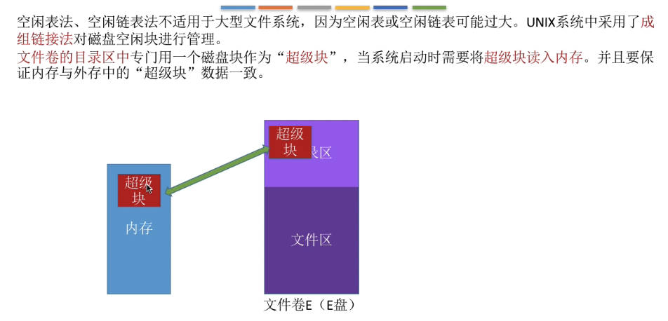

2，超级块结构：

- 网友：“超级块有101项，第1项记录下一组空闲盘块数，第二项指向下一个超级块（类似链表指针），剩下的分配给文件，这样就好理解了”。网友：“每个超级快中的第一块记录下一组空闲盘块数，第二块指向下一个超级快(即填写下一个超级块的块号)，后99个是空闲盘快的块号，就是套娃呗”
- 图讲解
  - 在超级块中记录了下一组空闲盘块的数量，比如下一组一共有100个空闲盘块（深橙色）；超级块还需要记录100个空闲盘块的盘块号分别是多少，通过这些盘块号就可以依次找到下一个分组的各个盘块了；所以第一个空闲盘块的分组总共有100个，他们分别是201号磁盘块到300号磁盘块；
  - 这里注意300号磁盘块作为本分组的第一个磁盘块，在这个300号盘块中还需要记录下一组空闲盘块的信息；所以300号盘块会记录下一个分组的盘快数量（深橙色背景），和各个盘块的盘块号。
    - 虽然300号盘块不是空的，它需要记录下一组空闲盘块的信息，但是它也是可以被使用的；因为需要使用300号盘块时，只需要把300号盘块的内容复制到超级块即可。

- 注意：最后一个分组的盘块数，要比其他的分组要少，少一块；原因是出在倒数第二组的值为“-1”的块。
- 网友：“这图极具迷惑性啊，建议出门左转天勤”

3，如何分配--分配一个空闲块：

原始状态：

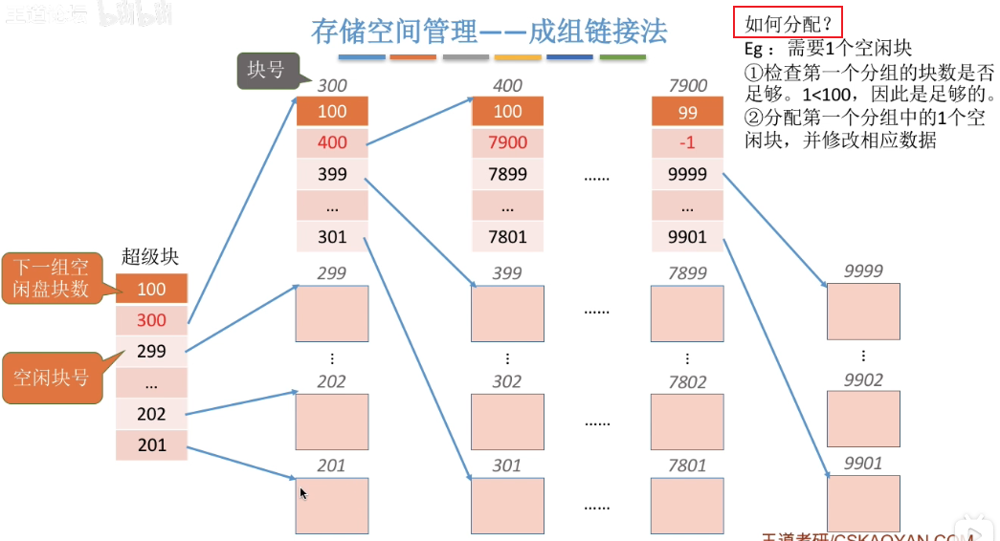

需要删除超级块末尾的一个空白块号，并修改“下一组空闲盘块数”使之减一；分配完毕后：

4，如何分配--分配100个空闲块：

初始状态：

复制：

因为有复制300号块的数据到超级块中，虽然分组已经全部分配给文件了，但是下一个分组的链接信息依然是保存在超级块中的：

- 网友：“汤教材：将每一组含有的盘块总数N和所有的盘块计入其前一组的第一个盘块的s.free(0)-s.free(99)中，所以这里说的没错，严格来说确实是下一组的空闲盘块数减1”

- 超级块充当了一个链头的作用，在链头中永远要保持指向下一个分组的一些信息。

5，如何回收--第一个分组没满的实例；实际上是第“3”点的逆过程：

没回收前：

回收后：

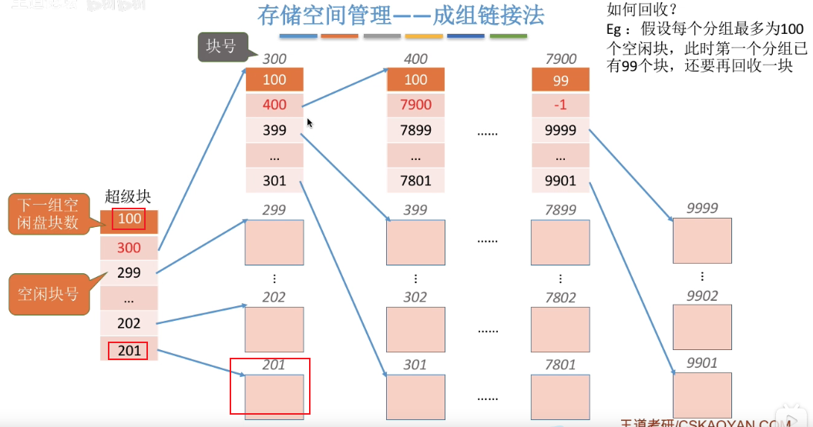

6，如何回收--第一个分组满的情况：

回收前：

将超级块中的数据复制：

新回收的块作为一个新的分组的第一个块（当然本例中也是唯一的块），该块就拥有了指向下一个分组的这些链接的指针；300号块中的记录如框中所示：

由于超级块永远要指向第一个分组的，所以超级块的数据就需要修改，让他指向第一个分组，也就是新的回收块组成的新分组；由于新分组中只有一个空闲块，所以超级块的深橙色部分内容是1；超级块唯一的记录是300即第一个分组的唯一一个块的块号，指向第一个分组的唯一一个块：

#### 小结

### 文件的基本操作

#### 总览

#### 创建文件

#### 删除文件

#### 打开文件

1，基本知识：

2，有两种“打开文件表”：

- 不同进程对一个文件进行读写操作进行到的位置是不一样的，所以不同进程的读写指针也是应该不一样。
- 不同进程在打开一个文件时所申请的“访问类型”也是不一样的，因此因此“访问权限”字段也应该放在进程的打开文件表中。

#### 关闭文件

#### 读文件

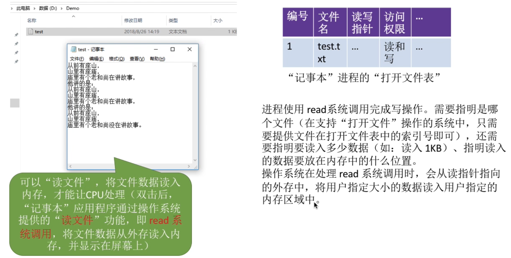

#### 写文件

#### 小结

- 注意：打开文件时，并不会把文件的数据直接读入内存，只是把文件的目录项复制到内存的“打开文件表”中，勿混淆。
- 和“打开文件”易混淆的是“读文件”：
  - 只有“读文件”的时候才会把文件的数据真正地从外存读入内存。
  - 对文件进行读写操作时，用户不用再像“打开文件”那样提供“文件名or文件路径”信息，只需要提供“打开文件”后返回给用户的“文件描述符”，操作系统就知道我们要读写的是哪个文件了。

### 文件共享

#### 总览

- 我感觉：“共享”有点类似于“快捷方式”

#### 硬链接

1，硬链接方式共享时：

2，count为0时，系统删除文件：

- 不同的用户对于这个共享的文件起的名字，可以不同。

#### 软链接

1，基本概念：

- 另一个用户User3想使用软链接的方式来共享文件1，那么User3会建立一个新的文件；这个文件是一种特殊的link型的文件，该link型文件中记录了文件1的存放路径。
- 文件2中记录User2目录中的文件名bbb时，也是可以找到文件1的。

2，windows操作系统中“快捷方式”的例子：

3，思考：如果采用“软链接”方式共享文件的话，删除一个文件会不会对软链接造成什么影响呢？：

原理分析：

windows系统实例：

#### 小结

- 软链接**每一次**访问文件都要一层层查询多级目录，在一层层查询目录的时候，是需要多次磁盘io的；所以通过软链接访问一个共享文件的速度，比硬链接更慢，

### 文件保护

#### 总览

#### 口令保护

#### 加密保护

1，用户使用密码加密，并使用正确密码解密时：

- 系统中保存的不是原始数据，而是保存了对文件进行加密后的加密数据；如果一个用户想访问这个文件的话，必须对这个文件进行解密才行。
- 以图中“异或加密”为例，如果加密时使用的密码和解密时使用的密码一致时，加密前和解密后的文件的数据是完全一致的。

2，用户使用密码加密，并使用错误密码解密时：

#### 访问控制

1，基本知识：

2，”精简的访问控制表“：

3，windows系统的访问控制：

新建账户：

切换账户：

#### 小结

### 文件系统的层次结构

#### 总览

#### 层次结构的细节

- 不同层对应本章不同节的内容：
  - 文件接口--“文件的基本操作”
  - 文件目录系统--“文件目录”
  - 存取控制模块--“文件保护”
  - 逻辑文件内系统与文件信息缓冲区--“文件的逻辑结构”
  - 物理文件系统--“文件的物理结构”
  - 辅助分配模块--“文件的存储空间管理”
  - 设备管理模块--“磁盘管理”相关小节中有

#### 小结

1，使用实例帮助记忆文件系统的层次结构，同时小结：

### 磁盘的结构

#### 总览

#### 磁盘 磁道 扇区

1，磁盘的基本结构：

2，磁道和扇区：

#### 如何在磁盘中读写数据

1，单层盘片读写数据：

#### 盘面 柱面

1，一个磁盘由很多个盘片垒起来：

- 每一个盘面上都会有一个磁头，这些磁头都会由磁头臂统一地带动着，往里或往外地移动。
- 有的盘片可能有两个盘面，即正面是一个盘面，背面是另一个盘面。

#### 磁盘的物理地址

1，

#### 磁盘的分类

1，根据磁头能否移动，来划分：

2，根据盘片是否可以更换，来划分：

#### 小结

### 磁盘调度算法

#### 总览

#### 一次磁盘读/写需要的时间

- 对于Tr：1/r就是转一圈需要的时间。找到目标扇区平均需要转半圈，因此再乘以1/2
- 对于Tt：每个磁道要可存N字节的数据，因此b字节的数据需要b/N个磁道才能存储。而读/写一个磁道所需的时间
  刚好又是转一圈所需要的时间1/r
  - 即磁头在目标磁盘区域上滑动的时间

- **操作系统唯一可以优化**存取时间的点就是：寻道时间

#### 先来先服务算法 FCFS

#### 最短寻找时间优先 SSTF

#### 扫描算法 SCAN

- 虽然不需要访问200号磁道，但是因为磁头只有移动到最外侧磁道时才能往内移动，所以磁头还是往200号磁道移动，使磁头来到最外侧磁道。

- 网友：“算法很像 摇头风扇 or 地铁”

#### LOOK调度算法

为了解决SCAN算法的缺点①。

- 网友：“算法很像 电梯”

#### 循环扫描算法 C-SCAN

为了解决SCAN算法的缺点②。

- 网友：“算法很像 扶手梯”

#### C-LOOK调度算法

为了解决C-SCAN调度算法的缺点。

#### 小结

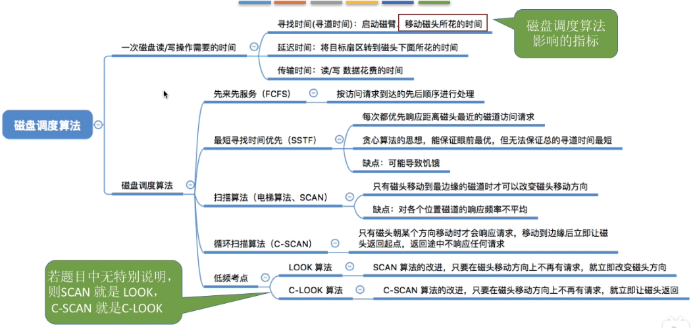

### 减少磁盘延迟时间的方法

#### 前言

#### 减少延迟时间的方法：交替编号

#### 磁盘地址结构的设计

1，为什么不是盘面号在前，而柱面号在后？先看盘面号在柱面号之前的情况：

- ”启动磁头臂和移动磁头“是一种物理上的移动，它所花费的时间是比较高的。

2，看书中一般推荐的情况，即柱面号在盘面号之前的情况：

- 核心就是：柱面号在前，可以更高效地读取“物理地址相邻的区域”

3，总结柱面号在盘面号之前的原因：

#### 减少延迟时间的方法：错位命名

1，若不采用错位命名，即0号盘面和1号盘面在相对位置相同的扇区的编号都是相同的，导致的问题：

- 抓住2进制理解：1号盘面中，与0号盘面的7号扇区(磁块物理为00000111)相邻的下一个扇区的编号，应该是0号扇区(磁块物理地址为00001000)，两个磁块的物理地址相邻。

2，解决问题，用错位命名：

#### 小结

 

### 磁盘的管理

#### 总览

#### 磁盘初始化

- 网友：“之前就一直奇怪明明磁盘块都满了，哪来的空间存指针，原来在这里啊”

- 我理解：二进制表示磁盘块的物理地址时，若干个连续柱面的物理地址是连续的，可能是因此按柱面方向划分磁盘。

#### 引导块

1，问题引入：

2，解决问题：

#### 坏块的管理

- 不透明即看得到，透明即不可知

#### 小结

## 设备管理

### I-O设备的概念和分类

#### 总览

- 处理机和存储器，这些硬件是在计算机的主机内部的；本章节要探讨的”设备管理“，指的是操作系统对计算机主机外部的那些硬件设备的管理。

#### 什么是I/O设备

1，

2，UNIX系统将外部设备抽象为一种特殊的文件：

#### I/O设备的分类--按使用特性分类

#### I/O设备的分类--按传输速率分类

- 高中低速，没有一个很明确的划分，所以本知识点有个了解即可。

#### I/O设备的分类--按信息交换的单位分类

- 中断的概念在第一章有详细介绍，下一小节中我们会继续介绍什么叫”中断驱动方式“。

#### 小结

- 前两种分类方式不好考察，重点关注第三种分类方式“按信息交换的基本单位分类”。

### I/O控制器

#### 总览

#### 机械部件VS电子部件

#### I/O设备的电子部件

I/O设备的电子部件==I/O控制器

- 网友：“io控制器类似于丞相，上承皇上，下接百官”

#### I/O控制器的组成

1，基本知识：

2，要注意的小细节：

#### 内存映像I/O vs 寄存器独立编址

- 如果采用寄存器独立编址，这些寄存器和内存的地址空间不是统一的，他们是两个独立的体系。

#### 小结

 

### I/O控制方式

#### 总览

#### 程序直接控制方式

1，逻辑概念图，以读操作为例：

- 其实数据输入的过程中，本来应该是从设备输入到内存的；但是这个过程中必须先经过CPU的寄存器，然后再由寄存器转存到内存中；这样就完成了一次读操作。

2，一次读/写操作的流程图，以及程序直接控制方式的特点：

- 思考：为什么数据读入CPU寄存器中后，还需要往存储器中写入数据呢？答：见下图的C语言代码：

  

#### 中断驱动方式

1，方式讲解，以及完成一次读/写操作的流程：

- I/O完成后，向CPU发送中断信号，是为了让CPU放下手头的事，转而考虑处理之前阻塞的等待I/O的进程。

2，中断驱动方式的特点：

- 网友：“一个字就是内存的一个存储单元；1Word=2Bytes”

- 如果想进一步减少对CPU的使用，就引入了DMA方式

#### DMA方式

1，DMA方式介绍：

2，DMA控制器：

- DMA控制器其实也是一种I/O控制器，只不过它和上一小节介绍的I/O控制器有一些小小的区别。
- 系统总线会把DMA控制器和内存连接在一起，所以DMA控制器和内存之间可以直接进行数据的读写，不再需要经过CPU。
  - 比如说CPU可以在刚开始指明这次要读入的数据是存放在磁盘的什么位置，读入的数据要存放在内存的什么位置(MAR中有该信息)，并且会说明此次要读入数据的数据量到底是多少(DC中有该信息)；
  - 接下来DMA控制器就会根据CPU提供的这一系列参数，从磁盘的相应位置读入数据，然后写到内存里；
  - 这个过程就不再需要CPU的干预，只有DMA控制器完成了整个CPU指定的任务后，DMA控制器才会向CPU发出一个中断信号，然后CPU在进入并进行后续的处理。

- 注意：DMA控制器并不是每次直接读入一整块的数据并把一整块放到内存中；其实DMA控制器在读入数据的过程中，也是一个字一个字读入的，每次读入的一个字都会先存放在DR中，再从DR写入到内存中；用这样一个字一个字的方式，最终就可以完成一整块的数据的读入工作。

3，DMA控制器特点：

- 网友：“把DMA理解为一种特殊的io控制器，它能直接“沟通”内存和设备，当然，同样需要cpu“开始”和“结束”。粗糙的理解。我觉得叫数据存取外包比较形象”

#### 通道控制方式

1，通道控制方式中，完成一次I/O所要经历的步骤：

2，为何说通道是弱鸡版的CPU，以及通道控制方式的特点：

#### 小结

- 通道程序是由一系列的任务指令组成的；
- 一个通道可以控制多个I/O控制器，一个I/O控制器可以控制多个I/O设备。

### I-O软件层次结构

#### 总览

#### 用户层软件

- 用户层向用户提供一些简单易用的交互的接口，一般来说用户层软件会向用户提供一些与I/O操作相关的库函数，让用户调用这些库函数来对设备进行操作。

#### 设备独立性软件

1，设备独立性软件实现的功能：

- 主要实现的功能①，向上层提供统一的调用接口（如read/write系统调用)(在“用户层软件”小点中可以看到)

- 主要实现的功能②，设备的保护：原理类似与文件保护。设备被看做是一种特殊的文件，不同用户对各个文件的访问权限是不一样的，同理，对设备的访问权限也不一样。

- 主要实现的功能③，差错处理：设备独立性软件需要对一些设备的错误进行处理

- 主要实现的功能④，设备的分配与回收：后面细聊

- 主要实现的功能⑤，数据缓冲区管理：可以通过缓冲技术屏蔽设备之间数据交换单位大小和传输速度的差异。后面细聊

- 主要实现的功能⑥，建立逻辑设备名到物理设备名的映射关系;根据设备类型选择调用相应的驱动程序

  - 用户或用户层软件发出I/o操作相关系统调用的系统调用时，需要指明此次要操作的I/o设备的逻辑设备名（eg:去学校打印店打印时，需要选择打印机1/打印机2/打印机3，其实这些都是逻辑设备名)

  - 设备独立性软件需要通过“逻辑设备表（LUT， Logical UnitTable）”来确定逻辑设备对应的物理设备，并找到该设备对应的设备驱动程序

  - LUT实例：

    

  - 存在两种LUT：
    - 第一种方式，整个系统只设置一张LUT，这就意味着所有用户不能使用相同的逻辑设备名，因此这种方式只适用于单用户操作系统。
    - 第二种方式，为每个用户设置一张LUT，各个用户使用的逻辑设备名可以重复，适用于多用户操作系统。系统会在用户登录时为其建立一个用户管理进程，而LUT就存放在用户管理进程的PCB中。
    - 两种方式类似于我们在文件管理中学到的“单级目录”和“两级目录”；文件系统如果采用单级目录结构，不同用户的文件名不允许相同；文件系统如果采用两级目录结构，不同用户的文件名允许相同；

2，思考：不同类型的设备需要有不同的驱动程序处理？：

佳能打印机设备的内部电子部件：

惠普打印机设备的内部电子部件：

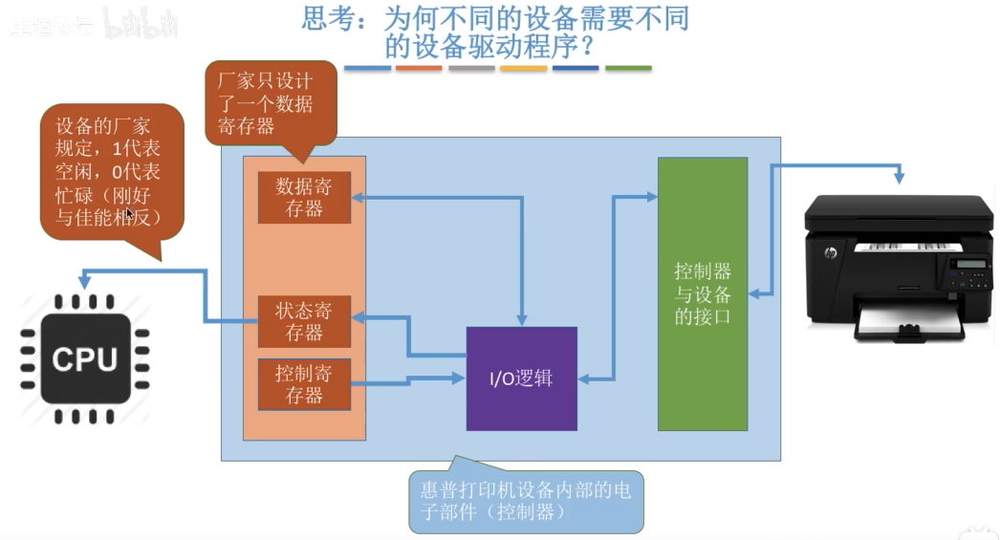

总结：

- 这里引入了驱动程序

#### 设备驱动程序

#### 中断处理程序

- 当中断处理程序把这次要输入的数据放到内存后，接下来又会交给“设备驱动程序”对这些数据进行进一步的处理，等设备驱动程序处理完了就会再给上一层的“设备独立性软件”进行再进一步的处理，最后一层层往上一直返回给用户；所以如果要输入一个数据的话，那么对于这个数据的处理应该是从下往上层层处理的。
- “设备驱动程序 和 中断处理程序”都需要直接和硬件打交道；但是再往上的“用户层软件 和 设备独立性软件”就不直接和硬件打交道了
  - eg：中断处理程序从控制器独处设备状态

#### 小结

1，基本小结

2，对LUT要有大体的印象

### I/O核心子系统

#### 总览

#### 这些功能要在哪个层次实现

#### I/O调度

- I/O调度和处理机调度是很类似的。

#### 设备保护

- unix系统中，设备会被看做文件，因此系统也会为各个设备建立一个相应的FCB。

#### 小结

### 假脱机技术

#### 总览

#### 什么是脱机技术

1，没有脱机技术时：

2，引入了脱机技术后：

- 由于磁带的速度比纸带机的速度快很多，因此CPU在输出的时候就可以节省很多等待输出完成的时间。大大提升了CPU的利用率。

- 右上角绿色框中“慢速的输出设备”，指的就是“纸带机”

- 基于脱机技术的思想，人们又发明了“假脱机技术”。

#### 假脱机技术--输入井和输入井

1，概念：

2，输入井和输出井在脱机处理中模拟的角色：

#### 假脱机技术--输入进程和输出进程

1，概念：

- 显然，输入进程和输出进程肯定需要和用户进程并发地执行，才可以完成这种“模拟脱机输入和模拟脱机输出的过程”；因此SPOOLing技术需要有多道程序技术的支持。

2，输入进程和输出进程在脱机处理中模拟的角色：

#### 假脱机技术--输入/输出缓冲区

1，概念：

#### 共享打印机原理分析

这是假脱机技术的应用。

1，引入：

2，既然打印机是独占式设备，为什么我们把它称为共享打印机呢？其实这里的共享就是SPOOLing技术实现的：

- 虽然系统中只有一个台打印机，但每个进程提出打印请求时，系统都会为在输出井中为其分配一个存储区（相当于分配了一个逻辑设备），使每个用户进程都觉得自己在独占一台打印机，从而实现对打印机的共享。
- SPOOLing 技术可以把一台物理设备**虚拟**成逻辑上的多台设备，**可将独占式设备改造成共享设备**。

#### 小结

### 设备的分配与回收

#### 总览

#### 设备分配是应该考虑的因素

1，因素有：

2，从”设备的固有属性“角度看：

3，从”设备的分配算法“角度看

4，从“设备分配的安全性”角度看：

- 安全分配方式缺点带来影响：系统资源的利用率低，进程的执行效率也降低。

#### 静态分配和动态分配

#### 设备分配管理中的数据结构

1，设备，控制器，通道 之间的关系：

2，第一种数据结构，设备控制表 DCT：

3，第二种数据结构，控制器控制表 COCT：

4，第三种数据结构，通道控制表 CHCT：

5，第四种数据结构，系统设备表 SDT：

#### 设备分配的步骤

1，不完美的设备分配的步骤：

- 注∶只有设备、控制器、通道三者都分配成功时（②③④），这次设备分配才算成功，之后便可后动I/O设备进行数据传送

- 改进方法：由操作系统来实现逻辑设备名到物理设备名的转换。

2，改进后的设备分配的步骤：

基本步骤：

本步骤中的LUT作用详解：

#### 小结

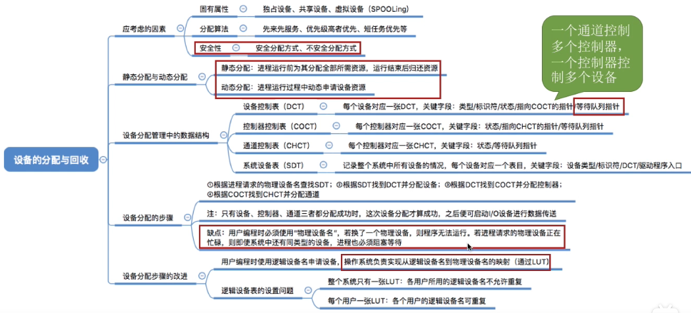

### 缓冲区管理

#### 什么是缓冲区 有什么作用

#### 缓冲区有什么作用

- 在内存中可以开辟一小片区域作为缓冲区。

- 不使用缓冲区的话，字符型设备每输出完一个字符就要向CPU发送一次中断信号，对中断的处理是需要付出一定时间代价的，因此CPU频繁地处理中断显然会降低系统的性能；而使用缓冲区这种策略的话，只有缓冲区中的数据被全部取走了，或输入的数据充满了缓冲区的时候，CPU才需要介入来处理中断，因此可以减少对CPU的中断频率。

#### 单缓冲

1，背景介绍：

2，分析：下一次达到“工作区满，缓冲区空”的状态要花多少时间，这个时间的长度就是处理一个数据块平均所需要消耗的时间：

情况1，即T>C：

情况2，T<C：

结论：

#### 双缓冲

1，背景介绍：

2，T>C+M：

3，T<C+M：

 

4，结论：采用双缓冲策略，处理一个数据块的平均耗时为Max (T,C+M)

#### 使用单/双缓冲在通信时的区别

1，两台机器通信时，使用单缓冲区的话：

- 单缓冲区只能单向传输数据的原因：缓冲区只有充满后才可以取走数据，而只有取空之后才可以往里面放入数据

2，两台机器通信时，使用双缓冲区的话：

- 进程通信小节中提到过“管道通信”，管道其实就是缓冲区。

#### 循环缓冲区

- 只需了解循环缓冲区的大致原理即可

#### 缓冲池

- 解析：
  - ①：从空缓冲队列中取出一块作为收容输入数据的工作缓冲区（hin）。冲满数据后将缓冲区挂到输入队列队尾
  - ②：从输入队列中取得一块冲满输入数据的缓冲区作为“提取输入数据的工作缓冲区(sin）“，缓冲区读空后挂到空缓冲区队列
  - ③：从空缓冲队列中取出一块作为“收容输出数据的工作缓冲区( hout）”。数据冲满后将缓冲区挂到输出队列队尾
  - ④：从输出队列中取得一块冲满输出数据的缓冲区作为“提取输出数据的工作缓冲区( sout） ”。缓冲区读空后挂到空缓冲区队列

#### 小结

