# computer_network_hnust

课程来源：[mooc](https://www.icourse163.org/course/HNKJ-1461816178)，包含学习所需要的课件，各章小结讲的**思维导图**，工具包等一切资源。想学习时搭配弹幕+字幕的话，推荐课程视频观看[bilibili](https://www.bilibili.com/video/BV1c4411d7jb?from=search&seid=13092588426906504952&spm_id_from=333.337.0.0)

学习方式：建议抓大放小，用的不频繁或者不重要的就听了记个定义。重要的才记完整概念实例和老师说了什么。

笔记说明：标题带`！`表示课程老师说的重点。标题带`。`表示课程老师说了解即可。

## 概述

### 计算机网络在信息时代的作用

略

### 因特网概述

#### ！网络，互联网和因特网

1，网络(Network)由若干结点(Node)和连接这些结点的链路(Link)组成。

- 注意图片中的连接器是方形的，后面还会有圆形的。

2，多个网络还可以通过路由器互连起来，这样就构成了一个覆盖范围更大的网络，即互联网（或互连网)。因此，互联网是“网络的网络(Netwrok of Networks) "。

3，因特网(Internet)是世界上最大的互连网络（用户数以亿计，互连的网络数以百万计)，在图像中常常用一朵云表示。

4，区分两个单词，internet与lnternet的区别：

- internet(互联网或互连网)是一个通用名词，它泛指由多个计算机网络互连而成的网络。在这些网络之间的通信协议可以是任意的。
- Internet(因特网)则是一个专用名词，它指当前全球最大的、开放的、由众多网络相互连接而成的特定计算机网络，它采用TCP/IP协议族作为通信的规则，其前身是美国的ARPANET。

5，（不重要）因特网发展的三个阶段

#### ISP

1，即因特网服务提供者（internet service provider）。像移动，联通，电信，都是ISP。

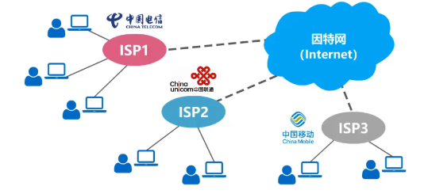

2，基于ISP的三层结构的因特网

- 第一层isp的服务面积最大，一般称为因特网主干网，覆盖国际性区域范围，并拥有高速链路和交换设备；第一层isp之间直接互联。

- 第二层isp和一些大公司都是第一层isp的用户，具有区域性或者国家性覆盖规模，和少数第一层ISP相连接。

- 第三层isp又称为本地isp，他们是第二层isp的用户，且只拥有本地区域的网络；一般校园网或者企业网或者住宅用户都是第三层ISP的用户。

- 因特网逐渐演变成基于ISP的多层次结构网络，但是现在网络太大，很难对整个网络的结构给出细致描述。相隔遥远的主机间通信可能需要经过多个ISP：

  

- 任何人如小明只要可以接入因特网就可以成为isp，需要做的就是购买一些调制解调器或者路由器，让其他用户可以和小明相连即可。

#### 因特网组成

- 边缘部分：由所有连接在因特网上的**主机**组成。这部分是**用户直接使用**的，用来进行通信（传送数据、音频或视频）和资源共享。
- 核心部分：由大量**网络**和连接这些网络的**路由器**组成。这部分是为边缘部分提供服务的(提供连通性和交换)。
  - 在网络核心部分起重要作用的是路由器，他是一种专用计算机，但是我们不称之为主机。路由器是实现分组交换的关键构建，其任务是转发收到的分组（网络核心部分最重要的功能）。

### 三种交换方式

#### 电路交换(Circuit Switching)

1，交换机的出现可以减少电话线的使用：

- 电话交换机接通电话线的方式称为**电路交换**;

- 从通信资源的分配角度来看，**交换**(Switching)）就是按照某种方式**动态地分配**传输线路的**资源**;

2，电路交换的三个步骤：

1. 建立连接(分配通信资源)
2. 通话（一直占用通信资源)
3. 释放连接(归还通信资源)

3，电路交换可以实现计算机间的数据传送，但是线路的传输效率很低。因为：

- 计算机的数据是突发式得出现在传输线路上。
- 例如，用户在打字的时候要时间，但是这个时候通信资源暂时没被利用，且不能被其他用户利用，白白浪费了通信资源。
- 所以**计算机**网络通常采用**分组交换**，而不是电路交换。

#### ！分组交换(Packet Switching)

1，因特网中，**最重要**的分组交换机就是**路由器**。路由器把各种网络互联起来，并对接收到的分组进行转发（也即“分组交换”）。

2，分组交换的各方角色：

****

- 发送方：构造分组；发送分组。
  - 构造分组的时候给每段数据分配数据头（即包头），构成数据包，包头中存储着“发送目的地”等重要信息。
- 路由器：缓存分组；转发分组。
- 接收方：接收分组；还原报文。
  - 接收分组的时候，根据数据包的包头中的信息，把接收到的数据整合还原。

#### 报文交换(Message Switching)

不怎么使用了，不讲。

#### 交换方式对比

1，图示：

- 电路交换
  - 建立连接后，比特流直达终点。
- 报文交换
  - 不限制报文的大小，需要各节点交换机有较大的缓存空间。
- 分组交换
  - 比报文交换减少了转发时延
  - 避免过长的报文长时间占用链路，同时有利于进行差错控制。
  - 我认为：“分组交换比报文交换先进一点点，因为它把原始报文分成了一个个组”。
- 
- 电路交换和tcp链接类似，报文交换和udp连接类似。

2，优缺点对比：

- 电路交换

  - 优点
    - 通信时延小（实时性强）：因为通信线路为通信双方用户专用，数据直达，因此通信时延非常小。当连续传输大数据时，这个优点就很明显。
    - 有序传输：通信双方之间只有一条专用的通信线路，数据只在这一条线路上传输，不存在失序问题。
    - 不存在冲突：不同的冲突双方有不同的信道，不会出现争抢物理信道的问题。
    - 适用范围广：电路交换既适用于传输模拟信号，也适合传输数字信号。
    - 控制简单：电路交换的节点交换机及其控制都比较简单。

  - 缺点：
    - 建立效率：电路交换的平均连接建立时间对计算机通信来说太长了
    - 使用效率低：线路独占，即使线路空闲也不能被其他用户使用
    - 灵活性差：只要连接所建立的物理通路的任意一点出现了故障，就必须拨号建立新的连接，对紧急和重要的通信是不利的。
    - 难以规格化：电路交换时数据直达，不同类型，不同规格，不同速率的终端很难相互进行通信；也难以在通信过程中进行差错控制。

- 报文交换：
  - 优点：
    - 无需建立连接：报文双方无需为通信双方预先建立一条专用的通信线路，不存在建立连接的时延，用户可以随时发送报文。
    - 动态分配线路：发送方把报文传送给节点交换机是，节点交换机先存储整个报文，然后选择一条合适的空闲线路，将报文发送出去。
    - 提高线路可靠性：如果某条传输路径发生故障，会重新选择另一条路径传输数据。
    - 提高线路利用率：通信双方不是固定占用一条通信线路，而是在不同的时间分段占用物理线路。
    - 提供多目标服务：一个报文可以同时发送给多个目的地址，这在电路交换中是很难实现的。
  - 缺点
    - 引起了转发时延：因为报文在节点交换机上要经历存储转发的过程。
    - 需要较大的存储缓存空间：因为报文交换对报文的大小没有限制。
    - 需要传输额外的信息量：这是因为报文需要携带目标地址，源地址等。

- 分组交换：
  - 优点：
    - 无需建立连接：分组交换不需要为通信双方预先建立一条专用的通信线路，不存在建立连接的时延，用户可以随时发送分组。
    - 线路利用率高：通信双方不固定占用一条通信线路，而是在不同的时间分段占用物理线路。
    - 简化了存储管理：这是相对于报文交换而言的，分组的长度固定，相应的缓冲区的大小也固定，管理起来相对容易。
    - 加速传输：由于分组是逐个传输的，使得后一个分组的存储操作和前一个分组的转发操作可以同时进行。
    - 减少出错概率和重发数据量：这也是相对于“报文交换而言的，因为分组比报文小，因此出错概率必然减小；即使分组出错也只需要重传出错的分组，比重传整个报文的数据量小很多。提高了可靠性，减少了传输时延。
  - 缺点：
    - 引起了转发时延：分组在节点交换机上要经历存储转发的过程。
    - 需要传输额外的信息量：将原始报文分割成等长的数据块，每个数据块都要加上“源地址”和“目的地址”等控制信息从而构成分组，因此使得传送的数据量增大了。
    - 分组交换采用数据包服务时，可能会出现“失序”“丢失”“重复分组”
    - 分组到达目的节点是，需要重新还原成原始报文，比较麻烦。
    - （**虚电路服务**是指是一种面向连接的，使所有分组顺序到达目的端的可 靠性数据传输服务）。若分组交换采用虚电路服务，虽然没有分组失序的问题，但是有”呼叫建立，数据传输，虚电路释放“三个过程。

### 计算机网络的定义与分类

#### 计算机网络的定义

1，计算机网络的精确定义并未统一：

2，计算机网络的最简单的定义是:一些**互相连接**的、**自治**的计算机的**集合**：

- 互连：计算机之间可以通过有线或者无线的方式进行数据通信。

- 自治：指独立的计算机，有自己的软件和硬件，可以单独运行。

  

  - 比如本图系统就不是一个计算机网络，因为图中终端只有输入和显示功能，不是自治的计算机。

- 集合：至少需要两台计算机。

3，目前计算机网络的较好定义是：计算机网络主要是由一些**通用的**、**可编程的硬件**互连而成的，而这些硬件并非专门用来实现某一特定目的（例如，传送数据或视频信号)。这些可编程的硬件能够用来**传送多种不同类型的数据**，并能**支持广泛的和日益增长的应用**。

- 计算机网络所连接的硬件，并不限于一般的计算机，而是包括了智能手机等智能硬件。

- 计算机网络并非专门用来传送数据，而是能够支持很多种的应用（包括今后可能出现的各种应用)。

#### ！计算机网络分类

- WAN：广域网。可以覆盖一个国家，地区，甚至横跨几个大洲。是因特网的核心部分，其任务是为核心路由器提供远距离（如跨越不同国家）的高速连接，互联分布在不同区域的城域网和局域网。
- MAN：城域网。一般覆盖几个街区或者是一个城市。

- LAN：局域网。一般是用微型计算机或工作站通过高速通信线路相连，速率常在10Mb/s以上；地理上较小，如一个校园或者实验室。局域网通常由某个单位单独拥有使用和维护。
- PAN（WPAN）：个域网。不同于上述网络，不是用来连接普通计算机的；而是在个人工作的地方把属于个人使用的电子设备如“laptop，鼠标，耳机等”用无线技术连接起来起来的网络。覆盖范围大概为10米。

### 计算机网络的性能指标

#### 性能指标介绍

定义：性能指标可以从不同的方面里度量计算机网络的性能。

常用的计算机网络性能指标：

- 速率，带宽，吞吐量，时延，时延带宽积，往返时间，利用率，丢包率

#### 速率

1，了解速率要先了解bit：

- 比特是计算机中**数据量**的单位，也是信息论中信息量的单位。一个比特就是二进制数字中的一个1或0。

- 常用的数据单位：

  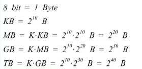

- 厂家硬盘标单位250GB，但是操作系统标注的确实232GB，原因如下：

  

  - 厂家（红色标注）的单位中的G为10的9次方；
  - 操作系统（蓝色标注）的单位中的G为2的30次方。

2，**速率**定义为：

- 连接在计算机网络上的主机在数字信道上传送比特的速率，也称为**比特率**或**数据率**。

- 数据量和数据率的单位对比

  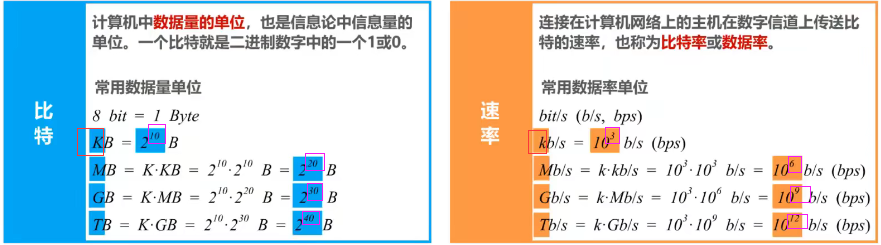

  - 数据量中K为2的10次方，数据率中k为10的3次方，原因是：数据量bit或byte是给计算机人看的，速率（数据率）是给大众看的

3，体现数据量和数据率单位差别的例题：

- 数据量的M**默认**时的值为2的20次方；如果场景中指明数据量的M为10的6次方，则以场景为准。

#### 带宽

1，带宽在模拟信号系统中的意义：

- 定义：**信号**所包含的各种不同频率成分所占据的**频率范围**;

- 单位：Hz (kHz，MHz，GHz)

- 带宽举例：在传统的通信线路上传送的电话信号的标准带宽为3.1kHz，范围从300Hz到3.4kHz；这是语音的主要成分的频率范围；3.1k=3.4k-0.3k。

  

2，带宽在计算机网络中的意义：

- 定义：用来表示网络的**通信线路**所能传送数据的能力，因此网络带宽表示在单位时间内从网络中的某一点到另一点所能通过的“**最高数据率**”;
- 单位：b/s (kb/s,Mb/s,Gb/s,Tb/s)。和刚介绍的速率（数据率）的单位相同。
- 现实生活例子：有人为“你家出口网速多少”，答曰“200M”。这里的“200M”其实省略了“bit/s”和“最高速率”；完整地回答应该是“最高速率为200Mb/s"。
  - 这里的“最高速率”其实就是我家网络的出口带宽。

3，模拟信号和计网中带宽的联系：

- 其实，“带宽”的这两种表述之间有着密切的联系。一条通信线路的“频带宽度”越宽,其所传输数据的“最高数据率”也越高。

#### 吞吐量

1，定义：吞吐量表示在**单位时间内通过某个网络(或信道、接口)的数据量**。

- 吞吐量被经常用于对现实世界中的网络的一种测量，以便知道实际上到底有多少数据量能够通过网络。
- 吞吐量**受网络的带宽或额定速率的限制**。

2，例子：

- 本以太网的吞吐量受带宽限制，最高为1Gb/s，通常只能达到700Mb/s。

- 计算机网络的带宽是理想，吞吐量是现实。

#### ！时延

1，网络时延的构成：

2，时延成分讲解：

- 发送时延：

  - 公式：

    

  - 发送时延受“网卡发送速率，信道带宽，接口速率”共同影响；基本符合短板效应：

    

  - 构建网络时，应该做到各设备间以及传输介质的**速率匹配**，这样才能发挥出本应具有的传输性能。

    

- 传播时延：

  - 公式：

    

- 处理时延：
  - 公式：不方便计算，公式不存在。
  - 各种路由器的软硬件性能不同，路由器的繁忙时段不固定
  - 关于有些教材中的“排队时延”：本课程把“排队时延和处理时延”合并称为”处理时延“；关于处理时延的考题中，往往指明“处理时延忽略不计”。

3，例题：

- 这里”电磁波传播速率“未指定传播介质，那就使用默认的光纤中数据率。
- 两个例子看出，**时延的大头不一定**，要具体问题具体分析。

#### 时延带宽积

1，公式：

- 注意这里的时延是“传播时延”，而不是完整的网络时延

2，理解：若发送端连续发送数据，则在所发送的第一个比特即将到达终点时，发送端就已经发送了时延带宽积个比特;

- 链路的时延带宽积又称为**以比特为单位的链路长度**。

#### 往返时间

1，概念：

- 在许多情况下，因特网上的信息不仅仅单方向传输，而是双向交互;我们有时很需要知道双向交互一次所需的时间;因此，往返时间**RTT**(Round-Trip Time)也是一个重要的性能指标。

2，实例：

- 本例子中，卫星链路的“传播时延”耗时较多！！这是卫星链路的特性决定的。

#### ！利用率

1，构成：

- 信道利用率：用来表示某信道有百分之几的时间是被利用的(有数据通过)。
- 网络利用率：全网络的信道利用率的加权平均。

2，根据排队论，当某信道的利用率增大时，该信道引起的时延也会迅速增加；因此，信道利用率并非越高越好。

3，公式分析（我感觉不重要，记住结论就行）：

- 信道利用率不能太低，也不能太高。

#### 丢包率

1，定义：

- 丢包率即分组丢失率，是指在一定的时间范围内，传输过程中**丢失的分组数量与总分组数量的比率**。

2，丢包率分类：

- 丢包率具体可分为接口丢包率、结点丢包率、链路丢包率、路径丢包率、网络丢包率等。

3，丢包率是网络运维人员非常关心的一个网络性能指标，但对于普通用户来说往往并不关心这个指标，因为他们通常意识不到网络丢包。

4，分组丢失的两种主要情况：

- 分组在传输过程中出现误码，被结点丢弃;
- 分组到达一台队列已满的分组交换机时被丢弃;在通信量较大时就可能造成网络拥塞。

5，丢包率反映了网络的拥塞情况：

- 无拥塞时路径丢包率为0
- 轻度拥塞时路径丢包率为1%~4%
- 严重拥塞时路径丢包率为5%~15%

### ！计算机网络体系结构（重难点）

#### 常见的计算机网络体系结构

1，OSI对比TCP/IP：

- 记忆OSI，从1到7，即从底层到顶层为：**p**lease **d**o **n**ot **t**hrow **s**ausage and **p**izza **a**way。
- 很多公司把自己订立的标准推动为国际标准就是为了利益
- 某种意义上来说，能够占领市场的就是标准。TCP/IP体系就够就占据了市场。

2，OSI失败原因：

- OSI专家缺乏实际经验，完成OSI标准时没有商业驱动力

- OSI协议实现起来过分复杂，且运行效率低。
- OSI标准的指定周期太长，使得按OSI标准生产的设备无法及时进入市场。
- OSI层次划分不太合理，有些功能在多个层次中重复出现。

3，TCP/IP体系结构的**层次**和层次中的**协议**：

- 网络接口层没有规定具体的内容，这是为了互联全世界不同的网络接口，如“有线的以太网接口，无线局域网的wifi接口”等等。

- 路由器中只有“网际层和网络接口层”。
- 网际层协议：除了ip还有ICMP协议。

4，学习计网时实际学习的“原理体系结构”：

- 由于网络接口层没有规定具体的内容，对于学习计算机网络的完整体系而言会缺少一部分内容，因此在学习计算机网络原理时往往采用折中的办法，综合OSI和TCP/IP的优点，采用五层协议的“原理体系结构”。
- 把TCP/IP体系结构的“网络接口层”又拆开，“网际层”又称为网络层。

#### 计算机网络分层的必要性

1，**计算机网络是个非常复杂的系统**。早在最初的ARPANET设计时就提出了分层的设计理念。"**分层**"可将庞大而复杂的问题，转化为若干较小的局部问题，而这些较小的局部问题就比较易于研究和处理。下面，我们按照由简单到复杂的顺序，来看看实现计算机网络要面临哪些主要的问题，以及如何将这些问题划分到相应的层次，层层处理。

2，物理层解决的问题。从一个电脑往另一台电脑发送消息，要解决如下问题：

3，数据链路层要解决的问题：

4，网络层要解决的问题：

- 每天使用的因特网是用很多的网络和路由器互连起来的，仅解决物理层和数据链路层的问题还是不能正常工作。
- 图中“Nx”表示一个网络；本例中网络的前三段是网络位，最后一位是网络（局域网）中用于标记主机的位；这里相当于是把完整地网段192.168.x.x划分为四个子网段，第三段用来区别不同的子网，第四段用来在子网内部区别不同的主机。

5，运输层要解决的问题：

6，应用层要完成的任务：

- 在“物理层，数据链路层，网络层，传输层”的基础上，只需要制定各种应用层协议，并按协议层标准编写相应的应用程序，通过应用进程间的交互来完成特定的网络应用（如HTTP SMTP等）。

7，总结“原理体系结构”各层的任务：

- 相比于把五层的问题放在一个模块中实现，现实中我们肯定选择把五层的问题分模块各自解决，这就是“原理体系结构”分层的意义。

#### 分层思想举例

1，请求方请求后，服务端返回信息的实例如图：

- “自顶向下”指的是，数据传输时，按照“应用层-》传输层-》网络层-》数据链路层-》物理层”的顺序自顶向下得一层层添加本层的报头，最后通过物理层传输。接收方的物理层收到信息后，根据每层的报头，自下向顶得剥离层，最后由应用层取回数据。

2，请求发送的步骤讲解：

1. 应用层构建http报文；并将http报文交给运输层

   

2. 运输层给http请求添加一个tcp首部，使之成为TCP报文段；并把TCP报文段交付给网络层处理：

   

   - TCP首部的作用主要是为了区分应用进程，以及实现可靠传输

3. 网络层给TCP报文段添加一个IP首部，使之成为IP数据报；并把ip数据报交付给数据链路层处理：

   

   - ip首部的作用主要是为了使IP数据报可以在互联网上传输，也就是被路由器转发。

4. 数据链路层给ip数据报添加一个首部和尾部，使之成为帧；并把帧交付给物理层：

   

   - 首部：假设网络N1是以太网的话，以太网首部的格式如本图所示。该首部的作用主要是为了让帧能在一段链路上或者一个网络上传输，能够被相应的目的主机接收。
   - 尾部：假设网络N1是以太网的话，以太网尾部的格式如本图所示。其尾部是为了让目的主机检查所接收到的帧是否有误码。

5. 物理层将帧看做是比特流；将添加有前导码的比特流变化成相应的信号发送到传输媒体，信号通过传输媒体到达路由器：

   

   - 由于网络N1是以太网，所以物理层还会给该比特流前面添加前导码；前导码的内容如本图所示。其前导码的作用是为了让目的主机做好接收帧的准备。

6. 路由器接收到信号后，将信号变换成比特流；然后去掉前导码后，将其交付给数据链路层，实际上交付的是帧：

   

7. 数据链路层将帧的首部和尾部去掉后，将其交给网络层，这实际交付的是IP数据报

   

8. 网络层解析数据报的首部，从中提取出目的网络地址，然后查找自身的路由表，确定转发端口，以便进行转发：

   

   

9. 然后的发送就是类似的步骤不断循环。。。

3，服务器接收请求的步骤相当于发送步骤的逆，不多赘述。

#### 专用术语

专业术语来自OSI的七层体系结构，但也适用于TCP/IP的四层体系结构，也适用于五层协议原理体系结构。我们将专业术语中最具有代表性的三个作为分类名称，分别是“实体，协议，服务”。

1，实体：

- 实体定义：任何可发送或接收信息的**软件进程**或**硬件**。本图中AB..J都是实体。
- 对等实体：收发双方**相同层次中的实体**。本图中，通信双方的网卡是对等实体（硬件），通信双方中的正在进行通信的应用进程是对等实体（软件）。

2，协议：

- 协议定义：控制两个对等实体进行**逻辑通信**的规则的集合。
  - 之所以称为逻辑通信，是因为这种通信实际上并不存在，它只是我们假设出来的一种通信。目的在于方便我们单独研究体系结构裳一层时，不用考虑其他层。例如，当我们研宽运输层时，我们可以假设运输层的对等实体在进行逻辑通信,而不用顾及其它层。

- 协议三要素：

  - 语法：定义所交换信息的格式。如本图，语法定义了所交换信息由哪些字段以及何种顺序构成。

    

  - 语义：定义收发双方所要完成的操作。即通信双方收到分组后要完成怎样的操作。

  - 同步：定义收发双方的时序关系。本图就可以看出TCP客户端和TCP服务器之间的时序关系，以及各自的状态转换，只有双方建立连接后，才能进行TCP传输；本图可以清晰的展示同步的概念。

    

3，服务：

- 服务定义：在协议的控制下，两个对等实体间的逻辑通信使得本层能够向上一层提供服务。
  - 协议是“**水平的**”，服务是“**垂直的**”。
  - 实体看得见相邻下层所提供的服务，但并不知道实现该服务的具体协议；也就是说，下面的协议对上面的实体是"**透明**"的。比如我们看得见手机为我们提供的服务，但我们只是享受手机提供的服务，而没必要弄懂手机的工作原理。
- 服务前提：要实现本层协议，还需要使用下面一层所提供的服务。
  - 例子：网络层“**享受**”链路层提供的服务，自己实现网络层协议并进行通信，并给运输层**提供**服务。

- 服务访问点：在同一系统中**相邻两层的实体交换信息的逻辑接口**，用于区分不同的服务类型。
  - 数据链路层的服务访问点为帧的“类型”字段。
  - 网络层的服务访问点为IP数据报首部中的“协议字段”。
  - 运输层的服务访问点为“端口号”
  - 本图中的小圆圈们就是服务访问点们
- 服务原语：上层使用下层所提供的服务必须通过与下层**交换一些命令**，这些命令称为服务原语。

- 协议数据单元PDU：**对等层次之间传送的数据包**称为该层的协议数据单元。

- 服务数据单元SDU：**同一系统内，层与层之间交换的数据包**称为服务数据单元。
- 多个SDU可以合成为一个PDU;一个SDU也可划分为几个PDU.

### 章节小结

若干折叠版mindmap提纲本章知识。略。可从bilibili老师的说明网址中获取（慕课）

### 习题课

全部学完再来做

https://www.bilibili.com/video/BV1c4411d7jb?p=12&spm_id_from=pageDriver

## 物理层

网友说：“各位，如果不是通信工程专业的大三以上学生想要听懂物理层的话，请先学习信号与系统，数字信号处理，概率论，线性代数，通信原理”。。我竟然都学过，通信转码党泪目。。

### ！物理层的基本概念

1，基本概念：

- 物理层考虑的是怎样才能在连接各种计算机的传输媒体上传输数据比特流。
- 物理层为数据链路层屏蔽了各种传输媒体的差异，使数据链路层只需要考虑如何完成本层的协议和服务，而不必考虑网络具体的传输媒体是什么。

2，物理层传输媒体分类：

- 导引型传输媒体
- 非导引型传输媒体

3，物理层协议的主要任务：

- 机械特性：指明接口所用接线器的**形状**和**尺寸**、**引脚数目**和**排列**、**固定**和**锁定**装置。
- 电气特性：指明在接口电缆的各条线上出现的**电压的范围**。
- 功能特性：指明某条线上出现的某一电平的**电压表示何种意义**。
- 过程特性：指明对于不同功能的各种可能**事件的出现顺序**。

由于传输媒体的种类众多（双绞线，光纤），物理连接方式也很多（点对点，广播），因此物理层协议种类比较多。每种物理层协议都包含了上述四个任务的具体内容，因此在学习物理层时，应该将**重点放在掌握基本概念上**，而不是某个具体的物理层协议。

### 。物理层下面的传输媒体

请大家准意。传输媒体不属于计算机网络体系结构的任何一层。如果非要将它添加到体系结构中，那只能将它放在物理层之下。

传输媒体分类为：

#### 同轴电缆

1，同轴电缆图示：

2，同轴电缆分类：

- 基带同轴电缆(50Ω)：数字传输，过去用于局域网
- 宽带同轴电缆(75Ω)：模拟传输，目前主要用于有线电视

3，同轴电缆已过时：

- 同轴电缆价格较贵且布线不够灵活和方便，随着集线器的出现，在**局域网**领域基本上都是采用**双绞线**作为传输媒体。

#### ！双绞线

1，双绞线分类与图示：

- 屏蔽双绞线电缆无屏敝观鲛线电缆增加了金属丝编织的屏蔽层,提高了抗电磁干扰的能力，当然价格也会更贵一点。

2，常用绞合线的详细信息表格：

- 目前家庭局域网主流带宽为1Gb/s，选用大品牌质量好的“超5类”双绞线电缆可以满足。考虑到未来发展，在经济条件允许的情况下，建议选用“6A类”双绞线电缆，以满足万兆局域网的需求。

#### ！光纤

1，光纤图示：

- 纤芯直径：

  - 多模光纤:50微米，62.5微米

  - 单模光纤:9微米

- 包层直径：125微米
- 工作波长：
  - 0.85微米(衰减较大)
  - 1.30微米（衰减较小)
  - 1.55微米（衰减较小)

2，光纤特点：

- 优点：
  - 通信容量大(25000~30000GHz的带宽)
  - 传输损耗小，远距离传输时更加经济。
  - 抗雷电和电磁干扰性能好。这在大电流脉冲干扰的环境下尤为重要。
  - 无串音干扰，,保密性好，不易被窃听。
  - 体积小，重量轻。
- 缺点：
  - 割接需要专用设备
  - 光电结构价格较贵

3，光在光纤中传播的基本原理：

#### 电力线

1，应用图示：

#### 非导引型传输媒体概述

可以利用电磁波在自由空间的传播来传输信息。

1，光的各频段的可用情况：

2，以下频段不用于电信领域

#### 无线电波

- 无线电波的中低频利用地面波传输；高频和甚高频利用带电离子层反射传输。

#### ！微波

- 微波会穿透电离层，因此它不能经过电离层的反射传播到地面上很远的地方。
- 同步卫星传递微波的话，覆盖范围广，但是传播时延大。

#### 红外线

- 笔记本电脑已经淘汰了红外接口，但是很多智能手机还带有红外接口，以方便用户对电视空调等家用电器进行红外遥控。

#### 可见光

LIFI通信，目前还在实验阶段。

本节“物理层下面的传输媒体”了解即可，所以在节标题前加上了“。”

### 传输方式

有以下传输方式：

#### ！串行+并行传输

1，图示：

- 串行传输是指数据是一个比特一个比特依次发送的，因此在发送端和接收端之间，只需要一条数据传输线路即可。
- 并行传输时指一次发送n个比特而不是一个比特，因此在发送端和接收端之间需要有n条传输线路。
- 并行传输的优点是速度是串行传输的n倍，但也存在一个严重的缺点，即成本高。

2，数据在计算机网络上使用的是串行传输

3，计算机内部数据传输，常采用并行传输方式：

- 如cpu和内存之间，通过总线进行数据传输。
- 常见的数据总线宽度为8位，16位，32位，64位。

#### ！同步+异步传输

- 同步传输会产生时差误差积累，所以需要双方进行时钟同步
- 异步传输要在每个字节前后加上起始位“S”和结束位“E”

#### 单工+半双工+全双工通信

- 单工例子：广播与收音机；半双工例子：对讲机；全双工例子：电话。
- 单向通信只需要一条信道；双向交替通信和双向同时通信则都需要两条信道（每个方向各一条）。

### 编码与调制

#### ！编码调制的概念，和码元定义

#### ！各种编码

1，不归0编码：

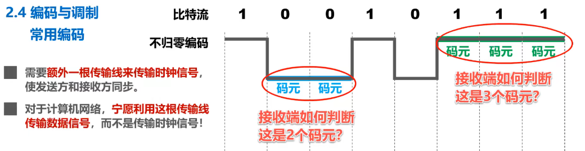

- 接收方按时钟信号的节拍来逐个接收码元。
- 由于不归零编码存在同步问题，**计算机网络**中的数据传输**不采用**这类编码。

2，归零编码：

- 归零编码的优点是自同步，但缺点是编码效率低。

3，曼彻斯特编码：

- 比如可以规定：负跳变表示比特1，正跳变表示比特0。

4，差分曼彻斯特编码：

- 它比曼彻斯特编码变化少，更适合较高的传输速率。

#### ！基本调制方法

- 使用基本调制方法，1个码元只能包含1个比特信息。如果想使1个码元包含更多的比特，就得使用混合调制。

#### 混合调制

- 可以同时调制“相位和振幅”

#### QAM举例

- 如果不采用格雷码，出现误差时，可能一下子四位全错！！

### 信道极限容量

#### 信道失真

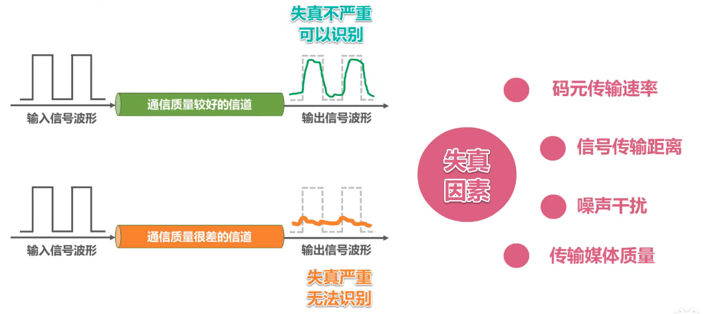

- 失真严重时，信号波形失去了码元之间的清晰界限，这个现象叫做”码间串扰“

#### ！奈奎斯特准则

1，奈氏准则说明：

- 奈氏准则是在理想状态下推导出来的，它没有考虑“传输距离，噪声干扰”等因素，

2，”调幅调频调相“属于二元调制，只能产生两种不同的码元，也就是两种不同的基本波形，因此每个码元只能携带1bit的信息。

3，混合调制属于多元调制，比如QAM16可以调制处16种不同的码元，因此每个码元可以携带4bit的信息。

#### ！香农公式

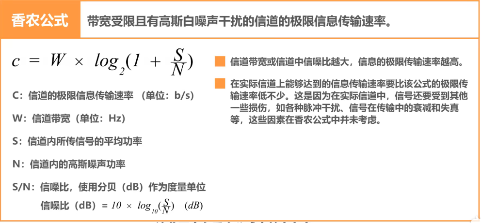

#### ！综合奈氏准则和香农公式

### 章节小写

见mooc的mindmap

### 习题课

暂略

## 数据链路层

数据链路层常讨论的就是以太网上的问题，搞清楚这个以太网是什么；总线是什么。

### 数据链路层概述

#### 一些概念

- **链路**(Link)就是从一个结点到相邻结点的一段物理线路，而中间没有任何其他的交换结点。
- **数据链路**(Data Link)是指把实现通信协议的硬件和软件加到链路上，就构成了数据链路。
- 数据链路层以**帧**为单位传输和处理数据。

#### 点对点信道的数据链路层的三个重要问题

1，封装成帧

- 发送数据时，自顶向下不断封装数据。
- 数据链路层的”帧“的结构如本图蓝色方框所示

2，差错监测：

- 帧在传输过程中，遭遇干扰后可能会出现误码，也就是比特0/1变成比特1/0.
- 接收方通过封装在帧尾的检错码，结合检错算法，就可以判断帧中是否出现了误码。

3，可靠传输：

- 接收方主机收到有误码的帧后，是不会接受该帧的，将其丢弃。
- 如果数据链路层向其上层提供的是不可靠服务，那么丢弃就丢弃了，不会有更多措施；如果数据链路层向其上层提供的是可靠服务，那么就还需要其他措施来确保接收方主机还可以重新收到被丢弃的这个帧的正确副本。

#### 广播信道的数据链路层需要解决的问题

使用点对点信道的数据链路层，要解决三个基本问题；但是如果是广播信道的数据链路层，那还要解决一些更多的问题。

1，编址问题，判断广播中收到的帧是不是发给自己的：

- 在帧头会写入“目的地址和源地址”

2，共享式局域网中传输信号碰撞处理：

- 共享式局域网避免不了信号碰撞。
- 随着技术发展，交换技术的成熟和成本的降低，具有更高性能的，使用点对点链路和链路层交换机的“交换式局域网”，在有线（局域网）领域已经完全**取代**了共享式局域网。

3，交换式局域网图示：

4，无线局域网也使用共享信道技术，图示如下：

- CSMA/CA：载波监听，多点接入/碰撞避免。

### 封装成帧

#### 基本概念和术语

1，封装成帧：指数据链路层给上层交付的协议数据单元添加帧头和帧尾使之成为帧。

- 帧头和帧尾中包含有重要的控制信息。不同类型的帧的格式如下所示：

  

- 帧头和帧尾的作用之一就是**帧定界**，通过帧头和帧尾可以判断哪一段比特流是一个完整地帧：

  

- 并不是每一种数据链路层协议的帧都包含有帧定界标志，如MAC帧就没有：

  

  

  - 物理层为MAC帧添加的前导码中，“前同步码”使接收方的时钟同步；“帧开始定界符”表明其后面紧跟着的就是MAC帧。（个人理解标记MAC帧开始的前导码属于物理层内容，不属于帧本身，所以说MAC帧没有帧定界标志没错）
  - 以太网规定了帧间间隔时间为96bit的发送时间，因此mac帧并不需要帧结束定界符。

2，透明传输：指**数据链路层对上层交付的传输数据没有任何限制**，就好像数据链路层不存在一样。

- 如果不允许上层交付的传输数据中出现帧定界符的话，那么数据链路层就不是透明的，可用性也大大降低。所以数据链路层扫描上层交付的数据，进行“帧填充”，从而实现透明传输。

- 至于帧填充方式有以下两种：

  - 面向字节的物理链路使用**字节填充**(或称字符填充)的方法实现透明传输。

    - 数据链路层收到上层交付的内容后，会扫描内容，如果内容中出现帧的首尾定界符或者转义字符时，在该位置前加上转义字符，这样接收方就不会误以为帧结束了。

    - “转义字符”是一种特殊的控制字符，其长度为1字节，十进制值为27，而并不是“E，S，C”三个字符。

      

  - 面向比特的物理链路使用**比特填充**的方法实现透明传输。

    - 零比特填充的操作：可以“每五个连续的1后插入一个比特0”，保证上层交付的传输数据中不出现帧定界符（常为01111110）。接收方读取帧时，每五个1后的比特0剔除即可。

      

    - 例题：

      

3，为了提高帧的传输效率，应该使**帧的数据部分的长度尽可能大些**：

- 但是帧的数据部分不是越大越好。考虑到差错控制等多种因素，每一种数据链路层协议都规定了帧的数据部分的长度上限，即**最大传送单元MTU**( Maximum Transfer Unit)。

### 差错检测

#### 概念定义

1，比特差错：实际的通信链路都不是理想的，比特在传输过程中可能会产生差错: 1可能会变成0，而0也可能变成1。这称为**比特差错**。

2，误码率：在一段时间内，传输错误的比特占所传输比特总数的比率称为**误码率**BER(Bit Error Rate)。

3，差错检测码：使用**差错检测码**来检测数据在传输过程中是否产生了比特差错，是数据链路层所要解决的重要问题之一。

4，差错检测码图示：

- 帧接收方得知误码的方式：帧尾包含了一个长度为4字节的帧检验序列FCS字段，其作用就是让接收方的数据链路层检查帧在传输过程中是否产生了误码。

#### 奇偶校验

1，奇偶校验定义：在待发送的数据后面**添加1位奇偶校验位**，使整个数据（包括所添加的校验位在内)中**“1”的个数**为奇数(奇校验)或偶数（偶校验)。

2，奇校验图示：

- 如果有**奇数个位发生误码**，则奇偶性发生变化，**可以检查出误码**；如果有**偶数个位发生误码**，则奇偶性不发生变化（这是因为每个误码对奇偶性的影响相互抵消了），**不能检查出误码（漏检)**。
- 由于**奇偶校验**的漏检率比较高，因此计算机网络的**数据链路层一般不会采用**这种检测方式

#### 循环冗余校验

1，概念：

2，生成多项式举例说明：

3，实战例子：

- 异或：相异得1，相同得0

4，实战例子2：

#### 检错VS纠正

1，需要说明的是，**检错码**只能检测出帧在传输过程中出现了差错，但并不能定位错误，因此**无法纠正错误**。

2，要想纠正传输中的差错，可以使用冗余信息更多的**纠错码**进行**前向纠错**。但纠错码的开销比较大，在**计算机网络中较少使用**。

3，循环冗余校验**CRC**有很好的检错能力（**漏检率非常低**)，虽然计算比较复杂，但非常**易于用硬件实现**，因此被**广泛应用于数据链路层**。

4，在计算机网络中通常采用我们后续课程中将要讨论的**检错重传方式来纠正传输中的差错**，**或者仅仅是丢弃检测到差错的帧**，这取决于数据链路层向其上层提供的是**可靠**传输服务还是**不可靠**传输服务。

### 可靠传输

#### 可靠传输的基本概念

1，使用**差错检测技术**（例如循环冗余校验CRC)，接收方的数据链路层就可检测出帧在传输过程中是否产生了**误码**（比特错误)。

2，数据链路层向上层提供的服务类型

- **不可靠**传输服务:**仅仅丢弃有误码的帧**，其他什么也不做;
- **可靠**传输服务:想办法实现**发送端发送什么，接收端就收到什么**。

3，有线链路和无线链路对可靠传输的要求一般不同：

- 一般情况下，**有线链路**的误码率比较低，为了减小开销，并**不要求数据链路层**向上提供**可靠**传输服务。即使出现了误码，可靠传输的问题由其上层处理。

- **无线链路**易受干扰，误码率比较高，因此**要求数据链路层**必须向上层提供**可靠**传输服务。

4，**比特差错**只是传输差错的一种，从整个计算机网络体系结构来看，传输差错还包括**分组丢失**、**分组失序**以及**分组重复**。

- 词语说明：
  - 比特差错：传输数据的比特流出现差错
  - 分组丢失：如因路由器存储空间不足，路由器把分组丢弃导致分组丢失
  - 分组失序：由于网络传输原因，发送方发送分组的顺序，和接收方接收到分组的顺序不一致
  - 分组重复：由于网络原因，原发送分组在某一位置卡住，在发送方重发分组后，原分组又来到接收方，造成分组重复。

- 请注意，此处我们将帧的称呼改为了分组，这意味着传输差错不仅仅局限于数据链路层的比特差错。

- 分组丢失、分组失序以及分组重复这些传输差错，一般不会出现在数据链路层，而会出现在其上层。

- **可靠传输服务并不仅局限于数据链路层**，其他各层均可选择实现可靠传输。各层选择是否可靠传输的图示如下：

  

5，可靠传输的实现比较复杂，开销比较大，是否实现可靠传输取决于应用需求。

#### 可靠传输的实现机制

1，有三种可靠传输协议

- 这三种**可靠传输实现机制**的基本原理并**不仅限于数据链路层**,可以应用到计算机网络体系结构的各层协议中。
- 希望同学们在学习时,不要把思维局限在数据链路层,而应放眼于整个网络体系结构。

#### 可靠传输的实现机制之停止-等待协议

停止-等待协议SW（Stop-and-Wait）

1.1，简单情况下：

- 分组收发双方基于互联网通信，而不是局限在一条点对点的数据链路。
- 发送方没发送完一个数据分组后，并不能立刻将该数据分组从缓存中删除；只有在收到该数据分组的确认分组后，才能将其从缓存中删除。
- 发送方每发送完一个数据分组后，就暂不发送下一个数据分组，等待来自接收方的确认分组（ACK）或否认分组（NAK）：
  - 若收到确认分组，则可继续发送下一个分组
  - 若收到否认分组，则重发之前发送的那个数据分组

- 这样就实现了发送方发送什么，接收方接收什么。但是实际情况远比我们想象的复杂得多。

1.2，接收方没收到发送数据的情况。在发送方设置时钟来**超时重传**解决这个问题：

1.3，ACK丢失导致同一数据两次到达接收方。通过**对数据分组进行编号**来解决这个问题：

1.4，ACK延误导致的ACK指向数据不清的问题。通过ACK编号来解决：

- 请注意，最下面的Data0和最上面的Data0不是同一data分组，这里是用0和1来区分不同的分组。
- 需要说明的是，对于数据链路层的点对点信道，往返时间比较固定，不会出现确认迟到的情况；因此若只在数据链路层上实现SW，可以不用给确认分组编号。

2，停止等待协议的注意事项：

3.1，停止等待协议的信道利用率

- 参数解释：

  - TD：发送方发送数据分组所耗费的发送时延TD。

  - RTT：收发双方之间的往返时间RTT

  - TA：接收方发送确认分组所耗费的发送时延TA。

  - 图中忽略了接收方对数据分组的处理时延，以发送方对确认分组的处理时延。

- 公式分析
  - TD+RTT+TA是停止等待协议的发送方，从发送一个数据分组开始，到可以发送下一个分组为止，所经历的总时间。
  - 因为仅仅是在TD内，才用来传送有用的数据，也就是数据分组。
  - TA一般都远小于TD，可以忽略。
  - 当RTT远大于TD时，信道利用率会很低，

3.2，停止等待协议实例：

3.3，停止等待协议实例2：

4，像停止-等待协议这种通过确认和重传机制实现的可靠传输协议，常称为自动请求重传协议ARQ（Automatic Repeat Request）；意思是重传的请求是自动进行的，因为不需要接受方显式得请求发送方重传某个出错的分组。

5，停止-等待协议的信道利用率很低若出现超时重传,则信道利用率更低。采用流水线传输可提高信道利用率，这就引入了“回退N帧协议GBN”：

#### 可靠传输的实现机制之回退N帧协议

回退N帧协议GBN(Go-Back-N)

1，回退N帧协议在流水线传输的基础上，利用发送窗口来限制发送方可连续发送数据分组的个数，是一种连续ARQ协议；在协议的工作过程中发送窗口和接收窗回不断向前滑动,因此这类协议又称为滑动窗回协议；由于回退N帧协议的特性,当通信线路质量不好时,其信道利用率并不比停止-等待协议高。

2，最简单的无差错情况：

- 采用3个bit给分组编序号，即序号是0~7。因为2的3次方为8，所以共有8个序号可用；但是一次不会传输8个序号，而是传输WT宽度个序号。
- 如果WT的值取1，则是停止-等待协议；若WT的值超过取值范围的上限，则会造成严重的后果。
- 接收窗口的尺寸WR取值为：WR=1；这一点“回退N帧协议”和“停止-等待协议”是相同的。

发送窗口宽度为5，接收窗口宽度为1，发送数据给接收方：

接收方接收数据，数据都无误的话，给每个分组都返回ACK，并且每发送一个ACK接收窗口就移动一个位置（位置宽度为分组的宽度）：

发送方每接收到一个ACK，发送穿哪个口就向前滑动一个位置（这里位置宽度为一个组），发送方可以把收到确认的数据分组从缓存中删除了；而接收方可以择机将已接收的数据分组交付上层处理：

3，累计确认的概念：

- 接收方**不一定**要对收到的数据分组**逐个发送确认**，而是可以在收到几个数据分组后(由具体实现决定)，**对按序到达的最后一个数据分组发送确认**。ACKn表示序号为n及以前的所有数据分组都已正确接收。
- 累计确认优点：
  - 即使确认分组丢失,发送方也可能不必重传!如本例ACK1丢失了，但并未造成1号数据分组的超时重传。
  - 可以减小接收方的开销，减少对网络资源的占用。因为需要发送的ACK的数目变小了。
- 累计确认缺点：
  - 不能向发送方及时反映出接收方已经正确接收的数据分组信息。因为就算正确接收了，也要等一等，等累计确认。

发送方将发送窗口内的0~4号数据分组依次连续发送出去，经过互联网的传输正确到达了发送方：

接收方当接收到0~1号分组后，给发送方发送累计确认ACK1；当又接收到2~4号分组后，发送累计确认ACK4：

假设ACK1在传输过程中丢失了，而ACK4正确到达了发送方；发送方接收ACK4后就知道了“发送窗口内，序号为4及以前的数据分组都已被接收方正确接收了”，于是将发送窗口向前移动五个位置，这样就有新的序号落入了发送窗口；发送方可以将收到确认的数据分组从换缓存中删除了，而且接收方可以择机将已接收的数据分组交付上层处理：

4，出现差错的情况，体现“回退N帧”：

发送方将落在发送窗口内的五个分组，依次连续发送出去，经过互联网给的传输到达了接收方：

假设五个分组在发送过程中收到干扰，其中五号数据分组出现了误码，接收方通过数据分组中的检错码发现了误码，于是丢弃该数据分组：

而后续到达的6701四个序号的数据分组与接收窗口中的序号不匹配，接收方同样也不能接收他们，将他们丢弃；并对之前按序接收的最后一个数据分组4进行确认，每因为序号不对丢弃一个数据分组，就发送一个ACK4：

4个ACK4经过互联网传输南湖到达发送方；发送方之前就接收过ACK4，当收到重复的ACK4时就知道了之前发送的数据分组出现了差错，于是可以不等超时计时器超时就立刻开始重传，至于收到几个重复确认就立刻重传,由具体实现决定；在本例中，假设收到这4个重复的确认并不会触发发送方立即重传，一段时间后超时计时器出现超时，发送方将发送窗口内已发送过的这些数据分组全部重传：

在本例中。尽管序号为6.7.0.1的数据分组正确到达接收方。但由于5号数据分组误码不被接受，它们也“受到牵连”而不被接受。发送方还要重传这些数据分组,**这就是所谓的Go-back-N(回退N帧)**。可见当通信线路质量不好时,回退N帧协议的信道利用率并不比停止-等待协议高。

5，查看发送窗口宽度超过取值的上限会怎样：

我们故意超过上限7，让发送窗口的长度WT为8；发送方将8个分组依次发送出去，他们经过互联网传输来到接收方：

接收方按序接收8个分组后，给发送方发回累计确认ACK7：

假设ACK7，在传输过程中丢失了，将导致发送方的超时重传；重传的0~7号数据分组到达接收方：

现在问题来了，接收方根据当前接收窗口内的序号，会对这8个数据分组按序接收；但是接收方之前已经接收过这8个数据分组了，现在是在重复接收；也就是说，接收方无法分辨新旧分组，进而会产生**分组重复**这种传输差错：

因此，发送窗口的尺寸不能超过其上限。

6，对回退N帧协议的工作原理做一个小结：

7，回退N帧协议的练习：

#### 可靠传输的实现机制之选择重传协议

选择重传协议SR(Selective Request)

1，选择重传协议是对回退N帧协议的改进：

- **回退N帧协议**的接收窗口尺寸**WR只能等于1**，因此**接收方只能按序接收正确到达的数据分组**。
- 一个数据分组的误码就会导致其后续多个数据分组不能被接收方按序接收而**丢弃（尽管它们无乱序和误码)**。这必然会造成发送方对这些数据分组的超时重传，显然这是对通信资源的极大**浪费**。
- 为了进一步提高性能，可设法只重传出现误码的数据分组。因此，接收窗口的尺寸**WR不应再等于1(而应大于1)**，以便**接收方先收下失序到达但无误码并且序号落在接收窗口内的那些数据分组**，等到所缺分组收齐后再一并送交上层。这就是**选择重传协议**。
- `注意`:**选择重传协议**为了使发送方仅重传出现差错的分组，接收方**不能再采用累积确认**，而需要对每个正确接收到的数据分组进行**逐一确认**!

2，选择重传协议讲解：

选择重传协议的**参数定义**如下：

发送方将序号落在发送窗口肉的这4个数据分组依次连续发送出去，它们经过联网的传输陆续到达接收方，但其中的2号数据分组丢失了：

只要序号落入接收窗口内且无误码的数据分组，接收方都会接收；接收方接收0号和1号数据分组，并发送0号和1号确认分组，接收窗口向前滑动两个位置，这样就有4和5这两个新的序号落入接收窗口：

接收方接收3号确认分组，并发送3号确认分组，但是接收窗口不能向前滑动，因为三号数据分组是未按序到达的数据分组：

这些确认分组经过互联网的传输陆续到达发送方，发送方每按序收到一个确认分组，发送窗口就向前滑动一个位置；发送方接收0号和1号确认分组，发送窗口向前滑动两个位置，这样就有4和5这两个新的序号落入发送窗口：

发送方将序号落入发送窗口的4号和5号数据分组发送出去，发送方现在可以将已经收到确认的0号和1号数据分组从发送缓存中删除了；而接收方可择机将已按序接收的0号和1号数据分组交付上层使用：

发送方接收3号确认分组；但发送窗口不能向前滑动，因为这是一个未按序到达的确认分组，发送方还没收到它之前的2号确认分组；不过需要记录3号数据分组已收到确认，这样该数据分组就不会超时重发：

四号和五号数据分组到达接收方，接收方接收它们，并发送4号和5号确认分组；但接收窗口不能向前滑动，因为4号和5号是未按序到达的数据分组，接收方还未收到他们之前的2号数据分组：

现在在4号和5号确认分组的传输过程中，发送方针对2号数据分组的重传计时器超时了，发送方重传2号数据分组；

4号和5号分组陆续到达发送方；发送方接收他们，但发送窗口不能向前滑动，因为他们是未按序到达的确认分组，发送方还未收到他们之前的2号确认分组；不过需要记录4号和5号数据分组已收到确认，这样他们就不会超时重发：

发送方之前重传的2号数据分组到达接收方，接收方接收该数据分组，并发送2号确认分组；接收窗口现在可以往前滑动四个位置。这样就有6791这四个新的序号落入接收窗口：

2号确认分组经过互联网的传输到达发送方，发送方接收该确认分组；发送窗口现在可以向前滑动四个位置，这样就有6701这四个新的序号落入发送窗口；发送方现在就可以继续将这四个序号的数据分组依次发送出去了：

3，讨论一下选择重传协议的发送窗口和接收窗口的尺寸问题：

4，探讨发送窗口和接收窗口的尺寸超过了它们的取值范围会出现什么样的情况：

前提定为：

结果：

- ACKn丢失后，发送方重发数据分组时，接收方无法分辨新旧数据分组，出现分组重复这种传输差错。

5，对选择重传协议的工作原理小结：

6，小练习：

### 点对点协议PPP

 1，**点对点协议PPP**(Point-to-Point Protocol)是目前使用最广泛的点对点数据链路层协议：

- 图中个人用户计算机与ISP通信时，所使用的数据链路层协议通常就是PPP协议。这里需要说明的是，在1999年公布的在以太网上运行的PPP协议，即PPP over Ethernet（PPPoE），他使得ISP可以通过”DSL，电路调制解调器，以太网等快带接入技术“，以以太网接口的形式，为用户提供接入服务。
- 另外，点对点协议PPP，也广泛应用于广域网路由器之间的专用线路

2，PPP协议的构成：

3，PPP协议的帧格式：

4，PPP协议是如何解决透明传输问题的-面向字节：

5，PPP协议是如何解决透明传输问题的-面向比特·：

6，PPP协议如何进行差错检测：

7，PPP协议工作状态：

### 媒体接入控制

#### 媒体接入控制的基本概念

1，共享信道要着重考虑的一个问题就是如何协调多个发送和接收站点对一个共享传输媒体的占用，即**媒体接入控制MAC**(Medium Access Control)。

2，媒体接入控制MAC分类：

- 需要注意的是：随着技术的发展，交换技术的成熟和成本的降低，具有更高性能的使用点对点链路和链路层交换机的**交换式局域网**在**有线领域**已完全**取代了共享式局域网**；但由于**无线信道**的广播天性，无线局域网仍然使用的是**共享媒体技术**。

#### 媒体接入控制之-静态划分信道

1，信道复用概念：

- 复用(Multiplexing）是通信技术中的一个重要概念。复用就是通过一条物理线路同时传输多路用户的信号。
- 当网络中传输媒体的传输容量大于多条单一信道传输的总通信量时，可利用复用技术在一条物理线路上建立多条通信信道来充分利用传输媒体的带宽。

2，常见的信道复用技术有：

3，频分复用FDM讲解：

- 各子信道之间需要留出隔离频带，以免造成子信道间的干扰。
- 频分复用的所有用户同时占用不同的频带资源并行通信。

4，时分复用TDM：

- 时复用技术将时间划分成了—段段等长的时分复用帧；每一个时分复用的用户在每一个时分复用帧中占用固定序号的时隙。

- 如图所示。每一个用户所与用的时隙是周期唯出现的；其周期就是时分复用帧的长度。
- 时分复用的所有用户在不同的时间占用同样的频带宽度。

5，波分复用WDM：

- 波分复用其实就是光的频分复用。
- 光信号传输一段距离后会衰减，因此对衰减了的光信号必须进行放大才能继续传输。

6，码分复用CDM：

- 与FDM和TDM不同，CDM的每一个用户可以**在同样的时间使用同样的频带进行通信**。
- 由于**各用户使用经过特殊挑选的不同码型**，因此各用户之间**不会造成干扰**。

#### 媒体接入控制-动态接入控制-随机接入-CSMA/CD协议

1，碰撞的产生

- 早期的共享式以太网采用“载波监听多址接入/碰撞检测(CSMA/CD)”协议来解决该问题。

2，CSMA/CD名词解释：

- 96比特时间是指发送96比特所耗费的时闻,也称为帧间最小间隔
- 载波监听CS作用是使接收方可以检测出一个帧的结束，同时也使得所有其他站点都能有机会平等竟争信道并发送帧。

3，CSMA/CD简易流程图：

4，争用期（碰撞窗口）：

- 由于波的传播时延，双方在很短时间内先后发送数据，且发送时没检测到对方在发送数据，从而引发碰撞。

5，最小帧长：

- 主机C检测到信道空闲96比特时间，发送帧；但实际上此时信道并不空闲，只是主机A发送完成了让主机C误以为信道空闲。

6，最大帧长：

- 以太网的帧长应该有其上限，不然过长时间的占用总线会影响总线上的其他主机的功能。
- 两种不同类型的帧的格式如图所示，通过规定最小和最大数据载荷，保证帧的在最小帧长和最大帧长之间。

7，退避时间的计算方法：

8，使用CSMA/CD协议的共享式以太网的信道利用率：

9，帧发送流程图：

10，帧接收流程图：

- 只有正确通过图中的三个检查，主机才能接受所收到的帧。

11，最后需要说明的是：

- CSMA/CD协议曾经用于各种总线结构以太网和双绞线以太网的早期版本中。
- 现在的以太网基于交换机和全双工连接，不会有碰撞，因此没有必要使用CSMA/CD协议

#### 媒体接入控制-动态接入控制-随机接入-CSMA/CA协议

载波监听多址接入/碰撞避免 CSMA/CA(Carrier Sense Multiple Access/Collision Avoidance)

1，CSMA/CA在媒体接入控制中的位置：

2，无线局域网为什么不能用CSMA/CD?

3，隐蔽站问题：

- 无线局域网中会有“隐蔽站”问题，但是有限局域网中不会有。

4，802.11无线局域网介绍：

5，帧间间隔IFS

6，CSMA/CA的工作原理：源站为什么在检测到信道空闲后还要再等待一段时间DIFS?：

7，CSMA/CA的工作原理：目的站为什么正确接收数据帧后还要等待一段时间SIFS才能发送ACK帧?

8，CSMA/CA的工作原理：信道由忙转为空闲且经过DIFS时间后,还要退避—段随机时间才能使用信道?

9，CSMA/CA协议的退避算法：

10，CSMA/CA协议的退避算法图示：

11，CSMA/CA协议的信道预约：

- 对信道预约往往是值得的。

12，CSMA/CA协议的虚拟载波监听机制：

- 尽管C收不到A发的RTS帧，但是C可以收到B发送给A的CTS帧；这样C就知道了信道将被占用多长时间，在这段时间内C都不会争用信道；也就是说，A给B发送数据帧时不会受到C的干扰。

13，小练习：

- 这里说错了，CDMA属于信道划分的MAC协议，也属于MAC协议

### MAC地址,IP地址,ARP协议

前言：

- 注意MAC地址，IP地址，ARP协议分别属于哪一层。

#### MAC地址

1，MAC地址基本概念：

- 当多个主机连接在同一个广播信道上，要想实现两个主机之间的通信，则每个主机都必须有一个唯一的标识，即一个数据链路层地址;

- 在每个主机发送的**帧中必须携带标识发送主机和接收主机的地址**。由于这类地址是用于媒体接入控制MAC(Media Access Control)，因此这类地址被称为**MAC地址**;

  - MAC地址一般被固化在网卡(网络适配器）的电可擦可编程只读存储器EEPROM中，因此MAC地址也
    被称为**硬件地址**;

  - MAC地址有时也被称为**物理地址**。**请注意:这并不意味着MAC地址属于网络体系结构中的物理层**!

    

- 一般情况下，用户主机会包含两个网络适配器:有线局域网适配器（有线网卡）和无线局域网适配器（无线网卡)。每个网络适配器都有一个全球唯一的MAC地址。而交换机和路由器往往拥有更多的网络接口，所以会拥有更多的MAC地址。综上所述，**严格来说，MAC地址是对网络上各接口的唯一标识，而不是对网络上各设备的唯一标识**。

2，IEEE 802局域网的MAC地址格式：

- 自行随意分配的网络接口标识符称为EUI；对于48bit(6byte*8bit)的MAC地址，可称为EUI-48!
- 一个“X”是4bit，2的4次方表示16；所以一个“X”就是16进制的1位。

3，IEEE的官网可查看已分配的组织唯一标识符OUI：

- 可以看到什么OUI被分配给了什么公司

4，一共有四种类型的MAC地址，可以通过MAC地址的第一字节的第一第二位看出：

- 思考：您拥有几个全球管理单播MAC地址?EUI-48地址空间会耗尽吗?
  - 
  - 对于使用EUI-48空间的应用程序，IEEE的目标寿命为100年(直到2080)，但是鼓励采用EUI-64作为替代。

5，MAC地址的发送顺序：

6，单播MAC地址发送举例：

- `......`表示帧首部的其他字段+数据载荷+帧尾部。
- 网友问：“为啥一直在用总线型举例，现在总线型应该淘汰了吧”。网友答：“因为还没讲交换机，因为现在只考虑理想的数据链路，方便理解”
- 主机收到一个帧时，帧的目的MAC地址与本机MAC地址不一致的话，丢弃该帧。

7，广播MAC地址举例：

- 主机接收到的帧的目的MAC地址是广播地址，则知道收到的帧是广播帧，则接受该帧

8，多播MAC地址举例：

- 图片说明：

  - MAC地址第一位的十六进制数不能整除2(1,3,5,7.9,B,D, F)，即为多播地址。

  - 网友问：“多播和广播有什么区别”。网友答：“广播是全部，多播是一个以上”。

  - 假设本图主机BCD支持MAC多播，根据各用户给自己的主机配置的多播组列表可以看出，主机B和主机C属于两个多播组，主机D不属于任何多播组。

- 步骤：

  1. 主机A构建多播帧时，在帧首部中的目的地址字段填入该多播MAC地址，源地址字段填入自己的MAC地址；再加上帧首部的其他字段，数据载荷，以及帧尾部，就构成了一个多播帧。主机A将该多播帧发送出去。
  2. 主机BCD都会收到该多播帧。主机B发现该多播帧的目的MAC地址在自己的多播组列表中，主机C发现该多播帧的目的MAC地址在自己的多播组列表中，因此主机B和C都会接受该帧并送交上层处理；而主机D发下该多播帧的目的地址不在自己的多播组列表中，主机D丢弃该多播帧。

- 给主机配置多播组列表进行私有应用时，不得使用公有的标准多播地址，具体可在图中网址查询。

9，随机MAC地址：

- 扫描网络时采用随机MAC地址技术

#### IP地址

1，需要说明的是，**IP地址属于网络层**的范畴，而非数据链路层的范畴；之所以在数据链路层这一章节的讲解中引入IP地址，是因为在我们日常的大多数网络应用中，属于数据链路层的MAC地址和属于网络层的IP地址都在使用，他们之间存在一定的关系去；IP地址的相关内容比较多，比如“分类的IP地址，划分子网的IP地址”等，这些内容将在网络层这一章详细介绍；本节课我们主要介绍IP地址的作用。

2，IP地址的组成和必要性：

- 网络N8中有两个主机，分配了两个IP地址“192.168.0.1”“192.168.0.2”；给路由器R4连接网络N8的接口也分配了一个IP地址“192.168.0.254”。
  - 这三个IP地址的前三个十进制数是相同的，也就是网络N8的编号。
  - 而最后一个十进制数各不相同，是网络N8上各主机和路由器接口的编号。
  - 换句话说，同一个网络上的各主机和路由器的各接口的IP地址的网络号部分应该相同（俗称网段），而主机号部分应互不相同。

- 因特网中不同网络的网络编号必须各不相同；例如在本例中，网络N8的编号为“192.168.0”，而网络N9的编号为“192.168.1”。
- 需要注意的是，在一个IP地址中，哪部分是网络编号，哪部分是主机编号，并不都和本例相同；将在后续网络层这一章详细讲解。

3，从网络体系结构看IP地址和MAC地址：

- 网络体系结构中，各层都**看不懂也无需看懂**上一层交付的数据，仅仅为数据加上自己层的头部和尾部再往下交付即可。

- 网络层首部中应封装有源IP地址和目的IP地址；数据链路层首部中应该封装有源MAC地址和目的MAC地址

4，数据包转发过程中，IP地址和MAC地址的变化情况：

- 为了方便起见，图中各主机和路由器各接口的“IP地址和MAC地址”用较为简单的标识符来表示，而并未使用实际的IP地址和MAC地址。
- 假设主机H1要给主机H2发送一个数据包，我们从网络体系结构的角度，来看看数据包在传输过程中IP地址和MAC地址的变化情况。
- 需要注意的是，主机中有完整的网络体系结构，而路由器的最高层为网络层(没有网络体系结构中的运输层和应用层)。

- 我们所关注的重点是：网络层封装IP数据报时，源IP地址和目的IP地址应该填写什么；数据链路层封装帧时，源MAC地址和目的MAC地址应填写什么。因此，我们忽略网络体系结构中，除网络层和数据链路层外的其他各层；可以想象成各网络层进行水平方向的逻辑通信，各数据链路层进行水平方向的逻辑通信。

步骤如下：

1. 主机H1将数据包发送给路由器R1

   

2. 路由器R1将收到的数据包转发给路由器R2

   

3. 路由器R2将收到的数据包转发给H2

   

本例可以看出：

- 数据包转发过程中，**源IP地址和目的IP地址始终保持不变；而源MAC地址和目的MAC地址逐个链路或逐个网络改变**。

- H1知道R1的IP地址是设置了默认网关，路由器之间是通过路由协议相互通信才知道相连接路由的IP地址。其他的自然不知道

5，主机知道“把数据包传给哪个相邻传输节点+该相邻节点的ip”，但是不知道该相邻传输节点的MAC地址；通过IP地址获得MAC地址需要ARP协议：

6，小练习：

#### ARP协议

1，ARP协议的功能：通过IP地址找到MAC地址。

2，ARP协议的工作原理

1. 主机B想给主机C发送数据；但是主机B知道主机C的ip地址，不知道主机C的MAC地址：

   

2. 主机B会在自己的ARP高速缓存表中查询“主机C的IP地址对应的MAC地址”，没找到：

   

   - 每台主机都有一个ARP高速缓存表，ARP高速缓存表中记录有IP地址和MAC地址的对应关系。

3. 主机B创建ARP请求报文，来获取主机C的MAC地址：

   

   - ARP请求报文封装在MAC帧中，目的地址为FF-FF-FF-FF-FF-FF(广播地址)

4. 主机B发送封装有ARP请求报文的广播帧，以太网总线上的其他主机都能收到该广播帧；主机A的网卡收到该广播帧后，将其送交上层处理，上层的ARP进程解析ARP请求报文，发现所询问的IP地址不是自己的IP地址，因此不予理会：

   

5. 主机C的网卡收到该广播帧后，将其送交上层处理，上层的ARP进程解析ARP请求报文，发现所询问的IP地址正是自己的IP地址，需要进行相应。主机C**首先**将B的IP地址与MAC地址记录到自己的ARP高速缓存表中;**然后**给B发送ARP响应，以告知自己的MAC地址。ARP响应报文是：

   

   - 注意：ARP相应报文是封装在MAC帧中的，目的地址为目标主机的MAC地址(不再是广播)。

6. 主机C给主机B发送封装有ARP相应报文的单播帧，总线上的其他主机都能收到该单播帧；主机A的网卡收到该单播帧后，发现其目的MAC地址与自己的MAC地址不匹配，直接丢弃该帧：

   

   

7. 主机B的网卡收到该单播帧后，发现其目的MAC地址就是自己的MAC地址，将其交付上层处理；上层的ARP进程解析ARP响应报文，将其所包含的主机C的IP地址与MAC地址记录到自己的ARP高速缓存表中。

   

8. 主机B现在可以给主机C发送之前想发送的数据包了。

3，ARP高速缓存表中每一条记录都有其类型，类型分为“动态和静态”两种：

- 动态原因：IP地址和MAC地址的对应关系不是永久性的；如当主机的网卡坏了，更换新的网卡后，主机的IP地址没变，但是主机的MAC地址改变了。

4，思考：主机H1是否可以使用ARP协议获取到主机H2的MAC地址？

- 答案是否定的，ARP协议只能在一段链路或一个网络上使用，而不能跨网络使用。
- 对于本例，ARP协议的使用是**逐段链路进行**的

5，需要说明的是：

- 除ARP请求和响应外，ARP还有其他类型的报文（例如用于检查IP地址冲突的“无故ARP、或称为免费ARP(Gratuitous ARP)”) ;
- ARP没有安全验证机制。存在ARP散骗(攻击)问题。

### 集线器与交换机的区别

#### 集线器

1，早期的使用无源电缆和大量机械接头的总线型以太网，并不像人们想象的那么可靠；被淘汰：

2，使用双绞线和集线器HUB的星型以太网：

- 实践证明，使用双绞线+集线器，比使用具有大量机械接头的无源电缆要可靠的多；并且价格便宜，使用方便。因此粗缆和细缆以太网早已成为了历史。
- 在分析问题时，我们可将集线器简单看作一条总线。
- 放大器和集线器都是物理层设备

3，使用集线器HUB在物理层扩展以太网：

- 由于集线器只工作在物理层，所以更具体的说法是“使用集线器在物理层扩展以太网”。
- 假设某学院有三个系部，每个系部都有一个使用集线器作为互莲设备的以太网；这三个以太网相互独立，各自共享自己的总线资源，是三个独立的碰撞域。
  - 比如，一系中的某台主机，给另一台主机发送数据帧，由于总线特性，表示该数据帧的信号会传输到一系中的其他各主机。
  - 二系中的多台主机同时发送数据帧，由于总线特性，这必然会产生信号碰撞，碰撞后的信号会传输到二系中的各主机。

- 为了使各系部的以太网能相互通信，可再使用一个集线器将他们互联起来；这样，原来三个独立的以太网就互联成为一个更大的以太网，原来三个碰撞域合并成为一个更大的碰撞域。换句话说，就是形成了一个更大的总线型以太网。

#### 交换机

1，在集线器之后，发展出了**更先进**的网络互联设备，也就是以太网交换机。

2，从典型例子看以太网交换机与集线器的区别：

- 使用集线器互连而成的共享总线式以太网上的某个主机要给另一个主机发送单播帧：
  - 该单播帧会通过共享总线传输到总线上的其他各个主机
- 使用交换机互连而成的交换式以太网上的某个主机要给另一个主机发送单播帧：
  - 该单播帧进入交换机后，交换机会将该单播帧转发给目的主机，而不是网络中的其他各个主机。
- 很显然，交换机具有明显的优势。需要说明的是，为了简单起见，本节课所有举例的前提条件是：
  - 忽略ARP过程
  - 假设交换机的帧交换表已“学习好了”

3，以太网交换机工作原理：

- 全双工意思是：发送帧和接收帧可以同时进行。

- 注意:使用集线器的以太网在逻辑上是共享总线的,需要使用CSMA/CD协议来协凋各主机争用总线，只能工作在半双工模式，也就是收发帧不能同时进行。
- 以太网交换机查找帧的目的MAC地址所对应的接口号，往该接口号转发帧。这体现交换机会记录MAC地址的。

4，集线器对比交换机-主机发送单播帧时：

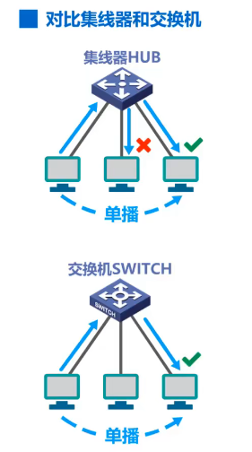

- 对于使用集线器的共享总线型以太网，单播帧会传播到总线上的其他各主机；各主机中的网卡根据帧的目的MAC地址决定是否接受该帧。
- 对于使用交换机的交换式以太网，交换机收到单播帧后，根据帧的目的MAC地址和自身的帧交换表，将帧转发给目的主机，而不是网络中的其他所有主机。

5，集线器对比交换机-主机发送广播帧时：

- 对于使用集线器的共享总线型以太网，广播帧会传播到总线上的其他各主机；各主机中的网卡检测到帧的目的MAC地址是广播地址，就接受该帧。
- 对于使用交换机的交换式以太网，交换机收到单播帧后，检测到帧的目的MAC地址是广播地址；于是从除该帧进入交换机接口外的其他各接口转发该帧；网络中除源主机外的其他各主机收到广播帧后，接受该广播帧。
- 从本例可以看出：使用集线器的共享总线型以太网中的各主机属于同一个广播域；而使用交换机的交换式以太网中的各主机，也属于同一个广播域。因此，对于广播帧的情况，从效果上看没有什么区别。

6，对比网络中的多台主机同时给另一台主机发送单播帧的情况：

- 对于使用集线器的共享总线型以太网，这必然会产生碰撞；遭遇碰撞的帧会传播到总线上的各主机。
- 对于使用交换机的交换式以太网，交换机收到多个帧时，会将他们缓存起来，然后逐个转发给目的主机，不会产生碰撞。

7，使用集线器扩展以太网对比使用交换机扩展以太网-发送单播帧：

- 仅使用集线器扩展以太网后，发送单播帧的情况如图所示；仅使用交换机扩展以太网后，发送单播帧的情况如图所示；
- 很显然，交换机具有非常明显的优势；交换机的控制下，单播帧仅被传给目的主机，而不是被传给众多无关主机。

8，使用集线器扩展以太网对比使用交换机扩展以太网-发送广播帧：

- 仅使用集线器扩展以太网后，发送广播帧的情况如图所示；仅使用交换机扩展以太网后，发送广播帧的情况如图所示；
- 从效果上看是一样的，可见不管使用集线器还是交换机来扩展以太网，扩展后的以太网中的各主机都属于同一个广播域。

9，使用集线器扩展以太网对比使用交换机扩展以太网-竞争总线碰撞例子：

- 仅使用集线器扩展的以太网，在逻辑上仍然是共享总线的，并且形成为一个更大的碰撞域；换句话说，参与竞争总线的主机比扩展前的更多了。
- 同样的传输任务，在仅使用交换机扩展的以太网上就不会产生碰撞。

10，如果仅仅使用集线器来扩展以太网，不仅会扩大广播域，还会扩大碰撞域；但是如果使用交换机将原来各自独立的碰撞域连接起来，只会扩大广播域，而不会扩大碰撞域。也就是说，**交换机可以隔离碰撞域**。

11，小结

- 需要说明的是，工作在数据链路层的以太网交换机，其性能远远超过工作在物理层的集线器，而且价格并不贵，这使得集线器逐渐被市场淘汰；目前很难在市场上看到集线器了。
- 集线器在物理层；交换机在数据链路层；路由器在网络层

### 以太网交换机自学习和转发帧的流程

#### 基本概念

- 以太网交换机工作在数据链路层（也包括物理层)
- 以太网交换机收到帧后，在帧交换表中查找帧的目的MAC地址所对应的接口号，然后通过该接口转发帧。
- 以太网交换机是一种即插即用设备，刚上电启动时其内部的帧交换表是空的。随着网络中各主机间的通信，以太网交换机通过自学习算法自动逐渐建立起帧交换表。

#### 以太网交换机自学习和转发帧的流程实例

- 如本图所示，相互连接的两台以太网交换机各自连接了三台主机，构成了一个交换式以太网。
- 为了简单起见，各主机中网卡上固化的MAC地址仅用一个大写字母表示，各主机互不相同。
- 为了将重点放在以太网交换机自学习，我们假设各主机已经知道了网络中其他各主机的MAC地址，换句话说，不需要首先通过ARP来获取目的主机的MAC地址。
  - 老师说了ARP协议的过程省略掉，实际上可以通过IP地址获得MAC地址

1，假设主机A给主机B发送帧，该帧从交换机1的接口1进入交换机；交换机1首先进行登记的工作，将该帧的源MAC地址A记录到自己的帧交换表中，并将该帧进入自己的接口的接口号1相应的也记录到帧交换表中。上述登记工作就称为交换机的自学习：

2，之后，交换机1对该帧进行转发，该帧的目的MAC地址是B，在帧交换表中查找MAC地址B，找不到；于是对该帧进行盲目的转发，也称为泛洪，也就是从除该帧进入交换机接口外的其他所有接口转发该帧：

- 可以看出，交换机一开始还是比较“笨”的，它还没有足够的知识来明确转发帧，只能进行盲目的转发。

3，主机B的网卡收到该帧后，根据帧的目的MAC地址B，就知道这是发送给自己的帧，于是就接受该帧；主机C的网卡收到该帧后，根据帧的目的MAC地址B，就知道这不是发送给自己的帧，于是就丢弃该帧：

4，该帧从交换机2的接口2进入交换机2；交换机2首先进行登记的工作，将该帧的源MAC地址A记录到自己的帧交换表中，将该帧进入自己的接口的接口号2相应的也记录到帧的交换表中：

5，之后交换机2对该帧进行转发，该帧的目的MAC地址是B，在帧交换表中查找MAC地址B；找不到，于是对该帧进行盲目地转发；主机DEF都会收到该帧，根据帧的目的MAC地址B，就知道这不是发送给自己的帧，于是丢弃该帧：

6，接下来主机B给主机A发送帧，该帧从交换机1的接口3进入交换机1；交换机1首先进行登记工作，将该帧的源MAC地址B记录到自己的帧交换表中；将该帧进入自己的接口的接口号3相应得也记录到自己的帧交换表中；

7，之后交换机1对该帧进行转发；该帧的目的MAC地址是A，在帧交换表中查找MAC地址A，可以找到，于是按照MAC地址A所对应的接口号1从接口1转发该帧，这是明确的转发：

8，主机A的网卡收到该帧后，根据帧的目的MAC地址A就知道这是发送给自己的帧，于是接受该帧；很显然，交换机2不会收到该帧：

9，现在，主机E给主机A发送帧，该帧从交换机2的接口3进入交换机2；交换机2首先进行登记工作：

10，之后交换机2对该帧进行转发；该帧的目的MAC地址是A，在帧交换表中查找MAC地址A，可以找到；于是按照MAC地址A所对应的接口号2从接口2转达该帧，这是明确的转发：

11，该帧从交换机1的接口4进入交换机1；交换机1首先进行登记的工作：

12，之后，交换机1对该帧进行转发；该帧的目的MAC地址是A，在帧交换表中查找MAC地址A，可以找到，于是按照MAC地址A所对应的接口号1从接口1转发该帧，这是明确的转发：

13，主机A的网卡收到该帧后，根据帧的目的MAC地址A，就知道这是发送给自己的帧，于是接受该帧：

14，再来看看以太网交换机丢弃帧的情况，为了演示该情况，我们给交换机1的接口在链接一台主机G；为了简单起见，没有画出集线器；这样主机A，主机G，交换机1的接口1就共享同一条总线：

15，假设主机G给主机A发送帧，该帧通过总线进行传输，主机A和交换机1的接口1都可以收到；主机A的网卡收到该帧后，据帧的MAC地址A就知道这是发送给自己的帧，于是接受该帧：

16，交换机1收到该帧后，首先进行登记工作：

17，之后交换机1对该帧进行转发，该帧的目的MAC地址是A，在帧交换表中查找MAC地址A，可以找到，MAC地址A所对应的接口号是1；但是该帧正是从接口1进入交换机1的，交换机1不会在从该接口将该帧转发出去，因为这是没有必要的，于是**丢弃该帧**；很显然，交换机2不会收到该帧：

18，随着网络中各主机都发送了帧后，网络中的各交换机就可以学习到各主机的MAC地址以及它们与自己各接口的对应关系

19，需要注意的是，帧交换表中的每一条记录都有自己的**有效时间**，到期自动删除。这是因为**MAC地址与交换机接口的对应关系不是永久性的**。

- 例如：交换机某接口所连接的主机更换成了另一台主机；又或者主机中的网卡坏了，更换了新的网卡。这些情况都会导致MAC地址与交换机接口的对应关系的改变。
- 类似的还有ARP高速缓存表，表中的IP地址与MAC地址的对应关系记录也是会定期自动删除的，这是因为IP地址与MAC地址的对应关系也并不是永久性的。

#### 习题

1，

### 以太网交换机的生成树协议STP

STP主要是网络工程师学的，这块可以了解即可。

1，冗余链路提高网络可靠性：

- 冗余链路会带来很多问题，所以引出“生成树协议STP”解决冗余链路带来的问题。

2，生成树协议内容：

### 虚拟局域网VLAN概述

#### 引入

1，交换式以太网规模扩大后引发的一些问题：

- 除非应用需求必须要使用广播，否则网络中的主机应尽量不使用广播！

2，网络中会频繁出现广播信息，因为有很多协议都可以广播：

3，使用路由器将较大的广播域分割成更小的广播域：

- 路由器工作在网络体系结构的第三层(网络层)
- 由于路由器默认情况下不对广播数据包进行转发，因此路由器很自然地就可以隔离广播域。
- 路由器缺点：
  - 成本较高，局域网内全部使用路由器来隔离广播域是不现实的
- 针对路由器的缺点，和隔离广播域的需求，虚拟局域网技术应运而生。

#### 虚拟局域网定义实例

1, 虚拟局域网VLAN(Virtual Local Area Network)是一种将局域网内的**设备划分成与物理位置无关的逻辑组的技术，这些逻辑组具有某些共同的需求。**

2，现在一楼二楼三楼分别有一个局域网，可以将他们用一个交换机互联成一个更大的局域网。那么原来每一个局域网成为现在这个局域网的一个网段，网络域中的各主机属于同一个广播域；某个主机发送的广播数据包其他所有主机都可以收到

3，根据应用需求，我们将该局域网划分成两个VLAN，分别为“VLAN1和VLAN2”：

- 此后，VLAN1中的广播数据包不会传送到VLAN2，VLAN2中的广播数据包也不会传送到VLAN1。也就是说，同一个VLAN内部可以广播通信，不同VLAN内部不能广播通信：

4，实现VLAN的方式在下一节讲解

### 虚拟局域网VLAN的实现机制

虚拟局域网技术是在交换机上实现的，需要交换机能够实现以下两大功能：

- 一个是能够处理带有VLAN标记的帧(IEEE 802.1Q帧)
- 另一个是交换机的各端口可以支持不同的端口类型；不同端口类型的端口对帧的处理方式有所不同

#### IEEE 802.1Q帧

1，IEEE 802.1Q帧介绍：

#### 交换机的端口类型

端口类型和缺省VLAN ID：

- 思科交换机没有hybrid端口。

#### ACCESS端口说明

#### ACCESS端口广播帧工作实例

1，我们的应用需求时将主机A和B划归到VLAN2，将主机C和D划归到VLAN3；这样VLAN2中的广播帧不会传送的VLAN3，VLAN3中的广播帧也不会传送到VLAN2。

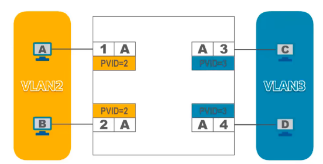

- 为了实现这种应用，可以在交换机上创建VLAN2和VLAN3，然后将交换机的端口1和2划归到VLAN2，因此端口1和2的PVID值等于2；将交换机的端口3和4划归到VLAN3，因此端口3和4的PVID值等于3

2，我们来看主机A发送广播帧的情况，该帧从交换机的端口1进入交换机；由于端口1的类型时ACCESS，他会对接收到的“未打标签”的普通以太网MAC帧“打标签”，也就是插入4字节的VLAN标记字段；如本图所示，由于端口1的PVID值等于2，因此所插入的4宇节VLAN标记字段中的VID的值也等于2：

3，广播帧中的VID的取值与端口2的PVID的取值都等于2，因此交换机会从端口2对帧进行“去标签”转发：

4，VLAN3中主机发送广播帧后的步骤同理。

#### TRUNK端口介绍

#### TRUNK端口广播帧工作实例

1，假设主机A发送了一个广播帧，该帧从交换机1的端口1进入交换机；由于端口1的类型时ACCESS，他会对接收到的未打标签的普通以太网MAC帧“打标签”，也就是插入4字节的VLAN标记字段；由于端口1的PVID值等于1，因此，所插入的4字节VLAN标记字段中的VID的值也等于1：

2，该广播帧的VID的取值与端口2的PVID值都等于1，端口2的类型时ACCESS，因此交换机1会从端口2对帧进行“去标签”转发：

3，该广播帧中的VID的取值与端口5的PVID的值都等于1，端口5的类型是TRUNK，因此交换机1会从端口5对帧进行“去标签”转发

4，本例中，交换机2会对接收到的“未打标签”的普通以太网MAC帧“打标签”，也就是插入4自己的VLAN标记字段；由于端口5的PVID值等于1，因此所插入的4字节VLAN标记字段中的VID的值也等于1：

5，该广播帧中的VID的取值与端口1和2的PVID值都等于1；端口1和2的类型都是ACCESS，因此交换机2会从端口1和2对帧进行“去标签”的转发：

6，再来看主机C发送广播帧的情况，该帧从交换机1的端口3进入交换机；由于端口3的类型时ACCESS，他会对接收到的“未打标签”的普通以太网MAC帧打标签，也就是插入4字节的VLAN标记字段；由于端口3的PVID值等于2，因此所插入的4字节VLAN标记字段中的VID的值也等于2：

7，该广播帧中的vid的取值与端口4的PVID值都等于2，端口4的类型是ACCESS，因此交换机1会从端口4对帧进行“去标签“转发”：

8，该广播帧中的VID的取值与端口5的PVID值不相等，由于TRUNK端口VID不等于PVID的帧是直接转发的，因此交换机1会从端口5对帧直接转发，也就是不去掉标签而带着标签直接转发：

9，很显然，该802.1Q广播帧会从交换机2的端口5进入交换机2，Trunk端口接收已打标签的802.1Q帧：

10，该广播帧中的VID的取值与端口3和4的PVID值都等于2，端口3和4的类型都是ACCESS类型；因此交换机2会从端口3和4对帧进行“去标签”转发：

11，由本例可以看出，在由多个交换机互连而成的交换式以太网中划分VLAN时：

- 连接主机的交换机端口应设置为ACCESS类型。
- 交换机之间互联的端口应设置为TRUNK类型。

- 网友：“我悟了，就是贴标签撕标签”。

#### ACCESS+TRUNK端口例题

- 网友问：”为什么TRUNK端口对于标签相同的帧撕标签后再贴相同标签，而对于标签不同的帧直接转发；让TRUNK端口对所以帧不管标签直接转发的效果不是一样的吗？“。
  - 网友答：“看这个例子就懂了”

#### 华为交换机HYBRID端口

（简单了解即可）。

1，HYBRID端口概念：

2，实例图：

- 可以理解为 标签只在交换机内部时存在，出了交换机时，标签都去掉了，就变成了普通mac帧。所以普通计算机收到一定是普通的mac帧。出了交换机还带标签的帧会被丢弃

## 网络层

### 网络层概述

#### 为何需要网络层

1，网络层的主要任务是**实现网络互连**，进而**实现数据包在各网络之间的传输**。

- 如图所示，这些异构型网络如果只是需要各自内部通信，那他们只要实现各自的物理层和数据链路层即可。但是如果需要把这些异构型网络互联起来，形成一个更大的互联网，就需要使用网络层互联设备路由器。

  

- 需要说明的是，为了简单起见，有时我们可以不用画出这些网络，而将他们看作是一条链路即可

2，对于互联网而言，仅实现计算机网络体系结构中的物理层和数据链路层，是不能实现数据包在互联网中各网络之间传输的；要实现该功能，就必须实现网络层。

#### 网络层需要解决的主要问题

1，第一个问题，网络层向运输层提供怎样的服务（“可靠传输”还是“不可靠传输”)？：

- 传输错误：
  - 数据包在传输过程中可能会出现误码；
  - 也有可能由于路由器繁忙而被路由器丢弃；
  - 还有可能出现按序发送的数据包不能按序到达接收方。
- 区分可靠不可靠：
  - 如果网络层对上述传输错误不采取任何措施，则提供的是不可靠传输服务；
  - 如果网络层对上述传输错误采取措施，并使得接收方能正确接收发送方所发送的数据包，则提供的是可靠传输服务。
- 不同网络体系结构所提供的服务可能是不同的，例如：
  - 因特网使用的TCP/IP协议体系的网际层，提供的是无连接的不可靠的数据报服务
  - 而ATM，帧中继和X.25的网络层提供的都是面向连接的可靠的虚电路服务

---

2，第二个问题，网络层寻址问题：

例如TCP/IP协议体系的网际层使用IP地址，举例说明

网络N1上两个路由器接口各自所分配的IP地址为“192.168.0.1和192.168.0.2”；他们的前三个数是相同的，可以看做他们所在网络的网络编号；而第四个数各不相同，用于区分这两个不同的路由器接口。网络N3上两个路由器接口各自所分配的IP地址为“172.16.0.1和172.16.6.16”；他们的前两个数是相同的，可以看做他们所在网络的网络编号；而后两个数各不相同，用于区分这两个不同的路由器接口。网络N7上两个路由器接口各自所分配的IP地址为“10.1.2.3“和10.6.7.8”；他们的第一个数是相同的，可以看做他们所在网络的网络编号；而后三个数各不相同，用于区分这两个不同的路由器接口。

- 192,172,10分别的C,B,A地址，他们的网络号不一样，看到后面的IP分类就知道了

---

3，第三个问题，路由选择问题：

我们来举例说明，如图所示，数据包从源站到目的站可以走这样的一条路

也可以走这样一条路径

对于本例还有其他路径可走，我们就不一一演示了。那么路由器收到数据包后是依据什么来决定将数据包从自己的哪个接口转发出去的呢？这个问题在我们之间的课程中曾简单介绍过，即依据的是”数据包中的目的地址“和”路由器中的路由表“。例如本图是路由器R1的路由表，里面记录着路由器R1所知道的网络，以及数据包要到达这些网络应该从自己的哪个接口转发：

假设R1知道数据包要到达N7的话，下一跳应将其转发给路由器R4，则路由表中应该有这样一条记录：

而数据包要达到网络N6，下一跳应将其转发给路由器R2，则路由表中应该有这样一条记录：

想想看，刚在是我们假设路由器知道路由表中的这些记录，但是在实践当中，路由器是如何得到这样的路由记录的呢？有两种方法：

- 由用户或网络管理人员进行**人工配置**。这种方法只适用于规模较小，且网络拓扑不改变的小型互联网。
- **实现各种路由选择协议**，由路由器执行路由选择协议中所规定的路由选择算法，而自动得出路由表中的路由记录。这种方法更适用于规模较大，且网络拓扑经常改变的大型互联网。

#### TCP/IP协议栈的网际层

1，**因特网**(Internet)是目前全世界用户数量最多的互联网，它使用**TCP/IP协议栈**。

2，由于TCP/IP协议栈的网络层使用**网际协议IP**，它是整个协议栈的核心协议，因此在TCP/IP协议栈中网络层常称为**网际层**。
3，综上所述，我们通过学习TCP/IP协议栈的网际层来学习网络层的理论知识和实践技术。

4，TCP/IP协议栈各层，及各层包含的主要协议图示：

### 网络层提供的两种服务

#### 面向连接的虚电路服务

1，虚电路的核心思想：**可靠通信由网络来保证**

2，两台计算机进行通信时，应当首先建立**网络层的连接**，也就是建立一条**虚电路VC**(Virtual Circuit)，以保证通信双方所需的一切网络资源：

3，然后**双方就沿着已建立的虚电路发送分组**。

- 需要说明的是，虚电路表示这是一条逻辑上的连接，分组都沿着这条逻辑连接按照存储转发方式传送，而不是真正建立了一条物理连接。而采用电路交换的电话通信则是先建立一条真正的连接。因此分组交换的虚连接与电路交换的连接只是类似，但并不完全一样。

4，目的主机的地址仅在连接建立阶段使用，之后每个**分组的首部只需携带一条虚电路的编号**(构成虚电路的每一段链路都有一个虚电路编号)。

5，这种通信方式如果再使用可靠传输的网络协议，就可使所发送的分组最终正确到达接收方（无差错按序到达、不丢失、不重复)。

6，**通信结束后，需要释放之前所建立的虚电路**。

7，很多广域分组交换网都使用面向连接的虚电路服务。例如，曾经的X.25和逐渐过时的帧中继FR、异步传输模式ATM等。

8，然而因特网的先驱者并没有采取这种设计思路，而是采用了无连接的数据报服务

#### 无连接的数据报服务

1，数据报服务的核心思想是：**可靠通信应当由用户主机来保证**

2，当两台计算机进行通信时，**他们的网络层不需要先建立连接**，**每个分组可走不同的路径**

3，因此，**分组的首部必须携带目的主机的完整地址**

4，这种通信方式所传送的**分组可能误码**、**丢失**、**重复**和**失序**。这些传输差错我们在之前的课程中就已经介绍过了，就不再赘述了。

5，由于**网络本身不提供端到端的可靠传输服务**，这就使网络中的路由器可以做得比较简单，而且价格低廉（比电信网的交换机的价格低廉)。

6，因特网采用了这种设计思想，也就是**将复杂的网络处理功能置于因特网的边缘(用户主机和其内部的运输层)**，而将相对简单的尽最大努力的分组交付功能置于因特网核心。

- 采用这种思想的好处是网络的造假大大降低，运行方式灵活，能够适应多种应用。
- 因特网能发展到今天的这种规模，充分证明了当初采用这种设计思想的正确性。

#### 小结

### IPv4地址概述

#### 基本概念

#### IPV4地址表示方法

- 注意：**ipv4地址**常写成**点分十进制**表示方法，方便使用。

#### 8位无符号二进制整数转十进制数

1，点分十进制中两个点之间的数，就是用8位无符号二进制换算过来的。所以数的范围为0~255(2的8次方为256)。

2，具体换算方法：

#### 十进制正整数转8位无符号二进制数

- 网友说：“凑数不实用”

### 分类编址的IPv4地址

分类编址是IPv4地址编址方法的第一个历史阶段。

#### 五类地址概述

#### A类地址细节

- 网友问：“为什么最小本地环回测试地址不为127.0.0.0？”。网友答：“因为主机号不能全是0，不然就是代表一个网络地址表示一个子网”。
- 网友问：“什么是环回测试地址？”。网友答：“”
- 注意：
  - 主机号全部取0，则该地址为该网络的网络地址
  - 主机号全部取1，则该地址为该网络的广播地址

#### B类地址细节

- B类地址的网络号有16位，且最高两位固定为“10”，因此B类地址网络号有2的(16-2)次方个组合

#### C类地址细节

#### ABC类地址小练习

1，

2，有关源地址和目的地址的练习题：

3，网络分配练习：

- 网络ip规划时不要忘记，红色背景的，两台路由器通过一段链路直连，他们的直连接口也属于同一个网络。

- 黄色网络的主机数量为65534，加上一个路由器接口，需要可分配的IP地址数量为65535，只能给该网络分配一个A类网络号。
- 蓝色网络的主机数量为254，加上一个路由器接口，需要可分配的IP地址数量为255，可以给该网络分配一个A类或B类网络号；本着节约IP地址的原则，给该网络分配一个B类网络号。
- 蓝色网络的主机数量为40，加上一个路由器接口，需要可分配的IP地址数量为41，可以给该网络分配一个A类或B类或C类网络号；本着节约IP地址的原则，给该网络分配一个C类网络号。

- 红色网络没有主机，只有两个路由器接口，需要可分配的IP地址数量为2，给该网络分配一个A类或B类或C类网络号都可以；本着节约IP地址的原则，给该网络分配一个C类网络号。
- 网络号分配完毕后，就可以给各网络中的各主机和路由器的各接口分配IP地址了。需要注意的是，所分配的IP地址应该互不相同，并且其主机号部分不能出现全0(因为这是网络地址)，也不能出现全1(因为这是广播地址)；网络地址或者主机地址都不能分配给各主机或路由器的各接口，因为他们无法唯一标识一台主机或路由器的某个接口。

### 划分子网的IPv4地址

划分子网是IPv4地址编址方法的第二个历史阶段。

#### 为何出现划分子网的需求

1，如图所示，某单位有一个大型局域网需要连接到因特网；如果申请一个C类网络地址，其可分配的IP地址数量只有254个，不够使用；因此该单位申请了一个B类网络地址，其可分配的IP地址数量达到了65534个：

2，给每台计算机和路由器的接口分配一个IP地址后，还有大量的IP地址剩余；这些剩余的IP地址只能由该单位的同一个网络使用，而其他单位的网络不能使用：

3，随着该单位计算机网络的发展与建设，该单位又新增了一些计算机，并且需要将原来的网络划分成3个独立的网络，我们称其为“子网1，子网2，子网3”：

4，假设子网1仍然使用原先申请到的B类网络地址，那么久需要为子网2和子网3各自申请一个网络地址，但这样会存在一些弊端：

- 如果可以从IP地址的主机号部分借用一些位作为子网号来区分不同的子网，就可以利用原有网络中剩余的大量IP地址，而不用申请新的网络地址。

5，对于本例，我们可以借用16位主机号中的8位作为子网号：

- 假设我们给子网1分配的子网号是0，给子网2分配的子网号是1，给子网3分配的子网号是2。

6，之后就可以给各子网中的主机和路由器接口分配IP地址了：

7，思考一个问题：

- 这样我们就引出了一个划分子网的工具：子网掩码

#### 子网掩码介绍

1，**32比特的子网掩码可以表明分类IP地址的主机号部分被借用了几个比特作为子网号**

2，这是32bit的分类IPv4地址，它由网络号和主机号两部分构成：

3，当我们从主机号部分借用一些位作为子网号时，IP地址从两级结构的分类IP地址，变成了三级结构的划分子网的IP地址：

4，子网掩码用**连续的比特1来对应网络号和子网号**，子网掩码用**连续的比特0来对应主机号**；这样就构成了这个划分子网的IP地址的32比特的子网掩码：

5，将划分子网的**IPv4地**址与其相应的**子网掩码**进行**逻辑与运算**就可得到IPv4地址**所在子网的网络地址**

- 与 0 是清零主机号的功能 与1是保留网络号和子网号的功能

#### 划分子网的细节

1，已知某个网络的地址为218.75.230.0，使用子网掩码255.255.255.128对其进行子网划分，请给出划分细节。

2，218.75.230.0是给定的网络地址，从他的左起第一个十进制数可知，这是一个C类网络地址；因此网络号占三个字节，主机号占一个字节：

3，255.255.255.128是题目给定的子网掩码；前三个十进制数255的二进制为24个连续的比特1，他们对应IP地址中的网络号部分：

4，而该子网掩码中的十进制数128，用来表示从IP地址的主机号部分借用了多少比特来作为子网号，我们将其转换为8个二进制比特；其中只有1个比特1，这就表明从主机号部分借用1个比特作为子网号：

5，因此可划分出的子网数量，和每个子网可分配的地址数量如图：

- 由于原来8位主机号被借走1位作为子网号，因此主机号还剩7位，这就是表达式中8-1的原因，可有2的7次方个组合；但是我们还要去掉主机号为“全0”的网络地址和“全1”的广播地址，这就是表达式中-2的原因。

6，我们再来看题目所给的C类网地址218.75.230.0的细节：

- 因为这是一个C类网地址，因此网络号占3个字节，主机号占1个字节。
- 该网络共有256个地址；218.75.230.0是该网络上的第一个地址，也就是主机号全为0的地址，作为该网络的网络地址；将网络号保持不变，主机号取最大值255，这就是该网络上的最后一个地址，作为该网络的广播地址，也就是主机号全为1的地址。
- 该网络可分配的地址数量为254个。

7，之前我们已经分析过了，题目所给的子网掩码表明从主机号部分借用1个比特作为子网号，也就是将该C类网均分为两个子网；我们将主机号写成8比特的形式，从主机号借用一个比特作为子网号，子网号只能是0或1。因此给定C类网地址218.75.230.0的子网划分如下：

#### 划分子网小练习

1,

2,

由网络号的第一位180可知，180.80.77.55是B类网络地址，因此网络号占两个字节，主机号也占两个字节：

将网络号和子网号保持不变，而将主机号的10个比特全部取0，就可以得到该主机所在子网的网络地址；将网络号和子网号保持不变，而将主机号的10个比特全部取1，就可以得到该主机所在子网的广播地址：

因此本题的答案为选项D。

#### 默认子网掩码

#### 小结与重点

### 无分类编址的IPv4地址

无分类编制是IPv4地址编址方法的第三个历史阶段。

#### 无分类编址简介

#### 无分类编址实例说明

1，题目：

2，128.14.35.7/20是题目所给的地址块；斜线后面的数字为20，表明该IPv4地址的前20个比特为网络前缀；也就是说，所给地址的“左起第一个字节，第二个字节，以及第三个字节的前4比特”构成20比特的网络前缀，剩余12个比特为主机号；因此我们要将该地址的第三个字节和第四个字节转换成二进制的形式，这样我们就很容易看出20比特的网络前缀和12比特的主机号：

3，将20比特的网络前缀保持不变，12比特的主机号全部取0，就可以得到该地址块的最小地址：

4，将20比特的网络前缀保持不变，12比特的主机号全部取1，就可以得到该地址块的最大地址：

5，该地址块中的地址数量如图：

- 因为32比特的IPv4地址中前20个比特为网络前缀，剩余12比特为主机号，因此主机号可有2的12次方个组合

- 这个也是区分网络地址和广播地址的，因为只是写出地址数量，网络和广播都算地址

6，聚合C类网的数量，用该地址块中的地址数量，除以一个C类网的地址数量2的8次方个，即可得出：

7，地址掩码为20个连续的比特1，和12个连续的比特0：

- 20个连续的比特1用来对应网络前缀
- 12个连续的比特0用来对应主机号

#### 无分类编址小练习

#### CIDR中的路由聚合

1，路由器R1与五个网络以及路由器R2直接相连，路由器R1和R2互为相邻路由器，他们周期性的通告自己所知道的路由信息给对方：

- 思考：R1应该将怎样的路由信息通告给R2？

2，如果R1把自己直连的这五个网络的路由记录都通报给R2，则R2的路由表会增加5条路由记录，如图所示：

3，为了减少路由记录对路由表的占用，能否将这五条路由记录聚合成一条呢？答案是肯定的：

4，其方法是“找共同前缀”，也就是找出这5个目的网络地址的共同前缀；这五个目的网络地址左起前两个字节都是相同的，从第三个字节开始不同，因此只需将第三个字节转换成二进制形式，这样就很容易找出这五个目的网络地址的共同前缀，共22比特，将其记为“/22”：

5，将共同前缀保持不变，而剩余的比特全部取0，然后写成点分十进制形式，放在“/22”的前面；这就是聚合后的地址块，也可以成为超网：

6，通过本例，我们还可以看出**网络前缀越长，地址块越小，路由越具体**。

- 需要说明的是：若路由器查表转发分组时发现有多条路由可选，则选择网络前缀最长的那条，这称为**最长前缀匹配**，因为这样的路由更具体。

#### 聚合路由小练习

1，

- 题目中给定的IP分组的目的地址为192.168.4.3，这是该网络的广播地址，因此该网络上的所有主机都能收到。由于该网络只有两个可分配的IP地址，因此网络中的主机数量最大为2，那么可以收到该IP分组的最大主机数就是2.

2，

#### 小结与重点

### IPv4地址的应用规划

#### 规划方法简介即小结

#### 定长的子网掩码划分子网实例

1，要求：

2，得到每个网络所需的IP地址数量：

- 我们可以将图中两个路由器之间的这段链路看成是网络N5，其中没有主机，因此主机需要的地址数量为0.

3，得到应用需求:将C类网络218.75.230.0划分成5个子网，每个子网上可分配的IP地址数量不得少于各自的需求。

4，C类网络地址218.75.230.0分析如下：

- 子网数量8个，可以满足我们对子网数量的要求；每个子网上的地址数量为32个，可以满足我们对子网上IP地址数量的要求

5，这样我们就可以得出划分子网所需的子网掩码；用三个十进制数255来对应网络号部分；而最后的8个比特为11100000

6，将子网掩码的最后8比特写成十进制数为224：

7，接下来我们来看划分子网的细节，以前两个子网为例：

- 子网号部分是从主机号借用的3比特。

8，以此类推，我们可以得到划分子网的全部细节：

9，现在我们可以从子网1~8中任选5个分配给图中的网络N1~N5：

- 通过本例可以看出，通过定长的子网掩码进行子网划分，只能划分出2的n次方个子网；其中n是从主机号部分借用的用来作为子网号的比特数量。

- 每个子网所分配的ip地址数量相同，容易造成IP地址的浪费。例如图中的网络5只需要4个ip地址，但是我们只能给他分配32个ip地址，这样造成ip地址的严重浪费。

#### 变长的子网掩码划分子网实例

1，本例与之前的例子基本一样，只是划分子网的方法改为采用变长的子网掩码，要求如下：

2，这是我们之前就统计过的各网络所需IP地址的数量：

3，既然网络N1需要9个地址，那么分配给网络N1的地址的主机号应为4比特，因为2的四次方等于16，这样网络N1就可有16个地址。由于使用4比特作为主机号，因此剩余28个比特可作为网络前缀：

4，既然网络N2需要28个地址，那么分配给网络N2的地址的主机号应为5个比特，因为2的5次方等于32，这样网络N2就可有32个地址；由于使用5个比特作为主机号，因此剩余27个比特可作为网络前缀：

5，同理得出分配给网络N3，N4，N5的地址中的主机号所占比特数量和网络前缀所占比特数量，就不在赘述了；我们将所得出的各网络所需地址块的大小标注在他们各自的旁边：

6，这样我们就可以得到本例的应用需求:从地址块218.75.230.0/24中取出5个地址块(1个“/27”地址块，3个“/28”地址块，1个“/30"地址块)，按需分配给下图所示的5个网络：

7，218.75.230.0/24地址块所包含的全部地址如下所示:

- 注意这里的**分配原则**。

8，例如，将这32个地址作为一个地址块分配给网络N2，我们将网络N2所分配到的地址块标注在它的旁边：

- 地址块中最小的地址就是N2的网络地址，最大的地址就是N2的广播地址；网络地址和广播地址之间的这些地址可分配给N2中的主机或路由器接口。

9，同理，N1N3N4N5的分配如下图所示：

- 原地址块中还剩余的这些地址可以留作今后分配。

10，通过本例可以看出，采用变长的子网掩码进行子网划分，可以按需划分出相应数量的子网，每个子网所分配到的IP地址数量可以不相同，尽可能减少了对IP地址的浪费。例如，图中给的网络5只需要4个ip地址，我们也非常精确地给它分配了4个IP地址，没有造成IP、地址的浪费。

#### 变长的子网掩码划分子网习题

- 本题答案并不唯一，和实例类似，就不再赘述了。

### IP数据报的发送和转发过程

#### 构成

#### 实例

1，在下图所示的小型互联网中，路由器的接口0直连了一个交换式以太网，路由器的接口1也直连了一个交换式以太网：

2，我们给绿色背景的网络分配了网络地址和子网掩码，给网络中的各主机和路由器的接口配置了相应的IP地址和子网掩码，如图所示：

3，我们给黄色背景的网络也分配了网络地址和子网掩码，给网络中的各主机和路由器的接口配置了相应的IP地址和子网掩码，如图所示：

4，我们知道，同一个网络的主机之间可以直接通信，这属于直接交付；不同网络的主机之间的通信需要通过路由器来中转，这属于间接交付：

- 那么源主机如何知道目的主机是否与自己在同一个网络中呢？

5，我们来举例说明

6，假设主机C要给主机F发送IP数据报，主机C将自己的IP地址和子网掩码相与，就可以得到主机C所在网络的网络地址：

7，既然主机C要给主机F发送IP数据报，那主机C肯定知道主机F的IP地址，否则就没法发送了；主机C将主机F的IP地址与自己的子网掩码相与，就可以得到目的网络地址；该地址与主机C的网络地址不相等，因此主机C就知道了主机F与自己不在同一个网络，他们之间的通信属于间接交付：

8，因为是间接交付，主机C需要将IP数据报传输给路由器，由路由器将IP数据报转发给主机F：

- 那么主机C又是如何应该把IP数据报交给哪个路由器进行转发呢？

9，实际上，用户为了让本网络中的主机能和其他网络中的主机进行通信，就必须给其指定本网络中的一个路由器，由该路由器帮忙进行转发；所指定的路由器，也被称为默认网关；对于本例，我们可以将路由器接口0的IP地址指定给该接口所直连网络中的各个主机作为默认网关：

10，同理，可将路由器接口1的ip地址，指定给该接口所直连网络中的各个主机作为默认网关：

11，这样，当本网络中的主机要和其他网络中的主机进行通信时，会将IP数据报传输给默认网关，由默认网关帮主机将IP数据报转发出去

12，假设本例中的主机A要给主机D发送IP数据报，这属于间接交付；主机A会将该IP数据报传输给自己的默认网关，也就是图中所示的路由器：

- 那么当路由器收到IP数据报后又是如何转发的呢？答案在本图中的①②。

13，为了简单起见，我们假设本例中的IP数据包首部没有出现差错，路由器取出IP数据报首部各地址字段的值；源地址字段为主机A的IP地址，目的地址字段的值为主机D的ip地址：

14，接下来，路由器就要对该IP数据报进行查表转发了。

15，这是路由器的路由表，当我们给路由器的接口配置IP地址和子网掩码时，路由器就知道了自己的该接口与哪个网络是直连的；例如在本例中，接口0所直连的网络是192.168.0.0，相应的地址掩码为255.255.255.128，因为接口0和该网络是直连的所以不需要下一跳路由器；接口1所直连的网络是192.168.0.128，相应的地址掩码为255.255.255.128，因为接口1和该网络是直连的所以不需要下一跳路由器：

- 需要说明的是，路由表中可能还会有其他路由条目，这可以是用户或网络管理员手工配置的静态路由，也可以是路由器使用路由协议自动获取到的动态路由。将在后续课程中详细介绍这部分内容。

16，接下来，路由器根据IP数据报的目的地址在自己的路由表中查找匹配的路由条目，逐条检查路由条目，将目的地址与路由条目中的地址掩码相与得到目的网络地址；该目的网络地址与路由条目中的目的网络地址不相同，则这条路由条目不匹配：

17，再检查下一条路由条目，将目的地址与下一条路由条目中的地址掩码相与得到目的网络地址；该目的网络地址与路由条目中的目的网络地址相同，则这条路由条目就是匹配的路由条目：

18，按照它的下一跳指示，也就是从接口1转发该IP数据报，这样主机D就可以收到路由器转发来的该IP数据报：

- 需要说明的是，我们这里所介绍的路由器查表转发IP数据报的过程，只是为了让同学们理解其最基本的工作原理；在路由器的实际研发过程中，需要设计很好的数据结构以便提高查找速度。

19，再来看这种情况，假设主机A给本网络上的各设备发送了一个广播IP数据报，在数据报首部中的目的地址字段，可以填写的目的地址为192.168.0.127，这是本网络的广播地址；也可以填写255.255.255.255，这是受限的广播地址：

20，该网络中的各设备都会收到该广播IP数据报；但路由器收到后并不会转发该数据报，也就是说**路由器是隔离广播域的**：

- 路由器隔离广播域是很有必要的。试想一下，如果因特网中数量巨大的路由器收到广播IP数据报后都进行转发，则会造成巨大的广播风暴，严重浪费因特网资源。

21，同理，主机A给另一个网络发送广播IP数据报：

22，在数据报首部中的目的地址字段填写的目的地址为192.168.0.255，这是网络192.168.0.128的广播地址；主机A将该广播IP数据报传输给路由器，希望由路由器帮其转发：

23，但路由器判断处这是广播IP数据报，不会转发：

#### 小练习

1，

2，

- III可以检错，但不能确保不丢失

3，

- 从主机1的子网掩码和主机1的IP地址的的CIDR表示方法都回以看出，网络前缀为24个比特；而WWW服务器的IP地址的网络前缀也是24个比特，并且与主机1的网络前缀相同，因此主机1可以访问WWW服务器。

#### 小结

### 静态路由配置及其可能产生的路由环路问题

#### 概述

#### 举例说明静态路由配置

1，我们采用如图所示的网络拓扑和相应的IP地址配置。

2，这是路由器R1的路由表，路由器R1通过自己的接口0所配置的IP地址和地址掩码，可以自动得出接口0所在的网络；由于接口0与该网络直连，则下一条不是路由器地址，而是通过接口0转发IP数据报给该网络中的某个主机，这属于直接交付，这条自动得出的路由条目的类型属于直连路由：

3，同理，R1还可以自行得出接口1的直连网络路由条目：

4，这是路由器R2的路由表；可以看到其接口0的直连网络路由条目，和其接口1的直连网络路由条目：

5，假设R1要转发一个IP数据报给该网络中的某个主机，从图中可以看出，R1应该将该IP数据报转发给路由器R2的接口0：

6，但R1的路由表中并没有关于该目的网络的路由条目，换句话说，R1并不知道目的网络192.168.2.0/24的存在；因此我们可以使用路由器的相关配置命令，给R1添加一条到达该目的网络的路由条目：

- 192.168.2.0/24是目的网络的地址；下一跳为路由器R2的接口0的地址；该路由条目是我们人工配置的静态路由。

7，假设R2要转发一个IP数据报给该网络中的某个主机，从图中可以看出，R2应该将该IP数据报转发给路由器R1的接口1，但R2的路由表中并没有关于该目的网络的路由条目；因此我们可以给R2添加一条到达该目的网络的路由条目：

8，以上就是我们举例说明的静态路由配置

#### 默认路由的概念实例

1，假设路由器R2的接口2连接到了因特网；如下是路由器R1的路由表，可以看到其接口0的直连网络路由条目，和其接口1的直连网络路由条目，和人工配置的到达该目的网络的静态路由：

2，假设R1要转发一个IP数据报给因特网中某个网络的某个主机，从图中可以看出，R1应该将该IP数据报转发给路由器R2的接口0；由于因特网中包含了众多的网络，如果我们给R1添加针对这些网络的每一条路由条目,则会给人工配置带来巨大的工作量，并且使R1的路由表变得非常大，降低查表转发的速度：

3，实际上，对于具有相同下一跳的不同目的网络的路由条目，我们可以用一条默认路由条目来替代；默认路由条目中的目的网络地址为0.0.0.0，地址掩码也为0.0.0.0，其CIDR形式为0.0.0.0/0；对于本例，默认路由条目的下一跳是路由器R2的接口0的地址；由于默认路由也是由我们人工配置的，因此其类型也是静态：

- 默认路由：是一种特殊的静态路由，当路由表中与数据包目的地址没有匹配的表项时，数据包将根据默认路由条目进行转发。

4，在配置了默认路由条目后，我们甚至可以删除这条路由条目：

#### 特定主机路由实例

1，我们举例说明特定主机路由的概念，我们可以给路由器添加针对某个主机的特定主机路由条目。

- 特定主机路由条目用处：
  - 一般用于网络管理人员对网络的管理和测试。
  - 另外，在需要考虑某种安全问题时也可以采用特定主机路由。

2，假设这是该网络中的某台特定主机，我们可以在R1的路由表中，添加一条到达该主机的特定主机路由条目；特定主机路由条目中的目的网络地址为该特定主机的ip地址，地址掩码为255.255.255.255，其CIDR形式为特定主机IP地址/32；对于本例，特定主机路由条目的下一跳是路由器R2的接口0的地址；由于特定主机路由也是由我们人工配置的，因此其类型也是静态：

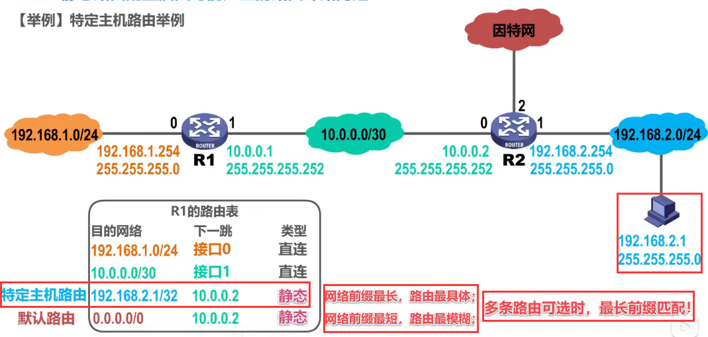

- 注意：特定网络路由的网络前缀最长，路由最具体，会被最优先匹配。
- 我理解：“特定网络路由相当于把特定主机的ip地址看作了一个无敌小的网络。”

#### 静态路由配置错误导致的路由环路实例

1，如图所示，这是各路由器自动得出的直连网络，和人工配置的静态路由

2，我们来看看路由器R2中的这条人工配置的静态路由条目，它表明R2要转发IP数据报到该网络，下一跳应转发给R1的接口1：

3，假设我们将下一跳错误地配置成了该地址，也就是错误地指向了R3的接口0：

4，当R2要转发IP数据报到该网络时，下一跳会错误地转发给路由器R3的接口0：

5，R3收到该IP数据报后，进行查表转发，找到了匹配的路由条目，下一跳应该转发给R2的接口1：

6，R2收到该IP数据报后，进行查表转发，找到了匹配的路由条目，下一跳应该转发给R3的接口0,：

7，很显然，由于我们静态路由配置错误，导致R2和R3之间产生了路由环路。

- 为了防止IP数据报在路由环路中永久兜圈，在IP数据报首部设有生存时间TTL字段。IP数据报进入路由器后，TTL字段的值减1。若TTL的值不等于0，则被路由器转发，否则被丢弃。

#### 聚合了不存在的网络可能导致的环路问题实例

1，路由器R1的路由表如图；可以看到其自动得出的直连网络；还可以看到人工配置的默认路由，下一跳指向路由器R2的接口0：

2，路由器R2的路由表如图；可以看到其自动得出的直连网络；还可以看到人工配置的**聚合路由**，是由箭头所指的两个网络聚合而来的：

- 聚合的方法就是找两个地址的共同前缀，然后将共同前缀保持不变，将剩余比特全部取0；写成点分十进制形式，在其后面写上“/”，“/”后面写上共同前缀的数量。

3，假设R2要转发IP数据报到该网络；进行查表转发，找到了匹配的路由条目，下一跳应该转发给该地址，也就是转发给R1的接口1：

4，R1收到该IP数据报后，进行查表转发，找到了匹配的路由条目，下一跳是通过接口2直接交付：

5，我们再来看看这条聚合路由的细节，他实际上包含了以下四个网络，有两个网络实际上不存在于网络拓扑中，

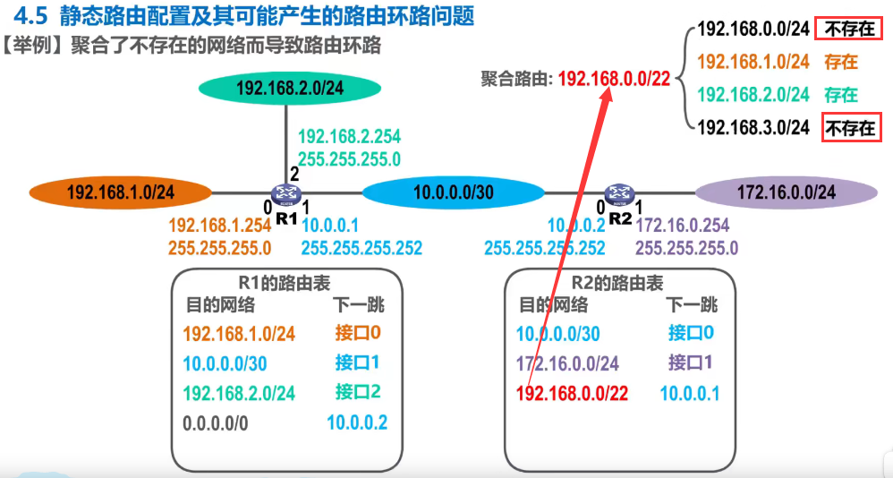

6，当R2要转发IP数据报到这个不存在的网络时；进行查表转发，找到了匹配的路由条目，下一跳应该转发给R1的接口1；但是对于这个不存在的网络，路由器R2应该不予转发，却错把它转发给了路由器R1：

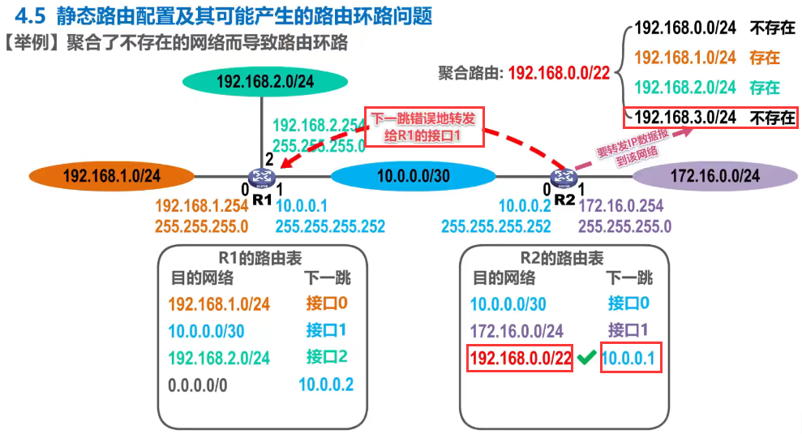

7，R1收到该IP数据报后，进行查表转发，只能走默认路由，下一跳应该转发给R2的接口0；很显然，R1和R2之间产生了路由环路：

8，针对这种情况，我们可以在R2的路由表中添加“所聚合的，不存在的”网络的黑洞路由；黑洞路由的下一跳为null0，这是路由器内部的虚拟接口，可以形象的看成是一个黑洞，IP数据报进入它后就有去无回了，也就是路由器丢弃了该IP数据报，而不是转发该IP数据报：

9，现在假设R2要转发IP数据报到这个不存在的网络，进行查表转发，找到了两条可选的路由条目：

10，根据最长前缀匹配原则，将会选择这条到达不存在网络的黑洞路由，下一跳为虚拟接口null0，因此该IP数据报会进入这个黑洞

#### 网络故障可能导致的路由环路问题

1，假设路由器R1检测到其接口0所直连的网络出现了故障而不可达，就会自动在其路由表中删除该直连网络的路由条目：

2，之后R2要转发IP数据报到该网络，进行查表转发，找到匹配的路由条目，下一跳转发给R1的接口1：

3，R1收到该IP数据报后，进行查表转发，找不到该IP数据报的目的网络的相关路由条目，只能走默认路由，也就是下一跳转发给R2的接口0；这样就把该IP数据报错误地转发给了R2，很显然R1和R2之间产生了路由环路：

4，针对这种情况，我们可以在R1的路由表中添加针对该直连网络的黑洞路由，

5，这样当R2要转发IP数据报到该网络时，进行查表转发，找到匹配的路由条目，下一跳转发给R1的接口1：

6，R1收到该IP数据报后，进行查表转发，找到匹配的路由条目，这是一条黑洞路由，下一跳为虚拟接口null0，因此该IP数据报会进入这个黑洞：

7，假设一段时间后，之前的故障消失了，则R1又自动地得出了其接口0的直连网络的路由条目，并将我们之前人工配置的针对该直连网络的黑洞路由条目设置为失效状态：

8，假设R1再次检测到其接口0所直连的网络出现了故障而不可达，则会自动在其路由表中删除该直连网络的路由条目，并将我们之前配置的针对该直连网络的黑洞路由条目设置为生效状态：

#### 小结

### 路由选择协议概述

#### 动态路由选择VS静态路由选择

#### 因特网所采用的路由选择协议的主要特点

- 自治系统内部和自治系统外部采用不同类别的路由选择协议，分别进行路由选择

#### 因特网采用的分层次路由选择协议实例

1，假设这是因特网中的很小的一部分；我们可以将绿色背景的网络和路由器划归到一个自治系统，将蓝色背景的网络和路由器划归到另一个自治系统；自治系统之间的路由选择简称为域间路由选择，自治系统内部的路由选择简称为域内路由选择：

2，域间路由选择使用外部网关协议EGP这个类别的路由选择协议，域内路由选择使用内部网关协议IGP这个类别的路由选择协议：

- 需要说明的是，外部网关协议EGP和内部网关协议IGP只是路由选择协议的分类名称，而不是具体的路由选择协议。
- 另外，名称中使用的是“网关”这个词，是因为在因特网早期的RFC文档中，没有使用路由器而使用的是“网关”这一名词；现在新的RFC文档中又改用“路由器”这一名词，因此外部网关协议EGP可改称为“外部路由协议ERP”，内部网关协议IGP可改称为“内部路由协议IRP”。本课程仍然采用RFC原先使用的名词，以方便大家查阅RFC文档。

3，在一个自治系统内部使用的具体的内部网关协议，与因特网中其他自治系统中选用何种内部网关协议无关；例如，在绿色背景的自治系统内部使用的内部网关协议为“路由信息协议RIP”，而在蓝色背景自治系统内部使用的内部网关协议为“开放式最短路径优先OSPF协议”，自治系统之间使用的外部网关协议为“边界网关协议BGP”：

#### 常见的路由选择协议

#### 路由器的基本结构

1，路由选择协议是在路由器上运行的，所以我们需要了解一下路由器的基本结构。

2，结构如图：

- 我们不严格区分路由器中的路由表和转发表，这样有助于简化问题的分析，后续也不区分。
- 我：”本内容课程讲了蛮多，配合了ppt动画讲例子，但是我觉得不是重点，故仅存概览图，后续有需要再细学这块。“

#### 小结

### 路由信息协议RIP的基本工作原理

#### 基本信息

1，

2，

- 等价负载均衡：也就是将通信量均衡地分布到多条等价的路由上。

#### RIP的基本工作过程

1，

2，

3，

#### 路由条目更新规则实例

#### 路由条目更新小练习

1，

2，

#### RIP存在“坏消息传播得慢”的问题

1，

2，

- 请注意，使用上述措施后，也不能彻底避免路由环路问题，这是距离向量算法的本质所决定的。

#### 小结

### 开放最短路径优先OSPF的基本工作原理

#### 基本概念

####  链路状态

#### hello分组

#### 链路状态通告LSA

1，

2，

3，

#### OSPF分组类型

#### OSPF的基本工作过程

1，相邻路由器之间周期性发送问候分组，以便建立和维护邻居关系：

2，建立邻居关系后，给邻居路由器发送数据库描述分组，也就是将自己的链路状态数据库中的所有链路状态项目的摘要信息发送给邻居路由器：

3，例如R1收到R2的数据库描述分组后，发现自己缺少其中的某些链路状态项目，于是就给R2发送链路状态请求分组：

4，R2收到后，将R1缺少的链路状态项目的详细信息封装在链路状态更新分组中发送给R1：

5，R1收到后，将这些所缺少的链路状态项目的详细信息添加到自己的链路状态数据库中，并给R2发送链路状态确认分组：

6，需要说明的是，R2也可以向R1请求自己所缺少的链路状态项目的详细信息，这里就不再演示该过程了。

7，最终R1和R2的链路状态数据库达成一致，也就是链路状态数据库达到同步：

8，每30分钟或链路状态发生变化时，路由器都会发送链路状态更新分组；收到该分组的其他路由器将洪泛转发该分组，并给该路由器发回链路状态确认分组；这就叫”新情况下的链路状态数据库同步“：

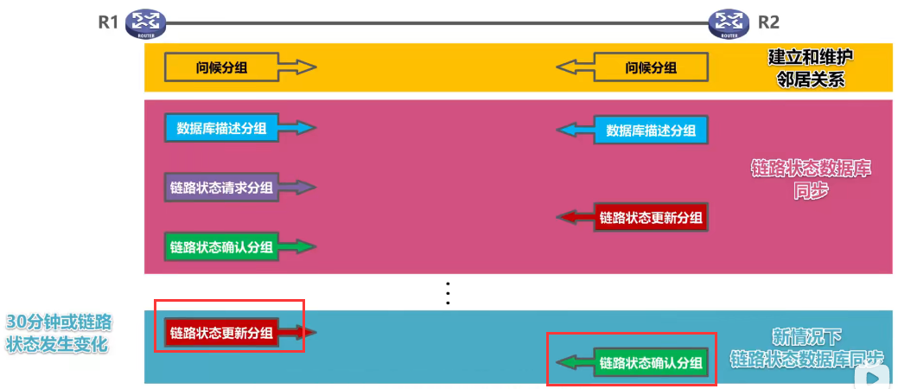

#### DR和BDR

#### 区域(Area)概念

- 划分区域的好处就是把利用洪泛法交换链路状态信息的范围局限于每一个Area，而不是整个自治系统；这样就减少了整个网络上的通信量。
- 如果路由器的所有接口都在同一个区域内，则该路由器称为”区域内路由器“
- 为了本区域和其他边界联通，每个区域都会有一个区域边界路由器；他的一个接口用于连接自身所在区域，另一个接口用于连接主干区域。
- 主干区域内的路由器称为主干路由器，我们也可以把区域边界路由器看作是主干路由器。
- 在主干区域内还要有一个路由器，专门和本自治系统外的其他自治系统交换路由信息；这样的路由器称为“自治系统边界路由器”

- 分层次划分区域的优点缺点：

  - 优点：
    - 使每个区域内部交换路由信息的通信量大大减小，因而使OSPF协议可以用于规模很大的自治系统中。

  - 缺点：
    - 交换信息的种类增多了
    - OSTF协议更复杂了

#### 小结

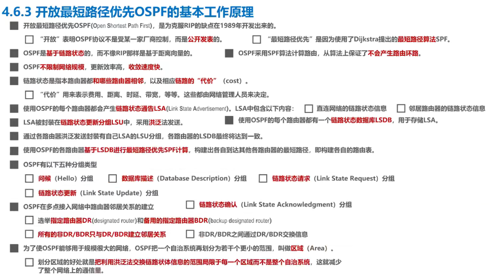

### 边界网关协议BGP的基本工作原理

#### 引入

1，

2，

3，

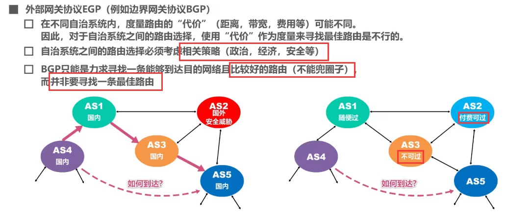

#### BGP工作原理

1,

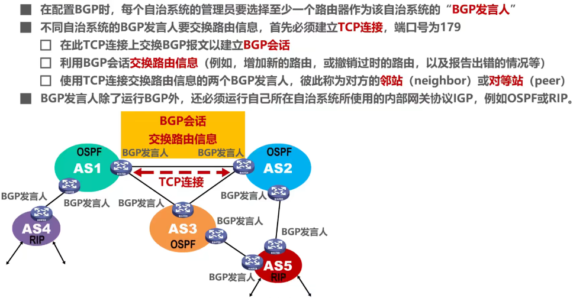

2，

#### BGP发言人交换路径向量例子

1，自治系统AS2的BGP发言人通知主干网的BGP发言人：“要到达网络N1N2N3N4可经过AS2”：

2，主干网在收到这个通知后，就发出通知：“要到达网络N1N2N3N4，可沿路径(AS1,AS2)”；这里的路径(AS1,AS2)称为路径向量：

3，自治系统AS3收到这条路径向量信息后，如果AS3自身也包含在其中则不能采用这条路径，否则会兜圈子：

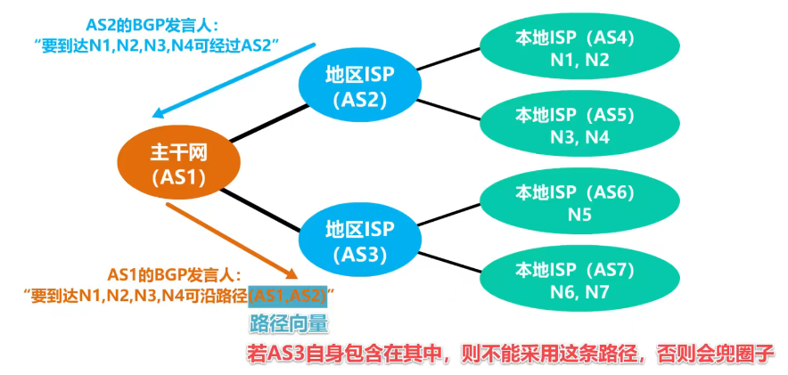

#### BGP版本四中规定的四种报文

- 在BGP协议刚运行时，BGP的临站交换整个BGP路由表，但以后只需要在发生变化时更新有变化的部分，这样做对节省网络带宽和减少路由器的处理开销都有好处。

#### 小练习

1，

2，

- 没有什么计算过程和解答技巧，记住本图的封装关系即可

- 问：”网络层路由器为什么会有传输层UDP和TCP？“猜测：“传统交换机定义和现代交换机不一样，现代交换机包含了第三层及以上，[参考网址](https://blog.csdn.net/vecloud/article/details/108666569)”

#### 小结

- 很多细节超出教学范围，有兴趣可以查阅“RFC 4271文档”

### IPv4数据报的首部格式

为了简单起见，之后我们将IPv4数据报简称为IP数据报，而不支出版本号。

IP数据报的首部格式及其内容，是实现IP协议主要功能的基础，因此有必要搞清楚这部分的内容。

#### 首部长度+可选字段+填充

- 首部长度：首部长度字段是以4字节为单位的，换句话说，IP数据报的首部长度一定是4字节的整数倍；每一行32比特，对应4个字节。首部最小取5行，对应首部固定部分20字节；首部最大取15行，对应首部固定20字节+可变40字节。

- 填充字段：首部末尾填充0，确保”首部长度“是4字节的整数倍。

#### 区分服务

#### 总长度

- 实际应用中，很少传65535字节这么长的IP数据报
- ”首部长度字段“和“总长度字段”的区别，以及根据”首部长度字段“和“总长度字段”的值计算数据载荷，见本图。
  - 总长度是以字节为单位，首部长度是以4字节为单位。

#### 标识+标志+片偏移

1，”标识+标志+片偏移“共同用于IP数据报分片：

2，这是网际层封装出的IP数据报：

3，它将在数据链路层封装成帧：

4，每一种数据链路层协议都规定了帧的数据载荷的最大长度，称为最大传输单元MTU；例如，以太网的数据链路层规定MTU的值为1500字节，如果某个IP数据报的总长度超过MTU时，将无法封装成帧，需要将原IP数据报分片为更小的IP数据报，再将各分片IP数据报封装成帧：

5，三个字段的分别功能：

#### 对IPv4数据报分片实例

1，假设有这样一个IP数据报，它由20字节的固定首部和3800字节的数据载荷两部分构成；也就是说，该IP数据报的总长为3820字节：

2，假设使用以太网传送该ip数据报，以太网的最大传送单元MTU为1500字节，也就是以太网的数据载荷部分最大为1500字节，无法承装3820字节长的IP数据报；因此需要把该IP数据报分片成几个更小的IP数据报，每个长度不能大于1500字节；然后再将每个分片IP数据报封装成一个以太网帧进行传输。

- 为了更好得描述后续的分片工作，我们将原IP数据报数据载荷部分的每一个字节都编上号，第一个字节编号为0，最后一个字节编号为3799；

3，我们可将原IP数据报的数据载荷分成三个更小的分片，第一个分片从0号字节到1399字节，共1400字节；第二个分片从1400号字节到2799号字节，共1400字节；第三个分片从2800号字节到3799号字节，共1000个字节；分片结束后，给每个分片重新添加一个首部，使之成为IP数据报：

4，思考：给各分片添加的首部是否完全相同呢？来填一下下面这张表格：

- 原IP数据报首部中的总长度字段的十进制取值为3800+20；表示字段的十进制取为12345；MF比特的取值为0，表示后面没有分片数据报，这就是最后一个分片数据报；DF比特的取值为0，表示该IP数据报允许被分片；由于这是未分片的原IP数据报，因此片偏移为0。

5，我们来填写分片1 IP数据报首部中相关字段的值：

- 总长度字段的十进制取值为1400+20，其中1400字节是分片的长度，20字节是固定首部的长度；
- 标识字段的十进制取值与原IP数据报的相同；
- 由于该分片不是最后一个分片，因此MF比特的取值为1，表示该分片后还有分片；
- 该分片IP数据报允许被再次分片，因此DF比特的取值为0；
- 该分片IP数据报数据载荷部分的第一个字节，就是原IP数据报数据载荷部分的第一个字节，因此片偏移字段的取值为"0/8"，除以8的原因是片偏移字段以8字节为单位

6，同理，填写分片2IP数据报首部中相关字段的值：

- 分片2IP数据报首部中这几个相关字段的值，只有“片偏移”字段的值与分片1 IP数据报的值不同。

7，同理，填写分片3IP数据报首部中相关字段的值：

- 总长度字段的十进制取值为1000+20，其中1000字节是分片的长度，20字节是固定首部的长度；
- 标识字段的十进制取值与原IP数据报的相同；
- 由于该分片就是最后一个分片，因此MF比特的取值为0，表示该分片后没有其他分片；
- 该分片IP数据报允许被再次分片，因此DF比特的取值为0；
- 该分片IP数据报数据载荷的第一个字节，是原IP数据报数据载荷中编号为2800的字节，因此片偏移字段的取值为2800/8.

8，现在假定分片2的数据报经过某个网络时需要再进行分片，其中一个分片长度为800字节，另一个分片长度为600字节；分片结束后，给每个分片重新添加一个首部，使之成为IP数据报；接下来请填写该表格，相信大家都可以正确完成：

#### 生存时间

1，概念

2，生存时间可以防止IP数据报在网络中永久兜圈：

- 错误配置下一跳的话，如果没有TTL，IP数据报会永远兜圈

#### 协议字段

#### 首部检验和

#### 源IP地址+目的IP地址

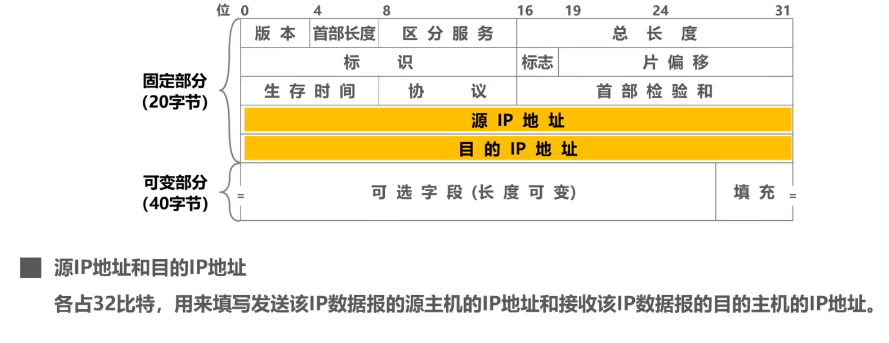

#### 小练习 

1，

- MTU是网络层最大传输单元，包含IP数据报的首部，但不包括数据链路层的帧头

2，题目：

web服务其的IP地址就填写在IP分组头中的目的IP地址字段，IP分组还要封装成以太网帧才能发送：

在IP分组头中，目的IP地址字段前还有16个字节的内容；在以太网帧中，数据载荷前还有14字节的内容；因此可知，在以太网帧中，从第31个字节开始的4个字节实际上就是目的IP地址的内容：

- 题目所给的以太网帧的第一列数据，实际上并不是以太网帧的内容，仅仅作为行号，其增量是16，表示每行有16个字节的内容。
- 以太网帧内容的十六进制形式，和ASCII形式内容如图。

从图中可知，主机的默认网关就是路由器R；而目的MAC地址字段就是以太网帧的前6个字节，其内容就是默认网关的MAC地址：

至于(4)问的修改字段如本图所示：

#### 小结

### 网际控制报文协议ICMP

https://www.bilibili.com/video/BV1c4411d7jb?p=55&spm_id_from=pageDriver

