## （中毒）hadoop安装使用

**中毒版本的留着，也算是一个经验记录**

### 安装基础+搭建伪分布式（视频+博客）

#### 准备工作
- Linux环境：Centos 7.6
- hadoop版本：hadoop3.1.2
- jdk版本：1.8

- 远程登陆：xShell 7
  1. 登录服务器

- vim命令（默认已经会了），只贴本文用到的
  - vi 文件名 打开文件
  - i 编辑
  - Esc 退出编辑
  - :wq 保存并退出
  - 键盘控制光标上下左右

#### 检查&安装JDK

1. 检查系统是否存在openjdk

   ```
   rpm -qa | grep java
   ```
   
   若有java相关的软件显示，则表示存在，进行卸载：
   
   ```
   rpm -e --nodeps jdk 软件名称
   ```
   
   若没有显示，则不存在。
   
2. 下载&解压jdk

   从官网下载gz版的jdk到本机，再用xftp传到linux

   - 这里下载jdk8，因为使用jdk9及以上版本，启动Hadoop时会出现难以解决的问题，我搜索尝试了很多办法，得出结论:目前没有办法通过配置文件解决。
   - linux系统安装java可以参考linux.md笔记

   解压jdk，解压到哪个目录可以自行选择，但是要知道路径，配置环境变量时需要

   ```
   tar -zxvf jdk压缩包名称 -C 解压到哪个目录
   ```

   例如：

   ```
   tar -zxvf jdk-8u181-linux-x64.tar.gz -C /usr/local/
   ```

3. 配置java环境变量

   - 呼应linux.md笔记中的记载：rpm安装java不需要配置安装环境变量；安装包解压安装java需要配置环境变量
   - 配置环境变量时，`PATH=$PATH:`,`CLASSPATH=.:`,`$PATH`和`.`表示承接之前的变量。不带上的话会覆盖之前的环境变量导致出错。
     - 覆盖后也不需要像某些网友说的，就重装系统，可以在环境变量位置前面加上`$PATH`和`.`，在用source使之生效即可。

   打开proflie文件

   ```
   vim /etc/profile
   ```

   将光标移动至文末，按i进入编辑模式，在文末添加以下内容

   ```
   export JAVA_HOME=jdk路径
   export PATH=$PATH:$JAVA_HOME/bin
   export CLASSPATH=.:$JAVA_HOME/lib/dt.jar:$JAVA_HOME/lib/tools.jar
   ```

   例如：

   ```
   export JAVA_HOME=/usr/java/jdk1.8.0_311-amd64
   export PATH=$PATH:$JAVA_HOME/bin
   export CLASSPATH=.:$JAVA_HOME/lib/dt.jar:$JAVA_HOME/lib/tools.jar
   ```

   按Esc键退出编辑，输入 `:wq` 保存并退出文件，执行以下内容使环境变量生效

   ```
   source /etc/profile
   ```

4. 检查jdk是否安装配置成功

   ```
   java -version
   ```

   出现java版本信息，则配置成功，例如

   > java version “1.8.0_181”
   > Java(TM) SE Runtime Environment (build 1.8.0_181-b13)
   > Java HotSpot(TM) 64-Bit Server VM (build 25.181-b13, mixed mode)

#### 配置Hadoop

1. 下载hadoop

   从[官网](https://mirror.bit.edu.cn/apache/hadoop/common)下载hadoop-3.1.2到本机，并用xftp上传到linux服务器

2. 解压hadoop，解压到哪个目录可以自行选择，但是要知道路径，配置环境变量时需要

   ```
   tar -zxvf hadoop-3.1.2.tar.gz -C /usr/local/
   ```

3. 配置hadoop（本文涉及到的zhangyun，均需要改为自己的主机名或者ip）

   1）配置环境变量

   ```
   vim /etc/profile
   ```

   按`i`进入编辑模式，在文末添加

   ```
   export HADOOP_HOME=/hadoop路径
   export PATH=$PATH:$HADOOP_HOME/bin:$HADOOP_HOME/sbin
   ```

   例如

   ```
   export HADOOP_HOME=/usr/local/hadoop-3.1.2
   export PATH=$PATH:$HADOOP_HOME/bin:$HADOOP_HOME/sbin
   ```

   按Esc退出编辑，输入 :wq 保存并退出，执行以下内容使环境变量生效

   ```
   source /etc/profile
   ```

   2）配置hadoop-env.sh

   切到/usr/local/hadoop-3.1.2/etc/hadoop目录下，2）- 6）都是在这个目录下配置

   ```
   cd /usr/local/hadoop-3.1.2/etc/hadoop
   ```

   打开hadoop-env.sh

   ```
   vim hadoop-env.sh
   ```

   使用vim查找功能`/`,找到# export JAVA_HOME=,按i进入编辑模式，修改为以下内容后，按Esc，输入 :wq 保存并退出

   ```
   export JAVA_HOME=/usr/java/jdk1.8.0_311-amd64
   ```

   3）配置core-site.xml，修改为以下内容，其中第5行 zhangyun为自己的主机名（用`hostname查看`）

   ```xml
   <configuration>
       <!--设置namenode所在节点-->
       <property>
           <name>fs.defaultFS</name>
           <value>hdfs://zhangyun:9000</value>
       </property>
       <!--
           设置hadoop存放数据的目录，Hadoop默认把数据块的元数据和数据存放在操作系统的/tmp目录下，但操作系统的/tmp目录会不定时清空，所以要做修改
       -->
       <property>
           <name>hadoop.tmp.dir</name>
           <value>/usr/local/hadoop-3.1.2/data</value>
       </property>
   </configuration>
   ```

   4）配置yarn-site.xml，修改为以下内容，zhangyun 均改为自己的主机名

   ```xml
   <configuration>
       <!-- 指定ResourceManager的地址-->
       <property>
   		<name>yarn.resourcemanager.hostname</name>
   		<value>zhangyun</value>
       </property>
       <property>
   		<name>yarn.resourcemanager.address</name>
   		<value>zhangyun:8032</value>
       </property>
       <property>
   		<name>yarn.resourcemanager.scheduler.address</name>
   		<value>zhangyun:8030</value>
       </property>
       <property>
   		<name>yarn.resourcemanager.resource-tracker.address</name>
   		<value>zhangyun:8031</value>
       </property>
       <property>
   		<name>yarn.resourcemanager.admin.address</name>
   		<value>zhangyun:8033</value>
       </property>
       <property>
   		<name>yarn.resourcemanager.webapp.address</name>
   		<value>zhangyun:8088</value>
       </property>
       <!-- 指定nodemanager获取数据的方式-->
       <property>
           <name>yarn.nodemanager.aux-services</name>
           <value>mapreduce_shuffle</value>
       </property>
   </configuration>
   ```

   5）配置hdfs-site.xml，修改为以下内容

   ```xml
   <configuration>
       <!--设置block副本数，不能超过节点数。伪分布式时因为只有一个节点和多个java进程模拟分布式，所以只能设置为1-->
       <property>
           <name>dfs.replication</name>
           <value>1</value>
       </property>
       <!--这里还能配置dfs.name.dir和dfs.data.dir为非默认位置，不过我们使用默认的，不另行配置-->
   </configuration>
   ```

   6）配置mapred-site.xml，修改为以下内容

   ```xml
   <configuration>
       <property>
           <name>mapreduce.framework.name</name>
           <value>yarn</value>
       </property>
   </configuration>
   ```

   7）配置start-dfs.sh，stop-dfs.sh

   切到/usr/local/hadoop-3.1.2/sbin目录,7）- 8）在这个目录配置

   ```
   cd /usr/local/hadoop-3.1.2/sbin
   ```

   在start-dfs.sh，stop-dfs.sh的最开头添加以下内容，因为是root登录的，不配置会出现错误

   ```
   HDFS_DATANODE_USER=root  
   HDFS_DATANODE_SECURE_USER=hdfs  
   HDFS_NAMENODE_USER=root  
   HDFS_SECONDARYNAMENODE_USER=root
   ```

   8）配置start-yarn.sh，stop-yarn.sh，在文件最开头添加以下内容

   ```
   YARN_RESOURCEMANAGER_USER=root
   HADOOP_SECURE_DN_USER=yarn
   YARN_NODEMANAGER_USER=root
   ```

4. 实现SSH免密码远程登录，因为是伪分布式集群，其实就是自己登录自己（如果已经配置过可跳过）

   1）创建公钥/私钥，一路回车

   ```
   ssh-keygen -t rsa
   ```

   2）创建authorized_keys文件并修改权限为600

   ```
   cd ~/.ssh
   touch authorized_keys
   chmod 600 ~/.ssh/authorized_keys
   chmod 700 ~/.ssh
   ```

   3）将公钥追加到authorized_keys文件中

   ```
   cat id_rsa.pub >> authorized_keys
   ```

   尝试能否免密登录

   ```
   ssh zhangyun(自己的主机名)
   ```

   第一次登录会弹出known_hosts注册提示，选yes，没报错即登录成功！

   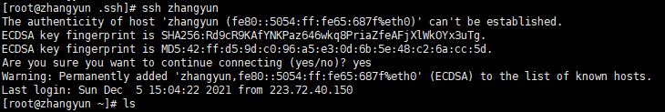

   登陆成功后，输入exit退出

   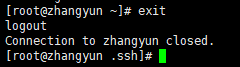

   查看known_hosts下有没有本机，确实有本机.

   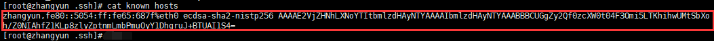

   再次登录zhangyun，这次直接就成功了。因为本机zhangyun已经被known_hosts文件记录了

   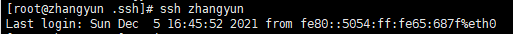

   再次退出ssh

   

   

   **总结：我理解伪分布式就是在一个节点上，用多个java进程模拟分布式。此时的ssh免密登录，其实也就是zhangyun主机（节点）登录zhangyun主机（节点），即自己登录自己。因为是节点免密登录自己，所以我们之前是把公钥id_rsa.pub直接追加到同一目录下的authorized_keys。**

   

   

5. 关闭防火墙（如果已经配置过可跳过）

   查看防火墙状态

   ```
   firewall-cmd --state
   ```

   1）关闭防火墙
   
   - 因为腾讯云本身就有port安全组和防火墙，比较安全，这里关掉即可
   
   ```
   systemctl stop firewalld.service
   ```
   
   2）禁止开机时防火墙自启
   
   ```
   systemctl disable firewalld.service
   ```

#### 格式化&启动&停止hadoop

1. 格式化hadoop，不要多次格式化。多次格式化会导致DataNode无法正常启动，解决办法在文末

   ```
   hadoop namenode -format
   ```

2. 启动

   ```
   start-all.sh
   ```

   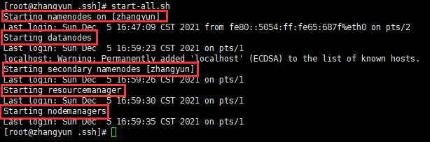

   启动以后可以输入jps，看有没有下面这些进程

   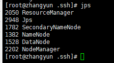

   输入netstat -tpnl | grep java，查看是否有9870和8088端口，刚启动需要等待一会儿才能查询到端口，等待时间视虚拟机情况而定

   ```
   netstat -tpnl | grep java
   ```

   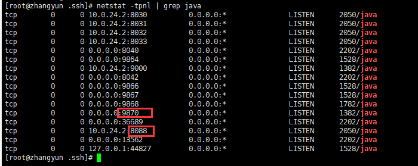

3. &停止hadoop

   ```
   stop-all.sh
   ```

   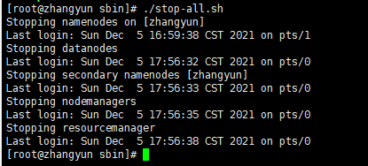

#### 遇到的一些坑

1. 多次格式化会导致DataNode无法正常启动（很多人遇到这个问题）

   1）打开/usr/local/hadoop-3.1.2/data/dfs

   ```
   cd /usr/local/hadoop-3.1.2/data/dfs
   ```

   2）有name和data两个目录，将data/current/VERSION中clusterID的值改为name/current/VERSION中clusterID的值

   找到并复制clusterID的值

   ```
   cat name/current/VERSION
   ```

   修改clusterID的值

   ```
   vi data/current/VERSION
   ```

   3）重新启动hadoop

2. ip:50070无法访问

   hadoop 3.X版本以上，50070端口已改为9870端口，访问ip：9870即可

3. 解决问题的最好办法

   查看logs！如果看不懂请百度。修改之后记得重启hadoop

   - 以本文为例，logs路径为：/usr/local/hadoop-3.1.2/logs


[参考文档](https://yangyefu.github.io/2019/05/07/Centos7%E9%85%8D%E7%BD%AEhadoop3.1.2%20%E4%BC%AA%E5%88%86%E5%B8%83%E5%BC%8F%E8%AF%A6%E7%BB%86%E8%BF%87%E7%A8%8B/)


### ssh+netstat崩坏

安装好hadoop后，断开xshell连接，过段时间再连接时提示ssh无法登录。自己尝试很多办法无法搞定，申请了腾讯云的在线协助。

以下记录所有聊天记录：

>提单信息： 请输入问题描述 ：xshell无法ssh登录；腾讯云网页也无法ssh登录；同时netstat命令不能用了，使用yum尝试安装nettools也失败。 腾讯云网页尝试直接ssh登录服务器报错如下： socket connection established ssH connection failed: connect ECONNREFUSED 120.53.244.17:22* 3SH ERROR:connect ECONNREFUSED 120.53.244.17:22* Connection closed* 轻量服务器ID/名称：lhins-09jwaw6c 登录方式：本地ssh软件登录 服务器系统版本：centos 7.6 登录用户名：root


您好，腾讯云很高兴为您服务，您已接入人工，工程师将尽快为您核实问题处理。

2021-11-17 00:31

您截图看一下


> 好的，我是配置hadoop的时候涉及了ssh，当时一切正常，结果xshell关闭后，重新连接就连不上了


现在扫描22端口关闭了，您用VNC的登录方式重启一下ssh服务
https://cloud.tencent.com/document/product/1207/46824


> 我试过重启，但是报另一个错，你稍等我截图


2021-11-17 00:40

看起来是这个服务有问题了

2021-11-17 00:40

输入提示的命令看一下具体


> 输入这个吗？也报错

用systemctl这个看一下


> 这个吗？我用过了

2021-11-17 00:45

您好，关于您的问题我们已收到，经初步排查，需要为您转接相关负责人为您进一步跟进，请您稍等~

您好：
针对您遇到的问题，腾讯云申请登机排查，请您配合做好【数据备份】，提供云服务器的登录【账号】和【密码】
排查过程中，工程师可能会对您服务器进行重启、或对系统的文件、配置、密码等修改操作。
【请您在会话中文字回复】如下信息：
1、（必填）实例用户名：
2、（必填）实例密码：
3、（必填）是否已完成备份：【已备份（提供备份截图）】 / 【已确认无需备份】
4、（必填）是否允许重启：【允许重启】/【不允许重启】
5、（必填）是否允许读写操作：【允许读写操作】/【不允许读写操作】
授权前，还请您务必在控制台创建镜像、快照备份数据，
制作快照参考：
https://cloud.tencent.com/document/product/1207/48546制作系统镜像参考：
https://cloud.tencent.com/document/product/1207/53038如您数据盘是本地盘，请及时将数据备份本地后授权我们操作。
若您坚持要求腾讯云在您未完成备份情况下即进行排查，如您的数据或业务因此遭受影响且无备份恢复，腾讯云不承担任何责任，感谢您的理解和支持


> \1. root
>
> 2021-11-17 00:49
>
> \2. XXXX
>
> 2021-11-17 00:49
>
> \3.  已备份（提供备份截图）


> 2021-11-17 00:49
>
> 允许重启
>
> 2021-11-17 00:49
>
> \4. 允许重启
>
> 2021-11-17 00:49
>
> \5. 允许读写操作


收到，这边上机协助您尽快查看下问题


> 查到问题的话，麻烦把导致问题的（可能）原因告诉我一下。结合netstat不能使用和安装，结合之前我安装hadoop涉及的ssh。如果可以的话


您好：
1、目前ssh服务的问题已经处理，原因是由于目录文件异常/var/empty/sshd


2、netstat不能使用和安装，目前查看是yum源异常，请您稍等


> 好的，为什么本来没事，突然目录就异常了？这个问题不知道的话，后续可能还会异常


您好，请您稍等，具体的原因稍后一并给您反馈

您好，抱歉让您久等了：
上机已经为您修复，辛苦您进行核实


【问题原因】
1、ssh服务问题，是由于/var/empty/sshd目录权限导致，后续若ssh服务异常，您可以执行：sshd -t或者sshd -D进行查看([ssh的一些参考知识](https://blog.csdn.net/ranrancc_/article/details/96421193)，[该问题网上的解决方法](https://blog.csdn.net/bugzeroman/article/details/89223610)，[相关问题2](https://blog.csdn.net/zhanglh046/article/details/78890432),[本问题解决方法](https://blog.csdn.net/syt124416/article/details/104209591))
2、netstat 无法正常安装是由于yum源的问题导致，报错：报错404直接访问url打不开
http://mirrors.tencentyun.com/centos/$releasever/os/x86_64/repodata/repomd.xml。$releasever变量没有被系统识别，在连接网络yum源的时候，变成了%24releasever；而yum中的变量$releasever是由/etc/yum.conf中的distroverpkg进行定义，还请您知晓。（[参考连接](https://cloud.tencent.com/developer/article/1559023)）

3, xshell提示`WARNING! The remote SSH server rejected X11 forwarding request.`的解决方法见[链接](https://blog.csdn.net/qq_39720249/article/details/87078734).记录方案如下：

- 编辑文件`/etc/ssh/sshd_config`,设置：

  ```
  X11Forwarding yes
  ```

  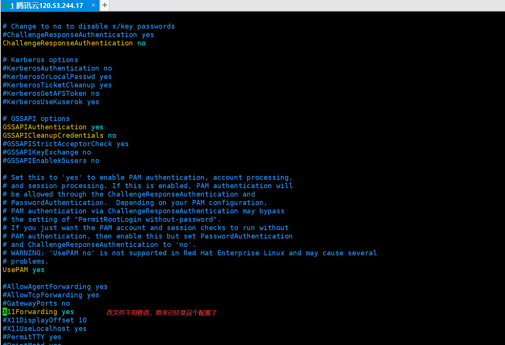

- 配置Xshell 6连接属性，如下图，取消勾取即可：

  

  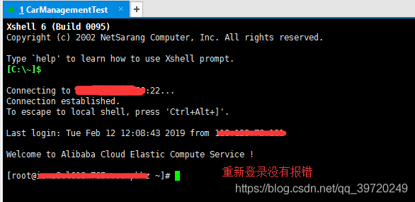


> 2021-11-17 16:03
>
> 但是我还有两个问题
>
> \1. “/var/empty/sshd目录权限”导致的问题，使我不小心修改了权限吗？还是后台某个应用修改的？
>
> \2. “$releasever变量没有被系统识别，在连接网络yum源的时候，变成了%24releasever；”，为什么会发生这个情况？


您好，关于您的问题解答如下：
1.“/var/empty/sshd目录权限”：这个问题判断为您可能有进行openssh升级或者误操作删除了ssh相关文件导致的


```
[一个外国网友的方案](https://askubuntu.com/questions/1110828/ssh-failed-to-start-missing-privilege-separation-directory-var-run-sshd):
I'm experiencing the same problem! And had post the same question (I should post an answer there.). Aparantly this is as bug of the current version of systemd with old kernels. The workaround that I doun is to modify /usr/lib/tmpfiles.d/sshd.conf(本机是/etc/ssh/sshd_config) in this way d /run/sshd 0755 root root. – 
pa4080
 Jan 18
 
 (http://linuxhostingsupport.net/blog/starting-sshd-missing-privilege-separation-directory-varemptysshd):
 It happens when the SSH package is updated, really shouldn’t be disturbing the previous configuration but it does it sometimes.
```

2.$releasever变量没有被系统识别：这个问题是由于可能有操作关于centos-release这个源的配置导致的


### 试用自带的wordcount

以下命令基于：centos7.6+hadoop3.1.2+jdk1.8


来到hadoop的根目录，在我的机器上是`/home/zhangyun/hadoop-3.1.2`

依次执行以下命令：

```bash
# 来到hadoop启动文件的存放位置
[root@zhangyun ~]# cd /home/zhangyun/hadoop-3.1.2/sbin
# 启动hadoop
[root@zhangyun sbin]# ./start-all.sh
Starting namenodes on [zhangyun]
Last login: Wed Nov 17 10:25:54 CST 2021 from 223.72.40.168 on pts/0
zhangyun: @@@@@@@@@@@@@@@@@@@@@@@@@@@@@@@@@@@@@@@@@@@@@@@@@@@@@@@@@@@
zhangyun: @    WARNING: REMOTE HOST IDENTIFICATION HAS CHANGED!     @
zhangyun: @@@@@@@@@@@@@@@@@@@@@@@@@@@@@@@@@@@@@@@@@@@@@@@@@@@@@@@@@@@
zhangyun: IT IS POSSIBLE THAT SOMEONE IS DOING SOMETHING NASTY!
zhangyun: Someone could be eavesdropping on you right now (man-in-the-middle attack)!
zhangyun: It is also possible that a host key has just been changed.
zhangyun: The fingerprint for the ECDSA key sent by the remote host is
zhangyun: SHA256:Q9N55LawH2g4vH1uKKOeaCN7hBRiHGd6PS7ryqHEFfw.
zhangyun: Please contact your system administrator.
zhangyun: Add correct host key in /root/.ssh/known_hosts to get rid of this message.
zhangyun: Offending ECDSA key in /root/.ssh/known_hosts:2
zhangyun: Password authentication is disabled to avoid man-in-the-middle attacks.
zhangyun: Keyboard-interactive authentication is disabled to avoid man-in-the-middle attacks.
Starting datanodes
Last login: Wed Nov 17 10:31:53 CST 2021 on pts/0
localhost: @@@@@@@@@@@@@@@@@@@@@@@@@@@@@@@@@@@@@@@@@@@@@@@@@@@@@@@@@@@
localhost: @    WARNING: REMOTE HOST IDENTIFICATION HAS CHANGED!     @
localhost: @@@@@@@@@@@@@@@@@@@@@@@@@@@@@@@@@@@@@@@@@@@@@@@@@@@@@@@@@@@
localhost: IT IS POSSIBLE THAT SOMEONE IS DOING SOMETHING NASTY!
localhost: Someone could be eavesdropping on you right now (man-in-the-middle attack)!
localhost: It is also possible that a host key has just been changed.
localhost: The fingerprint for the ECDSA key sent by the remote host is
localhost: SHA256:Q9N55LawH2g4vH1uKKOeaCN7hBRiHGd6PS7ryqHEFfw.
localhost: Please contact your system administrator.
localhost: Add correct host key in /root/.ssh/known_hosts to get rid of this message.
localhost: Offending ECDSA key in /root/.ssh/known_hosts:3
localhost: Password authentication is disabled to avoid man-in-the-middle attacks.
localhost: Keyboard-interactive authentication is disabled to avoid man-in-the-middle attacks.
Starting secondary namenodes [zhangyun]
Last login: Wed Nov 17 10:31:58 CST 2021 on pts/0
zhangyun: @@@@@@@@@@@@@@@@@@@@@@@@@@@@@@@@@@@@@@@@@@@@@@@@@@@@@@@@@@@
zhangyun: @    WARNING: REMOTE HOST IDENTIFICATION HAS CHANGED!     @
zhangyun: @@@@@@@@@@@@@@@@@@@@@@@@@@@@@@@@@@@@@@@@@@@@@@@@@@@@@@@@@@@
zhangyun: IT IS POSSIBLE THAT SOMEONE IS DOING SOMETHING NASTY!
zhangyun: Someone could be eavesdropping on you right now (man-in-the-middle attack)!
zhangyun: It is also possible that a host key has just been changed.
zhangyun: The fingerprint for the ECDSA key sent by the remote host is
zhangyun: SHA256:Q9N55LawH2g4vH1uKKOeaCN7hBRiHGd6PS7ryqHEFfw.
zhangyun: Please contact your system administrator.
zhangyun: Add correct host key in /root/.ssh/known_hosts to get rid of this message.
zhangyun: Offending ECDSA key in /root/.ssh/known_hosts:2
zhangyun: Password authentication is disabled to avoid man-in-the-middle attacks.
zhangyun: Keyboard-interactive authentication is disabled to avoid man-in-the-middle attacks.
Starting resourcemanager
Last login: Wed Nov 17 10:32:03 CST 2021 on pts/0
Starting nodemanagers
Last login: Wed Nov 17 10:32:10 CST 2021 on pts/0
localhost: @@@@@@@@@@@@@@@@@@@@@@@@@@@@@@@@@@@@@@@@@@@@@@@@@@@@@@@@@@@
localhost: @    WARNING: REMOTE HOST IDENTIFICATION HAS CHANGED!     @
localhost: @@@@@@@@@@@@@@@@@@@@@@@@@@@@@@@@@@@@@@@@@@@@@@@@@@@@@@@@@@@
localhost: IT IS POSSIBLE THAT SOMEONE IS DOING SOMETHING NASTY!
localhost: Someone could be eavesdropping on you right now (man-in-the-middle attack)!
localhost: It is also possible that a host key has just been changed.
localhost: The fingerprint for the ECDSA key sent by the remote host is
localhost: SHA256:Q9N55LawH2g4vH1uKKOeaCN7hBRiHGd6PS7ryqHEFfw.
localhost: Please contact your system administrator.
localhost: Add correct host key in /root/.ssh/known_hosts to get rid of this message.
localhost: Offending ECDSA key in /root/.ssh/known_hosts:3
localhost: Password authentication is disabled to avoid man-in-the-middle attacks.
localhost: Keyboard-interactive authentication is disabled to avoid man-in-the-middle attacks.
[root@zhangyun sbin]#

# 来到hadoop根目录
[root@zhangyun ~]# cd /home/zhangyun/hadoop-3.1.2/
[root@zhangyun hadoop-3.1.2]# ls
bin  data  etc  include  lib  libexec  LICENSE.txt  logs  NOTICE.txt  README.txt  sbin  share
# 创建用于存放本地待分析文件的文件夹，并把待分析文件放进去
[root@zhangyun hadoop-3.1.2]# mkdir file
[root@zhangyun hadoop-3.1.2]# ls
bin  data  etc  file  include  lib  libexec  LICENSE.txt  logs  NOTICE.txt  README.txt  sbin  share
[root@zhangyun hadoop-3.1.2]# cp README.txt file
[root@zhangyun hadoop-3.1.2]# cd file
[root@zhangyun file]# ls
README.txt
# 回到hadoop根目录，因为很多文件要从hadoop根目录往下去找
[root@zhangyun file]# cd ../
# 在hdfs上创建input文件夹，hadoop计算的时候，我指定从这个文件夹中读文件
[root@zhangyun hadoop-3.1.2]# bin/hadoop fs -mkdir /input
# 把根目录的file/README.txt上传到hdfs的/input目录中
[root@zhangyun hadoop-3.1.2]# bin/hadoop fs -put file/README.txt /input
# 使用mapreduce自带的wordcount函数，对于hadoop3.1.2来说这个函数在以下的目录和jar包中。处理hdfs的/input/README.txt，并把结果输出到hdfs的/output中。运行发生了错误！！！！！！
[root@zhangyun hadoop-3.1.2]# bin/hadoop jar share/hadoop/mapreduce/hadoop-mapreduce-examples-3.1.2.jar wordcount /input/README.txt /output
2021-11-17 11:29:09,204 INFO client.RMProxy: Connecting to ResourceManager at zhangyun/10.0.24.2:8032
2021-11-17 11:29:09,871 INFO mapreduce.JobResourceUploader: Disabling Erasure Coding for path: /tmp/hadoop-yarn/staging/root/.staging/job_1637116334826_0002
2021-11-17 11:29:10,496 INFO input.FileInputFormat: Total input files to process : 1
2021-11-17 11:29:10,632 INFO mapreduce.JobSubmitter: number of splits:1
2021-11-17 11:29:10,797 INFO mapreduce.JobSubmitter: Submitting tokens for job: job_1637116334826_0002
2021-11-17 11:29:10,798 INFO mapreduce.JobSubmitter: Executing with tokens: []
2021-11-17 11:29:10,988 INFO conf.Configuration: resource-types.xml not found
2021-11-17 11:29:10,989 INFO resource.ResourceUtils: Unable to find 'resource-types.xml'.
2021-11-17 11:29:11,245 INFO impl.YarnClientImpl: Submitted application application_1637116334826_0002
2021-11-17 11:29:11,290 INFO mapreduce.Job: The url to track the job: http://zhangyun:8088/proxy/application_1637116334826_0002/
2021-11-17 11:29:11,290 INFO mapreduce.Job: Running job: job_1637116334826_0002
2021-11-17 11:29:15,327 INFO mapreduce.Job: Job job_1637116334826_0002 running in uber mode : false
2021-11-17 11:29:15,328 INFO mapreduce.Job:  map 0% reduce 0%
2021-11-17 11:29:15,345 INFO mapreduce.Job: Job job_1637116334826_0002 failed with state FAILED due to: Application application_1637116334826_0002 failed 2 times due to AM Container for appattempt_1637116334826_0002_000002 exited with  exitCode: 1
Failing this attempt.Diagnostics: [2021-11-17 11:29:15.205]Exception from container-launch.
Container id: container_1637116334826_0002_02_000001
Exit code: 1

[2021-11-17 11:29:15.208]Container exited with a non-zero exit code 1. Error file: prelaunch.err.
Last 4096 bytes of prelaunch.err :
Last 4096 bytes of stderr :
Error: Could not find or load main class org.apache.hadoop.mapreduce.v2.app.MRAppMaster

Please check whether your etc/hadoop/mapred-site.xml contains the below configuration:
<property>
  <name>yarn.app.mapreduce.am.env</name>
  <value>HADOOP_MAPRED_HOME=${full path of your hadoop distribution directory}</value>
</property>
<property>
  <name>mapreduce.map.env</name>
  <value>HADOOP_MAPRED_HOME=${full path of your hadoop distribution directory}</value>
</property>
<property>
  <name>mapreduce.reduce.env</name>
  <value>HADOOP_MAPRED_HOME=${full path of your hadoop distribution directory}</value>
</property>

[2021-11-17 11:29:15.209]Container exited with a non-zero exit code 1. Error file: prelaunch.err.
Last 4096 bytes of prelaunch.err :
Last 4096 bytes of stderr :
Error: Could not find or load main class org.apache.hadoop.mapreduce.v2.app.MRAppMaster

Please check whether your etc/hadoop/mapred-site.xml contains the below configuration:
<property>
  <name>yarn.app.mapreduce.am.env</name>
  <value>HADOOP_MAPRED_HOME=${full path of your hadoop distribution directory}</value>
</property>
<property>
  <name>mapreduce.map.env</name>
  <value>HADOOP_MAPRED_HOME=${full path of your hadoop distribution directory}</value>
</property>
<property>
  <name>mapreduce.reduce.env</name>
  <value>HADOOP_MAPRED_HOME=${full path of your hadoop distribution directory}</value>
</property>

For more detailed output, check the application tracking page: http://zhangyun:8088/cluster/app/application_1637116334826_0002 Then click on links to logs of each attempt.
. Failing the application.
2021-11-17 11:29:15,361 INFO mapreduce.Job: Counters: 0
[root@zhangyun hadoop-3.1.2]# hadoop path
ERROR: path is not COMMAND nor fully qualified CLASSNAME.
Usage: hadoop [OPTIONS] SUBCOMMAND [SUBCOMMAND OPTIONS]
 or    hadoop [OPTIONS] CLASSNAME [CLASSNAME OPTIONS]
  where CLASSNAME is a user-provided Java class

  OPTIONS is none or any of:

buildpaths                       attempt to add class files from build tree
--config dir                     Hadoop config directory
--debug                          turn on shell script debug mode
--help                           usage information
hostnames list[,of,host,names]   hosts to use in slave mode
hosts filename                   list of hosts to use in slave mode
loglevel level                   set the log4j level for this command
workers                          turn on worker mode

  SUBCOMMAND is one of:


    Admin Commands:

daemonlog     get/set the log level for each daemon

    Client Commands:

archive       create a Hadoop archive
checknative   check native Hadoop and compression libraries availability
classpath     prints the class path needed to get the Hadoop jar and the required libraries
conftest      validate configuration XML files
credential    interact with credential providers
distch        distributed metadata changer
distcp        copy file or directories recursively
dtutil        operations related to delegation tokens
envvars       display computed Hadoop environment variables
fs            run a generic filesystem user client
gridmix       submit a mix of synthetic job, modeling a profiled from production load
jar <jar>     run a jar file. NOTE: please use "yarn jar" to launch YARN applications, not this command.
jnipath       prints the java.library.path
kdiag         Diagnose Kerberos Problems
kerbname      show auth_to_local principal conversion
key           manage keys via the KeyProvider
rumenfolder   scale a rumen input trace
rumentrace    convert logs into a rumen trace
s3guard       manage metadata on S3
trace         view and modify Hadoop tracing settings
version       print the version

    Daemon Commands:

kms           run KMS, the Key Management Server

SUBCOMMAND may print help when invoked w/o parameters or with -h.
```

现在根据报错提示处理一下这个错误，查看mapred-site.xml中是否缺少对应的property。vim查看后发现确实缺少了。用以下命令得到`${full path of your hadoop distribution directory}`

```
[root@zhangyun hadoop-3.1.2]# hadoop classpath
/home/zhangyun/hadoop-3.1.2/etc/hadoop:/home/zhangyun/hadoop-3.1.2/share/hadoop/common/lib/*:/home/zhangyun/hadoop-3.1.2/share/hadoop/common/*:/home/zhangyun/hadoop-3.1.2/share/hadoop/hdfs:/home/zhangyun/hadoop-3.1.2/share/hadoop/hdfs/lib/*:/home/zhangyun/hadoop-3.1.2/share/hadoop/hdfs/*:/home/zhangyun/hadoop-3.1.2/share/hadoop/mapreduce/lib/*:/home/zhangyun/hadoop-3.1.2/share/hadoop/mapreduce/*:/home/zhangyun/hadoop-3.1.2/share/hadoop/yarn:/home/zhangyun/hadoop-3.1.2/share/hadoop/yarn/lib/*:/home/zhangyun/hadoop-3.1.2/share/hadoop/yarn/*
```

在mapred-site.xml中添加报错提示的内容,并把${full path of your hadoop distribution directory}替换为自己查到的目录：

```
# 在hadoop根目录执行下列命令
cd ./etc/hadoop

[root@zhangyun hadoop]# vim mapred-site.xml 
```

mapred-site.xml 中添加如下property

```
<property>
  <name>yarn.app.mapreduce.am.env</name>
  <value>HADOOP_MAPRED_HOME=/home/zhangyun/hadoop-3.1.2/etc/hadoop:/home/zhangyun/hadoop-3.1.2/share/hadoop/common/lib/*:/home/zhangyun/hadoop-3.1.2/share/hadoop/common/*:/home/zhangyun/hadoop-3.1.2/share/hadoop/hdfs:/home/zhangyun/hadoop-3.1.2/share/hadoop/hdfs/lib/*:/home/zhangyun/hadoop-3.1.2/share/hadoop/hdfs/*:/home/zhangyun/hadoop-3.1.2/share/hadoop/mapreduce/lib/*:/home/zhangyun/hadoop-3.1.2/share/hadoop/mapreduce/*:/home/zhangyun/hadoop-3.1.2/share/hadoop/yarn:/home/zhangyun/hadoop-3.1.2/share/hadoop/yarn/lib/*:/home/zhangyun/hadoop-3.1.2/share/hadoop/yarn/*
</value>
</property>
<property>
  <name>mapreduce.map.env</name>
  <value>HADOOP_MAPRED_HOME=/home/zhangyun/hadoop-3.1.2/etc/hadoop:/home/zhangyun/hadoop-3.1.2/share/hadoop/common/lib/*:/home/zhangyun/hadoop-3.1.2/share/hadoop/common/*:/home/zhangyun/hadoop-3.1.2/share/hadoop/hdfs:/home/zhangyun/hadoop-3.1.2/share/hadoop/hdfs/lib/*:/home/zhangyun/hadoop-3.1.2/share/hadoop/hdfs/*:/home/zhangyun/hadoop-3.1.2/share/hadoop/mapreduce/lib/*:/home/zhangyun/hadoop-3.1.2/share/hadoop/mapreduce/*:/home/zhangyun/hadoop-3.1.2/share/hadoop/yarn:/home/zhangyun/hadoop-3.1.2/share/hadoop/yarn/lib/*:/home/zhangyun/hadoop-3.1.2/share/hadoop/yarn/*
</value>
</property>
<property>
  <name>mapreduce.reduce.env</name>
  <value>HADOOP_MAPRED_HOME=/home/zhangyun/hadoop-3.1.2/etc/hadoop:/home/zhangyun/hadoop-3.1.2/share/hadoop/common/lib/*:/home/zhangyun/hadoop-3.1.2/share/hadoop/common/*:/home/zhangyun/hadoop-3.1.2/share/hadoop/hdfs:/home/zhangyun/hadoop-3.1.2/share/hadoop/hdfs/lib/*:/home/zhangyun/hadoop-3.1.2/share/hadoop/hdfs/*:/home/zhangyun/hadoop-3.1.2/share/hadoop/mapreduce/lib/*:/home/zhangyun/hadoop-3.1.2/share/hadoop/mapreduce/*:/home/zhangyun/hadoop-3.1.2/share/hadoop/yarn:/home/zhangyun/hadoop-3.1.2/share/hadoop/yarn/lib/*:/home/zhangyun/hadoop-3.1.2/share/hadoop/yarn/*
</value>
</property>
```


重回正轨

```bash
# 回到hadoop根目录
[root@zhangyun hadoop]# cd ../../
# 重新执行wordcount，执行成功
[root@zhangyun hadoop-3.1.2]# bin/hadoop jar share/hadoop/mapreduce/hadoop-mapreduce-examples-3.1.2.jar wordcount /input/README.txt /output
2021-11-17 11:46:12,476 INFO client.RMProxy: Connecting to ResourceManager at zhangyun/10.0.24.2:8032
2021-11-17 11:46:13,176 INFO mapreduce.JobResourceUploader: Disabling Erasure Coding for path: /tmp/hadoop-yarn/staging/root/.staging/job_1637116334826_0003
2021-11-17 11:46:13,384 INFO input.FileInputFormat: Total input files to process : 1
2021-11-17 11:46:13,461 INFO mapreduce.JobSubmitter: number of splits:1
2021-11-17 11:46:13,626 INFO mapreduce.JobSubmitter: Submitting tokens for job: job_1637116334826_0003
2021-11-17 11:46:13,627 INFO mapreduce.JobSubmitter: Executing with tokens: []
2021-11-17 11:46:13,823 INFO conf.Configuration: resource-types.xml not found
2021-11-17 11:46:13,824 INFO resource.ResourceUtils: Unable to find 'resource-types.xml'.
2021-11-17 11:46:13,888 INFO impl.YarnClientImpl: Submitted application application_1637116334826_0003
2021-11-17 11:46:13,928 INFO mapreduce.Job: The url to track the job: http://zhangyun:8088/proxy/application_1637116334826_0003/
2021-11-17 11:46:13,928 INFO mapreduce.Job: Running job: job_1637116334826_0003
2021-11-17 11:46:21,026 INFO mapreduce.Job: Job job_1637116334826_0003 running in uber mode : false
2021-11-17 11:46:21,027 INFO mapreduce.Job:  map 0% reduce 0%
2021-11-17 11:46:26,090 INFO mapreduce.Job:  map 100% reduce 0%
2021-11-17 11:46:31,124 INFO mapreduce.Job:  map 100% reduce 100%
2021-11-17 11:46:32,136 INFO mapreduce.Job: Job job_1637116334826_0003 completed successfully
2021-11-17 11:46:32,224 INFO mapreduce.Job: Counters: 53
	File System Counters
		FILE: Number of bytes read=1836
		FILE: Number of bytes written=438611
		FILE: Number of read operations=0
		FILE: Number of large read operations=0
		FILE: Number of write operations=0
		HDFS: Number of bytes read=1468
		HDFS: Number of bytes written=1306
		HDFS: Number of read operations=8
		HDFS: Number of large read operations=0
		HDFS: Number of write operations=2
	Job Counters 
		Launched map tasks=1
		Launched reduce tasks=1
		Data-local map tasks=1
		Total time spent by all maps in occupied slots (ms)=2638
		Total time spent by all reduces in occupied slots (ms)=3317
		Total time spent by all map tasks (ms)=2638
		Total time spent by all reduce tasks (ms)=3317
		Total vcore-milliseconds taken by all map tasks=2638
		Total vcore-milliseconds taken by all reduce tasks=3317
		Total megabyte-milliseconds taken by all map tasks=2701312
		Total megabyte-milliseconds taken by all reduce tasks=3396608
	Map-Reduce Framework
		Map input records=31
		Map output records=179
		Map output bytes=2055
		Map output materialized bytes=1836
		Input split bytes=102
		Combine input records=179
		Combine output records=131
		Reduce input groups=131
		Reduce shuffle bytes=1836
		Reduce input records=131
		Reduce output records=131
		Spilled Records=262
		Shuffled Maps =1
		Failed Shuffles=0
		Merged Map outputs=1
		GC time elapsed (ms)=139
		CPU time spent (ms)=1170
		Physical memory (bytes) snapshot=482385920
		Virtual memory (bytes) snapshot=5622079488
		Total committed heap usage (bytes)=389545984
		Peak Map Physical memory (bytes)=297500672
		Peak Map Virtual memory (bytes)=2809237504
		Peak Reduce Physical memory (bytes)=184885248
		Peak Reduce Virtual memory (bytes)=2812841984
	Shuffle Errors
		BAD_ID=0
		CONNECTION=0
		IO_ERROR=0
		WRONG_LENGTH=0
		WRONG_MAP=0
		WRONG_REDUCE=0
	File Input Format Counters 
		Bytes Read=1366
	File Output Format Counters 
		Bytes Written=1306
# 查看hdfs输出文件夹中的计算结果
[root@zhangyun hadoop-3.1.2]# bin/hadoop fs -ls /output
Found 2 items
-rw-r--r--   1 root supergroup          0 2021-11-17 11:46 /output/_SUCCESS
-rw-r--r--   1 root supergroup       1306 2021-11-17 11:46 /output/part-r-00000
[root@zhangyun hadoop-3.1.2]# bin/hadoop fs -cat /output/part-r-00000
(BIS),	1
(ECCN)	1
(TSU)	1
(see	1
5D002.C.1,	1
740.13)	1
<http://www.wassenaar.org/>	1
Administration	1
Apache	1
BEFORE	1
BIS	1
Bureau	1
Commerce,	1
Commodity	1
Control	1
Core	1
Department	1
ENC	1
Exception	1
Export	2
For	1
Foundation	1
Government	1
Hadoop	1
Hadoop,	1
Industry	1
Jetty	1
License	1
Number	1
Regulations,	1
SSL	1
Section	1
Security	1
See	1
Software	2
Technology	1
The	4
This	1
U.S.	1
Unrestricted	1
about	1
algorithms.	1
and	6
and/or	1
another	1
any	1
as	1
asymmetric	1
at:	2
both	1
by	1
check	1
classified	1
code	1
code.	1
concerning	1
country	1
country's	1
country,	1
cryptographic	3
currently	1
details	1
distribution	2
eligible	1
encryption	3
exception	1
export	1
following	1
for	3
form	1
from	1
functions	1
has	1
have	1
http://hadoop.apache.org/core/	1
http://wiki.apache.org/hadoop/	1
if	1
import,	2
in	1
included	1
includes	2
information	2
information.	1
is	1
it	1
latest	1
laws,	1
libraries	1
makes	1
manner	1
may	1
more	2
mortbay.org.	1
object	1
of	5
on	2
or	2
our	2
performing	1
permitted.	1
please	2
policies	1
possession,	2
project	1
provides	1
re-export	2
regulations	1
reside	1
restrictions	1
security	1
see	1
software	2
software,	2
software.	2
software:	1
source	1
the	8
this	3
to	2
under	1
use,	2
uses	1
using	2
visit	1
website	1
which	2
wiki,	1
with	1
written	1
you	1
your	1
[root@zhangyun hadoop-3.1.2]#
```


## （成功）跟官网安装hadoop2.10.1

环境：

- centos7.6（腾讯云轻量级应用服务器）
- jdk1.8 arm 64，**一定要官方下载，否则可能中毒欲哭无泪，球球**
- hadoop2.10.1，**一定要官方下载，否则可能中毒欲哭无泪，球球**
- **强烈推荐**阅读[官方文档](https://hadoop.apache.org/docs/r2.10.1/hadoop-project-dist/hadoop-common/SingleCluster.html#Pseudo-Distributed_Operation)，比狗屎csdn好一万倍！！！！
  - 技术或者学术，亦或是简单地安装软件。建议先学习原理等基础知识，再结合多方面信息源基础学习，然后按照官方/权威指南进行操作，才能少走弯路。


### 安装预备软件

#### jdk

1. 检查系统是否存在openjdk

   ```
   rpm -qa | grep java
   ```

   若有java相关的软件显示，则表示存在，进行卸载：

   ```
   rpm -e --nodeps jdk 软件名称
   ```

   若没有显示，则不存在。

2. rpm方式安装jdk

   从[官网](https://www.oracle.com/java/technologies/downloads/#java8)下载jdk

   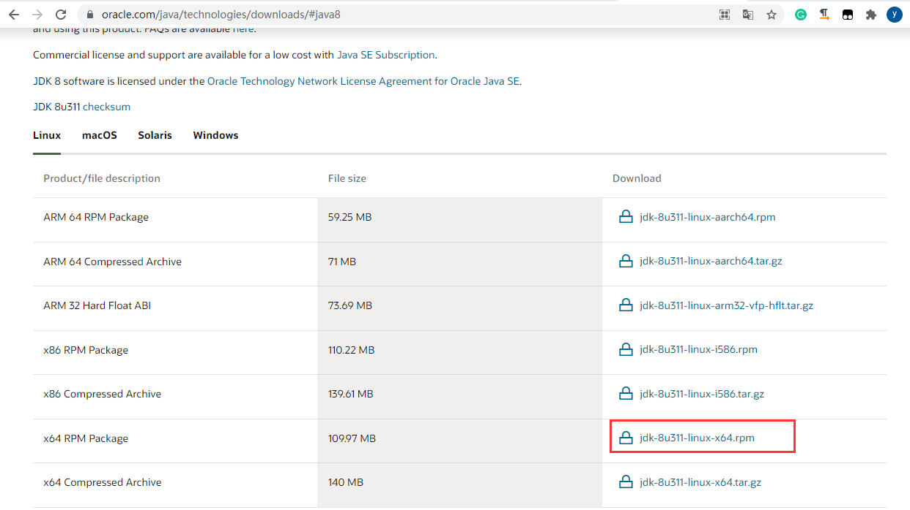

   

   使用XFTP把下载的rpm文件，上传到/home/zhangyun(用户目录)

   

   安装jdk.rpm包

   ```
   rpm -ivh jdk-8u311-linux-x64.rpm
   ```

   使用`java -version`查看是否安装成功

   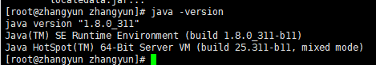

3. 配置java环境变量

   - 呼应linux.md笔记中的记载：rpm安装java不需要配置安装环境变量；安装包解压安装java需要配置环境变量
   - 配置环境变量时，`PATH=$PATH:`,`CLASSPATH=.:`,`$PATH`和`.`表示承接之前的变量。不带上的话会覆盖之前的环境变量导致出错。
     - 覆盖后也不需要像某些网友说的，就重装系统，可以在环境变量位置前面加上`$PATH`和`.`，在用source使之生效即可。

   打开proflie文件

   ```
   vim /etc/profile
   ```

   将光标移动至文末，按i进入编辑模式，在文末添加以下内容

   ```
   export JAVA_HOME=jdk路径
   export PATH=$PATH:$JAVA_HOME/bin
   export CLASSPATH=.:$JAVA_HOME/lib/dt.jar:$JAVA_HOME/lib/tools.jar
   ```

   例如：

   ```
   export JAVA_HOME=/usr/java/jdk1.8.0_311-amd64
   export PATH=$PATH:$JAVA_HOME/bin
   export CLASSPATH=.:$JAVA_HOME/lib/dt.jar:$JAVA_HOME/lib/tools.jar
   ```

   按Esc键退出编辑，输入 `:wq` 保存并退出文件，执行以下内容使环境变量生效

   ```
   source /etc/profile
   ```

4. 检查jdk是否安装配置成功

   ```
   java -version
   ```

   出现java版本信息，则配置成功，例如

   > java version “1.8.0_181”
   > Java(TM) SE Runtime Environment (build 1.8.0_181-b13)
   > Java HotSpot(TM) 64-Bit Server VM (build 25.181-b13, mixed mode)

#### ssh

确保自己的系统有ssh

```
ps -e |grep ssh
```


不存在的话如下安装ssh

```
apt-get install ssh
```

#### rsync

确保确保自己的系统有rsync

```
# 出现帮助信息则说明已安装
rsync
```

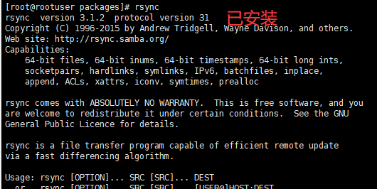

没安装的话如下安装

```
apt-get install rsync
```


### 安装配置hadoop

#### 下载并解压hadoop

**从[官网](https://mirror.bit.edu.cn/apache/hadoop/common)下载**一个common版本的hadoop到本机，课程推荐hadoop-2.10.1，就下载它。并把下载到本地的hadoop包上传到linux服务器。

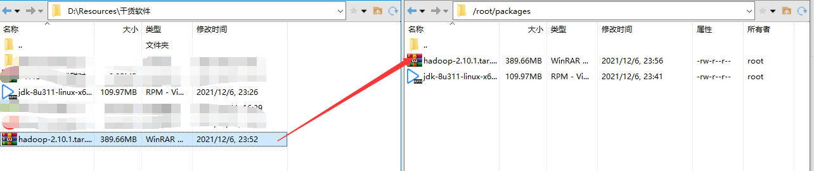

解压下载好的hadoop-2.10.1.tar.gz包，解压到/usr/local/文件夹下，一般解压都放在这。

```
tar -zxvf hadoop-2.10.1.tar.gz -C /usr/local/
```


#### 为开启hadoop集群做准备

在解压目录的etc/hadoop/hadoop-env.sh中，配置javahome (rpm方式安装的java的javahome在/usr/java/jdk1.8.0_311-amd64)

```
cd /usr/local/hadoop-2.10.1/etc/hadoop/

vim hadoop-env.sh
```

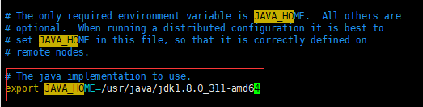

#### 修改配置文件

1）修改etc/hadoop/core-site.xml:

```
cd /usr/local/hadoop-2.10.1/etc/hadoop

vim core-site.xml
```

修改为如下内容

```
<configuration>
    <property>
        <name>fs.defaultFS</name>
        <!--如果需要远程操作hadoop，这里的localhost改成主机的外网ip
        如果只需要在本地操作hadoop，使用hostname命令，查看本机hostname填入即可
        
        ！外网ip不行，localhost（官方）即可-->
        <value>hdfs://localhost:9000</value>
    </property>
    <property>
        <name>hadoop.tmp.dir</name>
        <value>/usr/local/hadoop-2.10.1/hadoopTmpDir</value>
        <description>指定Hadoop运行时产生文件的存储目录。一定要自己配置，不然会被删</description>
    </property>
</configuration>
```

2）修改etc/hadoop/hdfs-site.xml:

修改成如下内容

```
<configuration>
    <property>
        <name>dfs.replication</name>
        <value>1</value>
    </property>
</configuration>
```

#### 配置ssh免密登录

使用如下命令查看是否可以免密登录本地

```
ssh localhost
```

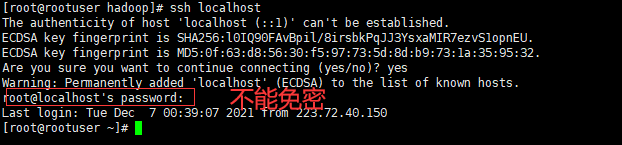

如果不能免密的话，输入如下命令

```
ssh-keygen -t rsa -P '' -f ~/.ssh/id_rsa
cat ~/.ssh/id_rsa.pub >> ~/.ssh/authorized_keys
chmod 0600 ~/.ssh/authorized_keys
```

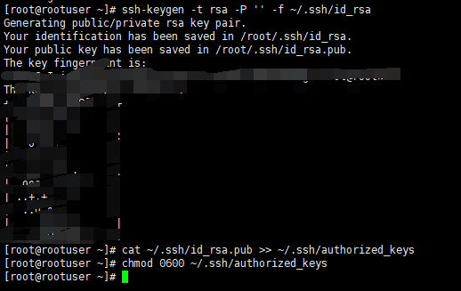

#### 执行

The following instructions are to run a MapReduce job locally. If you want to execute a job on YARN, see [YARN on Single Node](https://hadoop.apache.org/docs/r2.10.1/hadoop-project-dist/hadoop-common/SingleCluster.html#YARN_on_Single_Node).

1）Format the filesystem:

```
cd /usr/local/hadoop-2.10.1

bin/hdfs namenode -format
```

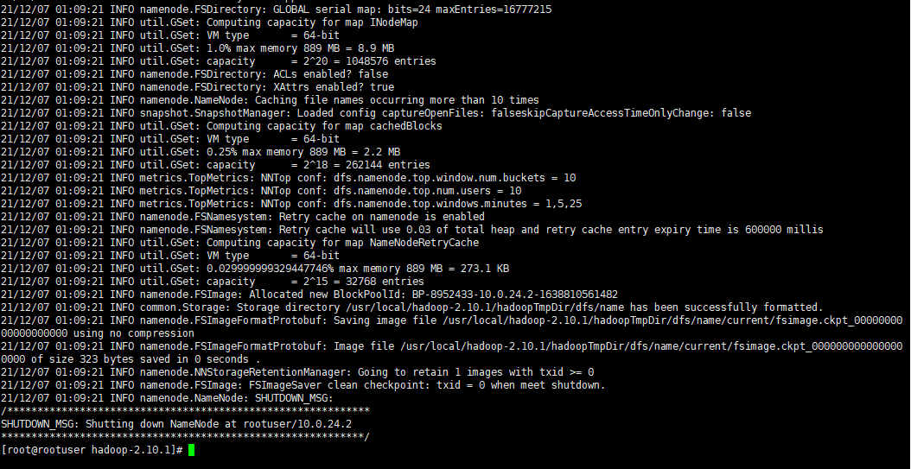

2）Start NameNode daemon and DataNode daemon:这回免密了。

```
sbin/start-dfs.sh
```

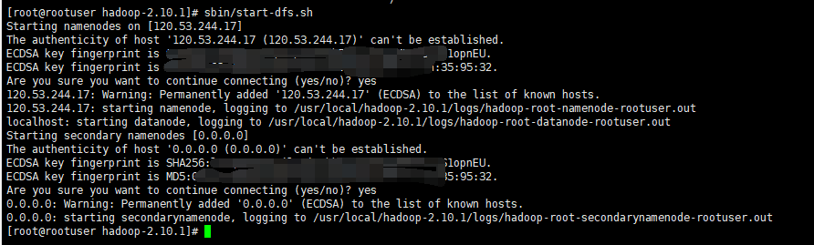

The hadoop daemon log output is written to the `$HADOOP_LOG_DIR` directory (defaults to `$HADOOP_HOME/logs`).

3）Browse the web interface for the NameNode; by default it is available at:

- NameNode - `http://主机ip:50070/`

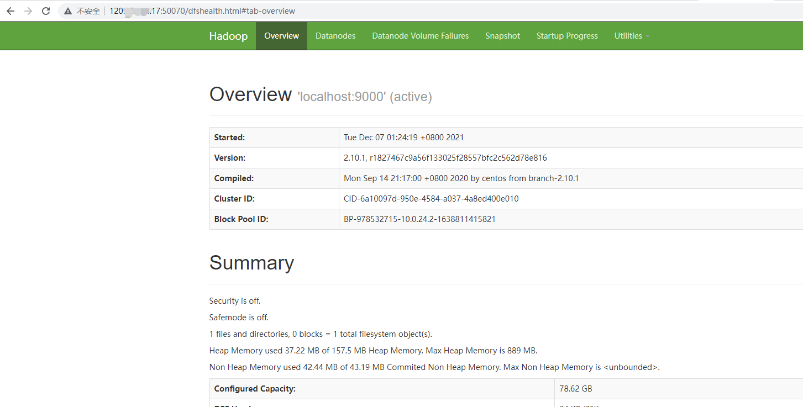

使用jps查看进程

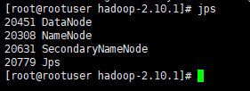


4）execute MapReduce jobs:这部分参考”中毒章节“的程序执行即可，不同版本的hadoop命令可能有差别，但是操作思路一致。

4.1）Make the HDFS directories required to execute MapReduce jobs:

```
cd /usr/local/hadoop-2.10.1

bin/hdfs dfs -mkdir /user
bin/hdfs dfs -mkdir /user/<username>
```

4.2）Copy the input files into the distributed filesystem:

```
bin/hdfs dfs -put etc/hadoop input
```

报错：

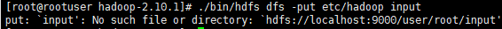

参考[网址](https://stackoverflow.com/questions/28266722/hdfs-error-put-input-no-such-file-or-directory),猜测是因为官网提供的代码在“input”**前漏了“/”**,加上斜杠重新执行就成功了：


查看hdfs监视站，可以看到`/input`下已经有被传上来的hadoop文件夹了

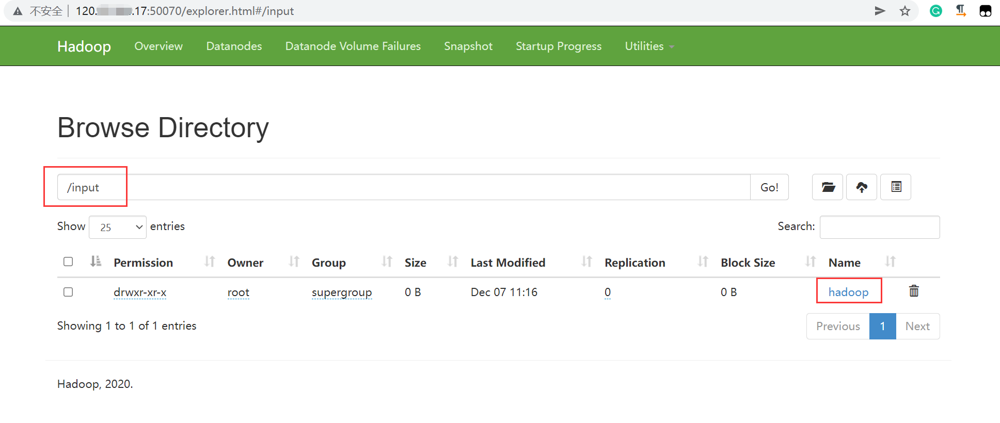

4.3）Run some of the examples provided:

```
bin/hadoop jar share/hadoop/mapreduce/hadoop-mapreduce-examples-2.10.1.jar grep input output 'dfs[a-z.]+'
```

报错：

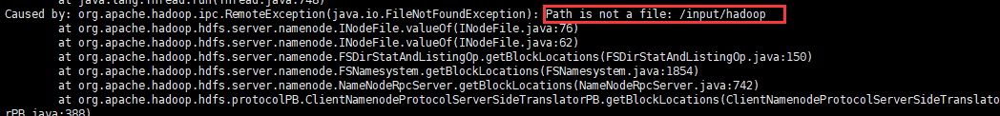

这是因为input下面不是文件，而是hadoop文件夹，把命令修改为如下

```
bin/hadoop jar share/hadoop/mapreduce/hadoop-mapreduce-examples-2.10.1.jar grep /input/hadoop output 'dfs[a-z.]+'
```

出现警告：

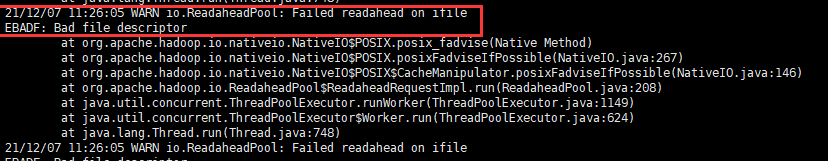

参考这篇[文章](https://www.jianshu.com/p/d287f3b03acb)，警告忽略

发现错误：

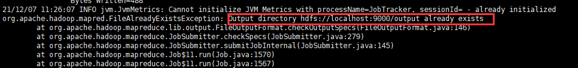

参考这篇[文章](https://blog.csdn.net/weixin_42970433/article/details/109137205)。Hadoop 运行程序时，输出目录不能存在，查看是否存在输出目录：

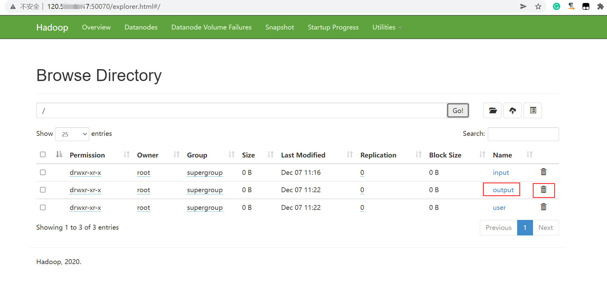

确实存在输出目录，删掉目录（通过如下命令行删除，在50010页面无法删除）后重新执行语句

```
# 删除hdfs目录
bin/hdfs dfs -rm -r /output
```

执行成功：

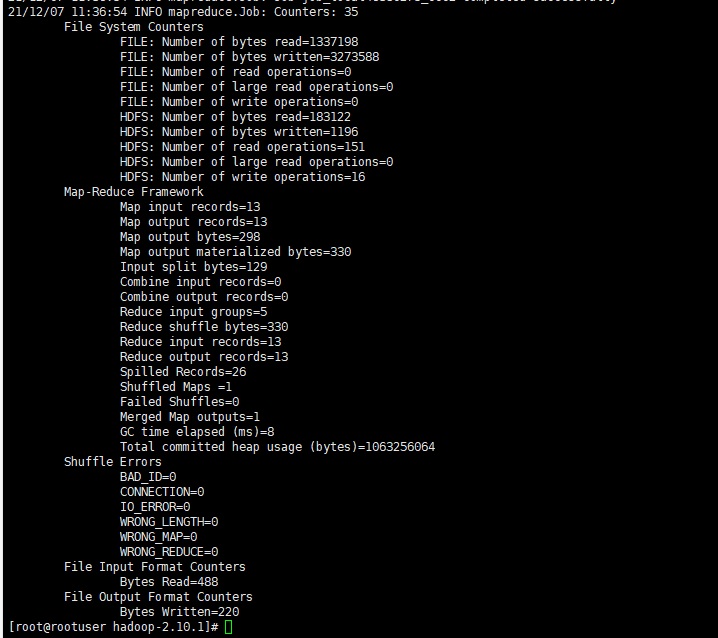

4.4）Examine the output files: Copy the output files from the distributed filesystem to the local filesystem and examine them:

```
bin/hdfs dfs -get output output
cat output/*
```

or

View the output files on the distributed filesystem:官方文档在output前漏了`/`，我加上了。

```
bin/hdfs dfs -cat /output/*
```

成功展示结果：

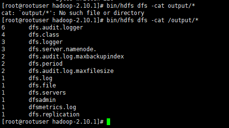

5）关闭进程

```
cd /usr/local/hadoop-2.10.1

sbin/stop-dfs.sh
```


### 伪分布式结合yarn

You can run a MapReduce job on YARN in a pseudo-distributed mode by setting a few parameters and running ResourceManager daemon and NodeManager daemon in addition.

The following instructions assume that 1. ~ 4. steps of [the above instructions](https://hadoop.apache.org/docs/r2.10.1/hadoop-project-dist/hadoop-common/SingleCluster.html#Execution) are already executed.

1）Configure parameters as follows:`etc/hadoop/mapred-site.xml`:

```
cd /usr/local/hadoop-2.10.1/etc/hadoop

vim mapred-site.xml
```

发现文件是空的：

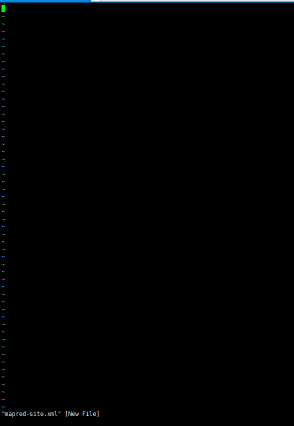

linux中使用vim出现这种状况一般都是因为vim打开的文件之前不存在。ls查看一下：

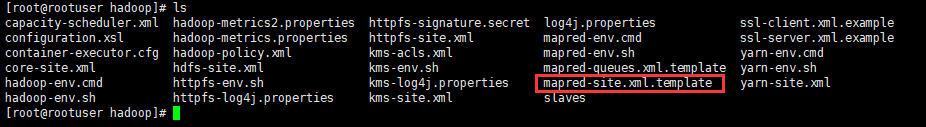

确实只有mapred-site.xml.template文件，而没有mapred-site.xml文件。我们复制一下mapred-site.xml.template并重命名为mapred-site.xml：

```
cp -i mapred-site.xml.template mapred-site.xml
```

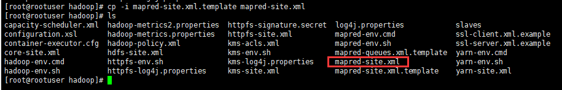

再往mapred-site.xml中填入如下数据

```
<configuration>
    <property>
        <name>mapreduce.framework.name</name>
        <value>yarn</value>
    </property>
</configuration>
```

1.1）**hadoop的操作特点是在解压文件夹层进行操作，所以今后我们尽量不要深入文件夹。**执行下面语句，回到hadoop解压文件夹并尽量停留在这层进行操作

```
cd /usr/local/hadoop-2.10.1
```

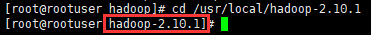

2）修改`etc/hadoop/yarn-site.xml`:为如下内容

```
<configuration>
    <property>
        <name>yarn.nodemanager.aux-services</name>
        <value>mapreduce_shuffle</value>
    </property>
</configuration>
```

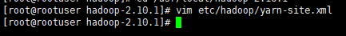

3）Start ResourceManager daemon and NodeManager daemon:

- 执行这一步之前**确保hadoop已经启动**

```
sbin/start-yarn.sh
```

4）Browse the web interface for the ResourceManager; by default it is available at:

- ResourceManager - `http://localhost:8088/`

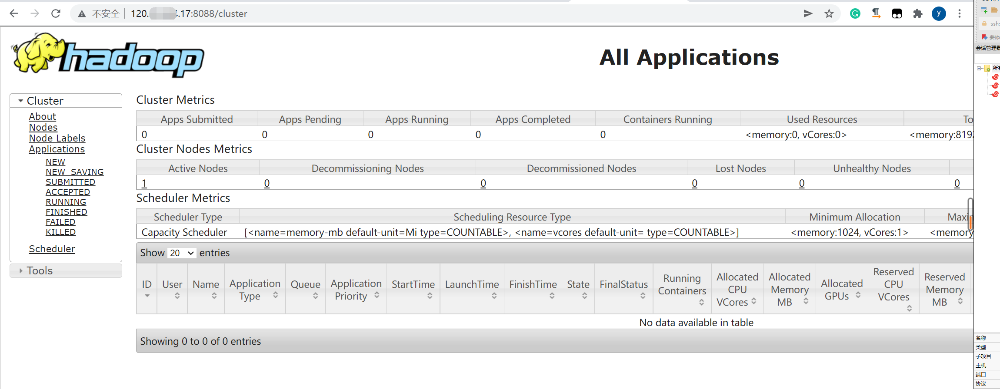

`jps`查看进程，发现ResourceManager和NodeManager也启动起来了

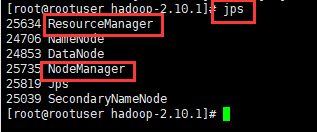

5）Run a MapReduce job

6）When you’re done, stop the daemons with:

```
sbin/stop-yarn.sh
```

### 安装好后使用hadoop

开启hadoop+yarn：

- 注意开启执行顺序，**必须**先开启底层hadoop，再开启顶层yarn。

```
cd /usr/local/hadoop-2.10.1
sbin/start-dfs.sh
sbin/start-yarn.sh
```

关闭hadoop+yarn:

- 注意关闭执行顺序，推荐先关闭顶层yarn，再关闭底层hadoop。（类似栈，最后开启的最先关闭）

```
sbin/start-yarn.sh
sbin/stop-dfs.sh
```

### 常见bug

#### sbin/start-dfs.sh启动后jps看不到datanode

启动过程中不报错，但是jps就是不展示node

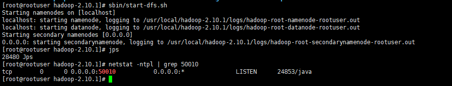

查看hdfs的webui，可以看到有活着的节点

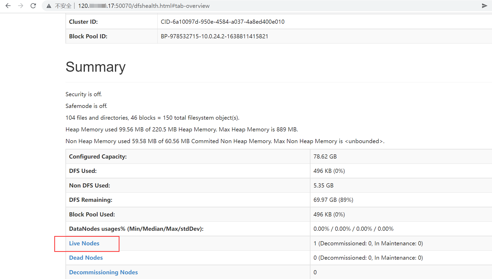

先查看datanode的日志

```
[root@rootuser hadoop-2.10.1]# cd logs/
[root@rootuser logs]# ls
[root@rootuser logs]# vim hadoop-root-datanode-rootuser.log
```

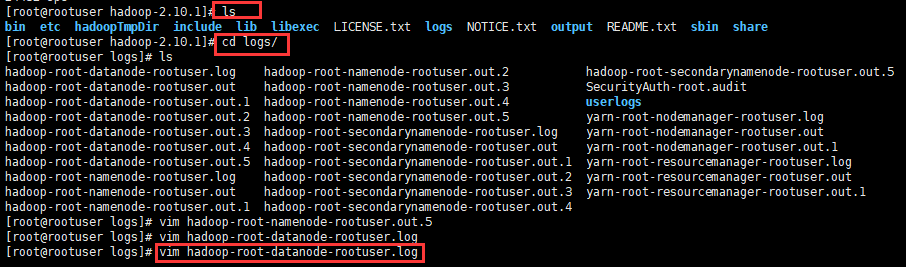


找到最新的日志如下：

```
[root@rootuser logs]# vim hadoop-root-datanode-rootuser.log

STARTUP_MSG:   build = https://github.com/apache/hadoop -r 1827467c9a56f133025f28557bfc2c562d78e816; compiled by 'centos' on 2020-09-14T13:17Z
STARTUP_MSG:   java = 1.8.0_311
************************************************************/
2021-12-07 16:37:01,555 INFO org.apache.hadoop.hdfs.server.datanode.DataNode: registered UNIX signal handlers for [TERM, HUP, INT]
STARTUP_MSG:   build = https://github.com/apache/hadoop -r 1827467c9a56f133025f28557bfc2c562d78e816; compiled by 'centos' on 2020-09-14T13:17Z
STARTUP_MSG:   java = 1.8.0_311
************************************************************/
2021-12-07 16:50:10,906 INFO org.apache.hadoop.hdfs.server.datanode.DataNode: registered UNIX signal handlers for [TERM, HUP, INT]
2021-12-07 16:50:11,498 INFO org.apache.hadoop.hdfs.server.datanode.checker.ThrottledAsyncChecker: Scheduling a check for [DISK]file:/usr/local/hadoop-2.10.1/hadoopTmpDir/dfs/data/
2021-12-07 16:50:11,560 INFO org.apache.hadoop.metrics2.impl.MetricsConfig: loaded properties from hadoop-metrics2.properties
2021-12-07 16:50:11,638 INFO org.apache.hadoop.metrics2.impl.MetricsSystemImpl: Scheduled Metric snapshot period at 10 second(s).
2021-12-07 16:50:11,638 INFO org.apache.hadoop.metrics2.impl.MetricsSystemImpl: DataNode metrics system started
2021-12-07 16:50:12,031 INFO org.apache.hadoop.hdfs.server.common.Util: dfs.datanode.fileio.profiling.sampling.percentage set to 0. Disabling file IO profiling
2021-12-07 16:50:12,034 INFO org.apache.hadoop.hdfs.server.datanode.BlockScanner: Initialized block scanner with targetBytesPerSec 1048576
2021-12-07 16:50:12,037 INFO org.apache.hadoop.hdfs.server.datanode.DataNode: Configured hostname is rootuser
2021-12-07 16:50:12,038 INFO org.apache.hadoop.hdfs.server.common.Util: dfs.datanode.fileio.profiling.sampling.percentage set to 0. Disabling file IO profiling
2021-12-07 16:50:12,038 WARN org.apache.hadoop.conf.Configuration: No unit for dfs.datanode.outliers.report.interval(1800000) assuming MILLISECONDS
2021-12-07 16:50:12,042 INFO org.apache.hadoop.hdfs.server.datanode.DataNode: Starting DataNode with maxLockedMemory = 0
2021-12-07 16:50:12,067 INFO org.apache.hadoop.hdfs.server.datanode.DataNode: Shutdown complete.
2021-12-07 16:50:12,068 ERROR org.apache.hadoop.hdfs.server.datanode.DataNode: Exception in secureMain
java.net.BindException: Problem binding to [0.0.0.0:50010] java.net.BindException: Address already in use; For more details see:  http://wiki.apache.org/hadoop/BindException
        at sun.reflect.NativeConstructorAccessorImpl.newInstance0(Native Method)
        at sun.reflect.NativeConstructorAccessorImpl.newInstance(NativeConstructorAccessorImpl.java:62)
        at sun.reflect.DelegatingConstructorAccessorImpl.newInstance(DelegatingConstructorAccessorImpl.java:45)
        at java.lang.reflect.Constructor.newInstance(Constructor.java:423)
        at org.apache.hadoop.net.NetUtils.wrapWithMessage(NetUtils.java:827)
        at org.apache.hadoop.net.NetUtils.wrapException(NetUtils.java:738)
        at org.apache.hadoop.ipc.Server.bind(Server.java:623)
        at org.apache.hadoop.ipc.Server.bind(Server.java:595)
        at org.apache.hadoop.hdfs.net.TcpPeerServer.<init>(TcpPeerServer.java:52)
        at org.apache.hadoop.hdfs.server.datanode.DataNode.initDataXceiver(DataNode.java:1120)
        at org.apache.hadoop.hdfs.server.datanode.DataNode.startDataNode(DataNode.java:1374)
        at org.apache.hadoop.hdfs.server.datanode.DataNode.<init>(DataNode.java:499)
        at org.apache.hadoop.hdfs.server.datanode.DataNode.makeInstance(DataNode.java:2710)
        at org.apache.hadoop.hdfs.server.datanode.DataNode.instantiateDataNode(DataNode.java:2613)
        at org.apache.hadoop.hdfs.server.datanode.DataNode.createDataNode(DataNode.java:2660)
        at org.apache.hadoop.hdfs.server.datanode.DataNode.secureMain(DataNode.java:2804)
        at org.apache.hadoop.hdfs.server.datanode.DataNode.main(DataNode.java:2828)
Caused by: java.net.BindException: Address already in use
        at sun.nio.ch.Net.bind0(Native Method)
        at sun.nio.ch.Net.bind(Net.java:438)
        at sun.nio.ch.Net.bind(Net.java:430)
        at sun.nio.ch.ServerSocketChannelImpl.bind(ServerSocketChannelImpl.java:225)
        at sun.nio.ch.ServerSocketAdaptor.bind(ServerSocketAdaptor.java:74)
        at org.apache.hadoop.ipc.Server.bind(Server.java:606)
        ... 10 more
2021-12-07 16:50:12,071 INFO org.apache.hadoop.util.ExitUtil: Exiting with status 1: java.net.BindException: Problem binding to [0.0.0.0:50010] java.net.BindException: Address already in use; For more details see:  http://wiki.apache.org/hadoop/BindException
2021-12-07 16:50:12,074 INFO org.apache.hadoop.hdfs.server.datanode.DataNode: SHUTDOWN_MSG:
/************************************************************
SHUTDOWN_MSG: Shutting down DataNode at rootuser/10.0.24.2
************************************************************/

```

根据错误，参考[文章](https://stackoverflow.com/questions/43059074/error-in-datanode-hadoop-2-7-3-single-node-pseudo-distributed-mode)

In most cases it is the `datanode` process itself which is not properly terminated.解决如下：

1）首先执行如下命令，应该会得到`tcp 0 0 0.0.0.0:50010 0.0.0.0:* LISTEN <pid>/java`类似的内容：

```
[root@rootuser hadoop-2.10.1]# netstat -ntpl | grep 50010
```

发现端口确实被占用

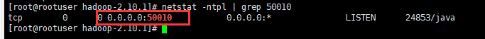

查看是哪个进程在使用端口。没看出所以然来。

```
ps -ef | grep <pid>
```

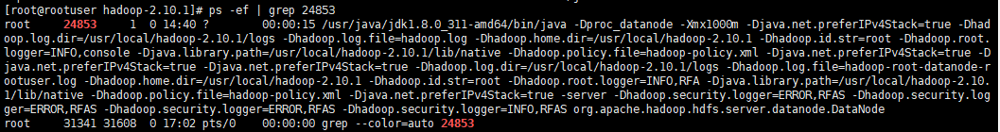

尝试杀掉进程

```
kill -9 <pid>
```

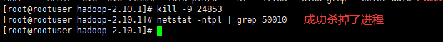

If the process cannot be killed, change the port of datanode by adding this property to `hdfs-site.xml`

```
<property>
   <name>dfs.datanode.address</name>
   <value>hostname:different_port</value>
</property>
```

Refer [Hadoop BindException](http://wiki.apache.org/hadoop/BindException) for all possible causes of this `ERROR`.

#### sbin/start-dfs.sh启动后jps看不到namenode

类似“sbin/start-dfs.sh启动后jps看不到datanode”的处理

```
[root@rootuser hadoop-2.10.1]# cd logs/
[root@rootuser logs]# ls
[root@rootuser logs]# vim hadoop-root-namenode-rootuser.log
```

`shift+g`来到文件底部，看到如下错误。也是端口被占用导致的。

```
2021-12-07 17:10:49,658 INFO org.apache.hadoop.metrics2.impl.MetricsSystemImpl: Stopping NameNode metrics system...
2021-12-07 17:10:49,659 INFO org.apache.hadoop.metrics2.impl.MetricsSystemImpl: NameNode metrics system stopped.
2021-12-07 17:10:49,659 INFO org.apache.hadoop.metrics2.impl.MetricsSystemImpl: NameNode metrics system shutdown complete.
2021-12-07 17:10:49,659 ERROR org.apache.hadoop.hdfs.server.namenode.NameNode: Failed to start namenode.
java.net.BindException: Port in use: 0.0.0.0:50070
        at org.apache.hadoop.http.HttpServer2.constructBindException(HttpServer2.java:1026)
        at org.apache.hadoop.http.HttpServer2.bindForSinglePort(HttpServer2.java:1049)
        at org.apache.hadoop.http.HttpServer2.openListeners(HttpServer2.java:1106)
        at org.apache.hadoop.http.HttpServer2.start(HttpServer2.java:963)
        at org.apache.hadoop.hdfs.server.namenode.NameNodeHttpServer.start(NameNodeHttpServer.java:184)
        at org.apache.hadoop.hdfs.server.namenode.NameNode.startHttpServer(NameNode.java:897)
        at org.apache.hadoop.hdfs.server.namenode.NameNode.initialize(NameNode.java:733)
        at org.apache.hadoop.hdfs.server.namenode.NameNode.<init>(NameNode.java:961)
        at org.apache.hadoop.hdfs.server.namenode.NameNode.<init>(NameNode.java:940)
        at org.apache.hadoop.hdfs.server.namenode.NameNode.createNameNode(NameNode.java:1714)
        at org.apache.hadoop.hdfs.server.namenode.NameNode.main(NameNode.java:1782)
Caused by: java.net.BindException: Address already in use
        at sun.nio.ch.Net.bind0(Native Method)
        at sun.nio.ch.Net.bind(Net.java:438)
        at sun.nio.ch.Net.bind(Net.java:430)
        at sun.nio.ch.ServerSocketChannelImpl.bind(ServerSocketChannelImpl.java:225)
        at sun.nio.ch.ServerSocketAdaptor.bind(ServerSocketAdaptor.java:74)
        at org.mortbay.jetty.nio.SelectChannelConnector.open(SelectChannelConnector.java:216)
        at org.apache.hadoop.http.HttpServer2.bindListener(HttpServer2.java:1014)
        at org.apache.hadoop.http.HttpServer2.bindForSinglePort(HttpServer2.java:1045)
        ... 9 more
2021-12-07 17:10:49,660 INFO org.apache.hadoop.util.ExitUtil: Exiting with status 1: java.net.BindException: Port in use: 0.0.0.0:50070
2021-12-07 17:10:49,662 INFO org.apache.hadoop.hdfs.server.namenode.NameNode: SHUTDOWN_MSG:
/************************************************************
SHUTDOWN_MSG: Shutting down NameNode at rootuser/10.0.24.2
************************************************************/
2021-12-07 17:10:55,298 INFO org.apache.hadoop.hdfs.StateChange: BLOCK* registerDatanode: from DatanodeRegistration(127.0.0.1:50010, datanodeUuid=41798717-8c5d-4c05-a805-c8fde4573d0a, infoPort=50075, infoSecurePort=0, ipcPort=50020, storageInfo=lv=-57;cid=CID-6a10097d-950e-4584-a037-4a8ed400e010;nsid=1385145057;c=1638811415821) storage 41798717-8c5d-4c05-a805-c8fde4573d0a
2021-12-07 17:10:55,298 INFO org.apache.hadoop.net.NetworkTopology: Removing a node: /default-rack/127.0.0.1:50010
2021-12-07 17:10:55,298 INFO org.apache.hadoop.net.NetworkTopology: Adding a new node: /default-rack/127.0.0.1:50010
2021-12-07 17:10:55,353 INFO BlockStateChange: BLOCK* processReport 0x69f0987be2a7902a: Processing first storage report for DS-2ffa2b77-4a4a-4681-a1cf-eb26dc238fd8 from datanode 41798717-8c5d-4c05-a805-c8fde4573d0a
2021-12-07 17:10:55,354 INFO BlockStateChange: BLOCK* processReport 0x69f0987be2a7902a: from storage DS-2ffa2b77-4a4a-4681-a1cf-eb26dc238fd8 node DatanodeRegistration(127.0.0.1:50010, datanodeUuid=41798717-8c5d-4c05-a805-c8fde4573d0a, infoPort=50075, infoSecurePort=0, ipcPort=50020, storageInfo=lv=-57;cid=CID-6a10097d-950e-4584-a037-4a8ed400e010;nsid=1385145057;c=1638811415821), blocks: 46, hasStaleStorage: false, processing time: 1 msecs, invalidatedBlocks: 0
```

根据被占用的端口号查看占用者进程的pid

```
# netstat -ntpl | grep 50070
```

根据pid杀掉占用者进程

```
kill -9 <pid>
```

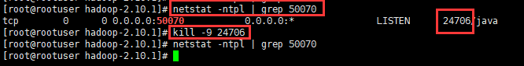

#### sbin/start-dfs.sh启动后jps看不到secondary namenodes

类似的，读日志

```
[root@rootuser hadoop-2.10.1]# cd /usr/local/hadoop-2.10.1/logs/
[root@rootuser logs]# ls
[root@rootuser logs]# vim hadoop-root-secondarynamenode-rootuser.log
```

`shift+g`来到文件底部，看到如下错误

```
2021-12-07 19:49:51,614 INFO org.apache.hadoop.ipc.Client: Retrying connect to server: localhost/127.0.0.1:9000. Already tried 4 time(s); retry policy is RetryUpToMaximumCountWithFixedSleep(maxRetries=10, sleepTime=1000 MILLISECONDS)
2021-12-07 19:49:52,614 INFO org.apache.hadoop.ipc.Client: Retrying connect to server: localhost/127.0.0.1:9000. Already tried 5 time(s); retry policy is RetryUpToMaximumCountWithFixedSleep(maxRetries=10, sleepTime=1000 MILLISECONDS)
2021-12-07 19:49:53,615 INFO org.apache.hadoop.ipc.Client: Retrying connect to server: localhost/127.0.0.1:9000. Already tried 6 time(s); retry policy is RetryUpToMaximumCountWithFixedSleep(maxRetries=10, sleepTime=1000 MILLISECONDS)
2021-12-07 19:49:54,615 INFO org.apache.hadoop.ipc.Client: Retrying connect to server: localhost/127.0.0.1:9000. Already tried 7 time(s); retry policy is RetryUpToMaximumCountWithFixedSleep(maxRetries=10, sleepTime=1000 MILLISECONDS)
2021-12-07 19:49:55,615 INFO org.apache.hadoop.ipc.Client: Retrying connect to server: localhost/127.0.0.1:9000. Already tried 8 time(s); retry policy is RetryUpToMaximumCountWithFixedSleep(maxRetries=10, sleepTime=1000 MILLISECONDS)
2021-12-07 19:49:56,616 INFO org.apache.hadoop.ipc.Client: Retrying connect to server: localhost/127.0.0.1:9000. Already tried 9 time(s); retry policy is RetryUpToMaximumCountWithFixedSleep(maxRetries=10, sleepTime=1000 MILLISECONDS)
2021-12-07 19:49:56,620 ERROR org.apache.hadoop.hdfs.server.namenode.SecondaryNameNode: Exception in doCheckpoint
java.net.ConnectException: Call From rootuser/10.0.24.2 to localhost:9000 failed on connection exception: java.net.ConnectException: Connection refused; For more details see:  http://wiki.apache.org/hadoop/ConnectionRefused
        at sun.reflect.GeneratedConstructorAccessor11.newInstance(Unknown Source)
        at sun.reflect.DelegatingConstructorAccessorImpl.newInstance(DelegatingConstructorAccessorImpl.java:45)
        at java.lang.reflect.Constructor.newInstance(Constructor.java:423)
        at org.apache.hadoop.net.NetUtils.wrapWithMessage(NetUtils.java:827)
        at org.apache.hadoop.net.NetUtils.wrapException(NetUtils.java:757)
        at org.apache.hadoop.ipc.Client.getRpcResponse(Client.java:1553)
        at org.apache.hadoop.ipc.Client.call(Client.java:1495)
        at org.apache.hadoop.ipc.Client.call(Client.java:1394)
        at org.apache.hadoop.ipc.ProtobufRpcEngine$Invoker.invoke(ProtobufRpcEngine.java:232)
        at org.apache.hadoop.ipc.ProtobufRpcEngine$Invoker.invoke(ProtobufRpcEngine.java:118)
        at com.sun.proxy.$Proxy10.getTransactionId(Unknown Source)
        at org.apache.hadoop.hdfs.protocolPB.NamenodeProtocolTranslatorPB.getTransactionID(NamenodeProtocolTranslatorPB.java:129)
        at sun.reflect.GeneratedMethodAccessor2.invoke(Unknown Source)
        at sun.reflect.DelegatingMethodAccessorImpl.invoke(DelegatingMethodAccessorImpl.java:43)
        at java.lang.reflect.Method.invoke(Method.java:498)
        at org.apache.hadoop.io.retry.RetryInvocationHandler.invokeMethod(RetryInvocationHandler.java:422)
        at org.apache.hadoop.io.retry.RetryInvocationHandler$Call.invokeMethod(RetryInvocationHandler.java:165)
        at org.apache.hadoop.io.retry.RetryInvocationHandler$Call.invoke(RetryInvocationHandler.java:157)
        at org.apache.hadoop.io.retry.RetryInvocationHandler$Call.invokeOnce(RetryInvocationHandler.java:95)
        at org.apache.hadoop.io.retry.RetryInvocationHandler.invoke(RetryInvocationHandler.java:359)
        at com.sun.proxy.$Proxy11.getTransactionID(Unknown Source)
        at org.apache.hadoop.hdfs.server.namenode.SecondaryNameNode.countUncheckpointedTxns(SecondaryNameNode.java:660)
        at org.apache.hadoop.hdfs.server.namenode.SecondaryNameNode.shouldCheckpointBasedOnCount(SecondaryNameNode.java:668)
        at org.apache.hadoop.hdfs.server.namenode.SecondaryNameNode.doWork(SecondaryNameNode.java:358)
        at org.apache.hadoop.hdfs.server.namenode.SecondaryNameNode$1.run(SecondaryNameNode.java:325)
        at org.apache.hadoop.security.SecurityUtil.doAsLoginUserOrFatal(SecurityUtil.java:481)
        at org.apache.hadoop.hdfs.server.namenode.SecondaryNameNode.run(SecondaryNameNode.java:321)
        at java.lang.Thread.run(Thread.java:748)
Caused by: java.net.ConnectException: Connection refused
        at sun.nio.ch.SocketChannelImpl.checkConnect(Native Method)
        at sun.nio.ch.SocketChannelImpl.finishConnect(SocketChannelImpl.java:715)
        at org.apache.hadoop.net.SocketIOWithTimeout.connect(SocketIOWithTimeout.java:206)
        at org.apache.hadoop.net.NetUtils.connect(NetUtils.java:532)
        at org.apache.hadoop.ipc.Client$Connection.setupConnection(Client.java:701)
        at org.apache.hadoop.ipc.Client$Connection.setupIOstreams(Client.java:814)
        at org.apache.hadoop.ipc.Client$Connection.access$3700(Client.java:423)
        at org.apache.hadoop.ipc.Client.getConnection(Client.java:1610)
        at org.apache.hadoop.ipc.Client.call(Client.java:1441)
        ... 21 more

```

根据报错，参考[文章](https://stackoverflow.com/questions/28661285/hadoop-cluster-setup-java-net-connectexception-connection-refused),重新格式化namenode

```
bin/hdfs namenode -format

sbin/start-dfs.sh
```

这次连datanode都又坏了

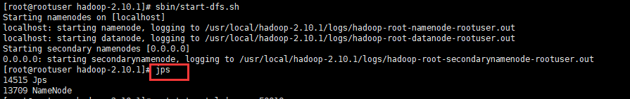

先按照处理secondnamenode的方式，删掉`core-site.xml的hadoop.tmp.dir`。**注意这里留了一个坑点，这里面都是临时配置，，断电等外界因素导致tmp被删除的话会很难受。成功开启hadoop和yarn后我自己备份tmp到root下了。**

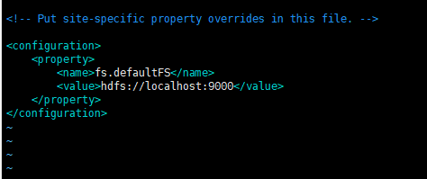

重新格式化namenode

```
cd /usr/local/hadoop-2.10.1
bin/hdfs namenode -format
```

再处理datanode的问题，查看datanode的日志如下

```
2021-12-07 19:54:38,257 INFO org.apache.hadoop.ipc.Server: IPC Server Responder: starting
2021-12-07 19:54:38,258 INFO org.apache.hadoop.ipc.Server: IPC Server listener on 50020: starting
2021-12-07 19:54:38,343 INFO org.apache.hadoop.hdfs.server.datanode.DataNode: Acknowledging ACTIVE Namenode during handshakeBlock pool <registering> (Datanode Uuid unassigned) service to localhost/127.0.0.1:9000
2021-12-07 19:54:38,345 INFO org.apache.hadoop.hdfs.server.common.Storage: Using 1 threads to upgrade data directories (dfs.datanode.parallel.volumes.load.threads.num=1, dataDirs=1)
2021-12-07 19:54:38,355 INFO org.apache.hadoop.hdfs.server.common.Storage: Lock on /usr/local/hadoop-2.10.1/hadoopTmpDir/dfs/data/in_use.lock acquired by nodename 13857@rootuser
2021-12-07 19:54:38,357 WARN org.apache.hadoop.hdfs.server.common.Storage: Failed to add storage directory [DISK]file:/usr/local/hadoop-2.10.1/hadoopTmpDir/dfs/data/
java.io.IOException: Incompatible clusterIDs in /usr/local/hadoop-2.10.1/hadoopTmpDir/dfs/data: namenode clusterID = CID-1ddfa71d-9bda-4879-b930-44729535cc0c; datanode clusterID = CID-6a10097d-950e-4584-a037-4a8ed400e010
        at org.apache.hadoop.hdfs.server.datanode.DataStorage.doTransition(DataStorage.java:768)
        at org.apache.hadoop.hdfs.server.datanode.DataStorage.loadStorageDirectory(DataStorage.java:293)
        at org.apache.hadoop.hdfs.server.datanode.DataStorage.loadDataStorage(DataStorage.java:409)
        at org.apache.hadoop.hdfs.server.datanode.DataStorage.addStorageLocations(DataStorage.java:388)
        at org.apache.hadoop.hdfs.server.datanode.DataStorage.recoverTransitionRead(DataStorage.java:564)
        at org.apache.hadoop.hdfs.server.datanode.DataNode.initStorage(DataNode.java:1659)
        at org.apache.hadoop.hdfs.server.datanode.DataNode.initBlockPool(DataNode.java:1620)
        at org.apache.hadoop.hdfs.server.datanode.BPOfferService.verifyAndSetNamespaceInfo(BPOfferService.java:388)
        at org.apache.hadoop.hdfs.server.datanode.BPServiceActor.connectToNNAndHandshake(BPServiceActor.java:282)
        at org.apache.hadoop.hdfs.server.datanode.BPServiceActor.run(BPServiceActor.java:826)
        at java.lang.Thread.run(Thread.java:748)
2021-12-07 19:54:38,359 ERROR org.apache.hadoop.hdfs.server.datanode.DataNode: Initialization failed for Block pool <registering> (Datanode Uuid 41798717-8c5d-4c05-a805-c8fde4573d0a) service to localhost/127.0.0.1:9000. Exiting.
java.io.IOException: All specified directories have failed to load.
        at org.apache.hadoop.hdfs.server.datanode.DataStorage.recoverTransitionRead(DataStorage.java:565)
        at org.apache.hadoop.hdfs.server.datanode.DataNode.initStorage(DataNode.java:1659)
        at org.apache.hadoop.hdfs.server.datanode.DataNode.initBlockPool(DataNode.java:1620)
        at org.apache.hadoop.hdfs.server.datanode.BPOfferService.verifyAndSetNamespaceInfo(BPOfferService.java:388)
        at org.apache.hadoop.hdfs.server.datanode.BPServiceActor.connectToNNAndHandshake(BPServiceActor.java:282)
        at org.apache.hadoop.hdfs.server.datanode.BPServiceActor.run(BPServiceActor.java:826)
        at java.lang.Thread.run(Thread.java:748)
2021-12-07 19:54:38,359 WARN org.apache.hadoop.hdfs.server.datanode.DataNode: Ending block pool service for: Block pool <registering> (Datanode Uuid 41798717-8c5d-4c05-a805-c8fde4573d0a) service to localhost/127.0.0.1:9000
2021-12-07 19:54:38,370 INFO org.apache.hadoop.hdfs.server.datanode.DataNode: Removed Block pool <registering> (Datanode Uuid 41798717-8c5d-4c05-a805-c8fde4573d0a)
2021-12-07 19:54:40,375 WARN org.apache.hadoop.hdfs.server.datanode.DataNode: Exiting Datanode
2021-12-07 19:54:40,401 INFO org.apache.hadoop.hdfs.server.datanode.DataNode: SHUTDOWN_MSG:
/************************************************************
SHUTDOWN_MSG: Shutting down DataNode at rootuser/10.0.24.2
************************************************************/
                                                               
```

因为已经把core.html中的tmp.dir删掉了，该这个clusterid没有意义，因为是新地址，所以先重启一次hdfs试试看

```
sbin/start-dfs.sh
```

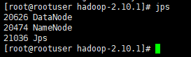

还是没有secondarynamenode，再次查看secondarynamenode日志。感谢老天，是端口的错误：

```
2021-12-07 20:18:58,312 INFO org.apache.hadoop.http.HttpServer2: Added filter static_user_filter (class=org.apache.hadoop.http.lib.StaticUserWebFilter$StaticUserFilter) to context secondary
2021-12-07 20:18:58,312 INFO org.apache.hadoop.http.HttpServer2: Added filter static_user_filter (class=org.apache.hadoop.http.lib.StaticUserWebFilter$StaticUserFilter) to context logs
2021-12-07 20:18:58,312 INFO org.apache.hadoop.http.HttpServer2: Added filter static_user_filter (class=org.apache.hadoop.http.lib.StaticUserWebFilter$StaticUserFilter) to context static
2021-12-07 20:18:58,401 INFO org.apache.hadoop.http.HttpServer2: HttpServer.start() threw a non Bind IOException
java.net.BindException: Port in use: 0.0.0.0:50090
        at org.apache.hadoop.http.HttpServer2.constructBindException(HttpServer2.java:1026)
        at org.apache.hadoop.http.HttpServer2.bindForSinglePort(HttpServer2.java:1049)
        at org.apache.hadoop.http.HttpServer2.openListeners(HttpServer2.java:1106)
        at org.apache.hadoop.http.HttpServer2.start(HttpServer2.java:963)
        at org.apache.hadoop.hdfs.server.namenode.SecondaryNameNode.startInfoServer(SecondaryNameNode.java:498)
        at org.apache.hadoop.hdfs.server.namenode.SecondaryNameNode.main(SecondaryNameNode.java:701)
Caused by: java.net.BindException: Address already in use
        at sun.nio.ch.Net.bind0(Native Method)
        at sun.nio.ch.Net.bind(Net.java:438)
        at sun.nio.ch.Net.bind(Net.java:430)
        at sun.nio.ch.ServerSocketChannelImpl.bind(ServerSocketChannelImpl.java:225)
        at sun.nio.ch.ServerSocketAdaptor.bind(ServerSocketAdaptor.java:74)
        at org.mortbay.jetty.nio.SelectChannelConnector.open(SelectChannelConnector.java:216)
        at org.apache.hadoop.http.HttpServer2.bindListener(HttpServer2.java:1014)
        at org.apache.hadoop.http.HttpServer2.bindForSinglePort(HttpServer2.java:1045)
        ... 4 more
2021-12-07 20:18:58,404 FATAL org.apache.hadoop.hdfs.server.namenode.SecondaryNameNode: Failed to start secondary namenode
java.net.BindException: Port in use: 0.0.0.0:50090
        at org.apache.hadoop.http.HttpServer2.constructBindException(HttpServer2.java:1026)
        at org.apache.hadoop.http.HttpServer2.bindForSinglePort(HttpServer2.java:1049)
        at org.apache.hadoop.http.HttpServer2.openListeners(HttpServer2.java:1106)
        at org.apache.hadoop.http.HttpServer2.start(HttpServer2.java:963)
        at org.apache.hadoop.hdfs.server.namenode.SecondaryNameNode.startInfoServer(SecondaryNameNode.java:498)
        at org.apache.hadoop.hdfs.server.namenode.SecondaryNameNode.main(SecondaryNameNode.java:701)
Caused by: java.net.BindException: Address already in use
        at sun.nio.ch.Net.bind0(Native Method)
        at sun.nio.ch.Net.bind(Net.java:438)
        at sun.nio.ch.Net.bind(Net.java:430)
        at sun.nio.ch.ServerSocketChannelImpl.bind(ServerSocketChannelImpl.java:225)
        at sun.nio.ch.ServerSocketAdaptor.bind(ServerSocketAdaptor.java:74)
        at org.mortbay.jetty.nio.SelectChannelConnector.open(SelectChannelConnector.java:216)
        at org.apache.hadoop.http.HttpServer2.bindListener(HttpServer2.java:1014)
        at org.apache.hadoop.http.HttpServer2.bindForSinglePort(HttpServer2.java:1045)
        ... 4 more
2021-12-07 20:18:58,406 INFO org.apache.hadoop.util.ExitUtil: Exiting with status 1: ExitException
2021-12-07 20:18:58,408 INFO org.apache.hadoop.hdfs.server.namenode.SecondaryNameNode: SHUTDOWN_MSG:
/************************************************************
SHUTDOWN_MSG: Shutting down SecondaryNameNode at rootuser/10.0.24.2
************************************************************/

```

查看端口是否被占用

```
netstat -ntpl | grep 50090
```

杀掉进程

```
kill -9 <pid>
```


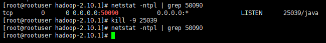

重启hdfs试试。呜呜呜，成功了，感动。

```
sbin/start-dfs.sh
```

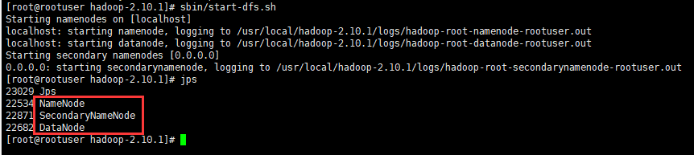

#### sbin/start-yarn.sh启动后jps看不到nodemanager和resourcemanager

猜测是端口问题，查看两者日志。

先看nodemanager日志：

```
2021-12-07 20:25:08,680 INFO org.apache.hadoop.ipc.Server: Stopping IPC Server Responder
2021-12-07 20:25:08,680 INFO org.apache.hadoop.metrics2.impl.MetricsSystemImpl: Stopping NodeManager metrics system...
2021-12-07 20:25:08,680 INFO org.apache.hadoop.metrics2.impl.MetricsSystemImpl: NodeManager metrics system stopped.
2021-12-07 20:25:08,681 INFO org.apache.hadoop.metrics2.impl.MetricsSystemImpl: NodeManager metrics system shutdown complete.
2021-12-07 20:25:08,681 ERROR org.apache.hadoop.yarn.server.nodemanager.NodeManager: Error starting NodeManager
org.apache.hadoop.yarn.exceptions.YarnRuntimeException: java.net.BindException: Problem binding to [0.0.0.0:8040] java.net.BindException: Address already in use; For more details see:  http://wiki.apache.org/hadoop/BindException
        at org.apache.hadoop.yarn.factories.impl.pb.RpcServerFactoryPBImpl.getServer(RpcServerFactoryPBImpl.java:138)
        at org.apache.hadoop.yarn.ipc.HadoopYarnProtoRPC.getServer(HadoopYarnProtoRPC.java:65)
        at org.apache.hadoop.yarn.ipc.YarnRPC.getServer(YarnRPC.java:54)
        at org.apache.hadoop.yarn.server.nodemanager.containermanager.localizer.ResourceLocalizationService.createServer(ResourceLocalizationService.java:410)
        at org.apache.hadoop.yarn.server.nodemanager.containermanager.localizer.ResourceLocalizationService.serviceStart(ResourceLocalizationService.java:386)
        at org.apache.hadoop.service.AbstractService.start(AbstractService.java:194)
        at org.apache.hadoop.service.CompositeService.serviceStart(CompositeService.java:121)
        at org.apache.hadoop.yarn.server.nodemanager.containermanager.ContainerManagerImpl.serviceStart(ContainerManagerImpl.java:663)
        at org.apache.hadoop.service.AbstractService.start(AbstractService.java:194)
        at org.apache.hadoop.service.CompositeService.serviceStart(CompositeService.java:121)
        at org.apache.hadoop.service.AbstractService.start(AbstractService.java:194)
        at org.apache.hadoop.yarn.server.nodemanager.NodeManager.initAndStartNodeManager(NodeManager.java:879)
        at org.apache.hadoop.yarn.server.nodemanager.NodeManager.main(NodeManager.java:946)
Caused by: java.net.BindException: Problem binding to [0.0.0.0:8040] java.net.BindException: Address already in use; For more details see:  http://wiki.apache.org/hadoop/BindException
        at sun.reflect.NativeConstructorAccessorImpl.newInstance0(Native Method)
        at sun.reflect.NativeConstructorAccessorImpl.newInstance(NativeConstructorAccessorImpl.java:62)
        at sun.reflect.DelegatingConstructorAccessorImpl.newInstance(DelegatingConstructorAccessorImpl.java:45)
        at java.lang.reflect.Constructor.newInstance(Constructor.java:423)
        at org.apache.hadoop.net.NetUtils.wrapWithMessage(NetUtils.java:827)
        at org.apache.hadoop.net.NetUtils.wrapException(NetUtils.java:738)
        at org.apache.hadoop.ipc.Server.bind(Server.java:623)
        at org.apache.hadoop.ipc.Server$Listener.<init>(Server.java:1189)
        at org.apache.hadoop.ipc.Server.<init>(Server.java:3004)
        at org.apache.hadoop.ipc.RPC$Server.<init>(RPC.java:1003)
        at org.apache.hadoop.ipc.ProtobufRpcEngine$Server.<init>(ProtobufRpcEngine.java:425)
        at org.apache.hadoop.ipc.ProtobufRpcEngine.getServer(ProtobufRpcEngine.java:346)
        at org.apache.hadoop.ipc.RPC$Builder.build(RPC.java:844)
        at org.apache.hadoop.yarn.factories.impl.pb.RpcServerFactoryPBImpl.createServer(RpcServerFactoryPBImpl.java:168)
        at org.apache.hadoop.yarn.factories.impl.pb.RpcServerFactoryPBImpl.getServer(RpcServerFactoryPBImpl.java:131)
        ... 12 more
Caused by: java.net.BindException: Address already in use
        at sun.nio.ch.Net.bind0(Native Method)
        at sun.nio.ch.Net.bind(Net.java:438)
        at sun.nio.ch.Net.bind(Net.java:430)
        at sun.nio.ch.ServerSocketChannelImpl.bind(ServerSocketChannelImpl.java:225)
        at sun.nio.ch.ServerSocketAdaptor.bind(ServerSocketAdaptor.java:74)
        at org.apache.hadoop.ipc.Server.bind(Server.java:606)
        ... 20 more
2021-12-07 20:25:08,685 INFO org.apache.hadoop.ipc.Server: Stopping IPC Server listener on 0
2021-12-07 20:25:08,688 INFO org.apache.hadoop.yarn.server.nodemanager.NodeManager: SHUTDOWN_MSG:
/************************************************************
SHUTDOWN_MSG: Shutting down NodeManager at rootuser/10.0.24.2
************************************************************/
```

感恩，是端口占用问题，杀掉端口即可

```
netstat -ntpl | grep 8040
kill -9 <pid>
```

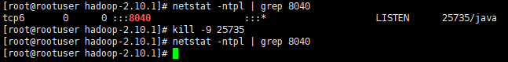

再查看resourcemanager的日志：

```
2021-12-07 20:25:07,328 INFO org.apache.hadoop.yarn.server.resourcemanager.ResourceManager: Transitioning to standby state
2021-12-07 20:25:07,328 INFO org.apache.hadoop.yarn.server.resourcemanager.ResourceManager: Transitioned to standby state
2021-12-07 20:25:07,328 FATAL org.apache.hadoop.yarn.server.resourcemanager.ResourceManager: Error starting ResourceManager
org.apache.hadoop.yarn.webapp.WebAppException: Error starting http server
        at org.apache.hadoop.yarn.webapp.WebApps$Builder.start(WebApps.java:412)
        at org.apache.hadoop.yarn.server.resourcemanager.ResourceManager.startWepApp(ResourceManager.java:1133)
        at org.apache.hadoop.yarn.server.resourcemanager.ResourceManager.serviceStart(ResourceManager.java:1242)
        at org.apache.hadoop.service.AbstractService.start(AbstractService.java:194)
        at org.apache.hadoop.yarn.server.resourcemanager.ResourceManager.main(ResourceManager.java:1443)
Caused by: java.net.BindException: Port in use: 0.0.0.0:8088
        at org.apache.hadoop.http.HttpServer2.constructBindException(HttpServer2.java:1026)
        at org.apache.hadoop.http.HttpServer2.bindForSinglePort(HttpServer2.java:1049)
        at org.apache.hadoop.http.HttpServer2.openListeners(HttpServer2.java:1106)
        at org.apache.hadoop.http.HttpServer2.start(HttpServer2.java:963)
        at org.apache.hadoop.yarn.webapp.WebApps$Builder.start(WebApps.java:408)
        ... 4 more
Caused by: java.net.BindException: Address already in use
        at sun.nio.ch.Net.bind0(Native Method)
        at sun.nio.ch.Net.bind(Net.java:438)
        at sun.nio.ch.Net.bind(Net.java:430)
        at sun.nio.ch.ServerSocketChannelImpl.bind(ServerSocketChannelImpl.java:225)
        at sun.nio.ch.ServerSocketAdaptor.bind(ServerSocketAdaptor.java:74)
        at org.mortbay.jetty.nio.SelectChannelConnector.open(SelectChannelConnector.java:216)
        at org.apache.hadoop.http.HttpServer2.bindListener(HttpServer2.java:1014)
        at org.apache.hadoop.http.HttpServer2.bindForSinglePort(HttpServer2.java:1045)
        ... 7 more
2021-12-07 20:25:07,346 INFO org.apache.hadoop.yarn.server.resourcemanager.ResourceManager: SHUTDOWN_MSG:
/************************************************************
SHUTDOWN_MSG: Shutting down ResourceManager at rootuser/10.0.24.2
************************************************************/

```

感恩，还是端口占用，老规矩，杀掉占用的进程

```
netstat -ntpl | grep 8088
kill -9 <pid>
```

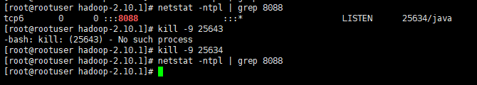

在hadoop已经开启的前提下，重新开启yarn试试。成功。


