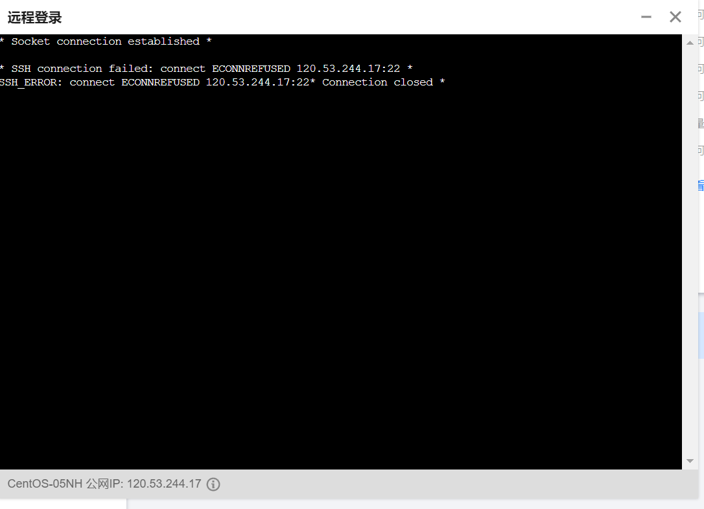
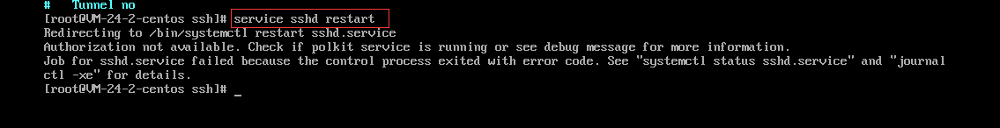
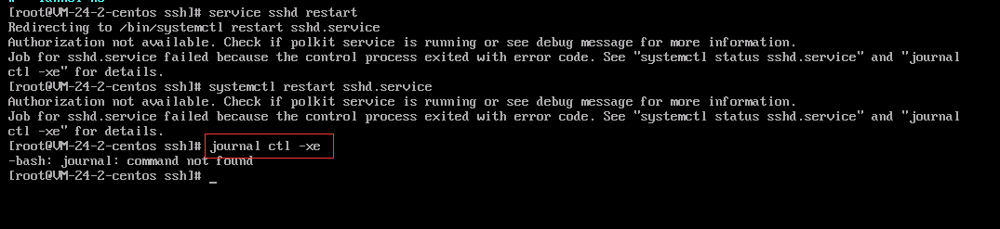
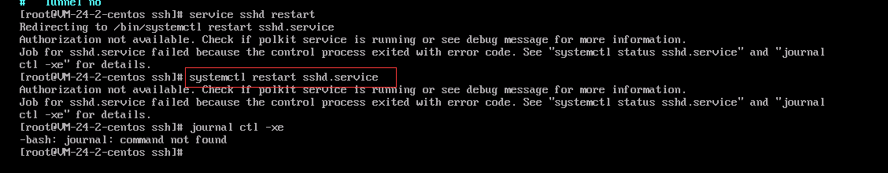
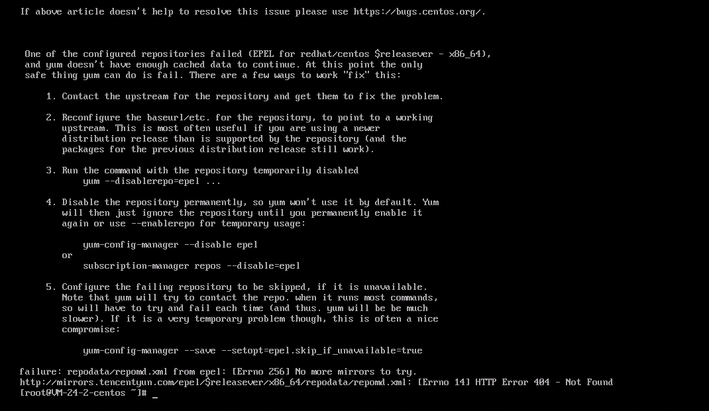
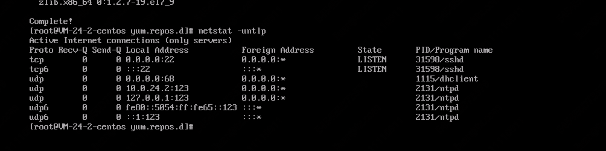
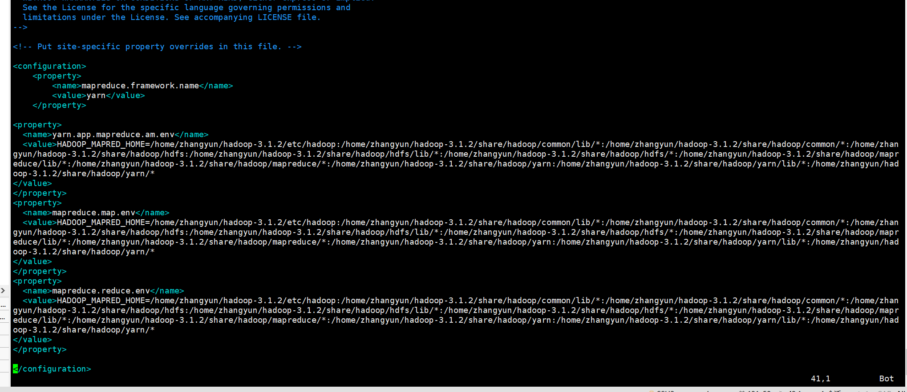

### 安装基础+搭建伪分布式（视频+博客）

#### 准备工作
- Linux环境：Centos 7.6
- hadoop版本：hadoop3.1.2
- jdk版本：1.8

- 远程登陆：xShell 7
  1. 登录服务器

- vim命令（默认已经会了），只贴本文用到的
  - vi 文件名 打开文件
  - i 编辑
  - Esc 退出编辑
  - :wq 保存并退出
  - 键盘控制光标上下左右

#### 检查&安装JDK

1. 检查系统是否存在openjdk

   ```
   rpm -qa | grep java
   
   ```

   若有java相关的软件显示，则表示存在，进行卸载：

   ```
   rpm -e --nodeps jdk 软件名称
   ```

   若没有显示，则不存在。

2. 下载&解压jdk

   从官网下载gz版的jdk到本机，再用xftp传到linux

   - 这里下载jdk8，因为使用jdk9及以上版本，启动Hadoop时会出现难以解决的问题，我搜索尝试了很多办法，得出结论:目前没有办法通过配置文件解决。
   - linux系统安装java可以参考linux.md笔记

   解压jdk，解压到哪个目录可以自行选择，但是要知道路径，配置环境变量时需要

   ```
   tar -zxvf jdk压缩包名称 -C 解压到哪个目录
   ```

   例如：

   ```
   tar -zxvf jdk-8u181-linux-x64.tar.gz -C /usr/local/
   ```

3. 配置java环境变量

   - 呼应linux.md笔记中的记载：rpm安装java不需要配置安装环境变量；安装包解压安装java需要配置环境变量
   - 配置环境变量时，`PATH=$PATH:`,`CLASSPATH=.:`,`$PATH`和`.`表示承接之前的变量。不带上的话会覆盖之前的环境变量导致出错。
     - 覆盖后也不需要像某些网友说的，就重装系统，可以在环境变量位置前面加上`$PATH`和`.`，在用source使之生效即可。

   打开proflie文件

   ```
   vim /etc/profile
   ```

   将光标移动至文末，按i进入编辑模式，在文末添加以下内容

   ```
   export JAVA_HOME=jdk路径
   export PATH=$PATH:$JAVA_HOME/bin
   export CLASSPATH=.:$JAVA_HOME/lib/dt.jar:$JAVA_HOME/lib/tools.jar
   ```

   例如：

   ```
   export JAVA_HOME=/usr/local/jdk1.8.0_181
   export PATH=$PATH:$JAVA_HOME/bin
   export CLASSPATH=.:$JAVA_HOME/lib/dt.jar:$JAVA_HOME/lib/tools.jar
   ```

   按Esc键退出编辑，输入 `:wq` 保存并退出文件，执行以下内容使环境变量生效

   ```
   source /etc/profile
   ```

4. 检查jdk是否安装配置成功

   ```
   java -version
   ```

   出现java版本信息，则配置成功，例如

   > java version “1.8.0_181”
   > Java(TM) SE Runtime Environment (build 1.8.0_181-b13)
   > Java HotSpot(TM) 64-Bit Server VM (build 25.181-b13, mixed mode)

#### 配置Hadoop

1. 下载hadoop

   从官网下载hadoop-3.1.2到本机，并用xftp上传到linux服务器

2. 解压hadoop，解压到哪个目录可以自行选择，但是要知道路径，配置环境变量时需要

   ```
   tar -zxvf hadoop-3.1.2.tar.gz -C /usr/local/
   ```

3. 配置hadoop（本文涉及到的ct01，均需要改为自己的主机名或者ip）

   1）配置环境变量

   ```
   vi /etc/profile
   ```

   按`i`进入编辑模式，在文末添加

   ```
   export HADOOP_HOME=/hadoop路径
   export PATH=$PATH:$HADOOP_HOME/bin:$HADOOP_HOME/sbin
   ```

   例如

   ```
   export HADOOP_HOME=/usr/local/hadoop-3.1.2
   export PATH=$PATH:$HADOOP_HOME/bin:$HADOOP_HOME/sbin
   ```

   按Esc退出编辑，输入 :wq 保存并退出，执行以下内容使环境变量生效

   ```
   source /etc/profile
   ```

   2）配置hadoop-env.sh

   切到/usr/local/hadoop-3.1.2/etc/hadoop目录下，2）- 6）都是在这个目录下配置

   ```
   cd /usr/local/hadoop-3.1.2/etc/hadoop
   ```

   打开hadoop-env.sh

   ```
   vi hadoop-env.sh
   ```

   找到# export JAVA_HOME=,按i进入编辑模式，修改为以下内容后，按Esc，输入 :wq 保存并退出

   ```
   export JAVA_HOME=/usr/local/jdk1.8.0_181
   ```

   3）配置core-site.xml，修改为以下内容，其中第5行 ct01 改为自己的主机名（用`hostname查看`）

   ```xml
   <configuration>
       <!--设置namenode所在节点-->
       <property>
           <name>fs.defaultFS</name>
           <value>hdfs://ct01:9000</value>
       </property>
       <!--
           设置hadoop存放数据的目录，Hadoop默认把数据块的元数据和数据存放在操作系统的/tmp目录下，但操作系统的/tmp目录会不定时清空，所以要做修改
       -->
       <property>
           <name>hadoop.tmp.dir</name>
           <value>/usr/local/hadoop-3.1.2/data</value>
       </property>
   </configuration>
   ```

   4）配置yarn-site.xml，修改为以下内容，ct01 均改为自己的主机名

   ```xml
   <configuration>
       <!-- 指定ResourceManager的地址-->
       <property>
   		<name>yarn.resourcemanager.hostname</name>
   		<value>ct01</value>
       </property>
       <property>
   		<name>yarn.resourcemanager.address</name>
   		<value>ct01:8032</value>
       </property>
       <property>
   		<name>yarn.resourcemanager.scheduler.address</name>
   		<value>ct01:8030</value>
       </property>
       <property>
   		<name>yarn.resourcemanager.resource-tracker.address</name>
   		<value>ct01:8031</value>
       </property>
       <property>
   		<name>yarn.resourcemanager.admin.address</name>
   		<value>ct01:8033</value>
       </property>
       <property>
   		<name>yarn.resourcemanager.webapp.address</name>
   		<value>ct01:8088</value>
       </property>
       <!-- 指定reducer获取数据的方式-->
       <property>
           <name>yarn.nodemanager.aux-services</name>
           <value>mapreduce_shuffle</value>
       </property>
   </configuration>
   ```

   5）配置hdfs-site.xml，修改为以下内容

   ```xml
   <configuration>
       <!--设置block副本数，不能超过节点数-->
       <property>
           <name>dfs.replication</name>
           <value>1</value>
       </property>
   </configuration>
   ```

   6）配置mapred-site.xml，修改为以下内容

   ```xml
   <configuration>
       <property>
           <name>mapreduce.framework.name</name>
           <value>yarn</value>
       </property>
   </configuration>
   ```

   7）配置start-dfs.sh，stop-dfs.sh

   切到/usr/local/hadoop-3.1.2/sbin目录,7）- 8）在这个目录配置

   ```
   cd /usr/local/hadoop-3.1.2/sbin
   ```

   在start-dfs.sh，stop-dfs.sh的最开头添加以下内容，因为是root登录的，不配置会出现错误

   ```
   HDFS_DATANODE_USER=root  
   HDFS_DATANODE_SECURE_USER=hdfs  
   HDFS_NAMENODE_USER=root  
   HDFS_SECONDARYNAMENODE_USER=root
   ```

   8）配置start-yarn.sh，stop-yarn.sh，在文件最开头添加以下内容

   ```
   YARN_RESOURCEMANAGER_USER=root
   HADOOP_SECURE_DN_USER=yarn
   YARN_NODEMANAGER_USER=root
   ```

4. 实现SSH免密码远程登录，因为是伪分布式集群，其实就是自己登录自己（如果已经配置过可跳过）

   1）创建公钥/私钥，一路回车

   ```
   ssh-keygen -t rsa
   ```

   2）创建authorized_keys文件并修改权限为600

   ```
   cd ~/.ssh
   touch authorized_keys
   chmod 600 authorized_keys
   ```

   3）将公钥追加到authorized_keys文件中

   ```
   cat id_rsa.pub >> authorized_keys
   ```

   尝试能否免密登录，能登陆就成功了，尝试后，输入exit退出

   ```
   ssh 自己的主机名
   ```

5. 关闭防火墙（如果已经配置过可跳过）

   查看防火墙状态

   ```
   firewall-cmd --state
   ```

   1）关闭防火墙
   
   - 因为腾讯云本身就有port安全组和防火墙，比较安全，这里关掉即可
   
   ```
   systemctl stop firewalld.service
   ```
   
   2）禁止开机时防火墙自启
   
   ```
   systemctl disable firewalld.service
   ```

#### 格式化&启动&停止hadoop

1. 格式化hadoop，不要多次格式化。多次格式化会导致DataNode无法正常启动，解决办法在文末

   ```
   hadoop namenode -format
   ```

2. 启动&停止hadoop

   ```
   start-all.sh
   ```

   ```
   stop-all.sh
   ```

   启动以后可以输入jps，看有没有下面这些进程

   >16352 NameNode
   >21362 Jps
   >16644 SecondaryNameNode
   >17017 NodeManager
   >16475 DataNode
   >16891 ResourceManager

   输入netstat -tpnl | grep java，查看是否有9870和8088端口，刚启动需要等待一会儿才能查询到端口，等待时间视虚拟机情况而定

   ```
   netstat -tpnl | grep java
   ```

#### 遇到的一些坑

1. 多次格式化会导致DataNode无法正常启动（很多人遇到这个问题）

   1）打开/usr/local/hadoop-3.1.2/data/dfs

   ```
   cd /usr/local/hadoop-3.1.2/data/dfs
   ```

   2）有name和data两个目录，将data/current/VERSION中clusterID的值改为name/current/VERSION中clusterID的值

   找到并复制clusterID的值

   ```
   cat name/current/VERSION
   ```

   修改clusterID的值

   ```
   vi data/current/VERSION
   ```

   3）重新启动hadoop

2. ip:50070无法访问

   hadoop 3.X版本以上，50070端口已改为9870端口，访问ip：9870即可

3. 解决问题的最好办法

   查看logs！如果看不懂请百度。修改之后记得重启hadoop

   - 以本文为例，logs路径为：/usr/local/hadoop-3.1.2/logs


[参考文档](https://yangyefu.github.io/2019/05/07/Centos7%E9%85%8D%E7%BD%AEhadoop3.1.2%20%E4%BC%AA%E5%88%86%E5%B8%83%E5%BC%8F%E8%AF%A6%E7%BB%86%E8%BF%87%E7%A8%8B/)


### ssh+netstat崩坏

安装好hadoop后，断开xshell连接，过段时间再连接时提示ssh无法登录。自己尝试很多办法无法搞定，申请了腾讯云的在线协助。

以下记录所有聊天记录：

>提单信息： 请输入问题描述 ：xshell无法ssh登录；腾讯云网页也无法ssh登录；同时netstat命令不能用了，使用yum尝试安装nettools也失败。 腾讯云网页尝试直接ssh登录服务器报错如下： socket connection established ssH connection failed: connect ECONNREFUSED 120.53.244.17:22* 3SH ERROR:connect ECONNREFUSED 120.53.244.17:22* Connection closed* 轻量服务器ID/名称：lhins-09jwaw6c 登录方式：本地ssh软件登录 服务器系统版本：centos 7.6 登录用户名：root


您好，腾讯云很高兴为您服务，您已接入人工，工程师将尽快为您核实问题处理。

2021-11-17 00:31

您截图看一下



> 好的，我是配置hadoop的时候涉及了ssh，当时一切正常，结果xshell关闭后，重新连接就连不上了


现在扫描22端口关闭了，您用VNC的登录方式重启一下ssh服务
https://cloud.tencent.com/document/product/1207/46824


> 我试过重启，但是报另一个错，你稍等我截图




2021-11-17 00:40

看起来是这个服务有问题了

2021-11-17 00:40

输入提示的命令看一下具体




> 输入这个吗？也报错

用systemctl这个看一下



> 这个吗？我用过了

2021-11-17 00:45

您好，关于您的问题我们已收到，经初步排查，需要为您转接相关负责人为您进一步跟进，请您稍等~

您好：
针对您遇到的问题，腾讯云申请登机排查，请您配合做好【数据备份】，提供云服务器的登录【账号】和【密码】
排查过程中，工程师可能会对您服务器进行重启、或对系统的文件、配置、密码等修改操作。
【请您在会话中文字回复】如下信息：
1、（必填）实例用户名：
2、（必填）实例密码：
3、（必填）是否已完成备份：【已备份（提供备份截图）】 / 【已确认无需备份】
4、（必填）是否允许重启：【允许重启】/【不允许重启】
5、（必填）是否允许读写操作：【允许读写操作】/【不允许读写操作】
授权前，还请您务必在控制台创建镜像、快照备份数据，
制作快照参考：
https://cloud.tencent.com/document/product/1207/48546制作系统镜像参考：
https://cloud.tencent.com/document/product/1207/53038如您数据盘是本地盘，请及时将数据备份本地后授权我们操作。
若您坚持要求腾讯云在您未完成备份情况下即进行排查，如您的数据或业务因此遭受影响且无备份恢复，腾讯云不承担任何责任，感谢您的理解和支持


> \1. root
>
> 2021-11-17 00:49
>
> \2. XXXX
>
> 2021-11-17 00:49
>
> \3.  已备份（提供备份截图）


> 2021-11-17 00:49
>
> 允许重启
>
> 2021-11-17 00:49
>
> \4. 允许重启
>
> 2021-11-17 00:49
>
> \5. 允许读写操作


收到，这边上机协助您尽快查看下问题


> 查到问题的话，麻烦把导致问题的（可能）原因告诉我一下。结合netstat不能使用和安装，结合之前我安装hadoop涉及的ssh。如果可以的话


您好：
1、目前ssh服务的问题已经处理，原因是由于目录文件异常/var/empty/sshd


2、netstat不能使用和安装，目前查看是yum源异常，请您稍等




> 好的，为什么本来没事，突然目录就异常了？这个问题不知道的话，后续可能还会异常


您好，请您稍等，具体的原因稍后一并给您反馈

您好，抱歉让您久等了：
上机已经为您修复，辛苦您进行核实



【问题原因】
1、ssh服务问题，是由于/var/empty/sshd目录权限导致，后续若ssh服务异常，您可以执行：sshd -t或者sshd -D进行查看([ssh的一些参考知识](https://blog.csdn.net/ranrancc_/article/details/96421193)，[该问题网上的解决方法](https://blog.csdn.net/bugzeroman/article/details/89223610)，[相关问题2](https://blog.csdn.net/zhanglh046/article/details/78890432))
2、netstat 无法正常安装是由于yum源的问题导致，报错：报错404直接访问url打不开
http://mirrors.tencentyun.com/centos/$releasever/os/x86_64/repodata/repomd.xml。$releasever变量没有被系统识别，在连接网络yum源的时候，变成了%24releasever；而yum中的变量$releasever是由/etc/yum.conf中的distroverpkg进行定义，还请您知晓。（[参考连接](https://cloud.tencent.com/developer/article/1559023)）


### 试用自带的wordcount

以下命令基于：centos7.6+hadoop3.1.2+jdk1.8


来到hadoop的根目录，在我的机器上是`/home/zhangyun/hadoop-3.1.2`

依次执行以下命令：

```bash
# 来到hadoop启动文件的存放位置
[root@zhangyun ~]# cd /home/zhangyun/hadoop-3.1.2/sbin
# 启动hadoop
[root@zhangyun sbin]# ./start-all.sh
Starting namenodes on [zhangyun]
Last login: Wed Nov 17 10:25:54 CST 2021 from 223.72.40.168 on pts/0
zhangyun: @@@@@@@@@@@@@@@@@@@@@@@@@@@@@@@@@@@@@@@@@@@@@@@@@@@@@@@@@@@
zhangyun: @    WARNING: REMOTE HOST IDENTIFICATION HAS CHANGED!     @
zhangyun: @@@@@@@@@@@@@@@@@@@@@@@@@@@@@@@@@@@@@@@@@@@@@@@@@@@@@@@@@@@
zhangyun: IT IS POSSIBLE THAT SOMEONE IS DOING SOMETHING NASTY!
zhangyun: Someone could be eavesdropping on you right now (man-in-the-middle attack)!
zhangyun: It is also possible that a host key has just been changed.
zhangyun: The fingerprint for the ECDSA key sent by the remote host is
zhangyun: SHA256:Q9N55LawH2g4vH1uKKOeaCN7hBRiHGd6PS7ryqHEFfw.
zhangyun: Please contact your system administrator.
zhangyun: Add correct host key in /root/.ssh/known_hosts to get rid of this message.
zhangyun: Offending ECDSA key in /root/.ssh/known_hosts:2
zhangyun: Password authentication is disabled to avoid man-in-the-middle attacks.
zhangyun: Keyboard-interactive authentication is disabled to avoid man-in-the-middle attacks.
Starting datanodes
Last login: Wed Nov 17 10:31:53 CST 2021 on pts/0
localhost: @@@@@@@@@@@@@@@@@@@@@@@@@@@@@@@@@@@@@@@@@@@@@@@@@@@@@@@@@@@
localhost: @    WARNING: REMOTE HOST IDENTIFICATION HAS CHANGED!     @
localhost: @@@@@@@@@@@@@@@@@@@@@@@@@@@@@@@@@@@@@@@@@@@@@@@@@@@@@@@@@@@
localhost: IT IS POSSIBLE THAT SOMEONE IS DOING SOMETHING NASTY!
localhost: Someone could be eavesdropping on you right now (man-in-the-middle attack)!
localhost: It is also possible that a host key has just been changed.
localhost: The fingerprint for the ECDSA key sent by the remote host is
localhost: SHA256:Q9N55LawH2g4vH1uKKOeaCN7hBRiHGd6PS7ryqHEFfw.
localhost: Please contact your system administrator.
localhost: Add correct host key in /root/.ssh/known_hosts to get rid of this message.
localhost: Offending ECDSA key in /root/.ssh/known_hosts:3
localhost: Password authentication is disabled to avoid man-in-the-middle attacks.
localhost: Keyboard-interactive authentication is disabled to avoid man-in-the-middle attacks.
Starting secondary namenodes [zhangyun]
Last login: Wed Nov 17 10:31:58 CST 2021 on pts/0
zhangyun: @@@@@@@@@@@@@@@@@@@@@@@@@@@@@@@@@@@@@@@@@@@@@@@@@@@@@@@@@@@
zhangyun: @    WARNING: REMOTE HOST IDENTIFICATION HAS CHANGED!     @
zhangyun: @@@@@@@@@@@@@@@@@@@@@@@@@@@@@@@@@@@@@@@@@@@@@@@@@@@@@@@@@@@
zhangyun: IT IS POSSIBLE THAT SOMEONE IS DOING SOMETHING NASTY!
zhangyun: Someone could be eavesdropping on you right now (man-in-the-middle attack)!
zhangyun: It is also possible that a host key has just been changed.
zhangyun: The fingerprint for the ECDSA key sent by the remote host is
zhangyun: SHA256:Q9N55LawH2g4vH1uKKOeaCN7hBRiHGd6PS7ryqHEFfw.
zhangyun: Please contact your system administrator.
zhangyun: Add correct host key in /root/.ssh/known_hosts to get rid of this message.
zhangyun: Offending ECDSA key in /root/.ssh/known_hosts:2
zhangyun: Password authentication is disabled to avoid man-in-the-middle attacks.
zhangyun: Keyboard-interactive authentication is disabled to avoid man-in-the-middle attacks.
Starting resourcemanager
Last login: Wed Nov 17 10:32:03 CST 2021 on pts/0
Starting nodemanagers
Last login: Wed Nov 17 10:32:10 CST 2021 on pts/0
localhost: @@@@@@@@@@@@@@@@@@@@@@@@@@@@@@@@@@@@@@@@@@@@@@@@@@@@@@@@@@@
localhost: @    WARNING: REMOTE HOST IDENTIFICATION HAS CHANGED!     @
localhost: @@@@@@@@@@@@@@@@@@@@@@@@@@@@@@@@@@@@@@@@@@@@@@@@@@@@@@@@@@@
localhost: IT IS POSSIBLE THAT SOMEONE IS DOING SOMETHING NASTY!
localhost: Someone could be eavesdropping on you right now (man-in-the-middle attack)!
localhost: It is also possible that a host key has just been changed.
localhost: The fingerprint for the ECDSA key sent by the remote host is
localhost: SHA256:Q9N55LawH2g4vH1uKKOeaCN7hBRiHGd6PS7ryqHEFfw.
localhost: Please contact your system administrator.
localhost: Add correct host key in /root/.ssh/known_hosts to get rid of this message.
localhost: Offending ECDSA key in /root/.ssh/known_hosts:3
localhost: Password authentication is disabled to avoid man-in-the-middle attacks.
localhost: Keyboard-interactive authentication is disabled to avoid man-in-the-middle attacks.
[root@zhangyun sbin]#

# 来到hadoop根目录
[root@zhangyun ~]# cd /home/zhangyun/hadoop-3.1.2/
[root@zhangyun hadoop-3.1.2]# ls
bin  data  etc  include  lib  libexec  LICENSE.txt  logs  NOTICE.txt  README.txt  sbin  share
# 创建用于存放本地待分析文件的文件夹，并把待分析文件放进去
[root@zhangyun hadoop-3.1.2]# mkdir file
[root@zhangyun hadoop-3.1.2]# ls
bin  data  etc  file  include  lib  libexec  LICENSE.txt  logs  NOTICE.txt  README.txt  sbin  share
[root@zhangyun hadoop-3.1.2]# cp README.txt file
[root@zhangyun hadoop-3.1.2]# cd file
[root@zhangyun file]# ls
README.txt
# 回到hadoop根目录，因为很多文件要从hadoop根目录往下去找
[root@zhangyun file]# cd ../
# 在hdfs上创建input文件夹，hadoop计算的时候，我指定从这个文件夹中读文件
[root@zhangyun hadoop-3.1.2]# bin/hadoop fs -mkdir /input
# 把根目录的file/README.txt上传到hdfs的/input目录中
[root@zhangyun hadoop-3.1.2]# bin/hadoop fs -put file/README.txt /input
# 使用mapreduce自带的wordcount函数，对于hadoop3.1.2来说这个函数在以下的目录和jar包中。处理hdfs的/input/README.txt，并把结果输出到hdfs的/output中。运行发生了错误！！！！！！
[root@zhangyun hadoop-3.1.2]# bin/hadoop jar share/hadoop/mapreduce/hadoop-mapreduce-examples-3.1.2.jar wordcount /input/README.txt /output
2021-11-17 11:29:09,204 INFO client.RMProxy: Connecting to ResourceManager at zhangyun/10.0.24.2:8032
2021-11-17 11:29:09,871 INFO mapreduce.JobResourceUploader: Disabling Erasure Coding for path: /tmp/hadoop-yarn/staging/root/.staging/job_1637116334826_0002
2021-11-17 11:29:10,496 INFO input.FileInputFormat: Total input files to process : 1
2021-11-17 11:29:10,632 INFO mapreduce.JobSubmitter: number of splits:1
2021-11-17 11:29:10,797 INFO mapreduce.JobSubmitter: Submitting tokens for job: job_1637116334826_0002
2021-11-17 11:29:10,798 INFO mapreduce.JobSubmitter: Executing with tokens: []
2021-11-17 11:29:10,988 INFO conf.Configuration: resource-types.xml not found
2021-11-17 11:29:10,989 INFO resource.ResourceUtils: Unable to find 'resource-types.xml'.
2021-11-17 11:29:11,245 INFO impl.YarnClientImpl: Submitted application application_1637116334826_0002
2021-11-17 11:29:11,290 INFO mapreduce.Job: The url to track the job: http://zhangyun:8088/proxy/application_1637116334826_0002/
2021-11-17 11:29:11,290 INFO mapreduce.Job: Running job: job_1637116334826_0002
2021-11-17 11:29:15,327 INFO mapreduce.Job: Job job_1637116334826_0002 running in uber mode : false
2021-11-17 11:29:15,328 INFO mapreduce.Job:  map 0% reduce 0%
2021-11-17 11:29:15,345 INFO mapreduce.Job: Job job_1637116334826_0002 failed with state FAILED due to: Application application_1637116334826_0002 failed 2 times due to AM Container for appattempt_1637116334826_0002_000002 exited with  exitCode: 1
Failing this attempt.Diagnostics: [2021-11-17 11:29:15.205]Exception from container-launch.
Container id: container_1637116334826_0002_02_000001
Exit code: 1

[2021-11-17 11:29:15.208]Container exited with a non-zero exit code 1. Error file: prelaunch.err.
Last 4096 bytes of prelaunch.err :
Last 4096 bytes of stderr :
Error: Could not find or load main class org.apache.hadoop.mapreduce.v2.app.MRAppMaster

Please check whether your etc/hadoop/mapred-site.xml contains the below configuration:
<property>
  <name>yarn.app.mapreduce.am.env</name>
  <value>HADOOP_MAPRED_HOME=${full path of your hadoop distribution directory}</value>
</property>
<property>
  <name>mapreduce.map.env</name>
  <value>HADOOP_MAPRED_HOME=${full path of your hadoop distribution directory}</value>
</property>
<property>
  <name>mapreduce.reduce.env</name>
  <value>HADOOP_MAPRED_HOME=${full path of your hadoop distribution directory}</value>
</property>

[2021-11-17 11:29:15.209]Container exited with a non-zero exit code 1. Error file: prelaunch.err.
Last 4096 bytes of prelaunch.err :
Last 4096 bytes of stderr :
Error: Could not find or load main class org.apache.hadoop.mapreduce.v2.app.MRAppMaster

Please check whether your etc/hadoop/mapred-site.xml contains the below configuration:
<property>
  <name>yarn.app.mapreduce.am.env</name>
  <value>HADOOP_MAPRED_HOME=${full path of your hadoop distribution directory}</value>
</property>
<property>
  <name>mapreduce.map.env</name>
  <value>HADOOP_MAPRED_HOME=${full path of your hadoop distribution directory}</value>
</property>
<property>
  <name>mapreduce.reduce.env</name>
  <value>HADOOP_MAPRED_HOME=${full path of your hadoop distribution directory}</value>
</property>

For more detailed output, check the application tracking page: http://zhangyun:8088/cluster/app/application_1637116334826_0002 Then click on links to logs of each attempt.
. Failing the application.
2021-11-17 11:29:15,361 INFO mapreduce.Job: Counters: 0
[root@zhangyun hadoop-3.1.2]# hadoop path
ERROR: path is not COMMAND nor fully qualified CLASSNAME.
Usage: hadoop [OPTIONS] SUBCOMMAND [SUBCOMMAND OPTIONS]
 or    hadoop [OPTIONS] CLASSNAME [CLASSNAME OPTIONS]
  where CLASSNAME is a user-provided Java class

  OPTIONS is none or any of:

buildpaths                       attempt to add class files from build tree
--config dir                     Hadoop config directory
--debug                          turn on shell script debug mode
--help                           usage information
hostnames list[,of,host,names]   hosts to use in slave mode
hosts filename                   list of hosts to use in slave mode
loglevel level                   set the log4j level for this command
workers                          turn on worker mode

  SUBCOMMAND is one of:


    Admin Commands:

daemonlog     get/set the log level for each daemon

    Client Commands:

archive       create a Hadoop archive
checknative   check native Hadoop and compression libraries availability
classpath     prints the class path needed to get the Hadoop jar and the required libraries
conftest      validate configuration XML files
credential    interact with credential providers
distch        distributed metadata changer
distcp        copy file or directories recursively
dtutil        operations related to delegation tokens
envvars       display computed Hadoop environment variables
fs            run a generic filesystem user client
gridmix       submit a mix of synthetic job, modeling a profiled from production load
jar <jar>     run a jar file. NOTE: please use "yarn jar" to launch YARN applications, not this command.
jnipath       prints the java.library.path
kdiag         Diagnose Kerberos Problems
kerbname      show auth_to_local principal conversion
key           manage keys via the KeyProvider
rumenfolder   scale a rumen input trace
rumentrace    convert logs into a rumen trace
s3guard       manage metadata on S3
trace         view and modify Hadoop tracing settings
version       print the version

    Daemon Commands:

kms           run KMS, the Key Management Server

SUBCOMMAND may print help when invoked w/o parameters or with -h.
```

现在根据报错提示处理一下这个错误，查看mapred-site.xml中是否缺少对应的property。vim查看后发现确实缺少了。用以下命令得到`${full path of your hadoop distribution directory}`

```
[root@zhangyun hadoop-3.1.2]# hadoop classpath
/home/zhangyun/hadoop-3.1.2/etc/hadoop:/home/zhangyun/hadoop-3.1.2/share/hadoop/common/lib/*:/home/zhangyun/hadoop-3.1.2/share/hadoop/common/*:/home/zhangyun/hadoop-3.1.2/share/hadoop/hdfs:/home/zhangyun/hadoop-3.1.2/share/hadoop/hdfs/lib/*:/home/zhangyun/hadoop-3.1.2/share/hadoop/hdfs/*:/home/zhangyun/hadoop-3.1.2/share/hadoop/mapreduce/lib/*:/home/zhangyun/hadoop-3.1.2/share/hadoop/mapreduce/*:/home/zhangyun/hadoop-3.1.2/share/hadoop/yarn:/home/zhangyun/hadoop-3.1.2/share/hadoop/yarn/lib/*:/home/zhangyun/hadoop-3.1.2/share/hadoop/yarn/*
```

在mapred-site.xml中添加报错提示的内容,并把${full path of your hadoop distribution directory}替换为自己查到的目录：

```
# 在hadoop根目录执行下列命令
cd ./etc/hadoop

[root@zhangyun hadoop]# vim mapred-site.xml 
```

mapred-site.xml 中添加如下property

```
<property>
  <name>yarn.app.mapreduce.am.env</name>
  <value>HADOOP_MAPRED_HOME=/home/zhangyun/hadoop-3.1.2/etc/hadoop:/home/zhangyun/hadoop-3.1.2/share/hadoop/common/lib/*:/home/zhangyun/hadoop-3.1.2/share/hadoop/common/*:/home/zhangyun/hadoop-3.1.2/share/hadoop/hdfs:/home/zhangyun/hadoop-3.1.2/share/hadoop/hdfs/lib/*:/home/zhangyun/hadoop-3.1.2/share/hadoop/hdfs/*:/home/zhangyun/hadoop-3.1.2/share/hadoop/mapreduce/lib/*:/home/zhangyun/hadoop-3.1.2/share/hadoop/mapreduce/*:/home/zhangyun/hadoop-3.1.2/share/hadoop/yarn:/home/zhangyun/hadoop-3.1.2/share/hadoop/yarn/lib/*:/home/zhangyun/hadoop-3.1.2/share/hadoop/yarn/*
</value>
</property>
<property>
  <name>mapreduce.map.env</name>
  <value>HADOOP_MAPRED_HOME=/home/zhangyun/hadoop-3.1.2/etc/hadoop:/home/zhangyun/hadoop-3.1.2/share/hadoop/common/lib/*:/home/zhangyun/hadoop-3.1.2/share/hadoop/common/*:/home/zhangyun/hadoop-3.1.2/share/hadoop/hdfs:/home/zhangyun/hadoop-3.1.2/share/hadoop/hdfs/lib/*:/home/zhangyun/hadoop-3.1.2/share/hadoop/hdfs/*:/home/zhangyun/hadoop-3.1.2/share/hadoop/mapreduce/lib/*:/home/zhangyun/hadoop-3.1.2/share/hadoop/mapreduce/*:/home/zhangyun/hadoop-3.1.2/share/hadoop/yarn:/home/zhangyun/hadoop-3.1.2/share/hadoop/yarn/lib/*:/home/zhangyun/hadoop-3.1.2/share/hadoop/yarn/*
</value>
</property>
<property>
  <name>mapreduce.reduce.env</name>
  <value>HADOOP_MAPRED_HOME=/home/zhangyun/hadoop-3.1.2/etc/hadoop:/home/zhangyun/hadoop-3.1.2/share/hadoop/common/lib/*:/home/zhangyun/hadoop-3.1.2/share/hadoop/common/*:/home/zhangyun/hadoop-3.1.2/share/hadoop/hdfs:/home/zhangyun/hadoop-3.1.2/share/hadoop/hdfs/lib/*:/home/zhangyun/hadoop-3.1.2/share/hadoop/hdfs/*:/home/zhangyun/hadoop-3.1.2/share/hadoop/mapreduce/lib/*:/home/zhangyun/hadoop-3.1.2/share/hadoop/mapreduce/*:/home/zhangyun/hadoop-3.1.2/share/hadoop/yarn:/home/zhangyun/hadoop-3.1.2/share/hadoop/yarn/lib/*:/home/zhangyun/hadoop-3.1.2/share/hadoop/yarn/*
</value>
</property>
```



重回正轨

```bash
# 回到hadoop根目录
[root@zhangyun hadoop]# cd ../../
# 重新执行wordcount，执行成功
[root@zhangyun hadoop-3.1.2]# bin/hadoop jar share/hadoop/mapreduce/hadoop-mapreduce-examples-3.1.2.jar wordcount /input/README.txt /output
2021-11-17 11:46:12,476 INFO client.RMProxy: Connecting to ResourceManager at zhangyun/10.0.24.2:8032
2021-11-17 11:46:13,176 INFO mapreduce.JobResourceUploader: Disabling Erasure Coding for path: /tmp/hadoop-yarn/staging/root/.staging/job_1637116334826_0003
2021-11-17 11:46:13,384 INFO input.FileInputFormat: Total input files to process : 1
2021-11-17 11:46:13,461 INFO mapreduce.JobSubmitter: number of splits:1
2021-11-17 11:46:13,626 INFO mapreduce.JobSubmitter: Submitting tokens for job: job_1637116334826_0003
2021-11-17 11:46:13,627 INFO mapreduce.JobSubmitter: Executing with tokens: []
2021-11-17 11:46:13,823 INFO conf.Configuration: resource-types.xml not found
2021-11-17 11:46:13,824 INFO resource.ResourceUtils: Unable to find 'resource-types.xml'.
2021-11-17 11:46:13,888 INFO impl.YarnClientImpl: Submitted application application_1637116334826_0003
2021-11-17 11:46:13,928 INFO mapreduce.Job: The url to track the job: http://zhangyun:8088/proxy/application_1637116334826_0003/
2021-11-17 11:46:13,928 INFO mapreduce.Job: Running job: job_1637116334826_0003
2021-11-17 11:46:21,026 INFO mapreduce.Job: Job job_1637116334826_0003 running in uber mode : false
2021-11-17 11:46:21,027 INFO mapreduce.Job:  map 0% reduce 0%
2021-11-17 11:46:26,090 INFO mapreduce.Job:  map 100% reduce 0%
2021-11-17 11:46:31,124 INFO mapreduce.Job:  map 100% reduce 100%
2021-11-17 11:46:32,136 INFO mapreduce.Job: Job job_1637116334826_0003 completed successfully
2021-11-17 11:46:32,224 INFO mapreduce.Job: Counters: 53
	File System Counters
		FILE: Number of bytes read=1836
		FILE: Number of bytes written=438611
		FILE: Number of read operations=0
		FILE: Number of large read operations=0
		FILE: Number of write operations=0
		HDFS: Number of bytes read=1468
		HDFS: Number of bytes written=1306
		HDFS: Number of read operations=8
		HDFS: Number of large read operations=0
		HDFS: Number of write operations=2
	Job Counters 
		Launched map tasks=1
		Launched reduce tasks=1
		Data-local map tasks=1
		Total time spent by all maps in occupied slots (ms)=2638
		Total time spent by all reduces in occupied slots (ms)=3317
		Total time spent by all map tasks (ms)=2638
		Total time spent by all reduce tasks (ms)=3317
		Total vcore-milliseconds taken by all map tasks=2638
		Total vcore-milliseconds taken by all reduce tasks=3317
		Total megabyte-milliseconds taken by all map tasks=2701312
		Total megabyte-milliseconds taken by all reduce tasks=3396608
	Map-Reduce Framework
		Map input records=31
		Map output records=179
		Map output bytes=2055
		Map output materialized bytes=1836
		Input split bytes=102
		Combine input records=179
		Combine output records=131
		Reduce input groups=131
		Reduce shuffle bytes=1836
		Reduce input records=131
		Reduce output records=131
		Spilled Records=262
		Shuffled Maps =1
		Failed Shuffles=0
		Merged Map outputs=1
		GC time elapsed (ms)=139
		CPU time spent (ms)=1170
		Physical memory (bytes) snapshot=482385920
		Virtual memory (bytes) snapshot=5622079488
		Total committed heap usage (bytes)=389545984
		Peak Map Physical memory (bytes)=297500672
		Peak Map Virtual memory (bytes)=2809237504
		Peak Reduce Physical memory (bytes)=184885248
		Peak Reduce Virtual memory (bytes)=2812841984
	Shuffle Errors
		BAD_ID=0
		CONNECTION=0
		IO_ERROR=0
		WRONG_LENGTH=0
		WRONG_MAP=0
		WRONG_REDUCE=0
	File Input Format Counters 
		Bytes Read=1366
	File Output Format Counters 
		Bytes Written=1306
# 查看hdfs输出文件夹中的计算结果
[root@zhangyun hadoop-3.1.2]# bin/hadoop fs -ls /output
Found 2 items
-rw-r--r--   1 root supergroup          0 2021-11-17 11:46 /output/_SUCCESS
-rw-r--r--   1 root supergroup       1306 2021-11-17 11:46 /output/part-r-00000
[root@zhangyun hadoop-3.1.2]# bin/hadoop fs -cat /output/part-r-00000
(BIS),	1
(ECCN)	1
(TSU)	1
(see	1
5D002.C.1,	1
740.13)	1
<http://www.wassenaar.org/>	1
Administration	1
Apache	1
BEFORE	1
BIS	1
Bureau	1
Commerce,	1
Commodity	1
Control	1
Core	1
Department	1
ENC	1
Exception	1
Export	2
For	1
Foundation	1
Government	1
Hadoop	1
Hadoop,	1
Industry	1
Jetty	1
License	1
Number	1
Regulations,	1
SSL	1
Section	1
Security	1
See	1
Software	2
Technology	1
The	4
This	1
U.S.	1
Unrestricted	1
about	1
algorithms.	1
and	6
and/or	1
another	1
any	1
as	1
asymmetric	1
at:	2
both	1
by	1
check	1
classified	1
code	1
code.	1
concerning	1
country	1
country's	1
country,	1
cryptographic	3
currently	1
details	1
distribution	2
eligible	1
encryption	3
exception	1
export	1
following	1
for	3
form	1
from	1
functions	1
has	1
have	1
http://hadoop.apache.org/core/	1
http://wiki.apache.org/hadoop/	1
if	1
import,	2
in	1
included	1
includes	2
information	2
information.	1
is	1
it	1
latest	1
laws,	1
libraries	1
makes	1
manner	1
may	1
more	2
mortbay.org.	1
object	1
of	5
on	2
or	2
our	2
performing	1
permitted.	1
please	2
policies	1
possession,	2
project	1
provides	1
re-export	2
regulations	1
reside	1
restrictions	1
security	1
see	1
software	2
software,	2
software.	2
software:	1
source	1
the	8
this	3
to	2
under	1
use,	2
uses	1
using	2
visit	1
website	1
which	2
wiki,	1
with	1
written	1
you	1
your	1
[root@zhangyun hadoop-3.1.2]#
```

