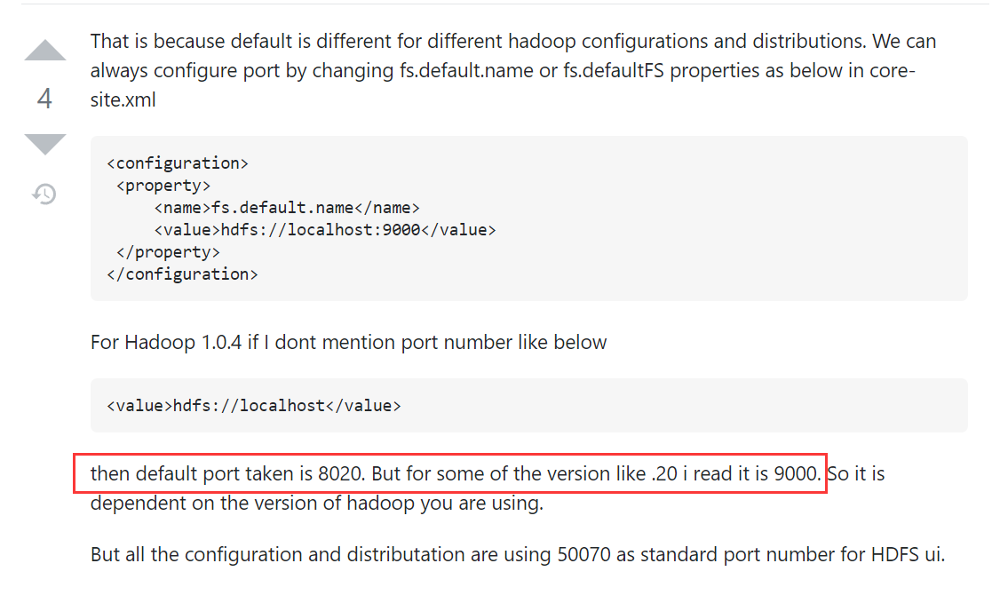
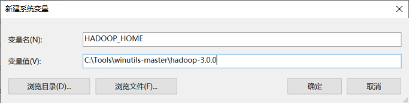
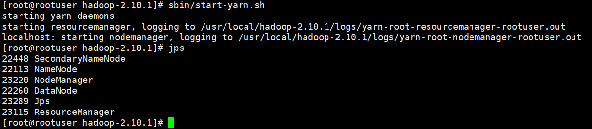

## （hadoop中毒版）安装Hbase

**之前hadoop中毒时，根据csdn等博客安装的hbase。我得重新装一次。这个之前的安装笔记留存不删掉，当做经验存留。**

### 下载+上传+解压

先查看自己的hadoop版本


然后到[官网](https://hbase.apache.org/book.html#hadoop)，查看和自己hadoop版本相匹配的hbase版本


来到北理工的[镜像](http://mirror.bit.edu.cn/apache/hbase/)，下载对应版本的hbase包


通过xFTP把压缩包传送到linux服务器


使用如下命令解压压缩包

```
tar -zxvf hbase-2.3.7-bin.tar.gz -C /usr/local 
```

查看解压结果


### 配置hbase

执行如下代码,配置HBASE_HOME 和 PATH

```
vim /etc/profile
```

```
JAVA_HOME=jdk地址（文件里已经有的话就不用加了）
HADOOP_HOME=hadoop解压（文件里已经有的话就不用加了）
export HBASE_HOME=/usr/local/hbase-2.3.7
export PATH=$PATH:$HBASE_HOME/bin
```

保存

```
ESC
```

```
:wq
```

执行如下代码来刷新配置

```
source /etc/profile
```

修改 $HBASE_HOME/conf/ 目录下的 **hbase-env.sh**，

- 添加 JAVA_HOME，文件中自带了，只需要取消注释即可。

- 放开HBASE_MANAGES_ZK，如果你是使用hbase自带的zk就是true，如果使用自己的zk就是false。这里使用hbase自带的。

```
cd /usr/local/hbase-2.3.7/conf
```

```
vim hbase-env.sh
```

```
export JAVA_HOME=/usr/java/jdk1.8.0_311-amd64
export HBASE_MANAGES_ZK=true
```


修改 $HBASE_HOME/conf/ 目录下的 **hbase-site.xml**为以下内容

```
<configuration>
  <property>
    <name>hbase.rootdir</name>
    <!-- value 的 URL 地址请与hadoop配置文件core-site.xml
                     中的 fs.default.name 保持一致，然后再加上 /hbase。
    此处建议用主机名（不建议直接填写 IP 地址，否则可能出错）-->
    <value>hdfs://zhangyun:9000/hbase</value>
  </property>
  <property>
    <name>hbase.cluster.distributed</name>
    <value>true</value>
  </property>
  <property>
    <name>hbase.tmp.dir</name>
    <value>./tmp</value>
  </property>
  <property>
    <name>hbase.unsafe.stream.capability.enforce</name>
    <value>false</value>
  </property>
</configuration>
```


### 启动hadoop

启动hbase之前需要先启动hadoop

```bash
cd /usr/local/hadoop-3.1.2/sbin
```

```bash
start-all.sh
```

输入`jps`查看线程，确认hadoop启动成功


访问`服务器公网ip:9870/`,确认hadoop成功启动。


### 启动hbase

进入habse解压的目录，执行启动命令。127.0.0.1（本机）第一次连接的话，确认下添加到known_hosts。

```
cd /usr/local/hbase-2.3.7
```

```
./bin/start-hbase.sh 
```


使用jps查看hbase启动情况，会发现比只启动hadoop时多了3个进程 HMaster、HRegionServer 和 HQuorumPeer

```
jps
```


确保腾讯云防火墙放开了`16010`端口


然后访问 `服务器外网ip:16010` （HBase 1.0 之后，60010端口被修改为16010），能够成功访问的话，说明配置成功。

- 注意这里可能由于网络原因会出现：先访问成功，一段时间刷新后访问失败。碰到这个情况可以新开页面输入链接访问试试，或者换个浏览器输入链接访问试试。


## 跟着官网安装远程hbase

环境：

- centos7.6（腾讯云轻量级应用服务器）
- jdk1.8 arm 64，**一定要官方下载，否则可能中毒欲哭无泪，球球**。java+hbase规范查看[网址](https://hbase.apache.org/book.html#java)
- hadoop2.10.1，**一定要官方下载，否则可能中毒欲哭无泪，球球**
- 强烈建议跟着[官方文档](https://hbase.apache.org/book.html#quickstart_pseudo)来装，当然同时参考多方信息源避免坑。
  - 先学基本原理，再来安装


### 下载解压并配置

1）Choose a download site from this list of [Apache Download Mirrors](https://www.apache.org/dyn/closer.lua/hbase/)或[往期release](https://archive.apache.org/dist/hbase/2.3.4/). Click on the suggested top link. This will take you to a mirror of *HBase Releases*. Click on the folder named *stable* and then download the binary file that ends in *.tar.gz* to your local filesystem. Do not download the file ending in *src.tar.gz* for now.

去[北理工镜像](http://mirror.bit.edu.cn/apache/hbase/)，安装2.3.X版本的hbase


通过XFTP上传到linux服务器


2）Extract the downloaded file, and change to the newly-created directory.

```
cd /root/packages/

tar -xzvf hbase-2.3.7-bin.tar.gz -C /usr/local/

cd /usr/local/hbase-2.3.7
```

3）You must set the `JAVA_HOME` environment variable before starting HBase. To make this easier, HBase lets you set it within the *conf/hbase-env.sh* file. You must locate where Java is installed on your machine, and one way to find this is by using the *whereis java* command. Once you have the location, edit the *conf/hbase-env.sh* file and uncomment the line starting with *#export JAVA_HOME=*, and then set it to your Java installation path.

Example extract from *hbase-env.sh* where *JAVA_HOME* is set

```
# Set environment variables here.
# The java implementation to use.
export JAVA_HOME=/usr/jdk64/jdk1.8.0_112
```

执行如下操作:

```
whereis java


vim conf/hbase-env.sh
```


为了伪分布式，配置使用habse自带的zk


为了伪分布式，使用hdfs作为HBase的储存


4）这里来到伪分布相关的配置了。Configure HBase.

Edit the *conf/hbase-site.xml* configuration. First, add the following property which directs HBase to run in distributed mode, with one JVM instance per daemon.

```
<property>
  <name>hbase.cluster.distributed</name>
  <value>true</value>
</property>
```

Next, add a configuration for `hbase.rootdir`, pointing to the address of your HDFS instance, using the `hdfs://` URI syntax. In this example, HDFS is running on the localhost at port 8020.

- 这里的端口号到底用什么，可以参考[网址](https://stackoverflow.com/questions/22855232/default-namenode-port-of-hdfs-is-50070-but-i-have-come-across-at-some-places-802)。因为hadoop那我配置的fs.defaultFS的端口是9000，所以我的hdfs的端口是9000。不同版本的hadoop有不同的默认端口

  

```
<property>
  <name>hbase.rootdir</name>
  <value>hdfs://localhost:9000/hbase</value>
</property>
```

You do not need to create the directory in HDFS. HBase will do this for you. If you create the directory, HBase will attempt to do a migration, which is not what you want.

Finally, **remove** existing configuration for `hbase.tmp.dir` and `hbase.unsafe.stream.capability.enforce`,


### 开启并使用hbase

1）Start HBase.

Use the *bin/start-hbase.sh* command to start HBase. If your system is configured correctly, the `jps` command should show the HMaster and HRegionServer processes running.

运行下面的代码，启动hbase。

- **启动前确保hadoop+yarn启动了**

```
cd /usr/local/hbase-2.3.7

bin/start-hbase.sh
```


2）Check the HBase directory in HDFS.

If everything worked correctly, HBase created its directory in HDFS. In the configuration above, it is stored in */hbase/* on HDFS. You can use the `hadoop fs` command in Hadoop’s *bin/* directory to list this directory.(启动hbase成功的话，hdfs目录下会创建hbase目录)

在hadoop安装目录下执行下面语句，查看文件夹和文件是否被正确创建

```
./bin/hadoop fs -ls /hbase
```


也可以通过hdfs的webui查看文件夹内容：


## 跟着官网安装本地虚拟机中的java+hadoop+hbase。可javaapi连接

### java

安装[java](https://www.oracle.com/java/technologies/downloads/#java8)


etc/profile

```
 29 JAVA_HOME=/usr/local/jdk1.8.0_311
 30 JRE_HOME=/usr/local/jdk1.8.0_311/jre
 31 CLASSPATH=.:$JAVA_HOME/lib/dt.jar:$JAVA_HOME/lib/tools.jar:$JRE_HOME/lib
 32 PATH=$JAVA_HOME/bin:$PATH
 33 export PATH JAVA_HOME CLASSPATH
```


### hadoop

安装[hadoop官方教程](https://hadoop.apache.org/docs/r2.10.1/hadoop-project-dist/hadoop-common/SingleCluster.html#Pseudo-Distributed_Operation),找不到想要的版本或者太慢的话，可以在[北理镜像](https://mirror.bit.edu.cn/apache/hadoop/common)

官网对应的配置，微调后如下:

虚拟机ifconfig得到要监听的inet addr:

```bash
zyk@ubuntu:/usr/local/hadoop-2.10.1$ ifconfig
ens33     Link encap:Ethernet  HWaddr 00:0c:29:bf:5a:8c  
          inet addr:192.168.187.128  Bcast:192.168.187.255  Mask:255.255.255.0
          inet6 addr: fe80::5003:ee43:de6a:fb1d/64 Scope:Link
          UP BROADCAST RUNNING MULTICAST  MTU:1500  Metric:1
          RX packets:1132902 errors:0 dropped:0 overruns:0 frame:0
          TX packets:444204 errors:0 dropped:0 overruns:0 carrier:0
          collisions:0 txqueuelen:1000 
          RX bytes:1335078325 (1.3 GB)  TX bytes:467733644 (467.7 MB)

lo        Link encap:Local Loopback  
          inet addr:127.0.0.1  Mask:255.0.0.0
          inet6 addr: ::1/128 Scope:Host
          UP LOOPBACK RUNNING  MTU:65536  Metric:1
          RX packets:152142 errors:0 dropped:0 overruns:0 frame:0
          TX packets:152142 errors:0 dropped:0 overruns:0 carrier:0
          collisions:0 txqueuelen:1000 
          RX bytes:24458999 (24.4 MB)  TX bytes:24458999 (24.4 MB)

zyk@ubuntu:/usr/local/hadoop-2.10.1$ 

```


etc/hadoop/hadoop-env.sh:

```
# set to the root of your Java installation
export JAVA_HOME=/usr/local/jdk1.8.0_311
```


etc/hadoop/core-site.xml:

```xml
 19 <configuration>
 20     <property>
 21          <name>fs.defaultFS</name>
 22          <value>hdfs://192.168.187.128:9000</value>
 23     </property>
 24     <property>
 25          <name>hadoop.tmp.dir</name>
 26          <value>/usr/local/hadoop-2.10.1/hadoopTmpDir</value>
 27          <description>指定Hadoop运行时产生文件的存储目录。一定要自己配置，不然会被删</description>
 28     </property>
 29 </configuration>
```


etc/hadoop/hdfs-site.xml:

```xml
 19 <configuration>
 20     <property>
 21         <name>dfs.replication</name>
 22         <value>1</value>
 23     </property>
 24 </configuration>
```


etc/hadoop/mapred-site.xml:

```xml
<configuration>
    <property>
        <name>mapreduce.framework.name</name>
        <value>yarn</value>
    </property>
</configuration>
```


etc/hadoop/yarn-site.xml:

```xml
<configuration>
    <property>
        <name>yarn.nodemanager.aux-services</name>
        <value>mapreduce_shuffle</value>
    </property>
</configuration>
```


配置文件填好后，使用下面命令format:

- **注意：已经format过namenode想再次format的话，要清空hadoop.tmp.dir对应目录(hadoopTmpDir)下的内容，不然datanode可能报错**。

```
bin/hdfs namenode -format
```


### hbase

安装[hbase官方教程](https://hbase.apache.org/book.html#quickstart_pseudo)。想找官网往期release的[网址](https://archive.apache.org/dist/hbase/2.3.4/).

官网对应的配置，微调后如下：

*hbase-env.sh*:

```sh
 27 # The java implementation to use.  Java 1.8+ required.
 28 export JAVA_HOME=/usr/local/jdk1.8.0_311

```


conf/hbase-site.xml:

```xml
 42   <property>
 43     <name>hbase.cluster.distributed</name>
 44     <value>true</value>
 45   </property>
 46   <property>
 47     <name>hbase.rootdir</name>
 48     <value>hdfs://192.168.187.128:9000/hbase</value>
 49   </property>
 50   <!--<property>
 51     <name>hbase.zookeeper.property.dataDir</name>
 52     <value>/usr/local/hbase-2.3.4/zookeeper</value>
 53   </property>-->
 54   <property>
 55     <name>hbase.zookeeper.quorum</name>
 56     <value>192.168.187.128</value>
 57   </property>

```


window系统运行的javapi，所以要配置一个inet addr：habse映射（可以不配置，不影响功能）(建议不配置，less is better！)

```
192.168.187.128 hbase
```

不配置的话idea的控制台日志为

```
2021-12-19 19:44:08,544 INFO  [ReadOnlyZKClient-192.168.187.128:2181@0x6ce139a4] zookeeper.ZooKeeper (Environment.java:logEnv(109)) - Client environment:os.memory.total=213MB
2021-12-19 19:44:08,546 INFO  [ReadOnlyZKClient-192.168.187.128:2181@0x6ce139a4] zookeeper.ZooKeeper (ZooKeeper.java:<init>(868)) - Initiating client connection, connectString=192.168.187.128:2181 sessionTimeout=90000 watcher=org.apache.hadoop.hbase.zookeeper.ReadOnlyZKClient$$Lambda$8/1344386964@704148d5
2021-12-19 19:44:08,551 INFO  [ReadOnlyZKClient-192.168.187.128:2181@0x6ce139a4] common.X509Util (X509Util.java:<clinit>(79)) - Setting -D jdk.tls.rejectClientInitiatedRenegotiation=true to disable client-initiated TLS renegotiation
2021-12-19 19:44:08,798 INFO  [ReadOnlyZKClient-192.168.187.128:2181@0x6ce139a4] zookeeper.ClientCnxnSocket (ClientCnxnSocket.java:initProperties(237)) - jute.maxbuffer value is 4194304 Bytes
2021-12-19 19:44:08,804 INFO  [ReadOnlyZKClient-192.168.187.128:2181@0x6ce139a4] zookeeper.ClientCnxn (ClientCnxn.java:initRequestTimeout(1653)) - zookeeper.request.timeout value is 0. feature enabled=
2021-12-19 19:44:17,879 INFO  [ReadOnlyZKClient-192.168.187.128:2181@0x6ce139a4-SendThread(192.168.187.128:2181)] zookeeper.ClientCnxn (ClientCnxn.java:logStartConnect(1112)) - Opening socket connection to server 192.168.187.128/192.168.187.128:2181. Will not attempt to authenticate using SASL (unknown error)
2021-12-19 19:44:17,880 INFO  [ReadOnlyZKClient-192.168.187.128:2181@0x6ce139a4-SendThread(192.168.187.128:2181)] zookeeper.ClientCnxn (ClientCnxn.java:primeConnection(959)) - Socket connection established, initiating session, client: /192.168.187.1:8143, server: 192.168.187.128/192.168.187.128:2181
2021-12-19 19:44:17,886 INFO  [ReadOnlyZKClient-192.168.187.128:2181@0x6ce139a4-SendThread(192.168.187.128:2181)] zookeeper.ClientCnxn (ClientCnxn.java:onConnected(1394)) - Session establishment complete on server 192.168.187.128/192.168.187.128:2181, sessionid = 0x100019000a60008, negotiated timeout = 90000
2021-12-19 19:44:26,382 INFO  [main] client.HBaseAdmin (HBaseAdmin.java:postOperationResult(3611)) - Operation: CREATE, Table Name: default:class1, procId: 27 completed
2021-12-19 19:44:26,383 INFO  [main] client.ConnectionImplementation (ConnectionImplementation.java:closeMasterService(1898)) - Closing master protocol: MasterService
```


配置的话，idea控制台的日志为：

```
2021-12-19 19:49:02,084 INFO  [ReadOnlyZKClient-192.168.187.128:2181@0x6ce139a4] zookeeper.ZooKeeper (ZooKeeper.java:<init>(868)) - Initiating client connection, connectString=192.168.187.128:2181 sessionTimeout=90000 watcher=org.apache.hadoop.hbase.zookeeper.ReadOnlyZKClient$$Lambda$8/797482540@48380044
2021-12-19 19:49:02,088 INFO  [ReadOnlyZKClient-192.168.187.128:2181@0x6ce139a4] common.X509Util (X509Util.java:<clinit>(79)) - Setting -D jdk.tls.rejectClientInitiatedRenegotiation=true to disable client-initiated TLS renegotiation
2021-12-19 19:49:02,327 INFO  [ReadOnlyZKClient-192.168.187.128:2181@0x6ce139a4] zookeeper.ClientCnxnSocket (ClientCnxnSocket.java:initProperties(237)) - jute.maxbuffer value is 4194304 Bytes
2021-12-19 19:49:02,331 INFO  [ReadOnlyZKClient-192.168.187.128:2181@0x6ce139a4] zookeeper.ClientCnxn (ClientCnxn.java:initRequestTimeout(1653)) - zookeeper.request.timeout value is 0. feature enabled=
2021-12-19 19:49:02,337 INFO  [ReadOnlyZKClient-192.168.187.128:2181@0x6ce139a4-SendThread(192.168.187.128:2181)] zookeeper.ClientCnxn (ClientCnxn.java:logStartConnect(1112)) - Opening socket connection to server hbase/192.168.187.128:2181. Will not attempt to authenticate using SASL (unknown error)
2021-12-19 19:49:02,338 INFO  [ReadOnlyZKClient-192.168.187.128:2181@0x6ce139a4-SendThread(192.168.187.128:2181)] zookeeper.ClientCnxn (ClientCnxn.java:primeConnection(959)) - Socket connection established, initiating session, client: /192.168.187.1:12884, server: hbase/192.168.187.128:2181
2021-12-19 19:49:02,341 INFO  [ReadOnlyZKClient-192.168.187.128:2181@0x6ce139a4-SendThread(192.168.187.128:2181)] zookeeper.ClientCnxn (ClientCnxn.java:onConnected(1394)) - Session establishment complete on server hbase/192.168.187.128:2181, sessionid = 0x100019000a6000a, negotiated timeout = 90000
2021-12-19 19:49:06,145 INFO  [main] client.HBaseAdmin (HBaseAdmin.java:postOperationResult(3611)) - Operation: CREATE, Table Name: default:class2, procId: 30 completed
2021-12-19 19:49:06,145 INFO  [main] client.ConnectionImplementation (ConnectionImplementation.java:closeMasterService(1898)) - Closing master protocol: MasterService

Process finished with exit code 0
```


linux端一个注意点！！！

注意，hbase的16000master默认监听127.0.1.1端口，导致无法连接。要在linux的/etc/hosts中配置hostname到**以太网口的**inet addr的映射，且这个inet addr在各个使用hdfs//的地址中都填入

- inet addr可以通过ifconfig读到
- 如果是远程服务器，inet addr的位置猜测要填外网ip。因为本机通过inet addr可以访问本地虚拟机的各种webui；且远程的各种webui通过远程主机的外网ip访问。


### java程序

java程序要导入hbase安装目录下的lib和lib/client-facing-thirdparty下的jar包

java程序如下：

```java
package hbase;

import org.apache.hadoop.conf.Configuration;
import org.apache.hadoop.hbase.HBaseConfiguration;
import org.apache.hadoop.hbase.TableName;
import org.apache.hadoop.hbase.client.*;

import java.io.IOException;
import java.util.ArrayList;
import java.util.List;

public class createTable {
    public static void main(String[] args) throws IOException {
        /*********得到配置文件类对象**********/
        //创建一个配置文件类对象
        Configuration conf = HBaseConfiguration.create();
        //设置配置文件类的相关参数，以下四个配置参数需与HBase/conf目录下hbase-site.xml文件内容一致。
        // 默认配置的配置参考（http://blog.sina.com.cn/s/blog_63a075af0101izmx.html）
        conf.set("hbase.rootdir","hdfs://192.168.187.128:9000/hbase");
        //conf.set("hbase.zookeeper.property.dataDir", "/root/zhangyunroot/hbase/zk");
        //系统默认的就是localhost，用主机名反而报错。
        conf.set("hbase.zookeeper.quorum", "192.168.187.128");
        conf.set("hbase.cluster.distributed", "true");

        //提高RPC通信时长
        conf.setLong("hbase.rpc.timeout", 6000000);

        /*************得到与HBase建立连接的类对象**************/
        //使用连接工厂类ConnectionFactory的createConnection()方法构造一个连接类对象。该方法以一个配置类对象作为输入参数。
        Connection connection = ConnectionFactory.createConnection(conf);

        /**********************得到表格管理类对象************************/
        /*
        使用连接类对象的getAdmin()方法获得表格管理类HBaseAdmin对象。
        由于该方法返回的是抽象类Admin，需将其强制类型转化为HBaseAdmin
        */
        HBaseAdmin admin = (HBaseAdmin) connection.getAdmin();

        /***************创建一张名为“class”的表，该表包含两个列簇“information”与“results”。*****************/
        /*
        * 使用HBaseAdmin类创建一张HBase表的流程为：声明一个表格描述器构造器类TableDescriptorBuilder对象，并初始化表名为“class”
        * */
        TableDescriptorBuilder tdb = TableDescriptorBuilder.newBuilder(TableName.valueOf("class"));
        /*
        * 使用HBaseAdmin类创建一张HBase表的流程（续1）：使用列族描述器构造器类的build()方法创建列族描述器ColumnFamilyDescriptor类对象。
        * 如果有多个列族，则可以存放在Java中自带的数据结构List中。
        * */
        List<ColumnFamilyDescriptor> listColumns = new ArrayList<>();
        ColumnFamilyDescriptor cfd_info = ColumnFamilyDescriptorBuilder.newBuilder("information".getBytes()).build();
        ColumnFamilyDescriptor cfd_res = ColumnFamilyDescriptorBuilder.newBuilder("results".getBytes()).build();
        listColumns.add(cfd_info);
        listColumns.add(cfd_res);
        /*
        *  使用HBaseAdmin类创建一张HBase表的流程（续2）：使用TableDescriptorBuilder类的setColumnFamilies()方法，
        * 将存储多个ColumnFamilyDescriptor类的List对象加入到TableDescriptorBuilder类
        * */
        tdb.setColumnFamilies(listColumns);
        /*
        * 使用TableDescriptorBuilder类的build()方法创建表格描述器TableDescriptor类
        * */
        TableDescriptor td = tdb.build();
        //使用HBaseAdmin类的createTable()方法创建HBase表
        admin.createTable(td);

        //收尾工作
        admin.close();
        connection.close();
    }
}
```


## 使用Hbase

### 使用shell命令操作Hbase

为了使用户容易地管理和操作HBase集群，HBase 向用户提供了丰富的交互式shell命令。 

在HBase所在的目录执行以下命令进入交互式 shell命令行：

- 使用之前确保开启了hadoop+hbase

```
./bin/hbase shell
```

出现了如下警告


参考[文章](https://blog.csdn.net/qq_41541801/article/details/82413776),在`etc/profile`中添加如下语句。

```
export JAVA_LIBRARY_PATH=’/usr/local/hadoop-2.10.1/lib/native’
```


`source /etc/profile`使变更生效


重新启动hbase,yarn,hdfs。再启动hbase-shell，**警告还是没解决，，先不管了**：


#### 基础命令

general命令用于查看系统、用户、HBase版本等 信息。 

常见的general命令如下： 

- 显示集群状态 
- 查看系统版本 
- 查看当前用户


一些常用命令

```bash
# 查看集群状态，可以搭配参数
hbase(main):001:0> status
1 active master, 0 backup masters, 1 servers, 0 dead, 2.0000 average load
Took 0.7128 seconds                         
hbase(main):002:0> status simple
NameError: undefined local variable or method `simple' for main:Object
hbase(main):003:0> status `simple`
1 active master, 0 backup masters, 1 servers, 0 dead, 2.0000 average load
Took 0.0095 seconds                                                                                                                 # 查看系统版本            
hbase(main):004:0> version
2.3.7, r8b2f5141e900c851a2b351fccd54b13bcac5e2ed, Tue Oct 12 16:38:55 UTC 2021
Took 0.0004 seconds                                                                                                                 # 查看当前用户                 
hbase(main):005:0> whoami
root (auth:SIMPLE)
    groups: root
Took 0.0297 seconds  

# 退出hbase-shell
exit

# 查看帮助
help
```


#### namespace

namespaces命令用于操作当前HBase的命名空间。 

常见的namespaces命令如下： 

- 查看HBase中所有的命名空间 
- 创建一个新的命名空间 
- 查看一个命名空间的描述信息 
- 查看一个命名空间所包含的HBase表 
- 删除一个命名空间


一些常见命令

```bash
# 列出所有namesapce
hbase(main):006:0> list_namespace
NAMESPACE               
default                 
hbase       
2 row(s)
Took 0.0933 seconds                                                                                                                 # 创建一个新的命名空间                 
hbase(main):007:0> create_namespace `school`

ERROR: java.io.IOException: Namespace name must not be empty
	at org.apache.hadoop.hbase.ipc.RpcServer.call(RpcServer.java:457)
	at org.apache.hadoop.hbase.ipc.CallRunner.run(CallRunner.java:133)
	at org.apache.hadoop.hbase.ipc.RpcExecutor$Handler.run(RpcExecutor.java:338)
	at org.apache.hadoop.hbase.ipc.RpcExecutor$Handler.run(RpcExecutor.java:318)
Caused by: java.lang.IllegalArgumentException: Namespace name must not be empty
	at org.apache.hadoop.hbase.TableName.isLegalNamespaceName(TableName.java:230)
	at org.apache.hadoop.hbase.TableName.isLegalNamespaceName(TableName.java:220)
	at org.apache.hadoop.hbase.master.HMaster.createNamespace(HMaster.java:3225)
	at org.apache.hadoop.hbase.master.MasterRpcServices.createNamespace(MasterRpcServices.java:672)
	at org.apache.hadoop.hbase.shaded.protobuf.generated.MasterProtos$MasterService$2.callBlockingMethod(MasterProtos.java)
	at org.apache.hadoop.hbase.ipc.RpcServer.call(RpcServer.java:389)
	... 3 more

For usage try 'help "create_namespace"'

Took 9.1187 seconds                
hbase(main):008:0> create_namespace 'school'
Took 0.1735 seconds                                                                                                                 # 查看一个命名空间的描述信息                 
hbase(main):009:0> describe_namespace 'school'
DESCRIPTION            
{NAME => 'school'}
Quota is disabled
Took 0.1774 seconds                                                                                                                 # 查看一个命名空间所包含的HBase表                 
hbase(main):010:0> list_namespace_tables 'default'
TABLE
0 row(s)
Took 0.0556 seconds                         => []

# 删除一个命名空间
hbase(main):011:0> drop_namespace 'school'
Took 0.1512 seconds
hbase(main):012:0> list_namespace
NAMESPACE 
default                                     hbase                                       2 row(s)
Took 0.0178 seconds                         

hbase(main):013:0> 
```


#### ddl

DDL命令用于操作HBase表的元信息。 

常见的DDL命令如下： 

- 列出HBase中所有的表 
- 创建一张HBase表 
- 查看一张HBase表的描述信息 
- 修改HBase表的列族
- 下线一张HBase表，使其不再提供读写服务，但仍 保留 
- 删除一张已下线的HBase表


命令如下：

```bash
# 列出HBase中所有的表
hbase(main):013:0> list
TABLE                                       0 row(s)
Took 0.0367 seconds                         => []

# 创建一张HBase表。hbase> create ‘<table name>’,‘<column family1>’,‘<column family2>’,…注意：创建HBase表时只需要指定它所包含的column family,无需指定具体的列
# 在HBase中，默认使用‘default’命名空间，如果想要指定命名空间，只需要在表名前加上'<namspace>:'变成'<namspace:employee>'
hbase(main):014:0> create 'employee', 'personal','office'
Created table employee
Took 1.2252 seconds
=> Hbase::Table - employee
hbase(main):015:0> list
TABLE
employee
1 row(s)
Took 0.0353 seconds
=> ["employee"]

# 查看一张HBase表的描述信息
hbase(main):016:0> describe 'employee'
Table employee is ENABLED 
employee
COLUMN FAMILIES DESCRIPTION
{NAME => 'office', BLOOMFILTER => 'ROW', IN_MEMORY => 'false', VERSIONS => '1', KEEP_DELETED_CELLS => 'FALSE', DATA_BLOCK_ENCODING => 'NONE', COMPRES
SION => 'NONE', TTL => 'FOREVER', MIN_VERSIONS => '0', BLOCKCACHE => 'true', BLOCKSIZE => '65536', REPLICATION_SCOPE => '0'}   

{NAME => 'personal', BLOOMFILTER => 'ROW', IN_MEMORY => 'false', VERSIONS => '1', KEEP_DELETED_CELLS => 'FALSE', DATA_BLOCK_ENCODING => 'NONE', COMPR
ESSION => 'NONE', TTL => 'FOREVER', MIN_VERSIONS => '0', BLOCKCACHE => 'true', BLOCKSIZE => '65536', REPLICATION_SCOPE => '0'}                       

2 row(s)
Quota is disabled
Took 0.0771 seconds


# 修改HBase表的列族。使用alter命令可修改HBase表的列族，如增加列族或删除列族。
# 增加列族
hbase(main):017:0> alter 'employee' ,'newColumnFamily'
Updating all regions with the new schema...
1/1 regions updated.
Done.
Took 1.7849 seconds
hbase(main):018:0> describe 'employee'
Table employee is ENABLED
employee
COLUMN FAMILIES DESCRIPTION
{NAME => 'newColumnFamily', BLOOMFILTER => 'ROW', IN_MEMORY => 'false', VERSIONS => '1', KEEP_DELETED_CELLS => 'FALSE', DATA_BLOCK_ENCODING => 'NONE'
, COMPRESSION => 'NONE', TTL => 'FOREVER', MIN_VERSIONS => '0', BLOCKCACHE => 'true', BLOCKSIZE => '65536', REPLICATION_SCOPE => '0'}                

{NAME => 'office', BLOOMFILTER => 'ROW', IN_MEMORY => 'false', VERSIONS => '1', KEEP_DELETED_CELLS => 'FALSE', DATA_BLOCK_ENCODING => 'NONE', COMPRES
SION => 'NONE', TTL => 'FOREVER', MIN_VERSIONS => '0', BLOCKCACHE => 'true', BLOCKSIZE => '65536', REPLICATION_SCOPE => '0'}                         

{NAME => 'personal', BLOOMFILTER => 'ROW', IN_MEMORY => 'false', VERSIONS => '1', KEEP_DELETED_CELLS => 'FALSE', DATA_BLOCK_ENCODING => 'NONE', COMPR
ESSION => 'NONE', TTL => 'FOREVER', MIN_VERSIONS => '0', BLOCKCACHE => 'true', BLOCKSIZE => '65536', REPLICATION_SCOPE => '0'}                       

3 row(s)
Quota is disabled
Took 0.0506 seconds
# 删除列族
hbase(main):019:0> alter 'employee' ,'delete'=>'newColumnFamily'
Updating all regions with the new schema...
1/1 regions updated.
Done.
Took 2.1016 seconds
hbase(main):020:0> describe 'employee'
Table employee is ENABLED
employee
COLUMN FAMILIES DESCRIPTION

{NAME => 'office', BLOOMFILTER => 'ROW', IN_MEMORY => 'false', VERSIONS => '1', KEEP_DELETED_CELLS => 'FALSE', DATA_BLOCK_ENCODING => 'NONE', COMPRES
SION => 'NONE', TTL => 'FOREVER', MIN_VERSIONS => '0', BLOCKCACHE => 'true', BLOCKSIZE => '65536', REPLICATION_SCOPE => '0'}                         

{NAME => 'personal', BLOOMFILTER => 'ROW', IN_MEMORY => 'false', VERSIONS => '1', KEEP_DELETED_CELLS => 'FALSE', DATA_BLOCK_ENCODING => 'NONE', COMPR
ESSION => 'NONE', TTL => 'FOREVER', MIN_VERSIONS => '0', BLOCKCACHE => 'true', BLOCKSIZE => '65536', REPLICATION_SCOPE => '0'}                       

2 row(s)
Quota is disabled
Took 0.0420 seconds 

# 下线一张HBase表，使其不再提供读写服务，但仍在HBase中保留
hbase(main):021:0> disable 'employee'
Took 0.3630 seconds 


# 删除一张已下线的HBase表：hbase> drop ‘<table name>’。注意：该命令只能删除已经下线的HBase表。
hbase(main):022:0> list
TABLE
employee
1 row(s)
Took 0.0084 seconds
=> ["employee"]
hbase(main):023:0> drop 'employee'
Took 0.3655 seconds
hbase(main):024:0> list
TABLE
0 row(s)
Took 0.0102 seconds                         => []

```


#### DML

DML命令用于操作HBase表中的数据。 

常见的DML命令如下： 

- 扫描给定条件区间内的数据 
- 获取HBase表中一个cell或一行的值 
- 向HBase表的特定行写入一个cell值 
- 删除一个cell值 
- 删除一行中所有的cell值 
- 统计HBase表中满足条件区间的记录数


具体命令：

```bash
hbase(main):001:0> create 'employee', 'personal','office'
Created table employee
Took 1.7688 seconds
=> Hbase::Table - employee
hbase(main):002:0> list
TABLE                                       employee                                     1 row(s)
Took 0.0256 seconds                         => ["employee"]

# 扫描所有数据.hbase> scan ‘<table name>’
hbase(main):003:0> scan 'employee'
ROW                                    COLUMN+CELL                                 0 row(s)
Took 0.2028 seconds   
# 扫描给定条件区间的数据.hbase> scan ‘<table name>’ ,{<filter1>,<filter2>,…}
hbase(main):004:0> scan 'employee',{COLUMNS => 'personal:name'}
ROW                                    COLUMN+CELL
0 row(s)
Took 0.1324 seconds                         

# 扫描给定条件区间内的数据.如果扫描的表已经下线，则会提示扫描错误.
hbase(main):006:0> disable 'employee'
Took 0.3784 seconds                         hbase(main):007:0> scan 'employee'
ROW                                    COLUMN+CELL                                 org.apache.hadoop.hbase.TableNotEnabledException: employee is disabled.
	at org.apache.hadoop.hbase.client.ConnectionImplementation.relocateRegion(ConnectionImplementation.java:770)
	at org.apache.hadoop.hbase.client.RpcRetryingCallerWithReadReplicas.getRegionLocations(RpcRetryingCallerWithReadReplicas.java:330)
	at org.apache.hadoop.hbase.client.ScannerCallable.prepare(ScannerCallable.java:139)
	at org.apache.hadoop.hbase.client.ScannerCallableWithReplicas$RetryingRPC.prepare(ScannerCallableWithReplicas.java:408)
	at org.apache.hadoop.hbase.client.RpcRetryingCallerImpl.callWithRetries(RpcRetryingCallerImpl.java:105)
	at org.apache.hadoop.hbase.client.ResultBoundedCompletionService$QueueingFuture.run(ResultBoundedCompletionService.java:80)
	at java.util.concurrent.ThreadPoolExecutor.runWorker(ThreadPoolExecutor.java:1149)
	at java.util.concurrent.ThreadPoolExecutor$Worker.run(ThreadPoolExecutor.java:624)
	at java.lang.Thread.run(Thread.java:748)

ERROR: Table employee is disabled!

For usage try 'help "scan"'

Took 0.9556 seconds 

# 获取HBase表中一个cell或一行的值
# 获取一行的值hbase> get ‘<table name>’，‘<rowkey>’
hbase(main):012:0> get 'employee', '00001'
COLUMN                                 CELL 0 row(s)
Took 0.0201 seconds  
# 获取一个cell的值.hbase> get ‘<table name>’，‘<rowkey>’，‘<column family1>:<column column qualifier1>’,…
hbase(main):013:0> get 'employee', '00001','office:phone'
COLUMN                                 CELL 0 row(s)
Took 0.0150 seconds 

# 向HBase表的特定行写入一个cell值:hbase> put ‘<table name>’，‘<rowkey>’，‘<column family>:<column column qualifier>’,‘value’
hbase(main):014:0> scan 'employee'
ROW                                    COLUMN+CELL                                 0 row(s)
Took 0.0048 seconds                         hbase(main):015:0> put 'employee','00001','personal:gender','man'
Took 0.0901 secondshbase(main):016:0> scan 'employee'
ROW                                    COLUMN+CELL                       
 00001                                 column=personal:gender, timestamp=2021-12-12T21:43:46.007, value=man                   1 row(s)
Took 0.0372 seconds

# 删除一个cell值:hbase> delete ‘<table name>’，‘<rowkey>’，‘<column family>:<column column qualifier>’,‘<timestamp>’注：‘<timestamp>’是可选参数。
hbase(main):014:0> scan 'employee'
ROW                                    COLUMN+CELL                                 0 row(s)
Took 0.0048 seconds                         
hbase(main):015:0> put 'employee','00001','personal:gender','man'
Took 0.0901 seconds
hbase(main):016:0> scan 'employee'
ROW                                    COLUMN+CELL
00001                                 column=personal:gender, timestamp=2021-12-12T21:43:46.007, value=man                                          
1 row(s)
Took 0.0372 seconds                         
hbase(main):017:0> delete 'employee','00001','personal:gender'
Took 0.0195 seconds               
hbase(main):018:0> scan 'employee'
ROW                                    COLUMN+CELL
0 row(s)
Took 0.0043 seconds

# 删除一行中所有的cell值:hbase> deleteall ‘<table name>’，‘<rowkey>’
hbase(main):020:0> scan 'employee'
ROW                                    COLUMN+CELL                                                                                                   
 00001                                 column=personal:gender, timestamp=2021-12-12T21:49:48.053, value=man
1 row(s)
Took 0.0170 seconds                                                                                                             hbase(main):021:0> deleteall 'employee','00001'
Took 0.0124 seconds                                                                                                             hbase(main):022:0> scan 'employee'
ROW                                    COLUMN+CELL
0 row(s)
Took 0.0052 seconds

# 统计HBase表中满足条件区间的数据
# 统计一张表中所有数据：hbase> count ‘<table name>’
# 统计一张表中满足条件区间的数据hbase> count ‘<table name>’,{<filter1>,<filter2>,…}
hbase(main):024:0> scan 'employee'
ROW                                    COLUMN+CELL                                                                                                   
 00001                                 column=personal:gender, timestamp=2021-12-12T21:53:31.214, value=man                     1 row(s)
Took 0.0079 seconds
hbase(main):025:0> count 'employee'
1 row(s)
Took 0.0364 seconds
=> 1
hbase(main):028:0> count 'employee',{COLUMNS => 'personal:age'}
0 row(s)
Took 0.0210 seconds
=> 0

```


### createTable

#### 新建java项目


在File->Project Structure->Libraries中，添加 HBase安装目录中lib目录与lib/client-facing-thirdparty目录下的jar包。


#### 编写createTable程序

注意包不要导错了

```java
package hbase;

import org.apache.hadoop.conf.Configuration;
import org.apache.hadoop.hbase.HBaseConfiguration;
import org.apache.hadoop.hbase.TableName;
import org.apache.hadoop.hbase.client.*;

import java.io.IOException;
import java.util.ArrayList;
import java.util.List;

public class createTable {
    public static void main(String[] args) throws IOException {
        /*********得到配置文件类对象**********/
        //创建一个配置文件类对象
        Configuration conf = HBaseConfiguration.create();
        //设置配置文件类的相关参数，以下四个配置参数需与HBase/conf目录下hbase-site.xml文件内容一致。
        // 默认配置的配置参考（http://blog.sina.com.cn/s/blog_63a075af0101izmx.html）
        conf.set("hbase.rootdir","hdfs://zhangyun:9000/hbase");
        conf.set("hbase.zookeeper.property.dataDir", "/tmp");
        conf.set("hbase.zookeeper.quorum", "zhangyun");
        conf.set("hbase.cluster.distributed", "true");

        /*************得到与HBase建立连接的类对象**************/
        //使用连接工厂类ConnectionFactory的createConnection()方法构造一个连接类对象。该方法以一个配置类对象作为输入参数。
        Connection connection = ConnectionFactory.createConnection(conf);

        /**********************得到表格管理类对象************************/
        /*
        使用连接类对象的getAdmin()方法获得表格管理类HBaseAdmin对象。
        由于该方法返回的是抽象类Admin，需将其强制类型转化为HBaseAdmin
        */
        HBaseAdmin admin = (HBaseAdmin) connection.getAdmin();

        /***************创建一张名为“class”的表，该表包含两个列簇“information”与“results”。*****************/
        /*
        * 使用HBaseAdmin类创建一张HBase表的流程为：声明一个表格描述器构造器类TableDescriptorBuilder对象，并初始化表名为“class”
        * */
        TableDescriptorBuilder tdb = TableDescriptorBuilder.newBuilder(TableName.valueOf("class"));
        /*
        * 使用HBaseAdmin类创建一张HBase表的流程（续1）：使用列族描述器构造器类的build()方法创建列族描述器ColumnFamilyDescriptor类对象。
        * 如果有多个列族，则可以存放在Java中自带的数据结构List中。
        * */
        List<ColumnFamilyDescriptor> listColumns = new ArrayList<>();
        ColumnFamilyDescriptor cfd_info = ColumnFamilyDescriptorBuilder.newBuilder("information".getBytes()).build();
        ColumnFamilyDescriptor cfd_res = ColumnFamilyDescriptorBuilder.newBuilder("results".getBytes()).build();
        listColumns.add(cfd_info);
        listColumns.add(cfd_res);
        /*
        *  使用HBaseAdmin类创建一张HBase表的流程（续2）：使用TableDescriptorBuilder类的setColumnFamilies()方法，
        * 将存储多个ColumnFamilyDescriptor类的List对象加入到TableDescriptorBuilder类
        * */
        tdb.setColumnFamilies(listColumns);
        /*
        * 使用TableDescriptorBuilder类的build()方法创建表格描述器TableDescriptor类
        * */
        TableDescriptor td = tdb.build();
        //使用HBaseAdmin类的createTable()方法创建HBase表
        admin.createTable(td);

        //收尾工作
        admin.close();
        connection.close();
    }
}
```

#### 运行所编写的代码

点击“Main class”输入框旁边的按钮，在弹出窗口中 选择想要运行的主类“createTable”即完成配置。此时 IDEA右上角的“Add Configuration”按钮将显示所选择的 主类，点击旁边“运行”按钮即可运行。


报错如下

```
2021-12-06 00:18:20,728 WARN  [main] util.Shell (Shell.java:<clinit>(679)) - Did not find winutils.exe: {}
java.io.FileNotFoundException: java.io.FileNotFoundException: HADOOP_HOME and hadoop.home.dir are unset. -see https://wiki.apache.org/hadoop/WindowsProblems
	at org.apache.hadoop.util.Shell.fileNotFoundException(Shell.java:534)
	at org.apache.hadoop.util.Shell.getHadoopHomeDir(Shell.java:555)
	at org.apache.hadoop.util.Shell.getQualifiedBin(Shell.java:578)
	at org.apache.hadoop.util.Shell.<clinit>(Shell.java:675)
	at org.apache.hadoop.util.StringUtils.<clinit>(StringUtils.java:78)
	at org.apache.hadoop.conf.Configuration.getBoolean(Configuration.java:1567)
	at org.apache.hadoop.hbase.HBaseConfiguration.checkDefaultsVersion(HBaseConfiguration.java:70)
	at org.apache.hadoop.hbase.HBaseConfiguration.addHbaseResources(HBaseConfiguration.java:84)
	at org.apache.hadoop.hbase.HBaseConfiguration.create(HBaseConfiguration.java:98)
	at hbase.createTable.main(createTable.java:16)
Caused by: java.io.FileNotFoundException: HADOOP_HOME and hadoop.home.dir are unset.
	at org.apache.hadoop.util.Shell.checkHadoopHomeInner(Shell.java:454)
	at org.apache.hadoop.util.Shell.checkHadoopHome(Shell.java:425)
	at org.apache.hadoop.util.Shell.<clinit>(Shell.java:502)
	... 6 more
2021-12-06 00:18:20,783 WARN  [main] util.NativeCodeLoader (NativeCodeLoader.java:<clinit>(62)) - Unable to load native-hadoop library for your platform... using builtin-java classes where applicable
2021-12-06 00:18:21,295 INFO  [ReadOnlyZKClient-zhangyun:2181@0x3c9d0b9d] zookeeper.ZooKeeper (Environment.java:logEnv(109)) - Client environment:zookeeper.version=3.5.7-f0fdd52973d373ffd9c86b81d99842dc2c7f660e, built on 02/10/2020 11:30 GMT
2021-12-06 00:18:21,295 INFO  [ReadOnlyZKClient-zhangyun:2181@0x3c9d0b9d] zookeeper.ZooKeeper (Environment.java:logEnv(109)) - Client environment:host.name=LAPTOP-5G63ITR0
2021-12-06 00:18:21,295 INFO  [ReadOnlyZKClient-zhangyun:2181@0x3c9d0b9d] zookeeper.ZooKeeper (Environment.java:logEnv(109)) - Client environment:java.version=1.8.0_301
2021-12-06 00:18:21,295 INFO  [ReadOnlyZKClient-zhangyun:2181@0x3c9d0b9d] zookeeper.ZooKeeper (Environment.java:logEnv(109)) - Client environment:java.vendor=Oracle Corporation
2021-12-06 00:18:21,295 INFO  [ReadOnlyZKClient-zhangyun:2181@0x3c9d0b9d] zookeeper.ZooKeeper (Environment.java:logEnv(109)) - Client environment:java.home=C:\Program Files\Java\jdk1.8.0_301\jre
2021-12-06 00:18:21,295 INFO  [ReadOnlyZKClient-zhangyun:2181@0x3c9d0b9d] zookeeper.ZooKeeper (Environment.java:logEnv(109)) - Client environment:java.class.path=C:\Program Files\Java\jdk1.8.0_301\jre\lib\charsets.jar;C:\Program Files\Java\jdk1.8.0_301\jre\lib\deploy.jar;C:\Program Files\Java\jdk1.8.0_301\jre\lib\ext\access-bridge-64.jar;C:\Program Files\Java\jdk1.8.0_301\jre\lib\ext\cldrdata.jar;C:\Program Files\Java\jdk1.8.0_301\jre\lib\ext\dnsns.jar;C:\Program Files\Java\jdk1.8.0_301\jre\lib\ext\jaccess.jar;C:\Program Files\Java\jdk1.8.0_301\jre\lib\ext\jfxrt.jar;C:\Program Files\Java\jdk1.8.0_301\jre\lib\ext\localedata.jar;C:\Program Files\Java\jdk1.8.0_301\jre\lib\ext\nashorn.jar;C:\Program Files\Java\jdk1.8.0_301\jre\lib\ext\sunec.jar;C:\Program Files\Java\jdk1.8.0_301\jre\lib\ext\sunjce_provider.jar;C:\Program Files\Java\jdk1.8.0_301\jre\lib\ext\sunmscapi.jar;C:\Program Files\Java\jdk1.8.0_301\jre\lib\ext\sunpkcs11.jar;C:\Program Files\Java\jdk1.8.0_301\jre\lib\ext\zipfs.jar;C:\Program Files\Java\jdk1.8.0_301\jre\lib\javaws.jar;C:\Program Files\Java\jdk1.8.0_301\jre\lib\jce.jar;C:\Program Files\Java\jdk1.8.0_301\jre\lib\jfr.jar;C:\Program Files\Java\jdk1.8.0_301\jre\lib\jfxswt.jar;C:\Program Files\Java\jdk1.8.0_301\jre\lib\jsse.jar;C:\Program Files\Java\jdk1.8.0_301\jre\lib\management-agent.jar;C:\Program Files\Java\jdk1.8.0_301\jre\lib\plugin.jar;C:\Program Files\Java\jdk1.8.0_301\jre\lib\resources.jar;C:\Program Files\Java\jdk1.8.0_301\jre\lib\rt.jar;D:\CodeProjects\GitHub\BUPT_private\PGcoursework\bigdata-appli\out\production\bigdata-appli;D:\Resources\myTempFile\lib\asm-3.1.jar;D:\Resources\myTempFile\lib\fst-2.50.jar;D:\Resources\myTempFile\lib\guice-3.0.jar;D:\Resources\myTempFile\lib\avro-1.7.7.jar;D:\Resources\myTempFile\lib\gson-2.2.4.jar;D:\Resources\myTempFile\lib\okio-1.6.0.jar;D:\Resources\myTempFile\lib\joni-2.1.11.jar;D:\Resources\myTempFile\lib\jsch-0.1.54.jar;D:\Resources\myTempFile\lib\xmlenc-0.52.jar;D:\Resources\myTempFile\lib\guava-11.0.2.jar;D:\Resources\myTempFile\lib\jets3t-0.9.0.jar;D:\Resources\myTempFile\lib\jetty-6.1.26.jar;D:\Resources\myTempFile\lib\okhttp-2.7.5.jar;D:\Resources\myTempFile\lib\ehcache-3.3.1.jar;D:\Resources\myTempFile\lib\json-io-2.5.1.jar;D:\Resources\myTempFile\lib\paranamer-2.3.jar;D:\Resources\myTempFile\lib\caffeine-2.8.1.jar;D:\Resources\myTempFile\lib\hbase-it-2.3.7.jar;D:\Resources\myTempFile\lib\javax.inject-1.jar;D:\Resources\myTempFile\lib\jettison-1.3.8.jar;D:\Resources\myTempFile\lib\aopalliance-1.0.jar;D:\Resources\myTempFile\lib\commons-cli-1.2.jar;D:\Resources\myTempFile\lib\commons-csv-1.0.jar;D:\Resources\myTempFile\lib\commons-net-3.1.jar;D:\Resources\myTempFile\lib\disruptor-3.4.2.jar;D:\Resources\myTempFile\lib\httpcore-4.4.13.jar;D:\Resources\myTempFile\lib\java-util-1.9.0.jar;D:\Resources\myTempFile\lib\jaxb-api-2.2.12.jar;D:\Resources\myTempFile\lib\jcodings-1.0.18.jar;D:\Resources\myTempFile\lib\stax2-api-3.1.4.jar;D:\Resources\myTempFile\lib\zookeeper-3.5.7.jar;D:\Resources\myTempFile\lib\commons-lang-2.6.jar;D:\Resources\myTempFile\lib\hbase-http-2.3.7.jar;D:\Resources\myTempFile\lib\hbase-rest-2.3.7.jar;D:\Resources\myTempFile\lib\httpclient-4.5.3.jar;D:\Resources\myTempFile\lib\jsr311-api-1.1.1.jar;D:\Resources\myTempFile\lib\libthrift-0.14.1.jar;D:\Resources\myTempFile\lib\commons-io-2.11.0.jar;D:\Resources\myTempFile\lib\commons-lang3-3.9.jar;D:\Resources\myTempFile\lib\guice-servlet-3.0.jar;D:\Resources\myTempFile\lib\hamcrest-core-1.3.jar;D:\Resources\myTempFile\lib\hbase-hbtop-2.3.7.jar;D:\Resources\myTempFile\lib\hbase-shell-2.3.7.jar;D:\Resources\myTempFile\lib\hk2-api-2.5.0-b32.jar;D:\Resources\myTempFile\lib\jaxb-impl-2.2.3-1.jar;D:\Resources\myTempFile\lib\jetty-util-6.1.26.jar;D:\Resources\myTempFile\lib\snappy-java-1.0.5.jar;D:\Resources\myTempFile\lib\api-i18n-1.0.0-M20.jar;D:\Resources\myTempFile\lib\api-util-1.0.0-M20.jar;D:\Resources\myTempFile\lib\checker-qual-3.1.0.jar;D:\Resources\myTempFile\lib\commons-codec-1.13.jar;D:\Resources\myTempFile\lib\hadoop-auth-2.10.0.jar;D:\Resources\myTempFile\lib\hadoop-hdfs-2.10.0.jar;D:\Resources\myTempFile\lib\hbase-client-2.3.7.jar;D:\Resources\myTempFile\lib\hbase-common-2.3.7.jar;D:\Resources\myTempFile\lib\hbase-server-2.3.7.jar;D:\Resources\myTempFile\lib\hbase-thrift-2.3.7.jar;D:\Resources\myTempFile\lib\javax.el-3.0.1-b08.jar;D:\Resources\myTempFile\lib\leveldbjni-all-1.8.jar;D:\Resources\myTempFile\lib\metrics-core-3.0.1.jar;D:\Resources\myTempFile\lib\metrics-core-3.2.6.jar;D:\Resources\myTempFile\lib\commons-math3-3.6.1.jar;D:\Resources\myTempFile\lib\hbase-asyncfs-2.3.7.jar;D:\Resources\myTempFile\lib\hbase-logging-2.3.7.jar;D:\Resources\myTempFile\lib\hbase-metrics-2.3.7.jar;D:\Resources\myTempFile\lib\hbase-rsgroup-2.3.7.jar;D:\Resources\myTempFile\lib\hk2-utils-2.5.0-b32.jar;D:\Resources\myTempFile\lib\jackson-core-2.10.1.jar;D:\Resources\myTempFile\lib\jamon-runtime-2.4.1.jar;D:\Resources\myTempFile\lib\java-xmlbuilder-0.4.jar;D:\Resources\myTempFile\lib\javassist-3.20.0-GA.jar;D:\Resources\myTempFile\lib\jersey-guava-2.25.1.jar;D:\Resources\myTempFile\lib\jul-to-slf4j-1.7.30.jar;D:\Resources\myTempFile\lib\protobuf-java-2.5.0.jar;D:\Resources\myTempFile\lib\spymemcached-2.12.2.jar;D:\Resources\myTempFile\lib\woodstox-core-5.0.3.jar;D:\Resources\myTempFile\lib\commons-crypto-1.0.0.jar;D:\Resources\myTempFile\lib\commons-digester-1.8.jar;D:\Resources\myTempFile\lib\curator-client-4.2.0.jar;D:\Resources\myTempFile\lib\hadoop-client-2.10.0.jar;D:\Resources\myTempFile\lib\hadoop-common-2.10.0.jar;D:\Resources\myTempFile\lib\hadoop-distcp-2.10.0.jar;D:\Resources\myTempFile\lib\hbase-endpoint-2.3.7.jar;D:\Resources\myTempFile\lib\hbase-examples-2.3.7.jar;D:\Resources\myTempFile\lib\hbase-it-2.3.7-tests.jar;D:\Resources\myTempFile\lib\hbase-protocol-2.3.7.jar;D:\Resources\myTempFile\lib\jersey-client-2.25.1.jar;D:\Resources\myTempFile\lib\jersey-common-2.25.1.jar;D:\Resources\myTempFile\lib\jersey-server-2.25.1.jar;D:\Resources\myTempFile\lib\zookeeper-jute-3.5.7.jar;D:\Resources\myTempFile\lib\commons-compress-1.19.jar;D:\Resources\myTempFile\lib\commons-daemon-1.0.13.jar;D:\Resources\myTempFile\lib\curator-recipes-4.2.0.jar;D:\Resources\myTempFile\lib\hbase-mapreduce-2.3.7.jar;D:\Resources\myTempFile\lib\hbase-procedure-2.3.7.jar;D:\Resources\myTempFile\lib\hbase-zookeeper-2.3.7.jar;D:\Resources\myTempFile\lib\HikariCP-java7-2.4.12.jar;D:\Resources\myTempFile\lib\hk2-locator-2.5.0-b32.jar;D:\Resources\myTempFile\lib\javax.ws.rs-api-2.0.1.jar;D:\Resources\myTempFile\lib\jcl-over-slf4j-1.7.30.jar;D:\Resources\myTempFile\lib\mssql-jdbc-6.2.1.jre7.jar;D:\Resources\myTempFile\lib\api-asn1-api-1.0.0-M20.jar;D:\Resources\myTempFile\lib\hadoop-yarn-api-2.10.0.jar;D:\Resources\myTempFile\lib\javax.inject-2.5.0-b32.jar;D:\Resources\myTempFile\lib\jcip-annotations-1.0-1.jar;D:\Resources\myTempFile\lib\jetty-sslengine-6.1.26.jar;D:\Resources\myTempFile\lib\netty-all-4.0.23.Final.jar;D:\Resources\myTempFile\lib\nimbus-jose-jwt-4.41.1.jar;D:\Resources\myTempFile\lib\apacheds-i18n-2.0.0-M15.jar;D:\Resources\myTempFile\lib\curator-framework-4.2.0.jar;D:\Resources\myTempFile\lib\hbase-annotations-2.3.7.jar;D:\Resources\myTempFile\lib\hbase-metrics-api-2.3.7.jar;D:\Resources\myTempFile\lib\hbase-replication-2.3.7.jar;D:\Resources\myTempFile\lib\hbase-shaded-gson-3.3.0.jar;D:\Resources\myTempFile\lib\jackson-core-asl-1.9.13.jar;D:\Resources\myTempFile\lib\jackson-databind-2.10.1.jar;D:\Resources\myTempFile\lib\javax.servlet-api-3.1.0.jar;D:\Resources\myTempFile\lib\javax.servlet.jsp-2.3.2.jar;D:\Resources\myTempFile\lib\hadoop-hdfs-2.10.0-tests.jar;D:\Resources\myTempFile\lib\hbase-common-2.3.7-tests.jar;D:\Resources\myTempFile\lib\hbase-server-2.3.7-tests.jar;D:\Resources\myTempFile\lib\hbase-shaded-netty-3.3.0.jar;D:\Resources\myTempFile\lib\hbase-testing-util-2.3.7.jar;D:\Resources\myTempFile\lib\javax.annotation-api-1.2.jar;D:\Resources\myTempFile\lib\jersey-media-jaxb-2.25.1.jar;D:\Resources\myTempFile\lib\netty-codec-4.1.45.Final.jar;D:\Resources\myTempFile\lib\commons-collections-3.2.2.jar;D:\Resources\myTempFile\lib\commons-configuration-1.6.jar;D:\Resources\myTempFile\lib\hadoop-annotations-2.10.0.jar;D:\Resources\myTempFile\lib\hadoop-hdfs-client-2.10.0.jar;D:\Resources\myTempFile\lib\hadoop-minicluster-2.10.0.jar;D:\Resources\myTempFile\lib\hadoop-yarn-client-2.10.0.jar;D:\Resources\myTempFile\lib\hadoop-yarn-common-2.10.0.jar;D:\Resources\myTempFile\lib\hbase-asyncfs-2.3.7-tests.jar;D:\Resources\myTempFile\lib\hbase-hadoop-compat-2.3.7.jar;D:\Resources\myTempFile\lib\hbase-rsgroup-2.3.7-tests.jar;D:\Resources\myTempFile\lib\jackson-jaxrs-base-2.10.1.jar;D:\Resources\myTempFile\lib\jackson-mapper-asl-1.9.13.jar;D:\Resources\myTempFile\lib\jetty-io-9.3.28.v20191105.jar;D:\Resources\myTempFile\lib\netty-buffer-4.1.45.Final.jar;D:\Resources\myTempFile\lib\netty-common-4.1.45.Final.jar;D:\Resources\myTempFile\lib\hbase-hadoop2-compat-2.3.7.jar;D:\Resources\myTempFile\lib\jackson-annotations-2.10.1.jar;D:\Resources\myTempFile\lib\javax.activation-api-1.2.0.jar;D:\Resources\myTempFile\lib\jetty-jmx-9.3.28.v20191105.jar;D:\Resources\myTempFile\lib\jetty-xml-9.3.28.v20191105.jar;D:\Resources\myTempFile\lib\netty-handler-4.1.45.Final.jar;D:\Resources\myTempFile\lib\validation-api-1.1.0.Final.jar;D:\Resources\myTempFile\lib\hadoop-yarn-registry-2.10.0.jar;D:\Resources\myTempFile\lib\hbase-mapreduce-2.3.7-tests.jar;D:\Resources\myTempFile\lib\hbase-procedure-2.3.7-tests.jar;D:\Resources\myTempFile\lib\hbase-protocol-shaded-2.3.7.jar;D:\Resources\myTempFile\lib\hbase-resource-bundle-2.3.7.jar;D:\Resources\myTempFile\lib\hbase-shaded-protobuf-3.3.0.jar;D:\Resources\myTempFile\lib\hbase-zookeeper-2.3.7-tests.jar;D:\Resources\myTempFile\lib\javax.servlet.jsp-api-2.3.1.jar;D:\Resources\myTempFile\lib\jetty-http-9.3.28.v20191105.jar;D:\Resources\myTempFile\lib\jetty-util-9.3.28.v20191105.jar;D:\Resources\myTempFile\lib\netty-resolver-4.1.45.Final.jar;D:\Resources\myTempFile\lib\osgi-resource-locator-1.0.1.jar;D:\Resources\myTempFile\lib\netty-transport-4.1.45.Final.jar;D:\Resources\myTempFile\lib\error_prone_annotations-2.3.4.jar;D:\Resources\myTempFile\lib\hbase-annotations-2.3.7-tests.jar;D:\Resources\myTempFile\lib\jetty-server-9.3.28.v20191105.jar;D:\Resources\myTempFile\lib\jetty-webapp-9.3.28.v20191105.jar;D:\Resources\myTempFile\lib\jetty-servlet-9.3.28.v20191105.jar;D:\Resources\myTempFile\lib\hbase-external-blockcache-2.3.7.jar;D:\Resources\myTempFile\lib\hbase-hadoop-compat-2.3.7-tests.jar;D:\Resources\myTempFile\lib\jetty-security-9.3.28.v20191105.jar;D:\Resources\myTempFile\lib\aopalliance-repackaged-2.5.0-b32.jar;D:\Resources\myTempFile\lib\hadoop-yarn-server-common-2.10.0.jar;D:\Resources\myTempFile\lib\hbase-hadoop2-compat-2.3.7-tests.jar;D:\Resources\myTempFile\lib\hbase-shaded-miscellaneous-3.3.0.jar;D:\Resources\myTempFile\lib\jetty-util-ajax-9.3.28.v20191105.jar;D:\Resources\myTempFile\lib\apacheds-kerberos-codec-2.0.0-M15.jar;D:\Resources\myTempFile\lib\hadoop-mapreduce-client-hs-2.10.0.jar;D:\Resources\myTempFile\lib\hadoop-mapreduce-client-app-2.10.0.jar;D:\Resources\myTempFile\lib\jackson-jaxrs-json-provider-2.10.1.jar;D:\Resources\myTempFile\lib\hadoop-mapreduce-client-core-2.10.0.jar;D:\Resources\myTempFile\lib\hadoop-yarn-server-web-proxy-2.10.0.jar;D:\Resources\myTempFile\lib\geronimo-jcache_1.0_spec-1.0-alpha-1.jar;D:\Resources\myTempFile\lib\jersey-container-servlet-core-2.25.1.jar;D:\Resources\myTempFile\lib\hadoop-mapreduce-client-common-2.10.0.jar;D:\Resources\myTempFile\lib\hadoop-yarn-server-nodemanager-2.10.0.jar;D:\Resources\myTempFile\lib\hadoop-yarn-server-tests-2.10.0-tests.jar;D:\Resources\myTempFile\lib\hadoop-mapreduce-client-shuffle-2.10.0.jar;D:\Resources\myTempFile\lib\jackson-module-jaxb-annotations-2.10.1.jar;D:\Resources\myTempFile\lib\hadoop-mapreduce-client-jobclient-2.10.0.jar;D:\Resources\myTempFile\lib\hadoop-yarn-server-resourcemanager-2.10.0.jar;D:\Resources\myTempFile\lib\hadoop-yarn-server-timelineservice-2.10.0.jar;D:\Resources\myTempFile\lib\netty-transport-native-epoll-4.1.45.Final.jar;D:\Resources\myTempFile\lib\netty-transport-native-unix-common-4.1.45.Final.jar;D:\Resources\myTempFile\lib\hadoop-yarn-server-applicationhistoryservice-2.10.0.jar;D:\Resources\myTempFile\lib\client-facing-thirdparty\log4j-1.2.17.jar;D:\Resources\myTempFile\lib\client-facing-thirdparty\slf4j-api-1.7.30.jar;D:\Resources\myTempFile\lib\client-facing-thirdparty\commons-logging-1.2.jar;D:\Resources\myTempFile\lib\client-facing-thirdparty\slf4j-log4j12-1.7.30.jar;D:\Resources\myTempFile\lib\client-facing-thirdparty\audience-annotations-0.5.0.jar;D:\Resources\myTempFile\lib\client-facing-thirdparty\htrace-core4-4.2.0-incubating.jar;C:\Program Files\JetBrains\IntelliJ IDEA 2021.2\lib\idea_rt.jar
2021-12-06 00:18:21,296 INFO  [ReadOnlyZKClient-zhangyun:2181@0x3c9d0b9d] zookeeper.ZooKeeper (Environment.java:logEnv(109)) - Client environment:java.library.path=C:\Program Files\Java\jdk1.8.0_301\bin;C:\Windows\Sun\Java\bin;C:\Windows\system32;C:\Windows;C:\Program Files (x86)\Common Files\Oracle\Java\javapath;C:\Windows\system32;C:\Windows;C:\Windows\System32\Wbem;C:\Windows\System32\WindowsPowerShell\v1.0\;C:\Windows\System32\OpenSSH\;C:\Tools\mysql-8.0.26-winx64\bin;C:\Program Files\Java\jdk1.8.0_301\bin;C:\Program Files\Java\jdk1.8.0_301\jre\bin;C:\Program Files\dotnet\;C:\Program Files\JetBrains\IntelliJ IDEA 2021.2\plugins\maven\lib\maven3\bin;C:\Program Files\PuTTY\;C:\Program Files (x86)\NetSarang\Xshell 7\;C:\Program Files (x86)\NetSarang\Xftp 7\;C:\Program Files\Git\cmd;C:\Program Files\nodejs\;C:\Users\15831\AppData\Local\Programs\Python\Python39;C:\Users\15831\AppData\Local\Microsoft\WindowsApps;C:\Users\15831\AppData\Local\GitHubDesktop\bin;C:\Users\15831\AppData\Local\Programs\Microsoft VS Code\bin;C:\Users\15831\AppData\Roaming\npm;.
2021-12-06 00:18:21,296 INFO  [ReadOnlyZKClient-zhangyun:2181@0x3c9d0b9d] zookeeper.ZooKeeper (Environment.java:logEnv(109)) - Client environment:java.io.tmpdir=C:\Users\15831\AppData\Local\Temp\
2021-12-06 00:18:21,296 INFO  [ReadOnlyZKClient-zhangyun:2181@0x3c9d0b9d] zookeeper.ZooKeeper (Environment.java:logEnv(109)) - Client environment:java.compiler=<NA>
2021-12-06 00:18:21,296 INFO  [ReadOnlyZKClient-zhangyun:2181@0x3c9d0b9d] zookeeper.ZooKeeper (Environment.java:logEnv(109)) - Client environment:os.name=Windows 10
2021-12-06 00:18:21,296 INFO  [ReadOnlyZKClient-zhangyun:2181@0x3c9d0b9d] zookeeper.ZooKeeper (Environment.java:logEnv(109)) - Client environment:os.arch=amd64
2021-12-06 00:18:21,296 INFO  [ReadOnlyZKClient-zhangyun:2181@0x3c9d0b9d] zookeeper.ZooKeeper (Environment.java:logEnv(109)) - Client environment:os.version=10.0
2021-12-06 00:18:21,296 INFO  [ReadOnlyZKClient-zhangyun:2181@0x3c9d0b9d] zookeeper.ZooKeeper (Environment.java:logEnv(109)) - Client environment:user.name=15831
2021-12-06 00:18:21,296 INFO  [ReadOnlyZKClient-zhangyun:2181@0x3c9d0b9d] zookeeper.ZooKeeper (Environment.java:logEnv(109)) - Client environment:user.home=C:\Users\15831
2021-12-06 00:18:21,297 INFO  [ReadOnlyZKClient-zhangyun:2181@0x3c9d0b9d] zookeeper.ZooKeeper (Environment.java:logEnv(109)) - Client environment:user.dir=D:\CodeProjects\GitHub\BUPT_private\PGcoursework\bigdata-appli
2021-12-06 00:18:21,297 INFO  [ReadOnlyZKClient-zhangyun:2181@0x3c9d0b9d] zookeeper.ZooKeeper (Environment.java:logEnv(109)) - Client environment:os.memory.free=197MB
2021-12-06 00:18:21,297 INFO  [ReadOnlyZKClient-zhangyun:2181@0x3c9d0b9d] zookeeper.ZooKeeper (Environment.java:logEnv(109)) - Client environment:os.memory.max=3156MB
2021-12-06 00:18:21,297 INFO  [ReadOnlyZKClient-zhangyun:2181@0x3c9d0b9d] zookeeper.ZooKeeper (Environment.java:logEnv(109)) - Client environment:os.memory.total=213MB
2021-12-06 00:18:21,299 INFO  [ReadOnlyZKClient-zhangyun:2181@0x3c9d0b9d] zookeeper.ZooKeeper (ZooKeeper.java:<init>(868)) - Initiating client connection, connectString=zhangyun:2181 sessionTimeout=90000 watcher=org.apache.hadoop.hbase.zookeeper.ReadOnlyZKClient$$Lambda$8/711977689@1531689c
2021-12-06 00:18:21,303 INFO  [ReadOnlyZKClient-zhangyun:2181@0x3c9d0b9d] common.X509Util (X509Util.java:<clinit>(79)) - Setting -D jdk.tls.rejectClientInitiatedRenegotiation=true to disable client-initiated TLS renegotiation
2021-12-06 00:18:21,490 INFO  [ReadOnlyZKClient-zhangyun:2181@0x3c9d0b9d] zookeeper.ClientCnxnSocket (ClientCnxnSocket.java:initProperties(237)) - jute.maxbuffer value is 4194304 Bytes
2021-12-06 00:18:21,496 INFO  [ReadOnlyZKClient-zhangyun:2181@0x3c9d0b9d] zookeeper.ClientCnxn (ClientCnxn.java:initRequestTimeout(1653)) - zookeeper.request.timeout value is 0. feature enabled=
2021-12-06 00:18:23,771 ERROR [ReadOnlyZKClient-zhangyun:2181@0x3c9d0b9d-SendThread()] client.StaticHostProvider (StaticHostProvider.java:resolve(154)) - Unable to resolve address: zhangyun:2181
java.net.UnknownHostException: zhangyun
	at java.net.Inet6AddressImpl.lookupAllHostAddr(Native Method)
	at java.net.InetAddress$2.lookupAllHostAddr(InetAddress.java:929)
	at java.net.InetAddress.getAddressesFromNameService(InetAddress.java:1324)
	at java.net.InetAddress.getAllByName0(InetAddress.java:1277)
	at java.net.InetAddress.getAllByName(InetAddress.java:1193)
	at java.net.InetAddress.getAllByName(InetAddress.java:1127)
	at org.apache.zookeeper.client.StaticHostProvider$1.getAllByName(StaticHostProvider.java:92)
	at org.apache.zookeeper.client.StaticHostProvider.resolve(StaticHostProvider.java:147)
	at org.apache.zookeeper.client.StaticHostProvider.next(StaticHostProvider.java:375)
	at org.apache.zookeeper.ClientCnxn$SendThread.run(ClientCnxn.java:1137)
2021-12-06 00:18:23,775 WARN  [ReadOnlyZKClient-zhangyun:2181@0x3c9d0b9d-SendThread(zhangyun:2181)] zookeeper.ClientCnxn (ClientCnxn.java:run(1246)) - Session 0x0 for server zhangyun:2181, unexpected error, closing socket connection and attempting reconnect
java.lang.IllegalArgumentException: Unable to canonicalize address zhangyun:2181 because it's not resolvable
	at org.apache.zookeeper.SaslServerPrincipal.getServerPrincipal(SaslServerPrincipal.java:71)
	at org.apache.zookeeper.SaslServerPrincipal.getServerPrincipal(SaslServerPrincipal.java:39)
	at org.apache.zookeeper.ClientCnxn$SendThread.startConnect(ClientCnxn.java:1087)
	at org.apache.zookeeper.ClientCnxn$SendThread.run(ClientCnxn.java:1139)
2021-12-06 00:18:23,881 WARN  [ReadOnlyZKClient-zhangyun:2181@0x3c9d0b9d] zookeeper.ReadOnlyZKClient (ReadOnlyZKClient.java:exec(192)) - 0x3c9d0b9d to zhangyun:2181 failed for get of /hbase/hbaseid, code = CONNECTIONLOSS, retries = 1
2021-12-06 00:18:24,893 ERROR [ReadOnlyZKClient-zhangyun:2181@0x3c9d0b9d-SendThread(zhangyun:2181)] client.StaticHostProvider (StaticHostProvider.java:resolve(154)) - Unable to resolve address: zhangyun:2181
java.net.UnknownHostException: zhangyun
```

#### debug

> 先处理问题：HADOOP_HOME and hadoop.home.dir are unset。

- 两个参考连接：[1](https://www.freesion.com/article/5997398294/),[2](https://blog.csdn.net/u013305864/article/details/97191344)




问题被解决！！！

> 再处理问题`java.lang.IllegalArgumentException: Unable to canonicalize address zhangyun:2181 because it's not resolvable`

1. 先根据[文章](https://blog.csdn.net/bbwangj/article/details/74502967)查看两种防火墙是否都关闭，确实都是关闭的，应该不是防火墙的锅

2. 放开腾讯云的2181（zk）端口，还是不行

3. 参考[文章](https://stackoverflow.com/questions/68237419/unable-to-canonicalize-address-localhost-unresolved2222-because-its-not-reso)，可能是我们的zk没启动，联想到之前没有设置HBASE_MANAGES_ZK，放开后，关闭hbase，关闭hadoop，开启hadoop，开启habse重试。还是不行。

4. [参考1](https://blog.csdn.net/JgyXyyxy/article/details/76618380),[参考2](https://blog.csdn.net/sunjiangangok/article/details/80501859)会不会是因为我hadoop配置一直用zhangyun（hostname），而不是公网ip，导致本机程序无法连接远程服务器？

   干脆看看网上教程，搜索“hbase伪分布式 javaapi建hbase表”
   
   - 比如访问（http://120.53.244.17:8088/cluster）可以看到节点。访问（http://120.53.244.17:9000/）会提示错误。

5. 怀疑是因为hbase中没有配置zk节点名，参考使用hbase自带zk的[文章](https://www.cxyzjd.com/article/weixin_42369418/99440946)配置一下

   

   重启hbase

   ```
   cd /usr/local/hbase-2.3.7
   
   bin/start-hbase.sh
   
   bin/stop-hbase.sh
   ```

   

   发现：如果使用hbase自带的zk的话，不用配置quorum，改回来：

   ```
   vim conf/hbase-site.xml
   ```

   

   6. 课件提示datadir,quorum,要和hbase-site.xml一致，那么添加如下内容，和课件保持一致：

      - 注意hbase.zookeeper.quorum的值，因为使用的hbase自带的zk，必须是ssh能认识的节点名，比如`localhost`

      ```
      <property>
        <name>hbase.zookeeper.property.dataDir</name>
        <value>/root/zhangyunroot/hbase/zk</value>
      </property>
      <property>
        <name>hbase.zookeeper.quorum</name>
        <value>zknode1</value>
      </property>
      
      ```

      

      重新尝试还是不行

   7. 根据控制台报错，搜索`hbase Opening socket connection to server localhost/127.0.0.1:2181. Will not attempt to authenticate using SASL (unknown error)`找到一篇[文章](https://stackoverflow.com/questions/26522513/hbase-connection-about-zookeeper-error)，也是用hbase自带zk。

      Add follwing properties in hbase-site.xml file:

      ```
       <property>
       <name>hbase.zookeeper.property.clientPort</name>
       <value>2181</value>
       </property>
      ```

      

      restart ./start-hbase.sh:

      还是不行,,,

      ```
      2021-12-07 22:36:50,202 INFO  [ReadOnlyZKClient-localhost:2181@0x6ce139a4] zookeeper.ZooKeeper (ZooKeeper.java:<init>(868)) - Initiating client connection, connectString=localhost:2181 sessionTimeout=90000 watcher=org.apache.hadoop.hbase.zookeeper.ReadOnlyZKClient$$Lambda$8/1681655132@3eb99c05
      2021-12-07 22:36:50,207 INFO  [ReadOnlyZKClient-localhost:2181@0x6ce139a4] common.X509Util (X509Util.java:<clinit>(79)) - Setting -D jdk.tls.rejectClientInitiatedRenegotiation=true to disable client-initiated TLS renegotiation
      2021-12-07 22:36:50,400 INFO  [ReadOnlyZKClient-localhost:2181@0x6ce139a4] zookeeper.ClientCnxnSocket (ClientCnxnSocket.java:initProperties(237)) - jute.maxbuffer value is 4194304 Bytes
      2021-12-07 22:36:50,404 INFO  [ReadOnlyZKClient-localhost:2181@0x6ce139a4] zookeeper.ClientCnxn (ClientCnxn.java:initRequestTimeout(1653)) - zookeeper.request.timeout value is 0. feature enabled=
      2021-12-07 22:36:50,411 INFO  [ReadOnlyZKClient-localhost:2181@0x6ce139a4-SendThread(localhost:2181)] zookeeper.ClientCnxn (ClientCnxn.java:logStartConnect(1112)) - Opening socket connection to server localhost/127.0.0.1:2181. Will not attempt to authenticate using SASL (unknown error)
      2021-12-07 22:36:52,439 INFO  [ReadOnlyZKClient-localhost:2181@0x6ce139a4-SendThread(localhost:2181)] zookeeper.ClientCnxn (ClientCnxn.java:run(1244)) - Socket error occurred: localhost/127.0.0.1:2181: Connection refused: no further information
      2021-12-07 22:36:52,551 WARN  [ReadOnlyZKClient-localhost:2181@0x6ce139a4] zookeeper.ReadOnlyZKClient (ReadOnlyZKClient.java:exec(192)) - 0x6ce139a4 to localhost:2181 failed for get of /hbase/hbaseid, code = CONNECTIONLOSS, retries = 1
      2021-12-07 22:36:53,562 INFO  [ReadOnlyZKClient-localhost:2181@0x6ce139a4-SendThread(localhost:2181)] zookeeper.ClientCnxn (ClientCnxn.java:logStartConnect(1112)) - Opening socket connection to server localhost/0:0:0:0:0:0:0:1:2181. Will not attempt to authenticate using SASL (unknown error)
      2021-12-07 22:36:55,577 INFO  [ReadOnlyZKClient-localhost:2181@0x6ce139a4-SendThread(localhost:2181)] zookeeper.ClientCnxn (ClientCnxn.java:run(1244)) - Socket error occurred: localhost/0:0:0:0:0:0:0:1:2181: Connection refused: no further information
      2021-12-07 22:36:55,686 WARN  [ReadOnlyZKClient-localhost:2181@0x6ce139a4] zookeeper.ReadOnlyZKClient (ReadOnlyZKClient.java:exec(192)) - 0x6ce139a4 to localhost:2181 failed for get of /hbase/hbaseid, code = CONNECTIONLOSS, retries = 2
      2021-12-07 22:36:56,692 INFO  [ReadOnlyZKClient-localhost:2181@0x6ce139a4-SendThread(localhost:2181)] zookeeper.ClientCnxn (ClientCnxn.java:logStartConnect(1112)) - Opening socket connection to server localhost/0:0:0:0:0:0:0:1:2181. Will not attempt to authenticate using SASL (unknown error)
      2021-12-07 22:36:58,724 INFO  [ReadOnlyZKClient-localhost:2181@0x6ce139a4-SendThread(localhost:2181)] zookeeper.ClientCnxn (ClientCnxn.java:run(1244)) - Socket error occurred: localhost/0:0:0:0:0:0:0:1:2181: Connection refused: no further information
      2021-12-07 22:36:58,835 WARN  [ReadOnlyZKClient-localhost:2181@0x6ce139a4] zookeeper.ReadOnlyZKClient (ReadOnlyZKClient.java:exec(192)) - 0x6ce139a4 to localhost:2181 failed for get of /hbase/hbaseid, code = CONNECTIONLOSS, retries = 3
      ```

   8. 建议搜索。。。hbase伪分布式 javaapi

   9. 我尝试使用javaapi连接本地虚拟机中的hdfs
   
      之前虚拟机中fs.defaultFS的地址为localhost，javapi程序设置的是“hdfs://192.168.187.128:9000”（虚拟机中ifconfig得到ip）。连不上。
   
      但是我把etc/hadoop/core-site.xml的fs.defaultFS的内容也改成“hdfs://192.168.187.128:9000”并format  namenode后竟然成功了。所以猜测如果要用javaapi的话，以下两个图片的地址要完全一致
   
      
   
      
   
      这里javaapi连接本地虚拟机成功了，javaapi连远程应该类似。
   
      尝试了hdfs处填入服务器公网ip，但是不管用，甚至namenode都无法启动。这里的hdfs应该只能是以太网接口，参考[文章](https://www.cnblogs.com/chenpython123/p/10649718.html)。所以腾讯云的以太网接口eth0如图：
   
      
   
      修改etc/hadoop/core-site.xml:
   
      ```
      <configuration>
          <property>
              <name>fs.defaultFS</name>
              <value>hdfs://10.0.24.2:9000</value>
          </property>
                  <!-- 指定hadoop运行时产生文件的存储目录 -->
              <property>
                      <name>hadoop.tmp.dir</name>
                      <value>/usr/local/hadoop-2.10.1/hadoopTmpDir</value>
              </property>
      </configuration>
      
      ```
   
      成功启动hdfs：
   
      
   
      再启动yarn
   
      
   
      启动hbase
   
      ```
      [root@rootuser hbase-2.3.7]# bin/start-hbase.sh
      120.53.244.17: running zookeeper, logging to /usr/local/hbase-2.3.7/bin/../logs/hbase-root-zookeeper-rootuser.out
      120.53.244.17: java.io.IOException: Could not find my address: rootuser in list of ZooKeeper quorum servers
      120.53.244.17: 	at org.apache.hadoop.hbase.zookeeper.HQuorumPeer.writeMyID(HQuorumPeer.java:166)
      120.53.244.17: 	at org.apache.hadoop.hbase.zookeeper.HQuorumPeer.main(HQuorumPeer.java:72)
      running master, logging to /usr/local/hbase-2.3.7/logs/hbase-root-master-rootuser.out
      : running regionserver, logging to /usr/local/hbase-2.3.7/logs/hbase-root-regionserver-rootuser.out
      [root@rootuser hbase-2.3.7]# jps
      22448 SecondaryNameNode
      22113 NameNode
      4994 Jps
      23220 NodeManager
      22260 DataNode
      2567 HMaster
      2698 HRegionServer
      23115 ResourceManager
      
      ```
   
      
   
      修改hbase中的conf/hbase-site.xml
   
      ```
        <property>
          <name>hbase.rootdir</name>
          <!--对应各处hdfs//配置，使用ifconf得到的以太网接口的ip addr-->
          <value>hdfs://10.0.24.2:9000/hbase</value>
        </property>
        <property>
          <name>hbase.cluster.distributed</name>
          <value>true</value>
        </property>
        <property>
            <name>hbase.zookeeper.quorum</name>
            <!--配置的是公网ip，让windows找到linux服务器-->
            <value>120.53.244.17</value>
       </property>
      
      <!--to prevent port2181 from binding localhost 这两项配置可以不用试试-->
      <property>
      <name>hbase.master.ipc.address</name>
      <value>0.0.0.0</value>
      </property>
      <property>
      <name>hbase.regionserver.ipc.address</name>
      <value>0.0.0.0</value>
      </property>
      
      
      ```
   
      运行java程序
   
      ```java
      package hbase;
      
      import org.apache.hadoop.conf.Configuration;
      import org.apache.hadoop.hbase.HBaseConfiguration;
      import org.apache.hadoop.hbase.TableName;
      import org.apache.hadoop.hbase.client.*;
      
      import java.io.IOException;
      import java.util.ArrayList;
      import java.util.List;
      
      public class createTable {
          public static void main(String[] args) throws IOException {
              /*********得到配置文件类对象**********/
              //创建一个配置文件类对象
              Configuration conf = HBaseConfiguration.create();
              //设置配置文件类的相关参数，以下四个配置参数需与HBase/conf目录下hbase-site.xml文件内容一致。
              // 默认配置的配置参考（http://blog.sina.com.cn/s/blog_63a075af0101izmx.html）
              //腾讯云ip：120.53.244.17
              conf.set("hbase.rootdir","hdfs://10.0.24.2:9000/hbase");
              //conf.set("hbase.zookeeper.property.dataDir", "/root/zhangyunroot/hbase/zk");
              //系统默认的就是localhost，用主机名反而报错。
              conf.set("hbase.zookeeper.quorum", "120.53.244.17");
              conf.set("hbase.cluster.distributed", "true");
      
              //提高RPC通信时长
              conf.setLong("hbase.rpc.timeout", 6000000);
      
              /*************得到与HBase建立连接的类对象**************/
              //使用连接工厂类ConnectionFactory的createConnection()方法构造一个连接类对象。该方法以一个配置类对象作为输入参数。
              Connection connection = ConnectionFactory.createConnection(conf);
      
              /**********************得到表格管理类对象************************/
              /*
              使用连接类对象的getAdmin()方法获得表格管理类HBaseAdmin对象。
              由于该方法返回的是抽象类Admin，需将其强制类型转化为HBaseAdmin
              */
              HBaseAdmin admin = (HBaseAdmin) connection.getAdmin();
      
              /***************创建一张名为“class”的表，该表包含两个列簇“information”与“results”。*****************/
              /*
              * 使用HBaseAdmin类创建一张HBase表的流程为：声明一个表格描述器构造器类TableDescriptorBuilder对象，并初始化表名为“class”
              * */
              TableDescriptorBuilder tdb = TableDescriptorBuilder.newBuilder(TableName.valueOf("class2"));
              /*
              * 使用HBaseAdmin类创建一张HBase表的流程（续1）：使用列族描述器构造器类的build()方法创建列族描述器ColumnFamilyDescriptor类对象。
              * 如果有多个列族，则可以存放在Java中自带的数据结构List中。
              * */
              List<ColumnFamilyDescriptor> listColumns = new ArrayList<>();
              ColumnFamilyDescriptor cfd_info = ColumnFamilyDescriptorBuilder.newBuilder("information".getBytes()).build();
              ColumnFamilyDescriptor cfd_res = ColumnFamilyDescriptorBuilder.newBuilder("results".getBytes()).build();
              listColumns.add(cfd_info);
              listColumns.add(cfd_res);
              /*
              *  使用HBaseAdmin类创建一张HBase表的流程（续2）：使用TableDescriptorBuilder类的setColumnFamilies()方法，
              * 将存储多个ColumnFamilyDescriptor类的List对象加入到TableDescriptorBuilder类
              * */
              tdb.setColumnFamilies(listColumns);
              /*
              * 使用TableDescriptorBuilder类的build()方法创建表格描述器TableDescriptor类
              * */
              TableDescriptor td = tdb.build();
              //使用HBaseAdmin类的createTable()方法创建HBase表
              admin.createTable(td);
      
              //收尾工作
              admin.close();
              connection.close();
          }
      }
      ```
   
      报错如下：
   
      ```
      2021-12-19 21:00:44,646 INFO  [ReadOnlyZKClient-120.53.244.17:2181@0x6ce139a4] zookeeper.ZooKeeper (ZooKeeper.java:<init>(868)) - Initiating client connection, connectString=120.53.244.17:2181 sessionTimeout=90000 watcher=org.apache.hadoop.hbase.zookeeper.ReadOnlyZKClient$$Lambda$8/618316137@51f39934
      2021-12-19 21:00:44,651 INFO  [ReadOnlyZKClient-120.53.244.17:2181@0x6ce139a4] common.X509Util (X509Util.java:<clinit>(79)) - Setting -D jdk.tls.rejectClientInitiatedRenegotiation=true to disable client-initiated TLS renegotiation
      2021-12-19 21:00:44,902 INFO  [ReadOnlyZKClient-120.53.244.17:2181@0x6ce139a4] zookeeper.ClientCnxnSocket (ClientCnxnSocket.java:initProperties(237)) - jute.maxbuffer value is 4194304 Bytes
      2021-12-19 21:00:44,914 INFO  [ReadOnlyZKClient-120.53.244.17:2181@0x6ce139a4] zookeeper.ClientCnxn (ClientCnxn.java:initRequestTimeout(1653)) - zookeeper.request.timeout value is 0. feature enabled=
      2021-12-19 21:00:54,815 INFO  [ReadOnlyZKClient-120.53.244.17:2181@0x6ce139a4-SendThread(120.53.244.17:2181)] zookeeper.ClientCnxn (ClientCnxn.java:logStartConnect(1112)) - Opening socket connection to server 120.53.244.17/120.53.244.17:2181. Will not attempt to authenticate using SASL (unknown error)
      2021-12-19 21:00:54,827 INFO  [ReadOnlyZKClient-120.53.244.17:2181@0x6ce139a4-SendThread(120.53.244.17:2181)] zookeeper.ClientCnxn (ClientCnxn.java:primeConnection(959)) - Socket connection established, initiating session, client: /10.128.240.95:12544, server: 120.53.244.17/120.53.244.17:2181
      2021-12-19 21:00:54,843 INFO  [ReadOnlyZKClient-120.53.244.17:2181@0x6ce139a4-SendThread(120.53.244.17:2181)] zookeeper.ClientCnxn (ClientCnxn.java:onConnected(1394)) - Session establishment complete on server 120.53.244.17/120.53.244.17:2181, sessionid = 0x1003d8f64810015, negotiated timeout = 90000
      2021-12-19 21:01:01,996 WARN  [main] client.ConnectionUtils (ConnectionUtils.java:getStubKey(245)) - Can not resolve rootuser, please check your network
      java.net.UnknownHostException: rootuser
      	at java.net.Inet6AddressImpl.lookupAllHostAddr(Native Method)
      	at java.net.InetAddress$2.lookupAllHostAddr(InetAddress.java:929)
      	at java.net.InetAddress.getAddressesFromNameService(InetAddress.java:1324)
      	at java.net.InetAddress.getAllByName0(InetAddress.java:1277)
      	at java.net.InetAddress.getAllByName(InetAddress.java:1193)
      	at java.net.InetAddress.getAllByName(InetAddress.java:1127)
      	at java.net.InetAddress.getByName(InetAddress.java:1077)
      	at org.apache.hadoop.hbase.client.ConnectionUtils.getStubKey(ConnectionUtils.java:242)
      	at org.apache.hadoop.hbase.client.ConnectionImplementation$MasterServiceStubMaker.makeStubNoRetries(ConnectionImplementation.java:1207)
      	at org.apache.hadoop.hbase.client.ConnectionImplementation$MasterServiceStubMaker.makeStub(ConnectionImplementation.java:1229)
      	at org.apache.hadoop.hbase.client.ConnectionImplementation.getKeepAliveMasterService(ConnectionImplementation.java:1294)
      	at org.apache.hadoop.hbase.client.ConnectionImplementation.getMaster(ConnectionImplementation.java:1283)
      	at org.apache.hadoop.hbase.client.MasterCallable.prepare(MasterCallable.java:57)
      	at org.apache.hadoop.hbase.client.RpcRetryingCallerImpl.callWithRetries(RpcRetryingCallerImpl.java:105)
      	at org.apache.hadoop.hbase.client.HBaseAdmin.executeCallable(HBaseAdmin.java:3014)
      	at org.apache.hadoop.hbase.client.HBaseAdmin.executeCallable(HBaseAdmin.java:3006)
      	at org.apache.hadoop.hbase.client.HBaseAdmin.createTableAsync(HBaseAdmin.java:651)
      	at org.apache.hadoop.hbase.client.HBaseAdmin.createTableAsync(HBaseAdmin.java:4322)
      	at org.apache.hadoop.hbase.client.Admin.createTable(Admin.java:315)
      	at hbase.createTable.main(createTable.java:64)
      
      ```
   
      参考[文章](https://www.cnblogs.com/cc11001100/p/12354928.html),了解思路：客户端通过zk来到服务端。
   
   
   
   

> 处理虚拟机版问题：Call to ubuntu:16000 failed on connection exception:org.apache.hbase.thirdparty.io.netty.channel.AbstractChannel$AnnotatedConnectException

先在虚拟机上用telnet测试本机有没有监听16000端口，发现没有，这块可能出错了


发现[文章](https://www.cnblogs.com/cc11001100/p/12354928.html),根据文章用`netstat -nautlp|grep 16000`查看有16000（master）端口监听网卡的地址。发现监听的是127.0.1.1而不是hdfs//中写的地址192.168.187.128


关闭hbase。

在/etc/hosts中把hostname（本虚拟机的hostname为ubuntu）和192.168.187.128绑定


启动hbase。重新运行java程序，成功了。


查看虚拟机中的表，有新建的class表


处理hbase


### javaapi建表并插入数据

#### 实验要求


#### 代码

```java
package hbase;

import org.apache.hadoop.conf.Configuration;
import org.apache.hadoop.hbase.HBaseConfiguration;
import org.apache.hadoop.hbase.TableName;
import org.apache.hadoop.hbase.client.*;

import java.io.IOException;
import java.nio.charset.StandardCharsets;
import java.util.ArrayList;
import java.util.List;

public class createTableData {
    //admin到处都要使用，把他设置为全局静态变量
    public static HBaseAdmin admin;
    //connection也设置为全局静态变量，方便close统一关闭
    public static Connection connection;

    public static void main(String[] args) throws IOException {
        init();
        createTable();
        insertData();
        close();
    }

    /**
     * 初始化连接类对象和表格管理类对象
     * */
    public static void init() throws IOException {
        /*********得到配置文件类对象**********/
        //创建一个配置文件类对象
        Configuration conf = HBaseConfiguration.create();
        //设置配置文件类的相关参数，以下四个配置参数需与HBase/conf目录下hbase-site.xml文件内容一致。
        // 默认配置的配置参考（http://blog.sina.com.cn/s/blog_63a075af0101izmx.html）
        //腾讯云ip：120.53.244.17
        conf.set("hbase.rootdir","hdfs://192.168.187.128:9000/hbase");
        //conf.set("hbase.zookeeper.property.dataDir", "/root/zhangyunroot/hbase/zk");
        //系统默认的就是localhost，用主机名反而报错。
        conf.set("hbase.zookeeper.quorum", "192.168.187.128");
        conf.set("hbase.cluster.distributed", "true");

        //提高RPC通信时长
        conf.setLong("hbase.rpc.timeout", 6000000);

        /*************得到与HBase建立连接的类对象**************/
        //使用连接工厂类ConnectionFactory的createConnection()方法构造一个连接类对象。该方法以一个配置类对象作为输入参数。连接类对象直接给全局静态变量
        connection = ConnectionFactory.createConnection(conf);

        /**********************得到表格管理类对象************************/
        /*
        使用连接类对象的getAdmin()方法获得表格管理类HBaseAdmin对象。
        由于该方法返回的是抽象类Admin，需将其强制类型转化为HBaseAdmi，并把其赋值给全局admin
        */
        admin = (HBaseAdmin) connection.getAdmin();
    }

    /**
     * 创建目标空表
     * */
    public static void createTable() throws IOException {
        /***************创建一张名为“class”的表，该表包含两个列簇“information”与“results”。*****************/
        /*
         * 使用HBaseAdmin类创建一张HBase表的流程为：声明一个表格描述器构造器类TableDescriptorBuilder对象，并初始化表名为“class”
         * */
        TableDescriptorBuilder tdb = TableDescriptorBuilder.newBuilder(TableName.valueOf("Orders"));
        /*
         * 使用HBaseAdmin类创建一张HBase表的流程（续1）：使用列族描述器构造器类的build()方法创建列族描述器ColumnFamilyDescriptor类对象。
         * 如果有多个列族，则可以存放在Java中自带的数据结构List中。
         * */
        List<ColumnFamilyDescriptor> listColumns = new ArrayList<>();
        ColumnFamilyDescriptor cfd_od = ColumnFamilyDescriptorBuilder.newBuilder("Order Detail".getBytes()).build();
        ColumnFamilyDescriptor cfd_t = ColumnFamilyDescriptorBuilder.newBuilder("Transaction".getBytes()).build();
        listColumns.add(cfd_od);
        listColumns.add(cfd_t);
        /*
         *  使用HBaseAdmin类创建一张HBase表的流程（续2）：使用TableDescriptorBuilder类的setColumnFamilies()方法，
         * 将存储多个ColumnFamilyDescriptor类的List对象加入到TableDescriptorBuilder类
         * */
        tdb.setColumnFamilies(listColumns);
        /*
         * 使用TableDescriptorBuilder类的build()方法创建表格描述器TableDescriptor类
         * */
        TableDescriptor td = tdb.build();
        //使用HBaseAdmin类的createTable()方法创建HBase表
        admin.createTable(td);
    }

    /**
     * 往创建的空表里传指定的数据
     * */
    public static void insertData() throws IOException {
        HTable orders = (HTable) connection.getTable(TableName.valueOf("Orders"));

        Put put=null;

        //利用rowkey创建put对象。每个put对象负责每行的order detail列族的各列标识符的数据的填入
        put = new Put("00001".getBytes());
        put.addColumn("Order Detail".getBytes(),"consumerId".getBytes(),"41341".getBytes());//为一个格子填上数据
        put.addColumn("Order Detail".getBytes(),"itemId".getBytes(),"1057499".getBytes());
        put.addColumn("Order Detail".getBytes(),"itemCategory".getBytes(),"2".getBytes());
        put.addColumn("Order Detail".getBytes(),"amount".getBytes(),"1".getBytes());
        put.addColumn("Order Detail".getBytes(),"money".getBytes(),"462.8".getBytes());
        orders.put(put);

        put = new Put("00002".getBytes());
        put.addColumn("Order Detail".getBytes(),"consumerId".getBytes(),"32805".getBytes());//为一个格子填上数据
        put.addColumn("Order Detail".getBytes(),"itemId".getBytes(),"9203020".getBytes());
        put.addColumn("Order Detail".getBytes(),"itemCategory".getBytes(),"4".getBytes());
        put.addColumn("Order Detail".getBytes(),"amount".getBytes(),"0".getBytes());
        put.addColumn("Order Detail".getBytes(),"money".getBytes(),"760.3".getBytes());
        orders.put(put);

        put = new Put("00003".getBytes());
        put.addColumn("Order Detail".getBytes(),"consumerId".getBytes(),"66772".getBytes());//为一个格子填上数据
        put.addColumn("Order Detail".getBytes(),"itemId".getBytes(),"6330669".getBytes());
        put.addColumn("Order Detail".getBytes(),"itemCategory".getBytes(),"5".getBytes());
        put.addColumn("Order Detail".getBytes(),"amount".getBytes(),"9".getBytes());
        put.addColumn("Order Detail".getBytes(),"money".getBytes(),"97".getBytes());
        orders.put(put);

        put = new Put("000004".getBytes());
        put.addColumn("Order Detail".getBytes(),"consumerId".getBytes(),"59086".getBytes());//为一个格子填上数据
        put.addColumn("Order Detail".getBytes(),"itemId".getBytes(),"5544997".getBytes());
        put.addColumn("Order Detail".getBytes(),"itemCategory".getBytes(),"4".getBytes());
        put.addColumn("Order Detail".getBytes(),"amount".getBytes(),"4".getBytes());
        put.addColumn("Order Detail".getBytes(),"money".getBytes(),"550.1".getBytes());
        orders.put(put);

        put = new Put("000005".getBytes());
        put.addColumn("Order Detail".getBytes(),"consumerId".getBytes(),"94847".getBytes());//为一个格子填上数据
        put.addColumn("Order Detail".getBytes(),"itemId".getBytes(),"5377359".getBytes());
        put.addColumn("Order Detail".getBytes(),"itemCategory".getBytes(),"1".getBytes());
        put.addColumn("Order Detail".getBytes(),"amount".getBytes(),"6".getBytes());
        put.addColumn("Order Detail".getBytes(),"money".getBytes(),"87.4".getBytes());
        orders.put(put);

        put = new Put("000006".getBytes());
        put.addColumn("Order Detail".getBytes(),"consumerId".getBytes(),"92140".getBytes());//为一个格子填上数据
        put.addColumn("Order Detail".getBytes(),"itemId".getBytes(),"8739695".getBytes());
        put.addColumn("Order Detail".getBytes(),"itemCategory".getBytes(),"5".getBytes());
        put.addColumn("Order Detail".getBytes(),"amount".getBytes(),"9".getBytes());
        put.addColumn("Order Detail".getBytes(),"money".getBytes(),"819".getBytes());
        orders.put(put);

        put = new Put("000007".getBytes());
        put.addColumn("Order Detail".getBytes(),"consumerId".getBytes(),"13851".getBytes());//为一个格子填上数据
        put.addColumn("Order Detail".getBytes(),"itemId".getBytes(),"9503980".getBytes());
        put.addColumn("Order Detail".getBytes(),"itemCategory".getBytes(),"9".getBytes());
        put.addColumn("Order Detail".getBytes(),"amount".getBytes(),"7".getBytes());
        put.addColumn("Order Detail".getBytes(),"money".getBytes(),"671.3".getBytes());
        orders.put(put);

        put = new Put("000007".getBytes());
        put.addColumn("Order Detail".getBytes(),"consumerId".getBytes(),"42138".getBytes());//为一个格子填上数据
        put.addColumn("Order Detail".getBytes(),"itemId".getBytes(),"2682154".getBytes());
        put.addColumn("Order Detail".getBytes(),"itemCategory".getBytes(),"5".getBytes());
        put.addColumn("Order Detail".getBytes(),"amount".getBytes(),"3".getBytes());
        put.addColumn("Order Detail".getBytes(),"money".getBytes(),"11.6".getBytes());
        orders.put(put);

        put = new Put("00001".getBytes());
        put.addColumn("Transaction".getBytes(),"createTime".getBytes(),"2020-4-16 9:21:09".getBytes());//为一个格子填上数据
        put.addColumn("Transaction".getBytes(),"paymentTime".getBytes(),"2020-4-16 10:14:47".getBytes());
        put.addColumn("Transaction".getBytes(),"deliveryTime".getBytes(),"2020-7-9 2:12:23".getBytes());
        put.addColumn("Transaction".getBytes(),"CompleteTime".getBytes(),"2020-7-28 12:10:40".getBytes());
        orders.put(put);

        put = new Put("000002".getBytes());
        put.addColumn("Transaction".getBytes(),"createTime".getBytes(),"2020-3-17 0:17:19".getBytes());//为一个格子填上数据
        put.addColumn("Transaction".getBytes(),"paymentTime".getBytes(),"2020-3-17 1:15:04".getBytes());
        put.addColumn("Transaction".getBytes(),"deliveryTime".getBytes(),"2020-7-4 21:13:27".getBytes());
        put.addColumn("Transaction".getBytes(),"CompleteTime".getBytes(),"2020-9-22 6:58:44".getBytes());
        orders.put(put);

        put = new Put("000003".getBytes());
        put.addColumn("Transaction".getBytes(),"createTime".getBytes(),"2020-4-6 11:34:17".getBytes());//为一个格子填上数据
        put.addColumn("Transaction".getBytes(),"paymentTime".getBytes(),"2020-4-6 11:37:04".getBytes());
        put.addColumn("Transaction".getBytes(),"deliveryTime".getBytes(),"2020-5-10 10:18:01".getBytes());
        put.addColumn("Transaction".getBytes(),"CompleteTime".getBytes(),"2020-7-1 8:27:19".getBytes());
        orders.put(put);

        put = new Put("000004".getBytes());
        put.addColumn("Transaction".getBytes(),"createTime".getBytes(),"2020-3-26 22:29:44".getBytes());//为一个格子填上数据
        put.addColumn("Transaction".getBytes(),"paymentTime".getBytes(),"2020-3-26 22:51:19".getBytes());
        put.addColumn("Transaction".getBytes(),"deliveryTime".getBytes(),"2020-7-5 10:09:26".getBytes());
        put.addColumn("Transaction".getBytes(),"CompleteTime".getBytes(),"2020-9-13 15:47:28".getBytes());
        orders.put(put);

        put = new Put("000005".getBytes());
        put.addColumn("Transaction".getBytes(),"createTime".getBytes(),"2020-4-23 8:43:27".getBytes());//为一个格子填上数据
        put.addColumn("Transaction".getBytes(),"paymentTime".getBytes(),"2020-4-23 9:11:33".getBytes());
        put.addColumn("Transaction".getBytes(),"deliveryTime".getBytes(),"2020-4-29 11:31:01".getBytes());
        put.addColumn("Transaction".getBytes(),"CompleteTime".getBytes(),"2020-5-15 3:24:54".getBytes());
        orders.put(put);

        put = new Put("000006".getBytes());
        put.addColumn("Transaction".getBytes(),"createTime".getBytes(),"2020-2-9 1:03:14".getBytes());//为一个格子填上数据
        put.addColumn("Transaction".getBytes(),"paymentTime".getBytes(),"2020-2-9 1:13:04".getBytes());
        put.addColumn("Transaction".getBytes(),"deliveryTime".getBytes(),"2020-5-3 0:06:12".getBytes());
        put.addColumn("Transaction".getBytes(),"CompleteTime".getBytes(),"2020-8-19 23:38:05".getBytes());
        orders.put(put);

        put = new Put("000007".getBytes());
        put.addColumn("Transaction".getBytes(),"createTime".getBytes(),"2020-2-18 15:05:57".getBytes());//为一个格子填上数据
        put.addColumn("Transaction".getBytes(),"paymentTime".getBytes(),"2020-2-18 15:57:22".getBytes());
        put.addColumn("Transaction".getBytes(),"deliveryTime".getBytes(),"2020-5-8 9:39:56".getBytes());
        put.addColumn("Transaction".getBytes(),"CompleteTime".getBytes(),"2020-5-27 3:10:54".getBytes());
        orders.put(put);

        put = new Put("000008".getBytes());
        put.addColumn("Transaction".getBytes(),"createTime".getBytes(),"2020-2-28 6:54:33".getBytes());//为一个格子填上数据
        put.addColumn("Transaction".getBytes(),"paymentTime".getBytes(),"2020-2-28 7:18:10".getBytes());
        put.addColumn("Transaction".getBytes(),"deliveryTime".getBytes(),"2020-3-25 22:24:11 ".getBytes());
        put.addColumn("Transaction".getBytes(),"CompleteTime".getBytes(),"2020-6-27 10:04:31".getBytes());
        orders.put(put);

        orders.close();
    }

    public static void close() throws IOException {
        //收尾工作
        admin.close();
        connection.close();
    }
}

```

#### 虚拟机中查看表和插入的数据

查看表


查看插入的数据


