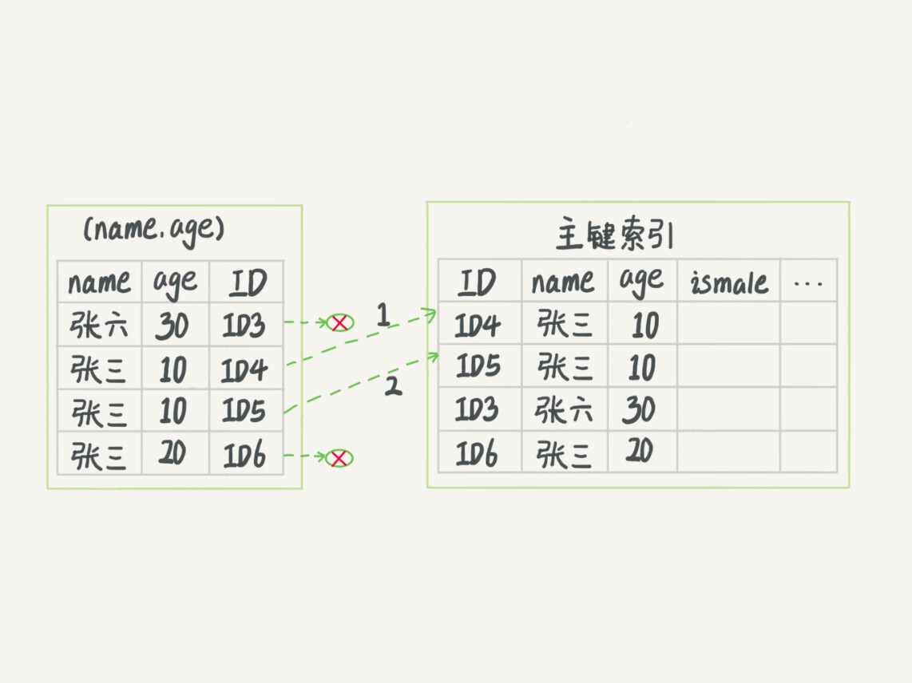
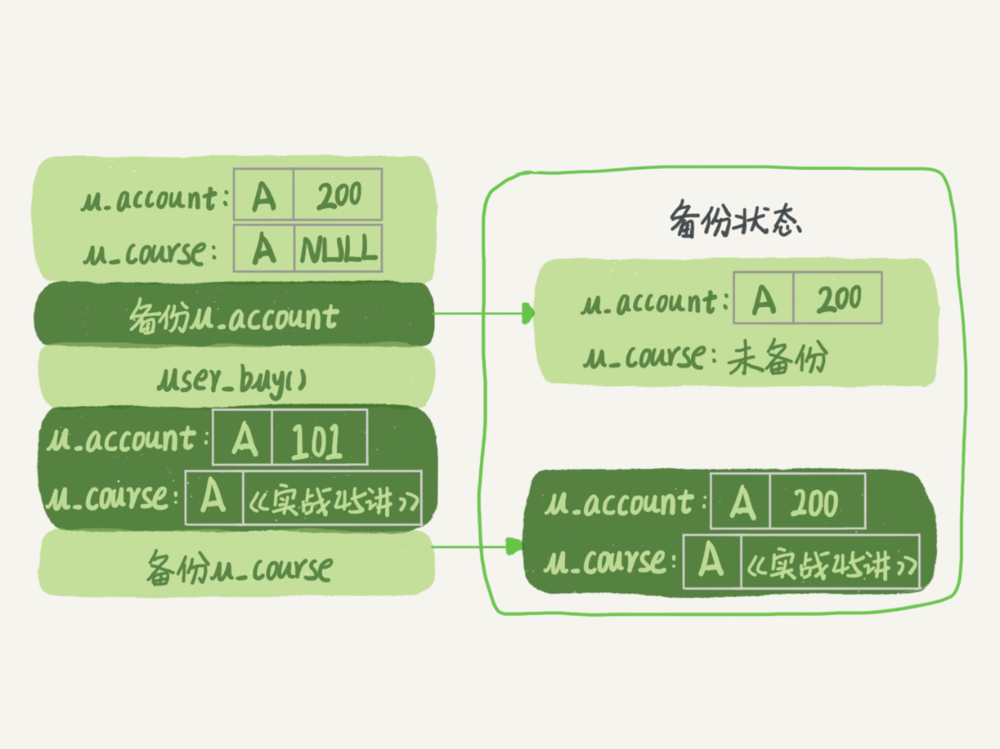

# MySQL45讲

1，课程官方[免费来源](https://funnylog.gitee.io/mysql45/)。课程官方[收费来源](https://time.geekbang.org/column/intro/100020801?tab=catalog)，有很多人参与标注和评论，我感觉在收费来源学的好，已购买。

2，推荐图书：“高性能MySQL”，“小册子”

3，课程的一些互联网上的[资源](https://dbs-service.cn/a/155.html)，可下载。

3，网友总结的笔记，可以参考。

- [mysql45学习笔记](https://www.cnblogs.com/wbo112/p/15116245.html#mysql%E5%AE%9E%E6%88%9845%E8%AE%B2%E7%AC%94%E8%AE%B0)
- [mysql45结合面试题做的笔记，学习群有人推荐](https://zhuanlan.zhihu.com/p/164519371)

4，论坛评价

- 学完基础篇基本够java面试

### 00开篇词

记得刚开始接触MySQL，是我在百度贴吧做权限系统的时候。我们遇到了一个奇怪的问题，一个正常10毫秒就能完成的SQL查询请求偶尔要执行100多毫秒才结束。当时主管问我是什么原因，我其实也搞不清楚，就上网查答案，但怎么找都找不到，只好硬着头皮翻源码。后来遇到了越来越多的问题，也是类似的情景，所以我逐步养成了通过分析源码理解原理的习惯。

当时，我自己的感觉是，即使我只是一个开发工程师，只是MySQL的用户，在了解了一个个系统模块的原理后，再来使用它，感觉是完全不一样的。当在代码里写下一行数据库命令的时候，我就能想到它在数据库端将怎么执行，它的性能是怎么样的，怎样写能让我的应用程序访问数据库的性能最高。进一步，哪些数据处理让数据库系统来做性能会更好，哪些数据处理在缓存里做性能会更好，我心里也会更清楚。在建表和建索引的时候，我也会更有意识地为将来的查询优化做综合考虑，比如确定是否使用递增主键、主键的列怎样选择，等等。

于是，我希望这个专栏能够帮助这样的一些开发者：他们正在使用MySQL，知道如何写出逻辑正确的SQL语句来实现业务目标，却不确定这个语句是不是最优的；他们听说了一些使用数据库的最佳实践，但是更想了解为什么这么做；他们使用的数据库偶尔会出问题，亟需了解如何更快速、更准确地定位问题，甚至自己解决问题……

在过去的七年里，我带过十几个应届毕业生，看着他们成长，要求他们原理先行，再实践验证。几年下来，他们的成长速度都很快，其中好几个毕业没两年就成为团队的骨干力量了。

因此，我希望这个专栏能够激发开发者对数据库原理的探索欲，从而更好地理解工作中遇到的问题，更能知道背后的为什么。所以**我会选那些平时使用数据库时高频出现的知识，如事务、索引、锁等内容构成专栏的主线**。这些主线上是一个个的知识点。每个点就是一个概念、一个机制或者一个原理说明。在每个说明之后，我会和你讨论一个实践相关的问题。

希望能以这样的方式，让你对MySQL的几条主线有一个整体的认识，并且了解基本概念。在之后的实践篇中，我会引用到这些主线的知识背景，并着力说明它们是怎样指导实践的。这样，**你可以从点到线，再到面，形成自己的MySQL知识网络。**

在这里，有一份目录，你也可以先了解下整个专栏的知识结构。


如前面说的，这几条主线上的每个知识点几乎都不是最新的，有些甚至十年前就这样，并没有改过。但我希望针对这些点的说明，可以让你在使用MySQL时心里更有底，知道怎么做选择，并且明白为什么。了解了原理，才能在实践中不断创新，提升个人的价值和工作输出。

### 01讲基础架构：一条SQL查询语句是如何执行的

这是专栏的第一篇文章，我想来跟你聊聊MySQL的基础架构。我们经常说，看一个事儿千万不要直接陷入细节里，你应该先鸟瞰其全貌，这样能够帮助你从高维度理解问题。同样，对于MySQL的学习也是这样。平时我们使用数据库，看到的通常都是一个整体。比如，你有个最简单的表，表里只有一个ID字段，在执行下面这个查询语句时：

```mysql
mysql> select * from T where ID=10;
```

我们看到的只是输入一条语句，返回一个结果，却不知道这条语句在MySQL内部的执行过程。

所以今天我想和你一起把MySQL拆解一下，看看里面都有哪些“零件”，希望借由这个拆解过程，让你对MySQL有更深入的理解。这样当我们碰到MySQL的一些异常或者问题时，就能够直戳本质，更为快速地定位并解决问题。

下面我给出的是MySQL的基本架构示意图，从中你可以清楚地看到SQL语句在MySQL的各个功能模块中的执行过程:


大体来说，**MySQL可以分为Server层和存储引擎层两部分**。

**Server层**包括**连接器、查询缓存、分析器、优化器、执行器**等，涵盖MySQL的大多数核心服务功能，以及所有的内置函数（如日期、时间、数学和加密函数等），所有跨存储引擎的功能都在这一层实现，比如存储过程、触发器、视图等。

而**存储引擎层**负责**数据的存储和提取**。其架构模式是插件式的，支持InnoDB、MyISAM、Memory等多个存储引擎。现在最常用的存储引擎是InnoDB，它从MySQL 5.5.5版本开始成为了默认存储引擎。

也就是说，你执行create table建表的时候，如果不指定引擎类型，默认使用的就是InnoDB。不过，你也可以通过指定存储引擎的类型来选择别的引擎，比如在create table语句中使用engine=memory, 来指定使用内存引擎创建表。不同存储引擎的表数据存取方式不同，支持的功能也不同，在后面的文章中，我们会讨论到引擎的选择。

从图中不难看出，**不同的存储引擎共用一个Server层**，也就是从连接器到执行器的部分。你可以先对每个组件的名字有个印象，接下来我会结合开头提到的那条SQL语句，带你走一遍整个执行流程，依次看下每个组件的作用。

#### 连接器

第一步，你会先连接到这个数据库上，这时候接待你的就是连接器。连接器负责跟客户端建立连接、获取权限、维持和管理连接。连接命令一般是这么写的：

```mysql
mysql -h$ip -P$port -u$user -p
```

输完命令之后，你就需要在交互对话里面输入密码。虽然密码也可以直接跟在-p后面写在命令行中，但这样可能会导致你的密码泄露。如果你连的是生产服务器，强烈建议你不要这么做。

连接命令中的mysql是客户端工具，用来跟服务端建立连接。在完成经典的**TCP握手**后，连接器就要开始认证你的身份，这个时候用的就是你输入的用户名和密码。

- 如果用户名或密码不对，你就会收到一个"Access denied for user"的错误，然后客户端程序结束执行。
- 如果用户名密码认证通过，**连接器**会到**权限表里面查出你拥有的权限**。之后，这个连接里面的权限判断逻辑，都将依赖于此时读到的权限。

这就意味着，一个用户成功建立连接后，即使你用管理员账号对这个用户的权限做了修改，也不会影响已经存在连接的权限。修改完成后，只有**再新建的连接才会使用新的权限设置**。

连接完成后，如果你没有后续的动作，这个连接就处于空闲状态，你可以在show processlist命令中看到它。文本中这个图是show processlist的结果，其中的Command列显示为“Sleep”的这一行，就表示现在系统里面有一个空闲连接。


客户端如果太长时间没动静，连接器就会自动将它断开。这个时间是由参数wait_timeout控制的，默认值是8小时。

如果在连接被断开之后，客户端再次发送请求的话，就会收到一个错误提醒： Lost connection to MySQL server during query。这时候如果你要继续，就需要重连，然后再执行请求了。

数据库里面，长连接是指连接成功后，如果客户端持续有请求，则一直使用同一个连接。短连接则是指每次执行完很少的几次查询就断开连接，下次查询再重新建立一个。

建立连接的过程通常是比较复杂的，所以我建议你在使用中要尽量减少建立连接的动作，也就是**尽量使用长连接**。

但是全部使用长连接后，你可能会发现，有些时候MySQL占用内存涨得特别快，这是因为**MySQL在执行过程中临时使用的内存是管理在连接对象里面的。这些资源会在连接断开的时候才释放**。所以如果长连接累积下来，可能导致内存占用太大，被系统强行杀掉（**OOM**），从现象看就是MySQL异常重启了。

怎么解决这个问题呢？你可以考虑以下两种方案。

1. **定期断开长连接**。使用一段时间，或者程序里面判断执行过一个占用内存的大查询后，断开连接，之后要查询再重连。

2. 如果你用的是MySQL 5.7或更新版本，可以在每次执行一个比较大的操作后，通过执行 **mysql_reset_connection**来重新初始化连接资源。这个过程不需要重连和重新做权限验证，但是会将连接恢复到刚刚创建完时的状态。

#### 查询缓存

连接建立完成后，你就可以执行select语句了。执行逻辑就会来到第二步：查询缓存。

MySQL拿到一个查询请求后，会先到查询缓存看看，之前是不是执行过这条语句。**之前执行过的语句及其结果可能会以key-value对的形式，被直接缓存在内存中。key是查询的语句，value是查询的结果**。如果你的查询能够直接在这个缓存中找到key，那么这个value就会被直接返回给客户端。

如果语句不在查询缓存中，就会继续后面的执行阶段。执行完成后，执行结果会被存入查询缓存中。你可以看到，如果查询命中缓存，MySQL不需要执行后面的复杂操作，就可以直接返回结果，这个效率会很高。

但是大多数情况下我会建议你不要使用查询缓存，为什么呢？因为**查询缓存往往弊大于利**。

查询缓存的失效非常频繁，**只要有对一个表的更新，这个表上所有的查询缓存都会被清空**。因此很可能你费劲地把结果存起来，还没使用呢，就被一个更新全清空了。对于更新压力大的数据库来说，查询缓存的命中率会非常低。除非你的业务就是有一张**静态表**，很长时间才会更新一次。比如，一个系统配置表，那这张表上的查询才**适合使用查询缓存**。

好在MySQL也提供了这种“按需使用”的方式。你可以将参数query_cache_type设置成DEMAND，这样对于默认的SQL语句都不使用查询缓存。而对于你确定要使用查询缓存的语句，可以用SQL_CACHE显式指定，像下面这个语句一样：

```mysql
mysql> select SQL_CACHE * from T where ID=10;
```

需要注意的是，MySQL 8.0版本直接将查询缓存的整块功能删掉了，也就是说8.0开始彻底**没有这个功能**了。

#### 分析器

如果没有命中查询缓存，就要开始真正执行语句了。首先，MySQL需要知道你要做什么，因此需要对SQL语句做解析。

分析器先会做“**词法分析”**。你输入的是由多个字符串和空格组成的一条**SQL语句**，MySQL需要识别出**里面的字符串分别是什么**，代表什么。

MySQL从你输入的"select"这个关键字识别出来，这是一个查询语句。它也要把字符串“T”识别成“表名T”，把字符串“ID”识别成“列ID”。

做完了这些识别以后，就要做“**语法分析**”。根据词法分析的结果，语法分析器会根据语法规则，判断你输入的这个**SQL语句是否满足MySQL语法**。

如果你的语句不对，就会收到“You have an error in your SQL syntax”的错误提醒，比如下面这个语句select少打了开头的字母“s”。

```mysql
mysql> elect * from t where ID=1;

ERROR 1064 (42000): You have an error in your SQL syntax; check the manual that corresponds to your MySQL server version for the right syntax to use near 'elect * from t where ID=1' at line 1
```

一般语法错误会提示第一个出现错误的位置，所以你要**关注的是紧接“use near”的内容**。

#### 优化器

经过了分析器，MySQL就知道你要做什么了。在开始执行之前，还要先经过优化器的处理。

优化器是在表里面有多个索引的时候，**决定使用哪个索引**；或者在一个语句有多表关联（join）的时候，**决定各个表的连接顺序**。比如你执行下面这样的语句，这个语句是执行两个表的join：

```mysql
mysql> select * from t1 join t2 using(ID)  where t1.c=10 and t2.d=20;
```

- 既可以先从表t1里面取出c=10的记录的ID值，再根据ID值关联到表t2，再判断t2里面d的值是否等于20。
- 也可以先从表t2里面取出d=20的记录的ID值，再根据ID值关联到t1，再判断t1里面c的值是否等于10。

这两种执行方法的逻辑结果是一样的，但是执行的效率会有不同，而优化器的作用就是决定选择使用哪一个方案。

优化器阶段完成后，这个语句的执行方案就确定下来了，然后进入执行器阶段。如果你还有一些疑问，比如优化器是怎么选择索引的，有没有可能选择错等等，没关系，我会在后面的文章中单独展开说明优化器的内容。

#### 执行器

MySQL通过**分析器知道了你要做什么，通过优化器知道了该怎么做**，于是就进入了执行器阶段，开始执行语句。

开始执行的时候，要先判断一下你**对这个表T有没有执行查询的权限**，如果没有，就会返回没有权限的错误，如下所示(在工程实现上，如果命中查询缓存，会在查询缓存放回结果的时候，做权限验证。查询也会在优化器之前调用precheck验证权限)。

```mysql
mysql> select * from T where ID=10;

ERROR 1142 (42000): SELECT command denied to user 'b'@'localhost' for table 'T'
```

如果有权限，就打开表继续执行。打开表的时候，执行器就会根据表的引擎定义，去使用这个引擎提供的接口。

比如我们这个例子中的表T中，ID字段没有索引，那么执行器的执行流程是这样的：

1. 调用InnoDB引擎接口取这个表的第一行，判断ID值是不是10，如果不是则跳过，如果是则将这行存在结果集中；
2. 调用引擎接口取“下一行”，重复相同的判断逻辑，直到取到这个表的最后一行。
3. 执行器将上述**遍历过程中所有满足条件的行组成的记录集作为结果集返回给客户端**。

至此，这个语句就执行完成了。

对于有索引的表，执行的逻辑也差不多。**第一次调用的是“取满足条件的第一行”这个接口，之后循环取“满足条件的下一行”这个接口**，这些**接口都是引擎中已经定义好的**。

你会在数据库的慢查询日志中看到一个rows_examined的字段，表示这个语句执行过程中扫描了多少行。这个值就是在执行器每次调用引擎获取数据行的时候累加的。

在有些场景下，执行器调用一次，在引擎内部则扫描了多行，因此**引擎扫描行数跟rows_examined并不是完全相同的。**我们后面会专门有一篇文章来讲存储引擎的内部机制，里面会有详细的说明。

#### 小结

今天我给你介绍了MySQL的逻辑架构，希望你对一个SQL语句完整执行流程的各个阶段有了一个初步的印象。由于篇幅的限制，我只是用一个查询的例子将各个环节过了一遍。如果你还对每个环节的展开细节存有疑问，也不用担心，后续在实战章节中我还会再提到它们。

我给你留一个问题吧，如果表T中没有字段k，而你执行了这个语句 select * from T where k=1, 那肯定是会报“不存在这个列”的错误： “Unknown column ‘k’ in ‘where clause’”。你觉得这个错误是在我们上面提到的哪个阶段报出来的呢？

#### 回答问题

答：答案是分析器。

#### 问答

1，“课后答案:分析器。Oracle会在分析阶段判断语句是否正确，表是否存在，列是否存在等。猜测MySQL也这样“。

- ”MySQL确实在设计上受Oracle影响颇深。”

2，网友：“我看其他评论说是执行器，原因是这个时候才打开表获取数据，但是表的字段不是数据啊，是事先定义好的，所以可以直接读取的，不需要打开表。“。

- “不是执行器”这一点，分析得很好”

3，网友：“如果有memory 引擎，还有redis 存在的必要吗，应该是有的吧，两者的场景？”。

- “这个后面专门有一篇《要不要用memory引擎》会说明，先说结论，redis很有必要”
- 网友：虽然redis 也是存储在内存中，但可以做到**持久化存储**。例如rdb 或者aof 。然而MySQL 中的memory 完全是基于内存存储，无法持久化存储在硬盘中。重启MySQL ，异常服务停止，服务器重启等情况都会导致数据的丢失。
- 网友：redis 的优势不仅仅是**内存**，还有**多种数据结构**、高效的网络模型、**分布式**

4，网友：“有个问题不太明白，为什么对权限的检查不在优化器之前做？”。

- “有些时候，SQL语句要操作的表不只是SQL字面上那些。比如如果有个**触发器，得在执行器阶段（过程中）才能确定**。优化器阶段前是无能为力的”

5，网友：“为该讲总结了几个问题, 大家复习的时候可以先尝试回答这些问题检查自己的掌握程度“:

```
1. MySQL的框架有几个组件, 各是什么作用?
2. Server层和存储引擎层各是什么作用?
3. you have an error in your SQL syntax 这个保存是在词法分析里还是在语法分析里报错?
4. 对于表的操作权限验证在哪里进行?
5. 执行器的执行查询语句的流程是什么样的?
```

- 赞

6，网友拟人化讲解：

```
入手比较晚，说下个人对为什么是分析器的看法。
连接器：门卫，想进请出示准入凭证（工牌、邀请证明一类）。“你好，你是普通员工，只能进入办公大厅，不能到高管区域”此为权限查询。   
分析器：“您需要在公司里面找一张头发是黑色的桌子？桌子没有头发啊！臣妾做不到”
优化器：“要我在A  B两个办公室找张三和李四啊？那我应该先去B办公室找李四，然后请李四帮我去A办公室找张三，因为B办公室比较近且李四知道张三具体工位在哪”
执行器：“好了，找人的计划方案定了，开始行动吧，走你！糟糕，刚门卫大哥说了，我没有权限进B办公室”
```

- 赞

7，总结：

```
靠着耐心翻完所有留言以后，强烈建议极客时间app出一个回到顶部的功能！

另外总结一下在评论中看到的问题的解答
1. 连接器是从权限表里边查询用户权限并保存在一个变量里边以供查询缓存，分析器，执行器在检查权限的时候使用。
2. sql执行过程中可能会有触发器这种在运行时才能确定的过程，分析器工作结束后的precheck是不能对这种运行时涉及到的表进行权限校验的，所以需要在执行器阶段进行权限检查。另外正是因为有precheck这个步骤，才会在报错时报的是用户无权，而不是 k字段不存在（为了不向用户暴露表结构）。
3. 词法分析阶段是从information schema里面获得表的结构信息的。
4. 可以使用连接池的方式，将短连接变为长连接。
5. mysql_reset_connection是mysql为各个编程语言提供的api，不是sql语句。
6. wait_timeout是非交互式连接的空闲超时，interactive_timeout是交互式连接的空闲超时。执行时间不计入空闲时间。这两个超时设置得是否一样要看情况。
```

- 赞

8，查询步骤：

```
1，连接
连接管理模块，接收请求；连接进程和用户模块，通过，连接线程和客户端对接
2，查询
查询缓存 Query Cache
分析器，内建解析树，对其语法检查，先from，再on，再join，再where......；检查权限，生成新的解析树，语义检查（没有字段k在这里）等
优化器，将前面解析树转换成执行计划，并进行评估最优
执行器，获取锁，打开表，通过meta数据，获取数据
3，返回结果
返回给连接进程和用户模块，然后清理，重新等待新的请求
```

- 赞
- 网友问：检查权限不是在执行器中吗？
  - 我思考：参考本章precheck那块。

9，最近开发人员说他们客户端连MySQL时，会有突然断开，然后又自动恢复的情况，我改了connection_timeout参数，但是今天听您介绍说到wait_timeout参数，我有点迷了，请教老师我的情况属于哪种呢

- 作者回复: Connect_timeout 指的是“连接过程中”的等待时间；

  wait_timeout指的是“连接完成后，使用过程中”的等待时间

10，不明白分析器到查询缓存那个箭头代表啥意思？

- 作者回复: 更新完回来失效缓存

### 1111102讲日志系统：一条SQL更新语句是如何执行的

前面我们系统了解了一个查询语句的执行流程，并介绍了执行过程中涉及的处理模块。相信你还记得，一条查询语句的执行过程一般是经过连接器、分析器、优化器、执行器等功能模块，最后到达存储引擎。

那么，一条更新语句的执行流程又是怎样的呢？

之前你可能经常听DBA同事说，MySQL可以恢复到半个月内任意一秒的状态，惊叹的同时，你是不是心中也会不免会好奇，这是怎样做到的呢？

我们还是从一个表的一条更新语句说起，下面是这个表的创建语句，这个表有一个主键ID和一个整型字段c：

```mysql
mysql> create table T(ID int primary key, c int);
```

如果要将ID=2这一行的值加1，SQL语句就会这么写：

```mysql
mysql> update T set c=c+1 where ID=2;
```

前面我有跟你介绍过SQL语句基本的执行链路，这里我再把那张图拿过来，你也可以先简单看看这个图回顾下。首先，可以确定的说，查询语句的那一套流程，更新语句也是同样会走一遍。


你执行语句前要先连接数据库，这是连接器的工作。

前面我们说过，在一个表上有更新的时候，跟这个表有关的查询缓存会失效，所以这条语句就会把表T上所有缓存结果都清空。这也就是我们一般不建议使用查询缓存的原因。

接下来，分析器会通过词法和语法解析知道这是一条更新语句。优化器决定要使用ID这个索引。然后，执行器负责具体执行，找到这一行，然后更新。

**与查询流程不一样的是，更新流程还涉及两个重要的日志模块**，它们正是我们今天要讨论的主角：**redo log（重做日志）和 binlog（归档日志）**。如果接触MySQL，那这两个词肯定是绕不过的，我后面的内容里也会不断地和你强调。不过话说回来，redo log和binlog在设计上有很多有意思的地方，这些设计思路也可以用到你自己的程序里。

#### 重要的日志模块：redo log

不知道你还记不记得《孔乙己》这篇文章，酒店掌柜有一个粉板，专门用来记录客人的赊账记录。如果赊账的人不多，那么他可以把顾客名和账目写在板上。但如果赊账的人多了，粉板总会有记不下的时候，这个时候掌柜一定还有一个专门记录赊账的账本。

如果有人要赊账或者还账的话，掌柜一般有两种做法：

- 一种做法是直接把账本翻出来，把这次赊的账加上去或者扣除掉；
- 另一种做法是先在粉板上记下这次的账，等打烊以后再把账本翻出来核算。

在生意红火柜台很忙时，掌柜一定会选择后者，因为前者操作实在是太麻烦了。首先，你得找到这个人的赊账总额那条记录。你想想，密密麻麻几十页，掌柜要找到那个名字，可能还得带上老花镜慢慢找，找到之后再拿出算盘计算，最后再将结果写回到账本上。

这整个过程想想都麻烦。相比之下，还是先在粉板上记一下方便。你想想，如果掌柜没有粉板的帮助，每次记账都得翻账本，效率是不是低得让人难以忍受？

同样，在MySQL里也有这个问题，如果每一次的更新操作都需要写进磁盘，然后磁盘也要找到对应的那条记录，然后再更新，整个过程IO成本、查找成本都很高。为了解决这个问题，MySQL的设计者就用了类似酒店掌柜粉板的思路来提升更新效率。

而粉板和账本配合的整个过程，其实就是MySQL里经常说到的WAL技术，**WAL的全称是Write-Ahead Logging，它的关键点就是先写日志，再写磁盘**，也就是先写粉板，等不忙的时候再写账本。

具体来说，当有一条记录需要更新的时候，InnoDB引擎就会先把记录写到redo log（粉板）里面，并更新内存，这个时候更新就算完成了。同时，InnoDB引擎会在适当的时候，将这个操作记录更新到磁盘里面，而这个更新往往是在**系统比较空闲**的时候做，这就像打烊以后掌柜做的事。

如果今天赊账的不多，掌柜可以等打烊后再整理。但如果某天赊账的特别多，**粉板写满了**，又怎么办呢？这个时候掌柜**只好放下手中的活**儿，**把粉板中的一部分赊账记录更新到账本中，然后把这些记录从粉板上擦掉**，为记新账腾出空间。

与此类似，InnoDB的**redo log是固定大小**的，比如可以配置为一组4个文件，每个文件的大小是1GB，那么这块“粉板”总共就可以记录4GB的操作。从头开始写，**写到末尾就又回到开头循环写**，如下面这个图所示。


write pos是当前记录的位置，一边写一边后移，写到第3号文件末尾后就回到0号文件开头。checkpoint是当前要擦除的位置，也是往后推移并且循环的，擦除记录前要把记录更新到数据文件。

write pos和checkpoint之间的是“粉板”上还空着的部分，可以用来记录新的操作。如果**write pos追上checkpoint，表示“粉板”满了，这时候不能再执行新的更新，得停下来先擦掉一些记录，把checkpoint推进一下**。

有了redo log，InnoDB就可以保证即使数据库发生异常重启，之前提交的记录都不会丢失，这个能力称为**crash-safe**。

要理解crash-safe这个概念，可以想想我们前面赊账记录的例子。只要赊账记录记在了粉板上或写在了账本上，之后即使掌柜忘记了，比如突然停业几天，**恢复生意后依然可以通过账本和粉板上的数据明确赊账账目**。

#### 重要的日志模块：binlog

前面我们讲过，MySQL整体来看，其实就有两块：一块是Server层，它主要做的是**MySQL功能层面**的事情；还有一块是引擎层，负责**存储相关的具体事宜**。上面我们聊到的粉板**redo log是InnoDB引擎特有的日志**，而**Server层也有自己的日志，称为binlog**（归档日志）。

我想你肯定会问，为什么会有两份日志呢？

因为最开始MySQL里并没有InnoDB引擎。MySQL自带的引擎是MyISAM，但是MyISAM没有crash-safe的能力，**binlog日志只能用于归档**。而InnoDB是另一个公司以插件形式引入MySQL的，既然只依靠binlog是没有crash-safe能力的，所以InnoDB使用另外一套日志系统——也就是**redo log来实现crash-safe能力**。

- 问：binlog为什么没有crash_safe的能力呢？binlog日志也记录了所有的操作，也有位点。求大神解答。
  - 高赞网友：写入方式的问题，binlog是追加写，crash时不能判定binlog中哪些内容是已经写入到磁盘，哪些还没被写入。而redolog是循环写，从check point到write pos间的内容都是未写入到磁盘的。
  - 我补充：[网上资料](http://t.csdn.cn/2qxDX)和高赞网友说的很类似并且更细化了：redo log 和 binlog 有一个很大的区别就是，一个是循环写，一个是追加写。也就是说 redo log 只会记录未刷盘的日志，已经刷入磁盘的数据都会从 redo log 这个有限大小的日志文件里删除。binlog 是追加日志，保存的是全量的日志。。。当数据库 crash 后，想**要恢复未刷盘但已经写入 redo log 和 binlog 的数据到内存时**，binlog 是无法恢复的。虽然 binlog 拥有全量的日志，但没有一个标志让 innoDB 判断哪些数据已经刷盘，哪些数据还没有。
    - 我针对粗体再补充：二阶段提交是以binlog为准；就算是崩溃恢复，光看binlog可以把所有数据恢复到磁盘；但是如果想把数据**恢复到内存**，binlog做不到判断哪些数据被刷盘了，只有redolog能做到。[这篇文章也佐证了redolog是为了**恢复内存**中的数据页](https://www.pudn.com/news/636b98e7272bb74d44e924bc.html)

这**两种日志有以下三点不同**。

1. redo log是**InnoDB引擎**特有的；binlog是MySQL的**Server层**实现的，所有引擎都可以使用。
2. redo log是物理日志，记录的是“**在某个数据页上做了什么修改**”；binlog是逻辑日志，记录的是这个**语句的原始逻辑**，比如“给ID=2这一行的c字段加1 ”。
   - 我理解：redo记录“之前id是2，现在是3”；binglog记录“给ID=2这一行的c字段加1（原始sql语句）”
3. redo log是**循环写的，空间固定会用完**；binlog是可以**追加写入**的。“追加写”是指binlog文件写到一定大小后会切换到下一个，**并不会覆盖**以前的日志。
   - 网友热评：还有功能区别，**binlog可以作为恢复数据使用，主从复制搭建**；**redo log作为异常宕机**或者介质故障后的数据恢复使用。

有了对这两个日志的概念性理解，我们再来看执行器和InnoDB引擎在执行这个简单的update语句时的内部流程。

1. 执行器先找引擎取ID=2这一行。ID是主键，引擎直接用树搜索找到这一行。如果ID=2这一行所在的数据页本来就在内存中，就直接返回给执行器；否则，需要先从磁盘读入内存，然后再返回。
2. 执行器拿到引擎给的行数据，把这个值加上1，比如原来是N，现在就是N+1，得到新的一行数据，再调用引擎接口写入这行新数据。
3. 引擎将这行新数据更新到内存中，同时将这个更新操作记录到redo log里面，此时redo log处于prepare状态。然后告知执行器执行完成了，随时可以提交事务。
4. 执行器生成这个操作的binlog，并把binlog写入磁盘。
5. 执行器调用引擎的提交事务接口，引擎把刚刚写入的redo log改成提交（commit）状态，更新完成。

这里我给出这个update语句的执行流程图，图中浅色框表示是在InnoDB内部执行的，深色框表示是在执行器中执行的。


你可能注意到了，最后三步看上去有点“绕”，将**redo log的写入拆成了两个步骤：prepare和commit**，这就是"两阶段提交"。

#### 两阶段提交

为什么必须有“两阶段提交”呢？这是为了让两份日志之间的逻辑一致。要说明这个问题，我们得从文章开头的那个问题说起：**怎样让数据库恢复到半个月内任意一秒的状态？**

前面我们说过了，binlog会记录所有的逻辑操作，并且是采用“追加写”的形式。如果你的DBA承诺说半个月内可以恢复，那么备份系统中一定会保存最近半个月的所有binlog，同时系统会定期做整库备份。这里的“定期”取决于系统的重要性，可以是一天一备，也可以是一周一备。

当需要恢复到指定的某一秒时，比如某天下午两点发现中午十二点有一次误删表，需要找回数据，那你可以这么做：

- 首先，找到最近的一次全量备份，如果你运气好，可能就是昨天晚上的一个备份，从这个备份恢复到临时库；
- 然后，从备份的时间点开始，将备份的binlog依次取出来，重放到中午误删表之前的那个时刻。

这样你的临时库就跟误删之前的线上库一样了，然后你可以把表数据从临时库取出来，按需要恢复到线上库去。

好了，说完了数据恢复过程，我们回来说说，为什么日志需要“两阶段提交”。这里不妨用反证法来进行解释。

由于redo log和binlog是两个独立的逻辑，如果不用两阶段提交，要么就是先写完redo log再写binlog，或者采用反过来的顺序。我们看看这两种方式会有什么问题。

仍然用前面的update语句来做例子。假设当前ID=2的行，字段c的值是0，再假设执行update语句过程中在写完第一个日志后，第二个日志还没有写完期间发生了crash，会出现什么情况呢？

1. **先写redo log后写binlog**。假设在redo log写完，binlog还没有写完的时候，MySQL进程异常重启。由于我们前面说过的，redo log写完之后，系统即使崩溃，仍然能够把数据恢复回来，所以恢复后这一行c的值是1。
   但是由于binlog没写完就crash了，这时候binlog里面就没有记录这个语句。因此，之后备份日志的时候，存起来的binlog里面就没有这条语句。
   然后你会发现，如果需要用这个binlog来恢复临时库的话，由于这个语句的binlog丢失，这个临时库就会少了这一次更新，恢复出来的这一行c的值就是0，与原库的值不同。
2. **先写binlog后写redo log**。如果在binlog写完之后crash，由于redo log还没写，崩溃恢复以后这个事务无效，所以这一行c的值是0。但是binlog里面已经记录了“把c从0改成1”这个日志。所以，在之后用binlog来恢复的时候就多了一个事务出来，恢复出来的这一行c的值就是1，与原库的值不同。

可以看到，如果不使用“两阶段提交”，那么数据库的状态就有可能和用它的日志恢复出来的库的状态不一致。

你可能会说，这个概率是不是很低，平时也没有什么动不动就需要恢复临时库的场景呀？

其实不是的，不只是误操作后需要用这个过程来恢复数据。当你需要扩容的时候，也就是需要再多搭建一些备库来增加系统的读能力的时候，现在常见的做法也是用全量备份加上应用binlog来实现的，这个“不一致”就会导致你的线上出现主从数据库不一致的情况。

简单说，**redo log和binlog都可以用于表示事务的提交状态，而两阶段提交就是让这两个状态保持逻辑上的一致**。

#### 小结

今天，我介绍了MySQL里面最重要的两个日志，即物理日志redo log和逻辑日志binlog。

redo log用于保证crash-safe能力。innodb_flush_log_at_trx_commit这个参数设置成1的时候，表示每次事务的redo log都直接持久化到磁盘。这个参数我建议你设置成1，这样可以保证MySQL异常重启之后数据不丢失。

sync_binlog这个参数设置成1的时候，表示每次事务的binlog都持久化到磁盘。这个参数我也建议你设置成1，这样可以保证MySQL异常重启之后binlog不丢失。

我还跟你介绍了与MySQL日志系统密切相关的“两阶段提交”。两阶段提交是跨系统维持数据逻辑一致性时常用的一个方案，即使你不做数据库内核开发，日常开发中也有可能会用到。

文章的最后，我给你留一个思考题吧。前面我说到定期全量备份的周期“取决于系统重要性，有的是一天一备，有的是一周一备”。那么在什么场景下，一天一备会比一周一备更有优势呢？或者说，它影响了这个数据库系统的哪个指标？

#### 回答问题

文章的最后，我给你留下的问题是一天一备跟一周一备的对比。

好处是“最长恢复时间”更短。

在一天一备的模式里，最坏情况下需要应用一天的binlog。比如，你每天0点做一次全量备份，而要恢复出一个到昨天晚上23点的备份。

一周一备最坏情况就要应用一周的binlog了。

系统的对应指标就是 @尼古拉斯·赵四 @慕塔 提到的RTO（恢复目标时间）。

当然这个是有成本的，因为更频繁全量备份需要消耗更多存储空间，所以这个RTO是成本换来的，就需要你根据业务重要性来评估了。

#### 问答

1，我可以认为redo log 记录的是这个行在这个页更新之后的状态，binlog 记录的是sql吗？

- Redo log不是记录数据页“更新之后的状态”，而是记录这个（我补充：**数据）页 “做了什么改动”**。

  Binlog有两种模式，statement 格式的话是记**sql语句**， row格式会记**录行的内容，记两条，更新前和更新后都有**。
  （谢谢你提这个问题，为了不打断文章思路，这个点没在正文写，但是又是很重要的点😄😄）

- 网友：SQL是面向用户的语义化命令，你可以理解为高级编程语言。高级编程语言最终会被执行去完成磁盘上数据的操作。我理解redo log记录的是磁盘上数据的物理变化，binlog记录的是当时所执行的高级编程语言。

2，首先谈一下，学习后的收获：

```

redo是物理的，binlog是逻辑的；现在由于redo是属于InnoDB引擎，所以必须要有binlog，因为你可以使用别的引擎
保证数据库的一致性，必须要保证2份日志一致，使用的2阶段式提交；其实感觉像事务，不是成功就是失败，不能让中间环节出现，也就是一个成功，一个失败
如果有一天mysql只有InnoDB引擎了，有redo来实现复制，那么感觉oracle的DG就诞生了，物理的速度也将远超逻辑的，毕竟只记录了改动向量
binlog几大模式，一般采用row，因为遇到时间，从库可能会出现不一致的情况，但是row更新前后都有，会导致日志变大
最后2个参数，保证事务成功，日志必须落盘，这样，数据库crash后，就不会丢失某个事务的数据了
其次说一下，对问题的理解
备份时间周期的长短，感觉有2个方便
首先，是恢复数据丢失的时间，既然需要恢复，肯定是数据丢失了。如果一天一备份的话，只要找到这天的全备，加入这天某段时间的binlog来恢复，如果一周一备份，假设是周一，而你要恢复的数据是周日某个时间点，那就，需要全备+周一到周日某个时间点的全部binlog用来恢复，时间相比前者需要增加很多；看业务能忍受的程度
其次，是数据库丢失，如果一周一备份的话，需要确保整个一周的binlog都完好无损，否则将无法恢复；而一天一备，只要保证这天的binlog都完好无损；当然这个可以通过校验，或者冗余等技术来实现，相比之下，上面那点更重要

不对的地方，望大神指点
```

- 你说的物理复制业界有团队在做了

  而且官方新版本也把MySQL的表结构都收归InnoDB管理了

3，老师,今天MYSQL第二讲中提到binlog和redo log, 我感觉binlog很多余，按理是不是只要redo log就够了?[费解]
您讲的时候说redo log是InnoDB的要求，因为以plugin的形式加入到MySQL中，此时binlog作为Server层的日志已然存在，所以便有了两者共存的现状。但我觉得这并不能解释我们在只用InonoDB引擎的时候还保留Binlog这种设计的原因.

- binlog还不能去掉。

  一个原因是，redolog只有InnoDB有，别的引擎没有。

  另一个原因是，redolog是循环写的，不持久保存，binlog的“归档”这个功能，redolog是不具备的。

- 网友：还有一个原因，是主从是基于binlog进行复制的。

4，redo log的机制看起来和ring buffer一样的；
另外有个和高枕、思雨一样的疑问，如果在重启后，需要通过检查binlog来确认redo log中处于prepare的事务是否需要commit，那是否不需要二阶段提交，直接以binlog的为准，如果binlog中不存在的，就认为是需要回滚的。这个地方，是不是我漏了什么，拉不通。。。 麻烦老师解下疑，多谢～

- 文章中有提到“binlog没有被用来做崩溃恢复”，

  历史上的原因是，这个是一开始就这么设计的（我：“老师说的应该是设计的就不是用来做崩溃恢复的”），所以不能只依赖binlog。

  操作上的原因是，binlog是可以关的，你如果有权限，可以set sql_log_bin=0关掉本线程的binlog日志。 所以只依赖binlog来恢复就靠不住。

5，老师您好，我之前是做运维的，通过binlog恢复误操作的数据，但是实际上，我们会后知后觉，误删除一段时间了，才发现误删除，此时，我把之前误删除的binlog导入，再把误删除之后binlog导入，会出现问题，比如主键冲突，而且binlog导数据，不同模式下时间也有不同，但是一般都是row模式，时间还是很久，有没什么方式，时间短且数据一致性强的方式

- **其实恢复数据只能恢复到误删之前到一刻**，（我理解：“这里的恢复是指类似误删除后想消除误删除的影响，而不是指崩溃恢复”）
  误删之后的，不能只靠binlog来做，因为业务逻辑可能因为误删操作的行为，插入了逻辑错误的语句，

  所以之后的，跟业务一起，从业务快速补数据的。只靠binlog补出来的往往不完整

6，redo log的机制看起来和ring buffer一样的；
另外有个和高枕、思雨一样的疑问，如果在重启后，需要通过检查binlog来确认redo log中处于prepare的事务是否需要commit，那是否不需要二阶段提交，直接以binlog的为准，如果binlog中不存在的，就认为是需要回滚的。这个地方，是不是我漏了什么，拉不通。。。 麻烦老师解下疑，多谢～ 

- ```
  作者回复: 文章中有提到“binlog没有被用来做崩溃恢复”，
  
  历史上的原因是，这个是一开始就这么设计的，所以不能只依赖binlog。
  
  操作上的原因是，binlog是可以关的，你如果有权限，可以set sql_log_bin=0关掉本线程的binlog日志。 所以只依赖binlog来恢复就靠不住。
  
  @高枕、@思雨 也看下这个讨论😄
  ```

- 高赞网友：redo里面的数据有两种状态，分别是prepare,commit。宕机后重启，如果redo里面的数据是commit状态，则执行后续操作。如果是prepare状态，则需要根据binlog来确定数据是回滚还是提交，如果binlog中已经记录了prepare状态数据的逻辑修改，则commit，否则需要回滚。(如果修改已经归档到binlog，则此数据必须提交，因为下游的从库会用到binlog，这样才能保证主从一致)

7，我再来说下自己的理解 。
1 prepare阶段 2 写binlog 3 commit
当在2之前崩溃时
重启恢复：后发现没有commit，回滚。备份恢复：没有binlog 。
一致
当在3之前崩溃
重启恢复：虽没有commit，但满足prepare和binlog完整，所以重启后会自动commit。备份：有binlog. 一致

- get 完成

8，为该讲的内容总结了几个问题, 大家复习的时候可以先尝试回答这些问题检查自己的掌握程度:

```
   1. redo log的概念是什么? 为什么会存在.
   2. 什么是WAL(write-ahead log)机制, 好处是什么.
   3. redo log 为什么可以保证crash safe机制.
   4. binlog的概念是什么, 起到什么作用, 可以做crash safe吗? 
   5. binlog和redolog的不同点有哪些? 
   6. 物理一致性（redolog）和逻辑一直性（binlog）各应该怎么理解? 
   7. 执行器和innoDB在执行update语句时候的流程是什么样的?
   8. 如果数据库误操作, 如何执行数据恢复?
   9. 什么是两阶段提交, 为什么需要两阶段提交, 两阶段提交怎么保证数据库中两份日志间的逻辑一致性(什么叫逻辑一致性)?
  10. 如果不是两阶段提交, 先写redo log和先写bin log两种情况各会遇到什么问题?
```

- 高赞网友回复：

  ```
  1. redo log是重做日志。主要用于MySQL异常重启后的一种数据恢复手段，确保了数据的一致性。归根到底是MySQL为了实现WAL机制的一种手段。因为MySQL进行更新操作，为了能够快速响应，所以采用了异步写回磁盘的技术，写入内存后就返回。但是会存在crash后内存数据丢失的隐患，而redo log具备crash safe能力。
  2. WAL机制是写前日志，也就是MySQL更新操作后在真正把数据写入到磁盘前先记录日志。好处是不用每一次操作都实时把数据写盘，就算crash后也可以通过redo log重放恢复，所以能够实现快速响应SQL语句。
  3. 因为redo log是每次更新操作完成后，就一定会写入的，如果写入失败，这说明此次操作失败，事务也不可能提交。redo log内部结构是基于页的，记录了这个页的字段值变化，只要crash后读取redo log进行重放就可以恢复数据。（因为redo log是循环写的，如果满了InnoDB就会执行真正写盘）
  4. bin log是归档日志，属于MySQL Server层的日志。可以起到全量备份的作用。当需要恢复数据时，可以取出某个时间范围内的bin log进行重放恢复。但是bin log不可以做crash safe，因为crash之前，bin log可能没有写入完全MySQL就挂了。所以需要配合redo log才可以进行crash safe。
  - 20230216我：binlog不能做crashsafe主要是因为，binlog是全局数据，且数据库不定期会刷盘，所以我们不知道哪些binlog的数据已经刷盘而哪些没有刷；但是redolog的两个指针之间就是没刷盘的数据，留存了数据。
  5. bin log是Server层，追加写，不会覆盖，记录了逻辑变化，是逻辑日志。redo log是存储引擎层，是InnoDB特有的。循环写，满了就覆盖从头写，记录的是基于页的物理变化，是物理日志，具备crash safe操作。
  6. 前者是数据的一致性，后者是行为一致性。（不清楚）
  7. （我补充：连接器得到权限-》分析器分析词法和语法）。执行器在优化器选择了索引后，调用InnoDB读接口，读取要更新的行到内存中，执行SQL操作后，更新到内存，然后写redo log，写bin log，此时即为完成。后续InnoDB会在合适的时候把此次操作的结果写回到磁盘。
  8. 数据库在某一天误操作，就可以找到距离误操作最近的时间节点前的bin log，重放到临时数据库里，然后选择当天误删的数据恢复到线上数据库。
  - 我：应该是，把误操作前最近备份的库拿出来，然后一步步执行binlog直到误操作为止。
  9. 两阶段提交就是对于三步操作而言：1.prepare阶段 2. 写入bin log 3. commit
  redo log在写入后，进入prepare状态，然后bin log写入后，进入commit状态，事务可以提交。
  如果不用两阶段提交的话，可能会出现bin log写入之前，机器crash导致重启后redo log继续重放crash之前的操作，而当bin log后续需要作为备份恢复时，会出现数据不一致的情况。所以需要对redo log进行回滚。
  如果是bin log commit之前crash，那么重启后，发现redo log是prepare状态且bin log完整（bin log写入成功后，redo log会有bin log的标记），就会自动commit，让存储引擎提交事务。
  10.先写redo log，crash后bin log备份恢复时少了一次更新，与当前数据不一致。先写bin log，crash后，由于redo log没写入，事务无效，所以后续bin log备份恢复时，数据不一致。
  ```

8.5，我：区分一下crash和数据回退中使用redolog和binlog：


- crash：因为数据最近的一部分还在redolog记录的内存中，之前的都已经写入磁盘；查看redolog中的事务是否存在于binlog中，如果存在则提交，如果不存在则回滚事务。这里可以看出，需要借助binlog判断要取用哪些redolog的数据，但是恢复crash本身不会用binlog的数据，而是用redolog中需要提交的数据。
  - 我强调：redolog的核心作用就是~crash后恢复数据到**内存**。二阶段提交是以binlog为准；就算是崩溃恢复，光看binlog可以把所有数据恢复到磁盘；但是如果想把数据恢复到内存!!!，binlog做不到判断哪些数据被刷盘了，只有redolog能做到。

- 数据回退：找到需要恢复的时间点A之前最后备份的数据库备份，从数据库备份的时间点开始一步步执行binlog恢复数据，直到需要恢复到的时间点A。这可以看到数据回退是需要用到binlog的！
  - 我补充：本来觉得”binlog恢复到时间点A后，还要看redolog中的事务是否包含在恢复数据用到的binlog中，如果包含则把redolog中的数据也写入磁盘，如果不包括则说明redolog中已经没有时间点A之前的数据了，不用管“。但是坛友说：”回退直接从上次备份的点后用binlog恢复到你想回到的时间点，不需要关心redolog“。确实是的，因为二阶段提交也是以binlog为准，直接看binlog就行；redolog有但binlog没有的会被回滚，redolog有且binlog有的才能被提交使用，总之以binlig为准。


9，binlog为什么说是逻辑日志呢？它里面有内容也会存储成物理文件，怎么说是逻辑而不是物理

- 作者回复: 这样理解哈。，逻辑日志可以给别的数据库，别的引擎使用，已经大家都讲得通这个“逻辑”；物理日志就只有“我”自己能用，别人没有共享我的“物理格式”。举个例子：redo  log 记录 做了什么改动（比如把某个字段从0改成了1），binlog 记录 是怎么修改的（记录sql语句或者 记录更新前后的行）

- 高赞网友：

  ```
  1.物理日志记录的是在某个页上存储某个数据，关于页的分配和引擎有关，不同的引擎存结构不一样，页的分配页不一样；
  2.逻辑日志分为statement或者row,前者是sql，后者是某条数据的修改前后的内容，都没有指定具这条数据在哪个具体的位置，所谓的物理，应该是指物理地址吧，我是这么理解的不道对不对
  ```

10，老师，我想问下如果提交事务的时候正好重启那么redo log和binlog会怎么处理？此时redo log处于prepare阶段，如果不接受这条log，但是binlog已经接受，还是说binlog会去检查redo log的状态，状态为prepare的不会恢复？

- ```
  作者回复: 好问题👍🏿表示中间那段你都听明白了👍🏿
  
  Binlog如果已经接受，那么redolog是prepare, binlog已经完整了对吧，这时候崩溃恢复过程会认可这个事务，提交掉。 （你可以分析下这种情况下，是否符合我们要达到的“用binlog恢复的库跟原库逻辑相同” 这个要求）
  ```

- 网友问：redolog的prepare已经记了，崩溃恢复之后如果发现binlog没记，会回滚这个事务；如果binlog记了，就认可这个事务并提交。那么本质上是以binlog为准的，redolog有没有commit阶段好像没什么区别，为何还要搞出两阶段提交的概念呢？
  - 网友答：我觉得您说的这一段正好反应了两步提交的必要性。正是因为有了两步提交，当 redo log 中看到有 prepare 状态的 log 时，才会想到要去 binlog 看看这条操作记录在 binlog 中是否有：如果有，则提交，如果没有，则回滚。设想如果没有两步提交，即 redo log 中的操作记录在崩溃回复时都会被当做已经执行过的操作。这种情况下，如果是先写 redo log 再写 binlog，就有可能出现 redo log 中有点记录而 binlog 中没有。这样在日后用 binlog 做数据恢复，恢复到的数据会和真实数据不一致。
    - 我：感觉网友答的不对劲。确实都是以binlog为准的。redolog是为了sql操作不用时刻写入磁盘+崩溃恢复；binlog是为了存档+主备库转移数据；而二阶段提交是为了保证binlog和redolog的一致性。

11，我理解备份就是救命药加后悔药，灾难发生的时候备份能救命，出现错误的时候备份能后悔。事情都有两面性，没有谁比谁好，只有谁比谁合适，完全看业务情况和需求而定。一天一备恢复时间更短，binlog更少，救命时候更快，但是后悔时间更短，而一周一备正好相反。我自己的备份策略是设置一个16小时延迟复制的从库，充当后悔药，恢复时间也较快。再两天一个全备库和binlog，作为救命药,最后时刻用。这样就比较兼顾

- 你有故事

12，老师，我这想请教两个问题：
1.写redo日志也是写io（我理解也是外部存储）。同样耗费性能。怎么能做到优化呢
2.数据库只有redo commit 之后才会真正提交到数据库吗

- \1. Redolog是顺序写，并且可以组提交，还有别的一些优化，收益最大是是这两个因素；

  2.是这样，正常执行是要commit 才算完，但是崩溃恢复过程的话，可以接受“redolog prepare 并且binlog完整” 的情况

13，redo log和bin log怎么对应

- 事务ID （比较细节，就没在正文里写了。
- 我找的网络资料：**它们有一个共同的数据字段，叫XID**；在写入redolog时，会顺便记录XID，即当前事务id；在写入binlog时，也会写入XID；[参考](https://www.pudn.com/news/636b98e7272bb74d44e924bc.html)

14，执行一条Update 语句后，马上又执行一条 select * from table limit 10。

如果刚刚update的记录，还没持久化到磁盘中，而偏偏这个时候的查询条件，又包含了刚刚update的记录。

那么这个时候，是从日志中获取刚刚update的最新结果，还是说，先把日志中的记录先写磁盘，再返回最新结果？

- 作者回复: 都不是，
  直接读内存😄
- 网友热门思考：我猜测，所以是调用引擎接口查询对应记录的时候，引擎层会先去内存看是否存在对应的记录，如果有记录就直接返回，没有的话再去查询磁盘获取记录。

15，在binlog写入磁盘后，commit提交前发生crash，由于commit没有成功，那返回给客户端的消息是事物失败，但是在系统恢复的时候却会重新提交事物，使之成功，这不是在欺骗客户端嘛？问题很大啊

- 作者回复: 不是，并没有返回“事务失败”呀，而是“执行异常”。执行异常本来就可能成功也可能失败的。你想一下这个场景：执行全部完成了，在回复客户端的时候网络断了，这怎么算😄。

### 03讲事务隔离：为什么你改了我还看不见

提到事务，你肯定不陌生，和数据库打交道的时候，我们总是会用到事务。最经典的例子就是转账，你要给朋友小王转100块钱，而此时你的银行卡只有100块钱。

转账过程具体到程序里会有一系列的操作，比如查询余额、做加减法、更新余额等，这些操作必须保证是一体的，不然等程序查完之后，还没做减法之前，你这100块钱，完全可以借着这个时间差再查一次，然后再给另外一个朋友转账，如果银行这么整，不就乱了么？这时就要用到“事务”这个概念了。

简单来说，事务就是要保证一组数据库操作，要么全部成功，要么全部失败。在MySQL中，事务支持是在引擎层实现的。你现在知道，MySQL是一个支持多引擎的系统，但并不是所有的引擎都支持事务。比如MySQL原生的MyISAM引擎就不支持事务，这也是MyISAM被InnoDB取代的重要原因之一。

今天的文章里，我将会以InnoDB为例，剖析MySQL在事务支持方面的特定实现，并基于原理给出相应的实践建议，希望这些案例能加深你对MySQL事务原理的理解。

#### 隔离性与隔离级别

提到事务，你肯定会想到ACID（Atomicity、Consistency、Isolation、Durability，即原子性、一致性、隔离性、持久性），今天我们就来说说其中I，也就是“隔离性”。

当数据库上有多个事务同时执行的时候，就可能出现脏读（dirty read）、不可重复读（non-repeatable read）、幻读（phantom read）的问题，为了解决这些问题，就有了“隔离级别”的概念。

在谈隔离级别之前，你首先要知道，你隔离得越严实，效率就会越低。因此很多时候，我们都要在二者之间寻找一个平衡点。SQL标准的事务隔离级别包括：读未提交（read uncommitted）、读提交（read committed）、可重复读（repeatable read）和串行化（serializable ）。下面我逐一为你解释：

- 读未提交是指，一个事务还没提交时，它做的变更就能被别的事务看到。
- 读提交是指，一个事务提交之后，它做的变更才会被其他事务看到。
- 可重复读是指，一个事务执行过程中看到的数据，总是跟这个事务在启动时看到的数据是一致的。当然在可重复读隔离级别下，未提交变更对其他事务也是不可见的。
  - 我补充：RR隔离级别下，普通读（即快照度）是天然不会出现幻读的，因为看的数据都是建立事务时的数据；只有当前读（select for update）时才会出现幻读。想避免RR隔离级别下的当前读出现幻读，就得用到间隙锁（行锁+间隙锁==nextkeylock）
    - 所有的锁都是指向索引的。间隙锁会锁住目标索引的间隙，让数据插不进来；[间隙锁参考](https://huaweicloud.csdn.net/63355d09d3efff3090b542c4.html?spm=1001.2101.3001.6650.14&utm_medium=distribute.pc_relevant.none-task-blog-2%7Edefault%7EOPENSEARCH%7Eactivity-14-123312214-blog-89076669.pc_relevant_3mothn_strategy_and_data_recovery&depth_1-utm_source=distribute.pc_relevant.none-task-blog-2%7Edefault%7EOPENSEARCH%7Eactivity-14-123312214-blog-89076669.pc_relevant_3mothn_strategy_and_data_recovery&utm_relevant_index=19)。

- 串行化，顾名思义是对于同一行记录，“写”会加“写锁”，“读”会加“读锁”。当出现读写锁冲突的时候，后访问的事务必须等前一个事务执行完成，才能继续执行。

其中“读提交”和“可重复读”比较难理解，所以我用一个例子说明这几种隔离级别。假设数据表T中只有一列，其中一行的值为1，下面是按照时间顺序执行两个事务的行为。

```mysql
mysql> create table T(c int) engine=InnoDB;
insert into T(c) values(1);
```


我们来看看在不同的隔离级别下，事务A会有哪些不同的返回结果，也就是图里面V1、V2、V3的返回值分别是什么。

- 若隔离级别是“读未提交”， 则V1的值就是2。这时候事务B虽然还没有提交，但是结果已经被A看到了。因此，V2、V3也都是2。
- 若隔离级别是“读提交”，则V1是1，V2的值是2。事务B的更新在提交后才能被A看到。所以， V3的值也是2。
- 若隔离级别是“可重复读”，则V1、V2是1，V3是2。之所以V2还是1，遵循的就是这个要求：事务在执行期间看到的数据前后必须是一致的。
- 若隔离级别是“串行化”，则在事务B执行“将1改成2”的时候，会被锁住。直到事务A提交后，事务B才可以继续执行。所以从A的角度看， V1、V2值是1，V3的值是2。

在实现上，数据库里面会创建一个视图，访问的时候以视图的逻辑结果为准。在“**可重复读**”隔离级别下，这个**视图是在事务启动时创建**的，整个事务存在期间都用这个视图。在“**读提交**”隔离级别下，这个**视图是在每个SQL语句开始执行的时候创建**的。这里需要注意的是，“读未提交”隔离级别下直接返回记录上的最新值，没有视图概念；而“串行化”隔离级别下直接用加锁的方式来避免并行访问。

我们可以看到在不同的隔离级别下，数据库行为是有所不同的。Oracle数据库的默认隔离级别其实就是“读提交”，因此对于一些从Oracle迁移到MySQL的应用，为保证数据库隔离级别的一致，你一定要记得将MySQL的隔离级别设置为“读提交”。

配置的方式是，将启动参数transaction-isolation的值设置成READ-COMMITTED。你可以用show variables来查看当前的值。

```
mysql> show variables like 'transaction_isolation';

+-----------------------+----------------+

| Variable_name | Value |

+-----------------------+----------------+

| transaction_isolation | READ-COMMITTED |

+-----------------------+----------------+
```

总结来说，存在即合理，哪个隔离级别都有它自己的使用场景，你要根据自己的业务情况来定。我想**你可能会问那什么时候需要“可重复读”的场景呢**？我们来看一个数据校对逻辑的案例。

假设你在管理一个个人银行账户表。一个表存了每个月月底的余额，一个表存了账单明细。这时候你要做数据校对，也就是判断上个月的余额和当前余额的差额，是否与本月的账单明细一致。你一定希望在校对过程中，即使有用户发生了一笔新的交易，也不影响你的校对结果。

这时候使用“可重复读”隔离级别就很方便。事务启动时的视图可以认为是静态的，不受其他事务更新的影响。

#### 事务隔离的实现

理解了事务的隔离级别，我们再来看看事务隔离具体是怎么实现的。这里我们展开说明“可重复读”。(我理解：”以下讲解以可重复度为例“)

在MySQL中，实际上每条记录在更新的时候都会同时记录一条回滚操作。记录上的最新值，通过回滚操作，都可以得到前一个状态的值。

假设一个值从1被按顺序改成了2、3、4，在回滚日志里面就会有类似下面的记录。


当前值是4，但是在查询这条记录的时候，不同时刻启动的事务会有不同的read-view。如图中看到的，在视图A、B、C里面，这一个记录的值分别是1、2、4，**同一条记录在系统中可以存在多个版本，就是数据库的多版本并发控制（[MVCC](https://zhuanlan.zhihu.com/p/66791480?utm_source=wechat_session&utm_medium=social&utm_oi=814549849189019648&utm_campaign=shareopn)）**（强烈建议读本链接中的MVCC文章）。对于read-view A，要得到1，就必须将当前值依次执行图中所有的回滚操作得到。

- 我：一条记录有不同版本是合理的，相当于不同时间读数据库读到的值可能是不一样的。

同时你会发现，即使现在有另外一个事务正在将4改成5，这个事务跟read-view A、B、C对应的事务是不会冲突的。

你一定会问，回滚日志总不能一直保留吧，什么时候删除呢？答案是，在不需要的时候才删除。也就是说，系统会判断，**当没有事务再需要用到这些回滚日志时，回滚日志会被删除**。

什么时候才不需要了呢？就是当系统里没有比这个回滚日志更早的read-view的时候。

基于上面的说明，我们来讨论一下为什么建议你尽量不要使用长事务。

**长事务意味着系统里面会存在很老的事务视图**。由于这些事务随时可能访问数据库里面的任何数据，所以这个事务提交之前，数据库里面**它可能用到的回滚记录都必须保留**，这就会导致**大量占用存储空间**。

在MySQL 5.5及以前的版本，回滚日志是跟数据字典一起放在ibdata文件里的，即使长事务最终提交，回滚段被清理，文件也不会变小。我见过数据只有20GB，而回滚段有200GB的库。最终只好为了清理回滚段，重建整个库。

除了对回滚段的影响，长事务还占用锁资源，也可能拖垮整个库，这个我们会在后面讲锁的时候展开。

#### 事务的启动方式

如前面所述，长事务有这些潜在风险，我当然是建议你尽量避免。其实很多时候业务开发同学并不是有意使用长事务，通常是由于误用所致。MySQL的事务启动方式有以下几种：

1. 显式启动事务语句， begin 或 start transaction。配套的提交语句是commit，回滚语句是rollback。
2. **set autocommit=0，这个命令会将这个线程的自动提交关掉**。意味着如果你只执行一个select语句，这个事务就启动了，而且并不会自动提交。这个事务持续存在直到你主动执行commit 或 rollback 语句，或者断开连接。

有些客户端连接框架会默认连接成功后先执行一个set autocommit=0的命令。这就导致接下来的查询都在事务中，如果是长连接，就导致了意外的长事务。

**因此，我会建议你总是使用set autocommit=1, 通过显式语句的方式来启动事务。**

但是有的开发同学会纠结“多一次交互”的问题。对于一个需要频繁使用事务的业务，第二种方式每个事务在开始时都不需要主动执行一次 “begin”，减少了语句的交互次数。如果你也有这个顾虑，我建议你使用commit work and chain语法。

在autocommit为1的情况下，用begin显式启动的事务，如果执行commit则提交事务。如果执行 commit work and chain，则是提交事务并自动启动下一个事务，这样也省去了再次执行begin语句的开销。同时带来的好处是从程序开发的角度明确地知道每个语句是否处于事务中。

你可以在information_schema库的innodb_trx这个表中查询长事务，比如下面这个语句，用于查找持续时间超过60s的事务。

```
select * from information_schema.innodb_trx where TIME_TO_SEC(timediff(now(),trx_started))>60
```

#### 小结

这篇文章里面，我介绍了MySQL的事务隔离级别的现象和实现，根据实现原理分析了长事务存在的风险，以及如何用正确的方式避免长事务。希望我举的例子能够帮助你理解事务，并更好地使用MySQL的事务特性。

我给你留一个问题吧。你现在知道了系统里面应该避免长事务，如果你是业务开发负责人同时也是数据库负责人，你会有什么方案来避免出现或者处理这种情况呢？

#### 回答问题

我留下的问题是：如何避免长事务对业务的影响？

这个问题，我们可以从应用开发端和数据库端来看。

**首先，从应用开发端来看：**

1. 确认是否使用了**set autocommit=0**。这个确认工作可以在测试环境中开展，把MySQL的general_log开起来，然后随便跑一个业务逻辑，通过general_log的日志来确认。一般框架如果会设置这个值，也就会提供参数来控制行为，你的目标就是把它改成1。
2. 确认是否有**不必要的只读事务**。有些框架会习惯不管什么语句先用**begin/commit框**起来。我见过有些是业务并没有这个需要，但是也把好几个select语句放到了事务中。这种只读事务可以去掉。
3. 业务连接数据库的时候，根据业务本身的预估，通过SET MAX_EXECUTION_TIME命令，来控制每个语句执行的最长时间，避免单个语句意外执行太长时间。（为什么会意外？在后续的文章中会提到这类案例）

**其次，从数据库端来看：**

1. **监控** information_schema.**Innodb_trx表**，设置长事务阈值，超过就报警/或者kill；
2. Percona的pt-kill这个工具不错，推荐使用；
3. 在业务功能测试阶段要求输出所有的general_log，分析日志行为提前发现问题；
4. 如果使用的是MySQL 5.6或者更新版本，把innodb_undo_tablespaces设置成2（或更大的值）。如果真的出现大事务导致回滚段过大，这样设置后清理起来更方便。

#### 问答

1，大佬的总结：

```
1、务的特性：原子性、一致性、隔离性、持久性
2、多事务同时执行的时候，可能会出现的问题：脏读、不可重复读、幻读
3、事务隔离级别：读未提交、读提交、可重复读、串行化
4、不同事务隔离级别的区别：
读未提交：一个事务还未提交，它所做的变更就可以被别的事务看到
读提交：一个事务提交之后，它所做的变更才可以被别的事务看到
可重复读：一个事务执行过程中看到的数据是一致的。未提交的更改对其他事务是不可见的
串行化：对应一个记录会加读写锁，出现冲突的时候，后访问的事务必须等前一个事务执行完成才能继续执行
5、配置方法：启动参数transaction-isolation
6、事务隔离的实现：每条记录在更新的时候都会同时记录一条回滚操作。同一条记录在系统中可以存在多个版本，这就是数据库的多版本并发控制（MVCC）。
7、回滚日志什么时候删除？系统会判断当没有事务需要用到这些回滚日志的时候，回滚日志会被删除。
8、什么时候不需要了？当系统里么有比这个回滚日志更早的read-view的时候。
9、为什么尽量不要使用长事务。长事务意味着系统里面会存在很老的事务视图，在这个事务提交之前，回滚记录都要保留，这会导致大量占用存储空间。除此之外，长事务还占用锁资源，可能会拖垮库。
10、事务启动方式：一、显式启动事务语句，begin或者start transaction,提交commit，回滚rollback；二、set autocommit=0，该命令会把这个线程的自动提交关掉。这样只要执行一个select语句，事务就启动，并不会自动提交，直到主动执行commit或rollback或断开连接。
11、建议使用方法一，如果考虑多一次交互问题，可以使用commit work and chain语法。在autocommit=1的情况下用begin显式启动事务，如果执行commit则提交事务。如果执行commit work and chain则提交事务并自动启动下一个事务。

思考题：

在开发过程中，尽可能的减小事务范围，少用长事务，如果无法避免，保证逻辑日志空间足够用，并且支持动态日志空间增长。监控Innodb_trx表，发现长事务报警。

疑问：

关于第二节的思考题，读题干的意思，是在什么场景下，一天一备比一周一备更有优势。老师的答案只是给出了一天一备的优势，那么适用场景怎么理解呢？
```

- 总结得非常好👍🏿

  第二讲问题，其实备份是强需求，至于多少合适，还是得平衡业务需求和存储成本

2，读未提交：别人改数据的事务尚未提交，我在我的事务中也能读到。
读已提交：别人改数据的事务已经提交，我在我的事务中才能读到。
可重复读：别人改数据的事务已经提交，我在我的事务中也不去读。
串行：我的事务尚未提交，别人就别想改数据。
这4种隔离级别，并行性能依次降低，安全性依次提高。

- 总结的好

3，几个问题考察自己对本节的理解：

```
为该讲总结了几个问题, 大家复习的时候可以先尝试回答这些问题检查自己的掌握程度:

1.
事务的概念是什么?
2.
mysql的事务隔离级别读未提交, 读已提交, 可重复读, 串行各是什么意思?
3.
读已提交, 可重复读是怎么通过视图构建实现的?
4.
可重复读的使用场景举例? 对账的时候应该很有用?
5.
事务隔离是怎么通过read-view(读视图)实现的?
6.
并发版本控制(MCVV)的概念是什么, 是怎么实现的?
7.
使用长事务的弊病? 为什么使用常事务可能拖垮整个库?
8.
事务的启动方式有哪几种?
9.
commit work and chain的语法是做什么用的?
10.
怎么查询各个表中的长事务?
11.
如何避免长事务的出现?
```

4，事务隔离的实现似乎有点太简略，没跟上林老师的思路。。

- 对于RR，你可以这么想，每个事务启动的时候打一个快照，别人改的“我不听我不听”

5，老师，MySQL中undo的内容会被记录到redo中吗？比如一个事务在执行到一半的时候实例崩溃了，在恢复的时候是不是先恢复redo，再根据redo构造undo回滚宕机前没有提交的事务呢？

- 对

6，

```
下面是我的自问自答，也是我的学习笔记，问下斌哥，这样理解准确吗？
在可重复读的隔离级别下，如何理解**当系统里没有比这个回滚日志更早的 read-view 的时候**，这个回滚日志就会被删除？

这也是**尽量不要使用长事务**的主要原因。

比如，在某个时刻（今天上午9:00）开启了一个事务A（对于可重复读隔离级别，此时一个视图read-view A也创建了），这是一个很长的事务……

事务A在今天上午9:20的时候，查询了一个记录R1的一个字段f1的值为1……

今天上午9:25的时候，一个事务B（随之而来的read-view B）也被开启了，它更新了R1.f1的值为2（同时也创建了一个由2到1的回滚日志），这是一个短事务，事务随后就被commit了。

今天上午9:30的时候，一个事务C（随之而来的read-view C）也被开启了，它更新了R1.f1的值为3（同时也创建了一个由3到2的回滚日志），这是一个短事务，事务随后就被commit了。

……

到了下午3:00了，长事务A还没有commit，为了保证事务在执行期间看到的数据在前后必须是一致的，那些老的事务视图、回滚日志就必须存在了，这就占用了大量的存储空间。

源于此，我们应该尽量不要使用长事务。
```

- 很好

7，老师 同一个事务中的插入/更新/删除->查询，这种情况呢

- 那自己改了肯定得看到呀，不然程序逻辑崩溃了

8，总结：

```
脏读：
	当数据库中一个事务A正在修改一个数据但是还未提交或者回滚，
	另一个事务B 来读取了修改后的内容并且使用了，
    之后事务A提交了，此时就引起了脏读。  
   
	此情况仅会发生在： 读未提交的的隔离级别.
   
不可重复读：
	在一个事务A中多次操作数据，在事务操作过程中(未最终提交)，
	事务B也才做了处理，并且该值发生了改变，这时候就会导致A在事务操作
	的时候，发现数据与第一次不一样了。 就是不可重复读。
	
	此情况仅会发生在：读未提交、读提交的隔离级别.
	
幻读：
	一个事务按相同的查询条件重新读取以前检索过的数据，
	却发现其他事务插入了满足其查询条件的新数据，这种现象就称为幻读。
	
	幻读是指当事务不是独立执行时发生的一种现象，例如第一个事务对一个表中的数据进行了修改，比如这种修改涉及到表中的“全部数据行”。同时，第二个事务也修改这个表中的数据，这种修改是向表中插入“一行新数据”。那么，以后就会发生操作第一个事务的用户发现表中还存在没有修改的数据行，就好象发生了幻觉一样.
	一般解决幻读的方法是增加范围锁RangeS，锁定检索范围为只读，这样就避免了幻读。
	
	此情况会回发生在：读未提交、读提交、可重复读的隔离级别.
	
	
事务的隔离级别：
	四种：读未提交 、 读提交 、 可重复读、 串行化。
```

- 高赞网友回复：

  ```
  脏读：当前事务读到的数据是别的事务想要修改成为的但是没有修改成功的数据。
  举例：事务A开启 update tb set name='zhangshan' where k=20  提交之前， 事务B开始了 去拿 k=20的name值，提交。然后这时候事务A 提交事务 发生了错误，进行回滚。所以B取得数据是和现版本不一致的。
  不可重复读：当前事务先进行了一次数据读取，然后再次读取到的数据是别的事务修改成功的数据，导致两次读取到的数据不匹配，也就照应了不可重复读的语义。
  幻读：当前事务读第一次取到的数据比后来读取到数据条目少。
  举例：事务A首先根据条件索引得到N条数据，然后事务B改变了这N条数据之外的M条或者增添了M条符合事务A搜索条件的数据，导致事务A再次搜索发现有N+M条数据了，就产生了幻读。
  不可重复读针对的是update或delete，幻读针对的insert。
  ```
  
  - 我：长知识了，数据量减少是不可重复读而不是幻读，[佐证参考](http://t.csdn.cn/EaLeG)

9，林老师，您好，我在书上看到事务隔离级别为“可重复读”时，可能会出现幻读的情况， 幻读书上说是当事务A在读取某个范围内的记录时，事务B又在该范围插入了新的数据，导致事务A读到事务B插入的数据，但是，“可重复读”级别不是提供了一个一致性视图吗，为什么事务B插入的数据会影响到这个视图呢？辛苦您解答了！

- 高赞网友：rr隔离级别下幻读只会出现在当前读，不会出现在快照读；所以很多人都被书上关于幻读的描述误导了，应该区分当前读和快照读；
- 网友：单依靠mvcc不能解决幻读问题，幻读问题需要靠mvcc+next_key_locks来保证。

10，感觉没讲透，最好结合锁一起讲才能彻底讲清楚，比如两个RR级的事务同时启动，都是对同一个字段操作，系统起了两个互不影响的view,那事务的结果会不会被覆盖，直觉上肯定不会被覆盖，大家知道记录上会有锁，但这个锁和view是什么关系呢？建议mvcc可以展开来讲讲。

- 涉及到更新是是涉及行锁，在第七讲会讲到。

11，

```
帮助记忆：
视图理解为数据副本，每次创建视图时，将当前『已持久化的数据』创建副本，后续直接从副本读取，从而达到数据隔离效果。

存在视图的 2 种隔离级别：
1. 读提交
2. 可重复读

读提交：在每一条 SQL 开始执行时创建视图，隔离作用域仅限该条 SQL 语句。

可重复读：事务启动时创建视图，因此，在事务任意时刻，对记录读取的值都是一样的。

其他 2 种无视图的隔离级别：
1. 读未提交
2. 串行化

读未提交：直接返回记录最新值。

串行化：通过读写锁来避免并行访问。
读-读：允许并发执行
读-写：只能串行
写-写：只能串行


老师，关于视图理解为数据副本，“读-读”在串行化隔离级别允许并发，这样的理解是否适合呢？谢谢
```

- 对，读和读不互斥的。

12，老师，在没有显式开启事务的情况下，可不可以认为每个sql的执行都算是一个事务？

- 作者回复: 是的
- 我补充：应该加上前提“autocommit==1”，[参考文章](https://www.qttc.net/175-mysql-autocommit.html)；不过本专栏貌似提过默认“autocommit==1”。

13，为什么说set autocommit =0的时候，会产生长事务？虽然不能自动提交，但是每次执行几个sql就commit不就可以了吗，如果它会产生长事务，那么set autocommit = 1配合显示启动事务也会长事务，一直不commit，执行100个sql再commit，这样不也是会产生长事务么？

- ```
  作者回复: 这样是没问题的
  
  但是很容易忘记
  
  我经常碰到的情况是，大家以为select就不是事务，在autocommit=0的模式下，执行一个select，然后连接就那么放着
  ```

14，看了老师的课受益匪浅,又重新理了下基础
rc模式下是会出现幻读和不可重复读
rr模式下,当前读是通过gap锁和行锁防止了幻读和不可重复读
         一致性读是通过mvcc来避免幻读和不可重复读
创建视图快照会以select执行开始的时间点为快照点,而不是以begin为起始点
有个问题要请教下,如果一个长连接变为了sleep.那么它之前占用的内存,哪些不会被释放掉
(貌似session级别的参数都会被释放掉,但是还是占用了一些内存未释放)
如何避免长事务:目前线上是部署的pt-kill

- 作者回复: 变为sleep是不会被释放的哈
- [不可重复读的文章](https://blog.csdn.net/sun8112133/article/details/89739475).

15，问答问：RR下会有幻读，只有可串行化隔离级别下才能解决幻读，但是可串行化级别又严重影响并发，那么这个幻读的问题怎么解决？

- 我：隔离级别越高，并发越低。[参考文章](https://www.cnblogs.com/wudanyang/p/10655180.html)。
- 20230216我：只靠mvcc的话，RR在当前读下有幻读；所以RR要结合nextkeylock（行锁+间隙锁）才能保证RR当前读也不会幻读。间隙锁只锁住索引旁边的间隙，不会对并发造成过多影响，同时避免间隙被插入数据导致幻读。

16，问答问：不同的隔离级别，分别有什么应用场景？

- 20230216我：oracle默认读提交，mysql默认可重复读。常见见第17个问题。

17，丁奇您好，根据您的经验，什么场景下用RC，什么场景下用RR，能否举些场景出来?

- ```
  作者回复: 业务场景里面需要明确的“可重复读”的能力，
  比如我见过的一些金融类的业务里面需要。
  
  大多数时候可以优先考虑 row 格式 + RC
  ```

### 04讲深入浅出索引(上)

提到数据库索引，我想你并不陌生，在日常工作中会经常接触到。比如某一个SQL查询比较慢，分析完原因之后，你可能就会说“给某个字段加个索引吧”之类的解决方案。但到底什么是索引，索引又是如何工作的呢？今天就让我们一起来聊聊这个话题吧。

数据库索引的内容比较多，我分成了上下两篇文章。索引是数据库系统里面最重要的概念之一，所以我希望你能够耐心看完。在后面的实战文章中，我也会经常引用这两篇文章中提到的知识点，加深你对数据库索引的理解。

一句话简单来说，**索引的出现其实就是为了提高数据查询的效率，就像书的目录一样**。一本500页的书，如果你想快速找到其中的某一个知识点，在不借助目录的情况下，那我估计你可得找一会儿。同样，对于数据库的表而言，索引其实就是它的“目录”。

#### 索引的常见模型

索引的出现是为了提高查询效率，但是实现索引的方式却有很多种，所以这里也就引入了索引模型的概念。可以用于提高读写效率的数据结构很多，这里我先给你介绍三种常见、也比较简单的数据结构，它们分别是哈希表、有序数组和搜索树。

下面我主要从使用的角度，为你简单分析一下这三种模型的区别。

哈希表是一种以键-值（key-value）存储数据的结构，我们只要输入待查找的值即key，就可以找到其对应的值即Value。哈希的思路很简单，把值放在数组里，用一个哈希函数把key换算成一个确定的位置，然后把value放在数组的这个位置。

不可避免地，多个key值经过哈希函数的换算，会出现同一个值的情况。处理这种情况的一种方法是，拉出一个链表。

- 意思就是不同的key（身份证号）会映射到同一个value，所以该value对应的数组位置存了一个链表，在该链表中找到自己的key对应的内容。

假设，你现在维护着一个身份证信息和姓名的表，需要根据身份证号查找对应的名字，这时对应的哈希索引的示意图如下所示：


图中，User2和User4根据身份证号算出来的值都是N，但没关系，后面还跟了一个链表。假设，这时候你要查ID_card_n2对应的名字是什么，处理步骤就是：首先，将ID_card_n2通过哈希函数算出N；然后，按顺序遍历，找到User2。

需要注意的是，图中四个ID_card_n的值并不是递增的，这样做的好处是增加新的User时速度会很快，只需要往后追加。但缺点是，因为不是有序的，所以哈希索引做区间查询的速度是很慢的。

你可以设想下，如果你现在要找身份证号在[ID_card_X, ID_card_Y]这个区间的所有用户，就必须全部扫描一遍了。

所以，**哈希表这种结构适用于只有[等值查询](https://zhidao.baidu.com/question/382588995.html)的场景**，比如Memcached及其他一些NoSQL引擎。

- 网友：等值查询就是用等号来匹配查询结果，分为单条件查询、多条件查询，与等值查询对应的是模糊查询、范围查询。

而**有序数组在等值查询和范围查询场景中的性能就都非常优秀**。还是上面这个根据身份证号查名字的例子，如果我们使用有序数组来实现的话，示意图如下所示：


这里我们假设身份证号没有重复，这个数组就是按照身份证号递增的顺序保存的。这时候如果你要查ID_card_n2对应的名字，用二分法就可以快速得到，这个时间复杂度是O(log(N))。

同时很显然，这个索引结构支持范围查询。你要查身份证号在[ID_card_X, ID_card_Y]区间的User，可以先用二分法找到ID_card_X（如果不存在ID_card_X，就找到大于ID_card_X的第一个User），然后向右遍历，直到查到第一个大于ID_card_Y的身份证号，退出循环。

如果仅仅看查询效率，有序数组就是最好的数据结构了。但是，在需要更新数据的时候就麻烦了，你**往中间插入一个记录就必须得挪动后面所有的记录**，成本太高。

所以，**有序数组索引只适用于静态存储引擎**，比如你要保存的是2017年某个城市的所有人口信息，这类不会再修改的数据。

二叉搜索树也是课本里的经典数据结构了。还是上面根据身份证号查名字的例子，如果我们用二叉搜索树来实现的话，示意图如下所示：


二叉搜索树的特点是：每个节点的左儿子小于父节点，父节点又小于右儿子。这样如果你要查ID_card_n2的话，按照图中的搜索顺序就是按照UserA -> UserC -> UserF -> User2这个路径得到。这个时间复杂度是O(log(N))。

当然为了维持O(log(N))的查询复杂度，你就需要保持这棵树是平衡二叉树（我补充定义：它是一 棵空树或它的左右两个子树的高度差的绝对值不超过1，并且左右两个子树都是一棵平衡二叉树）。为了做这个保证，更新的时间复杂度也是O(log(N))。

树可以有二叉，也可以有多叉。多叉树就是每个节点有多个儿子，儿子之间的大小保证从左到右递增。**二叉树是搜索效率最高的**，但是实际上**大多数的数据库存储却并不使用二叉树**。其原因是，**索引不止存在内存中，还要写到磁盘上**。

你可以想象一下一棵100万节点的平衡二叉树，树高20。一次查询可能需要访问20个数据块。在机械硬盘时代，从磁盘随机读一个数据块需要10 ms左右的寻址时间。也就是说，对于一个100万行的表，如果使用二叉树来存储，单独访问一个行可能需要20个10 ms的时间，这个查询可真够慢的。

为了让一个查询尽量少地读磁盘，就必须让**查询过程访问尽量少的数据块**。那么，我们就不应该使用二叉树，而是要使用“N叉”树。这里，**“N叉”树中的“N”取决于数据块的大小**。

以InnoDB的一个整数字段索引为例，这个N差不多是1200。这棵树高是4的时候，就可以存1200的3次方个值，这已经17亿了。考虑到树根的数据块总是在内存中的，一个10亿行的表上一个整数字段的索引，查找一个值最多只需要访问3次磁盘。其实，树的第二层也有很大概率在内存中，那么访问磁盘的平均次数就更少了。

N叉树由于在读写上的性能优点，以及适配磁盘的访问模式，已经被广泛应用在数据库引擎中了。

不管是哈希还是有序数组，或者N叉树，它们都是不断迭代、不断优化的产物或者解决方案。数据库技术发展到今天，跳表、LSM树等数据结构也被用于引擎设计中，这里我就不再一一展开了。

你心里要有个概念，数据库底层存储的核心就是基于这些数据模型的。每碰到一个新数据库，我们需要先关注它的数据模型，这样才能从理论上分析出这个数据库的适用场景。

截止到这里，我用了半篇文章的篇幅和你介绍了不同的数据结构，以及它们的适用场景，你可能会觉得有些枯燥。但是，我建议你还是要多花一些时间来理解这部分内容，毕竟这是数据库处理数据的核心概念之一，在分析问题的时候会经常用到。当你理解了索引的模型后，就会发现在分析问题的时候会有一个更清晰的视角，体会到引擎设计的精妙之处。

现在，我们一起进入相对偏实战的内容吧。

在MySQL中，索引是在存储引擎层实现的，所以并没有统一的索引标准，即不同存储引擎的索引的工作方式并不一样。而即使多个存储引擎支持同一种类型的索引，其底层的实现也可能不同。由于InnoDB存储引擎在MySQL数据库中使用最为广泛，所以下面我就以InnoDB为例，和你分析一下其中的索引模型。

#### InnoDB 的索引模型

在InnoDB中，表都是根据主键顺序以索引的形式存放的，这种存储方式的表称为索引组织表。又因为前面我们提到的，**InnoDB使用了[B+树](https://www.bilibili.com/video/BV1ot41127vG?from=search&seid=12529297435174401803&spm_id_from=333.337.0.0)索引模型**，所以数据都是存储在B+树中的。

- 关于 InnoDB 的表结构： 1.在 InnoDB 中，每一张表其实就是多个 B+ 树，即一个主键索引树和多个非主键索引树。 2.执行查询的效率，使用主键索引 > 使用非主键索引 > 不使用索引。 3.如果不使用索引进行查询，则从主索引 B+ 树的叶子节点进行遍历。

**每一个索引在InnoDB里面对应一棵B+树**。

假设，我们有一个主键列为ID的表，表中有字段k，并且在k上有索引。

这个表的建表语句是：

```mysql
mysql> create table T(
id int primary key, 
k int not null, 
name varchar(16),
index (k))engine=InnoDB;
```

表中R1~R5的(ID,k)值分别为(100,1)、(200,2)、(300,3)、(500,5)和(600,6)，两棵树的示例示意图如下。


- 网友：左图为主键索引，右图为辅助索引，辅助索引叶子节点保存的是该数据id，需要回表。

从图中不难看出，根据叶子节点的内容，索引类型分为主键索引和非主键索引。

主键索引的叶子节点存的是整行数据。在InnoDB里，主键索引也被称为聚簇索引（clustered index）。

非主键索引的叶子节点内容是主键的值。在InnoDB里，非主键索引也被称为二级索引（secondary index）。

- 我：这里说了八股里常见的索引的分类，innodb中不需要区分主键索引和聚簇索引。

- 网友：主键索引： key:主键的值，value:整行数据。 普通列索引： key：索引列的值， value:主键的值。
  - 网友反驳：B+树结构的索引不是key-value对 啊。都是节点，只不过对主键做的索引，是在非叶子存主键的值，叶子存整行数据，而且相邻的节点间也是双向联通的。对非主键做的索引，非叶子存的是非主键值，叶子存的是对应的主键值。所以当我们用非主键索引查询数据的时候需要回表（再查一次主键索引）。

根据上面的索引结构说明，我们来讨论一个问题：**基于主键索引和普通索引的查询有什么区别？**

- 如果语句是select * from T where ID=500，即主键查询方式，则只需要搜索ID这棵B+树；
- 如果语句是select * from T where k=5，即普通索引查询方式，则需要先搜索k索引树，得到ID的值为500，再到ID索引树搜索一次。这个过程称为回表。

也就是说，基于非主键索引的查询需要多扫描一棵索引树。因此，我们在应用中应该尽量使用主键查询。

#### 索引维护

B+树为了维护索引有序性，在插入新值的时候需要做必要的维护。以上面这个图为例，如果插入新的行ID值为700，则只需要在R5的记录后面插入一个新记录。如果新插入的ID值为400，就相对麻烦了，需要逻辑上挪动后面的数据，空出位置。

而更糟的情况是，如果R5所在的**数据页已经满了**，根据B+树的算法，这时候需要**申请一个新的数据页，然后挪动部分数据过去**。这个过程称为**页分裂**。在这种情况下，性能自然会受影响。

除了性能外，页分裂操作还影响数据页的利用率。原本放在一个页的数据，现在分到两个页中，整体空间利用率降低大约50%。

当然有**分裂就有合并**。当**相邻两个页由于删除了数据，利用率很低**之后，会将数据页做合并。合并的过程，可以认为是分裂过程的逆过程。

基于上面的索引维护过程说明，我们来讨论一个案例：

> 你可能在一些建表规范里面见到过类似的描述，**要求建表语句里一定要有自增主键**。当然事无绝对，我们来分析一下哪些场景下应该使用自增主键，而哪些场景下不应该。

自增主键是指自增列上定义的主键，在建表语句中一般是这么定义的： NOT NULL PRIMARY KEY AUTO_INCREMENT。

插入新记录的时候可以不指定ID的值，系统会获取当前ID最大值加1作为下一条记录的ID值。

也就是说，自增主键的插入数据模式，正符合了我们前面提到的递增插入的场景。每次插入一条新记录，都是追加操作，都不涉及到挪动其他记录，也不会触发叶子节点的分裂。

而有业务逻辑的字段做主键，则往往不容易保证有序插入，这样写数据成本相对较高。

除了考虑性能外，我们还可以从存储空间的角度来看。假设你的表中确实有一个唯一字段，比如字符串类型的身份证号，那应该用身份证号做主键，还是用自增字段做主键呢？

由于每个非主键索引的叶子节点上都是主键的值。如果用身份证号做主键，那么每个二级索引的叶子节点占用约20个字节，而如果用整型做主键，则只要4个字节，如果是长整型（bigint）则是8个字节。

**显然，主键长度越小，普通索引的叶子节点就越小，普通索引占用的空间也就越小。**

所以，从性能和存储空间方面考量，自增主键往往是更合理的选择。

有没有什么场景适合用**业务字段直接做主键**的呢？还是有的。比如，有些业务的场景需求是这样的：

1. 只有一个索引；
2. 该索引必须是唯一索引。

你一定看出来了，这就是**典型的KV场景**。

由于没有其他索引，所以也就不用考虑其他索引的叶子节点大小的问题。

这时候我们就要优先考虑上一段提到的“尽量使用主键查询”原则，直接将这个索引设置为主键，可以避免每次查询需要搜索两棵树。

#### 小结

今天，我跟你分析了数据库引擎可用的数据结构，介绍了InnoDB采用的B+树结构，以及为什么InnoDB要这么选择。B+树能够很好地配合磁盘的读写特性，减少单次查询的磁盘访问次数。

**由于InnoDB是索引组织表，一般情况下我会建议你创建一个自增主键，这样非主键索引占用的空间最小。但事无绝对，我也跟你讨论了使用业务逻辑字段做主键的应用场景。**

最后，我给你留下一个问题吧。对于上面例子中的InnoDB表T，如果你要重建索引 k，你的两个SQL语句可以这么写：

```
alter table T drop index k;
alter table T add index(k);
```

如果你要重建主键索引，也可以这么写：

```
alter table T drop primary key;
alter table T add primary key(id);
```

我的问题是，对于上面这两个重建索引的作法，说出你的理解。如果有不合适的，为什么，更好的方法是什么？

#### 回答问题

上期的问题是，通过两个alter 语句重建索引k，以及通过两个alter语句重建主键索引是否合理。

在评论区，有同学问到为什么要重建索引。我们文章里面有提到，索引可能因为删除，或者页分裂等原因，导致数据页有空洞，重建索引的过程会创建一个新的索引，把数据按顺序插入，这样页面的利用率最高，也就是索引更紧凑、更省空间。

- 网友：当对InnoDB进行修改操作时，例如删除一些行，这些行只是被标记为“已删除”，而不是真的从索引中物理删除了，因而空间也没有真的被释放回收。 InnoDB的Purge线程会异步的来清理这些没用的索引键和行，但是依然没有把这些释放出来的空间还给操作系统重新使用，因而会导致页面中存在很多空洞。

这道题目，我给你的“参考答案”是：

重建索引k的做法是合理的，可以达到省空间的目的。但是，重建主键的过程不合理。不论是删除主键还是创建主键，都会将整个表重建。所以连着执行这两个语句的话，第一个语句就白做了。这两个语句，你可以用这个语句代替 ： alter table T engine=InnoDB。在专栏的第12篇文章《为什么表数据删掉一半，表文件大小不变？》中，我会和你分析这条语句的执行流程。

- 网友：普通索引的值存的是主键，主键索引重建，那么普通索引也就无用了，所以第一条普通索引重建白做了
  - 问问问：还是没说清楚为什么普通索引会无效，普通索引存的是主键id，有id去主键索引里查还是一样的吧；除非主键id换成另外一套了即把别的字段设置为主键。


PS：如果你在面试中，曾有过被 MySQL 相关问题难住的经历，也可以把这个问题发到评论区，我们一起来讨论。

- 网友：记录日志的表最好是分区表，历史数据清理可以直接drop分区。

#### 问答

1，老师我可不可以理解为：每一张表其实就是一个B+树，树结点的key值就是某一行的主键，value是该行的其他数据。新建索引就是新增一个B+树，查询不走索引就是遍历主B+树。

- 每一个表是好几棵B+树（应该是你理解对了但是手误），其它的完全正确
- 高赞网友：一个索引一棵树，一个表有多个索引，就有多个树。
- 高赞网友：普通索引树的叶子结点，key值就是排序后的整个索引值；如果是联合索引的叶子结点，key值就是联合索引排序后的值。对于普通索引树和联合索引树，value都是主键索引值。

2，老师，回表只是普通索引才会有的吗？主键和数据放在同一个树中，根据主键查询的时候，就可以直接获得数据了。
那select ＊from table where id＝xx
和select id from table where id＝xx
的效率是一样的吗？（id是主键）

- 这两个语句是都不用回表了，在“查找行”这个逻辑上是一样的，

  但是select *要读和拷贝更多列到server,还要发送更多列给客户端，所以还是select id更快的。

  好问题

3，问：

```
老师，索引篇结束了么？
有几个问题
1 :三个字段联合索引时，如果中间的字段使用了范围查询或者模糊查询，最后一个字段还会用到索引么？
2:在order by时，索引是如何使用的
3:新建一张表，如何界定其索引的数量，有没有选择或者公式
4:能不能再详细介绍下字符串前缀索引
```

- ```
  作者回复: 理论篇的先到这里，实践篇的还有六篇索引相关。
  1. 我们文中有这样的例子了哦。like “张%” 就是对name 字段的范围查询/模糊查询。 age 就是你说的最后一个字段啦 😄
  2. 我们有两篇的篇幅来讲order by, 第14和16（15是答疑）
  3. 根据查询需要😓
  4. 等《如何给字符串字段加索引》发布哈
  ```

3，网友总结：

```
总结：
1.索引的作用：提高数据查询效率
2.常见索引模型：哈希表、有序数组、搜索树
3.哈希表：键 - 值(key - value)。
4.哈希思路：把值放在数组里，用一个哈希函数把key换算成一个确定的位置，然后把value放在数组的这个位置
5.哈希冲突的处理办法：链表
6.哈希表适用场景：只有等值查询的场景
7.有序数组：按顺序存储。查询用二分法就可以快速查询，时间复杂度是：O(log(N))
8.有序数组查询效率高，更新效率低
9.有序数组的适用场景：静态存储引擎。
10.二叉搜索树：每个节点的左儿子小于父节点，父节点又小于右儿子
11.二叉搜索树：查询时间复杂度O(log(N))，更新时间复杂度O(log(N))
12.数据库存储大多不适用二叉树，因为树高过高，会适用N叉树
13.InnoDB中的索引模型：B+Tree
14.索引类型：主键索引、非主键索引
主键索引的叶子节点存的是整行的数据(聚簇索引)，非主键索引的叶子节点内容是主键的值(二级索引)
15.主键索引和普通索引的区别：主键索引只要搜索ID这个B+Tree即可拿到数据。普通索引先搜索索引拿到主键值，再到主键索引树搜索一次(回表)
16.一个数据页满了，按照B+Tree算法，新增加一个数据页，叫做页分裂，会导致性能下降。空间利用率降低大概50%。当相邻的两个数据页利用率很低的时候会做数据页合并，合并的过程是分裂过程的逆过程。
17.从性能和存储空间方面考量，自增主键往往是更合理的选择。

思考题：
如果删除，新建主键索引，会同时去修改普通索引对应的主键索引，性能消耗比较大。
删除重建普通索引貌似影响不大，不过要注意在业务低谷期操作，避免影响业务。
```

- 优秀
- 网友：结合王争的数据结构与算法看正好

4，“N叉树”的N值在MySQL中是可以被人工调整的么？曾经面试被问到过这问题，当时就懵逼了...

- ```
  作者回复: 面试中题面越简单的问题越暗藏凶险，可见一斑…
  
  可以按照调整key的大小的思路来说；
  
  如果你能指出来5.6以后可以通过page大小来间接控制应该能加分吧
  
  面试回答不能太精减，计算方法、前缀索引什么的一起上😄
  ```

- 高赞网友：1，	通过改变key值来调整 N叉树中非叶子节点存放的是索引信息，索引包含Key和Point指针。Point指针固定为6个字节，假如Key为10个字节，那么单个索引就是16个字节。如果B+树中页大小为16K，那么一个页就可以存储1024个索引，此时N就等于1024。我们通过改变Key的大小，就可以改变N的值 2，	改变页的大小 页越大，一页存放的索引就越多，N就越大。

  - 我总结：1）改变key的值，key越大，一个索引占用内存越大，一个页能放的索引就越少，相当于N越小。2）改变页的大小，页越大，N越大。
  - 问问问：意思就是索引的n叉树不能跨页？


5，我来回答这个问题
你可以想象一下一棵 100 万节点的平衡二叉树，树高 20。一次查询可能需要访问 20 个数据块。

这里有点不理解，为什么树高20就是20个数据块？


每个叶子结点就是一个块，每个块包含两个数据，块之间通过链式方式链接。树高20的话，就要遍历20个块

- 多谢

  多补一句，因为是二叉树结构，每次指针查找很大概率是触发随机磁盘读（比如很难刚好碰上一个节点和他的左右儿子刚好相邻）

6，请问没有主键的表，有一个普通索引。怎么回表？

- 没有主键的表，innodb会给默认创建一个Rowid做主键

7，去面试，遇到面试官问我innodb B+树主键索引的叶子节点存的是什么，我说是行，面试官说错，存的是页，
老师讲的就是行啊，我……

- ```
  作者回复: B+树的叶子节点是page （页），一个页里面可以存多个行
  ```

- 我：不严格的来说，回答存了“（若干）行”也没错，因为确实存着行；叶子结点对应一个页也是事实。[参考](http://t.csdn.cn/eypVf)，InnoDB存储引擎最小的存储单位为页，默认大小为16K（16384）。B+树索引的叶子节点存储的是完整的行记录，假设一条行记录的大小为1KB，则一个叶子节点（数据页）可以存储16条记录。非叶子节点存储的是主键值及指向叶子节点的指针，假设主键值为bigint类型，长度为8字节，InnoDB中指针的大小为6字节，这样一个非叶子节点可以存储16384/14=1170个单位。

7，drop主键索引会导致其他索引失效，但drop普通索引不会。因为主键索引的叶子节点存储的行数据，主键索引删除，普通索引就失效了，因为普通索引叶子节点存储的是主键id。

7，但现在一般自增索引都设置为bigint，这点老师这么看？

- ```
  作者回复: 特别合理，因为现在很多业务插入数据很凶残，容易超过int 上限，
  
  实际上是建议设置bigint unsigned
  
  好问题
  ```

7，老师索引只能定位到page，page内部怎么去定位行数据

- 作者回复: 内部有个有序数组，二分法

7，回答问题

```
【回答问题】
1. 直接删掉主键索引是不好的，它会使得所有的二级索引都失效，并且会用ROWID来作主键索引；
2. 看到mysql官方文档写了三种措施，第一个是整个数据库迁移，先dump出来再重建表（这个一般只适合离线的业务来做）；第二个是用空的alter操作，比如ALTER TABLE t1 ENGINE = InnoDB;这样子就会原地重建表结构（真的吗？）；第三个是用repaire table，不过这个是由存储引擎决定支不支持的（innodb就不行）。
```

- 准确

7，老师我有2个问题，问题1是上一节遗留的没来得及问:
\1. 在“读提交”隔离级别下，这个视图是在每个 SQL 语句开始执行的时候创建的。这句话能具体说明吗?
\2. 访问磁盘和内存索引涉及磁盘(sata，ssd，nvm)读写性能，以及内存读写性能，可否给一些数值方便直观认识?

- \1. 就是语句开始执行前创建一个read-view

  \2. 我估计你要的是这个：
  T his group of numbers is from a presentation Jeff Dean gave at a Engineering All-Hands Meeting at Google.

  L1 cache reference 0.5 ns
  Branch mispredict 5 ns
  L2 cache reference 7 ns
  Mutex lock/unlock 100 ns
  Main memory reference 100 ns
  Compress 1K bytes with Zippy 10,000 ns
  Send 2K bytes over 1 Gbps network 20,000 ns
  Read 1 MB sequentially from memory 250,000 ns
  Round trip within same datacenter 500,000 ns
  Disk seek 10,000,000 ns
  Read 1 MB sequentially from network 10,000,000 ns
  Read 1 MB sequentially from disk 30,000,000 ns
  Send packet CA->Netherlands->CA 150,000,000 ns

8，老师你好：之前看过一遍文章，一直有疑惑：一个innoDB引擎的表，数据量非常大，根据二级索引搜索会比主键搜索快，文章阐述的原因是主键索引和数据行在一起，非常大搜索慢，我的疑惑是：通过普通索引找到主键ID后，同样要跑一边主键索引，还望老师解惑。。。

- 问出这个问题表示你今天的文章看明白了👍🏿

  看完明天的（下），我估计你就有答案了

- 我：二级索引的索引中有需要查到的字段的话，就不需要回表了，这样就不用查非常大的主键索引b+树。

10，总结：

```
【今日收获】
1. 主键索引的叶子结点存储了整一行的内容（聚簇索引），使用主键可以快速获取到整行的数据。
2. 非主键索引的叶子结点存储的是主键的值，所以主键字段占用空间不宜过大。同时，其查找数据的过程称为“回表”，需要先查找自己得到主键值，再在主键索引上边查找数据内容。
3. 索引的实现由存储引擎来决定，InnoDB使用B+树（N叉树，比如1200叉树），把整颗树的高度维持在很小的范围内，同时在内存里缓存前面若干层的节点，可以极大地降低访问磁盘的次数，提高读的效率。
4. B+树的插入可能会引起数据页的分裂，删除可能会引起数据页的合并，二者都是比较重的IO消耗，所以比较好的方式是顺序插入数据，这也是我们一般使用自增主键的原因之一。
5. 在Key-Value的场景下，只有一个索引且是唯一索引，则适合直接使用业务字段作为主键索引。
```

- 赞
- 我：这里纠正：叶子结点存了一个页，页中有多个行。

11，问

```
老师请问下：
1、如果插入的数据是在主键树叶子结点的中间，后面的所有页如果都是满的状态，是不是会造成后面的每一页都会去进行页分裂操作，直到最后一个页申请新页移过去最后一个值
2、还有之前看到过说是插入数据如果是在某个数据满了页的首尾，为了减少数据移动和页分裂，会先去前后两个页看看是否满了，如果没满会先将数据放到前后两个页上，不知道是不是有这种情况
```

- ```
  作者回复: 1. 不会不会，只会分裂它要写入的那个页面。每个页面之间是用指针串的，改指针就好了，不需要“后面的全部挪动
  
  2. 对，减为了增加空间利用率
  ```

12，老师，请教下，文中说非主键索引会存储主键的值，而文中举例的非主键索引值刚好没有重复，所以想请问下，如果记录表中 R1~R5 的 (ID,k) 值分别为 (100,1)、(200,1)、(300,1)、(500,1) 和 (600,1)，那么非主键索引k=1的节点，应该记录100，200，300，500，600的值，是这样理解么？

- ```
  作者回复: 好问题
  
  不是，非主键索引上有5个值，分别是
  （1，100），（1，200）... （1，600）
  ```

13，非聚集索引上为啥叶子节点的value为什么不是地址，这样可以直接定位到整条数据，而不用再次对整棵树进行查询

- 作者回复: 这个叫作“堆组织表”，MyISAM就是这样的，各有利弊。你想一下如果修改了数据的位置的情况，InnoDB这种模式是不是就方便些

14，总结

```
（1）索引的出现就是为了提高数据查询效率，就像书的目录一样
（2）索引不但写在内存中，还写在硬盘中
（3）索引是存储引擎实现的
（4）索引的常见模型
        1）哈希表：以键-值（key-value）存储数据的结构
                ~~把值放在数组里，用一个哈希函数把key换算成一个确定的位置，然后把value放在数组的这个位置
                ~~哈希冲突的处理办法：链表
                ~~哈希表适用场景：只有等值查询的场景
        2）有序数组：按顺序存储。查询用二分法就可以快速查询，时间复杂度是：O(log(N))
                ~~有序数组查询效率高，更新效率低
                ~~有序数组的适用场景：静态存储引擎。
        3）搜索树：每个节点的左儿子小于父节点，父节点又小于右儿子。查询时间复杂度O(log(N))，更新时间复杂度O(log(N))
                ~~数据库存储大多不适用二叉树，因为树高过高，会适用N叉树
【Innodb的索引模型】
在Innodb中，表都是根据主键顺序以索引的形式存放的，这种存储方式的表称为索引组织表。Innodb使用的B+树索引类型。每一个索引在InnoDB里面对应一棵B+树
（1）索引类型
        1）主键索引（聚簇索引），值存的是整行内容
        2）非主键索引（二级索引），值存的是主键内容
（2）B+ 树能够很好地配合磁盘的读写特性，减少单次查询的磁盘访问次数
【基于主键索引和普通索引的查询有什么区别】
（1）如果语句为select * from T where ID=500, 主键索引，只需要搜索ID这个B+树
（2）如果语句为select * from T where k = 5 , 普通索引，先查询k这个B+树，然后得到id的值，再搜索ID这个B+树，这个过程叫做回表
**非主键索引需要多扫描一棵索引树，所以尽量用主键索引
【索引维护】
（1）B+树为了维护索引的有序性，所以需要做索引维护
        1）页分裂、页合并。 页分裂使空间利用率降低了50%。
                ~~一个数据页满了，按照B+Tree算法，新增加一个数据页，叫做页分裂，会导致性能下降。空间利用率降低大概50%。当相邻的两个数据页利用率很低的时候会做数据页合并，合并的过程是分裂过程的逆过程
（2）自增主键的使用场景
        1）主键长度越小，普通索引的叶子节点就越小，普通索引占用的空间也就越小
        2）业务字段做主键场景：1：只有一个索引 2：该索引必须是唯一索引 这是典型的kv场景
                由于没有其他索引，估不用考虑其它索引叶子节点大小的问题，故将该值设为主键索引
```

- 赞

15，第二遍刷，文中说：主键索引的叶子节点存的是整行数据。叶子节点存的难道不是指向行数据的指针吗？如果直接存的是整行数据，是不是可以理解，整张表的数据其实就是存在主键索引中的？

- ```
  作者回复: “整张表的数据其实就是存在主键索引中的”
  是的
  
  这个就是"聚簇索引”的意思
  ```

16，问

```
请老师解惑以下内容：
1、什么情况下创建索引才有意义？有哪些限制？比如字段长度
2、如何查看索引占用多少空间？
3、查看索引数的结构，比如多少个层，多少节点？
4、如何查看索引的利用率。比如我创建了一个索引，是否可以有记录这个索引被调用了多少次？
5、如何确定，即使该列上创建了索引也无法再调高搜索效率问题？面对这个问题，如何解决？
```

- ```
  作者回复: 1. 有这个索引带来的查询收益，大于维护索引的代价，就该建😄  对于可能变成大表的表，实际上如果不建索引会导致全表扫描，这个索引就是必须的。
  2. 可以估算出来的，根据表的行数和索引的定义。
  3.跟2一样。 如果要精确的，就要解数据文件，这个工具可以看看 https://github.com/jeremycole/innodb_diagrams
  4. performance_schema.table_io_waits_summary_by_index_usage能看到一些信息
  5. 这个问题没看明白
  ```

17，innodb的表是索引组织表，所有主键索引包含该行的所有数据，这个我能理解。但是有个问题，如果我新建一张表，不加任何约束，也就是没有主键。当插入一定量的数据库后，我再给一个字段加上主键，那么这个主键会包含一行所有的数据吗？

- 作者回复: 加主键就会重建整张表
- 网友回复：没有指定主键约束，InnoDB也会有一个默认主键rowId；后来加主键就相当于删除掉原有的主键索引，会根据新的主键重建整张表。

18，请问老师，在插入数据的时候，主键类型为字符串，ID为uuid的形式，插入时会导致分裂吗？

- 作者回复: 会，特别不建议uuid做主键
- 网友：对1. 因为UUID一般为string类型，相对于整形，二级索引的叶子节点会变大，这样二级索引就会变得很大。2. UUID是无序的，每次插入时都会去找所在位置，造成页分裂。许多微服务类框架，默认推荐uuid类型，使用的是雪花算法。

19，InnoDB 的索引模型的第一段提到的B+树 在前文没有提到呀？

- 作者回复: B+树就是一种N叉树

20，有一个问题 如果磁盘中的主键索引已经存储了这个表的全部数据的话，那常说的没走索引是遍历整个B+树还是其他地方还有整个表的数据呢？

- 作者回复: 就是遍历这个主键索引的意思。

21，看完所有评论至少需要两个小时，看完评论后对两个概念不是很明白，数据块和数据页是同一个东西吗？16k的这个数据页和数据块有什么区别？

- 作者回复: 如果前缀是InnoDB， 是指同一个东西。
- 我：联想操作系统中也有页和块的知识，但是完全是另一个维度和领域了：对**程序**进行**分页**存储，对**内存**进行**分块**存储；[参考文章](https://blog.csdn.net/marsggbo/article/details/70227287)。

22，现在只是讲到了单表主键建索引的，分库的时候不能用到自增主键，这个索引怎么处理呢？

- 作者回复: 分库分表可以用自增主键的，有的公司是用步长来控制，你这个是好问题，我加到答疑文章中

23，当table T出现以下数据时: (300, 3) (400, 3)时，通个非主键索引3查到对应ID 有300和400两个，那是否要回表两次？

- 作者回复: 是的。

24，虽然课程对于之前的同学结束了，但是对我才刚开始。所以，我还是会评论一些。放出自己的疑惑。看到n叉树的n是由数据块大小决定的。既然，一般情况下是1000多，那么也就是说一个数据块只能存放在大概1000多的数据块？
还在想另外一个问题？如何保证整个节点刚好在一个数据快上面，但是刚好分布在不同的数据块上面，那岂不是还是要查询两次？

- ```
  作者回复: 欢迎入坑😆
  
  “那么也就是说一个数据块只能存放在大概1000多的数据块” 
  准确说是 一个数据页 放 1000多个记录
  
  一个数据页大小是16k， 如果有的数据超过16k，就会放在多个不同的数据页上，查这样的记录是要访问多个数据页的
  ```

- 我：猜测，可能就是设置限制页的大小，不允许页太小，这样一个节点就能在页内存完。

25，如果把多个列联合起来搞成主键索引，那么二级索引里包含的主键是什么样的呢，也是多列？

- 作者回复: 对，多列

26，问题：

```
有三个问题想问下老师：
第一，用普通索引做范围查询的时候，是不是每个数据点都要做一次回表。比如查出来10个数据，要做10次回表。
第二，主键在新增的时候不会触发页分裂，而是进行追加操作。那么当删除主键时，会不会存在页合并的情况。如果不会，为什么？
第三，B+Tree 的叶子结点存储的是一页数据，那么这一页数据的概念是什么。一页数据中行数据是以哪一种数据结构组合起来的。
```

- ```
  作者回复: 1.  对的，如果需要回表，就是一个次次回；
  2. 会。一个页里的数据行，如果被删得太多（空出来的多），有可能跟隔壁的数据页做合并；
  3. 一页16k，可能存了多个行数据
  ```

27，如果删除了一张表的主键，是不是会自动生成一个默认的ROWID主键？

- ```
  作者回复: 删除主键的时候其实是重建整张表，
  这时候因为新的定义里面没有主键，所以系统会默认给一个ROW_ID
  ```

27，老师，你好，为什么我执行删除主键索引后，使用show index from table显示普通索引还存在，那所谓的普通索引失效是指什么？？

- ```
  作者回复: 你删除主键索引，没有删除普通索引，普通索引肯定是还在的；
  
  一般说普通索引失效，是只sql执行的时候，用不上这个索引？
  ```

28，对于T表来说，如果有两个K相同的值，也就是在K树中有两个相同值指向不同的id，不会冲突吗。那对于K字段的索引应该怎么维护？

- 作者回复: 没问题的，一个是 (k,id1), 一个是(k,id2)，这是不同的值😀

29，页分裂为什么影响索引的维护？因为索引相当于目录，增加了页数，就需要修改目录，所以有影响，可以这么理解嘛？

- ```
  作者回复: 页分裂是因为需要锁住这个页面和它的父亲节点。总是要修改数据结构的。
  
  第二问这个不是“分裂的代价”，应该是“索引的代价”
  ```

30，问题

```
老师您好，听这个课收益匪浅呀！由于进课晚啦，没跟上进度。请教您几个问题:1 一张表里是否不建议创建多个unique key 唯一索引？2 表里有 unique key 唯一索引的话，当进行修改和插入操作时，是否会引起锁？3 删除unique key 唯一索引，再创建它，这种操作和处理普通的二级索引是一样的吧？4 使用 alter table xxx engine=innodb 会对表的索引进行收缩吗？谢谢啦
```

- ```
  作者回复: 1. 没有这个约束，但是要评估一下合理性，要注意数据量大的时候，多个唯一索引插入速度很慢 
  2. 非唯一索引也会呀
  3. 一样的，只是要增加unique判断过程
  4. 这个看一下第13篇
  ```

- 我：唯一索引，以及其他各种索引的定义，[参考文章]()。

  - 唯一索引是这样一种索引，它通过确保表中没有两个数据行具有完全相同的键值来帮助维护数据完整性。
  - 主键索引，是一种特殊的唯一索引（不允许有空值）。

### 05讲深入浅出索引(下)

在上一篇文章中，我和你介绍了InnoDB索引的数据结构模型，今天我们再继续聊聊跟MySQL索引有关的概念。

在开始这篇文章之前，我们先来看一下这个问题：

在下面这个表T中，如果我执行 select * from T where k between 3 and 5，需要执行几次树的搜索操作，会扫描多少行？

下面是这个表的初始化语句。

```mysql
mysql> create table T (
ID int primary key,
k int NOT NULL DEFAULT 0, 
s varchar(16) NOT NULL DEFAULT '',
index k(k))
engine=InnoDB;

insert into T values(100,1, 'aa'),(200,2,'bb'),(300,3,'cc'),(500,5,'ee'),(600,6,'ff'),(700,7,'gg');
```

图1 InnoDB的索引组织结构：


现在，我们一起来看看这条SQL查询语句的执行流程：

1. 在k索引树上找到k=3的记录，取得 ID = 300；
2. 再到ID索引树查到ID=300对应的R3；
3. 在k索引树取下一个值k=5，取得ID=500；
4. 再回到ID索引树查到ID=500对应的R4；
5. 在k索引树取下一个值k=6，不满足条件，循环结束。

在这个过程中，**回到主键索引树搜索的过程，我们称为回表**。可以看到，这个查询过程读了k索引树的3条记录（步骤1、3和5），回表了两次（步骤2和4）。

在这个例子中，由于查询结果所需要的数据只在主键索引上有，所以不得不回表。那么，有没有可能经过索引优化，避免回表过程呢？

#### 覆盖索引

如果执行的语句是select ID from T where k between 3 and 5，这时只需要查ID的值，而ID的值已经在k索引树上了，因此可以直接提供查询结果，不需要回表。也就是说，在这个查询里面，索引k已经“覆盖了”我们的查询需求，我们称为覆盖索引。

**由于覆盖索引可以减少树的搜索次数，显著提升查询性能，所以使用覆盖索引是一个常用的性能优化手段。**

需要注意的是，在引擎内部使用覆盖索引在索引k上其实读了三个记录，R3~R5（对应的索引k上的记录项），但是对于MySQL的Server层来说，它就是找引擎拿到了两条记录，因此MySQL认为扫描行数是2。

> 备注：关于如何查看扫描行数的问题，我将会在第16文章《如何正确地显示随机消息？》中，和你详细讨论。

- 网友问：“需要注意的是，在引擎内部使用覆盖索引在索引 k 上其实读了三个记录，R3~R5，但是对于 MySQL 的 Server 层来说，它就是找引擎拿到了两条记录，因此 MySQL 认为扫描行数是 2”。但是在k上实际读的三个记录是300、500和600这三个ID 而不是R3-R5吧？
  - 作者答：你说得很对👍🏿 ，我晚点修改

基于上面覆盖索引的说明，我们来讨论一个问题：**在一个市民信息表上，是否有必要将身份证号和名字建立联合索引？**

- 网友：要看懂这部分，需要弄清联合索引概念，参考链接： https://cloud.tencent.com/developer/news/44861 另外，一般不建议使用业务相关字段作为主键，即使其具有唯一性特性（如身份证）。因为，当业务变更（如身份证升位），就会带来灾难。

假设这个市民表的定义是这样的：

```mysql
CREATE TABLE `tuser` (
  `id` int(11) NOT NULL,
  `id_card` varchar(32) DEFAULT NULL,
  `name` varchar(32) DEFAULT NULL,
  `age` int(11) DEFAULT NULL,
  `ismale` tinyint(1) DEFAULT NULL,
  PRIMARY KEY (`id`),
  KEY `id_card` (`id_card`),
  KEY `name_age` (`name`,`age`)
) ENGINE=InnoDB
```

- [primary key和key的意思](https://blog.csdn.net/weixin_33940102/article/details/85836296)
  - primary key：主键，两个列组合在一起，是唯一的，内建唯一性索引，并且不能为NULL
  - key：另外，两个Key定义，相当于分别对这两列建立索引。

我们知道，身份证号是市民的唯一标识。也就是说，如果有根据身份证号查询市民信息的需求，我们只要在身份证号字段上建立索引就够了。而再建立一个（身份证号、姓名）的联合索引，是不是浪费空间？

如果现在有一个高频请求，要**根据市民的身份证号查询他的姓名**，这个联合索引就有意义了。它可以在这个高频请求上用到覆盖索引，不再需要回表查整行记录，减少语句的执行时间。

- 网友：覆盖索引的第二个使用：在联合索引上使用，也可以避免回表。这个也可以应用到项目开发中。
- 网友：给id_card 和 name建立联合索引后，name的值也会被保存在id_card索引树的节点上，这样根据给定id_card的值找到的对应行时，就可以直接获取到name了，而不需要拿着对应的主键再进行回表操作。
  - 网友：**联合索引排序时会优先比较第一个字段**，如果值相同，再比较第二个字段的值，以此类推。

当然，索引字段的维护总是有代价的。因此，在建立冗余索引来支持覆盖索引时就需要权衡考虑了。这正是业务DBA，或者称为业务数据架构师的工作。

- 网友：首先，这种索引还是叫做冗余索引，之所以能做到覆盖索引的功能，是因为这种索引的非叶子节点不再是单个列的值，而是多列的值，这些需要查询的列内容就在已经在非叶子节点中了，而其叶子节点还是保存了主键信息，故如果此时建立的索引的字段不包括要查询的字段还是要回表的。对于高频字段的查询，我们可以建立联合索引，但是这将增大维护的代价，这里我对这个代价的理解是：构建B树（有可能不是以这种数据结构保存）的难度增加，遍历B树找的过程难度增加，因为毕竟节点信息中有多个字段，排序难度增加。

#### 最左前缀原则

看到这里你一定有一个疑问，如果为每一种查询都设计一个索引，索引是不是太多了。如果我现在要按照市民的身份证号去查他的家庭地址呢？虽然这个查询需求在业务中出现的概率不高，但总不能让它走全表扫描吧？反过来说，单独为一个不频繁的请求创建一个（身份证号，地址）的索引又感觉有点浪费。应该怎么做呢？

这里，我先和你说结论吧。**B+树这种索引结构，可以利用索引的“最左前缀”，来定位记录。**

- 网友：MYSQL做词法分析语法分析的时候是通过建立最左子树来建立语法树的，解析的过程也是从左到右所以遵循最左前缀的原则。

为了直观地说明这个概念，我们用（name，age）这个联合索引来分析。

图2 （name，age）索引示意图:


可以看到，索引项是按照索引定义里面出现的字段顺序排序的。

当你的逻辑需求是查到所有名字是“张三”的人时，可以快速定位到ID4，然后向后遍历得到所有需要的结果。

如果你要查的是所有名字第一个字是“张”的人，你的SQL语句的条件是"where name like ‘张%’"。这时，你也能够用上这个索引，查找到第一个符合条件的记录是ID3，然后向后**遍历**，直到不满足条件为止。

- 网友：like aa%后模糊查询索引有效，like %aa模糊查询索引无效；即模糊查询如果开头不是模糊的，那么是可以用到索引的。
- 20230216我：**重点**。这里说的“最左前缀原则”其实全称是“最左前缀**匹配**原则”。[参考](http://t.csdn.cn/0ytBF)，最左匹配原则顾名思义，最左优先，以最左边的为起点任何连续的索引都能匹配上。同时遇到范围查询(>、<、between、like)就会停止匹配。正因为会停止匹配，所以上图虽然建立（name，age）索引，但是sql中name是模糊查询，所以age是不会被用到索引中的，相当于使用的索引就是（name）。
  - 结合最左前缀匹配原则回顾辅助索引用法：被范围查询中断索引得到的辅助索引查到目标后，就会回表，然后辅助索引再查下一个目标，再回表。


可以看到，不只是索引的全部定义，只要满足最左前缀，就可以利用索引来加速检索。这个最左前缀可以是联合索引的最左N个字段，也可以是字符串索引的最左M个字符。

- 网友：不能说是“左字段组合或者左字段的一部分”，因为没强调“最”；比如说联合索引里有字段a,b,c 那么a,ab,abc,都是可以走这个索引的；但是ac的话，ac中的 a 会走索引，然后会拿着 id 回表查询

基于上面对最左前缀索引的说明，我们来讨论一个问题：**在建立联合索引的时候，如何安排索引内的字段顺序。**

这里我们的评估标准是，索引的复用能力。因为可以支持最左前缀，所以当已经有了(a,b)这个联合索引后，一般就不需要单独在a上建立索引了。因此，**第一原则是，如果通过调整顺序，可以少维护一个索引，那么这个顺序往往就是需要优先考虑采用的。**

- 网友：联合索引(A, B)意味着不需要建立A的索引了，因为这个联合索引意味着建立了(A,B)和(A)这两种索引。

所以现在你知道了，这段开头的问题里，我们要为高频请求创建(身份证号，姓名）这个联合索引，并用这个索引支持“根据身份证号查询地址”的需求。

- 网友：“根据身份证号查询地址”的需求频率不高，可以通过身份证号(此时还是可以用<身份证号，姓名>这个索引)查找到主键id，然后回表找到确切的地址。
  - 具体原因，搜索本文内容“要看懂这部分，需要弄清联合索引概念”。

那么，如果既有联合查询，又有基于a、b各自的查询呢？查询条件里面只有b的语句，是无法使用(a,b)这个联合索引的，这时候你不得不维护另外一个索引，也就是说你需要同时维护(a,b)、(b) 这两个索引。

- 问答问：查询条件只有b的时候，调整（a，b）联合索引的顺序为（b，a）来利用最左前缀原则索引b，为什么不可以？本例中用（身份证号，姓名）联合索引去支持“根据身份证号查询地址”不也是利用了身份证号在联合索引里是在最左边吗？
  - 自答：注意审题，问题的前提是“**既有**联合查询，**又有**基于a、b各自的查询”；调整（a，b）联合索引的顺序为（b，a），此时可以利用最左前缀原则来索引b；但是此时又没办法单独索引a了，因为（b，a）情况下，根据最左前缀原则，节点以b为优先来排序，a在b相同的时候是有序的但是在b不同的时候是无序的，整体上看a也是无序的；从B+树的根往下查找时，以来的是索引的大小有序性，无序的a不能被索引。
- 网友：用不上最左前缀，如果是高频的查询，就再建一个单独的索引，当然我们可以选择交换顺序，争取建立的索引占用的内存越小

这时候，我们要**考虑的原则就是空间**了。比如上面这个市民表的情况，name字段是比age字段大的 ，那我就建议你创建一个（name,age)的联合索引和一个(age)的单字段索引。

- 网友：(a,b)、(b) 还是 (b,a)、(a)？考虑空间，字段长的只建立一次，短的建立两次。

#### 索引下推

- 20230216我：索引下推是指，虽然范围查询使得后方的字段不会被用到索引中，但是会在辅助索引中先针对后方的字段做过滤后再回表。

上一段我们说到满足最左前缀原则的时候，最左前缀可以用于在索引中定位记录。这时，你可能要问，那些不符合最左前缀的部分，会怎么样呢？

我们还是以市民表的联合索引（name, age）为例。如果现在有一个需求：检索出表中“名字第一个字是张，而且年龄是10岁的所有男孩”。那么，SQL语句是这么写的：

```mysql
mysql> select * from tuser where name like '张%' and age=10 and ismale=1;
```

你已经知道了前缀索引规则，所以这个语句在搜索索引树的时候，只能用 “张”，找到第一个满足条件的记录ID3。当然，这还不错，总比全表扫描要好。

- 网友：最左前缀原则下，mysql 会一直向右匹配直到遇到范围查询（>、<、between、like）就停止匹配。范围列可以用到索引，但是范围列后面的列无法用到索引。即，**索引最多用于一个范围列**，因此如果查询条件中有两个范围列则无法全用到索引。

然后呢？

当然是判断其他条件是否满足。

在MySQL 5.6之前，只能从ID3开始一个个回表。到主键索引上找出数据行，再对比字段值。

而MySQL 5.6 引入的索引下推优化（index condition pushdown)， 可以在索引遍历过程中，对索引中包含的字段先做判断，直接过滤掉不满足条件的记录，减少回表次数。

- 网友：【索引下推】Index Condition Pushdown，简称 ICP。 是Mysql 5.6版本引入的技术优化。旨在 在“仅能利用最左前缀索的场景”下（而不是能利用全部联合索引），对不在最左前缀索引中的其他联合索引字段加以利用——在遍历索引时，就用这些其他字段进行过滤(where条件里的匹配)。过滤会减少遍历索引查出的主键条数，从而减少回表次数，提示整体性能。 ------------------ 如果查询利用到了索引下推ICP技术，在Explain输出的Extra字段中会有“Using index condition”。即代表本次查询会利用到索引，且会利用到索引下推。 ------------------ 索引下推技术的实现——在遍历索引的那一步，由只传入可以利用到的字段值，改成了多传入下推字段值。
  - 比如本例子中，因为模糊查询导致age不能被用于最左前缀索引，但是仍可借助“索引下推”利用上age。

图3和图4，是这两个过程的执行流程图。

图3 无索引下推执行流程：


图4 索引下推执行流程：



在图3和4这两个图里面，每一个虚线箭头表示回表一次。

图3中，在(name,age)索引里面我特意去掉了age的值，这个过程InnoDB并不会去看age的值，只是按顺序把“name第一个字是’张’”的记录一条条取出来回表。因此，需要回表4次。

- 网友：问：age 也是索引中的字段，为什么不直接用完整的索引字段进行比较？ 答：因为 name 列使用了 like ，导致后面的索引无法再以组合索引生效。

图4跟图3的区别是，InnoDB在(name,age)索引内部就判断了age是否等于10，对于不等于10的记录，直接判断并跳过。在我们的这个例子中，只需要对ID4、ID5这两条记录回表取数据判断，就只需要回表2次。

- 网友：其实这个跟覆盖索引有点类似，二级索引里面已经有需要的数据了，及没必要去回表了。

#### 小结

今天这篇文章，我和你继续讨论了数据库索引的概念，包括了覆盖索引、前缀索引、索引下推。你可以看到，在满足语句需求的情况下， 尽量少地访问资源是数据库设计的重要原则之一。我们在使用数据库的时候，尤其是在设计表结构时，也要以减少资源消耗作为目标。

接下来我给你留下一个问题吧。

实际上主键索引也是可以使用多个字段的。DBA小吕在入职新公司的时候，就发现自己接手维护的库里面，有这么一个表，表结构定义类似这样的：

```mysql
CREATE TABLE `geek` (
  `a` int(11) NOT NULL,
  `b` int(11) NOT NULL,
  `c` int(11) NOT NULL,
  `d` int(11) NOT NULL,
  PRIMARY KEY (`a`,`b`),
  KEY `c` (`c`),
  KEY `ca` (`c`,`a`),
  KEY `cb` (`c`,`b`)
) ENGINE=InnoDB;
```

公司的同事告诉他说，由于历史原因，这个表需要a、b做联合主键，这个小吕理解了。

但是，学过本章内容的小吕又纳闷了，既然主键包含了a、b这两个字段，那意味着单独在字段c上创建一个索引，就已经包含了三个字段了呀，为什么要创建“ca”“cb”这两个索引？

同事告诉他，是因为他们的业务里面有这样的两种语句：

```mysql
select * from geek where c=N order by a limit 1;
select * from geek where c=N order by b limit 1;
```

我给你的问题是，这位同事的解释对吗，为了这两个查询模式，这两个索引是否都是必须的？为什么呢？

- 网友：二级索引C，默认和主键作联合索引，即InnoDB会把主键字段放到索引定义字段后面， 当然同时也会去重。 所以，当主键是(a,b)的时候， 定义为c的索引，实际上是（c,a,b); 定义为(c,a)的索引，实际上是(c,a,b) ，(c)和(ca)两种索引加的是相同的；定义为(c,b）的索引，实际上是（c,b,a)。所以ca可以去掉，cb需要保留。
- 网友：因此只要用户定义的索引字段中包含了主键中的字段，那么这个字段就不会再被InnoDB自动加到索引中了，如果用户的索引字段中没有完全包含主键字段，InnoDB就会把剩下的主键字段加到索引末尾，比如(cb)索引实际变成了(cba)。
- 网友：答案在下一课，对于二级索引C，会默认和主键做联合索引。所以索引c的排序为cab，索引cb的排序顺序为cba。所以，结论是 ca 可以去掉，cb 需要保留。

#### 回答问题

问题是关于对联合主键索引和InnoDB索引组织表的理解。

我直接贴@老杨同志 的回复略作修改如下（我修改的部分用**加粗**标出）：

表记录
–a--|–b--|–c--|–d--
1 2 3 d
1 3 2 d
1 4 3 d
2 1 3 d
2 2 2 d
2 3 4 d
主键 a，b的聚簇索引组织顺序相当于 order by a,b ，也就是先按a排序，再按b排序，c无序。

索引 ca 的组织是先按c排序，再按a排序，同时记录主键
–c--|–a--|–主键部分**b**-- **（注意，这里不是ab，而是只有b）**
2 1 3
2 2 2
3 1 2
3 1 4
3 2 1
4 2 3
**这个跟索引c的数据是一模一样的。**

- 问答问：为什么这个根索引C的数据一模一样，索引C只保证按C排序，不涉及按a排序吧？
  - 参考“问答的2”

- 问答问：本例ca索引中，312和314的顺序为什么是312在前且314在后，有规定吗？
  - 参考“问答的2”


索引 cb 的组织是先按c排序，在按b排序，同时记录主键
–c--|–b--|–主键部分**a**-- **（同上）**
2 2 2
2 3 1
3 1 2
3 2 1
3 4 1
4 3 2

所以，结论是ca可以去掉，cb需要保留。

#### 问答

1，我：主键和索引的区别

- 我：https://zhuanlan.zhihu.com/p/158745657
- 20230216我：主键是索引，还可以定义辅助索引（唯一索引，一般索引）；innodb中主键索引是聚簇索引，辅助索引是非聚簇索引

2，索引问题答案解释这个是不是再详细一点，我看还有人和我一样，还是搞不清楚为什么c索引和ca索引一样。

- ```
  作者回复: InnoDB会把主键字段放到索引定义字段后面，
  当然同时也会去重。
  
  所以，当主键是(a,b)的时候，
  定义为c的索引，实际上是（c,a,b);
  定义为(c,a)的索引，实际上是(c,a,b)
  你看着加是相同的
  
  ps 定义为(c,b）的索引，实际上是（c,b,a)
  ```


3，问题

```
老师， 因为正文不能无限细节和篇幅的缘故， 有些细节点没有说， 我也一直很困惑， 希望能帮忙解答下，辛苦了
1. 表的逻辑结构 ，表 —> 段 —> 段中存在数据段(leaf node segment) ，索引段( Non-leaf node segment）,请问数据段就是主键索引的数据， 索引段就是二级索引的数据么
2. 建立的每个索引都有要维护一个数据段么 ？？ 那么新插入一行值 ， 岂不是每个索引段都会维护这个值
3. 索引的n阶表示n个数据页么。那是不是插入第一行数据树高1 ，就是一个数据页， 插入二三行，树高是二，那就是两个数据页，而且B+树只有leaf node存数据，所以父节点实际上有没有数据，但是占一个页 ，好浪费 ， 是我理解有误么 
4. 树高取决于数据页的大小么 ， 这个不是很能理解 ，数据页为16k 。 那么树高不是一个定值了么，难道还和里面存数据的大小有关么
5. 查询数据的时候，大致的流程细化来说 ,我这么理解对么 。 通过优化器到表里的数据段／索引段取数据 ，数据是按照段->区->页维度去取 ， 取完后先放到数据缓冲池中，再通过二分法查询叶结点的有序链表数组找到行数据返回给用户 。 当数据量大的时候，会存在不同的区，取范围值的时候会到不同的区取页的数据返回用户。    

这块知识有点比较难理解，看书和一些文章的时候也比较晦涩，希望老师能解答下，感觉这块啃不透 是不是索引设计起来就比较吃力
```

- ```
  作者回复: 1. 这样理解也算对，不过要记得 主键也是索引的一种哈
  2. 是的，所以说索引越多，“维护成本”越大
  3. 如果是几百个儿子节点共用一个父节点，是不是就不会看上去那么浪费啦
  4. 树高其实取决于叶子树（数据行数）和“N叉树”的N。 而N是由页大小和索引大小决定的。
  5. 基本是你说的流程。不过不是“优化器”去取的，是执行器调用引擎，引擎内部才管理了你说的 段、页这些数据
  ```

4，问题

```
疑问：
1. 有些资料提到，在不影响排序结果的情况下，在取出主键后，回表之前，会在对所有获取到的主键排序，请问是否存在这种情况？
2. 索引下推那个例子，感觉5.6之前的机制很匪夷所思：感觉判断'张%'之后再“看age的值”是顺理成章的事。难道联合索引的底层实现结构在这期间发生了变化？
```

- ```
  作者回复: 1. 有的， Multi-Range Read (MRR) 由于不论是否使用这个策略，SQL语句写法不变，就没有在正文中提
  
  2. 不是，是接口能力发生了变化，以前只能传“搜索关键字” 。
  
  如果你用过5.1 甚至5.0， 在从现在的观点看，你会发现很多“匪夷所思”。还有：并行复制官方5.6才引入、MDL 5.5 才有、Innodb 自增主键持久化、多源复制、online DDL ... 
  
  只能说，持续进化，幸甚至哉😄
  ```

- 网友：组合索引满足最左匹配，但是遇到非等值判断时匹配停止。 name like '张%' 不是等值匹配，所以 age = 20 这里就用不上 (name,age) 组合索引了。如果没有索引下推，组合索引只能用到 name，而age 的判定就需要回表才能做了。5.6之后有了索引下推，age = 20 可以直接在组合索引里判定。

- 网友追问：二级索引回表前对主键索引排序的意义是什么，没太理解

  - 网友答：我的理解是主键排序后  回表行很有可能都在一页上，减少随机IO的次数。

  - 网友答：如老师说的，MRR查询可以排序，然后批量去查询，比较大概率转换为顺序查询。

5，踩过坑：有人问我联合索引的技巧，回答的不是很好：

```
总结：
1、覆盖索引：如果查询条件使用的是普通索引（或是联合索引的最左原则字段），查询结果是联合索引的字段或是主键，不用回表操作，直接返回结果，减少IO磁盘读写读取正行数据
2、最左前缀：联合索引的最左 N 个字段，也可以是字符串索引的最左 M 个字符
3、联合索引：根据创建联合索引的顺序，以最左原则进行where检索，比如（age，name）以age=1 或 age= 1 and name=‘张三’可以使用索引，单以name=‘张三’ 不会使用索引，考虑到存储空间的问题，还请根据业务需求，将查找频繁的数据进行靠左创建索引。
4、索引下推：like 'hello%’and age >10 检索，MySQL5.6版本之前，会对匹配的数据进行回表查询。5.6版本后，会先过滤掉age<10的数据，再进行回表查询，减少回表率，提升检索速度
```

- 作者回复: 赞，下次再问你就这么答，棒棒哒

6,

```
先回答老师的问题:
如果c列上重复率很低的情况下,两个索引都可以不用建。因为如果过滤只剩下几条数据,排序也不影响
如果C列重复度比较高,就需要建立(c,b)的联合索引了,来消除排序了。因为在数据量大的情况下,排序是一个非常耗时的操作,
很有可能还需要磁盘临时表来做排序。而且如果没有(c,b)联合索引,limit 1仅仅表示返回给客户端一条数据,没有起到限制扫描行数的作用
ca列上的索引,由于满足最左前缀,不用加。因为c是固定值,那么a列就是有序的.那么这里limit 1就很好限制了只用精准扫描一条数据.
所以有时候如果在where条件建立索引的效率差的情况下,在order by limit这一列建索引也是很好的方案,排好序,在回表,只要过滤出满足条件的limit行,就能及时停止扫描
老师我有几个问题:
1.using where的时候,需要回表,然后把数据传输给server层,server层来过滤数据。那么这些数据是存在server层的哪个地方呢？
2.limit起到限制扫描行数作用并且有using where的时候,limit这个操作时在存储引擎层做的还是在server层做的？
3.ICP是不是做得不太好,感觉很多地方没有用到索引下推,都会显示using index condition
```

- ```
  作者回复: 回答得很好。
  1. 没有存，就是一个临时内存，读出来马上判断，然后扫描下一行可以复用
  2. Server层。 接上面的逻辑，读完以后顺便判断一下够不够limit 的数了，够就结束循环
  3. 嗯，你很细心，其实它表示的是“可以下推”，实际上是“可以，但没有”😄
  ```

7，

```
老师，下面两条语句有什么区别，为什么都提倡使用2:
1.select * from T where k in(1,2,3,4,5) 
2.select * from T where k between  1 and 5
```

- ```
  作者回复: 好问题，
  第一个要树搜素5次
  第二个搜索一次
  ```

8，

```
关于联合索引我的理解是这样的：比如一个联合索引(a,b,c)，其实质是按a,b,c的顺序拼接成了一个二进制字节数组，索引记录是按该字节数组逐字节比较排序的，所以其是先按a排序，再按b排序，再按c排序的，至于其为什么是按最左前缀匹配的也就显而易见了，没看过源码，不知道理解的对不对，希望老师指正。

给表创建索引时，应该创建哪些索引，每个索引应该包含哪些字段，字段的顺序怎么排列，这个问题没有标准答案，需要根据具体的业务来做权衡。不过有些思路还是可供参考的：
1.既然是一个权衡问题，没有办法保证所有的查询都高效，那就要优先保证高频的查询高效，较低频次的查询也尽可能的使用到尽可能长的最左前缀索引。可以借助pt-query-digest来采样统计业务查询语句的访问频度，可能需要迭代几次才能确定联合索引的最终字段及其排序。
2.业务是在演进的，所以索引也是要随着业务演进的，并不是索引建好了就万事大吉了，业务发生变化时，我们需要重新审视当初建的索引是不是还依然高效，依然能满足业务需求。
3.业内流传的有一些mysql 军规，其实这些并不是真正的军规，只是典型场景下的最佳实践。真正的军规其实就一条：高效的效满足业务需求。比如有个军规规定一个表上的索引数不超过5个，但如果我们现在有一些历史数据表、历史日志表，我们很明确的知道这些表上不会再有数据写入了，但我们的查询需求很多也很多样化，那我们在这些表上的索引数能不能超过5个？当然是没有任何问题的。当然关于这份军规还是要认真看一下的，但看的重点不是去记住它，而是要弄明白每一条军规它为什么这么规定，它这样规定是基于什么考虑，适用的场景和前提是什么，这些都弄明白了，你记不记得住这些军规都无所谓了，因为你已经把它溶化到了你的血液中，具体到自己的具体业务时游刃有余将是必然。
```

- 作者回复: 非常赞，尤其是第三段对“军规”的理解

9，面试官问：说下怎么让mysql的myisam引擎支持事务，网上搜了下，也没有结果！

- ```
  作者回复: ……… 面试官是魔鬼吗😄
  
  我怀疑他是想说用lock table 来实现，但是这样只能实现串行化隔离级别，
  
  其它隔离都实现不了。
  
  但是因为mysiam不支持崩溃恢复，所以即使用lock table硬实现，也是问题多多：
  
  ACID里面， 原子性和持久性做不到；
  隔离性只能实现基本用不上的串行化；
  一致性在正常运行的时候依赖于串行化，在异常崩溃的时候也不能保证。
  
  这样实现的事务不要也罢。
  
  你这么答复面试官，应该能加到分吧😄
  ```

10,老师，请问一下，覆盖索引必须要覆盖所有的查询条件中的列吗，我经过试验发现，覆盖索引不能只覆盖要查询的列，同时必须将WHERE后面的查询条件的列都覆盖，能解释一下这个原因吗？

- ```
  作者回复: 你的发现是对的，
  因为覆盖索引的目的就是”不回表“，
  所以只有索引包含了where条件部分和select返回部分的所有字段，才能实现这个目的哦
  ```

11,这两个语句，你可以用这个语句代替 ： alter table T engine=InnoDB。可以解释一下原理吗。

- 网友：

  ```
  重建表的流程
  1.创建一个临时表,扫描主键索引得到行数据,根据数据页生成B+树,存储到临时文件中(此时页中数据变的紧凑,不会存在空洞)
  2.新数据写入原表的同时记录到row_log中(这样保证拷贝过程数据不丢失)
  3.临时文件生成完之后,在将row_log操作到临时文件中,这样两者的数据则一致了
  4.最后临时文件替换原表的数据文件
  
  整个过程是online,获取MDL写锁->降级为MDL读锁->DDL->升级为MDL写锁->释放MDL锁
  ```

12,老师你好，上篇文章中有人提问“数据量很大的时候，二级索引比主键索引更快”，这个结论是只有在使用覆盖索引时才成立吧，非覆盖索引还是要回表查询。

- 作者回复: 是的👍🏿

13,总结

```
总结：
回表：回到主键索引树搜索的过程，称为回表
覆盖索引：某索引已经覆盖了查询需求，称为覆盖索引，例如：select ID from T where k between 3 and 5
在引擎内部使用覆盖索引在索引K上其实读了三个记录，R3~R5(对应的索引k上的记录项)，但对于MySQL的Server层来说，它就是找引擎拿到了两条记录，因此MySQL认为扫描行数是2
最左前缀原则：B+Tree这种索引结构，可以利用索引的"最左前缀"来定位记录
只要满足最左前缀，就可以利用索引来加速检索。
最左前缀可以是联合索引的最左N个字段，也可以是字符串索引的最左M个字符
第一原则是：如果通过调整顺序，可以少维护一个索引，那么这个顺序往往就是需要优先考虑采用的。
索引下推：在MySQL5.6之前，只能从根据最左前缀查询到ID开始一个个回表。到主键索引上找出数据行，再对比字段值。
MySQL5.6引入的索引下推优化，可以在索引遍历过程中，对索引中包含的字段先做判断，直接过滤掉不满足条件的记录，减少回表次数。

课后题：
ca没有必要，cb有必要。因为a、b联合索引，直接查询b不会使用主键联合索引。

疑问：
以前看过某些文章上面写：如果查询顺序和联合索引的顺序不一致，优化器会自动做优化，是这样的吗老师？
```

- 作者回复: 是的，查询语句的where里面各个判断调换顺序没关系的

14,

```
老师您好：针对索引下推有两个问题请教您
1.之前一般认为range查询比如"a > 5 and b = '123'"在联合索引（a,b）中b是不起作用的，在ICP下是不是意味着b就可以起到作用了，我们还是应该尽量将查询中用到的字段放入联合索引中。
2.针对1的问题，“a > 5 and a < 10 and b='123'”在ICP作用下的执行过程是什么样子的？
```

- ```
  作者回复: 好问题
  
  1. 是的
  2. 流程是这样的：
     a) 把 a>5 and b='123'传入引擎，
     b)引擎找到第一个a>5的行（这里是快速定位），如果发现b<>'123',找下一个，直到满足b='123', 
    c)把找到的行返回给server层， server层根据a是否小于10决定要不要取下一个
  ```

- 网友追问：问题二的执行过程有个疑问：为什么不先用a>5 and a<10 定位范围，然后判断 b<>'123'呢？

  - 网友答：

    ```
    ICP应该是针对索引的单条记录进行的，如果这条语句的后边再加上一条limit 1，是不是就多遍历数据了，并会做不必要的下推判断。
    ICP工作流程应该是：
    1.存储引擎层->索引先定位一条数据，索引条件判断若满足返回Server层
    2.Server层->Server层需要判断是否还需要再取下一行，若不需要就结束循环；若需要，调用存储引擎层再次取数。
    ```

  - 网友答：server是否继续取行有时还会因为net_buffer空间不足产生等待，所以取行数据的频率还是要由server控制

15，吾日三省吾身

```
把该讲内容总结为几个问题, 大家复习的时候可以先尝试回答这些问题检查自己的掌握程度:

	1. 
select * from T where k betwee 3 and 5 这条语句的执行流程是什么样的?
	2. 
回表的概念是什么?
	3. 
索引覆盖的概念是什么, 索引覆盖的优点是什么?
	4. 
最左前缀原则的概念是什么? 说明最左前缀原则的执行过程.
	5. 
索引下推的概念是什么? MySQL 5.6 的下推优化是怎么做的? 
```

16,老师好，文章提到建立一个（身份证号、姓名）的联合索引，是不是浪费空间？后文解释如果根据身份证号查询姓名和年龄就会用到覆盖索引。这里我不理解的是，年龄并不在联合索引内，那是不是应该回表啊？

- 网友答：肯定是要回表的，如果仅仅是根据身份证查姓名和年龄，这个联合索引就不合适了，它和 单独索引 （身份证）的效果一样，但却占中了更多的空间。而，如果有用到 身份证 查 姓名，那么由于索引覆盖，就会有效的减少回表。    但这里有一点需要特别注意，（身份证，姓名）这样的联合索引使用索引下推就毫无意义了，因为 身份证具有唯一性，不需要多条件查询，简单说，一个姓名只能对应一个身份证，不存在多条件判断的情况
- 网友答：这个肯定要回表，只是说可以用到这个联合索引

17，老师，突然萌生一个想法，不知道靠不靠谱哈。建立索引会增加insert和update时的消耗，但是能加快查询，如果做读写分离，主库不建立索引，从库建立索引，带来的风险是主从同步的时候延迟会更加大，不知道这种想法靠不靠谱呢

- ```
  作者回复: 有这么用的哈
  主从延迟其实也不会增大很多，后面章节会介绍到 change buffer的优化
  
  只是说如果从库重做的时候，系统要记得把索引再给加上😆
  ```

18,老师看了这么多回答有一个问题想确认一下。对于二级索引C，会默认和主键做联合索引。所以索引c的排序为cab，索引cb的排序顺序为cba。我这么理解对吗？

- 作者回复: 对

19，

```
mysql> select * from tuser where name like '张 %' and age=10 and ismale=1;

为什么这个语句只走了name的索引，不走age，是只有name like '张三' and age＝10 才会走age吗
```

- ```
  作者回复: 对的 ，前缀匹配哈
  
  不过不是“只走了name的索引，不走age”
  这是同一个索引，比较准确的描述是：
  使用了这个索引的前两个字节做快速定位，然后由于有index condition pushdown优化，接下来遍历索引过程中可以用age来过滤掉不满足条件的记录
  ```

- 我理解：老师说的“前两个字节”即为“张 ”，因为一个汉字一般是占用两字节

- 你网友：这个也是我的疑惑，非常感谢老师的耐心的解答，明白了like左匹配只是用于了快速定位。

20，老师你好，我想问一下如果一张表有ab两个单独的索引字段，在一条查询语句中where a=”” and b=””，优化器阶段会选择哪个索引，还是两个索引都走？

- ```
  作者回复: 有三种可能，
  1.只选a, 然后用b过滤
  2. 只选b ，然后用a过滤
  3.选a和b,然后两个单独跑出来的结果取交集
  
  优化器选择的策略是数据分布
  ```

21,老师，一次查询为啥不能只回表一次呢？比如范围查询通过二级索引定位到全部符合条件的主键在回表一次

- ```
  作者回复: 这样还需要地方把”满足条件的所有主键值“存起来
  就要用到临时表了，性能反而更差
  ```

- 网友：一次把符合条件的主键全查出来， 需要用到临时表；同时， 通过 些主键值回表一次， 其实在主键索引数上也还是N次查询过程。

22，5.6版本前只搜索了第一个字段就回表，那岂不联合索引都没有啥用了？

- ```
  作者回复: 是说，用不上连续前缀索引的情况下才这样。
  对于索引(a,b,c)
  如果是a=1 and b=1 and c=1还是可以都用的
  但是如果是a=1 and b<>1 and c=1就只能用第一个
  ```

23,老师，问个问题，覆盖索引这种情况，是不是查询的必须是主键，且是声明了主键的表。

- 作者回复: 只要查询的条件和返回字段中的 所有字段都能被一个非主键索引覆盖，就能用覆盖索引
  - 我思考：注意这里的非主键索引的后面会被加上主键索引构成最终的索引，详情参考本章的思考题。

24，老师，睡不着就看你的课了，我一直有个疑问，就是公司有订单表，有些核心字段，比如订单号.时间(整型，时间戳，范围查找).订单状态（整型，6个值，可能in，可能=）.客户标识（整型，几百个值）.付款方式（整型，5个值），设备号（字符串，有权限需要in）,这6个字段后台都会用到查询筛选，而且不选的情况下条件就不传，按照联合索引最左原则，那么可能要建几十个索引，这是不可能的，这个表做了按月分表，数据量一张表大约1000万,不建立索引的话，后台选的条件没有建索引就会非常慢，强制最多只能查连续两个月的数据（union all），请问老师有什么好的解决方案么？？？ 求助

- ```
  作者回复: 看到你开头一句，还以为用专栏文章催眠呢😆 （开个玩笑哈）
  
  嗯，这种情况是挺麻烦的。
  
  得按照查询的模式，选最常见的来创建组合索引。比如如果时间+客户标识用得最多，就创建者两个的联合索引。
  
  对于比较少用的条件，单独给这个字段建索引，然后查id出来跟别的字段的查询结果，在客户端取交集，也是一种思路。
  
  总之，这种需求是最头大的😅
  ```

25,

```
建立了(name, age)的联合索引之后，例子中的检索如下：
mysql> select * from tuser where name like '张 %' and age=10 and ismale=1;
如果改为：
mysql> select * from tuser where age=10 and name like '张 %' and ismale=1;
这样优化器是否能够作出优化调整，还是直接走全表搜索？
```

- ```
  作者回复: 既不会走全表扫描，也不会调整优化😓
  
  还是跟原来一样的执行计划。
  
  SQL语句的条件是会自动调整的
  ```

26,

```
我在面试中被问过： MySQL在执行一条SQL时，是如何选择使用哪个索引的。 possible keys有很多，根据什么选择用哪一个。

我只知道mysql有一些统计信息作为依据，但是就的东西，就完全答不上来了。

这是一个面试中被问到，但是直到今天我也没弄明白的问题。
```

- ```
  作者回复: 嗯，后面在《MySQL为什么会选错索引》我们会说到这个问题。然后答疑篇我们来展开这个问题怎么回答。
  基本上你需要提到这几个概念：索引统计信息、临时表成本、排序成本
  ```

27,思考题：我觉得只要把c和b分别建立索引就行了，orderBy a的时候可以用主键，orderBy b的时候可以用单独的b

- 作者回复: 这样不对哈，没有C过滤，order by b的写法只靠索引b是要全表扫描的
  - 我理解：因为语句里还有“where c=N”，不能只靠b。

28，可以讲一讲mysql里的B+树这种索引结构是怎么持久化到硬盘的吗？数据库的运行过程中如果想把某一个B+树节点对应的内存页存到硬盘中去，具体怎么做呢？在硬盘中怎么维护这种B+树这种结构呢？

- ```
  作者回复: 内存数据页和磁盘数据页是一一对应的，持久化的时候就直接覆盖写进去，
  
  内存里记了数据页在文件中的偏移量；
  数据页从磁盘读入内存的时候，记录了内存地址；
  这样实现互相找到
  ```

29,老师，用关键字 key 和 index 创建索引有什么区别吗

- 作者回复: 没有区别

30,select * from T where k between 3 and 5 为啥要找k=6呢？求解惑！

- 作者回复: 因为要找到6，才知道“后面没有符合条件的了”

31,

```
”所以现在你知道了，这段开头的问题里，我们要为高频请求创建 ，(身份证号，姓名）这个联合索引，并用这个索引支持“根据身份证号查询地址”的需求。”
我不明白(身份证号，姓名）这个联合索引要怎么支持.支持“根据身份证号查询地址”的需求
```

- 作者回复: 身份证号就是这个联合索引的前缀
  - 网友补充作者的回复：老师的意思是 身份证号查地址这个需求不大 就为了这个需求而建立(身份证，地址)这个联合索引得不偿失 因为有了最左原则所以(身份证，姓名)这个联合索引跟单独身份证这个索引是等价的 也就是说当你只用身份证查询的时候是会用到(身份证，姓名)这个联合索引找到相应的id回表查询地址信息 老师并没有说用(身份证，姓名)联合索引不需要回表找地址信息 老师潜台词是 回表找地址信息比维护一个(身份证，地址)这个联合索引划算。

32，老师，文中提到的索引下推案例：（name,age）
查询 ：like '张%' and age=10，会判断索引中的age值。但是我看「高性能MySQL」书中提到，对于多列索引，如果查询中有某个列的范围查询，则其右边所有列都无法使用索引优化查找。这与文章内容有些出入，是MySQL版本的问题吗？这是MySQL有索引下推之前才有的缺陷？

- ```
  作者回复: 这两个没有矛盾哈
  “如果查询中有某个列的范围查询，则其右边所有列都无法使用索引优化查找”， 这里说的使用索引优化查找，应该是指“不能用索引快速定位”。
  
  
  索引下推能力其实age也不是用来“快速定位”的，只是用在索引遍历中“快速过滤”的
  ```

33，

```
专栏那么久了，不知道老师还会不会看到我的评论。我的困惑如下：
专栏中说“那么，如果既有联合查询，又有基于 a、b 各自的查询呢？查询条件里面只有 b 的语句，是无法使用 (a,b) 这个联合索引的，这时候你不得不维护另外一个索引，也就是说你需要同时维护 (a,b)、(b) 这两个索引。”我是有疑惑地。
建表及索引语句如下：
create table abc(id int primary key,a int,b int,c int)
ALTER TABLE abc ADD INDEX idx_a_b_c (a,b,c)
这是我的执行计划：explain select * from abc where c=1;
按理说where c=1 不满足最左匹配原则，可是我的执行计划里面走了索引，很困惑，希望老师或者有知道的同学给个解答。
1 SIMPLE abc index idx_a_b_c 15 1 100 Using where; Using index
```

- 作者回复: using index表示，使用了覆盖索引，也就是说确实使用了这个索引，但是执行的时候，是在这个索引里“全索引遍历”，这个索引没有起到加速的作用.

34,老师请问下，联合索引c,b，where条件里为c,order by b,这样的语句，联合索引把c,b都用到嘛？

- 作者回复: 会的，前提是c必须是=，不能是大于或者小于

- 网友追问：为什么必须是=，>或者<不一样么

  - 网友追答：

  ```
  你想一下  c,b字段
  这个索引是当c相同时,才按照b字段升序或者降序排序建立索引b
  那如果>的话  相当于可能获取到多个 c不同的情况,
  
  比如 表T里有两个字段 c,b有四行数据分别是   3  5,  4 6 ，5 4, 6  5(我已经按c,b联合索引中c在前先进行排序了)
  那理论上c大于3的应该是 4 5 6 但是获取到的却是顺序需要排列的b字段依次是 6 4 5 
  总结下:就是联合索引(c,b)中 只有当c是一样的时候  对应的所有b才是已经排好序的, 而你如果是大于小于是无法保证b是本身有序的
  ```

35,之前面试问过我一道题，mysql的联合索引是怎么储存的……，当时没答上来。

- ```
  作者回复: 现在如果再问你，你来回答下😄
  
  再发条评论上来吧
  ```

- 网友抢答：

  ```
  联合索引是依次按照联合字段的先后顺序，依次进行排序。如a,b,c三个字段是联合索引，则叶子节点的key存储的是三个字段的数据，且按照先后顺序进行排序，value存储的是主键索引的值；而非叶子节点存储的是第一个关键字的索引。故当执行查询的时候，因为联合索引中是先根据a进行排序的，如果a没有先确定，直接对b或c进行查询的话，就相当于是乱序查询，因此联合索引无法生效，此时就相当于是全表查询。
  ```

- [网上文章资料](https://www.cnblogs.com/ibigboy/p/12373978.html)

### 06讲全局锁和表 锁：给表加个字段怎么有这么多阻碍

今天我要跟你聊聊MySQL的锁。数据库锁设计的初衷是处理并发问题。作为多用户共享的资源，当出现并发访问的时候，数据库需要合理地控制资源的访问规则。而锁就是用来实现这些访问规则的重要数据结构。

- 网友：MySQL 5.5 版本中引入了 MDL，当对一个表做增删改查操作DML的时候，加 MDL 读锁；当要对表做结构变更操作DDL的时候，加 MDL 写锁。 读锁之间不互斥，因此你可以有多个线程同时对一张表增删改查。 读写锁之间、写锁之间是互斥的，用来保证变更表结构操作的安全性。 因此，如果有两个线程要同时给一个表加字段，其中一个要等另一个执行完才能开始执行。 如果对线上一个频繁DML操作的表做DDL如添加字段等操作，可能会导致死锁，使数据库连接资源被消耗完，导致数据库宕机。安全的解决方式是对表做DDL如添加字段时，设置执行语句的超时时间，写锁超时自动释放，不影响读锁。
- 网友：锁和索引一样也是一种数据结构。索引是为了加快数据的访问速度而设计的，锁是为了控制并发访问而设计的。
- 网友：MYSQL的锁和事务是有关联的，MYSQL的事务隔离级别是通过加锁来实现的

**根据加锁的范围，MySQL里面的锁大致可以分成全局锁、表级锁和行锁三类**。今天这篇文章，我会和你分享全局锁和表级锁。而关于行锁的内容，我会留着在下一篇文章中再和你详细介绍。

这里需要说明的是，锁的设计比较复杂，这两篇文章不会涉及锁的具体实现细节，主要介绍的是碰到锁时的现象和其背后的原理。

#### 全局锁

顾名思义，全局锁就是对整个数据库实例加锁。MySQL提供了一个加全局读锁的方法，命令是 Flush tables with read lock (FTWRL)。当你需要让整个库处于只读状态的时候，可以使用这个命令，之后其他线程的以下语句会被阻塞：数据更新语句（数据的增删改）、数据定义语句（包括建表、修改表结构等）和更新类事务的提交语句。

**全局锁的典型使用场景是，做全库逻辑备份。**也就是把整库每个表都select出来存成文本。

以前有一种做法，是通过FTWRL确保不会有其他线程对数据库做更新，然后对整个库做备份。注意，在备份过程中整个库完全处于只读状态。

但是让整库都只读，听上去就很危险：

- 如果你在主库上备份，那么在备份期间都不能执行更新，业务基本上就得停摆；
- 如果你在从库上备份，那么备份期间从库不能执行主库同步过来的binlog，会导致主从延迟。
  - 网友问：既然是从库，对于binlog的同步是不是没有那么紧要？
    - 网友答：如果是读写分离，从库负责Read，binlog不能停止且要保持实时性。
    - 网友答：除非是从库用来做高可用，即在主库崩坏的时候顶上。


看来加全局锁不太好。但是细想一下，备份为什么要加锁呢？我们来看一下不加锁会有什么问题。

假设你现在要维护“极客时间”的购买系统，关注的是用户账户余额表和用户课程表。

现在发起一个逻辑备份。假设备份期间，有一个用户，他购买了一门课程，业务逻辑里就要扣掉他的余额，然后往已购课程里面加上一门课。

如果时间顺序上是先备份账户余额表(u_account)，然后用户购买，然后备份用户课程表(u_course)，会怎么样呢？你可以看一下这个图：



可以看到，这个备份结果里，用户A的数据状态是“账户余额没扣，但是用户课程表里面已经多了一门课”。如果后面用这个备份来恢复数据的话，用户A就发现，自己赚了。

作为用户可别觉得这样可真好啊，你可以试想一下：如果备份表的顺序反过来，先备份用户课程表再备份账户余额表，又可能会出现什么结果？

- 网友：如果不在全局锁，因为不同表之间的执行顺序不同进而备份的时间不同。如果某个表在这个时间差中进行了更新并且成功被备份，而与其有关联的表已经在之前备份完毕已无法更新。此时就发生主备库数据不一致。

也就是说，不加锁的话，备份系统备份的得到的库不是一个逻辑时间点，这个视图是逻辑不一致的。

说到视图你肯定想起来了，我们在前面讲事务隔离的时候，其实是有一个方法能够拿到一致性视图的，对吧？

是的，就是在可重复读隔离级别下开启一个事务。

- 网友：通过启动一个Reaptable Read 的事务，这个事务在启动之后，读取的数据都是来自启动的时候产生的视图。且因为是备份数据，不会有任何update操作，因此整个备份过程，看到的数据都是一致的，不会看到备份过程中其他事务提交的数据。

> 备注：如果你对事务隔离级别的概念不是很清晰的话，可以再回顾一下第3篇文章[《事务隔离：为什么你改了我还看不见？》](https://time.geekbang.org/column/article/68963)中的相关内容。

官方自带的逻辑备份工具是mysqldump。当mysqldump使用参数–single-transaction的时候，导数据之前就会启动一个事务，来确保拿到一致性视图。而由于MVCC的支持，这个过程中数据是可以正常更新的。

- 网友：支持事务的引擎才能用这个参数，必须是所有的表使用的都是支持事务的存储引擎。

你一定在疑惑，有了这个功能，为什么还需要FTWRL呢？**一致性读是好，但前提是引擎要支持这个隔离级别。**比如，对于MyISAM这种不支持事务的引擎，如果备份过程中有更新，总是只能取到最新的数据，那么就破坏了备份的一致性。这时，我们就需要使用FTWRL命令了。

- 网友：如果要进行表备份的话，就得开启事务，隔离级别是可重复度。这样别人有更新操作也不怕；但是这是innodb，innodb支持事务。 但是myisam不支持事务，给全库上FTWRL锁， 这样只能进行读操作；在这期间进行备份是可以的。但是会耽搁业务。

所以，**single-transaction方法只适用于所有的表使用事务引擎的库。**如果有的表使用了不支持事务的引擎，那么备份就只能通过FTWRL方法。这往往是DBA要求业务开发人员使用InnoDB替代MyISAM的原因之一。

你也许会问，**既然要全库只读，为什么不使用set global readonly=true的方式呢**？确实readonly方式也可以让全库进入只读状态，但我还是会建议你用FTWRL方式，主要有两个原因：

- 一是，在有些系统中，readonly的值会被用来做其他逻辑，比如用来判断一个库是主库还是备库。因此，修改global变量的方式影响面更大，我不建议你使用。
- 二是，在异常处理机制上有差异。如果执行FTWRL命令之后由于客户端发生异常断开，那么MySQL会自动释放这个全局锁，整个库回到可以正常更新的状态。而将整个库设置为readonly之后，如果客户端发生异常，则数据库就会一直保持readonly状态，这样会导致整个库长时间处于不可写状态，风险较高。

业务的更新不只是增删改数据（DML)，还有可能是加字段等修改表结构的操作（DDL）。不论是哪种方法，一个库被全局锁上以后，你要对里面任何一个表做加字段操作，都是会被锁住的。

- 网友：DDL is Data Definition Language which is used to define data structures. For example: create table, alter table are instructions in SQL. DML is Data Manipulation Language which is used to manipulate data itself. For example: insert, update, delete are instructions in SQL.

但是，即使没有被全局锁住，加字段也不是就能一帆风顺的，因为你还会碰到接下来我们要介绍的表级锁。

#### 表级锁

MySQL里面表级别的锁有两种：一种是表锁，一种是元数据锁（meta data lock，MDL)。

**表锁的语法是 lock tables … read/write。**与FTWRL类似，可以用unlock tables主动释放锁，也可以在客户端断开的时候自动释放。需要注意，lock tables语法除了会限制别的线程的读写外，也限定了本线程接下来的操作对象。

- 网友：对表加读锁后，自己也不能对其进行修改；自己和其他线程只能读取该表。 当对某个表执加上写锁后（lock table t2 write），该线程可以对这个表进行读写，其他线程对该表的读和写都受到阻塞；

举个例子, 如果在某个线程A中执行lock tables t1 read, t2 write; 这个语句，则其他线程写t1、读写t2的语句都会被阻塞。同时，线程A在执行unlock tables之前，也只能执行读t1、读写t2的操作。**连写t1都不允许，自然也不能访问其他表**。

- 网友：写是排他锁，写锁意味着其他线程不能读也不能写。读锁是共享锁，加上后其他锁只能读不能写，本线程也不能写。

- 网友问：线程A在释放锁之前:是只能读t1和读写t2,除此之外,任何表的任何操作都被拒绝吗???

  - 网友答：这就是老师在上一段结尾提到的『需要注意，lock tables 语法除了会限制别的线程的读写外，也限定了本线程接下来的操作对象。』。 试了下，， 

    ```
    - lock tables A read; 
    Query OK, 0 rows affected (0.02 sec) 
    - select * from B limit 1; 
    Table 'A' was not locked with LOCK TABLES
    ```

  - 网友答：还真会，我加一个表读锁，另外的表都不能读写了，会报错Table 'activity_bonus' was not locked with LOCK TABLES。

在还没有出现更细粒度的锁的时候，表锁是最常用的处理并发的方式。而对于InnoDB这种支持行锁的引擎，一般不使用lock tables命令来控制并发，毕竟锁住整个表的影响面还是太大。

**另一类表级的锁是MDL（metadata lock)。**MDL不需要显式使用，在访问一个表的时候会被自动加上。MDL的作用是，保证读写的正确性。你可以想象一下，如果一个查询正在遍历一个表中的数据，而执行期间另一个线程对这个表结构做变更，删了一列，那么查询线程拿到的结果跟表结构对不上，肯定是不行的。

- 网友：元数据锁是server层的锁，表级锁，主要用于隔离DML（Data Manipulation Language，数据操纵语言，如select）和DDL（Data Definition Language，数据定义语言，如改表头新增一列）操作之间的干扰。每执行一条DML、DDL语句时都会申请MDL锁，DML操作需要MDL读锁，DDL操作需要MDL写锁（MDL加锁过程是系统自动控制，无法直接干预，读读共享，读写互斥，写写互斥）。

因此，在MySQL 5.5版本中引入了MDL，当对一个表做增删改查操作的时候，加MDL读锁；当要对表做结构变更操作的时候，加MDL写锁。

- 读锁之间不互斥，因此你可以有多个线程同时对一张表增删改查。
- 读写锁之间、写锁之间是互斥的，用来保证变更表结构操作的安全性。因此，如果有两个线程要同时给一个表加字段，其中一个要等另一个执行完才能开始执行。
- [读写锁的网上资料](https://www.zhihu.com/question/66733477/answer/246535792)
  - 网友：加读锁则所有线程可正常读元数据，不影响增删改查操作，只是不能修改表结构；加写锁则只有拥有锁的线程可以读写元数据，也就是修改表结构，其它线程不能执行任何操作，包括修改表结构与增删改查。
  - 网友：我看下面的评论都没太明白这句话的意思，困惑为什么读锁和增删改查有关系，**MDL是元数据锁，也就是表结构锁**，对一个表进行增删改查的时候，会加一个MDL读锁，这个读锁是表结构的读锁，增删改查并不会改变表结构，读锁自然就没有必要互斥，所以可以多个线程同时增删改查，这个读锁是相对于写锁的，加了读锁之后，需要改变表结构的线程的MDL写锁就会与MDL读锁互斥，所以加了读锁之后，写锁是需要等待的，同理，加了写锁，读锁也是需要等待的，并且其他写锁也是需要等待的。
  - 网友：1）MDL读锁，保证的是表结构不能修改，而与表数据无关，它是可以CRUD的。 2）MDL写锁，保证的是表结构不能被并行修改，同时表数据也不能读了。 3）MDL锁最重要的作用，就是防止 DDL和DML的并发冲突，也就是防止线程2在修改表A的表结构时，线程1在对表A查询的这种情况。这一点也就是通过MDL写锁来解决的。 4）读锁的作用是提高访问效率，这个体现了读写分离的思想。 5）MDL读写锁中，如果存在读锁，那么写锁需要等待读锁释放，而存在写锁时，读锁需要等待写锁释放.


虽然MDL锁是系统默认会加的，但却是你不能忽略的一个机制。比如下面这个例子，我经常看到有人掉到这个坑里：给一个小表加个字段，导致整个库挂了。

你肯定知道，给一个表加字段，或者修改字段，或者加索引，需要扫描全表的数据。在对大表操作的时候，你肯定会特别小心，以免对线上服务造成影响。而实际上，即使是小表，操作不慎也会出问题。我们来看一下下面的操作序列，假设表t是一个小表。

- 索引要根据表中的每一行的记录值来创建，所以需要全表扫描；加字段或修改字段，也要修改每一行记录中的对应列的数据，所以也要全表扫描。

> 备注：这里的实验环境是MySQL 5.6。


我们可以看到session A先启动，这时候会对表t加一个MDL读锁。由于session B需要的也是MDL读锁，因此可以正常执行。

- 网友：A(读锁) - > B(读锁) - > C(申请写锁(写锁等待) block) - > D(申请读锁,因为写锁等待,阻塞) - > A,B(Commit) - > C(得到写锁) - > D(申请读锁 block) - > C(ddl online 写锁蜕化读锁) - > D(得到读锁) - > C(升级写锁 block By D) - > D(commit,读锁释放) - > C(完成ddl ,释放写锁) ps:申请MDL锁的操作会形成一个队列 ,写锁申请 优先级高于 读锁。有人说这是“公平锁”机制。

之后session C会被blocked，是因为session A的MDL读锁还没有释放，而session C需要MDL写锁，因此只能被阻塞。

- 网友：申请MDL锁的操作会形成一个队列，队列中**写锁获取优先级高于读锁**。一旦出现写锁等待，不但当前操作会被阻塞，同时还会阻塞后续该表的所有操作。事务一旦申请到MDL锁后，直到事务执行完才会将锁释放。（这里有种特殊情况如果事务中包含DDL操作，mysql会在DDL操作语句执行后，隐式提交commit，以保证该DDL语句操作作为一个单独的事务存在，同时也保证元数据排他锁的释放，例如id 44的语句改为<begin;alter table testok add z varchar(10) not Null;select * from testok;>，此时一旦alter语句执行完成会马上提交事务（autocommit=1），后面的select就在本次事务之外，其执行完成后不会持有读锁）。[参考文章](https://blog.csdn.net/finalkof1983/article/details/88063328)

如果只有session C自己被阻塞还没什么关系，但是之后所有要在表t上新申请MDL读锁的请求也会被session C阻塞。前面我们说了，所有对表的增删改查操作都需要先申请MDL读锁，就都被锁住，等于这个表现在完全不可读写了。

- 问答问：session C自己被阻塞了，我理解它是没拿到写锁，为什么还能把session D阻塞？
  - 网友答：申请MDL锁的操作会形成一个队列，队列中***\*写锁获取优先级高于读锁\****。一旦出现写锁等待，不但当前操作会被阻塞，同时还会阻塞后续该表的所有操作。事务一旦申请到MDL锁后，直到事务执行完才会将锁释放。
    - [参考文章](https://blog.csdn.net/q2878948/article/details/96430129)。我结合网上同内容的其他文章发现，本参考文章有个错误：“DDL操作语句执行前”应为“DDL操作语句执行后”。
- 网友：按照正常的逻辑 D是可以申请到MDL读锁的（因为C 锁是等待状态不是持有）， 而此时D被阻塞了， 说明是其它机制导致的。 可以参考文章https://blog.csdn.net/q2878948/article/details/96430129 申请MDL锁的操作会形成一个队列，队列中写锁获取优先级高于读锁。一旦出现写锁等待，不但当前操作会被阻塞，同时还会阻塞后续该表的所有操作。此外这个验证环境是MySQL 5.6， 5.7 版本已经不会出现，因为支持Online方式，MDL写锁会退化为MDL读锁(13章)。 就算MDL写锁会退化为读锁，还是先会占用写锁的，防止冲突。
  - 我理解：先抢占写锁，可以防止其他进程拿到写锁，这样online ddl第二步“把MDL写锁降级成MDL读锁”才不会被别的进程的写锁所阻塞。
  - online ddl [参考文章](https://cloud.tencent.com/developer/article/1697076)。
    - 我理解：本地做完复杂耗时的ddl工作，只在commit这一小段时间把MDL读锁升级回MDL‘写锁提交更新，提高了并发度；正如参考文章提到的，把MDL读锁升级为MDL写锁的时候可能会被别的进程的读锁阻塞，这时就得等待别的进程的读锁释放才能拿到写锁。


如果某个表上的查询语句频繁，而且客户端有重试机制，也就是说超时后会再起一个新session再请求的话，这个库的线程很快就会爆满。

- 网友：表不可用的原因是因为 sessionc 申请写锁 并且在队列处于优先，导致 sessionc 后面的所有 读锁 请求申请都被 block 了。这个时候客户端如果有频繁重试的逻辑就会导致不停的和数据库建立连接，把连接池打满导致库不可用。

你现在应该知道了，事务中的MDL锁，在语句执行开始时申请，但是语句结束后并不会马上释放，而会等到整个事务提交后再释放。

- 网友：有未提交的事务时无法修改表字段，而且在存在长事务时执行修改表字段命令是一个危险的操作，可能阻塞其它增删改查请求，或导致线程爆满。

基于上面的分析，我们来讨论一个问题，**如何安全地给小表加字段？**

首先我们**要解决长事务**，事务不提交，就会一直占着MDL锁。在MySQL的information_schema 库的 innodb_trx 表中，你可以查到当前执行中的事务。如果你要做DDL变更的表刚好有长事务在执行，要考虑先暂停DDL，或者kill掉这个长事务。

但考虑一下这个场景。如果你要变更的表是一个热点表，虽然数据量不大，但是上面的请求很频繁，而你不得不加个字段，你该怎么做呢？

这时候kill可能未必管用，因为新的请求马上就来了。比较理想的机制是，在alter table语句里面设定等待时间，如果在这个指定的等待时间里面能够拿到MDL写锁最好，拿不到也不要阻塞后面的业务语句，先放弃。之后开发人员或者DBA再通过重试命令重复这个过程。

- 网友：如果要给热点数据做表结构变更要带上超时时间 拿不到写锁就放弃。

MariaDB已经合并了AliSQL的这个功能，所以这两个开源分支目前都支持DDL NOWAIT/WAIT n这个语法。

```
ALTER TABLE tbl_name NOWAIT add column ...
ALTER TABLE tbl_name WAIT N add column ... 
```

- 网友：这里可以看出涉及到多线程，锁相关的部分，不管是java还是mysql，解决的办法都差不多，即为了防止死锁或者长时间卡顿，通过加入超时时间的方法来解决。

#### 小结

今天，我跟你介绍了MySQL的全局锁和表级锁。

全局锁主要用在逻辑备份过程中。对于全部是InnoDB引擎的库，我建议你选择使用–single-transaction参数，对应用会更友好。

- 网友：这里就是使用事务的可重复读隔离级别，mysqldump备份工具使用 -single-transaction参数，就会开启一个事务，确保拿到一致性视图。

表锁一般是在数据库引擎不支持行锁的时候才会被用到的。如果你发现你的应用程序里有lock tables这样的语句，你需要追查一下，比较可能的情况是：

- 要么是你的系统现在还在用MyISAM这类不支持事务的引擎，那要安排升级换引擎；
- 要么是你的引擎升级了，但是代码还没升级。我见过这样的情况，最后业务开发就是把lock tables 和 unlock tables 改成 begin 和 commit，问题就解决了。
  - 网友：原本需要用到表锁的场景都可以直接用事务替代，因为事务自动添加 MDL 锁，MDL 锁能够区别对待表结构的修改和普通增删改查，粒度更细。


MDL会直到事务提交才释放，在做表结构变更的时候，你一定要小心不要导致锁住线上查询和更新。

最后，我给你留一个问题吧。备份一般都会在备库上执行，你在用–single-transaction方法做逻辑备份的过程中，如果主库上的一个小表做了一个DDL，比如给一个表上加了一列。这时候，从备库上会看到什么现象呢？

说明：这篇文章没有介绍到物理备份，物理备份会有一篇单独的文章。

#### 问题回答

问题是：当备库用–single-transaction做逻辑备份的时候，如果从主库的binlog传来一个DDL语句会怎么样？

假设这个DDL是针对表t1的， 这里我把备份过程中几个关键的语句列出来：

```
Q1:SET SESSION TRANSACTION ISOLATION LEVEL REPEATABLE READ;
Q2:START TRANSACTION  WITH CONSISTENT SNAPSHOT；
/* other tables */
Q3:SAVEPOINT sp;
/* 时刻 1 */
Q4:show create table `t1`;
/* 时刻 2 */
Q5:SELECT * FROM `t1`;
/* 时刻 3 */
Q6:ROLLBACK TO SAVEPOINT sp;
/* 时刻 4 */
/* other tables */
```

- 网友：这是mysqldump内部的实现，开发人员只需要使用命令就行了。

在备份开始的时候，为了确保RR（可重复读）隔离级别，再设置一次RR隔离级别(Q1);

启动事务，这里用 WITH CONSISTENT SNAPSHOT确保这个语句执行完就可以得到一个一致性视图（Q2)；

设置一个保存点，这个很重要（Q3）；

show create 是为了拿到表结构(Q4)，然后正式导数据 （Q5），回滚到SAVEPOINT sp，在这里的作用是释放 t1的MDL锁 （Q6。当然这部分属于“超纲”，上文正文里面都没提到。

DDL从主库传过来的时间按照效果不同，我打了四个时刻。题目设定为小表，我们假定到达后，如果开始执行，则很快能够执行完成。

参考答案如下：

1. 如果在Q4语句执行之前到达，现象：没有影响，备份拿到的是DDL后的表结构。
2. 如果在“时刻 2”到达，则表结构被改过，Q5执行的时候，报 Table definition has changed, please retry transaction，现象：mysqldump终止；
3. 如果在“时刻2”和“时刻3”之间到达，mysqldump占着t1的MDL读锁，binlog被阻塞，现象：主从延迟，直到Q6执行完成。
4. 从“时刻4”开始，mysqldump释放了MDL读锁，现象：没有影响，备份拿到的是DDL前的表结构。

#### 问答

1，mysql 5.6不是支持online ddl了吗？也就是对表操作增加字段等功能，实际上不会阻塞读写？

- ```
  作者回复: Online DDL的过程是这样的：
  1. 拿MDL写锁
  2. 降级成MDL读锁
  3. 真正做DDL
  4. 升级成MDL写锁
  5. 释放MDL锁
  
  1、2、4、5如果没有锁冲突，执行时间非常短。第3步占用了DDL绝大部分时间，这期间这个表可以正常读写数据，是因此称为“online ”
  
  我们文中的例子，是在第一步就堵住了
  ```

  - 我理解：
    1. sessionA显示地开启了事务，session的MDL读锁要到sessionA的事务提交才会释放
    2. sessionB进来了，进行数据的增删改查，只需要MDL读锁；sessionB需要的MDL读锁和sessionA已经拿到的MDL读锁不互斥，所以sessionB可以顺利拿到MDL读锁，执行DML；由于sessionB没有手动使用begin开启事务，所以DML执行完成后会自动提交事务，此时sessionB拿到的MDL读锁也被释放。
    3. sessionC来了，进行表结构的更改，需要MDL写锁；但是sessionC进行onlineDDL的第一步需要的MDL写锁和sessionA已经拿到且未释放的MDL读锁互斥，所以sessionC被阻塞并被放入“申请MDL锁的队列”中；申请MDL锁的操作会形成一个队列，队列中**写锁获取优先级高于读锁**，一旦出现写锁等待，不但当前需要MDL写锁操作会被阻塞，同时还会阻塞后续该表的所有操作。
    4. sessionD来了，由于sessionC想拿MDL写锁已经被阻塞，根据“3”中提到的“锁等待原则”，sessionD也会被放进阻塞队列
       - 公平锁机制，遵循先来先执行原则，否则如果D不阻塞，高并发场景下C可能会永远拿不到写锁导致饿死
    5. 文中的状态到“4”为止，我们进行扩展。若此时sessionA把事务commit，sessionA拿到的MDL读锁被释放；此时申请MDL锁队列中的sessionC会拿到写锁（这也体出现了“写锁获取优先级高于读锁”，因为写锁阻塞后，别的锁都得在被阻塞的写锁后排队），同时把sessionC从“申请MDL锁队列”中移除。
    6. sessionC进行onlineDDL的步骤，先把自己拿到的写锁降级成读锁，然后做耗时的ddl；在sessionC把锁降级为读锁的同时，“申请MDL锁队列”头部的sessionD可以拿到MDL读锁，同时把sessionD从“申请MDL锁队列”中移除。
    7. sessionD做的DML很短，一下就完成了；由于sessionD没有使用begin开启事务，所以DML执行完后会自动结束事务（注意事务自动提交的前提是autocommit字段设置为1），sessionD事务结束的同时会释放掉自己拿的MDL读锁。
    8. sessionC在经过比较漫长的DDL操作后，完成了DDL操作，这个时候需要commit掉DDL操作的结果；于是sessionC申请把自己的MDL读锁升级回MDL写锁：
       - 如果拿到MDL写锁，那么很短时间内就可以commit掉DDL的操作
       - 如果没拿到MDL写锁，即此时有别的事务拿到了被操作表的MDL读锁或写锁的话，sessionC继续进入“申请MDL锁队列”等待，直到被操作表没有被加任何MDL读锁或写锁。
    9. sessionC因为在“申请MDL锁队列”的头部，最终一定会拿到MDL写锁；commit成功后，就会释放掉自己的写锁；由于sessionC对应事务不是由begin开启的，所以做完所有操作后自动提交事务，事务被提交的同时sessionC拿的MDL写锁会被释放。

- 网友：类似binlog和redolog的两阶段过程。应该是先获取写锁(此时获取到旧表结构)，接着prepare，降级为读锁(其他session可获取旧表结构的读锁)，DDL执行(时间最长)，执行完升级为写锁，提交更改(表变为新表结构)，最后释放写锁。

- 网友：我觉得第一个写锁是可以防止并发的表结构变更，首先获取写锁可以防止两个session同时做表结构的变更。

  - 类似观点：

    ```
    我理解为写锁可以降级为读锁也可以再升级为写锁，而一个读锁不能直接升级为写锁；
    
    如果可以先读锁在升级写锁的话，就会同时存在多个要升级为写锁的DDL先以读锁去获取，而当一个读锁要升级为写锁的时候，必须等所有读锁都执行完退出，但是其他要升级为写锁的读锁会一直不退出；
    
    所以一个DDL必须先以写锁的方式去获取，才能保证同时只有一个DDL，因为要获取到写锁必须等所有读锁都退出（其中包括已经降级为读锁的写锁）
    ```

2，MDL作用是防止DDL和DML并发的冲突，个人感觉应该写清楚，一开始理解为select和update之间的并发。

- 作者回复: 嗯很对， 特意写了是MDL“读锁”

3，总结：

```
FTWRL 前有读写的话 ,FTWRL 都会等待 读写执行完毕后才执行
FTWRL 执行的时候要刷脏页的数据到磁盘,因为要保持数据的一致性 ，理解的执行FTWRL时候是 所有事务 都提交完毕的时候

mysqldump + -single-transaction 也是保证事务的一致性,但他只针对 有支持事务 引擎,比如 innodb
所以 还是强烈建议大家在创建实例,表时候需要innodb 引擎 为好
全库只读  readonly = true 还有个情况在 slave 上 如果用户有超级权限的话  readonly 是失效的

表级别 锁 ：一个直接就是表锁 lock table 建议不要使用, 影响太大，另个就是 MDL 元数据锁

MDL 是并发情况下维护数据的一致性,在表上有事务的时候,不可以对元数据经行写入操作,并且这个是在server层面实现的
当你做 dml 时候增加的 MDL 读锁, update table set id=Y where id=X; 并且由于隔离级别的原因 读锁之间不冲突

当你DDL 时候 增加对表的写锁, 同时操作两个alter table 操作 这个要出现等待情况。

但是 如果是  dml 与ddl 之间的交互 就更容易出现不可读写情况,这个情况容易session 爆满,session是占用内存的,也会导致内存升高
MDL 释放的情况就是 事务提交.

主库上的一个小表做了一个 DDL, 同步给slave ,由于这个时候有了先前的 single-transaction,所以slave 就会出现 该表的 锁等待, 并且slave 出现延迟
```

- 作者回复: 分析得很好。尤其readonly 对 super 权限无效这句。

4，问:

```
1. 上面的那个因为mdl锁把整个库搞挂的例子里，如果用pt工具来操作，会出现同样的情况吗？
2. 那个例子里显示select语句前加了begin，是不是select的时候不加begin，就不会出现同样的情况呢？
3. online ddl 的copy方式和inplace方式，也都是需要 拿MDL写锁、降成读锁、做DDL、升成写锁、释放MDL锁吗？
```

- 答：

  ```
  作者回复: 1. Pt的过程也是有操作表结构的，所以会类似
  
  2. 对，没有begin的话，这样select执行完成以后，MDL就自动释放了哦
  
  3. 是，是否online都是第三步（结合置顶评论看哈）的区别，另外四步还是有的
  ```

5，高赞总结：

```
总结：
根据加锁范围：MySQL里面的锁可以分为：全局锁、表级锁、行级锁

一、全局锁：
对整个数据库实例加锁。
MySQL提供加全局读锁的方法：Flush tables with read lock(FTWRL)
这个命令可以使整个库处于只读状态。使用该命令之后，数据更新语句、数据定义语句和更新类事务的提交语句等操作都会被阻塞。
使用场景：全库逻辑备份。
风险：
1.如果在主库备份，在备份期间不能更新，业务停摆
2.如果在从库备份，备份期间不能执行主库同步的binlog，导致主从延迟
官方自带的逻辑备份工具mysqldump，当mysqldump使用参数--single-transaction的时候，会启动一个事务，确保拿到一致性视图。而由于MVCC的支持，这个过程中数据是可以正常更新的。

一致性读是好，但是前提是引擎要支持这个隔离级别。
如果要全库只读，为什么不使用set global readonly=true的方式？
1.在有些系统中，readonly的值会被用来做其他逻辑，比如判断主备库。所以修改global变量的方式影响太大。
2.在异常处理机制上有差异。如果执行FTWRL命令之后由于客户端发生异常断开，那么MySQL会自动释放这个全局锁，整个库回到可以正常更新的状态。而将整个库设置为readonly之后，如果客户端发生异常，则数据库就会一直保持readonly状态，这样会导致整个库长时间处于不可写状态，风险较高。
二、表级锁
MySQL里面表级锁有两种，一种是表锁，一种是元数据所(meta data lock,MDL)
表锁的语法是:lock tables ... read/write
可以用unlock tables主动释放锁，也可以在客户端断开的时候自动释放。lock tables语法除了会限制别的线程的读写外，也限定了本线程接下来的操作对象。
对于InnoDB这种支持行锁的引擎，一般不使用lock tables命令来控制并发，毕竟锁住整个表的影响面还是太大。
MDL：不需要显式使用，在访问一个表的时候会被自动加上。
MDL的作用：保证读写的正确性。
在对一个表做增删改查操作的时候，加MDL读锁；当要对表做结构变更操作的时候，加MDL写锁。
读锁之间不互斥。读写锁之间，写锁之间是互斥的，用来保证变更表结构操作的安全性。
MDL 会直到事务提交才会释放，在做表结构变更的时候，一定要小心不要导致锁住线上查询和更新。
```

- 赞

6，高讨论实验：

```
基于文中的例子MDL（metadata lock)，自己做了一个实验（稍微有一些小改动在session D上），
session A: begin; select * from t limit 1; 最先启动sessionA
session B: begin; select * from t limit 1; 紧接着启动sessionB
session C: alter table t add f int; 然后再是启动sessionC
session D: begin; select * from t limit 1; 最后是启动sessionD
如文中例子，session A和B正常启动，然后session C被block，之后session D也被block。当把 session A 和 session B 都commit掉后，发现session C依然是block的（被 session D阻塞），只有当把 session D 也commit掉后，session C才执行下去。同样的实验，重复了三遍，结果也是一样。
从现象上看，session D会先拿到MDL读锁，当session D commit掉后，然后再是session C获得MDL写锁。请问老师，这里对于MDL锁的获取顺序（也就是说 是session C先获取MDL写锁还是session D先获取MDL读锁）有什么原则？是随机的还是有什么讲究？

另外，在一开始的获取MDL锁的阶段，session A（MDL读锁，正常执行）-> session B (MDL读锁，正常执行) -> session C (MDL写锁，被block) -> session D (MDL读锁，被MDL写锁 block) 。是不是说加MDL锁是看时间先后顺序的，一旦出现过需要获取MDL写锁（即使被block），后续再需要获取MDL读锁，则发现之前已经有获取MDL写锁（即使被block），需要获取读锁的session都会被block。感觉上像进入一个锁的”队列“，根据时间先后顺序。请问老师，这里可以更细节和深入的说明下吗？

 作者回复
你这个例子里面，sessionD 被C堵住后是不能输入命令的，之后是什么动作之后，sessionD才能输入commit语句呢

我的回复：
session D被C堵住后，会卡在select * from t limit 1这句。然后当我把A和B都commit掉，session D就会执行select * from t limit 1这句，此时，session C依旧会被堵着。然后把session D commit掉，session C才能执行。实验的时候，我是把sql语句都写在MySQL workbench里的，通过workbench连服务器的，session D的commit语句是写在workbench里执行的。我的问题是，为什么是session D先获取的MDL读锁，而不是session C先获取MDL写锁，对于MDL锁的获取顺序有什么原则？是随机的还是有什么讲究？
```

- 网友：这是由于session C拿到MDL写锁后降级为读锁，此时SessionD获到读锁；由于sessionD是用begin开启的事务，事务不会自动提交，所以sessionD执行完DML后拿着MDL读锁不释放；当SessionC做完了真正的ddl的时候要把MDL读锁升级为MDL写锁时，sessionC这个想要升级读锁为写锁的行为，即被拿着MDL读锁的SessionD阻塞；只有手动comiit掉sessionD对应的用begin开启的事务，才能让sessionD释放掉手中的MDL读锁，这时才能让sessionC成功把锁升级为MDL写锁。

  - 我认为本实例和老师的例子的核心区别：老师只有sessionA用了begin，只有sessionA对应的事务需要手动用commit提交，其他的sessionB sessionC sessionD都是执行完语句后自动结束事务(默认此时场景为autocommit参数为1)；而本实例中每个语句都用了begin显式开启事务，使得语句执行完后不会自动提交事务，导致session们拿到的MDL锁无法随着事务的自动而释放。

  - 关于“老师同学例子结果不一致问题的分析”，和我想法一致的一位网友的评论：

    ```
    谢谢这位兄弟提出了老师和同学例子的不同之处，我的理解：正是因为一个小细节才会出现两种情况。
    
    老师的例子：
    由于SessionA没有commit，SessionC会在获取MDL写锁时就被阻塞（online ddl的第一步），所以SessionD也会锁在第一步，select之前就被锁了。
    同学给的例子：
    SessionA/B显示的commit了，所以SessionC会获取MDL写锁（在online ddl的过程中退化成了读锁），此时SessionD拿到了读锁（并且可以执行select），但是由于C会在完成真正的DDL后申请写锁，若D没有commit，C就会被阻塞，D提交了，C就可以继续执行。
    
    参考：https://blog.csdn.net/q2878948/article/details/96430129
    和老师回复的Online DDL过程
    ```

    - 注意本文的“mysql会在DDL操作语句执行前，隐式提交commit”改为“mysql会在DDL操作语句执行后，隐式提交commit”！

7，三省吾身：

```
继续把该讲内容总结为几个问题, 大家复习的时候可以先尝试回答这些问题检查自己的掌握程度:


	1. 
MySQL从加锁范围上分为哪三类?
	2. 
全局锁加锁方法的执行命令是什么?主要的应用场景是什么?
	3. 
做整库备份时为什么要加全局锁?
	4. 
MySQL的自带备份工具, 使用什么参数可以确保一致性视图, 在什么场景下不适用?
	5. 
不建议使用set global readonly = true的方法加全局锁有哪两点原因?
	6. 
表级锁有哪两种类型?  各自的使用场景是什么?
	7. 
MDL中读写锁之间的互斥关系怎样的?
	8. 
如何安全的给小表增加字段?
```

8，问题：

```
Online DDL的过程是这样的：
1. 拿MDL写锁
2. 降级成MDL读锁
3. 真正做DDL
4. 升级成MDL写锁
5. 释放MDL锁
1、2、4、5如果没有锁冲突，执行时间非常短。第3步占用了DDL绝大部分时间，这期间这个表可以正常读写数据，是因此称为“online ”

问题
如果第四步升级为MDL写锁的时候，这个表的MDL锁有其他事务占着，那么这个事务会阻塞，等到可以拿到MDL写锁是吧
```

- ```
  作者回复: 好问题，
  对
  
  而且如果不幸一直拿不到，最后锁超时了，就只好回滚这个DD了操作
  ```

9，问题：

```
Online DDL的过程是这样的：
1. 拿MDL写锁
2. 降级成MDL读锁
3. 真正做DDL
4. 升级成MDL写锁
5. 释放MDL锁

问题：
1-为什么先拿到写锁又降级成读锁，
2- 真正做DDL的时候是读锁，那这中间过程中，查询到的数据和真正的数据结构就不一致了啊
3. 为什么要先升级成写锁再释放
```

- ```
  作者回复: 1. 先要写锁是要确保能改，降级是为了让后面的查询能过
  2. 这个过程比较复杂（不是你想的那样😄），后面文章会说
  3. 最后还得修改一下表结构
  ```

10，老师，在从库执行readonly 会不会影响主从复制，也就是说会不会导致从节点无法写入master提供的数据了

- 作者回复: 不会，readonly对super权限用户无效，执行binlog的线程是super权限

11，老师好，对于大表的ddl，是不是会一直阻塞着增删改查呢，对于大表的ddl，一般如何解决mdl锁阻塞的问题？

- 作者回复: 5.6以后支持online DDL，不会堵塞增删改查了

  mdl锁是没办法的，不过mdl锁对正常使用没影响，因为增删改查申请对是mdl读锁，而ddl执行对大部分时间，占着的也是mdl读锁。

12，update table set xx;这种更新全表的锁是mdl吗?感觉应该是第一种全表锁

- 作者回复: 也不是，还是行锁，只是“这个表的所有行

13，老师，意向锁是表锁吗？与MDL锁主要区别是什么呢？

- 作者回复: 意向锁是表级锁，是实现在Innodb 的。

  有了mdl表锁，你可以暂时先不管意向锁了😄

14，总结

```
总结。

做全库逻辑备份时，需要使用全局锁，方法有二：
1. 有的表使用了不支持事务的引擎：使用FTWRL
2. 所有的表都使用事务引擎的库：使用 mysqldump 带 -single-transaction 参数

一个库被全局锁上以后，你要对里面任何一个表做加字段操作（包括DML、DDL），都是会被阻塞的。

元数据锁：
1. 元数据锁 MDL 不需要显示地使用；
2. MDL 读锁之间不互斥，读写锁、写锁之间互斥；
3. 事务中的 MDL 锁在事务提交后才释放。

安全地给小表加字段：
1. 非热点表：解决长事务；
2. 热点表：在 alter table 语句里面设定等待时间。
```

- 赞

15，请问老师,mdl锁那里，读锁之间不互斥，因此你可以有多个线程同时对一张表增删改查；要是对同一行数据进行处理呢,会互斥吗.

- 作者回复: 对同一行数据进行处更新，会互斥；但是互斥的不是mdl锁，而是行锁
- 我认可的网友的评论：MDL锁的资源是元数据，不是数据； 当在做表结构变更的时候（MDL写锁），肯定不能读取数据；当时MDL是读锁的时候，你可以对表的数据随便操作，操作的时候如果是同一行，那么现在就要行锁来解决了，我感觉这是两个不同的范畴，不知道理解的对不对

16，添加二级索引会加什么锁

- 作者回复: 属于DDL，变更表结构，过程做要加MDL写锁

17，关于修改热点表拖垮整个库的情况坡有感触，踩过很多次坑，今天踩算大概看明白为啥了，感谢老师。
同时还有一个小疑问没理解：既然文中说，session C被阻塞之后，后面需要MDL读锁的session也都会被阻塞。那么只要前面的A，B session的长事务执行完了，C就能执行掉（我想应该是按先到先得的顺序获取锁的吧），为什么后面又说“即使把长事务kill掉也未必管用，因为新的请求马上又来了”，为什么新的请求不是排在session C后面呢？这样按理不会拖跨才对啊？就算是一些已经拿到MDL读锁的session在事务中的发送新sql，也应该为了避免死锁不需要再排队了吧。

- ```
  作者回复: “kill 也未必管用”是说，如果没有超时机制，
  
  我们只能先kill长事务，再执行ddl，这样才保证不会堵住后面的请求。
  
  但是先kill完长事务，可能ddl还没执行，又来新的查询，导致前面的kill白做了。
  是这个意思
  ```

### 07讲行锁功过：怎么减少行锁对性能的影响

在上一篇文章中，我跟你介绍了MySQL的全局锁和表级锁，今天我们就来讲讲MySQL的行锁。

MySQL的行锁是在引擎层由各个引擎自己实现的。但并不是所有的引擎都支持行锁，比如MyISAM引擎就不支持行锁。不支持行锁意味着并发控制只能使用表锁，对于这种引擎的表，同一张表上任何时刻只能有一个更新在执行，这就会影响到业务并发度。InnoDB是支持行锁的，这也是MyISAM被InnoDB替代的重要原因之一。

我们今天就主要来聊聊InnoDB的行锁，以及如何通过减少锁冲突来提升业务并发度。

顾名思义，行锁就是针对数据表中行记录的锁。这很好理解，比如**事务A更新了一行，而这时候事务B也要更新同一行，则必须等事务A的操作完成后才能进行更新**。

当然，数据库中还有一些没那么一目了然的概念和设计，这些概念如果理解和使用不当，容易导致程序出现非预期行为，比如两阶段锁。

#### 从两阶段锁说起

我先给你举个例子。在下面的操作序列中，事务B的update语句执行时会是什么现象呢？假设字段id是表t的主键。


这个问题的结论取决于事务A在执行完两条update语句后，持有哪些锁，以及在什么时候释放。你可以验证一下：实际上事务B的update语句会被阻塞，直到事务A执行commit之后，事务B才能继续执行。

- 网友：两阶段锁，锁的添加与释放分到两个阶段进行，之间不允许交叉加锁和释放锁。 也就是在事务开始执行后为涉及到的行按照需要加锁，但执行完不会马上释放，而是在事务结束时再统一释放他们。
- 我：update都是当前读，所以需要行锁阻塞，才能保证最新数据版本正确更新

知道了这个答案，你一定知道了事务A持有的两个记录的行锁，都是在commit的时候才释放的。

也就是说，**在InnoDB事务中，行锁是在需要的时候才加上的，但并不是不需要了就立刻释放，而是要等到事务结束时才释放。这个就是两阶段锁协议。**

知道了这个设定，对我们使用事务有什么帮助呢？那就是，如果你的事务中需要锁多个行，要把最可能造成锁冲突、最可能影响并发度的锁尽量往后放。我给你举个例子。

- 网友：其实像这种思路，不但在这个地方需要注意，在并发编程中，我们在编写相应的并发程序时也要这么去考虑，就是尽量将容易引起并发度的操作就在合适的位置从而减少一次操作中锁住共享数据的时间，进而提升效率。

假设你负责实现一个电影票在线交易业务，顾客A要在影院B购买电影票。我们简化一点，这个业务需要涉及到以下操作：

1. 从顾客A账户余额中扣除电影票价；
2. 给影院B的账户余额增加这张电影票价；
3. 记录一条交易日志。

也就是说，要完成这个交易，我们需要update两条记录，并insert一条记录。当然，为了保证交易的原子性，我们要把这三个操作放在一个事务中。那么，你会怎样安排这三个语句在事务中的顺序呢？

试想如果同时有另外一个顾客C要在影院B买票，那么这两个事务冲突的部分就是语句2了。因为它们要更新同一个影院账户的余额，需要修改同一行数据。

根据两阶段锁协议，不论你怎样安排语句顺序，所有的操作需要的行锁都是在事务提交的时候才释放的。所以，如果你把语句2安排在最后，比如按照3、1、2这样的顺序，那么影院账户余额这一行的锁时间就最少。这就最大程度地减少了事务之间的锁等待，提升了并发度。

- 网友：尽量将并发度高的行,放在事务的最后进行执行。

好了，现在由于你的正确设计，影院余额这一行的行锁在一个事务中不会停留很长时间。但是，这并没有完全解决你的困扰。

如果这个影院做活动，可以低价预售一年内所有的电影票，而且这个活动只做一天。于是在活动时间开始的时候，你的MySQL就挂了。你登上服务器一看，CPU消耗接近100%，但整个数据库每秒就执行不到100个事务。这是什么原因呢？

这里，我就要说到死锁和死锁检测了。

#### 死锁和死锁检测

当并发系统中不同线程出现循环资源依赖，涉及的线程都在等待别的线程释放资源时，就会导致这几个线程都进入无限等待的状态，称为死锁。这里我用数据库中的行锁举个例子。


这时候，事务A在等待事务B释放id=2的行锁，而事务B在等待事务A释放id=1的行锁。 事务A和事务B在互相等待对方的资源释放，就是进入了死锁状态。当出现死锁以后，有两种策略：

- 一种策略是，直接进入等待，直到**超时**。这个超时时间可以通过参数innodb_lock_wait_timeout来设置。
- 另一种策略是，发起**死锁检测**，发现死锁后，**主动回滚死锁链条中的某一个事务**，让其他事务得以继续执行。将参数innodb_deadlock_detect设置为on，表示开启这个逻辑。

在InnoDB中，innodb_lock_wait_timeout的默认值是50s，意味着如果采用第一个策略，当出现死锁以后，第一个被锁住的线程要过50s才会超时退出，然后其他线程才有可能继续执行。对于在线服务来说，这个等待时间往往是无法接受的。

但是，我们又不可能直接把这个时间设置成一个很小的值，比如1s。这样当出现死锁的时候，确实很快就可以解开，但如果不是死锁，而是简单的锁等待呢？所以，超时时间设置太短的话，会出现很多误伤。

所以，正常情况下我们还是要采用第二种策略，即：主动死锁检测，而且innodb_deadlock_detect的默认值本身就是on。主动死锁检测在发生死锁的时候，是能够快速发现并进行处理的，但是它也是有额外负担的。

- 网友：死锁的处理策略，破坏死锁的几个条件 互斥 占有并等待 不可剥夺 循环等待。

你可以想象一下这个过程：每当一个事务被锁的时候，就要看看它所依赖的线程有没有被别人锁住，如此循环，最后判断是否出现了循环等待，也就是死锁。

- 网友：过程示例：新来的线程F，被锁了后就要检查锁住F的线程（假设为D）是否被锁，如果没有被锁，则没有死锁，如果被锁了，还要查看锁住线程D的是谁，如果是F，那么肯定死锁了，如果不是F（假设为B），那么就要继续判断锁住线程B的是谁，一直走知道发现线程没有被锁（无死锁）或者被F锁住（死锁）才会终止。

那如果是我们上面说到的所有事务都要更新同一行的场景呢？

每个新来的被堵住的线程，都要判断会不会由于自己的加入导致了死锁，这是一个时间复杂度是O(n)的操作。假设有1000个并发线程要同时更新同一行，那么死锁检测操作就是100万这个量级的。虽然最终检测的结果是没有死锁，但是这期间要消耗大量的CPU资源。因此，你就会看到CPU利用率很高，但是每秒却执行不了几个事务。

- 问答问：”这里时间复杂度不是O(n2)“吗，1000*1000==100万。
  - 对于单个线程是O(n)，对于所有线程整体是O(n2)

- 网友：整体死锁检测的耗费代价是 O(n2)级别的。 并发更新同一行的1000个线程，整体耗费的死锁检测操作为1000*1000=100万。 为什么是个乘法——并发更新此行R1的某单个线程Tx，其所作的死锁检测工作为，Tx会有查看锁持有情况，耗费1000此操作——a.查看自身持有的行锁; b.遍历其他999个线程所持有的行锁，总共为1+999=1000次。 为什么会遍历其他999个线程，而不是仅看当前持有R1行锁的这个线程就行了？—— 因为行锁排队。某线程Tm排队获取R1行锁，排在Tx前。如果Tx当前持有行锁R2，过会Tm先于Tx获持R1后，会变成——Tm持有R1，等待R2 && Tx持有R2，等待R1——Tm和Tx成环死锁。 因此并发更新同一行的有N个线程，对应的死锁检测耗费代价为O(N2) ! 死锁检测不可避免，为防止死锁检测代价过高引起性能问题——想办法减少同时对同一行的更新的并发并发度。即降低N值。
  - 一句话就是每一个线程都得去检查队列里排在他后面的线程是否抓到了自己的"把柄", 抓到了就说明会造成死锁
  - 对于不懂为什么是 O(n^2),可以去看看时间复杂度的具体算法。O(n^2)只是一个量级，不意味着就是n*n。这个时间复杂度是1+2+3+...+n，也就是1/2*n*(n+1)，对于时间复杂度也是O(n^2)。


根据上面的分析，我们来讨论一下，怎么解决由这种**热点行更新导致的性能问题**呢？问题的症结在于，死锁检测要耗费大量的CPU资源。

- 网友：热点行更新的解决策略: 降低并发度 1. 拆行，一行拆多行 2. Server 层限流，即同一时间进入更新的线程数 3. 关闭死锁监测（关闭的弊端是可能超时较多）

1，**一种头痛医头的方法，就是如果你能确保这个业务一定不会出现死锁，可以临时把死锁检测关掉。**但是这种操作本身带有一定的风险，因为业务设计的时候一般不会把死锁当做一个严重错误，毕竟出现死锁了，就回滚，然后通过业务重试一般就没问题了，这是业务无损的。而关掉死锁检测意味着可能会出现大量的超时，这是业务有损的。

2，**另一个思路是控制并发度。**根据上面的分析，你会发现如果并发能够控制住，比如同一行同时最多只有10个线程在更新，那么死锁检测的成本很低，就不会出现这个问题。一个直接的想法就是，在客户端做并发控制。但是，你会很快发现这个方法不太可行，因为客户端很多。我见过一个应用，有600个客户端，这样即使每个客户端控制到只有5个并发线程，汇总到数据库服务端以后，峰值并发数也可能要达到3000。

因此，这个并发控制要做在数据库服务端。如果你有中间件，可以考虑在中间件实现；如果你的团队有能修改MySQL源码的人，也可以做在MySQL里面。**基本思路就是，对于相同行的更新，在进入引擎之前排队。**这样在InnoDB内部就不会有大量的死锁检测工作了。

- 网友：死锁检测的成本高，proxy可以做同一行数据修改的请求排队的功能，秒杀场景可能会用到。

3，可能你会问，**如果团队里暂时没有数据库方面的专家，不能实现这样的方案，能不能从设计上优化这个问题呢？**

你可以考虑通过将一行改成逻辑上的多行来减少锁冲突。还是以影院账户为例，可以考虑放在多条记录上，比如10个记录，影院的账户总额等于这10个记录的值的总和。这样每次要给影院账户加金额的时候，随机选其中一条记录来加。这样每次冲突概率变成原来的1/10，可以减少锁等待个数，也就减少了死锁检测的CPU消耗。

- 网友：相当于子账户的概念，原理上就是分段汇总，Java原子类LongAdder也使用了这个原理。

这个方案看上去是无损的，但其实这类方案需要根据业务逻辑做详细设计。如果账户余额可能会减少，比如退票逻辑，那么这时候就需要考虑当一部分行记录变成0的时候，代码要有特殊处理。

#### 小结

今天，我和你介绍了MySQL的行锁，涉及了两阶段锁协议、死锁和死锁检测这两大部分内容。

其中，我以两阶段协议为起点，和你一起讨论了在开发的时候如何安排正确的事务语句。这里的原则/我给你的建议是：如果你的事务中需要锁多个行，要把最可能造成锁冲突、最可能影响并发度的锁的申请时机尽量往后放。

但是，调整语句顺序并不能完全避免死锁。所以我们引入了死锁和死锁检测的概念，以及提供了三个方案，来减少死锁对数据库的影响。减少死锁的主要方向，就是控制访问相同资源的并发事务量。

最后，我给你留下一个问题吧。如果你要删除一个表里面的前10000行数据，有以下三种方法可以做到：

- 第一种，直接执行delete from T limit 10000;
- 第二种，在一个连接中循环执行20次 delete from T limit 500;
- 第三种，在20个连接中同时执行delete from T limit 500。

你会选择哪一种方法呢？为什么呢？

#### 回答问题

我留给你的问题是：怎么删除表的前10000行。比较多的留言都选择了第二种方式，即：在一个连接中循环执行20次 delete from T limit 500。

确实是这样的，第二种方式是相对较好的。

- 网友：1）这种，就会被切分成20个分段小事务 2）这第二种方法难道不会引起数据一致性问题吗？如果在innodb中开启了自动事务并且没有显式用begin, commit来做的话，在上一次循环结束和下一次循环开始之间如果有其他事务插入了新数据，而且正好位置也在前面500条，那不就不一致了么。。。。 作者回复: 是的，好问题，加个order by id （假设id是这个表的自增主键） ps：因为后插入的500条数据的id，一定是比所有待删除的10000条数据的id要大的

第一种方式（即：直接执行delete from T limit 10000）里面，单个语句占用时间长，锁的时间也比较长；而且大事务还会导致主从延迟。

- 网友：这一条是原子操作，等于说事务过长了； 如果是主备形式的，影响数据同步的时间，大事务造成主从延迟；这么多数据如果回滚的话，那该是多痛苦的事情；加锁的时间过长，可能会造成锁超时的 。
  - 网友纠正网友评论：要补充说明一下锁超时innodb_lock_wait_timeout指的是事务等待获取资源等待的最长时间，超过这个时间还未分配到资源则会返回应用失败；它只会导致其它线程更新前10000行的时侯锁超时，删除语句自身不会锁超时。

第三种方式（即：在20个连接中同时执行delete from T limit 500），会人为造成锁冲突。

- 网友：有锁冲突的情况下，innodb还会通过查询每个事务依赖的线程是否会死锁

评论区留言点赞板：

> @Tony Du的评论，详细而且准确。
> @Knight²º¹⁸ 提到了如果可以加上特定条件，将这10000行天然分开，可以考虑第三种。是的，实际上在操作的时候我也建议你尽量拿到ID再删除。
> @荒漠甘泉 提了一个不错的问题，大家需要区分行锁、MDL锁和表锁的区别。对InnoDB表更新一行，可能过了MDL关，却被挡在行锁阶段。

#### 问答

1，请教老师一个问题：
innodb行级锁是通过锁索引记录实现的。如果update的列没建索引，即使只update一条记录也会锁定整张表吗？

- 第一个问题是好问题，我加到答疑文章中。简单的回答：是的。但是你可以再往前考虑一下，如果是 你的update 语句后面加个limit 1, 会怎么锁？

2，老师，本节课讲的不支持行锁的引擎，只能使用表锁，而表锁同一张表在同一时刻只能有一个更新。但是上节课讲的表级锁中的MDL锁，dml语句会产生MDL读锁，而MDL读锁不是互斥的，也就是说一张表可以同时有多个dml语句操作。感觉这两种说法有点矛盾，请老师解惑！

- 不矛盾，MDL锁和表锁是两个不同的结构。

  比如：
  你要在myisam 表上更新一行，那么会加MDL读锁和表的写锁；
  然后同时另外一个线程要更新这个表上另外一行，也要加MDL读锁和表写锁。

  第二个线程的*MDL读锁是能成功加上*的，但是被表写锁堵住了。从语句现象上看，就是第二个线程要等第一个线程执行完成。

3，老师，关于死锁检测innodb_deadlock_detect我想请教一下，是每条事务执行前都会进行检测吗？如果是这样，即使简单的更新单个表的语句，当每秒的并发量达到上千的话，岂不是也会消耗大量资源用于死锁检测吗？

- 是个好问题
  如果他要加锁访问的行上有锁，他才要检测。

  这里面我担心你有两个误解，说明下：
  \1. 一致性读不会加锁，就不需要做死锁检测；

  \2. 并不是每次死锁检测都都要扫所有事务。比如某个时刻，事务等待状态是这样的：

  B在等A，
  D在等C，
  现在来了一个E，发现E需要等D，那么E就判断跟D、C是否会形成死锁，这个检测不用管B和A

4，老师，针对我的第一个问题。我就是想问怎么能拿到比较全得死锁信息以及把这些信息保存到文件里。
第二个问题，如果reset以后，是不是就失去了长连接的意义了呢？相当于再次进行连接。

- \1. 就是持续监控，发现新的就存起来

  \2. 不会，reset_connection只是复位状态，恢复到连接和权限验证之后的状态，没有重连

5，老师，如果开启事务，然后进行死锁检测，如果发现有其它线程因为这个线程的加入，导致其它线程的死锁，这个流程能帮着分析一下么

- 好问题

  理论上说，之前没死锁，现在A加进来，出现了死锁，那么死锁的环里面肯定包含A，
  因此只要从A出发去扫就好了

6，老师：上一节讲的dml时会产生读MDL锁（表锁），也就是update会持有读MDL。读和读不互斥。但是对于行锁来说。两个update同时更新一条数据是互斥的。这个是因为多种锁同时存在时，以粒度最小的锁为准的原因么？

- 不是“以粒度最小为准”
  而是如果有多种锁，必须得“全部不互斥”才能并行，只要有一个互斥，就得等。

  好问题

7，方案一，事务相对较长，则占用锁的时间较长，会导致其他客户端等待资源时间较长。
方案二，串行化执行，将相对长的事务分成多次相对短的事务，则每次事务占用锁的时间相对较短，其他客户端在等待相应资源的时间也较短。这样的操作，同时也意味着将资源分片使用（每次执行使用不同片段的资源），可以提高并发性。
方案三，人为自己制造锁竞争，加剧并发量。
方案二相对比较好，具体还要结合实际业务场景。

另，对于innodb的行锁，我觉得可以增加一讲，如何加锁（依赖于具体的隔离级别，是否有索引，是否是唯一索引，SQL的执行计划），特别是在RR隔离级别下的GAP锁，对于innodb，RR级别是可以防止幻读的。

- 分析得很好。

  嗯嗯索引和锁的内容很多，也是需要慢慢安排😄
  突然上概念怕大家看得不开心😓

8，继续把该讲内容总结为几个问题, 大家复习的时候可以先尝试回答这些问题检查自己的掌握程度:
1.
两阶段锁的概念是什么? 对事务使用有什么帮助?
2.
死锁的概念是什么? 举例说明出现死锁的情况.
3.
死锁的处理策略有哪两种?
4.
等待超时处理死锁的机制什么?有什么局限?
5.
死锁检测处理死锁的机制是什么? 有什么局限?
6.
有哪些思路可以解决热点更新导致的并发问题?

- 赞

9，老师我有几个问题:
1.如何在死锁发生时,就把发生的sql语句抓出来？
2.在使用连接池的情况下,连接会复用.比如一个业务使用连接set sql_select_limit=1,释放掉以后.其他业务复用该连接时,这个参数也生效.请问怎么避免这种情况,或者怎么禁止业务set session？
3.很好奇双11的成交额,是通过redis累加的嘛？
4.不会改源码能成为专家嘛？😄

- \1. show engine innodb status 里面有信息，不过不是很全…
  \2. 5.7的reset_connection接口可以考虑一下
  \3. 用redis的话，为了避免超卖需要增加了很多机制来保证。修改都在数据库里执行就方便点。前提是要解决热点问题
  \4. 我认识几位处理问题和分析问题经验非常丰富的专家，不用懂源码，但是原理还是要很清楚的

10，总结：

```
总结：
两阶段锁：在 InnoDB 事务中，行锁是在需要的时候才加上的，但并不是不需要了就立刻释放， 而是要等到事务结束时才释放。
建议：如果你的事务中需要锁多个行，要把最可能造成锁冲突、最可能影响并发度的锁尽量往后放。
死锁：当并发系统中不同线程出现循环资源依赖，涉及的线程都在等待别的线程释放资源时，就会导致这几个线程都进入无限等待的状态。
解决方案：
1、通过参数 innodb_lock_wait_timeout 根据实际业务场景来设置超时时间，InnoDB引擎默认值是50s。
2、发起死锁检测，发现死锁后，主动回滚死锁链条中的某一个事务，让其他事务得以继续执行。将参数 innodb_deadlock_detect 设置为 on，表示开启这个逻辑（默认是开启状态）。
如何解决热点行更新导致的性能问题？
1、如果你能确保这个业务一定不会出现死锁，可以临时把死锁检测关闭掉。一般不建议采用
2、控制并发度，对应相同行的更新，在进入引擎之前排队。这样在InnoDB内部就不会有大量的死锁检测工作了。
3、将热更新的行数据拆分成逻辑上的多行来减少锁冲突，但是业务复杂度可能会大大提高。

innodb行级锁是通过锁索引记录实现的，如果更新的列没建索引是会锁住整个表的。
```

- 赞

11，答题：
这个要看数据库压力，如果数据库非常空闲，我选方案一，这样操作简单。如果数据库中这张表的压力非常大，我选方案三，极端情况下甚至我会制定方案四，每次只删一条。

老师，我有一个问题：
例题中的订票系统，影院的余额表可不可以用流水的方式来记录，每天闲时汇总一次，这样就没有update只有insert和select sum了。

用手机打字好累，表达的不详细，请谅解。

- 嗯，如果是没有边界条件，比如一直加钱，这种可以的。但是如果有“退款”的逻辑，就不行了。只记日志可能会给扣成负数。

12，针对第一层楼主提到的问题，我记得是，如果update 没有走索引，innodb内部是全表根据主键索引逐行扫描 逐行加锁，释放锁。

- 逐行加锁，

  事务提交的时候统一释放。— 记得两阶段锁哈

13，在开发时一般都是按照顺序加锁来避免死锁。比如都是按照先拿t1,再拿t2.

- 是个好的实践经验

### 08讲事务到底是隔离的还是不隔离的

我在第3篇文章和你讲事务隔离级别的时候提到过，如果是可重复读隔离级别，事务T启动的时候会创建一个视图read-view，之后事务T执行期间，即使有其他事务修改了数据，事务T看到的仍然跟在启动时看到的一样。也就是说，一个在可重复读隔离级别下执行的事务，好像与世无争，不受外界影响。

- 网友：创建的视图是静态视图，当前视图对应的数据由字段的当前值加上回滚段计算得到。

但是，我在上一篇文章中，和你分享行锁的时候又提到，一个事务要更新一行，如果刚好有另外一个事务拥有这一行的行锁，它又不能这么超然了，会被锁住，进入等待状态。问题是，既然进入了等待状态，那么等到这个事务自己获取到行锁要更新数据的时候，它读到的值又是什么呢？

- 网友：这个问句的点是：一方面事务是可重复读，即整个事务期间都看到的是事务刚刚启动时候的视图；但是又因为行锁，事务中的某条语句在执行前瞬间尝试设置行锁，可能需要等待别的事务更新同一行，那这时候如果该事务也要更新，看到的还是事务刚刚创建时事务的状态吗？ 显然不是，这里的关键就是对于更新操作来说，需要当前读。
  - 我评论：问题核心在：可重复读隔离级别下，视图是在事务开始时创建的，行锁确是在事务中具体语句要执行时创建，两者的创建时间不一样。

我给你举一个例子吧。下面是一个只有两行的表的初始化语句。

```mysql
mysql> CREATE TABLE `t` (
  `id` int(11) NOT NULL,
  `k` int(11) DEFAULT NULL,
  PRIMARY KEY (`id`)
) ENGINE=InnoDB;
insert into t(id, k) values(1,1),(2,2);
```

图1 事务A、B、C的执行流程：


这里，我们需要注意的是事务的启动时机。

begin/start transaction 命令并不是一个事务的起点，在执行到它们之后的第一个操作InnoDB表的语句（第一个快照读语句），事务才真正启动。**如果你想要马上启动一个事务，可以使用start transaction with consistent snapshot** 这个命令。

> 第一种启动方式，一致性视图是在执行第一个快照读语句时创建的；
>
> 第二种启动方式，一致性视图是在执行 start transaction with consistent snapshot 时创建的。

- 网友：这个不用死记硬背，只要想清楚一个原则，就是数据库在设计的时候，一定会考虑最大程度的支持事务之间的并发，那它一定会让锁的时间尽可能短

**还需要注意的是，在整个专栏里面，我们的例子中如果没有特别说明，都是默认autocommit=1。**

- 我搜得：autocommit值为 1 和值为 ON，开启事务自动提交；如果开启自动提交，则每执行一条 SQL 语句，事务都会提交一次。值为 0 和值为 OFF，关闭事务自动提交；如果关闭自动提交，用户将会一直处于某个事务中，只有提交或回滚后才会结束当前事务，重新开始一个新事务。

在这个例子中，事务C没有显式地使用begin/commit，表示这个update语句本身就是一个事务，语句完成的时候会自动提交。事务B在更新了行之后查询; 事务A在一个只读事务中查询，并且时间顺序上是在事务B的查询之后。

这时，如果我告诉你事务**B查到的k的值是3，而事务A查到的k的值是1**，你是不是感觉有点晕呢？

- 20230217我：事务内用到当前读后，事物内的视图就不是默认RR隔离级别下事务开头创建的视图，而是快照读时产生的视图。

所以，今天这篇文章，我其实就是想和你说明白这个问题，希望借由把这个疑惑解开的过程，能够帮助你对InnoDB的事务和锁有更进一步的理解。

在MySQL里，有两个“**视图**”的概念：

- 一个是**view**。它是一个用**查询语句定义的虚拟表**，在调用的时候执行查询语句并生成结果。创建视图的语法是create view ... ，而它的查询方法与表一样。
- 另一个是**InnoDB在实现MVCC时用到的一致性读视图**，即**consistent read view**，用于支持RC（Read Committed，读提交）和RR（Repeatable Read，可重复读）隔离级别的实现。

它没有物理结构，作用是事务执行期间用来定义“我能看到什么数据”。

在第3篇文章[《事务隔离：为什么你改了我还看不见？》](https://time.geekbang.org/column/article/68963)中，我跟你解释过一遍MVCC的实现逻辑。今天为了说明查询和更新的区别，我换一个方式来说明，把read view拆开。你可以结合这两篇文章的说明来更深一步地理解MVCC。

#### “快照”在MVCC里是怎么工作的？

在可重复读隔离级别下，事务在启动的时候就“拍了个快照”。注意，这个快照是基于整库的。

这时，你会说这看上去不太现实啊。如果一个库有100G，那么我启动一个事务，MySQL就要拷贝100G的数据出来，这个过程得多慢啊。可是，我平时的事务执行起来很快啊。

实际上，我们并不需要拷贝出这100G的数据。我们先来看看这个快照是怎么实现的。

**InnoDB里面每个事务有一个唯一的事务ID**，叫作transaction id。它是在事务开始的时候向InnoDB的事务系统申请的，**是按申请顺序严格递增的**。

而每行数据也都是有多个版本的。每次事务更新数据的时候，都会生成一个新的数据版本，并且把transaction id赋值给这个数据版本的事务ID，记为row trx_id。同时，旧的数据版本要保留，并且在新的数据版本中，能够有信息可以直接拿到它。

也就是说，数据表中的一行记录，其实可能有多个版本(row)，每个版本有自己的row trx_id。

如图2所示，就是一个记录被多个事务连续更新后的状态。

图2 行状态变更图：


图中虚线框里是同一行数据的4个版本，当前最新版本是V4，k的值是22，它是被transaction id 为25的事务更新的，因此它的row trx_id也是25。

你可能会问，前面的文章不是说，语句更新会生成undo log（回滚日志）吗？那么，**undo log在哪呢？**

实际上，图2中的三个虚线箭头，就是undo log；而**V1、V2、V3并不是物理上真实存在的，而是每次需要的时候根据当前版本和undo log计算出来的**。比如，需要V2的时候，就是通过V4依次执行U3、U2算出来。

明白了多版本和row trx_id的概念后，我们再来想一下，InnoDB是怎么定义那个“100G”的快照的。

按照可重复读的定义，一个事务启动的时候，能够看到所有已经提交的事务结果。但是之后，**这个事务执行期间，其他事务的更新对它不可见**。

因此，一个事务只需要在启动的时候声明说，“以我启动的时刻为准，如果一个数据版本是在我启动之前生成的，就认；如果是我启动以后才生成的，我就不认，我必须要找到它的上一个版本”。

- 网友：事务执行之后，其他事务的更新对它虽然不可见，但是数据版本还是可见的，因为**数据库实际上存储的是最新版本的数据**。但是对于该事务来说，**需要根据版本号以及Undo Logs计算出他需要的版本对应的数据**。

当然，如果“上一个版本”也不可见，那就得继续往前找。还有，**如果是这个事务自己更新的数据，它自己还是要认的**。

- 网友：一致性读肯定是读取在某个时间点已经提交了的数据，有个特例：本事务中修改的数据，即使未提交的数据也可以在本事务的后面部分读取到

在实现上， InnoDB为每个事务构造了一个数组，用来保存这个事务启动瞬间，当前正在“活跃”的所有事务ID。“活跃”指的就是，启动了但还没提交。

**数组里**面事务ID的最小值记为低水位，当前**系统里**面已经创建过的事务ID的最大值加1记为高水位。

- 网友：注意此处低水位和高水位的区别。 低水位：数组内事务ID最小值。 高水位：当前系统已经创建的事务id的最大值+1（并不是数组内的最大） 低水位是【数组内】 高水位【系统内】

这个视图数组和高水位，就组成了当前事务的一致性视图（read-view）。

而数据版本的可见性规则，就是基于数据的row trx_id和这个一致性视图的对比结果得到的。

这个视图数组把所有的row trx_id 分成了几种不同的情况。

图3 数据版本可见性规则：


这样，对于当前事务的启动瞬间来说，一个数据版本的row trx_id，有以下几种可能：

1. 如果落在绿色部分，表示这个版本是已提交的事务或者是当前事务自己生成的，这个数据是可见的；
2. 如果落在红色部分，表示这个版本是由将来启动的事务生成的，是肯定不可见的；
3. 如果落在黄色部分，那就包括两种情况
   a. 若 row trx_id在数组中，表示这个版本是由还没提交的事务生成的，不可见；
   b. 若 row trx_id不在数组中，表示这个版本是已经提交了的事务生成的，可见。

- 问完问：黄色区域不太懂，当前事务是在绿色箭头的时刻开启的吗？绿色箭头左侧的黄色部分表示低水位后开启的，但是在当前事务开始时刻还未提交的事务？绿色箭头右侧的黄色部分呢？
  - 我理解是：参考[文章（assets中也存了html版）](https://blog.csdn.net/waltonhuang/article/details/105850745)，绿色箭头时刻是视图开启时刻，图片中事务id从左往右**递增**；对于黄色区而言，低水位<id<绿色箭头代表的当前事务id，表示id虽然在高低水位之间，但是在当前事务创建时就已经提交（即id不在当前事务创建时保存的活跃id数组中），该id对应事务对当前事务是可见的；高水位>id>绿色箭头代表的当前事务id，表示id在高低水位之间，且在当前事务创建后才提交（即id在当前事务创建时保存的活跃id数组中），该id对应事务对当前事务是不可见的。
    - 所以黄色区域应该标注的不对，应该是“txid在高低水位之间的事务”，这些事务有些已提交，有些未提交，而不是像图中标记的“未提交”
- 和我想法相同的网友：图片上的描述有问题，黄色事务集合应该即包含“未提交事务集合”又包含部分“已提交事务集合”（简单说：未提交和已提交事务集合）。

比如，对于图2中的数据来说，如果有一个事务，它的低水位是18，那么当它访问这一行数据时，就会从V4通过U3计算出V3，所以在它看来，这一行的值是11。

- 网友：黄色区间是包含了已经提交的事务的，已经提交的事务的id可以比最低水位大，但小于最高水位。比如，有5，6，7，8，9这5个事务，9是当前事务，5，6，8是正在执行中的事务，7是已经提交的事务id。那么当前视图数组是[5 6 8 9]，最低水位是5，最高水位是10。事务7落在落在黄色区间，不在数组中，但已提交，所以也可见。这个评论很说明问题，其他都讲的模棱两可。

你看，有了这个声明后，系统里面随后发生的更新，是不是就跟这个事务看到的内容无关了呢？因为之后的更新，生成的版本一定属于上面的2或者3(a)的情况，而对它来说，这些新的数据版本是不存在的，所以这个事务的快照，就是“静态”的了。

所以你现在知道了，**InnoDB利用了“所有数据都有多个版本”的这个特性，实现了“秒级创建快照”的能力。**

接下来，我们继续看一下图1中的三个事务，分析下事务A的语句返回的结果，为什么是k=1。

这里，我们不妨做如下假设：

1. 事务A开始前，系统里面只有一个活跃事务ID是99；
2. 事务A、B、C的版本号分别是100、101、102，且当前系统里只有这四个事务；
   - 网友：这里的版本号应该纠正为事务ID
3. 三个事务开始前，(1,1）这一行数据的row trx_id是90。
   - 通过图4可以看出，右边的1是k的值

这样，事务A的视图数组就是[99,100], 事务B的视图数组是[99,100,101], 事务C的视图数组是[99,100,101,102]。

为了简化分析，我先把其他干扰语句去掉，只画出跟事务A查询逻辑有关的操作：

图4 事务A查询数据逻辑图：


从图中可以看到，第一个有效更新是事务C，把数据从(1,1)改成了(1,2)。这时候，这个数据的最新版本的row trx_id是102，而90这个版本已经成为了历史版本。

第二个有效更新是事务B，把数据从(1,2)改成了(1,3)。这时候，这个数据的最新版本（即row trx_id）是101，而102又成为了历史版本。

- 网友：版本链中版本号不一定是递增的

你可能注意到了，在事务A查询的时候，其实事务B还没有提交，但是它生成的(1,3)这个版本已经变成当前版本了。但这个版本对事务A必须是不可见的，否则就变成脏读了。

- 网友：脏读是读到了尚未提交的事务所改的数据

好，现在事务A要来读数据了，它的视图数组是[99,100]。当然了，读数据都是从当前版本读起的。所以，事务A查询语句的读数据流程是这样的：

- 找到(1,3)的时候，判断出row trx_id=101，比高水位大，处于红色区域，不可见；
- 接着，找到上一个历史版本，一看row trx_id=102，比高水位大，处于红色区域，不可见；
- 再往前找，终于找到了（1,1)，它的row trx_id=90，比低水位小，处于绿色区域，可见。
  - 网友：这一行里面的row_trx_id代表哪一个事务修改的，与顺序无关。
  - 网友：读数据都是读最新的,然后根据版本进行回溯。


这样执行下来，虽然期间这一行数据被修改过，但是事务A不论在什么时候查询，看到这行数据的结果都是一致的，所以我们称之为一致性读。

- 我理解：实现了“虽然数据处理要一段时间，但是效果相当于在视图建立的一瞬间就实现了”，不知道这样形容准不准确。

这个判断规则是从代码逻辑直接转译过来的，但是正如你所见，用于人肉分析可见性很麻烦。

所以，我来给你翻译一下。一个数据版本，对于一个事务视图来说，除了自己的更新总是可见以外，**有三种情况**：

1. 版本未提交，不可见；
2. 版本已提交，但是是在视图创建后提交的，不可见；
   - 网友：这是对查询语句来讲的，不适用于更新语句，因为更新语句是先读后写，并且这个读指的是“当前读。
3. 版本已提交，而且是在视图创建前提交的，可见。

现在，我们用这个规则来判断图4中的查询结果，事务A的查询语句的视图数组是在事务A启动的时候生成的，这时候：

- (1,3)还没提交，属于情况1，不可见；
- (1,2)虽然提交了，但是是在视图数组创建之后提交的，属于情况2，不可见；
- (1,1)是在视图数组创建之前提交的，可见。

你看，去掉数字对比后，只用时间先后顺序来判断，分析起来是不是轻松多了。所以，后面我们就都用这个规则来分析。

#### 更新逻辑

细心的同学可能有疑问了：**事务B的update语句，如果按照一致性读，好像结果不对哦？**

你看图5中，事务B的视图数组是先生成的，之后事务C才提交，不是应该看不见(1,2)吗，怎么能算出(1,3)来？

图5 事务B更新逻辑图：


是的，如果事务B在更新之前查询一次数据，这个查询返回的k的值确实是1。

但是，当它**要去更新数据的时候，就不能再在历史版本上更新了，否则事务C的更新就丢失了**。因此，事务B此时的set k=k+1是在（1,2）的基础上进行的操作。

- 网友：事务与事务之间的隔离不应该影响最终数据的落地。就是说事务C先更新了数据，而后事务B也更新了同一份数据，以数据库的眼光来看这份数据的变动就是事务C的更新跟着事务B的更新，必须延续在一块而不能分开。 所以**事务的更新必须是基于当前最新值来执行的，而读则是基于其视图，即可重复读的隔离，真的只是读层面的隔离**。 在这个例子中，就是因为事务C的更新在前，事务B的更新必须延续事务C的结果，所以只能读取当前值再更新。而事务本身的更新是能被看到的，所以事务B再查询就只能是得到当前最新值。
  - 网友补充：注意， update 的时候，已经把该行锁住了。 事务 B 是会等待到 事务 C 提交事务后，才能更新 k 的值

所以，这里就用到了这样一条规则：**更新数据都是先读后写的，而这个读，只能读当前的值，称为“当前读”（current read）。**

- 问答问：”当前读“是不是违背了可重复读的隔离要求，因为快照读和当前读值不一样？这个怎么分析。
  - 我初步思考：这个影响貌似就会导致rr隔离级别下，当前读发生时，出现幻读。
  
    - 20230217我：只有insert后，再当前读才能幻读；mysql在mvcc的RR级别基础上还用到了nextkeylock锁住间隙，所以不会幻读。
  
  - 20230217我初步思考1：以“select 当前读 select”为例，因为mysql不仅由mvcc还有nextkeylock（事务提交才会释放）和mdl读锁；所以select后可能拿到了nextkeylock和mdl写锁，导致别的事务尝试更新select的结果会被阻塞，就不会影响隔离性。
  
  - 20230217我初步思考2：根据初步思考，找到如下文章：
  
    - [文章1](https://www.zhihu.com/question/422425988/answer/1488030769)，解释了innodb在RR+nextkeylock下仍然会有特殊情况存在幻读；我问的不可重复读的问题同理，在先快照读，再当前读的话就打破了RR；下面摘录评论中两个人说的话：
  
      > 网友1：不知道理解的对不对，当RR模式下 只有混用两种读（快照、当前读）才会出现幻读，如果只是触发当前读或者快照读是不会出现这种情况 是这个意识吗？
      >
      > 网友2（我润色后）答：先当前读会锁住间隙和行锁，别的事务无法修改和插入，不会幻读和不可重复读。先快照读再当前读就会有，幻读和不可重复读的问题。
  
    - [文章2](https://www.zhihu.com/question/290129465/answer/786815850)，对当前读出现幻读的问题，用一个例子说的更精简，我摘录如下：
  
      ```
      RR隔离级别是会出现幻读的，mysql的官方文档https://dev.mysql.com/doc/refman/8.0/en/glossary.html#glos_phantom  里面解释说，幻读问题只有在serializable read level 才能解决。
      
      想要出现幻读，可以按照如下顺序测试：
      1,开启T1事务，然后查询数据
      2,开启事务T2，插入一条数据，提交事务
      3,回到事务T1，执行刚才的查询，发现T2插入的数据不存在，幻读没有发生
      4,T1事务里面，修改刚才插入的数据
      5,再次执行T1的查询，发现T2的数据出现了，幻读发生了
      
      RR隔离级别只能部分解决幻读，特殊情况还是存在
      ```
  
    - [文章3](https://www.zhihu.com/question/422425988/answer/2763688819)，提到了要解决特殊情况下幻读（我：也就是我说的不可重复读）的问题，`就是尽量在开启事务之后，马上执行 select ... for update 这类当前读的语句，因为它会对记录加 next-key lock，从而避免其他事务插入一条新记录。`
  
      - 我：马上执行for update后加的nextkeylock（等于recordlock+gaplock），其中的行锁可以避免不可重复读，其中的间隙锁可以避免幻读！
      - 我：记住，除了普通select，其他的都是当前读。
  
    - [文章4](https://zhuanlan.zhihu.com/p/378602260)，也说了“可惜的是，可重复读隔离级别，只能解决快照读的不可重复读”
  
  - **我总结思考**：基于初步思考12，总结如下：
  
    - mvcc是针对快照读（即普通select）的，rr也是基于mvcc的；当前读（除了普通select以外的操作）就打破了mvcc的限制，也就不能保证rr隔离级别。
    - 使用当前读时，虽然有nextkeylock可以部分解决不可重复读和快照读的问题(比如当前事务先进行当前读从而锁住间隙和行，这样其他事务无法修改和插入)，但是不能完全解决(比如当前事务先快照读，别的事务修改或插入，当前事务再当前读)
      - 坛友复议：隔离级别就是指快照读的吧，是因为快照读的方式才区分的事务隔离级别，不要弄反了，当前读和隔离级别没啥关系我觉得


因此，在更新的时候，当前读拿到的数据是(1,2)，更新后生成了新版本的数据(1,3)，这个新版本的row trx_id是101。

所以，在执行事务B查询语句的时候，一看自己的版本号是101，最新数据的版本号也是101，是自己的更新，可以直接使用，所以查询得到的k的值是3。

这里我们提到了一个概念，叫作当前读。其实，除了update语句外，select语句如果加锁，也是当前读。

所以，如果把事务A的查询语句select * from t where id=1修改一下，加上lock in share mode 或 for update，也都可以读到版本号是101的数据，返回的k的值是3。下面这两个select语句，就是分别加了读锁（S锁，共享锁）和写锁（X锁，排他锁）。

- 网友：select 语句需要先获取行锁，只能等事务B提交释放行锁后才能执行，所以就看到了B提交的数据了。事务B提交释放行锁体现了“两阶段锁”。
- 网友问：可是不应该遵照一致性视图么？事务A的加锁SELECT是要等到事务B提交释放锁之后才能执行，但是事务B更新产生的数据记录的trx-id是101啊，根据可见性规则，101应该是等于高水位的，表明这个记录对事务A应该是不可见的啊，有没有朋友帮忙解释下。。。
  - 网友答：加锁后应该就不走一致性试图了，直接拿最新值。

```
mysql> select k from t where id=1 lock in share mode;
mysql> select k from t where id=1 for update;
```

- 网友：这也就是为啥用for update加行锁，就是为了借助update做当前读

再往前一步，假设事务C不是马上提交的，而是变成了下面的事务C’，会怎么样呢？

图6 事务A、B、C'的执行流程：


事务C’的不同是，更新后并没有马上提交，在它提交前，事务B的更新语句先发起了。前面说过了，虽然事务C’还没提交，但是(1,2)这个版本也已经生成了，并且是当前的最新版本。那么，事务B的更新语句会怎么处理呢？

这时候，我们在上一篇文章中提到的“两阶段锁协议”就要上场了。事务C’没提交，也就是说(1,2)这个版本上的写锁还没释放。而事务B是当前读，必须要读最新版本，而且必须加锁，因此就被锁住了，必须等到事务C’释放这个锁，才能继续它的当前读。

- 网友：当前读必须要读最新版本 如果此时该行数据上有事物尚未提交，则当前事务必须等待锁。

图7 事务B更新逻辑图（配合事务C'）：


到这里，我们把一致性读、当前读和行锁就串起来了。

- 网友：一致性读依赖mvcc快照，利用事务id递增特性，来做读取数据时历史版本的选择；当前读实际上是由行锁来实现的，持有行锁的更新操作才能进行当前读，否则更新操作会阻塞

现在，我们再回到文章开头的问题：**事务的可重复读的能力是怎么实现的？**

可重复读的核心就是一致性读（consistent read）；而事务更新数据的时候，只能用当前读。如果当前的记录的行锁被其他事务占用的话，就需要进入锁等待。

而读提交的逻辑和可重复读的逻辑类似，它们最主要的区别是：

- 在可重复读隔离级别下，只需要在事务开始的时候创建一致性视图，之后事务里的其他查询都共用这个一致性视图；
- 在读提交隔离级别下，每一个语句执行前都会重新算出一个新的视图。

那么，我们再看一下，在读提交隔离级别下，事务A和事务B的查询语句查到的k，分别应该是多少呢？

这里需要说明一下，“start transaction with consistent snapshot; ”的意思是从这个语句开始，创建一个持续整个事务的一致性快照。所以，在读提交隔离级别下，这个用法就没意义了，等效于普通的start transaction。

- 网友：因为RC级别下，事物开启后每一个语句执行前都会重新计算出一个新视图，和RR级别下创建视图和使用视图不一样

下面是读提交时的状态图，可以看到这两个查询语句的创建视图数组的时机发生了变化，就是图中的read view框。（注意：这里，我们用的还是事务C的逻辑直接提交，而不是事务C’）

图8 读提交隔离级别下的事务状态图：


这时，事务A的查询语句的视图数组是在执行这个语句的时候创建的，时序上(1,2)、(1,3)的生成时间都在创建这个视图数组的时刻之前。但是，在这个时刻：

- (1,3)还没提交，属于情况1，不可见；
- (1,2)提交了，属于情况3，可见。

所以，这时候事务A查询语句返回的是k=2。

显然地，事务B查询结果k=3。

#### 小结

InnoDB的行数据有多个版本，每个数据版本有自己的row trx_id，每个事务或者语句有自己的一致性视图。普通查询语句是一致性读，一致性读会根据row trx_id和一致性视图确定数据版本的可见性。

- 对于可重复读，查询只承认在事务启动前就已经提交完成的数据；
- 对于读提交，查询只承认在语句启动前就已经提交完成的数据；

而当前读，总是读取已经提交完成的最新版本。

你也可以想一下，为什么表结构不支持“可重复读”？这是因为表结构没有对应的行数据，也没有row trx_id，因此只能遵循当前读的逻辑。

当然，MySQL 8.0已经可以把表结构放在InnoDB字典里了，也许以后会支持表结构的可重复读。

- 网友：8.0已经把表结构放到InnoDB字典里，表结构支持可重复读。在mysqldump过程中修改表结构并不会导致程序终止了。已测！

又到思考题时间了。我用下面的表结构和初始化语句作为试验环境，事务隔离级别是可重复读。现在，我要把所有“字段c和id值相等的行”的c值清零，但是却发现了一个“诡异”的、改不掉的情况。请你构造出这种情况，并说明其原理。

```
mysql> CREATE TABLE `t` (
  `id` int(11) NOT NULL,
  `c` int(11) DEFAULT NULL,
  PRIMARY KEY (`id`)
) ENGINE=InnoDB;
insert into t(id, c) values(1,1),(2,2),(3,3),(4,4);
```


复现出来以后，请你再思考一下，在实际的业务开发中有没有可能碰到这种情况？你的应用代码会不会掉进这个“坑”里，你又是怎么解决的呢？

#### 回答问题

上期的问题是：如何构造一个“数据无法修改”的场景。评论区里已经有不少同学给出了正确答案，这里我再描述一下。


这样，session A 看到的就是我截图的效果了。

- 无法理解的话，标答1可以见“问答7”的解释

其实，还有另外一种场景，同学们在留言区都还没有提到。


这个操作序列跑出来，session A 看的内容也是能够复现我截图的效果的。这个 session B’启动的事务比 A 要早，其实是上期我们描述事务版本的可见性规则时留的彩蛋，因为规则里还有一个“活跃事务的判断”，我是准备留到这里再补充的。

当我试图在这里讲述完整规则的时候，发现第 8 篇文章《事务到底是隔离的还是不隔离的？》中的解释引入了太多的概念，以致于分析起来非常复杂。

因此，我重写了第 8 篇，这样我们人工去判断可见性的时候，才会更方便。【看到这里，我建议你能够再重新打开第 8 篇文章并认真学习一次。如果学习的过程中，有任何问题，也欢迎你给我留言】

用新的方式来分析 session B’的更新为什么对 session A 不可见就是：在 session A 视图数组创建的瞬间，session B’是活跃的，属于“版本未提交，不可见”这种情况。

业务中如果要绕过这类问题，@约书亚提供了一个“乐观锁”的解法，大家可以去上一篇的留言区看一下。

#### 问答

1，老师你好，有个问题不太理解，对于文中的例子假设transaction id为98的事务在事务A执行select（Q2）之前更新了字段，那么事务A发现这个字段的row trx_id是98，比自己的up_limit_id要小，那此时事务A不就获取到了transaction id为98的事务更新后的值了吗？
换句话说对于文中"之后的更新，产生的新的数据版本的 row trx_id 都会大于 up_limit_id"这句话不太理解， up_limit_id是已经提交事务id的最大值，那也可能存在一个没有提交的id小于up_limit_id的事务对数据进行更新？还是说transaction id比up_limit_id小的事务都是保证已经提交的？

- ```
  你的问题被引用最多，我回复你哈，其它同学看过来😄
  
  好吧，今天的课后问题其实比较简单，本来是隐藏在思考题里的彩蛋，被你问出来了哈。
  
  Innodb 要保证这个规则：事务启动以前所有还没提交的事务，它都不可见。
  
  但是只存一个已经提交事务的最大值是不够的。 因为存在一个问题，那些比最大值小的事务，之后也可能更新（就是你说的98这个事务）
  
  所以事务启动的时候还要保存“现在正在执行的所有事物ID列表”，如果一个row trx_id在这列表中，也要不可见。
  
  虽然踩破了彩蛋，还是赞你的思考哈，置顶让大家学习
  ```

- 我："之后的更新，产生的新的数据版本的 row trx_id 都会大于 up_limit_id"这段话在全文没找到。

  - 网友：作者重新写了这篇，他们看的是老版本。

- 高赞网友补充：

  ```
  1. 事务ID是根据启动时间递增的，事务ID越大，启动越迟。但事务提交时间与ID（或者说启动时间）无关，事务ID小的，也可以提前提交
  2. 例子：【99 100 101 102】 事务ID按启动时间递增，但是提交时间与ID无关，假设事务101已提交，其余未提交。
  3. 考虑创建事务100一致性视图时，
  创建一致性视图时，分为三部分：
  绿色部分：事务创建前已提交的最大事务及当前事务 ：如已提交的101和当前事务100
  黄色部分：活跃事务列表，即视图创建前尚未提交 如【99 102】
  红色部分：未启动事务，如【103， 104】
      低水位是 活跃列表中未提交的ID 最小的事务，如 99（注意而非101的事务!!!），低于这个ID的事务都是已提交的
       高水位是103 尚未开始
  4. 考虑创建事务100一致性视图时，其他row trx_id版本事务对事务100 是否可见：
  （a）row trx_id < 99, 落在绿色部分，版本已提交，且在视图创建且提交， 是可见的（如95）
  （b）row trx_id >= 103 落在红色，不可见
  （c） row_trx_id >=99 且<=102. 落在黄色部分，则要判断row_trx_id 是否在活跃列表里，上例活跃列表为【99、 102】:
           row_trx_id = 99\102 在活跃列表，属于视图100创建前 未提交，不可见
           row_trx_id = 100\101 不在活跃列表，在绿色部分，属于视图创建前提交的，或者属于当前事务，可见
  ```

  - 我补充：这里把黄色区域理解为”当前事务100创建时刻系统中的活跃事务列表“，那也能说的通。

2，高赞对提问的分析：

```
早。
思考题，RR下，用另外一个事物在update执行之前，先把所有c值修改，应该就可以。比如update t set c = id + 1。
这个实际场景还挺常见——所谓的“乐观锁”。时常我们会基于version字段对row进行cas式的更新，类似update ...set ... where id = xxx and version = xxx。如果version被其他事务抢先更新，则在自己事务中更新失败，trx_id没有变成自身事务的id，同一个事务中再次select还是旧值，就会出现“明明值没变可就是更新不了”的“异象”（anomaly）。解决方案就是每次cas更新不管成功失败，结束当前事务。如果失败则重新起一个事务进行查询更新。
记得某期给老师留言提到了，似乎只有MySQL是在一致性视图下采用这种宽松的update机制。也许是考虑易用性吧。其他数据库大多在内部实现cas，只是失败后下一步动作有区别。
```

- ```
  作者回复: 早
  
  赞
  
  置顶了
  
  明天课后问题时间直接指针引用了哈😄
  
  补充一下：上面说的“如果失败就重新起一个事务”，里面判断是否成功的标准是 affected_rows 是不是等于预期值。
  比如我们这个例子里面预期值本来是4，当然实际业务中这种语句一般是匹配唯一主键，所以预期住值一般是1。
  
  ```

- 网友追问：自己的事务更新失败，是其他事务抢先了？题里没说到有其他事务呀？

  - 网友追答：老师不是让你自己构建场景嘛

- [cas文章](https://blog.csdn.net/weixin_39992957/article/details/113494801)

3，老师，我有一个问题。当开启事务时，需要保存活跃事务的数组（A），然后获取高水位（B）。我的疑问就是，在这两个动作之间（A和B之间）会不会产生新的事务？如果产生了新的事务，那么这个新的事务相对于当前事务就是可见的，不管有没有提交。

- ```
  作者回复: 好问题，有很深入的思考哈
  
  代码实现上，获取视图数组和高水位是在事务系统的锁保护下做的，可以认为是原子操作，期间不能创建事务。
  ```

- 高赞网友吐槽：其实文章图画的不好。什么叫当前事务，文章中讲的是当前活跃事务，我假设图表示的就是当前活跃事务。那么，这个图就画的不够好。在当前活跃事务中间肯定隔着很多已提交事务。其次图画的会让人感觉这是严格有序而且递增的，实际存在很多间隙。

  - 我更赞成的高赞网友回复： 他的当前事务就是指活跃事务。在低水位和高水位之间，可能已经隔着很多已经提交的事务，和你说的一样。但是我认为这个当前事务应该包括未提交和已经提交的事务序列号，你感觉呢？我下面论证：       还有后面的解释：如果版本号落/在黄色部分，黄色部分分明写的是活跃事务对吧，但是为啥还会存在两种情况呢（在数组中不可见；不在数组中可见。），这个就纳闷了。只能说是在低水位和高水位之间，包括未提交（在数组中不可见）和提交（不在数组中可见）的事务，这样才符合有两种情况。

- 网友：感觉作者没有回答到点上，  事务是严格递增的，那么在A和B之间，就不会产生新的事务啊，即使在这个过程中产生了新的事、务，那么也不可能在A和B之间

  - 网友：大哥，你都递增了，最高水位还能是B啊
  - 网友：他可能想问的是在上述 A保存活跃的数组后，在B最后确定高水位之前， 这两个时间点之间产生的事务；即txid在低水位和高水位之间，又不在A时刻创建的活跃tx数组列表里，按理来说会被视为已提交的可见事务。

- 网友追问：【当前系统里面已经创建过的事务 ID 的最大值加 1 记为高水位。  】  那这个高水位，其实就是当前事务的id吧？

  - 网友追答：开始了事务不一定是马上创建视图，文中有提到。

4，问题

```
请教一个问题，业务上有这样的需求，A、B两个用户，如果互相喜欢，则成为好友。设计上是有两张表，一个是like表，一个是friend表，like表有user_id、liker_id两个字段，我设置为复合唯一索引即uk_user_id_liker_id。语句执行顺序是这样的：
以A喜欢B为例：
1、先查询对方有没有喜欢自己（B有没有喜欢A）
select * from like where user_id = B and liker_id = A
2、如果有，则成为好友
insert into friend
3、没有，则只是喜欢关系
insert into like

如果A、B同时喜欢对方，会出现不会成为好友的问题。因为上面第1步，双方都没喜欢对方。第1步即使使用了排他锁也不行，因为记录不存在，行锁无法生效。请问这种情况，在mysql锁层面有没有办法处理
```

- ```
  作者回复: 你这个问题很有趣。我想到一个不错的解法。不过我先置顶。让别的同学来回答看看。
  
  好问题，谁有想法po出来。
  ```

- 网友：这是一个写偏序问题，发生的原因是select的时候是并发的，只要查询时带上锁即可破解。 select * from like where (user_id = B and liker_id = A ) or  (user_id = A and liker_id = B )  for update。

- 网友：我觉得你的语句顺序应该有点错误，我的理解是互相喜欢才能成为好友，也就意味着like表里有一条 user_id = B and liker_id = A和一条user_id = A and liker_id = B。friend表能才可能会有一条A、B好友的记录，所以如果是A喜欢B，应该是先执行插入，然后提交，然后再去查询B是否喜欢A，如果喜欢，则往friend表里插一条数据。

- 网友：去掉friend表不好吗

5，

```
以下是一个错误的理解，在编写评论的过程中用前面刚学到的知识把自己的结论推翻，有一种快感，所以还是决定发出来。 哈哈~

事务A(100) | 事务B(101)
-------------------
             | select(1)
-------------------
             | update
-------------------
  update |
-------------------
              | select(2)
-------------------
事务A B在事务启动时的up_limit_id为99
事务B update 之后表格的每一行的row_trx_id变为101
事务A 再update 之后每一行的row_trx_id变为100
事务B的select(2)时因为隔离级别是RR，所以去遍历的时候找row_trx_id<=101的版本返回，优先找到版本为100的，就会导致select(2)并没有取到自己的更新。
对于对于自己的修改也认这句话和undo-log的介绍，我觉的这种情况下会获取不到自己更新的最新的数据。不知道我理解的对不对。

不对！因为事务A的update是会被行锁锁住的，而且锁是要在事务B结束之后才释放，所以不存在在事务B的update之后还在事务中被事务A给更新，导致上面的问题。
```

- 作者回复: 👍🏿,我在学习过程中也是最喜欢这种“自己推翻自己结论”的快感

6,可重复读情况下，事务c的102早于事务b的101，如果事务c再get k，那不是就取得101的值了？不太明白。

- ```
  作者回复: 咱们例子里面，事务C是直接提交的，再执行一个GET 就是另外一个事务了…
  
  如果你说的是用begin 来启动一个多语句事务，那么事务c在更新后查询，还是看到row trx_id是102的。 【注意：如果它还没提交，101根本生成不出来，因为事务B被行锁挡着呢】
  ```

- 网友：纠正一下，事务C的102早于事务B的101，确切来说是事务C提交早于事务B，事务C开始是晚于事务B的。

7，

```
老师在文中说: "所以，在执行事务 B 的 Q1 语句的时候，一看自己的版本号是 101，最新数据的版本号也是 101，可以用，所以 Q1 得到的 k 的值是 3。"，
1. 这里不参考up_limit_id了吗？
2. 如果参考，事务B的up_limit_id是在执行update语句前重新计算的，还是在执行Q1语句前重新计算的？
```

- ```
  作者回复: 1. 判断可见性两个规则：一个是up_limit_id ,另一个是“自己修改的”；这里用到第二个规则
  
  2. 这时候事务Bup_limit_id还是99
  ```

8,总结

```
这篇理论知识很丰富,需要先总结下
1.innodb支持RC和RR隔离级别实现是用的一致性视图(consistent read view)

2.事务在启动时会拍一个快照,这个快照是基于整个库的.
基于整个库的意思就是说一个事务内,整个库的修改对于该事务都是不可见的(对于快照读的情况)
如果在事务内select t表,另外的事务执行了DDL t表,根据发生时间,要嘛锁住要嘛报错(参考第六章)

3.事务是如何实现的MVCC呢?
(1)每个事务都有一个事务ID,叫做transaction id(严格递增)
(2)事务在启动时,数组里面事务ID的最小值记为低水位up_limit_id，当前系统里面已经创建过的事务ID的最大值加1记为高水位low_limit_id。。
(3)事务在更新一条语句时,比如id=1改为了id=2.会把id=1和该行之前的row trx_id写到undo log里,
并且在数据页上把id的值改为2,并且把修改这条语句的transaction id记在该行行头
(4)再定一个规矩,一个事务要查看一条数据时,必须先用该事务的up_limit_id与该行的transaction id做比对,
如果up_limit_id>=transaction id,那么可以看；如果low_limit_id<=transaction id，那么不可看.如果up_limit_id<transaction id<low_limit_id,且transaction id在数组中,则只能去undo log里去取，去undo log查找数据的时候,也需要做比对,必须up_limit_id>transaction id,才返回数据；如果up_limit_id<transaction id<low_limit_id,且transaction id不在数组中，则不可看。

4.什么是当前读,由于当前读都是先读后写,只能读当前的值,所以为当前读.会更新事务内的up_limit_id，low_limit_id，和数组。

5.为什么rr能实现可重复读而rc不能,分两种情况
(1)快照读的情况下,rr不能更新事务内的up_limit_id，low_limit_id，和数组,
    而rc每次会把up_limit_id low_limit_id 和数组更新为快照读之前的up_limit_id low_limit_id 和数组,则rc不能可重复读
(2)当前读的情况下,rr是利用record lock+gap lock来实现的,而rc没有gap,所以rc不能可重复读
```

- 作者回复: 👍🏿,本篇知识点全get
- 我：注意，本总结部分地区有误，我已更改了。

9，回答思考题

```
答案：
      分析： 假设有两个事务A和B， 且A事务是更新c=0的事务； 给定条件： 1， 事务A update 语句已经执行成功， 说明没有另外一个活动中的事务在执行修改条件为id in 1,2,3,4或c in 1,2,3,4, 否则update会被锁阻塞； 2，事务A再次执行查询结果却是一样， 说明什么？说明事务B把id或者c给修改了， 而且已经提交了， 导致事务A“当前读”没有匹配到对应的条件； 事务A的查询语句说明了事务B执行更新后，提交事务B一定是在事务A第一条查询语句之后执行的；

所以执行顺序应该是：
1， 事务A select * from t;
2, 事务B update t set c = c + 4; // 只要c或者id大于等于5就行; 当然这行也可以和1调换， 不影响
3, 事务B commit;
4, 事务A update t set c = 0 where id = c; // 当前读； 此时已经没有匹配的行
5， 事务A select * from t;

读完第三篇后就陷入了事务执行原理的泥潭中了， 也找了不少相关资料， 但总感觉还不是特别明白， 今天看完这篇终于茅塞顿开呀， 仿佛打通了任督二脉了。。。。
```

- ```
  作者回复: 嗯嗯，分析得很对。
  
  茅塞顿开的感觉很好，恭喜🎉🎈
  ```

10,感觉图三的黄色块上的文字有一点点误导，其实黄色块只是大于低水位小于高水位，但是黄色块中也有已提交的事务，并不是全都是未提交事务，而黄色块里的事务提交没提交，正是要通过活跃事务数组判断的。黄色块中的事务，且在活跃事务数组中的部分，是生成快照时还未提交的事务；黄色块中的事务，且不在活跃事务数组中的部分，是生成快照时已经提交了的事务。
总的来说，事务ID高于高水位（当前系统里已经创建过的事务ID的最大值）的一定是建立快照时还没创建的，那么对当前事务不可见；小于高水位的且在活跃事务数组中的，说明建立快照时它还在活跃，一定是还没提交的，那么对当前事务不可见；小于高水位且不在活跃事务数组中的，说明建立了快照时它已经提交了，那么对当前事务可见。
希望我没说错。。。

- 网友纷纷表示：全对。
- 网友：文中黄色区域不就是代表当前事务启动时的活跃数组吗，因为黄色区域两个边界是低水位和高水位。既然这样怎么会有 row tx_id在黄色区域 但是又不在数组里的情况呢。是我理解的有问题吗 请指教
  - 作者回复: 黄色区域只是高水位和低水位之间，但是不是连续自然数集合哦

11，

```
老师，
这两天反复读这篇文章，想到一个业务上的问题：减库存的场景
当前库存：num=200
假如多线程并发：
AB同时开启事务，A先请求到行锁，
A：
start transaction;
select num from t where num>0;先查询当前库存值（num>0）
update t set num=num-200; 库存减量

B：
start transaction;
select num from t where num>0;先查询当前库存值（num>0）
update t set num=num-200; 库存减量
----结果---
A：查询到num=200,做了库存减量成了0
B：事务启动后，查询到也是200，等 A 释放了行锁，B进行update，直接变成 -200
但是 B 查询时，时有库存的，因此才减库存，结果变成负的。
老师，对于这种场景，怎么避免减成负值？
给 select 加读锁或者写锁吗 ？这种select 加锁，对业务影响大吗？
```

- ```
  作者回复: 这是个好问题，也是并发业务常见的问题。
  
  一开始Select 加锁虽然可以，但是会比较严重地影响并发数。
  
  比较简单的做法是update语句的where 部分加一个条件： where nun >=200 .
  然后在程序里判断这个update 语句的affected_rows,
  如果等于1 那就是符合预期；
  如果等于0，那表示库存不够减了，业务要处理一下去，比如提示“库存不足”
  ```

- 网友：用乐观锁控制下就好了，先查询在更新，先查询除了num>=200，更新的时候where条件挂上num >= 200就好了，如：update t set num=num-200 where num >= 200;这个语句时当前读，如果num已经被人从200改成了0，那么这个语句执行是不成功的。

12,

```
老师您好：
    今天重新看了一下这章您的修改地方，有个地方不明白
    落在黄色区域未提交事务集合部分怎么还要分类，低水位+高水位不就是这个数组了吗，之前说，这个数组是记录事务启动瞬间，所有已经启动还未提交的事务ID，那不应该是未提交的事务吗，不就应该是不可读的吗
之前说的是启动时会获取一个最大row trx_id，所有大于这个id都不认，这个id肯定是已经提交了的事务的才对啊，这个id不才应该是数组的高水位吗，这里有点懵了
```

- 作者回复: 你设计一个“比低水位大，但是在当前事务启动前，就已经提交了的例子😄

- 高赞网友补充：

  ```
  老师说了以下这段话：
  在实现上， InnoDB 为每个事务构造了一个数组，用来保存这个事务启动瞬间，当前正在“活跃”的所有事务 ID。“活跃”指的就是，启动了但还没提交。数组里面事务 ID 的最小值记为低水位，当前系统里面已经创建过的事务 ID 的最大值加 1 记为高水位。这个视图数组和高水位，就组成了当前事务的一致性视图（read-view）。而数据版本的可见性规则，就是基于数据的 row trx_id 和这个一致性视图的对比结果得到的。
  我对这段话的理解，举个例子来说明。
  假如当前系统已经创建过的事务 ID的最大值是6，那么系统过去创建过的事务ID有1，2，3，4，5，6。假如现在是事务4开启了一致性视图，在开启的瞬间，得到“活跃”事务ID数组[3，4，5]。然后事务4算得，低水位3，高水位7（当前最大事务ID 6+1）。
  然后事务4读取数据的row trx_id，判断如下：
  1、row trx_id 为1，2时，由于小于低水位3，所以1，2在绿色区域，对事务4可见。
  2、row trx_id 为7，8，9或更大时，由于都大于或等于高水位7，所以都在红色区域，对事务4不可见。且无论他们是否已提交，不用管，一律不可见。
  3、row trx_id 为6，大于低水位3，小于高水位7，也就是在所谓的黄色区域，但是6又不在活跃数组[3，4，5]中，那么推断6只能在绿色区域中。就是说6是在事务4一致性视图开启前，已提交的事务。
  第3点就是老师说的判定方法里的3(b)，刚开始也是没搞懂，反复看了老师说的那段话就想通了。
  ```

- 网友追问：

  ```
  老师回复“你设计一个“比低水位大，但是在当前事务启动前，就已经提交了的例子😄”
  我意思说比低水位大的肯定是已经提交的事务啊，这样的话黄色区域肯定都是已经提交的事务啊，为什么还要区分已经提交和还没有提交的事务呢？应该都是不可读的才对吧
  如果是RC的话，可以理解成每次读之前会再去黄色区域看看有没有提交，但是RR应该就不会再去读黄色区域了才对
  ```

  - ```
    作者回复: 比低水位大的不一定已经提交了哦
    
    比如一个事务启动时当前活跃事务是[99,100,102], 而101已经提交了
    ```

13，回答课后题：这是典型的“丢失更新”问题。一个事务的更新操作被另外一个事务的更新操作覆盖。在RR状态下，普通select的时候是会获得旧版本数据的，但是update的时候就检索到最新的数据。
解决方法：在读取的过程中设置一个排他锁，在 begin 事务里， select 语句中增加 for update 后缀，这样可以保证别的事务在此事务完成commit前无法操作记录。参考《MySQL技术内幕 InnoDB存储引擎》

- 网友：是个解决方案，但不是最优，会影响select并发性能。

14，原来在同一行数据，最新版本的 row trx_id 是可能会小于旧版本的 row trx_id的，这里才搞明白(惭愧脸)。。

- 原来在同一行数据，最新版本的 row trx_id 是可能会小于旧版本的 row trx_id的，这里才搞明白(惭愧脸)。。
- 网友：对，事务的提交顺序，和开启顺序没有关系

15，

```
评论区的好多留言都认为 up_limit_id 是已经提交事务 id 的最大值，但是老师并未指出有何不对，这让我很困惑。
老师在第二版的文章中通篇未提 up_limit_id，但是文章中有这么一段话：“InnoDB 为每个事务构造了一个数组，用来保存这个事务启动启动瞬间，当前正在“活跃”的所有事务 ID。“活跃”指的就是，启动了但还没提交。数组里面事务 ID 的最小值记为低水位，当前系统里面已经创建过的事务 ID 的最大值加 1 记为高水位”。那么这个 up_limit_id 指的是不是数组里面事务 ID 的最小值，假如是的话，那么 up_limit_id 并不是已经提交事务 id 的最大值，而是活跃事物的最小值。
```

- ```
  作者回复: 在这版里面就是用“低水位”来作为活跃的最小ID的概念，
  
  嗯其实是为了理解原理，用了不同的表述方式哈。
  
  后面发现上一版的描述方法太公式化了，不利于人工分析
  ```

16,老师好,第45篇有说到.只读事物不分配trx_id,那么事务A为什么 事务Id为100啊?

- ```
  作者回复: 好问题👍
  
  是这样的，只读事务不分配id，是5.6以后的优化；
  其实也不是不分配id，只是不分配自增的id，随机分配的那个也是事务id的。
  
  这里简化为同一个机制（等同于都是按照老版本来说），比较便于理解哈
  
  很细致👍
  ```

17,想请教一下老师, 在数据可见性规则那一部分中的第三种可能的b情况: "若 row trx_id 不在数组中，表示这个版本是已经提交了的事务生成的，可见。"对于这部分内容我开始不是很理解, 后来反复思考了一下, 可见性规则这部分是不是在说明这种情况: 因为数据的row trx_id是依次递增的, 但是事务由于创建和提交的时间不可预期所以transactionId可能是跳跃的, 所以假如有事务A, 比A的transactionId大的数据的row trx_id对于事务A一定不可见, 但是比A的transactionId小的数据的row trx_id也可能在A的事务数组中, 所以要判断一次. 不知道这么理解对不对?

- ```
  作者回复: 是的，最后这个“可能”说得很好，
  可能在，也可能不在，就用“是否在数组中”来判断
  ```

18，

```
“InnoDB 里面每个事务有一个唯一的事务 ID，叫作 transaction id。它是在事务开始的时候向 InnoDB 的事务系统申请的，是按申请顺序严格递增的。”

老师您好，请问是begin/start transaction语句就申请到了trx_id，还是执行了第一个操作数据表的语句才有了trx_id呢？
```

- ```
  作者回复: 都是“事务启动”的时候申请，
  
  所以是第一个操作表的语句。
  
  也可以是执行start transaction with consistent snapshot这个语句的时候
  ```

19，老师您好，评论区有人说高水位就是当前trx_id, 我也是这样认为，看你回复的是可能高水位会略大一些，我想了很久，除了文章中提到的高水位是最大trx_id + 1之外，还是没想明白这个略大是出现在什么场景下，老师能给举个例子吗，谢谢！

- ```
  作者回复: 1. 事务A申请到trx_id
  2. 事务B启动，申请到 trx_id
  3. 事务C启动，申请到 trx_id
  4. 事务A创建视图数组
  
  也就是说创建数组得时候，已经比“启动瞬间”稍晚一会儿了；所以对于当前事物启动瞬时来说，高水位不一定是它自己的id+1。
  ```
  
- 网友：看老师假设的场景，那事务A创建的视图数组中，是包括事务B和事务C的trx_id的。

20，版本已提交，但是是在视图创建后提交的，不可见；那为什么第一个例子中，事务C的提交在事务B start transaction with...之后，事务B能够读到事务C的更改。。

- ```
  作者回复: 本来是看不见的，
  但是session B的update语句把数据改了（注意，在update的时候是当前读），
  改完以后，这个记录上的事务id就变成B的事务id。
  之后事务B执行select的时候，发现这个记录是自己更新的，就要可见
  ```

21，请教下老师，这些知识您是通过什么途径获得的呢，比如创建一致性视图的时机、方式，当前读等等。几篇文章看过来，谢谢您解决了我一直以来的不少困惑。我曾经在《高性能MySQL》、《MySQL技术内幕：InnoDB存储引擎》、《深入浅出MySQL》这些还算知名的书上翻阅过，都无法解决我的疑惑。包括MySQL官方提供的Reference Manual ，比如对于MVCC，有提过视图和undo，但是没有您讲得清晰；有提过MVCC一致性读到的数据对于update这种指令不适用（就是说可以看到别人已提交修改后的数据，外在表现在affect rows上），但是没有提到“当前读”这个概念。您是通过阅读源码知道这些知识的吗，还是有更官方的文档，而我没有接触到。

- ```
  作者回复: 我也是《高性能MySQL》的忠实读者哈。
  主要是来源于我以前做云服务的时候解决用户的问题的过程中，去研究背后的原理的一些积累吧。
  
  当前读 在官方文档中对应的是“Locking reads”，叫做加锁读也是可以的，不过平时大家说起来就是“读当前最新值”，所以叫当前读也挺理解的。
  ```

22，总结几个问题，看自己的掌握：

```
把该讲内容总结为几个问题, 大家复习的时候可以先尝试回答这些问题检查自己的掌握程度:

	1. 
MySQL中的两个视图分别应该如何理解?
	2. 
row trx_id 和 up_limit_id的定义是什么?
	3. 
MVCC的实现机制是怎样的?
	4. 
一致性读的概念是什么? 事务的可重复读是怎么毅力一致性读实现的?
	5. 
当前读的概念是什么? 什么语句会采用当前读的机制?
```

22,

```
对于读提交，查询只承认在语句启动前就已经提交完成的数据；
而当前读，总是读取已经提交完成的最新版本。

老师请问下读提交和当前读有什么区别吗，我理解这两个都是读到已提交的最新版本？如果是的话，那为什么读提交这种隔离级别不直接基于当前读做呢，每次去算一下up_limit_id不麻烦吗o.o
```

- ```
  作者回复: 不一样，读提交隔离级别下，首先是不加锁的。
  
  还有，你考虑下，一个语句开始执行的之后，执行期间别的事务修改了数据的情况
  
  PS： 这是个好问题
  ```

- 网友追问：

  ```
  读提交是发生在普通查询，这是一套逻辑；当前读是发生在要加行锁的情况下，这是另一套逻辑。
  当前读期间是无法修改记录的。
  这是我的理解，不对请老师指正！
  ```

  
