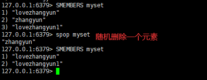
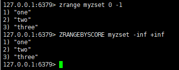
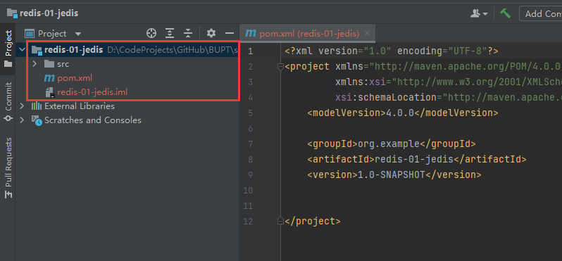
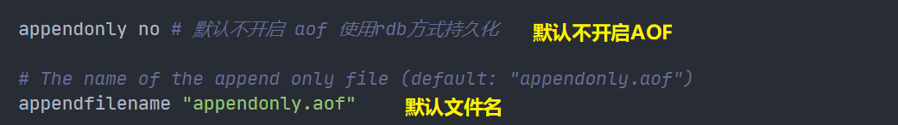

# Redis

## 前言

学习方式

- 上手就用（码农）
- 基本的理论先学习，然后将知识融会贯通（软件工程师）


redis课程安排：

- nosql讲解
- 阿里巴巴架构演进
- nosql数据模型
- Nosql四大分类
- CAP
- BASE
- Redis入门
- Redis安装(Window & Linux服务器)
- 五大基本数据类型
  - string
  - List
  - set
  - Hash
  - Zset
- 三种特殊数据类型
  - geo
  - hyperloglog
  - bitmap
- Redis配置详解
- Redis持久化
  - RDB
  - AOF
- Redis事务操作
- Redis实现订阅发布（消息队列）
- Redis主从复制
- Redis哨兵模式（现在公司中所有的集群都用哨兵模式）
- 缓存穿透及解决方案
- 缓存击穿及解决方案
- 缓存雪崩及解决方案
- 基础API之Jedis详解
- SpringBoot集成Redis操作
- Redis的实践分析


## NoSQL概述

### 为什么要用NoSQL

我们现在处于2021年，大数据时代。大数据一般的数据库无法进行分析处理了；2006年hadoop出现。至于java框架，现在最低要求是springboot+springcloud。


#### 单机mysql的年代


90年代，一个基本的网站访问量不会太大，单个数据库完全足够。哪个时候，更多的使用静态网页html，服务器没有太大的压力。

思考一下，那种情况下，整个网站的瓶颈是什么？

- 数据量如果太大，一个机器放不下
- 数据的索引（B+Tree），一个机器内存也放不下
  - 数据量超过300万的时候必须建立索引，否则查询会很慢。
- 访问量（读写混合），一个服务器承受不了

只要出现以上的三个情况之一，那么就必须谨记。


#### Memcached（缓存）+mysql+垂直拆分（读写分离）

网站80%的情况都是在读，每次都要去查询数据库的话就十分的麻烦! 所以说我们想减轻数据的压力，我们可以使用缓存来保证效率。

发展过程：优化数据结构和索引--》文件缓存（IO）--》Memcached（当时最热门的技术）


#### 分库分表+水平拆分+mysql集群

一点点的，技术规模变得越来越大。

- M代表负责“写”操作的数据库
- S代表负责“读”操作的数据库

**本质：数据库（读，写）**

早些年MyISAM：表锁，十分影响效率，高并发下就会出现比较严重的问题

早些年Innodb：行锁，效率比表锁高

慢慢的就开始使用分库分表来解决写的压力！Mysql在那个年代退出了表分区，但是并没有很多公司使用。同时Mysql推出了集群，很好的满足了那个年代的所有需求。


#### 最近的年代

技术爆炸，2010-2021，十年之间，世界发生了翻天覆地的变化。Mysql等关系型数据库就不够用了，数据量很多，变化快。MySQL有的使用它来村粗一些比较大的文件，博客，图片!数据库表很大，效率就低了!如果有一种数据库来专门处理这种数据,MySQL压力就变得十分小(研究如何处理这些问题!)大数据的IO压力下，表几乎没法更大!

目前一个基本的互联网项目：


#### 为什么要用NoSQL

用户的个人信息，社交网络，地理位置。用户自己产生的数据，用户日志等等爆发式增长，关系型数据库达到瓶颈了。这时候我们就需要使用NosQL数据库，NoSQL可以很好的处理以上的情况。


### 什么是NoSQL

#### NoSQL

NoSQL = Not Only SQL（不仅仅是SQL)

关系型数据库:表格，行，列

NoSQL泛指非关系型数据库的，随着web2.0互联网的诞生，传统的关系型数据库很难对付web2.0时代。尤其是超大规模的高并发的社区，暴露出来很多难以克服的问题。NoSQL在当今大数据环境下发展的十分迅速，Redis是发展最快的，而且是我们当下必须要掌握的一个技术!

很多的数据类型用户的个人信息，社交网络，地理位置；这些数据类型的存储不需要一个固定的格式，不需要多月的操作就可以横向扩展的。Map<String,Object>使用键值对来控制，限定了key的类型，但object的类型随意，这就是典型的NoSQL思想。


#### NoSQL特点

1. 方便扩展（数据之间没有关系，很好扩展!)

2. 大数据量高性能(Redis一秒写8万次，读取11万，NoSQL的缓存记录级，是一种细粒度的缓存，性能会比较高!)

3. 数据类型是多样型的!(不需要事先设计数据库!随取随用!如果是数据量十分大的表，很多人就无法设计了!)

4. 传统RDBMS和NoSQL
   传统的RDBMS

   - 结构化组织
   - sQL为查询语言
   - 固定的存储方式：数据和关系都存在单独的表中
   - 操作操作，数据定义语言
   - 严格的一致性（CAP中的C）
   - 基础的事务
   - 。。。

   Nosql

   - nosql意味不仅仅是数据
   - 没有固定的查询语言
   - 四种存储方式：键值对存储，列存储，文档存储，图形数据库（社交关系）
   - 最终一致性
   - CAP定理，BASE理论（异地多活）
   - 高性能，高可用，高可扩展


#### 3V+3高

大数据时代的3V:主要是描述问题的

1. 海量Volume
2. 多样Variety
3. 实时Velocity

大数据时代的3高:主要是对程序的要求

1. 高并发
2. 高可拓（随时水平拆分，机器不够了，可以扩展机器来）
3. 高性能


真正在公司中的实践:**NoSQL+ RDBMS一起使用**才是最强的，阿里巴巴的架构演进。技术没有高低之分，就看你如何去使用（提升内功，思维的提高)


### 阿里巴巴实践分析理解数据架构演进

思考问题:这么多东西难道都是在一个数据库中吗？网站中数据类型有视频，图片，评论；有些数据要经常改，有些不用经常改。


技术急不得，越是慢慢学，才能越扎实!

开源才是技术的王道!

**任何一家互联网的公司，都不可能只是简简单单让用户能用就好了!**大量公司做的都是相同的业务;(竞品协议)

随着这样的竞争，业务是越来越完善，然后对于开发者的要求也是越来越高!

从研一开始就要好好学习！


阿里巴巴数据架构：


如果未来做一个架构师，没有什么是加一层解决不了的。

一个简单的网页背后的技术很多：

1. 商品的基本信息

   - 名称、价格、商家信息;

   - 关系型数据库就可以解决了! MysqL / oracle（淘宝早年就去TOE了! -王坚:推荐文章:阿里云的这群疯子:40分钟重要!听说看完会爱上阿里巴巴)

   - 淘宝内部的MysQL不是大家用的MysQL，很多组件都被改了。

2. 商品的描述、评论（文字比较多)
   - 文档型数据库中，MongoDB

3. 图片

   - 分布式文件系统FastDFS

   - 淘宝自己的TFS
   - google的GFS
   - hadoop的HDFS
   - 阿里云的oss

4. 商品的关键字（搜索）

   - 搜素引擎 solr elasticsearch
   - ISearch：多隆（可以关注一下程序员中的明星）
     - 鸡汤：牛人有一段苦日子，坚持就终将牛

5. 商品热门的波段信息

   - 内存数据库
   - redis，tair，Memocache..

6. 商品交易，外部的支付接口
   - 三方应用


大型互联网应用问题：

- 数据类型多
- 数据源多，经常重构
- 数据要改造，大面积改造

解决问题：


缓存设计：


以上都是NoSQL入门概述，不仅能够提高大家的知识，还可以帮助大家了解大厂的工作内容!


### NoSQL的四大分类

#### KV键值对

- 新浪：redis
- 美团：Redis+tair
- 阿里，百度：redis+memocache

#### 文档型数据库

（bson格式，和json十分相似）

- MongoDB（一般必须要掌握）
  - 是一个基于分布式文件存储的数据库，c++编写，主要用来处理大量的文档
  - MongoDB是一个介于关系型数据库和非关系型数据库中间的产品，MongoDB是非关系型数据库中功能最丰富的，最像关系型数据库的。

- conthDB

#### 列存储数据库

- hbase
- 分布式文件系统

#### 图关系数据库

- 他不是存图形，**放的是关系**。比如朋友圈社交网络，广告推荐

​	

- neo4j，infogrid


#### 四大分类对比

| 分类                | Examples举例                                       | 典型应用场景                                                 | 数据模型                                        | 优点                                                         | 缺点                                                         |
| ------------------- | -------------------------------------------------- | ------------------------------------------------------------ | ----------------------------------------------- | ------------------------------------------------------------ | ------------------------------------------------------------ |
| 键值对（key-value） | Tokyo Cabinet/Tyrant, Redis, Voldemort, Oracle BDB | 内容缓存，主要用于处理大量数据的高访问负载，也用于一些日志系统等等。 | Key 指向 Value 的键值对，通常用hash table来实现 | 查找速度快                                                   | 数据无结构化，通常只被当作字符串或者二进制数据               |
| 列存储数据库        | Cassandra, HBase, Riak                             | 分布式的文件系统                                             | 以列簇式存储，将同一列数据存在一起              | 查找速度快，可扩展性强，更容易进行分布式扩展                 | 功能相对局限                                                 |
| 文档型数据库        | CouchDB, MongoDb                                   | Web应用（与Key-Value类似，Value是结构化的，不同的是数据库能够了解Value的内容） | Key-Value对应的键值对，Value为结构化数据        | 数据结构要求不严格，表结构可变，不需要像关系型数据库一样需要预先定义表结构 | 查询性能不高，而且缺乏统一的查询语法。                       |
| 图形(Graph)数据库   | Neo4J, InfoGrid, Infinite Graph                    | 社交网络，推荐系统等。专注于构建关系图谱                     | 图结构                                          | 利用图结构相关算法。比如最短路径寻址，N度关系查找等          | 很多时候需要对整个图做计算才能得出需要的信息，而且这种结构不太好做分布式的集群 |


鸡汤：敬畏之心可以使人进步，觉得自己垃圾了就能进步了。努力学习不要被社会抛弃。


## Redis入门

### 概述

#### Redis是什么？

Redis（**Re**mote **Di**ctionary **S**erver )，即远程字典服务。

是一个开源的使用ANSI C语言编写、支持网络、可基于内存亦可持久化的日志型、Key-Value数据库，并提供**多种语言**的API。

与memcached一样，为了保证效率，数据都是缓存在内存中。区别的是redis会周期性的把更新的数据写入磁盘或者把修改操作写入追加的记录文件，并且在此基础上实现了master-slave(主从)同步。

免费和开源!是当下最热门的NoSQL技术之一!也被人们称之为结构化数据库!

#### Redis能干什么？

1. 内存存储、持久化，内存是断电即失的，所以需要持久化（RDB、AOF）
2. 高效率、用于高速缓冲
3. 发布订阅系统
4. 地图信息分析
5. 计时器、计数器(eg：浏览量)
6. 。。。

#### 特性

1. 多样的数据类型
2. 持久化
3. 集群
4. 事务
5. ...

#### 学习中用到的网站

- [redis官网](https://redis.io/)
- [redis中文网](http://redis.cn/),http连接不安全
- [下载地址](https://redis.io/download),通过官网下载即可
  - 但是windows系统在[github](https://github.com/microsoftarchive/redis/releases/tag/win-3.2.100)上下载（停更很久了）
  - redis**推荐在linux**服务器上大家，接下来也基本都是基于linux学习


### Windows系统安装redis

1. 下载安装包

   访问[网址](https://github.com/microsoftarchive/redis/releases/tag/win-3.2.100)

   

   

2. 解压，

   redis十分的小，只有5M																										

   

3. 开启redis

   双击`redis-server.exe`,运行redisserver

   - 截图中看到redis默认端口号是6379

   

4. 使用redis客户端来连接redis

   保持redis-server.exe开着，双击`redis-cli.exe`

   

   使用键值对存储数据，并拿取数据

   

   记住一句话，Window下使用确实简单，但是Redis推荐我们使用Linux去开发使用!

### Linux安装redis（真企业级）

实战：

[来到官网](https://download.redis.io/releases/)，下载linux安装包，版本为课程中使用的redis版本


连接服务器


把redis包用XFTP放到home/zhangyun目录下，zhangyun目录使我自己建的，这个目录可以专门存一些上传上来的软件。


程序一般放到opt目录，移动过去

```
mv redis-5.0.8.tar.gz /opt
```


解压redis安装包

```
tar -zxvf redis-5.0.8.tar.gz
```


进入解压后的redis文件夹，可以看到redis的配置文件。

- 文件夹中没有redisserver和cli，因为文件夹解压后程序不在文件夹中；要自己安装一下


现在开始基本的环境安装

```
# 安装gcc环境，不过我之前安装docker已经装过，不过还是执行一下。
yum install gcc-c++
```


查看gcc的版本

```
gcc -v
```


执行make命令，把所有需要的文件配置上；即进行源代码编译，以及一些功能的提供

```
make
```


测试make语句是否执行成功

```
make test
```


执行make install，查看是不是所有东西安装好了

```
make install
```


redis的默认安装路径，`/usr/local/bin`下面

- 就想windows安装软件，默认路径在/usr/local/bin下面

```
cd /usr/local/bin
```


在bin目录下新建文件夹`zconfig`来存放配置文件

```
mkdir zconfig
```


把redis解压文件夹中的配置文件`redis.config`复制到`bin/zconfig`中

- 原生的配置文件就在解压目录下不会变，想恢复初始配置随时可以恢复；以后我们使用`zconfig`中的配置文件进行启动

```
cp /opt/redis-5.0.8/redis.conf zconfig
```


redis默认不是后台启动的，vim修改配置文件，使得redis后台启动


现在启动redis服务

```
# 来到bin目录
cd ../
```


```
# 用zconfig/redis.conf文件启动redis-server
redis-server zconfig/redis.conf
```

- 前面修改conf文件可能会造成文件损坏，当你启动不了redis删除配置文件重新操作一遍即可


现在使用redis客户端去连接redis服务端

```
# -p 6379表示指定客户端的端口号是6379
redis-cli -p 6379
```

现在就可以使用redis来存储数据啦


查看redis的进程是否开启

新开一个端口


```
# 查看系统中有关redis的进程
ps -ef|grep redis
```

看到redis-cli和redis-server的进程，说明redis服务和连接都开启了


现在关闭redis服务，回到redis功能页，依次执行下面命令

```
shutdown
```

```
exit
```


现在再来到新开的页面，重新查看有关redis的进程，已经没有redis的客户端和服务端的进程了。


后面我们会使用单机多redis启动集群测试


### 测试性能

redis-benchmark是一个压力测试工具

官方自带的性能测试工具


命令参数：

- 下图中-d 应该是3，图太老了。


测试并发实战：

- 保证redis-server和redis-cli启动了

先用一个连接启动redis客户端和服务端


新开一个窗口，在redis软件所在的目录（bin）执行下列命令测试一下redis

```bash
# 来到目录
cd /usr/local/bin
# 使用端口号6379，100个并发链接，100000请求
redis-benchmark -h localhost -p 6379 -c 100 -n 100000
```


现在来解读一下测试结果


### redis基本知识说明

redis默认有16个数据库

- zconfig/redis.conf文件中可以查看


默认使用的是第0个，可以使用select进行切换数据库!

```bash
# 切换数据库
select 数据库id

# 查看当前数据库大小
DBSIZE
```


一个数据库存值后，本数据库大小发生了变化；但是其他数据库的大小不变。


查看当前数据库中所有的key

```
keys *
```


清空redis数据库

```
# 清空当前数据库
flushdb
# 清空全部
FLUSHA LL
```


redis是单线程的：

明白Redis是很快的，官方表示，Redis是基于内存操作，CPU不是Redis性能瓶颈，Redis的瓶颈是根据机器的内存和网络带宽，既然可以使用单线程来实现，就使用单线程了!

Redis是C语言写的，官方提供的数据为100000+的QPS，完全不比同样是使用key-vale的Memecache差!

Redis为什么单线程还这么快?

- 误区1∶高性能的服务器一定是多线程的?
- 误区2∶多线程（CPU上下文会切换! )一定比单线程效率高!先去CPU>内存>硬盘的速度要有所了解!

**核心**: redis是将所有的数据全部放在内存中的，所以说使用单线程去操作效率就是最高的，多线程(CPU上下文会切换︰耗时的操作!! ! )反而更耗时，对于内存系统来说，如果没有上下文切换效率就是最高的!多次读写都是在一个CPU上的，在内存情况下，这个就是最佳的方案!


## 五大数据类型

官网文档


全段翻译︰
Redis是一个开源(BSD许可)的，内存中的数据结构存储系统，它可以用作**数据库**、**缓存**和**消息中间件MQ**。它支持多种类型的数据结构，如字符串( strings )，散列( hashes )，列表(lists )，集合( sets )，有序集合( sorted sets）与范围查询，bitmaps,hyperloglogs和地理空间( geospatial ）索引半径查询。Redis 内置了复制( replication )，LUA脚本( Lua scripting )，LRU驱动事件(LRU eviction )，事务( transactions）和不同级别的磁盘持久化( persistence )，并通过Redis哨兵( Sentinel )和自动分区( Cluster )提供高可用性( high availability )。

### Redis-Key相关简单操作

查看所有的key

```
keys *
```


设置键值对

```
set k v
```


获得指定k的v

```
get k
```


判断一个key是否有存在

```
# 返回1则存在，返回0则不存在
EXISTS k
```


把当前库的一个kv对移动到另一个库中

```
move k baseName
```


设置键值对的过期时间，单位是秒

```
EXPIRE k timeInSecond
```


查看键值对剩余生命，单位是秒

```
ttl k
```

查看指定k对应v的类型

- 一共有String,List,Set,Hash,Zset五种类型

```
type k
```


后面如果碰到不会的命令，可以在官网查看


### String

*很多java程序员用redis只会String类型*

下面演示redis中，string类型的v的一些基本操作

```bash
# 设置值
127.0.0.1:6379> set k1 v1
OK
# 获得值
127.0.0.1:6379> get k1
"v1"
# 为指定键的string类型v的结尾粘结字符串。如果键不存在相当于新建string型kv键值对。
127.0.0.1:6379> append k1 zhangyun
(integer) 10
127.0.0.1:6379> get k1
"v1zhangyun"
# 查看指定键对应的string类型v的长度
127.0.0.1:6379> strlen k1
(integer) 10
# 查看指定键对应的键值对是否存在
127.0.0.1:6379> exists k1
(integer) 1
127.0.0.1:6379> 
```

String中有关增减的一组命令：

```bash
127.0.0.1:6379> set num 1
OK
# 以步长为1增加指定的k对应的v
127.0.0.1:6379> incr num
(integer) 2
127.0.0.1:6379> get num
"2"
# 以步长为1减小指定的k对应的v
127.0.0.1:6379> decr num
(integer) 1
127.0.0.1:6379> get num
"1"
# 以指定步长，增加指定的k对应的v
127.0.0.1:6379> incrby num 10
(integer) 11
127.0.0.1:6379> get num
"11"
# 以指定步长，减小指定的k对应的v
127.0.0.1:6379> decrby num 10
(integer) 1
127.0.0.1:6379> get num
"1"
127.0.0.1:6379> 

```

**redis中tab键不仅可以补足文件和目录，还能补足redis命令**

字符串截取的一些操作

```bash
127.0.0.1:6379> get k1
"v1zhangyun"
# 取指定k对应v的，从0号位置到3号位置之间的内容
127.0.0.1:6379> GETRANGE k1 0 3
"v1zh"
# 取指定k对应v的全部内容，-1表示取全部
127.0.0.1:6379> GETRANGE k1 0 -1
"v1zhangyun"
127.0.0.1:6379> 
```

字符串内容替换的一些操作

```bash
127.0.0.1:6379> set k2 abcdefg
OK
127.0.0.1:6379> get k2
"abcdefg"
# 从v的1号位置开始，替换为zzz，未被zzz覆盖的字符串位置保持原状
127.0.0.1:6379> SETRANGE k2 1 zzz
(integer) 7
127.0.0.1:6379> get k2
"azzzefg"
127.0.0.1:6379> 
```

设置键值对的同时设置过期时间。

- 和expire区别：Setex是一个原子操作，设置值+设置过期时间两个动作，会在同一时间完成；在Redis缓存中，非常实用。expire是单纯的设置死亡时间。

```
# 设置键k3，值v3，生命20s的键值对。set with expire
setex k3 20 v3
```


不存在时的设置(set if not exist)，指定key对应的键值对不存在的时候才能设置成功。

- 在分布式锁中常常使用，因为保证值总是存在。

```
setnx k4 redis
```


批量设置键值对

```bash
mset k1 v1 k2 v2 k3 v3

# 批量设置键值对，当所有键值对不存在时才生效，原子性！
msetnx k1 v1 k4 v4
```


批量获取键对应的值

```bash
mget k1 k2 k3
```


使用json方式新建对象

```
set user:1 {name:zhangyun,age:3}
```

使用mset的方式新建对象，或修改对象的值

- 这里的key是一个巧妙的设计：user:{id}:{field}，这种设计在redis中是完全ok的

```
mset user:1:name zhangyun user:1:age 2
```

使用mget的方式获取对象的部分或全部信息

```
mget user:1:name user:1:age
```


先get再set

- 如果不存在值则返回null，并设置值；如果存在值则返回值，并设置新值
- getset可以用来做一些更新的操作
- 类似的操作还有CAS(compare and swap)，同时做两个操作。

```
getset db redis
```


String类似的使用场景:value除了是我们的字符串还可以是我们的数字!

- 计数器，incrby实现
- 统计多单位的数量书
- 粉丝数
- 对象缓存存储

### List

在redis里面，我们可以把list玩成，栈、队列、阻塞队列!

所有list大部分命令都是用l开头的，lpush和rpush组合是一个例外。

redis命令不区分大小写。

redis中list不是列表，是双向链表。


LPUSH将一个值或者多个值插入列表的头部:

```
LPUSH listName v
```

LRANGE获取list中一定范围内的值：


```
LRANGE listName l r
```


RPUSH把一个值或多个值插入到列表的尾部：

```
RPUSH listName v
```


从列表头部（左边）移除一个值:

```
Lpop listname
```

从列表尾部（右边）移除一个值:

```
Rpop listname
```


获取列表的指定下标的值

```
Lindex listname index
```


查看列表的长度


移除指定的值（精确匹配）：

- 类似“取消关注”的功能，需要删除指定的值uid

```bash
# 从list列表，移除两个，值为“three”的元素
lrem list 2 three
```


截断列表保留下指定的值（们）

```
ltrim listname l r
```


rpoplpush,从原list右边(尾)pop一个元素，给新list左边（头）push进去

- **组合命令是原子操作**，在处理并发问题的时候，占有优势

```
rpoplpush src des
```


lset 将list（已存在）中指定下标（已存在）的值替换为另一个值

- 如果list或者下标不存在，lset会报错

```
lset listname index value
```


在list的指定位置插入元素：

```
linsert listname before/after pivotWord insertedWord
```


小结：

- list实际上是一个双向链表：before Node after ；left 和right都可以插入值
- 如果key不存在，创建新的链表
- 如果key存在，新增内容
- 如果移除了所有node，空链表，也代表不存在!
- 在两边插入或者改动值，效率最高!中间元素，相对来说效率会低一点~
- 实际上这些命令，用的时候看redis官方api即可。

队列（消息排队）：lpush+rpop；栈：lpush+lpop。


### Set

存值，取值，查值

```bash
# set集合中添加元素
sadd setname v
# 查看指定set集合的所有值
SMEMBERS setname
# 判断某个值是不是在set集合中
SISMEMBER setname v
```


获取set中元素的个数

```
scard setname 
```


srem从set中移除指定元素

```
srem setname v 
```


随机删除一些元素

```
spop setname
```



SRANDMEMBER从set中随机抽选一个元素

```
SRANDMEMBER setname num
```


smove把一个元素从一个set移动到另一个set

```
smove setnameSrc setnameDes v
```


sdiff求两个集合的差集

```
sdiff set1 set2
```


求两个集合的交集，比如微博中好友的共同关注

```
SINTER set1 set2
```


求两个集合的并集

```
sunion set1 set2
```


### Hash

redis中hashmap，本质和string没有什么太大区别，本质还是一个简单地k-v。


**hset**存hashmap，**hget和hmget和hgetall**取hashmap：

- 根据Redis 4.0.0，HMSET被视为已弃用。请在新代码中使用HSET。

```bash
# (批量)k-v存值
hset hashmapName k1 v1 k2 v2 k3 v3...
# 取值
hget hashmapName k
# 批量取v
hmget hashmapName k1 k2...
# 取hashmap所有的k-v
hgetall hashmapName
```


hdel删除hashmap中某一键值对

```
hdel hashmapName k
```


hlen查看hashmap中键值对的数目

```
hlen hashmapName
```


hexists判断某个键（值对）是否存在

```
HEXISTS hashmapName k
```


**hkeys**和**hvals**查看hashmap的所有键或值

```bash
# 查看hashmap所有的key
hkeys hashmapName
# 查看hashmap所有的value
hvals hashmapName
```


hincrby增加或减少hashmap中的v（应为数字类型）的值

```
HINCRBY hashmapName k step
```


hsetnx当键k不存在时添加键值对

```
hsetnx hashmapName k v
```


hashmap可以存储变更的数据，尤其是用户信息之类的，经常变动的信息。hash更适合对象的存储 ，string 更适合字符串的存储。

### Zset（有序集合）

set的基础上为每一个元素增加一个序号。

与set相比不同的是每个元素都会关联一个double类型的分数（score）。redis正是通过分数来为集合中的成员进行从小到大的排序。

- score相同：按字典顺序排序

- 有序集合的成员是唯一的,但分数(score)却可以重复。


#### zadd

往有序集合中添加元素

```
zadd zsetname index1 v1 index2 v2...
```


查看有序集合的一段元素

```
# 1为0，r为-1时，为查看所有元素
zrange zsetName l r
```


#### zrange+ZRANGEBYSCORE+ZREVRANGEBYSCORE

**ZRANGEBYSCORE**为有序集合按照编号升序排序：

- 降序要使用ZREVRANGEBYSCORE 命令
- ZRANGEBYSCORE还能添加一些其他参数，比如 `withscore`，表示排序同时把编号也打印出来。

```
# low为-inf表示编号从负无穷开始计入排序，up为+inf表示编号截止到正无穷计入排序
ZRANGEBYSCORE zsetname low up
```




#### zrem

移除zset(有序集合)中的指定元素value

```
zrem zsetname value
```


#### zcard

查看zset中元素的个数

```
zcard zsetname
```


#### zcount

获取zset指定区间的成员个数，因为有些序号可能没有对应的value。

```
zcount zsetname leftindex rightindex
```


#### zset应用案例

- set排序 存储班级成绩表 工资表排序！
- 普通消息为1。重要消息为2。带权重进行判断
- 排行榜应用实现，取Top N测试


### 其他

其余的一些API，如果工作中有需要，这个时候可以去查查看[官方文档命令](https://redis.io/commands)


后续可以使用java-api操控redis

```bash
# redis存string类型
jedis.set(key,value)
# redis存hash类型
jedis.set(key,Map)
```


## 三种特殊的数据类型

### Geospatial(地理位置)

#### 引入

使用场景

- 朋友的定位，附近的人，打车距离计算?


Redis的Geo在Redis3.2版本就推出了!这个功能可以推算地理位置的信息，两地之间的距离，方圆几里的人!


查询城市经纬度的[在线工具](http://www.jsons.cn/lngcode/)


相关命令


#### geoadd

[官网介绍](https://redis.io/commands/geoadd)。将一个或多个具体经纬度的坐标存入一个有序集合。


命令：

```
geoadd key longitud(经度) latitude(纬度) member(城市) [..]
```

- 地球两极：南极北极是无法直接添加的。

- 我们一般会下载城市数据，直接通过java程序一次性导入。

- 有效的经度从-180度到180度。有效的纬度从-85.05112878度到85.05112878度。当坐标位置超出上述指定范围时,该命令将会返回一个错误。

  ```
  #127.0.0.1:6379> geoadd china:city 39.90 116.40 beijing
  (error) ERR invalid longitude,latitude pair 39.900000,116.400000
  ```


实例：

```bash
# 清空redis
127.0.0.1:6379> flushdb
OK
127.0.0.1:6379> list
(error) ERR unknown command `list`, with args beginning with: 
127.0.0.1:6379> keys *
(empty list or set)
# 往redis中写入中国地理坐标
127.0.0.1:6379> geoadd china:city 116 39 beijing
(integer) 1
127.0.0.1:6379> geoadd china:city 121 31 shanghai
(integer) 1
127.0.0.1:6379> geoadd china:city 106 29 chongqing
(integer) 1
127.0.0.1:6379> geoadd china:city 114 22 shenzhen 120.15 30.28 hangzhou
(integer) 2
127.0.0.1:6379> geoadd china:city 108.96 34.26 xian
(integer) 1

```


#### geopos

拿到某(几)个城市的坐标。


命令：

```
geopos key member
```


实战：

```bash
127.0.0.1:6379> geopos china:city beijing
1) 1) "116.00000113248825073"
   2) "38.99999918434559731"
# 获取上海和重庆的坐标
127.0.0.1:6379> geopos china:city shanghai chongqing
1) 1) "120.99999815225601196"
   2) "31.00000097648057817"
2) 1) "106.00000172853469849"
   2) "28.99999952347345555"
```


#### geodist

返回两个位置之间的距离，如果有位置不存在则返回空值。

单位:

- m表示单位为米。
- km表示单位为千米。
- mi表示单位为英里。
- ft表示单位为英尺。


命令：

```
geodist key member1 member2 [-para]
```


实战：

```bash
# 上海到北京的直线距离，单位米
127.0.0.1:6379> geodist china:city beijing shanghai
"999207.7044"
# 上海到北京的直线距离，单位千米
127.0.0.1:6379> geodist china:city beijing shanghai km
"999.2077"
```


#### georadius

以给定的经纬度为中心，找出某一半径内的元素。比如“附近的人”功能，通过半径来查询。


命令：

```
GEORADIUS key longtitude经度 latitude纬度 半径 半径单位 参数(们)
```


实战：

```bash
127.0.0.1:6379> GEORADIUS china:city 110 30 1000 km
1) "chongqing"
2) "xian"
3) "shenzhen"
4) "hangzhou"
# 经纬度（110 30）的半径500km以内的城市
127.0.0.1:6379> GEORADIUS china:city 110 30 500 km
1) "chongqing"
2) "xian"
# 查询城市的同时打印城市坐标
127.0.0.1:6379> GEORADIUS china:city 110 30 500 km withcoord
1) 1) "chongqing"
   2) 1) "106.00000172853469849"
      2) "28.99999952347345555"
2) 1) "xian"
   2) 1) "108.96000176668167114"
      2) "34.25999964418929977"
# 查询城市的同时打印距离
127.0.0.1:6379> GEORADIUS china:city 110 30 500 km withdist
1) 1) "chongqing"
   2) "402.8557"
2) 1) "xian"
   2) "483.8340"
# 限制查询结果的个数，类似mysql的limit
127.0.0.1:6379> GEORADIUS china:city 110 30 1000 km count 3
1) "chongqing"
2) "xian"
3) "shenzhen"
127.0.0.1:6379> GEORADIUS china:city 110 30 1000 km count 2
1) "chongqing"
2) "xian"


```


#### georadiusbymember

类似georadius，不过不是给定坐标，而是给定城市名。换言之就是找出指定坐标元素周围的其他坐标元素。


命令：

```
GEORADIUSbymember key member 半径 半径单位 参数(们)
```


实战：

```bash
127.0.0.1:6379> GEORADIUSBYMEMBER china:city beijing 1000 km
1) "beijing"
2) "shanghai"
3) "xian"
127.0.0.1:6379> GEORADIUSBYMEMBER china:city hangzhou 400 km
1) "hangzhou"
2) "shanghai"
```


#### geohash

该命令将返回坐标对应的11个字符的Geohash字符串!将维的经纬度转换为一维的字符串。如果两个字符串越接近，说明相互距离越小。

一般用不上。


#### geoXXX底层实现原理

geoXXX底层的实现原理就是zset。我们可以使用zset命令来操作geo。

比如geoXXX中没有“移除坐标”的方法，可以使用zset的方法zrem来移除

```bash
127.0.0.1:6379> ZRANGE china:city 0 -1
1) "chongqing"
2) "xian"
3) "shenzhen"
4) "hangzhou"
5) "shanghai"
6) "beijing"
# 移除杭州的坐标
127.0.0.1:6379> ZREM china:city hangzhou
(integer) 1
127.0.0.1:6379> ZRANGE china:city 0 -1
1) "chongqing"
2) "xian"
3) "shenzhen"
4) "shanghai"
5) "beijing"
```


### HyperLogLog

#### 基数定义

A{1,3,5,7,8,7}，B{1,3,5,7,8}。A和B的基数（不重复的元素的个数）都为5，可以接受误差!

#### 简介

Redis 2.8.9版本就更新了Hyperloglog数据结构。

Redis Hyperloglog基数统计的算法：

- 布隆过滤器

优点∶

- 占用的内存是固定，2*64不同的元素的技术，只需要废12KB内存!如果要从内存角度来比较的话Hyperloglog首选!

适用场景: 

- 网站UV（unique visitor）量。传统用set存userid统计，但若存在大量用户id，则太消耗内容且麻烦，若只为计数且**允许有错误率**（0.81%），则可行，否则还是用set统计
- 一个人访问一个网站多次，还是算作一个人。


#### 实战

```bash
# Redis Pfadd 命令将所有元素参数添加到 HyperLogLog 数据结构中,key为ch1，a b c d e f g h i为元素参数
127.0.0.1:6379> PFADD ch1 a b c d e f g h i
(integer) 1
# 查询key为ch1的HyperLogLog数据结构中元素个数
127.0.0.1:6379> PFCOUNT ch1
(integer) 9
# 创建key为ch2的HyperLogLog数据结构
127.0.0.1:6379> PFADD ch2 g h i j k l m 
(integer) 1
# 查询key为ch2的HyperLogLog数据结构中元素个数
127.0.0.1:6379> PFCOUNT ch2
(integer) 7
# key为ch1的HyperLogLog数据结构 合并 key为ch2的HyperLogLog数据结构
127.0.0.1:6379> PFMERGE ch3 ch1 ch2
OK
# 查询合并后的HyperLogLog数据结构中元素个数
127.0.0.1:6379> PFCOUNT ch3
(integer) 13
```


### Bitmaps

#### 位存储

核心思想是“位存储”。

“位存储”思想类似“boolean”，比如统计登录or未登录，打卡or未打卡；又比如疫情期间中国14亿人，可以有14亿位数字，每个人用一位表示，如果感染了用1表示，没感染用0表示，如00010001000....。14亿位的数字其实很小，用一台计算机就能处理，这就是“位存储”的好处。

Bitmaps位图是一种数据结构，是操作二进制位来进行记录，就只有0和1两个状态。比如做365天的打卡与否的记录的话，只需要365 bit，约46个字节(1字节=8bit )左右!

只要是两个状态的，都可以使用Bitmaps。


#### 实战

使用bitmap来记录周一到周日的打卡。

- 周一：1（打卡了）；周二：0（没打卡），周三：0（没打卡），周四：1（打卡了），周五：1（打卡了）；周六：0（没打卡），周日：0（没打卡）

```bash
# 清空redis表，方便查看表
127.0.0.1:6379> keys *
1) "ch3"
2) "ch1"
3) "ch2"
127.0.0.1:6379> flushdb
OK
127.0.0.1:6379> keys *
(empty list or set)
# 使用bitmap记录一周的打卡
127.0.0.1:6379> setbit sign 0 1
(integer) 0
127.0.0.1:6379> setbit sign 1 0
(integer) 0
127.0.0.1:6379> setbit sign 2 0
(integer) 0
127.0.0.1:6379> setbit sign 3 1
(integer) 0
127.0.0.1:6379> setbit sign 4 1
(integer) 0
127.0.0.1:6379> setbit sign 5 0
(integer) 0
127.0.0.1:6379> setbit sign 6 0
(integer) 0
# 查看周四打卡情况：得到结果为打卡了
127.0.0.1:6379> getbit sign 3
(integer) 1
# 查看周日打卡情况：得到结果为未打卡
127.0.0.1:6379> getbit sign 6
(integer) 0
# 统计操作：统计本周打卡天数，得到结果为3天
127.0.0.1:6379> bitcount sign
(integer) 3
```


有些教程都不喜欢讲这些，因为老师本身可能就是万年kv，没有尝试别的数据结构，这样代码的效率很低。在生活中或者开发中，不同工具都有十分多的应用场景，学习了，就是就是多一个思路。技多不压身!


## 事务

redis事务的本质：

- 一组命令的集合；一个事务中的所有命令都会被序列化，在事务执行的过程中，会按照顺序执行。


redis事务的性质：

- redis单条命令具有原子性，但是**redis事务不保证原子性**。

- 一次性，顺序性，排他性

- **redis事务没有隔离级别的概念**。

  - 所有的命令在事务中并没有被直接执行，只有发起执行命令(Exec)的时候才会执行。
  - 不会有脏读，幻读之类的概念

- 事务步骤

  1. 开启事务（`multi`）。
  2. 命令入队（...）。这个没什么好讲的，就是一堆redis命令。
  3. 执行事务（`exec`）。

  

### 正常执行事务

实战：

```bash
# 清空redis数据库
127.0.0.1:6379> flushdb
OK
127.0.0.1:6379> keys *
(empty list or set)
# 开启事务
127.0.0.1:6379> multi
OK
# 命令入队
127.0.0.1:6379> set k1 v1
QUEUED
127.0.0.1:6379> set k2 v2
QUEUED
127.0.0.1:6379> get k2
QUEUED
127.0.0.1:6379> set k3 v3
QUEUED
# 执行事务，得到执行事务的结果
127.0.0.1:6379> exec
1) OK
2) OK
3) "v2"
4) OK

```


### 放弃事务

实战：

```bash
# 开启事务
127.0.0.1:6379> multi
OK
# 命令入队
127.0.0.1:6379> set k1 v1
QUEUED
127.0.0.1:6379> set k2 v2
QUEUED
127.0.0.1:6379> set k4 v4
QUEUED
# 放弃事务，事务队列中的命令都不会被执行。
127.0.0.1:6379> DISCARD
OK
# 读不到k4的值，说明事务中对k4的设置没有执行，体现了放弃事务。
127.0.0.1:6379> get k4
(nil)
```


### 事务中的异常

#### 编译型异常

代码有错误即命令有错误。事务中所有的命令都不会被执行


实战：

```bash
# 清空redis数据库
127.0.0.1:6379> flushdb
OK
127.0.0.1:6379> keys *
(empty list or set)
# 开启事务
127.0.0.1:6379>  multi
OK
# 命令入队
127.0.0.1:6379> set k1 v1
QUEUED
127.0.0.1:6379> set k2 v2
QUEUED
# 把会导致编译型异常的命令入队，直接就自动反馈了error。但是队列还在。
127.0.0.1:6379> getset k2
(error) ERR wrong number of arguments for 'getset' command
127.0.0.1:6379> set k3 v3
QUEUED
# 执行事务。因为命令中有编译型异常的命令，所有命令都执行不成功。
127.0.0.1:6379> exec
(error) EXECABORT Transaction discarded because of previous errors.
# 通过k3取值取不到也可以看出来事务中所有命令都没被执行。
127.0.0.1:6379> get k3
(nil)

```


#### 运行时异常

比如1除以0。如果事务队列中存在这种异常，那么执行命令的时候，除开异常命令以外的其他命令都是可以执行的，错误命令抛出异常。这也体现了redis的事务不保证原子性。


实战：

```bash
# 清空数据库
127.0.0.1:6379> flushdb
OK
127.0.0.1:6379> keys *
(empty list or set)
# 开启事务
127.0.0.1:6379> multi
OK
127.0.0.1:6379> set k1 "v1"
QUEUED
# 把会导致运行时异常的命令入队，执行事务的时候本条命令会失败。
127.0.0.1:6379> incr k1
QUEUED
127.0.0.1:6379> set k2 v2
QUEUED
127.0.0.1:6379> get k2
QUEUED
# 执行事务。除了运行时异常的命令抛出异常，其他命令正确执行。
127.0.0.1:6379> exec
1) OK
2) (error) ERR value is not an integer or out of range
3) OK
4) "v2"
```


### 监控

#### 悲观锁

这里不讲

#### 乐观锁

乐观锁定义：

- 很乐观，认为什么时候都不会出问题，所以不会上锁!更新数据的时候去判断一下，在此期间是否有人修改过这个数据。
- 获取version。**这里的version不是对值比较**，而是类似version戳的东西。
- 更新的时候比较version。


---


正常执行成功的实战：

```bash
# 清空redis数据库
127.0.0.1:6379> flushdb
OK
127.0.0.1:6379> keys *
(empty list or set)
# 设置值
127.0.0.1:6379> set money 100
OK
127.0.0.1:6379> set out 0
OK
# 设置乐观锁，监视money对象。
127.0.0.1:6379> watch money
OK
# 开启事务
127.0.0.1:6379> multi
OK
# 命令入队
127.0.0.1:6379> DECRBY money 20
QUEUED
127.0.0.1:6379> INCRBY out 20
QUEUED
# 执行事务。事务存在期间没有发生改动，这个时候事务就正常结束。
127.0.0.1:6379> exec
1) (integer) 80
2) (integer) 20
```


---


执行失败的实战：

先新开一个页面，连接redisserver，此页面便是第二个redisclient（客户端2）


在客户端1执行如下语句。注意事务没有执行！！！

```bash
# redis客户端1语句
# 监视money
127.0.0.1:6379> watch money
OK
127.0.0.1:6379> multi
OK
127.0.0.1:6379> DECRBY money 10
QUEUED
127.0.0.1:6379> INCRBY money 10
QUEUED
```

客户端1的事务执行前，客户端2（另一条线程）插进来一脚，执行如下语句

```bash
# redis客户端2语句
127.0.0.1:6379> get money
"80"
# 一个线程修改了值
127.0.0.1:6379> set money 1000
OK
```

这是回到客户端1的页面，输入“执行事务”的命令

- 注意：**无论事务是否执行成功，Redis的exec和discard命令都会取消对所有键的Watch监控**

```bash
# redis客户端1语句
# 因为客户端1使用watch money监测money，并且客户端2在客户端1事务的生命中间修改了money，所以客户端1的事务执行失败。
127.0.0.1:6379> exec
(nil)
```

所以redis**多线程修改值**的时候，使用**watch**可以当做**redis的乐观锁**操作（**面试常问**）。


## Jedis

jedis是使用Java来操作Redis的中间件，Jedis是Redis官方推荐使用的Java连接redis的客户端。

后面springboot集成redis是顶层，这里讲解的jedis是底层，懂底层才能各种debug。


### jedis实战测试

#### 创建项目

创建空项目


创建空项目完毕后，idea自动跳出module创建要求，创建一下module


创建module完毕后，项目中可以看到module



空项目注意一个点：在project structure中把jdk配上


空项目还要在setting中把java版本改一下


#### 引入依赖

访问[mvnrepository](https://mvnrepository.com/)


使用3.2.0版本。碰到一些maven错误，参考[文章](https://blog.csdn.net/weixin_44005516/article/details/108293228)解决。

- 后面发现阿里云镜像就是用不了，直接删掉settings.xml中所有的镜像，用默认的maven中央仓库把jar包下载了。


```xml
<!-- https://mvnrepository.com/artifact/redis.clients/jedis -->
<dependency>
    <groupId>redis.clients</groupId>
    <artifactId>jedis</artifactId>
    <version>3.2.0</version>
</dependency>
<!-- https://mvnrepository.com/artifact/com.alibaba/fastjson -->
<dependency>
    <groupId>com.alibaba</groupId>
    <artifactId>fastjson</artifactId>
    <version>1.2.62</version>
</dependency>
```

#### 编码测试

步骤概述：

- 连接数据库

- 操作命令

- 断开连接


具体步骤如下：

修改远程linux服务器上的redis配置文件（redis.conf），让redis监听所有ip的6379端口。这样才能远程连接。


腾讯云防火墙放开6379端口


远程云主机开启redis服务端


本地idea编写如下的java测试文件

```java
import redis.clients.jedis.Jedis;

public class TestPing {
    public static void main(String[] args) {
        //1. new Jedis对象
        Jedis jedis =new Jedis("120.53.244.17",6379);
        //2. jedis所有的命令就是我们之前学的所有redis指令,所以redis指令学习很重要
        System.out.println(jedis.ping());
        //3. 关闭连接。养成开启连接用完后随手关闭的习惯。
        jedis.close();
        
    }

}
```

运行测试文件，控制台成功输出“pong”，说明本地连接远程redis服务端成功！


**如果连接不上**，参考如下思路：远程链接不上，可能有几个原因：1.redis配置文件的ip限制注释掉，2.远程访问保护关掉，设置为no，3.如果是阿里ECS，需要开放6379端口，4。检查下是不是防火墙被拦了，5.远程redis启动了没有端口

### jedis常用API

string，List，set，Hash，zset，geospatial，hyperloglog，bitmaps。

所有的api命令，就是我们对应的上面学习的redis指令，一个都没有变化。


### jedis事务

实例+注释如下：

```java
package com.zhang;

import com.alibaba.fastjson.JSONObject;
import redis.clients.jedis.Jedis;
import redis.clients.jedis.Transaction;

public class TestTX {
    public static void main(String[] args) {
        //初始化
        Jedis jedis =new Jedis("120.53.244.17",6379);
        jedis.flushDB();

        //把得到json格式的字符串，作为kv的v
        JSONObject jsonObject = new JSONObject();
        jsonObject.put("hello","world");
        jsonObject.put("name","zhangyun");
        String result = jsonObject.toJSONString();
        System.out.println("result -> " + result);

        //开启事务
        Transaction transaction = jedis.multi();

        //！！！可能执行失败并且要回滚的代码块，使用trycatch包裹起来！
        try {
            //命令入队
            transaction.set("user1",result);
            /*
            * 和redis环境不同，这里是javatrycatch环境，虽然1/0是运行时异常，但出现异常会走catch中的取消事务，exec没执行就抛错了，所以try中的set都不会执行
            *
            * exec都没执行，跟redis的事务执行异常根本没关系
            * */
            int i=1/0;//
            transaction.set("user2",result);

            //事务执行
            transaction.exec();
        } catch (Exception e) {
            //发生异常时放弃事务（事务回滚）
            transaction.discard();
            e.printStackTrace();
        } finally {
            //无论事务成功与否都会来到finally代码块。如果能看到user1和user2的值，则说明事务执行成功；如果值为空则事务失败。
            System.out.println("user1 -> " +jedis.get("user1"));
            System.out.println("user2 -> " +jedis.get("user2"));
            //关闭连接
            jedis.close();
        }
    }
}
```

运行代码的结果如下：

- 这个例子其实不好，因为异常都没被redis处理。本例子主要展示的其实是javatrycatch的功能：碰见报错的地方跳往catch。


## SpringBoot整合

### 概念说明

SpringBoot操作数据使用:spring-data，jpa，jdbc ，mongodb，redis !

SpringData也是和SpringBoot齐名的项目!

说明∶在SpringBoot2.x之后，原来`<artifactId>spring-boot-starter-data-redis</artifactId>`底层使用的jedis被替换为了lettuce?

- jedis :采用的直连，多个线程操作的话，是不安全的，如果想要避免不安全的，使用jedis pool连接池。更像BIO模式。
- lettuce:采用letty，实例可以再多个线程中进行共享，不存在线程不安全的情况!可以减少线程数量，更像NIO模式。


### 项目实战

#### 新建子module

新建springboot子module


springboot子module构建完成后可以在项目中看到


删掉没用的文件（夹），省的看的不舒服


#### 导入依赖

在创建项目时，勾选的模块已经自动体现在pom文件中的依赖里。


有一些构建的依赖和配置（如爆红的）要删掉，否则无法运行。删掉无关内容后，完整的pom内容如下：

```xml
<?xml version="1.0" encoding="UTF-8"?>
<project xmlns="http://maven.apache.org/POM/4.0.0" xmlns:xsi="http://www.w3.org/2001/XMLSchema-instance"
         xsi:schemaLocation="http://maven.apache.org/POM/4.0.0 https://maven.apache.org/xsd/maven-4.0.0.xsd">
    <modelVersion>4.0.0</modelVersion>
    <parent>
        <groupId>org.springframework.boot</groupId>
        <artifactId>spring-boot-starter-parent</artifactId>
        <version>2.6.2</version>
        <relativePath/> <!-- lookup parent from repository -->
    </parent>
    <groupId>com.zhangyun</groupId>
    <artifactId>redis-02-springboot</artifactId>
    <version>0.0.1-SNAPSHOT</version>
    <name>redis-02-springboot</name>
    <description>redis-02-springboot</description>
    <properties>
        <java.version>8</java.version>
        <repackage.classifier/>
    </properties>
    <dependencies>
        <dependency>
            <groupId>org.springframework.boot</groupId>
            <artifactId>spring-boot-starter-data-redis</artifactId>
        </dependency>
        <dependency>
            <groupId>org.springframework.boot</groupId>
            <artifactId>spring-boot-starter-web</artifactId>
        </dependency>

        <dependency>
            <groupId>org.springframework.boot</groupId>
            <artifactId>spring-boot-devtools</artifactId>
            <scope>runtime</scope>
            <optional>true</optional>
        </dependency>
        <dependency>
            <groupId>org.springframework.boot</groupId>
            <artifactId>spring-boot-configuration-processor</artifactId>
            <optional>true</optional>
        </dependency>
        <dependency>
            <groupId>org.projectlombok</groupId>
            <artifactId>lombok</artifactId>
            <optional>true</optional>
        </dependency>
        <dependency>
            <groupId>org.springframework.boot</groupId>
            <artifactId>spring-boot-starter-test</artifactId>
            <scope>test</scope>
        </dependency>
    </dependencies>

</project>
```


#### 配置连接

在resource目录下的application.properties文件中进行springboot的配置。其中就可以配置redis的连接。

文件内容如下：

```properties
#SpringBoot所有的配置类，都有一个自动配置类:RedisAutoConfiguration
# 自动配置类都会绑定一个properties:RedisProperties

# 配置redis
spring.redis.host=120.53.244.17
spring.redis.port=6379
# 如果要使用连接池的话，要使用lettuce的连接池。因为jedis的连接池很多类都不存在也不生效。
```

#### 测试

打开springboot的测试类，编写内容+注释如下：

```java
package com.zhangyun.redis02springboot;

import org.junit.jupiter.api.Test;
import org.springframework.beans.factory.annotation.Autowired;
import org.springframework.boot.test.context.SpringBootTest;
import org.springframework.data.redis.connection.RedisConnection;
import org.springframework.data.redis.core.RedisTemplate;

@SpringBootTest
class Redis02SpringbootApplicationTests {

    //注入redisTemplate
    @Autowired
    private RedisTemplate redisTemplate;

    @Test
    void contextLoads() {

        /*redisTemplate操作不同的数据类型，api和redis指令是一样的：
        * opsForValue 操作字符串 类似String
        * opsForList 操作list 类似list
        * opsForSet
        * opsForHash
        * opsForZSet
        * opsForGeo
        * opsForHyperLogLog
        * */

        /*除了基本的操作，我们常用的方法都可以直接通过redisTemplate操作，比如事务，和基本的CRUD
        * */

        //获取redis的连接对象
        //RedisConnection connection = redisTemplate.getConnectionFactory().getConnection();
        //connection.flushDb();

        /*redis数据库中键值对有乱码，是因为java自带序列化的原因，参考文章：https://blog.csdn.net/qq_16159433/article/details/121491555*/
        redisTemplate.opsForValue().set("key1","zhangyun1");
        System.out.println(redisTemplate.opsForValue().get("key1"));
    }

}
```

运行测试方法后得到结果：


使用xshell查看远程redis库的内容，可以看到存的key1，但是因为序列化的问题，键和值的前面都有一大串不可读的字符：


为了解决这个问题，参见本章的“序列化相关”。


### 源码分析

#### RedisAutoConfiguration

分析RedisAutoConfiguration.java中的源码：

```java
@Bean
//我们可以自己定义一个redisTemplate来替换默认的
@ConditionalOnMissingBean(
    name = {"redisTemplate"}
)
@ConditionalOnSingleCandidate(RedisConnectionFactory.class)
public RedisTemplate<Object, Object> redisTemplate(RedisConnectionFactory redisConnectionFactory) {
    //默认的RedisTemplate没有过多的设置，redis对象都是需要序列化的。
    //两个泛型都是Object, Object类型，我们经常使用的是String类型，所以后续需要强制转换为<String, Object>。
    RedisTemplate<Object, Object> template = new RedisTemplate();
    template.setConnectionFactory(redisConnectionFactory);
    return template;
}

@Bean
@ConditionalOnMissingBean
@ConditionalOnSingleCandidate(RedisConnectionFactory.class)
//由于String是redis中最常使用的类型，所以说单独提出来一个bean。
public StringRedisTemplate stringRedisTemplate(RedisConnectionFactory redisConnectionFactory) {
    return new StringRedisTemplate(redisConnectionFactory);
}
```


#### RedisTemplate

探讨序列化问题，看RedisTemplate.java


### 序列化相关

#### 传递不实现序列化的对象

编写一个不实现序列化的pojo类。

类如下：

```java
import lombok.AllArgsConstructor;
import lombok.Data;
import lombok.NoArgsConstructor;
import org.springframework.stereotype.Component;

//把User类变成一个组件
@Component
//使用lombok，简化pojo类的编写（其实不推荐使用lombok，不过这用一下）
@AllArgsConstructor
@NoArgsConstructor
@Data
public class User {
    private String name;
    private int age;

}
```


---

首先考虑把对象转化为json格式字符串后，存入redis。

测试函数如下：

```java
    @Test
    public void testJsonStringSerilization() throws JsonProcessingException {
        //真实的开发一般都使用json来传递对象,所以要把User对象序列化成（json格式的）String
        User user = new User("张云", 3);
        String userAsJsontypeString = new ObjectMapper().writeValueAsString(user);
        redisTemplate.opsForValue().set("user1",userAsJsontypeString);//传送序列化成jsonstring后的对象
        System.out.println("user1=>"+redisTemplate.opsForValue().get("user1"));
    }
```

控制台输出结果正确，说明成功存入远程redis：


远程redis查看数据。由于序列化，key的前面跟了很多不可读的字符：


---

现在考虑直接传对象本体。

测试函数如下：

```java
    @Test
    public void testObjectSerilization() throws JsonProcessingException {
        User user = new User("张云", 3);
        redisTemplate.opsForValue().set("user2",user);//直接传送对象
        System.out.println("user2=>"+redisTemplate.opsForValue().get("user2"));
    }
```

程序执行报错,并且远程redis看不到“user2"。这是因为pojo类User**没有实现序列化，不能直接传输**。

```
2022-01-04 12:54:48.145  INFO 22460 --- [           main] .s.d.r.c.RepositoryConfigurationDelegate : Finished Spring Data repository scanning in 5 ms. Found 0 Redis repository interfaces.
2022-01-04 12:54:49.318  INFO 22460 --- [           main] c.z.r.Redis02SpringbootApplicationTests  : Started Redis02SpringbootApplicationTests in 1.814 seconds (JVM running for 2.615)

org.springframework.data.redis.serializer.SerializationException: Cannot serialize; nested exception is org.springframework.core.serializer.support.SerializationFailedException: Failed to serialize object using DefaultSerializer; nested exception is java.lang.IllegalArgumentException: DefaultSerializer requires a Serializable payload but received an object of type [com.zhangyun.redis02springboot.pojo.User]

	at org.springframework.data.redis.serializer.JdkSerializationRedisSerializer.serialize(JdkSerializationRedisSerializer.java:96)
	at org.springframework.data.redis.core.AbstractOperations.rawValue(AbstractOperations.java:128)
	at org.springframework.data.redis.core.DefaultValueOperations.set(DefaultValueOperations.java:304)
	at com.zhangyun.redis02springboot.Redis02SpringbootApplicationTests.testObjectSerilization(Redis02SpringbootApplicationTests.java:55)
	at sun.reflect.NativeMethodAccessorImpl.invoke0(Native Method)
	at sun.reflect.NativeMethodAccessorImpl.invoke(NativeMethodAccessorImpl.java:62)
	at sun.reflect.DelegatingMethodAccessorImpl.invoke(DelegatingMethodAccessorImpl.java:43)
	at java.lang.reflect.Method.invoke(Method.java:498)
	at org.junit.platform.commons.util.ReflectionUtils.invokeMethod(ReflectionUtils.java:725)
	at org.junit.jupiter.engine.execution.MethodInvocation.proceed(MethodInvocation.java:60)
	at org.junit.jupiter.engine.execution.InvocationInterceptorChain$ValidatingInvocation.proceed(InvocationInterceptorChain.java:131)
	at org.junit.jupiter.engine.extension.TimeoutExtension.intercept(TimeoutExtension.java:149)
	at org.junit.jupiter.engine.extension.TimeoutExtension.interceptTestableMethod(TimeoutExtension.java:140)
	at org.junit.jupiter.engine.extension.TimeoutExtension.interceptTestMethod(TimeoutExtension.java:84)
	at org.junit.jupiter.engine.execution.ExecutableInvoker$ReflectiveInterceptorCall.lambda$ofVoidMethod$0(ExecutableInvoker.java:115)
	at org.junit.jupiter.engine.execution.ExecutableInvoker.lambda$invoke$0(ExecutableInvoker.java:105)
	at org.junit.jupiter.engine.execution.InvocationInterceptorChain$InterceptedInvocation.proceed(InvocationInterceptorChain.java:106)
	at org.junit.jupiter.engine.execution.InvocationInterceptorChain.proceed(InvocationInterceptorChain.java:64)
	at org.junit.jupiter.engine.execution.InvocationInterceptorChain.chainAndInvoke(InvocationInterceptorChain.java:45)
	at org.junit.jupiter.engine.execution.InvocationInterceptorChain.invoke(InvocationInterceptorChain.java:37)
	at org.junit.jupiter.engine.execution.ExecutableInvoker.invoke(ExecutableInvoker.java:104)
	at org.junit.jupiter.engine.execution.ExecutableInvoker.invoke(ExecutableInvoker.java:98)
	at org.junit.jupiter.engine.descriptor.TestMethodTestDescriptor.lambda$invokeTestMethod$7(TestMethodTestDescriptor.java:214)
	at org.junit.platform.engine.support.hierarchical.ThrowableCollector.execute(ThrowableCollector.java:73)
	at org.junit.jupiter.engine.descriptor.TestMethodTestDescriptor.invokeTestMethod(TestMethodTestDescriptor.java:210)
	at org.junit.jupiter.engine.descriptor.TestMethodTestDescriptor.execute(TestMethodTestDescriptor.java:135)
	at org.junit.jupiter.engine.descriptor.TestMethodTestDescriptor.execute(TestMethodTestDescriptor.java:66)
	at org.junit.platform.engine.support.hierarchical.NodeTestTask.lambda$executeRecursively$6(NodeTestTask.java:151)
	at org.junit.platform.engine.support.hierarchical.ThrowableCollector.execute(ThrowableCollector.java:73)
	at org.junit.platform.engine.support.hierarchical.NodeTestTask.lambda$executeRecursively$8(NodeTestTask.java:141)
	at org.junit.platform.engine.support.hierarchical.Node.around(Node.java:137)
	at org.junit.platform.engine.support.hierarchical.NodeTestTask.lambda$executeRecursively$9(NodeTestTask.java:139)
	at org.junit.platform.engine.support.hierarchical.ThrowableCollector.execute(ThrowableCollector.java:73)
	at org.junit.platform.engine.support.hierarchical.NodeTestTask.executeRecursively(NodeTestTask.java:138)
	at org.junit.platform.engine.support.hierarchical.NodeTestTask.execute(NodeTestTask.java:95)
	at java.util.ArrayList.forEach(ArrayList.java:1259)
	at org.junit.platform.engine.support.hierarchical.SameThreadHierarchicalTestExecutorService.invokeAll(SameThreadHierarchicalTestExecutorService.java:41)
	at org.junit.platform.engine.support.hierarchical.NodeTestTask.lambda$executeRecursively$6(NodeTestTask.java:155)
	at org.junit.platform.engine.support.hierarchical.ThrowableCollector.execute(ThrowableCollector.java:73)
	at org.junit.platform.engine.support.hierarchical.NodeTestTask.lambda$executeRecursively$8(NodeTestTask.java:141)
	at org.junit.platform.engine.support.hierarchical.Node.around(Node.java:137)
	at org.junit.platform.engine.support.hierarchical.NodeTestTask.lambda$executeRecursively$9(NodeTestTask.java:139)
	at org.junit.platform.engine.support.hierarchical.ThrowableCollector.execute(ThrowableCollector.java:73)
	at org.junit.platform.engine.support.hierarchical.NodeTestTask.executeRecursively(NodeTestTask.java:138)
	at org.junit.platform.engine.support.hierarchical.NodeTestTask.execute(NodeTestTask.java:95)
	at java.util.ArrayList.forEach(ArrayList.java:1259)
	at org.junit.platform.engine.support.hierarchical.SameThreadHierarchicalTestExecutorService.invokeAll(SameThreadHierarchicalTestExecutorService.java:41)
	at org.junit.platform.engine.support.hierarchical.NodeTestTask.lambda$executeRecursively$6(NodeTestTask.java:155)
	at org.junit.platform.engine.support.hierarchical.ThrowableCollector.execute(ThrowableCollector.java:73)
	at org.junit.platform.engine.support.hierarchical.NodeTestTask.lambda$executeRecursively$8(NodeTestTask.java:141)
	at org.junit.platform.engine.support.hierarchical.Node.around(Node.java:137)
	at org.junit.platform.engine.support.hierarchical.NodeTestTask.lambda$executeRecursively$9(NodeTestTask.java:139)
	at org.junit.platform.engine.support.hierarchical.ThrowableCollector.execute(ThrowableCollector.java:73)
	at org.junit.platform.engine.support.hierarchical.NodeTestTask.executeRecursively(NodeTestTask.java:138)
	at org.junit.platform.engine.support.hierarchical.NodeTestTask.execute(NodeTestTask.java:95)
	at org.junit.platform.engine.support.hierarchical.SameThreadHierarchicalTestExecutorService.submit(SameThreadHierarchicalTestExecutorService.java:35)
	at org.junit.platform.engine.support.hierarchical.HierarchicalTestExecutor.execute(HierarchicalTestExecutor.java:57)
	at org.junit.platform.engine.support.hierarchical.HierarchicalTestEngine.execute(HierarchicalTestEngine.java:54)
	at org.junit.platform.launcher.core.EngineExecutionOrchestrator.execute(EngineExecutionOrchestrator.java:107)
	at org.junit.platform.launcher.core.EngineExecutionOrchestrator.execute(EngineExecutionOrchestrator.java:88)
	at org.junit.platform.launcher.core.EngineExecutionOrchestrator.lambda$execute$0(EngineExecutionOrchestrator.java:54)
	at org.junit.platform.launcher.core.EngineExecutionOrchestrator.withInterceptedStreams(EngineExecutionOrchestrator.java:67)
	at org.junit.platform.launcher.core.EngineExecutionOrchestrator.execute(EngineExecutionOrchestrator.java:52)
	at org.junit.platform.launcher.core.DefaultLauncher.execute(DefaultLauncher.java:114)
	at org.junit.platform.launcher.core.DefaultLauncher.execute(DefaultLauncher.java:86)
	at org.junit.platform.launcher.core.DefaultLauncherSession$DelegatingLauncher.execute(DefaultLauncherSession.java:86)
	at org.junit.platform.launcher.core.SessionPerRequestLauncher.execute(SessionPerRequestLauncher.java:53)
	at com.intellij.junit5.JUnit5IdeaTestRunner.startRunnerWithArgs(JUnit5IdeaTestRunner.java:71)
	at com.intellij.rt.junit.IdeaTestRunner$Repeater.startRunnerWithArgs(IdeaTestRunner.java:33)
	at com.intellij.rt.junit.JUnitStarter.prepareStreamsAndStart(JUnitStarter.java:235)
	at com.intellij.rt.junit.JUnitStarter.main(JUnitStarter.java:54)
Caused by: org.springframework.core.serializer.support.SerializationFailedException: Failed to serialize object using DefaultSerializer; nested exception is java.lang.IllegalArgumentException: DefaultSerializer requires a Serializable payload but received an object of type [com.zhangyun.redis02springboot.pojo.User]
	at org.springframework.core.serializer.support.SerializingConverter.convert(SerializingConverter.java:64)
	at org.springframework.core.serializer.support.SerializingConverter.convert(SerializingConverter.java:33)
	at org.springframework.data.redis.serializer.JdkSerializationRedisSerializer.serialize(JdkSerializationRedisSerializer.java:94)
	... 70 more
Caused by: java.lang.IllegalArgumentException: DefaultSerializer requires a Serializable payload but received an object of type [com.zhangyun.redis02springboot.pojo.User]
	at org.springframework.core.serializer.DefaultSerializer.serialize(DefaultSerializer.java:43)
	at org.springframework.core.serializer.Serializer.serializeToByteArray(Serializer.java:56)
	at org.springframework.core.serializer.support.SerializingConverter.convert(SerializingConverter.java:60)
	... 72 more


Process finished with exit code -1

```


#### 传递实现序列化的对象

修改pojo类User如下：

```java
import lombok.AllArgsConstructor;
import lombok.Data;
import lombok.NoArgsConstructor;
import org.springframework.stereotype.Component;

import java.io.Serializable;

//把User类变成一个组件
@Component
//使用lombok，简化pojo类的编写（其实不推荐使用lombok，不过这用一下）
@AllArgsConstructor
@NoArgsConstructor
@Data
//!!!implements Serializable使User类能够被序列化
public class User implements Serializable {
    private String name;
    private int age;
}
```

再次运行testObjectSerilization方法


控制台成功展示内容，远程redis成功展示名为“user2”的key。这是因为**User类implements Serializable了，可以被默认的序列化器“JdkSerializationRedisSerializer”所序列化**，所以传输成功。


#### 自定义redisTemplate

如果不想要默认的序列化器JdkSerializationRedisSerializer，我们自己实现一个redisTemplate来自定义序列化器，*这样就不会有长串不可读的字符出现*。为了实现这个目的，我们在springboot启动类的同级建立config文件夹并存放RedisConfig.java,以后redis的相关配置在这个类中做：


包含自定义redisTemplate的完整RedisConfig类如下（含注释），**开发时可以直接使用**！

```java
package com.zhangyun.redis02springboot.config;

import com.fasterxml.jackson.annotation.JsonAutoDetect;
import com.fasterxml.jackson.annotation.PropertyAccessor;
import com.fasterxml.jackson.databind.ObjectMapper;
import org.springframework.boot.autoconfigure.condition.ConditionalOnMissingBean;
import org.springframework.context.annotation.Bean;
import org.springframework.context.annotation.Configuration;
import org.springframework.data.redis.connection.RedisConnectionFactory;
import org.springframework.data.redis.core.RedisTemplate;
import org.springframework.data.redis.serializer.Jackson2JsonRedisSerializer;
import org.springframework.data.redis.serializer.StringRedisSerializer;

import java.net.UnknownHostException;

//表示被注解的类是一个配置类
@Configuration
public class RedisConfig {
    /*RedisAutoConfiguration.java（如果只有RedisAutoConfiguration.class的话点击“download source”可得到java文件）
    中的redisTemplate方法可以直接借鉴过来。并把所有<Object, Object>改为<String, Object>，因为我们主要面向String*/
    //自己定义了一个RedisTemplate，这是一个固定模板，拿去可以直接使用
    @Bean
    @ConditionalOnMissingBean(name = "redisTemplate")
    public RedisTemplate<String, Object> redisTemplate(RedisConnectionFactory redisConnectionFactory)
            throws UnknownHostException {
        //为了我们自己开发方便，一般直接使用<String,Object>
        RedisTemplate<String, Object> template = new RedisTemplate<>();
        template.setConnectionFactory(redisConnectionFactory);//set连接工厂，这个是默认的。

        //序列化器设置
        //json序列化配置
        Jackson2JsonRedisSerializer<Object> objectJackson2JsonRedisSerializer = new Jackson2JsonRedisSerializer<Object>(Object.class);//json解析任意的对象，变成一个json序列化。
        ObjectMapper om = new ObjectMapper();//objectmappeer对json序列化进行转义
        om.setVisibility(PropertyAccessor.ALL, JsonAutoDetect.Visibility.ANY);
        om.enableDefaultTyping(ObjectMapper.DefaultTyping.NON_FINAL);
        objectJackson2JsonRedisSerializer.setObjectMapper(om);//转义完毕后就可以使用了
        //String的序列化
        StringRedisSerializer stringRedisSerializer = new StringRedisSerializer();

        //key采用String序列化方式（序列化器）
        template.setKeySerializer(stringRedisSerializer);
        //hash的key也采用String的序列化方式
        template.setHashKeySerializer(stringRedisSerializer);
        //value采用jackson序列化方式
        template.setValueSerializer(objectJackson2JsonRedisSerializer);
        //hash的value采用jackson序列化方式
        template.setHashValueSerializer(objectJackson2JsonRedisSerializer);

        template.afterPropertiesSet();//在template中设置所有的properties
        return template;
    }
}
```

自定义redisTemplate后，由于@ConditionalOnMissingBean注解，原本的redisTemplate bean会失效


清空redis数据库


再次执行测试函数testObjectSerilization()


控制台成功得到结果了。并且远程数据库读取的key没有一大串不可读的字符前缀了。

- 网友说：get value值的时候中文乱码是因为windows的编码是gbk 而数据库的编码格式是utf8  chcp 65001


#### redis工具类

redis工具类`RedisUtil.java`位置如下，和代码图示如下。代码太多了就不黏贴进来了：


新建测试方法，测试RedisUtils.java

```java
    @Autowired
    private RedisUtil redisUtil;
    @Test void testRedisUtil(){
        redisUtil.set("name","zhangyun");
        System.out.println(redisUtil.get("name"));
    }
```

控制台成功输出value，远程redis也正确展示了键值对:


## Redis.conf详解

启动redisserver的时候就通过Redis.conf来启动。


#### 单位

容量单位不区分大小写，G和GB有区别：


#### 包含

可以使用 include 组合多个配置文件。这里include redis配置文件就类似spring中配置文件可以用import组合多个配置文件：


#### 网络配置

bind如果只是127.0.0.1的话，就只能本机访问，如果想实现远程访问，这里要bind 0.0.0.0。


#### 通用配置

daemonize以守护进程的方式运行，默认是no，我们需要自己开启为yes !要开启，才能在后台一直运行，不然一退出这个进程就结束了：


配置文件的pid文件。如果以后台（即守护进程）方式运行，那么我们就需要指定pid文件：


日志输出级别：


日志输出文件位置名。如果为空的话就是一个标准的输出，就不管他 ：


redis数据库的数量，默认是16个


配置是否展示redisserver启动时的logo：


#### 持久化

由于Redis是基于内存的数据库，需要将数据由内存持久化到文件中

持久化方式：

- RDB
- AOF


持久化频度：


rdb文件相关：


#### 主从复制

这里先不讲。后面讲“redis主从复制”的时候，再进行讲解。


#### 安全（重要）

密码设置：

- 上线一定设密码 否则会被攻击导致数据全丢，或者被挖矿病毒入侵。
- 默认是没有密码的。可以在config文件这设置，也可以通过命令`config set requirepass 自己的密码`设置。


#### 限制客户端

```
maxclients 10000   #最大客户端数量
maxmemory <bytes>  #最大内存限制
maxmemory-policy noeviction # 内存达到限制值的处理策略。redis 中的默认的过期策略是 volatile-lru。
```

maxmemory-policy六种过期策略：

- volatile-lru：只对设置了过期时间的key进行LRU（默认值）
- allkeys-lru ： 删除lru算法的key
- volatile-random：随机删除即将过期key
- allkeys-random：随机删除
- volatile-ttl ： 删除即将过期的
- noeviction ： 永不过期，返回错误
  

#### AOF相关

开启与默认文件名：



- 默认不开启AOF，而是使用RDB进行持久化

- 在大部分所有的情况下，rdb完全够用


数据同步策略：


- always：消耗性能
- everysec：可能丢失1s的数据
- no：相当于关闭，基本不使用这个。


## Redis持久化

### RDB

### AOF

https://www.bilibili.com/video/BV1S54y1R7SB?p=28&spm_id_from=pageDriver

https://blog.csdn.net/DDDDeng_/article/details/108118544

## Redis发布订阅

## Redis主从复制

## Redis缓存穿透和雪崩
