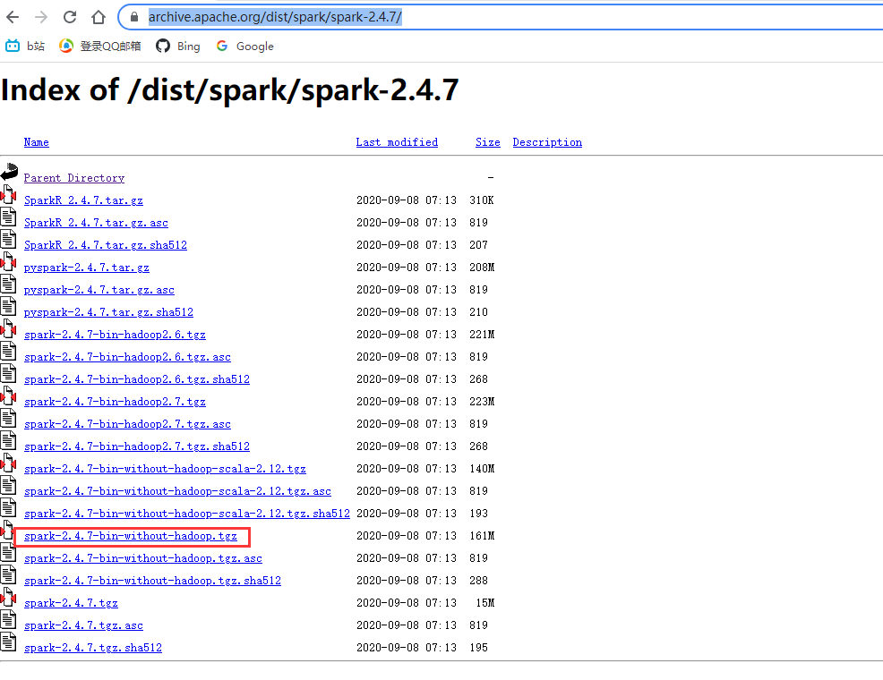

## spark安装与使用

### 下载与安装

访问[官方网址](https://archive.apache.org/dist/spark/spark-2.4.7/)，下载与hadoop2.10.1适配的版本。

- 选择不带Hadoop的Spark2.4.7版本



解压spark安装包到local目录

```bash
sudo tar -zxvf spark-2.4.7-bin-without-hadoop.tgz -C /usr/local
```


Spark有多种运行方式，这里以Standalone模式启 动Spark。 在Spark安装目录下conf目录中创建一个名为 slaves的文件。

- 在slaves文件中写入机器名

```
vim conf/slaves
```


复制Spark安装目录下conf目录中的配置文件spark-env.sh.template,并命名为spark-env.sh。

```
cp conf/spark-env.sh.template conf/spark-env.sh
```


打开spark-env.sh，加入以下内容：

```sh
# 配置javahome，否则worknode无法启动
export JAVA_HOME=/usr/local/jdk1.8.0_311
#设置hadoop配置路径
export HADOOP_CONF_DIR=/usr/local/hadoop-2.10.1/etc/hadoop
# 设置Spark Master所在的ip
export SPARK_MASTER_IP=ubuntu
# 设置hadoop classpath路径
export SPARK_DIST_CLASSPATH=$(/usr/local/hadoop-2.10.1/bin/hadoop classpath) 
# 设置每个Spark Worker使用一个cpu
export SPARK_WORKER_CORES=1 
# 设置每个Spark Worker使用1g内存
export SPARK_WORKER_MEMORY=1g
# 为了模拟分布式环境，设置两个Worker进程，但在Spark的新版并不推荐这种用法。
export SPARK_WORKER_INSTANCES=2
```

以standalone方式启动Spark,在Spark安装目录下，执行以下命令。

- 因为是standalone模式，所以不需要启动hadoop和yarn

```
./sbin/start-all.sh
```


以Standalone方式启动Spark时，可以通过“http://机器 名:8080”（如http：//ubuntu:8080）的方式访问Spark Master的Web UI界面，查看Spark信息。

- 此时不需要把ubuntu换成xshell登录用的192开头的内网ip，应该是虚拟机在本地自动做了域名映射


### 聚类与基于散点图的可视化 

#### 实验要求

