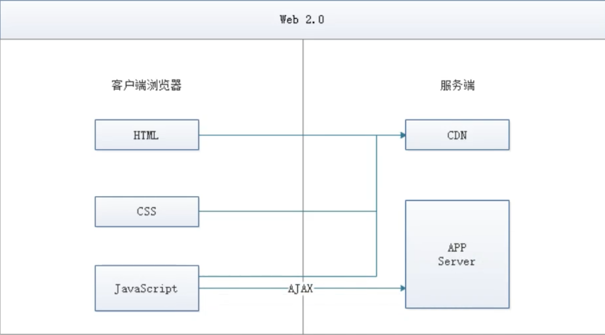
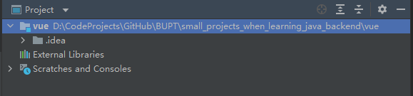
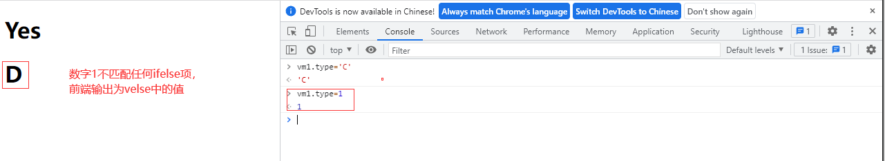
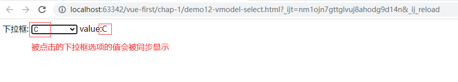
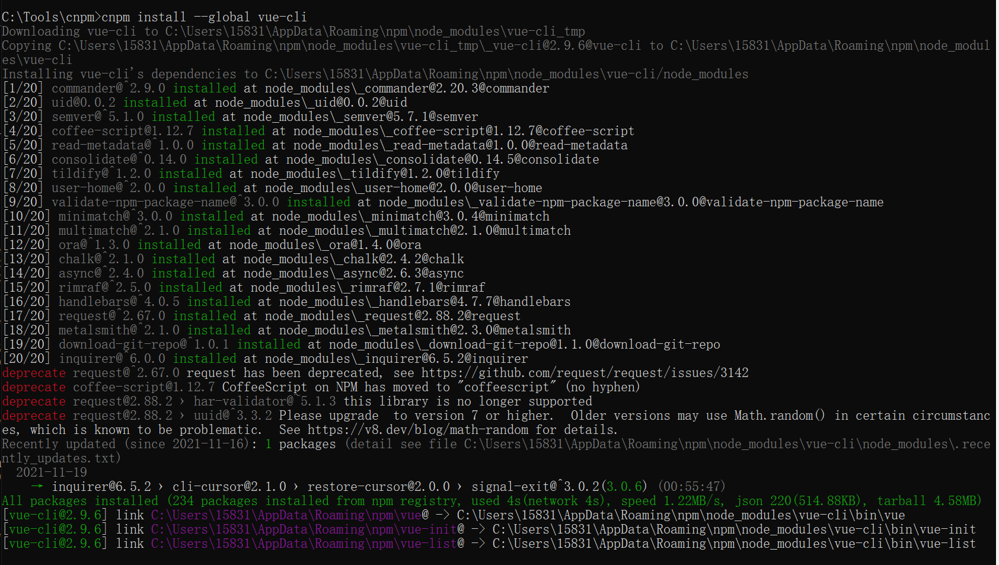
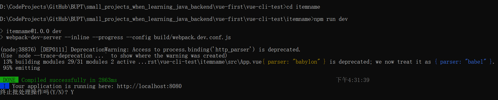
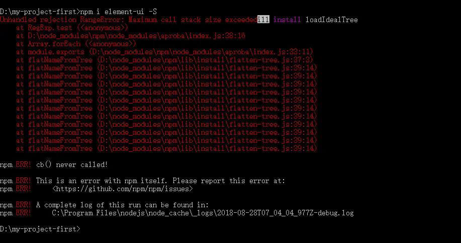
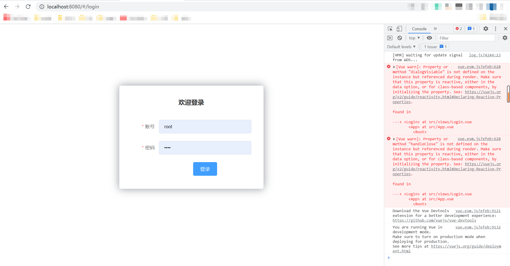
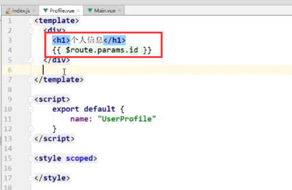

# VUE

## 前言

### 学VUE之前要掌握的

#### 回顾ssm

见springmvc.md的结尾


#### 学vue之前要学js重点

讲vue之前要熟练掌握javascript，重点（只要）看：

- 操作bom和dom
- 函数，标准对象


#### 前端核心

逻辑

- 判断
- 循环

事件

- 浏览器事件:window，document

- Dom事件:增，删，遍历，修改节点元素内容

- jQuery

视图

- html

- CSS :难点BootStrap

通信

- ajax


想要成为真正的“互联网Java全栈工程师”还有很长的一段路要走，其中前端是绕不开的一门必修课。本阶段课程的主要目的就是带领Java后台程序员认识前端、了解前端、掌握前端，为实现成为“互联网Java全栈工程师”再向前迈进一步。


### 前端核心分析

#### vue概述

- vue遵守Soc原则：关注点分离原则

- Vue 的核心库只关注视图层，方便与第三方库或既有项目整合。
  - 视图 ：HTML + CSS + JS ，`给用户看，刷新后台给的数据`

- vue网络通信 ： axios

- vue页面跳转 ： vue-router

- vue状态管理：vuex

- Vue-UI : ICE , Element UI


#### 前端三要素

- HTML（结构）：超文本标记语言（Hyper Text Markup Language），决定网页的结构和内容
- CSS（表现）：层叠样式表（Cascading Style Sheets），设定网页的表现样式。
- JavaScript（行为）：是一种弱类型脚本语言，其源码不需经过编译，而是由浏览器解释运行，用于控制网页的行为


#### 结构层（HTML）

太简单，略


#### 表现层（CSS）

CSS层叠样式表是一门标记语言，并不是编程语言，因此不可以自定义变量，不可以引用等，换句话说就是不具备任何语法支持，它主要缺陷如下：

- 语法不够强大，比如无法嵌套书写，导致模块化开发中需要书写很多重复的选择器；
- 没有变量和合理的样式复用机制，使得逻辑上相关的属性值必须以字面量的形式重复输出，导致难以维护；

这就导致了我们在工作中无端增加了许多工作量。为了解决这个问题，前端开发人员会使用一种称之为【CSS预处理器】的工具,提供CSS缺失的样式层复用机制、减少冗余代码，提高样式代码的可维护性。大大的提高了前端在样式上的开发效率。


什么是CSS预处理器：

CSS预处理器定义了一种新的语言，其基本思想是，用一种专门的编程语言，为CSS增加了一些编程的特性，将CSS作为目标生成文件，然后开发者就只需要使用这种语言进行CSS的编码工作。转化成通俗易懂的话来说就是“**用一种专门的编程语言，进行Web页面样式设计，再通过编译器转化为正常的CSS文件，以供项目使用”**。

常用的CSS预处理器有哪些

- SASS：基于Ruby ，通过服务端处理，功能强大。解析效率高。需要学习Ruby语言，上手难度高于LESS。
- **LESS**：基于NodeJS，通过客户端处理，使用简单。功能比SASS简单，解析效率也低于SASS，但在实际开发中足够了，所以如果我们后台人员如果需要的话，建议使用LESS。
  - less的官网很简单。


#### 行为层（JavaScript）

JavaScript一门弱类型脚本语言，其源代码在发往客户端运行之前不需要经过编译，而是将文本格式的字符代码发送给浏览器，由浏览器解释运行。


Native 原生JS开发：

原生JS开发，也就是让我们按照【ECMAScript】标准的开发方式，简称ES，特点是所有浏览器都支持。截至到当前，ES标准以发布如下版本：

- ES3
- ES4（内部，未正式发布）
- ES5（全浏览器支持）
- ES6（常用，当前主流版本：webpack打包成为ES5支持）
- ES7
- ES8
- ES9（草案阶段）

区别就是逐步增加新特性。


TypeScript 微软的标准：

TypeScript是一种由微软开发的自由和开源的编程语言。它是JavaScript的一个超集， 而且本质上向这个语言添加了可选的静态类型和基于类的面向对象编程。由安德斯·海尔斯伯格(C#、Delphi、TypeScript之父； .NET创立者) 主导。该语言的特点就是除了具备ES的特性之外还纳入了许多不在标准范围内的新特性，所以会导致很多浏览器不能直接支持TypeScript语法， 需要编译后(编译成JS) 才能被浏览器正确执行。

 

JavaScript框架：

- JQuery：大家熟知的JavaScript库，优点就是简化了DOM操作，缺点就是DOM操作太频繁，影响前端性能；在前端眼里使用它仅仅是为了兼容IE6，7，8；
- Angular：Google收购的前端框架，由一群Java程序员开发，其特点是将后台的MVC模式搬到了前端并增加了**模块化开发**的理念，与微软合作，采用了TypeScript语法开发；对后台程序员友好，对前端程序员不太友好；最大的缺点是版本迭代不合理（如1代–>2 代，除了名字，基本就是两个东西）
- React：Facebook 出品，一款高性能的JS前端框架；特点是提出了新概念 【虚拟DOM】用于减少真实 DOM 操作，在内存中模拟 DOM操作，有效的提升了前端渲染效率；缺点是使用复杂，因为需要额外学习一门【JSX】语言；
- Vue：一款渐进式 JavaScript 框架，所谓渐进式就是逐步实现新特性的意思，如实现模块化开发、路由、状态管理等新特性。其特点是综合了 Angular（模块化）和React(虚拟 DOM) 的优点；
- Axios：前端通信框架；因为 Vue 的边界很明确（SOC原则），就是为了处理 DOM，所以并不具备通信能力，此时就需要额外使用一个通信框架与服务器交互；当然也可以直接选择使用jQuery 提供的AJAX 通信功能；、


### 前端发展史

#### UI框架

- Ant-Design：阿里巴巴出品，基于React的UI框架
- ElementUI、iview、ice：饿了么出品，基于Vue的UI框架
- BootStrap：Twitter推出的一个用于前端开发的开源工具包
- AmazeUI：又叫“妹子UI”，一款HTML5跨屏前端框架


#### JavaScript构建工具

- Babel：JS编译工具，主要用于浏览器不支持的ES新特性，比如用于编译TypeScript
- WebPack：模块打包器，主要作用就是打包、压缩、合并及按序加载

注：以上知识点已将WebApp开发所需技能全部梳理完毕


#### 三端同一

混合开发（Hybrid App）：

主要目的是实现一套代码三端统一（**PC**、**Android**：.apk、**iOS**：.ipa）并能够调用到设备底层硬件（如：传感器、GPS、摄像头等），打包方式主要有以下两种：

- 云打包：HBuild -> HBuildX，DCloud 出品；API Cloud
- 本地打包： Cordova（前身是 PhoneGap）


微信小程序：

详见微信官网，这里就是介绍一个方便微信小程序UI开发的框架：WeUI


#### 后端技术

前端人员为了方便开发也需要掌握一定的后端技术但我们Java后台人员知道后台知识体系极其庞大复杂，所以为了方便前端人员开发后台应用，就出现了Node JS这样的技术。Node JS的作者已经声称放弃Node JS(说是架构做的不好再加上笨重的node modules，可能让作者不爽了吧)开始开发全新架构的De no
既然是后台技术，那肯定也需要框架和项目管理工具， Node JS框架及项目管理工具如下：

- Express：Node JS框架
- Koa：Express简化版
- NPM：项目综合管理工具，类似于Maven
- YARN：NPM的替代方案，类似于Maven和Gradle的关系


#### 主流前端框架

Vue.js：

- iView

  iview是一个强大的基于Vue的UI库， 有很多实用的基础组件比element ui的组件更丰富， 主要服务于PC界面的中后台产品。使用单文件的Vue组件化开发模式基于npm+webpack+babel开发， 支持ES 2015高质量、功能丰富友好的API， 自由灵活地使用空间。

  - 官网地址

  - Github

  - iview-admin

  **备注：属于前端主流框架，选型时可考虑使用，主要特点是移动端支持较多**

- Element UI

  Element是饿了么前端开源维护的Vue UI组件库， 组件齐全， 基本涵盖后台所需的所有组件，文档讲解详细， 例子也很丰富。主要用于开发PC端的页面， 是一个质量比较高的Vue UI组件库。

  - 官网地址
  - Git hub
  - vue-element-admin

  **备注：属于前端主流框架，选型时可考虑使用，主要特点是桌面端支持较多**

- ICE

  飞冰是阿里巴巴团队基于React/Angular/Vue的中后台应用解决方案， 在阿里巴巴内部， 已经有270多个来自几乎所有BU的项目在使用。飞冰包含了一条从设计端到开发端的完整链路，帮助用户快速搭建属于自己的中后台应用。

  - 官网地址。

  - Git hub

  **备注：主要组件还是以React为主， 截止2019年02月17日更新博客前对Vue的支持还不太完善，目前尚处于观望阶段**

- VantUI

  Vant UI是有赞前端团队基于有赞统一的规范实现的Vue组件库， 提供了-整套UI基础组件和业务组件。通过Vant， 可以快速搭建出风格统一的页面，提升开发效率。

  - 官网地址

  - Github

- AtUI

  at-ui是一款基于Vue 2.x的前端UI组件库， 主要用于快速开发PC网站产品。它提供了一套n pm+web pack+babel前端开发工作流程， CSS样式独立， 即使采用不同的框架实现都能保持统一的UI风格。

  - 官网地址
  - Git hub

- Cube Ul

  cube-ui是滴滴团队开发的基于Vue js实现的精致移动端组件库。支持按需引入和后编译， 轻量灵活；扩展性强，可以方便地基于现有组件实现二次开发。

  - 官网地址

  - Github


混合开发：

- Flutter

  Flutter是谷歌的移动端UI框架， 可在极短的时间内构建Android和iOS上高质量的原生级应用。Flutter可与现有代码一起工作， 它被世界各地的开发者和组织使用， 并且Flutter是免费和开源的。

  - 官网地址

  - Github

  **备注：Google出品， 主要特点是快速构建原生APP应用程序， 如做混合应用该框架为必选框架**

- **lonic**

  lonic既是一个CSS框架也是一个Javascript UI库， lonic是目前最有潜力的一款HTML 5手机应用开发框架。通过SASS构建应用程序， 它提供了很多UI组件来帮助开发者开发强大的应用。它使用JavaScript MV VM框架和Angular JS/Vue来增强应用。提供数据的双向绑定， 使用它成为Web和移动开发者的共同选择。

  - 官网地址
  - 官网文档
  - Git hub


微信小程序：

- mpvue

  mpvue是美团开发的一个使用`Vue.js`开发小程序的前端框架， 目前支持微信小程序、百度智能小程序，头条小程序和支付宝小程序。框架基于`Vue.js`， 修改了的运行时框架`runtime`和代码编译器`compiler`实现， 使其可运行在小程序环境中， 从而为小程序开发引入了`Vue.js`开发体验。

  - 官网地址
  - Git hub

  **备注：完备的Vue开发体验， 井且支持多平台的小程序开发， 推荐使用**

- WeUI

  WeUI是一套同微信原生视觉体验一致的基础样式库， 由微信官方设计团队为微信内网页和微信小程序量身设计， 令用户的使用感知更加统一。包含button、cell、dialog、toast、article、icon等各式元素。

  - 官网地址

  - Github


### 了解前后分离的演变史

为什么需要前后分离

#### 后端为主的mvc时代


为了降低开发的复杂度， 以后端为出发点， 比如：Struts、Spring MVC等框架的使用， 就是后端的MVC时代；
以SpringMVC流程为例：

- 发起请求到前端控制器(Dispatcher Servlet)
- 前端控制器请求HandlerMapping查找Handler，可以根据xml配置、注解进行查找
- 处理器映射器HandlerMapping向前端控制器返回Handler
- 前端控制器调用处理器适配器去执行Handler
- 处理器适配器去执行Handler
- Handler执行完成给适配器返回ModelAndView
- 处理器适配器向前端控制器返回ModelAndView，ModelAndView是SpringMvc框架的一个底层对象，包括Model和View
- 前端控制器请求视图解析器去进行视图解析，根据逻辑视图名解析成真正的视图(JSP)
- 视图解析器向前端控制器返回View
- 前端控制器进行视图渲染，视图渲染将模型数据(在ModelAndView对象中)填充到request域
- 前端控制器向用户响应结果

其中唯一要**自己写**的就是**handler**。


优点：

- MVC是一个非常好的协作模式， 能够有效降低代码的耦合度从架构上能够让开发者明白代码应该写在哪里。为了让View更纯粹， 还可以使用Thyme leaf、Frree marker等模板引擎， 使模板里无法写入Java代码， 让前后端分工更加清晰。

缺点

- 前端开发重度依赖开发环境，开发效率低，这种架构下，前后端协作有两种模式：
- 第一种是前端写DEMO， 写好后， 让后端去套模板。好处是DEMO可以本地开发， 很高效。不足是还需要后端套模板，有可能套错，套完后还需要前端确定，来回沟通调整的成本比较大；
- 另一种协作模式是前端负责浏览器端的所有开发和服务器端的View层模板开发。好处是UI相关的代码都是前端去写就好，后端不用太关注，不足就是前端开发重度绑定后端环境，环境成为影响前端开发效率的重要因素。
- 前后端职责纠缠不清：模板引擎功能强大，依旧可以通过拿到的上下文变量来实现各种业务逻辑。这样，只要前端弱势一点，往往就会被后端要求在模板层写出不少业务代码，还有一个很大的灰色地带是Controller， 页面路由等功能本应该是前端最关注的， 但却是由后端来实现。Controller本身与Model往往也会纠缠不清，看了让人咬牙的业务代码经常会出现在Controller层。这些问题不能全归结于程序员的素养， 否则JSP就够了。
- 对前端发挥的局限性：性能优化如果只在前端做空间非常有限，于是我们经常需要后端合作，但由于后端框架限制，我们很难使用[Comet】、【Big Pipe】等技术方案来优化性能。

注：在这期间(2005年以前) ， 包括早期的JSP、PHP可以称之为Web 1.0时代。在这里想说一句， 如果你是一名Java初学者， 请你不要再把一些陈旧的技术当回事了。比如**JSP早过时了**，甚至可以学习时一笔带过。因为时代在变、技术在变、什么都在变(引用扎克伯格的一句话：唯一不变的是变化本身)；当我们去给大学做实训时，有些同学会认为我们没有讲什么干货，其实不然，只能说是你认知里的干货对于市场来说早就过时了而已


#### 基于AJAX带来的SPA时代

时间回到2005年A OAX(Asynchronous JavaScript And XML， 异步JavaScript和XML，老技术新用法)被正式提出并开始使用CDN作为静态资源存储， 于是出现了JavaScript王者归来(在这之前JS都是用来在网页上贴狗皮膏药广告的) 的SPA(Single Page Application) 单页面应用时代。


优点：

- 这种模式下， **前后端的分工非常清晰， 前后端的关键协作点是AJAX接口。**看起来是如此美妙， 但回过头来看看的话， 这与JSP时代区别不大。复杂度从服务端的JSP里移到了浏览器的JavaScript，浏览器端变得很复杂。类似Spring MVC， 这个时代开始出现浏览器端的分层架构：
  

缺点：

- 前后端接口的约定：如果后端的接口一塌糊涂，如果后端的业务模型不够稳定，那么前端开发会很痛苦；不少团队也有类似尝试，通过接口规则、接口平台等方式来做。有了和后端一起沉淀的接口规则，还可以用来模拟数据，使得前后端可以在约定接口后实现高效并行开发。
- 前端开发的复杂度控制：SPA应用大多以功能交互型为主，JavaScript代码过十万行很正常。大量JS代码的组织，与View层的绑定等，都不是容易的事情。


#### 前端为主的MV*时代

此处的MV*模式如下：

- MVC(同步通信为主) ：Model、View、Controller

- MVP(异步通信为主) ：Model、View、Presenter

- MVVM(异步通信为主)：Model、View、View Model为了降低前端开发复杂度，涌现了大量的前端框架，比如：Angular JS、React、Vue.js、Ember JS等， 这些框架总的原则是先按类型分层， 比如Templates、Controllers、Models， 然后再在层内做切分，如下图：

  

优点

- 前后端职责很清晰：前端工作在浏览器端，后端工作在服务端。清晰的分工，可以让开发并行，测试数据的模拟不难， 前端可以本地开发。后端则可以专注于业务逻辑的处理， 输出RESTful等接口。
- 前端开发的复杂度可控：前端代码很重，但合理的分层，让前端代码能各司其职。这一块蛮有意思的，简单如模板特性的选择，就有很多很多讲究。并非越强大越好，限制什么，留下哪些自由，代码应该如何组织，所有这一切设计，得花一本书的厚度去说明。
- 部署相对独立：可以快速改进产品体验

缺点

- 代码不能复用。比如后端依旧需要对数据做各种校验，校验逻辑无法复用浏览器端的代码。如果可以复用，那么后端的数据校验可以相对简单化。
- 全异步， 对SEO不利。往往还需要服务端做同步渲染的降级方案。
- 性能并非最佳，特别是移动互联网环境下。
- SPA不能满足所有需求， 依旧存在大量多页面应用。URL Design需要后端配合， 前端无法完全掌控。


#### Node JS带来的全栈时代

前端为主的MV*模式解决了很多很多问题， 但如上所述， 依旧存在不少不足之处。随着Node JS的兴起， JavaScript开始有能力运行在服务端。这意味着可以有一种新的研发模式：


在这种研发模式下，前后端的职责很清晰。对前端来说，两个UI层各司其职：

- Front-end Ul layer处理浏览器层的展现逻辑。通过CSS渲染样式， 通过JavaScript添加交互功能， HTML的生成也可以放在这层， 具体看应用场景。
- Back-end Ul layer处理路由、模板、数据获取、Cookie等。通过路由， 前端终于可以自主把控URL Design， 这样无论是单页面应用还是多页面应用， 前端都可以自由调控。后端也终于可以摆脱对展现的强关注，转而可以专心于业务逻辑层的开发。

通过Node， WebServer层也是JavaScript代码， 这意味着部分代码可前后复用， 需要SEO的场景可以在服务端同步渲染，由于异步请求太多导致的性能问题也可以通过服务端来缓解。前一种模式的不足，通过这种模式几乎都能完美解决掉。
与JSP模式相比， 全栈模式看起来是一种回归， 也的确是一种向原始开发模式的回归， 不过是一种螺旋上升式的回归。
基于Node JS的全栈模式， 依旧面临很多挑战：

- 需要前端对服务端编程有更进一步的认识。比如TCP/IP等网络知识的掌握。
- Node JS层与Java层的高效通信。Node JS模式下， 都在服务器端， RESTful HTTP通信未必高效， 通过SOAP等方式通信更高效。一切需要在验证中前行。
- 对部著、运维层面的熟练了解，需要更多知识点和实操经验。
- 大量历史遗留问题如何过渡。这可能是最大最大的阻力。
  

#### 总结

综上所述，模式也好，技术也罢，没有好坏优劣之分，只有适合不适合；前后分离的开发思想主要是基于`Soc`(关注度分离原则)，上面种种模式，都是让前后端的职责更清晰，分工更合理高效。


## 基本语法和概念

### 第一个vue程序

#### 什么是MVVM

MVVM（Model-View-ViewModel）是一种软件设计模式，由微软WPF（用于替代WinForm，以前就是用这个技术开发桌面应用程序的）和Silverlight（类似于Java Applet，简单点说就是在浏览器上运行WPF）的架构师Ken Cooper和Ted Peters开发，是一种简化用户界面的**事件驱动编程方式**。由John Gossman（同样也是WPF和Sliverlight的架构师）与2005年在他的博客上发表。

MVVM源自于经典的MVC（Model-View-Controller）模式。MVVM的核心是ViewModel层，负责转换Model中的数据对象来让数据变得更容易管理和使用。其作用如下：

- 该层向上与视图层进行双向数据绑定
- 向下与Model层通过接口请求进行数据交互


MVVM已经相当成熟了，主要运用但不仅仅在网络应用程序开发中。当下流行的MVVM框架有`Vue.js`，`Anfular JS`

#### 为什么要使用MVVM

MVVM模式和MVC模式一样，主要目的是分离视图（View）和模型（Model），有几大好处:

- 低耦合：视图（View）可以独立于Model变化和修改，一个ViewModel可以绑定到不同的View上，当View变化的时候Model可以不变，当Model变化的时候View也可以不变。
- 可复用：你可以把一些视图逻辑放在一个ViewModel里面，让很多View重用这段视图逻辑。
- 独立开发：开发人员可以专注于业务逻辑和数据的开发（ViewMode），设计人员可以专注于页面设计。
- 可测试：界面素来是比较难以测试的，而现在测试可以针对ViewModel来写。


MVVM结构介绍：

- View

  View是视图层， 也就是用户界面。前端主要由HTH L和csS来构建， 为了更方便地展现vi eu to del或者Hodel层的数据， 已经产生了各种各样的前后端模板语言， 比如FreeMarker，Thyme leaf等等， 各大MV VM框架如Vue.js.Angular JS， EJS等也都有自己用来构建用户界面的内置模板语

- Model

  Model是指数据模型， 泛指后端进行的各种业务逻辑处理和数据操控， 主要围绕数据库系统展开。这里的难点主要在于需要和前端约定统一的接口规则

- ViewModel

  ViewModel是由前端开发人员组织生成和维护的视图数据层。在这一层， 前端开发者对从后端获取的Model数据进行转换处理， 做二次封装， 以生成符合View层使用预期的视图数据模型。

  需要注意的是View Model所封装出来的数据模型包括视图的状态和行为两部分， 而Model层的数据模型是只包含状态的

  - 比如页面的这一块展示什么，那一块展示什么这些都属于视图状态(展示)
  - 页面加载进来时发生什么，点击这一块发生什么，这一块滚动时发生什么这些都属于视图行为(交互)

  视图状态和行为都封装在了View Model里。这样的封装使得View Model可以完整地去描述View层。**由于实现了双向绑定， View Model的内容会实时展现在View层**（前端页面不必刷新）， 这是激动人心的， 因为前端开发者再也不必低效又麻烦地通过操纵DOM去更新视图。

  MVVM框架已经把最脏最累的一块做好了， 我们开发者只需要处理和维护View Model， 更新数据视图就会自动得到相应更新，真正实现事件驱动编程。

  View层展现的不是Model层的数据， 而是ViewModel的数据， 由ViewModel负责与Model层交互， **这就完全解耦了View层和Model层， 这个解耦是至关重要的， 它是前后端分离方案实施的重要一环。**

#### Vue

Vue(读音/vju/， 类似于view) 是一套用于构建用户界面的渐进式框架， 发布于2014年2月。与其它大型框架不同的是， Vue被设计为可以自底向上逐层应用。Vue的核心库只关注视图层， 不仅易于上手， 还便于与第三方库(如：vue-router，vue-resource，vue x) 或既有项目整合。

1）MVVM模式的实现者：

- Model：模型层， 在这里表示JavaScript对象
- View：视图层， 在这里表示DOM(HTML操作的元素)
- ViewModel：连接视图和数据的中间件， Vue.js就是MVVM中的View Model层的实现者

在MVVM架构中， 是不允许数据和视图直接通信的， 只能通过ViewModel来通信， 而View Model就是定义了一个Observer观察者

- ViewModel能够观察到数据的变化， 并对视图对应的内容进行更新
- ViewModel能够监听到视图的变化， 并能够通知数据发生改变

至此， 我们就明白了， Vue.js就是一个MVVM的实现者， 他的核心就是实现了DOM监听与数据绑定
2）为什么要使用Vue.js

- 轻量级， 体积小是一个重要指标。Vue.js压缩后有只有20多kb(Angular压缩后56kb+，React压缩后44kb+)
- 移动优先。更适合移动端， 比如移动端的Touch事件
- 易上手，学习曲线平稳，文档齐全
- 吸取了Angular(模块化) 和React(虚拟DOＭ) 的长处， 并拥有自己独特的功能，如：计算属性
- 开源，社区活跃度高


#### 实战准备

【说明】IDEA可以安装Vue的插件!

- 注意：Vue不支持IE 8及以下版本， 因为Vue使用了IE 8无法模拟的ECMAScript 5特性。但它支持所有兼容ECMAScript 5的浏览器。
- 前端用vscode编写的比较多，但是idea已经足够万能了，这里我们用idea。
  - idea开发vue之前必须先安装vue.js插件


vue下载地址:

- 开发版本:

  - 包含完整的警告和调试模式：`https：//yuejs.org/js/vue.js`

  - 删除了警告， 30.96KB min+gzip：`https：//vuejs.org/js/vue.min.js`

- CDN:

  - 用cdn方式使用vue的话，不需要从官网下载vue.js更方便

  ```html
  <script src=“https://cdn.jsdelivr.net/npm/vue@2.5.21/dist/vue.js”></script>
  <script src="https://cdn.jsdelivr.net/npm/vue@2.5.21/dist/vue.min.js"></script>
  ```


#### 实战

新建vue文件夹

- 由于前端很简单简洁，用一个清爽的文件夹开始，项目打开更快。


idea中打开文件夹




idea下载vue插件


自己手动创建一个XXX.vue文件，激活idea的新建vue-component的功能


先不管新建vue-component，我们创建一个最简单的html来实现vue（VM功能）

```html
<!DOCTYPE html>
<html lang="en">
<head>
    <meta charset="UTF-8">
    <title>Title</title>
</head>
<body>
<!--编写前端即view层-->
<div id="app">
<!--3. 第三步前端从data中拿数据-->
{{message}}
</div>


<!--使用cdn的方式导入vue.js轻量版-->
<script src="https://cdn.jsdelivr.net/npm/vue@2.5.21/dist/vue.min.js"></script>
<!--创建VM对象，沟通Model和view-->
<script>
    //Vue()是构造函数，括号中放置类似json字符串的大括号及值,值之间以逗号分割。可以创建多个vm来绑定多个前端组件。
    var vm = new Vue({
        //1.第一步绑定前端组件：el表示element即元素，用于绑定前端组件的id
        el: "#app",
        //2. 第二步data放置数据：前后端分离，data要交给前端控制,此为model层
        data:{
            message: "hello, vue!"
        }
    });
</script>

</body>
</html>
```

使用google浏览器打开


前端成功展示了vm的data中存的数据


现在来检查vue的VM的双向绑定的功能

通过console修改vm.data改变前端的值

- 不使用vue的话，前端不可能变，因为前后端没绑定。html写死了不能变数据。
- 但是vue中，VM层绑定了前端和后端，前端是根据vm.data来的，所以修改后端前端也会实时变化
-  在这个操作中， 我并没有主动操作DOM， 就让页面的内容发生了变化， 这就是借助了Vue的数据绑定功能实现的； MV VM模式中要求View Model层就是使用观察者模式来实现数据的监听与绑定， 以做到数据与视图的快速响应。


### vue基本语法

#### v-bind

我们已经成功创建了第一个Vue应用!看起来这跟渲染一个字符串模板非常类似， 但是Vue在背后做了大量工作。现在数据和DOM已经被建立了关联， 所有东西都是响应式的。我们在控制台操作对象属性，界面可以实时更新!

我们还可以使用v-bind来绑定元素特性和VM.data中的值!

```html
<!DOCTYPE html>
<html lang="en">
<head>
    <meta charset="UTF-8">
    <title>Title</title>
</head>
<body>
<!--编写前端即view层-->
<div id="app">
    <!--3. 第三步前端从data中拿数据-->
    <span v-bind:title="message">
    鼠标悬停几秒钟查看此处动态绑定的提示信息！
    </span>
</div>


<!--使用cdn的方式导入vue.js轻量版-->
<script src="https://cdn.jsdelivr.net/npm/vue@2.5.21/dist/vue.min.js"></script>
<!--创建VM对象，沟通Model和view-->
<script>
    //Vue()是构造函数，括号中放置类似json字符串的大括号及值,值之间以逗号分割。可以创建多个vm来绑定多个前端组件。
    var vm = new Vue({
        //1.第一步绑定前端组件：el表示element即元素，用于绑定前端组件的id
        el: "#app",
        /*2. 第二步data放置数据：前后端分离，data要交给前端控制,此为model层。后端就算不给数据，前端也可以在这里放个模拟数据，也是实现
        前后端分离的一种形式*/
        data:{
            message: "这里动态绑定了hello, vue!"
        }
    });
</script>

</body>
</html>
```

查看页面效果


你看到的v-bind等被称为指令。指令带有前缀v以表示它们是Vue提供的特殊特性。可能你已经猜到了， 它们会在渲染的DOM上应用特殊的响应式行为在这里，该指令的意思是：“将这个元素节点的title特性和Vue实例的message属性保持一致”。

如果你再次打开浏览器的JavaScript控制台， 输入app， message=‘新消息’，就会再一次看到这个绑定了title特性的HTML已经进行了更新。


#### v-if,v-else,v-else-if

什么是条件判断语句，就不需要我说明了吧，以下两个属性!

- `v-if`
- `v-else`

演示代码如下

```html
<!DOCTYPE html>
<!--下面这行的xmln在某些版本情况下可以省略-->
<html lang="en" xmlns:v-bind="http://www.w3.org/1999/xhtml">
<head>
  <meta charset="UTF-8">
  <title>Title</title>
</head>
<body>
<!--view层，模板-->
<div id="app">
  <h1 v-if="ok">Yes</h1>
  <h1 v-else>No</h1>

</div>

<!--1.导入Vue.js-->
<script src="https://cdn.jsdelivr.net/npm/vue@2.5.21/dist/vue.min.js"></script>
<script type="text/javascript">
  var vm = new Vue({
    el:"#app",
    /*Model：数据*/
    data:{
      ok: true
    }
  });
</script>
</body>
</html>
```


现在人为修改VM中的data来改变前端的显示


现在尝试使用`v-else-if`标签

- js中，双等号 数据类型不一样 光他的值一样 也算true； 而三等号 要求数据类型也得一样
- 注意：js中字符要用单引号包裹，字符串要用双引号包裹

```html
<!DOCTYPE html>
<!--下面这行的xmln在某些版本情况下可以省略-->
<html lang="en" xmlns:v-bind="http://www.w3.org/1999/xhtml">
<head>
  <meta charset="UTF-8">
  <title>Title</title>
</head>
<body>
<!--view层，模板-->
<div id="app">
  <h1 v-if="ok">Yes</h1>
  <h1 v-else>No</h1>
</div>
<div id="app1">
  <h1 v-if="type===`A`">A</h1>
  <h1 v-else-if="type===`B`">B</h1>
  <h1 v-else-if="type===`C`">C</h1>
  <h1 v-else>D</h1>
</div>

<!--1.导入Vue.js-->
<script src="https://cdn.jsdelivr.net/npm/vue@2.5.21/dist/vue.min.js"></script>
<script type="text/javascript">
  var vm = new Vue({
    el:"#app",
    /*Model：数据*/
    data:{
      ok: true
    }
  });

  var vm1 = new Vue({
    el:"#app1",
    /*Model：数据*/
    data:{
      type: `B`
    }
  });
</script>
</body>
</html>
```


现在尝试改变VM中的data来改变前端的显示




#### v-for

格式说明

```html
<div id="app">
    <li v-for="(item,index) in items">
        {{item.message}}---{{index}}
    </li>

</div>
123456
```

- 注：`items`是数组，`item`是数组元素迭代的别名。我们之后学习的Thymeleaf模板引擎的语法和这个十分的相似！

代码实战：

这里数组不太对吧 这更像是多个对象 应改为 items:['一','二','三'] 然后遍历那里改为{{item}}

```html
<!DOCTYPE html>
<html lang="en">
<head>
  <meta charset="UTF-8">
  <title>Title</title>
</head>
<body>
<!--view层，模板-->
<div id="app">
  <li v-for="(item,index) in items">
<!--    这个index表示item在items中是第几位，默认的-->
    {{item.message}}---{{index}}
  </li>

</div>

<!--1.导入Vue.js-->
<script src="https://cdn.jsdelivr.net/npm/vue@2.5.21/dist/vue.min.js"></script>
<script type="text/javascript">
  var vm = new Vue({
    el:"#app",
    /*Model：数据*/
    data:{
      items:[
        {message:'张云Java'},
        {message:'张云学前端'},
        {message:'张云学运维'}
      ]
    }
  });
</script>
</body>
</html>

```


尝试使用VM修改data来修改前端展示（不需刷新页面）


### vue绑定事件

#### v-on

emsp;事件有Vue的事件、和前端页面本身的一些事件!我们这里的`click`是vue的事件， 可以绑定到Vue中的`methods`中的方法事件!

```html
<!DOCTYPE html>
<html lang="en" xmlns:v-on="http://www.w3.org/1999/xhtml">
<head>
  <meta charset="UTF-8">
  <title>Title</title>
</head>
<body>

<div id="app">
  <button v-on:click="sayHi">点我</button>
</div>

<!--1.导入Vue.js-->
<script src="https://cdn.jsdelivr.net/npm/vue@2.5.21/dist/vue.min.js"></script>
<script type="text/javascript">
  // vue有七大对象：el，data，template，methods，render，computed，watch；除了七大属性还有别的属性只不过这七大更重要。
  var vm = new Vue({
    el:"#app",
    data:{
      message:'Hello World'
    },
    //不要把methods写成method
    methods:{//方法必须定义在Vue的method对象中
      sayHi:function(){
      //'this'在方法里面指向当前Vue实例。this.message即为'Hello World'
      alert(this.message);
      }
    }
  });
</script>
</body>
</html>

```


Vue还有一些基本的使用方式， 大家有需要的可以再跟着官方文档看看， 因为这些基本的指令几乎我们都见过了，一通百通!掌握学习的方式!


#### 彩蛋：vue功能搬上服务器

登录xshell，执行下列语句，查看tomcat主要出现在哪些目录，从而找到webinf所在目录

```bash
[root@zhangyun ~]# sudo find / -name *tomcat*
```


来到root目录，发现确实有标志性的“index.js"和”webinf文件夹“。所以把上节写的von.html放置在Root目录下


访问：http://120.53.244.17:8080/von.html。即在外网看到自己写的页面。


## 双向绑定和组件

### Vue双向绑定

#### 什么是双向数据绑定

Vue.js是一个MV VM框架， 即数据双向绑定， 即当数据发生变化的时候， 视图也就发生变化， 当视图发生变化的时候，数据也会跟着同步变化。这也算是Vue.js的精髓之处了。

值得注意的是，我们所说的数据双向绑定，一定是对于UI控件来说的非UI控件不会涉及到数据双向绑定。单向数据绑定是使用状态管理工具的前提。如果我们使用vue x那么数据流也是单项的，这时就会和双向数据绑定有冲突。


为什么要实现数据的双向绑定:

在`Vue.js`中，如果使用`vuex`， 实际上数据还是单向的， 之所以说是数据双向绑定，这是用的UI控件来说， 对于我们处理表单， `Vue.js`的双向数据绑定用起来就特别舒服了。即两者并不互斥，在全局性数据流使用单项，方便跟踪；局部性数据流使用双向，简单易操作。


#### 在表单中使用双向数据绑定

你可以用v-model指令在表单、及元素上创建双向数据绑定。它会根据控件类型自动选取正确的方法来更新元素。尽管有些神奇， 但v-model本质上不过是语法糖。它负责监听用户的输入事件以更新数据，并对一些极端场景进行一些特殊处理。

注意：v-model会忽略所有表单元素的value、checked、selected特性的初始值而总是将Vue实例的数据作为数据来源。你应该通过JavaScript在组件的data选项中声明初始值!


v-model是同步了输入框的value

说name没用的麻烦看下前端知识。name是为了保证他们是一组单选框


#### v-model和v-bind的区别

简单来说：

v-bind是一个单向数据绑定，映射关系：Model->View，我们不需要进行额外的DOM操作，只需要进行Model的操作就可以实现视图的联动更新。

v-model是一个双向数据绑定，映射关系：View接受的数据,传给model,model的数据再传给view。把Model绑定到View的同时也将View绑定到Model上，这样就既可以通过更新Model来实现View的自动更新，也可以通过更新View来实现Model数据的更新。所以，当我们用JavaScript代码更新Model时，View就会自动更新，反之，如果用户更新了View，Model的数据也自动被更新了。

[参考网址](https://blog.csdn.net/weixin_45849072/article/details/105428298?spm=1001.2101.3001.6650.1&utm_medium=distribute.pc_relevant.none-task-blog-2%7Edefault%7ECTRLIST%7Edefault-1.no_search_link&depth_1-utm_source=distribute.pc_relevant.none-task-blog-2%7Edefault%7ECTRLIST%7Edefault-1.no_search_link)


#### 单行文本双向绑定实战

- v-model把\<input>的value和VM中data的message的value绑定了。

- \<input>自带的初始value值“hello”被vue忽略了，vue绑定下，\<input>的初始值为message的初始值即空字符串

```html
<!DOCTYPE html>
<html lang="en">
<head>
  <meta charset="UTF-8">
  <title>Title</title>
</head>
<body>
<div id="app">
  输入的文本：<input type="text" v-model="message" value="hello">{{message}}
</div>

<!--1.导入Vue.js-->
<script src="https://cdn.jsdelivr.net/npm/vue@2.5.21/dist/vue.min.js"></script>
<script type="text/javascript">
  var vm = new Vue({
    el:"#app",
    data:{
      message:""
    }
  });
</script>
</body>
</html>
```


#### 多行文本双向绑定实战

- `&nbsp;`在html中表示不换行空格

```html
<!DOCTYPE html>
<html lang="en">
<head>
  <meta charset="UTF-8">
  <title>Title</title>
</head>
<body>
<div id="app">
  多行文本：<textarea v-model="pan"></textarea>&nbsp;&nbsp;&nbsp;&nbsp;&nbsp;&nbsp;&nbsp;&nbsp;多行文本是：{{pan}}
<!--  多行文本：<textarea v-model="pan"></textarea>多行文本是：{{pan}}-->
</div>

<!--1.导入Vue.js-->
<script src="https://cdn.jsdelivr.net/npm/vue@2.5.21/dist/vue.min.js"></script>
<script type="text/javascript">
  var vm = new Vue({
    el:"#app",
    data:{
      pan:"Hello hello!"
    }
  });
</script>
</body>
</html>
```


#### 单个复选框实现双向绑定

- label组件的for属性显式绑定label组件和input组件，用label的值提示用户应该在input输入什么
  - [参考文章](http://t.csdn.cn/1WHOv)

- 本例复选框的check结果绑定了data.checked；label的value绑定了data.checked

```html
<!DOCTYPE html>
<html lang="en">
<head>
    <meta charset="UTF-8">
    <title>Title</title>
</head>
<body>

<div id="app">
    单复选框：
    <input type="checkbox" id="checkbox" v-model="checked">
    &nbsp;&nbsp;
    <label for="checkbox">{{checked}}</label>
</div>

<!--1.导入Vue.js-->
<script src="https://cdn.jsdelivr.net/npm/vue@2.5.21/dist/vue.min.js"></script>
<script type="text/javascript">
    var vm = new Vue({
        el:"#app",
        data:{
            checked:false
        }
    });
</script>
</body>
</html>
```


#### 多复选框实现双向绑定

```html
<!DOCTYPE html>
<html lang="en">
<head>
  <meta charset="UTF-8">
  <title>Title</title>
</head>
<body>

<div id="app">
  多复选框：
  <input type="checkbox" id="jack" value="Jack" v-model="checkedNames">
  &nbsp;&nbsp;
  <label for="jack">Jack</label>
  <input type="checkbox" id="john" value="John" v-model="checkedNames">
  &nbsp;&nbsp;
  <label for="john">John</label>
  <input type="checkbox" id="mike" value="Mike" v-model="checkedNames">
  &nbsp;&nbsp;
  <label for="mike">Mike</label>
  <span>选中的值：{{checkedNames}}</span>
</div>

<!--1.导入Vue.js-->
<script src="https://cdn.jsdelivr.net/npm/vue@2.5.21/dist/vue.min.js"></script>
<script type="text/javascript">
  var vm = new Vue({
    el:"#app",
    data:{
      checkedNames:[]
    }
  });
</script>
</body>
</html>
```


- 取消某个checkbox的选中的话，被取消的checkbox的value也会从后面的中括号中消失

#### 单选按钮实现双向绑定

- radioinput的value和VM.picked的value绑定了，VM.picked的value又和span中的值绑定了。所以点击不同的radioinput，顿号后面的span展示区会展示相对应的radioinput的value。

```html
<!DOCTYPE html>
<html lang="en">
<head>
  <meta charset="UTF-8">
  <title>Title</title>
</head>
<body>

<div id="app">
  单选框按钮
  <input type="radio" id="one" value="One" v-model="picked">
  <label for="one">One</label>
  <input type="radio" id="two" value="Two" v-model="picked">
  <label for="two">Two</label>
  <span>选中的值：{{picked}}</span>
</div>

<!--1.导入Vue.js-->
<script src="https://cdn.jsdelivr.net/npm/vue@2.5.21/dist/vue.min.js"></script>
<script type="text/javascript">
  var vm = new Vue({
    el:"#app",
    data:{
      picked:'Two'
    }
  });
</script>
</body>
</html>
```


#### 下拉框

```html
<!DOCTYPE html>
<html lang="en">
<head>
  <meta charset="UTF-8">
  <title>Title</title>
</head>
<body>
<div id="app">
  下拉框:
  <select v-model="zhangyun">
    <option value="" disabled>---请选择---</option>
    <option>A</option>
    <option>B</option>
    <option>C</option>
    <option>D</option>
  </select>
  <span>value:{{zhangyun}}</span>

</div>

<!--1.导入Vue.js-->
<script src="https://cdn.jsdelivr.net/npm/vue@2.5.21/dist/vue.min.js"></script>
<script type="text/javascript">
  var vm = new Vue({
    el:"#app",
    data:{
      zhangyun:"A"
    }
  });
</script>
</body>
</html>
```




注意：`v-model`表达式的初始值未能匹配任何选项，元系将被渲染为“未选中”状态。 在iOS中， 这会使用户无法选择第一个选项，因为这样的情况下，iOS不会触发`change`事件。因此，更推荐像上面这样提供一个值为空的禁用选项。


### 什么是组件

组件是可复用的`Vue`实例， 说白了就是一组可以重复使用的模板， 跟`JSTL`的自定义标签、`Thymeleal`的`th:fragment`等框架有着异曲同工之妙，通常一个应用会以一棵嵌套的组件树的形式来组织：


例如，你可能会有页头、侧边栏、内容区等组件，每个组件又包含了其它的像导航链接、博文之类的组件。


#### 第一个vue组件

注意：在实际开发中，我们并不会用以下方式开发组件，而是采用`vue-cli`创建，`vue`模板文件的方式开发，以下方法只是为了让大家理解什么是组件。

**使用`Vue.component()`方法注册组件，格式如下：**

```html
<div id="app">
<!--  直接使用自定义的zhangyun组件-->
  <zhangyun></zhangyun>
</div>

<script src="https://cdn.jsdelivr.net/npm/vue@2.5.21/dist/vue.min.js"></script>
<script type="text/javascript">
  //先注册组件,组件中对象的名字是“zhangyun”，对象的内容在大括号中括着。这里定义了一个名字叫“zhangyun”的组件
  Vue.component("zhangyun",{

    template:'<li>Hello</li>'

  });
  //再实例化Vue
  var vm = new Vue({
    el:"#app",
  });
</script>
```


#### !!!!!!!!!!!!!!!!!!!!!!!!!!!自定义组件使用`props`属性传递参数

如何理解props：

- 方法一：首先v-for遍历出items里的数组，然后v-bind绑定把item传给了props

- （推荐）方法二：props是来定义一个形参temp，用来接收items中的变量item即实参；template 用来取形参中的变量值

这里也再出出现vfor：

- `v-for="item in items"`：遍历`Vue`实例中定义的名为`items`的数组，并创建同等数量的组件

```html
<!DOCTYPE html>
<html lang="en">
<head>
    <meta charset="UTF-8">
    <title>Title</title>
</head>
<body>

<div id="app">
    <!--组件：传递给组件中的值：props-->
    <zhangyun v-for="item in items" v-bind:temp="item"></zhangyun>
</div>

<script src="https://cdn.jsdelivr.net/npm/vue@2.5.21/dist/vue.min.js"></script>
<script type="text/javascript">
    //定义组件
    Vue.component("zhangyun",{
        props:['temp'],
        template:'<li>{{temp}}</li>'

    });
    var vm = new Vue({
        el:"#app",
        data:{
            items:["java","Linux","前端","love张云"]
        }
    });
</script>
</body>
</html>
```


## Axios异步通信

### 什么是Axios

Axios是一个开源的可以用在浏览器端和Node JS的异步通信框架， 她的主要作用就是实现AJAX异步通信，其功能特点如下：

- 从浏览器中创建XMLHttpRequests
- 从node.js创建http请求
- 支持Promise API[JS中链式编程]
- 拦截请求和响应
- 转换请求数据和响应数据
- 取消请求
- 自动转换JSON数据
- 客户端支持防御XSRF(跨站请求伪造)

GitHub：https://github.com/axios/axios
中文文档：http://www.axios-js.com/


js版本要求：ECMAScript 6+


### 为什么使用Axios

由于`Vue.js`是一个视图层框架并且作者(尤雨溪) 严格准守SoC(关注度分离原则)所以Vue.js并不包含AJAX的通信功能， 为了解决通信问题， 作者单独开发了一个名为`vue-resource`的插件， 不过在进入2.0版本以后停止了对该插件的维护并推荐了`Axios`框架。少用jQuery， 因为它操作Dom太频繁!


### 第一个Axios应用程序

咱们开发的接口大部分都是采用JSON格式， 可以先在项目里模拟一段JSON数据， 数据内容如下：创建一个名为data.json的文件并填入上面的内容， 放在项目的根目录下

- 本json第一层有六个对象，其中address对象和links对象又包含了一些二层级对象

```json
{
  "name": "张云学Java",
  "url": "https://www.weibo.com",
  "page": 1,
  "isNonProfit": true,
  "address": {
    "street": "天安门",
    "city": "北京西城",
    "country": "中国"
  },
  "links": [
    {
      "name": "bilibili",
      "url": "https://zhihu.com"
    },
    {
      "name": "狂神说Java",
      "url": "https://bing.com"
    },
    {
      "name": "百度",
      "url": "https://www.baidu.com/"
    }
  ]
}
```

编写前端代码

```html
<!DOCTYPE html>
<html lang="en" xmlns:v-binf="http://www.w3.org/1999/xhtml">
<head>
    <meta charset="UTF-8">
    <title>Title</title>
    <!--v-clock 解决{{message}}原始变量直接出现在页面上的问题：用上后，页面会是先空白，等完全加载好了再出现。-->
    <style>
        [v-cloak]{
            display: none;
        }
    </style>
</head>
<body>
<div id="vue">
<!--    3. 页面从data的info中拿数据-->
    <div>地名：{{info.name}}</div>
    <div>地址：{{info.address.country}}--{{info.address.city}}--{{info.address.street}}</div>
<!--    target="_blank"意为在新的页面打开链接，但是有潜在的安全风险
v-bind:使得点击链接时，不直接访问https://info.url，而是data中info.url对应的value；标签的元素特性必须用vbind绑定才能使用VM的data中的内容-->
    <div>链接：<a v-bind:href="info.url" target="_blank">{{info.url}}</a> </div>
</div>

<!--引入js文件-->
<script src="https://cdn.jsdelivr.net/npm/vue@2.5.21/dist/vue.min.js"></script>
<script src="https://unpkg.com/axios/dist/axios.min.js"></script>
<script type="text/javascript">
    var vm = new Vue({
        el:"#vue",
        /*
        * data：属性：vm，存一些数据。
        * */
        data(){
            return{
                info:{
                    name:null,
                    address:{
                        country:null,
                        city:null,
                        street:null
                    },
                    url:null
                }
            }
        },
        mounted(){//钩子函数（网友说：钩子函数就是回调函数，待考证）
            //1. 使用get()从json中读取了数据，该数据可以用response.data拿到
            axios.get('../data.json')
                //2. 把读取的数据赋值给VM的info对象
                .then(response=>(this.info=response.data));
        }
    });
</script>
</body>
</html>
```

网友说：

- 网友说：`注意：这里data(){}应该没有意义，直接data:{}就可以，但里面一定有一个原始参数info，然后axios获取到的数据绑定到info上.`

- 网友说：`把data写成方法可以防止变量污染.`

要点：

1. 在这里使用了v-bind将a:href的属性值与Vue实例中的数据进行绑定
2. 使用axios框架的get方法请求AJAX并自动将数据封装进了Vue实例的数据对象中
3. 我们在data中的数据结构必须和`Ajax`响应回来的数据格式匹配！

测试结果如下：


### Vue的生命周期

官方文档：https://cn.vuejs.org/v2/guide/instance.html#生命周期图示

Vue实例有一个完整的生命周期，也就是从开始创建初女台化数据、编译模板、挂载DOM、渲染一更新一渲染、卸载等一系列过程，我们称这是Vue的生命周期。通俗说就是Vue实例从创建到销毁的过程，就是生命周期。

在Vue的整个生命周期中，它提供了一系列的事件，可以让我们在事件触发时注册JS方法，可以让我们用自己注册的JS方法控制整个大局，在这些事件响应方法中的this直接指向的是Vue的实例。


## 计算属性、内容分发、自定义事件

### 计算属性（computed）

计算属性的重点突出在`属性`两个字上(属性是名词)，首先它是个`属性`；其次这个属性有`计算`的能力(计算是动词)，这里的`计算`就是个函数：简单点说，它就是一个能够将计算结果缓存起来的属性(将行为转化成了静态的属性)，仅此而已；可以想象为缓存!

与自己写函数(VM.methods)实现如上功能相比，**计算属性有一个好处就是：他在内存中运行，有虚拟dom的概念**。

```html
<!DOCTYPE html>
<html lang="en">
<head>
    <meta charset="UTF-8">
    <title>Title</title>
</head>
<body>
<!--view层，模板-->
<div id="app">
<!--    方法必须用`方法名+括号`来调用-->
    <p>currentTime1:{{currentTime1()}}</p>
    <p>currentTime2:{{currentTime2}}</p>
</div>

<!--1.导入Vue.js-->
<script src="https://cdn.jsdelivr.net/npm/vue@2.5.21/dist/vue.min.js"></script>
<script type="text/javascript">
    var vm = new Vue({
        el:"#app",
        data:{
            message:"zyk"
        },
        methods:{
            currentTime1:function(){
                return Date.now();//返回一个时间戳
            }
        },
        computed:{
            currentTime2:function(){//计算属性：methods，computed方法名不能重名，重名之后，只会调用methods的方法
                //console中修改this.message后，原本不变的时间戳变了可以看出:计算属性类似mybatis，第一次计算存在缓存里面，一旦有增删改则缓存立马失效重新计算。
                this.message;
                return Date.now();//返回一个时间戳
            }
        }
    });
</script>
</body>
</html>
```

测试结果如下：

- 刷新页面的话，两个时间戳都会变


注意：methods和computed里的东西不能重名

说明：

- methods：定义方法， 调用方法使用currentTime1()， 需要带括号
- computed：定义计算属性， 调用属性使用currentTime2， 不需要带括号：this.message是为了能够让currentTime2观察到数据变化而变化
  - 如果在方法中的值发生了变化，则缓存就会刷新!可以在控制台使用`vm.message=”zhangyun"`， 改变下数据的值；再次测试在控制台观察currentTime2的结果，或发现原本不变得currentTime2变了!

结论：

调用方法时，每次都需要讲行计算，既然有计算过程则必定产生系统开销，那如果这个结果是不经常变化的呢?此时就可以考虑将这个结果缓存起来，采用计算属性可以很方便的做到这点，**计算属性的主要特性就是为了将不经常变化的计算结果进行缓存，以节约我们的系统开销；**


### 内容分发（slot）

在Vue.js中我们使用\<slot>元素作为承载分发内容的出口，作者称其为插槽，可以应用在组合组件的场景中；
比如准备制作一个待办事项组件(todo) ， 该组件由待办标题(todo-title) 和待办内容(todo-items)组成，但这三个组件又是相互独立的，该如何操作呢?

```html
<!DOCTYPE html>
<html lang="en">
<head>
  <meta charset="UTF-8">
  <title>Title</title>
</head>
<body>
<!--view层，模板-->
<div id="vue">
  <todo>
      
    <todo-title slot="todo-title" v-bind:title="title"></todo-title>
<!--    v-bind:item="item"的双引号可以不用-->
    <todo-items slot="todo-items" v-for="(item,index) in todoItems" v-bind:index=index v-bind:item="item"></todo-items>
  </todo>
</div>
    
<!--1.导入Vue.js-->
<script src="https://cdn.jsdelivr.net/npm/vue@2.5.21/dist/vue.min.js"></script>
<script type="text/javascript">
  Vue.component('todo',{
    //插槽用name属性绑定自定义的component
    template:'<div>\
                <slot name="todo-title"></slot>\
                <ul>\
                    <slot name="todo-items"></slot>\
                </ul>\
            </div>'
  });
  Vue.component('todo-title',{
    props:['title'],
    template:'<div>{{title}}</div>'
  });
  //这里的index，就是数组的下标，使用for循环遍历的时候，可以循环出来！
  Vue.component("todo-items",{
    props:["item","index"],
    template:"<li>{{index}},{{item}}</li>"
  });

  var vm = new Vue({
    el:"#vue",
    data:{
      title:"张云学java",
      todoItems:['javaweb','ssm','springboot']
    }
  });
</script>
</body>
</html>
```

测试结果如下：


注意：

- 看了一下官网的解释，使用自定义组件时，如果模板中不留slot插槽，那么这个组件内放的任意东西都将被忽略

- slot插槽是为了方便二次开发
- 我们的todo-title和todo-items组件分别被分发到了todo组件的todo-title和todo-items插槽中。插槽可以让代办事项的标题和值实现动态绑定。


### 自定义事件内容分发

总体概念：

- 就是用事件来通知上层，让上层来执行操作；父组件通过props把数据（属性）传给子组件，子组件使用$emit触发父组件的自定义事件。

```html
<!DOCTYPE html>
<html lang="en">
<head>
  <meta charset="UTF-8">
  <title>Title</title>
</head>
<body>
<!--view层，模板-->
<div id="vue">
  <todo>
    <todo-title slot="todo-title" :title="title_text"></todo-title>
    <!--<todo-items slot="todo-items" v-for="(item,index) in todoItems" v-bind:item="item"></todo-items>-->
    <!--如下简写“v-bind：”为“：”
    v-on:remove的remove是一个自定义事件名字，绑定了事件执行时使用的方法为removeItems-->
    <todo-items slot="todo-items" v-for="(item,index) in todoItems"
                :item_p="item" :index_p="index" v-on:remove="removeItems(index)" :key="index"></todo-items>
  </todo>
</div>
<!--1.导入Vue.js-->
<script src="https://cdn.jsdelivr.net/npm/vue@2.5.21/dist/vue.min.js"></script>
<script type="text/javascript">
  Vue.component('todo',{
    template:'<div>\
                <slot name="todo-title"></slot>\
                <ul>\
                    <slot name="todo-items"></slot>\
                </ul>\
            </div>'
  });
  Vue.component('todo-title',{
    props:['title'],
    template:'<div>{{title}}</div>'
  });
  //这里的index，就是数组的下标，使用for循环遍历的时候，可以循环出来！
  Vue.component("todo-items",{
    props:["item_p","index_p"],
    template:"<li>{{index_p+1}},{{item_p}} <button @click='remove_methods'>删除</button></li>",
    methods:{
      remove_methods:function (index) {
        //this.$emit 自定义事件分发，绑定了删除按钮点击这一动作和自定义事件remove。
        this.$emit('remove',index);
      }
    }
  });

  var vm = new Vue({
    el:"#vue",
    data:{
      title_text:"张云学java",
      todoItems:['test1','test2','test3']
    },
    methods:{
      removeItems:function(index){
        console.log("删除了"+this.todoItems[index]+"OK");
        //this指的是当前vm对象。splice是操作js数组的一个工具，1表示一次删除一个元素。
        this.todoItems.splice(index,1);
      }
    }
  });
</script>
</body>
</html>

```


删除流程：

- this.$emit将自定义事件分发回前端，前端v–on:remove再将事件给removeItems(处理)，而:key则是将index返回到vue事例。
- 网友说：把：key=“index”去了也能成功。这里的v-bind:index不用写，this.$emit中的index，也不用写，本质就是利用&emit调用外部绑定的函数，绑定的时候已经传参了，所以这里执行就行，根本不用传参

前后端分离的精髓：

- VM.methods都可以是前端写好的，后端人员不用关注前端页面，只用关注VM.data即可。
- 后端只需要传个json其他都不用管了，前端已经全部拉通了

流程图示意：


### Vue入门小结

核心：数据驱动，组件化

优点：借鉴了AngularJS的模块化开发和React的虚拟Dom，虚拟Dom就是把Demo操作放到内存中执行；

常用的属性：

- v-if
- v-else-if
- v-else
- v-for
- v-on绑定事件，简写@
- v-model数据双向绑定
- v-bind给组件绑定参数，简写：

组件化：

- 组合组件slot插槽
- 组件内部绑定事件需要使用到this.$emit("事件名",参数);
- 计算属性的特色，缓存计算数据

遵循SoC关注度分离原则，Vue是纯粹的视图框架，并不包含，比如Ajax之类的通信功能，为了解决通信问题，我们需要使用Axios框架做异步通信；


说明：

- Vue的开发都是要基于NodeJS，实际开发采用Vue-cli脚手架开发，vue-router路由，vuex做状态管理；Vue UI，界面我们一般使用ElementUI（饿了么出品），或者ICE（阿里巴巴出品）来快速搭建前端项目~~

官网：

- ElementUI：https://element.eleme.cn/#/zh-CN
- ICE：https://ice.work/


## 第一个vue-cli项目

### 什么是vue-cli

https://blog.csdn.net/qq_46138160/article/details/111028492

https://www.bilibili.com/video/BV18E411a7mC?p=13

vue-cli官方提供的一个脚手架，用于快速生成一个vue的项目模板

预先定义好的目录结构及基础代码，就好比咱们在创建Maven项目时可以选择创建一个骨架项目，这个估计项目就是脚手架，我们的开发更加的快速；

项目的功能

- 统一的目录结构
- 本地调试
- 热部署
- 单元测试
- 集成打包上线

### 环境搭建+第一个vuecli项目+集成elementUI

本节引用声明：原文来自此[链接](https://www.jianshu.com/p/ab3c34a95128)

Element-Ul是饿了么前端团队推出的一款基于Vue.js 2.0 的桌面端UI框架，一套为开发者、设计师和产品经理准备的基于 Vue 2.0 的桌面端组件库，手机端有对应框架是Mint UI 。

中文文档：http://element-cn.eleme.io/#/zh-CN
github地址：https://github.com/ElemeFE/element


#### 安装node.js

端开发框架和环境都是需要 Node.js ，先安装node.js开发环境，vue的运行是要依赖于node的npm的管理工具来实现，下载[https://nodejs.org/en/](https://links.jianshu.com/go?to=https%3A%2F%2Fnodejs.org%2Fen%2F)，安装完成之后，打开cmd开始输入命令。（我用的是win10系统，所以需要管理员权限，右键点击以管理员身份运行cmd），不然会出现很多报错。


#### 查看node的版本号

下载好node之后，以管理员身份(在任意目录)打开cmd管理工具，输入 node -v ，回车，查看node版本号，出现版本号则说明安装成功。

```undefined
node -v
```


#### 安装淘宝npm镜像

由于npm是国外的，使用起来比较慢，我们这里使用淘宝的cnpm镜像来安装vue.
淘宝的cnpm命令管理工具可以代替默认的npm管理工具。

```bash
# 在想安装cnpm的文件目录打开cmd，输入命令：
npm install -g cnpm --registry=https://registry.npm.taobao.org
```


#### 安装全局vue-cli脚手架

淘宝镜像安装成功之后，我们就可以全局vue-cli脚手架，输入命令：cnpm install --global vue-cli 回车；验证是否安装成功，在命令输入vue，出来vue的信息，及说明安装成功；

```bash
# 推荐在cnpm的安装目录输入命令（不过貌似所在目录无所谓）：
cnpm install --global vue-cli
```



#### 开始进入主题，初始化一个vue-cli项目

先在盘中创建要放置vue项目的文件夹


在新建的文件夹所在目录打开cmd，执行下面语句。不停按回车键，使所有创建选项按默认配置。

```
vue init webpack itemname（自己命名）
```

说明：

- Project name：项目名称，默认回车即可
- Project description：项目描述，默认回车即可
- Author：项目作者，默认回车即可
- Install vue-router：是否安装vue-router，选择n不安装（后期需要再手动添加）
- Use ESLint to lint your code:是否使用ESLint做代码检查，选择n不安装（后期需要再手动添加)
- Set up unit tests:单元测试相关，选择n不安装（后期需要再手动添加）
- Setupe2etests with Nightwatch：单元测试相关，选择n不安装（后期需要再手动添加）
- Should we run npm install for you after the,project has been created:创建完成后直接初始化，选择n，我们手动执行；运行结果！


出现下面的提示即创建成功


运行初始化demo:在项目根目录输入命令npm run dev；运行一下初始后的demo，弹出访问地址，如果没有问题则进行安装elementUI；准备好好之后，开始引入饿了么elementUI组件。

- `ctl+C`(+c)退出批处理操作



#### 安装 elementUI

如果批处理状态没结束则快捷键ctrl+c（+c）,终止批处理操 作吗(Y/N)。再输入命令npm i element-ui -S

```
npm i element-ui -S
```


注意：安装过程中出现这样的bug的时候，需要解决



解决办法：尝试 删除项目中的 package-lock.json 文件 和 node_modules 文件夹，然后再尝试 npm install.

成功安装组件显示如下


#### 第一个vuecli项目中集成elementUI

在components文件夹下面创建test.vue文件，复制一段elementUI官方文档的代码，进行测试


```xml
<template>
    <el-menu :default-active="activeIndex2" class="el-menu-demo" mode="horizontal" @select="handleSelect" background-color="#545c64" text-color="#fff" active-text-color="#ffd04b">
        <el-menu-item index="1">处理中心</el-menu-item>
        <el-submenu index="2">
            <template slot="title">我的工作台</template>
            <el-menu-item index="2-1">选项1</el-menu-item>
            <el-menu-item index="2-2">选项2</el-menu-item>
            <el-menu-item index="2-3">选项3</el-menu-item>
        </el-submenu>
        <el-menu-item index="3">
            <a href="https://www.ele.me" target="_blank">订单管理</a>
        </el-menu-item>
    </el-menu>
</template>

<script>
    export default {
        data() {
            return {
                activeIndex: '1',
                activeIndex2: '1'
            };
        },
        methods: {
            handleSelect(key, keyPath) {
                console.log(key, keyPath);
            }
        }
    }
</script>
```

在App.vue中引入test.vue


```xml
打开main.js,加入element-ui的js和css<template>
  <div id="app">
    
    <router-view/>
    <Test></Test>
  </div>
</template>

<script>
    import Test from './components/test.vue'
    
export default {
    components:{
  Test,
 },
  name: 'App'
}
</script>

<style>
#app {
  font-family: 'Avenir', Helvetica, Arial, sans-serif;
  -webkit-font-smoothing: antialiased;
  -moz-osx-font-smoothing: grayscale;
  text-align: center;
  color: #2c3e50;
  margin-top: 60px;
}
</style>
```

打开main.js,加入element-ui的js和css

```jsx
import ElementUI from 'element-ui' //element-ui的全部组件
import 'element-ui/lib/theme-chalk/index.css'//element-ui的css
Vue.use(ElementUI) //使用elementUI
```


在vscode中点击“文件->全部保存”，把所有文件保存

控制台再次运行，会报一些错。


原因：ESLint 对语法的要求过于严格导致编译的时候报上图那些错误。要知道，这并不是代码有异常，而是代码格式有问题，这些错误并不会影响代码的执行结果。

解决方法：很简单，就如提示所言，我们我可以取消ESLint验证规则，这样就不会报这些异常了。

- 如果你的项目是vue脚手架工程，那么找到项目根目录下的bulid文件夹 -> [webpack](https://so.csdn.net/so/search?from=pc_blog_highlight&q=webpack).base.conf.js

  找到以下代码块并注释掉第三行代码

  ```
   module: {
      rules: [
        ...(config.dev.useEslint ? [createLintingRule()] : []),  //注释掉该行代码
        {
          test: /\.vue$/,
          loader: 'vue-loader',
          options: vueLoaderConfig
        },
  
  ```

- 如果是其他类型的vue工程，参考该[链接](https://blog.csdn.net/qq_41999034/article/details/109078474)

**改完保存**，重新启动项目,组件中的效果如下：


### 文件结构

idea的console可以配置为管理员模式，这样就可以直接在idea运行命令了-》idea64.exe->属性

网友：我不是以cmd管理员创建得项目，所以可以直接以普通身份运行，你们可以试试，不会出错的


- build：
  - 用于构建
- config：
  - vue项目的各种配置，比如端口号

- node_modules
  - 下载的各种项目要依赖js在里面
- src：
  - 源文件，自己的前端代码都在里面
- static
  - 存放静态文件的地方
- index.html
  - 不要改，最多改个title
- package.json
  - 指定了打包时要构建的版本


ES6语法重点：

- export导出，暴露接口
- import导入，导入被暴露的接口


## webpack使用

### 什么是Webpack

本质上， webpack是一个现代JavaScript应用程序的静态模块打包器(module bundler) 。当webpack处理应用程序时， 它会递归地构建一个依赖关系图(dependency graph) ， 其中包含应用程序需要的每个模块， 然后将所有这些模块打包成一个或多个bundle.

Webpack是当下最热门的前端资源模块化管理和打包工具， 它可以将许多松散耦合的模块按照依赖和规则打包成符合生产环境部署的前端资源。还可以将按需加载的模块进行代码分离，等到实际需要时再异步加载。通过loader转换， 任何形式的资源都可以当做模块， 比如Commons JS、AMD、ES 6、CSS、JSON、Coffee Script、LESS等；

伴随着移动互联网的大潮， 当今越来越多的网站已经从网页模式进化到了WebApp模式。它们运行在现代浏览器里， 使用HTML 5、CSS 3、ES 6等新的技术来开发丰富的功能， 网页已经不仅仅是完成浏览器的基本需求； WebApp通常是一个SPA(单页面应用) ， 每一个视图通过异步的方式加载，这导致页面初始化和使用过程中会加载越来越多的JS代码，这给前端的开发流程和资源组织带来了巨大挑战。

前端开发和其他开发工作的主要区别，首先是前端基于多语言、多层次的编码和组织工作，其次前端产品的交付是基于浏览器的，这些资源是通过增量加载的方式运行到浏览器端，如何在开发环境组织好这些碎片化的代码和资源，并且保证他们在浏览器端快速、优雅的加载和更新，就需要一个模块化系统，这个理想中的模块化系统是前端工程师多年来一直探索的难题。


### 模块化的演进

#### Script标签

```javascript
<script src = "module1.js"></script>
<script src = "module2.js"></script>
<script src = "module3.js"></script>
```

这是最原始的JavaScript文件加载方式，如果把每一个文件看做是一个模块，那么他们的接口通常是暴露在全局作用域下，也就是定义在window对象中，不同模块的调用都是一个作用域。
这种原始的加载方式暴露了一些显而易见的弊端：

- 全局作用域下容易造成变量冲突
- 文件只能按照\<script>的书写顺序进行加载
- 开发人员必须主观解决模块和代码库的依赖关系
- 在大型项目中各种资源难以管理，长期积累的问题导致代码库混乱不堪


#### CommonsJS

服务器端的NodeJS遵循CommonsJS规范，该规范核心思想是允许模块通过require方法来同步加载所需依赖的其它模块，然后通过exports或module.exports来导出需要暴露的接口。

```
require("module");
require("../module.js");
export.doStuff = function(){};
module.exports = someValue;
1234
```

优点：

- 服务器端模块便于重用
- NPM中已经有超过45万个可以使用的模块包
- 简单易用

缺点：

- 同步的模块加载方式不适合在浏览器环境中，同步意味着阻塞加载，浏览器资源是异步加载的
- 不能非阻塞的并行加载多个模块

实现：

- 服务端的NodeJS
- Browserify，浏览器端的CommonsJS实现，可以使用NPM的模块，但是编译打包后的文件体积较大
- modules-webmake，类似Browserify，但不如Browserify灵活
- wreq，Browserify的前身


#### AMD

Asynchronous Module Definition规范其实主要一个主要接口define(id?,dependencies?,factory);它要在声明模块的时候指定所有的依赖dependencies，并且还要当做形参传到factory中，对于依赖的模块提前执行。

```javascript
define("module",["dep1","dep2"],functian(d1,d2){
	return someExportedValue;
});
require（["module","../file.js"],function(module，file){});
1234

```

优点

- 适合在浏览器环境中异步加载模块
- 可以并行加载多个模块

缺点

- 提高了开发成本，代码的阅读和书写比较困难，模块定义方式的语义不畅
- 不符合通用的模块化思维方式，是一种妥协的实现

实现

- RequireJS
- curl


#### CMD

Commons Module Definition规范和AMD很相似，尽保持简单，并与CommonsJS和NodeJS的Modules规范保持了很大的兼容性。

```javascript
define(function(require,exports,module){
	var $=require("jquery");
	var Spinning = require("./spinning");
	exports.doSomething = ...;
	module.exports=...;
});

```

优点：

- 依赖就近，延迟执行
- 可以很容易在NodeJS中运行缺点
- 依赖SPM打包，模块的加载逻辑偏重

实现

- Sea.js
- coolie

#### ES6模块

EcmaScript 6标准增加了JavaScript语言层面的模块体系定义。ES 6模块的设计思想， 是尽量静态化， 使编译时就能确定模块的依赖关系， 以及输入和输出的变量。Commons JS和AMD模块，都只能在运行时确定这些东西。

```javascript
import "jquery"
export function doStuff(){}
module "localModule"{}
```

优点

- 容易进行静态分析
- 面向未来的Ecma Script标准

缺点

- 原生浏览器端还没有实现该标准
- 全新的命令，新版的Node JS才支持

实现

- Babel

大家期望的模块: 系统可以兼容多种模块风格， 尽量可以利用已有的代码， 不仅仅只是JavaScript模块化， 还有CSS、图片、字体等资源也需要模块化。

### 安装Webpack

WebPack是一款模块加载器兼打包工具， 它能把各种资源， 如JS、JSX、ES 6、SASS、LESS、图片等都作为模块来处理和使用。

#### 安装

在任一目录打开cmd，输入以下命令

```bash
# 注意:webpack 4x以上，webpack将命令相关的内容都放到了webpack-cli，所以还需要安装webpack-cli；
npm install webpack -g
npm install webpack-cli -g
```


#### 测试安装成功

```
webpack -v
webpack-cli -v
```


#### 配置（先跳过本节看下一节）

创建 `webpack.config.js`配置文件

- entry：入口文件， 指定Web Pack用哪个文件作为项目的入口,一般是main.js
- output：输出， 指定WebPack把处理完成的文件放置到指定路径
- module：模块， 用于处理各种类型的文件,把所有模块打进去（类似java把所有依赖都安上）
- plugins：插件， 如：热更新、代码重用等
- resolve：设置路径指向
- watch：监听， 用于设置文件改动后直接打包

```javascript
module.exports = {
	entry:"",
	output:{
		path:"",
		filename:""
	},
	module:{
		loaders:[
			{test:/\.js$/,;\loade:""}
		]
	},
	plugins:{},
	resolve:{},
	watch:true
}

```

直接运行`webpack`命令打包


### 使用webpack

创建项目，即在目录新建一个文件夹


idea打开（open）创建的文件夹


创建一个名为modules的目录，用于放置JS模块等资源文件


在modules下创建模块文件，如hello.js，用于编写JS模块相关代码

```javascript
//暴露一个方法：sayHi
exports.sayHi = function(){
    document.write("<div>Hello Webpack</div>");
}
//暴露一个方法：sayHi2
exports.sayHi2 = function(){
    document.write("<div>Hello Webpack2</div>");
}
```

在modules下创建一个名为main.js的入口文件，用于打包时设置entry属性,引入暴露的接口。main.js的内容如下：

```javascript
//require 导入一个模块，就可以调用这个模块中的方法了
var hello = require("./hello");
hello.sayHi();
hello.sayHi2()
```

在项目目录下创建webpack.config.js配置文件，该文件用于设置webpack的打包，文件中添加以下内容。

```javascript
module.exports = {
	entry:"./modules/main.js",
	output:{
		filename:"./js/bundle.js"
	}

}
```

确保idea以管理员的方式开启，步骤如下：


重启idea，使用其的自带控制台使用webpack命令打包

```bash
webpack
```

发生报错如下：`webpack无法无法加载文件，因为在此系统上禁止运行脚本`


解决方案如下：

管理员方式打开Windows PowerShell


输入`Set-ExecutionPolicy RemoteSigned`,并设置为`Y`


重新webpack，即可成功


打包成功后查看项目目录结构，发现新增了dist目录。bundle.js中打包好了我们写的项目，且降级为ES5，**外界可以引用**。


新建一个index.html，测试引用我们打包生成的dist文件夹


```html
<!DOCTYPE html>
<html lang="en">
<head>
    <meta charset="UTF-8">
    <title>Title</title>
</head>
<body>
<script src="dist/js/bundle.js"></script>
</body>
</html>
```


成功展现了hello.js中暴露的两个接口：


## vue-router路由

### 说明

学习的时候，尽量的打开官方的文档

Vue Router是Vue.js官方的路由管理器。它和Vue.js的核心深度集成， 让构建单页面应用变得易如反掌。包含的功能有：

- 嵌套的路由/视图表
- 模块化的、基于组件的路由配置
- 路由参数、查询、通配符
- 基于Vue js过渡系统的视图过渡效果
- 细粒度的导航控制
- 带有自动激活的CSS class的链接
- HTML5 历史模式或hash模式， 在IE 9中自动降级
- 自定义的滚动行为


拿网页举例子，下面图片的每一个框都代表一个组件。之前组件是div，现在组件用template构成。


vue中require和import的区别，见[链接](https://blog.csdn.net/caseywei/article/details/90710749)


### 安装并测试

基于前几节写的`第一个vue-cli`进行测试学习；复制一份vue-cli项目，并重命名为vue-router-test，删除原先的`.idea`目录并用idea打开（open）。


把项目的展示内容（src下）全部删除，只留下骨架，

 

```vue
<!--App.vue内容如下-->
<template>
  <div id="app">

  </div>
</template>

<script>

export default {
  name: "App"
};
</script>

<style>
#app {
  font-family: "Avenir", Helvetica, Arial, sans-serif;
  -webkit-font-smoothing: antialiased;
  -moz-osx-font-smoothing: grayscale;
  text-align: center;
  color: #2c3e50;
  margin-top: 60px;
}
</style>
```

```js
// main.js内容如下
// The Vue build version to load with the `import` command
// (runtime-only or standalone) has been set in webpack.base.conf with an alias.
import Vue from 'vue'
import App from './App'

Vue.config.productionTip = false;

/* eslint-disable no-new */
new Vue({
  el: "#app",
  components: { App },
  template: "<App/>"
});
```

**进入itemname目录**（即src的上一层目录），执行`npm run dev`运行vue


运行成功，且页面无报错


先查看node modules文件夹中是否存在vue-router？：node modules文件夹有vue-cli项目中的vue-router文件夹，不过没事，重新安装一下。


vue-router是一个插件包， 所以我们还是需要用npm或cnpm来进行安装的。打开命令行工具，进入项目目录（src的上一级目录），输入下面命令。

- 如果有提示报错，根据提示修复试试；如果修复还是不成功，尝试用cnpm替换npm

```bash
# 确保在src的上一级目录下执行如下命令
npm install vue-router --save-dev
```


如果在一个模块化工程中使用它，必须要import并通过Vue.use()明确地安装路由功能：

- 后一小结引入了router中央配置文件router/index.js后，main.js中就不需要import VueRouter了，而所有路由工作都交给router/index.js配置

```js
import VueRouter from 'vue-router'

Vue.use(VueRouter);
```

```js
// 添加router后的main.js内容如下
// The Vue build version to load with the `import` command
// (runtime-only or standalone) has been set in webpack.base.conf with an alias.
import Vue from 'vue'
import App from './App'
import VueRouter from 'vue-router'

Vue.config.productionTip = false;

// 显式声明使用
Vue.use(VueRouter);

/* eslint-disable no-new */
new Vue({
  el: "#app",
  components: { App },
  template: "<App/>"
});
```

运行项目


查看运行结果，是一个无报错的空白页，说明vue-router成功集成进项目中了


App.vue添加一个标题,不刷新页面并重新查看页面，页面成功出现标题。


#### router多页面实战

src/component问件夹下新建Conten.vue文件，推荐文件名大写


安装路由，在src目录下，新建一个文件夹：`router`，专门存放路由，新建路由的主配置文件index.js，如下:


```js
// router/index.js内容如下
import Vue from'vue'
// 导入路由插件
import Router from 'vue-router'
// 导入自己定义的组件，即vue页面
import Content from '../components/Content'
import Main from '../components/Main'
import Zhang from '../components/Zhang'
// 安装路由
Vue.use(Router);
// 配置路由,new后面的`Router`要和第三行导入的`Router`同名。路由很像spring中的controller，path就像requestmapping
export default new Router({
  routes:[
    {
      //路由路径
      path:'/content',
      //路由名称，随便定义，甚至可以不写
      name:'routerForContent',
      //跳转到组件，与import的组件同名
      component:Content
    },
    {
      //路由路径
      path:'/main',
      //路由名称，随便定义，甚至可以不写
      name:'routerForMain',
      //跳转到组件，与import的组件同名
      component:Main
    },
    {
      //路由路径
      path:'/Zhang',
      //路由名称，随便定义，甚至可以不写
      name:'routerForZhang',
      //跳转到组件，与import的组件同名
      component:Zhang
    }
  ]
});

```

修改组件文件，以Content.vue为例

```vue
<!--Content.vue文件内容如下，Main.vue和Zhang.vue只是改了一下h1的内容-->
<template>
<h1>内容页</h1>
</template>

<script>
export default {
  name: "Content"
}
</script>

<!--<style scope>的scope表示本样式只在当前页面有效，没有scope的话，则样式全局有效。-->
<style scoped>

</style>

```

在`main.js`中配置路由

- 有专门的路由配置文件后，每个文件里不需要单个的路由

```js
// 添加router后的main.js内容如下
// The Vue build version to load with the `import` command
// (runtime-only or standalone) has been set in webpack.base.conf with an alias.
import Vue from 'vue'
import App from './App'

// 导入创建的路由配置文件；只需要指定文件夹vue就会自动扫描里面的路由配置。这一步以后不管添加多少路由，都不用变了，只会有路由配置文件内部进行路由增加或修改，
import router from './router'

// 来关闭生产模式下给出的提示
Vue.config.productionTip = false;

new Vue({
  el:"#app",
  // 配置路由。这一步以后不管添加多少路由，都不用变了，只会有路由配置文件内部进行路由增加或修改。
  router,
  components:{App},
  template:'<App/>'
});
```

在`App.vue`中使用路由

```vue
<template>
  <div id="app">
    <h1>欢迎来到vue-router测试页面</h1>
    <!--
      router-link：默认会被渲染成一个<a>标签，to属性为指定链接。
      router-view：用于渲染路由匹配到的组件。当你的路由path 与访问的地址相符时，会将指定的组件替换该 router-view
    -->
    <router-link to="/main">首页</router-link>
    <router-link to="/content">内容</router-link>
    <router-link to="/zhang">张</router-link>
    <router-view></router-view>
  </div>
</template>

<script>
export default{
  name:'App'
}
</script>
<style></style>
```

重启vue项目（虽然vue会自动刷新修改的部分，但是最好重启一下）


访问localhost页面，点击任何router-link链接，页面下部分\<router-view>的位置都渲染相应的vue组件（\<router-view>的作用），比如点击“张”就渲染除了Zhang.vue组件的内容


## 实战快速上手

我们采用实战教学模式并结合ElementUI组件库，将所需知识点应用到实际中，以最快速度带领大家掌握Vue的使用；


之前已经按照渊哥的快速教程做个一个[vuecli+elementUI的小项目](#环境搭建+第一个vuecli项目+集成elementUI)，现在跟着kuangshen再做一个巩固一下。

### 创建工程

注意：

- **命令行都要使用管理员模式运行**

- 安装依赖， 我们需要安装vue-router、element-ui、sass-loader和node-sass四个插件


接下来正式开始：

#### 初始化项目

控制台用管理员模式打开


来到自己要构建项目的位置，复制路径


控制台跳转到相应位置

```
# 如果跨盘跳转的话，要加上/d参数
cd /d D:\CodeProjects\GitHub\BUPT\small_projects_when_learning_java_backend\vue-first
```


创建一个名为hello-vue的工程

```
vue init webpack hello-vue
```

有一个如下的报错；但是经过查看node，vue，webpack的版本都正常；参考[链接](https://blog.csdn.net/wang_9909/article/details/114199398),可能是因为网络不稳定。


重新尝试，还是不行，尝试按照[链接](https://blog.csdn.net/weixin_39430223/article/details/103228107)的方法，切换npm源为淘宝镜像。关于淘宝镜像的来回切换问题可以参考此[链接](http://blog.seebin.com/2019/06/04/npm-nrm/)

- 可以使用`nrm ls`,查看能切换的镜像。一般还是推荐用npm本身的镜像，所以用完taobao镜像后推荐切换会npm镜像


重新执行`vue init webpack hello-vue`,这回成功了。本次初始化项目不用他的默认值。创建vue工程"hello-vue"成功后可以从本机目录中看到。


#### 安装各种插件和组件

创建工程的过程中就安装插件组件，而不是运行工程后再安装有一个好处：idea会提示。

- 安装插件相当于就是往package.json中填东西。

先后执行下列命令：

```bash
#进入工程目录
cd hello-vue
#安装vue-routern 
npm install vue-router --save-dev
#安装element-ui
npm i element-ui -S
#安装依赖
npm install
# 安装SASS加载器和node-saas。用cnpm是因为npm有些东西在这步下载不了。总之npm下载不了的话，就用cnpm下。
cnpm install sass-loader node-sass --save-dev
#启功测试
npm run dev
```

Npm命令解释：

- npm install moduleName：安装模块到项目目录下
- npm install -g moduleName：-g的意思是将模块安装到全局，具体安装到磁盘哪个位置要看npm config prefix的位置
- npm install -save moduleName：–save的意思是将模块安装到项目目录下， 并在package文件的dependencies节点写入依赖，-S为该命令的缩写
- npm install -save-dev moduleName:–save-dev的意思是将模块安装到项目目录下，并在package文件的devDependencies节点写入依赖，-D为该命令的缩写

运行结果如下：


idea打开hello-vue项目


项目中删除掉无用的文件和代码，得到一个干净的模板：


#### 编辑并填充项目

src目录下新建views文件夹，主要存放视图组件（交互用的），components主要存放功能性组件，两者分开。

src下新建router目录，存放路由配置文件。


src/views目录下新建文件Main.vue,并编写文件内容


```vue
<template>
<h1>首页</h1>
</template>

<script>
export default {
  name: "Main"
}
</script>

<style scoped>

</style>
```

src/views目录下新建文件Main.vue,并编写文件内容（从elementUI官网复制内容，黏贴到vue初始问价的相应位置）

- 其中el-*的元素为ElementUI组件

```vue
<template>
  <div>
    <el-form ref="loginForm" :model="form" :rules="rules" label-width="80px" class="login-box">
      <h3 class="login-title">欢迎登录</h3>
      <el-form-item label="账号" prop="username">
        <el-input type="text" placeholder="请输入账号" v-model="form.username"/>
      </el-form-item>
      <el-form-item label="密码" prop="password">
        <el-input type="password" placeholder="请输入密码" v-model="form.password"/>
      </el-form-item>
      <el-form-item>
        <el-button type="primary" v-on:click="onsubmit('loginForm')">登录</el-button>
      </el-form-item>
    </el-form>

    <el-dialog title="温馨提示" :visible.sync="dialogVisiable" width="30%" :before-close="handleClose">
      <span>请输入账号和密码</span>
      <span slot="footer" class="dialog-footer">
          <el-button type="primary" @click="dialogVisible = false">确定</el-button>
        </span>
    </el-dialog>
  </div>
</template>

<script>
export default {
  name: "Login",
  data(){
    return{
      form:{
        username:'',
        password:''
      },
      //表单验证，需要在 el-form-item 元素中增加prop属性
      rules:{
        username:[
          {required:true,message:"账号不可为空",trigger:"blur"}
        ],
        password:[
          {required:true,message:"密码不可为空",tigger:"blur"}
        ]
      },

      //对话框显示和隐藏
      dialogVisible:false
    }
  },
  methods:{
    onSubmit(formName){
      //为表单绑定验证功能
      this.$refs[formName].validate((valid)=>{
        if(valid){
          //使用vue-router路由到指定界面，该方式称为编程式导航
          this.$router.push('/main');
        }else{
          this.dialogVisible=true;
          return false;
        }
      });
    }
  }
}
</script>

<style lang="scss" scoped>
.login-box{
  border:1px solid #DCDFE6;
  width: 350px;
  margin:180px auto;
  padding: 35px 35px 15px 35px;
  border-radius: 5px;
  -webkit-border-radius: 5px;
  -moz-border-radius: 5px;
  box-shadow: 0 0 25px #909399;
}
.login-title{
  text-align:center;
  margin: 0 auto 40px auto;
  color: #303133;
}
</style>
```

创建路由，在src/router目录下创建一个名为`index.js`的vue-router路由配置文件

```js
//导入vue
import Vue from 'vue';
import VueRouter from 'vue-router';
//导入组件
import Main from "../views/Main";
import Login from "../views/Login";
//使用
Vue.use(VueRouter);
//导出
export default new VueRouter({
  routes: [
    {
      //登录页，前端url请求/main的时候路由到Main.vue页面。注意component不要写成components！！！
      path: '/main',
      component: Main
    },
    //首页
    {
      path: '/login',
      component: Login
    },
  ]

})
```

把路由和其他组件设置配置到main.js中

```js
// The Vue build version to load with the `import` command
// (runtime-only or standalone) has been set in webpack.base.conf with an alias.

// 导入Vue系列组件
import Vue from 'vue'
import App from './App'
//这里的import router的router不能大写，包括后面的use(router)和new Vue中的router都得一致小写，否则会报错！！
import router from "./router"

//导入ElementUI系列组件。组件名如ElementUI一般首字母大写。
import ElementUI from 'element-ui'
//导入css需要saas编辑器，所以我们之前初始化项目的时候就安装了saas编辑器
import 'element-ui/lib/theme-chalk/index.css'

//使用自定义的，或者导入的组件
Vue.use(router)
Vue.use(ElementUI)

/* eslint-disable no-new */
new Vue({
  el: '#app',
  router,
  render:h=>h(App)//ElementUI配置的，官方这么写的，我们必须这么配才能配置好elementUI；elementUI绑定App.vue。
})

```

App.vue把路由的页面展示出来。这次不用\<router-link>来在当前页面指引渲染哪个视图，改为自己直接在网址端输url来在当前页面渲染指定的视图；所以用router-view渲染vue视图就行，不写router-link。

```vue
<template>
  <div id="app">
    <router-view></router-view>
  </div>
</template>

<script>


export default {
  name: 'App',

}
</script>

<style>
#app {
  font-family: 'Avenir', Helvetica, Arial, sans-serif;
  -webkit-font-smoothing: antialiased;
  -moz-osx-font-smoothing: grayscale;
  text-align: center;
  color: #2c3e50;
  margin-top: 60px;
}
</style>
```

#### 启动测试与debug

打开idea的terminal，先确认路径是hello-vue下的，在terminal中运行hello-vue项目，报了一个错，错误原因：老师说是saas加载器的版本太高了。


解决方案：把package.json中的sass-loader的版本改成较低版本，本例改成了7.3.1：


修改了package.json需要重新安装组件（依赖），先`ctl+c`退出批处理，再执行下面代码：

```
npm install
```


重新启动项目，又报错。


先`ctl+c`退出批处理，再根据[链接](https://blog.csdn.net/weixin_46761843/article/details/117220209)，应该是高版本配置变了导致的，执行以下操作

```bash
# 先尝试用npm源
# 1、卸载： 
npm uninstall node-sass
# 2、安装： 
npm install node-sass@4.14.1

# 国内npm源一般会失败，失败的话尝试用cnpm源
# 1、卸载： 
cnpm uninstall node-sass
# 2、安装： 
cnpm install node-sass@4.14.1
```


重新运行项目，成功


访问http://localhost:8080/#/main，来到首页：


访问http://localhost:8080/#/login，来到登录页面，页面自带账号密码：


点击登录页面的“登录”尝试跳转到首页，但是不跳转，F12后查看到页面有错误：


解决方案：


修改完毕后，刷新登录页面。只有两个警告，不碍事。点击“登录”，成功来到首页。




### 路由嵌套

嵌套路由又称子路由，在实际应用中，通常由多层嵌套的组件组合而成。同样地，URL 中各段动态路径也按某种结构对应嵌套的各层组件，例如:


实战：

创建用户信息组件，在 src/views目录下创建一个/user目录，并在src/views/user目录下创建名为 Profile.vue 的视图组件；

```vue
<template>
  <h1>个人信息</h1>
</template>
<script>
export default {
  name: "UserProfile"
}
</script>
<style scoped>
</style>
```

在用户列表组件在 src/views/user 目录下创建一个名为 List.vue 的视图组件

```vue
<template>
  <h1>用户列表</h1>
</template>
<script>
export default {
  name: "UserList"
}
</script>
<style scoped>
</style>
```

因为我们想在首页视图下，展示Profile和List子视图；所以修改首页视图，我们修改 Main.vue 视图组件，此处使用了 ElementUI 布局容器组件，代码如下：

```vue
<template>
  <div>
    <el-container>
      <el-aside width="200px">
        <el-menu :default-openeds="['1']">
          <el-submenu index="1">
            <template slot="title"><i class="el-icon-caret-right"></i>用户管理</template>
            <el-menu-item-group>
              <el-menu-item index="1-1">
                <!--插入的地方-->
                <router-link to="/user/profile">个人信息</router-link>
              </el-menu-item>
              <el-menu-item index="1-2">
                <!--插入的地方-->
                <router-link to="/user/list">用户列表</router-link>
              </el-menu-item>
            </el-menu-item-group>
          </el-submenu>
          <el-submenu index="2">
            <template slot="title"><i class="el-icon-caret-right"></i>内容管理</template>
            <el-menu-item-group>
              <el-menu-item index="2-1">分类管理</el-menu-item>
              <el-menu-item index="2-2">内容列表</el-menu-item>
            </el-menu-item-group>
          </el-submenu>
        </el-menu>
      </el-aside>

      <el-container>
        <el-header style="text-align: right; font-size: 12px">
          <el-dropdown>
            <i class="el-icon-setting" style="margin-right: 15px"></i>
            <el-dropdown-menu slot="dropdown">
              <el-dropdown-item>个人信息</el-dropdown-item>
              <el-dropdown-item>退出登录</el-dropdown-item>
            </el-dropdown-menu>
          </el-dropdown>
        </el-header>
        <el-main>
          <!--在这里展示视图-->
          <router-view />
        </el-main>
      </el-container>
    </el-container>
  </div>
</template>
<script>
export default {
  name: "Main"
}
</script>
<style scoped lang="scss">
.el-header {
  background-color: #B3C0D1;
  color: #333;
  line-height: 60px;
}
.el-aside {
  color: #333;
}
</style>
```

配置嵌套路由。修改 router 目录下的 index.js 路由配置文件，使用children放入main中写入子模块，代码如下
index.js

```js
//导入vue
import Vue from 'vue';
import VueRouter from 'vue-router';

//导入组件
import Main from "../views/Main";
import Login from "../views/Login";
//导入“主页”下的子组件
import UserList from "../views/user/List";
import UserProfile from "../views/user/Profile";

//使用
Vue.use(VueRouter);

//导出
export default new VueRouter({
  routes: [
    //登录页，前端url请求/main的时候路由到Main.vue页面
    {
      path: '/main',
      component: Main,
      //  写入子模块
      children: [
        {
          path: '/user/profile',
          component: UserProfile,
        }, {
          path: '/user/list',
          component: UserList,
        },
      ]
    },
    //首页
    {
      path: '/login',
      component: Login
    },
  ]

})
```

运行项目，访问：http://localhost:8080/#/main。点击左边栏的”个人信息“和“用户列表”，在main页面的视图展示区就会展示相应的视图：


### 参数传递

\<template>下一级只能有一个标签或元素，如果有多个标签或元素，要用一个div把他们全部包裹起来。



这里演示如果请求带有参数该怎么传递。用的还是上述例子的代码，修改一些代码 这里不放重复的代码了

#### 第一种取值方式

> 对”个人信息“组件操作


前端甲传递参数。此时我们在Main.vue中的route-link位置处 to 改为了 :to（:是v-bind:的简写），是为了将这一属性当成对象使用，注意 router-link 中的 name 属性名称 一定要和 路由中的 name 属性名称 匹配，因为这样 Vue 才能找到对应的路由路径；

- `{id:1}`表示在Main.vue左侧边栏**点击router-link时url传递的id为1**。如果自己输入url来访问“个人信息”页，而不是在main页面点击，那么输入url时如果输入别的数字，会把这个1覆盖。

```vue
<!--name是组件的名字 params是传的参数 如果要传参数的话就需要用v:bind:来绑定-->
<router-link :to="{name:'UserProfile',params:{id:1}}">个人信息</router-link>
```

路由绑定参数。修改路由配置，主要是router下的index.js中的 path 属性中增加了 :id 这样的占位符

```js
{
	path: '/user/profile/:id', 
	name:'UserProfile', 
	component: UserProfile
}
```

前端乙接收参数并展示。在要展示的组件Profile.vue中接收参数 使用 {undefined{$route.params.id}}来接收
Profile.vue 部分代码

```vue
<template>
  <!--  所有的元素必须在根节点下-->
  <div>
    <h1>个人信息</h1>
    {{$route.params.id}}
  </div>
</template>
```

访问http://localhost:8080/#/user/profile/123，数据123被成功传递。


#### 第二种取值方式（推荐）

**使用props 减少耦合**

> 对"用户列表"组件操作


前端甲传递参数。传递参数和第一种传参方式一样 在Main.vue中修改route-link地址

```vue
<!--name是组件的名字 params是传的参数 如果要传参数的话就需要用v:bind:来绑定-->
<router-link :to="{name:'UserList',params:{id:1}}">用户列表</router-link>
```

路由在链接上绑定参数。修改路由配置 , 主要在router下的index.js中的路由属性中增加了 props: true 属性

```js
{
    path: '/user/list/:id',
    name:'UserList',
    component: UserList,
    props: true
}
```

前端乙接收并展示参数。在Profile.vue接收参数为目标组件增加 props 属性。

- 这里的 props: ['id'],是用来接收id参数的

Profile.vue

```vue
<template>
  <div>
    <h1>用户列表</h1>
    {{ id }}
  </div>
</template>
<script>
export default {
  props: ['id'],
  name: "UserList"

}
</script>
<style scoped>
</style>
```

访问：http://localhost:8080/#/user/list/965，可以看到传递参数“965”成功！


### 组件重定向

重定向的意思大家都明白，但 Vue 中的重定向是作用在路径不同但组件相同的情况下


实战：

在router下面index.js的配置：

- 说明：这里定义了两个路径，一个是 /login ，一个是 /goLogin，其中 /goLogin 重定向到了 /login 路径，由此可以看出重定向不需要定义组件；

```js
//登录页
{
    path: '/login',
        component: Login
},
//展示重定向
{
  path: '/goLogin',
  redirect: '/login'
}
```

使用的话，只需要在Main.vue设置对应路径即可：

```vue
<el-menu-item index="1-3">
    <router-link to="/goLogin">回到登录页</router-link>
</el-menu-item>
```

在项目中查看重定向效果。重定向成功。并且可以看到重定向的特点即--网页链接也会变：


### 路由与404

#### 路由模式

https://blog.csdn.net/qq_46138160/article/details/111028492

https://www.bilibili.com/video/BV18E411a7mC?p=19

路由模式有两种

- hash：路径带 # 符号，如 http://localhost/#/login
- history：路径不带 # 符号，如 http://localhost/login


src/router/index.js中修改路由配置，代码如下：

```js
export default new Router({
  mode: 'history',
  routes: [
  ]
});
```

测试。访问http://localhost:8080/login，路径不带#号，成功来到登录页面。


#### 404

创建一个NotFound.vue视图组件NotFound.vue

```vue
<template>
  <div>
    <h1>404,你的页面走丢了</h1>
  </div>
</template>
<script>
export default {
  name: "NotFound"
}
</script>
<style scoped>
</style>
```


src/router/index.js中修改路由配置

```js
// 文件最开始添加导入组件
import NotFound from '../views/NotFound'

// routes:中最后添加如下，表示未被前面路径所匹配的一律为notfound
{
   path: '*',
   component: NotFound
}
```

测试效果。任意访问一个不存在的链接：http://localhost:8080/login11111，成功展示NotFound.vue组件的页面。


#### 路由钩子

beforeRouteEnter：在进入路由前执行
beforeRouteLeave：在离开路由前执行

在在Profile.vue中添加如下内容:

- 注意`next`是必须的，否则router会卡死。

```vue
  export default {
    name: "UserProfile",
    beforeRouteEnter: (to, from, next) => {
      console.log("准备进入个人信息页");
      next();
    },
    beforeRouteLeave: (to, from, next) => {
      console.log("准备离开个人信息页");
      next();
    }
  }
```


参数说明：

- to：路由将要跳转的路径信息
- from：路径跳转前的路径信息
- next：路由的控制参数
- next() 跳入下一个页面
- next(’/path’) 改变路由的跳转方向，使其跳到另一个路由
- next(false) 返回原来的页面
- next((vm)=>{}) 仅在 beforeRouteEnter 中可用，vm 是组件实例
  

#### 在(路由)钩子函数中使用异步请求

安装 Axios

```bash
# 在项目路径(hello-vue)下执行下面的语句，同时安装axios和vue-axios
cnpm install --save vue-axios,这句漏安装了。
cnpm install --save axios

# 或者写成下面的合体版
cnpm install --save axios vue-axios
```


main.js引用 Axios

```js
import axios from 'axios'
import VueAxios from 'vue-axios'
Vue.use(VueAxios, axios)
```


准备数据 。只有我们的 static 目录下的文件是可以被访问到的，所以我们就把静态文件放入该目录下。数据和之前axios例子用的json数据一样。静态数据存放的位置为`static/mock/data.json`,static目录与src同级。

```json
{
  "name": "张云学Java",
  "url": "https://www.weibo.com",
  "page": 1,
  "isNonProfit": true,
  "address": {
    "street": "天安门",
    "city": "北京西城",
    "country": "中国"
  },
  "links": [
    {
      "name": "bilibili",
      "url": "https://zhihu.com"
    },
    {
      "name": "狂神说Java",
      "url": "https://bing.com"
    },
    {
      "name": "百度",
      "url": "https://www.baidu.com/"
    }
  ]
}
```


在 Profile.vue中的beforeRouteEnter 中进行异步请求

```js
export default {
  name: "UserProfile",
  //钩子函数,相当于过滤器
  beforeRouteEnter: (to, from, next) => {
    //加载数据
    console.log("进入路由之前")
    //vm是本vue文件的VM对象。“=> {}”是函数的一个简写。
    next(vm => {
      //进入路由之前执行getData方法
      vm.getData()
    });
  },
  beforeRouteLeave: (to, from, next) => {
    console.log("离开路由之前")
    next();
  },
  //axios
  methods: {
    getData: function () {
      this.axios({
        method: 'get',
        //我们浏览器输入这个链接也能读到json文件。注意静态文件一定要放在static下才能访问。
        url: 'http://localhost:8080/static/mock/data.json'
      }).then(function (response) {
        console.log(response)
      })
    }
  }
}
```

测试路由钩子结合axios实现的功能。

先来到main页面


点击配备了路由钩子和axios的”个人信息“，成功在console位置看到 beforeRouteEnter要求显示的内容，包含data.json。


再点击别的链接，如”用户列表“，来触发beforeRouteLeave；成功展示了beforeRouteLeave要求展示的内容。


完结撒花


## 实战解决问题

1，js数组绑定的数据ooda表的a行，和实际展示的不一样，感觉是灵异事件。

- 解决：后端传的一个图片是vue的icon中不存在的，所以vue在处理a行会报错，所以导致a行无法正确展示，并保持展示了清空ooda表之前的数据。把icon放入vue项目，vue就正常展示啦。

2，修改json结构前后console，但是发现console的结果一致

- 解决：[参考](https://www.cnblogs.com/ww01/p/12344753.html)，把打印的json结构包裹一层`JSON.stringify()`即可


