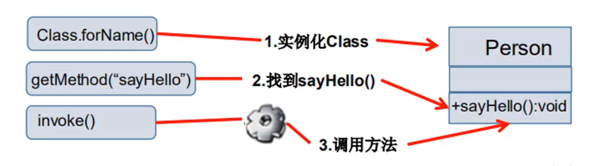

# JavaSE

## IO


## 泛型

## 枚举

## 反射

### 静态VS动态语言

动态语言:

- 是一类在运行时可以改变其结构的语言：例如新的函数，对象，甚至代码可以被引进，已有的函数可以被删除或是其他结构上的变化。通俗点说就是，在运行时，代码可以根据某些条件改变自身结构
- 主要的动态语言：C#，JavaScript，PHP，Python

静态语言：

- 与动态语言相对应的，运行时结构不可变的语言就是静态语言。如：java，c，c++
- java不是动态语言，但是java可以称为“准动态语言”。即java具有一定的动态性，我们可以利用反射机制获得类似动态语言的特性。java的动态性让编程的时候更加灵活。

其他：

- 反射是java被视为动态语言的关键，反射机制允许程序在执行期借助以Reflection API取得任何类的内部信息，并能直接操作任意对象的内部属性及方法。

  ```java
  Class c =Class.forName("java.lang.String")
  ```

- 加载完类后，在堆内存的方法区中就产生了一个Class类型的对象（一个类只有一个Class对象），这个对象就包括了完整的类的结构信息。我们可以通过这个对象看到类的结果。这个对象就像一面镜子，透过镜子可以看到类的结构，所以，我们形象的称之为：反射。

- 参考类实例化对象 VS 通过反射获取类


一个展示反射的实例：

```java
package com.zhangyk.reflection;

//什么叫反射
public class Test02 {

    public static void main(String[] args) throws ClassNotFoundException {
        //通过反射获取类的Class对象
        Class c1 = Class.forName("com.zhangyk.reflection.User");
        System.out.println(c1);

        Class c2 = Class.forName("com.zhangyk.reflection.User");
        Class c3 = Class.forName("com.zhangyk.reflection.User");
        Class c4 = Class.forName("com.zhangyk.reflection.User");
        /*
        1. 通过hashcode判断不同引用是不是指向一个对象：发现hashcode相等-》一个类在内存中只有一个Class对象
        2. 一个类被加载后，类的整个结构都会被封装在Class对象中

        这里最好用 == 判断两个对象是否相等，因为hashcode不同，类也可能相同（很小概率）
        */
        System.out.println(c2.hashCode());
        System.out.println(c3.hashCode());
        System.out.println(c4.hashCode());

    }
}

//实体类:pojo
class User{
    private String name;
    private int id;
    private int age;

    public User() {
    }

    public User(String name, int id, int age) {
        this.name = name;
        this.id = id;
        this.age = age;
    }

    public String getName() {
        return name;
    }

    public void setName(String name) {
        this.name = name;
    }

    public int getId() {
        return id;
    }

    public void setId(int id) {
        this.id = id;
    }

    public int getAge() {
        return age;
    }

    public void setAge(int age) {
        this.age = age;
    }

    @Override
    public String toString() {
        return "User{" +
                "name='" + name + '\'' +
                ", id=" + id +
                ", age=" + age +
                '}';
    }
}
```

### java反射机制提供的功能

- 运行时判断任意一个对象所属的类

- 运行时构造任意一个类的对象

- 运行时判断任意一个类所具有的成员变量和方法

- 在运行时获取泛型信息

- 在运行时调用任意一个对象的成员变量和方法

- 在运行时处理注解

- 生成动态代理

  学习AOP时大量运用

### java反射有点和缺点

优点：

- 可以实现动态创建对象和编译，体现出很大的灵活性

缺点：

- 对性能有影响。使用反射基本上是一种解释操作，我们可以告诉jvm，我们希望做什么并且它满足我们的要求。这类操作总是慢于 直接执行相同的操作。

### 反射相关的主要API

- **java.lang.Class**:代表一个类

- java.lang.reflect.Method:代表类的方法
- java.lang.reflect.Field：代表类的成员变量
- java.lang.reflect.Constructor:代表类的构造器

### Class类

- 在Object类（Object类是所有类的父类）中定义了以下的方法，此方法将被所有子类继承

  `public final Class getClass()`

  以上方法的返回值的类型是一个Class类，此类是java反射的源头，实际上所谓反射从程序的运行结果来看也很好理解，即：可以通过对象反射求出类的名称。

- 有一张图可以解释getClass方法的作用，注意图中箭头是从下往上指的：

  对象可以抽象为类，类又可以被Class类所描述

  


### 得到Class对象的几种方式

对象照镜子后可以得到的信息：某个类的属性，方法和构造器，某个类到底实现了哪些接口。对于每个类而言，JRE都为其保留一个不变的Class类型的对象。一个Class对象包含了特定某个结构（class/interface/enum/annotation/primitive type/void/[]）的有关信息

- Class本身也是一个类
- Class对象只能由系统建立对象
- 一个加载的类在JVM中只会有一个Class实例
- 一个Class对象对应的是一个加载到JVM中的一个.class文件
- 每个类的实例（对象object）都会记得自己是由哪个Class实例所生成的
- 通过Class可以完整的得到一个类中的所有被加载的结构
- Class类是Reflection的根源，针对任何你想动态加载或运行的类，唯有先获得相应的Class对象

Class类本身的常用方法如下：

| 方法名                                    | 功能说明                                                    |
| ----------------------------------------- | ----------------------------------------------------------- |
| static Class.forName(String name)         | 返回指定类名name的Class对象                                 |
| Object newInstance()                      | 调用缺省构造函数，返回Class对象的一个实例                   |
| getName()                                 | 返回此Class对象所表示的实体(类，接口，数组类，或void)的名称 |
| Class getSuperClass()                     | 返回当前Class对象的父类的Class对象                          |
| Class[] getinterfaces()                   | 获取当前Class对象的接口                                     |
| ClassLoader getClassLoader()              | 返回该类的类加载器                                          |
| Constructor[] getConstructors()           | 返回一个包含某些Constructor对象的数组                       |
| Method getMethod(String name, Class....T) | 返回一个Method对象，此对象的形参类型为paramType             |
| Field[] getDeclaredFields()               | 返回Field对象的一个数组                                     |

获取Class类实例的方法：


实操检验：

编写测试类

```java
package com.zhangyk.reflection;

//测试Class类的创建方式有哪些
public class Test03 {

    public static void main(String[] args) throws ClassNotFoundException {
        Person person=new Student();
        System.out.println("这个人是："+ person.name);

        //方式一：通过对象获得
        //forName最实用，有对象了用getClass意义不大
        Class c1 = person.getClass();

        //方式二：使用静态方法forname获得
        //除了forName，其他的方法基本不用
        Class c2 = Class.forName("com.zhangyk.reflection.Student");

        //方式3：通过类名.class获得
        Class c3=Student.class;

        //一个类的Class对象在jvm中只有一个，所以打印为true
        System.out.println(c1==c2&&c2==c3);

        //方式4：基本内置类型的包装类都有一个Type属性
        Class c4 = Integer.TYPE;
        //打印结果是int，因为是基本数据类型；相比较来说，c123都是Student类的Class对象
        System.out.println(c4);

        //获取父类类型
        Class c5 = c1.getSuperclass();
        System.out.println(c5);
    }

}

class Person{
    String name;

    public Person(){

    }

    public Person(String name) {
        this.name = name;
    }

    @Override
    public String toString() {
        return "Person{" +
                "name='" + name + '\'' +
                '}';
    }
}

class Student extends Person{
    public Student(){
        this.name="学生";
    }
}

class Teacher extends Person{
    public Teacher(){
        this.name="老师";
    }
}
```

测试结果如下，符合预期


### 哪些类型可以有Class对象

- class:外部类，成员（成员内部类，静态内部类），局部内部类，匿名内部类
- interface：接口
- []:数组
- enum：枚举
- annotation：注解@interface
- primitive type：基本数据类型
- void

实例：

编写测试类

```java
package com.zhangyk.reflection;

import java.lang.annotation.ElementType;

//所有类型的class
public class Test04 {
    public static void main(String[] args) {
        //class
        Class c1 = Object.class;

        //interface
        Class c2 = Comparable.class;

        //[]数组:一维，二维
        Class c3 = String[].class;
        Class c4 = int[][].class;

        //annotation
        Class c5 = Override.class;

        //enum
        Class c6 = ElementType.class;

        //primitives
        Class c7 = Integer.class;
        
        //void
        Class c8 = void.class;

        //Class本身也是一个类
        Class c9 = Class.class;

        //技巧：alt+c 可以竖着复制
        //打印显示所有类型的Class对象
        System.out.println(c1);
        System.out.println(c2);
        System.out.println(c3);
        System.out.println(c4);
        System.out.println(c5);
        System.out.println(c6);
        System.out.println(c7);
        System.out.println(c8);
        System.out.println(c9);

        //只要元素类型和维度一样，就对应同一个Class对象
        int[]a=new int[10];
        int[]b=new int[100];
        System.out.println(a.getClass().hashCode());
        System.out.println(b.getClass().hashCode());
    }
}
```

查看测试结果，符合预期


### Java内存分析

图示如下：


注解：

- 之前方法区是一个特殊的堆；jdk1.8后方法区变成了元空间，不在堆里面了

### 类的加载过程

了解：

当程序主动使用某个类时，如果该类还没被加载到内存中，则系统会通过如下三个步骤来对该类进行初始化


类的加载和ClassLoader的理解：

- 加载：将class文件字节码内容加载到内存中，并将这些静态数据转换成方法区的运行时数据结构，然后生成一个代表这个类的java.lang.Class对象
- 链接：将Java类的二进制代码合并到JVM的运行状态之中的进程
  - 验证：确保加载的类信息符合JVM规范，没有安全方面的问题
  - 准备：正式为类变量（static）分配内存并设置类变量默认初始值的阶段，这些内存都将在方法区中进行分配
  - 解析：虚拟机常量池内的符号引用（常量名）替换为直接引用（地址）的过程
- 初始化：
  - 执行类构造器\<clinit>()方法的过程。类构造器\<clinit>()方法是由编译期自动收集类中所有类变量的赋值动作和静态代码块中的语句合并产生的。（类构造器是构造类信息的，不是构造该类对象的构造器）。
  - 当初始化一个类的时候，如果发现其父类还没有进行初始化，则需要先触发其父类的初始化。
  - 虚拟机会保证一个类的\<clinit>()方法在多线程环境总被正确加锁和同步。

### 什么时候会发生初始化

#### 类的主动引用（一定会发生类的初始化）

1. 当虚拟机启动，先初始化main方法所在的类

   测试如下：

   即使什么都不做，main类也会被初始化。这是虚拟机启动的时候一定会做的

   ```java
   package com.zhangyk.reflection;
   
   //测试类什么时候会初始化
   public class Test06 {
   
       static {
           System.out.println("main类被加载");
       }
   
       public static void main(String[] args) throws ClassNotFoundException {
           //JVM启动就会初始化main类
       }
   }
   
   class Father{
   
       static int b=2;
       static{
           System.out.println("父类被加载");
       }
   }
   
   class Son extends Father{
       static {
           System.out.println("子类被加载");
       }
   
       static int m = 100;
       //常量一般用大写，在常量池里
       static final int M=1;
   }
   ```

   

2. new一个类的对象

   测试如下；发现main类，父类，子类，都被初始化了。

   - main类被初始化时因为虚拟机启动时，先初始化的就是main类

   - 父类被初始化是因为，son被new了一个对象，而父类还没初始化，所以父类先初始化

   - 子类初始化时因为new了一个子类对象

      ```java
      package com.zhangyk.reflection;
      
        //测试类什么时候会初始化
        public class Test06 {
       
            static {
                System.out.println("main类被加载");
            }
       
            public static void main(String[] args) {
                //1. 主动引用
                Son son = new Son();
            }
        }
       
        class Father{
       
            static int b=2;
            static{
                System.out.println("父类被加载");
            }
        }
       
        class Son extends Father{
            static {
                System.out.println("子类被加载");
            }
       
            static int m = 100;
            //常量一般用大写，在常量池里
            static final int M=1;
        }
      ```


3. 调用类的静态成员（除了final常量）和静态方法

4. 使用java.lang.reflect包的方法对类进行反射调用

   测试如下：

   - 子类被初始化时因为用了reflection包的方法
   - main类和父类初始化的原因同2.

   ```java
   package com.zhangyk.reflection;
   
   //测试类什么时候会初始化
   public class Test06 {
   
       static {
           System.out.println("main类被加载");
       }
   
       public static void main(String[] args) throws ClassNotFoundException {
           //反射也会产生主动引用
           Class.forName("com.zhangyk.reflection.Son");
       }
   }
   
   class Father{
   
       static int b=2;
       static{
           System.out.println("父类被加载");
       }
   }
   
   class Son extends Father{
       static {
           System.out.println("子类被加载");
       }
   
       static int m = 100;
       //常量一般用大写，在常量池里
       static final int M=1;
   }
   ```

   

5. 当初始化一个类，如果其父类没有被初始化，则会先初始化他的父类

#### 类的被动引用（不会发生类的初始化）

1. 当访问一个静态域时，只有真正声明这个域的类才会被初始化。如：当通过子类引用父类的静态变量，不会导致子类初始化

   测试如下：

   - mian初始化，是因为jvm启动就会初始化main类
   - 父类初始化，是因为父类的静态成员b被调用
   - 子类未被初始化，因为这里是子类引用父类的静态变量

   ```java
   package com.zhangyk.reflection;
   
   //测试类什么时候会初始化
   public class Test06 {
   
       static {
           System.out.println("main类被加载");
       }
   
       public static void main(String[] args) throws ClassNotFoundException {
   
           //不会产生类的引用的方法
   
           //通过子类引用父类的静态变量
           System.out.println(Son.b);
       }
   }
   
   class Father{
   
       static int b=2;
       static{
           System.out.println("父类被加载");
       }
   }
   
   class Son extends Father{
       static {
           System.out.println("子类被加载");
       }
   
       static int m = 100;
       //常量一般用大写，在常量池里
       static final int M=1;
   }
   ```

   

2. 通过数组定义类引用，不会触发此类的初始化

   测试如下：

   数组并没有初始化类，只是借用类标志（占用）一下数组需要多大的内存空间

   ```java
   package com.zhangyk.reflection;
   
   //测试类什么时候会初始化
   public class Test06 {
   
       static {
           System.out.println("main类被加载");
       }
   
       public static void main(String[] args) throws ClassNotFoundException {
   
           //不会产生类的引用的方法
   
           //通过数组定义类引用
           Son[] sons = new Son[5];
   
       }
   }
   
   class Father{
   
       static int b=2;
       static{
           System.out.println("父类被加载");
       }
   }
   
   class Son extends Father{
       static {
           System.out.println("子类被加载");
       }
   
       static int m = 100;
       //常量一般用大写，在常量池里
       static final int M=1;
   }
   ```

   

3. 引用常量（final）不会触发此类的初始化（常量在链接阶段就存入调用类的常量池中了）

   测试如下：

   常量不会引起父类和子类的初始化，

   ```java
   package com.zhangyk.reflection;
   
   //测试类什么时候会初始化
   public class Test06 {
   
       static {
           System.out.println("main类被加载");
       }
   
       public static void main(String[] args) throws ClassNotFoundException {
   
           //不会产生类的引用的方法
   
           //调用常量
           System.out.println(Son.M);
   
       }
   }
   
   class Father{
   
       static int b=2;
       static{
           System.out.println("父类被加载");
       }
   }
   
   class Son extends Father{
       static {
           System.out.println("子类被加载");
       }
   
       static int m = 100;
       //常量一般用大写，在常量池里
       static final int M=1;
   }
   ```

   

### 类加载器

#### 类加载器作用

将class文件字节码内容加载到内存中，并将这些静态数据专户赞成方法区的运行时数据结构，然后在堆中生成一个代表这个类的java.lang.Class对象，作为方法区中类数据的访问入口。

#### 类缓存

标准的JavaSE类加载器可以按要求查找类，但一旦某个类被加载到类加载器中，它将维持加载（缓存）一段时间。不过JVM垃圾回收机制可以回收这些Class对象。


#### 类加载器的作用

类加载器作用是用来把类（class）装载进内存的。JVM规范定义了如下类型的类的加载器。

- 引导类加载器（根加载器）：

  用c++编写的，是JVM自带的类加载器，负责Java平台核心库，用来装载核心类库。该加载器无法直接获取。

- 扩展类加载器：

  负责jre/lib/ext目录下的jar包或-D java.ext.dirs 指定目录下的jar包装入工作库

- 系统类加载器（用户类加载器）：

  负责java -classpath或 -D java.class.path所指的目录下的类与jar包装入工作，是最常用的加载器


实例演示：

编写测试方法

```java
package com.zhangyk.reflection;

public class Test07 {

    public static void main(String[] args) throws ClassNotFoundException {
        //获取系统类的加载器
        ClassLoader systemClassLoader = ClassLoader.getSystemClassLoader();
        System.out.println(systemClassLoader);

        //获取系统类加载器的父类加载器：扩展类加载器
        ClassLoader parent = systemClassLoader.getParent();
        System.out.println(parent);

        //获取扩展类加载器的父类加载器：根加载器（c/c++）
        //这个无法直接获得，所以测试结果必定为null
        ClassLoader parent1 = parent.getParent();
        System.out.println(parent1);

        //测试当前类是哪个加载器加载的：用户类加载器
        ClassLoader classLoader = Class.forName("com.zhangyk.reflection.Test07").getClassLoader();
        System.out.println(classLoader);

        //测试jdk内置的类是哪个加载器加载的：根加载器
        ClassLoader classLoader1 = Class.forName("java.lang.Object").getClassLoader();
        System.out.println(classLoader1);

        //如何获得系统类加载器可以加载的路径
        System.out.println(System.getProperty("java.class.path"));
        /*
        * 输出如下：
        * D:\eclipse\java\jdk1.8.0_121\jre\lib\charsets.jar;
        * D:\eclipse\java\jdk1.8.0_121\jre\lib\deploy.jar;
        * D:\eclipse\java\jdk1.8.0_121\jre\lib\ext\access-bridge-64.jar;
        * D:\eclipse\java\jdk1.8.0_121\jre\lib\ext\cldrdata.jar;
        * D:\eclipse\java\jdk1.8.0_121\jre\lib\ext\dnsns.jar;
        * D:\eclipse\java\jdk1.8.0_121\jre\lib\ext\jaccess.jar;
        * D:\eclipse\java\jdk1.8.0_121\jre\lib\ext\jfxrt.jar;
        * D:\eclipse\java\jdk1.8.0_121\jre\lib\ext\localedata.jar;
        * D:\eclipse\java\jdk1.8.0_121\jre\lib\ext\nashorn.jar;
        * D:\eclipse\java\jdk1.8.0_121\jre\lib\ext\sunec.jar;
        * D:\eclipse\java\jdk1.8.0_121\jre\lib\ext\sunjce_provider.jar;
        * D:\eclipse\java\jdk1.8.0_121\jre\lib\ext\sunmscapi.jar;
        * D:\eclipse\java\jdk1.8.0_121\jre\lib\ext\sunpkcs11.jar;
        * D:\eclipse\java\jdk1.8.0_121\jre\lib\ext\zipfs.jar;
        * D:\eclipse\java\jdk1.8.0_121\jre\lib\javaws.jar;
        * D:\eclipse\java\jdk1.8.0_121\jre\lib\jce.jar;
        * D:\eclipse\java\jdk1.8.0_121\jre\lib\jfr.jar;
        * D:\eclipse\java\jdk1.8.0_121\jre\lib\jfxswt.jar;
        * D:\eclipse\java\jdk1.8.0_121\jre\lib\jsse.jar;
        * D:\eclipse\java\jdk1.8.0_121\jre\lib\management-agent.jar;
        * D:\eclipse\java\jdk1.8.0_121\jre\lib\plugin.jar;D:\eclipse\java\jdk1.8.0_121\jre\lib\resources.jar;
        * D:\eclipse\java\jdk1.8.0_121\jre\lib\rt.jar;
        * D:\idea\JavaSE\annotation\target\classes;
        * C:\Program Files\JetBrains\IntelliJ IDEA 2018.3.6\lib\idea_rt.jar

        科普双亲委派机制：系统会按顺序：用户类加载器-》扩展类加载器-》根加载器 搜索类有没有被定义，如果自己定义的类和
        加载器加载的类有重名，自己定义的类直接无效。比如自己定义java.lang.String的类是永远跑不了的，因为该类在根加载器中
        被定义
         * */
    }
}

```

执行测试方法，结果符合预期


### 创建运行时的类对象

通过反射获取运行时类的完整结构:

Field,Method,Constructor,Superclass,Interface,Annotation

实操：

编写测试类

```java
package com.zhangyk.reflection;

import java.lang.reflect.Constructor;
import java.lang.reflect.Field;
import java.lang.reflect.Method;

//获得类的信息
public class Test08 {

    public static void main(String[] args) throws ClassNotFoundException, NoSuchFieldException, NoSuchMethodException {

        //获得类的名字
        System.out.println("=================获得类的名字=================");
        //通过Class.forName获取类对象
        Class c1 = Class.forName("com.zhangyk.reflection.User");
        //获得类的名字
        System.out.println(c1.getName()); //获得包名+类名
        System.out.println(c1.getSimpleName());//获得类名

        //通过object.getClass获取类对象
        User user = new User();
        Class c2 = user.getClass();
        //获得类的名字
        System.out.println(c1.getName()); //获得包名+类名
        System.out.println(c1.getSimpleName());//获得类名

        //获得类的属性
        System.out.println("==================获得类的属性================");
        //getFields()只能找到public属性；打印时发现因为属性都是私有的，没有东西被打印出来
        Field[] fields = c1.getFields();
//        for (Field field : fields) {
//            System.out.println(field);
//        }
        //getDeclaredFields()可以找到包含public和private的所有属性
        Field[] declaredFields = c1.getDeclaredFields();
        for (Field declaredField : declaredFields) {
            System.out.println(declaredField);
        }

        //获得指定属性的值
        System.out.println("==================获得指定属性的值================");
        Field name = c1.getDeclaredField("name");
        System.out.println(name);

        //获得类的方法
        System.out.println("==================获得类的方法================");
        //getMethods()：获得本类及其父类的全部public方法
        Method[] methods = c1.getMethods();
        for (Method method : methods) {
            System.out.println("getMethods()得到的"+ method);
        }
        //getDeclaredMethods()：获得本类的所有方法
        methods = c1.getDeclaredMethods();
        for (Method method : methods) {
            System.out.println("getDeclaredMethods()得到的"+ method);
        }

        //获取指定的方法
        System.out.println("==================获取指定的方法================");
        /*之所以getMethod需要参数，是因为考虑方法可能有重载

        重载定义：重载(overloading) 是在一个类里面，方法名字相同，而参数不同。返回类型可以相同也可以不同。参数类型的
        顺序不同也算重载
        */
        Method getName = c1.getMethod("getName", null);
        Method setName = c1.getMethod("setName", String.class);
        System.out.println(getName);
        System.out.println(setName);

        //获得类的构造器
        System.out.println("==================获得类的构造器================");
        //getConstructors()获得public的构造器
        Constructor[] constructors = c1.getConstructors();
        for (Constructor constructor : constructors) {
            System.out.println(constructor);
        }
        //getDeclaredConstructors()获得全部的构造器
        Constructor[] declaredConstructors = c1.getDeclaredConstructors();
        for (Constructor declaredConstructor : declaredConstructors) {
            System.out.println(declaredConstructor);
        }

        //获得指定的构造器
        System.out.println("==================获得指定的构造器================");
        Constructor declaredConstructor = c1.getDeclaredConstructor(String.class, int.class, int.class);
        System.out.println(declaredConstructor);


    }
}

```

查看测试结果，符合预期


### 动态创建对象执行方法（干货）

有了Class对象，能做什么？

#### 用newInstance()实例化对象

创建类的对象：调用Class对象的newInstance()方法

- 类必须有一个无参构造器
- 类的构造器的访问权限需要足够

实例：

编写测试类

```java
package com.zhangyk.reflection;

public class Test09 {

    public static void main(String[] args) throws ClassNotFoundException, IllegalAccessException, InstantiationException {
        //获得Class对象
        Class c1 = Class.forName("com.zhangyk.reflection.User");

        //构造一个对象
        User user = (User) c1.newInstance();//本质是调用了类的无参构造器
        System.out.println(user);
    }

}
```

查看测试结果

参数都没有被赋值，佐证了“调用的是无参构造器”


#### 通过构造器实例化对象

思考：难道没有无参的构造器就不能创建对象了吗？答案：不是的，只要在操作的时候明确的调用类中的构造器，并将参数传递进去之后，才可以实例化对象。

步骤如下：

- 通过Class类的`getDeclaredConstructor( Class... parameterTypes)` 取得本类的指定形参类型的构造器
- 向构造器的形参红传递一个对象数组进去，里面包含了构造器中所需的各个参数
- 通过Constructor实例化对象

实操：

编写测试类

```java
package com.zhangyk.reflection;

import java.lang.reflect.Constructor;
import java.lang.reflect.InvocationTargetException;

public class Test09 {

    public static void main(String[] args) throws ClassNotFoundException, IllegalAccessException, InstantiationException, NoSuchMethodException, InvocationTargetException {

        //获得Class对象
        Class c1 = Class.forName("com.zhangyk.reflection.User");

        //通过构造器创建对象
        Constructor declaredConstructor = c1.getDeclaredConstructor(String.class, int.class, int.class);
        User user = (User) declaredConstructor.newInstance("张云", 001, 18);//本质调用了一个有参构造器

        System.out.println(user);
    }


}
```

查看测试结果，发现成功创建了一个属性被赋了值的对象


#### 通过反射调用普通方法

通过反射，调用类中的方法，通过Method类完成：

1. 通过Class类的getMethod(String name, Class....parameterTypes)方法取得一个Method对象，并设置此方法操作时所需要的参数类型
2. 之后使用Object invoke(Object obj, Object[] args)进行调用，并向方法中传递要设置的obj对象的参数信息。



关于invoke方法的说明：

`Object invoke(Object obj, Object... args)`

- Object对应原方法的返回值，若原方法无返回值，此时返回null
- 若原方法为静态方法，此时形参Object obj可为null
- 若原方法形参列表为空，则Object[] args为null
- 若原方法声明为private，则需要在调用此invoke()方法前，显示调用方法对象的setAccessible(true)方法，才可访问private的方法

实例：

编写测试类

```java
package com.zhangyk.reflection;

import java.lang.reflect.Constructor;
import java.lang.reflect.InvocationTargetException;
import java.lang.reflect.Method;

public class Test09 {

    public static void main(String[] args) throws ClassNotFoundException, IllegalAccessException, InstantiationException, NoSuchMethodException, InvocationTargetException {

        //获得Class对象
        Class c1 = Class.forName("com.zhangyk.reflection.User");

        //通过反射调用普通方法
        User user = (User) c1.newInstance();
        //通过反射获取一个方法
        Method setName = c1.getDeclaredMethod("setName", String.class);

        //invoke:激活的意思
        //（对象，"方法的值"）
        setName.invoke(user,"张云");
        System.out.println(user.getName());
    }


}
```

查看测试结果：对象的方法成功给对象赋值


#### 通过反射操作属性

setAccessible说明

- Method和Field，Constructor对象都有setAccessible()方法
- setAccessible作用是启动和禁用访问安全检查的开关
- 参数值为true，则指示反射的对象在使用时应该取消java语言访问检查--即为 赋权限
  - 提高反射的效率。如果代码中必须用反射，而该句语句需要频繁的被调用，那么设置为true
  - 使得原本无法访问的私有成员也可以被访问
- 参数值为false则指示反射的对象应该实施java语言访问检查

实例：

编写测试类

```java
package com.zhangyk.reflection;

import java.lang.reflect.Constructor;
import java.lang.reflect.Field;
import java.lang.reflect.InvocationTargetException;
import java.lang.reflect.Method;

public class Test09 {

    public static void main(String[] args) throws ClassNotFoundException, IllegalAccessException, InstantiationException, NoSuchMethodException, InvocationTargetException, NoSuchFieldException {

        //获得Class对象
        Class c1 = Class.forName("com.zhangyk.reflection.User");

        //通过反射调用普通方法
        User user = (User) c1.newInstance();
        Field name = c1.getDeclaredField("name");

        //不能直接操作私有属性or私有方法，我们要为需要访问的私有属性or私有方法打开权限：setAccessible(true)
        name.setAccessible(true);
        name.set(user,"张云2");
        System.out.println(user.getName());
    }


}
```

查看测试结果：属性被正确操作


#### 性能对比分析

一般来说，就运行时间而言：普通方法<<反射方法+关闭检查<反射方法

实操:

编写测试类

```java
package com.zhangyk.reflection;

import java.lang.reflect.InvocationTargetException;
import java.lang.reflect.Method;

//分析性能问题
public class Test10 {

    public static void main(String[] args) throws NoSuchMethodException, IllegalAccessException, InvocationTargetException {
        test01();
        test02();
        test03();
    }

    //普通方法调用
    public static void test01(){
        User user = new User();

        long startTime = System.currentTimeMillis();

        for(int i=0;i<1000000000;i++){
            user.getName();
        }

        long endTime = System.currentTimeMillis();

        System.out.println("普通方法执行10亿次："+(endTime-startTime)+"毫秒");
    }

    //反射方法调用
    public static void test02() throws NoSuchMethodException, InvocationTargetException, IllegalAccessException {
        User user = new User();
        Class c1 = user.getClass();

        Method getName = c1.getDeclaredMethod("getName", null);

        long startTime = System.currentTimeMillis();

        for(int i=0;i<1000000000;i++){
            getName.invoke(user, null);
        }

        long endTime = System.currentTimeMillis();

        System.out.println("反射方法执行10亿次："+(endTime-startTime)+"毫秒");
    }

    //反射方法调用+关闭检查
    public static void test03() throws NoSuchMethodException, InvocationTargetException, IllegalAccessException {
        User user = new User();
        Class c1 = user.getClass();

        Method getName = c1.getDeclaredMethod("getName", null);
        //针对setName方法对象关闭检查，即为setName方法对象赋权允许访问
        getName.setAccessible(true);

        long startTime = System.currentTimeMillis();

        for(int i=0;i<1000000000;i++){
            getName.invoke(user, null);
        }

        long endTime = System.currentTimeMillis();

        System.out.println("反射方法+关闭检查执行10亿次："+(endTime-startTime)+"毫秒");
    }
}

```

查看测试结果


#### 反射操作泛型（了解）

java采用泛型擦除的机制来引入泛型，java中的泛型仅仅是给编译器javac使用的，确保数据的安全性和免去强制类型转换问题，但是，一旦编译完成，所有和泛型相关的类型全部擦除

为了通过反射操作这些类型，java新增了ParameterizedType,GenericArrayType,TypeVariable和WildcardType几种类型来代表不能被归一到Class类中的类型但是又和原始类型齐名的类型：

- ParameterizedType：表示一种参数化类型，比如Collection\<String>
- GenericArrayType:表示一种元素类型是参数化类型或者类型变量的数组类型
- TypeVariable：是各种类型变量的公共父接口
- WildcardType:代表一种通配符类型表达式

实操：

编写测试类

```java
package com.zhangyk.reflection;

import java.lang.reflect.Method;
import java.lang.reflect.ParameterizedType;
import java.lang.reflect.Type;
import java.util.List;
import java.util.Map;

public class Test11 {

    public void test01(Map<String,User> map, List<User> list){
        System.out.println("test01");
    }
    public Map<String,User> test02(){
        System.out.println("test02");
        return null;
    }

    public static void main(String[] args) throws NoSuchMethodException {

        System.out.println("=======================针对test01方法，尝试打印泛型参数========================");
        //利用反射获取方法对象
        Method method = Test11.class.getMethod("test01", Map.class, List.class);
        //获得方法中的泛型参数类型
        Type[] genericParameterTypes = method.getGenericParameterTypes();
        //针对每个泛型参数进行处理
        for (Type genericParameterType : genericParameterTypes) {
            //打印泛型参数，以#号标志
            System.out.println("#"+genericParameterType);
            //如果某泛型属于参数化类型，把泛型里包含的每一具体类型打印出来
            if(genericParameterType instanceof ParameterizedType){
                Type[] actualTypeArguments = ((ParameterizedType) genericParameterType).getActualTypeArguments();
                for (Type actualTypeArgument : actualTypeArguments) {
                    System.out.println(actualTypeArgument);
                }
            }
        }

        System.out.println("=======================针对test02方法，尝试打印泛型返回值========================");
        //利用反射获取方法对象
        method = Test11.class.getMethod("test02",null);
        //返回值只可能有一个，所以方法名结尾不带s
        Type genericReturnType = method.getGenericReturnType();
        //如果泛型返回值类型属于参数化类型，把泛型里包含的每一具体类型打印出来
        if(genericReturnType instanceof ParameterizedType){
            Type[] actualTypeArguments = ((ParameterizedType) genericReturnType).getActualTypeArguments();
            for (Type actualTypeArgument : actualTypeArguments) {
                System.out.println(actualTypeArgument);
            }
        }

    }
}

```

查看测试方法，符合预期


#### 反射操作注解

getAnnotation, getAnnotations

练习：ORM

何为ORM？：

- Object relationship Mapping-->对象关系映射

  

- 类和表结构对应
- 属性和字段对应
- 对象和记录对应

要求：利用注解和反射完成类和表结构的映射关系

实操：

编写测试类

```java
package com.zhangyk.reflection;

import java.lang.annotation.*;
import java.lang.reflect.Field;

//练习反射操作注解
public class Test12 {

    public static void main(String[] args) throws ClassNotFoundException, NoSuchFieldException {
        Class c1 = Class.forName("com.zhangyk.reflection.Student2");

        //通过反射获得注解
        System.out.println("============通过反射获得注解=============");
        Annotation[] annotations = c1.getAnnotations();
        for (Annotation annotation : annotations) {
            System.out.println(annotation);
        }

        //获得指定"类注解"（类注解即针对类用的注解）的value值
        System.out.println("============获得指定\"类注解\"的value值=============");
        TableZhangyk tableZhangyk = (TableZhangyk) c1.getAnnotation(TableZhangyk.class);
        String value =  tableZhangyk.value();
        System.out.println(value);

        //获得类中指定的注解(比如方法注解，属性注解等)
        //这里是尝试获得：Student2类中，name属性拥有的FieldZhangyk注解中所填的value是什么
        System.out.println("============获得类中指定的注解(比如方法注解，属性注解等)的value值=============");
        //获取Field类（字段类）
        Field name = c1.getDeclaredField("name");
        //借助字段类，获取该字段的某指定注解：FieldZhangyk注解
        FieldZhangyk fieldZhangyk = name.getAnnotation(FieldZhangyk.class);
        //打印获得的字段注解中，存入的各个value
        System.out.println(fieldZhangyk.columnName());
        System.out.println(fieldZhangyk.type());
        System.out.println(fieldZhangyk.length());
    }
}

@TableZhangyk("db_student")
class Student2{
    @FieldZhangyk(columnName = "db_id",type="int",length = 10)
    private int id;
    @FieldZhangyk(columnName = "db_age",type="int",length = 3)
    private int age;
    @FieldZhangyk(columnName = "db_name",type="varchar",length = 10)
    private String name;

    public Student2() {
    }

    public Student2(int id, int age, String name) {
        this.id = id;
        this.age = age;
        this.name = name;
    }

    public int getId() {
        return id;
    }

    public void setId(int id) {
        this.id = id;
    }

    public int getAge() {
        return age;
    }

    public void setAge(int age) {
        this.age = age;
    }

    public String getName() {
        return name;
    }

    public void setName(String name) {
        this.name = name;
    }

    @Override
    public String toString() {
        return "Student2{" +
                "id=" + id +
                ", age=" + age +
                ", name='" + name + '\'' +
                '}';
    }
}

//类的注解
@Target(ElementType.TYPE)
@Retention(RetentionPolicy.RUNTIME)
@interface TableZhangyk{
    String value();
}

//属性的注解
@Target(ElementType.FIELD)
@Retention(RetentionPolicy.RUNTIME)
@interface FieldZhangyk{
    String columnName();
    String type();
    int length();
}
```

查看测试结果，符合预期


## 注解(Annotation)

### 什么是注解

出现：

- JDK5.0引入的新技术

Annotation作用：

- 不是程序本身，可以对程序作出解释（这一点和注释（comment）没什么区别）
- **可以被其他程序（比如编译器）读取**

注解的格式：

- 注解是以“@注释名”在代码中存在的，还可以添加一些参数值，例如:@SuppressWarnings(value="unchecked").

注解可以使用的位置：

- 可以附加在package，class，method，field等上面，相当于给他们添加了额外的辅助信息，也可以辅助检查所注解的东西写的规不规范（不规范，注解可能爆红）；我们可以通过反射机制编程实现对这些元数据的访问


### 内置注解

下面是java三个最常见的内置注解：

- @Override：定义在java.lang.Override中，此注释只适用于修辞方法，表示一个方法声明打算重写超类（？父类）中的另一个方法声明。

- @Deprecated:定义在java.lang.Deprecated中，此注释可以用于修辞方法，属性，类；表示不鼓励程序员使用这样的元素，通常是因为它很危险或者存在更好的选择。

  - 使用被Deprecated注解的方法时，方法会出现删除线（横线），表示不推荐使用

    

- @SuppressWarnings：定义在java.lang.SuppressWarnings中，用来抑制编译是的警告信息。

  与前两个注释有所不同，你需要添加一个参数才能正确使用，这些参数都是已经定义好了的，我们选择性使用就好

  - @SuppressWarnings("all")

    

    使用注解后，灰色警告被消除

    

  - @SuppressWarnings("unchecked")

  - @SuppressWarnings(value={"unchecked","deprecation"})

  - 等等。。


### 元注解

元注解的作用就是负责注解其他注解，java定义了四个标准的**meta-annotation**类型，他们被用来提供对其他annotation类型做说明

这些类型和他们所支持的类在java.lang.annotation包中可以找到。（@Target,@Retention,@Documented,@Inherited）

#### @Target（重点）

用于描述注解的使用范围（即：被描述的注解可以用在哪些地方）

**测试只允许使用于方法的注解：**

编写测试类

```java
package com.zhangyk.annotation;

import java.lang.annotation.ElementType;
import java.lang.annotation.Target;

//测试元注解
@MyAnnotation
public class Test02 {
    @MyAnnotation
    public void test(){

    }
}

//定义一个注解
@Target( value= ElementType.METHOD)
@interface MyAnnotation{

}
```

定义一个注解的使用类型为方法，那么注解在方法上不会报错，但是注解在类上就会报错（红色波浪线）


**测试允许适用于方法和类的注解：**

因为value是一个list，可以修改target注解的参数如下

```java
//定义一个注解
@Target( value= {ElementType.METHOD,ElementType.TYPE})
```

现在类上也可以正常使用自定义的注解了


#### @Retention（重点）

表示需要在什么级别保存该注释信息，用于描述注解的生命周期

- source（源代码级）<class（编译后的class级）<**runtime（运行时）**；一般自定义都定义在runtime；

#### @Documented

说明该注解将被包含在javadoc中

#### @Inherited

说明子类可以继承父类中的该注解


### 自定义注解

使用**@interface**自定义注解时，自动继承了java.lang.annotation.Annotation接口

分析：

- @interface用来声明一个注解，格式：public @ interface 注解名 {定义内容}

  在类里面声明的话，要把public去掉

- 其中的每一个方法实际上是声明了一个配置参数

- 方法的名称就是参数的名称

- 返回值类型就是参数的类型（返回值只能是 基本类型，class，string，enum）

- 可以通过default来声明参数的默认值

- 如果只有一个参数成员，一般参数名为value

- 注解元素必须要有值，我们定义注解元素时，经常使用空字符串，0作为默认值

编写实例

```java
package com.zhangyk.annotation;

import java.lang.annotation.ElementType;
import java.lang.annotation.Retention;
import java.lang.annotation.RetentionPolicy;
import java.lang.annotation.Target;

//自定义注解
public class Test03 {
    
    //如果注解的参数没有默认值，我们就必须给参数显式赋值,如schools
    //如果有默认值，我们也可以自己另外指定，如name
    @MyAnnotation2(name="张云",schools = {"北邮","港中文"})
    public void test(){}

    //因为MyAnnotation3注解只有一个参数，且名为value，填参数的时候省略了： value=
    @MyAnnotation3("")
    public void test2(){}

}

//自定义注解常规加上@Target @Retention
@Target({ElementType.TYPE,ElementType.METHOD})
@Retention(RetentionPolicy.RUNTIME)
@interface MyAnnotation2{
    /*
    注解的参数设置：参数类型+参数名+（）
    因为是在自定义注解里，看着像一个方法，本质上这不是一个方法
    */
    String name() default "";
    int age() default 0;
    //如果默认值为-1，代表不存在；异曲同工：indexof，如果找不到就返回-1
    int id() default -1;
    String[] schools();
}

@Target({ElementType.TYPE,ElementType.METHOD})
@Retention(RetentionPolicy.RUNTIME)
@interface MyAnnotation3{
    /*
    如果只有一个参数，且参数名为value；在注解使用时可以不写"value="
    但如果参数名不是value，那么即使只有一个参数，也要显式写出
    */
    String value();
}
```


# 设计模式

## 单例模式

推荐狂神讲的30min单例模式


# JVM

可以看宋红康的，新出的，很多人推荐


# Linux

程序基本都是实际运行于linux环境，比如之前工行，测试环境，就得用linux，写一些shell命令，去打板