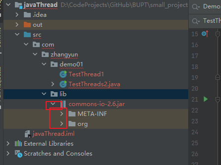
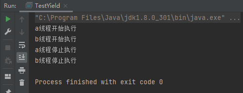
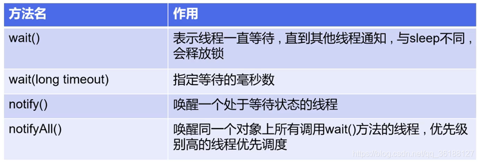
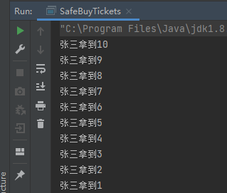

# java多线程讲解

[狂神说多线程](https://www.bilibili.com/video/BV1V4411p7EF?from=search&seid=1849168859243320619&spm_id_from=333.337.0.0)

[参考博客1](https://blog.csdn.net/weixin_45860338/article/details/113824249)

[参考博客2](https://blog.csdn.net/qq_36188127/article/details/108867650)

## 线程简介

### 概述


### 线程 进程 多线程

#### 多任务


- 现实中太多这样同时做多件事情的例子了，看起来是多个任务都在做，其实本质上我们的大脑在同一时间依旧只做了一件事情。

#### 多线程


- 原来是一条路，慢慢因为车太多了，道路阻塞，效率极低。为了提高使用的效率，能够充分利用道路，于是加了多个车道。从此，妈妈再也不用担心道路阻塞了。

#### 普通方法调用和多线程


#### 程序 进程 线程


#### Process与Thread

说起进程,就不得不说下**程序**。程序是指令和数据的有序集合，其本身没有任何运行的含义，是一个静态的概念。

而**进程**则是执行程序的依次执行过程，它是一个动态的概念。是系统资源分配的单位。

通常在一个进程中可以包含若干个**线程**，当然一个进程中至少有一个线程，不然没有存在的意义。线程是CPU调度和执行的单位。

**注意**：很多多线程是模拟出来的，真正的多线程是指有多个cpu，即多核，如服务器。如果是模拟出来的多线程，即在一个cpu的情况下，在同一个时间点，cpu只能执行一个代码，因为切换的很快，所以就有同时执行的错局。

- 我：多核处理多线程是并行(线程是CPU调度和执行的单位)，单核快速切换进程是并发(操作系统切换被服务的进程，单核时进程一般为单线程进程；因为只有一个核，多线程进程的多余进程也没办法执行)

#### 本节核心概念

- 线程就是独立的执行路径
- 在程序运行时,即使没有自己创建线程,后台也会有多个线程,比如主线程,GC线程
- main()称之为主线程,为系统的入口,用于执行整个程序
- 在一个进程中,如果开辟了多个线程,线程的运行是由调度器（cpu）安排调度的,调度器是与操作系统紧密相关的,先后顺序是不能人为干预的
- 对同一份资源操作时，会存在资源抢夺的问题,需要加入并发控制
- 线程会带来额外的开销,如CPU调度时间,并发控制开销
- 每个线程在自己的工作内存交互,内存控制不当会造成数据不一致

## 线程实现

### 继承Thread类

  #### 三种创建方式


#### 继承Thread类步骤

1. 自定义线程类继承`Thread`类
2. 重写`run()`方法，编写线程执行体
3. 创建线程对象，调用`start()`方法启动线程

#### 实战

1，创建一个简单的java项目，新建类文件TestThread1：


2，编写类文件

```java
package com.zhangyun.demo01;

public class TestThread1 extends Thread {
    @Override
    public void run() {
        //run方法线程体
        for (int i = 0; i < 200; i++) {
            System.out.println("我在看代码----" + i);
        }
    }

    public static void main(String[] args) {
        //main线程，上线程
        //创建一个线程对象
        TestThread1 testThread1 = new TestThread1();
        //调用start（）开启线程
        testThread1.start();
        for (int i = 0; i < 1000; i++) {
            System.out.println("我在学习多线程----" + i);
        }
    }
}
```

3，运行TestThread1类的主函数，查看实战结果：


- 一会主线程的打印“我要学习多线程”被执行，一会自定义线程的“我在看代码”被执行，体现了多线程抢夺CPU时间片的现象。
- 如果不是多线程而是串行的话，程序应该一次性打印完200个“我在看代码”，然后再一次性打印1000个“我在学习多线程”。

#### 继承Thread来多线程下载网图实战

1，百度搜索，下载apache下的[commons-io](https://archive.apache.org/dist/commons/io/binaries/)：


2，把commons-io的jar包拷贝进项目：


3，把自建的lib包，右键add as library；加入后可以发现commons-io jar包可以在idea中展开了：




4，点开project structer，确认lib文件夹被加入library：


5，编写TestThreads2：


```java
package com.zhangyun.demo01;

import org.apache.commons.io.FileUtils;

import java.io.File;
import java.io.IOException;
import java.net.URL;

public class TestThreads2 extends Thread{
    private String url;//网络图片地址
    private String name;//报错扥文件名

    //有参构造
    public TestThreads2(String url, String name) {
        this.url = url;
        this.name = name;
    }

    //下载图片线程的执行体
    @Override
    public void run() {
        WebDownloader webDownloader = new WebDownloader();
        webDownloader.downloader(url, name);
        System.out.println("下载了文件名为:" + name);
    }

    public static void main(String[] args) {
        TestThreads2 t = new TestThreads2("https://img-home.csdnimg.cn/images/20201124032511.png", "1.png");
        TestThreads2 t1 = new TestThreads2("https://img-home.csdnimg.cn/images/20201124032511.png", "2.png");
        TestThreads2 t2 = new TestThreads2("https://img-home.csdnimg.cn/images/20201124032511.png", "3.png");
        
        t.start();
        t1.start();
        t2.start();
    }
}

//下载器
class WebDownloader {
    //下载方法
    public void downloader(String url, String name) {
        try {
            FileUtils.copyURLToFile(new URL(url), new File(name));
        } catch (IOException e) {
            e.printStackTrace();
            System.out.println("IO异常,downloader方法出现问题");
        }
    }
}
```

- 网友提醒：下载本地图片时路径前要加上file:///

6，运行main函数，多线程并发下载图片：


- 可以看到，编写的程序是从1.png到3.png，但是下载结果却不一样，说明三个下载不是串行的，而是t t1 t2多线程并发同时下载的。

#### 总结

- 线程不一定立即执行，CPU安排调度
- 案例参考本实战

- 网友：因为这里多线程只是模拟的，不是真的

### 实现Runnable接口

#### 步骤

1. 自定义线程类实现`Runnable`接口

2. 实现`run()`方法,编写线程执行体
3. 创建线程对象,调用`start()`方法启动对象

#### 实战

1，编写代码，解释参见注释：


```java
package com.zhangyun.demo01;

public class TestThreads3 implements Runnable {

    @Override
    public void run() {
        //run方法线程体
        for (int i = 0; i < 20; i++) {
            System.out.println("线程1----" + i);
        }
    }

    public static void main(String[] args) {
        //创建runnable接口的实现类对象
        TestThreads3 testThread = new TestThreads3();
        //创建线程对象时,把Runnable实现类的对象丢进来，通过线程对象来开启我们的线程。代理
        Thread thread = new Thread(testThread);
        //调用start（）开启线程
        thread.start();

        //new Thread(testThread).start();
        for (int i = 0; i < 200; i++) {
            System.out.println("线程2----" + i);
        }
    }

}
```

2，运行main方法，查看线程的并发情况：


- 可以看到一会执行线程1，一会执行线程2,体现了线程并发抢占CPU；而不是按main函数中看起来似的，像先统一执行完20个线程1，再统一执行200个线程2.

#### 看源码

1，继承的Thread类实现了runnable接口

2，runnable接口本身只有一个run方法。

#### 小结Thread和Runnable

1，


2，**推荐使用Runnable对象,因为Java单继承的局限性**；如果继承了的话，单继承就不能继承别的父类了，对业务上会有限制。

### 初识并发问题

#### 实战

1，编写TrainTicketsCase；注释中有代码解释：


```java
package com.zhangyun.demo01;
/**
 * 多个线程同时操作同一个对象  买火车票案例
 */
//发现问题:多个线程操作同一个资源的情况下,线程不安全,数据紊乱
public class TrainTicketsCase implements Runnable{
    //票数
    private int ticketNums = 10;

    //run表示本线程不停地抢票，只要本线程被分配了cpu资源就抢。
    @Override
    public void run() {
        while (true) {
            if (ticketNums <= 0) {
                break;
            }
            //捕获异常
            try {
                //真实买票的时候会有延时，线程中的sleep可以模拟延时；避免某个线程在自己分配到cpu时就把10张票抢光（票数多的话，自己的片抢不光，就还能剩下点票给别的线程）。
                Thread.sleep(200);
            } catch (InterruptedException e) {
                e.printStackTrace();
            }
            //getname获取当前线程的名字。
            System.out.println(Thread.currentThread().getName() + "--->拿到了第" + ticketNums-- + "张票");
        }
    }

    public static void main(String[] args) {
        TrainTicketsCase ticket = new TrainTicketsCase();
        //开启三个线程，操作系统轮流给三个线程分配cpu资源，让它们内卷抢票。
        new Thread(ticket, "小红").start();
        new Thread(ticket, "老师").start();
        new Thread(ticket, "黄牛").start();
    }
}

```

2，启动main函数，测试：


- 可以看到不同人抢到了同一张票，这就是多线程并发时会出现的数据紊乱的问题。

- 数据紊乱的处理方法，在线程同步的时候讲。

### 龟兔赛跑

#### 思路


#### 实战

```java
/**
 * 模拟龟兔赛跑
 */
public class Demo5_RaceCase implements Runnable {
    //胜利者
    private static String winner;

    @Override
    public void run() {
        for (int i = 0; i <= 100; i++) {
            //模拟兔子休息
            if (Thread.currentThread().getName().equals("兔子") && i % 10 == 0) {
                try {
                    Thread.sleep(2);
                } catch (InterruptedException e) {
                    e.printStackTrace();
                }
            }
            //判断比赛是否结束
            boolean flag = gameOver(i);
            //如果比赛结束,停止程序
            if (flag) {
                break;
            }
            System.out.println(Thread.currentThread().getName() + "--->跑了" + i + "步");
        }
    }

    //判断是否完成
    private boolean gameOver(int steps) {
        if (winner != null) {
            return true;
        } else {
            if (steps >= 100) {
                winner = Thread.currentThread().getName();
                System.out.println("winner is " + winner);
                return true;
            }
        }
        return false;
    }

    public static void main(String[] args) {
        Demo5_RaceCase race = new Demo5_RaceCase();
        new Thread(race, "兔子").start();
        new Thread(race, "乌龟").start();
    }
}
```

- 这个例子一般般，且前面写过Runnable程序，就不再重复写了

### 实现Callable接口(了解即可)

#### 用法

1. 实现Callable接口，需要返回值类型
2. 重写call方法，需要抛出异常
3. 创建目标对象
4. 创建执行服务：ExecutorService ser = Executors.newFixedThreadPool(1);
5. 提交执行：Future result1 = ser.submit(11);
6. 获取结果：boolean r1 = result1.get()
7. 关闭服务：ser.shutdownNow();

- 网友：阿里巴巴不推荐使用这个工具类

- 网友：Callable就是生产线程池的

#### 实战

1，编写TestCallable，程序细节参见注释：


```java
package com.zhangyun.demo01;

import java.util.concurrent.*;

/** 线程的创建方式三：实现Callable接口
 *
 * callable的好处：
 * 1.可以自定义返回值
 * 2.可以抛出异常
 */
public class TestCallable implements Callable<Boolean> {

    private String url;//网络图片地址
    private String name;//报错扥文件名

    //有参构造
    public TestCallable(String url, String name) {
        this.url = url;
        this.name = name;
    }

    //下载图片线程的执行体
    public Boolean call() throws Exception {
        WebDownloader webDownloader = new WebDownloader();
        webDownloader.downloader(url, name);
        System.out.println("下载了文件名为:" + name);
        return true;
    }

    public static void main(String[] args) throws ExecutionException, InterruptedException {
        //创建目标对象
        TestCallable c = new TestCallable("https://img-home.csdnimg.cn/images/20201124032511.png", "1.png");
        TestCallable c1 = new TestCallable("https://img-home.csdnimg.cn/images/20201124032511.png", "2.png");
        TestCallable c2 = new TestCallable("https://img-home.csdnimg.cn/images/20201124032511.png", "3.png");
        //创建执行服务
        ExecutorService ser = Executors.newFixedThreadPool(3);
        //提交执行
        Future<Boolean> r = ser.submit(c);
        Future<Boolean> r1 = ser.submit(c1);
        Future<Boolean> r2 = ser.submit(c2);
        //获取结果
        boolean res = r.get();
        boolean res1 = r1.get();
        boolean res2 = r2.get();
        System.out.println(res);
        System.out.println(res1);
        System.out.println(res2);
        //关闭服务
        ser.shutdownNow();
    }
}
//class WebDownloader在前面下载图片已经定义了，这里就不用再次写，直接使用就好
```

2，运行main函数，查看运行结果：


- 可以看到图片下载的顺序，并不是和代码中编写的顺序一致，体现了线程并发抢夺处理器。

#### callable和runnable对比

1，callable实现callable接口，重写call方法，call方法有自定义类型的返回值；runable实现runnable接口，重写run方法；

2，callable创建一个服务，通过服务去提交线程来启动，提交完后可以得到返回值；runnable通过start来启动线程。

### Lamda表达式

#### 介绍

1，介绍


- λ 希腊字母表中排序第十一位的字母，英语名称为 Lamda
- 避免匿名内部类定义过多
- 其实质属于函数式编程的概念
- 去掉了一堆没有意义的代码,只留下核心逻辑
- jdk1.8出现的lamda简化

2，使用：

```
三种使用场景：
(paraems) -> expressionp[表达式]
(params) -> statement[语句]
(params) -> {statements}

两个使用例子：
a->System.out.println("i like lamda-->"+a);
new Thread(()->System.out.println("多线程学习...")).start();
```

3，函数式接口的定义：

-  任何接口,如果只包含唯一一个抽象方法,那么它就是一个函数式接口；比如Runnable接口.

  ```java
  public interface Runnable{
      public abstract void run();
  }
  ```

-  对于**函数式接口**,我们可以通过**Lamda表达式**来创建该接口的对象.

#### 实现接口的不同方式

不断简化接口的实现方式，从而引入Lamda表达式。

1，五种实现接口的方式，代码如下：

```java
package com.sjmp.demo02;

/**
 * @author: sjmp1573
 * @date: 2020/11/16 20:11
 * @description:
 */

public class LamdaExpression {
//    3.2 实现函数式接口的第二种方法，静态内部类
    static class Like2 implements ILike{
    @Override
    public void lamda() {
        System.out.println("------3.2 静态内部类实现函数式接口-----");
    }
}


    public static void main(String[] args) {

//    3.1 实现函数式接口的第一种方法
        ILike like1 = new Like1();
        like1.lamda();
        System.out.println("--3.1 普通方法实现函数式接口--");

//    3.2 实现函数式接口的第二种方法，静态内部类
        new Like2().lamda();


//    3.3 局部内部类实现函数式接口
        class Like3 implements ILike{
            @Override
            public void lamda() {
                System.out.println("------3.3 局部内部类实现函数式接口--------");
            }
        }

        new Like3().lamda();

//    3.4 匿名内部类实现函数式接口

        new ILike() {
            @Override
            public void lamda() {
                System.out.println("------3.4 匿名内部类实现函数式接口----------");
            }
        }.lamda();


//      3.5 lamda 表达式实现函数式接口

        ILike like5 = ()->{
            System.out.println("--3.5 lamda 表达式实现函数式接口--");
        };
        like5.lamda();
    }

}

// 1. 定义一个函数式接口
interface ILike{
    void lamda();
}

// 2. 实现类
class Like1 implements ILike{
    @Override
    public void lamda() {

    }
}
```

- 平时把类分成多个文件来写，但是现在没必要，因为我们只用一次；就在文件类的外面继续加上类即可，不用单独加文件，比如本例的Like1类。

- like5是对象名  是一个相当于实现了lamda表达式指定接口的类的实例化对象，该like5对象对应的类没有名字。

- Runnable接口只有一个run方法，所以多线程的Runnable实现类，没如果代码简单的话，可以用Lamda表达式来简化。
- 我和网友评价：em.......感觉匿名内部类好点，代码少了，也方便理解。

#### 小结

- 用法注意点总结:
  * {}简略的条件是接口的方法中只能有一行代码,多行代码的话{}就不能简略了
  * 使用lamda表达式简化接口实现，前提是接口为函数式接口(只能有一个方法)
  * 多个参数也可以去掉参数类型,要去掉就都去掉,必须加上();如果只有一个参数那么可以不要类型也不要()。

- lamda表达式，接口和方法都可以不用，java会自动推导。
  - 网友问：我有个问题，我要是有多个函数式接口他怎么知道我用的哪一个接口呢？
    - 网友答：应该是通过调用的哪个方法，来推导的；比如调用了设置按钮点击事件监听的方法，该函数只接收实现了EventHandler接口的类的实例化对象，由此推出lamda表达式简化的是EventHandler接口。[参考文章](https://blog.csdn.net/Hanniel/article/details/81813537)
    - 我理解：

- 网友：有人批评lamda失去了接口的扩张性，但是lamda表达式本来就使用一次，所以不扩张无所谓。

### 静态代理模式

#### 基本概念


#### 实战

结婚）

1，编写代码；代码思想见注解：


```java
package com.zhangyun.proxystatic;
/**
 * 静态代理:结婚案例
 */
public class StaticProxy {


        public static void main(String[] args) {
            WeddingCompany weddingCompany = new WeddingCompany(new You());
            weddingCompany.happyMarry();
        }
}

//结婚
interface Marry {
    void happyMarry();
}

//真实角色:你去结婚
class You implements Marry {
    @Override
    public void happyMarry() {
        System.out.println("张三要结婚了,超开心");
    }
}

//代理角色:帮助你结婚
class WeddingCompany implements Marry {
    private Marry target;//代理-->真实目标角色角色,帮谁结婚

    public WeddingCompany(Marry target) {
        this.target = target;
    }

    @Override
    public void happyMarry() {
        after();
        this.target.happyMarry();
        before();
    }

    private void after() {
        System.out.println("结婚之前,布置现场");
    }

    private void before() {
        System.out.println("结婚之后,付尾款");
    }

}
```

2，运行main函数：


#### 静态代理类比Thread

1，编写StaticProxy1.java：

```java
package com.zhangyun.proxystatic;

public class StaticProxy1 {
    public static void main(String[] args) {
        new Thread(()-> System.out.println("我爱你")).start();
        new WeddingCompany(new You()).happyMarry();
    }
}
//WeddingCompany...上一个文件定义过了这里就直接使用了
```

- 网友：

  - Runnable接口和Thread代理都有run方法，最后调用的是Thread的start方法，但实际执行的还是Runnable中的run方法中的方法体。

  - 这节是在解释通过实现Runnabe接口启动线程是用了静态代理的方式。

  - 这句话说出来就明白了：婚礼公司相当于thread；结婚的人相当于实现runnable接口的类，这里该类用lamba表达式体现；happyMary是Marry接口的方法，结婚的人和婚礼公司都实现了Marry方法，happyMary相当于Runnable接口的run方法。用thread代替接口实现类做一些东西。
    - [run方法和start方法的关系](https://www.jianshu.com/p/88c5cd468b0e)

- 我理解为什么这里编译器自动把Lamda表达式识别成Runnable接口的实现对象：因为Thread类只实现了Runnable接口，而Thread构造函数必须传入的是实现了Runnable接口的对象，所以编译器推测出本Lamda表达式为实现Runnable接口的run方法。
- 静态代理好处：
  - 代理对象可以做很多真实对象做不了的事情
  - 真实对象专注做自己的事

#### 小结

- 静态代理中，真实对象和代理对象都要实现一个接口
- 代理对象要代理真实角色

## 线程状态

### 线程停止

#### 线程的五大状态

1，简略图


2，详细图：


#### 线程方法


- join类似于插队

- 网友：yield并不是执行其他线程，而是从运行回到就绪状态，重新和就绪线程抢夺时间片

#### 线程方法-停止

1，基本思想：


2，建议：

- 不推荐使用 JDK 提供的 stop ()、destroy()方法。【已弃用】
- 推荐线程正常停止--》利用次数，不建议死循环
- 建议使用一个标志位进行终止变量 ， 当 flag == false,则终止线程运行。

3，代码实战：


```java
/**
 * 测试stop
 */
public class Demo15_StopThread implements Runnable {
    // 1. 设置一个标志位
    private boolean flag = true;

    @Override
    public void run() {
        int i = 0;
        while (flag) {
            System.out.println("run...Thread" + i++);
        }
    }

    // 2. 设置一个公开的方法停止线程,转换标志位
    public void stop() {
        this.flag = false;
    }

    public static void main(String[] args) {
        //把实现了Runnable接口的对象传入Thread，并启动该Thread。
        Demo15_StopThread stop = new Demo15_StopThread();
        new Thread(stop).start();
        
        for (int i = 0; i < 1000; i++) {
            System.out.println("main..." + i);
            if (i == 900) {
                //调用stop()切换标志位,让线程终止
                stop.stop();
                System.out.println("该线程停止了");
            }
        }
    }
}

```

- main函数代表的主线程的i达到900的时候，自定义线程会停止；自定义线程在被分配CPU的时间片内会不断循环自增自己的i。
- 本例就是使用标志位，让线程自己停止；本例也没有使用不推荐的死循环。

4，启动main函数，查看结果：

’

- 可以看到自定义线程和主线程在抢占CPU；主线程的i自增到900的时候，停止了自定义线程，此时自定义线程的i自增到了469。

### 线程方法-休眠

1， 基本思想


2，实例模仿网络延时：

```java
/**
 * 模拟网络延迟:放大问题的发生性
 */
public class Demo16_SleepThread implements Runnable {

    //票数
    private int ticketNums = 10;

    @Override
    public void run() {
        while (true) {
            if (ticketNums <= 0) {
                break;
            }
            //捕获异常
            try {
                Thread.sleep(200);
            } catch (InterruptedException e) {
                e.printStackTrace();
            }
            System.out.println(Thread.currentThread().getName() + "--->拿到了第" + ticketNums-- + "张票");
        }
    }

    public static void main(String[] args) {
        Demo4_TrainTicketsCase ticket = new Demo4_TrainTicketsCase();
        new Thread(ticket, "小红").start();
        new Thread(ticket, "老师").start();
        new Thread(ticket, "黄牛1").start();
    }
}
```

3，实例模拟倒计时:

```java
/**
 * 模拟倒计时
 */
public class Demo17_SleepThread2 {

    public static void main(String[] args) {
        try {
            tenDown();
        } catch (InterruptedException e) {
            e.printStackTrace();
        }
    }

    //模拟倒计时
    public static void tenDown() throws InterruptedException {
        int num = 10;//10秒
        while (true) {
            Thread.sleep(1000);
            System.out.println(num--);
            if (num <= 0) {
                break;
            }
        }
    }
}
```

- 这里只有一个主线程被不停睡眠1s，没有别的线程抢CPU

4，打印当前系统时间：

```java
/**
 * 每一秒获取当前时间
 */
public class Demo18_SleepThread3 {

    public static void main(String[] args) {
        //获取系统当前时间
        Date startTime = new Date(System.currentTimeMillis());
        while (true) {
            try {
                Thread.sleep(1000);
                //更新系统时间
                System.out.println(new SimpleDateFormat("HH:mm:ss").format(startTime));
                startTime = new Date(System.currentTimeMillis());
            } catch (InterruptedException e) {
                e.printStackTrace();
            }
        }
    }
}
```

- 网友·：打印的时间是上一秒的，不准

### 线程方法-礼让

1，基本概念：


- 礼让不一定成功：本线程放弃拿到的CPU，再和别的线程公平竞争CPU；
  - 或者换句话说：礼让是可以成功的,但是cpu不一定调度被礼让的线程。
  - 礼让是原线程把CPU礼让出来，然后谁抢到算谁的

2，礼让实战：


```java
package com.zhangyun.threadStatus;
/**
 * 测试礼让线程
 * 礼让不一定成功,看cpu心情
 */
public class TestYield {

        public static void main(String[] args) {
            //启动线程；不给线程对象名的话，可以直接传入线程名，如a b分别是线程的名字
            MyYeild myYeild = new MyYeild();
            new Thread(myYeild, "a").start();
            new Thread(myYeild, "b").start();
        }
}

    class MyYeild implements Runnable {
        @Override
        public void run() {
            System.out.println(Thread.currentThread().getName() + "线程开始执行");
            Thread.yield();//礼让
            System.out.println(Thread.currentThread().getName() + "线程停止执行");
        }


}
```

3，运行多次程序，查看测试结果；有不同的打印输出：





- 网友问：这里为什么是礼让的，不可以是多线程并发导致的吗，我试了加不加礼让都是会有各种组合的
  - 我分析：打印结果，既有线程并发的因素，又有礼让的因素，所以·老师这个例子感觉就举的不好。

- 我：不用担心两个线程互相yield导致饥饿，因为run里面没有死循环，yield执行一次后，本线程就来到了最后一句“线程停止执行”之前，并退出CPU的占有；下次如果CPU资源再被分配给本线程，则会直接打印“线程停止执行”，而不会又执行yield。

### 线程方法-插队

#### 概念


#### 实战

1，编写程序：


```java
package com.zhangyun.threadStatus;

public class TestJoin implements Runnable{
    @Override
    public void run() {
        for (int i = 0; i < 500; i++) {
            System.out.println("线程vip" + i);
        }
    }

    public static void main(String[] args) throws InterruptedException {
        //启动我们的线程
        TestJoin joinThread = new TestJoin();
        Thread thread = new Thread(joinThread);

        //主线程
        for (int i = 0; i < 500; i++) {
            if (i == 200) {
                thread.start();
                thread.join();//插队
            }
            System.out.println("main" + i);
        }
    }
}

```

2，运行程序：


- 可以看到当主线程的i到达200的时候，自定义线程插队进来；直到自定义线程执行完毕才放手CPU。
  - vip线程跑完了，才会把CPU让出来，很霸道。
- 网友：start()要放到if里面，不然在主线程启动时，vip线程也在执行中
  - 我：听了网友的意见，程序执行的不错；按照老师写的两个线程一开始就在交替执行，所以可能插队前就执行完了。

#### 小结

- 单核永远都不可能同时进行，宏观上同时进行的其实微观上是交替进行的，称为并发；只有多核才可能实现并行。

### 观察线程状态

#### 基本信息


#### 实战

1，编写程序：


```java
package com.zhangyun.threadStatus;

public class TestState {
    public static void main(String[] args) throws InterruptedException {

        //以lamda表达式的方法编写run方法，表示线程启动后会休眠5秒
        Thread thread = new Thread(() -> {
            for (int i = 0; i < 5; i++) {
                try {
                    Thread.sleep(1000);
                } catch (InterruptedException e) {
                    e.printStackTrace();
                }
            }
            System.out.println("//");
        });

        //观察线程启动前的状态
        Thread.State state = thread.getState();
        System.out.println(state);

        //观察线程启动后的状态
        thread.start();
        state = thread.getState();
        System.out.println(state);//Run

        //自定义线程睡眠5秒后会会执行完所有操作，便死亡
        while (state != Thread.State.TERMINATED) {//只要现成不终止,就一直输出状态
            Thread.sleep(100);
            state = thread.getState();//更新线程状态
            System.out.println(state);
        }
        //死亡后的线程不能再启动了,启动会报异常
        //thread.start();
    }
}
```

2，运行程序：

启动前是new；启动中是Runnable；睡眠中是Timed-Waiting


线程5s睡眠结束后是打印"//"，然后线程死亡


- 多个线程的话。start后可能会是WAIT状态，因为可能没抢到CPU；本例子就存在自定义线程和主线程两个线程。
- 不要看本例子没有自定义实现Runnable接口的类，就以为只有主线程；这里用lamda表达式编写run方法的内容，所以不需要自建类去实现Runnable接口，但是本质上还是自定义的Thread而不是主线程。
- 最后一次while循环，进入循环体的时候state还不是终止状态，再循环体内部更新状态后才是终止状态，所以TERMINATED可以输出来

- 死亡后的进程不能再被启动

### 线程的优先级

#### 基本概念


#### 实战

1，编写程序：


```java
package com.zhangyun.threadStatus;
/**
 * 线程优先级
 */
public class ThreadPriority {

    public static void main(String[] args) {
        //查看主线程的默认优先级
        System.out.println(Thread.currentThread().getName()+"的优先级为"+Thread.currentThread().getPriority());

        //自定义线程
        MyPriority myPriority = new MyPriority();
        Thread thread1 = new Thread(myPriority);
        Thread thread2 = new Thread(myPriority);
        Thread thread3 = new Thread(myPriority);
        Thread thread4 = new Thread(myPriority);
        Thread thread5 = new Thread(myPriority);

        //先设置优先级,再启动
        thread1.setPriority(1);
        thread2.setPriority(2);
        thread3.setPriority(3);
        thread5.setPriority(Thread.MAX_PRIORITY);//MAX_PRIORITY=10

        thread1.start();
        thread2.start();
        thread3.start();
        thread4.start();
        thread5.start();
    }
}

class MyPriority implements Runnable{
    @Override
    public void run() {
        System.out.println(Thread.currentThread().getName()+"的优先级为"+Thread.currentThread().getPriority());
    }
}
```

- 网友：优先级高代表抢到CPU时间片的概率大 不一定先执行
- 网友：可以在任务管理器设置CPU为单核运行
- 线程优先级默认是5，公平竞争；所以一般情况下不用设置线程优先级，就让他们公平竞争。

2，运行程序：


- 可以看到，虽然优先级是10的线程在代码中是最后一个开启的，但是因为优先级最高，它不是最后一个被执行的。

### 守护线程

#### 简介


#### 实战

1，编写程序：

```java
package com.zhangyun.threadStatus;

public class DaemonThread {
    public static void main(String[] args) {
        God god = new God();
        You you = new You();

        Thread thread = new Thread(god);
        //默认false表示是用户线程,正常的线程都是用户线程...
        thread.setDaemon(true);
        //上帝守护线程启动
        thread.start();
        //你 用户线程启动
        new Thread(you).start();
    }
}

//上帝
class God implements Runnable{
    @Override
    public void run() {
        while (true){
            System.out.println("上帝保佑着你");
        }
    }
}

//你
class You implements Runnable{
    @Override
    public void run() {
    for (int i = 0; i < 36500; i++) {
        System.out.println("你一生都开心的活着");
    }
    System.out.println("====goodbye!world====");
}

}
```

2，运行main函数，查看控制台打印输出：


- 人离开世界后，因为虚拟机停止还需要一点时间，所以上帝还跑了一会；总的来说就是人离开世界后虚拟机就停止，不等待守护进程god执行完毕。

## 线程同步

### 线程同步机制

#### 并发

并发定义为：**同一个对象**被**多个线程同时操作**：



- 我理解这里的“同时”是宏观上的同时，因为微观上线程也同时的是“并行”；并行需要CPU有多核才能实现。

#### 线程同步初思考

现实生活中，我们会遇到”同一个资源，多个人都想使用”的问题，比如，食堂排队打饭，每个人都想吃饭，最天然的解决办法就是，排队一个个来。

处理多线程问题时，多个线程访问同一个对象，并且某些线程还想修改这个对象.这时候我们就需要线程同步.线程同步其实就是一种等待机制，多个需要同时访问！此对象的线程进入这个**对象的等待池**形成队列，等待前面线程使用完毕，下一个线程再使用。


#### 队列和锁

队列和锁是形成线程安全的条件。

#### 线程同步

由于同一进程的多个线程共享同一块存储空间，在带来方便的同时，也带来了访问冲突问题，为了保证数据在方法中被访问时的正确性，在访问时加入**锁机制synchronized**，当一个线程获得对象的排它锁，独占资源，其他线程必须等待，使用后释放锁即可.存在以下问题：

- 一个线程持有锁会导致其他所有需要此锁的线程挂起；
- 在多线程竞争下，加锁，释放锁会导致比较多的上下文切换和调度延时，引起性能问题；
- 如果一个优先级高的线程等待一个优先级低的线程释放锁会导致优先级倒置，引起性能问题.

- 老师评价：保证安全，就得损失性能，要两者权衡一下。

### 三大不安全案例

#### 买票

1，场景：

- 有10张票，多个人同时开抢。

2，实战：


```java
package com.zhangyun.syn;

public class BuyTicketsUnsafely {
    public static void main(String[] args) {
        BuyTicket buyTicket = new BuyTicket();
        new Thread(buyTicket, "张三").start();
        new Thread(buyTicket, "李四").start();
        new Thread(buyTicket, "王五").start();
    }
}

class BuyTicket implements Runnable {
    //票
    private int ticketNums = 10;
    boolean flag = true;

    @Override
    public void run() {
        //买票
        while (flag) {
            try {
                buy();
            } catch (Exception e) {
                e.printStackTrace();
            }
        }
    }

    //买票
    private void buy() {
        //判断是否有票
        if (ticketNums <= 0) {
            flag = false;
            return;
        }
        //设置延迟可以暴露问题；只设置1ms可能无法暴露并发问题，要设置为100或300ms
        try {
            Thread.sleep(300);
        } catch (InterruptedException e) {
            e.printStackTrace();
        }

        //买票
        System.out.println(Thread.currentThread().getName() + "拿到" + ticketNums--);
    }
}
```


3，运行测试：


- 多个线程同时处于临界区中，进入区的条件判断已经通过，所以可以拿到0或-1
- 还是因为多个线程同时处于临界区中，进入区的条件判断已经通过，会导致不同人拿到同一张票。

#### 取钱

1，场景：

- 两个人去银行取钱，同一个账户

2，实战：


```java
package com.zhangyun.syn;

/**
 * 不安全的取钱
 */
public class UnsafeBank {

    public static void main(String[] args) {
        Account account = new Account(100, "结婚基金");
        Drawing you = new Drawing(account, 50, "展堂");
        Drawing girlfriend = new Drawing(account, 100, "sad");
        you.start();
        girlfriend.start();
    }
}

//账户
class Account {
    int money;//余额
    String cardName;//卡名

    public Account(int money, String cardName) {
        this.money = money;
        this.cardName = cardName;
    }
}

//银行:模拟取款
class Drawing extends Thread {
    Account account;//账户
    int drawingMoney;//取金额
    int nowMoney;//你手里的钱

    public Drawing(Account account, int drawingMoney, String name) {
        super(name);
        this.account = account;
        this.drawingMoney = drawingMoney;
    }

    //取钱
    @Override
    public void run() {
        //判断是否有钱
        if (account.money - drawingMoney < 0) {
            System.out.println(Thread.currentThread().getName() + "余额不足,不能进行取钱");
            return;
        }
        try {
            //放大并发问题的发生性；用1s的延时，让先进入临界区的线程等待一下，让you和gf都进入临界区
            Thread.sleep(1000);
        } catch (InterruptedException e) {
            e.printStackTrace();
        }
        //卡内金额 = 余额-你的钱
        account.money = account.money - drawingMoney;
        //你手里的钱
        nowMoney = nowMoney + drawingMoney;
        System.out.println(account.cardName + "余额为:" + account.money);
        //this.getName()==Thread.currentThread().getName()
        //网友：用this.getname是因为本类继承了thread类，thread类有getname方法，所以本类可以直接用getname方法；没重写就不用super。
        System.out.println(this.getName() + "手里的钱:" + nowMoney);
    }
}
```

- 网友：偷懒方法：先生成constructor再继承thread，否则快捷键无法自动生成constructor。

- 网友：父类的name是private，怎么去继承呢
  - 网友：因为这里要线程的名字，看那个线程取了钱，再因为Drawing继承了Thread 所以想要获取线程的名字就得掉父类的名字
  - 高赞网友：Thread类中一个构造方法就是传入一个字符串来改变线程的名字；super（String str)是继承Thread改变名字的那个构造 随便一提 super()只能写在构造方法第一行
  - 网友：继承和访问权限是两种东西

3，运行main函数：


- 网友：余额相同是因为CPU多线程执行太快，在运行到输出余额的时候，两个人对余额的操作都已完成

#### 线程不安全的集合

1，背景介绍：

- java中的ArrayList是线程不安全的
  - [原理](https://blog.csdn.net/qq_42183409/article/details/100586255)

2，实战：


```java
package com.zhangyun.syn;

import java.util.ArrayList;
import java.util.List;

public class UnsafeList {
    public static void main(String[] args) throws InterruptedException {
        List<String> list = new ArrayList<String>();
        for (int i = 0; i < 10000; i++) {
            new Thread(()->{
                list.add(Thread.currentThread().getName());
            }).start();
        }

        //网友：休眠的意义在于将所有创建的线程都添加进数组,防止cpu调用到主线程,然后输出数组长度
        Thread.sleep(3000);

        System.out.println(list.size());
    }
}
```

- 网友：去掉sleep不安全的原因应该是：输出的操作总稍快于最后几步（创建线程和list.add）；加上同步块，必须sleep，要不然主线程会先输出

3，测试，运行main函数：


- ArrayList是线程不安全的。
  - 不安全的原因是，两个线程在同一瞬间操作了ArrayList的同一位置；把两个数据添加到ArrayList的同一位置，就会有一个数据被覆盖掉，覆盖掉后元素数目就会少于预期值。

- 网友：这里为什么没有实现继承类，也可以多线程啊？
  - 我：Thread类实现了runable接口，这里编译器会自动把lamda表达式，便以为Runable接口中的run方法的内容
  - 我：方法块内可以用方法块外部的对象，所以可以在lamda表达式（类似匿名内部类）中操作表达式外部的list。（代考证，这应该是java基础知识）
- 网友：没懂，哪个类实现了runable接口呀？
  - 我：Thread类实现了Runnable接口

### 同步方法及同步块

#### 前言

- [必读文章1](https://www.cnblogs.com/blknemo/p/13846922.html)，经典语录：

  - 对象就是一个锁，只允许一个线程获取，占用时锁住{同步代码块}；
  - 这里需要特别注意，对象只是充当一个锁的标识作用，代表有人了，而真正锁住占用的是{同步代码块}。
    - **我理解**：充当锁这个对象可以用任何对象，甚至是最原始的object，只要一个线程抢到了该object，就能霸占代码块；虽然对象可以为任何对象，但是所有线程都只能用这个对象，不能一个线程用对象a，另一个用对象b，这么相当于有两把锁了，就能同时有两个线程访问代码块。

- [必读文章2](https://blog.csdn.net/qq_44823756/article/details/120925364)，经典语录：
  - 说明同步方法的用的对象锁不能是任意的对象，不同的线程应该用相同的锁。
    - 我觉得这句话应该改为：同步方法的用的Obj对象锁虽然能是任意的对象，但是不同线程应该认同一对象为锁；也就是定了哪个对象做锁，大家就都得认，不能各认各的锁。

- [必读文章3](https://blog.csdn.net/mockingbirds/article/details/51336105)，经典语录：

  - 对同步方法而言：多个线程访问多个对象，JVM会创建多个锁，上关键字synchronized 取得的锁都是对象锁，哪个线程先执行带synchronized 关键字的方法，哪个线程就持有该方法所属的对象锁，那么其他线程只能等待，前提是多个线程访问的是同一个对象

  - 对同步代码块而言：当两个并发线程访问同一个对象object中的synchronized(this)同步代码块时，一段时间内，只能有一个线程被执行，另一个线程必须等待当前线程执行完这个代码块以后才能执行该代码块。

    需要注意的是：同步synchronized(this)代码块锁定的是当前对象，当多个线程调用同一个对象中的任意的synchronized同步方法或者synchronized(this)同步代码块时候，调用的效果是按顺序执行的，也就是同步的。

    - 我理解，第一个线程先执行到`synchronized (obj) `时，会在系统中记录synchronized (obj) 同步块和第一个线程的编号，表示第一个线程占有了同步块；别的线程也以obj为同步监视器的话，在访问synchronized (obj) 同步块时，发现同步块已经被第一个线程占用，于是别的线程就会阻塞并等待第一个线程结束。

#### 同步方法

1，基本信息：

- 由于我们可以通过关键字 private 关键字来保证数据对象只能被方法访问，所以我们只要针对方法提出一套机制，这套机制就是 synchronized 关键字，它包括两种方法：synchronized 方法和 synchronized 块.

  ```
  同步方法:public synchronized void method(int args){}
  ```

- synchronized 方法控制 “对象” 的访问，每个对象对应一把锁，每个 synchronized 方法都必须获得调用该方法的对象的锁才能执行，否则线程会阻塞，方法一旦执行，就独占该对象代表的锁，直到该方法返回才释放，后面被阻塞的线程才能获得这个对象代表的锁，继续执行。

  ```
  缺陷：若将一个大的方法申明为 synchronized 将会影响效率。
  ```

- 同步方法,代表锁的是this对象，被锁住的是方法，抢到了对象代表的锁才能执行方法。
- 相当于强制各个线程排队，一个个地占用临界资源

2，同步方法弊端：


---

3，实战：


```java
package com.zhangyun.syn;

public class SafeBuyTickets {

    public static void main(String[] args) {
        BuyTicket1 buyTicket = new BuyTicket1();
        new Thread(buyTicket, "张三").start();
        new Thread(buyTicket, "李四").start();
        new Thread(buyTicket, "王五").start();
    }
}

class BuyTicket1 implements Runnable {
    //票
    private int ticketNums = 10;
    boolean flag = true;

    @Override
    public void run() {
        //买票
        while (flag) {
            try {
                buy();
            } catch (Exception e) {
                e.printStackTrace();
            }
        }
    }

    //synchronized 同步方法,作为锁的是this对象即buyTicket，抢到了对象buyTicket的线程可以执行被synchronized了的buy方法
    private synchronized void buy() {
        //判断是否有票
        if (ticketNums <= 0) {
            flag = false;
            return;
        }
        //延迟
        try {
            Thread.sleep(1);
        } catch (InterruptedException e) {
            e.printStackTrace();
        }

        //买票
        System.out.println(Thread.currentThread().getName() + "拿到" + ticketNums--);
    }

}

```

- 我理解：张三李四王五是一个buyTicket实例的多个线程。

4，运行main函数：



- 这回没出现多个人抢到同一张票的情况了
- [强烈推荐文章阅读](https://blog.csdn.net/silencecarrot/article/details/52415704)
  - **尤其留意**：也就是说，对于非静态的同步方法，在同一时刻，一个类的一个实例中，只有一个线程能进入同步的方法。但是对于多个实例，每一个实例的一个线程都可以进入同一同步的方法。

#### 同步块

1，基本信息：

- 同步块：synchronized**(Obj){}**
- Obj 称之为**同步监视器**
  - **Obj** 可以是**任何对象**，但是推荐使用共享资源作为同步监视器
  - 同步方法中无需指定同步监视器，因为同步方法的同步监视器就是 this ，就是这个对象本身，或者是 class[反射中讲解]
- 同步监视器的执行过程
  1. 第一个线程访问同步块，抢到Obj对象代表的同步监视器(即锁)，执行块中的代码
  2. 第二个线程访问同步块，发现Obj对象代表的同步监视器已经是被锁定，说明同步块的块中的代码正在被另一个线程执行，故本线程无法访问
  3. 第一个线程访问同步块完毕，Obj对象代表的同步监视器又变成无锁状态，允许所有线程来抢该Obj对象
  4. 第二个线程访问同步块，发现Obj对象代表的同步监视器不是被锁状态，于是把第二个线程抢到Obj对象代表的同步监视器，并在系统中记录第二个线程占有了Obj对象代表的同步监视器(即锁)，并允许第二个线程访问同步块的块。
     - 我推测：系统中能够有一个表，记录线程号+抢到的对象；这样一个线程抢到Obj对象代表的同步监视器时，就把自己和自己抢到的同步监视器写入表内。
- 同步块的块中，应该放增删改查的内容，这样该增删改查就不会被多个线程同时操作。

2，实战：


```java
package com.zhangyun.syn;

/**
 * 安全的取钱 同步块
 */
public class SafeBank {
    public static void main(String[] args) {
        Account1 account = new Account1(100, "结婚基金");
        Drawing1 you = new Drawing1(account, 50, "展堂");
        Drawing1 girlfriend = new Drawing1(account, 100, "sad");
        you.start();
        girlfriend.start();
    }
}

//账户
class Account1 {
    int money;//余额
    String cardName;//卡名

    public Account1(int money, String cardName) {
        this.money = money;
        this.cardName = cardName;
    }
}

//银行:模拟取款
class Drawing1 extends Thread {
    Account1 account;//账户
    int drawingMoney;//取金额
    int nowMoney;//你手里的钱

    public Drawing1(Account1 account, int drawingMoney, String name) {
        super(name);
        this.account = account;
        this.drawingMoney = drawingMoney;
    }

    //取钱
    @Override
    public void run() {
        //充当锁的对象推荐使用临界变量，需要被锁的代码块应存放增删改查的内容
        synchronized (account) {
            //判断是否有钱
            if (account.money - drawingMoney < 0) {
                System.out.println(Thread.currentThread().getName() + "余额不足,不能进行取钱");
                return;
            }
            try {
                Thread.sleep(1000);//放大问题的发生性
            } catch (InterruptedException e) {
                e.printStackTrace();
            }
            //卡内金额 = 余额-你的钱
            account.money = account.money - drawingMoney;
            //你手里的钱
            nowMoney = nowMoney + drawingMoney;
            System.out.println(account.cardName + "余额为:" + account.money);
            //this.getName()==Thread.currentThread().getName()
            System.out.println(this.getName() + "手里的钱:" + nowMoney);
        }
    }
}
```


3，运行main函数，测试：


- 对钱的存取，安全了。
- 由于这里you和gf是两个对象而不是一个对象的两个线程，直接在buy上加syncronized的话，you和gf两个对象的两个分别启动的线程中，都以this对象作为同步监视器即锁，那么you和gf两个对象就作为两个锁互不影响；所以直接在buy上syncronized是不行的，所以就得用同步块这种粒度更细的同步控制方法，指定同一对象(本例中为account)作为两个线程的同步监视器即锁，才能实现you和gf两个对象的两个分别启动的线程互斥访问同步块的块。
  - 网友：我的理解：synchronized 只能锁住当前对象，但是该例子里有you and girlfriend 两个对象，这就相当于两个厕所分别上锁，一个厕所锁了不影响另一个厕所的使用以及上锁；买票锁run是因为run里面都是基本数据类型，所以可以这样，但是银行锁run的话，account是引用数据类型，虽然修改了account的money属性，但是这个account还是指向结婚基金这个对象。
  - 网友：锁住代码块，应该是给代码块里的所有操作上了锁，只有块里的代码结束才会释放对象作为的锁；所以这里并不一样要用方法从属的对象本身来做监视器(即锁)，只要不同线程(不同线程可以来自不同对象，如本例)都抢相同的对象作为锁即可；所以`synchronized (Obj) {需要同步的操作}`中，Obj是必须在不同想访问同步块的线程中都相同的对象，这样Obj作为锁在所有要访问同步块的线程中才是唯一的，同步块才能实现同步。

### CopyOnWriteArrayList

1，JUC之CopyOnWriteArrayList实战：

```java
//测试JUC安全类型的集合
public class Demo30_ThreadJuc {
    public static void main(String[] args) {
        CopyOnWriteArrayList<String> list = new CopyOnWriteArrayList<String>();
        for (int i = 0; i < 10000; i++) {
            new Thread(() -> {
                list.add(Thread.currentThread().getName());
            }).start();
        }
        try {
            Thread.sleep(3000);
        } catch (InterruptedException e) {
            e.printStackTrace();
        }
        System.out.println(list.size());
    }
}
```

- 集合都加泛型如`CopyOnWriteArrayList<String> list`中的`String`，养成好习惯

- 网友：在外面休眠3s的是主线程。是担心主线程执行过快，导致自定义线程还没执行完就被剥夺时间片给主线程后主线程直接打印，导致输出结果异常

- 使用了Juc版的ArrayList就天然的线程安全，不需要使用同步块。

### 死锁

#### 基本概念

1，多个线程各自占有一些共享资源，并且互相等待其他线程占有的资源才能运行，而导致两个或者多个线程都在等待对方释放资源，都停止执行的情形。某一个同步块同时拥“两个以上对象的锁”时，就可能会发生“死锁”的问题。

#### 实战

1，编写代码

```java
/**
 * 死锁:多个线程互相抱着对方需要的资源,然后形成僵持
 * 解决:一个锁只锁一个对象
 */
class Demo31_DeadLock {
    public static void main(String[] args) {
        Makeup makeup = new Makeup(0, "灰姑娘");
        Makeup makeup1 = new Makeup(1, "白雪公主");
        makeup.start();
        makeup1.start();
    }
}

//口红
class Lipstick { }
//镜子
class Mirror { }

class Makeup extends Thread {
    //需要的资源只有一份,用static保证只有一份
    static Lipstick lipstick = new Lipstick();
    static Mirror mirror = new Mirror();
    int choice;//选择
    String girlName;//使用化妆品的人

    public Makeup(int choice, String girlName) {
        this.choice = choice;
        this.girlName = girlName;
    }

    @Override
    public void run() {
        //化妆
        try {
            makeup();
        } catch (InterruptedException e) {
            e.printStackTrace();
        }
    }

    private void makeup() throws InterruptedException {
        if (choice == 0) {
            synchronized (lipstick) {//获得口红的锁
                System.out.println(this.girlName + "获得口红的锁");
                Thread.sleep(1000);
                synchronized (mirror) {//一秒钟后想获得镜子
                    System.out.println(this.girlName + "获得镜子的锁");
                }
            }
        } else {
            synchronized (mirror) {//获得口红镜子
                System.out.println(this.girlName + "获得镜子的锁");
                Thread.sleep(2000);
                synchronized (lipstick) {//二秒钟后想获得的锁
                    System.out.println(this.girlName + "获得口红的锁");
                }
            }
        }
    }
}
```

2，解决方法：

```java
/**
 * 死锁:多个线程互相抱着对方需要的资源,然后形成僵持
 * 解决:一个锁只锁一个对象
 */
class Demo31_DeadLock {
    public static void main(String[] args) {
        Makeup makeup = new Makeup(0, "灰姑娘");
        Makeup makeup1 = new Makeup(1, "白雪公主");
        makeup.start();
        makeup1.start();
    }
}

//口红
class Lipstick { }
//镜子
class Mirror { }

class Makeup extends Thread {
    //需要的资源只有一份,用static保证只有一份
    static Lipstick lipstick = new Lipstick();
    static Mirror mirror = new Mirror();
    int choice;//选择
    String girlName;//使用化妆品的人

    public Makeup(int choice, String girlName) {
        this.choice = choice;
        this.girlName = girlName;
    }

    @Override
    public void run() {
        //化妆
        try {
            makeup();
        } catch (InterruptedException e) {
            e.printStackTrace();
        }
    }

    private void makeup() throws InterruptedException {
        if (choice == 0) {
            synchronized (lipstick) {//获得口红的锁
                System.out.println(this.girlName + "获得口红的锁");
                Thread.sleep(1000);
            }
            synchronized (mirror) {//一秒钟后想获得镜子
                System.out.println(this.girlName + "获得镜子的锁");
            }
        } else {
            synchronized (mirror) {//获得口红镜子
                System.out.println(this.girlName + "获得镜子的锁");
                Thread.sleep(2000);
            }
            synchronized (lipstick) {//二秒钟后想获得的锁
                System.out.println(this.girlName + "获得口红的锁");
            }
        }
    }
}
```

- 网友：可是这样一写，拥有第二把锁时第一把锁已经释放了，还是化不了妆；不过确实不会死锁了。死锁的必要条件之一:占有且等待，up主采用的方法是“释放资源” 。
- 我和网友：这里是避免了循环等待，不必同时占据两个资源吧？

#### 避免死锁

1，产生死锁的四个必要条件：

- 互斥条件：一个资源每次只能被一个进程使用。
- 请求与保持条件：一个进程因请求资源而阻塞时，对已获得的资源保持不放。
- 不剥夺条件：进程已获得的资源，在未使用完之前，不能强行剥夺。
- 循环等待条件：若干进程之间形成一种头尾相接的循环等待资源关系。

上述四个条件，只要破坏其任意一个就可避免死锁的发生。

2，避免死锁方式见“实战2”

### Lock锁

#### 基本概念

1，从 JDK 5.0 开始，Java 提供了更强大的线程同步机制——通过显示定义同步锁对象来实现同步。同步锁使用 Lock对象充当
2，java.util.concurrent.locks.Lock 接口是控制多个线程对共享资源进行访问的工具。锁提供了对共享资源的独占访问，每次只能有一个线程对 Lock 对象加锁，线程开始访问共享资源之前应先获得 Lock 对象
3，ReentrantLock(可重入锁) 类实现了 Lock ，它拥有与 synchronized 相同的并发性和内存语义，在实现线程安全的控制中，比较常用的是 ReentrantLock ，可以显示加锁、释放锁。

4，之前使用的JUC.CopyOnWriteArrayList，点进源码看，就能看到使用了ReentrantLock 。

5，使用方法：


6，网友问：java中Lock锁，**锁定的范围是什么**？就是说当一个线程拿到Lock锁之后，其锁定的是代码块，或是方法，或是对象 吗？

- 网友答：

  什么都没有锁定,同步的是代码块.

  同步代码块的原因是lock只能被一个线程获取,当一个线程执行lock.lock()后其他线程再尝试获取会进入lock对象中的等待队列,从而达到同步效果

  所以也可以说锁定指的是一个lock只能同时被一个线程占用

  非要说是锁定的话，就是锁定lock和unlock中间的代码段，，，这个其实可以看下ReentrantLock的源码开下，本质是基于CAS实现的乐观锁

#### 实战

```java
//测试Lock锁
public class Demo32_ThreadLock {
    public static void main(String[] args) {
        TestLock testLock = new TestLock();
        new Thread(testLock).start();
        new Thread(testLock).start();
        new Thread(testLock).start();
    }
}

class TestLock implements Runnable {
    int tickerNums = 10;
    //定义Lock锁
    private final ReentrantLock lock = new ReentrantLock();

    @Override
    public void run() {
        while (true) {
            //加锁
            try {
                lock.lock();
                if (tickerNums <= 0) {
                    break;
                }
                try {
                    Thread.sleep(1000);
                } catch (InterruptedException e) {
                    e.printStackTrace();
                }
                System.out.println(tickerNums--);
            } catch (Exception e) {
                e.printStackTrace();
            } finally {
                //解锁
                lock.unlock();
            }
        }
    }
}
```

- 网友：阿里巴巴规范 lock要写到try外面。

#### synchroized与Lock对比


## 线程协作

### 生产者消费者问题

生产者消费者是一个问题，不是23种设计模式之一；之前讲的静态代理才是23种设计模式之一。

#### 基本概念

1，应用场景：生产者和消费者问题：

- 假设仓库中只能存放一件产品，生产者将生产出来的产品放入仓库，消费者将仓库中产品取走消费。

- 如果仓库中没有产品，则将生产者将产品放入仓库，否则停止生产并等待，直到仓库中的产品被消费者取走为止。

- 如果仓库中放有产品，则消费者可以将产品取走消费，否则停止消费，直到仓库中再次放入产品为止。

2，生产者消费者问题图示：


3，这是一个线程同步问题，生产者和消费者共享同一个资源，并且生产者和消费者之间相互依赖，互为条件。

- 对于生产者，没有生产产品之前，要通知消费者等待.而生产了产品之后，又需要马上通知消费者消费
- 对于消费者，在消费之后，要通知生产者已经结束消费，需要生产新的产品以供消费.
- 在生产者消费者问题中，仅有synchronized是不够的
  synchronized 可阻止并发更新同一个共享资源，实现了同步
  synchronized 不能用来实现不同线程之间的消息传递（通信）

#### 解决线程之间通信问题的几个方法

**注意**：以下方法均是 Object 类的方法，都只能在同步方法或者同步代码块中使用，否则会抛出异常llegalMonitorStateException：


- Object 类中还有很多的方法，比如toString，equals，hashcode等。

- 网友：sleep不会释放锁 wait会释放锁。[sleep 与 wait 的区别可参考本链接](https://www.xuexila.com/baikezhishi/537124.html)
- 必须把wait放到同步方法快中的原因，见[文章](https://zhuanlan.zhihu.com/p/117539609)

#### 线程通信问题解决方式-管程法

1，管程法概念：

并发写作模型“生产者/消费者模式”–>管程法

- 生产者：负责生产数据的模块（可能是方法，对象，线程，进程）；
- 消费者：负责处理数据的模块（可能是方法，对象，线程，进程）
- 缓冲区：消费者不能直接使用生产者的数据，他们之间有个缓冲区

**生产者将生产好的数据放入缓冲区，消费者从缓冲区拿出数据**


- 管程法即利用缓冲区解决。

2，实战

```java
package com.zhangyun.cooperation;

// 生产者,消费者,产品,缓冲区
public class TestPC {
    public static void main(String[] args) {
        SynContainer container = new SynContainer();

        //由于Productor和Consumer是继承Thread类，而非实现Runnable接口，故不需要在Productor和Consumer构造时传入Runnable的实现类的对象
        //线程开启后，会运行承载线程的对象的run函数中的内容；对于本例，就是生产者和消费者不停调用缓冲区类的pop和push函数。
        new Productor(container).start();
        new Consumer(container).start();
    }

}

//用消费和生产鸡的缓冲区
class SynContainer {
    //需要一个盘子的大小
    Chicken[] chickens = new Chicken[10];
    //盘子装鸡计数器
    int count = 0;


    //在缓冲区中，把生产者生产的鸡放入盘子
    //?问答问:这里push方法加synchronized有用吗？
    public synchronized void push(Chicken chicken) {
        //如果盘子满了,就需要等待消费者消费；盘子不满时才能把传入的鸡装入盘子
        if (count == chickens.length) {
            //通知消费者消费,生产等待
            try {
                this.wait();
            } catch (InterruptedException e) {
                e.printStackTrace();
            }
            //wait过后，本线程被唤醒，说明盘子中的鸡有被消费了，盘子现在不为满了。
        }
        //本线程能执行到这个位置，说明现在盘子不满，可以放入生产者传入的鸡
        chickens[count] = chicken;
        count++;
        //必须在notify前打印，否则notify会通知别的线程结束wait状态并消费，导致打印的鸡不准
        System.out.println("生产了第" + chicken.id + "只鸡");
        //?问答问：本盘子对象没有开启线程，是生产者和消费者开启了线程并把本盘子对象传入生产者消费者对象，那是意味着本盘子进入线程了吗
        //可以通知消费了
        this.notifyAll();
    }


    //消费者消费产品
    public synchronized void pop() {
        //根据盘子中鸡的数目，判断能否消费
        if (count == 0) {
            //等待生产者生产,消费者等待
            try {
                this.wait();
            } catch (InterruptedException e) {
                e.printStackTrace();
            }
            //wait过后，本线程被唤醒，说明盘子中的鸡有被消费了，盘子现在不为满了
        }
        //缓冲区的消费方法能走到这，说明盘子中鸡的数目不为空
        count--;
        Chicken chicken = chickens[count];
        //必须在notify前打印，否则notify会通知别的线程结束wait状态并生产，导致打印的鸡不准
        System.out.println("消费了-->第" + chicken.id + "只被生产的鸡");
        //可以通知生产了
        this.notifyAll();
    }
}

// 生产者
class Productor extends Thread {
    SynContainer container;

    public Productor(SynContainer container) {
        //生产者和消费者共享一个container
        this.container = container;
    }

    //生产者不停生产100只鸡，并转给缓冲区
    @Override
    public void run() {
        for (int i = 0; i < 100; i++) {
            //i+1是为了让鸡的id从1开始
            container.push(new Chicken(i+1));
        }
    }
}

//消费者
class Consumer extends Thread {
    SynContainer container;

    public Consumer(SynContainer container) {
        //生产者和消费者共享一个container
        this.container = container;
    }

    //生产者不停地从缓冲区拿鸡，并消费100只鸡
    @Override
    public void run() {
        for (int i = 0; i < 100; i++) {
            container.pop();
        }
    }
}


// 产品
class Chicken {
    int id;  //产品编号

    public Chicken(int id) {
        this.id = id;
    }
}
```

- 网友：这里明明可以用集合，他用数组显得很复杂了
- 网友：`count--`必须在` Chicken chicken = chickens[count]`前面，因为数组是从0开始的
- 我和网友：这里的println语句应该放到push方法里面，pop那里也同样；这是为了用上push和pop的线程同步功能。所以我把代码改成如此了。
- 我：new Productor(container)出发的线程1和new Consumer(container)出发的线程2，都需要访问实现缓存区功能的盘子；不过线程1和线程2访问的是盘子中的不同方法，线程1访问的是container.push()，线程2访问的是container.pop()，所以两个线程不会抢占锁导致互相妨碍，这符合生产者消费者问题的特点(即生产者生产，消费者消费；两条线程间可以进行通信，否则没通信的时候两条线程互不干预)：
  1. 当线程1拿到container作为container.push()的锁后会进入push方法开始生产，当线程2拿到container作为container.pop()的锁后会进入pop方法进行消费；
  2. 在本例的测试结果看，本例子下，应该是线程2先进入了pop方法，由于盘子是空的而执行wait，使线程2被阻塞并释放线程2占有的针对container.pop()方法的container锁(释放锁是wait的特性)，即线程2进入阻塞态；
  3. 然后下一个CPU时间片下，线程1进入push方法，在一个CPU片内生产了10只鸡，发现盘子满了就阻塞本线程1；在线程1生产第一只鸡的时候就向线程2发送了notifyall将其唤醒，即从阻塞态转变为就绪态。
  4. 然后下一个CPU时间片下，线程2被分配了CPU就从就绪态变为运行态了，线程2便可以消费了；消费完盘子上的鸡就阻塞本线程2，等待线程1往盘子放鸡。
  5. 如此执行下去。

3，运行main函数，测试：


- 可以看到每生产10只鸡，缓冲区就满了，就会通知消费者消费掉10只鸡；消费者消费完鸡后又会通知生产者生产。

  - 我：看代码，生产者生产出第一只鸡就notify了；所以这里不是生产到盘子满了才通知消费者，而是生产出第一只鸡就通知了，只不过消费者还没被分配时间片，无法消费；所以看上去是生产完10只鸡才开始消费的样子，其实知识CPU效率太高了，在生产者的一个时间片内就绰绰有余地让盘子装满了10只鸡。

- 如果生产10只鸡的过程中，本线程被剥夺处理机，则只会生产不到10只鸡，这是正常现象；于此对应的，消费者也就没办法一次性消费十只鸡：

  

4，思考：`public synchronized void push(Chicken chicken) `和`public synchronized void pop()`中的`synchronized`能否不要？毕竟每个对象只有一个线程，不需要防止一个对象的多个线程抢占吧；这里应该是两个不同对象的单个线程之间的抢占缓冲区的问题？

1. 第一个问题的答案是“不可以”，删掉两个`synchronized`后，运行程序会报这个错(正如在本节“解决线程之间通信问题的几个方法”提到的)：

   ```
   Exception in thread "Thread-0" java.lang.IllegalMonitorStateException
   	at java.lang.Object.notifyAll(Native Method)
   	at com.zhangyun.cooperation.SynContainer.push(TestPC.java:44)
   ```

   - 发生原因参考[文章](https://www.jianshu.com/p/f116fc592d1e)

   - 我理解：线程是跨对象的（[跨对象的参考文章](https://blog.csdn.net/walkingmanc/article/details/5945029)），当线程要调用xobj.wait时，java强制要求xobj.wait在某同步代码块中且本线程已经拿到作为该同步代码快的同步监视器即xobj的锁(先访问到该代码块的线程即能拿到xobj锁)，否则就会报本问题里记录的错误。

   - 我理解：对本例而言，假设线程1是生产者线程，线程2是消费者线程；

     1. 线程1可以从容地(因为无竞争)执行到自己访问的同步方法container.push，进而在push方法中执行container.wait；同理线程2可以从容地(因为无竞争)执行到自己访问的同步方法container.pop，进而在pop方法中执行container.wait；

     2. 线程1先拿到container对象作为同步监视器关于push方法的锁，然后才可以进入push方法并执行container.wait；同理线程2先拿到container对象作为同步监视器关于pop方法的锁，然后才可以进入pop方法并执行container.wait；

     3. 线程1拿到container对象作为同步监视器关于push方法的锁后，线程2不会被阻塞；因为container是pop和push两个同步方法的锁，相当于一人分饰两角，对于两个方法是不同的锁

        - 解释一人分饰两角：比如一只手就是container锁，pop方法是A门，push方法是B门；可以用手的大拇指指纹开A门，也可以用小拇指指纹开B门，体现了手面对不同的门是不同的锁（这例子感觉还不错嘿嘿）；要访问A门的所有线程要抢大拇指，要访问B门的所有线程要抢小拇指。

        - 生产者和消费者互不影响，pop和push也即互不影响。

   - 所以第一个问题回答完毕，不能不要

2. 第二个问题：
   - 我理解：首先“毕竟每个对象只有一个线程，不需要防止一个对象的多个线程抢占吧”这句话就不对，因为线程是跨对象的；线程对象new Productor和new Consumer虽然是两个，但是线程从线程对象出发后会去访问其他对象；比如本例中，从线程对象new Productor和new Consumer出发的两个线程，都需要访问同一个对象container。
   - 我理解：两个线程会先从容拿container对象的锁，拿到container的锁的线程就有权限访问container中的push或pop方法，有权访问push或pop方法的线程才能访问这两个方法中的wait和notifyall；所以最开始的一步的就是先拿到对象containner的锁。
   - 我理解：所以“这里应该是两个不同对象的单个线程之间的抢占缓冲区的问题”这句话的思想就错了，生产者和消费者问题中生产者和消费者除了通信时刻，其它时刻互不干涉，也就不涉及到抢夺临界资源的问题。

4，思考：盘子对象contianer没有开启线程，是生产者和消费者开启了线程并把本盘子对象传入生产者消费者对象，那是意味着本盘子进入线程了吗？

- 生产者和消费者是所谓的“线程对象”，线程在这两个对象中被做了初始行为定义，并从“线程对象”出发去做跨对象执行；线程运行时会不断访问不同的对象。
- 所以“本盘子进入线程了吗”，应该换种说法：线程访问了本盘子对象；总之线程确实和盘子对象container发生了直接接触。

#### 线程通信问题解决方式-信号灯法

1，信号灯法概念：

来判断一个标志位，如果标志位为真，就让线程等待；如果标志位为假，就让本线程通知另外一个线程；就像信号灯，红灯停，绿灯行。

2，实战：

```java
package com.zhangyun.cooperation;
public class TestPC2 {
    public static void main(String[] args) {
        TV tv = new TV();
        new Player(tv).start();
        new Wathcher(tv).start();
    }
}

//生产者--演员
class Player extends Thread{
    TV tv;
    public Player(TV tv){
        this.tv = tv;
    }

    @Override
    public void run() {
        for (int i = 0; i < 20; i++) {
            if(i%2==0){
                this.tv.play("快乐大本营");
            }else{
                this.tv.play("天天向上");
            }
        }
    }
}

//观众
class Wathcher extends Thread{
    TV tv;
    public Wathcher(TV tv){
        this.tv = tv;
    }

    @Override
    public void run() {
        for (int i = 0; i < 20; i++) {
            tv.watch();
        }
    }
}

//产品--节目
class TV{
    //    演员表演,观众等待  T
//    观众观看,演员等待  F
    String voice;  // 表演节目
    boolean flag = true;

    //    表演
    public synchronized void play(String voice){
        if(!flag){
            try {
                this.wait();
            } catch (InterruptedException e) {
                e.printStackTrace();
            }
        }
        System.out.println("演员表演了: "+voice);
//        通知观众观看
        this.notifyAll();// 通知唤醒
        this.voice = voice;
        this.flag = !flag;
    }

    //    观看
    public synchronized void watch(){
        if (flag){
            try {
                this.wait();
            } catch (InterruptedException e) {
                e.printStackTrace();
            }
        }
        System.out.println("观看了: "+voice);
//        通知演员表演
        this.notifyAll();
        this.flag = !this.flag;
    }
}
```

- 这不是现场表演，而是录制节目。
- 网友：本管程法和之前的信号灯法很像；管程法的count==0，就像信号灯法的flag；管程法的缓冲区，就像信号灯法的TV；管程法的play和watch，就像信号灯法的producer和costomer。

3，运行main函数，测试：


#### 小结

1，总结生产者消费者问题：

- 生产者生产，消费者消费；两条线程间可以进行通信，否则没通信的时候两条线程互不干预。

### 线程池

#### 使用线程池


#### 实战

```java
package com.sjmp.advanced;

import java.util.concurrent.ExecutorService;
import java.util.concurrent.Executors;

/**
 * @author: sjmp1573
 * @date: 2020/11/18 21:53
 * @description:
 */

public class TestPool {
    public static void main(String[] args) {
//        1.创建服务,创建线程池
        ExecutorService service = Executors.newFixedThreadPool(10);
//        newFixedThreadPool 参数为线程池大小
//        执行
        service.execute(new MyThread());
        service.execute(new MyThread());
        service.execute(new MyThread());
        service.execute(new MyThread());

//        2.关闭连接
        service.shutdown();

    }
}
class MyThread implements Runnable{

    @Override
    public void run() {
        System.out.println(Thread.currentThread().getName());
    }
}
```

