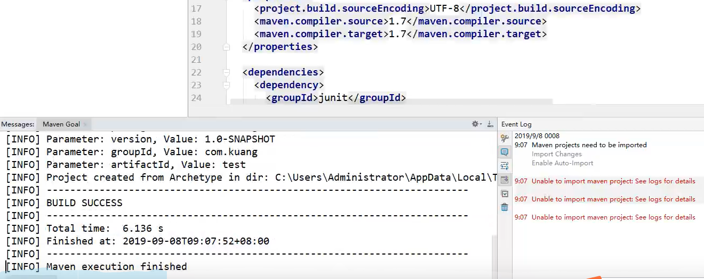
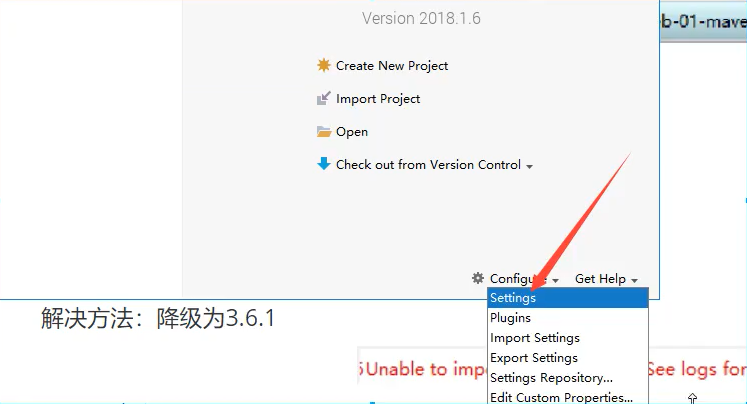
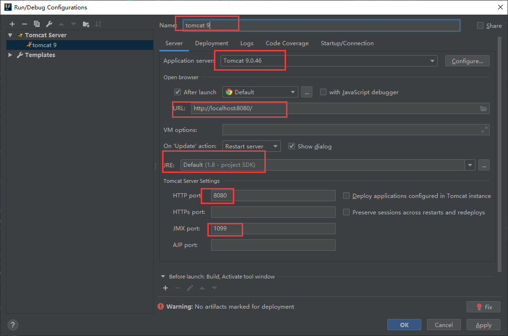
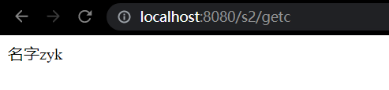
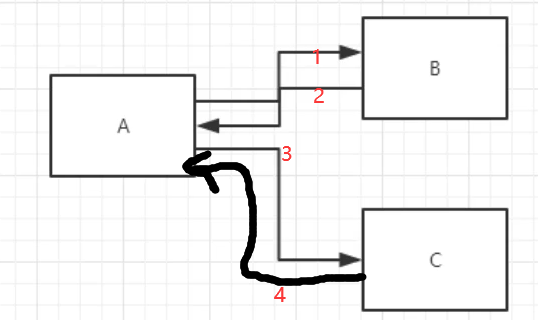
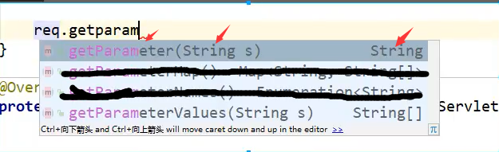
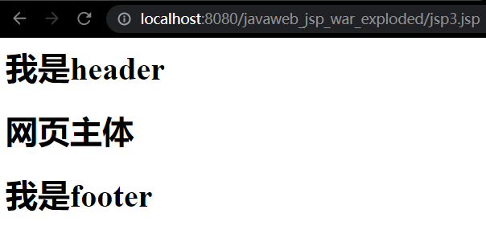
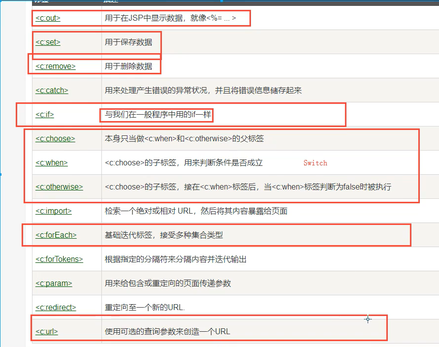
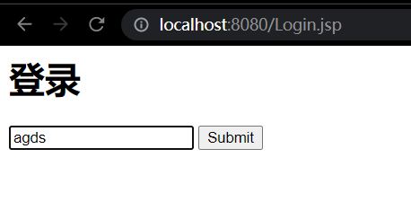
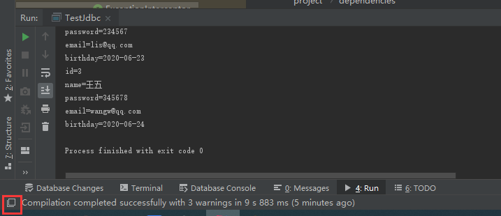

大佬教笔试表演：牛客面筋-》思考一下，写个框架慢慢完善，故意错一下

# web基本概念

## 1, 基本概念

### 1.1, 前言

web开发：

- web，网页的意思，www.baidu.com
- 静态web
  - html，css
  - 提供给所有人看的数据数据始终不会变化

- 动态web
  - 淘宝，几乎所有的网站
  - 提供给所有人看的数据始终会变化，每个人在不同时间，不同的地点看到的信息不同
  - 技术栈： servlet/jsp,asp,php

在java中动态web资源开发的技术统称为javaweb；

### 1.2, web应用程序

web应用程序：可以提供浏览器访问的程序；

- a.html,b.html, ,,,,,,,多个web资源，这些web资源可以被外界访问，对外界提供服务

- 人能访问的任何一个页面或资源，都存在于这个世界的某个角落的计算机上
- url 可以标记资源
- 这些统一的web资源可以被放在同一文件夹下，web应用程序--》tomcat：服务器
- 一个web应用由多个部分组成
  - html。css，js
  - jsp，servlet
  - java程序
  - jar包
  - 配置文件（properties）

web应用程序编写完成后，若想提供给外界访问：需要一个服务器来统一管理

### 1.3，静态web

- *.htm,#.html 这些都是网页的后缀，如果服务器上一直存在这些东西，我们就可以直接进行读取，通络。

  思维导图：

  https://www.processon.com/view/link/60c091441efad42c659bf4a1


- 静态web的缺点
  - web页面无法动态更新，所有用户看到的是同一个页面
    - 伪动态：轮播图，点击特效
    - javascripts（实际开发中他用的最多）
    - VBScripts
  - 它无法和数据库交互（数据无法持久化，用户无法交互）

### 1.4，动态web

页面会动态展示：web的页面展示效果因人而异

.jpg)

缺点：

- 假如服务器的动态web资源出现错误，我们需要重新编写我们的**后台程序**

优点：

- web页面可以动态更新，所有用户看到的是同一个页面
- 它可以和数据库交互

.jpg)

## 2, web服务器

### 2.1，技术讲解

ASP:

- 微软做的：国内最早流行的就是ASP；
- 在HTML中嵌入VB的脚本，ASP+COM；

- 在ASP开发中，基本一个页面都有几千行的业务代码，页面极其混乱
- 维护成本高
- 主要用C#
- IIS

PHP:

- PHP开发速度很快，跨平台，代码简单
- 无法承载大访问量的情况（局限性）

JSP/Servlet:

B/S架构：浏览器和服务器

C/S架构：客户端和服务器

- sun公司主推的B/S架构
- 基于java语言的（所有大公司包括一些开源的组件，都是java写的）
- 可以承载三高问题带来的影响；
- 语法像ASP，方便开发人员学习，加强市场强度

### 2.2， web服务器

服务器是一种被动的操作，用来处理用户的一些请求和给用户一些响应信息；

**IIS**

微软的；ASP，windows自带的

**Tomcat**

百度百科提取以下有效信息：

Tomcat是Apache 软件基金会（Apache Software Foundation）的Jakarta 项目中的一个核心项目，最新的Servlet 和JSP 规范总是能在Tomcat 中得到体现。因为Tomcat 技术先进、性能稳定，而且免费，因而深受Java 爱好者的喜爱并得到了部分软件开发商的认可，成为目前比较流行的Web 应用服务器。

Tomcat 服务器是一个免费的开放源代码的Web 应用服务器，属于轻量级应用[服务器](https://baike.baidu.com/item/服务器)，在中小型系统和并发访问用户不是很多的场合下被普遍使用，是开发和调试JSP 程序的首选。对于一个java初学web者来说，他是最佳的选择

Tomcat 实际上运行JSP 页面和Servlet。目前Tomcat最新版本为10.0.5**。**

。。。

工作3-5年后，可以尝试手写Tomcat服务器；

下载tomcat：

1. 安装or解压
2. 了解配置文件及目录结构
3. 这个东西的作用

## 3, Tomcat

### 3.1， 安装tomcat

tomcat官网：https://tomcat.apache.org/


直接解压

### 3.2， Tomcat启动和配置

文件夹的作用


启动，关闭tomcat


访问测试：http://localhost:8080/

可能遇到的位置

1. java环境变量没有配置
2. 闪退问题：需要配置兼容性
   - 虽然闪退，但是系统报一个javase的提示我同意后，测试localhost也能显示tomcat的网页
   - 弹幕有人说闪退是因为jre没有配置好
3. 乱码问题：配置文件中设置

### 3.3，配置


可以配置启动的端口号

- tomcat默认端口号：8080
- mysql：3306
- http:80
- https：443

```xml
    <Connector port="8080" protocol="HTTP/1.1"
               connectionTimeout="20000"
               redirectPort="8443" />
```

可以配置主机名称

- 默认的主机名为：localhost->127.0.0.1（这个localhost和127.0.0.1的映射关系可以在c/windows/system32/drivers/etc下的host配置文件中修改）
- 默认网站存放的位置：webapps

```xml
      <Host name="localhost"  appBase="webapps"
            unpackWARs="true" autoDeploy="true">
```

可以配置一下环境变量（可选）

- 这样可以随时启动


**高难度面试题**（超高频）

谈谈网站是如何访问的？

1. 输入域名，回车

2. 检查本机的c/windows/system32/drivers/etc下的host配置文件下有没有这个域名映射；

   1. 有：直接返回对应的ip地址，在这个地址中，有我们需要访问的web程序，所以可以直接访问

      ```
      127.0.0.1   localhost
      ```

   2. 没有：去dns服务器找，找得到的话就返回，找不到的话就返回找不到

      

### 3.4，发布一个web网站

不会就先模仿

- 将自己写的网站，放到服务器（tomcat）中指定的wb应用的文件夹（webapps）下，就可以访问了

网站应该有的结构

```
--webapps：tomcat服务器的web目录
	-root
	-shuangshenstudy：自己网站的目录名
        -web-inf
            -classes：java程序
            -lib：web应用所依赖的jar包
            -web.xml:网站配置文件
        -index.html:默认的首页
        -static
        	-css
        		-style.css
            -js
            img
        -...
```

## 4, HTTP

### 4.1, 什么是HTTP

http（超文本传输协议）是一个简单的请求-相应协议，他通常运行在TCP之上。

- 文本：html，字符串，~。。。
- 超文本：图片，音乐，视频，定位，地图。。
- 端口80

https：安全的

- 端口443

### 4.2，两个时代

- http1.0
  - http/1.0：客户端可以和web服务器连接后，只能获得一个web资源，断开连接
- http2.0
  - http/1.1：客户端可以和web服务器连接后，可以获得多个web资源

### 4.3， Http请求

- 客户端-发请求（request）-服务器

百度：

```java
Request URL: https://www.baidu.com/   //请求地址
Request Method: GET   //get方法/post方法
Status Code: 200 OK    //状态码：200
Remote Address: 14.215.177.39:443   //百度地址,且443为https端口号
```

```java
Accept:text/html
Accept-Encoding: gzip, deflate, br
Accept-Language: en,zh-CN;q=0.9,zh;q=0.8    语言
Cache-Control: max-age=0
Connection: keep-alive
```


1. 请求行
   - 请求行中的请求方式：GET
   - 请求方式总共有：Get，Post，Head，Delete，Put，Tract
     - Get：请求能够携带的参数少，大小有限制，会在浏览器的URL地址栏显示数据内容，不安全，但高效
     - Post：请求能够携带的参数没有限制，大小没有限制，不会在浏览器的URL地址栏显示数据内容，安全，但不高效

2. 消息头

   ```java
   Accept:高速浏览器，它所支持的数据类型
   Accept-Encoding: 支持哪种编码格式 GBK UTF-8 GB2312..
   Accept-Language: 高速浏览器，他的语言环境
   Cache-Control: 缓存控制
   Connection: 告诉浏览器，请求完成时断开还是保持连接
   host：主机..../.
   ```

   


---

*如何看这些http消息：*

*f12进入编辑器模式-》网站处输入baidu.com回车-》name-》network-》headers*


---


### 4.4，Http响应

- 服务器-相应-客户端

百度：

```java
Cache-Control: private   //缓存控制
Connection: keep-alive    //连接
Content-Encoding: gzip
Content-Type: text/html;charset=utf-8
```

1. 响应体（和http请求的消息头基本一致）

   ```java
   Accept:高速浏览器，它所支持的数据类型
   Accept-Encoding: 支持哪种编码格式 GBK UTF-8 GB2312..
   Accept-Language: 高速浏览器，他的语言环境
   Cache-Control: 缓存控制
   Connection: 告诉浏览器，请求完成时断开还是保持连接
   host：主机..../.
   reflush：告诉客户端，多久刷新一次
   Location：让网页重新定位；
   ```

2. 响应状态码（**必须掌握**）

   200：请求响应成功

   3**：请求重定向

   - 重定向：你重新到我给你的新位置去

   4**：资源不存在

   - 比如网站输入“www.baidu.com/12345.html”

   5**: 服务器代码错误      500     502：网关错误


常见面试题：

当你的浏览器总地址栏输入地址并回车的一瞬间到页面上能展示出来，经历了什么？


## 5, maven

为什么要学这个技术

1. 在javaweb中要使用大量jar包，我们手动导入；

2. 如果能够让一个东西自动帮我导入和配置这个jar包

   由此maven诞生了


### 5.1，maven项目架构管理工具

我们目前用来就是方便导jar包的！

Maven核心思想：**约定大于配置**

- 有约束不要去违反

Maven会规定好你该如何去编写我们的java代码，必须按照这个规范来；


### 5.2，下载安装maven

官网：http://maven.apache.org/


下载完成后，解压即可；

 

### 5.3，环境变量配置

在系统环境变量中

配置如下配置：

- M2_HOME maven目录下的bin目录
- MAVEN_HOME maven的目录
- 在系统的path中配置 %MAVEN_HOME%\bin

配置完毕后，cmd-》mvn -version 如果能正确显示版本，就体现maven安装完成


### 5.4，阿里云镜像

- 镜像：mirrors

  - 作用：加速我们的下载

- 国内用阿里云的镜像快

  把如下代码（百度搜“阿里云maven”可得）黏贴到conf/settings.xml 的\<mirrors>中

```html
    <mirror>
        <id>aliyunmaven</id>
        <mirrorOf>central</mirrorOf>
        <name>aliyun maven</name>
        <url>https://maven.aliyun.com/repository/public </url>
    </mirror>
```

### 5.5，本地仓库

在本地的仓库，远程仓库；

**建立个本地仓库**：conf/settings.html 的localRepository标签

```html
<localRepository>D:\software\maven\apache-maven-3.8.1-bin\apache-maven-3.8.1\maven-repo</localRepository>
```


### 5.6，在idea中使用maven

1. 启动idea，创建一个MavenWeb项目

   

   


2. 等待项目初始化完毕
   - 我新安装的maven报错"Unable to import maven project: See logs for details"可以参考这个[网址](https://blog.csdn.net/zz18435842675/article/details/102662527/)


​		pom.xml中红色的部分是导入失败，把scope test去了，然后maven会重新自动下载，这下一般能下载成功。如果还是不行，那就尝试修改版本号，比如把4.11改成4.12


​		log提示侦测到web，可以configure-》ok

​		

3. 观察maven仓库中多了什么

   下载下来了很多文件夹（其中就是我们需要的jar包）

   

4. idea中的maven设置

    注意：idea项目创建成功后，看一眼maven设置

   

5. 到这里maven在idea中的配置和使用就ok了

### 5.7， 创建普通的maven项目


记住这里的main java resource的结构和文件夹功能，一会参考这个干净的项目去自己配置带架构的项目（5.6中的）


**回到5.6中架构版的maven**

webapp文件夹下的结构等于学tomcat时介绍的web项目，这个只有在web应用下才会有


现在模仿5.7（干净的项目）把5.6带架构的maven项目补充完整

1. src下新建java和resource文件夹

   

   发现直接右键java文件夹，new，没办法新建class，而且java文件夹不是蓝色的，所以要进一步处理文件夹属性（标记文件夹的功能）


### 5.8，idea中标记文件夹的功能


把java文件夹标记为source root，把resouces文件夹标记为 resources root

- 标记完成后，发现java文件夹变蓝，右键后new 可以新建class了。resources文件夹也是类似


还有另一种标记文件夹的方式，即在project sturcture里配置，效果一样的


这一界面还能设置java文件 编译后的class文件的相关文件夹


### 5.9，在idea中配置tomcat


这里第一步是点击“+”号


解决警告问题

必须要的配置：**为什么会有这个问题：我们访问一个网站，需要指定一个文件夹名字；**


**这里如果选择war exploded后面可以实现热部署**


apply后，可以看到tomcat选项出现了，点绿色三角形进行运行即可


tomcat运行成功后出现下面网页


### 5.10，pom文件

pom.xml是maven的核心配置文件


```xml
<?xml version="1.0" encoding="UTF-8"?>

<project xmlns="http://maven.apache.org/POM/4.0.0" xmlns:xsi="http://www.w3.org/2001/XMLSchema-instance"
  xsi:schemaLocation="http://maven.apache.org/POM/4.0.0 http://maven.apache.org/xsd/maven-4.0.0.xsd">
  <modelVersion>4.0.0</modelVersion>

  <!-- 这里就是我们之前配置的GAV-->
  <groupId>com.zhangyk</groupId>
  <artifactId>javaweb-01-maven</artifactId>
  <version>1.0-SNAPSHOT</version>
  <!--项目的打包方式-->
  <packaging>war</packaging>

  <name>javaweb-01-maven Maven Webapp</name>
  <!-- FIXME change it to the project's website -->
  <url>http://www.example.com</url>

  <!--配置-->
  <properties>
    <!--项目的默认构建编码-->
    <project.build.sourceEncoding>UTF-8</project.build.sourceEncoding>
    <!--编译版本-->
    <maven.compiler.source>1.7</maven.compiler.source>
    <maven.compiler.target>1.7</maven.compiler.target>
  </properties>

  <!--项目依赖-->
  <dependencies>
    <dependency>
      <groupId>junit</groupId>
      <artifactId>junit</artifactId>
      <version>4.11</version>
    </dependency>
  </dependencies>

  <!--项目构建用的东西-->
  <build>
    <finalName>javaweb-01-maven</finalName>
    <pluginManagement><!-- lock down plugins versions to avoid using Maven defaults (may be moved to parent pom) -->
      <plugins>
        <plugin>
          <artifactId>maven-clean-plugin</artifactId>
          <version>3.1.0</version>
        </plugin>
        <!-- see http://maven.apache.org/ref/current/maven-core/default-bindings.html#Plugin_bindings_for_war_packaging -->
        <plugin>
          <artifactId>maven-resources-plugin</artifactId>
          <version>3.0.2</version>
        </plugin>
        <plugin>
          <artifactId>maven-compiler-plugin</artifactId>
          <version>3.8.0</version>
        </plugin>
        <plugin>
          <artifactId>maven-surefire-plugin</artifactId>
          <version>2.22.1</version>
        </plugin>
        <plugin>
          <artifactId>maven-war-plugin</artifactId>
          <version>3.2.2</version>
        </plugin>
        <plugin>
          <artifactId>maven-install-plugin</artifactId>
          <version>2.5.2</version>
        </plugin>
        <plugin>
          <artifactId>maven-deploy-plugin</artifactId>
          <version>2.8.2</version>
        </plugin>
      </plugins>
    </pluginManagement>
  </build>
</project>

```


maven由于约定大于配置，我们之后可能遇到我们写的配置文件，无法被导出或者生效的问题，解决方案：

在build中配置resources，来防止我们资源导出失败的问题（比如java文件夹中本来只能写java，如果写了一个a.xml是无法导出的，需要在用includes标签来让filter不去过滤xml）

```xml
<build>
      <resources>
        <resource>
            <directory>src/main/resources</directory>
            <includes>
                <include>**/*.properties</include>
                <include>**/*.xml</include>
             </includes>
            <filtering>true</filtering>
        </resource>
        <resource>
            <directory>src/main/java</directory>
            <includes>
                <include>**/*.properties</include>
                <include>**/*.xml</include>
            </includes>
            <filtering>true</filtering>
        </resource>
    </resources>
</build>
```


### 5.12，生成目录树


### 5.13, 解决昨天遇到的问题

1. Maven 3.6.2 时无法导入

   

   

   虽然message中也生成，但其实生成的是有问题的

   解决方法：降级为3.6.1

   - idea查看日志：help-》show log in explorer-》滑到最下面（最新）

     没有发现问题的明显解决方案-》换一个版本的maven，成了

   - 还maven时
     - maven下文件夹建本地仓库，settings.xml配置本地仓库，阿里云镜像
     - 环境变量

   最后结果：

   

2. Tomcat闪退

   tomcat的bin/startup.bat中可以看到

   

   如果jrehome和javahome都没设置的话，就会闪退，但是强神推荐这个闪退不用修复。因为一些修复可能导致idea里用不了这个tomcat

3. idea中每次都要重复配置maven

   在idea中的全局默认配置中去配置，默认配置肯定不能进项目（双击idea后，在他加载默认项目时，取消该加载），进了项目就成项目配置了

   

   

4. maven项目中tomcat无法配置

   在maven版本合适的情况下，记得处理tomcat配置时，报错的“no artifact marked”即可

   处理方式：点击fix，创建一个artifact

5. maven默认web项目中的web.xml版本问题


因为我们运行的网站是部署在tomcat上，而tomcat有自己的 webapps/root/web-inf中的web.xml。其内容和tomcat版本是最兼容的

所以替换为webapp4.0(上图)版本和tomcat一致。*以下代码删掉了描述代码使更干净*

```xml
<?xml version="1.0" encoding="UTF-8"?>

<web-app xmlns="http://xmlns.jcp.org/xml/ns/javaee"
         xmlns:xsi="http://www.w3.org/2001/XMLSchema-instance"
         xsi:schemaLocation="http://xmlns.jcp.org/xml/ns/javaee
                      http://xmlns.jcp.org/xml/ns/javaee/web-app_4_0.xsd"
         version="4.0"
         metadata-complete="true">

</web-app>
```


6. idea启动or直接启动tomcat效果不同

如果在tomcat的bin文件夹下的startup启动tomcat，输入loaclhost:8080可以正确访问网页


但是如果是在idea中启动tomcat，则是弹出一个网页，而此时访问localhost:8080会失败


这是正常现象。这是因为idea中tomcat指定访问的artifact在javaweb01maven06_war中，其对应内容在下面文件夹。不再是tomcat默认的webapp/root下的网页了


不过两种tomcat启动方式下，localhost:8080代表的根文件目录都为tomcat/webapps


7. maven仓库的使用

以学习servlet开始

启动tomcat，同时看到tomcat的webapp下有example目录-》访问localhost:8080/examples-》点击servlet


->看用servlet实现helloworld的源代码来学习（源代码是最好的代码）


在idea的java文件夹目录下尝试模仿，但是httpservlet没有被导入。光标放在httpservlet上，尝试alt+回车，也没找到可用的maven依赖


所以百度搜索maven repository，尝试下载官方jar包手动导入，但是也搜不到


但是一想tomcat能启动，那么tomcat里面肯定有jar包，于是进tomcat的lib进行模糊搜索servelt。尝试在官方reposotory搜索该jar包


搜索到很多匹配的，但是一般用的人最多的是最好的


从使用人数较多的版本里，选一个最新的（大不了再降级）


再点进去就可以看到maven了


导入成功


idea提示可以alt+enter导入jar包，导入后，httpservlet不报红了


右键屏幕-》overide-》添加dopost和doget（前端里要求必须学的）（按住control可以多选）


改写doget和dopost的代码，使在dopost里调doget，这样无论使用的是doget还是dopost最后用的都是doget，这样我们把需要执行的代码放进doget中就可以


把tomcat examples 的helloword代码拿来放进doget,同时改良把该文件放到一个包里


字节流和字符流的[相关知识](https://www.zhihu.com/question/39262026)

同时去webapp/web-inf/web.xml配置一些servlet的核心要素:

在mapping中配置了请求路径后，启动tomcat弹出的页面后，在网址后加上该路径，再回车，就会访问servletclass对应的servlet类，而该servlet类（如上图的helloservlet.java）中会以java的形式定义一个html页面


配置代码如下

```xml
    <!--web.xml中是配置我们web的核心应用-->
    <!--注册servlet-->
    <servlet>
        <servlet-name>helloServlet</servlet-name>
        <servlet-class>com.zhangyk.servlet.HelloServlet</servlet-class>
    </servlet>

    <!--一个servlet对应一个mapping：映射，不然servletname会报错-->
    <servlet-mapping>
        <servlet-name>helloServlet</servlet-name>
        <!--请求路径-->
        <url-pattern>/examples</url-pattern>
    </servlet-mapping>
```

启动tomcat，弹出页面的网址末尾加上examples,得到如下效果


这个页面的效果即HelloServlet.java定义的，查看网页的network的响应可以证实：


---

上面servelet是配置另外访问动态资源，下面试着让项目另外访问一个静态资源

tomcat默认访问的是webapp/index.jsp,我们可以在index.jsp的同级目录新建一个header.html，测试一下不用默认页面的效果


指定了访问文件时，输出如下


上面静态访问header.xml和动态访问servlet（HelloServlet.java）可以用下图解释


8. 学习路线

全栈学习路线和时间分配，和狂神的官网的学习路线差不多，就是这个图标了学习时间


## 6，Servlet

### 6.1，Servlet简介

- servlet是sun公司开发动态web的一门技术
- sun公司在这些api中提供了一个接口叫做：servlet，如果你想开发一个servlet程序，只需要完成两个小步骤
  - 编写一个类实现servlet接口
  - 把开发好的java类部署到web服务器中

**把实现了servlet接口的java程序叫做，servlet**


### 6.2，HelloServlet

**Servlet接口在sun公司有两个默认的实现类：HttpServlet，GenericServlet**


在5.13中的7.已经学过了，换种方式在总结下。

1. 构建一个普通的maven项目，删掉里面的src目录，以后我们的学习就在这个项目里面建立module（相当于子项目，避免idea一次只能展示一个项目的尴尬之处）（而且不用每次创建项目都导入依赖）；这个空的工程就是maven的主工程；主工程中尽量先把需要的依赖都导入进去
   - pom是maven的核心配置文件不能删，iml文件是idea的识别文件不能删，idea文件夹是idea的配置文件不能删
   - src可以删


网上搜索“maven servlet4.0.1 jsp的依赖”，搜到两个两个依赖导入，其中version爆红要解决下：

这是因为老师把artifact的id错误修改了，直接按照maven官方提供的

```xml
<!-- https://mvnrepository.com/artifact/javax.servlet.jsp/javax.servlet.jsp-api -->
<dependency>
    <groupId>javax.servlet.jsp</groupId>
    <artifactId>javax.servlet.jsp-api</artifactId>
    <version>2.3.3</version>
    <scope>provided</scope>
</dependency>

```

就可以下载


在已有项目的目录上右键-》新建module


可以到在已有项目基础上建module会体现parent（这就是maven父子工程）


2. 关于maven父子工程的理解

   在父项目pom中会有：

   ```xml
       <modules>
           <module>servlet-01</module>
       </modules>
   ```

   子项目pom中会有：

   ```xml
   <parent>
           <artifactId>javaweb-02-servlet</artifactId>
           <groupId>com.zhangyk</groupId>
           <version>1.0-SNAPSHOT</version>
       </parent>
   ```

   父项目中的java程序子项目可以直接使用，子项目中的java程序父项目不能使用，类似java中的继承：

   ```java
   son extends parents
   ```

   以后我们都不用管父项目，只针对每个子项目进行工作

3. Maven环境优化

   1. 修改web.xml为最新的

      把web-inf中web.xml(web配置文件)换成最新的，最新代码来源在tomcat/webapps/root/web-inf/web.xml

      

   2. 将maven的结构搭建完整

      main文件夹下建java文件夹和resources文件夹，并设置好文件夹属性

   

4. 编写一个servlet程序

   1. 编写一个普通类

   2. 实现servlet接口,这里我们直接继承HttpServlet

      在extends HttpServlet的时候，alt+enter就可以自动improt jar包，那是因为父pom中已经通过maven依赖把需要的jar包下载下来了，子项目也能用

      右键屏幕》generate-》override method-》选中dopost和doget（这两最常用）。因为get和post只是请求实现的不同方式，可以相互调用，业务逻辑一致

      字符流(getWriter)和字节流(getOutputStream)区别[链接](https://blog.csdn.net/qq_42750329/article/details/89552805)

      ```java
      public class HelloServlet extends HttpServlet {
      
          @Override
          protected void doGet(HttpServletRequest req, HttpServletResponse resp) throws ServletException, IOException {
              //ServletOutputStream outputStream = resp.getOutputStream();
              PrintWriter writer = resp.getWriter(); //响应流
              writer.print("hello,servlet");
          }
      
          @Override
          protected void doPost(HttpServletRequest req, HttpServletResponse resp) throws ServletException, IOException {
              doGet(req, resp);
          }
      }
      ```

      

5. 编写servlet的映射

   - 为什么需要映射：我们写的是java程序，但是要通过浏览器访问，但是浏览器需要链接web服务器，所以我们需要在web服务中注册我们写的servlet，还需要给他一个浏览器能访问的路径；

   - servlet映射属于web核心配置，在webapp/web-inf/web.xml中可以看

   - **注意 url-pattern标签属于访问路径，必须加上反斜号**，如果没反斜号，启动tomcat的时候会报错“java.lang.IllegalStateException:  at org.apache.catalina.core.ContainerBase.addChildInternal(ContainerBase.java:720)”

   ```xml
       <!--注册servlet-->
       <servlet>
           <servlet-name>hello</servlet-name>
           <servlet-class>com.zhangyk.servlet.HelloServlet</servlet-class>
       </servlet>
       <!--Servlet请求路径-->
       <servlet-mapping>
           <servlet-name>hello</servlet-name>
           <url-pattern>/hellozyk</url-pattern>
       </servlet-mapping>
   ```

   

6. 配置tomcat

   

   

   

   

   

   配置server

   

   配置deployment(也就是设置artifacts)

   

   

   请求s1才能进tomcat的webapp目录下（不指定文件的话默认访问index.jsp）

   tomcat的webapp对应网址末尾再加上web.xml中配置的url-pattern则可以访问自己定义的servlet页面

   

   

7. 启动测试

   

   tomcat启动成功后自动出现如下页面，/s1表示tomcat的webapp目录访问了默认的index.jsp,这是在设置tomcat的artifact中配置的

   

   在网址末尾加上“hellozyk”出现如下页面，“hellozyk”是在子module的webapps/web-inf的web.xml的\<url-pattern>中配置的

   

   ps：通过下面圆形按钮可以找到光标所在文件的目录位置

   


### 6.3，Servlet原理

Servlet是由web容器（即tomcat）调用，web容器在收到浏览器请求后，会有如下流程：

*首次访问那一支先不管，把总体思路先掌握*


### 6.4，Mapping问题

1. 一个servlet可以指定一个映射路径：

   ```xml
    <!--注册servlet-->
       <servlet>
           <servlet-name>hello</servlet-name>
           <servlet-class>com.zhangyk.servlet.HelloServlet</servlet-class>
       </servlet>
       <!--Servlet请求路径-->
       <servlet-mapping>
           <servlet-name>hello</servlet-name>
           <url-pattern>/hellozyk</url-pattern>
       </servlet-mapping>
   ```

   

2. 一个servlet可以指定多个映射路径:

   ```xml
   <!--注册servlet-->
       <servlet>
           <servlet-name>hello</servlet-name>
           <servlet-class>com.zhangyk.servlet.HelloServlet</servlet-class>
       </servlet>
       <!--Servlet请求路径-->
       <servlet-mapping>
           <servlet-name>hello</servlet-name>
           <url-pattern>/hellozyk</url-pattern>
       </servlet-mapping>
       <servlet-mapping>
           <servlet-name>hello</servlet-name>
           <url-pattern>/hellozyk1</url-pattern>
       </servlet-mapping>
       <servlet-mapping>
           <servlet-name>hello</servlet-name>
           <url-pattern>/hellozyk2</url-pattern>
       </servlet-mapping>
   ```

   

3. 一个servlet可以指定通用映射路径: 

   ```xml
       <!--注册servlet-->
       <servlet>
           <servlet-name>hello</servlet-name>
           <servlet-class>com.zhangyk.servlet.HelloServlet</servlet-class>
       </servlet>
       <!--Servlet请求路径-->
       <servlet-mapping>
           <servlet-name>hello</servlet-name>
           <url-pattern>/hellozyk/*</url-pattern>
       </servlet-mapping>
   ```

   

   

4. 默认请求路径
   ```xml
	<!--注册servlet-->
	<servlet>
	    <servlet-name>hello</servlet-name>
	    <servlet-class>com.zhangyk.servlet.HelloServlet</servlet-class>
	</servlet>
	<!--Servlet请求路径-->
	<servlet-mapping>
	    <servlet-name>hello</servlet-name>
	    <url-pattern>/*</url-pattern>
	</servlet-mapping>
	
	```


servlet路径用通配符/*，访问直接用 8080/s1/ ，没有进原先webapps下默认的index.jsp文件，而是进了servlet。所以尽量别这么写。


5. 指定一些后缀或前缀等

   **注意：配置时，*前面不能加映射路径**（比如\<url-pattern>/hellozyk/*.do\</url-pattern>）会报错。而且\<url-pattern\>/hellozyk/\*.do\</url-pattern>配置后，访问/hellozyk/123abc.do 也能进入servlet

   ```xml
   <!--注册servlet-->
       <servlet>
           <servlet-name>hello</servlet-name>
           <servlet-class>com.zhangyk.servlet.HelloServlet</servlet-class>
       </servlet>
       <!--Servlet请求路径-->
       <servlet-mapping>
           <servlet-name>hello</servlet-name>
           <url-pattern>*.do</url-pattern>
       </servlet-mapping>
   ```

   项目启动后进入webapp下的默认网页

   

   加上指定后缀后访问，进入servlet

   


6. 优先级问题

   指定了固有的映射路径优先级最高，如果找不到就会走默认的处理请求；

   显式的指定总比隐式的指定优先级更高

   ```xml
       <!--注册servlet-->
   	<servlet>
           <servlet-name>error</servlet-name>
           <servlet-class>com.zhangyk.servlet.ErrorServlet</servlet-class>
       </servlet>
       <!--Servlet请求路径-->
       <servlet-mapping>
           <servlet-name>error</servlet-name>
           <url-pattern>/*</url-pattern>
       </servlet-mapping>
   
   	<!--注册servlet-->
       <servlet>
           <servlet-name>hello</servlet-name>
           <servlet-class>com.zhangyk.servlet.HelloServlet</servlet-class>
       </servlet>
       <!--Servlet请求路径-->
       <servlet-mapping>
           <servlet-name>hello</servlet-name>
           <url-pattern>/hello</url-pattern>
       </servlet-mapping>
   ```

   - 如果访问HelloServlet的路径错误（404），那么正好对应ErrorServlet的统配路径，访问自己定义的ErrorServlet
   - 如果访问HelloServlet的路径证确，则直接进入HelloServlet


### 6.5，ServletContext对象


学习前的准备：

建立不同子module时发现很多东西可以复用，可以建一个md文件，这样每次直接去md中拷贝就行


新建第二个module时，把多余的deployment删掉。如果不把无关当前module的deployment删掉，打包的时候会把两个都打包，会比较慢


删除完后，建当前module对应的deployment


分析一个类可以用到左下角的功能


以下为正文

---

web容器在启动的时候，它会为每个web程序都创建一个对应的ServletContext对象，它代表了当前的web应用，所有servlet共用一个servletContext：


**1，共享数据**


*后话：我们后面会用session和cookie实现这个功能，并尽量少用servletContext共享数据*


我在这个Servlet中保存的数据，可以在另一个servlet中拿到。

先建一个放置信息的类

```java
public class HelloServlet extends HttpServlet {
    @Override
    protected void doGet(HttpServletRequest req, HttpServletResponse resp) throws ServletException, IOException {

        //this.getInitParameter();   //初始化参数
        //this.getServletConfig();    //servlet配置
        //this.getServletContext();    //servlet上下文
        ServletContext context = this.getServletContext();
        
        String username = "zyk";
        context.setAttribute("username",username);//将一个数据保存到servletcontext中，名字：“username”，值：username

    }
    
    @Override
    protected void doPost(HttpServletRequest req, HttpServletResponse resp) throws ServletException, IOException {
        doGet(req, resp);
    }
}
```

再建一个读取信息的类

```java
public class GetServlet extends HttpServlet {

    @Override
    protected void doGet(HttpServletRequest req, HttpServletResponse resp) throws ServletException, IOException {
        ServletContext context = this.getServletContext();
        String username = (String)context.getAttribute("username");

        //这两行不配置的话，页面中文会乱码
        resp.setContentType("text/html");
        resp.setCharacterEncoding("utf-8");
        
        resp.getWriter().print("名字"+username);
    }

    @Override
    protected void doPost(HttpServletRequest req, HttpServletResponse resp) throws ServletException, IOException {
        doGet(req, resp);
    }
}

```

再配置好web.xml

```xml
   <servlet>
        <servlet-name>hello</servlet-name>
        <servlet-class>com.zhangyk.servlet.HelloServlet</servlet-class>
    </servlet>
    <servlet-mapping>
        <servlet-name>hello</servlet-name>
        <url-pattern>/hello</url-pattern>
    </servlet-mapping>


    <servlet>
        <servlet-name>getc</servlet-name>
        <servlet-class>com.zhangyk.servlet.GetServlet</servlet-class>
    </servlet>
    <servlet-mapping>
        <servlet-name>getc</servlet-name>
        <url-pattern>/getc</url-pattern>
    </servlet-mapping>
```

测试访问结果：

先用hello存数据，页面没有任何值，username被存到公共的servletcontext中


再用getc取username的值




**2，获取初始化参数**


*后话：我们几乎不用这个功能*


1. 在web.xml中配置初始参数，参数以键值对的形式储存，存储位置为ServletContext

   ```xml
       <!--配置一些web应用初始化参数-->
       <context-param>
           <param-name>url</param-name>
           <param-value>jdbc:mysql://localhost:3306/mybatis</param-value>
       </context-param>
   ```

   

2. 新建servlet，从servletcontext中拿1.中存的参数

   ```java
   public class ServletPara extends HttpServlet {
   
       @Override
       protected void doGet(HttpServletRequest req, HttpServletResponse resp) throws ServletException, IOException {
           ServletContext context = this.getServletContext();
   
           String url = context.getInitParameter("url");
           resp.getWriter().print(url);
       }
   
       @Override
       protected void doPost(HttpServletRequest req, HttpServletResponse resp) throws ServletException, IOException {
           doGet(req, resp);
       }
   }
   ```

3. web.xml中配置servlet

   ```xml
       <servlet>
           <servlet-name>gp</servlet-name>
           <servlet-class>com.zhangyk.servlet.ServletPara</servlet-class>
       </servlet>
       <servlet-mapping>
           <servlet-name>gp</servlet-name>
           <url-pattern>/gp</url-pattern>
       </servlet-mapping>
   ```

4. 测试结果：

   存在ServletContext的url参数被展示了出来

   

**3， 请求转发**


*后话：用request去实现这个功能会更好*


如果A想请求c，但是不能一次直接请求，只能借助b，那么有转发和重定向两种方法。

转发和重定向的区别：

- 转发：A请求b，b再请求c。然后b把c的响应再响应给a
- 重定向：A请求b，b把c的地址响应给a，a用得到的c的地址再向c请求，c响应a


具体步骤如下

1. 建立一个实现servlet的java类

   ```java
   public class ServletDemo04 extends HttpServlet {
   
       @Override
       protected void doGet(HttpServletRequest req, HttpServletResponse resp) throws ServletException, IOException {
   
           System.out.println("进入了sd4");
   
           ServletContext context = this.getServletContext();
   
           // 转发的请求路径。/代表当前项目，gp代表请求gp servlet,
           //RequestDispatcher requestDispatcher = context.getRequestDispatcher("/gp");
           //调用forward实现请求转发。forward参数的原理：因为都是从req接收请求处理，从resp响应回去，requestDispatcher.forward只是做了个转发的作用
           //requestDispatcher.forward(req, resp);
           //上面两句话可以合并成一句，如下
           context.getRequestDispatcher("/gp").forward(req, resp);
       }
   
       @Override
       protected void doPost(HttpServletRequest req, HttpServletResponse resp) throws ServletException, IOException {
           doGet(req, resp);
       }
   }
   ```

2. 在web.xml中登记该servlet

   ```xml
       <servlet>
           <servlet-name>sd4</servlet-name>
           <servlet-class>com.zhangyk.servlet.ServletDemo04</servlet-class>
       </servlet>
       <servlet-mapping>
           <servlet-name>sd4</servlet-name>
           <url-pattern>/sd4</url-pattern>
       </servlet-mapping>
   ```

3. 访问测试

   访问的是sd4对应的servlet，但是显示的页面是gp对应的servlet的页面，请求转发成功


**4，读取资源文件**


*后话：我们用 “类加载”，“反射” 去实现该功能会更好*


Properties类

- 在java目录下新建properties
- 在resources目录下新建properties

发现：都被maven打包到同一个路径下：target/../classes，我们俗称这个路径为classpath；**classpath的根目录位于target/xxSnapshot**

思路：需要一个文件流；


具体步骤如下：

1. 在resources中建立我们需要的资源文件

   ```properties
   username=zyk
   password=123456
   ```


2. 建立一个处理流的servlet

   ```java
   public class ServletDemo05 extends HttpServlet {
   
       @Override
       protected void doGet(HttpServletRequest req, HttpServletResponse resp) throws ServletException, IOException {
   
           //当前web项目在maven打包后位于：target/xxSnapshot
           InputStream is = this.getServletContext().getResourceAsStream("/WEB-INF/classes/db.properties");
   
           Properties prop = new Properties();
           prop.load(is);
           String user = prop.getProperty("username");
           String pwd = prop.getProperty("password");
   
           resp.getWriter().println("username:"+user);
           resp.getWriter().println("password:"+pwd);
       }
   
       @Override
       protected void doPost(HttpServletRequest req, HttpServletResponse resp) throws ServletException, IOException {
           doGet(req, resp);
       }
   }
   ```

3. web.xml中注册该servlet

   ```xml
       <servlet>
           <servlet-name>sd5</servlet-name>
           <servlet-class>com.zhangyk.servlet.ServletDemo05</servlet-class>
       </servlet>
       <servlet-mapping>
           <servlet-name>sd5</servlet-name>
           <url-pattern>/sd5</url-pattern>
       </servlet-mapping>
   
   ```

4. 测试

   properties文件中的数据被servlet中的流读取了出来，并相应给浏览器（显示到servlet对应的页面上）

   


### 6.6，HttpServletResponse

web服务器接收到客户端的http请求，针对这个请求，分别创建一个代表请求的HttpServletRequest对象，代表响应的一个HttpServletResponse

- 如果要获取客户端请求过来的参数：找HttpServletRequest
- 如果要给he护短响应一些信息：找HttpServletResponse

#### 1，简单分类

负责向浏览器发送数据的方法

```java
ServletOutputStream getOutputStream() throws IOException;//写平常流用它
PrintWriter getWriter() throws IOException;//写中文用它
```

负责向浏览器发送响应头的方法

```java
void setCharacterEncoding(String var1);

void setContentLength(int var1);

void setContentLengthLong(long var1);

void setContentType(String var1);

void setDateHeader(String var1, long var2);

void addDateHeader(String var1, long var2);

void setHeader(String var1, String var2);

void addHeader(String var1, String var2);

void setIntHeader(String var1, int var2);

void addIntHeader(String var1, int var2);
```

响应状态码

```java
//响应成功
int SC_OK = 200;   

//请求重定向
int SC_MULTIPLE_CHOICES = 300;
int SC_MOVED_PERMANENTLY = 301;
int SC_MOVED_TEMPORARILY = 302;
int SC_FOUND = 302;
int SC_SEE_OTHER = 303;
int SC_NOT_MODIFIED = 304;
int SC_USE_PROXY = 305;
int SC_TEMPORARY_REDIRECT = 307;

//找不到资源
int SC_BAD_REQUEST = 400;
int SC_UNAUTHORIZED = 401;
int SC_PAYMENT_REQUIRED = 402;
int SC_FORBIDDEN = 403;
int SC_NOT_FOUND = 404;      //资源不存在
int SC_METHOD_NOT_ALLOWED = 405;
int SC_NOT_ACCEPTABLE = 406;
int SC_PROXY_AUTHENTICATION_REQUIRED = 407;
int SC_REQUEST_TIMEOUT = 408;
int SC_CONFLICT = 409;
int SC_GONE = 410;
int SC_LENGTH_REQUIRED = 411;
int SC_PRECONDITION_FAILED = 412;
int SC_REQUEST_ENTITY_TOO_LARGE = 413;
int SC_REQUEST_URI_TOO_LONG = 414;
int SC_UNSUPPORTED_MEDIA_TYPE = 415;
int SC_REQUESTED_RANGE_NOT_SATISFIABLE = 416;
int SC_EXPECTATION_FAILED = 417;

//服务器代码错误
int SC_INTERNAL_SERVER_ERROR = 500;
int SC_NOT_IMPLEMENTED = 501;
int SC_BAD_GATEWAY = 502;               //网关错误
int SC_SERVICE_UNAVAILABLE = 503;
int SC_GATEWAY_TIMEOUT = 504;
int SC_HTTP_VERSION_NOT_SUPPORTED = 505;
```

#### 2, 常见应用

1. 向浏览器输出消息（一直在讲，就不说了）

2. 下载文件

   1. 要获取下载文件的路径
   2. 下载的文件名是啥
   3. 设置项办法让浏览器能够支持下载我们需要的东西
   4. 获取下载文件的输入流
   5. 创建缓冲区
   6. 获取OutputStream对象
   7. 将FileOutputStream流写入buffer缓冲区
   8. 使用OutputStream将缓冲区中的数据输出到客户端

   具体步骤如下：

   1. 新建servlet类，主要用到**io知识**，不记得就去补

      ```java
      public class FileServlet extends HttpServlet {
      
          @Override
          protected void doGet(HttpServletRequest req, HttpServletResponse resp) throws ServletException, IOException {
      //        1. 要获取下载文件的路径
      //        String realPath = this.getServletContext().getRealPath("/一二三.jpg");
              String realPath = "D:\\idea\\javaweb-02-servlet\\response\\target\\classes\\一二三.jpg";
              System.out.println("下载文件的路径："+ realPath);
      //        2. 下载的文件名是啥
              //很多大公司都是这么去找文件名，很巧妙。因为/后必定是文件名
              String fileName = realPath.substring(realPath.lastIndexOf("\\") + 1);
      //        3. 设置项办法让浏览器能够支持（Content-disposition）下载我们需要的东西(sethead的参数可以百度“web下载文件的头信息”).中文文件名用URLEncoder.encode编码，否则可能乱码
      //        resp.setHeader("Content-disposition","attachment;filename="+ fileName );
              resp.setHeader("Content-disposition","attachment;filename="+ URLEncoder.encode( fileName,"UTF-8") );
      //        4. 获取下载文件的输入流
              FileInputStream in = new FileInputStream(realPath);
      //        5. 创建缓冲区
              int len = 0;
              byte[] buffer = new byte[1024];  //一般都是取1024
      //        6. 获取OutputStream对象
              ServletOutputStream out = resp.getOutputStream();
      //        7. 将FileOutputStream流写入buffer缓冲区,使用OutputStream将缓冲区中的数据输出到客户端
              while((len = in.read(buffer))>0)
              {
                  out.write(buffer,0,len);
      
              }
      
              in.close();
              out.close();
      
          }
      
          @Override
          protected void doPost(HttpServletRequest req, HttpServletResponse resp) throws ServletException, IOException {
              doGet(req, resp);
          }
      }
      ```

      注意：windows中，文件夹分隔符为\, 网址分隔符为/不要弄混了

   2. 配置web.xml

      ```xml
        <servlet>
          <servlet-name>filedown</servlet-name>
          <servlet-class>com.zhangyk.servlet.FileServlet</servlet-class>
        </servlet>
        <servlet-mapping>
          <servlet-name>filedown</servlet-name>
          <url-pattern>/down</url-pattern>
        </servlet-mapping>
      
      ```

   3. 更新tomcat的artifact为当前module

   4. 启动tomcat，在弹出网页链接末尾输入 /down

      下载成功，结果如下

      


#### 3，验证码功能

验证怎么来的？

- 前端实现
- 后端实现，需要用到java图片类，生成一个图片

具体步骤如下

1. 编写生成验证码的servlet类：

   ```java
   public class ImageServlet extends HttpServlet {
   
       @Override
       protected void doGet(HttpServletRequest req, HttpServletResponse resp) throws ServletException, IOException {
           //如何让浏览器三秒自动刷新一次
           resp.setHeader("refresh","3");
   
           //在内存中创建一个图片,但是这是空白图片
           BufferedImage image = new BufferedImage(80, 20, BufferedImage.TYPE_INT_RGB);
           //得到图片,g相当于是一只笔
           Graphics2D g = (Graphics2D)image.getGraphics();
           //设计图片的背景颜色
           g.setColor(Color.white);
           g.fillRect(0,0,80,20);
           //给图片写数据
           //给画笔换个颜色，在之前的白色背景上写东西
           g.setColor(Color.blue);
           g.setFont(new Font(null,Font.BOLD,20));
           g.drawString(makeNum(),0,20);//绘制指定的文本字符串
   
           //告诉浏览器，这个请求用图片的方式打开
           resp.setContentType("image/jpeg");
           //网站存在缓存，不让浏览器缓存。以后我们写代码不用写这些，这都是老年化的操作
           resp.setDateHeader("expires",-1);
           resp.setHeader("Cache-Control","no-cache");
           resp.setHeader("Pragma","no-cache");
   
           //把图片写给浏览器
           ImageIO.write(image,"jpg",resp.getOutputStream());
   
       }
   
       @Override
       protected void doPost(HttpServletRequest req, HttpServletResponse resp) throws ServletException, IOException {
           doGet(req, resp);
       }
   
       //生成随机数
       private String makeNum()
       {
           Random random = new Random();
           String num = random.nextInt(9999999) + "";
           //string和stringbuffer区别：https://www.cnblogs.com/liumaowu/p/8554328.html
           StringBuffer sb = new StringBuffer();
   
           //随机数num不足7位的部分，在开头补0。老手这么保证7位
           for(int i=0;i<7-num.length();i++)
           {
               sb.append("0");
           }
           num = sb.toString()+ num;
   
           return num;
       }
   }
   ```

2. 在web.xml中登记servlet

   ```xml
     <servlet>
       <servlet-name>ImageServlet</servlet-name>
       <servlet-class>com.zhangyk.servlet.ImageServlet</servlet-class>
     </servlet>
     <servlet-mapping>
       <servlet-name>ImageServlet</servlet-name>
       <url-pattern>/img</url-pattern>
     </servlet-mapping>
   ```

3. 执行测试

   运行tomcat，在弹出网页链接的结尾输入 /img，出现图片页面。图片内容每3s更改一次

   


#### 4，实现重定向



一个web资源B受到客户端A请求后，他会通知客户端A去访问另外一个web资源C，这个过程叫重定向

常见场景：

- 用户登录

  ```java
  void sendRedirect(String var1) throws IOException;
  ```

实现方法：

1. 设置重定向的类

   ```java
   public class RedirectServlet extends HttpServlet {
   
       @Override
       protected void doGet(HttpServletRequest req, HttpServletResponse resp) throws ServletException, IOException {
   
           /*
           sendRedirect实现的功能可以用下面两步代替
           resp.setHeader("Location","/r/img");
           resp.setStatus(302);
           */
           resp.sendRedirect("/r/img");
       }
   
       @Override
       protected void doPost(HttpServletRequest req, HttpServletResponse resp) throws ServletException, IOException {
           doGet(req, resp);
       }
   }
   ```

2. 在web.xml中配置servlet

   ```xml
     <servlet>
       <servlet-name>RedirectServlet</servlet-name>
       <servlet-class>com.zhangyk.servlet.RedirectServlet</servlet-class>
     </servlet>
     <servlet-mapping>
       <servlet-name>RedirectServlet</servlet-name>
       <url-pattern>/red</url-pattern>
     </servlet-mapping>
   ```

3. 测试

   启动tomcat，在弹出网页的链接的末尾输入/red，发现页面被重定向到 /img。按 F12 查看 /red 的response：状态码=302（重定向），响应头的location=/r/img（重定向的目标地址）

   

   看重定向到img后，img对应的响应，和直接访问img无区别

   


面试题：请你聊聊重定向和转发的区别？

相同点：

- 页面都会实现跳转

不同点：

- 请求转发的时候，url不会产生变化。重定向时，url会发生变化。


### 6.7，HttpServletRequest

初步实现项目来引入HttpServletRequest：

1. 新建处理request的servlet类

   该servlet类会在控制台打印从req收到的 username和password，并重定向到登录成功的jsp页面

   ```java
   public class RequestTest extends HttpServlet {
   
       @Override
       protected void doGet(HttpServletRequest req, HttpServletResponse resp) throws ServletException, IOException {
           //处理请求
           String username = req.getParameter("username");
           String password = req.getParameter("password");
           System.out.println("username:"+username+"    password:"+password);
   
           //重定向跳转到登录成功的页面。重定向一定要注意路径问题，否则404.
           resp.sendRedirect("/r/success.jsp");
       }
   
       @Override
       protected void doPost(HttpServletRequest req, HttpServletResponse resp) throws ServletException, IOException {
           doGet(req, resp);
       }
   }
   
   ```

2. 在web.xml中注册servlet

   ```xml
     <servlet>
       <servlet-name>request</servlet-name>
       <servlet-class>com.zhangyk.servlet.RequestTest</servlet-class>
     </servlet>
     <servlet-mapping>
       <servlet-name>request</servlet-name>
       <url-pattern>/login</url-pattern>
     </servlet-mapping>
   ```

   

3. 把webapp/index.jsp内容编写为登录页面

   这样tomcat一启动，输入账号密码后，就会重定向到指定servlet(/login)

   ```xml
   <html>
   <body>
   <h2>Hello World!</h2>
   
   <%--这里提交的路径，需要寻找到项目的路径--%>
   <%--${pageContext.request.contextPath}代表当前的项目--%>
   <form action="${pageContext.request.contextPath}/login" method="get">
       用户名：<input type="text" name="username"> </br>
       密码：<input type="password" name="password"> </br>
       <input type="submit">
   </form>
   
   
   </body>
   </html>
   ```

4. 编写成功登录的jsp页面

   ```jsp
   <%@ page contentType="text/html;charset=UTF-8" language="java" %>
   <html>
   <head>
       <title>success</title>
   </head>
   <body>
   <h1>Success</h1>
   </body>
   </html>
   ```

5. 测试

   执行tomcat弹出的默认界面，是我们编写的index.jsp

   

   随便输入用户名和密码后，点击submit。req被送到RequestTest的servlet，RequestTest在控制台打印账户密码后，把页面重定向到登录成功的页面（success.jsp）

   

   


具体讲解如下：

HttpServletRequest代表客户端的请求，用户通过http协议访问服务器，http请求中的所有信息会被封装到HttpServletRequest，通过这个HttpServletRequest的方法，获得客户端的所有信息。

通过req可以通过如下方法，获取各种客户端的信息。**这些req中的get方法和resp中的set方法完全对应**：


主要功能如下：

#### 获取前端传递的参数，并且 请求转发

重点掌握第一行和第四行两个方法，一个返回单个，一个返回多个



**tips**：

- 要用System.out.println() 打印username，可以：username.sout 然后idea弹出框，然后回车，就写成了：System.out.println(username);
- 要打出public static void main(String[] args) { }，可以打出psvm，回车，idea会自动生成main函数
- **用HttpServletResponse 重定向 需要加上项目名（如/r）,用HttpServletRequest 请求转发 不需要。**
  - [参考javaweb之请求的转发和重定向 - 考拉熊_12 - 博客园 (cnblogs.com)](https://www.cnblogs.com/naihuangbao/p/9795099.html)


实现方法如下：

1. 创建servlet

   ```java
   public class LoginServlet extends HttpServlet {
   
       @Override
       protected void doGet(HttpServletRequest req, HttpServletResponse resp) throws ServletException, IOException {
   
           //req负责接收前端东西，在接收之前设置好编码，就不会显示中文时乱码
           req.setCharacterEncoding("utf-8");
           //resp负责传输信息，避免发送的中文乱码
           resp.setCharacterEncoding("utf-8");
   
           String username = req.getParameter("username");
           String password = req.getParameter("password");
           String[] hobbys = req.getParameterValues("hobbys");
   
           System.out.println("======================");
           //中文乱码问题
           System.out.println(username);
           System.out.println(password);
           System.out.println(Arrays.toString(hobbys));
           System.out.println("======================");
   
           //通过请求转发
           /*这里的 / 代表当前的web应用，不需要加上当前项目目录（/r）:req.getRequestDispatcher(req.getContextPath()+"/success.jsp").forward(req,resp);
           * 加上反而会导致404。
           * 重定向需要加上项目名（如/r）,请求转发不需要*/
           req.getRequestDispatcher("/success.jsp").forward(req,resp);
       }
   
       @Override
       protected void doPost(HttpServletRequest req, HttpServletResponse resp) throws ServletException, IOException {
           doGet(req, resp);
       }
   }
   ```

2. web.xml中注册servlet

   ```xml
     <servlet>
       <servlet-name>LoginServlet</servlet-name>
       <servlet-class>com.zhangyk.servlet.LoginServlet</servlet-class>
     </servlet>
     <servlet-mapping>
       <servlet-name>LoginServlet</servlet-name>
       <url-pattern>/login</url-pattern>
     </servlet-mapping>
   ```

3. 改写webapp/index.jsp，使他为初始登录页面

   ```jsp
   <%@ page contentType="text/html;charset=UTF-8" language="java" %>
   <html>
   <head>
       <title>登录</title>
   </head>
   <body>
   
   <h1>登录</h1>
   
   <div style="text-align:center">
       <%--这里表单的意思：以post方式提交表单，提交到我们的login请求--%>
       <form action="${pageContext.request.contextPath}/login" method="post">
           用户名：<input type="username" name="username"> <br>
           密码：<input type="password" name="password"><br>
           爱好：
           <input type="checkbox" name="hobbys" value="女孩">女孩
           <input type="checkbox" name="hobbys" value="代码">代码
           <input type="checkbox" name="hobbys" value="电影">电影
           <input type="checkbox" name="hobbys" value="唱歌">唱歌
           <br>
   
           <input type="submit">
       </form>
   </div>
   
   </body>
   </html>
   
   ```

4. 编写登录成功界面 webapp/success.jsp

   ```jsp
   <%@ page contentType="text/html;charset=UTF-8" language="java" %>
   <html>
   <head>
       <title>success</title>
   </head>
   <body>
   
   <h1>Success</h1>
   </body>
   </html>
   ```

5. 测试

   启动tomcat，弹出界面如下

   

   填好网页

   

   提交后，控制台成功显示index提交到LoginServelt的代码

   

   同时页面跳转到登录成功界面（webapp/success.jsp)。因为jsp没有自己的路径，所以路径还是loginservlet

   的路径 /login 但是页面显示的是success.jsp的页面。loginservlet本身页面是空白，而且只存在一瞬间就显示success.jsp的页面了

   


面试题：请你聊聊重定向和转发的区别？

相同点：

- 页面都会实现跳转

不同点：

- 请求转发的时候，url不会产生变化，编码：307
- 重定向时，url会发生变化， 编码：302


## 7，Cookie，Session

### 7.1，会话

**会话**：用户打开一个浏览器，点击了很多超链接，访问了多个web资源，关闭浏览器，这个过程可以称之为会话

**有状态会话**：一个同学来过教室，下次再来教室，我们会知道这个同学，曾经来过，称之为有状态会话；

**你怎么证明你是A校的学生？**

我                                    A校

1. 发票：A校给我发票
2. 学校的登记：A校标记我来过了

**一个网站怎么证明你来过？**

客户端                             服务端

1. 服务端给客户端一个信件（cookie），客户端下次访问服务端带上信件就可以了；
2. 服务端登记你来过了，下次你来的时候我匹配你；session


### 7.2，保存会话的两种技术

两者区别：存储的位置不同，cookie是保存在客户端，session是保存服务器端；储存数据大小不同，cookie存储是有限的，不超过4kb，session无限制；

cookie

- 客户端技术（响应 带来，请求 带走）

session

- 服务器技术，利用这个技术可以保存用户的会话信息。我们可以把信息或者数据放在session中！


常见场景：网站登录之后，你下次不用再登录了，第二次访问直接就上去了


### 7.3，Cookie


现在开发用的很少，一般都用session


1. 从请求中拿到cookie信息
2. 服务器响应给客户端cookie

```java
Cookie[] cookies = req.getCookies();  //获取cookie
cookie.getName(); //获得cookie中的key
cookie.getValue();  //获得cookie中的value
new Cookie("lastLoginTime", System.currentTimeMillis()+"");  //新建一个cookie
cookie.setMaxAge(24*60*60); //设置cookie的有效期
resp.addCookie(cookie);   //响应给客户端一个cookie
```


**cookie：一般都保存在本地的 用户目录下 appdata**

一个网站cookie是都存在上限！聊聊细节问题

- 一个cookie只能保存一个信息；
- 一个web站点可以给浏览器发送多个cookie，最多存放20个cookie
- cookie大小有4kb
- 300个cookie浏览器上限

**删除cookie：**

- 不设置有效期，关闭浏览器，自动失效
- 设置有效期为0；


**编码解码：**

```java
URLDecoder.decode( cookie.getValue(),"utf-8")
URLEncoder.encode("章昀恺","utf-8")
```


#### **cookie存活时间处理示例：**

1. 编写servlet

   ```java
   //保存用户上一次访问的时间
   public class CookieDemo01 extends HttpServlet {
   
       @Override
       protected void doGet(HttpServletRequest req, HttpServletResponse resp) throws ServletException, IOException {
           //服务器，告诉你，你来的时间，把这个时间封装成一个 信件，你下次带来，我就知道你来了
   
           //解决中文乱码，请求和响应都要解决
           req.setCharacterEncoding("utf-8");
           resp.setContentType("text/html;charset=utf-8");
   
           PrintWriter out = resp.getWriter();
   
           //cookie，服务器端从客户端获取
           Cookie[] cookies = req.getCookies();//这里返回数组，说明cookie可能存在多个
   
           //判断cookie是否存在。先遍历cookie找不到lastlogintime再打印第一次登录页比较好，因为有些浏览器哪怕第一次访问也有cookie
           if(cookies!=null)
           {
               //如果存在怎么办
               out.write("你上次访问的时间是：");
   
               //遍历每个cookie，直到找到用来存储lastLoginTime的cookie
               for(int i=0; i<cookies.length;i++)
               {
                   Cookie cookie = cookies[i];
                   //获取cookie的名字
                   if(cookie.getName().equals("lastLoginTime"))
                   {
                       //获取cookie的值
                       long lastLoginTime = Long.parseLong(cookie.getValue());
                       Date date = new Date(lastLoginTime);
                       out.write(date.toLocaleString());
                   }
               }
   
           }
           else
           {
               out.write("这是您第一次访问本站");
           }
   
           //本服务端给客户段响应一个cookie；这段代码总会执行，所以每次登录都会更新lastLoginTime
           Cookie cookie = new Cookie("lastLoginTime", System.currentTimeMillis()+"");
           //设置cookie有效期为1天
           cookie.setMaxAge(24*60*60);
           resp.addCookie(cookie);
       }
   
       @Override
       protected void doPost(HttpServletRequest req, HttpServletResponse resp) throws ServletException, IOException {
           doGet(req, resp);
       }
   }
   
   ```

2. 在web.xml中设置该servlet

   ```xml
       <servlet>
           <servlet-name>CookieDemo01</servlet-name>
           <servlet-class>com.zhangyk.servlet.CookieDemo01</servlet-class>
       </servlet>
       <servlet-mapping>
           <servlet-name>CookieDemo01</servlet-name>
           <url-pattern>/c1</url-pattern>
       </servlet-mapping>
   ```

3. 启动测试

   request cookie中包含上次访问的时间，是浏览器向服务端请求

   response cookie中包含本次访问的时间，是服务端响应给浏览器

   


#### **手动清除cookie示例：**

思想：用一个存活时间为0的同名cookie去覆盖旧cookie，手动清除很高效

1. 新建servlet去覆盖上一个例子（CookieDemo01）中的cookie

   ```java
   //覆盖同名cookie，来使cookie失效
   public class CookieDemo02 extends HttpServlet {
   
       @Override
       protected void doGet(HttpServletRequest req, HttpServletResponse resp) throws ServletException, IOException {
           //创建一个cookie，名字必须和要删除的名字一致
           Cookie cookie = new Cookie("lastLoginTime", System.currentTimeMillis()+"");
   
           //将cookie有效期设置为0
           cookie.setMaxAge(0);
           resp.addCookie(cookie);
       }
   
       @Override
       protected void doPost(HttpServletRequest req, HttpServletResponse resp) throws ServletException, IOException {
           doGet(req, resp);
       }
   }
   
   ```

2. 在web.xml中注册

   ```xml
       <servlet>
           <servlet-name>CookieDemo02</servlet-name>
           <servlet-class>com.zhangyk.servlet.CookieDemo02</servlet-class>
       </servlet>
       <servlet-mapping>
           <servlet-name>CookieDemo02</servlet-name>
           <url-pattern>/c2</url-pattern>
       </servlet-mapping>
   ```

3. 运行测试

   先运行上例的servlet（CookieDemo01），得到丄例中的图

   

访问/c2，看到request cookie是CookieDemo01类存放的，而response cookie把同名cookie返回，同时expire 设置为0，使得lastLoginTime失效


再次访问/c2，request cookie中已经没有名为lastLoginTime的cookie，证明cookie被清除


#### **cookie中处理中文：**

思路：

- 设置好请求和响应的编码解码模式
- 如果还是乱码可以尝试：URLDecoder.decode和URLEncoder.encode

具体步骤如下：

1. 新建servlet

   ```java
   //中文数据传递
   public class CookieDemo03 extends HttpServlet {
   
       @Override
       protected void doGet(HttpServletRequest req, HttpServletResponse resp) throws ServletException, IOException {
           //服务器，告诉你，你来的时间，把这个时间封装成一个 信件，你下次带来，我就知道你来了
   
           //解决中文乱码，请求和响应都要解决
           req.setCharacterEncoding("utf-8");
           //下面两行可以合并：resp.setContentType("text/html;charset=utf-8");
           resp.setContentType("text/html");
           resp.setCharacterEncoding("utf-8");
   
           PrintWriter out = resp.getWriter();
   
           //cookie，服务器端从客户端获取
           Cookie[] cookies = req.getCookies();//这里返回数组，说明cookie可能存在多个
   
           //判断cookie是否存在。先遍历cookie找不到lastlogintime再打印第一次登录页比较好，因为有些浏览器哪怕第一次访问也有cookie
           if(cookies!=null)
           {
               //如果存在怎么办
               out.write("你上次访问的时间是：");
   
               //遍历每个cookie，直到找到用来存储lastLoginTime的cookie
               for(int i=0; i<cookies.length;i++)
               {
                   Cookie cookie = cookies[i];
                   //获取cookie的名字
                   if(cookie.getName().equals("name"))
                   {
                       //获取cookie的值
                       //未来出现乱码可以用encode1和decode1的组合处理：System.out.println(URLDecoder.decode( cookie.getValue(),"utf-8"));
                       System.out.println(cookie.getValue());
                       out.write(cookie.getValue());
                   }
               }
   
           }
           else
           {
               out.write("这是您第一次访问本站");
           }
   
           //未来出现乱码可以用encode1和decode1的组合处理：Cookie cookie = new Cookie("name", URLEncoder.encode("章昀恺","utf-8"));
           Cookie cookie = new Cookie("name", "章昀恺");
           resp.addCookie(cookie);
       }
   
       @Override
       protected void doPost(HttpServletRequest req, HttpServletResponse resp) throws ServletException, IOException {
           doGet(req, resp);
       }
   }
   ```

2. 在web.xml中注册

   ```xml
       <servlet>
           <servlet-name>CookieDemo03</servlet-name>
           <servlet-class>com.zhangyk.servlet.CookieDemo03</servlet-class>
       </servlet>
       <servlet-mapping>
           <servlet-name>CookieDemo03</servlet-name>
           <url-pattern>/c3</url-pattern>
       </servlet-mapping>
   ```

3. 测试

   网页显示和idea控制台显示中文均不乱码，但是浏览器f12看response cookies中的name 的值还是乱码了，不过这个乱码不影响页面显示，可能是浏览器监视中的一些编码设置问题，暂不深究。

   


### 7.4，Session（重点）


什么是session：

- 服务器会给每个用户（浏览器）创建一个session对象；
- 一个session独占一个浏览器，只要浏览器没有关闭，这个session就存在；
- 用户登录之后，整个网站它都可以访问（比如登录b站后，其“热点”直播”等区块都能访问）---》保存用户的信息；保存购物车的信息；


不同浏览器访问服务器有不同session；同一浏览器不同页面访问服务器，得到的session相同


Session和Cookie的区别：

- cookie是把用户的数据写给用户的浏览器，浏览器保存
- Session把用户的数据写到用户独占Session中，服务器端保存（保存重要的信息，减少服务器资源的浪费）
- Session对象由服务器创建


使用场景：

- 保存一个登录用户的信息；
- 购物车信息
- 在整个网站中，经常会使用的数据我们保存在session中


使用session例子：

#### Session填充数据：

1. 创建存对象用的文件夹pojo，并建person类，用于传入session

   

   ```java
   public class Person {
       private String name;
       private  int age;
   
       public Person(){};
       public Person(String name, int age) {
           this.name = name;
           this.age = age;
       }
   
       public String getName() {
           return name;
       }
   
       public void setName(String name) {
           this.name = name;
       }
   
       public int getAge() {
           return age;
       }
   
       public void setAge(int age) {
           this.age = age;
       }
   
       @Override
       public String toString() {
           return "Person{" +
                   "name='" + name + '\'' +
                   ", age=" + age +
                   '}';
       }
   }
   ```

   

2. 新建servlet

   ```java
   public class SessionDemo01 extends HttpServlet {
   
       @Override
       protected void doGet(HttpServletRequest req, HttpServletResponse resp) throws ServletException, IOException {
           //解决乱码问题
           //response.setCharacterEncoding和response.setContentType区别:https://blog.csdn.net/csj50/article/details/86713867
           req.setCharacterEncoding("utf-8");
           resp.setCharacterEncoding("utf-8");
           resp.setContentType("text/html;charset=utf-8");
   
           //得到session
           HttpSession session = req.getSession();
   
           //给session中存东西
           session.setAttribute("name",new Person("章昀恺",22));
   
           //获取session的id
           String id = session.getId();
   
           //判断session是不是新创建的
           if(session.isNew()){
               resp.getWriter().write("session创建成功，ID："+id);
           }else{
               resp.getWriter().write("session已经在服务器中存在了，ID："+id);
           }
   
           //session创建的时候做了什么事情
           /*本质应该是做下面的事，不然我们不会在cookie中看到session*/
   //        Cookie cookie = new Cookie("JSESSIONID", id);
   //        resp.addCookie(cookie);
       }
   
       @Override
       protected void doPost(HttpServletRequest req, HttpServletResponse resp) throws ServletException, IOException {
           doGet(req, resp);
       }
   }
   ```

3. web.xml中注册

    ```xml
    <servlet>
        <servlet-name>SessionDemo01</servlet-name>
        <servlet-class>com.zhangyk.servlet.SessionDemo01</servlet-class>
    </servlet>
    <servlet-mapping>
        <servlet-name>SessionDemo01</servlet-name>
        <url-pattern>/s1</url-pattern>
    </servlet-mapping>
    ```

4. 测试

   弹出页面链接末尾输入/s1，可以看到页面显示的sessionid和浏览器中记载的sessionid相同。因为session是储存在服务器，无法在客户端（浏览器）看到session具体有哪些attribute，只能看到一个sessionid。这个sessionid在浏览器请求访问服务器时会被放到req里，这样服务器就知道该浏览器在本服务器有session。

   


#### 查看Session的Attribute

demo1中，没办法从f12从浏览器中看到session存储的信息，所以demo2尝试在服务器中把session的信息提取出来，并在idea控制台和浏览器页面显示。

**response.setCharacterEncoding和response.setContentType**[区别:](https://blog.csdn.net/csj50/article/details/86713867)

1. 新建servlet

   ```java
   public class SessionDemo02 extends HttpServlet {
   
       @Override
       protected void doGet(HttpServletRequest req, HttpServletResponse resp) throws ServletException, IOException {
           //解决乱码问题
           //response.setCharacterEncoding和response.setContentType区别:https://blog.csdn.net/csj50/article/details/86713867
           req.setCharacterEncoding("utf-8");
           resp.setCharacterEncoding("utf-8");
           resp.setContentType("text/html;charset=utf-8");
   
           //得到session
           HttpSession session = req.getSession();
   
           //从session中取东西
           Object person = session.getAttribute("name");
   
           System.out.println(person.toString());
           resp.getWriter().write(person.toString());
   
       }
   
       @Override
       protected void doPost(HttpServletRequest req, HttpServletResponse resp) throws ServletException, IOException {
           doGet(req, resp);
       }
   }
   
   ```

2. 在web.xml中注册servlet

   ```xml
   <servlet>
       <servlet-name>SessionDemo02</servlet-name>
       <servlet-class>com.zhangyk.servlet.SessionDemo02</servlet-class>
   </servlet>
   <servlet-mapping>
       <servlet-name>SessionDemo02</servlet-name>
       <url-pattern>/s2</url-pattern>
   </servlet-mapping>
   ```

3. 测试

   

   


#### 删除session

1. 新建servlet

   ```java
   public class SessionDemo03 extends HttpServlet {
   
       @Override
       protected void doGet(HttpServletRequest req, HttpServletResponse resp) throws ServletException, IOException {
           HttpSession session = req.getSession();
   
           //取消session中的参数
           session.removeAttribute("name");
           //手动注销session
           session.invalidate();
   
       }
   
       @Override
       protected void doPost(HttpServletRequest req, HttpServletResponse resp) throws ServletException, IOException {
           doGet(req, resp);
       }
   }
   
   ```

2. 在web.xml中注册servlet

   ```xml
   <servlet>
       <servlet-name>SessionDemo03</servlet-name>
       <servlet-class>com.zhangyk.servlet.SessionDemo03</servlet-class>
   </servlet>
   <servlet-mapping>
       <servlet-name>SessionDemo03</servlet-name>
       <url-pattern>/s3</url-pattern>
   </servlet-mapping>
   ```

3. 测试

   先使用/s1 往session中填入person的信息，

   


使用/s2确认信息已经填入

页面显示了person对象的信息，说明person信息正确填入了session


使用/s3清除信息

注意session直到清除session之前，sessionid一直没变，说明客户端在服务器对应的session一直是一个session


使用/s2尝试再次读取session中person的信息。由于session已经被清除，客户端用无效的旧sessionid让服务器尝试提取person信息会使服务器报错。**同时服务器响应了一个新sessionid给浏览器**


用/s1重新往新session中填入person对象。sessionid已经变为新的了，这是新的session。


再用/s2就能访问新session，并提取新session中存的person对象


#### web.xml中配置session默认设置

可以设置如下值


尝试用默认配置去定义session的生命周期

1. 在xml中进行session默认设置

   ```xml
   <!--设置session默认的失效时间，省的手动invalidate-->
   <session-config>
       <!--1分钟后session自动失效，以分钟为单位-->
       <!--<session-timeout>15</session-timeout> 为了测试方便，该时间为1min-->
       <session-timeout>1</session-timeout>
   </session-config>
   ```

2. 测试

   先使用/s1记录下sessionid

   

   一分钟后，再次访问/s1。f12看浏览器细节，浏览器request时带的是旧sessionid，同时从服务器得到的响应中包含了新sessionid。

   我猜测内部流程：服务器看到req中过时的sessionid，没有用这个session（其已废除），而是自己新建了一个session。之后服务器对新session进行存person对象的操作，之后把新session的sessionid响应给浏览器。这样浏览器下次访问就可以用活着的session

   


### 7.5 cookie和session的联系

[cookie和session的区别与联系 - 小狒 - 博客园 (cnblogs.com)](https://www.cnblogs.com/s1nker/p/4876284.html)

### 7.6 token

[彻底理解cookie，session，token - 墨颜丶 - 博客园 (cnblogs.com)](https://www.cnblogs.com/moyand/p/9047978.html)

## 8，JSP

### 8.1，什 么是JSP

Java Serve Pages：Java服务器端页面，也和Servlet一样，用于动态web技术

已过时，不过需要了解

最大的特点：

- 写jsp就像在写html
- 区别：
  - html只给用户提供静态的数据（javascript可以让html呈现伪动态，但是html本质没与服务器交互）
  - jsp页面中可以嵌入java代码，为用户提供动态数据；


### 8.2，JSP原理

思路：JSP怎么执行的

- 代码层面没有任何问题

- 服务器内部工作

  tomcat中有一个work目录

  idea中使用tomcat的话会在idea的tomcat中生产一个work目录

  

  我电脑的地址：

  ```
  C:\Users\hp\.IntelliJIdea2018.3\system\tomcat\Unnamed_javaweb-session-cookie\work\Catalina\localhost\javaweb_session_cookie_war\org\apache\jsp
  ```

  发现页面转变成了java程序

  

**手动导入library：**

想访问HttpJspBase，发现没有合适的maven。由于HttpJspBase是在tomcat下的程序发现的，可以把tomcat的lib导入：file->project structure->library->+->java->选中对应的包含jar的文件夹，确定即可

**浏览器向服务器发送请求，不管访问什么资源，其实都是在访问Servlet**

JSP最终也会被转化成一个java类

**JSP本质就是一个Servlet**

```java
//初始化
public void _jspInit() {
}
//销毁
public void _jspDestroy() {
}
//JSPService
public void _jspService(HttpServletRequest request, HttpServletResponse response)
```

1. 判读请求

2. 内置了一些对象

   ```java
   final javax.servlet.jsp.PageContext pageContext;  //页面上下文
   javax.servlet.http.HttpSession session = null;    //session
   final javax.servlet.ServletContext application;  //applicationContext
   final javax.servlet.ServletConfig config;       //config
   javax.servlet.jsp.JspWriter out = null;          //out
   final java.lang.Object page = this;              //page:当前
   HttpServletRequest request						//请求
   HttpServletResponse response					//响应
   ```

3. 输出页面前增加的代码

   ```java
   response.setContentType("text/html");             //设置响应的页面类型
   pageContext = _jspxFactory.getPageContext(this, request, response,
                                             null, true, 8192, true);
   _jspx_page_context = pageContext;
   application = pageContext.getServletContext();
   config = pageContext.getServletConfig();
   session = pageContext.getSession();
   out = pageContext.getOut();
   _jspx_out = out;
   ```

   以上的这些个对象我们可以在jsp页面中直接使用

4. 测试访问jsp，观察一些现象

   编写一个简单的hello.jsp

   

   观察存放转换为servlet的jsp的目录，发现目录中没有hello.jsp对应的java。这是因为tomcat还没启动

   

   启动tomcat还是没生成hello.jsp对应的java文件。直到在弹出网页访问编写的jsp文件后，才可以看到关于hello的java文件生成了

   

   

   点进hello_jsp.java看内容，发现与其他为jsp生成的java文件相比，变的只是页面显示部分

   

JSP处理思路图：


在jsp页面中：

只要是java代码就会原封不动的输出；

如果是html代码，就会被转换成这样的格式，输出到前端

```java
out.write("<html>\r\n");
```


### 8.3，JSP基础语法

```jsp
<%= %>      <%--jsp表达式--%>
<% %>		<%--jsp脚本片段--%>
<%! %>		<%--jsp声明--%>
```


任何语言都有自己的语法，java中有，JSP作为java技术的一种应用，它用用一些自己扩充的语法（了解，知道即可！），java所有语法都支持

#### **JSP表达式**

```jsp
  <%--jsp表达式
  作用：用来将程序的输出，输出到客户端
  <%= 变量或者表达式%>
  --%>
  <%= new java.util.Date()%>
```

#### **JSP脚本片段**

```jsp
  <%--jsp脚本片段--%>
  <%
  int sum =0;
  for(int i=0;i<=100;i++){
    sum+=i;
  }
//  写out，在把jsp转换成servlet时，jsp中的java语句会被直接使用，所以这可以直接写out
  out.println("<h1> Sum="+sum+"</h1>");
  %>
```

#### **脚本片段的再实现**

```jsp
  <%
    int x=10;
    out.println(x);
  %>
  <p>这是一个JSP文档</p>
  <%
  int y=2;
  out.println(y);
  %>

  <hr>

  <%--在代码中嵌入html元素--%>
  <%
    for (int i=0;i<5;i++){
  %>
  <h1>hello zyk <%=i%> </h1>
  <%
    }
  %>

```


#### JSP声明：

```jsp
<%!
  static {
    System.out.println("Loading Servlet");
  }
  private int globalvar = 0;
  public void zhangyk(){
    System.out.println("进入了zhangyk");
  }
  %>
```

jsp声明：会被编译到jsp生成的java的类中！其他的会被生成到_jspService方法中！

在JSP，嵌入java代码

**JSP的注释，不会再客户端显示（如f12查看jsp页面的源代码时，看不到jsp的注释）。HTML的注释会显示。**


### 8.4，JSP指令

```jsp
<%@  %>
```

重点掌握的是8.3,所以8.4用一些例子给出JSP指令的用法

#### 为某页面定制错误页面

1. 编写可能错误的jsp2.jsp

   ```jsp
   <%@ page contentType="text/html;charset=UTF-8" language="java" %>
   <%--定制错误页面--%>
   <html>
   
   <%--针对一个页面定制错误页面（web.xml中可以配置所有页面默认的出现错误后的跳转页面）
   errorPage以当前项目目录为起点--%>
   <%@ page errorPage="/error/500.jsp" %>
   
   <head>
       <title>Title</title>
   </head>
   <body>
   
   <%
   int x = 1/0;
   %>
   
   </body>
   </html>
   ```

2. 重启tomcat编译，当jsp2.jsp使用1/0这样不合法的语句时，会自动跳到error/500.jsp


#### web.xml配置适用所有页面的错误处理方式

**注释中包含了一些错误的解决方法**

1. 在web.xml中编写语句

   ```xml
   
       <!--修改了web.xml就必须重启tomcat（关掉重开），而不能热重启了（update classes and resources）-->
       <error-page>
           <error-code>404</error-code>
           <!--此处路径以项目路径javaweb_jsp_war_exploded为起点-->
           <location>/error/404.jsp</location>
       </error-page>
       <error-page>
           <error-code>500</error-code>
           <!--此处路径以项目路径javaweb_jsp_war_exploded为起点-->
           <location>/error/500.jsp</location>
       </error-page>
   
   ```

2. 编写404.jsp页面

   ```jsp
   <%@ page contentType="text/html;charset=UTF-8" language="java" %>
   <html>
   <head>
       <title>Title</title>
   </head>
   <body>
   404 study！
   <%--404.png如果没办法打包，那就先关闭tomcat，取消img的resource root标记，再恢复标记，再启动tomcat，图片就会被打包进去--%>
   
   </body>
   </html>
   
   ```

   

3. 编写500.jsp页面

   ```jsp
   <%@ page contentType="text/html;charset=UTF-8" language="java" %>
   <html>
   
   <%--定制错误页面--%>
   <head>
       <title>Title</title>
   </head>
   <body>
   
   <%--src是相对路径，相对的是500.jsp的路径
   1. 第一次运行发现读取图片失败，发现是因为img没有被打包进out文件夹，根据（https://blog.csdn.net/firstonedz/article/details/105796420）
   把存有图片的文件夹img设置为resource root后，打包成功
   2. src="../img/500.png"
   但是图片还是没显示，这是因为tomcat设置了项目路劲，所以src的目录为项目目录javaweb_jsp_war_exploded
   故可以使用src="img/500.png"直接访问；也可以使用项目绝对路径来寻求对图片进行访问（https://www.cnblogs.com/zshibo/p/8011514.html）
   3. 编译后文件间的相对路径可以在out文件夹（橙色）下看到
   --%>
   
   </body>
   </html>
   ```

4. 测试

   由于jsp2.jsp有不合法的java语句 1/0 ，页面跳向500.jsp页面并正确显示图片

   

   访问一个不存在的页面，跳转到404.jsp，并正确显示了图片

   

#### 合并页面

1. 编写jsp3.jsp

   ```jsp
   <%@ page contentType="text/html;charset=UTF-8" language="java" %>
   <html>
   <head>
       <title>Title</title>
   </head>
   <body>
   <%--jsp指令
   @include会把header页面和footer页面合二为一个页面呈现在jsp转化的servlet中
   不同页面有同名变量会报500错误
   --%>
   <%@include file="common/header.jsp"%>
   <h1>网页主体</h1>
   <%@include file="common/footer.jsp"%>
   
   <hr>
   ```

2. 新建common文件夹，并新建不同页面所共有的header.jsp和footer.jsp

   ```jsp
   <%@ page contentType="text/html;charset=UTF-8" language="java" %>
   <h1>我是header</h1>
   ```

   ```jsp
   <%@ page contentType="text/html;charset=UTF-8" language="java" %>
   <h1>我是footer</h1>
   ```

   

3. 测试

   三个jsp页面：header.jsp  footer.jsp  jsp3.jsp被合并到一起

   

4. 补充：能实现页面合并功能的还有jsp标签

   1. 在jsp3.jsp中继续编写jsp标签

      ```jsp
      <%--JSP标签,都是标签，看的比上面舒服
      jsp:include：拼接页面，在jsp转化成的servlet中，使用资源引用得到header和footer，本质还是三个页面。
      不同页面有同名变量不相互影响
      --%>
      <jsp:include page="common/header.jsp"/>
      <h1>网页主体</h1>
      <jsp:include page="common/footer.jsp"/>
      ```

      

   2. 重启tomcat并测试

      可以看到合并页面的效果一致

      

      去（C:\Users\hp\.IntelliJIdea2018.3\system\tomcat\Unnamed_javaweb-jsp\work\Catalina\localhost\javaweb_jsp_war_exploded\org\apache\jsp）看jsp3.jsp转化成servlet的源码

      

      

      两者区别可以概括为：

      - jsp指令
        @include会把header页面和footer页面合二为一个页面呈现在jsp转化的servlet中
        **不同页面有同名变量会报500错误**
        
      - JSP标签,都是标签，看的比jsp指令舒服
        jsp:include：拼接页面，在jsp转化成的servlet中，使用资源引用得到header和footer，本质还是三个页面。
        **不同页面有同名变量不相互影响**


### 8.5，9大内置对象

- PageContext： 存东西
- Request： 
  - 存东西
  - 客户端向服务器发送请求，产生的数据，用户看完就没用了，比如：新闻，用户看完没用的！
- Response
- Session：
  - 存东西
  - 客户端向服务器发送请求，产生的数据，用户用完一会还有用，比如：购物车（还没买的话，读写放数据库里比较占资源）；
- Application： 
  - (前ServletContext) 存东西
  - 客户端向服务器发送请求，产生的数据，一个用户用完了，其他用户还可能使用，比如：聊天数据；
- config： (前ServletConfig)
- out
- page： 不用了解
- exception：  和java异常一样

```java
pageContext.setAttribute("name1","章昀恺1号");   //保存的数据只在一个页面中有效
request.setAttribute("name2","章昀恺2号");     //保存的数据只在一次请求中有效，请求转发会携带
session.setAttribute("name3","章昀恺3号");    //保存的数据只在一次会话中有效，从打开浏览器到关闭浏览器。等于：pageContext.setAttribute("name3","章昀恺3号",PageContext.SESSION_SCOPE);
application.setAttribute("name4","章昀恺4号");  //保存的数据只在服务器中有效，从打开服务器到关闭服务器
```

示例编写：

#### 跳转页面的两种方式

 pageContext.forward("src"):前端想跳的话，这个就能跳

request.getRequestDispatcher("src").forward(request,response):servlet后台这么写

1. 编写jsp

   ```jsp
   <%@ page contentType="text/html;charset=UTF-8" language="java" %>
   <html>
   <head>
       <title>Title</title>
   </head>
   <body>
   
   <%
       //跳页面的两种实现方式
       pageContext.forward("index.jsp");//前端想跳的话，这个就能跳
       request.getRequestDispatcher("/index.jsp").forward(request,response);//servlet后台这么写
   %>
   
   </body>
   </html>
   ```


#### 演示存储数据的作用域


1. 编写jsp页面

   编写pageContextDemo01.jsp。用来存储数据和展示数据

   ```jsp
   <%@ page contentType="text/html;charset=UTF-8" language="java" %>
   <html>
   <head>
       <title>Title</title>
   </head>
   <body>
   
   <%--内置对象--%>
   <%
   
       pageContext.setAttribute("name1","章昀恺1号");   //保存的数据只在一个页面中有效
       request.setAttribute("name2","章昀恺2号");     //保存的数据只在一次请求中有效，请求转发会携带
       session.setAttribute("name3","章昀恺3号");    //保存的数据只在一次会话中有效，从打开浏览器到关闭浏览器。等于：pageContext.setAttribute("name3","章昀恺3号",PageContext.SESSION_SCOPE);
       application.setAttribute("name4","章昀恺4号");  //保存的数据只在服务器中有效，从打开服务器到关闭服务器
   %>
   
   
   <%--脚本片段中的代码，会被原封不动生成到jsp.java
   要求：这里的代码，必须保证java语法的正确性--%>
   <%
   //    通过pageContext取出参数,我们通过寻找的方式来
       //从底层到高层（作用域）：page->request->session->application
       //JVM:双亲委派机制；
       String name1 = (String) pageContext.findAttribute("name1");
       String name2 = (String) pageContext.findAttribute("name2");
       String name3 = (String) pageContext.findAttribute("name3");
       String name4 = (String) pageContext.findAttribute("name4");
       String name5 = (String) pageContext.findAttribute("name5"); //不存在
       String name6 = (String) pageContext.findAttribute("name6"); //不存在
   
   //    如果加上这句，访问当前jsp会跳到pageDemo02，这是pagedemo02能提取出name2的值，因为请求转发携带了name2的值
   //    pageContext.forward("pageDemo02.jsp");
   %>
   
   <%--使用EL表达式输出${}
   ${}等效于<%= %>
   --%>
   <h1>取出的值为：</h1>
   <h1>${name1}</h1>
   <h1>${name2}</h1>
   <h1>${name3}</h1>
   <h1>${name4}</h1>
   <h1>${name5}</h1>                           <%--不会显示不存在的变量--%>
   <h1> <%= name6%> </h1>                   <%--不存在的变量显示为null（网站中不希望看到，所以一般用EL表达式 ${}）--%>
   
   
   </body>
   </html>
   
   ```

   编写pageDemo02.jsp

   ```jsp
   <%@ page contentType="text/html;charset=UTF-8" language="java" %>
   <html>
   <head>
       <title>Title</title>
   </head>
   <body>
   <%--脚本片段中的代码，会被原封不动生成到jsp.java
   要求：这里的代码，必须保证java语法的正确性--%>
   <%
       //    通过pageContext取出参数,我们通过寻找的方式来
       //从底层到高层（作用域）
       String name1 = (String) pageContext.findAttribute("name1");
       String name2 = (String) pageContext.findAttribute("name2");
       String name3 = (String) pageContext.findAttribute("name3");//可以跨页面取出
       String name4 = (String) pageContext.findAttribute("name4");//可以跨页面取出
       String name5 = (String) pageContext.findAttribute("name5"); //不存在
       String name6 = (String) pageContext.findAttribute("name6"); //不存在
   %>
   
   <%--使用EL表达式输出${}
   ${}等效于<%= %>
   --%>
   <h1>取出的值为：</h1>
   <h1>${name1}</h1>
   <h1>${name2}</h1>
   <h1>${name3}</h1>
   <h1>${name4}</h1>
   <h1>${name5}</h1>                           <%--不会显示不存在的变量--%>
   <h1> <%= name6%> </h1>                   <%--不存在的变量显示为null（网站中不希望看到，所以一般用EL表达式 ${}）--%>
   
   </body>
   </html>
   
   ```

2. 热重启tomcat（更快），进行演示

   单独访问pageContextDemo01.jsp，由于是同一页面存取，所有方式存储的数据都被成功得拿了出来。name5和name6是根本没存的数据，体现了EL表达式和<%= %>的差异性

   

   访问pageDemo02.jsp，由于是新的页面，而且该页面没接受到pageContextDemo01.jsp的request请求，所以只能访问存在session和application中的数据

   

   修改pageContextDemo01.jsp，使得其在存储数据后跳转到pageDemo02.jsp。重启tomcat

   

   访问pageContextDemo01.jsp，页面请求转发到pageDemo02.jsp。网页url不变（请求转发的特性）。可以看到pageDemo02.jsp能够取到name2, 这是因为请求转发时，request带了name2的数据

   


### 8.6，EL表达式，JSP标签，JSTL标签

EL表达式不需要导包，jstl才需要

```xml
<!-- JSTL表达式的依赖 -->
<dependency>
    <groupId>javax.servlet.jsp.jstl</groupId>
    <artifactId>jstl-api</artifactId>
    <version>1.2</version>
</dependency>
<!-- standard标签库 -->
<dependency>
    <groupId>taglibs</groupId>
    <artifactId>standard</artifactId>
    <version>1.1.2</version>
</dependency>
```

**EL表达式：${}**

- **获取数据**
- **执行运算**
- **获取web开发的常用对象**


**JSP标签：**

```jsp
<%--拼接页面--%>
<%--<jsp:include page=""></jsp:include>--%>

<%--转发--%>
<%--http://localhost:8080/javaweb_jsp_war_exploded/jsptag.jsp?name=zhangyk&age=22--%>
<jsp:forward page="jsptag2.jsp">
    <jsp:param name="name" value="zhangyk"></jsp:param>
    <jsp:param name="age" value="22"></jsp:param>
</jsp:forward>
```


**JSTL表达式：**

JSTL标签库的使用就是为了弥补HTML标签的不足；它自定义许多标签，可以供我们使用吗，标签的功能和java代码一样！

*格式化标签,Sql标签,XML标签:需要用时参考[菜鸟](https://www.runoob.com/jsp/jsp-jstl.html)即可*

**核心标签**（掌握部分即可）:

引用核心标签库的语法如下：

```jsp
<%@ taglib prefix="c" uri="http://java.sun.com/jsp/jstl/core" %>
```



**JSTL标签库使用步骤**

- 引入对应的taglib
- 使用其中的方法
- **在tomcat中也需要引入jstl的包，否则会报错：jstl解析错误**

#### JSTL之c:if

1. 编写jsp代码:coreif.jsp

   ```jsp
   
   <%@ page contentType="text/html;charset=UTF-8" language="java" %>
   <%--引入jstl核心标签库，我们才能使用jstl标签--%>
   <%@ taglib prefix="c" uri="http://java.sun.com/jsp/jstl/core" %>
   <html>
   <head>
       <title>Title</title>
   </head>
   <body>
   
   <h4>if测试</h4>
   <%--自己给自己提交表单--%>
   <form action="coreif.jsp" method="get">
       <%--
       EL表达式获取表单中的数据
       ${param.参数名}
       --%>
       <input type="text" name="username" value="${param.username}">
       <input type="submit" value ="登录">
   </form>
   
   <%--判断如果提交的用户是管理员，则登陆成功
   作用等同于c:if
   request.getParameter("username").equals会报空指针错误因为初始时param.username为空，request.getParameter("username")就也为空
   --%>
   <%
       if("admin".equals(request.getParameter("username")))
           out.println("登陆成功");
   %>
   <%--isAdmin存了if表达式的布尔值--%>
   <c:if test="${param.username=='admin'}" var="isAdmin">
       <c:out value="欢迎您管理员"></c:out>
   </c:if>
   <c:out value="${isAdmin}"></c:out>
   
   </body>
   </html>
   
   ```

2. 热重启tomcat，测试

   初始页面

   

   尝试输入错误用户名

   

   结果为false，且链接末尾带上了提交的信息，这是因为页面以get的方式去请求并提交表单

   

   尝试输入正确的用户名

   

   c:if和java语句的if都成功判决为true，并正确显示

   

#### JSTL之c:when

1. 编写jsp语句

   ```jsp
   <%@ taglib prefix="c" uri="http://java.sun.com/jsp/jstl/core" %>
   <%@ page contentType="text/html;charset=UTF-8" language="java" %>
   <html>
   <head>
       <title>Title</title>
   </head>
   <body>
   <%--定义一个变量是score，值85--%>
   <c:set var="score" value="85"/>
   
   <c:choose>
       <%--判断有先后顺序，只要满足就会跳出--%>
       <c:when test="${score>=80}">
           你的成绩优秀
       </c:when>
       <c:when test="${score>=70}">
           你的成绩良好
       </c:when>
       <c:when test="${score>=60}">
           你的成绩及格
       </c:when>
       <c:when test="${score<60}">
           你的成绩不及格
       </c:when>
   </c:choose>
   </body>
   </html>
   
   ```

2. 重启tomcat，测试

   

#### JSTL之c:forEach

1. 编写jsp语句

   ```jsp
   <%@ taglib prefix="c" uri="http://java.sun.com/jsp/jstl/core" %>
   <%@ page import="java.util.ArrayList" %>
   <%@ page contentType="text/html;charset=UTF-8" language="java" %>
   <html>
   <head>
       <title>Title</title>
   </head>
   <body>
   
   <%
       ArrayList<String> people = new ArrayList<>();
       people.add(0,"张三");
       people.add(1,"李四");
       people.add(2,"王五");
       people.add(3,"赵六");
       people.add(4,"田七");
   //    存request中用完就废了，比存入session更节省服务器资源
       request.setAttribute("list",people);
   %>
   
   <%--
   var:每一次遍历出来的变量
   items:要遍历的对象
   begin:哪里开始（包含）
   end:哪里结束（包含）
   step:步长
   --%>
   <c:forEach var="people" items="${list}">
       <c:out value="${people}"/> <br>
   </c:forEach>
   
   <hr/>
   
   <c:forEach var="people" items="${list}" begin="1" end="3" step="2">
       <c:out value="${people}"/> <br>
   </c:forEach>
   
   </body>
   </html>
   ```

2. 重启tomcat测试


## 9，JavaBean

实体类

javabean有特对的写法：

- 必须要有一个无参构造
- 属性必须私有化
- 必须有对应的set/get方法

一般用来和数据库的字段做映射 ORM；

ORM：对象关系映射

- 表---》类
- 字段---》属性
- 行记录---》类的对象

**People类：**

| index | name  | age  | address |
| ----- | ----- | ---- | ------- |
| 1     | 张云1 | 3    | 北京    |
| 2     | 张云2 | 18   | 上海    |
| 3     | 张云3 | 100  | 广州    |

```java
Class people{
    private int id;
    private String name;
    private int age;
    private String address;
}

Class A{
    new People(1,"张云1号",3,"北京");
}
```

实体类一般建在main下的pojo包里


在该pojo中建People类：

**有插件可以直接针对某个数据库表生成对应的javabean**

下面java的get set constructor tostring其实都是我用idea的快捷生成自动生成的。

```java
package com.zhangy.pojo;

// 实体类，我们一般都是和数据库中的表结构一一对应的
public class People {

    private int id;
    private String name;
    private int age;
    private String address;

    public People() { }
    public People(int id, String name, int age, String address) {
        this.id = id;
        this.name = name;
        this.age = age;
        this.address = address;
    }

    public int getId() {
        return id;
    }

    public void setId(int id) {
        this.id = id;
    }

    public String getName() {
        return name;
    }

    public void setName(String name) {
        this.name = name;
    }

    public int getAge() {
        return age;
    }

    public void setAge(int age) {
        this.age = age;
    }

    public String getAddress() {
        return address;
    }

    public void setAddress(String address) {
        this.address = address;
    }

    @Override
    public String toString() {
        return "People{" +
                "id=" + id +
                ", name='" + name + '\'' +
                ", age=" + age +
                ", address='" + address + '\'' +
                '}';
    }
}

```

新建数据库，名为jdbc。创建时如图选择字符集和排序规则。


jdbc数据库下新建people表


回到idea，连接上新建的jdbc数据库


可以看见jdbc数据库已连接，并且显示了我们创建的people表


连接成功后，可以直接在idea进行数据库console操作（图片为另一项目，仅做示例）


#### 用jsp标签的方式实现javabean

1. 编写jsp文件

   ```jsp
   <%@ page import="com.zhangy.pojo.People" %>
   <%@ page contentType="text/html;charset=UTF-8" language="java" %>
   <html>
   <head>
       <title>Title</title>
   </head>
   <body>
   
   <%--测试jsp:usebean的时候必须把下面的java注释掉，不然两个people会编译报错
   java程序员其实更喜欢上面这种方式，不过目前在讲jsp，就先注释掉java
   --%>
   <%
   //    People people = new People();
   //    people.setAddress("北京");
   //    people.setAge(3);
   //    people.setId(1);
   //    people.setName("张云1");
   %>
   <%--地址：<%=people.getAddress()%>--%>
   
   <jsp:useBean id="people" class="com.zhangy.pojo.People" scope="page" />
   
   <jsp:setProperty name="people" property="address" value="北京"/>
   <jsp:setProperty name="people" property="age" value="3"/>
   <jsp:setProperty name="people" property="name" value="张云1"/>
   <jsp:setProperty name="people" property="id" value="1"/>
   
   姓名：<jsp:getProperty name="people" property="name"/>
   编号：<jsp:getProperty name="people" property="id"/>
   年龄：<jsp:getProperty name="people" property="age"/>
   地址：<jsp:getProperty name="people" property="address"/>
   </body>
   </html>
   ```

2. 热重启tomcat，测试

   

## 10，MVC三层架构

什么是MVC：Model，view，Controller：翻译过来就是： 模型（实体类和数据库对应的一个个字段），视图（jsp页面），控制器（servlet，负责跳转页面）

### 10.1，早些年


**用户直接访问控制层，控制层就可以直接操作数据库；**

```
Servlet--》CRUD--》数据库
弊端：程序十分臃肿，不利于维护
Servlet的代码中：处理请求，响应，视图跳转，处理jdbc，处理业务代码，处理逻辑代码

架构：没有什么是加一层解决不了的！
程序员调用jdbc
|
JDBC
|
Mysql Oracle SqlServer
```


### 10.2，MVC三层架构


Model

- 业务处理：业务逻辑（service层）
- 数据持久层：CRUD 数据操作 （Dao层）

View

- 展示数据
- 提供链接，发起Servlet请求（a，form，img。。）

Controller

- 接收用户的请求：（req：请求参数，Session信息。。）

- 交给业务层处理对应的代码

- 控制视图的跳转

  ```
  登录---》接收用户的登陆请求---》处理用户的请求（获取用户登录的参数，username，password）---》交给业务层处理登录业务（判断用户名密码是否正确：事务）---》Dao层查询用户名和密码是否正确---》数据库
  ```


## 11，Filter（重点）

filter：过滤器，用来过滤网站的数据；

- 处理中文乱码
- 登录验证。。


### **filterChain.doFilter() 作用**

- 一般filter都是一个链,web.xml 里面配置了几个就有几个。一个一个的连在一起
  request -> filter1 -> filter2 ->filter3 -> …. -> request resource.

- chain.doFilter将请求转发给过滤器链下一个filter , 如果没有filter那就是你请求的资源
- [参考链接](https://www.cnblogs.com/zjdxr-up/p/7908147.html)

### filter开发步骤：

1. 导包

   ```xml
       <dependencies>
           <!--servlet依赖-->
           <dependency>
               <groupId>javax.servlet</groupId>
               <artifactId>javax.servlet-api</artifactId>
               <version>4.0.1</version>
           </dependency>
           <!--jsp依赖-->
           <dependency>
               <groupId>javax.servlet.jsp</groupId>
               <artifactId>javax.servlet.jsp-api</artifactId>
               <version>2.3.3</version>
           </dependency>
           <!--jstl表达式的依赖-->
           <dependency>
               <groupId>javax.servlet.jsp.jstl</groupId>
               <artifactId>jstl-api</artifactId>
               <version>1.2</version>
           </dependency>
           <!--standard标签库-->
           <dependency>
               <groupId>taglibs</groupId>
               <artifactId>standard</artifactId>
               <version>1.1.2</version>
           </dependency>
           <!--连接数据库-->
           <dependency>
               <groupId>mysql</groupId>
               <artifactId>mysql-connector-java</artifactId>
               <version>5.1.47</version>
           </dependency>
           
   
       </dependencies>
   ```

2. 编写过滤器

   1. 包不要导错了，导错就废了

      

   2. 实现filter接口，重写对应的方法即可

      先编写需要过滤的servlet：ShowServlet.java

      ```java
      package com.zhangyk.servlet;
      
      import javax.servlet.ServletException;
      import javax.servlet.http.HttpServlet;
      import javax.servlet.http.HttpServletRequest;
      import javax.servlet.http.HttpServletResponse;
      import java.io.IOException;
      
      public class ShowServlet extends HttpServlet {
      
          @Override
          protected void doGet(HttpServletRequest req, HttpServletResponse resp) throws ServletException, IOException {
              //用servlet实现乱码解决，不过为了演示用过滤器解决，先注释掉
              //resp.setContentType("text/html; charset=utf-8");
      
              resp.getWriter().write("你好呀世界");
          }
      
          @Override
          protected void doPost(HttpServletRequest req, HttpServletResponse resp) throws ServletException, IOException {
              doGet(req, resp);
          }
      }
      
      ```

      编写过滤器CharacterEncodingFilter.java

      ```java
      package com.zhangyk.filter;
      
      import javax.servlet.*;
      import java.io.IOException;
      
      public class CharacterEncodingFilter implements Filter {
          //初始化：web服务器启动，就已经初始化了，随时等待过滤对象出现！
          public void init(FilterConfig filterConfig) throws ServletException {
              System.out.println("CharacterEncodingFilter初始化");
      
          }
      
          //chain:链
          /*
          * 1. 过滤中的所有代码，在过滤特定请求的时候都会执行
          * 2. 必须让过滤器继续通行
          *
          * */
          public void doFilter(ServletRequest servletRequest, ServletResponse servletResponse, FilterChain filterChain) throws IOException, ServletException {
              servletRequest.setCharacterEncoding("utf-8");
              servletResponse.setCharacterEncoding("utf-8");
              servletResponse.setContentType("text/html;charset=utf-8");
      
              System.out.println("CharacterEncodingFilter执行前");
              //filterChain对象本身只有doFilter一个方法，必须写死，让请求继续通行
              filterChain.doFilter(servletRequest,servletResponse);
              System.out.println("CharacterEncodingFilter执行后");
      
          }
      
          //销毁：web服务器关闭的时候，过滤会销毁
          public void destroy() {
              System.out.println("CharacterEncodingFilter销毁");
      
          }
      }
      
      ```

      

   3. 在web.xml中配置filter过滤器

      ```xml
          <servlet>
              <servlet-name>ShowServlet</servlet-name>
              <servlet-class>com.zhangyk.servlet.ShowServlet</servlet-class>
          </servlet>
          <servlet-mapping>
              <servlet-name>ShowServlet</servlet-name>
              <url-pattern>/servlet/show</url-pattern>
          </servlet-mapping>
          <servlet-mapping>
              <servlet-name>ShowServlet</servlet-name>
              <url-pattern>/show</url-pattern>
          </servlet-mapping>
      
          <filter>
              <filter-name>CharacterEncodingFilter</filter-name>
              <filter-class>com.zhangyk.filter.CharacterEncodingFilter</filter-class>
          </filter>
          <filter-mapping>
              <filter-name>CharacterEncodingFilter</filter-name>
              <!--只要是/servlet的任何请求，都会经过这个过滤器。一般我们都是针对文件夹过滤，不推荐/*-->
              <url-pattern>/servlet/*</url-pattern>
              <!--<url-pattern>/*</url-pattern>-->
          </filter-mapping>
      ```

   4. 重启tomcat，测试

      直接访问 /show，由于该访问路径没被过滤，所以servlet响应的中文是乱码

      

      访问 /servlet/show，该访问路径属于被过滤的范围，过滤器设置了utf8，防止中文乱码

      

      

## 12，监听器

实现一个监听器的接口（现在用的越来越少了）；（有很多种，比如sessionListener）

实现方法：

1. 编写一个监听器OnlineCountListener.java

   实现监听器的接口

   ```java
   //统计网站在线人数:统计session
   public class OnlineCountListener implements HttpSessionListener{
   
       //创建session监听：看你的一举一动
       //一旦创建一个session，就会触发一次这个事件
       public void sessionCreated(HttpSessionEvent se) {
           //要统计所有人，就要拿到最高的作用域：servletcontext
           ServletContext ctx = se.getSession().getServletContext();
           //由于ctx.getAttribute返回的是object类，只能强转为Integer包装类，不能直接转为int基本数据类型
           Integer onlineCount = (Integer) ctx.getAttribute("onlineCount");
   
           //如果没有计数，则设置为1。如果有计数，则加一。
           if (onlineCount==null){
               onlineCount = new Integer(1);
           }else{
               int count = onlineCount.intValue();
               onlineCount = new Integer(count+1);
           }
   
           ctx.setAttribute("onlineCount",onlineCount);
   
   /*        显示的时候，可能会显示多个id，这是因为tomcat启动的时候可能会失败重试，导致多个sessionid记录。但是f12看浏览器记录,只有一个sessionid，说明前两个已经被销毁了，所以我们redeloy tomcat即可看到jsp页面显示变为正常数字（每打开一个不同种类的浏览器，数字加一） */
           System.out.println(se.getSession().getId());
       }
   
       //销毁session监听
       //一旦销毁一个session，就会触发一次这个事件
       public void sessionDestroyed(HttpSessionEvent se) {
   
           //要统计所有人，就要拿到最高的作用域：servletcontext
           ServletContext ctx = se.getSession().getServletContext();
           //由于ctx.getAttribute返回的是object类，只能强转为Integer包装类，不能直接转为int基本数据类型
           Integer onlineCount = (Integer) ctx.getAttribute("onlineCount");
   
           //和create反过来
           if (onlineCount==null){
               onlineCount = new Integer(0);
           }else{
               int count = onlineCount.intValue();
               onlineCount = new Integer(count-1);
           }
   
           ctx.setAttribute("onlineCount",onlineCount);
   
       }
   
       /*
       * session销毁的两种手段
       * 1. 手动销毁: se.getSession().invalidate();
       * 2. 自动销毁: web.xml中配置session-config的session-timeout
       *
       * */
   }
   ```

2. web.xml中注册监听器

   ```xml
       <!--注册监听器-->
       <listener>
           <listener-class>com.zhangyk.listener.OnlineCountListener</listener-class>
       </listener>
   ```

3. 看情况是否使用监听器（现在基本不用）

4. 测试

   启动tomcat，可以看到页面显示2。但是f12看到浏览器确实只有一个session，说明idea中第一行的session已经被销毁了（该session应该是tomcat启动时的一个过程session）

   

   

   所以我们重新部署一下项目，刷新页面。页面正确显示，但是**重部署会给浏览器换一个session**。

   

   

   

   尝试打开ie浏览器测试效果，发现页面显示加一。打开ie后刷新chrome，发现chrome也加一。且两个浏览器对应不同的sessionid

   

   

   

## 13，过滤器和监听器的应用

监听器：GUI编程中经常使用。比如java的swing框架去写页面。

过滤器：一个例子可以是：用户登录之后才能进入主页，用户注销之后不能进入主页。

1. 用户登录后，向session中放入用户的数据
2. 进入主页的时候要判断自己是否已经登录；要求：在过滤器中实现！

### 过滤器实现登录控制

思路概述：


具体实现：


1. 编写各种页面

   编写登录页面Login.jsp

   ```jsp
   <%@ page contentType="text/html;charset=UTF-8" language="java" %>
   <html>
   <head>
       <title>Title</title>
   </head>
   <body>
   
   <h1>登录</h1>
   
   <%--这个路径找不到，要代码中设置当前程序目录起点
   但是为了简便，直接删除tomcat的deployment的application context路径即可使程序使用当前设置的相对路径--%>
   <form action="/servlet/login" method="post">
       <input type="text" name="username">
       <input type="submit">
   </form>
   
   </body>
   </html>
   
   ```

   编写/sys/success.jsp，这是登录成功的界面(*有评论说success.jsp和error.jsp还是Login.jsp不能在同一界面，否则可能无限重定向，这块还没细研究*)

   ```jsp
   <%@ page contentType="text/html;charset=UTF-8" language="java" %>
   <html>
   <head>
       <title>Title</title>
   </head>
   <body>
   
   <%--下面代码确实可以实现防止注销用户重登录的功能，但是狂神说太low，用过滤器做比较好--%>
   <%--<%--%>
       <%--//在代码最开始的地方，先判断一下是不是已经注销了，注销了就别进了--%>
       <%--Object user_session = request.getSession().getAttribute("USER_SESSION");--%>
       <%--if(user_session==null)--%>
           <%--response.sendRedirect("/Login.jsp");--%>
   <%--%>--%>
   
   
   <h1>主页</h1>
   
   <%--a标签点击后会跳去另一个页面:https://blog.csdn.net/u010297791/article/details/52784879--%>
   <p><a href="/servlet/logout">注销</a></p>
   
   </body>
   </html>
   
   ```

   编写登录失败的界面，error.jsp

   ```jsp
   <%@ page contentType="text/html;charset=UTF-8" language="java" %>
   <html>
   <head>
       <title>Title</title>
   </head>
   <body>
   <h1>错误</h1>
   <h3>没有权限，或用户名错误</h3>
   
   <a href="Login.jsp">返回登录页面</a>
   </body>
   </html>
   ```

2. 编写各种servlet和filter（filter本质是servlet内部功能分割出来的）
   编写处理Login.jsp页面请求的servlet：LoginServlet.java

   ```java
   public class LoginServlet extends HttpServlet {
   
       @Override
       protected void doGet(HttpServletRequest req, HttpServletResponse resp) throws ServletException, IOException {
           //获取前端请求的参数
           String username= req.getParameter("username");
   
           if("admin".equals(username)){//登陆成功
               //登陆成功后，用户信息一般放到session。这样可以在多个servlet中取到
               req.getSession().setAttribute("USER_SESSION",req.getSession().getId());
               //响应一个重定向，把页面转到登陆成功的页面
               resp.sendRedirect("/sys/success.jsp");
   
           }else{//登陆失败
               resp.sendRedirect("/error.jsp");
   
           }
       }
   
       @Override
       protected void doPost(HttpServletRequest req, HttpServletResponse resp) throws ServletException, IOException {
           doGet(req, resp);
       }
   }
   
   ```

   编写处理登出请求的servlet：LogoutServlet.java

   ```java
   public class LogoutServlet extends HttpServlet {
   
       @Override
       protected void doGet(HttpServletRequest req, HttpServletResponse resp) throws ServletException, IOException {
           /*注销的第一直觉是销毁session，毁了后session及sessionid肯定不存在了。不过频繁的创建session消耗资源，我们还是去
           移除session中的USER_SESSION参数为好*/
           Object user_session = req.getSession().getAttribute("USER_SESSION");
   
           if(user_session!=null){
               req.getSession().removeAttribute("USER_SESSION");
               //移除成功后，重定向到登录页面
               resp.sendRedirect("/Login.jsp");
           }else{
               //为了程序健壮，为空也要跳转到登录页面。同时思考一个问题：防止注销后还能访问success.jsp页面
               resp.sendRedirect("/Login.jsp");
           }
   
       }
   
       @Override
       protected void doPost(HttpServletRequest req, HttpServletResponse resp) throws ServletException, IOException {
           doGet(req, resp);
       }
   }
   ```

   为了防止浏览器非登录状态访问jsp页面，编写一个过滤器，过滤掉对success.jsp不合理的请求：SysFilter.java

   ```java
   public class SysFilter implements Filter {
       public void init(FilterConfig filterConfig) throws ServletException {
           
   
       }
   
       public void doFilter(ServletRequest servletRequest, ServletResponse servletResponse, FilterChain filterChain) throws IOException, ServletException {
           //这里ServletRequest和HttpServletRequest是父子关系，要强转一下，否则拿不到session
           HttpServletRequest servletRequest1 = (HttpServletRequest) servletRequest;
           HttpServletResponse servletResponse1 = (HttpServletResponse) servletResponse;
   
           //USER_SESSION在好多地方都用到，最好在util文件夹下建个Constant类，把USER_SESSION设置一下，别处都来调用，这样以后只用修改一处。
           Object user_session = servletRequest1.getSession().getAttribute("USER_SESSION");
           if(user_session==null){
                   servletResponse1.sendRedirect("/error.jsp");
           }
   
           //忘记这句的话，所有经过过滤器的请求都会中断，因为没办法从过滤器走到被请求的servlet
           filterChain.doFilter(servletRequest,servletResponse);
   
       }
   
       public void destroy() {
   
       }
   }
   ```

3. 在web.xml中配置servlet和filter

   ```xml
   
   	<servlet>
           <servlet-name>LoginServlet</servlet-name>
           <servlet-class>com.zhangyk.servlet.LoginServlet</servlet-class>
       </servlet>
       <servlet-mapping>
           <servlet-name>LoginServlet</servlet-name>
           <!--与Login.jsp中的请求的地址要一致-->
           <url-pattern>/servlet/login</url-pattern>
       </servlet-mapping>
   
       <servlet>
           <servlet-name>LogoutServlet</servlet-name>
           <servlet-class>com.zhangyk.servlet.LogoutServlet</servlet-class>
       </servlet>
       <servlet-mapping>
           <servlet-name>LogoutServlet</servlet-name>
           <!--与Login.jsp中的请求的地址要一致-->
           <url-pattern>/servlet/logout</url-pattern>
       </servlet-mapping>
   
       <filter>
           <filter-name>SysFilter</filter-name>
           <filter-class>com.zhangyk.filter.SysFilter</filter-class>
       </filter>
       <filter-mapping>
           <filter-name>SysFilter</filter-name>
           <!--过滤sys下的所有页面-->
           <url-pattern>/sys/*</url-pattern>
       </filter-mapping>
   ```

4. 重启tomcat，测试

   访问Login.jsp

   

   尝试错误输入

   

   重定向到error.jsp

   

   返回登录页面，尝试合法登录

   

   登录成功，session中注册上USER_SESSION的键值对，成功通过SysFilter，重定向到success.jsp

   

   点击注销，返回登录页面

   

   尝试非法直接访问success.jsp，回车

   

   访问success.jsp时经过SysFilter.jsva，因为没有在session中检测到USER_SESSION的键值对，过滤器(SysFilter.java)把页面重定向到error.jsp

   

   点击返回登录页面，即可返回Login.jsp

   


https://www.bilibili.com/video/BV12J411M7Sj?p=28&spm_id_from=pageDriver

这块开始是javaweb的实战，可以考虑学其中的jdbc复习（建议先学这个吧，觉得太简略再完整学，jdbc貌似也隐藏在mybatis中了），或是完整的学mysql的jdbc，再去ssm。javaweb的实战用不上了，就不跟着走了


## 14，JDBC（复习版）

什么是JDBC：Java连接数据库！


需要jar包的支持：

- java.sql
- javax.sql
- mysql-connector-java...连接驱动，必须要导入

### JDBC实操（含实验环境搭建）：

1. 数据库建表及插入初始数据

   mysql建表想使用保留字的话：[解决方法](https://www.cnblogs.com/wanggangblog/p/4048494.html)

   sql语句如下：包含建表，多行插入，全量查询

   ```sql
   create table users(
   id int primary key,
   `name` varchar(40),
   `password` VARCHAR (40),
   email VARCHAR(60),
   birthday DATE
   );
   
   insert into users(id,`name`,`password`,email,birthday)
   VALUES(1,'张云','123456','zhy@qq.com','2020-06-22'),
   (2,'李四','234567','lis@qq.com','2020-06-23'),
   (3,'王五','345678','wangw@qq.com','2020-06-24');
   
   select * from users;
   ```

2. 导入数据库依赖

   ```xml
           <!--mysql的驱动-->
           <dependency>
               <groupId>mysql</groupId>
               <artifactId>mysql-connector-java</artifactId>
               <version>5.1.47</version>
           </dependency>
   ```

3. idea中连接数据库

   详细请参考9.javabean，大致可见下图

   

   如果看不到如database这样的框和页面的话可以在view中设置

   

   也可以点击一下左下角的小框试试展示边框

   

4. 编写jdbc（JDBC六步曲）（包含配置信息的话是7步）(非预编译版)

   idea中直接点main函数左边的绿色三角就能执行main函数
   
   ```java
   package com.zhangyk.test;
   
   import java.sql.*;
   
   public class TestJdbc {
       //这个静态方法在idea中，左侧有个绿色三角，直接点击就可以执行main。而不用配置tomcat configure，因为本例子没用上tomcat
       public static void main(String[] args) throws ClassNotFoundException, SQLException {
           //1. 配置信息
           /* url参数编写可以参考：https://www.cnblogs.com/liaojie970/p/5999818.html
           useUnicode=true&characterEncoding=utf-8 解决中文乱码
           url中jdbc:mysql://localhost:3306是本地数据库所固定的，jdbc是数据库名，问好后跟的都是url配置的参数
           */
           String url = "jdbc:mysql://localhost:3306/jdbc?useUnicode=true&characterEncoding=utf-8";
           String username = "root";
           String password = "123456";
   
           //2. 加载驱动
           /*导入jar包中：\maven-repo\mysql\mysql-connector-java\5.1.47\mysql-connector-java-5.1.47.jar!\com\mysql\jdbc\Driver.class
           把driver类的package+“.Driver”拿来填入forname
           forname会报错说异常（可能找不到包）未被处理，所以alt+enter，选择add exception signature to the method即可
           */
           Class.forName("com.mysql.jdbc.Driver");
   
           //3. 连接数据库
           /*getconnection方法需要alt+enter抛出异常
           connection代表数据库，可以用它对数据库进行各种操作
           * */
           Connection connection = DriverManager.getConnection(url, username, password);
   
           //4. 创建Statement或PreparedStatement(创建的时候就要带sql，预编译了，更安全)对象
           // statement对象是用于向数据库发送sql的（增删改查）
           Statement statement = connection.createStatement();
   
           //5. 编写SQL
           //sql语句末尾最好带个分号
           String sql = "select * from users;";
   
           //6. 执行sql
           /*查询语句也可以用excuete（）执行。但是“走什么，用什么”，用executeQuery效率更高
           执行查询sql时,使用executeQuery，返回的是ResultSet（结果集）；执行其他sql时（增删改），使用executeUpdate，返回的是int，即受影响的行数
           * */
           ResultSet resultSet = statement.executeQuery(sql);
   
           while(resultSet.next()){
               System.out.println("id="+ resultSet.getObject("id"));
               System.out.println("name="+ resultSet.getObject("name"));
               System.out.println("password="+ resultSet.getObject("password"));
               System.out.println("email="+ resultSet.getObject("email"));
               System.out.println("birthday="+ resultSet.getObject("birthday"));
           }
   
           //7. 关闭链接，释放资源（一定要做）
           // 先开的后关
           resultSet.close();
           statement.close();
           connection.close();
   
   
   
       }
   }
   
   ```

   **JDBC非预编译版固定步骤：**

   dbutils等工具类可以帮忙生成1236，自己写45即可
   
   1. 加载驱动
   2. 连接数据，代表数据库
   3. 创建statement对象
   4. 编写SQL（根据业务，编写不同sql）
   5. 执行sql
   6. 关闭连接
   
5. 编写jdbc（预编译版）: TestJdbc2.java

   创建了PreparedStatement对象而不是Statement对象

   ```java
   package com.zhangyk.test;
   
   import java.sql.*;
   
   public class TestJdbc2 {
   
       //这个静态方法在idea中，左侧有个绿色三角，直接点击就可以执行main。而不用配置tomcat configure，因为本例子没用上tomcat
       public static void main(String[] args) throws Exception {
           //1. 配置信息
           /* url参数编写可以参考：https://www.cnblogs.com/liaojie970/p/5999818.html
           useUnicode=true&characterEncoding=utf-8 解决中文乱码
           url中jdbc:mysql://localhost:3306是本地数据库所固定的，jdbc是数据库名，问好后跟的都是url配置的参数
           */
           String url = "jdbc:mysql://localhost:3306/jdbc?useUnicode=true&characterEncoding=utf-8";
           String username = "root";
           String password = "123456";
   
           //2. 加载驱动
           /*导入jar包中：\maven-repo\mysql\mysql-connector-java\5.1.47\mysql-connector-java-5.1.47.jar!\com\mysql\jdbc\Driver.class
           把driver类的package+“.Driver”拿来填入forname
           forname会报错说异常（可能找不到包）未被处理，所以alt+enter，选择add exception signature to the method即可
           */
           Class.forName("com.mysql.jdbc.Driver");
   
           //3. 连接数据库
           /*getconnection方法需要alt+enter抛出异常
           connection代表数据库，可以用它对数据库进行各种操作
           * */
           Connection connection = DriverManager.getConnection(url, username, password);
   
           //4. 编写SQL
           //问号要传递的五个属性，预编译好了后，值会传进去
           String sql = "insert into users(id, name, password, email, birthday) values (?,?,?,?,?);";
   
   
           //5. 创建PreparedStatement对象,预编译
           PreparedStatement preparedStatement = connection.prepareStatement(sql);
           preparedStatement.setInt(1,4);//给第一占位符？的值赋值为1
           preparedStatement.setString(2,"张云学java");//给第二占位符？的值赋值为"张云学java"
           preparedStatement.setString(3,"123456");//给第三占位符？的值赋值为"123456"
           preparedStatement.setString(4,"99@qq.com");//给第四占位符？的值赋值为"99@qq.com"
           preparedStatement.setDate(5,new Date(System.currentTimeMillis()));//给第五占位符？的值赋值为当前时间
           /*
            * 下面这种方式，外层的new date用的是文件开头导入的sql包的date，内层是util的date。内层的date创建可以不输入long，
            * 外层的date创建必须输入long，所以内层date要放到外层date的里面。不过这不方便，
            * 还是直接用new java.sql.Date(System.currentTimeMillis()))*/
           //preparedStatement.setDate(5,new Date(new java.util.Date().getTime()));
   
   
           //6. 执行sql
           int i = preparedStatement.executeUpdate();
           if(i>0){
               System.out.println("插入成功");
           }else{
               System.out.println("插入失败");
           }
   
           //7. 关闭链接，释放资源（一定要做）
           // 先开的后关
           //i是基本数据类型，不用关
           preparedStatement.close();
           connection.close();
   
       }
   }
   
   ```

   **JDBC非预编译版固定步骤：**

   1. 加载驱动
   2. 连接数据，代表数据库
   3. 编写SQL（根据业务，编写不同sql）
   4. 结合编写的sql创建PreparedStatement对象
   5. 执行sql
   6. 关闭连接


### 事务

要么都成功，要么都失败！

**ACID原则,保证数据的安全**:

原子性（Atomicity）
原子性是指事务是一个不可分割的工作单位，事务中的操作要么都发生，要么都不发生。
一致性（Consistency）
事务前后数据的完整性必须保持一致。
隔离性（Isolation）
事务的隔离性是多个用户并发访问数据库时，数据库为每一个用户开启的事务，不能被其他事务的操作数据所干扰，多个并发事务之间要相互隔离。
持久性（Durability）
持久性是指一个事务一旦被提交，它对数据库中数据的改变就是永久性的，接下来即使数据库发生故障也不应该对其有任何影响

**事务的几个状态：**

```
开启事务
事务提交	commit()
事务回滚	rollback()
关闭事务

转账：
a：1000
b：1000
a（900）--100--》b（1100）
不能a扣款100，b中款项没有增加，那100就凭空没了
```

**事务的简单例子：**

```sql
start transaction ;#开启事务
update account set money=money-100 where name='张云1';
update account set money=money+100 where name='李四';

commit;#开启事务并完成一系列sql操作后，如果没有commit，数据库不会变化。所有的变化在commit后才同时发生。

rollback ;#没有commit的话可以回滚，commit后不能回滚了。开启事务完成sql操作但没commit时，回滚后，两个update相当于没做。
```


**Junit单元测试**

依赖：

```xml
<!--单元测试
        给方法加上@Test注解后，方法和方法左边类会出现小绿三角形，点击即可执行，不用再自建main方法测试了-->
<dependency>
    <groupId>junit</groupId>
    <artifactId>junit</artifactId>
    <version>4.11</version>
</dependency>
    
```

简单使用

@Test注解只有再方法上有效，只要加了这个注解的方法，就可以直接运行

```java
import org.junit.Test;

public class TestJdbc3 {

    @Test
     public void test(){
         System.out.println("hello");

         //System.out.println(1/0);

     }
}
```


失败的时候是红色的


**事务+junits实例：**

1. 创建mysql表并插入数据

   ```sql
   CREATE TABLE account(
     id int primary key auto_increment,
     `name` varchar(40),
     money float
   );
   
   insert into account(
   name,
   money
   ) VALUES (
             '张云1',
             1000
            ),(
             '李四',
             1000
            ),(
            '王五',
            1000
     );
   ```

   

2. 编写实现事务的类：TestJdbc3.java

   同时给测试方法加上junit注解

   ```java
   import org.junit.Test;
   
   import java.sql.Connection;
   import java.sql.DriverManager;
   import java.sql.SQLException;
   
   public class TestJdbc3 {
   
       @Test
        public void test()  {
           //1. 配置信息
           //useUnicode=true&characterEncoding=utf-8 解决中文乱码
           String url = "jdbc:mysql://localhost:3306/jdbc?useUnicode=true&characterEncoding=utf-8";
           String username = "root";
           String password = "123456";
   
   
           /*下面例子充分体现了：出现异常，要不自己trycatch处理，要不函数头处就throws exception抛出*/
   
           //try catch要把对象提到try的外面
           Connection connection = null;
           try {
               //2. 加载驱动
               Class.forName("com.mysql.jdbc.Driver");
   
               //3. 连接数据库
               //Connection connection = DriverManager.getConnection(url, username, password);
               connection = DriverManager.getConnection(url, username, password);
   
               //4. 通知数据库开启事务!!!!
               //默认为true。设置为false即开启事务
               connection.setAutoCommit(false);
   
               String sql = "update account set money=money-100 where name='张云1';";
               connection.prepareStatement(sql).executeUpdate();
   
               //制造错误
               //int i = 1 / 0;
   
               String sql2 = "update account set money=money+100 where name='李四';";
               connection.prepareStatement(sql2).executeUpdate();
   
               //提交事务
               //开启事务后所有语句都成功了，就提交语句
               connection.commit();
               System.out.println("success");
           }
           //事务失败的时候，触发catch，在catch中进行事务回滚
           catch(Exception e){
               //在rollback爆红的时候，alt+enter会自动为rollback生成trycatch。因为回滚也可能失败，所以必须对rollback也trycatch
               try {
                   //出现异常，通知数据库回滚事务
                   connection.rollback();
               } catch (SQLException e1) {
                   e1.printStackTrace();
               }
               e.printStackTrace();
           }finally{
               try {
                   connection.close();
               } catch (SQLException e) {
                   e.printStackTrace();
               }
           }
   
       }
   }
   ```

2. 测试

   先查看数据库现状

   

   然后故意保留错误 i = 1 / 0; 然后点击test()左边的绿色三角

   

   虽然测试通过（绿色勾勾+test passed）,但是也会报错说”0不能做分母“

   

   同时看一下数据库中的表，由于事务中有错误，事务被回滚了，表没有被sql修改

   

   注释掉以0为分母的语句，再点击绿色三角。这次完全没错误

   

   再来看表，由于事务中没有错误故没有进入catch，成功commit。表内容被sql修改。

   


冲mybatis

https://www.bilibili.com/video/BV1NE411Q7Nx