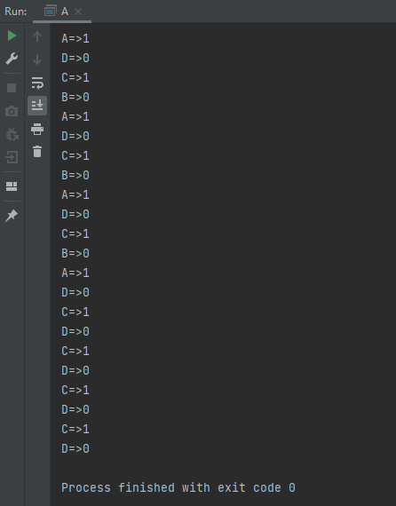
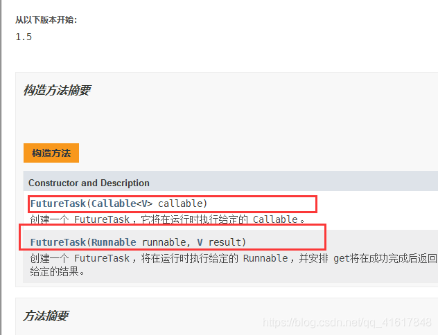
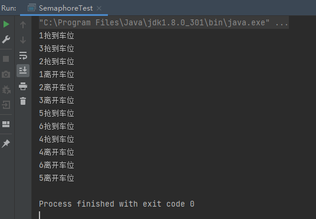
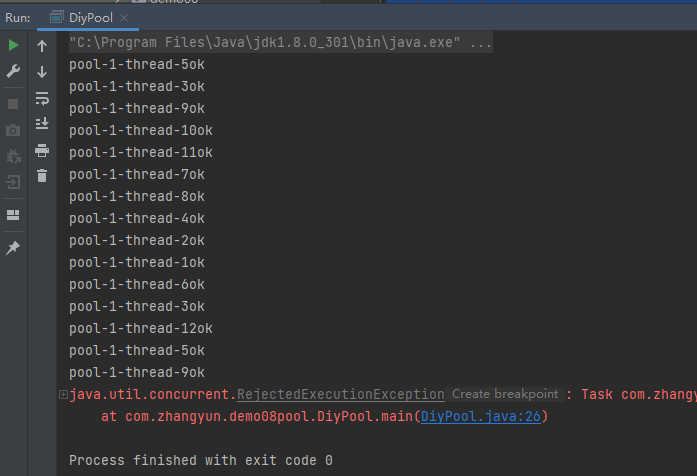
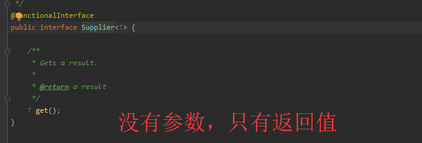
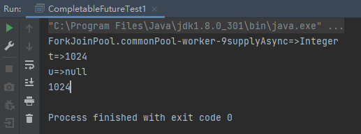

JUC并发编程

[狂神JUC课程](https://www.bilibili.com/video/BV1B7411L7tE?from=search&seid=8754321952948993151&spm_id_from=333.337.0.0)

[jdk8官方文档]([ReadWriteLock (Java Platform SE 8 ) (oracle.com)](https://docs.oracle.com/javase/8/docs/api/))

### JUC课程介绍

#### 准备的开发环境

1，idea打开，新建一个导入了lombok的空maven项目：


- 如果version爆红，记得点击idea右上角的“m”，更新下载一下pom文件的依赖。

2，project structure中确认java的版本设置都为8：


3，settings中确认java的版本设置都为8


- 网友说：jdk的版本设置可以用流完成，亦或是在pom文件中设置
  - 我：还没试过。

#### 找到jdk官方帮助文档

1，学习java必备！可以不下载，有在线的文档，[地址](https://docs.oracle.com/javase/8/docs/api/):


2，找到JUC的几个包：


#### JUC重要性

1，面试高频

2，底层原理重要

#### 什么是JUC

java.util 是Java的一个工具包~

**业务：普通的线程代码 Thread**

**Runnable：** 没有返回值、效率相比于**Callable** 相对较低！


### 线程和进程

#### 进程线程的基本概念

1，windows系统中查看本机的进程和线程数：


2，概念：

- 一个进程可以包含多个线程，至少包含一个线程！
- Java默认的线程数：**2个线程！** main线程、GC线程
- 给线程举例：开了一个typora，那么这个typora就是操作系统层面的一个进程；typora的写字功能由一个线程负责，自动保存功能由一个线程负责，还有其他等等线程。

- 网友补充：
  - 进程是程序的一次执行过程，线程是进程的一条执行路径。
  - 网友：进程是操作系统中的应用程序，是资源分配的基本单位。线程的用来执行具体的任务和功能，是cpu调度和分派的基本单位。

3，之前，对于Java而言：我们用Thread、Runable、Callable进行开启线程的。

4，思考：**提问？JAVA真的可以自己开启线程吗？ **

```java
    public synchronized void start() {
        /**
         * This method is not invoked for the main method thread or "system"
         * group threads created/set up by the VM. Any new functionality added
         * to this method in the future may have to also be added to the VM.
         *
         * A zero status value corresponds to state "NEW".
         */
        if (threadStatus != 0)
            throw new IllegalThreadStateException();

        /* Notify the group that this thread is about to be started
         * so that it can be added to the group's list of threads
         * and the group's unstarted count can be decremented. */
        group.add(this);

        boolean started = false;
        try {
            start0();
            started = true;
        } finally {
            try {
                if (!started) {
                    group.threadStartFailed(this);
                }
            } catch (Throwable ignore) {
                /* do nothing. If start0 threw a Throwable then
                  it will be passed up the call stack */
            }
        }
    }
	//这是一个C++底层，Java是没有权限操作底层硬件的
    private native void start0();
```

- **开不了的！**
- java通过native关键字声明的方法start0，经过C++底层去开启线程。
  - 简单地讲，一个Native Method就是一个java调用非java代码的接口。一个Native Method是这样一个java的方法：该方法的实现由非java语言实现，比如C。[参考文章]([(21条消息) java native方法使用_wittdong的博客-CSDN博客_java native](https://blog.csdn.net/flyingdog123/article/details/80419911))

#### 并发 并行

1，**并发：** 多线程操作同一个资源。

- CPU 只有一核，模拟出来多条线程，天下武功，唯快不破。那么我们就可以使用CPU快速交替，来模拟多线程。
- 生活例子：渣男上午和妹子A约会，下午和妹子B约会，时间管理大师。

2，**并行：** 多个人一起行走

- CPU多核，多个线程可以同时执行。 我们可以使用线程池！
- 生活例子：渣男上午牵着左手妹子a，右手牵着妹子b，和左右两个妹子同时约会。

3，windows任务管理器看cpu有几个核，那么就最多有几个线程并行：


- 本机是6核12线程。相当于一个cpu有6个核，每个核有2个处理机可以处理线程。
- **只有电脑有多处理器才能并行**！！！

4，windows计算机管理看cpu有几个处理器(机)：


- 数一数，是12个处理器。

5，通过代码查看本机的处理机的个数：

```java
public class Test1 {
    public static void main(String[] args) {
        //获取cpu的核数
        System.out.println(Runtime.getRuntime().availableProcessors());
    }
}
```

6，并发编程的本质：**充分利用CPU的资源！**


#### 回顾多线程-线程的状态

1，有六个状态，可以在源码里看到：

```java
public enum State {
        /**
         * Thread state for a thread which has not yet started.
         */
    	//运行
        NEW,

        /**
         * Thread state for a runnable thread.  A thread in the runnable
         * state is executing in the Java virtual machine but it may
         * be waiting for other resources from the operating system
         * such as processor.
         */
    	//运行
        RUNNABLE,

        /**
         * Thread state for a thread blocked waiting for a monitor lock.
         * A thread in the blocked state is waiting for a monitor lock
         * to enter a synchronized block/method or
         * reenter a synchronized block/method after calling
         * {@link Object#wait() Object.wait}.
         */
    	//阻塞
        BLOCKED,

        /**
         * Thread state for a waiting thread.
         * A thread is in the waiting state due to calling one of the
         * following methods:
         * <ul>
         *   <li>{@link Object#wait() Object.wait} with no timeout</li>
         *   <li>{@link #join() Thread.join} with no timeout</li>
         *   <li>{@link LockSupport#park() LockSupport.park}</li>
         * </ul>
         *
         * <p>A thread in the waiting state is waiting for another thread to
         * perform a particular action.
         *
         * For example, a thread that has called <tt>Object.wait()</tt>
         * on an object is waiting for another thread to call
         * <tt>Object.notify()</tt> or <tt>Object.notifyAll()</tt> on
         * that object. A thread that has called <tt>Thread.join()</tt>
         * is waiting for a specified thread to terminate.
         */
    	//等待。没有时间限制一直等。
        WAITING,

        /**
         * Thread state for a waiting thread with a specified waiting time.
         * A thread is in the timed waiting state due to calling one of
         * the following methods with a specified positive waiting time:
         * <ul>
         *   <li>{@link #sleep Thread.sleep}</li>
         *   <li>{@link Object#wait(long) Object.wait} with timeout</li>
         *   <li>{@link #join(long) Thread.join} with timeout</li>
         *   <li>{@link LockSupport#parkNanos LockSupport.parkNanos}</li>
         *   <li>{@link LockSupport#parkUntil LockSupport.parkUntil}</li>
         * </ul>
         */
    	//超时等待。等线程若干秒，时间到了就不等了
        TIMED_WAITING,

        /**
         * Thread state for a terminated thread.
         * The thread has completed execution.
         */
    	//终止
        TERMINATED;
    }
```

#### 回顾多线程-wait和sleep的区别

1，两者属于不同的类：

- wait => Object类

- sleep => Thread类

  - 企业中不会用sleep来休眠，而用`JUC.TimeUnit`工具类：

    ```java
    TimeUnit.DAYS.sleep(1); //休眠1天
    TimeUnit.SECONDS.sleep(1); //休眠1s
    ```

2，两者关于锁的处理不同

- wait执行后会释放锁
- sleep执行后不会释放锁，相当于是抱着锁睡觉。 

3，两者可以存在的位置不同

- wait必须在同步代码块中
- sleep可以在任何地方。

4，是否需要捕获异常，这点上两者现在无区别：

- wait必须要捕获异常；

- sleep必须要捕获异常；

### Lock锁

#### 传统的Synchronized

1，实战，代码解释见注释：

```java
/**
 * 真正的多线程开发
 * 线程就是一个单独的资源类，没有任何的附属操作！
 */
public class SaleTicketDemo01 {
    public static void main(String[] args) {
        //多线程操作
        //并发：多线程操作同一个资源类，把资源类丢入线程；这里的ticket就是一个资源类，在Thread构造函数的lamda表达式中使用了该资源类。
        Ticket ticket = new Ticket();

        //@FunctionalInterface意为函数式接口 ，jdk1.8之后可以用lambda表达式实现函数式接口的方法功能；Thread构造函数的第二个参数是本线程的名字。
        new Thread(()->{
            for(int i=0;i<40;i++){
                //三个线程操作同一个资源的方法，即三个线程操作同一个资源，即并发
                ticket.sale();
            }
        },"A").start();
        new Thread(()->{
            for(int i=0;i<40;i++){
                ticket.sale();
            }
        },"B").start();
        new Thread(()->{
            for(int i=0;i<40;i++){
                ticket.sale();
            }
        },"C").start();
    }
}
//资源类，包含“属性+方法”。资源类变得很干净。
//oop
class Ticket{
    //属性
    private int number=50;


    //卖票的方式
    // synchronized 本质：队列，锁。synchronized 可以让访问本资源类方法的线程同步！
    public synchronized void sale(){
        if(number>0){
            System.out.println(Thread.currentThread().getName()+" 卖出了第"+number+" 张票,剩余："+number+" 张票");
            number--;
        }
    }
}
```

- 多个线程同时访问一个资源类时，先抢到该资源类对应的锁(该锁常是该资源类的实例化对象)的线程能成功访问资源类，没抢到的线程先阻塞；线程访问当前资源类完毕后会释放掉该资源类的锁，让别的线程来争抢。
  - 我理解并纠正上面的话：多个线程同时访问某个资源类的一个实例化对象时，先抢到该对象对应的锁(锁通常是该对象本身)的线程能成功访问资源类的那个实例化对象，没抢到的线程先阻塞；线程访问当前资源类的实例化对象完毕后会释放掉该对象的锁，让别的线程来争抢。


#### Lock锁(重点)

1，Lock使用方法，包含“加锁和解锁”：


2，Lock锁有三种实现方式，一般用第一种实现方式即`ReentrantLock`就够了：


3，读**ReentrantLock**的源码，**默认是非公平锁**


- 公平锁vs非公平锁：
  - 公平锁： 十分公平，必须先来后到~；
  - 非公平锁： 十分不公平，可以插队；
    - 默认用非公平锁，就是为了避免一个只需要3s的线程，因为后到，而排在一个需要3h的线程后面；
    - 公平与非公平亦或是两者间的权衡，这就是操作系统的CPU调度的知识了。

4，实战使用Lock锁

```java
public class SaleTicketDemo02 {
    public static void main(String[] args) {
        //多线程操作
        //并发：多线程操作同一个资源类，把资源类丢入线程
        Ticket2 ticket = new Ticket2();
        new Thread(()->{for(int i=0;i<40;i++) ticket.sale(); },"A").start();
        new Thread(()->{for(int i=0;i<40;i++) ticket.sale(); },"B").start();
        new Thread(()->{for(int i=0;i<40;i++) ticket.sale(); },"C").start();
    }
}

//lock三部曲
//1、    Lock lock=new ReentrantLock();
//2、    lock.lock() 加锁
//3、    finally=> 解锁：lock.unlock();
class Ticket2{
    private int number=50;

    Lock lock=new ReentrantLock();

    //卖票的方式
    // 使用Lock 锁
    public void sale(){
        //加锁
        lock.lock();
        try {
            //业务代码
            if(number>=0){
                System.out.println(Thread.currentThread().getName()+" 卖出了第"+number+" 张票,剩余："+number+" 张票");
                number--;
            }
        }catch (Exception e) {
            e.printStackTrace();
        }
        finally {
            //解锁
            lock.unlock();
        }
    }
}
```


#### Synchronized和Lock区别

1、Synchronized 内置的Java关键字，Lock是一个Java类

2、Synchronized 无法判断获取锁的状态，Lock可以判断

3、Synchronized 会自动释放锁，lock必须要手动加锁和手动释放锁！可能会遇到死锁

4、Synchronized 线程1(获得锁->阻塞)、线程2(等待)；

- lock就不一定会一直等待下去，lock会有一个trylock去尝试获取锁，不会造成长久的等待。

5、Synchronized 是可重入锁，不可以中断的，非公平的；Lock，可重入的，可以判断锁，可以自己设置公平锁和非公平锁；

- 网友：可重入锁指的是可重复可递归调用的锁，在外层使用锁之后，在内层仍然可以使用，并且不发生死锁。

6、Synchronized 适合锁少量的代码同步问题，Lock适合锁大量的同步代码；

- 网友：7、Lock只有代码块锁，synchronized有代码块锁和方法锁  8、使用Lock锁，JVM将花费较少的时间来调度线程，性能更好。并且具有更好的扩展性(提供更多的子类)
- 我调查：JDK 1.6，Java对synchronized同步锁做了充分的优化，甚至在某些场景下，它的性能已经超越了Lock同步锁。所以1.8下说lock锁性能更高是不准确的。[参考文章](https://www.cnblogs.com/sevencutekk/archive/2019/09/21/11563367.html)。

#### 锁是什么，如何判断锁的是谁

内容见“8锁现象彻底理解锁”小结。

### 生产者消费者问题

生产者消费者有两种实现方式：

- synchronized方式：wait+notify
- JUC版

面试必会的问题：单例模式，排序算法，生产者和消费者问题，死锁。

#### 生产者消费者问题-synchronized方式实现

1，线程中存在的通信问题(线程交替执行会带来通信问题)：生产者和消费者问题

- 所谓线程交替执行，就是有两个线程 A和B操作同一个变量num=0。
- A对num实行+1操作，+1完毕后需要等B对num减1；这个如果线程间没有通信时做不到的。
- 要做到线程间用心，需要”通知唤醒+等待唤醒“两个方法。

2，实战实现，两个线程实现生产者消费者问题复现：

```java
public class A {
    public static void main(String[] args) {
        Data data = new Data();

        new Thread(()->{for(int i=0;i<10;i++) {
            try {
                data.increment();
            } catch (InterruptedException e) {
                e.printStackTrace();
            }
        }
        },"A").start();
        new Thread(()->{for(int i=0;i<10;i++) {
            try {
                data.decrement();
            } catch (InterruptedException e) {
                e.printStackTrace();
            }
        }},"B").start();
    }
}
//Data是资源类，在里面放数字；会在main函数中用线程操作资源类，资源类在真实开发中是独立耦合的
class Data{
    //一个正常的数字
    private int number = 0;

    //+1操作，要加锁，保证在多线程时候的安全
    public synchronized void increment() throws InterruptedException {
        if(number!=0){
            //等待操作
            this.wait();
        }
        number++;
        System.out.println(Thread.currentThread().getName()+"=>"+number);
        //通知其他线程 我+1完毕了
        this.notifyAll();
    }

    //-1操作，要加锁，保证在多线程时候的安全
    public synchronized void decrement() throws InterruptedException {
        if(number==0){
            //等待操作
            this.wait();
        }
        number--;
        System.out.println(Thread.currentThread().getName()+"=>"+number);
        //通知其他线程  我-1完毕了
        this.notifyAll();
    }

}
```

- 生产者消费者问题复现口诀：判断并等待，业务，通知
- 网友：只要并发就一定要有锁

- 网友：因为Thread实现了Runable接口，并且Runable接口只有一个方法即是一个函数式接口，所以可以用lamda表达式

- 网友：这题如果改成生产者要生产多个，消费者一个一个消费，狂神这种方法解决不掉了

3，问题存在，A线程B线程一个加一个减，现在如果我有四个线程A B C D两个加两个减，会打印出2甚至3；这就是因为虚假唤醒：

```java
package com.zhangyun.demo01;

public class A {
    public static void main(String[] args) {
        Data data = new Data();

        new Thread(()->{for(int i=0;i<10;i++) {
            try {
                data.increment();
            } catch (InterruptedException e) {
                e.printStackTrace();
            }
        }
        },"A").start();
        new Thread(()->{for(int i=0;i<10;i++) {
            try {
                data.decrement();
            } catch (InterruptedException e) {
                e.printStackTrace();
            }
        }},"B").start();
        new Thread(()->{for(int i=0;i<10;i++) {
            try {
                data.increment();
            } catch (InterruptedException e) {
                e.printStackTrace();
            }
        }
        },"C").start();
        new Thread(()->{for(int i=0;i<10;i++) {
            try {
                data.decrement();
            } catch (InterruptedException e) {
                e.printStackTrace();
            }
        }
        },"D").start();
    }
}
//Data是资源类，在里面放数字；会在main函数中用线程操作资源类，资源类在真实开发中是独立耦合的
class Data{
    //一个正常的数字
    private int number = 0;

    //+1操作，要加锁，保证在多线程时候的安全
    public synchronized void increment() throws InterruptedException {
        if(number!=0){
            //等待操作
            this.wait();
        }
        number++;
        System.out.println(Thread.currentThread().getName()+"=>"+number);
        //通知其他线程 我+1完毕了
        this.notifyAll();
    }

    //-1操作，要加锁，保证在多线程时候的安全
    public synchronized void decrement() throws InterruptedException {
        if(number==0){
            //等待操作
            this.wait();
        }
        number--;
        System.out.println(Thread.currentThread().getName()+"=>"+number);
        //通知其他线程  我-1完毕了
        this.notifyAll();
    }

}
```

运行main函数测试，可以看到刚开始的时候好像是10101正常，但是后面出现了2和3：


查看官方文档中关于虚假唤醒的信息：


- 网友：这是因为notifyall唤醒了所有线程。
- 网友：虚假唤醒，实质上是一次唤醒了所有线程，而CPU执行了本来不该被执行的线程，比如库存为0后，本想让CPU执行生产者线程，但是CPU却执行了另一个被唤醒的消费者，而该消费者没有重新去判断库存，直接进行消费

解决方法：把资源类中的判断从if改成while：

```java
package com.zhangyun.demo01;

public class A {
    public static void main(String[] args) {
        Data data = new Data();

        new Thread(()->{for(int i=0;i<10;i++) {
            try {
                data.increment();
            } catch (InterruptedException e) {
                e.printStackTrace();
            }
        }
        },"A").start();
        new Thread(()->{for(int i=0;i<10;i++) {
            try {
                data.decrement();
            } catch (InterruptedException e) {
                e.printStackTrace();
            }
        }},"B").start();
        new Thread(()->{for(int i=0;i<10;i++) {
            try {
                data.increment();
            } catch (InterruptedException e) {
                e.printStackTrace();
            }
        }
        },"C").start();
        new Thread(()->{for(int i=0;i<10;i++) {
            try {
                data.decrement();
            } catch (InterruptedException e) {
                e.printStackTrace();
            }
        }
        },"D").start();
    }
}
//Data是资源类，在里面放数字；会在main函数中用线程操作资源类，资源类在真实开发中是独立耦合的
class Data{
    //一个正常的数字
    private int number = 0;

    //+1操作，要加锁，保证在多线程时候的安全
    public synchronized void increment() throws InterruptedException {
        while(number!=0){
            //等待操作
            this.wait();
        }
        number++;
        System.out.println(Thread.currentThread().getName()+"=>"+number);
        //通知其他线程 我+1完毕了
        this.notifyAll();
    }

    //-1操作，要加锁，保证在多线程时候的安全
    public synchronized void decrement() throws InterruptedException {
        while(number==0){
            //等待操作
            this.wait();
        }
        number--;
        System.out.println(Thread.currentThread().getName()+"=>"+number);
        //通知其他线程  我-1完毕了
        this.notifyAll();
    }

}
```

运行main函数测试：



- **解决虚假唤醒的原理**：关键在于唤醒线程之后如何执行的,if会不再执行if判断而直接执行wait之后的代码；而while在wait被唤醒后想离开while还会再判断一次while的条件，不为0则继续wait。
- 网友：if只判断一次，等待队列的多个消费者被生产者notifyall通知后重新进入**同步队列，这时候抢到锁的线程会进入就绪态**，就绪态的线程被分配CPU会进入运行态，进入运行态后线程会从if里wait下面的语句开始执行，相当于不会再判断if的条件。

- 我理解“虚假唤醒的解决”：以两个做加法的线程为例，因为这两个线程访问“共享资源data”中的increment()，只有拿到data的锁的线程可以进入data.increment；假设线程1拿到锁，线程2就被阻塞在data.increment外：
  1. 线程1给number++后，notifyall通知wait状态的要拿data锁的线程(包含加法和减法线程)去抢data的锁，但是此时data锁还没释放，所以要争抢锁的进程一直处于预备争抢的状态；线程1运行完毕data.increment,释放关于data的锁；接下来分析不同线程抢到锁的情况。
  2. 线程1释放锁后，线程1和线程2和两个做减法的线程公平竞争data的锁；假设线程1再次抢到data的锁进入data.increment，但是发现number==1；于是线程1执行wait方法，**释放锁**，并阻塞；
  3. 线程1释放掉data的锁后，线程2和两个做减法的线程公平竞争data的锁，假设线程2成功拿到data的锁并进入data.increment；但是线程2也发现number==1，于是线程2执行wait方法，释放锁，并阻塞；于是**此时线程1和线程2都释放data的锁并阻塞在wait**；
  4. 现在两个做减法的线程公平竞争data的锁，假设某个减法线程抢到data的锁并进入data.decrement；减法线程把number--，使number回到0，便执行notifyall，通知data对象中wait的所有进程；便会通知线程1和线程2，使这两个之前释放掉锁的线程**由阻塞态变为争抢锁的状态**，但是此时减法线程还没释放data的锁，所以线程1和线程2一直在准备争抢锁的状态；减法线程执行data.decrement完毕并释放data的锁，假设线程1争抢到data的锁进入就绪态等待CPU分配时间片，线程2没抢到继续处于阻塞态。
  5. 轮到线程1先被分配了时间片，就会发现while循环条件中的`!=0`已经不满足，就会离开while循环，执行number++，执行完毕后离开data.increment并释放掉data的锁；
  6. 假设此时线程2抢到了data的锁，并被分配了CPU时间片，就会从原阻塞处即this.wait后开始执行；那么因为while在离开时要再判断一次number，就会发现number已经被线程1加一了，所以线程2再次执行wait语句释放掉data的锁并阻塞
     - 问答问：可不可能线程1刚判断完while并离开while，还没给number+1，时间片就被剥夺并给线程2，这样线程2看到number没++就也会离开while循环，这样不就还会导致连加吗？感觉主要是判断while的条件和++不是原子性的。
       - 自答：不可能！因为线程2执行wait睡过去后，[要苏醒必须要获取data的锁](https://www.jianshu.com/p/def7f016dd5e)*(对象data中被synchronized修饰的方法的总区域即synchronized的范围，而notify和只能在synchronized的范围内运行，而在synchronized的范围内运行必须先拿到synchronized的范围的锁；在本例中是使用同步方法来同步，所以synchronized的范围的锁即为默认的对象data的锁)*；线程1得先number++，才能离开data.increment，才能释放掉data的锁，才能让线程2拿到锁，才能让线程2从阻塞态进入就绪态等待CPU，才能让线程2在运行态判断while的值。所以锁机制还是保障了”原子性“。

#### 生产者消费者问题-Lock方式实现

1，Lock的组成部分，与Synchronized的组成部分对比：


- 两者在组成成分上没有区别

2，Lock方式实战；代码分析见注释：

```java
package com.zhangyun.demo02;


import java.util.concurrent.locks.Condition;
import java.util.concurrent.locks.Lock;
import java.util.concurrent.locks.ReentrantLock;


public class LockCAP {
    public static void main(String[] args) {
        Data2 data = new Data2();

        //开启AC两个做加法的线程，开启BD两个做减法的线程
        new Thread(() -> {
            for (int i = 0; i < 10; i++) {

                try {
                    data.increment();
                } catch (InterruptedException e) {
                    e.printStackTrace();
                }

            }
        }, "A").start();
        new Thread(() -> {
            for (int i = 0; i < 10; i++) {
                try {
                    data.decrement();
                } catch (InterruptedException e) {
                    e.printStackTrace();
                }
            }
        }, "B").start();
        new Thread(() -> {
            for (int i = 0; i < 10; i++) {
                try {
                    data.increment();
                } catch (InterruptedException e) {
                    e.printStackTrace();
                }
            }
        }, "C").start();
        new Thread(() -> {
            for (int i = 0; i < 10; i++) {
                try {
                    data.decrement();
                } catch (InterruptedException e) {
                    e.printStackTrace();
                }
            }
        }, "D").start();
    }
}

//Data2是资源类，用于处理数字
class Data2 {
    private int num = 0;
    //把之前的synchronized锁变成lock锁
    Lock lock = new ReentrantLock();
    //可以根据lock生成一个condition；根据官方文档，condition取代了对象监视器方法的使用！！！。
    Condition condition = lock.newCondition();

    // +1
    //Lock方式实现的话，资源类中的方法不需要synchronized了
    public  void increment() throws InterruptedException {
        /*
        * lock()这没抢到condition锁的，就会被阻塞，抢到的才能往下走。
        * synchronized方式中，加了synchronized关键字的方法的区域是同步区域；lock方式中，lock()和unlock之间是同步区域
        *
        * lock就是放在try外面的，因为lock不属于业务
        * */
        lock.lock();
        try {//try里面写业务代码
            // 判断等待
            while (num != 0) {
                condition.await();
            }
            num++;
            System.out.println(Thread.currentThread().getName() + "=>" + num);
            // 通知其他线程 +1 执行完毕
            condition.signalAll();
        }finally {
            lock.unlock();
        }

    }

    // -1
    //Lock方式实现的话，资源类中的方法不需要synchronized了
    public  void decrement() throws InterruptedException {

        /*
         * lock()这没抢到condition锁的，就会被阻塞，抢到的才能往下走。
         * synchronized方式中，加了synchronized关键字的方法的区域是同步区域；lock方式中，lock()和unlock之间是同步区域
         *
         * lock就是放在try外面的，因为lock不属于业务
         * */
        lock.lock();
        try {//try里面写业务代码
            // 判断等待
            while (num == 0) {
                condition.await();
            }
            num--;
            System.out.println(Thread.currentThread().getName() + "=>" + num);
            // 通知其他线程 +1 执行完毕
            condition.signalAll();
        }finally {
            lock.unlock();
        }

    }
}
```

- 网友：  lock()和unlock()，像操作系统里信号量的P V

- idea快捷键看最上面的`Code`，有各种快捷键

- 任何一个新的技术，绝不仅仅知识覆盖了原来的技术，一定有自己的优势和补充。

3，运行main函数，测试：


- 现在线程随机，无法控制具体是谁加谁减，只确定是一个加一个减。
  - 如果我们想A-B-C-D这样有序执行，这就是condition的强项

#### Condition实现精准唤醒

1，实战，代码分析在注释中：

```java
package com.zhangyun.demo02;

import java.util.concurrent.locks.Condition;
import java.util.concurrent.locks.Lock;
import java.util.concurrent.locks.ReentrantLock;

/**
 * Description：
 * A 执行完 调用B
 * B 执行完 调用C
 * C 执行完 调用A
 *
 **/

public class ConditionExact {
    public static void main(String[] args) {
        Data3 data3 = new Data3();

        new Thread(() -> {
            for (int i = 0; i < 10; i++) {
                data3.printA();
            }
        },"A").start();
        new Thread(() -> {
            for (int i = 0; i < 10; i++) {
                data3.printB();
            }
        },"B").start();
        new Thread(() -> {
            for (int i = 0; i < 10; i++) {
                data3.printC();
            }
        },"C").start();
    }

}
//Data3资源类，唯一的
class Data3 {
    //写资源类，第一步就是把锁lock弄出来。
    private Lock lock = new ReentrantLock();
    //这个lock.newcondition方法只有在方法里面才会在编写的时候有提示
    private Condition condition1 = lock.newCondition();
    private Condition condition2 = lock.newCondition();
    private Condition condition3 = lock.newCondition();
    private int num = 1; // 1A 2B 3C

    public void printA() {
        lock.lock();
        try {
            // 业务代码 判断 -> 执行 -> 通知
            while (num != 1) {
                //等待；设置多个不同的监视器来操作await，唤醒的时候唤醒指定监视器就可以结束某个监视器造成的await状态。
                condition1.await();
            }
            System.out.println(Thread.currentThread().getName() + "==> AAAA" );
            num = 2;
            //唤醒，唤醒指定的condition，即B的condition；A执行完了就唤醒并执行B
            condition2.signal();
        }catch (Exception e) {
            e.printStackTrace();
        }finally {
            lock.unlock();
        }
    }
    public void printB() {
        lock.lock();
        try {
            // 业务代码 判断 -> 执行 -> 通知
            while (num != 2) {
                //等待；设置多个不同的监视器来操作await，唤醒的时候唤醒指定监视器就可以结束某个监视器造成的await状态。
                condition2.await();
            }
            System.out.println(Thread.currentThread().getName() + "==> BBBB" );
            num = 3;
            //唤醒，唤醒指定的condition，即C的condition；B执行完了就唤醒并执行C
            condition3.signal();
        }catch (Exception e) {
            e.printStackTrace();
        }finally {
            lock.unlock();
        }
    }
    public void printC() {
        lock.lock();
        try {
            // 业务代码 判断 -> 执行 -> 通知
            while (num != 3) {
                //等待；设置多个不同的监视器来操作await，唤醒的时候唤醒指定监视器就可以结束某个监视器造成的await状态。
                condition3.await();
            }
            System.out.println(Thread.currentThread().getName() + "==> CCCC" );
            num = 1;
            //唤醒，唤醒指定的condition，即A的condition；C执行完了就唤醒并执行A
            condition1.signal();
        }catch (Exception e) {
            e.printStackTrace();
        }finally {
            lock.unlock();
        }
    }
}
/*
测试结果为：
A==> AAAA
B==> BBBB
C==> CCCC
A==> AAAA
B==> BBBB
C==> CCCC
...
*/
```

2，运行main函数，测试；结果是A-B-C顺序执行：


- 网友：这和直接单线程写串行程序比好在哪？
  - 网友答：能发挥多核cpu优势；

- 设置多个不同的监视器来操作await，唤醒的时候唤醒指定监视器就可以结束某个监视器造成的await状态。

  - 网友：使用哪个condition等待，则使用哪个唤醒；使用3个condition，这样就让满足条件的那个被唤醒，而不是全都唤醒

  - 网友：notify是随机唤醒一个；nodifyall是全部唤醒但还是要进行锁的争夺，谁拿到谁先运行

### 8锁现象

8锁现象彻底理解锁

#### 问题1

1，两个同步方法，先执行发短信还是打电话？：

```java
package com.zhangyun.demo03;

import java.util.concurrent.TimeUnit;

public class eightLock01 {

    public static void main(String[] args) {
        Phone phone = new Phone();

        new Thread(() -> { phone.sendMs(); }).start();
        try {
            TimeUnit.SECONDS.sleep(1);
        } catch (InterruptedException e) {
            e.printStackTrace();
        }
        new Thread(() -> { phone.call(); }).start();
    }
}

class Phone {
    public synchronized void sendMs() {
        System.out.println("发短信");
    }
    public synchronized void call() {
        System.out.println("打电话");
    }
}
```

2，输出结果为:

```
发短信
打电话
```

- 网友：我想知道，两个线程同时执行，为什么就一定是A线程先拿到锁呢
  - 网友答：那个休息的时间的代码是单线程的啊，需要执行完休眠，才到打电话
  - 网友：上面先获得锁是因为主线程sleep了一秒，即下面的线程延迟了1秒才创建，1秒的时间CPU会切换多次时间片，足够上面的线程拿到锁了；换句话说，因为在main方法中调用了休眠，位于休眠后的方法先执行的概率远远低于位于休眠前的方法；(高赞)换句话说，线程A就绪后，但下面主线程睡眠了，所以线程B没有start，也就没有进入就绪。
    - 因为第一个线程被给了1s的机会，所以他有99.9999的概率拿到锁；但是不是一定，因为可能这1s都没有被分配到时间片，但是这个概率太小了；所以测试表现出来，每一次都是先执行第一个线程再执行第二个线程。
    - 如果没有sleep的话，两个线程几乎同时进入抢锁状态，抢到锁的那个线程会进入就绪状态等待CPU；这时就无法判断哪个线程先执行，哪个后执行了。
  - 网友：个人测试，是因为休眠，如果不加休眠，给两个线程循环50上百次执行，你可以看到结果是sendsms和call是随机的

- 网友：锁方法的时候，使用的是Phone这个类的实例充当了锁，谁先获得锁，谁就先执行；发短信线程先获得了锁对象，就算sleep锁对象还是他的。

3，为什么？ 如果你认为是顺序在前？ 这个答案是错误的。原因：

- synchronized锁的对象时方法的调用者。**两个方法用的是同一把锁即对象phone的锁**，这个对象phone的锁只有一把；两个线程谁先拿到对象phone的锁，谁就能执行对象phone中的方法。

  - 问答问：之前java多线程和本JUC的时候，我以为不同方法即使以同一个对象为锁也互不影响，但是学到这发现”只要以同一个对象为锁，不同方法也不能同时执行，也需要抢锁“，把之前学过的相关的笔记修改一下。
    - 已经把本JUC的内容纠正过来了，以后主看JUC；看到javaThread的时候再纠正那的。

  - 我理解：核心原因还是第一个线程和第二个线程之间有sleep，帮助第一个线程抢到phone的锁，导致第一个线程访问完phone的方法后，第二个线程才能访问。

#### 问题2

1，我们再来看，我们让发短信 延迟4s，现在是先打电话还是先发短信？：

```java
public class dome01 {
    public static void main(String[] args) throws InterruptedException {
        Phone phone = new Phone();

        new Thread(() -> {
            try {
                phone.sendMs();
            } catch (InterruptedException e) {
                e.printStackTrace();
            }
        }).start();
        TimeUnit.SECONDS.sleep(1);
        new Thread(() -> { phone.call(); }).start();
    }
}

class Phone {
    public synchronized void sendMs() throws InterruptedException {
        TimeUnit.SECONDS.sleep(4);
        System.out.println("发短信");
    }
    public synchronized void call() {
        System.out.println("打电话");
    }
}
```

2，结果：**还是**先发短信，然后再打电话！；原因：

3，原因：

- 原因和问题1相同。并不是因为顺序执行所以第一个线程先打印，而是因为**synchronized 锁住的对象是方法的调用者**即对象phone！对于两个方法用的是同一个锁，谁先拿到phone的锁，谁就可以先执行phone中的任意被synchronized修饰的同步方法，另外一个等待；由于第一个线程启动和第二个线程启动之间，主线程会休眠1s，让线程1轻松(轻松是因为线程2还没启动故不会参与争抢)拿到锁，并且这1s够CPU切换多次时间片，几乎一定可以切换到线程1，让线程1拿着已经抢到的phone的锁访问phone中的方法。

#### 问题3

1，现在又加了一个普通方法，现在是先发短信还是先hello？：

```java
public class dome01 {
    public static void main(String[] args) throws InterruptedException {
        Phone phone = new Phone();

        new Thread(() -> {
            try {
                phone.sendMs();
            } catch (InterruptedException e) {
                e.printStackTrace();
            }
        }).start();
        TimeUnit.SECONDS.sleep(1);
        new Thread(() -> { phone.hello(); }).start();
    }
}

class Phone {
    public synchronized void sendMs() throws InterruptedException {
        TimeUnit.SECONDS.sleep(4);
        System.out.println("发短信");
    }
    public synchronized void call() {
        System.out.println("打电话");
    }
    //这里没有锁，不是同步方法，不需要“抢”锁才能执行hello。
    public void hello() {
        System.out.println("hello");
    }
}
```

2，输出结果为

```
hello

发短信
```

3，原因：

- hello是一个普通方法，不受synchronized锁的影响，不用等待锁的释放;由于延迟“执行发短信的线程”的时间段内足够CPU切换很多次时间片，执行hello的线程必定能拿到时间片执行。

#### 问题4

1，如果我们使用的是**两个对象**，一个调用发短信，一个调用打电话，那么整个顺序是怎么样的呢？：

```java
public class dome01 {
    public static void main(String[] args) throws InterruptedException {
        Phone phone1 = new Phone();
        Phone phone2 = new Phone();

        new Thread(() -> {
            try {
                phone1.sendMs();
            } catch (InterruptedException e) {
                e.printStackTrace();
            }
        }).start();
        TimeUnit.SECONDS.sleep(1);
        new Thread(() -> { phone2.call(); }).start();
    }
}

class Phone {
    public synchronized void sendMs() throws InterruptedException {
        TimeUnit.SECONDS.sleep(4);
        System.out.println("发短信");
    }
    public synchronized void call() {
        System.out.println("打电话");
    }
    public void hello() {
        System.out.println("hello");
    }
}

```

- phone1和phone2是两把锁，两个对象，即两个调用者
- 8锁问题必须要有延迟才能看出问题，没延迟就是根据CPU时间片执行 了。

2，输出结果:

```
打电话

发短信
```

3，原因：

- 两个对象两把锁，不会出现一个线程等待另一个线程释放锁的情况；发短信的线程睡了4s,这4s间CPU时间片会切换多次故必定能分配给打电话的线程，所以先执行打电话

#### 问题5、6

1，如果我们把synchronized的方法加上static变成静态方法！那么顺序又是怎么样的呢？:

（1）我们先来使用一个对象调用两个方法！

答案是：先发短信,后打电话。

（2）如果我们使用两个对象调用两个方法！

答案是：还是先发短信，后打电话：

```java
public class dome01 {
    public static void main(String[] args) throws InterruptedException {
        Phone phone1 = new Phone();
        Phone phone2 = new Phone();

        new Thread(() -> {
            try {
                phone1.sendMs();
            } catch (InterruptedException e) {
                e.printStackTrace();
            }
        }).start();
        TimeUnit.SECONDS.sleep(1);
        new Thread(() -> { phone2.call(); }).start();
    }
}

class Phone {
    public static synchronized void sendMs() throws InterruptedException {
        TimeUnit.SECONDS.sleep(4);
        System.out.println("发短信");
    }
    public static synchronized void call() {
        System.out.println("打电话");
    }
    public void hello() {
        System.out.println("hello");
    }
}
```

2，原因是什么呢？ 为什么加了static就始终前面一个对象先执行呢！为什么后面会等待呢？原因是：

- 对于static静态方法来说，对于整个类Class来说只有一份，对于不同的对象使用的是同一份方法，相当于这个方法是属于这个类的，如果静态static方法使用synchronized锁定，那么这个synchronized锁会锁住这个类实例化的所有对象！不管多少个对象，对于静态的锁都只有一把锁，谁先拿到这个锁就先执行，其他的进程都需要等待！

  - static修饰的方法是静态方法，在类一加载就有了；phone对应了全局唯一的`Phone.class`类对象，synchronize锁的就是这个对象。
    - 网友：理解jvm这些轻轻松松。

  - 网友：反正记住锁的是对象就行了；一个房间有俩厕所，这个相当于把房间门关了，就算有厕所空着也进不去

  - 我感觉8锁问题，在java多线程那讲才好，这里将也太晚了。

#### 问题7

1，如果我们使用一个静态同步方法、一个同步方法、用一个对象调用顺序是什么？：

```java
public class dome01 {
    public static void main(String[] args) throws InterruptedException {
        Phone phone1 = new Phone();
//        Phone phone2 = new Phone();

        new Thread(() -> {
            try {
                phone1.sendMs();
            } catch (InterruptedException e) {
                e.printStackTrace();
            }
        }).start();
        TimeUnit.SECONDS.sleep(1);
        new Thread(() -> { phone1.call(); }).start();
    }
}

class Phone {
    public static synchronized void sendMs() throws InterruptedException {
        TimeUnit.SECONDS.sleep(4);
        System.out.println("发短信");
    }
    public synchronized void call() {
        System.out.println("打电话");
    }
    public void hello() {
        System.out.println("hello");
    }
}
```

2，输出结果：

```
打电话

发短信
```

3，原因：

- 打电话一定是优先的。因为static synchronized锁的是Phone类的模板，synchronized锁的是对象的调用者；两个方法用的不是同一个锁，所以不存在线程因为锁而互相等待，两者可以直接运行；因为发短信线程会自己休眠4s，所以打电话线程会在控制台先打印“打电话”。

#### 问题8

1，如果我们使用一个静态同步方法、一个同步方法、两个对象调用顺序是什么？：

```java
public class dome01 {
    public static void main(String[] args) throws InterruptedException {
        Phone phone1 = new Phone();
        Phone phone2 = new Phone();

        new Thread(() -> {
            try {
                phone1.sendMs();
            } catch (InterruptedException e) {
                e.printStackTrace();
            }
        }).start();
        TimeUnit.SECONDS.sleep(1);
        new Thread(() -> { phone2.call(); }).start();
    }
}

class Phone {
    public static synchronized void sendMs() throws InterruptedException {
        TimeUnit.SECONDS.sleep(4);
        System.out.println("发短信");
    }
    public synchronized void call() {
        System.out.println("打电话");
    }
    public void hello() {
        System.out.println("hello");
    }
}
```

2，输出结果，总是先打电话，再发短信:

```
打电话

发短信
```

3，原因：

- 两把锁锁的不是同一个东西，执行打电话的线程和执行发短信的线程互不影响，但是发短信的线程会自己休眠4s，所以打电话的线程会先在控制台打印。

#### 小结

new出来的对象，synchronized锁的是this，也就是具体的一个手机；

- 网友：锁的对象是方法的调用者，因为锁的是this，就是这个new出来的对象，然后调用这个方法
- 我和网友：同步代码块锁的是对象！

static锁的是Class，是唯一的模板

### 集合类不安全(重点)

之前认为Arraylist是安全的，因为之前都只写单线程的代码；但是现在JUC写程序都是要考虑并发的，并发情况下很多类都有问题

#### List不安全

1，代码实战

```java
public class ListTest {
    public static void main(String[] args) {
        /**
         * 解决方案
         * 1. List<String> list = new Vector<>();
         * 2. List<String> list = Collections.synchronizedList(new ArrayList<>());
         * 3. List<String> list = new CopyOnWriteArrayList<>();
         */
        List<String> list = new ArrayList<>();
        

        for (int i = 1; i <=10; i++) {
            new Thread(() -> {
                list.add(UUID.randomUUID().toString().substring(0,5));
                System.out.println(list);
            },String.valueOf(i)).start();
        }
    }
}
```

2，运行程序会报错`ConcurrentModificationException`，所以并发下ArrayList是不安全的

- [抛出ConcurrentModificationException的底层原因]([Java SynchronizedSet 线程不安全之坑 - 知乎 (zhihu.com)](https://zhuanlan.zhihu.com/p/271841761))

3，三个解决方案：

- `List<String> list = new Vector<>();`
  - vector是JDK1.0就出来的，只是后面考虑到单线程时的性能才弄的ArrayList。
  - vector的add()是被synchronized修饰的，是实现了多线程情况下同步添加元素的。

- `List<String> list = Collections.synchronizedList(new ArrayList<>());`
  - 这样是通过工具类，把一个ArrayList转化为synchronized，使之变得线程安全。

* `List<String> list = new CopyOnWriteArrayList<>();`：
  * 这个JUC包下的，是解决list不安全的目前比较好的方法（推荐）。

4，CopyOnWrite：写入时复制；是计算机程序设计领域的一种优化策略。

- 核心思想是：如果有多个调用者（Callers）同时要求相同的资源（如内存或者是磁盘上的数据存储），他们会共同获取相同的指针指向相同的资源，直到某个调用者视图修改资源内容时，系统才会真正复制一份专用副本（private copy）给该调用者，而其他调用者所见到的最初的资源仍然保持不变。这过程对其他的调用者都是透明的（transparently）。此做法主要的优点是如果调用者没有修改资源，就不会有副本（private copy）被创建，因此多个调用者只是读取操作时可以共享同一份资源。

- **优点**：读的时候不用lock同步，写的时候用lock同步；在保证写线程安全的情况下，比vector的并发性能更好，尤其是在读多写少的场景。所以问CopyOnWrite比vector强在哪时可以回答：

  - jdk8里，vector使用synchronized做同步效率很低，CopyOnWrite使用lock做同步。**lock做同步的性能比synchronized更好**。
    - 不过网友补充：JDK11的CopyOnWrite还是用了synchronized，原因可能是因为jdk11使用了cas自旋优化了synchronized。
    - 我和网友网友：公司一般就是读写分离，由于CopyOnWriteArrayList模式读的时候不加锁，写的时候加锁；所以CopyOnWrite用于读多写少性能高还能兼顾安全；

- **缺点**：

  - 内存占用问题。因为CopyOnWrite的写时复制机制，所以在进行写操作的时候，内存里会同时驻扎两个对象的内存，旧的对象和新写入的对象（注意:在复制的时候只是复制容器里的引用，只是在写的时候会创建新对象添加到新容器里，而旧容器的对象还在使用，所以有两份对象内存）。如果这些对象占用的内存比较大，比如说200M左右，那么再写入100M数据进去，内存就会占用300M，那么这个时候很有可能造成频繁的Yong GC和Full GC。

  - 数据一致性问题。CopyOnWrite容器只能保证数据的最终一致性，不能保证数据的实时一致性。所以如果你希望写入的的数据，马上能读到，请不要使用CopyOnWrite容器。

- CopyOnWrite的写操作是用lock锁控制的一个原子操作，保证了并发时的安全。

#### Set不安全

1，代码实战：

```java
public class SetTest {
    public static void main(String[] args) {
        /**
         * 1. Set<String> set = Collections.synchronizedSet(new HashSet<>());
         * 2. Set<String> set = new CopyOnWriteArraySet<>();
         */
//        Set<String> set = new HashSet<>();
        Set<String> set = new CopyOnWriteArraySet<>();

        for (int i = 1; i <= 30; i++) {
            new Thread(() -> {
                set.add(UUID.randomUUID().toString().substring(0,5));
                System.out.println(set);
            },String.valueOf(i)).start();
        }
    }
}
```

- 线程数为10的时候可能有时不报异常`ConcurrentModificationException`，但是别以为就没事，把线程数加到本例中的40，出现并发异常的概率就更大了。，

2，运行程序会报错`ConcurrentModificationException`，所以并发下ArrayList是不安全的

3，两种解决方案：

- `Set<String> set = Collections.synchronizedSet(new HashSet<>()); `    
  - 即使用Collections工具类的**synchronized**包装的Set类。
- ` Set<String> set = new CopyOnWriteArraySet<>();`
  - 使用CopyOnWriteArraySet 写入复制的**JUC**解决方案

4，hashset的底层用来hashmap：

```java
//hashset的底层用hashmap
public HashSet() {
    map = new HashMap<>();
}

// Dummy value to associate with an Object in the backing Map
private static final Object PRESENT = new Object();
//hashset的add方法也是用hashmap的方式添加，hashmap的key作为hashset的值，hashmap的value是一个无意义的常量。
public boolean add(E e) {
    return map.put(e, PRESENT)==null;
}
```

- 网友：当阈值超过8就会转变为红黑树。set的本质是map，map的本质是数组。哈希冲突为了解决哈希函数，如何解决、利用链表或者红黑树。
  - 网友回复：hash冲突是不同的key哈希后的索引一样所以用个链表放不同的keyvalue对，这里是为了不要有多个相同的key，两回事

#### Map不安全

1，HashMap源码：


- map 是这样用的吗？  :不是，工作中不使用这个
- `new HashMap<>();`默认等价什么？ :`new HashMap<>(16,0.75);`，即(初始化容量,加载因子)

- 网友：加载因子 0.75是为了防止多线程同步添加而导致空间不够，而默认长度为16每次增长为16的倍数  这样是为了后面进行位运算时防止添加时数组越界;map扩容性能消耗大，指定容量尽量避免扩容提高效率。

2，HashMap实战并发异常：

```java
public static void main(String[] args) {
        //map 是这样用的吗？  不是，工作中不使用这个
        //默认等价什么？ new HashMap<>(16,0.75);
        Map<String, String> map = new HashMap<>();
        //加载因子、初始化容量
        for (int i = 1; i < 100; i++) {
            new Thread(()->{
                map.put(Thread.currentThread().getName(),UUID.randomUUID().toString().substring(0,5));
                System.out.println(map);
            },String.valueOf(i)).start();
        }
    }
```

3，运行main函数测试，结果同样的出现了`java.util.ConcurrentModificationException 并发修改异常`：


4，解决并发异常的方法：

- 使用Collections.synchronizedMap(new HashMap<>());处理；
- 使用ConcurrentHashMap进行并发处理

5，TODO:研究ConcurrentHashMap底层原理：

这里我们可以直接去研究一下，这个也是相当重要的。

- [参考]([一文读懂Java ConcurrentHashMap原理与实现 - 知乎 (zhihu.com)](https://zhuanlan.zhihu.com/p/104515829))

- 网友：ConcurrentHashMap，它内部细分了若干个小的 HashMap，称之为段(Segment)。 默认情况下一个 ConcurrentHashMap 被进一步细分为 16 个段，既就是锁的并发度。如果需要在 ConcurrentHashMap 中添加一个新的表项，并不是将整个 HashMap 加锁，而是首先根据 hashcode 得到该表项应该存放在哪个段中，然后对该段加锁，并完成 put 操作。在多线程环境中，如果多个线程同时进行put操作，只要被加入的表项不存放在同一个段中，则线程间可以做到真正的并行。

### Callable(简单)

1，jdk官网内容：


- Callable可以有返回值
- Callable可以抛出异常
- Callable使用call()方法，Runnable使用run()方法。

2，回顾传统的Runnable接口实现多线程：

```java
public class CallableTest {
    public static void main(String[] args) {
        for (int i = 1; i < 10; i++) {
            new Thread(new MyThread()).start();
        }
    }
}

class MyThread implements Runnable{

    @Override
    public void run() {
        System.out.println(Thread.currentThread().getName());
    }
}
```

- Runnable功能有限，没有返回值(只能开辟，不能接收)；所以要使用Callable接口。

3，Callable接口源码：


- Callable接口的泛型的参数类型，等于call方法的返回值类型。

4，但是如何使用Callable呢？即怎么把Callable放入到Thread里面呢？：

源码分析，对于Thread运行，只能传入Runnable类型的参数；


但我们是用Callable接口实现的线程，怎么办呢？再看JDK api文档，在Runnable里面有一个叫做FutureTask的实现类，我们进去看一下：


FutureTask中可以接受Callable参数；：



这样我们就可以先把Callable 放入到FutureTask中， 如何再把FutureTask 放入到Thread就可以了。实战如下，代码解释在注释中：

```java
package com.zhangyun.demo04;

import java.util.concurrent.Callable;
import java.util.concurrent.ExecutionException;
import java.util.concurrent.FutureTask;

public class CallableTest {
    public static void main(String[] args) throws ExecutionException, InterruptedException {
        //借助FutureTask构建Callable和Thread之间的关系
        //new Thread(new Runnable()).start();
        //new Thread(new FutureTask<V>()).start();
        //new Thread(new FutureTask<V>( Callable)).start();

        //创建Callable的实现类的实例化对象thread
        MyThread thread= new MyThread();
        //创建适配类FutureTask的实例化对象futuretask
        FutureTask<String> futureTask = new FutureTask<String>(thread);
        //放入Thread使用。两个线程启动，但是call方法只被执行一次，说明结果会被缓存，效率高(缓存学了CAS后可能会更懂)。
        new Thread(futureTask,"A").start();
        new Thread(futureTask,"B").start();

        //获取返回值;get方法产生阻塞，我们把它放到最后一行(或者使用异步通信处理)
        String s = futureTask.get();

        System.out.println("返回值："+ s);
    }
}

class MyThread implements Callable<String> {

    @Override
    public String call() throws Exception {
        System.out.println("Call:"+Thread.currentThread().getName());
        //耗时的操作
        return "String"+Thread.currentThread().getName();
    }
}
```

- 网友：翻了下源码 这里只打印一次是因为FutureTask只会被线程run一次；本例传入两个Thread对象的是同一个FutureTask对象，而一个FutureTask对象只能够被run一次...

运行main函数测试，发现这样我们就可以使用Callable来进行多线程编程了，并且我们发现可以有返回值，并且可以抛出异常：


### JUC三大常用辅助类(必会)

#### CountDownLatch

1，倒着计数的操作就可以用CountDownLatch。比如房间里有6个人，保安想等6个人都走出门再锁门，就可以用CountDownLatch实现,。

2，初步实现代码：

```java
public class CountDownLatchDemo {
    public static void main(String[] args) throws InterruptedException {
        // 总数是6
        CountDownLatch countDownLatch = new CountDownLatch(6);

        for (int i = 1; i <= 6; i++) {
            new Thread(() -> {
                System.out.println(Thread.currentThread().getName() + "==> Go Out");
                countDownLatch.countDown(); // 每个线程都数量 -1
            },String.valueOf(i)).start();
        }
        
        System.out.println("close door");
    }
}
```

3，运行main函数：


- 发现主线程可能在所有自定义线程结束前，就打印关门；相当于房间的人还没走完，保安就关门。

4，使用`countDownLatch.await()`，等到`countDownLatch`计数为0时才往下执行，保证所有自定义线程执行完了，主线程才继续往下走：

```java
package com.zhangyun.demo05;

import java.util.concurrent.CountDownLatch;

public class CountDownLaunchTest {
    public static void main(String[] args) throws InterruptedException {
        // 总数是6
        CountDownLatch countDownLatch = new CountDownLatch(6);

        for (int i = 1; i <= 6; i++) {
            new Thread(() -> {
                System.out.println(Thread.currentThread().getName() + "==> Go Out");
                countDownLatch.countDown(); // 每个线程都数量 -1
            },String.valueOf(i)).start();
        }
        countDownLatch.await(); // 等待计数器归零 然后向下执行
        System.out.println("close door");
    }

}

```

5，运行加装了`countDownLatch.await()`的程序；这回等countDownLatch计数为0了，主函数才从`countDownLatch.await()`的位置往下执行，否则卡在`countDownLatch.await()`的位置：


6，CountDownLatch主要用法：

- countDown 减一操作；
- await 等待计数器归零

await 等待计数器归零，就唤醒，再继续向下运行

#### CyclickBarrier

1，官方文档：


- 官网比较绕(老师的中文翻译约等于机翻，建议看英文)，可以看做一个加法计数器。
- [参考文章]([并发包下常见的同步工具类详解(CountDownLatch,CyclicBarrier,Semaphore) - takumiCX - 博客园 (cnblogs.com)](https://www.cnblogs.com/takumicx/p/9698867.html#3循环屏障cyclicbarrier))

2，代码实战：

```java
public class CyclicBarrierDemo {
    public static void main(String[] args) {
        /*
        集齐七颗龙珠召唤神龙
        */
        
        // cyclicBarrier中用Runnable定义一个线程，即召唤神龙的线程；在cyclicBarrier计数达到目标时会新建并执行Runnable定义的线程。
        CyclicBarrier cyclicBarrier = new CyclicBarrier(7,() -> {
            System.out.println("召唤神龙成功");
        });

        for (int i = 1; i <= 7; i++) {
            // 子线程
            final int finalI = i;
            new Thread(() -> {
                //lamda表达式中能否用到for循环中的i？lamda表达式本质是new了一个对象，jdk7之前不能在lamda表达式中拿到外层for循环的变量；想拿到得通过lamda表达式外的final变量来拿。
                System.out.println(Thread.currentThread().getName() + "收集了第" + finalI + "颗龙珠");
                
                
                try {
                    // 调用await时,阻塞本线程，并且cyclicBarrier内部记录的线程等待数会加1；当cyclicBarrier的计数变为7，就会打印创建对象cyclicBarrier时定义的“召唤神龙成功”，并同时释放之前阻塞着的7个线程。如果cyclicBarrier永远到不了7，即for循环的次数太少，则cyclicBarrier中Runnable接口定义的操作无法运行，且之前阻塞的所有线程会一直保持阻塞。
                    cyclicBarrier.await(); 
                } catch (InterruptedException e) {
                    e.printStackTrace();
                } catch (BrokenBarrierException e) {
                    e.printStackTrace();
                }
            }).start();
        }
    }
}
```

- 问问问：lamda表达式外的`final int finalI`写成`int finalI`能执行，但是直接在lamda表达式中用i而不是finalI又会报错，我感觉finalI和i都是会被改变的变量，这是为什么？
  - [阅读文章](https://blog.csdn.net/qq_39111325/article/details/86441994)，还是没想出原因，不知道是不是得学习jvm后才懂。
    - 文章解释final的必要性：Java会将finalI的值作为参数传递给Lambda表达式，为Lambda表达式建立一个副本，它的代码访问的是这个副本，而不是外部声明的finalI变量。可能很多同学会问为什么非要建立副本呢，直接访问外部的result变量得多方便呢。答案是：这是不可能滴，因为局部变量finalI定义在栈中，但new thread存在堆中，所以当Lambda表达式被执行的时候，result可能已经被释放掉了。
- 网友：cyclicBarrier相当于栅栏，等到有7个等待的时候一起通过

#### Semaphore

1，即“信号量”，官方文档：


2，以停车位为例子，实战；代码讲解见注释：

```java
package com.zhangyun.demo05;

import java.util.concurrent.Semaphore;
import java.util.concurrent.TimeUnit;

public class SemaphoreTest {
    public static void main(String[] args) {

        // 构造方法中传入“线程数量”；可以把它想象成停车场有3个停车位；限流的时候也可以用信号量，比如说本例就是限制停车场的车流数不超过三个车。
        Semaphore semaphore = new Semaphore(3);

        //有6个车要进停车场
        for (int i = 1; i <= 6; i++) {
            new Thread(() -> {
                try {
                    // acquire() 得到一个车位
                    semaphore.acquire();
                    //必须先抢到停车位，再打印，不然可能自己打印了，但是还没来得及实际抢到，就被别的线程实际抢到了停车位，就造成停的车与控制台打印不符
                    System.out.println(Thread.currentThread().getName() + "抢到车位");

                    //让本线程阻塞2秒，模拟在停车场停着；同时这2s可以让三辆车都进入停车库
                    TimeUnit.SECONDS.sleep(2);
                }catch (Exception e) {
                    e.printStackTrace();
                }finally {
                    //必须先打印再释放，否则可能释放完线程被别的线程抢到了，发生：一辆车还没离开另一辆车就进来，导致停车场车数超过额定数的打印情况
                    System.out.println(Thread.currentThread().getName() + "离开车位");
                    // release() 释放掉一个停车位，即驶离停车场
                    semaphore.release();

                }
            },String.valueOf(i)).start();
        }
    }
}
```

- semaphore被创建的时候就会定义一共几个信号量，aquire代表本线程抢到semaphore中的一个信号量，release代表本线程释放semaphore中的一个信号量
  - 我：类似操作系统中的pv操作信号量。

- semaphore可以用作限流；在springcloud中谈到过限流。

3，执行main函数，测试：



- 可以看到，代码中sleep2s发挥了作用，最开始时会让3辆车都在车库
  - 问问问：按理说离开车位不需要三个车都离开后，才被一起被抢，但是我测试了好几次都是如此；没发生“1号离开车位后，5号抢到车位，再2号离开车位”这种情况（我把sleep关闭才出现这种情况），不知道为什么。

4，使用方法：

- semaphore.acquire()获得资源，如果资源已经使用完了，就等待资源释放后再进行使用！

- semaphore.release()释放，会将当前的信号量释放+1，然后唤醒等待的线程！

5，作用： 

- 多个共享资源互斥的使用！ 
- 并发限流，控制最大的线程数！

### 读写锁

ReadWriteLock

1，看jdk文档：


- 读可以被多个线程同时读，写的时候只能有一个线程去写。
- 为了提高程序并发度，读没必要锁住。

2，实战编写代码；代码解释在注释中：

```java
package com.zhangyun.demo06;

import java.util.HashMap;
import java.util.Map;

public class ReadWriteLockTest {
    public static void main(String[] args) {
        MyCache myCache = new MyCache();
        int num = 5;

        //写入
        for (int i = 1; i <= num; i++) {
            int finalI = i;
            new Thread(() -> {

                myCache.write(String.valueOf(finalI), String.valueOf(finalI));

            },String.valueOf(i)).start();
        }

        //读取
        for (int i = 1; i <= num; i++) {
            int finalI = i;
            new Thread(() -> {

                myCache.read(String.valueOf(finalI));

            },String.valueOf(i)).start();
        }
    }
}

/**
 *  自定义缓存，用MyCahce类实现
 *
 *  方法未加锁，导致写的时候被插队
 */
class MyCache {
    //写一个map来维护缓存；这个缓存是伪造的，随便写的，理解一下这个意思即可；后面会专门讲缓存
    private volatile Map<String, String> map = new HashMap<>();

    //存
    public void write(String key, String value) {
        System.out.println(Thread.currentThread().getName() + "线程开始写入");
        map.put(key, value);
        System.out.println(Thread.currentThread().getName() + "线程写入ok");
    }

    //取
    public void read(String key) {
        System.out.println(Thread.currentThread().getName() + "线程开始读取");
        map.get(key);
        System.out.println(Thread.currentThread().getName() + "线程写读取ok");
    }
}


```

- 网友：volatile关键字（在本例的hashmap前面有）仅仅能保证变量写操作的原子性，不保证复合操作，比如说读写操作的原子性

- 网友：关于finalI变量，1.8后默认加了final；可以不加final 但是不能修改

3，执行main函数，测试：


- 线程写入的过程中，被多个线程插队写入，问题很大！正常应该是“x线程开始写入，x线程写入ok”中间不能有别的操作。

4，给自定义缓存的存取方法加锁，防止一个线程在写入的时候被别的线程插队写入；代码解释见注释：

```java
package com.zhangyun.demo06;

import java.util.HashMap;
import java.util.Map;
import java.util.concurrent.locks.ReadWriteLock;
import java.util.concurrent.locks.ReentrantLock;
import java.util.concurrent.locks.ReentrantReadWriteLock;

public class ReadWriteLockTest {
    public static void main(String[] args) {
        MyCacheLock myCache = new MyCacheLock();
        int num = 5;

        //写入
        for (int i = 1; i <= num; i++) {
            int finalI = i;
            new Thread(() -> {

                myCache.write(String.valueOf(finalI), String.valueOf(finalI));

            },String.valueOf(i)).start();
        }

        //读取
        for (int i = 1; i <= num; i++) {
            int finalI = i;
            new Thread(() -> {

                myCache.read(String.valueOf(finalI));

            },String.valueOf(i)).start();
        }
    }
}

/**
 *  自定义缓存，用MyCahceLock类实现
 *
 *  方法已加锁，导致写的时候被插队
 */
class MyCacheLock {
    //写一个map来维护缓存；这个缓存是伪造的，随便写的，理解一下这个意思即可；后面会专门讲缓存
    private volatile Map<String, String> map = new HashMap<>();


    /*需要锁的时候先new一个锁出来。ReentrantLock是一个普通的锁，我们这里使用更加细粒度的ReadWriteLock锁。
    *
    * 读写锁的好处：更加细粒度的控制。
    * 所谓更细粒度，就是写入的时候只希望缓存区被一个线程写，读的时候缓存区可以被所有线程读
    * */
    private ReadWriteLock readWriteLock=new ReentrantReadWriteLock();

    //存
    public void write(String key, String value) {
        //往缓存存东西的时候，加写锁
        readWriteLock.writeLock().lock();

        //用trycatchfinally（idea有快捷键）保证锁一定会被释放。加锁和解锁之间的代码块，即为同步的代码块，即被锁住的代码块
        try {
            System.out.println(Thread.currentThread().getName() + "线程开始写入");
            map.put(key, value);
            System.out.println(Thread.currentThread().getName() + "线程写入ok");
        } catch (Exception e) {
            e.printStackTrace();
        } finally {
            readWriteLock.writeLock().unlock();
        }
    }

    //取
    public void read(String key) {
        //写和读是互斥的，即有线程在读的时候不允许线程写，有线程写的时候不允许线程读；所以虽然允许多个线程同时读缓存区，但是因为写锁的存在，必须给读操作加读锁
        readWriteLock.readLock().lock();

        try {
            System.out.println(Thread.currentThread().getName() + "线程开始读取");
            map.get(key);
            System.out.println(Thread.currentThread().getName() + "线程读取ok");
        } catch (Exception e) {
            e.printStackTrace();
        } finally {
            readWriteLock.readLock().unlock();
        }
    }
}
```

- 网友：synchronized是可以的，但Lock锁，JVM调度时间更少，性能更好。并且具有更好的扩展性（有很多不同作用的实现类）
- 网友：如果只是在写上面加锁，不在读上面加锁,那么读操作可能会在写的时候读,造成幻读（我认为是“不可重复读”）;相反两个都加锁,读操作就不能允许其他读操作
  - 我：[本文事务隔离级别说的清除](https://blog.csdn.net/jianghao233/article/details/82765301)
    - 文章中：**不可重复读和幻读**最大的区别是：不可重复读读取到的是更新(update)数据，而幻读读取到的是插入或删除(insert/delete)数据。
    - 解决幻读只能让事务达到“串行化”的隔离级别
  - 我：我认为不是造成幻读，而是造成”不可重复读“+“幻读”的问题，因为读事务的过程中可能有写线程提交，造成事务内部前后两次读到的值或数据量不一致的问题。[这个网友和我想法一致](https://www.cnblogs.com/wenwujuncheng/p/3383046.html)。
    - 我理解：只要会出现“不可重复读”就一定会出现“幻读”，因为“不可重复读”是更低级的错误。
- 网友：关于读写锁，这一块动力节点那个高并发视频讲得很清楚

5，测试


- 写的时候没别的读/写线程插队；读的时候可以并发读，随便插队都可以。

6，扩展：

- 读写锁平时有另外两个名字：
  - “独占锁”即写锁，同步区的代码一次只能被一个线程占有
  - “共享锁”即读锁，多个线程可以同时占有同步去的代码。

- 网友：
  - 读写锁还分为读优先锁和写优先锁

### 阻塞队列

#### 接口BlockingQueue讲解

1，图示


2，看BlockingQueue的官方文档：


- BlockingQueue是一个接口，我们要用的话要用它的实现类。

- 实现类里有[ArrayBlockingQueue](https://docs.oracle.com/javase/8/docs/api/java/util/concurrent/ArrayBlockingQueue.html)，是数组实现；和[LinkedBlockingQueue](https://docs.oracle.com/javase/8/docs/api/java/util/concurrent/LinkedBlockingQueue.html)，是链表实现

- List Set BlockingQueue的父类溯源都有Collection\<E>
- 什么情况下我们会使用阻塞队列?
  - 多线程并发处理、线程池

3，BlockingQueue不是新的东西，可以看如下各类/接口的继承/实现关系图：


- 网友：查了查文档，这里的阻塞队列同时实现队列接口和集合类接口

- 网友：AbstractQueue不是抽象队列吗，为什么说是非阻塞队列？
  - 我：看[文章]([JAVA中的阻塞队列和非阻塞队列 (baidu.com)](https://baijiahao.baidu.com/s?id=1649350860832492296&wfr=spider&for=pc))，抽象队列集成了接口AbstractQueue

4，BlockingQueue 有四组api：

| 方式         | 抛出异常  | 不会抛出异常，有返回值 | 阻塞，等待 | 超时等待                |
| ------------ | --------- | ---------------------- | ---------- | ----------------------- |
| 添加         | add()     | offer()                | put        | offer(timenum,timeUnit) |
| 移出         | remove()  | poll()                 | take       | poll(timenum,timeUnit)  |
| 检测队首元素 | element() | peek()                 | -          | -                       |

5，BlockingQueue代码实战：

```java
package com.zhangyun.demo07;

import java.util.concurrent.ArrayBlockingQueue;
import java.util.concurrent.TimeUnit;

public class TestBlockingQueue {
    public static void main(String[] args) {
        //test1();
        //test2();
//        try {
//            test3();
//        } catch (InterruptedException e) {
//            e.printStackTrace();
//        }
        try {
            test4();
        } catch (InterruptedException e) {
            e.printStackTrace();
        }

    }

    /**
     * 处理队列中不合理的指令的方式1：抛出异常
     */
    public static void test1(){
        //ArrayBlockingQueue的构造函数需要填入初始化队列的大小
        ArrayBlockingQueue blockingQueue = new ArrayBlockingQueue<>(3);

        //往队列添加元素
        System.out.println(blockingQueue.add("a"));
        System.out.println(blockingQueue.add("b"));
        System.out.println(blockingQueue.add("c"));
        //如果队列满了还要继续往队列添加元素，会抛出异常：java.lang.IllegalStateException: Queue full
        //System.out.println(blockingQueue.add("d"));

        System.out.println(blockingQueue.remove());
        System.out.println(blockingQueue.remove());
        System.out.println(blockingQueue.remove());
        //如果队列空了再多移除一个，这也会抛出异常： java.util.NoSuchElementException
        //System.out.println(blockingQueue.remove());
    }
//=======================================================================================
    /**
     * 处理队列中不合理的指令的方式2：不抛出异常，有返回值
     */
    public static void test2(){
        ArrayBlockingQueue blockingQueue = new ArrayBlockingQueue<>(3);
        System.out.println(blockingQueue.offer("a"));
        System.out.println(blockingQueue.offer("b"));
        System.out.println(blockingQueue.offer("c"));
        //添加 一个不能添加的元素 使用offer只会返回false 不会抛出异常
        System.out.println(blockingQueue.offer("d"));

        System.out.println(blockingQueue.poll());
        System.out.println(blockingQueue.poll());
        System.out.println(blockingQueue.poll());
        //弹出 如果没有元素 只会返回null 不会抛出异常
        System.out.println(blockingQueue.poll());
    }
//=======================================================================================
    /**
     * 处理队列中不合理的指令的方式3：等待 一直阻塞
     */
    public static void test3() throws InterruptedException {
        ArrayBlockingQueue blockingQueue = new ArrayBlockingQueue<>(3);

        //一直阻塞 不会返回
        blockingQueue.put("a");
        blockingQueue.put("b");
        blockingQueue.put("c");

        //如果队列已经满了， 再进去一个元素  这种情况会一直等待这个队列 什么时候有了位置再进去，程序不会停止
        //blockingQueue.put("d");

        System.out.println(blockingQueue.take());
        System.out.println(blockingQueue.take());
        System.out.println(blockingQueue.take());
        //如果我们再来一个  这种情况也会等待，程序会一直运行 阻塞
        System.out.println(blockingQueue.take());
    }
//=======================================================================================
    /**
     * 处理队列中不合理的指令的方式4：等待 超时阻塞
     *
     *  这种情况也会等待队列有位置 或者有产品 但是会超时结束
     */
    public static void test4() throws InterruptedException {
        ArrayBlockingQueue blockingQueue = new ArrayBlockingQueue<>(3);
        blockingQueue.offer("a");
        blockingQueue.offer("b");
        blockingQueue.offer("c");
        System.out.println("开始等待");
        //在队列是满的情况下，要往里面加d，就得等待；因为超时时间是2s 所以如果等待超过2s队列还是没有位置腾出来，就结束等待
        blockingQueue.offer("d",2, TimeUnit.SECONDS);
        System.out.println("结束等待");
        System.out.println("===========取值==================");
        System.out.println(blockingQueue.poll());
        System.out.println(blockingQueue.poll());
        System.out.println(blockingQueue.poll());
        System.out.println("开始等待");
        blockingQueue.poll(2, TimeUnit.SECONDS); //超过两秒 我们就不要等待了
        System.out.println("结束等待");
    }


}

```

6，测试，会抛出异常的“add remove”，运行test1：


- 可以看到队列FIFO的特性，先进队列的a元素会最先出来
- 但是我们不希望抛出异常，而希望：添加或移除元素时，如果不能再添加or移除，则返回false，而不是报异常；这就需要引入不抛异常但是有返回值的“offer poll”了。
- 网友：其实remove方法也是调用了poll()方法，只是如果移除的元素不存在就抛错，add(),elememt()也一样。

7，测试，不抛异常但是有返回值的“offer poll”：


- 可以看到不合理的操作不会抛出异常，而是以返回值的方式告知操作的结果。

8，测试，一直阻塞等待到操作可以完成的“put take”：


- 队列为空时，还要删除元素，就会一直阻塞，等待到队列不为空从而被删除元素为止；可以看到程序一直没停止。

9，测试，阻塞等待操作可以完成的时机，不过有一个deadline，的“offer(timenum,timeUnit)和poll(timenum,timeUnit)”：


- 可以看到，等待一定时间还不行，就不等了

#### 接口BlockingQueue的实现类SynchronousQueue

1，基本思想：

- SynchronousQueue意为“同步队列”，没有容量，也可以视为容量为1的队列；进去一个元素，必须等待取出来之后，才能再往里面放入一个元素；

- 存取用put方法 和 take方法；

- **Synchronized** 和 其他的**BlockingQueue** 不一样 它不存储元素；put了一个元素，就必须从里面先take出来，否则不能再put进去值！并且SynchronousQueue 的take是使用了**lock锁保证线程安全**的。

2，同步队列实战：

```java
package com.zhangyun.demo07;

//import java.util.concurrent.BlockingDeque;
import java.util.concurrent.BlockingQueue;

/**
 * Description：
 *
 * @author jiaoqianjin
 * Date: 2020/8/12 10:02
 **/

public class TestSynchronousQueue {
    public static void main(String[] args) {
        //创建一个同步队列的实例化对象；队列规范，最好在前部指定好泛型，后面可以不写泛型，因为泛型类型可以推断
        BlockingQueue<String> synchronousQueue = new java.util.concurrent.SynchronousQueue<>();

        // 网queue中添加元素
        new Thread(() -> {
            try {
                System.out.println(Thread.currentThread().getName() + "：put 1");
                synchronousQueue.put("1");
                System.out.println(Thread.currentThread().getName() + "：put 2");
                synchronousQueue.put("2");
                System.out.println(Thread.currentThread().getName() + "：put 3");
                synchronousQueue.put("3");
            } catch (InterruptedException e) {
                e.printStackTrace();
            }
        }).start();

        // 取出元素
        new Thread(()-> {
            try {
                System.out.println(Thread.currentThread().getName() + "：take " + synchronousQueue.take());
                System.out.println(Thread.currentThread().getName() + "：take " + synchronousQueue.take());
                System.out.println(Thread.currentThread().getName() + "：take " + synchronousQueue.take());
            }catch (InterruptedException e) {
                e.printStackTrace();
            }
        }).start();
    }
}
```

- 网友：用单元测试@Test的小伙伴记得用CountDownLatch让主线程等待两个子线程跑完哦

3，运行main函数测试：


- 我和网友问：为什么我一开始put了两个值进去
  - 网友：老哥们，这里有个坑，就是打印会抢cpu。所以take之间加上了延时；put放在打印put的下面，这样才能看出效果
  - 网友：put放打印前面会出现put1没打印就被take,然后连续打印put1,put2的情况

4，改进代码。把打印put放在put的下面，这样队列满时不能put的话就会阻塞本线程，不会打印put；take之间加sleep我认为没必要：

```java
package com.zhangyun.demo07;

//import java.util.concurrent.BlockingDeque;
import java.util.concurrent.BlockingQueue;

/**
 * Description：
 *
 * @author jiaoqianjin
 * Date: 2020/8/12 10:02
 **/

public class TestSynchronousQueue {
    public static void main(String[] args) {
        //创建一个同步队列的实例化对象；队列规范，最好在前部指定好泛型，后面可以不写泛型，因为泛型类型可以推断
        BlockingQueue<String> synchronousQueue = new java.util.concurrent.SynchronousQueue<>();

        // 网queue中添加元素
        new Thread(() -> {
            try {
                synchronousQueue.put("1");
                System.out.println(Thread.currentThread().getName() + "：put 1");
                synchronousQueue.put("2");
                System.out.println(Thread.currentThread().getName() + "：put 2");
                synchronousQueue.put("3");
                System.out.println(Thread.currentThread().getName() + "：put 3");
            } catch (InterruptedException e) {
                e.printStackTrace();
            }
        }).start();

        // 取出元素
        new Thread(()-> {
            try {
                System.out.println(Thread.currentThread().getName() + "：take " + synchronousQueue.take());
                System.out.println(Thread.currentThread().getName() + "：take " + synchronousQueue.take());
                System.out.println(Thread.currentThread().getName() + "：take " + synchronousQueue.take());
            }catch (InterruptedException e) {
                e.printStackTrace();
            }
        }).start();
    }
}
```

5，运行main测试：


- 这回运行了很多遍，都不会出现连续put或take的情况，说明代码改进成功！

### 线程池(重点)

#### 池化技术

1，程序的运行，本质：占用系统的资源！我们需要去优化资源的使用，这个就引出了“池化技术”。

2，计算机世界的各种池：

- 线程池、JDBC的连接池、内存池、java的对象池 等等

3，池化技术思想：

- 事先准备好一些资源，如果有人要用，就来我这里拿，用完之后还给我，以此来提高效率。

4，线程池的好处：

- 降低资源的消耗；
- 提高响应的速度；
  - 评：创建和销毁资源，是十分浪费资源的。
- 方便管理；

一句话总结线程池的好处：**线程复用、可以控制最大并发数、管理线程；**

- 网友：把线程池比作图书馆，书籍是线程，你去图书馆结束就算是从线程池取线程，还书就是归还线程，而手动创建线程就自己去书店买书

5，线程池**必会**知识点：

- 三大方式、七大参数、四种拒绝策略

#### 线程池三大方法

1，先看阿里巴巴的java开发规范：


- 网友：这里不是很明白，都21亿了怎么还能oom
  - 网友答：线程都是会被分配内存的；最大能存21亿个线程，JVM内存存不下这么多，就会出现内存溢出。

2，不推荐使用Executors创建线程，但是线程的创建又与Executors有关，所以我们总结一下Executors的三种线程池方法：

- ExecutorService threadPool = Executors.newSingleThreadExecutor();//单个线程
- ExecutorService threadPool2 = Executors.newFixedThreadPool(5); //创建一个固定的线程池的大小
- ExecutorService threadPool3 = Executors.newCachedThreadPool(); //可伸缩的

3，实战使用Executors创建的线程池三大方法：

```java
package com.zhangyun.demo08pool;

import java.util.concurrent.ExecutorService;
import java.util.concurrent.Executors;

public class TestExecutors {

    public static void main(String[] args) {

//        test1();
//        test2();
        test3();

    }

    //使用“只包含单个线程的线程池”
    public static void test1(){
        //Executors是一个工具类，该工具类包含 三大方法；
        ExecutorService threadPool = Executors.newSingleThreadExecutor();//只包含单个线程的线程池

        try {
            for (int i = 1; i <= 10; i++) {
                /*
                 * 传统新建线程是new Thread.start()，但是现在是用线程池创建线程
                 * */
                //通过线程池创建线程，在execute方法中丢一个Runnable(具体的线程)进去
                threadPool.execute(() -> {
                    System.out.println(Thread.currentThread().getName() + " ok");
                });
            }
        } catch (Exception e) {
            e.printStackTrace();
        } finally {
            //线程池用完，程序结束，必须要关闭线程池
            threadPool.shutdown();
        }
    }

    //使用“内含线程数的大小固定的线程池”
    public static void test2(){
        ExecutorService threadPool2 = Executors.newFixedThreadPool(5); //创建一个内含线程数的大小固定的线程池

        try {
            for (int i = 1; i <= 10; i++) {
                /*
                 * 传统新建线程是new Thread.start()，但是现在是用线程池创建线程
                 * */
                //通过线程池创建线程，在execute方法中丢一个Runnable(具体的线程)进去
                threadPool2.execute(() -> {
                    System.out.println(Thread.currentThread().getName() + " ok");
                });
            }
        } catch (Exception e) {
            e.printStackTrace();
        } finally {
            //线程池用完，程序结束，必须要关闭线程池
            threadPool2.shutdown();
        }
    }

    //使用“可伸缩的线程池”
    public static void test3(){
        ExecutorService threadPool3 = Executors.newCachedThreadPool(); //可伸缩的线程池（遇强测强 遇弱则弱）

        try {
            for (int i = 1; i <= 10; i++) {
                /*
                 * 传统新建线程是new Thread.start()，但是现在是用线程池创建线程
                 * */
                //通过线程池创建线程，在execute方法中丢一个Runnable(具体的线程)进去
                threadPool3.execute(() -> {
                    System.out.println(Thread.currentThread().getName() + " ok");
                });
            }
        } catch (Exception e) {
            e.printStackTrace();
        } finally {
            //线程池用完，程序结束，必须要关闭线程池
            threadPool3.shutdown();
        }
    }
}
```

- 我和网友问答问：不是说不用executors创建线程池吗？
  - 我答：确实是不能用executors创建；所以学到后面7大参数就知道，程序员要使用更底层一点的ThreadPoolExecutor来创建线程池

4，测试使用“只包含单个线程的线程池”：


- 本线程池只有单个线程，我们10个任务都被同一个线程操作。

5，测试使用“内含线程数的大小固定的线程池”：


- 创建了一个固定的包含五个线程的线程池；利用线程池执行任务时，最高同时有5个线程在执行。
  - 我猜测：池子看有10个任务，就智能的为自己有的5个线程各分配两个任务。

6，测试使用“可伸缩的线程池”：


- 有10个任务，本线程池就创建了10个线程去执行；体现了遇强则强。
- 如果开100个任务，因为CPU一般不足够块，所以达不到100个线程并发，而可能就造35个线程去并发执行100个任务；但这也体现了任务越多，生成线程数越多的“遇强则强”的特性。

#### 七大参数

1，三大方法的源码分析：

```java
//先看单例“newSingleThreadExecutor”的源码分析    
public static ExecutorService newSingleThreadExecutor() {
        return new FinalizableDelegatedExecutorService
            (new ThreadPoolExecutor(1, 1,
                                    0L, TimeUnit.MILLISECONDS,
                                    new LinkedBlockingQueue<Runnable>()));
    }

//看固定池大小的“newFixedThreadPool”的源码分析
public static ExecutorService newFixedThreadPool(int nThreads) {
    return new ThreadPoolExecutor(nThreads, nThreads,
                                  0L, TimeUnit.MILLISECONDS,
                                  new LinkedBlockingQueue<Runnable>());
}

//看不固定池大小的“newCachedThreadPool”的源码分析
public static ExecutorService newCachedThreadPool() {
    return new ThreadPoolExecutor(0, Integer.MAX_VALUE,//Integer.MAX_VALUE约为21亿；如果21亿个线程跑的话，电脑一定会溢出即oom
                                  60L, TimeUnit.SECONDS,
                                  new SynchronousQueue<Runnable>());
}
```

- 发现，Executors的三大方法开启线程池都调用的是ThreadPoolExecutor
- 注意newCachedThreadPool里`Integer.MAX_VALUE`带来的OOM风险

2，看ThreadPoolExecutor的源码：

```java
//别的ThreadPoolExecutor构造函数的话，点其中的this就可以来到下面的这个最本体的构造函数
//可以看到ThreadPoolExecutor构造函数有7个参数，这就是线程池必会的又一个知识点
public ThreadPoolExecutor(int corePoolSize,//核心线程池的大小
                          int maximumPoolSize,//最大核心线程池大小
                          long keepAliveTime,//超时了没有人调用就会释放
                          TimeUnit unit,//超时单位
                          BlockingQueue<Runnable> workQueue,//阻塞队列
                          ThreadFactory threadFactory,//线程工厂，用于创建线程的，一般不用动
                          RejectedExecutionHandler handler//拒绝策略
                         ) 
{
    if (corePoolSize < 0 ||
        maximumPoolSize <= 0 ||
        maximumPoolSize < corePoolSize ||
        keepAliveTime < 0)
        throw new IllegalArgumentException();
    if (workQueue == null || threadFactory == null || handler == null)
        throw new NullPointerException();
    this.acc = System.getSecurityManager() == null ?
        null :
    AccessController.getContext();
    this.corePoolSize = corePoolSize;
    this.maximumPoolSize = maximumPoolSize;
    this.workQueue = workQueue;
    this.keepAliveTime = unit.toNanos(keepAliveTime);
    this.threadFactory = threadFactory;
    this.handler = handler;
}
```

- 结合三大方法的源码，可以发现三大方法就是三个封装，传递不同的7大参数给ThreadPoolExecutor()。
- 注意这里自己写的注释

3，回过头看阿里的规则：


- 所以可以理解之前三大方法里，我们通过Executors的三大方法创建线程池其实是不被阿里规范允许的。以后我们要自己使用更底层一些的ThreadPoolExecutor来创建线程池！

4，用银行办业务比喻7大参数中需要理解的5个：


- corePoolSize：日常只有12窗口开着，345窗口都在轮休，12窗口就是核心线程池(蓝色标记)
- workQueue：核心线程池的两个窗口都被占用了的话，新来的用户就得去候客区等待，这个候客区就是阻塞队列
- maximumPoolSize：当阻塞队列满了的时候，银行领导就会让轮休的345窗口的人回来上班，那么12345就是最大核心线程池（蓝+橙标记）
- handler：当阻塞队列满了，又有新顾客进来，要不让他阻塞等待，要不让他回家；这就是拒绝策略。
- keepAliveTime：当大厅的人都办理完毕了或者说只有一两个人了，如果1个小时内都没有人找345窗口办理业务，银行就关闭345窗口让它们休息，也就是线程池要被释放了；这里的1小时就是超时不候。

#### 手动创建线程池-同时分析4种拒绝策略

1，现在按照阿里巴巴推荐的，使用原生的(即更底层一点的)ThreadPoolExecutor()来自定义创建线程池；因为拒绝策略有4中，我接下来会自定义4个线程池分别展示不同的拒绝策略。

2，先看拒绝策略的源码；在ThreadPoolExecutor()中，查看RejectedExecutionHandler（拒绝策略）的四个实现类：


3，使用AbortPolicy()拒绝策略，自定义线程池：

实战；代码讲解见注释：

```java
package com.zhangyun.demo08pool;

import java.util.concurrent.*;

import static java.lang.Thread.sleep;

public class DiyPool {
    public static void main(String[] args) {
        // 获取cpu 的处理器数目；比如6核12线程的cpu就有12个处理器(机)
        int max = Runtime.getRuntime().availableProcessors();

        //自定义线程池，在工作中只会用这个方式；因为用 Executors的三大方法去创建线程池不安全，且阿里巴巴规范不建议；下面7个参数需要烂熟于胸
        ExecutorService service =new ThreadPoolExecutor(
                2,
                max,//让线程池允许的最大线程数为cpu的处理机数目
                3,
                TimeUnit.SECONDS,//过期不候的时间单位为秒
                new LinkedBlockingDeque<>(3),//阻塞队列的构造函数传入3，表示最多允许三个线程在等待
                Executors.defaultThreadFactory(),//用默认的线程工厂即可
                new ThreadPoolExecutor.AbortPolicy()//接口RejectExecutionHandler有四个实现类，即有四种拒绝策略；这里使用AbortPolicy策略，即阻塞队列满了又有任务进来，就不处理该任务并抛出异常
        );

        try {
            //最大允许的任务数：阻塞队列大小+最大线程池大小
            for (int i = 1; i <= 16; i++) {
                //自己创建了线程池后，使用线程池来创建线程
                service.execute(() -> {

                    //所有线程休眠1s，省的一些线程还没启动，就有一些线程一瞬间就执行完了，导致无法看到抛出AbortPolicy异常
                    try {
                        sleep(1);
                    } catch (InterruptedException e) {
                        e.printStackTrace();
                    }

                    System.out.println(Thread.currentThread().getName() + "ok");
                });
            }
        }catch (Exception e) {
            e.printStackTrace();
        }
        finally {
            service.shutdown();
        }
    }
}
```

- 这里使用AbortPolicy策略，即阻塞队列满了又有任务进来，就不处理该任务并抛出异常

运行main函数，测试：



- 本机是6核12线程，所以一共12个处理机，有因为阻塞队列大小为3个线程，所以允许最大线程数是15；本例中for循环设置的任务数为16超过了允许的最大线程，所以会抛出错误；如果把for循环设置的任务数改成15则不会抛出错误。
- 网友：不抛出异常的，说明你之前的任务已经很快完了
  - 我：所以我这里让每个线程都sleep1s，不会那么快执行完，实现线程同时存在。

4，使用CallerRunsPolicy拒绝策略，自定义线程池：

实战；代码解释见注释：

```java
package com.zhangyun.demo08pool;

import java.util.concurrent.*;

import static java.lang.Thread.sleep;

public class DiyPool2 {
    public static void main(String[] args) {
        // 获取cpu 的处理器数目；比如6核12线程的cpu就有12个处理器(机)
        int max = Runtime.getRuntime().availableProcessors();

        //自定义线程池，在工作中只会用这个方式；因为用 Executors的三大方法去创建线程池不安全，且阿里巴巴规范不建议；下面7个参数需要烂熟于胸
        ExecutorService service =new ThreadPoolExecutor(
                2,
                max,//让线程池允许的最大线程数为cpu的处理机数目
                3,
                TimeUnit.SECONDS,//过期不候的时间单位为秒
                new LinkedBlockingDeque<>(3),//阻塞队列的构造函数传入3，表示最多允许三个线程在等待
                Executors.defaultThreadFactory(),//用默认的线程工厂即可
                new ThreadPoolExecutor.CallerRunsPolicy()//接口RejectExecutionHandler有四个实现类，即有四种拒绝策略；这里使用CallerRunsPolicy策略，即哪来的去哪里：比如，公司让A办银行卡，银行说我这满了，你回公司让公司代你办银行卡
        );

        try {
            //最大允许的任务数：阻塞队列大小+最大线程池大小
            for (int i = 1; i <= 16; i++) {
                //自己创建了线程池后，使用线程池来创建线程
                service.execute(() -> {

                    //所有线程休眠1s，省的一些线程还没启动，就有一些线程一瞬间就执行完了，导致无法看到抛出AbortPolicy异常
                    try {
                        sleep(1);
                    } catch (InterruptedException e) {
                        e.printStackTrace();
                    }

                    System.out.println(Thread.currentThread().getName() + "ok");
                });
            }
        }catch (Exception e) {
            e.printStackTrace();
        }
        finally {
            service.shutdown();
        }
    }
}

```

- 这里使用CallerRunsPolicy策略，即哪来的去哪里：比如，公司让A办银行卡，银行说我这满了，你回公司让公司代你办银行卡。在本例中，是从main线程进去的，就会让main线程处理任务

运行main函数，测试：


- 可以看到main线程执行了被线程池拒绝的任务。

5，使用DiscardPolicy拒绝策略，自定义线程池：

实战：

```java
package com.zhangyun.demo08pool;

import java.util.concurrent.*;

import static java.lang.Thread.sleep;

public class DiyPool3 {
    public static void main(String[] args) {
        // 获取cpu 的处理器数目；比如6核12线程的cpu就有12个处理器(机)
        int max = Runtime.getRuntime().availableProcessors();

        //自定义线程池，在工作中只会用这个方式；因为用 Executors的三大方法去创建线程池不安全，且阿里巴巴规范不建议；下面7个参数需要烂熟于胸
        ExecutorService service =new ThreadPoolExecutor(
                2,
                max,//让线程池允许的最大线程数为cpu的处理机数目
                3,
                TimeUnit.SECONDS,//过期不候的时间单位为秒
                new LinkedBlockingDeque<>(3),//阻塞队列的构造函数传入3，表示最多允许三个线程在等待
                Executors.defaultThreadFactory(),//用默认的线程工厂即可
                new ThreadPoolExecutor.DiscardPolicy()//接口RejectExecutionHandler有四个实现类，即有四种拒绝策略；这里使用DiscardPolicy策略，队列满了，会丢掉任务且不会抛出异常
        );

        try {
            //最大允许的任务数：阻塞队列大小+最大线程池大小
            for (int i = 1; i <= 16; i++) {
                //自己创建了线程池后，使用线程池来创建线程
                service.execute(() -> {

                    //所有线程休眠1s，省的一些线程还没启动，就有一些线程一瞬间就执行完了，导致无法看到抛出AbortPolicy异常
                    try {
                        sleep(1);
                    } catch (InterruptedException e) {
                        e.printStackTrace();
                    }

                    System.out.println(Thread.currentThread().getName() + "ok");
                });
            }
        }catch (Exception e) {
            e.printStackTrace();
        }
        finally {
            service.shutdown();
        }
    }
}
```

- 这里使用DiscardPolicy异常处理策略，队列满了，会丢掉任务且不会抛出异常

运行main函数测试：


- 可以看到16个任务只有15个被线程处理，还有一个被抛弃，且没抛出异常。

6，使用DiscardOldestPolicy拒绝策略，自定义线程池：

实战:

```java
package com.zhangyun.demo08pool;

import java.util.concurrent.*;

import static java.lang.Thread.sleep;

public class DiyPool4 {
    public static void main(String[] args) {
        // 获取cpu 的处理器数目；比如6核12线程的cpu就有12个处理器(机)
        int max = Runtime.getRuntime().availableProcessors();

        //自定义线程池，在工作中只会用这个方式；因为用 Executors的三大方法去创建线程池不安全，且阿里巴巴规范不建议；下面7个参数需要烂熟于胸
        ExecutorService service =new ThreadPoolExecutor(
                2,
                max,//让线程池允许的最大线程数为cpu的处理机数目
                3,
                TimeUnit.SECONDS,//过期不候的时间单位为秒
                new LinkedBlockingDeque<>(3),//阻塞队列的构造函数传入3，表示最多允许三个线程在等待
                Executors.defaultThreadFactory(),//用默认的线程工厂即可
                new ThreadPoolExecutor.DiscardOldestPolicy()//接口RejectExecutionHandler有四个实现类，即有四种拒绝策略；这里使用DiscardOldestPolicy拒绝策略，队列满了，将最早进入队列的任务删除，之后再尝试加入队列，且不会抛出异常
        );

        try {
            //最大允许的任务数：阻塞队列大小+最大线程池大小
            for (int i = 1; i <= 16; i++) {
                int finalI=i;
                //自己创建了线程池后，使用线程池来创建线程
                service.execute(() -> {

                    //所有线程休眠1s，省的一些线程还没启动，就有一些线程一瞬间就执行完了，导致无法看到抛出AbortPolicy异常
                    try {
                        sleep(1);
                    } catch (InterruptedException e) {
                        e.printStackTrace();
                    }

                    System.out.println(Thread.currentThread().getName() + "处理第<"+finalI+">个任务 ok");
                });
            }
        }catch (Exception e) {
            e.printStackTrace();
        }
        finally {
            service.shutdown();
        }
    }
}
```

- 这里使用DiscardOldestPolicy拒绝策略，阻塞队列满了，就会将当前阻塞队列中存在的最早进入队列的任务(该任务还在队列中表示该任务还没被执行)删除，之后再尝试把被拒绝的任务加入队列，且不会抛出异常，[参考文章](https://www.jianshu.com/p/9fec2424de54)；除非执行程序关闭，在这种情况下任务被丢弃。
- 网友：DiscardOldestPolicy是一个被拒绝任务的处理程序，会丢弃最旧的未处理请求（队列首部被poll出去），然后调用execute方法尝试把被拒绝的任务加入队列；除非执行程序关闭，在这种情况下任务被丢弃。
- 为了展示到底最后一个任务（任务号为16）有没有被执行，我让每个线程打印自己执行的任务号。

运行main函数，测试：


- 可以看到，除非执行程序被关闭，否则最后一个任务总会被执行，第16个任务会挤掉前面的某个任务，在本例中是挤掉了第3号任务。

#### 如何设置线程池的大小

1、CPU密集型：电脑的有几个逻辑处理器就选择几（比如6核12线程的CPU就选12）作为maximunPoolSize的大小；可以保持CPU的效率最高；优秀程序员的实战代码如下:

```java
ExecutorService service =new ThreadPoolExecutor(
    2,
    Runtime.getRuntime().availableProcessors(),// 获取cpu的逻辑处理器数目；这么写才能保证在自己电脑上能用，就在别人电脑也能用，比如如果写死为12的话，在16处理器的CPU上就不能完全发挥CPU的能力。
    3,
    TimeUnit.SECONDS,
    new LinkedBlockingDeque<>(3),
    Executors.defaultThreadFactory(),
    new ThreadPoolExecutor.AbortPolicy()
);
```

- CPU密集型也叫计算密集型，指的是系统的硬盘、内存性能相对CPU要好很多，此时，系统运作CPU读写IO(硬盘/内存)时，IO可以在很短的时间内完成，而CPU还有许多运算要处理，因此，CPU负载很高。
- CPU密集表示该任务需要大量的运算，而没有阻塞，CPU一直全速运行。CPU密集任务只有在真正的多核CPU上才可能得到加速（通过多线程），而在单核CPU上，无论你开几个模拟的多线程该任务都不可能得到加速，因为CPU总的运算能力就只有这么多。
- CPU使用率较高（例如:计算圆周率、对视频进行高清解码、矩阵运算等情况）的情况下，通常，线程数只需要设置为CPU核心数的线程个数就可以了。 这一情况多出现在一些业务复杂的计算和逻辑处理过程中。比如说，现在的一些机器学习和深度学习的模型训练和推理任务，包含了大量的矩阵运算。

2、I/O密集型：I/O密集型就是判断我们程序中十分耗I/O的线程数量，maximunPoolSize的大小大约可以设置为最大I/O数的一倍到两倍之间，这样就算I/O拉满，也有一些线程能执行别的操作，不会造成系统的阻塞。

- IO密集型指的是系统的CPU性能相对硬盘、内存要好很多，此时，系统运作，大部分的状况是CPU在等IO (硬盘/内存) 的读写操作，因此，CPU负载并不高。
- 密集型的程序一般在达到性能极限时，CPU占用率仍然较低。这可能是因为任务本身需要大量I/O操作，而程序的逻辑做得不是很好，没有充分利用处理器能力。
- CPU 使用率较低，程序中会存在大量的 I/O 操作占用时间，导致线程空余时间很多，通常就需要开CPU核心数数倍的线程。
  - 可以看出，除了CPU会处理线程，还有I/O设备等其他设备也会处理线程。
- 其计算公式为：**IO密集型核心线程数 = CPU核数 / （1-阻塞系数）**。
- 当线程进行 I/O 操作 CPU 空闲时，启用其他线程继续使用 CPU，以提高 CPU 的使用率。例如：数据库交互，文件上传下载，网络传输等。

3，了解I/O密集型和CPU密集型，可以帮助调优。总结CPU密集型程序和IO密集型程序：

- 一个计算为主的应用程序（CPU密集型程序），多线程或多进程跑的时候，可以充分利用起所有的 CPU 核心数，比如说16核的CPU ，开16个线程的时候，可以同时跑16个线程的运算任务，此时是最大效率。但是如果线程数/进程数远远超出 CPU 核心数量，反而会使得任务效率下降，因为**频繁的切换线程或进程**也是要消耗时间的。因此对于 CPU 密集型的任务来说，线程数/进程数等于 CPU 数是最好的了。
- 如果是一个磁盘或网络为主的应用程序（IO密集型程序），一个线程处在 IO 等待的时候，另一个线程还可以在 CPU 里面跑，有时候 CPU 闲着没事干，所有的线程都在等着 IO，这时候他们就是同时的了，而单线程的话，此时还是在一个一个等待的。我们都知道IO的速度比起 CPU 来是很慢的。此时线程数可以是CPU核心数的数倍（视情况而定）。
- [参考文章](https://juejin.cn/post/7027610930431131685)

### 四大函数式接口(必会 重点 简单)

新老java程序员必会：泛型，枚举，反射。

新时代的java程序员应该掌握：**lambda表达式、链式编程、函数式接口、Stream流式计算**

#### 基本信息

1，函数式接口：只有一个方法的接口；最典型的一个函数式接口，就是学习java多线程时常常用到的Runnable接口：


2，在jdk官方文档的java.utils.function看各个接口，只有四个接口是基本单词而不是多个单词组合而成命名的，这四个接口就是四大原生的函数式接口：


#### Function函数型接口

1，它是函数型接口，看他的源码：


- Function接口的特点：有一个输入，有一个输出

2，实战；这里写的Function的实现，就是输入什么就输出什么：

```java
package com.zhangyun.demo09interfaces;

import java.util.function.Function;
/*
由于是函数式接口，直接用lamda表达式来写
*/
public class TestFunction {
    public static void main(String[] args) {
        //根据Function<String, String>，jvm可以推测出lamda表达式是为了实现Function接口！
        Function<String, String> function = (str) -> {return str;};
        System.out.println(function.apply("20220317"));
    }
}

```

- 代码解释见注释

3，运行main函数，测试：


#### Predicate 断定型接口

1，看他的源码：



2，实战；判断输入的字符串是否为空：

```java
package com.zhangyun.demo09interfaces;

import java.util.function.Predicate;

public class TestPrediction {
    public static void main(String[] args) {
        //return str.isEmpty();没有做空指针预防，应该改写为如下方式
        Predicate<String> predicate = (str) -> {return "".equals(str);};
        // false
        System.out.println(predicate.test("aaa"));
        // true
        System.out.println(predicate.test(""));
    }
}
```

- 代码解释见注释；注意做空指针预防。

3，运行main函数，测试：


#### Consumer消费型接口

1，看源码；只有输入，没有返回值：


2，实战；接口接受一个字符串并打印：

```java
package com.zhangyun.demo09interfaces;

import java.util.function.Consumer;

public class TestConsumer {
    public static void main(String[] args) {
        Consumer<String> consumer = (str)->{
            System.out.println(str);
        };
        
        consumer.accept("how should I spend my life");
    }
}

```

3，运行main方法，测试：


#### Supplier供给型接口

1，看源码；只有输入，没有输出：


2，实战，这次用匿名内部类而非lamda表达式实现试试；这里实现返回一个固定的字符串：

```java
package com.zhangyun.demo09interfaces;

import java.util.function.Supplier;

public class TestSupplier {
    public static void main(String[] args) {
        Supplier<String> supplier=new Supplier<String>() {
            @Override
            public String get() {
                return "where should I live？";
            }
        };

        System.out.println(supplier.get());
    }
}
```

3，运行main函数，测试：


### Stream流式计算

函数式接口在流式计算里有大量运用。

#### 什么是Stream流式计算

1，大数据时代，所有东西无非两种操作：存储or计算

- 存储：
  - 最开始是java结合框架存储，如List Set Map。
  - 后面学了Mysql或分布式文件系统，也可以用来存储
  - 集合，Mysql的本质就是存储东西的

- 流：
  - 真正计算的操作要交给流来操作。

#### 实战

1，看jdk文档：


2，看Stream接口中的一系列方法的源码：


- 这些方法可以用链式变成组合在一起。

3，实战；完成一个题目：

pojo类：

```java
package com.zhangyun.demo10stream;

import lombok.AllArgsConstructor;
import lombok.Data;
import lombok.NoArgsConstructor;

//有参无参构造，get set toString方法
@Data
@NoArgsConstructor
@AllArgsConstructor
public class User {
    private int id;
    private String name;
    private int age;
}
```

作业类：

```java
package com.zhangyun.demo10stream;

import java.util.Arrays;
import java.util.List;

/**
 * Description：
 * 题目要求： 用一行代码实现！
 * 现在有5个用户，筛选：
 * 1. Id 必须是偶数
 * 2.年龄必须大于23
 * 3. 用户名转为大写
 * 4. 用户名字母倒着排序
 * 5. 只能输出一个用户
 *
 **/

public class TestStream {
    public static void main(String[] args) {
        User u1 = new User(1, "a", 23);
        User u2 = new User(2, "b", 23);
        User u3 = new User(3, "c", 23);
        User u4 = new User(6, "d", 24);
        User u5 = new User(4, "e", 25);

        //集合就是存储
        List<User> list = Arrays.asList(u1, u2, u3, u4, u5);

        //计算交给Stream流
        // 把list转换成流
        list.stream()
                .filter(user -> {return user.getId()%2 == 0;})//把对象流中id是偶数的对象筛选出来，流向下游
                .filter(user -> {return user.getAge() > 23;})//把对象流中age>23的对象筛选出来，流向下游
                .map(user -> {return user.getName().toUpperCase();})//把对象流中所有对象的名字取出来，变为大写，把名字流向下游（注意这异步后没有对象流，只有字符串流了）
                .sorted((user1, user2) -> {return user2.compareTo(user1);})//把字符串流排序
                .limit(1)//只从流中输出一个字符串
                .forEach(System.out::println);
    }
}
```

- 我和网友评价：map里面应该要返回user才对，要不然只给出了个字符串类型的名字了，不符合题目要求的返回对象；这里应该是老师没考虑到。

4，运行作业类的main函数，测试：


- 成功打印出了大写的E；但就像我在“3”中说的，这里如果能打印出完整地对象就更符合题意了。


### ForkJoin

我感觉：用的少

#### 什么是ForkJoin

1，ForkJoin 在JDK1.7，并行执行任务！提高效率~；在大数据量速率会更快（小数据量的时候没必要，甚至效率更低）：


- 大数据中：ForkJoin是MapReduce 的核心思想->把大任务拆分为小任务！
- 网友：forkjoin是真正的同时进行，不是切换执行

#### ForkJoin的特点：工作窃取

实现原理是：**双端队列**！从上面和下面都可以去拿到任务进行执行！


#### 如何使用ForkJoin

1，看ForkJoin官方文档：

通过ForkJoinPool来执行ForkJoin：


计算任务，使用ForkJoinPool.execute(ForkJoinTask<?> task)：


查看ForkJoinTask：


- 本题肯定要还有返回值，所以要用RecursiveTask

查看RecursiveTask：


- 看到要使用RecursiveTask，就得用工作类继承它

2，实战：

编写ForkJoin操作类：

```java
package com.zhangyun.demo11forkjoin;

import java.util.concurrent.RecursiveTask;

/*
* 求和计算的任务
* 工资定级与解决方案：3000 6000（ForkJoin） 9000（Stream并行流）
*
* 步骤：
* 1、forkjoinPooL通过它来执行
* 2、计算任务forkjoinPooL.execute(ForkJoinTask task)
* 3.计算类要继承ForkJoinTask
* */
public class ForkJoinDemo extends RecursiveTask<Long> {
    private long star;
    private long end;
    /** 临界值 */
    private long temp = 1000000L;

    //构造器
    public ForkJoinDemo(long star, long end) {
        this.star = star;
        this.end = end;
    }

    /**
     * 计算方法
     * @return
     */
    @Override
    protected Long compute() {
        if ((end - star) < temp) {//差值比较小就让他正常计算
            Long sum = 0L;
            for (Long i = star; i < end; i++) {
                sum += i;
            }
            return sum;
        }else {
            // 差值比较大，就使用ForkJoin 分而治之 计算
            //1 . 计算平均值。建议使用start+（end-start）/2防止溢出
            long middle = (star + end) / 2;

            //把一个任务拆成两个任务
            ForkJoinDemo forkJoinDemo1 = new ForkJoinDemo(star, middle);
            forkJoinDemo1.fork();// 把负责子任务的线程压入线程队列
            ForkJoinDemo forkJoinDemo2 = new ForkJoinDemo(middle, end);
            forkJoinDemo2.fork();// 把负责子任务的线程压入线程队列

            //把多个子结果规约成最终结果；像递归
            long taskSum = forkJoinDemo1.join() + forkJoinDemo2.join();
            return taskSum;
        }
    }
}
```

编写ForkJoin测试类；测试类中包含最普通写法，forkjoin写法，和并行流写法：

```java
package com.zhangyun.demo11forkjoin;

import java.util.concurrent.ExecutionException;
import java.util.concurrent.ForkJoinPool;
import java.util.concurrent.ForkJoinTask;
import java.util.stream.LongStream;

public class ForkJoinTest {
    private static final long SUM = 20_0000_0000;

    public static void main(String[] args) throws ExecutionException, InterruptedException {
        test1();
        test2();
        test3();
    }

    /**
     * 使用普通方法
     */
    public static void test1() {
        long star = System.currentTimeMillis();
        long sum = 0L;
        for (long i = 1; i < SUM ; i++) {
            sum += i;
        }
        long end = System.currentTimeMillis();
        System.out.println(sum);
        System.out.println("时间：" + (end - star));
        System.out.println("----------------------");
    }
    /**
     * 使用ForkJoin 方法
     */
    public static void test2() throws ExecutionException, InterruptedException {
        long star = System.currentTimeMillis();

        //有forkJoinPool后，可以通过池子调优；不像test1那种写好了就不能调优了
        ForkJoinPool forkJoinPool = new ForkJoinPool();
        //执行任务，是没结果的。
        ForkJoinTask<Long> task = new ForkJoinDemo(0L, SUM);
        //提交任务，是有结果的
        ForkJoinTask<Long> submit = forkJoinPool.submit(task);
        Long along = submit.get();
        System.out.println(along);

        long end = System.currentTimeMillis();
        System.out.println("时间：" + (end - star));
        System.out.println("-----------");
    }
    /**
     * 使用 Stream 流计算
     */
    public static void test3() {
        long star = System.currentTimeMillis();

        //Long::sum表示二进制的操作：求和
        long sum = LongStream.range(0L, 20_0000_0000L).parallel().reduce(0, Long::sum);
        System.out.println(sum);
        long end = System.currentTimeMillis();
        System.out.println("时间：" + (end - star));
        System.out.println("-----------");
    }
}
```

- 网友：cpu切换线程会消耗时间的，实际上这种效率最高的应该是分的任务数等于cpu的核数，如果我没记错的话。任务分的多，线程也就多了，线程太多的话，cpu上下文切换的损耗会很大。如果单核，那么这个东西没意义

### 异步回调

#### 基本信息

1，Future 设计的初衷：对将来的某个事件结果进行建模！

2，前端场景下：


- 前端的一个线程会有多个任务，当一个任务用ajax异步请求后端时，其他任务不会阻塞。

3，查看jdk官方文档：

先找到接口Future：


重点关注Future的实现类 CompletableFuture：


4，实战

- 网友：比如上个视频的1加到1亿去异步执行，然后到需要用到这个结果就调用。应该是这个意思吧

- 网友：whenComplete这里讲错了，并不是编译成功的时候才执行，当CompletableFuture的任务不论是正常完成还是出现异常它都会调用whenComplete这回调函数

- 我：由于老师这块讲的不好，我从网上找些资源自己学，记录在下面。

#### Future接口

1，Future 接口在 Java 5 中被引入，设计初衷是对将来某个时刻会发生的结果进行建模。它建模了一种异步计算，返回一个执行运算结果的引用，当运算结束后，这个引用被返回给调用方。在Future中触发那些潜在耗时的操作把调用线程解放出来，让它能继续执行其他有价值的工作，不需要等待耗时的操作完成。

2，示例：使用Future以异步的方式执行一个耗时的操作：

程序思路图示：


- 可以看到：
  1. “你的线程”可以把一些dirty work外包给“执行线程”去做，然后“你的线程”去做别的事；
  2. 当“你的线程”需要dirty work的结果时，就会找“执行线程”要，如果“执行线程”已经执行完毕了，那么“你的线程”只会阻塞很短的一段等待取回结果的时间；这就是异步回调对于“你的线程”的好处；
  3. 如果不异步，“你的线程”就得在“执行线程”做dirty work的时候一直阻塞，本来可以dosomething的时间段也得阻塞而浪费掉，直到“执行线程”返回结果。

代码示意：

```java
ExecutorService executor = Executors.newCachedThreadPool();
Future<Double> future = executor.submit(new Callable<Double>() { //向ExecutorService提交一个Callable对象 
	public Double call() {
		return doSomeLongComputation();//以异步方式在新线程中执行耗时的操作
  }
});
doSomethingElse();
try {
	Double result = future.get(1, TimeUnit.SECONDS);//获取异步操作结果，如果被阻塞，无法得到结果，在等待1秒钟后退出
} catch (ExecutionException ee) {
	// 计算抛出一个异常
} catch (InterruptedException ie) {
	// 当前线程在等待过程中被中断
} catch (TimeoutException te) {
	// 在Future对象完成之前超时
}
```

- 这种编程方式让你的线程可以在ExecutorService以并发方式调用另一个线程执行耗时操作的同时，去执行一些其他任务。
- 如果已经运行到没有异步操作的结果就无法继续进行时，可以调用它的get方法去获取操作结果:
  - 如果异步操作已经完成，该方法会立刻返回操作结果。
  - 否则get()会阻塞线程，直到异步操作完成，返回相应的结果。

3，为了处理长时间运行的操作永远不返回的可能性，虽然`Future`提供了一个无需任何参数的`get`方法，但还是推荐使用重载版本的`get`方法，它接受一个超时的参数，可以定义线程等待Future结果的时间，而不是永无止境地等待下去。

4，`Future`接口的局限性：

- `Future`接口提供了方法来检测异步计算是否已经结束（使用`isDone`方法），等待异步操作结束，以及获取计算的结果。但这些特性还不足以让你编写简洁的并发代码。

#### CompletableFuture

1，`CompletableFuture`类提供了大量精巧的工厂方法，使用这些方法能更容易地完成整个流程，不用担心实现细节。

2，无返回值的 runAsync 异步回调：

实例：

```java
public class CompletableFutureTest {
    public static void main(String[] args) throws Exception {
        //主线程通过CompletableFuture，让另一个线程异步执行脏活累活；runAsync中传入一个实现了Runnable接口的lamda表达式
        //因为无返回值，尖括号中要填Void，注意是首字母大写的Void类
        CompletableFuture<Void> completableFuture = CompletableFuture.runAsync(() -> {
            try {
                //sleep模拟执行脏活累活需要的时间
                TimeUnit.SECONDS.sleep(2);
            } catch (InterruptedException e) {
                e.printStackTrace();
            }
            //用输出模拟干完了脏活
            System.out.println(Thread.currentThread().getName() + "runAsync=>Void");
        });

        //主线程在外包脏活后，dosomethingelse
        System.out.println("1111");
        
        //主线程现在想要脏活的结果了，就用get去拿
        completableFuture.get();
    }
}
```

运行main函数，测试：


- 可以看到程序几乎瞬间就打印了1111，过了2秒才打印“ForkJoinPool.commonPool-worker-9runAsync=>Void”；这是因为：
  - 主线程没有因为“干脏活”的线程没做完事情就阻塞，而是在自己被分配到时间片是就打印了“1111”
  - 干脏活的线程自己会sleep2s，所以2s内时间片不会给干脏活的线程；2s后sleep结束也就打印最后一个语句，代表干脏活的线程干完了所有的事

3，有返回值的 supplyAsync 异步回调：

无异常实例：

```java
package com.zhangyun.demo12future;

import java.util.concurrent.CompletableFuture;

public class CompletableFutureTest1 {
    public static void main(String[] args) throws Exception {
        //因为有返回值，尖括号中要填返回值的类型；supplyAsync中传入一个实现了Supplier接口（之前“四大函数式接口讲过”）的lamda表达式
        CompletableFuture<Integer> completableFuture =
                CompletableFuture.supplyAsync(() -> {
                    System.out.println(Thread.currentThread().getName() + "supplyAsync=>Integer");
                    //int i = 10 / 0;
                    return 1024;
                });

        //想获取另一个线程执行dirty work的结果
        //whenComplete中要传入一个实现了BiConsumer接口的lamda表达式；BiConsumer可以传递两个参数且无返回值，是Consumer的增强版
        System.out.println(completableFuture.whenComplete((t, u) -> {
            System.out.println("t=>" + t); // 正常的返回结果
            System.out.println("u=>" + u); // 错误信息：java.util.concurrent.CompletionException:java.lang.ArithmeticException: /byzero
        }).exceptionally((e) -> {
            System.out.println(e.getMessage());
            return 233; // 可以返回“使用whenComplete获取目标任务结果”失败情况下的返回结果
        }).get());
    }
}
```

测试无异常实例：



给实例中加上异常：

```java
package com.zhangyun.demo12future;

import java.util.concurrent.CompletableFuture;

public class CompletableFutureTest1 {
    public static void main(String[] args) throws Exception {
        //因为有返回值，尖括号中要填返回值的类型；supplyAsync中传入一个实现了Supplier接口（之前“四大函数式接口讲过”）的lamda表达式
        CompletableFuture<Integer> completableFuture =
                CompletableFuture.supplyAsync(() -> {
                    System.out.println(Thread.currentThread().getName() + "supplyAsync=>Integer");
                    //加个异常！
                    int i = 10 / 0;
                    return 1024;
                });

        //想获取另一个线程执行dirty work的结果
        //whenComplete中要传入一个实现了BiConsumer接口的lamda表达式；BiConsumer可以传递两个参数且无返回值，是Consumer的增强版
        System.out.println(completableFuture.whenComplete((t, u) -> {
            System.out.println("t=>" + t); // 正常的返回结果
            System.out.println("u=>" + u); // 错误信息：java.util.concurrent.CompletionException:java.lang.ArithmeticException: /byzero
        }).exceptionally((e) -> {
            System.out.println(e.getMessage());
            return 233; // 可以返回“使用whenComplete获取目标任务结果”失败情况下的返回结果
        }).get());
    }
}
```

测试有异常实例：


- 这里的233，很类似web中的，成功回调200，失败回调404或500


### 理解JMM

今天这个非常重要

#### 对Volatile 的理解

1，Volatile 是 Java 虚拟机提供 轻量级的同步机制

- 所谓”轻量级“，就是和Synchronized差不多，但是没有Synchronized那么强大

2，Volatile重要的三个点（面试必会）：

- 保证可见性
  - 面试官问“可见性是怎么保证的？”那么这时候就得和他谈谈JMM了。
- **不保证原子性**
- 禁止指令重排

#### 什么是JMM

1，不要与JVM混淆，JVM是java虚拟机

2，JMM：JAVA内存模型；它是不存在的东西，是一个概念，也是一个约定！

3，关于JMM的一些同步的约定：

- 线程解锁前，必须把共享变量**立刻**刷回主存；

  - 线程不会直接用主存中的共享变量，而会把主存中的共享变量拷贝到“线程自己的工作内存”中来使用。

  - 图示；比如本图，线程把flag改为false后，在本线程解锁前，必须把flag=flase刷新回主存：

    

- 线程加锁前，必须读取主存中的最新值到工作内存中；

- 加锁和解锁是同一把锁；

4，Java内存模型分为主内存，和工作内存。主内存是所有的线程所共享的，工作内存是每个线程自己有一个，不是共享的：


- JMM就是操作工作内存和主内存的一组规定，这个规定可以用8种操作来实行

5，JMM的8种操作:

- Read（读取）：作用于主内存变量，它把一个变量的值从主内存传输到线程的工作内存中，以便随后的load动作使用；

- load（载入）：作用于工作内存的变量，它把read操作从主存中变量放入工作内存中；

- Use（使用）：作用于工作内存中的变量，它把工作内存中的变量传输给执行引擎，每当虚拟机遇到一个需要使用到变量的值，就会使用到这个指令；

- assign（赋值）：作用于工作内存中的变量，它把一个从执行引擎中接受到的值放入工作内存的变量副本中；

- store（存储）：作用于主内存中的变量，它把一个从工作内存中一个变量的值传送到主内存中，以便后续的write使用；

- write（写入）：作用于主内存中的变量，它把store操作从工作内存中得到的变量的值放入主内存的变量中；

- lock（锁定）：作用于主内存的变量，把一个变量标识为线程独占状态；

- unlock（解锁）：作用于主内存的变量，它把一个处于锁定状态的变量释放出来，释放后的变量才可以被其他线程锁定；


6，JMM对这8种操作给了相应的规定：

- 不允许read和load、store和write操作之一单独出现。即使用了read必须load，使用了store必须write
- 不允许线程丢弃他最近的assign操作，即工作变量的数据改变了之后，必须告知主存
- 不允许一个线程将没有assign的数据从工作内存同步回主内存
- 一个新的变量必须在主内存中诞生，不允许工作内存直接使用一个未被初始化的变量。就是对变量实施use、store操作之前，必须经过assign和load操作
- 一个变量同一时间只有一个线程能对其进行lock。多次lock后，必须执行相同次数的unlock才能解锁
- 如果对一个变量进行lock操作，会清空所有工作内存中此变量的值，在执行引擎使用这个变量前，必须重新load或assign操作初始化变量的值
- 如果一个变量没有被lock，就不能对其进行unlock操作。也不能unlock一个被其他线程锁住的变量
- 对一个变量进行unlock操作之前，必须把此变量同步回主内存

7，了解JMM就是为了引出Volatile；JMM的8中操作存在一个问题：


8，可以把“7”中的线程B理解为主线程，做如下实战：

代码：

```java
package com.zhangyun.demo13jmmvolatile;

import java.util.concurrent.TimeUnit;

public class JMMDemo01 {
    //static是为了保证在main函数中能用
    private static int number = 0;

    public static void main(String[] args) {

        //子线程1
        new Thread(()->{
            //只要number还是0，就会一直循环，子线程就不会停止，本程序也就不会停止
            while (number==0){
            }
        }).start();

        //让main线程sleep1s，保证子线程1一定可以在“main线程把number改成1”前先起动；因为1s够CPU切换多次时间片，99.9999%的概率能轮到子线程1；
        try {
            TimeUnit.SECONDS.sleep(2);
        } catch (InterruptedException e) {
            e.printStackTrace();
        }

        number=1;
        System.out.println(number);
    }
}
```

运行main函数测试：


- 控制台输出了1，这个1只能是main线程输出的；但是程序没有停止，这是因为子线程还在一直循环，因为子线程没拿到主线程修改后的number的值。

遇到问题：程序不知道主存中的值已经被修改过了；这是复现了“7”中的问题，结合本例用如下图重新展示“7“中碰到的问题：


- 网友：volition是最小化的同步块，你用syn当然能解决本程序的问题，但是太重了。

### Volatile

#### 保证可见性

1，解决JMM最后碰到的问题，用volatile修饰number：

```java
package com.zhangyun.demo13jmmvolatile;

import java.util.concurrent.TimeUnit;

public class Volatile01 {
    // 如果不加volatile 线程1会死循环，导致本volatile01程序无法结束
    // 加了volatile是可以保证可见性的，即子线程1就能看见主内存的变化
    //static是为了保证在main函数中能用
    private volatile static int number = 0;

    public static void main(String[] args) {

        //子线程1
        new Thread(()->{
            //只要number还是0，就会一直循环，子线程就不会停止，本程序也就不会停止
            while (number==0){
            }
        }).start();

        //让main线程sleep1s，保证子线程1一定可以在“main线程把number改成1”前先起动；因为1s够CPU切换多次时间片，99.9999%的概率能轮到子线程1；
        try {
            TimeUnit.SECONDS.sleep(2);
        } catch (InterruptedException e) {
            e.printStackTrace();
        }

        number=1;
        System.out.println(number);
    }
}
```

- 网友：大家去了解下synchronized与volatile的区别就明白了为何在while中加sout就不会死循环了

#### 不保证原子性

1，原子性：不可分割；

- 即线程A在执行任务的时候，不能被打扰的，也不能被分割的，要么同时成功，要么同时失败。

2，实战查看不保证原子性：

编写程序；代码解释见注释：

```java
package com.zhangyun.demo13jmmvolatile;

//不保证原子性
public class Volatile02 {
    private volatile static int number = 0;

    //这里add用synchronized修饰，可以让自建的20个线程都抢Volatile.class对象，保证add()的原子性;
    // 但synchronized不轻量，我们用尝试使用volatile修饰number来实现原子性；但是不能实现，因为volatile不保证原子性
    public static void add(){
        //++ 不是一个原子性操作，是两个~3个操作
        number++;
    }

    public static void main(String[] args) {
        //理论上number == 20000
        for (int i = 1; i <= 20; i++) {
            new Thread(()->{
                for (int j = 1; j <= 1000 ; j++) {
                    add();
                }
            }).start();
        }

        //java中有两个默认线程“main  gc”。
        // Thread.yield()是在主线程中执行的，意思只要还有除了GC和main线程之外的线程在跑，主线程就让出cpu不往下执行
        while (Thread.activeCount()>2){

            Thread.yield();
        }
        System.out.println(Thread.currentThread().getName()+",num="+number);
    }

}
```

- 网友：volatile不是不能保证原子性，它是只能保证单次读或写操作的原子性！！！！懂不懂到底，坑学生嘛不是

运行main函数测试：


- 可以看到add的时候还是发生了并发覆盖，导致结果不为20000

3，用javap 反编译 Volatile02.java文件，去看他的字节码文件：


- 可以看到num++不是原子操作，是有多个操作；所以可能多个线程同时进来，拿到同一个值写完并改回去。
  - 网友：比如，线程1加一值为1但是线程二拿到的时候是0，加一还是1。所以两次操作值还是1，肯定就少了

- 思考：如果不加lock和synchronized ，怎么样保证原子性？
  - 使用“juc.atomic”的原子类，解决原子性问题

4，“juc.atomic”的原子类为什么这么高级？


- 这个问题暂时不回答

5，使用原子类解决Volatile不保证原子性的问题：

实战；解释见注释：

```java
package com.zhangyun.demo13jmmvolatile;

import java.util.concurrent.atomic.AtomicInteger;

public class Volatile03atomic {
    //多线程操作volatile修饰的普通int变量，不保证原子性；使用原子类保证多线程操作一个变量时，实现原子性
    private volatile static AtomicInteger number = new AtomicInteger();

    //这里add用synchronized修饰，可以让自建的20个线程都抢Volatile.class对象，保证add()的原子性;
    // 但synchronized不轻量，我们用尝试使用volatile修饰number来实现原子性；但是不能实现，因为volatile不保证原子性
    public static void add(){
        //++ 不是一个原子性操作，是两个~3个操作
        //number++;

        //使用AtomicInteger中的getAndIncrement方法，使AtomicInteger实例化对象的值加1
        //getAndIncrement不是简单的+1操作，它用的是底层的CAS，由于CPU的并发原因，使用CAS效率很高（远比Synchronized高）
        number.getAndIncrement();
    }

    public static void main(String[] args) {
        //理论上number == 20000
        for (int i = 1; i <= 20; i++) {
            new Thread(()->{
                for (int j = 1; j <= 1000 ; j++) {
                    add();
                }
            }).start();
        }

        //java中有两个默认线程“main  gc”。
        // Thread.yield()是在主线程中执行的，意思只要还有除了GC和main线程之外的线程在跑，主线程就让出cpu不往下执行
        while (Thread.activeCount()>2){

            Thread.yield();
        }
        System.out.println(Thread.currentThread().getName()+",num="+number);
    }
}
```

- 注意：原子类的包装类，底层用的是CAS；这些类的底层都直接和操作系统挂钩，在内存中修改值；
- 点进getAndIncrement()，可以看到使用了unsafe类；unsafe类是很特殊的存在，会在CAS细说。

运行main函数，测试：


- 可以看到这回多个线程对一个变量做加法时，没有相互覆盖。
- 网友：原子类必须跟volatile一起用，不一起用的话你跑多几遍发现可见性没体现出来。

#### 禁止指令重排

1，什么是指令重排？

- 我们写的程序，计算机并不是按照我们自己写的那样去执行的
  - 网友：本质概括：计算机只保证你的结果是对的，但是不保证顺序是按你代码顺序来执行的。
- “源代码”到“执行”的步骤：源代码–>编译器优化重排–>指令并行也可能会重排–>内存系统也会重排–>执行

2，处理器在进行指令重排的时候，会考虑数据之间的依赖性：

```java
int x=1; //1
int y=2; //2
x=x+5;   //3
y=x*x;   //4

//我们期望的执行顺序是 1_2_3_4  可能执行的顺序会变成2134 1324
//可不可能是 4123？ 不可能的(网友：先定义后使用)
1234567
```

3，可能造成的影响结果：前提：a b x y这四个值 默认都是0：

| 线程A | 线程B |
| ----- | ----- |
| x=a   | y=b   |
| b=1   | a=2   |

正常的结果： x = 0; y =0;

| 线程A | 线程B |
| :---- | ----- |
| b=1   | a=2   |
| x=a   | y=b   |

- 可能在线程A中会出现，先执行b=1,然后再执行x=a；在B线程中可能会出现，先执行a=2，然后执行y=b；那么就有可能结果如下：x=2; y=1.

4，volatile可以避免指令重排：

- volatile中会加一道内存的屏障，这个内存屏障可以保证在这个屏障中的指令顺序。

5，内存屏障（即一个CPU指令）。其作用是：

- 保证特定的操作的执行顺序；
- 可以保证某些变量的内存可见性（利用这些特性，就可以保证volatile实现的可见性）

图示：


#### 小结

- volatile可以保证可见性；
- 不能保证原子性
- 由于内存屏障，可以保证避免指令重排的现象产生

面试官：那么你知道在哪里用这个**内存屏障**用得最多呢？**单例模式**


### 单例模式

这章听得迷糊，先放一放。

- 单例模式一定要构造器私有。

- 网友：反射是注解的基础啊

#### 饿汉式

```java
package com.zhangyun.single;

//饿汉式单例
public class Hungry {
    /**
     * 这四组数据很耗内存资源，这个饿汉式一上来就把类中包含四个数组的所有的东西都加载进内存，但是这个数组又很可能是一开始没被使用的，
     * 就浪费了空间
     */
    private byte[] data1=new byte[1024*1024];
    private byte[] data2=new byte[1024*1024];
    private byte[] data3=new byte[1024*1024];
    private byte[] data4=new byte[1024*1024];


    private Hungry(){

    }
    private final static Hungry hungry = new Hungry();

    public static Hungry getInstance(){
        return hungry;
    }


}
```

#### DCL懒汉式

```java
package com.zhangyun.single;

import java.lang.reflect.Constructor;
import java.lang.reflect.Field;
import java.lang.reflect.InvocationTargetException;

public class LazyMan {
    private static boolean key = false;

    private LazyMan(){
        synchronized (LazyMan.class){
            if (key==false){
                key=true;
            }
            else{
                throw new RuntimeException("不要试图使用反射破坏异常");
            }
        }
        System.out.println(Thread.currentThread().getName()+" ok");
    }
    //用volatile修饰lazyMan，保证指令重排问题
    private volatile static LazyMan lazyMan;

    //双重检测锁模式的懒汉式， 简称DCL懒汉式
    public static LazyMan getInstance(){
        //需要加锁
        if(lazyMan==null){
            synchronized (LazyMan.class){
                if(lazyMan==null){
                    lazyMan=new LazyMan();
                    /**
                     * new的底层有三步操作：
                     * 1、分配内存空间
                     * 2、执行构造方法，初始化对象
                     * 3、把这个lazyMan对象指向这个空间
                     *
                     *  就有可能出现指令重排问题
                     *  比如执行的顺序是1 3 2 等
                     *  我们就可以用volatile修饰lazyMan，保证指令重排问题
                     */
                }
            }
        }
        return lazyMan;
    }
    //单线程下 是ok的
    //但是如果是并发的
    public static void main(String[] args) throws NoSuchMethodException, IllegalAccessException, InvocationTargetException, InstantiationException, NoSuchFieldException {
        //Java中有反射
//        LazyMan instance = LazyMan.getInstance();
        Field key = LazyMan.class.getDeclaredField("key");
        key.setAccessible(true);
        Constructor<LazyMan> declaredConstructor = LazyMan.class.getDeclaredConstructor(null);
        declaredConstructor.setAccessible(true); //无视了私有的构造器
        LazyMan lazyMan1 = declaredConstructor.newInstance();
        key.set(lazyMan1,false);
        LazyMan instance = declaredConstructor.newInstance();

        System.out.println(instance);
        System.out.println(lazyMan1);
        System.out.println(instance == lazyMan1);
    }
}
```

- 网友：如果直接把synchronized写在方法上，所有线程都要抢锁，效率低，这个只有为空才抢锁；第一次校验“lazyMan==null”是为了提高效率，不加它，就是和直接锁static方法一样

#### 静态内部类

```java
//静态内部类
public class Holder {
    private Holder(){

    }
    public static Holder getInstance(){
        return InnerClass.holder;
    }
    public static class InnerClass{
        private static final Holder holder = new Holder();
    }
}
```


#### 枚举保护单例

1，单例不安全, 因为反射!

2，实战：

```java
//enum 是什么？ enum本身就是一个Class 类
public enum EnumSingle {
    INSTANCE;
    public EnumSingle getInstance(){
        return INSTANCE;
    }
}

class Test{
    public static void main(String[] args) throws NoSuchMethodException, IllegalAccessException, InvocationTargetException, InstantiationException {
        EnumSingle instance1 = EnumSingle.INSTANCE;
        Constructor<EnumSingle> declaredConstructor = EnumSingle.class.getDeclaredConstructor(String.class,int.class);
        declaredConstructor.setAccessible(true);
        //java.lang.NoSuchMethodException: com.ogj.single.EnumSingle.<init>()

        EnumSingle instance2 = declaredConstructor.newInstance();
        System.out.println(instance1);
        System.out.println(instance2);
    }
}
```

使用枚举，我们就可以防止反射破坏单例了：


3，枚举类型的最终反编译源码：

```java
public final class EnumSingle extends Enum
{

    public static EnumSingle[] values()
    {
        return (EnumSingle[])$VALUES.clone();
    }

    public static EnumSingle valueOf(String name)
    {
        return (EnumSingle)Enum.valueOf(com/ogj/single/EnumSingle, name);
    }

    private EnumSingle(String s, int i)
    {
        super(s, i);
    }

    public EnumSingle getInstance()
    {
        return INSTANCE;
    }

    public static final EnumSingle INSTANCE;
    private static final EnumSingle $VALUES[];

    static 
    {
        INSTANCE = new EnumSingle("INSTANCE", 0);
        $VALUES = (new EnumSingle[] {
            INSTANCE
        });
    }
}
```


### 深入理解CAS

https://www.bilibili.com/video/BV1B7411L7tE?p=34&spm_id_from=pageDriver

