# JVM

### JVM的学习方式

1，先看看一些常见的面试题，自测：

1. 谈谈你对JVM的理解？：java文件->class文件->jvm
2. java8虚拟机和之前的变化？
3. 什么是OOM(Out Of Memory)，栈溢出(Stack Overflow)，怎么分析？
4. error和异常的区别？
5. JVM的常用调优参数。
6. 内存快照如何抓去，怎么分析Dump文件？
7. 谈谈JVM中类加载器，你的认识？rt-jar ext application


2，JVM需要了解的知识：

- jvm的位置
- jvm的体系结构
- 类加载器
- 双亲委派机制
- 沙箱安全机制
- Native
- PC寄存器
- 方法区
- 栈
- 堆
- 三种JVM（用java -version可以看到本机是hotspot虚拟机）
- 新生区，老年区
- 永久区
- 堆内存调优
- GC
  - 常用算法
- JMM
- 总结


3，学习方式：

- 百度
- 前人总结的jvm思维导图（processon版）


### JVM的体系结构

1，JVM的位置图示：

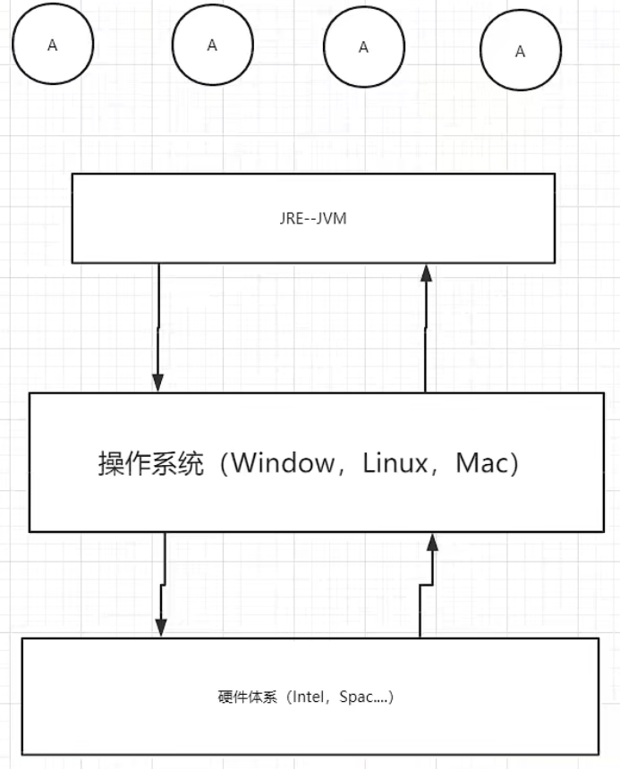

- ABCD是java程序，跑在JVM上
- JRE(java运行环境)包含了JVM

2，JVM的体系结构-简化图：

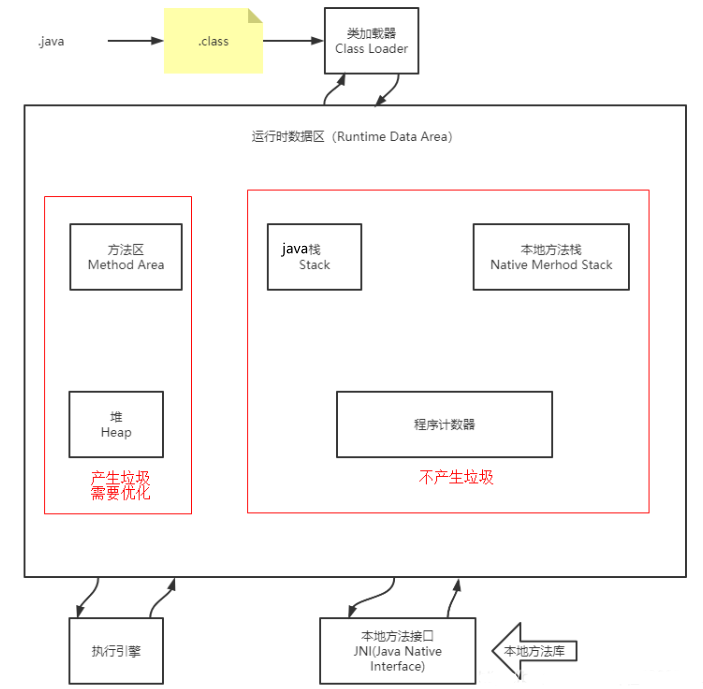

- 运行时数据区：在编程中出现的RunTime异常，就与运行时数据区有关
- 栈中不会有垃圾，因为栈里的东西用完就弹出去了。
  - main方法进栈会被放在栈的最底下；每执行一个方法或传递一个变量就是放在栈中的一个引用，用完方法或变量就会把他们弹出栈
  - 如果栈中存在垃圾把栈堵了，则main方法结束不了，程序也就死了

- JVM调优即垃圾调优，主要在堆里面调；方法区是特殊的堆，方法区有少量垃圾。
  - 网友：方法区，堆。线程共有

3，详细图：

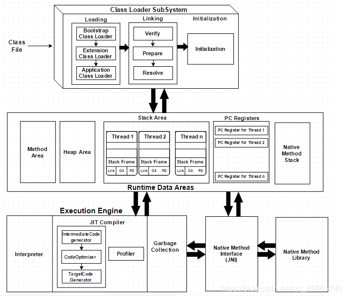

### 类加载器及双亲委派机制

这块老师后面讲的不好，我是参考博客做的笔记；网友推荐宋红康的讲的详细

#### 回顾类 实例的关系

0，思考“new Student()”是在做什么？

- 有一个类叫Student，该类是抽象的
- 当我们使用new关键字new完Student，会得到一个具体的实例
- 具体的实例的引用在栈中，具体实例本身是放在堆中的。（讲OOP的时候解释过）

1，以类加载器处理Car.class文件为例，图示：

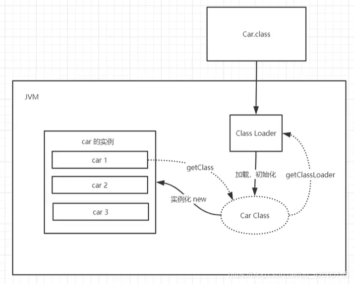

- classloader是jvm的一部分。

2，java文件，编译后得到.class文件

3，类是抽象的模板，对象是具体的。

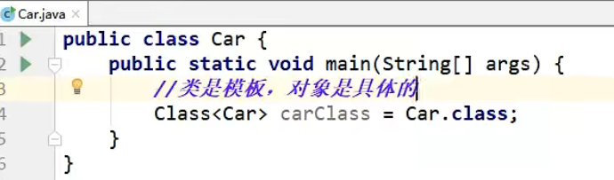

4，把类实例化为对象后，可以又用getclass由对象拿到类对象。

- 看hashcode，从一个模板类new出来的三个对象是不一样的，每个对象有不同的具体的值；由三个对象执行getClass()，得到的是用一个类对象：

  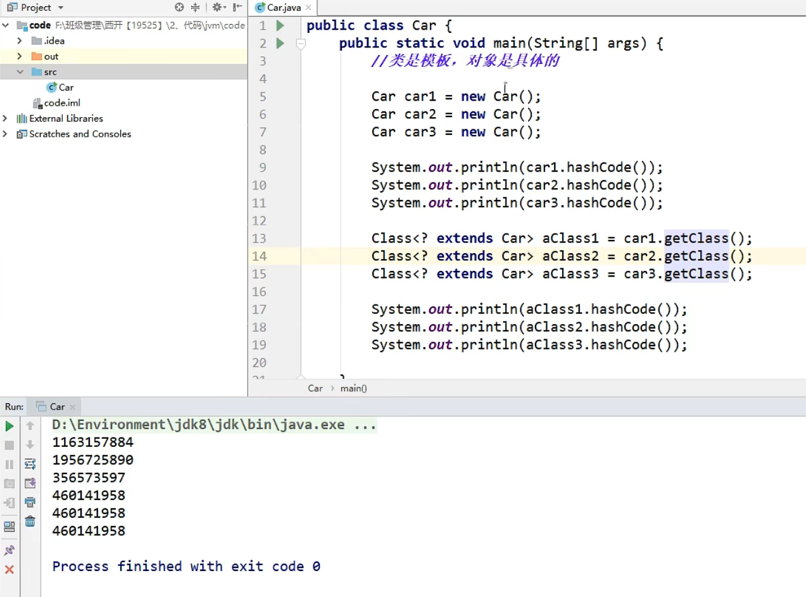

- 三个对象实例car1 car2 car3，实例的名字和内存地址在栈里，包含数据的真正的实例在堆里。这体现了栈是引用地址。

  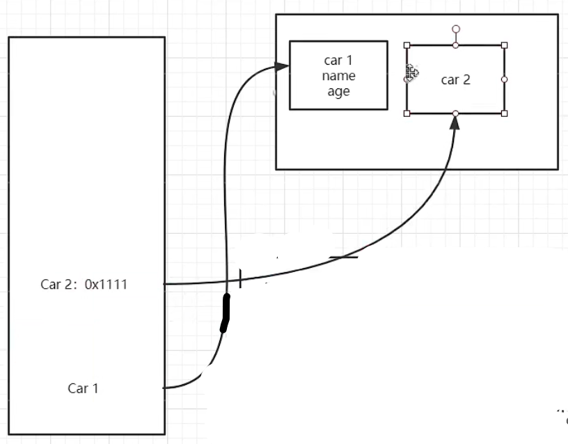

  - 网友：栈存的是地址，堆存的是地址所对应的属性和值；栈是目录，堆是内容；
  - 由于数据都在堆中，所以垃圾都在堆中；栈里没有什么垃圾。

5，由Class，通过geyclassloader可以回到ClassLoader。


#### 类加载器作用

1，类加载器作用：加载Class文件。[参考文章](https://blog.csdn.net/codeyanbao/article/details/82875064).

- 在介绍双亲委派机制的时候，不得不提ClassLoader（类加载器）。说ClassLoader之前，我们得先了解下Java的基本知识。  
-   Java是运行在Java的虚拟机(JVM)中的，但是它是如何运行在JVM中了呢？我们在IDE中编写的Java源代码被编译器编译成.class的字节码文件。然后由我们得ClassLoader负责将这些class文件给加载到JVM中去执行。 
- JVM中提供了三层的ClassLoader：
  - Bootstrap classLoader:主要负责加载核心的类库(java.lang.*等)，构造ExtClassLoader和APPClassLoader。
  - ExtClassLoader：主要负责加载jre/lib/ext目录下的一些扩展的jar。
  - AppClassLoader：主要负责加载应用程序的主函数类。

那如果有一个我们写的Hello.java编译成的Hello.class文件，它是如何被加载到JVM中的呢？别着急，请继续往下看。

#### 类加载器分类

1，分类：

- 虚拟机自带的加载器
- 启动类（根）加载器
- 扩展类加载器
- 应用程序加载器

2，实战，由类对象获取各个级别的类加载器：

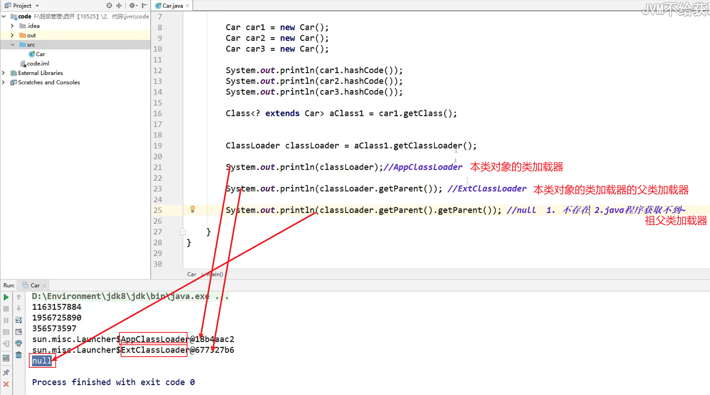

- 我：注意区分“类对象”和“类实例化得到的对象”；每个类都有唯一的“类对象”，一个类可以实例化出数不清的“类实例化得到的对象”。
- 可以看到本类对象的类加载器，在分类上，是“应用程序加载器”。

#### 双亲委派机制

1，由一个例子引出“双亲委派机制”：

代码：

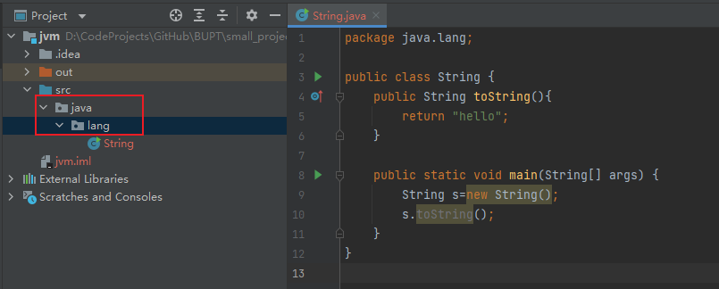

- 注意，代码所在的包也要为根目录下的java.lang，以和java官方的包路径相同

运行main函数，报错如下：

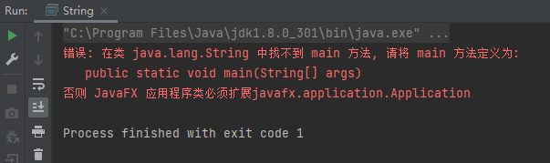

- 报错说没有main，但是本程序中有main，所以得知：jvm中本程序走的不是本程序内的main方法，这是双亲委派机制
- 网友：这个自己写的String类压根没加载，所以会报没有main方法。
- 错误分析：
  1. 运行一个类之前，会先向上用类加载器检查类有没有被加载：app加载器—>扩展类(ext)加载器 ----> (启动类)根加载器(rt) —>
  2. 各层级类加载器都发现自己没有加载该类；就开始从上往下，让类加载器尝试加载。
  3. 在app类加载器中找到了java.lang.String（我自定义的），在根加载器中也找到了java.lang.String（java官方的）；jvm最终会执行根加载器中找到的String，因为加载是从上往下的
  4. 假设根加载器中没有Java.lang.String，它倒着走，去扩展类加载器中找String。扩展类加载器没有String的话，会去当前应用找String。
     - 网友：检查是否已加载的顺序从下至上；类加载器进行加载的顺序从上至下

2，双亲委派机制，流程图如下：


- 注意跟随箭头的指向去读。
- 从上图中我们就更容易理解了，当一个Hello.class这样的文件要被加载时。不考虑我们自定义类加载器，为以下执行步骤：
  1. 首先会在AppClassLoader中检查是否加载过，如果有那就无需再加载了。如果没有，那么会拿到父加载器（即扩展类加载器），然后调用父加载器的loadClass方法。
  2. 父类中同理也会先检查自己是否已经加载过，如果没有再往上。注意这个类似递归的过程，直到到达Bootstrap classLoader之前，**都是在检查是否加载过，并不会选择自己去加载**。
  3. 直到BootstrapClassLoader，已经没有父加载器了，这时候**开始考虑自己是否能加载**了，如果自己无法加载，会下沉到子加载器去加载，一直到最底层，如果没有任何加载器能加载，就会抛出ClassNotFoundException。
- 那么有人就有下面这种疑问了，为什么要设计这种机制？

3，为什么要设计这种机制？：

- 这种设计有个好处是，如果有人想替换系统级别的类：String.java。篡改它的实现，在这种机制下这些系统的类已经被Bootstrap classLoader加载过了（为什么？**因为当一个类需要加载的时候，最先去尝试加载的就是BootstrapClassLoader**），所以其他类加载器并没有机会再去加载，从一定程度上防止了危险代码的植入。
- 总结了一张脑图如下：

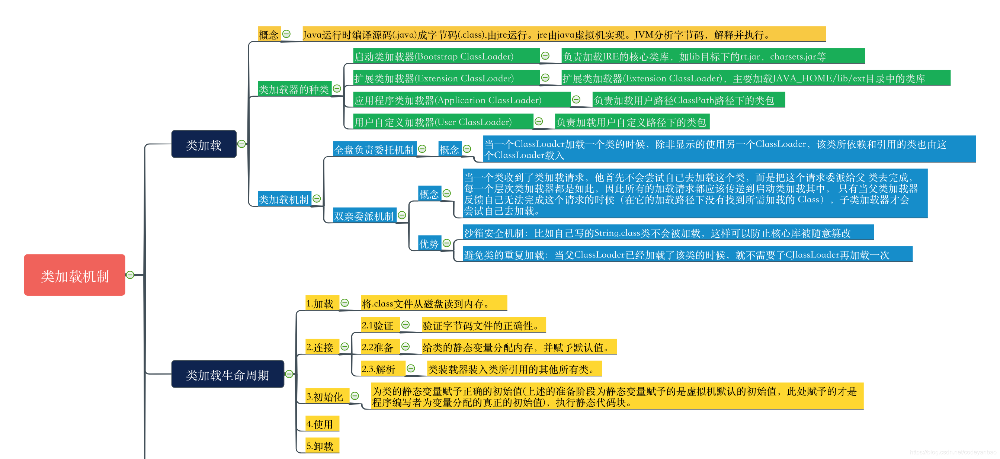

4，实战检测双亲委派机制：

代码；解释见注释：

```java
public class Student {
    //重写object类的toString方法；Student类肯定是Object类的子类吗，所以可以重写
    @Override
    public String toString(){
        return "hello student";
    }

    public static void main(String[] args) {
        Student student = new Student();

        /*
        * 能输出hello的原因：
        * 1. 运行new Student()，从下往上检查发现各级加载器都没加载过Student类，就进入加载阶段；
        * 2. 在加载阶段，会首先让根加载器判断能否加载本类，由于rt.jar包中没有Student类，所以根加载器中找不到Student类。（尽量不要修改RT.jar包，容易导致整个jRE崩溃；比如把RT.jar包中的String类改成自定义的Stirng类）
        * 2. 根加载器中找不到，jvm就会到扩展类加载器中找Student类；由于jdk/kre/lib/ext中没有包含Student类的jar包，所以扩展类加载器找不到Student类
        * 3. 发现扩展类加载器和根加载器都没有Student类，就会执行当前应用程序加载器，即加载自定义的Student类。
        * */
        System.out.println(student.toString());
        //打印对象student的加载器，即可知道对象student对应的类Student是从哪个类加载器出来的
        System.out.println(student.getClass().getClassLoader());
    }
}
```

运行main函数，测试：

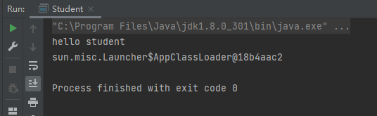

- 由于类加载器加载类是从上往下加载，且扩展类加载器，和根加载器都找不到Student类，所以应用程序加载器会加载本自定义的Student类

### java历史-沙箱安全机制

1，现在问的不多；了解即可，知道java之所以是安全的，是因为有沙箱安全机制作为保证。

- 网友：编译码校验是编译好的文件进入jvm里做的事属于运行时期；而java -c报错是文件没编译好有语法错误，还没进jvm里，属于编译时期

### Native 方法区

native是面试高频，得懂。

#### Native

1，java源码中可以看到`private native void start0();`的语句：

- 凡是带了native关键字的，说明java的作用范围达不到了，回去调用底层c语言的库！

- 会进入本地方法栈，然后去调用本地方法接口将本地方法库中的native方法引入执行。在JVM体系结构图中可以看到“本地方法接口JNI”。

  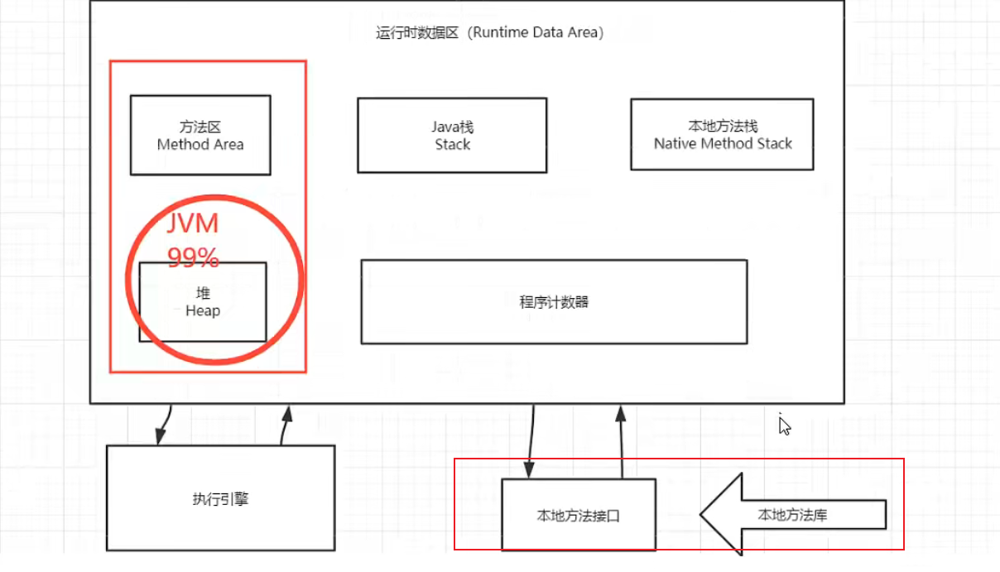

2，本地方法栈（Native Method Stack）：

- 内存区域中专门开辟了一块标记区域: Native Method Stack，负责登记native方法，在执行引擎( Execution Engine )执行的时候通过本地方法接口（JNI）加载本地方法库中的方法

3，本地方法接口（JNI）的作用：

- 本地接口的作用是融合不同的编程语言为Java所用，它的初衷是融合C/C++程序, Java在诞生的时候是C/C++横行的时候，想要立足，必须有调用C、C++的程序；于是在内存区域中专门开辟了一块标记区域：“Native Method Stack”，负责登记native方法，在执行引擎( Execution Engine )执行的时候通过本地方法接口（JNI）加载本地方法库中的方法
- 现在native使用的越来越少了，因为native大多和操作系统和硬件有关系，不过涉及硬件的话一般都用C或C++；但是如java程序驱动打印机，还是会用的；但是在企业中用的少。

4，现在调用其他语言的东西，我们要通过调用其他接口：

- HTTP，RPC都能调用
- 最笨的Socket，webservice也能通信

#### PC程序计数器（了解）

程序计数器: Program Counter Register

1，每个线程都有一个程序计数器，是线程私有的，就是一个指针, 指向方法区中的方法字节码(用来存储指向像一条指令的地址， 也即将要执行的指令代码)，在执行引擎读取下一条指令； PC程序计数器占用一个非常小的内存空间，几乎可以忽略不计

2，为什么需要程序计数器？

- 记录要执行的代码位置，防止线程切换重新执行

3，字节码执行引擎修改程序计数器的值

#### 方法区（重点）

（Method Area）

1，方法区是被所有线程共享,所有字段和方法字节码，以及一些特殊方法，如构造函数，接口代码也在此定义。简单说，所有定义的方法的信息都保存在该区域，此区域属于共享区间。

2，“静态变量（static）、常量（final）、类信息(构造方法、类实现的接口的定义)（Class）、运行时的常量池”存在方法区中，但是实例(对象)变量存在堆内存中，和方法区无关：

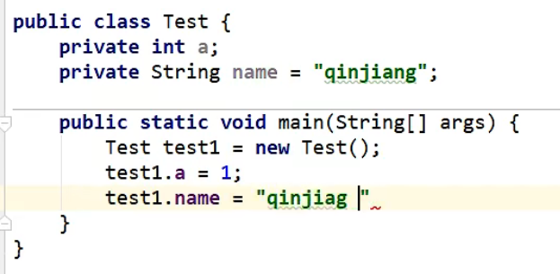

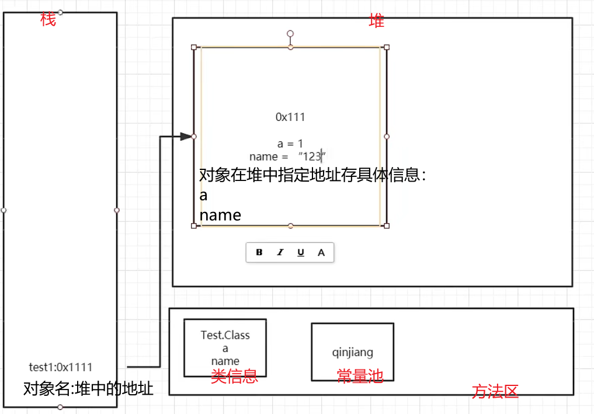

- 网友：1.8中字符串常量池在堆中，运行时常量池在方法区的元空间；方法区

- 字符串是不可修改的，在常量池里。
- 这里name没用`test.name="123"`赋值的话，会从常量池里拿到name的值为“qinjiang”；用`test.name="123"`赋值的话，name的值就会被存在堆中的对象信息里。

### 栈

#### 基本概念

1，对比栈和队列：

- 栈：先进后出；”喝多了吐是栈“
- 队列：先进先出；“吃多了拉是队列”

2，为什么main方法，先执行，最后结束？：

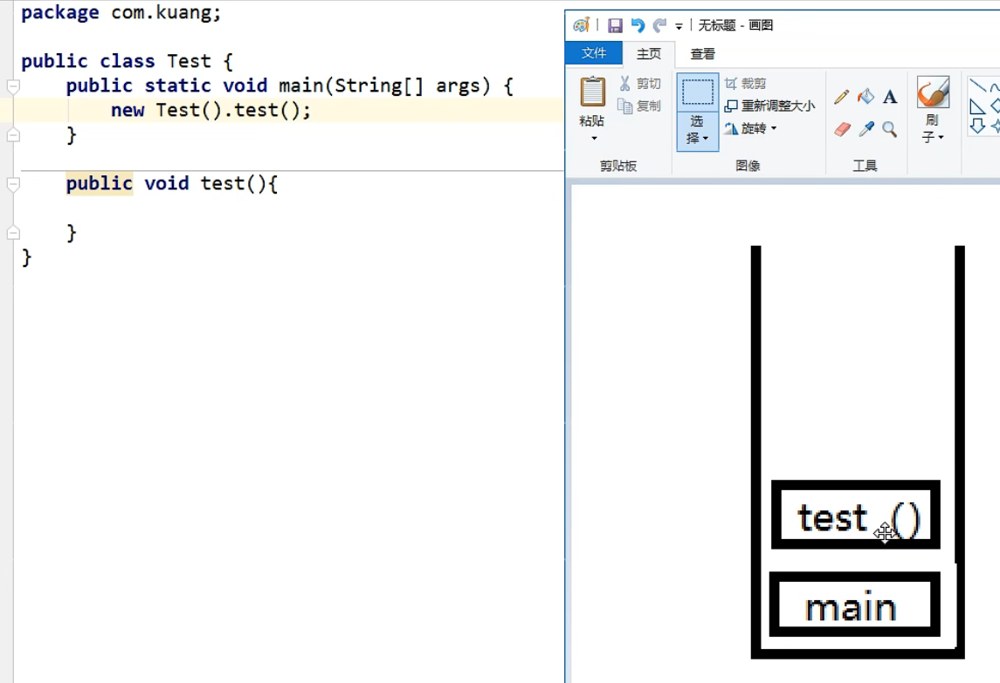

- 压栈弹栈步骤步骤：

  1. 运行main方法，main方法进栈

  2. 运行test方法，test方法进栈；
  3. test方法运行结束，test方法退栈；
  4. main方法运行结束，main方法退栈；此时栈为空，表示程序结束

3，栈满了（StackOverflowError）的情况：

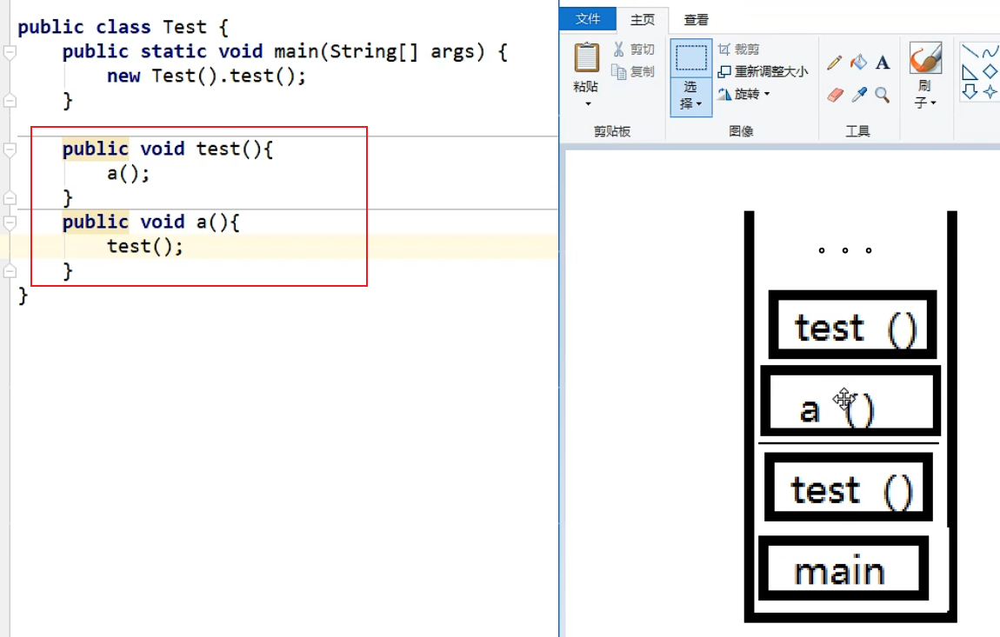

- 不停往jvm栈中压方法，会导致栈溢出
- 所以要小心”深递归“
- 网友：主语把栈溢出错误，和oom相区别，oom要在多线程才可能发生

4，jvm中栈的概念：

- 栈，又称为“栈内存”,栈内存主管程序的运行；每个线程都有自己的栈，栈的生命周期和线程的生命周期同步,线程结束,栈内存也就是释放，也即程序结束了。
- 对于**栈**来说,**不存在垃圾回收问题**；一旦线程结束,栈就结束.

5，栈中放的东西：

- 8大基本类型
  - 注：不含static final等修饰的基本类型，被static final修饰的基本类型要去方法区找。
- 对象引用
- 实例的方法的形参和局部变量
  - 注：实例方法代码存放在方法区，而非栈中。

#### 栈的运行原理

1，要理解栈的运行原理，“栈帧”很重要；下图中，黑色的是栈，绿色的是一个方法也即一个栈帧，黄色的是一个方法也即一个栈帧（每执行一个方法都会产生一个栈帧）：

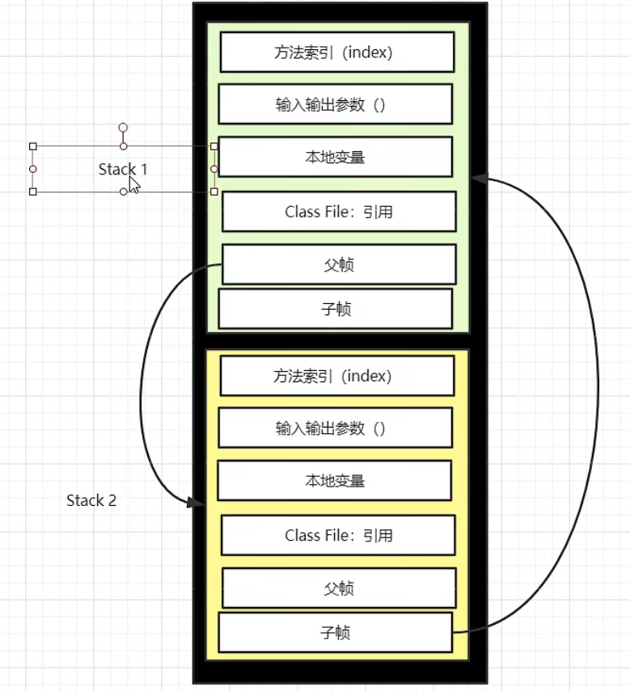

2，黄色的方法会先入栈，该栈帧称为stack2；绿色的方法会后入栈，该栈帧称为stack1；

3，栈帧stack2栈帧中，有一个子帧，该子帧会指向后入栈的栈帧stack1。

4，stack1会先执行，执行完了就弹出，stack2的子帧就没了；

5，现在栈帧stack2成了栈顶，执行stack2，执行stack2完毕后那么stack2也就被弹出栈

- 程序正在执行的方法总是在栈的顶部。

#### 栈+堆+方法区的交互关系

1，图示：

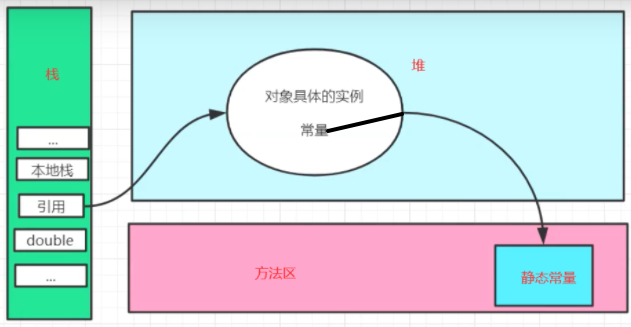

- 网友：java8，要注意这里的常量池指的是运行时常量池，字符串常量池是在堆中的

- 堆中对象实例里的常量，最终会去常量池里拿

- 网友：对象就是一个（类的）实例

- 高赞网友：类加载时将类信息加载进方法区，实例化时根据方法区的类信息，new出来带有具体值信息的对象放在堆中，对象的引用在栈中
- 网友：栈存对象的内存地址，堆中存放对象的内存（也就是栈存的地址），若对象中有定义常量，那么该常量就存放在方法区的常量池中
- 网友：基本数据类型是值传递，引用数据类型是引用传递
  - 我和网友反驳：java没有引用传递；对象的传递也是传递的值，只不过这个值是对象在堆内存中的地址，所以方法内修改传进来的对象的内容会影响到方法外的对象

#### 画出内存中一个对象实例化的过程

暂略

### HotSpot和堆

https://www.bilibili.com/video/BV1iJ411d7jS?p=7&spm_id_from=pageDriver