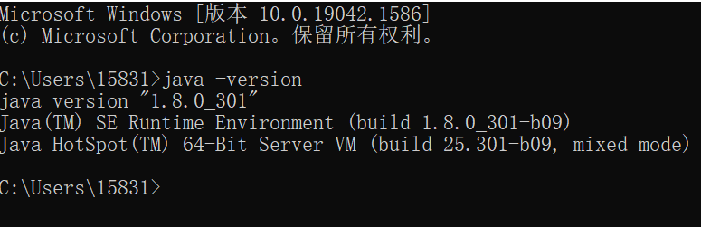
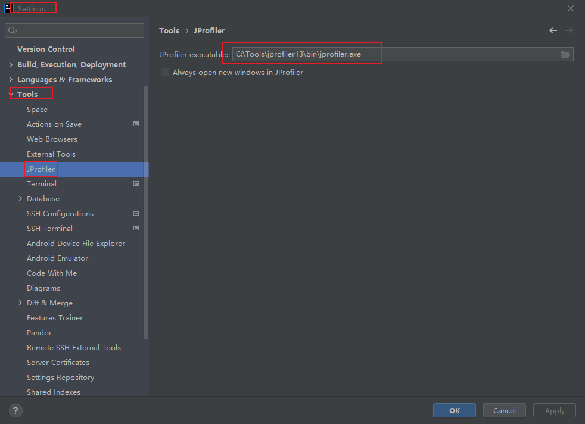

# JVM

强烈推荐书籍：<深入理解jvm>周志明；市面上各种博客教程讲jvm讲的很乱。


[(22条消息) 狂神jvm复习笔记_byteyoung的博客-CSDN博客_狂神jvm笔记](https://blog.csdn.net/qq_40126686/article/details/108279919)

### JVM的学习方式

1，先看看一些常见的面试题，自测：

1. 谈谈你对JVM的理解？：java文件->class文件->jvm
2. java8虚拟机和之前的变化？
3. 什么是OOM(Out Of Memory)，栈溢出(Stack Overflow)，怎么分析？
4. error和异常的区别？
5. JVM的常用调优参数。
6. 内存快照如何抓去，怎么分析Dump文件？
7. 谈谈JVM中类加载器，你的认识？rt-jar ext application


2，JVM需要了解的知识：

- jvm的位置
- jvm的体系结构
- 类加载器
- 双亲委派机制
- 沙箱安全机制
- Native
- PC寄存器
- 方法区
- 栈
- 堆
- 三种JVM（用java -version可以看到本机是hotspot虚拟机）
- 新生区，老年区
- 永久区
- 堆内存调优
- GC
  - 常用算法
- JMM
- 总结


3，学习方式：

- 百度
- 前人总结的jvm思维导图（processon版）

4，好文必读：

- https://zhuanlan.zhihu.com/p/25713880

### JVM的体系结构

1，JVM的位置图示：


- ABCD是java程序，跑在JVM上
- JRE(java运行环境)包含了JVM

2，JVM的体系结构-简化图：


- 运行时数据区：在编程中出现的RunTime异常，就与运行时数据区有关
- 栈中不会有垃圾，因为栈里的东西用完就弹出去了。
  - main方法进栈会被放在栈的最底下；每执行一个方法或传递一个变量就是放在栈中的一个引用，用完方法或变量就会把他们弹出栈
  - 如果栈中存在垃圾把栈堵了，则main方法结束不了，程序也就死了

- JVM调优即垃圾调优，主要在堆里面调；方法区是特殊的堆，方法区有少量垃圾。
  - 网友：方法区，堆。线程共有

3，详细图：


### 类加载器及双亲委派机制

这块老师后面讲的不好，我是参考博客做的笔记；网友推荐宋红康的讲的详细

#### 回顾类 实例的关系

0，思考“new Student()”是在做什么？

- 有一个类叫Student，该类是抽象的
- 当我们使用new关键字new完Student，会得到一个具体的实例
- 具体的实例的引用在栈中，具体实例本身是放在堆中的。（讲OOP的时候解释过）

1，以类加载器处理Car.class文件为例，图示：


- classloader是jvm的一部分。

2，java文件，编译后得到.class文件

3，类是抽象的模板，对象是具体的。


4，把类实例化为对象后，可以又用getclass由对象拿到类对象。

- 看hashcode，从一个模板类new出来的三个对象是不一样的，每个对象有不同的具体的值；由三个对象执行getClass()，得到的是用一个类对象：

  

- 三个对象实例car1 car2 car3，实例的名字和内存地址在栈里，包含数据的真正的实例在堆里。这体现了栈是引用地址。

  

  - 网友：栈存的是地址，堆存的是地址所对应的属性和值；栈是目录，堆是内容；
  - 由于数据都在堆中，所以垃圾都在堆中；栈里没有什么垃圾。

5，由Class，通过geyclassloader可以回到ClassLoader。


#### 类加载器作用

1，类加载器作用：加载Class文件。[参考文章](https://blog.csdn.net/codeyanbao/article/details/82875064).

- 在介绍双亲委派机制的时候，不得不提ClassLoader（类加载器）。说ClassLoader之前，我们得先了解下Java的基本知识。  
-   Java是运行在Java的虚拟机(JVM)中的，但是它是如何运行在JVM中了呢？我们在IDE中编写的Java源代码被编译器编译成.class的字节码文件。然后由我们得ClassLoader负责将这些class文件给加载到JVM中去执行。 
- JVM中提供了三层的ClassLoader：
  - Bootstrap classLoader:主要负责加载核心的类库(java.lang.*等)，构造ExtClassLoader和APPClassLoader。
  - ExtClassLoader：主要负责加载jre/lib/ext目录下的一些扩展的jar。
  - AppClassLoader：主要负责加载应用程序的主函数类。

那如果有一个我们写的Hello.java编译成的Hello.class文件，它是如何被加载到JVM中的呢？别着急，请继续往下看。

#### 类加载器分类

1，分类：

- 虚拟机自带的加载器
- 启动类（根）加载器
- 扩展类加载器
- 应用程序加载器

2，实战，由类对象获取各个级别的类加载器：


- 我：注意区分“类对象”和“类实例化得到的对象”；每个类都有唯一的“类对象”，一个类可以实例化出数不清的“类实例化得到的对象”。
- 可以看到本类对象的类加载器，在分类上，是“应用程序加载器”。

#### 双亲委派机制

1，由一个例子引出“双亲委派机制”：

代码：


- 注意，代码所在的包也要为根目录下的java.lang，以和java官方的包路径相同

运行main函数，报错如下：


- 报错说没有main，但是本程序中有main，所以得知：jvm中本程序走的不是本程序内的main方法，这是双亲委派机制
- 网友：这个自己写的String类压根没加载，所以会报没有main方法。
- 错误分析：
  1. 运行一个类之前，会先向上用类加载器检查类有没有被加载：app加载器—>扩展类(ext)加载器 ----> (启动类)根加载器(rt) —>
  2. 各层级类加载器都发现自己没有加载该类；就开始从上往下，让类加载器尝试加载。
  3. 在app类加载器中找到了java.lang.String（我自定义的），在根加载器中也找到了java.lang.String（java官方的）；jvm最终会执行根加载器中找到的String，因为加载是从上往下的
  4. 假设根加载器中没有Java.lang.String，它倒着走，去扩展类加载器中找String。扩展类加载器没有String的话，会去当前应用找String。
     - 网友：检查是否已加载的顺序从下至上；类加载器进行加载的顺序从上至下

2，双亲委派机制，流程图如下：


- 注意跟随箭头的指向去读。
- 从上图中我们就更容易理解了，当一个Hello.class这样的文件要被加载时。不考虑我们自定义类加载器，为以下执行步骤：
  1. 首先会在AppClassLoader中检查是否加载过，如果有那就无需再加载了。如果没有，那么会拿到父加载器（即扩展类加载器），然后调用父加载器的loadClass方法。
  2. 父类中同理也会先检查自己是否已经加载过，如果没有再往上。注意这个类似递归的过程，直到到达Bootstrap classLoader之前，**都是在检查是否加载过，并不会选择自己去加载**。
  3. 直到BootstrapClassLoader，已经没有父加载器了，这时候**开始考虑自己是否能加载**了，如果自己无法加载，会下沉到子加载器去加载，一直到最底层，如果没有任何加载器能加载，就会抛出ClassNotFoundException。
- 那么有人就有下面这种疑问了，为什么要设计这种机制？

3，为什么要设计这种机制？：

- 这种设计有个好处是，如果有人想替换系统级别的类：String.java。篡改它的实现，在这种机制下这些系统的类已经被Bootstrap classLoader加载过了（为什么？**因为当一个类需要加载的时候，最先去尝试加载的就是BootstrapClassLoader**），所以其他类加载器并没有机会再去加载，从一定程度上防止了危险代码的植入。
- 总结了一张脑图如下：


4，实战检测双亲委派机制：

代码；解释见注释：

```java
public class Student {
    //重写object类的toString方法；Student类肯定是Object类的子类吗，所以可以重写
    @Override
    public String toString(){
        return "hello student";
    }

    public static void main(String[] args) {
        Student student = new Student();

        /*
        * 能输出hello的原因：
        * 1. 运行new Student()，从下往上检查发现各级加载器都没加载过Student类，就进入加载阶段；
        * 2. 在加载阶段，会首先让根加载器判断能否加载本类，由于rt.jar包中没有Student类，所以根加载器中找不到Student类。（尽量不要修改RT.jar包，容易导致整个jRE崩溃；比如把RT.jar包中的String类改成自定义的Stirng类）
        * 2. 根加载器中找不到，jvm就会到扩展类加载器中找Student类；由于jdk/kre/lib/ext中没有包含Student类的jar包，所以扩展类加载器找不到Student类
        * 3. 发现扩展类加载器和根加载器都没有Student类，就会执行当前应用程序加载器，即加载自定义的Student类。
        * */
        System.out.println(student.toString());
        //打印对象student的加载器，即可知道对象student对应的类Student是从哪个类加载器出来的
        System.out.println(student.getClass().getClassLoader());
    }
}
```

运行main函数，测试：


- 由于类加载器加载类是从上往下加载，且扩展类加载器，和根加载器都找不到Student类，所以应用程序加载器会加载本自定义的Student类

### java历史-沙箱安全机制

1，现在问的不多；了解即可，知道java之所以是安全的，是因为有沙箱安全机制作为保证。

- 网友：编译码校验是编译好的文件进入jvm里做的事属于运行时期；而java -c报错是文件没编译好有语法错误，还没进jvm里，属于编译时期

### Native 方法区

native是面试高频，得懂。

[栈堆方法区好文，建议先看](https://blog.csdn.net/u013241673/article/details/78574770)

#### Native

1，java源码中可以看到`private native void start0();`的语句：

- 凡是带了native关键字的，说明java的作用范围达不到了，回去调用底层c语言的库！

- 会进入本地方法栈，然后去调用本地方法接口将本地方法库中的native方法引入执行。在JVM体系结构图中可以看到“本地方法接口JNI”。

  

2，本地方法栈（Native Method Stack）：

- 内存区域中专门开辟了一块标记区域: Native Method Stack，负责登记native方法，在执行引擎( Execution Engine )执行的时候通过本地方法接口（JNI）加载本地方法库中的方法

3，本地方法接口（JNI）的作用：

- 本地接口的作用是融合不同的编程语言为Java所用，它的初衷是融合C/C++程序, Java在诞生的时候是C/C++横行的时候，想要立足，必须有调用C、C++的程序；于是在内存区域中专门开辟了一块标记区域：“Native Method Stack”，负责登记native方法，在执行引擎( Execution Engine )执行的时候通过本地方法接口（JNI）加载本地方法库中的方法
- 现在native使用的越来越少了，因为native大多和操作系统和硬件有关系，不过涉及硬件的话一般都用C或C++；但是如java程序驱动打印机，还是会用的；但是在企业中用的少。

4，现在调用其他语言的东西，我们要通过调用其他接口：

- HTTP，RPC都能调用
- 最笨的Socket，webservice也能通信

#### PC程序计数器（了解）

程序计数器: Program Counter Register

1，每个线程都有一个程序计数器，是线程私有的，就是一个指针, 指向方法区中的方法字节码(用来存储指向像一条指令的地址， 也即将要执行的指令代码)，在执行引擎读取下一条指令； PC程序计数器占用一个非常小的内存空间，几乎可以忽略不计

2，为什么需要程序计数器？

- 记录要执行的代码位置，防止线程切换重新执行

3，字节码执行引擎修改程序计数器的值

#### 方法区（重点）

（Method Area）

1，方法区概念；[参考文章](https://zhuanlan.zhihu.com/p/25713880)：

- 在JVM中，**类型信息**和**类静态变量**都保存在方法区中，类型信息是由类加载器在类加载的过程中从类文件中提取出来的信息。

- 需要注意的一点是，**常量池也存放于方法区中**。

- **程序中所有的线程共享一个方法区**，所以访问方法区的信息必须确保线程是安全的。如果有两个线程同时去加载一个类，那么只能有一个线程被允许去加载这个类，另一个必须等待。

- 在程序运行时，方法区的大小是可以改变的，程序在运行时可以扩展。

- 方法区也可以被垃圾回收，但条件非常严苛，必须在该类没有任何引用的情况下，详情可以参考另一篇文章：[Java性能优化之JVM GC（垃圾回收机制） - 知乎专栏](https://zhuanlan.zhihu.com/p/25539690)

2，**类型信息包括什么？**：

```
1、类型的全名（The fully qualified name of the type）

2、类型的父类型全名（除非没有父类型，或者父类型是java.lang.Object）（The fully qualified name of the typeís direct superclass）

3、该类型是一个类还是接口（class or an interface）（Whether or not the type is a class ）

4、类型的修饰符（public，private，protected，static，final，volatile，transient等）（The typeís modifiers）

5、所有父接口全名的列表（An ordered list of the fully qualified names of any direct superinterfaces）

6、类型的字段信息（Field information）

7、类型的方法信息（Method information）

8、所有静态类变量（非常量）信息（All class (static) variables declared in the type, except constants）

9、一个指向类加载器的引用（A reference to class ClassLoader）

10、一个指向Class类的引用（A reference to class Class）

11、基本类型的常量池（The constant pool for the type）
```

- 所以方法信息在方法区中！

3，方法列表（Method Tables）：

- 为了更高效的访问所有保存在方法区中的数据，在方法区中，除了保存上边的这些类型信息之外，还有一个为了加快存取速度而设计的数据结构：方法列表。每一个被加载的非抽象类，Java虚拟机都会为他们产生一个方法列表，这个列表中保存了这个类可能调用的所有实例方法的引用，保存那些父类中调用的方法。

4，狂神补充：“静态变量（static）、常量（final）、类信息(构造方法、类实现的接口的定义)（Class）、运行时的常量池”存在方法区中，但是实例(对象)变量存在堆内存中，和方法区无关：


- 网友：1.8中字符串常量池在堆中，运行时常量池在方法区的元空间；方法区
- 字符串是不可修改的，在常量池里。
- 这里name没用`test.name="123"`赋值的话，会从常量池里拿到name的值为“qinjiang”；用`test.name="123"`赋值的话，name的值就会被存在堆中的对象信息里。

### 栈

#### 基本概念

1，对比栈和队列：

- 栈：先进后出；”喝多了吐是栈“
- 队列：先进先出；“吃多了拉是队列”

2，为什么main方法，先执行，最后结束？：


- 压栈弹栈步骤步骤：

  1. 运行main方法，main方法进栈

  2. 运行test方法，test方法进栈；
  3. test方法运行结束，test方法退栈；
  4. main方法运行结束，main方法退栈；此时栈为空，表示程序结束

3，栈满了（StackOverflowError）的情况：


- 不停往jvm栈中压方法，会导致栈溢出
- 所以要小心”深递归“
- 网友：主语把栈溢出错误，和oom相区别，oom要在多线程才可能发生

4，jvm中栈的概念：

- 栈，又称为“栈内存”,栈内存主管程序的运行；每个线程都有自己的栈，栈的生命周期和线程的生命周期同步,线程结束,栈内存也就是释放，也即程序结束了。
- 对于**栈**来说,**不存在垃圾回收问题**；一旦线程结束,栈就结束.

5，栈中放的东西：

- 8大基本类型
  - 注：不含static final等修饰的基本类型，被static final修饰的基本类型要去方法区找。
- 对象引用
- 实例的方法的形参和局部变量
  - 注：实例方法代码存放在方法区，而非栈中。

#### 栈的运行原理

1，要理解栈的运行原理，“栈帧”很重要；下图中，黑色的是栈，绿色的是一个方法也即一个栈帧，黄色的是一个方法也即一个栈帧（每执行一个方法都会产生一个栈帧）：


2，黄色的方法会先入栈，该栈帧称为stack2；绿色的方法会后入栈，该栈帧称为stack1；

3，栈帧stack2栈帧中，有一个子帧，该子帧会指向后入栈的栈帧stack1。

4，stack1会先执行，执行完了就弹出，stack2的子帧就没了；

5，现在栈帧stack2成了栈顶，执行stack2，执行stack2完毕后那么stack2也就被弹出栈

- 程序正在执行的方法总是在栈的顶部。

#### 栈+堆+方法区的交互关系

1，图示：


- 网友：java8，要注意这里的常量池指的是运行时常量池，字符串常量池是在堆中的

- 堆中对象实例里的常量，最终会去常量池里拿

- 网友：对象就是一个（类的）实例

- 高赞网友：类加载时将类信息加载进方法区，实例化时根据方法区的类信息，new出来带有具体值信息的对象放在堆中，对象的引用在栈中
- 网友：栈存对象的内存地址，堆中存放对象的内存（也就是栈存的地址），若对象中有定义常量，那么该常量就存放在方法区的常量池中
- 网友：基本数据类型是值传递，引用数据类型是引用传递
  - 我和网友反驳：java没有引用传递；对象的传递也是传递的值，只不过这个值是对象在堆内存中的地址，所以方法内修改传进来的对象的内容会影响到方法外的对象

#### 画出内存中一个对象实例化的过程

暂略

### HotSpot和堆

#### 三种JVM

1，jvm三种版本：

- sun公司的hotspot版；
  - 目前主要用的；
- Oracle公司的 JRockit版（原BEA JRockit）；
  - 性能不错，但是不适合学习
- IBM公司的j9vm

2，java版本可以使用`java -version`查看：



3，本教程讲的堆的知识都是基于hotspot版jvm的，别的版本的jvm和hotspot共祖，只是后面分化开了，所以会有些区别。


#### 堆

0，堆到底包括永久区吗？：

- [参考文章](https://blog.csdn.net/ylyg050518/article/details/52244994)；**本文没有把永久代算在堆内存中**（老师承认自己把永久代称为永久区）。

- [文章](https://blog.csdn.net/myfirstuser/article/details/98034911)，把永久代算在堆中，我看网友说“方法区即永久代，是一种特殊的堆。”
- 狂神：永久代在jdk1.8后被称为元空间，也被称为非堆；有人看他是jvm堆的一部分，有人不认为，两种见解都行。

1，一个JVM只有一个堆内存,堆内存的大小是可以调节的,

- 网友：栈是线程级的，但堆只有一个

2，类加载器读取类文件后,一般会把类,方法,变量,我们所有引用类型的真实对象,放入堆中，以方便执行器执行。

- 我和网友：常量放在方法区的常量池中；在《深入理解jvm虚拟机》中说到：运行时常量池也是在方法区的
  - [三种常量池](https://www.cnblogs.com/dtyy/p/15881493.html)
  - [什么是永久代](https://www.jianshu.com/p/66e4e64ff278)
- 我和高赞网友：堆里的是方法引用，栈中存着方法的局部变量和形参，方法区有类的方法信息；

3，堆内存细分为三个区域:

- 新生代
- 老年代old
- 永久代Perm


4，OOM实战：


- 不停在伊甸园区创建对象，对象会往养老区转移，最后新生区和养老区都满了，就报错OOM。

#### 堆内存-新生代

1，堆内存-新生区：类的诞生,成长和死亡的地方
分为:

- 伊甸园区:所有对象都在伊甸园区new出来
- 伊甸园区满了就会轻GC。
- 幸存0区和幸存1区:轻GC之后存下来的
- 垃圾回收主要在“伊甸园区”和“养老区”
  - 幸存区是伊甸园和养老区的过渡，这里垃圾清理的少。
- 幸存区1和2是交换的，把内容从1转移到到2，再从2到1
  - 后面GC回收会细说

#### 堆内存-老年代

1，老年代(养老区)：

- 15次轻GC存活下来的对象放在老年代
  - 网友：除了15次，当一批对象总内存超过survivor（幸存区）区50%就会被直接放进老年区，不需要15次

- 真理:经过研究，90%的对象都是临时对象!所以大多数对象到不了老年代。
- 网友：full GC是养老区满的情况下

#### 堆内存-永久代

1，永久代：

- 这个区域常驻内存的。用来存放JDK自身携带的Class对象。Interface元数据，存储的是Java运行时的一些环境或类信息-，这个区域不存在垃圾回收!关闭VM虚拟就会释放这个区域的内存~
- 一个启动类，加载了大量的第三方jar包。Tomcat部署了太多的应用，大量动态生成的反射类。不断的被加载。直到内存满，就会出现OOM;
- jdk8及之后，永久区的功能，由元空间实现。
  - 高赞网友补充：jdk1.7前的永久区在JVM的内存中；但是jdk1.8后的元空间不在JVM内存中，而在计算机的内存中；所以元空间不能算堆的一部分！！！
  - [永久代和元空间和方法区的区别](https://www.cnblogs.com/paddix/p/5309550.html)

2，永久区的名字变化：

-  jdk1.6之前:永久代，常量池是在方法区;
-  jdk1.7︰永久代，但是慢慢的退化了，去永久代。常量池在堆中
-  jdk1.8之后:无永久代，常量池在元空间
  - 网友：永久代是方法区的实现；方法区只是一种规范，而永久代或者元空间是方法区的实现，他们并不是从属关系；方法区是一个特殊的堆，jdk8以后在堆(元空间里面)

3，持久代（perm）在jdk1.8改名为元空间，元空间实现了方法区这个概念；方法区又被称为非堆，因为它在堆里面，但是又被所有线程共享，所以用“非堆”特意区分出方法区。

- 网友：所谓方法区，只是一种概念，永生代和元空间是对他的一种实现方式
- 网友：永久代和元空间都是对方法区的一种实现,因为永久区的实现容易产生OOM,所以放到了实际的本地内存用永久区实现,内存那么大,就不容易OOM了；方法区是JVM规范的规定，永久代是hotspot对方法区的实现；1.8后元空间取代永久代来实现方法区

#### OOM处理

1，运行程序时尝试扩大堆内存，查看结果；如果还是oom，那可能是程序写错了，即不停创建对象但是不使用完毕。

2，分析内存，看一下哪个地方出现了问题。

### 使用JProfiler工具分析OOM原因

#### 引入

1，在一个项目中出现了OOM故障，想排除：

- 最好是能看到代码在第几行出错；这就得使用内存快照分析工具，早期eclipse中有MAT，现在是Jprofiler
- 比较低效的就debug，一行行分析代码。

2，MAT，Jprofiler作用：

- 分析Dump内存文件，快速定位内存泄露;
- 获得堆中的数据
- 获得大的对象~

- 。。。

#### idea安装Jprofiler插件

1，本地搜索jprofile，搜不到就去market


2，idea安装jprofile插件；安装完毕后点击“**apply**”：


3，idea安装好插件后，还得电脑[安装](https://www.ej-technologies.com/download/jprofiler/files)一个程序：


4，


- 狂神说：安装路劲不能有空格，所以我自定义了安装路径，没有用默认的路劲。

5，选择idea集成，继续安装：


6，不用秘钥，选择10日试用，进入软件：


- 按钮全是灰的，唯一能点的是“启动中心”

7，回到idea，到settings-tools,可以看到jprofiler；选中从官网下载的jprofile.exe，如果apply可以点击就点击：



8，看到idea出现了jprofile图标，如果没出现就尝试重启idea：


#### 实战jprofiler

1，编写代码；解释在注释中：


```java
package com.zhangyun.demo02oom;

import java.util.ArrayList;

public class TestJprofiler {
    //每一个testjprofile对象都被分配了1M的堆内存，所以不停创建对象并存储的话，会oom
    byte [] byteArray= new byte[1024*1024];//1M

    public static void main(String[] args) {
        //指定list列表存储的类型为本类TestJprofiler实例化的对象
        ArrayList<TestJprofiler> list = new ArrayList<>();

        //计数
        int count= 0;

        //利用死循环构建oom;可能会出现异常的代码块，要总是用trycatch
        try {
            while(true){
                list.add(new TestJprofiler());
                count++;
            }
        }
        //Exception是捕获不到的，要用error
        catch (Error e) {
            /*
            * 顶级不正常是Throwable
            * 次一层级是Exception和Error
            * */
            System.out.println("count:"+count);
            e.printStackTrace();
        }

    }
}
```

2，运行main函数：


- 因为OOM是error，catch无法捕捉exception，所以也不会打印count

3，在configuration中，设置vm参数，来尝试看看哪里出错了：


- 常用jvm命令：
  - `-Xms`：设置jvm初始化被分配的内存大小，默认为物理内存的1/64；
  - `-Xmx`：设置jvm最大被分配内存，默认是物理内存的1/4
  - `-XX:+PrintGCDetail`：打印GC垃圾回收信息。加号表示命令。
  - `-XX:+HeapDumpOnOutOfMemoryError`：打印栈溢出或者oom的命令
- 默认Xms会是1个多G，可能会把电脑卡死，自测可以设置小一点，本例设置为1MB。
- `-XX:+HeapDumpOnOutOfMemoryError`是重点：假设我爆出了OOM异常，jvm就把Dump文件导出来

4，编写好configuration后再次运行程序，会提示`Dumping heap to java_pid73740.hprof ...`:


5，找“java_pid73740.hprof”，打开文件夹后往上找，在src的同级目录下找到了：


6，双击打开“java_pid73740.hprof”，


- 一下就定位是arraylist出问题了，因为正常对象不可能一下就占89%的jvm堆内存。

- 进一步看，发现Arraylist中不停放TestProfiler实例化对象导致的oom

7，点”线程dump“，可以看到各个线程的情况；我们只有main线程，就可以看到main线程的细节：


- 在第7行初始化，**在第19行出问题**

- 网友：idea不是提示了19行出问题了嘛
  - 网友回复：生产和测试环境是linux，没法看idea的提示。

8，java的Runtime类，使用它可以做一些jvm调优：

- Runtime类是什么？：每个java程序在运行时相当于启动了一个JVM进程，每个JVM进程都对应一个RunTime实例。此实例是JVM负责实例化的，所以我们不能实例化一个RunTime对象，只能通过getRuntime() 获取当前运行的Runtime对象的引用。一旦得到了一个当前的Runtime对象的引用，就可以调用Runtime对象的方法去查看Java虚拟机的状态以及控制虚拟机的行为。
- 参考文章：[Java Runtime类 - 简书 (jianshu.com)](https://www.jianshu.com/p/a0d3e85a44f7)

### GC

#### 引入

1，GC主要就是在堆和方法区进行；方法区是特殊的堆，由永生代或元空间实现，1.8之后，永生代改名为元空间，且从jvm内存中移出。

- 方法区是jvm规范，元空间和永久代是实现

2，要GC清理堆，就先回顾jvm堆的划分：

- 新生代
  - 伊甸园区
  - 幸存区0，幸存区1：（from）（to）幸存区内容交换的时候，交换前的to会变成交换后的from。
- 老年区

- 永生代（jdk8后称为元空间并不在堆中，且不参与GC，不讨论）

3，jvm在进行GC的时候，并不是对“新生代和老年代”统一回收；大部分时候，回收都是在新生代的伊甸园区：

- GC有两种分类：
  - 轻GC（普通GC）：
    - 主要针对伊甸园区
    - 幸存区满的时候，偶尔针对幸存区
  - 重GC（全局GC）：
    - 把“新生代和老年代”都清理一遍。

4，GC题目：

- jvm的内存模型和分区，详细到每个区做什么？
- 堆里面的分区有哪些？：

  - eden，幸存区from，幸存区to，老年代 
- GC算法有哪些？怎么用？：

  - 标记清除法

  - 标记压缩

  - 复制算法
  - 引用计数法
- 轻GC和重GC分别在什么时候发生？

5，推荐阅读：

- [不同GC算法的区别](https://blog.csdn.net/m0_37860933/article/details/82154989)，尤其说了引用计数法，和标记清除法的区别。

#### 引用计数法

1，图示：


- 灰色的，计数为0的对象，说明没有被引用了，会被清理
- 这种清理算法现在用的少
  - 引用计数法存在[循环引用](https://blog.csdn.net/faker____/article/details/83061673)的问题。

#### 复制算法

0，推荐阅读文章：

- [关于JVM中Eden区、Survivor from区和Survivor to区的理解](https://blog.csdn.net/qq_29631431/article/details/82344081)
- [Appel式回收为什么使用两个Survivor](https://blog.csdn.net/Hello_mengkebao/article/details/119805735)
- [survivor满了怎么办](https://blog.csdn.net/luoailong/article/details/111868139)
- [(我：本文章质量不如前几个) GC详解及Minor GC和Full GC触发条件总结_Anstrue的博客-CSDN博客_fullgc minorgc](https://blog.csdn.net/beautiful_face/article/details/77722635)

1，


- 对于两个幸存区来说，谁是空的，谁就扮演to角色。
  - 网友：这个逻辑跟沙漏很像啊，上下会交换
  - 网友：有一天Eden区中的人实在是太多我就被迫去Survivor区的“To”区，自从去Survivor区，我开始漂泊Survivor的两个区总是交换名字，我总是搬家，搬到To Survivor居住，搬来搬去。
  - 网友：对象在两个幸存区间不断**来回复制**的目的是避免产生过多的内存碎片；解决了内存碎片化问题，内存碎片不连续导致明明内存足够缺无法NEW对象
  - 网友：from满了就会触发minorGC 然后将存货下来的移到to区

- 如果对象很大，超过eden区的一半，就会去老年区申请空间

- 高赞网友：TenuringThreshold 这里不对，对象头只留了4bit用于GC次数设置，TenuringThreshold 最大只能是15

2，动态描述


- 每一次垃圾回收后，伊甸园和from区空了，对象都到to区；同时把to该为from。

幸存区满了，会做轻gc把活着的对象放到养老区；幸存区没满时，其中的对象活了15次，也会被放到养老区：


3，优缺点：

- 好处:新生区内存没有碎片~ 
- 坏处:浪费了内存空间~ :

4，复制算法最佳使用场景:对象存活度较低的时候;新生区时对象存货度较低，所以新生区里我们使用复制算法。

#### 标记清除算法

1，图示：


- 图上半部分为扫描阶段后，绿色背景表示活着的对象（标记上），实现框表示扫描发现的已死去的对象

- 图下半部分为清除阶段后，虚线框表示清除对象后留下的空闲内存

2，优缺点：

- 优点：不需要额外的空间
- 缺点：两次扫描严重浪费时间；会产生内存碎片。

#### 标记清除整理算法

1，在“标记清除算法”的基础上再改进；加上”整理“，解决连续内存分配时内存碎片问题；图示：


#### GC算法总结

1，从内存的不同维度评价各种GC算法：

- 内存效率(时间复杂度升序):复制算法>标记清除算法>标记压缩算法
- 内存整齐度:复制算法=标记压缩算法>标记清除算法
- 内存利用率:标记压缩算法=标记清除算法>复制算法

2，思考：有没有最优的算法？

- 没有最好的算法，只有最合适的算法。所以GC采用分代收集算法。
  - 新生代：对象存活率低；使用复制算法效率高
  - 老年代：区域大，存活率高；用标记清楚+标记压缩混合清除。
    - jvm调优会调这个，比如标记清除多少次，就进行一次标记压缩算法。
    - 内存碎片不是很多的时候，就使用标记清楚；内存碎片很多的时候就使用标记压缩。
- 网友：算法的选择都是根据实际的情况而定的，看自己需要什么有点，可以接受他们的缺点吗。然后做选择？

