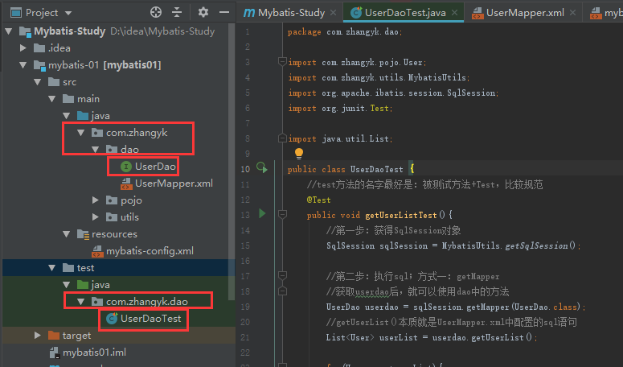
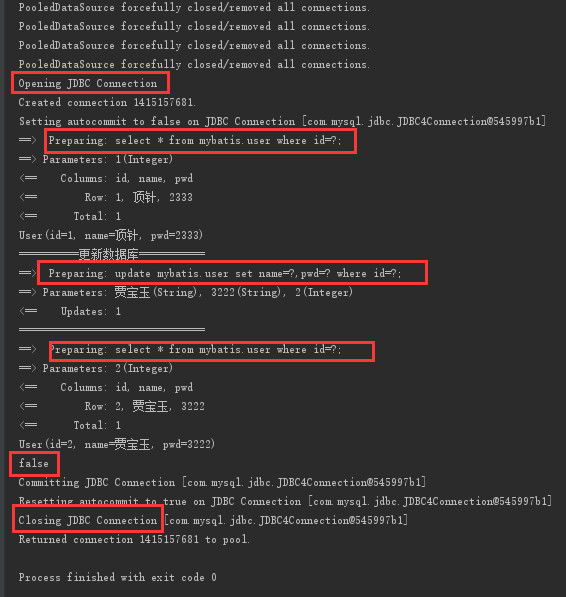

# Mybatis-210624

环境：

- jdk1.8 (经典)
- Mysql 5.7 （经典）
- maven 3.6.1
- idea

回顾：

- JDBC
- Mysql
- java基础
- Maven
- Junit

SSM框架：配置文件的。最好的学习方式：看[官网文档](https://mybatis.org/mybatis-3/zh/index.html)


## 1，简介

### 1.1，什么是mybatis


来源于[官网简介](https://mybatis.org/mybatis-3/zh/index.html):

- MyBatis 是一款优秀的**持久层框架**

  持久层就是dao层，用于与数据库进行交互

- 它支持自定义 SQL、存储过程以及高级映射

- MyBatis 免除了几乎所有的 JDBC 代码以及设置参数和获取结果集的工作。

- MyBatis 可以通过简单的 XML 或注解来配置和映射原始类型、接口和 Java POJO（Plain Old Java Objects，普通老式 Java 对象）为数据库中的记录。

来源于[百度百科](https://baike.baidu.com/item/MyBatis/2824918?fr=aladdin)：

- MyBatis 本是apache的一个开源项目iBatis, 2010年这个项目由apache software foundation 迁移到了google code，并且改名为MyBatis 。
- 2013年11月迁移到Github。

如何获得mybatis？

- maven仓库：

  ```xml
  <!-- https://mvnrepository.com/artifact/org.mybatis/mybatis -->
  <dependency>
      <groupId>org.mybatis</groupId>
      <artifactId>mybatis</artifactId>
      <version>3.5.2</version>
  </dependency>
  
  ```

- github：https://github.com/mybatis/mybatis-3/releases

- 中文文档地址：https://mybatis.org/mybatis-3/zh/index.html


### 1.2，持久化

数据持久化

- 持久化就是将程序的数据在持久状态和瞬时状态转化的过程

  持久状态：在数据库里只要数据库不删库，存的东西都在

- 内存：**断电即失**

- 数据库（jdbc），io文件持久化
- 生活：冷藏，罐头

**为什么需要持久化？**

- 有一些对象，不能让他丢失。
- 内存太贵了


### 1.3，持久层

Dao层，Service层，Controller层。。。

- 完成持久化工作的代码块
- 层界限十分明显


### 1.4，为什么要mabtis

- 帮助程序员将数据存入数据库中
- 方便
- 传统的JDBC代码太复杂了。简化。框架。自动化
- 不用mybatis也可以。但mybatis更容易上手。技术没有高低之分
- 优点：
  - 简单易学
  - 灵活
  - sql与代码分离，提高了可维护性
  - 提供映射标签，支持对象和数据库orm字段关系映射
  - 提供对象关系映射标签，支持对象关系组件维护
  - 提供xml标签，支持编写动态sql


**最重要的一点：使用的多！**

spring->springmvc->springboot，是springboot框架进化路线，现在后者的学习人数总比前者多


## 2，第一个mybatis程序

思路：搭建环境-》导入mybatis-》编写代码-》测试

### 2.1，搭建环境

**搭建数据库**：

```sql
create DATABASE `mybatis`;
USE `mybatis`;

CREATE TABLE `user`(
`id` INT(20) not NULL PRIMARY KEY,
`name` VARCHAR(30) DEFAULT NULL,
`pwd` VARCHAR(30) DEFAULT NULL
)ENGINE=INNODB DEFAULT CHARSET=utf8;

INSERT INTO `user`(`id`,`name`,`pwd`)VALUES
(1,'张三','123456'),
(2,'李四','123456'),
(3,'王五','123456');
```

**新建项目**：

创建一个普通的maven项目


删除src，使工程成为一个父工程。我们就可以在当前工程建很多子工程。

这样父项目pom中导入包后，不用每个子项目都导包了


导入maven依赖

```xml
 <!--导入依赖-->
<dependencies>
    <!--mysql驱动-->
    <dependency>
        <groupId>mysql</groupId>
        <artifactId>mysql-connector-java</artifactId>
        <version>5.1.47</version>
    </dependency>
    <!--mybatis-->
    <dependency>
        <groupId>org.mybatis</groupId>
        <artifactId>mybatis</artifactId>
        <version>3.5.2</version>
    </dependency>
    <!--junit-->
    <dependency>
        <groupId>junit</groupId>
        <artifactId>junit</artifactId>
        <version>4.11</version>
    </dependency>

</dependencies>
```


### 2.2，创建一个模块


module选择为普通的maven项目


成功建立子module


父项目中导入的包会同步到子项目中


接下来的学习强烈依赖[mybatis中文官方文档](https://mybatis.org/mybatis-3/zh/getting-started.html)

- 编写mybatis的核心配置文件

  在resource目录中新建mybatis-config.xml配置文件，此xml名是惯用的。把文档要求的内容黏贴进去

  

  

  把EL表达式手动补足，在mapper标签配置好要用的XXXMapper.xml，得到包含以下代码的核心配置文件

  ```xml
  <!--中文乱码的话，可以考虑把此处和另一个xml的utf-8写成utf8-->
  <?xml version="1.0" encoding="UTF-8" ?>
  <!DOCTYPE configuration
          PUBLIC "-//mybatis.org//DTD Config 3.0//EN"
          "http://mybatis.org/dtd/mybatis-3-config.dtd">
  <!--configuration核心配置文件-->
  <configuration>
      <environments default="development">
          <environment id="development">
              <!--默认用jdbc的事务管理-->
              <transactionManager type="JDBC"/>
              <dataSource type="POOLED">
                  <!--
                  1. 手动把变量换成自己想链接的库:参考javaweb/jdbc
                  2. 单独写&会报红，alt+enter后idea自动补全为&amp; 这个是转义后的&
  				3. useSSL设置为true的话，会有comminication错误，应改为false-->
                  <property name="driver" value="com.mysql.jdbc.Driver"/>
                  <property name="url" value="jdbc:mysql://localhost:3306/mybatis?useSSL=false&amp;useUnicode=true&amp;characterEncoding=UTF-8"/>
                  <property name="username" value="root"/>
                  <property name="password" value="123456"/>
              </dataSource>
          </environment>
      </environments>
      
      <mappers>
          <mapper resource="com/zhangyk/dao/UserMapper.xml"></mapper>
      </mappers>
  
  </configuration>
  ```

- 编写mybatis工具类

  

  ```java
  import org.apache.ibatis.io.Resources;
  import org.apache.ibatis.session.SqlSession;
  import org.apache.ibatis.session.SqlSessionFactory;
  import org.apache.ibatis.session.SqlSessionFactoryBuilder;
  
  import java.io.IOException;
  import java.io.InputStream;
  
  //工具类，用来获取sqlSessionFactory。从而用sqlSessionFactory（sqlSession的工厂模式）构建sqlSession
  public class MybatisUtils {
  
      //必须“提升作用域”，即把sqlSessionFactory的定义从静态代码块中提取出来成为全局变量，这样才能在另一静态方法(getSqlSession())中被访问
      private static SqlSessionFactory sqlSessionFactory;
  
      static{
          //!!!!try中的三句话是死的，所以要把这三句话包装成工具类
          //使用mybatis第一步：是为了获取sqlSessionFactory对象，写下面三句
          try {
              //教学视频的resource报错，然后用静态代码块保住resource。一初始就加载，后面也不用管了。
              //可以直接用文件名，因为resource目录下的文件打包后，直接存放在根目录下
              String resource =  "mybatis-config.xml";
              InputStream inputStream = Resources.getResourceAsStream(resource);
              sqlSessionFactory = new SqlSessionFactoryBuilder().build(inputStream);
          } catch (IOException e) {
              e.printStackTrace();
          }
      }
  
      /*既然有了 SqlSessionFactory，顾名思义，我们可以从中获得 SqlSession 的实例。
      SqlSession 提供了在数据库执行 SQL 命令所需的所有方法。
      下面方法返回一个SqlSession实例*/
      public static SqlSession getSqlSession(){
          return sqlSessionFactory.openSession();
      }
  
  }
  ```

### 2.3，编写代码

- 实体类

  

  ```java
  package com.zhangyk.pojo;
  
  public class User {
      private int id;
      private String name;
      private String pwd;
  
      public User() {
      }
      public User(int id, String name, String pwd) {
          this.id = id;
          this.name = name;
          this.pwd = pwd;
      }
  
      public int getId() {
          return id;
      }
  
      public void setId(int id) {
          this.id = id;
      }
  
      public String getName() {
          return name;
      }
  
      public void setName(String name) {
          this.name = name;
      }
  
      public String getPwd() {
          return pwd;
      }
  
      public void setPwd(String pwd) {
          this.pwd = pwd;
      }
  
      @Override
      public String toString() {
          return "User{" +
                  "id=" + id +
                  ", name='" + name + '\'' +
                  ", pwd='" + pwd + '\'' +
                  '}';
      }
  }
  ```

  

- dao接口

  

  ```java
  package com.zhangyk.dao;
  
  import com.zhangyk.pojo.User;
  
  import java.util.List;
  
  public interface UserDao {
      List<User> getUserList();
  }
  ```

- 接口实现类由原来的UserDaoImpl转变为一个Mapper配置文件

  Mapper配置文件放哪都可以，暂时先放在dao文件夹下。**但其实最好**就放到resource目录下，注册的时候直接用xml文件名就好。

  

  ```xml
  <!--中文乱码的话，可以考虑把此处和另一个xml的utf-8写成utf8-->
  <?xml version="1.0" encoding="UTF-8" ?>
  <!DOCTYPE mapper
          PUBLIC "-//mybatis.org//DTD Mapper 3.0//EN"
          "http://mybatis.org/dtd/mybatis-3-mapper.dtd">
  <!--
  namespace=绑定一个对应的Dao（又叫Mapper）接口=接口的Dao名+接口名
  使用namespace绑定Dao相当于之前jdbc时，实现类实现一个Dao接口
  -->
  <mapper namespace="com.zhangyk.dao.UserDao">
      <!--select查询语句
      1. id对应Dao接口的方法名字
      2. select * from mybatis.user中，mybatis是自己建的数据库，user是自己要用的表
      3. resultMap是jdbc中执行sql语句返回的结果（多个）；resultType是jdbc中执行sql语句返回的结果（一个）；resultType常用
          由于dao中接口要求返回的是List<User>,我们绑定上pojo包中的User类;Dao要求的是返回集合，但是我们在配置resultType的时候，写泛型<>中的东西就可
      -->
      <select id="getUserList" resultType="com.zhangyk.pojo.User">
      select * from mybatis.user
    </select>
  </mapper>
  ```

### 2.4，测试

#### junit测试：

按照maven标签，test文件写到test文件夹下。且测试程序的路径和被测试程序的路径应一一对应

**mybatis中，测试工作就是测试Dao中的每个接口的每个方法**



```java
package com.zhangyk.dao;

import com.zhangyk.pojo.User;
import com.zhangyk.utils.MybatisUtils;
import org.apache.ibatis.session.SqlSession;
import org.junit.Test;

import java.util.List;

public class UserDaoTest {
    //test方法的名字最好是：被测试方法+Test，比较规范
    @Test
    public void getUserListTest(){
        //第一步：获得SqlSession对象
        SqlSession sqlSession = MybatisUtils.getSqlSession();

        //第二步：执行sql；方式一：getMapper
        //获取userdao后，就可以使用dao中的方法
        UserDao userdao = sqlSession.getMapper(UserDao.class);
        //getUserList()本质就是UserMapper.xml中配置的sql语句
        List<User> userList = userdao.getUserList();

        for(User user:userList){
            System.out.println(user);
        }

        //第三步关闭sqlsession(和流一样)
        sqlSession.close();
    }

}

```

测试结果为成功打印数据库中的数据


#### 注意点：或许碰到错误如下

- 注册mapper：

  org.apache.ibatis.binding.BindingException: Type interface com.zhangyk.dao.UserDao is not known to the MapperRegistry.*

  MapperRegistry就是mybatis-config.xml。每一个mapper.xml都需要在Mybatis核心配置文件（mybatis-config.xml）中注册

- 无法找到自己定义的xml配置文件：

  那是因为maven中，约定大于配置，可以参考javaweb/maven中讲的，在父项目pom中加build标签配置允许打包的文件类型（为保险在子module的pom中最好也加上）

- 修改错误后，测试依然报修改前的error

  要刷新maven：右上角maven-》clean，再重新测试

#### 可能碰到的问题归类：

1. 配置文件没有注册
2. 绑定接口错误
3. 方法名不对
4. 返回类型不对
5. maven导出资源问题


## 3，CRUD(增删改查)

### 1，namespace

namespace中的包名要和 Dao/Mapper 接口的包名一致


### 2， select

**待解决问题：**

test方法中没有导入Dao包，为什么可以直接使用UserDao?


选择，查询语句

- id：就是对应的namespace中的方法名；
- resultType：Sql语句执行的返回值的类型；
- parameterType：参数类型

具体做法：

**本质上只需要动UserMapper.java和UserMapper.xml就可以新增sql处理函数**

1. UserDao.java(**也可以取名为UserMapper.java**)接口中添加自己需要的方法:getUserById

   ```java
   //根据id查询用户
   User getUserById(int givenId);
   ```

2. UserMapper.xml中添加实现方法所需要做的sql操作: <select id="getUserById"...

   ```xml
   <select id="getUserById" resultType="com.zhangyk.pojo.User" parameterType="int">
       select * from mybatis.user where id = #{givenId}
   </select>
   ```

3. UserDaoTest.java中添加针对新增方法的测试方法：getUserByIdTest()

   ```java
   @Test
   public void getUserByIdTest(){
       //第一步：获得SqlSession对象
       SqlSession sqlSession = MybatisUtils.getSqlSession();
   
       //第二步：执行sql；方式一：getMapper
       //获取userdao后，就可以使用dao中的方法
       //？？？？？？？test中没有导入Dao包，为什么可以直接使用UserDao?
       UserDao userdao = sqlSession.getMapper(UserDao.class);
       //getUserList()本质就是UserMapper.xml中配置的sql语句
       User user = userdao.getUserById(3);
   
       System.out.println(user);
   
       //第三步关闭sqlsession(和流一样)
       sqlSession.close();
   
   }
   ```

4. 测试结果

   

### 3，Insert

和select很相似，有些许变化

**注意，使用sqlSession时，增删改需要提交事务**

1. UserDao.java(**也可以取名为UserMapper.java**)接口中添加自己需要的方法:addUser

   ```java
   //insert一个用户
   int addUser(User user);
   ```

2. UserMapper.xml中添加实现方法所需要做的sql操作:<insert id="addUser"...

   注意这个时候，标签是insert。且insert标签没有returnType属性。

   ```xml
   <!--对象中的属性可以直接取出来，不需要get方法-->
   <insert id="addUser"  parameterType="com.zhangyk.pojo.User">
       insert into mybatis.user(id, name, pwd) values
       (#{id},#{name},#{pwd});
   </insert>
   ```

3. UserDaoTest.java中添加针对新增方法的测试方法：addUserTest()

   ```java
       /*1. 增删改需要提交事务，才能实现对数据库的修改
       2. 成功执行sql插入后，需要过几秒（至少五秒）再去点击idea中开启的表，看内容是否插入。这是因为数据可能没法及时显示。
       还可以点击database模块第一行中的自旋转按钮（synchronize）,把数据库最新内容同步到idea显示
       * */
       @Test
       public void addUserTest(){
           //第一步：获得SqlSession对象
           //!!!!获取sqlsession的时候参数设置为true就会自动提交，不用再程序末尾手动commit。不过还是推荐手动commit，更能体现事务思想
           SqlSession sqlSession = MybatisUtils.getSqlSession();
   
           //第二步：执行sql；方式一：getMapper
           //获取userdao后，就可以使用dao中的方法
           UserDao userdao = sqlSession.getMapper(UserDao.class);
           //getUserList()本质就是UserMapper.xml中配置的sql语句
           int numberOfEffectedLines = userdao.addUser(new User(6,"赵六","123456"));
   
           System.out.println(numberOfEffectedLines);
   
           //提交事务
           sqlSession.commit();
   
           //第三步关闭sqlsession(和流一样)
           sqlSession.close();
       }
   ```

4. 测试结果：

   我更改id插了好几次

   


### 4，update

1. UserDao.java(**也可以取名为UserMapper.java**)接口中添加自己需要的方法:updateUser

   ```java
   //更新一个用户
   int updateUser(User user);
   ```

2. UserMapper.xml中添加实现方法所需要做的sql操作:<update id="updateUser"...

   ```xml
   <update id="updateUser" parameterType="com.zhangyk.pojo.User">
       update mybatis.user set name=#{name},pwd=#{pwd} where id=#{id};
   </update>
   ```

3. UserDaoTest.java中添加针对新增方法的测试方法：updateUserTest()

   ```java
   @Test
   public void updateUserTest(){
       //第一步：获得SqlSession对象
       SqlSession sqlSession = MybatisUtils.getSqlSession();
   
       //第二步：获取userdao并执行sql
       UserDao userdao = sqlSession.getMapper(UserDao.class);
       int numberOfEffectedLines = userdao.updateUser(new User(6,"赵1","654321"));
   
       System.out.println(numberOfEffectedLines);
   
       //提交事务
       sqlSession.commit();
   
       //第三步关闭sqlsession(和流一样)
       sqlSession.close();
   }
   ```

4. 测试结果

   id为6的信息被成功修改

   


### 5，delete

1. UserDao.java(**也可以取名为UserMapper.java**)接口中添加自己需要的方法:

   ```java
   //删除一个用户
   int deleteUser(int id);
   ```

2. UserMapper.xml中添加实现方法所需要做的sql操作:<delete id="deleteUser"...

   ```xml
   <delete id="deleteUser" parameterType="int">
       delete from mybatis.user where id=#{id};
   </delete>
   ```

3. UserDaoTest.java中添加针对新增方法的测试方法：

   ```java
   @Test
   public void deleteUserTest(){
       SqlSession sqlSession = MybatisUtils.getSqlSession();
   
       UserDao userDao = sqlSession.getMapper(UserDao.class);
       userDao.deleteUser(3);
   
       sqlSession.commit();
   
       sqlSession.close();
   
   }
   ```

4. 测试结果

   id为3的数据被成功删除

   


### 6，分析错误

- 标签不要匹配错

  比如insert标签却写select的sql

- mybatis-config.xml中，resource绑定mapper，需要使用路径

- 程序配置文件必须符合规范

  报错的时候，读错误要从后往前（从下往上）读。这和我以往做法不同。

- 空指针异常：没有注册到资源

- 输出的xml文件中（如userMapper.xml）存在中文乱码问题

- mavem资源没有导出的问题，即文件无法被打包

  解决方法：在pom中把build标签+filter标签加上就可以了；或者像网上说的把所在文件夹mark为resources root


### 7，万能Map

假如我们的 *实体类/数据库表* 中的 *参数/字段* 过多，我们应当考虑使用Map。

不过公司貌似不推荐这种做法，因为别人难接手。

1. 接口（Mapper/Dao.java）中添加需要实现的方法

   ```java
   //使用map来操作数据库
   int addUser2(Map<String,Object> map);
   ```

2. Mapper.xml中添加要实现方法的sql语句

   ```xml
   <!--map对象中的属性,可以直接取出来；传递map的key和其对应的value，这个key可以自己定义-->
   <insert id="addUser2" parameterType="map">
       insert into mybatis.user (id, name, pwd) values (#{userID},#{userName},#{password});
   </insert>
   ```

3. 使用sqlsession进行数据操作

   注意map的value是object，所以不要用基本数据类型作为value

   ```java
   @Test
   public void addUser2(){
       SqlSession sqlSession = MybatisUtils.getSqlSession();
   
       UserDao userDao = sqlSession.getMapper(UserDao.class);
   
       //新建map并为他存键值对
       HashMap<String, Object> map = new HashMap<String, Object>();
       map.put("userID","9");
       map.put("userName","3撒");
       map.put("password","123456");
       userDao.addUser2(map);
   
       //提交事务并关闭session
       sqlSession.commit();
       sqlSession.close();
   }
   ```

4. 测试

   test栏显示正常；数据插入成功；

   

   

**总结：**

Map传递参数，直接在sql中取出key即可（parameterType="map"）

对象传递参数，直接在sql中去对象的属性即可 (parameterType="Object")

只有一个基本类型参数的情况下，可以直接在sql中取到

多个参数用Map，或者**注解**！


### 8，思考题

模糊查询怎么写

1. java代码执行的时候，传递通配符 % %

   实例：

   接口中添加方法

   ```java
   //模糊查询
   List<User> getUserLike(String value);
   ```

   mapper.xml中添加方法的实现sql

   ```xml
   <select id="getUserLike" resultType="com.zhangyk.pojo.User">
       select * from mybatis.user where name like #{value}
   </select>
   ```

   使用sqlsession进行数据操作

   ```java
   @Test
   public void getUserLike(){
       SqlSession sqlSession = MybatisUtils.getSqlSession();
       UserDao userDao = sqlSession.getMapper(UserDao.class);
   
       //查询name以李开头的数据
       List<User> userLists = userDao.getUserLike("李%");
   
       for (User user : userLists) {
           System.out.println(user);
       }
   
       sqlSession.close();
   
   }
   ```

   查看运行结果

   数据库中name以李开头的数据都被成功取出

   

2. 在sql拼接中使用通配符

   这样一般更安全点，不过要结合实际业务来选择具体操作方式

   ```sql
   select * from mybatis.user where name like "%"#{value}"%"
   ```


## 4，配置解析

### 4.1，核心配置文件

- mybatis-config.xml
- MyBatis 的配置文件包含了会深深影响 MyBatis 行为的设置和属性信息
- configuration（配置）
  properties（属性）
  settings（设置）
  typeAliases（类型别名）
  typeHandlers（类型处理器）
  objectFactory（对象工厂）
  plugins（插件）
  environments（环境配置）
  environment（环境变量）
  transactionManager（事务管理器）
  dataSource（数据源）
  databaseIdProvider（数据库厂商标识）
  mappers（映射器）


### 4.2，环境变量（environment）

Mybatis可以配置成适应多种环境

不过要记住：尽管可以配置多个环境，但**每个sqlsessionfactory实例只能选择一种环境**，通过在mybatis-config.xml中切换default属性的值可以切换默认的factory


Mybatis默认的事务管理器：JDBC；但不止有这一种选择，另一种选择一般不会用上

Mybatis默认的数据源类型：POOLED（连接池）；其他类型暂时用的不多


### 4.3，属性（properties）

我们可以通过mybatis-config.xml中的properties属性来实现引用配置文件

这些属性可以在外部进行配置，并可以进行动态替换。你既可以在典型的 **Java 属性文件（如 db.properties）**中配置这些属性，也可以在 **properties 元素的子元素**中设置


以下针对两种配置方式作出介绍

#### 编写一个配置文件db.properties


```properties
# 注意，这里的value不要用引号包裹，他们在mybatis-config中被使用的时候，外界会给这些变量包一层引号

driver=com.mysql.jdbc.Driver
#properties文件中不需要amp转义
url=jdbc:mysql://localhost:3306/mybatis?useSSL=false&useUnicode=true&characterEncoding=UTF-8
username=root
password=123456
```

mybatis-config.xml中的内容由原本下面写死property的方式

```xml
<!--property标签内容写死-->
<environments default="development">
    <environment id="development">
        <transactionManager type="JDBC"/>
        <dataSource type="POOLED">
            <property name="driver" value="com.mysql.jdbc.Driver"/>
            <property name="url" value="jdbc:mysql://localhost:3306/mybatis?useSSL=false&amp;useUnicode=true&amp;characterEncoding=UTF-8"/>
            <property name="username" value="root"/>
            <property name="password" value="123456"/>
        </dataSource>
    </environment>
</environments>
```

变成在db.properties文件中动态统一配置的方式

```xml
<!--引入外部配置文件
    引入外部配置文件后，environment标签中的property标签就可以动态的配置，在db.properties文件中统一修改-->
<properties resource="db.properties"/>

<!--利用db.properties文件动态配置property标签-->
<environments default="development">
    <environment id="development">
        <transactionManager type="JDBC"/>
        <dataSource type="POOLED">
            <property name="driver" value="${driver}"/>
            <property name="url" value="${url}"/>
            <property name="username" value="${username}"/>
            <property name="password" value="${password}"/>
        </dataSource>
    </environment>
</environments>
```


#### 在核心配置(mybatis-config.xml)文件中的properties 元素的子元素引入

```xml
<!--引入外部配置文件
引入外部配置文件后，environment标签中的property标签就可以动态的配置，在db.properties文件中统一修改-->
<properties resource="db.properties">
    <!--这里也可以实现db.properties中的配置功能，不过db.properties文件中的内容优先级更高，可以覆盖此处设置。出于解耦目的，强烈建议只在db.properties文件中配置-->
    <property name="password" value="111111"/>
</properties>
```

#### 总结

总结来说有三个注意点

- 可以直接引入外部文件
- 可以在mybatis-config.xml增加一些属性配置
- 如果两个文件有同一字段，优先使用外部配置文件的


### 4.4，类型别名(typeAliases)

作用：

- 类型别名可为 Java 类型设置一个缩写名字。 
- 它仅用于 XML 配置，意在减少类完全限定名的冗余

有两种实现方式：在mybatis-config.xml中直接用\<typeAlias/>标签；也可以在mybatis-config.xml中指定一个包名

#### 使用\<typeAlias/>标签

在mybatis-config.xml中加上下面语句

```xml
<!--可以给实体类起别名-->
<typeAliases>
    <typeAlias type="com.zhangyk.pojo.User" alias="User"/>
</typeAliases>
```

配置别名后，在所有需要写全路径类名的地方，都可以用别名代替


#### 指定包名

也可以指定一个包名，MyBatis 会在包名下面搜索需要的 Java Bean。扫描实体类的包，java bean默认别名就为这个类的 *类名*，且首字母小写！

在mybatis-config.xml中加上下面语句

```xml
<typeAliases>
    <package name="com.zhangyk.pojo"/>
</typeAliases>
```

指定包后，在所有需要写全路径类名的地方，都可以用包中该类的默认别名代替。注意首字母小写（其实大写也可以，但是最好按照官方的来，规范一点）


#### 总结：

- 在实体类比较少的时候，使用第一种；如果实体类十分多，建议使用第二种

- 第一种可以diy别名，第二种（指定包名）则不行；

  - 但是第二种可以通过直接在类上注解 @alias 来实现diy。

    

- 别名优先级：typeAlias>限定包名+注解指定的别名>限定包名的默认别名（无注解）

  如果关闭包扫描，用注解会报错


### 4.5，设置

只需要记住个别设置即可：


不太重要的：

驼峰命名自动转换。由于很多数据库不区分大小写，所以数据库要用下划线来增加可读性，而不能用驼峰。


### 4.6，其他配置

一下配置初学mybatis不需要掌握，就在这提一下

- typeHandlers（类型处理器）

- objectFactory（对象工厂）

- plugins（插件）

  - mybatis- generator-core

  - mybatis-plus

    mybatis的好基友，用了之后增删改查之类的都不用写，就做一些复杂的操作即可

  - 通用mapper


### 4.7，映射器

MapperRegistry：注册绑定我们的Mapper文件；


#### 方式一：直接绑定xml【推荐使用】

好用，随便用都玩不坏

```xml
<!--每一个Mapper.xml都需要在Mybatis核心配置文件中注册-->
<mappers>
    <mapper resource="com/zhangyk/dao/UserMapper.xml"></mapper>
</mappers>
```

#### 方式二：使用class文件绑定注册

```xml
<!--每一个Mapper.xml都需要在Mybatis核心配置文件中注册-->
<mappers>
    <!--<mapper resource="com/zhangyk/dao/UserMapper.xml"></mapper>-->
    <mapper class="com.zhangyk.dao.UserMapper"/>
</mappers>
```

注意点：

- 接口和他的Mapper配置文件必须同名
- 接口和他的配置文件必须在一个包下

#### 方式三：使用扫描包进行注入绑定

```xml
    <!--每一个Mapper.xml都需要在Mybatis核心配置文件中注册-->
    <mappers>
        <!--<mapper resource="com/zhangyk/dao/UserMapper.xml"></mapper>-->
        <!--<mapper class="com.zhangyk.dao.UserMapper"/>-->
        <package name="com.zhangyk.dao"/>
    </mappers>
```

注意点：和方式二相同


### 4.8，生命周期和作用域（scope）


作用域和生命周期类别是至关重要的，因为错误的使用会导致非常严重的**并发问题**

#### SqlSessionFactoryBuilder：

- 一旦创建了 SqlSessionFactory，就不再需要它了

- 局部变量

  这样用完就不用的东西一般都放在局部变量

#### SqlSessionFactory：

- 说白了就是可以想象为：数据库连接池

  数据库连接池就是一个池子开发了很多东西，等别人过来连接；别人用完就赶紧关闭掉连接

- SqlSessionFactory 一旦被创建就应该在应用的运行期间一直存在，**没有任何理由丢弃它或重新创建另一个实例**。

- 因此 SqlSessionFactory 的最佳作用域是应用作用域，即application，即全局
- 最简单的就是使用单例模式或者静态单例模式

#### SqlSession：

- 连接到连接池（SqlSessionFactory）的一个请求
- SqlSession 的实例不是线程安全的，因此是不能被共享的，所以它的最佳的作用域是请求或方法作用域
- 用完后赶紧关闭，否则资源被占用，可能引发并发问题


这里的每一个Mapper，就代表一个具体的业务，即为了执行一句具体的sql


## 5，解决属性名和字段名不一致的问题

### 5.1，问题


新建一个项目，拷贝之前的，测试实体类字段不一致的情况


测试出现问题


```sql
# select * from mybatis.user where id = #{givenId}
# 相当于下面的语句，但是pwd从数据库取出来后，对应resultType中设置的user类中没有pwd，所以pwd的值没办法传出，显示为null
# select id,name,pwd from mybatis.user where id = #{givenId}
```

解决方案

- 起别名

  ```xml
  <select id="getUserById" resultType="com.zhangyk.pojo.User" parameterType="int">
      select id,name,pwd as password from mybatis.user where id = #{givenId}
  </select>
  ```


### 5.2，resultMap

结果集映射

```
id name pwd
id name password
```

```xml
<!--结果集映射-->
<!--
id会在select标签中被resultmap属性引用，指明在select标签中使用哪个resultmap实现数据库和实体类间的映射
type填实体类，这里user是别名，完整名字是包含包路径的
-->
<resultMap id="UserMap" type="user">
    <!--
	column数据库中的字段，property实体类中的属性
	id和name由于是一致的，可以不映射。一般我们只映射表和实体类不一致的字段/属性
	-->
    <!--<result column="id" property="id"/>-->
    <!--<result column="name" property="name"/>-->
    <result column="pwd" property="password"/>
</resultMap>

<select id="getUserById" resultMap="UserMap" parameterType="int">
    select * from mybatis.user where id = #{givenId}
</select>
```

- `resultMap` 元素是 MyBatis 中最重要最强大的元素

- ResultMap 的设计思想是，对简单的语句做到零配置，对于复杂一点的语句，只需要描述语句之间的关系就行了。

- `ResultMap` 的优秀之处——你完全可以不用显式地配置它们

  像上面例子那样，哪个字段/属性不一致，就单一映射它即可

- 如果世界总是这么简单就好了


## 6，日志

### 6.1，日志工厂

如果一个数据库操作，出现了异常，我们需要拍错。日志就是最好的助手

曾经：sout，debug

现在：日志工厂


- SLF4J 
-  LOG4J 【掌握】
-  LOG4J2 
-  JDK_LOGGING 
-  COMMONS_LOGGING 
-  STDOUT_LOGGING 【掌握】
-  NO_LOGGING

在mybatis中具体使用哪个日志实现，在设置中设定

#### STDOUT_LOGGING（标准日志输出）：

mybatis核心配置文件mybatis-config.xml中加入settings标签，配置日志

```xml
<settings>
    <setting name="logImpl" value="STDOUT_LOGGING"/>
</settings>
```

执行测试语句，显示如下：


### 6.2，LOG4J

#### 什么是Log4j：

- Log4j是Apache的一个开源项目，通过使用Log4j，我们可以控制日志信息输送的目的地是控制台、文件、GUI组件
- 我们也可以控制每一条日志的输出格式（最开始用sout也可以实现）
- 通过定义每一条日志信息的级别，我们能够更加细致地控制日志的生成过程
- 通过一个配置文件来灵活的进行配置，而不需要修改应用的代码

#### 使用log4j实例：

1. 先导入Log4j的包

   Log4j不是默认的日志系统，需要从外界导入包

   ```xml
   <!-- https://mvnrepository.com/artifact/log4j/log4j
            导入log4j依赖-->
   <dependency>
       <groupId>log4j</groupId>
       <artifactId>log4j</artifactId>
       <version>1.2.17</version>
   </dependency>
   ```

2. log4j.properties

   实战时可以设置同名日志能否追加，还是覆盖

   ```properties
   #将等级为DEBUG的日志信息输出到console和file这两个目的地，console和file的定义在下面的代码
   log4j.rootLogger=DEBUG,console,file
   
   #控制台输出的相关设置
   log4j.appender.console = org.apache.log4j.ConsoleAppender
   log4j.appender.console.Target = System.out
   log4j.appender.console.Threshold=DEBUG
   log4j.appender.console.layout = org.apache.log4j.PatternLayout
   log4j.appender.console.layout.ConversionPattern=[%c]-%m%n
   
   #文件输出的相关设置
   log4j.appender.file = org.apache.log4j.RollingFileAppender
   log4j.appender.file.File=./log/zhangyk.log
   log4j.appender.file.MaxFileSize=10mb
   log4j.appender.file.Threshold=DEBUG
   log4j.appender.file.layout=org.apache.log4j.PatternLayout
   # 这可以控制日志的输出格式，比如加上自己名字 [%p][zhangyk][%d{yy-MM-dd}][%c]%m%n 那么每行日志都会出现自己的名字
   log4j.appender.file.layout.ConversionPattern=[%p][%d{yy-MM-dd}][%c]%m%n
   
   #日志输出级别
   log4j.logger.org.mybatis=DEBUG
   log4j.logger.java.sql=DEBUG
   log4j.logger.java.sql.Statement=DEBUG
   log4j.logger.java.sql.ResultSet=DEBUG
   log4j.logger.java.sql.PreparedStatement=DEBUG
   ```

3. 在mybatis核心配置文件mybatis-config.xml

   ```xml
   <settings>
       <!--<setting name="logImpl" value="STDOUT_LOGGING"/>-->
       <setting name="logImpl" value="LOG4J"/>
   </settings>
   ```

4. Log4j的使用

   直接测试运行6.1中的测试方法getUserByIdTest()。得到的核心内容相同。

   

   

#### 简单使用

1. 在要使用Log4j的类中，导入包：import org.apache.log4j.Logger;
2. 类下面创建日志对象，参数为当前类的class

	```java
    //因为日志可能在多个方法中使用，所以要提升作用域到类中，而非某一方法中
    //网课老师加上了static
    //注意这里的logger要导入的是apache下的版本包，不然会报错
    static Logger logger = Logger.getLogger(UserMapperTest.class);
	```

3. 日志级别使用

   ```java
   package com.zhangyk.dao;
   
   import com.zhangyk.pojo.User;
   import com.zhangyk.utils.MybatisUtils;
   import org.apache.ibatis.session.SqlSession;
   import org.apache.log4j.Logger;
   import org.junit.Test;
   
   
   
   public class UserMapperTest {
   
       //因为日志可能在多个方法中使用，所以要提升作用域
       //网课老师加上了static
       //注意这里的logger要导入的是apache下的版本包，不然会报错
       static Logger logger = Logger.getLogger(UserMapperTest.class);
   
       @Test
       public void log4jTest(){
   
           //之前用sout展示信息，现在用log来实现；一个原因是log可以自动保存在.log文件中
   
           //展示一些提示信息的时候用info，其功能和严重性程度约等于sout
           logger.info("info:进入了testLog4j");
           //一个地方有问题，要调试的时候，用debug
           logger.debug("debug:进入了testLog4j");
           //紧急错误的时候用error，比如try catch时
           logger.error("debug:进入了testLog4j");
   
       }
   
   
   }
   ```

4. 运行测试方法

   控制台打印的日志同时也被正确存放在日志文件中

   


## 7，分页

**思考：为什么要分页？**

- 减少数据的处理量

### 7.1，原始分页方式：

- 用for循环控制每一页的查询；

- 查询函数传入pagesize和一个自增的startindex开始查询，保存函数返回的数据，读取最后一项数据的自增id，作为下一轮for循环的startindex；

- 直到查询为空时，退出for循环

### 7.2，使用limit分页：

startIndex从0开始，包含；表示从第几行开始展示。

pageSize表示一页展示多少条数据

```sql
select * from user limit startIndex,pageSize;
```

进行测试：


**使用mybatis实现分页实例，核心sql：**

1. 接口

   ```java
   //分页
   //由于Mapper.xml中parameterType只能配置一个，所以只能传入一个对象，那么这里可以用map解决
   List<User> getUserByLimit(HashMap<String, Integer> map);
   ```

2. Mapper.xml

   ```xml
   <!--mybatis中各基本数据类型和类的别名可以参考<https://mybatis.org/mybatis-3/zh/configuration.html>的“类型别名”-->
   <select id="getUserByLimit" parameterType="map" resultMap="UserMap">
       select * from mybatis.user limit #{startIndex},#{pageSize};
   </select>
   ```

3. 测试

   编写测试方法：

   ```java
   @Test
   public void getUserByLimitTest(){
   
       SqlSession sqlSession = MybatisUtils.getSqlSession();
       UserMapper userMapper = sqlSession.getMapper(UserMapper.class);
   
       HashMap<String, Integer> map = new HashMap<String, Integer>();
       map.put("startIndex",0);
       map.put("pageSize",2);
   
       List<User> userByLimit = userMapper.getUserByLimit(map);
   
       for (User user : userByLimit) {
           System.out.println(user);
       }
   
       //select不需要commit，用完sqlsession直接关闭即可
       sqlSession.close();
   
   }
   ```

   运行结果如下，成功

   


### 7.3，RowBounds分页

不再使用sql实现分页

了解即可，实战中不推荐，因为面向对象的没有sql来得快

1. 接口

   ```java
   //分页2
   List<User> getUserByRowBounds();
   ```

2. mapper.xml

   ```xml
   <!--分页2-->
   <select id="getUserByRowBounds" resultMap="UserMap">
       select * from mybatis.user;
   </select>
   ```

3. 测试

   ```java
   @Test
   public void getUserByRowBounds(){
   
       SqlSession sqlSession = MybatisUtils.getSqlSession();
       
       //rowbounds实现
       //查询出第一和第二个人
       Rowbounds rowbounds = new RowBounds(0,2);
   
   	//通过java代码层面实现分页
       /*这里使用传统的方式调用dao的方法，该方法已不被推荐；现在推荐用getMapper(类.class)来调用方法*/
       List<User> userList=sqlSession.selectList("com.zhangyk.dao.UserMapper.getUserByRowBounds",null,rowbounds);
   
   
       for (User user : userByLimit) {
           System.out.println(user);
       }
   
       //select不需要commit，用完sqlsession直接关闭即可
       sqlSession.close();
   
   }
   ```

   

### 7.4，分页插件

官网[链接](https://pagehelper.github.io/)


了解有这个插件即可，以后公司万一要用，打开这个网址文档，学着用即可


## 8，使用注解开发

### 8.1，面向接口编程

#### 引入：

- 大家之前都学过面向对象编程，也学习过接口，但是在真正的开发中，很多时候我们会选择面向接口编程
- 根本原因：**解耦**
- 在一个面向对象的系统中，系统的各种功能是由许多不同对象协作完成的。在这种情况下，各个对象内部是如何实现自己的，对系统设计人员来讲就不那么重要了
- 而各个对象之间的写作关系成为系统设计的关键，小岛不同类之间的通信，大到各模块之间的交互，在系统设计之初都是要着重考虑的，这也是系统设计的主要工作内容。面向接口编程就是按照这种思想来编程


#### 关于接口的理解：

- 接口从更深层次的理解，应是定义（规范，约束）与实现（名实分离的原则）的分离
- 接口本身反映了系统设计人员对系统的抽象理解
- 接口应该有两类
  - 第一类是对一个个体的抽象，它可以对应为一个抽象体（abstract class）；
  - 第二类是对一个个体某一方面的抽象，即形成一个抽象面（interface）；
- 一个个体可能有多个抽象面。抽象体和抽象面是有区别的。


#### 三个面向区别：

- 面向对象是指，我们考虑问题时，以对象为单位，考虑他的属性和方法；
- 面向过程是指，我们考虑问题时，以一个具体的流程（事务过程）为单位，考虑他的实现
- 接口设计与非接口设计是针对复用技术而言的，与面向对象（过程）不是一个问题，更多的体现就是对系统整体的架构


### 8.2，使用注解开发

**官方关于注解的评论**：

使用注解来映射简单语句会使代码显得更加简洁，但对于稍微复杂一点的语句，Java 注解不仅力不从心，还会让你本就复杂的 SQL 语句更加混乱不堪。 因此，如果你需要做一些很复杂的操作，最好用 XML 来映射语句。

#### 实现实例：

1. 注解在接口上实现

   ```java
   //使用注解代替Mapper.xml
   @Select("select * from mybatis.user")
   List<User> getUsersByAnnotation();
   ```

2. 在mybatis核心配置文件mybatis-config.xml中绑定接口

   ```xml
   <!--绑定接口-->
   <mappers>
       <mapper class="com.zhangyk.dao.UserMapper"/>
   </mappers>
   ```

3. 测试使用

   编写javatest方法

   ```java
   @Test
   public void getUsersByAnnotationTest(){
       SqlSession sqlSession = MybatisUtils.getSqlSession();
       //底层主要应用反射。通过反射得到了注解
       UserMapper userMapper = sqlSession.getMapper(UserMapper.class);
   
       List<User> users = userMapper.getUsersByAnnotation();
       for (User user : users) {
           System.out.println(user);
       }
   
       sqlSession.close();
   
   }
   ```

   由于password和pwd没有对应上，取到的为空。这个问题在用Mapper.xml时很好解决，但是用注解的时候不好解决。所以推荐只有简单条件下才用注解。

   


本质：反射机制实现。

底层：动态代理。图片示意如下。spring的时候会再次遇见，结合spring好理解。


#### Mybatis详细的执行流程：


### 8.3，CRUD

#### 实战演示

编写接口：


```java
public interface UserMapper {

    //使用注解代替Mapper.xml
    @Select("select * from mybatis.user")
    List<User> getUsersByAnnotation();

    //方法存在多个参数，且参数为基本数据类型或String时，所有的参数前面必须加上@param("变量名")，且注解中的变量名的优先级高
    //但是实际工作时，往往把所有参数封装成一个对象传入
    @Select("select * from user where id=#{id}")
    User getUserById(@Param("id") int id);

    //User类中没有pwd参数，只有password参数，所以传参的时候{}中要填password
    @Insert("insert into user (id, name, pwd) values (#{id},#{name},#{password})")
    int addUser(User user);

    @Update("update user set name=#{name},pwd=#{password} where id=#{id}")
    int updateUser(User user);

    @Delete("delete from user where id=#{uid}")
    int deleteUser(@Param("uid") int id);


}
```

编写测试类

```java
public class UserMapperTest {

    //因为日志可能在多个方法中使用，所以要提升作用域
    //网课老师加上了static
    //注意这里的logger要导入的是apache下的版本包，不然会报错
    static Logger logger = Logger.getLogger(UserMapperTest.class);

    @Test
    public void getUserByIdTest(){
        //第一步：获得SqlSession对象
        SqlSession sqlSession = MybatisUtils.getSqlSession();

        //第二步：执行sql；方式一：getMapper
        //获取userdao后，就可以使用dao中的方法
        UserMapper userdao = sqlSession.getMapper(UserMapper.class);
        //getUserList()本质就是UserMapper.xml中配置的sql语句
        User user = userdao.getUserById(1);

        System.out.println(user);

        //第三步关闭sqlsession(和流一样)
        sqlSession.close();
    }

    @Test
    public void getUsersByAnnotationTest(){
        SqlSession sqlSession = MybatisUtils.getSqlSession();
        //底层主要应用反射。通过反射得到了注解
        UserMapper userMapper = sqlSession.getMapper(UserMapper.class);

        List<User> users = userMapper.getUsersByAnnotation();
        for (User user : users) {
            System.out.println(user);
        }

        sqlSession.close();

    }

    @Test
    public void addUserTest(){
        SqlSession sqlSession = MybatisUtils.getSqlSession();
        UserMapper userMapper = sqlSession.getMapper(UserMapper.class);

        int i = userMapper.addUser(new User(10, "张云10", "123456"));

        System.out.println(i);

        sqlSession.commit();

        sqlSession.close();
    }

    @Test
    public void updateUserTest(){
        SqlSession sqlSession = MybatisUtils.getSqlSession();
        UserMapper userMapper = sqlSession.getMapper(UserMapper.class);

        int i = userMapper.updateUser(new User(1, "顶针", "2333"));

        System.out.println(i);

        sqlSession.commit();
        sqlSession.close();

    }

    @Test
    public void deleteUserTest(){
        SqlSession sqlSession = MybatisUtils.getSqlSession();
        UserMapper userMapper = sqlSession.getMapper(UserMapper.class);

        int i = userMapper.deleteUser(10);

        System.out.println(i);

        sqlSession.commit();
        sqlSession.close();
    }


}
```

#### 注意事项

- 在mybatis核心配置文件中注册mapper时，只能用class方式注册，而不能用resource方式；因为resource方式要求Mapper.xml和Mapper.java在同一个文件夹内且同名，而利用注解编程的时候没有Mapper.xml的文件
- 关于**@Param()**注解
  - 基本类型的参数或者String类型，需要加上
  - 引用类型不需要加
  - 如果只有一个基本数据类型的话，可以忽略，但是建议大家都加上
  - 我们在SQL中引用的就是我们这里的@Param("uid")中设定的属性名
- **#{}** 和 ${} 的相同和区别
  - 两者都用来传参数
  - #{}可以防止sql注入，能用#{}就尽量用
  - #{}类似于JDBC中的PreparedStatement，${} 类似于JDBC中的Statement


## 9，Lombok

个人认为，了解即可，别用。尤其是菜鸟期。

```
Project Lombok is a java library that automatically plugs into your editor and build tools, spicing up your java.
Never write another getter or equals method again, with one annotation your class has a fully featured builder, Automate your logging variables, and much more.
```

- java library
- plugs
- build tools
- with one annotation


使用步骤：

1. 在idea中安装lombok插件

   

2. 在项目中导入lombok的jar包

   ```xml
   <!-- https://mvnrepository.com/artifact/org.projectlombok/lombok -->
   <dependency>
       <groupId>org.projectlombok</groupId>
       <artifactId>lombok</artifactId>
       <version>1.18.10</version>
   </dependency>
   
   ```

3. 在实体类上加注解即可

   ```
   @Data:用的最多，包含：无参构造，get,set,tostring,hashcode,equals
   @AllArgsConstructor 显式定义有参构造函数后，无参构造函数必须手动赋值
   @NoArgsConstructor 使用@AllArgsConstructor注解后，加上@NoArgsConstructor可以增加无参构造
   ```

   说明：可以使用下面这些注解

   ```
   @Getter and @Setter
   @FieldNameConstants
   @ToString
   @EqualsAndHashCode
   @AllArgsConstructor, @RequiredArgsConstructor and @NoArgsConstructor
   @Log, @Log4j, @Log4j2, @Slf4j, @XSlf4j, @CommonsLog, @JBossLog, @Flogger, @CustomLog
   @Data
   @Builder
   @SuperBuilder
   @Singular
   @Delegate
   @Value
   @Accessors
   @Wither
   @With
   @SneakyThrows
   @val
   @var
   experimental @var
   @UtilityClass
   ```

   

## 10，多对一处理

多对一图片：


- 多个学生，对应一个老师
- 对于学生这边而言，**关联**，多个学生，关联一个老师【多对一】
- 对于老师而言，**集合**，一个老师，有很对学生【一对多】


### 建表等预处理和简单测试

sql：

```sql
CREATE TABLE `teacher` (
  `id` INT(10) NOT NULL,
  `name` VARCHAR(30) DEFAULT NULL,
  PRIMARY KEY (`id`)
) ENGINE=INNODB DEFAULT CHARSET=utf8;

INSERT INTO teacher(`id`, `name`) VALUES (1, '章老师'); 

CREATE TABLE `student` (
  `id` INT(10) NOT NULL,
  `name` VARCHAR(30) DEFAULT NULL,
  `tid` INT(10) DEFAULT NULL,
  PRIMARY KEY (`id`),
  KEY `fktid` (`tid`),
  CONSTRAINT `fktid` FOREIGN KEY (`tid`) REFERENCES `teacher` (`id`)
) ENGINE=INNODB DEFAULT CHARSET=utf8;

INSERT INTO `student` (`id`, `name`, `tid`) VALUES (1, '小明', 1); 
INSERT INTO `student` (`id`, `name`, `tid`) VALUES (2, '小红', 1); 
INSERT INTO `student` (`id`, `name`, `tid`) VALUES (3, '小张', 1); 
INSERT INTO `student` (`id`, `name`, `tid`) VALUES (4, '小李', 1); 
INSERT INTO `student` (`id`, `name`, `tid`) VALUES (5, '小王', 1);
```


测试环境搭建


1. 导入lombok

   ```xml
           <!-- https://mvnrepository.com/artifact/org.projectlombok/lombok -->
           <dependency>
               <groupId>org.projectlombok</groupId>
               <artifactId>lombok</artifactId>
               <version>1.18.10</version>
           </dependency>
   ```

2. 新建实体类Teacher，Student

   ```java
   package com.zhangyk.pojo;
   
   import lombok.Data;
   
   //使用lombok免去生成getset等语句
   @Data
   public class Teacher {
   
       private int id;
       private String name;
   }
   ```

   ```java
   package com.zhangyk.pojo;
   
   import lombok.Data;
   
   @Data
   public class Student {
       private int id;
       private String name;
       //学生需要关联一个老师
       private Teacher teacher;
       
   }
   ```

3. 建立Mapper.java接口

   ```java
   package com.zhangyk.dao;
   
   public interface StudentMapper {
   }
   ```

   ```java
   package com.zhangyk.dao;
   
   import com.zhangyk.pojo.Teacher;
   import org.apache.ibatis.annotations.Param;
   import org.apache.ibatis.annotations.Select;
   
   public interface TeacherMapper {
   
       @Select("select * from teacher where id=#{tid}")
       Teacher getTeacher(@Param("tid") int id);
   }
   ```

4. 建立Mapper.xml文件

   ```xml
   <?xml version="1.0" encoding="UTF-8" ?>
   <!DOCTYPE mapper
           PUBLIC "-//mybatis.org//DTD Mapper 3.0//EN"
           "http://mybatis.org/dtd/mybatis-3-mapper.dtd">
   
   <mapper namespace="com.zhangyk.dao.StudentMapper" >
   
   
   </mapper>
   ```

   ```xml
   <?xml version="1.0" encoding="UTF-8" ?>
   <!DOCTYPE mapper
           PUBLIC "-//mybatis.org//DTD Mapper 3.0//EN"
           "http://mybatis.org/dtd/mybatis-3-mapper.dtd">
   
   <mapper namespace="com.zhangyk.dao.TeacherMapper" >
   
   
   
   </mapper>
   ```

5. 在核心配置文件中绑定注册mapper接口或者文件【方式很多，随便选】

   ```xml
   <mappers>
       <!--
           1. 接口中用了注解就需要用class来绑定。(有人说用resource也可，我没细究)
           2. 用了class就需要使Mapper.java和Mapper.xml打包后在同一目录下。
           可以在resource中建立和java相同的文件目录，放入xml，打包后自动包含在一个文件夹内
           3. 实际测试的时候，用resource绑定也可以成功，不过路径中不能用通配符，而得写完整路径-->
       <mapper class="com.zhangyk.dao.TeacherMapper"/>
       <mapper class="com.zhangyk.dao.StudentMapper"/>
   </mappers>
   ```

6. 测试查询是否成功

   编写测试类和测试方法

   ```java
   package com.zhangyk.dao;
   
   import com.zhangyk.pojo.Teacher;
   import com.zhangyk.utils.MybatisUtils;
   import org.apache.ibatis.session.SqlSession;
   import org.junit.Test;
   
   public class TeacherMapperTest {
   
       @Test
       public void getTeacherMapperTest() {
           SqlSession sqlSession = MybatisUtils.getSqlSession();
   
           TeacherMapper mapper = sqlSession.getMapper(TeacherMapper.class);
           Teacher teacher = mapper.getTeacher(1);
   
           System.out.println(teacher);
   
           sqlSession.close();
       }
   }
   ```

   

   

### 按照查询嵌套处理

这种处理的方式，本质是用了mysql中的子查询

**具体实现步骤：**

在Mapper.java接口中加入要实现的方法

```java
//查询所有的学生信息，以及对应的老师的信息
public List<Student> getStudent();
```

在mapper.xml中处理

```xml
<mapper namespace="com.zhangyk.dao.StudentMapper" >
<!--
关于查询语句：
1. 如果resulttype是student，就是要求返回一个student类型。那么对于语句select s.name,t.name from student s, teacher t where s.tid=t.id，这个语句查出来的是若干字段，而不是student类型，所以不能用。
2. 如果用语句select * from student;，因为数据库存的tid，但是pojo类中student中存的teacher对象，tid没办法赋值给teacher对象，所以查出来的student的teacher项为null。

思路：
1. 查询所有的学生信息
2. 根据查询出来的学生tid，寻找对应的老师
-->
    <resultMap id="StudentTeacher" type="com.zhangyk.pojo.Student">
        <!--直接处理数据库和实体类不一致的teacher类处理即可-->
        <!--复杂的属性，我们需要单独处理:对象：association,结合：collection
        select属性把column传给getTeacher标签，执行getTeacher的sql返回的字段和数据，返回的字段和数据通过javatype的类型被整合为一个javatype对象；把该javatype对象和property标注的pojo类属性关联（associate）
        -->
        <association property="teacher" column="tid" javaType="com.zhangyk.pojo.Teacher" select="getTeacher"/>
    </resultMap>
    
    <select id="getStudent" resultMap="StudentTeacher">
            select * from student;
    </select>

    <select id="getTeacher" resultType="com.zhangyk.pojo.Teacher">
        select * from teacher where id=#{tid}
    </select>

</mapper>
```

测试

编写测试方法

```java
@Test
public void getStudentTest(){
    SqlSession sqlSession = MybatisUtils.getSqlSession();

    StudentMapper studentMapper = sqlSession.getMapper(StudentMapper.class);
    List<Student> students = studentMapper.getStudent();

    for (Student student : students) {
        System.out.println(student);
    }

    sqlSession.close();

}
```

查看结果，返回的student对象中包含了正确的teacher对象


### 按照结果嵌套处理

相当于mysql中的联表查询

推荐使用：效率高，容易理解

**实现实例**

在接口中添加要实现的函数

```java
//查询所有的学生信息，以及对应的老师的信息
public List<Student> getStudent2();
```

在Mapper.xml编写语句

思想就是，把需要的字段取出来，在resultMap中把字段组装成目标对象teacher

```xml
<select id="getStudent2" resultMap="StudentTeacher2">
    select s.id sid,s.name sname,t.name tname,t.id tid from student s, teacher t where s.tid=t.id;
</select>
<resultMap id="StudentTeacher2" type="Student">
    <!--由于sql起了别名，和pojo类属性对不上了，所以id和name也得显式的map-->
    <result column="sid" property="id"/>
    <result column="sname" property="name"/>
    <!--把查到的结果通过association直接组合成（student对象中包含的）teacher对象：
		property指出pojo类中需要映射的属性
        javaType指出了property对应的java类
		result标签中的column是组合association标签中property元素的原材料

        相当于把数据库查询的列分给对象的属性了
        -->
    <association property="teacher" javaType="com.zhangyk.pojo.Teacher">
        <result column="tname" property="name"/>
        <result column="tid" property="id"/>
    </association>
</resultMap>
```

编辑测试方法

```java
@Test
public void getStudent2Test(){
    SqlSession sqlSession = MybatisUtils.getSqlSession();

    StudentMapper studentMapper = sqlSession.getMapper(StudentMapper.class);
    List<Student> students = studentMapper.getStudent2();

    for (Student student : students) {
        System.out.println(student);
    }

    sqlSession.close();

}
```

查看测试结果


回顾Mysql多对一查询方式：

- 子查询

- 联表查询


## 11，一对多处理

比如：一个老师拥有多个学生

对于老师而言，就是一对多的关系

### 环境搭建

实体类创建：

```java
package com.zhangyk.pojo;

import lombok.Data;

import java.util.List;

//使用lombok免去生成getset等语句
@Data
public class Teacher {

    private int id;
    private String name;

    //一个老师有多个学生
    private List<Student> students;
}
```

```java
package com.zhangyk.pojo;

import lombok.Data;

@Data
public class Student {
    private int id;
    private String name;
    //学生需要关联一个老师
    private int tid;

}
```


### 按照结果嵌套处理

**推荐使用**，一对多和多对一都推荐用按照结果嵌套查询

**实现方式：**

Mapper.xml中编写核心代码

```xml
<!--按结果来嵌套查询-->
<select id="getTeacherContainingStudents" resultMap="TeacherStudents">
    select s.id sid,s.name sname,t.id tid,t.name tname from teacher t,student s where t.id=#{id} and s.tid=t.id;
</select>
<!--type代表查询语句组装后返回的结果类型，该类型应和接口方法指定的返回类型对应-->
<resultMap id="TeacherStudents" type="com.zhangyk.pojo.Teacher">
    <result property="id" column="tid"/>
    <result property="name" column="tname"/>
    <!--复杂的属性，我们需要单独处理，对象：association，集合：collection；这里老师对象中包含学生集合（一对多），所以用collection
        javaType="" 指定属性的类型
        集合中的泛型信息，我们使用ofType获取
        -->
    <collection property="students" ofType="com.zhangyk.pojo.Student">
        <result property="id" column="sid"/>
        <result property="name" column="sname"/>
        <result property="tid" column="tid"/>
    </collection>

</resultMap>
```

编写测试方法：

```java
@Test
public void getTeacherContainingStudentsTest(){
    SqlSession sqlSession = MybatisUtils.getSqlSession();
    TeacherMapper teacherMapper = sqlSession.getMapper(TeacherMapper.class);

    Teacher teacher = teacherMapper.getTeacherContainingStudents(1);

    System.out.println(teacher);
    /**查询结果如下
         * Teacher(id=1, name=章老师, students=[Student(id=1, name=小明, tid=1), Student(id=2, name=小红, tid=1), Student(id=3, name=小张, tid=1), Student(id=4, name=小李, tid=1), Student(id=5, name=小王, tid=1)])
         */

    sqlSession.close();
}
```

测试结果：

teacher对象中成功包含了student列表


```
Teacher(id=1, name=章老师, students=[Student(id=1, name=小明, tid=1), Student(id=2, name=小红, tid=1), Student(id=3, name=小张, tid=1), Student(id=4, name=小李, tid=1), Student(id=5, name=小王, tid=1)])
```

### 按照查询嵌套处理

**实现实例：**

Mapper.xml中编写核心代码


测试方法编写：与按结果查询类似，略

执行结果：略


### 小结

**几个名词解释：**

1. 关联-association 【多对一】

2. 集合-collection 【一对多】
3. javaType & ofType
   1. javaType用来指定实体类中属性的类型
   2. ofType用来指定映射到List或者集合中的pojo类型，一般指泛型中的约束类型

**注意点：**

- 保证sql的可读性，尽量保证通俗易懂

- 注意一对多和多对一中，属性名和字段的问题！

- 如果问题不好排查错误，可以使用日志，建议使用Log4j

- 尽量避免慢sql ：A写的sql执行1s，B写的sql执行1000s

  **mysql面试高频：**

  - mysql引擎：innodb和myism的一些东西
  - innoDB的底层原理
  - 索引
  - 索引优化


## 12，动态SQL

**什么是动态sql：动态sql就是指根据不同的条件生成不同的sql语句**

如果你使用过 JDBC 或其它类似的框架，你应该能理解根据不同条件拼接 SQL 语句有多痛苦，例如拼接时要确保不能忘记添加必要的空格，还要注意去掉列表最后一个列名的逗号。利用动态 SQL，可以彻底摆脱这种痛苦。

```
如果你之前用过 JSTL 或任何基于类 XML 语言的文本处理器，你对动态 SQL 元素可能会感觉似曾相识。在 MyBatis 之前的版本中，需要花时间了解大量的元素。借助功能强大的基于 OGNL 的表达式，MyBatis 3 替换了之前的大部分元素，大大精简了元素种类，现在要学习的元素种类比原来的一半还要少。

if
choose (when, otherwise)
trim (where, set)
foreach
```


### 搭建环境


**具体步骤如下：**

sql建表

```sql
CREATE TABLE `blog`(
                     `id` VARCHAR(50) NOT NULL COMMENT '博客id',
                     `title` VARCHAR(100) NOT NULL COMMENT '博客标题',
                     `author` VARCHAR(30) NOT NULL COMMENT '博客作者',
                     `create_time` DATETIME NOT NULL COMMENT '创建时间',
                     `views` INT(30) NOT NULL COMMENT '浏览量'
)ENGINE=INNODB DEFAULT CHARSET=utf8
```

创建一个基础工程

1. 导包

   父工程pom放

   ```xml
   <!--导入依赖-->
       <dependencies>
           <!--mysql驱动-->
           <dependency>
               <groupId>mysql</groupId>
               <artifactId>mysql-connector-java</artifactId>
               <version>5.1.47</version>
           </dependency>
           <!--mybatis-->
           <dependency>
               <groupId>org.mybatis</groupId>
               <artifactId>mybatis</artifactId>
               <version>3.5.2</version>
           </dependency>
           <!--junit-->
           <dependency>
               <groupId>junit</groupId>
               <artifactId>junit</artifactId>
               <version>4.11</version>
           </dependency>
   
           <!-- https://mvnrepository.com/artifact/log4j/log4j
            导入log4j依赖-->
           <dependency>
               <groupId>log4j</groupId>
               <artifactId>log4j</artifactId>
               <version>1.2.17</version>
           </dependency>
   
   
       </dependencies>
   
       <build>
           <resources>
               <resource>
                   <directory>src/main/resources</directory>
                   <includes>
                       <include>**/*.properties</include>
                       <include>**/*.xml</include>
                   </includes>
                   <filtering>true</filtering>
               </resource>
               <resource>
                   <directory>src/main/java</directory>
                   <includes>
                       <include>**/*.properties</include>
                       <include>**/*.xml</include>
                   </includes>
                   <filtering>true</filtering>
               </resource>
           </resources>
       </build>
   ```

   子工程pom放

   ```xml
       <dependencies>
           <!-- https://mvnrepository.com/artifact/org.projectlombok/lombok -->
           <dependency>
               <groupId>org.projectlombok</groupId>
               <artifactId>lombok</artifactId>
               <version>1.18.10</version>
           </dependency>
       </dependencies>
   ```

2. 编写配置文件和工具类

   resources目录下

   数据库配置文件

   ```properties
   # 注意，这里的value不要用引号包裹，他们在mybatis-config中被使用的时候，外界会给这些变量包一层引号
   
   driver=com.mysql.jdbc.Driver
   #properties文件中不需要amp转义
   url=jdbc:mysql://localhost:3306/mybatis?useSSL=false&useUnicode=true&characterEncoding=UTF-8
   username=root
   password=123456
   ```

   mybatis核心配置文件

   ```xml
   <?xml version="1.0" encoding="UTF-8" ?>
   <!DOCTYPE configuration
           PUBLIC "-//mybatis.org//DTD Config 3.0//EN"
           "http://mybatis.org/dtd/mybatis-3-config.dtd">
   
   <configuration>
   
       <!--引入外部配置文件
       引入外部配置文件后，environment标签中的property标签就可以动态的配置，在db.properties文件中统一修改-->
       <properties resource="db.properties">
           <!--这里也可以实现db.properties中的配置功能，不过db.properties文件中的内容优先级更高，可以覆盖此处设置。出于解耦目的，强烈建议只在db.properties文件中配置-->
           <property name="password" value="111111"/>
       </properties>
       
       <settings>
           <setting name="logImpl" value="STDOUT_LOGGING"/>
           <!--<setting name="logImpl" value="LOG4J"/>-->
   
           <!--开启自动从数据库下划线命名到java驼峰命名的转化；如果数据库java字段本来就想相同，那就不用管-->
           <setting name="mapUnderscoreToCamelCase" value="true"/>
       </settings>
   
       <!--可以给实体类起别名-->
       <!--<typeAliases>-->
           <!--<typeAlias type="com.User" alias="User"/>-->
       <!--</typeAliases>-->
       <typeAliases>
           <package name="com.zhangyk.pojo"/>
       </typeAliases>
   
       <!--利用db.properties文件动态配置property标签-->
       <environments default="development">
           <environment id="development">
               <transactionManager type="JDBC"/>
               <dataSource type="POOLED">
                   <property name="driver" value="${driver}"/>
                   <property name="url" value="${url}"/>
                   <property name="username" value="${username}"/>
                   <property name="password" value="${password}"/>
               </dataSource>
           </environment>
       </environments>
   
       <mappers>
           <!--
           1. 接口中用了注解就需要用class来绑定。(有人说用resource也可，我没细究)
           2. 用了class就需要使Mapper.java和Mapper.xml打包后在同一目录下。
           可以在resource中建立和java相同的文件目录，放入xml，打包后自动包含在一个文件夹内
           3. 实际测试的时候，用resource绑定也可以成功，不过路径中不能用通配符，而得写完整路径-->
           <mapper class="com.zhangyk.dao.BlogMapper"/>
       </mappers>
   
   
   
   </configuration>
   ```

   制造sqlsession的工具类

   ```java
   package com.zhangyk.utils;
   
   import org.apache.ibatis.io.Resources;
   import org.apache.ibatis.session.SqlSession;
   import org.apache.ibatis.session.SqlSessionFactory;
   import org.apache.ibatis.session.SqlSessionFactoryBuilder;
   
   import java.io.IOException;
   import java.io.InputStream;
   
   //工具类，用来获取sqlSessionFactory。从而用sqlSessionFactory（sqlSession的工厂模式）构建sqlSession
   public class MybatisUtils {
   
       //必须“提升作用域”，即把sqlSessionFactory的定义从静态代码块中提取出来，这样才能在另一静态方法(getSqlSession())中被访问
       private static SqlSessionFactory sqlSessionFactory;
   
       static{
           //!!!!try中的三句话是死的，所以要把这三句话包装成工具类
           //使用mybatis第一步：是为了获取sqlSessionFactory对象，写下面三句
           try {
               //教学视频的resource报错，然后用静态代码块保住resource。一初始就加载，后面也不用管了。
               //可以直接用文件名，因为resource目录下的文件打包后，直接存放在根目录下
               String resource =  "mybatis-config.xml";
               InputStream inputStream = Resources.getResourceAsStream(resource);
               sqlSessionFactory = new SqlSessionFactoryBuilder().build(inputStream);
           } catch (IOException e) {
               e.printStackTrace();
           }
       }
   
       /*既然有了 SqlSessionFactory，顾名思义，我们可以从中获得 SqlSession 的实例。
       SqlSession 提供了在数据库执行 SQL 命令所需的所有方法。
       下面方法返回一个SqlSession实例*/
       public static SqlSession getSqlSession(){
           return sqlSessionFactory.openSession();
       }
   
   }
   ```

   编写生成UUID的工具类

   ```java
   package com.zhangyk.utils;
   
   import org.junit.Test;
   
   import java.util.UUID;
   
   //如果一直报一些没必要的warning，可以用下面的注解。它把所标注类的所有警告都去除
   //@SuppressWarnings("all")
   public class IDUtils {
   
       //公司中，像id这样的项很少用1234567....，因为删除第5项后，id为5的项就空缺了；工作中常使用随机的uuid当做id；
       public static String getId(){
   //      第一项regex表示正则，如果使用点号的话要转义，因为点号在正则中相当于匹配所有字符
           return UUID.randomUUID().toString().replaceAll("-","");
       }
   
       @Test
       public void test(){
           System.out.println(IDUtils.getId());
       }
   
   }
   ```

   

3. 编写实体类

   ```java
   package com.zhangyk.pojo;
   //java中用util；不要用sqldate，sql串联不了时间
   import lombok.Data;
   
   import java.util.Date;
   
   @Data
   public class Blog {
   
       private String id;
       private String title;
       private String author;
       private Date createTime;
       private int views;
   
   }
   ```

4. 编写实体类对应Mapper.java接口 和 Mapper.xml文件

   接口

   ```java
   package com.zhangyk.dao;
   
   import com.zhangyk.pojo.Blog;
   
   public interface BlogMapper {
   
       //插入数据
       int addBlog(Blog blog);
   }
   ```

   xml

   ```xml
   <?xml version="1.0" encoding="UTF-8" ?>
   <!DOCTYPE mapper
           PUBLIC "-//mybatis.org//DTD Mapper 3.0//EN"
           "http://mybatis.org/dtd/mybatis-3-mapper.dtd">
   
   <mapper namespace="com.zhangyk.dao.BlogMapper">
       <!--values中的 #{create_time}需要对应实体类中的属性，所以应该修改成 #{createTime}-->
       <insert id="addBlog" parameterType="com.zhangyk.pojo.Blog">
           insert into mybatis.blog(id, title, author, create_time, views)
           values (#{id}, #{title}, #{author}, #{createTime}, #{views})
       </insert>
   </mapper>
   ```

5. 测试环境搭建情况

   编写测试类

   ```java
   package com.zhangyk.dao;
   
   import com.zhangyk.pojo.Blog;
   import com.zhangyk.utils.IDUtils;
   import com.zhangyk.utils.MybatisUtils;
   import org.apache.ibatis.session.SqlSession;
   import org.junit.Test;
   
   import java.util.Date;
   
   public class BlogMapperTest {
   
       @Test
       public void addBlogTest(){
   
           SqlSession sqlSession = MybatisUtils.getSqlSession();
           BlogMapper mapper = sqlSession.getMapper(BlogMapper.class);
   
           //设置一些基础信息并插入数据库
           Blog blog = new Blog();
           blog.setId(IDUtils.getId());
           blog.setTitle("Mybatis如此简单");
           blog.setAuthor("张云");
           blog.setCreateTime(new Date());
           blog.setViews(9999);
   
           mapper.addBlog(blog);
   
           //对blog修改一些信息，并插入数据库
           blog.setId(IDUtils.getId());
           blog.setTitle("java如此简单");
           mapper.addBlog(blog);
   
           blog.setId(IDUtils.getId());
           blog.setTitle("Spring如此简单");
           mapper.addBlog(blog);
   
           blog.setId(IDUtils.getId());
           blog.setTitle("微服务如此简单");
           mapper.addBlog(blog);
   
           sqlSession.commit();
           sqlSession.close();
       }
   }
   
   ```

   插入成功，结果如下

   


### IF

实现实例：

Mapper.java接口中添加方法

```java
//查询博客
List<Blog> queryBlogIf(Map map);
```

Mapper.xml中具体实现

```xml
<!--where 1=1主要是为了有个where放在if外面，后面好接上and + sql语句-->
<select id="queryBlogIf" parameterType="map" resultType="com.zhangyk.pojo.Blog">
    select * from mybatis.blog where 1=1
    <if test="title!=null">
        and title=#{title}
    </if>
    <if test="author!=null">
        and author=#{author}
    </if>
</select>
```

编写测试方法

```java
@Test
public void queryBlogIfTest(){
    SqlSession sqlSession = MybatisUtils.getSqlSession();
    BlogMapper blogMapper = sqlSession.getMapper(BlogMapper.class);

    HashMap map = new HashMap();

    //map.put("title","Spring如此简单");
    map.put("author","张云");


    List<Blog> blogs = blogMapper.queryBlogIf(map);

    for (Blog blog : blogs) {
        System.out.println(blog);
    }

    sqlSession.commit();
    sqlSession.close();
}
```

只输入“张云”的话，因为四条数据的author都是张云，所以四条数据全被查出来了。如果加上条件map.put("title","Spring如此简单");，那么只会查询到第三条的数据。


### choose (when, otherwise)

实际操作：

Mapper.java接口中添加方法声明

```java
//使用choosewhen
List<Blog> queryBlogChoose(Map map);
```

Mapper.xml中编写具体实现

```xml
<!--where标签包裹时，建议when和if标签中的sql语句都在前面加上and，反正多余的and会被删除-->
<select id="queryBlogChoose" parameterType="map" resultType="com.zhangyk.pojo.Blog">
    select * from mybatis.blog
    <where>
        <choose>
            <when test="title!=null">
                and title=#{title}
            </when>
            <when test="author!=null">
                and author=#{author}
            </when>
            <otherwise>
                and views =#{views}
            </otherwise>
        </choose>
    </where>
</select>
```

编写测试方法：

```java
@Test
public void queryBlogChooseTest(){
    SqlSession sqlSession = MybatisUtils.getSqlSession();
    BlogMapper blogMapper = sqlSession.getMapper(BlogMapper.class);

    HashMap map = new HashMap();

    map.put("title","Spring如此简单");
    //map.put("author","张云");


    List<Blog> blogs = blogMapper.queryBlogChoose(map);

    for (Blog blog : blogs) {
        System.out.println(blog);
    }

    sqlSession.commit();
    sqlSession.close();
}
```

查看测试结果


### trim(where,set)

#### **where**

where主要是防止where 1=1这样的不美好的语句出现。

当where标签中的if标签至少有一个为true时，where标签才会插入sql。并且where标签会自动去除不必要的AND和OR；但如果and和or是必要的话，where不会去除他。

比如对于下面语句：

- 如果if都没匹配的话，where标签不会插入sql
- 如果只匹配第二个if标签的话，where插入sql；第二个if中的语句插入sql，同时去除第二个if中的AND
- 如果两个if都匹配，sql中插入where，两个if中的语句也被插入sql

```sql
select * from mybatis.blog
<where>
	<if test="title!=null">
		title=#{title}
    </if>
    <if test="author != null">
    	and author=#{author}
    </if>
</where>
```

#### **set：**

如果所有if都为false的话且if外部没有set值时，会报错，因为upadte必须接上具体的set。

具体实现：

接口中新增方法

```java
//更新博客
int updateBlog(Map map);
```

编辑Mapper.xml

```xml
<update id="updateBlog" parameterType="map">
    update mybatis.blog
    <set>
        <if test="title!=null">
            title=#{title},
        </if>
        <if test="author !=null">
            author=#{author},
        </if>
    </set>
    where id =#{id};
</update>
```

编写测试方法

```java
@Test
public void updateBlogTest(){
    SqlSession sqlSession = MybatisUtils.getSqlSession();
    BlogMapper blogMapper = sqlSession.getMapper(BlogMapper.class);

    HashMap map = new HashMap();

    map.put("title","Spring如此简单2");
    map.put("author","张云2");
    map.put("id","60fd4fa4fe6849b89a93601fb70c1978");

    blogMapper.updateBlog(map);

    sqlSession.commit();
    sqlSession.close();
}
```

成功更新


#### **trim：**

暂不用掌握，一般用where和set就够了


**所谓的动态sql，本质还是sql语句，只是我们可以在sql层面，去执行一个逻辑代码**


### SQL片段

有的时候，我们可能会将一些功能的部分抽取出来，方便复用。

**方法**：

1. 适用sql标签抽取公共的部分
2. 在需要使用的地方使用include标签引用即可

**实操**：

Mapper.java接口中添加方法声明

```xml
//查询博客
List<Blog> queryBlogSqlBlock(Map map);
```

Mapper.xml中编写具体实现

```xml
<!--sql代码块提取出来，方便复用和统一修改-->
<sql id="if-title-author">
    <if test="title!=null">
        and title=#{title}
    </if>
    <if test="author!=null">
        and author=#{author}
    </if>
</sql>

<select id="queryBlogSqlBlock" parameterType="map" resultType="com.zhangyk.pojo.Blog">
    select * from mybatis.blog
    <where>
        <include refid="if-title-author"/>
    </where>
</select>
```

编写测试方法

```java
@Test
public void queryBlogSqlBlockTest(){
    SqlSession sqlSession = MybatisUtils.getSqlSession();
    BlogMapper blogMapper = sqlSession.getMapper(BlogMapper.class);

    HashMap map = new HashMap();

    //map.put("title","Spring如此简单");
    map.put("author","张云");


    List<Blog> blogs = blogMapper.queryBlogSqlBlock(map);

    for (Blog blog : blogs) {
        System.out.println(blog);
    }

    //查询不需要提交事务
    //sqlSession.commit();
    sqlSession.close();
}
```

查看测试结果


**注意事项**：

- 最好基于单表来定义sql片段

  即sql中不要做太复杂的东西，复杂的东西重用性变低；尽量只做if判断

- 不要存在where标签


### foreach

功能：

对给定集合，遍历每个元素，并针对元素做处理

实操：

为了实现这个sql`select * from mybatis.blog where 1=1 and (id="b0527a53125c42c3adb86484b7134b3e" or id="05493dee73a246c3b714c19e064f11b6" or ...)`

Mapper.java中添加方法声明

```java
//使用foreach
List<Blog> queryBlogForEach(Map map);
```

Mapper.xml中添加具体实现

```xml
<!--
    select * from mybatis.blog where 1=1 and (id="b0527a53125c42c3adb86484b7134b3e" or id="05493dee73a246c3b714c19e064f11b6" or ...)

    现在传递一个万能map，map的value可以存在一个集合
    -->
<select id="queryBlogForEach" parameterType="map" resultType="blog">
    select * from mybatis.blog
    <where>
        <!--
		collection:从函数输入获取一个集合
		item：指定遍历集合所产生的每一项
		open：指定插入的语句以什么开头
		close：指定插入的语句以什么结尾
		separator：指定在sql注入时，遍历的每一项之间用什么分隔
		-->
        <foreach collection="ids" item="id" open="(" close=")" separator="or">
            id=#{id}
        </foreach>
    </where>
</select>
```

编写测试方法

```java
@Test
public void queryBlogForEachTest(){
    SqlSession sqlSession = MybatisUtils.getSqlSession();
    BlogMapper blogMapper = sqlSession.getMapper(BlogMapper.class);

    HashMap map = new HashMap();
    ArrayList<String> strings = new ArrayList<String>();
    strings.add("b0527a53125c42c3adb86484b7134b3e");
    strings.add("05493dee73a246c3b714c19e064f11b6");

    map.put("ids",strings);


    List<Blog> blogs = blogMapper.queryBlogForEach(map);

    for (Blog blog : blogs) {
        System.out.println(blog);
    }

    //查询不需要提交事务
    //sqlSession.commit();
    sqlSession.close();
}
```

查看查询结果，成功把每一个id都查询出来


**动态sql就是拼接sql语句，我们只要保证sql的正确性，按照sql的格式，去排列组合就可以了**

建议：

- 先在mysql中写出完整的sql，再对应的修改成我们的动态sql实现通用即可


## 13，缓存（了解即可）

### 13.1，简介

```
查询：连接数据库，耗资源！
一次查需要你的结果，给他暂存在一个可以直接取到的地方！--》内存：缓存

我们再次查询相同数据的时候，直接走缓存，就不用走数据库了
```

1. 什么是缓存【cache】？
   - 存在内存中的临时数据
   - 将用户经常查询的数据放在缓存（内存）中，用户去查询数据就不用从磁盘上（关系型数据库数据文件）查询，从缓存中查询，从而提高查询效率，解决了高并发系统的性能问题。
2. 为什么要使用缓存
   - 减少与数据库的交互次数，减少系统开销，提高系统效率
3. 什么样的数据能使用缓存？
   - 经常查询并且不经常改变的数据【可以使用缓存】


### 13.2，Mybatis缓存

- mybatis包含一个非常强大的查询缓存特性，它可以非常方便得定制和缓存配置。缓存可以极大的提升查询效率
- mybatis系统中默认定义了两级缓存：一级缓存和二级缓存
  - 默认情况下，只有一级缓存开启。（sqlsession级别的缓存，sqlsesion被close后缓存就没了，也称为本地缓存）
  - 二级缓存需要手动开启和配置，他是基于namespace级别（即一个接口/Mapper）的缓存
  - 为了提高延展性，mybatis定义了缓存接口cache。我们可以通过实现cache接口来自定义二级缓存


### 13.3，一级缓存

- 一级缓存也叫本地缓存：
  - 与数据库同一次会话期间查询到的数据会放在本地缓存中。
  - 以后如果需要获取相同的数据，直接从缓存拿，没必要再去查询数据库；


#### 一级缓存测试步骤

1. 开启日志

   mybatis核心配置文件mybatis-config.xml中的settings标签中设置日志

   ```xml
   <settings>
       <setting name="logImpl" value="STDOUT_LOGGING"/>
       <!--<setting name="logImpl" value="LOG4J"/>-->
   
       <!--开启自动从数据库下划线命名到java驼峰命名的转化；如果数据库java字段本来就想相同，那就不用管-->
       <setting name="mapUnderscoreToCamelCase" value="true"/>
   </settings>
   ```

2. 编写接口，xml和测试方法

   编写接口

   ```java
   package com.zhangyk.dao;
   
   import com.zhangyk.pojo.User;
   import org.apache.ibatis.annotations.Param;
   
   import java.util.List;
   
   public interface UserMapper {
   
       //根据id查询用户
       User queryUserById(@Param("id") int id);
   
   }
   ```

   编写xml

   ```xml
   <?xml version="1.0" encoding="UTF-8" ?>
   <!DOCTYPE mapper
           PUBLIC "-//mybatis.org//DTD Mapper 3.0//EN"
           "http://mybatis.org/dtd/mybatis-3-mapper.dtd">
   
   <mapper namespace="com.zhangyk.dao.UserMapper">
   
       <!--
   	parameterType="int"可以省略
   	useCache="true"是默认的，可以不配置；如果配置为false，那么该查询就不会进入缓存
   	-->
       <select id="queryUserById" parameterType="int" resultType="com.zhangyk.pojo.User"  useCache="true">
           select * from mybatis.user where id=#{id};
       </select>
   
   </mapper>
   ```

   编写测试方法

   ```java
   import com.zhangyk.dao.UserMapper;
   import com.zhangyk.pojo.User;
   import com.zhangyk.utils.MybatisUtils;
   import org.apache.ibatis.session.SqlSession;
   import org.junit.Test;
   
   import java.util.List;
   
   public class UserMapperTest {
       @Test
       public void test(){
           SqlSession sqlSession = MybatisUtils.getSqlSession();
   
           UserMapper userMapper = sqlSession.getMapper(UserMapper.class);
   
           User user = userMapper.queryUserById(1);
           System.out.println(user);
           System.out.println("=====================");
           User user2 = userMapper.queryUserById(1);
           System.out.println(user2);
   
           System.out.println(user == user2);
   
           sqlSession.close();
       }
   }
   ```

3. 测试在一个session中查询两次相同记录

   见测试方法编写

4. 查看日志输出

   从开启jdbc到关闭jdbc，虽然有两次执行sqlsession的查询函数，但是对数据库的查询只进行了一次；同时user和user2地址相同，说明两者完全相同，说明第二次查询直接去的是内存。

   


#### 缓存失效的情况


1. 查询不一样的东西，会有不同的缓存；即所有select语句的结果将会被缓存

   编写测试方法

   ```java
   @Test
   public void queryUserByIdTest(){
       SqlSession sqlSession = MybatisUtils.getSqlSession();
   
       UserMapper userMapper = sqlSession.getMapper(UserMapper.class);
   
       User user = userMapper.queryUserById(1);
       System.out.println(user);
       System.out.println("=====================");
       User user2 = userMapper.queryUserById(2);
       System.out.println(user2);
   
       System.out.println(user == user2);
   
       sqlSession.close();
   }
   ```

   查看结果

   两次查询都使用了数据库，说明没用缓存

   

2. xml中insert,update,delete会刷新缓存

   原理：

   增删改操作，可能会改变原来的数据，所以必定会刷新缓存。

   实操：

   使用update来刷新缓存，所以新增编写接口，xml，更新测试方法

   ```java
   //更新用户
   int updateUser(User user);
   ```

   ```xml
   <update id="updateUser" parameterType="user">
       update mybatis.user set name=#{name},pwd=#{pwd} where id=#{id};
   </update>
   ```

   ```java
   @Test
   public void queryUserByIdTest(){
       SqlSession sqlSession = MybatisUtils.getSqlSession();
   
       UserMapper userMapper = sqlSession.getMapper(UserMapper.class);
   
       User user = userMapper.queryUserById(1);
       System.out.println(user);
       System.out.println("==========更新数据库===========");
       userMapper.updateUser(new User(2,"贾宝玉","3222"));
       System.out.println("===============================");
       User user2 = userMapper.queryUserById(2);
       System.out.println(user2);
   
       System.out.println(user == user2);
   
       sqlSession.commit();
       sqlSession.close();
   }
   ```

   查看测试结果

   即使update更新的是id=2的数据，而两次查找针对的是同一id，数据的查找得到的不是一个对象（位于不同内存）。可以证明两次查找之间的update语句导致一级缓存被刷新。同时可以发现第二次查找也使用了数据库，佐证了第二次查找没有从缓存获取数据。

   

3. 查询不同的Mapper.xml

   这个无需测试，因为不同mapper下，连二级缓存都不一致，更别说是一级缓存了。

4. 手动清除缓存

   方法：

   使用`sqlSession.clearCache()`

   实操：

   更改测试方法

   ```java
   @Test
   public void queryUserByIdTest(){
       SqlSession sqlSession = MybatisUtils.getSqlSession();
   
       UserMapper userMapper = sqlSession.getMapper(UserMapper.class);
   
       User user = userMapper.queryUserById(1);
       System.out.println(user);
       System.out.println("==========手动清理缓存===========");
       sqlSession.clearCache();
       System.out.println("===============================");
       User user2 = userMapper.queryUserById(2);
       System.out.println(user2);
   
       System.out.println(user == user2);
   
       sqlSession.commit();
       sqlSession.close();
   }
   ```

   查看结果

   两次查询都进入数据库了，说明第二次查询没用上第一次的缓存。因为第一次查询的缓存被手动清理了

   


#### 小结

- 一级缓存默认是开启的，只在一次sqlsession中有效，也就是拿到连接-关闭连接这个区间段
- 一级缓存就是一个map，用的时候往map里放东西，取的时候从map里取


### 13.4，二级缓存

- 二级缓存也叫全局缓存，一级缓存作用域太低了，所以诞生了二级缓存
- 基于namespace级别的缓存，一个名称空间，对应一个二级缓存
- 工作机制
  - 一个会话查询一条数据，这个数据就会被放在当前会话的一级缓存中；
  - 如果当前会话关闭了，这个会话对应的一级缓存就没了；但是我们想要的是，会话关闭了，一级缓存中的数据被保存到二级缓存中；
  - 新的会话查询信息，就可以从二级缓存中获取内容
  - 不通过的Mapper查出的数据会放在自己对应的缓存（map）中；


#### 步骤：

1. 开启全局缓存

   虽然默认就是开启的，但是最好在mybatis核心配置文件mybatis-config.xml中显示配置一下，增加可读性

   ```xml
   <!--显式得开启全局缓存-->
   <setting name="cacheEnabled" value="true"/>
   ```

2. 在当前Mapper.xml中使用二级缓存

   ```xml
   <!--在当前Mapper.xml中使用二级缓存-->
   <cache/>
   ```

   也可以根据自己需要去自定义参数（下面配置和直接配置\<cache/>等价）

   ```xml
   <!--在当前Mapper.xml中使用二级缓存-->
   <cache eviction="FIFO" flushInterval="60000" size="512" readOnly="true"/>
   ```

3. 测试

   新增测试方法

   ```java
   //测试两个sqlsession共用一块二级缓存
   @Test
   public void queryUser2ndCacheTest(){
   
       SqlSession sqlSession = MybatisUtils.getSqlSession();
       SqlSession sqlSession2 = MybatisUtils.getSqlSession();
   
       UserMapper userMapper = sqlSession.getMapper(UserMapper.class);
       User user = userMapper.queryUserById(1);
       System.out.println(user);
       //一级缓存消亡的同时，缓存内容会被放进二级缓存
       sqlSession.close();
   
       UserMapper userMapper2 = sqlSession2.getMapper(UserMapper.class);
       User user2 = userMapper2.queryUserById(1);
       System.out.println(user2);
   
       System.out.println(user == user2);
   
       sqlSession2.close();
   }
   ```

   查看结果

   两次查询返回的对象是一个对象，说明第二次查询是直接去二级缓存中拿数据。日志也可看出只使用过一次数据库，佐证了第二次查询是直接去二级缓存中拿数据。

   

4. 注意点：

   - 序列化问题

     “cache标签中设置readOnly” 和 “pojo文件夹中的User类实现序列化接口:implements Serializable”,至少要做一个。

     否则报错`NotSerializableException:com.zhangyk.pojo.User`

     因为不设置readOnly的话，就可能存在读写，而读写就需要User实现序列化。


#### 小结

- 只要开启了二级缓存，在同一个Mapper下就有效
- 所有的数据都会先放在一级缓存中，只有当会话（sqlsession）提交，或者关闭的时候，才会提交到二级缓存中


### 13.5，缓存原理

缓存顺序：

1. 先看二级缓存中有没有

2. 再看一级缓存中有没有

3. 查询数据库

图示如下：


### 13.6，自定义缓存-ehcache

encache是一种广泛使用的开源java分布式缓存，主要面向通用缓存。（？似乎现在没redis火）

实现方法：

导入依赖

```xml
<!-- https://mvnrepository.com/artifact/org.mybatis/mybatis-ehcache -->
<dependency>
    <groupId>org.mybatis</groupId>
    <artifactId>mybatis-ehcache</artifactId>
    <version>1.0.0</version>
</dependency>
```

\<cache/>中输入导入jar包的地址

```xml
<cache type="org.mybatis.caches.ehcache.EncacheCache"/>
```

编写encache.xml配置文件

```
暂省略,因为用不上，都用redis了
```


