# Spring

## 前言

### 接Mybatis

学完mybatis后，老师说了如下内容

狂神博客园总结的博客，暂时无法浏览：

https://www.cnblogs.com/hellokuangshen/p/11249253.html

spring各版本下载：

https://repo.spring.io/release/org/springframework/spring/

Spring的Maven依赖

最好把两个版本都下下来，互相弥补jar包的不足（代码可以忽略，以“简介”处为准）

```xml
<!-- https://mvnrepository.com/artifact/org.springframework/spring-webmvc -->
<dependency>
    <groupId>org.springframework</groupId>
    <artifactId>spring-webmvc</artifactId>
    <version>5.2.0.RELEASE</version>
</dependency>

```

```xml
<!-- https://mvnrepository.com/artifact/org.springframework/spring-webmvc -->
<dependency>
    <groupId>org.springframework</groupId>
    <artifactId>spring-webmvc</artifactId>
    <version>5.1.10.RELEASE</version>
</dependency>

```


### 简介

- Spring：春天---》给软件行业带来了春天

- 2002年，首次推出了Spring框架的雏形，interface21框架
- Spring框架即以interface21框架为基础，经过重新设计，不断丰富其内涵，于2004年3.24日，发布了正式1.0版

- Rod Johnson，Spring Framework创始人，著名作者。其学历是悉尼大学的博士，不过专业不是计算机，而是音乐学

- Spring理念：使现有的技术更加容易使用（解决企业应用开发的复杂性），本身是一个大杂烩，整合了现有的技术框架。

- 之前要学两套系统，现在只要学下面那套（上下系统组成部分的功能是对应的）

  SSH：Struct2+Spring+Hibernate

  SSM：SpringMVC+Spring+Mybatis

- 几个重要地址：

  [官网](https://spring.io/projects/spring-framework#overview)

  [官方下载地址](https://repo.spring.io/release/org/springframework/spring/)

  [GitHub源码](https://github.com/spring-projects/spring-framework)

- maven要导的包

  ```xml
  <!-- https://mvnrepository.com/artifact/org.springframework/spring-webmvc -->
  <dependency>
      <groupId>org.springframework</groupId>
      <artifactId>spring-webmvc</artifactId>
      <version>5.2.0.RELEASE</version>
  </dependency>
  <!-- https://mvnrepository.com/artifact/org.springframework/spring-jdbc -->
  <dependency>
      <groupId>org.springframework</groupId>
      <artifactId>spring-jdbc</artifactId>
      <version>5.2.0.RELEASE</version>
  </dependency>
  ```


### 优点

- Spring是一个开源的免费的框架（容器）
- Spring是一个轻量级的（很小），非入侵式（引入spring不会改变原来代码的任何情况）的框架
- 控制反转（**IOC**），面向切面编程（**AOP**）
- 支持事物的处理，对框架整合的支持

**总结一句话：Spring就是一个轻量级的，控制反转（IOC），和面向切面编程（AOP）的框架**


### 组成

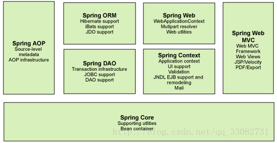

### 拓展

在Spring的官网有这个介绍：现代的java开发，说白了就是基于Spring的开发

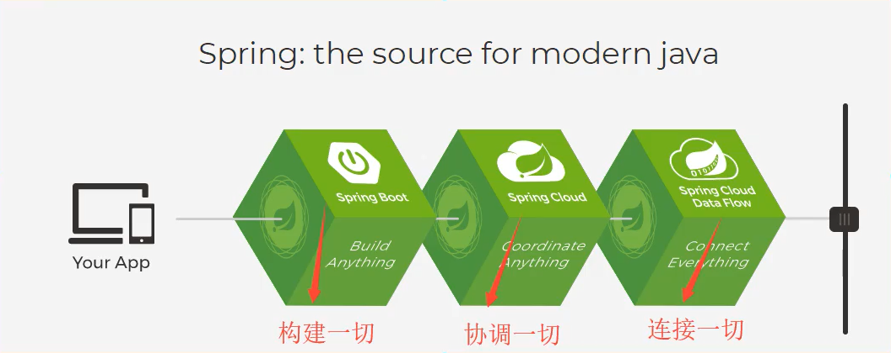

- Spring Boot
  - 一个快速开发的脚手架。
  - 基于Springboot可以快速的开发单个微服务。
  - 约定大于配置（maven也有这个特性）
- Spring Cloud
  - SpringCloud是基于Springboot实现的。（东西多了才需要协调）

现在大多数公司都在使用Springboot进行快速开发。学习Springboot的前提，需要完全掌握Spring及SpringMVC。Spring是承上启下的作用。

**Spring弊端：发展了太久之后，违背了原来的理念。配置十分繁琐，人称“配置地狱”**


## IOC理论推导

### 原来写业务的步骤

建项目时，建立一个父子工程。方法可见于：mybatis/第一个mybatis程序。然后按步骤编写下面的1234。

1. UserDao 接口

   

2. UserDaoImpl 实现类

   

3. UserService 业务接口

   

4. UserServiceImpl 业务实现类

在我们之前的业务中，用户的需求可能会影响我们原来的代码，我们需要根据用户需求去修改源代码；如果程序代码量十分大，修改一次的成本十分昂贵！

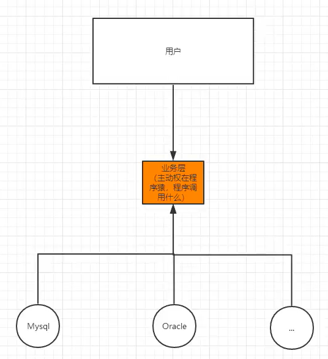

我们使用一个set接口实现，已经发生了革命性的变化

```java
/*
* 为了进行优化，利用set进行动态实现值的注入
* */
private UserDao userDao;
public void setUserDao(UserDao userDao){this.userDao=userDao;}
```

- 之前，程序时主动创建对象，控制权在程序员手上
- 使用set注入后，程序不再具有主动性，而是变成了被动的接受对象


这种思想，从本质上解决了问题，我们程序员不用再去管理对象的创建了。系统的耦合性大大降低，可以更加专注在业务的实现上！这是IOC的原型。

- 用户专注于UserDao的各种实现类的编写即可；编写好后，用户想调用谁，就调用谁。

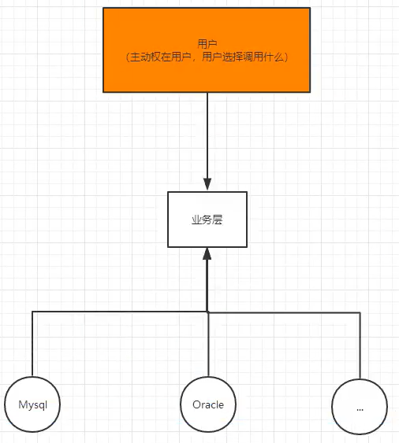


实例：

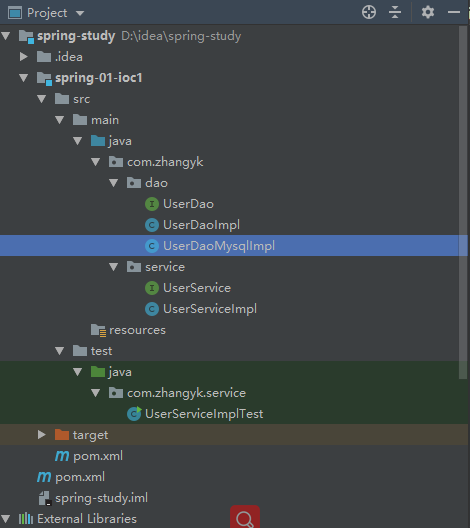

**Dao是和数据库交互，提供数据结构；Service接口是提供操作接口，和Servlet交互的**

编写dao接口：USerDao

```java
package com.zhangyk.dao;

public interface UserDao {

    void getUser();
}
```

编写dao接口的两个实现类：UserDaoImpl，UserDaoMysqlImpl

```java
package com.zhangyk.dao;
/*
* Dao是和数据库交互，提供数据结构；Service接口是提供操作接口，和Servlet交互的
* */
public class UserDaoImpl implements UserDao{


    public void getUser() {
        System.out.println("默认获取用户的数据");
    }
}
```

```java
package com.zhangyk.dao;

public class UserDaoMysqlImpl implements UserDao {
    public void getUser() {
        System.out.println("mysql获取用户数据");
    }
}
```

编写service接口：UserService

```java
package com.zhangyk.service;

public interface UserService {

    void getUser();
}
```

编写service实现类：UserServiceImpl

```java
package com.zhangyk.service;

/*
 * Dao是和数据库交互，提供数据结构；Service接口是提供操作接口，和Servlet交互的
 * */

import com.zhangyk.dao.UserDao;
import com.zhangyk.dao.UserDaoImpl;
import com.zhangyk.dao.UserDaoMysqlImpl;

public class UserServiceImpl implements UserService{

    /*
    * 业务层要调DAO层，在java中有个组合的概念（除了继承，就还有个组合）。要用DAO层的东西就把它放过来
    *
    * 组合大于继承
    *
    * 把DAO引到service中；这里是多态的写法
    * */
    //如果想切换UserDao接口的实现类，就得在这改原有代码；每次因为用户请求不同，而对代码做大量改动的话，就不是一个优秀的程序
    //?????这里为什么要用接口来引用实体类对象？而不直接用实例类本身来引用,可能和“java组合”有关
    //private UserDao userDao = new UserDaoImpl();
    //private UserDao userDao = new UserDaoMysqlImpl();
    /*
    * 为了进行优化，利用set进行动态实现值的注入：把之前的如private UserDao userDao = new UserDaoImpl();替换为下面两行
    * */
    private UserDao userDao;
    public void setUserDao(UserDao userDao){this.userDao=userDao;}

    public void getUser() {

        /*有点代理模式那味道*/
        userDao.getUser();
    }
}
```

编写测试类：UserServiceImplTest

```java
package com.zhangyk.service;

import com.zhangyk.dao.UserDaoImpl;
import com.zhangyk.dao.UserDaoMysqlImpl;

public class UserServiceImplTest {

    public static void main(String[] args) {
        //用户实际调用的是业务层；Dao层他们不需要接触
        UserServiceImpl userService = new UserServiceImpl();

        /*
        * 想用什么UserDao的实现，让用户选择实现就可以了
        * */
        //userService.setUserDao(new UserDaoMysqlImpl());可以用它，也可以用它下面这个，这两分别使用了UserDao接口的两个实现类：UserDaoMysqlImpl和UserDaoImpl
        userService.setUserDao(new UserDaoImpl());

        //业务层此处的作用就是去调用DAO层，相当于通过业务层调DAO层，解耦了
        userService.getUser();
    }
}
```

查看测试结果。用户请求调用UserDaoImpl，程序正确调用了。

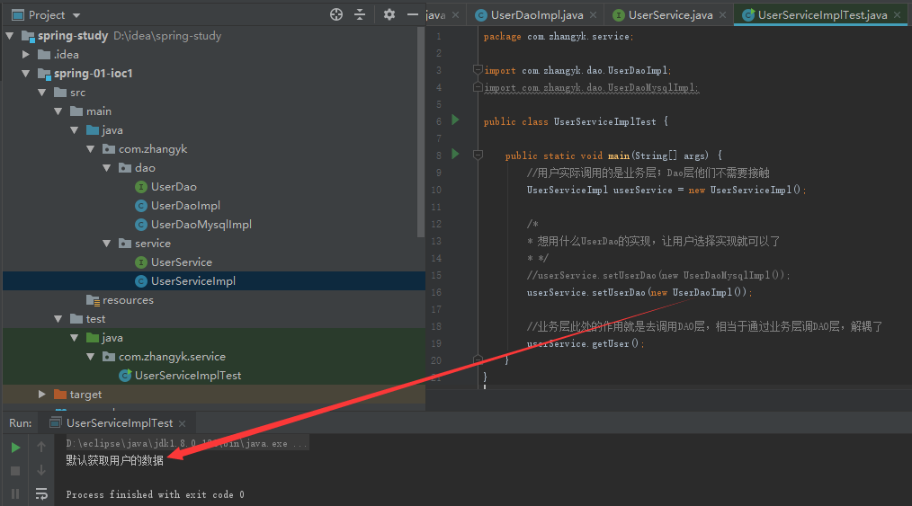


### IOC本质

**控制反转IOC（Inversion of Control），是一种设计思想，DI（依赖注入）是实现IOC的一种方式**，也有人认为DI只是IOC的另一种说法。没有IOC的程序中，我们使用面向对象编程，对象的创建与对象间的依赖关系完全硬编码在程序中，对象的创建由程序自己控制，控制反转后将对象的创建转移给第三方，个人认为所谓控制反转就是：获得依赖对象的方式反转了。

官方图解释系统的理想进化方向

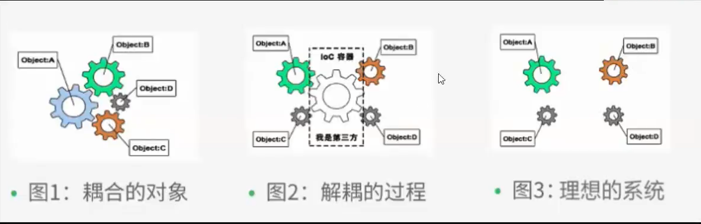

Ioc是Spring框架的核心内容，使用多种方式完美的实现了IoC，可以使用XML配置，也可以使用注解，新版本的Spring也可以零配置实现IoC。

Spring容器在初始化时先读取配置文件，根据配置文件或元数据创建与组织对象存入容器中，程序使用时再从ioc容器中取出需要的对象。

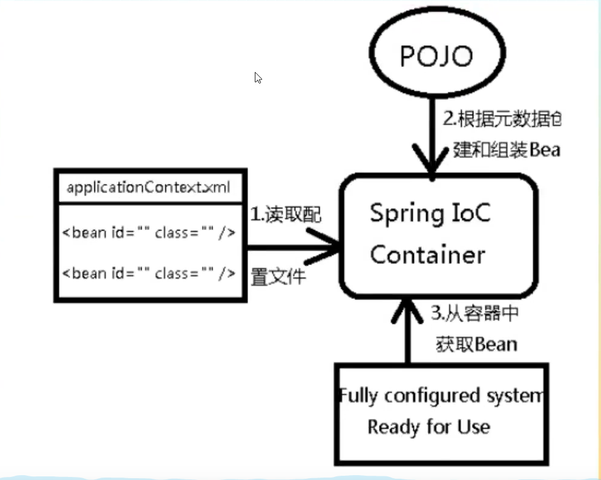

采用XML方式配置Bean的时候，Bean的定义信息是和实现分离的。而采用注解的方式可以把两者合为一体，Bean的定义信息直接以注解的形式定义在实现类中，从而达到了零配置的目的。

**控制反转是一种通过描述（XML或注解）并通过第三方去生产或获取特定对象的方式。在Spring中，实现控制反转的是IoC容器，其实现方法是依赖注入（Dependency injection，DI）。**


## HelloSpring

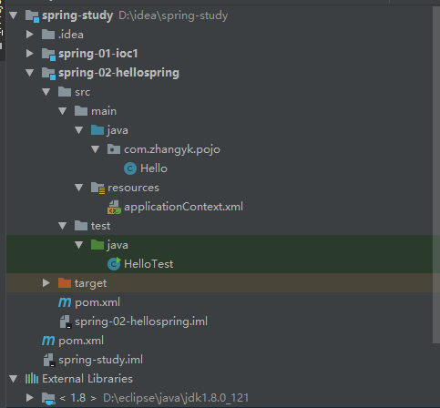

### 具体步骤

1. 导入Spring相关jar包

   ```xml
   <!-- https://mvnrepository.com/artifact/org.springframework/spring-webmvc -->
   <dependency>
       <groupId>org.springframework</groupId>
       <artifactId>spring-webmvc</artifactId>
       <version>5.2.0.RELEASE</version>
   </dependency>
   <!-- https://mvnrepository.com/artifact/org.springframework/spring-jdbc 
   JDBC初期不连数据库用不上-->
   <dependency>
       <groupId>org.springframework</groupId>
       <artifactId>spring-jdbc</artifactId>
       <version>5.2.0.RELEASE</version>
   </dependency>
   ```

2. 编写相关代码

   编写pojo类

   ```java
   package com.zhangyk.pojo;
   
   public class Hello {
       private String str;
   
       public String getStr() {
           return str;
       }
   
       //没有这个set方法的话。xml中property标签的name="str"设置会爆红。因为Spring本质还是通过set方法设置属性的
       public void setStr(String str) {
           this.str = str;
       }
   
       @Override
       public String toString() {
           return "Hello{" +
                   "str='" + str + '\'' +
                   '}';
       }
   }
   ```

   初学暂时使用xml的配置Spring

   [官网](https://docs.spring.io/spring-framework/docs/current/reference/html/core.html#beans-basics)拷贝applicationContext.xml的模板。（由于下面代码时模板代码，不是实际工程，我设置为**无色**）

   ```
   <?xml version="1.0" encoding="UTF-8"?>
   <beans xmlns="http://www.springframework.org/schema/beans"
       xmlns:xsi="http://www.w3.org/2001/XMLSchema-instance"
       xsi:schemaLocation="http://www.springframework.org/schema/beans
           https://www.springframework.org/schema/beans/spring-beans.xsd">
   
       <bean id="..." class="...">  
           <!-- collaborators and configuration for this bean go here -->
       </bean>
   
       <bean id="..." class="...">
           <!-- collaborators and configuration for this bean go here -->
       </bean>
   
       <!-- more bean definitions go here -->
   
   </beans>
   ```

   基于末班改写成自己的xml配置文件：applicationContext.xml

   ```xml
   <?xml version="1.0" encoding="UTF-8"?>
   <!--这个beans标签的各个属性是约束文件，xds检查我们的语法的-->
   <beans xmlns="http://www.springframework.org/schema/beans"
          xmlns:xsi="http://www.w3.org/2001/XMLSchema-instance"
          xsi:schemaLocation="http://www.springframework.org/schema/beans
           https://www.springframework.org/schema/beans/spring-beans.xsd">
   
       <!--使用Spring来创建对象，在Spring这些对象都称为bean
       bean：对象。注册的每个bean都是一个个对象，xml被读取的时候都会被创建，等待用户按需调用（IOC）
       id:自定义bean对象的名字
       class：bean对象对应的实体类（即pojo类）
       -->
       <bean id="hello" class="com.zhangyk.pojo.Hello">
           <!--为bean对象的各个属性赋值；bean对象的属性和pojo对象的属性相同
           ref：引用Spring容器中建好的对象
           value：具体的值，基本数据类型
           -->
           <property name="str" value="Spring"/>
       </bean>
   
   </beans>
   ```

   拷贝官网给的实例化容器的代码。只要使用xml配置Spring，下面的代码就是必须的。**这一步会把所有注册的bean都创建为对象。**

   ```
   ApplicationContext context = new ClassPathXmlApplicationContext("services.xml", "daos.xml");
   ```

   编写测试类：HelloTest，并在其中执行实例化容器的代码，从而实例化容器

   ```java
   import com.zhangyk.pojo.Hello;
   import org.springframework.context.ApplicationContext;
   import org.springframework.context.support.ClassPathXmlApplicationContext;
   
   public class HelloTest {
       public static void main(String[] args) {
   
           //实例化容器：获取Spring的上下文对象，即拿到spring的容器。实例化容器的同时，所有注册的bean都被创建为对象，等待用户按需获取（IOC）。
           ApplicationContext context = new ClassPathXmlApplicationContext("applicationContext.xml");
           //容器在手，天下我有。我们的对象现在都在Spring中管理了，我们要使用，直接去里面取就可以。不需要new。
           Hello hello = (Hello)context.getBean("hello");
           System.out.println(hello.toString());
       }
   }
   
   ```

   执行main，查看测试结果。测试成功，str的值是在applicationContext.xml中配置的。

   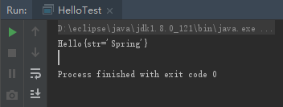

### 思考

问题：

- Hello对象是谁创建的？

  Hello对象是由Spring创建的

- Hello对象的属性是怎么设置的？

  Hello对象的属性是由Spring容器设置的

这个过程就叫控制反转：

- 控制：谁来控制对象的创建。传统应用程序的对象是由程序本身控制创建的，使用Spring后，对象是由Spring来创建的。

- 反转：程序本身不创建对象，而变成被动的接收对象。

- 依赖注入：就是利用set的方法来进行注入的。

IOC是一种编程思想，由主动的编程变成被动的接收。可以通过new ClassPathXmlApplicationContext去浏览一下底层源码。

**ok，到了现在，我们彻底不用在程序中去改动了，要实现不同的操作，只需要在xml配置文件中进行修改（后面复杂成“配置地狱”，后话）。所谓IoC，一句话搞定：对象由Spring来创建，管理，装配！**


## IoC创建对象的方式

### 使用无参构造创建对象（默认）

实例：

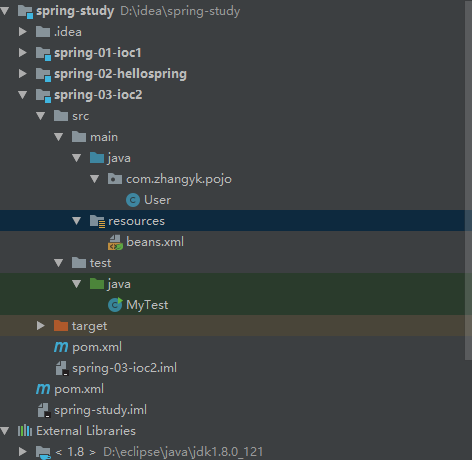

编写实体类

```java
package com.zhangyk.pojo;

public class User {

    private String name;

    public User(){
        System.out.println("User的无参构造");
    }
    public User(String name){
        System.out.println("User的有参构造");
        this.name=name;
    }

    public String getName() {
        return name;
    }

    public void setName(String name) {
        this.name = name;
    }

    public void show(){
        System.out.println("name=" + name);
    }
}

```

编写xml

```xml
<?xml version="1.0" encoding="UTF-8"?>
<beans xmlns="http://www.springframework.org/schema/beans"
       xmlns:xsi="http://www.w3.org/2001/XMLSchema-instance"
       xsi:schemaLocation="http://www.springframework.org/schema/beans
        https://www.springframework.org/schema/beans/spring-beans.xsd">

    <bean id="user" class="com.zhangyk.pojo.User">
        <property name="name" value="张云"/>
    </bean>

</beans>
```

编写测试类

```java
import com.zhangyk.pojo.User;
import org.springframework.context.ApplicationContext;
import org.springframework.context.support.ClassPathXmlApplicationContext;

public class MyTest {
    public static void main(String[] args) {
        System.out.println("============自己new对象=============");
        User user = new User();

        System.out.println("============通过spring获取对象=============");
        /*读xml获取上下文的时候，bean就创建了。会调用User类的无参构造。
        创建好对象后，xml中的property标签给对象的各属性赋值，赋值使用的是各属性的set方法
        */
        ApplicationContext context = new ClassPathXmlApplicationContext("beans.xml");
        //这一步根据getbean的输入，提取出创建好的对象
        User user1 = (User)context.getBean("user");
        user1.show();
    }
}

```

查看运行结果。自己new对象的话，根据提供参数与否自动匹配有参or无参构造函数。使用spring获取对象时，得到context的时候对象即被创建，且默认创建方式是 无参。

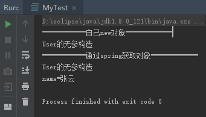


### 使用有参构造创建对象

[官网](https://docs.spring.io/spring-framework/docs/current/reference/html/core.html#beans-factory-instantiation)搜“constructor argument resolution”

#### 用下标的方式

实例：

除了xml，其他地方和用无参构造创建对象相同。修改xml如下

```xml
<?xml version="1.0" encoding="UTF-8"?>
<beans xmlns="http://www.springframework.org/schema/beans"
       xmlns:xsi="http://www.w3.org/2001/XMLSchema-instance"
       xsi:schemaLocation="http://www.springframework.org/schema/beans
        https://www.springframework.org/schema/beans/spring-beans.xsd">

    <!--第一种：通过下标创建-->
    <bean id="user" class="com.zhangyk.pojo.User">
        <constructor-arg index="0" value="张云学java"/>
    </bean>

</beans>
```

查看结果。成功调用有参构造。

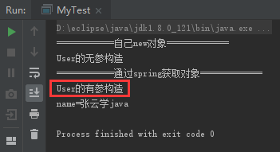


#### 用参数类型的方式（不推荐）

修改xml如下

```xml
<?xml version="1.0" encoding="UTF-8"?>
<beans xmlns="http://www.springframework.org/schema/beans"
       xmlns:xsi="http://www.w3.org/2001/XMLSchema-instance"
       xsi:schemaLocation="http://www.springframework.org/schema/beans
        https://www.springframework.org/schema/beans/spring-beans.xsd">

    <!--第一种：通过下标创建-->
    <!--<bean id="user" class="com.zhangyk.pojo.User">-->
        <!--<constructor-arg index="0" value="张云学java"/>-->
    <!--</bean>-->

    <!--第二种：通过参数类型创建
    由于若干个输入参数的类型可能存在相同的情况(三个String)，虽然会按照顺序赋值，但易混淆，不推荐使用
    -->
    <bean id="user" class="com.zhangyk.pojo.User">
        <constructor-arg type="java.lang.String" value="张云2学java"/>
    </bean>

</beans>
```

查看测试结果，成功使用有参构造函数

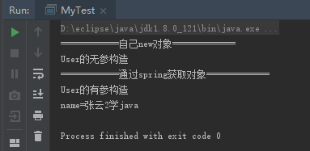

#### 通过参数名的方式（推荐）

修改xml为如下

```xml
<?xml version="1.0" encoding="UTF-8"?>
<beans xmlns="http://www.springframework.org/schema/beans"
       xmlns:xsi="http://www.w3.org/2001/XMLSchema-instance"
       xsi:schemaLocation="http://www.springframework.org/schema/beans
        https://www.springframework.org/schema/beans/spring-beans.xsd">

    <!--第一种：通过下标创建-->
    <!--<bean id="user" class="com.zhangyk.pojo.User">-->
        <!--<constructor-arg index="0" value="张云学java"/>-->
    <!--</bean>-->

    <!--第二种：通过参数类型创建
    由于若干个输入参数的类型可能存在相同的情况，虽然会按照顺序赋值，但易混淆，不推荐使用
    -->
    <!--<bean id="user" class="com.zhangyk.pojo.User">-->
        <!--<constructor-arg type="java.lang.String" value="张云2学java"/>-->
    <!--</bean>-->

    <!--第三种：通过参数名创建-->
    <bean id="user" class="com.zhangyk.pojo.User">
        <!--如果传入的参数是对象，这里就用ref属性代替name属性-->
        <constructor-arg name="name" value="张云3学java"/>
    </bean>

</beans>
```

查看运行结果，发现成功调用有参构造

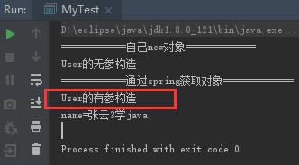


#### 总结

在配置文件加载的时候，容器中管理的对象就已经初始化了。


## Spring配置

### 别名

为bean取别名

参数讲解：

- name：要取别名的bean的id

- alias：自己定义的别名

```xml
<bean id="user" class="com.zhangyk.pojo.User">
    <!--如果传入的参数是对象，这里就用ref属性代替name属性-->
    <constructor-arg name="name" value="张云3学java"/>
</bean>
<!--别名：如果添加了别名，我们也可以使用别名获取到这个对象-->
<alias name="user" alias="userAlias"/>
```

### Bean的配置

参数讲解：

- id:bean的唯一表示符，也就相当于传统java的对象名
- class:bean对象所对应的全限定名：包名+类名
- name:**也是别名**,而且name可以同时取多个别名(通过空格或逗号分割)。所以之前介绍的alias标签没啥用。

```xml
<!--
    id:bean的唯一表示符，也就相当于传统java的对象名
    class:bean对象所对应的全限定名：包名+类名
    name:也是别名,而且name可以同时取多个别名(通过空格或逗号分割)。所以之前介绍的alias标签没啥用。
    -->
<bean id="user2" class="com.zhangyk.pojo.User" name="userT,userZ">
    <property name="name" value="张云学bean属性"/>
</bean>
```


### import

这个import，一般用于团队开发，他可以将多个配置文件，导入合并为一个。

假设现在项目中有多人开发，这三个人负责不同的类开发，不同的类需要注册在不同的beans中，我们可以利用import将所有人的beans.xml合并为一个总的(一般合并在applicationContext.xml文件中)。

- 张三

  beans.xml

- 李四 

  beans2.xml

- 王五 

  beans3.xml

- applicationContext.xml

  ```xml
  <?xml version="1.0" encoding="UTF-8"?>
  <beans xmlns="http://www.springframework.org/schema/beans"
         xmlns:xsi="http://www.w3.org/2001/XMLSchema-instance"
         xsi:schemaLocation="http://www.springframework.org/schema/beans
          https://www.springframework.org/schema/beans/spring-beans.xsd">
  
      <!--合并多个配置文件到当前配置文件-->
      <import resource="beans.xml"/>
      <import resource="beans2.xml"/>
      <import resource="beans3.xml"/>
  
  </beans>
  ```

使用的时候，直接使用总的配置就可以了。

备注：

- 如果存在id相同的bean，那么合并的时候，前面的会被后面的覆盖


## 依赖注入（DI）

https://www.bilibili.com/video/BV1WE411d7Dv?p=8&spm_id_from=pageDriver

### 构造器注入

前面“spring配置”已经说了


### set方式注入【重点】

#### 名词讲解

- 依赖注入：本质是Set注入
  - 依赖（verb）：bean对象的创建依赖于容器
  - 注入：bean对象中的所有属性，由容器来注入。

#### 环境搭建

编写pojo类 Student.java 和 Address.java

```java
package com.zhangyk.pojo;

import java.util.*;

public class Student {
    private String name;
    private Address address;
    private String[] books;
    private List<String> hobbies;
    private Map<String,String> cards;
    private Set<String> games;
    private String wife;//设置为null
    private Properties info;

    public String getName() {
        return name;
    }

    public void setName(String name) {
        this.name = name;
    }

    public Address getAddress() {
        return address;
    }

    public void setAddress(Address address) {
        this.address = address;
    }

    public String[] getBooks() {
        return books;
    }

    public void setBooks(String[] books) {
        this.books = books;
    }

    public List<String> getHobbies() {
        return hobbies;
    }

    public void setHobbies(List<String> hobbies) {
        this.hobbies = hobbies;
    }

    public Map<String, String> getCards() {
        return cards;
    }

    public void setCards(Map<String, String> cards) {
        this.cards = cards;
    }

    public Set<String> getGames() {
        return games;
    }

    public void setGames(Set<String> games) {
        this.games = games;
    }

    public String getWife() {
        return wife;
    }

    public void setWife(String wife) {
        this.wife = wife;
    }

    public Properties getInfo() {
        return info;
    }

    public void setInfo(Properties info) {
        this.info = info;
    }

    @Override
    public String toString() {
        return "Student{" +
                "name='" + name + '\'' +
                ", address=" + address.toString() +
                ", books=" + Arrays.toString(books) +
                ", hobbies=" + hobbies +
                ", cards=" + cards +
                ", games=" + games +
                ", wife='" + wife + '\'' +
                ", info=" + info +
                '}';
    }
}

```

```java
package com.zhangyk.pojo;

public class Address {

    private String address;

    public String getAddress() {
        return address;
    }

    public void setAddress(String address) {
        this.address = address;
    }

    @Override
    public String toString() {
        return "Address{" +
                "address='" + address + '\'' +
                '}';
    }
}

```

编写xml（即beans配置文件）

```xml
<?xml version="1.0" encoding="UTF-8"?>
<beans xmlns="http://www.springframework.org/schema/beans"
       xmlns:xsi="http://www.w3.org/2001/XMLSchema-instance"
       xsi:schemaLocation="http://www.springframework.org/schema/beans
        https://www.springframework.org/schema/beans/spring-beans.xsd">

    <bean id="address" class="com.zhangyk.pojo.Address">
        <property name="address" value="中国"/>
    </bean>
    <bean id="student" class="com.zhangyk.pojo.Student">
        <!--第一种：普通值注入-->
        <property name="name" value="张云"/>
        <!--第二种：bean注入，ref-->
        <property name="address" ref="address"/>
        <!--数组注入-->
        <property name="books">
            <array>
                <value>西游记</value>
                <value>三国演义</value>
                <value>红楼梦</value>
                <value>水浒传</value>
            </array>
        </property>
        <!--Map注入-->
        <property name="cards">
            <map>
                <entry key="身份证" value="362310"/>
                <entry key="银行卡" value="123456"/>
            </map>
        </property>
        <!--Set注入-->
        <property name="games">
            <set>
                <value>王者</value>
                <value>吃鸡</value>
            </set>
        </property>
        <!--list列表注入-->
        <property name="hobbies">
            <list>
                <value>吃饭</value>
                <value>学习</value>
            </list>
        </property>
        <!--null注入-->
        <!--<property name="wife" value=""/>-->
        <property name="wife">
            <null/>
        </property>
        <!--property注入-->
        <property name="info">
            <props>
                <prop key="学号">xuehao</prop>
                <prop key="driver">indodb</prop>
                <prop key="url">com.zhangyk</prop>
                <prop key="username">zhangyk</prop>
                <prop key="password">123456</prop>
            </props>
        </property>
    </bean>

</beans>
```

编写测试类

```java
import com.zhangyk.pojo.Student;
import org.springframework.context.ApplicationContext;
import org.springframework.context.support.ClassPathXmlApplicationContext;

public class StudentTest {

    public static void main(String[] args) {
        //记忆：CPX 擦皮鞋
        ApplicationContext context = new ClassPathXmlApplicationContext("applicationContext.xml");
        Student student = context.getBean("student", Student.class);
        System.out.println(student.toString());
        /*
        * 测试结果：
        * Student{
        * name='张云',
        * address=Address{address='中国'},
        * books=[西游记, 三国演义, 红楼梦, 水浒传],
        * hobbies=[吃饭, 学习],
        * cards={身份证=362310, 银行卡=123456},
        * games=[王者, 吃鸡], wife='null',
        * info={学号=xuehao, password=123456, url=com.zhangyk, driver=indodb, username=zhangyk}
        * }
        * */
    }


}

```

查看测试结果：依赖Spring容器成功，所有属性都被正确注入。

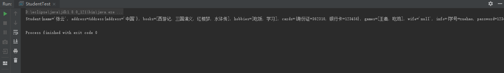

```
Student{name='张云', address=Address{address='中国'}, books=[西游记, 三国演义, 红楼梦, 水浒传], hobbies=[吃饭, 学习], cards={身份证=362310, 银行卡=123456}, games=[王者, 吃鸡], wife='null', info={学号=xuehao, password=123456, url=com.zhangyk, driver=indodb, username=zhangyk}}

```


### 拓展方式注入

我们可以使用p命名空间和c命名空间进行注入

官方解释，及[网址](https://docs.spring.io/spring-framework/docs/current/reference/html/core.html#beans-p-namespace)：

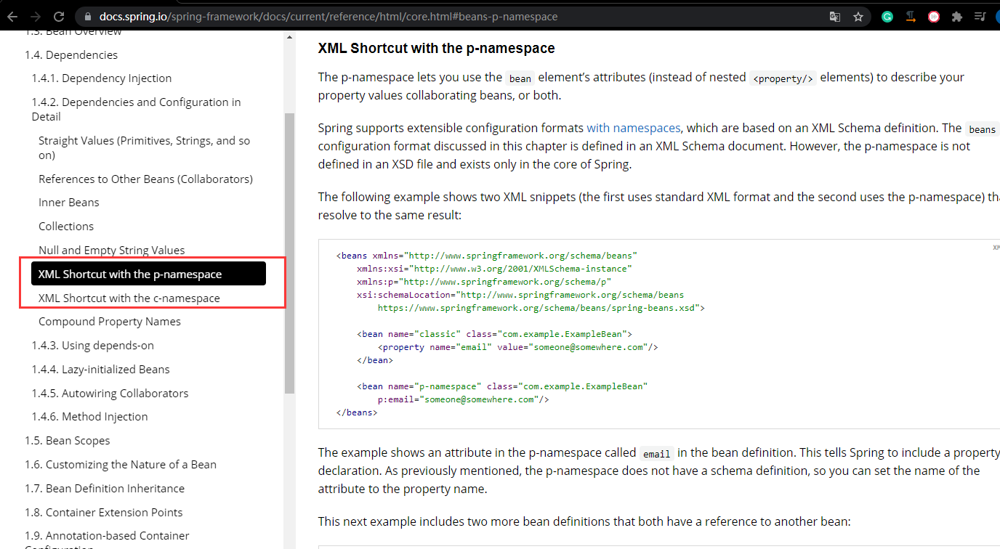

实操：

编写实体类

```java
package com.zhangyk.pojo;

public class User {
    private String name;
    private int age;

    public User() {
    }

    public User(String name, int age) {
        this.name = name;
        this.age = age;
    }

    public String getName() {
        return name;
    }

    public void setName(String name) {
        this.name = name;
    }

    public int getAge() {
        return age;
    }

    public void setAge(int age) {
        this.age = age;
    }

    @Override
    public String toString() {
        return "User{" +
                "name='" + name + '\'' +
                ", age=" + age +
                '}';
    }
}

```

编写xml

```xml
<?xml version="1.0" encoding="UTF-8"?>
<beans xmlns="http://www.springframework.org/schema/beans"
       xmlns:xsi="http://www.w3.org/2001/XMLSchema-instance"
       xmlns:p="http://www.springframework.org/schema/p"
       xmlns:c="http://www.springframework.org/schema/c"
       xsi:schemaLocation="http://www.springframework.org/schema/beans
        https://www.springframework.org/schema/beans/spring-beans.xsd">

    <!--p命名空间注入，可以直接注入属性的值：property-->
    <bean id="user" class="com.zhangyk.pojo.User" p:name="张云" p:age="19"/>

    <!--c命名空间注入，通过构造器注入：construct-args-->
    <bean id="user2" class="com.zhangyk.pojo.User" c:name="张云2" c:age="192"/>

</beans>
```

编写测试方法

```java
//导入了junit
@Test
public void testUser(){
    ApplicationContext context = new ClassPathXmlApplicationContext("beans.xml");
    System.out.println("======================user======================");
    User user = context.getBean("user", User.class);
    System.out.println(user.toString());

    System.out.println("======================user2======================");
    User user2 = context.getBean("user2", User.class);
    System.out.println(user2.toString());
}

```

查看测试结果，符合预期。对象依赖Spring容器成功，Spring容器把bean对象的属性注入成功

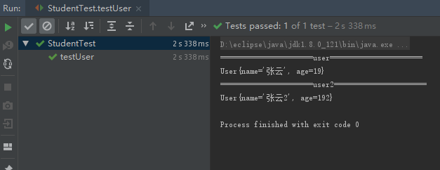


注意点：

- p命名和c命名空间不能直接使用，需要在bean标签的参数处导入xml约束

  ```xml
  xmlns:p="http://www.springframework.org/schema/p"
  xmlns:c="http://www.springframework.org/schema/c"
  ```

- p: 相当于set注入

- c: 相当于构造器注入。使用前提是pojo类存在有参构造器（有参构造存在的话，无参构造也得显示声明）


### bean的作用域

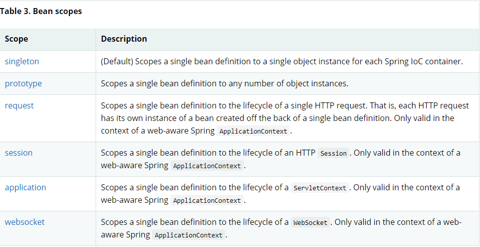

#### 单例模式[Spring默认机制]

概念：

只有一个可分享的单例bean实例被管理。如果碰到针对该bean单例的请求，那个特定的单例实例会被Spring容器返回。

图示：

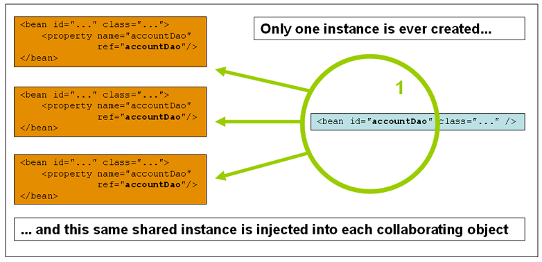

代码演示：

拿到pojo类

```java
package com.zhangyk.pojo;

public class User {
    private String name;
    private int age;

    public User() {
    }

    public User(String name, int age) {
        this.name = name;
        this.age = age;
    }

    public String getName() {
        return name;
    }

    public void setName(String name) {
        this.name = name;
    }

    public int getAge() {
        return age;
    }

    public void setAge(int age) {
        this.age = age;
    }

    @Override
    public String toString() {
        return "User{" +
                "name='" + name + '\'' +
                ", age=" + age +
                '}';
    }
}

```

编写xml注册文件

```xml
<?xml version="1.0" encoding="UTF-8"?>
<beans xmlns="http://www.springframework.org/schema/beans"
       xmlns:xsi="http://www.w3.org/2001/XMLSchema-instance"
       xmlns:p="http://www.springframework.org/schema/p"
       xmlns:c="http://www.springframework.org/schema/c"
       xsi:schemaLocation="http://www.springframework.org/schema/beans
        https://www.springframework.org/schema/beans/spring-beans.xsd">

    <!--p命名空间注入，可以直接注入属性的值：property-->
    <bean id="user" class="com.zhangyk.pojo.User" p:name="张云" p:age="19" scope="singleton"/>

</beans>
```

编写测试方法

```java
@Test
public void testSingleton(){
    ApplicationContext context = new ClassPathXmlApplicationContext("beans.xml");
    User user = context.getBean("user", User.class);
    User user2 = context.getBean("user", User.class);
    System.out.println(user==user2);
}
```

查看测试结果。两次不同请求，返回的是一个对象，符合单例模式特点。

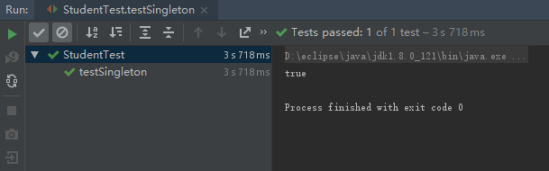


#### 原型模式

概念：

每次从容器中get的时候，都会产生一个新对象

图示概念：

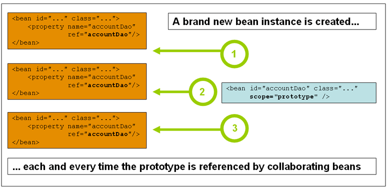

代码演示：

在单例模式的基础上，修改xml中bean为如下：

```xml
<bean id="user" class="com.zhangyk.pojo.User" p:name="张云" p:age="19" scope="prototype"/>
```

查看测试结果。两次返回的不是一个对象，符合原型模式的特点。

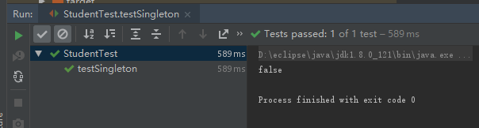


#### 其余

request，session，application，这几个只能在web开发中使用


#### 总结

- 优缺点：原型模式耗资源，单例在并发的时候可能有些问题
- 多线程时可以考虑使用原型模式
- 一般最好就用单例模式，因为这是默认的


## bean的自动装配

什么是自动装配：

- 自动装配是Spring满足bean依赖的一种方式
- Spring会在上下文中自动寻找，并自动给bean装配属性

Spring中的三种装配方式

- 在xml中显式配置

  之前一直在用

- 在java中显式配置

  基本不使用

- 隐式的自动装配bean[重要]

  实战常用

### byType和byName自动装配

实例：

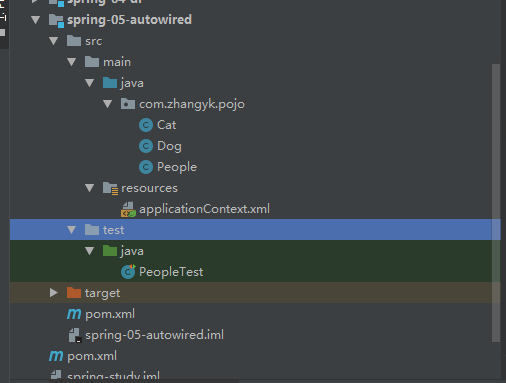

编写pojo类

```java
package com.zhangyk.pojo;

public class People {

    private Cat cat;
    private Dog dog;
   private String name;

    public Cat getCat() {
        return cat;
    }

    public void setCat(Cat cat) {
        this.cat = cat;
    }

    public Dog getDog() {
        return dog;
    }

    public void setDog(Dog dog) {
        this.dog = dog;
    }

    public String getName() {
        return name;
    }

    public void setName(String name) {
        this.name = name;
    }

    @Override
    public String toString() {
        return "People{" +
                "cat=" + cat +
                ", dog=" + dog +
                ", name='" + name + '\'' +
                '}';
    }
}

```

```java
package com.zhangyk.pojo;

public class Cat {
    public void shout(){
        System.out.println("meow");
    }
}

```

```java
package com.zhangyk.pojo;

public class Dog {
    public void shout(){
        System.out.println("wang");
    }
}
```

编写xml beans配置/注册文件

```xml
<?xml version="1.0" encoding="UTF-8"?>
<beans xmlns="http://www.springframework.org/schema/beans"
       xmlns:xsi="http://www.w3.org/2001/XMLSchema-instance"
       xsi:schemaLocation="http://www.springframework.org/schema/beans
        https://www.springframework.org/schema/beans/spring-beans.xsd">

    <bean id="cat" class="com.zhangyk.pojo.Cat"/>
    <bean id="dog" class="com.zhangyk.pojo.Dog"/>

    <!--这是老办法，实际上可以尝试让Spring联想，找到cat和dog对象，自动注入到people的cat和dog属性-->
    <!--<bean id="people" class="com.zhangyk.pojo.People">-->
        <!--<property name="name" value="张云"/>-->
        <!--<property name="cat" ref="cat"/>-->
        <!--<property name="dog" ref="dog"/>-->
    <!--</bean>-->

    <!--下面尝试，使用自动装配-->
    <!--
    byname:
    1. 会自动在容器上下文中查找，和自己对象set方法名的“set”后面的值对应的beanid！如：setCat()则寻找cat（自动小写首字母）；
    但是待注入的bean的首字母必须小写，比如id=cat而不是id=Cat。
    2. 且如id=dog修改成id=dog222后，会报空指针异常，因为spring无法找到匹配的dog bean对象给people的dog属性注入。
    3. 网友说，起别名也能匹配，尚未验证
    -->
    <bean id="people" class="com.zhangyk.pojo.People" autowire="byName">
        <property name="name" value="张云"/>
    </bean>

    <!--
    bytype:
	1. 会自动在容器上下文中查找，和自己对象属性类型相同的beanid！即使某bean不设置id，也能被自动匹配上，因为是按照类型来匹配的。
    2. 弊端：有两个同类型的bean时，spring会报错。必须保证类型全局唯一（即单例singleton）。
    -->
    <bean id="people2" class="com.zhangyk.pojo.People" autowire="byType">
        <property name="name" value="张云2"/>
    </bean>


</beans>
```

编写测试类

```java
import com.zhangyk.pojo.People;
import org.junit.Test;
import org.springframework.context.ApplicationContext;
import org.springframework.context.support.ClassPathXmlApplicationContext;

public class PeopleTest {

    @Test
    public void peopleTest(){
        System.out.println("byname================");
        ApplicationContext context = new ClassPathXmlApplicationContext("applicationContext.xml");
        People people = context.getBean("people", People.class);
        people.getCat().shout();
        people.getDog().shout();

        System.out.println("bytype================");
        People people2 = context.getBean("people2", People.class);
        people2.getCat().shout();
        people2.getDog().shout();


    }
}
```

查看测试结果，成功：

- people和people2两个bean对象都成功依赖（verb）spring容器。
- people是用byname的方式自动注入cat和dog属性；people2使用bytype的方式自动注入cat和dog属性

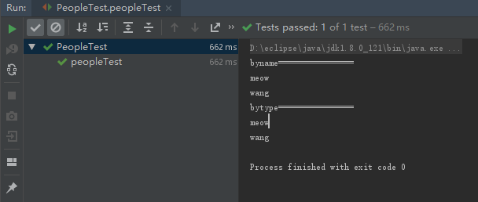


小结：

- byname的时候，需要保证所有bean的id唯一，并且这个bean需要和自动注入的属性的set方法的值一致
- bytype的时候，需要保证所有bean的class唯一，并且这个bean需要和自动注入的属性的类型一致


### 使用注解实现自动装配[主流]

jdk1.5支持的注解，Spring2.5就支持注解了

  The introduction of annotation-based configuration raised the question of whether this approach is “better” than XML. The short answer is “it depends. Due to the way they are defined, annotations provide a lot of context in their declaration, leading to shorter and more concise configuration. However, XML excels at wiring up components without touching their source code or recompiling them. （来自官网）

#### 要使用注解须知

beans标签导入约束

```xml
xmlns:context="http://www.springframework.org/schema/context"

xsi:schemaLocation="
        http://www.springframework.org/schema/context
        https://www.springframework.org/schema/context/spring-context.xsd
```

配置注解的支持

```xml
<context:annotation-config/>
```

**完整的模板xml配置文件展示如下**，[官网](https://docs.spring.io/spring-framework/docs/current/reference/html/core.html#beans-annotation-config)

```xml
<?xml version="1.0" encoding="UTF-8"?>
<beans xmlns="http://www.springframework.org/schema/beans"
    xmlns:xsi="http://www.w3.org/2001/XMLSchema-instance"
    xmlns:context="http://www.springframework.org/schema/context"
    xsi:schemaLocation="http://www.springframework.org/schema/beans
        https://www.springframework.org/schema/beans/spring-beans.xsd
        http://www.springframework.org/schema/context
        https://www.springframework.org/schema/context/spring-context.xsd">

    <context:annotation-config/>

</beans>
```


#### @Autowired

注意：

- 直接在属性上使用即可！也可以在set方式上使用！

- 使用@Autowired，pojo类可以不用编写set方法了（因为注解是用反射实现），前提是你这个自动装配的属性IOC（Spring）容器中存在，且符合名字。  

- autowired **默认**是byType方式注入；如果某个类型的bean对象不唯一， 则使用byName去注入。

科普：

- @Nullable 字段标记了这个注解，说明这个字段可以为null

- 如果显式定义了autowired的required属性为false，说明这个对象可以为null，否则不允许为空。一般用不到，能看懂即可。示例：@Autowired(required = false)

- 如果@Autowired自动装配的环境比较复杂，自动装配无法通过一个注解【@Autowired】完成的时候，我们可以使用@Qualifier(value="XXX")去配置@Autowired的使用，指定一个唯一的bean对象注入。

实例：

编写pojo类

```java
package com.zhangyk.pojo;

import org.springframework.beans.factory.annotation.Autowired;

public class People {

    //如果显式定义了autowired的required属性为false，说明这个对象可以为null，否则不允许为空。一般用不到，能看懂即可。
    @Autowired(required = false)
    private Cat cat;
    @Autowired
    //通过类型（xml中有两个Dog类的bean对象）和名字（xml中只有dog2和dog22，没有dog）都无法匹配的时候，可以用@Qualifier自己指定要匹配哪个对象。但是指定对象的类型要匹配，不能把猫匹配给狗。
    @Qualifier(value="dog2")
    private Dog dog;
    private String name;

    public Cat getCat() {
        return cat;
    }

    public void setCat(Cat cat) {
        this.cat = cat;
    }

    public Dog getDog() {
        return dog;
    }

    public void setDog(Dog dog) {
        this.dog = dog;
    }

    public String getName() {
        return name;
    }

    public void setName(String name) {
        this.name = name;
    }

    @Override
    public String toString() {
        return "People{" +
                "cat=" + cat +
                ", dog=" + dog +
                ", name='" + name + '\'' +
                '}';
    }
}

```

```java
package com.zhangyk.pojo;

public class Dog {
    public void shout(){
        System.out.println("wang");
    }
}
```

```java
package com.zhangyk.pojo;

public class Cat {
    public void shout(){
        System.out.println("meow");
    }
}
```

编写xml注册配置文件

```xml
<?xml version="1.0" encoding="UTF-8"?>
<beans xmlns="http://www.springframework.org/schema/beans"
       xmlns:xsi="http://www.w3.org/2001/XMLSchema-instance"
       xmlns:context="http://www.springframework.org/schema/context"
       xsi:schemaLocation="http://www.springframework.org/schema/beans
        https://www.springframework.org/schema/beans/spring-beans.xsd
        http://www.springframework.org/schema/context
        https://www.springframework.org/schema/context/spring-context.xsd">

    <!--开启注解的支持-->
    <context:annotation-config/>

    <bean id="cat" class="com.zhangyk.pojo.Cat"/>
    <bean id="dog2" class="com.zhangyk.pojo.Dog"/>
    <bean id="dog22" class="com.zhangyk.pojo.Dog"/>
    <bean id="people" class="com.zhangyk.pojo.People" />


</beans>
```

编写测试类

```java
import com.zhangyk.pojo.People;
import org.junit.Test;
import org.springframework.context.ApplicationContext;
import org.springframework.context.support.ClassPathXmlApplicationContext;

public class PeopleTest {

    @Test
    public void peopleTest(){
        ApplicationContext context = new ClassPathXmlApplicationContext("applicationContext.xml");
        People people = context.getBean("people", People.class);
        people.getCat().shout();
        people.getDog().shout();

    }
}
```

查看测试结果。依赖注入成功。

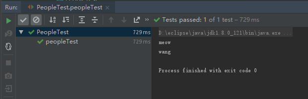

查看idea界面，成功出现叶子，表示相应“依赖注入”成功

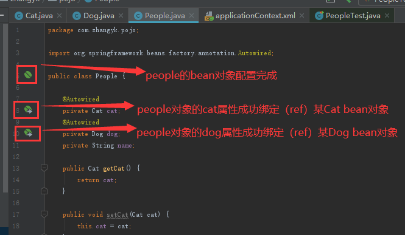


#### @Resource

注意：

- @Autowired，@Resource，@Inject都是自动装配的意思。@Resource是jdk原生注解实现，不需要额外导入包。jdk11取消了。
- @Resource功能约等于@Autowired+@Qualifier。使用频率比@Autowired稍低。**用法**和@Autowired基本相同。


#### 小结

@Autowired，@Resource异同：

- 同

  - 都是用来自动装配的，都可以放在属性字段上。

- 异

  - @Autowired默认通过byType的方式实现；如果有同类型的多个bean对象，则通过byName实现；如果两种尝试都无法找到，则报错。

    @Resource默认通过byName的方式实现；如果找不到name，则通过byType实现；如果两种尝试都无法找到，则报错。


## 使用注解开发

### 步骤及注解分类讨论

#### 包导入

```xml
        <!-- https://mvnrepository.com/artifact/org.springframework/spring-webmvc -->
        <dependency>
            <groupId>org.springframework</groupId>
            <artifactId>spring-webmvc</artifactId>
            <version>5.2.0.RELEASE</version>
        </dependency>
```

在Spring4之后，要使用注解开发，必须保证aop的包导入了。

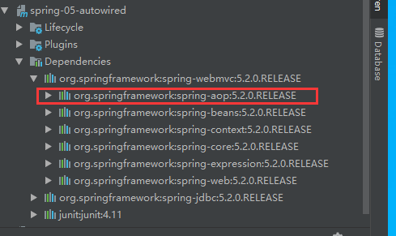

使用注解需要在xml中导入context约束，增加注解的支持

```xml
<!--component-scan可以扫描一些具体包下的注解。比如类中的@component-->
<context:component-scan base-package="com.zhangyk"/>
<!--开启注解驱动的支持-->
<context:annotation-config/>
```

#### 使用注解进行bean注册

@Component

#### 使用注解进行属性注入

@value

#### @Component衍生的注解

@Component有几个衍生注解，我们在web开发中，会按照mvc三层架构分层！功能等同于@Component，只不过在MVC架构中，我们习惯性的用以下三种注解代替@Component。这四个注解功能都是一样的，都是代表将某个类注册到Spring容器中，装配bean。

- dao 【@Repository】
- service 【@Service】
- controller 【@Controller】

#### 自动装配配置

”bean的自动装配“讲过，内容详见注解说明。

@Autowired，@Qualifier，@Nullable，@Resource

#### 作用域

@Scope

#### 小结

xml与注解：

- xml更加万能，适用于任何场合，维护简单方便
- 注解，不是自己类使用不了，维护相对复杂。

xml与注解最佳实践：

- xml用来管理bean

- 注解只负责完成属性的注入

- 我们在使用的过程中，只需要注意一个问题：必须让注解生效，就需要开启注解的支持。

  ```xml
  <!--component-scan可以扫描一些具体包下的注解。比如类中的@component-->
  <context:component-scan base-package="com.zhangyk"/>
  <!--开启注解驱动的支持-->
  <context:annotation-config/>
  ```

  

#### 附录：注解说明

- @Autowired：

  - 自动装配。通过类型，名字。

  - 如果autowired不能唯一自动装配上属性，则需要通过@Qualifier(value="XXX")

- @Nullable

  字段标记了这个注解，说明这个注解可以为null。

- @Resource

  自动装配。通过名字，类型。

- @Component

  组件，放在类上。说明这个类被Spring管理了，就是bean。默认beanid即为类名首字母小写。

- @Value

  - 放在类的属性或者set方法上，注入pojo类的属性的值。相当于\<property name="name" value="zhangyk"/>

  - 简单地可以直接在pojo类的属性上用@Value，复杂的DI依赖注入还是用xml方便点。

- @Scope

  配置bean为单例模式还是原型模式


### 实例

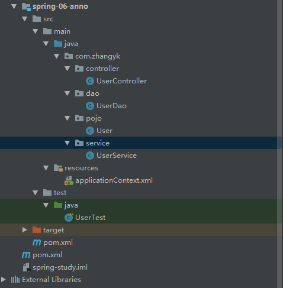

编写java类

pojo

```java
package com.zhangyk.pojo;

import org.springframework.beans.factory.annotation.Value;
import org.springframework.context.annotation.Scope;
import org.springframework.stereotype.Component;

/*
* 等价于<bean id="user" class="com.zhangyk.pojo.User"/>
* Component英文就是组件
* 注册bean的beanid默认为类名首字母小写
* */
@Component
//设置bean为单例模式，即全局该User类只有一个bean对象：user
@Scope("singleton")
public class User {

    //相当于之前xml配置登记bean时的<property name="name" value="zhangyk"/>
    @Value("张云")
    private String name;

    public User() {
    }

    public User(String name) {
        this.name = name;
    }

    public String getName() {
        return name;
    }

    public void setName(String name) {
        this.name = name;
    }

    @Override
    public String toString() {
        return "User{" +
                "name='" + name + '\'' +
                '}';
    }
}
```

dao

```java
package com.zhangyk.dao;

import org.springframework.stereotype.Repository;

@Repository
public class UserDao {
}
```

service

```java
package com.zhangyk.service;

import org.springframework.stereotype.Service;

@Service
public class UserService {
}
```

controller

```java
package com.zhangyk.controller;
/*
* controller文件夹代表Servlet层，也叫web层。
* */

import org.springframework.stereotype.Controller;

/*
* 由于xml中配置了<context:component-scan base-package="com.zhangyk"/>，所以idea中可以看到类左边有个叶子，说明类对应的bean
* 对象被成功注册到Spring容器中。
* */
@Controller
public class UserController {
}
```

编写xml文件

```xml
<?xml version="1.0" encoding="UTF-8"?>
<beans xmlns="http://www.springframework.org/schema/beans"
       xmlns:xsi="http://www.w3.org/2001/XMLSchema-instance"
       xmlns:context="http://www.springframework.org/schema/context"
       xsi:schemaLocation="http://www.springframework.org/schema/beans
        https://www.springframework.org/schema/beans/spring-beans.xsd
        http://www.springframework.org/schema/context
        https://www.springframework.org/schema/context/spring-context.xsd">


    <!--component-scan可以扫描一些具体包下的注解。比如类中的@component-->
    <context:component-scan base-package="com.zhangyk"/>
    <!--开启注解驱动的支持-->
    <context:annotation-config/>


</beans>
```

编写测试类

```java
import com.zhangyk.pojo.User;
import org.junit.Test;
import org.springframework.context.ApplicationContext;
import org.springframework.context.support.ClassPathXmlApplicationContext;

public class UserTest {

    @Test
    public void componentTest(){
        ApplicationContext context = new ClassPathXmlApplicationContext("applicationContext.xml");
        User user = context.getBean("user", User.class);
        System.out.println(user.toString());
    }
}
```

查看测试结果。使用注解注册bean对象成功

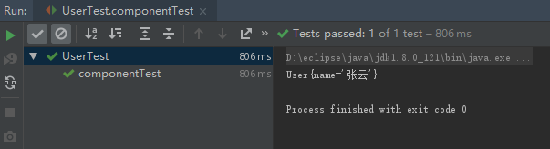


## 使用java的方式配置Spring

最新的Springboot中有大量这种方式的配置。我们现在要完全不使用xml配置了，全权交给java来做。

JavaConfig是Spring的一个子项目，在Spring4之后，它成为了一个核心功能。

在idea输入ApplicationContext，程序自动导入ApplicationContext包

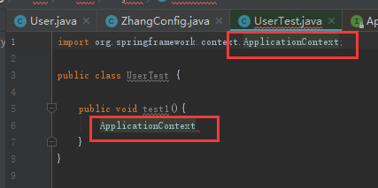

点击包，进入源码。点击I字样，可以看到有哪些类实现了ApplicationContext接口。找到我们需要的类：AnnotationConfigApplicationContext。

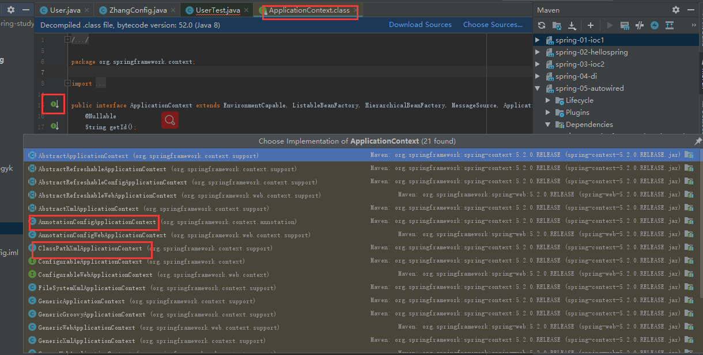

### 实例

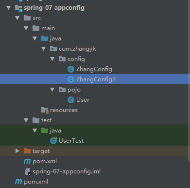

编写pojo类

```java
package com.zhangyk.pojo;

import org.springframework.beans.factory.annotation.Value;
import org.springframework.stereotype.Component;

//使用java配置Spring时，类上面不需要@component注解，因为该注解是通过纯注解配置时才用的
//虽然不需要@component，但是也可以加上。这里@component的意思就是说，这个类被Spring接管了，注册到容器中（？增加可读性，体现注解的“注”属性）
@Component
public class User {

    //通过java配置注册bean对象可以，但是属性的注入还是得通过注解
    @Value("张云")
    private String name;

    public String getName() {
        return name;
    }

    public void setName(String name) {
        this.name = name;
    }

    @Override
    public String toString() {
        return "User{" +
                "name='" + name + '\'' +
                '}';
    }
}

```

编写配置类

```java
package com.zhangyk.config;

import com.zhangyk.pojo.User;
import org.springframework.context.annotation.Bean;
import org.springframework.context.annotation.ComponentScan;
import org.springframework.context.annotation.Configuration;
import org.springframework.context.annotation.Import;

/*
1. 这个也会Spring容器托管，注册到容器中，因为他本来就是一个@Component（点进注解可以看到）
2. @Configuration代表这是一个配置类，就和我们之前看的applicationContext.xml是一样的
3. @Configuration会启动容器，@Bean会注册bean对象
 */
@Configuration
/*
1. 这里没扫描也能用是因为这个配置类里面已经用@Bean注册了User，不需要pojo类中User的Component导入
2. 你可能会想：扫描component+@configuration同时使用的话，会不会相当于容器中有两个User类的bean对象？
即：一个是通过配置类注册的bean，一个是通过pojo类自带注解注册的bean？
答案是不会的，因为只要加了Coinfiguration默认作用域就为单例模式，同一类型的bean，只会留下一个。
* */
@ComponentScan("com.zhangyk.pojo")
//引入别的配置类，相当于之前xml配置文件中的import标签
@Import(ZhangConfig2.class)
public class ZhangConfig {

    /*
    注册一个bean，就相当于我们之前写的一个bean标签
    这个方法的名字，就相当于bean标签中的id属性
    这个方法的返回值，就相当于bean标签中的class属性
    */
    @Bean
    public User user(){
        //就是返回要注入到bean的对象
        return new User();
    }
}

```

```java
package com.zhangyk.config;

import org.springframework.context.annotation.Configuration;

@Configuration
public class ZhangConfig2 {
}

```

编写测试类

```java
import com.zhangyk.config.ZhangConfig;
import com.zhangyk.pojo.User;
import org.junit.Test;
import org.springframework.context.ApplicationContext;
import org.springframework.context.annotation.AnnotationConfigApplicationContext;

public class UserTest {

    @Test
    public void test1(){
        ApplicationContext context = new AnnotationConfigApplicationContext(ZhangConfig.class);
        User user = context.getBean("user", User.class);

        System.out.println(user.toString());
    }
}
```

查看测试结果。**依赖**Spring容器+**注入**bean对象的属性 成功

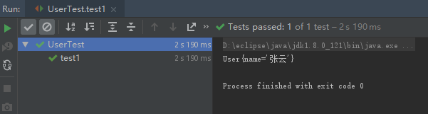


### IOC小结

- Mybatis可以用注解，但是因为Mybatis中有不少复杂操作，官方推荐用xml
- Spring配置时，除了事务，其他的基本都很简单，所以现在越来越流行用注解配置bean，简化开发。


## 代理模式

讲AOP之前要讲好代理模式。为什么要学习代理模式？因为这就是SpringAOP的底层！【面试必问：SpringAOP和SpringMVC】

代理模式分类：

- 静态代理
- 动态代理

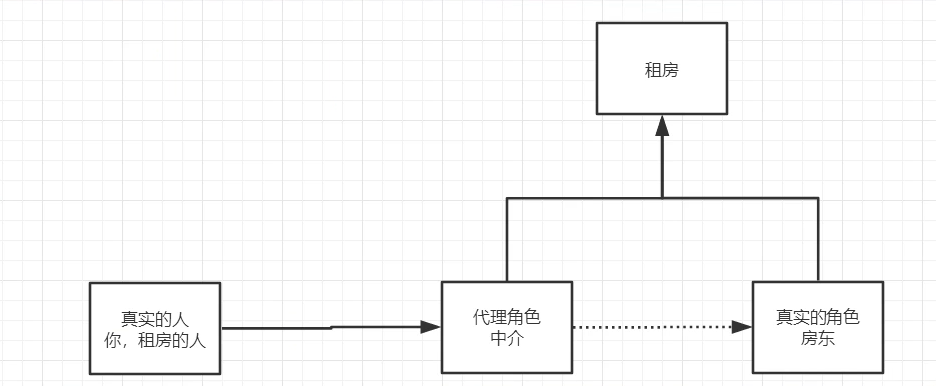


### 静态代理

角色分析：

- 抽象角色：一般会使用接口或者抽象类来解决（如上图的“租房”block）
- 真实角色：被代理的角色
- 代理角色：代理真实角色。代理真实角色后，我们一般会做一些附属操作
- 客户：访问代理对象的人。


代理模式pro&cons

好处：

- 可以使真实角色的操作更加纯粹，不用去关注一些公共的业务。
- 公共业务就交给代理角色，实现了业务的分工
- 公共业务发生扩展的时候，方便集中管理

缺点：

- 一个真实角色就会产生一个代理角色；代码量会翻倍-开发效率会变低。
- 解决缺点的方法就是-动态代理。


代码实例：

编写接口

```java
package com.zhangyk.demo01;

//租房的接口。真实角色和代理角色要去实现它
public interface Rent {

    public void rent();
}

```

真实角色

不管租房过程中要有哪些新增服务，真实角色做的工作始终不会变：我要出租。这体现了真实角色的纯粹性。

```java
package com.zhangyk.demo01;

public class Host implements Rent{
    public void rent() {
        System.out.println("房东要出租房子");
    }
}
```

代理角色

```java
package com.zhangyk.demo01;

public class Proxy implements Rent{

    private Host host;

    public Proxy() {
    }

    public Proxy(Host host) {
        this.host = host;
    }

    public void rent() {
        //传给他的是哪个房东，他就调用哪个房东
        host.rent();
        seeHouse();
        signContract();
        fee();
    }

    //看房
    public void seeHouse(){
        System.out.println("中介带你看房");
    }

    //签租赁合同
    public void signContract(){
        System.out.println("签租赁合同");
    }

    //收中介费
    public void fee(){
        System.out.println("收中介费");
    }
}
```

客户端访问代理角色

```java
package com.zhangyk.demo01;

public class Client {

    public static void main(String[] args) {
        //房东要租房子
        Host host = new Host();
        //代理，中介帮房东租房子。代理角色一般会有一些附属操作。
        Proxy proxy = new Proxy(host);

        //你不用管面对房东，直接找中介租房即可
        proxy.rent();
    }
}
```


### 加深理解

#### 聊聊AOP【附图】

在原有代码基础上，增加日志log功能，即为横向开发。现有代码插一个功能进去---横向开发。

 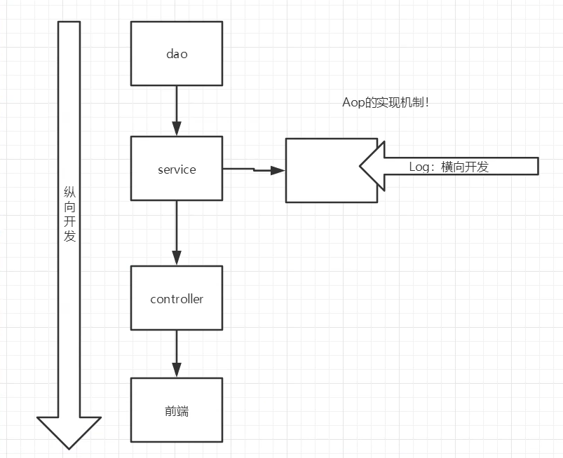

#### 代码实现

针对Service层需要扩展一个log日志功能写代码

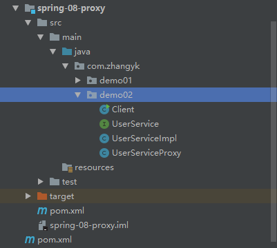

编写接口

```java
package com.zhangyk.demo02;

public interface UserService {

    //针对User类要实现增删改查的功能
    public void add();
    public void delete();
    public void update();
    public void query();
}
```

编写接口实现类

```java
package com.zhangyk.demo02;

/*
* 为什么不在UserServiceImpl类上直接加功能，而要通过Proxy扩展功能？
* 1. 改动原有的业务代码，在公司中是大忌。
* */
public class UserServiceImpl implements UserService{


    public void add() {
        System.out.println("增加了一个用户");
    }

    public void delete() {
        System.out.println("删除了一个用户");

    }

    public void update() {
        System.out.println("修改了一个用户");

    }

    public void query() {
        System.out.println("查询了一个用户");

    }
}
```

编写代理的代码

```java
package com.zhangyk.demo02;

/*
* 如果直接在UserServiceImpl中添加功能，如日志，会修改UserServiceImpl源码。为了避免修改源码，我们使用代理模式
* 建立当前UserServiceProxy类，来做一些在UserServiceImpl不做的附加工作
* */
public class UserServiceProxy implements UserService {

    private UserServiceImpl userService;

    public void setUserService(UserServiceImpl userService) {
        this.userService = userService;
    }

    public void add() {
        log("add");
        userService.add();
    }

    public void delete() {
        log("delete");
        userService.delete();
    }

    public void update() {
        log("update");
        userService.update();
    }

    public void query() {
        log("query");
        userService.query();
    }

    //日志方法
    public void log(String msg){
        System.out.println("[Debug]使用了"+msg+"方法");
    }
}
```

- 我：根据多态，这里的`private UserServiceImpl userService;`应该写成`private UserService userService;`，强调实现的是哪个接口服务

编写客户类

```java
package com.zhangyk.demo02;

/*
* 不改变原有业务的情况下，想要去扩展一些功能，代理模式就很好。
* */
public class Client {

    public static void main(String[] args) {
        //真实角色userService只做增删改查，源码不变
        UserServiceImpl userService = new UserServiceImpl();

        //添加日志的功能，通过代理userServiceProxy实现
        UserServiceProxy userServiceProxy = new UserServiceProxy();
        userServiceProxy.setUserService(userService);

        userServiceProxy.add();
        userServiceProxy.delete();
    }
}
```

查看测试结果。成功在不修改UserServiceImpl源码的基础上，为service层附加了一个日志功能

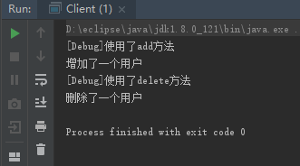


### 动态代理

前言：

- 动态代理和静态代理角色一样
- 动态代理的代理类是动态生成的，不是我们直接写好的
- 动态代理分为两大类：基于接口的动态代理，基于类的动态代理
  - 基于接口---JDK动态代理【这里使用】
  - 基于类：cglib
  - java字节码实现：javasist


需要了解两个类：Proxy：代理，InvocationHandler：调用处理程序


#### 实例（初始版本）

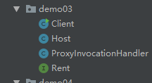

编写要实现的接口Rent.java

```java
package com.zhangyk.demo03;

//租房的接口。真实角色和代理角色要去实现它
public interface Rent {

    public void rent();
}
```

编写真实角色类

```java
package com.zhangyk.demo03;

public class Host implements Rent {
    public void rent() {
        System.out.println("房东要出租房子");
    }
}
```

编写自动生成代理类的类

```java
package com.zhangyk.demo03;


import java.lang.reflect.InvocationHandler;
import java.lang.reflect.Method;
import java.lang.reflect.Proxy;

//等会会用这个类自动生成代理类，而不是像demo1中写死代理类
public class ProxyInvocationHandler implements InvocationHandler {
    /*
    * 参考官方文档使用newProxyInstance():
    * Foo f = (Foo) Proxy.newProxyInstance(
    * //第一个参数：ClassLoader()；代理类入口
    * Foo.class.getClassLoader(),
    * //第二个参数：接口数组；被代理的类（Host）的接口
    * new Class<?>[]{Foo.class},
    * //第三个参数：InvocationHandler；如何代理实现的方法的位置
    * handler);
    * */

    //实现了被代理的接口的某类的对象。这里写死为只能代理Rent接口
    private Rent rent;
    //对象通过public set设置
    public void setRent(Rent rent){
        this.rent=rent;
    }

    //生成得到代理对象
    public Object getProxy(){
        /*
        * 下面这行代码是死的，只要改第二个参数的rent就可以了
        * */
        return Proxy.newProxyInstance(
                //代理类入口
                this.getClass().getClassLoader(),
                //被代理的类（Host）的接口
                rent.getClass().getInterfaces(),
                //如何代理实现的方法的位置
                this);
    }

    //处理代理实例proxy调用的方法，并返回结果，此结果没有明显用处
    /*
    * invoke是jvm调的
    *
    * 代理实例proxy调用了任何方法，都会通过该强制实现的invoke方法来反射实现那些方法
    * */
    public Object invoke(Object proxy, Method method, Object[] args) throws Throwable {

        seeHouse();

        /*
        * 用反射来执行方法,之前反射讲过，经典
        *
        * 动态代理的本质，就是使用反射机制实现
        *
        * 这里的method对象是proxy对象调用的方法的方法对象；本例子中是rent方法（可见于Client类的第20行）
        *
        * 这里的rent是实现了Rent接口的某类的一个对象；本例子中rent为host对象（Client类中用setRent赋值的）。
        * 由于Client类中，代理proxy调用了rent方法，这里method便是rent方法的方法类，
        * 此rent方法的方法类“method”，通过invoke，作用于实现了Rent接口的对象rent，而该rent对象是host对象，
        * 所以此行invoke本质是执行host对象中的rent方法。
        * */
        Object result = method.invoke(rent, args);

        fare();

        return result;
    }

    public void seeHouse(){
        System.out.println("中介带看房子");
    }

    public void fare(){
        System.out.println("中介收钱");
    }
}
```

编写客户

```java
package com.zhangyk.demo03;

public class Client {

    public static void main(String[] args) {
        //真实角色
        Host host = new Host();

        //代理角色：现在没有。要通过“程序处理角色：ProxyInvocationHandler”生成一个代理类
        ProxyInvocationHandler proxyInvocationHandler = new ProxyInvocationHandler();
        //通过调用“程序处理角色：ProxyInvocationHandler”的set方法，来设置“实现指定接口的对象”（本例中为host）
        proxyInvocationHandler.setRent(host);
        //生成代理角色
        /*
        * proxy是动态生成的实现了Rent接口的对象，他的rent方法通过ProxyInvocationHandler类中的invoke实现
        *
        * 返回的代理对象，由于ProxyInvocationHandler类中newProxyInstance方法中的限定，只能代理Rent接口
        * */
        Rent proxy = (Rent) proxyInvocationHandler.getProxy();

        //调用代理角色的方法
        proxy.rent();

    }
}
```

查看运行结果。Rent接口在Host对象上的实现，成功通过代理模式运行。

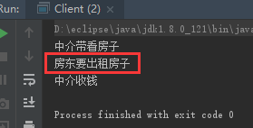


#### 实例（实战版本）

主要区别就是，之前ProxyInvocationHandler中接口写死的，现在改成活的。

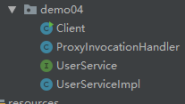

编写某个想被代理的接口

```java
package com.zhangyk.demo04;

public interface UserService {

    //针对User类要实现增删改查的功能
    public void add();
    public void delete();
    public void update();
    public void query();
}
```

编写一个类，来实现需要被代理的接口

```java
package com.zhangyk.demo04;

/*
* 为什么不在UserServiceImpl类上直接加功能，而要通过Proxy扩展功能？
* 1. 改动原有的业务代码，在公司中是大忌。
* */
public class UserServiceImpl implements UserService {


    public void add() {
        System.out.println("增加了一个用户");
    }

    public void delete() {
        System.out.println("删除了一个用户");

    }

    public void update() {
        System.out.println("修改了一个用户");

    }

    public void query() {
        System.out.println("查询了一个用户");

    }
}
```

编写自动生成动态代理类的类

```java
package com.zhangyk.demo04;


import com.zhangyk.demo03.Rent;

import java.lang.reflect.InvocationHandler;
import java.lang.reflect.Method;
import java.lang.reflect.Proxy;

//等会会用这个类自动生成代理类，而不是像demo1中写死代理类
public class ProxyInvocationHandler implements InvocationHandler {

    //实现了被代理的接口的某类的对象。之前demo3写死为rent，这里写成Object（活的）
    private Object target;
    //对象通过public set设置。其实该set方法可以浓缩到getProxy()中
    public void setTarget(Object target){
        this.target=target;
    }

    //生成得到代理对象
    public Object getProxy(){
        /*
        * 下面这行代码是死的
        * */
        return Proxy.newProxyInstance(
                //代理类入口
                this.getClass().getClassLoader(),
                //被代理的类（userService）的接口
                target.getClass().getInterfaces(),
                //如何代理实现的方法的位置
                this);
    }

    //处理代理实例proxy调用的方法，并返回结果，此结果没有明显用处
    /*
    * invoke是jvm调的
    *
    * 代理实例proxy调用了任何方法，都会通过该强制实现的invoke方法来反射实现那些方法
    * */
    public Object invoke(Object proxy, Method method, Object[] args) throws Throwable {

        //！！！！不改变UserServiceImpl的前提下，AOP，利用动态代理横向增加日志功能
        log(method.getName());

        /*
        * 用反射来执行方法,之前反射讲过，经典
        *
        * 动态代理的本质，就是使用反射机制实现
        *
        * 这里的method对象是proxy对象调用的方法的方法对象；本例子中是add方法（可见于Client类的第24行）
        *
        * 这里的target是实现了target接口的某类的一个对象；本例子中target为userService对象（Client类中用set赋值的）。
        * 由于Client类中，代理proxy调用了add方法，这里method便是add方法的方法类，
        * add方法的方法类“method”，通过invoke，作用于实现了UserService接口的对象userService，
        * 而该target对象是userService对象，所以此行invoke本质是执行userService对象中的add方法。
        * */
        Object result = method.invoke(target, args);
        return result;
    }

    public void log(String msg){
        System.out.println("执行了"+msg+"方法");
    }

}
```

编写客户

```java
package com.zhangyk.demo04;

public class Client {

    public static void main(String[] args) {
        //真实角色
        UserServiceImpl userService = new UserServiceImpl();

        //代理角色，不存在
        ProxyInvocationHandler proxyInvocationHandler = new ProxyInvocationHandler();
        /*设置要代理的对象
        *
        * 比喻来说，就是是你找中介谈没错，但是钥匙在房东受理。所以要去找到真实角色，拿到钥匙
        * */
        proxyInvocationHandler.setTarget(userService);
        /*
        * 动态生成代理类。要强转为真实角色所实现的“某一”接口
        *
        * 真实角色可能实现很多接口，通过ProxyInvocationHandler类中的getInterfaces可知。但其实真实开发中，
        * 某一动态代理类一般只实现一个接口，即只代理“实现某一个相同接口的类们”
        * */
        UserService proxy = (UserService) proxyInvocationHandler.getProxy();

        proxy.add();
        proxy.delete();
    }
}
```

查看结果。成功用动态代理的方式代理了UserService接口；并实现了其中的方法；并AOP得为UserServiceImpl类横向扩展了日志功能

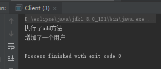


#### 动态代理的好处

- 可以使真实角色的操作更加纯粹，不用去关注一些公共的业务。

- 公共业务就交给代理角色，实现了业务的分工

- 公共业务发生扩展的时候，方便集中管理

- **一个动态代理类代理的是一个接口，一般就是对应的一类业务**

- **一个动态代理类可以代理多个类，只要是实现了同一个接口即可**

  比如demo4中，代理的类是userServiceImpl。但其实有其他实现了UserService接口的类如userServiceImpl1，userServiceImpl2等类的话，该动态代理类也可以代理。因为所有这些被代理类都实现的是同一个接口：UserService


## AOP

### 什么是AOP

AOP（Aspect Oriented Programming）意为：面向切面编程，通过预编译方式和运行期动态代理实现程序功能的统一维护的一种技术。AOP是OOP的延续，是软件开发中的一个热点。也是Spring框架中的一个重要内容，是函数式编程的一种衍生泛型。利用AOP可以对业务逻辑的各个部分进行隔离。从而使得业务逻辑各部分之间的耦合度降低，提高程序的可重用性，同时提高了开发的效率。

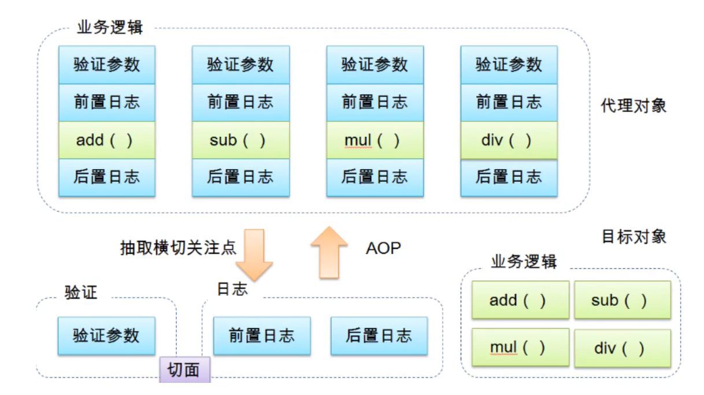


### AOP在Spring中的应用

提供声明式事务（事务与业务挂钩，增删改查要提交事务）；允许用户自定义切面

- 横切关注点：跨越应用程序多个模块的方法或功能。即是，与我们业务逻辑无关的，但是我们需要关注的部分，就是横切关注点。如日志，安全，缓存，事务等等
- 切面（Aspect）：横切关注点 被模块化的 特殊对象。即，他是一个类。
- 通知（Advice）：切面必须完成的工作。即他是类中的一个方法。
- 目标（Target）：被通知对象。一般是一个接口或者方法。

- 代理（Proxy）：向目标对象应用通知之后创建的对象。
- 切入点（PointCut）：切面通知 执行的 “地点”的定义。如“代理模式”章节中，实例里，提到的method.invoke。
- 连接点（JointPoint）：与切入点匹配的执行点。

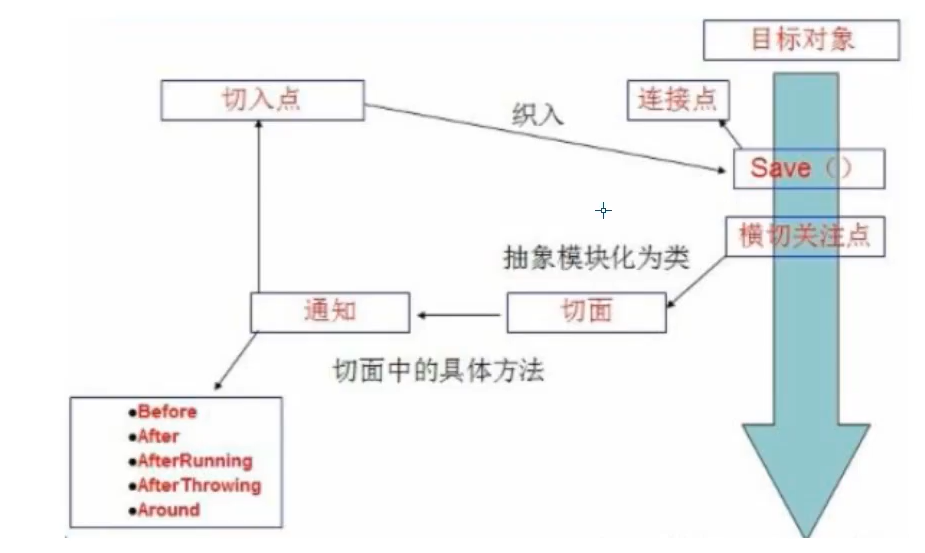

SpringAOP中，通过Advice定义横切逻辑，Spring中支持5种类型的Advice：

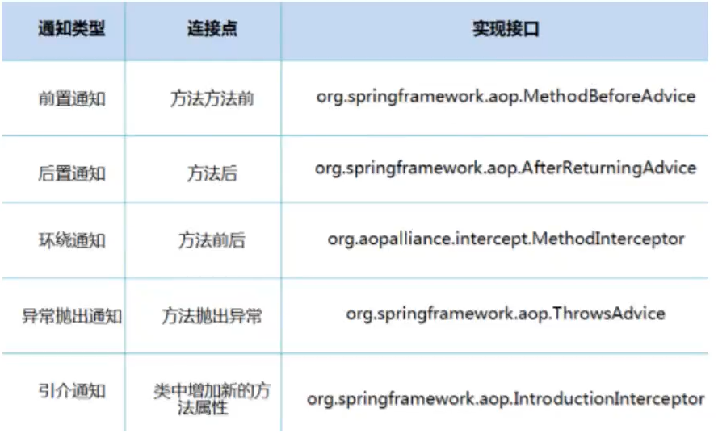

即AOP在不改变原有代码的情况下，去增加新的功能。


### 使用Spring实现AOP

【重点】使用AOP植入，需要导入一个依赖包！

```xml
<dependency>
    <groupId>org.aspectj</groupId>
    <artifactId>aspectjweaver</artifactId>
    <version>1.9.4</version>
</dependency>
```


#### 方式一：使用Spring的API接口

【主要是SpringAPI接口实现】

实例：

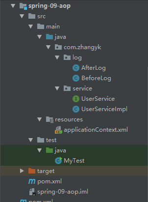

编写原有服务接口，和服务接口的实现类

```java
package com.zhangyk.service;

public interface UserService {

    public void add();
    public void delete();
    public void update();
    public void select();
}
```

```java
package com.zhangyk.service;

public class UserServiceImpl implements UserService{

    public void add(){
        System.out.println("增加了一个用户");
    }
    public void delete(){
        System.out.println("删除了一个用户");
    }
    public void update(){
        System.out.println("更新了一个用户");
    }
    public void select(){
        System.out.println("选择了一个用户");
    }
}
```

编写想要实现新增功能的类

```java
package com.zhangyk.log;

import org.springframework.aop.AfterReturningAdvice;

import java.lang.reflect.Method;

/*
* 本AfterLog是方法执行后使用的日志
* */
public class AfterLog implements AfterReturningAdvice {

    /*
    * 参数比before多了returnValue：返回值
    *
    * 因为方法执行前是不会有返回值的，但是方法执行后会有
    * */
    public void afterReturning(Object returnValue, Method method, Object[] args, Object target) throws Throwable {

        System.out.println(target.getClass().getName()+"类的对象的"+method.getName()+"方法被执行了。返回结果为："+returnValue);
    }
}
```

```java
package com.zhangyk.log;

import org.springframework.aop.MethodBeforeAdvice;

import java.lang.reflect.Method;

/*
* MethodBeforeAdvice的parent是BeforeAdvice，MethodBeforeAdvic的出现应该是出于一些扩展性需求的设计
*
* 本BeforeLog类是方法执行前使用的日志
* */
public class BeforeLog implements MethodBeforeAdvice {
    /*
    method:要执行的目标对象的方法 的方法对象
    objects：参数，其实命名为args更合理
    o：目标对象，其实命名为target更合理

     参数命名不规范的问题：可以下载源码来读。点MethodBeforeAdvice接口，代码区的上沿会有“下载源码”的
     标识，点击下载后读的源码都是规范命名的
    */
    public void before(Method method, Object[] objects, Object o) throws Throwable {
        System.out.println(o.getClass().getName()+"类的对象的"+method.getName()+"方法被执行了");

    }
}
```

编写Spring配置文件：注册bean，并配置AOP

```xml
<?xml version="1.0" encoding="UTF-8"?>
<!--这个beans标签的各个属性是约束文件，xds检查我们的语法的
针对aop的话，要添加的是：
xmlns:aop="http://www.springframework.org/schema/aop"    末尾的aop本来是c，老师手动改成aop
http://www.springframework.org/schema/aop
https://www.springframework.org/schema/aop/spring-aop.xsd
-->
<beans xmlns="http://www.springframework.org/schema/beans"
       xmlns:xsi="http://www.w3.org/2001/XMLSchema-instance"
       xmlns:aop="http://www.springframework.org/schema/aop"

       xsi:schemaLocation="http://www.springframework.org/schema/beans
        https://www.springframework.org/schema/beans/spring-beans.xsd
        http://www.springframework.org/schema/aop
        https://www.springframework.org/schema/aop/spring-aop.xsd">

    <!--注册bean
    注册的都是借口的实现类
    -->
    <bean id="userService" class="com.zhangyk.service.UserServiceImpl"/>
    <bean id="afterLog" class="com.zhangyk.log.AfterLog"/>
    <bean id="beforeLog" class="com.zhangyk.log.BeforeLog"/>

    <!--方式1：使用原生API接口-->
    <!--配置aop：需要导入aop的约束（不写约束xmlns:aop貌似也能用）
    -->
    <aop:config>
        <!--切入点
        expression:表达式，execution(要执行的位置 * * * * *)。
		第一个参数表示返回类型，*表示所有类型
        第二个参数的UserServiceImpl表示要给UserServiceImpl插入一些AOP代码
        第二个参数的*表示UserServiceImpl下的任意方法，(..)表示该方法可以有任意参数；AOP会以这些方法为切入点，来插入代码

        待会执行的beforeLog和afterLog代码会在这个点上去执行

        可以配置多个切入点，也可以把某个切入点的方法固定成具体方法，不过本例暂时采用“一个切入点-不固定切入方法”的用法
        -->
        <aop:pointcut id="pointCut" expression="execution(* com.zhangyk.service.UserServiceImpl.*(..))"/>

        <!--执行环绕增加
        参数pointcut-ref 将beforeLog这个bean对象切入到pointcut-ref值指定的切入点，
        本例中切入点为UserServiceImpl中所有符合格式要求的方法
        -->
        <aop:advisor advice-ref="beforeLog" pointcut-ref="pointCut"/>
        <aop:advisor advice-ref="afterLog" pointcut-ref="pointCut"/>
    </aop:config>

</beans>
```

编写测试类

```java
import com.zhangyk.service.UserService;
import org.springframework.context.ApplicationContext;
import org.springframework.context.support.ClassPathXmlApplicationContext;

public class MyTest {

    public static void main(String[] args) {
        //Spring测试三部曲：下面三行即为三步

        ApplicationContext context = new ClassPathXmlApplicationContext("applicationContext.xml");

        /*
        * 【注意】动态代理代理的是接口，而不是接口的实现类。
        * 所以写成UserServiceImpl userService = context.getBean("userService", UserServiceImpl.class);会报错
        * */
        UserService userService = context.getBean("userService", UserService.class);

        userService.add();
    }
}
```

查看测试结果。beforelog和afterlog成功切入到调用的add方法处，并且切入在指定的或前或后的位置。

实际上add，delete，update，select都被切入了（aop:pointcut标签中的expression属性指定了），只是这里只调用了add而已。

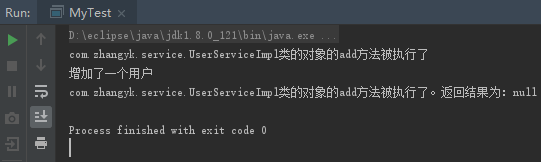


#### 方式二：使用自定义类来实现AOP

【主要是切面定义】

接口记不住或者接口找不到的时候，没办法用方式一，此时可以用别的方式。

实例：

编写service 接口和实现类

方式一已完成

编写自定义的切面，里面包含要增加的函数功能

```java
package com.zhangyk.diy;

public class DiyPointCut {

    //函数名可以随便起
    public void before(){
        System.out.println("=======方法执行前======");
    }

    //函数名可以随便起
    public void after(){
        System.out.println("=======方法执行后======");
    }
}
```

编写Spring配置文件，配置bean，以及基于自定义类的AOP

```xml
<?xml version="1.0" encoding="UTF-8"?>
<!--这个beans标签的各个属性是约束文件，xds检查我们的语法的
针对aop的话，要添加的是：
xmlns:aop="http://www.springframework.org/schema/aop"    末尾的aop本来是c，老师手动改成aop
http://www.springframework.org/schema/aop
https://www.springframework.org/schema/aop/spring-aop.xsd
-->
<beans xmlns="http://www.springframework.org/schema/beans"
       xmlns:xsi="http://www.w3.org/2001/XMLSchema-instance"
       xmlns:aop="http://www.springframework.org/schema/aop"

       xsi:schemaLocation="http://www.springframework.org/schema/beans
        https://www.springframework.org/schema/beans/spring-beans.xsd
        http://www.springframework.org/schema/aop
        https://www.springframework.org/schema/aop/spring-aop.xsd">

    <!--注册bean
    注册的都是借口的实现类
    -->
    <bean id="userService" class="com.zhangyk.service.UserServiceImpl"/>

    <!--方式二：自定义类-->
    <bean id="diy" class="com.zhangyk.diy.DiyPointCut"/>
    <aop:config>
        <!--切面：就是一个类
        自定义切面，ref为要引用的类-->
        <aop:aspect ref="diy">
            <!--切入点
            execution函数的参数可以网上搜有详解：https://blog.csdn.net/corbin_zhang/article/details/80576809
            -->
            <aop:pointcut id="point" expression="execution(* com.zhangyk.service.UserServiceImpl.*(..))"/>
            <!--通知
            在上行定义的切入点的或前或后，去插入通知，通知即为新增的方法-->
            <aop:before method="before" pointcut-ref="point"/>
            <aop:after method="after" pointcut-ref="point"/>
        </aop:aspect>
    </aop:config>

</beans>
```

测试类同方式一

```java
import com.zhangyk.service.UserService;
import org.springframework.context.ApplicationContext;
import org.springframework.context.support.ClassPathXmlApplicationContext;

public class MyTest {

    public static void main(String[] args) {
        //Spring测试三部曲：下面三行即为三步

        ApplicationContext context = new ClassPathXmlApplicationContext("applicationContext.xml");

        /*
        * 【注意】动态代理代理的是接口，而不是接口的实现类。
        * 所以写成UserServiceImpl userService = context.getBean("userService", UserServiceImpl.class);会报错
        * */
        UserService userService = context.getBean("userService", UserService.class);

        userService.add();
    }
}
```

查看测试结果，成功实现AOP的效果

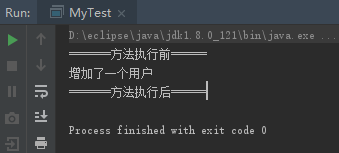


#### 方式三：使用注解实现

实例：

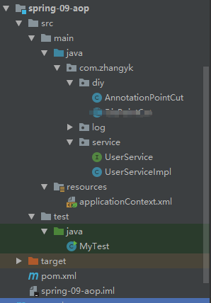

编写service 接口和实现类

- 方式一已完成

编写使用注解做AOP的类

```java
package com.zhangyk.diy;

/*方式三：使用注解方式实现AOP
*
* 用注解定义了切面，切入点，通知。所以这些定义在Spring配置文件中就不用做了
* */

import org.aspectj.lang.ProceedingJoinPoint;
import org.aspectj.lang.annotation.After;
import org.aspectj.lang.annotation.Around;
import org.aspectj.lang.annotation.Aspect;
import org.aspectj.lang.annotation.Before;

//标注这个类是一个切面
@Aspect
public class AnnotationPointCut {

    // @Before表示在切入点的前面执行“通知”，注解的括号中填写切入点
    @Before("execution(* com.zhangyk.service.UserServiceImpl.*(..))")
    public void before(){
        System.out.println("===方法执行前===");
    }

    // @After表示在切入点的后面执行“通知”，注解的括号中填写切入点
    @After("execution(* com.zhangyk.service.UserServiceImpl.*(..))")
    public void after(){
        System.out.println("===方法执行后===");
    }

    /*使用环绕增强
    *
    * 在环绕增强中，我们就可以给定一个参数，代表我们要获取处理切入的点：ProceedingJoinPoint jp 这个是写死的
    *
    * 用around方法，可以拿到原方法的参数等，做各种校验，判断redis锁存在不存在
    * */
    @Around("execution(* com.zhangyk.service.UserServiceImpl.*(..))")
    public void around(ProceedingJoinPoint jp) throws Throwable {
        System.out.println("环绕前");

        //执行方法
        Object proceed = jp.proceed();
        System.out.println(">>>>Signature:"+jp.getSignature());
        System.out.println(">>>>proceed:"+proceed);

        System.out.println("环绕后");

    }
}
```

编写Spring配置文件

```xml
<?xml version="1.0" encoding="UTF-8"?>
<!--这个beans标签的各个属性是约束文件，xds检查我们的语法的
针对aop的话，要添加的是：
xmlns:aop="http://www.springframework.org/schema/aop"    末尾的aop本来是c，老师手动改成aop
http://www.springframework.org/schema/aop
https://www.springframework.org/schema/aop/spring-aop.xsd
-->
<beans xmlns="http://www.springframework.org/schema/beans"
       xmlns:xsi="http://www.w3.org/2001/XMLSchema-instance"
       xmlns:aop="http://www.springframework.org/schema/aop"

       xsi:schemaLocation="http://www.springframework.org/schema/beans
        https://www.springframework.org/schema/beans/spring-beans.xsd
        http://www.springframework.org/schema/aop
        https://www.springframework.org/schema/aop/spring-aop.xsd">

    <!--注册bean
    注册的都是借口的实现类
    -->
    <bean id="userService" class="com.zhangyk.service.UserServiceImpl"/>

    <!--方式三-->
    <bean id="annotationPointCut" class="com.zhangyk.diy.AnnotationPointCut"/>
    <!--开启注解支持
    支持方式有两种：JDK(默认的可省略 proxy-target-class="false") ， cglib（proxy-target-class="true"）。这两种结果没什么区别。-->
    <aop:aspectj-autoproxy proxy-target-class="false"/>

</beans>
```

编写测试类

- 同方式一和方式二

查看测试结果

- 应用AOP成功

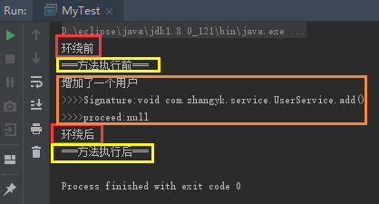


**总结：**

一般来说，注解会方便一点。但是要实现复杂功能的话，可以考虑方式一和方式二。


## Spring整合Mybatis

### 整合步骤

1. 导入相关jar包
   - junit
   - mybatis
   - mysql数据库
   - spring相关的
   - aop植入
   - mybatis-spring【new】
2. 编写配置文件
3. 测试


### 回忆mybatis

mybatis步骤：

1. 编写实体类
2. 编写核心配置文件

3. 编写接口
4. 编写Mapper.xml
5. 测试

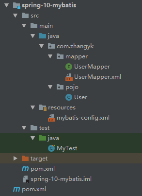


### Mybatis-Spring整合方式一

[官网链接](https://mybatis.org/spring/zh/index.html)有快速入门教学

步骤：

1. 编写数据源配置
2. sqlSessionFactory
3. sqlSessionTemplate
4. 需要给接口加实现类
5. 将自己写的实现类，注入到Spring中
6. 测试

实例：

idea连接数据库

- 详细操作方法见mybatis章节

pom中添加依赖，进行maven配置

```xml
<?xml version="1.0" encoding="UTF-8"?>
<project xmlns="http://maven.apache.org/POM/4.0.0"
         xmlns:xsi="http://www.w3.org/2001/XMLSchema-instance"
         xsi:schemaLocation="http://maven.apache.org/POM/4.0.0 http://maven.apache.org/xsd/maven-4.0.0.xsd">
    <parent>
        <artifactId>spring-study</artifactId>
        <groupId>com.zhangyk</groupId>
        <version>1.0-SNAPSHOT</version>
    </parent>
    <modelVersion>4.0.0</modelVersion>

    <artifactId>spring-10-mybatis</artifactId>

    <dependencies>
        <dependency>
            <groupId>junit</groupId>
            <artifactId>junit</artifactId>
            <version>4.12</version>
        </dependency>
        <dependency>
            <groupId>mysql</groupId>
            <artifactId>mysql-connector-java</artifactId>
            <version>5.1.47</version>
        </dependency>
        <dependency>
            <groupId>org.mybatis</groupId>
            <artifactId>mybatis</artifactId>
            <version>3.5.2</version>
        </dependency>
        <dependency>
            <groupId>org.springframework</groupId>
            <artifactId>spring-webmvc</artifactId>
            <version>5.2.0.RELEASE</version>
        </dependency>
        <!--spring操作数据库的话，还需要一个spring-jdbc的包-->
        <dependency>
            <groupId>org.springframework</groupId>
            <artifactId>spring-jdbc</artifactId>
            <version>5.2.0.RELEASE</version>
        </dependency>
        <!--aspectj织入包-->
        <dependency>
            <groupId>org.aspectj</groupId>
            <artifactId>aspectjweaver</artifactId>
            <version>1.9.4</version>
        </dependency>
        <!--mybatis-spring【new】-->
        <dependency>
            <groupId>org.mybatis</groupId>
            <artifactId>mybatis-spring</artifactId>
            <version>2.0.2</version>
        </dependency>
    </dependencies>

    <build>
        <resources>
            <resource>
                <directory>src/main/java</directory>
                <includes>
                    <include>**/*.xml</include>
                </includes>
                <filtering>true</filtering>
            </resource>
        </resources>
    </build>

</project>
```

编写与数据库表对应的pojo类

```java
package com.zhangyk.pojo;

public class User {

    private int id;
    private String name;
    private String pwd;

    public User() {
    }

    public User(int id, String name, String pwd) {
        this.id = id;
        this.name = name;
        this.pwd = pwd;
    }

    public int getId() {
        return id;
    }

    public void setId(int id) {
        this.id = id;
    }

    public String getName() {
        return name;
    }

    public void setName(String name) {
        this.name = name;
    }

    public String getPwd() {
        return pwd;
    }

    public void setPwd(String pwd) {
        this.pwd = pwd;
    }

    @Override
    public String toString() {
        return "User{" +
                "id=" + id +
                ", name='" + name + '\'' +
                ", pwd='" + pwd + '\'' +
                '}';
    }
}
```

编写Mapper（Dao）接口及xml

```java
package com.zhangyk.mapper;

import com.zhangyk.pojo.User;

import java.util.List;

public interface UserMapper {

    public List<User> selectUser();
}
```

```xml
<?xml version="1.0" encoding="UTF-8" ?>
<!DOCTYPE mapper
        PUBLIC "-//mybatis.org//DTD Mapper 3.0//EN"
        "http://mybatis.org/dtd/mybatis-3-mapper.dtd">
<!--Mapper配置文件-->
<mapper namespace="com.zhangyk.mapper.UserMapper">
    <select id="selectUser" resultType="User">
        select * from mybatis.user;
    </select>
</mapper>
```

编写Mapper的实现类，主要是封装一些之前在mybatis中写在test类里的代码

```java
package com.zhangyk.mapper;

import com.zhangyk.pojo.User;
import org.mybatis.spring.SqlSessionTemplate;

import java.util.List;

//之前像sqlSession.getMapper这种操作都是在Test类中做的，现在用Spring-Mybatis后我们把这些内容放到MapperImpl类中。
public class UserMapperImpl implements UserMapper {

    //我们所有操作，原来都使用sqlSession来执行；现在都使用使用SqlSessionTemplate
    private SqlSessionTemplate sqlSession;

    //设置sqlSession的set函数,是必须的。因为Spring-mybatis配置文件中给bean设置property时，内部用到的就是class的set方法。
    public void setSqlSession(SqlSessionTemplate sqlSession) {
        this.sqlSession = sqlSession;
    }

    public List<User> selectUser() {
        UserMapper mapper = sqlSession.getMapper(UserMapper.class);
        return mapper.selectUser();
    }
}
```

编写mybatis配置文件。主要是进行 mybatis配置(\<settings>)，和别名管理（\<typeAliases>）。像Mapper注册，移交到Spring-mybatis配置文件中去做

```xml
<?xml version="1.0" encoding="UTF-8" ?>
<!--注意mybatis-config的第一行不能有空格或者空行，或者注释：https://blog.csdn.net/zqq_2016/article/details/86674380-->
<!DOCTYPE configuration
        PUBLIC "-//mybatis.org//DTD Config 3.0//EN"
        "http://mybatis.org/dtd/mybatis-3-config.dtd">
<!--configuration核心配置文件
老师一般只在mybatis-config中配置“别名”和“mybatis设置”。
其他的比如Mapper类绑定可以放到Spring-mybatis配置文件applicationContext中做
-->
<configuration>

    <typeAliases>
        <package name="com.zhangyk.pojo"/>
    </typeAliases>

    <!--这步可以在Spring-mybatis配置文件applicationContext中用mapperLocations属性配置-->
    <!--<mappers>-->
        <!--<mapper class="com.zhangyk.mapper.UserMapper"></mapper>-->
    <!--</mappers>-->

</configuration>
```

编写Spring-Mybatis的配置文件。实现各种bean的注册。

```xml
<?xml version="1.0" encoding="UTF-8"?>
<!--这个beans标签的各个属性是约束文件，xds检查我们的语法的
针对aop的话，要添加的是：
xmlns:aop="http://www.springframework.org/schema/aop"    末尾的aop本来是c，老师手动改成aop
http://www.springframework.org/schema/aop
https://www.springframework.org/schema/aop/spring-aop.xsd
-->
<beans xmlns="http://www.springframework.org/schema/beans"
       xmlns:xsi="http://www.w3.org/2001/XMLSchema-instance"
       xmlns:aop="http://www.springframework.org/schema/aop"

       xsi:schemaLocation="http://www.springframework.org/schema/beans
        https://www.springframework.org/schema/beans/spring-beans.xsd
        http://www.springframework.org/schema/aop
        https://www.springframework.org/schema/aop/spring-aop.xsd">

    <!--！！！下面连续的三个bean是写死的，用于sqlsession准备相关的工作。
    其实可以把它们分离成单独文件，因为他们可以直接使用并从不需要修改
    ！！！-->
    <!--DataSource:使用Spring的数据源替换Mybatis的配置 c3p0 dbcp druid
    我们这里使用Spring提供的JDBC,但必须在pom中导入spring-jdbc才能使用
    -->
    <bean id="dataSource" class="org.springframework.jdbc.datasource.DriverManagerDataSource">
        <property name="driverClassName" value="com.mysql.jdbc.Driver"/>
        <property name="url" value="jdbc:mysql://localhost:3306/mybatis?useSSL=false&amp;useUnicode=true&amp;characterEncoding=UTF-8"/>
        <property name="username" value="root"/>
        <property name="password" value="123456"/>
    </bean>
    <!--下面这三行代码是直接从官网快速入门拷贝的：https://mybatis.org/spring/zh/getting-started.html
    有了Spring提供的sqlSessionFactory就不用自己创建工具类了，使用的时候直接getbean就可-->
    <bean id="sqlSessionFactory" class="org.mybatis.spring.SqlSessionFactoryBean">
        <property name="dataSource" ref="dataSource" />

        <!--下面讲一些补充内容-->
        <!--绑定mybatis配置文件，使得两个配置文件的配置内容合并
		但其实不用mybatis配置文件也可以，因为可以在Spring-mybatis中完成所有配置。
		但是推荐保留mybatis配置文件，并在其中做settings和typealias的工作
		留下mybatis配置文件也可以直接显示我们使用了mybatis-->
        <property name="configLocation" value="classpath:mybatis-config.xml"/>
        <!--做一些mybatis-config.xml中可以做的工作。比如注册mapper
		下面这个语句把所有mapper文件夹下的所有mapper都注册了，就不用每次添加一个mapper都要注册-->
        <property name="mapperLocations" value="classpath:com/zhangyk/mapper/*.xml"/>
    </bean>
    <!--SqlSessionTemplate:就是之前mybatis使用的sqlSession-->
    <bean id="sqlSession" class="org.mybatis.spring.SqlSessionTemplate">
        <!--只能使用构造器注入sqlSessionFactory，因为它没有set方法-->
        <constructor-arg index="0" ref="sqlSessionFactory"/>
    </bean>

    <!--
    id="userMapper"是接口，代表实现的功能；id引用的class="com.zhangyk.mapper.UserMapperImpl"代表实现接口的类。
    这种看似接口代表类的写法在java常见，推测是为了让人更关注接口中实现了什么方法，而不是实现类本身
    -->
    <bean id="userMapper" class="com.zhangyk.mapper.UserMapperImpl">
        <property name="sqlSession" ref="sqlSession"/>
    </bean>

</beans>
```

编写测试类

```java
import com.zhangyk.mapper.UserMapper;
import com.zhangyk.pojo.User;
import org.junit.Test;
import org.springframework.context.ApplicationContext;
import org.springframework.context.support.ClassPathXmlApplicationContext;
import java.io.IOException;

public class MyTest {
    @Test
    public void test() throws IOException {

        ApplicationContext context = new ClassPathXmlApplicationContext("applicationContext.xml");

        UserMapper userMapper = context.getBean("userMapper", UserMapper.class);

        for (User user : userMapper.selectUser()) {
            System.out.println(user);
        }

    }
}
```

查看结果，本地数据库中的数据被成功读取

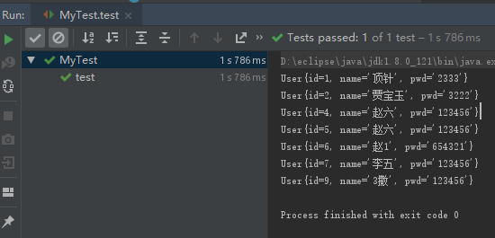

 


### Mybatis-Spring整合方式二

使用SqlSessionDaoSupport。会简化一点，公司里这个会更常用一点，但是不方便理解原理。重点掌握方式一即可。


## Spring结合声明式事务

### 回顾事务

特点：

- 把一组业务当成一个业务来做；**要么都成功，要么都失败**
- 事务在开发中，十分的重要，涉及到数据的一致性问题，不能马虎。
- 确保完整性和一致性

事务ACID原则：

- 原子性（automicity）

  确保做的事情，要么都成功，要么都失败。

- 一致性（consistency）

  如A给B转账，不论转账的事务操作是否成功，其两者的存款总额不变（这是业务逻辑的一致性）。

- 隔离性（isolation）

  多个业务可能操作同一个资源，防止数据损坏

- 持久性（durability）

  事务一旦提交，无论系统发生什么问题，结果都不会再被影响，被持久化的写到存储器中。


### Spring中的事务管理

事务分为两种：

- 声明式事务

  AOP，不会改变原有代码

- 编程式事务

  需要在代码中，进行事务的管理。会改变原有代码，不推荐。


实例：

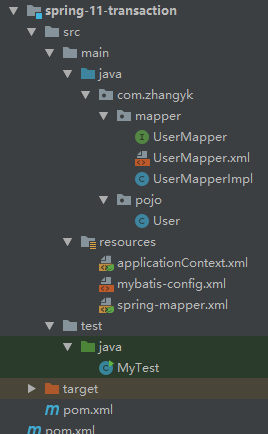

引入pom配置文件

```xml
<?xml version="1.0" encoding="UTF-8"?>
<project xmlns="http://maven.apache.org/POM/4.0.0"
         xmlns:xsi="http://www.w3.org/2001/XMLSchema-instance"
         xsi:schemaLocation="http://maven.apache.org/POM/4.0.0 http://maven.apache.org/xsd/maven-4.0.0.xsd">
    <parent>
        <artifactId>spring-study</artifactId>
        <groupId>com.zhangyk</groupId>
        <version>1.0-SNAPSHOT</version>
    </parent>
    <modelVersion>4.0.0</modelVersion>

    <artifactId>spring-11-transaction</artifactId>

    <dependencies>
        <dependency>
            <groupId>junit</groupId>
            <artifactId>junit</artifactId>
            <version>4.12</version>
        </dependency>
        <dependency>
            <groupId>mysql</groupId>
            <artifactId>mysql-connector-java</artifactId>
            <version>5.1.47</version>
        </dependency>
        <dependency>
            <groupId>org.mybatis</groupId>
            <artifactId>mybatis</artifactId>
            <version>3.5.2</version>
        </dependency>
        <dependency>
            <groupId>org.springframework</groupId>
            <artifactId>spring-webmvc</artifactId>
            <version>5.2.0.RELEASE</version>
        </dependency>
        <!--spring操作数据库的话，还需要一个spring-jdbc的包-->
        <dependency>
            <groupId>org.springframework</groupId>
            <artifactId>spring-jdbc</artifactId>
            <version>5.2.0.RELEASE</version>
        </dependency>
        <!--aspectj织入包-->
        <dependency>
            <groupId>org.aspectj</groupId>
            <artifactId>aspectjweaver</artifactId>
            <version>1.9.4</version>
        </dependency>
        <!--mybatis-spring【new】-->
        <dependency>
            <groupId>org.mybatis</groupId>
            <artifactId>mybatis-spring</artifactId>
            <version>2.0.2</version>
        </dependency>
    </dependencies>

    <build>
        <resources>
            <resource>
                <directory>src/main/java</directory>
                <includes>
                    <include>**/*.xml</include>
                </includes>
                <filtering>true</filtering>
            </resource>
        </resources>
    </build>

</project>
```

编写与数据库对应的pojo类

```java
package com.zhangyk.pojo;

public class User {

    private int id;
    private String name;
    private String pwd;

    public User() {
    }

    public User(int id, String name, String pwd) {
        this.id = id;
        this.name = name;
        this.pwd = pwd;
    }

    public int getId() {
        return id;
    }

    public void setId(int id) {
        this.id = id;
    }

    public String getName() {
        return name;
    }

    public void setName(String name) {
        this.name = name;
    }

    public String getPwd() {
        return pwd;
    }

    public void setPwd(String pwd) {
        this.pwd = pwd;
    }

    @Override
    public String toString() {
        return "User{" +
                "id=" + id +
                ", name='" + name + '\'' +
                ", pwd='" + pwd + '\'' +
                '}';
    }
}
```

编写数据库处理的接口UserMapper.java

```java
package com.zhangyk.mapper;

import com.zhangyk.pojo.User;

import java.util.List;

public interface UserMapper {

    public List<User> selectUser();

    //添加一个用户
    public int addUser(User user);

    //删除一个用户
    public int deleteUser(int id);
    
}
```

编写接口的xml配置文件

```xml
<?xml version="1.0" encoding="UTF-8" ?>
<!DOCTYPE mapper
        PUBLIC "-//mybatis.org//DTD Mapper 3.0//EN"
        "http://mybatis.org/dtd/mybatis-3-mapper.dtd">
<!--Mapper配置文件-->
<mapper namespace="com.zhangyk.mapper.UserMapper">
    <select id="selectUser" resultType="User">
        select * from mybatis.user;
    </select>

    <insert id="addUser" parameterType="User">
        insert into mybatis.user (id, name, pwd) VALUES (#{id},#{name}, #{pwd});
    </insert>

    <!--故意把delete写成deletes，来测试事务-->
    <insert id="deleteUser" parameterType="int">
        deletes from mybatis.user where id=#{id};
    </insert>
</mapper>
```

编写接口的实现类。里面封装了一些在mybatis中位于test类中的代码，比如：sqlSession.getMapper

```java
package com.zhangyk.mapper;

import com.zhangyk.pojo.User;
import org.mybatis.spring.SqlSessionTemplate;

import java.util.List;

//之前像sqlSession.getMapper这种操作都是在Test类中做的，现在用Spring-Mybatis后我们把这些内容放到MapperImpl类中。
public class UserMapperImpl implements UserMapper {

    //我们所有操作，原来都使用sqlSession来执行；现在都使用使用SqlSessionTemplate
    private SqlSessionTemplate sqlSession;

    //设置sqlSession的set函数,是必须的。因为Spring-mybatis配置文件中给bean设置property时，内部用到的就是class的set方法。
    public void setSqlSession(SqlSessionTemplate sqlSession) {
        this.sqlSession = sqlSession;
    }

    public List<User> selectUser() {
        UserMapper mapper = sqlSession.getMapper(UserMapper.class);

        User user = new User(1998, "liwei", "liweipwd");
        mapper.addUser(user);
        //由于函数是先增删再查，我们肯定是希望增删和查是一个事务，否则查到的数据会不符合业务预定要求
        mapper.deleteUser(1997);

        return mapper.selectUser();
    }

    public int addUser(User user) {
        return sqlSession.getMapper(UserMapper.class).addUser(user);
    }

    public int deleteUser(int id) {
        return sqlSession.getMapper(UserMapper.class).deleteUser(id);
    }
}
```

编写mybatis配置文件mybatis-config

```xml
<?xml version="1.0" encoding="UTF-8" ?>
<!--注意mybatis-config的第一行不能有空格或者空行，或者注释：https://blog.csdn.net/zqq_2016/article/details/86674380-->
<!DOCTYPE configuration
        PUBLIC "-//mybatis.org//DTD Config 3.0//EN"
        "http://mybatis.org/dtd/mybatis-3-config.dtd">
<!--configuration核心配置文件
老师一般只在mybatis-config中配置“typealiases”和“settings”。
其他的比如Mapper类绑定可以放到Spring-mybatis配置文件applicationContext中做
-->
<configuration>

    <typeAliases>
        <package name="com.zhangyk.pojo"/>
    </typeAliases>

    <!--这步可以在Spring-mybatis配置文件applicationContext中用mapperLocations属性配置-->
    <!--<mappers>-->
        <!--<mapper class="com.zhangyk.mapper.UserMapper"></mapper>-->
    <!--</mappers>-->

</configuration>
```

编写spring-mybatis的配置文件：spring-mapper.xml。他和spring的主配置文件applicationContext.xml其实是共通的。但是spring-mapper.xml主要做一些不容易修改的部分，和事务配置部分。而使用到哪些实体bean的注册则放到主配置文件applicationContext.xml中做。

```xml
<?xml version="1.0" encoding="UTF-8"?>
<!--这个beans标签的各个属性是约束文件，xds检查我们的语法的
-->
<beans xmlns="http://www.springframework.org/schema/beans"
       xmlns:xsi="http://www.w3.org/2001/XMLSchema-instance" xmlns:tx="http://www.springframework.org/schema/tx"
       xmlns:aop="http://www.springframework.org/schema/aop"
       xsi:schemaLocation="http://www.springframework.org/schema/beans
        https://www.springframework.org/schema/beans/spring-beans.xsd
        http://www.springframework.org/schema/tx
        https://www.springframework.org/schema/tx/spring-tx.xsd http://www.springframework.org/schema/aop https://www.springframework.org/schema/aop/spring-aop.xsd">

    <!--！！！下面连续的三个bean是写死的，用于sqlsession准备相关的工作。
    其实可以把它们分离成单独文件，因为他们可以直接使用并从不需要修改
    ！！！-->
    <!--DataSource:使用Spring的数据源替换Mybatis的配置 c3p0 dbcp druid
    我们这里使用Spring提供的JDBC,但必须在pom中导入spring-jdbc才能使用
    -->
    <bean id="dataSource" class="org.springframework.jdbc.datasource.DriverManagerDataSource">
        <property name="driverClassName" value="com.mysql.jdbc.Driver"/>
        <property name="url" value="jdbc:mysql://localhost:3306/mybatis?useSSL=false&amp;useUnicode=true&amp;characterEncoding=UTF-8"/>
        <property name="username" value="root"/>
        <property name="password" value="123456"/>
    </bean>
    <!--下面这三行代码是直接从官网快速入门拷贝的：https://mybatis.org/spring/zh/getting-started.html
    有了Spring提供的sqlSessionFactory就不用自己创建工具类了，使用的时候直接getbean就可-->
    <bean id="sqlSessionFactory" class="org.mybatis.spring.SqlSessionFactoryBean">
        <property name="dataSource" ref="dataSource" />

        <!--下面讲一些补充内容-->
        <!--绑定mybatis配置文件，使得两个配置文件的配置内容合并-->
        <property name="configLocation" value="classpath:mybatis-config.xml"/>
        <!--做一些mybatis-config.xml中可以做的工作。比如注册mapper-->
        <property name="mapperLocations" value="classpath:com/zhangyk/mapper/*.xml"/>
    </bean>
    <!--SqlSessionTemplate:就是之前mybatis使用的sqlSession-->
    <bean id="sqlSession" class="org.mybatis.spring.SqlSessionTemplate">
        <!--只能使用构造器注入sqlSessionFactory，因为它没有set方法-->
        <constructor-arg index="0" ref="sqlSessionFactory"/>
    </bean>

    <!--结合AOP实现事务的织入-->
    <!--配置声明式事务-->
    <bean id="transactionManager" class="org.springframework.jdbc.datasource.DataSourceTransactionManager">
        <constructor-arg ref="dataSource" />
    </bean>
    <!--配置事务通知-->
    <tx:advice id="txAdvice" transaction-manager="transactionManager">
        <!--给哪些方法配置事务-->
        <!--配置事务的传播特性： new propagation=required默认的-->
        <tx:attributes>
            <tx:method name="add" propagation="REQUIRED"/>
            <tx:method name="delete" propagation="REQUIRED"/>
            <tx:method name="update" propagation="REQUIRED"/>
            <!--query的话，就一般禁止对数据库进行增删改操作-->
            <tx:method name="query" read-only="true"/>
            <!--其实事务的话，一般配置下面这一行就可以，即让所有操作都实现事务-->
            <tx:method name="*" propagation="REQUIRED"/>
        </tx:attributes>
    </tx:advice>
    <!--配置事务切入-->
    <aop:config>
        <!--设置切入点
        切入点为：涉及数据库操作的所有“接口”的所有“函数”-->
        <aop:pointcut id="txPointCut" expression="execution(* com.zhangyk.mapper.*.*(..))"/>
        <!--进行通知切入-->
        <aop:advisor advice-ref="txAdvice" pointcut-ref="txPointCut"/>
    </aop:config>
    <!--要加上下面这行，否则会报注释中的错误：
    Exception in thread "main" org.springframework.beans.factory.BeanNotOfRequiredTypeException:
    Bean named 'userMapper' is expected to be of type 'com.zhangyk.mapper.UserMapperImpl'
    but was actually of type 'com.sun.proxy.$Proxy7'
    网友说这就是Spring原始框架没有开启CGLIB动态代理的问题-->
    <aop:aspectj-autoproxy  proxy-target-class="true"/>

</beans>
```

编写Spring主配置文件。记得要引入主要负责“不容易修改的部分”，和“事务配置部分”的配置子文件spring-mapper.xml。

```xml
<?xml version="1.0" encoding="UTF-8"?>
<!--这个beans标签的各个属性是约束文件，xds检查我们的语法的
-->
<beans xmlns="http://www.springframework.org/schema/beans"
       xmlns:xsi="http://www.w3.org/2001/XMLSchema-instance"
       xsi:schemaLocation="http://www.springframework.org/schema/beans
        https://www.springframework.org/schema/beans/spring-beans.xsd">

    <!--把写死的spring-mapper部分的代码单独整合到spring-mapper.xml中，避免一不小心被修改-->
    <import resource="spring-mapper.xml"/>


    <!--====有什么接口的实现，就注册一下实现类的bean====
    本文件专注于impl型的bean的注册即可
    -->
    <!--
    id="userMapper"是接口，代表实现的功能；id引用的class="com.zhangyk.mapper.UserMapperImpl"代表实现接口的类。
    这种看似接口代表类的写法在java常见，推测是为了让人更关注接口中实现了什么方法，而不是实现类本身
    -->
    <bean id="userMapper" class="com.zhangyk.mapper.UserMapperImpl">
        <property name="sqlSession" ref="sqlSession"/>
    </bean>

</beans>
```

编写测试类

```java
import com.zhangyk.mapper.UserMapperImpl;
import com.zhangyk.pojo.User;
import org.springframework.context.ApplicationContext;
import org.springframework.context.support.ClassPathXmlApplicationContext;

import java.util.List;

public class MyTest {

    public static void main(String[] args) {
        ApplicationContext context = new ClassPathXmlApplicationContext("applicationContext.xml");
        UserMapperImpl userMapper = context.getBean("userMapper", UserMapperImpl.class);
        List<User> users = userMapper.selectUser();

        for (User user : users) {
            System.out.println(user);
        }
    }
}
```

查看测试结果

由于Mapper.xml中delete写成deletes，所以事务不会提交。查看数据库会发现插入和删除都没执行。符合事务的要求。


思考：为什么需要事务？

- 如果不配置事务，可能存在数据提交不一致的情况；
- 如果我们不在Spring中去配置声明式事务，我们就需要在代码中手动配置事务
- 事务在项目的开发中十分重要，涉及到数据的一致性和完整性；不容马虎


## Spring回顾

1. ioc掌握重点：

   工作中主要是autowired和annotation，有余力可以整一下appconfig

   

2. aop掌握重点

   掌握底层的proxy

3. 事务掌握重点

   会用就行，都是写死的