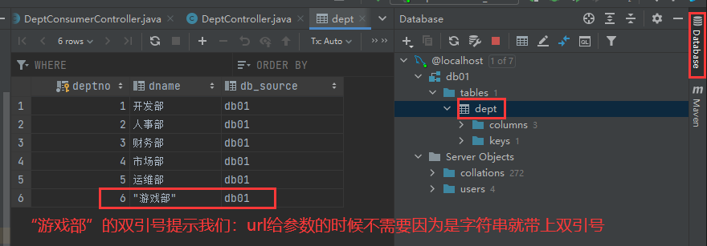

# SpringCloud

## 前言

### 该阶段该如何学习

####  学前自省

搞清楚下面三个问题，才能学好springcloud：

- 回顾之前的知识

  - javase
  - 数据库
  - 前端三件套
  - servlet
  - http
  - mybatis（核心）
  - spring（核心）
  - springmvc（核心）
  - springboot（核心）
  - dubbo，zookeeper，分布式基础
  - maven，git
  - ajax，json
  - 。。。

- 串一下自己会的知识

  - 数据库
  - mybatis（核心）
  - spring（核心）
  - springmvc（核心）
  - springboot（核心）
  - dubbo，zookeeper，分布式基础
  - maven，git
  - ajax，json

- 这个阶段该如何学。

  - 最早的架构：MVC（三层架构）
  - spring框架：
    - 特点：ioc，aop
    - 目的：解决开发的复杂性

  - springboot框架：
    - springboot是spring的升级版，是新一代的javaee开发标准
    - 自动装配。特点：约定大于配置。
    - 模块化：allinone横向化也不太够用，模块化好。代码没变化。


#### 微服务核心问题与解决

微服务架构的四个核心问题？

1. 服务很多，客户端该怎么访问？
2. 服务很多，服务之间如何通信？
3. 服务很多，如何治理？
   - 用如zk去注册管理
4. 服务挂了怎么办

解决方案：springcloud（不是一个技术，是一门生态）（springcloud是基于springboot的）

1. springcloud netflix（一站式解决所有问题）

   - 解决问题一：使用了api网关，zuul组件来实现这个网关。
   - 解决问题二：用了Feign。Feign基于httpClient，httpClient基于http通信方式（特点：同步，阻塞）
   - 解决问题三：Eureka
   - 解决问题四：Hystrix

2. Apache Dubbo+ZooKeeper（半自动解决问题，需要整合别人的）（这个方案并不完善）

   - 解决问题一：没有。想实现得搞第三方组件，如融合zuul组件；或者自己实现。
   - 解决问题二：dubbo
   - 解决问题三：ZooKeeper
   - 解决问题四：没有。想实现就得搞第三方组件，如融合Hystrix组件

3. springcloud alibaba（新的一站式解决所有问题的方案，更简单）

   

新概念：

1. 服务网格（server mesh）
   - 解决方案：istio


万变不离其宗：

- 解决”微服务架构的四个核心问题“
- ”微服务架构的四个核心问题“的本质：网络不可靠。


#### 常见面试题

1. 什么是微服务?
2. 微服务之间是如何独立通讯的?
3. SpringCloud和Dubbo有哪些区别?
4. SpringBoot和SpringCloud，请你谈谈对他们的理解
5. 什么是服务熔断?什么是服务降级
6. 微服务的优缺点是分别是什么?说下你在项目开发中遇到的坑
7. 你所知道的微服务技术栈有哪些?请列举一二
8. eureka和zookeeper都可以提供服务注册与发现的功能，请说说两个的区别?


### 回顾微服务及其架构

#### 定义

微服务是什么？：

- 就目前而言，对于微服务，业界并没有一个统一的，标准的定义
- 但通常而言，微服务架构是一种架构模式，或者说是一种架构风格，**它提倡将单一的应用程序划分成一组小的服务**（模块化），每个服务运行在其独立的自己的进程内，服务之间互相协调，互相配置，为用户提供最终价值。服务之间采用轻量级的通信机制互相沟通，每个服务都围绕着具体的业务进行构建，并且能够被独立的部署到生产环境中。另外，应尽量避免统一的，集中式的服务管理机制。对具体的一个服务而言，应根据业务上下文，选择合适的语言，工具对其进行构建（maven）。可以有一个非常轻量级的集中式管理来协调这些服务，可以使用不同的语言来编写服务，也可以使用不同的数据存储;


可能有的人觉得官方的话太过生涩，我们从技术维度来理解下:

- 微服务化的核心就是将传统的一站式应用，根据业务拆分成一个一个的服务，彻底地去耦合（解耦）。每一个微服务提供单个业务功能的明务。一个服务做一件事情，从技术角度看就是一种小而独立的处理过程，类似进程的概念，能够自行单独启动或销毁，拥有自己独立的数据库。


#### 微服务VS微服务架构

微服务：

- 强调的是服务的大小，他关注的是某一个点，是具体解决某一个问题/提供落地对应服务的一个服务应用。狭义的看，可以看做是IDEA中的一个个微服务工程，或者Module。
  - IDEA 工具里面使用Maven开发的一个个独立的小Module，它具体是使用springboot开发的一个小模块，专业的事情交给专业的模块来做，一个模块就做着一件事情。
  - 强调的是一个个的个体，每个个体完成一个具体的任务或者功能!

微服务架构

- —种新的架构形式，Martin Fowler,2014提出。
- 微服务架构是一种架构模式，它提倡将单一应用程序划分成一组小的服务，服务之间互相协调，互相配合，为用户提供最终价值。每个服务运行在其独立的进程中，服务于服务间采用轻量级的通信机制互相协作，每个服务都围绕着具体的业务进行构建，并且能够被独立的部署到生产环境中，另外，应尽量避免统一的，集中式的服务管理机制，对具体的一个服务而言，应根据业务上下文，选择合适的语言，工具对其进行构建


#### 微服务优缺点

优点：

- 单一职责原则。比如“苹果手机”不符合单一职责原则，要拆成品牌“苹果”和产品“手机”。
- 每个服务足够内聚，足够小，代码容易理解，这样能聚焦一个指定的业务功能或业务需求;
- 开发简单，开发效率提高，一个服务可能就是专一的只干一件事;
- 微服务能够被小团队单独开发，这个小团队是2~5人的开发人员组成;
- 微服务是松耦合的，是有功能意义的服务，无论是在开发阶段或部署阶段都是独立的。
- 微服务能使用不同的语言开发。
- 易于和第三方集成，微服务允许容易且灵活的方式集成自动部署，通过持续集成工具，如jenkins，Hudson,
  bamboo
- 微服务易于被一个开发人员理解，修改和维护，这样小团队能够更关注自己的工作成果。无需通过合作才能体现价值。
- 微服务允许你利用融合最新技术。
- 微服务只是业务逻辑的代码，不会和HTML, cSS或其他界面混合
- 每个微服务都有自己的存储能力，可以有自己的数据库，也可以有统一数据库

缺点:

- 开发人员要处理分布式系统的复杂性
- 多服务运维难度，随着服务的增加，运维的压力也在增大
- 系统部署依赖
- 服务间通信成本
- 数据一致性
- 系统集成测试
- 性能监控.....


#### 微服务技术栈列表


| **微服务技术条目**                     | 落地技术                                                     |
| -------------------------------------- | ------------------------------------------------------------ |
| 服务开发                               | SpringBoot、Spring、SpringMVC等                              |
| 服务配置与管理                         | Netfix公司的Archaius、阿里的Diamond等                        |
| 服务注册与发现                         | Eureka、Consul、Zookeeper等                                  |
| 服务调用                               | Rest、PRC、gRPC                                              |
| 服务熔断器                             | Hystrix、Envoy等                                             |
| 负载均衡                               | Ribbon、Nginx等                                              |
| 服务接口调用(客户端调用服务的简化工具) | Fegin等                                                      |
| 消息队列                               | Kafka、RabbitMQ、ActiveMQ等                                  |
| 服务配置中心管理                       | SpringCloudConfig、Chef等                                    |
| 服务路由(API网关)                      | Zuul等                                                       |
| 服务监控                               | Zabbix、Nagios、Metrics、Specatator等                        |
| 全链路追踪                             | Zipkin、Brave、Dapper等                                      |
| 数据流操作开发包                       | SpringCloud Stream(封装与Redis，Rabbit，Kafka等发送接收消息) |
| 时间消息总栈                           | SpringCloud Bus                                              |
| 服务部署                               | Docker、OpenStack、Kubernetes等                              |


#### 选择springcloud做微服务架构的原因

1. 选型依据

   - 整体解决方案和框架成熟度
   - 社区热度
   - 可维护性
   - 学习曲线：不太难

2. 当前各大IT公司用的微服务架构有哪些?

   - 阿里:dubbo+HAs
   - 京东:JSF
   - 新浪:Motan
   - 当当网Dubbox

3. 各微服务框架对比

   

   
   
   ```
   | 功能点/服务框架 | Netflix/SpringCloud | Motan | gRPC | Thri t | Dubbo/DubboX |
   | —————— | ———————————————————————————— | —————————————————- | ————————— | ———— | —————————— |
   | 功能定位 | 完整的微服务框架 | RPC框架，但整合了ZK或Consul，实现集群环境的基本服务注册发现 | RPC框架 | RPC框架 | 服务框架 |
   | 支持Rest | 是，Ribbon支持多种可拔插的序列号选择 | 否 | 否 | 否 | 否 |
   | 支持RPC | 否 | 是(Hession2) | 是 | 是 | 是 |
   | 支持多语言 | 是(Rest形式) | 否 | 是 | 是 | 否 |
   | 负载均衡 | 是(服务端zuul+客户端Ribbon)，zuul-服务，动态路由，云端负载均衡Eureka（针对中间层服务器） | 是(客户端) | 否 | 否 | 是(客户端) |
   | 配置服务 | Netfix Archaius，Spring Cloud Config Server 集中配置 | 是(Zookeeper提供) | 否 | 否 | 否 |
   | 服务调用链监控 | 是(zuul)，zuul提供边缘服务，API网关 | 否 | 否 | 否 | 否 |
   | 高可用/容错 | 是(服务端Hystrix+客户端Ribbon) | 是(客户端) | 否 | 否 | 是(客户端) |
   | 典型应用案例 | Netflix | Sina | Google | Facebook | |
   | 社区活跃程度 | 高 | 一般 | 高 | 一般 | 2017年后重新开始维护，之前中断了5年 |
   | 学习难度 | 中等 | 低 | 高 | 高 | 低 |
   | 文档丰富程度 | 高 | 一般 | 一般 | 一般 | 高 |
   | 其他 | Spring Cloud Bus为我们的应用程序带来了更多管理端点 | 支持降级 | Netflix内部在开发集成gRPC | IDL定义 | 实践的公司比较多 |
   ```
   
   


### SpringCloud入门概述

#### 什么是springcloud

为何出现springcloud：

- springboot可以构建微服务应用，但是微服务变多了该如何协调处理呢？：用springcloud。


springcloud示意图：


SpringCloud,基于SpringBoot提供了一套微服务解决方案，包括服务注册与发现，配置中心，全链路监控，服务网关，负载均衡，熔断器等组件，除了基于NetFlix的开源组件做高度抽象封装之外，还有一些选型中立的开源组件。
SpringCloud利用SpringBoot的开发便利性，巧妙地简化了分布式系统基础设施的开发，SpringCloud为开发人员提供了快速构建分布式系统的一些工具，**包括配置管理，服务发现，断路器，路由，微代理，事件总线，全局锁，决策竞选，分布式会话等等**，他们都可以用SpringBoot的开发风格做到一键启动和部署。
SpringBoot并没有重复造轮子，它只是将目前各家公司开发的比较成熟，经得起实际考验的服务框架组合起来，通过SpringBoot风格进行再封装，屏蔽掉了复杂的配置和实现原理，**最终给开发者留出了一套简单易懂，易部署和易维护的分布式系统开发工具包**
SpringCloud是分布式微服务架构下的一站式解决方案，是各个微服务架构落地技术的集合体，俗称微服务全家桶。


#### Springboot和Sprigcloud的关系

- springboot和springcloud是渐进性的关系。boot用来构建微服务，cloud用来协调微服务。
- SpringBoot专注于快速方便的开发单个个体微服务（说白了就是jar包）。
- SpringCloud是关注全局的微服务协调整理治理框架，它将SpringBoot开发的一个个单体微服务整合并管理起来，为各个微服务之间提供:配置管理，服务发现，断路器，路由，微代理，事件总线，全局锁，决策竞选，
  分布式会话等等集成服务。
- SpringBoot可以离开SpringClooud独立使用，开发项目。但是SpringCloud离不开SpringBoot，属于依赖关系
- **SpringBoot专注于快速、方便的开发单个个体微服务。SpringCloud关注全局的服务治理框架。**


#### dubbo和springcloud技术选型

分布式+服务治理dubbo：

- 目前成熟的互联网架构：应用服务化拆分+消息中间件

- 当代网站技术结构图：

  


Dubbo和springcloud对比:

- 看一下社区活跃度（repository的绿色心跳线条）
  - https://github.com/apache/dubbo
  - https://github.com/spring-cloud

- 对比结果表

  

  |              | Dubbo         | SpringCloud                  |
  | ------------ | ------------- | ---------------------------- |
  | 服务注册中心 | Zookeeper     | Spring Cloud Netfilx Eureka  |
  | 服务调用方式 | RPC           | REST API                     |
  | 服务监控     | Dubbo-monitor | Spring Boot Admin            |
  | 断路器       | 不完善        | Spring Cloud Netfilx Hystrix |
  | 服务网关     | 无            | Spring Cloud Netfilx Zuul    |
  | 分布式配置   | 无            | Spring Cloud Config          |
  | 服务跟踪     | 无            | Spring Cloud Sleuth          |
  | 消息总栈     | 无            | Spring Cloud Bus             |
  | 数据流       | 无            | Spring Cloud Stream          |
  | 批量任务     | 无            | Spring Cloud Task            |

- **最大区别: SpringCloud抛弃了Dubbo的RPC通信，采用的是基于HTTP的REST方式。**
  严格来说，这两种方式各有优劣。虽然从一定程度上来说，后者牺牲了服务调用的性能，但也避免了上面提到的原生RPC带来的问题。而且REST相比RPC更为灵活，服务提供方和调用方的依赖只依靠一纸契约，不存在代码级别的强依赖，这在强调快速演化的微服务环境下，显得更加合适。

- 品牌机与组装机的区别
  很明显，Spring Cloud的功能比DUBBO更加强大，涵盖面更广，而且作为Spring的拳头项目，它也能够与SpringFramework、Spring Boot、Spring Data、Spring Batch等其他Spring项目完美融合，这些对于微服务而言是至关重要的。使用Dubbo构建的微服务架构就像组装电脑，各环节我们的选择自由度很高，但是最终结果很有可能因为一条内存质量不行就点不亮了，总是让人不怎么放心，但是如果你是一名高手，那这些都不是问题;而SpringCloud就像品牌机，在Spring Source的整合下，做了大量的兼容性测试，保证了机器拥有更高的稳定性，但是如果要在使用非原装组件外的东西，就需要对其基础有足够的了解。

- 社区支持与更新力度
  最为重要的是，DUBBO停止了5年左右的更新，虽然2017.7重启了。对于技术发展的新需求，需要由开发者自行拓展升级（比如当当网弄出了DubboX)，这对于很多想要采用微服务架构的中小软件组织，显然是不太合适的，中小公司没有这么强大的技术能力去修改Dubbo源码+周边的一整套解决方案，并不是每一个公司都有阿里的大牛+真实的线上生产环境测试过。

- 总结:
  曾风靡国内的开源RPC服务框架Dubbo在重启维护后，令许多用户为之雀跃，但同时，也迎来了一些质疑的声音。互联网技术发展迅速,Dubbo是否还能跟上时代? Dubbo与Spring Cloud相比又有何优势和差异?是否会有相关举措保证 Dubbo的后续更新频率?

- 人物: Dubbo重启维护开发的刘军，主要负责人之一
  刘军，阿里巴巴中间件高级研发工程师，主导了Dubbo重启维护以后的几个发版计划，专注于高性能RPC框架和微服务相关领域。曾负责网易考拉RPC框架的研发及指导在内部使用，参与了服务治理平台、分布式跟踪系统、分布式一致性框架等从无到有的设计与开发过程。

- 解决的**问题域**不一样:

  **Dubbo的定位是一款RPC框架，Spring Cloud的目标是微服务架构下的一站式解决方案**


#### SpringCloud能干什么

- Distributed/versioned configuration(分布式/版本控制配置)
- Service registration and discovery(服务注册与发现)
- Routing(路由)
- Service-to-service calls(服务到服务的调用)
- Load balancing(负载均衡配置)
- Circuit Breakers （断路器)
- Distributed messaging (分布式消息管理)

- 。。。


#### springcloud在哪下载

官网：http://projects.spring.io/spring-cloud/


参考书:

- SpringCloud Netflix 中文文档: https://springcloud.cc/spring-cloud-netflix.html
- 中文API文档(官方文档翻译版): https://springcloud.cc/spring-cloud-dalston.html. 
- SpringCloud中国社区（挂了）: http://springcloud.cn/
- SpringCloud中文网: https://springcloud.cc
- 大佬学习笔记（含不冲突的maven）：https://www.kuangstudy.com/bbs/1374942542566551554
- spring官网查看版本依赖：https://docs.spring.io/spring-cloud/docs


前言部分是面试时的谈资，且和理论挂钩，需好好掌握。


## Rest学习环境搭建

### 服务提供者

#### 项目总体介绍

- 我们会使用一个Dept部门模块做一个微服务通用案例Consumer消费者(Client)通过REST调用Provider提供者(Server)提供的服务。

- 回顾Spring，SpringMVC，Mybatis等以往学习的知识。

- Maven的分包分模块架构复习。

  ```
  一个简单的Maven模块结构是这样的：
  -- app-parent: 一个父项目(app-parent)聚合了很多子项目(app-util\app-dao\app-web...)
    |-- pom.xml
    |
    |-- app-core
    ||---- pom.xml
    |
    |-- app-web
    ||---- pom.xml
    ......
  ```

  一个父工程带着多个Moudule子模块

  MicroServiceCloud父工程(Project)下初次带着3个子模块(Module)

  - microservicecloud-api 【封装的整体entity/接口/公共配置等】
  - microservicecloud-consumer-dept-80 【服务提供者】
  - microservicecloud-provider-dept-8001 【服务消费者】

- 动手开干

#### SpringCloud版本选择

大版本说明：

| SpringBoot | SpringCloud             | 关系                                     |
| ---------- | ----------------------- | ---------------------------------------- |
| 1.2.x      | Angel版本(天使)         | 兼容SpringBoot1.2x                       |
| 1.3.x      | Brixton版本(布里克斯顿) | 兼容SpringBoot1.3x，也兼容SpringBoot1.4x |
| 1.4.x      | Camden版本(卡姆登)      | 兼容SpringBoot1.4x，也兼容SpringBoot1.5x |
| 1.5.x      | Dalston版本(多尔斯顿)   | 兼容SpringBoot1.5x，不兼容SpringBoot2.0x |
| 1.5.x      | Edgware版本(埃奇韦尔)   | 兼容SpringBoot1.5x，不兼容SpringBoot2.0x |
| 2.0.x      | Finchley版本(芬奇利)    | 兼容SpringBoot2.0x，不兼容SpringBoot1.5x |
| 2.1.x      | Greenwich版本(格林威治) |                                          |

- springcloud一般大于等于Fomchiey的会比较稳定，因为兼容了springboot2.0.

实际开发版本关系：

| spring-boot-starter-parent |              | spring-cloud-dependencles |              |
| :------------------------: | -----------: | :-----------------------: | :----------: |
|         **版本号**         | **发布日期** |        **版本号**         | **发布日期** |
|       1.5.2.RELEASE        |      2017-03 |        Dalston.RC1        |    2017-x    |
|       1.5.9.RELEASE        |      2017-11 |      Edgware.RELEASE      |   2017-11    |
|       1.5.16.RELEASE       |      2018-04 |        Edgware.SR5        |   2018-10    |
|       1.5.20.RELEASE       |      2018-09 |        Edgware.SR5        |   2018-10    |
|       2.0.2.RELEASE        |      2018-05 |  Fomchiey.BULD-SNAPSHOT   |    2018-x    |
|       2.0.6.RELEASE        |      2018-10 |       Fomchiey-SR2        |   2018-10    |
|       2.1.4.RELEASE        |      2019-04 |       Greenwich.SR1       |   2019-03    |

- 当前演示用最新的G版。


#### 新建一个项目

创建普通的maven项目（不勾选）


因为创建的是夫项目，删除src目录


导入依赖，依赖一定要相互适配（就按照老师的来），不然会报错。

- 网友说“我就觉得这个 management没什么用处，就在父pom统一version就好了啊”，我觉得有一点点道理。因为父项目的dependencyManagement不会直接导入包（可以点idea右上角的maven查看）；我们要使用包还得在子module中用dependency指定引入一下，不过version就可以缺省，默认用父项目中管理的version。
- 网友关于**dependencyManagement**的观点很赞“之前那个工程就是个pom文件，懂么，就是用来管理jar包版本的，继承这个父工程的所有模块，都被父工程约束版本”。**核心就是版本约束**。
- 有人可能问，**为什么父项目不直接导入所有依赖**，这样子，module省的导入。一个网友的回复我觉得不错“**单个子项目打包**，你能把父项目打包到子项目中去？不能就乖乖导入”。

```xml
<?xml version="1.0" encoding="UTF-8"?>
<project xmlns="http://maven.apache.org/POM/4.0.0"
         xmlns:xsi="http://www.w3.org/2001/XMLSchema-instance"
         xsi:schemaLocation="http://maven.apache.org/POM/4.0.0 http://maven.apache.org/xsd/maven-4.0.0.xsd">
    <modelVersion>4.0.0</modelVersion>

    <groupId>org.example</groupId>
    <artifactId>springcloud</artifactId>
    <version>1.0-SNAPSHOT</version>

    <!--设置打包方式为pom
    不是springboot中用的jar包打包-->
    <packaging>pom</packaging>

    <!--定义一些版本号-->
    <properties>
        <!--配置项目构建的编码格式-->
        <project.build.sourceEncoding>UTF-8</project.build.sourceEncoding>

        <maven.compiler.source>8</maven.compiler.source>
        <maven.compiler.target>8</maven.compiler.target>
        <!--统一配置一些版本号-->
        <junit.version>4.12</junit.version>
        <lombok.version>1.16.18</lombok.version>
    </properties>

    <!--配置父项目依赖，要用dependencyManagement
    dependencyManagement 只管理版本，子项目不用写版本号的-->
    <dependencyManagement>
        <dependencies>
            <!--===================重点依赖=========================-->
            <!-- springcloud依赖
            https://mvnrepository.com/artifact/org.springframework.cloud/spring-cloud-dependencies -->
            <dependency>
                <groupId>org.springframework.cloud</groupId>
                <artifactId>spring-cloud-dependencies</artifactId>
                <version>Greenwich.SR1</version>
                <!--通过pom方式引入的springcloud依赖-->
                <type>pom</type>
                <!--<scope>runtime</scope>可以删掉，也可以改成import-->
                <scope>import</scope>
            </dependency>

            <!--springboot的导入要和springcloud匹配，具体匹配可见于笔记-->
            <dependency>
                <groupId>org.springframework.boot</groupId>
                <artifactId>spring-boot-dependencies</artifactId>
                <version>2.1.4.RELEASE</version>
                <type>pom</type>
                <scope>import</scope>
            </dependency>

            <!--连接数据库的包们-->
            <dependency>
                <groupId>mysql</groupId>
                <artifactId>mysql-connector-java</artifactId>
                <version>5.1.47</version>
            </dependency>
            <dependency>
                <groupId>com.alibaba</groupId>
                <artifactId>druid</artifactId>
                <version>1.1.10</version>
            </dependency>

            <!--mybatis的启动器
            老师这应该是打错字了，那个不是springboot的启动器啊，引入的都是mybaits的启动器，应该叫mybatis的启动器-->
            <dependency>
                <groupId>org.mybatis.spring.boot</groupId>
                <artifactId>mybatis-spring-boot-starter</artifactId>
                <version>1.3.2</version>
            </dependency>

<!--=======================其他需要的依赖=====================-->
            <!--下面连着的大块依赖主要用于日志和测试-->
            <!--junit单元测试-->
            <dependency>
                <groupId>junit</groupId>
                <artifactId>junit</artifactId>
                <!--一般开发时，junit版本不会写死，而是在properties中统一管理-->
                <version>${junit.version}</version>
            </dependency>
            <!--lombok-->
            <dependency>
                <groupId>org.projectlombok</groupId>
                <artifactId>lombok</artifactId>
                <!--一般开发时，版本不会写死，而是在properties中统一管理-->
                <version>${lombok.version}</version>
            </dependency>
            <!--Log4j日志-->
            <dependency>
                <groupId>log4j</groupId>
                <artifactId>log4j</artifactId>
                <version>1.2.17</version>
            </dependency>
            <dependency>
                <groupId>ch.qos.logback</groupId>
                <artifactId>logback-core</artifactId>
                <version>1.2.3</version>
            </dependency>

        </dependencies>
    </dependencyManagement>

    <!--有些资源导不出去的话，在build中配置一下maven打包插件（resource）-->
    <build></build>


</project>
```

新建一个子module


子module中指定使用父项目dependencyManagement中管理的哪些依赖（version默认为副项目中管理的版本）。

```xml
<?xml version="1.0" encoding="UTF-8"?>
<project xmlns="http://maven.apache.org/POM/4.0.0"
         xmlns:xsi="http://www.w3.org/2001/XMLSchema-instance"
         xsi:schemaLocation="http://maven.apache.org/POM/4.0.0 http://maven.apache.org/xsd/maven-4.0.0.xsd">
    <parent>
        <artifactId>springcloud</artifactId>
        <groupId>org.example</groupId>
        <version>1.0-SNAPSHOT</version>
    </parent>
    <modelVersion>4.0.0</modelVersion>

    <artifactId>springcloud-api</artifactId>

    <properties>
        <maven.compiler.source>8</maven.compiler.source>
        <maven.compiler.target>8</maven.compiler.target>
    </properties>

    <dependencies>
        <!--需要配置当前的NoduLe自己要的依赖。如果父依赖中已经配置了版本，这里就不用写了。

        老师说这里的pom依赖向上依赖到父项目dependencymanagement的依赖，我这不是，而是依赖Spring-Boot-Dependencies-->
        <dependency>
            <groupId>org.projectlombok</groupId>
            <artifactId>lombok</artifactId>
        </dependency>
    </dependencies>

</project>
```

- 也可以点击右上角maven看到，父项目没有dependency，只有子module中有下载的dependency包

  

删除springcloud-api子module的test文件夹，因为用不上


现在处理数据方面。先连接到本地“数据源”（安装mysql时就配置好了本地数据源）


​	账号-密码默认：root-123456


连接好本地数据源后，创建新数据库


idea中连接本地数据源（方便测试）（方便建表）


点击schema选中目标数据库


idea中为本地数据库建表


因为分布式有很多数据库，我们用表的db_name字段记录一下当前表是从哪个数据库读出来的。


往建好的dept表中插入数据


```mysql
insert into dept(dname, db_source) VALUES ('开发部',database());
insert into dept(dname, db_source) VALUES ('人事部',database());
insert into dept(dname, db_source) VALUES ('财务部',database());
insert into dept(dname, db_source) VALUES ('市场部',database());
insert into dept(dname, db_source) VALUES ('运维部',database());
```

sql语句解析：

- database()代表当前数据库的名字
- 不插入deptno是因为该字段自增，不需要插入，默认从1开始

查看dept表的内容是否插入成功：成功。


数据库数据表和数据准备好了，现在写实体类


```java
package com.zhangyun.springcloud.pojo;

import lombok.Data;
import lombok.NoArgsConstructor;
import lombok.experimental.Accessors;

import java.io.Serializable;

/*
* Dept实体类
*
* ORM对象关系映射（类表关系映射）；即mysql表对应真实的pojo类。
*
* 所有的实体类务必实现序列化，否则传输可能报错
* */
@Data
//生成无参构造
@NoArgsConstructor
/*
* 开启支持链式写法
*
* 没开启链式写法时：dept.setDeptNo(1);dept.setDName("name");dept.setDb_source("DB01");
* 开启链式写法后：dept.setDeptNo(1).setDName("name").setDb_source("DB01");
* */
@Accessors(chain = true)
public class Dept implements Serializable {
    private Long deptno;
    private String dname;

    //这个字段用于看当前表存在于哪个数据库中。因为微服务架构中，一个服务对应一个数据库；同一个信息可能存在不同的数据库。
    private String db_source;

    /*虽然导入了lombok，但这里自定义一个有参构造。只需要dname字段，因为deptno自增自己生成，db_source由数据库函数自动生成。
    * 不用lombok的原因猜测是：可能lombok的有参构造注解只支持全参数输入的构造函数
    * */
    public Dept(String dname){
        this.dname=dname;
    }

}
```

springcoud-api微服务只管pojo类，所以pojo类写完了，springcoud-api微服务就也写完了，不写其他的如控制器等等东西了。

springcloud-api写完了来写第二个module


模块会越来越多，最好在模块名字上加上端口号


子module中导入依赖，这些依赖被父项目dependencyManagement约束了版本

- 查看父项目，springcloud-api，springcloud-provider-dept-8001的pom.xml中的groupId是否为创建时默认的`org.example`,为了项目规范化，都改成`com.zhangyun`。

```xml
<?xml version="1.0" encoding="UTF-8"?>
<project xmlns="http://maven.apache.org/POM/4.0.0"
         xmlns:xsi="http://www.w3.org/2001/XMLSchema-instance"
         xsi:schemaLocation="http://maven.apache.org/POM/4.0.0 http://maven.apache.org/xsd/maven-4.0.0.xsd">
    <parent>
        <artifactId>springcloud</artifactId>
        <groupId>com.zhangyun</groupId>
        <version>1.0-SNAPSHOT</version>
    </parent>
    <modelVersion>4.0.0</modelVersion>

    <artifactId>springcloud-provider-dept-8001</artifactId>

    <properties>
        <maven.compiler.source>8</maven.compiler.source>
        <maven.compiler.target>8</maven.compiler.target>
    </properties>

    <dependencies>
        <!--我们需要拿到实体类，所以要配置api module
        配置好后点击springcloud-api，idea会自动跳转到springcloud-api的pom文件

        只要导入了springcloud-api的依赖，我们就可以用springcloud-api中的实体类了。
        -->
        <dependency>
            <groupId>com.zhangyun</groupId>
            <artifactId>springcloud-api</artifactId>
            <version>1.0-SNAPSHOT</version>
        </dependency>

        <!--父项目中管理（约束）了各依赖的版本号，子module中不用写版本号了-->
        <dependency>
            <groupId>junit</groupId>
            <artifactId>junit</artifactId>
        </dependency>
        <dependency>
            <groupId>mysql</groupId>
            <artifactId>mysql-connector-java</artifactId>
        </dependency>
        <dependency>
            <groupId>com.alibaba</groupId>
            <artifactId>druid</artifactId>
        </dependency>
        <dependency>
            <groupId>ch.qos.logback</groupId>
            <artifactId>logback-core</artifactId>
        </dependency>
        <dependency>
            <groupId>org.mybatis.spring.boot</groupId>
            <artifactId>mybatis-spring-boot-starter</artifactId>
        </dependency>
        <dependency>
            <groupId>org.springframework.boot</groupId>
            <artifactId>spring-boot-starter-web</artifactId>
        </dependency>
        <!--test-->
        <dependency>
            <groupId>org.springframework.boot</groupId>
            <artifactId>spring-boot-test</artifactId>
        </dependency>
        <!--jetty
        和tomcat没什么区别，可以使用它做应用服务器-->
        <dependency>
            <groupId>org.springframework.boot</groupId>
            <artifactId>spring-boot-starter-jetty</artifactId>
        </dependency>
        <!--热部署工具
        写完代码不应该把代码重启，而应该刷新一下就可以（类似thymeleaf）

        有网友说：“devtools不是真正的热部署，相当于帮你重新点击了一次运行按钮，而 jrebel 才是真正的热部署”-->
        <dependency>
            <groupId>org.springframework.boot</groupId>
            <artifactId>spring-boot-devtools</artifactId>
        </dependency>

    </dependencies>

</project>
```

点击idea右上角的maven看依赖是否都成功下载jar包


删除子module用不上的test文件夹


resource文件夹中新建子module的配置文件application.yml

```yaml
server:
  port: 8001

# mybatis配置
mybatis:
  type-aliases-package: com.zhangyun.springcloud.pojo
  # 配置“mybatis核心配置文件”的地址。不过这个配置文件很久没写了。
  config-location: classpath:mybatis/mybatis-config.xml
  # 配置“配置文件XXXMapper.xml”的地址
  mapper-locations: classpath:mybatis/mapper/*.xml

# spring的配置
spring:
  application:
    # 给当前spring项目起名，一般名字和子module名字一致或接近
    name: springcloud-provider-dept
  # 配置数据源
  datasource:
    type: com.alibaba.druid.pool.DruidDataSource
    driver-class-name: org.gjt.mm.mysql.Driver
    url: jdbc:mysql://localhost:3306/db01?useUnicode=true&characterEncoding=utf-8
    username: root
    password: 123456
```

建立mapper配置文件XXXMapper.xml所在的文件夹，并新建mybatis核心配置文件mybatis-config.xml。


这里再演示一下从怎么写mybatis核心配置文件。

1. 访问[mybatis官网](https://mybatis.net.cn/)

2. 点击“入门”

   

3. 找到“从 XML 中构建 SqlSessionFactory”，这里有需要的mybatis核心配置文件模板

   

   ```xml
   <?xml version="1.0" encoding="UTF-8" ?>
   <!DOCTYPE configuration
     PUBLIC "-//mybatis.org//DTD Config 3.0//EN"
     "http://mybatis.org/dtd/mybatis-3-config.dtd">
   <configuration>
     <environments default="development">
       <environment id="development">
         <transactionManager type="JDBC"/>
         <dataSource type="POOLED">
           <property name="driver" value="${driver}"/>
           <property name="url" value="${url}"/>
           <property name="username" value="${username}"/>
           <property name="password" value="${password}"/>
         </dataSource>
       </environment>
     </environments>
     <mappers>
       <mapper resource="org/mybatis/example/BlogMapper.xml"/>
     </mappers>
   </configuration>
   ```

4. 删除不必要的部分，得到真正的核心模板

   ```xml
   <?xml version="1.0" encoding="UTF-8" ?>
   <!DOCTYPE configuration
           PUBLIC "-//mybatis.org//DTD Config 3.0//EN"
           "http://mybatis.org/dtd/mybatis-3-config.dtd">
   <configuration>
   </configuration>
   ```

回到正轨，编写mybatis核心配置文件mybatis-config.xml如下：

- 其实这个文件甚至可以不要，知识为了学到快最后了，回顾一下知识。

```xml
<?xml version="1.0" encoding="UTF-8" ?>
<!DOCTYPE configuration
        PUBLIC "-//mybatis.org//DTD Config 3.0//EN"
        "http://mybatis.org/dtd/mybatis-3-config.dtd">
<configuration>
    <settings>
        <!--开启二级缓存-->
        <setting name="cacheEnabled" value="true"/>
    </settings>
</configuration>
```

开始编写接口。新建dao（mapper）层的文件夹


新建DeptMapper.java接口

```java
package com.zhangyun.springcloud.mapper;

import com.zhangyun.springcloud.pojo.Dept;
import org.apache.ibatis.annotations.Mapper;
import org.springframework.stereotype.Repository;

import java.util.List;

@Mapper
//功能等于bean，让接口被spring托管，表示当前接口是dao层的东西
@Repository
public interface DeptMapper {
    //根据阿里手册,接口中方法默认是public,所以最好不要再去写public修饰符
    public boolean addDept(Dept dept);

    public Dept queryById(long id);

    public List<Dept> queryAll();
}

```

编写mapper配置文件

- 可以把mybatis-config.xml拿来，改一些单词就可以用

  

```xml
<?xml version="1.0" encoding="UTF-8" ?>
<!DOCTYPE mapper
        PUBLIC "-//mybatis.org//DTD Mapper 3.0//EN"
        "http://mybatis.org/dtd/mybatis-3-mapper.dtd">
<!--
namespace:绑定当前mapper配置文件对应的XXXmapper.java接口
id:XXXmapper.java接口中的方法名
parameterType：这里能写简写的Dept，是因为application.yml中配置了type-aliases-package: com.zhangyun.springcloud.pojo
values (#{dname}:mybatis会从传入的Dept中自动获取dname的值
-->
<mapper namespace="com.zhangyun.springcloud.mapper.DeptMapper">
    <insert id="addDept" parameterType="Dept">
        insert into dept(dname,db_source) values (#{dname},DATABASE());
    </insert>
    <select id="queryById" resultType="Dept" parameterType="long">
        select * from dept where deptno=#{deptno};
    </select>
    <select id="queryAll" resultType="Dept">
        select * from dept;
    </select>
</mapper>
```

dao层写完了，现在来写service层


编写service接口

```java
package com.zhangyun.springcloud.service;

import com.zhangyun.springcloud.pojo.Dept;

import java.util.List;

//service层接口的函数和dao（mapper）层长得一样
public interface DeptService {
    public boolean addDept(Dept dept);

    public Dept queryById(long id);

    public List<Dept> queryAll();
}
```

编写service接口实现类

```java
package com.zhangyun.springcloud.service;

import com.zhangyun.springcloud.mapper.DeptMapper;
import com.zhangyun.springcloud.pojo.Dept;
import org.springframework.beans.factory.annotation.Autowired;
import org.springframework.stereotype.Service;

import java.util.List;

//把服务层的实现类注入到spring，提取的时候是用接口提取，体现多态
@Service
public class DeptServiceImpl implements DeptService {
    //从spring容器获取dao层的接口bean，提供给服务层调用。即servie层调用dao层。
    @Autowired
    private DeptMapper deptMapper;

    @Override
    public boolean addDept(Dept dept) {
        return deptMapper.addDept(dept);
    }

    @Override
    public Dept queryById(long id) {
        return deptMapper.queryById(id);
    }

    @Override
    public List<Dept> queryAll() {
        return deptMapper.queryAll();
    }
}

```

为了实现服务，编写controller（控制层）


```java
package com.zhangyun.springcloud.controller;

import com.zhangyun.springcloud.pojo.Dept;
import com.zhangyun.springcloud.service.DeptService;
import org.springframework.beans.factory.annotation.Autowired;
import org.springframework.web.bind.annotation.GetMapping;
import org.springframework.web.bind.annotation.PathVariable;
import org.springframework.web.bind.annotation.PostMapping;
import org.springframework.web.bind.annotation.RestController;

import java.util.List;

//提供restful服务
//@RestController使返回字符串不走视图解析器，直接以字符串形式输出在浏览器上
@RestController
public class DeptController {
    //controller层调用service层,从spring容器中拿到bean。
    @Autowired
    private DeptService deptService;

    //提交带对象参数请求一般都用post提交，安全一点
    @PostMapping("/dept/add")
    //restful的对象参数前面要用@RequestBody，否则可能restful传输的时候出问题
    public boolean addDept(@RequestBody Dept dept){
        return deptService.addDept(dept);
    }
    //restful风格携带参数
    @GetMapping("/dept/qbid/{id}")
    public Dept queryById(@PathVariable("id") long id){
        return deptService.queryById(id);
    }

    @GetMapping("/dept/qall")
    public List<Dept> queryAll(){
        return deptService.queryAll();
    }
}

```

控制层也写好了，现在写主启动类


```java
package com.zhangyun.springcloud;

import org.springframework.boot.SpringApplication;
import org.springframework.boot.autoconfigure.SpringBootApplication;

//@SpringBootApplication注解让当前类编程子module的主启动类
@SpringBootApplication
public class DeptProvider_8001 {
    public static void main(String[] args) {
        //第一页参数为启动类的类名，第二个参数为main函数的输入参数args
        SpringApplication.run(DeptProvider_8001.class,args);
    }
}
```

运行springcloud-provider-dept-8001子module的主启动类，测试。

- 先测试DeptController.java的addDept。因为addDept要求是post请求，无法通过浏览器地址（get方式）去请求。如果修改注解为@GetMapping，可以用下面的链接在数据库新建一个dept

  ```
  http://localhost:8001/dept/add?dname="游戏部"
  ```

  

- 再测试DeptController.java的queryById，成功

  

- 再测试DeptController.java的queryAll，成功

  


### 服务消费者

新建子module


tomcat默认端口8080,http默认端口80,https默认端口443


导入消费者子module需要的依赖

```xml
<?xml version="1.0" encoding="UTF-8"?>
<project xmlns="http://maven.apache.org/POM/4.0.0"
         xmlns:xsi="http://www.w3.org/2001/XMLSchema-instance"
         xsi:schemaLocation="http://maven.apache.org/POM/4.0.0 http://maven.apache.org/xsd/maven-4.0.0.xsd">
    <parent>
        <artifactId>springcloud</artifactId>
        <groupId>com.zhangyun</groupId>
        <version>1.0-SNAPSHOT</version>
    </parent>
    <modelVersion>4.0.0</modelVersion>

    <artifactId>springcloud-consumer-dept-80</artifactId>

    <properties>
        <maven.compiler.source>8</maven.compiler.source>
        <maven.compiler.target>8</maven.compiler.target>
    </properties>

    <!--消费者不需要连数据库，只需要实体类子module+web。分工明确。-->
    <dependencies>
        <dependency>
            <groupId>com.zhangyun</groupId>
            <artifactId>springcloud-api</artifactId>
            <version>1.0-SNAPSHOT</version>
        </dependency>
        <dependency>
            <groupId>org.springframework.boot</groupId>
            <artifactId>spring-boot-starter-web</artifactId>
        </dependency>
        <!--热部署工具-->
        <dependency>
            <groupId>org.springframework.boot</groupId>
            <artifactId>spring-boot-devtools</artifactId>
        </dependency>
    </dependencies>

</project>
```

删除不用的test文件夹


新建并配置子module的配置文件application.yml。消费者只需要配置端口号。

```yaml
server:
  port: 80
```

编写客户端子module的controller


```java
package com.zhangyun.springcloud.controller;


import com.zhangyun.springcloud.pojo.Dept;
import org.springframework.beans.factory.annotation.Autowired;
import org.springframework.stereotype.Controller;
import org.springframework.web.bind.annotation.PathVariable;
import org.springframework.web.bind.annotation.RequestMapping;
import org.springframework.web.client.RestTemplate;

import java.util.List;

//@RestController标记的类是一个控制器。分发处理器将会扫描使用了该注解的类的方法,且不走视图解析器。
@RestController
public class DeptConsumerController {
    //一些常量在这里写死
    private static final String REST_URL_PREFIX="http://localhost:8001";

    /*理解：消费者，不应该有service层
    *
    * 前面就说了啊，Springcloud基于Http的Rest风格来进行通信。一共两种通信方式，一是RPC，二是http。
    * 我们这里使用RestTemplate，，很多方法供我们直接调用即可。不过我们要把RestTemplate注册到spring中。
    * 因为RestTemplate中没有@Bean，所以我们需要手动把它注册到spring中。
    *
    * 拿到resttemplate后，没有service层我们也能调用远程的服务。resttemplate提供多种便捷访问远程http服务的方法，
    * 他是一种简单的restful服务模板。
    * */
    @Autowired
    private RestTemplate restTemplate;

    @RequestMapping("consumer/dept/getDeptById/{id}")
    public Dept getDeptById(@PathVariable("id") long id){
        /*
        * 通过resttemplate访问远程服务端提供的服务
        *
        * getForObject()表示用get方法从远程服务器拿回一个对象
        * 参数类型一般为：
        * 1. url；
        * 2. 实体（携带的参数们）：类型可以为Map，携带参数为int等基本数据类型时可以不用额外的实体而像本例直接把参数用restful风格融入url，
        * RestTemplate也有对应的重写的getForObject(URI url, Class<T> responseType)；
        * 3. Class<T>responseType
        *
        * restful不像rpc那要要求reference引用，restful直接通过http的url去请求，http-restful通过restTemplate实现。
        * 客户端和服务无关，没有service层，完全解耦。
        * */
        return restTemplate.getForObject(REST_URL_PREFIX+"/dept/qbid/"+id,Dept.class);
    }

    @RequestMapping("consumer/dept/getDeptAll")
    public List<Dept> getDeptAll(){
        return restTemplate.getForObject(REST_URL_PREFIX+"/dept/qall",List.class);
    }

    @RequestMapping("consumer/dept/addDept")
    public boolean addDept(Dept dept){
        /*
        * restTemplate.postForObject(URI url, @Nullable Object request, Class<T> responseType)参数解析:
        * 1. 请求远程服务需要的url
        * 2. 以post方式提交请求时需要携带的（对象）参数
        * 3. 控制器函数addDept()返回类型，需要和远程服务的返回值一致
        * */
        return restTemplate.postForObject(REST_URL_PREFIX+"/dept/add/",dept,Boolean.class);
    }


}

```

编写bean的配置类。手动把需要使用的RestTemplate类注册到Spring中。

```java
package com.zhangyun.springcloud.config;

import org.springframework.context.annotation.Bean;
import org.springframework.context.annotation.Configuration;
import org.springframework.web.client.RestTemplate;

/*
* @Configuration相当于spring中的applicationContext.xml。
* 最开始spring在applicationContext.xml中配置bean，但是springboot和cloud偏好java配置类来配置bean，java配置类需要有@Configuration注解。
* */
@Configuration
public class ConfigBean {
    @Bean
    public RestTemplate getRestTemplate(){
        return new RestTemplate();
    }
}
```

编写springcloud-consumer-dept-80子module的启动类


```java
package com.zhangyun.springcloud;

import org.springframework.boot.SpringApplication;
import org.springframework.boot.autoconfigure.SpringBootApplication;

@SpringBootApplication
public class DeptConsumer_80 {
    public static void main(String[] args) {
        SpringApplication.run(DeptConsumer_80.class,args);
    }
}
```

开始测试，先在springcloud-provider-dept-8001子module的启动函数位置开启服务端，再在springcloud-consumer-dept-80子module的启动函数位置开启客户端。

- 如果启动springcloud-consumer-dept-80时提示80端口被占用，可以用如下方法排查+解决

  1. cmd输入`netstat  -aon|findstr  "80"`

     发现80端口被一个pid为“4560”的程序占用

     

  2. 来到任务管理器，点击“服务”，点击“pid”使服务按pid顺序排列

     

  3. 找到pid为4560的服务把他右键关闭

回到正轨，现在成功启动好两个服务器


先使用客户端的getDeptAll()请求，尝试从服务端获取所有dept，成功。

- 注意到，因为我们服务端用了http的默认端口号80，所以我们放完localhost网址时不需要带上端口号，这服务实际的网络访问。

```
http://localhost/consumer/dept/getDeptAll
```


再使用客户端的addDept(Dept dept)请求，尝试添加一个dept到springcloud-api子module。返回true即添加成功。

```
http://localhost/consumer/dept/addDept?dname="游戏部"
```


根据数据库dept表的deptno自增的原则（之前五个dept，刚加入的dept的deptno应为6），我们再使用客户端的getDeptById(int id)请求，尝试查询刚刚添加的部门。成功。并从idea中查看dept数据库，确实添加成功。

```
http://localhost/consumer/dept/getDeptById/6
```





后记：

- dept数据添加成功但是dname为null的兄弟，确认下服务端springcloud-provider-dept-8001的controller的addDept接口的参数前面是否加上了@RequestBody，没有的话要加上。 

- rpc和http两种通信方式不一样。
  - rpc是服务端在注册中心（zk）注册服务，客户端在注册中心引用服务。
  - http是客户端发送符合服务端请求格式的http请求。


## Eureka

### 什么是Eureka

https://www.bilibili.com/video/BV1jJ411S7xr?p=6

