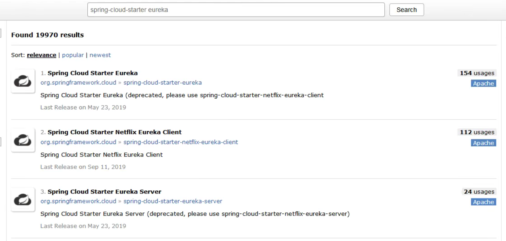
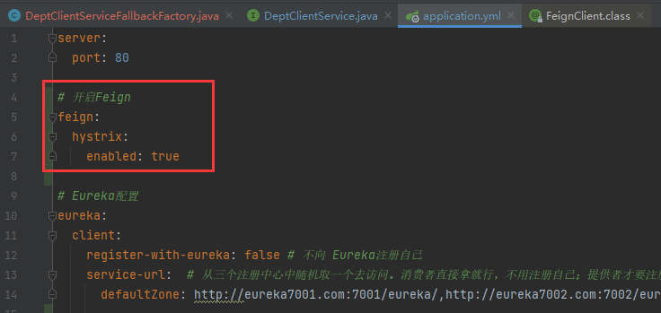
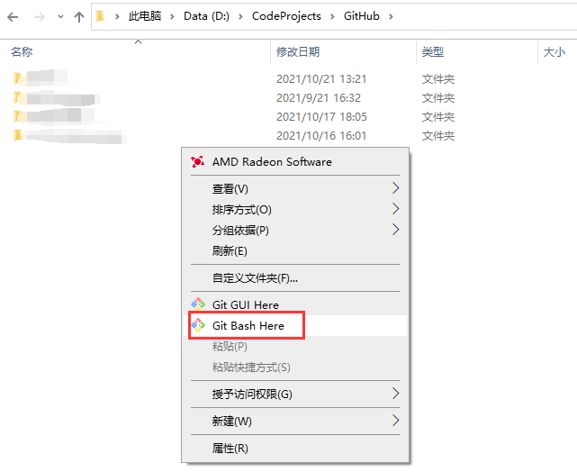
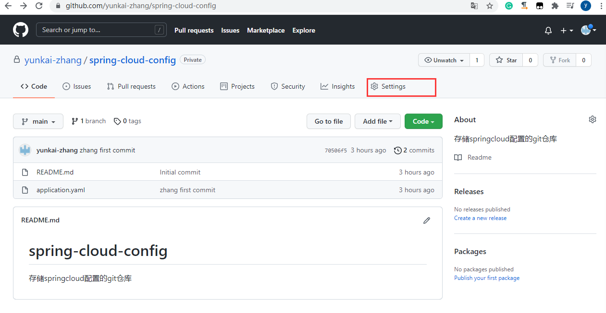

SpringCloud

## 前言

### 该阶段该如何学习

####  学前自省

搞清楚下面三个问题，才能学好springcloud：

- 回顾之前的知识

  - javase
  - 数据库
  - 前端三件套
  - servlet
  - http
  - mybatis（核心）
  - spring（核心）
  - springmvc（核心）
  - springboot（核心）
  - dubbo，zookeeper，分布式基础
  - maven，git
  - ajax，json
  - 。。。

- 串一下自己会的知识

  - 数据库
  - mybatis（核心）
  - spring（核心）
  - springmvc（核心）
  - springboot（核心）
  - dubbo，zookeeper，分布式基础
  - maven，git
  - ajax，json

- 这个阶段该如何学。

  - 最早的架构：MVC（三层架构）
  - spring框架：
    - 特点：ioc，aop
    - 目的：解决开发的复杂性

  - springboot框架：
    - springboot是spring的升级版，是新一代的javaee开发标准
    - 自动装配。特点：约定大于配置。
    - 模块化：allinone横向化也不太够用，模块化好。代码没变化。


#### 微服务核心问题与解决

微服务架构的四个核心问题？

1. 服务很多，客户端该怎么访问？
2. 服务很多，服务之间如何通信？
3. 服务很多，如何治理？
   - 用如zk去注册管理
4. 服务挂了怎么办

解决方案：springcloud（不是一个技术，是一门生态）（springcloud是基于springboot的）

1. springcloud netflix（一站式解决所有问题）

   - 解决问题一：使用了api网关，zuul组件来实现这个网关。
   - 解决问题二：用了Feign。Feign基于httpClient，httpClient基于http通信方式（特点：同步，阻塞）
   - 解决问题三：Eureka
   - 解决问题四：Hystrix

2. Apache Dubbo+ZooKeeper（半自动解决问题，需要整合别人的）（这个方案并不完善）

   - 解决问题一：没有。想实现得搞第三方组件，如融合zuul组件；或者自己实现。
   - 解决问题二：dubbo
   - 解决问题三：ZooKeeper
   - 解决问题四：没有。想实现就得搞第三方组件，如融合Hystrix组件

3. springcloud alibaba（新的一站式解决所有问题的方案，更简单）

   

新概念：

1. 服务网格（server mesh）
   - 解决方案：istio


万变不离其宗：

- 解决”微服务架构的四个核心问题“
- ”微服务架构的四个核心问题“的本质：网络不可靠。


#### 常见面试题

1. 什么是微服务?
2. 微服务之间是如何独立通讯的?
3. SpringCloud和Dubbo有哪些区别?
4. SpringBoot和SpringCloud，请你谈谈对他们的理解
5. 什么是服务熔断?什么是服务降级
6. 微服务的优缺点是分别是什么?说下你在项目开发中遇到的坑
7. 你所知道的微服务技术栈有哪些?请列举一二
8. eureka和zookeeper都可以提供服务注册与发现的功能，请说说两个的区别?


### 回顾微服务及其架构

#### 定义

微服务是什么？：

- 就目前而言，对于微服务，业界并没有一个统一的，标准的定义
- 但通常而言，微服务架构是一种架构模式，或者说是一种架构风格，**它提倡将单一的应用程序划分成一组小的服务**（模块化），每个服务运行在其独立的自己的进程内，服务之间互相协调，互相配置，为用户提供最终价值。服务之间采用轻量级的通信机制互相沟通，每个服务都围绕着具体的业务进行构建，并且能够被独立的部署到生产环境中。另外，应尽量避免统一的，集中式的服务管理机制。对具体的一个服务而言，应根据业务上下文，选择合适的语言，工具对其进行构建（maven）。可以有一个非常轻量级的集中式管理来协调这些服务，可以使用不同的语言来编写服务，也可以使用不同的数据存储;


可能有的人觉得官方的话太过生涩，我们从技术维度来理解下:

- 微服务化的核心就是将传统的一站式应用，根据业务拆分成一个一个的服务，彻底地去耦合（解耦）。每一个微服务提供单个业务功能的明务。一个服务做一件事情，从技术角度看就是一种小而独立的处理过程，类似进程的概念，能够自行单独启动或销毁，拥有自己独立的数据库。


#### 微服务VS微服务架构

微服务：

- 强调的是服务的大小，他关注的是某一个点，是具体解决某一个问题/提供落地对应服务的一个服务应用。狭义的看，可以看做是IDEA中的一个个微服务工程，或者Module。
  - IDEA 工具里面使用Maven开发的一个个独立的小Module，它具体是使用springboot开发的一个小模块，专业的事情交给专业的模块来做，一个模块就做着一件事情。
  - 强调的是一个个的个体，每个个体完成一个具体的任务或者功能!

微服务架构

- —种新的架构形式，Martin Fowler,2014提出。
- 微服务架构是一种架构模式，它提倡将单一应用程序划分成一组小的服务，服务之间互相协调，互相配合，为用户提供最终价值。每个服务运行在其独立的进程中，服务于服务间采用轻量级的通信机制互相协作，每个服务都围绕着具体的业务进行构建，并且能够被独立的部署到生产环境中，另外，应尽量避免统一的，集中式的服务管理机制，对具体的一个服务而言，应根据业务上下文，选择合适的语言，工具对其进行构建


#### 微服务优缺点

优点：

- 单一职责原则。比如“苹果手机”不符合单一职责原则，要拆成品牌“苹果”和产品“手机”。
- 每个服务足够内聚，足够小，代码容易理解，这样能聚焦一个指定的业务功能或业务需求;
- 开发简单，开发效率提高，一个服务可能就是专一的只干一件事;
- 微服务能够被小团队单独开发，这个小团队是2~5人的开发人员组成;
- 微服务是松耦合的，是有功能意义的服务，无论是在开发阶段或部署阶段都是独立的。
- 微服务能使用不同的语言开发。
- 易于和第三方集成，微服务允许容易且灵活的方式集成自动部署，通过持续集成工具，如jenkins，Hudson,
  bamboo
- 微服务易于被一个开发人员理解，修改和维护，这样小团队能够更关注自己的工作成果。无需通过合作才能体现价值。
- 微服务允许你利用融合最新技术。
- 微服务只是业务逻辑的代码，不会和HTML, cSS或其他界面混合
- 每个微服务都有自己的存储能力，可以有自己的数据库，也可以有统一数据库

缺点:

- 开发人员要处理分布式系统的复杂性
- 多服务运维难度，随着服务的增加，运维的压力也在增大
- 系统部署依赖
- 服务间通信成本
- 数据一致性
- 系统集成测试
- 性能监控.....


#### 微服务技术栈列表


| **微服务技术条目**                     | 落地技术                                                     |
| -------------------------------------- | ------------------------------------------------------------ |
| 服务开发                               | SpringBoot、Spring、SpringMVC等                              |
| 服务配置与管理                         | Netfix公司的Archaius、阿里的Diamond等                        |
| 服务注册与发现                         | Eureka、Consul、Zookeeper等                                  |
| 服务调用                               | Rest、PRC、gRPC                                              |
| 服务熔断器                             | Hystrix、Envoy等                                             |
| 负载均衡                               | Ribbon、Nginx等                                              |
| 服务接口调用(客户端调用服务的简化工具) | Fegin等                                                      |
| 消息队列                               | Kafka、RabbitMQ、ActiveMQ等                                  |
| 服务配置中心管理                       | SpringCloudConfig、Chef等                                    |
| 服务路由(API网关)                      | Zuul等                                                       |
| 服务监控                               | Zabbix、Nagios、Metrics、Specatator等                        |
| 全链路追踪                             | Zipkin、Brave、Dapper等                                      |
| 数据流操作开发包                       | SpringCloud Stream(封装与Redis，Rabbit，Kafka等发送接收消息) |
| 时间消息总栈                           | SpringCloud Bus                                              |
| 服务部署                               | Docker、OpenStack、Kubernetes等                              |


#### 选择springcloud做微服务架构的原因

1. 选型依据

   - 整体解决方案和框架成熟度
   - 社区热度
   - 可维护性
   - 学习曲线：不太难

2. 当前各大IT公司用的微服务架构有哪些?

   - 阿里:dubbo+HAs
   - 京东:JSF
   - 新浪:Motan
   - 当当网Dubbox

3. 各微服务框架对比

   

   
   
   ```
   | 功能点/服务框架 | Netflix/SpringCloud | Motan | gRPC | Thri t | Dubbo/DubboX |
   | —————— | ———————————————————————————— | —————————————————- | ————————— | ———— | —————————— |
   | 功能定位 | 完整的微服务框架 | RPC框架，但整合了ZK或Consul，实现集群环境的基本服务注册发现 | RPC框架 | RPC框架 | 服务框架 |
   | 支持Rest | 是，Ribbon支持多种可拔插的序列号选择 | 否 | 否 | 否 | 否 |
   | 支持RPC | 否 | 是(Hession2) | 是 | 是 | 是 |
   | 支持多语言 | 是(Rest形式) | 否 | 是 | 是 | 否 |
   | 负载均衡 | 是(服务端zuul+客户端Ribbon)，zuul-服务，动态路由，云端负载均衡Eureka（针对中间层服务器） | 是(客户端) | 否 | 否 | 是(客户端) |
   | 配置服务 | Netfix Archaius，Spring Cloud Config Server 集中配置 | 是(Zookeeper提供) | 否 | 否 | 否 |
   | 服务调用链监控 | 是(zuul)，zuul提供边缘服务，API网关 | 否 | 否 | 否 | 否 |
   | 高可用/容错 | 是(服务端Hystrix+客户端Ribbon) | 是(客户端) | 否 | 否 | 是(客户端) |
   | 典型应用案例 | Netflix | Sina | Google | Facebook | |
   | 社区活跃程度 | 高 | 一般 | 高 | 一般 | 2017年后重新开始维护，之前中断了5年 |
   | 学习难度 | 中等 | 低 | 高 | 高 | 低 |
   | 文档丰富程度 | 高 | 一般 | 一般 | 一般 | 高 |
   | 其他 | Spring Cloud Bus为我们的应用程序带来了更多管理端点 | 支持降级 | Netflix内部在开发集成gRPC | IDL定义 | 实践的公司比较多 |
   ```
   
   


### SpringCloud入门概述

#### 什么是springcloud

为何出现springcloud：

- springboot可以构建微服务应用，但是微服务变多了该如何协调处理呢？：用springcloud。


springcloud示意图：


SpringCloud,基于SpringBoot提供了一套微服务解决方案，包括服务注册与发现，配置中心，全链路监控，服务网关，负载均衡，熔断器等组件，除了基于NetFlix的开源组件做高度抽象封装之外，还有一些选型中立的开源组件。
SpringCloud利用SpringBoot的开发便利性，巧妙地简化了分布式系统基础设施的开发，SpringCloud为开发人员提供了快速构建分布式系统的一些工具，**包括配置管理，服务发现，断路器，路由，微代理，事件总线，全局锁，决策竞选，分布式会话等等**，他们都可以用SpringBoot的开发风格做到一键启动和部署。
SpringBoot并没有重复造轮子，它只是将目前各家公司开发的比较成熟，经得起实际考验的服务框架组合起来，通过SpringBoot风格进行再封装，屏蔽掉了复杂的配置和实现原理，**最终给开发者留出了一套简单易懂，易部署和易维护的分布式系统开发工具包**
SpringCloud是分布式微服务架构下的一站式解决方案，是各个微服务架构落地技术的集合体，俗称微服务全家桶。


#### Springboot和Sprigcloud的关系

- springboot和springcloud是渐进性的关系。boot用来构建微服务，cloud用来协调微服务。
- SpringBoot专注于快速方便的开发单个个体微服务（说白了就是jar包）。
- SpringCloud是关注全局的微服务协调整理治理框架，它将SpringBoot开发的一个个单体微服务整合并管理起来，为各个微服务之间提供:配置管理，服务发现，断路器，路由，微代理，事件总线，全局锁，决策竞选，
  分布式会话等等集成服务。
- SpringBoot可以离开SpringClooud独立使用，开发项目。但是SpringCloud离不开SpringBoot，属于依赖关系
- **SpringBoot专注于快速、方便的开发单个个体微服务。SpringCloud关注全局的服务治理框架。**


#### dubbo和springcloud技术选型

分布式+服务治理dubbo：

- 目前成熟的互联网架构：应用服务化拆分+消息中间件

- 当代网站技术结构图：

  


Dubbo和springcloud对比:

- 看一下社区活跃度（repository的绿色心跳线条）
  - https://github.com/apache/dubbo
  - https://github.com/spring-cloud

- 对比结果表

  

  |              | Dubbo         | SpringCloud                  |
  | ------------ | ------------- | ---------------------------- |
  | 服务注册中心 | Zookeeper     | Spring Cloud Netfilx Eureka  |
  | 服务调用方式 | RPC           | REST API                     |
  | 服务监控     | Dubbo-monitor | Spring Boot Admin            |
  | 断路器       | 不完善        | Spring Cloud Netfilx Hystrix |
  | 服务网关     | 无            | Spring Cloud Netfilx Zuul    |
  | 分布式配置   | 无            | Spring Cloud Config          |
  | 服务跟踪     | 无            | Spring Cloud Sleuth          |
  | 消息总栈     | 无            | Spring Cloud Bus             |
  | 数据流       | 无            | Spring Cloud Stream          |
  | 批量任务     | 无            | Spring Cloud Task            |

- **最大区别: SpringCloud抛弃了Dubbo的RPC通信，采用的是基于HTTP的REST方式。**
  严格来说，这两种方式各有优劣。虽然从一定程度上来说，后者牺牲了服务调用的性能，但也避免了上面提到的原生RPC带来的问题。而且REST相比RPC更为灵活，服务提供方和调用方的依赖只依靠一纸契约，不存在代码级别的强依赖，这在强调快速演化的微服务环境下，显得更加合适。

- 品牌机与组装机的区别
  很明显，Spring Cloud的功能比DUBBO更加强大，涵盖面更广，而且作为Spring的拳头项目，它也能够与SpringFramework、Spring Boot、Spring Data、Spring Batch等其他Spring项目完美融合，这些对于微服务而言是至关重要的。使用Dubbo构建的微服务架构就像组装电脑，各环节我们的选择自由度很高，但是最终结果很有可能因为一条内存质量不行就点不亮了，总是让人不怎么放心，但是如果你是一名高手，那这些都不是问题;而SpringCloud就像品牌机，在Spring Source的整合下，做了大量的兼容性测试，保证了机器拥有更高的稳定性，但是如果要在使用非原装组件外的东西，就需要对其基础有足够的了解。

- 社区支持与更新力度
  最为重要的是，DUBBO停止了5年左右的更新，虽然2017.7重启了。对于技术发展的新需求，需要由开发者自行拓展升级（比如当当网弄出了DubboX)，这对于很多想要采用微服务架构的中小软件组织，显然是不太合适的，中小公司没有这么强大的技术能力去修改Dubbo源码+周边的一整套解决方案，并不是每一个公司都有阿里的大牛+真实的线上生产环境测试过。

- 总结:
  曾风靡国内的开源RPC服务框架Dubbo在重启维护后，令许多用户为之雀跃，但同时，也迎来了一些质疑的声音。互联网技术发展迅速,Dubbo是否还能跟上时代? Dubbo与Spring Cloud相比又有何优势和差异?是否会有相关举措保证 Dubbo的后续更新频率?

- 人物: Dubbo重启维护开发的刘军，主要负责人之一
  刘军，阿里巴巴中间件高级研发工程师，主导了Dubbo重启维护以后的几个发版计划，专注于高性能RPC框架和微服务相关领域。曾负责网易考拉RPC框架的研发及指导在内部使用，参与了服务治理平台、分布式跟踪系统、分布式一致性框架等从无到有的设计与开发过程。

- 解决的**问题域**不一样:

  **Dubbo的定位是一款RPC框架，Spring Cloud的目标是微服务架构下的一站式解决方案**


#### SpringCloud能干什么

- Distributed/versioned configuration(分布式/版本控制配置)
- Service registration and discovery(服务注册与发现)
- Routing(路由)
- Service-to-service calls(服务到服务的调用)
- Load balancing(负载均衡配置)
- Circuit Breakers （断路器)
- Distributed messaging (分布式消息管理)

- 。。。


#### springcloud在哪下载

官网：http://projects.spring.io/spring-cloud/


参考书:

- SpringCloud Netflix 中文文档: https://springcloud.cc/spring-cloud-netflix.html
- 中文API文档(官方文档翻译版): https://springcloud.cc/spring-cloud-dalston.html. 
- SpringCloud中国社区（挂了）: http://springcloud.cn/
- SpringCloud中文网: https://springcloud.cc
- 大佬学习笔记（含不冲突的maven）：https://www.kuangstudy.com/bbs/1374942542566551554
- spring官网查看版本依赖：https://docs.spring.io/spring-cloud/docs


前言部分是面试时的谈资，且和理论挂钩，需好好掌握。


## Rest学习环境搭建

### 服务提供者

#### 项目总体介绍

- 我们会使用一个Dept部门模块做一个微服务通用案例Consumer消费者(Client)通过REST调用Provider提供者(Server)提供的服务。

- 回顾Spring，SpringMVC，Mybatis等以往学习的知识。

- Maven的分包分模块架构复习。

  ```
  一个简单的Maven模块结构是这样的：
  -- app-parent: 一个父项目(app-parent)聚合了很多子项目(app-util\app-dao\app-web...)
    |-- pom.xml
    |
    |-- app-core
    ||---- pom.xml
    |
    |-- app-web
    ||---- pom.xml
    ......
  ```

  一个父工程带着多个Moudule子模块

  MicroServiceCloud父工程(Project)下初次带着3个子模块(Module)

  - microservicecloud-api 【封装的整体entity/接口/公共配置等】
  - microservicecloud-consumer-dept-80 【服务提供者】
  - microservicecloud-provider-dept-8001 【服务消费者】

- 动手开干

#### SpringCloud版本选择

大版本说明：

| SpringBoot | SpringCloud             | 关系                                     |
| ---------- | ----------------------- | ---------------------------------------- |
| 1.2.x      | Angel版本(天使)         | 兼容SpringBoot1.2x                       |
| 1.3.x      | Brixton版本(布里克斯顿) | 兼容SpringBoot1.3x，也兼容SpringBoot1.4x |
| 1.4.x      | Camden版本(卡姆登)      | 兼容SpringBoot1.4x，也兼容SpringBoot1.5x |
| 1.5.x      | Dalston版本(多尔斯顿)   | 兼容SpringBoot1.5x，不兼容SpringBoot2.0x |
| 1.5.x      | Edgware版本(埃奇韦尔)   | 兼容SpringBoot1.5x，不兼容SpringBoot2.0x |
| 2.0.x      | Finchley版本(芬奇利)    | 兼容SpringBoot2.0x，不兼容SpringBoot1.5x |
| 2.1.x      | Greenwich版本(格林威治) |                                          |

- springcloud一般大于等于Fomchiey的会比较稳定，因为兼容了springboot2.0.

实际开发版本关系：

| spring-boot-starter-parent |              | spring-cloud-dependencles |              |
| :------------------------: | -----------: | :-----------------------: | :----------: |
|         **版本号**         | **发布日期** |        **版本号**         | **发布日期** |
|       1.5.2.RELEASE        |      2017-03 |        Dalston.RC1        |    2017-x    |
|       1.5.9.RELEASE        |      2017-11 |      Edgware.RELEASE      |   2017-11    |
|       1.5.16.RELEASE       |      2018-04 |        Edgware.SR5        |   2018-10    |
|       1.5.20.RELEASE       |      2018-09 |        Edgware.SR5        |   2018-10    |
|       2.0.2.RELEASE        |      2018-05 |  Fomchiey.BULD-SNAPSHOT   |    2018-x    |
|       2.0.6.RELEASE        |      2018-10 |       Fomchiey-SR2        |   2018-10    |
|       2.1.4.RELEASE        |      2019-04 |       Greenwich.SR1       |   2019-03    |

- 当前演示用最新的G版。


#### 新建一个项目

创建普通的maven项目（不勾选）


因为创建的是夫项目，删除src目录


导入依赖，依赖一定要相互适配（就按照老师的来），不然会报错。

- 网友说“我就觉得这个 management没什么用处，就在父pom统一version就好了啊”，我觉得有一点点道理。因为父项目的dependencyManagement不会直接导入包（可以点idea右上角的maven查看）；我们要使用包还得在子module中用dependency指定引入一下，不过version就可以缺省，默认用父项目中管理的version。
- 网友关于**dependencyManagement**的观点很赞“之前那个工程就是个pom文件，懂么，就是用来管理jar包版本的，继承这个父工程的所有模块，都被父工程约束版本”。**核心就是版本约束**。
- 有人可能问，**为什么父项目不直接导入所有依赖**，这样子，module省的导入。一个网友的回复我觉得不错“**单个子项目打包**，你能把父项目打包到子项目中去？不能就乖乖导入”。

```xml
<?xml version="1.0" encoding="UTF-8"?>
<project xmlns="http://maven.apache.org/POM/4.0.0"
         xmlns:xsi="http://www.w3.org/2001/XMLSchema-instance"
         xsi:schemaLocation="http://maven.apache.org/POM/4.0.0 http://maven.apache.org/xsd/maven-4.0.0.xsd">
    <modelVersion>4.0.0</modelVersion>

    <groupId>org.example</groupId>
    <artifactId>springcloud</artifactId>
    <version>1.0-SNAPSHOT</version>

    <!--设置打包方式为pom
    不是springboot中用的jar包打包-->
    <packaging>pom</packaging>

    <!--定义一些版本号-->
    <properties>
        <!--配置项目构建的编码格式-->
        <project.build.sourceEncoding>UTF-8</project.build.sourceEncoding>

        <maven.compiler.source>8</maven.compiler.source>
        <maven.compiler.target>8</maven.compiler.target>
        <!--统一配置一些版本号-->
        <junit.version>4.12</junit.version>
        <lombok.version>1.16.18</lombok.version>
    </properties>

    <!--配置父项目依赖，要用dependencyManagement
    dependencyManagement 只管理版本，子项目不用写版本号的-->
    <dependencyManagement>
        <dependencies>
            <!--===================重点依赖=========================-->
            <!-- springcloud依赖
            https://mvnrepository.com/artifact/org.springframework.cloud/spring-cloud-dependencies -->
            <dependency>
                <groupId>org.springframework.cloud</groupId>
                <artifactId>spring-cloud-dependencies</artifactId>
                <version>Greenwich.SR1</version>
                <!--通过pom方式引入的springcloud依赖-->
                <type>pom</type>
                <!--<scope>runtime</scope>可以删掉，也可以改成import-->
                <scope>import</scope>
            </dependency>

            <!--springboot的导入要和springcloud匹配，具体匹配可见于笔记-->
            <dependency>
                <groupId>org.springframework.boot</groupId>
                <artifactId>spring-boot-dependencies</artifactId>
                <version>2.1.4.RELEASE</version>
                <type>pom</type>
                <scope>import</scope>
            </dependency>

            <!--连接数据库的包们-->
            <dependency>
                <groupId>mysql</groupId>
                <artifactId>mysql-connector-java</artifactId>
                <version>5.1.47</version>
            </dependency>
            <dependency>
                <groupId>com.alibaba</groupId>
                <artifactId>druid</artifactId>
                <version>1.1.10</version>
            </dependency>

            <!--mybatis的启动器
            老师这应该是打错字了，那个不是springboot的启动器啊，引入的都是mybaits的启动器，应该叫mybatis的启动器-->
            <dependency>
                <groupId>org.mybatis.spring.boot</groupId>
                <artifactId>mybatis-spring-boot-starter</artifactId>
                <version>1.3.2</version>
            </dependency>

<!--=======================其他需要的依赖=====================-->
            <!--下面连着的大块依赖主要用于日志和测试-->
            <!--junit单元测试-->
            <dependency>
                <groupId>junit</groupId>
                <artifactId>junit</artifactId>
                <!--一般开发时，junit版本不会写死，而是在properties中统一管理-->
                <version>${junit.version}</version>
            </dependency>
            <!--lombok-->
            <dependency>
                <groupId>org.projectlombok</groupId>
                <artifactId>lombok</artifactId>
                <!--一般开发时，版本不会写死，而是在properties中统一管理-->
                <version>${lombok.version}</version>
            </dependency>
            <!--Log4j日志-->
            <dependency>
                <groupId>log4j</groupId>
                <artifactId>log4j</artifactId>
                <version>1.2.17</version>
            </dependency>
            <dependency>
                <groupId>ch.qos.logback</groupId>
                <artifactId>logback-core</artifactId>
                <version>1.2.3</version>
            </dependency>

        </dependencies>
    </dependencyManagement>

    <!--有些资源导不出去的话，在build中配置一下maven打包插件（resource）-->
    <build></build>


</project>
```

新建一个子module


子module中指定使用父项目dependencyManagement中管理的哪些依赖（version默认为副项目中管理的版本）。

```xml
<?xml version="1.0" encoding="UTF-8"?>
<project xmlns="http://maven.apache.org/POM/4.0.0"
         xmlns:xsi="http://www.w3.org/2001/XMLSchema-instance"
         xsi:schemaLocation="http://maven.apache.org/POM/4.0.0 http://maven.apache.org/xsd/maven-4.0.0.xsd">
    <parent>
        <artifactId>springcloud</artifactId>
        <groupId>org.example</groupId>
        <version>1.0-SNAPSHOT</version>
    </parent>
    <modelVersion>4.0.0</modelVersion>

    <artifactId>springcloud-api</artifactId>

    <properties>
        <maven.compiler.source>8</maven.compiler.source>
        <maven.compiler.target>8</maven.compiler.target>
    </properties>

    <dependencies>
        <!--需要配置当前的NoduLe自己要的依赖。如果父依赖中已经配置了版本，这里就不用写了。

        老师说这里的pom依赖向上依赖到父项目dependencymanagement的依赖，我这不是，而是依赖Spring-Boot-Dependencies-->
        <dependency>
            <groupId>org.projectlombok</groupId>
            <artifactId>lombok</artifactId>
        </dependency>
    </dependencies>

</project>
```

- 也可以点击右上角maven看到，父项目没有dependency，只有子module中有下载的dependency包

  

删除springcloud-api子module的test文件夹，因为用不上


现在处理数据方面。先连接到本地“数据源”（安装mysql时就配置好了本地数据源）


​	账号-密码默认：root-123456


连接好本地数据源后，创建新数据库


idea中连接本地数据源（方便测试）（方便建表）


点击schema选中目标数据库


idea中为本地数据库建表


因为分布式有很多数据库，我们用表的db_name字段记录一下当前表是从哪个数据库读出来的。


往建好的dept表中插入数据


```mysql
insert into dept(dname, db_source) VALUES ('开发部',database());
insert into dept(dname, db_source) VALUES ('人事部',database());
insert into dept(dname, db_source) VALUES ('财务部',database());
insert into dept(dname, db_source) VALUES ('市场部',database());
insert into dept(dname, db_source) VALUES ('运维部',database());
```

sql语句解析：

- database()代表当前数据库的名字
- 不插入deptno是因为该字段自增，不需要插入，默认从1开始

查看dept表的内容是否插入成功：成功。


数据库数据表和数据准备好了，现在写实体类


```java
package com.zhangyun.springcloud.pojo;

import lombok.Data;
import lombok.NoArgsConstructor;
import lombok.experimental.Accessors;

import java.io.Serializable;

/*
* Dept实体类
*
* ORM对象关系映射（类表关系映射）；即mysql表对应真实的pojo类。
*
* 所有的实体类务必实现序列化，否则传输可能报错
* */
@Data
//生成无参构造
@NoArgsConstructor
/*
* 开启支持链式写法
*
* 没开启链式写法时：dept.setDeptNo(1);dept.setDName("name");dept.setDb_source("DB01");
* 开启链式写法后：dept.setDeptNo(1).setDName("name").setDb_source("DB01");
* */
@Accessors(chain = true)
public class Dept implements Serializable {
    private Long deptno;
    private String dname;

    //这个字段用于看当前表存在于哪个数据库中。因为微服务架构中，一个服务对应一个数据库；同一个信息可能存在不同的数据库。
    private String db_source;

    /*虽然导入了lombok，但这里自定义一个有参构造。只需要dname字段，因为deptno自增自己生成，db_source由数据库函数自动生成。
    * 不用lombok的原因猜测是：可能lombok的有参构造注解只支持全参数输入的构造函数
    * */
    public Dept(String dname){
        this.dname=dname;
    }

}
```

springcoud-api微服务只管pojo类，所以pojo类写完了，springcoud-api微服务就也写完了，不写其他的如控制器等等东西了。

springcloud-api写完了来写第二个module


模块会越来越多，最好在模块名字上加上端口号


子module中导入依赖，这些依赖被父项目dependencyManagement约束了版本

- 查看父项目，springcloud-api，springcloud-provider-dept-8001的pom.xml中的groupId是否为创建时默认的`org.example`,为了项目规范化，都改成`com.zhangyun`。

```xml
<?xml version="1.0" encoding="UTF-8"?>
<project xmlns="http://maven.apache.org/POM/4.0.0"
         xmlns:xsi="http://www.w3.org/2001/XMLSchema-instance"
         xsi:schemaLocation="http://maven.apache.org/POM/4.0.0 http://maven.apache.org/xsd/maven-4.0.0.xsd">
    <parent>
        <artifactId>springcloud</artifactId>
        <groupId>com.zhangyun</groupId>
        <version>1.0-SNAPSHOT</version>
    </parent>
    <modelVersion>4.0.0</modelVersion>

    <artifactId>springcloud-provider-dept-8001</artifactId>

    <properties>
        <maven.compiler.source>8</maven.compiler.source>
        <maven.compiler.target>8</maven.compiler.target>
    </properties>

    <dependencies>
        <!--我们需要拿到实体类，所以要配置api module
        配置好后点击springcloud-api，idea会自动跳转到springcloud-api的pom文件

        只要导入了springcloud-api的依赖，我们就可以用springcloud-api中的实体类了。
        -->
        <dependency>
            <groupId>com.zhangyun</groupId>
            <artifactId>springcloud-api</artifactId>
            <version>1.0-SNAPSHOT</version>
        </dependency>

        <!--父项目中管理（约束）了各依赖的版本号，子module中不用写版本号了-->
        <dependency>
            <groupId>junit</groupId>
            <artifactId>junit</artifactId>
        </dependency>
        <dependency>
            <groupId>mysql</groupId>
            <artifactId>mysql-connector-java</artifactId>
        </dependency>
        <dependency>
            <groupId>com.alibaba</groupId>
            <artifactId>druid</artifactId>
        </dependency>
        <dependency>
            <groupId>ch.qos.logback</groupId>
            <artifactId>logback-core</artifactId>
        </dependency>
        <dependency>
            <groupId>org.mybatis.spring.boot</groupId>
            <artifactId>mybatis-spring-boot-starter</artifactId>
        </dependency>
        <dependency>
            <groupId>org.springframework.boot</groupId>
            <artifactId>spring-boot-starter-web</artifactId>
        </dependency>
        <!--test-->
        <dependency>
            <groupId>org.springframework.boot</groupId>
            <artifactId>spring-boot-test</artifactId>
        </dependency>
        <!--jetty
        和tomcat没什么区别，可以使用它做应用服务器-->
        <dependency>
            <groupId>org.springframework.boot</groupId>
            <artifactId>spring-boot-starter-jetty</artifactId>
        </dependency>
        <!--热部署工具
        写完代码不应该把代码重启，而应该刷新一下就可以（类似thymeleaf）

        有网友说：“devtools不是真正的热部署，相当于帮你重新点击了一次运行按钮，而 jrebel 才是真正的热部署”-->
        <dependency>
            <groupId>org.springframework.boot</groupId>
            <artifactId>spring-boot-devtools</artifactId>
        </dependency>

    </dependencies>

</project>
```

点击idea右上角的maven看依赖是否都成功下载jar包


删除子module用不上的test文件夹


resource文件夹中新建子module的配置文件application.yml

```yaml
server:
  port: 8001

# mybatis配置
mybatis:
  type-aliases-package: com.zhangyun.springcloud.pojo
  # 配置“mybatis核心配置文件”的地址。不过这个配置文件很久没写了。
  config-location: classpath:mybatis/mybatis-config.xml
  # 配置“配置文件XXXMapper.xml”的地址
  mapper-locations: classpath:mybatis/mapper/*.xml

# spring的配置
spring:
  application:
    # 给当前spring项目起名，一般名字和子module名字一致或接近
    name: springcloud-provider-dept
  # 配置数据源
  datasource:
    type: com.alibaba.druid.pool.DruidDataSource
    driver-class-name: org.gjt.mm.mysql.Driver
    url: jdbc:mysql://localhost:3306/db01?useUnicode=true&characterEncoding=utf-8
    username: root
    password: 123456
```

建立mapper配置文件XXXMapper.xml所在的文件夹，并新建mybatis核心配置文件mybatis-config.xml。


这里再演示一下从怎么写mybatis核心配置文件。

1. 访问[mybatis官网](https://mybatis.net.cn/)

2. 点击“入门”

   

3. 找到“从 XML 中构建 SqlSessionFactory”，这里有需要的mybatis核心配置文件模板

   

   ```xml
   <?xml version="1.0" encoding="UTF-8" ?>
   <!DOCTYPE configuration
     PUBLIC "-//mybatis.org//DTD Config 3.0//EN"
     "http://mybatis.org/dtd/mybatis-3-config.dtd">
   <configuration>
     <environments default="development">
       <environment id="development">
         <transactionManager type="JDBC"/>
         <dataSource type="POOLED">
           <property name="driver" value="${driver}"/>
           <property name="url" value="${url}"/>
           <property name="username" value="${username}"/>
           <property name="password" value="${password}"/>
         </dataSource>
       </environment>
     </environments>
     <mappers>
       <mapper resource="org/mybatis/example/BlogMapper.xml"/>
     </mappers>
   </configuration>
   ```

4. 删除不必要的部分，得到真正的核心模板

   ```xml
   <?xml version="1.0" encoding="UTF-8" ?>
   <!DOCTYPE configuration
           PUBLIC "-//mybatis.org//DTD Config 3.0//EN"
           "http://mybatis.org/dtd/mybatis-3-config.dtd">
   <configuration>
   </configuration>
   ```

回到正轨，编写mybatis核心配置文件mybatis-config.xml如下：

- 其实这个文件甚至可以不要，知识为了学到快最后了，回顾一下知识。

```xml
<?xml version="1.0" encoding="UTF-8" ?>
<!DOCTYPE configuration
        PUBLIC "-//mybatis.org//DTD Config 3.0//EN"
        "http://mybatis.org/dtd/mybatis-3-config.dtd">
<configuration>
    <settings>
        <!--开启二级缓存-->
        <setting name="cacheEnabled" value="true"/>
    </settings>
</configuration>
```

开始编写接口。新建dao（mapper）层的文件夹


新建DeptMapper.java接口

```java
package com.zhangyun.springcloud.mapper;

import com.zhangyun.springcloud.pojo.Dept;
import org.apache.ibatis.annotations.Mapper;
import org.springframework.stereotype.Repository;

import java.util.List;

@Mapper
//功能等于bean，让接口被spring托管，表示当前接口是dao层的东西
@Repository
public interface DeptMapper {
    //根据阿里手册,接口中方法默认是public,所以最好不要再去写public修饰符
    public boolean addDept(Dept dept);

    public Dept queryById(long id);

    public List<Dept> queryAll();
}

```

编写mapper配置文件

- 可以把mybatis-config.xml拿来，改一些单词就可以用

  

```xml
<?xml version="1.0" encoding="UTF-8" ?>
<!DOCTYPE mapper
        PUBLIC "-//mybatis.org//DTD Mapper 3.0//EN"
        "http://mybatis.org/dtd/mybatis-3-mapper.dtd">
<!--
namespace:绑定当前mapper配置文件对应的XXXmapper.java接口
id:XXXmapper.java接口中的方法名
parameterType：这里能写简写的Dept，是因为application.yml中配置了type-aliases-package: com.zhangyun.springcloud.pojo
values (#{dname}:mybatis会从传入的Dept中自动获取dname的值
-->
<mapper namespace="com.zhangyun.springcloud.mapper.DeptMapper">
    <insert id="addDept" parameterType="Dept">
        insert into dept(dname,db_source) values (#{dname},DATABASE());
    </insert>
    <select id="queryById" resultType="Dept" parameterType="long">
        select * from dept where deptno=#{deptno};
    </select>
    <select id="queryAll" resultType="Dept">
        select * from dept;
    </select>
</mapper>
```

dao层写完了，现在来写service层


编写service接口

```java
package com.zhangyun.springcloud.service;

import com.zhangyun.springcloud.pojo.Dept;

import java.util.List;

//service层接口的函数和dao（mapper）层长得一样
public interface DeptService {
    public boolean addDept(Dept dept);

    public Dept queryById(long id);

    public List<Dept> queryAll();
}
```

编写service接口实现类

```java
package com.zhangyun.springcloud.service;

import com.zhangyun.springcloud.mapper.DeptMapper;
import com.zhangyun.springcloud.pojo.Dept;
import org.springframework.beans.factory.annotation.Autowired;
import org.springframework.stereotype.Service;

import java.util.List;

//把服务层的实现类注入到spring，提取的时候是用接口提取，体现多态
@Service
public class DeptServiceImpl implements DeptService {
    //从spring容器获取dao层的接口bean，提供给服务层调用。即servie层调用dao层。
    @Autowired
    private DeptMapper deptMapper;

    @Override
    public boolean addDept(Dept dept) {
        return deptMapper.addDept(dept);
    }

    @Override
    public Dept queryById(long id) {
        return deptMapper.queryById(id);
    }

    @Override
    public List<Dept> queryAll() {
        return deptMapper.queryAll();
    }
}

```

为了实现服务，编写controller（控制层）


```java
package com.zhangyun.springcloud.controller;

import com.zhangyun.springcloud.pojo.Dept;
import com.zhangyun.springcloud.service.DeptService;
import org.springframework.beans.factory.annotation.Autowired;
import org.springframework.web.bind.annotation.GetMapping;
import org.springframework.web.bind.annotation.PathVariable;
import org.springframework.web.bind.annotation.PostMapping;
import org.springframework.web.bind.annotation.RestController;

import java.util.List;

//提供restful服务
//@RestController使返回字符串不走视图解析器，直接以字符串形式输出在浏览器上
@RestController
public class DeptController {
    //controller层调用service层,从spring容器中拿到bean。
    @Autowired
    private DeptService deptService;

    //提交带对象参数请求一般都用post提交，安全一点
    @PostMapping("/dept/add")
    //restful的对象参数前面要用@RequestBody，否则可能restful传输的时候出问题
    public boolean addDept(@RequestBody Dept dept){
        return deptService.addDept(dept);
    }
    //restful风格携带参数
    @GetMapping("/dept/qbid/{id}")
    public Dept queryById(@PathVariable("id") long id){
        return deptService.queryById(id);
    }

    @GetMapping("/dept/qall")
    public List<Dept> queryAll(){
        return deptService.queryAll();
    }
}

```

控制层也写好了，现在写主启动类


```java
package com.zhangyun.springcloud;

import org.springframework.boot.SpringApplication;
import org.springframework.boot.autoconfigure.SpringBootApplication;

//@SpringBootApplication注解让当前类编程子module的主启动类
@SpringBootApplication
public class DeptProvider_8001 {
    public static void main(String[] args) {
        //第一页参数为启动类的类名，第二个参数为main函数的输入参数args
        SpringApplication.run(DeptProvider_8001.class,args);
    }
}
```

运行springcloud-provider-dept-8001子module的主启动类，测试。

- 先测试DeptController.java的addDept。因为addDept要求是post请求，无法通过浏览器地址（get方式）去请求。如果修改注解为@GetMapping，可以用下面的链接在数据库新建一个dept

  ```
  http://localhost:8001/dept/add?dname="游戏部"
  ```

  

- 再测试DeptController.java的queryById，成功

  

- 再测试DeptController.java的queryAll，成功

  


### 服务消费者

新建子module


tomcat默认端口8080,http默认端口80,https默认端口443


导入消费者子module需要的依赖

```xml
<?xml version="1.0" encoding="UTF-8"?>
<project xmlns="http://maven.apache.org/POM/4.0.0"
         xmlns:xsi="http://www.w3.org/2001/XMLSchema-instance"
         xsi:schemaLocation="http://maven.apache.org/POM/4.0.0 http://maven.apache.org/xsd/maven-4.0.0.xsd">
    <parent>
        <artifactId>springcloud</artifactId>
        <groupId>com.zhangyun</groupId>
        <version>1.0-SNAPSHOT</version>
    </parent>
    <modelVersion>4.0.0</modelVersion>

    <artifactId>springcloud-consumer-dept-80</artifactId>

    <properties>
        <maven.compiler.source>8</maven.compiler.source>
        <maven.compiler.target>8</maven.compiler.target>
    </properties>

    <!--消费者不需要连数据库，只需要实体类子module+web。分工明确。-->
    <dependencies>
        <dependency>
            <groupId>com.zhangyun</groupId>
            <artifactId>springcloud-api</artifactId>
            <version>1.0-SNAPSHOT</version>
        </dependency>
        <dependency>
            <groupId>org.springframework.boot</groupId>
            <artifactId>spring-boot-starter-web</artifactId>
        </dependency>
        <!--热部署工具-->
        <dependency>
            <groupId>org.springframework.boot</groupId>
            <artifactId>spring-boot-devtools</artifactId>
        </dependency>
    </dependencies>

</project>
```

删除不用的test文件夹


新建并配置子module的配置文件application.yml。消费者只需要配置端口号。

```yaml
server:
  port: 80
```

编写客户端子module的controller


```java
package com.zhangyun.springcloud.controller;


import com.zhangyun.springcloud.pojo.Dept;
import org.springframework.beans.factory.annotation.Autowired;
import org.springframework.stereotype.Controller;
import org.springframework.web.bind.annotation.PathVariable;
import org.springframework.web.bind.annotation.RequestMapping;
import org.springframework.web.client.RestTemplate;

import java.util.List;

//@RestController标记的类是一个控制器。分发处理器将会扫描使用了该注解的类的方法,且不走视图解析器。
@RestController
public class DeptConsumerController {
    //一些常量在这里写死
    private static final String REST_URL_PREFIX="http://localhost:8001";

    /*理解：消费者，不应该有service层
    *
    * 前面就说了啊，Springcloud基于Http的Rest风格来进行通信。一共两种通信方式，一是RPC，二是http。
    * 我们这里使用RestTemplate，，很多方法供我们直接调用即可。不过我们要把RestTemplate注册到spring中。
    * 因为RestTemplate中没有@Bean，所以我们需要手动把它注册到spring中。
    *
    * 拿到resttemplate后，没有service层我们也能调用远程的服务。resttemplate提供多种便捷访问远程http服务的方法，
    * 他是一种简单的restful服务模板。
    * */
    @Autowired
    private RestTemplate restTemplate;

    @RequestMapping("consumer/dept/getDeptById/{id}")
    public Dept getDeptById(@PathVariable("id") long id){
        /*
        * 通过resttemplate访问远程服务端提供的服务
        *
        * getForObject()表示用get方法从远程服务器拿回一个对象
        * 参数类型一般为：
        * 1. url；
        * 2. 实体（携带的参数们）：类型可以为Map，携带参数为int等基本数据类型时可以不用额外的实体而像本例直接把参数用restful风格融入url，
        * RestTemplate也有对应的重写的getForObject(URI url, Class<T> responseType)；
        * 3. Class<T>responseType
        *
        * restful不像rpc那要要求reference引用，restful直接通过http的url去请求，http-restful通过restTemplate实现。
        * 客户端和服务无关，没有service层，完全解耦。
        * */
        return restTemplate.getForObject(REST_URL_PREFIX+"/dept/qbid/"+id,Dept.class);
    }

    @RequestMapping("consumer/dept/getDeptAll")
    public List<Dept> getDeptAll(){
        return restTemplate.getForObject(REST_URL_PREFIX+"/dept/qall",List.class);
    }

    @RequestMapping("consumer/dept/addDept")
    public boolean addDept(Dept dept){
        /*
        * restTemplate.postForObject(URI url, @Nullable Object request, Class<T> responseType)参数解析:
        * 1. 请求远程服务需要的url
        * 2. 以post方式提交请求时需要携带的（对象）参数
        * 3. 控制器函数addDept()返回类型，需要和远程服务的返回值一致
        * */
        return restTemplate.postForObject(REST_URL_PREFIX+"/dept/add/",dept,Boolean.class);
    }


}

```

编写bean的配置类。手动把需要使用的RestTemplate类注册到Spring中。

```java
package com.zhangyun.springcloud.config;

import org.springframework.context.annotation.Bean;
import org.springframework.context.annotation.Configuration;
import org.springframework.web.client.RestTemplate;

/*
* @Configuration相当于spring中的applicationContext.xml。
* 最开始spring在applicationContext.xml中配置bean，但是springboot和cloud偏好java配置类来配置bean，java配置类需要有@Configuration注解。
* */
@Configuration
public class ConfigBean {
    @Bean
    public RestTemplate getRestTemplate(){
        return new RestTemplate();
    }
}
```

编写springcloud-consumer-dept-80子module的启动类


```java
package com.zhangyun.springcloud;

import org.springframework.boot.SpringApplication;
import org.springframework.boot.autoconfigure.SpringBootApplication;

@SpringBootApplication
public class DeptConsumer_80 {
    public static void main(String[] args) {
        SpringApplication.run(DeptConsumer_80.class,args);
    }
}
```

开始测试，先在springcloud-provider-dept-8001子module的启动函数位置开启服务端，再在springcloud-consumer-dept-80子module的启动函数位置开启客户端。

- 如果启动springcloud-consumer-dept-80时提示80端口被占用，可以用如下方法排查+解决

  1. cmd输入`netstat  -aon|findstr  "80"`

     发现80端口被一个pid为“4560”的程序占用

     

  2. 来到任务管理器，点击“服务”，点击“pid”使服务按pid顺序排列

     

  3. 找到pid为4560的服务把他右键关闭

回到正轨，现在成功启动好两个服务器


先使用客户端的getDeptAll()请求，尝试从服务端获取所有dept，成功。

- 注意到，因为我们服务端用了http的默认端口号80，所以我们放完localhost网址时不需要带上端口号，这服务实际的网络访问。

```
http://localhost/consumer/dept/getDeptAll
```


再使用客户端的addDept(Dept dept)请求，尝试添加一个dept到springcloud-api子module。返回true即添加成功。

```
http://localhost/consumer/dept/addDept?dname="游戏部"
```


根据数据库dept表的deptno自增的原则（之前五个dept，刚加入的dept的deptno应为6），我们再使用客户端的getDeptById(int id)请求，尝试查询刚刚添加的部门。成功。并从idea中查看dept数据库，确实添加成功。

```
http://localhost/consumer/dept/getDeptById/6
```


后记：

- dept数据添加成功但是dname为null的兄弟，确认下服务端springcloud-provider-dept-8001的controller的addDept接口的参数前面是否加上了@RequestBody，没有的话要加上。 

- rpc和http两种通信方式不一样。
  - rpc是服务端在注册中心（zk）注册服务，客户端在注册中心引用服务。
  - http是客户端发送符合服务端请求格式的http请求。


## Eureka服务注册与发现

### 什么是Eureka

#### Eureka简介

- Eureka:怎么读?

  “尤里卡”

- Netflix在设计Eureka时，遵循的就是AP原则

- Eureka是Netflix的一个子模块，也是核心模块之一。Eureka是一个基于REST的服务，用于定位服务，以实现云端中间层服务发现和故障转移，服务注册与发现对于微服务来说是非常重要的，有了服务发现与注册，只需要使用服务的标识符，就可以访问到服务，而不需要修改服务调用的配置文件了，功能类似于Dubbo的注册中心，比如Zookeeper;


#### 原理讲解

Eureka基本架构

- SpringCloud封装了NetFlix公司开发的Eureka模块来实现服务注册和发现(对比Zookeeper)

- Eureka采用了C-S的架构设计，EurekaServer作为服务注册功能的服务器，他是服务注册中心。

- 而系统中的其他微服务。使用Eureka的客户端连接到EurekaServer并维持心跳（五秒没有心跳则认为死了）连接。这样系统的维护人员就可以通过EurekaServer来监控系统中各个微服务是否正常运行，SpringCloud的
  一些其他模块（比如Zuul)就可以通过EurekaServer来发现系统中的其他微服务，并执行相关的逻辑;

- 和Dubbo架构对比

  

  

- Eureka 包含两个组件：**Eureka Server** 和 **Eureka Client**.
- Eureka Server 提供服务注册，各个节点启动后，回在EurekaServer中进行注册，这样Eureka Server中的服务注册表中将会储存所有课用服务节点的信息，服务节点的信息可以在界面中直观的看到.
- Eureka Client 是一个Java客户端，用于简化EurekaServer的交互，客户端同时也具备一个内置的，使用轮询负载算法的负载均衡器。在应用启动后，将会向EurekaServer发送心跳 (默认周期为30秒) 。**如果Eureka Server在多个心跳周期内没有接收到某个节点的心跳**，EurekaServer将会从服务注册表中把这个服务节点**移除**掉 (默认周期为90s)。


三大角色

- Eureka Server:提供服务的注册与发现。
- Service Provider:将自身服务注册到Eureka中，从而使消费方能够找到。
- Service Consumer:服务消费方从Eureka中获取注册服务列表，从而找到消费服务。


#### 实战新建子module

*可以发现建项目大多是一个顺序：*

1. *导入依赖*
2. *编写配置文件*
3. *开启这个功能@EnableXXX*
4. *配置类编写*


新建子module


创建好子module后，项目中出现pom，java，resource无颜色的问题，应该是项目没有被maven托管。点击右上角maven果然看不到当前子module。


解决方案：右键pom文件，add as maven project。


pom，java，resource文件（夹）的颜色变正常了。不过pom文件名“pom”还是红色的，暂时不知道为什么，也没发现不良影响，先不管。


往pom导入依赖

- Baidu可以查到springcloud常用的依赖。比如这里可以点击rureka去mvn仓库下载即可。

  

- 先导入eureka的server

  

完整pom如下：

```xml
<?xml version="1.0" encoding="UTF-8"?>
<project xmlns="http://maven.apache.org/POM/4.0.0"
         xmlns:xsi="http://www.w3.org/2001/XMLSchema-instance"
         xsi:schemaLocation="http://maven.apache.org/POM/4.0.0 http://maven.apache.org/xsd/maven-4.0.0.xsd">
    <parent>
        <artifactId>springcloud</artifactId>
        <groupId>com.zhangyun</groupId>
        <version>1.0-SNAPSHOT</version>
    </parent>
    <modelVersion>4.0.0</modelVersion>

    <artifactId>springcloud-eureka-7001</artifactId>

    <properties>
        <maven.compiler.source>8</maven.compiler.source>
        <maven.compiler.target>8</maven.compiler.target>
    </properties>

    <dependencies>
        <!-- https://mvnrepository.com/artifact/org.springframework.cloud/spring-cloud-starter-eureka-server -->
        <!--导入Eureka Server依赖-->
        <dependency>
            <groupId>org.springframework.cloud</groupId>
            <artifactId>spring-cloud-starter-eureka-server</artifactId>
            <version>1.4.6.RELEASE</version>
        </dependency>
        <!--热部署工具-->
        <dependency>
            <groupId>org.springframework.boot</groupId>
            <artifactId>spring-boot-devtools</artifactId>
        </dependency>
    </dependencies>

</project>
```

现在开始编写子mudule配置文件application.yml

```yaml
# Eureka监控页面访问：http://localhost:7001/
server:
  port: 7001


# Eureka配置
eureka:
  instance:
    # Eureka服务端的实例名字。本机地址也可以写为“localhost”
    hostname: 127.0.0.1
  client:
    # 表示是否向 Eureka 注册中心注册自己(这个模块本身是服务器,所以不需要)
    register-with-eureka: false
    # fetch-registry如果为false,则表示本module自己为注册中心（服务器）,客户端的话则为 ture
    fetch-registry: false
    # Eureka客户端往本server注册时用的地址，自定义url且url地址不写死而是用application.yml中的配置项填入。
    service-url:
      defaultZone: http://${eureka.instance.hostname}:${server.port}/eureka/
```

编写主启动类

```java
package com.zhangyun.springcloud;

import org.springframework.boot.SpringApplication;
import org.springframework.boot.autoconfigure.SpringBootApplication;
import org.springframework.cloud.netflix.eureka.server.EnableEurekaServer;

//@EnableEurekaServer表示当前类是一个eureka server（服务端）的启动类，当前module的EurekaServer可以接收别人注册进来。
@EnableEurekaServer
@SpringBootApplication
public class EurekaServer_7001 {
    public static void main(String[] args) {
        SpringApplication.run(EurekaServer_7001.class,args);
    }
}
```

启动子module的主启动类，访问http://localhost:7001/，成功来到Eureka的监视页面。


### 服务注册+信息配置+自我保护机制

#### 现在干什么

重新看一下mvnrepository中和是spring cloud Eureka相关的依赖



- 本章的第一节已经使用Spring Cloud starter Eureka Server依赖构建了Eureka服务器，应用可以往Eureka服务器中注册和提取服务。
- Spring Cloud starter Eureka依赖允许微服务往Eureka Server中注册自己提供的服务
- Spring Cloud starter Netflix Eureka Client依赖允许微服务从Eureka Server中提取服务。


*重新强调：可以发现建项目大多是一个顺序：*

1. *导入依赖*
2. *编写配置文件*
3. *开启这个功能@EnableXXX*
4. *配置类编写*


本节使用Spring Cloud starter Eureka来实现Eureka注册服务。


#### 服务注册实战

回到springcloud-provider-dept-8001子module，为它加上Spring Cloud starter Eureka依赖，用eureka（而不是第二章http-restful）的方式实现远程通信。

```xml
<!--Eureka依赖-->
<!-- https://mvnrepository.com/artifact/org.springframework.cloud/spring-cloud-starter-eureka -->
<dependency>
    <groupId>org.springframework.cloud</groupId>
    <artifactId>spring-cloud-starter-eureka</artifactId>
    <version>1.4.6.RELEASE</version>
</dependency>
```

springcloud-provider-dept-8001子module的配置文件application.yml中配置Eureka的相关配置

```yaml
# Eureka配置：配置服务注册中心地址，该地址要和EurekaServer（即服务注册中心）中配置的一致。子module会往这个地址注册服务。
eureka:
  client:
    service-url:
      defaultZone: http://localhost:7001/eureka/
```

在springcloud-provider-dept-8001子module的启动类中添加@EnableXXX（Eureka）注解

```java
/*Eureka是C-S架构，主启动类添加该注解后，在子module启动后会自动注册本module的服务到Eureka中
* 
* 可能有人会问“提供服务不应该用server吗？怎么用client？”。答：服务的提供者和消费者在Eureka C-S架构中
* 都属于客户端client，两client都需要与服务端server（Eureka-server）交互。
* */
@EnableEurekaClient
```


现在测试Eureka是否成功实现了服务注册的功能。

1. 先启动springcloud-eureka-7001，即开启EurekaServer
2. 再启动springcloud-provider-dept-8001，即开启往EurekaServer注册服务的服务注册方。


重新访问代表Eureka-Server监视网址：http://localhost:7001/。可以看到服务注册成功。

- Application：是提供服务的子module在自己的application.yml中注册的spring.application.name: springcloud-provider-dept。


#### 信息配置实战

看到监控页面，注册的服务在Status栏中名字很丑，可以自己修改。更新springcloud-provider-dept-8001子module的配置文件（application.yml）中关于Eureka的配置。

```yml
# Eureka配置：配置服务注册中心地址，该地址要和EurekaServer中配置的一致。子module会往这个地址注册服务。
eureka:
  client:
    service-url:
      defaultZone: http://localhost:7001/eureka/
  # 修改Eureka上的默认描述信息
  instance:
    instance-id: springcloud-provider-dept8001
```


重启springcloud-provider-dept-8001子module，并再次访问http://localhost:7001/。可以看到Status栏的描述成功改为自己配置的文字。

- 网页上有两行红色英文的是因为Eureka有自我保护机制，**重启一下7001服务器**(springcloud-eureka-7001)，再重启8001服务注册者（springcloud-provider-dept-8001）就行了。

  ```
  EMERGENCY! EUREKA MAY BE INCORRECTLY CLAIMING INSTANCES ARE UP WHEN THEY'RE NOT. RENEWALS ARE LESSER THAN THRESHOLD AND HENCE THE INSTANCES ARE NOT BEING EXPIRED JUST TO BE SAFE.
  ```

  - 在开启EurekaServer的情况下，关闭或重启服务提供者，等待一次心跳后，刷新Eureka页面就会出现红色警告。因为旧服务被Eureka认定为死掉的，但是说不定还有模块在调用服务，所以Eureka不能挂掉服务，而先展示出警告让人排查是不是有服务挂了或者重启了。


点击上图红框中的链接会报错。为了不报错，先添加依赖；添加如下依赖后，点击status栏的链接就不会报错，点击后还能看到当前module在application.yml中配置的info信息（这个info让所有人知道该子module是干嘛的）。

```xml
<!--完善监控信息-->
<dependency>
    <groupId>org.springframework.boot</groupId>
    <artifactId>spring-boot-starter-actuator</artifactId>
</dependency>
```


在子module配置文件中添加自定义配置，配置的信息将在点击Eureka监视页面的status栏的链接后显示。

```yaml
# info配置
info:
  app.name: zhangyun-springcloud
  company.name: github.zhangyun.com
```


重启EurekaServer（7001module），再重启服务注册者（8001module），访问Eureka监控页面：http://localhost:7001/


点击status栏的instanceid链接。可以看到我们在服务提供者module的application.yml中做的info配置的内容。且是以json字符串相应回来。


#### 自我保护机制实战

EureKa自我保护机制：好死不如赖活着。


一句话总结就是：**某时刻某一个微服务不可用，eureka不会立即清理，依旧会对该微服务的信息进行保存！**

- 默认情况下，当eureka server在一定时间内没有收到实例的心跳，便会把该实例从注册表中删除（**默认是90秒**），但是，如果短时间内丢失大量的实例心跳，便会触发eureka server的自我保护机制，比如在开发测试时，需要频繁地重启微服务实例，**但是我们很少会把eureka server一起重启**（因为在开发过程中不会修改eureka注册中心），**当一分钟内收到的心跳数大量减少时，会触发该保护机制**。可以在eureka管理界面看到Renews threshold和Renews(last min)，当后者（最后一分钟收到的心跳数）小于前者（心跳阈值）的时候，触发保护机制，会出现红色的警告：`EMERGENCY!EUREKA MAY BE INCORRECTLY CLAIMING INSTANCES ARE UP WHEN THEY'RE NOT.RENEWALS ARE LESSER THAN THRESHOLD AND HENCE THE INSTANCES ARE NOT BEGING EXPIRED JUST TO BE SAFE.`从警告中可以看到，eureka认为虽然收不到实例的心跳，但它认为实例还是健康的，eureka会保护这些实例，不会把它们从注册表中删掉。
- 该保护机制的目的是避免网络连接故障，在发生网络故障时，微服务和注册中心之间无法正常通信，但服务本身是健康的，不应该注销该服务，如果eureka因网络故障而把微服务误删了，那即使网络恢复了，该微服务也不会重新注册到eureka server了，因为只有在微服务启动的时候才会发起注册请求，后面只会发送心跳和服务列表请求，这样的话，该实例虽然是运行着，但永远不会被其它服务所感知。所以，eureka server在短时间内丢失过多的客户端心跳时，会进入自我保护模式，该模式下，eureka会保护注册表中的信息，不在注销任何微服务，当网络故障恢复后，eureka会自动退出保护模式。综上，自我保护模式是一种应对网络异常的安全保护措施。它的架构哲学是宁可同时保留所有微服务（健康的微服务和不健康的微服务都会保留），也不盲目注销任何健康的微服务。使用自我保护模式，可以让Eureka集群更加的健壮和稳定。
- 但是我们在开发测试阶段，需要频繁地重启发布，如果触发了保护机制，则旧的服务实例没有被删除，这时请求有可能跑到旧的实例中，而该实例已经关闭了，这就导致请求错误，影响开发测试。所以，在开发测试阶段，我们可以把自我保护模式关闭，只需在eureka server配置文件中加上如下配置即可：`eureka.server.enable-self-preservation=false`【不推荐关闭自我保护机制】
  - 不想关闭“自我保护机制”，又担心跑到旧的实例的话，可以连着EurekaServer一起重启；即先重启EurekaServer，再重启服务提供者。但其实重启EurekaServer可能不符合业务测试逻辑，所以推荐暂时禁用保护机制。

详细内容可以参考下这篇博客内容：https://blog.csdn.net/wudiyong22/article/details/80827594


#### 展示已注册服务的控制器函数

在服务提供者的controller中添加请求处理函数，函数展示全部或单个注册到EurekaServer的服务的一些信息，团队开发会用到。

- 有网友问“这个获取服务列表的控制器函数不应该写在EurekaServer_7001中吗？”。我觉得就暂时按照老师的，写在每个服务提供者module中。
- 核心是使用DiscoveryClient接口，不需要自己注入spring容器。导入springcloud或Eureka相关依赖后，下载的jar包` Maven: org.springframework.cloud:spring-cloud-netflix-eureka-client:2.1.1.RELEASE
  185`的`EurekaDiscoveryClient.class`类的自动配置类`EurekaClientAutoConfiguration.class`中有@bean就把EurekaDiscoveryClient.class注入到spring容器中。我们使用时直接@autowired或@Resource拿来用即可。

```java
package com.zhangyun.springcloud.controller;

import com.zhangyun.springcloud.pojo.Dept;
import com.zhangyun.springcloud.service.DeptService;
import org.springframework.beans.factory.annotation.Autowired;
import org.springframework.cloud.client.ServiceInstance;
import org.springframework.cloud.client.discovery.DiscoveryClient;
import org.springframework.web.bind.annotation.*;

import java.util.List;

//提供restful服务
//@RestController使返回字符串不走视图解析器，直接以字符串形式输出在浏览器上
@RestController
public class DeptController {
    //controller层调用service层,从spring容器中拿到bean。
    @Autowired
    private DeptService deptService;
    //获取一些配置的信息，得到具体的微服务。DiscoveryClient已通过依赖引入了项目。
    @Autowired
    private DiscoveryClient client;

    //提交带对象参数请求一般都用post提交，安全一点
    @PostMapping("/dept/add")
    //restful的对象参数前面要用@RequestBody，否则可能restful传输的时候出问题
    public boolean addDept(@RequestBody Dept dept){
        return deptService.addDept(dept);
    }
    //restful风格携带参数
    @GetMapping("/dept/qbid/{id}")
    public Dept queryById(@PathVariable("id") long id){
        return deptService.queryById(id);
    }

    @GetMapping("/dept/qall")
    public List<Dept> queryAll(){
        return deptService.queryAll();
    }

    /*
    * 通过请求获取一些Eureka信息：
    * 1. 注册进EurekaServer的微服务。
    * 2. 获取一些本子module的application.yml中配置的Eureka消息（Info）。
    *
    * 和别人联合开发时能用上
    * */
    @GetMapping("/dept/discovery")
    public Object discovery(){
        //获取微服务列表的清单
        List<String> services = client.getServices();
        System.out.println("discovery=>service:"+services);

        //得到一个具体的微服务信息,通过applicationname来取；服务提供者的application.yml中配置了applicationname
        List<ServiceInstance> instances = client.getInstances("SPRINGCLOUD-PROVIDER-DEPT");
        for (ServiceInstance instance : instances) {
            System.out.println(
                    instance.getHost()+"\t"+
                    instance.getPort()+"\t"+
                    instance.getUri()+"\t"+
                    instance.getServiceId()+"\t"
            );
        }

        return this.client;

    }
}
```

在服务提供者的启动类上加上@EnableXXX（discovery）

```java
//服务发现
@EnableDiscoveryClient
```


确保EurekaServer7001和服务提供者8001都启动了，访问http://localhost:8001/dept/discovery。成功展示了想要展示的内容。


### 集群环境配置

把EurekaServer7001子module（Eureka注册中心）复制两份，构建三个集群，注意端口号要改一下别重复。

复制的module的pom是橙色的，应该是没有纳入maven项目，纳入一下


纳入成功后，图标变正常了


为何要多个EurekaServer集群？

- 不然一个集群崩了所有服务都没了。

- 不同集群应该和其他所有集群绑定，建立联系。

  


为了更真实的模拟异地计算机集群，我们去计算机的hosts文件（C:\Windows\System32\drivers\etc）做一下域名映射。

- hosts文件不能修改的话，参考网上的一些解决方法：https://blog.csdn.net/weixin_42096620/article/details/110437568


把三个EurekaServer的hostname修改成不同的域名，虽然这三个域名映射到同一个ip。

同时修改defaultzone配置，通过defaultzone把不同关联EurekaServer起来。因为之前是单机配置，没有关联其他的EurekaServer集群。


修改服务提供者的目标发布地址，往全部的EurekaServer都发布


测试。先启动三个EurekaServer；启动好后，再启动服务提供者。（16g缓存有点吃不消了）


访问http://eureka7001.com:7001/

- 可以看到EurekaServer7001关联的其他EurekaServer
- 可以看到EurekaServer中注册的所有服务


访问http://eureka7002.com:7002/


访问http://eureka7003.com:7003/


#### 服务使用者

restful-http服务的使用者的演示暂时不做，因为http方式总是访问一个连接即可。具体演示，一会负载均衡的时候再做。


### CAP原则+对比ZK

回顾CAP原则：

- RDBMS (MySQL\Oracle\sqlServer) ===> ACID

- NoSQL (Redis\MongoDB) ===> CAP


ACID是什么？

- A (Atomicity) 原子性
- C (Consistency) 一致性
- I (Isolation) 隔离性
- D (Durability) 持久性


CAP是什么?

- C (Consistency) 强一致性
- A (Availability) 可用性
- P (Partition tolerance) 分区容错性

CAP的三进二：CA、AP、CP

- zk和Eureka的本质区别在这。

CAP理论的核心

- 一个分布式系统不可能同时很好的满足一致性，可用性和分区容错性这三个需求
- 根据CAP原理，将NoSQL数据库分成了满足CA原则，满足CP原则和满足AP原则三大类
  - CA：单点集群，满足一致性，可用性的系统，通常可扩展性较差
  - CP：满足一致性，分区容错的系统，通常性能不是特别高
  - AP：满足可用性，分区容错的系统，通常可能对一致性要求低一些


作为分布式服务注册中心，Eureka比Zookeeper好在哪里？

著名的CAP理论指出，一个分布式系统不可能同时满足C (一致性) 、A (可用性) 、P (容错性)，由于分区容错性P再分布式系统中是必须要保证的，因此我们只能再A和C之间进行权衡。

- Zookeeper 保证的是 CP —> 满足一致性，分区容错的系统，通常性能不是特别高
- Eureka 保证的是 AP —> 满足可用性，分区容错的系统，通常可能对一致性要求低一些


Zookeeper保证的是CP

- 用户心理学分析的话，zk不是首选。当向注册中心查询服务列表时，用户可以容忍注册中心返回的是几分钟以前的注册信息，但不能接收服务直接down掉不可用；也就是说，对用户而言**服务注册功能对可用性的要求要高于一致性**（但ZK保证的是CP，所以用户应该不喜欢zk）。
- zookeeper会出现这样一种情况，当master节点因为网络故障与其他节点失去联系时，剩余节点会重新进行leader选举。问题在于，选举leader的时间太长，30-120s，且选举期间整个zookeeper集群是不可用的，这就导致在选举期间注册服务瘫痪。在云部署的环境下，因为网络问题使得zookeeper集群失去master节点是较大概率发生的事件，虽然服务最终能够恢复，但是，漫长的选举时间导致注册长期不可用，是不可容忍的。

Eureka保证的是AP

- Eureka看明白了这一点，因此在设计时就优先保证可用性。**Eureka各个节点都是平等的**，几个节点挂掉不会影响正常节点的工作，剩余的节点依然可以提供注册和查询服务。而Eureka的客户端在向某个Eureka注册时，如果发现连接失败，则会自动切换至其他节点，只要有一台Eureka还在，就能保住注册服务的可用性，只不过查到的信息可能不是最新的，除此之外，Eureka还有之中自我保护机制，如果在15分钟内超过85%的节点都没有正常的心跳，那么Eureka就认为客户端与注册中心出现了网络故障，此时会出现以下几种情况：
  - Eureka不在从注册列表中移除因为长时间没收到心跳而应该过期的服务
  - Eureka仍然能够接受新服务的注册和查询请求，但是不会被同步到其他节点上 (即保证当前节点依然可用)
  - 当网络稳定时，当前实例新的注册信息会被同步到其他节点中

因此，Eureka可以很好的应对因网络故障导致部分节点失去联系的情况，而不会像zookeeper那样使整个注册服务瘫痪。

网友：**ZooKeeper是老实人**，挂了就是挂了，但用户不喜欢；EureKa更圆滑，虽然撒谎了，但用户更喜欢。


## Ribbon客户端负载均衡

### Ribbon介绍

Ribbon是什么？

- Spring Cloud Ribbon 是基于Netflix Ribbon 实现的一套**客户端负载均衡的工具**。
- 简单的说，Ribbon 是 Netflix 发布的开源项目，主要功能是提供客户端的软件负载均衡算法，将 Netflix 的中间层服务连接在一起。Ribbon 的客户端组件提供一系列完整的配置项，如：连接超时、重试等。简单的说，就是在配置文件中列出 LoadBalancer (简称LB：负载均衡) 后面所有的机器，Ribbon 会自动的帮助你基于某种规则 (如简单轮询，随机连接等等) 去连接这些机器。我们也容易使用 Ribbon 实现自定义的负载均衡算法！
- 常见负载均衡算法有：
  - 轮询：给每个服务器挨个送连接请求。
  - 随机：随机给某个服务器送连接请求。
  - 权重：（猜测是给不同服务器不同的负载权重）


Ribbon能干嘛？


- LB，即负载均衡 (LoadBalancer) ，在微服务或分布式集群中经常用的一种应用。
- **负载均衡简单的说就是将用户的请求平摊的分配到多个服务上，从而达到系统的HA (高用)。**
- 常见的负载均衡软件有 Nginx、Lvs 等等。
- Dubbo、SpringCloud 中均给我们提供了负载均衡，**SpringCloud 的负载均衡算法可以自定义**。
- 负载均衡简单分类：
  - 集中式LB
    - 即在服务的提供方和消费方之间使用独立的LB设施，如**Nginx(反向代理服务器)**，由该设施负责把访问请求通过某种策略转发至服务的提供方！
  - 进程式 LB
    - 将LB逻辑集成到消费方，消费方从服务注册中心获知有哪些地址可用，然后自己再从这些地址中选出一个合适的服务器。
    - **Ribbon 就属于进程内LB**，它只是一个类库，集成于消费方进程，消费方通过它来获取到服务提供方的地址！


### 服务端集成ribbon实现负载均衡

springcloud-consumer-dept-80子module向pom.xml中添加Ribbon和Eureka依赖

```xml
<!--Ribbon-->
<dependency>
    <groupId>org.springframework.cloud</groupId>
    <artifactId>spring-cloud-starter-ribbon</artifactId>
    <version>1.4.6.RELEASE</version>
</dependency>
<!--Eureka: Ribbon需要从Eureka服务中心获取要拿什么-->
<dependency>
    <groupId>org.springframework.cloud</groupId>
    <artifactId>spring-cloud-starter-eureka</artifactId>
    <version>1.4.6.RELEASE</version>
</dependency>
```


springcloud-consumer-dept-80子module的配置文件application.yml中配置Eureka

```yaml
# Eureka配置
eureka:
  client:
    register-with-eureka: false # 不向 Eureka注册自己
    service-url: # 从三个注册中心中随机取一个去访问。消费者直接拿就行，不用注册自己；提供者才要注册自己。
      defaultZone: http://eureka7001.com:7001/eureka/,http://eureka7002.com:7002/eureka/,http://eureka7003.com:7003/eureka/
```


springcloud-consumer-dept-80子module的主启动类加上[@EnableEurekaClient](https://github.com/EnableEurekaClient)注解，开启Eureka。


springcloud-consumer-dept-80子module的java配置类ConfigBean.java配置一下负载均衡的设置，在getRestTemplate()加上下面的注解即可

- 配置完毕后，服务使用方（springcloud-consumer-dept-80子module）会随机从三个EurekaServer中选一个去使用服务。
- 有网友说：“注解有先后顺序，@LoadBalanced 如果写在 @Bean 前面，则负载均衡不生效”。但是我的生效了。不过以后还是最好@Bean写在前面

```java
@LoadBalanced//Ribbon
```


修改服务使用者的controller中的REST_URL_PREFIX，使之符合负载均衡的用法

- REST_URL_PREFIX应为服务注册后，application那一栏，即host name（服务提供者的yml中可配置）


负载均衡配置好了，现在先启动EurekaServer7001,7002,7003；再启动服务提供者8001；再启动服务使用者80。

- 一些常见错误：
  - “注意，Ribbon 服务名不支持下划线！！！排错找了1个多小时”

试着查询所有dept，成功。这个时候因为只有一个服务和一个数据库，负载均衡的效果不明显；后续多创建两个服务，每个服务有自己单独的数据库，这样就可以明显看出负载均衡。


Ribbon和Eureka整合后，服务使用者可以直接调用application栏下的applicationname（REST_URL_PREFIX），不用关心具体去哪个ip地址和端口号；可用的ip和端口号统一都配置在服务使用者的yml中了。

### 多建两个服务突出负载均衡

Ribbon是对服务提供者进行负载均衡，不是对Eureka集群的访问进行负载均衡。


启动navicat先导出dept表的结构和数据


```mysql
/*
 Navicat Premium Data Transfer

 Source Server         : 本地
 Source Server Type    : MySQL
 Source Server Version : 80026
 Source Host           : localhost:3306
 Source Schema         : db01

 Target Server Type    : MySQL
 Target Server Version : 80026
 File Encoding         : 65001

 Date: 24/10/2021 20:49:54
*/

SET NAMES utf8mb4;
SET FOREIGN_KEY_CHECKS = 0;

-- ----------------------------
-- Table structure for dept
-- ----------------------------
DROP TABLE IF EXISTS `dept`;
CREATE TABLE `dept`  (
  `deptno` bigint NOT NULL AUTO_INCREMENT,
  `dname` varchar(50) CHARACTER SET utf8 COLLATE utf8_general_ci NULL DEFAULT NULL,
  `db_source` varchar(60) CHARACTER SET utf8 COLLATE utf8_general_ci NULL DEFAULT NULL,
  PRIMARY KEY (`deptno`) USING BTREE
) ENGINE = InnoDB AUTO_INCREMENT = 7 CHARACTER SET = utf8 COLLATE = utf8_general_ci COMMENT = '部门表' ROW_FORMAT = Dynamic;

-- ----------------------------
-- Records of dept
-- ----------------------------
INSERT INTO `dept` VALUES (1, '开发部', 'db01');
INSERT INTO `dept` VALUES (2, '人事部', 'db01');
INSERT INTO `dept` VALUES (3, '财务部', 'db01');
INSERT INTO `dept` VALUES (4, '市场部', 'db01');
INSERT INTO `dept` VALUES (5, '运维部', 'db01');
INSERT INTO `dept` VALUES (6, '\"游戏部\"', 'db01');

SET FOREIGN_KEY_CHECKS = 1;

```

添加数据库创建语句，修改插入语句，删除`AUTO_INCREMENT = 7`后为：

```mysql
/*
创建库
*/
CREATE DATABASE `db01`;
USE`db01`;


SET NAMES utf8mb4;
SET FOREIGN_KEY_CHECKS = 0;

-- ----------------------------
-- Table structure for dept
-- ----------------------------
DROP TABLE IF EXISTS `dept`;
CREATE TABLE `dept`  (
  `deptno` bigint NOT NULL AUTO_INCREMENT,
  `dname` varchar(50) CHARACTER SET utf8 COLLATE utf8_general_ci NULL DEFAULT NULL,
  `db_source` varchar(60) CHARACTER SET utf8 COLLATE utf8_general_ci NULL DEFAULT NULL,
  PRIMARY KEY (`deptno`) USING BTREE
) ENGINE = InnoDB CHARACTER SET = utf8 COLLATE = utf8_general_ci COMMENT = '部门表' ROW_FORMAT = Dynamic;

-- ----------------------------
-- Records of dept
-- ----------------------------
insert into dept(dname, db_source) VALUES ('开发部',database());
insert into dept(dname, db_source) VALUES ('人事部',database());
insert into dept(dname, db_source) VALUES ('财务部',database());
insert into dept(dname, db_source) VALUES ('市场部',database());
insert into dept(dname, db_source) VALUES ('运维部',database());

SET FOREIGN_KEY_CHECKS = 1;

```

修改数据库名，后执行上述语句，分别创建db02，db03

- 推荐分段运行，注意运行顺序：建库-》建表-》插入。


在idea中连接好db01，db02，db03，方便展示.


复制服务提供者(springcloud-provider-dept-8001)并修改相关配置使之为独立服务。

- 三个服务的applicationname一致，但是instanceid不同。

- 注意不要忘记修改application.yml中url中的数据库名。

  

添加为maven工程


启动新建的服务提供者8002和8003，可以看到同一个applicationname对应了三个instanceid。每个instance有自己的数据库。


确定EurekaServer\*3，服务提供者\*3，服务消费者*1都开启了


浏览器执行请求`http://localhost/consumer/dept/getDeptAll`三次，可以看到服务消费者经过Eureka请求applicationname对应的服务时，ribbon会轮询该applicationname对应的三个instance来提供服务（每次展示不同的dname）。再次强调，**ribbon是对服务的不同实例做负载均衡，而不是对eureka集群**。


### 自定义负载均衡算法

ConfigBean中添加自定义的负载均衡配置函数myRule()，先让myRule()执行系统的随机策略负载均衡看看

- 注意，myRule()放在ConfigBean.java只是为了演示，正常应该放到专门的负载均衡配置类中，稍后就讲。

```java
package com.zhangyun.springcloud.config;

import com.netflix.loadbalancer.IRule;
import com.netflix.loadbalancer.RandomRule;
import org.springframework.cloud.client.loadbalancer.LoadBalanced;
import org.springframework.context.annotation.Bean;
import org.springframework.context.annotation.Configuration;
import org.springframework.web.client.RestTemplate;

/*
* @Configuration相当于spring中的applicationContext.xml。
* 最开始spring在applicationContext.xml中配置bean，但是springboot和cloud偏好java配置类来配置bean，java配置类需要有@Configuration注解。
* */
@Configuration
public class ConfigBean {
    
    @Bean
    //配置负载均衡实现RestTemplate
    @LoadBalanced//Ribbon
    public RestTemplate getRestTemplate(){
        return new RestTemplate();
    }

    /*
     * IRule:通过这个接口去实现自定义负载均衡。这个接口有很多实现类，可以看看实现类来照猫画虎。
     * RoundRobinRule：轮询策略（默认）
     * RandomRule：随机策略
     * AvailabilityFilteringRule ： 会先过滤掉跳闸的or访问故障的服务~，对剩下的进行轮询~。本质还是轮询，只不过优化了。
     * RetryRule ： 重试；会先按照轮询获取服务~，如果服务获取失败，则会在指定的时间内进行。
     * */
    //自定义负载均衡规则。@Bean把配置类注入到spring容器中。
    @Bean
    public IRule myRule(){
        return new RandomRule();
    }

}
```

启动EurekaServer+三个服务提供者+服务消费者。不停地刷新，看dname可以感觉到负载均衡策略编程随机策略了。


现在开始正规的写法：编写自定义负载均衡策略配置类ZhangRuleConfig.java，一定不能放在启动类同级目录下。再把myRule()放到ZhangRule.java中。

- 关于IRule自定义配置类为什么不能放在启动类同级目录下
  - 我们自定义的轮询配置类，不要让spring自动的扫到bean里，不然我们不配置也会生效，我们应该放到外面，需要用的的时候，我们自己通过配置让他生效。
  - 放到启动类同级目录下会被beanScan扫描**变成全局的配置**，但我们这里希望是单针对一个服务（对应Eureka中一个applicationname），服务由@RibbonClient注解的name属性限定。

```java
package com.zhangyun.myrule;

import com.netflix.loadbalancer.IRule;
import com.netflix.loadbalancer.RandomRule;
import org.springframework.context.annotation.Bean;
import org.springframework.context.annotation.Configuration;

@Configuration
public class ZhangRuleConfig {

    /*
     * IRule:通过这个接口去实现自定义负载均衡。这个接口有很多实现类，可以看看实现类来照猫画虎。
     * RoundRobinRule：轮询策略（默认）
     * RandomRule：随机策略
     * AvailabilityFilteringRule ： 会先过滤掉跳闸的or访问故障的服务~，对剩下的进行轮询~。本质还是轮询，只不过优化了。
     * RetryRule ： 重试；会先按照轮询获取服务~，如果服务获取失败，则会在指定的时间内进行。
     * */
    //使用自定义负载均衡规则ZhangRandomRule。@Bean把配置类注入到spring容器中。
    @Bean
    public IRule myRule(){
        return new ZhangRandomRule();
    }

}
```


删掉ConfigBean.java中的myRule()


编写自定义的负载均衡规则定义类ZhangRandomRule.java，根据官方的RandomRule.java改写。

```java
package com.zhangyun.myrule;

import com.netflix.client.config.IClientConfig;
import com.netflix.loadbalancer.AbstractLoadBalancerRule;
import com.netflix.loadbalancer.ILoadBalancer;
import com.netflix.loadbalancer.Server;
//import edu.umd.cs.findbugs.annotations.SuppressWarnings;
import java.util.List;
import java.util.concurrent.ThreadLocalRandom;

/*
* 自定义为：每个服务访问五次后换下一个服务。（三个服务，要实现回头，大于3置零）
*
* 指针total默认为0，如果=5，指向下一个服务节点。
* index标记节点，如果total=5则index+1；total等于3的时候要置零。
* */
public class ZhangRandomRule extends AbstractLoadBalancerRule {
    public ZhangRandomRule() {
    }

    //当前节点已被调用的次数
    private int total=0;
    //当前是哪个节点在提供服务
    private int currentIndex=0;

    @SuppressWarnings({"RCN_REDUNDANT_NULLCHECK_OF_NULL_VALUE"})
    public Server choose(ILoadBalancer lb, Object key) {
        if (lb == null) {
            return null;
        } else {
            Server server = null;

            while(server == null) {
                if (Thread.interrupted()) {
                    return null;
                }

                //获得还活着的服务
                List<Server> upList = lb.getReachableServers();
                //获得全部的服务
                List<Server> allList = lb.getAllServers();
                int serverCount = allList.size();
                if (serverCount == 0) {
                    return null;
                }
/*======================================自定义访问算法==========================================
* 算法有缺陷，因为upList.get的获取在一头一尾；三个服务阶段用完置零的时候，total=0,currindex=i会被打印两次，服务也被用两次。
* 解决方案就是else中发现循环完毕后getcurrent直接为0，再total++，那么走到total<5就使用的是total=1，不会重复total=0了
* */
//                //获得区间随机数
//                int index = this.chooseRandomInt(serverCount);
//                //从活着的服务列表中随机获取一个服务
//                server = (Server)upList.get(index);
                if(total<5){
                    server=upList.get(currentIndex);
                    total++;
                }else{
                    total=0;
                    currentIndex++;
                    if(currentIndex>=upList.size()){
                        currentIndex=0;
                    }
                    server=upList.get(currentIndex);
                }
/*======================================自定义访问算法==========================================*/

                if (server == null) {
                    Thread.yield();
                } else {
                    if (server.isAlive()) {
                        return server;
                    }

                    server = null;
                    Thread.yield();
                }
            }

            return server;
        }
    }

    protected int chooseRandomInt(int serverCount) {
        return ThreadLocalRandom.current().nextInt(serverCount);
    }

    public Server choose(Object key) {
        return this.choose(this.getLoadBalancer(), key);
    }

    public void initWithNiwsConfig(IClientConfig clientConfig) {
    }
}
```

主启动类添加@RibbonClient注解

**再次强调：负载均衡策略指定某个服务（eureka中applicatinname）的负载均衡。**

```java
//在微服务启动时就能加载一些自定义的ribbon类。可以方便看到我们针对某个服务用了哪个负载均衡的配置；而不像在ConfigBean.java中配置的那样对所有服务生效。
@RibbonClient(name="SPRINGCLOUD-PROVIDER-DEPT",configuration = ZhangRuleConfig.class)
```


启动项目并测试，可以发现一个数据库出现六次后（不是五次的原因和解决见代码注释），变成下一个数据库。


### Ribbon的代替品Feign

feign是使用接口的方式调用服务。

https://www.kuangstudy.com/bbs/1374942542566551554

https://www.bilibili.com/video/BV1jJ411S7xr?p=13&spm_id_from=pageDriver

#### feign简介

Feign是声明式Web Service客户端，它让微服务之间的调用变得更简单，类似controller调用service。SpringCloud集成了Ribbon和Eureka，可以使用Feigin提供负载均衡的http客户端。**只需要创建一个接口，然后添加注解即可~**


Feign，主要是社区版，大家都习惯面向接口编程。这个是很多开发人员的规范。调用微服务访问两种方法

- 微服务名字 【ribbon】
- 接口和注解 【feign】


Feign能干什么？：

- Feign旨在使编写Java Http客户端变得更容易
- 前面在使用**Ribbon** + **RestTemplate**时，利用**RestTemplate**对Http请求的封装处理，形成了一套模板化的调用方法。但是在实际开发中，由于对服务依赖的调用可能不止一处，往往一个接口会被多处调用，所以通常都会针对每个微服务自行封装一个客户端类来包装这些依赖服务的调用。所以，**Feign**在此基础上做了进一步的封装，由他来帮助我们定义和实现依赖服务接口的定义，在Feign的实现下，我们只需要创建一个接口并使用注解的方式来配置它 (类似以前Dao接口上标注Mapper注解，现在是一个微服务接口上面标注一个Feign注解)，即可完成对服务提供方的接口绑定，简化了使用Spring Cloud Ribbon 时，自动封装服务调用客户端的开发量。


Feign默认集成了Ribbon

- 利用**Ribbon**维护了MicroServiceCloud-Dept的服务列表信息，并且通过轮询实现了客户端的负载均衡，而与**Ribbon**不同的是，通过**Feign**只需要定义服务绑定接口且以声明式的方法，优雅而简单的实现了服务调用。
- feign整合了ribbon和hytrix。


#### Feign实战


springcloud-api子module导入Feign的依赖

```xml
<!--feign依赖，依赖类似ribbon-->
<dependency>
    <groupId>org.springframework.cloud</groupId>
    <artifactId>spring-cloud-starter-feign</artifactId>
    <version>1.4.6.RELEASE</version>
</dependency>
```

springcloud-api的目录下，创建service文件夹，好让所有使用springcloud-api的服务都能使用该service文件夹中的内容。并创建`DeptClientService.java`接口。

- 但其实把 service 写到 feign 项目中更好理解
- **注意** service下的GetMapping的url要和远程服务名对应的服务提供者（springcloud-provider-dept-8001，8002,8003）的controller 中请求url一致，不然找不到。
- 关于**@Component用在接口**上的情况，见下面代码的注解。

```java
package com.zhangyun.springcloud.service;

import com.zhangyun.springcloud.pojo.Dept;
import org.springframework.cloud.openfeign.FeignClient;
import org.springframework.web.bind.annotation.GetMapping;
import org.springframework.web.bind.annotation.Mapping;
import org.springframework.web.bind.annotation.PathVariable;
import org.springframework.web.bind.annotation.PostMapping;

import java.util.List;

/*
* 写了这个注解后，就和RPC的refernece注解一样，可以对服务直接调用了。
*
* value填applicationname
* 
* 老师给这个接口也加上@Component注解，但是我没加也能正常运行。我上网找了一下资料，@Component可以放在接口上，但是
* 不是放在普通接口上，而是定义注解接口上（每个注解都是以接口的形式定义）；被@Component所注解的注解相当于拥有了@Component
* 的功能，比如public @interface Service{}，即@Service注解。所以我私以为此接口不需要加@Component。
* */
@FeignClient(value="SPRINGCLOUD-PROVIDER-DEPT")
public interface DeptClientService {

    /*方法和服务提供者的接口中的一致
    *
    * 请求路径和服务提供者（springcloud-provider-dept-8001，8002,8003）的controller的路径也得一致，不然报错！！！
    * */

    @PostMapping("/dept/add")
    public boolean addDept(Dept dept);

    //这里@pathcariable里面必须写上id要不然会出错
    @GetMapping("/dept/qbid/{id}")
    public Dept queryById(@PathVariable("id") long id);

    @GetMapping("/dept/qall")
    public List<Dept> queryAll();
}

```

创建springcloud-consumer-dept-feign子module，内容从springcloud-consumer-dept-80复制，功能也是服务消费者的作用，但是体现了feign的作用。同时做以下操作

- 删除myrule文件夹，不用自己定义的负载均衡配置。
- 修改pom文件的artifactid为`springcloud-consumer-dept-feign`

- 把主启动类改名为`FeignDeptConsumer_80`,并删除@RibbonClient，因为不用自己定义的负载均衡配置。

- pom导入Feign的依赖

  ```xml
  <!--feign依赖，依赖类似ribbon-->
  <dependency>
      <groupId>org.springframework.cloud</groupId>
      <artifactId>spring-cloud-starter-feign</artifactId>
      <version>1.4.6.RELEASE</version>
  </dependency>
  ```

现在启动springcloud-consumer-dept-feign的话，ConfigBean.java中@LoadBalanced导致负载均衡策略为默认的轮询。

现在修改FeignDeptConsumerController.java（由DeptConsumerController.java重命名而来）

```java
package com.zhangyun.springcloud.controller;


import com.zhangyun.springcloud.pojo.Dept;
import com.zhangyun.springcloud.service.DeptClientService;
import org.springframework.beans.factory.annotation.Autowired;
import org.springframework.stereotype.Controller;
import org.springframework.web.bind.annotation.PathVariable;
import org.springframework.web.bind.annotation.RequestMapping;
import org.springframework.web.bind.annotation.RestController;
import org.springframework.web.client.RestTemplate;

import java.util.List;

//@RestController标记的类是一个控制器。分发处理器将会扫描使用了该注解的类的方法,且不走视图解析器。
@RestController
public class FeignDeptConsumerController {

    //使用ribbon做负载均衡后，这里的地址是一个变量，通过服务名来访问。但是现在用Feign，就用接口的方式（更像java）
    //private static final String REST_URL_PREFIX="http://SPRINGCLOUD-PROVIDER-DEPT";
    /*
    feign实现负载均衡的Controller，比ribbonfeign实现负载均衡的Controller（springcloud-consumer-dept-80中）清爽很多。

    1. 如果deptClientService爆红，那么把@Autowired换成@Resource即可。
    2. 关于=null，@Mapper 也没有自己写实现类，运行中会自动生成，这个应该也一样，可以自动注入，爆红不影响运行
    * */
    @Autowired
    private DeptClientService deptClientService=null;

    /*
    * 使用feign的话不需要RestTemplate
    * */
    //    @Autowired
    //    private RestTemplate restTemplate;

    @RequestMapping("fconsumer/dept/getDeptById/{id}")
    public Dept getDeptById(@PathVariable("id") long id){
        return this.deptClientService.queryById(id);
    }

    @RequestMapping("fconsumer/dept/getDeptAll")
    public List<Dept> getDeptAll(){
        return this.deptClientService.queryAll();
    }

    @RequestMapping("fconsumer/dept/addDept")
    public boolean addDept(Dept dept){
        return this.deptClientService.addDept(dept);
    }


}

```

因为使用了Feign，删掉FeignConfigBean.java中注入RestTemplate的操作。用了Feign不仅用不上RestTemplate，而且这里的注入和Springcloud-api子module的注入还重复了，重复注入会报错。

- 实际上整个FeignConfigBean.java都可以删掉，但是这里还是先保留吧。


编辑主启动类，启动Feign

```java
package com.zhangyun.springcloud;

import com.zhangyun.myrule.ZhangRuleConfig;
import org.springframework.boot.SpringApplication;
import org.springframework.boot.autoconfigure.SpringBootApplication;
import org.springframework.cloud.netflix.eureka.EnableEurekaClient;
import org.springframework.cloud.netflix.ribbon.RibbonClient;
import org.springframework.cloud.openfeign.EnableFeignClients;

@EnableEurekaClient
@SpringBootApplication
/*
* 老实说，这个注解可以扫描到springcloud-api子module下的DeptClientService.java，但是为什么可以跨module扫描？：
* 因为api是公共模块，每个子模块都有引入这个公共模块，就没有跨模块编程。
* */
@EnableFeignClients(basePackages = {"com.zhangyun.springcloud"})
/*
* 有人问：这里需要@ComponentScan去扫描自己的FeignConfigBean.java吗？：
* 其实不用，因为冗余的声明，springbootapplication已应用给定的@componentscan
* */
public class FeignDeptConsumer_80 {
    public static void main(String[] args) {
        SpringApplication.run(FeignDeptConsumer_80.class,args);
    }
}
```

启动EurekaServer7001,服务提供者8001， 服务提供者8002，服务消费者springcloud-consumer-dept-feign，访问`http://localhost/fconsumer/dept/getDeptAll`，但是跑的效果是springcloud-consumer-dept-80自定义的轮询策略ZhangRandomRule。这是因为复制springcloud-consumer-dept-80并重命名为springcloud-consumer-dept-feign后，没有在idea的project structure中修改sourceroot为springcloud-consumer-dept-feign自己的目录，而使用了springcloud-consumer-dept-80的目录，导致错误。修改source root完毕后重新启动springcloud-consumer-dept-feign。成功，现在确实是Feign默认的轮询负载均衡。

- 所有**复制项目的时候要谨慎**，以后宁可重建项目+一个个复制文件。


#### 用Feign还是Ribbon？

**根据个人习惯而定，如果喜欢REST风格使用Ribbon；如果喜欢社区版的面向接口风格使用Feign.**

Feign 本质上也是实现了 Ribbon，只不过后者是在调用方式上，为了满足一些开发者习惯的接口调用习惯！


## Hystrix

https://www.bilibili.com/video/BV1jJ411S7xr?p=14&spm_id_from=pageDriver

https://www.kuangstudy.com/bbs/1374942542566551554

### 前言

重要网址：

- Hystrix的wiki：https://github.com/Netflix/Hystrix/wiki/


分布式面临的问题：

- 复杂分布式体系结构中的应用程序有数十个依赖关系，每个依赖关系在某些时候将不可避免失败！


服务雪崩：

- 多个微服务之间调用的时候，假设微服务A调用微服务B和微服务C，微服务B和微服务C又调用其他的微服务，这就是所谓的“扇出”，如果扇出的链路上**某个微服务的调用响应时间过长，或者不可用**，对微服务A的调用就会占用越来越多的系统资源，进而引起系统崩溃，所谓的“雪崩效应”。

- 对于高流量的应用来说，单一的后端依赖可能会导致所有服务器上的所有资源都在几十秒内饱和。比失败更糟糕的是，这些应用程序还可能导致服务之间的延迟增加，备份队列，线程和其他系统资源紧张，导致整个系统发生更多的级联故障，**这些都表示需要对故障和延迟进行隔离和管理，以达到单个依赖关系的失败而不影响整个应用程序或系统运行**。

- 我们需要，**弃车保帅**！


什么是Hystrix？：

Hystrix是一个应用于处理分布式系统的延迟和容错的开源库，在分布式系统里，许多依赖不可避免的会调用失败，比如超时，异常等。Hystrix 能够保证在一个依赖出问题的情况下，不会导致整个体系服务失败，避免级联故障，以提高分布式系统的弹性。

“**断路器**”本身是一种开关装置，当某个服务单元发生故障之后，通过断路器的故障监控 (类似熔断保险丝) ，**向调用方返回一个服务预期的，可处理的备选响应 (FallBack) ，而不是长时间的等待或者抛出调用方法无法处理的异常，这样就可以保证了服务调用方的线程不会被长时间，不必要的占用**，从而避免了故障在分布式系统中的蔓延，乃至雪崩。


Hystrix能干嘛？：

- 服务降级
- 服务熔断
- 服务限流
- 接近实时的监控
- …


### 服务熔断

#### 什么是服务熔断

熔断机制是赌赢雪崩效应的一种微服务链路保护机制。

当扇出链路的某个微服务不可用或者响应时间太长时，会进行服务的降级，**进而熔断该节点微服务的调用，快速返回错误的响应信息**。检测到该节点微服务调用响应正常后恢复调用链路。在SpringCloud框架里熔断机制通过Hystrix实现。Hystrix会监控微服务间调用的状况，当**失败的调用到一定阀值**缺省是5秒内20次调用失败，就会启动熔断机制。熔断机制的注解是：`@HystrixCommand`。


#### 实战

新建springcloud-provider-dept-hystrix-8001子module，把服务提供者springcloud-provider-dept-8001改造成实现Hystrix的服务提供者。

- 吸取昨天复制module导致的projectstructure的错误经验，现在还是新建module而不是复制。


新建好后做以下几步

- 复制8001的pom的dependencies

- 复制8001下的resource目录下的内容
- 复制8001下的java目录下的内容
  - 启动类改名为DeptProviderHystrix_8001.java


回顾springboot新增功能的步骤

1. 导入依赖
2. 编写配置文件
3. 开启这个功能@EnableXXXXX
4. 配置类


现在开始新增功能的第一步：springcloud-provider-dept-hystrix-8001子module导入依赖

```xml
<!--hystrix依赖,artifact长相类似eureka-->
<dependency>
    <groupId>org.springframework.cloud</groupId>
    <artifactId>spring-cloud-starter-hystrix</artifactId>
    <version>1.4.6.RELEASE</version>
</dependency>
```

新增功能的第二步：配置文件

- 修改instanceid，和同一applicationname下的其他服务实例相区别。

  

新增功能的第三步：@EnableXXX

```java
//启动类添加对hystrix熔断的支持
@EnableCircuitBreaker
```

新增功能的第四步：编写配置类，本例不需要。

编写控制器，使用新增的功能。

- 删掉controller中，从8001复制过来的内容。

  

- **注意：**服务提供者（springcloud-provider-dept-hystrix-8001）的controller中的服务url地址，要和消费者的restTemplate.getForObject中的url一致；否则消费者无法调用“服务提供者”的服务。

```java
package com.zhangyun.springcloud.controller;

import com.netflix.hystrix.contrib.javanica.annotation.HystrixCommand;
import com.zhangyun.springcloud.pojo.Dept;
import com.zhangyun.springcloud.service.DeptService;
import org.springframework.beans.factory.annotation.Autowired;
import org.springframework.cloud.client.ServiceInstance;
import org.springframework.cloud.client.discovery.DiscoveryClient;
import org.springframework.remoting.RemoteTimeoutException;
import org.springframework.web.bind.annotation.*;

import java.util.List;

//提供restful服务
//@RestController使返回字符串不走视图解析器，直接以字符串形式输出在浏览器上
@RestController
public class DeptController {
    @Autowired
    private DeptService deptService;

    //服务提供者的服务url地址，要和消费者的restTemplate.getForObject中的url一致。
    @GetMapping("/dept/qbid/{id}")
    //为controller1方法添加熔断保护机制。本方法失败了就会调用fallbackMethod指定的方法。
    @HystrixCommand(fallbackMethod = "hystrixGet")
    public Dept get(@PathVariable("id") long id){
        Dept dept = deptService.queryById(id);

        //捕获完异常后程序能正常执行，不影响原有代码。
        if (dept==null){
            throw new RemoteTimeoutException("id=>"+id+"，不存在该用户，或信息无法找到");
        }

        return dept;
    }
    //get的备选方案。这个方案更棒，对象能拿到，但是信息是记录了不存在。这个会在get失败时直接被调用，不需要写自己的url绑定
    public Dept hystrixGet(@PathVariable("id") long id){
        return new Dept()
                .setDeptno(id).setDname("id=>"+id+"，没有对应的信息，null--@Hystrix")
                .setDb_source("this database doesnot exist in Mysql");
    }
}

```

启动springcloud-eureka-7001，启动springcloud-provider-dept-hystrix-8001子module，启动springcloud-consumer-dept-80。访问`http://localhost/consumer/dept/getDeptById/3`，成功得到结果。


访问`http://localhost/consumer/dept/getDeptById/8`,由于数据库中没有这个dept（抛出异常，异常被hystrix捕捉），会启用@HystrixCommand定义的服务熔断时执行的服务，成功。

- 一千个服务要写一千个备选熔断方法，听起来很麻烦，但是这就是业务要做的事。
- 利用hystrix熔断，用户能看到错误信息的同时，不会影响其他服务的崩坏。不用hystrix的话，前端用户会直接看到错误码和一堆错误信息提示查不到dept，并且服务崩坏可能会影响其他服务。


### 服务降级

#### 概念讲解

什么是服务降级?：

- 服务降级是指 当服务器压力剧增的情况下，根据实际业务情况及流量，对一些服务和页面有策略的不处理，或换种简单的方式处理，从而释放服务器资源以保证核心业务正常运作或高效运作。说白了，**就是尽可能的把系统资源让给优先级高的服务**。

- 资源有限，而请求是无限的。如果在并发高峰期，不做服务降级处理，一方面肯定会影响整体服务的性能，严重的话可能会导致宕机某些重要的服务不可用。所以，一般在高峰期，为了保证核心功能服务的可用性，都要对某些服务降级处理。比如当双11活动时，把交易无关的服务统统降级，如查看蚂蚁深林，查看历史订单等等。

- 服务降级主要用于什么场景呢？当整个微服务架构整体的负载超出了预设的上限阈值或即将到来的流量预计将会超过预设的阈值时，为了保证重要或基本的服务能正常运行，可以将一些 不重要 或 不紧急 的服务或任务进行服务的 延迟使用 或 暂停使用。

- 降级的方式可以根据业务来，可以延迟服务，比如延迟给用户增加积分，只是放到一个缓存中，等服务平稳之后再执行 ；或者在粒度范围内关闭服务，比如关闭相关文章的推荐。


服务降级图示：


由上图可得，当某一时间内服务A的访问量暴增，而B和C的访问量较少，为了缓解A服务的压力，这时候需要B和C暂时关闭一些服务功能，去承担A的部分服务，从而为A分担压力，叫做服务降级。


服务降级需要考虑的问题：

- 那些服务是核心服务，哪些服务是非核心服务

- 那些服务可以支持降级，那些服务不能支持降级，降级策略是什么
- 除服务降级之外是否存在更复杂的业务放通场景，策略是什么？


自动降级分类：

1）超时降级：主要配置好超时时间和超时重试次数和机制，并使用异步机制探测回复情况

2）失败次数降级：主要是一些不稳定的api，当失败调用次数达到一定阀值自动降级，同样要使用异步机制探测回复情况

3）故障降级：比如要调用的远程服务挂掉了（网络故障、DNS故障、http服务返回错误的状态码、rpc服务抛出异常），则可以直接降级。降级后的处理方案有：默认值（比如库存服务挂了，返回默认现货）、兜底数据（比如广告挂了，返回提前准备好的一些静态页面）、缓存（之前暂存的一些缓存数据）

4）限流降级：秒杀或者抢购一些限购商品时，此时可能会因为访问量太大而导致系统崩溃，此时会使用限流来进行限制访问量，当达到限流阀值，后续请求会被降级；降级后的处理方案可以是：排队页面（将用户导流到排队页面等一会重试）、无货（直接告知用户没货了）、错误页（如活动太火爆了，稍后重试）。


#### 实战

springcloud-api子module新建类DeptClientServiceFallbackFactory.java去实现FallbackFactory(失败回调)接口

```java
package com.zhangyun.springcloud.service;

import com.zhangyun.springcloud.pojo.Dept;
import feign.hystrix.FallbackFactory;
import org.springframework.stereotype.Component;

import java.util.List;

/*
* DeptClientService()服务失败时通过create函数返回自定义的降级版的DeptClientService()
*
* 熔断和降级都写在api里确实容易让人误解，熔断是在服务提供者里用的，降级是在服务消费者里用的。
* 比如或者说再讲个服务降级的例子，你去售楼处买房子你是VIP客户，他就分配一个高级客户经理给你介绍，一看是个老头又没钱了他就找个实习生来给你讲解。
*
* 熔断就是对微服务中的一个方法配置回调函数，降级是对整个微服务配置回调函数。
* */
//@Component把DeptClientServiceFallbackFactory装到容器中
@Component
public class DeptClientServiceFallbackFactory implements FallbackFactory {
    @Override
    public DeptClientService create(Throwable throwable) {
        //使用了匿名内部类，因为接口不能返回，必须用匿名内部类实现接口的方法再返回。
        return new DeptClientService() {
            @Override
            public boolean addDept(Dept dept) {
                return false;
            }

            @Override
            public Dept queryById(long id) {
                return new Dept()
                        .setDeptno(id)
                        .setDname("id=>"+id+"没有对应的信息，客户端提供了降级的信息，这个服务现在已经被关闭")
                        .setDb_source("没有数据");
            }

            @Override
            public List<Dept> queryAll() {
                return null;
            }
        };
    }
}
```

DeptClientService.java接口中绑定一下DeptClientServiceFallbackFactory.java

```java
@FeignClient(value="SPRINGCLOUD-PROVIDER-DEPT", fallbackFactory=DeptClientServiceFallbackFactory.class)
```


在实现了Feign的服务消费者（springcloud-consumer-dept-feign）中，开启降级

```yaml
# 开启Feign
feign:
  hystrix:
    enabled: true
```



开始测试，启动EurekaServer7001，启动没在服务器端做hystrix熔断机制的8001服务提供者（springcloud-provider-dept-8001）（因为本例要测试hystrix降级，控制变量），开启实现feign的服务消费者（springcloud-consumer-dept-feign）（因为hystrix在feign包下，推荐借助feign实现负载均衡）

- 再次降调：**熔断是在服务提供者里用的，降级是在服务消费者里用的**。
  - 降级是主动的，手动开启降级

使用springcloud-consumer-dept-feign（服务消费者）的controller中配置的url请求路径请求dept，即`http://localhost/fconsumer/dept/getDeptById/1`，能正常使用服务。


现在为了腾出服务器资源给别的更重要的服务，我们手动把springcloud-provider-dept-8001服务关闭。


再次访问`http://localhost/fconsumer/dept/getDeptById/3`, springcloud-provider-dept-8001服务关闭触发了hystrix降级；客户端调用springcloud-api的DeptClientService.java中的方法时，被转移为调用DeptClientServiceFallbackFactory.java中的方法（即服务降级）。客户端正常运行，且返回我们的预订信息！！！


#### 总结

服务熔断：

- 服务提供者
- 某个服务超时或者异常，引发熔断（类似保险丝），直到服务恢复正常。


服务降级：

- 服务消费者
- 从网站整体请求负载的角度考虑，当某个服务熔断或者关闭后，服务不在被调用，此时在客户端可以准备一个自己的FallbackFactory，这时候返回一个默认值（缺省值）。服务水平下降了，**但是好歹能用**，比直接挂掉好。
  - 好处是整体的负载降低
  - 坏处是整体的服务水平下降了


服务降级：释放服务器资源的资源以保证核心业务的正常高效运行的措施


### Dashboard流监控

https://www.bilibili.com/video/BV1jJ411S7xr?p=16&spm_id_from=pageDriver

https://www.kuangstudy.com/bbs/1374942542566551554

#### 实战

新建springcloud-consumer-hystrix-dashboard子module，dashboard是和服务消费者有关，和服务提供者无关。


springcloud-consumer-hystrix-dashboard子module是服务消费者（？存疑？），把springcloud-consumer-dept-80的dependencies拿来

```xml
<!--消费者不需要连数据库，只需要实体类子module+web。分工明确。-->
<dependencies>
    <!--Ribbon-->
    <dependency>
        <groupId>org.springframework.cloud</groupId>
        <artifactId>spring-cloud-starter-ribbon</artifactId>
        <version>1.4.6.RELEASE</version>
    </dependency>
    <!--Eureka: Ribbon需要从Eureka服务中心获取要拿什么-->
    <dependency>
        <groupId>org.springframework.cloud</groupId>
        <artifactId>spring-cloud-starter-eureka</artifactId>
        <version>1.4.6.RELEASE</version>
    </dependency>

    <dependency>
        <groupId>com.zhangyun</groupId>
        <artifactId>springcloud-api</artifactId>
        <version>1.0-SNAPSHOT</version>
    </dependency>
    <dependency>
        <groupId>org.springframework.boot</groupId>
        <artifactId>spring-boot-starter-web</artifactId>
    </dependency>
    <!--热部署工具-->
    <dependency>
        <groupId>org.springframework.boot</groupId>
        <artifactId>spring-boot-devtools</artifactId>
    </dependency>
</dependencies>
```

springcloud-consumer-hystrix-dashboard子module同时添加hystrix的依赖。服务端相关用它（但是当前不是写客户端吗？还不懂这块）。没有就加上。

```xml
<!--hystrix依赖,artifact长相类似eureka-->
<dependency>
    <groupId>org.springframework.cloud</groupId>
    <artifactId>spring-cloud-starter-hystrix</artifactId>
    <version>1.4.6.RELEASE</version>
</dependency>
```

springcloud-consumer-hystrix-dashboard子module再添加hystrix监控页面的依赖

```xml
<!--hystrix-dashboard依赖-->
<dependency>
    <groupId>org.springframework.cloud</groupId>
    <artifactId>spring-cloud-starter-hystrix-dashboard</artifactId>
    <version>1.4.6.RELEASE</version>
</dependency>
```

springcloud-consumer-hystrix-dashboard子module再写一个简单的module配置

```yaml
# hystrix监控页面的端口
server:
  port: 9001
```

springcloud-consumer-hystrix-dashboard子module编写module启动类，整个公司的包名得一致，否则可能调不到服务。启动类中注意要开启hystrix监控注解。


```java
package com.zhangyun.springcloud;

import org.springframework.boot.SpringApplication;
import org.springframework.boot.autoconfigure.SpringBootApplication;
import org.springframework.cloud.netflix.hystrix.dashboard.EnableHystrixDashboard;

@SpringBootApplication
//开启hystrix监控的注解
@EnableHystrixDashboard
public class DeptConsumerDashboard_9001 {
    public static void main(String[] args) {
        SpringApplication.run(DeptConsumerDashboard_9001.class,args);
    }
}
```

**确认服务提供者**springcloud-provider-dept-hystrix-8001有没有监控信息相关的依赖，比如如下。没有的话要添加。

```xml
<!--完善监控信息-->
<dependency>
    <groupId>org.springframework.boot</groupId>
    <artifactId>spring-boot-starter-actuator</artifactId>
</dependency>
```


开始测试，尝试启动springcloud-consumer-hystrix-dashboard的启动类，可能会有一些报错，但是不是致命错误，可能是监控不到一些东西导致的。虽然有一些error但是成功启动了。


访问`http://localhost:9001/hystrix`，来到了豪猪的页面。


确认springcloud-provider-dept-hystrix-8001的pom中有hystrix依赖

```xml
<!--hystrix依赖,artifact长相类似eureka-->
<dependency>
    <groupId>org.springframework.cloud</groupId>
    <artifactId>spring-cloud-starter-hystrix</artifactId>
    <version>1.4.6.RELEASE</version>
</dependency>
```

在服务提供者springcloud-provider-dept-hystrix-8001的启动类中添加bean。

同时确认配置了hystrix熔断注解。

- 一直显示ping也可能是因为服务提供者未配置熔断
- 因为Dashboard是需要有进行了Hystrix处理的服务，所以应该在有Hystrix的服务提供者启动类中注入Bean

```java
package com.zhangyun.springcloud;

import com.netflix.hystrix.contrib.metrics.eventstream.HystrixMetricsStreamServlet;
import org.springframework.boot.SpringApplication;
import org.springframework.boot.autoconfigure.SpringBootApplication;
import org.springframework.boot.web.servlet.ServletRegistrationBean;
import org.springframework.cloud.client.circuitbreaker.EnableCircuitBreaker;
import org.springframework.cloud.client.discovery.EnableDiscoveryClient;
import org.springframework.cloud.netflix.eureka.EnableEurekaClient;
import org.springframework.context.annotation.Bean;

/*Eureka是C-S架构，主启动类添加该注解后，在子module启动后会自动注册本module的服务到Eureka中
*
* 可能有人会问“提供服务不应该用server吗？怎么用client？”。答：服务的提供者和消费者在Eureka C-S架构中
* 都属于客户端client，两client都需要与服务端server（Eureka-server）交互。
* */
@EnableEurekaClient
//@SpringBootApplication注解让当前类编程子module的主启动类
@SpringBootApplication
//服务发现
@EnableDiscoveryClient
//启动类添加对hystrix熔断的支持
@EnableCircuitBreaker
public class DeptProviderHystrix_8001 {
    public static void main(String[] args) {
        //第一页参数为启动类的类名，第二个参数为main函数的输入参数args
        SpringApplication.run(DeptProviderHystrix_8001.class,args);
    }

    //对hystrix-dashboard来说，下面的代码是死代码，为了配合监控使用。
    //增加一个Servlet
    @Bean
    public ServletRegistrationBean a(){
        ServletRegistrationBean registrationBean = new ServletRegistrationBean(new HystrixMetricsStreamServlet());
        //像servlet一样添加访问路径。路径为http://localhost:9001/hystrix页面中，
        // “Single Hystrix App: http://hystrix-app:port/actuator/hystrix.stream”字段的“/actuator/hystrix.stream”。
        //访问这个页面就可以被监控了
        registrationBean.addUrlMappings("/actuator/hystrix.stream");
        return registrationBean;
    }
}

```


重启EurekaServer7001，再重启hystrixdashboard9001（监控页面），再启动springcloud-provider-dept-hystrix-8001


先访问`http://localhost:8001/dept/qbid/1`，这是服务提供者springcloud-provider-dept-hystrix-8001的控制器的一个url处理函数的url，服务提供者启动成功。


访问`http://localhost:8001/actuator/hystrix.stream`,看流存不存在。

- 服务端每发一个请求，此页面就会多一条数据，类似心跳包那种
- 页面只有ping的，浏览器另起一个页面发一次get请求，内容就有了。
  - 一直显示ping也可能是因为服务提供者未配置熔断，所以要使用springcloud-provider-dept-hystrix-8001而不是springcloud-provider-dept-8001作为服务提供者。


回到`http://localhost:9001/hystrix`,配置页面，点击“monitor system”


现在不停刷新访问`http://localhost:8001/dept/qbid/1`（狂点至少30下）。再回到hystrix监控页面，看到圆圈变大了，心跳线陡然上升。


停止点击，并停留在页面上看，发现圆圈逐渐变小，心跳线逐渐下降。


读懂此图，就可以可视化监控很多很多的服务。比如页面中看到圈圈红色就要注意对应服务了。


## Zuul路由网关

https://www.bilibili.com/video/BV1jJ411S7xr?p=17&spm_id_from=pageDriver

https://www.kuangstudy.com/bbs/1374942542566551554

### 前言

zuul实体图：


所有请求要先经过zuul才能到达springcloud服务区。


什么是zuul：

- Zuul包含了对请求的**路由**(用来跳转的)和**过滤**两个最主要功能
  - 最早的路由是在a链接中写，后面在controller中写，现在有zuul可以用zuul做一个总的路由配置。
  - 比如没有**zuul总路由**的时候，我们链接要手动访问不同的域名和端口（http://localhost:8001/dept/qbid/1）（http://localhost:8002/dept/qall），但是像`localhost:port`是不该直接暴露出来的。我们应该实现的是点击页面后，页面url只展示`zhangyun.com/dept/qall`并实现请求，但是这个就需要zuul把请求分发到不同”域名“+”端口号“组合的微服务实例了。
  - 而且，可以使用**zuul过滤**的功能，让用户不能通过`http://localhost:8002/dept/qall`直接访问内容，而只允许访问`zhangyun.com/dept/qall`经过zuul路由再访问内容。

- 其中**路由功能负责将外部请求转发到具体的微服务实例上，是实现外部访问统一入口的基础**，而过**滤器功能则负责对请求的处理过程进行干预，是实现请求校验，服务聚合等功能的基础**。Zuul和Eureka进行整合，将Zuul自身注册为Eureka服务治理下的应用，同时从Eureka中获得其他服务的消息，也即以后的访问微服务都是通过Zuul跳转后获得。


注意：

- zuul服务最终还是会注册进Eureka。不注册的话无法发现其他的服务，也就无法路由。
- zuul提供 代理+路由+过滤 三大功能。
- [zuul的官网](https://github.com/Netflix/zuul/)


### 实战

新建springcloud-zuul-9527子module，为总路由。


导入依赖

- zuul和Eureka是核心依赖

先把springcloud-consumer-hystrix-dashboard的依赖拿来，其中包含了Eureka依赖。

```xml
<dependencies>

    <!--hystrix依赖,artifact长相类似eureka-->
    <dependency>
        <groupId>org.springframework.cloud</groupId>
        <artifactId>spring-cloud-starter-hystrix</artifactId>
        <version>1.4.6.RELEASE</version>
    </dependency>
    <!--hystrix-dashboard依赖-->
    <dependency>
        <groupId>org.springframework.cloud</groupId>
        <artifactId>spring-cloud-starter-hystrix-dashboard</artifactId>
        <version>1.4.6.RELEASE</version>
    </dependency>
    <!--Ribbon-->
    <dependency>
        <groupId>org.springframework.cloud</groupId>
        <artifactId>spring-cloud-starter-ribbon</artifactId>
        <version>1.4.6.RELEASE</version>
    </dependency>
    <!--Eureka: Ribbon需要从Eureka服务中心获取要拿什么-->
    <dependency>
        <groupId>org.springframework.cloud</groupId>
        <artifactId>spring-cloud-starter-eureka</artifactId>
        <version>1.4.6.RELEASE</version>
    </dependency>

    <dependency>
        <groupId>com.zhangyun</groupId>
        <artifactId>springcloud-api</artifactId>
        <version>1.0-SNAPSHOT</version>
    </dependency>
    <dependency>
        <groupId>org.springframework.boot</groupId>
        <artifactId>spring-boot-starter-web</artifactId>
    </dependency>
    <!--热部署工具-->
    <dependency>
        <groupId>org.springframework.boot</groupId>
        <artifactId>spring-boot-devtools</artifactId>
    </dependency>
</dependencies>
```

加上zuul自己的依赖

```xml
<!--zuul依赖,artifact长相类似eureka-->
<dependency>
    <groupId>org.springframework.cloud</groupId>
    <artifactId>spring-cloud-starter-zuul</artifactId>
    <version>1.4.6.RELEASE</version>
</dependency>
```

新建子module的配置文件

```yaml
# 配置项目（本微服务）端口号
server:
  port: 9527
# 配置微服务在Eureka中的applicationname，一个applicationname会对应多个instanceid
spring:
  application:
    name: springcloud-zuul
# 配置本微服务往哪些EurekaServer去注册
eureka:
  client:
    service-url:
      defaultZone: http://eureka7001.com:7001/eureka/,http://eureka7002.com:7002/eureka/,http://eureka7003.com:7003/eureka/
  # 配置本微服务的instanceid，以和其他有相同applicationname的微服务相区别
  instance:
    instance-id: zuul9527.com
    # 隐藏Eureka监控界面左下角的，每个instance的ip地址
    prefer-ip-address: true
# 配置Eurekainfo信息，就是本微服务提供者想让别人直到什么信息就在这写
info:
  app.name: zhangyun-springcloud
  company.name: github.zhangyun.com
  
```

在hosts文件`C:\Windows\System32\drivers\etc`添加springcloud-zull-9527的域名ip映射

- 注：localhost等于127.0.0.1，所以访问`zhangyun.com`就等价于访问`localhost`了.

- 注意，出于一种未知的原因，host中写`127.0.0.1   www.zhangyun.com`会导致`www.zhangyun.com`无法和127.0.0.1绑定，域名必须写成不带`www`的`zhangyun.com`.

  **下图为错误范例**

  

**下图为正确范例**


编写主启动类，并开启Zuul`@EnableZuulProxy`


```java
package com.zhangyun.springcloud;

import org.springframework.boot.SpringApplication;
import org.springframework.boot.autoconfigure.SpringBootApplication;
import org.springframework.cloud.netflix.zuul.EnableZuulProxy;
import org.springframework.cloud.netflix.zuul.EnableZuulServer;

@SpringBootApplication
//和zuul有关的有@EnableZuulServer和@EnableZuulProxy，一般用@EnableZuulProxy，因为虽然当前微服务本质上是服务，但是功能上是代理。
@EnableZuulProxy
public class ZuulApplication_9527 {
    public static void main(String[] args) {
        SpringApplication.run(ZuulApplication_9527.class, args);
    }
}
```

开始测试，启动EurekaServer7001，再启动springcloud-provider-dept-hystrix-8001（带熔断机制的服务提供者），再启动springcloud-zull-9527


先访问`http://eureka7001.com:7001/`,看到两个微服务都注册进来了


使用一下服务提供者提供的功能`http://localhost:8001/dept/qbid/1`,服务能正常使用。


使用zuul网关`http://zhangyun.com:9527/springcloud-provider-dept/dept/qbid/1`来间接调用服务，成功。

- 服务名注意大小写要和服务提供者在自己的application.yaml中注册的一致


此时目标微服务的applicationname被暴露出来了，我们要做一下隐藏或换成其他的名字，这个只要在zuul的application.yaml中添加一下配置即可。

```yaml
# 加上路由网关的配置
zuul:
  routes:
    # 点击routes进去看到setRoutes(Map<String, ZuulProperties.ZuulRoute> routes)，所以可以随意定义kv键值对
    mydept.serviceId: springcloud-provider-dept
    # 把applicationname（Eureka中注册的）替换为下面的链接，来访问服务。从而实现隐藏applicationname的目的。
    mydept.path: /mydept/**
  # url不能用原路径即含applicationname的会泄露信息的路径访问服务，只能用zuul中新配置的mydept.path指定路径访问了。可以用通配符"*"阻拦所有原有路径。
  ignored-services: springcloud-provider-dept
  # 设置位于mydept.path位置前面的，可缺省的，公共的前缀。用得上的时候可以加。
  #prefix: /zhangyun
```


重启springcloud-zull-9527，使用更新zuul配置后的链接`http://zhangyun.com:9527/mydept/dept/qbid/1`访问，成功。


并且此时我们不能通过原来的链接`http://zhangyun.com:9527/springcloud-provider-dept/dept/qbid/1`来访问服务了。


## Spring Cloud Config 分布式配置

### 前言

分布式系统面临的–配置文件问题：

- 微服务意味着要将单体应用中的业务拆分成一个个子服务，每个服务的粒度相对较小，因此系统中会出现大量的服务，由于每个服务都需要必要的配置信息才能运行，所以一套集中式的，动态的配置管理设施是必不可少的。spring cloud提供了configServer来解决这个问题，我们每一个微服务自己带着一个application.yml，那上百个的配置文件修改起来，令人头疼！


什么是SpringCloud config分布式配置中心？：

- 配置可以放在本地（local git repository），也可以放在远程（remote git repository）


Spring Cloud Config不属于netflix，netflix那一套已经完毕了。spring cloud config 为微服务架构中的微服务提供集中化的外部支持，配置服务器为各个不同微服务应用的所有环节提供了一个**中心化的外部配置**。

spring cloud config 分为**服务端**和**客户端**两部分：

- 服务端也称为 **分布式配置中心**，它是一个独立的微服务应用，用来连接配置服务器并为客户端提供获取配置信息，加密，解密信息等访问接口。

- 客户端则是**通过指定的配置中心来管理应用资源，以及与业务相关的配置内容，并在启动的时候从配置中心获取和加载配置信息**。配置服务器默认采用git来存储配置信息，这样就有助于对环境配置进行版本管理。并且可用通过git客户端工具来方便的管理和访问配置内容。


spring cloud config 分布式配置中心能干嘛？：

- 集中式管理配置文件
- 不同环境，不同配置，动态化的配置更新，分环境部署，比如 /dev /test /prod /beta /release
- 运行期间动态调整配置，不再需要在每个服务部署的机器上编写配置文件，服务会向配置中心统一拉取配置自己的信息
- 当配置发生变动时，服务不需要重启，即可感知到配置的变化，并应用新的配置
- 将配置信息以REST接口的形式暴露


spring cloud config 分布式配置中心与GitHub整合：

- 由于spring cloud config 默认使用git来存储配置文件 (也有其他方式，比如自持SVN 和本地文件)，但是最推荐的还是git ，而且使用的是 http / https 访问的形式。


### git环境搭建实战

clone的时候选ssh可能会要求配置私钥公钥很麻烦，建议用https的链接克隆仓库。

github或者gitee上新建git仓库


下载git（过程不在这写），下载成功后，在电脑任意区域点击右键可以看到如下两个选项。

- GUI是图形化界面
- Bash是命令行界面，一般用这个


来到我们想要存放git仓库本地分库的位置，点击右键




进入github的远程仓库，按下图所示复制git仓库的https格式的链接


回到本地仓库的git命令页面，输入`git clone`+`复制的远程git仓库地址`


进入本地的git仓库，新建application.yaml，并添加配置内容且保存。


```yaml
spring:
    profiles:
        active: dev
---
spring:
    profiles: dev
    application: 
        name: springcloud-config-dev
---
spring:
    profiles: test
    application: 
        name: springcloud-config-test
```

在本地仓库内，即包含.git文件夹的位置,右键打开gitbash


输入`$ git add .`,把所有变更添加到缓存区


用`$ git status`,查看缓存区有哪些文件


用`$ git commit -m "zhang first commit"`,把缓冲区的内容提交到本地仓库变更


用`$ git push origin`,把本地变更提交到远程git仓库


刷新远程仓库页面，成功看到提交的配置文件


至此，springcloud config的远程git仓库搭建成功


### 服务端连接git配置

springcloud config一般是C-S（client-server）架构，所以要写两个module。


重新强调，springboot新增功能的步骤：

1. 导入依赖
2. 编写配置
3. @EnableXXX启动
4. 。。

#### 实战

新建springcloud-config-server-3344子module来连接远程git仓库


添加依赖

```xml
<?xml version="1.0" encoding="UTF-8"?>
<project xmlns="http://maven.apache.org/POM/4.0.0"
         xmlns:xsi="http://www.w3.org/2001/XMLSchema-instance"
         xsi:schemaLocation="http://maven.apache.org/POM/4.0.0 http://maven.apache.org/xsd/maven-4.0.0.xsd">
    <parent>
        <artifactId>springcloud</artifactId>
        <groupId>com.zhangyun</groupId>
        <version>1.0-SNAPSHOT</version>
    </parent>
    <modelVersion>4.0.0</modelVersion>

    <artifactId>springcloud-config-server-3344</artifactId>

    <properties>
        <maven.compiler.source>8</maven.compiler.source>
        <maven.compiler.target>8</maven.compiler.target>
    </properties>
    <dependencies>
        <!--springcould-config的server的配置
        我用2.1.1.RELEASE的版本会导入失败，改成当前版本可以成功导入-->
        <!-- https://mvnrepository.com/artifact/org.springframework.cloud/spring-cloud-config-server -->
        <dependency>
            <groupId>org.springframework.cloud</groupId>
            <artifactId>spring-cloud-config-server</artifactId>
            <version>2.1.2.RELEASE</version>
        </dependency>

        <!--要有web依赖，module才能启动起来-->
        <dependency>
            <groupId>org.springframework.boot</groupId>
            <artifactId>spring-boot-starter-web</artifactId>
        </dependency>
        <!--eureka注册服务与发现-->
        <dependency>
            <groupId>org.springframework.cloud</groupId>
            <artifactId>spring-cloud-starter-eureka</artifactId>
            <version>1.4.6.RELEASE</version>
        </dependency>
    </dependencies>

</project>
```

编写配置，新增springcloud-config-server-3344的配置文件applicaiton.yml

```yaml
server:
  port: 3344
spring:
  application:
    name: springcloud-config-server
  # 连接远程仓库,具体有哪些属性可以配置可以在springcloud的官网上看。通过config-server可以连接到git，访问其中的资源和配置。
  cloud:
    config:
      server:
        git:
          # uri选github上https的克隆链接
          uri: https://github.com/yunkai-zhang/spring-cloud-config.git
          skip-ssl-validation: true
          username: 用户名
          password: 密码
        # 一定要加这个，不然会报错“fatal: unable to access Failed to connect to github.com port 443 after 21040 ms: Timed out”
        default-label: main
# 不加这个配置会报Cannot execute request on any known server 这个错：连接Eureka服务端地址不对
# 或者直接注释掉eureka依赖 这里暂时用不到eureka
eureka:
  client:
    register-with-eureka: false
    fetch-registry: false
```

编写主启动类Config_Server_3344.java。并用注解开启springcloud-config。

```java
package com.zhangyun.springcloud;

import org.springframework.boot.SpringApplication;
import org.springframework.boot.autoconfigure.SpringBootApplication;
import org.springframework.cloud.config.server.EnableConfigServer;

@SpringBootApplication
//开启springcloud-config的server的服务
@EnableConfigServer
public class Config_Server_3344 {
    public static void main(String[] args) {
        SpringApplication.run(Config_Server_3344.class,args);
    }
}
```

启动主启动类，访问`http://localhost:3344/`,成功展示了期待的404错误页面，说明服务成功启动。


**HTTP服务具有以下格式的资源**:

```
/{application}/{profile}[/{label}]
/{application}-{profile}.yml
/{label}/{application}-{profile}.yml
/{application}-{profile}.properties
/{label}/{application}-{profile}.properties
```

- application：写死（因为一般配置文件名就位application.yaml）。profile：文件子分区的名字。label：分支(如master分支)。
- 可以用下面的url格式从远程仓库读配置文件
- 不同的url格式返回的结果的格式可能略有差异，比如`/{application}/{profile}[/{label}]`方式得到json；`/{application}-{profile}.yml`方式得到纯文本。
- 本实战用的是`/{application}-{profile}.yml`方式访问。


试着访问`http://localhost:3344/application-dev.yaml`,看能否读到github上存的配置文件,失败了。猜测是因为我把github的spring-cloud-config仓库**设为了私有**。

- 建议设置为公有，否则可能会报错


把spring-cloud-config仓库设为公有




结合报错，和网上一些解决方案后，总结以下修改注意点：

- yaml中要有username和password
- yaml中要有skip-ssl-validation: true
- yaml中要有default-label: main
- github的config库设置为public
- spring-cloud-config-server的依赖选择2.1.1.RELEASE或者2.1.2.RELEASE。不要小于2.1.1.RELEASE。

做到以上几点（修改application.yaml）后，**访问成功了一次**。控制台命令打印，和访问成果截图如下：

```
"C:\Program Files\Java\jdk1.8.0_301\bin\java.exe" -XX:TieredStopAtLevel=1 -noverify -Dspring.output.ansi.enabled=always "-javaagent:C:\Program Files\JetBrains\IntelliJ IDEA 2021.2\lib\idea_rt.jar=1594:C:\Program Files\JetBrains\IntelliJ IDEA 2021.2\bin" -Dcom.sun.management.jmxremote -Dspring.jmx.enabled=true -Dspring.liveBeansView.mbeanDomain -Dspring.application.admin.enabled=true -Dfile.encoding=UTF-8 -classpath "C:\Program Files\Java\jdk1.8.0_301\jre\lib\charsets.jar;C:\Program Files\Java\jdk1.8.0_301\jre\lib\deploy.jar;C:\Program Files\Java\jdk1.8.0_301\jre\lib\ext\access-bridge-64.jar;C:\Program Files\Java\jdk1.8.0_301\jre\lib\ext\cldrdata.jar;C:\Program Files\Java\jdk1.8.0_301\jre\lib\ext\dnsns.jar;C:\Program Files\Java\jdk1.8.0_301\jre\lib\ext\jaccess.jar;C:\Program Files\Java\jdk1.8.0_301\jre\lib\ext\jfxrt.jar;C:\Program Files\Java\jdk1.8.0_301\jre\lib\ext\localedata.jar;C:\Program Files\Java\jdk1.8.0_301\jre\lib\ext\nashorn.jar;C:\Program Files\Java\jdk1.8.0_301\jre\lib\ext\sunec.jar;C:\Program Files\Java\jdk1.8.0_301\jre\lib\ext\sunjce_provider.jar;C:\Program Files\Java\jdk1.8.0_301\jre\lib\ext\sunmscapi.jar;C:\Program Files\Java\jdk1.8.0_301\jre\lib\ext\sunpkcs11.jar;C:\Program Files\Java\jdk1.8.0_301\jre\lib\ext\zipfs.jar;C:\Program Files\Java\jdk1.8.0_301\jre\lib\javaws.jar;C:\Program Files\Java\jdk1.8.0_301\jre\lib\jce.jar;C:\Program Files\Java\jdk1.8.0_301\jre\lib\jfr.jar;C:\Program Files\Java\jdk1.8.0_301\jre\lib\jfxswt.jar;C:\Program Files\Java\jdk1.8.0_301\jre\lib\jsse.jar;C:\Program Files\Java\jdk1.8.0_301\jre\lib\management-agent.jar;C:\Program Files\Java\jdk1.8.0_301\jre\lib\plugin.jar;C:\Program Files\Java\jdk1.8.0_301\jre\lib\resources.jar;C:\Program Files\Java\jdk1.8.0_301\jre\lib\rt.jar;D:\CodeProjects\GitHub\BUPT\small_projects_when_learning_java_backend\springcloud\springcloud-config-server-3344\target\classes;C:\Users\15831\.m2\repository\org\springframework\cloud\spring-cloud-config-server\2.1.2.RELEASE\spring-cloud-config-server-2.1.2.RELEASE.jar;C:\Users\15831\.m2\repository\org\springframework\cloud\spring-cloud-config-client\2.1.1.RELEASE\spring-cloud-config-client-2.1.1.RELEASE.jar;C:\Users\15831\.m2\repository\org\springframework\boot\spring-boot-autoconfigure\2.1.4.RELEASE\spring-boot-autoconfigure-2.1.4.RELEASE.jar;C:\Users\15831\.m2\repository\org\springframework\cloud\spring-cloud-commons\2.1.1.RELEASE\spring-cloud-commons-2.1.1.RELEASE.jar;C:\Users\15831\.m2\repository\org\springframework\cloud\spring-cloud-context\2.1.1.RELEASE\spring-cloud-context-2.1.1.RELEASE.jar;C:\Users\15831\.m2\repository\com\fasterxml\jackson\core\jackson-annotations\2.9.0\jackson-annotations-2.9.0.jar;C:\Users\15831\.m2\repository\com\fasterxml\jackson\core\jackson-databind\2.9.8\jackson-databind-2.9.8.jar;C:\Users\15831\.m2\repository\com\fasterxml\jackson\core\jackson-core\2.9.8\jackson-core-2.9.8.jar;C:\Users\15831\.m2\repository\org\springframework\boot\spring-boot-starter-actuator\2.1.4.RELEASE\spring-boot-starter-actuator-2.1.4.RELEASE.jar;C:\Users\15831\.m2\repository\org\springframework\boot\spring-boot-actuator-autoconfigure\2.1.4.RELEASE\spring-boot-actuator-autoconfigure-2.1.4.RELEASE.jar;C:\Users\15831\.m2\repository\org\springframework\boot\spring-boot-actuator\2.1.4.RELEASE\spring-boot-actuator-2.1.4.RELEASE.jar;C:\Users\15831\.m2\repository\io\micrometer\micrometer-core\1.1.4\micrometer-core-1.1.4.jar;C:\Users\15831\.m2\repository\org\hdrhistogram\HdrHistogram\2.1.9\HdrHistogram-2.1.9.jar;C:\Users\15831\.m2\repository\org\latencyutils\LatencyUtils\2.0.3\LatencyUtils-2.0.3.jar;C:\Users\15831\.m2\repository\org\springframework\security\spring-security-crypto\5.1.5.RELEASE\spring-security-crypto-5.1.5.RELEASE.jar;C:\Users\15831\.m2\repository\org\springframework\security\spring-security-rsa\1.0.7.RELEASE\spring-security-rsa-1.0.7.RELEASE.jar;C:\Users\15831\.m2\repository\org\bouncycastle\bcpkix-jdk15on\1.60\bcpkix-jdk15on-1.60.jar;C:\Users\15831\.m2\repository\org\bouncycastle\bcprov-jdk15on\1.60\bcprov-jdk15on-1.60.jar;C:\Users\15831\.m2\repository\org\eclipse\jgit\org.eclipse.jgit\5.1.3.201810200350-r\org.eclipse.jgit-5.1.3.201810200350-r.jar;C:\Users\15831\.m2\repository\com\jcraft\jsch\0.1.54\jsch-0.1.54.jar;C:\Users\15831\.m2\repository\com\jcraft\jzlib\1.1.1\jzlib-1.1.1.jar;C:\Users\15831\.m2\repository\com\googlecode\javaewah\JavaEWAH\1.1.6\JavaEWAH-1.1.6.jar;C:\Users\15831\.m2\repository\org\slf4j\slf4j-api\1.7.26\slf4j-api-1.7.26.jar;C:\Users\15831\.m2\repository\org\eclipse\jgit\org.eclipse.jgit.http.apache\5.1.3.201810200350-r\org.eclipse.jgit.http.apache-5.1.3.201810200350-r.jar;C:\Users\15831\.m2\repository\org\apache\httpcomponents\httpclient\4.5.8\httpclient-4.5.8.jar;C:\Users\15831\.m2\repository\commons-codec\commons-codec\1.11\commons-codec-1.11.jar;C:\Users\15831\.m2\repository\org\apache\httpcomponents\httpcore\4.4.11\httpcore-4.4.11.jar;C:\Users\15831\.m2\repository\org\yaml\snakeyaml\1.23\snakeyaml-1.23.jar;C:\Users\15831\.m2\repository\org\springframework\boot\spring-boot-starter-web\2.1.4.RELEASE\spring-boot-starter-web-2.1.4.RELEASE.jar;C:\Users\15831\.m2\repository\org\springframework\boot\spring-boot-starter\2.1.4.RELEASE\spring-boot-starter-2.1.4.RELEASE.jar;C:\Users\15831\.m2\repository\org\springframework\boot\spring-boot\2.1.4.RELEASE\spring-boot-2.1.4.RELEASE.jar;C:\Users\15831\.m2\repository\org\springframework\boot\spring-boot-starter-logging\2.1.4.RELEASE\spring-boot-starter-logging-2.1.4.RELEASE.jar;C:\Users\15831\.m2\repository\ch\qos\logback\logback-classic\1.2.3\logback-classic-1.2.3.jar;C:\Users\15831\.m2\repository\ch\qos\logback\logback-core\1.2.3\logback-core-1.2.3.jar;C:\Users\15831\.m2\repository\org\apache\logging\log4j\log4j-to-slf4j\2.11.2\log4j-to-slf4j-2.11.2.jar;C:\Users\15831\.m2\repository\org\apache\logging\log4j\log4j-api\2.11.2\log4j-api-2.11.2.jar;C:\Users\15831\.m2\repository\org\slf4j\jul-to-slf4j\1.7.26\jul-to-slf4j-1.7.26.jar;C:\Users\15831\.m2\repository\javax\annotation\javax.annotation-api\1.3.2\javax.annotation-api-1.3.2.jar;C:\Users\15831\.m2\repository\org\springframework\spring-core\5.1.6.RELEASE\spring-core-5.1.6.RELEASE.jar;C:\Users\15831\.m2\repository\org\springframework\spring-jcl\5.1.6.RELEASE\spring-jcl-5.1.6.RELEASE.jar;C:\Users\15831\.m2\repository\org\springframework\boot\spring-boot-starter-json\2.1.4.RELEASE\spring-boot-starter-json-2.1.4.RELEASE.jar;C:\Users\15831\.m2\repository\com\fasterxml\jackson\datatype\jackson-datatype-jdk8\2.9.8\jackson-datatype-jdk8-2.9.8.jar;C:\Users\15831\.m2\repository\com\fasterxml\jackson\datatype\jackson-datatype-jsr310\2.9.8\jackson-datatype-jsr310-2.9.8.jar;C:\Users\15831\.m2\repository\com\fasterxml\jackson\module\jackson-module-parameter-names\2.9.8\jackson-module-parameter-names-2.9.8.jar;C:\Users\15831\.m2\repository\org\springframework\boot\spring-boot-starter-tomcat\2.1.4.RELEASE\spring-boot-starter-tomcat-2.1.4.RELEASE.jar;C:\Users\15831\.m2\repository\org\apache\tomcat\embed\tomcat-embed-core\9.0.17\tomcat-embed-core-9.0.17.jar;C:\Users\15831\.m2\repository\org\apache\tomcat\embed\tomcat-embed-el\9.0.17\tomcat-embed-el-9.0.17.jar;C:\Users\15831\.m2\repository\org\apache\tomcat\embed\tomcat-embed-websocket\9.0.17\tomcat-embed-websocket-9.0.17.jar;C:\Users\15831\.m2\repository\org\hibernate\validator\hibernate-validator\6.0.16.Final\hibernate-validator-6.0.16.Final.jar;C:\Users\15831\.m2\repository\javax\validation\validation-api\2.0.1.Final\validation-api-2.0.1.Final.jar;C:\Users\15831\.m2\repository\org\jboss\logging\jboss-logging\3.3.2.Final\jboss-logging-3.3.2.Final.jar;C:\Users\15831\.m2\repository\com\fasterxml\classmate\1.4.0\classmate-1.4.0.jar;C:\Users\15831\.m2\repository\org\springframework\spring-web\5.1.6.RELEASE\spring-web-5.1.6.RELEASE.jar;C:\Users\15831\.m2\repository\org\springframework\spring-beans\5.1.6.RELEASE\spring-beans-5.1.6.RELEASE.jar;C:\Users\15831\.m2\repository\org\springframework\spring-webmvc\5.1.6.RELEASE\spring-webmvc-5.1.6.RELEASE.jar;C:\Users\15831\.m2\repository\org\springframework\spring-aop\5.1.6.RELEASE\spring-aop-5.1.6.RELEASE.jar;C:\Users\15831\.m2\repository\org\springframework\spring-context\5.1.6.RELEASE\spring-context-5.1.6.RELEASE.jar;C:\Users\15831\.m2\repository\org\springframework\spring-expression\5.1.6.RELEASE\spring-expression-5.1.6.RELEASE.jar;C:\Users\15831\.m2\repository\org\springframework\cloud\spring-cloud-starter-eureka\1.4.6.RELEASE\spring-cloud-starter-eureka-1.4.6.RELEASE.jar;C:\Users\15831\.m2\repository\org\springframework\cloud\spring-cloud-starter-netflix-eureka-client\2.1.1.RELEASE\spring-cloud-starter-netflix-eureka-client-2.1.1.RELEASE.jar;C:\Users\15831\.m2\repository\org\springframework\cloud\spring-cloud-starter\2.1.1.RELEASE\spring-cloud-starter-2.1.1.RELEASE.jar;C:\Users\15831\.m2\repository\org\springframework\cloud\spring-cloud-netflix-hystrix\2.1.1.RELEASE\spring-cloud-netflix-hystrix-2.1.1.RELEASE.jar;C:\Users\15831\.m2\repository\org\springframework\boot\spring-boot-starter-aop\2.1.4.RELEASE\spring-boot-starter-aop-2.1.4.RELEASE.jar;C:\Users\15831\.m2\repository\org\aspectj\aspectjweaver\1.9.2\aspectjweaver-1.9.2.jar;C:\Users\15831\.m2\repository\org\springframework\cloud\spring-cloud-netflix-eureka-client\2.1.1.RELEASE\spring-cloud-netflix-eureka-client-2.1.1.RELEASE.jar;C:\Users\15831\.m2\repository\com\netflix\eureka\eureka-client\1.9.8\eureka-client-1.9.8.jar;C:\Users\15831\.m2\repository\org\codehaus\jettison\jettison\1.3.7\jettison-1.3.7.jar;C:\Users\15831\.m2\repository\stax\stax-api\1.0.1\stax-api-1.0.1.jar;C:\Users\15831\.m2\repository\com\netflix\netflix-commons\netflix-eventbus\0.3.0\netflix-eventbus-0.3.0.jar;C:\Users\15831\.m2\repository\com\netflix\netflix-commons\netflix-infix\0.3.0\netflix-infix-0.3.0.jar;C:\Users\15831\.m2\repository\commons-jxpath\commons-jxpath\1.3\commons-jxpath-1.3.jar;C:\Users\15831\.m2\repository\joda-time\joda-time\2.10.1\joda-time-2.10.1.jar;C:\Users\15831\.m2\repository\org\antlr\antlr-runtime\3.4\antlr-runtime-3.4.jar;C:\Users\15831\.m2\repository\org\antlr\stringtemplate\3.2.1\stringtemplate-3.2.1.jar;C:\Users\15831\.m2\repository\antlr\antlr\2.7.7\antlr-2.7.7.jar;C:\Users\15831\.m2\repository\com\google\code\gson\gson\2.8.5\gson-2.8.5.jar;C:\Users\15831\.m2\repository\org\apache\commons\commons-math\2.2\commons-math-2.2.jar;C:\Users\15831\.m2\repository\com\netflix\archaius\archaius-core\0.7.6\archaius-core-0.7.6.jar;C:\Users\15831\.m2\repository\com\google\guava\guava\16.0\guava-16.0.jar;C:\Users\15831\.m2\repository\javax\ws\rs\jsr311-api\1.1.1\jsr311-api-1.1.1.jar;C:\Users\15831\.m2\repository\com\netflix\servo\servo-core\0.12.21\servo-core-0.12.21.jar;C:\Users\15831\.m2\repository\com\sun\jersey\jersey-core\1.19.1\jersey-core-1.19.1.jar;C:\Users\15831\.m2\repository\com\sun\jersey\jersey-client\1.19.1\jersey-client-1.19.1.jar;C:\Users\15831\.m2\repository\com\sun\jersey\contribs\jersey-apache-client4\1.19.1\jersey-apache-client4-1.19.1.jar;C:\Users\15831\.m2\repository\com\google\inject\guice\4.1.0\guice-4.1.0.jar;C:\Users\15831\.m2\repository\javax\inject\javax.inject\1\javax.inject-1.jar;C:\Users\15831\.m2\repository\aopalliance\aopalliance\1.0\aopalliance-1.0.jar;C:\Users\15831\.m2\repository\com\github\vlsi\compactmap\compactmap\1.2.1\compactmap-1.2.1.jar;C:\Users\15831\.m2\repository\com\github\andrewoma\dexx\dexx-collections\0.2\dexx-collections-0.2.jar;C:\Users\15831\.m2\repository\com\netflix\eureka\eureka-core\1.9.8\eureka-core-1.9.8.jar;C:\Users\15831\.m2\repository\org\codehaus\woodstox\woodstox-core-asl\4.4.1\woodstox-core-asl-4.4.1.jar;C:\Users\15831\.m2\repository\javax\xml\stream\stax-api\1.0-2\stax-api-1.0-2.jar;C:\Users\15831\.m2\repository\org\codehaus\woodstox\stax2-api\3.1.4\stax2-api-3.1.4.jar;C:\Users\15831\.m2\repository\org\springframework\cloud\spring-cloud-starter-netflix-archaius\2.1.1.RELEASE\spring-cloud-starter-netflix-archaius-2.1.1.RELEASE.jar;C:\Users\15831\.m2\repository\org\springframework\cloud\spring-cloud-netflix-ribbon\2.1.1.RELEASE\spring-cloud-netflix-ribbon-2.1.1.RELEASE.jar;C:\Users\15831\.m2\repository\org\springframework\cloud\spring-cloud-netflix-archaius\2.1.1.RELEASE\spring-cloud-netflix-archaius-2.1.1.RELEASE.jar;C:\Users\15831\.m2\repository\commons-configuration\commons-configuration\1.8\commons-configuration-1.8.jar;C:\Users\15831\.m2\repository\commons-lang\commons-lang\2.6\commons-lang-2.6.jar;C:\Users\15831\.m2\repository\org\springframework\cloud\spring-cloud-starter-netflix-ribbon\2.1.1.RELEASE\spring-cloud-starter-netflix-ribbon-2.1.1.RELEASE.jar;C:\Users\15831\.m2\repository\com\netflix\ribbon\ribbon\2.3.0\ribbon-2.3.0.jar;C:\Users\15831\.m2\repository\com\netflix\ribbon\ribbon-transport\2.3.0\ribbon-transport-2.3.0.jar;C:\Users\15831\.m2\repository\io\reactivex\rxnetty-contexts\0.4.9\rxnetty-contexts-0.4.9.jar;C:\Users\15831\.m2\repository\io\reactivex\rxnetty-servo\0.4.9\rxnetty-servo-0.4.9.jar;C:\Users\15831\.m2\repository\com\netflix\hystrix\hystrix-core\1.5.18\hystrix-core-1.5.18.jar;C:\Users\15831\.m2\repository\io\reactivex\rxnetty\0.4.9\rxnetty-0.4.9.jar;C:\Users\15831\.m2\repository\com\netflix\ribbon\ribbon-core\2.3.0\ribbon-core-2.3.0.jar;C:\Users\15831\.m2\repository\com\netflix\ribbon\ribbon-httpclient\2.3.0\ribbon-httpclient-2.3.0.jar;C:\Users\15831\.m2\repository\commons-collections\commons-collections\3.2.2\commons-collections-3.2.2.jar;C:\Users\15831\.m2\repository\com\netflix\netflix-commons\netflix-commons-util\0.3.0\netflix-commons-util-0.3.0.jar;C:\Users\15831\.m2\repository\com\netflix\ribbon\ribbon-loadbalancer\2.3.0\ribbon-loadbalancer-2.3.0.jar;C:\Users\15831\.m2\repository\com\netflix\netflix-commons\netflix-statistics\0.1.1\netflix-statistics-0.1.1.jar;C:\Users\15831\.m2\repository\io\reactivex\rxjava\1.2.0\rxjava-1.2.0.jar;C:\Users\15831\.m2\repository\com\netflix\ribbon\ribbon-eureka\2.3.0\ribbon-eureka-2.3.0.jar;C:\Users\15831\.m2\repository\com\thoughtworks\xstream\xstream\1.4.10\xstream-1.4.10.jar;C:\Users\15831\.m2\repository\xmlpull\xmlpull\1.1.3.1\xmlpull-1.1.3.1.jar;C:\Users\15831\.m2\repository\xpp3\xpp3_min\1.1.4c\xpp3_min-1.1.4c.jar" com.zhangyun.springcloud.Config_Server_3344
2021-10-29 22:56:41.496  INFO 81188 --- [           main] trationDelegate$BeanPostProcessorChecker : Bean 'org.springframework.cloud.autoconfigure.ConfigurationPropertiesRebinderAutoConfiguration' of type [org.springframework.cloud.autoconfigure.ConfigurationPropertiesRebinderAutoConfiguration$$EnhancerBySpringCGLIB$$a4218ca6] is not eligible for getting processed by all BeanPostProcessors (for example: not eligible for auto-proxying)

  .   ____          _            __ _ _
 /\\ / ___'_ __ _ _(_)_ __  __ _ \ \ \ \
( ( )\___ | '_ | '_| | '_ \/ _` | \ \ \ \
 \\/  ___)| |_)| | | | | || (_| |  ) ) ) )
  '  |____| .__|_| |_|_| |_\__, | / / / /
 =========|_|==============|___/=/_/_/_/
 :: Spring Boot ::        (v2.1.4.RELEASE)

2021-10-29 22:56:41.827  INFO 81188 --- [           main] c.z.springcloud.Config_Server_3344       : No active profile set, falling back to default profiles: default
2021-10-29 22:56:42.235  WARN 81188 --- [           main] o.s.boot.actuate.endpoint.EndpointId     : Endpoint ID 'service-registry' contains invalid characters, please migrate to a valid format.
2021-10-29 22:56:42.338  INFO 81188 --- [           main] o.s.cloud.context.scope.GenericScope     : BeanFactory id=c38e9048-5605-3f94-bcc5-9434d19adac7
2021-10-29 22:56:42.391  INFO 81188 --- [           main] trationDelegate$BeanPostProcessorChecker : Bean 'org.springframework.cloud.autoconfigure.ConfigurationPropertiesRebinderAutoConfiguration' of type [org.springframework.cloud.autoconfigure.ConfigurationPropertiesRebinderAutoConfiguration$$EnhancerBySpringCGLIB$$a4218ca6] is not eligible for getting processed by all BeanPostProcessors (for example: not eligible for auto-proxying)
2021-10-29 22:56:42.554  INFO 81188 --- [           main] o.s.b.w.embedded.tomcat.TomcatWebServer  : Tomcat initialized with port(s): 3344 (http)
2021-10-29 22:56:42.568  INFO 81188 --- [           main] o.apache.catalina.core.StandardService   : Starting service [Tomcat]
2021-10-29 22:56:42.568  INFO 81188 --- [           main] org.apache.catalina.core.StandardEngine  : Starting Servlet engine: [Apache Tomcat/9.0.17]
2021-10-29 22:56:42.689  INFO 81188 --- [           main] o.a.c.c.C.[Tomcat].[localhost].[/]       : Initializing Spring embedded WebApplicationContext
2021-10-29 22:56:42.689  INFO 81188 --- [           main] o.s.web.context.ContextLoader            : Root WebApplicationContext: initialization completed in 855 ms
2021-10-29 22:56:42.774  WARN 81188 --- [           main] c.n.c.sources.URLConfigurationSource     : No URLs will be polled as dynamic configuration sources.
2021-10-29 22:56:42.775  INFO 81188 --- [           main] c.n.c.sources.URLConfigurationSource     : To enable URLs as dynamic configuration sources, define System property archaius.configurationSource.additionalUrls or make config.properties available on classpath.
2021-10-29 22:56:42.781  INFO 81188 --- [           main] c.netflix.config.DynamicPropertyFactory  : DynamicPropertyFactory is initialized with configuration sources: com.netflix.config.ConcurrentCompositeConfiguration@38d17d80
2021-10-29 22:56:43.630  WARN 81188 --- [           main] c.n.c.sources.URLConfigurationSource     : No URLs will be polled as dynamic configuration sources.
2021-10-29 22:56:43.630  INFO 81188 --- [           main] c.n.c.sources.URLConfigurationSource     : To enable URLs as dynamic configuration sources, define System property archaius.configurationSource.additionalUrls or make config.properties available on classpath.
2021-10-29 22:56:43.714  INFO 81188 --- [           main] o.s.s.concurrent.ThreadPoolTaskExecutor  : Initializing ExecutorService 'applicationTaskExecutor'
2021-10-29 22:56:44.188  WARN 81188 --- [           main] arterDeprecationWarningAutoConfiguration : spring-cloud-starter-eureka is deprecated as of Spring Cloud Netflix 1.4.0, please migrate to spring-cloud-starter-netflix-eureka
2021-10-29 22:56:44.192  INFO 81188 --- [           main] o.s.b.a.e.web.EndpointLinksResolver      : Exposing 2 endpoint(s) beneath base path '/actuator'
2021-10-29 22:56:44.244  INFO 81188 --- [           main] o.s.c.n.eureka.InstanceInfoFactory       : Setting initial instance status as: STARTING
2021-10-29 22:56:44.265  INFO 81188 --- [           main] com.netflix.discovery.DiscoveryClient    : Initializing Eureka in region us-east-1
2021-10-29 22:56:44.265  INFO 81188 --- [           main] com.netflix.discovery.DiscoveryClient    : Client configured to neither register nor query for data.
2021-10-29 22:56:44.269  INFO 81188 --- [           main] com.netflix.discovery.DiscoveryClient    : Discovery Client initialized at timestamp 1635519404269 with initial instances count: 0
2021-10-29 22:56:44.273  INFO 81188 --- [           main] o.s.c.n.e.s.EurekaServiceRegistry        : Registering application SPRINGCLOUD-CONFIG-SERVER with eureka with status UP
2021-10-29 22:56:44.296  INFO 81188 --- [           main] o.s.b.w.embedded.tomcat.TomcatWebServer  : Tomcat started on port(s): 3344 (http) with context path ''
2021-10-29 22:56:44.297  INFO 81188 --- [           main] .s.c.n.e.s.EurekaAutoServiceRegistration : Updating port to 3344
2021-10-29 22:56:44.298  INFO 81188 --- [           main] c.z.springcloud.Config_Server_3344       : Started Config_Server_3344 in 3.444 seconds (JVM running for 4.217)
2021-10-29 22:56:44.729  INFO 81188 --- [-10.128.209.125] o.a.c.c.C.[Tomcat].[localhost].[/]       : Initializing Spring DispatcherServlet 'dispatcherServlet'
2021-10-29 22:56:44.730  INFO 81188 --- [-10.128.209.125] o.s.web.servlet.DispatcherServlet        : Initializing Servlet 'dispatcherServlet'
2021-10-29 22:56:44.734  INFO 81188 --- [-10.128.209.125] o.s.web.servlet.DispatcherServlet        : Completed initialization in 4 ms
2021-10-29 22:56:53.775  WARN 81188 --- [-10.128.209.125] .c.s.e.MultipleJGitEnvironmentRepository : Could not fetch remote for main remote: https://github.com/yunkai-zhang/spring-cloud-config.git
2021-10-29 22:56:54.080  INFO 81188 --- [-10.128.209.125] o.s.c.c.s.e.NativeEnvironmentRepository  : Adding property source: file:/C:/Users/15831/AppData/Local/Temp/config-repo-1796823391819157826/application.yaml (document #0)
2021-10-29 22:57:09.790  WARN 81188 --- [nio-3344-exec-1] .c.s.e.MultipleJGitEnvironmentRepository : Could not fetch remote for main remote: https://github.com/yunkai-zhang/spring-cloud-config.git
2021-10-29 22:57:10.063  INFO 81188 --- [nio-3344-exec-1] o.s.c.c.s.e.NativeEnvironmentRepository  : Adding property source: file:/C:/Users/15831/AppData/Local/Temp/config-repo-1796823391819157826/application.yaml (document #1)
2021-10-29 22:57:10.064  INFO 81188 --- [nio-3344-exec-1] o.s.c.c.s.e.NativeEnvironmentRepository  : Adding property source: file:/C:/Users/15831/AppData/Local/Temp/config-repo-1796823391819157826/application.yaml (document #0)
```


但是重启springcloud-config-server-3344后访问又失败了。**猜测和国内github连接不稳定有关**，同时有其他同学说github库不行，**只能用码云的库**。控制台的主要报错和全部打印分别如下：

```
org.eclipse.jgit.api.errors.TransportException: https://github.com/yunkai-zhang/spring-cloud-config.git: cannot open git-upload-pack
```

```
"C:\Program Files\Java\jdk1.8.0_301\bin\java.exe" -XX:TieredStopAtLevel=1 -noverify -Dspring.output.ansi.enabled=always "-javaagent:C:\Program Files\JetBrains\IntelliJ IDEA 2021.2\lib\idea_rt.jar=11088:C:\Program Files\JetBrains\IntelliJ IDEA 2021.2\bin" -Dcom.sun.management.jmxremote -Dspring.jmx.enabled=true -Dspring.liveBeansView.mbeanDomain -Dspring.application.admin.enabled=true -Dfile.encoding=UTF-8 -classpath "C:\Program Files\Java\jdk1.8.0_301\jre\lib\charsets.jar;C:\Program Files\Java\jdk1.8.0_301\jre\lib\deploy.jar;C:\Program Files\Java\jdk1.8.0_301\jre\lib\ext\access-bridge-64.jar;C:\Program Files\Java\jdk1.8.0_301\jre\lib\ext\cldrdata.jar;C:\Program Files\Java\jdk1.8.0_301\jre\lib\ext\dnsns.jar;C:\Program Files\Java\jdk1.8.0_301\jre\lib\ext\jaccess.jar;C:\Program Files\Java\jdk1.8.0_301\jre\lib\ext\jfxrt.jar;C:\Program Files\Java\jdk1.8.0_301\jre\lib\ext\localedata.jar;C:\Program Files\Java\jdk1.8.0_301\jre\lib\ext\nashorn.jar;C:\Program Files\Java\jdk1.8.0_301\jre\lib\ext\sunec.jar;C:\Program Files\Java\jdk1.8.0_301\jre\lib\ext\sunjce_provider.jar;C:\Program Files\Java\jdk1.8.0_301\jre\lib\ext\sunmscapi.jar;C:\Program Files\Java\jdk1.8.0_301\jre\lib\ext\sunpkcs11.jar;C:\Program Files\Java\jdk1.8.0_301\jre\lib\ext\zipfs.jar;C:\Program Files\Java\jdk1.8.0_301\jre\lib\javaws.jar;C:\Program Files\Java\jdk1.8.0_301\jre\lib\jce.jar;C:\Program Files\Java\jdk1.8.0_301\jre\lib\jfr.jar;C:\Program Files\Java\jdk1.8.0_301\jre\lib\jfxswt.jar;C:\Program Files\Java\jdk1.8.0_301\jre\lib\jsse.jar;C:\Program Files\Java\jdk1.8.0_301\jre\lib\management-agent.jar;C:\Program Files\Java\jdk1.8.0_301\jre\lib\plugin.jar;C:\Program Files\Java\jdk1.8.0_301\jre\lib\resources.jar;C:\Program Files\Java\jdk1.8.0_301\jre\lib\rt.jar;D:\CodeProjects\GitHub\BUPT\small_projects_when_learning_java_backend\springcloud\springcloud-config-server-3344\target\classes;C:\Users\15831\.m2\repository\org\springframework\cloud\spring-cloud-config-server\2.1.2.RELEASE\spring-cloud-config-server-2.1.2.RELEASE.jar;C:\Users\15831\.m2\repository\org\springframework\cloud\spring-cloud-config-client\2.1.1.RELEASE\spring-cloud-config-client-2.1.1.RELEASE.jar;C:\Users\15831\.m2\repository\org\springframework\boot\spring-boot-autoconfigure\2.1.4.RELEASE\spring-boot-autoconfigure-2.1.4.RELEASE.jar;C:\Users\15831\.m2\repository\org\springframework\cloud\spring-cloud-commons\2.1.1.RELEASE\spring-cloud-commons-2.1.1.RELEASE.jar;C:\Users\15831\.m2\repository\org\springframework\cloud\spring-cloud-context\2.1.1.RELEASE\spring-cloud-context-2.1.1.RELEASE.jar;C:\Users\15831\.m2\repository\com\fasterxml\jackson\core\jackson-annotations\2.9.0\jackson-annotations-2.9.0.jar;C:\Users\15831\.m2\repository\com\fasterxml\jackson\core\jackson-databind\2.9.8\jackson-databind-2.9.8.jar;C:\Users\15831\.m2\repository\com\fasterxml\jackson\core\jackson-core\2.9.8\jackson-core-2.9.8.jar;C:\Users\15831\.m2\repository\org\springframework\boot\spring-boot-starter-actuator\2.1.4.RELEASE\spring-boot-starter-actuator-2.1.4.RELEASE.jar;C:\Users\15831\.m2\repository\org\springframework\boot\spring-boot-actuator-autoconfigure\2.1.4.RELEASE\spring-boot-actuator-autoconfigure-2.1.4.RELEASE.jar;C:\Users\15831\.m2\repository\org\springframework\boot\spring-boot-actuator\2.1.4.RELEASE\spring-boot-actuator-2.1.4.RELEASE.jar;C:\Users\15831\.m2\repository\io\micrometer\micrometer-core\1.1.4\micrometer-core-1.1.4.jar;C:\Users\15831\.m2\repository\org\hdrhistogram\HdrHistogram\2.1.9\HdrHistogram-2.1.9.jar;C:\Users\15831\.m2\repository\org\latencyutils\LatencyUtils\2.0.3\LatencyUtils-2.0.3.jar;C:\Users\15831\.m2\repository\org\springframework\security\spring-security-crypto\5.1.5.RELEASE\spring-security-crypto-5.1.5.RELEASE.jar;C:\Users\15831\.m2\repository\org\springframework\security\spring-security-rsa\1.0.7.RELEASE\spring-security-rsa-1.0.7.RELEASE.jar;C:\Users\15831\.m2\repository\org\bouncycastle\bcpkix-jdk15on\1.60\bcpkix-jdk15on-1.60.jar;C:\Users\15831\.m2\repository\org\bouncycastle\bcprov-jdk15on\1.60\bcprov-jdk15on-1.60.jar;C:\Users\15831\.m2\repository\org\eclipse\jgit\org.eclipse.jgit\5.1.3.201810200350-r\org.eclipse.jgit-5.1.3.201810200350-r.jar;C:\Users\15831\.m2\repository\com\jcraft\jsch\0.1.54\jsch-0.1.54.jar;C:\Users\15831\.m2\repository\com\jcraft\jzlib\1.1.1\jzlib-1.1.1.jar;C:\Users\15831\.m2\repository\com\googlecode\javaewah\JavaEWAH\1.1.6\JavaEWAH-1.1.6.jar;C:\Users\15831\.m2\repository\org\slf4j\slf4j-api\1.7.26\slf4j-api-1.7.26.jar;C:\Users\15831\.m2\repository\org\eclipse\jgit\org.eclipse.jgit.http.apache\5.1.3.201810200350-r\org.eclipse.jgit.http.apache-5.1.3.201810200350-r.jar;C:\Users\15831\.m2\repository\org\apache\httpcomponents\httpclient\4.5.8\httpclient-4.5.8.jar;C:\Users\15831\.m2\repository\commons-codec\commons-codec\1.11\commons-codec-1.11.jar;C:\Users\15831\.m2\repository\org\apache\httpcomponents\httpcore\4.4.11\httpcore-4.4.11.jar;C:\Users\15831\.m2\repository\org\yaml\snakeyaml\1.23\snakeyaml-1.23.jar;C:\Users\15831\.m2\repository\org\springframework\boot\spring-boot-starter-web\2.1.4.RELEASE\spring-boot-starter-web-2.1.4.RELEASE.jar;C:\Users\15831\.m2\repository\org\springframework\boot\spring-boot-starter\2.1.4.RELEASE\spring-boot-starter-2.1.4.RELEASE.jar;C:\Users\15831\.m2\repository\org\springframework\boot\spring-boot\2.1.4.RELEASE\spring-boot-2.1.4.RELEASE.jar;C:\Users\15831\.m2\repository\org\springframework\boot\spring-boot-starter-logging\2.1.4.RELEASE\spring-boot-starter-logging-2.1.4.RELEASE.jar;C:\Users\15831\.m2\repository\ch\qos\logback\logback-classic\1.2.3\logback-classic-1.2.3.jar;C:\Users\15831\.m2\repository\ch\qos\logback\logback-core\1.2.3\logback-core-1.2.3.jar;C:\Users\15831\.m2\repository\org\apache\logging\log4j\log4j-to-slf4j\2.11.2\log4j-to-slf4j-2.11.2.jar;C:\Users\15831\.m2\repository\org\apache\logging\log4j\log4j-api\2.11.2\log4j-api-2.11.2.jar;C:\Users\15831\.m2\repository\org\slf4j\jul-to-slf4j\1.7.26\jul-to-slf4j-1.7.26.jar;C:\Users\15831\.m2\repository\javax\annotation\javax.annotation-api\1.3.2\javax.annotation-api-1.3.2.jar;C:\Users\15831\.m2\repository\org\springframework\spring-core\5.1.6.RELEASE\spring-core-5.1.6.RELEASE.jar;C:\Users\15831\.m2\repository\org\springframework\spring-jcl\5.1.6.RELEASE\spring-jcl-5.1.6.RELEASE.jar;C:\Users\15831\.m2\repository\org\springframework\boot\spring-boot-starter-json\2.1.4.RELEASE\spring-boot-starter-json-2.1.4.RELEASE.jar;C:\Users\15831\.m2\repository\com\fasterxml\jackson\datatype\jackson-datatype-jdk8\2.9.8\jackson-datatype-jdk8-2.9.8.jar;C:\Users\15831\.m2\repository\com\fasterxml\jackson\datatype\jackson-datatype-jsr310\2.9.8\jackson-datatype-jsr310-2.9.8.jar;C:\Users\15831\.m2\repository\com\fasterxml\jackson\module\jackson-module-parameter-names\2.9.8\jackson-module-parameter-names-2.9.8.jar;C:\Users\15831\.m2\repository\org\springframework\boot\spring-boot-starter-tomcat\2.1.4.RELEASE\spring-boot-starter-tomcat-2.1.4.RELEASE.jar;C:\Users\15831\.m2\repository\org\apache\tomcat\embed\tomcat-embed-core\9.0.17\tomcat-embed-core-9.0.17.jar;C:\Users\15831\.m2\repository\org\apache\tomcat\embed\tomcat-embed-el\9.0.17\tomcat-embed-el-9.0.17.jar;C:\Users\15831\.m2\repository\org\apache\tomcat\embed\tomcat-embed-websocket\9.0.17\tomcat-embed-websocket-9.0.17.jar;C:\Users\15831\.m2\repository\org\hibernate\validator\hibernate-validator\6.0.16.Final\hibernate-validator-6.0.16.Final.jar;C:\Users\15831\.m2\repository\javax\validation\validation-api\2.0.1.Final\validation-api-2.0.1.Final.jar;C:\Users\15831\.m2\repository\org\jboss\logging\jboss-logging\3.3.2.Final\jboss-logging-3.3.2.Final.jar;C:\Users\15831\.m2\repository\com\fasterxml\classmate\1.4.0\classmate-1.4.0.jar;C:\Users\15831\.m2\repository\org\springframework\spring-web\5.1.6.RELEASE\spring-web-5.1.6.RELEASE.jar;C:\Users\15831\.m2\repository\org\springframework\spring-beans\5.1.6.RELEASE\spring-beans-5.1.6.RELEASE.jar;C:\Users\15831\.m2\repository\org\springframework\spring-webmvc\5.1.6.RELEASE\spring-webmvc-5.1.6.RELEASE.jar;C:\Users\15831\.m2\repository\org\springframework\spring-aop\5.1.6.RELEASE\spring-aop-5.1.6.RELEASE.jar;C:\Users\15831\.m2\repository\org\springframework\spring-context\5.1.6.RELEASE\spring-context-5.1.6.RELEASE.jar;C:\Users\15831\.m2\repository\org\springframework\spring-expression\5.1.6.RELEASE\spring-expression-5.1.6.RELEASE.jar;C:\Users\15831\.m2\repository\org\springframework\cloud\spring-cloud-starter-eureka\1.4.6.RELEASE\spring-cloud-starter-eureka-1.4.6.RELEASE.jar;C:\Users\15831\.m2\repository\org\springframework\cloud\spring-cloud-starter-netflix-eureka-client\2.1.1.RELEASE\spring-cloud-starter-netflix-eureka-client-2.1.1.RELEASE.jar;C:\Users\15831\.m2\repository\org\springframework\cloud\spring-cloud-starter\2.1.1.RELEASE\spring-cloud-starter-2.1.1.RELEASE.jar;C:\Users\15831\.m2\repository\org\springframework\cloud\spring-cloud-netflix-hystrix\2.1.1.RELEASE\spring-cloud-netflix-hystrix-2.1.1.RELEASE.jar;C:\Users\15831\.m2\repository\org\springframework\boot\spring-boot-starter-aop\2.1.4.RELEASE\spring-boot-starter-aop-2.1.4.RELEASE.jar;C:\Users\15831\.m2\repository\org\aspectj\aspectjweaver\1.9.2\aspectjweaver-1.9.2.jar;C:\Users\15831\.m2\repository\org\springframework\cloud\spring-cloud-netflix-eureka-client\2.1.1.RELEASE\spring-cloud-netflix-eureka-client-2.1.1.RELEASE.jar;C:\Users\15831\.m2\repository\com\netflix\eureka\eureka-client\1.9.8\eureka-client-1.9.8.jar;C:\Users\15831\.m2\repository\org\codehaus\jettison\jettison\1.3.7\jettison-1.3.7.jar;C:\Users\15831\.m2\repository\stax\stax-api\1.0.1\stax-api-1.0.1.jar;C:\Users\15831\.m2\repository\com\netflix\netflix-commons\netflix-eventbus\0.3.0\netflix-eventbus-0.3.0.jar;C:\Users\15831\.m2\repository\com\netflix\netflix-commons\netflix-infix\0.3.0\netflix-infix-0.3.0.jar;C:\Users\15831\.m2\repository\commons-jxpath\commons-jxpath\1.3\commons-jxpath-1.3.jar;C:\Users\15831\.m2\repository\joda-time\joda-time\2.10.1\joda-time-2.10.1.jar;C:\Users\15831\.m2\repository\org\antlr\antlr-runtime\3.4\antlr-runtime-3.4.jar;C:\Users\15831\.m2\repository\org\antlr\stringtemplate\3.2.1\stringtemplate-3.2.1.jar;C:\Users\15831\.m2\repository\antlr\antlr\2.7.7\antlr-2.7.7.jar;C:\Users\15831\.m2\repository\com\google\code\gson\gson\2.8.5\gson-2.8.5.jar;C:\Users\15831\.m2\repository\org\apache\commons\commons-math\2.2\commons-math-2.2.jar;C:\Users\15831\.m2\repository\com\netflix\archaius\archaius-core\0.7.6\archaius-core-0.7.6.jar;C:\Users\15831\.m2\repository\com\google\guava\guava\16.0\guava-16.0.jar;C:\Users\15831\.m2\repository\javax\ws\rs\jsr311-api\1.1.1\jsr311-api-1.1.1.jar;C:\Users\15831\.m2\repository\com\netflix\servo\servo-core\0.12.21\servo-core-0.12.21.jar;C:\Users\15831\.m2\repository\com\sun\jersey\jersey-core\1.19.1\jersey-core-1.19.1.jar;C:\Users\15831\.m2\repository\com\sun\jersey\jersey-client\1.19.1\jersey-client-1.19.1.jar;C:\Users\15831\.m2\repository\com\sun\jersey\contribs\jersey-apache-client4\1.19.1\jersey-apache-client4-1.19.1.jar;C:\Users\15831\.m2\repository\com\google\inject\guice\4.1.0\guice-4.1.0.jar;C:\Users\15831\.m2\repository\javax\inject\javax.inject\1\javax.inject-1.jar;C:\Users\15831\.m2\repository\aopalliance\aopalliance\1.0\aopalliance-1.0.jar;C:\Users\15831\.m2\repository\com\github\vlsi\compactmap\compactmap\1.2.1\compactmap-1.2.1.jar;C:\Users\15831\.m2\repository\com\github\andrewoma\dexx\dexx-collections\0.2\dexx-collections-0.2.jar;C:\Users\15831\.m2\repository\com\netflix\eureka\eureka-core\1.9.8\eureka-core-1.9.8.jar;C:\Users\15831\.m2\repository\org\codehaus\woodstox\woodstox-core-asl\4.4.1\woodstox-core-asl-4.4.1.jar;C:\Users\15831\.m2\repository\javax\xml\stream\stax-api\1.0-2\stax-api-1.0-2.jar;C:\Users\15831\.m2\repository\org\codehaus\woodstox\stax2-api\3.1.4\stax2-api-3.1.4.jar;C:\Users\15831\.m2\repository\org\springframework\cloud\spring-cloud-starter-netflix-archaius\2.1.1.RELEASE\spring-cloud-starter-netflix-archaius-2.1.1.RELEASE.jar;C:\Users\15831\.m2\repository\org\springframework\cloud\spring-cloud-netflix-ribbon\2.1.1.RELEASE\spring-cloud-netflix-ribbon-2.1.1.RELEASE.jar;C:\Users\15831\.m2\repository\org\springframework\cloud\spring-cloud-netflix-archaius\2.1.1.RELEASE\spring-cloud-netflix-archaius-2.1.1.RELEASE.jar;C:\Users\15831\.m2\repository\commons-configuration\commons-configuration\1.8\commons-configuration-1.8.jar;C:\Users\15831\.m2\repository\commons-lang\commons-lang\2.6\commons-lang-2.6.jar;C:\Users\15831\.m2\repository\org\springframework\cloud\spring-cloud-starter-netflix-ribbon\2.1.1.RELEASE\spring-cloud-starter-netflix-ribbon-2.1.1.RELEASE.jar;C:\Users\15831\.m2\repository\com\netflix\ribbon\ribbon\2.3.0\ribbon-2.3.0.jar;C:\Users\15831\.m2\repository\com\netflix\ribbon\ribbon-transport\2.3.0\ribbon-transport-2.3.0.jar;C:\Users\15831\.m2\repository\io\reactivex\rxnetty-contexts\0.4.9\rxnetty-contexts-0.4.9.jar;C:\Users\15831\.m2\repository\io\reactivex\rxnetty-servo\0.4.9\rxnetty-servo-0.4.9.jar;C:\Users\15831\.m2\repository\com\netflix\hystrix\hystrix-core\1.5.18\hystrix-core-1.5.18.jar;C:\Users\15831\.m2\repository\io\reactivex\rxnetty\0.4.9\rxnetty-0.4.9.jar;C:\Users\15831\.m2\repository\com\netflix\ribbon\ribbon-core\2.3.0\ribbon-core-2.3.0.jar;C:\Users\15831\.m2\repository\com\netflix\ribbon\ribbon-httpclient\2.3.0\ribbon-httpclient-2.3.0.jar;C:\Users\15831\.m2\repository\commons-collections\commons-collections\3.2.2\commons-collections-3.2.2.jar;C:\Users\15831\.m2\repository\com\netflix\netflix-commons\netflix-commons-util\0.3.0\netflix-commons-util-0.3.0.jar;C:\Users\15831\.m2\repository\com\netflix\ribbon\ribbon-loadbalancer\2.3.0\ribbon-loadbalancer-2.3.0.jar;C:\Users\15831\.m2\repository\com\netflix\netflix-commons\netflix-statistics\0.1.1\netflix-statistics-0.1.1.jar;C:\Users\15831\.m2\repository\io\reactivex\rxjava\1.2.0\rxjava-1.2.0.jar;C:\Users\15831\.m2\repository\com\netflix\ribbon\ribbon-eureka\2.3.0\ribbon-eureka-2.3.0.jar;C:\Users\15831\.m2\repository\com\thoughtworks\xstream\xstream\1.4.10\xstream-1.4.10.jar;C:\Users\15831\.m2\repository\xmlpull\xmlpull\1.1.3.1\xmlpull-1.1.3.1.jar;C:\Users\15831\.m2\repository\xpp3\xpp3_min\1.1.4c\xpp3_min-1.1.4c.jar" com.zhangyun.springcloud.Config_Server_3344
2021-10-29 23:19:23.529  INFO 49592 --- [           main] trationDelegate$BeanPostProcessorChecker : Bean 'org.springframework.cloud.autoconfigure.ConfigurationPropertiesRebinderAutoConfiguration' of type [org.springframework.cloud.autoconfigure.ConfigurationPropertiesRebinderAutoConfiguration$$EnhancerBySpringCGLIB$$90165522] is not eligible for getting processed by all BeanPostProcessors (for example: not eligible for auto-proxying)

  .   ____          _            __ _ _
 /\\ / ___'_ __ _ _(_)_ __  __ _ \ \ \ \
( ( )\___ | '_ | '_| | '_ \/ _` | \ \ \ \
 \\/  ___)| |_)| | | | | || (_| |  ) ) ) )
  '  |____| .__|_| |_|_| |_\__, | / / / /
 =========|_|==============|___/=/_/_/_/
 :: Spring Boot ::        (v2.1.4.RELEASE)

2021-10-29 23:19:23.857  INFO 49592 --- [           main] c.z.springcloud.Config_Server_3344       : No active profile set, falling back to default profiles: default
2021-10-29 23:19:24.243  WARN 49592 --- [           main] o.s.boot.actuate.endpoint.EndpointId     : Endpoint ID 'service-registry' contains invalid characters, please migrate to a valid format.
2021-10-29 23:19:24.346  INFO 49592 --- [           main] o.s.cloud.context.scope.GenericScope     : BeanFactory id=c38e9048-5605-3f94-bcc5-9434d19adac7
2021-10-29 23:19:24.397  INFO 49592 --- [           main] trationDelegate$BeanPostProcessorChecker : Bean 'org.springframework.cloud.autoconfigure.ConfigurationPropertiesRebinderAutoConfiguration' of type [org.springframework.cloud.autoconfigure.ConfigurationPropertiesRebinderAutoConfiguration$$EnhancerBySpringCGLIB$$90165522] is not eligible for getting processed by all BeanPostProcessors (for example: not eligible for auto-proxying)
2021-10-29 23:19:24.555  INFO 49592 --- [           main] o.s.b.w.embedded.tomcat.TomcatWebServer  : Tomcat initialized with port(s): 3344 (http)
2021-10-29 23:19:24.569  INFO 49592 --- [           main] o.apache.catalina.core.StandardService   : Starting service [Tomcat]
2021-10-29 23:19:24.569  INFO 49592 --- [           main] org.apache.catalina.core.StandardEngine  : Starting Servlet engine: [Apache Tomcat/9.0.17]
2021-10-29 23:19:24.688  INFO 49592 --- [           main] o.a.c.c.C.[Tomcat].[localhost].[/]       : Initializing Spring embedded WebApplicationContext
2021-10-29 23:19:24.688  INFO 49592 --- [           main] o.s.web.context.ContextLoader            : Root WebApplicationContext: initialization completed in 825 ms
2021-10-29 23:19:24.771  WARN 49592 --- [           main] c.n.c.sources.URLConfigurationSource     : No URLs will be polled as dynamic configuration sources.
2021-10-29 23:19:24.771  INFO 49592 --- [           main] c.n.c.sources.URLConfigurationSource     : To enable URLs as dynamic configuration sources, define System property archaius.configurationSource.additionalUrls or make config.properties available on classpath.
2021-10-29 23:19:24.778  INFO 49592 --- [           main] c.netflix.config.DynamicPropertyFactory  : DynamicPropertyFactory is initialized with configuration sources: com.netflix.config.ConcurrentCompositeConfiguration@6403e24c
2021-10-29 23:19:25.627  WARN 49592 --- [           main] c.n.c.sources.URLConfigurationSource     : No URLs will be polled as dynamic configuration sources.
2021-10-29 23:19:25.627  INFO 49592 --- [           main] c.n.c.sources.URLConfigurationSource     : To enable URLs as dynamic configuration sources, define System property archaius.configurationSource.additionalUrls or make config.properties available on classpath.
2021-10-29 23:19:25.710  INFO 49592 --- [           main] o.s.s.concurrent.ThreadPoolTaskExecutor  : Initializing ExecutorService 'applicationTaskExecutor'
2021-10-29 23:19:26.174  WARN 49592 --- [           main] arterDeprecationWarningAutoConfiguration : spring-cloud-starter-eureka is deprecated as of Spring Cloud Netflix 1.4.0, please migrate to spring-cloud-starter-netflix-eureka
2021-10-29 23:19:26.178  INFO 49592 --- [           main] o.s.b.a.e.web.EndpointLinksResolver      : Exposing 2 endpoint(s) beneath base path '/actuator'
2021-10-29 23:19:26.225  INFO 49592 --- [           main] o.s.c.n.eureka.InstanceInfoFactory       : Setting initial instance status as: STARTING
2021-10-29 23:19:26.243  INFO 49592 --- [           main] com.netflix.discovery.DiscoveryClient    : Initializing Eureka in region us-east-1
2021-10-29 23:19:26.244  INFO 49592 --- [           main] com.netflix.discovery.DiscoveryClient    : Client configured to neither register nor query for data.
2021-10-29 23:19:26.248  INFO 49592 --- [           main] com.netflix.discovery.DiscoveryClient    : Discovery Client initialized at timestamp 1635520766247 with initial instances count: 0
2021-10-29 23:19:26.250  INFO 49592 --- [           main] o.s.c.n.e.s.EurekaServiceRegistry        : Registering application SPRINGCLOUD-CONFIG-SERVER with eureka with status UP
2021-10-29 23:19:26.271  INFO 49592 --- [           main] o.s.b.w.embedded.tomcat.TomcatWebServer  : Tomcat started on port(s): 3344 (http) with context path ''
2021-10-29 23:19:26.272  INFO 49592 --- [           main] .s.c.n.e.s.EurekaAutoServiceRegistration : Updating port to 3344
2021-10-29 23:19:26.273  INFO 49592 --- [           main] c.z.springcloud.Config_Server_3344       : Started Config_Server_3344 in 3.399 seconds (JVM running for 4.123)
2021-10-29 23:19:26.642  INFO 49592 --- [-10.128.209.125] o.a.c.c.C.[Tomcat].[localhost].[/]       : Initializing Spring DispatcherServlet 'dispatcherServlet'
2021-10-29 23:19:26.642  INFO 49592 --- [-10.128.209.125] o.s.web.servlet.DispatcherServlet        : Initializing Servlet 'dispatcherServlet'
2021-10-29 23:19:26.646  INFO 49592 --- [-10.128.209.125] o.s.web.servlet.DispatcherServlet        : Completed initialization in 4 ms
2021-10-29 23:19:32.980  WARN 49592 --- [-10.128.209.125] .c.s.e.MultipleJGitEnvironmentRepository : Error occured cloning to base directory.

org.eclipse.jgit.api.errors.TransportException: https://github.com/yunkai-zhang/spring-cloud-config.git: cannot open git-upload-pack
	at org.eclipse.jgit.api.FetchCommand.call(FetchCommand.java:254) ~[org.eclipse.jgit-5.1.3.201810200350-r.jar:5.1.3.201810200350-r]
	at org.eclipse.jgit.api.CloneCommand.fetch(CloneCommand.java:306) ~[org.eclipse.jgit-5.1.3.201810200350-r.jar:5.1.3.201810200350-r]
	at org.eclipse.jgit.api.CloneCommand.call(CloneCommand.java:200) ~[org.eclipse.jgit-5.1.3.201810200350-r.jar:5.1.3.201810200350-r]
	at org.springframework.cloud.config.server.environment.JGitEnvironmentRepository.cloneToBasedir(JGitEnvironmentRepository.java:589) [spring-cloud-config-server-2.1.2.RELEASE.jar:2.1.2.RELEASE]
	at org.springframework.cloud.config.server.environment.JGitEnvironmentRepository.copyRepository(JGitEnvironmentRepository.java:564) [spring-cloud-config-server-2.1.2.RELEASE.jar:2.1.2.RELEASE]
	at org.springframework.cloud.config.server.environment.JGitEnvironmentRepository.createGitClient(JGitEnvironmentRepository.java:547) [spring-cloud-config-server-2.1.2.RELEASE.jar:2.1.2.RELEASE]
	at org.springframework.cloud.config.server.environment.JGitEnvironmentRepository.refresh(JGitEnvironmentRepository.java:268) [spring-cloud-config-server-2.1.2.RELEASE.jar:2.1.2.RELEASE]
	at org.springframework.cloud.config.server.environment.JGitEnvironmentRepository.getLocations(JGitEnvironmentRepository.java:246) [spring-cloud-config-server-2.1.2.RELEASE.jar:2.1.2.RELEASE]
	at org.springframework.cloud.config.server.environment.MultipleJGitEnvironmentRepository.getLocations(MultipleJGitEnvironmentRepository.java:146) [spring-cloud-config-server-2.1.2.RELEASE.jar:2.1.2.RELEASE]
	at org.springframework.cloud.config.server.environment.AbstractScmEnvironmentRepository.findOne(AbstractScmEnvironmentRepository.java:51) [spring-cloud-config-server-2.1.2.RELEASE.jar:2.1.2.RELEASE]
	at org.springframework.cloud.config.server.environment.MultipleJGitEnvironmentRepository.findOne(MultipleJGitEnvironmentRepository.java:186) [spring-cloud-config-server-2.1.2.RELEASE.jar:2.1.2.RELEASE]
	at org.springframework.cloud.config.server.environment.CompositeEnvironmentRepository.findOne(CompositeEnvironmentRepository.java:52) [spring-cloud-config-server-2.1.2.RELEASE.jar:2.1.2.RELEASE]
	at org.springframework.cloud.config.server.config.ConfigServerHealthIndicator.doHealthCheck(ConfigServerHealthIndicator.java:73) [spring-cloud-config-server-2.1.2.RELEASE.jar:2.1.2.RELEASE]
	at org.springframework.boot.actuate.health.AbstractHealthIndicator.health(AbstractHealthIndicator.java:84) [spring-boot-actuator-2.1.4.RELEASE.jar:2.1.4.RELEASE]
	at org.springframework.boot.actuate.health.CompositeHealthIndicator.health(CompositeHealthIndicator.java:98) [spring-boot-actuator-2.1.4.RELEASE.jar:2.1.4.RELEASE]
	at org.springframework.boot.actuate.health.HealthEndpoint.health(HealthEndpoint.java:50) [spring-boot-actuator-2.1.4.RELEASE.jar:2.1.4.RELEASE]
	at sun.reflect.NativeMethodAccessorImpl.invoke0(Native Method) ~[na:1.8.0_301]
	at sun.reflect.NativeMethodAccessorImpl.invoke(NativeMethodAccessorImpl.java:62) ~[na:1.8.0_301]
	at sun.reflect.DelegatingMethodAccessorImpl.invoke(DelegatingMethodAccessorImpl.java:43) ~[na:1.8.0_301]
	at java.lang.reflect.Method.invoke(Method.java:498) ~[na:1.8.0_301]
	at org.springframework.util.ReflectionUtils.invokeMethod(ReflectionUtils.java:282) [spring-core-5.1.6.RELEASE.jar:5.1.6.RELEASE]
	at org.springframework.boot.actuate.endpoint.invoke.reflect.ReflectiveOperationInvoker.invoke(ReflectiveOperationInvoker.java:76) [spring-boot-actuator-2.1.4.RELEASE.jar:2.1.4.RELEASE]
	at org.springframework.boot.actuate.endpoint.annotation.AbstractDiscoveredOperation.invoke(AbstractDiscoveredOperation.java:61) [spring-boot-actuator-2.1.4.RELEASE.jar:2.1.4.RELEASE]
	at org.springframework.boot.actuate.endpoint.jmx.EndpointMBean.invoke(EndpointMBean.java:126) [spring-boot-actuator-2.1.4.RELEASE.jar:2.1.4.RELEASE]
	at org.springframework.boot.actuate.endpoint.jmx.EndpointMBean.invoke(EndpointMBean.java:99) [spring-boot-actuator-2.1.4.RELEASE.jar:2.1.4.RELEASE]
	at com.sun.jmx.interceptor.DefaultMBeanServerInterceptor.invoke(DefaultMBeanServerInterceptor.java:819) [na:1.8.0_301]
	at com.sun.jmx.mbeanserver.JmxMBeanServer.invoke(JmxMBeanServer.java:801) [na:1.8.0_301]
	at javax.management.remote.rmi.RMIConnectionImpl.doOperation(RMIConnectionImpl.java:1468) [na:1.8.0_301]
	at javax.management.remote.rmi.RMIConnectionImpl.access$300(RMIConnectionImpl.java:76) [na:1.8.0_301]
	at javax.management.remote.rmi.RMIConnectionImpl$PrivilegedOperation.run(RMIConnectionImpl.java:1309) [na:1.8.0_301]
	at javax.management.remote.rmi.RMIConnectionImpl.doPrivilegedOperation(RMIConnectionImpl.java:1401) [na:1.8.0_301]
	at javax.management.remote.rmi.RMIConnectionImpl.invoke(RMIConnectionImpl.java:829) [na:1.8.0_301]
	at sun.reflect.GeneratedMethodAccessor77.invoke(Unknown Source) ~[na:na]
	at sun.reflect.DelegatingMethodAccessorImpl.invoke(DelegatingMethodAccessorImpl.java:43) ~[na:1.8.0_301]
	at java.lang.reflect.Method.invoke(Method.java:498) ~[na:1.8.0_301]
	at sun.rmi.server.UnicastServerRef.dispatch(UnicastServerRef.java:357) [na:1.8.0_301]
	at sun.rmi.transport.Transport$1.run(Transport.java:200) [na:1.8.0_301]
	at sun.rmi.transport.Transport$1.run(Transport.java:197) [na:1.8.0_301]
	at java.security.AccessController.doPrivileged(Native Method) [na:1.8.0_301]
	at sun.rmi.transport.Transport.serviceCall(Transport.java:196) [na:1.8.0_301]
	at sun.rmi.transport.tcp.TCPTransport.handleMessages(TCPTransport.java:573) [na:1.8.0_301]
	at sun.rmi.transport.tcp.TCPTransport$ConnectionHandler.run0(TCPTransport.java:834) [na:1.8.0_301]
	at sun.rmi.transport.tcp.TCPTransport$ConnectionHandler.lambda$run$0(TCPTransport.java:688) [na:1.8.0_301]
	at java.security.AccessController.doPrivileged(Native Method) [na:1.8.0_301]
	at sun.rmi.transport.tcp.TCPTransport$ConnectionHandler.run(TCPTransport.java:687) [na:1.8.0_301]
	at java.util.concurrent.ThreadPoolExecutor.runWorker(ThreadPoolExecutor.java:1149) ~[na:1.8.0_301]
	at java.util.concurrent.ThreadPoolExecutor$Worker.run(ThreadPoolExecutor.java:624) ~[na:1.8.0_301]
	at java.lang.Thread.run(Thread.java:748) ~[na:1.8.0_301]
Caused by: org.eclipse.jgit.errors.TransportException: https://github.com/yunkai-zhang/spring-cloud-config.git: cannot open git-upload-pack
	at org.eclipse.jgit.transport.TransportHttp.connect(TransportHttp.java:600) ~[org.eclipse.jgit-5.1.3.201810200350-r.jar:5.1.3.201810200350-r]
	at org.eclipse.jgit.transport.TransportHttp.openFetch(TransportHttp.java:362) ~[org.eclipse.jgit-5.1.3.201810200350-r.jar:5.1.3.201810200350-r]
	at org.eclipse.jgit.transport.FetchProcess.executeImp(FetchProcess.java:137) ~[org.eclipse.jgit-5.1.3.201810200350-r.jar:5.1.3.201810200350-r]
	at org.eclipse.jgit.transport.FetchProcess.execute(FetchProcess.java:123) ~[org.eclipse.jgit-5.1.3.201810200350-r.jar:5.1.3.201810200350-r]
	at org.eclipse.jgit.transport.Transport.fetch(Transport.java:1271) ~[org.eclipse.jgit-5.1.3.201810200350-r.jar:5.1.3.201810200350-r]
	at org.eclipse.jgit.api.FetchCommand.call(FetchCommand.java:243) ~[org.eclipse.jgit-5.1.3.201810200350-r.jar:5.1.3.201810200350-r]
	... 47 common frames omitted
Caused by: java.net.SocketTimeoutException: Read timed out
	at java.net.SocketInputStream.socketRead0(Native Method) ~[na:1.8.0_301]
	at java.net.SocketInputStream.socketRead(SocketInputStream.java:116) ~[na:1.8.0_301]
	at java.net.SocketInputStream.read(SocketInputStream.java:171) ~[na:1.8.0_301]
	at java.net.SocketInputStream.read(SocketInputStream.java:141) ~[na:1.8.0_301]
	at sun.security.ssl.SSLSocketInputRecord.read(SSLSocketInputRecord.java:475) ~[na:1.8.0_301]
	at sun.security.ssl.SSLSocketInputRecord.readHeader(SSLSocketInputRecord.java:469) ~[na:1.8.0_301]
	at sun.security.ssl.SSLSocketInputRecord.bytesInCompletePacket(SSLSocketInputRecord.java:69) ~[na:1.8.0_301]
	at sun.security.ssl.SSLSocketImpl.readApplicationRecord(SSLSocketImpl.java:1239) ~[na:1.8.0_301]
	at sun.security.ssl.SSLSocketImpl.access$300(SSLSocketImpl.java:75) ~[na:1.8.0_301]
	at sun.security.ssl.SSLSocketImpl$AppInputStream.read(SSLSocketImpl.java:926) ~[na:1.8.0_301]
	at org.apache.http.impl.io.SessionInputBufferImpl.streamRead(SessionInputBufferImpl.java:137) ~[httpcore-4.4.11.jar:4.4.11]
	at org.apache.http.impl.io.SessionInputBufferImpl.fillBuffer(SessionInputBufferImpl.java:153) ~[httpcore-4.4.11.jar:4.4.11]
	at org.apache.http.impl.io.SessionInputBufferImpl.readLine(SessionInputBufferImpl.java:280) ~[httpcore-4.4.11.jar:4.4.11]
	at org.apache.http.impl.conn.DefaultHttpResponseParser.parseHead(DefaultHttpResponseParser.java:138) ~[httpclient-4.5.8.jar:4.5.8]
	at org.apache.http.impl.conn.DefaultHttpResponseParser.parseHead(DefaultHttpResponseParser.java:56) ~[httpclient-4.5.8.jar:4.5.8]
	at org.apache.http.impl.io.AbstractMessageParser.parse(AbstractMessageParser.java:259) ~[httpcore-4.4.11.jar:4.4.11]
	at org.apache.http.impl.DefaultBHttpClientConnection.receiveResponseHeader(DefaultBHttpClientConnection.java:163) ~[httpcore-4.4.11.jar:4.4.11]
	at org.apache.http.impl.conn.CPoolProxy.receiveResponseHeader(CPoolProxy.java:157) ~[httpclient-4.5.8.jar:4.5.8]
	at org.apache.http.protocol.HttpRequestExecutor.doReceiveResponse(HttpRequestExecutor.java:273) ~[httpcore-4.4.11.jar:4.4.11]
	at org.apache.http.protocol.HttpRequestExecutor.execute(HttpRequestExecutor.java:125) ~[httpcore-4.4.11.jar:4.4.11]
	at org.apache.http.impl.execchain.MainClientExec.execute(MainClientExec.java:272) ~[httpclient-4.5.8.jar:4.5.8]
	at org.apache.http.impl.execchain.ProtocolExec.execute(ProtocolExec.java:186) ~[httpclient-4.5.8.jar:4.5.8]
	at org.apache.http.impl.execchain.RetryExec.execute(RetryExec.java:89) ~[httpclient-4.5.8.jar:4.5.8]
	at org.apache.http.impl.execchain.RedirectExec.execute(RedirectExec.java:110) ~[httpclient-4.5.8.jar:4.5.8]
	at org.apache.http.impl.client.InternalHttpClient.doExecute(InternalHttpClient.java:185) ~[httpclient-4.5.8.jar:4.5.8]
	at org.apache.http.impl.client.CloseableHttpClient.execute(CloseableHttpClient.java:83) ~[httpclient-4.5.8.jar:4.5.8]
	at org.apache.http.impl.client.CloseableHttpClient.execute(CloseableHttpClient.java:108) ~[httpclient-4.5.8.jar:4.5.8]
	at org.apache.http.impl.client.CloseableHttpClient.execute(CloseableHttpClient.java:56) ~[httpclient-4.5.8.jar:4.5.8]
	at org.eclipse.jgit.transport.http.apache.HttpClientConnection.execute(HttpClientConnection.java:254) ~[org.eclipse.jgit.http.apache-5.1.3.201810200350-r.jar:5.1.3.201810200350-r]
	at org.eclipse.jgit.transport.http.apache.HttpClientConnection.getResponseCode(HttpClientConnection.java:231) ~[org.eclipse.jgit.http.apache-5.1.3.201810200350-r.jar:5.1.3.201810200350-r]
	at org.eclipse.jgit.util.HttpSupport.response(HttpSupport.java:207) ~[org.eclipse.jgit-5.1.3.201810200350-r.jar:5.1.3.201810200350-r]
	at org.eclipse.jgit.transport.TransportHttp.connect(TransportHttp.java:514) ~[org.eclipse.jgit-5.1.3.201810200350-r.jar:5.1.3.201810200350-r]
	... 52 common frames omitted


```

现在尝试使用码云，注册好码云，和github同样步骤本地新建application.yaml推送到远程仓库，结果如下。


把springcloud-config-server-3344子module注册文件中，和github相关的改成和gitee相关，代码如下

```yaml
server:
  port: 3344
spring:
  application:
    name: springcloud-config-server
  # 连接远程仓库,具体有哪些属性可以配置可以在springcloud的官网上看。通过config-server可以连接到git，访问其中的资源和配置。
  cloud:
    config:
      server:
        git:
          # uri选码云上https的克隆链接
          uri: https://gitee.com/yunkai-zhang/spring-cloud-config.git
          skip-ssl-validation: true
          username: 用户名（一般是链接中自己名字的拼音）
          password: 密码
        # 一定要加这个，不然会报错“fatal: unable to access Failed to connect to github.com port 443 after 21040 ms: Timed out”。github上是main，gitee上是master。
        default-label: master
# 不加这个配置会报Cannot execute request on any known server 这个错：连接Eureka服务端地址不对
# 或者直接注释掉eureka依赖 这里暂时用不到eureka
eureka:
  client:
    register-with-eureka: false
    fetch-registry: false
```

重启springcloud-config-server-3344子module，成功。控制台打印如下：

```
"C:\Program Files\Java\jdk1.8.0_301\bin\java.exe" -XX:TieredStopAtLevel=1 -noverify -Dspring.output.ansi.enabled=always "-javaagent:C:\Program Files\JetBrains\IntelliJ IDEA 2021.2\lib\idea_rt.jar=7860:C:\Program Files\JetBrains\IntelliJ IDEA 2021.2\bin" -Dcom.sun.management.jmxremote -Dspring.jmx.enabled=true -Dspring.liveBeansView.mbeanDomain -Dspring.application.admin.enabled=true -Dfile.encoding=UTF-8 -classpath "C:\Program Files\Java\jdk1.8.0_301\jre\lib\charsets.jar;C:\Program Files\Java\jdk1.8.0_301\jre\lib\deploy.jar;C:\Program Files\Java\jdk1.8.0_301\jre\lib\ext\access-bridge-64.jar;C:\Program Files\Java\jdk1.8.0_301\jre\lib\ext\cldrdata.jar;C:\Program Files\Java\jdk1.8.0_301\jre\lib\ext\dnsns.jar;C:\Program Files\Java\jdk1.8.0_301\jre\lib\ext\jaccess.jar;C:\Program Files\Java\jdk1.8.0_301\jre\lib\ext\jfxrt.jar;C:\Program Files\Java\jdk1.8.0_301\jre\lib\ext\localedata.jar;C:\Program Files\Java\jdk1.8.0_301\jre\lib\ext\nashorn.jar;C:\Program Files\Java\jdk1.8.0_301\jre\lib\ext\sunec.jar;C:\Program Files\Java\jdk1.8.0_301\jre\lib\ext\sunjce_provider.jar;C:\Program Files\Java\jdk1.8.0_301\jre\lib\ext\sunmscapi.jar;C:\Program Files\Java\jdk1.8.0_301\jre\lib\ext\sunpkcs11.jar;C:\Program Files\Java\jdk1.8.0_301\jre\lib\ext\zipfs.jar;C:\Program Files\Java\jdk1.8.0_301\jre\lib\javaws.jar;C:\Program Files\Java\jdk1.8.0_301\jre\lib\jce.jar;C:\Program Files\Java\jdk1.8.0_301\jre\lib\jfr.jar;C:\Program Files\Java\jdk1.8.0_301\jre\lib\jfxswt.jar;C:\Program Files\Java\jdk1.8.0_301\jre\lib\jsse.jar;C:\Program Files\Java\jdk1.8.0_301\jre\lib\management-agent.jar;C:\Program Files\Java\jdk1.8.0_301\jre\lib\plugin.jar;C:\Program Files\Java\jdk1.8.0_301\jre\lib\resources.jar;C:\Program Files\Java\jdk1.8.0_301\jre\lib\rt.jar;D:\CodeProjects\GitHub\BUPT\small_projects_when_learning_java_backend\springcloud\springcloud-config-server-3344\target\classes;C:\Users\15831\.m2\repository\org\springframework\cloud\spring-cloud-config-server\2.1.2.RELEASE\spring-cloud-config-server-2.1.2.RELEASE.jar;C:\Users\15831\.m2\repository\org\springframework\cloud\spring-cloud-config-client\2.1.1.RELEASE\spring-cloud-config-client-2.1.1.RELEASE.jar;C:\Users\15831\.m2\repository\org\springframework\boot\spring-boot-autoconfigure\2.1.4.RELEASE\spring-boot-autoconfigure-2.1.4.RELEASE.jar;C:\Users\15831\.m2\repository\org\springframework\cloud\spring-cloud-commons\2.1.1.RELEASE\spring-cloud-commons-2.1.1.RELEASE.jar;C:\Users\15831\.m2\repository\org\springframework\cloud\spring-cloud-context\2.1.1.RELEASE\spring-cloud-context-2.1.1.RELEASE.jar;C:\Users\15831\.m2\repository\com\fasterxml\jackson\core\jackson-annotations\2.9.0\jackson-annotations-2.9.0.jar;C:\Users\15831\.m2\repository\com\fasterxml\jackson\core\jackson-databind\2.9.8\jackson-databind-2.9.8.jar;C:\Users\15831\.m2\repository\com\fasterxml\jackson\core\jackson-core\2.9.8\jackson-core-2.9.8.jar;C:\Users\15831\.m2\repository\org\springframework\boot\spring-boot-starter-actuator\2.1.4.RELEASE\spring-boot-starter-actuator-2.1.4.RELEASE.jar;C:\Users\15831\.m2\repository\org\springframework\boot\spring-boot-actuator-autoconfigure\2.1.4.RELEASE\spring-boot-actuator-autoconfigure-2.1.4.RELEASE.jar;C:\Users\15831\.m2\repository\org\springframework\boot\spring-boot-actuator\2.1.4.RELEASE\spring-boot-actuator-2.1.4.RELEASE.jar;C:\Users\15831\.m2\repository\io\micrometer\micrometer-core\1.1.4\micrometer-core-1.1.4.jar;C:\Users\15831\.m2\repository\org\hdrhistogram\HdrHistogram\2.1.9\HdrHistogram-2.1.9.jar;C:\Users\15831\.m2\repository\org\latencyutils\LatencyUtils\2.0.3\LatencyUtils-2.0.3.jar;C:\Users\15831\.m2\repository\org\springframework\security\spring-security-crypto\5.1.5.RELEASE\spring-security-crypto-5.1.5.RELEASE.jar;C:\Users\15831\.m2\repository\org\springframework\security\spring-security-rsa\1.0.7.RELEASE\spring-security-rsa-1.0.7.RELEASE.jar;C:\Users\15831\.m2\repository\org\bouncycastle\bcpkix-jdk15on\1.60\bcpkix-jdk15on-1.60.jar;C:\Users\15831\.m2\repository\org\bouncycastle\bcprov-jdk15on\1.60\bcprov-jdk15on-1.60.jar;C:\Users\15831\.m2\repository\org\eclipse\jgit\org.eclipse.jgit\5.1.3.201810200350-r\org.eclipse.jgit-5.1.3.201810200350-r.jar;C:\Users\15831\.m2\repository\com\jcraft\jsch\0.1.54\jsch-0.1.54.jar;C:\Users\15831\.m2\repository\com\jcraft\jzlib\1.1.1\jzlib-1.1.1.jar;C:\Users\15831\.m2\repository\com\googlecode\javaewah\JavaEWAH\1.1.6\JavaEWAH-1.1.6.jar;C:\Users\15831\.m2\repository\org\slf4j\slf4j-api\1.7.26\slf4j-api-1.7.26.jar;C:\Users\15831\.m2\repository\org\eclipse\jgit\org.eclipse.jgit.http.apache\5.1.3.201810200350-r\org.eclipse.jgit.http.apache-5.1.3.201810200350-r.jar;C:\Users\15831\.m2\repository\org\apache\httpcomponents\httpclient\4.5.8\httpclient-4.5.8.jar;C:\Users\15831\.m2\repository\commons-codec\commons-codec\1.11\commons-codec-1.11.jar;C:\Users\15831\.m2\repository\org\apache\httpcomponents\httpcore\4.4.11\httpcore-4.4.11.jar;C:\Users\15831\.m2\repository\org\yaml\snakeyaml\1.23\snakeyaml-1.23.jar;C:\Users\15831\.m2\repository\org\springframework\boot\spring-boot-starter-web\2.1.4.RELEASE\spring-boot-starter-web-2.1.4.RELEASE.jar;C:\Users\15831\.m2\repository\org\springframework\boot\spring-boot-starter\2.1.4.RELEASE\spring-boot-starter-2.1.4.RELEASE.jar;C:\Users\15831\.m2\repository\org\springframework\boot\spring-boot\2.1.4.RELEASE\spring-boot-2.1.4.RELEASE.jar;C:\Users\15831\.m2\repository\org\springframework\boot\spring-boot-starter-logging\2.1.4.RELEASE\spring-boot-starter-logging-2.1.4.RELEASE.jar;C:\Users\15831\.m2\repository\ch\qos\logback\logback-classic\1.2.3\logback-classic-1.2.3.jar;C:\Users\15831\.m2\repository\ch\qos\logback\logback-core\1.2.3\logback-core-1.2.3.jar;C:\Users\15831\.m2\repository\org\apache\logging\log4j\log4j-to-slf4j\2.11.2\log4j-to-slf4j-2.11.2.jar;C:\Users\15831\.m2\repository\org\apache\logging\log4j\log4j-api\2.11.2\log4j-api-2.11.2.jar;C:\Users\15831\.m2\repository\org\slf4j\jul-to-slf4j\1.7.26\jul-to-slf4j-1.7.26.jar;C:\Users\15831\.m2\repository\javax\annotation\javax.annotation-api\1.3.2\javax.annotation-api-1.3.2.jar;C:\Users\15831\.m2\repository\org\springframework\spring-core\5.1.6.RELEASE\spring-core-5.1.6.RELEASE.jar;C:\Users\15831\.m2\repository\org\springframework\spring-jcl\5.1.6.RELEASE\spring-jcl-5.1.6.RELEASE.jar;C:\Users\15831\.m2\repository\org\springframework\boot\spring-boot-starter-json\2.1.4.RELEASE\spring-boot-starter-json-2.1.4.RELEASE.jar;C:\Users\15831\.m2\repository\com\fasterxml\jackson\datatype\jackson-datatype-jdk8\2.9.8\jackson-datatype-jdk8-2.9.8.jar;C:\Users\15831\.m2\repository\com\fasterxml\jackson\datatype\jackson-datatype-jsr310\2.9.8\jackson-datatype-jsr310-2.9.8.jar;C:\Users\15831\.m2\repository\com\fasterxml\jackson\module\jackson-module-parameter-names\2.9.8\jackson-module-parameter-names-2.9.8.jar;C:\Users\15831\.m2\repository\org\springframework\boot\spring-boot-starter-tomcat\2.1.4.RELEASE\spring-boot-starter-tomcat-2.1.4.RELEASE.jar;C:\Users\15831\.m2\repository\org\apache\tomcat\embed\tomcat-embed-core\9.0.17\tomcat-embed-core-9.0.17.jar;C:\Users\15831\.m2\repository\org\apache\tomcat\embed\tomcat-embed-el\9.0.17\tomcat-embed-el-9.0.17.jar;C:\Users\15831\.m2\repository\org\apache\tomcat\embed\tomcat-embed-websocket\9.0.17\tomcat-embed-websocket-9.0.17.jar;C:\Users\15831\.m2\repository\org\hibernate\validator\hibernate-validator\6.0.16.Final\hibernate-validator-6.0.16.Final.jar;C:\Users\15831\.m2\repository\javax\validation\validation-api\2.0.1.Final\validation-api-2.0.1.Final.jar;C:\Users\15831\.m2\repository\org\jboss\logging\jboss-logging\3.3.2.Final\jboss-logging-3.3.2.Final.jar;C:\Users\15831\.m2\repository\com\fasterxml\classmate\1.4.0\classmate-1.4.0.jar;C:\Users\15831\.m2\repository\org\springframework\spring-web\5.1.6.RELEASE\spring-web-5.1.6.RELEASE.jar;C:\Users\15831\.m2\repository\org\springframework\spring-beans\5.1.6.RELEASE\spring-beans-5.1.6.RELEASE.jar;C:\Users\15831\.m2\repository\org\springframework\spring-webmvc\5.1.6.RELEASE\spring-webmvc-5.1.6.RELEASE.jar;C:\Users\15831\.m2\repository\org\springframework\spring-aop\5.1.6.RELEASE\spring-aop-5.1.6.RELEASE.jar;C:\Users\15831\.m2\repository\org\springframework\spring-context\5.1.6.RELEASE\spring-context-5.1.6.RELEASE.jar;C:\Users\15831\.m2\repository\org\springframework\spring-expression\5.1.6.RELEASE\spring-expression-5.1.6.RELEASE.jar;C:\Users\15831\.m2\repository\org\springframework\cloud\spring-cloud-starter-eureka\1.4.6.RELEASE\spring-cloud-starter-eureka-1.4.6.RELEASE.jar;C:\Users\15831\.m2\repository\org\springframework\cloud\spring-cloud-starter-netflix-eureka-client\2.1.1.RELEASE\spring-cloud-starter-netflix-eureka-client-2.1.1.RELEASE.jar;C:\Users\15831\.m2\repository\org\springframework\cloud\spring-cloud-starter\2.1.1.RELEASE\spring-cloud-starter-2.1.1.RELEASE.jar;C:\Users\15831\.m2\repository\org\springframework\cloud\spring-cloud-netflix-hystrix\2.1.1.RELEASE\spring-cloud-netflix-hystrix-2.1.1.RELEASE.jar;C:\Users\15831\.m2\repository\org\springframework\boot\spring-boot-starter-aop\2.1.4.RELEASE\spring-boot-starter-aop-2.1.4.RELEASE.jar;C:\Users\15831\.m2\repository\org\aspectj\aspectjweaver\1.9.2\aspectjweaver-1.9.2.jar;C:\Users\15831\.m2\repository\org\springframework\cloud\spring-cloud-netflix-eureka-client\2.1.1.RELEASE\spring-cloud-netflix-eureka-client-2.1.1.RELEASE.jar;C:\Users\15831\.m2\repository\com\netflix\eureka\eureka-client\1.9.8\eureka-client-1.9.8.jar;C:\Users\15831\.m2\repository\org\codehaus\jettison\jettison\1.3.7\jettison-1.3.7.jar;C:\Users\15831\.m2\repository\stax\stax-api\1.0.1\stax-api-1.0.1.jar;C:\Users\15831\.m2\repository\com\netflix\netflix-commons\netflix-eventbus\0.3.0\netflix-eventbus-0.3.0.jar;C:\Users\15831\.m2\repository\com\netflix\netflix-commons\netflix-infix\0.3.0\netflix-infix-0.3.0.jar;C:\Users\15831\.m2\repository\commons-jxpath\commons-jxpath\1.3\commons-jxpath-1.3.jar;C:\Users\15831\.m2\repository\joda-time\joda-time\2.10.1\joda-time-2.10.1.jar;C:\Users\15831\.m2\repository\org\antlr\antlr-runtime\3.4\antlr-runtime-3.4.jar;C:\Users\15831\.m2\repository\org\antlr\stringtemplate\3.2.1\stringtemplate-3.2.1.jar;C:\Users\15831\.m2\repository\antlr\antlr\2.7.7\antlr-2.7.7.jar;C:\Users\15831\.m2\repository\com\google\code\gson\gson\2.8.5\gson-2.8.5.jar;C:\Users\15831\.m2\repository\org\apache\commons\commons-math\2.2\commons-math-2.2.jar;C:\Users\15831\.m2\repository\com\netflix\archaius\archaius-core\0.7.6\archaius-core-0.7.6.jar;C:\Users\15831\.m2\repository\com\google\guava\guava\16.0\guava-16.0.jar;C:\Users\15831\.m2\repository\javax\ws\rs\jsr311-api\1.1.1\jsr311-api-1.1.1.jar;C:\Users\15831\.m2\repository\com\netflix\servo\servo-core\0.12.21\servo-core-0.12.21.jar;C:\Users\15831\.m2\repository\com\sun\jersey\jersey-core\1.19.1\jersey-core-1.19.1.jar;C:\Users\15831\.m2\repository\com\sun\jersey\jersey-client\1.19.1\jersey-client-1.19.1.jar;C:\Users\15831\.m2\repository\com\sun\jersey\contribs\jersey-apache-client4\1.19.1\jersey-apache-client4-1.19.1.jar;C:\Users\15831\.m2\repository\com\google\inject\guice\4.1.0\guice-4.1.0.jar;C:\Users\15831\.m2\repository\javax\inject\javax.inject\1\javax.inject-1.jar;C:\Users\15831\.m2\repository\aopalliance\aopalliance\1.0\aopalliance-1.0.jar;C:\Users\15831\.m2\repository\com\github\vlsi\compactmap\compactmap\1.2.1\compactmap-1.2.1.jar;C:\Users\15831\.m2\repository\com\github\andrewoma\dexx\dexx-collections\0.2\dexx-collections-0.2.jar;C:\Users\15831\.m2\repository\com\netflix\eureka\eureka-core\1.9.8\eureka-core-1.9.8.jar;C:\Users\15831\.m2\repository\org\codehaus\woodstox\woodstox-core-asl\4.4.1\woodstox-core-asl-4.4.1.jar;C:\Users\15831\.m2\repository\javax\xml\stream\stax-api\1.0-2\stax-api-1.0-2.jar;C:\Users\15831\.m2\repository\org\codehaus\woodstox\stax2-api\3.1.4\stax2-api-3.1.4.jar;C:\Users\15831\.m2\repository\org\springframework\cloud\spring-cloud-starter-netflix-archaius\2.1.1.RELEASE\spring-cloud-starter-netflix-archaius-2.1.1.RELEASE.jar;C:\Users\15831\.m2\repository\org\springframework\cloud\spring-cloud-netflix-ribbon\2.1.1.RELEASE\spring-cloud-netflix-ribbon-2.1.1.RELEASE.jar;C:\Users\15831\.m2\repository\org\springframework\cloud\spring-cloud-netflix-archaius\2.1.1.RELEASE\spring-cloud-netflix-archaius-2.1.1.RELEASE.jar;C:\Users\15831\.m2\repository\commons-configuration\commons-configuration\1.8\commons-configuration-1.8.jar;C:\Users\15831\.m2\repository\commons-lang\commons-lang\2.6\commons-lang-2.6.jar;C:\Users\15831\.m2\repository\org\springframework\cloud\spring-cloud-starter-netflix-ribbon\2.1.1.RELEASE\spring-cloud-starter-netflix-ribbon-2.1.1.RELEASE.jar;C:\Users\15831\.m2\repository\com\netflix\ribbon\ribbon\2.3.0\ribbon-2.3.0.jar;C:\Users\15831\.m2\repository\com\netflix\ribbon\ribbon-transport\2.3.0\ribbon-transport-2.3.0.jar;C:\Users\15831\.m2\repository\io\reactivex\rxnetty-contexts\0.4.9\rxnetty-contexts-0.4.9.jar;C:\Users\15831\.m2\repository\io\reactivex\rxnetty-servo\0.4.9\rxnetty-servo-0.4.9.jar;C:\Users\15831\.m2\repository\com\netflix\hystrix\hystrix-core\1.5.18\hystrix-core-1.5.18.jar;C:\Users\15831\.m2\repository\io\reactivex\rxnetty\0.4.9\rxnetty-0.4.9.jar;C:\Users\15831\.m2\repository\com\netflix\ribbon\ribbon-core\2.3.0\ribbon-core-2.3.0.jar;C:\Users\15831\.m2\repository\com\netflix\ribbon\ribbon-httpclient\2.3.0\ribbon-httpclient-2.3.0.jar;C:\Users\15831\.m2\repository\commons-collections\commons-collections\3.2.2\commons-collections-3.2.2.jar;C:\Users\15831\.m2\repository\com\netflix\netflix-commons\netflix-commons-util\0.3.0\netflix-commons-util-0.3.0.jar;C:\Users\15831\.m2\repository\com\netflix\ribbon\ribbon-loadbalancer\2.3.0\ribbon-loadbalancer-2.3.0.jar;C:\Users\15831\.m2\repository\com\netflix\netflix-commons\netflix-statistics\0.1.1\netflix-statistics-0.1.1.jar;C:\Users\15831\.m2\repository\io\reactivex\rxjava\1.2.0\rxjava-1.2.0.jar;C:\Users\15831\.m2\repository\com\netflix\ribbon\ribbon-eureka\2.3.0\ribbon-eureka-2.3.0.jar;C:\Users\15831\.m2\repository\com\thoughtworks\xstream\xstream\1.4.10\xstream-1.4.10.jar;C:\Users\15831\.m2\repository\xmlpull\xmlpull\1.1.3.1\xmlpull-1.1.3.1.jar;C:\Users\15831\.m2\repository\xpp3\xpp3_min\1.1.4c\xpp3_min-1.1.4c.jar" com.zhangyun.springcloud.Config_Server_3344
2021-10-29 23:53:13.577  INFO 80108 --- [           main] trationDelegate$BeanPostProcessorChecker : Bean 'org.springframework.cloud.autoconfigure.ConfigurationPropertiesRebinderAutoConfiguration' of type [org.springframework.cloud.autoconfigure.ConfigurationPropertiesRebinderAutoConfiguration$$EnhancerBySpringCGLIB$$56a5114d] is not eligible for getting processed by all BeanPostProcessors (for example: not eligible for auto-proxying)

  .   ____          _            __ _ _
 /\\ / ___'_ __ _ _(_)_ __  __ _ \ \ \ \
( ( )\___ | '_ | '_| | '_ \/ _` | \ \ \ \
 \\/  ___)| |_)| | | | | || (_| |  ) ) ) )
  '  |____| .__|_| |_|_| |_\__, | / / / /
 =========|_|==============|___/=/_/_/_/
 :: Spring Boot ::        (v2.1.4.RELEASE)

2021-10-29 23:53:13.909  INFO 80108 --- [           main] c.z.springcloud.Config_Server_3344       : No active profile set, falling back to default profiles: default
2021-10-29 23:53:14.300  WARN 80108 --- [           main] o.s.boot.actuate.endpoint.EndpointId     : Endpoint ID 'service-registry' contains invalid characters, please migrate to a valid format.
2021-10-29 23:53:14.403  INFO 80108 --- [           main] o.s.cloud.context.scope.GenericScope     : BeanFactory id=c38e9048-5605-3f94-bcc5-9434d19adac7
2021-10-29 23:53:14.458  INFO 80108 --- [           main] trationDelegate$BeanPostProcessorChecker : Bean 'org.springframework.cloud.autoconfigure.ConfigurationPropertiesRebinderAutoConfiguration' of type [org.springframework.cloud.autoconfigure.ConfigurationPropertiesRebinderAutoConfiguration$$EnhancerBySpringCGLIB$$56a5114d] is not eligible for getting processed by all BeanPostProcessors (for example: not eligible for auto-proxying)
2021-10-29 23:53:14.617  INFO 80108 --- [           main] o.s.b.w.embedded.tomcat.TomcatWebServer  : Tomcat initialized with port(s): 3344 (http)
2021-10-29 23:53:14.630  INFO 80108 --- [           main] o.apache.catalina.core.StandardService   : Starting service [Tomcat]
2021-10-29 23:53:14.630  INFO 80108 --- [           main] org.apache.catalina.core.StandardEngine  : Starting Servlet engine: [Apache Tomcat/9.0.17]
2021-10-29 23:53:14.748  INFO 80108 --- [           main] o.a.c.c.C.[Tomcat].[localhost].[/]       : Initializing Spring embedded WebApplicationContext
2021-10-29 23:53:14.748  INFO 80108 --- [           main] o.s.web.context.ContextLoader            : Root WebApplicationContext: initialization completed in 832 ms
2021-10-29 23:53:14.829  WARN 80108 --- [           main] c.n.c.sources.URLConfigurationSource     : No URLs will be polled as dynamic configuration sources.
2021-10-29 23:53:14.830  INFO 80108 --- [           main] c.n.c.sources.URLConfigurationSource     : To enable URLs as dynamic configuration sources, define System property archaius.configurationSource.additionalUrls or make config.properties available on classpath.
2021-10-29 23:53:14.836  INFO 80108 --- [           main] c.netflix.config.DynamicPropertyFactory  : DynamicPropertyFactory is initialized with configuration sources: com.netflix.config.ConcurrentCompositeConfiguration@2849434b
2021-10-29 23:53:15.677  WARN 80108 --- [           main] c.n.c.sources.URLConfigurationSource     : No URLs will be polled as dynamic configuration sources.
2021-10-29 23:53:15.677  INFO 80108 --- [           main] c.n.c.sources.URLConfigurationSource     : To enable URLs as dynamic configuration sources, define System property archaius.configurationSource.additionalUrls or make config.properties available on classpath.
2021-10-29 23:53:15.759  INFO 80108 --- [           main] o.s.s.concurrent.ThreadPoolTaskExecutor  : Initializing ExecutorService 'applicationTaskExecutor'
2021-10-29 23:53:16.235  WARN 80108 --- [           main] arterDeprecationWarningAutoConfiguration : spring-cloud-starter-eureka is deprecated as of Spring Cloud Netflix 1.4.0, please migrate to spring-cloud-starter-netflix-eureka
2021-10-29 23:53:16.239  INFO 80108 --- [           main] o.s.b.a.e.web.EndpointLinksResolver      : Exposing 2 endpoint(s) beneath base path '/actuator'
2021-10-29 23:53:16.287  INFO 80108 --- [           main] o.s.c.n.eureka.InstanceInfoFactory       : Setting initial instance status as: STARTING
2021-10-29 23:53:16.307  INFO 80108 --- [           main] com.netflix.discovery.DiscoveryClient    : Initializing Eureka in region us-east-1
2021-10-29 23:53:16.308  INFO 80108 --- [           main] com.netflix.discovery.DiscoveryClient    : Client configured to neither register nor query for data.
2021-10-29 23:53:16.311  INFO 80108 --- [           main] com.netflix.discovery.DiscoveryClient    : Discovery Client initialized at timestamp 1635522796311 with initial instances count: 0
2021-10-29 23:53:16.314  INFO 80108 --- [           main] o.s.c.n.e.s.EurekaServiceRegistry        : Registering application SPRINGCLOUD-CONFIG-SERVER with eureka with status UP
2021-10-29 23:53:16.335  INFO 80108 --- [           main] o.s.b.w.embedded.tomcat.TomcatWebServer  : Tomcat started on port(s): 3344 (http) with context path ''
2021-10-29 23:53:16.335  INFO 80108 --- [           main] .s.c.n.e.s.EurekaAutoServiceRegistration : Updating port to 3344
2021-10-29 23:53:16.336  INFO 80108 --- [           main] c.z.springcloud.Config_Server_3344       : Started Config_Server_3344 in 3.445 seconds (JVM running for 4.104)
2021-10-29 23:53:16.945  INFO 80108 --- [-10.128.209.125] o.a.c.c.C.[Tomcat].[localhost].[/]       : Initializing Spring DispatcherServlet 'dispatcherServlet'
2021-10-29 23:53:16.945  INFO 80108 --- [-10.128.209.125] o.s.web.servlet.DispatcherServlet        : Initializing Servlet 'dispatcherServlet'
2021-10-29 23:53:16.949  INFO 80108 --- [-10.128.209.125] o.s.web.servlet.DispatcherServlet        : Completed initialization in 4 ms
2021-10-29 23:53:18.224  INFO 80108 --- [-10.128.209.125] o.s.c.c.s.e.NativeEnvironmentRepository  : Adding property source: file:/C:/Users/15831/AppData/Local/Temp/config-repo-8859495872238266978/application.yaml (document #0)

```

访问gitee上的application.yaml配置文件，dev和test环境的配置都成功取出


尝试访问不存在的配置则只显示git仓库中application.yaml的最上面的主配置，因为没有匹配的配置分区。


看来就是github不稳定的锅。好坑！！


### 客户端连接服务端访问远程

https://www.bilibili.com/video/BV1jJ411S7xr?p=20&spm_id_from=pageDriver

https://www.kuangstudy.com/bbs/1374942542566551554

