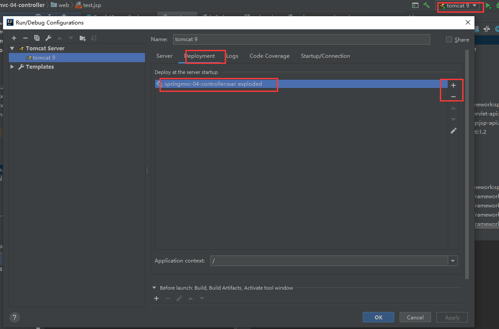
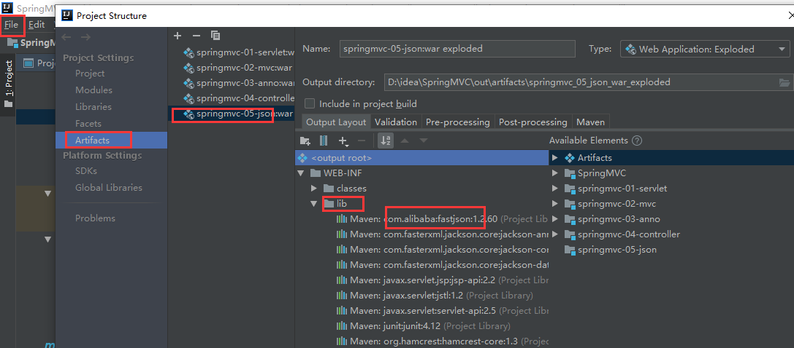
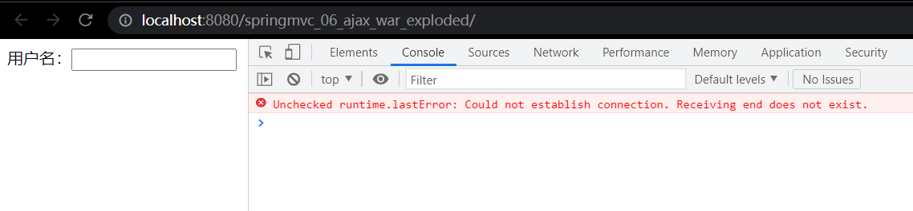

# SpringMVC

## 学习MVC方法说明

ssm

- mybatis+spring+springmvc 

java各学习阶段的特点

- javaSE：java入门，能看懂代码，什么都做不了；认真学习，老师带，入门快

- javaWeb：能懂一点企业业务的相关了；认真学习，老师带，入门快

- 框架：精简javaWeb；研究官方文档，锻炼自学能力，端丽笔记能力，锻炼项目能力 

还要学

- springMVC+（Vue）+Springboot+SpringCloud+Linux

后面SSM整合=javaWeb做项目。学SpringMVC前提掌握Spring：IOC和AOP。

重点关注

- 理论：SpringMVC的执行流程
- 实践：SSM框架整合

备注

- **狂神ssm博客[网址](https://mp.weixin.qq.com/mp/homepage?__biz=Mzg2NTAzMTExNg==&hid=3&sn=456dc4d66f0726730757e319ffdaa23e&scene=18&uin=&key=&devicetype=Windows+10+x64&version=63030073&lang=zh_CN&ascene=7&fontgear=2)**


## 回顾MVC

MVC：模型（dao，service），视图（jsp），控制器（servlet）

之前javaweb分层：

- dao：与数据库交互
- service：业务层
- servlet：转发，重定向。service和前端的一个中间连接渠道。
- jsp/html：前端展示

### 什么是MVC

#### MVC概述

- MVC是模型(Model)、视图(View)、控制器(Controller)的简写，是一种软件设计规范。
- 是将业务逻辑、数据、显示分离的方法来组织代码。
- MVC主要作用是**降低了视图与业务逻辑间的双向偶合**。
- MVC不是一种设计模式，**MVC是一种架构模式**。当然不同的MVC存在差异。

#### MVC单个解释

- Model（模型）：

  数据模型，提供要展示的数据，因此包含数据和行为，可以认为是领域模型或JavaBean组件（包含数据和行为），不过现在一般都分离开来：Value Object（数据Dao） 和 服务层（行为Service）。也就是模型提供了模型数据查询和模型数据的状态更新等功能，包括数据和业务。

- View（视图）：

  负责进行模型的展示，一般就是我们见到的用户界面，客户想看到的东西。

- Controller（控制器）：

  接收用户请求，委托给模型进行处理（状态改变），处理完毕后把返回的模型数据返回给视图，由视图负责展示。也就是说控制器做了个调度员的工作。

#### 最典型的MVC

- 就是JSP + servlet + javabean的模式。

#### MVC闭环图示


### 各种model的时代

#### Model1时代

简述：

- 在web早期的开发中，通常采用的都是Model1。
- Model1中，主要分为两层，视图层和模型层

图示：


优缺点：

- Model1优点：架构简单，比较适合小型项目开发；

- Model1缺点：JSP职责不单一，职责过重，不便于维护；

#### Model2时代

Model2把一个项目分成三部分，包括**模型（M），视图（V），控制（C）**

图示及步骤：


1. 用户发请求
2. Servlet接收请求数据，并调用对应的业务逻辑方法
3. 业务处理完毕，返回更新后的数据给servlet
4. servlet转向到JSP，由JSP来渲染页面
5. 响应给前端更新后的页面

Model2中MVC的职责分析：

- Controller：控制器

  1. 取得表单数据

  2. 调用业务逻辑

  3. 转向指定的页面

- Model：模型

  1. 业务逻辑

  2. 保存数据的状态

- View：视图

  1. 显示页面

Model2这样不仅提高的代码的复用率与项目的扩展性，且大大降低了项目的维护成本。Model 1模式的实现比较简单，适用于快速开发小规模项目，Model1中JSP页面身兼View和Controller两种角色，将控制逻辑和表现逻辑混杂在一起，从而导致代码的重用性非常低，增加了应用的扩展性和维护的难度。Model2消除了Model1的缺点。


## 回顾Servlet

实例：


新建一个Maven工程做父项目。删除父项目src，添加pom依赖。


```xml
<?xml version="1.0" encoding="UTF-8"?>
<project xmlns="http://maven.apache.org/POM/4.0.0"
         xmlns:xsi="http://www.w3.org/2001/XMLSchema-instance"
         xsi:schemaLocation="http://maven.apache.org/POM/4.0.0 http://maven.apache.org/xsd/maven-4.0.0.xsd">
    <modelVersion>4.0.0</modelVersion>

    <groupId>com.zhangyk</groupId>
    <artifactId>SpringMVC</artifactId>
    <version>1.0-SNAPSHOT</version>

    <!--导入父项目依赖-->
    <dependencies>
        <dependency>
            <groupId>junit</groupId>
            <artifactId>junit</artifactId>
            <version>4.12</version>
        </dependency>
        <dependency>
            <groupId>org.springframework</groupId>
            <artifactId>spring-webmvc</artifactId>
            <version>5.1.9.RELEASE</version>
        </dependency>
        <dependency>
            <groupId>javax.servlet</groupId>
            <artifactId>servlet-api</artifactId>
            <version>2.5</version>
        </dependency>
        <dependency>
            <groupId>javax.servlet.jsp</groupId>
            <artifactId>jsp-api</artifactId>
            <version>2.2</version>
        </dependency>
        <dependency>
            <groupId>javax.servlet</groupId>
            <artifactId>jstl</artifactId>
            <version>1.2</version>
        </dependency>
    </dependencies>

</project>
```

建立一个普通module：springmvc-01-servlet。

- 注意：不要勾选web.xml，否则web.xml可能要手动改版本。


为普通的module添加webapp框架支持


成功添加web框架支持后，子module会出现web文件夹


子项目的pom中添加servlet依赖

```xml
<?xml version="1.0" encoding="UTF-8"?>
<project xmlns="http://maven.apache.org/POM/4.0.0"
         xmlns:xsi="http://www.w3.org/2001/XMLSchema-instance"
         xsi:schemaLocation="http://maven.apache.org/POM/4.0.0 http://maven.apache.org/xsd/maven-4.0.0.xsd">
    <parent>
        <artifactId>SpringMVC</artifactId>
        <groupId>com.zhangyk</groupId>
        <version>1.0-SNAPSHOT</version>
    </parent>
    <modelVersion>4.0.0</modelVersion>

    <artifactId>springmvc-01-servlet</artifactId>

    <dependencies>
        <dependency>
            <groupId>javax.servlet</groupId>
            <artifactId>servlet-api</artifactId>
            <version>2.5</version>
        </dependency>
        <dependency>
            <groupId>javax.servlet.jsp</groupId>
            <artifactId>jsp-api</artifactId>
            <version>2.2</version>
        </dependency>
    </dependencies>


</project>
```

编写用于提交表单的form.jsp

```jsp
<%@ page contentType="text/html;charset=UTF-8" language="java" %>
<%--本form.jsp不能放到web-inf文件夹下，否则不能在弹出localhost时直接访问，而只能通过servlet转过去。--%>
<html>
<head>
    <title>Title</title>
</head>
<body>

    <form action="hello" method="post">
        <input type="text" name="method"/>
        <input type="submit"/>
    </form>

</body>
</html>
```

编写用于显示结果的test.jsp

```jsp
<%@ page contentType="text/html;charset=UTF-8" language="java" %>
<html>
<head>
    <title>Title</title>
</head>
<body>

${msg}

</body>
</html>
```

编写HelloServlet.java来处理form.jsp的数据并反馈给test.jsp显示

```java
package com.zhangyk.servlet;

import javax.servlet.ServletException;
import javax.servlet.http.HttpServlet;
import javax.servlet.http.HttpServletRequest;
import javax.servlet.http.HttpServletResponse;
import java.io.IOException;

public class HelloServlet extends HttpServlet {

    @Override
    protected void doGet(HttpServletRequest req, HttpServletResponse resp) throws ServletException, IOException {
        //1. 获取前端参数
        String method = req.getParameter("method");
        if (method.equals("add")){
            //存到session中，无论转发还是重定向都可以拿到msg的值
            req.getSession().setAttribute("msg","执行了add方法");
        }
        if (method.equals("delete")){
            req.getSession().setAttribute("msg","执行了delete方法");
        }
        //2. 调用业务层
        //没有业务
        //3. 视图转发(req.getRequestDispatcher())或者重定向(resp.sendRedirect();)
        req.getRequestDispatcher("/WEB-INF/jsp/test.jsp").forward(req,resp);
    }

    @Override
    protected void doPost(HttpServletRequest req, HttpServletResponse resp) throws ServletException, IOException {
        doGet(req, resp);
    }
}
```

在web.xml中注册编写Servlet类

```xml
<?xml version="1.0" encoding="UTF-8"?>
<web-app xmlns="http://xmlns.jcp.org/xml/ns/javaee"
         xmlns:xsi="http://www.w3.org/2001/XMLSchema-instance"
         xsi:schemaLocation="http://xmlns.jcp.org/xml/ns/javaee http://xmlns.jcp.org/xml/ns/javaee/web-app_4_0.xsd"
         version="4.0">
    
    <servlet>
        <servlet-name>hello</servlet-name>
        <servlet-class>com.zhangyk.servlet.HelloServlet</servlet-class>
    </servlet>
    <servlet-mapping>
        <servlet-name>hello</servlet-name>
        <url-pattern>/hello</url-pattern>
    </servlet-mapping>

    <!--配置session存活时间-->
    <!--<session-config>-->
        <!--<session-timeout>15</session-timeout>-->
    <!--</session-config>-->
    <!--配置欢迎页面，默认是index.jsp-->
    <!--<welcome-file-list>-->
        <!--<welcome-file>/WEB-INF/jsp/form.jsp</welcome-file>-->
    <!--</welcome-file-list>-->


</web-app>
```

添加tomcat


查看运行结果：访问http://localhost:8080/form.jsp，输入add或delete并提交后，HelloServlet会把显示内容转发（转发的话，网址不变）给test.jsp并显示


## 什么是SpringMVC

### 概述

Spring MVC是Spring Framework的一部分，是基于Java实现MVC的轻量级Web框架。

查看官方文档：https://docs.spring.io/spring/docs/5.2.0.RELEASE/spring-framework-reference/web.html#spring-web

**我们为什么要学习SpringMVC呢?**

 Spring MVC的特点：

1. 轻量级，简单易学
2. 高效 , 基于请求响应的MVC框架
3. 与Spring兼容性好，无缝结合
4. 约定优于配置
5. 功能强大：RESTful、数据验证、格式化、本地化、主题等
6. 简洁灵活

Spring的web框架围绕**DispatcherServlet** [ 调度Servlet ] 设计。

DispatcherServlet的作用是将请求分发到不同的处理器。从Spring 2.5开始，使用Java 5或者以上版本的用户可以采用基于注解形式进行开发，十分简洁；

正因为SpringMVC好 , 简单 , 便捷 , 易学 , 天生和Spring无缝集成(使用SpringIoC和Aop) , 使用约定优于配置 . 能够进行简单的junit测试 . 支持Restful风格 .异常处理 , 本地化 , 国际化 , 数据验证 , 类型转换 , 拦截器 等等......所以我们要学习 .

**最重要的一点还是用的人多 , 使用的公司多 .**


### 一个SpringMVC的初级实现

实战是用注解解决SpringMVC，不会用这种方式，不过可以作为引入看一下该项目。

自己理解：用controller代替servlet

实例：


编写web.xml，在其中注册DispatcherServlet

```xml
<?xml version="1.0" encoding="UTF-8"?>
<web-app xmlns="http://xmlns.jcp.org/xml/ns/javaee"
         xmlns:xsi="http://www.w3.org/2001/XMLSchema-instance"
         xsi:schemaLocation="http://xmlns.jcp.org/xml/ns/javaee http://xmlns.jcp.org/xml/ns/javaee/web-app_4_0.xsd"
         version="4.0">

    <!--1.注册DispatcherServlet-->
    <servlet>
        <servlet-name>springmvc</servlet-name>
        <servlet-class>org.springframework.web.servlet.DispatcherServlet</servlet-class>
        <!--关联一个springmvc的配置文件:【servlet-name】-servlet.xml-->
        <init-param>
            <param-name>contextConfigLocation</param-name>
            <param-value>classpath:springmvc-servlet.xml</param-value>
        </init-param>
        <!--启动级别-1-->
        <load-on-startup>1</load-on-startup>
    </servlet>

    <!--/ 匹配所有的（url）请求；（不包括.jsp）-->
    <!--/* 匹配所有的（url）请求；（包括.jsp）-->
    <servlet-mapping>
        <servlet-name>springmvc</servlet-name>
        <url-pattern>/</url-pattern>
    </servlet-mapping>
</web-app>
```

编写我们要操作业务Controller ，要么实现Controller接口，要么增加注解；需要返回一个ModelAndView，装数据，封视图；

```java
package com.zhangyk.controller;

import org.springframework.web.servlet.ModelAndView;
import org.springframework.web.servlet.mvc.Controller;

import javax.servlet.http.HttpServletRequest;
import javax.servlet.http.HttpServletResponse;

//注意：这里我们先导入Controller接口
public class HelloController implements Controller {

    public ModelAndView handleRequest(HttpServletRequest request, HttpServletResponse response) throws Exception {
        //ModelAndView 模型和视图
        ModelAndView mv = new ModelAndView();

        //调用业务层
        //目前无业务

        //封装对象，放在ModelAndView中。Model
        mv.addObject("msg","HelloSpringMVC!");
        //封装要跳转的视图，放在ModelAndView中
        mv.setViewName("hello"); //: /WEB-INF/jsp/hello.jsp
        return mv;
    }

}
```

编写SpringMVC 的 配置文件！名称：springmvc-servlet.xml  : [servletname]-servlet.xml。添加 处理映射器；添加 处理器适配器；添加 视图解析器；注册编写的Controller。

```xml
<?xml version="1.0" encoding="UTF-8"?>
<!--这是一个Spring配置文件，约等于之前的applicationContext.xml-->
<beans xmlns="http://www.springframework.org/schema/beans"
       xmlns:xsi="http://www.w3.org/2001/XMLSchema-instance"
       xsi:schemaLocation="http://www.springframework.org/schema/beans
       http://www.springframework.org/schema/beans/spring-beans.xsd">

    <!--下面两个bean会自动拿着输入的url去找，看Spring里有哪个controller bean能处理它-->
    <!--添加 URL处理映射器-->
    <bean class="org.springframework.web.servlet.handler.BeanNameUrlHandlerMapping"/>
    <!--添加 URL处理器适配器-->
    <bean class="org.springframework.web.servlet.mvc.SimpleControllerHandlerAdapter"/>

    <!--添加 视图解析器
    视图解析器:DispatcherServlet给他的ModelAndView
    1. 获取了modelanview的数据
    2. 解析modelandview的视图名字
    3. 拼接视图名字，找到对应的视图/WEB-INF/jsp/hello.jsp
    4. 将数据渲染到视图上-->
    <bean class="org.springframework.web.servlet.view.InternalResourceViewResolver" id="InternalResourceViewResolver">
        <!--前缀-->
        <property name="prefix" value="/WEB-INF/jsp/"/>
        <!--后缀-->
        <property name="suffix" value=".jsp"/>
    </bean>

    <!--Handler-->
    <bean id="/hello" class="com.zhangyk.controller.HelloController"/>

</beans>
```

写要跳转的jsp页面，显示ModelandView存放的数据，以及我们的正常页面；

```jsp
<%--
  Created by IntelliJ IDEA.
  User: hp
  Date: 2021/7/29
  Time: 14:56
  To change this template use File | Settings | File Templates.
--%>
<%@ page contentType="text/html;charset=UTF-8" language="java" %>
<html>
<head>
    <title>Title</title>
</head>
<body>

${msg}

</body>
</html>
```

把tomcat的artifact调整为当前artifact（删除老artifact，添加新artifact）


检查artifact的web-inf文件夹下有无lib文件夹；没有的话则新建lib文件夹，并点击“+”导入所有出现的jar包


启动tomcat，进行测试。成功显示了Controller中想让页面显示的内容。


### 中心控制器

Spring的web框架围绕DispatcherServlet设计。DispatcherServlet的作用是将请求分发到不同的处理器。从Spring 2.5开始，使用Java 5或者以上版本的用户可以采用基于注解的controller声明方式。

Spring MVC框架像许多其他MVC框架一样, **以请求为驱动** , **围绕一个中心Servlet分派请求及提供其他功能**，**DispatcherServlet是一个实际的Servlet (它继承自HttpServlet 基类)**。


SpringMVC的原理如下图所示：

当发起请求时被前置的控制器拦截到请求，根据请求参数生成代理请求，找到请求对应的实际控制器，控制器处理请求，创建数据模型，访问数据库，将模型响应给中心控制器，控制器使用模型与视图渲染视图结果，将结果返回给中心控制器，再将结果返回给请求者。


### SpringMVC执行原理


图为SpringMVC的一个较完整的流程图，实线表示SpringMVC框架提供的技术，不需要开发者实现，虚线表示需要开发者实现。

数字对应的步骤解析如下：

1. DispatcherServlet表示前置控制器，是整个SpringMVC的控制中心。用户发出请求，DispatcherServlet接收请求并拦截请求。

   我们假设请求的url为 : http://localhost:8080/SpringMVC/hello

   **如上url拆分成三部分：**

   http://localhost:8080服务器域名

   SpringMVC部署在服务器上的web站点

   hello表示控制器

   通过分析，如上url表示为：请求位于服务器localhost:8080上的SpringMVC站点的hello控制器。

2. HandlerMapping为处理器映射。DispatcherServlet调用HandlerMapping,HandlerMapping根据请求url查找Handler。

3. HandlerExecution表示具体的Handler,其主要作用是根据url查找控制器，如上url被查找控制器为：hello。

4. HandlerExecution将解析后的信息传递给DispatcherServlet,如解析控制器映射等。

5. HandlerAdapter表示处理器适配器，其按照特定的规则去执行Handler。

6. Handler让具体的Controller执行。

7. Controller将具体的执行信息返回给HandlerAdapter,如ModelAndView。

8. HandlerAdapter将视图逻辑名或模型传递给DispatcherServlet。

9. DispatcherServlet调用视图解析器(ViewResolver)来解析HandlerAdapter传递的逻辑视图名。

10. 视图解析器将解析的逻辑视图名传给DispatcherServlet。

11. DispatcherServlet根据视图解析器解析的视图结果，调用具体的视图。

12. 最终视图呈现给用户。


这里还不太明白的话，往下看，重新写一下上面的代码就明白了。


## 深入SpringMVC学习

### xml注册版实现，重写

以Spring运行顺序的方式，重写一遍上面的程序，附带注释解析

编写的时候参考下面这张图：


实例：


首先查看（父）项目中有无下面的依赖。导入依赖后正式开始编写。

```xml
<!--导入父项目依赖-->
<dependencies>
    <dependency>
        <groupId>junit</groupId>
        <artifactId>junit</artifactId>
        <version>4.12</version>
    </dependency>
    <dependency>
        <groupId>org.springframework</groupId>
        <artifactId>spring-webmvc</artifactId>
        <version>5.1.9.RELEASE</version>
    </dependency>
    <dependency>
        <groupId>javax.servlet</groupId>
        <artifactId>servlet-api</artifactId>
        <version>2.5</version>
    </dependency>
    <dependency>
        <groupId>javax.servlet.jsp</groupId>
        <artifactId>jsp-api</artifactId>
        <version>2.2</version>
    </dependency>
    <dependency>
        <groupId>javax.servlet</groupId>
        <artifactId>jstl</artifactId>
        <version>1.2</version>
    </dependency>
</dependencies>
```

用户访问的url首先会来到DispatcherServlet，在web.xml中配置Spring提供的DispatcherServlet

```xml
<?xml version="1.0" encoding="UTF-8"?>
<web-app xmlns="http://xmlns.jcp.org/xml/ns/javaee"
         xmlns:xsi="http://www.w3.org/2001/XMLSchema-instance"
         xsi:schemaLocation="http://xmlns.jcp.org/xml/ns/javaee http://xmlns.jcp.org/xml/ns/javaee/web-app_4_0.xsd"
         version="4.0">

    <!--配置dispatcherServlet：这个是SpringMVC的核心；官方名称为“前端控制器”，用于“请求分发”-->
    <servlet>
        <servlet-name>springmvc</servlet-name>
        <!--这个类是Spring帮我们写好的-->
        <servlet-class>org.springframework.web.servlet.DispatcherServlet</servlet-class>
        <!--DispatcherServlet要绑定Spring-MVC的配置文件
        Spring-MVC的配置文件其实就是Spring的配置文件，因为Spring包含了很多东西，其中就有SpringMVC-->
        <init-param>
            <param-name>contextConfigLocation</param-name>
            <!--建议以classpath（当前类的路径）写路径-->
            <param-value>classpath:springmvc-servlet.xml</param-value>
        </init-param>
        <!--启动级别：1
        系统一启动，有些内置请求就会被处理。我们想让springmvc这个servlet和服务器一起启动，就让他启动级别为1-->
        <load-on-startup>1</load-on-startup>
    </servlet>
    <!--
    在SpringMVC中，/   /*
    /:只匹配所有的请求，不会去匹配jsp页面
    /*:匹配所有的请求，包括jsp页面。可能导致无线循环。
    一般用 / 就可以
    -->
    <servlet-mapping>
        <servlet-name>springmvc</servlet-name>
        <url-pattern>/</url-pattern>
    </servlet-mapping>

</web-app>
```

在Spring配置文件中，注册Spring自带的bean，来实现 HandlerMapping，HandlerAdapter。（尚未填入viewResolver视图解析器，和自定义的Controller的bean）

```xml
<?xml version="1.0" encoding="UTF-8"?>
<!--DispatcherServlet的名字叫springmvc，然后加-servlet，即为针对某一DispatcherServlet写的Springmvc配置文件-->
<beans xmlns="http://www.springframework.org/schema/beans"
      xmlns:xsi="http://www.w3.org/2001/XMLSchema-instance"
      xsi:schemaLocation="http://www.springframework.org/schema/beans
       http://www.springframework.org/schema/beans/spring-beans.xsd">

       <!--讲原理要配置“处理器映射器”和“处理器适配器”，真实开发不需要配置这两
       “处理器映射器”和“处理器适配器”和“视图解析器”是SpringMVC的核心三要素，核心意味SpringMVC完成工作必定需要这三者
       没有这三者，SpringMVC流程图相当于断了三次，肯定运行不起来-->
       <!--处理器映射器
       由于该处理器的作用，Spring就会在bean中找url的名字，进行处理。
       比如用户访问url为/hello时，就会把请求映射为我们编写的HelloController类
       -->
       <bean class="org.springframework.web.servlet.handler.BeanNameUrlHandlerMapping"/>
       <!--处理器适配器-->
       <bean class="org.springframework.web.servlet.mvc.SimpleControllerHandlerAdapter"/>

</beans>
```

处理器映射器和处理器适配器帮忙调用了URL对应的Controller，现编写Controller

```java
package com.zhangyk.controller;

import org.springframework.web.servlet.ModelAndView;
//web mvc下的接口，要找对
import org.springframework.web.servlet.mvc.Controller;

import javax.servlet.http.HttpServletRequest;
import javax.servlet.http.HttpServletResponse;

//实现Controller接口或者应用了Controller注解的就是controller
public class HelloController implements Controller {
    public ModelAndView handleRequest(HttpServletRequest httpServletRequest, HttpServletResponse httpServletResponse) throws Exception {

        //该行写死：提供mv
        ModelAndView modelAndView = new ModelAndView();

        /*===============之间的代码按自己的需求来写=============*/
        //业务代码
        String result= "helloSpringMVC";
        modelAndView.addObject("msg",result);
        //视图跳转:设置视图(jsp)的名字即可
        modelAndView.setViewName("show");
        /*===============之间的代码按自己的需求来写=============*/

        //该行写死：提供mv
        return modelAndView;
    }
}
```

controller处理完请求后，返回视图，于是在Spring配置文件中，**需要加上视图解析器的注册**。同时应把自己编写的Controller类**注册**到Springbean中。

```xml
<?xml version="1.0" encoding="UTF-8"?>
<!--DispatcherServlet的名字叫springmvc，然后加-servlet，即为针对某一DispatcherServlet写的Springmvc配置文件-->
<beans xmlns="http://www.springframework.org/schema/beans"
      xmlns:xsi="http://www.w3.org/2001/XMLSchema-instance"
      xsi:schemaLocation="http://www.springframework.org/schema/beans
       http://www.springframework.org/schema/beans/spring-beans.xsd">

       <!--讲原理要配置“处理器映射器”和“处理器适配器”，真实开发不需要配置这两
       “处理器映射器”和“处理器适配器”和“视图解析器”是SpringMVC的核心三要素，核心意味SpringMVC完成工作必定需要这三者
       没有这三者，SpringMVC流程图相当于断了三次，肯定运行不起来-->
       <!--处理器映射器
       由于该处理器的作用，Spring就会在bean中找url的名字（beanid），进行处理。
       比如用户访问url为/hello时，就会把请求映射为我们编写的HelloController类
       -->
       <bean class="org.springframework.web.servlet.handler.BeanNameUrlHandlerMapping"/>
       <!--处理器适配器-->
       <bean class="org.springframework.web.servlet.mvc.SimpleControllerHandlerAdapter"/>
       <!--视图解析器:模板引擎Thymeleaf  Freemarker...。这里我们用Spring的视图解析器。
       也就是说下面到的类可以变，我们甚至可以用自己定义的视图解析器-->
       <bean class="org.springframework.web.servlet.view.InternalResourceViewResolver" id="internalResourceViewResolver">
              <!--
              联想：前缀后缀在Mybatis的trim那使用过
              这里前缀后缀的作用：我们不需要知道jsp文件的路径，只需要知道需要使用的jsp显示文件的名字即可。因为路径已经配置好了-->
              <!--前缀-->
              <property name="prefix" value="WEB-INF/jsp/"/>
              <!--后缀-->
              <property name="suffix" value=".jsp"/>
       </bean>

       <!--BeanNameUrlHandlerMapping：bean   这里我看教程可以用name代替id，说明name和id指示url都可以-->
       <bean id="/hello" class="com.zhangyk.controller.HelloController"/>
</beans>
```

编写jsp(视图)用于视图显示。jsp的名字已被规定了，纯洁名为“show”（Controller中设置的），完整名为“WEB-INF/jsp/show.jsp"（Spring配置文件中，视图解析器定义的prefix和suffix）。

```jsp
<%@ page contentType="text/html;charset=UTF-8" language="java" %>
<html>
<head>
    <title>Title</title>
</head>
<body>

${msg}

</body>
</html>
```

至此，程序声明周期编写完整。启动tomcat进行测试。运行成功。


说明：

- 实现接口controller定义控制器是较老的方法
- 缺点是：一个控制器中只有一个方法，如果要多个方法则需要定义多个Controller；定义的方式比较麻烦。

原理讲解完成，接下来学习实战中常用的，更简洁的注解方式实现MVC。


### 注解开发SpringMVC

#### 实例


直接在父项目与pom中引入依赖，和进行打包设置

```xml
<?xml version="1.0" encoding="UTF-8"?>
<project xmlns="http://maven.apache.org/POM/4.0.0"
         xmlns:xsi="http://www.w3.org/2001/XMLSchema-instance"
         xsi:schemaLocation="http://maven.apache.org/POM/4.0.0 http://maven.apache.org/xsd/maven-4.0.0.xsd">
    <modelVersion>4.0.0</modelVersion>

    <groupId>com.zhangyk</groupId>
    <artifactId>SpringMVC</artifactId>
    <packaging>pom</packaging>
    <version>1.0-SNAPSHOT</version>
    <modules>
        <module>springmvc-01-servlet</module>
        <module>springmvc-02-mvc</module>
        <module>springmvc-03-anno</module>
    </modules>

    <!--导入父项目依赖-->
    <dependencies>
        <dependency>
            <groupId>junit</groupId>
            <artifactId>junit</artifactId>
            <version>4.12</version>
        </dependency>
        <dependency>
            <groupId>org.springframework</groupId>
            <artifactId>spring-webmvc</artifactId>
            <version>5.1.9.RELEASE</version>
        </dependency>
        <dependency>
            <groupId>javax.servlet</groupId>
            <artifactId>servlet-api</artifactId>
            <version>2.5</version>
        </dependency>
        <dependency>
            <groupId>javax.servlet.jsp</groupId>
            <artifactId>jsp-api</artifactId>
            <version>2.2</version>
        </dependency>
        <dependency>
            <groupId>javax.servlet</groupId>
            <artifactId>jstl</artifactId>
            <version>1.2</version>
        </dependency>
    </dependencies>

    <build>
        <resources>
            <resource>
                <directory>src/main/java</directory>
                <includes>
                    <include>**/*.properties</include>
                    <include>**/*.xml</include>
                </includes>
                <filtering>false</filtering>
            </resource>
            <resource>
                <directory>src/main/resources</directory>
                <includes>
                    <include>**/*.properties</include>
                    <include>**/*.xml</include>
                </includes>
                <filtering>false</filtering>
            </resource>
        </resources>
    </build>

</project>
```

为原始项目添加web的支持。（图片借用了springmvc-01的图）


确认web-inf文件夹下有lib包。没有则手动建文件夹，并导入jar包


配置web.xml

注意点：

- web.xml的版本问题，需要用最新版（4.0）

- 注册DispatcherServlet
- 关联SpringMVC的配置文件
- 启动级别为1
- 映射路径为 / 【不要用/*, 会404】

```xml
<?xml version="1.0" encoding="UTF-8"?>
<web-app xmlns="http://xmlns.jcp.org/xml/ns/javaee"
         xmlns:xsi="http://www.w3.org/2001/XMLSchema-instance"
         xsi:schemaLocation="http://xmlns.jcp.org/xml/ns/javaee http://xmlns.jcp.org/xml/ns/javaee/web-app_4_0.xsd"
         version="4.0">

    <!--1.注册servlet-->
    <servlet>
        <servlet-name>SpringMVC</servlet-name>
        <servlet-class>org.springframework.web.servlet.DispatcherServlet</servlet-class>
        <!--通过初始化参数指定SpringMVC配置文件的位置，进行关联-->
        <init-param>
            <param-name>contextConfigLocation</param-name>
            <param-value>classpath:springmvc-servlet.xml</param-value>
        </init-param>
        <!-- 启动顺序，数字越小，启动越早 -->
        <load-on-startup>1</load-on-startup>
    </servlet>

    <!--所有请求都会被springmvc拦截 -->
    <servlet-mapping>
        <servlet-name>SpringMVC</servlet-name>
        <url-pattern>/</url-pattern>
    </servlet-mapping>

</web-app>
```

添加SpringMVC配置文件

要点：

- 让ioc直接生效，即设置自动扫描包的功能
- 静态资源过滤：html，js，css，图片，视频。。
- MVC注解驱动
- 配置视图解析器
- 视图安全：在视图解析器中，我们把所有的视图都放在/web-inf/目录下，这样可以保证视图安全，因为这个目录下的文件，客户端不能直接访问

```xml
<?xml version="1.0" encoding="UTF-8"?>
<beans xmlns="http://www.springframework.org/schema/beans"
       xmlns:xsi="http://www.w3.org/2001/XMLSchema-instance"
       xmlns:context="http://www.springframework.org/schema/context"
       xmlns:mvc="http://www.springframework.org/schema/mvc"
       xsi:schemaLocation="http://www.springframework.org/schema/beans
       http://www.springframework.org/schema/beans/spring-beans.xsd
       http://www.springframework.org/schema/context
       https://www.springframework.org/schema/context/spring-context.xsd
       http://www.springframework.org/schema/mvc
       https://www.springframework.org/schema/mvc/spring-mvc.xsd">

    <!-- 自动扫描包，让指定包下的注解生效,由IOC容器统一管理
    在指定包下的所有注解会生效-->
    <context:component-scan base-package="com.zhangyk.controller"/>

    <!--===========以下代码是死的===========-->
    <!-- 让Spring MVC不处理静态资源
    如.css .js .html .mp3 .mp4 等资源如果也走视图解析器会有问题，所以过滤掉。添加下面这一行代码就可以了。-->
    <mvc:default-servlet-handler />
    <!--
    支持mvc注解驱动
        在spring中一般采用@RequestMapping注解来完成映射关系
        要想使@RequestMapping注解生效
        必须向上下文中注册DefaultAnnotationHandlerMapping（处理器映射器）
        和一个AnnotationMethodHandlerAdapter（处理器适配器）实例
        这两个实例分别在类级别和方法级别处理。
        而annotation-driven配置帮助我们自动完成上述两个实例的注入。
     -->
    <mvc:annotation-driven />
    <!-- 视图解析器 -->
    <bean class="org.springframework.web.servlet.view.InternalResourceViewResolver"
          id="internalResourceViewResolver">
        <!--！！！在视图解析器中，我们把所有的视图都放在/web-inf/目录下，这样可以保证视图安全，因为这个目录下的文件，客户端不能直接访问-->
        <!-- 前缀 -->
        <property name="prefix" value="/WEB-INF/jsp/" />
        <!-- 后缀 -->
        <property name="suffix" value=".jsp" />
    </bean>
    <!--===========以上代码是死的===========-->

</beans>
```

创建Controller

```java
package com.zhangyk.controller;

import org.springframework.stereotype.Controller;
import org.springframework.ui.Model;
import org.springframework.web.bind.annotation.RequestMapping;
import org.springframework.web.bind.annotation.RestController;

/*
正常开发不实现接口，而用注解实现:方法+注解跳转到页面，不用像servlet那么写。

@controller代表这个类会被Spring接管，被这个注解的类中的所有方法，如果返回值是String，并且有具体页面可以跳转，那么就会被视图解析器解析。
*/
@Controller
/*
@RequestMapping可以用在类上和方法上。但是一般都只在方法上写，写死有助于我们排查问题。
不过也有用处，比如可以在两个controller类上分别注解/admin 和 /visitor。这样两个controller分别负责管理员和游客的访问，且有明确的url映射区别。
*/
@RequestMapping("/hello")
/*
如果一个类加上@RestController,这个类就不会被视图解析器解析，类中方法返回的就直接是个字符串。以后传json的时候会用上这个注解
@RestController
*/
//!!!原来三个url的处理可能需要三个servlet，现在我们只需要在HelloController类中写三个方法就行
public class HelloController {

    /*
    url怎么请求过来?:用注解@RequestMapping。
    方法的真实路径是类上@RequestMapping和方法上@RequestMapping设置的url的拼接.如下面方法的全路径应该是 //localhost:8080/hello/h1
    */
    @RequestMapping("/h1")
    public String hello(Model model){
        //封装数据：向模型中添加属性msg与值，可以在jsp页面取出并渲染
        model.addAttribute("msg","Hello, SpringMVCAnnotation");

        /*返回的字符串就是视图（jsp）的名字。hello会被视图解析器处理。idea中ctrl+点击“hello”可以直接跳到hello.jsp
        SpringMVC中设置了视图的前缀后缀，所以完整的视图路径为：//web-inf/jsp/hello.jsp
        */
        return "hello";
    }
}
```

编写视图hello.jsp

```jsp
<%--
  Created by IntelliJ IDEA.
  User: hp
  Date: 2021/7/30
  Time: 17:01
  To change this template use File | Settings | File Templates.
--%>
<%@ page contentType="text/html;charset=UTF-8" language="java" %>
<html>
<head>
    <title>Title</title>
</head>
<body>

${msg}

</body>
</html>
```

配置tomcat


启动tomcat测试。成功显示Controller中设置的文字。


#### 小结

步骤其实非常简单

1. （固定步骤）新建一个web项目
2. （固定步骤）导入相关jar包
3. （固定步骤）编写web.xml，注册DispatcherServlet
4. （固定步骤）编写SpringMVC配置文件
5. （自己diy）接下来就是创建对应的控制类：controller
6. （自己diy）最后完善前端视图和controller之间的对应
7. （固定步骤）测试运行调试


SpringMVC必须配置的三大件：**处理器映射器**（<mvc:annotation-driven />搞定），**处理器适配器**（<mvc:annotation-driven />搞定），**视图解析器**（自己配置）。

通常我们只需要**手动配置视图解析器**，而**处理器映射器**和**处理器适配器**只需要开启**注解驱动**即可，省去了大段的xml配置。


### Controller配置总结

#### @Controller同义的几个注解

下面四个注解等效，就代表被注解的元素是一个组件。

- @Component   通用
- @Service   特定用于业务层
- @Controller    特定用于控制层
- @Repository    特定用于DAO层

#### 控制器和视图的关系

可以做到不容url请求，对应Controller中的不同方法，不同方法又指向一个视图。这样页面结果是不一样的。这里可以看出视图是可以被复用的，而控制器和视图之间是弱耦合关系。


## RestFul和控制器

23:02 地址栏一样，通过提交方式不同可以产生不同效果。

restful风格最大好处：安全，不会暴露变量的值

- 简洁
- 高效：支持缓存 


### RestFul简介

#### 概念

Restful就是一个资源定位及资源操作的风格。不是标准也不是协议，只是一种风格。基于这个风格设计的软件可以更简洁，更有层次，更易于实现缓存等机制。

#### 功能

资源：互联网所有的事物都可以被抽象为资源

资源操作：使用POST、DELETE、PUT、GET，使用不同方法对资源进行操作。

分别对应 添加、 删除、修改、查询。

#### 传统方式操作资源  

通过不同的参数来实现不同的效果！方法单一，post 和 get

​	http://127.0.0.1/item/queryItem.action?id=1 查询,GET

​	http://127.0.0.1/item/saveItem.action 新增,POST

​	http://127.0.0.1/item/updateItem.action 更新,POST

​	http://127.0.0.1/item/deleteItem.action?id=1 删除,GET或POST

#### 使用RESTful操作资源 

可以通过不同的请求方式，请求同一url，来实现不同的效果！如下：请求地址一样，但是功能可以不同！

​	http://127.0.0.1/item/1 查询,GET

​	http://127.0.0.1/item 新增,POST

​	http://127.0.0.1/item 更新,PUT

​	http://127.0.0.1/item/1 删除,DELETE

### 实例


【非本节关注重点】确认父项目中导入了依赖

```xml
<?xml version="1.0" encoding="UTF-8"?>
<project xmlns="http://maven.apache.org/POM/4.0.0"
         xmlns:xsi="http://www.w3.org/2001/XMLSchema-instance"
         xsi:schemaLocation="http://maven.apache.org/POM/4.0.0 http://maven.apache.org/xsd/maven-4.0.0.xsd">
    <modelVersion>4.0.0</modelVersion>

    <groupId>com.zhangyk</groupId>
    <artifactId>SpringMVC</artifactId>
    <packaging>pom</packaging>
    <version>1.0-SNAPSHOT</version>
    <modules>
        <module>springmvc-01-servlet</module>
        <module>springmvc-02-mvc</module>
        <module>springmvc-03-anno</module>
        <module>springmvc-04-controller</module>
    </modules>

    <!--导入父项目依赖-->
    <dependencies>
        <dependency>
            <groupId>junit</groupId>
            <artifactId>junit</artifactId>
            <version>4.12</version>
        </dependency>
        <dependency>
            <groupId>org.springframework</groupId>
            <artifactId>spring-webmvc</artifactId>
            <version>5.1.9.RELEASE</version>
        </dependency>
        <dependency>
            <groupId>javax.servlet</groupId>
            <artifactId>servlet-api</artifactId>
            <version>2.5</version>
        </dependency>
        <dependency>
            <groupId>javax.servlet.jsp</groupId>
            <artifactId>jsp-api</artifactId>
            <version>2.2</version>
        </dependency>
        <dependency>
            <groupId>javax.servlet</groupId>
            <artifactId>jstl</artifactId>
            <version>1.2</version>
        </dependency>
    </dependencies>

    <build>
        <resources>
            <resource>
                <directory>src/main/java</directory>
                <includes>
                    <include>**/*.properties</include>
                    <include>**/*.xml</include>
                </includes>
                <filtering>false</filtering>
            </resource>
            <resource>
                <directory>src/main/resources</directory>
                <includes>
                    <include>**/*.properties</include>
                    <include>**/*.xml</include>
                </includes>
                <filtering>false</filtering>
            </resource>
        </resources>
    </build>

</project>
```

【非本节关注重点】确认lib包存在


【非本节关注重点】编写SpringMVC配置文件

```xml
<?xml version="1.0" encoding="UTF-8"?>
<beans xmlns="http://www.springframework.org/schema/beans"
       xmlns:xsi="http://www.w3.org/2001/XMLSchema-instance"
       xmlns:context="http://www.springframework.org/schema/context"
       xmlns:mvc="http://www.springframework.org/schema/mvc"
       xsi:schemaLocation="http://www.springframework.org/schema/beans
       http://www.springframework.org/schema/beans/spring-beans.xsd
       http://www.springframework.org/schema/context
       https://www.springframework.org/schema/context/spring-context.xsd
       http://www.springframework.org/schema/mvc
       https://www.springframework.org/schema/mvc/spring-mvc.xsd">

    <!-- 自动扫描包，让指定包下的注解生效,由IOC容器统一管理
    在指定包下的所有注解会生效-->
    <context:component-scan base-package="com.zhangyk.controller"/>

    <!--===========以下代码是死的===========-->
    <!-- 让Spring MVC不处理静态资源
    如.css .js .html .mp3 .mp4 等资源如果也走视图解析器会有问题，所以过滤掉。添加下面这一行代码就可以了。-->
    <mvc:default-servlet-handler />
    <!--
    支持mvc注解驱动
        在spring中一般采用@RequestMapping注解来完成映射关系
        要想使@RequestMapping注解生效
        必须向上下文中注册DefaultAnnotationHandlerMapping（处理器映射器）
        和一个AnnotationMethodHandlerAdapter（处理器适配器）实例
        这两个实例分别在类级别和方法级别处理。
        而annotation-driven配置帮助我们自动完成上述两个实例的注入。
     -->
    <mvc:annotation-driven />
    <!-- 视图解析器 -->
    <bean class="org.springframework.web.servlet.view.InternalResourceViewResolver"
          id="internalResourceViewResolver">
        <!-- 前缀 -->
        <property name="prefix" value="/WEB-INF/jsp/" />
        <!-- 后缀 -->
        <property name="suffix" value=".jsp" />
    </bean>
    <!--===========以上代码是死的===========-->

</beans>
```

【非本节关注重点】编写web.xml

```xml
<?xml version="1.0" encoding="UTF-8"?>
<web-app xmlns="http://xmlns.jcp.org/xml/ns/javaee"
         xmlns:xsi="http://www.w3.org/2001/XMLSchema-instance"
         xsi:schemaLocation="http://xmlns.jcp.org/xml/ns/javaee http://xmlns.jcp.org/xml/ns/javaee/web-app_4_0.xsd"
         version="4.0">

    <!--1.注册servlet-->
    <servlet>
        <servlet-name>SpringMVC</servlet-name>
        <servlet-class>org.springframework.web.servlet.DispatcherServlet</servlet-class>
        <!--通过初始化参数指定SpringMVC配置文件的位置，进行关联-->
        <init-param>
            <param-name>contextConfigLocation</param-name>
            <param-value>classpath:springmvc-servlet.xml</param-value>
        </init-param>
        <!-- 启动顺序，数字越小，启动越早 -->
        <load-on-startup>1</load-on-startup>
    </servlet>

    <!--所有请求都会被springmvc拦截 -->
    <servlet-mapping>
        <servlet-name>SpringMVC</servlet-name>
        <url-pattern>/</url-pattern>
    </servlet-mapping>

</web-app>
```

编写使用post方式请求的jsp文件，从而可以测试Post提交方式

```jsp
<%--
  Created by IntelliJ IDEA.
  User: hp
  Date: 2021/7/31
  Time: 19:49
  To change this template use File | Settings | File Templates.
--%>
<%@ page contentType="text/html;charset=UTF-8" language="java" %>
<html>
<head>
    <title>Title</title>
</head>
<body>

<form action="/add/1/2" method="post">
    <input type="submit"/>
</form>

</body>
</html>
```

【本节重点】使用restful风格的controller

```java
package com.zhangyk.controller;

import org.springframework.stereotype.Controller;
import org.springframework.ui.Model;
import org.springframework.web.bind.annotation.GetMapping;
import org.springframework.web.bind.annotation.PathVariable;
import org.springframework.web.bind.annotation.RequestMapping;
import org.springframework.web.bind.annotation.RequestMethod;

@Controller
public class RestfulController {

    /*
    * 原来的给参访问方式： http://localhost:8080/springmvc_04_controller_war_exploded/add?a=2&b=3
    * restful风格下： http://localhost:8080/springmvc_04_controller_war_exploded/add/a的值/b的值
    * testful下，注意传入a和b的类型要和方法中定义的类型一致，否则会报400错误
    *
    * @RequestMapping的value和path属性互为别名，用法相同
    *
    * 使用Post方法访问add/a/b会使用该方法
    * */
    @RequestMapping(value="/add/{a}/{b}", method = RequestMethod.POST)
    public String test1(@PathVariable int a, @PathVariable int b, Model model){

        model.addAttribute("msg","使用Post结果为"+(a+b));
        return "hello";
    }

    /*
    * @GetMapping(value="/add/{a}/{b}")等效于@RequestMapping(value="/add/{a}/{b}", method = RequestMethod.GET)
    * 但是GetMapping更简洁，一般用这种方法。
    *
    * 使用Get方法访问add/a/b会使用该方法
    *
    * 浏览器访问URL默认使用的就是Get方法
    * */
    @GetMapping(value="/add/{a}/{b}")
    public String test2(@PathVariable int a, @PathVariable int b, Model model){

        model.addAttribute("msg","使用Get结果为"+(a+b));
        return "hello";
    }


}
```

编写jsp视图

```jsp
<%@ page contentType="text/html;charset=UTF-8" language="java" %>
<html>
<head>
    <title>Title</title>
</head>
<body>

${msg}

</body>
</html>
```

确认tomcat的artifact设置好了



启动tomcat测试：成功

利用test.jsp实现post请求Controller，测试post方法访问 add/a的值/b的值 的结果


在post结果页面直接原地回车，重新访问url，这回是浏览器默认请求方式GET，去映射Controller


#### 思考使用路径变量的好处

1. - 使路径变得更加简洁；
   - 获得参数更加方便，框架会自动进行类型转换。
   - 通过路径变量的类型可以约束访问参数，如果类型不一样，则访问不到对应的请求方法。如，这里设置的两个参数的类型都是int，而这里访问是的路径是/commit/1/a，则路径与方法不匹配，而不会是参数转换失败。因为第二个参数提供了字符，而不是整数。


#### 扩展：小黄鸭调试法

场景一：*我们都有过向别人（甚至可能向完全不会编程的人）提问及解释编程问题的经历，但是很多时候就在我们解释的过程中自己却想到了问题的解决方案，然后对方却一脸茫然。*

场景二：你的同行跑来问你一个问题，但是当他自己把问题说完，或说到一半的时候就想出答案走了，留下一脸茫然的你。

其实上面两种场景现象就是所谓的小黄鸭调试法（Rubber Duck Debuging），又称橡皮鸭调试法，它是我们软件工程中最常使用调试方法之一。


此概念据说来自《程序员修炼之道》书中的一个故事，传说程序大师随身携带一只小黄鸭，在调试代码的时候会在桌上放上这只小黄鸭，然后详细地向鸭子解释每行代码，然后很快就将问题定位修复了


### 小结

Spring MVC 的 @RequestMapping 注解能够处理 HTTP 请求的方法, 比如 GET, PUT, POST, DELETE 以及 PATCH。

**所有的地址栏请求默认都会是 HTTP GET 类型的。**

方法级别的注解变体有如下几个：组合注解

```
@GetMapping
@PostMapping
@PutMapping
@DeleteMapping
@PatchMapping
```

@GetMapping 是一个组合注解，平时使用的会比较多！

它所扮演的是 @RequestMapping(method =RequestMethod.GET) 的一个快捷方式。


## 数据处理及跳转

### 结果跳转方式

#### ModelAndView

设置ModelAndView对象 , 根据view的名称 , 和视图解析器跳到指定的页面 .

页面 : {视图解析器前缀} + viewName +{视图解析器后缀}

```xml
<!-- 视图解析器 -->
<bean class="org.springframework.web.servlet.view.InternalResourceViewResolver"
     id="internalResourceViewResolver">
   <!-- 前缀 -->
   <property name="prefix" value="/WEB-INF/jsp/" />
   <!-- 后缀 -->
   <property name="suffix" value=".jsp" />
</bean>
```

对应的controller类（这是实现接口的方式，我们一般用注解的方式实现controller）

```java
public class ControllerTest1 implements Controller {

   public ModelAndView handleRequest(HttpServletRequest httpServletRequest, HttpServletResponse httpServletResponse) throws Exception {
       //返回一个模型视图对象
       ModelAndView mv = new ModelAndView();
       mv.addObject("msg","ControllerTest1");
       mv.setViewName("test");
       return mv;
  }
}
```

前面一直在用modelandview跳转，这里就不赘述了。


### ServletAPI

一般都通过modelandview来做跳转。脑子瓦特了才会用servlet。不过这里介绍一下，有助于了解原理。


通过设置ServletAPI , 不需要视图解析器 .

1、通过HttpServletResponse进行输出

2、通过HttpServletResponse实现重定向

3、通过HttpServletResponse实现转发


因为控制器用实现Controller接口的方式实现时，可以看到controller接口继承了servlet接口。而用@controller注解和实现controller接口，本质一样。所以我们可以在controller中调用servlet特有的request和response。

实例：

只写核心的controller，其余部分如pom，web.xml同上

```java
package com.zhangyk.controller;

import org.springframework.stereotype.Controller;
import org.springframework.web.bind.annotation.RequestMapping;

import javax.servlet.http.HttpServletRequest;
import javax.servlet.http.HttpServletResponse;

@Controller
public class ModelTest1 {

    @RequestMapping("/m1/t1")
    public String test(HttpServletRequest request, HttpServletResponse response){
        System.out.println(request.getSession().getId());

        return "hello";

    }
}
```

访问controller


控制台打印了sessionid，说明成功使用了servelt特有的request


### SpringMVC转发和重定向

#### 无需视图解析器

测试前，需要将SpringMVC配置文件中的视图解析器注释掉

编写controller

```java
package com.zhangyk.controller;

import org.springframework.stereotype.Controller;
import org.springframework.ui.Model;
import org.springframework.web.bind.annotation.RequestMapping;

import javax.servlet.http.HttpServletRequest;
import javax.servlet.http.HttpServletResponse;

@Controller
public class ModelTest1 {

    //转发
    @RequestMapping("/m1/t1")
    public String test1(Model model){
        /*
        * Model 对象负责在控制器和展现数据的视图之间传递数据。
        * 实际上，放到 Model 属性中的数据将会复制到 Servlet Response 的属性中，这样视图就能在这里找到它们了。
        * 从广义上来说，Model 指的是 MVC 中的 M，即 Model(模型)。从狭义上讲，Model 就是个 key-value 集合。
        * 来源：https://www.cnblogs.com/youcoding/p/13763621.html
        * */
        model.addAttribute("msg","forward：ModelTest1");

        /*下面等同于：显示的使用forward前缀：return "forward：/WEB-INF/jsp/hello.jsp";
        *
        * 不需要视图解析器的话，需要写全路径。虽然功能也能实现，但是不推荐这样。推荐在SpringMVC中配置视图解析器，并
        * 配置前缀后缀，这样更规范。
        * */
        return "/WEB-INF/jsp/hello.jsp";
    }

    //重定向
    @RequestMapping("/m1/t2")
    public String test2(Model model){
        /*
        * Model 对象负责在控制器和展现数据的视图之间传递数据。
        * 实际上，放到 Model 属性中的数据将会复制到 Servlet Response 的属性中，这样视图就能在这里找到它们了。
        * 从广义上来说，Model 指的是 MVC 中的 M，即 Model(模型)。从狭义上讲，Model 就是个 key-value 集合。
        * 来源：https://www.cnblogs.com/youcoding/p/13763621.html
        * */
        model.addAttribute("msg","redirect：ModelTest1");

        /*jsp文件夹在web-inf下，是隐秘的，重定向访问不到的（转发可以），会报404。重定向只等定向到web文件夹下的jsp文件。
        *
        * 如果忘记斜杠，写成 return "redirect:index.jsp"; 会重定向到http://localhost:8080/m1/index.jsp?msg=ModelTest1
        * 这就成了以m1为基础重定向，就错了。
        *
        * 如果开启了视图解析器，也不会拼接；因为转发才会触发视图解析器拼接，重定向不会触发（已自己开启视图验证了）。
        * 开启视图时，默认就是转发；如果想重定向，需要在return处显式得加上redirect
        * */
        return "redirect:/index.jsp";
    }
}
```

查看测试结果，都成功了。


先测试转发


再测试重定向


#### 使用视图解析器

对转发：

- 可以在SpringMVC配置文件中，设置视图解析器的位置，设置前缀后缀，这样conroller中写return的时候就不用写完整路径。比如上例写个hello即可，而非/WEB-INF/jsp/hello.jsp
- 其余使用方法一致

重定向：

- 使用视图解析器对重定向没有影响，因为只有转发才触发视图解析器（拼接）。


### 数据处理

#### 处理提交数据

提交数据时，主要有两种情形：1. 传值，2. 传对象。下面通过代码讲解，解释在注释里。

实例：

编写被传输的类

```java
package com.zhangyk.pojo;

public class User {
    private int id;
    private String name;
    private int age;

    public User() {
    }

    public User(int id, String name, int age) {
        this.id = id;
        this.name = name;
        this.age = age;
    }

    public int getId() {
        return id;
    }

    public void setId(int id) {
        this.id = id;
    }

    public String getName() {
        return name;
    }

    public void setName(String name) {
        this.name = name;
    }

    public int getAge() {
        return age;
    }

    public void setAge(int age) {
        this.age = age;
    }

    @Override
    public String toString() {
        return "User{" +
                "id=" + id +
                ", name='" + name + '\'' +
                ", age=" + age +
                '}';
    }
}
```

编写控制器

```java
package com.zhangyk.controller;

import com.zhangyk.pojo.User;
import org.springframework.stereotype.Controller;
import org.springframework.ui.Model;
import org.springframework.ui.ModelMap;
import org.springframework.web.bind.annotation.GetMapping;
import org.springframework.web.bind.annotation.RequestMapping;
import org.springframework.web.bind.annotation.RequestParam;

@Controller
@RequestMapping("/user")
public class UserController {
    /*接收前端参数的内部流程：
     * 1. 接收前端用户传递的参数，判断参数的名字，假设名字直接在方法上，可以直接使用
     * 2. 假设传递的是一个对象User（通过方法的参数已知为对象），匹配User对象中的字段名：如果名字一致则ok，否则匹配不到
     * */

    //从前端接收一个参数：http://localhost:8080/user/t1?username=zhangyk
    @GetMapping("/t1")
    /*
    * 如果url中域名称和处理方法的参数名不一致，那么就应该用@RequestParam("域名称")来绑定域名称和处理方法的参数
    *
    * 如果url中域名称和处理方法的参数名一致，那么系统自动识别参数并绑定。但是要从前端接收参数时，
    * 推荐总是使用@RequestParam("username")注解，因为这会提醒程序员，要从前端接收该参数；
    * 否则程序员看后端代码不容易看出来方法参数到底要不要从前端接收。
    *
    * 其实用restful风格也可以避免所谓“url中域名称和处理方法的参数名不一致”的问题
    * */
    public String test1(@RequestParam("username") String name, Model model){
        /*1. 接收前端参数。通过String name可以接收。比如前段get方法传参：//localhost:8080/user/t1?name=xxx;
        * 不需要像servlet中用request.getparam()拿前端参数了，这就是SpringMVC的优秀之处（跨框架的魅力）
        * */
        System.out.println("接收到前端的参数为："+name);

        /*2. 将返回的结果传回前段，用model
        * */
        model.addAttribute("msg","name:"+name);

        /*3. 跳转视图
        * */
        return "hello";
    }

    //从前端接收到的是一个对象：id，name，age;http://localhost:8080/user/t2?name=zhangyk&id=1&age=22
    @GetMapping("/t2")
    /*如果接收的是一个对象的话，不需要用最笨的方法即在方法的参数区写上一个个的参数，直接写被传的对象即可
    * 不过这里要保证域名和对象中的参数名严格一致，否则接收不到名字不匹配的参数
    * */
    public String test2(User user, Model model){
        //1. 从前端接收到参数，在控制台打印
        System.out.println("接收到前端的参数为："+user);

        //2. 将返回的结果传回前段，用model
        model.addAttribute("msg","name:"+user.toString());

        //3. 跳转视图
        return "hello";
    }

}
```

启动tomcat测试


测试从前端往controller传一个值，成功


测试从前端往controller传一个对象，成功


#### 数据显示到前端

简述：

* 给前端返回可以用ModelAndView（接口实现Controller中用过），Model（注解实现Controller中用过），还可以用ModelMap
* 继承上：linkedhashmap-》modelMap-》model
  - linkedhashmap
  - modelMap：继承了linkedhashmap，所以他拥有linkedhashmap的全部功能
  - model：精简版（大部分情况，我们都直接用model）
* 具体代码就不写了

对比：

就对于新手而言简单来说使用区别就是：

```
Model 只有寥寥几个方法只适合用于储存数据，简化了新手对于Model对象的操作和理解；

ModelMap 继承了 LinkedMap ，除了实现了自身的一些方法，同样的继承 LinkedMap 的方法和特性；

ModelAndView 可以在储存数据的同时，可以进行设置返回的逻辑视图，进行控制展示层的跳转。（用于接口实现controller，基本不用）
```

当然更多的以后开发考虑的更多的是性能和优化，就不能单单仅限于此的了解。

**请使用80%的时间打好扎实的基础，剩下18%的时间研究框架，2%的时间去学点英文，框架的官方文档永远是最好的教程。**


### 乱码问题

实例：

编写一个用于提交表单的jsp

```jsp
<%--
  Created by IntelliJ IDEA.
  User: hp
  Date: 2021/8/1
  Time: 20:21
  To change this template use File | Settings | File Templates.
--%>
<%@ page contentType="text/html;charset=UTF-8" language="java" %>
<html>
<head>
    <title>Title</title>
</head>
<body>
<form action="/e/t1" method="post">
    <input type="text" name="name">
    <input type="submit">
</form>
</body>
</html>
```

编写处理表单提交数据的Controller，让数据在hello.jsp展示

```java
package com.zhangyk.controller;

import org.springframework.stereotype.Controller;
import org.springframework.ui.Model;
import org.springframework.web.bind.annotation.PostMapping;

@Controller
public class EncodingController {

    //过滤器解决乱码

    //由于表单的提交方式是Post，这里得用postmapping去处理url路径，否则url请求映射不到该方法。
    @PostMapping("/e/t1")
    public String test1(String name, Model model){
        //form表单提交的name被存入model，model被反给前端hello.jsp显示
        model.addAttribute("msg","form表单提交的是："+name);
        return "hello";
    }
}
```

编写展示视图 hello.jsp

```jsp
<%@ page contentType="text/html;charset=UTF-8" language="java" %>
<html>
<head>
    <title>Title</title>
</head>
<body>

${msg}

</body>
</html>
```

直接运行tomcat，在表单中输入中文提交，hello.jsp视图的显示会有乱码。有三种解决方式：

#### 自定义filter

可以解决一些简单问题，不过一般直接用Spring自带的过滤器。

编写fileter类

```java
package com.zhangyk.filter;

import javax.servlet.*;
import java.io.IOException;

public class EncodingFilter implements Filter {
    public void init(FilterConfig filterConfig) throws ServletException {

    }

    public void doFilter(ServletRequest request, ServletResponse response, FilterChain chain) throws IOException, ServletException {

        request.setCharacterEncoding("utf-8");
        response.setCharacterEncoding("utf-8");

        chain.doFilter(request,response);
    }

    public void destroy() {

    }
}
```

在web.xml中注册过滤器

```xml
<filter>
    <filter-name>encoding</filter-name>
    <filter-class>com.zhangyk.filter.EncodingFilter</filter-class>
</filter>
<filter-mapping>
    <filter-name>encoding</filter-name>
    <!--/表示过滤所有请求
    / 不会滤出jsp的数据，进行处理
    /* 会滤出来自jsp的数据，进行处理
    由于中文信息有form.jsp传来，所以要用/*,否则过滤器不起作用
    -->
    <url-pattern>/*</url-pattern>
</filter-mapping>
```

#### 使用Spring自带的过滤器

【最常用】

不需要自己编写过滤器类，只用在web.xml中注册使用下Spring的默认过滤器即可

```xml
<filter>
   <filter-name>encoding</filter-name>
   <filter-class>org.springframework.web.filter.CharacterEncodingFilter</filter-class>
   <init-param>
       <param-name>encoding</param-name>
       <param-value>utf-8</param-value>
   </init-param>
</filter>
<filter-mapping>
   <filter-name>encoding</filter-name>
   <!--/表示过滤所有请求
    / 不会滤出jsp的数据，进行处理
    /* 会滤出来自jsp的数据，进行处理
    由于中文信息有form.jsp传来，所以要用/*,否则过滤器不起作用
    -->
   <url-pattern>/*</url-pattern>
</filter-mapping>
```

#### 其他处理方法

有的时候，Spring自带的过滤器对get的支持不好。

处理方法：

- 修改tomcat的配置文件：设置编码！

  ```xml
  <Connector URIEncoding="utf-8" port="8080" protocol="HTTP/1.1"
            connectionTimeout="20000"
            redirectPort="8443" />
  ```

- 自定义过滤器

  这个是网上找的一些大神写的，一般情况下，SpringMVC默认的乱码处理就已经能够很好的解决了！

  **然后在web.xml中配置这个过滤器即可！**

    ```java
    package com.zhangyk.filter;
  
    import javax.servlet.*;
    import javax.servlet.http.HttpServletRequest;
    import javax.servlet.http.HttpServletRequestWrapper;
    import javax.servlet.http.HttpServletResponse;
    import java.io.IOException;
    import java.io.UnsupportedEncodingException;
    import java.util.Map;
  
    /**
    * 解决get和post请求 全部乱码的过滤器
    */
    public class GenericEncodingFilter implements Filter {
  
    @Override
    public void destroy() {
    }
  
    @Override
    public void doFilter(ServletRequest request, ServletResponse response, FilterChain chain) throws IOException, ServletException {
    //处理response的字符编码
    HttpServletResponse myResponse=(HttpServletResponse) response;
    myResponse.setContentType("text/html;charset=UTF-8");
  
    // 转型为与协议相关对象
    HttpServletRequest httpServletRequest = (HttpServletRequest) request;
    // 对request包装增强
    HttpServletRequest myrequest = new MyRequest(httpServletRequest);
    chain.doFilter(myrequest, response);
    }
  
    @Override
    public void init(FilterConfig filterConfig) throws ServletException {
    }
  
    }
  
    //自定义request对象，HttpServletRequest的包装类
    class MyRequest extends HttpServletRequestWrapper {
  
    private HttpServletRequest request;
    //是否编码的标记
    private boolean hasEncode;
    //定义一个可以传入HttpServletRequest对象的构造函数，以便对其进行装饰
    public MyRequest(HttpServletRequest request) {
    super(request);// super必须写
    this.request = request;
    }
  
    // 对需要增强方法 进行覆盖
    @Override
    public Map getParameterMap() {
    // 先获得请求方式
    String method = request.getMethod();
    if (method.equalsIgnoreCase("post")) {
    // post请求
    try {
    // 处理post乱码
    request.setCharacterEncoding("utf-8");
    return request.getParameterMap();
    } catch (UnsupportedEncodingException e) {
    e.printStackTrace();
    }
    } else if (method.equalsIgnoreCase("get")) {
    // get请求
    Map<String, String[]> parameterMap = request.getParameterMap();
    if (!hasEncode) { // 确保get手动编码逻辑只运行一次
    for (String parameterName : parameterMap.keySet()) {
    String[] values = parameterMap.get(parameterName);
    if (values != null) {
    for (int i = 0; i < values.length; i++) {
    try {
    // 处理get乱码
    values[i] = new String(values[i]
    .getBytes("ISO-8859-1"), "utf-8");
    } catch (UnsupportedEncodingException e) {
    e.printStackTrace();
    }
    }
    }
    }
    hasEncode = true;
    }
    return parameterMap;
    }
    return super.getParameterMap();
    }
  
    //取一个值
    @Override
    public String getParameter(String name) {
    Map<String, String[]> parameterMap = getParameterMap();
    String[] values = parameterMap.get(name);
    if (values == null) {
    return null;
    }
    return values[0]; // 取回参数的第一个值
    }
  
    //取所有值
    @Override
    public String[] getParameterValues(String name) {
    Map<String, String[]> parameterMap = getParameterMap();
    String[] values = parameterMap.get(name);
    return values;
    }
    }
    ```


#### 总结

乱码问题，需要平时多注意，在尽可能能**设置编码**的地方，都设置为统一编码 **UTF-8**！


## Json交互处理

### 什么是JSON

前后端分离时代：

- 后端部署后端，提供数据，提供接口。这里的接口不是java意义的接口，controller就是接口，因为访问地址栏能访问到。

- 前端独立部署，负责渲染后端的数据。
- json是一种格式，前后端约定好，用json传输数据。


什么是JSON？：

- JSON(JavaScript Object Notation, JS 对象标记) 是一种轻量级的数据交换格式，目前使用特别广泛。
- 采用完全独立于编程语言的**文本格式**来存储和表示数据。
- 简洁和清晰的层次结构使得 JSON 成为理想的数据交换语言。
- 易于人阅读和编写，同时也易于机器解析和生成，并有效地提升网络传输效率。


在 JavaScript 语言中，一切都是对象。因此，任何JavaScript 支持的类型都可以通过 JSON 来表示，例如字符串、数字、对象、数组等。看看他的要求和语法格式：

- 对象表示为键值对，数据由逗号分隔
- 花括号保存对象
- 方括号保存数组


**JSON 键值对**是用来保存 JavaScript 对象的一种方式，和 JavaScript 对象的写法也大同小异，键/值对组合中的键名写在前面并用双引号 "" 包裹，使用冒号 : 分隔，然后紧接着值：

```javascript
{"name": "QinJiang"}
{"age": "3"}
{"sex": "男"}
```


很多人搞不清楚 JSON 和 JavaScript 对象的关系，甚至连谁是谁都不清楚。其实，可以这么理解：

JSON 是 JavaScript 对象的字符串表示法，它使用文本表示一个 JS 对象的信息，本质是一个字符串。

```javascript
var obj = {a: 'Hello', b: 'World'}; //这是一个对象，注意键名也是可以使用引号包裹的
var json = '{"a": "Hello", "b": "World"}'; //这是一个 JSON 字符串，本质是一个字符串
```


JSON 和 JavaScript 对象互转：

要实现从JSON字符串转换为JavaScript 对象，使用 JSON.parse() 方法：

```javascript
var obj = JSON.parse('{"a": "Hello", "b": "World"}');
//结果是 {a: 'Hello', b: 'World'}
```

要实现从JavaScript 对象转换为JSON字符串，使用 JSON.stringify() 方法：

```javascript
var json = JSON.stringify({a: 'Hello', b: 'World'});
//结果是 '{"a": "Hello", "b": "World"}'
```


实例：

编写html文件

```html
<!DOCTYPE html>
<html lang="en">
<head>
    <meta charset="UTF-8">
    <title>Title</title>

    <script type="text/javascript">
        //编写一个js对象 es6
        console.log("=============js对象==============");
        var user={
            name:"张云",
            age:3,
            sex:"男"
        };
        console.log(user);

        //将js对象转换为json字符串
        console.log("=============js对象转换为json字符串==============");
        var json = JSON.stringify(user);
        console.log(json);

        //将json字符串转换为js对象
        console.log("=============json字符串转换为js对象==============");
        var obj = JSON.parse(json);
        console.log(obj);
    </script>

</head>
<body>


</body>
</html>
```

查看测试结果

idea中点击html文件中的浏览器选项


弹出页面后，按“F12”，点击consle，可以查看前端输出。输出符合心意。


**注意**：idea修改前端后，想重新测试的话，刷新网页即可


### Jackson使用

jackson使用流程：

pom导入jackson的包（写死）-》把乱码统一在SpringMVC中配置（写死）-》新建ObjectMapper对象-》用ObjectMapper把一个对象转化为json型字符串

实例：


pom中导入jackson

```xml
<!-- https://mvnrepository.com/artifact/com.fasterxml.jackson.core/jackson-databind -->
<dependency>
    <groupId>com.fasterxml.jackson.core</groupId>
    <artifactId>jackson-databind</artifactId>
    <version>2.10.0</version>
</dependency>
```

编写SpringMVC配置文件，包含对json乱码的处理

```xml
<?xml version="1.0" encoding="UTF-8"?>
<beans xmlns="http://www.springframework.org/schema/beans"
       xmlns:xsi="http://www.w3.org/2001/XMLSchema-instance"
       xmlns:context="http://www.springframework.org/schema/context"
       xmlns:mvc="http://www.springframework.org/schema/mvc"
       xsi:schemaLocation="http://www.springframework.org/schema/beans
       http://www.springframework.org/schema/beans/spring-beans.xsd
       http://www.springframework.org/schema/context
       https://www.springframework.org/schema/context/spring-context.xsd
       http://www.springframework.org/schema/mvc
       https://www.springframework.org/schema/mvc/spring-mvc.xsd">

    <!-- 自动扫描指定的包，下面所有注解类交给IOC容器管理 -->
    <context:component-scan base-package="com.zhangyk.controller"/>

    <!-- 视图解析器 -->
    <bean class="org.springframework.web.servlet.view.InternalResourceViewResolver"
          id="internalResourceViewResolver">
        <!-- 前缀 -->
        <property name="prefix" value="/WEB-INF/jsp/" />
        <!-- 后缀 -->
        <property name="suffix" value=".jsp" />
    </bean>

    <!--json乱码问题配置，写死不变-->
    <mvc:annotation-driven>
        <mvc:message-converters register-defaults="true">
            <bean class="org.springframework.http.converter.StringHttpMessageConverter">
                <constructor-arg value="UTF-8"/>
            </bean>
            <bean class="org.springframework.http.converter.json.MappingJackson2HttpMessageConverter">
                <property name="objectMapper">
                    <bean class="org.springframework.http.converter.json.Jackson2ObjectMapperFactoryBean">
                        <property name="failOnEmptyBeans" value="false"/>
                    </bean>
                </property>
            </bean>
        </mvc:message-converters>
    </mvc:annotation-driven>

</beans>
```

编写pojo类

```java
package com.zhangyk.pojo;

public class User {

    private String name;
    private int age;
    private String sex;

    public User() {
    }

    public User(String name, int age, String sex) {
        this.name = name;
        this.age = age;
        this.sex = sex;
    }

    public String getName() {
        return name;
    }

    public void setName(String name) {
        this.name = name;
    }

    public int getAge() {
        return age;
    }

    public void setAge(int age) {
        this.age = age;
    }

    public String getSex() {
        return sex;
    }

    public void setSex(String sex) {
        this.sex = sex;
    }

    @Override
    public String toString() {
        return "User{" +
                "name='" + name + '\'' +
                ", age=" + age +
                ", sex='" + sex + '\'' +
                '}';
    }
}
```

编写controller来处理url请求

```java
package com.zhangyk.controller;

import com.fasterxml.jackson.core.JsonProcessingException;
import com.fasterxml.jackson.databind.ObjectMapper;
import com.fasterxml.jackson.databind.SerializationFeature;
import com.zhangyk.pojo.User;
import com.zhangyk.util.JsonUtils;
import org.springframework.stereotype.Controller;
import org.springframework.web.bind.annotation.RequestMapping;
import org.springframework.web.bind.annotation.ResponseBody;
import org.springframework.web.bind.annotation.RestController;

import java.text.SimpleDateFormat;
import java.util.ArrayList;
import java.util.Date;
import java.util.List;

/*
* @RestController: 不走视图解析器，直接给前端返回字符串
* @Controller：会走视图解析器，再给前端返回字符串。
*
* 如果需要一部分方法走视图解析器，另一些方法不走视图解析器，
* 那么可以在类上使用Controller使所有方法走视图解析器，再在不需要走视图解析器的方法上添加@ResponseBody注解。
* 类上使用了@RestController的话，相当于所有方法返回json数据，那么方法上就不需要写@Responsebody了
*
* @controller和@RestController区别：https://blog.csdn.net/weixin_39816448/article/details/111207141
* 现在一般是前后端分离，推荐使用RestController来传递对象，而不是用Controller1来传递视图。
* */
@RestController
public class UserController {

    //测试用jackson，以json字符串的形式，返回一个对象
    /*浏览器url为j1时，访问json1（）方法。produces = "application/json;charset=utf-8"防止中文乱码
    @RequestMapping(value="/j1", produces = "application/json;charset=utf-8")
    *
    * 不过这样每个请求都要设置一下防乱码，麻烦。最好在SpringMVC配置文件中实现防乱码（已实现）
    * */
    @RequestMapping(value="/j1")
    //加了@ResponseBody，他就不会走视图解析器，会直接给请求该方法的前端返回一个字符串。由于类上用了@RestController，所有的方法本来就是不走视图，所以这里不需要@ResponseBody
    //    @ResponseBody
    public String json1() throws JsonProcessingException {

        //jackson, objectMapper
        ObjectMapper objectMapper = new ObjectMapper();

        //创建一个对象
        User user=new User("张云1",3,"男");
        String str = objectMapper.writeValueAsString(user);

        return str;
    }

    //测试用jackson，以json字符串的形式，返回多个对象
    @RequestMapping(value="/j2")
    public String json2() throws JsonProcessingException {

        //jackson, objectMapper
        ObjectMapper objectMapper = new ObjectMapper();
        List<User> userList =new ArrayList<User>();

        //创建一个对象
        User user1=new User("张云1",3,"男");
        User user2=new User("张云2",3,"男");
        User user3=new User("张云3",3,"男");
        User user4=new User("张云4",3,"男");

        userList.add(user1);
        userList.add(user2);
        userList.add(user3);
        userList.add(user4);

        String str = objectMapper.writeValueAsString(userList);

        return str;
    }

    //测试用jackson，以json字符串的形式，输出一个时间
    @RequestMapping(value="/j3")
    public String json3() throws JsonProcessingException {

        //jackson, objectMapper
        ObjectMapper objectMapper = new ObjectMapper();

        //一般date都是导入util包下的那个
        Date date = new Date();

        /*objectMapper，时间解析date后的默认格式为：timestamp，时间戳，即从1970/1/1到现在的毫秒数
        *
        * 可以用SimpleDateFormat把date变成人看得懂的形式:
        SimpleDateFormat sdf = new SimpleDateFormat("yyyy-MM-dd HH:mm:ss");
        String dateReadable = sdf.format(date);
        不过最好用ObjectMapper自己的配置来实现时间显示
        * */

        //使用objectMapper来格式化输出:不使用时间戳的方式
        objectMapper.configure(SerializationFeature.WRITE_DATE_KEYS_AS_TIMESTAMPS,false);
        //自定义日期的格式，这还是需要simpledateformat
        SimpleDateFormat simpleDateFormat = new SimpleDateFormat("yyyy-MM-dd HH:mm:ss");
        //把定义好的时间格式设置为mapper的时间格式
        objectMapper.setDateFormat(simpleDateFormat);

        String str = objectMapper.writeValueAsString(date);

        return str;
    }

    //使用自定义工具类实现json3()，实现代码复用
    @RequestMapping(value="/j4")
    public String json4() throws JsonProcessingException {
        return JsonUtils.getIsonDate();
    }

}
```

编写集成重复代码的工具类JsonUtils

【重点】：尤其是这编写工具类的思想

```java
package com.zhangyk.util;

import com.fasterxml.jackson.core.JsonProcessingException;
import com.fasterxml.jackson.databind.ObjectMapper;
import com.fasterxml.jackson.databind.SerializationFeature;

import java.text.SimpleDateFormat;
import java.util.Date;

public class JsonUtils {

    /*
    * 如果用户不想自定义时间格式，直接用工具类自定义的默认的格式即可
    *
    * 这是自定义工具类的一个特点：两个相似功能的函数，经常是一个中调用另一个，从而节约大量代码。
    * */
    public static String getIsonDate() throws JsonProcessingException {
        return getJsonDate("yyyy-MM-dd HH:mm:ss");
    }

    /*
    * dataFormat:传入date的字符串格式，要能用于SimpleDateFormat
    * */
    public static String getJsonDate(String dataFormat) throws JsonProcessingException {

        ObjectMapper objectMapper = new ObjectMapper();
        Date date = new Date();

        //使用objectMapper来格式化输出:不使用时间戳的方式
        objectMapper.configure(SerializationFeature.WRITE_DATE_KEYS_AS_TIMESTAMPS,false);
        //自定义日期的格式，这还是需要simpledateformat
        SimpleDateFormat simpleDateFormat = new SimpleDateFormat(dataFormat);
        //把定义好的时间格式设置为mapper的时间格式
        objectMapper.setDateFormat(simpleDateFormat);

        String str = objectMapper.writeValueAsString(date);

        return str;

    }
}
```

查看测试结果，全部成功

返回一个对象


返回多个对象


返回以json字符串形式存储的时间


用自定义工具类，实现返回以json字符串形式存储的时间


### fastjson使用

alibaba的fastjson重点在于fast，算法都是独创的

fastjson.jar是阿里开发的一款专门用于Java开发的包，可以方便的实现json对象与JavaBean对象的转换，实现JavaBean对象与json字符串的转换，实现json对象与json字符串的转换。实现json的转换方法很多，最后的实现结果都是一样的。

fastjson 的 pom依赖！

```xml
<dependency>
   <groupId>com.alibaba</groupId>
   <artifactId>fastjson</artifactId>
   <version>1.2.60</version>
</dependency>
```

fastjson 三个主要的类：

- JSONObject  代表 json 对象 
  - JSONObject实现了Map接口, 猜想 JSONObject底层操作是由Map实现的。
  - JSONObject对应json对象，通过各种形式的get()方法可以获取json对象中的数据，也可利用诸如size()，isEmpty()等方法获取"键：值"对的个数和判断是否为空。其本质是通过实现Map接口并调用接口中的方法完成的。

- JSONArray  代表 json 对象数组
  - 内部是有List接口中的方法来完成操作的。

- JSON代表 JSONObject和JSONArray的转化
  - JSON类源码分析与使用
  - 仔细观察这些方法，主要是实现json对象，json对象数组，javabean对象，json字符串之间的相互转化。


实例：

pom中导入fastjson的依赖

```xml
<!--导入fastjson的包-->
<dependency>
    <groupId>com.alibaba</groupId>
    <artifactId>fastjson</artifactId>
    <version>1.2.60</version>
</dependency>
```

controller中添加使用fastjson的方法

```java
//测试fastjson
@RequestMapping(value="/j5")
public String json5() throws JsonProcessingException {

    //创建一个对象
    List<User> userList =new ArrayList<User>();
    User user1=new User("张云1",3,"男");
    User user2=new User("张云2",3,"男");
    User user3=new User("张云3",3,"男");
    User user4=new User("张云4",3,"男");
    userList.add(user1);
    userList.add(user2);
    userList.add(user3);
    userList.add(user4);

    System.out.println("*******Java对象 转 JSON字符串*******");
    String str1 = JSON.toJSONString(userList);
    System.out.println("测试数组：JSON.toJSONString(list)==>"+str1);
    String str2 = JSON.toJSONString(user1);
    System.out.println("测试单个对象：JSON.toJSONString(user1)==>"+str2);

    System.out.println("\n****** JSON字符串 转 Java对象*******");
    User jp_user1=JSON.parseObject(str2,User.class);
    System.out.println("JSON.parseObject(str2,User.class)==>"+jp_user1);

    System.out.println("\n****** Java对象 转 JSON对象 ******");
    JSONObject jsonObject1 = (JSONObject) JSON.toJSON(user2);
    System.out.println("(JSONObject) 		   						JSON.toJSON(user2)==>"+jsonObject1.getString("name"));

    System.out.println("\n****** JSON对象 转 Java对象 ******");
    User to_java_user = JSON.toJavaObject(jsonObject1, User.class);
    System.out.println("JSON.toJavaObject(jsonObject1, User.class)==>"+to_java_user);

    return "json转化效果都在控制台输出了";
}
```

确认新导入的fastjson包在lib文件夹下。



重启tomcat，查看测试结果。成功。


备注：这里的json对象，严格意义来说应该叫javascript对象


jackson和fastjson都可以使用，看公司要求。


## SSM整合

代码就没跟着写了，跳着浏览了一下，总结核心如下：

- SSM整合的时候，Spring-dao.xml, Spring-service.xml, mybatis-config.xml, database.properties等配置文件，最后统一在appicationContext.xml中引入，使所有Spring分配置文件整合统一。

  

- 搜“Bootstrap可视化布局系统化”得到[网址](https://www.bootcss.com/p/layoutit/)，可以拖动图标生成网页前端，然后自动下载前端代码。
- 我个人实战项目还是做springboot的吧


## Ajax研究

https://mp.weixin.qq.com/s/tB4YX4H59wYS6rxaO3K2_g

### 简介

- AJAX = **Asynchronous JavaScript and XML**（异步的 JavaScript 和 XML）。异步无刷新请求。

  xml早年是通用技术，但是慢慢的他变得没有那么流行了，因为他的头文件要学都要学很久。

- AJAX 是一种在无需重新加载整个网页的情况下，能够**更新部分**网页的技术。

- Ajax **不是**一种新的**编程语言**，而是一种用于创建**更好更快以及交互性更强**的Web应用程序的**技术**。

- 在 2005 年，Google 通过其 Google Suggest 使 AJAX 变得流行起来。Google Suggest能够自动帮你完成搜索单词。

- Google Suggest 使用 AJAX 创造出动态性极强的 web 界面：当您在谷歌的搜索框输入关键字时，JavaScript 会把这些字符发送到服务器，然后服务器会返回一个搜索建议的列表。

- 就和国内百度的搜索框一样!

  

- 传统的网页(即不用ajax技术的网页)，想要更新内容或者提交一个表单，都需要重新加载整个网页。

- 使用ajax技术的网页，通过在后台服务器进行少量的数据交换，就可以实现异步局部更新。

- 使用Ajax，用户可以创建接近本地桌面应用的直接、高可用、更丰富、更动态的Web用户界面。

- ajax和websocket：

  Ajax代表的是一种功能，即浏览器端的JavaScript自己可以主动发送HTTP请求，而无需刷新页面。
  WebSocket补充了Ajax不足——只能主动向服务器端要数据。WebSocket的出现，实现的双向的通信，服务端可以主动给浏览器端推送数据了。
  WebSocket自然也可以主动向服务端发起请求，但并不代表可以替代Ajax——Ajax是无状态的，无需维护链接，可以提高服务端的性能。


实例：新建module，为module添加web支持，确认pom依赖都导了，编写项目，确认tomcat为当前artifact，确认project structure中web-inf文件夹下有lib包


### 伪造Ajax

我们可以使用前端的一个标签来伪造一个ajax的样子。iframe标签

1、新建一个module ：sspringmvc-06-ajax ， 导入web支持！

2、编写一个 ajax-frame.html 使用 iframe 测试，感受下效果

实例：

编写html页面，使用iframe标签

```html
<!DOCTYPE html>
<html lang="en">
<head>
    <meta charset="UTF-8">
    <title>iframe测试体验页面无刷新</title>

    <script>
        function go(){
            //所有的值变量，提前获取。测试时。url可以用https://www.bilibili.com/
            var url = document.getElementById("url").value;
            document.getElementById("iframe1").src=url;
        }
    </script>
</head>
<body>
<div>
    <p> 请输入地址：</p>
    <input type="text" id="url">
    <input type="button" value="submit" onclick="go()">
</div>

<div>
    <iframe id="iframe1" style="width:100%;height:500px"></iframe>
</div>
</body>
</html>
```

查看测试结果。输入网页在iframe中成功加载，并且网页url没变


### 真用Ajax初体验

#### 利用AJAX可以做

- 注册时，输入用户名自动检测用户是否已经存在。
- 登陆时，提示用户名密码错误
- 删除数据行时，将行ID发送到后台，后台在数据库中删除，数据库删除成功后，在页面DOM中将数据行也删除。
- ....等等

#### jQuery.ajax

纯JS原生实现Ajax我们不去讲解这里，直接使用jquery提供的，方便学习和使用，避免重复造轮子，有兴趣的同学可以去了解下JS原生XMLHttpRequest ！

Ajax的核心是**XMLHttpRequest对象**(XHR)。XHR为向服务器发送请求和解析服务器响应提供了接口。能够以异步方式从服务器获取新数据。

jQuery 提供多个与 AJAX 有关的方法。

通过 jQuery AJAX 方法，您能够使用 HTTP Get 和 HTTP Post 从远程服务器上请求文本、HTML、XML 或 JSON – 同时您能够把这些外部数据直接载入网页的被选元素中。

jQuery 不是生产者，而是大自然搬运工。jQuery是一个库，有js的大量函数（方法），拿来用就好。

jQuery Ajax本质就是 XMLHttpRequest，对他进行了封装，方便调用！

```
jQuery.ajax(...)
      部分参数：
            url：请求地址
            type：请求方式，GET、POST（1.9.0之后用method）
        headers：请求头
            data：要发送的数据
    contentType：即将发送信息至服务器的内容编码类型(默认: "application/x-www-form-urlencoded; charset=UTF-8")
          async：是否异步
        timeout：设置请求超时时间（毫秒）
      beforeSend：发送请求前执行的函数(全局)
        complete：完成之后执行的回调函数(全局)
        success：成功之后执行的回调函数(全局)
          error：失败之后执行的回调函数(全局)
        accepts：通过请求头发送给服务器，告诉服务器当前客户端可接受的数据类型
        dataType：将服务器端返回的数据转换成指定类型
          "xml": 将服务器端返回的内容转换成xml格式
          "text": 将服务器端返回的内容转换成普通文本格式
          "html": 将服务器端返回的内容转换成普通文本格式，在插入DOM中时，如果包含JavaScript标签，则会尝试去执行。
        "script": 尝试将返回值当作JavaScript去执行，然后再将服务器端返回的内容转换成普通文本格式
          "json": 将服务器端返回的内容转换成相应的JavaScript对象
        "jsonp": JSONP 格式使用 JSONP 形式调用函数时，如 "myurl?callback=?" jQuery 将自动替换 ? 为正确的函数名，以执行回调函数
```


#### 下载Jquery

[访问网址](https://jquery.com/download/)


ctrl+S: 保存js代码


#### 实战

程序思路图：


项目结构：


开始编写项目：

确认pom包都导入了，maven打包设置好了

```xml
<?xml version="1.0" encoding="UTF-8"?>
<project xmlns="http://maven.apache.org/POM/4.0.0"
         xmlns:xsi="http://www.w3.org/2001/XMLSchema-instance"
         xsi:schemaLocation="http://maven.apache.org/POM/4.0.0 http://maven.apache.org/xsd/maven-4.0.0.xsd">
    <modelVersion>4.0.0</modelVersion>

    <groupId>com.zhangyk</groupId>
    <artifactId>SpringMVC</artifactId>
    <packaging>pom</packaging>
    <version>1.0-SNAPSHOT</version>
    <modules>
        <module>springmvc-01-servlet</module>
        <module>springmvc-02-mvc</module>
        <module>springmvc-03-anno</module>
        <module>springmvc-04-controller</module>
        <module>springmvc-05-json</module>
        <module>springmvc-06-ajax</module>
    </modules>

    <!--导入父项目依赖-->
    <dependencies>
        <dependency>
            <groupId>junit</groupId>
            <artifactId>junit</artifactId>
            <version>4.12</version>
        </dependency>
        <dependency>
            <groupId>org.springframework</groupId>
            <artifactId>spring-webmvc</artifactId>
            <version>5.1.9.RELEASE</version>
        </dependency>
        <dependency>
            <groupId>javax.servlet</groupId>
            <artifactId>servlet-api</artifactId>
            <version>2.5</version>
        </dependency>
        <dependency>
            <groupId>javax.servlet.jsp</groupId>
            <artifactId>jsp-api</artifactId>
            <version>2.2</version>
        </dependency>
        <dependency>
            <groupId>javax.servlet</groupId>
            <artifactId>jstl</artifactId>
            <version>1.2</version>
        </dependency>
    </dependencies>

    <build>
        <resources>
            <resource>
                <directory>src/main/java</directory>
                <includes>
                    <include>**/*.properties</include>
                    <include>**/*.xml</include>
                </includes>
                <filtering>false</filtering>
            </resource>
            <resource>
                <directory>src/main/resources</directory>
                <includes>
                    <include>**/*.properties</include>
                    <include>**/*.xml</include>
                </includes>
                <filtering>false</filtering>
            </resource>
        </resources>
    </build>

</project>
```

web项目配置文件web.xml中进行配置

```xml
<?xml version="1.0" encoding="UTF-8"?>
<web-app xmlns="http://xmlns.jcp.org/xml/ns/javaee"
         xmlns:xsi="http://www.w3.org/2001/XMLSchema-instance"
         xsi:schemaLocation="http://xmlns.jcp.org/xml/ns/javaee http://xmlns.jcp.org/xml/ns/javaee/web-app_4_0.xsd"
         version="4.0">

    <!--设置springmvc特有的DispatcherServlet-->
    <servlet>
        <servlet-name>springmvc</servlet-name>
        <servlet-class>org.springframework.web.servlet.DispatcherServlet</servlet-class>
        <init-param>
            <param-name>contextConfigLocation</param-name>
            <param-value>classpath:applicationContext.xml</param-value>
        </init-param>
        <load-on-startup>1</load-on-startup>
    </servlet>
    <servlet-mapping>
        <servlet-name>springmvc</servlet-name>
        <url-pattern>/</url-pattern>
    </servlet-mapping>
    
    <!--设置spring自带的防中文乱码的类-->
    <filter>
        <filter-name>encoding</filter-name>
        <filter-class>org.springframework.web.filter.CharacterEncodingFilter</filter-class>
        <init-param>
            <param-name>encoding</param-name>
            <param-value>utf-8</param-value>
        </init-param>
    </filter>
    <filter-mapping>
        <filter-name>encoding</filter-name>
        <!--滤出并处理，包括jsp的所有请求-->
        <url-pattern>/*</url-pattern>
    </filter-mapping>

</web-app>
```

编写spring配置文件

```xml
<?xml version="1.0" encoding="UTF-8"?>
<beans xmlns="http://www.springframework.org/schema/beans"
       xmlns:xsi="http://www.w3.org/2001/XMLSchema-instance"
       xmlns:context="http://www.springframework.org/schema/context"
       xmlns:mvc="http://www.springframework.org/schema/mvc"
       xsi:schemaLocation="http://www.springframework.org/schema/beans
       http://www.springframework.org/schema/beans/spring-beans.xsd
       http://www.springframework.org/schema/context
       https://www.springframework.org/schema/context/spring-context.xsd
       http://www.springframework.org/schema/mvc
       https://www.springframework.org/schema/mvc/spring-mvc.xsd">

    <!--spring配置核心：注解驱动，静态资源过滤（本例未写），视图解析器-->

    <!-- 自动扫描指定的包，下面所有注解类交给IOC容器管理
    通俗来说就是：配置完这个标签后，spring就会去自动扫描base-package对应的路径或者该路径的子包下面的java文件，
    如果扫描到文件中带有@Service,@Component,@Repository,@Controller等这些注解的类，则把这些类注册为bean-->
    <context:component-scan base-package="com.zhangyk.controller"/>

    <!--静态资源过滤
    不配置这个，js，css等静态资源直接加载不进去-->
    <mvc:default-servlet-handler />

    <!--注解驱动
    因为json这里不用，所以json乱码问题配置暂时不写-->
    <mvc:annotation-driven/>

    <!-- 视图解析器 -->
    <bean class="org.springframework.web.servlet.view.InternalResourceViewResolver"
          id="internalResourceViewResolver">
        <!-- 前缀 -->
        <property name="prefix" value="/WEB-INF/jsp/" />
        <!-- 后缀 -->
        <property name="suffix" value=".jsp" />
    </bean>

</beans>
```

下载好jquery.js

编写前端视图代码

```jsp
<%@ page contentType="text/html;charset=UTF-8" language="java" %>
<html>
  <head>
    <title>真实Ajax实验</title>

    <%--引入jquery--%>
    <script src="${pageContext.request.contextPath}/statics/js/jquery-3.6.0.js"></script>

    <%--$是jquery的简写，两者等效--%>
    <script>
      function a(){
        /* 写post方法，要点进post源码看一下；但是jquery不是很看得懂。使用post方法请求了url，携带了参数data。
        post方法执行成功的话，会执行success定义的callback（回调）函数。

        ajax，作为后端只需要掌握post方法中写的四个参数：url，data，success，error

        jquery.post的用法：https://www.cnblogs.com/moxiaotao/p/9588358.html
         */
        jQuery.post({
          url:"${pageContext.request.contextPath}/a1",
          /*
          data以键值对的方式存值。使用选择器$()来取输入框的值

          后端AjaxController.java是从data取数据，而不是从表单取数据，所以a1函数的输入值是name，而不是username。
          */
          data:{"name":$("#username").val()},
          /*
          * 正常情况下，服务器返回数据会让前端重定向（forward）或者转发（redirect）吗，会使整个页面刷新。但是现在不想刷新，只想给（更新）一部分，
          * 所以用了回调函数callback。
          * 为了只更新一部分，前端想办法写一个操作，让后端给前端的时候，前端只接受数据，而不需要关系让后端给前端控制视图。
          * 之前forward和direct更新视图时，视图的控制权在后端。！！！！ajax把视图的控制权交给了前端！！！！。
          *
          * 根据jquery.post源码“jQuery[ method ] = function( url, data, callback, type ) ”success就是callback函数，是post成功后，处理返回东西的方法。
          * data就是接收数据，由data管数据。
          * 后端不需要重定向和转发了，只需要给前端数据，即这里的data。前后端交互数据用json。学ajax和json就是为了前后端彻底分离。
          *
          * ？？？这个data（data改名为data1后仍可正常得到服务器数据，推测不是通过参数名绑定后端，而是参数的顺序）是response.getWriter().print设置的吗？：参考：https://www.cnblogs.com/zzw3014/p/11857097.html
          * ？？？status是存在servlet里然后这里直接调吗？
          * 想彻底弄懂这块应该要会js+jquery
          * */
          success:function (data1,status) {
            console.log("data1="+data1);
            console.log("status="+status); //200 300 400 500
          },
          error:function(){}
                })
      }
    </script>
  </head>
  <body>

  <%--输入框失去焦点的时候，会调用a函数--%>
  用户名：<input type="text" id="username" onblur="a()">

  </body>
</html>
```

编写后端controller代码

```java
package com.zhangyk.controller;

import org.springframework.web.bind.annotation.RequestMapping;
import org.springframework.web.bind.annotation.RestController;

import javax.servlet.http.HttpServletResponse;
import java.io.IOException;

/*
* 前后端分离的时候，后端就提供字符串即可，所以用@RestController
* */
@RestController
public class AjaxController {

    @RequestMapping("/t1")
    public String test(){
        return "hello1";
    }

    /*往a1传一个请求，带上name参数。如果name是zhangyk，那么页面上写true，否则写false。
    这个函数为void，所以没有字符串返回，而是直接在请求它的前端页面上写。*/
    @RequestMapping("/a1")
    public void a1(String name, HttpServletResponse response) throws IOException {
        System.out.println("a1:param=>"+name);
        if("zhangyk".equals(name)){
            /*
            * response.getWriter().print搭配ajax的用法： https://www.cnblogs.com/zzw3014/p/11857097.html
            * */
            response.getWriter().print("true");
        }
        else{
            response.getWriter().print("false");
        }

    }
}
```

project-structure中确认lib包存在


确认tomcat是正确的artifact


运行tomcat测试。数据成功由后端传到前端。



输入框填入非“zhangyk”的内容，再失去焦点（点击输入框外）


输入框填入“zhangyk”，再失去焦点


#### 小结

作为后端程序员需要掌握前端的程度：

- html+css：略懂。js：超级熟练
- js：
  - 函数：闭包(自己调自己)
  - Dom
    - id，name，tag
    - create，remove
  - Bom
    - window
    - document

- ES6:

  import，require


### Ajax异步加载数据

程序逻辑：

点击jsp的“加载数据”按钮，异步请求/a2-》/a2后端response返回一个json字符串-》json字符串解析到前端的tbody 


实例：

各种配置如上节“真用ajax初体验”，直接写有改变的代码

controller添加/a2请求，传输一些对象

```java
package com.zhangyk.controller;

import com.zhangyk.pojo.User;
import org.springframework.web.bind.annotation.RequestMapping;
import org.springframework.web.bind.annotation.RestController;

import javax.servlet.http.HttpServletResponse;
import java.io.IOException;
import java.util.ArrayList;
import java.util.List;

/*
* 前后端分离的时候，后端就提供字符串即可，所以用@RestController。
*
* 不走视图解析器，纯天然得屏蔽了“跳页面”，所以方法那不用添加requestBody
* */
@RestController
public class AjaxController {

    @RequestMapping("/t1")
    public String test(){
        return "hello1";
    }

    /*往a1传一个请求，带上name参数。如果name是zhangyk，那么页面上写true，否则写false。
    这个函数为void，所以没有字符串返回，而是直接在请求它的前端页面上写。*/
    @RequestMapping("/a1")
    public void a1(String name, HttpServletResponse response) throws IOException {
        System.out.println("a1:param=>"+name);
        if("zhangyk".equals(name)){
            /*
            * response.getWriter().print搭配ajax的用法： https://www.cnblogs.com/zzw3014/p/11857097.html
            * */
            response.getWriter().print("true");
        }
        else{
            response.getWriter().print("false");
        }

    }

    /*
    *  a2请求做的东西：要给请求方返回一些对象。
    *
    * */
    @RequestMapping("/a2")
    public List<User> a2(){
        List<User> userList = new ArrayList<User>();

        //添加数据
        userList.add(new User("张云学java",1,"男"));
        userList.add(new User("张云学前端",1,"男"));
        userList.add(new User("张云学运维",1,"男"));

        //pom导入了json包，且不走视图的话，返回值自动被转换成json，返回给请求的页面
        return userList;
    }
}
```

编写前端视图jsp，用于请求controller，和显示从controller上传回的数据

```jsp
<%--
  Created by IntelliJ IDEA.
  User: hp
  Date: 2021/8/5
  Time: 16:54
  To change this template use File | Settings | File Templates.
--%>
<%@ page contentType="text/html;charset=UTF-8" language="java" %>
<html>
<head>
    <title>ajax实现对象传输</title>

    <%--引入jquery--%>
    <script src="${pageContext.request.contextPath}/statics/js/jquery-3.6.0.js"></script>

    <script>

        /*自执行函数，tomcat一起来这函数就会运行，就会不停监听click。这就是所谓的入口函数
        *
        * 如果不加$(),默认在页面加载前搜索btn，但是此时没有btn，所以不会给btn注册点击事件
        * */
        $(function(){

            // click动作会有一个function
            $("#btn").click(function () {
                console.log("点击我干嘛")

                /*现在简写参数，把数据写到参数里面，和之前在大括号中写参数等效
                *
                * jQuery.post(url,param[可以省略], success)
                * */
                jQuery.post("${pageContext.request.contextPath}/a2",function(data){
                    // console.log("data="+data);

                    //把data的数据拆分到下面的html中
                    var html="<>";

                    //let(更安全)使i只能在for方法块中使用。如果是var，for外也能使用。但是我当前js不支持let，先用var吧，虽然js支持版本可以直接idea中调
                    for(var i=0; i<data.length;i++){

                        html+="<tr>"+"" +
                            "<td>" +data[i].name+"</td>"+
                            "<td>" +data[i].age+"</td>"+
                            "<td>" +data[i].sex+"</td>"+
                            "</tr>"
                    }

                    //把post中的html放到id为content的tbody中用
                    $("#content").html(html);
                })

            })

        })

    </script>
</head>
<body>

<input type="button" value="加载数据" id="btn">
<table>
    <tr>
        <td>姓名</td>
        <td>年龄</td>
        <td>性别</td>
    </tr>
    <tbody id="content">
        <%--数据在后台。所以要请求后台，成功后用callback来获取后台的数据--%>
    </tbody>
</table>

</body>
</html>
```

运行tomcat查看测结果


点击“加载数据”按钮：出现a2请求，且response中可看到后端传的json字符串；前端视图也成功把json显示了出来。


### ajax验证用户名体验

本节老师**排错**的思路蛮好，尤其是当前前后端数据交互场景时。

- 如果通过前端请求后端，发现请求没有response时。直接url带参访问前端，看看是后端哪出了问题。


实例（**项目基础基于“ajax异步加载数据”**）：

因为这里使用了json（且可能涉及中文乱码），所以在spring配置文件aplicationContext.xml中，注解驱动要写成json防乱码的格式。（web.xml中也要配置CharacterEncodingFilter把编码格式设置为utf8，这个之前做了）

- CharacterEncodingFilter和HttpMessageConverter的关系在[网址](https://blog.csdn.net/x_iya/article/details/80361387)说清楚了，核心就是，SpringMVC中CharacterEncodingFilter设置的编码格式在writeHeaders()方法中被覆盖了，从而使用了HttpMessageConverter一般默认的编码（ISO-8859-1），所以这里要在注解驱动时强制设置HttpMessageConverter的编码格式为utf8

```xml
<!--注解驱动
json乱码问题配置，写死不变。ajax用于前后端数据用json沟通，必须配置防乱码-->
<mvc:annotation-driven>
    <mvc:message-converters register-defaults="true">
        <bean class="org.springframework.http.converter.StringHttpMessageConverter">
            <constructor-arg value="UTF-8"/>
        </bean>
        <bean class="org.springframework.http.converter.json.MappingJackson2HttpMessageConverter">
            <property name="objectMapper">
                <bean class="org.springframework.http.converter.json.Jackson2ObjectMapperFactoryBean">
                    <property name="failOnEmptyBeans" value="false"/>
                </bean>
            </property>
        </bean>
    </mvc:message-converters>
</mvc:annotation-driven>
```

编写前端视图，记得引入jquery

```jsp
<%@ page contentType="text/html;charset=UTF-8" language="java" %>
<html>
<head>
    <title>login using ajax</title>

    <%--引入jquery
    必须的步骤--%>
    <script src="${pageContext.request.contextPath}/statics/js/jquery-3.6.0.js"></script>

    <script>
        function a1() {
            jQuery.post({
                url:"${pageContext.request.contextPath}/a3",
                // $("#name")一定不要缺少#，选择器必须带#。少了#取不到标签
                data:{"name":$("#name").val()},
            success: function (data) {
                // console.log("data="+data.toString());

                if(data.toString()=="ok"){
                    // 使用选择器获取span，并操作
                    $("#userInfo").css("color","green");
                } else{
                    $("#userInfo").css("color","red");
                }
                $("#userInfo").html(data)
            }
            })

        }
        function a2(){
            jQuery.post({
                url:"${pageContext.request.contextPath}/a3",
                // $("#pwd")一定不要缺少#，选择器必须带#。少了#取不到标签
                data:{"pwd":$("#pwd").val()},
                success: function (data) {
                    // console.log("data="+data.toString());
                    if(data.toString()=="ok"){
                        // 使用选择器获取span，并操作
                        $("#pwdInfo").css("color","green");
                    } else{
                        $("#pwdInfo").css("color","red");
                    }
                    $("#pwdInfo").html(data)
                }
            })

        }
    </script>
</head>
<body>

<p>
    用户名：<input type="text" id="name" onblur="a1()">
    <%--span标签来提示信息：用户名存在与否--%>
    <span id="userInfo"></span>
</p>
<p>
    密码：<input type="text" id="pwd" onblur="a2()">
    <span id="pwdInfo"></span>
</p>

</body>
</html>
```

编写controller，处理前端jsp视图发来的请求，并把数据通过字符串的形式返回给前端jsp。/a3方法是本实验前端请求的方法

```java
package com.zhangyk.controller;

import com.zhangyk.pojo.User;
import org.springframework.web.bind.annotation.RequestMapping;
import org.springframework.web.bind.annotation.RestController;

import javax.servlet.http.HttpServletResponse;
import java.io.IOException;
import java.util.ArrayList;
import java.util.List;

/*
* 前后端分离的时候，后端就提供字符串即可，所以用@RestController。
*
* 不走视图解析器，纯天然得屏蔽了“跳页面”，所以方法那不用添加requestBody
* */
@RestController
public class AjaxController {

    @RequestMapping("/t1")
    public String test(){
        return "hello1";
    }

    /*往a1传一个请求，带上name参数。如果name是zhangyk，那么页面上写true，否则写false。
    这个函数为void，所以没有字符串返回，而是直接在请求它的前端页面上写。*/
    @RequestMapping("/a1")
    public void a1(String name, HttpServletResponse response) throws IOException {
        System.out.println("a1:param=>"+name);
        if("zhangyk".equals(name)){
            /*
            * response.getWriter().print搭配ajax的用法： https://www.cnblogs.com/zzw3014/p/11857097.html
            * */
            response.getWriter().print("true");
        }
        else{
            response.getWriter().print("false");
        }

    }

    /*
    *  a2请求做的东西：要给请求方返回一些对象。
    *
    * */
    @RequestMapping("/a2")
    public List<User> a2(){
        List<User> userList = new ArrayList<User>();

        //添加数据
        userList.add(new User("张云学java",1,"男"));
        userList.add(new User("张云学前端",1,"男"));
        userList.add(new User("张云学运维",1,"男"));

        //pom导入了json包，且不走视图的话，返回值自动被转换成json，返回给请求的页面
        return userList;
    }

    @RequestMapping("/a3")
    public String a3(String name,String pwd){
        String msg="";

        //防止空指针异常，因为一次“失去焦点”的事件对应“离开user栏”或“离开pwd栏”。传入的user和pwd必定总有一个为空
        if(name!=null){
            //admin应该在数据库中查，这里增加可mybatis就可实现
            if("admin".equals(name)){
                msg="ok";
            }else{
                msg="用户名不存在";
            }
        }

        //防止空指针异常：可能只输入密码，或者只输入用户名
        if(pwd!=null){
            //密码123456应该在数据库中查，这里增加可mybatis就可实现
            if("123456".equals(pwd)){
                msg="ok";
            }else{
                msg="密码错误";
            }
        }

        //本函数不能同时返回name和pwd的结果，他只能一个个返回。比如先离开user栏就返回user的验证结果。
        return msg;

    }
}
```

启动tomcat查看测试结果，测试成功


尝试用户名栏输入错误用户名，失去焦点


尝试用户名栏输入正确用户名，失去焦点


尝试密码栏输入错误密码，失去焦点


尝试密码栏输入正确密码，失去焦点


### 跨域请求

不是很重要，暂不需学习。


## 拦截器+文件上传下载

### 拦截器

#### 概述

SpringMVC的处理器拦截器类似于Servlet开发中的过滤器Filter,用于对处理器进行预处理和后处理。开发者可以自己定义一些拦截器来实现特定的功能。

**过滤器与拦截器的区别：**拦截器是AOP思想的具体应用。

**过滤器**

- servlet规范中的一部分，任何java web工程都可以使用
- 在url-pattern中配置了/*之后，可以对所有要访问的资源进行拦截

**拦截器** 

- 拦截器是SpringMVC框架自己的，只有使用了SpringMVC框架的工程才能使用
- 拦截器只会拦截访问的控制器方法， 如果访问的是jsp/html/css/image/js是不会进行拦截的


#### 初尝试自定义拦截器

那如何实现拦截器呢？

想要自定义拦截器，必须实现 HandlerInterceptor 接口。

实例：


新建module，为module增加web framework支持


确认父项目或者子module的pom文件是否包含完整依赖

```xml
<?xml version="1.0" encoding="UTF-8"?>
<project xmlns="http://maven.apache.org/POM/4.0.0"
         xmlns:xsi="http://www.w3.org/2001/XMLSchema-instance"
         xsi:schemaLocation="http://maven.apache.org/POM/4.0.0 http://maven.apache.org/xsd/maven-4.0.0.xsd">
    <modelVersion>4.0.0</modelVersion>

    <groupId>com.zhangyk</groupId>
    <artifactId>SpringMVC</artifactId>
    <packaging>pom</packaging>
    <version>1.0-SNAPSHOT</version>
    <modules>
        <module>springmvc-01-servlet</module>
        <module>springmvc-02-mvc</module>
        <module>springmvc-03-anno</module>
        <module>springmvc-04-controller</module>
        <module>springmvc-05-json</module>
        <module>springmvc-06-ajax</module>
        <module>springmvc-07-intercepter</module>
    </modules>

    <!--导入父项目依赖-->
    <dependencies>
        <dependency>
            <groupId>junit</groupId>
            <artifactId>junit</artifactId>
            <version>4.12</version>
        </dependency>
        <dependency>
            <groupId>org.springframework</groupId>
            <artifactId>spring-webmvc</artifactId>
            <version>5.1.9.RELEASE</version>
        </dependency>
        <dependency>
            <groupId>javax.servlet</groupId>
            <artifactId>servlet-api</artifactId>
            <version>2.5</version>
        </dependency>
        <dependency>
            <groupId>javax.servlet.jsp</groupId>
            <artifactId>jsp-api</artifactId>
            <version>2.2</version>
        </dependency>
        <dependency>
            <groupId>javax.servlet</groupId>
            <artifactId>jstl</artifactId>
            <version>1.2</version>
        </dependency>
    </dependencies>

    <build>
        <resources>
            <resource>
                <directory>src/main/java</directory>
                <includes>
                    <include>**/*.properties</include>
                    <include>**/*.xml</include>
                </includes>
                <filtering>false</filtering>
            </resource>
            <resource>
                <directory>src/main/resources</directory>
                <includes>
                    <include>**/*.properties</include>
                    <include>**/*.xml</include>
                </includes>
                <filtering>false</filtering>
            </resource>
        </resources>
    </build>

</project>
```

编写web.xml

```xml
<?xml version="1.0" encoding="UTF-8"?>
<web-app xmlns="http://xmlns.jcp.org/xml/ns/javaee"
         xmlns:xsi="http://www.w3.org/2001/XMLSchema-instance"
         xsi:schemaLocation="http://xmlns.jcp.org/xml/ns/javaee http://xmlns.jcp.org/xml/ns/javaee/web-app_4_0.xsd"
         version="4.0">

    <!--设置springmvc特有的DispatcherServlet-->
    <servlet>
        <servlet-name>springmvc</servlet-name>
        <servlet-class>org.springframework.web.servlet.DispatcherServlet</servlet-class>
        <init-param>
            <param-name>contextConfigLocation</param-name>
            <param-value>classpath:applicationContext.xml</param-value>
        </init-param>
        <load-on-startup>1</load-on-startup>
    </servlet>
    <servlet-mapping>
        <servlet-name>springmvc</servlet-name>
        <url-pattern>/</url-pattern>
    </servlet-mapping>

    <!--设置spring自带的防中文乱码的类-->
    <filter>
        <filter-name>encoding</filter-name>
        <filter-class>org.springframework.web.filter.CharacterEncodingFilter</filter-class>
        <init-param>
            <param-name>encoding</param-name>
            <param-value>utf-8</param-value>
        </init-param>
    </filter>
    <filter-mapping>
        <filter-name>encoding</filter-name>
        <!--滤出并处理，包括jsp的所有请求-->
        <url-pattern>/*</url-pattern>
    </filter-mapping>

</web-app>
```

编写spring配置文件applicationContext.html。注意拦截器配置。

- web.xml中配置filter看起来复杂，是因为过滤交给tomcat容器做了
- applicationContext中配置拦截器很简单，因为拦截是交给spring做，没有交给tomcat做。

```xml
<?xml version="1.0" encoding="UTF-8"?>
<beans xmlns="http://www.springframework.org/schema/beans"
       xmlns:xsi="http://www.w3.org/2001/XMLSchema-instance"
       xmlns:context="http://www.springframework.org/schema/context"
       xmlns:mvc="http://www.springframework.org/schema/mvc"
       xsi:schemaLocation="http://www.springframework.org/schema/beans
       http://www.springframework.org/schema/beans/spring-beans.xsd
       http://www.springframework.org/schema/context
       https://www.springframework.org/schema/context/spring-context.xsd
       http://www.springframework.org/schema/mvc
       https://www.springframework.org/schema/mvc/spring-mvc.xsd">

    <!--spring配置核心：注解驱动，静态资源过滤（本例未写），视图解析器-->

    <!-- 自动扫描指定的包，下面所有注解类交给IOC容器管理
    通俗来说就是：配置完这个标签后，spring就会去自动扫描base-package对应的路径或者该路径的子包下面的java文件，
    如果扫描到文件中带有@Service,@Component,@Repository,@Controller等这些注解的类，则把这些类注册为bean-->
    <context:component-scan base-package="com.zhangyk.controller"/>

    <!--静态资源过滤
    不配置这个，js，css等静态资源直接加载不进去-->
    <mvc:default-servlet-handler />

    <!--注解驱动
    json乱码问题配置，写死不变。ajax用于前后端数据用json沟通，必须配置防乱码-->
    <mvc:annotation-driven>
        <mvc:message-converters register-defaults="true">
            <bean class="org.springframework.http.converter.StringHttpMessageConverter">
                <constructor-arg value="UTF-8"/>
            </bean>
            <bean class="org.springframework.http.converter.json.MappingJackson2HttpMessageConverter">
                <property name="objectMapper">
                    <bean class="org.springframework.http.converter.json.Jackson2ObjectMapperFactoryBean">
                        <property name="failOnEmptyBeans" value="false"/>
                    </bean>
                </property>
            </bean>
        </mvc:message-converters>
    </mvc:annotation-driven>

    <!-- 视图解析器 -->
    <bean class="org.springframework.web.servlet.view.InternalResourceViewResolver"
          id="internalResourceViewResolver">
        <!-- 前缀 -->
        <property name="prefix" value="/WEB-INF/jsp/" />
        <!-- 后缀 -->
        <property name="suffix" value=".jsp" />
    </bean>
    
    <!--拦截器配置-->
    <mvc:interceptors>
        <mvc:interceptor>
            <!--/**表示：包括这个请求下面的所有的请求-->
            <mvc:mapping path="/**"/>
            <!--定义从哪个类来拦截-->
            <bean class="com.zhangyk.config.MyInterceptor"/>
        </mvc:interceptor>
    </mvc:interceptors>

</beans>
```

确认projectstructure中，看artifact的webinf下有lib文件夹


配置tomcat部署为当前artifact


编写拦截器

```java
package com.zhangyk.config;

import org.springframework.web.servlet.HandlerInterceptor;
import org.springframework.web.servlet.ModelAndView;

import javax.servlet.http.HttpServletRequest;
import javax.servlet.http.HttpServletResponse;

public class MyInterceptor implements HandlerInterceptor {
    //虽然重写方法不是必须的，但是为了实现功能，我们还是要重写

    /*
    * return true; 执行下一个拦截器，放行
    * return false;不执行下一个拦截器
    *
    * 一般写处理前即可
    * */
    public boolean preHandle(HttpServletRequest request, HttpServletResponse response, Object handler) throws Exception {
        System.out.println("============处理前============");

        return true;
    }

    //追加拦截日志。实战不一定用
    public void postHandle(HttpServletRequest request, HttpServletResponse response, Object handler, ModelAndView modelAndView) throws Exception {
        System.out.println("============处理后============");
    }

    //清理。实战不一定用
    public void afterCompletion(HttpServletRequest request, HttpServletResponse response, Object handler, Exception ex) throws Exception {
        System.out.println("============清理============");

    }
}
```

编写会被拦截器影响的控制器

```java
package com.zhangyk.controller;

import org.springframework.web.bind.annotation.GetMapping;
import org.springframework.web.bind.annotation.RestController;

@RestController
public class InterceptorController {

    @GetMapping("/t")
    public String test(){
        System.out.println("IntercepterController=>test()执行了");

        return "ok";
    }
}
```

运行tomcat并测试


**拦截器使用明显比过滤器简单**


#### 拦截器实现登录判断验证

实例（基于初尝试自定义拦截器）：

*说在前面：本例子**业务**逻辑不好。比如登录后，重新通过index.jsp来到“首页”时，就看不到登录的用户名了。不过可能也是由于项目过于简单就无法实现。但是，本例子对拦截器技术的展示还是充分的。*


虽然基于已有项目，但是基本步骤我还是按顺序写一遍确保项目能复现，大不了看的时候可以跳过。

确认父项目或子项目pom中导入了必要的依赖和配置

```xml
<?xml version="1.0" encoding="UTF-8"?>
<project xmlns="http://maven.apache.org/POM/4.0.0"
         xmlns:xsi="http://www.w3.org/2001/XMLSchema-instance"
         xsi:schemaLocation="http://maven.apache.org/POM/4.0.0 http://maven.apache.org/xsd/maven-4.0.0.xsd">
    <modelVersion>4.0.0</modelVersion>

    <groupId>com.zhangyk</groupId>
    <artifactId>SpringMVC</artifactId>
    <packaging>pom</packaging>
    <version>1.0-SNAPSHOT</version>
    <modules>
        <module>springmvc-01-servlet</module>
        <module>springmvc-02-mvc</module>
        <module>springmvc-03-anno</module>
        <module>springmvc-04-controller</module>
        <module>springmvc-05-json</module>
        <module>springmvc-06-ajax</module>
        <module>springmvc-07-intercepter</module>
    </modules>

    <!--导入父项目依赖-->
    <dependencies>
        <dependency>
            <groupId>junit</groupId>
            <artifactId>junit</artifactId>
            <version>4.12</version>
        </dependency>
        <dependency>
            <groupId>org.springframework</groupId>
            <artifactId>spring-webmvc</artifactId>
            <version>5.1.9.RELEASE</version>
        </dependency>
        <dependency>
            <groupId>javax.servlet</groupId>
            <artifactId>servlet-api</artifactId>
            <version>2.5</version>
        </dependency>
        <dependency>
            <groupId>javax.servlet.jsp</groupId>
            <artifactId>jsp-api</artifactId>
            <version>2.2</version>
        </dependency>
        <dependency>
            <groupId>javax.servlet</groupId>
            <artifactId>jstl</artifactId>
            <version>1.2</version>
        </dependency>
    </dependencies>

    <build>
        <resources>
            <resource>
                <directory>src/main/java</directory>
                <includes>
                    <include>**/*.properties</include>
                    <include>**/*.xml</include>
                </includes>
                <filtering>false</filtering>
            </resource>
            <resource>
                <directory>src/main/resources</directory>
                <includes>
                    <include>**/*.properties</include>
                    <include>**/*.xml</include>
                </includes>
                <filtering>false</filtering>
            </resource>
        </resources>
    </build>

</project>
```

编写web.xml

```xml
<?xml version="1.0" encoding="UTF-8"?>
<web-app xmlns="http://xmlns.jcp.org/xml/ns/javaee"
         xmlns:xsi="http://www.w3.org/2001/XMLSchema-instance"
         xsi:schemaLocation="http://xmlns.jcp.org/xml/ns/javaee http://xmlns.jcp.org/xml/ns/javaee/web-app_4_0.xsd"
         version="4.0">

    <!--设置springmvc特有的DispatcherServlet-->
    <servlet>
        <servlet-name>springmvc</servlet-name>
        <servlet-class>org.springframework.web.servlet.DispatcherServlet</servlet-class>
        <init-param>
            <param-name>contextConfigLocation</param-name>
            <param-value>classpath:applicationContext.xml</param-value>
        </init-param>
        <load-on-startup>1</load-on-startup>
    </servlet>
    <servlet-mapping>
        <servlet-name>springmvc</servlet-name>
        <url-pattern>/</url-pattern>
    </servlet-mapping>

    <!--设置spring自带的防中文乱码的类-->
    <filter>
        <filter-name>encoding</filter-name>
        <filter-class>org.springframework.web.filter.CharacterEncodingFilter</filter-class>
        <init-param>
            <param-name>encoding</param-name>
            <param-value>utf-8</param-value>
        </init-param>
    </filter>
    <filter-mapping>
        <filter-name>encoding</filter-name>
        <!--滤出并处理，包括jsp的所有请求-->
        <url-pattern>/*</url-pattern>
    </filter-mapping>

</web-app>
```

编写spring配制文件，并预先注册好自定义的拦截器

```xml
<?xml version="1.0" encoding="UTF-8"?>
<beans xmlns="http://www.springframework.org/schema/beans"
       xmlns:xsi="http://www.w3.org/2001/XMLSchema-instance"
       xmlns:context="http://www.springframework.org/schema/context"
       xmlns:mvc="http://www.springframework.org/schema/mvc"
       xsi:schemaLocation="http://www.springframework.org/schema/beans
       http://www.springframework.org/schema/beans/spring-beans.xsd
       http://www.springframework.org/schema/context
       https://www.springframework.org/schema/context/spring-context.xsd
       http://www.springframework.org/schema/mvc
       https://www.springframework.org/schema/mvc/spring-mvc.xsd">

    <!--spring配置核心：注解驱动，静态资源过滤（本例未写），视图解析器-->

    <!-- 自动扫描指定的包，下面所有注解类交给IOC容器管理
    通俗来说就是：配置完这个标签后，spring就会去自动扫描base-package对应的路径或者该路径的子包下面的java文件，
    如果扫描到文件中带有@Service,@Component,@Repository,@Controller等这些注解的类，则把这些类注册为bean-->
    <context:component-scan base-package="com.zhangyk.controller"/>

    <!--静态资源过滤
    不配置这个，js，css等静态资源直接加载不进去-->
    <mvc:default-servlet-handler />

    <!--注解驱动
    json乱码问题配置，写死不变。ajax用于前后端数据用json沟通，必须配置防乱码-->
    <mvc:annotation-driven>
        <mvc:message-converters register-defaults="true">
            <bean class="org.springframework.http.converter.StringHttpMessageConverter">
                <constructor-arg value="UTF-8"/>
            </bean>
            <bean class="org.springframework.http.converter.json.MappingJackson2HttpMessageConverter">
                <property name="objectMapper">
                    <bean class="org.springframework.http.converter.json.Jackson2ObjectMapperFactoryBean">
                        <property name="failOnEmptyBeans" value="false"/>
                    </bean>
                </property>
            </bean>
        </mvc:message-converters>
    </mvc:annotation-driven>

    <!-- 视图解析器 -->
    <bean class="org.springframework.web.servlet.view.InternalResourceViewResolver"
          id="internalResourceViewResolver">
        <!-- 前缀 -->
        <property name="prefix" value="/WEB-INF/jsp/" />
        <!-- 后缀 -->
        <property name="suffix" value=".jsp" />
    </bean>

    <!--拦截器配置

    mvc标签说明“拦截器”是Springmvc特有的。没有在web.xml中配，web.xml中配置的任何框架都能用，因为只要有web就有web.xml;web.xml
    是基于tomcat的。

    拦截器使用了横切aop的思想，不影响原来的业务。

    过滤器也可以做登录判断验证的功能，但是得放到web.xml中，这样增加了服务的成本。Spring的一个好处就是想办法让所有东西都在Spring中配置。
    所以做了springmvc实现DispatcherServlet,连拦截器也能接管；所以不用自己写过滤器了，就用拦截器即可。-->
    <mvc:interceptors>
        <mvc:interceptor>
            <!--/**表示：包括这个请求下面的所有的请求-->
            <mvc:mapping path="/**"/>
            <!--定义从哪个类来拦截-->
            <bean class="com.zhangyk.config.MyInterceptor"/>
        </mvc:interceptor>
        <mvc:interceptor>
            <!--/**表示：包括这个请求下面的所有的请求-->
            <mvc:mapping path="/user/**"/>
            <!--定义从哪个类来拦截-->
            <bean class="com.zhangyk.config.LoginInterceptor"/>
        </mvc:interceptor>
    </mvc:interceptors>

</beans>
```

编写登录后第一眼看到的index.jsp页面

```jsp
<%@ page contentType="text/html;charset=UTF-8" language="java" %>
<html>
  <head>
    <title>$Title$</title>
  </head>
  <body>

  <h1><a href="${pageContext.request.contextPath}/user/goLogin">登录页面</a> </h1>
  <h1><a href="${pageContext.request.contextPath}/user/main">首页</a> </h1>

  </body>
</html>
```

编写可以输入用户名密码的登录界面

```jsp
<%@ page contentType="text/html;charset=UTF-8" language="java" %>
<html>
<head>
    <title>登录页面</title>
</head>
<body>
<%--！！！在web-inf下的所有页面或者资源，只能通过controller，或者servlet进行访问--%>

<h1>登录页面</h1>

<%--表单请求为/login, 会被处理/login请求的controller方法接收--%>
<form action="${pageContext.request.contextPath}/user/login" method="post">
    用户名：<input type="text" name="username"/>
    密码：<input type="text" name="password"/>
    <input type="submit" value="提交">
</form>

</body>
</html>
```

编写登录完成后才能进入的首页，首页有退出登录的功能

```jsp
<%@ page contentType="text/html;charset=UTF-8" language="java" %>
<html>
<head>
    <title>首页</title>
</head>
<body>

<h1>首页</h1>

<span>${username}</span>

<p>
    <a href="${pageContext.request.contextPath}/user/logout">注销</a>
</p>
</body>
</html>
```

编写用于处理登录相关url请求的控制器

```java
package com.zhangyk.controller;

import org.springframework.stereotype.Controller;
import org.springframework.ui.Model;
import org.springframework.web.bind.annotation.RequestMapping;

import javax.servlet.http.HttpSession;

@Controller
@RequestMapping("/user")
public class LoginController {

    //main请求做的是就是，直接跳往main.jsp视图
    @RequestMapping("/main")
    public String main(){
        return "main";
    }

    //如果请求为goLogin，说明就是想去登录视图，直接跳往登录视图即可
    @RequestMapping("/goLogin")
    public String login(){
        return "login";
    }

    //login请求，处理登录页面的表单提交的数据
    @RequestMapping("/login")
    //验证用户名密码最好写一个DaoPojo，里面包含username和password两个字段。这里为了方便，直接验证。
    public String login(HttpSession session, String username, String password, Model model){
        //把用户信息存在session中
        session.setAttribute("userLoginInfo",username);

        //把用户信息传输到前端
        model.addAttribute("username",username);

        //类上用的是@Controller，这里不是返回字符串，而是跳转到相应视图
        return "main";
    }

    //注销
    @RequestMapping("/logout")
    //验证用户名密码最好写一个DaoPojo，里面包含username和password两个字段。这里为了方便，直接验证。
    public String logout(HttpSession session){
        /*把session中的userLoginInfo属性移除。
        *
        * 其实注销session也能实现相同功能，但是用户还没关闭浏览器，浏览器关闭才会产生另外一个session。不断销毁创建session，
        * 服务器可能顶不住
        * */
        session.removeAttribute("userLoginInfo");

        /*
        * 类上用的是@Controller，这里不是返回字符串，而是跳转到相应视图。
        *
        * 拦截器只能拦截请求，跳转main.jsp视图是无法拦截的，所以登出的时候要按两次。第一次/logout移除了"userLoginInfo"属性
        * 相当于登出，此时页面跳转到main界面，且main界面的username为空；第二次点击注销从而请求/logout时，
        * 由于/logout请求不是"/login"或"goLogin",并且不在登录状态，所以不会跳转到logout(),而会被拦截器LoginInterceptor直接转发到login.jsp。
        所以这里最好直接跳往login.jsp而不是还是main.jsp,就避免了两次点击“注销”.
        * */
        return "main";
    }
}
```

编写用于拦截登录相关请求，进行登录校验的拦截器

```java
package com.zhangyk.config;

import org.springframework.web.servlet.HandlerInterceptor;

import javax.servlet.http.HttpServletRequest;
import javax.servlet.http.HttpServletResponse;
import javax.servlet.http.HttpSession;

public class LoginInterceptor implements HandlerInterceptor {

    public boolean preHandle(HttpServletRequest request, HttpServletResponse response, Object handler) throws Exception {
        /*
        * 放行：判断什么情况下登录:有session就证明登录了
        * */
        //服务器上有session，说明已登录，放行
        HttpSession session = request.getSession();
        if(session.getAttribute("userLoginInfo")!=null){
            return true;
        }
        //登录页面也得放行，不然用户无法输入账号密码;getRequestURI()会提取出request中的url请求。第一次登录的/login也得放行
        //！！！注意contains区分大小写
        if(request.getRequestURI().contains("login")||request.getRequestURI().contains("goLogin")){
            return true;
        }


        /*
        * 判断什么时候没有登录
        * */
        //除了上面放行的情况，其他的都没有登录，直接把请求"转发"到登录页面：login.jsp
        //比如：未登录状态，点击“首页”，就会自动跳转到登录页面
        request.getRequestDispatcher("/WEB-INF/jsp/login.jsp").forward(request,response);


        return false;
    }
}
```

启动tomcat，查看运行结果

启动成功，展现的是默认视图index.jsp


点击“首页”,由于session中查询后发现当前为非登录状态，跳转到“登录页面”。直接点击“登录页面”也可以来到此界面。


随意输入账号密码并提交


成功到达首页，并展示了登录名。


点击注销。页面再次跳转到main，此时已经没有用户名的展示，因为不是通过”请求且携带参数“跳转的。所以logout最后的视图跳转最好直接跳到login界面，省的点两次注销。


再点一次注销，由于此时是非登录状态，所以点击注销导致的/logout请求被拦截器拦截，直接转发到login.jsp。

- 之前好奇注销为什么点两次，注销后去main的时候，应该直接拦截，转去login啊？：拦截器只拦截请求，不拦截视图跳转。


### 文件上传和下载回顾


#### 准备工作

文件上传是项目开发中最常见的功能之一 ,springMVC 可以很好的支持文件上传，但是SpringMVC上下文中默认没有装配MultipartResolver，因此默认情况下其不能处理文件上传工作。如果想使用Spring的文件上传功能，则需要在上下文中配置MultipartResolver。

前端表单要求：为了能上传文件，必须将表单的method设置为POST，并将enctype设置为multipart/form-data。只有在这样的情况下，浏览器才会把用户选择的文件以二进制数据发送给服务器；

**对表单中的 enctype 属性做个详细的说明：**

- application/x-www=form-urlencoded：默认方式，只处理表单域中的 value 属性值，采用这种编码方式的表单会将表单域中的值处理成 URL 编码方式。
- multipart/form-data：这种编码方式会以二进制流的方式来处理表单数据，这种编码方式会把文件域指定文件的内容也封装到请求参数中，不会对字符编码。
- text/plain：除了把空格转换为 "+" 号外，其他字符都不做编码处理，这种方式适用直接通过表单发送邮件。

```jsp
<form action="" enctype="multipart/form-data" method="post">
   <input type="file" name="file"/>
   <input type="submit">
</form>
```

一旦设置了enctype为multipart/form-data，浏览器即会采用二进制流的方式来处理表单数据，而对于文件上传的处理则涉及在服务器端解析原始的HTTP响应。在2003年，Apache Software Foundation发布了开源的Commons FileUpload组件，其很快成为Servlet/JSP程序员上传文件的最佳选择。

- Servlet3.0规范已经提供方法来处理文件上传，但这种上传需要在Servlet中完成。
- 而Spring MVC则提供了更简单的封装。
- Spring MVC为文件上传提供了直接的支持，这种支持是用即插即用的MultipartResolver实现的。
- Spring MVC使用Apache Commons FileUpload技术实现了一个MultipartResolver实现类：
- CommonsMultipartResolver。因此，SpringMVC的文件上传还需要依赖Apache Commons FileUpload的组件。


#### 文件上传

实例：

子或父pom中导入好依赖，配置好设置。尤其要导入文件上传的jar包，commons-fileupload ， Maven会自动帮我们导入他的依赖包 commons-io包；

```xml
<?xml version="1.0" encoding="UTF-8"?>
<project xmlns="http://maven.apache.org/POM/4.0.0"
         xmlns:xsi="http://www.w3.org/2001/XMLSchema-instance"
         xsi:schemaLocation="http://maven.apache.org/POM/4.0.0 http://maven.apache.org/xsd/maven-4.0.0.xsd">
    <modelVersion>4.0.0</modelVersion>

    <groupId>com.zhangyk</groupId>
    <artifactId>SpringMVC</artifactId>
    <packaging>pom</packaging>
    <version>1.0-SNAPSHOT</version>
    <modules>
        <module>springmvc-01-servlet</module>
        <module>springmvc-02-mvc</module>
        <module>springmvc-03-anno</module>
        <module>springmvc-04-controller</module>
        <module>springmvc-05-json</module>
        <module>springmvc-06-ajax</module>
        <module>springmvc-07-intercepter</module>
        <module>springmvc-08-file</module>
    </modules>

    <!--导入父项目依赖-->
    <dependencies>
        <dependency>
            <groupId>junit</groupId>
            <artifactId>junit</artifactId>
            <version>4.12</version>
        </dependency>
        <dependency>
            <groupId>org.springframework</groupId>
            <artifactId>spring-webmvc</artifactId>
            <version>5.1.9.RELEASE</version>
        </dependency>
        <dependency>
            <groupId>javax.servlet</groupId>
            <artifactId>servlet-api</artifactId>
            <version>2.5</version>
        </dependency>
        <dependency>
            <groupId>javax.servlet.jsp</groupId>
            <artifactId>jsp-api</artifactId>
            <version>2.2</version>
        </dependency>
        <dependency>
            <groupId>javax.servlet</groupId>
            <artifactId>jstl</artifactId>
            <version>1.2</version>
        </dependency>
    </dependencies>

    <build>
        <resources>
            <resource>
                <directory>src/main/java</directory>
                <includes>
                    <include>**/*.properties</include>
                    <include>**/*.xml</include>
                </includes>
                <filtering>false</filtering>
            </resource>
            <resource>
                <directory>src/main/resources</directory>
                <includes>
                    <include>**/*.properties</include>
                    <include>**/*.xml</include>
                </includes>
                <filtering>false</filtering>
            </resource>
        </resources>
    </build>

</project>
```

```xml
<?xml version="1.0" encoding="UTF-8"?>
<project xmlns="http://maven.apache.org/POM/4.0.0"
         xmlns:xsi="http://www.w3.org/2001/XMLSchema-instance"
         xsi:schemaLocation="http://maven.apache.org/POM/4.0.0 http://maven.apache.org/xsd/maven-4.0.0.xsd">
    <parent>
        <artifactId>SpringMVC</artifactId>
        <groupId>com.zhangyk</groupId>
        <version>1.0-SNAPSHOT</version>
    </parent>
    <modelVersion>4.0.0</modelVersion>

    <artifactId>springmvc-08-file</artifactId>

    <!--导入处理io的包-->
    <dependencies>
        <!--文件上传-->
        <dependency>
            <groupId>commons-fileupload</groupId>
            <artifactId>commons-fileupload</artifactId>
            <version>1.3.3</version>
        </dependency>
        <!--servlet-api导入高版本的-->
        <dependency>
            <groupId>javax.servlet</groupId>
            <artifactId>javax.servlet-api</artifactId>
            <version>4.0.1</version>
        </dependency>
    </dependencies>


</project>
```

编写Spring配置文件

尤其注意配置bean：multipartResolver

【**注意！！！这个bean的id必须为：multipartResolver ， 否则上传文件会报400的错误！在这里栽过坑,教训！**】

CommonsMultipartFile 的 常用方法：

- **String getOriginalFilename()：获取上传文件的原名**
- **InputStream getInputStream()：获取文件流**
- **void transferTo(File dest)：将上传文件保存到一个目录文件中**

```xml
<?xml version="1.0" encoding="UTF-8"?>
<beans xmlns="http://www.springframework.org/schema/beans"
       xmlns:xsi="http://www.w3.org/2001/XMLSchema-instance"
       xmlns:context="http://www.springframework.org/schema/context"
       xmlns:mvc="http://www.springframework.org/schema/mvc"
       xsi:schemaLocation="http://www.springframework.org/schema/beans
       http://www.springframework.org/schema/beans/spring-beans.xsd
       http://www.springframework.org/schema/context
       https://www.springframework.org/schema/context/spring-context.xsd
       http://www.springframework.org/schema/mvc
       https://www.springframework.org/schema/mvc/spring-mvc.xsd">

    <!--spring配置核心：注解驱动，静态资源过滤（本例未写），视图解析器-->

    <!-- 自动扫描指定的包，下面所有注解类交给IOC容器管理
    通俗来说就是：配置完这个标签后，spring就会去自动扫描base-package对应的路径或者该路径的子包下面的java文件，
    如果扫描到文件中带有@Service,@Component,@Repository,@Controller等这些注解的类，则把这些类注册为bean-->
    <context:component-scan base-package="com.zhangyk.controller"/>

    <!--静态资源过滤
    不配置这个，js，css等静态资源直接加载不进去-->
    <mvc:default-servlet-handler />

    <!--注解驱动
    json乱码问题配置，写死不变。ajax用于前后端数据用json沟通，必须配置防乱码-->
    <mvc:annotation-driven>
        <mvc:message-converters register-defaults="true">
            <bean class="org.springframework.http.converter.StringHttpMessageConverter">
                <constructor-arg value="UTF-8"/>
            </bean>
            <bean class="org.springframework.http.converter.json.MappingJackson2HttpMessageConverter">
                <property name="objectMapper">
                    <bean class="org.springframework.http.converter.json.Jackson2ObjectMapperFactoryBean">
                        <property name="failOnEmptyBeans" value="false"/>
                    </bean>
                </property>
            </bean>
        </mvc:message-converters>
    </mvc:annotation-driven>

    <!-- 视图解析器 -->
    <bean class="org.springframework.web.servlet.view.InternalResourceViewResolver"
          id="internalResourceViewResolver">
        <!-- 前缀 -->
        <property name="prefix" value="/WEB-INF/jsp/" />
        <!-- 后缀 -->
        <property name="suffix" value=".jsp" />
    </bean>

    <!--文件上传配置

    这是Spring写好的用于文件上传吧的类。也可以自定义类，但是会变麻烦。

    id注意不要写错，不然其他类调用不到-->
    <bean id="multipartResolver"  class="org.springframework.web.multipart.commons.CommonsMultipartResolver">
        <!-- 请求的编码格式，必须和jSP的pageEncoding属性一致，以便正确读取表单的内容，默认为ISO-8859-1 -->
        <property name="defaultEncoding" value="utf-8"/>
        <!-- 上传文件大小上限，单位为字节（10485760=10M） -->
        <property name="maxUploadSize" value="10485760"/>
        <property name="maxInMemorySize" value="40960"/>
    </bean>


</beans>
```

编写web配制文件web.xml

写项目的时候，由于忘记配置web.xml，所有请求都404错误；这是因为DispatcherServlet没有配置，请求无法分发给控制器中的方法。

```xml
<?xml version="1.0" encoding="UTF-8"?>
<web-app xmlns="http://xmlns.jcp.org/xml/ns/javaee"
         xmlns:xsi="http://www.w3.org/2001/XMLSchema-instance"
         xsi:schemaLocation="http://xmlns.jcp.org/xml/ns/javaee http://xmlns.jcp.org/xml/ns/javaee/web-app_4_0.xsd"
         version="4.0">

    <!--设置springmvc特有的DispatcherServlet

    測試的時候，忘記配置web.xml，導致請求報404.這是因為springmvc的請求分發器沒啟用
    -->
    <servlet>
        <servlet-name>springmvc</servlet-name>
        <servlet-class>org.springframework.web.servlet.DispatcherServlet</servlet-class>
        <init-param>
            <param-name>contextConfigLocation</param-name>
            <param-value>classpath:applicationContext.xml</param-value>
        </init-param>
        <load-on-startup>1</load-on-startup>
    </servlet>
    <servlet-mapping>
        <servlet-name>springmvc</servlet-name>
        <url-pattern>/</url-pattern>
    </servlet-mapping>

    <!--设置spring自带的防中文乱码的类-->
    <filter>
        <filter-name>encoding</filter-name>
        <filter-class>org.springframework.web.filter.CharacterEncodingFilter</filter-class>
        <init-param>
            <param-name>encoding</param-name>
            <param-value>utf-8</param-value>
        </init-param>
    </filter>
    <filter-mapping>
        <filter-name>encoding</filter-name>
        <!--滤出并处理，包括jsp的所有请求-->
        <url-pattern>/*</url-pattern>
    </filter-mapping>

</web-app>
```

编写前端页面。前端表单绑定/upload或/upload2请求都可以实现相同上传功能

```jsp
<%@ page contentType="text/html;charset=UTF-8" language="java" %>
<html>
  <head>
    <title>$Title$</title>
  </head>
  <body>

  <%--enctype="multipart/form-data"表示前端以二进制流的方式提交。提交到/upload请求--%>
  <form action="${pageContext.request.contextPath}/upload2" enctype="multipart/form-data" method="post">
    <input type="file" name="file"/>
    <input type="submit" value="upload">
  </form>

  <%--${pageContext.request.contextPath}可以省略--%>
  <a href="${pageContext.request.contextPath}/download">点击下载</a>
  </body>
</html>
```

编写用于接收前端url请求的controller

```java
package com.zhangyk.controller;

import org.springframework.stereotype.Controller;
import org.springframework.web.bind.annotation.PostMapping;
import org.springframework.web.bind.annotation.RequestMapping;
import org.springframework.web.bind.annotation.RequestParam;
import org.springframework.web.bind.annotation.RestController;
import org.springframework.web.multipart.commons.CommonsMultipartFile;

import javax.servlet.http.HttpServletRequest;
import javax.servlet.http.HttpServletResponse;
import java.io.*;
import java.net.URLEncoder;

@RestController
public class FileController {

    /*
    * 第一种方式
    * */
    //@RequestParam("file") 将name=file控件得到的文件封装成CommonsMultipartFile 对象
    //批量上传CommonsMultipartFile则为数组即可
    @RequestMapping("/upload")
    public String fileUpload(@RequestParam("file") CommonsMultipartFile file , HttpServletRequest request) throws IOException {

        //获取文件名 : file.getOriginalFilename();
        String uploadFileName = file.getOriginalFilename();

        //如果要上传的文件名为空，直接回到首页！
        if ("".equals(uploadFileName)){
            return "redirect:/index.jsp";
        }
        System.out.println("上传文件名 : "+uploadFileName);

        //上传路径保存设置。防止文件重名可以使用uuid类（比使用时间更安全）。上傳的文件存在當前絕對路徑下（out/artifacts下的war包中）的upload文件夾。
        String path = request.getServletContext().getRealPath("/upload");
        //如果路径不存在，创建一个
        File realPath = new File(path);
        if (!realPath.exists()){
            realPath.mkdir();
        }
        System.out.println("上传文件保存地址："+realPath);

        //有文件路径后，直接输入输出流
        InputStream is = file.getInputStream(); //文件输入流
        OutputStream os = new FileOutputStream(new File(realPath,uploadFileName)); //文件输出流

        //io读取写出
        int len=0;
        byte[] buffer = new byte[1024];
        while ((len=is.read(buffer))!=-1){
            os.write(buffer,0,len);
            os.flush();
        }
        os.close();
        is.close();
        return "redirect:/index.jsp";
    }

    /*第二种方式
     * 采用file.Transto 来保存上传的文件
     *
     * CommonsMultipartFile是核心對象，功能同方式一。
     */
    @RequestMapping("/upload2")
    public String  fileUpload2(@RequestParam("file") CommonsMultipartFile file, HttpServletRequest request) throws IOException {

        //上传路径保存设置。上傳的文件存在當前絕對路徑下（out/artifacts下的war包中）的upload文件夾。
        String path = request.getServletContext().getRealPath("/upload");
        File realPath = new File(path);
        if (!realPath.exists()){
            realPath.mkdir();
        }
        //上传文件地址
        System.out.println("上传文件保存地址："+realPath);

        //通过CommonsMultipartFile的方法直接写文件（注意这个时候）
        file.transferTo(new File(realPath +"/"+ file.getOriginalFilename()));

        return "redirect:/index.jsp";
    }

    @RequestMapping(value="/download")
    public String downloads(HttpServletResponse response , HttpServletRequest request) throws Exception{
        //要下载的图片地址
        String  path = request.getServletContext().getRealPath("/upload");
        String  fileName = "2.docx";

        //1、设置response 响应头
        response.reset(); //设置页面不缓存,清空buffer
        response.setCharacterEncoding("UTF-8"); //字符编码
        response.setContentType("multipart/form-data"); //二进制传输数据
        //设置响应头
        response.setHeader("Content-Disposition",
                "attachment;fileName="+ URLEncoder.encode(fileName, "UTF-8"));

        File file = new File(path,fileName);
        //2、 读取文件--输入流
        InputStream input=new FileInputStream(file);
        //3、 写出文件--输出流
        OutputStream out = response.getOutputStream();

        byte[] buff =new byte[1024];
        int index=0;
        //4、执行 写出操作
        while((index= input.read(buff))!= -1){
            out.write(buff, 0, index);
            out.flush();
        }
        out.close();
        input.close();
        return "ok";
    }
}
```

检查projectstructure中webinf下有无lib包

检查tomcat是否部署的是当前的artifact

启动tomcat，测试


点击choosefile，选择要上传的文件


点击“upload”


页面显示期待的字符串。（此处控制类使用的是Restcontroller，所以不会跳转视图，只会往url请求的发出前端传送字符串）


检查idea中的橙色out文件夹，发现文件已上传成功


#### 文件下载

**文件下载步骤：**

1、设置 response 响应头

2、读取文件 -- InputStream

3、写出文件 -- OutputStream

4、执行操作

5、关闭流 （先开后关）

实现：

代码已包含在上节“文件上传”，直接测试

点击“点击下载”


指定文件即下载到chrome默认文件夹


#### 总结

利用springmvc实现文件的上传下载，比之前学习的javaweb原生的方式要容易很多。


## 总结与展望

重点：

- mybatis
  - 第一个mybatis程序
  - resultmap：结果集映射。一对多，多对一。
- spring
  - DI
  - 代理模式（静态，动态）
  - javaconfig（半重点）
  - 整合mybatis+声明式事务
- springmvc
  - springmvc执行流程
  - restful
  - 整合ssm（这个我跳过了）


