# SpringBoot

https://mp.weixin.qq.com/mp/homepage?__biz=Mzg2NTAzMTExNg==&hid=1&sn=3247dca1433a891523d9e4176c90c499&scene=18&uin=&key=&devicetype=Windows+10+x64&version=63030522&lang=zh_CN&ascene=7&fontgear=2

- 本文档的使用重点：
  - 看后端不看前端（本文档讲的前后端不分离基本被前后端分离代替了 看了前端相关也没啥用）
  - 看使用不看源码（源码看了就忘 结合本文档去会议spring的各种功能实现方式才是重点）

## 前言简介

### java开发进化路线和核心点

javase：oop

mysql：持久化

html+css+js+jquery+框架：视图，框架不熟练，css不好；

javaweb：独立开发mvc三层架构的网站：原始

ssm：框架：简化了我们的开发流程，配置也开始较为复杂；

到此为止，程序打war包，程序在tomcat中运行


spring在再简化：springboot-jar：内嵌tomcat；微服务架构！

- 20230520我：一个springboot是单体吧，springcloud才是微服务（多个springboot实现不同功能并通过zk做服务注册与发现也可以算微服务吧）。ssm的war包中没有容器，所以需要放到tomcat中去运行；springboot打包得到的jar包中自带tomcat容器，所以用`java -jar`就可以在linux中把项目跑起来。

服务越来越多：springcloud；


### springboot+springcloud技术树

springboot最核心的点：自动装配（重要，谈资）

- 20230520我：实际上就是启动时，通过`@AutoConfig`自动加载了很多配置类

springSecurity：shiro（使用了aop的思想）


### 老师的区别

培训讲师

- 面向面试培训，教你如何使用，快速上手！

做教育的

- 如何学习新东西，如何持续学习，如何关注这个行业！
- 来龙去脉，历史，理论；谈资

同理，领导和项目经理也有区别。如果领导不能带进步，那么公司待一两年混个经验就可以溜了。不然容易stuck在公司，然后30岁还是程序员，最后被淘汰。所以做人要有目标。


### 聊聊Springboot

#### 约定大于配置

越是简单的东西说明很多东西已经配好了，这时候就得按照约定去做，否则无法运行。第一次听见“约定大于配置”是在Maven里，因为maven的项目架构固定的；后面spring，springmvc，springboot，....docker，k8s 都是约定大于配置。

#### 软件工程师vs码农

软件工程师写的程序=数据结构+算法（集合框架）

码农写的程序=面向对象+框架


我主导面试官 20k：聊天，把面试官聊到不敢问了。

面试官主导你 7k：没得聊。


#### 面试官问

自动装配：

面试官问你你可以这样说,springboot是通过main方法下的SpringApplication.run方法启动的,启动的时候他会调用refshContext方法,先刷新容器,然后根据解析注解或者解析配置文件的形式祖册bean,而它是通过启动类的SpringBootApplication注解进行开始解析的,他会根据EnableAutoConfiguration开启自动化配置,里面有个核心方法ImportSelect选择性的导入,根据loadFanctoryNames根据classpash路径以MATA-INF/spring.factorces下面以什么什么EnableAutoConfiguration开头的key去加载里面所有对应的自动化配置,他并不是把这一百二十多个自动化配置全部导入,在他每个自动化配置里面都有条件判断注解,先判断是否引入相互的jar包,再判断容器是否有bean再进行注入到bean容器


### 微服务

#### 单体架构

所谓单体架构（all in one）是指，将一个应用中的所有应用服务封装在一个应用中。

无论ERP，CRM或者其他什么系统，你都把数据库访问，web访问，等功能放到一个war包内。

优点：

- 易于开发和测试，需要扩展是需要war复制多分放在不同服务器上，做个负载均衡即可。

缺点：

- **修改一个小地方要暂停整个服务，不适合大型项目。**

  

#### 微服务架构

后端有mvc三层架构，前端有mvvm架构，springboot对应微服务架构。

框架演进图片如下（源自dubbo官网）：


**必读：**

**martin大佬的[论文](https://martinfowler.com/articles/microservices.html)**，详细说了微服务思路产生的原因。[翻译](https://blog.csdn.net/weixin_42236165/article/details/92979025)


原来不同模块在一个war包中，把war包放在多个服务器上并负载均衡；现在把每个功能（接口的概念）单独拎出来做一个模块，需要服务时把各功能模块组合应用


好处：

- 节省了调用资源
- 每个功能元素的服务都是一个可替换的，可独立升级的软件代码。


#### 如何构建微服务

一个大型的微服务架构，就像一个复杂交织的神经网络，每一个神经元就是一个功能元素，他们各自完成自己的功能，然后通过http互相请求调用。

这种庞大的系统架构给部署和运维带来很大的难度。于是spring为我们带来了构建大型分布式微服务的**全套-全程**产品：

- 构建一个个功能独立的微服务应用单元，可以使用springboot，可以帮我们快速构建一个应用
- 大型分布式网络服务的调用，这部分由spring cloud来完成，实现分布式；
- 在分布式中间，进行流式数据计算，批处理，我们有spring cloud data flow

Spring为我们想清楚了整个从开始构建应用到大型分布式应用全流程的方案。


使用微服务所构建的各个应用的目标，都是尽可能地实现“高内聚和低耦合”


## 第一个SpringBoot程序

很简单。

环境：

- jdk1.8
- maven 3.6.1
- springboot 最新版
- IDEA

Spring官方：提供了一个快速生成的网站！IDEA集成了这个网站。下面展现完整创建过程。

### 实例

新建项目


这个页面的选项和spring官网的页面选项一模一样，是从Spring官网导入的


勾选spring web依赖


删除不需要的文件夹和文件（截图中选中了）


删除用不着的文件后，项目结构变得很熟悉（iml文件暂时用法不明，先不管）


自动生成的项目结构讲解如下（还有pom.xml）


分析idea自动生成的pom，添加注释，并放在下面

```xml
<?xml version="1.0" encoding="UTF-8"?>
<project xmlns="http://maven.apache.org/POM/4.0.0" xmlns:xsi="http://www.w3.org/2001/XMLSchema-instance"
         xsi:schemaLocation="http://maven.apache.org/POM/4.0.0 https://maven.apache.org/xsd/maven-4.0.0.xsd">
    <modelVersion>4.0.0</modelVersion>
    <parent>
        <groupId>org.springframework.boot</groupId>
        <artifactId>spring-boot-starter-parent</artifactId>
        <version>2.5.4</version>
        <relativePath/> <!-- lookup parent from repository -->
    </parent>
    <groupId>com.zhangyk</groupId>
    <artifactId>boothelloworld</artifactId>
    <version>0.0.1-SNAPSHOT</version>
    <name>boothelloworld</name>
    <description>Demo project for Spring Boot</description>
    <properties>
        <java.version>1.8</java.version>
    </properties>
    <dependencies>
        <!-- spring-boot-starter 所有的springboot依赖都是使用这个开头的-->

        <!--web依赖：集成tomcat，dispatcherServlet，xml。。。-->
        <dependency>
            <groupId>org.springframework.boot</groupId>
            <artifactId>spring-boot-starter-web</artifactId>
        </dependency>
        <!--单元测试-->
        <dependency>
            <groupId>org.springframework.boot</groupId>
            <artifactId>spring-boot-starter-test</artifactId>
            <scope>test</scope>
        </dependency>
    </dependencies>

    <build>
        <plugins>
            <plugin>
                <groupId>org.springframework.boot</groupId>
                <artifactId>spring-boot-maven-plugin</artifactId>
            </plugin>
        </plugins>
    </build>

</project>
```

在主应用程序application的同级目录下，建包写项目。建在别的地方系统可能扫描不到


编写controller作为接口

```java
package com.zhangyk.boothelloworld.controller;

import org.springframework.web.bind.annotation.RequestMapping;
import org.springframework.web.bind.annotation.RestController;

//自动装配：原理
@RestController
public class HelloController {

    //接口：http://localhost:8080/hello
    @RequestMapping("/hello")
    public String hello(){
        //调用业务，接收前端传来的参数
        return "hello,world";
    }
}
```

启动tomcat并测试（可能因为是系统自动生成的，本次未检查tomcat的artifact，未检查projectstructure中有无lib）。成功给前端页面返回了数据。


想把当前微服务打成jar包的话，可以用maven中的package插件。会生成jar包，该jar包在java环境中可以不依托idea独立运行。

****

如果遇到以下的错误，可以配置打包时 跳过项目运行测试用例


```xml
<!--    在工作中,很多情况下我们打包是不想执行测试用例的    可能是测试用例不完事,或是测试用例会影响数据库数据    跳过测试用例执    -->
<plugin>    
    <groupId>org.apache.maven.plugins</groupId>    
    <artifactId>maven-surefire-plugin</artifactId>    
    <configuration>        
        <!--跳过项目运行测试用例-->        
        <skipTests>true</skipTests>    
    </configuration>
</plugin>
```


### 彩蛋

#### 更改项目端口号

在application.properties中添加如下语句

```properties
# 更改项目的端口号
server.port=8081
```

启动tomcat测试

访问8080会报错


访问8081端口成功


#### 更改springboot启动时显示台显示的图案

这个图案一般叫做springboot的banner

访问[网址](https://www.bootschool.net/ascii)

自定义图案


点击右侧“拷贝结果”，在idea项目中application.properties的同级目录下新建banner.txt,并把复制的内容粘帖进去。

看见文件图标有一个开关按钮时，说明banner.txt被spring正确识别了。


运行tomcat，发现控制台打印的是我们设置的图案


#### 总结

很神奇，没有过多配置，就可以更改项目端口号，更改项目的banner。猜测是springboot约定大于配置原则下，springboot已经配置好了很多东西。


## 原理初探

对springboot的自动配置做如下探讨。

### pom.xml

父依赖：

其中它主要是依赖一个父项目，主要是管理项目的资源过滤及插件！

```xml
<parent>
    <groupId>org.springframework.boot</groupId>
    <artifactId>spring-boot-starter-parent</artifactId>
    <version>2.2.5.RELEASE</version>
    <relativePath/> <!-- lookup parent from repository -->
</parent>
```

点进去，发现还有一个父依赖

```xml
<parent>
    <groupId>org.springframework.boot</groupId>
    <artifactId>spring-boot-dependencies</artifactId>
    <version>2.2.5.RELEASE</version>
    <relativePath>../../spring-boot-dependencies</relativePath>
</parent>
```

这里才是真正管理SpringBoot应用里面所有依赖版本的地方，SpringBoot的版本控制中心；

**以后我们导入依赖默认是不需要写版本；但是如果导入的包没有在依赖中管理着就需要手动配置版本了；**

- 20230520我：一般项目里没注意用到这个父依赖，没刻意设置过；一般都是用什么依赖往pom中复制什么。

### 启动器

```xml
<dependency>
    <groupId>org.springframework.boot</groupId>
    <artifactId>spring-boot-starter</artifactId>
</dependency>
```

**springboot-boot-starter-xxx**：就是spring-boot的场景启动器

**spring-boot-starter-web**：帮我们导入了web模块正常运行所依赖的组件；

SpringBoot将所有的功能场景都抽取出来，做成一个个的starter （启动器），只需要在项目中引入这些starter即可，所有相关的依赖都会导入进来 ， 我们要用什么功能就导入什么样的场景启动器即可 ；我们未来也可以自己自定义 starter；


### 主启动类

```java
package com.zhangyk.boothelloworld;

import org.springframework.boot.SpringApplication;
import org.springframework.boot.autoconfigure.SpringBootApplication;

//启动类本身就是spring的一个组件（component）

/*程序的主入口
*
* @SpringBootApplication:标注这个类是一个springboot的应用
* */
@SpringBootApplication
public class BoothelloworldApplication {

    public static void main(String[] args) {
        //将springboot应用启动
        /*
        下面这行代码有两个重点：
        springapplication类
        run方法
        */
        SpringApplication.run(BoothelloworldApplication.class, args);
    }

}
```

但是**一个简单的启动类并不简单！**我们来分析一下这些注解都干了什么

#### @SpringBootApplication

作用：标注在某个类上说明这个类是SpringBoot的主配置类 ， SpringBoot就应该运行这个类的main方法来启动SpringBoot应用；

进入这个注解：可以看到上面还有很多其他注解！

```java
@SpringBootConfiguration
@EnableAutoConfiguration
@ComponentScan(
    excludeFilters = {@Filter(
    type = FilterType.CUSTOM,
    classes = {TypeExcludeFilter.class}
), @Filter(
    type = FilterType.CUSTOM,
    classes = {AutoConfigurationExcludeFilter.class}
)}
)
public @interface SpringBootApplication {
    // ......
}
```

##### @ComponentScan

这个注解在Spring中很重要 ,它对应XML配置中的元素。

作用：自动扫描并加载符合条件的组件或者bean ， 将这个bean定义加载到IOC容器中

##### @SpringBootConfiguration

作用：SpringBoot的配置类 ，标注在某个类上 ， 表示这是一个SpringBoot的配置类；

我们继续进去这个注解查看

```java
// 点进去得到下面的 @Component
@Configuration
public @interface SpringBootConfiguration {}

@Component
public @interface Configuration {}
```

- 这里的 @Configuration，说明这是一个配置类 ，配置类就是可以代替Spring的xml 配置文件；

- 里面的 @Component 这就说明，启动类本身也是Spring中的一个组件而已，负责启动应用！

  @Component的作用就是实现bean的注入。

  web开发，提供3个@Component注解衍生注解（功能一样）取代@Component：

  - @Repository(“名称”)：dao层
    - 我：一般使用`@Mapper`去注册dao层的bean，比@Repository更方便；并且@Autowired类似@Resource，不过我个人基本都用@Autowired；[参考](https://blog.csdn.net/yuanyuan11111111/article/details/114406210)。
  - @Service(“名称”)：service层
  - @Controller(“名称”)：web层

我们回到 SpringBootApplication 注解中继续看。

##### @EnableAutoConfiguration

```java
@Target(ElementType.TYPE)
@Retention(RetentionPolicy.RUNTIME)
@Documented
@Inherited
@AutoConfigurationPackage
@Import(AutoConfigurationImportSelector.class)
public @interface EnableAutoConfiguration {...}
```

@EnableAutoConfiguration ：开启自动配置功能

以前我们需要自己配置的东西，而现在SpringBoot可以自动帮我们配置 ；@EnableAutoConfiguration告诉SpringBoot开启自动配置功能，这样自动配置才能生效；

点进注解接续查看：

###### @AutoConfigurationPackage

@AutoConfigurationPackage ：自动配置包

```java
@Import({Registrar.class})
public @interface AutoConfigurationPackage {}
```

###### @import

Spring底层注解@import ， 给容器中导入一个组件

Registrar.class 作用：将主启动类的所在包及包下面所有子包里面的所有组件扫描到Spring容器 ；

这个分析完了，退到上一步，继续看

###### @Import({AutoConfigurationImportSelector.class}) 

@Import({AutoConfigurationImportSelector.class}) ：给容器导入组件 ；

AutoConfigurationImportSelector ：自动配置导入选择器，那么它会导入哪些组件的选择器呢？我们点击去这个类看源码：

1、这个类中有一个这样的方法

 ```java
 // 获得候选的配置
 protected List<String> getCandidateConfigurations(AnnotationMetadata metadata, AnnotationAttributes attributes) {
     //这里的getSpringFactoriesLoaderFactoryClass（）方法
     //返回的就是我们最开始看的启动自动导入配置文件的注解类；EnableAutoConfiguration
     List<String> configurations = SpringFactoriesLoader.loadFactoryNames(this.getSpringFactoriesLoaderFactoryClass(), this.getBeanClassLoader());
     Assert.notEmpty(configurations, "No auto configuration classes found in META-INF/spring.factories. If you are using a custom packaging, make sure that file is correct.");
     return configurations;
 }
 ```

2、这个方法又调用了  SpringFactoriesLoader 类的静态方法！我们进入SpringFactoriesLoader类loadFactoryNames() 方法

```java
public static List<String> loadFactoryNames(Class<?> factoryClass, @Nullable ClassLoader classLoader) {
    String factoryClassName = factoryClass.getName();
    //这里它又调用了 loadSpringFactories 方法
    return (List)loadSpringFactories(classLoader).getOrDefault(factoryClassName, Collections.emptyList());
}
```

3、我们继续点击查看 loadSpringFactories 方法

```java

private static Map<String, List<String>> loadSpringFactories(@Nullable ClassLoader classLoader) {
    //获得classLoader ， 我们返回可以看到这里得到的就是EnableAutoConfiguration标注的类本身
    MultiValueMap<String, String> result = (MultiValueMap)cache.get(classLoader);
    if (result != null) {
        return result;
    } else {
        try {
            //去获取一个资源 "META-INF/spring.factories"
            Enumeration<URL> urls = classLoader != null ? classLoader.getResources("META-INF/spring.factories") : ClassLoader.getSystemResources("META-INF/spring.factories");
            LinkedMultiValueMap result = new LinkedMultiValueMap();

            //将读取到的资源遍历，封装成为一个Properties
            while(urls.hasMoreElements()) {
                URL url = (URL)urls.nextElement();
                UrlResource resource = new UrlResource(url);
                Properties properties = PropertiesLoaderUtils.loadProperties(resource);
                Iterator var6 = properties.entrySet().iterator();

                while(var6.hasNext()) {
                    Entry<?, ?> entry = (Entry)var6.next();
                    String factoryClassName = ((String)entry.getKey()).trim();
                    String[] var9 = StringUtils.commaDelimitedListToStringArray((String)entry.getValue());
                    int var10 = var9.length;

                    for(int var11 = 0; var11 < var10; ++var11) {
                        String factoryName = var9[var11];
                        result.add(factoryClassName, factoryName.trim());
                    }
                }
            }

            cache.put(classLoader, result);
            return result;
        } catch (IOException var13) {
            throw new IllegalArgumentException("Unable to load factories from location [META-INF/spring.factories]", var13);
        }
    }
}
```

4、发现一个多次出现的文件：spring.factories，全局搜索它

我们根据源头打开spring.factories ， 看到了很多自动配置的文件；这就是自动配置根源所在！

META-INF/spring.factories：自动配置的核心文件。

本机spring.factories的目录：D:\software\maven\apache-maven-3.6.1-bin\apache-maven-3.6.1\maven-repo\org\springframework\boot\spring-boot-autoconfigure\2.5.4\spring-boot-autoconfigure-2.5.4.jar!\META-INF\spring.factories


5，我们在上面的自动配置类随便找一个打开看看，比如 ：WebMvcAutoConfiguration


点进去


可以看到这些一个个的都是JavaConfig配置类，而且都注入了一些Bean，可以找一些自己认识的类，看着熟悉一下！

所以，自动配置真正实现是从classpath中搜寻所有的META-INF/spring.factories配置文件 ，并将其中对应的 org.springframework.boot.autoconfigure. 包下的配置项，通过反射实例化为对应标注了 @Configuration的JavaConfig形式的IOC容器配置类 ， 然后将这些都汇总成为一个实例并加载到IOC容器中。


##### 结论

主启动类的执行步骤：

1. SpringBoot在启动的时候从类路径下的META-INF/spring.factories中获取EnableAutoConfiguration指定的值
2. 将这些值作为自动配置类导入容器 ， 自动配置类就生效 ， 帮我们进行自动配置工作；以前我们需要手动配置的东西，springboot帮我们做了。
3. 整个J2EE的整体解决方案和自动配置都在springboot-autoconfigure的jar包中；
4. 它会给容器中导入非常多的自动配置类 （xxxAutoConfiguration）,就是这些类给容器中导入这个场景需要的所有组件 ， 并配置好这些组件 ；并自动配置，@Configuration，@JavaConfig
5. 有了自动配置类 ， 免去了我们手动编写配置注入功能组件等的工作；


综合结论：

springboot所有配置都是在启动的时候扫描并加载：spring.factories所有的自动配置类都在这里面，但是不一定生效，要判断条件是否成立，只要导入了对应的start，就有了对应的启动器，有了启动器，我们自动装配就会生效从而配置成功。

- 有点ioc那味道，就是所有的东西都提供给你，你使用什么starter，就对应使一些自动配置类生效。


**现在大家应该大概的了解了下，SpringBoot的运行原理，后面我们还会深化一次！**


#### SpringApplication.run

不简单的方法，初学稍微了解就好。

最初以为就是运行了一个main方法，没想到却开启了一个服务。

```java
@SpringBootApplication
public class SpringbootApplication {
    public static void main(String[] args) {
        SpringApplication.run(SpringbootApplication.class, args);
    }
}
```

分析SpringApplication.run主要分两部分，一部分是SpringApplication的实例化，二是run方法的执行；

##### SpringApplication

这个类主要做了以下四件事情：

1、**推断**应用的类型是普通的项目（运行完就结束）还是Web项目（一直保持运行）

2、查找并加载所有可用初始化器 ， 设置到initializers属性中

3、找出所有的应用程序监听器，设置到listeners属性中

4、推断并设置main方法的定义类，找到运行的**主类**


查看SpringApplication类的构造器：

```java
public SpringApplication(ResourceLoader resourceLoader, Class... primarySources) {
    // ......
    this.webApplicationType = WebApplicationType.deduceFromClasspath();
    this.setInitializers(this.getSpringFactoriesInstances();
    this.setListeners(this.getSpringFactoriesInstances(ApplicationListener.class));
    this.mainApplicationClass = this.deduceMainApplicationClass();
}
```


##### run方法流程分析


跟着源码和这幅图就可以一探究竟了！


### 关于Springboot谈谈理解

- 自动装配

- run()
- 全面接管springmvc的配置！实操！


## yaml语法详解

springboot官方推荐使用yaml做配置文件，而不是properties。

pom的父文件“spring-boot-starter-parent.pom”中可以看到打包设置，不仅可以打包properties，还能打包yaml。


### 配置文件

SpringBoot使用一个全局的配置文件 ， 配置文件名称是固定的：

- application.properties

- - 语法结构 ：key=value

- application.yml

- - 语法结构 ：key：**空格** value


配置文件的作用 ：

- 修改SpringBoot自动配置的默认值，因为SpringBoot在底层都给我们自动配置好了；


比如我们可以在配置文件中修改Tomcat 默认启动的端口号！测试一下！

```yaml
server:
  port: 8081
```

成功解除服务器。因为没有默认页面展示，才出现whitelabel的错


### yaml概述

YAML是 "YAML Ain't a Markup Language" （YAML不是一种标记语言）的递归缩写。在开发的这种语言时，YAML 的意思其实是："Yet Another Markup Language"（仍是一种标记语言）

这种语言**以数据作为中心**，而不是以标记语言为重点！


以前的配置文件，大多数都是使用xml来配置；比如一个简单的端口配置，我们来对比下yaml和xml

传统xml配置：

```xml
<server>
    <port>8081<port>
</server>
```

yaml配置：

```yaml
server：
  prot: 8080
```


### yaml基础语法

说明：语法要求严格！

1、**空格**不能省略

2、以缩进来控制层级关系，只要是左边对齐的一列数据都是同一个层级的。

- 20230520我：有人调侃说yml的内容要用游标卡尺对齐才能看清楚；其实夸张了，因为对齐不正确的key是白色的，很容易一眼看出。

3、属性和值的大小写都是十分敏感的。


#### 字面量：普通的值  [ 数字，布尔值，字符串  ]

字面量直接写在后面就可以 ， 字符串默认不用加上双引号或者单引号；

```
k: v
```

注意：

- “ ” 双引号，不会转义字符串里面的特殊字符 ， 特殊字符会作为本身想表示的意思；

  比如 ：name: "kuang \n shen"  输出 ：kuang  换行  shen

- '' 单引号，会转义特殊字符 ， 特殊字符最终会变成和普通字符一样输出

  比如 ：name: ‘kuang \n shen’  输出 ：kuang  \n  shen


#### 对象、Map（键值对）

```yaml
#对象、Map格式
k1: 
    k11: v11
    k12: v12
```


#### 数组（ List、set ）

用 - 值表示数组中的一个元素


#### 修改SpringBoot的默认端口号

配置文件中添加，端口号的参数，就可以切换端口；

```yaml
server:
  port: 8082
```


#### yaml和properties文件实例对比

yaml:

```yaml
# 普通的key-value
name: zhangyk

# 对象
student:
  name: zhangyk
  age: 18
# 对象的行内写法
student1: {name: zhangyk,age: 18}

# 数组
pets:
  - cat
  - dog
  - pig
# 数组的行内写法
pet: [cat,dog,pig]
```

properties:

```properties
# properties文件只能保存键值对
name=zhangyk

student.name=zhangyk
student.age=18
```


### yaml注入配置文件

yaml文件更强大的地方在于，他可以给我们的实体类直接注入匹配值！

#### yaml注入配置文件流程

实例：


pom文件中加入官方推荐加入的一个依赖

```xml
<!--这个注解加了后，写dependency会有一些提示，没什么用-->
<dependency>
    <groupId>org.springframework.boot</groupId>
    <artifactId>spring-boot-configuration-processor</artifactId>
    <optional>true</optional>
</dependency>
```

不配置这个pom的话，会出现下面图片的警告，虽然这个警告不影响程序运行：


启动类的同级新建pojo文件夹，并在文件夹中新建pojo类

```java
package com.zhangyk.springboot02config.pojo;

import org.springframework.beans.factory.annotation.Value;
import org.springframework.stereotype.Component;

/*
@Component注册bean，把被注解的类添加到spring组件中

注意，项目的文件和文件夹要放在启动类的同一层，springboot才能找到。否则会发现：
添加了component注解后类名的左边不出现叶子，即类没有被注册为bean
*/
@Component
public class Dog {
    @Value("旺财")
    private String name;
    @Value("2")
    private Integer age;

    public Dog() {
    }

    public Dog(String name, Integer age) {
        this.name = name;
        this.age = age;
    }

    public String getName() {
        return name;
    }

    public void setName(String name) {
        this.name = name;
    }

    public Integer getAge() {
        return age;
    }

    public void setAge(Integer age) {
        this.age = age;
    }

    @Override
    public String toString() {
        return "Dog{" +
                "name='" + name + '\'' +
                ", age=" + age +
                '}';
    }
}
```


```java
package com.zhangyk.springboot02config.pojo;

import org.springframework.boot.context.properties.ConfigurationProperties;
import org.springframework.stereotype.Component;

import java.util.Date;
import java.util.List;
import java.util.Map;

@Component
/*
* 如果不配置使用了这个注解：就会提示爆红。
* 网址“https://docs.spring.io/spring-boot/docs/2.5.4/reference/html/configuration-metadata.html#configuration-metadata.annotation-processor”
* 不过爆红不影响程序的运行。
* */
@ConfigurationProperties(prefix = "person")

/*
* 如果javaconfig想绑定配置文件的值。
* 1. 可以用yaml；
* 2. 或者用@PropertySource去指定指定自己要用的properties配置文件，再用@Value+SPEL表达式取出配置文件的值
* */
public class Person {
    private String name;
    private Integer age;
    private Boolean happy;
    private Date birth;
    private Map<String,Object> maps;
    private List<Object> lists;
    private Dog dog;

    public Person() {
    }

    public Person(String name, Integer age, Boolean happy, Date birth, Map<String, Object> maps, List<Object> lists, Dog dog) {
        this.name = name;
        this.age = age;
        this.happy = happy;
        this.birth = birth;
        this.maps = maps;
        this.lists = lists;
        this.dog = dog;
    }

    public String getName() {
        return name;
    }

    public void setName(String name) {
        this.name = name;
    }

    public Integer getAge() {
        return age;
    }

    public void setAge(Integer age) {
        this.age = age;
    }

    public Boolean getHappy() {
        return happy;
    }

    public void setHappy(Boolean happy) {
        this.happy = happy;
    }

    public Date getBirth() {
        return birth;
    }

    public void setBirth(Date birth) {
        this.birth = birth;
    }

    public Map<String, Object> getMaps() {
        return maps;
    }

    public void setMaps(Map<String, Object> maps) {
        this.maps = maps;
    }

    public List<Object> getLists() {
        return lists;
    }

    public void setLists(List<Object> lists) {
        this.lists = lists;
    }

    public Dog getDog() {
        return dog;
    }

    public void setDog(Dog dog) {
        this.dog = dog;
    }

    @Override
    public String toString() {
        return "Person{" +
                "name='" + name + '\'' +
                ", age=" + age +
                ", happy=" + happy +
                ", birth=" + birth +
                ", maps=" + maps +
                ", lists=" + lists +
                ", dog=" + dog +
                '}';
    }
}
```

编写yaml，赋给person bean对象的值

```yaml
# yml还能编写占位符如${random.uuid}生成随机uuid，而properties不行。yml是yyds
person:
  name: zhangyk
  age: 3
  happy: true
  birth: 2021/08/24
  maps: {k1: v1,k2: v2}
  lists:
    - code
    - music
    - house
  dog:
    name: 旺财
    age: 3
```

在springboot默认的测试类中，编写测试内容

```java
package com.zhangyk.springboot02config;

import com.zhangyk.springboot02config.pojo.Dog;
import com.zhangyk.springboot02config.pojo.Person;
import org.junit.jupiter.api.Test;
import org.springframework.beans.factory.annotation.Autowired;
import org.springframework.boot.test.context.SpringBootTest;

@SpringBootTest
class Springboot02ConfigApplicationTests {

    @Autowired
    private Dog dog;
    //对每个对象都要用Autowired，我刚以为一个autowired可以给所有对象自动注入，结果yaml的内容无法注入person，查半天
    @Autowired
    private Person person;

    @Test
    void contextLoads() {

        System.out.println("打印通过注解设置值的dog");
        System.out.println(dog);

        System.out.println("打印通过yaml设置值的person");
        System.out.println(person);
    }

}
```

启动tomcat，查看运行结果。dog和person都成功被注册为bean，并被赋值。


#### 加载指定的配置文件

@PropertySource ：加载指定的配置文件；

@configurationProperties：默认从全局配置文件中获取值；

1、我们去在resources目录下新建一个**person.properties**文件

```properties
name=kuangshen
```

2、然后在我们的代码中指定加载person.properties文件

```java
@PropertySource(value = "classpath:person.properties")
@Component //注册bean
public class Person {

    @Value("${name}")
    private String name;

    ......  
}
```

3、再次输出测试一下：指定配置文件绑定成功！


### 回顾properties配置

我们上面采用的yaml方法都是最简单的方式，开发中最常用的；也是springboot所推荐的！那我们来唠唠其他的实现方式，道理都是相同的；写还是那样写；配置文件除了yml还有我们之前常用的properties ， 我们没有讲，我们来唠唠！

【注意】properties配置文件在写中文的时候，会有乱码 ， 我们需要去IDEA中设置编码格式为UTF-8；

settings-->FileEncodings 中配置；


- 20230520我（面试被问懵住）：
  - 区分utf8 utf16 utf32：三者都是unicode的编码格式，unicode规定了世界上所有的字符，但是没有规定字符该怎么编码。utf8是英文1字节 常见汉字3字节 罕见汉字4字节；utf16是英文和常见汉字都2字节 罕见汉字4字节；utf32是任何符号都占用4字节。java的char默认使用utf16的2字节部分（舍弃了罕见的4字节内容），所以char是2字节大小。
  - 区分utf8 utf8mb4：这两者的区别出现在mysql数据库编码中，都是unicode的utf8的编码；但是mysql的utf8是阉割版的utf8，最多只存占用3字节的字符；而utf8mb4是utf8的完整实现，即可以存储4字节的内容，比如存储表情符号😊。

实例：

1、新建一个实体类User

```java
@Component //注册bean
public class User {
    private String name;
    private int age;
    private String sex;
}
```

2、编辑配置文件 user.properties

```properties
user1.name=kuangshen
user1.age=18
user1.sex=男
```

3、我们在User类上使用@Value来进行注入！

```java
@Component //注册bean
@PropertySource(value = "classpath:user.properties")
public class User {
    //直接使用@value
    @Value("${user.name}") //从配置文件中取值
    private String name;
    @Value("#{9*2}")  // #{SPEL} Spring表达式
    private int age;
    @Value("男")  // 字面量
    private String sex;
}
```

4、Springboot测试

```java
@SpringBootTest
class DemoApplicationTests {

    @Autowired
    User user;

    @Test
    public void contextLoads() {
        System.out.println(user);
    }

}
```

结果正常输出：


### 对比与小结

@Value这个使用起来并不友好！我们需要为每个属性单独注解赋值，比较麻烦；我们来看个功能对比图


1、@ConfigurationProperties只需要写一次即可 ， @Value则需要每个字段都添加

2、松散绑定：这个什么意思呢? 比如我的yml中写的last-name，这个和pojo类中lastName是一样的，但是仍可以绑定。 - 后面跟着的字母默认是大写的。这就是松散绑定。可以测试一下

3、JSR303数据校验 ， 这个就是我们可以在字段是增加一层过滤器验证 ， 可以保证数据的合法性

4、复杂类型封装，yml中可以封装对象 ， 使用value就不支持

**结论：**

配置yml和配置properties都可以获取到值 ， 强烈推荐 yml；

如果我们在某个业务中，只需要获取配置文件中的某个值，可以使用一下 @value；

如果说，我们专门编写了一个JavaBean来和配置文件进行一一映射，就直接@configurationProperties，不要犹豫！


## JSR303数据校验及多环境切换

这块内容是额外了解，核心要掌握yaml如何给bean注入值。

- JSR是Java Specification Requests 的缩写，意思是Java 规范提案。

### JSR303

#### 使用方式

Springboot中可以用@validated来校验数据，如果数据异常则会统一抛出异常，方便异常中心统一处理。我们这里来写个注解让我们的name只能支持Email格式；

```java
@Component //注册bean
@ConfigurationProperties(prefix = "person")
@Validated  //数据校验
public class Person {

    @Email(message="邮箱格式错误") //name必须是邮箱格式
    private String name;
}
```

运行结果 ：default message [不是一个合法的电子邮件地址];


使用数据校验，可以保证数据的正确性； 

#### 常见JSR注解

```

@NotNull(message="名字不能为空")
private String userName;
@Max(value=120,message="年龄最大不能查过120")
private int age;
@Email(message="邮箱格式错误")
private String email;

空检查
@Null       验证对象是否为null
@NotNull    验证对象是否不为null, 无法查检长度为0的字符串
@NotBlank   检查约束字符串是不是Null还有被Trim的长度是否大于0,只对字符串,且会去掉前后空格.
@NotEmpty   检查约束元素是否为NULL或者是EMPTY.
    
Booelan检查
@AssertTrue     验证 Boolean 对象是否为 true  
@AssertFalse    验证 Boolean 对象是否为 false  
    
长度检查
@Size(min=, max=) 验证对象（Array,Collection,Map,String）长度是否在给定的范围之内  
@Length(min=, max=) string is between min and max included.

日期检查
@Past       验证 Date 和 Calendar 对象是否在当前时间之前  
@Future     验证 Date 和 Calendar 对象是否在当前时间之后  
@Pattern    验证 String 对象是否符合正则表达式的规则

.......等等
除此以外，我们还可以自定义一些数据校验规则
```


### 多环境切换

#### 不同位置配置文件的优先级

优先级从上往下**递减**。同一对象的配置，上面的位置可以覆盖下面的位置

```
file:./config/        file是指项目路径，就是src文件夹在往上的那个目录。
file:./
classpath:/config/    classpath是类（资源）路径，java和resource目录都是类路径的根目录，配置文件一般放resource中。
classpath:/           默认的配置文件所存放的位置，优先级也是最低的
```

- 20230522我：一般并不会使用多个yaml，目前看到的项目都是一个环境一个yml。

各位置在项目中如下所示：


不同配置位置的优先级，可以通过配置端口号来测试，看启动项目后，控制台输出的是什么端口号。


互补配置：

- SpringBoot会从这四个位置**全部加载**主配置文件；**互补配置**；有配置冲突时，再按照不同位置的优先级进行覆盖。


拓展，**运维**小技巧：

- 我们还可以指定位置加载配置文件，即通过spring.config.location来改变默认的配置文件位置

- 项目打包好以后，我们可以使用命令行参数的形式，启动项目的时候来指定配置文件的新位置；这种情况，一般是后期运维做的多，相同配置，外部指定的配置文件优先级最高

- 指令如下：

  ```
  java -jar spring-boot-config.jar --spring.config.location=F:/application.properties
  ```


#### properties/yaml切换配置文件

我们在主配置文件编写的时候，文件名可以是 application-{profile}.properties/yml , 用来指定多个环境版本；这些配置文件最好在**同一目录**中。

例如：

- application-test.properties 代表测试环境配置

- application-dev.properties 代表开发环境配置

但是Springboot并不会直接启动这些配置文件，它**默认使用application.properties主配置文件**；

我们需要通过application.properties中的一个配置来选择需要激活的环境：

```properties
#比如在配置文件中指定使用dev环境，我们可以通过设置不同的端口号进行测试；
#我们启动SpringBoot，就可以看到已经切换到dev下的配置了；
spring.profiles.active=dev
```


#### yaml的多文档块

和properties配置文件中一样，但是使用yml去实现不需要创建多个配置文件，更加方便了 !

yml中可以用三条杠---来分割不同的代码块。

```yaml
server:
  port: 8081
#在第一个模块选择要激活那个环境块；或者不激活，就使用第一模块的配置。
spring:
  profiles:
    active: prod

---
server:
  port: 8083
#配置环境的名称
spring:
  profiles: dev 


---

server:
  port: 8084
#配置环境的名称
spring:
  profiles: prod  
```

注意：如果**yml和properties**同时都配置了端口，并且没有激活其他环境 ， **默认会使用properties**配置文件的！

有人会觉得文档块没有多个文档整洁，看个人喜好使用即可，因为yaml也支持切换配制文件。yml是yyds。


## 自动配置原理

配置文件到底能写什么？怎么写？

SpringBoot官方文档中有大量的配置，我们无法全部记住


### 分析自动配置原理

我们以**HttpEncodingAutoConfiguration（Http编码自动配置）**为例解释自动配置原理；

```java
//表示这是一个配置类，和以前编写的配置文件一样，也可以给容器中添加组件；
@Configuration 

//启动指定类的ConfigurationProperties功能；
  //进入这个HttpProperties查看，将配置文件中对应的值和HttpProperties绑定起来；
  //并把HttpProperties加入到ioc容器中
@EnableConfigurationProperties({HttpProperties.class}) 

//Spring底层@Conditional注解
  //根据不同的条件判断，如果满足指定的条件，整个配置类里面的配置就会生效；
  //这里的意思就是判断当前应用是否是web应用，如果是，当前配置类生效
@ConditionalOnWebApplication(
    type = Type.SERVLET
)

//判断当前项目有没有这个类CharacterEncodingFilter；SpringMVC中进行乱码解决的过滤器；
@ConditionalOnClass({CharacterEncodingFilter.class})

//判断配置文件中是否存在某个配置：spring.http.encoding.enabled；
  //如果不存在，判断也是成立的
  //即使我们配置文件中不配置pring.http.encoding.enabled=true，也是默认生效的；
@ConditionalOnProperty(
    prefix = "spring.http.encoding",
    value = {"enabled"},
    matchIfMissing = true
)

public class HttpEncodingAutoConfiguration {
    //他已经和SpringBoot的配置文件映射了
    private final Encoding properties;
    //只有一个有参构造器的情况下，参数的值就会从容器中拿
    public HttpEncodingAutoConfiguration(HttpProperties properties) {
        this.properties = properties.getEncoding();
    }
    
    //给容器中添加一个组件，这个组件的某些值需要从properties中获取
    @Bean
    @ConditionalOnMissingBean //判断容器没有这个组件？
    public CharacterEncodingFilter characterEncodingFilter() {
        CharacterEncodingFilter filter = new OrderedCharacterEncodingFilter();
        filter.setEncoding(this.properties.getCharset().name());
        filter.setForceRequestEncoding(this.properties.shouldForce(org.springframework.boot.autoconfigure.http.HttpProperties.Encoding.Type.REQUEST));
        filter.setForceResponseEncoding(this.properties.shouldForce(org.springframework.boot.autoconfigure.http.HttpProperties.Encoding.Type.RESPONSE));
        return filter;
    }
    //。。。。。。。
}
```

**一句话总结 ：根据当前不同的条件判断，决定这个配置类是否生效！**

- 一但这个配置类生效；这个配置类就会给容器中添加各种组件；
- 这些组件的属性是从对应的properties类中获取的，这些类里面的每一个属性又是和配置文件绑定的；
- 所有在配置文件中能配置的属性都是在xxxxProperties类中封装着；
- 配置文件能配置什么就可以参照某个功能对应的这个属性类

```java
//从配置文件中获取指定的值和bean的属性进行绑定。这里是spring的http属性。
@ConfigurationProperties(prefix = "spring.http") 
public class HttpProperties {
    // .....
}
```

我们去配置文件(yml或properties)里面试试前缀，看提示！


这就是**自动装配**的原理！

### 精髓

1、SpringBoot启动会加载大量的自动配置类（XXXAutoConfiguration）

2、我们看我们需要的功能有没有在SpringBoot默认写好的自动配置类当中；

3、我们再来看（去XXXProperties类中看）这个自动配置类中到底配置了哪些组件；（只要我们要用的组件存在在其中，我们就不需要再手动配置（yml或properties中配）了）

4、给容器中自动配置类添加组件的时候，会从XXXProperties类中获取某些属性。我们只需要在配置文件中指定这些属性的值即可；

**xxxxAutoConfigurartion：自动配置类；**给容器中添加组件；组件要赋值就要绑定XXXProperties类，会有默认配置。

**xxxxProperties:封装配置文件中相关属性；**通过@ConfigurationProperties注解绑定 **配置文件（yml或properties）**下的相关配置，我们就可以使用自定义的配置（即修改默认配置）。


### @Conditional

*（了解即可）*

了解完自动装配的原理后，我们来关注一个细节问题，**自动配置类必须在一定的条件下才能生效；**，条件由@Conditional派生注解指定。

**@Conditional派生注解（Spring注解版原生的@Conditional作用）**作用：

- 必须是@Conditional指定的条件成立，才给容器中添加组件，配置类里面的所有内容才生效；


那么多的自动配置类，必须在一定的条件下才能生效；也就是说，我们加载了这么多的配置类，但**不是所有的都生效**了。

我们怎么**知道**哪些自动配置类**生效**？

- 我们可以通过在yml或properties文件中启用 **debug=true**属性；来让控制台打印自动配置报告，这样我们就可以很方便的知道哪些自动配置类生效；

```properties
#开启springboot的调试类
debug=true
```

控制台显示自动配置类有三种情况：

- Positive matches:（自动配置类启用的：正匹配）

- Negative matches:（没有启动，没有匹配成功的自动配置类：负匹配）

- Unconditional classes: （没有条件的类）


### 项目中分析文件

在yml文件中，输入spring，在弹出的提示中随便选一个配置；点击，如下


点击“non-blocking-redelivery”，进入XXXProperties类。来到设置non-blocking-redelivery属性的set方法的位置


来到XXXProperties类的开头，分析该类


来到spring.factories文件来查找ActiveMQProperties类对应的autoconfiguration类。（在文件中搜索activemq）


点击查到的该autoconfiguration类。该autoconfiguration类绑定的activemqproperties类。

由于@conditional注解的要求没满足（要求存在的bean爆红，即bean不存在），所以该autoconfiguration类不会生效；所以该autoconfiguration在debug模式打印时，肯定位于“Negative matches”。


找不到connectionfactory是因为没导入相关依赖；想导入该依赖，只要在pom中导入该依赖对应的spring-boot-starter依赖即可。


## web开发探究

### 前言

当前存在的问题：

- springboot没有webapp，且当前打包的都是jar包**VS**web项目需要有webapp文件夹

自动装配

- springboot到底帮我们配置了什么？我们能不能修改？能修改哪些东西？能不能扩展
  - XXXAutoConfiguration：向容器中自动配置组件；所有autoconfiguration类可以在spring.factories文件中找到；达到condition的autoconfiguration类会被激活；autoconfiguration类会绑定一个properties类。
  - XXXProperties：装配配置文件中自定义的一些内容；会指定yml或properties文件中的配置所在的位置。

要解决的问题：

- 导入静态资源，如html，css
- 编写首页，如index.js
- 编写jsp，这里没有能写jsp的地方，所以要学模板引擎（Thymeleaf）
- 扩展springmvc
- 增删改查
- 拦截器
  - 我：注意区分拦截器（springmvc的组件）和过滤器（servelet级别）。
- 国际化（中英文切换）

### 静态资源

#### 读源码

（初学可以先跳过）

```java
@Override
		public void addResourceHandlers(ResourceHandlerRegistry registry) {
			if (!this.resourceProperties.isAddMappings()) {
				logger.debug("Default resource handling disabled");
				return;
			}
			addResourceHandler(registry, "/webjars/**", "classpath:/META-INF/resources/webjars/");
			addResourceHandler(registry, this.mvcProperties.getStaticPathPattern(), (registration) -> {
				registration.addResourceLocations(this.resourceProperties.getStaticLocations());
				if (this.servletContext != null) {
					ServletContextResource resource = new ServletContextResource(this.servletContext, SERVLET_LOCATION);
					registration.addResourceLocations(resource);
				}
			});
		}
```

#### 存放静态资源的目录

通过读源码发现的。

优先级：

-  resources(一般放一些上传的文件)>static(一般放一些静态资源，如图片)>public(一般放公共资源，如大家都会访问的js)。


测试：

在三个文件夹中都写同名js文件，看访问该名字js打开的是哪个页面即可得到先后顺序


修改默认静态资源路径：

- 可以在yml或properties文件中，使用如下代码

  `spring.mvc.static-path-pattern=/hello/,classpath:/kuang/`

  使用上述代码后，”resources，static，public，根目录“的静态资源位置不再映射到localhost:8080。但是一般不推荐这么做。

#### 总结

1. 在springboot中，我们可以使用以下方式处理静态资源
   - webjars（很少使用）                     
   - public, static, /** (根目录), resources               这四个位置直接映射到localhost:8080/

2. 优先级

   resources>static(默认的文件夹，项目创建时自带)>public

   

### 首页定制

#### 读源码

在WebMvcAutoConfiguration类中有下列函数

```java
private Resource getIndexHtml(Resource location) {
   try {
      //在静态资源目录下找一个index.html的文件，就会映射到首页
      Resource resource = location.createRelative("index.html");
      if (resource.exists() && (resource.getURL() != null)) {
         return resource;
      }
   }
   catch (Exception ex) {
   }
   return null;
}
```

那么作为测试，我们在静态目录下自建一个index.html，重启tomcat


访问localhost:8080，看到有默认页面展示，符合读源码的预期


#### favicon

- 可以控制网页最上面bar上的图标显示。
- 新springboot已经废除，暂不需学习。


### 模板引擎

#### 前言

springboot推荐的页面模板是thymeleaf：

- 在前后端不分离的情况下，springboot推荐用html做页面，然后用thymeleaf做模板引擎，做数据渲染，但是这种方式还是要用js或者jquery手动去操作dom，很难受

- **前后端分离**的情况下直接使用vue、react等

模板引擎图示：


#### 引入Thymeleaf

怎么引入呢，对于springboot来说，什么事情不都是一个start的事情嘛，我们去在项目中引入一下。

给大家三个网址：

- Thymeleaf 官网：https://www.thymeleaf.org/
- Thymeleaf 在Github 的主页：https://github.com/thymeleaf/thymeleaf
- Spring官方文档：找到我们对应的版本：https://docs.spring.io/spring-boot/docs/2.2.5.RELEASE/reference/htmlsingle/#using-boot-starter 

**thymeleaf使用手册**usingthymeleaf.pdf：

- https://www.thymeleaf.org/doc/tutorials/3.0/usingthymeleaf.pdf

找到对应的pom依赖：可以适当点进源码看下本来的包！直接导入启动器。

```html
<!--thymeleaf-->
<dependency>
    <groupId>org.springframework.boot</groupId>
    <artifactId>spring-boot-starter-thymeleaf</artifactId>
</dependency>
```


#### Thymeleaf分析

我们去找一下Thymeleaf的自动配置类：ThymeleafProperties

```java
//指明yml或properties文件中的那块有当前配置类的配置
@ConfigurationProperties(prefix = "spring.thymeleaf")
public class ThymeleafProperties {
    //默认编码方式
    private static final Charset DEFAULT_ENCODING;
    //前缀，（之前spring时，前缀是web-inf）
    public static final String DEFAULT_PREFIX = "classpath:/templates/";
    //后缀，（之前spring时，后缀是jsp）
    public static final String DEFAULT_SUFFIX = ".html";
    private boolean checkTemplate = true;
    private boolean checkTemplateLocation = true;
    private String prefix = "classpath:/templates/";
    private String suffix = ".html";
    private String mode = "HTML";
    private Charset encoding;
}
```

我们只需要把我们的html页面放在类路径下的templates下，thymeleaf就可以帮我们自动渲染了。

使用thymeleaf什么都不需要配置，只需要将他放在指定的文件夹下即可！


#### 测试前后端调用


pom中导入指定依赖。一定要导，不然出错。

```xml
<!--thymeleaf-->
<dependency>
    <groupId>org.springframework.boot</groupId>
    <artifactId>spring-boot-starter-thymeleaf</artifactId>
</dependency>
```

template文件夹下，编写test.html文件

```html
<!DOCTYPE html>
<html lang="en">
<head>
    <meta charset="UTF-8">
    <title>Title</title>
</head>
<body>
<h1>test template</h1>
</body>
</html>
```

controller文件夹下控制视图跳转

（其实现在前后端分离，不太推荐后端控制视图跳转了）

```java
package com.zhangyk.springboot03web.controller;

import org.springframework.stereotype.Controller;
import org.springframework.web.bind.annotation.RequestMapping;

/*我们要跳页面，用@Controller代表他会跳到一个页面；不能用restcontroller
*
* 在template目录下的所有页面，只能通过controller来跳转；这个需要模板引擎（thymeleaf）的支持。
* */
@Controller
public class IndexController {

    @RequestMapping("/test")
    public String index(){
        return "test";
    }
}
```

启动tomcat，浏览器发送/test请求。成功使用thymeleaf，并跳转到test.html页面。


结论：

- 只要需要使用thymeleaf，只需要导入对应的依赖就可以了！我们将html放在我们的templates目录下即可。

```java
private String prefix = "classpath:/templates/";
private String suffix = ".html";
```


#### thymeleaf语法初探

要学习语法，还是参考官网文档最为准确，我们找到对应的版本看一下；

Thymeleaf **官网**：https://www.thymeleaf.org/ ， 简单看一下官网！我们去下载Thymeleaf的官方文档！

我们做个最简单的**练习** ：我们需要查出一些数据，在页面中展示

实例：

修改测试请求，增加数据传输；

```java
package com.zhangyk.springboot03web.controller;

import org.springframework.stereotype.Controller;
import org.springframework.ui.Model;
import org.springframework.web.bind.annotation.RequestMapping;

/*我们要跳页面，用@Controller代表他会跳到一个页面；不能用restcontroller
*
* 在template目录下的所有页面，只能通过controller来跳转；这个需要模板引擎（thymeleaf）的支持。
* */
@Controller
public class IndexController {

    @RequestMapping("/test")
    public String index(Model model){

        model.addAttribute("msg","hellospringboot,zyk");
        return "test";
    }
}
```

我们要使用thymeleaf，需要在html文件中导入命名空间的约束，方便提示。

我们可以去官方文档的#3中看一下命名空间拿来过来

`xmlns:th="http://www.thymeleaf.org"`

```html
<!DOCTYPE html>
<html lang="en" xmlns:th="http://www.thymeleaf.org">
<head>
    <meta charset="UTF-8">
    <title>Title</title>
</head>
<body>
<!--所有html元素都可以被thymeleaf替换接管：th：元素名-->
<div th:text="${msg}"></div>
</body>
</html>
```

启动tomcat测试。数据被thymeleaf成功整合


### thymeleaf语法

入门搞定，我们来认真研习一下Thymeleaf的使用语法！

#### 知识

1. 我们可以使用任意的 th:attr 来替换Html中原生属性的值！

   

2. 我们能写哪些表达式呢？

   ```
   
   Simple expressions:（表达式语法）
   Variable Expressions: ${...}：获取变量值；OGNL；
       1）、获取对象的属性、调用方法
       2）、使用内置的基本对象：#18
            #ctx : the context object.
            #vars: the context variables.
            #locale : the context locale.
            #request : (only in Web Contexts) the HttpServletRequest object.
            #response : (only in Web Contexts) the HttpServletResponse object.
            #session : (only in Web Contexts) the HttpSession object.
            #servletContext : (only in Web Contexts) the ServletContext object.
   
       3）、内置的一些工具对象：
   　　　　　　#execInfo : information about the template being processed.
   　　　　　　#uris : methods for escaping parts of URLs/URIs
   　　　　　　#conversions : methods for executing the configured conversion service (if any).
   　　　　　　#dates : methods for java.util.Date objects: formatting, component extraction, etc.
   　　　　　　#calendars : analogous to #dates , but for java.util.Calendar objects.
   　　　　　　#numbers : methods for formatting numeric objects.
   　　　　　　#strings : methods for String objects: contains, startsWith, prepending/appending, etc.
   　　　　　　#objects : methods for objects in general.
   　　　　　　#bools : methods for boolean evaluation.
   　　　　　　#arrays : methods for arrays.
   　　　　　　#lists : methods for lists.
   　　　　　　#sets : methods for sets.
   　　　　　　#maps : methods for maps.
   　　　　　　#aggregates : methods for creating aggregates on arrays or collections.
   ==================================================================================
   
     Selection Variable Expressions: *{...}：选择表达式：和${}在功能上是一样；
     Message Expressions: #{...}：获取国际化内容
     Link URL Expressions: @{...}：定义URL；
     Fragment Expressions: ~{...}：片段引用表达式
   
   Literals（字面量）
         Text literals: 'one text' , 'Another one!' ,…
         Number literals: 0 , 34 , 3.0 , 12.3 ,…
         Boolean literals: true , false
         Null literal: null
         Literal tokens: one , sometext , main ,…
         
   Text operations:（文本操作）
       String concatenation: +
       Literal substitutions: |The name is ${name}|
       
   Arithmetic operations:（数学运算）
       Binary operators: + , - , * , / , %
       Minus sign (unary operator): -
       
   Boolean operations:（布尔运算）
       Binary operators: and , or
       Boolean negation (unary operator): ! , not
       
   Comparisons and equality:（比较运算）
       Comparators: > , < , >= , <= ( gt , lt , ge , le )
       Equality operators: == , != ( eq , ne )
       
   Conditional operators:条件运算（三元运算符）
       If-then: (if) ? (then)
       If-then-else: (if) ? (then) : (else)
       Default: (value) ?: (defaultvalue)
       
   Special tokens:
       No-Operation: _
   ```

#### 实例


编写controller

```java
package com.zhangyk.springboot03web.controller;

import org.springframework.stereotype.Controller;
import org.springframework.ui.Model;
import org.springframework.web.bind.annotation.RequestMapping;

import java.util.Arrays;

/*我们要跳页面，用@Controller代表他会跳到一个页面；不能用restcontroller
*
* 在template目录下的所有页面，只能通过controller来跳转；这个需要模板引擎（thymeleaf）的支持。
* */
@Controller
public class IndexController {

    @RequestMapping("/test")
    public String index(Model model){

        model.addAttribute("msg","<h1>hellospringboot,zyk<h1>");
        model.addAttribute("users", Arrays.asList("zhangyun","zyk"));
        return "test";
    }
}
```

编写前端html

```html
<!DOCTYPE html>
<html lang="en" xmlns:th="http://www.thymeleaf.org">
<head>
    <meta charset="UTF-8">
    <title>Title</title>
</head>
<body>
<!--所有html元素都可以被thymeleaf替换接管：th：元素名-->

<!--展示字符：不会转义，msg直接就以文本展现-->
<div th:text="${msg}"></div>
<!--展示字符：会转义，msg中特殊字符会被翻译-->
<div th:utext="${msg}"></div>

<hr/>

<!--遍历：遍历出的每个元素（user），展现在文本里-->
<h3 th:each="user:${users}" th:text="${user}"></h3>

</body>
</html>
```

启动tomcat测试；文字内容都被正确显示


### mvc配置原理

#### 官网阅读

在进行项目编写前，我们还需要知道一个东西，就是SpringBoot对我们的SpringMVC还做了哪些配置，包括如何扩展，如何定制。

只有把这些都搞清楚了，我们在之后使用才会更加得心应手。途径一：源码分析，途径二：官方文档！

地址 ：https://docs.spring.io/spring-boot/docs/2.2.5.RELEASE/reference/htmlsingle/#boot-features-spring-mvc-auto-configuration

```
Spring MVC Auto-configuration
// Spring Boot为Spring MVC提供了自动配置，它可以很好地与大多数应用程序一起工作。
Spring Boot provides auto-configuration for Spring MVC that works well with most applications.
// 自动配置在Spring默认设置的基础上添加了以下功能：
The auto-configuration adds the following features on top of Spring’s defaults:
// 包含视图解析器
Inclusion of ContentNegotiatingViewResolver and BeanNameViewResolver beans.
// 支持静态资源文件夹的路径，以及webjars
Support for serving static resources, including support for WebJars 
// 自动注册了Converter：
// 转换器，这就是我们网页提交数据到后台自动封装成为对象的东西，比如把"1"字符串自动转换为int类型
// Formatter：【格式化器，比如页面给我们了一个2019-8-10，它会给我们自动格式化为Date对象】
Automatic registration of Converter, GenericConverter, and Formatter beans.
// HttpMessageConverters
// SpringMVC用来转换Http请求和响应的的，比如我们要把一个User对象转换为JSON字符串，可以去看官网文档解释；
Support for HttpMessageConverters (covered later in this document).
// 定义错误代码生成规则的
Automatic registration of MessageCodesResolver (covered later in this document).
// 首页定制
Static index.html support.
// 图标定制
Custom Favicon support (covered later in this document).
// 初始化数据绑定器：帮我们把请求数据绑定到JavaBean中！
Automatic use of a ConfigurableWebBindingInitializer bean (covered later in this document).

/*
如果您希望保留Spring Boot MVC功能，并且希望添加其他MVC配置（拦截器、格式化程序、视图控制器和其他功能），则可以添加自己
的@configuration类，类型为webmvcconfiguer，但不添加@EnableWebMvc。如果希望提供
RequestMappingHandlerMapping、RequestMappingHandlerAdapter或ExceptionHandlerExceptionResolver的自定义
实例，则可以声明WebMVCregistrationAdapter实例来提供此类组件。
*/
If you want to keep Spring Boot MVC features and you want to add additional MVC configuration 
(interceptors, formatters, view controllers, and other features), you can add your own 
@Configuration class of type WebMvcConfigurer but without @EnableWebMvc. If you wish to provide 
custom instances of RequestMappingHandlerMapping, RequestMappingHandlerAdapter, or 
ExceptionHandlerExceptionResolver, you can declare a WebMvcRegistrationsAdapter instance to provide such components.

// 如果您想完全控制Spring MVC，可以添加自己的@Configuration，并用@EnableWebMvc进行注释。
If you want to take complete control of Spring MVC, you can add your own @Configuration annotated with @EnableWebMvc.
```

我们来仔细对照，看一下它怎么实现的，它告诉我们SpringBoot已经帮我们自动配置好了SpringMVC，然后自动配置了哪些东西呢？


源码初学暂不需细究，先实战试着在springboot中扩展一个视图解析器

#### 实例

编写配置类来尝试在springboot中进行mvc配置，本例是自定义视图解析器。

```java
package com.zhangyk.springboot03web.config;

import org.springframework.context.annotation.Bean;
import org.springframework.context.annotation.Configuration;
import org.springframework.web.servlet.View;
import org.springframework.web.servlet.ViewResolver;
import org.springframework.web.servlet.config.annotation.WebMvcConfigurer;

import java.util.Locale;

//扩展springmvc
@Configuration
public class MyMvcConfig implements WebMvcConfigurer {
    //如果你想diy一些定制化的功能，只要写这个组件，然后把它交给springboot，springboot就会帮我们自动装配
    // alt+insert有各种方法可以重写，可以实现不同的功能
    //viewresolver 实现了视图解析器接口的类，我们就可以把它看做视图解析器

    //使用配置类的方法注册bean
    @Bean
    public ViewResolver myViewResolver(){
        return new MyViewResolver();
    }


    //定义一个静态内部类，方便测试
    public static class MyViewResolver implements ViewResolver {

        @Override
        public View resolveViewName(String s, Locale locale) throws Exception {
            return null;
        }
    }
}
```

mvc的核心是dispathcerservlet的dodispatcher方法。

双击shift找到该类，control+f找到对应方法；打好断点，启动debug。


访问localhost:8080，这才会去走dispatcherservlet；首页由于设置了断点，无法加载出来，这是回到idea。


可以看到所有的视图解析器，包括我们自定义的视图解析器，说明mvc配置成功。


备注：一般不会自定义视图解析器，这里讲解仅供入门springboot中做mvc配置。


### 扩展SpringMVC

#### 修改SpringBoot的默认配置

这么多的自动配置，原理都是一样的，通过这个WebMVC的自动配置原理分析，我们要学会一种学习方式，通过源码探究，得出结论；这个结论一定是属于自己的，而且一通百通。

- 20230522我：做项目其实不用懂源码，有项目经验后做项目就行。

SpringBoot的底层，大量用到了这些设计细节思想，所以，没事需要多阅读源码！得出结论；

SpringBoot在自动配置很多组件的时候，先看容器中有没有用户自己配置的（如果用户自己配置@bean），如果有就用用户配置的，如果没有就用自动配置的；

如果有些组件可以存在多个，比如我们的视图解析器，就将用户配置的和自己默认的组合起来！

**扩展使用SpringMVC**  官方文档如下：

If you want to keep Spring Boot MVC features and you want to add additional MVC configuration (interceptors, formatters, view controllers, and other features), you can add your own @Configuration class of type WebMvcConfigurer but without @EnableWebMvc. If you wish to provide custom instances of RequestMappingHandlerMapping, RequestMappingHandlerAdapter, or ExceptionHandlerExceptionResolver, you can declare a WebMvcRegistrationsAdapter instance to provide such components.

我们要做的就是编写一个@Configuration注解类，并且类型要为WebMvcConfigurer，还不能标注@EnableWebMvc注解；我们去自己写一个；我们新建一个包叫config，写一个类MyMvcConfig；

```java
package com.zhangyk.springboot03web.config;

import org.springframework.context.annotation.Configuration;
import org.springframework.web.servlet.config.annotation.ViewControllerRegistration;
import org.springframework.web.servlet.config.annotation.ViewControllerRegistry;
import org.springframework.web.servlet.config.annotation.WebMvcConfigurer;

/*
* 如果我们要扩展springmvc，官方建议我们这样去做！即自己写各种config类
* */
@Configuration
public class MyMvcConfig implements WebMvcConfigurer {

    //视图跳转
    @Override
    public void addViewControllers(ViewControllerRegistry registry) {
        //设置url请求，及该请求对应跳往的视图的名字
        registry.addViewController("zhangyk").setViewName("test");
    }
}
```

我们去浏览器访问一下，确实跳转过来了


所以说，我们要扩展SpringMVC，**官方就推荐**我们这么去使用，既保SpringBoot留所有的自动配置，也能用我们扩展的配置！


#### 全面接管SpringMVC

官方文档：

```
If you want to take complete control of Spring MVC
you can add your own @Configuration annotated with @EnableWebMvc.
```

全面接管即：SpringBoot对SpringMVC的自动配置不需要了，所有都是我们自己去配置！

只需在我们的配置类中要加一个@EnableWebMvc。

我们看下如果我们全面接管了SpringMVC了，我们之前SpringBoot给我们配置的静态资源映射一定会无效，我们可以去测试一下；

不加注解之前，访问首页：


给配置类加上注解：@EnableWebMvc


我们发现所有的SpringMVC自动配置都失效了！回归到了最初的样子；

**当然，我们开发中，不推荐使用全面接管SpringMVC**

思考问题？为什么加了一个注解，自动配置就失效了！我们看下源码：

1、这里发现它是导入了一个类，我们可以继续进去看

```java
@Import({DelegatingWebMvcConfiguration.class})
public @interface EnableWebMvc {
}
```

2、它继承了一个父类 WebMvcConfigurationSupport

```java
public class DelegatingWebMvcConfiguration extends WebMvcConfigurationSupport {
  // ......
}
```

3、我们来回顾一下Webmvc自动配置类

```java
@Configuration(proxyBeanMethods = false)
@ConditionalOnWebApplication(type = Type.SERVLET)
@ConditionalOnClass({ Servlet.class, DispatcherServlet.class, WebMvcConfigurer.class })
// 这个注解的意思就是：容器中没有这个组件的时候，这个自动配置类才生效
@ConditionalOnMissingBean(WebMvcConfigurationSupport.class)
@AutoConfigureOrder(Ordered.HIGHEST_PRECEDENCE + 10)
@AutoConfigureAfter({ DispatcherServletAutoConfiguration.class, TaskExecutionAutoConfiguration.class,
    ValidationAutoConfiguration.class })
public class WebMvcAutoConfiguration {
    
}
```

总结一句话：@EnableWebMvc将WebMvcConfigurationSupport组件导入进来了；

而导入的WebMvcConfigurationSupport只是SpringMVC最基本的功能！

在**SpringBoot中会有非常多的扩展配置**，只要看见了这个(XXXConfiguration(本例MyMvcConfig属于命名不规范))，我们就应该多留心注意~


## web开发实战（无数据库）

kuangshen源码下载位置：D:\idea\backend_template\springboot-webapp_ioqjwdiomc


### 首页配置

注意点，前后端不分离的话，所有页面的静态资源都需要使用thymeleaf接管；@{}

### 页面国际化

#### 初步生成不同国家的配置文件

在resource下的i18n（即international）文件夹，建立国际化的配置文件

- 建立login.properties和login_zh_CN.properties文件，idea会自动把这两个文件共同存放于一个新文件夹下

  

- 还可以在自动生成的Resource Bundle Login文件夹下，按要求自动生成配置文件

  

  

  自动生成了美式英语的配置文件

  

#### 可视化配置不同国家的配置文件

配置文件之前，先确保idea的各个编码都是utf8


点击reource bundle


右键login总配置文件


配置“登录提示”国际化


配置“密码”国际化

注意**property key name的命名**：总配置文件名(login).子配置项名(password)


配置“记住密码”的国际化


在配置文件中设置国际化文件的位置。**thymeleaf的文字用#{}取**。


在前端代码中对各个文字区设置好国际化


启动项目进行测试(localhost后面一定要加上我们自定义的项目访问路径)。可以看到html中原本的英文内容已经被thymleaf设置的国际化内容替代了，替代成我们在resource/i18n/login_zh_CN.properties中设置的中文格式。


#### 国际化切换

我们搜索WebMvcAutoConfiguration.java可以找到`public org.springframework.web.servlet.LocaleResolver localeResolver() { /* compiled code */ }`，说明可以通过org.springframework.web.servlet.**LocaleResolver**实现国际化。


用于切换的文字所在的标签加上thymeleaf链接，用于给实现了LocalResolver接口的自定义类MyLocalResolver传参数：zh_CN或en_US。MyLocalResolver类重写的resolveLocale会根据拿到的参数返回Locale对象，这样SpringMVC就根据Locale对象，结合resource bundle，自动把index.html国际化。**thymeleaf的url用@{}取**


编写MyLocalResolver从而解析请求。个人理解这个resolver相当于一个拦截器，会过滤请求并处理。如果找到指定的参数，就会用上i18n/resource bundle中定义的国际化文字翻译

```java
package com.zhangyk.springboot03web.config;

import org.springframework.web.servlet.LocaleResolver;
import org.springframework.util.StringUtils;

import javax.servlet.http.HttpServletRequest;
import javax.servlet.http.HttpServletResponse;
import java.util.Locale;

public class MyLocalResolver implements LocaleResolver {
//    public MyLocalResolver() {
//        super();
//    }

    @Override
    public Locale resolveLocale(HttpServletRequest httpServletRequest) {

        //获取请求中的请求参数
        String l = httpServletRequest.getParameter("l");

        //如果前端没有传递使用哪种语言，使用默认的locale并返回
        Locale locale = Locale.getDefault();

        //如果请求的链接携带了国际化的参数
        if(!StringUtils.isEmpty(l)){
            //把国际化参数分割并储存，如zh_CN切割为zh和CN
            String[] s = l.split("_");
            //覆盖掉默认的locale
            locale = new Locale(s[0], s[1]);
        }

        System.out.println("locale:"+locale);

        return locale;

    }

    @Override
    public void setLocale(HttpServletRequest httpServletRequest, HttpServletResponse httpServletResponse, Locale locale) {

    }
}
```

在实现了WebMvcConfigurer接口的MyMvcConfig自定义类中，注册MyLocalResolver bean（实现注册自定义的resolver）

```java
package com.zhangyk.springboot03web.config;

import org.springframework.context.annotation.Bean;
import org.springframework.context.annotation.Configuration;
import org.springframework.web.servlet.LocaleResolver;
import org.springframework.web.servlet.config.annotation.ViewControllerRegistry;
import org.springframework.web.servlet.config.annotation.WebMvcConfigurer;

/*
* 如果我们要扩展springmvc，官方建议我们这样去做！即自己写各种config类
* */
@Configuration
public class MyMvcConfig implements WebMvcConfigurer {

    /*
    * 根据请求，配置每个请求对应跳转的视图
    * */
    @Override
    public void addViewControllers(ViewControllerRegistry registry) {
        registry.addViewController("/").setViewName("index");
        registry.addViewController("/index.html").setViewName("index");
    }

    //注册 MyLocalResolver工具类
    //一定不要忘记@bean注解，否则没注册进去
    @Bean
    public LocaleResolver localeResolver(){
        return new MyLocalResolver();
    }
}
```

运行项目查看效果

访问项目


点击english，页面切换为英语模式


点击“中文”页面切换为中文模式


### 登录功能实现

登录按钮绑定的地址改成thymeleaf接管的形式，即改为请求路径，该请求路径会对应一个controller去处理登录请求。url为@{}的格式。


编写登录控制类

```java
package com.zhangyk.springboot03web.controller;

import org.springframework.stereotype.Controller;
import org.springframework.ui.Model;
import org.springframework.web.bind.annotation.RequestMapping;
import org.springframework.web.bind.annotation.RequestParam;
import org.springframework.web.bind.annotation.ResponseBody;
import org.thymeleaf.util.StringUtils;

@Controller
public class LoginController {

    //标记哪个请求会走哪个方法
    @RequestMapping("/user/login")
    //@ResponseBody表示方法返回的是字符串，不走视图解析器。本程序希望跳转到视图，所以要注销掉responsebody
    //@ResponseBody
    public String login(@RequestParam("username") String username, @RequestParam("password") String password, Model model){

        //业务处理
        if(!StringUtils.isEmpty(username)&&"123456".equals(password)){
            /*账号密码符合要求，去到登录成功页面。页面看上去是访问了main.html,但是实际在MyMvcConfig中配置了mian.html到dashboard的
            映射，所以实际重定向到了dashboard页面*/
            return "redirect:/main.html";
        }else{
            //告诉用户你登录失败了
            model.addAttribute("msg","用户名或密码错误");
            return "index";

        }
    }
}

```

在springMVC配置类中设置视图main.html映射为dashboard

```java
package com.zhangyk.springboot03web.config;

import org.springframework.context.annotation.Bean;
import org.springframework.context.annotation.Configuration;
import org.springframework.web.servlet.LocaleResolver;
import org.springframework.web.servlet.config.annotation.ViewControllerRegistry;
import org.springframework.web.servlet.config.annotation.WebMvcConfigurer;

/*
* 如果我们要扩展springmvc，官方建议我们这样去做！即自己写各种config类
* */
@Configuration
public class MyMvcConfig implements WebMvcConfigurer {

    /*
    * 根据请求，配置每个请求对应跳转的视图
    * */
    @Override
    public void addViewControllers(ViewControllerRegistry registry) {
        registry.addViewController("/").setViewName("index");
        registry.addViewController("/index.html").setViewName("index");
        //把一个视图解析器的请求，转变成另一个。表面上看像请求main.html，但其实请求的是dashboard页面
        registry.addViewController("/main.html").setViewName("dashboard");
    }

    //注册 MyLocalResolver工具类
    //一定不要忘记@bean注解，否则没注册进去
    @Bean
    public LocaleResolver localeResolver(){
        return new MyLocalResolver();
    }
}
```

提交表单的input项需要name属性


前端编写登录错误的提示，可以用th:if来实现判断。**thymeleaf中表达式要用${}**。


运行项目

输入符合要求的用户名和密码后，成功来到登录成功的页面


输入不符合要求的用户名和密码后，页面会从model中拿到错误提示


但是要防止未登录直接访问“http://localhost:8080/zhangyun/main.html"也能进去的情况，所以要编写一个拦截器


### 登陆拦截器

在登录控制器添加session参数，便于重定向时保存是否已登录的消息（即“loginUser”）


登录控制器代码如下

```java
package com.zhangyk.springboot03web.controller;

import org.springframework.stereotype.Controller;
import org.springframework.ui.Model;
import org.springframework.web.bind.annotation.RequestMapping;
import org.springframework.web.bind.annotation.RequestParam;
import org.springframework.web.bind.annotation.ResponseBody;
import org.thymeleaf.util.StringUtils;

import javax.servlet.http.HttpSession;

@Controller
public class LoginController {

    //标记哪个请求会走哪个方法
    @RequestMapping("/user/login")
    //@ResponseBody表示方法返回的是字符串，不走视图解析器。本程序希望跳转到视图，所以要注销掉responsebody
    //@ResponseBody
    public String login(@RequestParam("username") String username,
                        @RequestParam("password") String password,
                        Model model,
                        HttpSession session){

        //业务处理
        if(!StringUtils.isEmpty(username)&&"123456".equals(password)){

            //登录成功的话，为session添加参数，方便拦截器检查
            session.setAttribute("loginUser",username);

            /*账号密码符合要求，去到登录成功页面。页面看上去是访问了main.html,但是实际在MyMvcConfig中配置了mian.html到dashboard的
            映射，所以实际重定向到了dashboard页面*/
            return "redirect:/main.html";
        }else{
            //告诉用户你登录失败了
            model.addAttribute("msg","用户名或密码错误");
            return "index";

        }
    }
}
```

编写拦截器

```java
package com.zhangyk.springboot03web.config;

import org.springframework.web.servlet.HandlerInterceptor;
import org.springframework.web.servlet.ModelAndView;

import javax.servlet.http.HttpServletRequest;
import javax.servlet.http.HttpServletResponse;

public class LoginHandlerInterceptor implements HandlerInterceptor {

    @Override
    public boolean preHandle(HttpServletRequest request, HttpServletResponse response, Object handler) throws Exception {

        Object loginUser = request.getSession().getAttribute("loginUser");

        //没有登陆
        if(loginUser==null){
            request.setAttribute("msg","没有权限，请先登录");
            //session的参数“loginUser”显示当前请求是非登录状态，把请求转发到index.html页面
            request.getRequestDispatcher("/index.html").forward(request,response);
            //false不放行
            return false;
        }else{//登陆了则放行

            return true;
        }

    }

    @Override
    public void postHandle(HttpServletRequest request, HttpServletResponse response, Object handler, ModelAndView modelAndView) throws Exception {
        HandlerInterceptor.super.postHandle(request, response, handler, modelAndView);
    }

    @Override
    public void afterCompletion(HttpServletRequest request, HttpServletResponse response, Object handler, Exception ex) throws Exception {
        HandlerInterceptor.super.afterCompletion(request, response, handler, ex);
    }
}
```

springMVC配置类中，Control+O，重写拦截器相关的方法

```java
@Override
public void addInterceptors(InterceptorRegistry registry) {
    //注册自己写的拦截器
    registry.addInterceptor(new LoginHandlerInterceptor()).
            //会拦截处理所有请求（除了下面exclude指定的）
            addPathPatterns("/**").
            //不拦截 “登录界面”，“首页”，“登录请求”。还不应拦截对静态资源如css的访问,拦截的话页面会变形。
            excludePathPatterns("/index.html","/","/user/login","/css/**","/js/**","/img/**");
}
```

想让网页展现登录的用户名。

- 因为logincontroller中的请求处理函数login的session中保存了用户名，所以把dashboard前端页面的”company name“改为从session中提取，即可展示登录用户的用户名。如下

  


### 展示员工列表

#### 编写前端及对应controller

在前端页面\<a>处编写对应请求


编写请求对应的controller

```java
package com.zhangyk.springboot03web.controller;

import com.zhangyk.springboot03web.dao.EmployeeDao;
import com.zhangyk.springboot03web.pojo.Employee;
import org.springframework.beans.factory.annotation.Autowired;
import org.springframework.stereotype.Controller;
import org.springframework.ui.Model;
import org.springframework.web.bind.annotation.RequestMapping;

import java.util.Collection;

@Controller
public class EmployeeController {

    @Autowired
    EmployeeDao employeeDao;

    @RequestMapping("/emps")
    public String list(Model model){

        Collection<Employee> all = employeeDao.getAll();
        model.addAttribute("emps",all);

        return "emp/list";

    }
}
```

#### 抽取公共部分

不同页面左边的侧边栏是相同的可以抽取出来。


抽取重复的侧边栏，用th:fragment把某页面区块转化为组件


在另一个页面需要使用重复组件时，使用th:insert插入即可。实现了代码复用。前端组件化yyds！！！

insert和replace区别：

- insert会嵌套一层div
- replace会直接替换当前元素（常用）


开发中常常会把重复代码抽取到commmons文件夹下方便复用.

这里把dashboard和list等页面公共的部分：侧边栏+头部栏，剪切到commons文件夹中并抽象为组件。这样dashboard和list页面中的代码量都会大大减少；且方便修改页面。


现在使用th:replace来应用组件。由于commons.html不是根目录下的了，所以使用的时候要加上相对于根目录的路径。


#### 侧边栏高亮

首先在使用组件时，传递一个参数active。**可以直接使用()传参**。

当前页面为主页面（dashboard）时，抽取的组件在取抽取的内容时，传递参数active为list。


当前页面为list页面时，抽取的组件在取抽取的内容时，传递参数active为list


在抽取的组件中，在每个可能需要高亮的标签判断传来得active的值，如果active的值对应当前标签，当前标签（这里的标签\<a>即链接）高亮；否则当前链接标签是普通链接标签，不高亮。


#### foreach展示数据

后台EmployeeController往list.html传了emps列表。前端使用foreach来展示emps（所有employee的数据）。


bootstrap中：

- btn：按钮
- btn-sm：小按钮
- btn-primary：蓝色按钮
- btn-danger：红色按钮

使用如上bootstrap框架，轻松定义按钮的样式，简化了开发，这就是框架的好处


启动服务测试


#### 解决数据显示问题


查看修改代码后的显示。成功。


### 增加员工实现

首先在前端页面的合适位置加上”添加员工“的按钮。这里尝试使用restful风格，即用get和post不同方式请求，但是用两个同名函数处理。前端默认是get请求，这里即为get。


控制器中编写处理“添加请求”的函数；注意要取出department列表，给前端展示用。不要忘记用@Autowired向spring申请一个departmentDao实例。代码和截图如下。

```java
//处理跳转到新增员工页面
@GetMapping("/emp")
public String toAddPage(Model model){

    //查出所有部门的信息
    Collection<Department> departments = departmentDao.getDepartments();
    model.addAttribute("departments",departments);

    return "emp/add";
}
```


新增add.html页面，代码就不放笔记里了，太多。

注意表单里的每一项input都得有name属性，否则提交后接收时接收不到


add.html中设置department下拉框，接收到后台的数据并用foreach展示出来。注意：select的name和th:value的类型要对应。**虽然**这里传的是departmentid而不是employee中的department，但addEmp函数还是能以employee类型接收参数，这是因为springboot顶层有tobean。


为表单的提交设置请求路径和方式。提交表单的/emp请求是post方式，点击“新建employee”的/emp请求是get方式，根据restful风格，可以这样。


后端controller中添加表单的接收和处理。增删改的时候尽量用重定向，不然容易找出表单重复提交。

```java
//处理新增员工的表单提交
@PostMapping("/emp")
//前端提交来的数据会被springmvc自动封装为employee对象
public String addEmp(Employee employee){

    System.out.println("save=>"+employee);
    employeeDao.save(employee);

    /*重定向到/emps请求。
    * 增删改的时候尽量用重定向，不然容易找出表单重复提交
    * */
    return "redirect:/emps";
}
```

重启项目，手动添加employee，发现添加成功。


注意，spring默认的时间格式是：dd/MM/yyyy。如果输入时间的格式为yyyy-MM-dd会导致错误。想更改默认时间配置，可以在application.properties中配置。当然啦，实际开发中都不会让人自己写时间的，都是开发一个时间面板让人点击。


### 修改员工信息

https://www.bilibili.com/video/BV1PE411i7CV?p=27&spm_id_from=pageDriver

在list页面添加\<a>处理修改employee


controller中编写处理“请求编辑”的函数

```java
    //去员工的修改页面
    @GetMapping("/emp/{id}")
    public String toUpdateEmp( @PathVariable("id")Integer id, Model model){
        //查出来的数据
        Employee employee = employeeDao.getEmployeeById(id);
        model.addAttribute("emp",employee);

        //查出所有部门的信息供下拉框使用
        Collection<Department> departments = departmentDao.getDepartments();
        model.addAttribute("departments",departments);

        return "emp/update";

    }
```

编写update.html页面，从后端接收要修改的employee的数据并显示，让“修改页面”能显示修改前的值。这里应该用th:value，用th:text的话值会在标签外面。

注意department那，select标签的name应指定为departmentid，这样spring才能用tobean自动封装为department。（但其实开发的话，对象嵌套对象感觉不太好，不如存单纯的数据）

注意birth那，展示的时间格式要和spring默认时间格式保持一致，否则会出错。


controller编写函数，以表单提交的数据更新表单。

```java
@PostMapping("/updateEmp")
public String updateEmp(Employee employee){

    employeeDao.save(employee);

    return "redirect:/emps";
}
```

启动服务修改测试，出现一个问题，就是每次修改后，新增了一个用户。这是因为employeeDao.save()是以id为主键的，但是update页面现在没传id给employeeDao，那么employeeDao的save函数会自增地新建一个id并把要save的数据绑定到新id上（这里因为使用的是Map集合存数据）。要解决这个问题就得隐式的让update页面提交一个id，这样save的时候，由于两个主键id相同，新save会覆盖掉原来的数据。


update.html加上这句


重新测试。新数据“AA爱”成功覆盖了原数据“AA”。


### 删除员工信息

在前端页面添加删除的链接标签，设置请求路径


EmployeeController中，添加处理删除请求的方法

```java
//删除员工
@GetMapping("/delEmp/{id}")
public String deleteEmp(@PathVariable("id") int id){

    employeeDao.deleteEmployeeById(id);

    return "redirect:/emps";

}
```

运行项目点击删除的\<a>标签，删除成功


### 404处理

在template文件夹下的建error文件夹，里面放404.html，程序发生404错误时springboot会自动展现这里放置的404.html


测试访问一个不存在的页面，成功显示自定义的404.html


同理，还可以放405等错误于此


### 登出功能实现

前端编写登出的链接


logcontroller中编写处理“登出请求”的函数

```java
//注销session，使得用户登出
@RequestMapping("/user/loginOut")
//后台取出公用的session
public String logout(HttpSession session){
    session.invalidate();
    return "redirect:/index.html";
}
```

启动项目。登录后点击“注销”后来到登录页，尝试直接访问/emps会提示没权限。成功！


## 半程聊聊

### 如何写好一个网站

对于后端开发人员，前端要了解：

- 模板：别人写好的，我们拿来改成自己需要的。
- 框架：组件，自己手动组合拼接！bootstrap，layui，semantic-ui
  - 栅格系统
  - 导航栏
  - 侧边栏
  - 表单


如何开发一个网站

1. 前端搞定：页面长什么样子，这样才知道要哪些数据
2. 设计数据库（数据库设计难点）
3. 前端让他能够自动运行，独立化工程
4. 数据接口如何对接：json，传对象
5. 前后端测试联调


自己要能做这几件事（理想状态下，一个月做到）：

1. 有一套自己熟悉的后台模板，工作必要。推荐 **x-admin**

2. 前端页面：至少自己能够通过前端框架，组合出来一个网站页面

   比如对于一个博客至少有以下页面

   - index
   - about
   - blog
   - post
   - user

3. 让这个网站能够独立运行


### 回首和展望

springboot之前已经学了：

- springboot是什么
- 微服务
- helloworld
- 探究源码-自动装配原理

- 配置yaml
- 多文档环境切换
- 静态资源映射
- thymeleaf    th:xx

- springboot如何扩展mvc     javaconfig
- 如何修改springboot的默认配置
- crud
- 国际化
- 拦截器
  - 20220522我：真实开发的时候，不一定会考虑用拦截器做拦截过滤；可能会用一些线程的工具或组件，也可能类似微服务用不同开源工具做不同模块，自己写业务代码即可。

- 定制首页，错误页


接下来学什么：数据库实战

- JDBC：数据库
- **mybatis：数据库，重点**
  - 我：一些公司会问有没有用过jpa，其实就类似mybatis。区分 jpa js jsp：
    - jpa：功能类似mybatis，现在用的很少，一般是老公司在用
    - js：是javascript的简称，是前端用与控制逻辑的语言
    - jsp：JSP全称Java Server Pages，是一种动态网页开发技术。. 它使用JSP标签在HTML网页中插入Java代码。. 标签通常以<%开头以%>结束。我个人是没用过。

- **druid：数据库，重点**
- **shiro：安全，重点**
- **spring security：安全，重点**

- 异步任务，邮件发送，定时任务
- swagger
- dubbo+zookeeper


## spring DATA

### Springboot整合JDBC使用

前言：

- springdata官网网址：https://spring.io/projects/spring-data
- spring数据处理的底层都是用spring data实现的
- spring data是在spring中和spring boot，spring cloud齐名的一个项目


实战：

新建dataproject，使用spring initializr。


这里应该勾选springweb，但是图片中没勾也没展示到，不勾的话像@RestController这样的注解都没法用；没勾选没事，在pom依赖中加上下载好jar包就可。


删除项目中多余的文件（夹）


检查pom中有没有我们勾选的依赖：有。


观察项目结构

- 由于创建项目的时候没有勾选“springweb”，所以resource下没有static和templates文件夹


配置springboot项目，本次使用yaml文件（官方推荐名字为yaml，有人写成yml也能识别）配置，properties文件空置不用。

1. 输入spring.datasource.username，点击提示，yaml页面出现相应配置行，配置上数据库的用户名（用户名可以加引号）。
2. 输入password，点击提示中的spring.datasource.password，yaml页面出现password配置行，配置上数据库的密码（密码可以加引号）。
3. url参数那，可能需要加时区，有时候不加会出错，比如：`useUnicode=true&characterEncodeing=UTF-8&useSSL=false&serverTimezone=Asia/Shanghai  这几个参数都加上，我是sql8+`。但本人运行没报错。


本地数据库建立mybatis库,并赋值原始数据

```mysql
CREATE DATABASE `mybatis`;

USE `mybatis`;

DROP TABLE IF EXISTS `user`;

CREATE TABLE `user` (
`id` int(20) NOT NULL,
`name` varchar(30) DEFAULT NULL,
`pwd` varchar(30) DEFAULT NULL,
PRIMARY KEY (`id`)
) ENGINE=InnoDB DEFAULT CHARSET=utf8;

insert  into `user`(`id`,`name`,`pwd`) values (1,'张云','123456'),(2,'张三','abcdef'),(3,'李四','987654');
```

idea连接数据源


输入用户名密码后点击apply


点击scheme，勾选上要用的数据库


连接成功后展现出mybatis库和库中的所有表


设置当前项目的项目访问路径


编写controller测试当前项目的数据库连接。**注意要用的文件夹或文件的最顶层目录要和springapplication文件同级**。


#### 查

编写展示user表所有内容的函数

```java
package com.zhangyun.springboot04data.controller;

import org.springframework.beans.factory.annotation.Autowired;
import org.springframework.jdbc.core.JdbcTemplate;
import org.springframework.web.bind.annotation.GetMapping;
import org.springframework.web.bind.annotation.RestController;

import java.util.List;
import java.util.Map;

//函数返回字符串，前后端分离
@RestController
public class JDBCController {
    @Autowired
    JdbcTemplate jdbcTemplate;


    @GetMapping("/userList")
    //查询数据库中user表的所有数据
    //没有实体类，数据库中的东西怎么获取？：Map
    public List<Map<String,Object>> userList(){
        String sql="select * from user";
        List<Map<String, Object>> maps = jdbcTemplate.queryForList(sql);

        return maps;
    }
}
```

运行项目，前端展示了目标数据，成功！


#### 增

编写往user表增加数据的函数

```java
@GetMapping("/addUser")
public String addUser(){
    String sql="insert into user(id,name,pwd) values (4,'小明','123456')";

    //插入也算一种更新
    jdbcTemplate.update(sql);
    return "add user done";
}
```

启动项目并测试，成功添加。


#### 改

编写更改user表数据的函数

```java
//使用restful风格传递参数，体现在“请求路径”和“@PathVariable”上
@GetMapping("/updateUser/{id}")
public String updateUser(@PathVariable("id") int id){
    String sql="update user set name=?, pwd=? where id="+id;

    //sql的参数要通过objects[]传入jdbc
    Object[] objects = new Object[2];
    objects[0]="李四1";
    objects[1]="这是更改后的密码密码";

    jdbcTemplate.update(sql,objects);
    return "update user done";
}
```

启动项目并测试，修改成功。


#### 删

编写user表中删除某行数据的函数

```java
@GetMapping("/deleteUser/{id}")
public String deleteUser(@PathVariable("id")int id){
    String sql="delete from user where id="+id;

    jdbcTemplate.update(sql);
    return "delete user done";
}
```

启动项目并测试，成功删除id为4的项。


### 整合druid数据源

前言：

- 有两种主要的数据源。druid集成了监控，hikari速度更快。按照公司要求使用不同的数据源.
  - 20230522我：[Hikari连接池目前公认是性能最高的数据库连接池，同时也是SpringBoot2.0以后默认使用的数据库连接池](https://www.cnblogs.com/jackion5/p/14193025.html)。所以称hikari为[数据源](https://www.cnblogs.com/Liuyunsan/p/15590394.html)是一个偏笼统的叫法，hikari本身是一个数据库连接池。


#### 打印数据源

实战：

测试类中打印当前数据源

```java
@Test
void contextLoads() throws SQLException {

    //查看默认数据源的类型：class com.zaxxer.hikari.HikariDataSource
    System.out.println("datasource class: "+dataSource.getClass());

    //获得数据库连接
    Connection connection = dataSource.getConnection();
    System.out.println("connection: "+connection);

    //关闭连接
    connection.close();

}
```

控制台显示数据源是spring默认的hikari数据源


在yaml配置文件中，配置数据源为druid


重新运行测试方法,查看数据源和连接。发现数据源变成了druid，但是底层（连接）还是jdbc。**底层永远都是jdbc**。


#### 配置类配置duird

先展示比较完整的spring数据源配置

```yaml
spring:
  datasource:
    username: "root"
    password: "123456"
    url: jdbc:mysql://localhost:3306/mybatis?useUnicode=true&characterEncoding=utf-8
    driver-class-name: com.mysql.jdbc.Driver
    type: com.alibaba.druid.pool.DruidDataSource

    #Spring Boot 默认是不注入这些属性值的，需要自己绑定
    #druid 数据源专有配置
    initialSize: 5
    minIdle: 5
    maxActive: 20
    maxWait: 60000
    timeBetweenEvictionRunsMillis: 60000
    minEvictableIdleTimeMillis: 300000
    validationQuery: SELECT 1 FROM DUAL
    testWhileIdle: true
    testOnBorrow: false
    testOnReturn: false
    poolPreparedStatements: true

    # 下面的部分是druid比其他数据源牛逼的地方
    #配置监控统计拦截的filters，stat:监控统计、log4j：日志记录、wall：防御sql注入
    #如果允许时报错  java.lang.ClassNotFoundException: org.apache.log4j.Priority
    #则导入 log4j 依赖即可，Maven 地址：https://mvnrepository.com/artifact/log4j/log4j
    filters: stat,wall,log4j
    maxPoolPreparedStatementPerConnectionSize: 20
    useGlobalDataSourceStat: true
    connectionProperties: druid.stat.mergeSql=true;druid.stat.slowSqlMillis=500
```

filter需要log4j，所以pom依赖中要导入log4j的依赖

```xml
<dependency>
    <groupId>log4j</groupId>
    <artifactId>log4j</artifactId>
    <version>1.2.17</version>
</dependency>
```

编写druid的配置类


```java
package com.zhangyun.springboot04data.config;

import com.alibaba.druid.pool.DruidDataSource;
import com.alibaba.druid.support.http.StatViewServlet;
import org.springframework.boot.context.properties.ConfigurationProperties;
import org.springframework.boot.web.servlet.ServletRegistrationBean;
import org.springframework.context.annotation.Bean;
import org.springframework.context.annotation.Configuration;

import javax.sql.DataSource;
import java.util.HashMap;

@Configuration
public class DruidConfig {

    /*要把yaml配置的druid属性，注入到容器中。而要进行注入首先要注册bean，再加上@ConfigurationProperties注解表示绑定成功
    * */
    @ConfigurationProperties(prefix = "spring.datasource")
    @Bean
    public DataSource druidDataSource(){
        return new DruidDataSource();
    }

    //后台sql监控：相当于web.xml。因为springboot内置了servlet容器，所以没有web.xml，替代方法就是用ServletRegistrationBean
    //配置类中的方法，不要忘记放到bean里
    @Bean
    public ServletRegistrationBean statViewServlet(){
        /*
        * 这行写死的，只要访问/druid/**就会来到监控页面。监控页面是alibaba写好的，可以拿来就用。
        * */
        ServletRegistrationBean<StatViewServlet> statViewServletServletRegistrationBean = new ServletRegistrationBean<>(new StatViewServlet(), "/druid/*");

        //后台需要有人登录，要配置账号密码。登录的key是固定的：loginUsername loginPassword
        HashMap<String,String> initParameters = new HashMap<>();
        initParameters.put("loginUsername","admin");
        initParameters.put("loginPassword","123456");

        //允许谁可以访问。value为空字符串时表示所有人都可访问
        initParameters.put("allow","");

        //禁止谁能访问。这个不是重点。 initParameters.put("zhangyun","192.168.11.123");

        //输入参数的名字，是看源码函数的接收变量也叫initParameters
        statViewServletServletRegistrationBean.setInitParameters(initParameters);
        return statViewServletServletRegistrationBean;

    }

}
```

启动项目，访问http://localhost:8080/zhangyun/druid/，自动跳到下面的界面。输入DruidConfig中配置的账号密码登录进去。


我们使用他”sql监控“的功能试试。

首先执行查表函数


来到“sql监控”页面，发现成功记录了查表函数所使用的sql


#### druid实现Filter

WebStatFilter就是druid实现的过滤方法。

```java
//filter
public FilterRegistrationBean webStatFilter(){
    FilterRegistrationBean bean = new FilterRegistrationBean() ;
    bean.setFilter(new WebStatFilter()) ;
    //可以过滤哪些请求呢?
    Map<String,String> initParameters = new HashMap<>();
    //这些东西不进行统计~
    initParameters.put( "exclusions","*.js,*.css,/druid/*");
    bean. setInitParameters( initParameters) ;
    return bean;
}
```


### Springboot整合Mybatis框架

本情形的整合包是什么：

- mybatis和spring整合用的整合包：mybatis-spring。
- mybatis和springboot整合用的整合包：mybatis-spring-boot-starter.


#### 实战

新建项目


dependency中添加mybatis-spring-boot-starter依赖

```xml
<!-- https://mvnrepository.com/artifact/org.mybatis.spring.boot/mybatis-spring-boot-starter 
mybatis-spring-boot-starter:整合，mybatis提供的自研包，不是spring官方提供的。
springboot官方提供的包以spring-boot开头-->
<dependency>
    <groupId>org.mybatis.spring.boot</groupId>
    <artifactId>mybatis-spring-boot-starter</artifactId>
    <version>2.1.1</version>
</dependency>
```

properties文件中配置数据源连接属性

```properties
spring.datasource.username=root
spring.datasource.password=123456
spring.datasource.url=jdbc:mysql://localhost:3306/mybatis?useUnicode=true&characterEncoding=utf-8
spring.datasource.driver-class-name=com.mysql.cj.jdbc.Driver
```

测试类中编写简单代码，测试数据源是否配置成功

```java
package com.zhangyun.springboot05mybatis;

import org.junit.jupiter.api.Test;
import org.springframework.beans.factory.annotation.Autowired;
import org.springframework.boot.test.context.SpringBootTest;

import javax.sql.DataSource;
import java.sql.SQLException;

@SpringBootTest
class Springboot05MybatisApplicationTests {

    @Autowired
    DataSource dataSource;

    @Test
    void contextLoads() throws SQLException {

        System.out.println(dataSource.getClass());
        System.out.println(dataSource.getConnection());
    }

}
```

运行测试方法。成功连接了数据源并展示了数据源的信息。

可以看出，不需要在idea右上角的database选项手动连接数据库，那个database连接应该是用在idea中做数据库开发的，或者方便查看数据库表的内容。那个database选项的手动连接和“web后台与数据库的连接“没有关系，web后台和数据库的连接还是得靠properties或yaml文件配置。


编写pojo类

```java
package com.zhangyun.springboot05mybatis.pojo;

public class User {

    private int id;
    private String name;
    private String pwd;

    public User() {
    }

    public User(int id, String name, String pwd) {
        this.id = id;
        this.name = name;
        this.pwd = pwd;
    }

    public int getId() {
        return id;
    }

    public void setId(int id) {
        this.id = id;
    }

    public String getName() {
        return name;
    }

    public void setName(String name) {
        this.name = name;
    }

    public String getPwd() {
        return pwd;
    }

    public void setPwd(String pwd) {
        this.pwd = pwd;
    }

    @Override
    public String toString() {
        return "User{" +
                "id=" + id +
                ", name='" + name + '\'' +
                ", pwd='" + pwd + '\'' +
                '}';
    }
}
```

编写mapper（又名dao）接口类

```java
package com.zhangyun.springboot05mybatis.mapper;

import com.zhangyun.springboot05mybatis.pojo.User;
import org.apache.ibatis.annotations.Mapper;
import org.springframework.stereotype.Repository;

import java.util.List;

//这个注解表示了这是一个mybatis的mapper类：dao层的东西
@Mapper
//相当于@bean，用于dao层。把类注册到springboot中待使用。
@Repository
public interface UserMapper {

    /*接口中整数的类型
    * public static final int age=18;
    * */

    int addUser(User user);

    int deleteUser(int id);

    int updateUser(User user);

    List<User> queryUserList();
    User queryUserById(int id);


}
```

编写XXXmapper.xml文件。之前XXXmapper.xml是和XXXmapper.java文件放到一个文件夹下。但是现在统一XXXmapper.xml放到resource的对应目录下（为了方便），但是放在不同文件夹下就只能使用配置文件配置了。

- [模板位置](https://mybatis.org/mybatis-3/zh/getting-started.html)

  

- 模板修改注意事项
  - namespace换成自己的mapper

```xml
<?xml version="1.0" encoding="UTF-8" ?>
<!DOCTYPE mapper
        PUBLIC "-//mybatis.org//DTD Mapper 3.0//EN"
        "http://mybatis.org/dtd/mybatis-3-mapper.dtd">
<mapper namespace="com.zhangyun.springboot05mybatis.mapper.UserMapper">

    <!--这个User要被识别的话，需要设置别名，并且UserMapper.xml能被spring识别。这个要在properties或者yaml中设置
    注意观察“增删改”的标签都是parameterType，因为他们的return是被修改的行数，不是必须的。“查”的标签中是resultType，因为查返回的是User-->
    <insert id="addUser" parameterType="User">
        insert into user (id,name,pwd) values (#{id},#{name},#{pwd})
    </insert>

    <delete id="deleteUser" parameterType="int">
        delete from user where id=#{id}
    </delete>

    <update id="updateUser" parameterType="User">
        update user set name=#{name},pwd=#{pwd} where id=#{id}
    </update>

    <select id="queryUserList" resultType="User">
        select * from user
    </select>
    <select id="queryUserById" resultType="User">
        select * from user where id=#{id}
    </select>
</mapper>
```

- 20230522我：真实开发的时候用的是mybatisplus，有wrapper去用java代码编写sql查询逻辑 并自动把数据库映射为pojo类，就不用自己配置xml模板，尤其是不用费时费力的去编写resultmap。

再properties或yaml文件中配置一下mybatis

```properties
# springboot中的mybatis配置
mybatis.type-aliases-package=com.zhangyun.pojo
# classpath代表resource目录
mybatis.mapper-locations=classpath:mybatis/mapper/*.xml
```

编写控制层controller（这里业务简单，业务层可以省略，直接在controller中完成）

```java
package com.zhangyun.springboot05mybatis.controller;

import com.zhangyun.springboot05mybatis.mapper.UserMapper;
import com.zhangyun.springboot05mybatis.pojo.User;
import org.springframework.beans.factory.annotation.Autowired;
import org.springframework.web.bind.annotation.GetMapping;
import org.springframework.web.bind.annotation.RestController;

import java.util.List;

//前后端分离
@RestController
public class UserController {
    //拿到注册的userMapper接口，从而可以调用接口中的方法
    @Autowired
    private UserMapper userMapper;

    //添加一个用户
    //URL请求都是get
    @GetMapping("/addUser")
    public String addUser(){
        userMapper.addUser(new User(5,"阿东","pswnow"));
        return "addUser done";
    }

    //删除一个用户
    @GetMapping("/deleteUser")
    public String deleteUser(){
        userMapper.deleteUser(5);
        return "deleteUser done";
    }

    //更新一个用户
    @GetMapping("/updateUser")
    public String updateUser(){
        userMapper.updateUser(new User(5,"阿阳","pswchanged"));
        return "updateUser done";
    }

    //查询所有用户
    @GetMapping("/queryUserList")
    public List<User> queryUserList(){
        List<User> users = userMapper.queryUserList();
        return users;
    }

}

```

启动项目并测试。

查看原始表的数据


添加用户，查看数据库表发现添加成功


再修改用户,查看数据库表发现修改成功


删除用户，查看数据库表发现删除成功


最后查找所有用户，对照数据库表发现查找成功


**springboot+mybatis帮我们把事务做了，我们不需要接触事务**


#### 总结

mvc：

- M：模型层（model）=数据层（dao）+业务层（service）。
- V：视图层（Visual）。如html。
- C：控制层（Control）。实现M和V的交接功能。


Mybatis整合进Spring步骤（概）：

1. 导入包
2. 配置文件
3. mybatis配置
4. 编写sql
5. 业务层调用dao层
6. controller调用service层


## Security（安全）

### 前言

在web开发中，安全是第一位的。过滤器和拦截器可以参与实现安全.

- 我：过滤器（基于servelet）和拦截器（基于spring）的区别需要留意。

安全是功能性需求？：否，安全不是必须的。


做网站：安全应在什么时候考虑？

- 漏洞会造成隐私泄露。
- 在设计之初就考虑好。
  - 我：比如简历项目的cookie处，就介绍了让cookie更安全的几种方式。


有两个主流的安全框架：shiro，springsecurity。这两者很像，除了类和名字不一样，其他很多方面类似。以下介绍两者相似处：

- 认证：访问者属不属于合法用户。
- 授权：比如”普通用户“，“vip1”，“super vip”有不同的权限。之前授权要通过拦截器去做，但是现在用安全框架，可能一两行代码就完成了。


权限分类：

- 功能权限：比如游客只能看，登录的用户可以写博客
- 访问权限
- 菜单权限

**之前要做权限管理需要用拦截器和过滤器，需要大量的原生代码**，会有大量的原生代码，造成冗余。此时就引入了**框架（shiro/springsecurity)，来简化开发**。

- springsecurity是主流！

### SpringSecurity


#### SpringSecurity简介

Spring Security 是针对Spring项目的安全框架，也是Spring Boot底层安全模块默认的技术选型，他可 以实现强大的Web安全控制，对于安全控制，我们仅需要引入 **spring-boot-starter-security** 模块，进行少量的配置，即可实现强大的安全管理！ 


记住几个类：

-  WebSecurityConfigurerAdapter： 自定义Security策略，该类使用了适配器模式。
- AuthenticationManagerBuilder：自定义认证策略 ，该类使用了建造者模式。
- @EnableWebSecurity：开启WebSecurity模式，@EnableXXX表示开启XXX功能。


Spring Security的两个主要目标是 “认证” 和 “授权”（访问控制）。 “认证”（Authentication） 身份验证是关于验证您的凭据，如用户名/用户ID和密码，以验证您的身份。 身份验证通常通过用户名和密码完成，有时与身份验证因素结合使用。“认证”和“授权”的概念是通用的，不只是在SpringSecurity中存在。


一些有用的链接：

- 参考官网：https://spring.io/projects/spring-security 

- 查看我们自己项目中的版本，找到对应的帮助文档： https://docs.spring.io/spring-security/site/docs/5.3.0.RELEASE/reference/html5/#servlet-applications%208.16.4


#### SpringSecurity环境搭建


只选择springweb（很好奇为啥不选springsecurity和thymeleaf）


把thymeleaf的包取一下

- spring官方文档可以找到对应的thymeleaf版本：https://docs.spring.io/spring-boot/docs/2.1.6.RELEASE/reference/htmlsingle/#using-boot-starter

  

  

- 这里保存一份副本

  ```xml
  <!--thymeleaf模板-->
  <dependency>
      <groupId>org.thymeleaf</groupId>
      <artifactId>thymeleaf-spring5</artifactId>
  </dependency>
  <dependency>
      <groupId>org.thymeleaf.extras</groupId>
      <artifactId>thymeleaf-extras-java8time</artifactId>
  </dependency>
  ```

- 如果忘记导入thymeleaf，或者thymeleaf的包没有被成功下载，会报下面这个错`Circular view path [index]: would dispatch back to the current handler URL [/index] again`.


导入静态资源：D:\ForGoodJob\tech_notes\java_back_end\学习资料\SpringSecurity素材_ioqdonxc，把static和template文件夹中的文件分别复制到项目中。这是一个可以实现security（等级等功能）的前端。


properties或yaml配置文件中，关闭模板引擎，就可以随时调试，不然每次都得重启

```properties
# 关闭模板引擎
spring.thymeleaf.cache=false
```

控制层编写RouterController做请求的分发

```java
package com.zhangyun.springboot06security.controller;

import org.springframework.stereotype.Controller;
import org.springframework.web.bind.annotation.GetMapping;
import org.springframework.web.bind.annotation.PathVariable;
import org.springframework.web.bind.annotation.RequestMapping;

@Controller
public class RouterController {

    @GetMapping({"/","/index"})
    public String index(){
        //也可以写成 return "index.html";
        return "index";
    }

    @GetMapping("/toLogin")
    public String toLogin(){
        return "views/login";
    }

    //使用restful风格传递参数，并用参数控制访问不同的页面
    @GetMapping("/level1/{id}")
    public String level1(@PathVariable("id") int id){
        return "views/level1/"+id;
    }

    @GetMapping("/level2/{id}")
    public String level2(@PathVariable("id") int id){
        return "views/level2/"+id;
    }

    @GetMapping("/level3/{id}")
    public String level3(@PathVariable("id") int id){
        return "views/level3/"+id;
    }

}
```

启动项目并测试，成功展现了页面。页面显示不同等级可以访问的页面，这个稍后实现。


#### 用户认证和授权

以aop（横切）的方式实现认证和授权，不用改动“前言”中的基础代码。


实战：

导入spring-security依赖。之前老师不勾选springsecurity可能就是想循序渐进，这步导入了springsecurity的pom相当于建项目的时候勾选了springsecurity。导入依赖后由于2021版idea不在pom更新时自动更新jar包，要手动点击一下页面右上角的**m图标**来下载更新的jar包。

```xml
<dependency>
    <groupId>org.springframework.boot</groupId>
    <artifactId>spring-boot-starter-security</artifactId>
</dependency>
```


观察到springsecurity核心包有aop，符合了横切的说法。


根据官方文档，用javaconfig的方式实现springsecurity


编写自定义的SecurityConfig。注意密码强制加密的问题。

```java
package com.zhangyun.springboot06security.config;

import org.springframework.security.config.annotation.authentication.builders.AuthenticationManagerBuilder;
import org.springframework.security.config.annotation.web.builders.HttpSecurity;
import org.springframework.security.config.annotation.web.configuration.EnableWebSecurity;
import org.springframework.security.config.annotation.web.configuration.WebSecurityConfigurerAdapter;
import org.springframework.security.crypto.bcrypt.BCryptPasswordEncoder;

//@EnableWebSecurity让类被spring托管。WebSecurityConfigurerAdapter让类成为springsecurity配置类。
@EnableWebSecurity
public class SecurityConfig extends WebSecurityConfigurerAdapter {

    //授权！！
    //alt+insert重写configure(HttpSecurity http)方法。固定。
    @Override
    protected void configure(HttpSecurity http) throws Exception {
        //请求授权的规则：首页所有人可以访问，功能页只有对应有权限的人才能访问。
        http.authorizeRequests().antMatchers("/").permitAll()
                .antMatchers("/level1/**").hasRole("vip1")
                .antMatchers("/level2/**").hasRole("vip2")
                .antMatchers("/level3/**").hasRole("vip3");

        /*正常情况下，没有权限应该跳到登录页面，而不是403（permision denied）页面。
        * 配置下面这行代码，没有权限自动跳到登录页（springsecurity自带的登录页）。
        * */
        http.formLogin();
    }

    //认证！！
    /*密码不加密的话，在springboot 2.1.X可以直接使用。但是高版本的springboot强制要求密码加密，防止反编译为class文件造成密码泄露。
    * 密码编码：PasswordEncoder，在springsecurity5.0+中新增了很多的加密方法。BCryptPasswordEncoder是比较推荐的加密方式。
    * */
    @Override
    protected void configure(AuthenticationManagerBuilder auth) throws Exception {
        //可以在数据库或者内存认证，现在没连数据库，就在内存认证:inMemoryAuthentication()。
        auth.inMemoryAuthentication().passwordEncoder(new BCryptPasswordEncoder())
                //这些数据正常应该从数据库中读，但是后面讲shiro的时候再从数据库读。
                .withUser("zhangyun").password(new BCryptPasswordEncoder().encode("123456")).roles("vip2","vip3")
                .and()//拼接不同的用户
                .withUser("root").password(new BCryptPasswordEncoder().encode("123456")).roles("vip1","vip2","vip3")
                .and()
                .withUser("guest").password(new BCryptPasswordEncoder().encode("123456")).roles("vip1");
    }
}
```

启动项目测试


使用config中登记好的的用户登录


成功来到了我们想看得level


点击“首页”回到首页，访问level1会因为没有权限而禁止访问，访问level2 level3会成功。


#### 注销及权限控制

在security配置类的授权函数中，增加注销功能。


前端添加注销按钮，**这里的/logout请求会被springsecurity的http.logout自动处理**。所以不要乱写别的请求url，比如首页的“登录”按钮绑定的url是/toLogin，不会被springsecurity处理，springsecurity默认的登录url是/login，所以得手动输入连接http://localhost:8080/login来使用springsecurity的登录功能。


启动项目并测试，登出成功后跳到我们指定的首页。


**这里有缺陷**。正常来说，登录后应该只能看到自己能看到level模块，比如zhangyun的首页就不应该出现level1。

可以通过thymeleaf去读session中的保存的用户信息来控制前端显示，可以通过导入thymeleaf和springsecurity的整合包实现，有这个整合包就可以在thymeleaf中做springsecurity的操作。

导入依赖。**一定要导入的springsecurity5**。如果导入springsecurity4及以下，在springboot2.5.5的框架下有很多sec功能不能用。

```xml
<!-- springsecurity和thymeleaf的整合包
https://mvnrepository.com/artifact/org.thymeleaf.extras/thymeleaf-extras-springsecurity5 -->
<dependency>
    <groupId>org.thymeleaf.extras</groupId>
    <artifactId>thymeleaf-extras-springsecurity5</artifactId>
    <version>3.0.4.RELEASE</version>
</dependency>
```

注意sec默认导入的命名空间是**错的**，要换成`xmlns:sec="http://www.thymeleaf.org/thymeleaf-extras-springsecurity5"`。图片和文字矛盾时以文字为准（图中security4是不能用的）


编写前端页面，用sec来控制访问权限


启动项目并测试

首先看到的页面没有任何内容，因为还没登录没有role。这时候要网址+/login来使用springsecurity的登录功能。**不要**点击右上角的登录，那个是自己写的登录接口，没有实现springsecurity。**想让右上角的“登录”按钮实现springsecurity功能，就要把”登录“标签url由/toLogin改为/login，同时删掉RouterController中关于/toLogin的处理，让springsecurity自动接管“登录”按钮。**


访问http://localhost:8080/login来到springsecurity的登录界面，输入用户名密码登录


成功登录来到首页。可以看到有以下特征，完全符合程序设定：

- 已登录状态看不到“登录”选项
- 已登录状态显示登录的用户名
- 已登录状态显示登录用户的roles（权限标记）
- 已登录状态显示“注销”选项。
- 已登录状态可以看到自己能被允许看见的前端部分。


点击注销，回到首页。可以看到有以下特征，完全符合程序设定：

- 未登录状态显示“登录”按钮（虽然该登录按钮绑定的请求是/toLogin没实现springsecurity，真springsecurity式登录得访问http://localhost:8080/login）


#### 记住我及首页定制

https://www.bilibili.com/video/BV1PE411i7CV?p=37&spm_id_from=pageDriver

开启“记住我”功能，本质是cookie的实现。勾选“记住我”后，关闭浏览器再打开浏览器并访问网址，可以直接为登录状态。

在”授权函数“添加此功能


之前提过，右上角的“登录”按钮不在springsecurity框架中，现在我们让/toLogin设置为springSecurity的默认登录页。同样，在“授权函数中添加此功能。

**注意：看源码，loginPage() 指定登录界面是哪一个，这里指到 "/tologin"。loginProcessingUrl() 指定处理登录请求的，也就是登录的 form 提交的地址，这里是 "/login"。注意！！！：一定都要是POST请求。**但是我实战中/toLogin可以是get请求。


登录页中用户名和密码表单的提交请求，设定为/login


设置springsecurity中，什么请求能接收到表单提交的用户名密码


同时，springsecurity还能设置自己想接收的用户名和密码的name，来适配前端定义的name


因为没使用默认的login，现在/logout也得手动配置一下


同时，高级springsecurity要求login和logout都得以post方式提交。这里懒得用ajax把logout的\<a>转成post请求，直接在代码中关闭csrf即可让springsecurity允许以get方式执行logout。在授权函数中配置。


登录页面添加“记住我”

在前端添加“记住我”


springsecurity配置类的授权函数中，配置登录表单中哪个参数代表“记住我”


启动项目并测试

首先来到首页


点击”登录“，来到提交用户名和密码的表单页面，同时勾选上“记住我”。


登录成功，来到了首页，展示了zhangyun能看到的level。


关闭浏览器，再打开，再输入：http://localhost:8080/。直接就是已登录的界面，符合勾选“记住我”的效果。


点击“注销”，清除登录状态并来到首页。

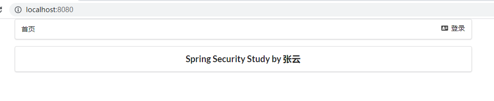


### shiro

#### 简介

shiro没有springsecurity好用，但是得会，因为面试会问。


shiro核心三大对象：

- Subject：代表用户

- SecurityManager：管理所有用户
- Realm：连接数据


#### shiro快速开始

下载shiro：https://github.com/apache/shiro。并来到quickStart。


idea创建一个简单的maven项目


删除src文件夹并建立子module，这样可以在一个项目中做多个子项目。maven中常这么干，防止建立过多project。

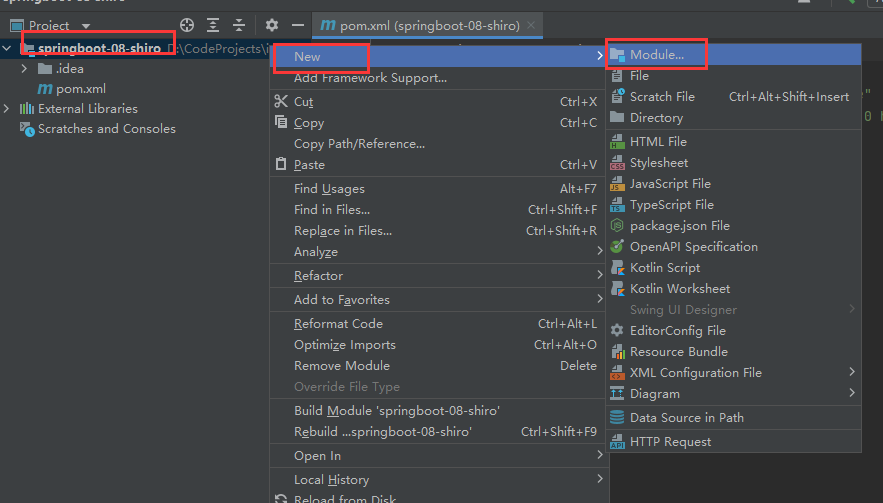


子module创建完成


把下载的shiro的pom中的依赖放进自己maven项目的pom中。依赖中主要是一些日志和日志门面的配置。


我们再去找依赖的版本号，可以去mvnrepository搜artifactid，选择可用的版本号。比如如下：


添加版本号后的依赖如下：

```xml
<dependencies>
    <dependency>
        <groupId>org.apache.shiro</groupId>
        <artifactId>shiro-core</artifactId>
        <version>1.4.1</version>
    </dependency>

    <!-- configure logging -->
    <dependency>
        <groupId>org.slf4j</groupId>
        <artifactId>jcl-over-slf4j</artifactId>
        <version>1.7.21</version>
    </dependency>
    <dependency>
        <groupId>org.slf4j</groupId>
        <artifactId>slf4j-log4j12</artifactId>
        <version>1.7.21</version>
    </dependency>
    <dependency>
        <groupId>log4j</groupId>
        <artifactId>log4j</artifactId>
        <version>1.2.17</version>
    </dependency>
</dependencies>
```

现在配置shiro的一些参数

先看log4j.properties


```properties
log4j.rootLogger=INFO, stdout

log4j.appender.stdout=org.apache.log4j.ConsoleAppender
log4j.appender.stdout.layout=org.apache.log4j.PatternLayout
log4j.appender.stdout.layout.ConversionPattern=%d %p [%c] - %m %n

# General Apache libraries
log4j.logger.org.apache=WARN

# Spring
log4j.logger.org.springframework=WARN

# Default Shiro logging
log4j.logger.org.apache.shiro=INFO

# Disable verbose logging
log4j.logger.org.apache.shiro.util.ThreadContext=WARN
log4j.logger.org.apache.shiro.cache.ehcache.EhCache=WARN

```

在resource下建立同名log4j.properties文件，并放入配置


再看shiro.ini文件


```ini
[users]
# user 'root' with password 'secret' and the 'admin' role
root = secret, admin
# user 'guest' with the password 'guest' and the 'guest' role
guest = guest, guest
# user 'presidentskroob' with password '12345' ("That's the same combination on
# my luggage!!!" ;)), and role 'president'
presidentskroob = 12345, president
# user 'darkhelmet' with password 'ludicrousspeed' and roles 'darklord' and 'schwartz'
darkhelmet = ludicrousspeed, darklord, schwartz
# user 'lonestarr' with password 'vespa' and roles 'goodguy' and 'schwartz'
lonestarr = vespa, goodguy, schwartz

# -----------------------------------------------------------------------------
# Roles with assigned permissions
# 
# Each line conforms to the format defined in the
# org.apache.shiro.realm.text.TextConfigurationRealm#setRoleDefinitions JavaDoc
# -----------------------------------------------------------------------------
[roles]
# 'admin' role has all permissions, indicated by the wildcard '*'
admin = *
# The 'schwartz' role can do anything (*) with any lightsaber:
schwartz = lightsaber:*
# The 'goodguy' role is allowed to 'drive' (action) the winnebago (type) with
# license plate 'eagle5' (instance specific id)
goodguy = winnebago:drive:eagle5
```

在idea的resource目录下建立同名shiro.ini文件并复制内容进去。idea会提示是否安装ini文件的支持插件，安装完毕后ini文件的内容会有高亮。


现在把quickstart.java文件复制进maven项目。


```java
/*
 * Licensed to the Apache Software Foundation (ASF) under one
 * or more contributor license agreements.  See the NOTICE file
 * distributed with this work for additional information
 * regarding copyright ownership.  The ASF licenses this file
 * to you under the Apache License, Version 2.0 (the
 * "License"); you may not use this file except in compliance
 * with the License.  You may obtain a copy of the License at
 *
 *     http://www.apache.org/licenses/LICENSE-2.0
 *
 * Unless required by applicable law or agreed to in writing,
 * software distributed under the License is distributed on an
 * "AS IS" BASIS, WITHOUT WARRANTIES OR CONDITIONS OF ANY
 * KIND, either express or implied.  See the License for the
 * specific language governing permissions and limitations
 * under the License.
 */

import org.apache.shiro.SecurityUtils;
import org.apache.shiro.authc.*;
import org.apache.shiro.ini.IniSecurityManagerFactory;
import org.apache.shiro.mgt.SecurityManager;
import org.apache.shiro.session.Session;
import org.apache.shiro.subject.Subject;
import org.apache.shiro.lang.util.Factory;
import org.slf4j.Logger;
import org.slf4j.LoggerFactory;


/**
 * Simple Quickstart application showing how to use Shiro's API.
 *
 * @since 0.9 RC2
 */
public class Quickstart {

    private static final transient Logger log = LoggerFactory.getLogger(Quickstart.class);


    public static void main(String[] args) {

        // The easiest way to create a Shiro SecurityManager with configured
        // realms, users, roles and permissions is to use the simple INI config.
        // We'll do that by using a factory that can ingest a .ini file and
        // return a SecurityManager instance:

        // Use the shiro.ini file at the root of the classpath
        // (file: and url: prefixes load from files and urls respectively):
        Factory<SecurityManager> factory = new IniSecurityManagerFactory("classpath:shiro.ini");
        SecurityManager securityManager = factory.getInstance();

        // for this simple example quickstart, make the SecurityManager
        // accessible as a JVM singleton.  Most applications wouldn't do this
        // and instead rely on their container configuration or web.xml for
        // webapps.  That is outside the scope of this simple quickstart, so
        // we'll just do the bare minimum so you can continue to get a feel
        // for things.
        SecurityUtils.setSecurityManager(securityManager);

        // Now that a simple Shiro environment is set up, let's see what you can do:

        // get the currently executing user:
        Subject currentUser = SecurityUtils.getSubject();

        // Do some stuff with a Session (no need for a web or EJB container!!!)
        Session session = currentUser.getSession();
        session.setAttribute("someKey", "aValue");
        String value = (String) session.getAttribute("someKey");
        if (value.equals("aValue")) {
            log.info("Retrieved the correct value! [" + value + "]");
        }

        // let's login the current user so we can check against roles and permissions:
        if (!currentUser.isAuthenticated()) {
            UsernamePasswordToken token = new UsernamePasswordToken("lonestarr", "vespa");
            token.setRememberMe(true);
            try {
                currentUser.login(token);
            } catch (UnknownAccountException uae) {
                log.info("There is no user with username of " + token.getPrincipal());
            } catch (IncorrectCredentialsException ice) {
                log.info("Password for account " + token.getPrincipal() + " was incorrect!");
            } catch (LockedAccountException lae) {
                log.info("The account for username " + token.getPrincipal() + " is locked.  " +
                        "Please contact your administrator to unlock it.");
            }
            // ... catch more exceptions here (maybe custom ones specific to your application?
            catch (AuthenticationException ae) {
                //unexpected condition?  error?
            }
        }

        //say who they are:
        //print their identifying principal (in this case, a username):
        log.info("User [" + currentUser.getPrincipal() + "] logged in successfully.");

        //test a role:
        if (currentUser.hasRole("schwartz")) {
            log.info("May the Schwartz be with you!");
        } else {
            log.info("Hello, mere mortal.");
        }

        //test a typed permission (not instance-level)
        if (currentUser.isPermitted("lightsaber:wield")) {
            log.info("You may use a lightsaber ring.  Use it wisely.");
        } else {
            log.info("Sorry, lightsaber rings are for schwartz masters only.");
        }

        //a (very powerful) Instance Level permission:
        if (currentUser.isPermitted("winnebago:drive:eagle5")) {
            log.info("You are permitted to 'drive' the winnebago with license plate (id) 'eagle5'.  " +
                    "Here are the keys - have fun!");
        } else {
            log.info("Sorry, you aren't allowed to drive the 'eagle5' winnebago!");
        }

        //all done - log out!
        currentUser.logout();

        System.exit(0);
    }
}
```

注意由于jar包库路径更新，两个import会报红，这时候把爆红的import注释掉，idea会提示你导入什么新包。


运行quickstart.java中的main方法。运行成功，说明shiro初步搭建完毕。


#### shiro的subject分析

对Quickstart.java解读，里面主要是做shiro subject层的事。对Quickstart.java逐行代码细读，并做了中文翻译。

Quickstart.java中的功能，springsecurity都能实现。

```java
import org.apache.shiro.SecurityUtils;
import org.apache.shiro.authc.*;
//import org.apache.shiro.ini.IniSecurityManagerFactory;
import org.apache.shiro.config.IniSecurityManagerFactory;
import org.apache.shiro.mgt.SecurityManager;
import org.apache.shiro.session.Session;
import org.apache.shiro.subject.Subject;
//import org.apache.shiro.lang.util.Factory;
import org.apache.shiro.util.Factory;
import org.slf4j.Logger;
import org.slf4j.LoggerFactory;


/**
 * Simple Quickstart application showing how to use Shiro's API.
 *
 * @since 0.9 RC2
 */
public class Quickstart {
    //使用日志门面输出，用sout也能输出，但是效果没有用日志这么好。
    private static final transient Logger log = LoggerFactory.getLogger(Quickstart.class);


    public static void main(String[] args) {

        /*
        * 看到factory想到工厂模式。
        *
        * IniSecurityManagerFactory工厂读取ini文件中的配置信息，并返回一个SecurityManager实例。
        *
        * 下面两行不算重要代码，因为这是写死的。之前学jdbc mybatis也有类似写死的代码行。
        * */
        Factory<SecurityManager> factory = new IniSecurityManagerFactory("classpath:shiro.ini");
        SecurityManager securityManager = factory.getInstance();
        /*
        * SecurityManager使成为单例模式
        *
        * 这行代码也是写死的。
        * */
        SecurityUtils.setSecurityManager(securityManager);

        /***以上是设置Shiro environment完毕，接下来看看我们能用shiro做什么实际的事***/

        /*
        * ！！！获取当前用户对象，对象叫做subject
        * */
        Subject currentUser = SecurityUtils.getSubject();

        /*
        * ！！！下面第一行：通过当前用户对象拿到session（不需要web或EJB容器）
        *
        * 这不是http的session，这是shiro的session
        *
        * 下面六行代码讲了subject如何通过shiro自带的session存值和取值
        * */
        Session session = currentUser.getSession();
        session.setAttribute("someKey", "aValue");
        String value = (String) session.getAttribute("someKey");
        if (value.equals("aValue")) {
            log.info("Retrieved the correct value! [" + value + "]");
        }

        /*
        * ！！！判断当前用户是否被认证
        * */
        if (!currentUser.isAuthenticated()) {
            //通过用户的账号和密码生成一个令牌。这个用户名和密码在shiro.ini中有配置。
            UsernamePasswordToken token = new UsernamePasswordToken("lonestarr", "vespa");
            //设置“记住我”
            token.setRememberMe(true);
            try {
                //执行了登录的操作。看不到细节，点进源码也什么都看不到。
                currentUser.login(token);
            }
            //异常：用户不存在时
            catch (UnknownAccountException uae) {
                log.info("There is no user with username of " + token.getPrincipal());
            }
            //异常：用户密码不对时
            catch (IncorrectCredentialsException ice) {
                log.info("Password for account " + token.getPrincipal() + " was incorrect!");
            }
            //异常：用户被冻结时。比如五次密码都不对，就可以冻结该用户。
            catch (LockedAccountException lae) {
                log.info("The account for username " + token.getPrincipal() + " is locked.  " +
                        "Please contact your administrator to unlock it.");
            }
            //可以连续添加更多的异常
            //在最后这捕捉没预料到的异常。UnknownAccountException,IncorrectCredentialsException等都是AuthenticationException的子类。
            catch (AuthenticationException ae) {
                //unexpected condition?  error?
            }
        }

        //！！！打印认证信息，展示谁登录了。在本例中，认证信息为username，即打印username。
        log.info("User [" + currentUser.getPrincipal() + "] logged in successfully.");

        //！！！测试当前用户有什么角色
        if (currentUser.hasRole("schwartz")) {
            log.info("May the Schwartz be with you!");
        } else {
            log.info("Hello, mere mortal.");
        }

        /*
        * ！！！粗粒度的行为许可测试
        *
        * 测试当前用户能有什么行为，不同role可以有不同的行为。本例测试当前用户有没有lightsaber:wield的行为。
        * */
        if (currentUser.isPermitted("lightsaber:wield")) {
            log.info("You may use a lightsaber ring.  Use it wisely.");
        } else {
            log.info("Sorry, lightsaber rings are for schwartz masters only.");
        }

        /*
        * ！！！细粒度的行为许可测试
        * */
        if (currentUser.isPermitted("winnebago:drive:eagle5")) {
            log.info("You are permitted to 'drive' the winnebago with license plate (id) 'eagle5'.  " +
                    "Here are the keys - have fun!");
        } else {
            log.info("Sorry, you aren't allowed to drive the 'eagle5' winnebago!");
        }

        //！！！登出
        currentUser.logout();

        //结束系统
        System.exit(0);
    }
}

```


#### springboot集成shiro

实战：


创建子module


这里不用选security，不够的话再加。


子module的pom中导入thymeleaf依赖

```xml
<!--thymeleaf模板-->
<dependency>
    <groupId>org.thymeleaf</groupId>
    <artifactId>thymeleaf-spring5</artifactId>
</dependency>
<dependency>
    <groupId>org.thymeleaf.extras</groupId>
    <artifactId>thymeleaf-extras-java8time</artifactId>
</dependency>
```

编写简易前端index.html，测试环境

```html
<!DOCTYPE html>
<!--加上命名空间后th:text不会爆红，网友说命名空间是提示性的，不是必须的。-->
<html lang="en" xmlns:th="http://www.thymeleaf.org">
<head>
    <meta charset="UTF-8">
    <title>Title</title>
</head>
<body>

<h1>首页</h1>

<!--接收一下后端传来的model中的参数-->
<p th:text="${msg}"></p>

</body>
</html>
```

编写简易controller，测试环境

```java
package com.zhangyun.shirospringboot.controller;

import org.springframework.stereotype.Controller;
import org.springframework.ui.Model;
import org.springframework.web.bind.annotation.RequestMapping;

@Controller
public class MyController {

    @RequestMapping({"/","/index"})
    public String toIndex(Model model){
        model.addAttribute("msg","hello shiro");

        return "index";

    }
}
```

运行项目访问localhost，发现项目配置成功。


现在开始进一步深入学习

pom中导入spring整合shiro的包

去下载的shiro文件中去找。


pom中找到了下面的依赖。但是该依赖不是spring嫡系，没有版本号不能直接使用。

老师改为导入shiro-spring包如下

```xml
<dependency>
    <groupId>org.apache.shiro</groupId>
    <artifactId>shiro-spring</artifactId>
    <version>1.4.1</version>
</dependency>
```

编写配置类ShiroConfig.java

```java
package com.zhangyun.shirospringboot.config;

import org.apache.shiro.spring.web.ShiroFilterFactoryBean;
import org.apache.shiro.web.mgt.DefaultWebSecurityManager;
import org.springframework.beans.factory.annotation.Qualifier;
import org.springframework.context.annotation.Bean;
import org.springframework.context.annotation.Configuration;

@Configuration
public class ShiroConfig {

    //第三步：ShiroFilterFactoryBean：对应shiro核心对象之Subject
    /*
    * 之所以他是第三步，是因为shiroFilterFactoryBean需要SecurityManager
    *
    * 不要忘记@Bean
    * */
    @Bean
    public ShiroFilterFactoryBean getShiroFilterFactoryBean(@Qualifier("getDefaultWebSecurityManager") DefaultWebSecurityManager defaultWebSecurityManager){
        ShiroFilterFactoryBean shiroFilterFactoryBean = new ShiroFilterFactoryBean();

        //需要绑定SecurityManager即设置安全管理器，绑定原理同第二步的setRealm()
        shiroFilterFactoryBean.setSecurityManager(defaultWebSecurityManager);
        return shiroFilterFactoryBean;
    }

    //第二步：DefaultWebSecurityManager：对应shiro核心对象之SecurityManager
    /*
    * 之所以他为第二步，是因为securityManager需要Realm
    *
    * 如果我们在某个注入点需要另一个 bean，我们需要专门指出它。我们可以通过 @Qualifier 注解来做到这一点。
    *
    * 配置类中的当前函数不要忘记加上@Bean
    * */
    @Bean
    public DefaultWebSecurityManager getDefaultWebSecurityManager(@Qualifier("userRealm") UserRealm userRealm){
        DefaultWebSecurityManager securityManager = new DefaultWebSecurityManager();
        //需要参数，因为需要关联UserRealm，因为securityManager是一个中间商。从spring中取出bean作为securitymanager的参数并给setRealm。
        securityManager.setRealm(userRealm);

        return securityManager;
    }

    //第一步：创建realm对象：对应shiro核心对象之realm
    /*
    * 类配置spring bean知识回顾：
    * 1. 注册UserRealm所以函数的返回值为UserRealm
    * 2. 函数名userRealm为bean的别名，getbean就会get到userRealm
    * 3. 返回值为new “要在spring注册的类”
    * 4. 不要忘记在函数的上面加上@Bean注解
    * 做完上面四步，自己写的UserRealm类就被spring托管了
    *
    * @Component和@Bean的区别：https://blog.csdn.net/qq_35430000/article/details/108910387
    * */
    @Bean
    public UserRealm userRealm(){
        return new UserRealm();
    }
}
```

编写自定义Realm类。自定义Realm类必须继承AuthorizingRealm

```java
package com.zhangyun.shirospringboot.config;

import org.apache.shiro.authc.AuthenticationException;
import org.apache.shiro.authc.AuthenticationInfo;
import org.apache.shiro.authc.AuthenticationToken;
import org.apache.shiro.authz.AuthorizationInfo;
import org.apache.shiro.realm.AuthorizingRealm;
import org.apache.shiro.subject.PrincipalCollection;

public class UserRealm extends AuthorizingRealm {

    //授权
    @Override
    protected AuthorizationInfo doGetAuthorizationInfo(PrincipalCollection principals) {
        System.out.println("执行了=》授权doGetAuthorizationInfo");
        return null;
    }

    //认证
    @Override
    protected AuthenticationInfo doGetAuthenticationInfo(AuthenticationToken token) throws AuthenticationException {
        System.out.println("执行了=》认证doGetAuthenticationInfo");
        return null;
    }
}
```

编写测试拦截用的前端页面add.html 和update.html

```html
<!DOCTYPE html>
<html lang="en">
<head>
    <meta charset="UTF-8">
    <title>Title</title>
</head>
<body>
<h1>add</h1>

</body>
</html>
```

```html
<!DOCTYPE html>
<html lang="en">
<head>
    <meta charset="UTF-8">
    <title>Title</title>
</head>
<body>
<h1>update</h1>
</body>
</html>
```

index页面添加add.html update.html的超链接。

```html
<!DOCTYPE html>
<!--加上命名空间后th:text不会爆红，网友说命名空间是提示性的，不是必须的。-->
<html lang="en" xmlns:th="http://www.thymeleaf.org">
<head>
    <meta charset="UTF-8">
    <title>Title</title>
</head>
<body>

<h1>首页</h1>

<!--接收一下后端传来的model中的参数-->
<p th:text="${msg}"></p>

<a th:href="@{/user/add}">add</a> | <a th:href="@{/user/update}">update</a>
</body>
</html>
```

controller中增加对新前端页面的处理

```java
package com.zhangyun.shirospringboot.controller;

import org.springframework.stereotype.Controller;
import org.springframework.ui.Model;
import org.springframework.web.bind.annotation.RequestMapping;

@Controller
public class MyController {

    @RequestMapping({"/","/index"})
    public String toIndex(Model model){
        model.addAttribute("msg","hello shiro");
        return "index";
    }

    @RequestMapping("/user/add")
    public String add(){
        return "user/add";
    }

    @RequestMapping("/user/update")
    public String update(){
        return "user/update";
    }


}
```

启动项目测试


点击update 和add可以分别跳到相应html页面


shiro的的ShiroConfig.java比springsecurity多了三个bean，体现**shiro更臃肿麻烦点**。


**项目结构基础搭建完成**，接下来就做功能：“一些用户只能进一个页面，另一个页面进不去，实现权限控制”。


#### shiro实现登录拦截

项目接着**springboot继承shiro**

实战：


ShiroConfig中在getShiroFilterFactoryBean方法中添加具体过滤设置

```java
package com.zhangyun.shirospringboot.config;

import org.apache.shiro.spring.web.ShiroFilterFactoryBean;
import org.apache.shiro.web.mgt.DefaultWebSecurityManager;
import org.springframework.beans.factory.annotation.Qualifier;
import org.springframework.context.annotation.Bean;
import org.springframework.context.annotation.Configuration;

import java.util.LinkedHashMap;
import java.util.Map;

@Configuration
public class ShiroConfig {

    //第三步：ShiroFilterFactoryBean：对应shiro核心对象之Subject
    /*
    * 之所以他是第三步，是因为shiroFilterFactoryBean需要SecurityManager
    *
    * 不要忘记@Bean
    * */
    @Bean
    public ShiroFilterFactoryBean getShiroFilterFactoryBean(@Qualifier("getDefaultWebSecurityManager") DefaultWebSecurityManager defaultWebSecurityManager){
        ShiroFilterFactoryBean shiroFilterFactoryBean = new ShiroFilterFactoryBean();
        //需要绑定SecurityManager即设置安全管理器，绑定原理同第二步的setRealm()
        shiroFilterFactoryBean.setSecurityManager(defaultWebSecurityManager);

        //添加shiro的内置过滤器
        /*
        * 以下为不同过滤类型，用以过滤url请求
        * 1. anon:无需认证就能访问
        * 2. authc：必须认证了才能访问
        * 3. user：必须拥有了“记住我”功能才能用。一般不用。
        * 4. perms：拥有对某个资源的权限才能访问
        * 5. roles：拥有某个角色权限才能访问
        *
        * 本例中 /user/add 和 /user/update只有认证了的用户才能访问
        * */
        Map<String,String> filterMap=new LinkedHashMap<>();
        //这里支持通配符，改成“/user/*”使user下的所有请求都配置为authc过滤方式
        filterMap.put("/user/add","authc");
        filterMap.put("/user/update","authc");
        shiroFilterFactoryBean.setFilterChainDefinitionMap(filterMap);

        //设置url请求路径，前往用于提交登录表单的前端
        shiroFilterFactoryBean.setLoginUrl("/toLogin");

        return shiroFilterFactoryBean;
    }

    //第二步：DefaultWebSecurityManager：对应shiro核心对象之SecurityManager
    /*
    * 之所以他为第二步，是因为securityManager需要Realm
    *
    * 如果我们在某个注入点需要另一个 bean，我们需要专门指出它。我们可以通过 @Qualifier 注解来做到这一点。
    *
    * 配置类中的当前函数不要忘记加上@Bean
    * */
    @Bean
    public DefaultWebSecurityManager getDefaultWebSecurityManager(@Qualifier("userRealm") UserRealm userRealm){
        DefaultWebSecurityManager securityManager = new DefaultWebSecurityManager();
        //需要参数，因为需要关联UserRealm，因为securityManager是一个中间商。从spring中取出bean作为securitymanager的参数并给setRealm。
        securityManager.setRealm(userRealm);

        return securityManager;
    }

    //第一步：创建realm对象：对应shiro核心对象之realm
    /*
    * 类配置spring bean知识回顾：
    * 1. 注册UserRealm所以函数的返回值为UserRealm
    * 2. 函数名userRealm为bean的别名，getbean就会get到userRealm
    * 3. 返回值为new “要在spring注册的类”
    * 4. 不要忘记在函数的上面加上@Bean注解
    * 做完上面四步，自己写的UserRealm类就被spring托管了
    *
    * @Component和@Bean的区别：https://blog.csdn.net/qq_35430000/article/details/108910387
    * */
    @Bean
    public UserRealm userRealm(){
        return new UserRealm();
    }
}
```

编写登录页面（提交登录表单的前端）

```html
<!DOCTYPE html>
<html lang="en">
<head>
    <meta charset="UTF-8">
    <title>Title</title>
</head>
<body>
<h1>登录</h1>
<hr/>

<form>
    <!--p标签表示段落，br标签表示换行。概念类似word中。-->
    <p>用户名：<input type="text" name="username"></p>
    <p>密码：<input type="text" name="password"></p>
    <p><input type="submit"></p>
</form>
</body>
</html>
```

MyController控制器中添加到登录页面的跳转请求处理

```java
@RequestMapping("/toLogin")
public String toLogin(){
    return "login";
}
```

运行项目并测试。

点击add或者update标签，因为shiro监测到用户没认证不能访问add和update，故拦截下请求并**自动**跳到程序员通过setLoginUrl()设置的登录页面中。


#### shiro实现用户认证

项目接**shiro实现登录拦截**

shiro的特点：

- 请求过滤都在ShiroConfig.java的getShiroFilterFactoryBean方法中处理
- 权限操作都在UserRealm.java中处理
- shiro需要ShiroConfig.java和UserRealm.java两个类联动。


Controller中处理登录表单的提交，并封装shrio登录令牌。并参考Quickstart.java做一些额外的处理。

```java
@RequestMapping("/login")
//username和password是从前端表单提交的参数名
public String login(String username,String password,Model model){
    //获取当前用户
    Subject subject = SecurityUtils.getSubject();
    //封装用户的登录数据
    UsernamePasswordToken token = new UsernamePasswordToken(username, password);

    //参考shiro的Quickstart.java,做如登录等操作
    try{
        //执行登录方法，如果没有异常就说明登录成功,前往首页。
        subject.login(token);
        return "index";
    }
    //用户名不存在
    catch (UnknownAccountException e){
        model.addAttribute("msg","用户名不存在");
        //猜测不带斜杠表示resource下的页面，带斜杠的/login表示请求。登陆失败前往登录页。
        return "login";
    }
    //密码错误
    catch (IncorrectCredentialsException e){
        model.addAttribute("msg","密码错误");
        //登陆失败前往登录页。
        return "login";
    }

}
```

登录表单的页面添加表单的提交url请求，使用了thymeleaf。同时加上p标签展示后端传来得登录失败反馈。


doGetAuthenticationInfo中做登录认证处理

```java
package com.zhangyun.shirospringboot.config;

import org.apache.shiro.SecurityUtils;
import org.apache.shiro.authc.*;
import org.apache.shiro.authz.AuthorizationInfo;
import org.apache.shiro.realm.AuthorizingRealm;
import org.apache.shiro.subject.PrincipalCollection;
import org.apache.shiro.subject.Subject;

public class UserRealm extends AuthorizingRealm {

    //授权
    @Override
    protected AuthorizationInfo doGetAuthorizationInfo(PrincipalCollection principals) {
        System.out.println("执行了=》授权doGetAuthorizationInfo");
        return null;
    }

    //认证
    @Override
    protected AuthenticationInfo doGetAuthenticationInfo(AuthenticationToken token) throws AuthenticationException {
        System.out.println("执行了=》认证doGetAuthenticationInfo");

        //用户名 密码，数据库中取
        String name="root";
        String password="123456";
        //UsernamePasswordToken和controller中login方法用的token同类
        UsernamePasswordToken userToken = (UsernamePasswordToken) token;
        //用户名认证
        if(!userToken.getUsername().equals(name)){
            return null;//抛出异常，UnknownAccountException
        }
        //密码认证，shiro做。不让人接触密码，避免泄露。下行代码中，左右的principal和realmName先空着。
        return new SimpleAuthenticationInfo("",password,"");
    }
}
```

启动项目并测试。

来到首页点击add或update


因为没有登录状态，shiro拦截登录请求并跳转到登录页面


填写不存在的用户名时，前端展示提示


填写错误密码时，前端展示提示


用户名和密码正确时（UserRealm.java中配置的），登录成功，来到首页，这时候访问add和update页面都能成功

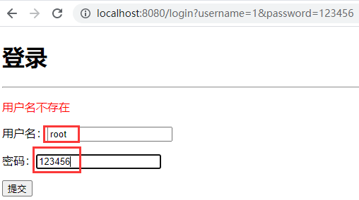


#### shiro整合mybatis

项目接**shiro实现用户认证**

https://www.bilibili.com/video/BV1PE411i7CV?p=43&spm_id_from=pageDriver

pom中添加依赖

```xml
<!--配置数据库驱动-->
<dependency>
    <groupId>mysql</groupId>
    <artifactId>mysql-connector-java</artifactId>
    <version>8.0.26</version>
</dependency>
<!--配置日志-->
<dependency>
    <groupId>log4j</groupId>
    <artifactId>log4j</artifactId>
    <version>1.2.17</version>
</dependency>
<!--配置数据源，用druid-->
<dependency>
    <groupId>com.alibaba</groupId>
    <artifactId>druid</artifactId>
    <version>1.1.12</version>
</dependency>
<!--导入mybatis和springboot的整合包-->
<dependency>
    <groupId>org.mybatis.spring.boot</groupId>
    <artifactId>mybatis-spring-boot-starter</artifactId>
    <version>2.1.0</version>
</dependency>
```

编写yaml文件并配置数据库相关参数。这样后台可以自动连接mybatis数据库。

```yaml
spring:
  datasource:
    username: "root"
    password: "123456"
    url: jdbc:mysql://localhost:3306/mybatis?useUnicode=true&characterEncoding=utf-8
    driver-class-name: com.mysql.jdbc.Driver
    type: com.alibaba.druid.pool.DruidDataSource

    #Spring Boot 默认是不注入这些属性值的，需要自己绑定
    #druid 数据源专有配置
    initialSize: 5
    minIdle: 5
    maxActive: 20
    maxWait: 60000
    timeBetweenEvictionRunsMillis: 60000
    minEvictableIdleTimeMillis: 300000
    validationQuery: SELECT 1 FROM DUAL
    testWhileIdle: true
    testOnBorrow: false
    testOnReturn: false
    poolPreparedStatements: true

    # 下面的部分是druid比其他数据源牛逼的地方
    #配置监控统计拦截的filters，stat:监控统计、log4j：日志记录、wall：防御sql注入
    #如果允许时报错  java.lang.ClassNotFoundException: org.apache.log4j.Priority
    #则导入 log4j 依赖即可，Maven 地址：https://mvnrepository.com/artifact/log4j/log4j
    filters: stat,wall,log4j
    maxPoolPreparedStatementPerConnectionSize: 20
    useGlobalDataSourceStat: true
    connectionProperties: druid.stat.mergeSql=true;druid.stat.slowSqlMillis=500
```

idea连接本地数据库，方便查看数据表


编写properties文件，配置pojo，mapper相关信息

```properties
# 配置别名，避免mybatis的resultType中写完整路径，只写路径即可
mybatis.type-aliases-package=com.zhangyun.shirospringboot.pojo
# 让spring识别XXXMapper.xml文件在哪
mybatis.mapper-locations=classpath:mapper/*.xml
```

编写pojo类User

```java
package com.zhangyun.shirospringboot.pojo;

public class User {
    private int id;
    private String name;
    private String pwd;

    public User() {
    }

    public User(int id, String name, String pwd) {
        this.id = id;
        this.name = name;
        this.pwd = pwd;
    }

    public int getId() {
        return id;
    }

    public void setId(int id) {
        this.id = id;
    }

    public String getName() {
        return name;
    }

    public void setName(String name) {
        this.name = name;
    }

    public String getPwd() {
        return pwd;
    }

    public void setPwd(String pwd) {
        this.pwd = pwd;
    }

    @Override
    public String toString() {
        return "User{" +
                "id=" + id +
                ", name='" + name + '\'' +
                ", pwd='" + pwd + '\'' +
                '}';
    }
}
```

编写XXXMapper.java接口

```java
package com.zhangyun.shirospringboot.mapper;

import com.zhangyun.shirospringboot.pojo.User;
import org.apache.ibatis.annotations.Mapper;
import org.springframework.stereotype.Repository;

@Repository
@Mapper
public interface UserMapper {

    public User queryUserByName(String name);
}
```

编写XXXMapper.xml配置文件。注意放到resource/mapper目录下

```xml
<?xml version="1.0" encoding="UTF-8" ?>
<!DOCTYPE mapper
        PUBLIC "-//mybatis.org//DTD Mapper 3.0//EN"
        "http://mybatis.org/dtd/mybatis-3-mapper.dtd">
<mapper namespace="com.zhangyun.shirospringboot.mapper.UserMapper">
    <select id="queryUserByName" parameterType="String" resultType="User">
        select * from mybatis.user where name=#{name}
    </select>
</mapper>
```

为了完善项目结构，添加service层。service层中有UserService接口和UserServiceImpl类。

```java
package com.zhangyun.shirospringboot.service;

import com.zhangyun.shirospringboot.pojo.User;

public interface UserService {
    public User queryUserByName(String name);
}

```

```java
package com.zhangyun.shirospringboot.service;

import com.zhangyun.shirospringboot.mapper.UserMapper;
import com.zhangyun.shirospringboot.pojo.User;
import org.springframework.beans.factory.annotation.Autowired;
import org.springframework.stereotype.Service;

//老师说这里用@Component也可以
@Service
public class UserServiceImpl implements UserService {

    //从spring容器中拿到UserMapper的bean
    @Autowired
    UserMapper userMapper;

    @Override
    public User queryUserByName(String name) {
        return userMapper.queryUserByName(name);
    }
}
```

更改UserRealm.java为连接数据库获取真用户名和密码

```java
package com.zhangyun.shirospringboot.config;

import com.zhangyun.shirospringboot.pojo.User;
import com.zhangyun.shirospringboot.service.UserService;
import org.apache.shiro.SecurityUtils;
import org.apache.shiro.authc.*;
import org.apache.shiro.authz.AuthorizationInfo;
import org.apache.shiro.realm.AuthorizingRealm;
import org.apache.shiro.subject.PrincipalCollection;
import org.apache.shiro.subject.Subject;
import org.springframework.beans.factory.annotation.Autowired;

public class UserRealm extends AuthorizingRealm {

    //从spring容器中获取userService实例,从而可以操纵数据库
    //!!!spring注入的是实现类对象，接收的接口；理解为多态
    @Autowired
    UserService userService;

    //授权
    @Override
    protected AuthorizationInfo doGetAuthorizationInfo(PrincipalCollection principals) {
        System.out.println("执行了=》授权doGetAuthorizationInfo");
        return null;
    }

    //认证
    @Override
    protected AuthenticationInfo doGetAuthenticationInfo(AuthenticationToken token) throws AuthenticationException {
        System.out.println("执行了=》认证doGetAuthenticationInfo");

        //UsernamePasswordToken和controller中login方法用的token相同
        UsernamePasswordToken userToken = (UsernamePasswordToken) token;

        //用户名 密码，数据库中取
        User user = userService.queryUserByName(userToken.getUsername());

        //用户名认证
        if(user==null){//用户不存在
            return null; //导致MyController出现UnknownAccountException异常
        }
        //密码认证，shiro做。不让人接触密码，避免泄露。下行代码中，左右的principal和realmName先空着。
        //密码可以加密：MD5 或者 MD5盐值加密
        return new SimpleAuthenticationInfo("",user.getPwd(),"");
    }
}
```

启动项目并测试

先查看user表的内容


来到首页点击add或update


因为未登录，shiro把页面跳转到登录页，输入数据库user表中存在的账号密码登录


登录成功，现在可以任意访问update和add了


**注意点**：今日解决了一个疑惑，为什么spring中用接口调用方法：“spring注入（@Bean）的是接口实现类对象，接收（@Autowired）的接口；理解为多态”。


#### shiro请求授权实现

ShiroConfig.java中添加授权设置。并且在shiroConfig中设置出现未授权访问时跳转去何处（setUnauthorizedUrl）。

*有网友说“没有拦截的兄弟要把这个写在authc的上面 不然上面通过下面就不认证了”，但是我perms写在authc的下面也拦截成功了*

```java
package com.zhangyun.shirospringboot.config;

import org.apache.shiro.spring.web.ShiroFilterFactoryBean;
import org.apache.shiro.web.mgt.DefaultWebSecurityManager;
import org.springframework.beans.factory.annotation.Qualifier;
import org.springframework.context.annotation.Bean;
import org.springframework.context.annotation.Configuration;

import java.util.LinkedHashMap;
import java.util.Map;

@Configuration
public class ShiroConfig {

    //第三步：ShiroFilterFactoryBean：对应shiro核心对象之Subject
    /*
    * 之所以他是第三步，是因为shiroFilterFactoryBean需要SecurityManager
    *
    * 不要忘记@Bean
    * */
    @Bean
    public ShiroFilterFactoryBean getShiroFilterFactoryBean(@Qualifier("getDefaultWebSecurityManager") DefaultWebSecurityManager defaultWebSecurityManager){
        ShiroFilterFactoryBean shiroFilterFactoryBean = new ShiroFilterFactoryBean();
        //需要绑定SecurityManager即设置安全管理器，绑定原理同第二步的setRealm()
        shiroFilterFactoryBean.setSecurityManager(defaultWebSecurityManager);

        /*
         * 添加shiro的内置过滤器
         *
         * 以下为不同过滤类型，用以过滤url请求
         * 1. anon:无需认证就能访问
         * 2. authc：必须认证了才能访问
         * 3. user：必须拥有了“记住我”功能才能用。一般不用。
         * 4. perms：拥有对某个资源的权限才能访问
         * 5. roles：拥有某个角色权限才能访问
         *
         * */
        Map<String,String> filterMap=new LinkedHashMap<>();

        /*认证（authc）设置
        *
        * 本例中 /user/add 和 /user/update只有认证了的用户才能访问.
        *
        * 这里支持通配符，改成“/user/*”使user下的所有请求都配置为authc过滤方式.
        * */
        filterMap.put("/user/add","authc");
        filterMap.put("/user/update","authc");

        /*
        * 授权（perms）设置
        *
        * 下面这行表示，对于/user/add请求，用户的权限叫"user:add"才能访问
        * */
        filterMap.put("/user/add","perms[user:add]");
        filterMap.put("/user/update","perms[user:update]");

        shiroFilterFactoryBean.setFilterChainDefinitionMap(filterMap);

        //设置url请求路径，前往用于提交登录表单的前端
        shiroFilterFactoryBean.setLoginUrl("/toLogin");
        //设置未授权事件发生时，跳往何页面
        shiroFilterFactoryBean.setUnauthorizedUrl("/noAuth");


        return shiroFilterFactoryBean;
    }

    //第二步：DefaultWebSecurityManager：对应shiro核心对象之SecurityManager
    /*
    * 之所以他为第二步，是因为securityManager需要Realm
    *
    * 如果我们在某个注入点需要另一个 bean，我们需要专门指出它。我们可以通过 @Qualifier 注解来做到这一点。
    *
    * 配置类中的当前函数不要忘记加上@Bean
    * */
    @Bean
    public DefaultWebSecurityManager getDefaultWebSecurityManager(@Qualifier("userRealm") UserRealm userRealm){
        DefaultWebSecurityManager securityManager = new DefaultWebSecurityManager();
        //需要参数，因为需要关联UserRealm，因为securityManager是一个中间商。从spring中取出bean作为securitymanager的参数并给setRealm。
        securityManager.setRealm(userRealm);

        return securityManager;
    }

    //第一步：创建realm对象：对应shiro核心对象之realm
    /*
    * 类配置spring bean知识回顾：
    * 1. 注册UserRealm所以函数的返回值为UserRealm
    * 2. 函数名userRealm为bean的别名，getbean就会get到userRealm
    * 3. 返回值为new “要在spring注册的类”
    * 4. 不要忘记在函数的上面加上@Bean注解
    * 做完上面四步，自己写的UserRealm类就被spring托管了
    *
    * @Component和@Bean的区别：https://blog.csdn.net/qq_35430000/article/details/108910387
    * */
    @Bean
    public UserRealm userRealm(){
        return new UserRealm();
    }
}
```

controller中添加对未授权情况的页面跳转设置

```java
//处理未授权事件发生时的url请求
@RequestMapping("/noAuth")
//不走视图解析器，直接在前端展示return的字符串
@ResponseBody
public String unauthorized(){
    return "未经授权无法访问此页面";
}
```

UserRealm.java中做用户授权。user在UserRealm”认证“里被查出来，怎么能在UserRealm”授权“被使用？

- 把principal用上，不再为空字符串。
- 多个权限字符串分割成数组  加到呢个有s的方法(addStringPermissions)中.

```java
package com.zhangyun.shirospringboot.config;

import com.zhangyun.shirospringboot.pojo.User;
import com.zhangyun.shirospringboot.service.UserService;
import org.apache.shiro.SecurityUtils;
import org.apache.shiro.authc.*;
import org.apache.shiro.authz.AuthorizationInfo;
import org.apache.shiro.authz.SimpleAuthorizationInfo;
import org.apache.shiro.realm.AuthorizingRealm;
import org.apache.shiro.subject.PrincipalCollection;
import org.apache.shiro.subject.Subject;
import org.springframework.beans.factory.annotation.Autowired;

public class UserRealm extends AuthorizingRealm {

    //从spring容器中获取userService实例,从而可以操纵数据库
    //!!!spring注入的是实现类对象，接收的接口；理解为多态
    @Autowired
    UserService userService;

    //授权
    @Override
    protected AuthorizationInfo doGetAuthorizationInfo(PrincipalCollection principals) {
        System.out.println("执行了=》授权doGetAuthorizationInfo");

        SimpleAuthorizationInfo info = new SimpleAuthorizationInfo();
        //注意此行要删掉，不然任何人都有add权限
        //info.addStringPermission("user:add");

        //拿到等钱登录的对象subject
        Subject subject = SecurityUtils.getSubject();
        //拿到user对象
        User currentUser = (User)subject.getPrincipal();
        //设置当前用户的权限
        //多个权限字符串分割成数组  加到呢个有s的方法中
        info.addStringPermission(currentUser.getPerms());

        //如果return null的话，授权不能被shiro接收到
        return info;
    }

    //认证
    @Override
    protected AuthenticationInfo doGetAuthenticationInfo(AuthenticationToken token) throws AuthenticationException {
        System.out.println("执行了=》认证doGetAuthenticationInfo");

        //UsernamePasswordToken和controller中login方法用的token相同
        UsernamePasswordToken userToken = (UsernamePasswordToken) token;

        //用户名 密码，数据库中取
        User user = userService.queryUserByName(userToken.getUsername());

        //用户名认证
        if(user==null){//用户不存在
            return null; //导致MyController出现UnknownAccountException异常
        }
        //密码认证，shiro做。不让人接触密码，避免泄露。下行代码中，左右的principal和realmName先空着。
        //密码可以加密：MD5 或者 MD5盐值加密
        return new SimpleAuthenticationInfo(user,user.getPwd(),"");
    }
}
```

为数据库user表添加一列保存权限设置，这样为用户授权的时候可以查询。


修改pojo的User类，添加perm字段相关内容。这时候就体现用lombok的好处，不用lombok就得修改：构造函数+getter+setter+toString。

```java
package com.zhangyun.shirospringboot.pojo;

public class User {
    private int id;
    private String name;
    private String pwd;
    private String perms;

    public User() {
    }

    public User(int id, String name, String pwd, String perms) {
        this.id = id;
        this.name = name;
        this.pwd = pwd;
        this.perms=perms;
    }

    public int getId() {
        return id;
    }

    public void setId(int id) {
        this.id = id;
    }

    public String getName() {
        return name;
    }

    public void setName(String name) {
        this.name = name;
    }

    public String getPwd() {
        return pwd;
    }

    public void setPwd(String pwd) {
        this.pwd = pwd;
    }

    public String getPerms() {
        return perms;
    }

    public void setPerms(String perms) {
        this.perms = perms;
    }

    @Override
    public String toString() {
        return "User{" +
                "id=" + id +
                ", name='" + name + '\'' +
                ", pwd='" + pwd + '\'' +
                ", perms='" + perms + '\'' +
                '}';
    }
}
```

MyController.java中设置logout。即把subject.logout();写到logout请求里。

```java
package com.zhangyun.shirospringboot.controller;

import org.apache.shiro.SecurityUtils;
import org.apache.shiro.authc.IncorrectCredentialsException;
import org.apache.shiro.authc.UnknownAccountException;
import org.apache.shiro.authc.UsernamePasswordToken;
import org.apache.shiro.subject.Subject;
import org.springframework.stereotype.Controller;
import org.springframework.ui.Model;
import org.springframework.web.bind.annotation.RequestMapping;
import org.springframework.web.bind.annotation.ResponseBody;

@Controller
public class MyController {

    @RequestMapping({"/","/index"})
    public String toIndex(Model model){
        model.addAttribute("msg","hello shiro");
        return "index";
    }

    @RequestMapping("/user/add")
    public String add(){
        return "user/add";
    }

    @RequestMapping("/user/update")
    public String update(){
        return "user/update";
    }

    @RequestMapping("/toLogin")
    public String toLogin(){
        return "login";
    }

    @RequestMapping("/login")
    //username和password是从前端表单提交的参数名
    public String login(String username,String password,Model model){
        //获取当前用户
        Subject subject = SecurityUtils.getSubject();
        //封装用户的登录数据
        UsernamePasswordToken token = new UsernamePasswordToken(username, password);

        //参考shiro的Quickstart.java,做如登录等操作
        try{
            //执行登录方法，如果没有异常就说明登录成功,前往首页。
            subject.login(token);
            return "index";
        }
        //用户名不存在
        catch (UnknownAccountException e){
            model.addAttribute("msg","用户名不存在");
            //猜测不带斜杠表示resource下的页面，带斜杠的/login表示请求。登陆失败前往登录页。
            return "login";
        }
        //密码错误
        catch (IncorrectCredentialsException e){
            model.addAttribute("msg","密码错误");
            //登陆失败前往登录页。
            return "login";
        }
    }

    //处理未授权事件发生时的url请求
    @RequestMapping("/noAuth")
    //不走视图解析器，直接在前端展示return的字符串
    @ResponseBody
    public String unauthorized(){
        return "未经授权无法访问此页面";
    }

    @RequestMapping("/logout")
    public String logout(){
        Subject subject = SecurityUtils.getSubject();
        subject.logout();

        //登出后来到首页
        return "index";
    }

}
```

add和update页面添加logout链接

```html
<!DOCTYPE html>
<html lang="en">
<head>
    <meta charset="UTF-8">
    <title>Title</title>
</head>
<body>
<h1>add</h1>
<br>
<a th:href="@{/logout}">登出</a>
</body>
</html>
```

```html
<!DOCTYPE html>
<html lang="en">
<head>
    <meta charset="UTF-8">
    <title>Title</title>
</head>
<body>
<h1>update</h1>
<br>
<a th:href="@{/logout}">登出</a>
</body>
</html>
```

运行项目并测试，来到首页，点击add或update


因为没有认证（登录），来到登录页面。输入合法的用户名密码登录。


之前看过数据库user表内容，root用户有update的权限，张云用户有add的权限。root用户登录下，点击add，页面提示没有权限，合理。


回退到首页，点击update，用户root成功进入


点击登出，用户的登录状态（认证）被取消，页面跳回首页


再点击add或update，页面提示要登录，符合未认证的状态


网友语录：

- Spring中，单例你线程不安全，必须在new和bean工厂选一个，一路autowired必报错 （**虽然我不知道他说的对不对**，但是他很有自信的样子。。）


#### shiro整合thymeleaf

https://www.bilibili.com/video/BV1PE411i7CV?p=45&spm_id_from=pageDriver

**项目接shiro请求授权实现**

实战：

pom导入整合shiro+thymeleaf的依赖包

```xml
<!--shiro-thymeleaf整合-->
<!-- https://mvnrepository.com/artifact/com.github.theborakompanioni/thymeleaf-extras-shiro -->
<dependency>
    <groupId>com.github.theborakompanioni</groupId>
    <artifactId>thymeleaf-extras-shiro</artifactId>
    <version>2.0.0</version>
</dependency>
```

shiro要ShiroConfig.java中配置一下ShiroDialect；springsecurity就不用，他是完美集成了。

```java
//整合shirodialect，用来整合shiro-thymeleaf
@Bean
public ShiroDialect getShiroDialect(){
    return new ShiroDialect();
}
```

首页index.html添加shiro控制的前端组件（导入了shiro+thymeleaf整合包才能用）。并增加登录按钮。

- 网友说登录后隐藏登录按钮：不用session存值沟通前后端判断那么麻烦，shiro:notAuthenticated="*:*" 或者 shiro:guest=""，或这里可以直接用shiro:hasAnyRoles=“”判断
  - 网友说：shiro:guest="true"这个亲测可以用，前面的都不行
  - 网友说：<shiro:notAuthenticated>用这个标签就行了
  - 老师的存session的方法也可以
  - 我个人用了shiro:guest="true"

```html
<!DOCTYPE html>
<!--加上命名空间后th:text不会爆红，网友说命名空间是提示性的，不是必须的。-->
<html lang="en" xmlns:th="http://www.thymeleaf.org"
      xmlns:shiro="http://www.thymeleaf.org/thymeleaf-extras-shiro">
<head>
    <meta charset="UTF-8">
    <title>Title</title>
</head>
<body>

<h1>首页</h1>

<!--接收一下后端传来的model中的参数-->
<p th:text="${msg}"></p>

<div shiro:guest="true">
    <a th:href="@{/toLogin}">登录</a>
</div>
<br>
<div shiro:hasPermission="user:add"><a th:href="@{/user/add}">add</a> </div>  | <div shiro:hasPermission="user:update"><a th:href="@{/user/update}">update</a></div>
</body>
</html>
```

启动并测试


点击登录


成功只展示用户有权看到的链接，并且登陆后隐藏登录按钮。


点击update，root用户有权限（数据库可查），成功进入


点击”登出“，回到首页


## 鸡汤分析开源项目

个人认为：可以找一个好的开源项目部署-》读懂（能几乎独立写出的程序）-》扩展功能。


拿到新项目，springboot不需要改maven，是ssm的时候才要改maven。springboot拿到新项目一般是改数据库配置。

Springboot也不用配tomcat，Springboot自带了容器。


西部开源（bilibili可搜） 吴雪华老师的docker讲的特别好。看到第七节即可实现。有一定linux基础会比较好。


正经项目都是：前端《---》控制层controller《---》服务层service接口《---》调dao层《---》数据库


常用的前端模板：layui，模板之家 后台模板 。


## Swagger

学习目标：

- 了解swagger的作用和概念
- 巩固前后端分离
- 在springboot中集成swagger 

 

### Swagger引入

#### 前后端分离

后端时代：前端只用管理静态页面如html。html要给后端，后端通过模板引擎（JSP）把html重构。后端是开发主力，工资巨高。


前后端分离时代：当前最主流的的技术栈：Vue+Springboot

- 后端：后端控制层（Controller），服务层（Service），数据访问层（Dao）。【后端团队】
- 前端：前端控制层，视图层。【前端团队】
  - 前端能伪造后端数据，就编写前段时就存json数据；这时候不需要后端，前端工程依旧能跑起来；这种现象常见于前端单独开发阶段。等到真实上线的时候，那些json改为从后端获取。
- 前后端杂谈：
  - 前后端如何交互？==》约定好数据格式，通过api交互。
  - 前后端相对独立，松耦合
  - 前后端甚至可以部署在不同的服务器上。


产生一个问题：

- 前后端集成联调。前端人员和后端人员无法做到“及时协商，尽早解决”，最终导致问题集中爆发。

解决方案：

- 制定一个schema【计划的提纲】，实时更新最新api，降低集成的风险。
- 早些年：制定word计划文档。
- 前后端分离：
  - 前端测试后端接口：postman
  - 后端提供接口，需要实时更新最新的消息和改动。


### Swagger是什么

是什么：

- 号称是世界上最流行的Api框架
- RestFul Api 文档在线自动生成工具==》api文档与api定义（即代码）同步更新。
- 可以直接运行，可以在线测试api接口
- 支持多种语言：（java，php）。


官网：https://swagger.io/


在项目中使用Swagger需要Springfox

- swagger2
- swagger-ui


### Springboot集成Swagger

做一个最简单的项目，把springboot和swagger集成一下。

实战：


新建springboot-web项目


删除无用的文件（夹）


导入依赖

```xml
<!-- https://mvnrepository.com/artifact/io.springfox/springfox-swagger-ui -->
<dependency>
    <groupId>io.springfox</groupId>
    <artifactId>springfox-swagger-ui</artifactId>
    <version>2.9.2</version>
</dependency>
<!-- https://mvnrepository.com/artifact/io.springfox/springfox-swagger2 -->
<dependency>
    <groupId>io.springfox</groupId>
    <artifactId>springfox-swagger2</artifactId>
    <version>2.9.2</version>
</dependency>

```

编写一个hello工程，即编写控制器

```java
package com.zhangyun.swaggerdemo.controller;

import org.springframework.web.bind.annotation.RequestMapping;
import org.springframework.web.bind.annotation.RestController;

//没有前端页面，所以用restcontroller直接给浏览器返回字符串
@RestController
public class HelloController {

    @RequestMapping(value = "/hello")
    public String hello(){
        return "hello";
    }
}
```

配置swagger，springboot中配置基本要写一个XXXConfig.java

```java
package com.zhangyun.swaggerdemo.config;

import org.springframework.context.annotation.Configuration;
import springfox.documentation.swagger2.annotations.EnableSwagger2;

//@Configuration等价与@Component。加了这个注解，类中的配置就会集成到springboot的配置中。
@Configuration
//开启Swagger2
@EnableSwagger2
public class SwaggerConfig {
}
```

测试运行。启动项目，访问：http://localhost:8080/swagger-ui.html


### Springboot中配置Swagger信息

**项目接Springboot集成Swagger**


通过Swagger的bean实例 Docket来配置Swagger信息.

实战：

在SwaggerConfig.java中注册Docket的bean实例，并编写配套方法。

```java
package com.zhangyun.swaggerdemo.config;

import org.springframework.context.annotation.Bean;
import org.springframework.context.annotation.Configuration;
import springfox.documentation.service.ApiInfo;
import springfox.documentation.service.Contact;
import springfox.documentation.spi.DocumentationType;
import springfox.documentation.spring.web.plugins.Docket;
import springfox.documentation.swagger2.annotations.EnableSwagger2;

import java.util.ArrayList;

//@Configuration等价与@Component。加了这个注解，类中的配置就会集成到springboot的配置中。
@Configuration
//开启Swagger2
@EnableSwagger2
public class SwaggerConfig {

    /*
    * 把Swagger的Docket的bean注册到spring容器中：
    * 1. 注册一个bean首先要@bean注解;
    * 2. 想要注册Docket对象的实例，函数的返回值就得是Docket
    * 3. bean的名字为函数名docket
    *
    * Docket类中有很多参数，都是可以配置的，比如apiInfo。
    * */
    @Bean
    public Docket docket(){
        //对swagger2来说，下面两行是写死的
        return new Docket(DocumentationType.SWAGGER_2)
                .apiInfo(apiInfo());
    }

    /*
    * 配置swagger信息中的apiInfo
    *
    * 下面函数不是一个bean，是真正的方法，用来给docket()bean注册中的Docket.apiInfo反参数的
    * */
    private ApiInfo apiInfo(){
        //new apiinfo的时候需要提供default_contact（作者信息），在这里创建
        Contact contact = new Contact("张云", "https://www.baidu.com/", "10000@qq.com");

        //去ApiInfo看源码，可以看到最后有apiinfo的构造函数默认的填充方法，复制到这返回一个默认的Apiinfo的bean
        return new ApiInfo(
                //swagger首页的title，可以自定义
                "张云的swaggerapi文档",
                //swagger首页的描述，可以自定义
                "这是张云写的描述：学学学",
                "1.0",
                //swagger首页可以点的url。一定要有http，否则无法正确导向页面。
                "https://www.baidu.com/",
                //存入预先定义好的contact
                contact,
                //license不用变
                "Apache 2.0",
                "http://www.apache.org/licenses/LICENSE-2.0",
                //默认要填的，是空的
                new ArrayList()
        );
    }
}
```

运行项目，并访问:http://localhost:8080/swagger-ui.html

通过Docket配置的信息成功展示在页面上


点击"张云_websit"，成功跳到配置的网站


### Swagger配置扫描接口和开关

#### 实现

**项目接Springboot中配置Swagger信息**


Swagger配置扫描接口和开关是基于Docket.select()实现的。

在SwaggerConfig.java中先配置扫描接口。

```java
	/*
    * 把Swagger的Docket的bean注册到spring容器中：
    * 1. 注册一个bean首先要@bean注解;
    * 2. 想要注册Docket对象的实例，函数的返回值就得是Docket
    * 3. bean的名字为函数名docket
    *
    * Docket类中有很多参数，都是可以配置的，比如apiInfo。
    * */
@Bean
public Docket docket(){
    //对swagger2来说，下面两行是写死的
    return new Docket(DocumentationType.SWAGGER_2)
            .apiInfo(apiInfo())
        	//select()apis()paths()build()是一套
            .select()
            /*
            * RequestHandlerSelectors:配置要扫描接口的方式
            *   basePackage:指定要扫描的包
            *   any():扫描全部
            *   none():不扫描
            *   withClassAnnotation：扫描类上的注解，参数是一个注解的反射对象
            *   withMethodAnnotation:扫描方法上的注解
            * */
            .apis(RequestHandlerSelectors.basePackage("com.zhangyun.swaggerdemo.controller"))
            //paths():过滤处理什么路径：由于/zhangyun路径和basePackage指定的包没有重合部分，所以不会有任何接口被扫描。
            .paths(PathSelectors.ant("/zhangyun/**"))
            .build();//build体现工厂模式
}
```

启动项目并测试，没有接口被扫描，符合预期。


用apiInfo().enable()配置是否开启swagger。

（同时注释掉之前的path配置，避免扫描不到接口）。

```java
    /*
    * 把Swagger的Docket的bean注册到spring容器中：
    * 1. 注册一个bean首先要@bean注解;
    * 2. 想要注册Docket对象的实例，函数的返回值就得是Docket
    * 3. bean的名字为函数名docket
    *
    * Docket类中有很多参数，都是可以配置的，比如apiInfo。
    * */
    @Bean
    public Docket docket(){
        //对swagger2来说，下面两行是写死的
        return new Docket(DocumentationType.SWAGGER_2)
                .apiInfo(apiInfo())
                //enable():是否启用swagger，如果为false则swagger不能在浏览器中访问
                .enable(false)
                //select()apis()paths()build()是一套
                .select()
                /*
                * RequestHandlerSelectors:配置要扫描接口的方式
                *   basePackage:指定要扫描的包
                *   any():扫描全部
                *   none():不扫描
                *   withClassAnnotation：扫描类上的注解，参数是一个注解的反射对象
                *   withMethodAnnotation:扫描方法上的注解
                * */
                .apis(RequestHandlerSelectors.basePackage("com.zhangyun.swaggerdemo.controller"))
                //paths():过滤处理什么路径：由于/zhangyun路径和basePackage指定的包没有重合部分，所以不会有任何接口被扫描。
                //.paths(PathSelectors.ant("/zhangyun/**"))
                .build();//build体现工厂模式
    }
```

启动项目并测试。页面无法展现，体现swagger成功关闭。


#### swagger扫描与开关的思考

**问题**：如果我只希望我的Swagger在生产环境中使用，在发布的时候不使用，怎么做？

思路：

- 判断是不是生产环境: flag
- 注入enable(flag)

实战：

**项目接Swagger配置扫描接口和开关**


编写两个springboot分配置文件

application-dev.properties：

```properties
server.port=8081
```

application-prod.properties：

```properties
server.port=8082
```

application.properties中指定使用哪个springboot分配置文件

```properties
spring.profiles.active=dev
```

修改SwaggerConfig.java实现提问要求的功能。

- 关键代码位置可搜索“实现swagger在不同环境中开启与否的功能”。

```java
package com.zhangyun.swaggerdemo.config;

import org.springframework.context.annotation.Bean;
import org.springframework.context.annotation.Configuration;
import org.springframework.context.annotation.Profile;
import org.springframework.core.env.Environment;
import org.springframework.core.env.Profiles;
import springfox.documentation.builders.PathSelectors;
import springfox.documentation.builders.RequestHandlerSelectors;
import springfox.documentation.service.ApiInfo;
import springfox.documentation.service.Contact;
import springfox.documentation.spi.DocumentationType;
import springfox.documentation.spring.web.plugins.Docket;
import springfox.documentation.swagger2.annotations.EnableSwagger2;

import java.util.ArrayList;

//@Configuration等价与@Component。加了这个注解，类中的配置就会集成到springboot的配置中。
@Configuration
//开启Swagger2
@EnableSwagger2
public class SwaggerConfig {

    /*
    * 把Swagger的Docket的bean注册到spring容器中：
    * 1. 注册一个bean首先要@bean注解;
    * 2. 想要注册Docket对象的实例，函数的返回值就得是Docket
    * 3. bean的名字为函数名docket
    *
    * Docket类中有很多参数，都是可以配置的，比如apiInfo。
    * */
    @Bean
    public Docket docket(Environment environment){

        /*
        * 实现swagger在不同环境中开启与否的功能
        * */
        //设置“swagger生效的环境”
        Profiles profiles = Profiles.of("dev", "test");
        //这个flag标记当前环境是不是在配置的“swagger生效的环境”中，如果在，apiInfo().enable(flag)会启用swagger。
        boolean flag = environment.acceptsProfiles(profiles);

        //对swagger2来说，下面两行是写死的
        return new Docket(DocumentationType.SWAGGER_2)
                .apiInfo(apiInfo())
                //enable():是否启用swagger，如果为false则swagger不能在浏览器中访问
                .enable(flag)
                //select()apis()paths()build()是一套
                .select()
                /*
                * RequestHandlerSelectors:配置要扫描接口的方式
                *   basePackage:指定要扫描的包
                *   any():扫描全部
                *   none():不扫描
                *   withClassAnnotation：扫描类上的注解，参数是一个注解的反射对象
                *   withMethodAnnotation:扫描方法上的注解
                * */
                .apis(RequestHandlerSelectors.basePackage("com.zhangyun.swaggerdemo.controller"))
                //paths():过滤处理什么路径：由于/zhangyun路径和basePackage指定的包没有重合部分，所以不会有任何接口被扫描。
                //.paths(PathSelectors.ant("/zhangyun/**"))
                .build();//build体现工厂模式
    }

    /*
    * 配置swagger信息中的apiInfo
    *
    * 下面函数不是一个bean，是真正的方法，用来给docket()bean注册中的Docket.apiInfo反参数的
    * */
    private ApiInfo apiInfo(){
        //new apiinfo的时候需要提供default_contact（作者信息），在这里创建
        Contact contact = new Contact("张云", "https://www.baidu.com/", "10000@qq.com");

        //去ApiInfo看源码，可以看到最后有apiinfo的构造函数默认的填充方法，复制到这返回一个默认的Apiinfo的bean
        return new ApiInfo(
                //swagger首页的title，可以自定义
                "张云的swaggerapi文档",
                //swagger首页的描述，可以自定义
                "这是张云写的描述：学学学",
                "1.0",
                //swagger首页可以点的url。一定要有http，否则无法正确导向页面。
                "https://www.baidu.com/",
                //存入预先定义好的contact
                contact,
                //license不用变
                "Apache 2.0",
                "http://www.apache.org/licenses/LICENSE-2.0",
                //默认要填的，是空的
                new ArrayList()
        );
    }
}

```

启动项目并测试，注意此时项目的端口号为8081。dev环境成功有swagger。


application.properties中切换springboot使用的配置文件为prod

```properties
spring.profiles.active=prod
```

重启项目并测试，注意此时项目的端口号为8082。prod环境没有swagger，符合预期，因为Profiles.of()中没有prod。


#### Swagger分组和接口（实体类）及接口注释

**项目接swagger扫描与开关的思考**

SwaggerConfig.java中配置分组：

```java
/*
* 配置不同的docket，由不同的groupname区分,由不同的人负责，可以在swagger首页右上角选择group进入对应的swagger页面
* */
@Bean
public Docket docket1(){
    return new Docket(DocumentationType.SWAGGER_2).groupName("A");
}
@Bean
public Docket docket2(){
    return new Docket(DocumentationType.SWAGGER_2).groupName("B");
}
@Bean
public Docket docket3(){
    return new Docket(DocumentationType.SWAGGER_2).groupName("C");
}
```

使用prod环境（8082端口），运行项目并测试，添加分组成功。


接口（及注释）配置：

编写实体类。同时使用@ApiXXX给pojo类的文档加上注释。

```java
package com.zhangyun.swaggerdemo.pojo;

import io.swagger.annotations.ApiModel;
import io.swagger.annotations.ApiModelProperty;

//@ApiModel给实体类加文档注释
@ApiModel("用户实体类")
public class User {
    //属性private也可以在swagger的model中展示，但是要加上get set才能在swager中展示属性
    @ApiModelProperty("用户名")
    public String username;
    //@ApiModelProperty给实体类的字段加注释
    @ApiModelProperty("密码")
    public String password;
}

```

Controller中编写接口。

- 接口VS非接口：接口返回的是实体类，请求转发函数返回的是“前端文件名”。

同时使用@ApiXXX给“请求”的文档加上注释。

```java
package com.zhangyun.swaggerdemo.controller;

import com.zhangyun.swaggerdemo.pojo.User;
import io.swagger.annotations.ApiOperation;
import io.swagger.annotations.ApiParam;
import org.springframework.web.bind.annotation.GetMapping;
import org.springframework.web.bind.annotation.PostMapping;
import org.springframework.web.bind.annotation.RequestMapping;
import org.springframework.web.bind.annotation.RestController;

//没有前端页面，所以用restcontroller直接给浏览器返回字符串
@RestController
public class HelloController {

    /*
    * 这是controller中一个普通的请求处理和转发函数
    * */
    @RequestMapping(value = "/hello")
    public String hello(){
        return "hello";
    }

    /*
    * 这是一个接口
    *
    * 只要我们的接口中，返回值存在实体类，该实体类就会被扫描到swagger的model中
    * */
    @PostMapping(value = "/user")
    public User user(){
        return new User();
    }

    //@ApiOperation接口是放在方法上的，不是放在类上的
    @ApiOperation("hello控制类")
    @GetMapping( value = "/hello2")
    //@ApiParam给请求函数的参数添加注释
    public String hello2(@ApiParam("用户名") String username){
        return "hello"+username;
    }
}

```

运行项目并测试

/hello请求这么多是因为hello()用的RequestMapping，能接受任何方式的请求，所以swagger都列了出来。


点开/hello2请求，看到hello2()中添加的api注释都在swagger中成功展示。


点开post /user和model。

因为user方法中，返回值是User对象，所以User类能在swagger的model模块查看到。同时注意到，model中User类有@apiXXX配置的注释。


#### swagger进行简单请求测试

后端基本用不上，了解此功能即可。想学的话Baidu看一下相关博客。


#### Swagger总结

- 我们可以通过swagger给一些比较难理解的属性或者接口，增加注释信息
- 接口文档实时更新
- 可以在线测试

- **swagger注释强大在于**，前后端分离 你不会追着别人问接口了或者字段了，你自己要什么自己找什么。
- swagger是一个优秀的工具，几乎每个大公司都有使用他
- 【注意点】正式发布的时候，关闭swagger！！！出于安全，并且可以节省运行内存。


## 任务

异步任务：

- 正常网站发邮件的时候，邮件发送完才能相应一些消息，怎么实现异步呢？---多线程就可以，不过直接用多线程可能让系统性能变慢。

定时任务：

- Timer类，在某个时间点执行某任务。
  - 我：可以用spring的@Schedule实现定时执行某个功能，也可以用linux的cron实现定时执行某个任务。


邮件发送：

- springboot官方的。


### 异步任务

实战：


新建项目


删除不需要的文件（夹）


编写service层

```java
package com.zhangyun.springboot09test.service;

import org.springframework.scheduling.annotation.Async;
import org.springframework.stereotype.Service;

//spring托管一下，加@Service
@Service
public class AsyncService {
    /*
    * @Async告诉spring这是一个异步的任务,spring会自动为被注解的函数开启多线程。免得自己手动写多线程。
    *
    * 开启异步（spring自动多线程）后，hello()的休眠三秒不会影响其后别的任务的执行。
    * */
    @Async
    public void hello(){
        try {
            //线程会休眠三秒，前台会白屏3秒
            Thread.sleep(3000);
        } catch (InterruptedException e) {
            e.printStackTrace();
        }
        System.out.println("数据正在处理");
    }
}

```

编写controller层

```java
package com.zhangyun.springboot09test.controller;

import com.zhangyun.springboot09test.service.AsyncService;
import org.springframework.beans.factory.annotation.Autowired;
import org.springframework.web.bind.annotation.RequestMapping;
import org.springframework.web.bind.annotation.RestController;

@RestController
public class AsyncController {
    //从spring容器拿到asyncService实例
    @Autowired
    AsyncService asyncService;

    //写一个方法调用service层异步的方法
    @RequestMapping("hello")
    public String hello(){
        asyncService.hello();//停止三秒,网站是转圈的
        return "ok";//走到这才相应一个ok
    }
}
```

springbootapplication添加“开启异步功能”的注解

```java
package com.zhangyun.springboot09test;

import org.springframework.boot.SpringApplication;
import org.springframework.boot.autoconfigure.SpringBootApplication;
import org.springframework.scheduling.annotation.EnableAsync;

//开启异步注解的功能
@EnableAsync
@SpringBootApplication
public class Springboot09TestApplication {

    public static void main(String[] args) {
        SpringApplication.run(Springboot09TestApplication.class, args);
    }

}
```

启动项目并测试。“ok”被即可显示在页面，没有等hello()的休眠三秒，体现异步开启成功。


### 邮件任务

**项目接异步任务**


 实战：

pom导入mail依赖

```xml
<!--javax.mail-->
<dependency>
    <groupId>org.springframework.boot</groupId>
    <artifactId>spring-boot-starter-mail</artifactId>
</dependency>
```

application.properties中添加邮箱的配置

```properties
# 邮箱
spring.mail.username=111@qq.com
# 邮箱开通smtp时发的授权码
spring.mail.password=aaaaaa
# 邮箱服务器
spring.mail.host=smtp.qq.com
# qq邮箱要求开启加密验证。网易就没有这个。
spring.mail.properties.mail.smtp.ssl.enable=true
```

需要发送邮件的位置添加邮件发送配置代码

```java
package com.zhangyun.springboot09test;

import org.junit.jupiter.api.Test;
import org.springframework.beans.factory.annotation.Autowired;
import org.springframework.boot.test.context.SpringBootTest;
import org.springframework.mail.SimpleMailMessage;
import org.springframework.mail.javamail.JavaMailSenderImpl;
import org.springframework.scheduling.annotation.Async;

@SpringBootTest
class Springboot09TestApplicationTests {
    @Autowired
    JavaMailSenderImpl mailSender;

    @Test
    void contextLoads() {
        //一个简单的邮件
        SimpleMailMessage mailMessage = new SimpleMailMessage();
        mailMessage.setSubject("这是邮件的主题");
        mailMessage.setText("今天学习了吗");
        mailMessage.setTo("jie_shou_fang@qq.com");
        mailMessage.setFrom("fa_song_fang@qq.com");
        mailSender.send(mailMessage);
    }

}
```

启动测试类，老师的展示效果如下，成功收到自己给自己发送的邮件。实现该功能本地必须联网！


邮件除了简单编写方法，还有**复杂配置方法，可以实现更多功能**。下面实现邮件复杂配置方法，并自己**封装为一个函数**，该函数得在含`    @Autowired
    JavaMailSenderImpl mailSender;`的类中使用。

```java
/*
* 自己封装复杂邮件代码
*
* multipart:邮件是否支持multipart
* mailSubject：邮件主题
* 。。。
* */
public void sendMail(Boolean multipart,
                     String mailSubject,
                     String mailText,
                     Boolean mailTextHtml,
                     String attachmentName,
                     String attachmentFullUrl,
                     String sendTo,
                     String sendFrom) throws MessagingException {
    //一个复杂的邮件
    MimeMessage mimeMessage = mailSender.createMimeMessage();

    //组装
    //MimeMessageHelper帮助配置复杂邮件。MimeMessageHelper第二个参数为true时，表示允许多文件发送
    MimeMessageHelper helper = new MimeMessageHelper(mimeMessage, multipart);
    helper.setSubject(mailSubject);
    //设置要发送的正文。第二个参数为true表示文本中的html标签会被解析。
    helper.setText(mailText,mailTextHtml);
    //附件
    //路径应为绝对路径
    helper.addAttachment(attachmentName,new File(attachmentFullUrl));
    helper.addAttachment("2.jpg",new File("D:\\2.jpg"));
    //配置邮件的发送方和接收方
    helper.setTo(sendTo);
    helper.setFrom(sendFrom);

}
```


### 定时执行任务

https://www.bilibili.com/video/BV1PE411i7CV?p=53&spm_id_from=pageDriver

可以写一些定时脚本，抢东西。


核心接口：

- TaskSchedular:任务调度者
- TaskExecutor：任务执行者

核心注解：

- @EnableScheduling:开启定时功能的注解，放在springbootapplication.java的类上
- @Scheduled:规定任务什么时候执行

**重难点**Cron表达式：

- 百度上可以搜Cron表达式自动生成器


实战：

**项目接邮件任务**

springbootapplication.java的类上加上注解@EnableScheduling

```java
package com.zhangyun.springboot09test;

import org.springframework.boot.SpringApplication;
import org.springframework.boot.autoconfigure.SpringBootApplication;
import org.springframework.scheduling.annotation.EnableAsync;
import org.springframework.scheduling.annotation.EnableScheduling;

//开启异步注解的功能
@EnableAsync
//开启定时功能
@EnableScheduling
@SpringBootApplication
public class Springboot09TestApplication {

    public static void main(String[] args) {
        SpringApplication.run(Springboot09TestApplication.class, args);
    }

}
```

service层新建ScheduledService.java

```java
package com.zhangyun.springboot09test.service;

import org.springframework.scheduling.annotation.Scheduled;
import org.springframework.stereotype.Service;

@Service
public class ScheduledService {
    /*
    * 在一个特定时间执行这个方法-Timer
    *
    * cron表达式：秒 分 时 日 月 周几。参数以空格隔开。
    * 30 15 10 * * ？  每天10点15分30秒执行一次。问号表示不需要关注该项。
    * 30 0/5 10,18 * * ?   每天10点和18点，每隔5分钟（0/5表示取模）的第30秒执行一次
    * 0 15 10 ？ * 1-6  每个月的周一到周六10点15分的第0秒执行一次
    * 下面@Scheduled()中参数为cron表达式:“每周每一天”的任意“月”“日”“时”“分”的第0秒会执行被注解的函数。
    *
    * */
    @Scheduled(cron="0 * * * * 0-7")
    public void hello(){
        System.out.println("hello，你被执行了");
    }
}
```

运行项目并测试。没分钟的第0秒会成功打印消息


## Redis

### SpringBoot集成Redis

#### 前言

Springdata：

- springboot操作数据：使用spring-data。

- Springdata是和springboot齐名的项目。


spring2.X后，原来使用的jredis被替换为lettuce

- jredis：采用的直连，有多个线程操作的话，是不安全的。如果想避免不安全，使用jedis pool连接池，容易带来一些问题。更像BIO模式。
- lettuce：采用netty，实例可以在多个线程中进行共享，不存在线程不安全的情况。可以减少线程数据了，更像NIO模式。


springboot所有的配置类，都有一个自动配置类。自动配置类都会绑定一个properties配置文件。

- 可以去spring.factory文件中看有哪些自动配置类,找到redis对应的自动配置类：RedisAutoConfiguration。
- RedisProperties.java中可以看redis可以配置哪些参数。


RedisAutoConfiguration.java源码分析：

```java
@Bean
@ConditionalOnMissingBean(
    name = {"redisTemplate"}
)//我们可以自己定义一个redisTemplate来替换这个默认的
@ConditionalOnSingleCandidate(RedisConnectionFactory.class)
public RedisTemplate<Object, Object> redisTemplate(RedisConnectionFactory redisConnectionFactory) {
    //默认的redisTemplate，没有过多的设置。redis对象都是需要序列化的。
    //两个反省都是Object，Object的类型，我们后续使用需要强制转换为<String,Object>
    RedisTemplate<Object, Object> template = new RedisTemplate();
    template.setConnectionFactory(redisConnectionFactory);
    return template;
}

@Bean
@ConditionalOnMissingBean//由于String是redis中最常用的类型，所以说单独提出来了一个bean
@ConditionalOnSingleCandidate(RedisConnectionFactory.class)
public StringRedisTemplate stringRedisTemplate(RedisConnectionFactory redisConnectionFactory) {
    StringRedisTemplate template = new StringRedisTemplate();
    template.setConnectionFactory(redisConnectionFactory);
    return template;
}
```


有人推荐“编程不良人”讲的redis。


#### 实战

新建项目并勾选相关功能。勾选相关功能后，项目自动生成的pom中会自带我们需要的依赖，不用后续自己导入。


删除多余文件（夹）


确认pom文件中如下依赖正确下载了jar包

```xml
<!--操作redis-->
<dependency>
    <groupId>org.springframework.boot</groupId>
    <artifactId>spring-boot-starter-data-redis</artifactId>
</dependency>
```

在application.properties文件中配置Redis

```properties
# springboot所有的配置类，都有一个自动配置类:RedisAutoConfiguration
# 自动配置类都会绑定一个properties配置文件:RedisProperties

# 配置Redis
spring.redis.host=127.0.0.1
spring.redis.port=6379
# 可以配置连接池，但是要配置lettuce对应的连接池，而不是jedis对应的连接池。因为源码里只注入了lettuce的连接池。
# spring.redis.jedis.pool.max-active=
```

在springtest中编写redis的使用

```java
package com.example.springboot10redis;

import org.junit.jupiter.api.Test;
import org.springframework.beans.factory.annotation.Autowired;
import org.springframework.boot.test.context.SpringBootTest;
import org.springframework.data.redis.connection.RedisConnection;
import org.springframework.data.redis.core.RedisTemplate;

@SpringBootTest
class Springboot10RedisApplicationTests {
    @Autowired
    private RedisTemplate redisTemplate;

    @Test
    void contextLoads() {

        /*
        * redisTemplate:操作不同的数据类型，api和我们的指令是一样的。
        * redisTemplate.opsForValue()：操作字符串，类似String
        * redisTemplate.opsForList：操作List，类似List
        * redisTemplate.opsForSet
        * redisTemplate.opsForHash
        * redisTemplate.opsForZSet
        * redisTemplate.opsForGeo
        * redisTemplate.opsForHyperLogLog
        * 除了基本的操作，我们常用的方法都可以直接通过redisTemplate操作，比如事务，比如基本的CRUD
        *
        * 获取redis的连接对象
        * RedisConnection connection = redisTemplate.getConnectionFactory().getConnection();
        * connection.flushDb();
        * connection.flushAll();
        *
        * */
        redisTemplate.opsForValue().set("myKey","张云学java");
        System.out.println(redisTemplate.opsForValue().get("myKey"));

    }

}
```

在跑redis测试之前，需要安装redis的windows版本 并且开启redis服务 才能测试通过。

- 官方zip包下载https://github.com/MicrosoftArchive/redis/releases

- 启动教程参考：https://www.cnblogs.com/pzw23/p/14888834.html。不推荐用博客的redis，最好用Redis官方的zip包。

  - 启动代码：redis-server.exe redis.windows.conf

  


按教程下载并启动Redis成功后，测试Springboot整合Redis。发现redis成功存入数据，并根据key取出数据。


#### 序列化相关

去到RedisTemplate.class，查看序列化相关源码。


### 自定义RedisTemplate

新建RedisConfig.java,来自己定义RedisTemplate，那么官方的RedisTemplate就会被注解`@ConditionalOnMissingBean(name = {"redisTemplate"})`架空。

同时可以在自己的RedisTemplate中定义序列化方式，因为系统默认的jdk序列化可能导致乱码。

实战：

**项目接SpringBoot集成Redis**

先测试没有序列化产生的结果。

清空redis数据库。


写一些自己的数据，写个pojo类保存java对象，先不对pojo类实现序列化

```java
package com.example.springboot10redis.pojo;

import lombok.AllArgsConstructor;
import lombok.Data;
import lombok.NoArgsConstructor;
import org.springframework.stereotype.Component;

import java.io.Serializable;

@Component
//使用lombok的三个注解，这样只需要在pojo类中写属性
@AllArgsConstructor
@NoArgsConstructor
@Data
//pojo类要实现序列化implements Serializable
public class User {
    private String name;
    private int age;

}
```

编写测试方法

```java
@Test
public void test() throws JsonProcessingException {
    //真是的开发一般都使用json来传递对象
    User user = new User("张云学", 3);
    //把user序列化。springboot中有objectmapper，objectmapper是jackson对象。objectmapper可以把user编程json对象
    String jsonUser = new ObjectMapper().writeValueAsString(user);

    redisTemplate.opsForValue().set("user",jsonUser);
    Object user1 = redisTemplate.opsForValue().get("user");
    System.out.println(user1);
}
```

启动项目测试redis。（确保此时后台开启了redis）。测试成功，可以看到redis存取json数据不需要pojo类序列化也可以实现，因为pojo类对象被json化为字符串。

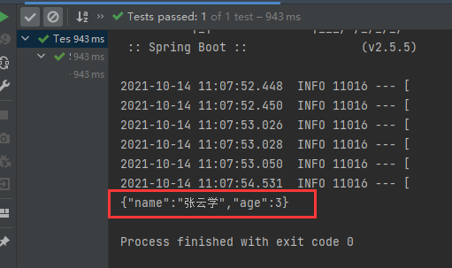

现在修改测试方法，不传json，而是直接传对象

```java
@Test
public void test() throws JsonProcessingException {
    //真是的开发一般都使用json来传递对象
    User user = new User("张云学", 3);
    //把user序列化。springboot中有objectmapper，objectmapper是jackson对象。objectmapper可以把user编程json对象
    //String jsonUser = new ObjectMapper().writeValueAsString(user);

    redisTemplate.opsForValue().set("user",user);
    Object user1 = redisTemplate.opsForValue().get("user");
    System.out.println(user1);
}
```

启动项目测试redis。（确保此时后台开启了redis）。测试失败，**所有对象需要被序列化才能被Redis存取**。


现在序列化pojo类

```java
package com.example.springboot10redis.pojo;

import lombok.AllArgsConstructor;
import lombok.Data;
import lombok.NoArgsConstructor;
import org.springframework.stereotype.Component;

import java.io.Serializable;

@Component
//使用lombok的三个注解，这样只需要在pojo类中写属性
@AllArgsConstructor
@NoArgsConstructor
@Data
//企业中pojo类要实现序列化。implements Serializable
public class User implements Serializable{
    private String name;
    private int age;

}
```

再次运行test()方法，因为pojo类已被序列化，测试redis存取对象成功。但是系统默认的jdk序列化方式会导致redis库中的key乱码，**为了解决这个问题只能自定义RedisTemplate，并在自定义的RedisTemplate自定义序列化方法**。


RedisConfig.java中自定义redisTemplate的bean，并在redisTemplate中设置自己选择序列化方式，而不再使用默认的jdk序列化（会导致redis的key乱码）。

```java
package com.example.springboot10redis.config;

import com.fasterxml.jackson.annotation.JsonAutoDetect;
import com.fasterxml.jackson.annotation.PropertyAccessor;
import com.fasterxml.jackson.databind.ObjectMapper;
import org.springframework.boot.autoconfigure.condition.ConditionalOnMissingBean;
import org.springframework.boot.autoconfigure.condition.ConditionalOnSingleCandidate;
import org.springframework.context.annotation.Bean;
import org.springframework.context.annotation.Configuration;
import org.springframework.data.redis.connection.RedisConnectionFactory;
import org.springframework.data.redis.core.RedisTemplate;
import org.springframework.data.redis.serializer.Jackson2JsonRedisSerializer;
import org.springframework.data.redis.serializer.StringRedisSerializer;

@Configuration
public class RedisConfig {

    /*
    * 编写自定义的RedisTemplate。
    *
    * 自定义的RedisTemplate的格式和RedisAutoConfiguration.java中定义RedisTemplate的格式一模一样，可以直接拿来修改一下
    * */
//    @Bean
//    @ConditionalOnSingleCandidate(RedisConnectionFactory.class)
//    public RedisTemplate<String, Object> redisTemplate(RedisConnectionFactory redisConnectionFactory) {
//        RedisTemplate<String, Object> template = new RedisTemplate();
//
//        //默认的jdk序列化会乱码，我们要自己配置具体的序列化方式
//        template.setKeySerializer();
//
//        template.setConnectionFactory(redisConnectionFactory);
//        return template;
//    }

    // 这是我给大家写好的一个固定模板，大家在企业中，拿去就可以直接使用！
    // 自己定义了一个 RedisTemplate
    @Bean
    //强压警告是因为有一个方法过时了
    @SuppressWarnings("all")
    public RedisTemplate<String, Object> redisTemplate(RedisConnectionFactory factory) {
        // 我们为了自己开发方便，一般直接使用 <String,Object>
        RedisTemplate<String, Object> template = new RedisTemplate<String,Object>();
        template.setConnectionFactory(factory);
        // Json序列化配置
        Jackson2JsonRedisSerializer jackson2JsonRedisSerializer = new
                Jackson2JsonRedisSerializer(Object.class);
        //json序列化的时候需要ObjectMapper来进行转义，转义完才能使用
        ObjectMapper om = new ObjectMapper();
        om.setVisibility(PropertyAccessor.ALL, JsonAutoDetect.Visibility.ANY);
        om.enableDefaultTyping(ObjectMapper.DefaultTyping.NON_FINAL);
        jackson2JsonRedisSerializer.setObjectMapper(om);
        // String 的序列化
        StringRedisSerializer stringRedisSerializer = new StringRedisSerializer();

        // key采用String的序列化方式
        template.setKeySerializer(stringRedisSerializer);
        // hash的key也采用String的序列化方式
        template.setHashKeySerializer(stringRedisSerializer);
        // value序列化方式采用jackson
        template.setValueSerializer(jackson2JsonRedisSerializer);
        // hash的value序列化方式采用jackson
        template.setHashValueSerializer(jackson2JsonRedisSerializer);

        //把所有的properties set进去
        template.afterPropertiesSet();
        return template;
    }

}
```

flush掉redis的内容，重新运行test()。查看redis库中的key，这回key没有乱码。


### 自定义封装RedisUtils工具类

在企业开发中，我们绝大多数情况都不会使用原生的方式去编写代码。而是会根据公司代码业务需要，封装一个自己的XXXUtils.java去用。

- 把常用的操作提取出来，封装为一个工具类，方便我们的使用。


实战：

**项目接自定义RedisTemplate**


下面演示封装RedisUtils.java。老师推荐的，蛮大，有小六百行。

```java
package com.example.springboot10redis.utils;

import org.springframework.beans.factory.annotation.Autowired;
import org.springframework.data.redis.core.RedisTemplate;
import org.springframework.stereotype.Component;
import org.springframework.util.CollectionUtils;

import java.util.Collection;
import java.util.List;
import java.util.Map;
import java.util.Set;
import java.util.concurrent.TimeUnit;

/*
* 在我们真实的开发中，或者你们在公司中，一般都可以看到一个公司自己封装RedisUtil
* */
@Component
public final class RedisUtil {

    //注入自己写的redisTemplate。点击idea左边栏上的叶子，如果能跳到自定义的redisTemplate则正常。不能的话，用@Qualifier(“redisTemplate”)显式指定一下。
    @Autowired
    private RedisTemplate<String, Object> redisTemplate;

    // =============================common============================
    /**
     * 指定缓存失效时间
     * @param key  键
     * @param time 时间(秒)
     */
    public boolean expire(String key, long time) {
        try {
            if (time > 0) {
                redisTemplate.expire(key, time, TimeUnit.SECONDS);
            }
            return true;
        } catch (Exception e) {
            e.printStackTrace();
            return false;
        }
    }

    /**
     * 根据key 获取过期时间
     * @param key 键 不能为null
     * @return 时间(秒) 返回0代表为永久有效
     */
    public long getExpire(String key) {
        return redisTemplate.getExpire(key, TimeUnit.SECONDS);
    }


    /**
     * 判断key是否存在
     * @param key 键
     * @return true 存在 false不存在
     */
    public boolean hasKey(String key) {
        try {
            return redisTemplate.hasKey(key);
        } catch (Exception e) {
            e.printStackTrace();
            return false;
        }
    }


    /**
     * 删除缓存
     * @param key 可以传一个值 或多个
     */
    @SuppressWarnings("unchecked")
    public void del(String... key) {
        if (key != null && key.length > 0) {
            if (key.length == 1) {
                redisTemplate.delete(key[0]);
            } else {
                redisTemplate.delete((Collection<String>) CollectionUtils.arrayToList(key));
            }
        }
    }


    // ============================String=============================

    /**
     * 普通缓存获取
     * @param key 键
     * @return 值
     */
    public Object get(String key) {
        return key == null ? null : redisTemplate.opsForValue().get(key);
    }

    /**
     * 普通缓存放入
     * @param key   键
     * @param value 值
     * @return true成功 false失败
     */

    public boolean set(String key, Object value) {
        try {
            redisTemplate.opsForValue().set(key, value);
            return true;
        } catch (Exception e) {
            e.printStackTrace();
            return false;
        }
    }


    /**
     * 普通缓存放入并设置时间
     * @param key   键
     * @param value 值
     * @param time  时间(秒) time要大于0 如果time小于等于0 将设置无限期
     * @return true成功 false 失败
     */

    public boolean set(String key, Object value, long time) {
        try {
            if (time > 0) {
                redisTemplate.opsForValue().set(key, value, time, TimeUnit.SECONDS);
            } else {
                set(key, value);
            }
            return true;
        } catch (Exception e) {
            e.printStackTrace();
            return false;
        }
    }


    /**
     * 递增
     * @param key   键
     * @param delta 要增加几(大于0)
     */
    public long incr(String key, long delta) {
        if (delta < 0) {
            throw new RuntimeException("递增因子必须大于0");
        }
        return redisTemplate.opsForValue().increment(key, delta);
    }


    /**
     * 递减
     * @param key   键
     * @param delta 要减少几(小于0)
     */
    public long decr(String key, long delta) {
        if (delta < 0) {
            throw new RuntimeException("递减因子必须大于0");
        }
        return redisTemplate.opsForValue().increment(key, -delta);
    }


    // ================================Map=================================

    /**
     * HashGet
     * @param key  键 不能为null
     * @param item 项 不能为null
     */
    public Object hget(String key, String item) {
        return redisTemplate.opsForHash().get(key, item);
    }

    /**
     * 获取hashKey对应的所有键值
     * @param key 键
     * @return 对应的多个键值
     */
    public Map<Object, Object> hmget(String key) {
        return redisTemplate.opsForHash().entries(key);
    }

    /**
     * HashSet
     * @param key 键
     * @param map 对应多个键值
     */
    public boolean hmset(String key, Map<String, Object> map) {
        try {
            redisTemplate.opsForHash().putAll(key, map);
            return true;
        } catch (Exception e) {
            e.printStackTrace();
            return false;
        }
    }


    /**
     * HashSet 并设置时间
     * @param key  键
     * @param map  对应多个键值
     * @param time 时间(秒)
     * @return true成功 false失败
     */
    public boolean hmset(String key, Map<String, Object> map, long time) {
        try {
            redisTemplate.opsForHash().putAll(key, map);
            if (time > 0) {
                expire(key, time);
            }
            return true;
        } catch (Exception e) {
            e.printStackTrace();
            return false;
        }
    }


    /**
     * 向一张hash表中放入数据,如果不存在将创建
     *
     * @param key   键
     * @param item  项
     * @param value 值
     * @return true 成功 false失败
     */
    public boolean hset(String key, String item, Object value) {
        try {
            redisTemplate.opsForHash().put(key, item, value);
            return true;
        } catch (Exception e) {
            e.printStackTrace();
            return false;
        }
    }

    /**
     * 向一张hash表中放入数据,如果不存在将创建
     *
     * @param key   键
     * @param item  项
     * @param value 值
     * @param time  时间(秒) 注意:如果已存在的hash表有时间,这里将会替换原有的时间
     * @return true 成功 false失败
     */
    public boolean hset(String key, String item, Object value, long time) {
        try {
            redisTemplate.opsForHash().put(key, item, value);
            if (time > 0) {
                expire(key, time);
            }
            return true;
        } catch (Exception e) {
            e.printStackTrace();
            return false;
        }
    }


    /**
     * 删除hash表中的值
     *
     * @param key  键 不能为null
     * @param item 项 可以使多个 不能为null
     */
    public void hdel(String key, Object... item) {
        redisTemplate.opsForHash().delete(key, item);
    }


    /**
     * 判断hash表中是否有该项的值
     *
     * @param key  键 不能为null
     * @param item 项 不能为null
     * @return true 存在 false不存在
     */
    public boolean hHasKey(String key, String item) {
        return redisTemplate.opsForHash().hasKey(key, item);
    }


    /**
     * hash递增 如果不存在,就会创建一个 并把新增后的值返回
     *
     * @param key  键
     * @param item 项
     * @param by   要增加几(大于0)
     */
    public double hincr(String key, String item, double by) {
        return redisTemplate.opsForHash().increment(key, item, by);
    }


    /**
     * hash递减
     *
     * @param key  键
     * @param item 项
     * @param by   要减少记(小于0)
     */
    public double hdecr(String key, String item, double by) {
        return redisTemplate.opsForHash().increment(key, item, -by);
    }


    // ============================set=============================

    /**
     * 根据key获取Set中的所有值
     * @param key 键
     */
    public Set<Object> sGet(String key) {
        try {
            return redisTemplate.opsForSet().members(key);
        } catch (Exception e) {
            e.printStackTrace();
            return null;
        }
    }


    /**
     * 根据value从一个set中查询,是否存在
     *
     * @param key   键
     * @param value 值
     * @return true 存在 false不存在
     */
    public boolean sHasKey(String key, Object value) {
        try {
            return redisTemplate.opsForSet().isMember(key, value);
        } catch (Exception e) {
            e.printStackTrace();
            return false;
        }
    }


    /**
     * 将数据放入set缓存
     *
     * @param key    键
     * @param values 值 可以是多个
     * @return 成功个数
     */
    public long sSet(String key, Object... values) {
        try {
            return redisTemplate.opsForSet().add(key, values);
        } catch (Exception e) {
            e.printStackTrace();
            return 0;
        }
    }


    /**
     * 将set数据放入缓存
     *
     * @param key    键
     * @param time   时间(秒)
     * @param values 值 可以是多个
     * @return 成功个数
     */
    public long sSetAndTime(String key, long time, Object... values) {
        try {
            Long count = redisTemplate.opsForSet().add(key, values);
            if (time > 0)
                expire(key, time);
            return count;
        } catch (Exception e) {
            e.printStackTrace();
            return 0;
        }
    }


    /**
     * 获取set缓存的长度
     *
     * @param key 键
     */
    public long sGetSetSize(String key) {
        try {
            return redisTemplate.opsForSet().size(key);
        } catch (Exception e) {
            e.printStackTrace();
            return 0;
        }
    }


    /**
     * 移除值为value的
     *
     * @param key    键
     * @param values 值 可以是多个
     * @return 移除的个数
     */

    public long setRemove(String key, Object... values) {
        try {
            Long count = redisTemplate.opsForSet().remove(key, values);
            return count;
        } catch (Exception e) {
            e.printStackTrace();
            return 0;
        }
    }

    // ===============================list=================================

    /**
     * 获取list缓存的内容
     *
     * @param key   键
     * @param start 开始
     * @param end   结束 0 到 -1代表所有值
     */
    public List<Object> lGet(String key, long start, long end) {
        try {
            return redisTemplate.opsForList().range(key, start, end);
        } catch (Exception e) {
            e.printStackTrace();
            return null;
        }
    }


    /**
     * 获取list缓存的长度
     *
     * @param key 键
     */
    public long lGetListSize(String key) {
        try {
            return redisTemplate.opsForList().size(key);
        } catch (Exception e) {
            e.printStackTrace();
            return 0;
        }
    }


    /**
     * 通过索引 获取list中的值
     *
     * @param key   键
     * @param index 索引 index>=0时， 0 表头，1 第二个元素，依次类推；index<0时，-1，表尾，-2倒数第二个元素，依次类推
     */
    public Object lGetIndex(String key, long index) {
        try {
            return redisTemplate.opsForList().index(key, index);
        } catch (Exception e) {
            e.printStackTrace();
            return null;
        }
    }


    /**
     * 将list放入缓存
     *
     * @param key   键
     * @param value 值
     */
    public boolean lSet(String key, Object value) {
        try {
            redisTemplate.opsForList().rightPush(key, value);
            return true;
        } catch (Exception e) {
            e.printStackTrace();
            return false;
        }
    }


    /**
     * 将list放入缓存
     * @param key   键
     * @param value 值
     * @param time  时间(秒)
     */
    public boolean lSet(String key, Object value, long time) {
        try {
            redisTemplate.opsForList().rightPush(key, value);
            if (time > 0)
                expire(key, time);
            return true;
        } catch (Exception e) {
            e.printStackTrace();
            return false;
        }

    }


    /**
     * 将list放入缓存
     *
     * @param key   键
     * @param value 值
     * @return
     */
    public boolean lSet(String key, List<Object> value) {
        try {
            redisTemplate.opsForList().rightPushAll(key, value);
            return true;
        } catch (Exception e) {
            e.printStackTrace();
            return false;
        }

    }


    /**
     * 将list放入缓存
     *
     * @param key   键
     * @param value 值
     * @param time  时间(秒)
     * @return
     */
    public boolean lSet(String key, List<Object> value, long time) {
        try {
            redisTemplate.opsForList().rightPushAll(key, value);
            if (time > 0)
                expire(key, time);
            return true;
        } catch (Exception e) {
            e.printStackTrace();
            return false;
        }
    }


    /**
     * 根据索引修改list中的某条数据
     *
     * @param key   键
     * @param index 索引
     * @param value 值
     * @return
     */

    public boolean lUpdateIndex(String key, long index, Object value) {
        try {
            redisTemplate.opsForList().set(key, index, value);
            return true;
        } catch (Exception e) {
            e.printStackTrace();
            return false;
        }
    }


    /**
     * 移除N个值为value
     *
     * @param key   键
     * @param count 移除多少个
     * @param value 值
     * @return 移除的个数
     */

    public long lRemove(String key, long count, Object value) {
        try {
            Long remove = redisTemplate.opsForList().remove(key, count, value);
            return remove;
        } catch (Exception e) {
            e.printStackTrace();
            return 0;
        }

    }

}
```

在需要使用RedisUtil的地方autowired一下就好

```java
@Autowired
private RedisUtil redisUtil;
```

在springboot测试类中@autowired redisUtil，同时编写测试方法

```java
@Test
public void test1(){
    redisUtil.set("name","zhangyun");
    System.out.println(redisUtil.get("name"));
}
```

启动测试方法，成功使用自己封装的RedisUtil.java实现Redis存取功能。


**所有redis操作，对于java开发人员来说十分简单。但是更重要的是要去理解redis的思想和每一种数据结构的用处和作用场景。**


## 分布式Dubbo+ZooKeeper

- [dubbo官方推荐使用zk作为dubbo的注册中心](https://blog.csdn.net/sinat_33640788/article/details/79778506)

### 分布式系统理论

#### 什么是分布式系统

- 在《分布式系统原理与范型》一书中有如下定义：“分布式系统是若干独立计算机的集合，这些计算机对于用户来说就**像单个相关系统**”；

  

- 分布式系统是由一组通过网络进行通信、为了完成共同的任务而协调工作的计算机节点组成的系统。

- 分布式系统的出现是为了用廉价的、普通的机器完成单个计算机无法完成的计算、存储任务。其目的是**利用更多的机器，处理更多的数据**。

- 分布式系统（distributed system）是建立在网络之上的软件系统。5G使之更easy。

- 首先需要明确的是，只有当单个节点的处理能力无法满足日益增长的计算、存储任务的时候，且硬件的提升（加内存、加磁盘、使用更好的CPU）高昂到得不偿失的时候，应用程序也不能进一步优化的时候，我们才需要考虑分布式系统。因为，分布式系统要解决的问题本身就是和单机系统一样的，而由于分布式系统多节点、通过网络通信的拓扑结构，会引入很多单机系统没有的问题，为了解决这些问题又会引入更多的机制、协议，带来更多的问题。。。**总之不应该盲目第一选择分布式系统。**

  - 分布式系统产生问题的来源：网络不可靠。
  - 20230522我：而且网络传输时本身就会有系统消耗和时间消耗，所以可以单体解决的话就没必要上微服务。

- 例子：比如网购时，点击页面的请求处理占用资源少，几万个请求可以给一台服务器专门处理；但是支付时由于各种校验，占用资源多，需要给支付模块分配更多的服务器专门负责支付。横向弹性扩增系统。


#### Dubbo文档

随着互联网的发展，网站应用的规模不断扩大，常规的垂直应用架构已无法应对，分布式服务架构以及流动计算架构势在必行，急需**一个治理系统**确保架构有条不紊的演进。

在Dubbo的官网文档有这样一张图


#### 单一应用架构

当网站流量很小时，只需一个应用，将所有功能都部署在一起，以减少部署节点和成本。此时，用于简化增删改查工作量的数据访问框架(ORM)是关键。


适用于小型网站，小型管理系统，将所有功能都部署到一个功能里，简单易用。

缺点：

- 性能扩展比较难

- 协同开发问题

- 不利于升级维护


#### 垂直应用架构

当访问量逐渐增大，单一应用增加机器带来的加速度越来越小，将应用拆成互不相干的几个应用，以提升效率。此时，用于加速前端页面开发的Web框架(MVC)是关键。


通过切分业务来实现各个模块独立部署，降低了维护和部署的难度，团队各司其职更易管理，性能扩展也更方便，更有针对性。

缺点：

- 公用模块无法重复利用，开发性的浪费


#### 分布式服务架构

当垂直应用越来越多，应用之间交互不可避免，将核心业务抽取出来，作为独立的服务，逐渐形成稳定的服务中心，使前端应用能更快速的响应多变的市场需求。此时，用于提高业务复用及整合的**分布式服务框架(RPC)**是关键。


#### 流动计算架构

当服务越来越多，容量的评估，小服务资源的浪费等问题逐渐显现，此时需增加一个调度中心基于访问压力实时管理集群容量，提高集群利用率。此时，用于**提高机器利用率的资源调度和治理中心**(SOA)[ Service Oriented Architecture]是关键。


### 什么是RPC

#### 分布式通信方式

分布式系统中不同模块见的通信有两种方式

- http
  - 基于网络的，无状态的，负责通信的协议
- rpc
  - RPC【Remote Procedure Call】是指远程过程调用，是一种进程间通信方式，他是一种技术的思想，而不是规范。它允许程序调用另一个地址空间（通常是共享网络的另一台机器上）的过程或函数，而不用程序员显式编码这个远程调用的细节。即程序员无论是调用本地的还是远程的函数，本质上编写的调用代码基本相同。
  - 也就是说两台服务器A，B，一个应用部署在A服务器上，想要调用B服务器上应用提供的函数/方法，由于不在一个内存空间，不能直接调用，需要通过网络来表达调用的语义和传达调用的数据。为什么要用RPC呢？就是无法在一个进程内，甚至一个计算机内通过本地调用的方式完成的需求，比如不同的系统间的通讯，甚至不同的组织间的通讯，由于计算能力需要横向扩展，需要在多台机器组成的集群上部署应用。**RPC就是要像调用本地的函数一样去调远程函数**


#### RPC基本原理

通过网络远程调用：


步骤解析：

- 注意要序列化


#### RPC两个核心模块

RPC两个核心模块：

- 通讯
  - 为了传输。
- 序列化
  - 方便数据传输。


#### Dubbo引入

dubbo中间停更了五年，期间http和springcloud出现控制了分布式系统的信息传输。

dubbo重新更新后，也不可能替代springcloud。因为dubbo是一个专注于RPC的通信框架，而SpringCloud是一个生态。


### Dubbo和ZooKeeper安装

#### Dubbo基本概念

Apache Dubbo |ˈdʌbəʊ| 是一款高性能、轻量级的开源Java RPC框架，它提供了三大核心能力：面向接口的远程方法调用，智能容错和负载均衡，以及服务自动注册和发现。


dubbo官网 http://dubbo.apache.org/zh-cn/index.html


要点：

- 了解Dubbo的特性

- 查看官方文档


**Dubbo示意图**（非常重要，背下来）：


图中成分介绍：

- 服务提供者（Provider）：

  暴露服务的服务提供方，服务提供者在启动时，向注册中心注册自己提供的服务。

- 服务消费者（Consumer）：

  调用远程服务的服务消费方，服务消费者在启动时，向注册中心订阅自己所需的服务，服务消费者，从提供者地址列表中，基于软负载均衡算法，选一台提供者进行调用，如果调用失败，再选另一台调用。

- 注册中心（Registry）：

  注册中心返回服务提供者地址列表给消费者，如果有变更，注册中心将基于长连接推送变更数据给消费者

- 监控中心（Monitor）：

  服务消费者和提供者，在内存中累计调用次数和调用时间，定时每分钟发送一次统计数据到监控中心

调用关系说明：

- 服务容器负责启动，加载，运行服务提供者。

- 服务提供者在启动时，向注册中心注册自己提供的服务。

- 服务消费者在启动时，向注册中心订阅自己所需的服务。

- 注册中心返回服务提供者地址列表给消费者，如果有变更，注册中心将基于长连接推送变更数据给消费者。

- 服务消费者，从提供者地址列表中，基于软负载均衡算法，选一台提供者进行调用，如果调用失败，再选另一台调用。

- 服务消费者和提供者，在内存中累计调用次数和调用时间，定时每分钟发送一次统计数据到监控中心。


#### ZooKeeper基本概念

Zoo+Keeper：动物园管理者，管理hadoop（大象），hive（蜜蜂）等。


ZooKeeper是一个分布式的，开放源码的分布式应用程序协调服务，是Google的Chubby一个开源的实现，是Hadoop和Hbase的重要组件。它是一个为分布式应用提供一致性服务的软件，提供的功能包括：配置维护、域名服务、分布式同步、组服务等。

核心：他就提供服务的注册与发现。


#### ZooKeeper安装

[登录zk官方下载地址](http://archive.apache.org/dist/zookeeper/zookeeper-3.4.14/)

tar.gz结尾的文件是linux专用的，不过windows也可以用。

- 我跟随教程下载了老版本。但是3.5.5开始，带有bin名称的包才是我们想要的下载。可以直接使用的里面有编译后的二进制的包，而之前的普通的tar.gz的包里面是只是源码的包无法直接使用。


参考下老师的电脑目录结构，和zk安装位置


在自己的电脑相应位置解压


进入bin文件夹，先点击”zkServer.cmd“用管理员身份运行，开启服务端

- 右键zkServer.cmd文件有管理员身份运行的选项

- 如果碰见闪退问题，按下面方式尝试

  1. 在zkServer.cmd中加上pause，保存，这样在闪退的时候可以看到错误的明确信息

     

  2. 再次运行”zkServer.cmd“，这是看到错误是：conf文件夹中缺少”zoo.cfg“文件

     

  3. 来到conf文件夹，把“zoo_sample.cfg”复制一份，并把复制文件改名为“zoo.cfg“

     - 同时注意zk的客户端的默认clientPort（zk客户端端口号）是2181，可以在zoo.cfg中修改端口号为别的号。

     

     

  4. 重新以管理员身份运行”zkServer.cmd“。启动成功，即使此时”zkServer.cmd“中添加的pause没有删除。

     

回到正轨,启动好服务后，不要关闭cmd框，关闭的话服务就停了。

现在开启客户端，管理员身份运行bin/zkCli.cmd，看客户端能否成功连接zk服务端。客户端显示0号用户连接上了，成功。

- 本例中zk客户端和zk服务端都在本机


连接成功后，用`ls /`(注意s和/间有空格)命令看一下zk中有几个节点。查看到当前只有一个节点叫“zookeeper”。


尝试创建一个zk节点：`create -e /zhangyun 123`。“zhangyun”是节点的名称，“123”是节点里的值。


再次查看一下zk节点数。这时候有两个节点。


可以从zk节点中取值，比如：`get /zhangyun`。这就实现了在zk中存值取值。


也可以删除节点：`delete /zhangyun`。删除添加的节点后再查看一下节点，只剩下初始的“zookeeper”了，说明删除成功。


#### dubbo安装

dubbo托管在github上，[访问github的dubbo项目](https://github.com/apache/dubbo-admin/tree/master)

- 推荐使用master分支，版本稳定点


下载后解压在自己偏好的位置。点开项目可以看到pom.xml，说明它是一个maven项目。


在dubbo的application.properties文件中查看配置注册中心的地址，确认地址为zk的地址（尤其端口号）。

- 最新的dubbo项目中有多个子module，这里就演示子module“dubbo-admin-test”的查看

  


**dubbo-admin最好修改自己的访问地址为7001**，而不是默认的8080，这样省的端口被占用

- 查看端口被占用的方法：https://www.runoob.com/w3cnote/windows-finds-port-usage.html
- 修改dubbo和zk端口号的问题（仅供参考）：https://www.cnblogs.com/timingstarts/p/12604211.html。具体端口号修改以狂神老师的为准，这块我漏听了？？？

查看地址无误后，在项目目录下使用如下命令打包dubbo-admin

```
mvn clean package -Dmaven.test.skip=true
```


- 如果出现如下错误，是因为之前idea用自带的maven，而windows环境变量中没有配置idea自带的maven

  

  解决方法：

  1. 因为本机使用的是idea自带的maven，首先找到idea自带maven的位置：**idea安装目录\plugins\maven\lib\maven3**

  2. 单击“计算机-属性-高级系统设置”，单击“环境变量”

     - ”环境变量“中点“新建”->变量名"**MAVEN_HOME**"，变量值"**idea安装目录\plugins\maven\lib\maven3**"（即idea自带MAVEN的路径）
     -  ”环境变量“中点“编辑”->变量名"**Path**"，在原变量值的最后面加上“**;%MAVEN_HOME%\bin**”（最开始的冒号win10中可以不加）

  3. cmd-》`mvn -version`.能打印maven信息则在环境变量中注册idea自带maven成功。

     

  

在环境变量中配置好maven后，回归正轨。重新在dubbo目录cmd执行mvn clean package -Dmaven.test.skip=true。又在如下命令发生时卡住：

```
[INFO] Downloading https://nodejs.org/dist/v9.11.1/node-v9.11.1-win-x64.zip to F:\Maven\repository\com\github\eirslett\node\9.11.1\node-9.11.1-win-x64.zip
[INFO] No proxies configured
[INFO] No proxy was configured, downloading directly
```

解决方案：

1. 参考[网上解决方案](https://blog.csdn.net/dataiyangu/article/details/105640224)。我科学上网后下载的node-9.11.1-win-x64.zip放入XXX\Maven\repository\com\github\eirslett\node\9.11.1后，控制台并没继续开动。
2. 于是我关闭控制台，重新cmd进入并再次执行命令mvn clean package -Dmaven.test.skip=true。这次打包流畅，最后成功完成，

排查完错误并打包完成，控制台展示如下：


下图红框中每个文件夹内都新增了一个target文件夹，以dubbo-admin-test为例打开文件夹，可以看到刚通过maven命令打的jar包。


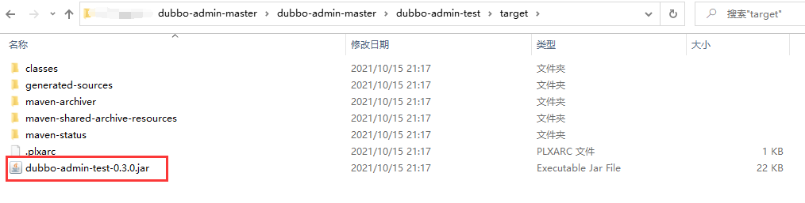

关于当前新版dubbo下面有四个dubbo-admin-XXX的问题，这里搜索研究一下：

1. [参考链接](https://blog.csdn.net/zhanggonglalala/article/details/88831049)，链接中选择使用/dubbo-admin-distribution来打jar包，但我打包的时候是在父目录打的，所以四个dubbo-admin-XXX下都有jar包

2. 故我查看dubbo-admin-master\dubbo-admin-distribution\target，竟然除了本dubbo-admin-distribution对应的jar包dubbo-admin-distribution-0.3.0.jar，还有一个jar包`dubbo-admin-0.3.0.jar`。

3. dubbo-admin-0.3.0.jar应该就是网课里旧版本打包形成的那种jar包，因为他没有像ui或distribution的后缀。而且dubbo-admin-0.3.0.jar的大小也是其他jar包的几百倍大。

   

拿到了目标dubbo的jar包，现在来执行一下该jar包


出现错误，因为没有开启**zkServer.cmd**


先以管理员身份运行**zkServer.cmd**


再次运行dubbo-admin-0.3.0.jar


查看zkServer.cmd的内容，弹出了很多新内容。其中可以看到binding to 2181。说明dubbo和zk绑定成功。


绑定成功后尝试访问dubbo页面，浏览器输入：http://localhost:8080/。成功进入页面。

- 默认用户名-密码：root-root


事后总结：

- dubbo-admin：

  dubbo-admin是一个**监控**管理后台，他可以**查看**我们注册了哪些服务，哪些服务被消费了。他在开发中可以不使用，因为他不影响我们的业务，只是辅助开发管理。

  - 20230522我：[参考](https://developer.aliyun.com/article/819875)，dubbo 框架提供了极其丰富的服务治理的功能如流量控制、动态配置、服务 Mock、服务测试等功能，而 **dubbo-admin 的作用在于将 dubbo 框架提供的服务治理能力提供一个开箱即用的平台**。所以应该是dubboadmin包含了dubbo的功能，并附带了监管的功能。
  - 20220522我：参加本文档后面的“服务注册发现实战”，项目中实际使用的时候没有下载dubboadmin，而是在springboot项目的pom中导入zk和dubbo的依赖；然后就可以使用dubbo去做远程服务调用了。

- zookeeper：

  zookeeper是注册中心，**必须要**。

- dubbo：

  dubbo是jar包，其可通过高性能的 RPC 实现服务的输出和输入功能


### 服务注册发现实战

https://www.bilibili.com/video/BV1PE411i7CV?p=60&spm_id_from=pageDriver

实战：

由于从来没有创建过empty project，老师带着创建一个empty project项目。

- 写空项目的话可以在里面构造任何东西。


建立空项目后，idea自动弹出project Structure让人选择好jdk。


新建一个module，module可以用maven或者spring init初始化，这里选择spring init


**这里的packagename要删掉providerserver**，使得provider和consumer的项目路径一致，都为com.zhangyun


一般都会勾选web模块，其他要的话，再加就可以了。


删掉provider-server子module中多余的文件


编写service层的接口和实现类。

- **注意**：被注册的bean上用于扫描和注册服务的注解“@Service”是dubbo的，不是springboot的。而且最新的dubbo也把注解改名为@DubboService了。

```java
package com.zhangyun.service;

public interface TicketService {
    public String getTicket();
}
```

```java
package com.zhangyun.service;

import org.apache.dubbo.config.annotation.Service;
import org.springframework.stereotype.Component;

//zookeeper：服务注册与发现

/*
* 使用dubbo后尽量不要用spring自带的@Service注解，因为dubbo自己也有一个service注解用于dubbo扫描，容易弄混，不如用万能的Component注解
* */
@Component
/*
* 加了dubbo的@Service后，类可以被dubbo扫描到并往zk注册，在项目启动时就自动注册到注册中心。
* */
@Service
public class TicketServiceImpl implements TicketService{

    @Override
    public String getTicket() {
        return "张云学java";
    }
}
```

再新建一个module，做为客户端.

**这里的packagename要删掉consumerserver**，使得provider和consumer的项目路径一致，都为com.zhangyun


清除consumer-server子module中多余的文件


现在consumer-server和provider-server是两个application，不在一个项目中，怎么能让他们沟通呢？

- 通过http或RPC

  

因为是子module是web，会占用默认端口号8080。为了防止8080端口（已分配给dubbo-admin）被争抢，配置consumer-server项目的端口

```properties
server.port=8081
```

配置provider-server项目的端口

```properties
server.port=8082
```

provider-server要找到注册中心，所以要导入dubbo（和springboot相关的dubbo）和zkclient(github下的包)的依赖

```xml
<!-- https://mvnrepository.com/artifact/org.apache.dubbo/dubbo-spring-boot-starter -->
<dependency>
    <groupId>org.apache.dubbo</groupId>
    <artifactId>dubbo-spring-boot-starter</artifactId>
    <version>2.7.3</version>
</dependency>
<!-- https://mvnrepository.com/artifact/com.github.sgroschupf/zkclient -->
<dependency>
    <groupId>com.github.sgroschupf</groupId>
    <artifactId>zkclient</artifactId>
    <version>0.1</version>
</dependency>

```

新版（2021年）导入zk后可能会有各种问题：

- zookeeper及其依赖包导致的错误

  ```
  java.lang.NoClassDefFoundError: org/apache/curator/framework/CuratorFrameworkFactory
  ```

  需要导入zookeeper及其依赖包

- zk和springboot日志冲突导致错误

  ```
  Correct the classpath of your application so that it contains a single, compatible version of org.apache.zookeeper.ZooKeeper
  ```

  日志冲突，需要从pom中剔除日志依赖。

- 解决方案，添加如下依赖：

	```xml
	<!-- 引入zookeeper -->
	<dependency>
   <groupId>org.apache.curator</groupId>
   <artifactId>curator-framework</artifactId>
   <version>2.12.0</version>
	</dependency>
	<dependency>
   <groupId>org.apache.curator</groupId>
   <artifactId>curator-recipes</artifactId>
   <version>2.12.0</version>
	</dependency>
	<dependency>
   <groupId>org.apache.zookeeper</groupId>
   <artifactId>zookeeper</artifactId>
   <version>3.4.14</version>
   <!--排除这个slf4j-log4j12-->
   <exclusions>
       <exclusion>
           <groupId>org.slf4j</groupId>
           <artifactId>slf4j-log4j12</artifactId>
       </exclusion>
   </exclusions>
	</dependency>
	```

provider-server的application.properties中添加做服务注册相关的配置

```properties
# 服务应用的名字
dubbo.application.name=provider-server
# 注册中心地址。地址可以写localhost，不过一般写本机的ip地址。实际开发时地址可以为任何电脑。
dubbo.registry.address=zookeeper://127.0.0.1:2181
# 哪些服务要被注册
dubbo.scan.base-packages=com.zhangyun.service
```

以管理员身份运行zkServer.cmd


启动ProviderServerApplication.java，并访问localhost:8080。成功找到自己注册的接口。


现在处理服务消费者

在consumer-server中导入依赖，导入的和provider-server一样

```xml
<!--dubbo-->
<!-- Dubbo Spring Boot Starter -->
<dependency>
   <groupId>org.apache.dubbo</groupId>
   <artifactId>dubbo-spring-boot-starter</artifactId>
   <version>2.7.3</version>
</dependency>
<!--zookeeper-->
<!-- https://mvnrepository.com/artifact/com.github.sgroschupf/zkclient -->
<dependency>
   <groupId>com.github.sgroschupf</groupId>
   <artifactId>zkclient</artifactId>
   <version>0.1</version>
</dependency>
<!-- 引入zookeeper -->
<dependency>
   <groupId>org.apache.curator</groupId>
   <artifactId>curator-framework</artifactId>
   <version>2.12.0</version>
</dependency>
<dependency>
   <groupId>org.apache.curator</groupId>
   <artifactId>curator-recipes</artifactId>
   <version>2.12.0</version>
</dependency>
<dependency>
   <groupId>org.apache.zookeeper</groupId>
   <artifactId>zookeeper</artifactId>
   <version>3.4.14</version>
   <!--排除这个slf4j-log4j12-->
   <exclusions>
       <exclusion>
           <groupId>org.slf4j</groupId>
           <artifactId>slf4j-log4j12</artifactId>
       </exclusion>
   </exclusions>
</dependency>
```

consumer-server子module的application.properties中配置消费者的服务拿取相关事宜。

```properties
# 消费者去哪里拿服务需要暴露自己的名字
dubbo.application.name=consumer-server
# 注册中心的地址。实际开发时地址可以为任何电脑。
dubbo.registry.address=zookeeper://127.0.0.1:2181
```

编写消费者的service层。为了方便，这里直接用一个类，而不是接口+impl的格式

```java
package com.zhangyun.service;

import org.apache.dubbo.config.annotation.Reference;
import org.springframework.stereotype.Service;

//最好用component，防止和dubbo的service注解混淆
@Service
//接口不能被放入容器，所以这里得是class
public class UserService {
    //想拿到provider提供的票,要去注册中心拿到服务

    /*
    * dubbo包下的@Reference实现远程引用的功能，功能类似原来的@Autowired.
    *
    * 远方的TicketService无法找到，那就在本地定义路径相同的接口名，服务不需要相同。
    * 故把provider-service中的TicketService.java拷贝到consumer-server中
    * */
    @Reference
    TicketService ticketService;

    public void buyTicket(){
        String ticket=ticketService.getTicket();
        System.out.println("在注册中心拿到=》"+ticket);
    }


}
```

UserService.java中远方的TicketService无法找到，那就在本地定义项目路径相同的接口名，服务不需要相同。故把provider-service中的TicketService.java拷贝到consumer-server中。

- **注意**：路径相同是从com.zhangyun开始就得相同。最开始项目路径一个是com.zhangyun.providerserver，一个是com.zhangyun.consumerserver导致报错`Injection of @Reference dependencies is failed; nested exception is java.lang.IllegalSta`。后两个项目的项目路径同意被我改成com.zhangyun。
  - 正式开发的时候不会要求项目路径一致，而是用pom坐标的方式解决provider和consumer对路径的对口的要求。


在consumer-server的测试方法中，尝试通过注册中心zk获取provider-server注册的TicketService服务

```java
package com.zhangyun;

import com.zhangyun.service.UserService;
import org.junit.jupiter.api.Test;
import org.springframework.beans.factory.annotation.Autowired;
import org.springframework.boot.test.context.SpringBootTest;

@SpringBootTest
class ConsumerServerApplicationTests {
    @Autowired
    UserService userService;

    @Test
    void contextLoads() {
        userService.buyTicket();
    }

}
```

执行测试方法，成功远程使用了zk上注册的TicketService服务。**注意从注册服务到获取服务的过程中，不能关闭zk！！！**

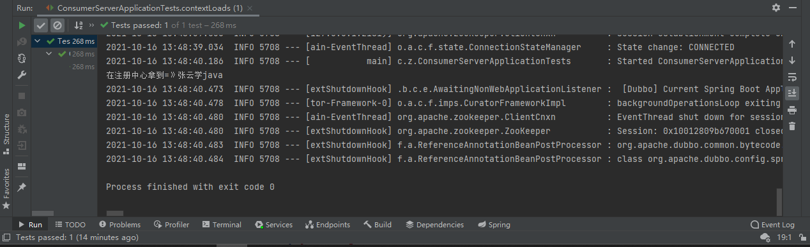


## 聊聊现在和未来

回顾之前。。

架构：

- 三层架构：mvc
- 架构的目的就是解耦

三层架构对应的开发框架：

- spring

  - ioc

    - 控制翻转

    - 拿约学习为例：

      原来约学习：附近social找好学之徒-》加vx-》聊天-》约着学习。

      现在有学校：有书桌教师学友-》直接进学校就有人一起学习了。

    - 原来我们都是自己一步步操作，现在交给容器（学校）了，我们需要什么直接去拿就可以了。

  - aop

    - 切面：本质是动态代理
    - 为了解决问题：不影响业务本来的情况下，实现动态增加功能。大量应用于日志，事务等。

  - spring是一个清量级的java开源框架，容器。

  - 目的：解决企业开发的复杂性问题。

  - spring是春天。配制文件也十分复杂！

- springboot

  - 新一代javaEE的开发标准，开箱即用-->拿过来就能用。他自动帮我们配置了很多的东西，我们拿来即用。
  - springboot不是新东西，它是spring的升级版，简化版。
  - 特点：**约定大于配置（拿来即用的代价）**


随着公司体系越来越大，用户越来越多！微服务架构出现。

微服务架构

- 特点：模块化，功能化
- 人多访问量多后，增加服务器的数量---横向扩容
- 假设A服务的性能用掉98%，b服务器的性能只用了10%，这就不合理。他们应实现负载均衡。
  - 用户非常多，而签到十分少的时候。那么就给“用户”多点服务器，给“签到”少点服务器。
  - 将原来的服务模块化，用户是单独的项目，签到也是一个单独的项目。项目和项目之间需要通信。


微服务架构问题？换言之，分布式架构会遇到的四个核心问题？

1. 这么多服务，客户端该如何去访问？
2. 这么多服务，服务之间如何进行通信？
3. 这么多服务，如何治理（注册与发现）？
4. 服务挂了，怎么办？


解决方案：

- 生态圈springcloud出来了，就是来解决以上分布式架构的四个问题。

- 想使用springcloud，必须掌握springboot，因为springcloud是基于springboot的。

- spring cloud netflix，出来了一套解决方案。一站式解决方案！

  1. 访问（api网关）：zuul组件
  2. 通信：feign--》httpclient--》http的通信方式是“同步并阻塞”
  3. 治理:服务注册与发现，Eureka
  4. 防灾：熔断机制，Hystrix

  2018年年底，netflix宣布无限期停止维护。生态不再维护，就会脱节。

- apache dubbo+zookeeper出现，第二套解决系统

  1. api：没有，要么找第三方组件，要么自己实现
  2. 通信：dubbo是一个高性能的基于java的rpc通信框架。
  3. 注册与发现：zookeeper
  4. 熔断机制：无，借助了netflix的熔断机制

  不完善，正在孵化dubbo新一代，可能成为apache的顶级项目。

- springcloud alibaba，第三套解决系统，一站式解决方案。

  - 刚孵化完，一堆人用。

- 目前又提出一种方案：服务网格

  - 称其为下一代微服务标准，server mesh。
  - 代表解决方案：istio（未来可能需要掌握）

- 万变不离其宗，一通百通。就是解决分布式架构的四个核心问题。把四个核心问题换一种说法，用解决思路描述：

  1. api网管，服务路由
  2. http，RPC框架，异步调用
  3. 服务注册与发现，高可用
  4. 熔断机制，服务降级


如果我能解决这四个问题，开发一套解决方案，也叫springCloud


为何要解决分布式架构的四个问题？

- 本质：网络不可靠


程序员，不要停止学习！


## 自己深入学习dubbo

### 学习方式

1，先看dubbo官网

- 简单项目开发
- 怎么部署
  - 碰到问题（可以问chatgpt）：
    - 同一台机器上，能否实现两个服务者提供相同的服务，然后让消费者负载均衡去消费？（我一开始直接复制服务并解决端口冲突+QOS冲突后实现了 但是调整module的projectstructure后就各种报错无法解决 以后调整projectstructure可以先截图保存项目可用时的结构）

2，带着看官网的疑问，迅速看一遍[雷老师dubbo课程](https://www.bilibili.com/video/BV1ns411c7jV?p=19&vd_source=8be62db2c8e19174231a64770292e191)的[高赞csdn笔记（已保存到ref/）](https://blog.csdn.net/qq_41157588/article/details/106737191)，笔记看不懂的就去视频对应位置看。

3，下面的笔记重点记录csdn中没有的，或者有且需要额外补充注意的

### zk

1，是一个树形目录服务，会有根节点等节点，每个节点可以存储一定的数据。比如在创建节点的时候就可以往里面添加数据。dubbo主要是那它做注册中心。

### dubboadmin查看服务者消费者

#### 前言

1，dubbo-admin是dubbo框架中的monitor的角色，不是必要的，但是可以帮助通过可视化的界面去维护多种服务。

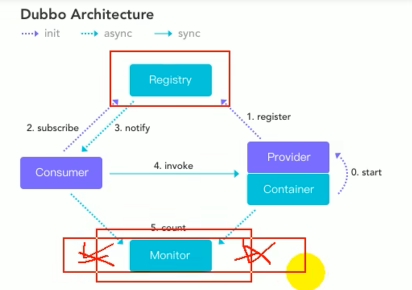

#### 独立interface模块

1，”创建Maven项目=> gmail-interface 用于存放共同的服务接口“，是为了让consumer和provider都能拿到接口。并且也会存放共用的java。

2，创建interface模块：

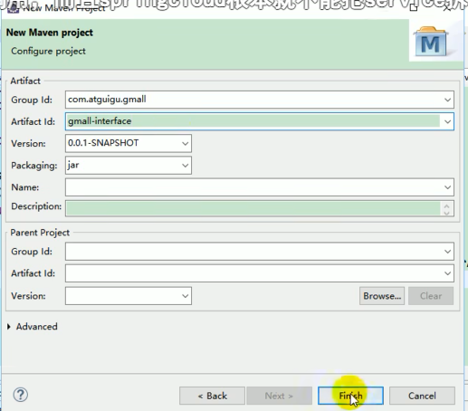

3，把共用的service接口，pojo类，异常等，都放到这个模块。这里**直接就把本地其他模块（即consumer和procvider）用maven方式引入了本模块**，本模块就可以用到别的模块的接口定义了：

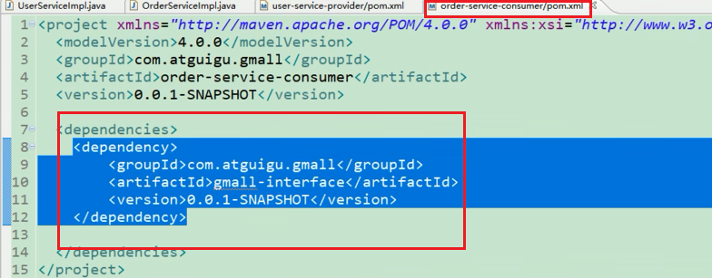

- 我：真实开发中一般是吧interface模块放到maven仓库中，然后让consumer和provider在pom中引入

4，目前存在的问题：

- consumer中通过maven引入的interface模块中的接口的实现类在别的模块中（现实世界中是在别的节点中），是无法直接使用接口的；所以需要dubbo来远程调用。

#### ssm方式实现远程调用-provider

- provider和consumer在配置前要pom引入需要的依赖（csdn笔记）

1，spring方式（即xml式）的配置provider：

```xml
<?xml version="1.0" encoding="UTF-8"?>
<beans xmlns="http://www.springframework.org/schema/beans"
       xmlns:xsi="http://www.w3.org/2001/XMLSchema-instance"
       xmlns:dubbo="http://code.alibabatech.com/schema/dubbo"
       xsi:schemaLocation="http://www.springframework.org/schema/beans http://www.springframework.org/schema/beans/spring-beans.xsd
		http://dubbo.apache.org/schema/dubbo http://dubbo.apache.org/schema/dubbo/dubbo.xsd
		http://code.alibabatech.com/schema/dubbo http://code.alibabatech.com/schema/dubbo/dubbo.xsd">
    <!--1、指定当前服务/应用的名字(同样的服务名字相同，不要和别的服务同名)-->
   <dubbo:application name="user-service-provider"></dubbo:application>
    <!--2、指定注册中心的位置-->
    <!--<dubbo:registry address="zookeeper://127.0.0.1:2181"></dubbo:registry>-->
    <dubbo:registry protocol="zookeeper" address="127.0.0.1:2181"></dubbo:registry>
    <!--3、指定通信规则（通信协议? 服务端口）-->
    <dubbo:protocol name="dubbo" port="20880"></dubbo:protocol>
    <!--4、暴露服务 让别人调用。interface指定暴露的接口 ref指向服务的真正实现对象即impl类-->
    <dubbo:service interface="com.lemon.gmail.service.UserService" ref="userServiceImpl"></dubbo:service>

    <!--服务的实现-->
    <bean id="userServiceImpl" class="com.lemon.gmail.service.impl.UserServiceImpl"></bean>
</beans>

```

- 我：springboot里，这些配置都在yml中完成。
- 我：注意“同名服务的服务名字相同”，多个同名服务就能让负载均衡排上用场了
- 我：”通信协议“：可以支持https dubbo等多种通信协议，这里选dubbo。
- 我：“暴露服务”：说明一个服务针对一个接口只能提供一种实现。
- 我：“服务的实现”：先用bean标签把userServiceImpl注册为bean，然后“暴露服务”的ref才能引用这个bean；这个bean也即是服务的实现。
- 我：这里用的ssm方式做的配置，其实之前叫schema方式做的配置，官网已经不维护了schema的文档了，但是官网现在仍在维护[xml配置方式的文档](https://cn.dubbo.apache.org/zh-cn/docsv2.7/user/configuration/xml/)；boot常用注解做的配置。

2，为provider模块编写启动类。spring启动ioc容器后，就会把服务注册到注册中心：

```java
public class MailApplication {
    public static void main(String[] args) throws IOException {
        ClassPathXmlApplicationContext applicationContext= new ClassPathXmlApplicationContext("provider.xml");
        applicationContext.start();
        System.in.read();
    }
}
```

- 我：springboot中用@Component把类当做bean注册到spring容器中。dubbo用xml把类注册到配置到的注册中心（即zk）。

3，可以在dubboadmin看到服务注册的情况：

点击“服务治理-提供者”，可以看到服务提供者的ip和端口号：


点击“服务治理-应用”，可以看到有哪些应用被注册到注册中心，名字就是xml中配置的applicationname：

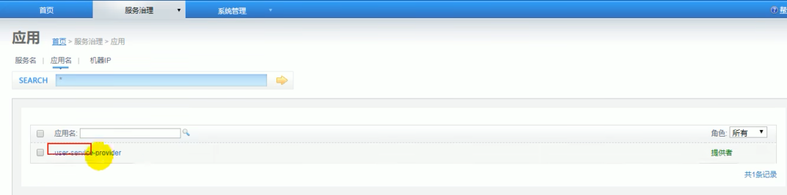

点击“服务治理-服务”，可以看到有哪些接口（即服务）被注册到注册中心：


- 我：192ip是一个机器（微服务节点），机器中有名为Provider的应用，provider中有名为UserService的一个服务。

#### SSM方式实现远程调用-consumer

1，配置xml

```xml
<?xml version="1.0" encoding="UTF-8"?>
<beans xmlns="http://www.springframework.org/schema/beans"
       xmlns:xsi="http://www.w3.org/2001/XMLSchema-instance"
       xmlns:dubbo="http://dubbo.apache.org/schema/dubbo"
       xmlns:context="http://www.springframework.org/schema/context"
       xsi:schemaLocation="http://www.springframework.org/schema/beans http://www.springframework.org/schema/beans/spring-beans.xsd
		http://www.springframework.org/schema/context http://www.springframework.org/schema/context/spring-context-4.3.xsd
		http://dubbo.apache.org/schema/dubbo http://dubbo.apache.org/schema/dubbo/dubbo.xsd
		http://code.alibabatech.com/schema/dubbo http://code.alibabatech.com/schema/dubbo/dubbo.xsd">
   <!--包扫描 这是正常的spring项目都得配置的 但是springboot一般不同配置这个扫描而只需要在自己的类上用@Component注解即可-->
    <context:component-scan base-package="com.lemon.gmail.service.impl"/>

    <!--指定当前服务/应用的名字(同样的服务名字相同，不要和别的服务同名)-->
    <dubbo:application name="order-service-consumer"></dubbo:application>
    <!--指定注册中心的位置-->
    <dubbo:registry address="zookeeper://127.0.0.1:2181"></dubbo:registry>

    <!--调用远程暴露的服务，生成远程服务代理-->
    <dubbo:reference interface="com.lemon.gmail.service.UserService" id="userService"></dubbo:reference>
</beans>
```

- 我：` <dubbo:reference`会把provider提供的UserService服务注入到消费者所在的spring容器中，这样消费者使用UserService时就可以直接用Autowired去拿到UserService服务了。为这个服务在consumer的spring容器中也取一个名字，用beanid表示。

2，编写消费者的启动类

```java
public class ConsumerApplication {
    public static void main(String[] args) {
        ClassPathXmlApplicationContext applicationContext = new ClassPathXmlApplicationContext("consumer.xml");
        OrderService orderService = applicationContext.getBean(OrderService.class);

        //调用方法查询出数据
        orderService.initOrder("1");
        System.out.println("调用完成...");
	    System.in.read();
    }
}
```

- 我：Spring的启动类和spirngboot不一样。这里直接在启动类中调用consumer自己的orderService，orderService又远程调用provider的Userservice，最后成功展示结果。
- 我：这里`System.in.read();`是为了io阻塞进程，这样方便在dubboadmin看到两个应用；否则远程调用完就程序结束，提供者就中断。

3，dubboadmin查看应用。能看到有两个应用，分别是服务者和消费者；此时消费者正在消费服务者的服务：

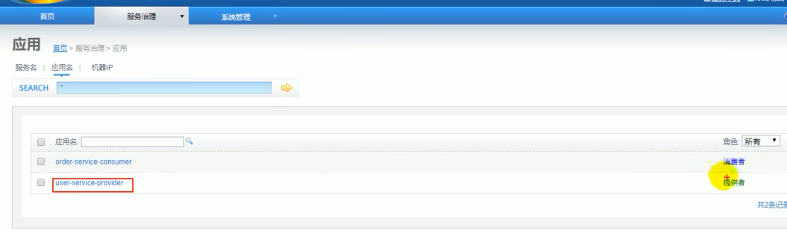

### monitor

- dubboadmin是管理控制台，dubbomonitor是监控中心。

1，检查git项目的properties：

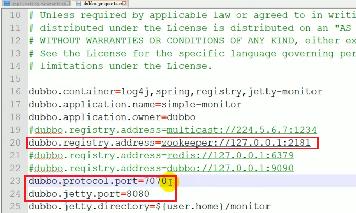

- 重点关注注册中心zk的地址
- 7070是其他服务与monitor的通信接口
- 8080是monitor的web页面的访问接口

2，其他：参考csdn笔记。

### 整合springboot

- 之前都是在ssm中使用dubbo（xml配置就是spring的特点），现在我们在springboot（特点是使用注解代替xml）中使用dubbo。

1，服务提供者配置文件的设置：

```properties
dubbo.application.name=boot-user-service-provider
dubbo.registry.address=127.0.0.1:2181
dubbo.registry.protocol=zookeeper

dubbo.protocol.name=dubbo
dubbo.protocol.port=20880

#连接监控中心：registry表示让服务端去注册中心zk找监控中心的地址
dubbo.monitor.protocol=registry
```

- ssm项目中用xml做如上的配置。springboot项目中用properties或yml文件做如上配置。

2，服务提供者暴露服务：

ssm中，provider用注解去暴露服务；但是每个服务都写注解很麻烦：

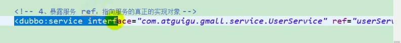

springboot中用@Service（与springboot自身的@Service区分开）去暴露服务，新版dubbo把注解重命名为@DubboService：

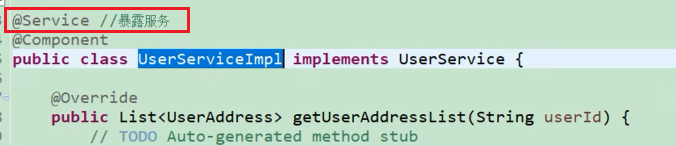

- 在使用老版本dubbo的@Service注解时，为了避免混淆，可以把Springboot的@Service注解换成@Component注解来注册当前bean。

3，消费者引用服务：

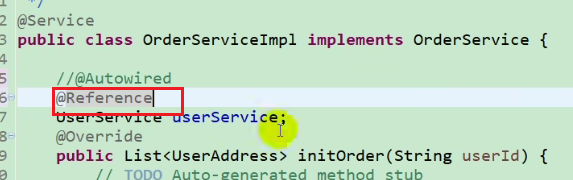

- 针对dubbo的使用，对比ssm和springboot消费者：
  - ssm中是在项目启动时，通过dubbo把服务提供者的bean放入消费者的容器，然后消费者用@Autowired拿到bean，就像单体架构拿自己项目的bean似的。
  - Springboot中的消费者使用@DubboReference拿到bean。加了@DubboReference注解后，消费者会自己去注册中心中拿到远程的服务。

4，其他的内容参考官网，和csdn笔记

- 我：csdn笔记中的注解比较老了，用的还是@Service和@Reference；现在注解更新为@DubboService和@DubboReference


### xml实现dubbo配置

#### 配置的加载顺序

1，多种配置方式同时存在时，参数优先级递减规则：JVM 启动 -D 参数，XML或spring固有的application.properties，dubbo默认配置dubbo.Properties:

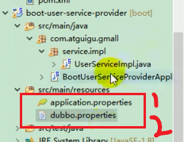

- 我：这个csdn笔记有细说，我在这也简略强调下。
- idea的绿色三角运行按钮，可以配置运行时的参数，也即configuration可以配置jvm启动时的参数。


- 使用配置等级的思路：dubbo默认的配置可以放在dubbo.properties文件中；我们想在默认配置的基础上额外修改配置的话，可以进行xml配置；打成jar包后要运行的时候临时改配置的话就用-D的方式

#### 启动时检查

1，项目启动的时候，duubo默认会检查项目依赖的服务（即本项目的provider）是否可用；如果有provider不可用，当前项目启动就会报错。如果想关闭默认的检查就设置`check=false`。

2，ssm中，针对某个**特定服务**让check为false的方式如下：

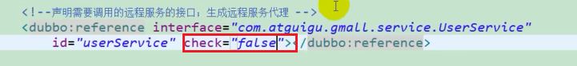

- check是在服务的消费端做的配置，所以这里是reference标签处设置

3，ssm中，**统一配置消费者的所有属性**，可以用`<dubbo:consumer标签`；这个标签中配置check=false后，不会检查消费者依赖的所有服务：

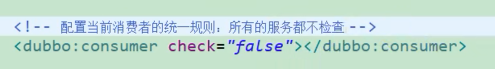

4，ssm中，取消对注册中心的检查；即消费者启动时，如果注册中心不可用，也会让消费者正常启动：


#### 超时限制

1，如果服务调用超过一定时间还不响应，那么就报异常放弃，防止消费端过久的占用线程。

2，超时限制设置的覆盖关系：

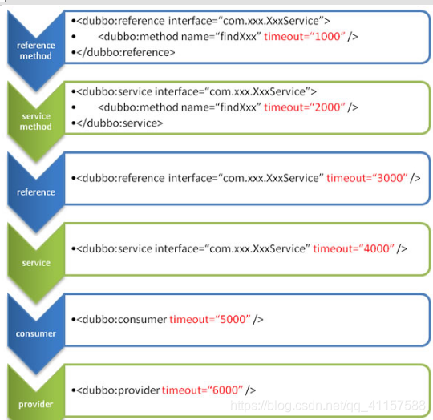

- 超时配置的优先级降序：消费端对方法设置的超时，服务端对方法设置的超时，消费端对接口设置的超时，服务端对接口设置的超时，消费端设置的全局（针对所有接口的）超时，服务端设置的全局（针对所有接口的）超时。
  - 总结来说就是：方法 大于 接口 大于 全局；如果scope的级别相同，那么消费者的配置 大于 服务者的配置。

#### 重试次数

- “重试次数”一般和“超时”搭配使用

1，超时和重试，都可以配置在服务方或消费方。下图是配置在消费方：

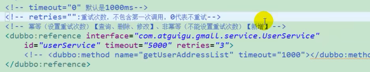

- 注意：在幂等方法（比如数据库的 查询 删除 修改）上可以设置重试次数，但是非幂等方法（比如数据库的 新增）不应该设置重试次数。

2，**重点**：老师这用eclipse的项目多启动功能，在本机实现了三个相同服务。实现方式：

1. 修改服务方模块的dubble protocol端口号，使得端口号不和上一次启动的本模块冲突
2. 多启动本模块
3. 重复步骤12多次，就可以得到多个相同的服务提供者。可以让不同服务提供者在提供服务时打印不同语句，这样消费者使用服务时，就可以发现因为负载均衡，每个服务提供者都会打印自己的语句，即每个服务都可能被使用。

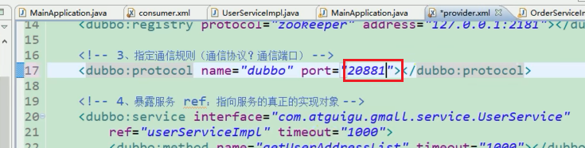

- 网友：idea多启动在edit configurations哪里 就是项目启动哪里设置 进去后项目名旁边Allow parallel run 勾掉就好了

- 我：之前一直尝试在本机实现多个同名服务，现在才知道可以用这个方式实现（上网课比自己学还是有好处 事半功倍）。

可以看到服务提供者有三个，端口号不同：

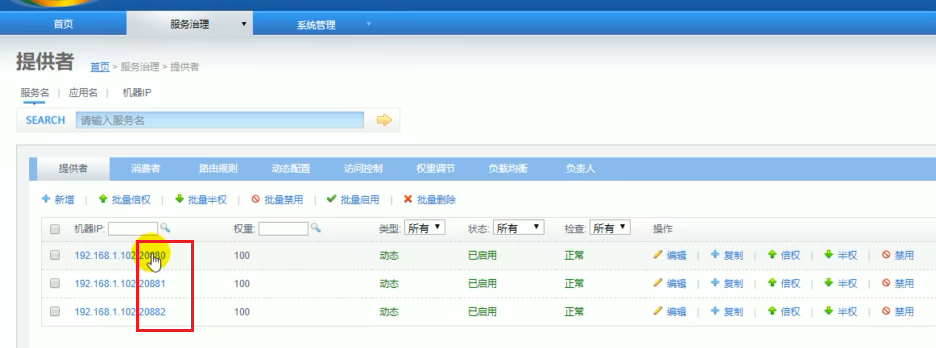

#### 多版本

- 网友：常用于灰度发布，ab测试

1，为一个接口设置两个实现类，类名不同，相当于一个service接口有新旧功能：

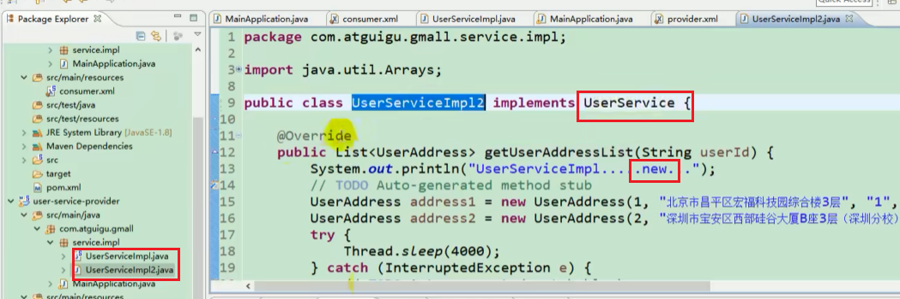

2，在服务暴露的时候，配置版本号；可以让较新版本号的接口服务会提供一些新的功能：

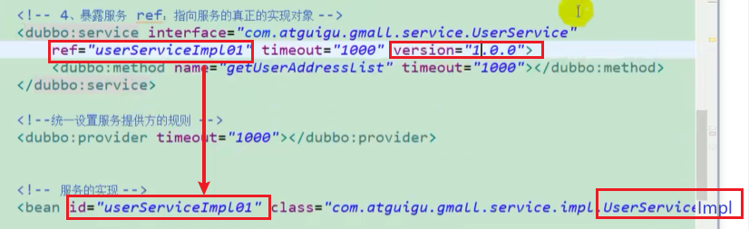

3，消费者消费的时候，可以任选是用老版本还是新版本服务（这两个服务都被暴露并注册到注册中心了），从而拿到一个服务不同版本的功能：

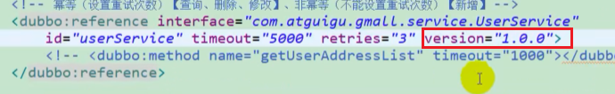

- 消费者可以让`version="*"`，这样就任意使用老版本或者新版本了。

- 一般是新版本稳定后，就选择使用新版本了。使用version可以平滑的从旧版本过度到新版本，从而实现dubbo官网说的“灰度发布”
- 可能出现的错误：消费者配置了version字段的话，如果服务端没有配置对应version，dubbo会报错没有可用的provider

#### 本地存根

1，使用XXXStub，可以在调用远程方法前做一些校验，防止无效调用远程资源，从而节约远程资源。

- 我：这个的实现不是必须的，可以把校验写到服务端或者消费端里；但是用存根类似于解耦，符合高内聚低耦合。

### springboot中实现dubbo配置

- 超时限制 重试次数等配置，以springboot的方式（而非xml的方式）做配置也很简单。
- 这里别看csdn笔记的内容，csdn笔记这没写好。

#### 前言

1，针对服务端，springboot中的`@DubboService`注解，其实就对应xml中的`<dubbo: service`标签；标签中能写的属性，在注解中都能配置：

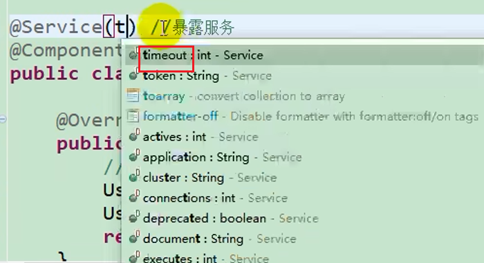

2，针对消费者，`<refrence`的相关配置，也可以在`@DubboReference`中配置。

3，xml中可以在一个接口中，细化配置某个方法；但是注解无法实现这个功能：

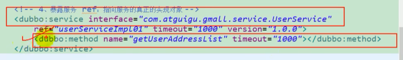

- 网友：@DubboService现在可以配方法了

4，接下来将dubbo和springboot整合的三种方式

#### 方式1-注解整合（我推荐）

1，“整合springboot”章节讲过。步骤：

1. 在启动类用@enabledubbo开启dubbo

2. 在服务端用@DubboService暴露服务

3. 在消费端用@DubboReference使用服务

#### 方式2-xml整合

1，“xml实现dubbo配置”讲过。略，详情见视频

- 网友：dubbo官方推荐使用xml配置，但是springboot一般还是习惯用注解，注解还方便

#### 方式3-api整合

1，xml文件中的每个xml配置，在api中都是一个Config配置类。略，详情见视频

- 我和网友：这个就有点麻烦了

- 网友：其实个人多年开发感觉，是脱离了xml，但是这种配置类根本不好找不好跟踪代码和入口

### 高可用

- 通过高可用的设计，减少系统不能提供服务的时间

#### 宕机

1，参考csdn笔记

- 消费者和服务者本地都缓存了对方的位置信息，即使注册中心挂掉了，之前联系过的消费者和服务者都可以通过本地缓存去直连对方并使用/提供服务。

#### dubbo直连

1，消费者可以绕过注册中心，直接通过服务所在机器地址去访问对应服务：

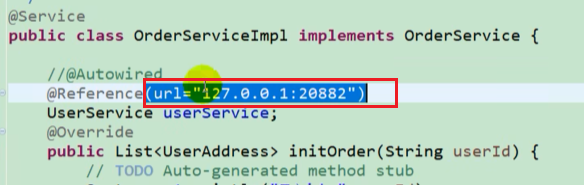

- 网友问：直连还能实现分布式的功能吗？

- 综合“宕机”和“dubbo直连”，可以知道：
  - 注册中心挂了，服务者和消费者可以通过本地缓存互相通信
  - 没有注册中心，可以通过dubbo直连使用服务

#### 负载均衡

- 网友：强烈建议这里看看源码，真的不难
- 网友：负载均衡算法类似nginx，随机(dubbo中默认) 轮询 权重 一致性hash

1，负载均衡的测试方法，在“重试次数”章节讲过了：

- 在IDE中使用**多启动**的方式，每次只需要修改dubboprotocol版本号，就可以用一个服务提供者模块启动多个相同的服务。

2，负载均衡可以在消费者或服务者配置，例如消费者的接口位置配置：

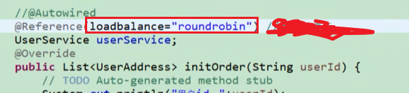

- 网友：和springCloud的Feign差不多

#### 服务降级

1，服务降级可以在dubboadmin的web页面做配置，主要有两种手段：


- 屏蔽：
  - 效果：消费者被屏蔽后，将不会发起远程调用，直接在客户端返回空对象；
  - 使用场景：服务器资源不够，tomcat总共就1000个线程，服务器有3000个并发请求；那么就可以在dubboadmin页面上手动屏蔽会调用某些不重要服务的消费者，让服务者所在的服务器减小压力。
- 容错：
  - 效果：消费者设置为容错后，发起远程调用失败的话（比如超过设置的timeout），才返回空对象；如果不返回空对象，在消费者看来就是出现了错误（比如页面可能会显示报错）。
  - 我：个人感觉这个的使用场景不是为了服务降级，而是实现高可用，即调用失败也会有返回值，虽然返回值是空的。

#### 集群容错&hystrix

1，略。见csdn笔记和视频课程。

- 网友：springCloud中feign组件集成了hystrix
- 网友：提供者配置了容错，但是没有容错方法（即远程调用失败后消费者执行的方法）；容错方法是在消费者处配置的。

### dubbo原理

#### 前言-RPC和netty原理

1，RPC概念

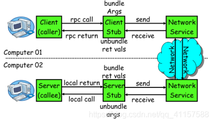

一次完整的RPC调用流程（同步调用，异步另说）如下：

1. **服务消费方（client）调用以本地调用方式调用服务；**
2. client stub接收到调用后负责将方法、参数等组装成能够进行网络传输的消息体；
3. client stub找到服务地址，并将消息发送到服务端；
4. server stub收到消息后进行解码；
5. server stub根据解码结果调用本地的服务；
6. 本地服务执行并将结果返回给server stub；
7. server stub将返回结果打包成消息并发送至消费方；
8. client stub接收到消息，并进行解码；
9. **服务消费方得到最终结果。**

dubbo只用了两步1和8，中间的过程是透明的看不到的。**RPC框架的目标就是要2~8这些步骤都封装起来**，这些细节对用户来说是透明的，不可见的。


2，netty。netty实现是基于java的nio。bio和nio对比如下：

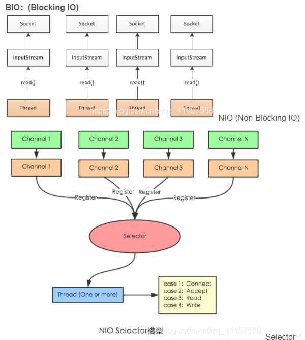

- bio：以网络io为例，每个请求进来，服务器都会开一个线程（开socket）来处理数据，来读取socket给我们传来的数据，然后会执行一些业务逻辑，最后返回；服务器可能会收到很多的请求来做操作；在业务逻辑没完成前，线程是不能释放的，因为大量线程都在阻塞等待业务逻辑的完成，所以服务器无法处理大量的请求。
- nio：通过selector去监听多个socket；某个通道的任何一个状态准备好了（即发生了感兴趣的事件），就可以额外开一个线程去做这个事，避免线程阻塞浪费系统资源。

#### 原理1-框架设计

略，看官网或者视频

- 看dubbo原理之前，感觉得先看懂spring原理比较好（手写简单的spring框架）

#### 原理2-标签解析

略，看官网或者视频

#### 原理3-服务暴露

略

#### 原理4-服务引用

略

#### 原理5-服务调用

略

### 结束语

