## 基础知识

#### 类型转换

1，包装类 基本数据类型 String 的转换：

- [1](https://blog.csdn.net/HY845638534/article/details/84669490)

## 栈队列

### [剑指 Offer 09. 用两个栈实现队列](https://leetcode-cn.com/problems/yong-liang-ge-zhan-shi-xian-dui-lie-lcof/)

方法一：双栈

#### 官方-思路和算法

维护两个栈，第一个栈支持插入操作，第二个栈支持删除操作。

根据栈先进后出的特性，我们每次往第一个栈里插入元素后，第一个栈的底部元素是最后插入的元素，第一个栈的顶部元素是下一个待删除的元素。为了维护队列先进先出的特性，我们引入第二个栈，用第二个栈维护待删除的元素，在执行删除操作的时候我们首先看下第二个栈是否为空。如果为空，我们将第一个栈里的元素一个个弹出插入到第二个栈里，这样第二个栈里元素的顺序就是待删除的元素的顺序，要执行删除操作的时候我们直接弹出第二个栈的元素返回即可。

- 成员变量
  - 维护两个栈 stack1 和 stack2，其中 stack1 支持插入操作，stack2 支持删除操作

- 构造方法
  - 初始化 stack1 和 stack2 为空

- 插入元素

  插入元素对应方法 appendTail

  - stack1 直接插入元素

- 删除元素

  删除元素对应方法 deleteHead

  - 如果 stack2 为空，则将 stack1 里的所有元素弹出插入到 stack2 里

  - 如果 stack2 仍为空，则返回 -1，否则从 stack2 弹出一个元素并返回

#### 代码

```java
class CQueue {
    //两个栈，一个出栈，一个入栈
    private Stack<Integer> stack1;
    private Stack<Integer> stack2;
    
    public CQueue() {
        stack1 = new Stack<>();
        stack2 = new Stack<>();
    }
    
    public void appendTail(int value) {
        stack1.push(value);
    }
    
    public int deleteHead() {
        if(!stack2.isEmpty()){
            return stack2.pop();
        }else{
            while(!stack1.isEmpty()){
                stack2.push(stack1.pop());
            }
            return stack2.isEmpty() ? -1 : stack2.pop();
        }
    }
}
```

- 网友问：“这个方式为何只打败50%的提交？”。网友答：“因为Stack的实现是线程安全的，性能比LinkedList低”。

#### 复杂度分析

- 时间复杂度：对于插入和删除操作，时间复杂度均为 O(1)O(1)。插入不多说，对于删除操作，虽然看起来是 O(n)O(n) 的时间复杂度，但是仔细考虑下每个元素只会「至多被插入和弹出 stack2 一次」，因此均摊下来每个元素被删除的时间复杂度仍为 O(1)O(1)。

- 空间复杂度：O(n)O(n)。需要使用两个栈存储已有的元素。

#### 思考

- 20220302：
  - 不记得java中stack怎么实现
  - 知道用两个栈实现队列。但是针对删除，想的是“插入队列移动到删除队列，删除元素后，要把删除队列的所有元素移动回插入队列”，但是实际上不需要把删除队列的元素移动回去；
    - 正确思路就是如题解：删除队列负责删除，插入队列负责插入，删除队列空了才能把元素从插入队列移入删除队列，如果删除队列和插入队列同时为空则返回-1.

#### 再战

1,20220323，调试多次后成功：

```java
class CQueue {

    Stack stackIn=null;
    Stack stackOut=null;


    public CQueue() {
        stackIn=new Stack<>();
        stackOut=new Stack<>();
    }
    
        public void appendTail(int value) {
        //如果是传入integer类型，而非int的话，貌似会给integer再包裹一层，导致异常
        stackIn.push(value);
    }

    public int deleteHead() {
        //如果出栈不为空，直接pop一个就行。！！！包装类和基本数据类型的相互转换
        if(!stackOut.empty()){
            return (int) stackOut.pop();
        }
        //如果出栈为空，此时要删除节点,先就得把入栈的所有节点移动过来
        else{
            if(stackIn.empty()){
                //入栈也为空，说明整个逻辑队列为空，直接返回-1
                return -1;
            }else{
                //入栈不为空，把所有入栈元素转移到出栈；并弹出出栈的顶部。
                while(!stackIn.empty()){
                    stackOut.push(stackIn.pop());
                }
                return (int)stackOut.pop();
            }

        }

    }
}

/**
 * Your CQueue object will be instantiated and called as such:
 * CQueue obj = new CQueue();
 * obj.appendTail(value);
 * int param_2 = obj.deleteHead();
 */
```

2,20220323，改进代码：

```java
class CQueue {

    Stack <Integer> stackIn=null;
    Stack <Integer> stackOut=null;


    public CQueue() {
        stackIn=new Stack<>();
        stackOut=new Stack<>();
    }
    
        public void appendTail(int value) {
        //直接把int转化为Integer存入
        stackIn.push(Integer.valueOf(value));
    }

    public int deleteHead() {
        //如果出栈不为空，直接pop一个就行。！！！包装类和基本数据类型的相互转换
        if(!stackOut.empty()){
            return stackOut.pop().intValue();
        }
        //如果出栈为空，此时要删除节点,先就得把入栈的所有节点移动过来
        else{
            if(stackIn.empty()){
                //入栈也为空，说明整个逻辑队列为空，直接返回-1
                return -1;
            }else{
                //入栈不为空，把所有入栈元素转移到出栈；并弹出出栈的顶部。
                while(!stackIn.empty()){
                    stackOut.push(stackIn.pop());
                }
                //由于存的Integer对象，返回的时候要转化为int类型。
                return stackOut.pop().intValue();
            }

        }

    }
}

/**
 * Your CQueue object will be instantiated and called as such:
 * CQueue obj = new CQueue();
 * obj.appendTail(value);
 * int param_2 = obj.deleteHead();
 */
```

- 本代码因为主动包装int为Integer，性能更差了，但是更符合把对象存入栈的思想。
- `Stack <Integer> stackIn=new Stack<>();`，注意是在前面限定泛型的类型，后面的尖括号可留空由编译器自己推测；不正确指定泛型类型的话，会出现一些奇怪的包装错误，比如说期待包装成integer却包装为object。


### [剑指 Offer 30. 包含min函数的栈](https://leetcode-cn.com/problems/bao-han-minhan-shu-de-zhan-lcof/)

#### 首战告捷

```java
class MinStack {

    /** initialize your data structure here. */
    Stack<Integer> myStack=null;
    Stack<Integer> historicalMin=null;
    int min;
    public MinStack() {
        myStack=new Stack<>();
        historicalMin=new Stack<>();
        //不要忘记用引号结尾
        min=Integer.MAX_VALUE;
    }
    
    public void push(int x) {
        myStack.push(x);
        
        if(x<=min){
            min=x;
            historicalMin.push(min);
        }
    }
    
    public void pop() {
        int temp=myStack.pop();

        //不要误用=判断相等
        if(temp==min){
            historicalMin.pop();
            //如果两个栈都为空了，此时再直接peek会抛出异常；要判断hostoricalMin是否为空
            if(!historicalMin.empty()){
                min=historicalMin.peek();
            }else{
                min=Integer.MAX_VALUE;
            }
            
        }

    }
    
    public int top() {
        return myStack.peek();
    }
    
    public int min() {
        return min;

    }
}

/**
 * Your MinStack object will be instantiated and called as such:
 * MinStack obj = new MinStack();
 * obj.push(x);
 * obj.pop();
 * int param_3 = obj.top();
 * int param_4 = obj.min();
 */
```

- 执行后，据提示处理了几个语法错误；提交一次后，处理了一个逻辑漏洞；第二次提交完成。
- 待改进：
  - 读了题解后，我发现不该在hostoricalMin为空时，把intgermax当做min；而应该在push时，发现historicalMin为空就直接压入当前被push的元素，这样就不存在提前一步设置min的问题。
  - 基本数据类型min可以不设置，直接用stack.peek()就行。

---

#### 官方-解题思路
普通栈的 push() 和 pop() 函数的复杂度为 O(1)O(1) ；而获取栈最小值 min() 函数需要遍历整个栈，复杂度为 O(N)O(N) 。

本题难点： 将 min() 函数复杂度降为 O(1)O(1) ，可通过建立辅助栈实现；

- 数据栈 AA ： 栈 AA 用于存储所有元素，保证入栈 push() 函数、出栈 pop() 函数、获取栈顶 top() 函数的正常逻辑。
- 辅助栈 BB ： 栈 BB 中存储栈 AA 中所有 非严格降序 的元素，则栈 AA 中的最小元素始终对应栈 BB 的栈顶元素，即 min() 函数只需返回栈 BB 的栈顶元素即可。

因此，只需设法维护好 栈 BB 的元素，使其保持非严格降序，即可实现 min() 函数的 O(1)O(1) 复杂度。

#### 函数设计

- push(x) 函数： 重点为保持栈 BB 的元素是 非严格降序 的。

  - 将 xx 压入栈 AA （即 A.add(x) ）；

  - 若 ① 栈 BB 为空 或 ② xx 小于等于 栈 BB 的栈顶元素，则将 xx 压入栈 BB （即 B.add(x) ）。

- pop() 函数： 重点为保持栈 A, BA,B 的 元素一致性 。

  - 执行栈 AA 出栈（即 A.pop() ），将出栈元素记为 yy ；

  - 若 yy 等于栈 BB 的栈顶元素，则执行栈 B 出栈（即 B.pop() ）。

- top() 函数： 直接返回栈 AA 的栈顶元素即可，即返回 A.peek() 。

- min() 函数： 直接返回栈 BB 的栈顶元素即可，即返回 B.peek() 。

#### 复杂度分析

- 时间复杂度 O(1) ： push(), pop(), top(), min() 四个函数的时间复杂度均为常数级别。
- 空间复杂度 O(N)： 当共有 N 个待入栈元素时，辅助栈 BB 最差情况下存储 N 个元素，使用 O(N) 额外空间。

#### 代码
Java 代码中，由于 Stack 中存储的是 int 的包装类 Integer ，因此需要使用 equals() 代替 == 来比较值是否相等。

```java
class MinStack {
    Stack<Integer> A, B;
    public MinStack() {
        A = new Stack<>();
        B = new Stack<>();
    }
    public void push(int x) {
        A.add(x);
        if(B.empty() || B.peek() >= x)
            B.add(x);
    }
    public void pop() {
        if(A.pop().equals(B.peek()))
            B.pop();
    }
    public int top() {
        return A.peek();
    }
    public int min() {
        return B.peek();
    }
}

```


## 链表

### [剑指 Offer 06. 从尾到头打印链表](https://leetcode-cn.com/problems/cong-wei-dao-tou-da-yin-lian-biao-lcof/)

#### 首战告捷

```java
/**
 * Definition for singly-linked list.
 * public class ListNode {
 *     int val;
 *     ListNode next;
 *     ListNode(int x) { val = x; }
 * }
 */
class Solution {
    //记录最大递归深度，以便各层实现逆序存入数组
    int deepMax;
    int[] array;//array在递归最底层被建立
    public int[] reversePrint(ListNode head) {
        /*
        注意数组在java中是引用传递的：https://blog.csdn.net/qq_43555323/article/details/84783750;所以所有递归层共享数组，但是递归深度参数不同。
        所以可以考虑递归+引用传递解决
        */
        return digui(head,0+1);
    }
    //形参deep为本层的深度，也即以本层为最后节点的话，数组的长度-1。
    public int[] digui(ListNode head,int deep){
        //如果传入的头节点不为空，说明可以继续往下递归；小心不能用head.next判断链表尾部,因为不知道给的head是否为空。
        if(head!=null){
            //先递归调用获得数组
            array = digui(head.next,deep+1);
            //再把当前元素加入数组对应的位置；
            array[deepMax-deep]=head.val;

            //别忘了if和else都得有return，否则走if的递归无法返回
            return array;

        }
        //如果节点为空，则本层无节点；且制造数组，数组大小为本层深度-1
        else{
            deepMax=deep-1;
            return new int[deep-1];
        }

    }
}
```

- 我和一些网友理解：递归本质就是栈的使用，隐式使用了JVM栈
- 我这方法比官方还好，没有占用额外空间；时间复杂度一致；最高赞非官方解用的也是递归。

---

#### 官方-使用栈

栈的特点是后进先出，即最后压入栈的元素最先弹出。考虑到栈的这一特点，使用栈将链表元素顺序倒置。从链表的头节点开始，依次将每个节点压入栈内，然后依次弹出栈内的元素并存储到数组中。

- 创建一个栈，用于存储链表的节点
- 创建一个指针，初始时指向链表的头节点
- 当指针指向的元素非空时，重复下列操作：
  - 将指针指向的节点压入栈内
  - 将指针移到当前节点的下一个节点
- 获得栈的大小 size，创建一个数组 print，其大小为 size
- 创建下标并初始化 index = 0
- 重复 size 次下列操作：
  - 从栈内弹出一个节点，将该节点的值存到 print[index]
  - 将 index 的值加 1
- 返回 print

#### 代码

```java

/**
 * Definition for singly-linked list.
 * public class ListNode {
 *     int val;
 *     ListNode next;
 *     ListNode(int x) { val = x; }
 * }
 */
class Solution {
    public int[] reversePrint(ListNode head) {
        Stack<ListNode> stack = new Stack<ListNode>();
        ListNode temp = head;
        while (temp != null) {
            stack.push(temp);
            temp = temp.next;
        }
        int size = stack.size();
        int[] print = new int[size];
        for (int i = 0; i < size; i++) {
            print[i] = stack.pop().val;
        }
        return print;
    }
}

```

- 这种倒着处理的，就可以想到栈 或递归！

#### 复杂性分析

时间复杂度：O(n)。正向遍历一遍链表，然后从栈弹出全部节点，等于又反向遍历一遍链表。

空间复杂度：O(n)。额外使用一个栈存储链表中的每个节点。


### [剑指 Offer 24. 反转链表](https://leetcode-cn.com/problems/fan-zhuan-lian-biao-lcof/)

#### 首战寄

```java
/**
 * Definition for singly-linked list.
 * public class ListNode {
 *     int val;
 *     ListNode next;
 *     ListNode(int x) { val = x; }
 * }
 */
class Solution {
    /*
    反转，一开始想到要用栈结构，如用递归解决；但是递归返回的头结点是原节点的末尾没错，可是想把当前节点放到逆链表的尾部的话
    却不能直接通过头节点直接放置，因为头节点的后续永远都是倒数第二个节点，要多次next才能放到尾部，很麻烦。

    换种思路，在每层递归时，交换节点指向；并记录逆链表的头结点即可。
     */
    ListNode resultHead,resultTail,temp; 
    public ListNode reverseList(ListNode head) {
        //resultTail保存尾节点，最后才能让尾节点指向null
        resultTail=head;
        //翻转链表
        recur(head);
        //才能让翻转链表的尾节点指向null
        resultTail.next=null;

        return resultHead;
    }
    //因为逆链表末尾需要为null，而不是两个节点组成小环，必须把递归提出来
    public void recur(ListNode head){
        //如果传入节点为空，说明是空链表，直接退出函数，让reverseList返回空的resultHead节点
        if(head==null){
            //注意void不能有返回值，可以用return是本层递归退栈
            return;
        }
        //如果当前传入节点不为空，说明至少有一个节点
        else{
            //如果下一节点为空，说明当前节点是逆链表的头，用resultHead引用它，保存好逆链表的头；因为对象给方法时给的是地址，所以不同层的递归修改是互相影响的。此时不需要交换本节点与下一节点（毕竟下一节点为空）的指向。
            if(head.next==null){
                resultHead=head;
            }
            //如果下一节点不为空，交换当前节点和下一节点的指向
            else{
                //交换指向；一定要用temp，否则链表会在head.next后断开
                temp.next=head
                ???要多个指针
                temp=head.next.next;
                head.next.next=head;
                //保证逆链表的尾结点为null
                //head.next=null;
            }

        }
    }
}
```

- 想想用递归单指针，但是逻辑上没理清；尝试递归+双指针时就放弃了

- 网友：链表题必须画图

#### 官方-方法一：迭代

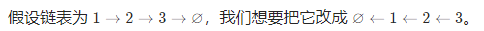

在遍历链表时，将当前节点的 \textit{next}next 指针改为指向前一个节点。由于节点没有引用其前一个节点，因此必须事先存储其前一个节点。在更改引用之前，还需要存储后一个节点。最后返回新的头引用。

```java
class Solution {
    public ListNode reverseList(ListNode head) {
        ListNode prev = null;
        ListNode curr = head;
        while (curr != null) {
            ListNode next = curr.next;
            curr.next = prev;
            prev = curr;
            curr = next;
        }
        return prev;
    }
}
```

复杂度分析

- 时间复杂度：O(n)，其中 n 是链表的长度。需要遍历链表一次。
- 空间复杂度：O(1)。

#### 官方-方法二：递归

递归版本稍微复杂一些，其关键在于反向工作。假设链表的其余部分已经被反转，现在应该如何反转它前面的部分？

假设链表为：

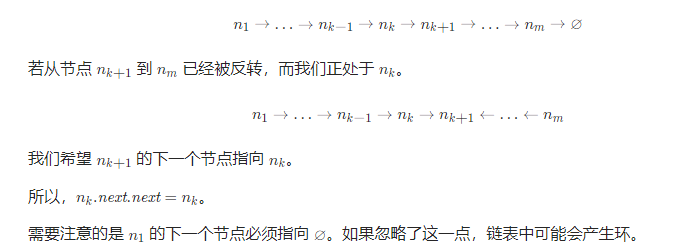

```java
class Solution {
    public ListNode reverseList(ListNode head) {
        if (head == null || head.next == null) {
            return head;
        }
        ListNode newHead = reverseList(head.next);
        head.next.next = head;
        head.next = null;
        return newHead;
    }
}

```

复杂度分析:

- 时间复杂度：O(n)，其中 n 是链表的长度。需要对链表的每个节点进行反转操作。

- 空间复杂度：O(n)，其中 n 是链表的长度。空间复杂度主要取决于递归调用的栈空间，最多为 n 层。

#### 即时再战-成功

```java
/**
 * Definition for singly-linked list.
 * public class ListNode {
 *     int val;
 *     ListNode next;
 *     ListNode(int x) { val = x; }
 * }
 */
class Solution {
    ListNode newHead;
    public ListNode reverseList(ListNode head) {
        //设置递归返回条件
        if(head==null||head.next==null){
            return head;
        }else{//只有下一个节点不为空，就让下一个节点指向本节点，本节点指向空（保证尾节点指向了null）
            newHead=reverseList(head.next);
            //必须把反转链表放在递归后面，才能利用退栈时的逆序
            head.next.next=head;
            head.next=null;
            return newHead;

        }

    }
}
```

- 还是用的递归法


### [剑指 Offer 35. 复杂链表的复制](https://leetcode-cn.com/problems/fu-za-lian-biao-de-fu-zhi-lcof/)

#### 首战寄

不知道怎么写

----

#### 官方-解题思路

普通链表的节点定义如下：

```java
// Definition for a Node.
class Node {
    int val;
    Node next;
    public Node(int val) {
        this.val = val;
        this.next = null;
    }
}

```

本题链表的节点定义如下：

```java
// Definition for a Node.
class Node {
    int val;
    Node next, random;
    public Node(int val) {
        this.val = val;
        this.next = null;
        this.random = null;
    }
}

```

给定链表的头节点 head ，复制普通链表很简单，只需遍历链表，每轮建立新节点 + 构建前驱节点 pre 和当前节点 node 的引用指向即可。

本题链表的节点新增了 random 指针，指向链表中的 任意节点 或者 null 。这个 random 指针意味着在复制过程中，除了构建前驱节点和当前节点的引用指向 pre.next ，还要构建前驱节点和其随机节点的引用指向 pre.random 。

本题难点： 在复制链表的过程中构建新链表各节点的 random 引用指向:

```java
class Solution {
    public Node copyRandomList(Node head) {
        Node cur = head;
        Node dum = new Node(0), pre = dum;
        while(cur != null) {
            Node node = new Node(cur.val); // 复制节点 cur
            pre.next = node;               // 新链表的 前驱节点 -> 当前节点
            // pre.random = "???";         // 新链表的 「 前驱节点 -> 当前节点 」 无法确定
            cur = cur.next;                // 遍历下一节点
            pre = node;                    // 保存当前新节点
        }
        return dum.next;
    }
}
```

> 本文介绍 「哈希表」 ，「拼接 + 拆分」 两种方法。哈希表方法比较直观；拼接 + 拆分方法的空间复杂度更低。

#### 官方-方法一：哈希表

利用哈希表的查询特点，考虑构建 原链表节点 和 新链表对应节点 的键值对映射关系，再遍历构建新链表各节点的 next 和 random 引用指向即可。

算法流程：

1. 若头节点 head 为空节点，直接返回 null ；
2. 初始化： 哈希表 dic ， 节点 cur 指向头节点；
3. 复制链表：
   1. 建立新节点，并向 dic 添加键值对 (原 cur 节点, 新 cur 节点） ；
   2. cur 遍历至原链表下一节点；
4. 构建新链表的引用指向：
   1. 构建新节点的 next 和 random 引用指向；
   2. cur 遍历至原链表下一节点；
5. 返回值： 新链表的头节点 dic[cur] ；

复杂度分析：

- 时间复杂度 O(N ： 两轮遍历链表，使用 O(N)O(N) 时间。
- 空间复杂度 O(N)： 哈希表 dic 使用线性大小的额外空间。

代码：

```java
class Solution {
    public Node copyRandomList(Node head) {
        if(head == null) return null;
        Node cur = head;
        Map<Node, Node> map = new HashMap<>();
        // 3. 复制各节点，并建立 “原节点 -> 新节点” 的 Map 映射
        while(cur != null) {
            map.put(cur, new Node(cur.val));
            cur = cur.next;
        }
        cur = head;
        // 4. 构建新链表的 next 和 random 指向
        while(cur != null) {
            map.get(cur).next = map.get(cur.next);
            map.get(cur).random = map.get(cur.random);
            cur = cur.next;
        }
        // 5. 返回新链表的头节点
        return map.get(head);
    }
}
```

#### 官方-方法二：拼接 + 拆分

考虑构建 原节点 1 -> 新节点 1 -> 原节点 2 -> 新节点 2 -> …… 的拼接链表，如此便可在访问原节点的 random 指向节点的同时找到新对应新节点的 random 指向节点。

算法流程：

1. 复制各节点，构建拼接链表:

   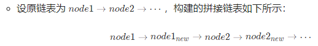

2. 构建新链表各节点的 random 指向：
   - 当访问原节点 cur 的随机指向节点 cur.random 时，对应新节点 cur.next 的随机指向节点为 cur.random.next 。
3. 拆分原 / 新链表：
   - 设置 pre / cur 分别指向原 / 新链表头节点，遍历执行 pre.next = pre.next.next 和 cur.next = cur.next.next 将两链表拆分开。
4. 返回新链表的头节点 res 即可。

复杂度分析：

- 时间复杂度 O(N)： 三轮遍历链表，使用 O(N) 时间。
- 空间复杂度 O(1) ： 节点引用变量使用常数大小的额外空间。

代码：

```java
class Solution {
    public Node copyRandomList(Node head) {
        if(head == null) return null;
        Node cur = head;
        // 1. 复制各节点，并构建拼接链表
        while(cur != null) {
            Node tmp = new Node(cur.val);
            tmp.next = cur.next;
            cur.next = tmp;
            cur = tmp.next;
        }
        // 2. 构建各新节点的 random 指向
        cur = head;
        while(cur != null) {
            if(cur.random != null)
                cur.next.random = cur.random.next;
            cur = cur.next.next;
        }
        // 3. 拆分两链表
        cur = head.next;
        Node pre = head, res = head.next;
        while(cur.next != null) {
            pre.next = pre.next.next;
            cur.next = cur.next.next;
            pre = pre.next;
            cur = cur.next;
        }
        pre.next = null; // 单独处理原链表尾节点
        return res;      // 返回新链表头节点
    }
}
```

#### 20220325 半寄

```java
/*
// Definition for a Node.
class Node {
    int val;
    Node next;
    Node random;

    public Node(int val) {
        this.val = val;
        this.next = null;
        this.random = null;
    }
}
*/
class Solution {
    public Node copyRandomList(Node head) {
        //处理空节点
        if(head==null)
            return head;

        //把新链表的每个节点，跟在老链表的每个节点后面
        Node cur=head;
        while(cur!=null){
            Node temp=new Node(cur.val);
            temp.next=cur.next;
            cur.next=temp;
            cur=cur.next.next;
        }
        
        //根据老链表的ramdon，设置新链表的random
        cur=head;
        while(cur!=null){
            //有些节点指向random，所以要小心random.next时发生空指针异常。不给新链表的random赋值的话，random就是默认的null。
            if(cur.random!=null)
                cur.next.random=cur.random.next;
            cur=cur.next.next;
        }

        //拆分两个链表
        cur=head;
        Node result=cur.next;
        while(cur!=null){
            //必须要临时辅助节点记录截断处
            Node temp=cur.next;
            cur.next=cur.next.next; 
            //！！！链表中小心深度next；本处可能temp为新链表的最后一个节点了，两重next会报错；推荐像标答那样，以后者为next终止条件
            if(temp.next!=null)
                temp.next=temp.next.next;
            cur=cur.next;
        }

        return result;
        
    }
}
```

- 思路有，但是在处理最后拆分的时候，没注意好next的深度。
  - 官方方法二拆分时，cur.next != null可以保证还有两个节点没拆分，但是会导致新旧两个链表最后一个节点黏在一起的情况，所以最后要单独让原链表的尾部为null。
  - 我的拆分时，不需要最后处理最后节点粘在一起的情况，但是每次迭代都要if判断比较耗时；
  - 总之缝合链表拆分时，以粘合处的后者为判断离开的标志为好，不容易空指针异常。


## 字符串

### [剑指 Offer 05. 替换空格](https://leetcode-cn.com/problems/ti-huan-kong-ge-lcof/)

#### 首战告捷

```java
class Solution {
    public String replaceSpace(String s) {
        
        String result="";

        //对字符串的每个字符进行处理。字符串长度用length()，数组长度用length。？？？size的大小包含空格吗
        for(int i=0;i<s.length();i++){
            //获取字符串形式表示的当前字符
            String temp=String.valueOf(s.charAt(i));
            //对空格进行替换。注意字符串不能用==判断地址相等推出内容相等，因为不同地址存的字符串的内容可能相等；而得用equals才能判断内容是否相等，String重写了equals。
            if(temp.equals(" ")){
                result+="%20";
            }else{
                result+=temp;
            }
        }

        return result;
    }
}
```

- 注意：字符串判断内容相等要用equals

- charAt可以得到字符串某位置的字符；String.valueOf()可以把字符转化为字符串存入堆中的字符串常量池。

----

#### 官方-遍历添加

在 Python 和 Java 等语言中，字符串都被设计成「不可变」的类型，即无法直接修改字符串的某一位字符，需要新建一个字符串实现。

算法流程：

1. 初始化一个 list (Python) / StringBuilder (Java) ，记为 res ；
2. 遍历列表 s 中的每个字符 c ：
   - 当 c 为空格时：向 res 后添加字符串 "%20" ；
   - 当 c 不为空格时：向 res 后添加字符 c ；
3. 将列表 res 转化为字符串并返回。

复杂度分析：

- 时间复杂度 O(N) ： 遍历使用 O(N) ，每轮添加（修改）字符操作使用 O(1)；
- 空间复杂度 O(N) ： Python 新建的 list 和 Java 新建的 StringBuilder 都使用了线性大小的额外空间。

```java

class Solution {
    public String replaceSpace(String s) {
        StringBuilder res = new StringBuilder();
        for(Character c : s.toCharArray())
        {
            if(c == ' ') res.append("%20");
            else res.append(c);
        }
        return res.toString();
    }
}

```


#### 官方-字符数组

由于每次替换从 1 个字符变成 3 个字符，使用字符数组可方便地进行替换。建立字符数组地长度为 s 的长度的 3 倍，这样可保证字符数组可以容纳所有替换后的字符。算法：

- 获得 s 的长度 length
- 创建字符数组 array，其长度为 length * 3
- 初始化 size 为 0，size 表示替换后的字符串的长度
- 从左到右遍历字符串 s
  - 获得 s 的当前字符 c
  - 如果字符 c 是空格，则令 array[size] = '%'，array[size + 1] = '2'，array[size + 2] = '0'，并将 size 的值加 3
  - 如果字符 c 不是空格，则令 array[size] = c，并将 size 的值加 1
- 遍历结束之后，size 的值等于替换后的字符串的长度，从 array 的前 size 个字符创建新字符串，并返回新字符串

代码：

```java
class Solution {
    public String replaceSpace(String s) {
        int length = s.length();
        char[] array = new char[length * 3];
        int size = 0;
        for (int i = 0; i < length; i++) {
            char c = s.charAt(i);
            if (c == ' ') {
                array[size++] = '%';
                array[size++] = '2';
                array[size++] = '0';
            } else {
                array[size++] = c;
            }
        }
        String newStr = new String(array, 0, size);
        return newStr;
    }
}

```

- 网友：这样不行吗😂`return s.replace(" ","%20");`?
  - 网友答：不行，这个只能替换第一个，应该用replaceAll
    - 网友反驳：不是哇，这个replace方法确实是替换了呀，你再去翻翻看文档
    - 网友：replace和replaceAll的区别是后者支持正则但是前者不支持，但是它们都是全部替换的

复杂性分析:

- 时间复杂度：O(n)。遍历字符串 `s` 一遍。
- 空间复杂度：O(n)。额外创建字符数组，长度为 `s` 的长度的 3 倍。


### [剑指 Offer 58 - II. 左旋转字符串](https://leetcode-cn.com/problems/zuo-xuan-zhuan-zi-fu-chuan-lcof/)

#### 首战告捷

```java
class Solution {
    public String reverseLeftWords(String s, int n) {
        //保存前若干位字符
        String head="";
        //保存后若干位字符
        String tail="";

        //把前n位字符存入head
        for(int i=0;i<n;i++){
            head+=String.valueOf(s.charAt(i));
        }

        //把原字符串后面的部分取出来
        for(int i=n;i<s.length();i++){
            tail+=String.valueOf(s.charAt(i));
        }

        return tail+head;

    }
}
```

- “把字符串拆成单个字符，再把单个字符转化成单字符字符串，再操作字符串”；这种方法很容易，但是时间和空间复杂度比较大。


#### 官方-方法一：字符串切片

解题思路：

- 本题做法较多，本文主要介绍 “字符串切片” ， “列表遍历拼接” ， “字符串遍历拼接” 三种方法。
  由于本题的多解法涉及到了 字符串为不可变对象 的相关概念，导致效率区别较大。因此，单列一节 三种方法的效率分析 ，望对各位有所帮助。

方法一：字符串切片

- 应用字符串切片函数，可方便实现左旋转字符串。

- 获取字符串 s[n:]s[n:] 切片和 s[:n]s[:n] 切片，使用 "++" 运算符拼接并返回即可。

复杂度分析：

- 时间复杂度 O(N) ： 其中 N 为字符串 s的长度，字符串切片函数为线性时间复杂度（参考资料）；
- 空间复杂度 O(N)： 两个字符串切片的总长度为 N。

代码：

```java
class Solution {
    public String reverseLeftWords(String s, int n) {
        return s.substring(n, s.length()) + s.substring(0, n);
    }
}

```

- substring左包右不包


#### 官方-方法二：列表遍历拼接
若面试规定不允许使用 切片函数 ，则使用此方法。

算法流程：

1. 新建一个 list(Python)、StringBuilder(Java) ，记为 resres ；

2. 先向 resres 添加 “第 n + 1n+1 位至末位的字符” ；
3. 再向 resres 添加 “首位至第 nn 位的字符” ；
4. 将 resres 转化为字符串并返回。

复杂度分析：

- 时间复杂度 O(N)： 线性遍历 s并添加，使用线性时间；
- 空间复杂度 O(N)： 新建的辅助 res使用 O(N)大小的额外空间。

代码：

```java
class Solution {
    public String reverseLeftWords(String s, int n) {
        StringBuilder res = new StringBuilder();
        for(int i = n; i < s.length(); i++)
            res.append(s.charAt(i));
        for(int i = 0; i < n; i++)
            res.append(s.charAt(i));
        return res.toString();
    }
}
```

- 注意：StirngBuilder实例化的对象最后要用toString方法把自己转换成字符串。
- StirngBuilder可以直接append字符


#### 官方-方法三：字符串遍历拼接
若规定 Python 不能使用 join() 函数，或规定 Java 只能用 String ，则使用此方法。

此方法与 方法二 思路一致，区别是使用字符串代替列表。

复杂度分析：

- 时间复杂度 O(N)： 线性遍历 s并添加，使用线性时间；
- 空间复杂度 O(N) ： 假设循环过程中内存会被及时回收，内存中至少同时存在长度为 N和 N-1的两个字符串（新建长度为 N的 res需要使用前一个长度 N-1的 res），因此至少使用 O(N)的额外空间。

代码：

```java
class Solution {
    public String reverseLeftWords(String s, int n) {
        String res = "";
        for(int i = n; i < s.length(); i++)
            res += s.charAt(i);
        for(int i = 0; i < n; i++)
            res += s.charAt(i);
        return res;
    }
}
```

- 这个就是我首战的做法；不过我还把charAt转换成Stirng后，再用+=。


#### 三种官方算法的区别

详细分析请参考 Efficient String Concatenation in Python 。

以上三种方法的空间使用如下图所示。
以 Python 为例开展三种方法的效率测试，结论同样适用于 Java 等其他语言。

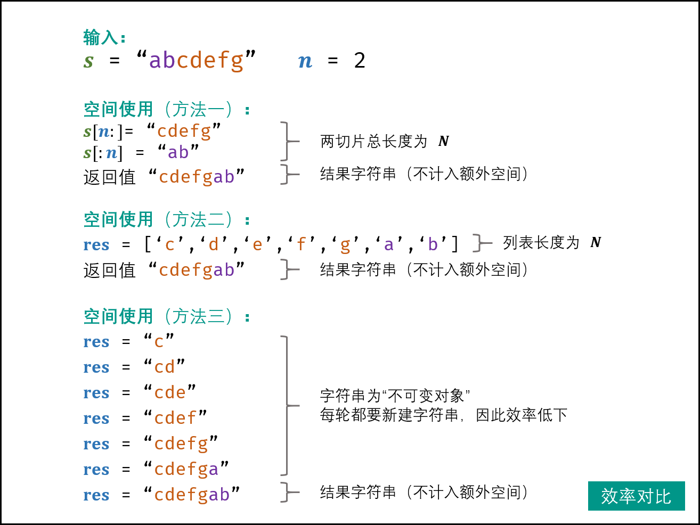


## 查找算法（简单）

### [剑指 Offer 03. 数组中重复的数字](https://leetcode-cn.com/problems/shu-zu-zhong-zhong-fu-de-shu-zi-lcof/)

#### 首战告捷

```java
class Solution {
    public int findRepeatNumber(int[] nums) {
        /*
        "长度为 n 的数组 nums 里的所有数字都在 0～n-1 的范围内",就是明示要用数组内容与数组下标关联。
         */

        //doc数组的每一位，记载了nums数组中各元素出现的频率；doc的下标和nums的值对应。数组中初始为全0。
        int[] doc=new int[nums.length];

        //遍历nums，nums中出现的值对应doc数组的下标，给对应下标存的值+1来记录频次。
        for(int i=0;i<nums.length;i++){
           doc[nums[i]]++; 
        }

        //把重复数字里，最小的那个返回
        for(int i=0;i<doc.length;i++){
            if(doc[i]>1){
                return i;
            }
        }

        //如果上面for循环没有返回，则说明数组中没有重复数字；返回-1表示报错。
        return -1;

    }
}
```

- 我这种方法，如果nums的内容很大，可能会超过int的范围，这样来说还是官方的更安全
  - int的取值范围为： -2^31——2^31-1，即-2147483648——2147483647。
  - 不过本题中的”限制“说2 <= n <= 100000，那么不会击穿。做题一定要看示例下的**“提示”**或**”限制“**

#### 官方-方法一：遍历数组
由于只需要找出数组中任意一个重复的数字，因此遍历数组，遇到重复的数字即返回。为了判断一个数字是否重复遇到，使用集合存储已经遇到的数字，如果遇到的一个数字已经在集合中，则当前的数字是重复数字。算法：

- 初始化集合为空集合，重复的数字 repeat = -1
- 遍历数组中的每个元素：
  - 将该元素加入集合中，判断是否添加成功
    - 如果添加失败，说明该元素已经在集合中，因此该元素是重复元素，将该元素的值赋给 repeat，并结束遍历
- 返回 repeat

代码：

```java
class Solution {
    public int findRepeatNumber(int[] nums) {
        Set<Integer> set = new HashSet<Integer>();
        int repeat = -1;
        for (int num : nums) {
            if (!set.add(num)) {
                repeat = num;
                break;
            }
        }
        return repeat;
    }
}
```

- **利用了hashSet判断重复；同理可以利用hashmap判断个数**。

复杂性分析：

- 时间复杂度：O(n)。
  - 遍历数组一遍。使用哈希集合（HashSet），添加元素的时间复杂度为 O(1)，故总的时间复杂度是 O(n)。
- 空间复杂度：O(n)。不重复的每个元素都可能存入集合，因此占用 O(n)额外空间。


### [剑指 Offer 53 - I. 在排序数组中查找数字 I](https://leetcode-cn.com/problems/zai-pai-xu-shu-zu-zhong-cha-zhao-shu-zi-lcof/)

#### 首战告捷-hash法

```java
class Solution {
    public int search(int[] nums, int target) {
        /*
        因为10的9次方，小于2*10的9次次方，所以nums存值的范围在整数范围内，但是用数组会有连续空间，浪费；用hashMap吧
        */

        //注意左边指定泛型的具体类型
        Map<Integer,Integer> map=new HashMap<>();

        //便利给定的数组
        for(int i=0;i<nums.length;i++){
            //如果已仅存在hash映射，给次数加一
            if(map.containsKey(nums[i])){
                map.put(nums[i],map.get(nums[i])+1);

            }else{//否则建立针对某数字和其数字的hash映射
                map.put(nums[i],1);
            }
        }

        //处理次数为0的请款
        return map.containsKey(target)?map.get(target):0;

    }
}
```

- 本题条件是“排序数组”，这个方法没用上这个条件；排序数组应该用双指针解决。

#### 首战告捷-双指针

```java
class Solution {
    public int search(int[] nums, int target) {
        //看到排序数组，所以目标数字是连续的；用双指针

        //处理特殊情况：空数组情况，否则nums[right]会超过数组边界
        if(nums.length==0){
            return 0;
        }

        //初始化双指针为数组两端
        int left=0;
        int right=nums.length-1;

        //只要两个指针没碰到目标数就一直循环
        while(true){
            if(nums[left]!=target){
                left++;
            }
            if(nums[right]!=target){
                right--;
            }

            //当left>right，或nums[left]==nums[right]!=target时直接返回0；当nums[left]==nums[right]==target时返回right-left+1
            if(left>right||((nums[left]==nums[right])&&(nums[right]!=target))){
                return 0;
            }else if((nums[left]==nums[right])&&(nums[right]==target)){
                return right-left+1;
            }
        }

    }
}
```

- 我：
  - 数组问题，小心自定义i时，在特殊边界条件下，i超出边界
  - 变量要一致，比如left不要写着写着就写成l。
- 网友：面试官出这题的话肯定是想让你写二分的啦 其他没用
  - 网友：我第一想法也是二分，但是我发现题目没给数组长度，求个长度不就已经 O(n)了吗
    - 网友反驳： 像java这种语言，数组的长度是编译的时候就生成好的，不需要实时算的；nums.length直接是数组长度，这是数组本身的属性
- 本题双指针，不如官方的2分效率高。

性能：

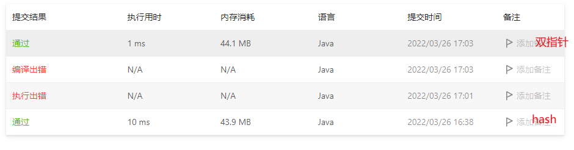

#### 官方-二分法

解题思路：

排序数组中的搜索问题，首先想到 **二分法** 解决。

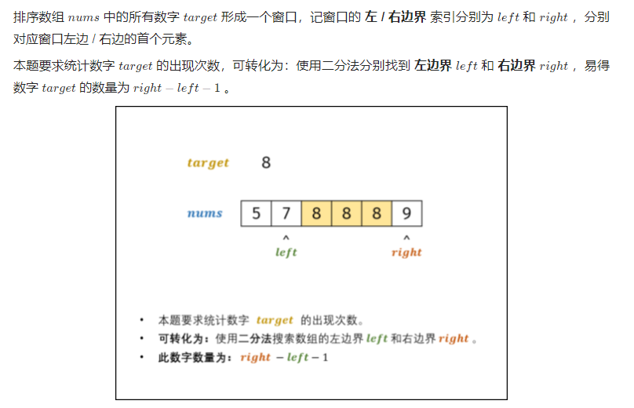

算法解析：

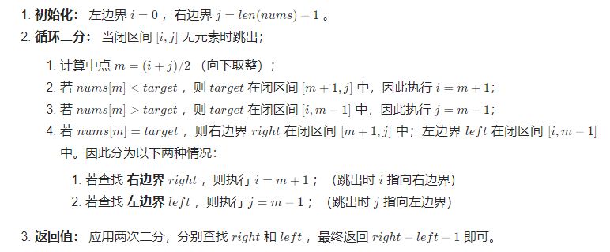

效率优化：

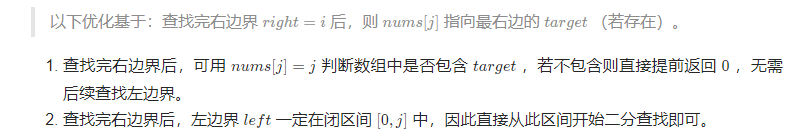

复杂度分析：

- 时间复杂度 O(log N)： 二分法为对数级别复杂度。
- 空间复杂度 O(1) ： 几个变量使用常数大小的额外空间。

代码：

```java
class Solution {
    public int search(int[] nums, int target) {
        // 搜索右边界 right
        int i = 0, j = nums.length - 1;
        while(i <= j) {
            int m = (i + j) / 2;
            if(nums[m] <= target) i = m + 1;
            else j = m - 1;
        }
        int right = i;
        // 若数组中无 target ，则提前返回
        if(j >= 0 && nums[j] != target) return 0;
        // 搜索左边界 right
        i = 0; j = nums.length - 1;
        while(i <= j) {
            int m = (i + j) / 2;
            if(nums[m] < target) i = m + 1;
            else j = m - 1;
        }
        int left = j;
        return right - left - 1;
    }
}
```

- 可将 nums[m] = targetnums[m]=target 情况合并至其他两种情况中。


### [剑指 Offer 53 - II. 0～n-1中缺失的数字](https://leetcode-cn.com/problems/que-shi-de-shu-zi-lcof/)

#### 首战告捷

```java
class Solution {
    public int missingNumber(int[] nums) {
        /*
        可以二分查找，“l-r”不等于“nums[l]-nums[r]”的话，则确实的数字在lr之间。
        但是纯双指针会跳过目标值，使目标值不再lr之间；因为双指针规则中“好像”说l和r在修改时不能和m重合，只能越过。

        我先用on遍历的方法做了
        */

        //缺失值在[0,n-2]时
        for(int i=0;i<nums.length;i++){
            if(nums[i]!=i)
                return i;
        }
        //缺失值是n-1时
        return nums.length;

    }
}
```

效果还行：


#### 官方-二分法

解题思路：

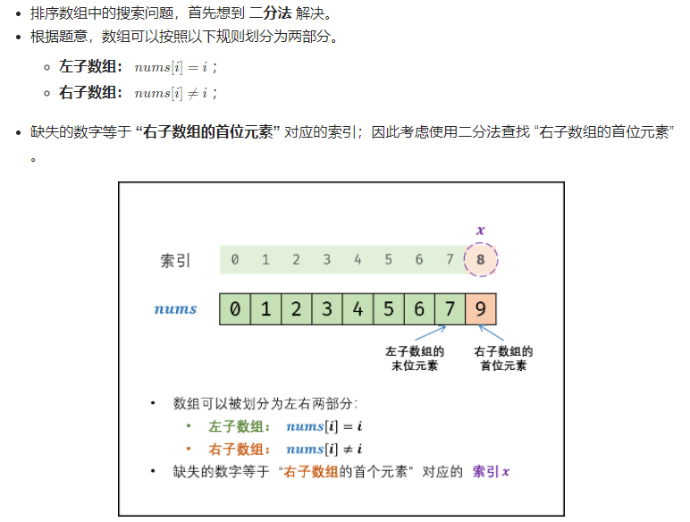

算法解析：

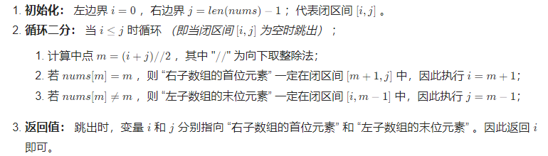

复杂度分析：

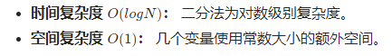

代码：

```java
class Solution {
    public int missingNumber(int[] nums) {
        int i = 0, j = nums.length - 1;
        while(i <= j) {
            int m = (i + j) / 2;
            if(nums[m] == m) i = m + 1;
            else j = m - 1;
        }
        return i;
    }
}
```

- 我和官方和高赞网友：“**排序数组中的搜索问题，首先想到 二分法 解决**。”get一项新技能。

- 我：本题解的视频不错，很清晰，可以看看
- 我：官方算法在l==r的时候不退出，让它两再移动一步从而交叉夹住目标值，不错！


## 查找算法（中等）

### [剑指 Offer 04. 二维数组中的查找](https://leetcode-cn.com/problems/er-wei-shu-zu-zhong-de-cha-zhao-lcof/)

#### 首战寄

#### 官方-二叉搜索树法

由于给定的二维数组具备每行从左到右递增以及每列从上到下递增的特点，当访问到一个元素时，可以排除数组中的部分元素。

从二维数组的右上角开始查找。如果当前元素等于目标值，则返回 true。如果当前元素大于目标值，则移到左边一列。如果当前元素小于目标值，则移到下边一行。

可以证明这种方法不会错过目标值。如果当前元素大于目标值，说明当前元素的下边的所有元素都一定大于目标值，因此往下查找不可能找到目标值，往左查找可能找到目标值。如果当前元素小于目标值，说明当前元素的左边的所有元素都一定小于目标值，因此往左查找不可能找到目标值，往下查找可能找到目标值。

- 若数组为空，返回 false
- 初始化行下标为 0，列下标为二维数组的列数减 1
- 重复下列步骤，直到行下标或列下标超出边界
  - 获得当前下标位置的元素 num
  - 如果 num 和 target 相等，返回 true
  - 如果 num 大于 target，列下标减 1
  - 如果 num 小于 target，行下标加 1
- 循环体执行完毕仍未找到元素等于 target ，说明不存在这样的元素，返回 false`

代码：

```java

class Solution {
    public boolean findNumberIn2DArray(int[][] matrix, int target) {
        if (matrix == null || matrix.length == 0 || matrix[0].length == 0) {
            return false;
        }
        int rows = matrix.length, columns = matrix[0].length;
        int row = 0, column = columns - 1;
        while (row < rows && column >= 0) {
            int num = matrix[row][column];
            if (num == target) {
                return true;
            } else if (num > target) {
                column--;
            } else {
                row++;
            }
        }
        return false;
    }
}

```

复杂度分析:

- 时间复杂度：O(n+m)。访问到的下标的行最多增加 n 次，列最多减少 m 次，因此循环体最多执行 n + m 次。
- 空间复杂度：O(1)。


#### 20220327成功

```java
class Solution {
    public boolean findNumberIn2DArray(int[][] matrix, int target) {

        //处理空数组情况
        if(matrix.length==0){
            return false;
        }

        //处理非空数组，从数组的左下角开始做二叉搜索树式探索
        //初始化行列坐标；共n行m列
        int n=matrix.length-1,m=0,maxM=matrix[0].length-1;

        while(n>=0&&m<=maxM){
            if(matrix[n][m]<target){
                m++;
            }else if(matrix[n][m]>target){
                n--;
            }else{
                return true;
            }
        }

        return false;

    }
}
```


### [剑指 Offer 11. 旋转数组的最小数字](https://leetcode-cn.com/problems/xuan-zhuan-shu-zu-de-zui-xiao-shu-zi-lcof/)

#### 首战半寄

```java
class Solution {
    public int minArray(int[] numbers) {

        //题目说n不为负数，但是numbers[n]可能是负数；那么这个last取0就会导致元素一旦有负数，就提前退出for循环
        //int last=0;
        int last=Integer.MIN_VALUE;
        for(int i=0;i<numbers.length;i++){
            //侦查到断崖就返回
            if(numbers[i]<last){
                return numbers[i];
            }
            last=numbers[i];
        }

        //没侦查到断崖，可能是数字全相同；或者经历了n次旋转成了没旋转前的升序状态：返回第一个数
        return numbers[0];
    }
}
```

- 思路有，但是把last设置为0忽略了数组元素为负数的情况，导致程序一碰到负数元素就以为碰到了断崖就退出循环并返回错误的值了；把last初始值换成最小整数就过了。
- 我反思：既然都线性遍历了，不如干脆用later记录碰到过的最小值，甚至都不用查看断崖；我相当于相同的时间复杂度能解决的问题，用更复杂的方式解决了，减分项。

#### 官方-二分查找

解题思路：

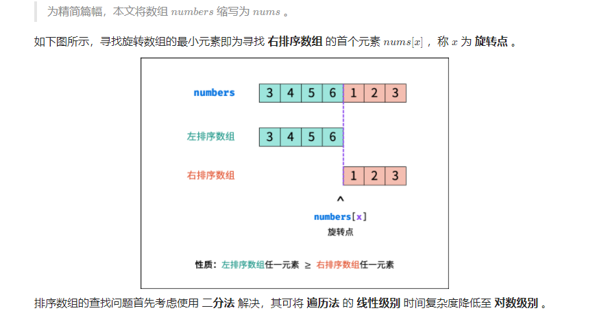

算法流程：

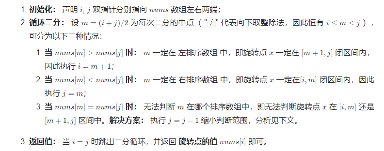

- 我：j=j-1后，最小值还在ij之间，因为：
  - 如果j是最小值，那么原本numsm==numsj，让j--后，至少m位置有最小值
  - j--相当于是为重复元素去重。

正确性证明：

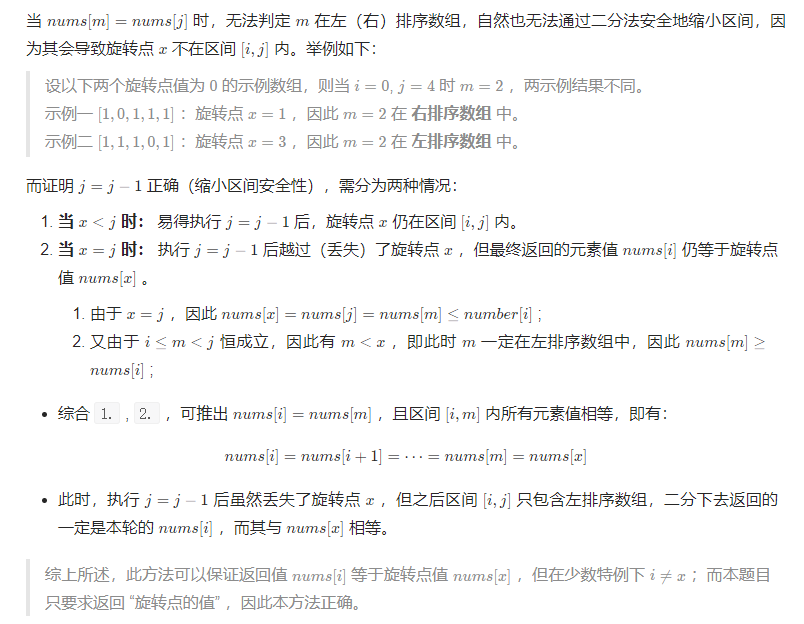

补充思考： 为什么本题二分法不用 nums[m]*n**u**m**s*[*m*] 和 nums[i]*n**u**m**s*[*i*] 作比较？

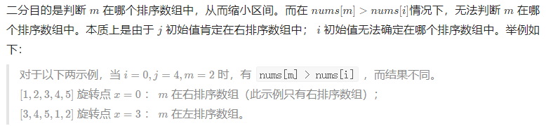

复杂度分析：

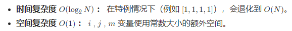

代码：

```java
class Solution {
    public int minArray(int[] numbers) {
        int i = 0, j = numbers.length - 1;
        while (i < j) {
            int m = (i + j) / 2;
            if (numbers[m] > numbers[j]) i = m + 1;
            else if (numbers[m] < numbers[j]) j = m;
            else j--;
        }
        return numbers[i];
    }
}
```

- 网友：为什么官方的二分法的题解很多都是写的`low + (high - low) / 2 `而不是 `(high + low) / 2`
  - 网友答：防止溢出吧。

### [剑指 Offer 50. 第一个只出现一次的字符](https://leetcode-cn.com/problems/di-yi-ge-zhi-chu-xian-yi-ci-de-zi-fu-lcof/)

#### 首战告捷

```java
class Solution {
    public char firstUniqChar(String s) {
        /*
        第一次重复。没有说有序，使用hashMap判断重复
         */
        Map<Character,Integer> map=new HashMap<>();
        //先做一次遍历，记录下各字符出现的频度
        for(int i=0;i<s.length();i++){
            char tempCh=s.charAt(i);
            if(map.containsKey(tempCh)){
                map.put(tempCh,map.get(tempCh)+1);
            }else{
                //基本数据类型会自动包装拆包
                map.put(tempCh,1);
            }
        }
        //查找第一个只出现一次的字符
        for(int i=0;i<s.length();i++){
            char tempCh=s.charAt(i);
            if(map.get(tempCh)==1){
                return tempCh;
            }
        }

        //一直没return 说明不存在字符
        return ' ';
    }
}
```

#### 网友1-数组记录

```java
public char firstUniqChar(String s) {
    if (s.equals("")) return ' ';
    //创建‘a'-'z'的字典
    int[] target = new int[26];
    //第一次遍历，将字符统计到字典数组
    for (int i = 0; i < s.length(); i++) {
        target[s.charAt(i) - 'a']++;
    }
    //第二次遍历，从字典数组获取次数
    for (int i = 0; i < s.length(); i++) {
        if (target[s.charAt(i) - 'a'] == 1) return s.charAt(i);
    }

    return ' ';
}
```

- 题干说`s 只包含小写字母`，我做题时认为，除了英文的26个字母可能还有别的小写字母，就用了hashMap；如果这里的小写字母只指英文26字母的话，网友1的做法确实更快更好；但是我看官方也没有使用26字母的特性，保险起见，还是别用网友1的方法。

#### 官方方法1-hash表

本题考察 哈希表 的使用，本文介绍 哈希表 和 有序哈希表 两种解法。其中，在字符串长度较大、重复字符很多时，“有序哈希表” 解法理论上效率更高。

1. 遍历字符串 `s` ，使用哈希表统计 “各字符数量是否 > 1>1 ”。
2. 再遍历字符串 `s` ，在哈希表中找到首个 “数量为 11 的字符”，并返回。

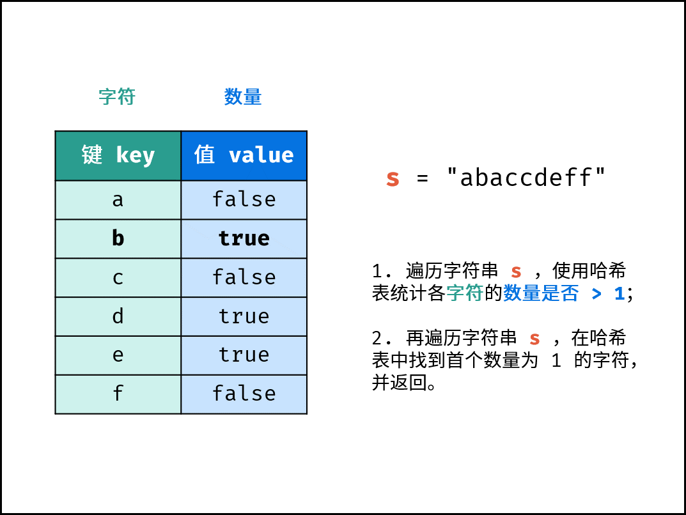

算法流程：

- 初始化： 字典 (Python)、HashMap(Java)、map(C++)，记为 dic ；
- 字符统计： 遍历字符串 s 中的每个字符 c ；
  - 若 dic 中 不包含 键(key) c ：则向 dic 中添加键值对 (c, True) ，代表字符 c 的数量为 11 ；
  - 若 dic 中 包含 键(key) c ：则修改键 c 的键值对为 (c, False) ，代表字符 c 的数量 > 1>1 。
- 查找数量为 11 的字符： 遍历字符串 s 中的每个字符 c ；
  - 若 dic中键 c 对应的值为 True ：，则返回 c 。
- 返回 ' ' ，代表字符串无数量为 11 的字符。

复杂度分析：

- 时间复杂度 O(N)： N为字符串 s 的长度；需遍历 s 两轮，使用 O(N)；HashMap 查找操作的复杂度为 O(1) ；
- 空间复杂度 O(1) ： 由于题目指出 s 只包含小写字母，因此最多有 26 个不同字符，HashMap 存储需占用 O(26) = O(1)的额外空间。

代码：

```java
class Solution {
    public char firstUniqChar(String s) {
        HashMap<Character, Boolean> dic = new HashMap<>();
        char[] sc = s.toCharArray();
        for(char c : sc)
            dic.put(c, !dic.containsKey(c));
        for(char c : sc)
            if(dic.get(c)) return c;
        return ' ';
    }
}
```

- 我：这个解法和我的很像，只是它没有存储s中字符出现的具体数目，而是存储是否超过1个（布尔值）
  - 网友针对我的写法的评价：我觉得 Map 结构的 Value 使用 Boolean 类型是一个更好的选择，原因如下：
    1. 一个字母出现的次数大于 1 次就不符合要求了，这个时候使用 Fasle 标记状态相对于 Integer 的不断递增更合理，也更省空间。
    2. 布尔值可以用来判断，可以简化代码逻辑。

#### 官方方法2-有序hash表法

在哈希表的基础上，有序哈希表中的键值对是 **按照插入顺序排序** 的。基于此，可通过遍历有序哈希表，实现搜索首个 “数量为 11 的字符”。

哈希表是 **去重** 的，即哈希表中键值对数量 ≤ 字符串 s 的长度。因此，相比于方法一，方法二减少了第二轮遍历的循环次数。当字符串很长（重复字符很多）时，方法二则效率更高。

复杂度分析：

- 时间和空间复杂度均与 “方法一” 相同，而具体分析：方法一 需遍历 s 两轮；方法二 遍历 s 一轮，遍历 dic 一轮（ dic 的长度不大于 26 ）。

代码：

```java
class Solution {
    public char firstUniqChar(String s) {
        Map<Character, Boolean> dic = new LinkedHashMap<>();
        char[] sc = s.toCharArray();
        for(char c : sc)
            dic.put(c, !dic.containsKey(c));
        for(Map.Entry<Character, Boolean> d : dic.entrySet()){
           if(d.getValue()) return d.getKey();
        }
        return ' ';
    }
}
```

- Java 使用 LinkedHashMap 实现有序哈希表。

- 字符串转换为字符数组：`s.toCharArray();`

- [为什么要使用Map.Entry](https://www.cnblogs.com/a198720/articles/4212034.html)


## 搜索与回溯算法（简单）

### [剑指 Offer 32 - I. 从上到下打印二叉树](https://leetcode-cn.com/problems/cong-shang-dao-xia-da-yin-er-cha-shu-lcof/)

#### 首战半寄

```java
/**
 * Definition for a binary tree node.
 * public class TreeNode {
 *     int val;
 *     TreeNode left;
 *     TreeNode right;
 *     TreeNode(int x) { val = x; }
 * }
 */
class Solution {
    public int[] levelOrder(TreeNode root) {
        /*
        从上往下，从左往右，这是bfs的特点。使用队列实现bfs：https://www.runoob.com/java/data-queue.html
        Queue接口要用linkedlist实现。
         */
        //处理特殊情况
        if(root==null)return new int[0];

         //存储结果
         ArrayList<Integer> arrayList=new ArrayList<>();
         //初始化队列
         Queue <TreeNode> queue=new LinkedList<>();
         queue.offer(root);

        //把头节点加入结果数组列表，并把左右子节点加入队列
         while(!queue.isEmpty()){
             TreeNode temp=queue.poll();
             arrayList.add(temp.val);
            if(temp.left!=null)
                queue.offer(temp.left);
            if(temp.right!=null)
                queue.offer(temp.right);
         }

         //把integer数组列表转换成int数组，这里只能for循环。https://blog.csdn.net/huanghanqian/article/details/73920439
         int[] result=new int[arrayList.size()];
         for(int i=0;i<arrayList.size();i++){
             //arraylist不能数组式访问，要用get，不能用arraylist[i]形式访问
             result[i]=arrayList.get(i).intValue();
         }
         return result;

    }
}
```

- 思路有，但是queue的使用，arraylist转array都是借助网络了，中间运行了几次。

- 我推测：单个int Integer互相转换可以自动装箱拆箱；但是int[]和Integer[]互相转换就不能直接装箱拆箱，而要对一个个元素手动/自动装箱拆箱；
  - 如本题目所示`result[i]=arrayList.get(i).intValue();`是手动拆箱，`result[i]=arrayList.get(i);`是自动拆箱，亲测都可以提交成功。

#### 官方-bfs

解题思路：

- 题目要求的二叉树的 **从上至下** 打印（即按层打印），又称为二叉树的 **广度优先搜索**（BFS）。
- BFS 通常借助 **队列** 的先入先出特性来实现。

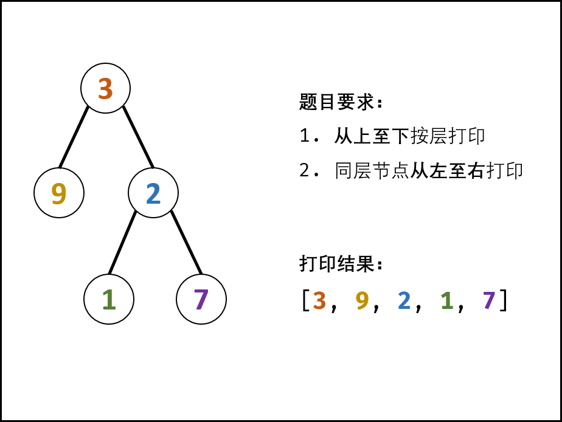

算法流程：

1. 特例处理： 当树的根节点为空，则直接返回空列表 [] ；
2. 初始化： 打印结果列表 res = [] ，包含根节点的队列 queue = [root] ；
3. BFS 循环： 当队列 queue 为空时跳出；
   1. 出队： 队首元素出队，记为 node；
   2. 打印： 将 node.val 添加至列表 tmp 尾部；
   3. 添加子节点： 若 node 的左（右）子节点不为空，则将左（右）子节点加入队列 queue ；
4. 返回值： 返回打印结果列表 res 即可。

复杂度分析：

- 时间复杂度 O(N)O(N) ： NN 为二叉树的节点数量，即 BFS 需循环 NN 次。
- 空间复杂度 O(N)O(N) ： 最差情况下，即当树为平衡二叉树时，最多有 N/2N/2 个树节点同时在 queue 中，使用 O(N)O(N) 大小的额外空间。

代码：

```java
class Solution {
    public int[] levelOrder(TreeNode root) {
        if(root == null) return new int[0];
        Queue<TreeNode> queue = new LinkedList<>(){{ add(root); }};
        ArrayList<Integer> ans = new ArrayList<>();
        while(!queue.isEmpty()) {
            TreeNode node = queue.poll();
            ans.add(node.val);
            if(node.left != null) queue.add(node.left);
            if(node.right != null) queue.add(node.right);
        }
        int[] res = new int[ans.size()];
        for(int i = 0; i < ans.size(); i++)
            res[i] = ans.get(i);
        return res;
    }
}
```

- 我：和我的代码基本一样。

### [剑指 Offer 32 - II. 从上到下打印二叉树 II](https://leetcode-cn.com/problems/cong-shang-dao-xia-da-yin-er-cha-shu-ii-lcof/)

#### 首战告捷

```java
/**
 * Definition for a binary tree node.
 * public class TreeNode {
 *     int val;
 *     TreeNode left;
 *     TreeNode right;
 *     TreeNode(int x) { val = x; }
 * }
 */
class Solution {
    public List<List<Integer>> levelOrder(TreeNode root) {
        /*
        "I. 从上到下打印二叉树 类似，关键是怎么判断一层的范围
        打算使用两个队列，cur和next
         */
         //处理特殊情况
         if(root==null) return new ArrayList<>();

        Queue<TreeNode> cur =new LinkedList<>();
        Queue<TreeNode> next =new LinkedList<>();
        List<List<Integer>> result=new ArrayList<>();//ArrayList底层是数组，查询快、增删慢；LinkedList底层是链表，查询慢、增删快。

        cur.offer(root);
        do{
            //用于存储接下来的链表中的节点值
            List<Integer> tempList=new ArrayList<>();
            while(!cur.isEmpty()){
            //处理当前队列中的每个节点
            TreeNode temp=cur.poll();
            tempList.add(temp.val);
            if(temp.left!=null) next.offer(temp.left);
            if(temp.right!=null) next.offer(temp.right);
            }
            //把一个队列处理完后得到的列表，存入结果列表
            result.add(tempList);

            //cur处理完了，交换cur和next；让cur变成存了节点的队列，next变成空队列
            Queue<TreeNode> tempQueue=cur;
            cur=next;
            next=tempQueue;

        }while(!cur.isEmpty());//这里判断当前队列为空，实际上就是判断上一轮队列处理后，还有没有节点要处理

        return result;

    }
}
```

- 思路和知识点都知道，有些小语法错误，借助“执行代码”改了下，就成功了。

#### 官方-BFS

解题思路：

> 建议先做 面试题32 - I. 从上到下打印二叉树 再做此题，两题仅有微小区别，即本题需将 **每一层打印到一行** 。

I. 按层打印： 题目要求的二叉树的 从上至下 打印（即按层打印），又称为二叉树的 广度优先搜索（BFS）。BFS 通常借助 队列 的先入先出特性来实现。

II. 每层打印到一行： 将本层全部节点打印到一行，并将下一层全部节点加入队列，以此类推，即可分为多行打印。


算法流程：

1. 特例处理： 当根节点为空，则返回空列表 [] ；
2. 初始化： 打印结果列表 res = [] ，包含根节点的队列 queue = [root] ；
3. BFS 循环： 当队列 queue 为空时跳出；
   1. 新建一个临时列表 tmp ，用于存储当前层打印结果；
   2. 当前层打印循环： 循环次数为当前层节点数（即队列 queue 长度）；
      1. 出队： 队首元素出队，记为 node；
      2. 打印： 将 node.val 添加至 tmp 尾部；
      3. 添加子节点： 若 node 的左（右）子节点不为空，则将左（右）子节点加入队列 queue ；
   3. 将当前层结果 tmp 添加入 res 。
4. 返回值： 返回打印结果列表 res 即可。

复杂度分析：

- 时间复杂度 O(N) ： N为二叉树的节点数量，即 BFS 需循环 N 次。
- 空间复杂度 O(N) ： 最差情况下，即当树为平衡二叉树时，最多有 N/2 个树节点同时在 queue 中，使用 O(N)大小的额外空间。

代码：

```java
class Solution {
    public List<List<Integer>> levelOrder(TreeNode root) {
        Queue<TreeNode> queue = new LinkedList<>();
        List<List<Integer>> res = new ArrayList<>();
        if(root != null) queue.add(root);
        while(!queue.isEmpty()) {
            List<Integer> tmp = new ArrayList<>();
            for(int i = queue.size(); i > 0; i--) {
                TreeNode node = queue.poll();
                tmp.add(node.val);
                if(node.left != null) queue.add(node.left);
                if(node.right != null) queue.add(node.right);
            }
            res.add(tmp);
        }
        return res;
    }
}

```

- 网友：还在思考怎么分层打印，博主这个len(queue)的操作太6了
  - 我理解：这说的len(queue)就是i = queue.size()


### [剑指 Offer 32 - III. 从上到下打印二叉树 III](https://leetcode-cn.com/problems/cong-shang-dao-xia-da-yin-er-cha-shu-iii-lcof/)

#### 首战半寄

```java
/**
 * Definition for a binary tree node.
 * public class TreeNode {
 *     int val;
 *     TreeNode left;
 *     TreeNode right;
 *     TreeNode(int x) { val = x; }
 * }
 */
class Solution {
    public List<List<Integer>> levelOrder(TreeNode root) {
        /*
        总是使用deque不会错，它也代替了Stack：https://blog.csdn.net/devnn/article/details/82716447
         */

         //创建双端队列;默认节点last进first出;注意用LinkedList实现Deque！！！
         Deque <TreeNode> deque=new LinkedList<>();
         Deque <TreeNode> deque2=new LinkedList<>();
         if(root!=null) deque.offerLast(root);

         List<List<Integer>> resultList=new ArrayList<>();

         //决定是否从左(first)往右（last）打印节点;第一行从左往右，所以初始true
         boolean left2right=true;

         while(!deque.isEmpty()){
             List<Integer> tempList=new ArrayList();
             //不能在for中判断size，因为加了子节点size就变了
             int dequeSize=deque.size();
             for(int i=0;i<dequeSize;i++){
                 //从左往右打印节点，就先放左子节点进队列(默认都从尾部入)
                if(left2right){
                    TreeNode temp=deque.pollLast();
                    tempList.add(temp.val);
                    //!!!千万不要把null存入队列，它会占用队列的一个位置，且null.val null.left都会导致错误
                    if(temp.left!=null)deque2.offerLast(temp.left);
                    if(temp.right!=null)deque2.offerLast(temp.right);

                }else{//从右往左打印节点，就先放右子节点进队列(默认都从尾部入)
                    TreeNode temp=deque.pollLast();
                    tempList.add(temp.val);
                    if(temp.right!=null)deque2.offerLast(temp.right);
                    if(temp.left!=null)deque2.offerLast(temp.left);

                }
             }
             //更改走向标志，换一个方向的子节点先入队列
             left2right=!left2right;
             resultList.add(tempList);

             Deque <TreeNode> tempDeque=deque;
             deque=deque2;
             deque2=tempDeque;
         }

         return resultList;
    }
}
```

- 做的时候各种bug，和逻辑小错误，最后用idea一下下debug弄出来了
- 应该是用来官方方法2，但是确实绕。

#### 官方1-层序遍历 + 双端队列

思想：

- 利用双端队列的两端皆可添加元素的特性，设打印列表（双端队列） tmp ，并规定：
  - 奇数层 则添加至 tmp 尾部 ，
  - 偶数层 则添加至 tmp 头部 。

算法流程：

1. 特例处理： 当树的根节点为空，则直接返回空列表 [] ；
2. 初始化： 打印结果空列表 res ，包含根节点的双端队列 deque ；
3. BFS 循环： 当 deque 为空时跳出；
   1. 新建列表 tmp ，用于临时存储当前层打印结果；
   2. 当前层打印循环： 循环次数为当前层节点数（即 deque 长度）；
      1. 出队： 队首元素出队，记为 node；
      2. 打印： 若为奇数层，将 node.val 添加至 tmp 尾部；否则，添加至 tmp 头部；
      3. 添加子节点： 若 node 的左（右）子节点不为空，则加入 deque ；
   3. 将当前层结果 tmp 转化为 list 并添加入 res ；
4. 返回值： 返回打印结果列表 res 即可；

复杂度分析：

- 时间复杂度 O(N) ： N为二叉树的节点数量，即 BFS 需循环 N次，占用 O(N) ；双端队列的队首和队尾的添加和删除操作的时间复杂度均为 O(1) 。
- 空间复杂度 O(N) ： 最差情况下，即当树为满二叉树时，最多有 N/2 个树节点 同时 在 deque 中，使用 O(N)大小的额外空间。

代码：

```java
class Solution {
    public List<List<Integer>> levelOrder(TreeNode root) {
        Queue<TreeNode> queue = new LinkedList<>();
        List<List<Integer>> res = new ArrayList<>();
        if(root != null) queue.add(root);
        while(!queue.isEmpty()) {
            LinkedList<Integer> tmp = new LinkedList<>();
            for(int i = queue.size(); i > 0; i--) {
                TreeNode node = queue.poll();
                if(res.size() % 2 == 0) tmp.addLast(node.val); // 偶数层 -> 队列头部
                else tmp.addFirst(node.val); // 奇数层 -> 队列尾部
                if(node.left != null) queue.add(node.left);
                if(node.right != null) queue.add(node.right);
            }
            res.add(tmp);
        }
        return res;
    }
}
```

- Java 中将链表 LinkedList 作为双端队列使用，LinkedList 可以用addLast和addFirst从链状列表的两端插入。
- 注意：我` for(int i = 0; i <queue.size(); i++) `，会导致往队列加元素后队列长度变化，导致的无法按层输出。但是题解中` for(int i = queue.size(); i > 0; i--)`的写法，就保证一层级的节点数不会被后续加入队列的节点所影响。

#### 官方2-层序遍历 + 双端队列（奇偶层逻辑分离）
- 方法一代码简短、容易实现；但需要判断每个节点的所在层奇偶性，即冗余了 NN 次判断。
- 通过将奇偶层逻辑拆分，可以消除冗余的判断。

算法流程：

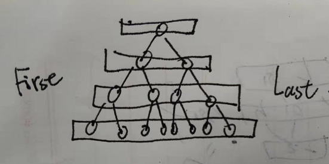

- 与方法一对比，仅 BFS 循环不同。

- BFS 循环： 循环打印奇 / 偶数层，当 deque 为空时跳出；
  1. 打印奇数层： 从左向右 打印，先左后右 加入下层节点；
  2. 若 deque 为空，说明向下无偶数层，则跳出；
  3. 打印偶数层： 从右向左 打印，先右后左 加入下层节点；

复杂度分析：

- 时间复杂度 O(N) ： 同方法一。
- 空间复杂度 O(N)： 同方法一。

代码：

```java
class Solution {
    public List<List<Integer>> levelOrder(TreeNode root) {
        Deque<TreeNode> deque = new LinkedList<>();
        List<List<Integer>> res = new ArrayList<>();
        if(root != null) deque.add(root);
        while(!deque.isEmpty()) {
            // 打印奇数层
            List<Integer> tmp = new ArrayList<>();
            for(int i = deque.size(); i > 0; i--) {
                // 从左向右打印
                TreeNode node = deque.removeFirst();
                tmp.add(node.val);
                // 先左后右加入下层节点
                if(node.left != null) deque.addLast(node.left);
                if(node.right != null) deque.addLast(node.right);
            }
            res.add(tmp);
            if(deque.isEmpty()) break; // 若为空则提前跳出
            // 打印偶数层
            tmp = new ArrayList<>();
            for(int i = deque.size(); i > 0; i--) {
                // 从右向左打印
                TreeNode node = deque.removeLast();
                tmp.add(node.val);
                // 先右后左加入下层节点
                if(node.right != null) deque.addFirst(node.right);
                if(node.left != null) deque.addFirst(node.left);
            }
            res.add(tmp);
        }
        return res;
    }
}

```

- 因为奇数层时从first拿，从last加；偶数层是从last拿，从first加；两者分别从两端拿。所以可以处理完奇数层后紧接着就处理偶数层。
- 本题，奇数层从双端队列的左边拿数，偶数层从双端队列的右边拿数。


## 搜索与回溯算法(简单)

### [剑指 Offer 26. 树的子结构](https://leetcode-cn.com/problems/shu-de-zi-jie-gou-lcof/)

#### 首战寄

- 思路比较混乱，担心自己的算法会造成节点的反复判断，就放弃了

#### 官方-递归

解题思路：

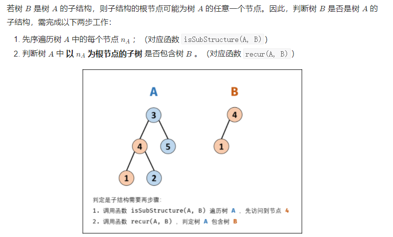

算法流程：

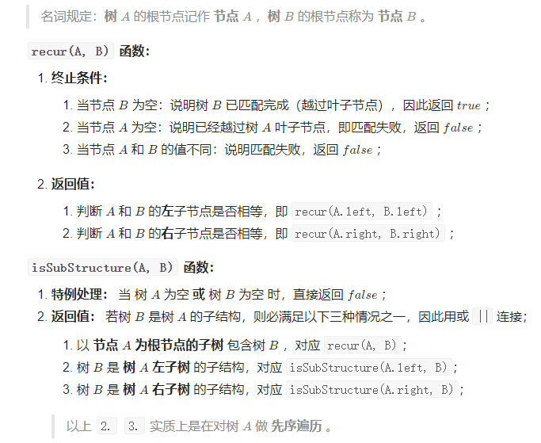

复杂度分析：

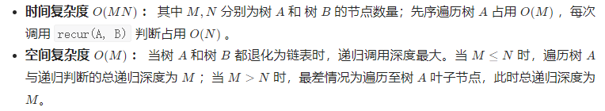

代码：

```java
/**
 * Definition for a binary tree node.
 * public class TreeNode {
 *     int val;
 *     TreeNode left;
 *     TreeNode right;
 *     TreeNode(int x) { val = x; }
 * }
 */
class Solution {
    public boolean isSubStructure(TreeNode A, TreeNode B) {
        //如果左右节点有空的，则说明传了空树进来，按照题目说明，空树不参与字数判断，直接返回false。
        if (A == null||B == null ) {
            return false;
        }

        //左右节点都不为空，如果当前节点相等，就继续判断当前两个节点的左右子树是否还符合子结构
        if (A.val == B.val && (helper(A.left, B.left) && helper(A.right, B.right))) {
            return true;
        }

        //如果以当前节点为根的树不符合，就判断A的左子树是否包含B，或A的右子树是否包含B
        return isSubStructure(A.left, B) || isSubStructure(A.right, B);
    }

    private boolean helper(TreeNode root1, TreeNode root2) {
        //必须要先判断root2，再判断root1；这样如题干中B树的4号节点的右子树为空，但是A树的4号节点的右子树不为空，先判断B树为空才能返回true。
        if (root2 == null) {
            return true;
        }
        if (root1 == null) {
            return false;
        }
        //如果树的路径上的节点相同，继续往下判断
        if (root1.val == root2.val) {
            return helper(root1.left, root2.left) && helper(root1.right, root2.right);
        } else {
            return false;
        }
    }
}
```

- helper专门用来判断左右子树。


### [剑指 Offer 27. 二叉树的镜像](https://leetcode-cn.com/problems/er-cha-shu-de-jing-xiang-lcof/)

#### 首战告捷

```java
/**
 * Definition for a binary tree node.
 * public class TreeNode {
 *     int val;
 *     TreeNode left;
 *     TreeNode right;
 *     TreeNode(int x) { val = x; }
 * }
 */
class Solution {
    public TreeNode mirrorTree(TreeNode root) {
        /*
        交换每个节点的左右子节点，即得到镜像
         */
         
         //如果原树为空，返回null
         if(root==null)return null;
        //如果原树不为空，创造新树的根节点，并递归构建新树的左右子节点。
         TreeNode result=new TreeNode(root.val);
         result.left=recur(root.right);
         result.right=recur(root.left);

        //返回新树
         return result;
    }
    public TreeNode recur(TreeNode root){
        if(root==null) return null;
        
        //设置好当前节点和左右子节点
        TreeNode curNode=new TreeNode(root.val);
        curNode.left=recur(root.right);
        curNode.right=recur(root.left);

        //把当前节点返回给上一层递归
        return curNode;
    }
}
```

#### 官方-递归

思路与算法:

- 这是一道很经典的二叉树问题。显然，我们从根节点开始，递归地对树进行遍历，并从叶子节点先开始翻转得到镜像。如果当前遍历到的节点root 的左右两棵子树都已经翻转得到镜像，那么我们只需要交换两棵子树的位置，即可得到以root 为根节点的整棵子树的镜像。

代码：

```java
class Solution {
    public TreeNode mirrorTree(TreeNode root) {
        if (root == null) {
            return null;
        }
        TreeNode left = mirrorTree(root.left);
        TreeNode right = mirrorTree(root.right);
        root.left = right;
        root.right = left;
        return root;
    }
}
```

- 官方思路和我一样，不过我自建了一个recur函数，让recur专门负责子节点的处理，让逻辑更清晰。

复杂度分析:

- 时间复杂度：O(N)，其中 N  为二叉树节点的数目。我们会遍历二叉树中的每一个节点，对每个节点而言，我们在常数时间内交换其两棵子树。

- 空间复杂度：O(N) 。使用的空间由递归栈的深度决定，它等于当前节点在二叉树中的高度。在平均情况下，二叉树的高度与节点个数为对数关系，即 O(logN)。而在最坏情况下，树形成链状，空间复杂度为 O(N)。

### [剑指 Offer 28. 对称的二叉树](https://leetcode-cn.com/problems/dui-cheng-de-er-cha-shu-lcof/)

#### 首战寄

```java
/**
 * Definition for a binary tree node.
 * public class TreeNode {
 *     int val;
 *     TreeNode left;
 *     TreeNode right;
 *     TreeNode(int x) { val = x; }
 * }
 */
class Solution {
    public boolean isSymmetric(TreeNode root) {
        /*
        deque和queue用linkedlist实现是可以存储null的（官方不建议），这样可以用bfs构建队列，从两端拿节点，只要不同就返回false
         */
        if(root==null)return true;

        Deque<Integer> deque=new LinkedList<>();
        deque.addLast(root.val);
        while(!deque.isEmpty()){
            
            for
        }

    }
}
```

- 没有好方法，本来想着用deque从两端往中间拿数来判断对称，但是同时从两端同时拿数的话又无法正常形成下一层队列。

#### 官方-递归

解题思路：

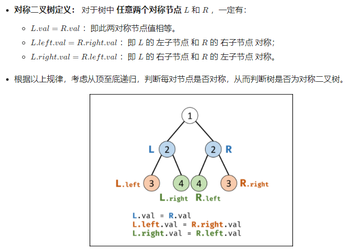

算法流程：

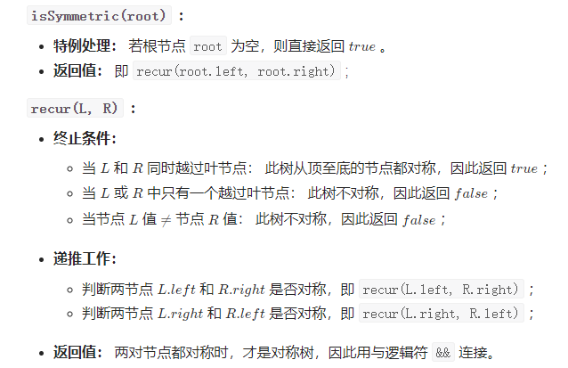

复杂度分析：

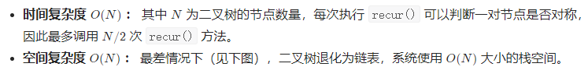


代码：

细节版：

```java
/**
 * Definition for a binary tree node.
 * public class TreeNode {
 *     int val;
 *     TreeNode left;
 *     TreeNode right;
 *     TreeNode(int x) { val = x; }
 * }
 */
class Solution {
    public boolean isSymmetric(TreeNode root) {
        if (root == null) return true;
        return check(root.left, root.right); // 检查root的左右子树
    }

    private boolean check(TreeNode a, TreeNode b) { 
        if (a == null && b == null) return true; // 都为空, 对称
        if (a != null && b == null) return false;
        if (a == null && b != null) return false; // 只有一边为空, 不对称
        if (a.val != b.val) return false; // 都不为空, 但值不相等

        boolean outside = check(a.left, b.right); // 比较a, b两棵树的外侧
        boolean inside = check(a.right, b.left); // 比较a, b两颗树的内测
        return outside && inside; // a, b内外侧都相等才对称
    }
}

```

简写版：

```java
class Solution {
    public boolean isSymmetric(TreeNode root) {
        return root == null ? true : recur(root.left, root.right);
    }
    boolean recur(TreeNode L, TreeNode R) {
        if(L == null && R == null) return true;
        if(L == null || R == null || L.val != R.val) return false;
        return recur(L.left, R.right) && recur(L.right, R.left);
    }
}

```

#### 即时再战成功

```java
/**
 * Definition for a binary tree node.
 * public class TreeNode {
 *     int val;
 *     TreeNode left;
 *     TreeNode right;
 *     TreeNode(int x) { val = x; }
 * }
 */
class Solution {
    public boolean isSymmetric(TreeNode root) {
        /*对称比较，抓住树的外侧和内侧 */
        if(root==null)return true;

        //原树根节点不为空的话，比较左右子树是否对称
        return recur(root.left,root.right);
    }
    public boolean recur(TreeNode leftTree,TreeNode rightTree){
        //如果传入的两个节点都为null，说明遍历到本路劲的末尾都没false，返回代表本路劲的true
        if(leftTree==null&&rightTree==null) return true;
        //如果传入的两个树根节点的值不相同，或左右根节点有一个为空另一个不是，则说明传入的两个树不对称；注意判断null在取val之前做，否则可能空指针异常,这就要利用||的“得到true就停止判断的特性”
        if((leftTree==null&&rightTree!=null)||(leftTree!=null&&rightTree==null)||(leftTree.val!=rightTree.val))return false;

        //如果上面情况都没发生，说明传入的两个树的根节点相同，递归判断这链各个树是否为对称的。
        return recur(leftTree.left,rightTree.right)&&recur(leftTree.right,rightTree.left);
    }

}
```

## 动态规划(简单)

### [剑指 Offer 10- I. 斐波那契数列](https://leetcode-cn.com/problems/fei-bo-na-qi-shu-lie-lcof/)

#### 首战寄

先尝试直接递归，n==43时会超时，因为执行每一个fib都会一直递归到0或1，但是比如`return (fib(n-1)+fib(n-2))%1000000007;`计算了左边的fib(49)后，计算右边的fib(48)时还递归到底，所以最好把计算过的结果保存！保存计算结果应该是动态规划区别于递归的一个特征。

```java
class Solution {
    public int fib(int n) {
        //设定返回条件
        if(n==0) {
            return 0;
        }else if(n==1) {
            return 1;
        }

        return (fib(n-1)+fib(n-2))%1000000007;
    }
}
```

- 但是想不起来怎么保存结果了

#### 官方-动态规划

解题思路：

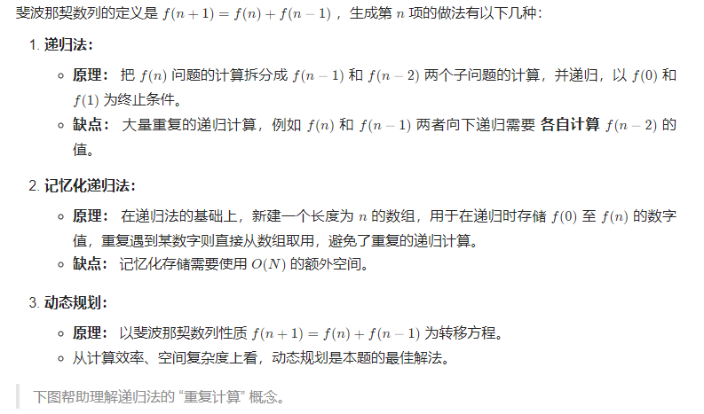

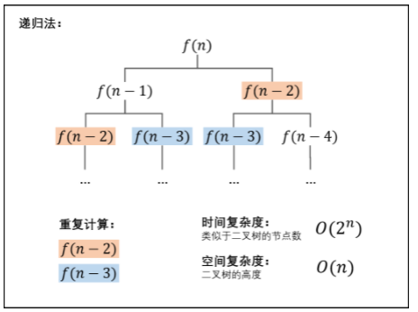

动态规划解析：

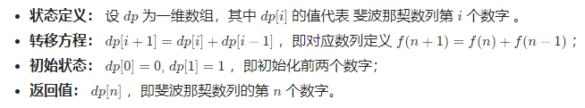

空间复杂度优化：

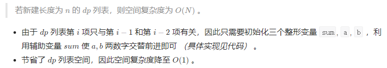

循环求余法 处理大数：

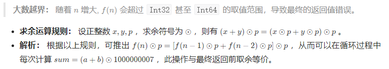

复杂度分析：

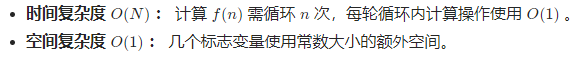

代码：

```java
class Solution {
    public int fib(int n) {
        int a = 0, b = 1, sum;
        for(int i = 0; i < n; i++){
            sum = (a + b) % 1000000007;
            a = b;
            b = sum;
        }
        return a;
    }
}
```

#### 即时再战半寄

```java
class Solution {
    public int fib(int n) {
        /*
        动态规划，当前值只与前两个值有关；让值从小往大加即可
         */

        //先返回特殊值；这样下面的for循环才能安全地只接收n>=2的情况
        if(n==0||n==1)return n;

        int pre2=0,pre1=1;

        //循环当前的i为谁，执行完当前循环，得到的sum即为fib(i)
        for(int i=2;i<=n;i++){

            int tempSum=(pre2%1000000007+pre1%1000000007)%1000000007;
            pre2=pre1;
            pre1=tempSum;
        }

        //最后一次循环得到的sum即为fib(n)，这个sum被复制给pre1了
        return pre1;

    }
}
```

- 第一次提交的时候，忽略了处理n==1和0的情况；for循环无法处理n<2的情况，所以要做面对n==1和0的情况时的特殊处理。如上处理后就提交成功了。


### [剑指 Offer 10- II. 青蛙跳台阶问题](https://leetcode-cn.com/problems/qing-wa-tiao-tai-jie-wen-ti-lcof/)

#### 首战告捷

```java
class Solution {
    public int numWays(int n) {
        /*
        跳上台阶的跳法，至只与前两步有关系:跳到当前台阶的方法数==跳到prev1（前一个台阶）的方法数+跳到prev2的方法数。
        因为跳到当前台阶只有两种可能：从prev1跳1个台阶上来，或从prev2一跃跳两个台阶上来
         */

         if(n==0||n==1)return 1;
         if(n==2)return 2;

        //从第三级台阶开始动态规划
         int prev1=2,prev2=1;
         //当前循环为i，则执行完当前循环时的sum为跳到第i级台阶的跳法数
         for(int i=3;i<=n;i++){
             int tempSum=(prev1%1000000007+prev2%1000000007)%1000000007;
             prev2=prev1;
             prev1=tempSum;
         }

         return prev1;

    }
}
```

#### 官方-动态规划

解题思路：

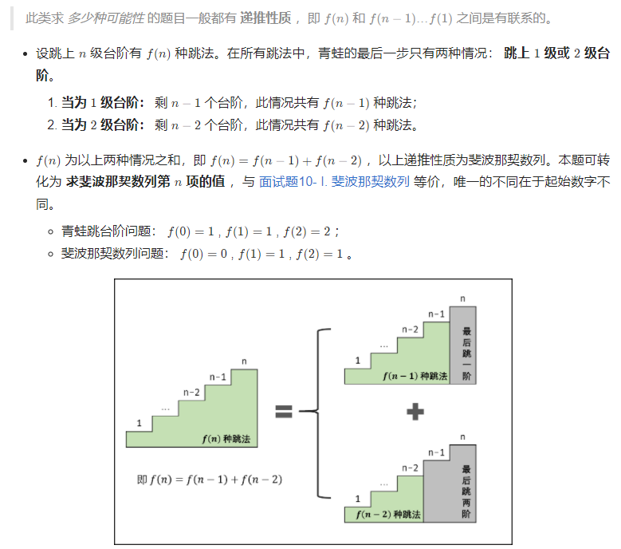

- 本题和斐波那契数列问题基本一模一样。
- 注意大佬评语：此类求 ***多少种可能性*** 的题目一般都有 **递推性质** ，即 f(n)*f*(*n*) 和 f(n-1)*f*(*n*−1)…f(1)*f*(1) 之间是有联系的。

复杂度分析：

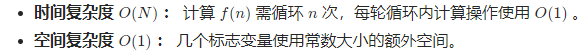

代码：

```java
class Solution {
    public int numWays(int n) {
        int a = 1, b = 1, sum;
        for(int i = 0; i < n; i++){
            sum = (a + b) % 1000000007;
            a = b;
            b = sum;
        }
        return a;
    }
}
```


### [剑指 Offer 63. 股票的最大利润](https://leetcode-cn.com/problems/gu-piao-de-zui-da-li-run-lcof/)

#### 首战告捷

```java
class Solution {
    public int maxProfit(int[] prices) {
        /*记录历史最大利润，和最低价格的股票 */
        
        //处理特殊情况
        if(prices.length==0)return 0;
        
        int lowP=prices[0];
        int benefit=0;
        for(int i=0;i<prices.length;i++){
            //时刻更新最大收益
            if((prices[i]-lowP)>benefit){
                benefit=prices[i]-lowP;
            }
            //只要碰见更小的price就保存，因为未来碰见相同的高值时，记录下更小的lowP可以带来更大的收入。
            if(prices[i]<lowP){
                lowP=prices[i];
            }
        }
        
        return benefit;

    }
}
```

#### 官方-动态规划

解题思路：

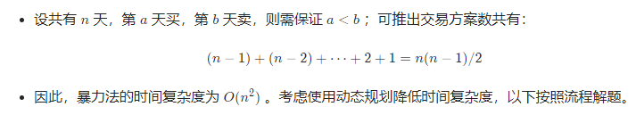

动态规划解析：

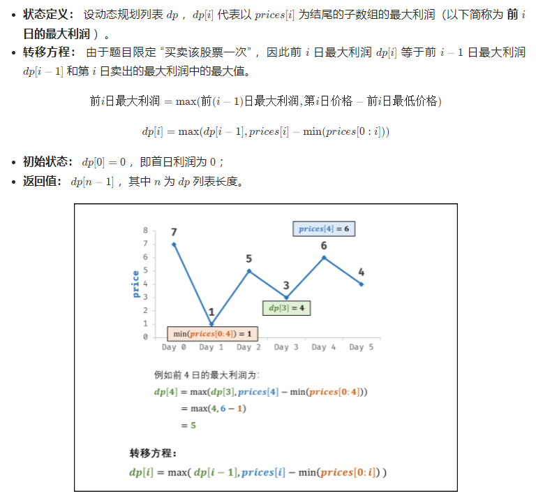

效率优化：

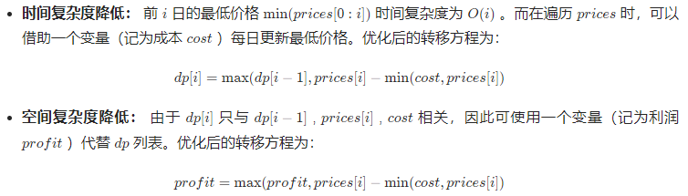

复杂度分析：

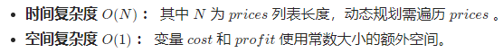

代码：

```java
class Solution {
    public int maxProfit(int[] prices) {
        int cost = Integer.MAX_VALUE, profit = 0;
        for(int price : prices) {
            cost = Math.min(cost, price);
            profit =Math.min(profit, price - cost);
        }
        return profit;
    }
}
```

- 注意这里java工具类方法`Math.min`和`Math.min`的用法。


## 动态规划(中等)

### [剑指 Offer 42. 连续子数组的最大和](https://leetcode-cn.com/problems/lian-xu-zi-shu-zu-de-zui-da-he-lcof/)

#### 首战寄

#### 官方-动态规划

解题思路：

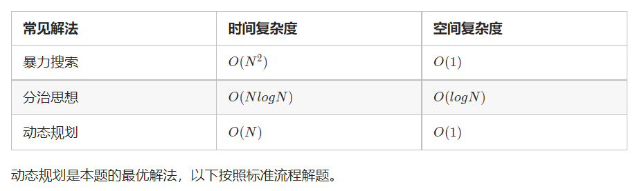

动态规划解析：

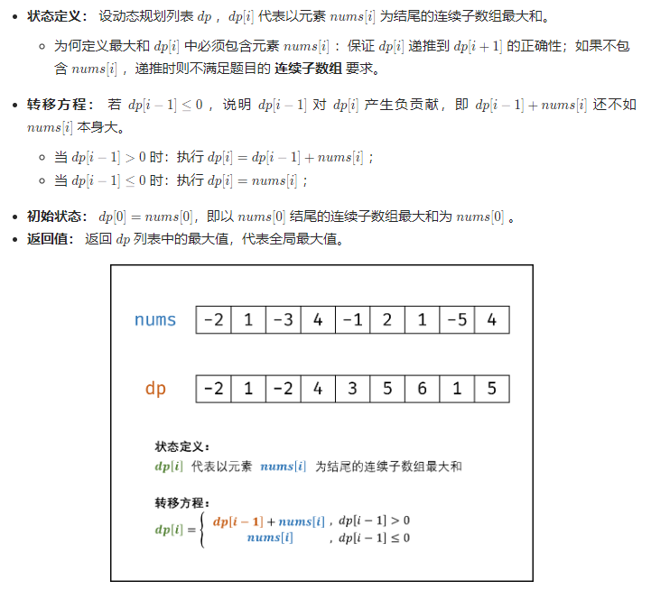

空间复杂度降低：

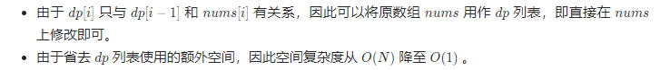

复杂度分析：

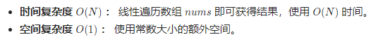

代码：

```java
class Solution {
    public int maxSubArray(int[] nums) {
        int res = nums[0];
        for(int i = 1; i < nums.length; i++) {
            nums[i] += Math.max(nums[i - 1], 0);
            res = Math.max(res, nums[i]);
        }
        return res;
    }
}
```

网友补充：感谢分享，思路很清晰，只是有一点建议。 因为有的时候，题目要求可能不能修改原有数组，考虑到在dp列表中，dp[i]只和dp[i-1]有关,所以用两个参数存储循环过程中的dp[i]和dp[i-1]的值即可，空间复杂度也为O(1)。 代码如下：

```java
class Solution {
    public int maxSubArray(int[] nums) {
        int max = nums[0];
        int former = 0;//用于记录dp[i-1]的值，对于dp[0]而言，其前面的dp[-1]=0
        int cur = nums[0];//用于记录dp[i]的值
        for(int num:nums){
            cur = num;
            if(former>0) cur +=former;
            if(cur>max) max = cur;
            former=cur;
        }
        return max;
    }
}
```


#### 即时再战成功

```java
class Solution {
    public int maxSubArray(int[] nums) {
        /* 
        dpi表示已i号元素结尾的最大子数组，那么dpi=Max(dp[i-1]+numsi,numsi),所以dp[i-1]<0的话只能拖后腿就截掉
        因为最长子数组是连续的，所以要以i为结尾的数组做dp数组
        */
        //处理特殊情况
        if(nums.length==0)return 0;
        if(nums.length==1)return nums[0];

        //从数组第二个元素开始就dpi
        int curMaxSum=nums[0],historyMaxSum=curMaxSum;
        for(int i=1;i<nums.length;i++){
            if(curMaxSum<0){
                curMaxSum=nums[i];
            }else{
                curMaxSum+=nums[i];
            }

            //判断当前的最大值是否比之前所有记载过的最大值都大，都大的话更新历史最大值
            if(curMaxSum>historyMaxSum){
                historyMaxSum=curMaxSum;
            }
        }

        return historyMaxSum;

    }
}
```


### [剑指 Offer 47. 礼物的最大价值](https://leetcode-cn.com/problems/li-wu-de-zui-da-jie-zhi-lcof/)

#### 首战

```java
        /*
        覆写二维数组，在相应位置写上“以左上角出发到当前位置能拿到的最大礼物”，这个礼物值只与上一节点和左一节点有关。
         */
```

