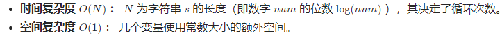
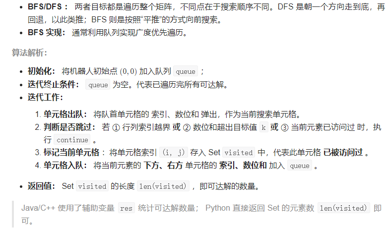
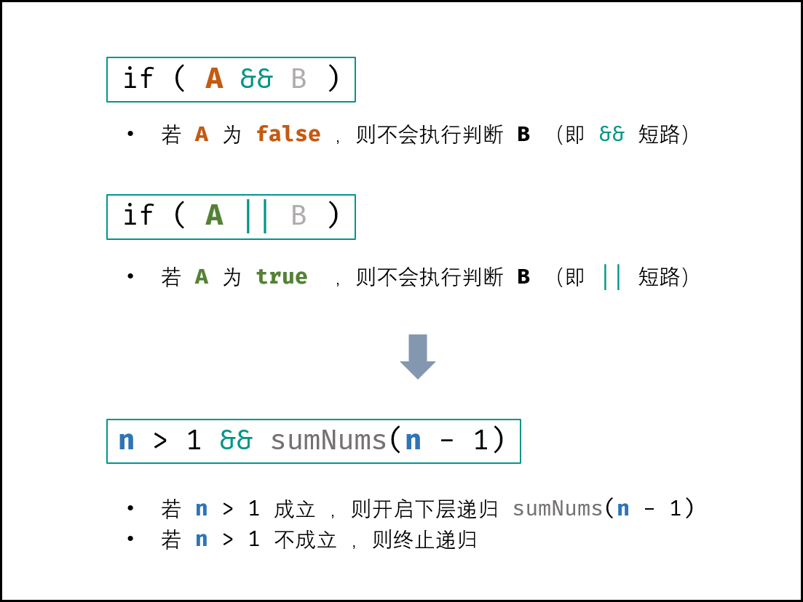
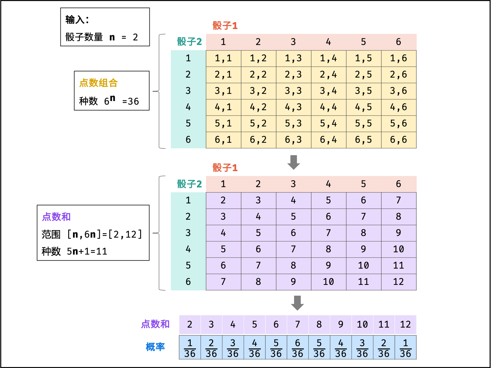
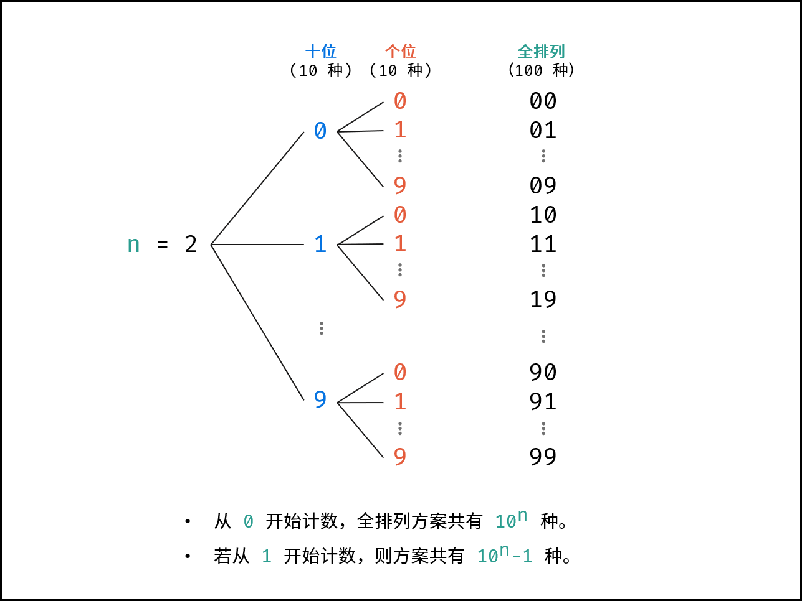
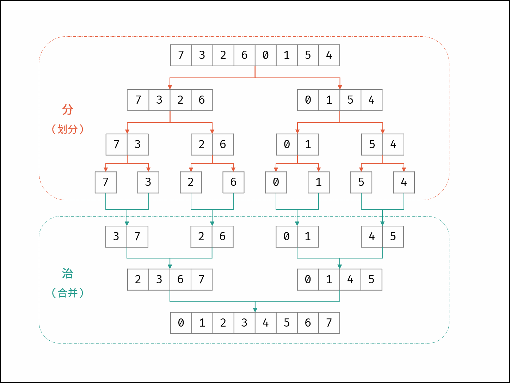

## 前言

笔记名词解释：

- 大捷：指独立做出来，可能粗心导致有小debug也de出来了
- 半寄：有思路且代码基本写对了，但是在不该错的地方debug，最后de出来了或者放弃本思路
- 寄：有思路但是没完全写出来。


## 基础知识

#### 输入输出

1，Java的常用输入输出语句https://www.cainiaojc.com/java/java-basic-input-output.html

2，scanner简单一点：https://www.runoob.com/java/java-scanner-class.html

```java
//以输入int为例
import java.util.Scanner;

// 注意类名必须为 Main, 不要有任何 package xxx 信息
public class Main {
    public static void main(String[] args) {
        Scanner in = new Scanner(System.in);
        // 注意 hasNext 和 hasNextLine 的区别
        while (in.hasNextInt()) { // 注意 while 处理多个 case
            int a = in.nextInt();
            int b = in.nextInt();
            System.out.println(a + b);
        }
        in.close();
    }
}
```

- 对字符和字符串输入用hasNext（碰到空格就结束）和hasNextLine（碰到换行符结束）判断是否还有输入；并通过next和nextLine获取输入字符或字符串。
  - 可以用next接收字符串，然后用charAt拿到字符串中的指定字符。
- 对整数或双精度浮点数，用hasNextInt,hasNextDouble来判断是否还有输入；并通过nextFloat和nextDouble获取输入整数或双精度浮点数。

3，[牛客输入输出联系](https://ac.nowcoder.com/acm/contest/5657#question)

- 推荐bufferreader。

#### 类型转换

1，包装类 基本数据类型 String 的转换：

- [1](https://blog.csdn.net/HY845638534/article/details/84669490)

2，set遍历及效率：https://www.cnblogs.com/east7/p/16115176.html


## 栈队列

### [剑指 Offer 09. 用两个栈实现队列](https://leetcode-cn.com/problems/yong-liang-ge-zhan-shi-xian-dui-lie-lcof/)

#### 首战寄

有思路但是不知道怎么用代码实现

#### 官方1-双栈

思路和算法：

维护两个栈，第一个栈支持插入操作，第二个栈支持删除操作。

根据栈先进后出的特性，我们每次往第一个栈里插入元素后，第一个栈的底部元素是最后插入的元素，第一个栈的顶部元素是下一个待删除的元素。为了维护队列先进先出的特性，我们引入第二个栈，用第二个栈维护待删除的元素，在执行删除操作的时候我们首先看下第二个栈是否为空。如果为空，我们将第一个栈里的元素一个个弹出插入到第二个栈里，这样第二个栈里元素的顺序就是待删除的元素的顺序，要执行删除操作的时候我们直接弹出第二个栈的元素返回即可。

- 成员变量
  - 维护两个栈 stack1 和 stack2，其中 stack1 支持插入操作，stack2 支持删除操作

- 构造方法
  - 初始化 stack1 和 stack2 为空

- 插入元素

  插入元素对应方法 appendTail

  - stack1 直接插入元素

- 删除元素

  删除元素对应方法 deleteHead

  - 如果 stack2 为空，则将 stack1 里的所有元素弹出插入到 stack2 里

  - 如果 stack2 仍为空，则返回 -1，否则从 stack2 弹出一个元素并返回

代码：

```java
class CQueue {
    //两个栈，一个出栈，一个入栈
    private Stack<Integer> stack1;
    private Stack<Integer> stack2;
    
    public CQueue() {
        stack1 = new Stack<>();
        stack2 = new Stack<>();
    }
    
    public void appendTail(int value) {
        stack1.push(value);
    }
    
    public int deleteHead() {
        if(!stack2.isEmpty()){
            return stack2.pop();
        }else{
            while(!stack1.isEmpty()){
                stack2.push(stack1.pop());
            }
            return stack2.isEmpty() ? -1 : stack2.pop();
        }
    }
}
```

- 网友问：“这个方式为何只打败50%的提交？”。网友答：“因为Stack的实现是线程安全的，性能比LinkedList低”。

复杂度分析：

- 时间复杂度：对于插入和删除操作，时间复杂度均为 O(1)O(1)。插入不多说，对于删除操作，虽然看起来是 O(n)O(n) 的时间复杂度，但是仔细考虑下每个元素只会「至多被插入和弹出 stack2 一次」，因此均摊下来每个元素被删除的时间复杂度仍为 O(1)O(1)。

- 空间复杂度：O(n)O(n)。需要使用两个栈存储已有的元素。

反思：

- 20220302：
  - 不记得java中stack怎么实现
  - 知道用两个栈实现队列。但是针对删除，想的是“插入队列移动到删除队列，删除元素后，要把删除队列的所有元素移动回插入队列”，但是实际上不需要把删除队列的元素移动回去；
    - 正确思路就是如题解：删除队列负责删除，插入队列负责插入，删除队列空了才能把元素从插入队列移入删除队列，如果删除队列和插入队列同时为空则返回-1.

#### 即时再战

1,20220323，调试多次后成功：

```java
class CQueue {

    Stack stackIn=null;
    Stack stackOut=null;


    public CQueue() {
        stackIn=new Stack<>();
        stackOut=new Stack<>();
    }
    
        public void appendTail(int value) {
        //如果是传入integer类型，而非int的话，貌似会给integer再包裹一层，导致异常
        stackIn.push(value);
    }

    public int deleteHead() {
        //如果出栈不为空，直接pop一个就行。！！！包装类和基本数据类型的相互转换
        if(!stackOut.empty()){
            return (int) stackOut.pop();
        }
        //如果出栈为空，此时要删除节点,先就得把入栈的所有节点移动过来
        else{
            if(stackIn.empty()){
                //入栈也为空，说明整个逻辑队列为空，直接返回-1
                return -1;
            }else{
                //入栈不为空，把所有入栈元素转移到出栈；并弹出出栈的顶部。
                while(!stackIn.empty()){
                    stackOut.push(stackIn.pop());
                }
                return (int)stackOut.pop();
            }

        }

    }
}

/**
 * Your CQueue object will be instantiated and called as such:
 * CQueue obj = new CQueue();
 * obj.appendTail(value);
 * int param_2 = obj.deleteHead();
 */
```

2,20220323，改进代码：

```java
class CQueue {

    Stack <Integer> stackIn=null;
    Stack <Integer> stackOut=null;


    public CQueue() {
        stackIn=new Stack<>();
        stackOut=new Stack<>();
    }
    
        public void appendTail(int value) {
        //直接把int转化为Integer存入
        stackIn.push(Integer.valueOf(value));
    }

    public int deleteHead() {
        //如果出栈不为空，直接pop一个就行。！！！包装类和基本数据类型的相互转换
        if(!stackOut.empty()){
            return stackOut.pop().intValue();
        }
        //如果出栈为空，此时要删除节点,先就得把入栈的所有节点移动过来
        else{
            if(stackIn.empty()){
                //入栈也为空，说明整个逻辑队列为空，直接返回-1
                return -1;
            }else{
                //入栈不为空，把所有入栈元素转移到出栈；并弹出出栈的顶部。
                while(!stackIn.empty()){
                    stackOut.push(stackIn.pop());
                }
                //由于存的Integer对象，返回的时候要转化为int类型。
                return stackOut.pop().intValue();
            }

        }

    }
}

/**
 * Your CQueue object will be instantiated and called as such:
 * CQueue obj = new CQueue();
 * obj.appendTail(value);
 * int param_2 = obj.deleteHead();
 */
```

- 本代码因为主动包装int为Integer，性能更差了，但是更符合把对象存入栈的思想。
- `Stack <Integer> stackIn=new Stack<>();`，注意是在前面限定泛型的类型，后面的尖括号可留空由编译器自己推测；不正确指定泛型类型的话，会出现一些奇怪的包装错误，比如说期待包装成integer却包装为object。

- 反思20220426：栈不推荐用stack，这个已经废弃了，直接用deque为好！

### [剑指 Offer 30. 包含min函数的栈](https://leetcode-cn.com/problems/bao-han-minhan-shu-de-zhan-lcof/)

#### 首战告捷

```java
class MinStack {

    /** initialize your data structure here. */
    Stack<Integer> myStack=null;
    Stack<Integer> historicalMin=null;
    int min;
    public MinStack() {
        myStack=new Stack<>();
        historicalMin=new Stack<>();
        //不要忘记用引号结尾
        min=Integer.MAX_VALUE;
    }
    
    public void push(int x) {
        myStack.push(x);
        
        if(x<=min){
            min=x;
            historicalMin.push(min);
        }
    }
    
    public void pop() {
        int temp=myStack.pop();

        //不要误用=判断相等
        if(temp==min){
            historicalMin.pop();
            //如果两个栈都为空了，此时再直接peek会抛出异常；要判断hostoricalMin是否为空
            if(!historicalMin.empty()){
                min=historicalMin.peek();
            }else{
                min=Integer.MAX_VALUE;
            }
            
        }

    }
    
    public int top() {
        return myStack.peek();
    }
    
    public int min() {
        return min;

    }
}

/**
 * Your MinStack object will be instantiated and called as such:
 * MinStack obj = new MinStack();
 * obj.push(x);
 * obj.pop();
 * int param_3 = obj.top();
 * int param_4 = obj.min();
 */
```

- 执行后，据提示处理了几个语法错误；提交一次后，处理了一个逻辑漏洞；第二次提交完成。
- 待改进：
  - 读了题解后，我发现不该在hostoricalMin为空时，把intgermax当做min；而应该在push时，发现historicalMin为空就直接压入当前被push的元素，这样就不存在提前一步设置min的问题。
  - 基本数据类型min可以不设置，直接用stack.peek()就行。

---

#### 官方-辅助栈

解题思路：

普通栈的 push() 和 pop() 函数的复杂度为 O(1)O(1) ；而获取栈最小值 min() 函数需要遍历整个栈，复杂度为 O(N)O(N) 。

本题难点： 将 min() 函数复杂度降为 O(1)O(1) ，可通过建立辅助栈实现；

- 数据栈 A： 栈 A用于存储所有元素，保证入栈 push() 函数、出栈 pop() 函数、获取栈顶 top() 函数的正常逻辑。
- 辅助栈 B ： 栈 B 中存储栈 AA 中所有 非严格降序 的元素，则栈 AA 中的最小元素始终对应栈 BB 的栈顶元素，即 min() 函数只需返回栈 B 的栈顶元素即可。

因此，只需设法维护好 栈 B的元素，使其保持非严格降序，即可实现 min() 函数的 O(1)复杂度。

函数设计：

- push(x) 函数： 重点为保持栈 B 的元素是 非严格降序 的。

  - 将 x 压入栈 A（即 A.add(x) ）；

  - 若 ① 栈 BB 为空 或 ② xx 小于等于 栈 BB 的栈顶元素，则将 xx 压入栈 BB （即 B.add(x) ）。

- pop() 函数： 重点为保持栈 A,B 的 元素一致性 。

  - 执行栈 AA 出栈（即 A.pop() ），将出栈元素记为 yy ；

  - 若 yy 等于栈 BB 的栈顶元素，则执行栈 B 出栈（即 B.pop() ）。

- top() 函数： 直接返回栈 AA 的栈顶元素即可，即返回 A.peek() 。

- min() 函数： 直接返回栈 BB 的栈顶元素即可，即返回 B.peek() 。

复杂度分析：

- 时间复杂度 O(1) ： push(), pop(), top(), min() 四个函数的时间复杂度均为常数级别。
- 空间复杂度 O(N)： 当共有 N 个待入栈元素时，辅助栈 BB 最差情况下存储 N 个元素，使用 O(N) 额外空间。

代码：

Java 代码中，由于 Stack 中存储的是 int 的包装类 Integer ，因此需要使用 equals() 代替 == 来比较值是否相等。

```java
class MinStack {
    Stack<Integer> A, B;
    public MinStack() {
        A = new Stack<>();
        B = new Stack<>();
    }
    public void push(int x) {
        A.add(x);
        if(B.empty() || B.peek() >= x)
            B.add(x);
    }
    public void pop() {
        if(A.pop().equals(B.peek()))
            B.pop();
    }
    public int top() {
        return A.peek();
    }
    public int min() {
        return B.peek();
    }
}

```

- 我：重申，栈用deque实现！
- 我：单调队列是o1拿到队列窗口内部的最值，是队列问题，队列是先进先出；本题是栈遵循先进后出，所以与单调队列问题相区别一下！所以本题实现o1拿到栈中最小值很简单，只需要辅助栈；但是窗口队列想o1拿到最小值就只能用单调队列实现了！

## 链表

### [剑指 Offer 06. 从尾到头打印链表](https://leetcode-cn.com/problems/cong-wei-dao-tou-da-yin-lian-biao-lcof/)

#### 首战告捷

```java
/**
 * Definition for singly-linked list.
 * public class ListNode {
 *     int val;
 *     ListNode next;
 *     ListNode(int x) { val = x; }
 * }
 */
class Solution {
    //记录最大递归深度，以便各层实现逆序存入数组
    int deepMax;
    int[] array;//array在递归最底层被建立
    public int[] reversePrint(ListNode head) {
        /*
        注意数组在java中是引用传递的：https://blog.csdn.net/qq_43555323/article/details/84783750;所以所有递归层共享数组，但是递归深度参数不同。
        所以可以考虑递归+引用传递解决
        */
        return digui(head,0+1);
    }
    //形参deep为本层的深度，也即以本层为最后节点的话，数组的长度-1。
    public int[] digui(ListNode head,int deep){
        //如果传入的头节点不为空，说明可以继续往下递归；小心不能用head.next判断链表尾部,因为不知道给的head是否为空。
        if(head!=null){
            //先递归调用获得数组
            array = digui(head.next,deep+1);
            //再把当前元素加入数组对应的位置；
            array[deepMax-deep]=head.val;

            //别忘了if和else都得有return，否则走if的递归无法返回
            return array;

        }
        //如果节点为空，则本层无节点；且制造数组，数组大小为本层深度-1
        else{
            deepMax=deep-1;
            return new int[deep-1];
        }

    }
}
```

- 我和一些网友理解：递归本质就是栈的使用，隐式使用了JVM栈
- 我这方法比官方还好，没有占用额外空间；时间复杂度一致；最高赞非官方解用的也是递归。
- 我20220426：递归函数传参容易把自己弄混，一般最好使用全局变量和数组；不过本题递归用到了本地变量deep倒序记录递归层级，所以这里不推荐使用全局变量。

---

#### 官方-使用栈

思路：

栈的特点是后进先出，即最后压入栈的元素最先弹出。考虑到栈的这一特点，使用栈将链表元素顺序倒置。从链表的头节点开始，依次将每个节点压入栈内，然后依次弹出栈内的元素并存储到数组中。

- 创建一个栈，用于存储链表的节点
- 创建一个指针，初始时指向链表的头节点
- 当指针指向的元素非空时，重复下列操作：
  - 将指针指向的节点压入栈内
  - 将指针移到当前节点的下一个节点
- 获得栈的大小 size，创建一个数组 print，其大小为 size
- 创建下标并初始化 index = 0
- 重复 size 次下列操作：
  - 从栈内弹出一个节点，将该节点的值存到 print[index]
  - 将 index 的值加 1
- 返回 print

代码：

```java

/**
 * Definition for singly-linked list.
 * public class ListNode {
 *     int val;
 *     ListNode next;
 *     ListNode(int x) { val = x; }
 * }
 */
class Solution {
    public int[] reversePrint(ListNode head) {
        Stack<ListNode> stack = new Stack<ListNode>();
        ListNode temp = head;
        while (temp != null) {
            stack.push(temp);
            temp = temp.next;
        }
        int size = stack.size();
        int[] print = new int[size];
        for (int i = 0; i < size; i++) {
            print[i] = stack.pop().val;
        }
        return print;
    }
}

```

- 这种倒着处理的，就可以想到栈 或递归！
- 我：重申队列用deque。

复杂性分析：

- 时间复杂度：O(n)。正向遍历一遍链表，然后从栈弹出全部节点，等于又反向遍历一遍链表。

- 空间复杂度：O(n)。额外使用一个栈存储链表中的每个节点。


### [剑指 Offer 24. 反转链表](https://leetcode-cn.com/problems/fan-zhuan-lian-biao-lcof/)

#### 首战寄

```java
/**
 * Definition for singly-linked list.
 * public class ListNode {
 *     int val;
 *     ListNode next;
 *     ListNode(int x) { val = x; }
 * }
 */
class Solution {
    /*
    反转，一开始想到要用栈结构，如用递归解决；但是递归返回的头结点是原节点的末尾没错，可是想把当前节点放到逆链表的尾部的话
    却不能直接通过头节点直接放置，因为头节点的后续永远都是倒数第二个节点，要多次next才能放到尾部，很麻烦。

    换种思路，在每层递归时，交换节点指向；并记录逆链表的头结点即可。
     */
    ListNode resultHead,resultTail,temp; 
    public ListNode reverseList(ListNode head) {
        //resultTail保存尾节点，最后才能让尾节点指向null
        resultTail=head;
        //翻转链表
        recur(head);
        //才能让翻转链表的尾节点指向null
        resultTail.next=null;

        return resultHead;
    }
    //因为逆链表末尾需要为null，而不是两个节点组成小环，必须把递归提出来
    public void recur(ListNode head){
        //如果传入节点为空，说明是空链表，直接退出函数，让reverseList返回空的resultHead节点
        if(head==null){
            //注意void不能有返回值，可以用return是本层递归退栈
            return;
        }
        //如果当前传入节点不为空，说明至少有一个节点
        else{
            //如果下一节点为空，说明当前节点是逆链表的头，用resultHead引用它，保存好逆链表的头；因为对象给方法时给的是地址，所以不同层的递归修改是互相影响的。此时不需要交换本节点与下一节点（毕竟下一节点为空）的指向。
            if(head.next==null){
                resultHead=head;
            }
            //如果下一节点不为空，交换当前节点和下一节点的指向
            else{
                //交换指向；一定要用temp，否则链表会在head.next后断开
                temp.next=head
                ???要多个指针
                temp=head.next.next;
                head.next.next=head;
                //保证逆链表的尾结点为null
                //head.next=null;
            }

        }
    }
}
```

- 想想用递归单指针，但是逻辑上没理清；尝试递归+双指针时就放弃了

- 网友：链表题必须画图

#### 官方-方法一：迭代


在遍历链表时，将当前节点的 \textit{next}next 指针改为指向前一个节点。由于节点没有引用其前一个节点，因此必须事先存储其前一个节点。在更改引用之前，还需要存储后一个节点。最后返回新的头引用。

```java
class Solution {
    public ListNode reverseList(ListNode head) {
        ListNode prev = null;
        ListNode curr = head;
        while (curr != null) {
            ListNode next = curr.next;
            curr.next = prev;
            prev = curr;
            curr = next;
        }
        return prev;
    }
}
```

复杂度分析

- 时间复杂度：O(n)，其中 n 是链表的长度。需要遍历链表一次。
- 空间复杂度：O(1)。

#### 官方-方法二：递归

递归版本稍微复杂一些，其关键在于反向工作。假设链表的其余部分已经被反转，现在应该如何反转它前面的部分？

假设链表为：


```java
class Solution {
    public ListNode reverseList(ListNode head) {
        if (head == null || head.next == null) {
            return head;
        }
        ListNode newHead = reverseList(head.next);
        head.next.next = head;
        head.next = null;
        return newHead;
    }
}

```

复杂度分析:

- 时间复杂度：O(n)，其中 n 是链表的长度。需要对链表的每个节点进行反转操作。

- 空间复杂度：O(n)，其中 n 是链表的长度。空间复杂度主要取决于递归调用的栈空间，最多为 n 层。

#### 即时再战-成功

```java
/**
 * Definition for singly-linked list.
 * public class ListNode {
 *     int val;
 *     ListNode next;
 *     ListNode(int x) { val = x; }
 * }
 */
class Solution {
    ListNode newHead;
    public ListNode reverseList(ListNode head) {
        //设置递归返回条件
        if(head==null||head.next==null){
            return head;
        }else{//只有下一个节点不为空，就让下一个节点指向本节点，本节点指向空（保证尾节点指向了null）
            newHead=reverseList(head.next);
            //必须把反转链表放在递归后面，才能利用退栈时的逆序
            head.next.next=head;
            head.next=null;
            return newHead;

        }

    }
}
```

- 还是用的递归法


### [剑指 Offer 35. 复杂链表的复制](https://leetcode-cn.com/problems/fu-za-lian-biao-de-fu-zhi-lcof/)

#### 首战寄

不知道怎么写

----

#### 官方-解题思路

普通链表的节点定义如下：

```java
// Definition for a Node.
class Node {
    int val;
    Node next;
    public Node(int val) {
        this.val = val;
        this.next = null;
    }
}

```

本题链表的节点定义如下：

```java
// Definition for a Node.
class Node {
    int val;
    Node next, random;
    public Node(int val) {
        this.val = val;
        this.next = null;
        this.random = null;
    }
}

```

给定链表的头节点 head ，复制普通链表很简单，只需遍历链表，每轮建立新节点 + 构建前驱节点 pre 和当前节点 node 的引用指向即可。

本题链表的节点新增了 random 指针，指向链表中的 任意节点 或者 null 。这个 random 指针意味着在复制过程中，除了构建前驱节点和当前节点的引用指向 pre.next ，还要构建前驱节点和其随机节点的引用指向 pre.random 。

本题难点： 在复制链表的过程中构建新链表各节点的 random 引用指向:

```java
class Solution {
    public Node copyRandomList(Node head) {
        Node cur = head;
        Node dum = new Node(0), pre = dum;
        while(cur != null) {
            Node node = new Node(cur.val); // 复制节点 cur
            pre.next = node;               // 新链表的 前驱节点 -> 当前节点
            // pre.random = "???";         // 新链表的 「 前驱节点 -> 当前节点 」 无法确定
            cur = cur.next;                // 遍历下一节点
            pre = node;                    // 保存当前新节点
        }
        return dum.next;
    }
}
```

> 本文介绍 「哈希表」 ，「拼接 + 拆分」 两种方法。哈希表方法比较直观；拼接 + 拆分方法的空间复杂度更低。

#### 官方-方法一：哈希表

利用哈希表的查询特点，考虑构建 原链表节点 和 新链表对应节点 的键值对映射关系，再遍历构建新链表各节点的 next 和 random 引用指向即可。

算法流程：

1. 若头节点 head 为空节点，直接返回 null ；
2. 初始化： 哈希表 dic ， 节点 cur 指向头节点；
3. 复制链表：
   1. 建立新节点，并向 dic 添加键值对 (原 cur 节点, 新 cur 节点） ；
   2. cur 遍历至原链表下一节点；
4. 构建新链表的引用指向：
   1. 构建新节点的 next 和 random 引用指向；
   2. cur 遍历至原链表下一节点；
5. 返回值： 新链表的头节点 dic[cur] ；

复杂度分析：

- 时间复杂度 O(N ： 两轮遍历链表，使用 O(N)O(N) 时间。
- 空间复杂度 O(N)： 哈希表 dic 使用线性大小的额外空间。

代码：

```java
class Solution {
    public Node copyRandomList(Node head) {
        if(head == null) return null;
        Node cur = head;
        Map<Node, Node> map = new HashMap<>();
        // 3. 复制各节点，并建立 “原节点 -> 新节点” 的 Map 映射
        while(cur != null) {
            map.put(cur, new Node(cur.val));
            cur = cur.next;
        }
        cur = head;
        // 4. 构建新链表的 next 和 random 指向
        while(cur != null) {
            map.get(cur).next = map.get(cur.next);
            map.get(cur).random = map.get(cur.random);
            cur = cur.next;
        }
        // 5. 返回新链表的头节点
        return map.get(head);
    }
}
```

#### 官方-方法二：拼接 + 拆分

考虑构建 原节点 1 -> 新节点 1 -> 原节点 2 -> 新节点 2 -> …… 的拼接链表，如此便可在访问原节点的 random 指向节点的同时找到新对应新节点的 random 指向节点。

算法流程：

1. 复制各节点，构建拼接链表:

   

2. 构建新链表各节点的 random 指向：
   - 当访问原节点 cur 的随机指向节点 cur.random 时，对应新节点 cur.next 的随机指向节点为 cur.random.next 。
3. 拆分原 / 新链表：
   - 设置 pre / cur 分别指向原 / 新链表头节点，遍历执行 pre.next = pre.next.next 和 cur.next = cur.next.next 将两链表拆分开。
4. 返回新链表的头节点 res 即可。

复杂度分析：

- 时间复杂度 O(N)： 三轮遍历链表，使用 O(N) 时间。
- 空间复杂度 O(1) ： 节点引用变量使用常数大小的额外空间。

代码：

```java
class Solution {
    public Node copyRandomList(Node head) {
        if(head == null) return null;
        Node cur = head;
        // 1. 复制各节点，并构建拼接链表
        while(cur != null) {
            Node tmp = new Node(cur.val);
            tmp.next = cur.next;
            cur.next = tmp;
            cur = tmp.next;
        }
        // 2. 构建各新节点的 random 指向
        cur = head;
        while(cur != null) {
            if(cur.random != null)
                cur.next.random = cur.random.next;
            cur = cur.next.next;
        }
        // 3. 拆分两链表
        cur = head.next;
        Node pre = head, res = head.next;
        while(cur.next != null) {
            pre.next = pre.next.next;
            cur.next = cur.next.next;
            pre = pre.next;
            cur = cur.next;
        }
        pre.next = null; // 单独处理原链表尾节点
        return res;      // 返回新链表头节点
    }
}
```

#### 20220325 半寄

```java
/*
// Definition for a Node.
class Node {
    int val;
    Node next;
    Node random;

    public Node(int val) {
        this.val = val;
        this.next = null;
        this.random = null;
    }
}
*/
class Solution {
    public Node copyRandomList(Node head) {
        //处理空节点
        if(head==null)
            return head;

        //把新链表的每个节点，跟在老链表的每个节点后面
        Node cur=head;
        while(cur!=null){
            Node temp=new Node(cur.val);
            temp.next=cur.next;
            cur.next=temp;
            cur=cur.next.next;
        }
        
        //根据老链表的ramdon，设置新链表的random
        cur=head;
        while(cur!=null){
            //有些节点指向random，所以要小心random.next时发生空指针异常。不给新链表的random赋值的话，random就是默认的null。
            if(cur.random!=null)
                cur.next.random=cur.random.next;
            cur=cur.next.next;
        }

        //拆分两个链表
        cur=head;
        Node result=cur.next;
        while(cur!=null){
            //必须要临时辅助节点记录截断处
            Node temp=cur.next;
            cur.next=cur.next.next; 
            //！！！链表中小心深度next；本处可能temp为新链表的最后一个节点了，两重next会报错；推荐像标答那样，以后者为next终止条件
            if(temp.next!=null)
                temp.next=temp.next.next;
            cur=cur.next;
        }

        return result;
        
    }
}
```

- 思路有，但是在处理最后拆分的时候，没注意好next的深度。
  - 官方方法二拆分时，cur.next != null可以保证还有两个节点没拆分，但是会导致新旧两个链表最后一个节点黏在一起的情况，所以最后要单独让原链表的尾部为null。
  - 我的拆分时，不需要最后处理最后节点粘在一起的情况，但是每次迭代都要if判断比较耗时；
  - 总之缝合链表拆分时，以粘合处的后者为判断离开的标志为好，不容易空指针异常。


## 111字符串

### [剑指 Offer 05. 替换空格](https://leetcode-cn.com/problems/ti-huan-kong-ge-lcof/)

#### 首战告捷

```java
class Solution {
    public String replaceSpace(String s) {
        
        String result="";

        //对字符串的每个字符进行处理。字符串长度用length()，数组长度用length。？？？size的大小包含空格吗
        for(int i=0;i<s.length();i++){
            //获取字符串形式表示的当前字符
            String temp=String.valueOf(s.charAt(i));
            //对空格进行替换。注意字符串不能用==判断地址相等推出内容相等，因为不同地址存的字符串的内容可能相等；而得用equals才能判断内容是否相等，String重写了equals。
            if(temp.equals(" ")){
                result+="%20";
            }else{
                result+=temp;
            }
        }

        return result;
    }
}
```

- 注意：字符串判断内容相等要用equals

- charAt可以得到字符串某位置的字符；String.valueOf()可以把字符转化为字符串存入堆中的字符串常量池。

----

#### 官方1-遍历添加

在 Python 和 Java 等语言中，字符串都被设计成「不可变」的类型，即无法直接修改字符串的某一位字符，需要新建一个字符串实现。

算法流程：

1. 初始化一个 list (Python) / StringBuilder (Java) ，记为 res ；
2. 遍历列表 s 中的每个字符 c ：
   - 当 c 为空格时：向 res 后添加字符串 "%20" ；
   - 当 c 不为空格时：向 res 后添加字符 c ；
3. 将列表 res 转化为字符串并返回。

复杂度分析：

- 时间复杂度 O(N) ： 遍历使用 O(N) ，每轮添加（修改）字符操作使用 O(1)；
- 空间复杂度 O(N) ： Python 新建的 list 和 Java 新建的 StringBuilder 都使用了线性大小的额外空间。

```java

class Solution {
    public String replaceSpace(String s) {
        StringBuilder res = new StringBuilder();
        for(Character c : s.toCharArray())
        {
            if(c == ' ') res.append("%20");
            else res.append(c);
        }
        return res.toString();
    }
}

```


#### 官方2-字符数组

由于每次替换从 1 个字符变成 3 个字符，使用字符数组可方便地进行替换。建立字符数组地长度为 s 的长度的 3 倍，这样可保证字符数组可以容纳所有替换后的字符。算法：

- 获得 s 的长度 length
- 创建字符数组 array，其长度为 length * 3
- 初始化 size 为 0，size 表示替换后的字符串的长度
- 从左到右遍历字符串 s
  - 获得 s 的当前字符 c
  - 如果字符 c 是空格，则令 array[size] = '%'，array[size + 1] = '2'，array[size + 2] = '0'，并将 size 的值加 3
  - 如果字符 c 不是空格，则令 array[size] = c，并将 size 的值加 1
- 遍历结束之后，size 的值等于替换后的字符串的长度，从 array 的前 size 个字符创建新字符串，并返回新字符串

代码：

```java
class Solution {
    public String replaceSpace(String s) {
        int length = s.length();
        char[] array = new char[length * 3];
        int size = 0;
        for (int i = 0; i < length; i++) {
            char c = s.charAt(i);
            if (c == ' ') {
                array[size++] = '%';
                array[size++] = '2';
                array[size++] = '0';
            } else {
                array[size++] = c;
            }
        }
        String newStr = new String(array, 0, size);
        return newStr;
    }
}

```

- 网友：这样不行吗😂`return s.replace(" ","%20");`?
  - 网友答：不行，这个只能替换第一个，应该用replaceAll
    - 网友反驳：不是哇，这个replace方法确实是替换了呀，你再去翻翻看文档
    - 网友：replace和replaceAll的区别是后者支持正则但是前者不支持，但是它们都是全部替换的

复杂性分析:

- 时间复杂度：O(n)。遍历字符串 `s` 一遍。
- 空间复杂度：O(n)。额外创建字符数组，长度为 `s` 的长度的 3 倍。


### [剑指 Offer 58 - II. 左旋转字符串](https://leetcode-cn.com/problems/zuo-xuan-zhuan-zi-fu-chuan-lcof/)

#### 首战告捷

```java
class Solution {
    public String reverseLeftWords(String s, int n) {
        //保存前若干位字符
        String head="";
        //保存后若干位字符
        String tail="";

        //把前n位字符存入head
        for(int i=0;i<n;i++){
            head+=String.valueOf(s.charAt(i));
        }

        //把原字符串后面的部分取出来
        for(int i=n;i<s.length();i++){
            tail+=String.valueOf(s.charAt(i));
        }

        return tail+head;

    }
}
```

- “把字符串拆成单个字符，再把单个字符转化成单字符字符串，再操作字符串”；这种方法很容易，但是时间和空间复杂度比较大。


#### 官方-方法一：字符串切片

解题思路：

- 本题做法较多，本文主要介绍 “字符串切片” ， “列表遍历拼接” ， “字符串遍历拼接” 三种方法。
  由于本题的多解法涉及到了 字符串为不可变对象 的相关概念，导致效率区别较大。因此，单列一节 三种方法的效率分析 ，望对各位有所帮助。

方法一：字符串切片

- 应用字符串切片函数，可方便实现左旋转字符串。

- 获取字符串 s[n:]s[n:] 切片和 s[:n]s[:n] 切片，使用 "++" 运算符拼接并返回即可。

复杂度分析：

- 时间复杂度 O(N) ： 其中 N 为字符串 s的长度，字符串切片函数为线性时间复杂度（参考资料）；
- 空间复杂度 O(N)： 两个字符串切片的总长度为 N。

代码：

```java
class Solution {
    public String reverseLeftWords(String s, int n) {
        return s.substring(n, s.length()) + s.substring(0, n);
    }
}

```

- substring左包右不包


#### 官方-方法二：列表遍历拼接
若面试规定不允许使用 切片函数 ，则使用此方法。

算法流程：

1. 新建一个 list(Python)、StringBuilder(Java) ，记为 resres ；

2. 先向 resres 添加 “第 n + 1n+1 位至末位的字符” ；
3. 再向 resres 添加 “首位至第 nn 位的字符” ；
4. 将 resres 转化为字符串并返回。

复杂度分析：

- 时间复杂度 O(N)： 线性遍历 s并添加，使用线性时间；
- 空间复杂度 O(N)： 新建的辅助 res使用 O(N)大小的额外空间。

代码：

```java
class Solution {
    public String reverseLeftWords(String s, int n) {
        StringBuilder res = new StringBuilder();
        for(int i = n; i < s.length(); i++)
            res.append(s.charAt(i));
        for(int i = 0; i < n; i++)
            res.append(s.charAt(i));
        return res.toString();
    }
}
```

- 注意：StirngBuilder实例化的对象最后要用toString方法把自己转换成字符串。
- StirngBuilder可以直接append字符


#### 官方-方法三：字符串遍历拼接
若规定 Python 不能使用 join() 函数，或规定 Java 只能用 String ，则使用此方法。

此方法与 方法二 思路一致，区别是使用字符串代替列表。

复杂度分析：

- 时间复杂度 O(N)： 线性遍历 s并添加，使用线性时间；
- 空间复杂度 O(N) ： 假设循环过程中内存会被及时回收，内存中至少同时存在长度为 N和 N-1的两个字符串（新建长度为 N的 res需要使用前一个长度 N-1的 res），因此至少使用 O(N)的额外空间。

代码：

```java
class Solution {
    public String reverseLeftWords(String s, int n) {
        String res = "";
        for(int i = n; i < s.length(); i++)
            res += s.charAt(i);
        for(int i = 0; i < n; i++)
            res += s.charAt(i);
        return res;
    }
}
```

- 这个就是我首战的做法；不过我还把charAt转换成Stirng后，再用+=。


#### 三种官方算法的区别

详细分析请参考 Efficient String Concatenation in Python 。

以上三种方法的空间使用如下图所示。
以 Python 为例开展三种方法的效率测试，结论同样适用于 Java 等其他语言。


### 相关题目

- 剑指 Offer 37. 序列化二叉树：解法有蛮多字符串的知识，尤其是StringBuilder的使用。

## 查找算法（简单）

### [剑指 Offer 03. 数组中重复的数字](https://leetcode-cn.com/problems/shu-zu-zhong-zhong-fu-de-shu-zi-lcof/)

#### 首战告捷

```java
class Solution {
    public int findRepeatNumber(int[] nums) {
        /*
        "长度为 n 的数组 nums 里的所有数字都在 0～n-1 的范围内",就是明示要用数组内容与数组下标关联。
         */

        //doc数组的每一位，记载了nums数组中各元素出现的频率；doc的下标和nums的值对应。数组中初始为全0。
        int[] doc=new int[nums.length];

        //遍历nums，nums中出现的值对应doc数组的下标，给对应下标存的值+1来记录频次。
        for(int i=0;i<nums.length;i++){
           doc[nums[i]]++; 
        }

        //把重复数字里，最小的那个返回
        for(int i=0;i<doc.length;i++){
            if(doc[i]>1){
                return i;
            }
        }

        //如果上面for循环没有返回，则说明数组中没有重复数字；返回-1表示报错。
        return -1;

    }
}
```

- 我这种方法，如果nums的内容很大，可能会超过int的范围，这样来说还是官方的更安全
  - int的取值范围为： -2^31——2^31-1，即-2147483648——2147483647。
  - 不过本题中的”限制“说2 <= n <= 100000，那么不会击穿。做题一定要看示例下的**“提示”**或**”限制“**

#### 官方-方法一：遍历数组
由于只需要找出数组中任意一个重复的数字，因此遍历数组，遇到重复的数字即返回。为了判断一个数字是否重复遇到，使用集合存储已经遇到的数字，如果遇到的一个数字已经在集合中，则当前的数字是重复数字。算法：

- 初始化集合为空集合，重复的数字 repeat = -1
- 遍历数组中的每个元素：
  - 将该元素加入集合中，判断是否添加成功
    - 如果添加失败，说明该元素已经在集合中，因此该元素是重复元素，将该元素的值赋给 repeat，并结束遍历
- 返回 repeat

代码：

```java
class Solution {
    public int findRepeatNumber(int[] nums) {
        Set<Integer> set = new HashSet<Integer>();
        int repeat = -1;
        for (int num : nums) {
            if (!set.add(num)) {
                repeat = num;
                break;
            }
        }
        return repeat;
    }
}
```

- **利用了hashSet判断重复；同理可以利用hashmap判断个数**。

复杂性分析：

- 时间复杂度：O(n)。
  - 遍历数组一遍。使用哈希集合（HashSet），添加元素的时间复杂度为 O(1)，故总的时间复杂度是 O(n)。
- 空间复杂度：O(n)。不重复的每个元素都可能存入集合，因此占用 O(n)额外空间。


### [剑指 Offer 53 - I. 在排序数组中查找数字 I](https://leetcode-cn.com/problems/zai-pai-xu-shu-zu-zhong-cha-zhao-shu-zi-lcof/)

#### 首战告捷-hash法

```java
class Solution {
    public int search(int[] nums, int target) {
        /*
        因为10的9次方，小于2*10的9次次方，所以nums存值的范围在整数范围内，但是用数组会有连续空间，浪费；用hashMap吧
        */

        //注意左边指定泛型的具体类型
        Map<Integer,Integer> map=new HashMap<>();

        //便利给定的数组
        for(int i=0;i<nums.length;i++){
            //如果已仅存在hash映射，给次数加一
            if(map.containsKey(nums[i])){
                map.put(nums[i],map.get(nums[i])+1);

            }else{//否则建立针对某数字和其数字的hash映射
                map.put(nums[i],1);
            }
        }

        //处理次数为0的请款
        return map.containsKey(target)?map.get(target):0;

    }
}
```

- 本题条件是“排序数组”，这个方法没用上这个条件；排序数组应该用双指针解决。

#### 首战告捷-双指针

```java
class Solution {
    public int search(int[] nums, int target) {
        //看到排序数组，所以目标数字是连续的；用双指针

        //处理特殊情况：空数组情况，否则nums[right]会超过数组边界
        if(nums.length==0){
            return 0;
        }

        //初始化双指针为数组两端
        int left=0;
        int right=nums.length-1;

        //只要两个指针没碰到目标数就一直循环
        while(true){
            if(nums[left]!=target){
                left++;
            }
            if(nums[right]!=target){
                right--;
            }

            //当left>right，或nums[left]==nums[right]!=target时直接返回0；当nums[left]==nums[right]==target时返回right-left+1
            if(left>right||((nums[left]==nums[right])&&(nums[right]!=target))){
                return 0;
            }else if((nums[left]==nums[right])&&(nums[right]==target)){
                return right-left+1;
            }
        }

    }
}
```

- 我：
  - 数组问题，小心自定义i时，在特殊边界条件下，i超出边界
  - 变量要一致，比如left不要写着写着就写成l。
- 网友：面试官出这题的话肯定是想让你写二分的啦 其他没用
  - 网友：我第一想法也是二分，但是我发现题目没给数组长度，求个长度不就已经 O(n)了吗
    - 网友反驳： 像java这种语言，数组的长度是编译的时候就生成好的，不需要实时算的；nums.length直接是数组长度，这是数组本身的属性
- 本题双指针，不如官方的2分效率高。

性能：


#### 官方-二分法

解题思路：

排序数组中的搜索问题，首先想到 **二分法** 解决。


算法解析：


效率优化：


复杂度分析：

- 时间复杂度 O(log N)： 二分法为对数级别复杂度。
- 空间复杂度 O(1) ： 几个变量使用常数大小的额外空间。

代码：

```java
class Solution {
    public int search(int[] nums, int target) {
        // 搜索右边界 right
        int i = 0, j = nums.length - 1;
        while(i <= j) {
            int m = (i + j) / 2;
            if(nums[m] <= target) i = m + 1;
            else j = m - 1;
        }
        int right = i;
        // 若数组中无 target ，则提前返回
        if(j >= 0 && nums[j] != target) return 0;
        // 搜索左边界 right
        i = 0; j = nums.length - 1;
        while(i <= j) {
            int m = (i + j) / 2;
            if(nums[m] < target) i = m + 1;
            else j = m - 1;
        }
        int left = j;
        return right - left - 1;
    }
}
```

- 可将 nums[m] = targetnums[m]=target 情况合并至其他两种情况中。


### [剑指 Offer 53 - II. 0～n-1中缺失的数字](https://leetcode-cn.com/problems/que-shi-de-shu-zi-lcof/)

#### 首战告捷

```java
class Solution {
    public int missingNumber(int[] nums) {
        /*
        可以二分查找，“l-r”不等于“nums[l]-nums[r]”的话，则确实的数字在lr之间。
        但是纯双指针会跳过目标值，使目标值不再lr之间；因为双指针规则中“好像”说l和r在修改时不能和m重合，只能越过。

        我先用on遍历的方法做了
        */

        //缺失值在[0,n-2]时
        for(int i=0;i<nums.length;i++){
            if(nums[i]!=i)
                return i;
        }
        //缺失值是n-1时
        return nums.length;

    }
}
```

效果还行：


#### 官方-二分法

解题思路：


算法解析：


复杂度分析：


代码：

```java
class Solution {
    public int missingNumber(int[] nums) {
        int i = 0, j = nums.length - 1;
        while(i <= j) {
            int m = (i + j) / 2;
            if(nums[m] == m) i = m + 1;
            else j = m - 1;
        }
        return i;
    }
}
```

- 我和官方和高赞网友：“**排序数组中的搜索问题，首先想到 二分法 解决**。”get一项新技能。

- 我：本题解的视频不错，很清晰，可以看看
- 我：官方算法在l==r的时候不退出，让它两再移动一步从而交叉夹住目标值，不错！


## 查找算法（中等）

### [剑指 Offer 04. 二维数组中的查找](https://leetcode-cn.com/problems/er-wei-shu-zu-zhong-de-cha-zhao-lcof/)

#### 首战寄

#### 官方-二叉搜索树法

由于给定的二维数组具备每行从左到右递增以及每列从上到下递增的特点，当访问到一个元素时，可以排除数组中的部分元素。

从二维数组的右上角开始查找。如果当前元素等于目标值，则返回 true。如果当前元素大于目标值，则移到左边一列。如果当前元素小于目标值，则移到下边一行。

可以证明这种方法不会错过目标值。如果当前元素大于目标值，说明当前元素的下边的所有元素都一定大于目标值，因此往下查找不可能找到目标值，往左查找可能找到目标值。如果当前元素小于目标值，说明当前元素的左边的所有元素都一定小于目标值，因此往左查找不可能找到目标值，往下查找可能找到目标值。

- 若数组为空，返回 false
- 初始化行下标为 0，列下标为二维数组的列数减 1
- 重复下列步骤，直到行下标或列下标超出边界
  - 获得当前下标位置的元素 num
  - 如果 num 和 target 相等，返回 true
  - 如果 num 大于 target，列下标减 1
  - 如果 num 小于 target，行下标加 1
- 循环体执行完毕仍未找到元素等于 target ，说明不存在这样的元素，返回 false`

代码：

```java

class Solution {
    public boolean findNumberIn2DArray(int[][] matrix, int target) {
        if (matrix == null || matrix.length == 0 || matrix[0].length == 0) {
            return false;
        }
        int rows = matrix.length, columns = matrix[0].length;
        int row = 0, column = columns - 1;
        while (row < rows && column >= 0) {
            int num = matrix[row][column];
            if (num == target) {
                return true;
            } else if (num > target) {
                column--;
            } else {
                row++;
            }
        }
        return false;
    }
}

```

复杂度分析:

- 时间复杂度：O(n+m)。访问到的下标的行最多增加 n 次，列最多减少 m 次，因此循环体最多执行 n + m 次。
- 空间复杂度：O(1)。


#### 20220327成功

```java
class Solution {
    public boolean findNumberIn2DArray(int[][] matrix, int target) {

        //处理空数组情况
        if(matrix.length==0){
            return false;
        }

        //处理非空数组，从数组的左下角开始做二叉搜索树式探索
        //初始化行列坐标；共n行m列
        int n=matrix.length-1,m=0,maxM=matrix[0].length-1;

        while(n>=0&&m<=maxM){
            if(matrix[n][m]<target){
                m++;
            }else if(matrix[n][m]>target){
                n--;
            }else{
                return true;
            }
        }

        return false;

    }
}
```


### [剑指 Offer 11. 旋转数组的最小数字](https://leetcode-cn.com/problems/xuan-zhuan-shu-zu-de-zui-xiao-shu-zi-lcof/)

#### 首战半寄

```java
class Solution {
    public int minArray(int[] numbers) {

        //题目说n不为负数，但是numbers[n]可能是负数；那么这个last取0就会导致元素一旦有负数，就提前退出for循环
        //int last=0;
        int last=Integer.MIN_VALUE;
        for(int i=0;i<numbers.length;i++){
            //侦查到断崖就返回
            if(numbers[i]<last){
                return numbers[i];
            }
            last=numbers[i];
        }

        //没侦查到断崖，可能是数字全相同；或者经历了n次旋转成了没旋转前的升序状态：返回第一个数
        return numbers[0];
    }
}
```

- 思路有，但是把last设置为0忽略了数组元素为负数的情况，导致程序一碰到负数元素就以为碰到了断崖就退出循环并返回错误的值了；把last初始值换成最小整数就过了。
- 我反思：既然都线性遍历了，不如干脆用later记录碰到过的最小值，甚至都不用查看断崖；我相当于相同的时间复杂度能解决的问题，用更复杂的方式解决了，减分项。

#### 官方-二分查找

解题思路：


算法流程：


- 我：j=j-1后，最小值还在ij之间，因为：
  - 如果j是最小值，那么原本numsm==numsj，让j--后，至少m位置有最小值
  - j--相当于是为重复元素去重。

正确性证明：


补充思考： 为什么本题二分法不用 nums[m]*n**u**m**s*[*m*] 和 nums[i]*n**u**m**s*[*i*] 作比较？


复杂度分析：


代码：

```java
class Solution {
    public int minArray(int[] numbers) {
        int i = 0, j = numbers.length - 1;
        while (i < j) {
            int m = (i + j) / 2;
            if (numbers[m] > numbers[j]) i = m + 1;
            else if (numbers[m] < numbers[j]) j = m;
            else j--;
        }
        return numbers[i];
    }
}
```

- 网友：为什么官方的二分法的题解很多都是写的`low + (high - low) / 2 `而不是 `(high + low) / 2`
  - 网友答：防止溢出吧。

### [剑指 Offer 50. 第一个只出现一次的字符](https://leetcode-cn.com/problems/di-yi-ge-zhi-chu-xian-yi-ci-de-zi-fu-lcof/)

#### 首战告捷

```java
class Solution {
    public char firstUniqChar(String s) {
        /*
        第一次重复。没有说有序，使用hashMap判断重复
         */
        Map<Character,Integer> map=new HashMap<>();
        //先做一次遍历，记录下各字符出现的频度
        for(int i=0;i<s.length();i++){
            char tempCh=s.charAt(i);
            if(map.containsKey(tempCh)){
                map.put(tempCh,map.get(tempCh)+1);
            }else{
                //基本数据类型会自动包装拆包
                map.put(tempCh,1);
            }
        }
        //查找第一个只出现一次的字符
        for(int i=0;i<s.length();i++){
            char tempCh=s.charAt(i);
            if(map.get(tempCh)==1){
                return tempCh;
            }
        }

        //一直没return 说明不存在字符
        return ' ';
    }
}
```

#### 网友1-数组记录

```java
public char firstUniqChar(String s) {
    if (s.equals("")) return ' ';
    //创建‘a'-'z'的字典
    int[] target = new int[26];
    //第一次遍历，将字符统计到字典数组
    for (int i = 0; i < s.length(); i++) {
        target[s.charAt(i) - 'a']++;
    }
    //第二次遍历，从字典数组获取次数
    for (int i = 0; i < s.length(); i++) {
        if (target[s.charAt(i) - 'a'] == 1) return s.charAt(i);
    }

    return ' ';
}
```

- 题干说`s 只包含小写字母`，我做题时认为，除了英文的26个字母可能还有别的小写字母，就用了hashMap；如果这里的小写字母只指英文26字母的话，网友1的做法确实更快更好；但是我看官方也没有使用26字母的特性，保险起见，还是别用网友1的方法。

#### 官方方法1-hash表

本题考察 哈希表 的使用，本文介绍 哈希表 和 有序哈希表 两种解法。其中，在字符串长度较大、重复字符很多时，“有序哈希表” 解法理论上效率更高。

1. 遍历字符串 `s` ，使用哈希表统计 “各字符数量是否 > 1>1 ”。
2. 再遍历字符串 `s` ，在哈希表中找到首个 “数量为 11 的字符”，并返回。


算法流程：

- 初始化： 字典 (Python)、HashMap(Java)、map(C++)，记为 dic ；
- 字符统计： 遍历字符串 s 中的每个字符 c ；
  - 若 dic 中 不包含 键(key) c ：则向 dic 中添加键值对 (c, True) ，代表字符 c 的数量为 11 ；
  - 若 dic 中 包含 键(key) c ：则修改键 c 的键值对为 (c, False) ，代表字符 c 的数量 > 1>1 。
- 查找数量为 11 的字符： 遍历字符串 s 中的每个字符 c ；
  - 若 dic中键 c 对应的值为 True ：，则返回 c 。
- 返回 ' ' ，代表字符串无数量为 11 的字符。

复杂度分析：

- 时间复杂度 O(N)： N为字符串 s 的长度；需遍历 s 两轮，使用 O(N)；HashMap 查找操作的复杂度为 O(1) ；
- 空间复杂度 O(1) ： 由于题目指出 s 只包含小写字母，因此最多有 26 个不同字符，HashMap 存储需占用 O(26) = O(1)的额外空间。

代码：

```java
class Solution {
    public char firstUniqChar(String s) {
        HashMap<Character, Boolean> dic = new HashMap<>();
        char[] sc = s.toCharArray();
        for(char c : sc)
            dic.put(c, !dic.containsKey(c));
        for(char c : sc)
            if(dic.get(c)) return c;
        return ' ';
    }
}
```

- 我：这个解法和我的很像，只是它没有存储s中字符出现的具体数目，而是存储是否超过1个（布尔值）
  - 网友针对我的写法的评价：我觉得 Map 结构的 Value 使用 Boolean 类型是一个更好的选择，原因如下：
    1. 一个字母出现的次数大于 1 次就不符合要求了，这个时候使用 Fasle 标记状态相对于 Integer 的不断递增更合理，也更省空间。
    2. 布尔值可以用来判断，可以简化代码逻辑。

#### 官方方法2-有序hash表法

在哈希表的基础上，有序哈希表中的键值对是 **按照插入顺序排序** 的。基于此，可通过遍历有序哈希表，实现搜索首个 “数量为 11 的字符”。

哈希表是 **去重** 的，即哈希表中键值对数量 ≤ 字符串 s 的长度。因此，相比于方法一，方法二减少了第二轮遍历的循环次数。当字符串很长（重复字符很多）时，方法二则效率更高。

复杂度分析：

- 时间和空间复杂度均与 “方法一” 相同，而具体分析：方法一 需遍历 s 两轮；方法二 遍历 s 一轮，遍历 dic 一轮（ dic 的长度不大于 26 ）。

代码：

```java
class Solution {
    public char firstUniqChar(String s) {
        Map<Character, Boolean> dic = new LinkedHashMap<>();
        char[] sc = s.toCharArray();
        for(char c : sc)
            dic.put(c, !dic.containsKey(c));
        for(Map.Entry<Character, Boolean> d : dic.entrySet()){
           if(d.getValue()) return d.getKey();
        }
        return ' ';
    }
}
```

- Java 使用 LinkedHashMap 实现有序哈希表。

- 字符串转换为字符数组：`s.toCharArray();`

- [为什么要使用Map.Entry](https://www.cnblogs.com/a198720/articles/4212034.html)


## 搜索与回溯算法(简单)

### [剑指 Offer 32 - I. 从上到下打印二叉树](https://leetcode-cn.com/problems/cong-shang-dao-xia-da-yin-er-cha-shu-lcof/)

#### 首战半寄

```java
/**
 * Definition for a binary tree node.
 * public class TreeNode {
 *     int val;
 *     TreeNode left;
 *     TreeNode right;
 *     TreeNode(int x) { val = x; }
 * }
 */
class Solution {
    public int[] levelOrder(TreeNode root) {
        /*
        从上往下，从左往右，这是bfs的特点。使用队列实现bfs：https://www.runoob.com/java/data-queue.html
        Queue接口要用linkedlist实现。
         */
        //处理特殊情况
        if(root==null)return new int[0];

         //存储结果
         ArrayList<Integer> arrayList=new ArrayList<>();
         //初始化队列
         Queue <TreeNode> queue=new LinkedList<>();
         queue.offer(root);

        //把头节点加入结果数组列表，并把左右子节点加入队列
         while(!queue.isEmpty()){
             TreeNode temp=queue.poll();
             arrayList.add(temp.val);
            if(temp.left!=null)
                queue.offer(temp.left);
            if(temp.right!=null)
                queue.offer(temp.right);
         }

         //把integer数组列表转换成int数组，这里只能for循环。https://blog.csdn.net/huanghanqian/article/details/73920439
         int[] result=new int[arrayList.size()];
         for(int i=0;i<arrayList.size();i++){
             //arraylist不能数组式访问，要用get，不能用arraylist[i]形式访问
             result[i]=arrayList.get(i).intValue();
         }
         return result;

    }
}
```

- 思路有，但是queue的使用，arraylist转array都是借助网络了，中间运行了几次。

- 我推测：单个int Integer互相转换可以自动装箱拆箱；但是int[]和Integer[]互相转换就不能直接装箱拆箱，而要对一个个元素手动/自动装箱拆箱；
  - 如本题目所示`result[i]=arrayList.get(i).intValue();`是手动拆箱，`result[i]=arrayList.get(i);`是自动拆箱，亲测都可以提交成功。

#### 官方-bfs

解题思路：

- 题目要求的二叉树的 **从上至下** 打印（即按层打印），又称为二叉树的 **广度优先搜索**（BFS）。
- BFS 通常借助 **队列** 的先入先出特性来实现。


算法流程：

1. 特例处理： 当树的根节点为空，则直接返回空列表 [] ；
2. 初始化： 打印结果列表 res = [] ，包含根节点的队列 queue = [root] ；
3. BFS 循环： 当队列 queue 为空时跳出；
   1. 出队： 队首元素出队，记为 node；
   2. 打印： 将 node.val 添加至列表 tmp 尾部；
   3. 添加子节点： 若 node 的左（右）子节点不为空，则将左（右）子节点加入队列 queue ；
4. 返回值： 返回打印结果列表 res 即可。

复杂度分析：

- 时间复杂度 O(N)O(N) ： NN 为二叉树的节点数量，即 BFS 需循环 NN 次。
- 空间复杂度 O(N)O(N) ： 最差情况下，即当树为平衡二叉树时，最多有 N/2N/2 个树节点同时在 queue 中，使用 O(N)O(N) 大小的额外空间。

代码：

```java
class Solution {
    public int[] levelOrder(TreeNode root) {
        if(root == null) return new int[0];
        Queue<TreeNode> queue = new LinkedList<>(){{ add(root); }};
        ArrayList<Integer> ans = new ArrayList<>();
        while(!queue.isEmpty()) {
            TreeNode node = queue.poll();
            ans.add(node.val);
            if(node.left != null) queue.add(node.left);
            if(node.right != null) queue.add(node.right);
        }
        int[] res = new int[ans.size()];
        for(int i = 0; i < ans.size(); i++)
            res[i] = ans.get(i);
        return res;
    }
}
```

- 我：和我的代码基本一样。

### [剑指 Offer 32 - II. 从上到下打印二叉树 II](https://leetcode-cn.com/problems/cong-shang-dao-xia-da-yin-er-cha-shu-ii-lcof/)

#### 首战告捷

```java
/**
 * Definition for a binary tree node.
 * public class TreeNode {
 *     int val;
 *     TreeNode left;
 *     TreeNode right;
 *     TreeNode(int x) { val = x; }
 * }
 */
class Solution {
    public List<List<Integer>> levelOrder(TreeNode root) {
        /*
        "I. 从上到下打印二叉树 类似，关键是怎么判断一层的范围
        打算使用两个队列，cur和next
         */
         //处理特殊情况
         if(root==null) return new ArrayList<>();

        Queue<TreeNode> cur =new LinkedList<>();
        Queue<TreeNode> next =new LinkedList<>();
        List<List<Integer>> result=new ArrayList<>();//ArrayList底层是数组，查询快、增删慢；LinkedList底层是链表，查询慢、增删快。

        cur.offer(root);
        do{
            //用于存储接下来的链表中的节点值
            List<Integer> tempList=new ArrayList<>();
            while(!cur.isEmpty()){
            //处理当前队列中的每个节点
            TreeNode temp=cur.poll();
            tempList.add(temp.val);
            if(temp.left!=null) next.offer(temp.left);
            if(temp.right!=null) next.offer(temp.right);
            }
            //把一个队列处理完后得到的列表，存入结果列表
            result.add(tempList);

            //cur处理完了，交换cur和next；让cur变成存了节点的队列，next变成空队列
            Queue<TreeNode> tempQueue=cur;
            cur=next;
            next=tempQueue;

        }while(!cur.isEmpty());//这里判断当前队列为空，实际上就是判断上一轮队列处理后，还有没有节点要处理

        return result;

    }
}
```

- 思路和知识点都知道，有些小语法错误，借助“执行代码”改了下，就成功了。

#### 官方-BFS

解题思路：

> 建议先做 面试题32 - I. 从上到下打印二叉树 再做此题，两题仅有微小区别，即本题需将 **每一层打印到一行** 。

I. 按层打印： 题目要求的二叉树的 从上至下 打印（即按层打印），又称为二叉树的 广度优先搜索（BFS）。BFS 通常借助 队列 的先入先出特性来实现。

II. 每层打印到一行： 将本层全部节点打印到一行，并将下一层全部节点加入队列，以此类推，即可分为多行打印。


算法流程：

1. 特例处理： 当根节点为空，则返回空列表 [] ；
2. 初始化： 打印结果列表 res = [] ，包含根节点的队列 queue = [root] ；
3. BFS 循环： 当队列 queue 为空时跳出；
   1. 新建一个临时列表 tmp ，用于存储当前层打印结果；
   2. 当前层打印循环： 循环次数为当前层节点数（即队列 queue 长度）；
      1. 出队： 队首元素出队，记为 node；
      2. 打印： 将 node.val 添加至 tmp 尾部；
      3. 添加子节点： 若 node 的左（右）子节点不为空，则将左（右）子节点加入队列 queue ；
   3. 将当前层结果 tmp 添加入 res 。
4. 返回值： 返回打印结果列表 res 即可。

复杂度分析：

- 时间复杂度 O(N) ： N为二叉树的节点数量，即 BFS 需循环 N 次。
- 空间复杂度 O(N) ： 最差情况下，即当树为平衡二叉树时，最多有 N/2 个树节点同时在 queue 中，使用 O(N)大小的额外空间。

代码：

```java
class Solution {
    public List<List<Integer>> levelOrder(TreeNode root) {
        Queue<TreeNode> queue = new LinkedList<>();
        List<List<Integer>> res = new ArrayList<>();
        if(root != null) queue.add(root);
        while(!queue.isEmpty()) {
            List<Integer> tmp = new ArrayList<>();
            for(int i = queue.size(); i > 0; i--) {
                TreeNode node = queue.poll();
                tmp.add(node.val);
                if(node.left != null) queue.add(node.left);
                if(node.right != null) queue.add(node.right);
            }
            res.add(tmp);
        }
        return res;
    }
}

```

- 网友：还在思考怎么分层打印，博主这个len(queue)的操作太6了
  - 我理解：这说的len(queue)就是i = queue.size()


### [剑指 Offer 32 - III. 从上到下打印二叉树 III](https://leetcode-cn.com/problems/cong-shang-dao-xia-da-yin-er-cha-shu-iii-lcof/)

#### 首战半寄

```java
/**
 * Definition for a binary tree node.
 * public class TreeNode {
 *     int val;
 *     TreeNode left;
 *     TreeNode right;
 *     TreeNode(int x) { val = x; }
 * }
 */
class Solution {
    public List<List<Integer>> levelOrder(TreeNode root) {
        /*
        总是使用deque不会错，它也代替了Stack：https://blog.csdn.net/devnn/article/details/82716447
         */

         //创建双端队列;默认节点last进first出;注意用LinkedList实现Deque！！！
         Deque <TreeNode> deque=new LinkedList<>();
         Deque <TreeNode> deque2=new LinkedList<>();
         if(root!=null) deque.offerLast(root);

         List<List<Integer>> resultList=new ArrayList<>();

         //决定是否从左(first)往右（last）打印节点;第一行从左往右，所以初始true
         boolean left2right=true;

         while(!deque.isEmpty()){
             List<Integer> tempList=new ArrayList();
             //不能在for中判断size，因为加了子节点size就变了
             int dequeSize=deque.size();
             for(int i=0;i<dequeSize;i++){
                 //从左往右打印节点，就先放左子节点进队列(默认都从尾部入)
                if(left2right){
                    TreeNode temp=deque.pollLast();
                    tempList.add(temp.val);
                    //!!!千万不要把null存入队列，它会占用队列的一个位置，且null.val null.left都会导致错误
                    if(temp.left!=null)deque2.offerLast(temp.left);
                    if(temp.right!=null)deque2.offerLast(temp.right);

                }else{//从右往左打印节点，就先放右子节点进队列(默认都从尾部入)
                    TreeNode temp=deque.pollLast();
                    tempList.add(temp.val);
                    if(temp.right!=null)deque2.offerLast(temp.right);
                    if(temp.left!=null)deque2.offerLast(temp.left);

                }
             }
             //更改走向标志，换一个方向的子节点先入队列
             left2right=!left2right;
             resultList.add(tempList);

             Deque <TreeNode> tempDeque=deque;
             deque=deque2;
             deque2=tempDeque;
         }

         return resultList;
    }
}
```

- 做的时候各种bug，和逻辑小错误，最后用idea一下下debug弄出来了
- 应该是用来官方方法2，但是确实绕。

#### 官方1-层序遍历 + 双端队列

思想：

- 利用双端队列的两端皆可添加元素的特性，设打印列表（双端队列） tmp ，并规定：
  - 奇数层 则添加至 tmp 尾部 ，
  - 偶数层 则添加至 tmp 头部 。

算法流程：

1. 特例处理： 当树的根节点为空，则直接返回空列表 [] ；
2. 初始化： 打印结果空列表 res ，包含根节点的双端队列 deque ；
3. BFS 循环： 当 deque 为空时跳出；
   1. 新建列表 tmp ，用于临时存储当前层打印结果；
   2. 当前层打印循环： 循环次数为当前层节点数（即 deque 长度）；
      1. 出队： 队首元素出队，记为 node；
      2. 打印： 若为奇数层，将 node.val 添加至 tmp 尾部；否则，添加至 tmp 头部；
      3. 添加子节点： 若 node 的左（右）子节点不为空，则加入 deque ；
   3. 将当前层结果 tmp 转化为 list 并添加入 res ；
4. 返回值： 返回打印结果列表 res 即可；

复杂度分析：

- 时间复杂度 O(N) ： N为二叉树的节点数量，即 BFS 需循环 N次，占用 O(N) ；双端队列的队首和队尾的添加和删除操作的时间复杂度均为 O(1) 。
- 空间复杂度 O(N) ： 最差情况下，即当树为满二叉树时，最多有 N/2 个树节点 同时 在 deque 中，使用 O(N)大小的额外空间。

代码：

```java
class Solution {
    public List<List<Integer>> levelOrder(TreeNode root) {
        Queue<TreeNode> queue = new LinkedList<>();
        List<List<Integer>> res = new ArrayList<>();
        if(root != null) queue.add(root);
        while(!queue.isEmpty()) {
            LinkedList<Integer> tmp = new LinkedList<>();
            for(int i = queue.size(); i > 0; i--) {
                TreeNode node = queue.poll();
                if(res.size() % 2 == 0) tmp.addLast(node.val); // 偶数层 -> 队列头部
                else tmp.addFirst(node.val); // 奇数层 -> 队列尾部
                if(node.left != null) queue.add(node.left);
                if(node.right != null) queue.add(node.right);
            }
            res.add(tmp);
        }
        return res;
    }
}
```

- Java 中将链表 LinkedList 作为双端队列使用，LinkedList 可以用addLast和addFirst从链状列表的两端插入。
- 注意：我` for(int i = 0; i <queue.size(); i++) `，会导致往队列加元素后队列长度变化，导致的无法按层输出。但是题解中` for(int i = queue.size(); i > 0; i--)`的写法，就保证一层级的节点数不会被后续加入队列的节点所影响。

#### 官方2-层序遍历 + 双端队列（奇偶层逻辑分离）
- 方法一代码简短、容易实现；但需要判断每个节点的所在层奇偶性，即冗余了 NN 次判断。
- 通过将奇偶层逻辑拆分，可以消除冗余的判断。

算法流程：


- 与方法一对比，仅 BFS 循环不同。

- BFS 循环： 循环打印奇 / 偶数层，当 deque 为空时跳出；
  1. 打印奇数层： 从左向右 打印，先左后右 加入下层节点；
  2. 若 deque 为空，说明向下无偶数层，则跳出；
  3. 打印偶数层： 从右向左 打印，先右后左 加入下层节点；

复杂度分析：

- 时间复杂度 O(N) ： 同方法一。
- 空间复杂度 O(N)： 同方法一。

代码：

```java
class Solution {
    public List<List<Integer>> levelOrder(TreeNode root) {
        Deque<TreeNode> deque = new LinkedList<>();
        List<List<Integer>> res = new ArrayList<>();
        if(root != null) deque.add(root);
        while(!deque.isEmpty()) {
            // 打印奇数层
            List<Integer> tmp = new ArrayList<>();
            for(int i = deque.size(); i > 0; i--) {
                // 从左向右打印
                TreeNode node = deque.removeFirst();
                tmp.add(node.val);
                // 先左后右加入下层节点
                if(node.left != null) deque.addLast(node.left);
                if(node.right != null) deque.addLast(node.right);
            }
            res.add(tmp);
            if(deque.isEmpty()) break; // 若为空则提前跳出
            // 打印偶数层
            tmp = new ArrayList<>();
            for(int i = deque.size(); i > 0; i--) {
                // 从右向左打印
                TreeNode node = deque.removeLast();
                tmp.add(node.val);
                // 先右后左加入下层节点
                if(node.right != null) deque.addFirst(node.right);
                if(node.left != null) deque.addFirst(node.left);
            }
            res.add(tmp);
        }
        return res;
    }
}

```

- 因为奇数层时从first拿，从last加；偶数层是从last拿，从first加；两者分别从两端拿。所以可以处理完奇数层后紧接着就处理偶数层。
- 本题，奇数层从双端队列的左边拿数，偶数层从双端队列的右边拿数。


### [剑指 Offer 26. 树的子结构](https://leetcode-cn.com/problems/shu-de-zi-jie-gou-lcof/)

#### 首战寄

- 思路比较混乱，担心自己的算法会造成节点的反复判断，就放弃了

#### 官方-递归

解题思路：


算法流程：


复杂度分析：


代码：

```java
/**
 * Definition for a binary tree node.
 * public class TreeNode {
 *     int val;
 *     TreeNode left;
 *     TreeNode right;
 *     TreeNode(int x) { val = x; }
 * }
 */
class Solution {
    public boolean isSubStructure(TreeNode A, TreeNode B) {
        //如果左右节点有空的，则说明传了空树进来，按照题目说明，空树不参与字数判断，直接返回false。
        if (A == null||B == null ) {
            return false;
        }

        //左右节点都不为空，如果当前节点相等，就继续判断当前两个节点的左右子树是否还符合子结构
        if (A.val == B.val && (helper(A.left, B.left) && helper(A.right, B.right))) {
            return true;
        }

        //如果以当前节点为根的树不符合，就判断A的左子树是否包含B，或A的右子树是否包含B
        return isSubStructure(A.left, B) || isSubStructure(A.right, B);
    }

    private boolean helper(TreeNode root1, TreeNode root2) {
        //必须要先判断root2，再判断root1；这样如题干中B树的4号节点的右子树为空，但是A树的4号节点的右子树不为空，先判断B树为空才能返回true。
        if (root2 == null) {
            return true;
        }
        if (root1 == null) {
            return false;
        }
        //如果树的路径上的节点相同，继续往下判断
        if (root1.val == root2.val) {
            return helper(root1.left, root2.left) && helper(root1.right, root2.right);
        } else {
            return false;
        }
    }
}
```

- helper专门用来判断左右子树。


### [剑指 Offer 27. 二叉树的镜像](https://leetcode-cn.com/problems/er-cha-shu-de-jing-xiang-lcof/)

#### 首战告捷

```java
/**
 * Definition for a binary tree node.
 * public class TreeNode {
 *     int val;
 *     TreeNode left;
 *     TreeNode right;
 *     TreeNode(int x) { val = x; }
 * }
 */
class Solution {
    public TreeNode mirrorTree(TreeNode root) {
        /*
        交换每个节点的左右子节点，即得到镜像
         */
         
         //如果原树为空，返回null
         if(root==null)return null;
        //如果原树不为空，创造新树的根节点，并递归构建新树的左右子节点。
         TreeNode result=new TreeNode(root.val);
         result.left=recur(root.right);
         result.right=recur(root.left);

        //返回新树
         return result;
    }
    public TreeNode recur(TreeNode root){
        if(root==null) return null;
        
        //设置好当前节点和左右子节点
        TreeNode curNode=new TreeNode(root.val);
        curNode.left=recur(root.right);
        curNode.right=recur(root.left);

        //把当前节点返回给上一层递归
        return curNode;
    }
}
```

#### 官方-递归

思路与算法:

- 这是一道很经典的二叉树问题。显然，我们从根节点开始，递归地对树进行遍历，并从叶子节点先开始翻转得到镜像。如果当前遍历到的节点root 的左右两棵子树都已经翻转得到镜像，那么我们只需要交换两棵子树的位置，即可得到以root 为根节点的整棵子树的镜像。

代码：

```java
class Solution {
    public TreeNode mirrorTree(TreeNode root) {
        if (root == null) {
            return null;
        }
        TreeNode left = mirrorTree(root.left);
        TreeNode right = mirrorTree(root.right);
        root.left = right;
        root.right = left;
        return root;
    }
}
```

- 官方思路和我一样，不过我自建了一个recur函数，让recur专门负责子节点的处理，让逻辑更清晰。

复杂度分析:

- 时间复杂度：O(N)，其中 N  为二叉树节点的数目。我们会遍历二叉树中的每一个节点，对每个节点而言，我们在常数时间内交换其两棵子树。

- 空间复杂度：O(N) 。使用的空间由递归栈的深度决定，它等于当前节点在二叉树中的高度。在平均情况下，二叉树的高度与节点个数为对数关系，即 O(logN)。而在最坏情况下，树形成链状，空间复杂度为 O(N)。

### [剑指 Offer 28. 对称的二叉树](https://leetcode-cn.com/problems/dui-cheng-de-er-cha-shu-lcof/)

#### 首战寄

```java
/**
 * Definition for a binary tree node.
 * public class TreeNode {
 *     int val;
 *     TreeNode left;
 *     TreeNode right;
 *     TreeNode(int x) { val = x; }
 * }
 */
class Solution {
    public boolean isSymmetric(TreeNode root) {
        /*
        deque和queue用linkedlist实现是可以存储null的（官方不建议），这样可以用bfs构建队列，从两端拿节点，只要不同就返回false
         */
        if(root==null)return true;

        Deque<Integer> deque=new LinkedList<>();
        deque.addLast(root.val);
        while(!deque.isEmpty()){
            
            for
        }

    }
}
```

- 没有好方法，本来想着用deque从两端往中间拿数来判断对称，但是同时从两端同时拿数的话又无法正常形成下一层队列。

#### 官方-递归

解题思路：


算法流程：


复杂度分析：


代码：

细节版：

```java
/**
 * Definition for a binary tree node.
 * public class TreeNode {
 *     int val;
 *     TreeNode left;
 *     TreeNode right;
 *     TreeNode(int x) { val = x; }
 * }
 */
class Solution {
    public boolean isSymmetric(TreeNode root) {
        if (root == null) return true;
        return check(root.left, root.right); // 检查root的左右子树
    }

    private boolean check(TreeNode a, TreeNode b) { 
        if (a == null && b == null) return true; // 都为空, 对称
        if (a != null && b == null) return false;
        if (a == null && b != null) return false; // 只有一边为空, 不对称
        if (a.val != b.val) return false; // 都不为空, 但值不相等

        boolean outside = check(a.left, b.right); // 比较a, b两棵树的外侧
        boolean inside = check(a.right, b.left); // 比较a, b两颗树的内测
        return outside && inside; // a, b内外侧都相等才对称
    }
}

```

简写版：

```java
class Solution {
    public boolean isSymmetric(TreeNode root) {
        return root == null ? true : recur(root.left, root.right);
    }
    boolean recur(TreeNode L, TreeNode R) {
        if(L == null && R == null) return true;
        if(L == null || R == null || L.val != R.val) return false;
        return recur(L.left, R.right) && recur(L.right, R.left);
    }
}

```

#### 即时再战成功

```java
/**
 * Definition for a binary tree node.
 * public class TreeNode {
 *     int val;
 *     TreeNode left;
 *     TreeNode right;
 *     TreeNode(int x) { val = x; }
 * }
 */
class Solution {
    public boolean isSymmetric(TreeNode root) {
        /*对称比较，抓住树的外侧和内侧 */
        if(root==null)return true;

        //原树根节点不为空的话，比较左右子树是否对称
        return recur(root.left,root.right);
    }
    public boolean recur(TreeNode leftTree,TreeNode rightTree){
        //如果传入的两个节点都为null，说明遍历到本路劲的末尾都没false，返回代表本路劲的true
        if(leftTree==null&&rightTree==null) return true;
        //如果传入的两个树根节点的值不相同，或左右根节点有一个为空另一个不是，则说明传入的两个树不对称；注意判断null在取val之前做，否则可能空指针异常,这就要利用||的“得到true就停止判断的特性”
        if((leftTree==null&&rightTree!=null)||(leftTree!=null&&rightTree==null)||(leftTree.val!=rightTree.val))return false;

        //如果上面情况都没发生，说明传入的两个树的根节点相同，递归判断这链各个树是否为对称的。
        return recur(leftTree.left,rightTree.right)&&recur(leftTree.right,rightTree.left);
    }

}
```

## 动态规划(简单)

### [剑指 Offer 10- I. 斐波那契数列](https://leetcode-cn.com/problems/fei-bo-na-qi-shu-lie-lcof/)

#### 首战寄

先尝试直接递归，n==43时会超时，因为执行每一个fib都会一直递归到0或1，但是比如`return (fib(n-1)+fib(n-2))%1000000007;`计算了左边的fib(49)后，计算右边的fib(48)时还递归到底，所以最好把计算过的结果保存！保存计算结果应该是动态规划区别于递归的一个特征。

```java
class Solution {
    public int fib(int n) {
        //设定返回条件
        if(n==0) {
            return 0;
        }else if(n==1) {
            return 1;
        }

        return (fib(n-1)+fib(n-2))%1000000007;
    }
}
```

- 但是想不起来怎么保存结果了

#### 官方-动态规划

解题思路：


动态规划解析：


空间复杂度优化：


循环求余法 处理大数：


复杂度分析：


代码：

```java
class Solution {
    public int fib(int n) {
        int a = 0, b = 1, sum;
        for(int i = 0; i < n; i++){
            sum = (a + b) % 1000000007;
            a = b;
            b = sum;
        }
        return a;
    }
}
```

#### 即时再战半寄

```java
class Solution {
    public int fib(int n) {
        /*
        动态规划，当前值只与前两个值有关；让值从小往大加即可
         */

        //先返回特殊值；这样下面的for循环才能安全地只接收n>=2的情况
        if(n==0||n==1)return n;

        int pre2=0,pre1=1;

        //循环当前的i为谁，执行完当前循环，得到的sum即为fib(i)
        for(int i=2;i<=n;i++){

            int tempSum=(pre2%1000000007+pre1%1000000007)%1000000007;
            pre2=pre1;
            pre1=tempSum;
        }

        //最后一次循环得到的sum即为fib(n)，这个sum被复制给pre1了
        return pre1;

    }
}
```

- 第一次提交的时候，忽略了处理n==1和0的情况；for循环无法处理n<2的情况，所以要做面对n==1和0的情况时的特殊处理。如上处理后就提交成功了。


### [剑指 Offer 10- II. 青蛙跳台阶问题](https://leetcode-cn.com/problems/qing-wa-tiao-tai-jie-wen-ti-lcof/)

#### 首战告捷

```java
class Solution {
    public int numWays(int n) {
        /*
        跳上台阶的跳法，至只与前两步有关系:跳到当前台阶的方法数==跳到prev1（前一个台阶）的方法数+跳到prev2的方法数。
        因为跳到当前台阶只有两种可能：从prev1跳1个台阶上来，或从prev2一跃跳两个台阶上来
         */

         if(n==0||n==1)return 1;
         if(n==2)return 2;

        //从第三级台阶开始动态规划
         int prev1=2,prev2=1;
         //当前循环为i，则执行完当前循环时的sum为跳到第i级台阶的跳法数
         for(int i=3;i<=n;i++){
             int tempSum=(prev1%1000000007+prev2%1000000007)%1000000007;
             prev2=prev1;
             prev1=tempSum;
         }

         return prev1;

    }
}
```

#### 官方-动态规划

解题思路：


- 本题和斐波那契数列问题基本一模一样。
- 注意大佬评语：此类求 ***多少种可能性*** 的题目一般都有 **递推性质** ，即 f(n)*f*(*n*) 和 f(n-1)*f*(*n*−1)…f(1)*f*(1) 之间是有联系的。

复杂度分析：


代码：

```java
class Solution {
    public int numWays(int n) {
        int a = 1, b = 1, sum;
        for(int i = 0; i < n; i++){
            sum = (a + b) % 1000000007;
            a = b;
            b = sum;
        }
        return a;
    }
}
```


### [剑指 Offer 63. 股票的最大利润](https://leetcode-cn.com/problems/gu-piao-de-zui-da-li-run-lcof/)

#### 首战告捷

```java
class Solution {
    public int maxProfit(int[] prices) {
        /*记录历史最大利润，和最低价格的股票 */
        
        //处理特殊情况
        if(prices.length==0)return 0;
        
        int lowP=prices[0];
        int benefit=0;
        for(int i=0;i<prices.length;i++){
            //时刻更新最大收益
            if((prices[i]-lowP)>benefit){
                benefit=prices[i]-lowP;
            }
            //只要碰见更小的price就保存，因为未来碰见相同的高值时，记录下更小的lowP可以带来更大的收入。
            if(prices[i]<lowP){
                lowP=prices[i];
            }
        }
        
        return benefit;

    }
}
```

#### 官方-动态规划

解题思路：


动态规划解析：


效率优化：


复杂度分析：


代码：

```java
class Solution {
    public int maxProfit(int[] prices) {
        int cost = Integer.MAX_VALUE, profit = 0;
        for(int price : prices) {
            cost = Math.min(cost, price);
            profit =Math.min(profit, price - cost);
        }
        return profit;
    }
}
```

- 注意这里java工具类方法`Math.min`和`Math.min`的用法。


## 动态规划(中等)

### [剑指 Offer 42. 连续子数组的最大和](https://leetcode-cn.com/problems/lian-xu-zi-shu-zu-de-zui-da-he-lcof/)

#### 首战寄

#### 官方-动态规划

解题思路：


动态规划解析：


空间复杂度降低：


复杂度分析：


代码：

```java
class Solution {
    public int maxSubArray(int[] nums) {
        int res = nums[0];
        for(int i = 1; i < nums.length; i++) {
            nums[i] += Math.max(nums[i - 1], 0);
            res = Math.max(res, nums[i]);
        }
        return res;
    }
}
```

网友补充：感谢分享，思路很清晰，只是有一点建议。 因为有的时候，题目要求可能不能修改原有数组，考虑到在dp列表中，dp[i]只和dp[i-1]有关,所以用两个参数存储循环过程中的dp[i]和dp[i-1]的值即可，空间复杂度也为O(1)。 代码如下：

```java
class Solution {
    public int maxSubArray(int[] nums) {
        int max = nums[0];
        int former = 0;//用于记录dp[i-1]的值，对于dp[0]而言，其前面的dp[-1]=0
        int cur = nums[0];//用于记录dp[i]的值
        for(int num:nums){
            cur = num;
            if(former>0) cur +=former;
            if(cur>max) max = cur;
            former=cur;
        }
        return max;
    }
}
```


#### 即时再战成功

```java
class Solution {
    public int maxSubArray(int[] nums) {
        /* 
        dpi表示已i号元素结尾的最大子数组，那么dpi=Max(dp[i-1]+numsi,numsi),所以dp[i-1]<0的话只能拖后腿就截掉
        因为最长子数组是连续的，所以要以i为结尾的数组做dp数组
        */
        //处理特殊情况
        if(nums.length==0)return 0;
        if(nums.length==1)return nums[0];

        //从数组第二个元素开始就dpi
        int curMaxSum=nums[0],historyMaxSum=curMaxSum;
        for(int i=1;i<nums.length;i++){
            if(curMaxSum<0){
                curMaxSum=nums[i];
            }else{
                curMaxSum+=nums[i];
            }

            //判断当前的最大值是否比之前所有记载过的最大值都大，都大的话更新历史最大值
            if(curMaxSum>historyMaxSum){
                historyMaxSum=curMaxSum;
            }
        }

        return historyMaxSum;

    }
}
```


### [剑指 Offer 47. 礼物的最大价值](https://leetcode-cn.com/problems/li-wu-de-zui-da-jie-zhi-lcof/)

#### 首战告捷

```java
class Solution {
    public int maxValue(int[][] grid) {
        /*
        覆写二维数组，在相应位置写上“以左上角出发到当前位置能拿到的最大礼物”，这个礼物值只与上一节点和左一节点有关。

        为了空间复杂度，直接在二维数组上记录
         */
         //处理特殊情况;注意要先判断行不为0，否则先判断列不为0的话可能出现空指针异常
         if(grid.length==0||grid[0].length==0)return 0;

         //先处理二维数组的行
         for(int i=0;i<grid.length;i++){
             //再在二维数组的某个行中依次处理各个列元素
             for(int j=0;j<grid[0].length;j++){
                 //获得数组当前元素，从左or从上来，哪个拿更多礼物
                 int tempLeft=0,tempUp=0;
                if(i>0){//如果i大于0，说明不在第一行，那么可以获得grid[i-1][j]位置存放的最大礼物
                    tempUp=grid[i-1][j];
                }
                if(j>0){//如果j大于0，说明不在第一列，那么可以获得grid[i][j-1]位置存放的最大礼物
                    tempLeft=grid[i][j-1];
                }

                //把grid[i][j]覆盖写为走当当前位置能拿到得最多礼物。
                grid[i][j]=Math.max(tempLeft,tempUp)+grid[i][j];
             }

         }

         return grid[grid.length-1][grid[0].length-1];

    }
}
```

- 看了官方解析，我得解法就是官方的待优化版，可以先初始化“第一行 第一列”，这样就避免每次判断当前元素是不是在二维数组的边缘。

#### 官方-动态规划

解题思路：


动态规划解析：


空间复杂度优化：


复杂度分析：


代码：

```java
class Solution {
    public int maxValue(int[][] grid) {
        int m = grid.length, n = grid[0].length;
        for(int i = 0; i < m; i++) {
            for(int j = 0; j < n; j++) {
                if(i == 0 && j == 0) continue;
                if(i == 0) grid[i][j] += grid[i][j - 1] ;
                else if(j == 0) grid[i][j] += grid[i - 1][j];
                else grid[i][j] += Math.max(grid[i][j - 1], grid[i - 1][j]);
            }
        }
        return grid[m - 1][n - 1];
    }
}
```

以上代码逻辑清晰，和转移方程直接对应，但仍可提升效率：当 gridgrid 矩阵很大时， i = 0i=0 或 j = 0j=0 的情况仅占极少数，相当循环每轮都冗余了一次判断。因此，可先初始化矩阵第一行和第一列，再开始遍历递推:

```java
class Solution {
    public int maxValue(int[][] grid) {
        int m = grid.length, n = grid[0].length;
        for(int j = 1; j < n; j++) // 初始化第一行
            grid[0][j] += grid[0][j - 1];
        for(int i = 1; i < m; i++) // 初始化第一列
            grid[i][0] += grid[i - 1][0];
        for(int i = 1; i < m; i++)
            for(int j = 1; j < n; j++) 
                grid[i][j] += Math.max(grid[i][j - 1], grid[i - 1][j]);
        return grid[m - 1][n - 1];
    }
}

```


### [剑指 Offer 46. 把数字翻译成字符串](https://leetcode-cn.com/problems/ba-shu-zi-fan-yi-cheng-zi-fu-chuan-lcof/)

#### 首战寄

#### 大佬-适合新手理解

思路：

此题总结规律和青蛙跳台阶有点相似（没刷到的可以先刷青蛙跳台阶），青蛙跳台阶是只能跳一步或者两步，所以最后只有两种情况：


    1. 跳到n-1阶，然后再跳1
    2. 跳到n-2阶,然后再跳2
    所以f(n) = f(n-1)+f(n-2)
此题关注的是最大能翻译的数字为25，说明情况为要不一次性翻译一个数字，要不一次性翻译两个数字（不可能三个数字，三个数字肯定大于25了），和青蛙跳只能跳一步或两步类似


    假设dp(i)为长度为i的数字的翻译总数
        a.如果最后两位数字大于10且小于25，他才能翻译两个数字，他就和青蛙跳类似有两种情况：
             1.dp(i-1),然后最后一个数字单独翻译
             2.dp(i-2),然后最后两个数字一起翻译
             所以dp(i) = dp(i-1) + dp(i-2);
        b.如果最后两位数字比10小，比25大，那么他最后一个数字只能单独翻译，所以只有一种情况：
             1.dp(i-1),然后最后一个数字单独翻译,所以dp(i) = dp(i-1);
代码(最好理解的写法)

```java
class Solution {
    public int translateNum(int num) {
        //dp[i-2]
        int a = 1;
        //dp[i-1]
        int b = 1;
        //dp[i]
        int c = 1;
        String s = String.valueOf(num);
        for (int i = 1; i < s.length(); i++) {
            //最后两个数字大于10小于25
            if ((s.charAt(i-1) == '1') || ( s.charAt(i-1) == '2' && s.charAt(i) <= '5')) {
                c = b + a;
                //更新新的dp[i-2]
                a = b;
                //更新新的dp[i-1]
                b = c;
            }else {
                c = b;
                //由于新的dp[i-1]值没变，所以只更新新的dp[i-2]
                a = b;
            }
        }
        return c;

    }
}
```

- 注意：字符‘1’ ‘2’ ‘3’ ‘4’ ‘5’，，也是ascii递增的，他们可以用符号比大小。

#### 官方1-动态规划+字符串遍历

解题思路：

根据题意，可按照下图的思路，总结出 “递推公式” （即转移方程）。
因此，此题可用动态规划解决，以下按照流程解题。


动态规划解析：


字符串遍历做法：


复杂度分析：


代码：

```java
class Solution {
    public int translateNum(int num) {
        String s = String.valueOf(num);
        int a = 1, b = 1;
        for(int i = 2; i <= s.length(); i++) {
            String tmp = s.substring(i - 2, i);
            int c = tmp.compareTo("10") >= 0 && tmp.compareTo("25") <= 0 ? a + b : a;
            b = a;
            a = c;
        }
        return a;
    }
}
```

高赞网友补充：动态规划思想，按照大佬的思路，使用的数组（感觉使用a和b不太直观）

```java
class Solution {
    public int translateNum(int num) {
        String s = String.valueOf(num);
        int[] dp = new int[s.length()+1];
        dp[0] = 1;
        dp[1] = 1;
        for(int i = 2; i <= s.length(); i ++){
            String temp = s.substring(i-2, i);
            if(temp.compareTo("10") >= 0 && temp.compareTo("25") <= 0)
                dp[i] = dp[i-1] + dp[i-2];
            else
                dp[i] = dp[i-1];
        }
        return dp[s.length()];
    }
}
```


```java
class Solution {
    public int translateNum(int num) {
        String s = String.valueOf(num);
        int a = 1, b = 1;
        for(int i = s.length() - 2; i > -1; i--) {
            String tmp = s.substring(i, i + 2);
            int c = tmp.compareTo("10") >= 0 && tmp.compareTo("25") <= 0 ? a + b : a;
            b = a;
            a = c;
        }
        return a;
    }
}
```

#### 官方2-动态规划+数字求余

上述方法1虽然已经节省了 dp列表的空间占用，但字符串 s 仍使用了 O(N)大小的额外空间。

空间复杂度优化：


复杂度分析：



代码：

```java
class Solution {
    public int translateNum(int num) {
        int a = 1, b = 1, x, y = num % 10;
        while(num != 0) {
            num /= 10;
            x = num % 10;
            int tmp = 10 * x + y;
            int c = (tmp >= 10 && tmp <= 25) ? a + b : a;
            b = a;
            a = c;
            y = x;
        }
        return a;
    }
}
```

高赞网友补充：大佬，直接对100取余可以简化代码:

```java
class Solution {
    public int translateNum(int num) {
        int m = 1, n = 1;
        // 至少是一个两位数才需要考虑能不能组合
        while (num > 9) { 
            int t = (num % 100 < 26 && num % 100 > 9) ? m + n : n;
            m = n;
            n = t;
            num /= 10;
        }
        return n;
    }
}
```

#### 及时再战成功

```java
class Solution {
    public int translateNum(int num) {

        /**
        数字翻译成字符串是对称的，所以从右往左看；以nums[i-1]为首位的数字，可能收到nums[i]和nums[i+1]的影响
         */
        //初始化，把num看做nums数组的话，表示以nums[len-1]和nums[len]为终点的的翻译有几种情况，虽然初始情况下dpLater2对应的nums[len]不存在，但是可以通过dp[len-2]和dp[len-1]推出dp[len].
        int dpLater1=1,dpLater2=1;

        //使用对100求余数，得到最接近左遍历终点的两个数字构成的数
        while(num>9){
            int tempFocus=num%100;
            int dpCur;
            //数字在[10,25]有两种翻译方法
            if(tempFocus>=10&&tempFocus<=25){
                dpCur=dpLater1+dpLater2;
            }else{
                dpCur=dpLater1;
            }

            //往左继续处理
            dpLater2=dpLater1;
            dpLater1=dpCur;
            num/=10;
        }

        //最后的dpCur给了dpLater1
        return dpLater1;

    }
}
```

自画思路图：


- 即最后的12，如果整体翻译，就是以4为左结尾的翻译可能数（12    4，共一种情况）；如果拆开翻译，即是以2为结尾的返回数（1   2   4，1    24，  共两种情况）；又因为既能翻译为1又能翻译为12，所以是两种翻译情况的种数的和。
  - 比如324，最后分析32，不能作为翻译单元，所以只能拆开3和2；有3   24，3    2    4两种情况，即相当于以2结尾的翻译可能数。

- 其实核心思想就是，从右往左处理时，最后的翻译单元是1 还是12；最后的翻译单元是1则对应一个1xxxx翻译，最后的翻译单元是12则对应一个12xxxx翻译，xxxx区域相当于就是动态规划的子问题，共两种情况。如果数字更长的话，也是同理。

### [剑指 Offer 48. 最长不含重复字符的子字符串](https://leetcode-cn.com/problems/zui-chang-bu-han-zhong-fu-zi-fu-de-zi-zi-fu-chuan-lcof/)

#### 首战寄

#### 官方-解题思路

解题思路：


动态规划解析：


空间复杂度优化：


#### 官方方法1-动态规划 + 哈希表


复杂度分析：


代码：

```java
class Solution {
    public int lengthOfLongestSubstring(String s) {
        Map<Character, Integer> dic = new HashMap<>();
        int res = 0, tmp = 0;
        for(int j = 0; j < s.length(); j++) {
            int i = dic.getOrDefault(s.charAt(j), -1); // 获取索引 i
            dic.put(s.charAt(j), j); // 更新哈希表
            tmp = tmp < j - i ? tmp + 1 : j - i; // dp[j - 1] -> dp[j]
            res = Math.max(res, tmp); // max(dp[j - 1], dp[j])
        }
        return res;
    }
}
```

- Java 的  getOrDefault(key, default)， 代表当哈希表包含键 key时返回对应 value ，不包含时返回默认值 default 。

- 我：dpj的值由dpj-1和i共同决定；如果i在dpj-1所代表的字符串中，则dpj的长度为j-i；如果i不在dpj-1所代表的字符串中，则dpj的长度为(dpj-1)+1。

#### 官方方法2-动态规划 + 线性遍历

思路：


代码：

```java
class Solution {
    public int lengthOfLongestSubstring(String s) {
        Map<Character, Integer> dic = new HashMap<>();
        int res = 0, tmp = 0;
        for(int j = 0; j < s.length(); j++) {
            int i = j - 1;
            while(i >= 0 && s.charAt(i) != s.charAt(j)) i--; // 线性查找 i
            tmp = tmp < j - i ? tmp + 1 : j - i; // dp[j - 1] -> dp[j]
            res = Math.max(res, tmp); // max(dp[j - 1], dp[j])
        }
        return res;
    }
}

```

- 这种往左遍历增大了时间复杂度为on2，不可取，不建议

#### 官方方法3-双指针 + 哈希表

思路：


代码：

```java
class Solution {
    public int lengthOfLongestSubstring(String s) {
        Map<Character, Integer> dic = new HashMap<>();
        int i = -1, res = 0;
        for(int j = 0; j < s.length(); j++) {
            if(dic.containsKey(s.charAt(j)))
                i = Math.max(i, dic.get(s.charAt(j))); // 更新左指针 i
            dic.put(s.charAt(j), j); // 哈希表记录
            res = Math.max(res, j - i); // 更新结果；j - i即为以i为右指针的最长字符串的长度，其要与历史最大值比较来更新历史最大值。
        }
        return res;
    }
}

```

- 网友问：left = Math.max(left, hashMap.get(ch) + 1);为什么取最大值

  - 网友答：

  - 因为需要保证的是`[left,right]`没有重复值。而你的left如果不取最大值的话，是有可能往前退，就无法保证这个条件了。

    比如`abba` , 到第二个`a`的时候，这时候上一轮的第二个b完成，此时`left=2` ，而`a`上一次出现的地方是0。

    如果你直接`left = hashMap.get(ch) + 1` ,此时 left = 1 ,范围为`[left,right] = [1,3]` 而此时`[1,2] = bb` ，b已经重复了。本质就是你这个字母上次出现的地方到当前再次出现的位置，这两者间可能存在重复的值

#### 即时再战半寄

```java
class Solution {
    public int lengthOfLongestSubstring(String s) {
        /**
        从左往右遍历，ij分别为左右重复元素，dpj由dpj-1和i共同决定
         */

        //存储字符元素-位置
        Map<Character,Integer> map=new HashMap<>();
        //j位置为当前元素，i为当前元素之前的重复元素的位置
        int i=-1,dpPre=0,result=0;
        for(int j=0;j<s.length();j++){
            //先获取当前元素的上一个重复元素的index，如果没出现过则返回-1；
            i=map.getOrDefault(s.charAt(j),-1);

            //当前元素为右尾的子串的长度，由dpPre和ij关系共同决定。注意dpPre==j-i时j的上一个重复元素在dpPre对应的子串的首位，所以在dpPre对应的子串内，所以不能用dpPre+1作为新值。
            int dpCur=(dpPre>=j-i?j-i:dpPre+1);
            //比较以当前元素为结尾的子串的最大长度和历史上记录的最大长度，更新历史最大长度
            result=Math.max(result,dpCur);

            //更新s.charAt(j)字符的位置为当前位置
            map.put(s.charAt(j),j);
            //不要忘记更新dpPre，否则dpPre永远是0
            dpPre=dpCur;
        }

        return result;

    }
}
```

- 能理顺动态规划的思路，但是写代码的时候忘记更新dpPre，且一直没排查出来；最后用idea debug才发现。**涉及到pre的一定要注意pre是否需要被更新**！

## 双指针(简单)

### [剑指 Offer 18. 删除链表的节点](https://leetcode-cn.com/problems/shan-chu-lian-biao-de-jie-dian-lcof/)

#### 首战告捷

```java
/**
 * Definition for singly-linked list.
 * public class ListNode {
 *     int val;
 *     ListNode next;
 *     ListNode(int x) { val = x; }
 * }
 */
class Solution {
    public ListNode deleteNode(ListNode head, int val) {
        //处理特殊情况。习惯性的做一下null处理，避免恶心人的案例。
        if(head==null)return null;
        
        //创建引用当前节点的引用
        ListNode cur=head;
        
        //由于总是删除下一节点，所以先处理头节点;因为头节点不能被通过前节点删除。
        if(head.val==val){
            head=head.next;
            return head;
        }

        //由于总是判断删除下一个节点，所以判断的是next不为空；本while循环不会循环完退出，只会在循环中找到了要删除的节点并退出
        while(cur.next!=null){
            //判断当前节点的下一个节点要不要被删掉；由于程序最迟在cur为倒数第二个节点时能判断到倒数第一个节点要被删掉，并且while的条件保证了下一节点不为空，所以其实不用担心cur.next==null即cur为结尾指针造成的空指针异常。
            if(cur.next.val==val){
                //即使是删掉最后一个节点，cur为倒数第二个节点，cur.next.next也为null不会空指针异常
                cur.next=cur.next.next;
                return head;
            }
            //while不要忘记移动cur
            cur=cur.next;
        }
        //正常来说，这个return是永远不会使用的。
        return null;
    }
}
```

- 没用到双指针，就时间复杂度on解决了

#### 官方-双指针

其实官方的双指针就是我的做法吗，只不过多此一举用了两个指针。

解题思路：


算法流程：


复杂度分析：


代码：

```java
class Solution {
    public ListNode deleteNode(ListNode head, int val) {
        if(head.val == val) return head.next;
        ListNode pre = head, cur = head.next;
        while(cur != null && cur.val != val) {
            pre = cur;
            cur = cur.next;
        }
        if(cur != null) pre.next = cur.next;
        return head;
    }
}
```

- 我：有个网友评价“单指针”就够了，做法就是我的做法。


### [剑指 Offer 22. 链表中倒数第k个节点](https://leetcode-cn.com/problems/lian-biao-zhong-dao-shu-di-kge-jie-dian-lcof/)

#### 首战告捷--递归法

```java
/**
 * Definition for singly-linked list.
 * public class ListNode {
 *     int val;
 *     ListNode next;
 *     ListNode(int x) { val = x; }
 * }
 */
class Solution {
    //定义全局变量
    ListNode result;
    public ListNode getKthFromEnd(ListNode head, int k) {
        /*
        倒数，想到栈：先把节点全部入栈，出栈的时候计数，到指定节点都出栈的时候，返回那个节点。
        栈可以通过递归实现，计数可以通过全局变量
         */

        //执行递归，以保存目标节点
        recur(head,k);

        return result;

    }
    public int recur(ListNode head,int k){
        //设定递归触底条件，哪个递归层拿到的return与k相同，则说明应返回当前节点
        if(head==null) return 1;

        //如果下一层递归返回的当前层的倒数层数为k，说明当前节点就是目标节点；
        int kthFromEnd=recur(head.next,k);
        if(kthFromEnd==k){
            result=head;
        }

        //给退栈时的各层返回他们的倒数的层数
        return kthFromEnd+1;
    }
}
```

- 问问问：我n层递归，空间复杂度是不是就是on了，那性能就不如官方的了。

#### 官方--双指针

解题思路：


算法流程：


复杂度分析：


代码：

```java
class Solution {
    public ListNode getKthFromEnd(ListNode head, int k) {
        ListNode former = head, latter = head;
        for(int i = 0; i < k; i++)
            former = former.next;
        while(former != null) {
            former = former.next;
            latter = latter.next;
        }
        return latter;
    }
}
```

- 本题没有 k*k* 大于链表长度的 case ，因此不用考虑越界问题。

- 我：看来双指针可以这样控制距离，牛逼！


### [剑指 Offer 25. 合并两个排序的链表](https://leetcode-cn.com/problems/he-bing-liang-ge-pai-xu-de-lian-biao-lcof/)

#### 首战告捷

```java
/**
 * Definition for singly-linked list.
 * public class ListNode {
 *     int val;
 *     ListNode next;
 *     ListNode(int x) { val = x; }
 * }
 */
class Solution {
    public ListNode mergeTwoLists(ListNode l1, ListNode l2) {
        //处理特殊情况
        if(l1==null)return l2;
        if(l2==null)return l1;
        //能走到这一步说明两个链表的头结点都不为空，不会空指针；保存初始头结点为两个链表头结点里小的那个；必须保存了头结点，后面while中才能有head.next的方式赋值，才能连接起链表。
        ListNode head;
        if(l1.val<=l2.val){
            head=l1;
            //l1的头结点已经被加入结果链表了，所以往下移动一位看下一个节点
            l1=l1.next;
        }else{
            head=l2;
            l2=l2.next;
        }
        ListNode headCur=head;

        //建立双指针分别指向两个链表，合并
        ListNode pl1=l1;
        ListNode pl2=l2;
        //把两个节点中较小的节点加入结果列表head
        while(pl1!=null&&pl2!=null){   
            if(pl1.val<=pl2.val){
                headCur.next=pl1;
                headCur=headCur.next;
                pl1=pl1.next;
            }else{
                headCur.next=pl2;
                headCur=headCur.next;
                pl2=pl2.next;
            }
        }

        //一个队列遍历完毕后，把另一个队列的剩余部分直接加入结果链表
        if(pl1!=null){
            headCur.next=pl1;
        }else{
            headCur.next=pl2;
        }


        return head;
    }
}
```

- 为了结果链表的第一个节点，我的操作比较复杂，实际上可以像官方答案一样，使用一个伪头节点即可。

#### 官方-双指针+伪头结点

解题思路：


算法流程：


复杂度分析：


代码：

```java
class Solution {
    public ListNode mergeTwoLists(ListNode l1, ListNode l2) {
        ListNode dum = new ListNode(0), cur = dum;
        while(l1 != null && l2 != null) {
            if(l1.val < l2.val) {
                cur.next = l1;
                l1 = l1.next;
            }
            else {
                cur.next = l2;
                l2 = l2.next;
            }
            cur = cur.next;
        }
        cur.next = l1 != null ? l1 : l2;
        return dum.next;
    }
}

```

- 这个伪头结点的思路确实不错！


### [剑指 Offer 52. 两个链表的第一个公共节点](https://leetcode-cn.com/problems/liang-ge-lian-biao-de-di-yi-ge-gong-gong-jie-dian-lcof/)

#### 首战寄

```java
/**
 * Definition for singly-linked list.
 * public class ListNode {
 *     int val;
 *     ListNode next;
 *     ListNode(int x) {
 *         val = x;
 *         next = null;
 *     }
 * }
 */
public class Solution {
    public ListNode getIntersectionNode(ListNode headA, ListNode headB) {
        /**
         链表判断环，判断相交，就考虑双指针
         */
        ListNode la=headA;
        ListNode lb=headB;

        //使用两个指针分别遍历两个链表，当发现指向同一节点时返回该节点；以节点的地址为判断节点相等的标准，因为节点的值可重复见（示例）
        while((la!=null)&&(lb!=null)){
            System.out.println("la:"+la);
            System.out.println("lb:"+lb);
            if(la==lb){
                return la;
            }
            //while始终记住要移动指针
            la=la.next;
            lb=lb.next;
        }

        //经过遍历都没找到公共节点，说明无公共节点
        return null;
    }
}
```

- 忽略了公共节点前，两个链表的前部长度不一致的问题；比如公共部分有c1 c2的话，头部长的链表的指针走到c1，头部短的链表的指针走到c2，两个指针总是有前后差距错开了。


#### 官方-双指针+浪漫相遇

解题思路：

我们使用两个指针 node1，node2 分别指向两个链表 headA，headB 的头结点，然后同时分别逐结点遍历，当 node1 到达链表 headA 的末尾时，重新定位到链表 headB 的头结点；当 node2 到达链表 headB 的末尾时，重新定位到链表 headA 的头结点。

这样，当它们相遇时，所指向的结点就是第一个公共结点。

复杂度分析：


代码：

```java
public class Solution {
    public ListNode getIntersectionNode(ListNode headA, ListNode headB) {
        ListNode PA = headA;
        ListNode PB = headB;
        while (PA != PB) {
            PA = PA == null ? headB : PA.next;
            PB = PB == null ? headA : PB.next;
        }
        return PA;
    }
}
```

#### 即时再战成功

```java
/**
 * Definition for singly-linked list.
 * public class ListNode {
 *     int val;
 *     ListNode next;
 *     ListNode(int x) {
 *         val = x;
 *         next = null;
 *     }
 * }
 */
public class Solution {
    public ListNode getIntersectionNode(ListNode headA, ListNode headB) {

        /**
        小心两个链表的头部的长度是不一致的，需要让两个指针都走一遍两个列表；这样要不走完都没相遇，要不在走对方列表的时候相遇
         */

        ListNode ha=headA;
        ListNode hb=headB;

        /**
        遍历情况分类讨论：
        1，如果两条链表一样长：如果有公共节点说明头部也一样长，那么指针在遍历各自的第一条链表时就能找到交点；如果没有公共节点，则两个指针会同时走到链表末尾都为null，触发while的退出，即可返回null即无交点。
        2，如果两条链表不一样长：那么要处理节点前后距离差的问题，如果有交点，那么指针会把两个链表都走一遍，走到第二个链表的时候会在交点出相交；如果两个链表没有交点的话，指针也会把两个链表都走一遍，两个指针也会同时从两个链表的尾部退出

        注意由于列表长度可能不等，所以要两个指针都为null即都到了链表结尾（要不数组长度相等一遍过无交点，要不数组长度不等两遍过无交点），才允许退出；只一个指针为null的话，可能另一个指针还在遍历第一个链表，不能允许退出。
         */
        while(ha!=hb){
            //如果当前节点遍历到第一条链表的末尾，另一个节点还在遍历链表时，让他遍历第二条链表；没有交点的话第二条链表的结尾两个指针都会指向null，退出while
            ha=(ha==null?headB:ha.next);
            hb=(hb==null?headA:hb.next);
        }

        //ha==hb且ha!=null退出的话，ha==hb==交点；ha==hb==null退出的话，也返回null
        return ha;
        
    }
}
```


### [剑指 Offer 21. 调整数组顺序使奇数位于偶数前面](https://leetcode-cn.com/problems/diao-zheng-shu-zu-shun-xu-shi-qi-shu-wei-yu-ou-shu-qian-mian-lcof/)

#### 首战告捷

```java
class Solution {
    public int[] exchange(int[] nums) {
        /**
        双指针，l指向奇数段的右部右一位，r指向偶数段左部左一位
        只移动一个指针，本例移动奇指针，发现偶数就给偶指针交换，偶指针再左移动一位，奇指针重新判断；发现奇数则寄指针右移一位；两指针重合时退出，重合位置的奇偶性无所谓，毕竟位于奇数段偶数段的交点，是谁都可以。
         */

        //处理特殊情况，测试案例[]纯纯乌鱼子
        if(nums.length==0)
        return nums;

         int l=0,r=nums.length-1;
         while(l!=r){
             //左指针发现偶数
             if(nums[l]%2==0){
                 //交换左右指针指向的数组元素
                 int temp=nums[r];
                 nums[r]=nums[l];
                 nums[l]=temp;
                //移动右指针
                r--;
             }else{//左指针发现奇数，左指针右移一位
                l++;
             }
             //如果左指针发现偶数，左右指针指向的数组元素交换后，左指针会再次检查被换来的元素是否为奇数
         }
        return nums;
    }
}
```

- 有完整思路和代码框架，但是漏了“左指针移动”，和”空数组处理“；不过自行修改完毕了。

#### 官方-双指针+同时移动

解题思路：

考虑定义双指针 ii , jj 分列数组左右两端，循环执行：

1. 指针 ii 从左向右寻找偶数；
2. 指针 jj 从右向左寻找奇数；
3. 将 偶数 nums[i]nums[i] 和 奇数 nums[j]nums[j] 交换。

可始终保证： 指针 ii 左边都是奇数，指针 jj 右边都是偶数 。


算法流程：


复杂度分析：


代码：


```java
class Solution {
    public int[] exchange(int[] nums) {
        int i = 0, j = nums.length - 1, tmp;
        while(i < j) {
            while(i < j && (nums[i] & 1) == 1) i++;
            while(i < j && (nums[j] & 1) == 0) j--;
            tmp = nums[i];
            nums[i] = nums[j];
            nums[j] = tmp;
        }
        return nums;
    }
}
```

- 我：本代码左右同时动，我是一个去找另一个，时间复杂度一样；我的代码没有双循环，甚至更优雅些。

- 网友：本题蕴含快速排序的思想！

### [剑指 Offer 57. 和为s的两个数字](https://leetcode-cn.com/problems/he-wei-sde-liang-ge-shu-zi-lcof/)

#### 首战告捷

```java
class Solution {
    public int[] twoSum(int[] nums, int target) {

        /**
        尽量用上“递增”这个条件，求和的两个数肯定一大一小；左右两端两个指针，求和，值大了左移右指针，值小了右移左指针
         */

        //处理空数组
        if(nums.length==0)return new int[0];

        int left=0,right=nums.length-1;
        while(left<right){
            if(nums[left]+nums[right]<target){
                left++;
            }else if(nums[left]+nums[right]>target){
                right--;
            }else{
                //注意是输出元素值，而不是输出index
                return new int[]{nums[left],nums[right]};
            }
        }

        //如果没找到，返回空
        return new int[0];
    }
}
```

#### 官方-对撞双指针

解题思路：


算法流程：


正确性证明：


- 我：意会一下，被排除掉的元素都是不可能构成结果的。
  - 以初始状态为例，假设nums[left]+nums[right]<target，那么right左移，最右边的元素被排除在可能的结果集之外，
  - 采用反证法，如果右边的元素不该被排除在结果集之外，那么需要一个比left更小的元素，可是left已经是数组中的最小值了，不会有更小的值，所以反例不存在；
  - 所以被排除的最右边的元素不会是被误排除的，反证法证毕。

复杂度分析：


代码：

```java
class Solution {
    public int[] twoSum(int[] nums, int target) {
        int i = 0, j = nums.length - 1;
        while(i < j) {
            int s = nums[i] + nums[j];
            if(s < target) i++;
            else if(s > target) j--;
            else return new int[] { nums[i], nums[j] };
        }
        return new int[0];
    }
}
```

- 网友：提醒一下，判断条件最好不要用相加后的结果，应该用target - nums[i] 跟 nums[j]比较，这样保证不会溢出。虽然这题中不会出错。同样的例子还有二分查找，(left + right) / 2 可以用left + ((rigth - left) >> 1))代替。


### [剑指 Offer 58 - I. 翻转单词顺序](https://leetcode-cn.com/problems/fan-zhuan-dan-ci-shun-xu-lcof/)

#### 首战寄

- 写的时候就感觉要是用一些工具类，看题解果然至少要用StringBuilder。

#### 官方1-双指针

算法解析：


复杂度分析：


代码：

```java
class Solution {
    public String reverseWords(String s) {
        s = s.trim(); // 删除首尾空格
        int j = s.length() - 1, i = j;
        StringBuilder res = new StringBuilder();
        while(i >= 0) {
            while(i >= 0 && s.charAt(i) != ' ') i--; // 搜索首个空格
            res.append(s.substring(i + 1, j + 1) + " "); // 添加单词
            while(i >= 0 && s.charAt(i) == ' ') i--; // 跳过单词间空格
            j = i; // j 指向下个单词的尾字符
        }
        return res.toString().trim(); // 转化为字符串并返回，因为单词尾部会被人为加上空格
    }
}
```

- 注意`str.substing(左闭,右开)`和`StringBuilder`的用法。

#### 官方2-分割 + 倒序（不建议）

利用 “字符串分割”、“列表倒序” 的内置函数 *（**面试时不建议使用**）* ，可简便地实现本题的字符串翻转要求。

算法解析：


复杂度分析：


代码：

```java
class Solution {
    public String reverseWords(String s) {
        String[] strs = s.trim().split(" "); // 删除首尾空格，分割字符串
        StringBuilder res = new StringBuilder();
        for(int i = strs.length - 1; i >= 0; i--) { // 倒序遍历单词列表
            if(strs[i].equals("")) continue; // 遇到空单词则跳过
            res.append(strs[i] + " "); // 将单词拼接至 StringBuilder
        }
        return res.toString().trim(); // 转化为字符串，删除尾部空格，并返回
    }
}
```

#### 即时再战成功

```java
class Solution {
    public String reverseWords(String s) {
        /**
        用双指针的间距定位单词，类似双指针取倒数第n个数一样
        掌握substring(s小写)， trim， StringBuilder， toString（s大写）的使用
         */

        //先剔除首位空格，保证指针初始指向的不是空格
        s.trim();

        StringBuilder sb= new StringBuilder();
        //ij想做取单词
        int j=s.length()-1,i=j;
        while(i>=0){
            //取单词；同时注意防止一路i--导致超过字符串边界
            while(i>=0&&s.charAt(i)!=' ')i--;
            //单词以空格分开
            sb.append(s.substring(i+1,j+1)+" ");
            //剔除单词间的空格；这里也需要担心超过字符串边界，因为一路清除空格到i=-1时，还会继续执行本内存while，导致超过字符串边界；
            while(i>=0&&s.charAt(i)==' ')i--;
            //空格剔除完毕后，i停在下一个单词的尾部，把j移动过来
            j=i;
        }

        //返回sb，记得去除最后单词后面的空格
        return sb.toString().trim();
    }
}
```

- 难点坑点：
  - 内部循环防超过字符串边界
  - 掌握substring(s小写)， trim， StringBuilder， toString（s大写）的使用


## 搜索与回溯算法(中等)

### [剑指 Offer 12. 矩阵中的路径](https://leetcode-cn.com/problems/ju-zhen-zhong-de-lu-jing-lcof/)

#### 首战寄

完全无合适思路

#### 官方-DFS+剪枝

解题思路：


DFS 解析：


- 注意这里java中空字符的表达方式

复杂度分析：


代码：

```java
class Solution {
    public boolean exist(char[][] board, String word) {
        char[] words = word.toCharArray();
        for(int i = 0; i < board.length; i++) {
            for(int j = 0; j < board[0].length; j++) {
                if(dfs(board, words, i, j, 0)) return true;
            }
        }
        return false;
    }
    boolean dfs(char[][] board, char[] word, int i, int j, int k) {
        if(i >= board.length || i < 0 || j >= board[0].length || j < 0 || board[i][j] != word[k]) return false;
        if(k == word.length - 1) return true;
        board[i][j] = '\0';
        boolean res = dfs(board, word, i + 1, j, k + 1) || dfs(board, word, i - 1, j, k + 1) || 
                      dfs(board, word, i, j + 1, k + 1) || dfs(board, word, i , j - 1, k + 1);
        board[i][j] = word[k];
        return res;
    }
}
```

- 注意点：
  - 注意java中空字符的表示；题目说数组只有英文大小写字母，空字符就能和原本的字符区分开。[参考](http://t.csdn.cn/E8dER)。
  - String 转为CharArray的方法：str.toCharArray()
  - 如何解决“本轮递归把元素置位空字符后，不影响下一轮递归”，即在本轮递归后用`board[i][j] = word[k];`把修改还原。

- 我：感觉就是暴力算法啊，，对每个节点深度递归；不过这题要求得到目标字符串顺序的路径，应该也只能暴力递归

#### 及时再战半寄

```java
class Solution {
    public boolean exist(char[][] board, String word) {
        /**
        因为要求字符串的顺序，所以只能暴力+深度递归
         */
        //把字符串转化成charArrray备用
        char[] wordch=word.toCharArray();
        //题目规定了board不为空数组
        for(int i=0;i<board.length;i++){
            for(int j=0;j<board[0].length;j++){
                //对于每一个数组元素，开始深度递归;最后一个参数k记录匹配到wordch的第几个字符了。如果本路劲为头递归成功，直接返回true，否则以board的盘面的另一个字符开始新递归尝试。
                if(recur(board,wordch,i,j,0))
                    return true;
            }
        }

        //整个board递归完都没效果的话，返回false
        return false;

    }
    /**
    自己构造深度递归函数
     */
    public boolean recur(char[][] board, char[] wordch,int i,int j,int k){
        //判断此路不通，即剪枝。注意先判断ij的范围再判断boardij的值，这样不会超过数组边界。
        if(i<0||i>board.length-1||j<0||j>board[0].length-1||board[i][j]!=wordch[k]){
            return false;
        }
        //如果上面的if没退出，那么说明当前字符比对没问题；这时发现wordch全部比对完毕了，就可以返回true；注意这里要用wordch.length-1，别漏掉-1
        if(k==wordch.length-1){
            return true;
        }

        //空字符串标记当前字符，表示以访问过，防止本轮递归再次访问；数组传递的是地址，函数内修改数组会同时影响函数外；\是x的第一画，称为反斜杠。
        board[i][j]='\0';
        //如果又不能返回，当前字符比对又没错，就进行更深度的递归(朝另外的四个方向，不过来时的方向会一进去会返回false)；因为要修复boardij的值，所以要暂存recur的值
        boolean tempb= recur(board,wordch,i-1,j,k+1)||recur(board,wordch,i+1,j,k+1)||recur(board,wordch,i,j-1,k+1)||recur(board,wordch,i,j+1,k+1);
        //本层次更深的递归结束后，把boardij还原，防止影响上层递归的其他方向;能走到这个位置说明board[i][j]==wordch[k]
        board[i][j]=wordch[k];

        //返回递归的结果
        return tempb;
    }
}
```

- 思路都有，但是犯了两个错误：

  - wordch判断结束长度时用了超过wordch边界的wordch.length，而没正确使用wordch.length-1

  - 忘记用空字符串标记本次递归访问过的字符了，提交完看到错误案例才明白。


### [剑指 Offer 13. 机器人的运动范围](https://leetcode-cn.com/problems/ji-qi-ren-de-yun-dong-fan-wei-lcof/)

#### 首战寄

```java
class Solution {
    public int movingCount(int m, int n, int k) {
        /**
        暴力深度递归，把访问过的字符标记并且不擦除，最后统计被标记的字符数；可访问块可能被不可访问块包围，造成不可访问的现象。
        不能用boolean数组记录，因为有默认值，无法区分是认为标记的还是默认的；还是用int记录吧
        1：可访问到
        -1：不可访问
        0：被-1包围导致无法被访问
        遍历的时候只考虑1的个数即可
         */
        int [][] board=new int[m][n];
        recur(board,m,n,k,0,0);

        //得到可被到达的数目
        int result=0;
        for(int i=0;i<board.length;i++){
            for(int j=0;j<board[0].length;j++){
                System.out.println("当前元素为："+board[i][j]);
                if(board[i][j]==1){
                    result++;
                }
            }
        }

        return result;
    }

    /**
    参数讲解：
    board：全局二维数组
    m：最大行
    n：最大列
    k：限制
    i：当前行
    j：当前列
     */
    public void recur(int [][] board,int m,int n,int k,int i, int j){
        System.out.println("进入了recur，此时i:"+i+" j:"+j);
        //下标不符合要求的，直接返回
        if(i<0||i>m-1||j<0||j>n-1){
            System.out.println("下标不对");
            return;
        }
        //如果已经标记过，说明早被处理过的，直接返回
        if(board[i][j]==1||board[i][j]==-1){
            System.out.println("被处理过");
            return;
        }

        //如果没有被标记过，则处理本元素
        //记录数位之和
        int isum=0,jsum=0;
        while(i/10>0){
            int temp=i%10;
            isum+=temp;
            i/=10;
        }
        //单独处理一下m/10==0时的个位数的m
        isum+=i;
        while(j/10>0){
            int temp=j%10;
            jsum+=temp;
            j/=10;
        }
        //单独处理一下m/10==0时的个位数的m
        jsum+=j;
        //根据数位之和做标记
        if(isum+jsum>k){
            System.out.println("这个不是");
            board[i][j]=-1;
        }else{
            System.out.println("找到了");
            board[i][j]=1;
        }

        //本元素处理完后，递归处理周边元素
        recur(board,m,n,k,i-1,j);
        recur(board,m,n,k,i+1,j);
        recur(board,m,n,k,i,j-1);
        recur(board,m,n,k,i,j+1);
    }
}
```

- 问答问：按照自己的思路，没发现什么错误，也通过了32/49的测试案例；不过m==11,n==8,k==16的案例就没通过
  - 我：问题有两个：
    - `if(isum+jsum>k)`中，既然不符合就该及时返回
    - 最致命的错误：`if(isum+jsum>k)和else`中给`board[i][j]`复制，我这里赋参数的i不是传进来的i，因为中间执行了i自除！！所以出现了m>10就会发生和预期结果不一致，因为m>10后i最大就会超过9，即i会大于等于10，就会出发i自除，就会导致board填数错误。这也就解释了：求数位和的算法没错，为什么最后board的结果还不一致；求和是对的，但是最后board记录的位置错了！。
      - 大神评论：自除这种操作，要小心；有的时候宁可多一个变量也别少一个变量。

根据自己发现的两处错误，略微修改代码如下，即成功提交！：

```java
class Solution {
    public int movingCount(int m, int n, int k) {
        /**
        暴力深度递归，把访问过的字符标记并且不擦除，最后统计被标记的字符数；可访问块可能被不可访问块包围，造成不可访问的现象。
        不能用boolean数组记录，因为有默认值，无法区分是认为标记的还是默认的；还是用int记录吧
        1：可访问到
        -1：不可访问
        0：被-1包围导致无法被访问
        遍历的时候只考虑1的个数即可
         */
        int [][] board=new int[m][n];
        recur(board,m,n,k,0,0);

        //得到可被到达的数目
        int result=0;
        for(int i=0;i<board.length;i++){
            for(int j=0;j<board[0].length;j++){
                //System.out.println("当前元素为："+board[i][j]);
                if(board[i][j]==1){
                    result++;
                }
            }
        }

        return result;
    }

    /**
    参数讲解：
    board：全局二维数组
    m：最大行
    n：最大列
    k：限制
    i：当前行
    j：当前列
     */
    public void recur(int [][] board,int m,int n,int k,int i, int j){
        //System.out.println("进入了recur，此时i:"+i+" j:"+j);
        //下标不符合要求的，直接返回
        if(i<0||i>m-1||j<0||j>n-1){
            //System.out.println("下标不对");
            return;
        }
        //如果已经标记过，说明早被处理过的，直接返回
        if(board[i][j]==1||board[i][j]==-1){
            //System.out.println("被处理过");
            return;
        }

        //如果没有被标记过，则处理本元素
        //记录数位之和
        int isum=0,jsum=0;
        //保存ij
        int storedi=i,storedj=j;
        while(i/10>0){
            int temp=i%10;
            isum+=temp;
            i/=10;
        }
        //单独处理一下m/10==0时的个位数的m
        isum+=i;
        while(j/10>0){
            int temp=j%10;
            jsum+=temp;
            j/=10;
        }
        //单独处理一下m/10==0时的个位数的m
        jsum+=j;
        //根据数位之和做标记
        if(isum+jsum>k){
            //System.out.println("这个不是");
            board[storedi][storedj]=-1;
            //别忘了在不合法的时候return
            return;
        }else{
            //System.out.println("找到了");
            board[storedi][storedj]=1;
        }

        //本元素处理完后，递归处理周边元素
        recur(board,m,n,k,storedi-1,storedj);
        recur(board,m,n,k,storedi+1,storedj);
        recur(board,m,n,k,storedi,storedj-1);
        recur(board,m,n,k,storedi,storedj+1);
    }
}
```


#### 高赞大佬评论解法-类似我

官方评论里有一个和我代码类似的，可以对照下看看哪错了：

```java
class Solution {
    public int movingCount(int m, int n, int k) {
        boolean[][] visited = new boolean[m][n];
        return dfs(0, 0, m, n, k, visited);
    }

    private int dfs(int i, int j, int m, int n, int k, boolean visited[][]) {
        if (i < 0 || i >= m || j < 0 || j >= n || (i/10 + i%10 + j/10 + j%10) > k || visited[i][j]) {
            return 0;
        }
        visited[i][j] = true;
        return dfs(i + 1, j, m, n, k, visited) + dfs(i - 1, j, m, n, k, visited) + 
               dfs(i, j + 1, m, n, k, visited) + dfs(i, j - 1, m, n, k, visited) + 1;
    }
}
```

- 我和网友问：(i/10 + i%10 + j/10 + j%10) 当 i = 100 j =100的时候不就 不成立了吗？
  - 网友答：下标最大是99，所有不会出现100
- 网友问：为什么判断条件还要加上当前这个位置visited[i][j]，不加上就不对，这个时候的这个值没有定义，肯定是false啊
  - 我答：没被访问过为默认的false，所以会往下走；如果被访问过即为true，则会return而不会往下走。

#### 官方-BFS/DFS初始分析

- 我：这两个解法现场很难想到“增量公式”的思路，个人不建议

解题思路：

- 本题与 [矩阵中的路径](https://leetcode-cn.com/problems/ju-zhen-zhong-de-lu-jing-lcof/solution/mian-shi-ti-12-ju-zhen-zhong-de-lu-jing-shen-du-yo/) 类似，是典型的搜索 & 回溯问题。在介绍回溯算法算法前，为提升计算效率，首先讲述两项前置工作： **数位之和计算** 、 **可达解分析** 。

数位之和计算：


```java
int sums(int x)
    int s = 0;
    while(x != 0) {
        s += x % 10;
        x = x / 10;
    }
    return s;

```


数位和增量公式:


以下代码为增量公式的三元表达式写法，将整合入最终代码中。

```java
(x + 1) % 10 != 0 ? s_x + 1 : s_x - 8;
```

可达解分析：


#### 官方-DFS


代码：

```java
class Solution {
    int m, n, k;
    boolean[][] visited;
    public int movingCount(int m, int n, int k) {
        this.m = m; this.n = n; this.k = k;
        this.visited = new boolean[m][n];
        return dfs(0, 0, 0, 0);
    }
    public int dfs(int i, int j, int si, int sj) {
        if(i >= m || j >= n || k < si + sj || visited[i][j]) return 0;
        visited[i][j] = true;
        return 1 + dfs(i + 1, j, (i + 1) % 10 != 0 ? si + 1 : si - 8, sj) + dfs(i, j + 1, si, (j + 1) % 10 != 0 ? sj + 1 : sj - 8);
    }
}
```

- Java/C++ 代码中 `visited` 为辅助矩阵，

#### 官方-BFS




代码：

```java
class Solution {
    public int movingCount(int m, int n, int k) {
        boolean[][] visited = new boolean[m][n];
        int res = 0;
        Queue<int[]> queue= new LinkedList<int[]>();
        queue.add(new int[] { 0, 0, 0, 0 });
        while(queue.size() > 0) {
            int[] x = queue.poll();
            int i = x[0], j = x[1], si = x[2], sj = x[3];
            if(i >= m || j >= n || k < si + sj || visited[i][j]) continue;
            visited[i][j] = true;
            res ++;
            queue.add(new int[] { i + 1, j, (i + 1) % 10 != 0 ? si + 1 : si - 8, sj });
            queue.add(new int[] { i, j + 1, si, (j + 1) % 10 != 0 ? sj + 1 : sj - 8 });
        }
        return res;
    }
}
```

- Java/C++ 代码中 `visited` 为辅助矩阵

#### 及时再战成功

没有用官方的解法，用我+大佬的思路，修改了下判断k的条件就成功了；看来之前确实判断k的算法有漏洞。

```java
class Solution {
    public int movingCount(int m, int n, int k) {
        /**
        暴力深度递归，把访问过的字符标记并且不擦除，最后统计被标记的字符数；可访问块可能被不可访问块包围，造成不可访问的现象。
        不能用boolean数组记录，因为有默认值，无法区分是认为标记的还是默认的；还是用int记录吧
        1：可访问到
        -1：不可访问
        0：被-1包围导致无法被访问
        遍历的时候只考虑1的个数即可
         */
        int [][] board=new int[m][n];
        recur(board,m,n,k,0,0);

        //得到可被到达的数目
        int result=0;
        for(int i=0;i<board.length;i++){
            for(int j=0;j<board[0].length;j++){
                System.out.println("当前元素为："+board[i][j]);
                if(board[i][j]==1){
                    result++;
                }
            }
        }

        return result;
    }

    /**
    参数讲解：
    board：全局二维数组
    m：最大行
    n：最大列
    k：限制
    i：当前行
    j：当前列
     */
    public void recur(int [][] board,int m,int n,int k,int i, int j){
        //System.out.println("进入了recur，此时i:"+i+" j:"+j);
        //下标不符合要求的，直接返回
        if(i<0||i>m-1||j<0||j>n-1){
            //System.out.println("下标不对");
            return;
        }
        //如果已经标记过，说明早被处理过的，直接返回
        if(board[i][j]==1||board[i][j]==-1){
            //System.out.println("被处理过");
            return;
        }

        // //如果没有被标记过，则处理本元素
        // //记录数位之和
        // int isum=0,jsum=0;
        // while(i/10>0){
        //     int temp=i%10;
        //     isum+=temp;
        //     i/=10;
        // }
        // //单独处理一下m/10==0时的个位数的m
        // isum+=i;
        // while(j/10>0){
        //     int temp=j%10;
        //     jsum+=temp;
        //     j/=10;
        // }
        // jsum+=j;
        // //根据数位之和做标记
        // if(isum+jsum>k){
        //     System.out.println("这个不是");
        //     board[i][j]=-1;
        // }else{
        //     System.out.println("找到了");
        //     board[i][j]=1;
        // }
        if(i/10 + i%10 + j/10 + j%10>k){
            board[i][j]=-1;
            return ;
        }else{
            board[i][j]=1;
        }


        //本元素处理完后，递归处理周边元素
        recur(board,m,n,k,i-1,j);
        recur(board,m,n,k,i+1,j);
        recur(board,m,n,k,i,j-1);
        recur(board,m,n,k,i,j+1);
    }
}
```

- 注意：题目说m和n可以为100，但是数组下标为m-1和n-1，最多2位数。

- 之后推荐“高赞大佬评论解法”的做法，效率高：
  - 他只用boolean标记已访问，是因为它直接用dfs返回值了，说明本身返回的值就是所有可达元素的值；但是我这解法要遍历一遍boolean数组，不知道有哪些是不可达（被不合法包围了导致过不去），有哪些是可达但不合法，所以我至少需要三个状态来记录，boolean就不合适了。

- 至于为什么自己的算法不行，参见“首战寄”

### [剑指 Offer 34. 二叉树中和为某一值的路径](https://leetcode-cn.com/problems/er-cha-shu-zhong-he-wei-mou-yi-zhi-de-lu-jing-lcof/)

#### 首战告捷

```java
/**
 * Definition for a binary tree node.
 * public class TreeNode {
 *     int val;
 *     TreeNode left;
 *     TreeNode right;
 *     TreeNode() {}
 *     TreeNode(int val) { this.val = val; }
 *     TreeNode(int val, TreeNode left, TreeNode right) {
 *         this.val = val;
 *         this.left = left;
 *         this.right = right;
 *     }
 * }
 */
class Solution {
    //建立全局列表便于操作
    List<List<Integer>>result=new LinkedList<>();
    public List<List<Integer>> pathSum(TreeNode root, int target) {
        /**
        5000*1000<2的9次方，所以不用担心数组值求和导致超过整数边界

        初步思路：dfs+剪枝
         */
        recur(root,target,new LinkedList<>());

        return result;
    }
    public void recur(TreeNode root, int target, Deque<Integer> way){
        //返回值处理  
        if(root==null){//注意节点可以为负数，所以不能用target<root.val判断路径不通;此步还可以防止后面操作空指针异常。
            return;
        }else if(target==root.val&&root.left==null&&root.right==null){//找到合理路径;注意单单target==root.val还不够，题目要求是从根节点到叶子结点的路径
            //把本元素压入way，再把way压入全局result中;把linkedlist实现的deque强转为list
            way.offerLast(root.val);
            //!!!不能直接result.add((List<Integer>)way);存节点，这样way中修改增删节点会影响result，应该用new另给空间成立新对象。
            result.add(new LinkedList<>((List<Integer>)way));
            //把way中本元素取出来，避免影响其他兄弟枝的递归
            way.pollLast();
            //找到合理路劲表示当前节点是叶子节点，可以直接返回，不需要再对左右子树做递归了
            return;
        }
        //以上都没返回，说明此路径还可以再递归试试
        way.offerLast(root.val);
        recur(root.left,target-root.val,way);
        recur(root.right,target-root.val,way);
        //本节点相关的递归处理完了，从路径中拿出本节点，防止影响其他兄弟枝的递归
        way.pollLast();

    }
}
```

- 注意点：
  - 全局变量往往会让事情简单一点，不用各种传参和考虑返回，容易绕晕。
  - 不能直接result.add((List\<Integer>)way);存节点，这样way中修改增删节点会影响result，应该用new另给空间成立新对象。LinkedList和ArrayList的构造函数都支持传入一个列表，表示根据列表的内容新建本列表。（这个在官方解析中也提到了）
  - 递归前往列表放本节点的值，递归，递归后拿出本节点往列表放的值，（处理并返回）
    - 可以利用deque的特性，精准从尾部往链表增删节点。
- 反思：
  - 我无意中正用了dfs-先序遍历，即按照 “根、左、右” 的顺序，遍历树的所有节点。

#### 官方

解题思路：本问题是典型的二叉树方案搜索问题，使用回溯法解决，其包含 先序遍历 + 路径记录 两部分。

- 先序遍历： 按照 “根、左、右” 的顺序，遍历树的所有节点。
- 路径记录： 在先序遍历中，记录从根节点到当前节点的路径。当路径为 ① 根节点到叶节点形成的路径 且 ② 各节点值的和等于目标值 sum 时，将此路径加入结果列表。


算法流程：

- pathSum(root, sum) 函数：
  - 初始化： 结果列表 res ，路径列表 path 。
  - 返回值： 返回 res 即可。
- recur(root, tar) 函数：
  - 递推参数： 当前节点 root ，当前目标值 tar 。
  - 终止条件： 若节点 root 为空，则直接返回。
  - 递推工作：
    1. 路径更新： 将当前节点值 root.val 加入路径 path ；
    2. 目标值更新： tar = tar - root.val（即目标值 tar 从 sum 减至 00 ）；
    3. 路径记录： 当 ① root 为叶节点 且 ② 路径和等于目标值 ，则将此路径 path 加入 res 。
    4. 先序遍历： 递归左 / 右子节点。
    5. 路径恢复： 向上回溯前，需要将当前节点从路径 path 中删除，即执行 path.pop() 。

复杂度分析：

- 时间复杂度 O(N)： N为二叉树的节点数，先序遍历需要遍历所有节点。
- 空间复杂度 O(N)： 最差情况下，即树退化为链表时，path 存储所有树节点，使用 O(N)额外空间。

代码：

```java
class Solution {
    LinkedList<List<Integer>> res = new LinkedList<>();
    LinkedList<Integer> path = new LinkedList<>(); 
    public List<List<Integer>> pathSum(TreeNode root, int sum) {
        recur(root, sum);
        return res;
    }
    void recur(TreeNode root, int tar) {
        if(root == null) return;
        path.add(root.val);
        tar -= root.val;
        if(tar == 0 && root.left == null && root.right == null)
            res.add(new LinkedList(path));
        recur(root.left, tar);
        recur(root.right, tar);
        path.removeLast();
    }
}
```

- 值得注意的是，记录路径时若直接执行 res.append(path) ，则是将 path 对象加入了 res ；后续 path 改变时， res 中的 path 对象也会随之改变。
  - 正确做法：res.append(list(path)) ，相当于复制了一个 path 并加入到 res 。

- 网友评论：剪枝剪了个寂寞。。。。到 叶子 结点！！！

- 我：本例用一对增删节点包裹整个recur方法内容的方式值得借鉴；我自己写的方法，做了两处增删节点操作，不那么优雅了。


### [剑指 Offer 36. 二叉搜索树与双向链表](https://leetcode-cn.com/problems/er-cha-sou-suo-shu-yu-shuang-xiang-lian-biao-lcof/)

#### 首战寄

只有大概思路，但是没有跑通：

```java
/*
// Definition for a Node.
class Node {
    public int val;
    public Node left;
    public Node right;

    public Node() {}

    public Node(int _val) {
        val = _val;
    }

    public Node(int _val,Node _left,Node _right) {
        val = _val;
        left = _left;
        right = _right;
    }
};
*/
class Solution {
    int min=Integer.MAX_VALUE;
    public Node treeToDoublyList(Node root) {
        /**
        中序遍历，可以实现节点从小到大阅读
        二叉搜索树：左子树小于本节点，右子树大于本节点
        递归返回的时候，正是二叉搜索树的指针能逆向的时机（返回本节点，到上一层递归让被返回的节点指向上一层递归的节点）
        首尾节点要单独记录才能连上，但是这里要求不能新建节点，就有点难搞。（因为双向列表是有序的，找到最小的节点就能找到最大的节点，就能通过右指针找到最大的节点，中间记录经过节点数，while(节点数)来连上收尾节点，这里只是获得收尾节点的引用，所以没新建节点）
         */
        //返回的是链表中最大的节点,一直查找左指针即可拿到最小节点，最小节点的左指针为null，右指针指向倒数第2小的节点
        Node max=recur(root);
        Node min=null,maxStored=max;//min显式设置为null，防止编译不通过，说“min的值无”
        while(max!=null){
            System.out.println(max.val);
            if(max.left==null){//找到当前节点为最小节点
                min=max;
            }
            max=max.left;
        }
        //把min的左指针练到maxStored，把maxStored的右指针连到min
        min.left=maxStored;
        maxStored.right=min;

        //返回链表第一个节点
        return min;
        
    }
    public Node recur(Node root){
        //递归最重要的：设置返回条件
        //设置叶子节点返回
        if(root.left==null&&root.right==null)return root;
        //中序遍历，先遍历左节点，拿到左节点
        Node left=recur(root.left);
        //让左子节点右指针指向自己(右指针比自己大)
        left.right=root;
        if(root.right!=null){
            root.right.left=root;
        }
        
        //得到的右子节点，返回给当前节点的父节点，因为右子节点在当前节点和当前节点的父节点之间
        return recur(root.right);
    }
}
```

- 虽然没有做出来，但是我抓住了：
  - 二叉搜索树的中序遍历为 **递增序列** 。
  - 思路和题解一致

#### 官方-中序遍历

解题思路：

- 本文解法基于性质：二叉搜索树的中序遍历为 递增序列 。
- 将 二叉搜索树 转换成一个 “排序的循环双向链表” ，其中包含三个要素：
  - 排序链表： 节点应从小到大排序，因此应使用 中序遍历 “从小到大”访问树的节点。
  - 双向链表： 在构建相邻节点的引用关系时，设前驱节点 pre 和当前节点 cur ，不仅应构建 pre.right = cur ，也应构建 cur.left = pre 。
  - 循环链表： 设链表头节点 head 和尾节点 tail ，则应构建 head.left = tail 和 tail.right = head 。


**中序遍历** 为对二叉树作 “左、根、右” 顺序遍历，递归实现如下：

```java
// 打印中序遍历
void dfs(Node root) {
    if(root == null) return;
    dfs(root.left); // 左
    System.out.println(root.val); // 根
    dfs(root.right); // 右
}
```

根据以上分析，考虑使用中序遍历访问树的各节点 cur ；并在访问每个节点时构建 cur 和前驱节点 pre 的引用指向；中序遍历完成后，最后构建头节点和尾节点的引用指向即可。

算法流程：

- dfs(cur): 递归法中序遍历；

  1. 终止条件： 当节点 cur 为空，代表越过叶节点，直接返回；

  2. 递归左子树，即 dfs(cur.left) ；
  3. 构建链表：
     1. 当 pre 为空时： 代表正在访问链表头节点，记为 head ；
     2. 当 pre 不为空时： 修改双向节点引用，即 pre.right = cur ， cur.left = pre ；
     3. 保存 cur ： 更新 pre = cur ，即节点 cur 是后继节点的 pre ；
  4. 递归右子树，即 dfs(cur.right) ；

- treeToDoublyList(root)：
  1. 特例处理： 若节点 root 为空，则直接返回；
  2. 初始化： 空节点 pre ；
  3. 转化为双向链表： 调用 dfs(root) ；
  4. 构建循环链表： 中序遍历完成后，head 指向头节点， pre 指向尾节点，因此修改 head 和 pre 的双向节点引用即可；
  5. 返回值： 返回链表的头节点 head 即可；

复杂度分析：

- 时间复杂度 O(N)： N为二叉树的节点数，中序遍历需要访问所有节点。
- 空间复杂度 O(N)： 最差情况下，即树退化为链表时，递归深度达到 N，系统使用 O(N)栈空间。

代码：

```java
class Solution {
    Node head, pre;
    public Node treeToDoublyList(Node root) {
        if(root==null) return null;
        dfs(root);

        pre.right = head;
        head.left =pre;//进行头节点和尾节点的相互指向，这两句的顺序也是可以颠倒的

        return head;

    }

    public void dfs(Node cur){
        if(cur==null) return;
        dfs(cur.left);

        //pre用于记录双向链表中位于cur左侧的节点，即上一次迭代中的cur,当pre==null时，cur左侧没有节点,即此时cur为双向链表中的头节点
        if(pre==null) head = cur;
        //反之，pre!=null时，cur左侧存在节点pre，需要进行pre.right=cur的操作。
        else pre.right = cur;
       
        cur.left = pre;//pre是否为null对这句没有影响,且这句放在上面两句if else之前也是可以的。

        pre = cur;//pre指向当前的cur
        dfs(cur.right);//全部迭代完成后，pre指向双向链表中的尾节点
    }
}
```

#### 即时再战成功

```java
/*
// Definition for a Node.
class Node {
    public int val;
    public Node left;
    public Node right;

    public Node() {}

    public Node(int _val) {
        val = _val;
    }

    public Node(int _val,Node _left,Node _right) {
        val = _val;
        left = _left;
        right = _right;
    }
};
*/
class Solution {
    Node prev=null,min=null;
    public Node treeToDoublyList(Node root) {
        /**
        二叉搜索树，中序遍历得到递增的数
        通过全局指针，处理pre和cur的关系；由于搜索二叉树的基础，右指针指向比自己大的，左指针指向比自己小的
         */
        //处理恶心人的特殊情况[],传入空节点时，不做下面的处理的话，prev不会被赋值，会导致prev.riht报空指针异常
        if(root==null){
            return null;
        }
        //dfs-中序遍历 返回的后，prev为链表中最大的值
        dfs(root);
        //把双向链表的头尾连接
        prev.right=min;
        min.left=prev;

        //min指向链表最小值，返回min即为头
        return min;
    }
    
    public void dfs(Node cur){
        //设置返回条件：节点超过叶子节点时
        if(cur==null){
            return;
        }
        //中序遍历：先访问左子节点
        dfs(cur.left);
        //中序遍历：再访问本节点，处理本节点相关事宜
        //prev即为值比当前节点更小的节点：可能是当前节点的左子节点（如2的1），也可能是当前节点的左子节点的右子节点（如4的3）
        if(prev==null){//prev为空表示没有更小的数，也即当前节点为最小的数,记录保存下来
            min=cur;
        }else{//如果当前节点不是最小的节点，那么就处理它和之前节点的关系:每次都是处理当前节点和之前更小节点之间的关系，够成链
            prev.right=cur;
            cur.left=prev;
        }
        //要离开本节点了，更新prev节点为当前节点
        prev=cur;
        //中序遍历：最后递归遍历右子树
        dfs(cur.right);

    }
}
```

- 我和官方有一个点不一样，就是`cur.left=prev;`:
  - 我把cur.left放到else里，是只有非链表首节点才需要处理cur.left
  - 官方把cur.left放到ifelse外，相当于在if里和else里都放置了cur.left；但是if时当前节点为链表首节点，且此时无法知道链表尾节点，所以其实不需要在if中放`cur.left=prev;`，这句话在if也就相当于是把链表首节点本来就是null的左子指针又赋值为null；这么看，我的”即时再战“版的代码更合理，没做无意义操作。


### [剑指 Offer 54. 二叉搜索树的第k大节点](https://leetcode-cn.com/problems/er-cha-sou-suo-shu-de-di-kda-jie-dian-lcof/)

#### 首战告捷

```java
/**
 * Definition for a binary tree node.
 * public class TreeNode {
 *     int val;
 *     TreeNode left;
 *     TreeNode right;
 *     TreeNode(int x) { val = x; }
 * }
 */
class Solution {
    List<Integer> vals=new ArrayList<>();
    public int kthLargest(TreeNode root, int k) {
        /**
        理想：二叉搜索树中序遍历得到的是递增的数;利用退栈记录倒数第k个数，但是中序退栈的话就不会回本节点了；全局变量记录目标值即可。
        现实：ArrayList填入结果，再取出。不建议使用deque存储值，再倒序遍历(把deque当栈用)，因为不需要遍历，直接根据下标拿即可，而且linkedlist查找元素效率低。
        deque用offerlast或offerfirst，arraylist就用add即加到链表尾。
         */

        //处理特殊情况(本例应该不会有这个情况)
        if(root==null)return -1;

        //利用dfs获得递增链表
        dfs(root);
        //从递增链表中拿到结果

         return vals.get(vals.size()-k);

    }
    public void dfs(TreeNode root){
        //设定dfs返回条件
        if(root==null)return;
        
        //中序遍历：左
        dfs(root.left);
        
        //中序遍历：本节点
        //存值
        vals.add(root.val);
        
        //中序遍历：右
        dfs(root.right);

    }
}
```

- 性能比较差，时间空间复杂度都是后30%

- 我之前想：二叉搜索树中序遍历得到的是递增的数，全局变量记录一下当前遍历了几个节点即可；但是本题要第k大的数，即升序链表倒数第k个数，但是中序遍历应该又不能在退栈的时候处理节点（中序遍历处理节点的操作，在对左右子树dfs之间）；所以只能用本例这个笨方法。
- 看了“大佬解法”，看来我和最优解很接近了，改成先右再左的中序，就可以得到递减的遍历！

#### 大佬-中序dfs+递减

作为一个普通人，我来分析下这题。

1. 假设，你花了点时间，练习了二叉树的三种遍历方式： a. 前序遍历 b. 中序遍历 c. 后续遍历
2. 你也学习了二叉搜索树，深入研究了二叉树搜索树的特性，并且深刻知道二叉搜索树的一个特性：通过中序遍历所得到的序列，就是有序的。

好，有了以上两点知识，我认为你必须能想到（如果想不到，以上两点知识肯定没有学扎实）：中序遍历二叉搜索树，遍历的同时，把遍历到的节点存到一个可变数组里（Java的话，可以用ArrayList)。 思路转化为代码，如下：

```java
/**
 * Definition for a binary tree node.
 * public class TreeNode {
 *     int val;
 *     TreeNode left;
 *     TreeNode right;
 *     TreeNode(int x) { val = x; }
 * }
 */
class Solution {
    public int kthLargest(TreeNode root, int k) {
        // clarification:  root == null?   k <= 1?
        List<Integer> list = new ArrayList<>();
        helper(root, list);
        return list.get(list.size() - k);
    }
    
    private void helper(TreeNode root, List<Integer> list) {
        if (root == null) return;
        if (root.left != null) helper(root.left, list);
        list.add(root.val);
        if (root.right != null) helper(root.right, list);
    }
}
```

到这里，这题，我觉得已经离最优解很近了。作为一个学习了算法的人，你一定会想：上面的算法空间复杂度是O(n)，可不可以优化？

深入再思考下，其实，当遍历到了第K大数的时候，就可以停止遍历了，同时，把遍历到节点对应的数保存下来即可。

想到这里，一定能写出下面的代码：

```java
/**
 * Definition for a binary tree node.
 * public class TreeNode {
 *     int val;
 *     TreeNode left;
 *     TreeNode right;
 *     TreeNode(int x) { val = x; }
 * }
 */
class Solution {
    private int ans = 0, count = 0;
    public int kthLargest(TreeNode root, int k) {
        // clarification:  root == null?   k <= 1?
        helper(root, k);
        return ans;
    }
    
    private void helper(TreeNode root, int k) {
        if (root.right != null) helper(root.right, k);
        
        if (++count == k) {
            ans = root.val;
            return;
        }
        
        if (root.left != null) helper(root.left, k);
    }
}
```

第二种方法返回了++count == k的情况，但实际上并没有 `停止` 遍历；可以用题目中的第二个测试用例输出一下count，发现count还在增加的；这是因为得到结果后，++count发现不符合后，会进入left的遍历，我们应该让得到结果后不再进入left递归，改良代码如下：

```java
class Solution {
    int n = 0;
    int res = 0;
    public int kthLargest(TreeNode root, int k) {
        n = k;
        helper(root);
        return res;
    }
    public void helper(TreeNode root){
        if(root.right != null && n>0 )  helper(root.right);
        n--;
        if(n==0){
            res = root.val;
            return;
        }
        if(root.left != null && n>0 )  helper(root.left);
    }
}
```

- n>0会阻止得到目标结果后的遍历。
- 我：他的对节点为null的判断可以像我一样，进入节点后再判断，这样if判断的内容就会少些，更清晰。

这题到这就比较完美了。

#### 官方-中序遍历+提前返回

解题思路：

本文解法基于此性质：二叉搜索树的中序遍历为 递增序列 。

- 根据以上性质，易得二叉搜索树的 中序遍历倒序 为 递减序列 。
- 因此，求 “二叉搜索树第 k大的节点” 可转化为求 “此树的中序遍历倒序的第 k个节点”。


中序遍历 为 “左、根、右” 顺序，递归法代码如下：

```java
// 打印中序遍历
void dfs(TreeNode root) {
    if(root == null) return;
    dfs(root.left); // 左
    System.out.println(root.val); // 根
    dfs(root.right); // 右
}
```

中序遍历的倒序 为 “右、根、左” 顺序，递归法代码如下：

```java
// 打印中序遍历倒序
void dfs(TreeNode root) {
    if(root == null) return;
    dfs(root.right); // 右
    System.out.println(root.val); // 根
    dfs(root.left); // 左
}
```

为求第 k 个节点，需要实现以下 三项工作 ：

1. 递归遍历时计数，统计当前节点的序号；
2. 递归到第 kk个节点时，应记录结果 resres ；
3. 记录结果后，后续的遍历即失去意义，应提前终止（即返回）。

递归解析：


复杂度分析：


代码：


```java
class Solution {
    int res, k;
    public int kthLargest(TreeNode root, int k) {
        this.k = k;
        dfs(root);
        return res;
    }
    void dfs(TreeNode root) {
        if(root == null) return;
        dfs(root.right);
        if(k == 0) return;
        if(--k == 0) res = root.val;
        dfs(root.left);
    }
}
```

- 我：官方代码就用了`if(k == 0) return;`做了提前返回，比“大佬解法”的代码更简洁易读；不过“大佬解法”的优化思路还是很值得借鉴的。

## 排序(简单)

### [剑指 Offer 45. 把数组排成最小的数](https://leetcode-cn.com/problems/ba-shu-zu-pai-cheng-zui-xiao-de-shu-lcof/)

#### 首战寄

应该是按照数字最高位去降序排序，没思路

- 网友评：这道题似乎变成了lambda讨论会，其实我觉得a+b < b+a 真的好难想
- 网友：我在纸上反复写，找规律，脑子都要炸了，然后突然发现，就是在比较两个字符串不同顺序相加的结果，然后就豁然开朗。
- 网友：华为机试+第一轮技术面的题，有点高频。

#### 官方-自定义排序

解题思路：


排序规则的传递性证明：

- 这里是证明，不然上面的解释太牵强了，此题解作者估计也不真正明白为什么可以这样做，这道题目其实属于很难的题目，不能让人信服为什么那样排序一下就可以，也不是简单的 x +y > y +x 则 x > y 譬如 x=6, y=305 x+y(6305) > y+x(3056) 但是真实数字上x < y

为什么这样排个序就可以了呢？简单证明一下。根据算法，如果a < b，那么a排在b前面，否则b排在a前面。可利用反证法，假设排成的最小数字为xxxxxx，并且至少存在一对字符串满足这个关系：a > b，但是在组成的数字中a排在b前面。根据a和b出现的位置，分三种情况考虑：

```
  （1）xxxxab，用ba代替ab可以得到xxxxba，这个数字是小于xxxxab，与假设矛盾。因此排成的最小数字中，不存在上述假设的关系。

  （2）abxxxx，用ba代替ab可以得到baxxxx，这个数字是小于abxxxx，与假设矛盾。因此排成的最小数字中，不存在上述假设的关系。

  （3）axxxxb，这一步证明麻烦了一点。可以将中间部分看成一个整体ayb，则有ay < ya，yb < by成立。将ay和by表示成10进制数字形式，则有下述关系式，这里a，y，b的位数分别为n，m，k。

    关系1： ay < ya => a * 10^m + y < y * 10^n + a => a * 10^m - a < y * 10^n - y => a( 10^m - 1)/( 10^n - 1) < y

    关系2： yb < by => y * 10^k + b < b * 10^m + y => y * 10^k - y < b * 10^m - b => y < b( 10^m -1)/( 10^k -1) 

    关系3： a( 10^m - 1)/( 10^n - 1) < y < b( 10^m -1)/( 10^k -1)  => a/( 10^n - 1)< b/( 10^k -1) => a*10^k - a < b * 10^n - b =>a*10^k + b < b * 10^n + a => a < b

   这与假设a > b矛盾。因此排成的最小数字中，不存在上述假设的关系。

   综上所述，得出假设不成立，从而得出结论：对于排成的最小数字，不存在满足下述关系的一对字符串：a > b，但是在组成的数字中a出现在b的前面。从而得
```

- 根据本证明，只要列表排序后为xyz，且保证xy<yx,yz<zy，就可以保证xyz是用【x y z】三个整数能实现的最小的拼接数；所以我们就自定义Comparator把【x y z】按照“若xy<yx，则x必须放y前面”的规则排序好即可。

算法流程：


复杂度分析：


代码：

本文列举 快速排序 和 内置函数 两种排序方法，其他排序方法也可实现。

快速排序：

- 需修改快速排序函数中的排序判断规则。字符串大小（字典序）对比的实现方法：
  - Java 中使用函数 A.compareTo(B)；

```java
public String minNumber(int[] nums) {
    String[] strs = new String[nums.length];
    for (int i = 0; i < nums.length; i++) {
        strs[i] = String.valueOf(nums[i]);
    }
    quickSort(strs, 0, strs.length - 1);
    StringBuilder res = new StringBuilder();
    for (String s : strs)
        res.append(s);
    return res.toString();
}

public void quickSort(String[] strs, int low, int high) {
    if (low < high) {
        int middle = getMiddle(strs, low, high);
        quickSort(strs, low, middle - 1);
        quickSort(strs, middle + 1, high);
    }
}

public int getMiddle(String[] strs, int low, int high) {
    //数组的第一个数为基准元素
    String temp = strs[low];
    while (low < high) {
        //从后向前找比基准小的数
        while (low < high && (strs[high] + temp).compareTo(temp + strs[high]) >= 0)
            high--;
        //把比基准小的数移到低端
        strs[low] = strs[high];
        //从前向后找比基准大的数
        while (low < high && (strs[low] + temp).compareTo(temp + strs[low]) <= 0)
            low++;
        //把比基准大的数移到高端
        strs[high] = strs[low];
    }
    strs[low] = temp;
    return low;
}
```

- 网友评：你这个写法像左神。

内置函数：

- 需定义排序规则：
  - Java 定义为 (x, y) -> (x + y).compareTo(y + x) ；

```java
class Solution {
    public String minNumber(int[] nums) {
        //构建字符串数组
        String[] strs = new String[nums.length];
        for(int i = 0; i < nums.length; i++)
            strs[i] = String.valueOf(nums[i]);
        //排序字符串数组
        Arrays.sort(strs, (x, y) -> (x + y).compareTo(y + x));
        //合并字符串数组
        StringBuilder res = new StringBuilder();
        for(String s : strs)
            res.append(s);
        return res.toString();
    }
}
```

- Arrays.sort方法使用，[参考](https://blog.csdn.net/ted_cs/article/details/82713706)；本例用的 Compareable接口，而不是Compartor接口。
  - 但是我看官方的sort接口是传入Comparator接口的实现类，我还是安装java官方的来吧，即自己传Comparator。

- [Java中java.util.Comparator用法](https://www.cnblogs.com/XDU-Lakers/p/13985258.html)
  - 重写方法`public int compare(String o1, String o2) `，凡是返回1或者大于0的正数的时候就要交换位置
  - Comparator是一个函数式接口，所以能用lamda表达式表示。

#### 即时再战半寄

```java
class Solution {
    public String minNumber(int[] nums) {
        /**
        核心就是要把数组，按照首位排序（升序）；首位一样的比较第二位。但是有一种简单的算法：
        1. 把整数数组转化为字符串数组
        2. 把字符串数组排序。例如x=="1"且y=="45"，若x+y<y+x，即认为x<y
        3. 把字符串数组排好升序，就意味着
         */
        //整数数组转换为字符串数组。新建数组列表的末尾不需要括号，别写成new String[nums.length]()
        String [] nstr=new String[nums.length];
        for(int i=0;i<nums.length;i++){
            nstr[i]=nums[i]+"";
        }
        //排序数组，使用sort+Comparator接口。注意匿名内部类的写法，要把重写方法写在花括号{}里。
        Arrays.sort(nstr,new Comparator<String>(){
            //重写public compare方法，指示元素间大小关系的判断。注解首字母大写，参照@Autowired
            @Override
            public int compare(String s1,String s2){
                //防止超过整数边界
                long s1s2= Long.valueOf(s1+s2).longValue();
                long s2s1= Long.valueOf(s2+s1).longValue();
                if(s1s2<s2s1){//返回-1，表示不交换s1和s2的值，因为此时s1本来就小于s2
                    return -1;
                }else if(s1s2==s2s1){
                    return 0;
                }else{
                    return 1;//返回1表示交换s1和s2的值
                }
            }
        });
        //把排序后的数组转换成字符串,StringBuilder线程不安全，但是效率高些
        StringBuilder sb=new StringBuilder();
        for(int i=0;i<nstr.length;i++){
            sb.append(nstr[i]);
        }
        return sb.toString();
    }
}
```

- 思路和代码主题没问题，但是有几个知识点没记牢，靠百度和debug解决的：
  - 新建字符数组用`String [] nstr=new String[nums.length];`，而不是String [] nstr=new String[nums.length]\();就是注意不应该有小括号。
  - Comparator.compare()方法是public的；并且此方法要重写在匿名内部类的花括号中，用lamda表达式也可以，但是个人感觉可读性差。
  - 理解“若x+y<y+x，即认为x<y，按照此规则排序完数组后为什么就能让拼接成的”字符串值最小

- 自我表扬：
  - 记住了注解首字母大写
  - 用`long`避免超过整数边界，用`Long.valueOf(obj)`把字符串转化为Long(long的包装类)，用`Long.longValue();`把Long转化成基本数据类型long。
  - 基本能自主写出Arrays.sort自定义排序。

### [剑指 Offer 61. 扑克牌中的顺子](https://leetcode-cn.com/problems/bu-ke-pai-zhong-de-shun-zi-lcof/)

#### 首战告捷

```java
class Solution {
    public boolean isStraight(int[] nums) {
        /**
        排序，查gap和0的关系
         */

        //题目说抽5张牌，所以不需要处理特殊情况

        //排序数组，默认升序
        Arrays.sort(nums);

        //遍历排序后的数组，记录gap和0
        int zNum=0,lastNum=-1,gapNum=0,i=0;
        //记录0的个数
        while(nums[i]==0){
            zNum++;
            i++;
        }
        //记录gap的总长度
        lastNum=nums[i];//保存第一个非0的数，作为lastNum
        i++;
        while(i<nums.length){
            if(nums[i]-lastNum>1){//侦查到gap
                gapNum+=(nums[i]-lastNum-1);
            }else if(nums[i]==lastNum){//考虑数目相同的情况，只要出现非0数目相同，即不是扑克牌的顺子，直接返回false。之前以为根据题意，不用考虑非0数多次出现。。失策了
                return false;
            }

            //不管有没有侦查到gap，都更新lastNum和i
            lastNum=nums[i];
            i++;
        }

        return gapNum<=zNum;

    }
}
```

- 初始思路：升序排序数组；遍历数组，碰到0记录下总数，碰到gap区记录下长度。遍历完毕后，如果gap的总长度<=0的个数，即顺子。
- 注意：虽然题目没有说明白“牌连续”的概念，但是扑克牌里，手牌中有非0重复的牌的话，不算顺子。

#### 官方1-set集合+遍历

解题思路：


集合 Set + 遍历，做法：

- 遍历五张牌，遇到大小王（即 0 ）直接跳过。
- **判别重复**： 利用 Set 实现遍历判重， Set 的查找方法的时间复杂度为 O(1)；
- **获取最大 / 最小的牌**： 借助辅助变量 ma 和 mi，遍历统计即可。

复杂度分析：


代码：

```java
class Solution {
    public boolean isStraight(int[] nums) {
        Set<Integer> repeat = new HashSet<>();
        int max = 0, min = 14;
        for(int num : nums) {
            if(num == 0) continue; // 跳过大小王
            max = Math.max(max, num); // 最大牌
            min = Math.min(min, num); // 最小牌
            if(repeat.contains(num)) return false; // 若有重复，提前返回 false
            repeat.add(num); // 添加此牌至 Set
        }
        return max - min < 5; // 最大牌 - 最小牌 < 5 则可构成顺子
    }
}
```

#### 官方2-排序 + 遍历


复杂度分析：


代码：

```java
class Solution {
    public boolean isStraight(int[] nums) {
        int joker = 0;
        Arrays.sort(nums); // 数组排序
        for(int i = 0; i < 4; i++) {
            if(nums[i] == 0) joker++; // 统计大小王数量
            else if(nums[i] == nums[i + 1]) return false; // 若有重复，提前返回 false
        }
        return nums[4] - nums[joker] < 5; // 最大牌 - 最小牌 < 5 则可构成顺子
    }
}
```

- 我和网友：max - min < 5的思路很赞！这样效率就比我硬执行高。

### [剑指 Offer 40. 最小的k个数](https://leetcode-cn.com/problems/zui-xiao-de-kge-shu-lcof/)

#### 首战告捷

```java
class Solution {
    public int[] getLeastNumbers(int[] arr, int k) {
        /** 
        数组splice(闭,开)表示切数组；类似的有String用substring切
        */
        //快排
        Arrays.sort(arr);
        
        //return arr.splice(0,k);这个函数怎么用？
        int[] result=new int[k];
        for(int i=0;i<k;i++){
            result[i]=arr[i];
        }

        return result;
    }
}
```

- 反省：忘记了数组切割的函数

#### 官方-单纯快速排序

本题使用排序算法解决最直观，对数组 arr 执行排序，再返回前 k个元素即可。使用任意排序算法皆可，本文采用并介绍 快速排序 ，为下文 方法二 做铺垫。

快速排序原理：

- 快速排序算法有两个核心点，分别为 “哨兵划分” 和 “递归” 。

哨兵划分操作： 

- 以数组某个元素（一般选取首元素）为 基准数 ，将所有小于基准数的元素移动至其左边，大于基准数的元素移动至其右边。

> 如下图所示，为哨兵划分操作流程。通过一轮 哨兵划分 ，可将数组排序问题拆分为 两个较短数组的排序问题 （本文称之为左（右）子数组）。


- 原版的这个动图不错

递归： 对 左子数组 和 右子数组 递归执行 哨兵划分，直至子数组长度为 1 时终止递归，即可完成对整个数组的排序。

> 如下图所示，为示例数组 [2,4,1,0,3,5] 的快速排序流程。观察发现，快速排序和 二分法 的原理类似，都是以 \loglog 时间复杂度实现搜索区间缩小。


复杂度分析：


- [参考：快排时间复杂度分析](https://zhuanlan.zhihu.com/p/341201904)

代码：

```java
class Solution {
    public int[] getLeastNumbers(int[] arr, int k) {
        quickSort(arr, 0, arr.length - 1);
        return Arrays.copyOf(arr, k);
    }
    private void quickSort(int[] arr, int l, int r) {
        // 子数组长度为 1 时终止递归
        if (l >= r) return;
        // 哨兵划分操作（以 arr[l] 作为基准数）
        int i = l, j = r;
        while (i < j) {
            while (i < j && arr[j] >= arr[l]) j--;
            while (i < j && arr[i] <= arr[l]) i++;
            swap(arr, i, j);
        }
        swap(arr, i, l);
        // 递归左（右）子数组执行哨兵划分
        quickSort(arr, l, i - 1);
        quickSort(arr, i + 1, r);
    }
    private void swap(int[] arr, int i, int j) {
        int tmp = arr[i];
        arr[i] = arr[j];
        arr[j] = tmp;
    }
}
```

- 在选最左边的数为哨兵的前提下，因为先whilej--，再whilei++，导致了最后一步总是j早就停在了一个比哨兵小的数，而i主动靠过来导致ij重合；所以重合的地方应该归左边，即交换哨兵和重合位置的元素。（看动图看的更清晰）
- 注意：这里Arrays.copyOf(arr, k)有截取数组的功能，k表示截取前k个数。

#### 官方-基于快速排序的数组划分

优化思路：


算法流程：


复杂度分析：


代码：

```java
class Solution {
    public int[] getLeastNumbers(int[] arr, int k) {
        if (k >= arr.length) return arr;
        return quickSort(arr, k, 0, arr.length - 1);
    }
    private int[] quickSort(int[] arr, int k, int l, int r) {
        int i = l, j = r;
        while (i < j) {
            while (i < j && arr[j] >= arr[l]) j--;
            while (i < j && arr[i] <= arr[l]) i++;
            swap(arr, i, j);
        }
        swap(arr, i, l);
        if (i > k) return quickSort(arr, k, l, i - 1);
        if (i < k) return quickSort(arr, k, i + 1, r);
        return Arrays.copyOf(arr, k);
    }
    private void swap(int[] arr, int i, int j) {
        int tmp = arr[i];
        arr[i] = arr[j];
        arr[j] = tmp;
    }
}
```

### [剑指 Offer 41. 数据流中的中位数](https://leetcode-cn.com/problems/shu-ju-liu-zhong-de-zhong-wei-shu-lcof/)

#### 首战半寄

思路对，有人用我这种暴力法也过了，可能我这暴力中间有些多余步骤，导致超时；不超时的暴力可以在下面看到。

```java
class MedianFinder {

    /** initialize your data structure here. */
    //使用列表存储数据，每次取中位数之前排序一下
    List<Integer> list=null; 
    int lsSize=0;//自己保存列表大小，省的每次都on查找列表大小
    public MedianFinder() {
        list=new ArrayList<>();
    }
    
    public void addNum(int num) {
        list.add(num);
        lsSize++;
    }
    
    public double findMedian() {
        //排序；列表
        list.sort(new Comparator<Integer>(){
            @Override
            public int compare(Integer o1,Integer o2){
                if(o1<=o2){//本身升序的话，不交换位置
                    return -1;
                }else{
                    return 1;//1表示交换位置
                }
            }
        });

        //拿中位数
        if(lsSize%2==0){
            //拿出数，并把数转为double
            double templ=(double)list.get(lsSize/2-1).intValue();
            double tempr=(double)list.get(lsSize/2).intValue();
            return templ/2+tempr/2;//防止超过边界
        }else{
            return (double)list.get(lsSize/2).intValue();
        }
    }
}

/**
 * Your MedianFinder object will be instantiated and called as such:
 * MedianFinder obj = new MedianFinder();
 * obj.addNum(num);
 * double param_2 = obj.findMedian();
 */
```

- 失败原因：超时。我的算法对于输入不多的时候都ok，但是对于长输入会有超时；估计是因为长列表排序太消耗时间了。

- 注意：

  - 我这方法每次插入都得排序列表。像Arrays.sort()只能排序数组而不能排序list，想排序列表ls就可以用ls.sort(new Comparator\<T>(){})；或者用`Collections.sort(List<T> list, Comparator<? super T> c)`。
    - 注意本匿名内部类Comparator，”尖括号，小括号，花括号“都不能少。
    - 我：还是喜欢**Collections的静态方法sort**一点，因为这个方法和Arrays.sort的样式统一；java暴力算法过的老哥也是用这个方法。

  - 官方解法用来堆排序，[堆排序实战参考](https://blog.csdn.net/qq_41682302/article/details/95910651)，这里介绍的堆排序实战和官方使用的PriorityQueue一致！

  - 官方用的堆排序，和我自己用的快速排序的[对比](https://www.cnblogs.com/gzshan/p/10904254.html)，为什么使用堆排序？
    - 我理解：
      - 使用插入排序的话，虽然每次插入耗时间但是取数据节省时间；数组实现插入排序的时间复杂度是on2，取数据实现复杂度是o1；但是链表实现插入排序的时间复杂度是on（链表插入数据不用移动后续数据），取数据时间复杂度是o1。。于此同时使用链表+快速排序的话，查找的时候（包含排序）时间复杂度是onlogn，插入的时候时间复杂度是o1。所以n比较大时，“链表+快速排序”的综合性能，弱于“链表+插入排序”，所以首先排除用的这种“每次查询时快排”的方式
      - 现在再看堆排序，但是使用堆排序的话，可以实现ologn的插入，和o1的查找，综合性能比“链表+插入排序”更高。

有老哥就用java暴力法过了，方法和我类似，但是少了“自定义排序，手动装箱拆箱，类型强转“。

```java
class MedianFinder { 
List<Integer> list = new ArrayList<Integer>();
/** initialize your data structure here. */
public MedianFinder() {
}

public void addNum(int num) {
    list.add(num);
}

public double findMedian() {
    Collections.sort(list);
    int len = list.size();
    if (len == 0) {
        return 0.0;
    }
    if (len%2 == 1) {
        return list.get(len/2);
    } else {
        return (list.get(len/2-1) + list.get(len/2))/2.0;
    }
}
}
```

#### 官方-优先队列/堆

解题思路：


- billibili堆排序[教学](https://www.bilibili.com/video/BV1Eb41147dK?from=search&seid=8087900261957567930&spm_id_from=333.337.0.0)


算法流程：


- 我：之所以要先插入别人那，是因为要让对方堆也能根据新到数据排序，更新对方的堆；并且拿回来的数据，可能在对方堆的数据中间，导致拿回来的数据和插入对方堆的数据是不一样的。

复杂度分析：


代码：

Java 使用 `PriorityQueue<>((x, y) -> (y - x))` 可方便实现大顶堆。

```java
class MedianFinder {
    Queue<Integer> A, B;
    public MedianFinder() {
        A = new PriorityQueue<>(); // 小顶堆，保存较大的一半
        B = new PriorityQueue<>((x, y) -> (y - x)); // 大顶堆，保存较小的一半
    }
    public void addNum(int num) {
        if(A.size() != B.size()) {
            A.add(num);
            B.add(A.poll());
        } else {
            B.add(num);
            A.add(B.poll());
        }
    }
    public double findMedian() {
        return A.size() != B.size() ? A.peek() : (A.peek() + B.peek()) / 2.0;
    }
}
```

- `/2.0`会自动把“integer自动拆箱得到的int”转化为double。
- [PriorityQueue详解](https://www.jianshu.com/p/f1fd9b82cb72):
  - 利用堆排序，保证树里总是最大/最小的元素在父节点；并且除顶部是最大值/最小值外，集合的其余部分是不保证有序的。
  - Comparator自定义排序的话，返回-1表示o1和o2的顺序是默认的升序，即o1<o2，所以不用交换两者顺序。

#### 即时再战半寄

```java
class MedianFinder {

    /** initialize your data structure here. */
    /**
    smaller是较小的一半集合，用大顶堆处理这个集合，让较小集合里的最大值始终在堆顶部，即在中位数附近；允许smaller比bigger多一个元素
    bigger是较大的一半集合，用小顶堆处理这个集合，让较大集合里的最小值始终在堆顶部，即在中位数附近
     */
    PriorityQueue<Integer> smaller=null;
    PriorityQueue<Integer> bigger=null;
    public MedianFinder() {
        smaller=new PriorityQueue<>(new Comparator<Integer>(){//大顶堆递减，不是默认的，要自定义比较规则
            @Override
            public int compare(Integer o1,Integer o2){
                if(o1<o2){//如果前面的更小，返回1表示交换两者顺序，即为了让前面的更大（即实现降序）
                    return 1;
                }else if(o1>o2){
                    return -1;
                }else{
                    return 0;
                }
            }
        });
        //smaller=new PriorityQueue<>((x, y) -> (y - x));
        bigger=new PriorityQueue<>();//小顶堆递增
    }
    
    public void addNum(int num) {
        //因为待插入值可能属于对面堆，所以每个值都要先填入对面堆，再从对面堆顶部拿值；
        if(smaller.size()==bigger.size()){//如果两个堆数目相同，往smaller中插入；但是先插入bigger保证smaller是总集合的较小一半数的集合
            bigger.offer(num);
            smaller.offer(bigger.poll());
        }else{//如果smaller数目多1，就往bigger堆插入；但是先插入smaller,才能保证bigger是总集合的较大一半数的集合
            smaller.offer(num);
            bigger.offer(smaller.poll());
        }
    }
    
    public double findMedian() {
        if(smaller.size()==bigger.size()){//如果两个堆的元素数目相同，那么各取堆顶计算中位数
            return (smaller.peek()+bigger.peek())/2.0;//2.0自动把整个式子转化为float；返回类型是double，我估计就自动转化了。注意查找中位数不能执行poll，poll会移除元素，要用peek
        }else{//如果smaller的元素多1，说明共奇数个元素，直接拿smaller堆的堆顶返回即可
            return smaller.peek();
        }
    }
}

/**
 * Your MedianFinder object will be instantiated and called as such:
 * MedianFinder obj = new MedianFinder();
 * obj.addNum(num);
 * double param_2 = obj.findMedian();
 */
```

- 关于[`size()`时间复杂度](https://blog.csdn.net/Kevin___________/article/details/108681594)

- 错误点：

  - 求中位数时，误用poll取数，导致更改了堆影响后续操作；应该用peek。
  - poll的是堆顶，小顶堆是递增，那么poll出的就是最小值；反之大顶堆poll出来的就是最大值。

- 问答问：为什么都用了堆排序，我的效率比官方低这么多？（红框是我，绿框是官方）

  

  - 经过使用官方的lamda表达式决定大顶堆，但是线效率没变，说明是其他部位导致的。

  - 自答：发现代码遗留了debug时设置的System.out.println()，删掉之后效率和官方一致；看来输出很耗时啊！

    

## 搜索与回溯算法(中等)

### [剑指 Offer 55 - I. 二叉树的深度](https://leetcode-cn.com/problems/er-cha-shu-de-shen-du-lcof/)

#### 首战告捷

```java
/**
 * Definition for a binary tree node.
 * public class TreeNode {
 *     int val;
 *     TreeNode left;
 *     TreeNode right;
 *     TreeNode(int x) { val = x; }
 * }
 */
class Solution {
    public int maxDepth(TreeNode root) {
        //判断返回条件
        if(root==null)return 0;

        //递归拿到左右子树的深度。取大的深度，加一返回为本节点返回的最大深度
        return Math.max(maxDepth(root.left),maxDepth(root.right))+1;

    }
}
```

#### 官方1-后序遍历（DFS）

树的遍历方式总体分为两类：深度优先搜索（DFS）、广度优先搜索（BFS）；

- 常见的 DFS ： 先序遍历、中序遍历、后序遍历；
- 常见的 BFS ： 层序遍历（即按层遍历）。

求树的深度需要遍历树的所有节点，本文将介绍基于 后序遍历（DFS） 和 层序遍历（BFS） 的两种解法。

思路：


算法解析：


复杂度分析：


代码：

```java
class Solution {
    public int maxDepth(TreeNode root) {
        if(root == null) return 0;
        return Math.max(maxDepth(root.left), maxDepth(root.right)) + 1;
    }
}
```

- 是在得到左右子树结果后，操作本节点（即+1），所以是后序遍历

#### 官方2-层序遍历（BFS）

思路：

- 树的层序遍历 / 广度优先搜索往往利用 **队列** 实现。
- **关键点：** 每遍历一层，则计数器 +1+1 ，直到遍历完成，则可得到树的深度。

算法解析：

1. 特例处理： 当 root 为空，直接返回 深度 00 。
2. 初始化： 队列 queue （加入根节点 root ），计数器 res = 0。
3. 循环遍历： 当 queue 为空时跳出。
   1. 初始化一个空列表 tmp ，用于临时存储下一层节点；
   2. 遍历队列： 遍历 queue 中的各节点 node ，并将其左子节点和右子节点加入 tmp；
   3. 更新队列： 执行 queue = tmp ，将下一层节点赋值给 queue；
   4. 统计层数： 执行 res += 1 ，代表层数加 11；
4. 返回值： 返回 res 即可。

复杂度分析：


代码：

```java
public int maxDepth(TreeNode root) {
    if (root == null) return 0;
    Queue<TreeNode> queue = new LinkedList<>();
    queue.add(root);
    int res = 0;
    while (!queue.isEmpty()) {
        res++;
        int n = queue.size();
        for (int i = 0; i < n; i++) {
            TreeNode node = queue.poll();
            if (node.left != null) queue.add(node.left);
            if (node.right != null) queue.add(node.right);
        }
    }
    return res;
}
```

- 我和网友：这个很像从上往下分层打印二叉树。

### [剑指 Offer 55 - II. 平衡二叉树](https://leetcode-cn.com/problems/ping-heng-er-cha-shu-lcof/)

#### 首战告捷

```java
/**
 * Definition for a binary tree node.
 * public class TreeNode {
 *     int val;
 *     TreeNode left;
 *     TreeNode right;
 *     TreeNode(int x) { val = x; }
 * }
 */
class Solution {
    public boolean isBalanced(TreeNode root) {
        if(root==null)return true;

        //查询本节点为根的树，的左右子树深度是否满足平衡
        if(depth(root.left)-depth(root.right)>1||depth(root.left)-depth(root.right)<-1){
            return false;
        }
        //递归查询左右子树中所有节点的平衡性
        return isBalanced(root.left)&&isBalanced(root.right);
    }
    public int depth(TreeNode root){//查看某节点为根节点的子树的深度。会对每个节点求左右子树深度，导致大量重复计算，最好是tree有个字段存一下深度，但是这又没有
        if(root==null)return 0;

        return Math.max(depth(root.right),depth(root.left))+1;
    }
}
```

- 对每个节点反复计算了深度，重复计算了；但是没想到更好的解法。

#### 官方1-后序遍历 + 剪枝 （从底至顶）

做题前提：


思路：

> 后序遍历 + 剪枝 （从底至顶）为此方法为本题的最优解法，但剪枝的方法不易第一时间想到。

思路是对二叉树做后序遍历，从底至顶返回子树深度，若判定某子树不是平衡树则 “剪枝” ，直接向上返回。

算法流程：


复杂度分析：


代码：

```java
class Solution {
    public boolean isBalanced(TreeNode root) {
        return recur(root) != -1;
    }

    private int recur(TreeNode root) {
        if (root == null) return 0;
        int left = recur(root.left);
        if(left == -1) return -1;
        int right = recur(root.right);
        if(right == -1) return -1;
        return Math.abs(left - right) < 2 ? Math.max(left, right) + 1 : -1;
    }
}
```

- 学习剪枝思想。用返回值为-1剪枝是没想到的；自己写的时候一直想在树节点处记录信息，在递归查询的时候查询节点的历史记录来剪枝。
- 我认为思想：求深度的函数，不单单是求深度了，在求每个节点的深度时，还会求已本节点为顶点的二叉树是否为完全二叉树。

#### 官方2-先序遍历 + 判断深度 （从顶至底）

> 此方法(就是我的算法)容易想到，但会产生大量重复计算，时间复杂度较高。

思路是构造一个获取当前子树的深度的函数 depth(root) （即 面试题55 - I. 二叉树的深度 ），通过比较某子树的左右子树的深度差 abs(depth(root.left) - depth(root.right)) <= 1 是否成立，来判断某子树是否是二叉平衡树。若所有子树都平衡，则此树平衡。

算法流程：


复杂度分析：


代码：

```java
class Solution {
    public boolean isBalanced(TreeNode root) {
        if (root == null) return true;
        return Math.abs(depth(root.left) - depth(root.right)) <= 1 && isBalanced(root.left) && isBalanced(root.right);
    }

    private int depth(TreeNode root) {
        if (root == null) return 0;
        return Math.max(depth(root.left), depth(root.right)) + 1;
    }
}
```

### [剑指 Offer 64. 求1+2+…+n](https://leetcode-cn.com/problems/qiu-12n-lcof/)

#### 首战寄

没思路；并且codetop显示这道题就出现过2次，说明不是考察点；这题目还有个“脑筋急转弯”的标签。。

#### 官方-逻辑符短路

解题思路：


方法一： 平均计算


方法二： 迭代


方法三： 递归




逻辑运算符的短路效应：


复杂度分析：


代码：


```java
class Solution {
    int res = 0;
    public int sumNums(int n) {
        boolean x = n > 1 && sumNums(n - 1) > 0;
        res += n;
        return res;
    }
}
```

#### 即时再战成功

```java
class Solution {
    int res=0;
    public int sumNums(int n) {
        //n==1的时候终止递归，开始退栈
        boolean x=n>1&&sumNums(n-1)>0;
        res+=n;
        return res;
    }
}
```

### [剑指 Offer 68 - I. 二叉搜索树的最近公共祖先](https://leetcode-cn.com/problems/er-cha-sou-suo-shu-de-zui-jin-gong-gong-zu-xian-lcof/)

#### 首战告捷

```java
/**
 * Definition for a binary tree node.
 * public class TreeNode {
 *     int val;
 *     TreeNode left;
 *     TreeNode right;
 *     TreeNode(int x) { val = x; }
 * }
 */
class Solution {
    //全局变量保存结果
    TreeNode result=null;
    public TreeNode lowestCommonAncestor(TreeNode root, TreeNode p, TreeNode q) {
        /**
        后序遍历，先拿到左右子树是否有给定节点；再看本节点是否有给定节点；然后剪枝返回
         */
        //处理特殊情况
        if(root==null)return null;
        
        //深度递归，查找公共祖先
        recur(root,p,q);

        //recur过后目标节点保存在result中，直接返回
        return result;
    }
    public boolean recur(TreeNode root, TreeNode p, TreeNode q){
        //处理返回条件。只要本节点包含目标节点，就给上层递归返回true；注意root==p或q的时候不能直接返回true，因为要对他做公共祖先的判断
        if(root==null)return false;
        // else if(root==p)return true;
        // else if(root==q)return true;

        if(result!=null){//剪枝。防止得到结果后还不停递归。这种一个if没else的剪枝判断感觉可读性较好
            return false;
        }

        //后序遍历
        boolean left=recur(root.left,p,q);
        boolean right=recur(root.right,p,q);
        
        //如果左右子树+本节点中包含了两个目标节点，说明当前节点就是公共祖先，保存当前节点
        if((left&&right)||(left&&root==p)||(left&&root==q)||(right&&root==p)||(right&&root==q)){
            //System.out.println("找到root为："+root.val);
            result=root;
            return false;
        }

        //如果左右子树+本节点中包含了一个目标节点，返回true。如果包含了两个，在上面一个判断就会返回了
        if(left||right||root==p||root==q)return true;

        //如果左右子树都不包含目标节点，当前节点也不是目标节点，返回false。如果包含两个或1个，在上面的两个判断之一就会返回了
        return false;
    }
}
```

- 我这由底向顶的，dfs后续遍历递归处理，没有做重复判断，效率应该还行。但是我感觉三个if的判断语句那可以优化，比如用if(root==q||root==p)套if，这样可以减少不必要的判断；但是可读性会稍差，毕竟就不是并行的三个判断了

- 倒数的三个判断的这种顺序可以参考：
  1. 先放出现多种情况的
  2. 再放只出现一种情况的（此时就不在需要判断多种情况）
  3. 再放一种情况都不出现的（此时甚至都不需要做判断）
- 反思：
  - 没认真看题目，，没用上“二叉搜索树”的条件，当普通树处理了。

#### 官方1-迭代

解题思路：


迭代的做法：


复杂度分析：


代码：

```java
class Solution {
    public TreeNode lowestCommonAncestor(TreeNode root, TreeNode p, TreeNode q) {
        while(root != null) {
            if(root.val < p.val && root.val < q.val) // p,q 都在 root 的右子树中
                root = root.right; // 遍历至右子节点
            else if(root.val > p.val && root.val > q.val) // p,q 都在 root 的左子树中
                root = root.left; // 遍历至左子节点
            else break;
        }
        return root;
    }
}
```

- 我：break的情况，正好是当前节点为pq的最近公共祖先的情况

代码优化，若可保证 p.val < q.val ，则在循环中可减少判断条件：

```java
class Solution {
    public TreeNode lowestCommonAncestor(TreeNode root, TreeNode p, TreeNode q) {
        if(p.val > q.val) { // 保证 p.val < q.val
            TreeNode tmp = p;
            p = q;
            q = tmp;
        }
        while(root != null) {
            if(root.val < p.val) // p,q 都在 root 的右子树中
                root = root.right; // 遍历至右子节点
            else if(root.val > q.val) // p,q 都在 root 的左子树中
                root = root.left; // 遍历至左子节点
            else break;
        }
        return root;
    }
}
```

#### 官方2-递归

递归思路：


复杂度分析：


代码：

```java
class Solution {
    public TreeNode lowestCommonAncestor(TreeNode root, TreeNode p, TreeNode q) {
        if(root.val < p.val && root.val < q.val)
            return lowestCommonAncestor(root.right, p, q);
        if(root.val > p.val && root.val > q.val)
            return lowestCommonAncestor(root.left, p, q);
        return root;
    }
}
```

- 核心：抓住二叉搜索树的特性！

### [剑指 Offer 68 - II. 二叉树的最近公共祖先](https://leetcode-cn.com/problems/er-cha-shu-de-zui-jin-gong-gong-zu-xian-lcof/)

#### 首战告捷

直接使用“剑指 Offer 68 - I. 二叉搜索树的最近公共祖先”中“首战告捷”的方法即可

## 分治算法(中等)

### [剑指 Offer 07. 重建二叉树](https://leetcode-cn.com/problems/zhong-jian-er-cha-shu-lcof/)

#### 首战寄

能用笔实现出来，但是用算法实现没有思路。

#### 官方-分治

[文字看不懂的话，可以看这个讲解视频](https://www.bilibili.com/video/BV1LJ411y7Xa?from=search&seid=7337447768713066113&spm_id_from=333.337.0.0)，看完视频后再看下面的解析和代码。

解题思路：


分治算法解析：


复杂度分析：


代码：

> 注意：本文方法只适用于 “无重复节点值” 的二叉树。

```java
 //利用原理,先序遍历的第一个节点就是根。在中序遍历中通过根 区分哪些是左子树的，哪些是右子树的
    //左右子树，递归
    HashMap<Integer, Integer> map = new HashMap<>();//标记中序遍历
    int[] preorder;//保留的先序遍历

    public TreeNode buildTree(int[] preorder, int[] inorder) {
        this.preorder = preorder;
        for (int i = 0; i < preorder.length; i++) {
            map.put(inorder[i], i);
        }
        return recursive(0,0,inorder.length-1);
    }

    /**
     * @param pre_root_idx  先序遍历的索引
     * @param in_left_idx  中序遍历的索引
     * @param in_right_idx 中序遍历的索引
     */
    public TreeNode recursive(int pre_root_idx, int in_left_idx, int in_right_idx) {
        //相等就是自己
        if (in_left_idx > in_right_idx) {
            return null;
        }
        //root_idx是在先序里面的
        TreeNode root = new TreeNode(preorder[pre_root_idx]);
        // 有了先序的,再根据先序的，在中序中获 当前根的索引
        int idx = map.get(preorder[pre_root_idx]);

        //左子树的根节点就是 左子树的(前序遍历）第一个，就是+1,左边边界就是left，右边边界是中间区分的idx-1
        root.left = recursive(pre_root_idx + 1, in_left_idx, idx - 1);

        //由根节点在中序遍历的idx 区分成2段,idx 就是根

        //右子树的根，就是右子树（前序遍历）的第一个,就是当前根节点 加上左子树的数量
        // pre_root_idx 当前的根  左子树的长度 = 左子树的左边-右边 (idx-1 - in_left_idx +1) 。最后+1就是右子树的根了
        root.right = recursive(pre_root_idx + (idx-1 - in_left_idx +1)  + 1, idx + 1, in_right_idx);
        return root;
    }
```

- 我理解：用hash关联中序的值和index，是为了根据先序的root值，求得root在中序中的index；进而根据中序中root的index，得到root的左右子树元素的个数。因为无论是中序还是先序数组，左/右子树的所有节点都是紧贴在一起的；而中序遍历的特点就是root能分割左右子树，特别适合用来判断数组中左/右子树的元素的个数。

#### 即时再战成功

```java
/**
 * Definition for a binary tree node.
 * public class TreeNode {
 *     int val;
 *     TreeNode left;
 *     TreeNode right;
 *     TreeNode(int x) { val = x; }
 * }
 */
class Solution {
    int[] pre;
    Map<Integer,Integer> in=new HashMap<>();
    public TreeNode buildTree(int[] preorder, int[] inorder) {
        /**
        利用特性：
        1.先序遍历的第一个节点为当前树的root；
        2.中序中root分割左右子树，可以求得左or右子树分别有多少个元素
        
        本解法的前提是树中元素都不唯一
         */

        //处理特殊情况
        if(preorder.length==0)return null;

        //为了在递归中使用preorder数组，并且不必往方法传入preorder数组，这里用全局变量保存preorder数组
        pre=preorder;
        //把inorder中元素和index用hash关联起来；便于后续根据root值求得左右子树的元素数目
        for(int i=0;i<inorder.length;i++){
            in.put(inorder[i],i);
        }

        //递归， 根据pre中root的index 和 in中树的左右边界，构建树并返回根节点
        return recur(0,0,inorder.length-1);
    }
    public TreeNode recur(int pre_root_idx, int in_left_idx, int in_right_idx){
        //设置递归返回条件，in_left_idx和in_right_idx交叉时说明子树是空节点了，直接返回null
        if(in_left_idx>in_right_idx)return null;

        //先利用pre_root_index拿到root的值
        int rootValue=pre[pre_root_idx];
        //再根据root的值得到中序遍历数组中，root的位置
        int in_root_index=in.get(rootValue);

        //创建当前节点
        TreeNode cur=new TreeNode(rootValue);

        /*
        递归创建当前节点的左右子节点：
        1.根据先序遍历数组的特点可知，左子节点的pre_root_idx即为当前pre_root_idx+1，右子节点的pre_root_idx即为当前pre_root_idx+左子树节点个数+1(加1是为了越过左子树而到达右子树)
        2.根据中序遍历数组的特点可知，中序遍历中，左子树的左边界为in_left_idx，左子树的右边界为in_root_index-1;
                                                  右子树的左边界为in_root_index+1，右子树的右边界为in_right_idx
         */
        cur.left=recur(pre_root_idx+1,in_left_idx,in_root_index-1);
        cur.right=recur(pre_root_idx+(in_root_index-in_left_idx)+1,in_root_index+1,in_right_idx);

        return cur;
    }
}
```

- 我：我感觉我这个代码的命名和编写，搭配注释，比官方还要容易理解。

- 注意：可以如本例`pre=preorder;`，直接对数组增加引用。

### [剑指 Offer 16. 数值的整数次方](https://leetcode-cn.com/problems/shu-zhi-de-zheng-shu-ci-fang-lcof/)

#### 首战半寄

```java
class Solution {
    public double myPow(double x, int n) {
        /**
        对n分类讨论，同时注意分母为0的情况
         */
        //针对x处理特殊情况，减少计算
        if(x==1)return 1;
        if(x==0)return 0;
        
        if(n>0){
            double stordX=x;//注意x是double类型，保存的x也得是声明为double
            for(int i=0;i<n-1;i++){//指数是n的话，x自乘n-1次。注意是n-1次！！！！
                //但是不能使用x*=x;这回导致：第一次计算是n*n，第二次计算实际上是(n的平方)*(n的平方)了
                x*=stordX;
            }
            return x;
        }else if(n<0){
            if(x==0){//0不能做分母
                return 0;
            }
            double stordX=x;
            for(int i=n;i<0;i++){//指数是-n的话，用1除以x进行n次
                //x=1/x;不能直接1/x，因为第一次除后为1/x，再用1/(1/x)那么又得到了x。。
                if(i==n){//第一次是1/x，其他的都是之前的结果除以x
                    x=1/x;
                }else{
                    x=x/stordX;
                } 
            }
            return x;
        }else{//指数n==0，直接返回1即可
            return 1;
        }

    }
}
```

- 用常规思路做的，通过了301/303个测试案例，但是2.00000的 -2147483648次方计算超时了。
- 反思：
  - n>0时，没用心，最开始做成了指数为n就自乘n次，实际上是自乘n-1次。
  - n<0时，没用心，最开始做成了指数为n就不停让x=1/x，但是这样相当于总是把1放在分子，而实际上应该把除后的结果放在分子。
  - 之前计算时，没把x保留下来，导致每次都会把计算后的x当成原x，导致错误。

#### 大佬-快速幂

官方的解释的不清楚，就用大佬的。

解题思路：


[知乎快速幂](https://zhuanlan.zhihu.com/p/95902286)：

- 我理解：就不让cpu每次乘一个小数，而是先乘得一个大数，然后两个大数相乘，这样就减少了乘法的次数。

位运算使用：


我理解：


代码：

```java
class Solution {
    public double myPow(double x, int n) {
        if(x == 0) return 0;
        long b = n;
        double res = 1.0;
        //如果幂是负数，就把它转化为正数来处理
        if(b < 0) {
            x = 1 / x;
            b = -b;
        }
        while(b > 0){
            // 最后一位为1，需要乘上该位上的权重
            if((b & 1) == 1){
                res *= x;
            }
            x *= x;
            b >>= 1;
        }
        return res;
    }
}
```

- 网友问：为什么要把其中的n换成long类型？
  - 网友答：因为32位int是补码形式，正数是和原码相同，范围是0到2的31次方-1，但是对于负数，需要反码+1，范围是负2的31次方到0，负数要比正数多一个数字。如果传进来的int刚好是负2的32次方，取相反数之后就超过int32类型的取值范围了，所以需要用long来扩大取值范围。不好意思啊，评论区数学公式不太好打。
  - 注意：有符号的话有个符号站位，就级数是2的31次方；如果没有正负号，就所有位都用来保存数字，级数就为2的32次方。

#### 即时再战成功

```java
class Solution {
    public double myPow(double x, int n) {
        /**
        使用快速幂，尽量让大数相乘，不要让小数相乘占用CPU
         */
        //特殊情况处理
        if(x==0)return 0;
        
        //用于返回结果，需要的自乘的x的结果会被乘入res
        double res=1;
        
        //n为负数的时候，把它转换为正数的问题来处理
        long b=n;//因为负数的绝对值更大，为了防止负数变成正数问题时超过证书边界，得用long来处理n
        if(b<0){
            b=-b;
            x=1/x;//因为x为0的情况排除了，所以可以安心把x放在分母
        }
        
        //开始快速幂运算，让x不断自己平方，当幂的二进制的对应位为1时，则说明需要把自乘x的当前结果往结果中乘
        //处理幂转化为二进制后的每个二进制位
        while(b>0){
            if((b&1)==1){//如果当前处理而二进制幂的位置为1，说明x自乘的当前结果要乘入结果
                res*=x;
            }
            x*=x;//x不断自己平方，是快速幂节省cpu运算的关键
            b=b>>1;//把幂的二进制右移一位（即从低位砍掉一位），下一次循环就会处理的是更高一位
        }

        return res;
    }
}
```

- 反思：
  - 位运算>>后会得到一个结果，所以必须要用等号来赋值。` b=b>>1;`等价于` b>>=1;`
  - 与运算符&的优先级没有==高，所以要用括号包裹`b&1`
    - 运算符优先级容易记混，总是用括号包裹好了；可读性还蛮好。


### [剑指 Offer 33. 二叉搜索树的后序遍历序列](https://leetcode-cn.com/problems/er-cha-sou-suo-shu-de-hou-xu-bian-li-xu-lie-lcof/)

#### 首战半寄

```java
class Solution {
    int[] postorder;
    boolean falseFound;//默认是false
    public boolean verifyPostorder(int[] postorder) {
        /**
        二叉搜索树中左子树的所有值小于rootval，右子树的所有值大于rootval。
        后续遍历的话，数组末尾就是树的根节点。根节点的左边是【左子树】【右子树】黏连而成。分割左右子树的方法：
        遍历【左子树】【右子树】区域，第一次发现节点大于rootval的时候，说明前一步遍历完了左子树，现在在遍历右子树的第一个节点；因为不知道什么时候节点变大，所以用hash没用
         */
        this.postorder=postorder;//把传入的数组赋值给全局数组，使得在递归中也能访问到数组
        int root_index=postorder.length-1;
        int left_index=0,right_index=postorder.length-2;
        return recur(root_index,left_index,right_index);
    }
    public boolean recur(int root_index,int left_index,int right_index){
        //如果分治到最后lr交叉都没发现问题，说明至少本段分治符合二叉搜索树
        if(left_index>right_index){
            return true;
        }

        
        //遍历数组，找到第一个比root大的，即为右子树的第一个节点；如果没遍历到，说明右子树为空
        int firstRight=-1;
        for(int i=left_index;i<=right_index;i++){
            System.out.println("正在寻找右子树的首节点，当前节点值为："+postorder[i]);
            if(postorder[i]>postorder[root_index]){
                firstRight=i;
                System.out.println("找到了右子树的首节点，节点值为："+postorder[i]);
                //找到了右子树的首节点后要及时break，不然首节点会右移
                break;
            }
        }
        
        //右子树为空的话，右子树的首节点设置在数组范围外。这样下一轮递归的话，left是firstRight，right是right-1，就会形成交叉，直接返回true而不会进一步处理
        if(firstRight==-1){
            System.out.println("右子树为空");
            firstRight=right_index+1;
        }
        
        
        //由于是用节点是否比rootval小找到右子树第一个节点，所以左子树的合法性不需要验证，是已成立的。
        //检查右子树合法性，右子树中出现比root大的数的话，直接返回false
        for(int i=firstRight;i<=right_index;i++){
            System.out.println("正在校验右子树的合法性，当前节点值为："+postorder[i]+" root的值为:"+postorder[root_index]);
            if(postorder[i]<postorder[root_index]){
                System.out.println("右子树不合法，当前节点值为："+postorder[i]+" root的值为:"+postorder[root_index]);
                falseFound=true;
                return false;
            }
        }

        //剪枝
        if(falseFound)return false;

        System.out.println("进入更深层次递归");
        //如果没看出什么问题，递归查看当前root的左右子树的情况；左边函数是左子树，右边函数是右子树。两个都为true才返回true。
        return recur(firstRight-1,left_index,firstRight-2)&&recur(right_index,firstRight,right_index-1);
    }
}
```

- 思路完整，框架完整，但是有一些小细节是debug才发现的。

- 注意把代码中的sout注释掉后，代码的执行速度更快。

- 解题debug反思：

  - 用` if(postorder[i]>postorder[root_index])`找到右子树首节点后，忘记退出for循环，导致循环可能继续右移。

  - firstRight初始值设置为0，然后用`if(firstRight==0)`判断得firstRight在找右子树首节点的过程中没被修改过，便手动给右子树首节点赋值；但是忽视了一种情况，就是左子树为空，那么firstRight本身就是==0的，反而被我手动赋值了。所以应该如提交代码中似的，把firstRight初始值设置为-1，并且针对firstRight在寻找完右子树后有没有变化来判断（没变化说明右子树为空）是否需要手动赋值。

#### 官方-递归分治

思想就是我写代码的思想

解题思路：


递归分支思路：

- 根据二叉搜索树的定义，可以通过递归，判断所有子树的 **正确性** （即其后序遍历是否满足二叉搜索树的定义） ，若所有子树都正确，则此序列为二叉搜索树的后序遍历。

递归解析：


- 注意：划分左右子树的时候，寻找的**第一个**大于根节点的节点；我写代码就漏了这点，虽然思考的时候肯定是知道要找第一个。

复杂度分析：


- 时间复杂度“每轮递归都需要遍历树所有节点”解释：从left到firstRight，从firstRight到right，正好遍历完当前root对应的子树，也就是on的遍历。递归节点又有on，所以综合来看时间复杂度是on2。

代码：

```java
class Solution {
    public boolean verifyPostorder(int[] postorder) {
        return recur(postorder, 0, postorder.length - 1);
    }
    boolean recur(int[] postorder, int i, int j) {
        if(i >= j) return true;
        int p = i;
        while(postorder[p] < postorder[j]) p++;
        int m = p;
        while(postorder[p] > postorder[j]) p++;
        return p == j && recur(postorder, i, m - 1) && recur(postorder, m, j - 1);
    }
}
```

## 位运算(简单)

### [剑指 Offer 15. 二进制中1的个数](https://leetcode-cn.com/problems/er-jin-zhi-zhong-1de-ge-shu-lcof/)

####  首战寄

有思路，但是代码运行结果不符合预期。

```java
public class Solution {
    // you need to treat n as an unsigned value
    public int hammingWeight(int n) {
        /**
        使用位运算，总是&最小位，为1的话则计数；计数完毕后右移，直到没有位了
         */
        System.out.println("输入的n:"+n);
        int count=0;
        while(n>0){
            System.out.println("当前n:"+n);
            if((n&1)==1){//计算数的二进制表示的末尾是否为1，是的话计数
                System.out.println("当前n的末尾为1");
                count++;
            }
            //不管末尾是否为1，都右移，即二进制末尾截掉一位
            n>>=n;
            System.out.println("右移1位后n:"+n);
        }

        return count;
        
    }
}
```


- 问答问：打印出来的是输入了11右移一位后不是5，而直接为0退出了，不懂了。就算是以十进制为单位右移（除法），那也还有1啊。
  - 自答：我这应该是`n>>>=1;`，原因有两个：
    1. 源代码`n>>=n;`表示一下右移11位，肯定一下就移完了
    2. java中无符号位运算用`>>>`。注意区别`>>`和`>>>`，`>>>`是对int32和int64才有用的无符号右移,[参考](https://www.cnblogs.com/SunArmy/p/9837348.html)
- 看完官方解析后的反思，错误：
  - `while(n>0)`导致输入n<0的数话，会不进入while。应该写成`while(n!=0)`
  - ` n>>=n;`会一下子有符号右移n位，直接为0；并且对负数有符号位移的话补1，会导致计算错误。应该写成`n>>>=1;`。

#### 网友热门

java居然有这个方法:

```java
public class Solution {
    // you need to treat n as an unsigned value
    public int hammingWeight(int n) {
        return Integer.bitCount(n);
    }
}
```

#### 官方1-位运算+逐位判断

思路：


算法流程：


复杂度分析：


代码：

```java
public class Solution {
    public int hammingWeight(int n) {
        int res = 0;
        while(n != 0) {
            res += n & 1;
            n >>>= 1;
        }
        return res;
    }
}
```

- 我：思路就是我首战寄的思路

#### 官方2-位运算+巧用 n \& (n - 1)

思路：


算法流程：


复杂度分析：


- 官方1中，哪怕当前很多位是0也要一个一个地位移，浪费时间复杂度。本方法2直接采取“消去1”的策略，每次消去末尾的1都可以给res加一，只需要做1的个数次操作即可，而不是像官方方法1中做多位次运算。

代码：

```java
public class Solution {
    public int hammingWeight(int n) {
        int res = 0;
        while(n != 0) {
            res++;
            n &= n - 1;
        }
        return res;
    }
}
```

### [剑指 Offer 65. 不用加减乘除做加法](https://leetcode-cn.com/problems/bu-yong-jia-jian-cheng-chu-zuo-jia-fa-lcof/)

#### 首战寄

无思路。

建议熟悉java位运算：[参考](https://zhuanlan.zhihu.com/p/106893096)

#### 官方-位运算

解题思路：


- 异或：不同为1，相同为0；与：都为1才为1，有一个是0都为0。

- 我：比如`1111+1111`=`0000+11110`=30，无进位跳出


> Q ： 若数字 aa 和 bb 中有负数，则变成了减法，如何处理？
> A ： 在计算机系统中，数值一律用 补码 来表示和存储。补码的优势： 加法、减法可以统一处理（CPU只有加法器）。因此，以上方法 同时适用于正数和负数的加法 。
>

复杂度分析：


代码：

```java
class Solution {
    public int add(int a, int b) {
        while(b != 0) { // 当进位为 0 时跳出
            int c = (a & b) << 1;  // c = 进位
            a ^= b; // a = 非进位和
            b = c; // b = 进位
        }
        return a;
    }
}
```

#### 即时再战成功

```java
class Solution {
    public int add(int a, int b) {
        /**
        加法=异或+与<<
         */
        
        //求进位；求进位要放在求非进位之前，因为“求非进位”时会修改a的值。注意<<1的移动位数1别忘记！！
        int c=(a&b)<<1;
        //求非进位
        a^=b;
        //要记住把c赋值给b，这样才能让进位和非进位继续相加
        b=c;

        //进位为0的时候，求和结果即为a。
        while(b!=0){
            //求进位
            c=(a&b)<<1;
            //求非进位
            a^=b;
            //要记住把c赋值给b，这样才能让进位和非进位继续相加
            b=c;
        }

        return a;

    }
}
```

- 注意：<<1的移动位数1别忘记！！

## 位运算(中等)

### [剑指 Offer 56 - I. 数组中数字出现的次数](https://leetcode-cn.com/problems/shu-zu-zhong-shu-zi-chu-xian-de-ci-shu-lcof/)

#### 首战寄 

没思路

#### 官方-位运算异或

解题思路：


```java
public int[] singleNumber(int[] nums) {
    int x = 0;
    for(int num : nums)  // 1. 遍历 nums 执行异或运算
        x ^= num;
    return x;            // 2. 返回出现一次的数字 x
}
```

异或符合交换律解析如下：


难点：


- 异或两个数，那么原数不同的地方会在异或后表示为1，我们侦测异或后的1的位置，就可以把两个不同的数区分开来；两个数可能有多个位不一样，任意抓住一位都能区分开原来的两个数，这里去找不同的最低位。
- 用mask不仅可以区分出两个目标数，还能把剩余的所有数分两队；在“mask为1的位” 为1的数被分到一队，在“mask为1的那位” 为0的数被分到另一队，因为前者和mask异或得0，后者和mask异或不得0。

代码：

```java
class Solution {
    public int[] singleNumbers(int[] nums) {
        //用于将所有的数异或起来。最后的k即为两个只出现一次的数的异或结果
        int k = 0;
        for(int num: nums) {
            k ^= num;
        }
        
        //获得k中最低位的1。这个1标记了“两个只出现一次的数”从低位往高位比，第一次出现不同的位置
        int mask = 1;
        //mask = k & (-k) 这种方法也可以得到mask，具体原因百度 哈哈哈哈哈
        while((k & mask) == 0) {//异或结果k和mask再进行“与操作”得0，表示在mask为1的位置 k在此位置不为1，即两个只出现一次的数在这位是相同的（这样异或后 此位才为0）
            mask <<= 1;
        }
        
        //对数组用mask做分组的同时，用a和b分别异或处理属于不同类的数据，得到的a b结果即为两个只出现一次的数
        int a = 0;
        int b = 0;
        for(int num: nums) {
            if((num & mask) == 0) {
                a ^= num;
            } else {
                b ^= num;
            }
        }
        
        return new int[]{a, b};
    }
}
```

#### 即时再战成功

```java
class Solution {
    public int[] singleNumbers(int[] nums) {
        /**
        使用异或^从出现两次的数中找到只出现一次的数
        使用与&把两个只出现一次的数，利用他两的异或结果，把它们分成2组
         */
        
        //数组全体异或，假设只出现一次的数为a b，那么得到的结果是a^b
        int c=0;
        for(int i=0;i<nums.length;i++){
            c^=nums[i];
        }

        //用探针pin把两个只出现一次的数分开
        int pin=1;
        while((c&pin)==0){//a和b在pin中1的位置相同。注意按位与&的优先级低，每次使用必须用括号包裹！！！
            pin=pin<<1;
        }

        //根据pin把nums分两队；两队内自行异或，即得到a和b
        int a=0,b=0;
        for(int i=0;i<nums.length;i++){
            if((nums[i]&pin)==0){
                a^=nums[i];
            }else{
                b^=nums[i];
            }
        }

        return new int[]{a,b};
    }
}
```

- 注意：
  - 按位与&的优先级低，每次使用必须用括号包裹
  - pin用&操作把数组分两组，因为一组与pin为0，另一组不是；num & pin得0，是因为num在pin为1的那一位为0，0&1==0,1&1==1。

### [剑指 Offer 56 - II. 数组中数字出现的次数 II](https://leetcode-cn.com/problems/shu-zu-zhong-shu-zi-chu-xian-de-ci-shu-ii-lcof/)

#### 首战寄

#### 官方-位运算+有限状态自动机

如下图所示，考虑数字的二进制形式，对于出现三次的数字，各 **二进制位** 出现的次数都是 3 的倍数。
因此，统计所有数字的各二进制位中 1 的出现次数，并对 3求余，结果则为只出现一次的数字。


略。。题目出现率不高

#### 大佬-hashMap法

```java
// 使用 HashMap 记录各个数字出现的次数
    public int singleNumber(int[] nums) {
        Map<Integer, Integer> map = new HashMap();

        for(int i = nums.length - 1; i >= 0; --i){
            int key = nums[i];
            if(!map.containsKey(key)){
                // 如果之前没有遇到这一数字，则放入 map 中
                map.put(key, 1);
            }else{
                // 如果之前遇到过这一数字，则出现次数加 1
                map.put(key, map.get(key) + 1);
            }
        }

        for(Map.Entry<Integer, Integer> entry: map.entrySet()){
            if(entry.getValue() == 1){
                return entry.getKey();
            }
        }

        return -1;
    }
```

- 网友评：可以再优化一下，已经记过一次的数再放进来直接置值为-1就好，少一次get操作。

  ```
          for (int i = 0; i < nums.length; i++) {
              Integer obj = map.get(nums[i]);
              if(obj == null){
                  map.put(nums[i],1);
              }else if(obj == 1){
                  map.put(nums[i],-1);
              }
          }
  ```

#### 即时再战

用hashmap的话，就不需要再战了。

## 数学(简单)

### [剑指 Offer 39. 数组中出现次数超过一半的数字](https://leetcode-cn.com/problems/shu-zu-zhong-chu-xian-ci-shu-chao-guo-yi-ban-de-shu-zi-lcof/)

#### 首战寄

有正负电荷抵消的思想，但是想不出来怎么实施。能实施的只有hashmap计数算法，性能不算好。

#### 官方-摩尔投票法

我个人更愿意称之为正负电荷抵消法,关注抵消的时刻。

解题思路：


摩尔投票法：


算法流程：


复杂度分析：


代码：

```java
class Solution {
    public int majorityElement(int[] nums) {
        int x = 0, votes = 0;
        for(int num : nums){
            if(votes == 0) x = num;
            votes += num == x ? 1 : -1;
        }
        return x;
    }
}
```


```java
class Solution {
    public int majorityElement(int[] nums) {
        int x = 0, votes = 0, count = 0;
        for(int num : nums){
            if(votes == 0) x = num;
            votes += num == x ? 1 : -1;
        }
        // 验证 x 是否为众数
        for(int num : nums)
            if(num == x) count++;
        return count > nums.length / 2 ? x : 0; // 当无众数时返回 0
    }
}
```

- 本题众数指数目超过一般的数，但是一般指[出现次数最多的数](https://baike.baidu.com/item/%E4%BC%97%E6%95%B0/44796)

#### 即时再战成功

```java
class Solution {
    public int majorityElement(int[] nums) {
        /**
        正负电荷抵消
         */

        int major=0;
        int count=0;
        for(int i=0;i<nums.length;i++){
            //在计数为0时，把当前节点设置为众数,重设置计数为1
            if(count==0){
                major=nums[i];
                count=1;
            }else{//如果计数不为0，比较当前数和众数是否相同，相同则给计数+1，不同则给计数-1
                if(nums[i]==major){
                    count++;
                }else{
                    count--;
                }
            }
        }

        //退出for循环后，留下的众数必定是目标众数
        return major;
    }
}
```

### [剑指 Offer 66. 构建乘积数组](https://leetcode-cn.com/problems/gou-jian-cheng-ji-shu-zu-lcof/)

解题思路：


算法流程：


复杂度分析：


代码：

```java
class Solution {
    public int[] constructArr(int[] a) {
        int len = a.length;
        if(len == 0) return new int[0];
        int[] b = new int[len];
        b[0] = 1;
        int tmp = 1;
        for(int i = 1; i < len; i++) {
            b[i] = b[i - 1] * a[i - 1];
        }
        for(int i = len - 2; i >= 0; i--) {
            tmp *= a[i + 1];
            b[i] *= tmp;
        }
        return b;
    }
}
```

#### 即时再战成功

```java
class Solution {
    public int[] constructArr(int[] a) {
        /**
        用两个dp乘法
         */
        //处理特殊情况。我认为是不用处理的，但是系统还是会输入空数组,空数组如下设置
        if(a.length==0||a.length==1)return new int[0];

        //把对角线下半的乘积先放入结果数组。新建数组要new int[length],别忘了new
        int[] res=new int[a.length];
        int temp=1;
        res[0]=1;
        for(int i=1;i<a.length;i++){
            temp*=a[i-1];
            res[i]=temp;
        }

        //把对角线上半的成绩放入结果数组
        temp=1;
        for(int i=a.length-2;i>=0;i--){
            temp*=a[i+1];
            res[i]*=temp;
        }

        return res;

    }
}
```

- 注意：
  - 新建空数组的方式:`new int[0];`
  - 新建数组不要忘记new关键字

## 数学(中等)

### [剑指 Offer 14- I. 剪绳子](https://leetcode-cn.com/problems/jian-sheng-zi-lcof/)

#### 没思路

#### 官方1-贪心

我：贪心的数学要求高，普适性不大


```java
class Solution {
    public int cuttingRope(int n) {
        if(n <= 3) return n - 1;
        int a = n / 3, b = n % 3;
        if(b == 0) return (int)Math.pow(3, a);
        if(b == 1) return (int)Math.pow(3, a - 1) * 4;
        return (int)Math.pow(3, a) * 2;
    }
}
```

#### 官方2-动态规划

思路：


代码：

```java
class Solution {
    public int cuttingRope(int n) {
        int[] dp = new int[n + 1];
        dp[2] = 1;
        for(int i = 3; i < n + 1; i++){
            for(int j = 2; j < i; j++){
                dp[i] = Math.max(dp[i], Math.max(j * (i - j), j * dp[i - j]));
            }
        }
        return dp[n];
    }
}
```

- 网友问：dp[i] = Math.max(dp[i], Math.max(j * (i - j), j * dp[i - j])); 动态规划dp[i] 为什么依赖于自己呢
  - 网友答：想了一会才反应过来，对于同一个i，内层循环对不同的j都还会拿到一个max，所以每次内层循环都要更新max
  - 网友答：不是依赖自己，是不同的j都会有一个dp[i]，这是在取不同的j情况下dp[i]的最大值。dp[i]就是更新储存最大值的，不是依赖自己，还是那两种情况, 感觉还是写成两段更容易理解一点` int tmp=max(j*(i-j),j*dp[i-j]); dp[i]=max(dp[i],tmp);`

复杂度分析：


#### 即时重做成功

```java
class Solution {
    public int cuttingRope(int n) {
        /**
        绳子可以剪成两端，左边这段固定，右边这段剪不剪使用动态规划判断
         */
        //dpi表示绳子长度为i时的最大乘积;因为要记录dpn，所以dp数组的长度设置为n+1
        int []dp=new int[n+1];

        //初始化。长度为1的绳子没法剪，从长度为3的绳子开始考虑
        dp[2]=1;

        //从短绳子到长绳子，根据短绳子的最大乘积得到长绳子的最大乘积
        for(int i=3;i<=n;i++){
            //针对每个长度的绳子，取不同长度的左边段，求他的最大乘积。i表示绳子全长，j表示绳子的左边的长度
            for(int j=1;j<i;j++){
                //右半部继续剪短，和右半部不继续剪短，两种情况求得一个较大值；使用到dp(i-j)就体现了动态规划由小得到大的思想
                int temp=Math.max(j*(i-j),j*dp[i-j]);
                //该较大值和其他j的情况下记载的较大值做比较，保留下大的那个
                dp[i]=Math.max(dp[i],temp);
            }
        }

        //处理完数组后，返回dpn即为剪短长度为n的数组可能得到的最大乘积
        return dp[n];


    }
}
```


### [剑指 Offer 57 - II. 和为s的连续正数序列](https://leetcode-cn.com/problems/he-wei-sde-lian-xu-zheng-shu-xu-lie-lcof/)

#### 首战半寄

能通过23/32个测试案例，但是在大数上超时了；至少有思路，不过不够优化。

```java
class Solution {
    public int[][] findContinuousSequence(int target) {
        /**
        等差数列求和公式+while双指针
         */
        List<List<Integer>> resultList =new ArrayList<>();
        List<Integer> oneTempInstance=null;
        //以每个整数为left开始做双指针
        for(int i=1;i<target;i++){
            long left=i,right=target;
            //做双指针
            while(left<right){
                long temp1=(left+right)*(right-left+1),temp2=target*2;//避免反复计算.除法默认向下取整，尽量避免。用long防止超过整数边界
                if(temp1==temp2){//找到目标时。不会再在本基础上缩小范围了，用break跳出while避免无效计算
                    oneTempInstance=new ArrayList<>();
                    for(int j=(int)left;j<=right;j++){
                        oneTempInstance.add(j);
                    }
                    resultList.add(new ArrayList<>(oneTempInstance));//为了避免oneInstance的操作影响resultList中已存入的结果，根据oneTempInstance的内容新分配一块内存作为resultList的元素
                    break;
                }else if(temp1<temp2){
                    left++;
                }else{
                    right--;
                }
            }
        }

        //把列表转化为2维数组返回。转换成数组是真傻比，直接返回链表不就行了！
        int[][] result=new int[resultList.size()][];//第一个方括号表示行，应该在这个括号限定行数
        for(int i=0;i<resultList.size();i++){
            //复用oneTempInstance
            oneTempInstance=resultList.get(i);
            int tempSize=oneTempInstance.size();
            //对二维数组不等长的情况分配内存：https://blog.csdn.net/weixin_30709179/article/details/115082821
            result[i]=new int[tempSize];
            for(int j=0;j<tempSize;j++){
                result[i][j]=oneTempInstance.get(j);
            }
        }
        return result;
    }
}
```

- 注意：
  - 大数乘法的时候可能会超过整数边界，要用long
  - long基本类型可以使用`(int) longValue`来强转成int。
- 我：已经想到左右指针了，相当于是官方解法滑动窗口的两边，但是用for循环暴力导致O(nlogn)的时间复杂度

#### 官方-滑动窗口

什么是滑动窗口：


- 注意：官方这里说 滑动窗口一般左闭右开，但是实战中也可以自己实现两个都闭的方法，如本题。

如何用滑动窗口解这道题：


时间复杂度：


代码：

```java
public int[][] findContinuousSequence(int target) {
    int i = 1; // 滑动窗口的左边界
    int j = 1; // 滑动窗口的右边界
    int sum = 0; // 滑动窗口中数字的和
    List<int[]> res = new ArrayList<>();

    while (i <= target / 2) {
        if (sum < target) {
            // 右边界向右移动
            sum += j;
            j++;
        } else if (sum > target) {
            // 左边界向右移动
            sum -= i;
            i++;
        } else {
            // 记录结果
            int[] arr = new int[j-i];
            for (int k = i; k < j; k++) {
                arr[k-i] = k;
            }
            res.add(arr);
            // 左边界向右移动
            sum -= i;
            i++;
        }
    }

    return res.toArray(new int[res.size()][]);
}
```

- 网友：还是有点不太懂为什么i <= target/2？求大佬
  - 网友答：5最大只可能是2+3，不可能等于3+4
- 注意：
  - `list.toArray(new 数组)`，要传入“分配了内存的数组“
  - 可以先使用`List<int[]>`对结果列表进行初始化，最后把只有一层的list轻松转为数组，即得二维数组。
  - `int[] arr = new int[j-i];//记录结果`体现了左闭右开，因为i位置的数不会被记录。

网友补充，有左闭右闭的，都闭更利于理解：

```java
class Solution {
public int[][] findContinuousSequence(int target) {
            List<int[]> res = new ArrayList<>();
            // 滑动窗口,左右指针指向的数
            // 初始窗口的宽度为1，所有左右都指向1
            int left = 1;
            int right = 1;
            // 窗口内的数字和,左闭右闭
            int sum = 1;
            // 只需要遍历到目标值的一般即可，后面加起来肯定大于target
            while (left <= target / 2){
                // 如果小了，右指针增大
                if (sum < target) {
                    right++;
                    sum += right;
                }else if (sum > target){
                    // 如果大了，左指针增大
                    sum -= left;
                    left++;
                }else {
                    // 说明匹配上了需要把窗口中的元素放进结果集
                    int[] level = new int[right - left + 1];
                    for (int i = left; i <= right; i++) {
                        level[i - left] = i;
                    }
                    res.add(level);
                    // 加入结果集之后窗口要移动
                    sum -= left;
                    left++;
                }
            }
            return res.toArray(new int[res.size()][]);
        }
}
```

#### 即时再战成功

```java
class Solution {
    public int[][] findContinuousSequence(int target) {
        /**
        滑动窗口左闭右闭，on时间复杂度
        滑动窗口左右都只能右移
         */
        List<int[]>resultList=new ArrayList<>();
        int l=1,r=1,sum=1;
        while(l<=target/2){//之所以要<=而不是<,是因为target==3的情况
            if(sum>target){
                sum-=l;
                l++;
            }else if(sum<target){
                r++;//注意sum 窗沿的处理顺序，在两个if情况是不一样的
                sum+=r;
            }else{
                //找到目标窗口，把数据填入
                int[] temp=new int[r-l+1];
                for(int i=l;i<=r;i++){
                    temp[i-l]=i;
                }
                resultList.add(temp);//因为temp只在else的花括号中存活，所以不需要额外给内存，已防止修改temp导致resultList被修改
                //左窗沿右移
                sum-=l;
                l++;
            }
        }

        return resultList.toArray(new int[resultList.size()][]);
    }
}
```

- 注意：
  - 把List<int[]>转化为int\[][]要用：`resultList.toArray(new int[resultList.size()][]);`。第二个中括号的内存是已知的，因为resultList中已经存了每个元素；需要让toArray知道的是resultList有多少个元素，所以要在第一个中括号中设置大小，即二维数组的行数。

### [剑指 Offer 62. 圆圈中最后剩下的数字](https://leetcode-cn.com/problems/yuan-quan-zhong-zui-hou-sheng-xia-de-shu-zi-lcof/)

codetop 27

#### 首战寄

没思路。

[参考约瑟夫环](https://blog.csdn.net/u011500062/article/details/72855826)

- 网友：每杀死一个人，整体往前移动m个数是为了假设下一次开始数m个数是从0开始。

  也就是说f(11,3)=6
  假设最后存活下来的人在第一轮的坐标为6,杀掉第3个人(i=2)的人，杀掉后下一次从i=3的位置开始计数下一轮，这时候还剩10个人，这时候如果想从0计算最后存活下来的人的坐标，就得从把下一轮开始计数位置(也就是i=3)那个位置的坐标向左移动3，这时候整体向左移3，最后存活下来的坐标也就变成了3，也会是10个人的时候坐标变成了3

#### 官方1-模拟链表

O(n^2)的时间复杂度


```java
class Solution {
    public int lastRemaining(int n, int m) {
        ArrayList<Integer> list = new ArrayList<>(n);
        for (int i = 0; i < n; i++) {
            list.add(i);
        }
        int idx = 0;
        while (n > 1) {
            idx = (idx + m - 1) % n;
            list.remove(idx);
            n--;
        }
        return list.get(0);
    }
}
```


#### 官方2-约瑟夫环

> 这个问题是以弗拉维奥·约瑟夫命名的，他是1世纪的一名犹太历史学家。他在自己的日记中写道，他和他的40个战友被罗马军队包围在洞中。他们讨论是自杀还是被俘，最终决定自杀，并以抽签的方式决定谁杀掉谁。约瑟夫斯和另外一个人是最后两个留下的人。约瑟夫斯说服了那个人，他们将向罗马军队投降，不再自杀。约瑟夫斯把他的存活归因于运气或天意，他不知道是哪一个。 —— 【约瑟夫问题】维基百科

数学解法，O(n):

这么著名的约瑟夫环问题，是有数学解法的！
因为数据是放在数组里，所以我在数组后面加上了数组的复制，以体现是环状的。我们先忽略图片里的箭头：
【第一轮后面的数字应该是[0, 1, 2 ,3 ,4]，手误打错了。。抱歉】


```java
class Solution {
    public int lastRemaining(int n, int m) {
        int ans = 0;
        // 最后一轮剩下2个人，所以从2开始反推
        for (int i = 2; i <= n; i++) {
            ans = (ans + m) % i;
        }
        return ans;
    }
}
```

## 模拟(中等)

### [剑指 Offer 29. 顺时针打印矩阵](https://leetcode-cn.com/problems/shun-shi-zhen-da-yin-ju-zhen-lcof/)

codetop 20

#### 首战成功

```java
class Solution {
    public int[] spiralOrder(int[][] matrix) {
        /**
        每次触及边界，就让该方向能触及的边界内缩一位。top，bottom，left，right；
        用四个小while控制顺时针打印
        用一个大while包裹四个小while，每次小while结束都会侦测是否要退出大while（up和buttom交叉，left和right交叉）
         */
        //处理特殊情况
        if(matrix.length==0)return new int[0];

        //限制顺时针访问能到达的边界
        int top=0,bottom=matrix.length-1,left=0,right=matrix[0].length-1;
        //保存结果的数组
        int[] result=new int[matrix.length*matrix[0].length];
        //ij是二维数组中要打印的当前元素；count是结果数组的待点入坐标，并且起到了计数功能
        int i=0,j=0,count=0;
        //大while保持顺时针
        while(top<=bottom&&left<=right){
            //四个小while控制顺时针的方向
            while(j<=right){//先右移动
                result[count]=matrix[i][j];
                j++;
                count++;
            }
            //可能走到中途就要break
            if(count==result.length)break;
            //退出的时候多做了一次j加法使j超过了right，要减少回来,使j停留在边界right，准备向下移动;count不需要减少，因为它得停留在下一次要存储的位置
            j--;
            //向右处理完了，top要++，下次不能再触及这一行了
            top++;
            //下一波往下走
            i++;
            
            while(i<=bottom){//再向下移动
                result[count]=matrix[i][j];
                i++;
                count++;
            }
            //可能走到中途就要break
            if(count==result.length)break;
            //退出的时候多做了一次i加法使i超过了bottom，要减少回来,使i停留在边界bottom，准备向左移动;count不需要减少，因为它得停留在下一次要存储的位置
            i--;
            //向右处理完了，right要--，下次不能再触及这一列了
            right--;
            //下一波往左走
            j--;
            
            
            while(j>=left){//再向左移动
                result[count]=matrix[i][j];
                j--;
                count++;
            }
            //可能走到中途就要break
            if(count==result.length)break;
            //退出的时候多做了一次j减法使j超过了left，要增加回来,使j停留在边界left，准备向上移动;count不需要减少，因为它得停留在下一次要存储的位置
            j++;
            //向左处理完了，bottom要--，下次不能再触及这一行了
            bottom--;
            //下一波往上走
            i--;
            
            while(i>=top){//再向上移动
                result[count]=matrix[i][j];
                i--;
                count++;
            }
            //可能走到中途就要break
            if(count==result.length)break;
            //退出的时候多做了一次i减法使i超过了top，要减少回来，使i停留在边界top，准备向右移动;count不需要减少，因为它得停留在下一次要存储的位置
            i++;
            //向上处理完了，left要++，下次不能再触及这一列了
            left++;
            //下一波往右走
            j++;
            
        }

        return result;
    }
}
```

- 注意：i代表行，j代表列；想要向右移动的话，i不变，j增加。

#### 官方-模拟+设定边界

解题思路：


算法流程：


复杂度分析：


代码：

> Java 代码利用了 ++ 操作的便利性，详情可见 ++i 和 i++ 的区别 ；
>
> res[x++] 等价于先给 res[x] 赋值，再给 x 自增 11 ；
> ++t > b 等价于先给 t 自增 11 ，再判断 t > b 逻辑表达式。

```java
class Solution {
    public int[] spiralOrder(int[][] matrix) {
        if(matrix.length == 0) return new int[0];
        int l = 0, r = matrix[0].length - 1, t = 0, b = matrix.length - 1, x = 0;
        int[] res = new int[(r + 1) * (b + 1)];
        while(true) {
            for(int i = l; i <= r; i++) res[x++] = matrix[t][i]; // left to right.
            if(++t > b) break;
            for(int i = t; i <= b; i++) res[x++] = matrix[i][r]; // top to bottom.
            if(l > --r) break;
            for(int i = r; i >= l; i--) res[x++] = matrix[b][i]; // right to left.
            if(t > --b) break;
            for(int i = b; i >= t; i--) res[x++] = matrix[i][l]; // bottom to top.
            if(++l > r) break;
        }
        return res;
    }
}
```

- 网友问：有一个疑惑，什么叫模拟？
  - 网友答：就是代码的思路是跟着实际要求的顺时针的思路来走的

- 我：自己写的版本和官方思路一致。

### [剑指 Offer 31. 栈的压入、弹出序列](https://leetcode-cn.com/problems/zhan-de-ya-ru-dan-chu-xu-lie-lcof/)

#### 首战寄 

没什么思路

#### 官方-模拟

解题思路：

如下图所示，给定一个压入序列 pushed和弹出序列 popped，则压入 / 弹出操作的顺序（即排列）是 **唯一确定** 的。


如下图所示，栈的数据操作具有 **先入后出** 的特性，因此某些弹出序列是无法实现的。


考虑借用一个辅助栈 stackstack ，模拟 压入 / 弹出操作的排列。根据是否模拟成功，即可得到结果。

- 入栈操作： 按照压栈序列的顺序执行。
- 出栈操作： 每次入栈后，循环判断 “栈顶元素 == 弹出序列的当前元素” 是否成立，将符合弹出序列顺序的栈顶元素全部弹出。

> 由于题目规定 "栈的所有数字均不相等" ，因此在循环入栈中，每个元素出栈的位置的可能性是唯一的（若有重复数字，则具有多个可出栈的位置）。因而，在遇到 “栈顶元素 == 弹出序列的当前元素” 就应立即执行出栈。

算法流程：


- 不停按照入栈数组入栈，等到入栈的节点和出栈数组的顶部相同时，才有出栈的资格，这是很好理解的。使用模拟可以侦测到不合理的出入栈顺序。

复杂度分析：


代码：

> 题目指出 pushed 是 popped 的排列 。因此，无需考虑 pushedpushed 和 poppedpopped 长度不同 或 包含元素不同 的情况。
>

```java
class Solution {
    public boolean validateStackSequences(int[] pushed, int[] popped) {
        Stack<Integer> stack = new Stack<>();
        int i = 0;
        for(int num : pushed) {
            stack.push(num); // num 入栈
            while(!stack.isEmpty() && stack.peek() == popped[i]) { // 循环判断与出栈
                stack.pop();
                i++;
            }
        }
        return stack.isEmpty();
    }
}
```

- 网友：不过Stack不建议使用，可以使用Deque，Deque也包含了栈的push和pop方法

  - 网友问：为什么建议用 Deque 代替 Stack呢
    - 网友答：这个是Java历史遗留问题，Stack继承了Vector且是Vector的唯一子类，Vector逐渐被Java抛弃了，且Stack是实体类，Deque是一个通用接口，使用起来更灵活，你查Java api中java.util.Stack中官方文档也给出了使用Deque来代替Stack的建议。Deque一般用LinkedList实现

  - 网友追问： stack的方法，deque都可以用吗？
    - 网友答：可以的，你就把它当成个stack就行，方法通用

#### 即时再战成功

```java
class Solution {
    public boolean validateStackSequences(int[] pushed, int[] popped) {
        /**
        1. 一个节点只有先入栈才能出栈，所以根据入栈数组不停入栈。
        2. 入栈后，当入栈的元素是出栈数组的顶部时，不停出栈
        3. 出栈完毕后，继续入栈，看看能否继续有与出栈数组顶部相同的元素入栈

        使用deque实现栈，而不是过时的stack
         */
        Deque<Integer> stack=new LinkedList<>();
        int pophead=0;
        for(int i=0;i<pushed.length;i++){
            //不停入栈
            stack.push(pushed[i]);
            //每次push后检查是否可以开始pop。注意要先保证stack不为空，再做peek等操作，否则可能出现空指针异常。integer在较小时是在常量池里，不过本题不碍事。
            while(!stack.isEmpty()&&stack.peek()==popped[pophead]){//退栈至不可再退为止，即栈顶元素和poped数组的当前元素不一致
                stack.pop();
                pophead++;
            }
        }
        
        //如果执行完入栈出栈后，stack不为空，说明poped[]是不合法的
        return stack.isEmpty();
    }
}
```


## 字符串(中等)

### [剑指 Offer 20. 表示数值的字符串](https://leetcode-cn.com/problems/biao-shi-shu-zhi-de-zi-fu-chuan-lcof/)

codetop 1

#### 首战寄

没有啥很好的思路：

- `s.trim().toCharArray();`，把字符串收尾空格去掉，然后转化成char数组处理 

- 分段递归判断

网友评价：

- 关键是题目中给的示例不详尽，提交一次，修改一次代码，修改的全是细节 做一次恶心一次
-  这题是个典型的面向测试用例编程的题目

#### 大佬-常规思路

个人感觉还是常规思路好理解= =，直接逐位遍历一遍，并做好标记。

代码：

```java
class Solution {
    public boolean isNumber(String s) {
        if(s == null || s.length() == 0) return false; // s为空对象或 s长度为0(空字符串)时, 不能表示数值
        boolean isNum = false, isDot = false, ise_or_E = false; // 标记是否遇到数位、小数点、‘e’或'E'
        char[] str = s.trim().toCharArray();  // 删除字符串头尾的空格，转为字符数组，方便遍历判断每个字符
        for(int i=0; i<str.length; i++) {
            if(str[i] >= '0' && str[i] <= '9') isNum = true; // 判断当前字符是否为 0~9 的数位
            else if(str[i] == '.') { // 遇到小数点
                if(isDot || ise_or_E) return false; // 小数点之前可以没有整数，但是不能重复出现小数点、或出现‘e’、'E'
                isDot = true; // 标记已经遇到小数点
            }
            else if(str[i] == 'e' || str[i] == 'E') { // 遇到‘e’或'E'
                if(!isNum || ise_or_E) return false; // ‘e’或'E'前面必须有整数，且前面不能重复出现‘e’或'E'
                ise_or_E = true; // 标记已经遇到‘e’或'E'
                isNum = false; // 重置isNum，因为‘e’或'E'之后也必须接上整数，防止出现 123e或者123e+的非法情况
            }
            else if(str[i] == '-' ||str[i] == '+') { 
                if(i!=0 && str[i-1] != 'e' && str[i-1] != 'E') return false; // 正负号只可能出现在第一个位置，或者出现在‘e’或'E'的后面一个位置
            }
            else return false; // 其它情况均为不合法字符
        }
        return isNum;
    }
}
```

#### 即时再战

题目不是啥好题，就不再战了。

### [剑指 Offer 67. 把字符串转换成整数](https://leetcode-cn.com/problems/ba-zi-fu-chuan-zhuan-huan-cheng-zheng-shu-lcof/)

codetop 1

#### 首战半寄

过了1025 / 1079个测试案例，会有一些奇怪的判例出现，总是得修改代码，没考虑到哪些奇怪的情况，就不继续完善了。

字符串的题以后出现率不高的就不要太花时间了，感觉不值。。

```java
class Solution {
    public int strToInt(String str) {
        //特殊处理：如果字符串为空，直接返回0
        if(str==null)return 0;
        char[] chs=str.trim().toCharArray();
        //特殊处理：如果字符串只有空格，直接返回0
        if(chs.length==0)return 0;

        //lr夹住值
        int l=0,r=0;
        boolean alwaysZero=true;
        //只要出现不合法的情况就break，这样break时i的位置及之前的数都是合法的。由于不合法的情况比较多，抓住合法的来判断放行
        while(r<chs.length){
            if(chs[r]=='0'&&alwaysZero){//只有从头开始的连贯的0才能进入本if
                r++;
                l++;
            }else if(isInt(chs[r])){
                alwaysZero=false;
                r++;
            }else if(isSig(chs[r])&&r==0&&chs.length!=1){//chs.length!=1是为了防止'+'和'-'通过过滤
                r++;
            }else{
                break;
            }

            //特殊值处理，防止字符连long都超过
            if(r-l+1>11){//最大整数有10位，加上-+一位
                if(chs[0]=='-')return Integer.MIN_VALUE;
                else return Integer.MAX_VALUE;
            }
        }

        //System.out.println("截取到的结果为："+str.substring(0,i));
        //得到的整数范围为0~i-1，把字符数组处理成整数。
        int tens=1;
        //用long记录结果，在结果超过整数范围的时候直接返回对应的整数边界
        long result=0;
        //针对正数和负数做不同处理，避免对每个字节判断-
        if(chs[0]=='-'){
            //处理到1为止
            for(int j=r-1;j>=1;j--){
                // System.out.print("当前处理的字符为：");
                // System.out.println(chs[j]);
                long temp=Long.valueOf(String.valueOf(chs[j]))*tens;
                //System.out.println("temp为："+temp);
                result+=temp;
                if(-result<(long)Integer.MIN_VALUE)return Integer.MIN_VALUE;

                tens*=10;
            }
            return (int)-result;
        }else if(chs[0]=='+'){
            //处理到1为止
            for(int j=r-1;j>=1;j--){
                // System.out.print("当前处理的字符为：");
                // System.out.println(chs[j]);
                //System.out.println("Integer.valueOf(chs[j])："+Integer.valueOf(chs[j]));直接使用Integer.valueOf('2')会得到50，要先把字符转化为字符串处理
                long temp=Long.valueOf(String.valueOf(chs[j]))*tens;
                //System.out.println("temp为："+temp);
                result+=temp;
                if(result>(long)Integer.MAX_VALUE)return Integer.MAX_VALUE;

                tens*=10;
            }
            return (int)result;

        }else{
            //处理到0为止
            for(int j=r-1;j>=0;j--){
                System.out.print("当前处理的字符为：");
                System.out.println(chs[j]);
                //System.out.println("Integer.valueOf(chs[j])："+Integer.valueOf(chs[j]));直接使用Integer.valueOf('2')会得到50，要先把字符转化为字符串处理
                long temp=Long.valueOf(String.valueOf(chs[j]))*tens;
                System.out.println("temp为："+temp);
                result+=temp;
                if(result>(long)Integer.MAX_VALUE)return Integer.MAX_VALUE;

                tens*=10;
            }
            return (int)result;
        }

    }
    public boolean isInt(char ch){//可以用switch
        if(ch=='0'||ch=='1'||ch=='2'||ch=='3'||ch=='4'||ch=='5'||ch=='6'||ch=='7'||ch=='8'||ch=='9')return true;

        return false;
    }
    public boolean isSig(char ch){
        if(ch=='+'||ch=='-')return true;

        return false;
    }
}
```

#### 官方-数字越界处理

解题思路：


数字越界处理：


复杂度分析：


代码：

```java
class Solution {
    public int strToInt(String str) {
        char[] c = str.trim().toCharArray();
        if(c.length == 0) return 0;
        int res = 0, bndry = Integer.MAX_VALUE / 10;
        int i = 1, sign = 1;
        if(c[0] == '-') sign = -1;
        else if(c[0] != '+') i = 0;
        for(int j = i; j < c.length; j++) {
            if(c[j] < '0' || c[j] > '9') break;
            if(res > bndry || res == bndry && c[j] > '7') return sign == 1 ? Integer.MAX_VALUE : Integer.MIN_VALUE;
            res = res * 10 + (c[j] - '0');
        }
        return sign * res;
    }
}
```

## 栈与队列(困难)

### [剑指 Offer 59 - I. 滑动窗口的最大值](https://leetcode-cn.com/problems/hua-dong-chuang-kou-de-zui-da-zhi-lcof/)

codetop 7

#### 首战寄

没有好思路，只想到：遍历时没到达一个数，就遍历窗口内部拿到最大值，这么写没什么意义

#### 大佬-priorityQueue

优先队列秒了没有超时， 不能该是困难题吧

```java
class Solution {
    public int[] maxSlidingWindow(int[] nums, int k) {
        if(nums.length==0) return new int[0];
        PriorityQueue<Integer> queue = new PriorityQueue<Integer>((o1,o2)->{return o2-o1;});
        int[] res = new int[nums.length-k+1];
        for(int i = 0;i<k-1;++i) queue.offer(nums[i]);
        for(int i = 0;i<res.length;++i){
            queue.offer(nums[i+k-1]);
            res[i] = queue.peek();
            queue.remove(nums[i]);
        }
        return res;
    }
}
```

- 网友评价：虽然时间复杂度是 nlogk ，但胜在思想和编写都简单。

- [PriorityQueue详解](https://blog.csdn.net/hellokitty136/article/details/105831884)

#### 官方-单调队列

解题思路：


- 问答问：获取窗口中最大值的时间复杂度是降到o1了，但是每次元素添加进deque，都需要遍历删除所有值比新加进来的元素小的元素，这我感觉也是ok的时间复杂度，那么总的时间复杂度是不是没变？
  - 自答：就像分析时间复杂度处说的，deque中每个元素最多只会入队一次和出队一次，并且元素出队时removelast的时间复杂度是o1；所以就算是批量一次性删除多个元素，那么后续需要删除的元素就少了（总数最多会有n个元素入队），所以这块不构成on中嵌套ok的时间复杂度，而是on+on==o2n==on的时间复杂度。

算法流程：


复杂度分析：


代码：

```java
class Solution {
    public int[] maxSlidingWindow(int[] nums, int k) {
        //单调队列
        //下面是要注意的点：
        //队列按从大到小放入
        //如果首位值（即最大值）不在窗口区间，删除首位
        //如果新增的值小于队列尾部值，加到队列尾部
        //如果新增值大于队列尾部值，删除队列中比新增值小的值，如果在把新增值加入到队列中
        //如果新增值大于队列中所有值，删除所有，然后把新增值放到队列首位，保证队列一直是从大到小
        if (nums.length == 0)   return nums;

        Deque<Integer> deque = new LinkedList<>();
        int[] arr = new int[nums.length - k + 1];
        int index = 0;  //arr数组的下标
        //未形成窗口区间
        for (int i = 0; i < k; i++) {
            //队列不为空时，当前值与队列尾部值比较，如果大于，删除队列尾部值
            //一直循环删除到队列中的值都大于当前值，或者删到队列为空
            while (!deque.isEmpty() && nums[i] > deque.peekLast())  deque.removeLast();
            //执行完上面的循环后，队列中要么为空，要么值都比当前值大，然后就把当前值添加到队列中
            deque.addLast(nums[i]);
        }
        //窗口区间刚形成后，把队列首位值添加到队列中
        //因为窗口形成后，就需要把队列首位添加到数组中，而下面的循环是直接跳过这一步的，所以需要我们直接添加
        arr[index++] = deque.peekFirst();
        //窗口区间形成
        for (int i = k; i < nums.length; i++) {
            //i-k是已经在区间外了，如果首位等于nums[i-k]，那么说明此时首位值已经不再区间内了，需要删除
            if (deque.peekFirst() == nums[i - k])   deque.removeFirst();
            //删除队列中比当前值小的值
            while (!deque.isEmpty() && nums[i] > deque.peekLast())  deque.removeLast();
            //把当前值添加到队列中
            deque.addLast(nums[i]);
            //把队列的首位值添加到arr数组中
            arr[index++] = deque.peekFirst();
        }
        return arr;
    }
}
```

#### 即时再战成功

```java
class Solution {
    public int[] maxSlidingWindow(int[] nums, int k) {
        /**
        使用单调队列
         */

        //处理特殊情况
        if(nums.length==0)return new int[0];

        //新建单调队列和存结果的数组
        Deque<Integer> queue=new LinkedList<>();
        int[] res=new int[nums.length-k+1];

        //处理窗口未完全覆盖数组前的情况,即没有元素从窗口左边滑出的情况。i表示窗口未完全展现时的右边缘,0~k-1。删除和增加都是从last做，这样保证first总是最大元素。
        for(int i=0;i<k;i++){
            //把队列中比当前元素小的数都删掉，由于每个元素只会入栈出栈一次，所以这个while不会造成嵌套而成的乘法时间复杂度。
            while(!queue.isEmpty()&&queue.peekLast()<nums[i]){//!!!!while要确保queue不为空，否则会做peeklast会有空指针异常
                queue.pollLast();
            }
            //把当前元素加入单调队列末尾，此时保证了队列中不会有比它还小的元素
            queue.offerLast(nums[i]);
        }

        //此时窗子的左边缘正好在nums[0]，把此时窗口中的最大值记录下来
        res[0]=queue.peekFirst();

        //此时窗子的左边缘正好在nums[0]，接下来的滑动窗口就会有元素从窗户左边滑出了。这里的i还是以滑动窗口的右边缘为准
        for(int i=k;i<nums.length;i++){
            //先处理出队，再处理入队，这样可以保证队列单调递减
            //如果出队的元素是queue的最大元素，就把它从queue中移除
            if(nums[i-k]==queue.peekFirst()){
                queue.pollFirst();
            }
            //窗口有边缘要往queue中进元素时，老规矩，先把queue中比要进的元素小的元素删除，再进元素
            while(!queue.isEmpty()&&queue.peekLast()<nums[i]){
                queue.pollLast();
            }
            queue.offerLast(nums[i]);

            //把queue的头部元素放入res，因为它就是此时窗口中最大的元素；第一次添加时窗口左侧在nums[1]
            res[i-k+1]=queue.peekFirst();
        }

        return res;

    }
}
```

### [剑指 Offer 59 - II. 队列的最大值](https://leetcode-cn.com/problems/dui-lie-de-zui-da-zhi-lcof/)

codetop 5

#### 首战半寄

代码都写出来了，但是花了很多时间debug阿里手册提过的integer用equals比较的问题，所以算”半寄“

```java
class MaxQueue {
    /**
    pushback和popfront用队列实现，都天然是o1的时间复杂度
    maxvalue就得用一个额外的单调队列，来记载此时存储队列中的最大值
     */
    //单调队列，用于保存当前deque的（潜在）最大值
    Deque<Integer> monotonousQueue=null;
    //当前deque，用于存储数据
    Deque<Integer> queue=null;

    //构造函数为本对象分配内存
    public MaxQueue() {
        monotonousQueue=new LinkedList<>();
        queue=new LinkedList<>();
    }
    
    //monotonousQueue的头部总是当前队列的最大值；如果队列为空则返回-1；
    public int max_value() {
        //printQueues();
        if(monotonousQueue.isEmpty()){
            return -1;
        }else{
            return monotonousQueue.peekFirst();
        }
    }
    
    public void push_back(int value) {
        //数据直接往queue中放；
        queue.offerLast(value);

        //把monotonousQueue中比value小的节点删掉后，把value放入monotonousQueue的尾部，保证monotonousQueue单调递减
        while(!monotonousQueue.isEmpty()&&monotonousQueue.peekLast()<value) monotonousQueue.pollLast();
        monotonousQueue.offerLast(value);
    }
    
    public int pop_front() {
        //如果队列为空，不需要实际pop，直接返回-1
        if(queue.isEmpty())return -1;

        //队列不为空，查看要pop的是不是monotonousQueue的头节点，即queue中的最大节点；如果是的话，则删掉monotonousQueue中的头结点。注意queue.peekFirst().equals(monotonousQueue.peekFirst())不能写成用==比较，因为返回的是Integer对象会出现无法判等于的情况，原因见（https://blog.csdn.net/qq_39677544/article/details/78849988），这是阿里手册提过的大坑！！
        if(queue.peekFirst().equals(monotonousQueue.peekFirst()))monotonousQueue.pollFirst();
        //处理完monotonousQueue后，直接把queue的头节点即要出队的节点返回
        return queue.pollFirst();
    }

    //debug测试时用的，提交时可以注释掉
    public void printQueues(){
        System.out.println("====================当前queue为：");
        Iterator<Integer> iterator1 = queue.iterator();
        while(iterator1.hasNext()){
            System.out.print(iterator1.next()+" ");
        }
        System.out.println("====================当前queue结束");

        System.out.println("=====================当前monotonousQueue为：");
        Iterator<Integer> iterator2 = monotonousQueue.iterator();
        while(iterator2.hasNext()){
            System.out.print(iterator2.next()+" ");
        }
        System.out.println("=====================当前monotonousQueue结束");

    }
}

/**
 * Your MaxQueue object will be instantiated and called as such:
 * MaxQueue obj = new MaxQueue();
 * int param_1 = obj.max_value();
 * obj.push_back(value);
 * int param_3 = obj.pop_front();
 */
```

- 注意： 大坑，Integer和String在比较内容值大小时，要使用equals，而不是使用比较地址的`==`。[原因](https://blog.csdn.net/qq_39677544/article/details/78849988)

#### 官方-单调双向队列

解题思路：


函数设计：


复杂度分析：


代码：

```java
class MaxQueue {
    Queue<Integer> queue;
    Deque<Integer> deque;
    public MaxQueue() {
        queue = new LinkedList<>();
        deque = new LinkedList<>();
    }
    public int max_value() {
        return deque.isEmpty() ? -1 : deque.peekFirst();
    }
    public void push_back(int value) {
        queue.offer(value);
        while(!deque.isEmpty() && deque.peekLast() < value)
            deque.pollLast();
        deque.offerLast(value);
    }
    public int pop_front() {
        if(queue.isEmpty()) return -1;
        if(queue.peek().equals(deque.peekFirst()))
            deque.pollFirst();
        return queue.poll();
    }
}

```

- 网友问（和我栽进一个坑了）：`queue.peek().equals(deque.peekFirst())`，询问个问题，为何==的时候就会不对，能讲下区别吗？
  - 网友答：queue 里面保存的是 Integer 而非 int ，peek() 返回的是 Integer 类型，没有自动拆箱，因此需要用 equals() 来比~
  - 网友答：比如Integer i1 = new Integer(1); Integer i2 = new Integer(1) 这样子比较i1 == i2是返回false的，因为比较的是对象， 同理 Integer i1 = 1; Integer i2 = new Integer(1);这样i1==i2也是返回false的，因为i1自动装箱了。 但是Integer i1 = 1; Integer i2 =1;这样i1==i2，返回是true， 因为自动装箱缓存机制，返回的同一个对象给i1和i2。在-128~127（比较常用？）的整数范围内都会存在自动拆装箱的缓存，所以126 和 900 的区别就在这里（126两个都是返回的同一个对象，900超过范围了返回的不是同一个对象）。 你也可以自己设定缓存的整数范围。 两个都是包装类最好用.equals()方法比较，这样比较的是值。 如果一个是int类型，一个是包装类，那么可以直接用==，因为包装类自动拆箱为int类型了，所以这时候比较的也是值，而不会存在一个是基本类型，一个是引用类型不能比较，这就是自动拆装箱。

- 优先队列vs单调队列：

  - 我思考：

    - 之前有点迷糊，单调队列和优先队列都能保障队列头为当前输入(窗口)的最大值，优先队列的时间复杂度还更高，那为什么不总是使用单调队列?

    - 后面我想了下，优先队列能保证存储所有元素，但是单调队列为了保证单调会删掉众多元素，所以有存储所有节点的场景需要的话，只用单调队列是不行的。

  - 网友：这俩使用场景区别还挺大的吧，单调队列经典题接雨水，用优先队列不行吧

  - 网友：你只考虑最大为什么要优先队列和单调队列，直接maxx遍历取max就好了
    用到这俩也是结束遍历的时候两个队列存的东西不一样
    大家不要带偏了啊，你只关系当前最大用变量存max就好了


## 搜索与回溯算法(困难)

### [剑指 Offer 37. 序列化二叉树](https://leetcode-cn.com/problems/xu-lie-hua-er-cha-shu-lcof/)

codetop 0

#### 首战寄

没有思路

#### 官方-bfs

解题思路：


上图规律可总结为下表：


序列化 算法流程：


复杂度分析：


反序列化 Deserialize ：


算法流程：


复杂度分析：


代码：

```java
public class Codec {
    public String serialize(TreeNode root) {
        if(root == null) return "[]";
        StringBuilder res = new StringBuilder("[");
        Queue<TreeNode> queue = new LinkedList<>() {{ add(root); }};
        while(!queue.isEmpty()) {
            TreeNode node = queue.poll();
            if(node != null) {
                res.append(node.val + ",");
                queue.add(node.left);
                queue.add(node.right);
            }
            else res.append("null,");
        }
        //我：这个应该是为了删除null最后的逗号
        res.deleteCharAt(res.length() - 1);
        res.append("]");
        return res.toString();
    }

    public TreeNode deserialize(String data) {
        if(data.equals("[]")) return null;
        String[] vals = data.substring(1, data.length() - 1).split(",");
        TreeNode root = new TreeNode(Integer.parseInt(vals[0]));
        Queue<TreeNode> queue = new LinkedList<>() {{ add(root); }};
        int i = 1;
        while(!queue.isEmpty()) {
            TreeNode node = queue.poll();
            //如果子树为null，就不赋值了，也不需要再处理他的子节点
            if(!vals[i].equals("null")) {
                node.left = new TreeNode(Integer.parseInt(vals[i]));
                queue.add(node.left);
            }
            i++;
            if(!vals[i].equals("null")) {
                node.right = new TreeNode(Integer.parseInt(vals[i]));
                queue.add(node.right);
            }
            i++;
        }
        return root;
    }
}
```

- 注意：
  - linkedList实现的接口Queue，允许队列存入null，这是本题序列化的关键；[参考](https://www.jianshu.com/p/7a86c56c632b)
  - 本题涉及众多关于string的处理：
    - deleteCharAt,SetCharAt是比较好用，
  - 我理解：一般bfs不需要记录null，导致无法反序列化；这里把null记录下，相当于标记了叶子节点，也就能反序列化了。

- 建议：
  - 给个意见，res.append(node.val + ","); 这个点可以优化成 res.append(node.val).append(",");。因为拼接字符串可能增大消耗。

- 问题：
  - 网友问：看懂k神的思路了，但是这里好像并没有用到开始讲到的相关地推公式「node.left的索引2(n−m)+1、node.right的索引2(n−m)+2」
    - 网友答：解答中定义的i，就是列表索引2(n−m)+1和2(n−m)+2 任意节点非空，那它的两个儿子（不管是不是null）肯定要列表中占位，做两次i+=1。

#### 即时再战

因为本题没上codetop，理解思路即可，暂时不再战

### [剑指 Offer 38. 字符串的排列](https://leetcode-cn.com/problems/zi-fu-chuan-de-pai-lie-lcof/)

codetop 8+7=15

#### 首战告捷

```java
class Solution {
    //不能用List！！！本来想用全局string列表保存结果，列表最后会被ls.toArray(new String[length])转化为数组
    //List<String> resultList=new ArrayList<>();
    //注意因为可能输入"aab"这种字符串，所以要用set去重（但其实在构建重复String的时候做了很多无用计算，不过目前没有好方法优化），而不能用list
    Set<String> resultSet=new HashSet<>();
    public String[] permutation(String s) {
        /**
        递归的思想，当前层用一个字符，传到下一层递归的时候就不能再本字符
        所有可用字符在本层递归依次使用
         */
        //把字符串转化成sb，好对字符做处理。比如使用过的字符就从本层专属sb中删掉deletecharat再传给下层,递归完毕后用addCharAt把sb还原
        StringBuilder sb=new StringBuilder();
        for(int i=0;i<s.length();i++){
            sb.append(s.charAt(i));
        }

        //对每个字符，轮流称为本层的主角
        recur(sb,new StringBuilder());

        //return resultList.toArray(new String[resultList.size()]);不能用list，我就只能用iterator构建数组返回了
        //!!!注意iterator的使用
        Iterator<String> iterator=resultSet.iterator();
        String[] result=new String[resultSet.size()];
        int i=0;
        while(iterator.hasNext()){
            result[i]=iterator.next();
            i++;
        }
        return result;

    }
    //任何层的recur中，availableChars减少1，stringUnderBuilding就会增加1
    public void recur(StringBuilder availableChars, StringBuilder stringUnderBuilding){
        //availableChars为空的话就不会执行for，而在保存完当前stringUnderBuilding的结果后退栈
        if(availableChars.length()==0){
            resultSet.add(stringUnderBuilding.toString());
        }

        //sb可以用length()得到长度,用charAt得到某位置字符，和String中的用法基本一致!!!
        for(int i=0;i<availableChars.length();i++){
            //保存本for循环层处理的char
            char temp=availableChars.charAt(i);
            
            //递归调用。在递归完后，要恢复本层的availabelChars和stringUnderBuilding，以便进行下一轮for循环，for循环中又会有递归
            stringUnderBuilding.append(availableChars.charAt(i));
            availableChars.deleteCharAt(i);
            recur(availableChars,stringUnderBuilding);
            availableChars.insert(i,temp);
            stringUnderBuilding.deleteCharAt(stringUnderBuilding.length()-1);

        }

    }
}
```

- 反思：
  - 最开始没有考虑到字符串中有重复字符如"abb"，使用list来存储结果，导致返回结果把两个相同的a当做a1和a2处理了，和预期不一致。后面改为用set进行结果去重，不过程序处理时还是会把a当做a1和a2处理造成无效计算最后又利用set唯一性舍弃。
    - 可以效仿官方的方法，在for那使用set做剪枝（判断`availableChars.charAt(i);`是否出现过），这样就不会有无效计算了。
  - iterator，iterator(),hasNext(),next()这套使用不熟练
  - StringBuilder使用不熟练。实际上String有的方法基本上StringBuilder都有，但是StringBuilder还有跟多的方法如append，deleteCharAt，insert等；要熟练掌握StringBuilder的方法。

- 赞：
  - 递归思想处理的不错，尤其是传递地址的变量在递归后要修改回来这点做的不错。
  - 想到了用Set来去重

#### 官方-回溯法

解题思路：


排列方案的生成：


重复排列方案与剪枝：

当字符串存在重复字符时，排列方案中也存在重复的排列方案。为排除重复方案，需在固定某位字符时，保证 “每种字符只在此位固定一次” ，即遇到重复字符时不交换，直接跳过。从 DFS 角度看，此操作称为 “剪枝” 。


递归解析：


视频：可以[看看](https://leetcode-cn.com/problems/zi-fu-chuan-de-pai-lie-lcof/solution/mian-shi-ti-38-zi-fu-chuan-de-pai-lie-hui-su-fa-by/)

复杂度分析：


代码：

```java
class Solution {
    //为了让递归函数添加结果方便，定义到函数之外，这样无需带到递归函数的参数列表中
    List<String> list = new ArrayList<>();
    //同；但是其赋值依赖c，定义声明分开
    char[] c;
    public String[] permutation(String s) {
        c = s.toCharArray();
        //从第一层开始递归
        dfs(0);
        //将字符串数组ArrayList转化为String类型数组
        return list.toArray(new String[list.size()]);
    }

    private void dfs(int x) {
        //当递归函数到达第三层，就返回，因为此时第二第三个位置已经发生了交换
        if (x == c.length - 1) {
            //将字符数组转换为字符串
            list.add(String.valueOf(c));
            return;
        }
        //为了防止同一层递归出现重复元素
        HashSet<Character> set = new HashSet<>();
        //这里就很巧妙了,第一层可以是a,b,c那么就有三种情况，这里i = x,正巧dfs(0)，正好i = 0开始
        // 当第二层只有两种情况，dfs(1）i = 1开始
        for (int i = x; i < c.length; i++){
            //发生剪枝，当包含这个元素的时候，直接跳过
            if (set.contains(c[i])){
                continue;
            }
            set.add(c[i]);
            //交换元素，这里很是巧妙，当在第二层dfs(1),x = 1,那么i = 1或者 2， 不是交换1和1，要就是交换1和2
            swap(i,x);
            //进入下一层递归
            dfs(x + 1);
            //返回时交换回来，这样保证到达第1层的时候，一直都是abc。这里捋顺一下，开始一直都是abc，那么第一位置总共就3个交换
            //分别是a与a交换，这个就相当于 x = 0, i = 0;
            //     a与b交换            x = 0, i = 1;
            //     a与c交换            x = 0, i = 2;
            //就相当于上图中开始的三条路径
            //第一个元素固定后，每个引出两条路径,
            //     b与b交换            x = 1, i = 1;
            //     b与c交换            x = 1, i = 2;
            //所以，结合上图，在每条路径上标注上i的值，就会非常容易好理解了
            swap(i,x);
        }
    }

    private void swap(int i, int x) {
        char temp = c[i];
        c[i] = c[x];
        c[x] = temp;
    }
}
```

- 网友点评：通过交换来固定某个位置的元素这个思路真的太棒了，就 abc 这个字符串来说，第一个位置可以放 a 或者 b 或者 c，但是如果确定要放某个字符，比如第一个位置放 a，那么第二个位置就只能放 b 或者 c；如果第一个位置放 b，那么第二个位置就只能放 a 或者 c；如果第一个位置放 c，那么第二个位置就只能放 a 或者 b；当把某个字符移动到第一位以后，暂时第一位的字符就固定住了，这时再去确定第二个位置的元素，并且此时第一个位置的元素不会再出现在后面的位置上，依次类推直到确定所有位置的元素，再往前回溯确定每个位置上其他可能出现的元素。

- 网友解释递归中必须恢复字符串的原因：

  ```
  好像有几个同学对恢复交换有疑惑 我来举个调用例子帮大家解解惑
  
  比如 abc 注意abc是基准字符串
  
  一开始第一层 第一次循环 有 a 和自己交换 得到abc 进入第二层 b和自己交换 得到abc 进入最后一层 结束 得到排列 abc
  
  返回上一层 也就是第二层 b和c交换 进入第三层 结束 得到排列acb 返回到第二层 第二层两重循环也已经结束 返回到第一层
  
  注意 因为没有恢复交换 基准字符串变成了acb 接下来将对acb进行交换操作
  
  现在是第一层 第二次循环 a和c 交换 c没有使用过 得到cab 同前一样 分别可得到 cab 和 cba 然后返回第一层
  
  注意 同样因为没有恢复交换 此时基准字符串变成了cba 接下来对cba进行交换操作
  
  现在又是第一层 第三次循环 进行c和a交换 但是if发现 这个a我们最开始已经使用过 所以这个分枝就over了 第三次循环结束
  
  到此整个调用结束 丢失了两个排列
  
  究其原因就是因为没有恢复字符串 导致基准字符串发生了两次改变 因此每一层调用的基准字符串都必须恢复原形才能保证完整性 不能中途更换基准字符串
  ```

## 动态规划(困难)

### [剑指 Offer 19. 正则表达式匹配](https://leetcode-cn.com/problems/zheng-ze-biao-da-shi-pi-pei-lcof/)

5+18=23

#### 首战寄

没有思路

#### 官方-dp

解题思路：


转移方程：


初始条件：


结果：


代码：

```java
class Solution {
    public boolean isMatch(String A, String B) {
        int n = A.length();
        int m = B.length();
        boolean[][] f = new boolean[n + 1][m + 1];

        for (int i = 0; i <= n; i++) {
            for (int j = 0; j <= m; j++) {
                //分成空正则和非空正则两种
                if (j == 0) {
                    f[i][j] = i == 0;
                } else {
                    //非空正则分为两种情况 * 和 非*
                    if (B.charAt(j - 1) != '*') {
                        if (i > 0 && (A.charAt(i - 1) == B.charAt(j - 1) || B.charAt(j - 1) == '.')) {
                            f[i][j] = f[i - 1][j - 1];
                        }
                    } else {
                        //碰到 * 了，分为看和不看两种情况
                        //不看
                        if (j >= 2) {
                            f[i][j] |= f[i][j - 2];
                        }
                        //看
                        if (i >= 1 && j >= 2 && (A.charAt(i - 1) == B.charAt(j - 2) || B.charAt(j - 2) == '.')) {
                            f[i][j] |= f[i - 1][j];
                        }
                    }
                }
            }
        }
        return f[n][m];
    }
}
```

#### 官方2-递归

分析和dp法相同，但递归写法更好理解：

```java
class Solution {
    public boolean isMatch(String A, String B) {
        // 如果字符串长度为0，需要检测下正则串
        if (A.length() == 0) {
            // 如果正则串长度为奇数，必定不匹配，比如 "."、"ab*",必须是 a*b*这种形式，*在奇数位上
            if (B.length() % 2 != 0) return false;
            int i = 1;
            while (i < B.length()) {
                if (B.charAt(i) != '*') return false;
                i += 2;
            }
            return true;
        }
        // 如果字符串长度不为0，但是正则串没了，return false
        if (B.length() == 0) return false;
        // c1 和 c2 分别是两个串的当前位，c3是正则串当前位的后一位，如果存在的话，就更新一下
        char c1 = A.charAt(0), c2 = B.charAt(0), c3 = 'a';
        if (B.length() > 1) {
            c3 = B.charAt(1);
        }
        // 和dp一样，后一位分为是 '*' 和不是 '*' 两种情况
        if (c3 != '*') {
            // 如果该位字符一样，或是正则串该位是 '.',也就是能匹配任意字符，就可以往后走
            if (c1 == c2 || c2 == '.') {
                return isMatch(A.substring(1), B.substring(1));
            } else {
                // 否则不匹配
                return false;
            }
        } else {
            // 如果该位字符一样，或是正则串该位是 '.'，和dp一样，有看和不看两种情况
            if (c1 == c2 || c2 == '.') {
                return isMatch(A.substring(1), B) || isMatch(A, B.substring(2));
            } else {
                // 不一样，那么正则串这两位就废了，直接往后走
                return isMatch(A, B.substring(2));
            }
        }
    }
}
```

#### 即时再战

本题是hard，先看懂思路，再战先缓缓

### [剑指 Offer 49. 丑数](https://leetcode-cn.com/problems/chou-shu-lcof/)

codetop 2+1=3

#### 首战寄

没有很好的思路

#### 官方-dp

> 官方的讲的不好，附上高赞网友的评价讲解吧。

我的一点理解： 在已有的丑数序列上每一个数都必须乘2， 乘3， 乘5， 这样才不会漏掉某些丑数。假设已有的丑数序列为[1, 2, 3, ..., n1, n2], 如果单纯的让每个丑数乘2， 乘3， 乘5顺序排列的话肯定会有问题，

比如如果按照这样的顺序排列下去肯定有问题[1*2, 1*3, 1*5, 2*2, 2*3, 2*5, 3*2, 3*3, 3*5, ... , n1 *2, n1 * 3, n1 * 5, n2 * 2, n3* 3, n2 * 5]，因为后面乘2的数据可能会比前面乘3乘5的数据要小，那这个乘2的数应该排在他们的前面， 后面乘3的数据也可能比前面乘5的数据要小，那这个乘3的数应该排在他们的前面。

那怎么办呢，每个数都必须乘2， 乘3， 乘5这样才能保证求出所有的丑数，而且还要保证丑数的顺序，这个改如何同时实现呢？

通过观察网上的各个题解，终于找到了办法，那就是记录每个丑数是否已经被乘2， 乘3， 乘5了， 具体的做法是

设置3个索引a, b, c，分别记录前几个数已经被乘2， 乘3， 乘5了，比如a表示前(a-1)个数都已经乘过一次2了，下次应该乘2的是第a个数；b表示前(b-1)个数都已经乘过一次3了，下次应该乘3的是第b个数；c表示前(c-1)个数都已经乘过一次5了，下次应该乘5的是第c个数；

对于某个状态下的丑数序列，我们知道此时第a个数还没有乘2(有没有乘3或者乘5不知道）， 第b个数还没有乘3(有没有乘2或者乘5不知道），第c个数还没有乘5(有没有乘2或者乘3不知道), 下一个丑数一定是从第a丑数乘2， 第b个数乘3， 第c个数乘5中获得，他们三者最小的那个就是下个丑数。

求得下个丑数后就得判断这个丑数是谁，是某个数通过乘2得到的，还是某个数乘3得到的，又或是说某个数通过乘5得到的。我们可以比较一下这个新的丑数等于究竟是等于第a个丑数乘2, 还是第b个数乘3， 还是第c个数乘5， 通过比较我们肯定可以知道这个新的丑数到底是哪个数通过乘哪个数得到的。假设这个新的丑数是通过第a个数乘2得到的，说明此时第a个数已经通过乘2得到了一个新的丑数，那下个通过乘2得到一个新的丑数的数应该是第(a+1)个数，此时我们可以说前 a 个数都已经乘过一次2了，下次应该乘2的是第 （a+1） 个数, 所以a++；如果新的丑数是通过第b个数乘3得到的, 说明此时第 b个数已经通过乘3得到了一个新的丑数，那下个需要通过乘3得到一个新的丑数的数应该是第(b+1)个数，此时我们可以说前 b 个数都已经乘过一次3了，下次应该乘3的是第 （b+1） 个数, 所以 b++；同理，如果这个这个新的丑数是通过第c个数乘5得到的, 那么c++;

但是注意，如果第a个数乘2后等于第b个数乘3，或者等于第c个数乘5， 说明这个新的丑数是有两种或者三种方式可以得到，这时应该给得到这个新丑数的组合对应的索引都加一，比如新丑数是第a个数乘2后和第b个数乘3得到的，那么 a 和 b都应该加一， 因为此时第a个数已经通过乘2得到了一个新的丑数，第b个数已经通过乘3得到了一个新的丑数, 只不过这两个数相等而已。所以我们给计数器加一的时候不能使用 if else else if， 而应该使用if, if, if, 这样才不会把应该加一的计数器漏掉

经过n次循环，就能得到第n 个丑数了。

代码：

```java
class Solution {
    public int nthUglyNumber(int n) {
        int[] dp = new int[n];  // 使用dp数组来存储丑数序列
        dp[0] = 1;  // dp[0]已知为1
        int a = 0, b = 0, c = 0;    // 下个应该通过乘2来获得新丑数的数据是第a个， 同理b, c

        for(int i = 1; i < n; i++){
            // 第a丑数个数需要通过乘2来得到下个丑数，第b丑数个数需要通过乘2来得到下个丑数，同理第c个数
            int n2 = dp[a] * 2, n3 = dp[b] * 3, n5 = dp[c] * 5;
            dp[i] = Math.min(Math.min(n2, n3), n5);
            if(dp[i] == n2){
                a++; // 第a个数已经通过乘2得到了一个新的丑数，那下个需要通过乘2得到一个新的丑数的数应该是第(a+1)个数
            }
            if(dp[i] == n3){
                b++; // 第 b个数已经通过乘3得到了一个新的丑数，那下个需要通过乘3得到一个新的丑数的数应该是第(b+1)个数
            }
            if(dp[i] == n5){
                c++; // 第 c个数已经通过乘5得到了一个新的丑数，那下个需要通过乘5得到一个新的丑数的数应该是第(c+1)个数
            }
        }
        return dp[n-1];
    }
}
```

#### 即时再战成功

```java
class Solution {
    public int nthUglyNumber(int n) {
        /**
        动态规定思想：每个丑数都是由一个更小丑数*三个基本丑数（2 3 5）得到的
        较小丑数可以乘基本丑数得到新丑数，如果想要得到有序的丑数生成序列，就得时刻比较乘2或3或5得到的丑数的数的大小，把较小的放在当前位置
         */
        //处理特殊情况
        if(n==1)return 1;

        //三个指针都从dp数组的index=0出发，分别乘2 3 5，得到新丑数，并放入记忆数组（实现动态规划）
        int a=0,b=0,c=0;
        //n不超过1690，应该是对应了整数边界，不然本函数无法返回
        int []res=new int[n];
        res[0]=1;
        //从第二个丑数开始处理
        for(int i=1;i<n;i++){
            int atemp=res[a]*2;
            int btemp=res[b]*3;
            int ctemp=res[c]*5;
            //abc三个指针求得的新丑数中，最小的那个作为新丑数，同时把该指针右移一位，准备给下一个整数做*2或3或5的操作。如果两个指针求到的新丑数相同，说明两个指针都得++，所以不能用ifelse而得用三个if
            if(atemp<=btemp&&atemp<=ctemp){
                res[i]=atemp;
                a++;
            }
            if(btemp<=atemp&&btemp<=ctemp){
                res[i]=btemp;
                b++;
            }
            if(ctemp<=atemp&&ctemp<=btemp){
                res[i]=ctemp;
                c++;
            }
        }

        return res[n-1];

    }
}
```

- 反思：我的再战可以参考官方哪个两个Math.min嵌套判断谁最小，这样避免对dp[i]的同一位置多次赋值同一值。

### [剑指 Offer 60. n个骰子的点数](https://leetcode-cn.com/problems/nge-tou-zi-de-dian-shu-lcof/)

codetop=3

#### 首战寄

概率论全忘了，哎

#### 官方-暴力





#### 官方-dp


- 我：f(n)中第一个元素是f(2,2)的概率，即两个骰子的点数和为2的情况；不存在两个骰子的点数和为1的情况，所以数组第一位为点数和为2的概率；加粗的6/36也就是f(2,7)了。
- 我：(1/6)\*(1/6)+(1/6)\*(1/6)+...六个积相加...+(1/6)*(1/6)=6/36
  - (1/6)\*(1/6)中，左边的1/6是f(1,7-i)的概率，即一个骰子各个面朝上的概率；右边的(1/6)是第二颗骰子投相应互不点数的概率（比如要两个骰子的和为7，那么第一个骰子投了1，第二个骰子就得为6）。


- 我：正向递推中，f(n-1)的加粗的1/6，可以理解为投一个筛子得到2的概率；f(n)的加粗的2/36，可以理解为投两个筛子得到3的概率；
- 我：正向递推中，f(n-1)的加粗的1/6无法贡献给f(n)的第一个元素，因为，投两个筛子的点数和最少为2，第一个骰子点数为2的话是无法贡献给两个骰子和为2的情况的。


复杂度分析：


代码：


```java
public double[] dicesProbability(int n) {
        //因为最后的结果只与前一个动态转移数组有关，所以这里只需要设置一个一维的动态转移数组
        //原本dp[i][j]表示的是前i个骰子的点数之和为j的概率，现在只需要最后的状态的数组，所以就只用一个一维数组dp[j]表示n个骰子下每个结果的概率。
        //初始是1个骰子情况下的点数之和情况，就只有6个结果，所以用dp的初始化的size是6个
        double[] dp = new double[6];
        //只有一个数组
        Arrays.fill(dp,1.0/6.0);
        //从第2个骰子开始，这里n表示n个骰子，先从第二个的情况算起，然后再逐步求3个、4个···n个的情况
        //i表示当总共i个骰子时的结果
        for(int i=2;i<=n;i++){
        //每次的点数之和范围会有点变化，点数之和的值最大是i*6，最小是i*1，i之前的结果值是不会出现的；
        //比如i=3个骰子时，最小就是3了，不可能是2和1，所以点数之和的值的个数是6*i-(i-1)，化简：5*i+1
            //当有i个骰子时的点数之和的值数组先假定是temp
            double[] temp = new double[5*i+1];
            //从i-1个骰子的点数之和的值数组入手，计算i个骰子的点数之和数组的值
            //先拿i-1个骰子的点数之和数组的第j个值，它所影响的是i个骰子时的temp[j+k]的值
            for(int j=0;j<dp.length;j++){
            //比如只有1个骰子时，dp[1]是代表当骰子点数之和为2时的概率，它会对当有2个骰子时的点数之和为3、4、5、6、7、8产生影响，因为当有一个骰子的值为2时，另一个骰子的值可以为1~6，产生的点数之和相应的就是3~8；比如dp[2]代表点数之和为3，它会对有2个骰子时的点数之和为4、5、6、7、8、9产生影响；所以k在这里就是对应着第i个骰子出现时可能出现六种情况，这里可能画一个K神那样的动态规划逆推的图就好理解很多
                for(int k=0;k<6;k++){
                    //这里记得是加上dp数组值与1/6的乘积，1/6是第i个骰子投出某个值的概率
                    temp[j+k]+=dp[j]*(1.0/6.0);
                }
            }
            //i个骰子的点数之和全都算出来后，要将temp数组移交给dp数组，dp数组就会代表i个骰子时的可能出现的点数之和的概率；用于计算i+1个骰子时的点数之和的概率
            dp = temp;
        }
        return dp;
    }   
```

#### 即时再战成功

理解的不是100%清晰，不过能有思路并做出来；本题写出来有一定背题的因素。

```java
class Solution {
    public double[] dicesProbability(int n) {
        /**
        设dp[]为n个骰子时，“点数和”对应的概率数组，那么n-1个骰子的对应数组为dppre[]
        dppre[i]在新增骰子的值分别为1 2 3 4 5 6 时，分别根据自己的“点数和”更新dp[]
         */

        //初始化dp数组，对应的是一个骰子时，各个“点数和”对应的概率：投出1的概率是1/6，，，投出6的概率是1/6
        double[]dp=new double[]{1.0/6.0,1.0/6.0,1.0/6.0,1.0/6.0,1.0/6.0,1.0/6.0};

        //动态规划，不断接近目标的n个骰子的情况
        for(int i=2;i<=n;i++){
            //新建temp数组，这个数组是加一颗骰子后对应的各个“点数和”的概率。数组的大小==可能的点数和的个数==6*i-1*i+1
            double[] temp=new double[5*i+1];

            //把dp[]的每个元素，针对新增骰子投出为1 2 3 4 5 6 的情况，把自己的的概率贡献添加到temp中
            for(int j=0;j<dp.length;j++){
                //针对新增骰子投出为1 2 3 4 5 6 的情况，把自己的的概率贡献添加到temp中
                for(int k=0;k<6;k++){
                    temp[j+k]+=dp[j]*1.0/6.0;
                }
                
            }

            //i个骰子的dp计算完毕后，用temp更新dp，准备求i+1个骰子的情况
            dp=temp;
        }

        return dp;
    }
}
```

## 分治算法(困难)

### [剑指 Offer 17. 打印从1到最大的n位数](https://leetcode-cn.com/problems/da-yin-cong-1dao-zui-da-de-nwei-shu-lcof/)

codetop==4

#### 首战告捷

```java
class Solution {
    public int[] printNumbers(int n) {
        //求出数字上界
        int limit=1;
        while(n>0){
            limit*=10;
            n--;
        }

        int[] result=new int[limit-1];
        for(int i=0;i<limit-1;i++){
            result[i]=i+1;
        }

        return result;

    }
}
```

- 直接傻瓜法，没有用分类推荐的分治法
- 我：我这其实在得到10的整数次幂的limit后，对limit--就省的后面都以limit-1为标准了。

#### 官方-分治(大数情况下)




根据以上方法，可初步编写全排列代码：

```java
class Solution {
    StringBuilder res;
    int count = 0, n;
    char[] num, loop = {'0', '1', '2', '3', '4', '5', '6', '7', '8', '9'};
    public String printNumbers(int n) {
        this.n = n;
        res = new StringBuilder(); // 数字字符串集
        num = new char[n]; // 定义长度为 n 的字符列表
        dfs(0); // 开启全排列递归
        res.deleteCharAt(res.length() - 1); // 删除最后多余的逗号
        return res.toString(); // 转化为字符串并返回
    }
    void dfs(int x) {
        if(x == n) { // 终止条件：已固定完所有位
            res.append(String.valueOf(num) + ","); // 拼接 num 并添加至 res 尾部，使用逗号隔开
            return;
        }
        for(char i : loop) { // 遍历 ‘0‘ - ’9‘
            num[x] = i; // 固定第 x 位为 i
            dfs(x + 1); // 开启固定第 x + 1 位
        }
    }
}
```

在此方法下，各数字字符串被逗号隔开，共同组成长字符串。返回的数字集字符串如下所示：

```
输入：n = 1
输出："0,1,2,3,4,5,6,7,8,9"

输入：n = 2
输出："00,01,02,...,10,11,12,...,97,98,99"

输入：n = 3
输出："000,001,002,...,100,101,102,...,997,998,999"
```


复杂度分析：


代码：

为 **正确表示大数** ，以下代码的返回值为数字字符串集拼接而成的长字符串。

```java
class Solution {
    StringBuilder res;
    int nine = 0, count = 0, start, n;
    char[] num, loop = {'0', '1', '2', '3', '4', '5', '6', '7', '8', '9'};
    public String printNumbers(int n) {
        this.n = n;
        res = new StringBuilder();
        num = new char[n];
        start = n - 1;
        dfs(0);
        res.deleteCharAt(res.length() - 1);
        return res.toString();
    }
    void dfs(int x) {
        if(x == n) {
            String s = String.valueOf(num).substring(start);
            if(!s.equals("0")) res.append(s + ",");
            if(n - start == nine) start--;
            return;
        }
        for(char i : loop) {
            if(i == '9') nine++;
            num[x] = i;
            dfs(x + 1);
        }
        nine--;
    }
}
```

本题要求输出 int 类型数组。为 **运行通过** ，可在添加数字字符串 s*s* 前，将其转化为 int 类型。代码如下所示：

```java
class Solution {
    int[] res;
    int nine = 0, count = 0, start, n;
    char[] num, loop = {'0', '1', '2', '3', '4', '5', '6', '7', '8', '9'};
    public int[] printNumbers(int n) {
        this.n = n;
        res = new int[(int)Math.pow(10, n) - 1];
        num = new char[n];
        start = n - 1;
        dfs(0);
        return res;
    }
    void dfs(int x) {
        if(x == n) {
            String s = String.valueOf(num).substring(start);
            if(!s.equals("0")) res[count++] = Integer.parseInt(s);
            if(n - start == nine) start--;
            return;
        }
        for(char i : loop) {
            if(i == '9') nine++;
            num[x] = i;
            dfs(x + 1);
        }
        nine--;
    }
}
```

网友：基本上看懂了，很巧妙的办法，收藏了，顺便加点注释帮助大伙理解：

```java
class Solution {
    int[] res;
    //start表示该数字当前左边界，这个左边界意思是指当前数字最高位对应的char数组下标。如n=2时，1~9左边界为1，10~99左边界为0
    //nine表示当前数字中出现了多少个9，如果出现1个9，左边界就要向左移1位。例如第1次出现“9”是在9这个数字出现的时候，此时nine++变为1，
    //进入下次递归n为2，nine为1，start为1，此时start就要-1，以便统计二位数字
    int nine = 0, count = 0, start, n;   
    char[] num, loop = {'0', '1', '2', '3', '4', '5', '6', '7', '8', '9'};
    public int[] printNumbers(int n) {
        this.n = n;
        //用来保存最终数字结果的
        res = new int[(int)Math.pow(10, n) - 1];   
        //num数组用来表示字符串，比如n等于2，则num数组为['0''0']、['0''1']、['0''2']...后边是将它转为字符串并按照左边界的位置进行截取的
        num = new char[n];  
        start = n - 1;  //最开始的左边界是从n-1，开始的，因为char数组的下标是从0开始，最末一位为n-1
        dfs(0);   //从char数组的第0位开始
        return res;
    }
    void dfs(int x) {
        //结束条件：当前x的下标越过char数组的最后一位下标n-1，此时记录结果
        if(x == n) {
            String s = String.valueOf(num).substring(start);   //从start开始截取字符串，如"01"截取后就是"1"
            if(!s.equals("0")) res[count++] = Integer.parseInt(s);   //防止将"0"、"00"、"000"加进来
            if(n - start == nine) start--;   //n减去start等于nine，表示要进位了，进位就是将左边界start左移一位，即-1
            return;
        }
        //给char数组第x位添加数字，添加完后进入下一位
        for(char i : loop) {
            if(i == '9') nine++;
            num[x] = i;
            dfs(x + 1);
        }
        nine--;   //回溯
    }
}
```

#### 即时再战

分治法比较难，先不重写分治法了。

### [剑指 Offer 51. 数组中的逆序对](https://leetcode-cn.com/problems/shu-zu-zhong-de-ni-xu-dui-lcof/)

codetop=30

#### 首战寄

没有思路

#### 官方-归并排序

解题思路：




合并阶段 本质上是 合并两个排序数组 的过程，而每当遇到 左子数组当前元素 > 右子数组当前元素 时，意味着 「左子数组当前元素 至 末尾元素」 与 「右子数组当前元素」 构成了若干 「逆序对」 。因此，考虑在归并排序的合并阶段统计「逆序对」数量，完成归并排序时，也随之完成所有逆序对的统计。

算法流程：


复杂度分析：


代码：

```java
class Solution {
    int count;
    public int reversePairs(int[] nums) {
        this.count = 0;
        merge(nums, 0, nums.length - 1);
        return count;
    }

    public void merge(int[] nums, int left, int right) {
        int mid = left + ((right - left) >> 1);
        if (left < right) {
            merge(nums, left, mid);
            merge(nums, mid + 1, right);
            mergeSort(nums, left, mid, right);
        }
    }

    public void mergeSort(int[] nums, int left, int mid, int right) {
        int[] temparr = new int[right - left + 1];
        int index = 0;
        int temp1 = left, temp2 = mid + 1;

        while (temp1 <= mid && temp2 <= right) {
            if (nums[temp1] <= nums[temp2]) {
                temparr[index++] = nums[temp1++];
            } else {
                //用来统计逆序对的个数
                count += (mid - temp1 + 1);
                temparr[index++] = nums[temp2++];
            }
        }
        //把左边剩余的数移入数组
        while (temp1 <= mid) {
            temparr[index++] = nums[temp1++];
        }
        //把右边剩余的数移入数组
        while (temp2 <= right) {
            temparr[index++] = nums[temp2++];
        }
        //把新数组中的数覆盖nums数组
        for (int k = 0; k < temparr.length; k++) {
            nums[k + left] = temparr[k];
        }
    }
}
```

#### 即时再战

本题hard，虽然频度高，但是先放放不再战。

## 数学(困难)

### [剑指 Offer 14- II. 剪绳子 II](https://leetcode-cn.com/problems/jian-sheng-zi-ii-lcof/)

codetop=1

#### 首战寄

没思路

#### 大佬-贪心

此题与 面试题14- I. 剪绳子 主体等价，唯一不同在于本题目涉及 “大数越界情况下的求余问题” 。
建议先做上一道题，在此基础上再研究此题目的大数求余方法。

代码：

```java
class Solution {
    public int cuttingRope(int n) {
        if(n <= 3) return n - 1;
        long res=1L;
        int p=(int)1e9+7;
        //贪心算法，优先切三，其次切二
        while(n>4){
            res=res*3%p;
            n-=3;
        }
        //出来循环只有三种情况，分别是n=2、3、4
        return (int)(res*n%p);
    }
}
```

#### 即时再战

本题频率低，且普适性一般，暂放

### [剑指 Offer 43. 1～n 整数中 1 出现的次数](https://leetcode-cn.com/problems/1nzheng-shu-zhong-1chu-xian-de-ci-shu-lcof/)

codetop==7

#### 首战寄

没有思路

#### 大佬-找规律做情况分类

思路来源：https://zhuanlan.zhihu.com/p/76031311

思路：

设N = abcde,其中abcde分别为十进制中各位上的数字。
如果要计算百位上1出现的次数，它要受到3方面的影响：百位上的数字，百位以下（低位）的数字，百位以上（高位）的数字。
**①如果百位上数字为0，百位上可能出现1的次数由更高位决定**。比如：12013，则可以知道百位出现1的情况可能是：100 ~ 199，1100 ~ 1199,2100 ~ 2199，，…，11100 ~ 11199，一共1200个。可以看出是由更高位数字（12）决定，并且等于更高位数字（12）乘以 当前位数（100）。
**② 如果百位上数字为1，百位上可能出现1的次数不仅受更高位影响还受低位影响**。比如：12113，则可以知道百位受高位影响出现的情况是：100 ~ 199，1100 ~ 1199,2100 ~ 2199，，….，11100 ~ 11199，一共1200个。和上面情况一样，并且等于更高位数字（12）乘以当前位数（100）。但同时它还受低位影响，百位出现1的情况是：12100~12113,一共114个，等于低位数字（113）+1。
**③ 如果百位上数字大于1（2 ~ 9），则百位上出现1的情况仅由更高位决定**，比如12213，则百位出现1的情况是：100 ~ 199,1100 ~ 1199，2100 ~ 2199，…，11100 ~ 11199,12100 ~ 12199,一共有1300个，并且等于更高位数字+1（12+1）乘以当前位数（100）。

- 思路[参考](https://www.nowcoder.com/profile/3371548/codeBookDetail?submissionId=16319486)

代码：

```java
大佬的代码没通过所有测试案例。。不过也不细究了，hard暂缓
class Solution {
    public int countDigitOne(int n) {
        
    //1的个数
    int count = 0;

    //当前位
    int i = 1;

    int current, after, before;

    while((n/i)!= 0){

        //当前位数字
        current = (n/i)%10;
        //高位数字
        before = n/(i*10);
        //低位数字
        after = n-(n/i)*i;

        //如果为0,出现1的次数由高位决定,数量等于高位数字 * 当前位数
        if (current == 0) {
            count += before * i;
        } else if(current == 1) {
            //如果为1,出现1的次数由高位和低位决定,高位*当前位+低位+1
            count += before * i + after + 1;
        } else{
            //如果大于1,出现1的次数由高位决定,（高位数字+1）* 当前位数
            count += (before + 1) * i;
        }
        //前移一位
        i = i*10;
    }
    return count;

    }
}
```

### [剑指 Offer 44. 数字序列中某一位的数字](https://leetcode-cn.com/problems/shu-zi-xu-lie-zhong-mou-yi-wei-de-shu-zi-lcof/)

#### 首战寄

数学真顶，，

#### 官方

暂略

