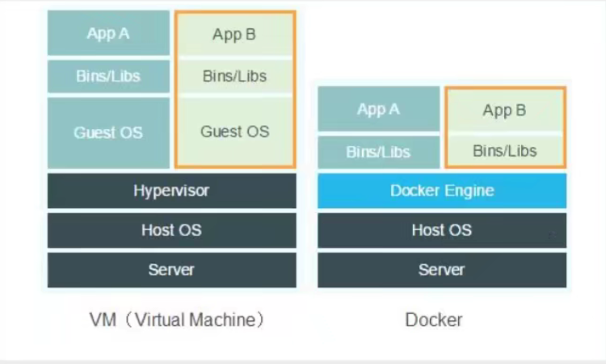
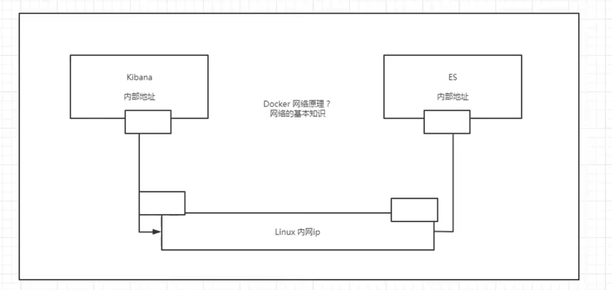
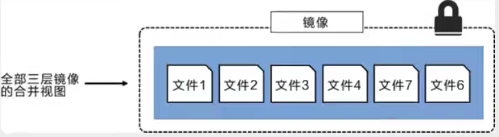
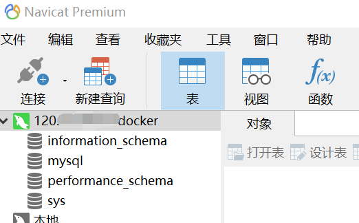
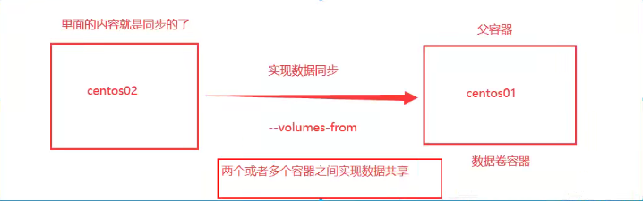

# Docker


## Docker学习大纲

学前准备：

- linux：必须会简单的命令操作，比如cd，mkdir。
- springboot：会的话更好，不会也行。


学什么：

1. docker概述

2. docker安装

3. docker命令

   - 镜像命令

   - 容器命令
   - 操作命令
   - 。。。

4. docker镜像

5. 容器数据卷

6. dockerFile

7. Docker网络原理

8. IDEA整合Docker

9. Docker Compose（集群）

10. Docker Swam（集群管理）
    - 相当于简单版的k8s
11. CI\CD Jenkins

1-8算初级，先学着入门。


## Docker前述

### Docker为什么出现

一套产品有开发/上线，两套环境！应用环境，应用配置在两个环境中都要处理。


一个公司有开发和运维两个主要角色。两角色会碰到一些问题：

- 我在我的电脑上可以用，在你那不行。
- 版本更新，导致服务不可用。这对于运维来说考验很大。

解决方案：

- 开发也干运维的活。


环境配置是十分麻烦的，每个机器都要部署环境（集群redis，ES，Hadoop。。）。费时费力。

解决问题：

- 发布一个项目时，之前是发布一个jar包或者war包。现在发布jar包，它可能需要各种环境（redis，mysql，jdk，ES）；发布jar包是一分钟的事，但是部署环境可能一天都部署不好。
- 我们就想：发布一个项目时，项目能不能带上开发时的环境安装打包，即：（jar+（redis，mysql，jdk，ES））。docker就是来干这个的，开发人员开发完毕后，直接用docker部署上线。


拿安卓开发类比docker：

- java项目--制作apk--发布apk到应用商店--李四使用apk--下载安装即用。
- java项目--制作了jar包（和环境）--打包项目带上环境（即镜像）--docker仓库（类似应用商店）--下载我们发布的镜像，直接运行即可。


Docker思想：

- Docker的思想来源于集装箱。
- 没有docker时，多个应用可能会有端口冲突，应用都是交叉的。
- docker的核心思想是“隔离”。打包装箱，每个箱子是相互隔离的。
  - 比如之前船上装“生化武器”和“食品”可能导致食品变质。但是docker把“生化武器”和“食品”分别装箱后，两者互不影响，可以放到一艘轮船上。
- Docker通过隔离机制，可以将服务器的性能用到极致。不会浪费。


### Docker的历史

2010年，几个搞it的年轻人在美国成立了`dotcloud`公司，做paas云计算服务。有一些linux相关的容器技术。他们将自己的技术（容器化技术）称为docker。

docker刚开始的时候没有引起行业注意，dotcloud活不下去，年轻人又不想放弃这个项目，2013年就把项目做了开源。（有的公司一开始就开源，有的是活不下去了才开源）。越来越多的人发现了docker的优点。

2014年4月9日，docker1.0发布。并成为如今开发人员必须会的技术之一。


docker为何这么火？：

- 十分的轻巧
  - 在容器技术出来之前，我们用的都是虚拟机技术。虚拟机特别占内存，普通电脑开不了几个。
  - 虚拟机：在windows中装一个vmware虚拟机，通过这个软件我们可以虚拟出来一台或者多台电脑。虚拟出来的电脑和真实电脑很想，也是很笨重的。虚拟机是属于虚拟化技术， docker是容器化技术也属于一种虚拟化技术。
  - 例子
    - vm（虚拟机）：linux centos原生镜像（类似一电脑），有隔离性，占用几个G的硬盘，开启要几分钟。
    - docker：有隔离性，镜像（只包含最核心的环境如jdk，mysql），运行镜像就可以，占用几M的硬盘，秒级开启。


聊聊docker：

- docker是基于go语言开发的，开源项目。
- 官网地址：https://www.docker.com/
- 官网文档地址：https://docs.docker.com/
- docker仓库地址：https://hub.docker.com/
  - 操作命令类似github。


### Docker能干什么

#### 虚拟机技术

电脑/虚拟机技术的功能示意图：


虚拟机技术的缺点：

- 资源占用很多
- 冗余步骤很多
- 启动很慢


#### 容器化技术

**容器化技术不是模拟的一个完整地操作系统**


容器化技术示意图：


比较docker和虚拟机技术的不同：

- 传统虚拟机虚拟出一套硬件，运行一个完整的操作系统，然后在这个系统上安装和运行软件。
- 容器内的应用直接运行在“宿主机”的内容中，容器是没有自己的内核，也没有虚拟硬件，所以就轻便了。
- 每个容器内是相互隔离的，每个容器内都有一个属于自己的文件系统，互不影响。


#### DevOps

Dev（开发）Ops（运维）=升职加薪的秘诀


Docker在DevOps角度的优点：

- docker可以实现更快速的交付和部署

  - 传统：一堆帮助文档，安装程序

  - Docker：打包镜像，发布测试，一键运行。

- 更便捷的升级和扩容
  - 使用了docker后，我们部署应用就像搭积木一样。
  - 项目打包为一个影响，一键就能扩展。
  - 各种环境的版本管理升级更便捷。

- 更简单的系统运维
  - 在容器化后，我们的开发，测试环境都是高度一致的；不会出现在A电脑上能用，在B电脑上不能用的情况。

- 更高校的计算资源利用
  - 1核2g的服务器，用docker后，可以运行几十个redis；这是之前虚拟机做不到的。
  - docker是内核级别的虚拟化，可以在一个物理机上运行很多的容器实例。服务器的性能可以被压榨到极致。


## Docker安装与卸载

### Docker的基本组成

docker架构图：


- 三大块：
  - client=客户端
  - host=服务器
  - registry=仓库

- 三个关注点：
  - 镜像（image）
    - docker镜像好比是一个模板，可以通过这个模板来创建容器服务。镜像理解为java中的类，容器理解为java中的对象。
    - 比如有tomcat镜像，镜像是不能直接启动的，要把镜像“运行”起来才能“启动”。tomcat镜像-->run-->tomcat01容器(提供服务)。通过这个镜像可以创建多个容器（最终服务运行或者项目运行就是在容器中的）。
  - 容器（container）
    -  docker利用容器技术可以独立运行一个或者一组应用，应用是通过镜像来创建的。
    - 基本命令：启动，停止，删除。。
    - 目前可以把容器理解为一个简易的linux系统。
  - 仓库（repository）
    - 仓库就是存放镜像的地方。
    - 仓库分为“共有仓库”和“私有仓库”。
    - 像阿里云等公司都有容器服务器，一般要配置国内镜像加速，不然很慢（如maven镜像）。


### 安装Docker准备

#### 环境准备

1. 需要会一点点的linux基础
2. 一个远程服务器（推荐阿里云）
3. CentOS 7（远程服务器系统）
4. 我们用XShell连接远程服务器进行操作

#### 环境查看

shell连接远程服务器，输入一下命令进行查看

```bash
# 系统内核是3.10以上的
[root@zhangyun/]# uname -r
3.10.0-XXX
```

```bash
# 系统版本
[root@rootuser ~]# cat /etc/os-release
NAME="CentOS Linux"
VERSION="7 (Core)"
ID="centos"
ID_LIKE="rhel fedora"
VERSION_ID="7"
PRETTY_NAME="CentOS Linux 7 (Core)"
ANSI_COLOR="0;31"
CPE_NAME="cpe:/o:centos:centos:7"
HOME_URL="https://www.centos.org/"
BUG_REPORT_URL="https://bugs.centos.org/"

CENTOS_MANTISBT_PROJECT="CentOS-7"
CENTOS_MANTISBT_PROJECT_VERSION="7"
REDHAT_SUPPORT_PRODUCT="centos"
REDHAT_SUPPORT_PRODUCT_VERSION="7"
```

### 使用仓库安装实战

#### 访问官网

访问[官网](https://docs.docker.com/get-docker/)


#### 卸载旧版本

在任意目录下运行下列语句：

```bash
yum remove docker \
                  docker-client \
                  docker-client-latest \
                  docker-common \
                  docker-latest \
                  docker-latest-logrotate \
                  docker-logrotate \
                  docker-engine
```


#### 安装一些有用的包

安装一些有用的包

```bash
yum install -y yum-utils
```


#### 设置镜像的仓库

默认是国外的仓库，很慢，**不要用**：

```
yum-config-manager \
    --add-repo \
    https://download.docker.com/linux/centos/docker-ce.repo
```

应该使用阿里云docker仓库地址：

```
yum-config-manager \
    --add-repo \
    http://mirrors.aliyun.com/docker-ce/linux/centos/docker-ce.repo
```

- 这镜像指的是linux应用镜像仓库


#### 更新yum索引

更新软件包的索引：

```bash
yum makecache fast
```


#### 安装docker引擎

```bash
# docker-ce社区版，ee是企业版，推荐ce
yum install docker-ce docker-ce-cli containerd.io
```


#### 启动docker

启动：

```bash
systemctl start docker
```

判断docker是否安装成功

```bash
docker version
```


#### 测试helloworld

运行helloworld镜像：

```bash
docker run hello-world
```


#### 查看下载的镜像

```bash
[root@rootuser ~]# docker images
REPOSITORY           TAG       IMAGE ID       CREATED        SIZE
docker72590/alpine   latest    f5a69fceabd2   9 days ago     5.59MB
# 成功发现了刚刚下载的helloworld镜像
hello-world          latest    feb5d9fea6a5   3 months ago   13.3kB
```


### docker卸载

卸载依赖：

```bash
yum remove docker-ce docker-ce-cli containerd.io
```

删除docker的运行环境

```bash
rm -rf /var/lib/docker
rm -rf /var/lib/containerd
```

- `/var/lib/docker`是docker的默认工作路径。


### 配置阿里云镜像加速

我用的腾讯云服务器，用的阿里云镜像。只要有阿里云账号，就可以用阿里云镜像加速，和服务器没关系。


登录阿里云，找到"容器镜像服务"：


找到镜像加速的[地址](https://cr.console.aliyun.com/cn-hangzhou/instances/mirrors):


依次执行命令：

```bash
sudo mkdir -p /etc/docker

sudo tee /etc/docker/daemon.json <<-'EOF'
{
  "registry-mirrors": ["https://eno5zxt9.mirror.aliyuncs.com"]
}
EOF

sudo systemctl daemon-reload

sudo systemctl restart docker
```

- 如果不是root用户，命令前需要加`sudo`


使用`docker info`来查看是否设置成功，确实看到了自己配置的镜像:


## Docker底层原理

### 回顾helloworld流程

run hello-world镜像，测试docker时命令行展示如下：


根据命令行截图，就可以理解docker run后的运行流程图：


### 原理

#### docker是怎么工作的

Docker是一个Client - Server结构的系统。Docker的”守护进程“运行在主机上，客户端通过Socket可以访问Docker的”守护进程“。DockerServer接收到Docker-Client的指令，就会执行这个命令。

docker的c-s架构工作思路： 


#### docker为什么比vm快

1，从逻辑方面考虑

对比图示：



原因：

- docker有比虚拟机更少的抽象层

- docker利用的是宿主机的内核，vm需要Guest OS

所以说，新建一个容器的时候，docker不需要像虚拟机一样重新加载一个操作系统内核，避免引导。虚拟机是加载Guest OS，分钟级别的；而docker是利用宿主机的操作系统，省略了“加载Guest OS”这个复杂的过程，秒级!


2，性能方向对比


## Docker命令

### 镜像基本命令

#### 帮助命令

```bash
# 查看docker版本
docker version
# 查看docker的详细系统信息，包括镜像+容器
docker info
# 查看不懂的命令的用法
docker 不懂的命令 --help
```

帮助文档的[网址](https://docs.docker.com/reference/):


### 镜像命令

#### 查看本地镜像

[docker images](https://docs.docker.com/engine/reference/commandline/images/)查看所有本地的主机上的镜像

实战：

```bash
[root@rootuser ~]# docker images
REPOSITORY           TAG       IMAGE ID       CREATED        SIZE
docker72590/alpine   latest    f5a69fceabd2   9 days ago     5.59MB
hello-world          latest    feb5d9fea6a5   3 months ago   13.3kB
You have new mail in /var/spool/mail/root
```

栏讲解：

- REPOSITORY：镜像的仓库源。根据这一栏的信息从镜像仓库下载镜像。
- TAG：镜像的标签
- IMAGE ID：镜像的id
- created：镜像的创建时间
- size：镜像的大小

常用可选项讲解：

- -a：all，列出所有镜像
- -q：quiet，只显示镜像的id

- -aq：经常-a和-q联合使用，`docker -aq`，展示所有镜像的id。


#### 搜索线上dockerhub镜像

可以在[docker hub](https://hub.docker.com/)上搜索镜像：


但是官网在境外有的时候访问不稳定。

---

也可以在linux命令行中使用命令`docker search 搜索的东西`来搜索镜像：

```bash
[root@rootuser ~]# docker search mysql
NAME                              DESCRIPTION                                     STARS     OFFICIAL   AUTOMATED
mysql                             MySQL is a widely used, open-source relation…   11940     [OK]       
mariadb                           MariaDB Server is a high performing open sou…   4562      [OK]       
```

可选项：

- `--filter=STARS=3000`可以搜索出stars大于3000的镜像。

使用filter后得到的部分结果：

```bash
[root@rootuser ~]# docker search mysql --filter=stars=3000
NAME      DESCRIPTION                                     STARS     OFFICIAL   AUTOMATED
mysql     MySQL is a widely used, open-source relation…   11940     [OK]       
mariadb   MariaDB Server is a high performing open sou…   4562      [OK]     
```


#### 下载镜像

直接下载最新版,以下载mysql镜像为例：

```bash
[root@rootuser ~]# docker pull mysql
# 如果不写tag，默认下载latest版本
Using default tag: latest
latest: Pulling from library/mysql
# 分层下载，docker image的核心！联合文件系统。
72a69066d2fe: Pull complete 
93619dbc5b36: Pull complete 
99da31dd6142: Pull complete 
626033c43d70: Pull complete 
37d5d7efb64e: Pull complete 
ac563158d721: Pull complete 
d2ba16033dad: Pull complete 
688ba7d5c01a: Pull complete 
00e060b6d11d: Pull complete 
1c04857f594f: Pull complete 
4d7cfa90e6ea: Pull complete 
e0431212d27d: Pull complete 
# 防伪标志：签名
Digest: sha256:e9027fe4d91c0153429607251656806cc784e914937271037f7738bd5b8e7709
Status: Downloaded newer image for mysql:latest
# 真实地址
docker.io/library/mysql:latest
```

说明：

- `docker pull mysql`和`docker pull docker.io/library/mysql:latest`等价

  ，因为docker.io/library/mysql:latest是真实地址。

---

指定镜像的版本下载

```bash
[root@rootuser ~]# docker pull mysql:5.7
# 下载指定的5.7版本
5.7: Pulling from library/mysql
# 已经下载的层不会下载，从already exit可以看出。使用了linux的”联合文件系统“功能
72a69066d2fe: Already exists 
93619dbc5b36: Already exists 
99da31dd6142: Already exists 
626033c43d70: Already exists 
37d5d7efb64e: Already exists 
ac563158d721: Already exists 
d2ba16033dad: Already exists 
# 没下载过的层才会下载
0ceb82207cd7: Pull complete 
37f2405cae96: Pull complete 
e2482e017e53: Pull complete 
70deed891d42: Pull complete 
Digest: sha256:f2ad209efe9c67104167fc609cca6973c8422939491c9345270175a300419f94
Status: Downloaded newer image for mysql:5.7
docker.io/library/mysql:5.7
You have new mail in /var/spool/mail/root
```

- 指定的版本一定要在docker hub存在，可以通过docker hub网站确认。
- 下载镜像是分层的，有的层已经被下载过的话不会被重复下载。其实每个层也是小镜像。

下载完毕后查看本地的所有镜像：


#### 删除镜像

rm表示删除，i表示image即镜像。

根据镜像id删除镜像：

```bash
[root@rootuser ~]# docker rmi 3218b38490ce
Untagged: mysql:latest
Untagged: mysql@sha256:e9027fe4d91c0153429607251656806cc784e914937271037f7738bd5b8e7709
# 只会删除独有的层，和其他镜像共有的层不会被删除。
Deleted: sha256:3218b38490cec8d31976a40b92e09d61377359eab878db49f025e5d464367f3b
Deleted: sha256:aa81ca46575069829fe1b3c654d9e8feb43b4373932159fe2cad1ac13524a2f5
Deleted: sha256:0558823b9fbe967ea6d7174999be3cc9250b3423036370dc1a6888168cbd224d
Deleted: sha256:a46013db1d31231a0e1bac7eeda5ad4786dea0b1773927b45f92ea352a6d7ff9
Deleted: sha256:af161a47bb22852e9e3caf39f1dcd590b64bb8fae54315f9c2e7dc35b025e4e3
Deleted: sha256:feff1495e6982a7e91edc59b96ea74fd80e03674d92c7ec8a502b417268822ff
```

查看本地镜像，发现确实id为3218b38490ce的镜像被删除了：


---

使用参数来删除

- -f 表示force，就强制删除
- $()表示给docker命令传参。这里使用$(docker images -aq)相当于把所有docker镜像的id都传给docker rmi，即**删除所有镜像**。有套娃那味。

```bash
[root@rootuser ~]# docker rmi -f $(docker images -aq)
Untagged: mysql:5.7
Untagged: mysql@sha256:f2ad209efe9c67104167fc609cca6973c8422939491c9345270175a300419f94
Deleted: sha256:c20987f18b130f9d144c9828df630417e2a9523148930dc3963e9d0dab302a76
Deleted: sha256:6567396b065ee734fb2dbb80c8923324a778426dfd01969f091f1ab2d52c7989
Deleted: sha256:0910f12649d514b471f1583a16f672ab67e3d29d9833a15dc2df50dd5536e40f
Deleted: sha256:6682af2fb40555c448b84711c7302d0f86fc716bbe9c7dc7dbd739ef9d757150
Deleted: sha256:5c062c3ac20f576d24454e74781511a5f96739f289edaadf2de934d06e910b92
Deleted: sha256:8805862fcb6ef9deb32d4218e9e6377f35fb351a8be7abafdf1da358b2b287ba
Deleted: sha256:872d2f24c4c64a6795e86958fde075a273c35c82815f0a5025cce41edfef50c7
Deleted: sha256:6fdb3143b79e1be7181d32748dd9d4a845056dfe16ee4c827410e0edef5ad3da
Deleted: sha256:b0527c827c82a8f8f37f706fcb86c420819bb7d707a8de7b664b9ca491c96838
Deleted: sha256:75147f61f29796d6528486d8b1f9fb5d122709ea35620f8ffcea0e0ad2ab0cd0
Deleted: sha256:2938c71ddf01643685879bf182b626f0a53b1356138ef73c40496182e84548aa
Deleted: sha256:ad6b69b549193f81b039a1d478bc896f6e460c77c1849a4374ab95f9a3d2cea2
Untagged: hello-world:latest
Untagged: hello-world@sha256:2498fce14358aa50ead0cc6c19990fc6ff866ce72aeb5546e1d59caac3d0d60f
Deleted: sha256:feb5d9fea6a5e9606aa995e879d862b825965ba48de054caab5ef356dc6b3412
Error: No such image: f5a69fceabd2
```

查看删除结果：


- `docker72590/alpine` 删不掉，貌似是病毒，，，我都是官方渠道，，怎么这样。先不管了。


### 容器命令

说明∶我们有了镜像才可以创建容器，linux中下载一个centos镜像来测试学习

```bash
[root@rootuser ~]# docker pull centos
Using default tag: latest
latest: Pulling from library/centos
a1d0c7532777: Pull complete 
Digest: sha256:a27fd8080b517143cbbbab9dfb7c8571c40d67d534bbdee55bd6c473f432b177
Status: Downloaded newer image for centos:latest
docker.io/library/centos:latest
You have new mail in /var/spool/mail/root

```

- 这里相当于在centos中下载centos的docker镜像，属于套娃了。

#### 新建容器并启动

新建容器并启动：

```bash
docker run [可选参数] imageid
```

参数说明：

- --name="name":是容器的名字，比如可以为”tomcat1“或”tomcat2“来区分不同的tomcat容器。

- -d: 后台方式运行
- -it：使用交互方式运行，进入容器查看内容
- -p：指定容器的端口，如`-p 8080`
  - `-p 主机端口:容器端口`：可以从外界访问。最常用！
  - `-p ip:主机端口:容器端口`：可以带上ip。
  - `-p 容器端口`：不从外界访问。
- -P：大写P，即随机指定端口

---

实战：

```bash
[root@rootuser ~]# docker run -it centos /bin/bash
# 通过ls查看容器内部的centos的目录，可以看到和容器外部的centos很相似，但是两者没有任何关系。
[root@29e9814941c2 /]# ls
bin  etc   lib	  lost+found  mnt  proc  run   srv  tmp  var
dev  home  lib64  media       opt  root  sbin  sys  usr
# 退出centos容器
[root@29e9814941c2 /]# exit
exit
# 查看容器外部的centos根目录，与容器内部的目录很相似。
[root@rootuser ~]# ls /
bin   data  etc   lib    lost+found  mnt  proc  run   srv  tmp  var
boot  dev   home  lib64  media       opt  root  sbin  sys  usr

```

- -it表示以交互方式运行容器，交互方式被指定为"/bin/bash"
- /bin/bash表示通过bash命令的方式进入容器

#### 退出容器

```bash
# 容器停止并退出
exit
# 容器不停止，且退出
ctrl+P（大写）+Q(大写)
```

#### 查看运行（过）的容器

```bash
# 正在运行的容器
docker ps
# 正在运行+未运作的容器（被删除的容器不会显示），a表示all
docker ps -a
# 显示正在运行的最新的若干个容器，如下显示最新的一个容器
docker ps -n=1
# 显示正在运行的容器，只显示容器的编号
docker ps -p

```

#### 删除容器

```bash
# 删除指定的单个容器。没使用-f不能删除正在运行的容器。
docker rm 容器id
# 强制删除所有容器,$(docker ps -aq)把所有容器的id传给rm。用了-f可以删除正在运行的容器。
docker rm -f $(docker ps -aq)
# 删除所有容器。使用了管道符"|"
docker ps -a -q|xargs docker rm
```

#### 启动重启停止容器

```bash
# 启动已有的被关闭的容器
docker start 容器id
# 重启容器
docker restart 容器id
# 停止当前正在运行的容器
docker stop 容器id
# 强制停止当前正在运行的容器。docker stop报错的话可以用dock kill关闭这个顽固的容器。
docker kill 容器id
```


### 常用的其他命令

#### 后台启动容器

```bash
[root@rootuser ~]# docker run -d centos
4bbeb1c1cbadba1020b47b82f58f2362ee87d6d2dd54ea1d4eb8893899458a13
[root@rootuser ~]# docker ps
CONTAINER ID   IMAGE     COMMAND   CREATED   STATUS    PORTS     NAMES
```

常见的坑：

- 后台启动容器后，使用docker ps发现centos停止了。
  - 原因：docker容器在后台运行就必须要有一个前台进程（比如-it进入容器就相当于有前台进程），docker发现没有前台进程就会自动停止。
  - -tomcat的时候可以这么用（？不理解）

#### 查看日志命令

```bash
# 先看有哪些容器存在
[root@rootuser ~]# docker ps -a
CONTAINER ID   IMAGE     COMMAND       CREATED          STATUS                      PORTS     NAMES
4bbeb1c1cbad   centos    "/bin/bash"   10 minutes ago   Exited (0) 10 minutes ago             elastic_babbage
9d987a3f0bca   centos    "/bin/bash"   28 minutes ago   Exited (0) 11 minutes ago             stoic_sammet
# 查看容器id为“9d987a3f0bca”的容器的日志
[root@rootuser ~]# docker logs -f -t --tail 10 9d987a3f0bca
[root@9d987a3f0bca /]# exit
2022-01-10T09:28:41.539285540Z exit
2022-01-10T09:44:44.198722927Z [root@9d987a3f0bca /]# exit
```

讲解：

- -f：是跟踪日志输出，相当于实时显示。
- -t：展示时间戳
- --tail n：展示日志的后n条数据
- 9d987a3f0bca：被查询日志的容器的id


使用docker help查看logs的用法：

```bash
[root@rootuser ~]# docker help logs

Usage:  docker logs [OPTIONS] CONTAINER

Fetch the logs of a container

Options:
      --details        Show extra details provided to logs
  -f, --follow         Follow log output
      --since string   Show logs since timestamp (e.g. 2013-01-02T13:23:37Z) or relative (e.g. 42m for 42 minutes)
  -n, --tail string    Number of lines to show from the end of the logs (default "all")
  -t, --timestamps     Show timestamps
      --until string   Show logs before a timestamp (e.g. 2013-01-02T13:23:37Z) or relative (e.g. 42m for 42 minutes)
```

- 第一列是第二列的简称


#### 查看容器内部进程信息

```bash
# 因为之前把容器全关了，查看有哪些关闭着的容器
[root@rootuser ~]# docker ps -a
CONTAINER ID   IMAGE     COMMAND       CREATED        STATUS                    PORTS     NAMES
4bbeb1c1cbad   centos    "/bin/bash"   23 hours ago   Exited (0) 23 hours ago             elastic_babbage
9d987a3f0bca   centos    "/bin/bash"   23 hours ago   Exited (0) 23 hours ago             stoic_sammet
# 启动容器
[root@rootuser ~]# docker start 9d987a3f0bca
9d987a3f0bca
# 确认容器正在启动
[root@rootuser ~]# docker ps
CONTAINER ID   IMAGE     COMMAND       CREATED        STATUS         PORTS     NAMES
9d987a3f0bca   centos    "/bin/bash"   23 hours ago   Up 4 seconds             stoic_sammet
# 查看docker top的用法
[root@rootuser ~]# docker top --help

Usage:  docker top CONTAINER [ps OPTIONS]

Display the running processes of a container
# 使用docker top查看容器id为9d987a3f0bca的容器内部的进程信息
[root@rootuser ~]# docker top 9d987a3f0bca 
UID                 PID                 PPID                C                   STIME               TTY                 TIME                CMD
root                13982               13963               0                   16:50               pts/0               00:00:00            /bin/bash
```

- uid：用户id
- pid：父id
- ppid：进程id

可以通过进程信息杀进程。

#### 查看Docker objects（常为容器）的元数据(low-level information)

```bash
# 查看docker inspect的用法
[root@rootuser ~]# docker inspect --help

Usage:  docker inspect [OPTIONS] NAME|ID [NAME|ID...]

Return low-level information on Docker objects

Options:
  -f, --format string   Format the output using the given Go template
  -s, --size            Display total file sizes if the type is container
      --type string     Return JSON for specified type
# 查看容器id为9d987a3f0bca的容器的底层信息
[root@rootuser ~]# docker inspect 9d987a3f0bca
[
    {
    # id的前若干位是本容器的容器id
        "Id": "9d987a3f0bca702e07dbcc19f6794a8e3499a2c57e795a0af356eab35dbcd90a",
        "Created": "2022-01-10T09:28:25.577866758Z",
        "Path": "/bin/bash",
        "Args": [],
        "State": {
        # 现状是运行中
            "Status": "running",
            "Running": true,
            "Paused": false,
            "Restarting": false,
            "OOMKilled": false,
            "Dead": false,
            "Pid": 13982,
            "ExitCode": 0,
            "Error": "",
            "StartedAt": "2022-01-11T08:50:15.154996662Z",
            "FinishedAt": "2022-01-10T09:44:44.211896577Z"
        },
        # 容器所来源的镜像
        "Image": "sha256:5d0da3dc976460b72c77d94c8a1ad043720b0416bfc16c52c45d4847e53fadb6",
        "ResolvConfPath": "/var/lib/docker/containers/9d987a3f0bca702e07dbcc19f6794a8e3499a2c57e795a0af356eab35dbcd90a/resolv.conf",
        "HostnamePath": "/var/lib/docker/containers/9d987a3f0bca702e07dbcc19f6794a8e3499a2c57e795a0af356eab35dbcd90a/hostname",
        "HostsPath": "/var/lib/docker/containers/9d987a3f0bca702e07dbcc19f6794a8e3499a2c57e795a0af356eab35dbcd90a/hosts",
        "LogPath": "/var/lib/docker/containers/9d987a3f0bca702e07dbcc19f6794a8e3499a2c57e795a0af356eab35dbcd90a/9d987a3f0bca702e07dbcc19f6794a8e3499a2c57e795a0af356eab35dbcd90a-json.log",
        "Name": "/stoic_sammet",
        "RestartCount": 0,
        "Driver": "overlay2",
        "Platform": "linux",
        "MountLabel": "",
        "ProcessLabel": "",
        "AppArmorProfile": "",
        "ExecIDs": null,
        "HostConfig": {
            "Binds": null,
            "ContainerIDFile": "",
            "LogConfig": {
                "Type": "json-file",
                "Config": {}
            },
            "NetworkMode": "default",
            "PortBindings": {},
            "RestartPolicy": {
                "Name": "no",
                "MaximumRetryCount": 0
            },
            "AutoRemove": false,
            "VolumeDriver": "",
            "VolumesFrom": null,
            "CapAdd": null,
            "CapDrop": null,
            "CgroupnsMode": "host",
            "Dns": [],
            "DnsOptions": [],
            "DnsSearch": [],
            "ExtraHosts": null,
            "GroupAdd": null,
            "IpcMode": "private",
            "Cgroup": "",
            "Links": null,
            "OomScoreAdj": 0,
            "PidMode": "",
            "Privileged": false,
            "PublishAllPorts": false,
            "ReadonlyRootfs": false,
            "SecurityOpt": null,
            "UTSMode": "",
            "UsernsMode": "",
            "ShmSize": 67108864,
            "Runtime": "runc",
            "ConsoleSize": [
                0,
                0
            ],
            "Isolation": "",
            "CpuShares": 0,
            "Memory": 0,
            "NanoCpus": 0,
            "CgroupParent": "",
            "BlkioWeight": 0,
            "BlkioWeightDevice": [],
            "BlkioDeviceReadBps": null,
            "BlkioDeviceWriteBps": null,
            "BlkioDeviceReadIOps": null,
            "BlkioDeviceWriteIOps": null,
            "CpuPeriod": 0,
            "CpuQuota": 0,
            "CpuRealtimePeriod": 0,
            "CpuRealtimeRuntime": 0,
            "CpusetCpus": "",
            "CpusetMems": "",
            "Devices": [],
            "DeviceCgroupRules": null,
            "DeviceRequests": null,
            "KernelMemory": 0,
            "KernelMemoryTCP": 0,
            "MemoryReservation": 0,
            "MemorySwap": 0,
            "MemorySwappiness": null,
            "OomKillDisable": false,
            "PidsLimit": null,
            "Ulimits": null,
            "CpuCount": 0,
            "CpuPercent": 0,
            "IOMaximumIOps": 0,
            "IOMaximumBandwidth": 0,
            "MaskedPaths": [
                "/proc/asound",
                "/proc/acpi",
                "/proc/kcore",
                "/proc/keys",
                "/proc/latency_stats",
                "/proc/timer_list",
                "/proc/timer_stats",
                "/proc/sched_debug",
                "/proc/scsi",
                "/sys/firmware"
            ],
            "ReadonlyPaths": [
                "/proc/bus",
                "/proc/fs",
                "/proc/irq",
                "/proc/sys",
                "/proc/sysrq-trigger"
            ]
        },
        "GraphDriver": {
            "Data": {
                "LowerDir": "/var/lib/docker/overlay2/d0e170b78fa45ed94d897a26006880286a867646064370f6979f1f86a6249952-init/diff:/var/lib/docker/overlay2/d3d67a249fb5a65782e888049cd6b57e28a9e2b111d1f5e8988777490adbe956/diff",
                "MergedDir": "/var/lib/docker/overlay2/d0e170b78fa45ed94d897a26006880286a867646064370f6979f1f86a6249952/merged",
                "UpperDir": "/var/lib/docker/overlay2/d0e170b78fa45ed94d897a26006880286a867646064370f6979f1f86a6249952/diff",
                "WorkDir": "/var/lib/docker/overlay2/d0e170b78fa45ed94d897a26006880286a867646064370f6979f1f86a6249952/work"
            },
            "Name": "overlay2"
        },
        # 挂载，目前没用上
        "Mounts": [],
        # 容器的一些基本配置
        "Config": {
        # 默认的容器名字
            "Hostname": "9d987a3f0bca",
            "Domainname": "",
            "User": "",
            "AttachStdin": true,
            "AttachStdout": true,
            "AttachStderr": true,
            "Tty": true,
            "OpenStdin": true,
            "StdinOnce": true,
            # 环境变量里没有java，所以容器中目前不能用java，只能用一些基本命令。
            "Env": [
                "PATH=/usr/local/sbin:/usr/local/bin:/usr/sbin:/usr/bin:/sbin:/bin"
            ],
            "Cmd": [
                "/bin/bash"
            ],
            "Image": "centos",
            "Volumes": null,
            "WorkingDir": "",
            "Entrypoint": null,
            "OnBuild": null,
            "Labels": {
                "org.label-schema.build-date": "20210915",
                "org.label-schema.license": "GPLv2",
                "org.label-schema.name": "CentOS Base Image",
                "org.label-schema.schema-version": "1.0",
                "org.label-schema.vendor": "CentOS"
            }
        },
        # 容器的网络配置
        "NetworkSettings": {
            "Bridge": "",
            "SandboxID": "426d831c780d3ed860b675adf4bbe8dcede81f50afaaae846de777cab3fe3849",
            "HairpinMode": false,
            "LinkLocalIPv6Address": "",
            "LinkLocalIPv6PrefixLen": 0,
            "Ports": {},
            "SandboxKey": "/var/run/docker/netns/426d831c780d",
            "SecondaryIPAddresses": null,
            "SecondaryIPv6Addresses": null,
            "EndpointID": "a16d244d71807b90fd70e40c8b6ed2e7be0ff267aec50265108b33e170fefa50",
            "Gateway": "172.17.0.1",
            "GlobalIPv6Address": "",
            "GlobalIPv6PrefixLen": 0,
            "IPAddress": "172.17.0.2",
            "IPPrefixLen": 16,
            "IPv6Gateway": "",
            "MacAddress": "02:42:ac:11:00:02",
            "Networks": {
            # 当前使用的是“桥接网卡”
                "bridge": {
                    "IPAMConfig": null,
                    "Links": null,
                    "Aliases": null,
                    "NetworkID": "5f9bc0a0faaa995d376fd6edbac2b55e086fdd4382c7b5219eae78c967168a1c",
                    "EndpointID": "a16d244d71807b90fd70e40c8b6ed2e7be0ff267aec50265108b33e170fefa50",
                    "Gateway": "172.17.0.1",
                    "IPAddress": "172.17.0.2",
                    "IPPrefixLen": 16,
                    "IPv6Gateway": "",
                    "GlobalIPv6Address": "",
                    "GlobalIPv6PrefixLen": 0,
                    "MacAddress": "02:42:ac:11:00:02",
                    "DriverOpts": null
                }
            }
        }
    }
]
You have new mail in /var/spool/mail/root
```


#### 进入当前正在运行的容器

容器通常都是后台方式运行的，我们有时需要进入容器，修改一些配置

方式1，

```bash
# 命令
docker exec -it 容器id bashshell(默认的命令行方式)
```

实战：

```bash
# 查看有什么容器正在运行
[root@rootuser ~]# docker ps
CONTAINER ID   IMAGE     COMMAND       CREATED        STATUS       PORTS     NAMES
9d987a3f0bca   centos    "/bin/bash"   27 hours ago   Up 4 hours             stoic_sammet
You have new mail in /var/spool/mail/root
# 进入容器9d987a3f0bca
[root@rootuser ~]# docker exec -it 9d987a3f0bca /bin/bash
# 在容器内部执行各种命令
[root@9d987a3f0bca /]# ls 
bin  etc   lib	  lost+found  mnt  proc  run   srv  tmp  var
dev  home  lib64  media       opt  root  sbin  sys  usr
[root@9d987a3f0bca /]# ps -ef
UID        PID  PPID  C STIME TTY          TIME CMD
root         1     0  0 08:50 pts/0    00:00:00 /bin/bash
root        15     0  0 12:43 pts/1    00:00:00 /bin/bash
root        31    15  0 12:43 pts/1    00:00:00 ps -ef
# 退出容器
[root@9d987a3f0bca /]# exit
exit
[root@rootuser ~]# 
```

---

方式2，

命令：

```bash
docker attach 容器id
```

实战：

```bash
# 进入容器
[root@rootuser ~]# docker attach 9d987a3f0bca
# 退出容器
[root@9d987a3f0bca /]# exit
exit
[root@rootuser ~]# 

```

---

方式1（exec）和方式2（attach）对比：

- docker exec是进入容器后开启一个新的终端，可以在里面操作（常用）。
- docker attach是进入容器中正在执行的终端，不会启动新的进程。
- exec进去容器是以一个新的窗口进去的，exit退出当然不会关闭容器；要是你以attach进去，退出就会关闭了；运行容器时直接-it加/bin/bash进容器的话，exit后也没有存活的控制台，容器也会关闭。

#### 容器和主机文件互相拷贝

命令：

```bash
# 从容器拷贝文件到物理主机。前面的地址是源，后面的地址是目的地。
docker cp 容器id:容器内路径 物理主机路径
# 从物理主机拷贝文件到容器
docker cp 物理主机路径 容器id:容器内路径
```

实战，从容器拷贝文件到主机：

```bash
# 因为没有容器正在开启，查看有哪些可用容器
[root@rootuser ~]# docker ps -a
CONTAINER ID   IMAGE     COMMAND       CREATED        STATUS                      PORTS     NAMES
4bbeb1c1cbad   centos    "/bin/bash"   28 hours ago   Exited (0) 28 hours ago               elastic_babbage
9d987a3f0bca   centos    "/bin/bash"   28 hours ago   Exited (0) 26 minutes ago             stoic_sammet
# 开启一个容器
[root@rootuser ~]# docker start 9d987a3f0bca
9d987a3f0bca
# 确认容器已经开启
[root@rootuser ~]# docker ps
CONTAINER ID   IMAGE     COMMAND       CREATED        STATUS         PORTS     NAMES
9d987a3f0bca   centos    "/bin/bash"   28 hours ago   Up 3 seconds             stoic_sammet
# 进入容器
[root@rootuser ~]# docker exec -it 9d987a3f0bca /bin/bash
# 在容器内存入文件zhangyun.java
[root@9d987a3f0bca /]# ls
bin  dev  etc  home  lib  lib64  lost+found  media  mnt  opt  proc  root  run  sbin  srv  sys  tmp  usr  var
[root@9d987a3f0bca /]# cd home
[root@9d987a3f0bca home]# ls
[root@9d987a3f0bca home]# touch zhangyun.java
[root@9d987a3f0bca home]# ls
zhangyun.java
# 退出容器
[root@9d987a3f0bca home]# exit
exit
[root@rootuser ~]# pwd
/root
[root@rootuser ~]# ls
packages  zhangyunroot
# 把容器内的zhangyun.java文件拷贝到主机指定目录中
[root@rootuser ~]# docker cp 9d987a3f0bca:/home/zhangyun.java /root
# 拷贝成功
[root@rootuser ~]# ls
packages  zhangyun.java  zhangyunroot
[root@rootuser ~]# 

```

- 拷贝是一个手动的过程，未来我们使用-v卷的技术，可以实现自动同步”容器的指定目录“和“主机的指定目录”

### 小结

docker命令逻辑示意图：


- 可以看到exec命令的图标是一个”终端“，对应“进入容器并开启新终端”。
- 可以看到attach命令的图标是“进入符号”，对应“进入容器的当前运行终端”。


docker的命令十分多，目前学的都是最常用的命令，后面会学习更多。

接下来就是一堆练习。


### 作业练习

#### docker安装nginx

nginx可以做负载均衡和反向代理。


1，docker搜索nignx镜像

```bash
[root@rootuser ~]# docker search nginx
NAME                              DESCRIPTION                                     STARS     OFFICIAL   AUTOMATED
nginx                             Official build of Nginx.                        16113     [OK]       
jwilder/nginx-proxy               Automated Nginx reverse proxy for docker con…   2107                 [OK]
richarvey/nginx-php-fpm           Container running Nginx + PHP-FPM capable of…   820                  [OK]
jc21/nginx-proxy-manager          Docker container for managing Nginx proxy ho…   309                  
```

2，dockerhub官网找到合适的[版本](https://hub.docker.com/_/nginx)，可以看到很多帮助文档和信息。版本无特殊要求，用最新版就行。

- alpine是瘦身版的镜像，很小。


3，下载，这里直接下载最新版nginx镜像

```bash
[root@rootuser ~]# docker pull nginx
Using default tag: latest
latest: Pulling from library/nginx
a2abf6c4d29d: Pull complete 
a9edb18cadd1: Pull complete 
589b7251471a: Pull complete 
186b1aaa4aa6: Pull complete 
b4df32aa5a72: Pull complete 
a0bcbecc962e: Pull complete 
Digest: sha256:0d17b565c37bcbd895e9d92315a05c1c3c9a29f762b011a10c54a66cd53c9b31
Status: Downloaded newer image for nginx:latest
docker.io/library/nginx:latest
```

4，查看本地所有镜像，确认nginx镜像已被下载：

```bash
[root@rootuser ~]# docker images
REPOSITORY           TAG       IMAGE ID       CREATED        SIZE
docker72590/alpine   latest    f5a69fceabd2   11 days ago    5.59MB
nginx                latest    605c77e624dd   13 days ago    141MB
centos               latest    5d0da3dc9764   3 months ago   231MB
```

5，利用nginx镜像启动nignx容器

参数讲解：

- -d：以后台的方式启动nginx

- --name：给启动的nginx容器取个名字“nginx01”

- -p 宿主机port:容器port：

  - 容器port暴露nginx容器的指定端口号，默认为80。

  - 宿主机port暴露宿主机的指定端口号。暴露后要确保腾讯云的**”防火墙（安全组）**“也开放了该宿主机端口号，才能从外界访问。

    

实战：

```bash
# 最后的”nginx“是创建nginx容器所依托的镜像名
[root@rootuser ~]# docker run -d --name nginx01 -p 3344:80 nginx
4a9b60af741dd918d8ccd71b35c79d1ae0c4a54333d9d57f01b6256f28550e7e
# 确认nginx容器已启动
[root@rootuser ~]# docker ps
CONTAINER ID   IMAGE     COMMAND                  CREATED              STATUS              PORTS                                   NAMES
4a9b60af741d   nginx     "/docker-entrypoint.…"   About a minute ago   Up About a minute   0.0.0.0:3344->80/tcp, :::3344->80/tcp   nginx01
9d987a3f0bca   centos    "/bin/bash"              42 hours ago         Up 14 hours                                                 stoic_sammet
```

6，用curl使本机自测主机端口

curl讲解：

- 在Linux中curl是一个**利用URL规则在命令行下工作的文件传输工具**，可以说是一款很强大的http命令行工具。
- 基本用法`# curl http://www.linux.com`。执行后，www.linux.com 的html就会显示在屏幕上了。
  Ps：由于安装linux的时候很多时候是没有安装桌面的，也意味着没有浏览器，**因此这个方法也经常用于测试一台服务器是否可以到达一个网站**

实战：

```bash
[root@rootuser ~]# curl localhost:3344
<!DOCTYPE html>
<html>
<head>
<title>Welcome to nginx!</title>
<style>
html { color-scheme: light dark; }
body { width: 35em; margin: 0 auto;
font-family: Tahoma, Verdana, Arial, sans-serif; }
</style>
</head>
<body>
<h1>Welcome to nginx!</h1>
<p>If you see this page, the nginx web server is successfully installed and
working. Further configuration is required.</p>

<p>For online documentation and support please refer to
<a href="http://nginx.org/">nginx.org</a>.<br/>
Commercial support is available at
<a href="http://nginx.com/">nginx.com</a>.</p>

<p><em>Thank you for using nginx.</em></p>
</body>
</html>
You have new mail in /var/spool/mail/root
```

- 可以看到访问本机3344端口，自动被映射为nginx容器的80端口。读取了nginx容器80端口对应的html页面。

图解宿主机端口vs容器端口：


7，外网测试访问宿主机内部的nginx容器

浏览器访问`腾讯云服务器公网ip:3344`，成功访问:


8，进入nginx容器看看

```bash
# 进入nginx容器
[root@rootuser ~]# docker exec -it nginx01 /bin/bash
# 查看nginx存在的目录，依次找到nginx配置文件地址
root@4a9b60af741d:/# whereis nginx
nginx: /usr/sbin/nginx /usr/lib/nginx /etc/nginx /usr/share/nginx
# /etc/nginx是nginx容器配置文件的地址，查看有哪些配置文件
root@4a9b60af741d:/# ls /etc/nginx
conf.d	fastcgi_params	mime.types  modules  nginx.conf  scgi_params  uwsgi_params
```

9，关闭nginx容器后尝试从外网访问nginx

```bash
# 离开容器
root@4a9b60af741d:/# exit
exit
# 停止nginx容器
[root@rootuser ~]# docker stop nginx01
nginx01
# 确认nginx容器已停止
[root@rootuser ~]# docker ps
CONTAINER ID   IMAGE     COMMAND       CREATED        STATUS        PORTS     NAMES
9d987a3f0bca   centos    "/bin/bash"   43 hours ago   Up 15 hours             stoic_sammet
```

不出所料，关闭nginx后访问不了了。


- 思考问题∶我们每次改动nginx配置文件，都需要进入容器内部？十分的麻烦，我要是可以在容器外部提供一个映射路径，达到在容器外部的宿主机修改文件，容器内部就 可以自动修改就好了：**-v数据卷**Ⅰ

#### docker安装tomcat

1，dockerhub查看心仪的tomcat版本

就使用官网教程展示的9.0版本吧：


2，尝试直接运行tomcat容器

- `docker run`其实会自动帮下载镜像，运行容器前下载镜像不是必须的。

命令（官网）：

```bash
docker run -it --rm tomcat:9.0
```

- -it：表示运行容器后进入容器
- --rm：我们之前的启动都是后台启动，停止了容器后容器还是能查到的；但是--rm表示”**用完即删**“，一般用来测试。

实战：

```bash
# 根据tomcat镜像启动一个容器，容器名不设定而用默认的，用完即删
[root@rootuser ~]# docker run -it --rm tomcat:9.0
# 运行容器时找不到镜像，自动下载镜像
Unable to find image 'tomcat:9.0' locally
9.0: Pulling from library/tomcat
0e29546d541c: Pull complete 
9b829c73b52b: Pull complete 
cb5b7ae36172: Pull complete 
6494e4811622: Pull complete 
668f6fcc5fa5: Pull complete 
dc120c3e0290: Pull complete 
8f7c0eebb7b1: Pull complete 
77b694f83996: Pull complete 
7662046c36cb: Pull complete 
b93639122cb4: Pull complete 
Digest: sha256:cd96d4f7d3f5fc4d3bc1622ec678207087b8215d55021a607ecaefba80b403ea
# 下载镜像完成
Status: Downloaded newer image for tomcat:9.0
# 启动tomcat容器，控制台的显示就是熟悉的标准的tomcat启动时的显示
Using CATALINA_BASE:   /usr/local/tomcat
Using CATALINA_HOME:   /usr/local/tomcat
Using CATALINA_TMPDIR: /usr/local/tomcat/temp
Using JRE_HOME:        /usr/local/openjdk-11
Using CLASSPATH:       /usr/local/tomcat/bin/bootstrap.jar:/usr/local/tomcat/bin/tomcat-juli.jar
Using CATALINA_OPTS:   
NOTE: Picked up JDK_JAVA_OPTIONS:  --add-opens=java.base/java.lang=ALL-UNNAMED --add-opens=java.base/java.io=ALL-UNNAMED --add-opens=java.base/java.util=ALL-UNNAMED --add-opens=java.base/java.util.concurrent=ALL-UNNAMED --add-opens=java.rmi/sun.rmi.transport=ALL-UNNAMED
12-Jan-2022 04:18:22.892 INFO [main] org.apache.catalina.startup.VersionLoggerListener.log Server version name:   Apache Tomcat/9.0.56
12-Jan-2022 04:18:22.895 INFO [main] org.apache.catalina.startup.VersionLoggerListener.log Server built:          Dec 2 2021 14:30:07 UTC
12-Jan-2022 04:18:22.895 INFO [main] org.apache.catalina.startup.VersionLoggerListener.log Server version number: 9.0.56.0
12-Jan-2022 04:18:22.895 INFO [main] org.apache.catalina.startup.VersionLoggerListener.log OS Name:               Linux
12-Jan-2022 04:18:22.896 INFO [main] org.apache.catalina.startup.VersionLoggerListener.log OS Version:            3.10.0-1160.45.1.el7.x86_64
12-Jan-2022 04:18:22.896 INFO [main] org.apache.catalina.startup.VersionLoggerListener.log Architecture:          amd64
12-Jan-2022 04:18:22.898 INFO [main] org.apache.catalina.startup.VersionLoggerListener.log Java Home:             /usr/local/openjdk-11
12-Jan-2022 04:18:22.898 INFO [main] org.apache.catalina.startup.VersionLoggerListener.log JVM Version:           11.0.13+8
12-Jan-2022 04:18:22.898 INFO [main] org.apache.catalina.startup.VersionLoggerListener.log JVM Vendor:            Oracle Corporation
12-Jan-2022 04:18:22.898 INFO [main] org.apache.catalina.startup.VersionLoggerListener.log CATALINA_BASE:         /usr/local/tomcat
12-Jan-2022 04:18:22.898 INFO [main] org.apache.catalina.startup.VersionLoggerListener.log CATALINA_HOME:         /usr/local/tomcat
12-Jan-2022 04:18:22.937 INFO [main] org.apache.catalina.startup.VersionLoggerListener.log Command line argument: --add-opens=java.base/java.lang=ALL-UNNAMED
12-Jan-2022 04:18:22.937 INFO [main] org.apache.catalina.startup.VersionLoggerListener.log Command line argument: --add-opens=java.base/java.io=ALL-UNNAMED
12-Jan-2022 04:18:22.937 INFO [main] org.apache.catalina.startup.VersionLoggerListener.log Command line argument: --add-opens=java.base/java.util=ALL-UNNAMED
12-Jan-2022 04:18:22.937 INFO [main] org.apache.catalina.startup.VersionLoggerListener.log Command line argument: --add-opens=java.base/java.util.concurrent=ALL-UNNAMED
12-Jan-2022 04:18:22.938 INFO [main] org.apache.catalina.startup.VersionLoggerListener.log Command line argument: --add-opens=java.rmi/sun.rmi.transport=ALL-UNNAMED
12-Jan-2022 04:18:22.938 INFO [main] org.apache.catalina.startup.VersionLoggerListener.log Command line argument: -Djava.util.logging.config.file=/usr/local/tomcat/conf/logging.properties
12-Jan-2022 04:18:22.938 INFO [main] org.apache.catalina.startup.VersionLoggerListener.log Command line argument: -Djava.util.logging.manager=org.apache.juli.ClassLoaderLogManager
12-Jan-2022 04:18:22.938 INFO [main] org.apache.catalina.startup.VersionLoggerListener.log Command line argument: -Djdk.tls.ephemeralDHKeySize=2048
12-Jan-2022 04:18:22.938 INFO [main] org.apache.catalina.startup.VersionLoggerListener.log Command line argument: -Djava.protocol.handler.pkgs=org.apache.catalina.webresources
12-Jan-2022 04:18:22.938 INFO [main] org.apache.catalina.startup.VersionLoggerListener.log Command line argument: -Dorg.apache.catalina.security.SecurityListener.UMASK=0027
12-Jan-2022 04:18:22.938 INFO [main] org.apache.catalina.startup.VersionLoggerListener.log Command line argument: -Dignore.endorsed.dirs=
12-Jan-2022 04:18:22.938 INFO [main] org.apache.catalina.startup.VersionLoggerListener.log Command line argument: -Dcatalina.base=/usr/local/tomcat
12-Jan-2022 04:18:22.938 INFO [main] org.apache.catalina.startup.VersionLoggerListener.log Command line argument: -Dcatalina.home=/usr/local/tomcat
12-Jan-2022 04:18:22.939 INFO [main] org.apache.catalina.startup.VersionLoggerListener.log Command line argument: -Djava.io.tmpdir=/usr/local/tomcat/temp
12-Jan-2022 04:18:22.962 INFO [main] org.apache.catalina.core.AprLifecycleListener.lifecycleEvent Loaded Apache Tomcat Native library [1.2.31] using APR version [1.7.0].
12-Jan-2022 04:18:22.962 INFO [main] org.apache.catalina.core.AprLifecycleListener.lifecycleEvent APR capabilities: IPv6 [true], sendfile [true], accept filters [false], random [true], UDS [true].
12-Jan-2022 04:18:22.963 INFO [main] org.apache.catalina.core.AprLifecycleListener.lifecycleEvent APR/OpenSSL configuration: useAprConnector [false], useOpenSSL [true]
12-Jan-2022 04:18:22.974 INFO [main] org.apache.catalina.core.AprLifecycleListener.initializeSSL OpenSSL successfully initialized [OpenSSL 1.1.1k  25 Mar 2021]
12-Jan-2022 04:18:24.227 INFO [main] org.apache.coyote.AbstractProtocol.init Initializing ProtocolHandler ["http-nio-8080"]
12-Jan-2022 04:18:24.332 INFO [main] org.apache.catalina.startup.Catalina.load Server initialization in [2127] milliseconds
12-Jan-2022 04:18:24.553 INFO [main] org.apache.catalina.core.StandardService.startInternal Starting service [Catalina]
12-Jan-2022 04:18:24.554 INFO [main] org.apache.catalina.core.StandardEngine.startInternal Starting Servlet engine: [Apache Tomcat/9.0.56]
12-Jan-2022 04:18:24.585 INFO [main] org.apache.coyote.AbstractProtocol.start Starting ProtocolHandler ["http-nio-8080"]
# 启动tomcat容器完成
12-Jan-2022 04:18:24.610 INFO [main] org.apache.catalina.startup.Catalina.start Server startup in [278] milliseconds
```

新开一个页面，关闭tomcat：

```bash
# 查看当前运行的docker容器
[root@rootuser ~]# docker ps
CONTAINER ID   IMAGE        COMMAND             CREATED        STATUS        PORTS      NAMES
1db32e6040aa   tomcat:9.0   "catalina.sh run"   2 hours ago    Up 2 hours    8080/tcp   sleepy_robinson
9d987a3f0bca   centos       "/bin/bash"         45 hours ago   Up 17 hours              stoic_sammet
You have new mail in /var/spool/mail/root
# 停止tomcat容器
[root@rootuser ~]# docker stop 1db32e6040aa 
1db32e6040aa
# tomcat容器停止后，不仅是停止，而且也被删除。这就是docker run --rm的效果
[root@rootuser ~]# docker ps -a
CONTAINER ID   IMAGE     COMMAND                  CREATED        STATUS                    PORTS     NAMES
4a9b60af741d   nginx     "/docker-entrypoint.…"   3 hours ago    Exited (0) 2 hours ago              nginx01
4bbeb1c1cbad   centos    "/bin/bash"              45 hours ago   Exited (0) 45 hours ago             elastic_babbage
9d987a3f0bca   centos    "/bin/bash"              45 hours ago   Up 17 hours                         stoic_sammet
```

以--rm方式运行容器仅用于测试，接下来我们还是老实点下载镜像后运行容器。

3，下载tomcat镜像

命令：

```bash
[root@rootuser ~]# docker pull tomcat:9.0
9.0: Pulling from library/tomcat
Digest: sha256:cd96d4f7d3f5fc4d3bc1622ec678207087b8215d55021a607ecaefba80b403ea
Status: Image is up to date for tomcat:9.0
docker.io/library/tomcat:9.0
You have new mail in /var/spool/mail/root
```

- 发现镜像已经存在，说明docker run --rm在关闭容器后仅仅删除容器，并不删除容器对应的镜像。

4，根据tomcat镜像运行容器，设定容器名为”tomcat01“

命令：

```bash
# 根据tomcat:9.0镜像运行一个名为“tomcat01”的容器
[root@rootuser ~]# docker run -d -p 3355:8080 --name tomcat01 tomcat:9.0
a3107503c6ff695724fb39c89dcebf188ec1f199406f585a6dc8692090eddb63

```

- -d：后台运行，容器启动后不会进入容器，而是停留在宿主机

- -p 宿主机端口:容器端口：把宿主机的3355端口和tomcat01容器的8080端口绑定。注意腾讯云防火墙要开启3355端口，才能从外网访问tomcat01容器。

  

- --name 容器名：给启动的容器命名，不能与已存在的容器同名

5，外网访问容器tomcat01


貌似失败了，但是这是正常现象，因为官方的docker tomcat是阉割版

6，进入tomcat01容器

实操：

```bash
# 进入tomcat容器
[root@rootuser ~]# docker exec -it tomcat01 /bin/bash
# webapps下没有文件，所以外界访问tomcat01容器显示404
root@a3107503c6ff:/usr/local/tomcat# ls
BUILDING.txt  CONTRIBUTING.md  LICENSE	NOTICE	README.md  RELEASE-NOTES  RUNNING.txt  bin  conf  lib  logs  native-jni-lib  temp  webapps  webapps.dist  work
root@a3107503c6ff:/usr/local/tomcat# ls webapps
root@a3107503c6ff:/usr/local/tomcat# 
```

原因：阿里云镜像的原因，默认是最小镜像，所有不必要的都剔除，保证最小可运行的环境：

- tomcat01容器内的linux命令少了，比如`ll`l用不了
- webapps是空的

7，把webapps.dist下的文件夹全部复制到webapps下

webapps.dist下有root文件夹等webapps中必须有的文件夹。

实战：

```bash
# 把webapps.dist下的文件夹全部复制到webapps下
root@a3107503c6ff:/usr/local/tomcat# cp -r webapps.dist/* webapps
# 确认复制完成
root@a3107503c6ff:/usr/local/tomcat# ls webapps
ROOT  docs  examples  host-manager  manager
```

- -r：表示递归复制，文件夹连同文件夹内部全部复制。

8，刷新访问tomcat01容器的网页，发现可以访问了


#### docker安装ElasticSearch+Kibana

ElasticSearch+Kibana在大数据开发中很重要。

es特点：

- esI暴露的端口很多。
- es 十分的耗内存。
- es的数据一般需要放置到安全目录!挂载。

1，dockerhub网站搜索[elasticsearch](https://hub.docker.com/_/elasticsearch)

```bash
# 找到docker官方启动elasticsearch的命令，稍作删改
docker run -d --name elasticsearch -p 9200:9200 -p 9300:9300 -e "discovery.type=single-node" elasticsearch:7.6.2
```

- -e：设置docker容器环境变量

elasticsearch非常占内存，启动后宿主机都会卡。但是因为我的宿主机没有2g可用的内存，所以启动失败，要修改启动命令来限制elasticsearch占用的内存。

2，限制es占用的内存并启动

使用-e来修改配置文件，从而限制es的内存。

实战：

```bash
# 启动es
[root@rootuser ~]# docker run -d --name elasticsearch02 -p 9200:9200 -p 9300:9300 -e "discovery.type=single-node" -e ES_JAVA_OPTS="-Xms64m -Xmx512m" elasticsearch:7.6.2
f4ba51ed1aae2f871b279380476ae87a07c2823f4d4612e6eeef49ea75da39df
# 确认Es是否启动
[root@rootuser ~]# docker ps
CONTAINER ID   IMAGE                 COMMAND                  CREATED         STATUS         PORTS                                                                                  NAMES
f4ba51ed1aae   elasticsearch:7.6.2   "/usr/local/bin/dock…"   5 seconds ago   Up 4 seconds   0.0.0.0:9200->9200/tcp, :::9200->9200/tcp, 0.0.0.0:9300->9300/tcp, :::9300->9300/tcp   elasticsearch02

```

- ES_JAVA_OPTS：涉及jvm的知识，这里最小64m，最多512m

可以看到这次限制了ES占用给的内存后，ES成功启动了。

3，查看docker容器占用的资源

命令：

```bash
docker stats
```

结果：


可以看出ES占用的内存在64m到512m之间，符合我们的设置。

4，curl测试宿主机对容器的端口连接

实战：

```bash
[root@rootuser ~]# curl localhost:9200
{
  "name" : "f4ba51ed1aae",
  "cluster_name" : "docker-cluster",
  "cluster_uuid" : "Qobvm-7RSXOGb0xCc7Y14A",
  "version" : {
    "number" : "7.6.2",
    "build_flavor" : "default",
    "build_type" : "docker",
    "build_hash" : "ef48eb35cf30adf4db14086e8aabd07ef6fb113f",
    "build_date" : "2020-03-26T06:34:37.794943Z",
    "build_snapshot" : false,
    "lucene_version" : "8.4.0",
    "minimum_wire_compatibility_version" : "6.8.0",
    "minimum_index_compatibility_version" : "6.0.0-beta1"
  },
  "tagline" : "You Know, for Search"
}
```

成功访问了ES的9200端口。


#### docker中kibana连接ES思路

示意图：




### 可视化

可视化工具：

- portainer：先用这个。
- Rancher：CI/CD（持续集成/持续部署）的时候再用

#### 什么是portainer

Docker图形化界面管理工具，提供一个后台面板供我们操作!

docker安装portainer容器：

```bash
[root@rootuser ~]# docker run -d -p 8088:9000 --restart=always -v /var/run/docker.sock:/var/run/docker.sock --privileged=true portainer/portainer
Unable to find image 'portainer/portainer:latest' locally
latest: Pulling from portainer/portainer
94cfa856b2b1: Pull complete 
49d59ee0881a: Pull complete 
a2300fd28637: Pull complete 
Digest: sha256:fb45b43738646048a0a0cc74fcee2865b69efde857e710126084ee5de9be0f3f
Status: Downloaded newer image for portainer/portainer:latest
3697145e63bef7400c9dc6af042ee448f48082d5b85f9681396f31e5c087a8ec
```

- -v：是挂载，目前不用深究。

- --privileged：授权访问。

- -p 8088:9000：把宿主机的8088端口，映射到portainer容器的9000端口。请打开腾讯云安全组的8088端口。

  

外网访问`服务器ip:8088`：


- 第一次访问的话设置一下密码

进入页面，选择local（即宿主机）的docker环境：


进入local环境后，即可图形化查看和配置宿主机的docker：


不过可视化面板平时不会用，测试玩玩了解即可。


## Docker镜像讲解

### 镜像是什么

镜像是一种轻量级、可执行的独立软件包，用来打包软件运行环境和基于运行环境开发的软件，它包含运行某个软件所需的所有内容，包括代码、运行时、库、环境变量和配置文件。

得到镜像的方式：

- 远程仓库下载
- 朋友拷贝过来
- 自己制作一个镜像DockerFile


### Docker镜像加载原理

#### UnionFS(联合文件系统)

UnionFS(联合文件系统）) :Union文件系统(UnionFS )是一种分层、轻量级并且高性能的文件系统，它支持对文件系统的修改作为一次提交来一层层的叠加，同时可以将不同目录挂载到同一个虚拟文件系统下(unite several directories into a single virtualfilesystem)。Union文件系统是Docker镜像的基础。镜像可以通过分层来进行继承，基于基础镜像（没有父镜像），可以制作各种具体的应用镜像。

特性:一次同时加载多个文件系统，但从外面看起来，只能看到一个文件系统，联合加载会把各层文件系统叠加起来，这样最终的文件系统会包含所有底层的文件和目录

#### Docker镜像加载原理

docker的镜像实际上由一层一层的文件系统组成，这种层级的文件系统UnionFS.

bootfs(boot file system)主要包含bootloader和kernel（内核）, bootloader主要是引导加载kernel, Linux刚启动时会加载bootfs文件系统，在Docker镜像的最底层是bootfs。这一层与我们典型的Linux或Unix系统是一样的，包含boot加载器和内核。当boot加载完成之后整个内核就都在内存中了，此时内存的使用权已由bootfs转交给内核，此时系统也会卸载bootfs。

rootfs (root file system)，在bootfs之上。包含的就是典型Linux.系统中的/dev,/proc,/bin, /etc等标准目录和文件。rootfs就是各种不同的操作系统发行版，比如Ubuntu , Centos等等。

分层安装镜像示意图：


docker镜像很小，centos虚拟机压缩包1个g起步，但是centos的docker镜像200M就够了。

对于一个精简的os , rootfs 可以很小，只需要包含最基本的命令，工具和程序库就可以了，因为底层直接用Host（宿主机）的kernel，自己只需要提供rootfs就可以了。由此可见对于不同的linux发行版, bootfs基本是一致的, rootfs会有差别,因此不同的发行版可以公用bootfs.

虚拟机是分钟级别的，容器是秒级的。


### 分层理解

#### 分层的镜像

我们可以去下载一个镜像，注意观察下载的日志输出，可以看到是一层一层的下载


#### 思考

思考:为什么Docker镜像要采用这种分层的结构呢?

- 最大的好处，我觉得莫过于是资源共享了!比如有多个镜像都从相同的Base镜像构建而来，那么宿主机只需在磁盘上保留一份base镜像，同时内存中也只需要加载一份base镜像，这样就可以为所有的容器服务了，而且镜像的每一层都可以被共享。

查看镜像分层的方式可以通过docker image inspect命令：

```bash
[root@rootuser ~]# docker image inspect redis:latest
"RootFS": {
            "Type": "layers",
            "Layers": [
                "sha256:2edcec3590a4ec7f40cf0743c15d78fb39d8326bc029073b41ef9727da6c851f",
                "sha256:9b24afeb7c2f21e50a686ead025823cd2c6e9730c013ca77ad5f115c079b57cb",
                "sha256:4b8e2801e0f956a4220c32e2c8b0a590e6f9bd2420ec65453685246b82766ea1",
                "sha256:529cdb636f61e95ab91a62a51526a84fd7314d6aab0d414040796150b4522372",
                "sha256:9975392591f2777d6bf4d9919ad1b2c9afa12f9a9b4d260f45025ec3cc9b18ed",
                "sha256:8e5669d8329116b8444b9bbb1663dda568ede12d3dbcce950199b582f6e94952"
            ]
        },
```

#### 理解

理解：


- 所有的Docker镜像都起始于一个基础镜像层，当进行修改或增加新的内容时，就会在当前镜像层之上，创建新的镜像层。
- 举一个简单的例子，假如基于Ubuntu Linux 16.04创建一个新的镜像，这就是新镜像的第一层;如果在该镜像中添加Python包，就会在基础镜像层之上创建第二个镜像层﹔如果继续添加一个安全补丁，就会创建第三个镜像层。
- 该镜像当前已经包含3个镜像层，如本图所示(这只是一个用于演示的很简单的例子)。

在添加额外的镜像层的同时，镜像始终保持是当前所有镜像的组合，理解这一点非常重要：


- 本图中举了一个简单的例子，每个镜像层包含3个文件，而镜像包含了来自两个镜像层的6个文件

上图中的镜像层跟之前图中的略有区别，主要目的是便于展示文件。


- 本图中展示了一个稍微复杂的三层镜像，在外部看来整个镜像只有6个文件，这是因为最上层中的文件7是文件5的一个更新版本。
- 这种情况下，上层镜像层中的文件覆盖了底层镜像层中的文件。这样就使得文件的更新版本作为一个新镜像层添加到镜像当中。Docker通过存储引擎（新版本采用快照机制)的方式来实现镜像层堆栈，并保证多镜像层对外展示为统一的文件系统。

Linux上可用的存储引擎有AUFS、Overlay2、Device Mapper、Btrfs以及ZFS。顾名思义，每种存储引擎都基于Linux中对应的文件系统或者块设备技术，并且每种存储引擎都有其独有的性能特点。

Docker在Windows 上仅支持windowsfilter一种存储引擎，该引擎基于NTFS文件系统之上实现了分层和CoW[1].下图展示了与系统显示相同的三层镜像。所有镜像层堆叠并合并，对外提供统一的视图。 



- 这六个文件，就是下载镜像时看到的layers


#### 特点

Docker镜像都是只读的，当容器启动时，一个新的可写层被加载到镜像的顶部。这一层就是我们通常说的容器层，容器之下的都叫镜像层!


### commit得到镜像

（即提交自己的镜像）

命令：

```bash
docker commit -m="提交的描述信息" -a="作者" 容器id 目标镜像名:[版本号即tag]
```

#### 实战

开一个页面：

```bash
# 查看有哪些镜像
[root@rootuser ~]# docker images
REPOSITORY            TAG       IMAGE ID       CREATED         SIZE
docker72590/alpine    latest    f5a69fceabd2   13 days ago     5.59MB
nginx                 latest    605c77e624dd   2 weeks ago     141MB
tomcat                9.0       b8e65a4d736d   3 weeks ago     680MB
redis                 latest    7614ae9453d1   3 weeks ago     113MB
centos                latest    5d0da3dc9764   4 months ago    231MB
portainer/portainer   latest    580c0e4e98b0   10 months ago   79.1MB
elasticsearch         7.6.2     f29a1ee41030   21 months ago   791MB
You have new mail in /var/spool/mail/root
# 8081是宿主机端口，8080是tomcat容器端口
[root@rootuser ~]# docker run -it -p 8081:8080 tomcat:9.0
```

xshell新开一个ssh连接页面：

```bash
# 确认容器确实已启动
[root@rootuser ~]# docker ps
CONTAINER ID   IMAGE        COMMAND             CREATED         STATUS         PORTS                                       NAMES
9f4bce2ffbc3   tomcat:9.0   "catalina.sh run"   7 minutes ago   Up 7 minutes   0.0.0.0:8081->8080/tcp, :::8081->8080/tcp   upbeat_kirch
# 进入已启动的tomcat容器
[root@rootuser ~]# docker exec -it 9f4bce2ffbc3 /bin/bash
# 因为阿里云镜像仓库的镜像都是阉割版，往webapps中复制进去必须的文件夹。必须加上-r表示递归复制！！
root@9f4bce2ffbc3:/usr/local/tomcat# cp -r webapps.dist/* webapps
# 确保文件夹已被成功复制
root@9f4bce2ffbc3:/usr/local/tomcat# ls webapps
ROOT  docs  examples  host-manager  manager
```

确认能从外网访问tomcat容器：


  将我们操作过的容器通过commit提交为一个镜像：

```bash
# 将我们操作过的容器通过commit提交为一个镜像!我们以后就使用我们修改过的镜像即可，这就是我们自己的一个修改的镜像。
[root@rootuser ~]# docker commit -a="zhangyun" -m="add webapps content" 9f4bce2ffbc3 tomcatzyk:1.0
sha256:1a7b840d09e721b0e5362713142b362dec5dc5793dae3934788bbc2ebb614de2
```

- 注意包裹字符串的引号要完整，命令要正确，否则commit会失败并且控制台会出现一个`>`。
- `-a`这类参数后面的“=”可以用空格替代。

查看镜像，看到自己修改过的容器打包成的镜像：


- 镜像大小比原生tomcat镜像稍大，这是因为我们复制了一份webapps.dist中的文件夹。


#### 用法

如果你想要保存当前容器的状态，就可以通过commit来提交，获得一个镜像，就好比我们以前学习VM时候的快照!


学习方式说明:

- 理解概念，但是一定要**实践**，最后实践和理论相结合一次搞定这个知识。**学好理论才能实践**，不然debug如无头苍蝇。


## 容器数据卷

docker 数据卷的本质是**容器中的一个特殊目录**。 在容器创建的过程中，docker 会将宿主机上的指定目录 (一个以数据卷 ID 为名称的目录)挂载到容器中指定的目录上！！！

- 看清楚什么是数据卷
- 看清楚谁挂载到谁

 ### 容器数据卷定义

#### docker理念回顾

docker是将应用和环境打包成一个镜像。

docker使用的数据不能放在容器里，不然容器被删除的话数据就会丢失。所以希望：

- 数据持久化，即mysql数据可以存在本地。
- 容器之间可以有一个数据共享的技术。

#### 数据卷技术

docker容器中产生的数据同步到本地，这就是数据卷技术。其实本质就是”目录挂载“，把容器内的目录挂载到linux宿主机上。图示：


总结：用卷就是为了**容器的数据持久化+同步操作+容器间数据共享**。

- 不同容器把内部目录绑定在linux宿主机的同一目录下，就实现了不同容器间的数据共享。


### 1命令方式挂载数据卷

#### Centos同步宿主机和容器数据

（方式1）

命令：

```bash
docker run -it -v 主机目录:容器内目录 镜像名 运行方式
```

1，在一个xshell连接中启动容器：

```bash
# 启动容器的同时设置容器的挂载
[root@rootuser home]# docker run -it -v /home/dockertest:/home centos /bin/bash
# 查看容器内部的home目录，为空
[root@6a6e5fbe21f5 /]# cd /home
[root@6a6e5fbe21f5 home]# ls
[root@6a6e5fbe21f5 home]# 
```

2，新开一个xshell连接：

```bash
# 查看挂载目录是否存在，确实存在dockertest。后续centos容器的home目录下的文件会随时同步到宿主机的/home/dockertest
[root@rootuser ~]# cd /home
[root@rootuser home]# ls
dockertest  lighthouse  lsb  zhangyun
[root@rootuser home]# ls dockertest/
# 查看centos容器的详细底层信息，可以看到mount即挂载信息。
[root@rootuser home]# docker inspect 6a6e5fbe21f5 
        "Mounts": [
            {
                "Type": "bind",
                # 宿主机的地址
                "Source": "/home/dockertest",
                # docker容器内的地址
                "Destination": "/home",
                "Mode": "",
                "RW": true,
                "Propagation": "rprivate"
            }
        ],
       

```

- 挂载 就是将宿主机的一部分空间共享给容器一起用，就是相当于插了一个u盘在容器
- 虽然看着有source和destination的区别，但是数据其实**双向绑定**的。

3，测试同步，左侧为宿主机，右侧为centos容器：


- 测试的添加文件的同步。删除文件同理，也是同步的。
- 就算容器关闭了，在宿主机上的目录修改文件后，容器只要启动查看相应文件，就能看见容器内部的文件仍然是同步的。

数据卷好处：以后修改只需要在宿主机修改即可，容器内会自动同步。


#### mysql同步数据

思考：mysql数据持久化的问题

1，启动容器：

```bash
# 获取镜像
[root@rootuser ~]# docker pull mysql:5.7
5.7: Pulling from library/mysql
72a69066d2fe: Pull complete 
93619dbc5b36: Pull complete 
99da31dd6142: Pull complete 
626033c43d70: Pull complete 
37d5d7efb64e: Pull complete 
ac563158d721: Pull complete 
d2ba16033dad: Pull complete 
0ceb82207cd7: Pull complete 
37f2405cae96: Pull complete 
e2482e017e53: Pull complete 
70deed891d42: Pull complete 
Digest: sha256:f2ad209efe9c67104167fc609cca6973c8422939491c9345270175a300419f94
Status: Downloaded newer image for mysql:5.7
docker.io/library/mysql:5.7
# 运行容器的时候需要做数据挂载
[root@rootuser ~]# docker run -d -p 3310:3306 -v /home/dockermysql/conf:/etc/mysql/conf -v /home/mysql/data:/var/lib/mysql -e MYSQL_ROOT_PASSWORD=123456 --name mysql01 mysql:5.7
850dc1afa4f18e1de3a138f8fad81bc08bb5200957852e319e56ca44d443b961
[root@rootuser ~]# 
```

- `-d`：后台运行

- `-p 宿主机端口:容器端口`：端口映射。确保宿主机的端口在腾讯云防火墙上开了权限。

  

- `-v 宿主机目录:容器目录`：数据卷挂载，可以同时配置多个挂载。

  - /etc/mysql/conf是mysql的配置文件目录
  - /var/lib/mysql是mysql存储数据的目录
  - 其实我这里宿主机的mysql的data目录没配置好，dockermysql目录不小心写成mysql目录，导致没和配置文件在一个文件夹（dockermysql）下。

- `-e`：环境配置。本例中配置了mysql的密码，dockermysql官方要求使用mysql时要设置密码。

- `--name`：容器名字。

- 万一输入命令后，容器没正常启动，先检查命令有没有输对。

2，使用mysql客户端尝试连接腾讯云的dockermysql，连接成功：




- mysqlcli连接了宿主机腾讯云3310端口，宿主机3310端口又和dockermysql的3306端口绑定，所以mysqlcli连接dockermysql成功。

3，宿主机上查看mysql的data数据卷


4，mysqlcli上创建一个数据库“zykdockermysql”


5，在宿主机上再次查看mysql的data数据卷，成功看到创建的数据库：


6，删除mysql容器

```bash
[root@rootuser data]# docker rm -f mysql01
mysql01
[root@rootuser data]# 
```

- 没有关闭容器的话，得使用-f强制删除容器才能删掉。关闭容器后删除的话不需要-f。

7，查看宿主机的mysql的data数据卷是否还在：


- 所有数据确实还在，这样删掉mysql容器也不会导致数据丢失了。
- 这就实现了容器数据持久化的功能！


### 具名挂载和匿名挂载

#### 匿名挂载

定义：

- 不指定宿主机的地址，仅指定容器内部需要挂载的地址

---


实战：

1，启动容器时使用匿名挂载数据卷：

```bash
# 匿名挂载：-v 容器内路径。-P（大P）：自动指定端口映射。-d：后台运行。
[root@rootuser ~]# docker run -d -P --name nginx01 -v /ect/nginx nginx
3550116d6afd62b09506abd61276d9a2b7abc2f174a76eed7bd43c83c6cb2d41
[root@rootuser ~]# 
```

2，查看所有卷（volumn）的情况：

```bash
# 查看volume的使用方法
[root@rootuser ~]# docker help volume

Usage:  docker volume COMMAND

Manage volumes

Commands:
  create      Create a volume
  inspect     Display detailed information on one or more volumes
  ls          List volumes
  prune       Remove all unused local volumes
  rm          Remove one or more volumes

Run 'docker volume COMMAND --help' for more information on a command.
# 查看宿主机的所有volume
[root@rootuser ~]# docker volume ls
DRIVER    VOLUME NAME
local     3925ce496f227da8039ddf8015d25cc188f84ba2bdaaa984acc77ceee1675b10
local     f602f470ea5b57ea48b0525c8e4397acc4f831f0d20c6ff72702383dd3db7328
[root@rootuser ~]# 
```

- 这里`local     3925ce496f227da8039ddf8015d25cc188f84ba2bdaaa984acc77ceee1675b10`就是匿名挂载，因为没有给卷起名字，在-v的时候只写了容器内的路径没写容器外的路径。类似于”java匿名内部类“没有名字。


#### 具名挂载

1，以具名挂载的方式启动容器：

```bash
[root@rootuser ~]# docker run -d -P --name nginx02 -v juming-nginx:/etc/nginx nginx
7ccd3566dbe9967f31fd0850763d9f1ebc0f9ca3028ec88126a913f20aa9adf0
[root@rootuser ~]# 
```

- `-v juming-nginx`：的`juming-nginx`没有加`/`，说明`juming-nginx`不是目录而是一个具名配置。这里的juming-nginx就是本具名挂载的名字。

2，查看所有的卷

```bash
[root@rootuser ~]# docker volume ls
DRIVER    VOLUME NAME
local     3925ce496f227da8039ddf8015d25cc188f84ba2bdaaa984acc77ceee1675b10
local     f602f470ea5b57ea48b0525c8e4397acc4f831f0d20c6ff72702383dd3db7328
# 具名挂载可以用docker volume ls看到卷的名字，匿名挂载只能看到一长串不可读字符的名字
local     juming-nginx
```

3，查看指定卷的位置

```bash
[root@rootuser ~]# docker volume inspect juming-nginx
[
    {
        "CreatedAt": "2022-01-15T12:25:07+08:00",
        "Driver": "local",
        "Labels": null,
        # 挂载的具体目录的地址，这个地址是宿主机上的
        "Mountpoint": "/var/lib/docker/volumes/juming-nginx/_data",
        "Name": "juming-nginx",
        "Options": null,
        "Scope": "local"
    }
]
You have new mail in /var/spool/mail/root
[root@rootuser ~]# 
```

- 可以看到“容器内目录”**被挂载**在“宿主机”的哪个目录下。
- 所有docker容器内的卷，没有指定目录的情况下都是在宿主机的`/var/lib/docker/volumes/卷名/_data`目录下。

4，进入具名挂载的目录看一下：

```bash
# 进入docker的工作目录，有docker工作所必须的各种文件夹
[root@rootuser ~]# cd /var/lib/docker
[root@rootuser docker]# ls
buildkit    image    overlay2  runtimes  tmp    volumes
containers  network  plugins   swarm     trust
# 进入docker卷所存在的目录，可以看到所有卷。包括具名挂载卷和匿名挂载卷。
[root@rootuser docker]# cd volumes
[root@rootuser volumes]# ls
3925ce496f227da8039ddf8015d25cc188f84ba2bdaaa984acc77ceee1675b10
backingFsBlockDev
f602f470ea5b57ea48b0525c8e4397acc4f831f0d20c6ff72702383dd3db7328
juming-nginx
metadata.db
# 进入指定卷，查看卷的数据。卷数据和容器内部“被挂载的目录”是同步的，比如可以看到nginx.conf文件。
[root@rootuser volumes]# cd juming-nginx
[root@rootuser juming-nginx]# ls
_data
[root@rootuser juming-nginx]# cd _data
[root@rootuser _data]# ls
conf.d          mime.types  nginx.conf   uwsgi_params
fastcgi_params  modules     scgi_params
[root@rootuser _data]# 
```

- 我们通过具名挂载可以方便的找到我们的一个卷，**大多数使用具名挂载**。不建议使用匿名挂载。

 #### 区分各种挂载

如何区分：匿名挂载vs具名挂载vs指定路径挂载

- `-v /容器内路径`：匿名挂载
- `-v 卷名:/容器内路径`：具名挂载。注意这里的卷名标志就是开头没有`根目录标识符/`
- `-v /宿主机路径:/容器内路径`：指定路径挂载。这里的“指定路径”就是指定宿主机数据卷路径。


#### 扩展

ro和rw：

```bash
#通过”-v 容器内路径:ro或rw“改变容器内目录的读写权限
ro   readonly #只读
rw   readwrite#可读可写
#—旦这个了设置了容器权限，容器对我们挂载出来的内容就有限定了!
docker run -d -p --name nginx02 -v juming-nginx:/etc/nginx:ro nginx
docker run -d -p --name nginx02 -v juming-nginx:/etc/nginx:rw nginx
```

- 只要看到ro就说明这个路径只能通过宿主机来操作，容器内部是无法操作。


### 2DockerFile方式挂载数据卷

#### 初识dockerFile

dockerfile是一个脚本文件，通过dockerfile可以构建docker镜像。

- 镜像是一层一层的，dockerfile脚本也是一个个的命令，每个命令都是一层。


#### 实战

1，宿主机新建目录，并新建文件`dockerfile1`：

```bash
[root@rootuser home]# mkdir dockerfile-test-volume
[root@rootuser home]# cd dockerfile-test-volume/
[root@rootuser dockerfile-test-volume]# vim dockerfile1
```

2，编写`dockerfile1`的内容：

```bash
FROM centos
VOLUME ["volume01","volume02"]
CMD echo"-----end------"
CMD /bin/bash
```

- 所有的命令指令都得大写。
- 这里的每一行命令都是镜像的一层
- `VOLUME ["volume01","volume02"]`表示创建镜像的时候就设置好挂载。
  - 什么额外信息都没写，肯定是**匿名挂载**。

3，通过`dockerfile1`建造镜像:

```bash
[root@rootuser dockerfile-test-volume]# docker build -f /home/dockerfile-test-volume/dockerfile1 -t zhangyun/centos:1.0 .
Sending build context to Docker daemon  2.048kB
# 给一个基准镜像
Step 1/4 : FROM centos
 ---> 5d0da3dc9764
 # 通过volume进行挂载
Step 2/4 : VOLUME ["volume01","volume02"]
 ---> Running in add8d90e0efe
Removing intermediate container add8d90e0efe
 ---> 5f62e114f485
 # 我们定义展示
Step 3/4 : CMD echo"-----end------"
 ---> Running in aad0657ddc9f
Removing intermediate container aad0657ddc9f
 ---> b78c0a750dad
 # 进入/bin/bash
Step 4/4 : CMD /bin/bash
 ---> Running in 475f53581d30
Removing intermediate container 475f53581d30
 ---> f068c50a3a3d
Successfully built f068c50a3a3d
Successfully tagged zhangyun/centos:1.0
# 查看所有镜像，dockerfile生成的zhangyun/centos镜像确实存在
[root@rootuser dockerfile-test-volume]# docker images
REPOSITORY            TAG       IMAGE ID       CREATED         SIZE
zhangyun/centos       1.0       f068c50a3a3d   2 minutes ago   231MB
tomcatzyk             1.0       1a7b840d09e7   23 hours ago    685MB
docker72590/alpine    latest    f5a69fceabd2   2 weeks ago     5.59MB
nginx                 latest    605c77e624dd   2 weeks ago     141MB
tomcat                9.0       b8e65a4d736d   3 weeks ago     680MB
redis                 latest    7614ae9453d1   3 weeks ago     113MB
mysql                 5.7       c20987f18b13   3 weeks ago     448MB
centos                latest    5d0da3dc9764   4 months ago    231MB
portainer/portainer   latest    580c0e4e98b0   10 months ago   79.1MB
elasticsearch         7.6.2     f29a1ee41030   22 months ago   791MB
[root@rootuser dockerfile-test-volume]# 
```

4，根据自己通过dockerfile01建的镜像，启动一个容器，查看数据卷是否存在：

```bash
[root@rootuser dockerfile-test-volume]# docker run -it  f068c50a3a3d /bin/bash
[root@aadefffa43ed /]# ls -l
total 56
lrwxrwxrwx   1 root root    7 Nov  3  2020 bin -> usr/bin
drwxr-xr-x   5 root root  360 Jan 15 08:04 dev
drwxr-xr-x   1 root root 4096 Jan 15 08:04 etc
drwxr-xr-x   2 root root 4096 Nov  3  2020 home
lrwxrwxrwx   1 root root    7 Nov  3  2020 lib -> usr/lib
lrwxrwxrwx   1 root root    9 Nov  3  2020 lib64 -> usr/lib64
drwx------   2 root root 4096 Sep 15 14:17 lost+found
drwxr-xr-x   2 root root 4096 Nov  3  2020 media
drwxr-xr-x   2 root root 4096 Nov  3  2020 mnt
drwxr-xr-x   2 root root 4096 Nov  3  2020 opt
dr-xr-xr-x 127 root root    0 Jan 15 08:04 proc
dr-xr-x---   2 root root 4096 Sep 15 14:17 root
drwxr-xr-x  11 root root 4096 Sep 15 14:17 run
lrwxrwxrwx   1 root root    8 Nov  3  2020 sbin -> usr/sbin
drwxr-xr-x   2 root root 4096 Nov  3  2020 srv
dr-xr-xr-x  13 root root    0 Jan 15 08:04 sys
drwxrwxrwt   7 root root 4096 Sep 15 14:17 tmp
drwxr-xr-x  12 root root 4096 Sep 15 14:17 usr
drwxr-xr-x  20 root root 4096 Sep 15 14:17 var
# 下面两个目录就是我们构建镜像的时候就指定的数据卷目录，也是自动挂载的。
drwxr-xr-x   2 root root 4096 Jan 15 08:04 volume01
drwxr-xr-x   2 root root 4096 Jan 15 08:04 volume02
[root@aadefffa43ed /]# 
```

5，在数据卷内新建文件

```bash
[root@aadefffa43ed /]# cd volume01
# 文件名为container表示是容器内创建的文件。
[root@aadefffa43ed volume01]# touch container.txt
```

6，新开一个xshell连接，在宿主机查看挂载在数据卷上的目录：

```bash
# 查看有哪些容器，最近启动的容器应该就是我们自己生成镜像所运行的容器。
[root@rootuser ~]# docker ps
CONTAINER ID   IMAGE          COMMAND                  CREATED          STATUS          PORTS                                     NAMES
aadefffa43ed   f068c50a3a3d   "/bin/bash"              13 minutes ago   Up 13 minutes                                             serene_hermann
7ccd3566dbe9   nginx          "/docker-entrypoint.…"   4 hours ago      Up 4 hours      0.0.0.0:49154->80/tcp, :::49154->80/tcp   nginx02
3550116d6afd   nginx          "/docker-entrypoint.…"   4 hours ago      Up 4 hours      0.0.0.0:49153->80/tcp, :::49153->80/tcp   nginx01
# 查看容器细节，定位到"Mounts"，可以看到有两个数据卷。"Source"展示了宿主机的哪个目录挂载在容器的数据卷上。
[root@rootuser ~]# docker inspect aadefffa43ed
"Mounts": [
            {
                "Type": "volume",
                "Name": "ddf8477994c056eddaa825fd1654a4809c546aa567ae72ec4e7b223bbc3939e5",
                "Source": "/var/lib/docker/volumes/ddf8477994c056eddaa825fd1654a4809c546aa567ae72ec4e7b223bbc3939e5/_data",
                # 容器的"volume01"目录中存入了container.txt，在对应的宿主机的source应该也能找到。
                "Destination": "volume01",
                "Driver": "local",
                "Mode": "",
                "RW": true,
                "Propagation": ""
            },
            {
                "Type": "volume",
                "Name": "cf223aece2a324ceeb2122c550b78200a7994cd8c6ee1696a0807d3c40bc5ec6",
                "Source": "/var/lib/docker/volumes/cf223aece2a324ceeb2122c550b78200a7994cd8c6ee1696a0807d3c40bc5ec6/_data",
                "Destination": "volume02",
                "Driver": "local",
                "Mode": "",
                "RW": true,
                "Propagation": ""
            }
        ],

```

7，查看宿主机用于挂载的目录中是否有容器内创建文件，确实有：

```bash
[root@rootuser ~]# cd /var/lib/docker/volumes/ddf8477994c056eddaa825fd1654a4809c546aa567ae72ec4e7b223bbc3939e5/_data
You have new mail in /var/spool/mail/root
[root@rootuser _data]# ls
container.txt
[root@rootuser _data]# 
```


#### 总结

未来使用dockerfile构建数据卷（方式2）十分常见，因为我们通常会构建自己的镜像。

假设构建镜像的时候没有挂载卷，就要在运行容器时手动命令（方式1）设置容器挂载：`-v 数据卷名`


### 数据卷容器

#### 概念

两个mysql容器同步数据。

- 思考：两个库挂载到同一个卷上不就可以做到同步了吗？
  - 数据卷容器的本质，就是所有容器挂载在宿主机的同一数据卷上！

示意图：



- **注意**：这个概念理解图并没有真正揭示容器中的卷和宿主机的关系。同步和共享这些概念本质是错误的，因为所有真实存在的存储区域就只有宿主机里面的一块空间，容器只不过是挂了上去而已；所以用`docker inspect`查看mounts时source都是宿主机目录。

- --volumes-from 实际上多个容器挂载的是同一个数据卷

  


#### 实战

1，xshell连接1启动容器，用于启动和操作docker01容器：

```bash
# xshell连接1
[root@rootuser _data]# docker images
REPOSITORY            TAG       IMAGE ID       CREATED         SIZE
zhangyun/centos       1.0       f068c50a3a3d   2 hours ago     231MB
tomcatzyk             1.0       1a7b840d09e7   24 hours ago    685MB
docker72590/alpine    latest    f5a69fceabd2   2 weeks ago     5.59MB
nginx                 latest    605c77e624dd   2 weeks ago     141MB
tomcat                9.0       b8e65a4d736d   3 weeks ago     680MB
redis                 latest    7614ae9453d1   3 weeks ago     113MB
mysql                 5.7       c20987f18b13   3 weeks ago     448MB
centos                latest    5d0da3dc9764   4 months ago    231MB
portainer/portainer   latest    580c0e4e98b0   10 months ago   79.1MB
elasticsearch         7.6.2     f29a1ee41030   22 months ago   791MB
You have new mail in /var/spool/mail/root
# 根据自制镜像zhangyun/centos:1.0启动容器，这里使用zhangyun/centos:1.0不要忘记版本号；或者使用镜像id。
[root@rootuser _data]# docker run -it --name docker01 f068c50a3a3d
[root@4772e85f6fee /]# ls -l
total 56
lrwxrwxrwx   1 root root    7 Nov  3  2020 bin -> usr/bin
drwxr-xr-x   5 root root  360 Jan 15 09:41 dev
drwxr-xr-x   1 root root 4096 Jan 15 09:41 etc
drwxr-xr-x   2 root root 4096 Nov  3  2020 home
lrwxrwxrwx   1 root root    7 Nov  3  2020 lib -> usr/lib
lrwxrwxrwx   1 root root    9 Nov  3  2020 lib64 -> usr/lib64
drwx------   2 root root 4096 Sep 15 14:17 lost+found
drwxr-xr-x   2 root root 4096 Nov  3  2020 media
drwxr-xr-x   2 root root 4096 Nov  3  2020 mnt
drwxr-xr-x   2 root root 4096 Nov  3  2020 opt
dr-xr-xr-x 119 root root    0 Jan 15 09:41 proc
dr-xr-x---   2 root root 4096 Sep 15 14:17 root
drwxr-xr-x  11 root root 4096 Sep 15 14:17 run
lrwxrwxrwx   1 root root    8 Nov  3  2020 sbin -> usr/sbin
drwxr-xr-x   2 root root 4096 Nov  3  2020 srv
dr-xr-xr-x  13 root root    0 Jan 15 08:04 sys
drwxrwxrwt   7 root root 4096 Sep 15 14:17 tmp
drwxr-xr-x  12 root root 4096 Sep 15 14:17 usr
drwxr-xr-x  20 root root 4096 Sep 15 14:17 var
# 可以看到两个数据卷，这个是制作镜像的时候就设置好了
drwxr-xr-x   2 root root 4096 Jan 15 09:41 volume01
drwxr-xr-x   2 root root 4096 Jan 15 09:41 volume02
[root@4772e85f6fee /]# 
```

2，新开“xshell连接2”，并根据相同镜像启动容器，命名为docker02：

```bash
# xshell连接2
[root@rootuser ~]# docker run -it --name docker02 --volumes-from docker01 f068c50a3a3d
[root@a27c7755652e /]# ls -l
total 56
lrwxrwxrwx   1 root root    7 Nov  3  2020 bin -> usr/bin
drwxr-xr-x   5 root root  360 Jan 15 10:40 dev
drwxr-xr-x   1 root root 4096 Jan 15 10:40 etc
drwxr-xr-x   2 root root 4096 Nov  3  2020 home
lrwxrwxrwx   1 root root    7 Nov  3  2020 lib -> usr/lib
lrwxrwxrwx   1 root root    9 Nov  3  2020 lib64 -> usr/lib64
drwx------   2 root root 4096 Sep 15 14:17 lost+found
drwxr-xr-x   2 root root 4096 Nov  3  2020 media
drwxr-xr-x   2 root root 4096 Nov  3  2020 mnt
drwxr-xr-x   2 root root 4096 Nov  3  2020 opt
dr-xr-xr-x 120 root root    0 Jan 15 10:40 proc
dr-xr-x---   2 root root 4096 Sep 15 14:17 root
drwxr-xr-x  11 root root 4096 Sep 15 14:17 run
lrwxrwxrwx   1 root root    8 Nov  3  2020 sbin -> usr/sbin
drwxr-xr-x   2 root root 4096 Nov  3  2020 srv
dr-xr-xr-x  13 root root    0 Jan 15 08:04 sys
drwxrwxrwt   7 root root 4096 Sep 15 14:17 tmp
drwxr-xr-x  12 root root 4096 Sep 15 14:17 usr
drwxr-xr-x  20 root root 4096 Sep 15 14:17 var
# docker02容器从docker01容器那继承了两个数据卷
drwxr-xr-x   2 root root 4096 Jan 15 09:41 volume01
drwxr-xr-x   2 root root 4096 Jan 15 09:41 volume02
[root@a27c7755652e /]# 
```

- `--volumns-from docker01`：继承docker01的挂载

3，在docker01的volume01数据卷中创建文件docker01.txt，文件名表示该文件是在docker01容器中创建的：

```bash
[root@4772e85f6fee /]# ls
bin  dev  etc  home  lib  lib64  lost+found  media  mnt  opt  proc  root  run  sbin  srv  s
[root@4772e85f6fee /]# cd volume01
[root@4772e85f6fee volume01]# ls
[root@4772e85f6fee volume01]# touch docker01.txt
[root@4772e85f6fee volume01]# 
```

4，来到docker02容器中，查看volume01数据卷，果然看见了docker01.txt：

```bash
[root@a27c7755652e /]# ls 
bin  dev  etc  home  lib  lib64  lost+found  media  mnt  opt  proc  root  run  
[root@a27c7755652e /]# cd volume01 
[root@a27c7755652e volume01]# ls
docker01.txt
[root@a27c7755652e volume01]# 
```

由此可以看出两个容器间实现了数据同步！

这里docker01容器就是“数据卷容器”，所有通过`--volumes-from`和docker01共享挂载的容器，如docker02或docker99，都能实现数据同步。因为所有的容器都和docker01一样，挂载在宿主机的同一个目录下。

- 即使docker01被关闭甚至删除，docker02...docker99还能实现数据同步。启动容器时共享挂载的数据卷后，数据同步就跟那个“数据卷容器”没啥关系了，本质所有容器都是挂载在宿主机的同一数据卷上（docker inspect看mounts就能看出）。
- 全部容器删除后，数据仍然会保留在宿主机！数据卷实现数据持久化的功能体现了。


## DockerFile

### DockerFile介绍

#### 前言

dockerfile是用来构建dokcer镜像的文件，是命令参数脚本。

diy docker步骤：

1. 编写一个dockerfile文件
2. docker build构建成为一个镜像
3. docker run根据镜像运行容器
4. docker push 发布镜像(DockerHub、阿里云镜像仓库生)


#### dockerhub探究

进入dockerhub，搜索任意镜像，如centos。点击某版本：


点击版本后，会来到github仓库，看到版本对应的dockerfile文件：


```bash
# 基于scratch，scratch是一个最基本最底层的镜像，90%的镜像都是基于它来的。
FROM scratch
# 添加了centos7，所以镜像才有centos7的功能
ADD centos-7-x86_64-docker.tar.xz /

# 加了一些centos基本的标签
LABEL \
    org.label-schema.schema-version="1.0" \
    org.label-schema.name="CentOS Base Image" \
    org.label-schema.vendor="CentOS" \
    org.label-schema.license="GPLv2" \
    org.label-schema.build-date="20201113" \
    org.opencontainers.image.title="CentOS Base Image" \
    org.opencontainers.image.vendor="CentOS" \
    org.opencontainers.image.licenses="GPL-2.0-only" \
    org.opencontainers.image.created="2020-11-13 00:00:00+00:00"
# 运行方式为：/bin/bash控制台运行
CMD ["/bin/bash"]
```

- 官方的镜像基本都是纯净的，比如官方centos7镜像，运行容器后没有ping clear等命令，想要这些命令需要自己制作自己的镜像；想得到一个集成jdk tomcat等组件的centos镜像的话，也需要自己构建。

#### DockerFile构建过程

dockerfile文件基础知识：

- 每个保留关键字（指令）都是必须是大写字母
- 执行从上到下顺序执行
- #表示注释
- 每一个指令都会创建提交一个新的镜像层，并提交!


构建过程示意图：


- 镜像顶部再加一层可写层的话，该可写层就是运行的容器。


dockerfile是面向开发的，我们以后要发布项目，做镜像，就需要编写dockerfile文件，这个文件十分简单。以前开发是交war包或者jar包，现在是交镜像。Docker镜像逐渐成为企业交付的标准，必须要掌握。


使用docker的步骤：

1. DockerFile :构建文件，定义了一切的步骤，源代码
2. Dockerlmages :通过DockerFile构建生成的镜像，最终发布的产品
3. Docker容器︰基于镜像运行起来容器来提供服务

开发部署运维，缺一不可。


### DockerFile指令

#### 指令列表


FROM:

- 指定基础镜像。一切从这里开始构建

MAINTAINER：

- 指定镜像的维护者。一般留姓名+邮箱。

RUN：

- docker镜像构建的时候需要运行的命令
- 网友说：”RUN是docker build的时候执行，CMD是docker run的时候执行“

ADD：

- 步骤例子：想搭建一个centos+tomcat的镜像，
  - 在FROM处指定centos，表示基于centos。
  - 在ADD处指定tomcat压缩包，表示添加内容

WORKDIR：

- 镜像的工作目录

VOLUME：

- 设置挂载的宿主机的目录

EXPOSE：

- 暴露端口配置，和`命令-p`一个意思

CMD：

- 指定这个容器启动的时候要运行的命令。只要最后一个会生效，可被替代。所以每个CMD只能写一条命令，想要写多个命令的话就得用到多个CMD。

ENTRYPOINT：

- 指定这个容器启动的时候要运行的命令。可以追加命令。

ONBUILD：

- 当构建一个被继承的DockerFile，这个时候就会运行ONBUILD。是一个触发指令。

COPY：

- 类似ADD。将文件拷贝到镜像中。

ENV：

- 构建的时候设置环境变量。


以前我们用别人的镜像，现在我们直到如上这些指令后，练习自己写一个镜像。


#### 实战构建自己的centos

1，`/home`下新建dockerfile目录和mydockerfile-centos文件:

```bash
[root@rootuser home]# mkdir dockerfile
[root@rootuser home]# cd dockerfile
[root@rootuser dockerfile]# vim mydockerfile-centos
```

2，编写dockerfile文件，问价名为mydockerfile-centos：

```bash
# 基于centos官方镜像
FROM  centos

MAINTAINER zhangyun 111@qq.com

# MYPATH是环境变量
ENV MYPATH /usr/local
WORKDIR $MYPATH

# 官方centos镜像用不了vim，用不了ifconfig，我们这安装一下组件
RUN yum -y install vim
RUN yum -y install net-tools

# 容器启动的时候默认暴露80端口
EXPOSE 80

# 指定构建的时候的一些输出，这里输出了MYPATH和“构建完毕”的信息
CMD echo $MYPATH
CMD echo -----------构建完毕----------
# 启动完毕后，进入binbash命令行
CMD /bin/bash
```

- 网友说：”在dockerfile中只能指定一条CMD命令，所以只有最后的CMD /bin/bash“生效。echo并没有执行，被最后一个/bin/bash给替代了。（基本确认如此）
  - 这里老师写的两个CMD echo无效，而且会误导别人。

3，通过mydockerfile-centos构建镜像：

```bash
[root@rootuser dockerfile]# docker build -f mydockerfile-centos -t mycentos:1.0 .
Sending build context to Docker daemon   2.56kB
# 基于本地已下载的官方centos。可以看到此处镜像id和下载的centos镜像的id一致。centos镜像已经有了，所以可以直接拿本地的，如果本地没有centos的话会从dockerhub上下载centos。
Step 1/10 : FROM  centos
 ---> 5d0da3dc9764
 # 配置作者信息
Step 2/10 : MAINTAINER zhangyun 111@qq.com
 ---> Running in f20768c8efe1
Removing intermediate container f20768c8efe1
 ---> 37d712d93b01
Step 3/10 : ENV MYPATH /usr/local
 ---> Running in 5081bfc21331
Removing intermediate container 5081bfc21331
 ---> 4e1f7d20428a
Step 4/10 : WORKDIR $MYPATH
 ---> Running in 486435b753a0
Removing intermediate container 486435b753a0
 ---> 2e0fa3926ba4
# 命令“yum -y install vim”导致下载vim
Step 5/10 : RUN yum -y install vim
 ---> Running in 76a738bf407a
CentOS Linux 8 - AppStream                      8.4 MB/s | 8.4 MB     00:01    
CentOS Linux 8 - BaseOS                         2.0 MB/s | 4.6 MB     00:02    
CentOS Linux 8 - Extras                          16 kB/s |  10 kB     00:00    
Dependencies resolved.
================================================================================
 Package             Arch        Version                   Repository      Size
================================================================================
Installing:
 vim-enhanced        x86_64      2:8.0.1763-16.el8         appstream      1.4 M
Installing dependencies:
 gpm-libs            x86_64      1.20.7-17.el8             appstream       39 k
 vim-common          x86_64      2:8.0.1763-16.el8         appstream      6.3 M
 vim-filesystem      noarch      2:8.0.1763-16.el8         appstream       49 k
 which               x86_64      2.21-16.el8               baseos          49 k

Transaction Summary
================================================================================
Install  5 Packages

Total download size: 7.8 M
Installed size: 30 M
Downloading Packages:
(1/5): gpm-libs-1.20.7-17.el8.x86_64.rpm        297 kB/s |  39 kB     00:00    
(2/5): vim-filesystem-8.0.1763-16.el8.noarch.rp 1.2 MB/s |  49 kB     00:00    
(3/5): vim-enhanced-8.0.1763-16.el8.x86_64.rpm  7.4 MB/s | 1.4 MB     00:00    
(4/5): which-2.21-16.el8.x86_64.rpm             405 kB/s |  49 kB     00:00    
(5/5): vim-common-8.0.1763-16.el8.x86_64.rpm     18 MB/s | 6.3 MB     00:00    
--------------------------------------------------------------------------------
Total                                           6.2 MB/s | 7.8 MB     00:01     
warning: /var/cache/dnf/appstream-02e86d1c976ab532/packages/gpm-libs-1.20.7-17.el8.x86_64.rpm: Header V3 RSA/SHA256 Signature, key ID 8483c65d: NOKEY
CentOS Linux 8 - AppStream                      803 kB/s | 1.6 kB     00:00    
Importing GPG key 0x8483C65D:
 Userid     : "CentOS (CentOS Official Signing Key) <security@centos.org>"
 Fingerprint: 99DB 70FA E1D7 CE22 7FB6 4882 05B5 55B3 8483 C65D
 From       : /etc/pki/rpm-gpg/RPM-GPG-KEY-centosofficial
Key imported successfully
Running transaction check
Transaction check succeeded.
Running transaction test
Transaction test succeeded.
Running transaction
  Preparing        :                                                        1/1 
  Installing       : which-2.21-16.el8.x86_64                               1/5 
  Installing       : vim-filesystem-2:8.0.1763-16.el8.noarch                2/5 
  Installing       : vim-common-2:8.0.1763-16.el8.x86_64                    3/5 
  Installing       : gpm-libs-1.20.7-17.el8.x86_64                          4/5 
  Running scriptlet: gpm-libs-1.20.7-17.el8.x86_64                          4/5 
  Installing       : vim-enhanced-2:8.0.1763-16.el8.x86_64                  5/5 
  Running scriptlet: vim-enhanced-2:8.0.1763-16.el8.x86_64                  5/5 
  Running scriptlet: vim-common-2:8.0.1763-16.el8.x86_64                    5/5 
  Verifying        : gpm-libs-1.20.7-17.el8.x86_64                          1/5 
  Verifying        : vim-common-2:8.0.1763-16.el8.x86_64                    2/5 
  Verifying        : vim-enhanced-2:8.0.1763-16.el8.x86_64                  3/5 
  Verifying        : vim-filesystem-2:8.0.1763-16.el8.noarch                4/5 
  Verifying        : which-2.21-16.el8.x86_64                               5/5 

Installed:
  gpm-libs-1.20.7-17.el8.x86_64         vim-common-2:8.0.1763-16.el8.x86_64    
  vim-enhanced-2:8.0.1763-16.el8.x86_64 vim-filesystem-2:8.0.1763-16.el8.noarch
  which-2.21-16.el8.x86_64             

Complete!
Removing intermediate container 76a738bf407a
 ---> d27675e578f3
 # yum -y install net-tools导致下载net-tools
Step 6/10 : RUN yum -y install net-tools
 ---> Running in 7160ac4a5c8f
Last metadata expiration check: 0:00:12 ago on Sun Jan 16 08:00:39 2022.
Dependencies resolved.
================================================================================
 Package         Architecture Version                        Repository    Size
================================================================================
Installing:
 net-tools       x86_64       2.0-0.52.20160912git.el8       baseos       322 k

Transaction Summary
================================================================================
Install  1 Package

Total download size: 322 k
Installed size: 942 k
Downloading Packages:
net-tools-2.0-0.52.20160912git.el8.x86_64.rpm   1.7 MB/s | 322 kB     00:00    
--------------------------------------------------------------------------------
Total                                           428 kB/s | 322 kB     00:00     
Running transaction check
Transaction check succeeded.
Running transaction test
Transaction test succeeded.
Running transaction
  Preparing        :                                                        1/1 
  Installing       : net-tools-2.0-0.52.20160912git.el8.x86_64              1/1 
  Running scriptlet: net-tools-2.0-0.52.20160912git.el8.x86_64              1/1 
  Verifying        : net-tools-2.0-0.52.20160912git.el8.x86_64              1/1 

Installed:
  net-tools-2.0-0.52.20160912git.el8.x86_64                                     

Complete!
Removing intermediate container 7160ac4a5c8f
 ---> 4fbe26aa6b4d
# 第七步：暴露端口
Step 7/10 : EXPOSE 80
 ---> Running in 78194e2eb230
Removing intermediate container 78194e2eb230
 ---> ee6c75c1c1c1
Step 8/10 : CMD echo $MYPATH
 ---> Running in 806455c2c5d5
Removing intermediate container 806455c2c5d5
 ---> f06bcd75347e
Step 9/10 : CMD echo -----------构建完毕----------
 ---> Running in e63ed5213586
Removing intermediate container e63ed5213586
 ---> 1bbce67eb7f7
Step 10/10 : CMD /bin/bash
 ---> Running in a9da9f898a3c
Removing intermediate container a9da9f898a3c
 ---> 1a37cb7e9a61
 # 根据dockerfile生成镜像完毕后打印success
Successfully built 1a37cb7e9a61
Successfully tagged mycentos:1.0
```

- -f：指定build所依据的dockerfile的文件路径
- -t：指定生成镜像的名字和版本号
- build命令的最后不要忘记`.`，其表示到当前目录下找Dockerfile。

4，检查本地所有镜像中是否有生成的镜像，确实有：


5，检查确认官方centos容器没有vim和ifconfig命令


6，根据自制mycentos镜像运行容器

```bash
[root@rootuser dockerfile]# docker run -it 1a37cb7e9a61
# 默认路径和我们在dockerfile中设置的一致
[root@b60701d573e6 local]# pwd
/usr/local
# 因为run命令运行下载了net包，ifconfig能用了
[root@b60701d573e6 local]# ifconfig
eth0: flags=4163<UP,BROADCAST,RUNNING,MULTICAST>  mtu 1500
        inet 172.17.0.2  netmask 255.255.0.0  broadcast 172.17.255.255
        ether 02:42:ac:11:00:02  txqueuelen 0  (Ethernet)
        RX packets 8  bytes 656 (656.0 B)
        RX errors 0  dropped 0  overruns 0  frame 0
        TX packets 0  bytes 0 (0.0 B)
        TX errors 0  dropped 0 overruns 0  carrier 0  collisions 0

lo: flags=73<UP,LOOPBACK,RUNNING>  mtu 65536
        inet 127.0.0.1  netmask 255.0.0.0
        loop  txqueuelen 1000  (Local Loopback)
        RX packets 0  bytes 0 (0.0 B)
        RX errors 0  dropped 0  overruns 0  frame 0
        TX packets 0  bytes 0 (0.0 B)
        TX errors 0  dropped 0 overruns 0  carrier 0  collisions 0
# 因为run命令运行下载了vim包，vim命令能用了
[root@b60701d573e6 local]# vim
[root@b60701d573e6 local]# 
```

7，使用`docker history`查看自制镜像的构建历史

```bash
[root@rootuser ~]# docker history 1a37cb7e9a61
IMAGE          CREATED        CREATED BY                                      SIZE      COMMENT
1a37cb7e9a61   5 hours ago    /bin/sh -c #(nop)  CMD ["/bin/sh" "-c" "/bin…   0B        
1bbce67eb7f7   5 hours ago    /bin/sh -c #(nop)  CMD ["/bin/sh" "-c" "echo…   0B        
f06bcd75347e   5 hours ago    /bin/sh -c #(nop)  CMD ["/bin/sh" "-c" "echo…   0B        
ee6c75c1c1c1   5 hours ago    /bin/sh -c #(nop)  EXPOSE 80                    0B        
4fbe26aa6b4d   5 hours ago    /bin/sh -c yum -y install net-tools             28.4MB    
d27675e578f3   5 hours ago    /bin/sh -c yum -y install vim                   66.3MB    
2e0fa3926ba4   5 hours ago    /bin/sh -c #(nop) WORKDIR /usr/local            0B        
4e1f7d20428a   5 hours ago    /bin/sh -c #(nop)  ENV MYPATH=/usr/local        0B        
37d712d93b01   5 hours ago    /bin/sh -c #(nop)  MAINTAINER zhangyun 111@q…   0B        
5d0da3dc9764   4 months ago   /bin/sh -c #(nop)  CMD ["/bin/bash"]            0B        
<missing>      4 months ago   /bin/sh -c #(nop)  LABEL org.label-schema.sc…   0B        
<missing>      4 months ago   /bin/sh -c #(nop) ADD file:805cb5e15fb6e0bb0…   231MB     
[root@rootuser ~]# 
```


#### CMD和ENTRYPOINT区别

测试CMD：

1，编写用于测试CMD的dockerfile，文件名为cmd-test-dockerfile：

```bash
FROM centos
# 执行命令：ls -a,列出当前目录的所有结构，此命令会被最后的CMD命令覆盖而不执>行
CMD ["ls","-a"]
# 最后的CMD命令，会覆盖之前所有的CMD命令
CMD ["echo","---zhangyun studies docker----"]
```

- CMD [] :要运行的命令是存放在一个数组结构中的。这将告诉Docker按指定的原样来运行该命令。当然也可以不使用数组而是指定CMD指令，这时候Docker会在指定的命令前加上/bin/sh -c。这在执行该命令的时候可能会导致意料之外的行为，

2，使用cmd-test-dockerfile制作镜像：

```bash
[root@rootuser dockerfile]# docker build -f cmd-test-dockerfile -t cmd-test-centos:1.0 .
Sending build context to Docker daemon  3.584kB
Step 1/3 : FROM centos
 ---> 5d0da3dc9764
Step 2/3 : CMD ["ls","-a"]
 ---> Running in b90a4764284c
Removing intermediate container b90a4764284c
 ---> 742b986710cf
Step 3/3 : CMD ["echo","---zhangyun studies docker----"]
 ---> Running in b95daddf5be4
Removing intermediate container b95daddf5be4
 ---> 2547ab4bd7e2
Successfully built 2547ab4bd7e2
Successfully tagged cmd-test-centos:1.0
[root@rootuser dockerfile]# 
```

3，根据自制运行容器可以看到打印"zhangyun studies docker"

```bash
[root@rootuser dockerfile]# docker images
REPOSITORY            TAG       IMAGE ID       CREATED         SIZE
cmd-test-centos       1.0       2547ab4bd7e2   2 minutes ago   231MB
mycentos              1.0       1a37cb7e9a61   6 hours ago     326MB
zhangyun/centos       1.0       f068c50a3a3d   30 hours ago    231MB
tomcatzyk             1.0       1a7b840d09e7   2 days ago      685MB
docker72590/alpine    latest    f5a69fceabd2   2 weeks ago     5.59MB
nginx                 latest    605c77e624dd   2 weeks ago     141MB
tomcat                9.0       b8e65a4d736d   3 weeks ago     680MB
redis                 latest    7614ae9453d1   3 weeks ago     113MB
mysql                 5.7       c20987f18b13   3 weeks ago     448MB
centos                latest    5d0da3dc9764   4 months ago    231MB
portainer/portainer   latest    580c0e4e98b0   10 months ago   79.1MB
elasticsearch         7.6.2     f29a1ee41030   22 months ago   791MB
[root@rootuser dockerfile]# docker run 2547ab4bd7e2
# CMD效果体现在此
---zhangyun studies docker----
[root@rootuser dockerfile]# 
```

4，启动容器时使用完整命令替换dockerfile中的CMD

```bash
# 使用ls -al打印容器内部所有目录的详细信息
[root@rootuser dockerfile]# docker run 2547ab4bd7e2 ls -al
# 成功打印目录的详细信息。并且echo命令没打印，说明被ls -al覆盖了。
total 56
drwxr-xr-x   1 root root 4096 Jan 16 13:59 .
drwxr-xr-x   1 root root 4096 Jan 16 13:59 ..
-rwxr-xr-x   1 root root    0 Jan 16 13:59 .dockerenv
lrwxrwxrwx   1 root root    7 Nov  3  2020 bin -> usr/bin
drwxr-xr-x   5 root root  340 Jan 16 13:59 dev
drwxr-xr-x   1 root root 4096 Jan 16 13:59 etc
drwxr-xr-x   2 root root 4096 Nov  3  2020 home
lrwxrwxrwx   1 root root    7 Nov  3  2020 lib -> usr/lib
lrwxrwxrwx   1 root root    9 Nov  3  2020 lib64 -> usr/lib64
drwx------   2 root root 4096 Sep 15 14:17 lost+found
drwxr-xr-x   2 root root 4096 Nov  3  2020 media
drwxr-xr-x   2 root root 4096 Nov  3  2020 mnt
drwxr-xr-x   2 root root 4096 Nov  3  2020 opt
dr-xr-xr-x 123 root root    0 Jan 16 13:59 proc
dr-xr-x---   2 root root 4096 Sep 15 14:17 root
drwxr-xr-x  11 root root 4096 Sep 15 14:17 run
lrwxrwxrwx   1 root root    8 Nov  3  2020 sbin -> usr/sbin
drwxr-xr-x   2 root root 4096 Nov  3  2020 srv
dr-xr-xr-x  13 root root    0 Jan 15 08:04 sys
drwxrwxrwt   7 root root 4096 Sep 15 14:17 tmp
drwxr-xr-x  12 root root 4096 Sep 15 14:17 usr
drwxr-xr-x  20 root root 4096 Sep 15 14:17 var
[root@rootuser dockerfile]# 
```

- 这里添加的命令`ls -al`因为会覆盖dockerfile内部的CMD命令，所以必须为完整的命令。


---

测试ENTRYPOINT：

1，新建dockerfile，文件名为entrypoint-test-dockerfile：

```bash
FROM centos
# 和CMD一样，一个dockerfile中只允许一个ENTRYPOINT，所以dockerfile中只有最后>的ENTRYPOINT会生效
ENTRYPOINT ["echo","zhangyun studies docker"]
#两个ENTRYPOINT，只有ls -a命令生效
ENTRYPOINT ["ls","-a"]
```

2，根据entrypoint-test-dockerfile制作镜像：

```bash
[root@rootuser dockerfile]# vim entrypoint-test-dockerfile
You have new mail in /var/spool/mail/root
[root@rootuser dockerfile]# docker build -f entrypoint-test-dockerfile -t entrypoint-test-centos:1.0 .
Sending build context to Docker daemon  4.608kB
Step 1/3 : FROM centos
 ---> 5d0da3dc9764
Step 2/3 : ENTRYPOINT ["echo","zhangyun studies docker"]
 ---> Running in 8cfc54c26718
Removing intermediate container 8cfc54c26718
 ---> f366e892a233
Step 3/3 : ENTRYPOINT ["ls","-a"]
 ---> Running in 581a69d27175
Removing intermediate container 581a69d27175
 ---> 5e49f47a089e
Successfully built 5e49f47a089e
Successfully tagged entrypoint-test-centos:1.0
[root@rootuser dockerfile]# 
```

3，根据制作的镜像运行容器，成功执行ENTRYPOINT命令`ls -a`:

```bash
[root@rootuser dockerfile]# docker run entrypoint-test-centos:1.0
.
..
.dockerenv
bin
dev
etc
home
lib
lib64
lost+found
media
mnt
opt
proc
root
run
sbin
srv
sys
tmp
usr
var
[root@rootuser dockerfile]# 
```

4，测试ENTRYPOINT结合CMD，成功执行`ls -a -l`：

```bash
[root@rootuser dockerfile]# docker run entrypoint-test-centos:1.0 -l
total 56
drwxr-xr-x   1 root root 4096 Jan 16 14:33 .
drwxr-xr-x   1 root root 4096 Jan 16 14:33 ..
-rwxr-xr-x   1 root root    0 Jan 16 14:33 .dockerenv
lrwxrwxrwx   1 root root    7 Nov  3  2020 bin -> usr/bin
drwxr-xr-x   5 root root  340 Jan 16 14:33 dev
drwxr-xr-x   1 root root 4096 Jan 16 14:33 etc
drwxr-xr-x   2 root root 4096 Nov  3  2020 home
lrwxrwxrwx   1 root root    7 Nov  3  2020 lib -> usr/lib
lrwxrwxrwx   1 root root    9 Nov  3  2020 lib64 -> usr/lib64
drwx------   2 root root 4096 Sep 15 14:17 lost+found
drwxr-xr-x   2 root root 4096 Nov  3  2020 media
drwxr-xr-x   2 root root 4096 Nov  3  2020 mnt
drwxr-xr-x   2 root root 4096 Nov  3  2020 opt
dr-xr-xr-x 123 root root    0 Jan 16 14:33 proc
dr-xr-x---   2 root root 4096 Sep 15 14:17 root
drwxr-xr-x  11 root root 4096 Sep 15 14:17 run
lrwxrwxrwx   1 root root    8 Nov  3  2020 sbin -> usr/sbin
drwxr-xr-x   2 root root 4096 Nov  3  2020 srv
dr-xr-xr-x  13 root root    0 Jan 15 08:04 sys
drwxrwxrwt   7 root root 4096 Sep 15 14:17 tmp
drwxr-xr-x  12 root root 4096 Sep 15 14:17 usr
drwxr-xr-x  20 root root 4096 Sep 15 14:17 var
[root@rootuser dockerfile]# 
```

- ENTRYPOINT和CMD**同时存在**时, docker把CMD的命令**拼接**到ENTRYPOINT命令之后, 拼接后的命令才是最终执行的命令. 
- docker run 添加命令默认的方式是CMD，除非指定`--entrypoint`。所以测试entrypoint时，运行容器时输入的`-l`是cmd命令，被附加到entrypoint命令`ls -a`后面，得到的最终命令为`ls -a -l`，打印了启动容器内所有目录的详细信息。


---

总结：

- 在写Dockerfile时, ENTRYPOINT或者CMD命令会自动覆盖之前的ENTRYPOINT或者CMD命令.
- 文件内放ENTRYPOINT命令，docker run时用CMD命令的话，可以组合两个命令，实现多种多样的效果。
- docker run时，如果是“-X -Y”，说明dockerfile内部是ENTRYPOINT实现命令，“-X -Y”会被附加到ENTRYPOINT命令后面；如果得是完整命令如“ls -a”，则说明dockerfile中没有ENTRYPOINT（命令后附加完整命令不可能），可能有CMD也可能没有（覆盖关系）。

[参考文章](https://zhuanlan.zhihu.com/p/30555962)


### 实战构建tomcat镜像

构建tomcat镜像不像之前centos加几个命令组件构建新镜像，而是比较有用且更繁琐些的。

https://www.bilibili.com/video/BV1og4y1q7M4?p=30&spm_id_from=pageDriver

## Docker网络

