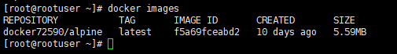
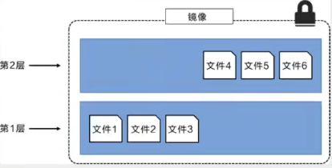
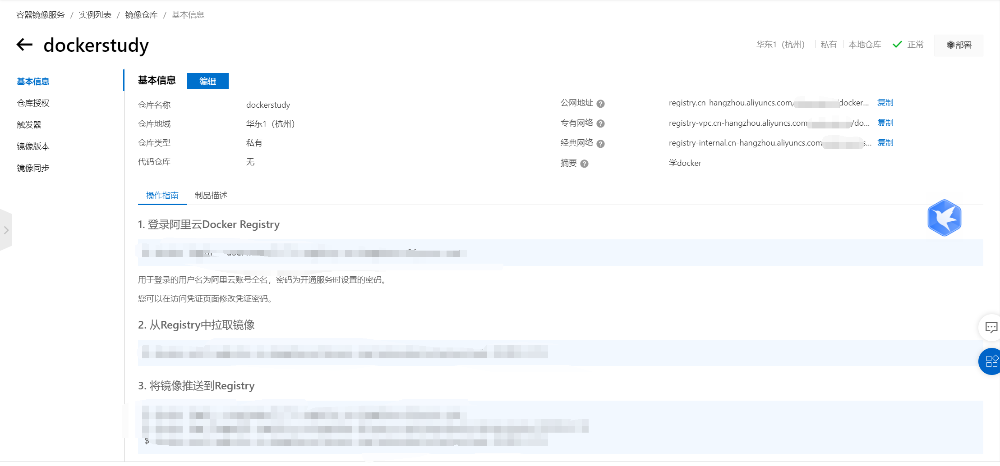
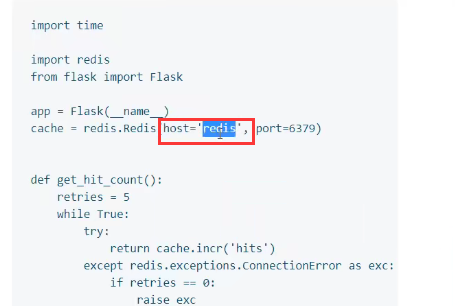
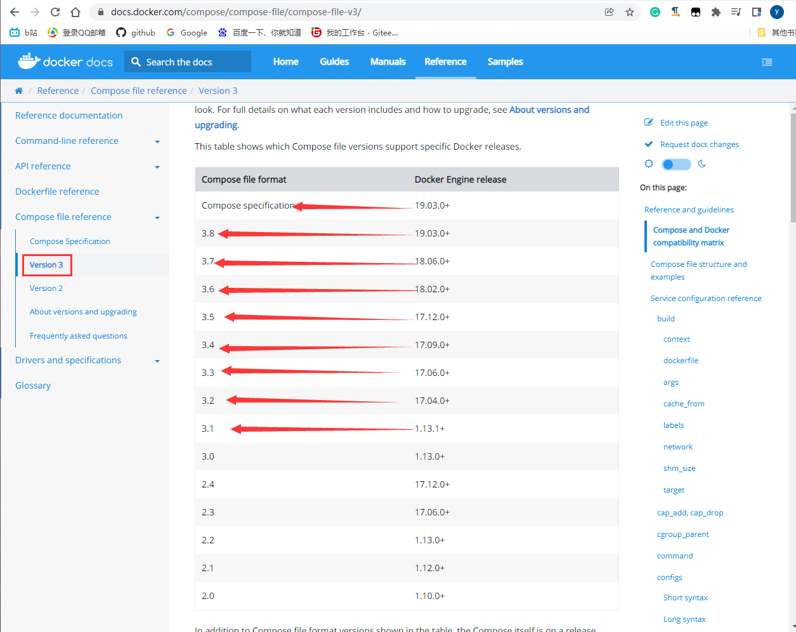
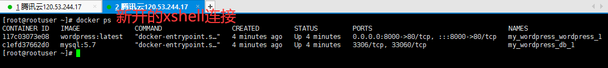

# Docker


## Docker学习大纲

学前准备：

- linux：必须会简单的命令操作，比如cd，mkdir。
- springboot：会的话更好，不会也行。


学什么：

1. docker概述

2. docker安装

3. docker命令

   - 镜像命令

   - 容器命令
   - 操作命令
   - 。。。

4. docker镜像

5. 容器数据卷

6. dockerFile

7. Docker网络原理

8. IDEA整合Docker

9. Docker Compose（集群）

10. Docker Swam（集群管理）
    - 相当于简单版的k8s
11. CI\CD Jenkins

1-8算初级，先学着入门。


## Docker前述

### Docker为什么出现

一套产品有开发/上线，两套环境！应用环境，应用配置在两个环境中都要处理。


一个公司有开发和运维两个主要角色。两角色会碰到一些问题：

- 我在我的电脑上可以用，在你那不行。
- 版本更新，导致服务不可用。这对于运维来说考验很大。

解决方案：

- 开发也干运维的活。


环境配置是十分麻烦的，每个机器都要部署环境（集群redis，ES，Hadoop。。）。费时费力。

解决问题：

- 发布一个项目时，之前是发布一个jar包或者war包。现在发布jar包，它可能需要各种环境（redis，mysql，jdk，ES）；发布jar包是一分钟的事，但是部署环境可能一天都部署不好。
- 我们就想：发布一个项目时，项目能不能带上开发时的环境安装打包，即：（jar+（redis，mysql，jdk，ES））。docker就是来干这个的，开发人员开发完毕后，直接用docker部署上线。


拿安卓开发类比docker：

- java项目--制作apk--发布apk到应用商店--李四使用apk--下载安装即用。
- java项目--制作了jar包（和环境）--打包项目带上环境（即镜像）--docker仓库（类似应用商店）--下载我们发布的镜像，直接运行即可。


Docker思想：

- Docker的思想来源于集装箱。
- 没有docker时，多个应用可能会有端口冲突，应用都是交叉的。
- docker的核心思想是“隔离”。打包装箱，每个箱子是相互隔离的。
  - 比如之前船上装“生化武器”和“食品”可能导致食品变质。但是docker把“生化武器”和“食品”分别装箱后，两者互不影响，可以放到一艘轮船上。
- Docker通过隔离机制，可以将服务器的性能用到极致。不会浪费。


### Docker的历史

2010年，几个搞it的年轻人在美国成立了`dotcloud`公司，做paas云计算服务。有一些linux相关的容器技术。他们将自己的技术（容器化技术）称为docker。

docker刚开始的时候没有引起行业注意，dotcloud活不下去，年轻人又不想放弃这个项目，2013年就把项目做了开源。（有的公司一开始就开源，有的是活不下去了才开源）。越来越多的人发现了docker的优点。

2014年4月9日，docker1.0发布。并成为如今开发人员必须会的技术之一。


docker为何这么火？：

- 十分的轻巧
  - 在容器技术出来之前，我们用的都是虚拟机技术。虚拟机特别占内存，普通电脑开不了几个。
  - 虚拟机：在windows中装一个vmware虚拟机，通过这个软件我们可以虚拟出来一台或者多台电脑。虚拟出来的电脑和真实电脑很想，也是很笨重的。虚拟机是属于虚拟化技术， docker是容器化技术也属于一种虚拟化技术。
  - 例子
    - vm（虚拟机）：linux centos原生镜像（类似一电脑），有隔离性，占用几个G的硬盘，开启要几分钟。
    - docker：有隔离性，镜像（只包含最核心的环境如jdk，mysql），运行镜像就可以，占用几M的硬盘，秒级开启。


聊聊docker：

- docker是基于go语言开发的，开源项目。
- 官网地址：https://www.docker.com/
- 官网文档地址：https://docs.docker.com/
- docker仓库地址：https://hub.docker.com/
  - 操作命令类似github。


### Docker能干什么

#### 虚拟机技术

电脑/虚拟机技术的功能示意图：


虚拟机技术的缺点：

- 资源占用很多
- 冗余步骤很多
- 启动很慢


#### 容器化技术

**容器化技术不是模拟的一个完整地操作系统**


容器化技术示意图：


比较docker和虚拟机技术的不同：

- 传统虚拟机虚拟出一套硬件，运行一个完整的操作系统，然后在这个系统上安装和运行软件。
- 容器内的应用直接运行在“宿主机”的内容中，容器是没有自己的内核，也没有虚拟硬件，所以就轻便了。
- 每个容器内是相互隔离的，每个容器内都有一个属于自己的文件系统，互不影响。


#### DevOps

Dev（开发）Ops（运维）=升职加薪的秘诀


Docker在DevOps角度的优点：

- docker可以实现更快速的交付和部署

  - 传统：一堆帮助文档，安装程序

  - Docker：打包镜像，发布测试，一键运行。

- 更便捷的升级和扩容
  - 使用了docker后，我们部署应用就像搭积木一样。
  - 项目打包为一个影响，一键就能扩展。
  - 各种环境的版本管理升级更便捷。

- 更简单的系统运维
  - 在容器化后，我们的开发，测试环境都是高度一致的；不会出现在A电脑上能用，在B电脑上不能用的情况。

- 更高校的计算资源利用
  - 1核2g的服务器，用docker后，可以运行几十个redis；这是之前虚拟机做不到的。
  - docker是内核级别的虚拟化，可以在一个物理机上运行很多的容器实例。服务器的性能可以被压榨到极致。


## Docker安装与卸载

### Docker的基本组成

docker架构图：


- 三大块：
  - client=客户端
  - host=服务器
  - registry=仓库

- 三个关注点：
  - 镜像（image）
    - docker镜像好比是一个模板，可以通过这个模板来创建容器服务。镜像理解为java中的类，容器理解为java中的对象。
    - 比如有tomcat镜像，镜像是不能直接启动的，要把镜像“运行”起来才能“启动”。tomcat镜像-->run-->tomcat01容器(提供服务)。通过这个镜像可以创建多个容器（最终服务运行或者项目运行就是在容器中的）。
  - 容器（container）
    -  docker利用容器技术可以独立运行一个或者一组应用，应用是通过镜像来创建的。
    - 基本命令：启动，停止，删除。。
    - 目前可以把容器理解为一个简易的linux系统。
  - 仓库（repository）
    - 仓库就是存放镜像的地方。
    - 仓库分为“共有仓库”和“私有仓库”。
    - 像阿里云等公司都有容器服务器，一般要配置国内镜像加速，不然很慢（如maven镜像）。


### 安装Docker准备

#### 环境准备

1. 需要会一点点的linux基础
2. 一个远程服务器（推荐阿里云）
3. CentOS 7（远程服务器系统）
4. 我们用XShell连接远程服务器进行操作

#### 环境查看

shell连接远程服务器，输入一下命令进行查看

```bash
# 系统内核是3.10以上的
[root@zhangyun/]# uname -r
3.10.0-XXX
```

```bash
# 系统版本
[root@rootuser ~]# cat /etc/os-release
NAME="CentOS Linux"
VERSION="7 (Core)"
ID="centos"
ID_LIKE="rhel fedora"
VERSION_ID="7"
PRETTY_NAME="CentOS Linux 7 (Core)"
ANSI_COLOR="0;31"
CPE_NAME="cpe:/o:centos:centos:7"
HOME_URL="https://www.centos.org/"
BUG_REPORT_URL="https://bugs.centos.org/"

CENTOS_MANTISBT_PROJECT="CentOS-7"
CENTOS_MANTISBT_PROJECT_VERSION="7"
REDHAT_SUPPORT_PRODUCT="centos"
REDHAT_SUPPORT_PRODUCT_VERSION="7"
```

### 使用仓库安装实战

#### 访问官网

访问[官网](https://docs.docker.com/get-docker/)


#### 卸载旧版本

在任意目录下运行下列语句：

```bash
yum remove docker \
                  docker-client \
                  docker-client-latest \
                  docker-common \
                  docker-latest \
                  docker-latest-logrotate \
                  docker-logrotate \
                  docker-engine
```


#### 安装一些有用的包

安装一些有用的包

```bash
yum install -y yum-utils
```


#### 设置镜像的仓库

默认是国外的仓库，很慢，**不要用**：

```
yum-config-manager \
    --add-repo \
    https://download.docker.com/linux/centos/docker-ce.repo
```

应该使用阿里云docker仓库地址：

```
yum-config-manager \
    --add-repo \
    http://mirrors.aliyun.com/docker-ce/linux/centos/docker-ce.repo
```

- 这镜像指的是linux应用镜像仓库


#### 更新yum索引

更新软件包的索引：

```bash
yum makecache fast
```


#### 安装docker引擎

```bash
# docker-ce社区版，ee是企业版，推荐ce
yum install docker-ce docker-ce-cli containerd.io
```


#### 启动docker

启动：

```bash
systemctl start docker
```

判断docker是否安装成功

```bash
docker version
```


#### 测试helloworld

运行helloworld镜像：

```bash
docker run hello-world
```


#### 查看下载的镜像

```bash
[root@rootuser ~]# docker images
REPOSITORY           TAG       IMAGE ID       CREATED        SIZE
docker72590/alpine   latest    f5a69fceabd2   9 days ago     5.59MB
# 成功发现了刚刚下载的helloworld镜像
hello-world          latest    feb5d9fea6a5   3 months ago   13.3kB
```


### docker卸载

卸载依赖：

```bash
yum remove docker-ce docker-ce-cli containerd.io
```

删除docker的运行环境

```bash
rm -rf /var/lib/docker
rm -rf /var/lib/containerd
```

- `/var/lib/docker`是docker的默认工作路径。


### 配置阿里云镜像加速

我用的腾讯云服务器，用的阿里云镜像。只要有阿里云账号，就可以用阿里云镜像加速，和服务器没关系。


登录阿里云，找到"容器镜像服务"：


找到镜像加速的[地址](https://cr.console.aliyun.com/cn-hangzhou/instances/mirrors):


依次执行命令：

```bash
sudo mkdir -p /etc/docker

sudo tee /etc/docker/daemon.json <<-'EOF'
{
  "registry-mirrors": ["https://eno5zxt9.mirror.aliyuncs.com"]
}
EOF

sudo systemctl daemon-reload

sudo systemctl restart docker
```

- 如果不是root用户，命令前需要加`sudo`


使用`docker info`来查看是否设置成功，确实看到了自己配置的镜像:


## Docker底层原理

### 回顾helloworld流程

run hello-world镜像，测试docker时命令行展示如下：


根据命令行截图，就可以理解docker run后的运行流程图：


### 原理

#### docker是怎么工作的

Docker是一个Client - Server结构的系统。Docker的”守护进程“运行在主机上，客户端通过Socket可以访问Docker的”守护进程“。DockerServer接收到Docker-Client的指令，就会执行这个命令。

docker的c-s架构工作思路： 


#### docker为什么比vm快

1，从逻辑方面考虑

对比图示：


原因：

- docker有比虚拟机更少的抽象层

- docker利用的是宿主机的内核，vm需要Guest OS

所以说，新建一个容器的时候，docker不需要像虚拟机一样重新加载一个操作系统内核，避免引导。虚拟机是加载Guest OS，分钟级别的；而docker是利用宿主机的操作系统，省略了“加载Guest OS”这个复杂的过程，秒级!


2，性能方向对比


## Docker命令

### 镜像基本命令

#### 帮助命令

```bash
# 查看docker版本
docker version
# 查看docker的详细系统信息，包括镜像+容器
docker info
# 查看不懂的命令的用法
docker 不懂的命令 --help
```

帮助文档的[网址](https://docs.docker.com/reference/):


### 镜像命令

#### 查看本地镜像

[docker images](https://docs.docker.com/engine/reference/commandline/images/)查看所有本地的主机上的镜像

实战：

```bash
[root@rootuser ~]# docker images
REPOSITORY           TAG       IMAGE ID       CREATED        SIZE
docker72590/alpine   latest    f5a69fceabd2   9 days ago     5.59MB
hello-world          latest    feb5d9fea6a5   3 months ago   13.3kB
You have new mail in /var/spool/mail/root
```

栏讲解：

- REPOSITORY：镜像的仓库源。根据这一栏的信息从镜像仓库下载镜像。
- TAG：镜像的标签
- IMAGE ID：镜像的id
- created：镜像的创建时间
- size：镜像的大小

常用可选项讲解：

- -a：all，列出所有镜像
- -q：quiet，只显示镜像的id

- -aq：经常-a和-q联合使用，`docker -aq`，展示所有镜像的id。


#### 搜索线上dockerhub镜像

可以在[docker hub](https://hub.docker.com/)上搜索镜像：


但是官网在境外有的时候访问不稳定。

---

也可以在linux命令行中使用命令`docker search 搜索的东西`来搜索镜像：

```bash
[root@rootuser ~]# docker search mysql
NAME                              DESCRIPTION                                     STARS     OFFICIAL   AUTOMATED
mysql                             MySQL is a widely used, open-source relation…   11940     [OK]       
mariadb                           MariaDB Server is a high performing open sou…   4562      [OK]       
```

可选项：

- `--filter=STARS=3000`可以搜索出stars大于3000的镜像。

使用filter后得到的部分结果：

```bash
[root@rootuser ~]# docker search mysql --filter=stars=3000
NAME      DESCRIPTION                                     STARS     OFFICIAL   AUTOMATED
mysql     MySQL is a widely used, open-source relation…   11940     [OK]       
mariadb   MariaDB Server is a high performing open sou…   4562      [OK]     
```


#### 下载镜像

直接下载最新版,以下载mysql镜像为例：

```bash
[root@rootuser ~]# docker pull mysql
# 如果不写tag，默认下载latest版本
Using default tag: latest
latest: Pulling from library/mysql
# 分层下载，docker image的核心！联合文件系统。
72a69066d2fe: Pull complete 
93619dbc5b36: Pull complete 
99da31dd6142: Pull complete 
626033c43d70: Pull complete 
37d5d7efb64e: Pull complete 
ac563158d721: Pull complete 
d2ba16033dad: Pull complete 
688ba7d5c01a: Pull complete 
00e060b6d11d: Pull complete 
1c04857f594f: Pull complete 
4d7cfa90e6ea: Pull complete 
e0431212d27d: Pull complete 
# 防伪标志：签名
Digest: sha256:e9027fe4d91c0153429607251656806cc784e914937271037f7738bd5b8e7709
Status: Downloaded newer image for mysql:latest
# 真实地址
docker.io/library/mysql:latest
```

说明：

- `docker pull mysql`和`docker pull docker.io/library/mysql:latest`等价

  ，因为docker.io/library/mysql:latest是真实地址。

---

指定镜像的版本下载

```bash
[root@rootuser ~]# docker pull mysql:5.7
# 下载指定的5.7版本
5.7: Pulling from library/mysql
# 已经下载的层不会下载，从already exit可以看出。使用了linux的”联合文件系统“功能
72a69066d2fe: Already exists 
93619dbc5b36: Already exists 
99da31dd6142: Already exists 
626033c43d70: Already exists 
37d5d7efb64e: Already exists 
ac563158d721: Already exists 
d2ba16033dad: Already exists 
# 没下载过的层才会下载
0ceb82207cd7: Pull complete 
37f2405cae96: Pull complete 
e2482e017e53: Pull complete 
70deed891d42: Pull complete 
Digest: sha256:f2ad209efe9c67104167fc609cca6973c8422939491c9345270175a300419f94
Status: Downloaded newer image for mysql:5.7
docker.io/library/mysql:5.7
You have new mail in /var/spool/mail/root
```

- 指定的版本一定要在docker hub存在，可以通过docker hub网站确认。
- 下载镜像是分层的，有的层已经被下载过的话不会被重复下载。其实每个层也是小镜像。

下载完毕后查看本地的所有镜像：


#### 删除镜像

rm表示删除，i表示image即镜像。

根据镜像id删除镜像：

```bash
[root@rootuser ~]# docker rmi 3218b38490ce
Untagged: mysql:latest
Untagged: mysql@sha256:e9027fe4d91c0153429607251656806cc784e914937271037f7738bd5b8e7709
# 只会删除独有的层，和其他镜像共有的层不会被删除。
Deleted: sha256:3218b38490cec8d31976a40b92e09d61377359eab878db49f025e5d464367f3b
Deleted: sha256:aa81ca46575069829fe1b3c654d9e8feb43b4373932159fe2cad1ac13524a2f5
Deleted: sha256:0558823b9fbe967ea6d7174999be3cc9250b3423036370dc1a6888168cbd224d
Deleted: sha256:a46013db1d31231a0e1bac7eeda5ad4786dea0b1773927b45f92ea352a6d7ff9
Deleted: sha256:af161a47bb22852e9e3caf39f1dcd590b64bb8fae54315f9c2e7dc35b025e4e3
Deleted: sha256:feff1495e6982a7e91edc59b96ea74fd80e03674d92c7ec8a502b417268822ff
```

查看本地镜像，发现确实id为3218b38490ce的镜像被删除了：


---

使用参数来删除

- -f 表示force，就强制删除
- $()表示给docker命令传参。这里使用$(docker images -aq)相当于把所有docker镜像的id都传给docker rmi，即**删除所有镜像**。有套娃那味。

```bash
[root@rootuser ~]# docker rmi -f $(docker images -aq)
Untagged: mysql:5.7
Untagged: mysql@sha256:f2ad209efe9c67104167fc609cca6973c8422939491c9345270175a300419f94
Deleted: sha256:c20987f18b130f9d144c9828df630417e2a9523148930dc3963e9d0dab302a76
Deleted: sha256:6567396b065ee734fb2dbb80c8923324a778426dfd01969f091f1ab2d52c7989
Deleted: sha256:0910f12649d514b471f1583a16f672ab67e3d29d9833a15dc2df50dd5536e40f
Deleted: sha256:6682af2fb40555c448b84711c7302d0f86fc716bbe9c7dc7dbd739ef9d757150
Deleted: sha256:5c062c3ac20f576d24454e74781511a5f96739f289edaadf2de934d06e910b92
Deleted: sha256:8805862fcb6ef9deb32d4218e9e6377f35fb351a8be7abafdf1da358b2b287ba
Deleted: sha256:872d2f24c4c64a6795e86958fde075a273c35c82815f0a5025cce41edfef50c7
Deleted: sha256:6fdb3143b79e1be7181d32748dd9d4a845056dfe16ee4c827410e0edef5ad3da
Deleted: sha256:b0527c827c82a8f8f37f706fcb86c420819bb7d707a8de7b664b9ca491c96838
Deleted: sha256:75147f61f29796d6528486d8b1f9fb5d122709ea35620f8ffcea0e0ad2ab0cd0
Deleted: sha256:2938c71ddf01643685879bf182b626f0a53b1356138ef73c40496182e84548aa
Deleted: sha256:ad6b69b549193f81b039a1d478bc896f6e460c77c1849a4374ab95f9a3d2cea2
Untagged: hello-world:latest
Untagged: hello-world@sha256:2498fce14358aa50ead0cc6c19990fc6ff866ce72aeb5546e1d59caac3d0d60f
Deleted: sha256:feb5d9fea6a5e9606aa995e879d862b825965ba48de054caab5ef356dc6b3412
Error: No such image: f5a69fceabd2
```

查看删除结果：



- `docker72590/alpine` 删不掉，貌似是病毒，，，我都是官方渠道，，怎么这样。先不管了。


### 容器命令

说明∶我们有了镜像才可以创建容器，linux中下载一个centos镜像来测试学习

```bash
[root@rootuser ~]# docker pull centos
Using default tag: latest
latest: Pulling from library/centos
a1d0c7532777: Pull complete 
Digest: sha256:a27fd8080b517143cbbbab9dfb7c8571c40d67d534bbdee55bd6c473f432b177
Status: Downloaded newer image for centos:latest
docker.io/library/centos:latest
You have new mail in /var/spool/mail/root

```

- 这里相当于在centos中下载centos的docker镜像，属于套娃了。

#### 新建容器并启动

新建容器并启动：

```bash
docker run [可选参数] imageid
```

参数说明：

- --name="name":是容器的名字，比如可以为”tomcat1“或”tomcat2“来区分不同的tomcat容器。

- -d: 后台方式运行
- -it：使用交互方式运行，进入容器查看内容
- -p：指定容器的端口，如`-p 8080`
  - `-p 主机端口:容器端口`：可以从外界访问。最常用！
  - `-p ip:主机端口:容器端口`：可以带上ip。
  - `-p 容器端口`：不从外界访问。
- -P：大写P，即随机指定端口

---

实战：

```bash
[root@rootuser ~]# docker run -it centos /bin/bash
# 通过ls查看容器内部的centos的目录，可以看到和容器外部的centos很相似，但是两者没有任何关系。
[root@29e9814941c2 /]# ls
bin  etc   lib	  lost+found  mnt  proc  run   srv  tmp  var
dev  home  lib64  media       opt  root  sbin  sys  usr
# 退出centos容器
[root@29e9814941c2 /]# exit
exit
# 查看容器外部的centos根目录，与容器内部的目录很相似。
[root@rootuser ~]# ls /
bin   data  etc   lib    lost+found  mnt  proc  run   srv  tmp  var
boot  dev   home  lib64  media       opt  root  sbin  sys  usr

```

- -it表示以交互方式运行容器，交互方式被指定为"/bin/bash"
- /bin/bash表示通过bash命令的方式进入容器

#### 退出容器

```bash
# 容器停止并退出
exit
# 容器不停止，且退出
ctrl+P（大写）+Q(大写)
```

#### 查看运行（过）的容器

```bash
# 正在运行的容器
docker ps
# 正在运行+未运作的容器（被删除的容器不会显示），a表示all
docker ps -a
# 显示正在运行的最新的若干个容器，如下显示最新的一个容器
docker ps -n=1
# 显示正在运行的容器，只显示容器的编号
docker ps -p

```

#### 删除容器

```bash
# 删除指定的单个容器。没使用-f不能删除正在运行的容器。
docker rm 容器id
# 强制删除所有容器,$(docker ps -aq)把所有容器的id传给rm。用了-f可以删除正在运行的容器。
docker rm -f $(docker ps -aq)
# 删除所有容器。使用了管道符"|"
docker ps -a -q|xargs docker rm
```

#### 启动重启停止容器

```bash
# 启动已有的被关闭的容器
docker start 容器id
# 重启容器
docker restart 容器id
# 停止当前正在运行的容器
docker stop 容器id
# 强制停止当前正在运行的容器。docker stop报错的话可以用dock kill关闭这个顽固的容器。
docker kill 容器id
```


### 常用的其他命令

#### 后台启动容器

```bash
[root@rootuser ~]# docker run -d centos
4bbeb1c1cbadba1020b47b82f58f2362ee87d6d2dd54ea1d4eb8893899458a13
[root@rootuser ~]# docker ps
CONTAINER ID   IMAGE     COMMAND   CREATED   STATUS    PORTS     NAMES
```

常见的坑：

- 后台启动容器后，使用docker ps发现centos停止了。
  - 原因：docker容器在后台运行就必须要有一个前台进程（比如-it进入容器就相当于有前台进程），docker发现没有前台进程就会自动停止。
  - -tomcat的时候可以这么用（？不理解）

#### 查看日志命令

```bash
# 先看有哪些容器存在
[root@rootuser ~]# docker ps -a
CONTAINER ID   IMAGE     COMMAND       CREATED          STATUS                      PORTS     NAMES
4bbeb1c1cbad   centos    "/bin/bash"   10 minutes ago   Exited (0) 10 minutes ago             elastic_babbage
9d987a3f0bca   centos    "/bin/bash"   28 minutes ago   Exited (0) 11 minutes ago             stoic_sammet
# 查看容器id为“9d987a3f0bca”的容器的日志
[root@rootuser ~]# docker logs -f -t --tail 10 9d987a3f0bca
[root@9d987a3f0bca /]# exit
2022-01-10T09:28:41.539285540Z exit
2022-01-10T09:44:44.198722927Z [root@9d987a3f0bca /]# exit
```

讲解：

- -f：是跟踪日志输出，相当于实时显示。
- -t：展示时间戳
- --tail n：展示日志的后n条数据
- 9d987a3f0bca：被查询日志的容器的id


使用docker help查看logs的用法：

```bash
[root@rootuser ~]# docker help logs

Usage:  docker logs [OPTIONS] CONTAINER

Fetch the logs of a container

Options:
      --details        Show extra details provided to logs
  -f, --follow         Follow log output
      --since string   Show logs since timestamp (e.g. 2013-01-02T13:23:37Z) or relative (e.g. 42m for 42 minutes)
  -n, --tail string    Number of lines to show from the end of the logs (default "all")
  -t, --timestamps     Show timestamps
      --until string   Show logs before a timestamp (e.g. 2013-01-02T13:23:37Z) or relative (e.g. 42m for 42 minutes)
```

- 第一列是第二列的简称


#### 查看容器内部进程信息

```bash
# 因为之前把容器全关了，查看有哪些关闭着的容器
[root@rootuser ~]# docker ps -a
CONTAINER ID   IMAGE     COMMAND       CREATED        STATUS                    PORTS     NAMES
4bbeb1c1cbad   centos    "/bin/bash"   23 hours ago   Exited (0) 23 hours ago             elastic_babbage
9d987a3f0bca   centos    "/bin/bash"   23 hours ago   Exited (0) 23 hours ago             stoic_sammet
# 启动容器
[root@rootuser ~]# docker start 9d987a3f0bca
9d987a3f0bca
# 确认容器正在启动
[root@rootuser ~]# docker ps
CONTAINER ID   IMAGE     COMMAND       CREATED        STATUS         PORTS     NAMES
9d987a3f0bca   centos    "/bin/bash"   23 hours ago   Up 4 seconds             stoic_sammet
# 查看docker top的用法
[root@rootuser ~]# docker top --help

Usage:  docker top CONTAINER [ps OPTIONS]

Display the running processes of a container
# 使用docker top查看容器id为9d987a3f0bca的容器内部的进程信息
[root@rootuser ~]# docker top 9d987a3f0bca 
UID                 PID                 PPID                C                   STIME               TTY                 TIME                CMD
root                13982               13963               0                   16:50               pts/0               00:00:00            /bin/bash
```

- uid：用户id
- pid：父id
- ppid：进程id

可以通过进程信息杀进程。

#### 查看Docker objects（常为容器）的元数据(low-level information)

```bash
# 查看docker inspect的用法
[root@rootuser ~]# docker inspect --help

Usage:  docker inspect [OPTIONS] NAME|ID [NAME|ID...]

Return low-level information on Docker objects

Options:
  -f, --format string   Format the output using the given Go template
  -s, --size            Display total file sizes if the type is container
      --type string     Return JSON for specified type
# 查看容器id为9d987a3f0bca的容器的底层信息
[root@rootuser ~]# docker inspect 9d987a3f0bca
[
    {
    # id的前若干位是本容器的容器id
        "Id": "9d987a3f0bca702e07dbcc19f6794a8e3499a2c57e795a0af356eab35dbcd90a",
        "Created": "2022-01-10T09:28:25.577866758Z",
        "Path": "/bin/bash",
        "Args": [],
        "State": {
        # 现状是运行中
            "Status": "running",
            "Running": true,
            "Paused": false,
            "Restarting": false,
            "OOMKilled": false,
            "Dead": false,
            "Pid": 13982,
            "ExitCode": 0,
            "Error": "",
            "StartedAt": "2022-01-11T08:50:15.154996662Z",
            "FinishedAt": "2022-01-10T09:44:44.211896577Z"
        },
        # 容器所来源的镜像
        "Image": "sha256:5d0da3dc976460b72c77d94c8a1ad043720b0416bfc16c52c45d4847e53fadb6",
        "ResolvConfPath": "/var/lib/docker/containers/9d987a3f0bca702e07dbcc19f6794a8e3499a2c57e795a0af356eab35dbcd90a/resolv.conf",
        "HostnamePath": "/var/lib/docker/containers/9d987a3f0bca702e07dbcc19f6794a8e3499a2c57e795a0af356eab35dbcd90a/hostname",
        "HostsPath": "/var/lib/docker/containers/9d987a3f0bca702e07dbcc19f6794a8e3499a2c57e795a0af356eab35dbcd90a/hosts",
        "LogPath": "/var/lib/docker/containers/9d987a3f0bca702e07dbcc19f6794a8e3499a2c57e795a0af356eab35dbcd90a/9d987a3f0bca702e07dbcc19f6794a8e3499a2c57e795a0af356eab35dbcd90a-json.log",
        "Name": "/stoic_sammet",
        "RestartCount": 0,
        "Driver": "overlay2",
        "Platform": "linux",
        "MountLabel": "",
        "ProcessLabel": "",
        "AppArmorProfile": "",
        "ExecIDs": null,
        "HostConfig": {
            "Binds": null,
            "ContainerIDFile": "",
            "LogConfig": {
                "Type": "json-file",
                "Config": {}
            },
            "NetworkMode": "default",
            "PortBindings": {},
            "RestartPolicy": {
                "Name": "no",
                "MaximumRetryCount": 0
            },
            "AutoRemove": false,
            "VolumeDriver": "",
            "VolumesFrom": null,
            "CapAdd": null,
            "CapDrop": null,
            "CgroupnsMode": "host",
            "Dns": [],
            "DnsOptions": [],
            "DnsSearch": [],
            "ExtraHosts": null,
            "GroupAdd": null,
            "IpcMode": "private",
            "Cgroup": "",
            "Links": null,
            "OomScoreAdj": 0,
            "PidMode": "",
            "Privileged": false,
            "PublishAllPorts": false,
            "ReadonlyRootfs": false,
            "SecurityOpt": null,
            "UTSMode": "",
            "UsernsMode": "",
            "ShmSize": 67108864,
            "Runtime": "runc",
            "ConsoleSize": [
                0,
                0
            ],
            "Isolation": "",
            "CpuShares": 0,
            "Memory": 0,
            "NanoCpus": 0,
            "CgroupParent": "",
            "BlkioWeight": 0,
            "BlkioWeightDevice": [],
            "BlkioDeviceReadBps": null,
            "BlkioDeviceWriteBps": null,
            "BlkioDeviceReadIOps": null,
            "BlkioDeviceWriteIOps": null,
            "CpuPeriod": 0,
            "CpuQuota": 0,
            "CpuRealtimePeriod": 0,
            "CpuRealtimeRuntime": 0,
            "CpusetCpus": "",
            "CpusetMems": "",
            "Devices": [],
            "DeviceCgroupRules": null,
            "DeviceRequests": null,
            "KernelMemory": 0,
            "KernelMemoryTCP": 0,
            "MemoryReservation": 0,
            "MemorySwap": 0,
            "MemorySwappiness": null,
            "OomKillDisable": false,
            "PidsLimit": null,
            "Ulimits": null,
            "CpuCount": 0,
            "CpuPercent": 0,
            "IOMaximumIOps": 0,
            "IOMaximumBandwidth": 0,
            "MaskedPaths": [
                "/proc/asound",
                "/proc/acpi",
                "/proc/kcore",
                "/proc/keys",
                "/proc/latency_stats",
                "/proc/timer_list",
                "/proc/timer_stats",
                "/proc/sched_debug",
                "/proc/scsi",
                "/sys/firmware"
            ],
            "ReadonlyPaths": [
                "/proc/bus",
                "/proc/fs",
                "/proc/irq",
                "/proc/sys",
                "/proc/sysrq-trigger"
            ]
        },
        "GraphDriver": {
            "Data": {
                "LowerDir": "/var/lib/docker/overlay2/d0e170b78fa45ed94d897a26006880286a867646064370f6979f1f86a6249952-init/diff:/var/lib/docker/overlay2/d3d67a249fb5a65782e888049cd6b57e28a9e2b111d1f5e8988777490adbe956/diff",
                "MergedDir": "/var/lib/docker/overlay2/d0e170b78fa45ed94d897a26006880286a867646064370f6979f1f86a6249952/merged",
                "UpperDir": "/var/lib/docker/overlay2/d0e170b78fa45ed94d897a26006880286a867646064370f6979f1f86a6249952/diff",
                "WorkDir": "/var/lib/docker/overlay2/d0e170b78fa45ed94d897a26006880286a867646064370f6979f1f86a6249952/work"
            },
            "Name": "overlay2"
        },
        # 挂载，目前没用上
        "Mounts": [],
        # 容器的一些基本配置
        "Config": {
        # 默认的容器名字
            "Hostname": "9d987a3f0bca",
            "Domainname": "",
            "User": "",
            "AttachStdin": true,
            "AttachStdout": true,
            "AttachStderr": true,
            "Tty": true,
            "OpenStdin": true,
            "StdinOnce": true,
            # 环境变量里没有java，所以容器中目前不能用java，只能用一些基本命令。
            "Env": [
                "PATH=/usr/local/sbin:/usr/local/bin:/usr/sbin:/usr/bin:/sbin:/bin"
            ],
            "Cmd": [
                "/bin/bash"
            ],
            "Image": "centos",
            "Volumes": null,
            "WorkingDir": "",
            "Entrypoint": null,
            "OnBuild": null,
            "Labels": {
                "org.label-schema.build-date": "20210915",
                "org.label-schema.license": "GPLv2",
                "org.label-schema.name": "CentOS Base Image",
                "org.label-schema.schema-version": "1.0",
                "org.label-schema.vendor": "CentOS"
            }
        },
        # 容器的网络配置
        "NetworkSettings": {
            "Bridge": "",
            "SandboxID": "426d831c780d3ed860b675adf4bbe8dcede81f50afaaae846de777cab3fe3849",
            "HairpinMode": false,
            "LinkLocalIPv6Address": "",
            "LinkLocalIPv6PrefixLen": 0,
            "Ports": {},
            "SandboxKey": "/var/run/docker/netns/426d831c780d",
            "SecondaryIPAddresses": null,
            "SecondaryIPv6Addresses": null,
            "EndpointID": "a16d244d71807b90fd70e40c8b6ed2e7be0ff267aec50265108b33e170fefa50",
            "Gateway": "172.17.0.1",
            "GlobalIPv6Address": "",
            "GlobalIPv6PrefixLen": 0,
            "IPAddress": "172.17.0.2",
            "IPPrefixLen": 16,
            "IPv6Gateway": "",
            "MacAddress": "02:42:ac:11:00:02",
            "Networks": {
            # 当前使用的是“桥接网卡”
                "bridge": {
                    "IPAMConfig": null,
                    "Links": null,
                    "Aliases": null,
                    "NetworkID": "5f9bc0a0faaa995d376fd6edbac2b55e086fdd4382c7b5219eae78c967168a1c",
                    "EndpointID": "a16d244d71807b90fd70e40c8b6ed2e7be0ff267aec50265108b33e170fefa50",
                    "Gateway": "172.17.0.1",
                    "IPAddress": "172.17.0.2",
                    "IPPrefixLen": 16,
                    "IPv6Gateway": "",
                    "GlobalIPv6Address": "",
                    "GlobalIPv6PrefixLen": 0,
                    "MacAddress": "02:42:ac:11:00:02",
                    "DriverOpts": null
                }
            }
        }
    }
]
You have new mail in /var/spool/mail/root
```


#### 进入当前正在运行的容器

容器通常都是后台方式运行的，我们有时需要进入容器，修改一些配置

方式1，

```bash
# 命令
docker exec -it 容器id bashshell(默认的命令行方式)
```

实战：

```bash
# 查看有什么容器正在运行
[root@rootuser ~]# docker ps
CONTAINER ID   IMAGE     COMMAND       CREATED        STATUS       PORTS     NAMES
9d987a3f0bca   centos    "/bin/bash"   27 hours ago   Up 4 hours             stoic_sammet
You have new mail in /var/spool/mail/root
# 进入容器9d987a3f0bca
[root@rootuser ~]# docker exec -it 9d987a3f0bca /bin/bash
# 在容器内部执行各种命令
[root@9d987a3f0bca /]# ls 
bin  etc   lib	  lost+found  mnt  proc  run   srv  tmp  var
dev  home  lib64  media       opt  root  sbin  sys  usr
[root@9d987a3f0bca /]# ps -ef
UID        PID  PPID  C STIME TTY          TIME CMD
root         1     0  0 08:50 pts/0    00:00:00 /bin/bash
root        15     0  0 12:43 pts/1    00:00:00 /bin/bash
root        31    15  0 12:43 pts/1    00:00:00 ps -ef
# 退出容器
[root@9d987a3f0bca /]# exit
exit
[root@rootuser ~]# 
```

---

方式2，

命令：

```bash
docker attach 容器id
```

实战：

```bash
# 进入容器
[root@rootuser ~]# docker attach 9d987a3f0bca
# 退出容器
[root@9d987a3f0bca /]# exit
exit
[root@rootuser ~]# 

```

---

方式1（exec）和方式2（attach）对比：

- docker exec是进入容器后开启一个新的终端，可以在里面操作（常用）。
- docker attach是进入容器中正在执行的终端，不会启动新的进程。
- exec进去容器是以一个新的窗口进去的，exit退出当然不会关闭容器；要是你以attach进去，退出就会关闭了；运行容器时直接-it加/bin/bash进容器的话，exit后也没有存活的控制台，容器也会关闭。

#### 容器和主机文件互相拷贝

命令：

```bash
# 从容器拷贝文件到物理主机。前面的地址是源，后面的地址是目的地。
docker cp 容器id:容器内路径 物理主机路径
# 从物理主机拷贝文件到容器
docker cp 物理主机路径 容器id:容器内路径
```

实战，从容器拷贝文件到主机：

```bash
# 因为没有容器正在开启，查看有哪些可用容器
[root@rootuser ~]# docker ps -a
CONTAINER ID   IMAGE     COMMAND       CREATED        STATUS                      PORTS     NAMES
4bbeb1c1cbad   centos    "/bin/bash"   28 hours ago   Exited (0) 28 hours ago               elastic_babbage
9d987a3f0bca   centos    "/bin/bash"   28 hours ago   Exited (0) 26 minutes ago             stoic_sammet
# 开启一个容器
[root@rootuser ~]# docker start 9d987a3f0bca
9d987a3f0bca
# 确认容器已经开启
[root@rootuser ~]# docker ps
CONTAINER ID   IMAGE     COMMAND       CREATED        STATUS         PORTS     NAMES
9d987a3f0bca   centos    "/bin/bash"   28 hours ago   Up 3 seconds             stoic_sammet
# 进入容器
[root@rootuser ~]# docker exec -it 9d987a3f0bca /bin/bash
# 在容器内存入文件zhangyun.java
[root@9d987a3f0bca /]# ls
bin  dev  etc  home  lib  lib64  lost+found  media  mnt  opt  proc  root  run  sbin  srv  sys  tmp  usr  var
[root@9d987a3f0bca /]# cd home
[root@9d987a3f0bca home]# ls
[root@9d987a3f0bca home]# touch zhangyun.java
[root@9d987a3f0bca home]# ls
zhangyun.java
# 退出容器
[root@9d987a3f0bca home]# exit
exit
[root@rootuser ~]# pwd
/root
[root@rootuser ~]# ls
packages  zhangyunroot
# 把容器内的zhangyun.java文件拷贝到主机指定目录中
[root@rootuser ~]# docker cp 9d987a3f0bca:/home/zhangyun.java /root
# 拷贝成功
[root@rootuser ~]# ls
packages  zhangyun.java  zhangyunroot
[root@rootuser ~]# 

```

- 拷贝是一个手动的过程，未来我们使用-v卷的技术，可以实现自动同步”容器的指定目录“和“主机的指定目录”

### 小结

docker命令逻辑示意图：


- 可以看到exec命令的图标是一个”终端“，对应“进入容器并开启新终端”。
- 可以看到attach命令的图标是“进入符号”，对应“进入容器的当前运行终端”。


docker的命令十分多，目前学的都是最常用的命令，后面会学习更多。

接下来就是一堆练习。


### 作业练习

#### docker安装nginx

nginx可以做负载均衡和反向代理。


1，docker搜索nignx镜像

```bash
[root@rootuser ~]# docker search nginx
NAME                              DESCRIPTION                                     STARS     OFFICIAL   AUTOMATED
nginx                             Official build of Nginx.                        16113     [OK]       
jwilder/nginx-proxy               Automated Nginx reverse proxy for docker con…   2107                 [OK]
richarvey/nginx-php-fpm           Container running Nginx + PHP-FPM capable of…   820                  [OK]
jc21/nginx-proxy-manager          Docker container for managing Nginx proxy ho…   309                  
```

2，dockerhub官网找到合适的[版本](https://hub.docker.com/_/nginx)，可以看到很多帮助文档和信息。版本无特殊要求，用最新版就行。

- alpine是瘦身版的镜像，很小。


3，下载，这里直接下载最新版nginx镜像

```bash
[root@rootuser ~]# docker pull nginx
Using default tag: latest
latest: Pulling from library/nginx
a2abf6c4d29d: Pull complete 
a9edb18cadd1: Pull complete 
589b7251471a: Pull complete 
186b1aaa4aa6: Pull complete 
b4df32aa5a72: Pull complete 
a0bcbecc962e: Pull complete 
Digest: sha256:0d17b565c37bcbd895e9d92315a05c1c3c9a29f762b011a10c54a66cd53c9b31
Status: Downloaded newer image for nginx:latest
docker.io/library/nginx:latest
```

4，查看本地所有镜像，确认nginx镜像已被下载：

```bash
[root@rootuser ~]# docker images
REPOSITORY           TAG       IMAGE ID       CREATED        SIZE
docker72590/alpine   latest    f5a69fceabd2   11 days ago    5.59MB
nginx                latest    605c77e624dd   13 days ago    141MB
centos               latest    5d0da3dc9764   3 months ago   231MB
```

5，利用nginx镜像启动nignx容器

参数讲解：

- -d：以后台的方式启动nginx

- --name：给启动的nginx容器取个名字“nginx01”

- -p 宿主机port:容器port：

  - 容器port暴露nginx容器的指定端口号，默认为80。

  - 宿主机port暴露宿主机的指定端口号。暴露后要确保腾讯云的**”防火墙（安全组）**“也开放了该宿主机端口号，才能从外界访问。

    

实战：

```bash
# 最后的”nginx“是创建nginx容器所依托的镜像名
[root@rootuser ~]# docker run -d --name nginx01 -p 3344:80 nginx
4a9b60af741dd918d8ccd71b35c79d1ae0c4a54333d9d57f01b6256f28550e7e
# 确认nginx容器已启动
[root@rootuser ~]# docker ps
CONTAINER ID   IMAGE     COMMAND                  CREATED              STATUS              PORTS                                   NAMES
4a9b60af741d   nginx     "/docker-entrypoint.…"   About a minute ago   Up About a minute   0.0.0.0:3344->80/tcp, :::3344->80/tcp   nginx01
9d987a3f0bca   centos    "/bin/bash"              42 hours ago         Up 14 hours                                                 stoic_sammet
```

6，用curl使本机自测主机端口

curl讲解：

- 在Linux中curl是一个**利用URL规则在命令行下工作的文件传输工具**，可以说是一款很强大的http命令行工具。
- 基本用法`# curl http://www.linux.com`。执行后，www.linux.com 的html就会显示在屏幕上了。
  Ps：由于安装linux的时候很多时候是没有安装桌面的，也意味着没有浏览器，**因此这个方法也经常用于测试一台服务器是否可以到达一个网站**

实战：

```bash
[root@rootuser ~]# curl localhost:3344
<!DOCTYPE html>
<html>
<head>
<title>Welcome to nginx!</title>
<style>
html { color-scheme: light dark; }
body { width: 35em; margin: 0 auto;
font-family: Tahoma, Verdana, Arial, sans-serif; }
</style>
</head>
<body>
<h1>Welcome to nginx!</h1>
<p>If you see this page, the nginx web server is successfully installed and
working. Further configuration is required.</p>

<p>For online documentation and support please refer to
<a href="http://nginx.org/">nginx.org</a>.<br/>
Commercial support is available at
<a href="http://nginx.com/">nginx.com</a>.</p>

<p><em>Thank you for using nginx.</em></p>
</body>
</html>
You have new mail in /var/spool/mail/root
```

- 可以看到访问本机3344端口，自动被映射为nginx容器的80端口。读取了nginx容器80端口对应的html页面。

图解宿主机端口vs容器端口：


7，外网测试访问宿主机内部的nginx容器

浏览器访问`腾讯云服务器公网ip:3344`，成功访问:


8，进入nginx容器看看

```bash
# 进入nginx容器
[root@rootuser ~]# docker exec -it nginx01 /bin/bash
# 查看nginx存在的目录，依次找到nginx配置文件地址
root@4a9b60af741d:/# whereis nginx
nginx: /usr/sbin/nginx /usr/lib/nginx /etc/nginx /usr/share/nginx
# /etc/nginx是nginx容器配置文件的地址，查看有哪些配置文件
root@4a9b60af741d:/# ls /etc/nginx
conf.d	fastcgi_params	mime.types  modules  nginx.conf  scgi_params  uwsgi_params
```

9，关闭nginx容器后尝试从外网访问nginx

```bash
# 离开容器
root@4a9b60af741d:/# exit
exit
# 停止nginx容器
[root@rootuser ~]# docker stop nginx01
nginx01
# 确认nginx容器已停止
[root@rootuser ~]# docker ps
CONTAINER ID   IMAGE     COMMAND       CREATED        STATUS        PORTS     NAMES
9d987a3f0bca   centos    "/bin/bash"   43 hours ago   Up 15 hours             stoic_sammet
```

不出所料，关闭nginx后访问不了了。


- 思考问题∶我们每次改动nginx配置文件，都需要进入容器内部？十分的麻烦，我要是可以在容器外部提供一个映射路径，达到在容器外部的宿主机修改文件，容器内部就 可以自动修改就好了：**-v数据卷**Ⅰ

#### docker安装tomcat

1，dockerhub查看心仪的tomcat版本

就使用官网教程展示的9.0版本吧：


2，尝试直接运行tomcat容器

- `docker run`其实会自动帮下载镜像，运行容器前下载镜像不是必须的。

命令（官网）：

```bash
docker run -it --rm tomcat:9.0
```

- -it：表示运行容器后进入容器
- --rm：我们之前的启动都是后台启动，停止了容器后容器还是能查到的；但是--rm表示”**用完即删**“，一般用来测试。

实战：

```bash
# 根据tomcat镜像启动一个容器，容器名不设定而用默认的，用完即删
[root@rootuser ~]# docker run -it --rm tomcat:9.0
# 运行容器时找不到镜像，自动下载镜像
Unable to find image 'tomcat:9.0' locally
9.0: Pulling from library/tomcat
0e29546d541c: Pull complete 
9b829c73b52b: Pull complete 
cb5b7ae36172: Pull complete 
6494e4811622: Pull complete 
668f6fcc5fa5: Pull complete 
dc120c3e0290: Pull complete 
8f7c0eebb7b1: Pull complete 
77b694f83996: Pull complete 
7662046c36cb: Pull complete 
b93639122cb4: Pull complete 
Digest: sha256:cd96d4f7d3f5fc4d3bc1622ec678207087b8215d55021a607ecaefba80b403ea
# 下载镜像完成
Status: Downloaded newer image for tomcat:9.0
# 启动tomcat容器，控制台的显示就是熟悉的标准的tomcat启动时的显示
Using CATALINA_BASE:   /usr/local/tomcat
Using CATALINA_HOME:   /usr/local/tomcat
Using CATALINA_TMPDIR: /usr/local/tomcat/temp
Using JRE_HOME:        /usr/local/openjdk-11
Using CLASSPATH:       /usr/local/tomcat/bin/bootstrap.jar:/usr/local/tomcat/bin/tomcat-juli.jar
Using CATALINA_OPTS:   
NOTE: Picked up JDK_JAVA_OPTIONS:  --add-opens=java.base/java.lang=ALL-UNNAMED --add-opens=java.base/java.io=ALL-UNNAMED --add-opens=java.base/java.util=ALL-UNNAMED --add-opens=java.base/java.util.concurrent=ALL-UNNAMED --add-opens=java.rmi/sun.rmi.transport=ALL-UNNAMED
12-Jan-2022 04:18:22.892 INFO [main] org.apache.catalina.startup.VersionLoggerListener.log Server version name:   Apache Tomcat/9.0.56
12-Jan-2022 04:18:22.895 INFO [main] org.apache.catalina.startup.VersionLoggerListener.log Server built:          Dec 2 2021 14:30:07 UTC
12-Jan-2022 04:18:22.895 INFO [main] org.apache.catalina.startup.VersionLoggerListener.log Server version number: 9.0.56.0
12-Jan-2022 04:18:22.895 INFO [main] org.apache.catalina.startup.VersionLoggerListener.log OS Name:               Linux
12-Jan-2022 04:18:22.896 INFO [main] org.apache.catalina.startup.VersionLoggerListener.log OS Version:            3.10.0-1160.45.1.el7.x86_64
12-Jan-2022 04:18:22.896 INFO [main] org.apache.catalina.startup.VersionLoggerListener.log Architecture:          amd64
12-Jan-2022 04:18:22.898 INFO [main] org.apache.catalina.startup.VersionLoggerListener.log Java Home:             /usr/local/openjdk-11
12-Jan-2022 04:18:22.898 INFO [main] org.apache.catalina.startup.VersionLoggerListener.log JVM Version:           11.0.13+8
12-Jan-2022 04:18:22.898 INFO [main] org.apache.catalina.startup.VersionLoggerListener.log JVM Vendor:            Oracle Corporation
12-Jan-2022 04:18:22.898 INFO [main] org.apache.catalina.startup.VersionLoggerListener.log CATALINA_BASE:         /usr/local/tomcat
12-Jan-2022 04:18:22.898 INFO [main] org.apache.catalina.startup.VersionLoggerListener.log CATALINA_HOME:         /usr/local/tomcat
12-Jan-2022 04:18:22.937 INFO [main] org.apache.catalina.startup.VersionLoggerListener.log Command line argument: --add-opens=java.base/java.lang=ALL-UNNAMED
12-Jan-2022 04:18:22.937 INFO [main] org.apache.catalina.startup.VersionLoggerListener.log Command line argument: --add-opens=java.base/java.io=ALL-UNNAMED
12-Jan-2022 04:18:22.937 INFO [main] org.apache.catalina.startup.VersionLoggerListener.log Command line argument: --add-opens=java.base/java.util=ALL-UNNAMED
12-Jan-2022 04:18:22.937 INFO [main] org.apache.catalina.startup.VersionLoggerListener.log Command line argument: --add-opens=java.base/java.util.concurrent=ALL-UNNAMED
12-Jan-2022 04:18:22.938 INFO [main] org.apache.catalina.startup.VersionLoggerListener.log Command line argument: --add-opens=java.rmi/sun.rmi.transport=ALL-UNNAMED
12-Jan-2022 04:18:22.938 INFO [main] org.apache.catalina.startup.VersionLoggerListener.log Command line argument: -Djava.util.logging.config.file=/usr/local/tomcat/conf/logging.properties
12-Jan-2022 04:18:22.938 INFO [main] org.apache.catalina.startup.VersionLoggerListener.log Command line argument: -Djava.util.logging.manager=org.apache.juli.ClassLoaderLogManager
12-Jan-2022 04:18:22.938 INFO [main] org.apache.catalina.startup.VersionLoggerListener.log Command line argument: -Djdk.tls.ephemeralDHKeySize=2048
12-Jan-2022 04:18:22.938 INFO [main] org.apache.catalina.startup.VersionLoggerListener.log Command line argument: -Djava.protocol.handler.pkgs=org.apache.catalina.webresources
12-Jan-2022 04:18:22.938 INFO [main] org.apache.catalina.startup.VersionLoggerListener.log Command line argument: -Dorg.apache.catalina.security.SecurityListener.UMASK=0027
12-Jan-2022 04:18:22.938 INFO [main] org.apache.catalina.startup.VersionLoggerListener.log Command line argument: -Dignore.endorsed.dirs=
12-Jan-2022 04:18:22.938 INFO [main] org.apache.catalina.startup.VersionLoggerListener.log Command line argument: -Dcatalina.base=/usr/local/tomcat
12-Jan-2022 04:18:22.938 INFO [main] org.apache.catalina.startup.VersionLoggerListener.log Command line argument: -Dcatalina.home=/usr/local/tomcat
12-Jan-2022 04:18:22.939 INFO [main] org.apache.catalina.startup.VersionLoggerListener.log Command line argument: -Djava.io.tmpdir=/usr/local/tomcat/temp
12-Jan-2022 04:18:22.962 INFO [main] org.apache.catalina.core.AprLifecycleListener.lifecycleEvent Loaded Apache Tomcat Native library [1.2.31] using APR version [1.7.0].
12-Jan-2022 04:18:22.962 INFO [main] org.apache.catalina.core.AprLifecycleListener.lifecycleEvent APR capabilities: IPv6 [true], sendfile [true], accept filters [false], random [true], UDS [true].
12-Jan-2022 04:18:22.963 INFO [main] org.apache.catalina.core.AprLifecycleListener.lifecycleEvent APR/OpenSSL configuration: useAprConnector [false], useOpenSSL [true]
12-Jan-2022 04:18:22.974 INFO [main] org.apache.catalina.core.AprLifecycleListener.initializeSSL OpenSSL successfully initialized [OpenSSL 1.1.1k  25 Mar 2021]
12-Jan-2022 04:18:24.227 INFO [main] org.apache.coyote.AbstractProtocol.init Initializing ProtocolHandler ["http-nio-8080"]
12-Jan-2022 04:18:24.332 INFO [main] org.apache.catalina.startup.Catalina.load Server initialization in [2127] milliseconds
12-Jan-2022 04:18:24.553 INFO [main] org.apache.catalina.core.StandardService.startInternal Starting service [Catalina]
12-Jan-2022 04:18:24.554 INFO [main] org.apache.catalina.core.StandardEngine.startInternal Starting Servlet engine: [Apache Tomcat/9.0.56]
12-Jan-2022 04:18:24.585 INFO [main] org.apache.coyote.AbstractProtocol.start Starting ProtocolHandler ["http-nio-8080"]
# 启动tomcat容器完成
12-Jan-2022 04:18:24.610 INFO [main] org.apache.catalina.startup.Catalina.start Server startup in [278] milliseconds
```

新开一个页面，关闭tomcat：

```bash
# 查看当前运行的docker容器
[root@rootuser ~]# docker ps
CONTAINER ID   IMAGE        COMMAND             CREATED        STATUS        PORTS      NAMES
1db32e6040aa   tomcat:9.0   "catalina.sh run"   2 hours ago    Up 2 hours    8080/tcp   sleepy_robinson
9d987a3f0bca   centos       "/bin/bash"         45 hours ago   Up 17 hours              stoic_sammet
You have new mail in /var/spool/mail/root
# 停止tomcat容器
[root@rootuser ~]# docker stop 1db32e6040aa 
1db32e6040aa
# tomcat容器停止后，不仅是停止，而且也被删除。这就是docker run --rm的效果
[root@rootuser ~]# docker ps -a
CONTAINER ID   IMAGE     COMMAND                  CREATED        STATUS                    PORTS     NAMES
4a9b60af741d   nginx     "/docker-entrypoint.…"   3 hours ago    Exited (0) 2 hours ago              nginx01
4bbeb1c1cbad   centos    "/bin/bash"              45 hours ago   Exited (0) 45 hours ago             elastic_babbage
9d987a3f0bca   centos    "/bin/bash"              45 hours ago   Up 17 hours                         stoic_sammet
```

以--rm方式运行容器仅用于测试，接下来我们还是老实点下载镜像后运行容器。

3，下载tomcat镜像

命令：

```bash
[root@rootuser ~]# docker pull tomcat:9.0
9.0: Pulling from library/tomcat
Digest: sha256:cd96d4f7d3f5fc4d3bc1622ec678207087b8215d55021a607ecaefba80b403ea
Status: Image is up to date for tomcat:9.0
docker.io/library/tomcat:9.0
You have new mail in /var/spool/mail/root
```

- 发现镜像已经存在，说明docker run --rm在关闭容器后仅仅删除容器，并不删除容器对应的镜像。

4，根据tomcat镜像运行容器，设定容器名为”tomcat01“

命令：

```bash
# 根据tomcat:9.0镜像运行一个名为“tomcat01”的容器
[root@rootuser ~]# docker run -d -p 3355:8080 --name tomcat01 tomcat:9.0
a3107503c6ff695724fb39c89dcebf188ec1f199406f585a6dc8692090eddb63

```

- -d：后台运行，容器启动后不会进入容器，而是停留在宿主机

- -p 宿主机端口:容器端口：把宿主机的3355端口和tomcat01容器的8080端口绑定。注意腾讯云防火墙要开启3355端口，才能从外网访问tomcat01容器。

  

- --name 容器名：给启动的容器命名，不能与已存在的容器同名

5，外网访问容器tomcat01


貌似失败了，但是这是正常现象，因为官方的docker tomcat是阉割版

6，进入tomcat01容器

实操：

```bash
# 进入tomcat容器
[root@rootuser ~]# docker exec -it tomcat01 /bin/bash
# webapps下没有文件，所以外界访问tomcat01容器显示404
root@a3107503c6ff:/usr/local/tomcat# ls
BUILDING.txt  CONTRIBUTING.md  LICENSE	NOTICE	README.md  RELEASE-NOTES  RUNNING.txt  bin  conf  lib  logs  native-jni-lib  temp  webapps  webapps.dist  work
root@a3107503c6ff:/usr/local/tomcat# ls webapps
root@a3107503c6ff:/usr/local/tomcat# 
```

原因：阿里云镜像的原因，默认是最小镜像，所有不必要的都剔除，保证最小可运行的环境：

- tomcat01容器内的linux命令少了，比如`ll`l用不了
- webapps是空的

7，把webapps.dist下的文件夹全部复制到webapps下

webapps.dist下有root文件夹等webapps中必须有的文件夹。

实战：

```bash
# 把webapps.dist下的文件夹全部复制到webapps下
root@a3107503c6ff:/usr/local/tomcat# cp -r webapps.dist/* webapps
# 确认复制完成
root@a3107503c6ff:/usr/local/tomcat# ls webapps
ROOT  docs  examples  host-manager  manager
```

- -r：表示递归复制，文件夹连同文件夹内部全部复制。

8，刷新访问tomcat01容器的网页，发现可以访问了


#### docker安装ElasticSearch+Kibana

ElasticSearch+Kibana在大数据开发中很重要。

es特点：

- esI暴露的端口很多。
- es 十分的耗内存。
- es的数据一般需要放置到安全目录!挂载。

1，dockerhub网站搜索[elasticsearch](https://hub.docker.com/_/elasticsearch)

```bash
# 找到docker官方启动elasticsearch的命令，稍作删改
docker run -d --name elasticsearch -p 9200:9200 -p 9300:9300 -e "discovery.type=single-node" elasticsearch:7.6.2
```

- -e：设置docker容器环境变量

elasticsearch非常占内存，启动后宿主机都会卡。但是因为我的宿主机没有2g可用的内存，所以启动失败，要修改启动命令来限制elasticsearch占用的内存。

2，限制es占用的内存并启动

使用-e来修改配置文件，从而限制es的内存。

实战：

```bash
# 启动es
[root@rootuser ~]# docker run -d --name elasticsearch02 -p 9200:9200 -p 9300:9300 -e "discovery.type=single-node" -e ES_JAVA_OPTS="-Xms64m -Xmx512m" elasticsearch:7.6.2
f4ba51ed1aae2f871b279380476ae87a07c2823f4d4612e6eeef49ea75da39df
# 确认Es是否启动
[root@rootuser ~]# docker ps
CONTAINER ID   IMAGE                 COMMAND                  CREATED         STATUS         PORTS                                                                                  NAMES
f4ba51ed1aae   elasticsearch:7.6.2   "/usr/local/bin/dock…"   5 seconds ago   Up 4 seconds   0.0.0.0:9200->9200/tcp, :::9200->9200/tcp, 0.0.0.0:9300->9300/tcp, :::9300->9300/tcp   elasticsearch02

```

- ES_JAVA_OPTS：涉及jvm的知识，这里最小64m，最多512m

可以看到这次限制了ES占用给的内存后，ES成功启动了。

3，查看docker容器占用的资源

命令：

```bash
docker stats
```

结果：


可以看出ES占用的内存在64m到512m之间，符合我们的设置。

4，curl测试宿主机对容器的端口连接

实战：

```bash
[root@rootuser ~]# curl localhost:9200
{
  "name" : "f4ba51ed1aae",
  "cluster_name" : "docker-cluster",
  "cluster_uuid" : "Qobvm-7RSXOGb0xCc7Y14A",
  "version" : {
    "number" : "7.6.2",
    "build_flavor" : "default",
    "build_type" : "docker",
    "build_hash" : "ef48eb35cf30adf4db14086e8aabd07ef6fb113f",
    "build_date" : "2020-03-26T06:34:37.794943Z",
    "build_snapshot" : false,
    "lucene_version" : "8.4.0",
    "minimum_wire_compatibility_version" : "6.8.0",
    "minimum_index_compatibility_version" : "6.0.0-beta1"
  },
  "tagline" : "You Know, for Search"
}
```

成功访问了ES的9200端口。


#### docker中kibana连接ES思路

示意图：


### 可视化

可视化工具：

- portainer：先用这个。
- Rancher：CI/CD（持续集成/持续部署）的时候再用

#### 什么是portainer

Docker图形化界面管理工具，提供一个后台面板供我们操作!

docker安装portainer容器：

```bash
[root@rootuser ~]# docker run -d -p 8088:9000 --restart=always -v /var/run/docker.sock:/var/run/docker.sock --privileged=true portainer/portainer
Unable to find image 'portainer/portainer:latest' locally
latest: Pulling from portainer/portainer
94cfa856b2b1: Pull complete 
49d59ee0881a: Pull complete 
a2300fd28637: Pull complete 
Digest: sha256:fb45b43738646048a0a0cc74fcee2865b69efde857e710126084ee5de9be0f3f
Status: Downloaded newer image for portainer/portainer:latest
3697145e63bef7400c9dc6af042ee448f48082d5b85f9681396f31e5c087a8ec
```

- -v：是挂载，目前不用深究。

- --privileged：授权访问。

- -p 8088:9000：把宿主机的8088端口，映射到portainer容器的9000端口。请打开腾讯云安全组的8088端口。

  

外网访问`服务器ip:8088`：


- 第一次访问的话设置一下密码

进入页面，选择local（即宿主机）的docker环境：


进入local环境后，即可图形化查看和配置宿主机的docker：


不过可视化面板平时不会用，测试玩玩了解即可。


## Docker镜像讲解

### 镜像是什么

镜像是一种轻量级、可执行的独立软件包，用来打包软件运行环境和基于运行环境开发的软件，它包含运行某个软件所需的所有内容，包括代码、运行时、库、环境变量和配置文件。

得到镜像的方式：

- 远程仓库下载
- 朋友拷贝过来
- 自己制作一个镜像DockerFile


### Docker镜像加载原理

#### UnionFS(联合文件系统)

UnionFS(联合文件系统）) :Union文件系统(UnionFS )是一种分层、轻量级并且高性能的文件系统，它支持对文件系统的修改作为一次提交来一层层的叠加，同时可以将不同目录挂载到同一个虚拟文件系统下(unite several directories into a single virtualfilesystem)。Union文件系统是Docker镜像的基础。镜像可以通过分层来进行继承，基于基础镜像（没有父镜像），可以制作各种具体的应用镜像。

特性:一次同时加载多个文件系统，但从外面看起来，只能看到一个文件系统，联合加载会把各层文件系统叠加起来，这样最终的文件系统会包含所有底层的文件和目录

#### Docker镜像加载原理

docker的镜像实际上由一层一层的文件系统组成，这种层级的文件系统UnionFS.

bootfs(boot file system)主要包含bootloader和kernel（内核）, bootloader主要是引导加载kernel, Linux刚启动时会加载bootfs文件系统，在Docker镜像的最底层是bootfs。这一层与我们典型的Linux或Unix系统是一样的，包含boot加载器和内核。当boot加载完成之后整个内核就都在内存中了，此时内存的使用权已由bootfs转交给内核，此时系统也会卸载bootfs。

rootfs (root file system)，在bootfs之上。包含的就是典型Linux.系统中的/dev,/proc,/bin, /etc等标准目录和文件。rootfs就是各种不同的操作系统发行版，比如Ubuntu , Centos等等。

分层安装镜像示意图：


docker镜像很小，centos虚拟机压缩包1个g起步，但是centos的docker镜像200M就够了。

对于一个精简的os , rootfs 可以很小，只需要包含最基本的命令，工具和程序库就可以了，因为底层直接用Host（宿主机）的kernel，自己只需要提供rootfs就可以了。由此可见对于不同的linux发行版, bootfs基本是一致的, rootfs会有差别,因此不同的发行版可以公用bootfs.

虚拟机是分钟级别的，容器是秒级的。


### 分层理解

#### 分层的镜像

我们可以去下载一个镜像，注意观察下载的日志输出，可以看到是一层一层的下载


#### 思考

思考:为什么Docker镜像要采用这种分层的结构呢?

- 最大的好处，我觉得莫过于是资源共享了!比如有多个镜像都从相同的Base镜像构建而来，那么宿主机只需在磁盘上保留一份base镜像，同时内存中也只需要加载一份base镜像，这样就可以为所有的容器服务了，而且镜像的每一层都可以被共享。

查看镜像分层的方式可以通过docker image inspect命令：

```bash
[root@rootuser ~]# docker image inspect redis:latest
"RootFS": {
            "Type": "layers",
            "Layers": [
                "sha256:2edcec3590a4ec7f40cf0743c15d78fb39d8326bc029073b41ef9727da6c851f",
                "sha256:9b24afeb7c2f21e50a686ead025823cd2c6e9730c013ca77ad5f115c079b57cb",
                "sha256:4b8e2801e0f956a4220c32e2c8b0a590e6f9bd2420ec65453685246b82766ea1",
                "sha256:529cdb636f61e95ab91a62a51526a84fd7314d6aab0d414040796150b4522372",
                "sha256:9975392591f2777d6bf4d9919ad1b2c9afa12f9a9b4d260f45025ec3cc9b18ed",
                "sha256:8e5669d8329116b8444b9bbb1663dda568ede12d3dbcce950199b582f6e94952"
            ]
        },
```

#### 理解

理解：


- 所有的Docker镜像都起始于一个基础镜像层，当进行修改或增加新的内容时，就会在当前镜像层之上，创建新的镜像层。
- 举一个简单的例子，假如基于Ubuntu Linux 16.04创建一个新的镜像，这就是新镜像的第一层;如果在该镜像中添加Python包，就会在基础镜像层之上创建第二个镜像层﹔如果继续添加一个安全补丁，就会创建第三个镜像层。
- 该镜像当前已经包含3个镜像层，如本图所示(这只是一个用于演示的很简单的例子)。

在添加额外的镜像层的同时，镜像始终保持是当前所有镜像的组合，理解这一点非常重要：



- 本图中举了一个简单的例子，每个镜像层包含3个文件，而镜像包含了来自两个镜像层的6个文件

上图中的镜像层跟之前图中的略有区别，主要目的是便于展示文件。


- 本图中展示了一个稍微复杂的三层镜像，在外部看来整个镜像只有6个文件，这是因为最上层中的文件7是文件5的一个更新版本。
- 这种情况下，上层镜像层中的文件覆盖了底层镜像层中的文件。这样就使得文件的更新版本作为一个新镜像层添加到镜像当中。Docker通过存储引擎（新版本采用快照机制)的方式来实现镜像层堆栈，并保证多镜像层对外展示为统一的文件系统。

Linux上可用的存储引擎有AUFS、Overlay2、Device Mapper、Btrfs以及ZFS。顾名思义，每种存储引擎都基于Linux中对应的文件系统或者块设备技术，并且每种存储引擎都有其独有的性能特点。

Docker在Windows 上仅支持windowsfilter一种存储引擎，该引擎基于NTFS文件系统之上实现了分层和CoW[1].下图展示了与系统显示相同的三层镜像。所有镜像层堆叠并合并，对外提供统一的视图。 


- 这六个文件，就是下载镜像时看到的layers


#### 特点

Docker镜像都是只读的，当容器启动时，一个新的可写层被加载到镜像的顶部。这一层就是我们通常说的容器层，容器之下的都叫镜像层!


### commit得到镜像

（即提交自己的镜像）

命令：

```bash
docker commit -m="提交的描述信息" -a="作者" 容器id 目标镜像名:[版本号即tag]
```

#### 实战

开一个页面：

```bash
# 查看有哪些镜像
[root@rootuser ~]# docker images
REPOSITORY            TAG       IMAGE ID       CREATED         SIZE
docker72590/alpine    latest    f5a69fceabd2   13 days ago     5.59MB
nginx                 latest    605c77e624dd   2 weeks ago     141MB
tomcat                9.0       b8e65a4d736d   3 weeks ago     680MB
redis                 latest    7614ae9453d1   3 weeks ago     113MB
centos                latest    5d0da3dc9764   4 months ago    231MB
portainer/portainer   latest    580c0e4e98b0   10 months ago   79.1MB
elasticsearch         7.6.2     f29a1ee41030   21 months ago   791MB
You have new mail in /var/spool/mail/root
# 8081是宿主机端口，8080是tomcat容器端口
[root@rootuser ~]# docker run -it -p 8081:8080 tomcat:9.0
```

xshell新开一个ssh连接页面：

```bash
# 确认容器确实已启动
[root@rootuser ~]# docker ps
CONTAINER ID   IMAGE        COMMAND             CREATED         STATUS         PORTS                                       NAMES
9f4bce2ffbc3   tomcat:9.0   "catalina.sh run"   7 minutes ago   Up 7 minutes   0.0.0.0:8081->8080/tcp, :::8081->8080/tcp   upbeat_kirch
# 进入已启动的tomcat容器
[root@rootuser ~]# docker exec -it 9f4bce2ffbc3 /bin/bash
# 因为阿里云镜像仓库的镜像都是阉割版，往webapps中复制进去必须的文件夹。必须加上-r表示递归复制！！
root@9f4bce2ffbc3:/usr/local/tomcat# cp -r webapps.dist/* webapps
# 确保文件夹已被成功复制
root@9f4bce2ffbc3:/usr/local/tomcat# ls webapps
ROOT  docs  examples  host-manager  manager
```

确认能从外网访问tomcat容器：


  将我们操作过的容器通过commit提交为一个镜像：

```bash
# 将我们操作过的容器通过commit提交为一个镜像!我们以后就使用我们修改过的镜像即可，这就是我们自己的一个修改的镜像。
[root@rootuser ~]# docker commit -a="zhangyun" -m="add webapps content" 9f4bce2ffbc3 tomcatzyk:1.0
sha256:1a7b840d09e721b0e5362713142b362dec5dc5793dae3934788bbc2ebb614de2
```

- 注意包裹字符串的引号要完整，命令要正确，否则commit会失败并且控制台会出现一个`>`。
- `-a`这类参数后面的“=”可以用空格替代。

查看镜像，看到自己修改过的容器打包成的镜像：


- 镜像大小比原生tomcat镜像稍大，这是因为我们复制了一份webapps.dist中的文件夹。


#### 用法

如果你想要保存当前容器的状态，就可以通过commit来提交，获得一个镜像，就好比我们以前学习VM时候的快照!


学习方式说明:

- 理解概念，但是一定要**实践**，最后实践和理论相结合一次搞定这个知识。**学好理论才能实践**，不然debug如无头苍蝇。


## 容器数据卷

docker 数据卷的本质是**容器中的一个特殊目录**。 在容器创建的过程中，docker 会将宿主机上的指定目录 (一个以数据卷 ID 为名称的目录)挂载到容器中指定的目录上！！！

- 看清楚什么是数据卷
- 看清楚谁挂载到谁

 ### 容器数据卷定义

#### docker理念回顾

docker是将应用和环境打包成一个镜像。

docker使用的数据不能放在容器里，不然容器被删除的话数据就会丢失。所以希望：

- 数据持久化，即mysql数据可以存在本地。
- 容器之间可以有一个数据共享的技术。

#### 数据卷技术

docker容器中产生的数据同步到本地，这就是数据卷技术。其实本质就是”目录挂载“，把容器内的目录挂载到linux宿主机上。图示：


总结：用卷就是为了**容器的数据持久化+同步操作+容器间数据共享**。

- 不同容器把内部目录绑定在linux宿主机的同一目录下，就实现了不同容器间的数据共享。


### 1命令方式挂载数据卷

#### Centos同步宿主机和容器数据

（方式1）

命令：

```bash
docker run -it -v 主机目录:容器内目录 镜像名 运行方式
```

1，在一个xshell连接中启动容器：

```bash
# 启动容器的同时设置容器的挂载
[root@rootuser home]# docker run -it -v /home/dockertest:/home centos /bin/bash
# 查看容器内部的home目录，为空
[root@6a6e5fbe21f5 /]# cd /home
[root@6a6e5fbe21f5 home]# ls
[root@6a6e5fbe21f5 home]# 
```

2，新开一个xshell连接：

```bash
# 查看挂载目录是否存在，确实存在dockertest。后续centos容器的home目录下的文件会随时同步到宿主机的/home/dockertest
[root@rootuser ~]# cd /home
[root@rootuser home]# ls
dockertest  lighthouse  lsb  zhangyun
[root@rootuser home]# ls dockertest/
# 查看centos容器的详细底层信息，可以看到mount即挂载信息。
[root@rootuser home]# docker inspect 6a6e5fbe21f5 
        "Mounts": [
            {
                "Type": "bind",
                # 宿主机的地址
                "Source": "/home/dockertest",
                # docker容器内的地址
                "Destination": "/home",
                "Mode": "",
                "RW": true,
                "Propagation": "rprivate"
            }
        ],
       

```

- 挂载 就是将宿主机的一部分空间共享给容器一起用，就是相当于插了一个u盘在容器
- 虽然看着有source和destination的区别，但是数据其实**双向绑定**的。

3，测试同步，左侧为宿主机，右侧为centos容器：


- 测试的添加文件的同步。删除文件同理，也是同步的。
- 就算容器关闭了，在宿主机上的目录修改文件后，容器只要启动查看相应文件，就能看见容器内部的文件仍然是同步的。

数据卷好处：以后修改只需要在宿主机修改即可，容器内会自动同步。


#### mysql同步数据

思考：mysql数据持久化的问题

1，启动容器：

```bash
# 获取镜像
[root@rootuser ~]# docker pull mysql:5.7
5.7: Pulling from library/mysql
72a69066d2fe: Pull complete 
93619dbc5b36: Pull complete 
99da31dd6142: Pull complete 
626033c43d70: Pull complete 
37d5d7efb64e: Pull complete 
ac563158d721: Pull complete 
d2ba16033dad: Pull complete 
0ceb82207cd7: Pull complete 
37f2405cae96: Pull complete 
e2482e017e53: Pull complete 
70deed891d42: Pull complete 
Digest: sha256:f2ad209efe9c67104167fc609cca6973c8422939491c9345270175a300419f94
Status: Downloaded newer image for mysql:5.7
docker.io/library/mysql:5.7
# 运行容器的时候需要做数据挂载
[root@rootuser ~]# docker run -d -p 3310:3306 -v /home/dockermysql/conf:/etc/mysql/conf -v /home/mysql/data:/var/lib/mysql -e MYSQL_ROOT_PASSWORD=123456 --name mysql01 mysql:5.7
850dc1afa4f18e1de3a138f8fad81bc08bb5200957852e319e56ca44d443b961
[root@rootuser ~]# 
```

- `-d`：后台运行

- `-p 宿主机端口:容器端口`：端口映射。确保宿主机的端口在腾讯云防火墙上开了权限。

  

- `-v 宿主机目录:容器目录`：数据卷挂载，可以同时配置多个挂载。

  - /etc/mysql/conf是mysql的配置文件目录
  - /var/lib/mysql是mysql存储数据的目录
  - 其实我这里宿主机的mysql的data目录没配置好，dockermysql目录不小心写成mysql目录，导致没和配置文件在一个文件夹（dockermysql）下。

- `-e`：环境配置。本例中配置了mysql的密码，dockermysql官方要求使用mysql时要设置密码。

- `--name`：容器名字。

- 万一输入命令后，容器没正常启动，先检查命令有没有输对。

2，使用mysql客户端尝试连接腾讯云的dockermysql，连接成功：


- mysqlcli连接了宿主机腾讯云3310端口，宿主机3310端口又和dockermysql的3306端口绑定，所以mysqlcli连接dockermysql成功。

3，宿主机上查看mysql的data数据卷


4，mysqlcli上创建一个数据库“zykdockermysql”


5，在宿主机上再次查看mysql的data数据卷，成功看到创建的数据库：


6，删除mysql容器

```bash
[root@rootuser data]# docker rm -f mysql01
mysql01
[root@rootuser data]# 
```

- 没有关闭容器的话，得使用-f强制删除容器才能删掉。关闭容器后删除的话不需要-f。

7，查看宿主机的mysql的data数据卷是否还在：


- 所有数据确实还在，这样删掉mysql容器也不会导致数据丢失了。
- 这就实现了容器数据持久化的功能！


### 具名挂载和匿名挂载

#### 匿名挂载

定义：

- 不指定宿主机的地址，仅指定容器内部需要挂载的地址

---


实战：

1，启动容器时使用匿名挂载数据卷：

```bash
# 匿名挂载：-v 容器内路径。-P（大P）：自动指定端口映射。-d：后台运行。
[root@rootuser ~]# docker run -d -P --name nginx01 -v /ect/nginx nginx
3550116d6afd62b09506abd61276d9a2b7abc2f174a76eed7bd43c83c6cb2d41
[root@rootuser ~]# 
```

2，查看所有卷（volumn）的情况：

```bash
# 查看volume的使用方法
[root@rootuser ~]# docker help volume

Usage:  docker volume COMMAND

Manage volumes

Commands:
  create      Create a volume
  inspect     Display detailed information on one or more volumes
  ls          List volumes
  prune       Remove all unused local volumes
  rm          Remove one or more volumes

Run 'docker volume COMMAND --help' for more information on a command.
# 查看宿主机的所有volume
[root@rootuser ~]# docker volume ls
DRIVER    VOLUME NAME
local     3925ce496f227da8039ddf8015d25cc188f84ba2bdaaa984acc77ceee1675b10
local     f602f470ea5b57ea48b0525c8e4397acc4f831f0d20c6ff72702383dd3db7328
[root@rootuser ~]# 
```

- 这里`local     3925ce496f227da8039ddf8015d25cc188f84ba2bdaaa984acc77ceee1675b10`就是匿名挂载，因为没有给卷起名字，在-v的时候只写了容器内的路径没写容器外的路径。类似于”java匿名内部类“没有名字。


#### 具名挂载

1，以具名挂载的方式启动容器：

```bash
[root@rootuser ~]# docker run -d -P --name nginx02 -v juming-nginx:/etc/nginx nginx
7ccd3566dbe9967f31fd0850763d9f1ebc0f9ca3028ec88126a913f20aa9adf0
[root@rootuser ~]# 
```

- `-v juming-nginx`：的`juming-nginx`没有加`/`，说明`juming-nginx`不是目录而是一个具名配置。这里的juming-nginx就是本具名挂载的名字。

2，查看所有的卷

```bash
[root@rootuser ~]# docker volume ls
DRIVER    VOLUME NAME
local     3925ce496f227da8039ddf8015d25cc188f84ba2bdaaa984acc77ceee1675b10
local     f602f470ea5b57ea48b0525c8e4397acc4f831f0d20c6ff72702383dd3db7328
# 具名挂载可以用docker volume ls看到卷的名字，匿名挂载只能看到一长串不可读字符的名字
local     juming-nginx
```

3，查看指定卷的位置

```bash
[root@rootuser ~]# docker volume inspect juming-nginx
[
    {
        "CreatedAt": "2022-01-15T12:25:07+08:00",
        "Driver": "local",
        "Labels": null,
        # 挂载的具体目录的地址，这个地址是宿主机上的
        "Mountpoint": "/var/lib/docker/volumes/juming-nginx/_data",
        "Name": "juming-nginx",
        "Options": null,
        "Scope": "local"
    }
]
You have new mail in /var/spool/mail/root
[root@rootuser ~]# 
```

- 可以看到“容器内目录”**被挂载**在“宿主机”的哪个目录下。
- 所有docker容器内的卷，没有指定目录的情况下都是在宿主机的`/var/lib/docker/volumes/卷名/_data`目录下。

4，进入具名挂载的目录看一下：

```bash
# 进入docker的工作目录，有docker工作所必须的各种文件夹
[root@rootuser ~]# cd /var/lib/docker
[root@rootuser docker]# ls
buildkit    image    overlay2  runtimes  tmp    volumes
containers  network  plugins   swarm     trust
# 进入docker卷所存在的目录，可以看到所有卷。包括具名挂载卷和匿名挂载卷。
[root@rootuser docker]# cd volumes
[root@rootuser volumes]# ls
3925ce496f227da8039ddf8015d25cc188f84ba2bdaaa984acc77ceee1675b10
backingFsBlockDev
f602f470ea5b57ea48b0525c8e4397acc4f831f0d20c6ff72702383dd3db7328
juming-nginx
metadata.db
# 进入指定卷，查看卷的数据。卷数据和容器内部“被挂载的目录”是同步的，比如可以看到nginx.conf文件。
[root@rootuser volumes]# cd juming-nginx
[root@rootuser juming-nginx]# ls
_data
[root@rootuser juming-nginx]# cd _data
[root@rootuser _data]# ls
conf.d          mime.types  nginx.conf   uwsgi_params
fastcgi_params  modules     scgi_params
[root@rootuser _data]# 
```

- 我们通过具名挂载可以方便的找到我们的一个卷，**大多数使用具名挂载**。不建议使用匿名挂载。

 #### 区分各种挂载

如何区分：匿名挂载vs具名挂载vs指定路径挂载

- `-v /容器内路径`：匿名挂载
- `-v 卷名:/容器内路径`：具名挂载。注意这里的卷名标志就是开头没有`根目录标识符/`
- `-v /宿主机路径:/容器内路径`：指定路径挂载。这里的“指定路径”就是指定宿主机数据卷路径。


#### 扩展

ro和rw：

```bash
#通过”-v 容器内路径:ro或rw“改变容器内目录的读写权限
ro   readonly #只读
rw   readwrite#可读可写
#—旦这个了设置了容器权限，容器对我们挂载出来的内容就有限定了!
docker run -d -p --name nginx02 -v juming-nginx:/etc/nginx:ro nginx
docker run -d -p --name nginx02 -v juming-nginx:/etc/nginx:rw nginx
```

- 只要看到ro就说明这个路径只能通过宿主机来操作，容器内部是无法操作。


### 2DockerFile方式挂载数据卷

#### 初识dockerFile

dockerfile是一个脚本文件，通过dockerfile可以构建docker镜像。

- 镜像是一层一层的，dockerfile脚本也是一个个的命令，每个命令都是一层。


#### 实战

1，宿主机新建目录，并新建文件`dockerfile1`：

```bash
[root@rootuser home]# mkdir dockerfile-test-volume
[root@rootuser home]# cd dockerfile-test-volume/
[root@rootuser dockerfile-test-volume]# vim dockerfile1
```

2，编写`dockerfile1`的内容：

```bash
FROM centos
VOLUME ["volume01","volume02"]
CMD echo"-----end------"
CMD /bin/bash
```

- 所有的命令指令都得大写。
- 这里的每一行命令都是镜像的一层
- `VOLUME ["volume01","volume02"]`表示创建镜像的时候就设置好挂载。
  - 什么额外信息都没写，肯定是**匿名挂载**。

3，通过`dockerfile1`建造镜像:

```bash
[root@rootuser dockerfile-test-volume]# docker build -f /home/dockerfile-test-volume/dockerfile1 -t zhangyun/centos:1.0 .
Sending build context to Docker daemon  2.048kB
# 给一个基准镜像
Step 1/4 : FROM centos
 ---> 5d0da3dc9764
 # 通过volume进行挂载
Step 2/4 : VOLUME ["volume01","volume02"]
 ---> Running in add8d90e0efe
Removing intermediate container add8d90e0efe
 ---> 5f62e114f485
 # 我们定义展示
Step 3/4 : CMD echo"-----end------"
 ---> Running in aad0657ddc9f
Removing intermediate container aad0657ddc9f
 ---> b78c0a750dad
 # 进入/bin/bash
Step 4/4 : CMD /bin/bash
 ---> Running in 475f53581d30
Removing intermediate container 475f53581d30
 ---> f068c50a3a3d
Successfully built f068c50a3a3d
Successfully tagged zhangyun/centos:1.0
# 查看所有镜像，dockerfile生成的zhangyun/centos镜像确实存在
[root@rootuser dockerfile-test-volume]# docker images
REPOSITORY            TAG       IMAGE ID       CREATED         SIZE
zhangyun/centos       1.0       f068c50a3a3d   2 minutes ago   231MB
tomcatzyk             1.0       1a7b840d09e7   23 hours ago    685MB
docker72590/alpine    latest    f5a69fceabd2   2 weeks ago     5.59MB
nginx                 latest    605c77e624dd   2 weeks ago     141MB
tomcat                9.0       b8e65a4d736d   3 weeks ago     680MB
redis                 latest    7614ae9453d1   3 weeks ago     113MB
mysql                 5.7       c20987f18b13   3 weeks ago     448MB
centos                latest    5d0da3dc9764   4 months ago    231MB
portainer/portainer   latest    580c0e4e98b0   10 months ago   79.1MB
elasticsearch         7.6.2     f29a1ee41030   22 months ago   791MB
[root@rootuser dockerfile-test-volume]# 
```

4，根据自己通过dockerfile01建的镜像，启动一个容器，查看数据卷是否存在：

```bash
[root@rootuser dockerfile-test-volume]# docker run -it  f068c50a3a3d /bin/bash
[root@aadefffa43ed /]# ls -l
total 56
lrwxrwxrwx   1 root root    7 Nov  3  2020 bin -> usr/bin
drwxr-xr-x   5 root root  360 Jan 15 08:04 dev
drwxr-xr-x   1 root root 4096 Jan 15 08:04 etc
drwxr-xr-x   2 root root 4096 Nov  3  2020 home
lrwxrwxrwx   1 root root    7 Nov  3  2020 lib -> usr/lib
lrwxrwxrwx   1 root root    9 Nov  3  2020 lib64 -> usr/lib64
drwx------   2 root root 4096 Sep 15 14:17 lost+found
drwxr-xr-x   2 root root 4096 Nov  3  2020 media
drwxr-xr-x   2 root root 4096 Nov  3  2020 mnt
drwxr-xr-x   2 root root 4096 Nov  3  2020 opt
dr-xr-xr-x 127 root root    0 Jan 15 08:04 proc
dr-xr-x---   2 root root 4096 Sep 15 14:17 root
drwxr-xr-x  11 root root 4096 Sep 15 14:17 run
lrwxrwxrwx   1 root root    8 Nov  3  2020 sbin -> usr/sbin
drwxr-xr-x   2 root root 4096 Nov  3  2020 srv
dr-xr-xr-x  13 root root    0 Jan 15 08:04 sys
drwxrwxrwt   7 root root 4096 Sep 15 14:17 tmp
drwxr-xr-x  12 root root 4096 Sep 15 14:17 usr
drwxr-xr-x  20 root root 4096 Sep 15 14:17 var
# 下面两个目录就是我们构建镜像的时候就指定的数据卷目录，也是自动挂载的。
drwxr-xr-x   2 root root 4096 Jan 15 08:04 volume01
drwxr-xr-x   2 root root 4096 Jan 15 08:04 volume02
[root@aadefffa43ed /]# 
```

5，在数据卷内新建文件

```bash
[root@aadefffa43ed /]# cd volume01
# 文件名为container表示是容器内创建的文件。
[root@aadefffa43ed volume01]# touch container.txt
```

6，新开一个xshell连接，在宿主机查看挂载在数据卷上的目录：

```bash
# 查看有哪些容器，最近启动的容器应该就是我们自己生成镜像所运行的容器。
[root@rootuser ~]# docker ps
CONTAINER ID   IMAGE          COMMAND                  CREATED          STATUS          PORTS                                     NAMES
aadefffa43ed   f068c50a3a3d   "/bin/bash"              13 minutes ago   Up 13 minutes                                             serene_hermann
7ccd3566dbe9   nginx          "/docker-entrypoint.…"   4 hours ago      Up 4 hours      0.0.0.0:49154->80/tcp, :::49154->80/tcp   nginx02
3550116d6afd   nginx          "/docker-entrypoint.…"   4 hours ago      Up 4 hours      0.0.0.0:49153->80/tcp, :::49153->80/tcp   nginx01
# 查看容器细节，定位到"Mounts"，可以看到有两个数据卷。"Source"展示了宿主机的哪个目录挂载在容器的数据卷上。
[root@rootuser ~]# docker inspect aadefffa43ed
"Mounts": [
            {
                "Type": "volume",
                "Name": "ddf8477994c056eddaa825fd1654a4809c546aa567ae72ec4e7b223bbc3939e5",
                "Source": "/var/lib/docker/volumes/ddf8477994c056eddaa825fd1654a4809c546aa567ae72ec4e7b223bbc3939e5/_data",
                # 容器的"volume01"目录中存入了container.txt，在对应的宿主机的source应该也能找到。
                "Destination": "volume01",
                "Driver": "local",
                "Mode": "",
                "RW": true,
                "Propagation": ""
            },
            {
                "Type": "volume",
                "Name": "cf223aece2a324ceeb2122c550b78200a7994cd8c6ee1696a0807d3c40bc5ec6",
                "Source": "/var/lib/docker/volumes/cf223aece2a324ceeb2122c550b78200a7994cd8c6ee1696a0807d3c40bc5ec6/_data",
                "Destination": "volume02",
                "Driver": "local",
                "Mode": "",
                "RW": true,
                "Propagation": ""
            }
        ],

```

7，查看宿主机用于挂载的目录中是否有容器内创建文件，确实有：

```bash
[root@rootuser ~]# cd /var/lib/docker/volumes/ddf8477994c056eddaa825fd1654a4809c546aa567ae72ec4e7b223bbc3939e5/_data
You have new mail in /var/spool/mail/root
[root@rootuser _data]# ls
container.txt
[root@rootuser _data]# 
```


#### 总结

未来使用dockerfile构建数据卷（方式2）十分常见，因为我们通常会构建自己的镜像。

假设构建镜像的时候没有挂载卷，就要在运行容器时手动命令（方式1）设置容器挂载：`-v 数据卷名`


### 数据卷容器

#### 概念

两个mysql容器同步数据。

- 思考：两个库挂载到同一个卷上不就可以做到同步了吗？
  - 数据卷容器的本质，就是所有容器挂载在宿主机的同一数据卷上！

示意图：


- **注意**：这个概念理解图并没有真正揭示容器中的卷和宿主机的关系。同步和共享这些概念本质是错误的，因为所有真实存在的存储区域就只有宿主机里面的一块空间，容器只不过是挂了上去而已；所以用`docker inspect`查看mounts时source都是宿主机目录。

- --volumes-from 实际上多个容器挂载的是同一个数据卷

  


#### 实战

1，xshell连接1启动容器，用于启动和操作docker01容器：

```bash
# xshell连接1
[root@rootuser _data]# docker images
REPOSITORY            TAG       IMAGE ID       CREATED         SIZE
zhangyun/centos       1.0       f068c50a3a3d   2 hours ago     231MB
tomcatzyk             1.0       1a7b840d09e7   24 hours ago    685MB
docker72590/alpine    latest    f5a69fceabd2   2 weeks ago     5.59MB
nginx                 latest    605c77e624dd   2 weeks ago     141MB
tomcat                9.0       b8e65a4d736d   3 weeks ago     680MB
redis                 latest    7614ae9453d1   3 weeks ago     113MB
mysql                 5.7       c20987f18b13   3 weeks ago     448MB
centos                latest    5d0da3dc9764   4 months ago    231MB
portainer/portainer   latest    580c0e4e98b0   10 months ago   79.1MB
elasticsearch         7.6.2     f29a1ee41030   22 months ago   791MB
You have new mail in /var/spool/mail/root
# 根据自制镜像zhangyun/centos:1.0启动容器，这里使用zhangyun/centos:1.0不要忘记版本号；或者使用镜像id。
[root@rootuser _data]# docker run -it --name docker01 f068c50a3a3d
[root@4772e85f6fee /]# ls -l
total 56
lrwxrwxrwx   1 root root    7 Nov  3  2020 bin -> usr/bin
drwxr-xr-x   5 root root  360 Jan 15 09:41 dev
drwxr-xr-x   1 root root 4096 Jan 15 09:41 etc
drwxr-xr-x   2 root root 4096 Nov  3  2020 home
lrwxrwxrwx   1 root root    7 Nov  3  2020 lib -> usr/lib
lrwxrwxrwx   1 root root    9 Nov  3  2020 lib64 -> usr/lib64
drwx------   2 root root 4096 Sep 15 14:17 lost+found
drwxr-xr-x   2 root root 4096 Nov  3  2020 media
drwxr-xr-x   2 root root 4096 Nov  3  2020 mnt
drwxr-xr-x   2 root root 4096 Nov  3  2020 opt
dr-xr-xr-x 119 root root    0 Jan 15 09:41 proc
dr-xr-x---   2 root root 4096 Sep 15 14:17 root
drwxr-xr-x  11 root root 4096 Sep 15 14:17 run
lrwxrwxrwx   1 root root    8 Nov  3  2020 sbin -> usr/sbin
drwxr-xr-x   2 root root 4096 Nov  3  2020 srv
dr-xr-xr-x  13 root root    0 Jan 15 08:04 sys
drwxrwxrwt   7 root root 4096 Sep 15 14:17 tmp
drwxr-xr-x  12 root root 4096 Sep 15 14:17 usr
drwxr-xr-x  20 root root 4096 Sep 15 14:17 var
# 可以看到两个数据卷，这个是制作镜像的时候就设置好了
drwxr-xr-x   2 root root 4096 Jan 15 09:41 volume01
drwxr-xr-x   2 root root 4096 Jan 15 09:41 volume02
[root@4772e85f6fee /]# 
```

2，新开“xshell连接2”，并根据相同镜像启动容器，命名为docker02：

```bash
# xshell连接2
[root@rootuser ~]# docker run -it --name docker02 --volumes-from docker01 f068c50a3a3d
[root@a27c7755652e /]# ls -l
total 56
lrwxrwxrwx   1 root root    7 Nov  3  2020 bin -> usr/bin
drwxr-xr-x   5 root root  360 Jan 15 10:40 dev
drwxr-xr-x   1 root root 4096 Jan 15 10:40 etc
drwxr-xr-x   2 root root 4096 Nov  3  2020 home
lrwxrwxrwx   1 root root    7 Nov  3  2020 lib -> usr/lib
lrwxrwxrwx   1 root root    9 Nov  3  2020 lib64 -> usr/lib64
drwx------   2 root root 4096 Sep 15 14:17 lost+found
drwxr-xr-x   2 root root 4096 Nov  3  2020 media
drwxr-xr-x   2 root root 4096 Nov  3  2020 mnt
drwxr-xr-x   2 root root 4096 Nov  3  2020 opt
dr-xr-xr-x 120 root root    0 Jan 15 10:40 proc
dr-xr-x---   2 root root 4096 Sep 15 14:17 root
drwxr-xr-x  11 root root 4096 Sep 15 14:17 run
lrwxrwxrwx   1 root root    8 Nov  3  2020 sbin -> usr/sbin
drwxr-xr-x   2 root root 4096 Nov  3  2020 srv
dr-xr-xr-x  13 root root    0 Jan 15 08:04 sys
drwxrwxrwt   7 root root 4096 Sep 15 14:17 tmp
drwxr-xr-x  12 root root 4096 Sep 15 14:17 usr
drwxr-xr-x  20 root root 4096 Sep 15 14:17 var
# docker02容器从docker01容器那继承了两个数据卷
drwxr-xr-x   2 root root 4096 Jan 15 09:41 volume01
drwxr-xr-x   2 root root 4096 Jan 15 09:41 volume02
[root@a27c7755652e /]# 
```

- `--volumns-from docker01`：继承docker01的挂载

3，在docker01的volume01数据卷中创建文件docker01.txt，文件名表示该文件是在docker01容器中创建的：

```bash
[root@4772e85f6fee /]# ls
bin  dev  etc  home  lib  lib64  lost+found  media  mnt  opt  proc  root  run  sbin  srv  s
[root@4772e85f6fee /]# cd volume01
[root@4772e85f6fee volume01]# ls
[root@4772e85f6fee volume01]# touch docker01.txt
[root@4772e85f6fee volume01]# 
```

4，来到docker02容器中，查看volume01数据卷，果然看见了docker01.txt：

```bash
[root@a27c7755652e /]# ls 
bin  dev  etc  home  lib  lib64  lost+found  media  mnt  opt  proc  root  run  
[root@a27c7755652e /]# cd volume01 
[root@a27c7755652e volume01]# ls
docker01.txt
[root@a27c7755652e volume01]# 
```

由此可以看出两个容器间实现了数据同步！

这里docker01容器就是“数据卷容器”，所有通过`--volumes-from`和docker01共享挂载的容器，如docker02或docker99，都能实现数据同步。因为所有的容器都和docker01一样，挂载在宿主机的同一个目录下。

- 即使docker01被关闭甚至删除，docker02...docker99还能实现数据同步。启动容器时共享挂载的数据卷后，数据同步就跟那个“数据卷容器”没啥关系了，本质所有容器都是挂载在宿主机的同一数据卷上（docker inspect看mounts就能看出）。
- 全部容器删除后，数据仍然会保留在宿主机！数据卷实现数据持久化的功能体现了。


## DockerFile

### DockerFile介绍

#### 前言

dockerfile是用来构建dokcer镜像的文件，是命令参数脚本。

diy docker步骤：

1. 编写一个dockerfile文件
2. docker build构建成为一个镜像
3. docker run根据镜像运行容器
4. docker push 发布镜像(DockerHub、阿里云镜像仓库生)


#### dockerhub探究

进入dockerhub，搜索任意镜像，如centos。点击某版本：


点击版本后，会来到github仓库，看到版本对应的dockerfile文件：


```bash
# 基于scratch，scratch是一个最基本最底层的镜像，90%的镜像都是基于它来的。
FROM scratch
# 添加了centos7，所以镜像才有centos7的功能
ADD centos-7-x86_64-docker.tar.xz /

# 加了一些centos基本的标签
LABEL \
    org.label-schema.schema-version="1.0" \
    org.label-schema.name="CentOS Base Image" \
    org.label-schema.vendor="CentOS" \
    org.label-schema.license="GPLv2" \
    org.label-schema.build-date="20201113" \
    org.opencontainers.image.title="CentOS Base Image" \
    org.opencontainers.image.vendor="CentOS" \
    org.opencontainers.image.licenses="GPL-2.0-only" \
    org.opencontainers.image.created="2020-11-13 00:00:00+00:00"
# 运行方式为：/bin/bash控制台运行
CMD ["/bin/bash"]
```

- 官方的镜像基本都是纯净的，比如官方centos7镜像，运行容器后没有ping clear等命令，想要这些命令需要自己制作自己的镜像；想得到一个集成jdk tomcat等组件的centos镜像的话，也需要自己构建。

#### DockerFile构建过程

dockerfile文件基础知识：

- 每个保留关键字（指令）都是必须是大写字母
- 执行从上到下顺序执行
- #表示注释
- 每一个指令都会创建提交一个新的镜像层，并提交!


构建过程示意图：


- 镜像顶部再加一层可写层的话，该可写层就是运行的容器。


dockerfile是面向开发的，我们以后要发布项目，做镜像，就需要编写dockerfile文件，这个文件十分简单。以前开发是交war包或者jar包，现在是交镜像。Docker镜像逐渐成为企业交付的标准，必须要掌握。


使用docker的步骤：

1. DockerFile :构建文件，定义了一切的步骤，源代码
2. Dockerlmages :通过DockerFile构建生成的镜像，最终发布的产品
3. Docker容器︰基于镜像运行起来容器来提供服务

开发部署运维，缺一不可。


### DockerFile指令

#### 指令列表


FROM:

- 指定基础镜像。一切从这里开始构建

MAINTAINER：

- 指定镜像的维护者。一般留姓名+邮箱。

RUN：

- docker镜像构建的时候需要运行的命令
- 网友说：”RUN是docker build的时候执行，CMD是docker run的时候执行“

ADD：

- 步骤例子：想搭建一个centos+tomcat的镜像，
  - 在FROM处指定centos，表示基于centos。
  - 在ADD处指定tomcat压缩包，表示添加内容

WORKDIR：

- 镜像的工作目录

VOLUME：

- 设置挂载的宿主机的目录

EXPOSE：

- 暴露端口配置，和`命令-p`一个意思

CMD：

- 指定这个容器启动的时候要运行的命令。只要最后一个会生效，可被替代。所以每个CMD只能写一条命令，想要写多个命令的话就得用到多个CMD。

ENTRYPOINT：

- 指定这个容器启动的时候要运行的命令。可以追加命令。

ONBUILD：

- 当构建一个被继承的DockerFile，这个时候就会运行ONBUILD。是一个触发指令。

COPY：

- 类似ADD。将文件拷贝到镜像中。

ENV：

- 构建的时候设置环境变量。


以前我们用别人的镜像，现在我们直到如上这些指令后，练习自己写一个镜像。


#### 实战构建自己的centos

1，`/home`下新建dockerfile目录和mydockerfile-centos文件:

```bash
[root@rootuser home]# mkdir dockerfile
[root@rootuser home]# cd dockerfile
[root@rootuser dockerfile]# vim mydockerfile-centos
```

2，编写dockerfile文件，问价名为mydockerfile-centos：

```bash
# 基于centos官方镜像
FROM  centos

MAINTAINER zhangyun 111@qq.com

# MYPATH是环境变量
ENV MYPATH /usr/local
WORKDIR $MYPATH

# 官方centos镜像用不了vim，用不了ifconfig，我们这安装一下组件
RUN yum -y install vim
RUN yum -y install net-tools

# 容器启动的时候默认暴露80端口
EXPOSE 80

# 指定构建的时候的一些输出，这里输出了MYPATH和“构建完毕”的信息
CMD echo $MYPATH
CMD echo -----------构建完毕----------
# 启动完毕后，进入binbash命令行
CMD /bin/bash
```

- 网友说：”在dockerfile中只能指定一条CMD命令，所以只有最后的CMD /bin/bash“生效。echo并没有执行，被最后一个/bin/bash给替代了。（基本确认如此）
  - 这里老师写的两个CMD echo无效，而且会误导别人。

3，通过mydockerfile-centos构建镜像：

```bash
[root@rootuser dockerfile]# docker build -f mydockerfile-centos -t mycentos:1.0 .
Sending build context to Docker daemon   2.56kB
# 基于本地已下载的官方centos。可以看到此处镜像id和下载的centos镜像的id一致。centos镜像已经有了，所以可以直接拿本地的，如果本地没有centos的话会从dockerhub上下载centos。
Step 1/10 : FROM  centos
 ---> 5d0da3dc9764
 # 配置作者信息
Step 2/10 : MAINTAINER zhangyun 111@qq.com
 ---> Running in f20768c8efe1
Removing intermediate container f20768c8efe1
 ---> 37d712d93b01
Step 3/10 : ENV MYPATH /usr/local
 ---> Running in 5081bfc21331
Removing intermediate container 5081bfc21331
 ---> 4e1f7d20428a
Step 4/10 : WORKDIR $MYPATH
 ---> Running in 486435b753a0
Removing intermediate container 486435b753a0
 ---> 2e0fa3926ba4
# 命令“yum -y install vim”导致下载vim
Step 5/10 : RUN yum -y install vim
 ---> Running in 76a738bf407a
CentOS Linux 8 - AppStream                      8.4 MB/s | 8.4 MB     00:01    
CentOS Linux 8 - BaseOS                         2.0 MB/s | 4.6 MB     00:02    
CentOS Linux 8 - Extras                          16 kB/s |  10 kB     00:00    
Dependencies resolved.
================================================================================
 Package             Arch        Version                   Repository      Size
================================================================================
Installing:
 vim-enhanced        x86_64      2:8.0.1763-16.el8         appstream      1.4 M
Installing dependencies:
 gpm-libs            x86_64      1.20.7-17.el8             appstream       39 k
 vim-common          x86_64      2:8.0.1763-16.el8         appstream      6.3 M
 vim-filesystem      noarch      2:8.0.1763-16.el8         appstream       49 k
 which               x86_64      2.21-16.el8               baseos          49 k

Transaction Summary
================================================================================
Install  5 Packages

Total download size: 7.8 M
Installed size: 30 M
Downloading Packages:
(1/5): gpm-libs-1.20.7-17.el8.x86_64.rpm        297 kB/s |  39 kB     00:00    
(2/5): vim-filesystem-8.0.1763-16.el8.noarch.rp 1.2 MB/s |  49 kB     00:00    
(3/5): vim-enhanced-8.0.1763-16.el8.x86_64.rpm  7.4 MB/s | 1.4 MB     00:00    
(4/5): which-2.21-16.el8.x86_64.rpm             405 kB/s |  49 kB     00:00    
(5/5): vim-common-8.0.1763-16.el8.x86_64.rpm     18 MB/s | 6.3 MB     00:00    
--------------------------------------------------------------------------------
Total                                           6.2 MB/s | 7.8 MB     00:01     
warning: /var/cache/dnf/appstream-02e86d1c976ab532/packages/gpm-libs-1.20.7-17.el8.x86_64.rpm: Header V3 RSA/SHA256 Signature, key ID 8483c65d: NOKEY
CentOS Linux 8 - AppStream                      803 kB/s | 1.6 kB     00:00    
Importing GPG key 0x8483C65D:
 Userid     : "CentOS (CentOS Official Signing Key) <security@centos.org>"
 Fingerprint: 99DB 70FA E1D7 CE22 7FB6 4882 05B5 55B3 8483 C65D
 From       : /etc/pki/rpm-gpg/RPM-GPG-KEY-centosofficial
Key imported successfully
Running transaction check
Transaction check succeeded.
Running transaction test
Transaction test succeeded.
Running transaction
  Preparing        :                                                        1/1 
  Installing       : which-2.21-16.el8.x86_64                               1/5 
  Installing       : vim-filesystem-2:8.0.1763-16.el8.noarch                2/5 
  Installing       : vim-common-2:8.0.1763-16.el8.x86_64                    3/5 
  Installing       : gpm-libs-1.20.7-17.el8.x86_64                          4/5 
  Running scriptlet: gpm-libs-1.20.7-17.el8.x86_64                          4/5 
  Installing       : vim-enhanced-2:8.0.1763-16.el8.x86_64                  5/5 
  Running scriptlet: vim-enhanced-2:8.0.1763-16.el8.x86_64                  5/5 
  Running scriptlet: vim-common-2:8.0.1763-16.el8.x86_64                    5/5 
  Verifying        : gpm-libs-1.20.7-17.el8.x86_64                          1/5 
  Verifying        : vim-common-2:8.0.1763-16.el8.x86_64                    2/5 
  Verifying        : vim-enhanced-2:8.0.1763-16.el8.x86_64                  3/5 
  Verifying        : vim-filesystem-2:8.0.1763-16.el8.noarch                4/5 
  Verifying        : which-2.21-16.el8.x86_64                               5/5 

Installed:
  gpm-libs-1.20.7-17.el8.x86_64         vim-common-2:8.0.1763-16.el8.x86_64    
  vim-enhanced-2:8.0.1763-16.el8.x86_64 vim-filesystem-2:8.0.1763-16.el8.noarch
  which-2.21-16.el8.x86_64             

Complete!
Removing intermediate container 76a738bf407a
 ---> d27675e578f3
 # yum -y install net-tools导致下载net-tools
Step 6/10 : RUN yum -y install net-tools
 ---> Running in 7160ac4a5c8f
Last metadata expiration check: 0:00:12 ago on Sun Jan 16 08:00:39 2022.
Dependencies resolved.
================================================================================
 Package         Architecture Version                        Repository    Size
================================================================================
Installing:
 net-tools       x86_64       2.0-0.52.20160912git.el8       baseos       322 k

Transaction Summary
================================================================================
Install  1 Package

Total download size: 322 k
Installed size: 942 k
Downloading Packages:
net-tools-2.0-0.52.20160912git.el8.x86_64.rpm   1.7 MB/s | 322 kB     00:00    
--------------------------------------------------------------------------------
Total                                           428 kB/s | 322 kB     00:00     
Running transaction check
Transaction check succeeded.
Running transaction test
Transaction test succeeded.
Running transaction
  Preparing        :                                                        1/1 
  Installing       : net-tools-2.0-0.52.20160912git.el8.x86_64              1/1 
  Running scriptlet: net-tools-2.0-0.52.20160912git.el8.x86_64              1/1 
  Verifying        : net-tools-2.0-0.52.20160912git.el8.x86_64              1/1 

Installed:
  net-tools-2.0-0.52.20160912git.el8.x86_64                                     

Complete!
Removing intermediate container 7160ac4a5c8f
 ---> 4fbe26aa6b4d
# 第七步：暴露端口
Step 7/10 : EXPOSE 80
 ---> Running in 78194e2eb230
Removing intermediate container 78194e2eb230
 ---> ee6c75c1c1c1
Step 8/10 : CMD echo $MYPATH
 ---> Running in 806455c2c5d5
Removing intermediate container 806455c2c5d5
 ---> f06bcd75347e
Step 9/10 : CMD echo -----------构建完毕----------
 ---> Running in e63ed5213586
Removing intermediate container e63ed5213586
 ---> 1bbce67eb7f7
Step 10/10 : CMD /bin/bash
 ---> Running in a9da9f898a3c
Removing intermediate container a9da9f898a3c
 ---> 1a37cb7e9a61
 # 根据dockerfile生成镜像完毕后打印success
Successfully built 1a37cb7e9a61
Successfully tagged mycentos:1.0
```

- -f：指定build所依据的dockerfile的文件路径
- -t：指定生成镜像的名字和版本号
- build命令的最后不要忘记`.`，其表示到当前目录下找Dockerfile。

4，检查本地所有镜像中是否有生成的镜像，确实有：


5，检查确认官方centos容器没有vim和ifconfig命令


6，根据自制mycentos镜像运行容器

```bash
[root@rootuser dockerfile]# docker run -it 1a37cb7e9a61
# 默认路径和我们在dockerfile中设置的一致
[root@b60701d573e6 local]# pwd
/usr/local
# 因为run命令运行下载了net包，ifconfig能用了
[root@b60701d573e6 local]# ifconfig
eth0: flags=4163<UP,BROADCAST,RUNNING,MULTICAST>  mtu 1500
        inet 172.17.0.2  netmask 255.255.0.0  broadcast 172.17.255.255
        ether 02:42:ac:11:00:02  txqueuelen 0  (Ethernet)
        RX packets 8  bytes 656 (656.0 B)
        RX errors 0  dropped 0  overruns 0  frame 0
        TX packets 0  bytes 0 (0.0 B)
        TX errors 0  dropped 0 overruns 0  carrier 0  collisions 0

lo: flags=73<UP,LOOPBACK,RUNNING>  mtu 65536
        inet 127.0.0.1  netmask 255.0.0.0
        loop  txqueuelen 1000  (Local Loopback)
        RX packets 0  bytes 0 (0.0 B)
        RX errors 0  dropped 0  overruns 0  frame 0
        TX packets 0  bytes 0 (0.0 B)
        TX errors 0  dropped 0 overruns 0  carrier 0  collisions 0
# 因为run命令运行下载了vim包，vim命令能用了
[root@b60701d573e6 local]# vim
[root@b60701d573e6 local]# 
```

7，使用`docker history`查看自制镜像的构建历史

```bash
[root@rootuser ~]# docker history 1a37cb7e9a61
IMAGE          CREATED        CREATED BY                                      SIZE      COMMENT
1a37cb7e9a61   5 hours ago    /bin/sh -c #(nop)  CMD ["/bin/sh" "-c" "/bin…   0B        
1bbce67eb7f7   5 hours ago    /bin/sh -c #(nop)  CMD ["/bin/sh" "-c" "echo…   0B        
f06bcd75347e   5 hours ago    /bin/sh -c #(nop)  CMD ["/bin/sh" "-c" "echo…   0B        
ee6c75c1c1c1   5 hours ago    /bin/sh -c #(nop)  EXPOSE 80                    0B        
4fbe26aa6b4d   5 hours ago    /bin/sh -c yum -y install net-tools             28.4MB    
d27675e578f3   5 hours ago    /bin/sh -c yum -y install vim                   66.3MB    
2e0fa3926ba4   5 hours ago    /bin/sh -c #(nop) WORKDIR /usr/local            0B        
4e1f7d20428a   5 hours ago    /bin/sh -c #(nop)  ENV MYPATH=/usr/local        0B        
37d712d93b01   5 hours ago    /bin/sh -c #(nop)  MAINTAINER zhangyun 111@q…   0B        
5d0da3dc9764   4 months ago   /bin/sh -c #(nop)  CMD ["/bin/bash"]            0B        
<missing>      4 months ago   /bin/sh -c #(nop)  LABEL org.label-schema.sc…   0B        
<missing>      4 months ago   /bin/sh -c #(nop) ADD file:805cb5e15fb6e0bb0…   231MB     
[root@rootuser ~]# 
```


#### CMD和ENTRYPOINT区别

测试CMD：

1，编写用于测试CMD的dockerfile，文件名为cmd-test-dockerfile：

```bash
FROM centos
# 执行命令：ls -a,列出当前目录的所有结构，此命令会被最后的CMD命令覆盖而不执>行
CMD ["ls","-a"]
# 最后的CMD命令，会覆盖之前所有的CMD命令
CMD ["echo","---zhangyun studies docker----"]
```

- CMD [] :要运行的命令是存放在一个数组结构中的。这将告诉Docker按指定的原样来运行该命令。当然也可以不使用数组而是指定CMD指令，这时候Docker会在指定的命令前加上/bin/sh -c。这在执行该命令的时候可能会导致意料之外的行为，

2，使用cmd-test-dockerfile制作镜像：

```bash
[root@rootuser dockerfile]# docker build -f cmd-test-dockerfile -t cmd-test-centos:1.0 .
Sending build context to Docker daemon  3.584kB
Step 1/3 : FROM centos
 ---> 5d0da3dc9764
Step 2/3 : CMD ["ls","-a"]
 ---> Running in b90a4764284c
Removing intermediate container b90a4764284c
 ---> 742b986710cf
Step 3/3 : CMD ["echo","---zhangyun studies docker----"]
 ---> Running in b95daddf5be4
Removing intermediate container b95daddf5be4
 ---> 2547ab4bd7e2
Successfully built 2547ab4bd7e2
Successfully tagged cmd-test-centos:1.0
[root@rootuser dockerfile]# 
```

3，根据自制运行容器可以看到打印"zhangyun studies docker"

```bash
[root@rootuser dockerfile]# docker images
REPOSITORY            TAG       IMAGE ID       CREATED         SIZE
cmd-test-centos       1.0       2547ab4bd7e2   2 minutes ago   231MB
mycentos              1.0       1a37cb7e9a61   6 hours ago     326MB
zhangyun/centos       1.0       f068c50a3a3d   30 hours ago    231MB
tomcatzyk             1.0       1a7b840d09e7   2 days ago      685MB
docker72590/alpine    latest    f5a69fceabd2   2 weeks ago     5.59MB
nginx                 latest    605c77e624dd   2 weeks ago     141MB
tomcat                9.0       b8e65a4d736d   3 weeks ago     680MB
redis                 latest    7614ae9453d1   3 weeks ago     113MB
mysql                 5.7       c20987f18b13   3 weeks ago     448MB
centos                latest    5d0da3dc9764   4 months ago    231MB
portainer/portainer   latest    580c0e4e98b0   10 months ago   79.1MB
elasticsearch         7.6.2     f29a1ee41030   22 months ago   791MB
[root@rootuser dockerfile]# docker run 2547ab4bd7e2
# CMD效果体现在此
---zhangyun studies docker----
[root@rootuser dockerfile]# 
```

4，启动容器时使用完整命令替换dockerfile中的CMD

```bash
# 使用ls -al打印容器内部所有目录的详细信息
[root@rootuser dockerfile]# docker run 2547ab4bd7e2 ls -al
# 成功打印目录的详细信息。并且echo命令没打印，说明被ls -al覆盖了。
total 56
drwxr-xr-x   1 root root 4096 Jan 16 13:59 .
drwxr-xr-x   1 root root 4096 Jan 16 13:59 ..
-rwxr-xr-x   1 root root    0 Jan 16 13:59 .dockerenv
lrwxrwxrwx   1 root root    7 Nov  3  2020 bin -> usr/bin
drwxr-xr-x   5 root root  340 Jan 16 13:59 dev
drwxr-xr-x   1 root root 4096 Jan 16 13:59 etc
drwxr-xr-x   2 root root 4096 Nov  3  2020 home
lrwxrwxrwx   1 root root    7 Nov  3  2020 lib -> usr/lib
lrwxrwxrwx   1 root root    9 Nov  3  2020 lib64 -> usr/lib64
drwx------   2 root root 4096 Sep 15 14:17 lost+found
drwxr-xr-x   2 root root 4096 Nov  3  2020 media
drwxr-xr-x   2 root root 4096 Nov  3  2020 mnt
drwxr-xr-x   2 root root 4096 Nov  3  2020 opt
dr-xr-xr-x 123 root root    0 Jan 16 13:59 proc
dr-xr-x---   2 root root 4096 Sep 15 14:17 root
drwxr-xr-x  11 root root 4096 Sep 15 14:17 run
lrwxrwxrwx   1 root root    8 Nov  3  2020 sbin -> usr/sbin
drwxr-xr-x   2 root root 4096 Nov  3  2020 srv
dr-xr-xr-x  13 root root    0 Jan 15 08:04 sys
drwxrwxrwt   7 root root 4096 Sep 15 14:17 tmp
drwxr-xr-x  12 root root 4096 Sep 15 14:17 usr
drwxr-xr-x  20 root root 4096 Sep 15 14:17 var
[root@rootuser dockerfile]# 
```

- 这里添加的命令`ls -al`因为会覆盖dockerfile内部的CMD命令，所以必须为完整的命令。


---

测试ENTRYPOINT：

1，新建dockerfile，文件名为entrypoint-test-dockerfile：

```bash
FROM centos
# 和CMD一样，一个dockerfile中只允许一个ENTRYPOINT，所以dockerfile中只有最后>的ENTRYPOINT会生效
ENTRYPOINT ["echo","zhangyun studies docker"]
#两个ENTRYPOINT，只有ls -a命令生效
ENTRYPOINT ["ls","-a"]
```

2，根据entrypoint-test-dockerfile制作镜像：

```bash
[root@rootuser dockerfile]# vim entrypoint-test-dockerfile
You have new mail in /var/spool/mail/root
[root@rootuser dockerfile]# docker build -f entrypoint-test-dockerfile -t entrypoint-test-centos:1.0 .
Sending build context to Docker daemon  4.608kB
Step 1/3 : FROM centos
 ---> 5d0da3dc9764
Step 2/3 : ENTRYPOINT ["echo","zhangyun studies docker"]
 ---> Running in 8cfc54c26718
Removing intermediate container 8cfc54c26718
 ---> f366e892a233
Step 3/3 : ENTRYPOINT ["ls","-a"]
 ---> Running in 581a69d27175
Removing intermediate container 581a69d27175
 ---> 5e49f47a089e
Successfully built 5e49f47a089e
Successfully tagged entrypoint-test-centos:1.0
[root@rootuser dockerfile]# 
```

3，根据制作的镜像运行容器，成功执行ENTRYPOINT命令`ls -a`:

```bash
[root@rootuser dockerfile]# docker run entrypoint-test-centos:1.0
.
..
.dockerenv
bin
dev
etc
home
lib
lib64
lost+found
media
mnt
opt
proc
root
run
sbin
srv
sys
tmp
usr
var
[root@rootuser dockerfile]# 
```

4，测试ENTRYPOINT结合CMD，成功执行`ls -a -l`：

```bash
[root@rootuser dockerfile]# docker run entrypoint-test-centos:1.0 -l
total 56
drwxr-xr-x   1 root root 4096 Jan 16 14:33 .
drwxr-xr-x   1 root root 4096 Jan 16 14:33 ..
-rwxr-xr-x   1 root root    0 Jan 16 14:33 .dockerenv
lrwxrwxrwx   1 root root    7 Nov  3  2020 bin -> usr/bin
drwxr-xr-x   5 root root  340 Jan 16 14:33 dev
drwxr-xr-x   1 root root 4096 Jan 16 14:33 etc
drwxr-xr-x   2 root root 4096 Nov  3  2020 home
lrwxrwxrwx   1 root root    7 Nov  3  2020 lib -> usr/lib
lrwxrwxrwx   1 root root    9 Nov  3  2020 lib64 -> usr/lib64
drwx------   2 root root 4096 Sep 15 14:17 lost+found
drwxr-xr-x   2 root root 4096 Nov  3  2020 media
drwxr-xr-x   2 root root 4096 Nov  3  2020 mnt
drwxr-xr-x   2 root root 4096 Nov  3  2020 opt
dr-xr-xr-x 123 root root    0 Jan 16 14:33 proc
dr-xr-x---   2 root root 4096 Sep 15 14:17 root
drwxr-xr-x  11 root root 4096 Sep 15 14:17 run
lrwxrwxrwx   1 root root    8 Nov  3  2020 sbin -> usr/sbin
drwxr-xr-x   2 root root 4096 Nov  3  2020 srv
dr-xr-xr-x  13 root root    0 Jan 15 08:04 sys
drwxrwxrwt   7 root root 4096 Sep 15 14:17 tmp
drwxr-xr-x  12 root root 4096 Sep 15 14:17 usr
drwxr-xr-x  20 root root 4096 Sep 15 14:17 var
[root@rootuser dockerfile]# 
```

- ENTRYPOINT和CMD**同时存在**时, docker把CMD的命令**拼接**到ENTRYPOINT命令之后, 拼接后的命令才是最终执行的命令. 
- docker run 添加命令默认的方式是CMD，除非指定`--entrypoint`。所以测试entrypoint时，运行容器时输入的`-l`是cmd命令，被附加到entrypoint命令`ls -a`后面，得到的最终命令为`ls -a -l`，打印了启动容器内所有目录的详细信息。


---

总结：

- 在写Dockerfile时, ENTRYPOINT或者CMD命令会自动覆盖之前的ENTRYPOINT或者CMD命令.
- 文件内放ENTRYPOINT命令，docker run时用CMD命令的话，可以组合两个命令，实现多种多样的效果。
- docker run时，如果是“-X -Y”，说明dockerfile内部是ENTRYPOINT实现命令，“-X -Y”会被附加到ENTRYPOINT命令后面；如果得是完整命令如“ls -a”，则说明dockerfile中没有ENTRYPOINT（命令后附加完整命令不可能），可能有CMD也可能没有（覆盖关系）。

[参考文章](https://zhuanlan.zhihu.com/p/30555962)


### 实战构建tomcat镜像

构建tomcat镜像不像之前centos加几个命令组件构建新镜像，而是比较有用且更繁琐些的。本镜像包含centos基础镜像+jdk+tomcat。

#### 前言

步骤：

1. 准备镜像文件tomcat，jdk的压缩包
2. 编写dockerfile文件
   - 官方命名`Dockerfile`，build会自动寻找这个文件，就不需要`-f`指定文件名了。


#### 实战

1，准备[tomcat](https://archive.apache.org/dist/tomcat/tomcat-9/v9.0.22/bin/)和[jdk](https://www.oracle.com/java/technologies/javase/javase8-archive-downloads.html)的压缩包，存放于`/root/dockerfiledir/tomcatcentos`


2，编写readme.txt，存放于`/root/dockerfiledir/tomcatcentos`

```bash
本镜像是自带tomcat和jdk的centos镜像
```

3，编写Dockerfile，存放于`/root/dockerfiledir/tomcatcentos`：

```bash
# 基于本地centos镜像，本地centos镜像的版本是7
FROM centos

# 指定镜像维护人
MAINTAINER zhangyun<111@qq.com>

# 设置环境变量。环境变量应该写在COPY前面，COPY、ADD也可以引用该变量。解压后>的文件名可以使用解压工具直接点进压缩包查看，不需要真正解压。linux中路径以冒>号分隔。
ENV MYPATH /usr/local
ENV JAVA_HOME /usr/local/jdk1.8.0_202
ENV CLASSPATH $JAVA_HOME/lib/dt.jar:$JAVA_HOME/lib/tools.jar
ENV CATALINA_HOME /usr/local/apache-tomcat-9.0.22
ENV CATALINA_BASH /usr/local/apache-tomcat-9.0.22
ENV PATH $PATH:$JAVA_HOME/bin:$CATALINA_HOME/lib:$CATALINA_HOME/bin

# 把宿主机编写好的和Dockerfile同目录的readme.txt，拷贝进容器内的/usr/local
COPY readme.txt /usr/local/readme.txt

# 把tomcat和jdk的压缩包添加进镜像。ADD命令会自动解压压缩包到指定的/usr/local/。add 的源文件可以是Dockerfile所在目录的一个相对路径；也可以是一个 URL；还>可以是一个 tar 文件（自动解压为目录）。注意宿主机侧路径不能向上走，即不能使>用../
ADD jdk-8u202-linux-x64.tar.gz /usr/local/
ADD apache-tomcat-9.0.22.tar.gz /usr/local/

# 运行yum命令 安装vim
RUN yum -y install vim

# 设置进入容器后所在的目录
WORKDIR $MYPATH

# 暴露容器的8080端口，供tomcat使用
EXPOSE 8080

# 希望运行容器的同时把tomcat启动，要使用CMD。同时挂起容器，tail -F filename 会把 filename 文件里的最尾部的内容显示在屏幕上，并且不断刷新，只要 filename 更新就可以看到最新的文件内容；这里加tail -F也是起到一个挂起的作用，不然容器>跑起来没有前台进程就直接Exit(0)了。
CMD /usr/local/apache-tomcat-9.0.22/bin/startup.sh && tail -F /usr/local/apache-tomcat-9.0.22/bin/logs/catalina.out
```

- ADD或COPY的宿主机侧不能向上获取父目录如`../../`，解决办法就是把Dockerfile 放到父目录或者根目录；同时应考虑镜像他人复用的问题。

4，根据Dockerfile构建镜像，在Dockerfile所处目录执行如下命令：

```bash
[root@rootuser tomcatcentos]# docker build -t zytomcat .
Sending build context to Docker daemon    205MB
Step 1/15 : FROM centos
 ---> 5d0da3dc9764
Step 2/15 : MAINTAINER zhangyun<111@qq.com>
 ---> Using cache
 ---> 796a7cb64f77
Step 3/15 : ENV MYPATH /usr/local
 ---> Using cache
 ---> 2451ab654676
Step 4/15 : ENV JAVA_HOME /usr/local/jdk1.8.0_202
 ---> Using cache
 ---> d6d6baac6930
Step 5/15 : ENV CLASSPATH $JAVA_HOME/lib/dt.jar:$JAVA_HOME/lib/tools.jar
 ---> Using cache
 ---> 59e218b58a25
Step 6/15 : ENV CATALINA_HOME /usr/local/apache-tomcat-9.0.22
 ---> Using cache
 ---> 3f1024633d82
Step 7/15 : ENV CATALINA_BASH /usr/local/apache-tomcat-9.0.22
 ---> Using cache
 ---> cd74ac607dc5
Step 8/15 : ENV PATH $PATH:$JAVA_HOME/bin:$CATALINA_HOME/lib:$CATALINA_HOME/bin
 ---> Using cache
 ---> 60cacf529ef7
Step 9/15 : COPY readme.txt /usr/local/readme.txt
 ---> Using cache
 ---> a19e14899a69
Step 10/15 : ADD jdk-8u202-linux-x64.tar.gz /usr/local/
 ---> 7f83e3fc31ad
Step 11/15 : ADD apache-tomcat-9.0.22.tar.gz /usr/local/
 ---> 366eacc91a1d
Step 12/15 : RUN yum -y install vim
 ---> Running in cbb86b6cc4f0
CentOS Linux 8 - AppStream                      1.5 MB/s | 8.4 MB     00:05    
CentOS Linux 8 - BaseOS                         3.0 MB/s | 4.6 MB     00:01    
CentOS Linux 8 - Extras                          13 kB/s |  10 kB     00:00    
Dependencies resolved.
================================================================================
 Package             Arch        Version                   Repository      Size
================================================================================
Installing:
 vim-enhanced        x86_64      2:8.0.1763-16.el8         appstream      1.4 M
Installing dependencies:
 gpm-libs            x86_64      1.20.7-17.el8             appstream       39 k
 vim-common          x86_64      2:8.0.1763-16.el8         appstream      6.3 M
 vim-filesystem      noarch      2:8.0.1763-16.el8         appstream       49 k
 which               x86_64      2.21-16.el8               baseos          49 k

Transaction Summary
================================================================================
Install  5 Packages

Total download size: 7.8 M
Installed size: 30 M
Downloading Packages:
(1/5): vim-enhanced-8.0.1763-16.el8.x86_64.rpm  2.5 MB/s | 1.4 MB     00:00    
(2/5): vim-filesystem-8.0.1763-16.el8.noarch.rp 877 kB/s |  49 kB     00:00    
(3/5): gpm-libs-1.20.7-17.el8.x86_64.rpm         35 kB/s |  39 kB     00:01    
(4/5): which-2.21-16.el8.x86_64.rpm              96 kB/s |  49 kB     00:00    
(5/5): vim-common-8.0.1763-16.el8.x86_64.rpm    3.6 MB/s | 6.3 MB     00:01    
--------------------------------------------------------------------------------
Total                                           2.4 MB/s | 7.8 MB     00:03     
warning: /var/cache/dnf/appstream-02e86d1c976ab532/packages/gpm-libs-1.20.7-17.el8.x86_64.rpm: Header V3 RSA/SHA256 Signature, key ID 8483c65d: NOKEY
CentOS Linux 8 - AppStream                      1.6 MB/s | 1.6 kB     00:00    
Importing GPG key 0x8483C65D:
 Userid     : "CentOS (CentOS Official Signing Key) <security@centos.org>"
 Fingerprint: 99DB 70FA E1D7 CE22 7FB6 4882 05B5 55B3 8483 C65D
 From       : /etc/pki/rpm-gpg/RPM-GPG-KEY-centosofficial
Key imported successfully
Running transaction check
Transaction check succeeded.
Running transaction test
Transaction test succeeded.
Running transaction
  Preparing        :                                                        1/1 
  Installing       : which-2.21-16.el8.x86_64                               1/5 
  Installing       : vim-filesystem-2:8.0.1763-16.el8.noarch                2/5 
  Installing       : vim-common-2:8.0.1763-16.el8.x86_64                    3/5 
  Installing       : gpm-libs-1.20.7-17.el8.x86_64                          4/5 
  Running scriptlet: gpm-libs-1.20.7-17.el8.x86_64                          4/5 
  Installing       : vim-enhanced-2:8.0.1763-16.el8.x86_64                  5/5 
  Running scriptlet: vim-enhanced-2:8.0.1763-16.el8.x86_64                  5/5 
  Running scriptlet: vim-common-2:8.0.1763-16.el8.x86_64                    5/5 
  Verifying        : gpm-libs-1.20.7-17.el8.x86_64                          1/5 
  Verifying        : vim-common-2:8.0.1763-16.el8.x86_64                    2/5 
  Verifying        : vim-enhanced-2:8.0.1763-16.el8.x86_64                  3/5 
  Verifying        : vim-filesystem-2:8.0.1763-16.el8.noarch                4/5 
  Verifying        : which-2.21-16.el8.x86_64                               5/5 

Installed:
  gpm-libs-1.20.7-17.el8.x86_64         vim-common-2:8.0.1763-16.el8.x86_64    
  vim-enhanced-2:8.0.1763-16.el8.x86_64 vim-filesystem-2:8.0.1763-16.el8.noarch
  which-2.21-16.el8.x86_64             

Complete!
Removing intermediate container cbb86b6cc4f0
 ---> fe6959ade0bb
Step 13/15 : WORKDIR $MYPATH
 ---> Running in 2e0cb71f154e
Removing intermediate container 2e0cb71f154e
 ---> 3cef1dd61013
Step 14/15 : EXPOSE 8080
 ---> Running in 33b6411dd6bd
Removing intermediate container 33b6411dd6bd
 ---> f561e4aa9d78
Step 15/15 : CMD /usr/local/apache-tomcat-9.0.22/bin/startup.sh && tail -F /usr/local/apache-tomcat-9.0.22/bin/logs/catalina.out
 ---> Running in 37b53b979796
Removing intermediate container 37b53b979796
 ---> 557bbba1fae8
Successfully built 557bbba1fae8
Successfully tagged zytomcat:latest
[root@rootuser tomcatcentos]# 
```

- 因为dockerfile的文件名为docker默认的`Dockerfile`，所以不需要使用-f指定文件。
- 不要忘记命令最后的`.`

5，根据生成的镜像启动容器

```bash
[root@rootuser tomcatcentos]# docker run -d -p 8081:8080 --name zhangyuntomcat -v /root/build/tomcat/test:/usr/local/apache-tomcat-9.0.22/webapps/test -v /root/build/tomcat/tomcatlogs/:/usr/local/apache-tomcat-9.0.22/logs zytomcat
ad1da1376608b2655d82ceabc069ca4f3c984000a995f515bcf708b75099bfda
[root@rootuser tomcatcentos]# 
```

- 8081为宿主机端口，和容器8080端口绑定。
- 两个-v挂载，分别是“webapps”和“日志”。-v指定的宿主机或者容器目录原不存在时会被自动创建。
- 网友说：”-d是后台运行，启动容器时记得加上一个持续运行的命令，否则容器会自动停止“。但是这里没加持续运行的命令也没停止，猜测是tomcat的特性。

6，进入容器查看：

```bash
[root@rootuser tomcatcentos]# docker ps
CONTAINER ID   IMAGE      COMMAND                  CREATED              STATUS              PORTS                                       NAMES
ad1da1376608   zytomcat   "/bin/sh -c '/usr/lo…"   About a minute ago   Up About a minute   0.0.0.0:8081->8080/tcp, :::8081->8080/tcp   zhangyuntomcat
[root@rootuser tomcatcentos]# docker exec -it zhangyuntomcat /bin/bash
# 进入容器后所在的目录和dockerfile中设置的相符
[root@ad1da1376608 local]# pwd
/usr/local
# 看到jdk和tomcat被成功解压
[root@ad1da1376608 local]# ls
apache-tomcat-9.0.22  etc    include	   lib	  libexec     sbin   src
bin		      games  jdk1.8.0_202  lib64  readme.txt  share
[root@ad1da1376608 local]# 
```

7，外网访问tomcat测试，成功：


8，通过tomcatdocker发布项目，在tomcat容器的webapps目录挂载的宿主机目录下执行如下操作：

```bash
[root@rootuser test]# pwd
/root/build/tomcat/test
# 创建WEB-INF和web.xml
[root@rootuser test]# mkdir WEB-INF
[root@rootuser test]# cd WEB-INF/
[root@rootuser WEB-INF]# vim web.xml
```

9，在WEB-INF下编写web.xml文件的内容，用于展示：

```bash
<?xml version="1.0" encoding="UTF-8"?>
<web-app version="2.4" 
    xmlns="http://java.sun.com/xml/ns/j2ee" 
    xmlns:xsi="http://www.w3.org/2001/XMLSchema-instance"
    xsi:schemaLocation="http://java.sun.com/xml/ns/j2ee 
        http://java.sun.com/xml/ns/j2ee/web-app_2_4.xsd">
</web-app>
```

- web.xml的模板可以百度搜到。

10，回到test目录下，新建一个index.jsp文件：

```jsp
<%@ page language="java" contentType="text/html; charset=UTF-8"
    pageEncoding="UTF-8"%>
<!DOCTYPE html>
<html>
<head>
<meta charset="utf-8">
<title>hello zhangyun</title>
</head>
<body>
Hello World!<br/>
<%
System.out.println("----my test web logs----");
%>
</body>
</html>
```

- 编写保存后，用cat检查一遍，因为复制黏贴命令的时候可能导致新增额外符号。
- index.jsp 与WEB-INF**同一级**

11，访问`http://宿主机ip:8081/test/`：


- 访问路径一定要带上`test`，因为容器的webapps/test下才有web-inf和index.js。

12，来到`/root/build/tomcat/tomcatlogs`，查看日志：

```bash
[root@rootuser tomcatlogs]# pwd
/root/build/tomcat/tomcatlogs
[root@rootuser tomcatlogs]# ls
catalina.2022-01-17.log      localhost.2022-01-17.log
catalina.out                 localhost_access_log.2022-01-17.txt
host-manager.2022-01-17.log  manager.2022-01-17.log
```

- 如果看不到日志：查看数据卷绑定是否目录对应上，查看tomcat是否正常运行。


#### 后话

至此，项目部署成功，可以直接访问。

我们以后开发的步骤︰需要掌握Dokcerfile的编写。我们之后的一切都是使用docker镜像来发布运行!


### Docker镜像发布

#### 发布镜像到DockerHub

1，来到[dockerhub](https://hub.docker.com/),注册账号并登录


2，在我们的宿主机服务器上登录dockerhub：

```bash
[root@rootuser ~]# docker help login

Usage:  docker login [OPTIONS] [SERVER]

Log in to a Docker registry.
If no server is specified, the default is defined by the daemon.

Options:
  -p, --password string   Password
      --password-stdin    Take the password from stdin
  -u, --username string   Username
[root@rootuser ~]# docker login -u XXXdockerhubid
Password: 
WARNING! Your password will be stored unencrypted in /root/.docker/config.json.
Configure a credential helper to remove this warning. See
https://docs.docker.com/engine/reference/commandline/login/#credentials-store

Login Succeeded
[root@rootuser ~]# 
```

4，登录完毕后就可以提交镜像了

```bash
# 在镜像名前加上自己的dockerhubid，才能被push到dockerhub。修改镜像名及版本号可以用docker tag命令，实际上是为镜像取别名。
[root@rootuser ~]# docker help tag

Usage:  docker tag SOURCE_IMAGE[:TAG] TARGET_IMAGE[:TAG]

Create a tag TARGET_IMAGE that refers to SOURCE_IMAGE
[root@rootuser ~]# docker tag zytomcat XXXdockerhubid/zytomcat:1.0
[root@rootuser ~]# docker images
REPOSITORY               TAG       IMAGE ID       CREATED         SIZE
zytomcat                 latest    557bbba1fae8   6 hours ago     716MB
XXXdockerhubid/zytomcat     1.0       557bbba1fae8   6 hours ago     716MB
entrypoint-test-centos   1.0       5e49f47a089e   24 hours ago    231MB
cmd-test-centos          1.0       2547ab4bd7e2   24 hours ago    231MB
mycentos                 1.0       1a37cb7e9a61   30 hours ago    326MB
zhangyun/centos          1.0       f068c50a3a3d   2 days ago      231MB
tomcatzyk                1.0       1a7b840d09e7   3 days ago      685MB
docker72590/alpine       latest    f5a69fceabd2   2 weeks ago     5.59MB
nginx                    latest    605c77e624dd   2 weeks ago     141MB
tomcat                   9.0       b8e65a4d736d   3 weeks ago     680MB
redis                    latest    7614ae9453d1   3 weeks ago     113MB
mysql                    5.7       c20987f18b13   3 weeks ago     448MB
centos                   latest    5d0da3dc9764   4 months ago    231MB
portainer/portainer      latest    580c0e4e98b0   10 months ago   79.1MB
elasticsearch            7.6.2     f29a1ee41030   22 months ago   791MB
[root@rootuser ~]# docker push XXXdockerhubid/zytomcat:1.0
The push refers to repository [docker.io/XXXdockerhubid/zytomcat]
3de3dcbdb217: Pushed 
e4f91ad85b5c: Pushed 
26c86fd0b966: Pushed 
ebd98b7c14fb: Pushed 
74ddd0ec08fa: Pushed 
1.0: digest: sha256:3a5f4ea2021f14eec4b783ee7dbe9ec1dad82656ae217e84e4de8d3ea7dc2849 size: 1373
[root@rootuser ~]# 
```

- 使用docker tag 命令将镜像名字 改为自己dockerhub名字的前缀加名字，再push
- docker push命令：`docker push (dockerhubid用户名)/(镜像文件名):(版本号)`


5，dockerhub网站上查看自己发布的镜像，成功搜索到自己刚发布的镜像：


6，结束宿主机与dockerhub的连接

```bash
docker logout
```


发布到dockerhub上会比较**慢**，科学上网后仍然不快。


#### 发布镜像到阿里云镜像

1，登录[阿里云](https://cr.console.aliyun.com/cn-hangzhou/instances),找到容器镜像服务


- 个人容器镜像服务是限额免费使用

2，新建registry登录密码


3，创建命名空间


4，创建镜像仓库


5，浏览阿里云docker镜像仓库



6，在宿主机服务器上登录阿里云docker registry

```bash
# 先从dockerhub的登录上退出来
[root@rootuser ~]# docker logout
Removing login credentials for https://index.docker.io/v1/
You have new mail in /var/spool/mail/root
# 登录阿里云docker registry
[root@rootuser ~]# docker login --username=XXX registry.cn-hangzhou.aliyuncs.com
Password: 
WARNING! Your password will be stored unencrypted in /root/.docker/config.json.
Configure a credential helper to remove this warning. See
https://docs.docker.com/engine/reference/commandline/login/#credentials-store

Login Succeeded
[root@rootuser ~]# 
```

7，推送宿主机镜像到阿里云镜像仓库

```bash
[root@rootuser ~]# docker tag 557bbba1fae8 registry.cn-hangzhou.aliyuncs.com/XXX命名空间/dockerstudy:1.0
[root@rootuser ~]# docker push registry.cn-hangzhou.aliyuncs.com/XXX命名空间/dockerstudy:1.0
The push refers to repository [registry.cn-hangzhou.aliyuncs.com/XXX命名空间/dockerstudy]
3de3dcbdb217: Pushed 
e4f91ad85b5c: Pushed 
26c86fd0b966: Pushed 
ebd98b7c14fb: Pushed 
74ddd0ec08fa: Pushed 
1.0: digest: sha256:3a5f4ea2021f14eec4b783ee7dbe9ec1dad82656ae217e84e4de8d3ea7dc2849 size: 1373
[root@rootuser ~]# 
```

8，阿里云docker镜像仓库查看自己推送的镜像，看到了：


9，宿主机退出阿里云docker镜像仓库登录

```bash
docker logout
```

- 使用dockerhub做镜像仓库的话，也是用这个命令退出宿主机与镜像仓库的连接。


感觉阿里云容器镜像push也慢。。。


## 小结

docker工作图示1：


- save和load是镜像压缩成压缩包，然后拷贝给朋友。这个命令用的少，一般不如直接放到dockerhub上。


Docker工作图示2（更细）：


学到目前为止基本能用docker了，后面学的就更偏运维了。但是还是得学一些，懂点原理能用的更好。

## Docker网络

### Docker0网络详解

#### 观察宿主机网络

1，清空所有环境，方便观察学习:

```bash
# 清除所有容器，-f包括清除正在运行的容器
docker rm -f $(docker ps -aq)
# 清除所有镜像
docker rmi -f $(docker images -aq)
```

2，在linux宿主机中获取当前ip地址

```bash
[root@rootuser ~]# ip addr
1: lo: <LOOPBACK,UP,LOWER_UP> mtu 65536 qdisc noqueue state UNKNOWN group default qlen 1000
    link/loopback 00:00:00:00:00:00 brd 00:00:00:00:00:00
    # 127.0.0.1本机回环地址
    inet 127.0.0.1/8 scope host lo
       valid_lft forever preferred_lft forever
    inet6 ::1/128 scope host 
       valid_lft forever preferred_lft forever
2: eth0: <BROADCAST,MULTICAST,UP,LOWER_UP> mtu 1500 qdisc mq state UP group default qlen 1000
    link/ether 52:54:00:65:68:7f brd ff:ff:ff:ff:ff:ff
    # 10.0.24.2腾讯云宿主机内网地址
    inet 10.0.24.2/22 brd 10.0.27.255 scope global eth0
       valid_lft forever preferred_lft forever
    inet6 fe80::5054:ff:fe65:687f/64 scope link 
       valid_lft forever preferred_lft forever
3: docker0: <BROADCAST,MULTICAST,UP,LOWER_UP> mtu 1500 qdisc noqueue state UP group default 
    link/ether 02:42:59:10:a1:61 brd ff:ff:ff:ff:ff:ff
    # 172.17.0.1为docker0地址
    inet 172.17.0.1/16 scope global docker0
       valid_lft forever preferred_lft forever
    inet6 fe80::42:59ff:fe10:a161/64 scope link 
       valid_lft forever preferred_lft forever
[root@rootuser ~]# 
```

- 1: lo，2: eth0，3: docker0是三个基本网卡，即三个网络。


思考：docker是如何处理容器的网络访问的？


#### 查看容器一内部网络

1，启动tomcat容器

```bash
[root@rootuser ~]# docker run -d -P --name tomcatdocker0test tomcat:9.0
Unable to find image 'tomcat:9.0' locally
9.0: Pulling from library/tomcat
0e29546d541c: Pull complete 
9b829c73b52b: Pull complete 
cb5b7ae36172: Pull complete 
6494e4811622: Pull complete 
668f6fcc5fa5: Pull complete 
dc120c3e0290: Pull complete 
8f7c0eebb7b1: Pull complete 
77b694f83996: Pull complete 
0f611256ec3a: Pull complete 
4f25def12f23: Pull complete 
7662046c36cb: Pull complete 
b93639122cb4: Pull complete 
Digest: sha256:cd96d4f7d3f5fc4d3bc1622ec678207087b8215d55021a607ecaefba80b403ea
Status: Downloaded newer image for tomcat:9.0
3150aa434ef0bb75d0b34d5260307f49c5998ccc21dd0fbd010142b47e0297bc
You have new mail in /var/spool/mail/root
[root@rootuser ~]# 
```

- 端口-P使用默认映射
- dockerrun在 宿主机中找不到tomcat镜像，会自动下载该镜像

2，查看容器的内部网络地址：

方式1进入容器使用ifconfig获取网络细节：

```bash
# 尝试在容器外直接使用命令，但是命令不存在，只得进入容器安装命令。
[root@rootuser ~]# docker exec -it tomcatdocker0test ip addr
OCI runtime exec failed: exec failed: container_linux.go:380: starting container process caused: exec: "ip": executable file not found in $PATH: unknown
[root@rootuser ~]# docker exec -it tomcatdocker0test ifconfig
OCI runtime exec failed: exec failed: container_linux.go:380: starting container process caused: exec: "ifconfig": executable file not found in $PATH: unknown
# 进入容器
[root@rootuser ~]# docker exec -it tomcatdocker0test /bin/bash
# 直接安装ifconfig需要的nettools包失败，因为没yum命令
root@3150aa434ef0:/usr/local/tomcat# yum install net-tools
bash: yum: command not found
# 安装yum也失败
root@3150aa434ef0:/usr/local/tomcat# apt install yum
Reading package lists... Done
Building dependency tree... Done
Reading state information... Done
E: Unable to locate package yum
# 尝试通过apt命令直接安装nettools，成功
root@3150aa434ef0:/usr/local/tomcat# apt update
Get:1 http://security.debian.org/debian-security bullseye-security InRelease [44.1 kB]
Get:2 http://security.debian.org/debian-security bullseye-security/main amd64 Packages [107 kB]
Get:3 http://deb.debian.org/debian bullseye InRelease [116 kB]                                                                                                              
Get:4 http://deb.debian.org/debian bullseye-updates InRelease [39.4 kB]
Get:5 http://deb.debian.org/debian bullseye/main amd64 Packages [8183 kB]                                                                                                   
Get:6 http://deb.debian.org/debian bullseye-updates/main amd64 Packages [2592 B]                                                                                            
Fetched 8492 kB in 2min 57s (47.9 kB/s)                                                                                                                                     
Reading package lists... Done
Building dependency tree... Done
Reading state information... Done
All packages are up to date.
root@3150aa434ef0:/usr/local/tomcat# apt install net-tools
Reading package lists... Done
Building dependency tree... Done
Reading state information... Done
The following NEW packages will be installed:
  net-tools
0 upgraded, 1 newly installed, 0 to remove and 0 not upgraded.
Need to get 250 kB of archives.
After this operation, 1015 kB of additional disk space will be used.
Get:1 http://deb.debian.org/debian bullseye/main amd64 net-tools amd64 1.60+git20181103.0eebece-1 [250 kB]
Fetched 250 kB in 33s (7494 B/s)                                                                                                                                            
debconf: delaying package configuration, since apt-utils is not installed
Selecting previously unselected package net-tools.
(Reading database ... 12672 files and directories currently installed.)
Preparing to unpack .../net-tools_1.60+git20181103.0eebece-1_amd64.deb ...
Unpacking net-tools (1.60+git20181103.0eebece-1) ...
Setting up net-tools (1.60+git20181103.0eebece-1) ...
# nettools包不支持ip addr命令
root@3150aa434ef0:/usr/local/tomcat# ip addr
bash: ip: command not found
# nettools包支持ifconfig命令，成功看到了tomcat容器内部的网络细节
root@3150aa434ef0:/usr/local/tomcat# ifconfig
eth0: flags=4163<UP,BROADCAST,RUNNING,MULTICAST>  mtu 1500
        inet 172.17.0.2  netmask 255.255.0.0  broadcast 172.17.255.255
        ether 02:42:ac:11:00:02  txqueuelen 0  (Ethernet)
        RX packets 4337  bytes 9033153 (8.6 MiB)
        RX errors 0  dropped 0  overruns 0  frame 0
        TX packets 3779  bytes 261744 (255.6 KiB)
        TX errors 0  dropped 0 overruns 0  carrier 0  collisions 0

lo: flags=73<UP,LOOPBACK,RUNNING>  mtu 65536
        inet 127.0.0.1  netmask 255.0.0.0
        loop  txqueuelen 1000  (Local Loopback)
        RX packets 0  bytes 0 (0.0 B)
        RX errors 0  dropped 0  overruns 0  frame 0
        TX packets 0  bytes 0 (0.0 B)
        TX errors 0  dropped 0 overruns 0  carrier 0  collisions 0

root@3150aa434ef0:/usr/local/tomcat# 
```

方式2安装iproute2后退出容器，使用ip add获取容器网络细节：

```bash
# 容器内安装iproute2
root@3150aa434ef0:/usr/local/tomcat# apt update && apt install -y iproute2
Hit:1 http://deb.debian.org/debian bullseye InRelease
Hit:2 http://deb.debian.org/debian bullseye-updates InRelease
Hit:3 http://security.debian.org/debian-security bullseye-security InRelease
Reading package lists... Done
Building dependency tree... Done
Reading state information... Done
All packages are up to date.
Reading package lists... Done
Building dependency tree... Done
Reading state information... Done
The following additional packages will be installed:
  libatm1 libbpf0 libcap2 libcap2-bin libelf1 libmnl0 libpam-cap libxtables12
Suggested packages:
  iproute2-doc
The following NEW packages will be installed:
  iproute2 libatm1 libbpf0 libcap2 libcap2-bin libelf1 libmnl0 libpam-cap libxtables12
0 upgraded, 9 newly installed, 0 to remove and 0 not upgraded.
Need to get 1394 kB of archives.
After this operation, 4686 kB of additional disk space will be used.
Get:1 http://deb.debian.org/debian bullseye/main amd64 libelf1 amd64 0.183-1 [165 kB]
Get:2 http://deb.debian.org/debian bullseye/main amd64 libbpf0 amd64 1:0.3-2 [98.3 kB]                                                                                      
Get:3 http://deb.debian.org/debian bullseye/main amd64 libcap2 amd64 1:2.44-1 [23.6 kB]                                                                                     
Get:4 http://deb.debian.org/debian bullseye/main amd64 libmnl0 amd64 1.0.4-3 [12.5 kB]                                                                                      
Get:5 http://deb.debian.org/debian bullseye/main amd64 libxtables12 amd64 1.8.7-1 [45.1 kB]                                                                                 
Get:6 http://deb.debian.org/debian bullseye/main amd64 libcap2-bin amd64 1:2.44-1 [32.6 kB]                                                                                 
Get:7 http://deb.debian.org/debian bullseye/main amd64 iproute2 amd64 5.10.0-4 [930 kB]                                                                                     
Get:8 http://deb.debian.org/debian bullseye/main amd64 libatm1 amd64 1:2.5.1-4 [71.3 kB]                                                                                    
Get:9 http://deb.debian.org/debian bullseye/main amd64 libpam-cap amd64 1:2.44-1 [15.4 kB]                                                                                  
Fetched 1394 kB in 2min 7s (11.0 kB/s)                                                                                                                                      
debconf: delaying package configuration, since apt-utils is not installed
Selecting previously unselected package libelf1:amd64.
(Reading database ... 12729 files and directories currently installed.)
Preparing to unpack .../0-libelf1_0.183-1_amd64.deb ...
Unpacking libelf1:amd64 (0.183-1) ...
Selecting previously unselected package libbpf0:amd64.
Preparing to unpack .../1-libbpf0_1%3a0.3-2_amd64.deb ...
Unpacking libbpf0:amd64 (1:0.3-2) ...
Selecting previously unselected package libcap2:amd64.
Preparing to unpack .../2-libcap2_1%3a2.44-1_amd64.deb ...
Unpacking libcap2:amd64 (1:2.44-1) ...
Selecting previously unselected package libmnl0:amd64.
Preparing to unpack .../3-libmnl0_1.0.4-3_amd64.deb ...
Unpacking libmnl0:amd64 (1.0.4-3) ...
Selecting previously unselected package libxtables12:amd64.
Preparing to unpack .../4-libxtables12_1.8.7-1_amd64.deb ...
Unpacking libxtables12:amd64 (1.8.7-1) ...
Selecting previously unselected package libcap2-bin.
Preparing to unpack .../5-libcap2-bin_1%3a2.44-1_amd64.deb ...
Unpacking libcap2-bin (1:2.44-1) ...
Selecting previously unselected package iproute2.
Preparing to unpack .../6-iproute2_5.10.0-4_amd64.deb ...
Unpacking iproute2 (5.10.0-4) ...
Selecting previously unselected package libatm1:amd64.
Preparing to unpack .../7-libatm1_1%3a2.5.1-4_amd64.deb ...
Unpacking libatm1:amd64 (1:2.5.1-4) ...
Selecting previously unselected package libpam-cap:amd64.
Preparing to unpack .../8-libpam-cap_1%3a2.44-1_amd64.deb ...
Unpacking libpam-cap:amd64 (1:2.44-1) ...
Setting up libatm1:amd64 (1:2.5.1-4) ...
Setting up libcap2:amd64 (1:2.44-1) ...
Setting up libcap2-bin (1:2.44-1) ...
Setting up libmnl0:amd64 (1.0.4-3) ...
Setting up libxtables12:amd64 (1.8.7-1) ...
Setting up libelf1:amd64 (0.183-1) ...
Setting up libpam-cap:amd64 (1:2.44-1) ...
debconf: unable to initialize frontend: Dialog
debconf: (No usable dialog-like program is installed, so the dialog based frontend cannot be used. at /usr/share/perl5/Debconf/FrontEnd/Dialog.pm line 78.)
debconf: falling back to frontend: Readline
Setting up libbpf0:amd64 (1:0.3-2) ...
Setting up iproute2 (5.10.0-4) ...
debconf: unable to initialize frontend: Dialog
debconf: (No usable dialog-like program is installed, so the dialog based frontend cannot be used. at /usr/share/perl5/Debconf/FrontEnd/Dialog.pm line 78.)
debconf: falling back to frontend: Readline
Processing triggers for libc-bin (2.31-13+deb11u2) ...
# 退出容器
root@3150aa434ef0:/usr/local/tomcat# exit
exit
You have new mail in /var/spool/mail/root
[root@rootuser ~]# docker ps
CONTAINER ID   IMAGE        COMMAND             CREATED          STATUS          PORTS                                         NAMES
3150aa434ef0   tomcat:9.0   "catalina.sh run"   29 minutes ago   Up 29 minutes   0.0.0.0:49156->8080/tcp, :::49156->8080/tcp   tomcatdocker0test
# 容器外使用iproute2包支持的ip addr命令，成功得到容器的内部网络地址
[root@rootuser ~]# docker exec -it tomcatdocker0test ip addr
1: lo: <LOOPBACK,UP,LOWER_UP> mtu 65536 qdisc noqueue state UNKNOWN group default qlen 1000
    link/loopback 00:00:00:00:00:00 brd 00:00:00:00:00:00
    inet 127.0.0.1/8 scope host lo
       valid_lft forever preferred_lft forever
98: eth0@if99: <BROADCAST,MULTICAST,UP,LOWER_UP> mtu 1500 qdisc noqueue state UP group default 
    link/ether 02:42:ac:11:00:02 brd ff:ff:ff:ff:ff:ff link-netnsid 0
    inet 172.17.0.2/16 brd 172.17.255.255 scope global eth0
       valid_lft forever preferred_lft forever
[root@rootuser ~]# 

```

3，分析网络地址，以上一步方式2用ip addr得到的信息为例：

```bash
[root@rootuser ~]# docker exec -it tomcatdocker0test ip addr
1: lo: <LOOPBACK,UP,LOWER_UP> mtu 65536 qdisc noqueue state UNKNOWN group default qlen 1000
    link/loopback 00:00:00:00:00:00 brd 00:00:00:00:00:00
    inet 127.0.0.1/8 scope host lo
       valid_lft forever preferred_lft forever
# 容器启动的时候会得到一个“eth0@if99”网卡，对应地址是172.17.0.2，是docker分配的。
98: eth0@if99: <BROADCAST,MULTICAST,UP,LOWER_UP> mtu 1500 qdisc noqueue state UP group default 
    link/ether 02:42:ac:11:00:02 brd ff:ff:ff:ff:ff:ff link-netnsid 0
    inet 172.17.0.2/16 brd 172.17.255.255 scope global eth0
       valid_lft forever preferred_lft forever
[root@rootuser ~]#
```

- 这里lo和eth0 是网卡不是单纯的指ip，学过网络原理的应该都记得

#### 宿主机尝试ping容器一内部

```bash
# ping通了。容器一的ip，可以通过查看容器一内部的eth0网卡的inet ip得到。
[root@rootuser ~]# ping 172.17.0.2
PING 172.17.0.2 (172.17.0.2) 56(84) bytes of data.
64 bytes from 172.17.0.2: icmp_seq=1 ttl=64 time=0.058 ms
64 bytes from 172.17.0.2: icmp_seq=2 ttl=64 time=0.048 ms
# ctrl+c退出ping
^C
--- 172.17.0.2 ping statistics ---
15 packets transmitted, 15 received, 0% packet loss, time 13999ms
rtt min/avg/max/mdev = 0.045/0.050/0.058/0.008 ms
You have new mail in /var/spool/mail/root
[root@rootuser ~]# 
```

linux可以ping到容器内部！

网友说：“两个容器互相ping也能ping通”


#### 再次宿主机查看网卡

前面开启了dockertomcat，现在再查看一次网卡：

```bash
[root@rootuser ~]# ip addr
1: lo: <LOOPBACK,UP,LOWER_UP> mtu 65536 qdisc noqueue state UNKNOWN group default qlen 1000
    link/loopback 00:00:00:00:00:00 brd 00:00:00:00:00:00
    inet 127.0.0.1/8 scope host lo
       valid_lft forever preferred_lft forever
    inet6 ::1/128 scope host 
       valid_lft forever preferred_lft forever
2: eth0: <BROADCAST,MULTICAST,UP,LOWER_UP> mtu 1500 qdisc mq state UP group default qlen 1000
    link/ether 52:54:00:65:68:7f brd ff:ff:ff:ff:ff:ff
    inet 10.0.24.2/22 brd 10.0.27.255 scope global eth0
       valid_lft forever preferred_lft forever
    inet6 fe80::5054:ff:fe65:687f/64 scope link 
       valid_lft forever preferred_lft forever
3: docker0: <BROADCAST,MULTICAST,UP,LOWER_UP> mtu 1500 qdisc noqueue state UP group default 
    link/ether 02:42:59:10:a1:61 brd ff:ff:ff:ff:ff:ff
    inet 172.17.0.1/16 scope global docker0
       valid_lft forever preferred_lft forever
    inet6 fe80::42:59ff:fe10:a161/64 scope link 
       valid_lft forever preferred_lft forever
# 发现对比之前多了一个网卡
99: veth47a7f49@if98: <BROADCAST,MULTICAST,UP,LOWER_UP> mtu 1500 qdisc noqueue master docker0 state UP group default 
    link/ether 9a:c4:04:73:4f:7e brd ff:ff:ff:ff:ff:ff link-netnsid 0
    inet6 fe80::98c4:4ff:fe73:4f7e/64 scope link 
       valid_lft forever preferred_lft forever
You have new mail in /var/spool/mail/root
[root@rootuser ~]# docker ps
CONTAINER ID   IMAGE        COMMAND             CREATED       STATUS       PORTS                                         NAMES
3150aa434ef0   tomcat:9.0   "catalina.sh run"   2 hours ago   Up 2 hours   0.0.0.0:49156->8080/tcp, :::49156->8080/tcp   tomcatdocker0test
```

- 我们每启动一个docker容器，docker就会给docker容器分配一个ip，我们只要安装了docker，就会有一个网卡docker0桥接模式，使用的技术是veth-pair技术!
- 宿主机查到的一对网卡`99: veth47a7f49@if98: `和容器一内部的一对网卡`98: eth0@if99:`在数字上很相似


#### 再开容器二并查看宿主机网卡

```bash
# 开启容器二，为tomcat容器
[root@rootuser ~]# docker run -d -P --name tomcatdocker0test02 tomcat:9.0
a5bb7e5559a789fa51f0050cd4d912b6354b17fcc7107590637226c52c204810
You have new mail in /var/spool/mail/root
# 确认容器一二都开启着
[root@rootuser ~]# docker ps
CONTAINER ID   IMAGE        COMMAND             CREATED         STATUS         PORTS                                         NAMES
a5bb7e5559a7   tomcat:9.0   "catalina.sh run"   3 seconds ago   Up 3 seconds   0.0.0.0:49157->8080/tcp, :::49157->8080/tcp   tomcatdocker0test02
3150aa434ef0   tomcat:9.0   "catalina.sh run"   2 hours ago     Up 2 hours     0.0.0.0:49156->8080/tcp, :::49156->8080/tcp   tomcatdocker0test
# 查看宿主机网卡
[root@rootuser ~]# ip addr
1: lo: <LOOPBACK,UP,LOWER_UP> mtu 65536 qdisc noqueue state UNKNOWN group default qlen 1000
    link/loopback 00:00:00:00:00:00 brd 00:00:00:00:00:00
    inet 127.0.0.1/8 scope host lo
       valid_lft forever preferred_lft forever
    inet6 ::1/128 scope host 
       valid_lft forever preferred_lft forever
2: eth0: <BROADCAST,MULTICAST,UP,LOWER_UP> mtu 1500 qdisc mq state UP group default qlen 1000
    link/ether 52:54:00:65:68:7f brd ff:ff:ff:ff:ff:ff
    inet 10.0.24.2/22 brd 10.0.27.255 scope global eth0
       valid_lft forever preferred_lft forever
    inet6 fe80::5054:ff:fe65:687f/64 scope link 
       valid_lft forever preferred_lft forever
3: docker0: <BROADCAST,MULTICAST,UP,LOWER_UP> mtu 1500 qdisc noqueue state UP group default 
    link/ether 02:42:59:10:a1:61 brd ff:ff:ff:ff:ff:ff
    inet 172.17.0.1/16 scope global docker0
       valid_lft forever preferred_lft forever
    inet6 fe80::42:59ff:fe10:a161/64 scope link 
       valid_lft forever preferred_lft forever
99: veth47a7f49@if98: <BROADCAST,MULTICAST,UP,LOWER_UP> mtu 1500 qdisc noqueue master docker0 state UP group default 
    link/ether 9a:c4:04:73:4f:7e brd ff:ff:ff:ff:ff:ff link-netnsid 0
    inet6 fe80::98c4:4ff:fe73:4f7e/64 scope link 
       valid_lft forever preferred_lft forever
# 比只开启容器一时，又多了一对网卡
101: vethe394a26@if100: <BROADCAST,MULTICAST,UP,LOWER_UP> mtu 1500 qdisc noqueue master docker0 state UP group default 
    link/ether ae:69:95:9d:2c:e3 brd ff:ff:ff:ff:ff:ff link-netnsid 1
    inet6 fe80::ac69:95ff:fe9d:2ce3/64 scope link 
       valid_lft forever preferred_lft forever
[root@rootuser ~]# 
```

- 注意新开docker后，宿主机查网卡，多得是**“一对”**网卡，不是一个。


#### 进入容器二查看网卡

```bash
# 进入容器
[root@rootuser ~]# docker exec -it tomcatdocker0test02 /bin/bash
# 容器内部安装ip addr。安装失败的话可能是网络问题，重试试试。
root@a5bb7e5559a7:/usr/local/tomcat# apt update && apt install -y iproute2
Hit:1 http://security.debian.org/debian-security bullseye-security InRelease
Hit:2 http://deb.debian.org/debian bullseye InRelease
Hit:3 http://deb.debian.org/debian bullseye-updates InRelease
Reading package lists... Done
Building dependency tree... Done
Reading state information... Done
All packages are up to date.
Reading package lists... Done
Building dependency tree... Done
Reading state information... Done
The following additional packages will be installed:
  libatm1 libbpf0 libcap2 libcap2-bin libelf1 libmnl0 libpam-cap libxtables12
Suggested packages:
  iproute2-doc
The following NEW packages will be installed:
  iproute2 libatm1 libbpf0 libcap2 libcap2-bin libelf1 libmnl0 libpam-cap libxtables12
0 upgraded, 9 newly installed, 0 to remove and 0 not upgraded.
Need to get 1394 kB of archives.
After this operation, 4686 kB of additional disk space will be used.
Get:1 http://deb.debian.org/debian bullseye/main amd64 libelf1 amd64 0.183-1 [165 kB]
Get:2 http://deb.debian.org/debian bullseye/main amd64 libbpf0 amd64 1:0.3-2 [98.3 kB]                                                                                      
Get:3 http://deb.debian.org/debian bullseye/main amd64 libcap2 amd64 1:2.44-1 [23.6 kB]                                                                                     
Get:4 http://deb.debian.org/debian bullseye/main amd64 libmnl0 amd64 1.0.4-3 [12.5 kB]                                                                                      
Get:5 http://deb.debian.org/debian bullseye/main amd64 libxtables12 amd64 1.8.7-1 [45.1 kB]                                                                                 
Get:6 http://deb.debian.org/debian bullseye/main amd64 libcap2-bin amd64 1:2.44-1 [32.6 kB]                                                                                 
Get:7 http://deb.debian.org/debian bullseye/main amd64 iproute2 amd64 5.10.0-4 [930 kB]                                                                                     
Get:8 http://deb.debian.org/debian bullseye/main amd64 libatm1 amd64 1:2.5.1-4 [71.3 kB]                                                                                    
Get:9 http://deb.debian.org/debian bullseye/main amd64 libpam-cap amd64 1:2.44-1 [15.4 kB]                                                                                  
Fetched 1394 kB in 1min 34s (14.8 kB/s)                                                                                                                                     
debconf: delaying package configuration, since apt-utils is not installed
Selecting previously unselected package libelf1:amd64.
(Reading database ... 12672 files and directories currently installed.)
Preparing to unpack .../0-libelf1_0.183-1_amd64.deb ...
Unpacking libelf1:amd64 (0.183-1) ...
Selecting previously unselected package libbpf0:amd64.
Preparing to unpack .../1-libbpf0_1%3a0.3-2_amd64.deb ...
Unpacking libbpf0:amd64 (1:0.3-2) ...
Selecting previously unselected package libcap2:amd64.
Preparing to unpack .../2-libcap2_1%3a2.44-1_amd64.deb ...
Unpacking libcap2:amd64 (1:2.44-1) ...
Selecting previously unselected package libmnl0:amd64.
Preparing to unpack .../3-libmnl0_1.0.4-3_amd64.deb ...
Unpacking libmnl0:amd64 (1.0.4-3) ...
Selecting previously unselected package libxtables12:amd64.
Preparing to unpack .../4-libxtables12_1.8.7-1_amd64.deb ...
Unpacking libxtables12:amd64 (1.8.7-1) ...
Selecting previously unselected package libcap2-bin.
Preparing to unpack .../5-libcap2-bin_1%3a2.44-1_amd64.deb ...
Unpacking libcap2-bin (1:2.44-1) ...
Selecting previously unselected package iproute2.
Preparing to unpack .../6-iproute2_5.10.0-4_amd64.deb ...
Unpacking iproute2 (5.10.0-4) ...
Selecting previously unselected package libatm1:amd64.
Preparing to unpack .../7-libatm1_1%3a2.5.1-4_amd64.deb ...
Unpacking libatm1:amd64 (1:2.5.1-4) ...
Selecting previously unselected package libpam-cap:amd64.
Preparing to unpack .../8-libpam-cap_1%3a2.44-1_amd64.deb ...
Unpacking libpam-cap:amd64 (1:2.44-1) ...
Setting up libatm1:amd64 (1:2.5.1-4) ...
Setting up libcap2:amd64 (1:2.44-1) ...
Setting up libcap2-bin (1:2.44-1) ...
Setting up libmnl0:amd64 (1.0.4-3) ...
Setting up libxtables12:amd64 (1.8.7-1) ...
Setting up libelf1:amd64 (0.183-1) ...
Setting up libpam-cap:amd64 (1:2.44-1) ...
debconf: unable to initialize frontend: Dialog
debconf: (No usable dialog-like program is installed, so the dialog based frontend cannot be used. at /usr/share/perl5/Debconf/FrontEnd/Dialog.pm line 78.)
debconf: falling back to frontend: Readline
Setting up libbpf0:amd64 (1:0.3-2) ...
Setting up iproute2 (5.10.0-4) ...
debconf: unable to initialize frontend: Dialog
debconf: (No usable dialog-like program is installed, so the dialog based frontend cannot be used. at /usr/share/perl5/Debconf/FrontEnd/Dialog.pm line 78.)
debconf: falling back to frontend: Readline
Processing triggers for libc-bin (2.31-13+deb11u2) ...
# 运行ip addr看到容器二内的一对网卡“100: eth0@if101”
root@a5bb7e5559a7:/usr/local/tomcat# ip addr
1: lo: <LOOPBACK,UP,LOWER_UP> mtu 65536 qdisc noqueue state UNKNOWN group default qlen 1000
    link/loopback 00:00:00:00:00:00 brd 00:00:00:00:00:00
    inet 127.0.0.1/8 scope host lo
       valid_lft forever preferred_lft forever
100: eth0@if101: <BROADCAST,MULTICAST,UP,LOWER_UP> mtu 1500 qdisc noqueue state UP group default 
    link/ether 02:42:ac:11:00:03 brd ff:ff:ff:ff:ff:ff link-netnsid 0
    inet 172.17.0.3/16 brd 172.17.255.255 scope global eth0
       valid_lft forever preferred_lft forever
root@a5bb7e5559a7:/usr/local/tomcat# 
```

- 容器二内部查看的一对网卡`100: eth0@if101`，和在宿主机中看到的新增的一对网卡“101: vethe394a26@if100”，在数据上很相似


这种一对一对网卡的技术，就叫 veth-pair


#### veth-pair

evth-pair 就是一对的虚拟设备接口，他们都是成对出现的，一段连着协议，一段彼此相连。

正因为有这个特性，evth-pair充当一个桥梁，连接各种虚拟网络设备的。

openStack，Docker容器之间的连接，ovs的连接，都是使用evth-pair 技术


#### 尝试容器一二互相ping

在容器二中ping容器一：

```bash
# 为容器二安装ping命令
root@a5bb7e5559a7:/usr/local/tomcat# apt-get install inetutils-ping
Reading package lists... Done
Building dependency tree... Done
Reading state information... Done
The following NEW packages will be installed:
  inetutils-ping
0 upgraded, 1 newly installed, 0 to remove and 0 not upgraded.
Need to get 245 kB of archives.
After this operation, 373 kB of additional disk space will be used.
Get:1 http://deb.debian.org/debian bullseye/main amd64 inetutils-ping amd64 2:2.0-1 [245 kB]
Fetched 245 kB in 4s (59.8 kB/s)           
debconf: delaying package configuration, since apt-utils is not installed
Selecting previously unselected package inetutils-ping.
(Reading database ... 12909 files and directories currently installed.)
Preparing to unpack .../inetutils-ping_2%3a2.0-1_amd64.deb ...
Unpacking inetutils-ping (2:2.0-1) ...
Setting up inetutils-ping (2:2.0-1) ...
# 容器一的ip，可以通过查看容器一内部的eth0网卡的inet ip得到。ping成功了
root@a5bb7e5559a7:/usr/local/tomcat# ping 172.17.0.2
PING 172.17.0.2 (172.17.0.2): 56 data bytes
64 bytes from 172.17.0.2: icmp_seq=0 ttl=64 time=0.097 ms
64 bytes from 172.17.0.2: icmp_seq=1 ttl=64 time=0.075 ms
64 bytes from 172.17.0.2: icmp_seq=2 ttl=64 time=0.072 ms
64 bytes from 172.17.0.2: icmp_seq=3 ttl=64 time=0.072 ms
# ctrl+c退出ping命令
^C--- 172.17.0.2 ping statistics ---
4 packets transmitted, 4 packets received, 0% packet loss
round-trip min/avg/max/stddev = 0.072/0.079/0.097/0.000 ms
root@a5bb7e5559a7:/usr/local/tomcat# 
```

结论：容器和容器之间是可以ping通的。


虽然容器隔离但是网络互通。其实就是容器间依靠docker0作为网关，网关下的各个子ip间当然可以ping通了。docker四种网络模式，运行容器时候不指定的话，默认就是这种veth-pair网络模式


#### 图解docker网络

docker内部图：


- 网友：“docker0  相当于网桥，扩大讲 应该是交换机，并非是路由器，特别注意，路由器和交换机的区别。”

- tomcat01和tomcat02是公用的一个路由器,docker0。
- 所有的容器不指定网络的情况下，都是 docker0路由的，docker会给我们的容器分配一个默认的可用IP
- Docker中的所有的网络接口都是虚拟的。虚拟的转发效率高。(内网传递文件很快)


整个宿主机范围内的图：


- docker使用是linux的桥接。
- docker0是宿主机中docker容器的网桥。
- 宿主机中，每新启动一个容器，宿主机使用`ip addr`就会发现多一对网卡；每关闭一个容器，就会少一对网卡。


### 容器互联--link

思考一个场景，springcloud中我们编写了一个微服务，指定database url=ip:，使用ip不是使用服务名指定好，使用服务名更利于容灾。场景切换到docker，项目不重启，数据库ip换掉了，我们希望可以处理这个问题，可以名字来进行访问容器?这时候就得引入`--link`了。

#### 尝试容器间ping容器名

在宿主机中使用容器内部的命令：

```bash
# 宿主机查看正开启的容器，确保容器一二都开启着
[root@rootuser ~]# docker ps
CONTAINER ID   IMAGE        COMMAND             CREATED       STATUS       PORTS                                         NAMES
a5bb7e5559a7   tomcat:9.0   "catalina.sh run"   2 hours ago   Up 2 hours   0.0.0.0:49157->8080/tcp, :::49157->8080/tcp   tomcatdocker0test02
3150aa434ef0   tomcat:9.0   "catalina.sh run"   4 hours ago   Up 4 hours   0.0.0.0:49156->8080/tcp, :::49156->8080/tcp   tomcatdocker0test
# 使用容器二ping容器一，只有容器二内部安装了ping命令。tomcatdocker0test没有被识别
[root@rootuser ~]# docker exec -it tomcatdocker0test02 ping tomcatdocker0test
ping: unknown host
```

- 思考：怎么解决tomcatdocker0test没有被识别的问题

#### 启动容器时--link连接容器

```bash
# 启动容器三的时候，让容器三连接容器一
[root@rootuser ~]# docker run -d -P --name tomcatdocker0test03 --link tomcatdocker0test tomcat
0d72e06dcafac0c9987f796bfbe3fcc576a1d76d941487e33366ea539ce7c1f2
# 进入容器
[root@rootuser ~]# docker exec -it tomcatdocker0test03 /bin/bash
# 尝试给容器三安装inetutils-ping，但是因为未知原因突然安不了了，改为安装iputils-ping。两者都能实现ping功能。
root@0d72e06dcafa:/usr/local/tomcat# apt-get install inetutils-ping
Reading package lists... Done
Building dependency tree... Done
Reading state information... Done
E: Unable to locate package inetutils-ping
# 安装iputils-ping来使用ping功能。下载时间可能比较长，耐心等待。
root@0d72e06dcafa:/usr/local/tomcat# apt-get update && apt-get install iputils-ping
Get:1 http://security.debian.org/debian-security bullseye-security InRelease [44.1 kB]
Get:2 http://deb.debian.org/debian bullseye InRelease [116 kB]                                
Get:3 http://security.debian.org/debian-security bullseye-security/main amd64 Packages [107 kB]
Get:4 http://deb.debian.org/debian bullseye-updates InRelease [39.4 kB]                                                                                                     
Get:5 http://deb.debian.org/debian bullseye/main amd64 Packages [8183 kB]                                                                                                   
Get:6 http://deb.debian.org/debian bullseye-updates/main amd64 Packages [2592 B]                                                                                            
Fetched 8492 kB in 14min 42s (9629 B/s)                                                                                                                                     
Reading package lists... Done
Reading package lists... Done
Building dependency tree... Done
Reading state information... Done
The following additional packages will be installed:
  libcap2 libcap2-bin libpam-cap
The following NEW packages will be installed:
  iputils-ping libcap2 libcap2-bin libpam-cap
0 upgraded, 4 newly installed, 0 to remove and 0 not upgraded.
Need to get 121 kB of archives.
After this operation, 348 kB of additional disk space will be used.
Do you want to continue? [Y/n] y
Get:1 http://deb.debian.org/debian bullseye/main amd64 libcap2 amd64 1:2.44-1 [23.6 kB]
Get:2 http://deb.debian.org/debian bullseye/main amd64 libcap2-bin amd64 1:2.44-1 [32.6 kB]
Get:3 http://deb.debian.org/debian bullseye/main amd64 iputils-ping amd64 3:20210202-1 [49.8 kB]
Get:4 http://deb.debian.org/debian bullseye/main amd64 libpam-cap amd64 1:2.44-1 [15.4 kB]
Fetched 121 kB in 3s (48.5 kB/s)      
debconf: delaying package configuration, since apt-utils is not installed
Selecting previously unselected package libcap2:amd64.
(Reading database ... 12672 files and directories currently installed.)
Preparing to unpack .../libcap2_1%3a2.44-1_amd64.deb ...
Unpacking libcap2:amd64 (1:2.44-1) ...
Selecting previously unselected package libcap2-bin.
Preparing to unpack .../libcap2-bin_1%3a2.44-1_amd64.deb ...
Unpacking libcap2-bin (1:2.44-1) ...
Selecting previously unselected package iputils-ping.
Preparing to unpack .../iputils-ping_3%3a20210202-1_amd64.deb ...
Unpacking iputils-ping (3:20210202-1) ...
Selecting previously unselected package libpam-cap:amd64.
Preparing to unpack .../libpam-cap_1%3a2.44-1_amd64.deb ...
Unpacking libpam-cap:amd64 (1:2.44-1) ...
Setting up libcap2:amd64 (1:2.44-1) ...
Setting up libcap2-bin (1:2.44-1) ...
Setting up libpam-cap:amd64 (1:2.44-1) ...
debconf: unable to initialize frontend: Dialog
debconf: (No usable dialog-like program is installed, so the dialog based frontend cannot be used. at /usr/share/perl5/Debconf/FrontEnd/Dialog.pm line 78.)
debconf: falling back to frontend: Readline
Setting up iputils-ping (3:20210202-1) ...
Processing triggers for libc-bin (2.31-13+deb11u2) ...
#容器三ping容器一的名字，成功ping通。也可以退出容器后在宿主机下执行容器内部命令。
root@0d72e06dcafa:/usr/local/tomcat# ping tomcatdocker0test
PING tomcatdocker0test (172.17.0.2) 56(84) bytes of data.
64 bytes from tomcatdocker0test (172.17.0.2): icmp_seq=1 ttl=64 time=0.119 ms
64 bytes from tomcatdocker0test (172.17.0.2): icmp_seq=2 ttl=64 time=0.060 ms
64 bytes from tomcatdocker0test (172.17.0.2): icmp_seq=3 ttl=64 time=0.058 ms
^C
--- tomcatdocker0test ping statistics ---
3 packets transmitted, 3 received, 0% packet loss, time 2000ms
rtt min/avg/max/mdev = 0.058/0.079/0.119/0.028 ms
root@0d72e06dcafa:/usr/local/tomcat# 
```

- 通过--link就实现了”让网络不通过ip，通过名字“联通的目标。
- 容器三ping容器一可以，但是反过来容器一ping容器三不可以。因为是容器三启动的时候--link连接容器一，而不是容器一连接上容器三。
- 网友说：“--link 就是/etc/hosts文件中加了一行”


#### dockernetwork命令细看

```bash
# 查询docker network的使用方式
[root@rootuser ~]# docker help network

Usage:  docker network COMMAND

Manage networks

Commands:
  connect     Connect a container to a network
  create      Create a network
  disconnect  Disconnect a container from a network
  inspect     Display detailed information on one or more networks
  ls          List networks
  prune       Remove all unused networks
  rm          Remove one or more networks

Run 'docker network COMMAND --help' for more information on a command.
# 查询所有的网卡
[root@rootuser ~]# docker network ls
NETWORK ID     NAME      DRIVER    SCOPE
5f9bc0a0faaa   bridge    bridge    local
1cfd162b3e0a   host      host      local
2afe51518266   none      null      local


# 使用网卡id查看docker0网卡的细节，可以看到docker0的ip地址。docker0网卡的name为bridge。
[root@rootuser ~]# docker network inspect 5f9bc0a0faaa
		# 网卡id对应的名字
        "Name": "bridge",
        "Id": "5f9bc0a0faaa995d376fd6edbac2b55e086fdd4382c7b5219eae78c967168a1c",
        "Created": "2022-01-10T11:07:45.298294763+08:00",
        "Scope": "local",
        "Driver": "bridge",
        "EnableIPv6": false,
        "IPAM": {
            "Driver": "default",
            "Options": null,
            "Config": [
                {
                	# /16的掩码代表“255*255”
                    "Subnet": "172.17.0.0/16",
                    # "172.17.0.1"为docker0的ip地址。
                    "Gateway": "172.17.0.1"
                }
            ]
        },
        。。。省。。。
        # 每启动一个容器，docker0就会为该容器随机分配一个ip
         "Containers": {
            "0d72e06dcafac0c9987f796bfbe3fcc576a1d76d941487e33366ea539ce7c1f2": {
                "Name": "tomcatdocker0test03",
                "EndpointID": "7eafbea0ea05c602a107cb53001b9079fbf985b0dcb6665a559713474b3eae4c",
                "MacAddress": "02:42:ac:11:00:04",
                "IPv4Address": "172.17.0.4/16",
                "IPv6Address": ""
            },
            "3150aa434ef0bb75d0b34d5260307f49c5998ccc21dd0fbd010142b47e0297bc": {
                "Name": "tomcatdocker0test",
                "EndpointID": "784e2d85e557cbd6d793302389091d4a05eda36cdd52b5550c368b9a265b71ac",
                "MacAddress": "02:42:ac:11:00:02",
                "IPv4Address": "172.17.0.2/16",
                "IPv6Address": ""
            },
            "a5bb7e5559a789fa51f0050cd4d912b6354b17fcc7107590637226c52c204810": {
                "Name": "tomcatdocker0test02",
                "EndpointID": "6bae56466cbcdba00f75973c112d60c73686cc913b377b52dd0912ad3319db72",
                "MacAddress": "02:42:ac:11:00:03",
                "IPv4Address": "172.17.0.3/16",
                "IPv6Address": ""
            }
        },

```

#### 查看主动--link的容器发生了什么

使用docker inspect：

```bash
# 查看容器的id
[root@rootuser ~]# docker ps
CONTAINER ID   IMAGE        COMMAND             CREATED          STATUS          PORTS                                         NAMES
0d72e06dcafa   tomcat       "catalina.sh run"   46 minutes ago   Up 46 minutes   0.0.0.0:49158->8080/tcp, :::49158->8080/tcp   tomcatdocker0test03
a5bb7e5559a7   tomcat:9.0   "catalina.sh run"   3 hours ago      Up 3 hours      0.0.0.0:49157->8080/tcp, :::49157->8080/tcp   tomcatdocker0test02
3150aa434ef0   tomcat:9.0   "catalina.sh run"   5 hours ago      Up 5 hours      0.0.0.0:49156->8080/tcp, :::49156->8080/tcp   tomcatdocker0test
You have new mail in /var/spool/mail/root
# 容器三启动的时候主动link容器一，查看容器三的底层细节
[root@rootuser ~]# docker inspect 0d72e06dcafa
"HostConfig": {
            "Binds": null,
            "ContainerIDFile": "",
            "LogConfig": {
                "Type": "json-file",
                "Config": {}
            },
            "NetworkMode": "default",
            "PortBindings": {},
            "RestartPolicy": {
                "Name": "no",
                "MaximumRetryCount": 0
            },
            "AutoRemove": false,
            "VolumeDriver": "",
            "VolumesFrom": null,
            "CapAdd": null,
            "CapDrop": null,
            "CgroupnsMode": "host",
            "Dns": [],
            "DnsOptions": [],
            "DnsSearch": [],
            "ExtraHosts": null,
            "GroupAdd": null,
            "IpcMode": "private",
            "Cgroup": "",
            # ！！！看到了容器三绑定的容器
            "Links": [
                "/tomcatdocker0test:/tomcatdocker0test03/tomcatdocker0test"
            ],
            "OomScoreAdj": 0,
            "PidMode": "",
            "Privileged": false,
            "PublishAllPorts": true,
            "ReadonlyRootfs": false,
            "SecurityOpt": null,
            "UTSMode": "",
            "UsernsMode": "",
            "ShmSize": 67108864,
            "Runtime": "runc",
            "ConsoleSize": [
                0,
                0
            ],
            "Isolation": "",
            "CpuShares": 0,
            "Memory": 0,
            "NanoCpus": 0,
            "CgroupParent": "",
            "BlkioWeight": 0,
            "BlkioWeightDevice": [],
            "BlkioDeviceReadBps": null,
            "BlkioDeviceWriteBps": null,
            "BlkioDeviceReadIOps": null,
            "BlkioDeviceWriteIOps": null,
            "CpuPeriod": 0,
            "CpuQuota": 0,
            "CpuRealtimePeriod": 0,
            "CpuRealtimeRuntime": 0,
            "CpusetCpus": "",
            "CpusetMems": "",
            "Devices": [],
            "DeviceCgroupRules": null,
            "DeviceRequests": null,
            "KernelMemory": 0,
            "KernelMemoryTCP": 0,
            "MemoryReservation": 0,
            "MemorySwap": 0,
            "MemorySwappiness": null,
            "OomKillDisable": false,
            "PidsLimit": null,
            "Ulimits": null,
            "CpuCount": 0,
            "CpuPercent": 0,
            "IOMaximumIOps": 0,
            "IOMaximumBandwidth": 0,
            "MaskedPaths": [
                "/proc/asound",
                "/proc/acpi",
                "/proc/kcore",
                "/proc/keys",
                "/proc/latency_stats",
                "/proc/timer_list",
                "/proc/timer_stats",
                "/proc/sched_debug",
                "/proc/scsi",
                "/sys/firmware"
            ],
            "ReadonlyPaths": [
                "/proc/bus",
                "/proc/fs",
                "/proc/irq",
                "/proc/sys",
                "/proc/sysrq-trigger"
            ]
        },
        。。。省。。。
        "NetworkSettings": {
            "Bridge": "",
            "SandboxID": "efb37153fd6e416e3ca9dbfae98cebcfdcd4d5f9d47f67958ac128821944a012",
            "HairpinMode": false,
            "LinkLocalIPv6Address": "",
            "LinkLocalIPv6PrefixLen": 0,
            "Ports": {
                "8080/tcp": [
                    {
                        "HostIp": "0.0.0.0",
                        "HostPort": "49158"
                    },
                    {
                        "HostIp": "::",
                        "HostPort": "49158"
                    }
                ]
            },
            "SandboxKey": "/var/run/docker/netns/efb37153fd6e",
            "SecondaryIPAddresses": null,
            "SecondaryIPv6Addresses": null,
            "EndpointID": "7eafbea0ea05c602a107cb53001b9079fbf985b0dcb6665a559713474b3eae4c",
            "Gateway": "172.17.0.1",
            "GlobalIPv6Address": "",
            "GlobalIPv6PrefixLen": 0,
            "IPAddress": "172.17.0.4",
            "IPPrefixLen": 16,
            "IPv6Gateway": "",
            "MacAddress": "02:42:ac:11:00:04",
            "Networks": {
                "bridge": {
                    "IPAMConfig": null,
                    "Links": null,
                    "Aliases": null,
                    "NetworkID": "5f9bc0a0faaa995d376fd6edbac2b55e086fdd4382c7b5219eae78c967168a1c",
                    "EndpointID": "7eafbea0ea05c602a107cb53001b9079fbf985b0dcb6665a559713474b3eae4c",
                     # 当前容器（容器三）的网关是docker0
                    "Gateway": "172.17.0.1",
                    # 容器三的ip为"172.17.0.4"
                    "IPAddress": "172.17.0.4",
                    "IPPrefixLen": 16,
                    "IPv6Gateway": "",
                    "GlobalIPv6Address": "",
                    "GlobalIPv6PrefixLen": 0,
                    "MacAddress": "02:42:ac:11:00:04",
                    "DriverOpts": null
                }
            }
        }


```

- `"Links"`处看到了容器三与容器一的绑定关系。` "/tomcatdocker0test:/tomcatdocker0test03/tomcatdocker0test"`意为`:/接收容器名/源容器名或者别名`


#### --link本质

容器三主动--link容器一，查看的容器三的hosts文件：

```bash
# 在宿主机查看容器三内部的host文件
[root@rootuser ~]# docker exec -it tomcatdocker0test03 cat /etc/hosts
127.0.0.1	localhost
::1	localhost ip6-localhost ip6-loopback
fe00::0	ip6-localnet
ff00::0	ip6-mcastprefix
ff02::1	ip6-allnodes
ff02::2	ip6-allrouters
# --link的时候添加了“172.17.0.2:tomcatdocker0test”映射
172.17.0.2	tomcatdocker0test 3150aa434ef0
172.17.0.4	0d72e06dcafa
[root@rootuser ~]# 
```

- 其实就是”容器三 --link 容器一“时在本容器内的hosts文件配置了容器一的“ip:容器name”映射和“ip:容器id”映射。


**--link**其实不好，现在已经**不推荐使用**了。现在**倾向于自定义网络**，而不使用docker0网桥。原因：

- docker0是官方的网桥，很多功能是局限的。比如它不支持容器名连接访问。
- 自定义网络可以实现支持“容器名访问”。


### 自定义网络

--link和自定义网络，都叫容器互联。


#### docker网卡

打印宿主机的所有docker网卡：

```bash
[root@rootuser ~]# docker network ls
NETWORK ID     NAME      DRIVER    SCOPE
5f9bc0a0faaa   bridge    bridge    local
1cfd162b3e0a   host      host      local
2afe51518266   none      null      local
[root@rootuser ~]# 
```


#### 网络模式

不同docker网卡对应了不同的网络模式。

1，bridge：

- 桥接模式。意思就是在docker上搭桥。
- 例子：01和03不能直接互相访问的话，通过02作为桥接来访问。
- docker默认的网络模式。我们自定义网络也使用桥接模式。

2，none：

- 不配置网络。

3，host：

- 主机模式。和linux宿主机服务器共享网络。

4，container：

- 容器之间直接网络联通（少见，不建议使用，局限大）


#### 实战

1，理论准备：

- 之前我们直接启动容器时，省略了`--net bridge`，因为--net bridge是默认的网络模式。`bridge`其实是docker0网卡对应的name。
  - `docker run -d -p--name tomcat01 tomcat`等价于`docker run -d -p--name tomcat01 --net bridge tomcat`
- docker0网卡特点：
  - docker默认网卡，使用了桥接模式。
  - 容器名不能访间，但是可以用 --link可以打通连接!
- 我们可以自定义一个网络!


2，准备环境：

```bash
# 查看docker network的用法
[root@rootuser ~]# docker help network

Usage:  docker network COMMAND

Manage networks

Commands:
  connect     Connect a container to a network
  create      Create a network
  disconnect  Disconnect a container from a network
  inspect     Display detailed information on one or more networks
  ls          List networks
  prune       Remove all unused networks
  rm          Remove one or more networks

Run 'docker network COMMAND --help' for more information on a command.
You have new mail in /var/spool/mail/root
# 清除所有容器。docker网络实战还是要让docker尽量干净。
[root@rootuser ~]# docker rm -f $(docker ps -aq)
0d72e06dcafa
a5bb7e5559a7
3150aa434ef0
[root@rootuser ~]# docker ps
CONTAINER ID   IMAGE     COMMAND   CREATED   STATUS    PORTS     NAMES
# 清除所有容器后，宿主机执行ip addr查看网卡，结果是最初始的样子，即只有三个网卡。
[root@rootuser ~]# ip addr
1: lo: <LOOPBACK,UP,LOWER_UP> mtu 65536 qdisc noqueue state UNKNOWN group default qlen 1000
    link/loopback 00:00:00:00:00:00 brd 00:00:00:00:00:00
    inet 127.0.0.1/8 scope host lo
       valid_lft forever preferred_lft forever
    inet6 ::1/128 scope host 
       valid_lft forever preferred_lft forever
2: eth0: <BROADCAST,MULTICAST,UP,LOWER_UP> mtu 1500 qdisc mq state UP group default qlen 1000
    link/ether 52:54:00:65:68:7f brd ff:ff:ff:ff:ff:ff
    inet 10.0.24.2/22 brd 10.0.27.255 scope global eth0
       valid_lft forever preferred_lft forever
    inet6 fe80::5054:ff:fe65:687f/64 scope link 
       valid_lft forever preferred_lft forever
3: docker0: <NO-CARRIER,BROADCAST,MULTICAST,UP> mtu 1500 qdisc noqueue state DOWN group default 
    link/ether 02:42:59:10:a1:61 brd ff:ff:ff:ff:ff:ff
    inet 172.17.0.1/16 scope global docker0
       valid_lft forever preferred_lft forever
    inet6 fe80::42:59ff:fe10:a161/64 scope link 
       valid_lft forever preferred_lft forever
# 查看网卡的创建方式
[root@rootuser ~]# docker network create --help

Usage:  docker network create [OPTIONS] NETWORK

Create a network

Options:
      --attachable           Enable manual container attachment
      --aux-address map      Auxiliary IPv4 or IPv6 addresses used by Network driver (default map[])
      --config-from string   The network from which to copy the configuration
      --config-only          Create a configuration only network
      # 默认是桥接
  -d, --driver string        Driver to manage the Network (default "bridge")
      --gateway strings      IPv4 or IPv6 Gateway for the master subnet
      --ingress              Create swarm routing-mesh network
      --internal             Restrict external access to the network
      --ip-range strings     Allocate container ip from a sub-range
      --ipam-driver string   IP Address Management Driver (default "default")
      --ipam-opt map         Set IPAM driver specific options (default map[])
      --ipv6                 Enable IPv6 networking
      --label list           Set metadata on a network
  -o, --opt map              Set driver specific options (default map[])
      --scope string         Control the network's scope
      --subnet strings       Subnet in CIDR format that represents a network segment
# 查看宿主机的网关，在10.0.x.x段，那么自定义网关的话就要远离10.0.x.x段，可以使用192.168.x.x段
[root@rootuser ~]# route -n
Kernel IP routing table
Destination     Gateway         Genmask         Flags Metric Ref    Use Iface
0.0.0.0         10.0.24.1       0.0.0.0         UG    0      0        0 eth0
10.0.24.0       0.0.0.0         255.255.252.0   U     0      0        0 eth0
169.254.0.0     0.0.0.0         255.255.0.0     U     1002   0        0 eth0
172.17.0.0      0.0.0.0         255.255.0.0     U     0      0        0 docker0
[root@rootuser ~]# 


```

3，创建网卡：

```bash
[root@rootuser ~]# docker network create --driver bridge --subnet 192.168.0.0/16 --gateway 192.168.0.1 zynet
fc4cf8ed84e3d22fa88331e725fd180f930d3a45c95b8e992b4bb17c2b2b6806
# 查看宿主机的所有docker网卡，可以看到我们新创建的zynet网卡
[root@rootuser ~]# docker network ls
NETWORK ID     NAME      DRIVER    SCOPE
5f9bc0a0faaa   bridge    bridge    local
1cfd162b3e0a   host      host      local
2afe51518266   none      null      local
fc4cf8ed84e3   zynet     bridge    local
[root@rootuser ~]# 

```

- `--driver bridge`:写不写都行，默认的

- `--subnet 192.168.0.0/16`：子网掩码16表示可以创建255*255个子网，若为24则可创建255个子网。
  - 从192.168.0.2（gateway+1）到192.168.255.255都是可用内部ip，所有有255*255个子网。
- `--gateway 192.168.0.1`：本宿主机的网关在10.0.x.x段（route -n查得），那么自定义网关的话就要远离10.0.x.x段，可以使用192.168.x.x段。所有路由的默认网关就是192.168.1.1.

4，检查查看自己创建网卡的详细信息：

```bash
[root@rootuser ~]# docker network inspect zynet
[
    {
        "Name": "zynet",
        "Id": "fc4cf8ed84e3d22fa88331e725fd180f930d3a45c95b8e992b4bb17c2b2b6806",
        "Created": "2022-01-18T21:48:55.001976118+08:00",
        "Scope": "local",
        "Driver": "bridge",
        "EnableIPv6": false,
        "IPAM": {
            "Driver": "default",
            "Options": {},
            "Config": [
                {
                # 可以看到subway和gateway是自己配置的
                    "Subnet": "192.168.0.0/16",
                    "Gateway": "192.168.0.1"
                }
            ]
        },
        "Internal": false,
        "Attachable": false,
        "Ingress": false,
        "ConfigFrom": {
            "Network": ""
        },
        "ConfigOnly": false,
        "Containers": {},
        "Options": {},
        "Labels": {}
    }
]
[root@rootuser ~]# 
```

到这一步，我们自己的网络就常见好了。

5，让两个最新版tomcat容器运行在自定义的网络上

```bash
[root@rootuser ~]# docker run -d -P --name tomcat-sdnet01 --net zynet tomcat
2286ff2e2699a96c938cf4dee29e50b3ced231b41f736138d7a8b1329e095335
You have new mail in /var/spool/mail/root
[root@rootuser ~]# docker run -d -P --name tomcat-sdnet02 --net zynet tomcat
6896ab8f6a5d497141c4319bf09a09ba46866157c6cc992dc3778cda5612e6c1
[root@rootuser ~]# 
```

6，查看运行两个容器后的自定义网卡的详情

```bash
[root@rootuser ~]# docker network inspect zynet
[
    {
        "Name": "zynet",
        "Id": "fc4cf8ed84e3d22fa88331e725fd180f930d3a45c95b8e992b4bb17c2b2b6806",
        "Created": "2022-01-18T21:48:55.001976118+08:00",
        "Scope": "local",
        "Driver": "bridge",
        "EnableIPv6": false,
        "IPAM": {
            "Driver": "default",
            "Options": {},
            "Config": [
                {
                    "Subnet": "192.168.0.0/16",
                    "Gateway": "192.168.0.1"
                }
            ]
        },
        "Internal": false,
        "Attachable": false,
        "Ingress": false,
        "ConfigFrom": {
            "Network": ""
        },
        "ConfigOnly": false,
        # 可以看到zynet网卡给两个tomcat容器自动分配的ipv4
        "Containers": {
            "2286ff2e2699a96c938cf4dee29e50b3ced231b41f736138d7a8b1329e095335": {
                "Name": "tomcat-sdnet01",
                "EndpointID": "f899b5a2147c27cae712676bbf65b1e31f7e81eb83d50a87425c04e94210eabd",
                "MacAddress": "02:42:c0:a8:00:02",
                "IPv4Address": "192.168.0.2/16",
                "IPv6Address": ""
            },
            "6896ab8f6a5d497141c4319bf09a09ba46866157c6cc992dc3778cda5612e6c1": {
                "Name": "tomcat-sdnet02",
                "EndpointID": "bda81a22f00cb2731406bb864d4d99ae9e7ddf6f0fbcf382730e080b2d446256",
                "MacAddress": "02:42:c0:a8:00:03",
                "IPv4Address": "192.168.0.3/16",
                "IPv6Address": ""
            }
        },
        "Options": {},
        "Labels": {}
    }
]
[root@rootuser ~]# 
```

7，给容器一安装ping命令:

```bash
[root@rootuser ~]# docker exec -it tomcat-sdnet01 apt-get install -y iputils-ping
Reading package lists... Done
Building dependency tree... Done
Reading state information... Done
The following additional packages will be installed:
  libcap2 libcap2-bin libpam-cap
The following NEW packages will be installed:
  iputils-ping libcap2 libcap2-bin libpam-cap
0 upgraded, 4 newly installed, 0 to remove and 0 not upgraded.
Need to get 121 kB of archives.
After this operation, 348 kB of additional disk space will be used.
Get:1 http://deb.debian.org/debian bullseye/main amd64 libcap2 amd64 1:2.44-1 [23.6 kB]
Get:2 http://deb.debian.org/debian bullseye/main amd64 libcap2-bin amd64 1:2.44-1 [32.6 kB]
Get:3 http://deb.debian.org/debian bullseye/main amd64 iputils-ping amd64 3:20210202-1 [49.8 kB]                                                                            
Get:4 http://deb.debian.org/debian bullseye/main amd64 libpam-cap amd64 1:2.44-1 [15.4 kB]                                                                                  
Fetched 121 kB in 13s (9289 B/s)                                                                                                                                            
debconf: delaying package configuration, since apt-utils is not installed
Selecting previously unselected package libcap2:amd64.
(Reading database ... 12672 files and directories currently installed.)
Preparing to unpack .../libcap2_1%3a2.44-1_amd64.deb ...
Unpacking libcap2:amd64 (1:2.44-1) ...
Selecting previously unselected package libcap2-bin.
Preparing to unpack .../libcap2-bin_1%3a2.44-1_amd64.deb ...
Unpacking libcap2-bin (1:2.44-1) ...
Selecting previously unselected package iputils-ping.
Preparing to unpack .../iputils-ping_3%3a20210202-1_amd64.deb ...
Unpacking iputils-ping (3:20210202-1) ...
Selecting previously unselected package libpam-cap:amd64.
Preparing to unpack .../libpam-cap_1%3a2.44-1_amd64.deb ...
Unpacking libpam-cap:amd64 (1:2.44-1) ...
Setting up libcap2:amd64 (1:2.44-1) ...
Setting up libcap2-bin (1:2.44-1) ...
Setting up libpam-cap:amd64 (1:2.44-1) ...
debconf: unable to initialize frontend: Dialog
debconf: (No usable dialog-like program is installed, so the dialog based frontend cannot be used. at /usr/share/perl5/Debconf/FrontEnd/Dialog.pm line 78.)
debconf: falling back to frontend: Readline
Setting up iputils-ping (3:20210202-1) ...
Processing triggers for libc-bin (2.31-13+deb11u2) ...
[root@rootuser ~]# 
```

- 下载速度成迷，22.30的时候下的巨慢，24.00的时候一下就下好了，可能最好先科学上网再启动下载。**下载太慢**的话想办法解决如改源。每次都是这步最花时间，，麻了

8，容器一ping容器二，两种方式都能ping通：

```bash
# 让容器一通过容器名ping容器二，成功
[root@rootuser ~]# docker exec -it tomcat-sdnet01 ping tomcat-sdnet02
PING tomcat-sdnet02 (192.168.0.3) 56(84) bytes of data.
64 bytes from tomcat-sdnet02.zynet (192.168.0.3): icmp_seq=1 ttl=64 time=0.075 ms
64 bytes from tomcat-sdnet02.zynet (192.168.0.3): icmp_seq=2 ttl=64 time=0.057 ms
64 bytes from tomcat-sdnet02.zynet (192.168.0.3): icmp_seq=3 ttl=64 time=0.052 ms
^C
--- tomcat-sdnet02 ping statistics ---
3 packets transmitted, 3 received, 0% packet loss, time 2000ms
rtt min/avg/max/mdev = 0.052/0.061/0.075/0.009 ms
# 让容器一通过zynet网卡分配的ip来ping容器二，成功。192.168.0.3是容器二被分配的ip。
[root@rootuser ~]# docker exec -it tomcat-sdnet01 ping 192.168.0.3
PING 192.168.0.3 (192.168.0.3) 56(84) bytes of data.
64 bytes from 192.168.0.3: icmp_seq=1 ttl=64 time=0.056 ms
64 bytes from 192.168.0.3: icmp_seq=2 ttl=64 time=0.053 ms
64 bytes from 192.168.0.3: icmp_seq=3 ttl=64 time=0.056 ms
64 bytes from 192.168.0.3: icmp_seq=4 ttl=64 time=0.056 ms
^C
--- 192.168.0.3 ping statistics ---
4 packets transmitted, 4 received, 0% packet loss, time 2999ms
rtt min/avg/max/mdev = 0.053/0.055/0.056/0.001 ms
[root@rootuser ~]# 
```

- 所有的docker容器根据zynet网卡启动，那么每个容器的ip都为192.168.x.x递增，在同一网段，必定能互相ping通
- 而且自定义网卡zynet还天然支持“根据容器名来ping”。


#### 自定义网络优点

- 自定义docker网卡的功能比默认的docker0要多，比如天然就支持根据容器名来ping。以后我们基本会自己建立docker网卡。

- 不同的集群（redis集群，mysql集群）使用不同的网络，隔离开来 ，保证集群是安全和健康的。图示：

  

  - 当然，两个集群也是可以打通的，那就到下一讲“网络联通”


### 网络联通

1，保持用自定义网卡zynet开启的两个容器开启：

```bash
# 确保tomcat-sdnet01和 tomcat-sdnet02容器正在开启
[root@rootuser ~]# docker ps
CONTAINER ID   IMAGE     COMMAND             CREATED        STATUS        PORTS                                         NAMES
6896ab8f6a5d   tomcat    "catalina.sh run"   14 hours ago   Up 14 hours   0.0.0.0:49160->8080/tcp, :::49160->8080/tcp   tomcat-sdnet02
2286ff2e2699   tomcat    "catalina.sh run"   14 hours ago   Up 14 hours   0.0.0.0:49159->8080/tcp, :::49159->8080/tcp   tomcat-sdnet01
[root@rootuser ~]# 
```


2，通过docker默认网卡启动两个容器

```bash
# 使用docker默认的docker0网卡开启两个容器
[root@rootuser ~]# docker run -d -P --name tomcat01 tomcat
c0ae5ffaf9d6edec69ded1e62e690b4cddfdd4799fba1abf06b651bdf6c30d1f
[root@rootuser ~]# docker run -d -P --name tomcat02 tomcat
efd6f78f857255368cfe1bb0aa850ef9bdede7616e9db62f27568e525c153003
# 确认docker0网卡管理的两个容器，和zynet网卡管理的两个容器都已开启。
[root@rootuser ~]# docker ps
CONTAINER ID   IMAGE     COMMAND             CREATED         STATUS         PORTS                                         NAMES
efd6f78f8572   tomcat    "catalina.sh run"   3 seconds ago   Up 2 seconds   0.0.0.0:49162->8080/tcp, :::49162->8080/tcp   tomcat02
c0ae5ffaf9d6   tomcat    "catalina.sh run"   9 seconds ago   Up 8 seconds   0.0.0.0:49161->8080/tcp, :::49161->8080/tcp   tomcat01
6896ab8f6a5d   tomcat    "catalina.sh run"   14 hours ago    Up 14 hours    0.0.0.0:49160->8080/tcp, :::49160->8080/tcp   tomcat-sdnet02
2286ff2e2699   tomcat    "catalina.sh run"   14 hours ago    Up 14 hours    0.0.0.0:49159->8080/tcp, :::49159->8080/tcp   tomcat-sdnet01
[root@rootuser ~]# 
```


3，尝试两个网卡管理的容器互相ping，以自定义网卡容器ping docker0网卡容器为例：

```bash
# 先查看docker0管理的容器的ip
[root@rootuser ~]# docker network inspect bridge
"Containers": {
            "c0ae5ffaf9d6edec69ded1e62e690b4cddfdd4799fba1abf06b651bdf6c30d1f": {
                "Name": "tomcat01",
                "EndpointID": "ea109361ace4a8eba178525a43d9489f980946f32cde5dc12b2e0e9a264ce32e",
                "MacAddress": "02:42:ac:11:00:02",
                "IPv4Address": "172.17.0.2/16",
                "IPv6Address": ""
            },
            "efd6f78f857255368cfe1bb0aa850ef9bdede7616e9db62f27568e525c153003": {
                "Name": "tomcat02",
                "EndpointID": "60087b6a4960310e8e5ada071604950cee5a18dc8febdb2db83a831371e02e40",
                "MacAddress": "02:42:ac:11:00:03",
                "IPv4Address": "172.17.0.3/16",
                "IPv6Address": ""
            }
        },
# 根据容器名ping，无法识别容器名
[root@rootuser ~]# docker exec -it tomcat-sdnet01 ping tomcat01
ping: tomcat01: Name or service not known
# 根据容器ip来ping，ping不通
[root@rootuser ~]# docker exec -it tomcat-sdnet01 ping 172.17.0.2
PING 172.17.0.2 (172.17.0.2) 56(84) bytes of data.
^C
--- 172.17.0.2 ping statistics ---
60 packets transmitted, 0 received, 100% packet loss, time 58999ms
[root@rootuser ~]# 
```

- 不同网卡管理的容器不在一个网段，互ping必定失败


4，把容器连接到别的网络上

```bash
# 查看把容器连接到别的网络上的方法
[root@rootuser ~]# docker network connect --help

Usage:  docker network connect [OPTIONS] NETWORK CONTAINER

Connect a container to a network

Options:
      --alias strings           Add network-scoped alias for the container
      --driver-opt strings      driver options for the network
      --ip string               IPv4 address (e.g., 172.30.100.104)
      --ip6 string              IPv6 address (e.g., 2001:db8::33)
      --link list               Add link to another container
      --link-local-ip strings   Add a link-local address for the container
You have new mail in /var/spool/mail/root
# 把自定义的zynet网卡，和使用docker默认的docker0网卡创建的tomcat01容器连接
[root@rootuser ~]# docker network connect zynet tomcat01
#查看zynet网卡管理的容器，可以看到containers中增加了tomcat01容器，该容器原来是属于docker0网卡管理的，现在它被两个网卡共同管理。
[root@rootuser ~]# docker network inspect zynet
 "Containers": {
            "2286ff2e2699a96c938cf4dee29e50b3ced231b41f736138d7a8b1329e095335": {
                "Name": "tomcat-sdnet01",
                "EndpointID": "f899b5a2147c27cae712676bbf65b1e31f7e81eb83d50a87425c04e94210eabd",
                "MacAddress": "02:42:c0:a8:00:02",
                "IPv4Address": "192.168.0.2/16",
                "IPv6Address": ""
            },
            "6896ab8f6a5d497141c4319bf09a09ba46866157c6cc992dc3778cda5612e6c1": {
                "Name": "tomcat-sdnet02",
                "EndpointID": "bda81a22f00cb2731406bb864d4d99ae9e7ddf6f0fbcf382730e080b2d446256",
                "MacAddress": "02:42:c0:a8:00:03",
                "IPv4Address": "192.168.0.3/16",
                "IPv6Address": ""
            },
            "c0ae5ffaf9d6edec69ded1e62e690b4cddfdd4799fba1abf06b651bdf6c30d1f": {
            # tomcat01容器被加入了zynet网卡管理的网络
                "Name": "tomcat01",
                "EndpointID": "5c8f610a51969a03b32ff5141ed36708b77a8b22272a581e5801b0c8242ce542",
                "MacAddress": "02:42:c0:a8:00:04",
                "IPv4Address": "192.168.0.4/16",
                "IPv6Address": ""
            }
        },
        
# 宿主机中查看veth-pair地址
[root@rootuser ~]# ip addr
1: lo: <LOOPBACK,UP,LOWER_UP> mtu 65536 qdisc noqueue state UNKNOWN group default qlen 1000
    link/loopback 00:00:00:00:00:00 brd 00:00:00:00:00:00
    inet 127.0.0.1/8 scope host lo
       valid_lft forever preferred_lft forever
    inet6 ::1/128 scope host 
       valid_lft forever preferred_lft forever
2: eth0: <BROADCAST,MULTICAST,UP,LOWER_UP> mtu 1500 qdisc mq state UP group default qlen 1000
    link/ether 52:54:00:65:68:7f brd ff:ff:ff:ff:ff:ff
    inet 10.0.24.2/22 brd 10.0.27.255 scope global eth0
       valid_lft forever preferred_lft forever
    inet6 fe80::5054:ff:fe65:687f/64 scope link 
       valid_lft forever preferred_lft forever
3: docker0: <BROADCAST,MULTICAST,UP,LOWER_UP> mtu 1500 qdisc noqueue state UP group default 
    link/ether 02:42:59:10:a1:61 brd ff:ff:ff:ff:ff:ff
    inet 172.17.0.1/16 scope global docker0
       valid_lft forever preferred_lft forever
    inet6 fe80::42:59ff:fe10:a161/64 scope link 
       valid_lft forever preferred_lft forever
# 发现开启了四个容器，本来应该是四对vethpair，但是现在有6对，这就是因为有一个容器连接了两个网络。
104: br-fc4cf8ed84e3: <BROADCAST,MULTICAST,UP,LOWER_UP> mtu 1500 qdisc noqueue state UP group default 
    link/ether 02:42:22:71:a1:2d brd ff:ff:ff:ff:ff:ff
    inet 192.168.0.1/16 brd 192.168.255.255 scope global br-fc4cf8ed84e3
       valid_lft forever preferred_lft forever
    inet6 fe80::42:22ff:fe71:a12d/64 scope link 
       valid_lft forever preferred_lft forever
106: veth9070701@if105: <BROADCAST,MULTICAST,UP,LOWER_UP> mtu 1500 qdisc noqueue master br-fc4cf8ed84e3 state UP group default 
    link/ether 4e:0f:6e:13:63:16 brd ff:ff:ff:ff:ff:ff link-netnsid 0
    inet6 fe80::4c0f:6eff:fe13:6316/64 scope link 
       valid_lft forever preferred_lft forever
108: vethac187a8@if107: <BROADCAST,MULTICAST,UP,LOWER_UP> mtu 1500 qdisc noqueue master br-fc4cf8ed84e3 state UP group default 
    link/ether 2a:71:5d:2a:ae:83 brd ff:ff:ff:ff:ff:ff link-netnsid 1
    inet6 fe80::2871:5dff:fe2a:ae83/64 scope link 
       valid_lft forever preferred_lft forever
110: vethfea5dff@if109: <BROADCAST,MULTICAST,UP,LOWER_UP> mtu 1500 qdisc noqueue master docker0 state UP group default 
    link/ether 8e:b6:ee:1e:d5:1f brd ff:ff:ff:ff:ff:ff link-netnsid 2
    inet6 fe80::8cb6:eeff:fe1e:d51f/64 scope link 
       valid_lft forever preferred_lft forever
112: veth7d99fdb@if111: <BROADCAST,MULTICAST,UP,LOWER_UP> mtu 1500 qdisc noqueue master docker0 state UP group default 
    link/ether 82:8f:14:7d:1c:94 brd ff:ff:ff:ff:ff:ff link-netnsid 3
    inet6 fe80::808f:14ff:fe7d:1c94/64 scope link 
       valid_lft forever preferred_lft forever
114: vethfe38c21@if113: <BROADCAST,MULTICAST,UP,LOWER_UP> mtu 1500 qdisc noqueue master br-fc4cf8ed84e3 state UP group default 
    link/ether 46:f5:c2:cc:d5:c3 brd ff:ff:ff:ff:ff:ff link-netnsid 2
    inet6 fe80::44f5:c2ff:fecc:d5c3/64 scope link 
       valid_lft forever preferred_lft forever
[root@rootuser ~]# 
```

- 本质就是将docker0网卡管理的tomcat01容器上加一张zynet网段的网卡，可以了理解为虚拟vlan。结果就相当于一个容器连了两个网络（被两个网卡管理），给分配了两个ip。
  - 两个ip是可以理解的，比如阿里云服务器就有公网ip和内网ip。
  - 一个容器有两个ip是网络交叠，不符合业务专网思路。应该用网关中转，网关上可以做控制
- docker0网卡和zynet网卡不能打通，但是容器和网卡可以如此打通


5，尝试使用zynet网卡管理的容器tomcat-sdnet01，ping新连上zynet网卡的tomcat01容器：

```bash
# ping容器tomcat01被docker01网卡管理的ip还是不能ping通，因为两个ip不是一个网段。
[root@rootuser ~]# docker exec -it tomcat-sdnet01 ping 172.17.0.2
PING 172.17.0.2 (172.17.0.2) 56(84) bytes of data.
^C
--- 172.17.0.2 ping statistics ---
19 packets transmitted, 0 received, 100% packet loss, time 18000ms
# ping容器tomcat01被zynet网卡管理的ip可以ping通，因为两者在一个网段
[root@rootuser ~]# docker exec -it tomcat-sdnet01 ping 192.168.0.4
PING 192.168.0.4 (192.168.0.4) 56(84) bytes of data.
64 bytes from 192.168.0.4: icmp_seq=1 ttl=64 time=0.060 ms
64 bytes from 192.168.0.4: icmp_seq=2 ttl=64 time=0.045 ms
64 bytes from 192.168.0.4: icmp_seq=3 ttl=64 time=0.042 ms
^C
--- 192.168.0.4 ping statistics ---
3 packets transmitted, 3 received, 0% packet loss, time 2000ms
rtt min/avg/max/mdev = 0.042/0.049/0.060/0.007 ms
You have new mail in /var/spool/mail/root
# 直接ping容器名“tomcat01”也能ping通，因为tomcat01有ip和tomcat-sdnet01的ip在一个网段
[root@rootuser ~]# docker exec -it tomcat-sdnet01 ping tomcat01
PING tomcat01 (192.168.0.4) 56(84) bytes of data.
64 bytes from tomcat01.zynet (192.168.0.4): icmp_seq=1 ttl=64 time=0.057 ms
64 bytes from tomcat01.zynet (192.168.0.4): icmp_seq=2 ttl=64 time=0.043 ms
64 bytes from tomcat01.zynet (192.168.0.4): icmp_seq=3 ttl=64 time=0.044 ms
^C
--- tomcat01 ping statistics ---
3 packets transmitted, 3 received, 0% packet loss, time 2000ms
rtt min/avg/max/mdev = 0.043/0.048/0.057/0.006 ms
[root@rootuser ~]# 
```


6，尝试使用zynet网卡管理的容器tomcat-sdnet01，ping只被docker0管理的容器tomcat02：

```bash
# ping容器ip无法ping通
[root@rootuser ~]# docker exec -it tomcat-sdnet01 ping 172.17.0.3
PING 172.17.0.3 (172.17.0.3) 56(84) bytes of data.
^C
--- 172.17.0.3 ping statistics ---
3 packets transmitted, 0 received, 100% packet loss, time 2000ms
# ping容器名字无法ping通
[root@rootuser ~]# docker exec -it tomcat-sdnet01 ping tomcat02
ping: tomcat02: Name or service not known
[root@rootuser ~]# 
```

- tomcat02和tomcat01不一样，tomcat02没连接zynet网卡，tomcat02和tomcat-sdnet01不在一个网络，不能ping通。


结论：

- 假设要跨网络操作别的容器，即操作别的网卡管理的容器，就需要使用`docker network connect`联通。


### redis集群部署实战

#### 思路

图示“三主三从redis集群”：


- 主机为提供可用服务，从机为备份。主机宕机（红色）的话，从机要顶替主机的位置。
- 本实战不用哨兵模式，用的是“分片部署”。
- 要启动六个redis容器。六个容器一个个启动太慢了，可以写一个shell脚本统一启动。
- redis集群既然是集群，就要有集群自己的网卡。


#### 实战

1，关闭所有正在运行的容器，保持一个干净的docker环境：

```bash
# 删除所有容器，-f表示把正在运行的也强制删除。
[root@rootuser ~]# docker rm -f $(docker ps -aq)
efd6f78f8572
c0ae5ffaf9d6
6896ab8f6a5d
2286ff2e2699
# 打印正在运行的容器列表，确认清理干净了
[root@rootuser ~]# docker ps
CONTAINER ID   IMAGE     COMMAND   CREATED   STATUS    PORTS     NAMES
[root@rootuser ~]# 
```

2，创建redis集群专用的网卡，网卡名为redis：

```bash
# 确认现在有哪些网卡，分别占用哪些网段，避免网段重复
[root@rootuser ~]# docker network ls
NETWORK ID     NAME      DRIVER    SCOPE
5f9bc0a0faaa   bridge    bridge    local
1cfd162b3e0a   host      host      local
2afe51518266   none      null      local
fc4cf8ed84e3   zynet     bridge    local
# 查看bridge网卡(即docker0网卡)管理的网段，
[root@rootuser ~]# docker network inspect bridge
 "Name": "bridge",
        "Id": "5f9bc0a0faaa995d376fd6edbac2b55e086fdd4382c7b5219eae78c967168a1c",
        "Created": "2022-01-10T11:07:45.298294763+08:00",
        "Scope": "local",
        "Driver": "bridge",
        "EnableIPv6": false,
        "IPAM": {
            "Driver": "default",
            "Options": null,
            "Config": [
                {
                #通过subnet和gateway看出管理网段为172.17.0.1~172.17.255.255
                    "Subnet": "172.17.0.0/16",
                    "Gateway": "172.17.0.1"
                }
            ]
        },
# 查看zynet网卡管理的网段
[root@rootuser ~]# docker network inspect zynet
"Name": "zynet",
        "Id": "fc4cf8ed84e3d22fa88331e725fd180f930d3a45c95b8e992b4bb17c2b2b6806",
        "Created": "2022-01-18T21:48:55.001976118+08:00",
        "Scope": "local",
        "Driver": "bridge",
        "EnableIPv6": false,
        "IPAM": {
            "Driver": "default",
            "Options": {},
            "Config": [
                {
                # 通过subnet和gateway看出管理网段为192.168.0.1~192.168.255.255
                    "Subnet": "192.168.0.0/16",
                    "Gateway": "192.168.0.1"
                }
            ]
        },
# 新建redis网卡，避免使用zynet和bridge网卡的网段
[root@rootuser ~]# docker network create redis --subnet 172.38.0.0/16
0289440c267350afec10a508ca2eecab0a0fddb09c7ae66ba2d1eb2ac0e39ef4
[root@rootuser ~]# docker network inspect redis
[
    {
        "Name": "redis",
        "Id": "0289440c267350afec10a508ca2eecab0a0fddb09c7ae66ba2d1eb2ac0e39ef4",
        "Created": "2022-01-19T14:52:13.726397499+08:00",
        "Scope": "local",
        "Driver": "bridge",
        "EnableIPv6": false,
        "IPAM": {
            "Driver": "default",
            "Options": {},
            "Config": [
                {
                # 没定义gateway，根据subnet猜测gateway默认为172.38.0.1
                    "Subnet": "172.38.0.0/16"
                }
            ]
        },
        "Internal": false,
        "Attachable": false,
        "Ingress": false,
        "ConfigFrom": {
            "Network": ""
        },
        "ConfigOnly": false,
        "Containers": {},
        "Options": {},
        "Labels": {}
    }
]
[root@rootuser ~]# 
```

3，编写shell脚本，用该脚本创建六个redis配置：

```bash
for port in $(seq 1 6); \
do \
mkdir -p /mydata/redis/node-${port}/conf
touch /mydata/redis/node-${port}/conf/redis.conf
cat << EOF >/mydata/redis/node-${port}/conf/redis.conf
port 6379 
bind 0.0.0.0
cluster-enabled yes 
cluster-config-file nodes.conf
cluster-node-timeout 5000
cluster-announce-ip 172.38.0.1${port}
cluster-announce-port 6379
cluster-announce-bus-port 16379
appendonly yes
EOF
done
```

- `for port in $(seq 1 6); \
  do \`，表示循环六次，代表六个redis容器
- `mkdir -p /mydata/redis/node-${port}/conf
  touch /mydata/redis/node-${port}/conf/redis.conf`，表示创建目录和文件
- `cluster-enabled yes `，是集群的核心配置，表示开启集群
- `cluster-announce-ip 172.38.0.1${port}`，连接具体的ip，不同redis容器的ip通过`${port}`改变。

4，运行编写的shell脚本，直接黏贴到命令行执行即可：

```bash
[root@rootuser ~]# for port in $(seq 1 6); \
> do \
> mkdir -p /mydata/redis/node-${port}/conf
> touch /mydata/redis/node-${port}/conf/redis.conf
> cat << EOF >/mydata/redis/node-${port}/conf/redis.conf
> port 6379 
> bind 0.0.0.0
> cluster-enabled yes 
> cluster-config-file nodes.conf
> cluster-node-timeout 5000
> cluster-announce-ip 172.38.0.1${port}
> cluster-announce-port 6379
> cluster-announce-bus-port 16379
> appendonly yes
> EOF
> done
You have new mail in /var/spool/mail/root
[root@rootuser ~]# cd  /mydata/redis
# 可以看到六个节点，每个节点代表一个redis
[root@rootuser redis]# ls
node-1  node-2  node-3  node-4  node-5  node-6
[root@rootuser redis]# cd node-1/conf
[root@rootuser conf]# ls
redis.conf
# 查看通过命令配置的redis.conf文件，内容正确。
[root@rootuser conf]# cat redis.conf 
port 6379 
bind 0.0.0.0
cluster-enabled yes 
cluster-config-file nodes.conf
cluster-node-timeout 5000
cluster-announce-ip 172.38.0.11
cluster-announce-port 6379
cluster-announce-bus-port 16379
appendonly yes
[root@rootuser conf]# 
```

5，编写用于启动redis-X容器的脚本：

```bash
# redis-1容器是作为redisserver的
docker run -p 6371:6379 -p 16371:16379 --name redis-1 -v /mydata/redis/node-1/data:/data -v /mydata/redis/node-1/conf/redis.conf:/etc/redis/redis.conf -d --net redis --ip 172.38.0.11 redis:5.0.9-alpine3.11 redis-server /etc/redis/redis.conf 

# redis-2容器是作为redisserver的
docker run -p 6372:6379 -p 16372:16379 --name redis-2 -v /mydata/redis/node-2/data:/data -v /mydata/redis/node-2/conf/redis.conf:/etc/redis/redis.conf -d --net redis --ip 172.38.0.12 redis:5.0.9-alpine3.11 redis-server /etc/redis/redis.conf 

# redis-3容器是作为redisserver的
docker run -p 6373:6379 -p 16373:16379 --name redis-3 -v /mydata/redis/node-3/data:/data -v /mydata/redis/node-3/conf/redis.conf:/etc/redis/redis.conf -d --net redis --ip 172.38.0.13 redis:5.0.9-alpine3.11 redis-server /etc/redis/redis.conf 

# redis-4容器是作为redisserver的
docker run -p 6374:6379 -p 16374:16379 --name redis-4 -v /mydata/redis/node-4/data:/data -v /mydata/redis/node-4/conf/redis.conf:/etc/redis/redis.conf -d --net redis --ip 172.38.0.14 redis:5.0.9-alpine3.11 redis-server /etc/redis/redis.conf 

# redis-5容器是作为redisserver的
docker run -p 6375:6379 -p 16375:16379 --name redis-5 -v /mydata/redis/node-5/data:/data -v /mydata/redis/node-5/conf/redis.conf:/etc/redis/redis.conf -d --net redis --ip 172.38.0.15 redis:5.0.9-alpine3.11 redis-server /etc/redis/redis.conf 

# redis-6容器是作为redisserver的
docker run -p 6376:6379 -p 16376:16379 --name redis-6 -v /mydata/redis/node-6/data:/data -v /mydata/redis/node-6/conf/redis.conf:/etc/redis/redis.conf -d --net redis --ip 172.38.0.16 redis:5.0.9-alpine3.11 redis-server /etc/redis/redis.conf 

```

- -p：端口映射
- -v：容器内部目录挂载在宿主机的数据卷上，方便从容器外部修改容器配置
- -d：后台运行
- --net：指定使用redis集群专用网卡
- --ip：指定ip
- `redis:5.0.9-alpine3.11`：redis镜像名
- `redis-server /etc/redis/redis.conf `：指定了运行方式，通过redisserver的"/etc/redis/redis.conf"文件运行，表示当前运行的redis的角色是server。
- 如果像“步骤3”用shell编程的话，用for循环搞定，方便且不容易错，但是这里还是一步步运行。

6，在控制台运行所有启动redis的脚本，启动所有redis：

```bash
# 运行redis-1
[root@rootuser conf]# docker run -p 6371:6379 -p 16371:16379 --name redis-1 -v /mydata/redis/node-1/data:/data -v /mydata/redis/node-1/conf/redis.conf:/etc/redis/redis.conf -d --net redis --ip 172.38.0.11 redis:5.0.9-alpine3.11 redis-server /etc/redis/redis.conf 
Unable to find image 'redis:5.0.9-alpine3.11' locally
5.0.9-alpine3.11: Pulling from library/redis
cbdbe7a5bc2a: Pull complete 
dc0373118a0d: Pull complete 
cfd369fe6256: Pull complete 
3e45770272d9: Pull complete 
558de8ea3153: Pull complete 
a2c652551612: Pull complete 
Digest: sha256:83a3af36d5e57f2901b4783c313720e5fa3ecf0424ba86ad9775e06a9a5e35d0
Status: Downloaded newer image for redis:5.0.9-alpine3.11
0c2ad99ec882bfb6d80aa35e7adbc8ed4a8146891127e7ad6292326c6721ae18

# 运行redis-2
[root@rootuser conf]# docker run -p 6372:6379 -p 16372:16379 --name redis-2 -v /mydata/redis/node-2/data:/data -v /mydata/redis/node-2/conf/redis.conf:/etc/redis/redis.conf -d --net redis --ip 172.38.0.12 redis:5.0.9-alpine3.11 redis-server /etc/redis/redis.conf 
ef47bc863efcec7eff996238631757abdd9614f1505317296e942cd1a74a3f95

# 运行redis-3
[root@rootuser conf]# docker run -p 6373:6379 -p 16373:16379 --name redis-3 -v /mydata/redis/node-3/data:/data -v /mydata/redis/node-3/conf/redis.conf:/etc/redis/redis.conf -d --net redis --ip 172.38.0.13 redis:5.0.9-alpine3.11 redis-server /etc/redis/redis.conf 
7556b3bdac11611c5f25f17a3a5eaec8f75326daf577046fae6fdf261a39b64d

# 运行redis-4
[root@rootuser conf]# docker run -p 6374:6379 -p 16374:16379 --name redis-4 -v /mydata/redis/node-4/data:/data -v /mydata/redis/node-4/conf/redis.conf:/etc/redis/redis.conf -d --net redis --ip 172.38.0.14 redis:5.0.9-alpine3.11 redis-server /etc/redis/redis.conf 
988556d549545918768b5a87af9b977aaaf1befb59b6c3ec182d8de0a398854c

# 运行redis-5
[root@rootuser conf]# docker run -p 6375:6379 -p 16375:16379 --name redis-5 -v /mydata/redis/node-5/data:/data -v /mydata/redis/node-5/conf/redis.conf:/etc/redis/redis.conf -d --net redis --ip 172.38.0.15 redis:5.0.9-alpine3.11 redis-server /etc/redis/redis.conf 
bdbfcf27967cfa345b1b8a1e3ec481bf2bc8b9cc278d14cad04022cae6c5fc3f

# 运行redis-6
[root@rootuser conf]# docker run -p 6376:6379 -p 16376:16379 --name redis-6 -v /mydata/redis/node-6/data:/data -v /mydata/redis/node-6/conf/redis.conf:/etc/redis/redis.conf -d --net redis --ip 172.38.0.16 redis:5.0.9-alpine3.11 redis-server /etc/redis/redis.conf 
19a8859752f4008300cc84ef5c10e9fe8cb379078095d826fbea1becf5376cf4

# 确认六个容器都正常运行了
[root@rootuser conf]# docker ps
CONTAINER ID   IMAGE                    COMMAND                  CREATED              STATUS              PORTS                                                                                      NAMES
19a8859752f4   redis:5.0.9-alpine3.11   "docker-entrypoint.s…"   3 seconds ago        Up 2 seconds        0.0.0.0:6376->6379/tcp, :::6376->6379/tcp, 0.0.0.0:16376->16379/tcp, :::16376->16379/tcp   redis-6
bdbfcf27967c   redis:5.0.9-alpine3.11   "docker-entrypoint.s…"   About a minute ago   Up About a minute   0.0.0.0:6375->6379/tcp, :::6375->6379/tcp, 0.0.0.0:16375->16379/tcp, :::16375->16379/tcp   redis-5
988556d54954   redis:5.0.9-alpine3.11   "docker-entrypoint.s…"   4 minutes ago        Up 4 minutes        0.0.0.0:6374->6379/tcp, :::6374->6379/tcp, 0.0.0.0:16374->16379/tcp, :::16374->16379/tcp   redis-4
7556b3bdac11   redis:5.0.9-alpine3.11   "docker-entrypoint.s…"   5 minutes ago        Up 5 minutes        0.0.0.0:6373->6379/tcp, :::6373->6379/tcp, 0.0.0.0:16373->16379/tcp, :::16373->16379/tcp   redis-3
ef47bc863efc   redis:5.0.9-alpine3.11   "docker-entrypoint.s…"   6 minutes ago        Up 6 minutes        0.0.0.0:6372->6379/tcp, :::6372->6379/tcp, 0.0.0.0:16372->16379/tcp, :::16372->16379/tcp   redis-2
0c2ad99ec882   redis:5.0.9-alpine3.11   "docker-entrypoint.s…"   12 minutes ago       Up 12 minutes       0.0.0.0:6371->6379/tcp, :::6371->6379/tcp, 0.0.0.0:16371->16379/tcp, :::16371->16379/tcp   redis-1
[root@rootuser conf]# 
```


7，进入任意redisserver容器，完成集群设置，这里进入redis-1容器：

```sh
# redis镜像没有bash命令，只有sh命令
[root@rootuser conf]# docker exec -it redis-1 /bin/bash
OCI runtime exec failed: exec failed: container_linux.go:380: starting container process caused: exec: "/bin/bash": stat /bin/bash: no such file or directory: unknown
[root@rootuser conf]# docker exec -it redis-1 /bin/sh

# 进入容器后可以看到aof文件和nodes配置文件
/data # ls
appendonly.aof  nodes.conf

# 创建集群：rediscli连接redisserver。连接方式为--cluster。create后接上集群成员的ip:port。--cluster-replicas定义从节点的个数(https://www.cnblogs.com/zhoujinyi/p/11606935.html)。
/data #redis-cli --cluster create 172.38.0.11:6379 172.38.0.12:6379 172.38.0.13:6379 172.38.0.14:6379 172.38.0.15:6379 172.38.0.16:6379 --cluster-replicas 1
>>> Performing hash slots allocation on 6 nodes...
Master[0] -> Slots 0 - 5460
Master[1] -> Slots 5461 - 10922
Master[2] -> Slots 10923 - 16383
Adding replica 172.38.0.15:6379 to 172.38.0.11:6379
Adding replica 172.38.0.16:6379 to 172.38.0.12:6379
Adding replica 172.38.0.14:6379 to 172.38.0.13:6379
M: 541b7d237b641ac2ffc94d17c6ab96b18b26a638 172.38.0.11:6379
   slots:[0-5460] (5461 slots) master
M: a89c1f1245b264e4a402a3cf99766bcb6138dbca 172.38.0.12:6379
   slots:[5461-10922] (5462 slots) master
M: 259e804d6df74e67a72e4206d7db691a300c775e 172.38.0.13:6379
   slots:[10923-16383] (5461 slots) master
S: 9b19170eea3ea1b92c58ad18c0b5522633a9e271 172.38.0.14:6379
   replicates 259e804d6df74e67a72e4206d7db691a300c775e
S: 061a9d38f22910aaf0ba1dbd21bf1d8f57bcb7d5 172.38.0.15:6379
   replicates 541b7d237b641ac2ffc94d17c6ab96b18b26a638
S: 7a16b9bbb0615ec95fc978fa62fc054df60536f0 172.38.0.16:6379
   replicates a89c1f1245b264e4a402a3cf99766bcb6138dbca
# 因为我们使用--cluster-replicas定义了每个主节点的从节点的个数是1，redis默认把六个ip对应的六个redisserver分成三主三从，如果同意这种集群设计就yes。这里打yes的时候要小心，因为打错了不能删除！！！
Can I set the above configuration? (type 'yes' to accept): yes
>>> Nodes configuration updated
>>> Assign a different config epoch to each node
>>> Sending CLUSTER MEET messages to join the cluster
Waiting for the cluster to join
...
>>> Performing Cluster Check (using node 172.38.0.11:6379)
M: 541b7d237b641ac2ffc94d17c6ab96b18b26a638 172.38.0.11:6379
   slots:[0-5460] (5461 slots) master
   1 additional replica(s)
M: a89c1f1245b264e4a402a3cf99766bcb6138dbca 172.38.0.12:6379
   slots:[5461-10922] (5462 slots) master
   1 additional replica(s)
S: 7a16b9bbb0615ec95fc978fa62fc054df60536f0 172.38.0.16:6379
   slots: (0 slots) slave
   replicates a89c1f1245b264e4a402a3cf99766bcb6138dbca
S: 061a9d38f22910aaf0ba1dbd21bf1d8f57bcb7d5 172.38.0.15:6379
   slots: (0 slots) slave
   replicates 541b7d237b641ac2ffc94d17c6ab96b18b26a638
M: 259e804d6df74e67a72e4206d7db691a300c775e 172.38.0.13:6379
   slots:[10923-16383] (5461 slots) master
   1 additional replica(s)
S: 9b19170eea3ea1b92c58ad18c0b5522633a9e271 172.38.0.14:6379
   slots: (0 slots) slave
   replicates 259e804d6df74e67a72e4206d7db691a300c775e
[OK] All nodes agree about slots configuration.
>>> Check for open slots...
>>> Check slots coverage...
[OK] All 16384 slots covered.
```

- redis镜像中没有bash命令，只有sh命令
- 网友：“这是三切片，一副本吧”

8，在redis容器中，使用rediscli连接redisserver，查看信息：

```sh
# 注意连接方式为-c，表示用集群模式连接
/data # redis-cli -c

# 连接redisserver成功，查看一下集群信息，和配置的一致
127.0.0.1:6379> cluster info
cluster_state:ok
cluster_slots_assigned:16384
cluster_slots_ok:16384
cluster_slots_pfail:0
cluster_slots_fail:0
cluster_known_nodes:6
cluster_size:3
cluster_current_epoch:6
cluster_my_epoch:1
cluster_stats_messages_ping_sent:278
cluster_stats_messages_pong_sent:281
cluster_stats_messages_sent:559
cluster_stats_messages_ping_received:276
cluster_stats_messages_pong_received:278
cluster_stats_messages_meet_received:5
cluster_stats_messages_received:559

# 查看集群的节点信息
127.0.0.1:6379> cluster nodes
f6aedd084e20cddecd0c5a76d82ec9c7dde51bdb 172.38.0.15:6379@16379 slave 6f7ac6407729f1401c26de693c6de1f04d1f9021 0 1642584307619 5 connected
# 看到当前节点的信息，myself体现本节点是当前节点
6f7ac6407729f1401c26de693c6de1f04d1f9021 172.38.0.11:6379@16379 myself,master - 0 1642584304000 1 connected 0-5460
dc8e664c50d473864d5f172a9ae8d26766e8fd6c 172.38.0.13:6379@16379 master - 0 1642584306015 3 connected 10923-16383
c51169b6c02d43a995455539979296862f76749e 172.38.0.12:6379@16379 master - 0 1642584307519 2 connected 5461-10922
20f0decd67f868d8ee7c5d0806031bec1ae43c16 172.38.0.16:6379@16379 slave c51169b6c02d43a995455539979296862f76749e 0 1642584307000 6 connected
4f9bb7b1a0fb78f9db077e3e14caff2d4776ac03 172.38.0.14:6379@16379 slave dc8e664c50d473864d5f172a9ae8d26766e8fd6c 0 1642584306617 4 connected
127.0.0.1:6379> 
```

9，保持rediscli到redisserver的连接，做一些处理：

```sh
# 通过rediscli操作存值
127.0.0.1:6379> set k v
-> Redirected to slot [7629] located at 172.38.0.12:6379
OK
172.38.0.12:6379> 
```

- "k"的值被ip为172.38.0.12:6379的节点处理，根据“步骤8”中的信息可以看到该节点是master节点。
- 那么该master节点对应的slave节点应该也存了“k”的值，并且master172.38.0.12:6379宕机的话，它的从节点应该能顶上。

10，新开xshell连接2，关闭master“172.38.0.12:6379”对应的容器，以看看slave节点表现：

```bash
# ip为172.38.0.12，那么宿主机端口应该使用的是6372，那么master的容器名应该是redis-2
[root@rootuser ~]# docker ps
CONTAINER ID   IMAGE                    COMMAND                  CREATED          STATUS          PORTS                                                                                      NAMES
19a8859752f4   redis:5.0.9-alpine3.11   "docker-entrypoint.s…"   43 minutes ago   Up 43 minutes   0.0.0.0:6376->6379/tcp, :::6376->6379/tcp, 0.0.0.0:16376->16379/tcp, :::16376->16379/tcp   redis-6
bdbfcf27967c   redis:5.0.9-alpine3.11   "docker-entrypoint.s…"   44 minutes ago   Up 44 minutes   0.0.0.0:6375->6379/tcp, :::6375->6379/tcp, 0.0.0.0:16375->16379/tcp, :::16375->16379/tcp   redis-5
988556d54954   redis:5.0.9-alpine3.11   "docker-entrypoint.s…"   47 minutes ago   Up 47 minutes   0.0.0.0:6374->6379/tcp, :::6374->6379/tcp, 0.0.0.0:16374->16379/tcp, :::16374->16379/tcp   redis-4
7556b3bdac11   redis:5.0.9-alpine3.11   "docker-entrypoint.s…"   48 minutes ago   Up 48 minutes   0.0.0.0:6373->6379/tcp, :::6373->6379/tcp, 0.0.0.0:16373->16379/tcp, :::16373->16379/tcp   redis-3
ef47bc863efc   redis:5.0.9-alpine3.11   "docker-entrypoint.s…"   50 minutes ago   Up 50 minutes   0.0.0.0:6372->6379/tcp, :::6372->6379/tcp, 0.0.0.0:16372->16379/tcp, :::16372->16379/tcp   redis-2
0c2ad99ec882   redis:5.0.9-alpine3.11   "docker-entrypoint.s…"   55 minutes ago   Up 55 minutes   0.0.0.0:6371->6379/tcp, :::6371->6379/tcp, 0.0.0.0:16371->16379/tcp, :::16371->16379/tcp   redis-1

# 关闭master
[root@rootuser ~]# docker stop redis-2
redis-2
[root@rootuser ~]# 
```


11，回到xshell连接1对应的redis-cli的连接页面，尝试获取“k”的值：

```sh
# 尝试从redis集群获取k的值。redirect改变了redisserver，可以看到server的ip（每行命令的左边）从初始默认的127.0.0.1变成了存了“k”的值的172.38.0.16。
127.0.0.1:6379> get k
-> Redirected to slot [7629] located at 172.38.0.16:6379
"v"

# 查看关闭ip172.38.0.12对应容器后的集群情况
172.38.0.16:6379> cluster nodes
dc8e664c50d473864d5f172a9ae8d26766e8fd6c 172.38.0.13:6379@16379 master - 0 1642585710000 3 connected 10923-16383
4f9bb7b1a0fb78f9db077e3e14caff2d4776ac03 172.38.0.14:6379@16379 slave dc8e664c50d473864d5f172a9ae8d26766e8fd6c 0 1642585709475 4 connected
6f7ac6407729f1401c26de693c6de1f04d1f9021 172.38.0.11:6379@16379 master - 0 1642585710477 1 connected 0-5460
f6aedd084e20cddecd0c5a76d82ec9c7dde51bdb 172.38.0.15:6379@16379 slave 6f7ac6407729f1401c26de693c6de1f04d1f9021 0 1642585711479 5 connected
# 可以看到原172.38.0.12的slave172.38.0.16变成master了。
20f0decd67f868d8ee7c5d0806031bec1ae43c16 172.38.0.16:6379@16379 myself,master - 0 1642585708000 7 connected 5461-10922
# 可以看到master172.38.0.12fail了
c51169b6c02d43a995455539979296862f76749e 172.38.0.12:6379@16379 master,fail - 1642585119832 1642585118529 2 connected
172.38.0.16:6379> 
```

- 成功从ip“172.38.0.16”对应的node拿到了值，ip”172.38.0.16“对应的node是ip”172.38.0.12“对应的从机。说明slave节点替换了宕机的master节点。
  - master和slave的绑定关系，可以在cluster创建时的命令行输出看到，是redis自动绑定的。


## spingboot微服务打包docker镜像实战

#### 构建springboot项目

1，创建微服务


2，编写一个controller用于测试，controller的名字为`ControllerForDockerTest.java`：

```java
package com.zhangyun.dockerspringboot.controller;

import org.springframework.web.bind.annotation.RequestMapping;
import org.springframework.web.bind.annotation.RestController;

@RestController
public class ControllerForDockerTest {

    @RequestMapping("/hello")
    public String hello(){
        return "hello zy";
    }
}
```


3，本地启动springboot项目自测一下，成功展示controller规定的内容：


#### 打包应用

1，点击maven-》package，把springboot打成jar包：


2，把idea运行的web关闭：


3，在打出来的jar包的目录再次测试controller，还是能成功：


#### 编写dockerfile

1，idea中安装插件，不装的话Dockerfile不高亮：


- 我这idea是自带了，就不用额外下载。

2，编写dockerfile，注意dockerfile的位置：


```dockerfile
# 基于java8镜像
FROM java:8

# 如果想导入当前文件夹的所有jar包的话，可以使用"*.jar"。“/app.jar”表示打包最后生成的一个应用。
COPY *.jar /app.jar

# 这个CMD信息会附加到ENTRYPOINT后，指定容器server使用的端口，这样docker run -P的时候就会为容器内的8080端口默认映射一个宿主机端口。
CMD ["--server.port=8080"]

# 镜像暴露8080端口
EXPOSE 8080

# build docker的时候执行命令
ENTRYPOINT ["java","-jar","/app.jar"]
```


#### 构建镜像

1，删除所有容器，营造干净docker环境：


2，构建目录`/home/idea`/dockerSpringBootTest，并把Dockerfile和Dockerfile需要的jar包上传到idea目录下:


3，xshell连接远程宿主机，构建镜像：

```bash
# 确保文件传上来了
[root@rootuser dockerSpringBootTest]# ls
Dockerfile  dockerspringboot-0.0.1-SNAPSHOT.jar

# 构建镜像。球球不要忘了命令最后的“.”，表示当前路径。
[root@rootuser dockerSpringBootTest]# docker build -f Dockerfile -t docker-springboot-integration .
Sending build context to Docker daemon  17.56MB
Step 1/5 : FROM java:8
8: Pulling from library/java
5040bd298390: Pull complete 
fce5728aad85: Pull complete 
76610ec20bf5: Pull complete 
60170fec2151: Pull complete 
e98f73de8f0d: Pull complete 
11f7af24ed9c: Pull complete 
49e2d6393f32: Pull complete 
bb9cdec9c7f3: Pull complete 
Digest: sha256:c1ff613e8ba25833d2e1940da0940c3824f03f802c449f3d1815a66b7f8c0e9d
Status: Downloaded newer image for java:8
 ---> d23bdf5b1b1b
Step 2/5 : COPY *.jar /app.jar
 ---> 8304867239aa
Step 3/5 : CMD ["--server.port=8080"]
 ---> Running in 188717b4917e
Removing intermediate container 25b18fa6dd18
 ---> a08705c8cd83
Step 4/5 : EXPOSE 8080
 ---> Running in e9b5cf4d6a2d
Removing intermediate container e9b5cf4d6a2d
 ---> 023ce6f51dc4
Step 5/5 : ENTRYPOINT ["java","-jar","/app.jar"]
 ---> Running in a8c16a72c731
Removing intermediate container a8c16a72c731
 ---> ff65de710aa6
Successfully built ff65de710aa6
Successfully tagged docker-springboot-integration:latest
You have new mail in /var/spool/mail/root

# 查看构建了的镜像
[root@rootuser dockerSpringBootTest]# docker images
REPOSITORY                      TAG                IMAGE ID       CREATED              SIZE
# 看到了自己构建的镜像
docker-springboot-integration   latest             ee92ba6b434e   About a minute ago   661MB
docker72590/alpine              latest             f5a69fceabd2   2 weeks ago          5.59MB
tomcat                          9.0                b8e65a4d736d   4 weeks ago          680MB
tomcat                          latest             fb5657adc892   4 weeks ago          680MB
redis                           5.0.9-alpine3.11   3661c84ee9d0   21 months ago        29.8MB
java                            8                  d23bdf5b1b1b   5 years ago          643MB
[root@rootuser dockerSpringBootTest]# 
```

#### 发布运行

1，运行镜像：

```bash
# 根据镜像运行容器
[root@rootuser dockerSpringBootTest]# docker run -d -P --name zy-springboot01 docker-springboot-integration
1a73e66aa017b6492da8c5a043113119ee92b2550039e5489a712095f8323127

# 确认容器运行起来了
[root@rootuser dockerSpringBootTest]# docker ps
CONTAINER ID   IMAGE                           COMMAND                  CREATED         STATUS         PORTS                                         NAMES
1a73e66aa017   docker-springboot-integration   "java -jar /app.jar …"   5 seconds ago   Up 4 seconds   0.0.0.0:49168->8080/tcp, :::49168->8080/tcp   zy-springboot01
[root@rootuser dockerSpringBootTest]# 
```

- -d：后台运行
- -P：使用默认端口映射
- 容器**启动异常**使用`docker logs`命令查看容器运行细节即可。


2，宿主机访问“/hello”请求：

```bash
# 在宿主机查看容器的49168port是否能接受请求，这个port49168是运行容器时-P默认映射的宿主机端口。能接收请求！
[root@rootuser dockerSpringBootTest]# curl localhost:49168
{"timestamp":"2022-01-20T06:05:55.284+00:00","status":404,"error":"Not Found","path":"/"}

# 向宿主机本机49168端口发送“/hello”请求。成功显示hello zy。
[root@rootuser dockerSpringBootTest]# curl localhost:49168/hello
hello zy
[root@rootuser dockerSpringBootTest]# 

```


3，尝试用浏览器发送请求，确保腾讯云安全组放开了49168端口。成功展示数据：


#### 展望

我们学会了docker之后，给别人交付的是一个镜像即可。

但是企业实战的时候要编写很多镜像，所以最好学会compose+swarm处理多镜像的情况。


## Docker Compose

Docker Compose~=yaml。后端建议学完

### 简介

#### 之前VS现在

之前使用容器的步骤：

1. 编写Dockerfile
2. docker build，根据Dockerfile构建镜像
3. docker run，根据镜像运行容器

对**每个**容器都要**手动**执行上面步骤，比较繁琐。


现在管理使用容器的方式：

- docker compose来轻松高效得管理容器，定义运行多个容器。

#### 官方介绍

[官网网址](https://docs.docker.com/compose/)

Compose is a tool for defining and running multi-container Docker applications. With Compose, you use a YAML file to configure your application’s services. Then, with a single command, you create and start all the services from your configuration. To learn more about all the features of Compose, see [the list of features](https://docs.docker.com/compose/#features).

意思核心：

- 定义，运行多个容器
- yaml配置文件
-  single command，命令有哪些


Compose works in all environments: production, staging, development, testing, as well as CI workflows. You can learn more about each case in [Common Use Cases](https://docs.docker.com/compose/#common-use-cases).

意思核心：

- 所有的环境都可以使用docker compose


Using Compose is basically a three-step process:

- 使用compose有三步

1. Define your app’s environment with a `Dockerfile` so it can be reproduced anywhere.
   - 编写Dockerfile保证项目可以在任何位置运行
2. Define the services that make up your app in `docker-compose.yml` so they can be run together in an isolated environment.
   - `the services`:要理解是什么
   - `docker-compose.yml`:掌握怎么写
3. Run `docker compose up` and the [Docker compose command](https://docs.docker.com/compose/cli-command/) starts and runs your entire app. You can alternatively run `docker-compose up` using the docker-compose binary.
   - 启动项目


docker compose作用总结为一句话：批量容器编排。


#### 另外的理解

docker compose是docker官方的开源项目，docker里没自带，需要安装。 


`Dockerfile`让程序在任何地方运行。如果有web服务，服务需要redis容器，mysql容器，nginx容器等等多个容器，那么就需要频繁build+run，很麻烦。


docker-compose.yml文件实例：

```yaml
version: "3.9"  # optional since v1.27.0
services:
  web:
    build: .
    ports:
      - "5000:5000"
    volumes:
      - .:/code
      - logvolume01:/var/log
    # 这个links会让启动web服务之前，先启动redis服务
    links:
      - redis
  redis:
    image: redis
# 数据卷用于持久化
volumes:
  logvolume01: {}
```

- 有成百上千个服务的话，只要docker-compose.yml没写错，就能一个命令同时启动众多服务。


docker-compose重要的概念：

- services：服务。本质就是容器，应用。比如一个单独的redis/mysql/...容器，可以把它看做一个服务。
- project：项目。一组互相关联的容器，形成的一个单独的对外的业务单元。
  - 比如要上线一个博客项目，那么至少需要web+mysql容器，组合一起成为一个project。


### Compose安装

#### 下载

1，下载docker-compose

```bash
# 不推荐使用官方的仓库，下载很慢
sudo curl -L "https://github.com/docker/compose/releases/download/1.29.2/docker-compose-$(uname -s)-$(uname -m)" -o /usr/local/bin/docker-compose

# 使用国内仓库，快不少，安全性没仔细调查，但是目前看daocloud是正规公司。
[root@rootuser ~]# curl -L https://get.daocloud.io/docker/compose/releases/download/1.25.5/docker-compose-`uname -s`-`uname -m` > /usr/local/bin/docker-compose
  % Total    % Received % Xferd  Average Speed   Time    Time     Time  Current
                                 Dload  Upload   Total   Spent    Left  Speed
100   423  100   423    0     0    606      0 --:--:-- --:--:-- --:--:--   606
100 16.7M  100 16.7M    0     0  10.6M      0  0:00:01  0:00:01 --:--:-- 26.5M
[root@rootuser ~]# 
```

- docker compose本质就是去github上下载一个文件，并安装到本地。
- 这个下载命令别重复执行，因为目前没研究命令是往文件附加内容，还是覆盖文件。

2，确认下载的docker-compose存在：


#### 授权

使用官方授权命令：

```bash
# 授权
[root@rootuser bin]# chmod +x /usr/local/bin/docker-compose
You have new mail in /var/spool/mail/root

# 查看docker-compose文件的权限
[root@rootuser bin]# ll docker-compose 
-rwxr-xr-x 1 root root 17586312 Jan 21 11:54 docker-compose
[root@rootuser bin]# 
```


#### 检验安装

查看docker-compose的version，能成功打印则安装成功：

```bash
[root@rootuser bin]# docker-compose version
docker-compose version 1.25.5, build 8a1c60f6
docker-py version: 4.1.0
CPython version: 3.7.5
OpenSSL version: OpenSSL 1.1.0l  10 Sep 2019
[root@rootuser bin]#
```

- docker-compose命令在任何目录位置都能执行。


### 体验Compose

####  准备

[官网网址](https://docs.docker.com/compose/gettingstarted/)

思想：

- 使用Compose做一个python web，用到了redis。

准备：

- 需要安装Docker Engine（即Docker）+Docker Compose
- 不需要安装python+redis，因为docker镜像提供了python+redis。


#### 初始设置

1，为项目创建一个文件夹（项目目录），并来到项目目录：

```bash
[root@rootuser home]# mkdir composetest
[root@rootuser home]# cd composetest
[root@rootuser composetest]# pwd
/home/composetest
[root@rootuser composetest]# 
```

2，在项目文件夹创建一个`app.py`文件，然后写入如下内容：

```python
# 导入time+redis包，和flask框架
import time
import redis
from flask import Flask

app = Flask(__name__)
# 使用了redis缓存（cache）
cache = redis.Redis(host='redis', port=6379)

def get_hit_count():
    retries = 5
    while True:
        try:
            # 每次调用本方法会让hits自增
            return cache.incr('hits')
        except redis.exceptions.ConnectionError as exc:
            if retries == 0:
                raise exc
            retries -= 1
            time.sleep(0.5)

# 类似于springboot的路由，访问该方法会打印自增的次数 
@app.route('/')
def hello():
    count = get_hit_count()
    return 'Hello World! I have been seen {} times.\n'.format(count)

if __name__ == "__main__":
    app.run(host="0.0.0.0",debug=True)
```


3，新建文件`requirements.txt`来记录导入的依赖包，存入如下内容：

```txt
flask
redis
```


#### 创建Dockerfile

在这一步，使用Dockerfile创建一个镜像。镜像包含了python应用需要的所有依赖。

1，**(废弃，原因见步骤2)**，在项目目录中创建文件`Dockerfile`，并写入如下内容：

```dockerfile
# syntax=docker/dockerfile:1

# 基于Python 3.7 编写镜像
FROM python:3.7-alpine

# 设置工作目录
WORKDIR /code

# 设置flask命令需要的环境变量
ENV FLASK_APP=app.py
ENV FLASK_RUN_HOST=0.0.0.0

# 安装gcc和其他的依赖
RUN apk add --no-cache gcc musl-dev linux-headers

# 从宿主机复制requirements.txt进容器，并安装python依赖
COPY requirements.txt requirements.txt
RUN pip install -r requirements.txt

# 为镜像添加元数据，让容器监听5000端口
EXPOSE 5000

# 把宿主机的当前目录（项目目录）下的内容，复制到容器内的工作目录（workdir）下
COPY . .

# 设置容器的默认命令`flask run`来启动flask框架
CMD ["flask", "run"]
```

2，但是官方这个要用gcc，下载很慢，我们只使用python+flask即可,把Dockerfile文件内容改为如下：

```dockerfile
# 基于python3.6镜像构建镜像
FROM python:3.6-alpine
# 将宿主机当前目录（项目目录）添加.到镜像的/code路径（workdir）下
ADD . /code
# 将容器的工作目录设置为/code
WORKDIR /code
# 根据requirements.txt的内容安装python依赖
RUN pip install -r requirements.txt
# 把启动容器时运行的默认命令设置为“python app.py”
CMD ["python","app.py"]
```


3，确保文件已成功创建并写入：


- 注释的如果有中文乱码不用管，不影响运行

#### Compose文件中定义服务

1，项目目录下创建`docker-compose.yml`，并写入如下内容：

```yml
# 官网上示例version是3.9，但是版本太高会报错；根据报错提示降版本成3.8或3；这里使用“docker-compose version”拿到的版本会报错，是因为这里的version是Compose file format的版本，而不是Docker Compose的版本。
version: "3.8"
services:
  web:
    # 不使用Docker Compose的时候，我们就是根据Dockerfile用Docker build命令生成一个镜像。
    build: .
    ports:
      - "5000:5000"
  redis:
    image: "redis:alpine"
```

- 这个Compose文件定义了两个服务：web+redis
  - web服务：web服务使用**Dockerfile**在当前目录构建了镜像。web服务把宿主机和容器的5000端口绑定了，容器在dockerfile中设置了暴露的也正是5000端口。这个示例服务使用的是flaskweb服务提供者默认的5000端口。
  - redis服务：redis服务使用从Docker Hub registry**拉下来**的官方redis镜像。

2，确保文件已成功创建并写入：


#### 使用Compose构建+运行应用程序

1，在宿主机的项目目录中，使用`docker-compose up`来启动项目：

```bash
# 查看当前目录中有哪些文件
[root@rootuser composetest]# ls
app.py  docker-compose.yml  Dockerfile  requirements.txt

# 运行up命令
[root@rootuser composetest]# docker-compose up
```

- 提示版本不对的，根据报错提示依次降docker-compose.yml中version测试（版本改为3.8，3，2试试）

- 卡在11/13的话尝试：

  - 不下载gcc那行的东西，在Dockerfile中注释掉gcc所在的行（没尝试）
  - 科学上网+重复docker-compose up（结果：还是卡死）
  - 给下不下来的换个源（没尝试，不知道这个源是宿主机还是容器的）
  - 不使用官方的Dockerfile，而是用狂神的Dockerfile（我选择的方案）

- 使用狂神的Dockerfile还报错的话：

  - 这里报错的还有一个原因就是python的版本过低导致，需要执行pip install requests和pip install build来解决。

  - pip更新出问题的话，可能是pip版本太低导致的；web服务exit也可能和pip版本有关。尝试用提示的`pip install --upgrade pip`更新：

    

  - 使用`pip install --upgrade pip`更新失败报错`Command “python setup.py egg_info“ failed with error code 1 in /tmp/pip-build-*`的话，参考[文章](https://blog.csdn.net/xiaojun1288/article/details/121357721)的方法2更新（即我接下来步骤2的操作）。


2，更新pip：

```bash
# 删除之前的pip
[root@rootuser composetest]# yum -y remove python2-pip python-pip
Loaded plugins: fastestmirror, langpacks, product-id, search-disabled-repos, subscription-manager

This system is not registered with an entitlement server. You can use subscription-manager to register.

No Match for argument: python2-pip
No Match for argument: python-pip
No Packages marked for removal

# 安装新pip
[root@rootuser composetest]# yum -y install python2-pip
Loaded plugins: fastestmirror, langpacks, product-id, search-disabled-repos, subscription-manager

This system is not registered with an entitlement server. You can use subscription-manager to register.

Loading mirror speeds from cached hostfile
Resolving Dependencies
--> Running transaction check
---> Package python2-pip.noarch 0:8.1.2-14.el7 will be installed
--> Finished Dependency Resolution

Dependencies Resolved

=============================================================================================================================================================================
 Package                                     Arch                                   Version                                       Repository                            Size
=============================================================================================================================================================================
Installing:
 python2-pip                                 noarch                                 8.1.2-14.el7                                  epel                                 1.7 M

Transaction Summary
=============================================================================================================================================================================
Install  1 Package

Total download size: 1.7 M
Installed size: 7.2 M
Downloading packages:
python2-pip-8.1.2-14.el7.noarch.rpm                                                                                                                   | 1.7 MB  00:00:01     
Running transaction check
Running transaction test
Transaction test succeeded
Running transaction
  Installing : python2-pip-8.1.2-14.el7.noarch                                                                                                                           1/1 
  Verifying  : python2-pip-8.1.2-14.el7.noarch                                                                                                                           1/1 

Installed:
  python2-pip.noarch 0:8.1.2-14.el7                                                                                                                                          

Complete!
[root@rootuser composetest]# pip install zabbix-api
Collecting zabbix-api
  Downloading http://mirrors.tencentyun.com/pypi/packages/e3/ed/2092731880f0de5b07067fc446dc0fc5166f2ee98018b6d524cd3e28a69d/zabbix-api-0.5.4.tar.gz
Installing collected packages: zabbix-api
  Running setup.py install for zabbix-api ... done
Successfully installed zabbix-api-0.5.4
You are using pip version 8.1.2, however version 21.3.1 is available.
You should consider upgrading via the 'pip install --upgrade pip' command.
You have new mail in /var/spool/mail/root
[root@rootuser composetest]# 
```


3，**清空所有之前安装的容器和镜像**，确保宿主机项目目录中四个文件都在，重新运行up，这回两个服务都没exit：

```bash
# 查看当前目录中有哪些文件
[root@rootuser composetest]# ls
app.py  docker-compose.yml  Dockerfile  requirements.txt

[root@rootuser composetest]# docker-compose up
Building web
Step 1/5 : FROM python:3.6-alpine
 ---> 3a9e80fa4606
Step 2/5 : ADD . /code
 ---> Using cache
 ---> f5e01655d652
Step 3/5 : WORKDIR /code
 ---> Using cache
 ---> 908b56235d6c
Step 4/5 : RUN pip install -r requirements.txt
 ---> Running in f5e0b478dd22
Collecting flask
  Downloading Flask-2.0.2-py3-none-any.whl (95 kB)
Collecting redis
  Downloading redis-4.1.1-py3-none-any.whl (173 kB)
Collecting Jinja2>=3.0
  Downloading Jinja2-3.0.3-py3-none-any.whl (133 kB)
Collecting Werkzeug>=2.0
  Downloading Werkzeug-2.0.2-py3-none-any.whl (288 kB)
Collecting click>=7.1.2
  Downloading click-8.0.3-py3-none-any.whl (97 kB)
Collecting itsdangerous>=2.0
  Downloading itsdangerous-2.0.1-py3-none-any.whl (18 kB)
Collecting packaging>=20.4
  Downloading packaging-21.3-py3-none-any.whl (40 kB)
Collecting deprecated>=1.2.3
  Downloading Deprecated-1.2.13-py2.py3-none-any.whl (9.6 kB)
Collecting importlib-metadata>=1.0
  Downloading importlib_metadata-4.8.3-py3-none-any.whl (17 kB)
Collecting wrapt<2,>=1.10
  Downloading wrapt-1.13.3-cp36-cp36m-musllinux_1_1_x86_64.whl (77 kB)
Collecting typing-extensions>=3.6.4
  Downloading typing_extensions-4.0.1-py3-none-any.whl (22 kB)
Collecting zipp>=0.5
  Downloading zipp-3.6.0-py3-none-any.whl (5.3 kB)
Collecting MarkupSafe>=2.0
  Downloading MarkupSafe-2.0.1-cp36-cp36m-musllinux_1_1_x86_64.whl (29 kB)
Collecting pyparsing!=3.0.5,>=2.0.2
  Downloading pyparsing-3.0.7-py3-none-any.whl (98 kB)
Collecting dataclasses
  Downloading dataclasses-0.8-py3-none-any.whl (19 kB)
Installing collected packages: zipp, typing-extensions, wrapt, pyparsing, MarkupSafe, importlib-metadata, dataclasses, Werkzeug, packaging, Jinja2, itsdangerous, deprecated, click, redis, flask
Successfully installed Jinja2-3.0.3 MarkupSafe-2.0.1 Werkzeug-2.0.2 click-8.0.3 dataclasses-0.8 deprecated-1.2.13 flask-2.0.2 importlib-metadata-4.8.3 itsdangerous-2.0.1 packaging-21.3 pyparsing-3.0.7 redis-4.1.1 typing-extensions-4.0.1 wrapt-1.13.3 zipp-3.6.0
WARNING: Running pip as the 'root' user can result in broken permissions and conflicting behaviour with the system package manager. It is recommended to use a virtual environment instead: https://pip.pypa.io/warnings/venv
WARNING: You are using pip version 21.2.4; however, version 21.3.1 is available.
You should consider upgrading via the '/usr/local/bin/python -m pip install --upgrade pip' command.
Removing intermediate container f5e0b478dd22
 ---> 603daa87c853
Step 5/5 : CMD ["python","app.py"]
 ---> Running in 38e043034582
Removing intermediate container 38e043034582
 ---> 93f19e4798b2

Successfully built 93f19e4798b2
Successfully tagged composetest_web:latest
WARNING: Image for service web was built because it did not already exist. To rebuild this image you must use `docker-compose build` or `docker-compose up --build`.
Creating composetest_web_1   ... done
Creating composetest_redis_1 ... done
Attaching to composetest_redis_1, composetest_web_1
redis_1  | 1:C 21 Jan 2022 08:34:11.422 # oO0OoO0OoO0Oo Redis is starting oO0OoO0OoO0Oo
redis_1  | 1:C 21 Jan 2022 08:34:11.422 # Redis version=6.2.6, bits=64, commit=00000000, modified=0, pid=1, just started
redis_1  | 1:C 21 Jan 2022 08:34:11.422 # Warning: no config file specified, using the default config. In order to specify a config file use redis-server /path/to/redis.conf
redis_1  | 1:M 21 Jan 2022 08:34:11.423 * monotonic clock: POSIX clock_gettime
redis_1  | 1:M 21 Jan 2022 08:34:11.424 * Running mode=standalone, port=6379.
redis_1  | 1:M 21 Jan 2022 08:34:11.424 # WARNING: The TCP backlog setting of 511 cannot be enforced because /proc/sys/net/core/somaxconn is set to the lower value of 128.
redis_1  | 1:M 21 Jan 2022 08:34:11.424 # Server initialized
redis_1  | 1:M 21 Jan 2022 08:34:11.424 # WARNING overcommit_memory is set to 0! Background save may fail under low memory condition. To fix this issue add 'vm.overcommit_memory = 1' to /etc/sysctl.conf and then reboot or run the command 'sysctl vm.overcommit_memory=1' for this to take effect.
redis_1  | 1:M 21 Jan 2022 08:34:11.424 * Ready to accept connections
web_1    |  * Serving Flask app 'app' (lazy loading)
web_1    |  * Environment: production
web_1    |    WARNING: This is a development server. Do not use it in a production deployment.
web_1    |    Use a production WSGI server instead.
web_1    |  * Debug mode: on
web_1    |  * Running on all addresses.
web_1    |    WARNING: This is a development server. Do not use it in a production deployment.
web_1    |  * Running on http://172.18.0.2:5000/ (Press CTRL+C to quit)
web_1    |  * Restarting with stat
web_1    |  * Debugger is active!
web_1    |  * Debugger PIN: 109-361-712

```

- 启动流程：
  1. 创建网络
  2. 执行docker-compose.yaml
  3. 启动服务composetest_web_1和composetest_redis_1
     - 宿主机项目目录文件夹的名字叫composetest
     - docker_compose.yml中定义的服务名为web和redis
     - "_1"是根据一些默认规则自动生成的，网友说是副本数，之余默认规则一会会讲。


4，保持pythonweb+redis服务页面不动，另开一个xshell连接，查看服务情况，两个服务都在：


#### 测试项目功能

1，访问宿主机的5000端口，该端口被pythonweb服务监听，成功展示效果：

```bash
# 第一次访问
[root@rootuser composetest]# curl localhost:5000
Hello World! I have been seen 1 times.
You have new mail in /var/spool/mail/root

# 第二次访问
[root@rootuser composetest]# curl localhost:5000
Hello World! I have been seen 2 times.
[root@rootuser composetest]# 
```

- 每次访问端口，都会让redis缓存中的“hits”计数加一，并打印出来


2，放开腾讯云的5000端口，在浏览器上刷新页面，成功展示效果：


#### 思考项目

1，查看镜像：


- 有pythonweb+redis两个服务的来源镜像

2，查看容器：


- 两个正在运行的容器在提供服务
- 服务名构成：项目目录名\_服务名\_副本数量。副本数目是因为，在集群状态下，服务不可能只有一个运行实例，而是有多个实例，是弹性的。

3，查看docker-compose up时创建的网络：


- 只要项目通过compose启动，compose就会给项目生成一个独有的网络。
- 如果是10个服务构建了一个项目，那么compose会自动帮我们维护一个网络，项目的所有服务都在同一个网络下；服务在同一个网络下就可以通过容器名访问服务，这么久自动实现任务分配（参见docker redis集群实战）。

4，细看docker-compose up时创建的网络：

```bash
[root@rootuser composetest]# docker inspect composetest_default
[
    {
        "Name": "composetest_default",
        "Id": "b69f4393d3ad0c7f5444e5b44f804c0b43b70373ef6b5e387b60aade11f3be3d",
        "Created": "2022-01-21T14:24:55.192546034+08:00",
        "Scope": "local",
        "Driver": "bridge",
        "EnableIPv6": false,
        "IPAM": {
            "Driver": "default",
            "Options": null,
            "Config": [
                {
                    "Subnet": "172.18.0.0/16",
                    "Gateway": "172.18.0.1"
                }
            ]
        },
        "Internal": false,
        "Attachable": true,
        "Ingress": false,
        "ConfigFrom": {
            "Network": ""
        },
        "ConfigOnly": false,
        # 看到网络内包含的两个提供服务的容器
        "Containers": {
            "84c08f5009c30acb9639f31be093f118165c0cd6a090c4fa4844cd1c5cd9bbb7": {
                "Name": "composetest_web_1",
                "EndpointID": "36886c0d3d84032a356aad62f2c139dbb76c0f0042a749356e9d0845bd566839",
                "MacAddress": "02:42:ac:12:00:02",
                "IPv4Address": "172.18.0.2/16",
                "IPv6Address": ""
            },
            "d8854435bce5806bd2111d9ad5ec22713d2c7f6e0cd84b957c1b408ffcc6ff4b": {
                "Name": "composetest_redis_1",
                "EndpointID": "5d35c11356d750270b7ea06a8f8037edc7cac160736c3876678c7c990229b725",
                "MacAddress": "02:42:ac:12:00:03",
                "IPv4Address": "172.18.0.3/16",
                "IPv6Address": ""
            }
        },
        "Options": {},
        "Labels": {
            "com.docker.compose.network": "default",
            "com.docker.compose.project": "composetest",
            "com.docker.compose.version": "1.25.5"
        }
    }
]
[root@rootuser composetest]# 
```

5，审视redis的使用：



- 这里直接用redis，redis是服务名，能通过服务名访问容器就是因为pythonweb服务和redis服务在一个网络下；网络不同则不能通过服务名联通。


#### 停止项目

1，方法1,在项目维持页使用`ctrl+c`，一键关闭项目中的所有容器（推荐）：


2，在项目目录下使用`docker-compose down`


#### 最后思考

之前都是使用单个的docker run来启动单个容器。现在使用docker-compose，通过编写docker-compose.yml配置文件，可以通过compose一键启动/停止项目的所有服务。


docker小结：

1. docker镜像，run后为容器
2. Dockerfile构建镜像，即服务打包
3. docker-compose启动含多个服务的项目（app）。(编排，多个微服务/环境)


### Compose 配置编写规则

[官方文档](https://docs.docker.com/compose/compose-file/)

Docker Compose的核心是`docker-compose.yaml`。

docker-compose.yaml可以理解为只有三层！


#### 三层介绍

```yaml
# 第一层，Compose file format的版本，不是docker compose的版本。
version:'' 

# 第二层，服务们
services:
	# 具体某服务
	服务1: web
		# 服务配置。原来写的docker容器的配置，都可以在这做。
		images:
		build:
		network:
		...	
	服务2: redis
		...
    服务3: xxx
    	...
    	
# 第三层，其他配置。网络/卷,全局规则等。。
volumes:
networks:
configs:
```

- 第一层的Compose file format的版本和docker engine的版本有关系（见官网）。写错是不行的。

- 核心是第一层和第二层。项目中没要求的话，不配置第三层也是可以的


#### Version3为例学官网

1，第一层version根据Docker Engine release定：



2，第二层services+第三层的内容，根据网页右侧提示来写：


#### 重点学习

1，depends_on：


- 很多服务是有依赖关系的，比如web服务依赖redis服务，所以要保证先启动redis再启动web；这个时候可以使用depends_on来指明依赖关系。
- 以本图片为例，当前的“web服务（Dockerfile自建的镜像）“依赖于“redis镜像提供的服务”和“postgres镜像提供的服务”，则”web服务“的`depends_on`指定依赖服务的服务名即”redis“和”db“。


2，deploy：


- 这是集群中用的
- replicas：副本个数
- 这个deploy都是集群相关的内容，后面都用k8s替代了。


#### 学习方式

1，[官方文档](https://docs.docker.com/compose/compose-file)

2，开源项目的compose.yaml

- 开源项目里会有web，mysql，redis等各个服务单元，看看它们是怎么编写，然后才能一键启动的。


### 使用Compose一键部署WP博客

如果不使用Compose，每个人部署博客都需要 下载程序，安装数据库，配置（麻烦）。。。但是使用Compose的话，所有人都可以根据Compose一键安装。

根据[官方部署教程网址](https://docs.docker.com/samples/wordpress/)实战如下：


1，创建空项目目录，进入项目目录：

```bash
[root@rootuser home]# mkdir my_wordpress
[root@rootuser home]# cd my_wordpress/
[root@rootuser my_wordpress]# pwd
/home/my_wordpress
[root@rootuser my_wordpress]# 
```


2，编写`docker-compose.yml`的内容如下：

```yaml
# 官方教程为3.9，但是会报步骤3的错，我调成3.8
version: "3.8"
    
services:
  # 数据持久化服务
  db:
    # 数据持久化服务使用的是官方mysql5.7镜像
    image: mysql:5.7
    # 数据卷挂载做数据持久化；与最下面的volumes对应。-是 子结构，yaml'语法就是如此
    volumes:
      - db_data:/var/lib/mysql
    # 总是重启
    restart: always
    # 环境配置，配置了一些键值对
    environment:
      MYSQL_ROOT_PASSWORD: somewordpress
      MYSQL_DATABASE: wordpress
      MYSQL_USER: wordpress
      MYSQL_PASSWORD: wordpress
  
  # wordpress服务  
  wordpress:
    depends_on:
      # 先启动db再启动wordpress
      - db
    # 下载了官方wordpress的镜像提供服务
    image: wordpress:latest
    # 数据卷挂载，但是这猜测是为了方便操控容器而不是为了数据持久化；与最下面的volumes对应。
    volumes:
      - wordpress_data:/var/www/html
    # 暴露端口；宿主机的8000端口绑定wp容器内部的80端口。
    ports:
      - "8000:80"
    # 总是重启
    restart: always
    # 配置一些环境变量
    environment:
      WORDPRESS_DB_HOST: db
      WORDPRESS_DB_USER: wordpress
      WORDPRESS_DB_PASSWORD: wordpress
      WORDPRESS_DB_NAME: wordpress
# 这块的作用是？
volumes:
  db_data: {}
  wordpress_data: {}
```

- 开启WordPress和Mysql服务；Mysql服务使用了数据卷挂载做数据持久化，这样Mysql容器被删除的话数据不会丢失。
- wordpress镜像自带了php和web


3，尝试启动项目,报错：

```bash
[root@rootuser my_wordpress]# docker-compose up
ERROR: Version in "./docker-compose.yml" is unsupported. You might be seeing this error because you're using the wrong Compose file version. Either specify a supported version (e.g "2.2" or "3.3") and place your service definitions under the `services` key, or omit the `version` key and place your service definitions at the root of the file to use version 1.
For more on the Compose file format versions, see https://docs.docker.com/compose/compose-file/
You have new mail in /var/spool/mail/root
[root@rootuser my_wordpress]# 
```

- 根据提示是版本不合适，把版本从3.9改成3.8试试。


4，再起尝试启动项目，成功“

```bash
[root@rootuser my_wordpress]# docker-compose up
Creating network "my_wordpress_default" with the default driver
Creating volume "my_wordpress_db_data" with default driver
Creating volume "my_wordpress_wordpress_data" with default driver
Pulling db (mysql:5.7)...
5.7: Pulling from library/mysql
72a69066d2fe: Pull complete
93619dbc5b36: Pull complete
99da31dd6142: Pull complete
626033c43d70: Pull complete
37d5d7efb64e: Pull complete
ac563158d721: Pull complete
d2ba16033dad: Pull complete
0ceb82207cd7: Pull complete
37f2405cae96: Pull complete
e2482e017e53: Pull complete
70deed891d42: Pull complete
Digest: sha256:f2ad209efe9c67104167fc609cca6973c8422939491c9345270175a300419f94
Status: Downloaded newer image for mysql:5.7
Pulling wordpress (wordpress:latest)...
latest: Pulling from library/wordpress
a2abf6c4d29d: Pull complete
c5608244554d: Pull complete
2d07066487a0: Pull complete
1b6dfaf1958c: Pull complete
32c5e6a60073: Pull complete
90cf855b27cc: Pull complete
8b0f1068c586: Pull complete
5355461305e8: Pull complete
ad1eec592342: Pull complete
e03fbc76cb78: Pull complete
1f5796e48b39: Pull complete
72fbe8e1d4e7: Pull complete
96edece66175: Pull complete
5f46f0743de2: Pull complete
c9f9671a5e1f: Pull complete
3f543dcd35b1: Pull complete
c88e21a0c2a0: Pull complete
964b4457a910: Pull complete
0d55fb9a64ef: Pull complete
fb009ff7c567: Pull complete
4f058a67a50d: Pull complete
Digest: sha256:fc33b796b04162a0db2e9ea9b4c361a07058b21597b1317ad9ab3ea4593de241
Status: Downloaded newer image for wordpress:latest
Creating my_wordpress_db_1 ... done
Creating my_wordpress_wordpress_1 ... done
Attaching to my_wordpress_db_1, my_wordpress_wordpress_1
db_1         | 2022-01-22 02:36:29+00:00 [Note] [Entrypoint]: Entrypoint script for MySQL Server 5.7.36-1debian10 started.
db_1         | 2022-01-22 02:36:29+00:00 [Note] [Entrypoint]: Switching to dedicated user 'mysql'
db_1         | 2022-01-22 02:36:29+00:00 [Note] [Entrypoint]: Entrypoint script for MySQL Server 5.7.36-1debian10 started.
db_1         | 2022-01-22 02:36:29+00:00 [Note] [Entrypoint]: Initializing database files
db_1         | 2022-01-22T02:36:29.419205Z 0 [Warning] TIMESTAMP with implicit DEFAULT value is deprecated. Please use --explicit_defaults_for_timestamp server option (see documentation for more details).
wordpress_1  | WordPress not found in /var/www/html - copying now...
db_1         | 2022-01-22T02:36:29.811862Z 0 [Warning] InnoDB: New log files created, LSN=45790
db_1         | 2022-01-22T02:36:29.924784Z 0 [Warning] InnoDB: Creating foreign key constraint system tables.
db_1         | 2022-01-22T02:36:30.029125Z 0 [Warning] No existing UUID has been found, so we assume that this is the first time that this server has been started. Generating a new UUID: 1ad07bf0-7b2c-11ec-b3b5-0242ac130002.
db_1         | 2022-01-22T02:36:30.039266Z 0 [Warning] Gtid table is not ready to be used. Table 'mysql.gtid_executed' cannot be opened.
wordpress_1  | Complete! WordPress has been successfully copied to /var/www/html
wordpress_1  | No 'wp-config.php' found in /var/www/html, but 'WORDPRESS_...' variables supplied; copying 'wp-config-docker.php' (WORDPRESS_DB_HOST WORDPRESS_DB_NAME WORDPRESS_DB_PASSWORD WORDPRESS_DB_USER)
db_1         | 2022-01-22T02:36:30.601912Z 0 [Warning] A deprecated TLS version TLSv1 is enabled. Please use TLSv1.2 or higher.
db_1         | 2022-01-22T02:36:30.601932Z 0 [Warning] A deprecated TLS version TLSv1.1 is enabled. Please use TLSv1.2 or higher.
db_1         | 2022-01-22T02:36:30.602631Z 0 [Warning] CA certificate ca.pem is self signed.
wordpress_1  | AH00558: apache2: Could not reliably determine the server's fully qualified domain name, using 172.19.0.3. Set the 'ServerName' directive globally to suppress this message
wordpress_1  | AH00558: apache2: Could not reliably determine the server's fully qualified domain name, using 172.19.0.3. Set the 'ServerName' directive globally to suppress this message
wordpress_1  | [Sat Jan 22 02:36:30.725404 2022] [mpm_prefork:notice] [pid 1] AH00163: Apache/2.4.51 (Debian) PHP/7.4.27 configured -- resuming normal operations
wordpress_1  | [Sat Jan 22 02:36:30.725458 2022] [core:notice] [pid 1] AH00094: Command line: 'apache2 -D FOREGROUND'
db_1         | 2022-01-22T02:36:30.868032Z 1 [Warning] root@localhost is created with an empty password ! Please consider switching off the --initialize-insecure option.
db_1         | 2022-01-22 02:36:34+00:00 [Note] [Entrypoint]: Database files initialized
db_1         | 2022-01-22 02:36:34+00:00 [Note] [Entrypoint]: Starting temporary server
db_1         | 2022-01-22 02:36:34+00:00 [Note] [Entrypoint]: Waiting for server startup
db_1         | 2022-01-22T02:36:35.207524Z 0 [Warning] TIMESTAMP with implicit DEFAULT value is deprecated. Please use --explicit_defaults_for_timestamp server option (see documentation for more details).
db_1         | 2022-01-22T02:36:35.209483Z 0 [Note] mysqld (mysqld 5.7.36) starting as process 77 ...
db_1         | 2022-01-22T02:36:35.212493Z 0 [Note] InnoDB: PUNCH HOLE support available
db_1         | 2022-01-22T02:36:35.212514Z 0 [Note] InnoDB: Mutexes and rw_locks use GCC atomic builtins
db_1         | 2022-01-22T02:36:35.212519Z 0 [Note] InnoDB: Uses event mutexes
db_1         | 2022-01-22T02:36:35.212523Z 0 [Note] InnoDB: GCC builtin __atomic_thread_fence() is used for memory barrier
db_1         | 2022-01-22T02:36:35.212526Z 0 [Note] InnoDB: Compressed tables use zlib 1.2.11
db_1         | 2022-01-22T02:36:35.212532Z 0 [Note] InnoDB: Using Linux native AIO
db_1         | 2022-01-22T02:36:35.212866Z 0 [Note] InnoDB: Number of pools: 1
db_1         | 2022-01-22T02:36:35.213024Z 0 [Note] InnoDB: Using CPU crc32 instructions
db_1         | 2022-01-22T02:36:35.215484Z 0 [Note] InnoDB: Initializing buffer pool, total size = 128M, instances = 1, chunk size = 128M
db_1         | 2022-01-22T02:36:35.224024Z 0 [Note] InnoDB: Completed initialization of buffer pool
db_1         | 2022-01-22T02:36:35.226671Z 0 [Note] InnoDB: If the mysqld execution user is authorized, page cleaner thread priority can be changed. See the man page of setpriority().
db_1         | 2022-01-22T02:36:35.238649Z 0 [Note] InnoDB: Highest supported file format is Barracuda.
db_1         | 2022-01-22T02:36:35.257829Z 0 [Note] InnoDB: Creating shared tablespace for temporary tables
db_1         | 2022-01-22T02:36:35.257902Z 0 [Note] InnoDB: Setting file './ibtmp1' size to 12 MB. Physically writing the file full; Please wait ...
db_1         | 2022-01-22T02:36:35.295525Z 0 [Note] InnoDB: File './ibtmp1' size is now 12 MB.
db_1         | 2022-01-22T02:36:35.296216Z 0 [Note] InnoDB: 96 redo rollback segment(s) found. 96 redo rollback segment(s) are active.
db_1         | 2022-01-22T02:36:35.296237Z 0 [Note] InnoDB: 32 non-redo rollback segment(s) are active.
db_1         | 2022-01-22T02:36:35.296797Z 0 [Note] InnoDB: 5.7.36 started; log sequence number 2749723
db_1         | 2022-01-22T02:36:35.297141Z 0 [Note] Plugin 'FEDERATED' is disabled.
db_1         | 2022-01-22T02:36:35.299492Z 0 [Note] InnoDB: Loading buffer pool(s) from /var/lib/mysql/ib_buffer_pool
db_1         | 2022-01-22T02:36:35.301216Z 0 [Note] InnoDB: Buffer pool(s) load completed at 220122  2:36:35
db_1         | 2022-01-22T02:36:35.306691Z 0 [Note] Found ca.pem, server-cert.pem and server-key.pem in data directory. Trying to enable SSL support using them.
db_1         | 2022-01-22T02:36:35.306707Z 0 [Note] Skipping generation of SSL certificates as certificate files are present in data directory.
db_1         | 2022-01-22T02:36:35.306712Z 0 [Warning] A deprecated TLS version TLSv1 is enabled. Please use TLSv1.2 or higher.
db_1         | 2022-01-22T02:36:35.306717Z 0 [Warning] A deprecated TLS version TLSv1.1 is enabled. Please use TLSv1.2 or higher.
db_1         | 2022-01-22T02:36:35.307488Z 0 [Warning] CA certificate ca.pem is self signed.
db_1         | 2022-01-22T02:36:35.307531Z 0 [Note] Skipping generation of RSA key pair as key files are present in data directory.
db_1         | 2022-01-22T02:36:35.313720Z 0 [Warning] Insecure configuration for --pid-file: Location '/var/run/mysqld' in the path is accessible to all OS users. Consider choosing a different directory.
db_1         | 2022-01-22T02:36:35.323712Z 0 [Note] Event Scheduler: Loaded 0 events
db_1         | 2022-01-22T02:36:35.324119Z 0 [Note] mysqld: ready for connections.
db_1         | Version: '5.7.36'  socket: '/var/run/mysqld/mysqld.sock'  port: 0  MySQL Community Server (GPL)
db_1         | 2022-01-22 02:36:36+00:00 [Note] [Entrypoint]: Temporary server started.
db_1         | Warning: Unable to load '/usr/share/zoneinfo/iso3166.tab' as time zone. Skipping it.
db_1         | Warning: Unable to load '/usr/share/zoneinfo/leap-seconds.list' as time zone. Skipping it.
db_1         | Warning: Unable to load '/usr/share/zoneinfo/zone.tab' as time zone. Skipping it.
db_1         | Warning: Unable to load '/usr/share/zoneinfo/zone1970.tab' as time zone. Skipping it.
db_1         | 2022-01-22 02:36:38+00:00 [Note] [Entrypoint]: Creating database wordpress
db_1         | 2022-01-22 02:36:38+00:00 [Note] [Entrypoint]: Creating user wordpress
db_1         | 2022-01-22 02:36:38+00:00 [Note] [Entrypoint]: Giving user wordpress access to schema wordpress
db_1         | 
db_1         | 2022-01-22 02:36:38+00:00 [Note] [Entrypoint]: Stopping temporary server
db_1         | 2022-01-22T02:36:38.154038Z 0 [Note] Giving 0 client threads a chance to die gracefully
db_1         | 2022-01-22T02:36:38.154064Z 0 [Note] Shutting down slave threads
db_1         | 2022-01-22T02:36:38.154072Z 0 [Note] Forcefully disconnecting 0 remaining clients
db_1         | 2022-01-22T02:36:38.154078Z 0 [Note] Event Scheduler: Purging the queue. 0 events
db_1         | 2022-01-22T02:36:38.154131Z 0 [Note] Binlog end
db_1         | 2022-01-22T02:36:38.154797Z 0 [Note] Shutting down plugin 'ngram'
db_1         | 2022-01-22T02:36:38.154811Z 0 [Note] Shutting down plugin 'partition'
db_1         | 2022-01-22T02:36:38.154815Z 0 [Note] Shutting down plugin 'BLACKHOLE'
db_1         | 2022-01-22T02:36:38.154820Z 0 [Note] Shutting down plugin 'ARCHIVE'
db_1         | 2022-01-22T02:36:38.154823Z 0 [Note] Shutting down plugin 'PERFORMANCE_SCHEMA'
db_1         | 2022-01-22T02:36:38.154857Z 0 [Note] Shutting down plugin 'MRG_MYISAM'
db_1         | 2022-01-22T02:36:38.154864Z 0 [Note] Shutting down plugin 'MyISAM'
db_1         | 2022-01-22T02:36:38.154874Z 0 [Note] Shutting down plugin 'INNODB_SYS_VIRTUAL'
db_1         | 2022-01-22T02:36:38.154878Z 0 [Note] Shutting down plugin 'INNODB_SYS_DATAFILES'
db_1         | 2022-01-22T02:36:38.154881Z 0 [Note] Shutting down plugin 'INNODB_SYS_TABLESPACES'
db_1         | 2022-01-22T02:36:38.154885Z 0 [Note] Shutting down plugin 'INNODB_SYS_FOREIGN_COLS'
db_1         | 2022-01-22T02:36:38.154888Z 0 [Note] Shutting down plugin 'INNODB_SYS_FOREIGN'
db_1         | 2022-01-22T02:36:38.154892Z 0 [Note] Shutting down plugin 'INNODB_SYS_FIELDS'
db_1         | 2022-01-22T02:36:38.154895Z 0 [Note] Shutting down plugin 'INNODB_SYS_COLUMNS'
db_1         | 2022-01-22T02:36:38.154898Z 0 [Note] Shutting down plugin 'INNODB_SYS_INDEXES'
db_1         | 2022-01-22T02:36:38.154901Z 0 [Note] Shutting down plugin 'INNODB_SYS_TABLESTATS'
db_1         | 2022-01-22T02:36:38.154904Z 0 [Note] Shutting down plugin 'INNODB_SYS_TABLES'
db_1         | 2022-01-22T02:36:38.154907Z 0 [Note] Shutting down plugin 'INNODB_FT_INDEX_TABLE'
db_1         | 2022-01-22T02:36:38.154910Z 0 [Note] Shutting down plugin 'INNODB_FT_INDEX_CACHE'
db_1         | 2022-01-22T02:36:38.154913Z 0 [Note] Shutting down plugin 'INNODB_FT_CONFIG'
db_1         | 2022-01-22T02:36:38.154916Z 0 [Note] Shutting down plugin 'INNODB_FT_BEING_DELETED'
db_1         | 2022-01-22T02:36:38.154919Z 0 [Note] Shutting down plugin 'INNODB_FT_DELETED'
db_1         | 2022-01-22T02:36:38.154922Z 0 [Note] Shutting down plugin 'INNODB_FT_DEFAULT_STOPWORD'
db_1         | 2022-01-22T02:36:38.154925Z 0 [Note] Shutting down plugin 'INNODB_METRICS'
db_1         | 2022-01-22T02:36:38.154929Z 0 [Note] Shutting down plugin 'INNODB_TEMP_TABLE_INFO'
db_1         | 2022-01-22T02:36:38.154932Z 0 [Note] Shutting down plugin 'INNODB_BUFFER_POOL_STATS'
db_1         | 2022-01-22T02:36:38.154934Z 0 [Note] Shutting down plugin 'INNODB_BUFFER_PAGE_LRU'
db_1         | 2022-01-22T02:36:38.154937Z 0 [Note] Shutting down plugin 'INNODB_BUFFER_PAGE'
db_1         | 2022-01-22T02:36:38.154940Z 0 [Note] Shutting down plugin 'INNODB_CMP_PER_INDEX_RESET'
db_1         | 2022-01-22T02:36:38.154943Z 0 [Note] Shutting down plugin 'INNODB_CMP_PER_INDEX'
db_1         | 2022-01-22T02:36:38.154947Z 0 [Note] Shutting down plugin 'INNODB_CMPMEM_RESET'
db_1         | 2022-01-22T02:36:38.154950Z 0 [Note] Shutting down plugin 'INNODB_CMPMEM'
db_1         | 2022-01-22T02:36:38.154953Z 0 [Note] Shutting down plugin 'INNODB_CMP_RESET'
db_1         | 2022-01-22T02:36:38.154956Z 0 [Note] Shutting down plugin 'INNODB_CMP'
db_1         | 2022-01-22T02:36:38.154960Z 0 [Note] Shutting down plugin 'INNODB_LOCK_WAITS'
db_1         | 2022-01-22T02:36:38.154963Z 0 [Note] Shutting down plugin 'INNODB_LOCKS'
db_1         | 2022-01-22T02:36:38.154966Z 0 [Note] Shutting down plugin 'INNODB_TRX'
db_1         | 2022-01-22T02:36:38.154969Z 0 [Note] Shutting down plugin 'InnoDB'
db_1         | 2022-01-22T02:36:38.155316Z 0 [Note] InnoDB: FTS optimize thread exiting.
db_1         | 2022-01-22T02:36:38.155610Z 0 [Note] InnoDB: Starting shutdown...
db_1         | 2022-01-22T02:36:38.255781Z 0 [Note] InnoDB: Dumping buffer pool(s) to /var/lib/mysql/ib_buffer_pool
db_1         | 2022-01-22T02:36:38.261111Z 0 [Note] InnoDB: Buffer pool(s) dump completed at 220122  2:36:38
db_1         | 2022-01-22T02:36:39.273612Z 0 [Note] InnoDB: Shutdown completed; log sequence number 12659811
db_1         | 2022-01-22T02:36:39.276058Z 0 [Note] InnoDB: Removed temporary tablespace data file: "ibtmp1"
db_1         | 2022-01-22T02:36:39.276089Z 0 [Note] Shutting down plugin 'MEMORY'
db_1         | 2022-01-22T02:36:39.276101Z 0 [Note] Shutting down plugin 'CSV'
db_1         | 2022-01-22T02:36:39.276106Z 0 [Note] Shutting down plugin 'sha256_password'
db_1         | 2022-01-22T02:36:39.276109Z 0 [Note] Shutting down plugin 'mysql_native_password'
db_1         | 2022-01-22T02:36:39.276250Z 0 [Note] Shutting down plugin 'binlog'
db_1         | 2022-01-22T02:36:39.278382Z 0 [Note] mysqld: Shutdown complete
db_1         | 
db_1         | 2022-01-22 02:36:40+00:00 [Note] [Entrypoint]: Temporary server stopped
db_1         | 
db_1         | 2022-01-22 02:36:40+00:00 [Note] [Entrypoint]: MySQL init process done. Ready for start up.
db_1         | 
db_1         | 2022-01-22T02:36:40.369474Z 0 [Warning] TIMESTAMP with implicit DEFAULT value is deprecated. Please use --explicit_defaults_for_timestamp server option (see documentation for more details).
db_1         | 2022-01-22T02:36:40.371436Z 0 [Note] mysqld (mysqld 5.7.36) starting as process 1 ...
db_1         | 2022-01-22T02:36:40.374449Z 0 [Note] InnoDB: PUNCH HOLE support available
db_1         | 2022-01-22T02:36:40.374471Z 0 [Note] InnoDB: Mutexes and rw_locks use GCC atomic builtins
db_1         | 2022-01-22T02:36:40.374476Z 0 [Note] InnoDB: Uses event mutexes
db_1         | 2022-01-22T02:36:40.374480Z 0 [Note] InnoDB: GCC builtin __atomic_thread_fence() is used for memory barrier
db_1         | 2022-01-22T02:36:40.374483Z 0 [Note] InnoDB: Compressed tables use zlib 1.2.11
db_1         | 2022-01-22T02:36:40.374489Z 0 [Note] InnoDB: Using Linux native AIO
db_1         | 2022-01-22T02:36:40.374825Z 0 [Note] InnoDB: Number of pools: 1
db_1         | 2022-01-22T02:36:40.374983Z 0 [Note] InnoDB: Using CPU crc32 instructions
db_1         | 2022-01-22T02:36:40.376937Z 0 [Note] InnoDB: Initializing buffer pool, total size = 128M, instances = 1, chunk size = 128M
db_1         | 2022-01-22T02:36:40.385375Z 0 [Note] InnoDB: Completed initialization of buffer pool
db_1         | 2022-01-22T02:36:40.388029Z 0 [Note] InnoDB: If the mysqld execution user is authorized, page cleaner thread priority can be changed. See the man page of setpriority().
db_1         | 2022-01-22T02:36:40.399958Z 0 [Note] InnoDB: Highest supported file format is Barracuda.
db_1         | 2022-01-22T02:36:40.438218Z 0 [Note] InnoDB: Creating shared tablespace for temporary tables
db_1         | 2022-01-22T02:36:40.438490Z 0 [Note] InnoDB: Setting file './ibtmp1' size to 12 MB. Physically writing the file full; Please wait ...
db_1         | 2022-01-22T02:36:40.468529Z 0 [Note] InnoDB: File './ibtmp1' size is now 12 MB.
db_1         | 2022-01-22T02:36:40.469347Z 0 [Note] InnoDB: 96 redo rollback segment(s) found. 96 redo rollback segment(s) are active.
db_1         | 2022-01-22T02:36:40.469367Z 0 [Note] InnoDB: 32 non-redo rollback segment(s) are active.
db_1         | 2022-01-22T02:36:40.469723Z 0 [Note] InnoDB: Waiting for purge to start
db_1         | 2022-01-22T02:36:40.519901Z 0 [Note] InnoDB: 5.7.36 started; log sequence number 12659811
db_1         | 2022-01-22T02:36:40.520322Z 0 [Note] Plugin 'FEDERATED' is disabled.
db_1         | 2022-01-22T02:36:40.520905Z 0 [Note] InnoDB: Loading buffer pool(s) from /var/lib/mysql/ib_buffer_pool
db_1         | 2022-01-22T02:36:40.526861Z 0 [Note] InnoDB: Buffer pool(s) load completed at 220122  2:36:40
db_1         | 2022-01-22T02:36:40.532094Z 0 [Note] Found ca.pem, server-cert.pem and server-key.pem in data directory. Trying to enable SSL support using them.
db_1         | 2022-01-22T02:36:40.532114Z 0 [Note] Skipping generation of SSL certificates as certificate files are present in data directory.
db_1         | 2022-01-22T02:36:40.532119Z 0 [Warning] A deprecated TLS version TLSv1 is enabled. Please use TLSv1.2 or higher.
db_1         | 2022-01-22T02:36:40.532124Z 0 [Warning] A deprecated TLS version TLSv1.1 is enabled. Please use TLSv1.2 or higher.
db_1         | 2022-01-22T02:36:40.532897Z 0 [Warning] CA certificate ca.pem is self signed.
db_1         | 2022-01-22T02:36:40.532953Z 0 [Note] Skipping generation of RSA key pair as key files are present in data directory.
db_1         | 2022-01-22T02:36:40.533856Z 0 [Note] Server hostname (bind-address): '*'; port: 3306
db_1         | 2022-01-22T02:36:40.533908Z 0 [Note] IPv6 is available.
db_1         | 2022-01-22T02:36:40.533921Z 0 [Note]   - '::' resolves to '::';
db_1         | 2022-01-22T02:36:40.533947Z 0 [Note] Server socket created on IP: '::'.
db_1         | 2022-01-22T02:36:40.540228Z 0 [Warning] Insecure configuration for --pid-file: Location '/var/run/mysqld' in the path is accessible to all OS users. Consider choosing a different directory.
db_1         | 2022-01-22T02:36:40.548791Z 0 [Note] Event Scheduler: Loaded 0 events
db_1         | 2022-01-22T02:36:40.548993Z 0 [Note] mysqld: ready for connections.
db_1         | Version: '5.7.36'  socket: '/var/run/mysqld/mysqld.sock'  port: 3306  MySQL Community Server (GPL)
```

- 如果不想前台启动，即不想xshell页面不停打印本项目日志，可以选择**后台启动**；后台启动命令为`docker-compose up -d`

5，新开一个xshell页面，查看wp和mysql容器是否都在运行，可以看到两个容器都正常运行：




6，确保腾讯云防火墙放开了8000端口，使用浏览器访问本项目，成功访问：


7，配置博客；配置博客的时候项目控制台会打印新日志标记配置：


8，登录博客并使用：


### 自己编写微服务上线-计数器

#### 编写springboot项目

1，新建项目


2，编写controller文件，文件名为`CountsController.java`：


```java
package com.zhangyun.dockercomposespringboot.controller;

import org.springframework.beans.factory.annotation.Autowired;
import org.springframework.data.redis.core.RedisTemplate;
import org.springframework.web.bind.annotation.RequestMapping;
import org.springframework.web.bind.annotation.RestController;

@RestController
public class CountsController {
    //引入redis
    @Autowired
    RedisTemplate redisTemplate;

    //每读一次就浏览量加一,并返回浏览量给前端页面
    @RequestMapping("/vnc")
    public String viewNumCount(){
        Long viewNum = redisTemplate.opsForValue().increment("viewNum");
        return "你好张云，浏览量为："+viewNum;
    }
}
```


3，编写Springboot的默认配置文件，文件名为`application.properties`：


```properties
# 配置提供服务的端口
server.port=8080

# 指定redis的host。host本来应该存ip的，但是未来都是部署到容器内部，写ip是不可能的，这里就写“redis”。这个项目在本机是跑
# 不起来的，因为本机没有host叫“redis”的东西，但是我们把它部署到docker上能跑起来。注意这里的host不要误写成port。
spring.redis.host=redis
```

- 这里的host写具体的redis容器名“view_num_count_redis_1”也能跑起来（亲测）。但只写“redis”**应该是更合理**的做法，因为docker可能可以根据redis这个hostname去自动把任务分配给不同的”XX_redis_XX“容器。


4，编写`Dockerfile`：


```dockerfile
# 基于java8编写镜像
FROM java:8

# Dockerfile和jar包后续都会放进宿主机的项目目录；这里是把Dockerfile所在的项目目录的所有jar包拷贝进容器，命名为app.jar;app.jar会被ENTRYPOINT指定的命令运行；
COPY *.jar /app.jar

# 设置build镜像时默认执行的命令：配置serverport。这个serverport已经通过application.properties在微服务中指定了，这里在镜像中得再指定一下。
CMD ["--server.port=8080"]

# 暴露容器的端口
EXPOSE 8080

# 设置build镜像时默认执行的命令，CMD的命令会被附加在ENTRYPOINT后面
ENTRYPOINT ["java","-jar","/app.jar"]
```


5，编写`docker-compose.yml`，其中设置redis服务+springbootweb服务：


```yaml
version: '3.8'
services:
  # 本springbootweb项目，提供计算访问量的服务
  zy-view-num-count:
    # 这个“.”，表示根据当前目录下的”Dockerfile“构建镜像。当然了，也可以在“build”子层级通过“dockerfile”指定dockerfile，但是本项目只有一个dockerfile，就没必要多此一举。
    build: .
    # 设置根据build构建的镜像的名字,随意写即可
    image: zy-view-num-count
    depends_on:
      # 表示zy-view-num-count服务依赖与redis服务
      - redis
    # 指定本服务使用的端口映射
    ports:
      - "8080:8080"
  redis:
    # 直接使用官方镜像；本地不存在官方镜像的话会从dockerhub拉取
    image: "library/redis:alpine"
```


#### 把springboot项目打包并上传

1，点击maven->package：


- 如果因为测试案例没编写，导致打包失败的话，把整个src/test文件夹删掉即可


2，把打的jar包上传到宿主机的相应位置：

查看jar包路径：


上传jar包：


3，上传`docker-compose.yml`和`Dockerfile`：


4，在宿主机的项目目录确认文件都正确上传了：


#### 利用Compose启动项目

1，执行up尝试启动项目，启动springboot服务失败：

```bash
[root@rootuser view_num_count]# docker-compose up
Creating network "view_num_count_default" with the default driver
Building zy-view-num-count
Step 1/5 : FROM java:8
 ---> d23bdf5b1b1b
Step 2/5 : COPY *.jar /app.jar
 ---> 1398276ed79e
Step 3/5 : CMD ["--server.port=8080"]
 ---> Running in 05407296d638
Removing intermediate container 05407296d638
 ---> 44210a9e7246
Step 4/5 : EXPOSE 8080
 ---> Running in 6c8ff3d74623
Removing intermediate container 6c8ff3d74623
 ---> f3b4ad54eaad
Step 5/5 : ENTRYPOINT ["java","-jar","/app.jar"]
 ---> Running in e1be279948cb
Removing intermediate container e1be279948cb
 ---> a3b70eb518c5

Successfully built a3b70eb518c5
Successfully tagged zy-view-num-count:latest
WARNING: Image for service zy-view-num-count was built because it did not already exist. To rebuild this image you must use `docker-compose build` or `docker-compose up --build`.
Creating view_num_count_redis_1 ... done
Creating view_num_count_zy-view-num-count_1 ... 
Creating view_num_count_zy-view-num-count_1 ... error

ERROR: for view_num_count_zy-view-num-count_1  Cannot start service zy-view-num-count: driver failed programming external connectivity on endpoint view_num_count_zy-view-num-count_1 (6cddb015c56829a52aa6a08080cc957c0743da72a56277f2e7231497cc8c6c9d): Error starting userland proxy: listen tcp4 0.0.0.0:8080: bind: address already in use

ERROR: for zy-view-num-count  Cannot start service zy-view-num-count: driver failed programming external connectivity on endpoint view_num_count_zy-view-num-count_1 (6cddb015c56829a52aa6a08080cc957c0743da72a56277f2e7231497cc8c6c9d): Error starting userland proxy: listen tcp4 0.0.0.0:8080: bind: address already in use
ERROR: Encountered errors while bringing up the project.
[root@rootuser view_num_count]# 
```

- 报错提示是端口被占用g


2，清理占用端口的进程：

```bash
[root@rootuser ~]# netstat -tunlp | grep 8080
tcp6       0      0 :::8080                 :::*                    LISTEN      19714/java          
[root@rootuser ~]# kill 19714
[root@rootuser ~]# netstat -tunlp | grep 8080
You have new mail in /var/spool/mail/root
[root@rootuser ~]# 
```


3，重新尝试启动项目还是失败,web容器创建后退出，`docker logs 容器名`查看web容器的日志：


- 应该是数据格式的问题；检查发现application.properties文件中把host错写成port，导致数据格式没对上。


4，把sprngbootweb的做如下修改，并重新打包（maven clean+package）上传到宿主机：


- host不要误写成port，不然会报“数据格式不符合”的错误。
- host的值写“redis”和包含项目名和副本数的完整服务名“view_num_count_redis_1”都能运行；但是为了让redis集群能自动把任务分配给各个redis容器，应在此处写“redis”。如果此处写“view_num_count_redis_1”，相当于所有的redis工作都由view_num_count_redis_1一个容器承担，redis集群自动任务分配的功能就没用上。
  - 不过本项目中，redis集群就一个容器在提供服务，所以写“redis”和“view_num_count_redis_1”效果上是一致的；但是从真实集群的角度考虑，这里应该写“redis”。


5，删除之前生成的镜像和容器，再次尝试up：

```bash
# 删除所有存在的容器
[root@rootuser view_num_count]# docker rm $(docker ps -aq)
4aa6a7e05d86
18480550f2c1
117c03073e08
c1efd37662d0
84c08f5009c3
d8854435bce5
d32ab53ce44a
[root@rootuser view_num_count]# docker ps -a
CONTAINER ID   IMAGE     COMMAND   CREATED   STATUS    PORTS     NAMES

# 删除之前生成的不可用的镜像zy-view-num-count
[root@rootuser view_num_count]# docker images
REPOSITORY                      TAG                IMAGE ID       CREATED             SIZE
zy-view-num-count               latest             a3b70eb518c5   About an hour ago   671MB
composetest_web                 latest             93f19e4798b2   21 hours ago        54.7MB
docker-springboot-integration   latest             ee92ba6b434e   2 days ago          661MB
docker72590/alpine              latest             f5a69fceabd2   3 weeks ago         5.59MB
tomcat                          9.0                b8e65a4d736d   4 weeks ago         680MB
tomcat                          latest             fb5657adc892   4 weeks ago         680MB
wordpress                       latest             c3c92cc3dcb1   4 weeks ago         616MB
mysql                           5.7                c20987f18b13   4 weeks ago         448MB
redis                           alpine             3900abf41552   7 weeks ago         32.4MB
python                          3.6-alpine         3a9e80fa4606   7 weeks ago         40.7MB
python                          3.7-alpine         a1034fd13493   7 weeks ago         41.8MB
redis                           5.0.9-alpine3.11   3661c84ee9d0   21 months ago       29.8MB
java                            8                  d23bdf5b1b1b   5 years ago         643MB
[root@rootuser view_num_count]# docker rmi zy-view-num-count
Untagged: zy-view-num-count:latest
Deleted: sha256:a3b70eb518c566ce0f303721596bb0fa7aff000b2735419d5a31bc588c7b03a3
Deleted: sha256:f3b4ad54eaad3877b5e3f7e2c4c041e6eabd0ee17f14f5bb9294b9be4e7a9c9b
Deleted: sha256:44210a9e7246b96abeaa7100270162e0c2edab3242cdbb50e4c02d053067970c
Deleted: sha256:1398276ed79eaba77299950f9b6be52a1a9b6560e400c53e314f4185fb3dada6
Deleted: sha256:b0f3aa56168bfeb42d3ea066ee8d49e439e633f7097c1f3aae2e7357daae2f5b
[root@rootuser view_num_count]# 
```


6，重新尝试up,成功：

```bash
[root@rootuser view_num_count]# docker-compose up
Building zy-view-num-count
Step 1/5 : FROM java:8
 ---> d23bdf5b1b1b
Step 2/5 : COPY *.jar /app.jar
 ---> e43c91b108c3
Step 3/5 : CMD ["--server.port=8080"]
 ---> Running in c3137e5bcdb9
Removing intermediate container c3137e5bcdb9
 ---> 83f8a1eda5cf
Step 4/5 : EXPOSE 8080
 ---> Running in f3ec71fef30b
Removing intermediate container f3ec71fef30b
 ---> 0e4acca4891d
Step 5/5 : ENTRYPOINT ["java","-jar","/app.jar"]
 ---> Running in a196c605053e
Removing intermediate container a196c605053e
 ---> d21058db660f

Successfully built d21058db660f
Successfully tagged zy-view-num-count:latest
WARNING: Image for service zy-view-num-count was built because it did not already exist. To rebuild this image you must use `docker-compose build` or `docker-compose up --build`.
Creating view_num_count_redis_1 ... done
Creating view_num_count_zy-view-num-count_1 ... done
Attaching to view_num_count_redis_1, view_num_count_zy-view-num-count_1
redis_1              | 1:C 22 Jan 2022 05:34:51.995 # oO0OoO0OoO0Oo Redis is starting oO0OoO0OoO0Oo
redis_1              | 1:C 22 Jan 2022 05:34:51.995 # Redis version=6.2.6, bits=64, commit=00000000, modified=0, pid=1, just started
redis_1              | 1:C 22 Jan 2022 05:34:51.995 # Warning: no config file specified, using the default config. In order to specify a config file use redis-server /path/to/redis.conf
redis_1              | 1:M 22 Jan 2022 05:34:51.996 * monotonic clock: POSIX clock_gettime
redis_1              | 1:M 22 Jan 2022 05:34:51.997 * Running mode=standalone, port=6379.
redis_1              | 1:M 22 Jan 2022 05:34:51.997 # WARNING: The TCP backlog setting of 511 cannot be enforced because /proc/sys/net/core/somaxconn is set to the lower value of 128.
redis_1              | 1:M 22 Jan 2022 05:34:51.997 # Server initialized
redis_1              | 1:M 22 Jan 2022 05:34:51.997 # WARNING overcommit_memory is set to 0! Background save may fail under low memory condition. To fix this issue add 'vm.overcommit_memory = 1' to /etc/sysctl.conf and then reboot or run the command 'sysctl vm.overcommit_memory=1' for this to take effect.
redis_1              | 1:M 22 Jan 2022 05:34:51.997 * Ready to accept connections
zy-view-num-count_1  | 
zy-view-num-count_1  |   .   ____          _            __ _ _
zy-view-num-count_1  |  /\\ / ___'_ __ _ _(_)_ __  __ _ \ \ \ \
zy-view-num-count_1  | ( ( )\___ | '_ | '_| | '_ \/ _` | \ \ \ \
zy-view-num-count_1  |  \\/  ___)| |_)| | | | | || (_| |  ) ) ) )
zy-view-num-count_1  |   '  |____| .__|_| |_|_| |_\__, | / / / /
zy-view-num-count_1  |  =========|_|==============|___/=/_/_/_/
zy-view-num-count_1  |  :: Spring Boot ::                (v2.6.3)
zy-view-num-count_1  | 
zy-view-num-count_1  | 2022-01-22 05:34:55.358  INFO 1 --- [           main] c.z.d.DockerComposeSpringbootApplication : Starting DockerComposeSpringbootApplication v0.0.1-SNAPSHOT using Java 1.8.0_111 on 0edc4b73e29d with PID 1 (/app.jar started by root in /)
zy-view-num-count_1  | 2022-01-22 05:34:55.361  INFO 1 --- [           main] c.z.d.DockerComposeSpringbootApplication : No active profile set, falling back to default profiles: default
zy-view-num-count_1  | 2022-01-22 05:34:57.677  INFO 1 --- [           main] .s.d.r.c.RepositoryConfigurationDelegate : Multiple Spring Data modules found, entering strict repository configuration mode!
zy-view-num-count_1  | 2022-01-22 05:34:57.693  INFO 1 --- [           main] .s.d.r.c.RepositoryConfigurationDelegate : Bootstrapping Spring Data Redis repositories in DEFAULT mode.
zy-view-num-count_1  | 2022-01-22 05:34:57.744  INFO 1 --- [           main] .s.d.r.c.RepositoryConfigurationDelegate : Finished Spring Data repository scanning in 14 ms. Found 0 Redis repository interfaces.
zy-view-num-count_1  | 2022-01-22 05:34:59.260  INFO 1 --- [           main] o.s.b.w.embedded.tomcat.TomcatWebServer  : Tomcat initialized with port(s): 8080 (http)
zy-view-num-count_1  | 2022-01-22 05:34:59.300  INFO 1 --- [           main] o.apache.catalina.core.StandardService   : Starting service [Tomcat]
zy-view-num-count_1  | 2022-01-22 05:34:59.301  INFO 1 --- [           main] org.apache.catalina.core.StandardEngine  : Starting Servlet engine: [Apache Tomcat/9.0.56]
zy-view-num-count_1  | 2022-01-22 05:34:59.472  INFO 1 --- [           main] o.a.c.c.C.[Tomcat].[localhost].[/]       : Initializing Spring embedded WebApplicationContext
zy-view-num-count_1  | 2022-01-22 05:34:59.473  INFO 1 --- [           main] w.s.c.ServletWebServerApplicationContext : Root WebApplicationContext: initialization completed in 3853 ms
zy-view-num-count_1  | 2022-01-22 05:35:02.452  INFO 1 --- [           main] o.s.b.w.embedded.tomcat.TomcatWebServer  : Tomcat started on port(s): 8080 (http) with context path ''
zy-view-num-count_1  | 2022-01-22 05:35:02.481  INFO 1 --- [           main] c.z.d.DockerComposeSpringbootApplication : Started DockerComposeSpringbootApplication in 8.629 seconds (JVM running for 9.836)
```

- 若启动项目失败，修改完代码重新上传项目文件后，可以尝试不删除之前的镜像和容器，而使用`docker-compose up --build`来启动，会自动重新构建。（但是效果我暂未验证）


7，浏览器测试，确保腾讯云放开8080端口，成功：


8，宿主机本地测试：

```bash
# 测试访问根目录，有响应，说明项目启动确实成功
[root@rootuser ~]# curl localhost:8080
{"timestamp":"2022-01-22T05:40:23.325+00:00","status":404,"error":"Not Found","path":"/"}

# 每次发起“/vnc”请求，都能响应的计数加一，成功！！！。浏览量为2是因为步骤7中浏览器测试已经有了一个访问量。
[root@rootuser ~]# curl localhost:8080/vnc
你好张云，浏览量为：2
[root@rootuser ~]# curl localhost:8080/vnc
你好张云，浏览量为：3
[root@rootuser ~]# 
```

- 其实应该先宿主机本地测试，再放开腾讯云防火墙做浏览器测试，这里步骤78顺序应该调换。


#### 小结

核心名词凑成一句话：docker中，**项目**是一个完整的工程，项目包含若干个**服务**，每个服务由每个**容器**运行起来提供。

- 项目即Compose：三层。


k8s弃用docker了，见[文章](https://cloud.tencent.com/developer/article/1758588)

## Docker Swarm 

~=精简的k8s

swarm是以集群的方式部署docker，更符合真实业务上线；compose是单机部署，只适合自己玩玩。swarm是比compose更进步的一种部署方式。


要买好几（推荐4）台服务器（推荐2核4g）学。**建议不学，直接学k8s**。


## Docker Stack


## Docker Secret


## Docker Config


## K8S

容器单独没有什么意义，容器编排才有意义。


DockerSwarm已经没什么人用了，但是学了DockerSwarm的话有利于帮助理解K8S。


## CI/CD之jenkins

