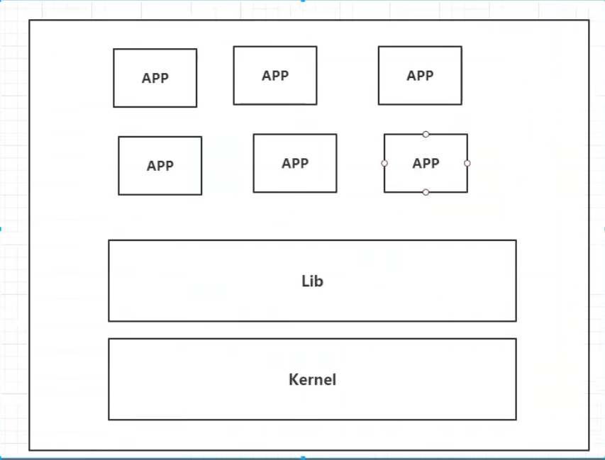

# Docker


## Docker学习大纲

学前准备：

- linux：必须会简单的命令操作，比如cd，mkdir。
- springboot：会的话更好，不会也行。


学什么：

1. docker概述

2. docker安装

3. docker命令

   - 镜像命令

   - 容器命令
   - 操作命令
   - 。。。

4. docker镜像

5. 容器数据卷

6. dockerFile

7. Docker网络原理

8. IDEA整合Docker

9. Docker Compose（集群）

10. Docker Swam（集群管理）
    - 相当于简单版的k8s
11. CI\CD Jenkins

1-8算初级，先学着入门。


## Docker概述

### Docker为什么出现

一套产品有开发/上线，两套环境！应用环境，应用配置在两个环境中都要处理。


一个公司有开发和运维两个主要角色。两角色会碰到一些问题：

- 我在我的电脑上可以用，在你那不行。
- 版本更新，导致服务不可用。这对于运维来说考验很大。

解决方案：

- 开发也干运维的活。


环境配置是十分麻烦的，每个机器都要部署环境（集群redis，ES，Hadoop。。）。费时费力。

解决问题：

- 发布一个项目时，之前是发布一个jar包或者war包。现在发布jar包，它可能需要各种环境（redis，mysql，jdk，ES）；发布jar包是一分钟的事，但是部署环境可能一天都部署不好。
- 我们就想：发布一个项目时，项目能不能带上开发时的环境安装打包，即：（jar+（redis，mysql，jdk，ES））。docker就是来干这个的，开发人员开发完毕后，直接用docker部署上线。


拿安卓开发类别docker：

- java项目--制作apk--发布apk到应用商店--李四使用apk--下载安装即用。
- java项目--制作了jar包（和环境）--打包项目带上环境（即镜像）--docker仓库（类似应用商店）--下载我们发布的镜像，直接运行即可。


Docker思想：

- Docker的思想来源于集装箱。
- 没有docker时，多个应用可能会有端口冲突，应用都是交叉的。
- docker的核心思想是“隔离”。打包装箱，每个箱子是相互隔离的。
  - 比如之前船上装“生化武器”和“食品”可能导致食品变质。但是docker把“生化武器”和“食品”分别装箱后，两者互不影响，可以放到一艘轮船上。
- Docker通过隔离机制，可以将服务器的性能用到极致。不会浪费。


### Docker的历史

2010年，几个搞it的年轻人在美国成立了`dotcloud`公司，做paas云计算服务。有一些linux相关的容器技术。他们将自己的技术（容器化技术）称为docker。

docker刚开始的时候没有引起行业注意，dotcloud活不下去，年轻人又不想放弃这个项目，2013年就把项目做了开源。（有的公司一开始就开源，有的是活不下去了才开源）。越来越多的人发现了docker的优点。

2014年4月9日，docker1.0发布。并成为如今开发人员必须会的技术之一。


docker为何这么火？：

- 十分的轻巧
  - 在容器技术出来之前，我们用的都是虚拟机技术。虚拟机特别占内存，普通电脑开不了几个。
  - 虚拟机：在windows中装一个vmware虚拟机，通过这个软件我们可以虚拟出来一台或者多台电脑。虚拟出来的电脑和真实电脑很想，也是很笨重的。虚拟机是属于虚拟化技术， docker是容器化技术也属于一种虚拟化技术。
  - 例子
    - vm（虚拟机）：linux centos原生镜像（类似一电脑），有隔离性，占用几个G的硬盘，开启要几分钟。
    - docker：有隔离性，镜像（只包含最核心的环境如jdk，mysql），运行镜像就可以，占用几M的硬盘，秒级开启。


聊聊docker：

- docker是基于go语言开发的，开源项目。
- 官网地址：https://www.docker.com/
- 官网文档地址：https://docs.docker.com/
- docker仓库地址：https://hub.docker.com/
  - 操作命令类似github。


### Docker能干什么

#### 虚拟机技术

电脑/虚拟机技术的功能示意图：



虚拟机技术的缺点：

- 资源占用很多
- 冗余步骤很多
- 启动很慢


#### 容器化技术

**容器化技术不是摸你的一个完整地操作系统**


容器化技术示意图：


比较docker和虚拟机技术的不同：

- 传统虚拟机虚拟出一套硬件，运行一个完整的操作系统，然后在这个系统上安装和运行软件。
- 容器内的应用直接运行在“宿主机”的内容中，容器是没有自己的内核，也没有虚拟硬件，所以就轻便了。
- 每个容器内是相互隔离的，每个容器内都有一个属于自己的文件系统，互不影响。


#### DevOps

Dev（开发）Ops（运维）=升职加薪的秘诀


Docker在DevOps角度的优点：

- docker可以实现更快速的交付和部署

  - 传统：一堆帮助文档，安装程序

  - Docker：打包镜像，发布测试，一键运行。

- 更便捷的升级和扩容
  - 使用了docker后，我们部署应用就像搭积木一样。
  - 项目打包为一个影响，一键就能扩展。
  - 各种环境的版本管理升级更便捷。

- 更简单的系统运维
  - 在容器化后，我们的开发，测试环境都是高度一致的；不会出现在A电脑上能用，在B电脑上不能用的情况。

- 更高校的计算资源利用
  - 1核2g的服务器，用docker后，可以运行几十个redis；这是之前虚拟机做不到的。
  - docker是内核级别的虚拟化，可以在一个物理机上运行很多的容器实例。服务器的性能可以被压榨到极致。


## Docker安装

### Docker的基本组成

docker架构图：


- 三大块：
  - client=客户端
  - host=服务器
  - registry=仓库

- 三个关注点：
  - 镜像（image）
    - docker镜像好比是一个模板，可以通过这个模板来创建容器服务。镜像理解为java中的类，容器理解为java中的对象。
    - 比如有tomcat镜像，镜像是不能直接启动的，要把镜像“运行”起来才能“启动”。tomcat镜像-->run-->tomcat01容器(提供服务)。通过这个镜像可以创建多个容器（最终服务运行或者项目运行就是在容器中的）。
  - 容器（container）
    -  docker利用容器技术可以独立运行一个或者一组应用，应用是通过镜像来创建的。
    - 基本命令：启动，停止，删除。。
    - 目前可以把容器理解为一个简易的linux系统。
  - 仓库（repository）
    - 仓库就是存放镜像的地方。
    - 仓库分为“共有仓库”和“私有仓库”。
    - 像阿里云等公司都有容器服务器，一般要配置国内镜像加速，不然很慢（如maven镜像）。


### 安装Docker

#### 环境准备

1. 需要会一点点的linux基础
2. 一个远程服务器（推荐阿里云）
3. CentOS 7（远程服务器系统）
4. 我们用XShell连接远程服务器进行操作

#### 环境查看

shell连接远程服务器，输入一下命令进行查看

```shell
# 系统内核是3.10以上的
[root@zhangyun/]# uname -r
3.10.0-XXX
```

```shell
# 系统版本
[root@zhangyun/]# cat /etc/os-release
```

https://www.bilibili.com/video/BV1og4y1q7M4?p=6&spm_id_from=pageDriver

1.25