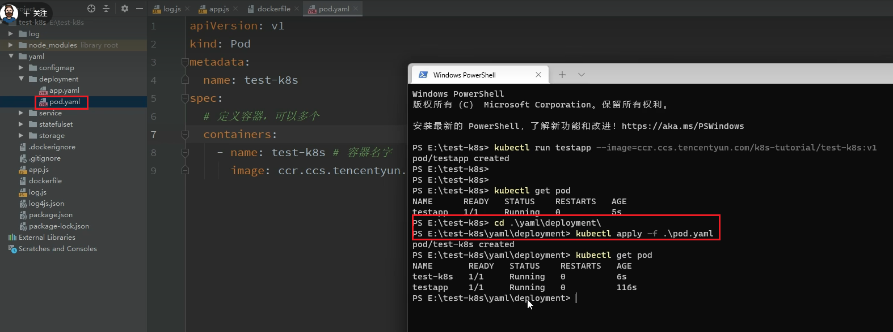
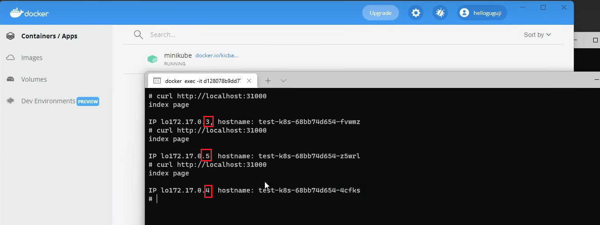
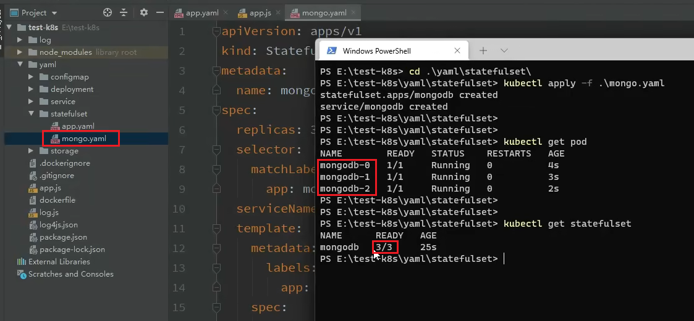
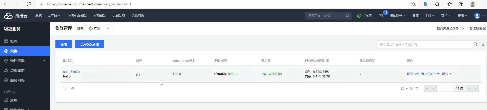
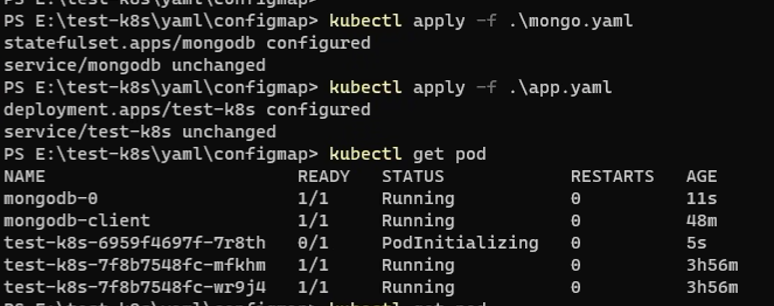
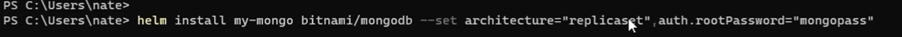
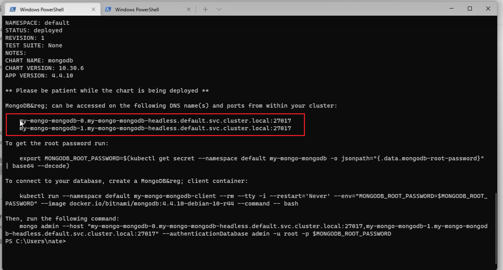
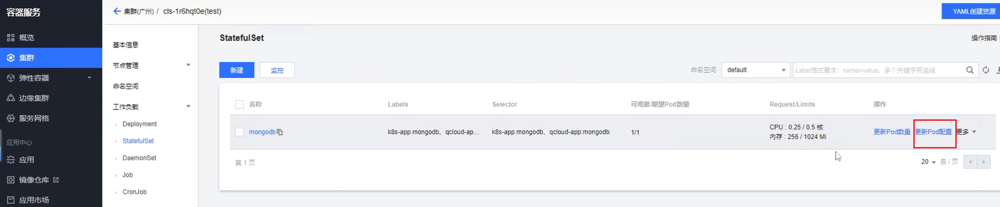

# K8S

## 资料

1，[在线课件参考](https://k8s.easydoc.net/docs/dRiQjyTY/28366845/6GiNOzyZ/9EX8Cp45)

- 我复制到本笔记了，方便自己记录一些笔记

## k8s简介

### 课程内容

- 介绍下什么是 kubernetes，什么时候需要 kubernetes，以及它的组成架构。
- 用 3 种不同的方式教大家如何安装 kubernetes 集群。包括 minikube，云平台搭建，裸机搭建（3 台服务器）。
- 通过一个 demo 项目演示如何部署项目到集群中，怎么对外暴露服务端口
- 怎么部署数据库这种有状态的应用，以及如何数据持久化
- 集群中配置文件和密码文件的使用
- 怎么使用 Helm 应用商店快速安装第三方应用
- 怎么使用 Ingress 对外提供服务

目标：学完课程，对 kubernetes 有一个全面的认识，能够轻松应对各种集群部署工作。

> 本文档课件需配套 [视频](https://www.bilibili.com/video/BV1Tg411P7EB/) 一起学习

### Kubernetes (K8S) 是什么

它是一个为 **容器化** 应用提供集群部署和管理的开源工具，由 Google 开发。
**Kubernetes** 这个名字源于希腊语，意为“舵手”或“飞行员”。k8s 这个缩写是因为 k 和 s 之间有八个字符的关系。 Google 在 2014 年开源了 Kubernetes 项目

**主要特性：**

- 高可用，不宕机，自动灾难恢复
- 灰度更新，不影响业务正常运转
- 一键回滚到历史版本
- 方便的伸缩扩展（应用伸缩，机器加减）、提供负载均衡
- 有一个完善的生态

> **学习课程前提**
> 熟悉 Docker 的基本使用，如果你还不了解 Docker，先看视频 [Docker 快速上手](https://www.bilibili.com/video/BV11L411g7U1)
> 熟悉 Linux 操作系统

### 不同的应用部署方案


#### 传统部署方式

应用直接在物理机上部署，机器资源分配不好控制，出现Bug时，可能机器的大部分资源被某个应用占用，导致其他应用无法正常运行，无法做到应用隔离。

#### 虚拟机部署

在单个物理机上运行多个虚拟机，每个虚拟机都是完整独立的系统，性能损耗大。

#### 容器部署

所有容器共享主机的系统，轻量级的虚拟机，性能损耗小，资源隔离，CPU和内存可按需分配

### 什么时候需要 Kubernetes

当你的应用只是**跑在一台机器，直接一个 docker + docker-compose 就够了，方便轻松**；
当你的应用需要跑在 3，4 台机器上，你依旧可以每台机器单独配置运行环境 + 负载均衡器；
当你应用访问数不断增加，机器逐渐增加到十几台、上百台、上千台时，每次加机器、软件更新、版本回滚，都会变得非常麻烦、痛不欲生，再也不能好好的摸鱼了，人生浪费在那些没技术含量的重复性工作上。

这时候，**Kubernetes 就可以一展身手了，让你轻松管理百万千万台机器的集群**。“谈笑间，樯橹灰飞烟灭”，享受着一手掌控所有，年薪百万指日可待。

Kubernetes 可以为你提供集中式的管理集群机器和应用，加机器、版本升级、版本回滚，那都是一个命令就搞定的事，不停机的灰度更新，确保高可用、高性能、高扩展。

### Kubernetes 集群架构


#### master

主节点，控制平台，不需要很高性能，不跑任务，通常一个就行了，也可以开多个主节点来提高集群可用度。

#### worker

工作节点，可以是虚拟机或物理计算机，任务都在这里跑，机器性能需要好点；通常都有很多个，可以不断加机器扩大集群；每个工作节点由主节点管理

#### 重要概念 Pod

豆荚，K8S 调度、管理的最小单位，**一个 Pod 可以包含一个或多个容器**，每个 Pod 有自己的虚拟IP。**一个工作节点可以有多个 pod**，主节点会考量负载自动调度 pod 到哪个节点运行。


##### Kubernetes 组件

`kube-apiserver` API 服务器，公开了 Kubernetes API

- 提供了一些对外的接口，用来控制集群

`etcd` 键值数据库，可以作为保存 Kubernetes 所有集群数据的后台数据库

- 有点像redis

`kube-scheduler` 调度 Pod 到哪个节点运行

`c-m`：是controller manager，是一个控制中心

`c-c-m`：是cloud controller manager，用来和云平台云服务商交互的，比如请求创建一个磁盘 负载均衡器 之类的。

（课程没说）`kube-controller` 集群控制器
（课程没说）`cloud-controller` 与云服务商交互


- 这部分有大概的概念即可，通过后面的学习会有更深入的理解。

> 如果你想要了解更多 K8S 组成细节，主节点、工作节点分别有哪些程序，各有什么作用，可以查看 [官网详细介绍](https://kubernetes.io/zh/docs/concepts/overview/components/)

## 安装k8s集群

- 我：后续都是用腾讯coding仓库之类的自动运维，其实不会太接触底层的k8s，所以就不实操了；了解相关概念，知道怎么用k8s就好。
  - 我复盘：错误的。coding做的很多是jekins的工作，要懂k8s才能正确地编写deployment和service，才能正确地部署服务。


### 安装方式介绍

- **minikube**
  只是一个 K8S 集群模拟器，**只有一个节点的集群**，只为测试用，master 和 worker 都在一起

- **直接用云平台 Kubernetes（推荐）**
  可视化搭建，只需简单几步就可以创建好一个集群。
  优点：安装简单，生态齐全，负载均衡器、存储等都给你配套好，简单操作就搞定

  缺点：要钱

  - 阿里云腾讯云支持类似服务

- **裸机安装（Bare Metal）**
  至少需要两台机器（主节点、工作节点个一台）（k8s集群至少得有2个节点一主一从），需要自己安装 Kubernetes 组件，配置会稍微麻烦点。
  可以到各云厂商按时租用服务器，费用低，用完就销毁。
  缺点：配置麻烦，缺少生态支持，例如负载均衡器、云存储。

> 本文档课件需配套 [视频](https://www.bilibili.com/video/BV1Tg411P7EB?p=2) 一起学习

### minikube

- 网友：minikube是给人模拟k8s环境用的，占用资源较少。自己能搞测试环境的可以直接跳过minikube直接往后看
- 网友：minikube确实这个只是win上的，了解就行
- 老师：模拟的话，会经常出些问题，而且模拟平台不真实，所以minikube的使用不是重点。
  - 网友：亏我还搞了那么久minikube的安装bug

1，需要提前安装好 Docker

- k8s是基于容器的，所以要先安装好docker

2，安装minikube非常简单，支持各种平台，[安装方法](https://minikube.sigs.k8s.io/docs/start/)

3，安装好minikube后，可以执行下列命令启动minikube

```
# 启动集群
minikube start
# 查看节点。kubectl 是一个用来跟 K8S 集群进行交互的命令行工具
kubectl get node
# 停止集群
minikube stop
# 清空集群
minikube delete --all
# 安装集群可视化 Web UI 控制台
minikube dashboard
```


### 云平台搭建(推荐)

#### 腾讯云

- [腾讯云 TKE](https://cloud.tencent.com/product/tke)（控制台搜索容器）

1，步骤参见视频。很方便就在腾讯云上创建了一个k8s集群。

#### 阿里云

- 登录阿里云控制台 - 产品搜索 Kubernetes

2，略

### 裸机搭建（Bare Metal）

#### 主节点需要组件

- docker（也可以是其他容器运行时）
- kubectl 集群命令行交互工具
- kubeadm 集群初始化工具

#### 工作节点需要组件 [文档](https://kubernetes.io/zh/docs/concepts/overview/components/#node-components)

- docker（也可以是其他容器运行时）
- kubelet 管理 Pod 和容器，确保他们健康稳定运行。
- kube-proxy 网络代理，负责网络相关的工作

#### 开始安装

> 你也可以试下 [这个项目](https://github.com/lework/kainstall)，用脚本快速搭建 K8S 裸机集群
> 当然，为了更好的理解，你应该先手动搭建一次

- 可以像课程一样，在腾讯云上开三个节点，按流量计费，用完就删掉；在三个节点上分别部署k8s，合成一个集群。

```
# 每个节点分别设置对应主机名
hostnamectl set-hostname master
hostnamectl set-hostname node1
hostnamectl set-hostname node2
# 每个节点都修改 hosts，填入集群的所有节点和对应角色。host是腾讯云容器的内网ip。配置完后可以节点之间互相ping ip，能成功就说明配好了
vim /etc/hosts
172.16.32.2 node1
172.16.32.6 node2
172.16.0.4 master
# 所有节点关闭 SELinux
setenforce 0
sed -i --follow-symlinks 's/SELINUX=enforcing/SELINUX=disabled/g' /etc/sysconfig/selinux
```

- 网友：只能说不关SELINUX寸步难行

> 所有节点确保防火墙关闭
> systemctl stop firewalld
> systemctl disable firewalld

添加安装源（所有节点）

```
# 添加 k8s 安装源。这里镜像地址换成了阿里云的就会快一点，香港的节点可以不用换成阿里云。
cat <<EOF > kubernetes.repo
[kubernetes]
name=Kubernetes
baseurl=https://mirrors.aliyun.com/kubernetes/yum/repos/kubernetes-el7-x86_64
enabled=1
gpgcheck=0
repo_gpgcheck=0
gpgkey=https://mirrors.aliyun.com/kubernetes/yum/doc/yum-key.gpg https://mirrors.aliyun.com/kubernetes/yum/doc/rpm-package-key.gpg
EOF
mv kubernetes.repo /etc/yum.repos.d/

# 添加 Docker 安装源
yum-config-manager --add-repo http://mirrors.aliyun.com/docker-ce/linux/centos/docker-ce.repo
```

安装所需组件（所有节点）
`yum install -y kubelet-1.22.4 kubectl-1.22.4 kubeadm-1.22.4 docker-ce`

- 虽然主节点不需要kubelet，但是我们还是给每个节点都安装好。

> 注意，据学员反馈，1.24 以上的版本会报错，跟教程有差异，所以建议大家指定版本号安装，版本号确保跟老师在视频中选的一样

启动 kubelet、docker，并设置开机启动（所有节点）

```
systemctl enable kubelet
systemctl start kubelet
systemctl enable docker
systemctl start docker
```

修改 docker 配置（所有节点）

```
# kubernetes 官方推荐 docker 等使用 systemd 作为 cgroupdriver，否则 kubelet 启动不了
cat <<EOF > daemon.json
{
  "exec-opts": ["native.cgroupdriver=systemd"],
  "registry-mirrors": ["https://ud6340vz.mirror.aliyuncs.com"]
}
EOF
mv daemon.json /etc/docker/

# 重启生效
systemctl daemon-reload
systemctl restart docker
```

用 [kubeadm](https://kubernetes.io/docs/reference/setup-tools/kubeadm/) 初始化集群（仅在主节点跑），

```
# 初始化集群控制台 Control plane。这里也是用的阿里云镜像。
# 失败了可以用 kubeadm reset 重置
kubeadm init --image-repository=registry.aliyuncs.com/google_containers

# 记得把 kubeadm join xxx 保存起来
# 忘记了重新获取：kubeadm token create --print-join-command

# 复制授权文件，以便 kubectl 可以有权限访问集群
# 如果你其他节点需要访问集群，需要从主节点复制这个文件过去其他节点
mkdir -p $HOME/.kube
cp -i /etc/kubernetes/admin.conf $HOME/.kube/config
chown $(id -u):$(id -g) $HOME/.kube/config

# 在其他机器上创建 ~/.kube/config 文件也能通过 kubectl 访问到集群
```

> 有兴趣了解 kubeadm init 具体做了什么的，可以 [查看文档](https://kubernetes.io/docs/reference/setup-tools/kubeadm/kubeadm-init/)

把工作节点加入集群（只在工作节点跑）

```
kubeadm join 172.16.32.10:6443 --token xxx --discovery-token-ca-cert-hash xxx
```

- 把上一步生成并保存的`kubeadm join xxx`，复制到每个从节点并运行
  - 如果有报错，记得去掉语句中的换行符号`\`

节点都加入集群后，可以在主节点所在机器用`kubectl get node`看看集群的节点情况：


安装网络插件，否则 node 是 NotReady 状态（主节点跑）

```
# 很有可能国内网络访问不到这个资源，你可以网上找找国内的源安装 flannel
kubectl apply -f https://raw.githubusercontent.com/coreos/flannel/master/Documentation/kube-flannel.yml

# 如果上面的插件安装失败，可以选用 Weave，下面的命令二选一就可以了。
kubectl apply -f https://github.com/weaveworks/weave/releases/download/v2.8.1/weave-daemonset-k8s.yaml
kubectl apply -f http://static.corecore.cn/weave.v2.8.1.yaml

# 更多其他网路插件查看下面介绍，自行网上找 yaml 安装
https://blog.csdn.net/ChaITSimpleLove/article/details/117809007
```

> 请注意，flannel 插件很多学员都安装不上（因为网络问题），这样会导致后面名字访问服务用不了，
> 大家可以改用 weave 或者使用香港服务器或者寻找国内的源安装

查看节点，要在主节点查看（其他节点有安装 kubectl 也可以查看）


- master是不会跑任务的，任务都是跑在slave节点上。

## 部署应用到集群中

### 部署应用 YAML 文件

> 本文档课件需配套 [视频](https://www.bilibili.com/video/BV1Tg411P7EB?p=3) 一起学习

#### 直接命令运行pod

1，命令

```
kubectl run testapp --image=ccr.ccs.tencentyun.com/k8s-tutorial/test-k8s:v1
```

- 运行一个pod，pod的名字是testapp，镜像的名字由`--image`指定。

2，检查pod跑起来了


#### yml方式运行Pod

1，pod用命令行来运行的话不方便传播，可以把pod写成一个`pod.yaml`配置文件

```yml
apiVersion: v1
kind: Pod
metadata:
  # 定义pod的名字
  name: test-pod
spec:
  # 定义容器，一个pod里可以运行多个容器
  containers:
    - name: test-k8s # 容器名字
      image: ccr.ccs.tencentyun.com/k8s-tutorial/test-k8s:v1 # 镜像
```

- yml比作json的话，缩进就是一个对象，`-`就是一个数组元素

2，通过kubectl命令，通过yml运行pod：



- 左红框：yml文件在windows系统中的位置
- 右红框：控制台来到pod.yml所在的位置，运行
- 右红框下面：可以看到增加了一个“test-k8s”容器

#### Deployment同时运行多个pod

- 单独创建pod不方便，因为在集群里要运行很多pod；所以要写一个deployement文件来管理所有pod副本。
- 我：这块的配置可以自己多了解下，课程讲的不是很清晰。比如template中pod的层级，label绑定是怎么绑。。

1，编写`app.yaml`文件：

```yml
apiVersion: apps/v1
kind: Deployment
metadata:
  # 部署名字
  name: test-k8s
spec:
  # 要运行的副本的数目。这里副本并不是主从的意思，而是说会总共起两个pod，不要误以为会起一主两从共三个pod。
  replicas: 2
  # 用来查找关联的 Pod，所有标签都匹配才行
  selector:
    matchLabels:
      # 要和template下定义的pod名字对上，即对应上label名
      app: test-k8s
  # 定义 Pod 相关数据。即是“yml方式运行pod”中的配置文件主体。
  template:
    metadata:
      labels:
        app: test-k8s
    spec:
      # 定义容器，可以多个
      containers:
      - name: test-k8s # 容器名字
        image: ccr.ccs.tencentyun.com/k8s-tutorial/test-k8s:v1 # 镜像
```

2，运行deployment：


- 第一行红框：运行deployment
- 第二行红框：看到deployment起了两个pod
- 第三行红框左：看到根据deployment起的两个pod
- 第三行红框中：wid可以展示完整信息，包含pod的ip pod所在节点等等
- 第三行红框右：因为windows本机运行的是minikube，只有一个节点，所以deployment起的两个pod都在同一节点

3，原理：Deployment 通过 label 关联起来 Pods


### 部署应用演示

#### minikube单节点展示

1，背景：

- 部署一个 nodejs web 应用，源码地址：[Github](https://github.com/gzyunke/test-k8s)。

2，已经把这个应用打成docker镜像，并放在了腾讯云的镜像仓库（这块需要懂docker）。打包镜像用到的dockerfile：


腾讯云镜像库展示：


3，app.yaml即yaml格式的deployment，内容参考“Deployment同时运行多个pod”

4，实战部署时，k8s常用命令：

```yml
# 部署应用。执行此命令后，修改app.yaml比如把副本数由2变成5，再执行此命令则k8s集群的容器数目会在原先2个的基础上再新增3个
kubectl apply -f app.yaml
# 查看 deployment。可以看到deployment的名字，从而用于删除deployment。
kubectl get deployment
# 查看 pod
kubectl get pod -o wide
# 查看 pod 详情
kubectl describe pod pod-name
# 查看 指定pod的log。-f持续不断地查看。容器内部会有一个log文件夹，文件夹中有各种日志。
kubectl logs pod/pod-name
# 进入 Pod 容器终端。如果pod中有多个容器，则-c container-name 可以指定进入哪个容器。
kubectl exec -it pod-name -- bash
# 退出容器
exit
# 通过命令行，实时动态调整已部署的k8s集群中的副本数目
kubectl scale deployment deployment的名字(本例为test-k8s) --replicas=5
# 把集群内pod的端口映射到节点(即机器)的端口，容器外:容器内。这个终端必须一直开着，才能保证映射。
kubectl port-forward pod-name 8090:8080
# 查看历史
kubectl rollout history deployment test-k8s
# 回到上个版本
kubectl rollout undo deployment test-k8s
# 回到指定版本
kubectl rollout undo deployment test-k8s --to-revision=2
# 删除部署
kubectl delete deployment test-k8s
```

#### 裸机三个真实节点展示

1，在安装好的k8s集群中，在主节点编写yaml格式的deployment文件，启动deployment：


2，Pod 报错解决

如果你运行 `kubectl describe pod/pod-name` 发现 Events 中有下面这个错误

```
networkPlugin cni failed to set up pod "test-k8s-68bb74d654-mc6b9_default" network: open /run/flannel/subnet.env: no such file or directory
```

在每个节点创建文件`/run/flannel/subnet.env`写入以下内容，配置后等待一会

```
FLANNEL_NETWORK=10.244.0.0/16
FLANNEL_SUBNET=10.244.0.1/24
FLANNEL_MTU=1450
FLANNEL_IPMASQ=true
```

删除已有部署

```
kubectl delete deployment deployment名字
```

重新部署

```
kubectl apply -f app.yaml
```

3，重新部署后正常运行了，可以参考：


- 图片上半部分正在创建容器，图片下半部分就是容器都创建完成了。
- 设置了10个副本，副本们会基于一定规则分布在2个从节点上，比如每个节点各跑一半的pod。主节点不会跑pod（本例子是一主二从共三个节点，主节点名master，从节点名node1和node2）。

4，查看历史版本，目前只有一个历史版本：


为了测试k8s历史版本的功能。把app.yaml中的镜像改成一个有错误的版本，然后重新把镜像部署到k8s集群：


- 可以看到k8s是灰度更新：先创建新的，再销毁旧的，不会影响线上的运行。

为有错误的镜像也得设置一下端口转发，这样可以把节点端口与指定容器端口绑定，才能通过节点端口访问指定的容器：


访问接口会报错：


5，发现当前镜像有问题，需要紧急回退，可以一个命令回退到上一个版本：


重新绑定节点端口和一个容器端口，注意绑定完后不要关闭页面：


再访问就成功了，说明成功把镜像回退到上一个版本；并且能看到访问的容器就是自己绑定了端口的容器：


6，还可以回到指定版本：


- 这里因为版本1已经没了，回不去了，所以只能会到版本2和3。

7，删除部署：略。命令在“minikube单节点展示”

#### 更多命令

```yml
# 查看全部。把所有东西列出来，比如pod 部署之类的。
kubectl get all
# 重新部署。如果什么都没改，就是想重新部署，可以执行这个命令。
kubectl rollout restart deployment test-k8s
# 命令修改镜像。--record 表示把这个命令记录到操作历史中，就可以很方便的去回退。
kubectl set image deployment test-k8s test-k8s(容器名字（我：老师这应该是口误了 应该是deployment名字）)=ccr.ccs.tencentyun.com/k8s-tutorial/test-k8s:v2-with-error(镜像名字) --record
# 暂停运行，暂停后，对 deployment 的修改不会立刻生效（比如修改deployment的镜像），恢复后才应用设置
kubectl rollout pause deployment test-k8s
# 恢复
kubectl rollout resume deployment test-k8s
# 输出到文件。可以为yml格式或json格式，把deployment的配置导出为一个文件
kubectl get deployment test-k8s -o yaml >> app2.yaml
# 删除全部资源，包含pod和deployment
kubectl delete all --all
```

- 我：`--record`[参考](https://www.cnblogs.com/zhaobowen/p/13371105.html)

更多官网关于 [Deployment](https://kubernetes.io/zh/docs/concepts/workloads/controllers/deployment/) 的介绍

将 Pod 指定到某个节点运行：[nodeselector](https://kubernetes.io/zh/docs/concepts/scheduling-eviction/assign-pod-node/#nodeselector)
限定 CPU、内存总量：[文档](https://kubernetes.io/zh/docs/concepts/policy/resource-quotas/#计算资源配额)

```
apiVersion: v1
kind: Pod
metadata:
  name: nginx
  labels:
    env: test
spec:
  containers:
  - name: nginx
    image: nginx
    imagePullPolicy: IfNotPresent
  nodeSelector:
    disktype: ssd
```

### 工作负载分类

- Deployment
  适合无状态应用，所有pod等价，可替代
- StatefulSet
  有状态的应用，适合数据库这种类型。
- DaemonSet
  在每个节点上跑一个 Pod，可以用来做节点监控、节点日志收集等
- Job & CronJob
  Job 用来表达的是一次性的任务，而 CronJob 会根据其时间规划反复运行。

[文档](https://kubernetes.io/zh/docs/concepts/workloads/)

### 现存问题

- 每次只能访问一个 pod，没有负载均衡自动转发到不同 pod
- 访问还需要端口转发
- Pod 重创后 IP 变了，名字也变了

下节我们讲解如何解决。


## Service

- 我：service和deployment的关系[参考](https://zhuanlan.zhihu.com/p/358916098)。
  - 两者可以互相独立，也可以互相依存；一般都是互相依存使用，即先用deployment把多个pod跑起来，然后用sevice绑定pod，解决了deployment章节结尾存在的三个问题。

### 特性

- Service 通过 label 关联对应的 Pod
- Servcie 生命周期不跟 Pod 绑定，不会因为 Pod 重创改变 IP
- 提供了负载均衡功能，自动转发流量到不同 Pod
- 可对集群外部提供访问端口
- 集群内部可通过服务名字访问

> 本文档课件需配套 [视频](https://www.bilibili.com/video/BV1Tg411P7EB?p=4) 一起学习


### 创建 Service

#### 在minikube中创建

- minikube的master和slave都在一个节点

1，创建 一个 Service，通过标签`test-k8s`跟对应的 Pod 关联上
`service.yaml`

```yml
apiVersion: v1
# kind为Service
kind: Service
metadata:
  # service的名字
  name: test-k8s
spec:
  selector:
    # 标签一定要和pod的标签对应上，否则关联不起来
    app: test-k8s
  type: ClusterIP
  # 暴露端口是一个数组，所以可以暴露多个端口；数组的每个元素有Service在集群内暴露的端口，和容器对应的端口
  ports:
    - port: 8080        # 本 Service 的端口，集群内访问
      targetPort: 8080  # 容器端口
```

- k8s中所有资源都是用yml配置的。service.yml的内容和app.yml(deployment)差不多，只是kind变成service，name变成服务的名字。
- 我：通过service，可以把请求送到根据label绑定的任一pod中；容器的端口也在service中指定了，所以访问时就不用显式的配置端口转发到容器。
- 我：多个port辨析，[参考](https://blog.csdn.net/GuXiaoyan12/article/details/103751227)
  - 用`nodePort`把pod服务暴露到集群外，[额外参考](https://www.cnblogs.com/gaoyanbing/p/14031522.html)
  - [额外参考](https://www.cnblogs.com/faithH/p/12103713.html)，pod上的targetPort，应该和pod内容器暴露的containerPort一致。


2，确保docker包起来了，minikube也跑起来了


3，把前面部署的web应用全部删除掉：


4，重新通过deployment部署web应用：


5，查看起了2个pod，符合deployment中两个副本的设置：


6，应用配置 `kubectl apply -f service.yaml`，把service跑起来：


7，查看服务 `kubectl get svc`


- 8080是service端口，31000是节点端口
- 可以看到service对应的集群ip

8，查看服务详情 `kubectl describe svc test-k8s`，可以发现 Endpoints 是各个 Pod 的 IP，也就是他会把流量转发到这些节点。


9，服务的默认类型是`ClusterIP`（service.yml中通过Type配置），**只能在集群内部访问服务**，我们可以进入到 Pod 里面访问：
`kubectl exec -it pod-name -- bash`


在容器内部通过服务的名字访问服务，`curl http://test-k8s:8080`


- test-k8s是服务的名字，8080是服务对应的端口。

也可以在容器内部通过服务的ip访问服务：


10，如果要在集群外部访问，可以通过端口转发实现（只适合临时测试用），绑定service的端口和节点的端口：
`kubectl port-forward service/test-k8s 8080:8080`：


如果你用 minikube，想在集群外部访问，也可以这样`minikube service test-k8s`：


### 对外暴露服务-NodePort

1，上面我们是通过端口转发的方式可以**在外面访问到集群里的服务**（10，），如果想要直接把集群服务暴露出来，我们可以使用`NodePort` 和 `Loadbalancer` 类型的 Service

```yml
apiVersion: v1
kind: Service
metadata:
  name: test-k8s
spec:
  selector:
    app: test-k8s
  # 默认 ClusterIP 集群内可访问，NodePort 节点可访问，LoadBalancer 负载均衡模式（需要负载均衡器才可用）
  type: NodePort
  ports:
    - port: 8080        # 本 Service 的端口
      targetPort: 8080  # 容器端口
      nodePort: 31000   # 节点端口，范围固定 30000 ~ 32767
```

2，应用配置 `kubectl apply -f service.yaml`：


- 可以看到服务的类型变成NodePort，ip没变；端口多了31000表示节点的端口。

3，进入节点。可以通过docker进入节点：

> 如果你是用 minikube，因为是模拟集群，你的电脑并不是节点，节点是 minikube 模拟出来的，所以你并不能直接在电脑上访问到服务


- 网友：所谓的节点也就是宿主机（服务器）

4，在节点上，我们可以 `curl http://localhost:31000` 访问到应用
并且是有负载均衡的，网页的信息可以看到被转发到了不同的 Pod：



- 这个minikube中配置了至少三个副本。

### 对外暴露服务-Loadbalancer

`Loadbalancer` 也可以对外提供服务，这需要一个负载均衡器的支持，因为它需要生成一个新的 IP 对外服务，否则状态就一直是 pendding，这个很少用了，后面我们会讲更高端的 Ingress 来代替它。

- Loadbalance需要云服务商的支持，一般用不了

### 多端口

多端口时必须配置 name， [文档](https://kubernetes.io/zh/docs/concepts/services-networking/service/#multi-port-services)

```yml
apiVersion: v1
kind: Service
metadata:
  name: test-k8s
spec:
  selector:
    app: test-k8s
  type: NodePort
  # port数组中不止一个元素，即为多端口。
  ports:
    - port: 8080        # 本 Service 的端口
      name: test-k8s    # 必须配置
      targetPort: 8080  # 容器端口
      nodePort: 31000   # 节点端口，范围固定 30000 ~ 32767
    - port: 8090
      name: test-other
      targetPort: 8090
      nodePort: 32000
```

- 我：这里可以看出，容器暴露的端口即containerPort即为pod暴露的targetport，两者数字相等
  - 坛友：默认相等，但也可以不相等，可以设置的
- 我：port数组的中不止有一个元素，这就是多端口。

### 总结

#### ClusterIP

默认的，仅在集群内可用

#### NodePort

暴露端口到节点，提供了集群外部访问的入口，可以在节点上访问服务
端口范围固定 30000 ~ 32767

#### LoadBalancer

需要负载均衡器（通常都需要云服务商提供，裸机可以安装 [METALLB](https://metallb.universe.tf/) 测试）
会额外生成一个 IP 对外服务（防止暴露集群的ip）
K8S 支持的负载均衡器：[负载均衡器](https://kubernetes.io/zh/docs/concepts/services-networking/service/#internal-load-balancer)

#### Headless

适合数据库
clusterIp 设置为 None 就变成 Headless 了，不会再分配 IP，后面会再讲到具体用法
[官网文档](https://kubernetes.io/zh/docs/concepts/services-networking/service/#headless-services)

## StatefulSet

### 什么是 StatefulSet

StatefulSet 是用来管理有状态的应用，例如数据库。
前面我们部署的应用，都是不需要存储数据，不需要记住状态的，可以随意扩充副本，**每个副本都是一样的，可替代的**。
而像**数据库、Redis 这类有状态的，则不能随意扩充副本**。
StatefulSet 会固定每个 Pod 的名字

> 本文档课件需配套 [视频](https://www.bilibili.com/video/BV1Tg411P7EB?p=5) 一起学习

### 部署 StatefulSet 类型的 Mongodb

1，编写yml，和deployment很像，差别写在注释中了：

```yml
apiVersion: apps/v1
# kind指定为StatefulSet
kind: StatefulSet
metadata:
  name: mongodb
spec:
  serviceName: mongodb
  replicas: 3
  selector:
    matchLabels:
      # 通过标签去匹配pod
      app: mongodb
  # 定义了pod。标签名一定要和selector中的标签名匹配。
  template:
    metadata:
      # pod的标签
      labels:
        app: mongodb
    spec:
      # pod中可能有多个容器，所以容器是一个数组
      containers:
        # 容器的名字，镜像，镜像使用方式
        - name: mongo
          image: mongo:4.4
          # IfNotPresent 仅本地没有镜像时才远程拉，Always 永远都是从远程拉，Never 永远只用本地镜像，本地没有则报错
          imagePullPolicy: IfNotPresent
---

# 为了统一固定的入口来访问服务，所以这里也写一个Service
apiVersion: v1
kind: Service
metadata:
  name: mongodb
spec:
  # 一定要和pod的标签对应上
  selector:
    app: mongodb
  # 只需要集群内部访问就可以了
  type: ClusterIP
  # 注意：clusterIP写成None，这样相当于HeadLess类型的服雾；就不会给serice分配集群的ip了，后面只能通过服务的名字来访问。
  clusterIP: None
  ports:
      # 服务端口
    - port: 27017
      # 容器端口
      targetPort: 27017
kubectl apply -f mongo.yaml
```

- 与 Deployment 相似，StatefulSet 基于一个 Pod 模板管理其 Pod。 与 Deployment 最大的不同在于 StatefulSet 始终将一系列不变的名字分配给其 Pod。 这些 Pod 从同一个模板创建，但是并不能相互替换：每个 Pod 都对应一个特有的持久化存储标识。
  - 我：所以Deployment和StatefulSet的配置文件中，只允许一个pod模板，由同一个pod模板生成多个pod；一个pod中可能有多个容器，合作提供功能。

2，把服务跑起来，查看效果：



- 展示pod，可以看到有三个名字固定的pod
- 展示statefulset，可以看到有三个副本

### StatefulSet 特性

1，特性有：

- Service 的 `CLUSTER-IP` 是空（None）的，Pod 名字也是固定的。
- Pod 创建和销毁是有序的，创建是顺序的，销毁是逆序的。
- Pod 重建不会改变名字，除了IP，所以不要用IP直连


2，访问时，如果直接使用 Service 名字连接，会随机转发请求；要连接指定 Pod，**可以这样`pod-name.service-name`。**“部署 StatefulSet 类型的 Mongodb”章节部署在三个节点上的mogodb都是服务端，所以现在运行一个临时 Pod，作为mogodb的客户端，连接mogodb服务端测试下

```
kubectl run mongodb-client --rm --tty -i --restart='Never' --image docker.io/bitnami/mongodb:4.4.10-debian-10-r20 --command -- bash
```

- pod名字设置为mongodb-client；--rm表示临时的用完就删；--image指定pod用到的容器镜像，可以指定多个容器，本pod中只有一个容器；--command -- bash表示进入命令行。

执行后，就进入了运行有mogodb客户端的pod：


3，在pod内，使用mogodb的客户端，连接指定pod的mogodb服务端：


往对应mogodb服务端写入数据，并退出连接：


4，同理，使用当前pod内的mogodb客户端，连接别的mongodb服务端，并写入不同数据。

略

5，使用当前pod内的mogodb客户端，重新连接mongodb-0服务端，可以看到数据还是自己在本服务端写入的数据：


（课程没讲）0，Endpoints 会多一个 hostname


### Web 应用连接 Mongodb

1，web端js代码讲解。在集群内部，我们可以通过服务名字访问到不同的服务，**指定连接第一个服务**`mongodb-0.mongodb`：


2，app.yaml讲解，这是test-k8s deployment；这个deployment会起多个pod（Service就是无状态的）；用service绑定deployment起的pods并统一对外提供服务：


- 注意红框，因为集群中已经起好了三个mongodb容器，所以启动本deployment时能顺利启动
- 这里用service起的web是无状态的；之前用Statefulset起的三个mongodb服务端是有状态的。

3，把test-k8s服务放到k8s集群中跑起来；可以看到跑起来的服务，和服务对应的两个pod：


4，设置好端口转发后，就可以通过web访问mongodb了：


5，通过postman调用web的接口，成功：

注册成功：


登录成功：


- 在集群内部，我们可以通过服务名字访问到不同的服务；之所以只能连一个pod，是因为多个mongodb服务端没有做主从的配置；真正线上用的话，我们可以把三个mongodb服务端副本配置为一个主从的关系
  - 网友：这里需要注意的是mongodb只是三个独立的实例，彼此之间无太多联系

6，图示：


- 调用顺序如图所示：
  1. 外界通过nodeport访问 web的service
  2. web的service把请求根据负载均衡策略，分发到web（无状态）所在的pod
  3. pod中的web处理请求，并访问mongodb的service
  4. monggodb的service把请求根据负载均衡策略，分发到mongo（有状态）所在的pod

- 


### 问题

**pod 重建后，数据库的内容丢失了**
下节，我们讲解如何解决这个问题。


## 数据持久化

- 易方达实习需要做的数据持久化，所以这是重点。

### 介绍

kubernetes 集群不会为你处理数据的存储，我们可以为数据库挂载一个磁盘来确保数据的安全。
你可以选择云存储、本地磁盘、NFS。

- 本地磁盘：可以挂载某个节点上的目录，但是这需要限定 pod 在这个节点上运行
- 云存储：不限定节点，不受集群影响，安全稳定；需要云服务商提供，裸机集群是没有的。
- NFS：不限定节点，不受集群影响

> 本文档课件需配套 [视频](https://www.bilibili.com/video/BV1Tg411P7EB?p=6) 一起学习

### hostPath 挂载示例(不推荐)

把节点上的一个目录挂载到 Pod，但是已经不推荐使用了，[文档](https://kubernetes.io/zh/docs/concepts/storage/volumes/#hostpath)
配置方式简单，需要手动指定 Pod 跑在某个固定的节点。
仅供单节点测试使用；不适用于多节点集群。
minikube 提供了 hostPath 存储，[文档](https://minikube.sigs.k8s.io/docs/handbook/persistent_volumes/)

1，编写statefulSet配置文件：

```yml
apiVersion: apps/v1
kind: StatefulSet
metadata:
  name: mongodb
spec:
  replicas: 1
  selector:
    matchLabels:
      app: mongodb
  serviceName: mongodb
  template:
    metadata:
      labels:
        app: mongodb
    spec:
      containers:
        - name: mongo
          image: mongo:4.4
          # IfNotPresent 仅本地没有镜像时才远程拉，Always 永远都是从远程拉，Never 永远只用本地镜像，本地没有则报错
          imagePullPolicy: IfNotPresent
          volumeMounts:
            - mountPath: /data/db # 容器里面的挂载路径
              name: mongo-data    # 卷名字，必须跟下面定义的名字一致
      volumes:
        - name: mongo-data              # 卷名字
          hostPath:
            path: /data/mongo-data      # 节点上的路径。minikube官网指定了一些可挂载的路径，用那些路径才能保证数据安全。
            type: DirectoryOrCreate     # 指向一个目录，不存在时自动创建
```

2，启动statefulset配置文件，往pod中的mongodb中写入数据，重启statefulset，数据还在；说明持久盘挂的没问题。

### 更高级的抽象

- 参考[知乎](https://zhuanlan.zhihu.com/p/347526819)


- 第一层：pod声明要多大的磁盘用于存储，是一个声明。
- 第二层：真正的磁盘，这里的磁盘描述了有多大，是什么类型的；如果PV满足PVC的需求，那么就会把PV和PVC匹配起来。
- 第三层：抽象成的磁盘类型，上图为“本地存储目录 ssd类型 比较慢的类型 ”
- 总之：按需求去申请，然后匹配起来。

#### Storage Class (SC)

将存储卷划分为不同的种类，例如：SSD，普通磁盘，本地磁盘，按需使用。[文档](https://kubernetes.io/zh/docs/concepts/storage/storage-classes/)

```yml
apiVersion: storage.k8s.io/v1
kind: StorageClass
metadata:
  name: slow
provisioner: kubernetes.io/aws-ebs
parameters:
  type: io1
  iopsPerGB: "10"
  fsType: ext4
```

- 这一层其实不用自己管，云服务商会提供的。

#### Persistent Volume (PV)

描述卷的具体信息，例如磁盘大小，[访问模式](https://kubernetes.io/zh/docs/concepts/storage/persistent-volumes/#access-modes)。[文档](https://kubernetes.io/zh/docs/concepts/storage/persistent-volumes/)，[类型](https://kubernetes.io/zh/docs/concepts/storage/persistent-volumes/#types-of-persistent-volumes)，[Local 示例](https://kubernetes.io/zh/docs/concepts/storage/volumes/#local)

```yml
apiVersion: v1
kind: PersistentVolume    # 指定kind为PV
metadata:
  name: mongodata
spec:
  capacity:
    storage: 2Gi   #要2g的磁盘 
  volumeMode: Filesystem  # Filesystem（文件系统） Block（块）
  accessModes:
    - ReadWriteOnce       # 卷可以被一个节点以读写方式挂载
  persistentVolumeReclaimPolicy: Delete
  storageClassName: local-storage # 和SC匹配。如果是本地存储的话，那么在local标签写要配置本地存储的路径
  local:
    path: /root/data  
  nodeAffinity:  # 如果用了local-storage，就要写一个节点亲和性的描述，意思是本节点要到哪个磁盘去创建
    required:
      # 通过 hostname 限定在某个节点创建存储卷
      nodeSelectorTerms:
        - matchExpressions:  #描绘了匹配的规则，意思是：主机的名字(hostname)必须在(in)名字为node2的节点(node2)中；这样才能写入该磁盘 
            - key: kubernetes.io/hostname
              operator: In
              values:
                - node2
```

#### Persistent Volume Claim (PVC)

对存储需求的一个申明，可以理解为一个申请单，**系统根据这个申请单去找一个合适的 PV**
还可以根据 PVC 自动创建 PV。

```yml
apiVersion: v1
kind: PersistentVolumeClaim  # kind指明当前配置文件为pvc
metadata:
  name: mongodata   # 取个名字
spec:
  accessModes: ["ReadWriteOnce"]    # 要什么访问模式
  storageClassName: "local-storage"   # 要什么存储(磁盘)类型
  resources:
    requests:
      storage: 2Gi   # 需要多大的磁盘
```

#### 为什么要这么多层抽象

- 更好的分工，运维人员负责提供好存储，开发人员不需要关注磁盘细节，只需要写一个申请单。
  - 开发人员只需要写PVC层，由运维人员（云服务商）写下面的PV和StorageClass层；专业的人做专业的事，节省开发人员的学习成本。
- 方便云服务商提供不同类型的，配置细节不需要开发者关注，只需要一个申请单。
- [动态创建](https://kubernetes.io/zh/docs/concepts/storage/dynamic-provisioning/)，开发人员写好申请单后，供应商可以根据需求自动创建所需存储卷。

### 更高级抽象-腾讯云示例

- 我：推荐使用的方式

#### 保证已有k8s集群

1，已经创建好一个腾讯云上的k8s集群，创建可以参考“安装k8s集群”章节：



#### 集群中部署mongodb

1，进入集群，先部署mongodb；腾讯云上的这些部署都是可以可视化的：


- 做到这就部署好了mongodb

查看部署时发生的事件：


- 开始时间倒序

日志也是可视化能看到的：


数据卷现在是空的：


yaml文件也是自动生成好了。如果不会手动配置，到这里抄都可以：


腾讯云上还能看到他的服务：


#### 创建pvc

- 想给mongodb挂载上存储盘，那么就得先创建pvc

新建pvc


配置pvc，很简单：


创建好后，可以看到腾讯云正在申请磁盘：


已经创建好了的状态：


PV和StorageClass都是云服务商自动创建好的，不用我们管；我们只需要写PVC！：


- 网友：这全是运维的活吧

可以看到云存储盘自动创建好了：


#### 把磁盘挂载到数据库

回到容器，进入配置区：


添加数据卷：


执行挂载：


- mongodatda：创建好的外部数据卷
- `/data/db`：mongodb的数据存储的地方；把容器内的这个目录挂载到外部数据卷后，就可以实现容器数据的持久化！

查看把mongodb容器起来的Stateful的yaml，可以看到数据卷挂载好了，这都是腾讯云帮做好的：


可视化的操作就完成了，就是这么简单！


### 更高级抽象-本地磁盘示例

- 我：**略看。因为不如云服务好用**，一般也不会本地创建。

不支持动态创建（腾讯云服务是支持动态创建的），需要提前创建好。

```
apiVersion: apps/v1
kind: StatefulSet
metadata:
  name: mongodb
spec:
  replicas: 1
  selector:
    matchLabels:
      app: mongodb
  template:
    metadata:
      labels:
        app: mongodb
    spec:
      containers:
        image: mongo:5.0
        imagePullPolicy: IfNotPresent
        name: mongo
        volumeMounts:
          - mountPath: /data/db
            name: mongo-data
      volumes:
        - name: mongo-data
          persistentVolumeClaim:
             claimName: mongodata
---
apiVersion: v1
kind: Service
metadata:
  name: mongodb
spec:
  clusterIP: None
  ports:
  - port: 27017
    protocol: TCP
    targetPort: 27017
  selector:
    app: mongodb
  type: ClusterIP
---
apiVersion: storage.k8s.io/v1
kind: StorageClass
metadata:
  name: local-storage
provisioner: kubernetes.io/no-provisioner
volumeBindingMode: WaitForFirstConsumer
---
apiVersion: v1
kind: PersistentVolume
metadata:
  name: mongodata
spec:
  capacity:
    storage: 2Gi
  volumeMode: Filesystem  # Filesystem（文件系统） Block（块）
  accessModes:
    - ReadWriteOnce       # 卷可以被一个节点以读写方式挂载
  persistentVolumeReclaimPolicy: Delete
  storageClassName: local-storage
  local:
    path: /root/data
  nodeAffinity:
    required:
      # 通过 hostname 限定在某个节点创建存储卷
      nodeSelectorTerms:
        - matchExpressions:
            - key: kubernetes.io/hostname
              operator: In
              values:
                - node2
---
apiVersion: v1
kind: PersistentVolumeClaim
metadata:
  name: mongodata
spec:
  accessModes: ["ReadWriteOnce"]
  storageClassName: "local-storage"
  resources:
    requests:
      storage: 2Gi
```

- 把所有配置文件写在一起是可以的，用三个杠分开就行；视频演示的时候是写成了分开的yaml。

### 问题

当前数据库的连接地址是写死在代码里的，另外还有数据库的密码需要配置。
下节，我们讲解如何解决。


## ConfigMap & Secret


### ConfigMap

数据库连接地址，这种可能根据部署环境变化的，我们不应该写死在代码里。
Kubernetes 为我们提供了 ConfigMap，可以方便的配置一些变量。[文档](https://kubernetes.io/zh/docs/concepts/configuration/configmap/)

> 本文档课件需配套 [视频](https://www.bilibili.com/video/BV1Tg411P7EB?p=7) 一起学习

1，把代码中写死的部分改成根据配置文件获取：


2，编写配置文件`configmap.yaml`:


```yml
apiVersion: v1
kind: ConfigMap
metadata:
  name: mongo-config
data:
  mongoHost: mongodb-0.mongodb
```

- 教材的配置在yml中，和视频的配置不一致，以视频（已如上截图）为准

3，执行配置文件的配置

```
# 应用
kubectl apply -f configmap.yaml
# 查看自己的配置文件
kubectl get configmap mongo-config -o yaml
```


### Secret

- 这是密码文件

一些重要数据，例如密码、TOKEN，我们可以放到 secret 中。[文档](https://kubernetes.io/zh/docs/concepts/configuration/secret/)，[配置证书](https://kubernetes.io/zh/docs/concepts/configuration/secret/#tls-secret)

> 注意，数据要进行 Base64 编码。[Base64 工具](https://tools.fun/base64.html)

1，编写`secret.yaml`：

```yml
apiVersion: v1
kind: Secret
metadata:
  name: mongo-secret
# Opaque 用户定义的任意数据，更多类型介绍 https://kubernetes.io/zh/docs/concepts/configuration/secret/#secret-types。不同类型会有不同的限制。Opaque是最通用和常用的，也是默认的。
type: Opaque
data:
  # 数据要 base64编码。https://tools.fun/base64.html
  mongo-username: bW9uZ291c2Vy
  mongo-password: bW9uZ29wYXNz

```

2，可以在如下网址进行base64的编码和解码：


3，执行secret配置：

```
# 应用
kubectl apply -f secret.yaml
# 查看
kubectl get secret mongo-secret -o yaml
```


### 使用方法

#### 作为环境变量使用

1，修改mongo.yaml，从secret文件拿到用户名密码作为环境变量，这些环境变量在后续就可以被使用：

```yml
apiVersion: apps/v1
kind: StatefulSet
metadata:
  name: mongodb
spec:
  replicas: 3
  selector:
    matchLabels:
      app: mongodb
  template:
    metadata:
      labels:
        app: mongodb
    spec:
      containers:
        - name: mongo
          image: mongo:4.4
          # IfNotPresent 仅本地没有镜像时才远程拉，Always 永远都是从远程拉，Never 永远只用本地镜像，本地没有则报错
          imagePullPolicy: IfNotPresent
          # 通过环境变量使用ConfigMap和Secret
          env:
          - name: MONGO_INITDB_ROOT_USERNAME # 环境变量的名字
            valueFrom: 
              secretKeyRef: # 值来自于密码文件
                name: mongo-secret # 要和secret.yaml中配置的name相同，即指定对应密码文件
                key: mongo-username # 从name指定的密码文件，拿到对应本key配置好的密值
          - name: MONGO_INITDB_ROOT_PASSWORD
            valueFrom:
              secretKeyRef:
                name: mongo-secret
                key: mongo-password
          # 可以把Secret 的所有数据定义为容器的环境变量，Secret 中的键名称为 Pod 中的环境变量名称。这样就不用一个个写valueFrom了
          # envFrom:
          # - secretRef:
          #     name: mongo-secret
```

- 网友：这种方式太复杂了，如果配置文件熟悉几十个，要一个一个引用。
  - 网友：直接搭个apoll

#### 挂载为文件（更适合证书文件）

挂载后，会在容器中对应路径生成文件，一个 key 一个文件，内容就是 value，[文档](https://kubernetes.io/zh/docs/concepts/configuration/secret/#using-secrets-as-files-from-a-pod)

```yml
apiVersion: v1
kind: Pod
metadata:
  name: mypod
spec:
  containers:
  - name: mypod
    image: redis
    volumeMounts:
    - name: foo
      mountPath: "/etc/foo" # 挂载在这个路径下面
      readOnly: true
  volumes:
  - name: foo
    secret:
      secretName: mysecret # 卷的定义是来自一个密码文件
```


#### 跑起来试一下

1，确认使用了动态绑定配置的 web代码的镜像：


镜像中关于mogodb配置的代码为下图，username和pwd和mongo的地址都引用了环境变量：


2，按先后顺序，把mongo web 跑起来：



- 之所以要先跑mongo，是因为web的deployment配置中，指定了要先有mongo才能启动web

3，进容器看看代码：

因为现在pod中有两个容器，一个是testk8s，一个是init容器（即mongodb容器），所以进入pod后会提示进入了默认的testk8s容器：


如果想进pod中指定的容器的话，就可以用`-c`参数：


进入指定的web容器（即testk8s容器）后，再看看app.js的代码：


4，在pod中（我：也即是在pod的某容器中）输出环境变量，可以看到环境变量都设置成功了：


5，借助临时的mongodb的客户端，尝试访问mongodb客户端：


- 因为客户端在连接mongo服务端的时候，没有输入用户名和密码，所以无法访问mongo服务端

6，退出当前mongodb客户端的连接，重新携带用户名和密码登录mongodb的服务端：


- 这回登录进来后就能看到mongo服务端有多个可用数据库

7，在windows本地的minikube设置端口转发：


- 如果使用service并在service中配置了端口映射，就不用显式做端口转发了。但是本课程只在云端的三台裸机做了service，并没有在windows本地的minikube做service，所以minikube中得映射端口，把容器端口暴露给集群，这样才能在集群内部访问容器。

8，使用web服务注册一个用户：


可以看到数据库中多了一个数据库，且新增数据库中有注册的用户的信息：


9，使用web的登录功能，因为mongodb中有了注册的用户，所以能登录成功：


- 说明数据库和web是连接成功的

## Helm & 命名空间

### 介绍

`Helm`类似 npm，pip，docker hub, 可以理解为是一个软件库，可以方便快速的为我们的集群安装一些第三方软件。
使用 Helm 我们可以非常方便的就搭建出来 MongoDB / MySQL 副本集群，YAML 文件别人都给我们写好了，直接使用。[官网](https://helm.sh/zh/)，[应用中心](https://artifacthub.io/)

- 网友：这个是利器，要好好学

> 本文档课件需配套 [视频](https://www.bilibili.com/video/BV1Tg411P7EB?p=8) 一起学习

#### 回顾

1，之前自己搭建了mongodb，那么不少yaml文件都是自己去写的。我们创建了3个副本，但是他们都是独立的，没有配置好主从，这个配置主从也比较麻烦。

2，我们现在就可以用helm来做这件事情。因为monngodb的安装 配置，yaml文件都是差不多的，只是某些参数不一样，所以我们可以用helm来安装。

### 安装 Helm

安装 [文档](https://helm.sh/zh/docs/intro/install/)
`curl https://raw.githubusercontent.com/helm/helm/main/scripts/get-helm-3 | bash`

### 安装 MongoDB 示例

1，搜索到一个mongodb的文件，这是别人提供好的：


看template就是别人写好的yaml文件，比如服务名的配置：


看default value就是一些本项目的默认值：


2，按照安装指引来安装helm中的mongodb：

```bash
# 安装
helm repo add bitnami https://charts.bitnami.com/bitnami
helm install my-mongo bitnami/mongodb

```

可以看到安装完成：


- 第一个红框：告诉了怎么连接mongodb，即mongodb的地址
- 第二个红框：告诉怎么获得密码

3，查看pod，可以看到已经创建好了一个pod：


- pod是单副本的
- service用的是clusterip
- 因为只有一个pod，所以用的是deployment

4，在artifacthub可以看到本heml能做各种diy的配置：

架构有两个值，默认是单副本：


密码和用户名也可以自己设置：


5，因为不想只有一个pod，所以删除他，然后做一些配置：

```bash
# 删除
helm ls
helm delete my-mongo
```


6，使用diy参数的方式 用helm安装mongodb；这次指定创建的是一个有副本的mongodb集群，并且指定密码：

```bash
# 指定密码和架构
helm install my-mongo bitnami/mongodb --set architecture="replicaset",auth.rootPassword="mongopass"
```



7，新开一个页面来查看效果：


- 因为现在有多个副本，所以不是用deployment方式起的pod，而是statefulset方式起的pod。这是因为只有一个pod的时候不用考虑不同pod的数据的状态性，但是有多个pod时就得考虑不同pod的状态不一样了。

- 三个pod，其中一个是仲裁者（arbitor）

8，数据的持久盘也有默认值，也可以自己配置；下面展示的就是挂载目录：


9，查看密码：

```bash
# 查看密码
kubectl get secret my-mongo-mongodb -o json
kubectl get secret my-mongo-mongodb -o yaml > secret.yaml
```


密码是base64的，解码后可以看到就是启动helm mongo时设定的密码：


10，运行一个mongo的客户端去连接数据库：

```bash
# 临时运行一个包含 mongo client 的 debian 系统
kubectl run mongodb-client --rm --tty -i --restart='Never' --image docker.io/bitnami/mongodb:4.4.10-debian-10-r20 --command -- bash
```

11，用mongo客户端去连接mongo服务端集群：

启动helm mongodb的时候有告诉两个pod的地址：



连接第一个pod：


- 连接成功，可以看到primary是主节点。

```
# 进去 mongodb
mongo --host "my-mongo-mongodb" -u root -p mongopass
```

- 视频与课件不一致，以视频截图为准

12，可以看到之前持久化的数据，因为用了持久盘，可以看到之前往盘里写的数据：


13，连接mongo集群的从节点看看：


- 网友：改成集群模式后，mongodb-client连接报认证失败

现在在从节点上是操作不了的，因为他是只读节点：


14，看看持久盘，会自动为我们创建持久盘。每个pod都有自己持久盘：


这些都不需要我们配置了，之前要写很多的yaml文件；helm mongo帮我们都自动高配置好了，不用我们去管：


15，可以转发集群里的端口到宿主机访问 mongodb

先拿到service的名字：


本地的27018端口转发到服务的27017中：


```bash
# 也可以转发集群里的端口到宿主机访问 mongodb
kubectl port-forward svc/my-mongo-mongodb 27017:27018
```

- 课件和教程不一致，以课程截图为准

16，转发端口到宿主机后，可以使用Robo去通过宿主机访问mongodb：

连接时记得配置用户名root和密码mongopass：


连接进来后可以在数据库中看到数据，说明转发端口成功：


### 命名空间

- 我：个人感觉这个功能不是很重要

如果一个集群中部署了多个应用，所有应用都在一起，就不太好管理，也可以导致名字冲突等。
我们可以使用 namespace 把应用划分到不同的命名空间，跟代码里的 namespace 是一个概念，只是为了划分空间。

```bash
# 创建命名空间
kubectl create namespace testapp
# 部署应用到指定的命名空间
kubectl apply -f app.yml --namespace testapp
# 查询的时候也要指定命名空间
kubectl get pod --namespace kube-system
```

可以用 [kubens](https://github.com/ahmetb/kubectx) 快速切换 namespace

```bash
# 切换命名空间
kubens kube-system
# 回到上个命名空间
kubens -
# 切换集群
kubectx minikube
```


## Ingress

### 介绍

Ingress 为外部访问集群提供了一个 **统一** 入口，避免了对外暴露集群端口；
功能类似 Nginx，可以根据域名、路径把请求转发到不同的 Service。
可以配置 https

> 本文档课件需配套 [视频](https://www.bilibili.com/video/BV1Tg411P7EB?p=9) 一起学习

**跟 LoadBalancer 有什么区别？**
LoadBalancer 需要对外暴露端口，不安全；
无法根据域名、路径转发流量到不同 Service，多个 Service 则需要开多个 LoadBalancer；
功能单一，无法配置 https


- loadbalancer是云服务商提供的
- ingress+conttroller支持使用根据域名 路径 把请求发到不同的service。

### 使用

1，

要使用 Ingress，需要一个负载均衡器 + Ingress Controller
如果是裸机（bare metal) 搭建的集群，你需要自己安装一个负载均衡插件，可以安装 [METALLB](https://metallb.universe.tf/)
如果是云服务商，会自动给你配置，否则你的外部 IP 会是 “pending” 状态，无法使用。

文档：[Ingress](https://kubernetes.io/zh/docs/concepts/services-networking/ingress/)
Minikube 中部署 Ingress Controller：[nginx](https://kubernetes.io/zh/docs/tasks/access-application-cluster/ingress-minikube/)

- 因为要下载国外的一些内容，本文章里“启用ingress控制器”的`minikube addons enable ingress`安装不起来

Helm 安装： [Nginx](https://kubernetes.github.io/ingress-nginx/deploy/#quick-start)

2，ingress的配置文件如下

```yaml
apiVersion: networking.k8s.io/v1
kind: Ingress
metadata:
  name: simple-example
spec:
  ingressClassName: nginx
  rules: # 配置了一些转发的规则
  - host: tools.fun
    http:
      paths:
      - path: /easydoc # 如果是这个路径，就转发到service1服务
        pathType: Prefix
        backend:
          service:
            name: service1
            port:
              number: 4200
      - path: /svnbucket
        pathType: Prefix
        backend:
          service:
            name: service2
            port:
              number: 8080
```

### 腾讯云配置 Ingress 演示

#### 预备操作

1，先创建好一个k8s集群，有两个节点：


2，创建一个secret，给数据库用。点击新建-》把yaml内容黏贴进去即可创建：


- 点击“更新配置”，就可以方便的可视化的更新一些配置；配置可见明文，会被腾讯云自动转码成base64。

3，同理创建configmap：


- 都很简单，都是可视化的操作。

3，先新建一个数据库，我们要搭建一个完整地有数据库有web的集群：


mongodb的镜像从dockerhub选取，并从secret拿到环境变量：


- 高级设置暂时不用管


走到这就算把mongodb创建好了

4，创建pvc：


可以看到正在创建：


5，往部署好的mongodb中挂载数据盘：




挂在`/data/db`，因为mongodb的数据就在这个位置；挂载好后，`/data/db`的数据就会被同步到外界磁盘的数据卷中。


6，部署web服务：

在deployment栏，用复制yaml的方式启动web：


可以看到正在创建：


web deployment的pod配置中，可以看到环境变量也已经自动配置好了（我：应该是解析yaml后填入的）：


7，看云服务器：

这就是集群的两个节点


8，登录第一个节点：


连接成功后，可以看到在集群部署的 mongodb web：


- 因为service把服务暴露到节点的31000端口，所以可以用节点访问web服务

9，访问web，成功：


10，更新pod数量，手动调节为5：


#### 使用ingress

1，新建：


- 我们没有负载均衡器，腾讯云会帮我们创建
- 网友：建议直接出一个腾讯云教程、阿里云教程就好了，前面的都省了

2，查看负载均衡器：


可以看到负载均衡器转发到下面两个节点：


3，尝试通过ingress访问服务：

拿到负载均衡器的ip


这个负载均衡器的ip其实就是ingress的ip，会把请求转发到后端的指定服务：


4，测试：

通过ingress的ip可以成功使用web的注册功能：


通过ingress的ip可以成功使用web的登录功能：


#### 其他

1，可以看到买的两个worker节点：


- 之前配置的5个pod就分散在两个节点上

2，如果访问量大了，还可以新建节点，然后加入到k8s集群，就可以应对大的流量的请求了；流量低谷的时候就可以把一些节点移除掉。