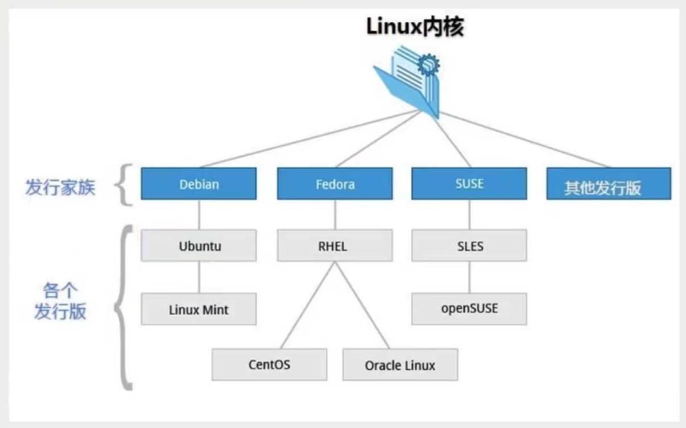
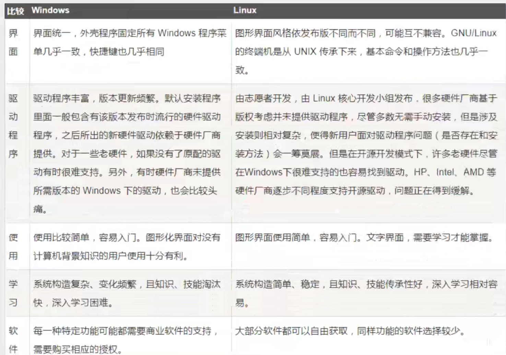

# Linux

## 前言

### 内容概要

为何学linux：

- 学完springcloud后，像消息队列（kafka，RabbitMQ，RockeetMQ），缓存(Redis)，搜索引擎(ES)，分布式集群(需要购买多台服务器，如果没有多台服务器就得用虚拟机)等工作不是单机上能完成的，所以要学linux。

常用操作系统：

- windows
- mac
- linux（学生用Ubantu比较多）（CentOS社区版）（RedHat要收费）

本课程：

- 基于CentOS 7版本的学习。CentOS6和7差别很大。
- 针对java全栈开发的linux，不是运维级别（linux学更深）。

学习方式：

1. 认识linux
   - linux一切都是文件：文件就有“读，写，（权限）”等知识
2. 基本的命令学习
   - git中会有一些基本的命令：
     - 文件操作，目录管理，文件属性，Vim编辑器，账号管理，磁盘管理
3. 软件的安装和部署
   - java，tomcat，docker

学习资料：

- 资料同步到狂神公众号上了。

### 入门概述

https://www.bilibili.com/video/BV187411y7hF?p=2

为什么学习linux？：

- linux诞生了这么多年，以前还喊着如何能取代windows系统，现在这个口号已经小多了，任何事物发展都有其局限性都有其天花板。就如同在国内再搞一个社交软件取代腾讯一样，想想而已基本不可能，因为用户已经习惯于使用微信交流，不是说技术上实现不了解而是老百姓已经习惯了，想让他们不用，即使他们自己不用亲戚朋友还是要用，没有办法的事情。
- 用习惯了windows操作系统，再让大家切换到别的操作系统基本上是不可能的事情，改变一个人已经养成的习惯太难。没有办法深入到普通老百姓的生活中，并不意味着linux就没有用武之地了。在服务器端，在开发领域linux倒是越来越受欢迎、
- 很多程序员都觉得不懂点linux都觉得不好意思., linux在开源社区的地位依然岿然不动。尤其是作为一个后端程序员，是必须要掌握Linux的，因为这都成为了你找工作的基础门槛了，所以不得不学习。

- 所有的Java岗位都需要学握Linux的基本使用!
- 很多的大型项目都是部署在Linur服务器上!

linux简介：

- Linux内核最初只是由芬兰人林纳斯·托瓦兹(Linus Torvalds )在赫尔辛基大学上学时出于个人爱好而编写的。

- Linux是一套免费使用和自由传播的类Unix操作系统（MacOS也是），是一个基于POSIX(可移植操作系统接口）和UNIX的多用户、多任务、支持多线程和多CPU的操作系统。

- Linux能运行主要的UNIX工具软件、应用程序和网络协议。它支持32位和64位硬件。**Linux继承了Unix以网络为核心的设计思想**，是一个性能稳定的多用户网络操作系统。

Linux发行版：

- Linux的发行版说简单点就是将Linux内核与应用软件做一个打包。

- 各版本图示：

  

- 目前市面上较知名的发行版有:Ubuntu、RedHat、CentOS、Debian、Fedora、SuSE、OpenSUSE、Arch Linux、SolusOS等。
  - kali linux安全渗透测试使用，有兴趣做安全的可以了解一下。
  - 可以考”红帽认证工程师“，认证linux技能，要交费。有网友说这个整数含金量一般般。

- 本课程使用CentOs，阿里云买服务器的时候也要选CentOS系统的版本。

linux应用领域：

- 今天各种场合都有使用各种Linux发行版，从嵌入式设备到超级计算机，并且在服务器领域确定了地位，通常服务器使用LAMPl( Linux + Apache + MySQL +PHP)或LNMP ( Linux + Nginx+ MySQL + PHP )组合。
- 目前Linux不仅在家庭与企业中使用，并且在政府中也很受欢迎。
  - 巴西联邦政府由于支持Linux而世界闻名。
  - 有新闻报道俄罗斯军队自己制造的Linux发布版的，做为G.H.ost项目已经取得成果。
  - 印度的Kerala联邦计划在向全联邦的高中推广使用Linux。
  - 中华人民共和国为取得技术独立，在龙芯处理器中排他性地使用Linux。
  - 在西班牙的一些地区开发了自己的Linux发布版，并且在政府与教育领域广泛使用，如Extremadura地区的gnuLinEx和Andalusia地区的Guadalinex。
  - 葡萄牙同样使用自己的Linux发布版Caixa Magica，用于Magalh?es笔记本电脑和e-escola政府软件。
  - 法国和德国同样开始逐步采用Linux。

linux VS Windwos

- 图示：

  

- 服务器上都是用linux命令行。

### VMWare本地安装CentOS7（准备工作）

#### 基础知识

Linux的安装，安装步骤比较繁琐（操作系统本身也是一个软件），现在其实云服务器挺普遍的，价格也便宜，如果直接不想搭建，也可以直接买一台学习用用!

安装CentOS(在本地安装，这个不太建议，如果没有经济来源的话，可以考虑在本地搭建)

Linux是一个系统，直接在电脑上安装的话会替换掉windows操作系统。所以有两种本地安装方案：

1. 电脑安装成双系统。但是这样会占用一些资源，不太好。
2. 安装虚拟机，在虚拟机中使用linux系统。这个比较常见。

#### 虚拟机+linux方案

下载vmware（收费）。

在虚拟机上下载centos

- 可以通过[镜像](: http://mirrors.aliyun.com/centos/7lisos/x8664/ ),下载完成后安装即可!
  - 安装操作系统和安装软件是一样的，注意：linux磁盘分区的时候注意分区名即可。

### 购买云服务器

云服务器就是一个远程电脑，服务器一般不会关机。
虚拟机安装后占用空间，也会有些卡顿，我们作为程序员其实可以选择购买一台自己的服务器，这样的话更加接近真实线上工作;

步骤：

1. 阿里云购买服务器
2. 购买完毕后，获取服务器的ip地址，重置服务器密码，就可以远程登录了
   - 点击“控制台”-》“云服务器ECS”-》点击自己的服务器-》在“实例”页面可以看到自己服务器的公网ip。
   - 修改服务器连接密码（新手教程有教）。

3. 下载xShell工具，进行远程连接；使用!XFtp从本地上传文件到远程linux服务器。这两者可以去官网，用学生账号下载学生版apk，并且apk貌似用不过期，只是性能比正式版低。
   - 注意连接前，确认宝塔管理页面+阿里云安全组把22端口打开，不然xshell无法连接。21也打开，才能连XFtp。

注意事项∶

- 如果要打开端口，需要在阿里云的安全组面板中开启对应的出入规则，不然的话会被阿里拦截!

tips：

1. control+鼠标滚轮：放大和缩小字体。

2. 上传文件用XFtp即可。

   

   - 用宝塔上传文件可能会乱码，用xshell更稳一点。

3. `cd /`进入根目录，`ls`展示当前级所有文件（夹），`clear`清屏。

## 开机关机和基本目录介绍

https://www.bilibili.com/video/BV187411y7hF?p=5&spm_id_from=pageDriver
