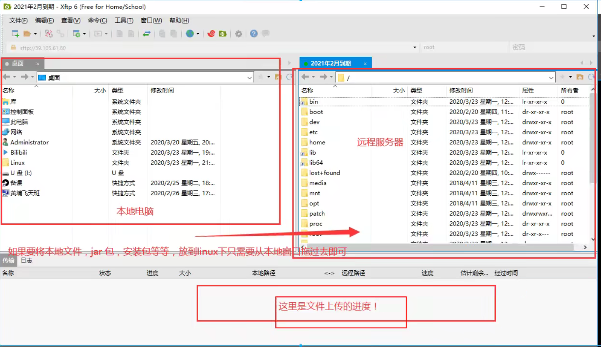
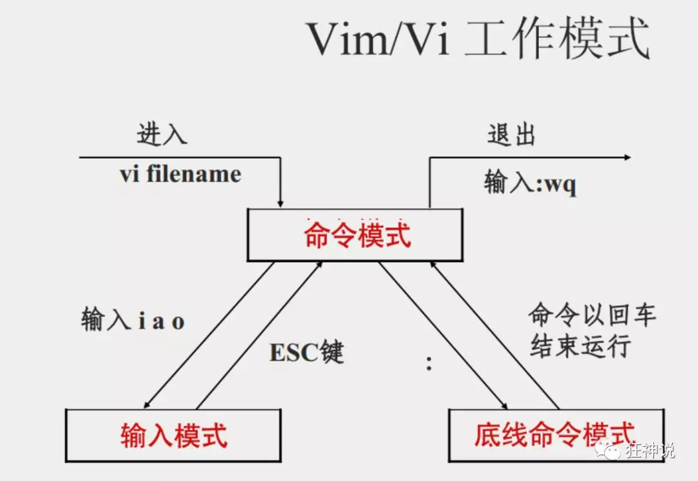
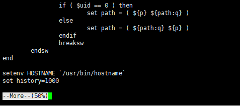

# Linux

http://mp.weixin.qq.com/mp/homepage?__biz=Mzg2NTAzMTExNg==&hid=2&sn=1650b6338f6469ca519b080fdbbbd333&scene=18#wechat_redirect


网友推荐

- 韩顺平Linux永远的神


## 前言

### 内容概要

为何学linux：

- 学完springcloud后，像消息队列（kafka，RabbitMQ，RockeetMQ），缓存(Redis)，搜索引擎(ES)，分布式集群(需要购买多台服务器，如果没有多台服务器就得用虚拟机)等工作不是单机上能完成的，所以要学linux。


常用操作系统：

- windows
- mac
- linux（学生用Ubantu比较多）（CentOS社区版）（RedHat要收费）


本课程：

- 基于CentOS 7版本的学习。CentOS6和7差别很大。
- 针对java全栈开发的linux，不是运维级别（linux学更深）。


学习方式：

1. 认识linux
   - linux一切都是文件：文件就有“读，写，（权限）”等知识
2. 基本的命令学习
   - git中会有一些基本的命令：
     - 文件操作，目录管理，文件属性，Vim编辑器，账号管理，磁盘管理
3. 软件的安装和部署
   - java，tomcat，docker


学习资料：

- 资料同步到狂神公众号上了。


### 入门概述

https://www.bilibili.com/video/BV187411y7hF?p=2

为什么学习linux？：

- linux诞生了这么多年，以前还喊着如何能取代windows系统，现在这个口号已经小多了，任何事物发展都有其局限性都有其天花板。就如同在国内再搞一个社交软件取代腾讯一样，想想而已基本不可能，因为用户已经习惯于使用微信交流，不是说技术上实现不了解而是老百姓已经习惯了，想让他们不用，即使他们自己不用亲戚朋友还是要用，没有办法的事情。
- 用习惯了windows操作系统，再让大家切换到别的操作系统基本上是不可能的事情，改变一个人已经养成的习惯太难。没有办法深入到普通老百姓的生活中，并不意味着linux就没有用武之地了。在服务器端，在开发领域linux倒是越来越受欢迎、
- 很多程序员都觉得不懂点linux都觉得不好意思., linux在开源社区的地位依然岿然不动。尤其是作为一个后端程序员，是必须要掌握Linux的，因为这都成为了你找工作的基础门槛了，所以不得不学习。

- 所有的Java岗位都需要学握Linux的基本使用!
- 很多的大型项目都是部署在Linur服务器上!


linux简介：

- Linux内核最初只是由芬兰人林纳斯·托瓦兹(Linus Torvalds )在赫尔辛基大学上学时出于个人爱好而编写的。

- Linux是一套免费使用和自由传播的类Unix操作系统（MacOS也是），是一个基于POSIX(可移植操作系统接口）和UNIX的多用户、多任务、支持多线程和多CPU的操作系统。

- Linux能运行主要的UNIX工具软件、应用程序和网络协议。它支持32位和64位硬件。**Linux继承了Unix以网络为核心的设计思想**，是一个性能稳定的多用户网络操作系统。


Linux发行版：

- Linux的发行版说简单点就是将Linux内核与应用软件做一个打包。

- 各版本图示：

  

- 目前市面上较知名的发行版有:Ubuntu、RedHat、CentOS、Debian、Fedora、SuSE、OpenSUSE、Arch Linux、SolusOS等。

  - kali linux安全渗透测试使用，有兴趣做安全的可以了解一下。
  - 可以考”红帽认证工程师“，认证linux技能，要交费。有网友说这个整数含金量一般般。

- 本课程使用CentOs，阿里云买服务器的时候也要选CentOS系统的版本。


linux应用领域：

- 今天各种场合都有使用各种Linux发行版，从嵌入式设备到超级计算机，并且在服务器领域确定了地位，通常服务器使用LAMPl( Linux + Apache + MySQL +PHP)或LNMP ( Linux + Nginx+ MySQL + PHP )组合。
- 目前Linux不仅在家庭与企业中使用，并且在政府中也很受欢迎。
  - 巴西联邦政府由于支持Linux而世界闻名。
  - 有新闻报道俄罗斯军队自己制造的Linux发布版的，做为G.H.ost项目已经取得成果。
  - 印度的Kerala联邦计划在向全联邦的高中推广使用Linux。
  - 中华人民共和国为取得技术独立，在龙芯处理器中排他性地使用Linux。
  - 在西班牙的一些地区开发了自己的Linux发布版，并且在政府与教育领域广泛使用，如Extremadura地区的gnuLinEx和Andalusia地区的Guadalinex。
  - 葡萄牙同样使用自己的Linux发布版Caixa Magica，用于Magalh?es笔记本电脑和e-escola政府软件。
  - 法国和德国同样开始逐步采用Linux。


linux VS Windwos

- 图示：

  

- 服务器上都是用linux命令行。


## 环境搭建

### VMWare本地安装CentOS7（准备工作）

#### 基础知识

Linux的安装，安装步骤比较繁琐（操作系统本身也是一个软件），现在其实云服务器挺普遍的，价格也便宜，如果直接不想搭建，也可以直接买一台学习用用!

安装CentOS(在本地安装，这个不太建议，如果没有经济来源的话，可以考虑在本地搭建)

Linux是一个系统，直接在电脑上安装的话会替换掉windows操作系统。所以有两种本地安装方案：

1. 电脑安装成双系统。但是这样会占用一些资源，不太好。
2. 安装虚拟机，在虚拟机中使用linux系统。这个比较常见。


#### 虚拟机+linux方案

下载vmware（收费）。

在虚拟机上下载centos

- 可以通过[镜像](: http://mirrors.aliyun.com/centos/7lisos/x8664/ ),下载完成后安装即可!
  - 安装操作系统和安装软件是一样的，注意：linux磁盘分区的时候注意分区名即可。


### 购买云服务器

云服务器就是一个远程电脑，服务器一般不会关机。
虚拟机安装后占用空间，也会有些卡顿，我们作为程序员其实可以选择购买一台自己的服务器，这样的话更加接近真实线上工作;


步骤：

1. 阿里云购买服务器
2. 购买完毕后，获取服务器的ip地址，重置服务器密码，就可以远程登录了
   - 点击“控制台”-》“云服务器ECS”-》点击自己的服务器-》在“实例”页面可以看到自己服务器的公网ip。
   - 修改服务器连接密码（新手教程有教）。

3. 下载xShell工具，进行远程连接；使用!XFtp从本地上传文件到远程linux服务器。这两者可以去官网，用学生账号下载学生版apk，并且apk貌似用不过期，只是性能比正式版低。
   - 注意连接前，确认宝塔管理页面+阿里云安全组把22端口打开，不然xshell无法连接。21也打开，才能连XFtp。

注意事项∶

- 如果要打开端口，需要在阿里云的安全组面板中开启对应的出入规则，不然的话会被阿里拦截!


tips：

1. control+鼠标滚轮：放大和缩小字体。

2. 上传文件用XFtp即可。

   

   - 用宝塔上传文件可能会乱码，用xshell更稳一点。

3. `cd /`进入根目录，`ls`展示当前级所有文件（夹），`clear`清屏。


## 走进linux系统

### 开机关机和基本目录介绍

#### 开机登录

开机会启动许多程序。它们在Windows叫做"服务" ( service )，在Linux就叫做"守护进程" ( dagmon )。

开机成功后，它会显示一个文本登录界面，这个界面就是我们经常看到的登录界面，在这个登录界面中会提示用户输入用户名，而用户输入的用户将作为参数传给login程序来验证用户的身份，密码是不显示的，输完回车即可!

一般来说，用户的登录方式有三种︰

- 命令行登录
- ssh登录

- 图形界面登录

最高权限账户为root，可以操作一切!


#### 关机

在linux领域内大多用在服务器上，很少遇到关机的操作。毕竟服务器上跑一个服务是永无止境的，除非特殊情况下，不得已才会关机。

关机指令为: shutdown 。具体命令如下：

- 注意，不管是**重启系统还是关闭系统**，首先要运行**sync**命令，把内存中的数据写到磁盘中。
- 记住一句话：“linux中没有输出错误即代表操作成功”

```bash
sync #将数据由内存同步到硬盘中。
shutdown # 关机指令，你可以man shutdown来看一下帮助文档。例如你可以运行如下命令关机:（不设置时限的话是关不了的）
shutdown -h 10 # 这个命令告诉大家，计算机将在10分钟后关机
shutdown -h now #立马关机
shutdown -h 20:25 #系统会在今天20∶25关机
shutdown -h +10 # 十分钟后关机
shutdown -r now #系统立马重启
shutdown -r +10 #系统十分钟后重启
reboot # 就是重启，等同于shutdown -r now
halt #关闭系统，等同于shutdown -h now和 poweroff

```


#### 系统目录结构

linux中记住：

1. 一切皆文件。
2. 根目录为`/`，所有文件都挂载在这个节点下。


登录linux系统后，在当前命令窗口输入命令:

```
ls /
```

会看到下图：

- **白色**的为文件，**蓝色**的为文件夹，
- linux中输入目录名的一部分后，按**Tab键会自动补全**


树状目录结构：


- /bin：bin是Binary的缩写, 这个目录存放着最经常使用的命令。

- /boot： 这里存放的是启动Linux时使用的一些核心文件，包括一些连接文件以及镜像文件。（不要动）

- /dev ： dev是Device(设备)的缩写, 存放的是Linux的外部设备，在Linux中访问设备的方式和访问文件的方式是相同的。

  - 插入的u盘在这可以看到。

- **/etc**： 这个目录用来存放所有的系统管理所需要的配置文件和子目录。

- **/home**：用户的主目录，在Linux中，每个用户都有一个自己的目录，一般该目录名是以用户的账号命名的。home文件夹初始为空，用户在home目录下建自己的目录。

  

- /lib：这个目录里存放着系统最基本的动态连接共享库，其作用类似于Windows里的DLL文件。（不要动）

- /lost+found：这个目录一般情况下是空的，当系统非法关机后，这里就存放了一些文件。

- /media：linux系统会自动识别一些设备，例如U盘、光驱等等，当识别后，linux会把识别的设备挂载到这个目录下。

- /mnt：系统提供该目录是为了让用户临时挂载别的文件系统的，我们可以将光驱挂载在/mnt/上，然后进入该目录就可以查看光驱里的内容了。

  - 插入的u盘在这可以看到。
  - 我们后面会把一些本地文件挂载在这个目录下。

- **/opt**：这是给主机额外安装软件所摆放的目录。比如你安装一个ORACLE数据库则就可以放到这个目录下。默认是空的。

- /proc：这个目录是一个虚拟的目录，它是系统内存的映射，我们可以通过直接访问这个目录来获取系统信息。（不用管）

- **/root**：该目录为系统管理员，也称作超级权限者的用户主目录。

- /sbin：s就是Super User的意思，这里存放的是系统管理员使用的系统管理程序。

- /srv：该目录存放一些服务启动之后需要提取的数据。

- /sys：这是linux2.6内核的一个很大的变化。该目录下安装了2.6内核中新出现的一个文件系统 sysfs 。

- **/tmp**：这个目录是用来存放一些临时文件的。 用完即丢的文件可以放在这个目录下，比如安装包。

- **/usr**：这是一个非常重要的目录，用户的很多应用程序和文件都放在这个目录下，类似于windows下的program files目录。

- /usr/bin： 系统用户使用的应用程序。

- /usr/sbin： 超级用户使用的比较高级的管理程序和系统守护程序。

- /usr/src： 内核源代码默认的放置目录。

- **/var**：这个目录中存放着在不断扩充着的东西，我们习惯将那些经常被修改的目录放在这个目录下。包括各种日志文件。

- /run：是一个临时文件系统，存储系统启动以来的信息。当系统重启时，这个目录下的文件应该被删掉或清除。（不管他）

- /www：存放服务器网站相关的资源，环境，网站的项目

  


## 常用的基本命令

### 目录管理

#### 绝对路径和相对路径

我们知道Linux的目录结构为树状结构，最顶级的目录为根目录 /。

其他目录通过挂载可以将它们添加到树中，通过解除挂载可以移除它们。

在开始本教程前我们需要先知道什么是绝对路径与相对路径。

- 绝对路径：

  路径的写法，**由根目录 / 写起**，例如：/usr/share/doc 这个目录。

- 相对路径：

  路径的写法，**不是由 / 写起**，例如由 /usr/share/doc 要到 /usr/share/man 底下时，可以写成：cd ../man 这就是相对路径的写法啦！


`cd`是切换目录命令，有三个最基本的用法：

```bash
# 返回上一级目录
cd ..
# 当前目录
cd ./
# 切换到根目录(相当于使用了绝对路径)
cd /
```

命令演示和linux命令行成分讲解如下：


#### 处理目录的常用命令

接下来我们就来看几个常见的处理目录的命令吧：

- ls: 列出目录：

  - 用法

    ```bash
    ls
    ```

  - linux中最常用的命令，因为linux不是可视化的，常常要ls去看看文件夹下有什么。

  - ls参数讲解：

    - -a参数：all，查看全部文件，包括隐藏文件。
    - -l参数：列出所有的文件，包含文件的属性和权限，没有隐藏文件。
    - **注意：所有linux命令可以组合使用**，比如可以`ls -al`可以同时看到隐藏文件+所有文件的属性和权限。

- cd：切换目录

  - cd的常见用法

    ```bash
    # 返回上一级目录(相当于使用了相对路径)
    cd ../
    # 切换到根目录(相当于使用了绝对路径)
    cd /
    # 切换到当前目录下的"son目录".可以和cd ../组合使用即cd ../brother
    cd son
    # 切换到当前的用户目录，一般即为root目录
    cd ~
    ```

  - 使用方式：`cd 目录名`

  - 目录名分为“绝对路径”和“相对路径”

    - 绝对路径都是以`/`开头的
    - 相对路径都是以`.`开头的，比如`cd ../../uncle`表示切换到“爷爷级”目录下的“uncle”目录。

- pwd：显示目前的目录

  - 用法

    ```bash
    pwd
    ```

  - 我自己尝试，打印的是绝对路径

    

- mkdir：创建一个新的目录

  - 用法

    ```bash
    # 递归创建，可以一次性创建多个层级的文件夹
    mkdir -p a/b/c
    # 简单创建一个文件夹a
    mkdir a
    ```

- rmdir：删除一个空的目录

  - 用法

    ```bash
    # 移除当前目录下的dirToBeRemoved
    rmdir dirToBeRemoved
    # 递归得同时移除目录a和b和c。注意a只能有b一个子目录，且b只能有c一个子目录时才能删除成功。
    rmdir -p a/b/c
    # 删除a目录下的b目录,就算a目录下除b以外还有其他目录也可以成功删除b
    rmdir a/b
    ```

  - 注意：被移除的文件夹必须为空

    

- cp: 复制文件或目录

  - 用法

    ```bash
    # 如果文件重复，可以选择覆盖（y）或者取消复制（n）
    cp copedFile desDir
    ```

    

- rm: 移除文件或目录

  - 常用命令

    ```bash
    # 忽略不存在的文件，不会出现警告，强制删除
    rm -f
    # 递归删除目录
    rm -r
    # 互动，删除询问是否删除
    rm -i
    # 普通删除
    rm fileOrDirName
    
    # 段子中的删库跑路:系统中的所有文件被删除。
    rm -rf
    ```

    

- mv: 移动文件与目录，或修改文件与目录的名称

  - 常用命令

    ```bash
    # 强制移动
    mv -f 
    # 只替换已经更新过的文件
    mv -u
    # 普通移动
    mv fileName desDir
    # 修改文件名
    mv nameBefore nameAfter
    ```

    

你可以使用 *man [命令]* 来查看各个命令的使用文档，如 ：man cp。


### 基本属性

#### 看懂文件属性

Linux系统是一种典型的多用户系统，不同的用户处于不同的地位，拥有不同的权限。为了保护系统的安全性，Linux系统对不同的用户访问同一文件（包括目录文件）的权限做了不同的规定。

- root用户有最高权限，zhangyun用户的权限就低一点。


在Linux中我们可以使用`ll`或者`ls –l`命令来显示一个文件的属性以及文件所属的用户和组，如：


实例中，boot文件的第一个属性用"d"表示。"d"在Linux中代表该文件是一个目录文件。


在Linux中第一个字符代表这个文件是目录、文件或链接文件等等：

- 当为[ **d** ]则是目录
- 当为[ **-** ]则是文件；
- 若是[ **l** ]则表示为链接文档 ( link file )；该行末尾会说明当前链接文档指向何处。
- 若是[ **b** ]则表示为装置文件里面的可供储存的接口设备 ( 可随机存取装置 )；
- 若是[ **c** ]则表示为装置文件里面的串行端口设备，例如键盘、鼠标 ( 一次性读取装置 )。

接下来的字符中，以三个为一组，且均为『rwx』 的三个参数的组合。

- 其中，[ r ]代表可读(read)、[ w ]代表可写(write)、[ x ]代表可执行(execute)。

- 要注意的是，这三个权限的位置不会改变，如果没有权限，就会出现减号[ - ]而已。


每个文件的属性由左边第一部分的10个字符来确定（如下图）：



从左至右用0-9这些数字来表示。

第0位确定文件类型，第1-3位确定属主（该文件的所有者即创建者）拥有该文件的权限。第4-6位确定属组（所有者的同组用户）拥有该文件的权限。第7-9位确定其他用户拥有该文件的权限。其中：

- 第1、4、7位表示读权限，如果用"r"字符表示，则有读权限，如果用"-"字符表示，则没有读权限；

- 第2、5、8位表示写权限，如果用"w"字符表示，则有写权限，如果用"-"字符表示没有写权限；

- 第3、6、9位表示可执行权限，如果用"x"字符表示，则有执行权限，如果用"-"字符表示，则没有执行权限。

对于文件来说，它都有一个特定的所有者，也就是对该文件具有所有权的用户。

同时，在Linux系统中，用户是按组分类的，一个用户属于一个或多个组。文件所有者以外的用户又可以分为文件所有者的同组用户和其他用户。因此，Linux系统按文件所有者、文件所有者同组用户和其他用户来规定了不同的文件访问权限。

在以上实例中，boot 文件是一个目录文件，属主和属组都为 root。


#### 修改文件属性

- chgrp：更改文件属组

  ```
  chgrp [-R] 属组名 文件名
  ```

  -R：递归更改文件属组，就是在更改某个目录文件的属组时，如果加上-R的参数，那么该目录下的所有文件的属组都会更改

- chown：更改文件属主，也可以同时更改文件属组

  ```
  chown [–R] 属主名 文件名
  chown [-R] 属主名：属组名 文件名
  ```

- **chmod：更改文件9个属性**(必须掌握)

  ```
  chmod [-R] xyz 文件或目录
  ```

  Linux文件属性有两种设置方法，一种是数字，一种是符号。

  Linux文件的基本权限就有九个，分别是owner/group/others三种身份各有自己的read/write/execute权限。

  先复习一下刚刚上面提到的数据：文件的权限字符为：『rwxrwxrwx』， 这九个权限是三个三个一组的！其中，我们可以使用数字来代表各个权限，各权限的分数对照表如下：

  ```
  r:4     w:2         x:1
  ```

  每种身份(owner/group/others)各自的三个权限(r/w/x)分数是需要累加的，例如当权限为：[rwxrwx---] 分数则是：

  - owner = rwx = 4+2+1 = 7
  - group = rwx = 4+2+1 = 7
  - others= --- = 0+0+0 = 0

  所以想把文件权限改成『rwxrwx---』可以用下面的命令

  ```
  chmod 770 filename
  ```

  操作截图如下：

  

  **注意最低权限管控**：`chmod 777 filename`,所有人可读可写可执行。

  网友说：公司一般都是744。


### 文件内容查看

Linux系统中使用以下命令来查看文件的内容：

- **cat** 由第一行开始显示文件内容

  - 用来读文章，或者配置文件内容，都使用cat。

  - 图示

    

- tac 从最后一行开始显示，可以看出 tac 是 cat 的倒着写！

  - 有的时候文件内容很多，想看的内容又在偏后面的位置，用tac

  - 图示

    

- **nl**  显示的时候，顺道输出行号！

  - 看代码的时候，希望输出行号（常用）

  - 图示：

    

- more 一页一页的显示文件内容

  - 尤其适合shell窗口不大的时候，一页页翻读更合适

  - **使用空格键可以翻页，enter代表向下看一行，`:f`+enter键可看到在哪个文件的第几行。**

  - 图示：

    

    按空格键后

    

    按enter键后

    

    `:f`+enter键，看到在哪个文件的第几行。

    

- **less** 与 more 类似，但是比 more 更好的是，他可以往前翻页！

  - 空格翻页，**上下键前后翻动页面**，出现END后**按`q`结束**。

  - 想在查看页面**向下**查找字符串的话可以用`/字符串`

    - 图示

      

      

      

  - 向上查询用`?字符串`

  - n向下继续搜索，N向上搜索

    

- head 只看头几行

  - 通过-n参数来控制显示几行。

  - 图示

    

- tail 只看尾巴几行

  - 通过-n参数来控制显示几行。

  - 图示：

    


可以使用 *man [命令]*来查看各个命令的使用文档，如 ：man cp。


CentOS7的网络配置目录：`etc/sysconfig/network-scripts`.

- 默认的网络配置文件是`ifcfg-eth0`

- 图示

  

- 命令`ifconfig`:查看网络配置。


### 硬链接和软链接（了解即可）

https://www.bilibili.com/video/BV187411y7hF?p=9

链接是什么：

- Linux 链接分两种，一种被称为硬链接（Hard Link），另一种被称为符号链接（Symbolic Link）也叫软链接。
  - 类比windows中，点击快捷方式能打开一个软件，这个就是链接。

- 情况下，**ln** 命令产生硬链接。


硬链接VS软链接：

- 硬链接∶A--B，假设B是A的硬链接，那么他们两个指向了同一个文件!允许一个文件拥有多个路径，用户可以通过这种机制建立硬链接到一些重要文件上，防止误删!
  - 硬链接相当于生成新的文件路径指向存储区域，A、B两个文件路径。
  - cp（复制）是在内存上在重新拷贝一个文件，用原来的硬链接无法访问新复制的文件。

- 软链接︰类似Window下的快捷方式，删除的源文件，快捷方式也访问不了!


实战测试：

touch命令创建文件。


echo输入字符串

- 这里也体现硬链接不是复制。因为复制的话，往f1输入字符串的话，硬链接f2中不该也被输入。
- f1 和 f2，无论删掉哪一个，文件都不会被删除，用以保护重要文件。
  - 个人感觉有点类似java的GC机制，一个对象有很多个引用，只有还有一个引用指向对象，对象就不会被清理；同时每个引用都可以对对象进行操作。


测试删除目录


### Vim编辑器

#### 什么是Vim编辑器

Vim是从 vi 发展出来的一个文本编辑器。代码补完、编译及错误跳转等方便编程的功能特别丰富，在程序员中被广泛使用。尤其是Linux中，必须要会使用Vim（**查看内容cat，编辑内容，保存内容**）。

- 简单的来说， vi 是老式的字处理器，不过功能已经很齐全了，但是还是有可以进步的地方；纯黑白界面。

- vim 则可以说是程序开发者的一项很好用的工具；彩色界面。
- vim可以通过一些插件，实现和IDE一样的功能。

所有的 Unix Like 系统都会内建 vi 文书编辑器，其他的文书编辑器则不一定会存在。

连 vim 的官方网站 (http://www.vim.org) 自己也说 vim 是一个程序开发工具而不是文字处理软件。

vim 键盘图：


#### 三种使用模式

基本上 vi/vim 共分为三种模式，分别是**命令模式（Command mode）**，**输入模式（Insert mode）**和**底线命令模式（Last line mode）**。这三种模式的作用分别是：


命令模式：

- 用户刚刚启动 vi/vim，便进入了命令模式。此状态下敲击键盘动作会被Vim识别为命令，而非输入字符。比如我们此时按下`i`（insert），并不会输入一个字符，i被当作了一个命令。

- 以下是常用的几个命令：
  - **i** 切换到输入模式，以输入字符。
  - **x** 删除当前光标所在处的字符。
  - **:** 切换到底线命令模式，以在最底一行输入命令。如果之前是编辑模式，需要先退出编辑模式`ESC`。

- 若想要编辑文本：启动Vim，进入了命令模式，按下i，切换到输入模式。

- 命令模式只有一些最基本的命令，因此仍要依靠底线命令模式输入更多命令。


输入模式：

- 在命令模式下按下i就进入了输入模式。

- 在输入模式中，可以使用以下按键：
  - **字符按键以及Shift组合**，输入字符
  - **ENTER**，回车键，换行
  - **BACK SPACE**，退格键，删除光标前一个字符
  - **DEL**，删除键，删除光标后一个字符
  - **方向键**，在文本中移动光标
  - **HOME**/**END**，移动光标到行首/行尾
  - **Page Up**/**Page Down**，上/下翻页
  - **Insert**，切换光标为输入/替换模式，光标将变成竖线/下划线
  - **ESC**，退出输入模式，切换到命令模式


底线命令模式：

- 在命令模式下按下:（英文冒号）就进入了底线命令模式。

- 底线命令模式可以输入单个或多个字符的命令，**可用的命令非常多**。

- 在底线命令模式中，基本的命令有（已经省略了冒号）：
  - q 退出程序
  - w 保存文件

- 按ESC键可随时退出底线命令模式。


简单的说，我们可以将这三个模式想成底下的图标来表示：


实战：

vim创建文件zhangyun.txt，初始为命令模式，不能输入。


点击i后，界面底部的图标编程insert，表示进入输入模式；现在可以输入文本或者代码了。


输入文本


按ESC退出编辑模式，底部没有insert图标了；现在是回到了命令模式。


当前是命令模式，输入`:`,进入底线命令模式，光标来到底线，在这里就可以输入一下底线命令了。


输入w为保存程序，输入q为退出程序，我们常常把两者结合使用`wq`,表示”保存并退出程序“


使用`cat`查看一下刚刚保存的“zhangyun.txt”，发现保存成功。


想重新编辑文件，再次`vim 文件全名`进入命令模式，再`i`进入输入模式即可

- 如果文件存在，就是修改这个文件；如果不存在，则会新建这个文件。
- 如果想编辑一个文件，确打开了一个新文件，那表示文件路径错了。


#### Vim 按键说明

除了上面简易范例的 i, Esc, :wq 之外，其实 vim 还有非常多的按键可以使用。

- 下面加粗的命令掌握即可。我们平时用vim最多就是修改一下文件的内容。


第一部分：

- 一般模式可用的光标移动、复制粘贴、搜索替换等

| **移动光标的方法**     | ****                                                         |
| :--------------------- | ------------------------------------------------------------ |
| **h 或 向左箭头键(←)** | 光标向左移动一个字符                                         |
| **j 或 向下箭头键(↓)** | 光标向下移动一个字符                                         |
| **k 或 向上箭头键(↑)** | 光标向上移动一个字符                                         |
| **l 或 向右箭头键(→)** | 光标向右移动一个字符                                         |
| [Ctrl] + [f]           | 屏幕『向下』移动一页，相当于 [Page Down]按键 (常用)          |
| [Ctrl] + [b]           | 屏幕『向上』移动一页，相当于 [Page Up] 按键 (常用)           |
| [Ctrl] + [d]           | 屏幕『向下』移动半页                                         |
| [Ctrl] + [u]           | 屏幕『向上』移动半页                                         |
| +                      | 光标移动到非空格符的下一行                                   |
| -                      | 光标移动到非空格符的上一行                                   |
| **n< space>**          | 那个 n 表示『数字』，例如 20 。按下数字后再按空格键，光标会向右移动这一行的 n 个字符。 |
| 0 或功能键[Home]       | 这是数字『 0 』：移动到这一行的最前面字符处 (常用)           |
| $ 或功能键[End]        | 移动到这一行的最后面字符处(常用)                             |
| H                      | 光标移动到这个屏幕的最上方那一行的第一个字符                 |
| M                      | 光标移动到这个屏幕的中央那一行的第一个字符                   |
| L                      | 光标移动到这个屏幕的最下方那一行的第一个字符                 |
| G                      | 移动到这个档案的最后一行(常用)                               |
| nG                     | n 为数字。移动到这个档案的第 n 行。例如 20G 则会移动到这个档案的第 20 行(可配合 :set nu) |
| gg                     | 移动到这个档案的第一行，相当于 1G 啊！(常用)                 |
| **n< Enter>**          | n 为数字。光标向下移动 n 行(常用)                            |

| 搜索替换  |                                                              |
| :-------- | ------------------------------------------------------------ |
| **/word** | 向光标之下寻找一个名称为 word 的字符串。例如要在档案内搜寻 vbird 这个字符串，就输入 /vbird 即可！(常用) |
| ?word     | 向光标之上寻找一个字符串名称为 word 的字符串。               |
| **n**     | 这个 n 是英文按键。代表重复前一个搜寻的动作。举例来说， 如果刚刚我们执行 /vbird 去向下搜寻 vbird 这个字符串，则按下 n 后，会向下继续搜寻下一个名称为 vbird 的字符串。如果是执行 ?vbird 的话，那么按下 n 则会向上继续搜寻名称为 vbird 的字符串！ |
| **N**     | 这个 N 是英文按键。与 n 刚好相反，为『反向』进行前一个搜寻动作。例如 /vbird 后，按下 N 则表示『向上』搜寻 vbird 。 |

| 删除、复制与粘贴 | （这个其实xshell和其他远程连接工具都能直接鼠标右键操作，用到的机会不多） |
| :--------------- | ------------------------------------------------------------ |
| x, X             | 在一行字当中，x 为向后删除一个字符 (相当于 [del] 按键)， X 为向前删除一个字符(相当于 [backspace] 亦即是退格键) (常用) |
| nx               | n 为数字，连续向后删除 n 个字符。举例来说，我要连续删除 10 个字符， 『10x』。 |
| dd               | 删除游标所在的那一整行(常用)                                 |
| ndd              | n 为数字。删除光标所在的向下 n 行，例如 20dd 则是删除 20 行 (常用) |
| d1G              | 删除光标所在到第一行的所有数据                               |
| dG               | 删除光标所在到最后一行的所有数据                             |
| d$               | 删除游标所在处，到该行的最后一个字符                         |
| d0               | 那个是数字的 0 ，删除游标所在处，到该行的最前面一个字符      |
| yy               | 复制游标所在的那一行(常用)                                   |
| nyy              | n 为数字。复制光标所在的向下 n 行，例如 20yy 则是复制 20 行(常用) |
| y1G              | 复制游标所在行到第一行的所有数据                             |
| yG               | 复制游标所在行到最后一行的所有数据                           |
| y0               | 复制光标所在的那个字符到该行行首的所有数据                   |
| y$               | 复制光标所在的那个字符到该行行尾的所有数据                   |
| p, P             | p 为将已复制的数据在光标下一行贴上，P 则为贴在游标上一行！举例来说，我目前光标在第 20 行，且已经复制了 10 行数据。则按下 p 后， 那 10 行数据会贴在原本的 20 行之后，亦即由 21 行开始贴。但如果是按下 P 呢？那么原本的第 20 行会被推到变成 30 行。(常用) |
| J                | 将光标所在行与下一行的数据结合成同一行                       |
| c                | 重复删除多个数据，例如向下删除 10 行，[ 10cj ]               |
| **u**            | 复原前一个动作。(常用)，相当于windows系统中的“撤销”。        |
| [Ctrl]+r         | 重做上一个动作。(常用)                                       |


第二部分：

- 一般模式切换到编辑模式的可用的按钮说明

| 进入输入或取代的编辑模式 |                                                              |
| :----------------------- | ------------------------------------------------------------ |
| **i, I**                 | 进入输入模式(Insert mode)：i 为『从目前光标所在处输入』， I 为『在目前所在行的第一个非空格符处开始输入』。(常用) |
| a, A                     | 进入输入模式(Insert mode)：a 为『从目前光标所在的下一个字符处开始输入』， A 为『从光标所在行的最后一个字符处开始输入』。(常用) |
| o, O                     | 进入输入模式(Insert mode)：这是英文字母 o 的大小写。o 为『在目前光标所在的下一行处输入新的一行』；O 为在目前光标所在处的上一行输入新的一行！(常用) |
| r, R                     | 进入取代模式(Replace mode)：r 只会取代光标所在的那一个字符一次；R会一直取代光标所在的文字，直到按下 ESC 为止；(常用) |
| **[Esc]**                | 退出编辑模式，回到一般模式中(常用)                           |


第三部分：

- 一般模式切换到指令行模式的可用的按钮说明

| 指令行的储存、离开等指令                                     |                                                              |
| :----------------------------------------------------------- | ------------------------------------------------------------ |
| :w                                                           | 将编辑的数据写入硬盘档案中(常用)                             |
| :w!                                                          | 若文件属性为『只读』时，强制写入该档案。不过，到底能不能写入， 还是跟你对该档案的档案权限有关啊！ |
| :q                                                           | 离开 vi (常用)                                               |
| :q!                                                          | 若曾修改过档案，又不想储存，使用 ! 为强制离开不储存档案。    |
| 注意一下啊，那个惊叹号 (!) 在 vi 当中，常常具有『强制』的意思～ |                                                              |
| **:wq**                                                      | 储存后离开，若为 :wq! 则为强制储存后离开 (常用)              |
| ZZ                                                           | 这是大写的 Z 喔！若档案没有更动，则不储存离开，若档案已经被更动过，则储存后离开！ |
| :w [filename]                                                | 将编辑的数据储存成另一个档案（类似另存新档）                 |
| :r [filename]                                                | 在编辑的数据中，读入另一个档案的数据。亦即将 『filename』 这个档案内容加到游标所在行后面 |
| :n1,n2 w [filename]                                          | 将 n1 到 n2 的内容储存成 filename 这个档案。                 |
| :! command                                                   | 暂时离开 vi 到指令行模式下执行 command 的显示结果！例如 『:! ls /home』即可在 vi 当中看 /home 底下以 ls 输出的档案信息！ |
| **:set nu**                                                  | 显示行号，设定之后，会在每一行的前缀显示该行的行号。代码中经常使用。 |
| :set nonu                                                    | 与 set nu 相反，为取消行号！                                 |


### 账号管理

一般在公司里都不是root账户。

#### 简介

 Linux系统是一个多用户多任务的分时操作系统，任何一个要使用系统资源的用户，都必须首先向系统管理员申请一个账号，然后以这个账号的身份进入系统。

用户的账号一方面可以帮助系统管理员对使用系统的用户进行跟踪，并控制他们对系统资源的访问；另一方面也可以帮助用户组织文件，并为用户提供安全性保护。

每个用户账号都拥有一个唯一的用户名和各自的口令。

用户在登录时键入正确的用户名和口令后，就能够进入系统和自己的主目录。

实现用户账号的管理，要完成的工作主要有如下几个方面：

- 用户账号的添加、删除与修改。
- 用户口令的管理。
- 用户组的管理。


#### 用户账号的管理

用户账号的管理工作主要涉及到用户账号的添加、修改和删除。

添加用户账号就是在系统中创建一个新账号，然后为新账号分配用户号、用户组、主目录和登录Shell等资源。


#### useradd命令 添加用户

```
useradd 选项 用户名
```

参数说明：

- 选项 :

- - -c comment 指定一段注释性描述。

  - -d 目录 指定用户主目录，如果此目录不存在，则同时使用-m选项，可以创建主目录。

  - -g 用户组 指定用户所属的用户组。

  - -G 用户组，用户组 指定用户所属的附加组。

  - **-m**　自动创建当前这个用户的主目录“/home/zhangyun”

    ```bash
    [root@iZ0jlcopilt3wjnah5b0e7Z home]# rm -rf f2 f3 test1 test2 zhangyun.txt
    [root@iZ0jlcopilt3wjnah5b0e7Z home]# ls
    redis  www  zhangyun
    # 创建一个用户zhangyunBUPT
    [root@iZ0jlcopilt3wjnah5b0e7Z home]# useradd -m zhangyunBUPT
    # 这里可以看到添加成功
    [root@iZ0jlcopilt3wjnah5b0e7Z home]# ls
    redis  www  zhangyun  zhangyunBUPT
    [root@iZ0jlcopilt3wjnah5b0e7Z home]# 
    
    ```

  - -s Shell文件 指定用户的登录Shell。

  - -u 用户号 指定用户的用户号，如果同时有-o选项，则可以重复使用其他用户的标识号。

- 用户名 :

- - 指定新账号的登录名。


理解一下本质：: Linux中一切皆文件，这里的添加用户说白了就是往某一个文件中（本例的文件为`/etc/passwd`）写入用户的信息了!


#### userdel命令 删除用户

```bash
# 删除用户的时候，将他的目录页一并删除
userdel -r zhangyunBUPT
```

实战

```bash
[root@iZ0jlcopilt3wjnah5b0e7Z home]# ls
redis  www  zhangyun  zhangyunBUPT
[root@iZ0jlcopilt3wjnah5b0e7Z home]# userdel -r zhangyunBUPT
[root@iZ0jlcopilt3wjnah5b0e7Z home]# ls
redis  www  zhangyun
```


#### usermod命令 修改用户

```bash
# 第一个?表示useradd命令中讲解过的那些选项，第二个？表示选项要设置的内容
usermod -? ? zhangyunBUPT
```


实例：

可以看到用户目录被成功修改


#### 切换用户

1.切换用户的命令为：su username 【username是你的用户名哦】

2.从普通用户切换到root用户，还可以使用命令：sudo su

3.在终端输入exit或logout或使用快捷方式ctrl+d，可以退回到原来用户，其实ctrl+d也是执行的exit命令

4.在切换用户时，如果想在切换用户之后使用新用户的工作环境，可以在su和username之间加-，例如：【su - root】

$表示普通用户

\#表示超级用户，也就是root用户


命令行讲解：

- `#`表示超级用户


实战切换用户：


切换回原本目录


修改主机名：

```
# 执行命令后要重启连接
hostname newName
```

实战：


重新连接（xshell中双击页面标签）后


#### 用户密码设置

超级用户修改某个用户的密码：

```bash
[root@zhangyun ~]# passwd zhangyunBUPT
Changing password for user zhangyunBUPT.
# linux中密码是不会显示的
New password: 
# 提示密码太短是一个坏密码，但是我再坚持输入一次就行。
BAD PASSWORD: The password is shorter than 8 characters
Retype new password: 
passwd: all authentication tokens updated successfully.
```

xshell新开页面，使用账号密码，去连接新建的用户zhangyunBUPT


双击新会话弹出弹窗


普通用户修改自己的密码

```bash
[zhangyunBUPT@zhangyun ~]$ passwd
Changing password for user zhangyunBUPT.
Changing password for zhangyunBUPT.
# 系统提示输入当前密码
(current) UNIX password: 
# 系统提示输入新密码，注意普通用户自定义密码时密码不能太简单；root用户可以任意定义任何用户的密码，甚至定义为简单密码。
New password: 
BAD PASSWORD: The password is too similar to the old one
New password: 
BAD PASSWORD: The password is too similar to the old one
New password: 
BAD PASSWORD: The password is shorter than 8 characters
passwd: Have exhausted maximum number of retries for service
```


#### 锁定账户

比如张三辞职，root用户就冻结张三账号，一旦冻结，张三就不能登录系统了

```bash
# 锁定用户后，用户不能登录
passwd -l zhangyunBUPT
# 没有密码也不能登录
passwd -d zhangyunBUPT
```

实战：

root用户先锁zhangyunBUPT


xshell尝试重连zhangyunBUPT失败


在公司中，开发一般触碰不到root用户


### 用户组管理

https://www.bilibili.com/video/BV187411y7hF?p=12

每个用户都有一个用户组，系统可以对一个用户组中的所有用户进行集中管理(开发，测试，运维，root)。不同Linux 系统对用户组的规定有所不同，如Linux下的用户属于与它同名的用户组，这个用户组在创建用户时同时创建。

用户组的管理涉及用户组的添加、删除和修改。**组的增加、删除和修改本质上就是对/etc/group文件的更新。**


#### 创建一个用户组groupadd

先简单建一个组“zhangyun”：

```bash
# 创建组
[root@zhangyun ~]# groupadd zhangyun
# 查看组文件中有没有自己新增的组，同时可以看到组的id号
[root@zhangyun ~]# cat /etc/group
```


创建完用户组后可以得到一个组的id，这个id是可以指定的，如果不指定id则id默认是自增的。

这里再创建一个组，创建的同时指定id：

```bash
[root@zhangyun ~]# groupadd -g 520  zhangyun2
[root@zhangyun ~]# cat /etc/group
```


#### 删除用户组groupdel

```bash
# 删除用户组
[root@zhangyun ~]# groupdel zhangyun2
# 查看组文件
[root@zhangyun ~]# cat /etc/group
```


#### 修改用户组groupmod

```bash
# -g表示修改组id，-n表示修改组名，最后的zhangyunBUPT表示要被修改的组
[root@zhangyun ~]# groupmod -g 666 -n newZhangyunBUPT zhangyunBUPT 
# 查看组信息
[root@zhangyun ~]# cat /etc/group
```


#### 切换用户组

如果一个用户同时属于多个用户组，那么用户可以在用户组之间切换，以便具有其他用户组的权限。

用户可以在登录后，使用命令newgrp切换到其他用户组，这个命令的参数就是目的用户组。例如：

```bash
$ newgrp root
```

这条命令将当前用户切换到root用户组，前提条件是root用户组确实是该用户的主组或附加组。


#### 文件的查看

***（这是拓展内容，了解一下，会用即可。）***

完成用户管理的工作有许多种方法，但是每一种方法实际上都是对有关的系统文件进行修改。

与用户和用户组相关的信息都存放在一些系统文件中，这些文件包括/etc/passwd, /etc/shadow, /etc/group等。

下面分别介绍这些文件的内容。

##### /etc/passwd

**/etc/passwd文件是用户管理工作涉及的最重要的一个文件。**

Linux系统中的每个用户都在/etc/passwd文件中有一个对应的记录行，它记录了这个用户的一些基本属性。

这个文件对所有用户都是可读的。它的内容类似下面的例子：

```bash
＃ cat /etc/passwd

root:x:0:0:Superuser:/:
daemon:x:1:1:System daemons:/etc:
bin:x:2:2:Owner of system commands:/bin:
sys:x:3:3:Owner of system files:/usr/sys:
adm:x:4:4:System accounting:/usr/adm:
uucp:x:5:5:UUCP administrator:/usr/lib/uucp:
auth:x:7:21:Authentication administrator:/tcb/files/auth:
cron:x:9:16:Cron daemon:/usr/spool/cron:
listen:x:37:4:Network daemon:/usr/net/nls:
lp:x:71:18:Printer administrator:/usr/spool/lp:
```

从上面的例子我们可以看到，/etc/passwd中一行记录对应着一个用户，每行记录又被冒号(:)分隔为7个字段，其格式和具体含义如下：

```
用户名:口令(登录密码，我们不可见):用户标识号:组标识号:注释性描述:主目录:登录Shell
```

1）"用户名"是代表用户账号的字符串。

通常长度不超过8个字符，并且由大小写字母和/或数字组成。登录名中不能有冒号(:)，因为冒号在这里是分隔符。

为了兼容起见，登录名中最好不要包含点字符(.)，并且不使用连字符(-)和加号(+)打头。

2）“口令”一些系统中，存放着加密后的用户口令字。

虽然这个字段存放的只是用户口令的加密串，不是明文，但是由于/etc/passwd文件对所有用户都可读，所以这仍是一个安全隐患。因此，现在许多Linux 系统（如SVR4）都使用了shadow技术，把真正的加密后的用户口令字存放到**/etc/shadow**文件中，而在/etc/passwd文件的口令字段中只存放一个特殊的字符，例如“x”或者“*”。

3）“用户标识号”是一个整数，系统内部用它来标识用户。

一般情况下它与用户名是一一对应的。如果几个用户名对应的用户标识号是一样的，系统内部将把它们视为同一个用户，但是它们可以有不同的口令、不同的主目录以及不同的登录Shell等。

通常用户标识号的取值范围是0～65 535。0是超级用户root的标识号，1～99由系统保留，作为管理账号，普通用户的标识号从100开始。在Linux系统中，这个界限是500。

4）“组标识号”字段记录的是用户所属的用户组。

它对应着/etc/group文件中的一条记录。

5)“注释性描述”字段记录着用户的一些个人情况。

例如用户的真实姓名、电话、地址等，这个字段并没有什么实际的用途。在不同的Linux 系统中，这个字段的格式并没有统一。在许多Linux系统中，这个字段存放的是一段任意的注释性描述文字，用作finger命令的输出。

6)“主目录”，也就是用户的起始工作目录。

它是用户在登录到系统之后所处的目录。在大多数系统中，各用户的主目录都被组织在同一个特定的目录下，而用户主目录的名称就是该用户的登录名。各用户对自己的主目录有读、写、执行（搜索）权限，其他用户对此目录的访问权限则根据具体情况设置。

7)用户登录后，要启动一个进程，负责将用户的操作传给内核，这个进程是用户登录到系统后运行的命令解释器或某个特定的程序，即Shell。

Shell是用户与Linux系统之间的接口。Linux的Shell有许多种，每种都有不同的特点。常用的有sh(Bourne Shell), csh(C Shell), ksh(Korn Shell), tcsh(TENEX/TOPS-20 type C Shell), bash(Bourne Again Shell)等。

系统管理员可以根据系统情况和用户习惯为用户指定某个Shell。如果不指定Shell，那么系统使用sh为默认的登录Shell，即这个字段的值为/bin/sh。

用户的登录Shell也可以指定为某个特定的程序（此程序不是一个命令解释器）。

利用这一特点，我们可以限制用户只能运行指定的应用程序，在该应用程序运行结束后，用户就自动退出了系统。有些Linux 系统要求只有那些在系统中登记了的程序才能出现在这个字段中。

8)系统中有一类用户称为伪用户（pseudo users）。

这些用户在/etc/passwd文件中也占有一条记录，但是不能登录，因为它们的登录Shell为空。它们的存在主要是方便系统管理，满足相应的系统进程对文件属主的要求。

常见的伪用户如下所示：

```
伪 用 户 含 义
bin 拥有可执行的用户命令文件
sys 拥有系统文件
adm 拥有帐户文件
uucp UUCP使用
lp lp或lpd子系统使用
nobody NFS使用
```

##### /etc/shadow

1. 除了上面列出的伪用户外，还有许多标准的伪用户，例如：audit, cron, mail, usenet等，它们也都各自为相关的进程和文件所需要。

   由于/etc/passwd文件是所有用户都可读的，如果用户的密码太简单或规律比较明显的话，一台普通的计算机就能够很容易地将它破解，因此对安全性要求较高的Linux系统都把加密后的口令字分离出来，单独存放在一个文件中，这个文件是/etc/shadow文件。有超级用户才拥有该文件读权限，这就保证了用户密码的安全性。

2. /etc/shadow中的记录行与/etc/passwd中的一一对应，它由pwconv命令根据/etc/passwd中的数据自动产生

   它的文件格式与/etc/passwd类似，由若干个字段组成，字段之间用":"隔开。这些字段是：

   ```
   登录名:加密口令:最后一次修改时间:最小时间间隔:最大时间间隔:警告时间:不活动时间:失效时间:标志
   ```

   1. "登录名"是与/etc/passwd文件中的登录名相一致的用户账号
   2. "口令"字段存放的是加密后的用户口令字，长度为13个字符。如果为空，则对应用户没有口令，登录时不需要口令；如果含有不属于集合 { ./0-9A-Za-z }中的字符，则对应的用户不能登录。
   3. "最后一次修改时间"表示的是从某个时刻起，到用户最后一次修改口令时的天数。时间起点对不同的系统可能不一样。例如在SCO Linux 中，这个时间起点是1970年1月1日。
   4. "最小时间间隔"指的是两次修改口令之间所需的最小天数。
   5. "最大时间间隔"指的是口令保持有效的最大天数。
   6. "警告时间"字段表示的是从系统开始警告用户到用户密码正式失效之间的天数。
   7. "不活动时间"表示的是用户没有登录活动但账号仍能保持有效的最大天数。
   8. "失效时间"字段给出的是一个绝对的天数，如果使用了这个字段，那么就给出相应账号的生存期。期满后，该账号就不再是一个合法的账号，也就不能再用来登录了。

##### /etc/group

用户组的所有信息都存放在/etc/group文件中。

将用户分组是Linux 系统中对用户进行管理及控制访问权限的一种手段。

每个用户都属于某个用户组；一个组中可以有多个用户，一个用户也可以属于不同的组。

当一个用户同时是多个组中的成员时，在/etc/passwd文件中记录的是用户所属的主组，也就是登录时所属的默认组，而其他组称为附加组。

用户要访问属于附加组的文件时，必须首先使用newgrp命令使自己成为所要访问的组中的成员。

用户组的所有信息都存放在/etc/group文件中。此文件的格式也类似于/etc/passwd文件，由冒号(:)隔开若干个字段，这些字段有：

```
组名:口令:组标识号:组内用户列表
```

1. "组名"是用户组的名称，由字母或数字构成。与/etc/passwd中的登录名一样，组名不应重复。
2. "口令"字段存放的是用户组加密后的口令字。一般Linux 系统的用户组都没有口令，即这个字段一般为空，或者是*。
3. "组标识号"与用户标识号类似，也是一个整数，被系统内部用来标识组。
4. "组内用户列表"是属于这个组的所有用户的列表/b]，不同用户之间用逗号(,)分隔。这个用户组可能是用户的主组，也可能是附加组。


### 磁盘管理

#### 概述

Linux磁盘管理好坏直接关系到整个系统的性能问题。

Linux磁盘管理常用命令为 df、du。

- df ：列出文件系统的整体磁盘使用量
  - df他比du强的地方就是能够看到已经删除的文件，而且计算大小的时候，把这一部分的空间也加上了，更精确了。当文件系统也确定删除了该文件后，这时候du与df就一致了。
- du：检查磁盘空间使用量


#### df

df命令参数功能：检查文件系统的磁盘空间占用情况。可以利用该命令来获取硬盘被占用了多少空间，目前还剩下多少空间等信息。

语法：

```
df [-ahikHTm] [目录或文件名]
```

选项与参数：

- -a ：列出所有的文件系统，包括系统特有的 /proc 等文件系统；
- -k ：以 KBytes 的容量显示各文件系统；
- -m ：以 MBytes 的容量显示各文件系统；
- -h ：以人们较易阅读的 GBytes, MBytes, KBytes 等格式自行显示；
- -H ：以 M=1000K 取代 M=1024K 的进位方式；
- -T ：显示文件系统类型, 连同该 partition 的 filesystem 名称 (例如 ext3) 也列出；
- -i ：不用硬盘容量，而以 inode 的数量来显示

测试：


```
# 将 /etc 底下的可用的磁盘容量以易读的容量格式显示

[root@zhangyun /]# df -h /etc
Filesystem     Size Used Avail Use% Mounted on
/dev/vda1       40G  6.3G   32G  17% /
```

#### du

https://www.bilibili.com/video/BV187411y7hF?p=13&spm_id_from=pageDriver

3.32

Linux du命令也是查看使用空间的，但是与df命令不同的是Linux du命令是对文件和目录磁盘使用的空间的查看，还是和df命令有一些区别的，这里介绍Linux du命令。

语法：

```
du [-ahskm] 文件或目录名称
```

选项与参数：

- -a ：列出所有的文件与目录容量，因为默认仅统计目录底下的文件量而已。-a可以看到**子文件夹**占用的内存。
- -h ：以人们较易读的容量格式 (G/M) 显示；
- -s ：列出总量而已，而不列出每个各别的目录占用容量；
- -S ：不包括子目录下的总计，与 -s 有点差别。
- -k ：以 KBytes 列出容量显示；
- -m ：以 MBytes 列出容量显示；

测试：


想看根目录下各文件夹的小，来清理垃圾的话：


#### 磁盘挂载与卸除

根文件系统之外的其他文件要想能够被访问，都必须通过“关联”至根文件系统上的某个目录来实现，此关联操作即为“挂载”，此目录即为“挂载点”,解除此关联关系的过程称之为“卸载”

Linux 的磁盘挂载使用mount命令，卸载使用umount命令。

磁盘挂载语法：

```
mount [-t 文件系统] [-L Label名] [-o 额外选项] [-n] 装置文件名 挂载点
```

测试：


磁盘卸载命令 umount 语法：

```
umount [-fn] 装置文件名或挂载点
```

选项与参数：

- -f ：强制卸除！可用在类似网络文件系统 (NFS) 无法读取到的情况下；
- -n ：不升级 /etc/mtab 情况下卸除。


除了这个之外，以后我们安装了JDK，其实可以使用java中的一些命令来查看信息!


### 进程管理

对于我们开发人员来说，其实Linux更多偏向于使用即可!

#### 什么是进程

1、在Linux中，每一个程序都是有自己的一个进程，每一个进程都有一个id号!

2、每一个进程呢，都会有一个父进程!

3、进程可以有两种存在方式:前台!后台运行!

4、一般的话服务都是后台运行的，基本的程序都是前台运行的!

#### 命令

**ps**查看当前系统中正在执行的各种进程的信息!

ps -xx :

- -a 显示当前终端运行的所有的进程信息（当前的进程一个)
- -u以用户的信息显示进程
- -x显示后台运行进程的参数!

```bash
# ps -aux查看所有的进程
ps -aux | grep mysql
#│在Linux这个叫做管道符A|B
#grep 查找文件中符合条件的字符串!过滤的作用。
```

对于我们来说，这里目前只需要记住一个命令即可**ps -xx|grep 进程名字**。过滤进程信息。


**ps -ef :可以查看到父进程的信息**

```bash
ps -ef|grep mysql 

# 看父进程我们一般可以通过目录树结构来查看!(推荐)
#进程树!-p显示父id,-u显示用户组
pstree -pu
```


- 找不到pstree命令的，CentOS默认没安装这个东西，yum -y install psmisc安装一下就好了


结束进程︰杀掉进程，等价于window结束任务,表示强制结束该进程。
命令如下：

```bash
kill -9 进程的id
```

云服务器上的进程很少杀，但是啊，我们平时写的一个Java代码死循环了，可以选择结束进程!杀进程


### 总结

Linux中一切皆文件

- 文件∶
  - 读
  - 写
  - 执行
  - 权限
    - 用户
    - 用户组
  - 其他对文件的操作如：查看，创建，删除，移动，复制，编辑

linux是一个系统

- 系统∶
  - 磁盘
  - 进程


## 环境安装

安装软件一般有三种方式:

- rpm ( Jdk:在线发布一个SringBoot项目)
- 解压缩( tomcat，启动并通过外网访问，发布网站)
- yum在线安装( docker:直接安装运行跑起来docker就可以!) !

### JDK安装（rpm法）

思路：

1. 检测当前系统是否存在java环境：java -version

   - 如果有的话就需要卸载

     - 宝塔安装tomcat的自带了Jdk 如果安的是tomcat8以上就是JDK8，以下是7。
     - 自带的是用宝塔安装tomca t时安装的

   - 卸载jdk的命令

     ```bash
     # 先检测jdk的版本信息。比如查到版本是jdk_8
     rpm -qa|grep jdk
     # 移除，注意nodeps前是两个横杠。
     rpm -e --nodeps jdk_8
     # 卸载完毕后即可安装java
     ```

2. 安装java

   ```bash
   rpm -ivk rpm包
   ```

3. 配置环境变量


实战：

我们开发java程序必须要的环境!

1. 下载JDK rpm，并上传。

   下载JDK rpm，去[oralce官网](https://www.oracle.com/java/technologies/downloads/#java8)下载即可

   

   使用XFTP把下载的rpm文件，上传到/home/zhangyun(用户目录)

   

   使用xshell查看自己上传的文件

   

2. 安装java环境

   先检查当前环境是否有java环境

   ```
   java -version
   ```

   

   还真有，应该是之前用宝塔面板安装tomcat带的，删除他

   - 注意--nodeps是两个横杠

   ```bash
   # 先检测jdk的版本信息。比如查到版本是jdk_8
   rpm -qa|grep jdk
   # 移除，注意nodeps前是两个横杠。
   rpm -e --nodeps jdk_8
   ```

   

   安装jdk.rpm包

   ```bash
   rpm -ivh jdk-8u311-linux-x64.rpm
   ```

   

   使用java -version查看是否安装成功

   

3. （这步rpm不用做）配置环境变量

   网友说“使用yum 和rpm方式安装的jdk不用配置环境变量，使用解压缩方式需要，如果按照如下步骤做了，返回会**覆盖系统路径导致错误**！！！”这个是因为本节老师配置路径时，没有集成原有路径，只要继承就不会覆盖。**配置jdk环境参考hadoop**

   ```
   vim /etc/profile
   ```

   
   
   新打开一个窗口，来查看javahome在什么位置

   - 一个文件夹下有java的bin和lib等文件夹的话，这个就是javahome目录

   

   回到原窗口的profile文件，按`i`进入编辑模式。

   

   使用键盘的下箭头来到底部

   

   输入以下信息：

   ```
   JAVA_HOME=/usr/java/jdk1.8.0_311-amd64
   CLASSPATH=%JAVA_HOME%/lib:%JAVA_HOME%/jre/lib
   PATH=$JAVA_HOME/bin:$JAVA_HOME/jre/bin
   export PATH CLASSPATH JAVA_HOME
   ```
   
   
   
   `ESC`键退出编辑来到普通命令模式，`:wq`保存修改并退出vim

   

   让配置文件生效

   ```bash
   # 执行这个命令后，etc下的profile文件就会生效
   source /etc/profile
   ```
   
4. 把springboot项目打包发布

   先本地idea运行项目，确认可以访问

   

   右上角maven-》lifecycle-》先clean（双击）-》clean完毕后再package（双击）。打包完成后，target目录下会有jar包。

   

   打开jar包所在目录，cmd运行，确保本地可以跑起来。

   

   把jar包，通过XFTP上传到`/home/zhangyun`目录下

   

   因为本springboot项目需要9000端口开启，输入下面的命令看防火墙开启了哪些端口

   ```
   firewall-cmd --list-port
   ```

   

   发现没有开启9000端口，输入下面的命令开启9000端口

   ```
   firewall-cmd --zone=public --add-port=9000/tcp --permanent
   ```

   重启防火墙使得开启端口的命令生效

   ```
   systemctl restart firewalld.service
   ```

   

   如果是阿里云服务器，还有去阿里云的安全组把端口号打开。

   

5. 执行jar包并访问网站

   在linux服务器中，存放jar包的目录下，执行jar包

   ```
   java -jar jar包名
   ```

   

   通过阿里云服务器的公网ip+自己给springboot项目配置的port号即可访问自己的网站。

   


### tomcat安装（解压法）

ssm war就需要放到tomcat中运行

1. 下载tomcat并上传

   [tomcat官网](https://tomcat.apache.org/download-90.cgi)下载即可。下 tomcat9 

   - 二进制和源代码两种格式的代码包的区别，[参考资料](https://blog.csdn.net/chihouzi/article/details/105744383#:~:text=%E6%BA%90%E4%BB%A3%E7%A0%81%E6%96%B9%E5%BC%8F%E5%92%8C%E4%BA%8C%E8%BF%9B%E5%88%B6%E5%8C%85%E6%98%AF%E8%BD%AF%E4%BB%B6%E5%8C%85%E7%9A%84%E4%B8%A4%E7%A7%8D%E5%BD%A2%E5%BC%8F%E3%80%82%20%E4%BA%8C%E8%BF%9B%E5%88%B6%E5%8C%85%E9%87%8C%E9%9D%A2%E5%8C%85%E6%8B%AC%E4%BA%86%E5%B7%B2%E7%BB%8F%E7%BB%8F%E8%BF%87%E7%BC%96%E8%AF%91%EF%BC%8C%E5%8F%AF%E4%BB%A5%E9%A9%AC%E4%B8%8A%E8%BF%90%E8%A1%8C%E7%9A%84%E7%A8%8B%20%E5%BA%8F%E3%80%82,%E4%BD%A0%E5%8F%AA%E9%9C%80%E8%A6%81%E4%B8%8B%E8%BD%BD%E5%92%8C%E8%A7%A3%E5%8C%85%EF%BC%88%E5%AE%89%E8%A3%85%EF%BC%89%E5%AE%83%E4%BB%AC%E4%BB%A5%E5%90%8E%EF%BC%8C%E5%B0%B1%E9%A9%AC%E4%B8%8A%E5%8F%AF%E4%BB%A5%E4%BD%BF%E7%94%A8%E3%80%82%20%E6%BA%90%E4%BB%A3%E7%A0%81%E5%8C%85%E9%87%8C%E9%9D%A2%E5%8C%85%E6%8B%AC%E4%BA%86%E7%A8%8B%E5%BA%8F%E5%8E%9F%E5%A7%8B%E7%9A%84%E7%A8%8B%E5%BA%8F%E4%BB%A3%E7%A0%81%EF%BC%8C%E9%9C%80%E8%A6%81%E5%9C%A8%E4%BD%A0%E7%9A%84%E8%AE%A1%E7%AE%97%E6%9C%BA%E4%B8%8A%E8%BF%9B%E8%A1%8C%E7%BC%96%E8%AF%91%E4%BB%A5%E5%90%8E%E6%89%8D%E5%8F%AF%E4%BB%A5%E4%BA%A7%E7%94%9F%E5%8F%AF%E4%BB%A5%E8%BF%90%E8%A1%8C%E7%A8%8B%20%E5%BA%8F%2C%E6%89%80%E4%BB%A5%E4%BB%8E%E6%BA%90%E4%BB%A3%E7%A0%81%E5%AE%89%E8%A3%85%E7%9A%84%E6%97%B6%E9%97%B4%E4%BC%9A%E6%AF%94%E8%BE%83%E9%95%BF%E3%80%82)：

     源代码方式和二进制包是软件包的两种形式。二进制包里面包括了已经经过编译，可以马上运行的程 序。你只需要下载和解包（安装）它们以后，就马上可以使用。源代码包里面包括了程序原始的程序代码，需要在你的计算机上进行编译以后才可以产生可以运行程 序,所以从源代码安装的时间会比较长。

   - tomcat，一般练习的话，下载core版。[参考资料](https://www.cnblogs.com/guxia/p/6678184.html)
   - tar.gz是用于linux系统的。

   

   把下载的gz文件，通过XFTP上传到阿里云服务器

   

2. 来到gz文件所在位置，解压gz文件

   ```
   tar -zxvf apache-tomcat-9.0.54.tar.gz
   ```

   

   

   ls查看解压是否成功

   

​	

3. 启动tomcat测试

   ./XXX.sh 脚本即可运行，（绿色的文件可执行）

   在tomcat解压文件夹/bin中执行下列命令，可以启动/停止tomcat

   ```bash
   # 来到执行命令的目录
   cd /home/zhangyun/apache-tomcat-9.0.54/bin
   
   # 启动
   ./startup.sh
   # 停止
   ./shutdown.sh
   ```
   
   
   
   如果linux服务器防火墙开了8080端口，并且阿里云安全组也开放了，这个时候就可以直接访问远程tomcat服务器。
   
   ```
   阿里云服务器公网ip:8080
   ```
   
   
   
   成功访问，这时候只要在阿里云中做如下操作，就有自己的网站了。
   
   - 买个域名，
   - 域名解析到这个地址，
   - 再备案
   
   域名解析后，如果端口是80 -http或者443-https 可以直接访问，如果是9000 或8080，就需要通过Apcahe或者Nginx做一下反向代理即可，配置文件即可，十分之简单，大家如果想要上线自己的网站，到目前为止
   那么你可以如愿以偿了!


附录：防火墙相关操作代码

```bash
#查看firewall服务状态
systemctl status firewalld
#开启、重启、关闭、firewalld.service服务
#开启
service firewalld start
#重启
service firewalld restart
#关闭
service firewalld stop
#查看防火墙规则
firewall-cmd --list-all# 查看全部信息
firewall-cmd --list-ports#只看端口信息
#开启端口
开端口命令:firewall-cmd --zone=public --add-port=8080/tcp --permanent
重启防火墙: systemctl restart firewalld.service
命令含义:
--zone #作用域
--add-port=80/tcp#添加端口，格式为:端口/通讯协议
--permanent  #永久生效，没有此参数重启后失效
```


### Docker安装（yum法）

[**docker官网链接**](https://docs.docker.com/engine/install/centos/)，教怎么在centos上安装docker。


我们现在是在Linux下执行，一定要联网，yum在线安装!


#### 安装

1. 检测版本信息

   ```bash
   cat /etc/redhat-release
   ```

   

2. 准备环境

   下面语句先执行一个，完成后再执行第二个

   ```bash
   # yum install是安装命令。-y表示所有的提示都为y。
   # 如：yum -y install 包名 
   # 安装gcc
   yum -y install gcc
   yum -y install gcc-c++
   ```

   

3. 清除以前的版本

   这个docker官网上有

   

```bash
yum remove docker \
                  docker-client \
                  docker-client-latest \
                  docker-common \
                  docker-latest \
                  docker-latest-logrotate \
                  docker-logrotate \
                  docker-engine
```

​	因为之前没安装过docker，所以找不到要卸载的项。


4. 根据docker官网提示继续安装

   

​	先设置仓库，第一句执行完再执行第二句：

```bash
yum install -y yum-utils
```

```bash
yum-config-manager \
    --add-repo \
    https://download.docker.com/linux/centos/docker-ce.repo
    
# 这里推荐使用国内的镜像，不过我已经安装了国外的了
yum-config-manager --add-repo http://mirrors.aliyun.com/docker-ce/linux/centos/docker-ce.repo
```


5. 更新yum软件包索引

   ```
   yum makecache fast
   ```

   

6. 安装Docker CE

   ```
   yum install docker-ce docker-ce-cli containerd.io
   ```

   

7. Start Docker

   ```
   systemctl start docker
   ```

   

8. Verify that Docker Engine is installed correctly by running the `hello-world` image.

   ```
   docker run hello-world
   ```

   

​	还有两个测试语句，可以自行测试

```
docker version

docker images
```

​	

​	


宝塔面板上可以创建数据库，以后idea就可以不用localhost3306的数据库了，而用服务器上的数据库。


### vmware快照+网络配置

#### vmware快照

保留当前系统信息为快照，随时可以恢复，相当于游戏存档，防止未来系统被玩坏。

平时的话，每配置一个东西就可以拍摄一个快照，保留信息。


#### 本地网络快照

linux虚拟机要和本机在同一网段。

桥接模式要桥接到正确的网卡。


